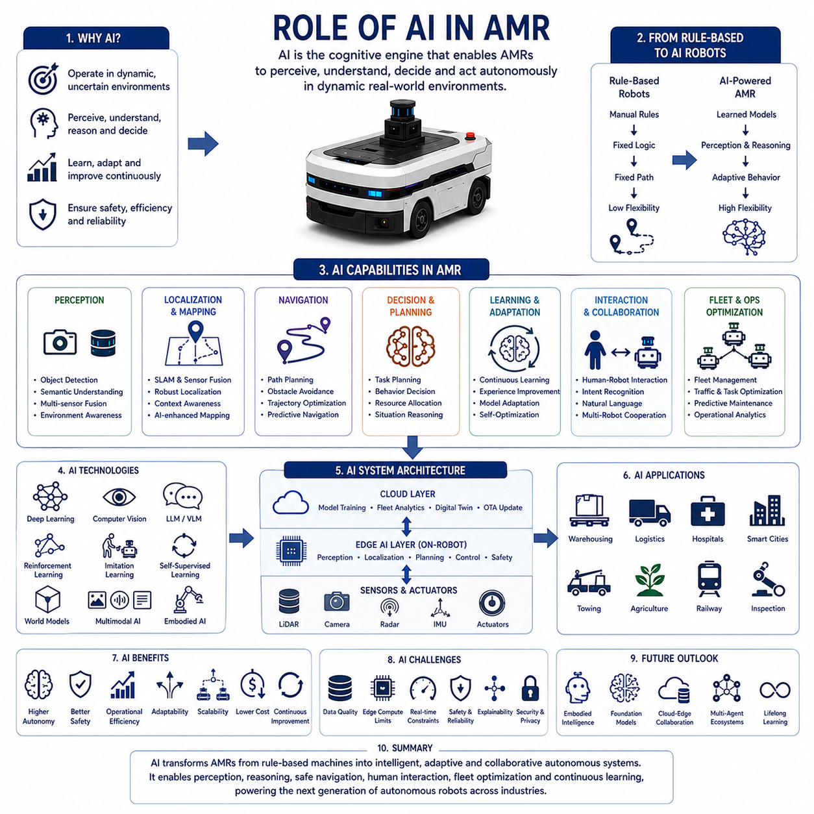
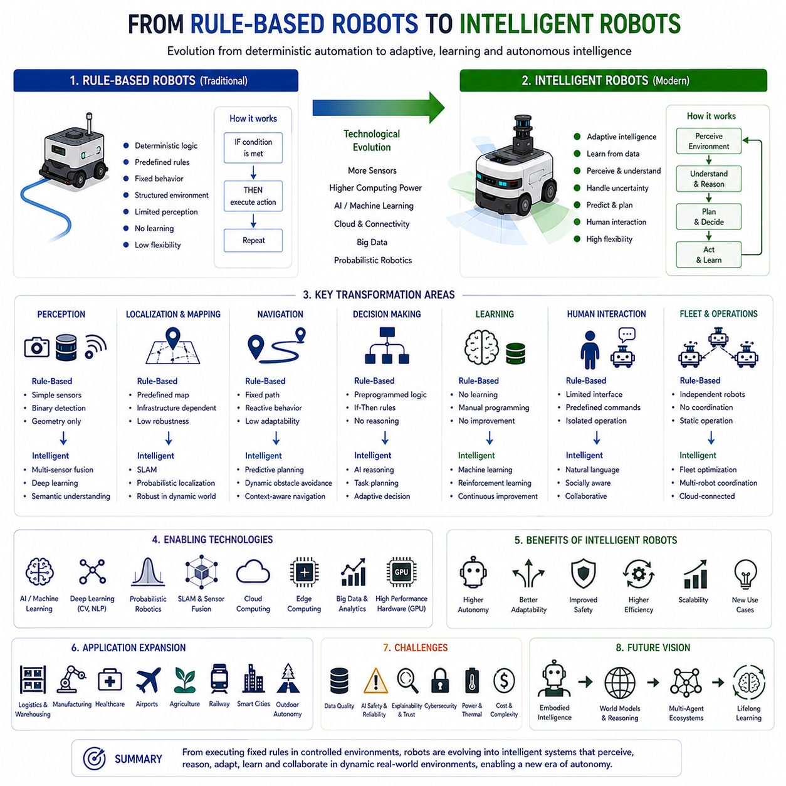
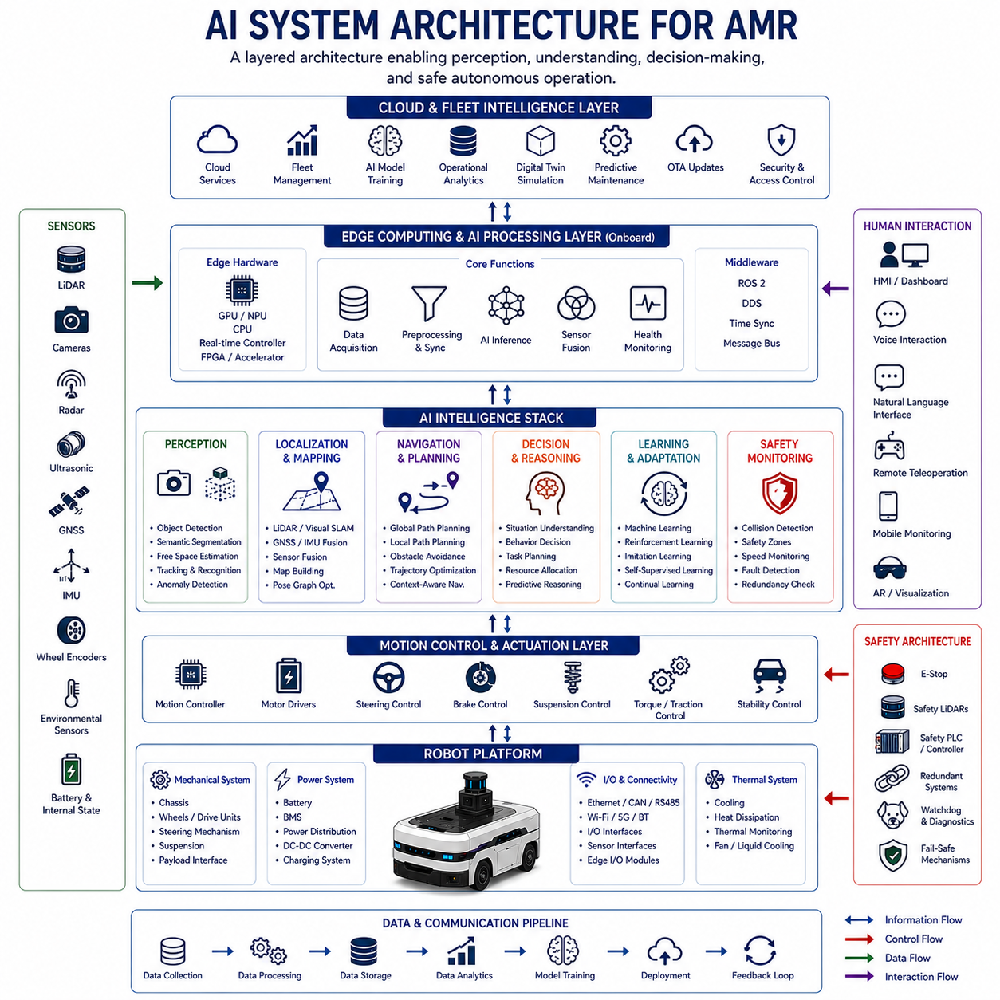
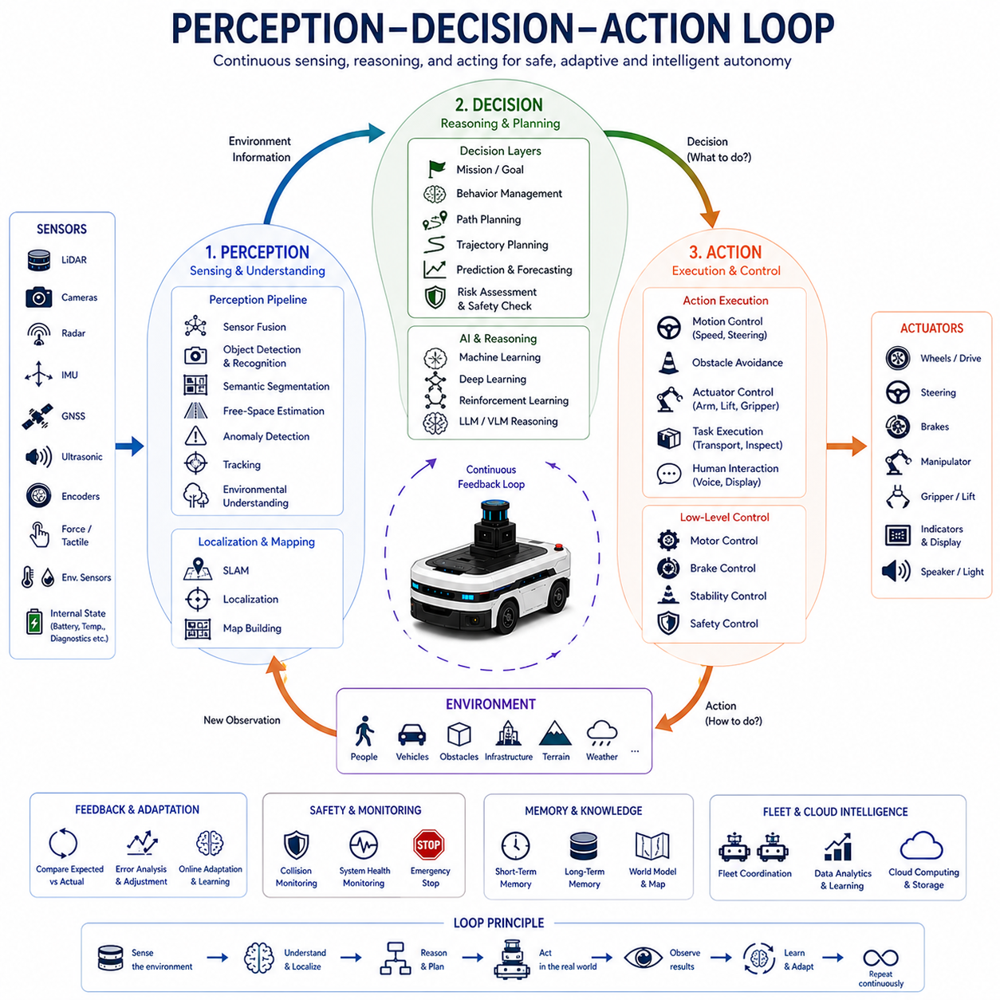
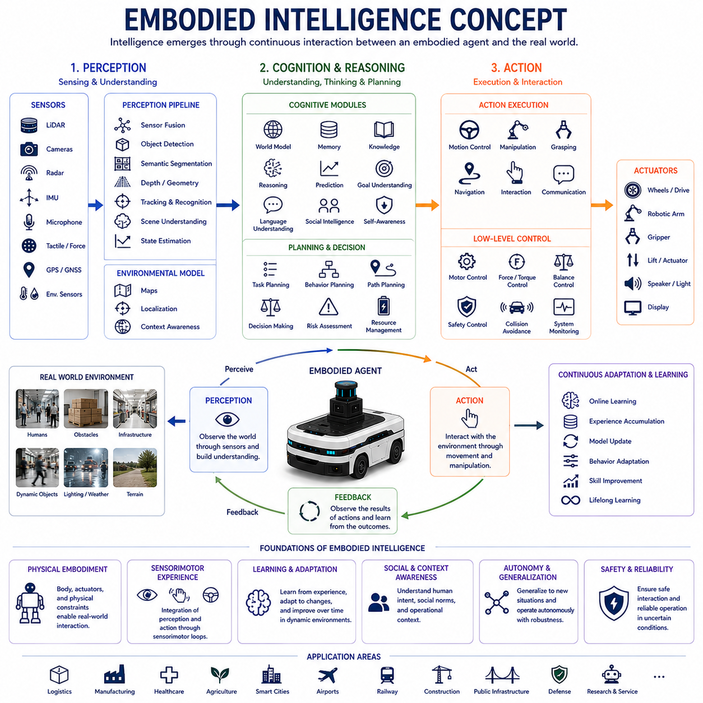
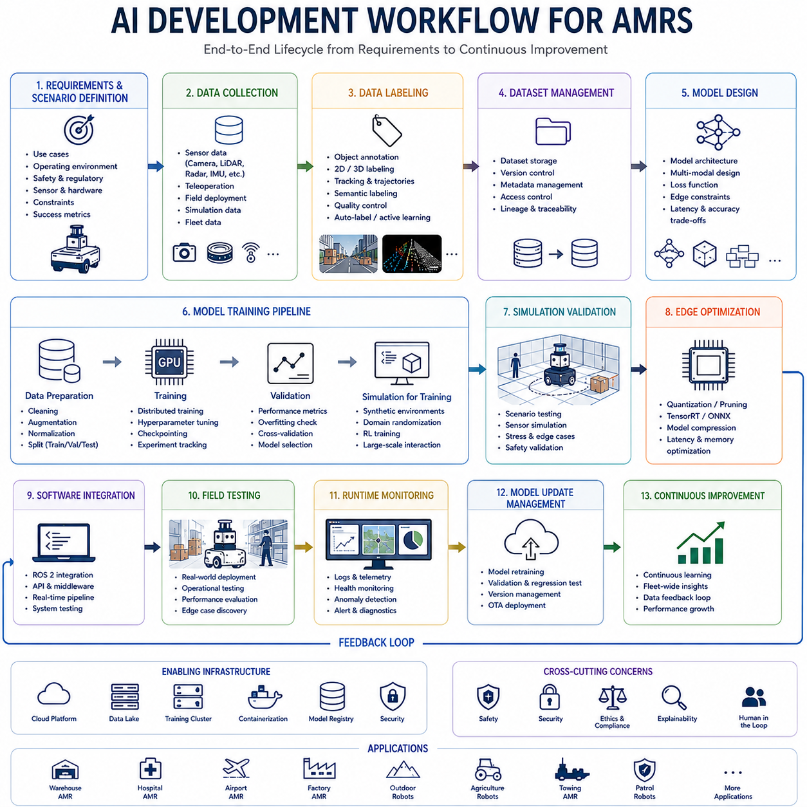
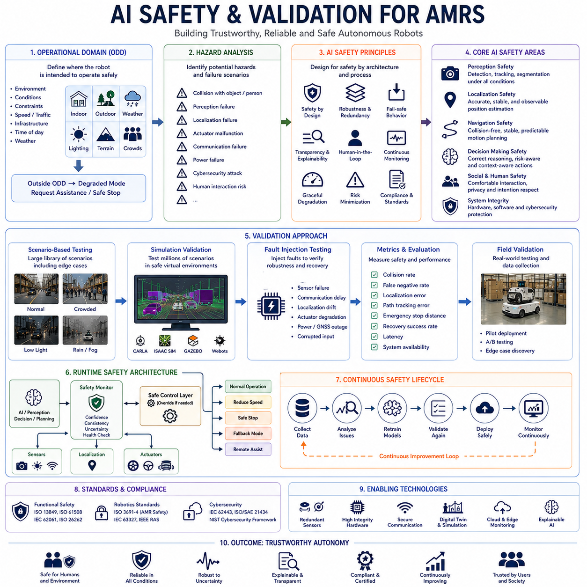
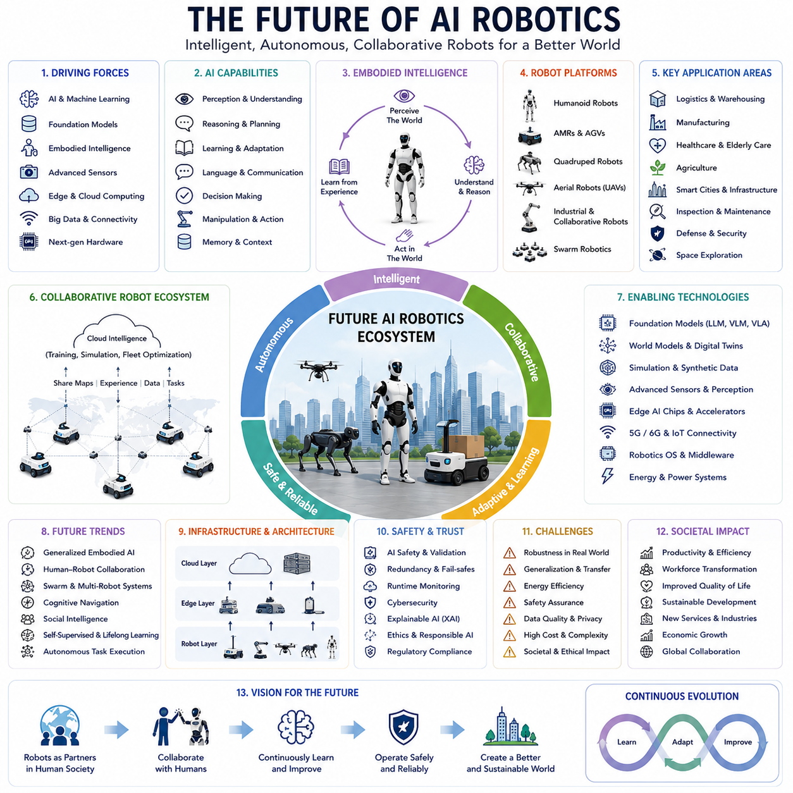

**Volume 06. AMR AI and Embodied Intelligence**

# Chapter 00. Introduction

## 00.1 Role of AI in AMR

{width="7.268055555555556in" height="7.268055555555556in"}

인공지능(AI)은 자율주행 모바일 로봇(AMR)의 발전 과정에서 가장 혁신적인 기술 중 하나가 되었다. 기존의 자동화 기계는 주로 사전에 정의된 로직, 결정론적 제어 시스템, 고정 경로, 반복적인 작업 순서에 기반하여 동작했다. 반면 현대의 AMR은 동적이고 불확실하며 지속적으로 변화하는 환경 속에서 자율적으로 주변을 인식하고, 상황을 이해하며, 의사결정을 수행하고, 사람과 상호작용하며, 운영을 최적화하고, 예상치 못한 상황에 실시간으로 적응해야 한다. AI는 이러한 고도화된 자율 기능을 가능하게 하는 핵심 지능 계층이다.

AMR 시스템에서 AI의 역할은 단순한 Object Detection이나 Route Planning을 넘어선다. AI는 현대 로봇 시스템의 "인지 계층(Cognitive Layer)"으로서, Perception, Reasoning, Decision-Making, Prediction, Learning, Optimization, Interaction, Operational Adaptation 등을 통합하는 역할을 수행한다. AI 없이는 실외 자율주행 로봇, 병원 서비스 로봇, 스마트시티 로봇, Towing AMR, 대규모 물류 Fleet System, 농업용 로봇, 철도 점검 로봇, 지능형 산업 물류 플랫폼과 같은 고급 자율 시스템은 사실상 구현이 어렵다.

초기의 모바일 로봇과 AGV는 대부분 Rule-Based Control System에 의존했다. 이러한 로봇은 Magnetic Tape, 고정 마커, 사전 정의된 경로, 단순 장애물 감지 시스템 등을 사용하여 구조화된 환경에서 동작했다. 이러한 시스템은 반복적인 산업 자동화에는 효과적이었지만, 유연성과 환경 적응 능력이 부족했다. 작은 환경 변화만 발생해도 Navigation Failure나 Operation Interruption이 쉽게 발생했다.

AI의 등장은 로봇 시스템의 구조 자체를 근본적으로 변화시켰다. AI 기반 로봇은 단순히 사람이 정의한 규칙만 수행하는 것이 아니라, 데이터로부터 학습하고, 복잡한 환경 패턴을 인식하며, 미래 상황을 예측하고, 객체를 분류하며, Semantic Meaning을 이해하고, 운영 경험을 통해 지속적으로 성능을 향상시킬 수 있게 되었다. AI는 로봇을 단순 결정론적 기계에서 적응형 자율 시스템으로 변화시켰다.

AMR에서 AI의 가장 중요한 역할 중 하나는 Perception이다. 자율주행 로봇은 LiDAR, RGB Camera, Depth Camera, Thermal Camera, Radar, Ultrasonic Sensor, GNSS, IMU, Wheel Encoder 등을 통해 주변 환경 정보를 지속적으로 수집한다. 하지만 Raw Sensor Data만으로는 자율주행이 불가능하다. 환경을 해석하고 이해하기 위해 AI 알고리즘이 필요하다.

Computer Vision과 Deep Learning Model은 보행자, 차량, 장애물, 선반, 팔레트, 문, 기계 장비, 교통 표지판, 도로 경계, 지형 유형, 위험 요소 등을 인식할 수 있게 한다. Semantic Segmentation Model은 주행 가능한 Free Space와 위험 지역을 구분할 수 있게 해준다. Object Tracking System은 이동 장애물의 움직임을 추적하고 미래 위치를 예측할 수 있게 한다. 즉 AI 기반 Perception은 자율주행과 안전 운행의 핵심인 "환경 이해 능력"을 제공한다.

AI는 Localization 및 Mapping System에서도 중요한 역할을 한다. 기존 SLAM 알고리즘이 기하학적 및 확률론적 방법에 기반했다면, 현대 AI 기반 Localization은 Learned Feature Representation, Semantic Understanding, Sensor Fusion Optimization, Environmental Context Awareness 등을 결합한다. AI는 Dynamic Environment, Low-Texture Area, Poor Lighting, Adverse Weather, Partial Sensor Degradation과 같은 어려운 환경에서도 Localization Robustness를 향상시킨다.

Navigation 역시 AI가 AMR의 성능을 크게 향상시키는 핵심 분야이다. 전통적인 Navigation System은 정적 맵 기반의 결정론적 Path Planning에 의존했다. 하지만 현실 세계는 매우 동적이고 예측 불가능하다. AI 기반 Navigation은 장애물의 움직임을 예측하고, 실시간 Trajectory를 최적화하며, Traffic Flow를 이해하고, 효율적인 Routing Behavior를 학습하며, Operational Context에 따라 주행 전략을 조정할 수 있다.

예를 들어 물류창고 AMR은 Congestion Pattern, Task Priority, Battery State, Fleet Coordination 상태에 따라 Route를 동적으로 최적화할 수 있다. 실외 자율주행 로봇은 Terrain Condition, Weather Change, Pedestrian Density, Traffic Interaction에 따라 Driving Behavior를 조정할 수 있다. AI는 Navigation을 단순 Reactive Behavior에서 Predictive & Context-Aware Behavior로 발전시켰다.

Task Planning 및 Operational Decision-Making 역시 AI 중심으로 변화하고 있다. 현대 AMR은 더 이상 고정된 Mission Script만 수행하지 않는다. 고수준 목표를 입력받으면 AI 시스템이 필요한 작업 순서를 스스로 계획하고 자원을 할당하며 작업 우선순위를 조정할 수 있다.

Large Language Model(LLM), Vision-Language Model(VLM), Embodied AI는 이러한 로봇의 인지 능력을 더욱 확장시키고 있다. 이러한 기술은 로봇이 자연어 명령을 이해하고, 멀티모달 정보를 해석하며, 환경 Context를 기반으로 Reasoning을 수행하고, 적응형 Action Plan을 생성할 수 있게 한다. 미래에는 인간이 기존 산업 제어 시스템 대신 대화형 인터페이스를 통해 로봇과 상호작용하게 될 가능성이 높다.

AI는 Human-Robot Interaction(HRI)에서도 핵심 역할을 수행한다. 병원, 공항, 창고, 캠퍼스, 공장, 공공 인프라 환경에서 로봇은 사람과 안전하고 자연스럽게 공존해야 한다. AI는 사람의 존재를 인식하고, 인간의 의도를 추정하며, Gesture를 이해하고, 음성 명령을 해석하며, 사회적으로 적절한 Navigation Behavior를 유지할 수 있도록 해준다.

특히 Socially Aware Navigation은 서비스 로봇에서 매우 중요한 기능이다. 로봇은 단순히 충돌을 회피하는 수준을 넘어서 사람의 Comfort Zone, Walking Direction, Group Behavior, Queue Structure 등을 이해해야 한다. AI는 로봇이 더 안전하고 예측 가능하며 인간 친화적인 방식으로 동작하도록 만든다.

AI는 Fleet Management 및 Operational Optimization에서도 매우 중요한 역할을 한다. 현대 산업 환경에서는 수백\~수천 대의 AMR이 동시에 운영된다. AI 시스템은 Operational Telemetry, Traffic Pattern, Battery Usage, Congestion Condition, Maintenance Schedule 등을 분석하여 Fleet-Level Efficiency를 최적화한다.

Fleet AI는 작업 할당, Load Balancing, Charging Schedule Optimization, Traffic Bottleneck Reduction, Operational Delay Prediction 등을 수행할 수 있다. Multi-Agent AI Coordination은 여러 로봇이 협력적으로 동작할 수 있게 하여 개별 로봇이 아닌 "지능형 로봇 생태계"를 형성하게 만든다.

Predictive Maintenance 역시 AI의 중요한 응용 분야이다. 자율주행 로봇은 Vibration Data, Thermal Data, Motor Current, Communication Statistic, Localization Confidence, Actuator Performance 등을 지속적으로 생성한다. AI 모델은 이러한 데이터를 분석하여 치명적인 고장이 발생하기 전에 이상 징후를 감지할 수 있다.

예를 들어 이상 진동 패턴을 통해 Bearing Wear를 예측하거나, 비정상적인 Thermal Behavior를 통해 Cooling System Degradation을 감지할 수 있다. AI 기반 Maintenance System은 운영 중단 시간을 줄이고 유지보수 비용을 감소시키며 Fleet Reliability를 향상시킨다.

AI는 Safety System도 변화시키고 있다. 기존 Safety System은 대부분 Deterministic Logic과 고정된 Safety Rule에 기반했다. 그러나 AI는 고급 Situational Awareness와 Hazard Prediction을 가능하게 한다.

AI 기반 Safety System은 위험한 인간 행동을 감지하고, Collision Risk를 예측하며, 환경 위험 요소를 분류하고, Perception Uncertainty를 모니터링하며, 위험 상황이 발생하기 전에 예방적 Safety Action을 수행할 수 있다. Runtime AI Monitoring System은 지속적으로 Model Confidence와 Sensor Consistency를 평가하여 안전한 Autonomous Behavior를 유지한다.

Edge AI는 현대 AMR 아키텍처에서 매우 중요한 개념이다. 많은 Autonomous Function은 Low-Latency와 High Reliability를 요구한다. 모든 Sensor Data를 Cloud로 전송하여 처리하는 것은 대역폭, Latency, Privacy, Safety 문제로 인해 비현실적일 수 있다.

따라서 Edge AI System은 NVIDIA Jetson Orin, Jetson Thor, Industrial Edge Computer, NPU 등의 Embedded AI Platform을 사용하여 로컬에서 AI Inference를 수행한다. 실시간 Perception, Localization, Obstacle Avoidance, Motion Control이 모두 Onboard에서 실행된다.

Cloud AI와 Edge AI의 균형 역시 중요하다. Cloud는 대규모 AI Training, Fleet Analytics, Operational Optimization, Remote Monitoring, Model Update를 담당하고, Edge는 실시간 Autonomous Operation과 Safety-Critical Processing을 담당한다. 미래 로봇 시스템은 Cloud-Edge Hybrid Intelligence Architecture 형태로 발전할 가능성이 높다.

AI는 로봇이 운영 경험으로부터 지속적으로 학습하고 개선될 수 있도록 한다. 기존 산업 자동화 시스템은 배포 이후 거의 정적으로 유지되었지만, AI 기반 AMR은 Navigation Behavior, Perception Accuracy, Operational Efficiency, Decision-Making Quality를 지속적으로 개선할 수 있다.

Self-Supervised Learning, Reinforcement Learning, Imitation Learning, Fleet-Based Distributed Learning은 점점 중요해지고 있는 분야이다. 미래에는 수많은 로봇이 운영 경험을 공유하며 집단적으로 학습할 가능성이 있다.

Embodied AI는 미래 AMR 발전의 가장 중요한 방향 중 하나이다. Embodied AI는 물리적 세계와의 상호작용을 기반으로 하는 지능을 의미한다. 디지털 AI와 달리 Embodied Robot은 Sensing, Movement, Manipulation, Communication, Feedback Loop를 통해 실제 환경과 지속적으로 상호작용한다.

Embodied Intelligence는 Perception, Action, Memory, Reasoning, Planning, Environmental Understanding을 통합한다. 미래의 Embodied AMR은 복잡한 명령을 이해하고, 다단계 추론을 수행하며, 낯선 환경에 적응하고, 인간과 자연스럽게 협업하며, 새로운 기술을 스스로 학습할 수 있게 될 것이다.

World Model 역시 중요한 미래 AI 기술이다. World Model은 로봇이 내부적으로 환경 변화를 시뮬레이션하고 미래 상황을 예측하며 Action Outcome을 평가할 수 있도록 해준다. 이는 Navigation Safety와 Operational Robustness를 크게 향상시킨다.

AI 기반 시뮬레이션 및 Digital Twin System 역시 AMR 개발에서 핵심 역할을 하고 있다. 고정밀 시뮬레이션 환경은 실제 배포 이전에 AI Behavior를 학습하고 검증할 수 있게 해준다. Sim-to-Real Transfer 기술은 가상 환경과 실제 환경의 차이를 줄이기 위해 사용된다.

그러나 AI 통합은 여러 엔지니어링 과제도 함께 가져온다. AI 시스템은 대규모 데이터셋, 고성능 컴퓨팅 하드웨어, Continuous Model Validation, Cybersecurity Architecture, Extensive Safety Verification 등을 필요로 한다. 또한 Machine Learning Model은 Rare Edge Case나 Unseen Environment에서 예측 불가능한 동작을 할 수 있다.

AI Explainability와 Transparency 역시 점점 중요해지고 있다. 특히 Safety-Critical Robot에서는 AI가 왜 특정 결정을 내렸는지를 이해할 수 있어야 한다. AI Safety 및 Autonomous Operation 관련 규제 역시 빠르게 발전하고 있다.

전력 소비와 Thermal Management 역시 AI 기반 로봇의 중요한 과제이다. 고성능 AI Inference는 강력한 GPU와 AI Accelerator를 요구하며 이는 높은 전력 소비와 발열을 발생시킨다. 따라서 Model Compression, Quantization, Efficient Edge Inference가 중요하다.

향후 10년 동안 AI의 역할은 더욱 확대될 가능성이 높다. 미래의 자율주행 로봇은 Multimodal Foundation Model, Vision-Language-Action Architecture, Embodied Reasoning System, Adaptive World Model, Cloud-Edge Collaborative Intelligence, Large-Scale Multi-Agent Coordination 등을 통합하게 될 것이다.

미래의 로봇은 더 높은 수준의 Contextual Understanding, Long-Term Memory, Human Collaboration Capability, Environmental Reasoning, Autonomous Learning을 가지게 될 가능성이 높다. 스마트시티, 병원, 공장, 공항, 항만, 물류창고, 철도, 공공 인프라는 점점 더 AI 기반 로봇 생태계에 의존하게 될 것이다.

AI는 AMR, Humanoid Robot, Industrial Automation, Cloud Infrastructure, Digital Twin Ecosystem 간의 융합도 가속화할 것이다. 물리적 로봇과 지능형 소프트웨어의 경계는 점점 사라질 가능성이 높다.

궁극적으로 AI의 역할은 단순히 자동화를 향상시키는 것에 그치지 않는다. AI는 로봇을 Perception, Reasoning, Adaptation, Prediction, Collaboration, Continuous Learning이 가능한 지능형 자율 시스템으로 변화시킨다. AI는 현실 세계의 복잡성 속에서 자율주행 로봇이 안전하고 효과적으로 동작할 수 있도록 만드는 "인지 엔진(Cognitive Engine)"이다. 앞으로 AI 기술이 발전할수록 물류, 의료, 운송, 농업, 산업 자동화, 스마트시티, 공공 인프라, 국방 등 거의 모든 산업 분야에서 차세대 자율주행 로봇의 핵심 동력이 될 것이다.

## 00.2 From Rule-Based Robots to Intelligent Robots

{width="7.268055555555556in" height="7.268055555555556in"}

룰 기반 로봇(Rule-Based Robots)에서 지능형 로봇(Intelligent Robots)으로의 진화는 로봇공학과 자동화 역사에서 가장 중요한 기술적 전환 중 하나이다. 초기 로봇 시스템은 주로 결정론적 로직(Deterministic Logic), 고정된 동작 규칙, 사전 정의된 Motion Sequence를 기반으로 반복 작업을 수행하도록 설계되었다. 이러한 시스템은 환경이 안정적이고 예측 가능한 산업 자동화 분야에서는 매우 효과적이었다. 그러나 로봇이 물류, 자율 운송, 의료, 스마트시티, 농업, 공항, 철도, 실외 인프라, 공공 서비스와 같은 동적이고 복잡한 현실 세계로 확장되면서 기존 룰 기반 구조는 점점 한계를 드러내기 시작했다. AI, 머신 러닝, 고급 Perception System, Cloud Computing, Embodied Cognition 기반의 지능형 로봇은 이러한 한계를 근본적으로 변화시켰다.

룰 기반 로봇은 명시적으로 프로그래밍 된 로직에 기반한다. 엔지니어는 작업 조건, 제어 규칙, 작업 순서, 예외 처리 절차 등을 직접 정의하였다. 로봇의 행동은 "if-then" 형태의 결정론적 알고리즘에 의해 제어되었다. 이러한 시스템은 환경이 구조화되어 있고 변화가 거의 없는 상황에서는 매우 안정적으로 동작했다.

전통적인 산업용 로봇 팔은 룰 기반 자동화의 대표적인 사례이다. 이러한 로봇은 고정된 제조 셀 내부에서 사전에 정의된 경로를 반복적으로 수행한다. 작업 환경은 불확실성을 최소화하도록 설계되어 있으며, 객체 위치와 이동 경로 역시 모두 고정되어 있다. 이러한 환경에서는 결정론적 룰 기반 제어가 높은 반복 정밀도와 안정성을 제공하였다.

초기 AGV(Automated Guided Vehicle) 역시 룰 기반 구조에 크게 의존하였다. AGV는 Magnetic Tape, QR Code, Inductive Wire, Reflective Marker, 사전 정의된 디지털 맵 등을 따라 움직였다. Navigation Decision은 단순한 논리 규칙과 정적인 환경 가정에 기반하였다. Obstacle Avoidance 능력은 제한적이었으며 Operational Flexibility도 낮았다.

룰 기반 로봇의 가장 큰 장점은 Predictability였다. 모든 동작이 명시적으로 프로그래밍 되었기 때문에 시스템의 동작은 매우 결정론 적이며 설명 가능했다. 산업 엔지니어는 시스템 로직을 쉽게 검증하고, Failure Condition을 분석하며, 안정적인 환경에서 Safety Validation을 수행할 수 있었다. 또한 룰 기반 시스템은 상대적으로 적은 계산 자원을 필요로 했다.

그러나 룰 기반 구조는 Dynamic Environment, Unstructured Environment, Uncertain Environment에서 심각한 한계를 가졌다. 이러한 로봇은 Context Understanding, Adaptive Reasoning, Environmental Awareness, Learning Capability가 부족했다. 프로그래밍 시점에 예상하지 못한 상황이 발생하면 로봇은 적절히 대응할 수 없었다.

예를 들어 룰 기반 물류 로봇은 예상하지 못한 위치에 장애물이 나타나면 Navigation Failure를 일으킬 수 있었다. 고정 규칙에만 의존하는 시스템은 이동하는 보행자, 임시 공사 구역, 조명 변화, 환경 구조 변화 등에 쉽게 혼란을 겪었다. 로봇이 더욱 복잡한 현실 환경으로 확장되면서 이러한 적응성 부족은 매우 큰 문제로 부각되었다.

지능형 로봇으로의 전환은 Sensor Technology, Computing Power, Probabilistic Robotics, Artificial Intelligence의 발전과 함께 시작되었다. 로봇은 더 이상 고정 규칙에만 의존하지 않고 Data-Driven Decision-Making, Probabilistic Reasoning, Adaptive Planning, Sensor Fusion, Machine Learning Capability를 포함하기 시작했다.

가장 중요한 발전 중 하나는 Probabilistic Robotics의 등장이다. 기존의 결정론적 Localization 방법은 Sensor Noise, Wheel Slip, Dynamic Environment, Incomplete Information 환경에서 안정적으로 동작하기 어려웠다. Kalman Filter, Particle Filter, Bayesian Inference, Probabilistic SLAM과 같은 기술은 불확실성을 추정하고 불완전한 환경에서도 안정적으로 동작할 수 있게 만들었다.

SLAM(Simultaneous Localization and Mapping)의 발전 역시 중요한 전환점이었다. 로봇은 더 이상 사전 정의된 맵이나 물리적 가이드 인프라에만 의존하지 않고 스스로 환경 지도를 생성하면서 동시에 자신의 위치를 추정할 수 있게 되었다. 이는 Operational Flexibility를 크게 향상시켰다.

Perception System의 발전 역시 지능형 로봇으로의 진화를 가속화하였다. 초기 로봇은 단순한 Proximity Sensor나 Binary Obstacle Detection에 의존했지만, 현대 지능형 로봇은 LiDAR, RGB Camera, Depth Camera, Thermal Camera, Radar, Ultrasonic Sensor, GNSS, IMU, Multi-Sensor Fusion을 통합하여 복잡한 환경을 지속적으로 인식한다.

그러나 단순한 Sensing만으로는 충분하지 않았다. AI와 Machine Learning은 로봇이 Raw Sensor Data를 해석하고 Semantic Meaning을 추출할 수 있도록 만들었다. Deep Learning 기반 AI는 보행자, 차량, 팔레트, 문, 선반, 도로 경계, 교통 표지판, 산업 장비, 위험 요소 등을 인식할 수 있게 되었다.

Semantic Understanding은 지능형 로봇의 핵심 특징 중 하나가 되었다. 룰 기반 로봇이 Geometry와 Coordinate만 이해했다면, 지능형 로봇은 Context, Object Category, Environmental Semantics, Operational Intent, Dynamic Interaction까지 이해할 수 있게 되었다. 이러한 변화는 인간 중심 환경에서 더욱 자연스럽고 효과적인 운영을 가능하게 만들었다.

Machine Learning은 로봇 개발 방식을 근본적으로 변화시켰다. 기존 룰 기반 시스템은 엔지니어가 모든 동작을 직접 프로그래밍해야 했다. 반면 지능형 로봇은 데이터로부터 패턴을 학습한다. Neural Network, Reinforcement Learning, Imitation Learning, Self-Supervised Learning은 Perception Accuracy, Navigation Efficiency, Manipulation Capability, Decision-Making Quality를 지속적으로 향상시킨다.

Reinforcement Learning은 경험 기반 최적화라는 개념을 도입하였다. 로봇은 더 이상 사전 정의된 규칙만 수행하는 것이 아니라, 환경과의 Trial-and-Error Interaction을 통해 최적의 행동 전략을 학습할 수 있게 되었다. 이는 Navigation Optimization, Manipulation, Multi-Agent Coordination, Adaptive Planning에서 매우 중요한 역할을 한다.

Deep Learning의 발전은 Computer Vision을 획기적으로 향상시켰다. CNN, Transformer Architecture, Semantic Segmentation Model, Object Detection System, Multimodal AI Framework은 로봇이 복잡한 시각 정보를 인간 수준에 가깝게 이해할 수 있도록 만들었다.

Natural Language Processing과 Conversational AI는 로봇의 지능을 더욱 확장시켰다. 룰 기반 로봇은 제한적인 명령 인터페이스에 의존했지만, 현대 지능형 로봇은 자연어를 이해하고 인간과 대화형 인터페이스로 상호작용할 수 있다. LLM(Large Language Model)과 VLM(Vision-Language Model)은 로봇이 복잡한 지시와 Context를 이해할 수 있도록 한다.

Human-Robot Interaction(HRI) 역시 크게 발전하였다. 룰 기반 로봇은 일반적으로 인간과 분리된 산업 구역에서 동작했다. 반면 현대 지능형 로봇은 병원, 공항, 물류창고, 캠퍼스, 공장, 공공 인프라에서 인간과 함께 동작한다.

이를 위해 로봇은 Socially Aware Behavior를 가져야 한다. 지능형 로봇은 Pedestrian Trajectory를 예측하고, Human Intent를 이해하며, Social Distance를 유지하고, Gesture를 해석하며, Crowd Environment에서도 안전하게 주행할 수 있어야 한다.

Cloud Computing과 Distributed Intelligence 역시 지능형 로봇 발전에 중요한 역할을 했다. 초기 로봇은 독립적인 단일 장비였지만, 현대 로봇은 Cloud Infrastructure, Fleet Management System, Digital Twin Environment, Large-Scale Operational Database와 연결된다.

Cloud Robotics는 Fleet Optimization, Large-Scale AI Training, Remote Diagnostics, Predictive Maintenance, Software Update Management, Collective Operational Learning을 가능하게 만들었다. 로봇은 더 이상 개별적으로 학습하지 않고 전체 Fleet 경험을 공유할 수 있게 되었다.

Edge Computing 역시 매우 중요해졌다. 많은 Autonomous Function은 Real-Time Low-Latency Processing을 요구하기 때문이다. 따라서 현대 로봇은 Real-Time Edge AI와 Cloud-Based Intelligence를 결합한 Hybrid Architecture를 사용한다.

Embodied AI는 룰 기반 시스템에서 지능형 로봇으로의 진화에서 가장 최신 단계 중 하나이다. Embodied Intelligence는 Perception, Reasoning, Memory, Planning, Physical Interaction, Environmental Adaptation을 통합한다. 로봇은 실제 세계와의 물리적 상호작용을 통해 지속적으로 학습하게 된다.

World Model 역시 중요한 기술이다. World Model은 로봇이 미래 환경 상태를 내부적으로 시뮬레이션하고 Action Outcome을 예측할 수 있게 한다. 이는 Navigation Safety와 Operational Robustness를 크게 향상시킨다.

그러나 지능형 로봇은 새로운 엔지니어링 과제도 가져왔다. AI 기반 시스템은 대규모 데이터셋, 고성능 GPU, 복잡한 소프트웨어 프레임워크, Continuous Validation, Extensive Monitoring을 요구한다.

Reliability 및 Safety Validation 역시 더욱 어려워졌다. 룰 기반 시스템은 결정론적이고 설명 가능하지만, Machine Learning 기반 시스템은 Rare Edge Case에서 예측 불가능한 동작을 할 수 있기 때문이다.

따라서 AI Explainability가 중요한 연구 분야가 되었다. 특히 Safety-Critical Robot에서는 로봇이 왜 특정 결정을 내렸는지를 이해할 수 있어야 한다.

Cybersecurity 역시 매우 중요해졌다. 현대 로봇은 Cloud, Remote Operator, Fleet Coordination Platform과 지속적으로 연결되기 때문이다. Communication Security와 Software Authenticity 보호가 핵심 과제가 되었다.

Power Consumption과 Thermal Management 역시 중요한 설계 과제이다. AI System은 고성능 GPU와 AI Accelerator를 필요로 하며 이는 높은 전력 소비와 발열을 발생시킨다. 따라서 Efficient AI Optimization과 Low-Power Inference가 중요하다.

룰 기반 로봇에서 지능형 로봇으로의 전환은 산업 구조와 노동 구조 역시 변화시키고 있다. 기존 자동화로는 어려웠던 복잡하고 동적인 작업까지 자동화가 가능해지고 있기 때문이다.

동시에 Robotics Engineering 자체도 더욱 융합적인 분야로 변화하고 있다. Robotics는 AI, Software Engineering, Cloud Infrastructure, Cybersecurity, Data Science, Embedded System, Human-Machine Interaction, Systems Integration을 모두 포함하는 복합 학문으로 발전하고 있다.

미래의 지능형 로봇은 Multimodal Foundation Model, Embodied Cognition, Adaptive Learning, Collaborative Multi-Agent Intelligence, Cloud-Edge Hybrid Reasoning, Long-Term Memory 등을 통합할 가능성이 높다.

Humanoid Robot, Autonomous Logistics System, Healthcare Robot, Agricultural Automation Platform, Infrastructure Inspection System, Autonomous Construction Equipment, Smart City Robotics Ecosystem은 이러한 지능형 로봇 기술의 핵심 응용 분야가 될 것이다.

미래에는 로봇과 지능형 소프트웨어 시스템의 경계가 점점 사라질 가능성이 높다. 로봇은 Cloud Infrastructure와 연결된 Distributed Intelligent Agent로 동작하게 될 수 있다. Fleet Intelligence는 전체 로봇 집단이 Collective Learning을 수행하도록 만들 수 있다.

궁극적으로 룰 기반 로봇에서 지능형 로봇으로의 진화는 "Automation에서 Autonomy로의 전환"이라고 할 수 있다. 룰 기반 로봇이 통제된 환경에서 사전 정의된 명령을 수행했다면, 지능형 로봇은 현실 세계의 복잡성 속에서 Perceive, Reason, Adapt, Predict, Collaborate, Learn을 지속적으로 수행한다. 이러한 변화는 제조, 물류, 의료, 운송, 농업, 공공 인프라, 스마트시티, 산업 자동화 등 거의 모든 산업의 미래를 재구성하고 있다.

## 00.3 AI System Architecture for AMR

{width="7.268055555555556in" height="7.268055555555556in"}

자율주행 모바일 로봇(AMR)을 위한 AI 시스템 아키텍처(AI System Architecture)는 현대 로봇이 환경을 인식하고, 센서 데이터를 해석하며, 자신의 위치를 추정하고, 행동을 계획하며, 자율적으로 의사결정을 수행하고, 인간과 상호작용하며, 운영을 최적화하고, 동적인 현실 세계 환경에 지속적으로 적응할 수 있도록 만드는 핵심 기반 구조이다. AMR이 단순 산업 자동화 장비에서 물류, 제조, 의료, 농업, 스마트시티, 공항, 철도, 항만, 광산, 공공 인프라, 실외 모빌리티 등 다양한 분야에서 동작하는 고도화된 자율 시스템으로 발전함에 따라 AI 시스템 아키텍처의 복잡도 역시 빠르게 증가하고 있다.

기존 로봇 시스템은 결정론적 제어 구조와 비교적 독립적인 서브시스템에 크게 의존하였다. 그러나 현대의 AI 기반 AMR은 Perception, Localization, Navigation, Planning, Reasoning, Learning, Communication, Cloud Intelligence, Fleet Management, Safety Monitoring, Operational Optimization 등을 통합한 다계층 분산 아키텍처를 사용한다. 이러한 아키텍처는 실시간 자율 동작을 지원하면서 동시에 Safety, Scalability, Reliability, Computational Efficiency, Adaptability를 보장해야 한다.

AMR의 AI 시스템 아키텍처는 크게 보면 Sensing Layer, Edge Computing Layer, AI Perception System, Localization & Mapping Module, Planning System, Motion Control Framework, Fleet Coordination System, Cloud Infrastructure, Operational Analytics Platform, Human Interaction Interface 등으로 구성된 계층형 지능 구조(Hierarchical Intelligence Stack)로 볼 수 있다. 각각의 계층은 특정 기능을 수행하면서 실시간 통신 파이프라인을 통해 서로 정보를 교환한다.

AI 아키텍처의 가장 기초는 Sensor System이다. 자율주행 로봇은 LiDAR, RGB Camera, Depth Camera, Thermal Camera, Radar, Ultrasonic Sensor, GNSS Receiver, IMU, Wheel Encoder, Force Sensor, Battery Monitor, Environmental Sensor 등을 통해 환경 및 내부 상태 정보를 지속적으로 수집한다.

각 센서는 서로 다른 장점과 한계를 가진다. Camera는 풍부한 Semantic Information을 제공하지만 조명 변화에 취약할 수 있다. LiDAR는 정밀한 Geometry Mapping과 Obstacle Detection에 강점이 있지만 반사체나 흡수체 환경에서는 어려움을 겪을 수 있다. Radar는 악천후 환경에서도 안정적으로 동작하지만 공간 해상도가 낮다. IMU와 Wheel Encoder는 Motion Estimation을 지원하지만 시간이 지나면 Drift가 누적된다.

따라서 Sensor Fusion은 AMR AI 아키텍처에서 가장 중요한 요소 중 하나가 된다. 현대 로봇은 여러 센서 데이터를 결합하여 Robust Environmental Understanding, Accurate Localization, Redundancy, Fault Tolerance, Operational Reliability를 확보한다. Multi-Sensor Fusion Algorithm은 각 센서의 약점을 보완하면서 상호 보완적인 정보를 통합한다.

다음 핵심 계층은 Edge Computing이다. 현대 AMR은 Sensor Data Processing, AI Inference, Real-Time Safety Control, Autonomous Decision-Making을 위해 강력한 Onboard Computing Capability를 필요로 한다. 많은 자율 기능은 Low-Latency Processing을 요구하기 때문에 Cloud에만 의존할 수 없다.

Edge Computing System은 일반적으로 Embedded GPU, AI Accelerator, Industrial Edge Computer, High-Performance CPU, Microcontroller, Real-Time Controller, Distributed Embedded Processing Node 등을 포함한다. 대표적인 플랫폼으로는 NVIDIA Jetson Orin, Jetson Thor, RTX GPU 기반 Edge Server, Industrial x86 Computer, FPGA Accelerator, NPU, ARM Embedded System 등이 있다.

Edge AI Layer는 Real-Time Perception, Localization, Navigation, Obstacle Avoidance, Safety Monitoring, Motion Planning, Low-Level Autonomous Control Algorithm을 실행한다. 특히 Real-Time Reliability는 매우 중요하다. 지연이나 오류는 직접적으로 Safety와 Navigation Stability에 영향을 줄 수 있기 때문이다.

Perception Layer에서는 AI 모델이 Raw Sensor Data를 Semantic Environmental Understanding으로 변환한다. Computer Vision System은 Object Detection, Semantic Segmentation, Free-Space Estimation, Pedestrian Recognition, Vehicle Detection, Pallet Recognition, Terrain Classification, Traffic Sign Interpretation, Anomaly Detection 등을 수행한다.

CNN, Transformer Model, Multimodal Fusion Network, Occupancy Network, Vision-Language Model과 같은 Deep Learning Architecture가 현대 로봇 Perception System의 중심이 되고 있다. AI 기반 Perception은 단순 Geometry Detection을 넘어 환경의 "의미"를 이해할 수 있게 만든다.

Semantic Mapping 역시 점점 중요해지고 있다. 기존의 Occupancy Grid 기반 Mapping과 달리 현대 지능형 로봇은 Object Identity, Operational Zone, Infrastructure Information, Traffic Rule, Safety Region, Charging Station, Dynamic Environmental Context를 포함하는 Semantic Map을 생성한다.

Localization 및 Mapping System은 또 다른 핵심 계층이다. 자율주행 로봇은 지속적으로 자신의 위치를 추정하면서 동시에 환경 구조를 이해해야 한다. 현대 AMR은 LiDAR SLAM, Visual SLAM, GNSS Positioning, IMU Fusion, Wheel Odometry, Radar Localization, Probabilistic Sensor Fusion 등을 통합한다.

Kalman Filter, Particle Filter, Bayesian Estimation, Graph Optimization, Factor Graph SLAM과 같은 Probabilistic Robotics 기술은 불확실한 환경에서도 Robust Localization을 유지하는 데 사용된다. AI 기반 Localization은 Learned Feature Representation, Semantic Landmark Recognition, Context-Aware Positioning 등을 점점 더 많이 활용하고 있다.

Navigation 및 Path Planning은 또 다른 핵심 지능 계층이다. Navigation System은 안전하고 효율적이며 상황 인식 기반의 이동 전략을 생성한다. 기존 Navigation은 정적 맵과 결정론적 Planner에 의존했지만, 현대 AI 기반 Navigation은 Predictive Reasoning, Dynamic Obstacle Forecasting, Contextual Planning, Adaptive Behavior Generation을 통합한다.

Navigation System은 일반적으로 Global Planning과 Local Planning으로 나뉜다. Global Planner는 대규모 환경의 경로를 생성하고, Local Planner는 Dynamic Obstacle, Pedestrian Movement, Environmental Change에 따라 실시간으로 Trajectory를 조정한다. AI 기반 Navigation은 Energy Consumption, Traffic Flow, Fleet Coordination까지 최적화할 수 있다.

Motion Control System은 High-Level Navigation Command를 실제 Actuator Control로 변환한다. 여기에는 Motor Control, Steering Controller, Brake Management, Suspension Coordination, Torque Control, Traction Management, Stability Control 등이 포함된다. AI 기반 구조에서도 이 계층은 여전히 Deterministic Real-Time Control이 매우 중요하다.

Safety Architecture는 전체 AI 시스템 전반에 깊게 통합되어 있다. 사람과 함께 동작하는 자율주행 로봇은 Emergency Stop, Safety LiDAR, Safe Speed Monitoring, Collision Avoidance, Watchdog Controller, Redundancy Management, Communication Supervision, Localization Confidence Monitoring, Fault Recovery Mechanism 등을 포함하는 다중 Safety Layer를 필요로 한다.

Functional Safety System은 일반적으로 상위 AI 시스템과 독립적으로 동작하여 AI Module이 실패하더라도 Deterministic Fail-Safe Behavior를 보장한다. 최근에는 Deterministic Safety Logic과 AI 기반 Situational Awareness를 결합한 Hybrid Architecture가 증가하고 있다.

Fleet Management System은 대규모 로봇 운영에서 매우 중요한 구성 요소이다. 현대 창고, 공장, 병원, 공항, 스마트시티 환경에서는 수백\~수천 대의 AMR이 동시에 동작할 수 있다. Fleet AI는 Traffic Coordination, Task Allocation, Charging Schedule, Congestion Management, Workload Balancing 등을 최적화한다.

Multi-Agent Coordination은 점점 더 Distributed AI Architecture를 포함하게 되고 있다. 로봇은 환경 정보와 Operational Experience를 공유하면서 협력적으로 동작할 수 있다. Swarm Intelligence와 Distributed Autonomous Coordination은 활발한 연구 분야가 되고 있다.

Cloud Infrastructure 역시 현대 AMR AI Architecture에서 중요한 역할을 한다. Safety-Critical Operation은 Edge에서 처리되지만, Cloud는 Large-Scale AI Training, Operational Analytics, Fleet Optimization, Predictive Maintenance, Digital Twin Simulation, Remote Diagnostics, Software Deployment, Long-Term Data Storage 등을 담당한다.

Hybrid Cloud-Edge Architecture는 지능형 로봇의 핵심 패러다임으로 자리잡고 있다. Edge는 Low-Latency Autonomy를 제공하고 Cloud는 Large-Scale Intelligence와 Fleet-Wide Optimization을 제공한다.

Data Engineering 역시 AI Architecture의 핵심 요소이다. 자율주행 로봇은 Sensor Data, Operational Telemetry, AI Inference Result, Localization State, Fault Diagnostic, Safety Event, Thermal Data, Battery Statistic, Communication Log 등을 지속적으로 생성한다.

이를 위해 High-Speed Logging, Synchronization, Storage, Compression, Retrieval, Analysis, Labeling, Dataset Generation을 위한 Efficient Data Pipeline이 필요하다. AI 모델의 Reliability는 데이터 품질에 크게 의존하기 때문에 Data Quality Management 역시 중요하다.

Machine Learning Infrastructure도 AMR Architecture에 깊게 통합되어 있다. AI Model Development는 Training Pipeline, Simulation Environment, Distributed Computing Resource, Dataset Management System, Model Validation Framework, Deployment Pipeline, Continuous Learning System 등을 필요로 한다.

Simulation 및 Digital Twin System 역시 점점 더 직접적으로 통합되고 있다. High-Fidelity Simulation은 AI Model Training, Autonomous Behavior Validation, Failure Replay, Navigation Optimization, Rare Edge Case Testing을 가능하게 만든다.

Digital Twin은 Real-Time Telemetry를 사용하여 실제 로봇의 가상 복제본을 유지한다. 이를 통해 Predictive Maintenance, Operational Optimization, Software Validation, Failure Replay, Fleet Analytics 등을 수행할 수 있다.

Human-Machine Interaction(HMI) 역시 중요한 계층이다. 현대 AMR은 Touchscreen Interface, Voice Interaction, Natural Language Communication, Remote Teleoperation, Augmented Reality Interface, Mobile Monitoring System, Conversational AI 등을 지원하기 시작하고 있다.

LLM과 VLM은 로봇 상호작용 능력을 크게 변화시키고 있다. 미래의 AMR은 복잡한 음성 명령을 이해하고, Operational Decision을 설명하며, 상황 기반 질문에 답변하고, 인간과 자연스럽게 협업할 수 있게 될 것이다.

Embodied AI는 미래 로봇 아키텍처의 가장 중요한 방향 중 하나이다. Embodied Intelligence는 Perception, Memory, Reasoning, Planning, Learning, Environmental Understanding, Physical Interaction을 통합한다. 이는 추상적인 AI 추론과 실제 로봇 동작 간의 간극을 줄이려는 시도이다.

World Model 역시 중요성이 증가하고 있다. World Model은 로봇이 환경 변화를 내부적으로 시뮬레이션하고 미래 결과를 예측하며 여러 Action Possibility를 평가할 수 있게 만든다. 이는 Navigation Robustness, Operational Efficiency, Safety를 향상시킨다.

Cybersecurity Architecture 역시 매우 중요해지고 있다. 자율주행 로봇은 Cloud 및 Network와 연결되기 때문에 Secure Communication Protocol, Authentication, Encryption, Intrusion Detection, Secure OTA Update, Access Control 등이 필요하다.

Power Management Architecture 역시 중요한 요소이다. AI 기반 로봇은 GPU, Sensor, Wireless Communication, Cooling System, Edge Computing Infrastructure를 구동하기 위해 상당한 전력을 요구한다. Intelligent Energy Management System은 Power Consumption, Thermal Behavior, Charging Operation, Mission Endurance를 최적화한다.

Thermal Management 역시 매우 중요하다. 고성능 GPU와 AI Accelerator는 상당한 열을 발생시키기 때문에 Heat Sink, Liquid Cooling, Airflow Optimization, Thermal Monitoring, Adaptive Power Control 등이 필요하다.

Scalability는 현대 AMR Architecture의 핵심 요구사항이다. AI Architecture는 Single Robot에서 Large Distributed Fleet까지 확장 가능해야 하며, Operational Stability와 Communication Efficiency를 유지해야 한다.

Modularity 역시 필수적이다. ROS2, Microservice-Based Distributed System, Containerized Deployment Architecture, Hardware Abstraction Layer 등과 같은 Modular Architecture는 Maintainability와 Scalability를 향상시킨다.

OTA(Over-the-Air) Update Architecture도 점점 중요해지고 있다. Commercial Robot은 AI Model, Navigation Software, Operational Logic, Safety Monitoring System을 Remote Update할 수 있어야 한다.

Continuous Learning Architecture는 미래 AI System의 중요한 방향이다. 미래의 로봇은 Fleet 전체의 Operational Experience를 기반으로 지속적으로 AI 모델을 개선할 가능성이 높다.

Federated Learning은 Privacy를 유지하면서 여러 로봇이 공동으로 AI Model을 개선할 수 있게 만든다. 미래에는 Distributed Intelligence Architecture가 글로벌 규모의 Connected Robotic Ecosystem을 형성할 가능성이 있다.

AMR이 더욱 높은 수준의 지능과 자율성을 가지게 되면서 AI System Architecture의 복잡도는 계속 증가할 것이다. 미래 시스템은 Multimodal Foundation Model, Embodied Reasoning System, Long-Term Memory, Adaptive Cognitive Planning, Cloud-Edge Collaborative Intelligence, Swarm Coordination, Fully Autonomous Learning Pipeline 등을 통합할 가능성이 높다.

궁극적으로 AI 시스템 아키텍처는 자율주행 로봇을 단순 자동화 기계에서 Perception, Reasoning, Planning, Learning, Collaboration, Safe Autonomous Operation이 가능한 지능형 시스템으로 변화시키는 핵심 엔지니어링 프레임워크이다. 물류, 의료, 제조, 운송, 농업, 철도, 공항, 스마트시티, 광산, 공공 인프라 등 다양한 산업 분야에서 AMR의 성공은 결국 얼마나 확장 가능하고 안전하며 지능적인 AI 아키텍처를 구축하느냐에 크게 의존하게 될 것이다.

## 00.4 Perception, Decision, and Action Loop

{width="7.268055555555556in" height="7.268055555555556in"}

Perception--Decision--Action Loop는 자율주행 모바일 로봇(AMR), 자율주행 차량, 지능형 서비스 로봇, 산업용 로봇 시스템, Embodied AI 플랫폼에서 가장 핵심적인 아키텍처 개념 중 하나이다. 이 루프는 로봇이 환경을 관찰하고, 정보를 해석하며, 상황을 추론하고, 의사결정을 수행하고, 행동을 실행하며, 결과를 평가하고, 변화하는 현실 환경에 지속적으로 적응하는 반복적인 인지 사이클을 의미한다. 현대의 자율주행 로봇은 동적 환경에서 안전하고 신뢰성 있으며 지능적인 행동을 수행하기 위해 이 Closed-Loop Architecture에 크게 의존한다.

전통적인 자동화 시스템은 비교적 제한적인 환경 인식 능력을 가진 상태에서 사전에 정의된 명령을 수행하였다. 이러한 시스템의 동작은 대부분 결정론적이고 반응형(Reactive) 성격을 가진다. 그러나 현대 자율주행 로봇은 이동 장애물, 변화하는 인간 행동, 변화하는 인프라 환경, 끊임없이 달라지는 외부 조건 속에서 동작해야 한다. 따라서 로봇은 환경 상태를 지속적으로 인식하고, 상황 기반의 의사결정을 수행하며, 실시간으로 적응 가능한 행동을 실행할 수 있는 Feedback-Driven Cognitive Architecture가 필요하다.

Perception--Decision--Action Loop는 지능형 로봇의 "인지적 백본(Cognitive Backbone)"이라고 할 수 있다. 로봇은 지속적으로 세 가지 핵심 단계를 반복 수행한다. 첫 번째는 센서와 AI 기반 Perception System을 통해 환경을 인식하는 단계이다. 두 번째는 환경 정보를 분석하고 Operational Objective, Safety Requirement, Environmental Context, Future Prediction 등을 기반으로 의사결정을 수행하는 단계이다. 세 번째는 Actuator와 Motion Control System을 사용하여 실제 행동을 수행하는 단계이다. 그리고 이 행동은 다시 환경을 변화시키고 새로운 Sensor Information을 생성하여 다음 Perception Cycle로 이어진다.

이 루프는 로봇 동작 전체 동안 지속적으로 반복된다. 시스템에 따라 수 밀리초에서 수 초 단위로 반복되며, Obstacle Avoidance나 Motion Stabilization과 같은 Safety-Critical Function은 매우 빠른 루프 속도를 요구한다. 반면 Mission Planning이나 Fleet Coordination과 같은 High-Level Function은 상대적으로 느린 주기로 동작할 수 있다.

Perception은 루프의 첫 번째이자 가장 기초적인 단계이다. 자율주행 로봇은 LiDAR, RGB Camera, Depth Camera, Thermal Camera, Radar, Ultrasonic Sensor, IMU, GNSS Receiver, Wheel Encoder, Force Sensor, Tactile Sensor, Environmental Monitor, Internal Diagnostic System 등을 사용하여 환경 및 내부 상태 정보를 지속적으로 수집한다.

각 센서는 서로 다른 정보를 제공한다. Camera는 Semantic Visual Information을 제공한다. LiDAR는 정밀한 Geometry Structure와 Obstacle Mapping을 제공한다. Radar는 악천후 환경에서도 안정적으로 동작할 수 있다. IMU는 Motion Dynamics를 추정하고, GNSS는 Global Positioning을 제공하며, Wheel Encoder는 Odometry Estimation을 지원한다. 내부 센서는 Battery State, Thermal Condition, Actuator Behavior, System Health 등을 모니터링한다.

그러나 Raw Sensor Data만으로는 지능적인 행동이 불가능하다. 로봇은 AI 기반 Perception System을 통해 환경의 의미를 이해해야 한다. 현대 Perception Architecture는 Deep Learning, Computer Vision, Probabilistic Sensor Fusion, Semantic Segmentation, Object Recognition, Anomaly Detection, Environmental Understanding 등에 크게 의존한다.

Perception System은 보행자, 차량, 선반, 팔레트, 기계 장비, 도로 경계, 지형 상태, 교통 표지판, 인프라 구조물, Free-Space Region, Dynamic Obstacle 등을 인식한다. AI 기반 Semantic Understanding은 단순 Geometry Detection을 넘어서 환경의 "의미"를 이해할 수 있게 만든다.

Sensor Fusion은 Perception Architecture의 가장 중요한 요소 중 하나이다. 개별 센서는 모두 한계를 가진다. Camera는 Low-Light Condition에 취약하고, LiDAR는 반사체 환경에 영향을 받을 수 있으며, GNSS는 건물 주변에서 정확도가 떨어질 수 있고, Radar는 공간 해상도가 낮다. 따라서 여러 센서를 조합하여 Robustness, Redundancy, Accuracy, Operational Reliability를 확보한다.

Time Synchronization 역시 매우 중요하다. 여러 센서 데이터는 정확히 시간 정렬되어야 일관된 환경 이해가 가능하다. 따라서 로봇 시스템은 Synchronized Clock, Timestamp Management, Real-Time Middleware, Deterministic Communication Architecture 등을 사용한다.

Localization 및 Mapping은 Perception과 깊게 연결되어 있다. 로봇은 LiDAR SLAM, Visual SLAM, GNSS Fusion, IMU Integration, Wheel Odometry, Probabilistic Localization 등을 사용하여 자신의 위치를 지속적으로 추정한다. 정확한 Localization은 이후 모든 Decision-Making의 기반이 된다.

Perception Stage는 Internal Self-Awareness도 포함한다. 자율주행 로봇은 Communication Stability, Thermal Condition, Battery State, Actuator Performance, Safety Diagnostic, Localization Confidence, AI Inference Reliability 등을 지속적으로 모니터링한다. 이러한 Self-Monitoring Capability는 안전한 자율주행을 위해 매우 중요하다.

Perception을 통해 환경을 이해한 이후 로봇은 Decision Stage로 진입한다. Decision-Making은 Perception--Decision--Action Loop의 인지적 추론 계층이다. 로봇은 Operational Objective, Environmental Condition, Safety Constraint, Mission Priority, Predicted Future Event, Internal System Status 등을 평가하여 적절한 행동을 결정한다.

자율주행 로봇의 의사결정은 여러 계층으로 구성된다. Low-Level Decision은 Obstacle Avoidance, Collision Prevention, Speed Regulation, Traction Control, Stabilization 등을 포함한다. Mid-Level Decision은 Local Navigation, Path Optimization, Route Adjustment, Dynamic Replanning 등을 수행한다. High-Level Decision은 Mission Planning, Task Prioritization, Fleet Coordination, Operational Scheduling, Long-Term Behavioral Adaptation 등을 담당한다.

Navigation Planning은 가장 중요한 Decision-Making Function 중 하나이다. 로봇은 장애물을 회피하면서 안전하고 효율적으로 이동해야 하며, 동시에 Energy Consumption을 최소화하고 Mission Goal을 달성해야 한다. 현대 Navigation System은 Global Planning과 Local Trajectory Optimization을 결합한다.

Global Planner는 전체 경로를 생성하고, Local Planner는 Dynamic Obstacle, Pedestrian Movement, Traffic Condition, Environmental Uncertainty에 따라 실시간으로 경로를 조정한다.

Predictive Reasoning은 점점 더 중요한 요소가 되고 있다. 현대 지능형 로봇은 단순히 현재 상황에 반응하는 것이 아니라 미래 환경 상태를 예측하고 Action Outcome을 평가한 뒤 행동을 선택한다.

예를 들어 로봇은 보행자의 이동 경로를 예측하고, 차량의 움직임을 추정하며, Congestion을 예상하고, Obstacle Motion을 Forecast하며, Terrain Risk를 분석할 수 있다. 이러한 Predictive Reasoning은 Safety, Smoothness, Operational Efficiency를 크게 향상시킨다.

AI와 Machine Learning은 현대 로봇 Decision Architecture의 핵심이 되고 있다. Reinforcement Learning, Imitation Learning, Behavior Cloning, Transformer Model, Multimodal AI, Embodied AI는 더욱 Adaptive하고 Context-Aware한 의사결정을 가능하게 만든다.

LLM(Large Language Model)과 VLM(Vision-Language Model)은 로봇의 추론 능력을 더욱 확장시키고 있다. 미래의 로봇은 자연어 명령을 이해하고, 추상적인 목표를 해석하며, Semantic Context를 기반으로 Adaptive Action Plan을 생성할 수 있게 될 것이다.

Safety는 모든 Decision Layer에 깊게 통합되어 있다. 인간 주변에서 동작하는 자율주행 로봇은 Mission Completion보다 Safety를 우선시해야 한다. Safety Monitoring System은 Collision Risk, Localization Uncertainty, Sensor Reliability, Communication Stability, System Health 등을 지속적으로 평가한다.

Safety-Critical Function에는 Redundant Decision Pathway가 구현되는 경우가 많다. Deterministic Safety Controller는 AI가 생성한 결정을 독립적으로 검증할 수 있다. Runtime Safety Monitoring System은 위험 상황이 감지되면 상위 AI Decision을 Override할 수도 있다.

Action Stage는 루프의 물리적 실행 계층이다. 의사결정 이후 로봇은 Abstract Operational Goal을 실제 Motion 및 Actuator Command로 변환한다. Motion Control System은 Wheel Drive, Steering System, Brake System, Suspension System, Robotic Manipulator, Payload Mechanism 등을 제어한다.

Motion Control은 매우 높은 수준의 Real-Time Deterministic Operation을 요구한다. Motor Current Regulation, Steering Angle Control, Traction Management, Stabilization, Brake Force Distribution, Actuator Synchronization 등은 매우 높은 주파수로 동작한다.

자율주행 로봇은 Navigation, Docking, Towing, Manipulation, Lifting, Obstacle Avoidance, Charging, Payload Handling, Inspection, Scanning, Environmental Interaction, Human Assistance 등 다양한 행동을 수행할 수 있다.

Execution Monitoring은 Action Stage의 중요한 요소이다. 로봇은 실제 행동 결과가 예상된 Outcome과 일치하는지를 지속적으로 확인한다. Feedback Sensor는 Motion Accuracy, Actuator Behavior, Environmental Response, Localization Consistency, Operational Stability 등을 모니터링한다.

따라서 Closed-Loop Feedback Control은 자율주행 로봇의 핵심이다. 로봇은 예상 결과와 실제 결과를 비교하고 차이가 발생하면 행동을 수정한다. 이러한 Feedback-Driven Adaptation이 불확실한 환경에서도 Robust Operation을 가능하게 만든다.

Perception--Decision--Action Loop는 Learning 및 Adaptation도 지원한다. 현대 지능형 로봇은 운영 경험을 축적할 수 있다. Operation Data는 AI Model Improvement, Navigation Optimization, Obstacle Prediction Enhancement, Perception Accuracy Improvement, Decision Policy Refinement 등에 사용된다.

Continuous Learning Architecture는 점점 더 중요해지고 있다. Fleet-Wide Learning은 여러 로봇이 Operational Experience를 공유하여 AI Model을 공동 개선할 수 있게 한다. 미래의 Distributed Robotic Ecosystem은 Shared Operational Experience를 기반으로 지속적으로 진화할 수 있다.

Embodied AI는 Perception--Decision--Action Loop를 물리적 지능의 핵심 기반으로 본다. 디지털 AI와 달리 Embodied Robot은 실제 물리 환경과의 직접적인 상호작용을 통해 학습한다. Environmental Feedback, Physical Constraint, Sensory Experience, Action Consequence 모두가 Cognitive Development에 기여한다.

World Model 역시 Loop Architecture와 밀접하게 연결된다. World Model은 로봇이 미래 환경 상태를 내부적으로 시뮬레이션하고 여러 행동 가능성을 평가할 수 있게 만든다. 이는 Reasoning Efficiency와 Operational Safety를 향상시킨다.

Human-Robot Interaction 역시 이 루프에 크게 의존한다. 병원, 공항, 물류창고, 공장, 캠퍼스, 공공 인프라 환경에서 로봇은 인간 행동을 지속적으로 인식하고, Social Context를 이해하며, Pedestrian Motion을 예측하고, Socially Acceptable Response를 생성해야 한다.

Social Navigation System은 로봇이 Comfortable Interpersonal Distance를 유지하고, 인간 Workflow를 방해하지 않으며, Gesture를 이해하고, Voice Command에 반응하며, 자연스럽게 협업할 수 있도록 만든다. 이러한 기능은 고도로 통합된 Perception, Reasoning, Action Coordination을 필요로 한다.

Cloud-Edge Collaborative Intelligence 역시 점점 더 중요해지고 있다. Edge Computing은 Real-Time Perception 및 Control을 담당하고, Cloud System은 Large-Scale Learning, Operational Optimization, Predictive Analytics, Fleet Coordination 등을 담당한다.

Cybersecurity 역시 Perception--Decision--Action Loop에 영향을 미친다. Sensor System, Communication Infrastructure, Localization System, AI Model에 대한 공격은 Autonomous Behavior를 방해할 수 있다. 따라서 Secure Communication, Authentication, Encryption, Anomaly Detection, Operational Integrity Monitoring이 중요하다.

로봇이 더욱 지능화되고 자율화될수록 Perception--Decision--Action Loop의 복잡성 역시 증가하고 있다. 미래 시스템은 Multimodal Foundation Model, Long-Term Memory, Adaptive Reasoning, Self-Supervised Learning, Collaborative Swarm Intelligence, Cognitive World Modeling 등을 통합할 가능성이 높다.

궁극적으로 Perception--Decision--Action Loop는 자율주행 로봇의 핵심 동작 원리이다. 로봇은 지속적인 Sensing, Reasoning, Decision-Making, Execution, Feedback Adaptation을 통해 단순 자동화 기계에서 복잡한 현실 세계와 상호작용 가능한 지능형 Embodied System으로 발전한다. 이 루프는 물류, 제조, 의료, 운송, 농업, 스마트시티, 산업 자동화, 인프라 점검, 국방, 미래 Human-Machine Ecosystem 전반을 움직이는 핵심 인지 엔진이라고 할 수 있다.

## 00.5 Embodied Intelligence Concept

{width="7.268055555555556in" height="7.268055555555556in"}

Embodied Intelligence(체화 지능)는 현대 로보틱스, 인공지능, 인지과학, 자율 시스템, 차세대 자율주행 모바일 로봇(AMR) 분야에서 가장 중요한 개념 중 하나로 부상하고 있다. 전통적인 AI 시스템이 디지털 환경이나 독립된 계산 프레임워크 내부에서 주로 동작했다면, Embodied Intelligence는 "진정한 지능은 지능체와 물리적 세계 간의 지속적인 상호작용을 통해 발생한다"는 개념을 중심으로 한다. 로봇 분야에서 Embodied Intelligence는 Perception, Cognition, Action, Memory, Reasoning, Learning, Adaptation, Physical Interaction을 통합하여 현실 세계 환경 속에서 이해하고 행동할 수 있는 통합형 자율 시스템을 의미한다.

Embodied Intelligence는 인공지능과 자율주행 로봇에 대한 기존의 사고방식을 근본적으로 변화시킨다. 전통적인 AI는 지능을 물리적 존재와 분리된 순수 계산적 추론으로 바라보는 경향이 있었다. 그러나 Embodied Intelligence는 인지가 신체(Body), 감각 운동 경험(Sensorimotor Experience), 환경과의 상호작용, 물리적 제약으로부터 분리될 수 없다고 본다. 즉 지능은 단순한 내부 계산의 결과가 아니라, 감지(Sensing), 이동(Movement), 조작(Manipulation), 피드백(Feedback), 적응 행동(Adaptive Behavior)을 통해 환경과 상호작용하는 과정에서 발생한다는 것이다.

이 개념은 인지과학, 신경과학, 철학, 생물학적 시스템 연구에 깊은 뿌리를 두고 있다. 인간의 지능 역시 매우 강한 Embodied 특성을 가진다. 인간은 물리적 경험, 감각 상호작용, 움직임, 환경 피드백, 사회적 커뮤니케이션, 장기적 적응을 통해 세계를 학습한다. 인간의 추론은 물리적 환경과 신체적 경험에 크게 영향을 받는다. Embodied AI는 이러한 원리를 인공 시스템에 구현하려고 한다.

기존 Rule-Based Robotics에서 로봇은 Deterministic Control System을 사용하여 사전 정의된 명령을 수행하였다. 이러한 시스템은 Contextual Understanding이나 Adaptive Reasoning, Generalized Intelligence가 부족했다. 반면 Embodied Intelligence는 로봇이 학습하고, 적응하며, 추론하고, 환경과 동적으로 상호작용할 수 있도록 만든다.

Embodied Intelligence의 중요성은 로봇이 통제된 산업 환경에서 벗어나 병원, 물류창고, 공항, 스마트시티, 철도, 농업, 공장, 공공 인프라, 실외 환경 등 복잡한 현실 세계로 확장되면서 더욱 커졌다. 이러한 환경은 Dynamic, Uncertain, Partially Observable하며 지속적으로 변화한다. 따라서 로봇은 단순 자동화가 아니라 상황 이해와 적응형 지능이 필요하게 되었다.

Embodied Intelligence는 여러 핵심 요소를 통합하는 통합형 인지 구조(Unified Cognitive Architecture)를 가진다. 여기에는 Perception System, Environmental Understanding, Sensorimotor Coordination, World Modeling, Memory System, Reasoning Framework, Planning System, Learning Architecture, Decision-Making Mechanism, Physical Action Execution 등이 포함된다. 이러한 요소들의 상호작용을 통해 적응형 지능 행동이 생성된다.

Perception은 Embodied Intelligence의 핵심 기초 요소 중 하나이다. 자율주행 로봇은 LiDAR, RGB Camera, Depth Camera, Thermal Camera, Radar, Ultrasonic Sensor, Tactile Sensor, Force Sensor, IMU, GNSS, Microphone, Environmental Monitoring System 등을 사용하여 환경 정보를 수집한다. 그러나 Embodied Perception은 단순한 Sensing을 넘어선다. 로봇은 환경의 의미, Contextual Relationship, Object Interaction, Operational Significance를 이해해야 한다.

Embodied Perception은 기존 Machine Perception과 큰 차이를 가진다. 단순히 객체를 인식하는 것이 아니라 객체가 어떤 행동(Action), 목표(Goal), Affordance, Safety Constraint, Environmental Dynamics와 연결되는지를 이해하려고 한다. 예를 들어 인간은 의자를 단순히 시각적으로 인식하는 것이 아니라 "앉을 수 있는 대상"으로 이해한다. Embodied Robot 역시 환경 객체에 대해 이러한 기능적 이해를 시도한다.

Sensorimotor Integration 역시 Embodied Intelligence의 중요한 특징이다. 지능은 Perception과 Action의 결합(Coupling)을 통해 발생한다. 로봇은 환경 상태를 인식하고 행동을 수행하며, 환경 반응을 관찰하고, 피드백에 따라 미래 행동을 조정한다. 이러한 Perception--Action Feedback Loop 속에서 지능이 형성된다.

예를 들어 혼잡한 물류창고를 주행하는 자율주행 로봇은 단순히 기하학적 경로를 계산하는 것이 아니다. 로봇은 보행자의 움직임을 이해하고, 미래 상황을 예측하며, Motion Behavior를 조정하고, Operational Risk를 평가하며, Navigation Strategy를 지속적으로 적응시킨다. 즉 지능은 정적인 계산이 아니라 지속적인 상호작용 과정에서 발생한다.

World Modeling은 Embodied Intelligence의 핵심 요소이다. World Model은 로봇이 환경의 동적 변화를 내부적으로 시뮬레이션하고, 미래 상태를 예측하며, 숨겨진 상태를 추정하고, 행동 결과를 사전에 평가할 수 있도록 만든다. 이를 통해 로봇은 미래 결과를 추론하고 보다 최적화된 행동을 수행할 수 있다.

World Model에는 Geometric Map, Semantic Map, Object Relationship, Operational Constraint, Environmental Dynamics, Human Behavior Pattern, Infrastructure Understanding, Temporal Prediction 등이 포함될 수 있다. 최신 Embodied AI는 Vision, Language, Motion, Memory, Context를 통합한 Multimodal World Model을 점점 더 많이 사용하고 있다.

Memory System 역시 필수적이다. 전통적인 로봇은 주로 Short-Term Reactive Control Loop에 의존했지만, Embodied Robot은 Operational Experience, Environmental Knowledge, Learned Behavior, Social Interaction, Failure Case, Navigation Pattern, Contextual Understanding 등을 저장하는 Long-Term Memory Architecture를 필요로 한다.

Memory를 통해 로봇은 시간이 지날수록 향상된다. 예를 들어 병원에서 동작하는 Embodied Robot은 Building Layout, Traffic Flow Pattern, Elevator Timing, Staff Routine, Patient Movement Pattern, Charging Station Location 등을 학습할 수 있다. 이러한 축적된 지식은 향후 의사결정과 Operational Efficiency를 향상시킨다.

Learning 역시 Embodied Intelligence의 핵심이다. Rule-Based System이 배포 이후 거의 정적인 반면, Embodied Robot은 경험을 통해 지속적으로 적응한다. Machine Learning, Reinforcement Learning, Imitation Learning, Self-Supervised Learning, Multimodal Learning, Online Adaptation은 로봇이 Perception, Navigation, Manipulation, Reasoning, Interaction 능력을 향상시키도록 만든다.

특히 Reinforcement Learning은 Embodied AI에서 매우 중요하다. 로봇은 환경과의 Trial-and-Error Interaction을 통해 보상을 받고, 장기적 성공을 극대화하는 정책을 학습한다. 이는 인간과 동물의 학습 방식과 유사하다.

Imitation Learning은 인간의 행동 시연을 기반으로 로봇이 학습할 수 있도록 한다. 엔지니어가 모든 동작을 프로그래밍하는 대신, 인간 행동 예제를 통해 Navigation, Manipulation, Collaborative Workflow 등을 학습할 수 있다.

Multimodal Intelligence 역시 중요하다. 인간은 Vision, Hearing, Touch, Motion, Language, Contextual Reasoning을 동시에 통합한다. Embodied Robot 역시 Visual Information, Spatial Mapping, Language Understanding, Force Feedback, Tactile Sensing, Motion Prediction, Environmental Context를 통합한 Cognitive Representation을 구축한다.

LLM(Large Language Model), VLM(Vision-Language Model), VLA(Vision-Language-Action) Architecture는 Embodied Intelligence를 크게 확장시키고 있다. 미래 로봇은 음성 명령을 이해하고, 환경 Context를 해석하며, Goal을 추론하고, 행동을 설명하고, 자연스럽게 인간과 상호작용할 수 있게 될 것이다.

예를 들어 미래 병원용 Embodied AMR은 "혼잡한 복도를 피하면서 302호실로 의료 물품을 전달하라"와 같은 자연어 명령을 이해할 수 있을 것이다. 이는 Perception, Language Reasoning, World Modeling, Planning, Adaptive Decision-Making의 통합을 필요로 한다.

Embodied Intelligence는 물리적 환경과의 상호작용을 매우 중요하게 본다. Physical Embodiment는 Gravity, Friction, Inertia, Collision Dynamics, Energy Limitation, Actuator Constraint, Terrain Variability, Environmental Uncertainty와 같은 실제 세계의 제약을 포함한다. 지능은 이러한 물리적 제약을 고려하면서 형성되어야 한다.

Manipulation과 Physical Interaction 역시 중요하다. 로봇은 문, 엘리베이터, Payload, Tool, Container, Charging Station, Infrastructure, Human과 상호작용해야 한다. 이러한 상호작용은 Coordinated Perception, Motion Planning, Force Control, Tactile Feedback, Adaptive Execution을 필요로 한다.

Human-Robot Interaction 역시 Embodied Intelligence의 핵심 응용 분야이다. 공공 환경이나 산업 환경에서 로봇은 Human Intention, Gesture, Social Behavior, Emotional Context, Collaborative Workflow를 이해해야 한다. Embodied Social Intelligence는 로봇이 보다 자연스럽고 예측 가능하며 인간 친화적인 방식으로 행동하도록 만든다.

Socially Aware Navigation은 특히 중요한 기능이다. 로봇은 단순 충돌 회피를 넘어서 Interpersonal Distance, Walking Direction, Group Dynamics, Queue Structure 등을 이해해야 한다. 이는 Safety와 User Acceptance를 향상시킨다.

Embodied Intelligence는 자율성과도 깊게 연결된다. 기존 자동화 시스템은 사전 정의된 절차를 수행하지만, Embodied Autonomous System은 Environmental Uncertainty, Operational Objective, Human Interaction, Learned Experience에 따라 지속적으로 행동을 조정한다. 이러한 Adaptability는 Open-World Environment에서 매우 중요하다.

Cloud-Edge Collaborative Intelligence 역시 Embodied AI에서 중요해지고 있다. Edge AI는 Real-Time Perception과 Motion Control을 담당하고, Cloud는 Large-Scale Learning, Fleet Coordination, Long-Term Memory Management, World Model Update, Digital Twin Simulation 등을 담당한다.

Digital Twin 및 Simulation System 역시 중요한 역할을 한다. High-Fidelity Simulation은 실제 배포 전에 안전하게 AI Behavior를 학습하고 검증할 수 있게 한다. Sim-to-Real Transfer는 Simulation과 Reality 간의 차이를 줄이는 기술이다.

Embodied Intelligence는 동시에 여러 엔지니어링 과제도 가져온다. 현실 세계는 매우 예측 불가능하며 엄청난 다양성을 가진다. 로봇은 Sensor Noise, Dynamic Obstacle, Communication Instability, Environmental Uncertainty, Lighting Change, Adverse Weather, Incomplete Information, Unexpected Human Behavior 등을 처리해야 한다.

Safety 역시 매우 중요하다. Embodied Robot은 물리적으로 환경과 상호작용하기 때문에 추론 오류나 행동 오류가 인간과 인프라에 직접적인 영향을 줄 수 있다. 따라서 Robust Safety Architecture, Redundancy System, Fault Monitoring, Runtime Verification, Fail-Safe Control이 필수적이다.

Energy Consumption과 Computational Complexity 역시 주요 과제이다. Embodied Intelligence는 대규모 AI Model, High-Performance Perception System, World Modeling Architecture, Continuous Sensor Processing을 필요로 한다. 따라서 Efficient Edge AI Architecture와 Optimized Computing Pipeline이 중요하다.

Explainability와 Transparency 역시 중요해지고 있다. 특히 의료, 운송, 공공 인프라, 산업 자동화와 같은 Safety-Critical Environment에서는 로봇이 왜 특정 결정을 내렸는지를 이해할 수 있어야 한다.

미래의 Embodied Intelligence는 더욱 일반화된 Cognitive Capability를 가진 로봇으로 발전할 가능성이 높다. 미래 로봇은 Long-Term Memory, Multimodal Reasoning, Adaptive Planning, Self-Supervised Learning, Collaborative Swarm Intelligence, Emotional Interaction Capability, Continuous Autonomous Learning 등을 가질 수 있다.

Humanoid Robot, Service Robot, Logistics Robot, Agricultural Automation System, Construction Robot, Smart City Infrastructure Robot, Railway Inspection Robot, Healthcare Assistant, Autonomous Industrial Platform 등은 모두 Embodied Intelligence Architecture에 점점 더 의존하게 될 것이다.

Embodied AI는 인간과 기계의 관계 자체를 변화시킬 가능성이 있다. 미래의 로봇은 단순 자동화 도구가 아니라 인간의 목표를 이해하고 환경 Context에 적응하며 공유된 경험을 통해 학습하는 Collaborative Intelligent Partner로 동작할 수 있다.

궁극적으로 Embodied Intelligence는 전통적인 자동화에서 Adaptive Physical Intelligence로의 전환을 의미한다. 지능은 더 이상 고립된 Symbolic Computation이 아니라, Perception, Cognition, Memory, Learning, Action, Environment, Physical Embodiment 간의 지속적인 상호작용 속에서 발생하는 동적 과정으로 이해된다. 이러한 패러다임은 물류, 제조, 의료, 농업, 운송, 스마트시티, 공공 인프라, 미래 산업 사회 전반에서 차세대 자율주행 로봇과 AI 기반 시스템의 핵심 기반이 될 것이다.

## 00.6 AI Development Workflow

{width="7.268055555555556in" height="7.268055555555556in"}

자율주행 모바일 로봇(AMR)을 위한 AI 개발 워크플로우(AI Development Workflow)는 현대 로보틱스, Embodied AI 시스템, 자율주행 차량, 산업 자동화, 서비스 로봇, 스마트시티 인프라, 지능형 엣지 컴퓨팅 플랫폼에서 가장 중요한 엔지니어링 프로세스 중 하나이다. 기존 소프트웨어 개발과 달리 로봇용 AI 개발은 대규모 데이터 파이프라인, 센서 시스템, 머신러닝 프레임워크, 시뮬레이션 환경, 실제 환경 테스트, 안전 검증, 엣지 배포 최적화, 지속 학습 인프라, 장기 운영 모니터링 등을 통합해야 한다.

로봇 시스템이 결정론적 자동화 플랫폼에서 적응형 지능형 자율 시스템으로 발전함에 따라 AI 개발 워크플로우는 점점 더 복잡해지고 있다. 현대 AMR은 AI 기반 Perception, Localization, Scene Understanding, Navigation Prediction, Obstacle Avoidance, Human Interaction, Task Planning, Operational Optimization, Anomaly Detection, Fleet Coordination, Embodied Reasoning 등에 의존한다. 이러한 기능을 구현하기 위해서는 AI 모델의 생성, 배포, 모니터링, 개선, 검증 전체 라이프사이클을 지원하는 체계적인 엔지니어링 워크플로우가 필요하다.

로봇용 AI 개발 워크플로우는 일반적인 Enterprise AI 개발과 크게 다르다. 로봇은 물리적 환경에서 동작하며, Perception Error, Reasoning Failure, Control Instability가 직접 인간 안전과 인프라에 영향을 줄 수 있기 때문이다. 따라서 Robotics AI 개발은 Software Engineering, Machine Learning Engineering, Systems Engineering, Embedded Computing, Simulation Validation, Operational Testing, Safety Engineering을 긴밀하게 통합해야 한다.

AMR을 위한 AI 개발 워크플로우는 일반적으로 Requirement Analysis, Operational Scenario Definition, Data Collection, Data Labeling, Dataset Management, AI Model Design, Training Pipeline Construction, Simulation Validation, Edge Optimization, Software Integration, Field Testing, Runtime Monitoring, Model Update Management, Continuous Operational Improvement 등으로 구성된다.

워크플로우는 Requirement Analysis 및 Operational Objective Definition으로 시작된다. AI 모델을 개발하기 전에 엔지니어는 로봇의 목표 운영 환경, Use Case, Safety Requirement, Hardware Constraint, Sensor Architecture, Computational Limitation, Business Objective 등을 명확하게 정의해야 한다.

예를 들어 병원용 Indoor AMR은 실외 Patrol Robot이나 Heavy-Payload Towing AMR과 전혀 다른 AI 기능을 요구한다. 병원 로봇은 Socially Aware Navigation, Elevator Integration, Corridor Traffic Interaction, Human-Safe Movement를 중요하게 다룬다. 반면 Outdoor Patrol Robot은 Weather Robustness, Long-Range Perception, Rough-Terrain Navigation, Thermal Anomaly Detection, Environmental Resilience가 중요하다. Towing AMR은 Trailer Tracking, Reverse Parking, Auto-Coupling Precision, High-Load Motion Stability가 핵심이다.

따라서 Operational Scenario Definition은 매우 중요하다. 엔지니어는 실제 운영 환경에서 발생 가능한 Representative Operational Situation, Edge Case, Environmental Variability, Human Interaction Pattern, Weather Condition, Lighting Condition, Infrastructure Complexity, Traffic Behavior, Failure Mode 등을 정의한다.

Use-Case-Driven AI Development는 실제 환경 기반 Robustness를 향상시킨다. AI 모델이 단순 Benchmark Accuracy가 아니라 실제 Operational Objective 기반으로 학습 및 검증되기 때문이다. 실제 배포 성공 여부는 개발 시 정의된 시나리오가 얼마나 현실 환경을 잘 반영하는지에 크게 의존한다.

Requirement 정의 이후 다음 단계는 Data Collection이다. 로봇용 AI 시스템은 대규모 운영 데이터셋에 크게 의존한다. 일반적인 디지털 AI와 달리 Robotics AI는 Camera Image, LiDAR Point Cloud, Radar Data, GNSS Trajectory, IMU Measurement, Wheel Encoder Information, Thermal Image, Force Sensor Data, Audio Signal, Operational Telemetry, Environmental Metadata 등을 포함하는 Multimodal Sensor Data를 필요로 한다.

Data Collection 전략은 AI 기능에 따라 달라진다. Perception Model은 시각 및 Geometry Dataset을 요구한다. Navigation System은 Trajectory 및 Localization Data를 요구한다. Human-Robot Interaction System은 Speech, Gesture, Behavior Data를 필요로 한다. Embodied AI는 Vision, Motion, Language, Force, Environmental Context를 결합한 Multimodal Interaction Data를 점점 더 많이 요구한다.

데이터 수집은 Manual Operation, Teleoperation, 실제 Field Deployment, Simulation Environment, Controlled Testing Facility, 기존 Robot Fleet 등을 통해 수행될 수 있다. 대규모 산업용 AMR Fleet은 지속적인 Operational Data Stream을 생성하며, 이는 AI 개선에 활용된다.

Simulation 기반 Synthetic Data도 점점 중요해지고 있다. Isaac Sim, Gazebo, CARLA, Webots, Unity 기반 Robotics Simulator는 다양한 환경 조건에서 대규모 Training Dataset을 생성할 수 있다. Synthetic Data는 Data Collection Cost를 줄이고 Scenario Diversity를 향상시킨다.

그러나 데이터 양보다 데이터 품질이 더 중요한 경우가 많다. Robotics AI는 Environmental Variability, Sensor Noise, Motion Blur, Lighting Change, Adverse Weather, Reflective Surface, Dynamic Obstacle, Crowded Environment, Operational Edge Case 등을 처리해야 하기 때문이다. 품질이 낮은 Dataset은 실제 환경에서 불안정한 성능으로 이어질 수 있다.

Data Labeling은 따라서 매우 중요한 엔지니어링 작업이다. Human Annotator 또는 Semi-Automated Labeling System은 Object, Free-Space Region, Pedestrian, Vehicle, Pallet, Obstacle, Lane Boundary, Semantic Region, Navigation Path, Anomaly Condition 등을 Annotation한다.

Robotics Labeling Pipeline은 일반적인 Image Classification보다 훨씬 복잡하다. 로봇은 Temporal Consistency, 3D Spatial Annotation, Multi-Sensor Synchronization, Trajectory Labeling, Semantic Mapping, Motion Behavior Annotation 등을 필요로 하기 때문이다. 정확한 Timestamp Alignment 역시 매우 중요하다.

Automatic Labeling 및 Self-Supervised Learning은 점점 더 중요해지고 있다. 대규모 환경에서는 Manual Labeling Cost가 지나치게 증가하기 때문이다. 로봇은 SLAM System, Trajectory Consistency, Cross-Sensor Agreement, Operational Feedback, Foundation Model 등을 활용하여 Pseudo-Label을 자동 생성할 수 있다.

Dataset Management 역시 중요한 구성 요소이다. Robotics Dataset은 수 PB 규모의 Multimodal Operational Data를 포함할 수 있다. 따라서 Storage, Indexing, Retrieval, Version Control, Metadata Management, Annotation Tracking, Access Control을 위한 확장 가능한 인프라가 필요하다.

Dataset Versioning은 특히 중요하다. AI 모델은 특정 Training Dataset, Labeling Configuration, Operational Scenario와 연결되어 추적 가능해야 하기 때문이다. Reproducibility는 Debugging, Certification, Validation, Regulatory Compliance에 필수적이다.

Dataset 준비 이후 AI Model Architecture Design 단계가 시작된다. 엔지니어는 Operational Requirement, Computational Constraint, Latency Requirement, Sensor Modality, Deployment Platform 등을 고려하여 적절한 Neural Network Architecture를 선택한다.

Computer Vision Task는 CNN, Transformer, Segmentation Model, Occupancy Network, Multimodal Perception Framework 등을 사용할 수 있다. Navigation Prediction System은 Recurrent Network, Graph Neural Network, Reinforcement Learning, Behavior Prediction Model 등을 사용할 수 있다. Embodied AI는 Vision-Language-Action(VLA) Architecture 및 Multimodal Foundation Model을 점점 더 많이 통합하고 있다.

Edge Deployment Constraint는 모델 선택에 큰 영향을 미친다. AMR은 NVIDIA Jetson Orin, Jetson Thor, Industrial GPU, NPU, ARM Edge Computer와 같은 Embedded Platform에서 동작하기 때문이다. 따라서 AI 모델은 Accuracy, Latency, Power Consumption, Thermal Behavior, Memory Usage, Runtime Reliability 간의 균형을 맞춰야 한다.

Model Training은 워크플로우에서 가장 계산 집약적인 단계 중 하나이다. 대규모 AI 학습은 GPU Cluster, Distributed Computing Infrastructure, Optimized Training Pipeline, Experiment Tracking System, Hyperparameter Optimization Framework, Scalable Storage System 등을 요구한다.

Training Workflow는 일반적으로 Data Preprocessing, Augmentation, Normalization, Batch Scheduling, Optimization Configuration, Checkpoint Management, Validation Monitoring, Model Evaluation 등을 포함한다. Robotics Dataset은 Lighting Variation, Weather Simulation, Motion Blur Generation, Sensor Noise Injection, Geometric Distortion, Domain Randomization 등 특수한 Augmentation이 필요하다.

Simulation Environment는 AI 학습에서 매우 중요한 역할을 한다. Reinforcement Learning System은 안정적인 Navigation이나 Manipulation Policy를 학습하기 위해 수백만\~수억 회의 Interaction을 요구할 수 있다. 이를 실제 환경에서 수행하는 것은 비현실적이고 위험할 수 있다.

Sim-to-Real Transfer는 Robotics AI의 가장 중요한 과제 중 하나이다. Simulation에서 학습된 모델은 Physics Modeling Error, Sensor Difference, Environmental Complexity, Unmodeled Uncertainty로 인해 실제 환경에서 다르게 동작할 수 있다.

Domain Randomization은 이러한 문제를 줄이기 위해 사용된다. 엔지니어는 Texture, Lighting, Weather, Sensor Noise, Friction Coefficient, Obstacle Configuration 등을 무작위로 변경하여 AI 모델의 Generalization을 향상시킨다.

Validation 및 Benchmarking은 AI 워크플로우에서 필수적인 단계이다. Robotics AI Validation은 단순 Accuracy뿐 아니라 Safety, Latency, Reliability, Robustness, Long-Term Stability까지 평가해야 한다.

Validation Metric에는 Object Detection Precision, False Positive Rate, Collision Frequency, Localization Error, Path Tracking Accuracy, Obstacle Avoidance Success Rate, Navigation Smoothness, Energy Efficiency, Recovery Success Rate, Inference Latency, Safety Compliance 등이 포함될 수 있다.

특히 Edge-Case Validation이 매우 중요하다. Sensor Failure, Communication Instability, GPS Loss, Severe Weather, Lighting Degradation, Crowded Environment, Reflective Surface, Unexpected Obstacle, Emergency Braking, Degraded-Mode Operation 등을 검증해야 한다.

Simulation-Based Validation은 수천\~수만 개의 Scenario를 테스트할 수 있게 해준다. 그러나 실제 환경은 Simulation이 완벽히 재현할 수 없기 때문에 Field Validation 역시 필수적이다.

따라서 실제 환경 Field Testing은 Robotics AI Workflow에 깊게 통합된다. 로봇은 실제 Operational Environment에 배포되며 엔지니어는 Performance Data를 수집하고 System Behavior를 분석하며 Failure Case를 발견한다.

Operational Logging System은 Sensor Stream, AI Inference Output, Localization State, Navigation Trajectory, Actuator Command, Safety Event, Communication Behavior, System Diagnostic 등을 지속적으로 기록한다. 이 데이터는 향후 모델 개선의 핵심 기반이 된다.

Robotics AI Debugging은 매우 다학제적이다. 엔지니어는 Perception Failure, Localization Drift, Navigation Instability, Sensor Calibration Issue, Synchronization Error, Actuator Delay, Thermal Throttling, Communication Latency, AI Reasoning Error 등을 분석해야 한다.

Visualization Tool 역시 매우 중요하다. RViz, Foxglove Studio, Telemetry Dashboard, Digital Twin Environment 등을 사용하여 Operational Log를 재생하고 로봇 행동을 분석한다.

Edge Optimization은 또 다른 핵심 단계이다. GPU Server에서 학습된 AI 모델은 Embedded Platform에 맞게 최적화되어야 한다. Quantization, Pruning, TensorRT Optimization, Model Compression, Operator Fusion, Mixed-Precision Inference, Memory Optimization 등이 사용된다.

Power 및 Thermal Constraint는 Mobile Robot에서 특히 중요하다. AI Workload는 GPU Power Consumption과 Thermal Output을 크게 증가시킬 수 있기 때문이다. 따라서 Inference Efficiency Optimization이 필수적이다.

Software Integration 단계에서는 AI 모델을 ROS2, TensorRT, CUDA Pipeline, DDS Middleware, Containerized Deployment System, Real-Time Execution Framework와 통합한다.

AI 시스템은 Navigation Stack, Safety Controller, Fleet Management System, Edge Monitoring Platform, Cloud Infrastructure와 안전하게 상호작용해야 한다. Runtime Synchronization, Deterministic Communication, Watchdog Supervision, Fail-Safe Fallback Mechanism이 필수적이다.

Safety Engineering은 AI 개발 전체에 깊게 통합된다. 물리 환경에서 동작하는 AI는 배포 전에 매우 엄격한 Validation을 수행해야 한다. Runtime Safety Monitoring System은 AI Confidence, Sensor Consistency, Localization Stability, Obstacle Detection Reliability, Operational Risk를 지속적으로 평가한다.

Fallback Mechanism도 중요하다. AI Confidence가 낮아지면 로봇은 속도를 줄이거나 Safe-Stop Mode로 전환하고, Remote Assistance를 요청하거나 Deterministic Fallback Navigation으로 전환할 수 있다.

Cloud Robotics와 MLOps Infrastructure도 점점 중요해지고 있다. Continuous Integration Pipeline은 AI Software Update를 자동 테스트하고, Model Performance를 검증하며, Fleet 전체의 Operational Metric을 모니터링한다.

Continuous Learning Workflow는 운영 데이터를 사용하여 AI 시스템이 지속적으로 개선될 수 있도록 한다. Fleet-Wide Learning Architecture는 수많은 로봇의 현장 데이터를 수집하여 Perception Model, Navigation Policy, Anomaly Detection, Operational Optimization을 개선한다.

Model Drift Monitoring 역시 중요하다. Infrastructure, Lighting, Weather, Traffic Pattern, Human Behavior가 시간이 지나면서 변할 수 있기 때문이다. Runtime Monitoring System은 장기적인 성능 저하를 감지하고 Retraining Workflow를 실행할 수 있다.

Cybersecurity 역시 AI Workflow의 중요한 요소이다. AI Model, Operational Data, Sensor Stream, Cloud Infrastructure, OTA Update System은 Malicious Attack, Data Tampering, Model Theft, Operational Disruption으로부터 보호되어야 한다.

Explainability와 Transparency도 점점 중요해지고 있다. 특히 Safety-Critical Robot에서는 엔지니어와 운영자, 규제 기관이 AI Decision을 이해할 수 있어야 한다.

Embodied AI Workflow는 추가적인 복잡성을 도입하고 있다. 미래의 Embodied Robot은 Multimodal Foundation Model, World Model, Long-Term Memory, Natural Language Reasoning, Adaptive Planning 등을 통합하게 될 것이다.

차세대 AI Workflow는 Simulation Learning, Self-Supervised Learning, Imitation Learning, Reinforcement Learning, Cloud-Edge Collaborative Intelligence, Continuous Operational Adaptation 등을 결합한 고도화된 AI 생태계로 발전할 가능성이 높다.

궁극적으로 AMR을 위한 AI Development Workflow는 단순한 Machine Learning Pipeline이 아니다. 이는 Robotics, AI, Software Engineering, Cloud Infrastructure, Embedded Computing, Simulation, Operational Deployment, Safety Engineering, Long-Term Lifecycle Management를 통합하는 종합 시스템 엔지니어링 분야이다. 미래의 지능형 로봇 시스템 성공 여부는 결국 얼마나 확장 가능하고 안전하며 신뢰성 있고 지속적으로 개선 가능한 AI 개발 워크플로우를 구축하느냐에 크게 달려 있게 될 것이다.

## 00.7 AI Safety and Validation

{width="7.268055555555556in" height="7.268055555555556in"}

AI Safety and Validation은 현대 자율주행 모바일 로봇(AMR), 자율주행 차량, 산업용 로봇, Embodied AI 시스템, 서비스 로봇, 스마트 인프라 플랫폼, 지능형 자율 시스템에서 가장 중요한 엔지니어링 분야 중 하나이다. 로봇이 인간과 함께 동적 현실 환경에서 점점 더 많이 동작하게 되면서, AI 시스템의 Reliability, Predictability, Safety, Trustworthiness는 선택 사항이 아니라 필수 요구사항이 되었다. 기존 소프트웨어 시스템에서 오류가 주로 디지털 정보에 영향을 미쳤다면, 로봇 AI 시스템의 오류는 인간 안전, 물리적 인프라, 운영 연속성, 대규모 산업 운영에 직접적인 영향을 줄 수 있다.

현대 AMR은 AI 기반 Perception, Localization, Navigation, Obstacle Avoidance, Behavior Prediction, Decision-Making, Planning, Human Interaction, Anomaly Detection, Operational Optimization 등에 크게 의존한다. 이러한 AI 시스템은 Dynamic Obstacle, 변화하는 날씨, 불완전한 Sensor Information, Communication Instability, 예측 불가능한 Human Behavior, 지속적으로 변화하는 Operational Context 속에서 동작한다. 따라서 AI Safety Engineering은 불확실하거나 Degraded Condition에서도 자율 시스템이 안전하고 안정적이며 설명 가능하고 Robust하며 제어 가능하도록 만드는 데 초점을 둔다.

전통적인 산업 자동화 시스템은 주로 Deterministic Control Logic에 의존했다. 이들의 동작은 명시적인 Software Verification과 Rule-Based Validation을 통해 비교적 완전히 분석할 수 있었다. 그러나 현대 AI 시스템은 Deep Neural Network, Reinforcement Learning Policy, Multimodal Model, Large Language Model, Adaptive Machine Learning Framework 등을 사용한다. 이러한 시스템은 순수 결정론적 동작이 아니라 통계적·확률적 동작을 수행하기 때문에 Safety Validation이 훨씬 복잡해졌다.

로봇 분야의 AI Safety는 일반 디지털 AI와 본질적으로 다르다. 로봇은 물리적으로 현실 세계와 상호작용하기 때문이다. 로봇은 Shared Environment를 이동하고, 물체를 조작하며, 인간과 상호작용하고, 무거운 Payload를 운반하며, 공공 인프라 환경에서 동작할 수 있다. 따라서 AI Failure는 충돌, 부상, 장비 손상, 운영 중단, 대규모 인프라 장애를 초래할 수 있다.

AI Safety Engineering의 목표는 Autonomous Behavior의 위험성과 심각도를 최소화하면서 Operational Functionality와 Adaptability를 유지하는 것이다. AI Validation은 이러한 과정에서 AI 시스템이 예상된 Operational Condition, Edge Case, Environmental Variability, Failure Scenario 속에서도 신뢰성 있게 동작하는지를 검증한다.

AMR용 AI Safety의 핵심 개념 중 하나는 Operational Domain Definition이다. 자율주행 로봇은 AI 시스템이 안전하게 동작할 수 있는 환경과 조건을 명확하게 정의해야 한다. 이를 ODD(Operational Design Domain)라고 부른다.

ODD는 Indoor/Outdoor 여부, Weather Condition, Lighting Condition, Terrain Type, Maximum Slope Angle, Pedestrian Density, Communication Availability, Traffic Complexity, Speed Limit, Infrastructure Compatibility 등을 포함할 수 있다. Safety Validation은 AI 시스템이 정의된 ODD 내부에서 안전하게 동작하는지를 검증해야 한다.

ODD 범위를 벗어날 경우 로봇은 Degraded Mode로 전환하거나, Remote Assistance를 요청하거나, 속도를 줄이거나, Safe Shutdown을 수행해야 할 수 있다. 따라서 명확한 Operational Boundary Definition은 매우 중요하다.

Hazard Analysis 역시 핵심 요소이다. 엔지니어는 Collision Risk, Perception Failure, Localization Loss, Actuator Malfunction, Communication Failure, Unexpected Obstacle Interaction, Unstable Navigation Behavior, Cybersecurity Attack, Power Failure, Human Interaction Risk 등을 체계적으로 분석한다.

이를 위해 FMEA(Failure Mode and Effects Analysis), FTA(Fault Tree Analysis), HAZOP(Hazard and Operability Study), STPA(System-Theoretic Process Analysis) 등의 기법이 사용된다.

Perception Safety는 가장 중요한 AI Validation 영역 중 하나이다. 자율주행 로봇은 환경 이해를 위해 Perception System에 크게 의존한다. Object Detection, Semantic Segmentation, Obstacle Classification, Free-Space Estimation, Pedestrian Recognition 실패는 직접적으로 위험한 Navigation Decision으로 이어질 수 있다.

따라서 AI Validation은 Rain, Fog, Snow, Low-Light Environment, Reflective Surface, Crowded Area, Sensor Occlusion, Motion Blur, Dynamic Obstacle, Infrastructure Variability 등을 포함한 다양한 환경 조건에서 수행되어야 한다. Validation Dataset은 정상 상황뿐 아니라 Rare Edge Case와 Unexpected Scenario도 포함해야 한다.

특히 False Negative는 매우 위험하다. 보행자, 장애물, 차량, Safety Boundary를 감지하지 못하면 심각한 사고가 발생할 수 있기 때문이다. 그러나 과도한 False Positive 역시 Operational Efficiency를 저하시킬 수 있다. 따라서 Sensitivity, Reliability, Operational Performance 간의 균형이 중요하다.

Localization Safety 역시 매우 중요하다. 자율주행 로봇은 SLAM, GNSS Fusion, IMU Integration, Wheel Odometry, Visual Localization, Radar Localization 등을 통해 자신의 위치를 지속적으로 추정한다. Localization Error는 잘못된 Trajectory 생성이나 환경 오해석으로 이어질 수 있다.

Localization Validation은 GNSS-Denied Environment, Sensor Degradation, Wheel Slip, Environmental Ambiguity, Repetitive Structure, Reflective Environment, Long-Duration Drift 등을 포함해야 한다. Runtime Localization Confidence Monitoring 역시 중요해지고 있다.

Navigation Safety는 로봇이 안전하고 안정적이며 Predictable하고 Collision-Free Motion을 생성하도록 보장하는 것이다. Navigation System은 Obstacle Proximity, Pedestrian Movement, Environmental Uncertainty, Dynamic Traffic Condition을 지속적으로 평가해야 한다.

Safe Navigation Validation은 Emergency Stop Testing, Braking Distance Verification, Obstacle Avoidance Reliability, Speed Regulation, Dynamic Replanning Stability, Recovery Behavior Evaluation 등을 포함한다. Human-Centered Environment에서는 특히 더욱 보수적인 Safety Behavior가 요구된다.

Social Navigation Safety 역시 점점 중요해지고 있다. 병원, 공항, 캠퍼스, 쇼핑몰, 물류창고와 같은 환경에서 로봇은 Comfortable Interpersonal Distance를 유지하고, 공격적인 움직임을 피하며, Pedestrian Intent를 예측하고, Socially Acceptable Behavior를 수행해야 한다.

AI Decision-Making System 역시 엄격한 Validation이 필요하다. Perception이 정확하더라도 잘못된 Reasoning은 위험한 행동으로 이어질 수 있기 때문이다. Decision Validation은 Mission Planning Logic, Behavior Selection, Operational Prioritization, Risk Assessment, Traffic Interaction Behavior 등을 평가한다.

Embodied AI는 추가적인 Validation Complexity를 도입한다. 이러한 시스템은 Perception, Memory, Language Understanding, Reasoning, Planning, Physical Action Generation을 통합하기 때문이다. 대규모 Multimodal AI는 매우 Adaptive하지만 동시에 Predictability가 낮아질 수 있다.

Runtime Monitoring은 현대 Robotics AI에서 가장 중요한 Safety Mechanism 중 하나이다. 완벽한 AI 성능을 가정하는 대신 로봇은 AI Confidence, Sensor Consistency, Environmental Uncertainty, Localization Reliability, Communication Stability, Actuator Status, Operational Anomaly를 지속적으로 모니터링한다.

위험한 상태가 감지되면 Runtime Safety System은 AI Decision을 Override하고 Safe Operational Mode로 전환할 수 있다. 이는 Reduced-Speed Operation, Safe-Stop Procedure, Restricted Navigation, Deterministic Fallback Control, Remote Teleoperation 등을 포함할 수 있다.

Redundancy Architecture 역시 핵심 원칙이다. 자율주행 로봇은 Single-Point Failure를 줄이기 위해 여러 독립적인 Safety Layer를 구현한다. Safety LiDAR, Deterministic Emergency Stop System, Hardware Watchdog Controller, Redundant Sensor, Independent Braking System, Fail-Safe Communication Channel 등이 사용된다.

최근에는 Deterministic Safety Logic과 AI 기반 Situational Awareness를 결합한 Hybrid Safety Architecture가 증가하고 있다. AI는 Operational Intelligence를 제공하고, Deterministic Safety Controller는 Safety Guarantee를 유지한다.

Formal Verification 역시 점점 중요해지고 있다. Formal Method는 정의된 가정 하에서 Autonomous Behavior의 특정 특성을 수학적으로 검증하려는 시도이다. 대규모 AI 시스템 전체를 완전히 검증하기는 어렵지만, 제한된 범위의 Safety-Critical Function에는 점점 더 적용되고 있다.

Simulation-Based Validation은 AI Safety Workflow의 핵심 요소이다. High-Fidelity Simulation Environment는 실제 배포 전에 수천\~수백만 개의 Operational Scenario를 테스트할 수 있게 한다. 위험한 Edge Case도 안전하게 Virtual Environment에서 검증할 수 있다.

Isaac Sim, CARLA, Gazebo, Webots, Digital Twin System은 Scenario Testing, Sensor Simulation, Fault Injection, Environmental Variation Analysis, Reinforcement Learning Validation 등을 지원한다.

Fault Injection Testing은 특히 중요하다. 엔지니어는 Sensor Failure, Communication Delay, Localization Drift, Wheel Slip, Actuator Degradation, GNSS Outage, Corrupted Perception Input 등을 의도적으로 삽입하여 System Robustness와 Recovery Capability를 평가한다.

Scenario-Based Testing은 AI Validation의 핵심 방법론이 되고 있다. 단순 평균 성능이 아니라 실제 환경의 다양한 상황과 Edge Case를 기반으로 검증하기 때문이다. 이는 Pedestrian Crossing, Sudden Obstacle Appearance, Elevator Congestion, Reflective Surface, Low Lighting, Mixed Indoor-Outdoor Transition 등을 포함할 수 있다.

AI Safety Validation은 점점 Statistical Evaluation에 의존하게 되고 있다. 엔지니어는 수백만 km 수준의 Virtual Driving 또는 Navigation Hour를 통해 Rare Event Probability를 평가한다. 그러나 극히 드문 Catastrophic Event는 여전히 완전히 검증하기 어렵다.

Human-in-the-Loop Validation도 중요하다. Human Operator는 AI Behavior를 감독하고, Edge-Case Performance를 검토하며, 불확실한 상황에서 개입할 수 있다.

Remote Teleoperation 및 Supervisory Control System 역시 중요한 Safety Tool이다. AI가 ODD를 벗어난 상황을 만나면 인간 운영자가 임시로 제어하거나 Guidance를 제공할 수 있다.

Cybersecurity는 AI Safety와 깊게 연결된다. 자율주행 로봇은 Cloud Connectivity, OTA Update, Wireless Communication, Distributed Fleet Management, Remote Monitoring에 의존한다. AI System이나 Sensor Pipeline, Localization Framework에 대한 공격은 직접적인 Safety Risk가 될 수 있다.

따라서 Secure Communication Protocol, Encryption, Authentication, Intrusion Detection, Secure Boot, Access Control, Runtime Integrity Monitoring이 필수적이다.

AI Explainability와 Transparency 역시 점점 중요해지고 있다. 엔지니어, 규제 기관, 운영자, 사용자는 AI가 왜 특정 결정을 내렸는지를 이해해야 하기 때문이다. Explainable AI(XAI)는 Neural Network의 Reasoning과 Autonomous Behavior를 보다 해석 가능하게 만들려는 기술이다.

Operational Logging 및 Telemetry System은 장기적인 AI Safety Monitoring을 지원한다. 로봇은 Sensor Stream, Inference Output, Localization State, Navigation Trajectory, Safety Event, Anomaly Detection, Operator Intervention 등을 지속적으로 기록한다. 이러한 로그는 Debugging, Incident Analysis, Retraining Workflow, Continuous Safety Improvement에 활용된다.

Continuous Validation 역시 점점 중요해지고 있다. OTA Update, Model Retraining, Environmental Change, Infrastructure Modification은 시간이 지나면서 AI Behavior를 변화시킬 수 있기 때문이다. 따라서 Safety Validation은 일회성 Certification에서 Continuous Operational Monitoring 형태로 발전하고 있다.

AI Safety 관련 Regulatory Framework도 빠르게 발전 중이다. ISO 3691-4, ISO 13849, IEC 61508, IEC 62061, ISO 26262, IEC 62443 등 국제 표준은 점점 더 AI 기반 로봇 설계와 Certification Workflow에 영향을 주고 있다.

Functional Safety Certification은 여전히 필수적이지만, AI 기반 시스템은 Deterministic Safety Methodology로 완전히 검증하기 어렵다. 따라서 AI-Enabled Robotics를 위한 새로운 Hybrid Safety Standard가 활발히 연구되고 있다.

Ethical Consideration 역시 중요해지고 있다. 공공 환경에서 동작하는 로봇은 Privacy, Fairness, Behavioral Bias, Data Governance, Human Autonomy 문제를 야기할 수 있다. Responsible AI Governance는 점점 Robotics Engineering에 통합되고 있다.

Embodied AI와 Humanoid Robotics는 향후 Safety Complexity를 더욱 증가시킬 가능성이 높다. Adaptive Reasoning, Natural Language Interaction, Long-Term Memory, Generalized Autonomous Behavior를 가진 로봇은 기존 로봇공학을 넘어서는 새로운 Validation Methodology를 요구할 수 있다.

미래의 AI Safety System은 World Model, Self-Monitoring Cognitive Architecture, Uncertainty-Aware Reasoning, Multimodal Safety Verification, Collaborative Fleet Intelligence, Autonomous Anomaly Detection 등을 통합하는 방향으로 발전할 가능성이 높다.

궁극적으로 AI Safety and Validation은 선택적인 엔지니어링 활동이 아니라 자율주행 로봇 시스템 성공을 위한 핵심 기반이다. Trustworthy Autonomy는 AI 시스템이 다양한 현실 환경에서도 Safe, Reliable, Explainable, Controllable, Operationally Robust하게 동작할 수 있어야 가능하다. AMR이 물류, 의료, 운송, 농업, 제조, 공공 인프라, 철도, 공항, 스마트시티, 미래 Human-Machine Ecosystem 전반으로 확장될수록 AI Safety Engineering은 미래 지능형 로봇 산업을 결정짓는 핵심 기술 분야가 될 것이다.

## 00.8 Future of AI Robotics

{width="7.268055555555556in" height="7.268055555555556in"}

AI Robotics의 미래는 인류 역사상 가장 혁신적인 기술 변화 중 하나를 의미한다. 인공지능, 자율 시스템, Embodied Intelligence, Edge Computing, Cloud Infrastructure, Advanced Sensor, Multimodal Learning, Large Foundation Model, 차세대 컴퓨팅 하드웨어, 지능형 자동화의 융합은 산업, 인프라, 운송, 의료, 물류, 제조, 농업, 국방, 스마트시티, 그리고 인간 사회 자체를 근본적으로 변화시키고 있다.

로보틱스는 지난 수십 년 동안 크게 발전해 왔다. 초기 산업용 로봇은 반복적인 작업을 수행하는 고정형 자동화 시스템이었다. 이러한 시스템은 환경 이해 능력이나 적응형 행동, 일반화된 지능을 거의 가지지 못했다. 그러나 현대 AI Robotics는 Perception, Reasoning, Learning, Collaboration, Adaptation, Complex Real-World Interaction이 가능한 자율 시스템으로 빠르게 진화하고 있다.

미래의 AI Robotics는 Narrow Task-Specific Automation에서 Generalized Embodied Intelligence로의 전환을 통해 정의될 가능성이 높다. 미래의 로봇은 환경을 이해하고, Context를 해석하며, Goal을 추론하고, 인간과 자연스럽게 소통하며, 경험으로부터 지속적으로 학습하고, 불확실한 현실 환경에 적응할 수 있는 능력을 가지게 될 것이다.

이러한 변화의 가장 중요한 원동력 중 하나는 Foundation Model의 등장이다. LLM(Large Language Model), VLM(Vision-Language Model), VLA(Vision-Language-Action) Architecture, Multimodal World Model, Embodied AI Framework는 로봇 시스템의 인지 능력을 빠르게 확장시키고 있다. 미래 로봇은 단순한 Rule-Based Logic이나 독립된 Machine Learning Model이 아니라, Perception, Memory, Reasoning, Language Understanding, Planning, Action Generation을 통합하는 Unified Cognitive Architecture 기반으로 동작할 가능성이 높다.

미래의 AI 로봇은 Low-Level Programming 없이 High-Level Instruction을 이해할 수 있게 될 것이다. 예를 들어 인간이 "철도 터널을 검사하고 구조 이상을 탐지하며, 작업자를 방해하지 않으면서 유지보수 보고서를 생성하라"고 말하면 로봇은 이를 스스로 해석하고 Operational Objective를 추론하며, Sensor System을 조정하고, Navigation Strategy를 계획하며, 실시간으로 Adaptive Action을 생성할 수 있게 될 것이다.

Embodied Intelligence는 미래 Robotics의 핵심 패러다임 중 하나가 될 것이다. 지능은 더 이상 단순한 추상적 계산이 아니라, 로봇과 물리적 세계 간의 지속적인 상호작용을 통해 발생하는 과정으로 이해될 것이다. 미래 로봇은 Movement, Manipulation, Environmental Feedback, Physical Experience를 통해 학습하게 된다.

이러한 Embodied AI의 발전은 기존 자동화가 접근하지 못했던 비정형 환경에서 로봇이 동작할 수 있도록 만들 것이다. Construction Site, Farm, Hospital, Smart City, Port, Airport, Railway, Underground Infrastructure, Disaster Zone, Industrial Plant, Forest, Outdoor Public Environment 등이 대표적인 예이다.

Humanoid Robotics는 미래 AI Robotics의 주요 방향 중 하나가 될 것으로 예상된다. Humanoid Robot이 중요한 이유는 인간 사회의 인프라 자체가 인간 신체 구조에 맞춰 설계되어 있기 때문이다. Door, Elevator, Tool, Staircase, Vehicle, Hospital, Warehouse, Office, Industrial Equipment는 모두 인간의 형태를 기준으로 설계되어 있다.

미래의 Humanoid Robot은 Logistics Handling, Inspection Task, Elderly Assistance, Medical Support, Industrial Maintenance, Collaborative Manufacturing, Public Service, Domestic Assistance 등을 수행할 수 있을 것이다. 그러나 Balance Control, Dexterous Manipulation, Energy Efficiency, Safety, Computational Complexity 문제는 여전히 매우 큰 도전 과제이다.

AMR(Autonomous Mobile Robot)은 물류 및 산업 자동화 분야에서 지속적으로 빠르게 확장될 것이다. Warehouse, Factory, Airport, Hospital, Port, Railway, Urban Infrastructure는 최소한의 인간 개입으로 동작하는 대규모 로봇 Fleet를 운영하게 될 가능성이 높다.

Fleet Intelligence 역시 중요해질 것이다. 미래 시스템은 독립형 로봇이 아니라 Collaborative Robotic Ecosystem 형태로 발전할 가능성이 높다. 로봇은 Environmental Map, Operational Experience, Learned Behavior, Anomaly Information, Traffic Condition, Task Coordination Data 등을 Cloud 기반 Distributed Intelligence Platform을 통해 공유할 수 있게 된다.

Swarm Robotics 역시 점점 실용화될 가능성이 높다. 개미 군집이나 벌 군집과 같은 Biological System에서 영감을 받은 다수의 소형 로봇들이 협력적으로 Inspection, Logistics, Mapping, Agriculture, Search-and-Rescue, Environmental Monitoring, Mining, Infrastructure Maintenance를 수행할 수 있다.

Cloud-Edge Collaborative Intelligence는 미래 AI Robotics Architecture의 핵심이 될 가능성이 높다. Edge Computing은 Low-Latency Real-Time Autonomy를 제공하고, Cloud Infrastructure는 Large-Scale Learning, Simulation, Fleet Optimization, World Modeling, Digital Twin Synchronization, Long-Term Memory, Distributed Intelligence Sharing을 지원하게 된다.

Digital Twin은 미래 Robotics Infrastructure의 핵심이 될 가능성이 높다. 모든 물리적 로봇은 Cloud Simulation Environment 안에 실시간으로 동기화된 가상 복제본을 가지게 될 수 있다. Digital Twin은 Predictive Maintenance, AI Validation, Operational Optimization, Remote Diagnostics, Fleet-Level Coordination을 지원한다.

Simulation-Based Learning 역시 더욱 중요해질 것이다. 미래의 AI 로봇은 실제 환경에 배포되기 전에 High-Fidelity Simulation Environment에서 엄청난 양의 학습을 수행하게 될 가능성이 높다. Reinforcement Learning, Imitation Learning, Self-Supervised Learning, Multimodal Simulation Training은 로봇 능력 개발을 가속화할 것이다.

Sim-to-Real Transfer 기술도 계속 발전할 것이다. 미래 AI 시스템은 Domain Randomization, World Model, Self-Adaptive Learning, Large-Scale Multimodal Training을 통해 Simulation과 실제 환경 간의 차이를 더욱 효과적으로 극복하게 될 것이다.

Robotic Perception System 역시 크게 발전할 것이다. 미래 로봇은 LiDAR, Radar, Thermal Imaging, Event Camera, Hyperspectral Sensor, Tactile Sensing, Force Sensing, Audio Perception, Multimodal AI Reasoning을 결합하여 인간 수준 또는 초인간 수준의 환경 이해 능력을 가질 가능성이 있다.

Semantic Understanding 역시 더욱 고도화될 것이다. 미래 로봇은 단순히 Object를 탐지하는 것이 아니라 Environmental Relationship, Operational Meaning, Affordance, Social Context, Infrastructure Semantics, Human Intent까지 이해할 수 있게 될 것이다. 즉 로봇은 "무엇이 존재하는가"뿐 아니라 "어떻게 사용되고 상호작용되어야 하는가"까지 이해하게 된다.

Navigation System은 Geometric Path Planning에서 Cognitive Navigation으로 발전할 가능성이 높다. 미래 로봇은 Environmental Dynamics를 추론하고, Human Behavior를 예측하며, Social Interaction을 최적화하고, Future Event를 예측하며, Context-Aware Motion Strategy를 생성하게 될 것이다.

Social Robotics 역시 매우 중요해질 것이다. Hospital, Shopping Mall, Airport, School, Office, Hotel, Restaurant, Home 등에서 동작하는 로봇은 인간과 자연스럽고 안전하게 상호작용해야 한다. Socially Aware Navigation, Conversational Interaction, Emotional Understanding, Gesture Recognition, Collaborative Behavior가 핵심 기능이 될 것이다.

AI Robotics는 Healthcare System도 크게 변화시킬 가능성이 있다. 미래의 Hospital Robotics Ecosystem은 Autonomous Logistics Robot, Telemedicine Assistant, Rehabilitation Robot, Surgical Support System, Intelligent Patient Monitoring Platform, Eldercare Robot, Autonomous Pharmacy System 등을 포함할 수 있다.

Healthcare Robotics는 Medical Imaging, Patient Monitoring, Natural Language Interaction, Hospital Workflow Coordination, Predictive Healthcare Analytics를 결합한 Multimodal AI에 크게 의존하게 될 가능성이 높다. 지능형 로봇은 고령화와 의료 인력 부족 문제 해결에 중요한 역할을 할 수 있다.

Agricultural Robotics 역시 빠르게 성장 중이다. 미래 농업 로봇은 Crop Monitoring, Weed Removal, Pesticide Optimization, Precision Irrigation, Fruit Harvesting, Soil Analysis, Autonomous Transportation, Livestock Monitoring, Environmental Sensing 등을 수행할 수 있다.

Smart City Robotics는 향후 수십 년간 가장 중요한 인프라 기술 중 하나가 될 가능성이 있다. 도시들은 Autonomous Patrol Robot, Infrastructure Inspection Robot, Underground Utility Monitoring Robot, Autonomous Cleaning System, Environmental Monitoring Fleet, Intelligent Transportation System, Emergency Response Robot 등을 운영하게 될 수 있다.

Infrastructure Inspection Robotics 역시 크게 확장될 것이다. Railway, Bridge, Tunnel, Airport, Port, Pipeline, Power Plant, Underground Utility, Telecommunications System은 지속적인 Inspection 및 Maintenance를 필요로 한다. AI 기반 Autonomous Robot은 보다 안전하고 효율적인 Inspection Capability를 제공할 수 있다.

특히 GPR 기반 로봇은 Underground Infrastructure Management에서 중요한 역할을 하게 될 가능성이 높다. 미래 스마트시티는 GPR, Thermal Imaging, Ultrasonic Sensor, AI Anomaly Detection을 장착한 Autonomous Robot Fleet를 통해 Underground Utility, Road Subsidence, Tunnel Integrity, Buried Pipeline을 지속적으로 모니터링할 수 있다.

Industrial Robotics 역시 더욱 Autonomous하고 Flexible하게 발전할 것이다. 미래 제조 시스템은 Collaborative Robot, Autonomous Logistics Robot, AI Quality Inspection System, Predictive Maintenance Platform, Digital Twin Manufacturing Environment, Fully Adaptive Production System 등을 통합하게 될 가능성이 높다.

미래 Robotics는 AI Hardware 발전에도 크게 의존한다. High-Performance Edge Computing, AI Accelerator, Embedded GPU, Neuromorphic Processor, Low-Power Inference Hardware, Photonic Computing, 차세대 Semiconductor Architecture는 에너지 소비를 줄이면서 로봇 지능 능력을 크게 향상시킬 수 있다.

Energy System은 여전히 큰 과제이다. Mobile Robot은 Efficient Battery, Charging Infrastructure, Thermal Management, Power Optimization을 필요로 한다. Battery Technology, Solid-State Battery, Wireless Charging, Hydrogen System, Intelligent Power Management의 발전은 로봇 Endurance를 크게 향상시킬 수 있다.

Cybersecurity 역시 매우 중요해질 것이다. 로봇이 Public Infrastructure와 Industrial System에 깊게 통합될수록 Secure Communication Architecture, Encrypted Fleet Coordination, Secure OTA Update, Runtime Anomaly Detection, Trusted AI Pipeline이 필수적이 된다.

AI Safety 및 Ethics는 향후 사회적 핵심 이슈가 될 가능성이 높다. 미래 로봇은 더욱 Adaptive한 Reasoning Capability, Long-Term Memory, Human Interaction Intelligence, Autonomous Decision-Making Power를 가질 수 있기 때문이다. 이러한 시스템이 Safe, Controllable, Transparent, Fair하며 Human Value와 Alignment되는지 보장하는 것이 중요해질 것이다.

Explainable AI(XAI), Trustworthy Autonomy, Runtime Safety Verification, Uncertainty-Aware Reasoning, Continuous Validation System은 점점 더 중요해질 것이다. Autonomous Robotics 관련 Regulatory Framework 역시 빠르게 발전할 가능성이 높다.

Human-Robot Collaboration은 노동과 산업 구조 자체를 변화시킬 수 있다. 많은 미래 로봇 시스템은 인간을 완전히 대체하기보다는 인간 능력을 증강하는 Collaborative Intelligent Partner 형태로 동작할 가능성이 높다. 인간은 반복 작업 대신 로봇을 Supervise, Coordinate, Teach, Collaborate하는 역할로 이동할 수 있다.

AI Robotics의 경제적 영향 역시 매우 클 가능성이 높다. Logistics, Manufacturing, Transportation, Agriculture, Healthcare, Mining, Infrastructure Maintenance, Retail, Hospitality, Construction, Public Service 등은 Autonomous Robotics를 통해 큰 생산성 혁신을 경험할 수 있다.

그러나 사회적 영향 역시 매우 크다. Workforce Transformation, Job Displacement, Reskilling Requirement, Ethical Governance, Regulatory Policy, Economic Inequality, Data Privacy, Cybersecurity Risk, Public Trust는 모두 중요한 사회적 과제가 될 것이다.

Military 및 Defense Robotics 역시 빠르게 발전할 가능성이 높다. Autonomous Surveillance System, Unmanned Ground Vehicle, Intelligent Logistics System, Autonomous Maritime System, Collaborative Drone Swarm 등이 중요해질 수 있다. 그러나 Autonomous Weapon System은 윤리적·지정학적 문제를 동반한다.

Space Robotics 역시 중요한 미래 분야가 될 수 있다. 미래 Autonomous Robot은 Lunar Construction, Planetary Exploration, Asteroid Mining, Orbital Maintenance, Autonomous Habitat Deployment, Long-Duration Extraterrestrial Infrastructure Operation 등을 수행할 수 있다.

장기적으로 AI Robotics는 Highly Generalized Robotic Intelligence로 발전할 가능성이 있다. 미래 시스템은 Multimodal Reasoning, Lifelong Learning, Self-Supervised Adaptation, Cognitive World Model, Advanced Memory System, Natural Language Interaction, Generalized Physical Intelligence를 가지게 될 수 있다.

일부 연구자들은 로봇이 인간 문명의 지속적인 구성 요소가 되어 Transportation System, Industrial Infrastructure, Healthcare Ecosystem, Environmental Management, Logistics Network, Everyday Social Life 전반에 깊게 통합될 것이라고 전망한다.

물론 아직 해결되지 않은 기술적 과제도 많다. Robust Real-World Reasoning, Generalized Manipulation, Long-Term Autonomy, Safe Embodied Intelligence, Reliable Sim-to-Real Transfer, Efficient Energy System, Scalable Safety Validation, Explainable Decision-Making, Trustworthy Human-Robot Interaction 등은 여전히 활발한 연구 분야이다.

궁극적으로 AI Robotics의 미래는 단순 자동화를 넘어서는 의미를 가진다. 이는 Physical World 안에서 Perceiving, Reasoning, Learning, Adapting, Collaborating, Operating할 수 있는 Intelligent Embodied System의 등장이다. AI, Robotics, Cloud Infrastructure, Simulation, Advanced Sensor, Embodied Intelligence, Large-Scale Autonomous System의 융합은 미래 인간 사회의 기술적 기반 자체를 거의 모든 산업과 공공 인프라 영역에서 근본적으로 변화시킬 가능성이 높다.
