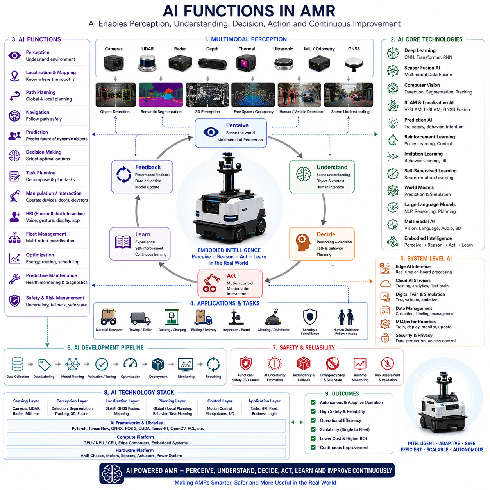
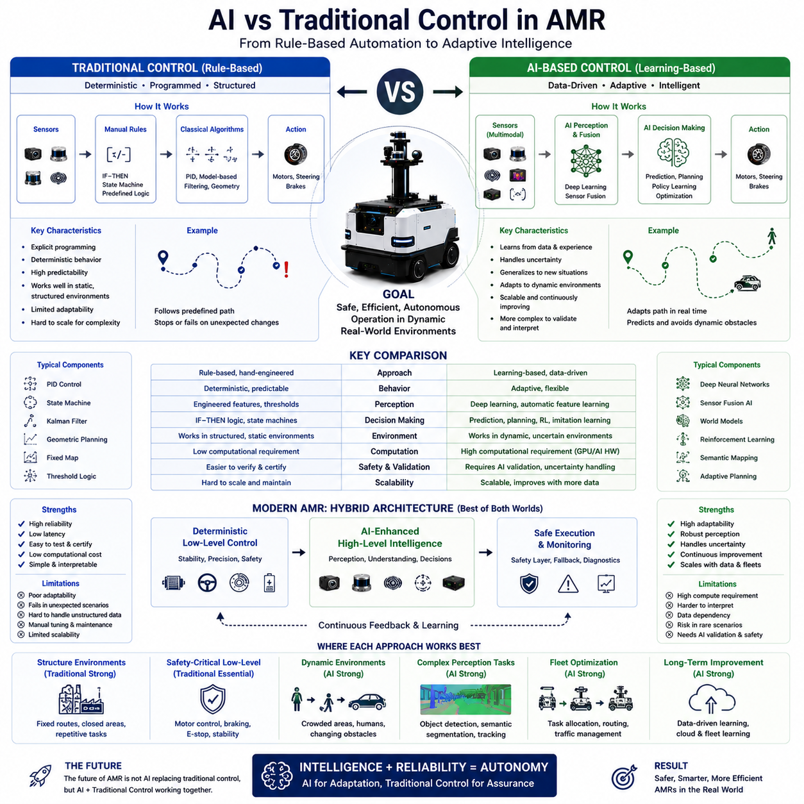
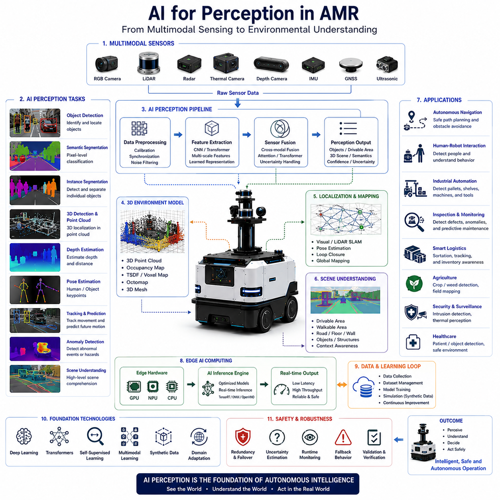
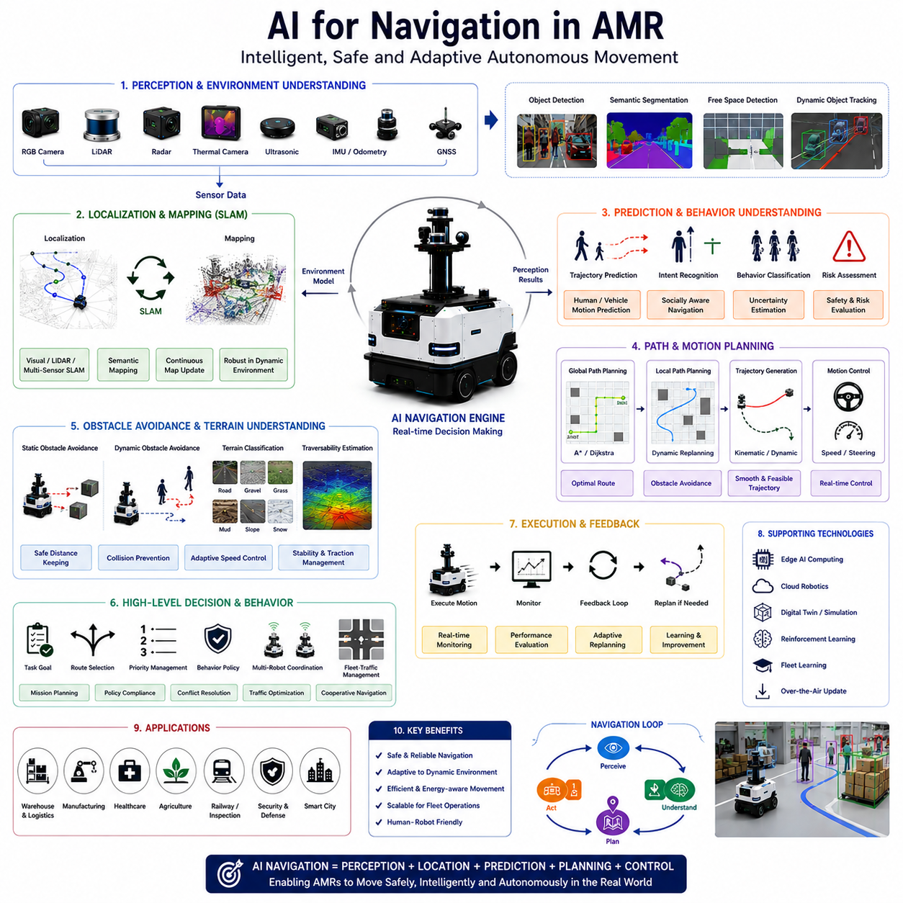
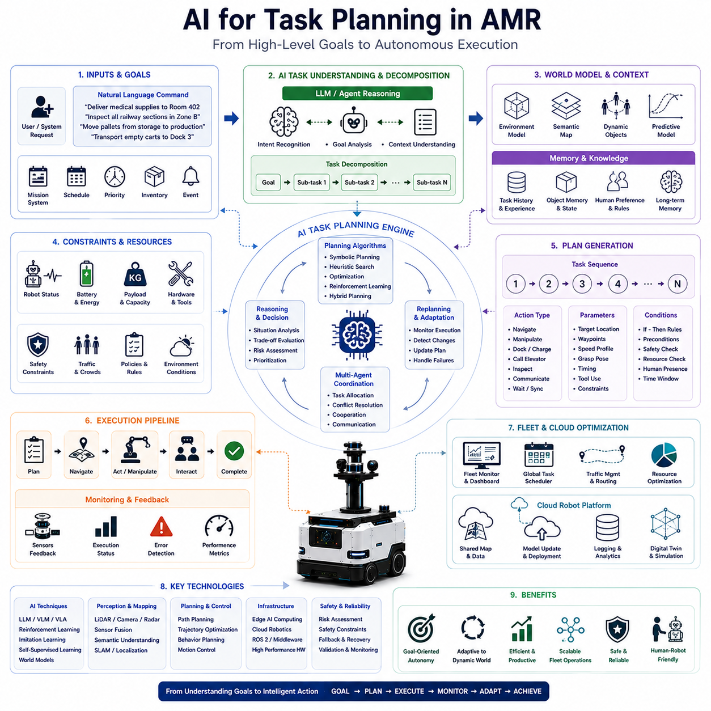
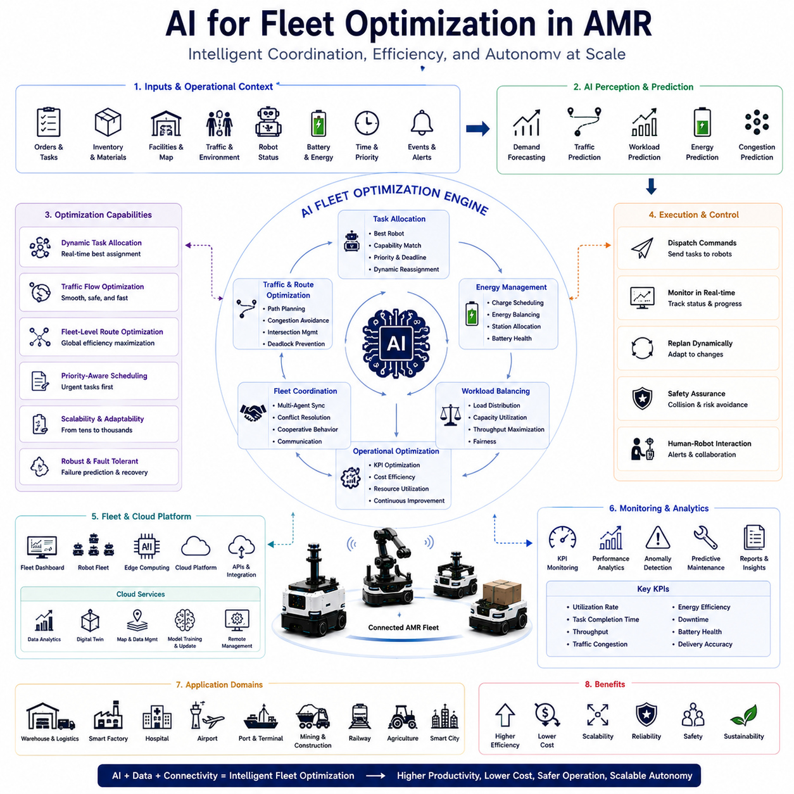
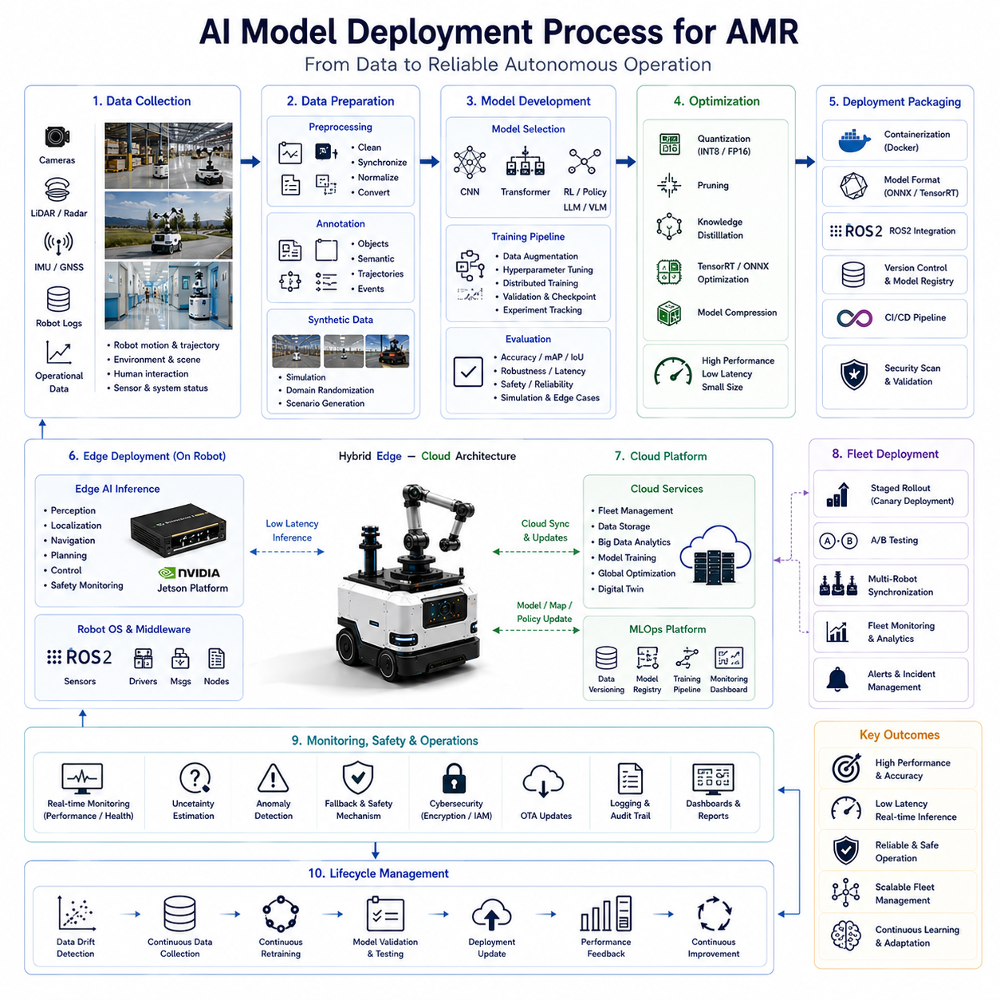
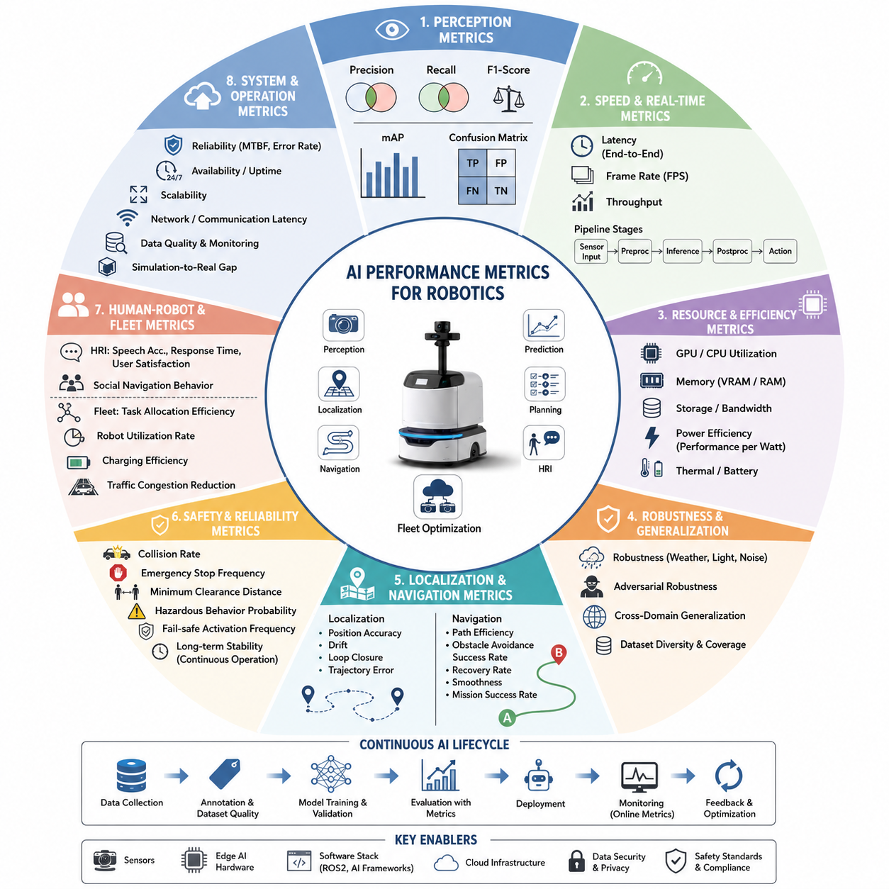

**Volume 06. AMR AI and Embodied Intelligence**

# Chapter 01. AI for AMR

## 01.1 AI Functions in AMR

{width="7.268055555555556in" height="7.268055555555556in"}

Artificial Intelligence (AI) has become one of the most important enabling technologies in modern Autonomous Mobile Robots (AMRs). Traditional robots primarily relied on predefined rules, deterministic control systems, fixed trajectories, and manually programmed workflows. While such approaches were effective in highly structured industrial environments, they lacked adaptability, flexibility, perception intelligence, and autonomous decision-making capability. Modern AMRs, however, are expected to operate in dynamic and uncertain real-world environments where humans, vehicles, machinery, weather conditions, and environmental structures continuously change. To achieve reliable autonomy under these conditions, AMRs increasingly depend on AI technologies for perception, localization, planning, navigation, prediction, interaction, optimization, and autonomous decision-making. AI therefore serves as the cognitive engine that transforms conventional mobile robots into intelligent autonomous systems capable of operating safely and efficiently in complex environments.

The role of AI in AMRs extends across nearly every subsystem of the robot architecture. AI is no longer limited to computer vision or object detection alone. Instead, AI technologies are integrated into perception pipelines, sensor fusion systems, localization frameworks, path planning algorithms, fleet management systems, predictive maintenance workflows, human-robot interaction modules, cloud robotics infrastructures, and embodied intelligence architectures. Modern AMRs increasingly operate as distributed intelligent systems that combine edge AI computing, cloud-based learning, multimodal perception, and autonomous reasoning into a unified operational framework.

One of the most fundamental AI functions in AMRs is perception. Autonomous robots must continuously observe and understand their surroundings in real time. Unlike traditional AGVs operating on predefined tracks or markers, AMRs navigate through dynamic environments containing unpredictable obstacles, moving humans, forklifts, vehicles, doors, pallets, equipment, and environmental hazards. AI-based perception systems allow robots to detect, classify, track, and interpret environmental information using sensor data acquired from cameras, LiDARs, radars, depth sensors, thermal cameras, ultrasonic sensors, and GNSS systems.

Computer vision AI is one of the most widely deployed AI technologies in AMRs. Vision-based AI systems use deep learning models such as Convolutional Neural Networks (CNNs), Vision Transformers (ViTs), segmentation models, object detection networks, and multimodal architectures to analyze camera images. These systems enable robots to recognize humans, vehicles, pallets, safety signs, lane markings, obstacles, doors, shelves, packages, and environmental features. Modern object detection models such as YOLO, Faster R-CNN, DETR, Mask R-CNN, and transformer-based perception networks have significantly improved real-time robotic perception capability.

Semantic segmentation AI further enhances environmental understanding. Instead of simply detecting individual objects, segmentation models classify every pixel within an image into semantic categories such as floor, wall, road, pedestrian area, obstacle, vegetation, vehicle, or safety zone. This enables AMRs to generate rich environmental representations for autonomous navigation and scene understanding. In outdoor robots, semantic segmentation may distinguish drivable terrain from mud, grass, sidewalks, construction zones, or dangerous obstacles.

Depth estimation and 3D perception AI are equally important functions. LiDAR point clouds, stereo vision systems, and depth cameras generate spatial information describing the three-dimensional structure of the environment. AI models process these spatial data streams to estimate object distances, identify traversable areas, detect free space, and build occupancy maps. Advanced 3D perception architectures combine geometric reasoning with semantic understanding to improve robotic navigation performance.

Sensor fusion AI represents another critical AMR function. No individual sensor provides perfect environmental understanding under all operating conditions. Cameras may fail in low-light environments, LiDAR performance may degrade in fog or rain, radar resolution may be limited, and GNSS may suffer from signal blockage. AI-based sensor fusion systems combine information from multiple sensing modalities to improve robustness and reliability. Multimodal AI architectures integrate RGB images, thermal images, LiDAR point clouds, radar detections, IMU data, GNSS information, and odometry measurements into unified environmental representations.

Localization is another core AI function in AMRs. Robots must continuously estimate their own position within the environment. AI-enhanced localization systems combine SLAM algorithms, sensor fusion, probabilistic estimation, semantic mapping, and deep learning models to achieve robust positioning. Visual SLAM, LiDAR SLAM, semantic localization, GNSS fusion, and graph optimization techniques allow robots to operate even in dynamic and partially unknown environments.

AI-based localization systems increasingly incorporate learned environmental features rather than relying solely on handcrafted geometric algorithms. Deep learning models can recognize landmarks, estimate depth, predict motion patterns, and improve localization robustness under degraded conditions such as poor lighting, repetitive structures, or weather interference. Long-term localization systems also use AI to adapt maps as environments evolve over time.

Path planning and autonomous navigation are among the most important AI functions in AMRs. Traditional path planning relied on deterministic algorithms such as A\*, Dijkstra, or potential field methods operating within static maps. Modern AI-enhanced navigation systems incorporate dynamic obstacle prediction, behavior planning, semantic reasoning, and adaptive decision-making. AI enables robots to navigate safely through crowded environments while predicting the future behavior of humans, vehicles, and moving obstacles.

Behavior prediction AI is especially important for human-robot interaction. AMRs operating in hospitals, warehouses, airports, factories, and smart cities must safely coexist with humans. AI systems estimate pedestrian intentions, predict motion trajectories, recognize human activities, and adjust robot behavior accordingly. Socially aware navigation AI allows robots to maintain safe distances, yield appropriately, avoid sudden movements, and behave predictably around people.

Task planning is another major AI capability. Modern AMRs increasingly perform complex multi-step tasks rather than simple point-to-point transport. AI planning systems decompose high-level goals into executable task sequences. For example, a hospital robot may receive a delivery request, determine the optimal path, interact with elevators and doors, avoid crowded corridors, deliver medical supplies, and return autonomously. AI planners coordinate navigation, manipulation, scheduling, and environmental interaction within unified task execution frameworks.

Fleet management AI plays a central role in large-scale robotic operations. Warehouses, factories, hospitals, ports, airports, and smart cities may deploy hundreds or thousands of AMRs simultaneously. AI-based fleet optimization systems coordinate traffic flow, task allocation, charging schedules, congestion management, maintenance scheduling, and resource utilization. Multi-agent AI algorithms optimize operational efficiency while avoiding collisions and bottlenecks.

Cloud robotics further extends AMR intelligence through distributed AI architectures. Edge robots perform real-time perception and navigation locally, while cloud infrastructure supports large-scale data analysis, model training, fleet learning, remote monitoring, and operational analytics. AI models may continuously improve through field data collection and cloud-based retraining pipelines. Cloud robotics enables knowledge sharing across entire robot fleets.

Predictive maintenance is another increasingly important AI function. AMRs contain complex electrical, mechanical, and computational systems subject to wear and degradation. AI-based monitoring systems analyze vibration data, motor currents, battery health, thermal behavior, sensor quality, communication stability, and operational logs to predict component failures before they occur. Predictive maintenance reduces downtime, improves reliability, and lowers operational costs.

AI also plays a critical role in energy management and power optimization. Battery-powered AMRs must carefully balance performance, computation, and endurance. AI systems optimize route selection, acceleration profiles, charging schedules, thermal management, and workload distribution to maximize operational efficiency. In large fleets, AI-based charging coordination prevents charging station congestion and minimizes operational interruptions.

Human-Robot Interaction (HRI) is another important AI domain within AMRs. Robots increasingly communicate with humans using voice, touchscreens, gestures, visual displays, mobile applications, and natural language interfaces. Natural Language Processing (NLP), Large Language Models (LLMs), speech recognition systems, and multimodal interaction AI allow humans to communicate with robots using intuitive commands and conversational interfaces.

LLM-based robotic control has recently emerged as a highly promising area of AI research. Large language models enable robots to interpret natural language commands, decompose tasks, reason about actions, access APIs, and generate structured robot behaviors. For example, a user may instruct a robot to "deliver medical supplies to Room 302 while avoiding crowded hallways," and the AI system can interpret, plan, and execute the request autonomously.

Robot agents extend AI functionality even further. AI agents integrate perception, memory, reasoning, planning, tool use, and action execution into autonomous cognitive architectures. These systems may maintain environmental context, learn operational patterns, interact with cloud services, manage workflows, and perform multi-step autonomous operations with minimal human supervision.

Embodied AI represents one of the most advanced AI concepts in AMRs. Traditional AI models often operate independently from physical interaction. Embodied AI instead learns directly from physical interaction with the real world. Robots perceive environments, take actions, observe consequences, and continuously refine behavior through interaction. Embodied intelligence combines perception, action, memory, prediction, and learning into unified cognitive systems capable of adaptive real-world behavior.

Reinforcement learning (RL) provides another important AI function in robotics. RL agents learn optimal behaviors through trial-and-error interaction with environments. AMRs may use reinforcement learning for navigation, motion control, obstacle avoidance, manipulation, docking, energy optimization, or multi-agent coordination. Simulation-based RL training allows robots to learn complex behaviors safely before deployment into real-world environments.

Imitation learning further accelerates robotic intelligence development. Instead of learning entirely through exploration, robots observe human demonstrations and imitate expert behavior. Autonomous driving behaviors, warehouse navigation patterns, towing maneuvers, and collaborative human workflows can all be learned from demonstration data. Behavior cloning and inverse reinforcement learning are common imitation learning approaches.

Self-supervised learning is becoming increasingly important because manually labeling robotic datasets is expensive and time-consuming. Self-supervised AI systems automatically learn representations from unlabeled sensor data. Robots continuously generate large volumes of operational data during deployment, and self-supervised learning allows AI systems to improve perception, localization, and scene understanding from field experience.

Scene understanding AI enables AMRs to interpret complex environments beyond basic object detection. Instead of merely recognizing objects individually, scene understanding models infer relationships between objects, semantic context, environmental structure, and operational meaning. For example, robots may recognize loading zones, pedestrian pathways, restricted areas, emergency exits, charging stations, and traffic patterns.

World models represent another advanced AI function. World models allow robots to maintain internal representations of environmental dynamics and predict future states. By simulating potential outcomes internally, robots can plan safer and more efficient behaviors. Predictive world models are especially important for autonomous driving, high-speed outdoor robots, and collaborative multi-robot systems.

AI safety is one of the most critical aspects of AMR development. AI perception systems may fail under rare environmental conditions, sensor degradation, or unexpected scenarios. Therefore, AMRs require safety monitoring systems capable of detecting uncertainty, validating AI outputs, activating fallback behaviors, and maintaining safe operation under degraded conditions. AI safety frameworks increasingly combine redundancy, runtime monitoring, formal validation, and probabilistic risk assessment.

Edge AI computing is essential for real-time AMR operation. Autonomous robots cannot rely entirely on cloud connectivity because real-time decisions require low-latency local processing. NVIDIA Jetson platforms, embedded GPUs, AI accelerators, NPUs, and edge computing architectures allow robots to execute complex AI models directly onboard. Edge AI enables real-time perception, navigation, planning, and safety monitoring even under limited network conditions.

Modern AMRs increasingly use hierarchical AI architectures combining low-level control AI, mid-level behavioral AI, and high-level cognitive AI. Low-level AI manages motor control, stabilization, and local obstacle avoidance. Mid-level AI handles navigation, perception fusion, and task execution. High-level AI manages planning, reasoning, fleet coordination, cloud integration, and human interaction.

Simulation AI also plays an important role during AMR development. Digital twins, synthetic datasets, simulation environments, and AI validation frameworks enable large-scale testing before real-world deployment. NVIDIA Isaac Sim, Gazebo, CARLA, Unreal Engine, and ROS2-based simulation platforms are widely used to train and validate AI systems under diverse operational scenarios.

Future AMRs will increasingly integrate foundation models, multimodal AI, world models, embodied intelligence, and AGI-inspired architectures. Generalist robot models may eventually perform perception, navigation, manipulation, reasoning, communication, and long-term learning within unified AI systems. Smart factories, hospitals, logistics centers, railways, smart cities, agriculture, mining, defense, and public infrastructure will all increasingly depend on AI-powered autonomous robotic systems.

Ultimately, AI functions in AMRs extend far beyond simple automation. AI transforms robots from programmable machines into adaptive intelligent systems capable of perceiving environments, understanding context, making decisions, learning from experience, interacting with humans, and continuously improving operational performance. As AI technologies continue advancing, AMRs will become increasingly autonomous, collaborative, intelligent, and deeply integrated into the infrastructure of future industrial and smart-city ecosystems.

## 01.2 AI vs Traditional Control

{width="7.268055555555556in" height="7.268055555555556in"}

The evolution of Autonomous Mobile Robots (AMRs) has been driven largely by the transition from traditional rule-based control systems to modern Artificial Intelligence (AI)-based autonomous control architectures. Traditional robotic control systems were originally designed for highly structured and predictable industrial environments where robot behavior could be explicitly programmed using deterministic algorithms, predefined rules, fixed trajectories, and manually configured operational logic. While these conventional control methods were highly effective in repetitive manufacturing processes and static environments, they struggle to adapt to the complexity, uncertainty, and variability of real-world autonomous operation. Modern AMRs increasingly operate in dynamic environments filled with humans, vehicles, changing obstacles, weather conditions, variable terrain, uncertain sensor inputs, and continuously evolving operational conditions. Under these circumstances, AI-based control systems provide significant advantages in adaptability, perception capability, decision-making flexibility, robustness, and autonomous learning.

Traditional control systems are fundamentally based on deterministic engineering principles. In these systems, engineers explicitly define robot behavior using mathematical models, finite-state machines, control loops, conditional logic, and predefined motion algorithms. Every operational scenario must be anticipated in advance and represented through carefully programmed rules. For example, a traditional AGV may follow magnetic tape, QR codes, reflectors, or predefined waypoints using highly structured navigation logic. If the environment changes beyond the programmed assumptions, the robot may fail or require manual intervention.

The greatest strength of traditional control lies in predictability and interpretability. Because all behaviors are explicitly defined, engineers can mathematically analyze system responses and verify operational behavior under known conditions. Traditional controllers are highly reliable in environments where variability is limited and operational conditions remain stable. Industrial automation systems, CNC machines, robotic manipulators, conveyor systems, and fixed-route AGVs have historically depended on deterministic control architectures because of their stability and simplicity.

Classical control theory forms the foundation of traditional robotic systems. PID controllers, state-space control, kinematic equations, dynamic models, trajectory planners, Kalman filters, and feedback control systems are widely used in robotics. These algorithms are mathematically elegant, computationally efficient, and highly explainable. Engineers can derive performance guarantees, stability proofs, and safety boundaries using analytical methods.

For example, motor velocity control in an AMR may use PID loops to regulate wheel speed precisely. Steering systems may use Ackermann kinematic models or differential drive equations. Obstacle avoidance may rely on threshold-based logic and geometric collision calculations. Localization systems may use Extended Kalman Filters and probabilistic estimation methods. Such systems are deterministic because identical inputs always generate identical outputs.

However, traditional control architectures face significant limitations in complex real-world environments. One major limitation is the inability to generalize beyond predefined scenarios. Real-world environments are often highly unpredictable. Humans move unpredictably, lighting conditions change, weather conditions vary, sensor noise fluctuates, and obstacles may appear unexpectedly. Designing explicit rules for every possible scenario becomes impractical or impossible.

Traditional systems also struggle with high-dimensional sensory information. Modern AMRs use RGB cameras, LiDARs, radar systems, thermal cameras, depth sensors, GNSS, IMUs, ultrasonic sensors, and multimodal perception systems. The enormous volume and complexity of these data streams exceed the capabilities of manually designed rule-based systems. Extracting meaningful environmental understanding from raw sensor data requires advanced representation learning and pattern recognition capabilities that traditional algorithms cannot easily provide.

AI-based control systems address many of these limitations through data-driven learning approaches. Instead of explicitly programming every behavior manually, AI systems learn patterns, relationships, and decision strategies directly from data. Machine learning models identify complex nonlinear relationships between sensor inputs and desired outputs. Deep learning architectures can automatically learn hierarchical feature representations from large-scale datasets.

One of the most significant differences between AI and traditional control is adaptability. Traditional systems operate within fixed rules and predefined assumptions. AI systems, however, can generalize from prior experiences to handle previously unseen situations. For example, a deep learning perception model trained on diverse environmental data may recognize pedestrians, forklifts, bicycles, construction zones, and road obstacles under varying lighting and weather conditions without explicit rule programming.

AI systems are especially powerful in perception tasks. Computer vision algorithms based on deep neural networks dramatically outperform traditional feature-engineering approaches in object detection, semantic segmentation, tracking, depth estimation, and scene understanding. Traditional vision systems relied heavily on handcrafted features such as edges, corners, geometric templates, or threshold-based image processing. These methods were sensitive to illumination changes, viewpoint variation, and environmental noise.

Modern AI perception models automatically learn robust features from massive datasets. Convolutional Neural Networks (CNNs), Vision Transformers (ViTs), multimodal transformers, and foundation models can extract semantic understanding from complex sensor data. AI perception systems can recognize subtle environmental patterns that would be extremely difficult to encode manually using traditional algorithms.

Another key difference lies in decision-making capability. Traditional control systems generally follow predefined decision trees or finite-state machines. While such architectures are effective for simple operational logic, they become difficult to scale for highly dynamic environments. AI-based decision systems instead learn behavior policies directly from operational data, simulations, demonstrations, or reinforcement learning processes.

For example, a traditional warehouse AGV may follow fixed navigation routes and stop whenever obstacles appear. In contrast, an AI-powered AMR can dynamically predict human motion, reroute around congestion, negotiate crowded pathways, and optimize travel behavior in real time. AI systems can balance multiple objectives simultaneously, including safety, efficiency, energy consumption, traffic flow, and task priority.

Reinforcement learning represents one of the most advanced AI-based control paradigms. In reinforcement learning, robots learn optimal behavior through interaction with environments. Instead of following explicitly programmed rules, RL agents maximize long-term reward functions by exploring different behaviors. This allows robots to discover highly efficient navigation, manipulation, docking, or coordination strategies that may not be obvious to human engineers.

Imitation learning provides another important contrast with traditional control. Traditional systems require engineers to manually encode desired behavior. AI systems using imitation learning instead observe human demonstrations and learn behavioral patterns automatically. Human driving behaviors, warehouse navigation strategies, collaborative motion patterns, and industrial workflows can all be learned from demonstration data.

Traditional control systems also struggle with scalability. As robotic systems become increasingly complex, manually programming every interaction becomes extremely time-consuming and error-prone. AI systems scale more effectively because learning-based architectures can absorb large amounts of operational data and improve automatically. Cloud robotics and fleet learning systems allow entire robot fleets to share learned experiences across deployments.

However, AI-based systems introduce their own challenges. Unlike deterministic control systems, AI models are often difficult to interpret fully. Deep neural networks operate as highly complex nonlinear functions with millions or billions of parameters. Understanding precisely why an AI model made a particular decision may be challenging. This lack of interpretability creates difficulties in safety certification, debugging, and regulatory compliance.

Traditional control systems provide strong mathematical guarantees regarding stability and predictability. AI systems, however, may behave unpredictably under rare or out-of-distribution scenarios. For example, perception models trained primarily under daytime conditions may fail during snowstorms, fog, glare, or unusual lighting conditions. AI robustness therefore becomes a major engineering challenge.

Another important difference is data dependency. Traditional control systems rely primarily on engineering knowledge and mathematical modeling. AI systems depend heavily on training datasets. The quality, diversity, and scale of training data strongly influence model performance. Poorly designed datasets may introduce bias, unsafe behaviors, or operational blind spots.

Computational requirements also differ significantly. Traditional control algorithms are typically lightweight and computationally efficient. Many classical controllers can run on microcontrollers with minimal processing power. AI models, particularly deep learning systems, often require GPUs, AI accelerators, large memory capacity, and substantial power consumption. Real-time AI inference in AMRs therefore demands sophisticated edge computing architectures.

Edge AI computing has become increasingly important because autonomous robots require low-latency onboard intelligence. NVIDIA Jetson platforms, embedded GPUs, TensorRT optimization, neural processing units (NPUs), and AI accelerators enable AMRs to execute complex AI models locally. Hybrid architectures combining deterministic control loops with AI perception modules are now common in advanced robotic systems.

Safety engineering also differs between AI and traditional control. Traditional systems are easier to verify formally because their behavior is explicitly defined. AI systems require probabilistic validation methods, runtime monitoring, uncertainty estimation, redundancy architectures, and extensive field testing. AI safety frameworks increasingly combine deterministic fallback controllers with AI-driven adaptive behavior layers.

Modern AMRs therefore rarely rely exclusively on either pure traditional control or pure AI. Instead, most systems use hybrid architectures combining deterministic low-level control with AI-enhanced high-level intelligence. Low-level motion control, motor regulation, braking systems, and safety-critical emergency functions often remain deterministic. High-level perception, scene understanding, planning, prediction, and adaptive decision-making increasingly use AI models.

For example, wheel motor control may still use PID controllers operating at high frequency for precise stability. However, obstacle recognition may use deep learning perception models. Localization may combine probabilistic estimation with learned semantic features. Navigation may integrate classical path planning with AI-based behavior prediction and adaptive obstacle avoidance.

Sensor fusion provides another example of hybrid architecture. Traditional probabilistic methods such as Kalman filtering remain important for localization and state estimation. However, AI-based multimodal fusion models increasingly enhance perception robustness under complex environmental conditions. Classical control theory and AI are therefore complementary rather than mutually exclusive.

Fleet management systems further demonstrate the strengths of AI. Traditional scheduling algorithms may optimize simple task allocation problems under static assumptions. AI-driven fleet optimization systems can dynamically adapt to changing workloads, traffic congestion, battery conditions, maintenance schedules, and operational priorities across large robotic fleets.

Cloud robotics has also accelerated the transition toward AI-driven architectures. Traditional robots often operated as isolated machines with limited environmental awareness. Modern AI-enabled AMRs participate in distributed intelligent ecosystems involving cloud learning, remote monitoring, digital twins, predictive analytics, simulation environments, and collaborative fleet intelligence.

Embodied AI represents one of the most advanced evolutions beyond traditional control. Traditional robotics often separated perception, planning, and control into independent modules. Embodied AI instead integrates sensing, reasoning, memory, action, and learning into unified cognitive architectures capable of adaptive real-world behavior. Such systems continuously improve through interaction with physical environments.

Foundation models and Large Language Models (LLMs) are beginning to further transform AMR intelligence. Traditional robotic systems required manually programmed interfaces and command structures. LLM-based robotic agents can interpret natural language instructions, reason about tasks, access APIs, coordinate workflows, and generate adaptive robot behavior dynamically.

Future AMRs will likely continue evolving toward increasingly AI-centric architectures. However, traditional control theory will remain essential because physical systems still require precise, stable, and deterministic low-level control. The future of robotics is therefore not a replacement of traditional control by AI, but rather the integration of both approaches into unified intelligent systems.

AI provides adaptability, learning capability, perception intelligence, semantic reasoning, and autonomous decision-making. Traditional control provides mathematical stability, predictability, safety assurance, and precise physical regulation. Together, these technologies enable AMRs to operate safely, efficiently, and intelligently in complex real-world environments.

As smart factories, hospitals, logistics centers, railways, agricultural systems, defense platforms, and smart cities increasingly adopt autonomous robots, the balance between AI-driven intelligence and traditional deterministic control will remain one of the central engineering challenges in robotics. Successful AMR systems will be those capable of combining the reliability of classical engineering with the adaptability and intelligence of modern AI architectures.

## 01.3 AI for Perception

{width="7.268055555555556in" height="7.268055555555556in"}

Artificial Intelligence (AI) for perception is one of the most fundamental technologies in modern Autonomous Mobile Robots (AMRs), autonomous vehicles, industrial robots, agricultural robots, logistics robots, defense robots, railway inspection robots, healthcare robots, and smart city robotic systems. Perception refers to the ability of a robot to observe, interpret, and understand its surrounding environment using various sensors and computational intelligence. Without robust perception capability, autonomous robots cannot safely navigate, recognize obstacles, understand scenes, interact with humans, or make intelligent decisions. AI transforms raw sensor signals into meaningful environmental understanding and therefore serves as the sensory intelligence layer of autonomous robotic systems.

Traditional robotic perception systems relied heavily on handcrafted algorithms, manually engineered features, threshold-based image processing, geometric rules, and deterministic pattern recognition methods. While such approaches worked reasonably well in highly structured environments, they struggled significantly in dynamic real-world conditions involving changing illumination, weather, occlusion, clutter, noise, and unpredictable obstacles. Modern AI-based perception systems instead use machine learning and deep learning models capable of learning robust feature representations directly from large-scale datasets. This transition from rule-based perception to data-driven AI perception has dramatically improved robotic intelligence and autonomy.

The primary objective of AI perception is environmental understanding. Autonomous robots must continuously answer several fundamental questions during operation. What objects exist in the environment? Where are those objects located? How are they moving? Which areas are safe for navigation? What semantic meaning does the environment contain? What risks or hazards are present? AI perception systems process sensor data to generate answers to these questions in real time.

Modern AMRs use a wide variety of sensors for perception. RGB cameras provide rich visual texture and color information. LiDAR sensors generate precise three-dimensional geometric measurements. Radar systems provide robust object detection under adverse weather conditions. Thermal cameras detect infrared radiation and improve nighttime perception. Ultrasonic sensors assist with close-range obstacle detection. Depth cameras generate short-range 3D structure information. GNSS and IMU systems contribute localization and motion estimation data. AI perception architectures integrate these diverse sensor modalities into unified environmental representations.

Computer vision is one of the most important AI perception technologies. Vision-based AI systems analyze image data acquired from cameras to recognize objects, estimate depth, understand scenes, and detect environmental structures. Early computer vision systems relied on handcrafted features such as edges, corners, contours, HOG descriptors, SIFT features, SURF features, and template matching. However, these traditional methods were sensitive to lighting variation, viewpoint changes, environmental noise, and occlusion.

Deep learning revolutionized robotic perception by enabling automatic feature learning. Convolutional Neural Networks (CNNs) became highly effective for image classification, object detection, segmentation, and scene understanding. Instead of manually designing features, CNNs learn hierarchical visual representations directly from data. Early CNN architectures such as LeNet, AlexNet, VGG, GoogLeNet, and ResNet significantly advanced perception capability.

Object detection is one of the most essential AI perception tasks in AMRs. Robots must continuously identify pedestrians, vehicles, forklifts, shelves, pallets, doors, machinery, traffic signs, road boundaries, obstacles, and environmental hazards. Modern object detection models such as YOLO, Faster R-CNN, SSD, RetinaNet, DETR, and transformer-based detectors provide highly accurate real-time perception.

Real-time object detection is especially critical because autonomous robots operate in dynamic environments where immediate reactions are necessary. Perception latency directly affects navigation safety. High-speed outdoor robots require low-latency AI inference pipelines capable of processing sensor data continuously under strict timing constraints. Edge AI acceleration using GPUs, NPUs, and optimized inference frameworks therefore becomes essential.

Semantic segmentation represents another important AI perception capability. Unlike object detection, which identifies discrete objects using bounding boxes, semantic segmentation classifies every pixel within an image into semantic categories. For example, pixels may be classified as road, sidewalk, floor, wall, vegetation, obstacle, pedestrian area, vehicle, or free space. Semantic segmentation provides detailed environmental understanding necessary for safe navigation and autonomous planning.

Instance segmentation extends semantic segmentation further by distinguishing individual object instances separately. For example, multiple pedestrians may each receive unique segmentation masks rather than belonging to a single semantic class. This capability improves object tracking, motion prediction, and scene understanding.

Depth estimation and 3D perception are also critical AI functions in AMRs. Autonomous robots must understand the spatial structure of the environment in order to navigate safely. Stereo cameras, LiDARs, structured-light sensors, and depth cameras generate geometric information describing object distances and environmental topology. AI models process this data to generate occupancy maps, free-space estimates, obstacle boundaries, and 3D scene reconstructions.

LiDAR perception systems have become particularly important for autonomous robots operating in complex outdoor environments. LiDAR sensors generate dense point clouds representing the three-dimensional geometry of the environment. AI models process these point clouds to perform object detection, segmentation, localization, tracking, and obstacle recognition. PointNet, PointPillars, VoxelNet, PV-RCNN, CenterPoint, and transformer-based 3D perception models have significantly improved LiDAR-based environmental understanding.

Multimodal perception is one of the most important developments in modern AI systems. No individual sensor performs perfectly under all environmental conditions. Cameras may fail under low-light or fog conditions. LiDAR performance may degrade in rain or snow. Radar has limited semantic resolution. Thermal cameras lack detailed texture information. AI-based multimodal perception systems combine information from multiple sensor modalities to improve robustness and reliability.

Sensor fusion AI integrates RGB images, thermal images, LiDAR point clouds, radar detections, GNSS measurements, IMU data, and odometry information into unified environmental representations. Multimodal transformers and cross-attention architectures allow AI systems to dynamically combine complementary sensor information. This improves perception robustness under challenging environmental conditions.

Thermal perception AI has become increasingly important for nighttime and adverse-weather operation. Thermal cameras detect infrared radiation emitted by objects and living organisms. AI models process thermal images to identify humans, animals, vehicles, machinery, and heat anomalies even in complete darkness. Thermal perception is particularly valuable for patrol robots, defense robots, railway inspection robots, and smart city security systems.

Radar perception AI also plays a critical role in outdoor autonomy. Radar systems perform well under rain, fog, snow, dust, and low-light conditions where optical sensors may fail. AI-based radar perception systems process radar reflections to estimate object range, velocity, direction, and movement patterns. Radar-camera fusion improves moving object tracking and collision avoidance.

Scene understanding represents a higher-level AI perception capability. Beyond detecting individual objects, robots must understand the semantic meaning and contextual relationships within environments. AI scene understanding models identify loading zones, pedestrian pathways, charging stations, traffic flow patterns, emergency exits, restricted areas, intersections, and operational workflows. Contextual understanding improves navigation intelligence and task execution.

Human perception and behavior understanding are especially important for collaborative robots operating around people. AI systems estimate human pose, motion intention, gaze direction, activity patterns, and social behavior. Human-aware navigation allows robots to maintain safe distances, avoid uncomfortable interactions, and move predictably around pedestrians.

Pose estimation is another major AI perception function. Human pose estimation models identify body joints and skeletal structures from image data. This enables robots to recognize gestures, detect falls, monitor worker safety, and understand human activities. Pose estimation is widely used in healthcare robots, industrial safety monitoring systems, and collaborative robotic platforms.

Activity recognition AI extends perception capability further by interpreting temporal behavior patterns. Robots may recognize walking, running, sitting, lifting, operating machinery, falling, or abnormal activities. Temporal AI models such as recurrent neural networks (RNNs), LSTMs, temporal transformers, and video understanding architectures process sequential sensor data for activity analysis.

Anomaly detection is another increasingly important AI perception capability. Autonomous robots operating in industrial environments must detect abnormal conditions such as oil leaks, smoke, fire, structural damage, overheating equipment, unusual vibrations, or unexpected obstacles. AI-based anomaly detection systems learn normal operational patterns and identify deviations automatically.

AI perception also plays a major role in autonomous inspection robots. Railway robots inspect tracks, tunnels, and overhead structures. Infrastructure robots detect cracks, corrosion, pipe leakage, and pavement defects. Agricultural robots identify crop health, weeds, pests, and soil conditions. Industrial inspection robots monitor machinery and production systems. AI perception enables automated defect detection at scale.

Weather robustness is one of the greatest challenges in robotic perception. Real-world environments include rain, fog, snow, dust, glare, darkness, mud, reflections, and sensor contamination. AI perception systems must therefore be trained and validated under diverse environmental conditions. Data augmentation, synthetic simulation, domain randomization, multimodal fusion, and adaptive AI models improve robustness.

Synthetic data generation has become increasingly important for AI perception training. Real-world data collection and labeling are expensive and time-consuming. Simulation environments such as NVIDIA Isaac Sim, CARLA, Gazebo, Unreal Engine, and Omniverse generate large-scale synthetic datasets for autonomous robotics. Synthetic data helps AI systems generalize across diverse operational conditions.

Self-supervised learning is also becoming highly important in robotic perception. Instead of relying entirely on manually labeled datasets, robots learn representations automatically from unlabeled sensor data. Self-supervised AI improves scalability and allows robots to continuously learn from operational experience.

Foundation models and vision-language models are beginning to transform robotic perception further. Large multimodal AI models can combine visual understanding, semantic reasoning, natural language processing, and environmental interpretation within unified architectures. Robots may eventually interpret complex environments using generalized world understanding rather than task-specific perception models alone.

Embodied AI further integrates perception with action and learning. Traditional perception systems often operated independently from robot behavior. Embodied AI instead tightly couples sensing, reasoning, action, memory, and adaptation into unified cognitive systems. Robots learn environmental understanding directly through physical interaction with the world.

Edge AI computing is essential for real-time perception in AMRs. Autonomous robots require onboard inference because cloud connectivity may introduce unacceptable latency or communication failures. NVIDIA Jetson systems, AI accelerators, GPUs, NPUs, and optimized inference frameworks such as TensorRT enable real-time execution of complex perception models on embedded robotic hardware.

Perception pipelines must also satisfy strict safety requirements. AI models are probabilistic and may occasionally fail under rare conditions. Therefore, perception systems require redundancy, uncertainty estimation, runtime monitoring, fallback behaviors, and extensive validation. Safety-critical AMRs often combine AI perception with deterministic safety layers and sensor redundancy architectures.

AI perception systems continuously evolve through operational feedback. Fleet learning architectures allow multiple robots to share perception experiences collectively. Cloud robotics infrastructures aggregate operational data from large robot fleets to improve AI models continuously. Over-the-air updates enable perception systems to adapt to new environments and emerging operational challenges.

Future AI perception systems will likely incorporate world models, multimodal foundation models, neuromorphic vision systems, event cameras, self-supervised embodied learning, and AGI-inspired cognitive architectures. Perception may evolve from passive sensing toward active environmental reasoning and predictive understanding.

Ultimately, AI for perception represents the sensory intelligence foundation of autonomous robotics. Perception allows robots to observe environments, recognize objects, understand scenes, predict behavior, detect anomalies, and interact safely with the real world. As AI technologies continue advancing, robotic perception systems will become increasingly intelligent, adaptive, robust, and deeply integrated into the operational infrastructure of future smart factories, logistics systems, healthcare environments, transportation systems, industrial facilities, and smart cities.

## 01.4 AI for Navigation

{width="7.268055555555556in" height="7.268055555555556in"}

Artificial Intelligence (AI) for navigation is one of the core enabling technologies in modern Autonomous Mobile Robots (AMRs), autonomous vehicles, industrial robots, agricultural robots, logistics robots, railway robots, defense robots, healthcare robots, and smart city robotic systems. Navigation refers to the ability of a robot to move safely and intelligently from one location to another while continuously understanding its environment, estimating its own position, avoiding obstacles, predicting dynamic changes, and selecting optimal paths. In traditional robotic systems, navigation was often limited to predefined routes and highly structured environments. However, modern AMRs operate in dynamic real-world environments where people, vehicles, obstacles, weather conditions, and terrain continuously change. AI-based navigation systems provide the adaptability, perception intelligence, prediction capability, and decision-making flexibility required for safe and reliable autonomous operation under these complex conditions.

Navigation in autonomous robotics involves multiple interconnected subsystems including localization, mapping, perception, path planning, motion planning, obstacle avoidance, trajectory optimization, behavioral reasoning, and motion control. AI technologies increasingly enhance every stage of this navigation pipeline. Rather than relying solely on deterministic algorithms and predefined maps, modern AI-based navigation systems continuously learn from sensor data, environmental interaction, operational history, and fleet-level experience.

One of the most fundamental functions in AI navigation is environmental perception. Before a robot can navigate safely, it must first understand its surroundings. AI perception systems process sensor data from RGB cameras, LiDARs, radars, thermal cameras, ultrasonic sensors, GNSS receivers, IMUs, depth cameras, and wheel encoders to generate environmental representations. AI models detect obstacles, estimate free space, classify terrain, recognize semantic structures, and predict environmental dynamics.

Localization is another critical navigation function. Autonomous robots must continuously estimate their own position and orientation within an environment. Traditional localization methods relied heavily on GPS, odometry, and deterministic mapping systems. However, real-world environments often contain sensor noise, wheel slippage, changing structures, poor GNSS reception, and dynamic obstacles. AI-enhanced localization systems combine sensor fusion, probabilistic estimation, semantic understanding, and deep learning models to improve robustness.

Simultaneous Localization and Mapping (SLAM) represents one of the most important technologies in robotic navigation. SLAM enables robots to build maps while simultaneously estimating their own position within those maps. Visual SLAM uses camera data, LiDAR SLAM uses point clouds, and multimodal SLAM combines multiple sensing modalities. AI increasingly improves SLAM robustness by learning semantic features, recognizing landmarks, handling dynamic environments, and compensating for degraded sensor conditions.

Semantic localization extends traditional localization beyond geometric mapping. Instead of relying solely on raw geometry, AI systems recognize meaningful environmental structures such as doors, corridors, intersections, shelves, elevators, loading zones, traffic lanes, and operational regions. Semantic understanding allows robots to navigate more intelligently within complex human-centered environments.

Path planning is one of the most visible AI navigation functions. The robot must determine an optimal route from its current position to a target destination. Classical path planning algorithms such as A\*, Dijkstra, Rapidly-exploring Random Trees (RRT), and Potential Field Methods remain important. However, AI systems increasingly enhance path planning with environmental prediction, adaptive decision-making, semantic reasoning, and real-time optimization.

Traditional path planning systems often assume static environments. In contrast, real-world environments are highly dynamic. Humans move unpredictably, forklifts change direction suddenly, doors open and close, vehicles cross pathways, and temporary obstacles appear unexpectedly. AI-based navigation systems continuously predict future environmental states and dynamically update navigation strategies in real time.

Motion planning extends path planning into physically feasible movement generation. The robot must generate smooth, collision-free trajectories that satisfy kinematic, dynamic, safety, and operational constraints. AI models increasingly assist trajectory generation by predicting safe maneuver strategies, optimizing motion smoothness, reducing energy consumption, and adapting to environmental uncertainty.

Behavior prediction is one of the most advanced AI navigation capabilities. AMRs operating around humans must estimate future human motion and intention. AI systems analyze pedestrian trajectories, body orientation, walking speed, group behavior, and social interaction patterns to predict future movements. This allows robots to navigate safely and naturally around people.

Socially aware navigation has become particularly important in hospitals, airports, shopping malls, warehouses, offices, hotels, and public spaces. Human-centered AI navigation systems maintain comfortable distances, avoid abrupt movements, yield appropriately, and respect social conventions. Instead of behaving like industrial machines, AI-enabled robots increasingly navigate in socially acceptable ways.

Obstacle avoidance is another essential AI navigation capability. Robots must continuously detect and avoid static and dynamic obstacles during operation. Traditional obstacle avoidance methods relied on geometric calculations and threshold-based logic. Modern AI systems instead combine perception, prediction, semantic understanding, and reinforcement learning to achieve more adaptive behavior.

Dynamic obstacle avoidance becomes especially challenging in crowded environments. Multiple moving objects may interact simultaneously, creating highly uncertain navigation conditions. AI systems use trajectory prediction, probabilistic reasoning, and multimodal sensor fusion to estimate collision risks and select safe avoidance maneuvers.

Terrain understanding is another major AI navigation function for outdoor robots. Agricultural robots, mining robots, military robots, construction robots, and outdoor delivery robots operate on highly variable terrain. AI systems classify terrain types such as asphalt, gravel, mud, grass, snow, sand, concrete, rails, slopes, and uneven surfaces. Terrain classification influences path planning, traction control, speed regulation, and stability management.

AI-based navigation also plays a major role in autonomous driving systems. Self-driving vehicles must navigate highways, urban roads, intersections, tunnels, parking lots, construction zones, and mixed-traffic environments. AI systems perform lane detection, traffic sign recognition, traffic light interpretation, drivable area estimation, vehicle prediction, and route optimization.

Map generation and environmental modeling are increasingly AI-driven processes. Traditional navigation systems often relied on manually generated maps. Modern AMRs continuously update maps dynamically using sensor data and cloud-based learning systems. AI models identify environmental changes and maintain long-term map consistency.

Cloud robotics further enhances AI navigation capability. Robot fleets may share environmental knowledge, traffic conditions, obstacle locations, operational patterns, and mapping updates through cloud infrastructure. Fleet-level AI optimization improves operational efficiency across entire robotic ecosystems.

Fleet navigation becomes especially important in large-scale warehouse automation, smart factories, airports, ports, hospitals, and logistics centers. Hundreds or thousands of robots may operate simultaneously within shared environments. AI fleet management systems coordinate robot traffic, optimize task allocation, prevent congestion, and reduce operational conflicts.

Multi-agent navigation is one of the most advanced areas of AI robotics research. Multiple robots must cooperate while sharing limited operational space. AI systems coordinate distributed robotic agents using cooperative planning, decentralized decision-making, swarm intelligence, and predictive coordination algorithms.

Reinforcement learning (RL) has become increasingly important for robotic navigation. RL-based navigation systems learn navigation policies through interaction with simulated or real environments. Instead of explicitly programming all navigation behaviors manually, RL agents optimize navigation performance by maximizing long-term reward functions.

Simulation-based reinforcement learning enables robots to learn highly complex navigation strategies safely. Virtual environments such as NVIDIA Isaac Sim, CARLA, Gazebo, and Unreal Engine provide scalable training platforms where robots can encounter millions of navigation scenarios before deployment into the real world.

Imitation learning also contributes significantly to AI navigation. Robots may learn navigation behavior directly from human demonstrations or expert driving data. Human navigation patterns often contain subtle social and contextual intelligence difficult to encode manually using traditional algorithms.

End-to-end navigation architectures represent another important AI development. Traditional robotics often separated perception, localization, planning, and control into independent modules. End-to-end AI systems instead learn navigation policies directly from raw sensor inputs to motion outputs. Deep neural networks map images, LiDAR data, or multimodal sensor streams directly to steering and velocity commands.

Although end-to-end AI navigation offers powerful adaptability, it also introduces safety and interpretability challenges. Many practical AMR systems therefore use hybrid architectures combining classical navigation methods with AI-enhanced components. Deterministic safety controllers and low-level motion control systems often remain separate from AI reasoning layers.

Navigation under adverse environmental conditions represents one of the greatest challenges in autonomous robotics. Rain, fog, snow, dust, darkness, glare, mud, reflections, and sensor contamination can severely degrade navigation performance. AI systems increasingly rely on multimodal sensor fusion to maintain robustness under degraded conditions.

Radar navigation becomes especially valuable under poor visibility conditions because radar performs reliably under rain, fog, and darkness. Thermal navigation assists nighttime operation. LiDAR provides accurate geometric structure. Camera systems contribute semantic understanding. AI sensor fusion integrates these modalities into unified navigation intelligence.

Energy-efficient navigation is another growing AI application. Battery-powered robots must optimize navigation strategies to maximize endurance and operational efficiency. AI systems dynamically balance travel speed, acceleration, route selection, charging schedules, terrain difficulty, and workload distribution.

Docking and charging navigation are also important AI tasks. Autonomous robots must precisely align with charging stations, trailers, pallets, elevators, conveyor systems, and workstations. AI-based vision systems improve docking precision and robustness.

Localization without GNSS is a particularly important challenge for indoor robots, underground robots, tunnel robots, mining robots, military systems, and urban robots operating under signal obstruction. AI-enhanced visual localization, LiDAR SLAM, semantic mapping, and multimodal fusion allow robots to navigate without reliable satellite positioning.

Behavioral AI increasingly influences high-level navigation decisions. Robots may prioritize safer routes over shorter routes, avoid crowded areas, comply with operational policies, respond to emergency situations, and adapt navigation strategies according to task context.

AI navigation also plays a major role in human-robot collaboration. Collaborative AMRs operating in warehouses or factories must coordinate movement with workers safely and efficiently. AI systems predict worker motion, recognize operational zones, understand workflow patterns, and avoid interfering with human activities.

Digital twins and simulation environments are becoming essential for navigation development and validation. Simulation platforms allow developers to evaluate navigation algorithms under diverse environmental conditions, traffic densities, weather conditions, and operational scenarios. Synthetic datasets generated through simulation improve AI training scalability.

Edge AI computing is fundamental for real-time navigation. Autonomous robots cannot rely entirely on cloud connectivity because navigation decisions require low latency and high reliability. NVIDIA Jetson systems, embedded GPUs, AI accelerators, NPUs, and optimized inference frameworks enable real-time onboard navigation intelligence.

Safety remains the highest priority in AI navigation. Autonomous robots must maintain safe behavior even under uncertainty, sensor degradation, communication loss, or unexpected environmental changes. AI navigation systems increasingly incorporate uncertainty estimation, runtime monitoring, redundancy architectures, fallback behaviors, and probabilistic risk assessment.

Operational Design Domain (ODD) definition is closely linked to navigation capability. Every autonomous robot has operational limits regarding terrain type, weather conditions, traffic complexity, visibility, speed, and environmental structure. AI systems must recognize when environmental conditions exceed safe operational boundaries.

Future AI navigation systems will likely incorporate foundation models, multimodal world models, embodied intelligence, neuromorphic computing, event-based vision systems, self-supervised learning, and AGI-inspired reasoning architectures. Robots may eventually navigate using generalized world understanding rather than narrowly specialized navigation pipelines.

Connected smart city infrastructure may further enhance AI navigation through V2X communication, intelligent traffic systems, cloud-based environmental intelligence, shared mapping services, and cooperative robotic ecosystems. Robots may exchange navigation information continuously with infrastructure and other autonomous agents.

Ultimately, AI for navigation transforms robots from simple moving machines into intelligent autonomous agents capable of understanding environments, predicting dynamic changes, reasoning about movement, cooperating with humans, and adapting continuously to real-world uncertainty. As AI technologies continue advancing, autonomous navigation will become increasingly robust, adaptive, scalable, and deeply integrated into the infrastructure of future smart factories, logistics centers, transportation systems, healthcare environments, industrial facilities, and smart cities.

## 01.5 AI for Task Planning

{width="7.268055555555556in" height="7.268055555555556in"}

Artificial Intelligence (AI) for task planning is one of the most important cognitive technologies in modern Autonomous Mobile Robots (AMRs), service robots, industrial robots, logistics systems, healthcare robots, warehouse automation systems, defense robots, smart city robotic platforms, and embodied AI systems. While perception allows robots to understand environments and navigation allows robots to move safely, task planning enables robots to determine what actions should be performed, in what order, under what conditions, and toward which operational goals. Task planning therefore represents the decision-making intelligence layer that transforms autonomous robots from reactive machines into goal-oriented cognitive agents capable of executing complex multi-step missions autonomously.

Traditional robotic systems typically relied on predefined workflows and manually programmed state machines. In highly structured industrial environments, engineers explicitly specified operational sequences using fixed rules and deterministic logic. For example, a conventional AGV might simply move from Point A to Point B repeatedly according to a predefined schedule. However, real-world environments are dynamic and unpredictable. Modern AMRs must respond to changing operational priorities, environmental uncertainty, human interaction, traffic conditions, equipment availability, battery limitations, safety constraints, and mission-level objectives. AI-based task planning systems provide the flexibility, adaptability, reasoning capability, and autonomous decision-making required for such complex operations.

Task planning refers to the process of converting high-level goals into executable action sequences. A human operator may provide a mission-level command such as "Deliver medical supplies to Room 402," "Inspect all railway sections in Zone B," "Move pallets from storage to production," or "Transport empty carts to the loading station." AI task planning systems decompose these high-level goals into detailed sub-tasks involving navigation, manipulation, docking, interaction, timing coordination, safety validation, and execution monitoring.

One of the most important aspects of AI task planning is hierarchical decision-making. Complex robotic missions are typically divided into multiple abstraction layers. High-level planning determines mission objectives and overall strategies. Mid-level planning generates executable workflows and task sequences. Low-level control manages motion execution, motor control, actuator coordination, and real-time reactions. AI enables these hierarchical layers to cooperate dynamically while adapting to environmental changes continuously.

Task decomposition is one of the fundamental capabilities of AI planning systems. Large Language Models (LLMs), symbolic AI planners, behavior trees, and agent architectures can break complex goals into smaller actionable steps. For example, a hospital delivery robot receiving a delivery request may perform the following planning sequence:

1.  Receive delivery request

2.  Identify delivery destination

3.  Check current robot status

4.  Determine battery availability

5.  Select optimal route

6.  Call elevator if required

7.  Navigate through corridors

8.  Avoid crowded areas

9.  Verify delivery room

10. Notify recipient

11. Confirm successful delivery

12. Return to standby station

This decomposition process allows robots to perform structured autonomous operations rather than isolated movements.

Classical task planning originated from symbolic AI and automated reasoning research. Early AI planners used formal logic systems such as STRIPS, PDDL, finite-state machines, rule-based reasoning, and symbolic world models. These systems represented environments using symbolic states and predefined action rules. Classical planners searched through possible action sequences to identify valid execution plans satisfying mission goals.

Symbolic planning remains important because it provides explainability and deterministic reasoning capability. Engineers can analyze planning logic explicitly and verify operational constraints mathematically. Industrial automation systems often continue using rule-based planning architectures because of their predictability and safety assurance.

However, purely symbolic planning systems face major limitations in real-world environments. Real environments are uncertain, partially observable, dynamic, noisy, and continuously changing. Human behavior is unpredictable. Sensors may fail. Obstacles may appear unexpectedly. Traffic conditions fluctuate. Operational priorities may change rapidly. Pure symbolic systems struggle to adapt to such uncertainty.

Modern AI-based task planning systems therefore increasingly combine symbolic reasoning with machine learning and probabilistic decision-making. Hybrid AI planning architectures integrate perception AI, predictive models, reinforcement learning, semantic reasoning, and adaptive optimization into unified cognitive systems.

One of the most important developments in AI task planning is behavior planning. Behavior planning determines how robots should behave under different operational contexts. For example, an autonomous robot may choose different navigation behavior depending on whether it is operating in a hospital, warehouse, public space, factory, railway tunnel, or outdoor environment.

Behavior planning systems evaluate operational context, safety conditions, mission priority, human interaction, and environmental complexity before selecting actions. In crowded environments, robots may prioritize safety and human comfort over speed. During emergency situations, robots may switch into evacuation support mode or emergency logistics mode automatically.

AI-based planning also enables dynamic replanning. Traditional robotic systems often failed when environmental conditions deviated from predefined assumptions. Modern AI systems continuously monitor execution progress and environmental conditions during operation. If obstacles appear, tasks fail, traffic congestion increases, battery levels decrease, or operational priorities change, AI planners dynamically generate updated plans in real time.

Task scheduling is another critical AI planning capability. AMRs operating in warehouses, factories, hospitals, airports, ports, and smart cities often manage large numbers of simultaneous tasks. AI scheduling systems optimize task assignment, execution order, robot utilization, charging schedules, resource allocation, and traffic flow.

Fleet-level task planning becomes especially important in large-scale robotic deployments. Hundreds or thousands of robots may operate simultaneously within shared environments. AI fleet management systems coordinate distributed robotic agents to maximize operational efficiency while preventing congestion, deadlock, collisions, and resource conflicts.

Multi-agent task planning is one of the most advanced areas of AI robotics research. Multiple robots may cooperate to achieve shared objectives. For example, warehouse robots may collaboratively transport large payloads, coordinate delivery schedules, or divide inspection responsibilities across operational zones. AI coordination systems manage communication, synchronization, negotiation, and distributed planning among robotic agents.

AI planning systems increasingly incorporate semantic understanding. Instead of viewing environments purely as geometric spaces, robots recognize functional meaning within environments. Rooms, corridors, loading zones, elevators, intersections, charging stations, restricted areas, and human activity zones all possess semantic significance influencing planning decisions.

Semantic task planning enables more intelligent robot behavior. For example, a hospital robot may avoid noisy movement near patient recovery rooms at night. A warehouse robot may prioritize urgent production materials. A smart city patrol robot may dynamically modify patrol routes based on crowd density or security alerts.

Human-aware task planning is another major area of development. Collaborative robots operating around humans must understand social behavior, workflow patterns, operational etiquette, and safety expectations. AI systems predict human activity and modify robot task execution accordingly.

Human-Robot Interaction (HRI) increasingly influences task planning architectures. Natural language interfaces allow humans to communicate high-level goals directly to robots. Instead of manually programming workflows, operators may issue commands such as:

- "Deliver samples to the laboratory."

- "Inspect all emergency exits."

- "Transport empty carts to Dock 3."

- "Avoid crowded hallways."

- "Prioritize urgent deliveries."

LLM-based task planning systems interpret these instructions, extract intent, decompose tasks, and generate executable robotic workflows autonomously.

Large Language Models (LLMs) are transforming AI planning significantly. Traditional robotic planners required rigid interfaces and explicitly defined commands. LLM-based planners instead use natural language reasoning, contextual understanding, and generalized knowledge to generate flexible task plans dynamically.

LLM-based robotic agents can perform reasoning across multiple operational domains. For example, a healthcare robot agent may coordinate navigation, elevator interaction, patient communication, inventory tracking, cloud database access, and fleet coordination within a single mission workflow.

Robot agents represent an important evolution in AI task planning. Agent architectures integrate perception, memory, reasoning, planning, API interaction, execution monitoring, and adaptive behavior into unified cognitive systems. Agents maintain operational context over long time horizons and continuously update plans as environments evolve.

Memory systems play a critical role in advanced task planning. Robots must remember prior observations, operational history, environmental context, mission progress, human preferences, and prior failures. Context-aware memory improves long-term autonomy and planning robustness.

World models are increasingly integrated into AI planning architectures. A world model represents an internal predictive simulation of environmental dynamics. Robots use world models to estimate future environmental states, predict action outcomes, evaluate risks, and optimize long-term strategies before executing actions physically.

Predictive planning becomes especially important in dynamic environments. Robots may predict future human motion, traffic flow, equipment availability, weather conditions, or battery consumption before selecting plans. Predictive AI planning significantly improves operational safety and efficiency.

Reinforcement learning (RL) also contributes to modern task planning. RL-based planning systems learn optimal decision-making policies through interaction with environments. Instead of manually designing all planning strategies, robots learn behaviors that maximize long-term operational rewards.

Simulation-based RL allows robots to learn highly complex planning behaviors safely before real-world deployment. Virtual environments such as NVIDIA Isaac Sim, CARLA, Gazebo, and Unreal Engine provide scalable training environments where robots encounter diverse operational scenarios.

Imitation learning further enhances task planning intelligence. Robots observe human operators and learn workflow patterns, decision-making strategies, and operational behaviors directly from demonstrations. Human demonstrations often contain contextual intelligence difficult to encode manually.

Embodied AI extends task planning beyond abstract reasoning into physical world interaction. Traditional planning systems often separated cognition from physical embodiment. Embodied AI instead tightly couples perception, memory, action, reasoning, and environmental interaction into unified learning systems.

Task planning also plays a major role in autonomous manipulation systems. Mobile manipulators must coordinate navigation with robotic arm control, grasp planning, object recognition, force control, and interaction timing. AI planning systems coordinate multiple robotic subsystems simultaneously.

Cloud robotics increasingly supports distributed task planning architectures. Robots may offload computationally expensive planning operations to cloud infrastructure while maintaining real-time safety-critical decision-making locally at the edge. Cloud systems also support fleet-level optimization and shared operational intelligence.

Energy-aware task planning is another growing AI capability. Battery-powered robots must optimize mission execution according to energy availability, charging station access, terrain difficulty, payload weight, computational workload, and operational priority. AI systems balance productivity and endurance dynamically.

Task planning under uncertainty remains one of the greatest challenges in robotics. Real-world environments are never perfectly predictable. AI planning systems therefore increasingly incorporate probabilistic reasoning, uncertainty estimation, risk assessment, and fallback strategies.

Safety-aware task planning is especially important for industrial robots, healthcare robots, autonomous vehicles, and public-space robots. AI planners evaluate collision risks, human proximity, operational hazards, environmental conditions, and regulatory constraints continuously during mission execution.

Operational Design Domain (ODD) awareness also influences planning systems. Robots must recognize whether current environmental conditions exceed safe operational boundaries. If conditions become unsafe, AI planners may reduce speed, modify routes, suspend tasks, or request human intervention.

Task validation and execution monitoring are critical components of AI planning systems. Robots continuously verify whether planned tasks execute successfully. AI monitoring systems detect deviations, execution failures, sensor inconsistencies, unexpected environmental changes, or abnormal behaviors during operation.

Digital twins and simulation environments are becoming essential for task planning development and validation. Developers can test planning algorithms under diverse operational conditions before deploying robots into real-world environments. Synthetic data generation improves planning robustness and scalability.

Edge AI computing is essential for real-time planning execution. Autonomous robots require low-latency onboard reasoning capability because communication delays or cloud outages may occur. NVIDIA Jetson platforms, embedded GPUs, NPUs, and optimized AI accelerators enable real-time planning directly on robotic hardware.

Future AI task planning systems will likely integrate foundation models, multimodal world models, embodied intelligence, VLA (Vision-Language-Action) models, AGI-inspired reasoning architectures, and lifelong learning systems. Robots may eventually perform generalized autonomous reasoning across highly diverse environments and operational domains.

Smart city infrastructure may further enhance AI task planning through connected traffic systems, cloud-based environmental intelligence, shared robotic coordination platforms, and V2X communication systems. Robots may coordinate continuously with infrastructure, vehicles, humans, and other robotic agents.

Ultimately, AI for task planning transforms robots from simple automated machines into intelligent autonomous agents capable of reasoning about goals, generating complex workflows, adapting to uncertainty, coordinating with humans, and executing long-term missions autonomously. As AI technologies continue advancing, task planning systems will become increasingly intelligent, flexible, scalable, collaborative, and deeply integrated into the operational infrastructure of future smart factories, hospitals, logistics centers, transportation systems, industrial facilities, and smart cities.

## 01.6 AI for Fleet Optimization

{width="7.268055555555556in" height="7.268055555555556in"}

Artificial Intelligence (AI) for fleet optimization is one of the most important enabling technologies in large-scale Autonomous Mobile Robot (AMR) systems, warehouse automation, smart factories, logistics centers, airports, ports, hospitals, railway infrastructure, mining operations, defense robotics, agricultural automation, and future smart city robotic ecosystems. While individual autonomous robots can perform navigation, perception, and task execution independently, true large-scale operational efficiency emerges only when multiple robots cooperate intelligently as a coordinated fleet. Fleet optimization therefore represents the system-level intelligence layer that manages robot coordination, traffic flow, task scheduling, energy distribution, operational efficiency, resource allocation, predictive maintenance, and collaborative autonomy across entire robotic ecosystems.

Traditional robotic automation systems often relied on isolated machines operating independently or under centralized rule-based control systems. Early AGV systems used deterministic scheduling methods, fixed traffic routes, static task assignment, and manually configured operational logic. These systems worked adequately in small and highly structured environments but faced major scalability limitations as fleet size and environmental complexity increased. Modern AI-driven fleet optimization systems instead use adaptive decision-making, predictive analytics, real-time coordination, machine learning, and distributed intelligence to manage large numbers of autonomous robots dynamically.

Fleet optimization refers to the process of maximizing overall operational performance across multiple robots while satisfying safety, efficiency, reliability, timing, energy, and environmental constraints. AI fleet optimization systems continuously answer several important operational questions:

- Which robot should perform which task?

- What is the optimal route for each robot?

- How should traffic congestion be avoided?

- When should robots recharge?

- How should workloads be balanced?

- Which operational zones require prioritization?

- How can downtime be minimized?

- How should fleet resources adapt to changing demand?

AI systems solve these problems continuously in real time while environments evolve dynamically.

One of the most fundamental AI fleet optimization functions is intelligent task allocation. In large-scale operations, hundreds or thousands of tasks may exist simultaneously. AI systems dynamically assign tasks to robots based on proximity, battery level, payload capability, operational priority, traffic conditions, robot health status, environmental constraints, and predicted future demand.

Traditional scheduling systems often used simple rule-based assignment methods such as nearest-robot selection or fixed task queues. However, these approaches become inefficient under dynamic conditions. AI-based optimization systems instead use predictive models, reinforcement learning, heuristic search, combinatorial optimization, and probabilistic reasoning to maximize overall fleet productivity.

Dynamic task allocation becomes especially important in logistics environments. Warehouse demand changes continuously throughout the day. AI systems monitor incoming orders, production schedules, shipping deadlines, inventory movement, and operational bottlenecks in real time. Robots are reassigned dynamically according to evolving operational priorities.

Traffic management is another critical AI fleet optimization capability. Large robotic fleets operating in shared environments may create congestion, deadlock, bottlenecks, and collision risks if coordination is poorly managed. AI traffic optimization systems continuously analyze robot trajectories, operational density, intersection usage, pathway occupancy, and predicted movement patterns.

AI systems optimize traffic flow similarly to intelligent transportation systems used in smart cities. Robots may be rerouted dynamically to reduce congestion, improve throughput, and avoid operational conflicts. Predictive traffic modeling allows AI systems to estimate future congestion before it occurs.

Multi-agent coordination is one of the most advanced aspects of AI fleet optimization. Multiple robots must cooperate while sharing limited operational resources. AI coordination systems manage distributed decision-making, cooperative task execution, synchronized movement, and communication between robotic agents.

Swarm intelligence concepts increasingly influence fleet optimization architectures. Inspired by biological systems such as ant colonies, bird flocks, and bee swarms, AI swarm coordination systems allow decentralized robots to cooperate efficiently using local interaction rules and collective intelligence principles.

Distributed fleet optimization architectures provide significant scalability advantages compared to centralized systems. Instead of relying entirely on a single central controller, distributed AI systems allow robots to make local decisions while sharing information with neighboring robots and cloud infrastructure.

Cloud robotics plays a major role in AI fleet optimization. Cloud platforms aggregate operational data from large robot fleets and perform computationally intensive optimization tasks. Cloud-based AI systems monitor robot performance, analyze operational efficiency, update navigation maps, optimize scheduling strategies, and deploy updated AI models across fleets.

Fleet digital twins are becoming increasingly important. A digital twin represents a virtual simulation of an entire robotic fleet and operational environment. AI systems use digital twins to predict operational behavior, simulate future scenarios, evaluate optimization strategies, and identify potential bottlenecks before they occur in the real world.

Energy optimization is another major AI fleet management function. Battery-powered robots must manage energy consumption carefully to maintain continuous operation. AI systems optimize charging schedules, workload distribution, speed regulation, route selection, and charging station allocation.

Traditional charging systems often used simple threshold-based charging behavior. Robots returned to charging stations when battery levels dropped below predefined limits. However, such strategies may create charging congestion and operational inefficiency. AI systems instead predict future workload demand, charging station availability, and energy consumption patterns before scheduling charging operations proactively.

Predictive charging optimization becomes particularly important in 24/7 industrial operations. AI systems balance operational productivity and battery health simultaneously. Charging schedules may be dynamically adjusted according to task urgency, traffic conditions, electricity pricing, battery degradation, and operational forecasts.

Battery health monitoring is another important AI capability. AI systems analyze battery temperature, voltage stability, charging cycles, current consumption, and degradation patterns to estimate remaining battery life and prevent unexpected failures.

Predictive maintenance is closely integrated with fleet optimization. Large robot fleets generate massive volumes of operational data including motor current, vibration signatures, thermal data, sensor diagnostics, communication logs, and error histories. AI systems analyze this data continuously to detect early signs of component degradation.

Predictive maintenance AI reduces downtime significantly by identifying potential failures before breakdowns occur. Maintenance scheduling can therefore be optimized according to operational demand and robot availability.

Operational efficiency analysis is another major AI fleet optimization function. AI systems continuously measure fleet-level KPIs such as:

- Robot utilization rate

- Average task completion time

- Traffic congestion levels

- Energy efficiency

- Downtime frequency

- Task throughput

- Charging efficiency

- Collision avoidance performance

- Fleet availability

- Delivery accuracy

AI analytics systems identify inefficiencies and automatically recommend operational improvements.

AI-based route optimization extends beyond individual navigation. Fleet-level route optimization coordinates all robot trajectories collectively to maximize overall throughput. Instead of minimizing travel distance for individual robots only, AI systems optimize the entire fleet ecosystem simultaneously.

Warehouse robots provide a clear example. If multiple robots simultaneously use the same corridor, congestion may reduce overall productivity. AI systems distribute traffic intelligently across alternative routes while balancing efficiency and operational safety.

Priority-aware fleet optimization is also increasingly important. Not all robotic tasks possess equal urgency. AI systems dynamically prioritize tasks according to operational objectives, customer demand, emergency conditions, manufacturing deadlines, medical urgency, or safety requirements.

For example, in a hospital environment, emergency medication delivery may receive higher priority than routine inventory transportation. In manufacturing systems, AI may prioritize materials required for critical production lines.

Human-aware fleet optimization is another major research area. Collaborative AMRs operating alongside humans must coordinate movement while respecting worker safety, operational workflows, and social interaction constraints. AI systems monitor human density, movement patterns, operational activity, and workspace occupancy continuously.

AI fleet optimization also improves safety significantly. Large robot fleets operating in complex environments create potential risks involving collisions, deadlocks, congestion, blocked exits, and operational conflicts. AI safety systems continuously monitor fleet behavior and intervene proactively when risks increase.

Simulation and synthetic environments play an increasingly important role in fleet optimization development. AI systems are trained and validated using large-scale simulation environments capable of modeling thousands of robots simultaneously. NVIDIA Isaac Sim, CARLA, Gazebo, Omniverse, and Unreal Engine allow developers to evaluate fleet behavior under diverse operational scenarios.

Reinforcement learning (RL) has become highly important in fleet optimization research. RL-based systems learn optimal coordination policies through interaction with simulated environments. Robots collectively optimize behavior according to long-term operational rewards.

Multi-agent reinforcement learning (MARL) extends RL into cooperative fleet environments. Multiple robots learn collaborative strategies simultaneously while adapting to other agents dynamically. MARL enables highly adaptive decentralized fleet intelligence.

Imitation learning also contributes to fleet optimization. AI systems learn scheduling strategies and operational workflows from experienced human operators or historical fleet data. Human operational expertise often contains contextual knowledge difficult to encode manually.

Semantic understanding increasingly influences fleet optimization decisions. AI systems understand operational meaning within environments rather than relying solely on geometric mapping. Loading docks, production zones, hazardous areas, human workspaces, emergency exits, charging zones, and restricted regions all influence fleet-level planning behavior.

Task forecasting is another critical AI capability. AI systems predict future operational demand using historical patterns, production schedules, inventory trends, customer orders, weather conditions, and environmental data. Predictive fleet optimization improves resource allocation proactively rather than reacting only after demand changes occur.

Smart factories represent one of the largest application domains for AI fleet optimization. Manufacturing environments involve highly synchronized material flow between production lines, warehouses, assembly stations, inspection systems, and shipping zones. AI fleet management ensures efficient coordination across entire industrial ecosystems.

Hospital robotics also benefits significantly from AI fleet optimization. Hospital robot fleets may perform medication delivery, laboratory transport, meal distribution, waste collection, linen transport, and sterilization workflows simultaneously. AI coordination improves operational efficiency while minimizing disruption to medical staff and patients.

Airport and logistics hub environments require large-scale robotic coordination under highly dynamic conditions. AI systems optimize baggage handling robots, cargo transport vehicles, cleaning robots, security patrol systems, and maintenance robots simultaneously.

Smart city robotics represents one of the future frontiers of fleet optimization. Delivery robots, infrastructure inspection robots, autonomous buses, cleaning robots, security systems, and service robots may eventually operate collectively across connected urban environments.

V2X (Vehicle-to-Everything) communication systems increasingly support AI fleet coordination. Robots exchange information with infrastructure, cloud systems, traffic management platforms, and other autonomous agents continuously.

Edge AI computing remains essential for real-time fleet optimization. While cloud systems perform large-scale analytics and long-term optimization, robots still require low-latency local decision-making capability. Hybrid cloud-edge architectures therefore dominate modern fleet management systems.

Cybersecurity also becomes increasingly important in connected fleet systems. Large autonomous fleets depend heavily on communication networks, cloud infrastructure, and distributed software systems. AI security systems monitor abnormal communication patterns, unauthorized access attempts, sensor spoofing, and cyberattack risks continuously.

Operational Design Domain (ODD) awareness influences fleet optimization as well. AI systems must understand operational limitations regarding traffic density, weather conditions, visibility, terrain, environmental hazards, and infrastructure availability.

Future AI fleet optimization systems will likely integrate foundation models, multimodal world models, embodied intelligence, AGI-inspired coordination architectures, lifelong learning systems, and autonomous economic optimization frameworks.

Connected smart cities may eventually support fully autonomous robotic ecosystems where thousands or millions of autonomous agents cooperate dynamically through shared AI infrastructure. Robots, autonomous vehicles, infrastructure systems, cloud platforms, and humans may all participate within unified intelligent operational environments.

Ultimately, AI for fleet optimization transforms collections of independent robots into intelligent collaborative ecosystems capable of adaptive coordination, predictive operation, distributed intelligence, large-scale automation, and continuous optimization. As AI technologies continue advancing, fleet optimization systems will become increasingly scalable, intelligent, energy-efficient, resilient, and deeply integrated into the infrastructure of future smart factories, hospitals, transportation systems, logistics centers, industrial facilities, defense systems, and smart cities.

- Robot Utilization Rate

- Average Task Completion Time

- Traffic Congestion Level

- Energy Efficiency

- Downtime Frequency

- Task Throughput

- Charging Efficiency

- Collision Avoidance Performance

- Fleet Availability

- Delivery Accuracy

## 01.7 AI Model Deployment Process

{width="7.268055555555556in" height="7.268055555555556in"}

The AI model deployment process is one of the most critical stages in the development and operation of modern Autonomous Mobile Robots (AMRs), autonomous vehicles, industrial robotics systems, healthcare robots, smart city platforms, logistics automation systems, defense robots, agricultural robots, and intelligent infrastructure systems. While developing high-performance AI models in research environments is important, real-world robotic systems ultimately depend on successful deployment pipelines capable of delivering reliable, efficient, scalable, safe, and maintainable AI functionality under operational conditions. AI deployment transforms trained machine learning models from experimental software artifacts into production-ready autonomous intelligence systems capable of operating continuously in real-world environments.

In robotics, AI deployment is considerably more complex than traditional software deployment because autonomous systems interact directly with physical environments. AI models influence robot perception, navigation, decision-making, safety, manipulation, task planning, fleet coordination, and human interaction. Deployment failures may therefore lead not only to software errors but also to physical safety risks, operational downtime, equipment damage, or hazardous behavior. Consequently, AI deployment in robotics requires strict validation, optimization, redundancy, monitoring, and lifecycle management processes.

The AI model deployment pipeline generally begins with data collection. Modern robotic systems continuously generate massive amounts of operational data from cameras, LiDARs, radars, thermal sensors, IMUs, GNSS systems, ultrasonic sensors, microphones, robot logs, motor telemetry, battery systems, and operational workflows. This data forms the foundation of AI training and deployment.

Data collection strategies vary depending on operational domains. Warehouse robots collect navigation trajectories, obstacle encounters, inventory movement data, and worker interaction patterns. Outdoor autonomous robots collect terrain data, weather conditions, traffic behavior, and environmental variability. Healthcare robots collect interaction data, delivery workflows, and operational efficiency metrics. Smart city robots collect urban mobility data, infrastructure conditions, and public safety observations.

Once data is collected, preprocessing and annotation become critical stages. Raw robotic data often contains sensor noise, synchronization errors, missing values, corrupted frames, motion blur, environmental artifacts, and inconsistent timestamps. Data preprocessing pipelines clean, synchronize, normalize, and structure sensor streams into training-ready datasets.

Annotation is especially important for supervised AI training. Human annotators or semi-automated AI systems label objects, semantic regions, trajectories, anomalies, operational events, safety conditions, and environmental structures. Object detection models require bounding boxes, segmentation masks, and object classes. Navigation systems require drivable area labels, occupancy maps, and localization references. Human behavior prediction systems require trajectory annotations and interaction labeling.

Synthetic data generation has become increasingly important because real-world annotation is expensive and time-consuming. Simulation platforms such as NVIDIA Isaac Sim, CARLA, Gazebo, Unreal Engine, and Omniverse generate synthetic datasets containing diverse operational scenarios. Domain randomization introduces variability in lighting, weather, sensor noise, object appearance, and environmental structure to improve model generalization.

After data preparation, model selection and architecture design occur. Different robotic applications require different AI architectures. Object detection may use YOLO, Faster R-CNN, DETR, or transformer-based detectors. Semantic segmentation may use U-Net, DeepLab, SegFormer, or Mask2Former. Navigation systems may use reinforcement learning agents, behavior transformers, or end-to-end policy networks. Large Language Models (LLMs), Vision-Language Models (VLMs), and Vision-Language-Action (VLA) models increasingly support high-level reasoning and task planning.

Model training is one of the most computationally intensive stages of the deployment pipeline. Large-scale GPU clusters, distributed training systems, cloud infrastructure, and AI accelerators are commonly used. Training involves iterative optimization of model parameters using labeled or self-supervised datasets.

Training pipelines include several important processes:

- Dataset partitioning

- Data augmentation

- Hyperparameter tuning

- Loss optimization

- Regularization

- Distributed learning

- Checkpoint management

- Validation monitoring

- Experiment tracking

Data augmentation improves model robustness by exposing models to environmental variability such as brightness changes, fog, rain, snow, motion blur, occlusion, sensor distortion, and viewpoint variation.

Self-supervised learning is becoming increasingly important because robotic systems generate enormous volumes of unlabeled data. Instead of relying entirely on manual annotation, self-supervised AI learns representations directly from sensor streams. Foundation models trained on massive multimodal datasets increasingly support generalized robotic intelligence.

Model evaluation is one of the most important stages before deployment. AI systems must be validated not only for accuracy but also for robustness, latency, reliability, safety, interpretability, and operational stability. Standard evaluation metrics vary depending on application domains.

Perception models may be evaluated using:

- mAP (mean Average Precision)

- IoU (Intersection over Union)

- Recall

- Precision

- F1 score

- Detection latency

- Tracking stability

Navigation systems may be evaluated using:

- Collision rate

- Path efficiency

- Localization accuracy

- Navigation success rate

- Energy consumption

- Traffic handling performance

Task planning systems may be evaluated using:

- Task completion rate

- Operational efficiency

- Workflow stability

- Human interaction quality

- Fleet coordination performance

Robotic AI systems must also undergo robustness testing under diverse environmental conditions. Models are evaluated under rain, fog, snow, darkness, glare, dust, sensor degradation, communication loss, and dynamic operational scenarios.

Simulation-based validation has become essential in robotic AI deployment. Digital twin environments allow developers to test AI systems safely before real-world deployment. Large-scale scenario simulation enables robots to encounter rare and dangerous edge cases difficult to collect in physical environments.

Edge case validation is particularly important for safety-critical robotics applications. AI systems must handle rare operational conditions such as unexpected obstacles, sensor failures, emergency situations, human unpredictability, infrastructure damage, and environmental anomalies.

Once models are validated, optimization for deployment begins. Training environments often use large, computationally expensive models unsuitable for real-time embedded operation. AI deployment therefore requires model optimization techniques to reduce computational cost while maintaining acceptable performance.

Common optimization techniques include:

- Quantization

- Pruning

- Knowledge distillation

- Tensor fusion

- Graph optimization

- Mixed precision inference

- Operator fusion

- Model compression

Quantization reduces numerical precision from FP32 to FP16, INT8, or lower formats to improve inference speed and reduce memory usage. Pruning removes redundant parameters. Knowledge distillation transfers knowledge from large teacher models into smaller student models.

Inference optimization frameworks such as TensorRT, ONNX Runtime, OpenVINO, TVM, and CUDA acceleration pipelines are widely used for robotics deployment. NVIDIA Jetson platforms are especially common in AMR systems because they provide powerful GPU acceleration within compact edge computing architectures.

Edge AI deployment is critical because autonomous robots require real-time onboard intelligence. Cloud-only inference introduces unacceptable latency and communication dependency. Robots operating in warehouses, hospitals, tunnels, mines, railways, military zones, or outdoor environments cannot rely entirely on continuous network connectivity.

Modern robotic systems increasingly use hybrid cloud-edge AI architectures. Edge systems handle real-time perception, navigation, safety monitoring, and low-latency decision-making. Cloud systems support large-scale analytics, fleet learning, centralized optimization, long-term storage, and model retraining.

Containerization and orchestration technologies play major roles in deployment pipelines. Docker containers, Kubernetes clusters, ROS2 architectures, microservices, and distributed software frameworks enable scalable robotic AI deployment across heterogeneous hardware systems.

ROS2 (Robot Operating System 2) is widely used in AMR deployment architectures. ROS2 provides modular communication frameworks, distributed messaging systems, sensor interfaces, lifecycle management, and real-time middleware support. AI perception, localization, navigation, planning, and control modules are often deployed as distributed ROS2 nodes.

Continuous Integration and Continuous Deployment (CI/CD) pipelines are becoming increasingly important in robotics AI development. Automated testing, simulation validation, model verification, software packaging, and deployment automation improve reliability and scalability.

MLOps (Machine Learning Operations) extends DevOps principles into AI deployment management. MLOps systems manage:

- Dataset versioning

- Experiment tracking

- Model registry

- Training pipelines

- Validation workflows

- Deployment automation

- Performance monitoring

- Continuous retraining

- Rollback management

Fleet-level AI deployment presents unique challenges. Large robotic fleets may contain heterogeneous hardware configurations, sensor variations, environmental diversity, and operational constraints. AI deployment systems must manage compatibility, synchronization, version control, and staged rollout strategies across thousands of robots.

Canary deployment strategies are increasingly used in robotics fleets. New AI models may initially deploy to small subsets of robots before wider rollout. Performance is monitored carefully to identify unexpected operational issues.

A/B testing also supports deployment optimization. Different AI models may be evaluated simultaneously under real operational conditions to compare performance objectively.

Runtime monitoring is essential for safe AI deployment. AI systems continuously monitor inference confidence, sensor quality, environmental uncertainty, operational anomalies, and safety conditions. Runtime monitoring systems detect abnormal behavior and trigger fallback safety mechanisms when necessary.

Uncertainty estimation is becoming increasingly important. AI systems must recognize when predictions become unreliable due to unfamiliar environments, sensor degradation, or out-of-distribution conditions. Confidence-aware AI improves operational safety significantly.

Fallback architectures are critical in autonomous robotics. If AI perception degrades, deterministic safety systems may reduce speed, stop operation, switch sensing modalities, or request human intervention. Safety-critical systems often maintain redundant perception and control pipelines.

Cybersecurity also plays a major role in AI deployment. Autonomous robots rely heavily on communication networks, cloud systems, APIs, edge devices, and distributed infrastructure. AI deployment pipelines therefore require authentication, encryption, secure boot systems, OTA update validation, intrusion detection, and access control mechanisms.

Over-the-air (OTA) updates are increasingly common in robotic fleets. OTA deployment systems allow AI models, software components, navigation maps, and operational policies to update remotely without physical maintenance access.

Version control and rollback management are essential because deployment failures may impact operational safety. AI deployment systems must maintain reproducible software states and enable rapid rollback if instability occurs.

Lifecycle management is another major aspect of AI deployment. AI models degrade over time as environments evolve, operational patterns change, and sensor conditions shift. Continuous monitoring and retraining are therefore necessary to maintain long-term performance.

Data drift and concept drift significantly affect robotic AI systems. Traffic patterns, environmental structures, operational workflows, weather conditions, lighting conditions, and human behavior may evolve gradually over time. AI retraining pipelines continuously incorporate new operational data into updated models.

Federated learning is becoming increasingly important for distributed robotic fleets. Instead of transferring all operational data to centralized servers, robots train local models and share only model updates. This improves privacy, bandwidth efficiency, and scalability.

Foundation models and multimodal AI architectures are beginning to transform deployment strategies further. Large-scale pretrained models increasingly provide generalized capabilities across perception, language, navigation, planning, and reasoning domains.

Vision-Language-Action (VLA) models may eventually unify perception, reasoning, and control within single deployment architectures. Such systems could significantly simplify robotic software stacks while enabling generalized autonomy.

Embodied AI further extends deployment complexity. Embodied systems continuously learn through physical interaction with environments. Future deployment pipelines may support lifelong learning, self-adaptation, and continuous autonomous improvement directly in operational environments.

Simulation-to-real transfer remains a major challenge. Models trained in simulation often encounter performance gaps in physical environments due to sensor noise, environmental complexity, and unmodeled dynamics. Domain adaptation techniques help bridge this gap.

Safety certification is one of the most difficult aspects of robotic AI deployment. Unlike traditional deterministic software, AI systems are probabilistic and adaptive. Regulatory frameworks for autonomous systems therefore increasingly require explainability, validation traceability, operational monitoring, and risk assessment.

Operational Design Domain (ODD) definition is tightly connected to deployment strategy. Every deployed AI system must operate within validated environmental boundaries regarding weather, traffic density, terrain, lighting, speed, and operational complexity.

Future AI deployment systems will likely incorporate autonomous MLOps, AGI-assisted development, self-healing infrastructure, adaptive edge-cloud orchestration, multimodal foundation models, and lifelong autonomous learning frameworks.

Ultimately, the AI model deployment process transforms experimental AI research into reliable real-world robotic intelligence. Successful deployment requires far more than model accuracy alone. Robust deployment pipelines integrate data engineering, training infrastructure, optimization, validation, monitoring, cybersecurity, safety engineering, cloud-edge coordination, lifecycle management, and operational scalability into unified intelligent systems.

As AI-powered robots become increasingly integrated into smart factories, logistics centers, hospitals, transportation systems, infrastructure inspection platforms, defense systems, and future smart cities, AI deployment pipelines will become one of the most critical engineering foundations of large-scale autonomous robotic ecosystems.

- Dataset Partitioning

- Data Augmentation

- Hyperparameter Tuning

- Loss Optimization

- Regularization

- Distributed Learning

- Checkpoint Management

- Validation Monitoring

- Experiment Tracking

- mAP (mean Average Precision)

- IoU (Intersection over Union)

- Recall

- Precision

- F1 Score

- Detection Latency

- Tracking Stability

- Collision Rate

- Path Efficiency

- Localization Accuracy

- Navigation Success Rate

- Energy Consumption

- Traffic Handling Performance

- Task Completion Rate

- Operational Efficiency

- Workflow Stability

- Human Interaction Quality

- Fleet Coordination Performance

- Quantization

- Pruning

- Knowledge Distillation

- Tensor Fusion

- Graph Optimization

- Mixed Precision Inference

- Operator Fusion

- Model Compression

- Dataset Versioning

- Experiment Tracking

- Model Registry

- Training Pipeline

- Validation Workflow

- Deployment Automation

- Performance Monitoring

- Continuous Retraining

- Rollback Management

## 01.8 AI Performance Metrics

{width="7.268055555555556in" height="7.268055555555556in"}

Artificial Intelligence performance metrics are among the most critical elements in the development of Autonomous Mobile Robots (AMRs) and intelligent robotic systems. In modern robotics, AI is no longer a secondary feature used only for object recognition or simple automation. Instead, AI has become the central decision-making engine responsible for perception, localization, navigation, obstacle avoidance, prediction, task planning, human interaction, and fleet optimization. Because AI systems directly affect robot safety, operational efficiency, and commercial reliability, defining and measuring AI performance metrics is essential throughout the entire robotics development lifecycle.

Traditional software systems were typically evaluated using deterministic outputs, meaning the same input produced the same result under controlled conditions. However, AI systems behave probabilistically. Their outputs depend heavily on training datasets, environmental conditions, sensor quality, model architecture, inference latency, and hardware limitations. Therefore, robotics engineers must evaluate AI performance from multiple dimensions rather than relying on a single accuracy number. In real-world AMR deployments, a robot may technically achieve high AI accuracy in laboratory testing while still failing in practical environments due to latency, environmental variation, sensor interference, or unexpected edge cases.

One of the most fundamental AI performance metrics is accuracy. Accuracy measures how often an AI model predicts correctly compared to the total number of predictions. In object detection systems used in AMRs, accuracy may represent how often pedestrians, forklifts, vehicles, pallets, walls, or obstacles are correctly recognized. However, accuracy alone is insufficient in robotics because robotic environments are highly imbalanced. For example, most camera frames may contain normal driving scenes without dangerous obstacles. A model may appear highly accurate simply because it predicts "no obstacle" most of the time. Therefore, robotics AI systems require more specialized metrics.

Precision and recall are among the most important evaluation metrics in robotic perception systems. Precision measures how many detected objects are actually correct. High precision means the AI system produces fewer false positives. In an AMR operating inside a smart factory, excessive false positives can reduce operational efficiency because the robot unnecessarily slows down or stops. Recall measures how many actual objects were successfully detected. High recall means the system rarely misses dangerous obstacles. In robotics safety systems, recall is often considered more important than precision because missing a human or vehicle may lead to severe accidents.

The tradeoff between precision and recall is one of the most important design considerations in AI robotics. A robot configured for maximum recall may become overly conservative and stop too frequently. Conversely, a robot optimized only for precision may fail to detect certain hazards. Therefore, AMR developers must carefully balance these metrics according to operational requirements. Hospital delivery robots, for example, may prioritize safety and recall, while warehouse logistics robots may emphasize operational efficiency and balanced precision.

The F1-score combines precision and recall into a single metric. It is particularly useful when robotic datasets are imbalanced. The F1-score provides a balanced representation of AI detection quality and is widely used in industrial robotics benchmarking. Engineers often compare multiple AI architectures using F1-score to determine which model provides the best balance between detection reliability and operational efficiency.

In computer vision systems for robotics, mean Average Precision (mAP) is one of the most widely used metrics. mAP evaluates object detection performance across different confidence thresholds and object categories. Modern AI perception systems such as YOLO, Faster R-CNN, SSD, and transformer-based detectors are frequently benchmarked using mAP values. In AMRs, mAP evaluation must include realistic field conditions such as rain, dust, fog, low-light environments, reflective surfaces, motion blur, and sensor vibration. A model that achieves high mAP in curated datasets may perform poorly in real industrial environments.

Latency is another extremely important AI performance metric in robotics. AI latency measures the time required for the AI system to process sensor inputs and produce actionable outputs. In real-time autonomous robots, low latency is critical for safe operation. A robot moving at 20 km/h may travel several meters during delayed inference. Therefore, even highly accurate AI models may become dangerous if their processing latency exceeds operational requirements.

Robotics AI latency includes several stages: sensor acquisition latency, preprocessing latency, inference latency, post-processing latency, communication latency, and actuator response latency. Engineers must evaluate the complete perception-to-action pipeline rather than measuring neural network inference alone. For example, an object detector may require only 15 milliseconds for inference, but total system latency including camera capture, ROS2 communication, GPU memory transfer, and motion controller response may exceed 120 milliseconds.

Frame rate performance is closely related to latency. AI frame rate measures how many sensor frames can be processed per second. Real-time AMRs typically require stable frame processing under continuous operational load. A perception system running at 30 FPS in laboratory conditions may drop below 10 FPS when multiple AI models operate simultaneously. Therefore, engineers must evaluate worst-case performance rather than average performance.

Throughput is another important metric, especially in cloud robotics and fleet management systems. Throughput measures how much data or how many tasks can be processed within a specific period. In AI robotics, throughput may refer to the number of camera streams processed simultaneously, the number of robots managed by a cloud platform, or the volume of sensor data uploaded to cloud servers. Large-scale fleet operations require high-throughput AI infrastructures capable of managing thousands of robot events per second.

Resource utilization metrics are also critical in AMR AI systems. AI models consume GPU memory, CPU resources, storage bandwidth, thermal power, and battery energy. In edge robotics, computational resources are highly constrained. Jetson Orin NX-based robots, for example, may need to balance perception AI, navigation AI, SLAM, and communication tasks simultaneously. Therefore, robotics engineers must continuously monitor GPU utilization, VRAM usage, CPU load, memory bandwidth, and thermal conditions.

Power efficiency is becoming increasingly important for outdoor autonomous robots and battery-powered AMRs. Large AI models may significantly reduce operational runtime. AI systems must therefore be evaluated based on inference performance per watt. Some embedded AI accelerators provide lower raw computational power but achieve superior energy efficiency. This tradeoff becomes critical in long-duration patrol robots, agricultural robots, and smart city inspection platforms.

Robustness is another major AI performance category. Robustness measures how reliably the AI system performs under environmental variation and unexpected conditions. Real-world robotic environments contain shadows, rain, dust, glare, snow, sensor contamination, vibration, and dynamic obstacles. AI robustness testing evaluates whether the system maintains acceptable performance across such variations.

Adversarial robustness is also becoming important in AI safety research. AI systems can sometimes be manipulated using adversarial patterns, unusual lighting, or unexpected environmental structures. In robotics, adversarial failures may cause dangerous navigation behavior or perception errors. Engineers therefore increasingly evaluate AI robustness against sensor spoofing, GNSS interference, camera occlusion, and environmental attacks.

Generalization performance is one of the most difficult challenges in robotics AI. A robot trained in one environment may fail in another environment due to domain shift. For example, a robot trained in clean warehouse environments may struggle in outdoor industrial sites containing mud, uneven terrain, and variable lighting. AI performance metrics must therefore evaluate cross-domain generalization rather than only dataset-specific accuracy.

Confusion matrices are commonly used to analyze AI model performance in robotics. A confusion matrix visualizes true positives, false positives, true negatives, and false negatives. In AMRs, false negatives are often considered the most dangerous category because the robot fails to detect hazards. Engineers carefully analyze confusion matrices to identify weaknesses in perception systems.

Localization AI systems also require specialized performance metrics. Localization accuracy measures how precisely the robot estimates its position within an environment. Indoor AMRs may require centimeter-level localization accuracy, while outdoor autonomous vehicles may require RTK-level precision. Localization drift, loop closure consistency, map alignment accuracy, and trajectory error are common evaluation metrics in SLAM systems.

Navigation AI systems are evaluated using metrics such as path efficiency, obstacle avoidance success rate, recovery rate, smoothness, passenger comfort, and mission completion rate. In logistics robots, navigation efficiency directly affects operational profitability. Excessive detours or conservative driving behavior may reduce throughput significantly.

Human-robot interaction systems require additional evaluation metrics. Speech recognition accuracy, response latency, interaction success rate, emotional appropriateness, and user satisfaction become important in service robots and hospital robots. AI systems designed for public environments must also evaluate social navigation behavior, ensuring robots move safely and naturally around humans.

Fleet-level AI systems introduce operational performance metrics beyond individual robot behavior. Fleet optimization metrics include task allocation efficiency, robot utilization rate, charging efficiency, traffic congestion reduction, and overall operational throughput. AI fleet managers must continuously optimize system-wide behavior across hundreds or thousands of robots.

Safety metrics are among the highest-priority categories in AI robotics. Safety evaluation includes collision rate, emergency stop frequency, minimum obstacle clearance distance, hazardous behavior probability, and fail-safe activation frequency. Safety-certified robots often require extensive validation procedures to ensure AI failures do not directly lead to dangerous outcomes.

Reliability metrics evaluate long-term AI stability. A robot may perform well during short demonstrations but fail during extended deployment. Reliability testing therefore includes continuous operation testing, memory leak analysis, thermal stability monitoring, and long-duration inference validation. Industrial AMRs may be expected to operate continuously for thousands of hours.

Availability and uptime are also important business-level AI metrics. AI services must remain operational under varying network conditions, hardware failures, and environmental changes. Cloud robotics systems particularly require redundancy, fault tolerance, and graceful degradation strategies.

Dataset quality strongly affects AI performance metrics. Poorly labeled datasets can artificially reduce model performance or create misleading evaluation results. Robotics datasets must contain diverse environmental conditions, sensor perspectives, seasonal variation, weather conditions, and operational edge cases. Engineers increasingly focus on dataset coverage metrics to ensure comprehensive model validation.

Simulation metrics are widely used in robotics AI development. Simulation environments allow engineers to test millions of scenarios that would be impractical in real-world operations. Metrics in simulation may include collision probability, navigation success rate, recovery behavior, reinforcement learning reward convergence, and multi-agent coordination efficiency. However, simulation metrics alone are insufficient because simulation-to-reality gaps remain significant.

Continuous monitoring is becoming a standard requirement in deployed AI robotics systems. AI models may experience performance degradation over time due to environmental changes, sensor aging, operational drift, or evolving human behavior patterns. Runtime AI monitoring systems therefore track inference confidence, anomaly rates, environmental conditions, and operational failures in real time.

Edge AI monitoring is especially important in autonomous outdoor robots. GPU overheating, power throttling, memory saturation, or communication delays may reduce AI performance unexpectedly. Modern robotic platforms increasingly include AI health monitoring systems capable of detecting degraded AI operation before safety issues occur.

Benchmarking frameworks are widely used to compare AI models objectively. Robotics companies often establish internal benchmarking pipelines containing standardized datasets, simulation scenarios, and operational test procedures. Public AI benchmarks such as COCO, KITTI, nuScenes, Waymo Open Dataset, and ImageNet are useful starting points, but industrial AMR developers usually require custom datasets reflecting real operational environments.

Future AI performance metrics will likely expand beyond traditional accuracy measurements. Embodied AI systems, multimodal reasoning systems, world models, and VLA-based robot architectures require new evaluation methodologies. Future robots may need metrics for reasoning quality, contextual understanding, long-term memory consistency, task adaptability, and collaborative intelligence.

In next-generation smart city robotics systems, AI performance evaluation will become even more complex because robots will interact continuously with humans, vehicles, infrastructure systems, and cloud intelligence platforms. Performance metrics will increasingly integrate safety, efficiency, energy consumption, explainability, cybersecurity resilience, and ethical compliance into unified evaluation frameworks.

Ultimately, AI performance metrics are not simply technical measurements. They directly determine whether robotic systems are commercially deployable, operationally reliable, and socially acceptable. Successful AMR development therefore requires continuous measurement, monitoring, optimization, validation, and field testing across all AI subsystems. Modern robotics engineering is fundamentally driven by data, and AI performance metrics serve as the foundation for building safe, scalable, and intelligent autonomous robotic ecosystems.
