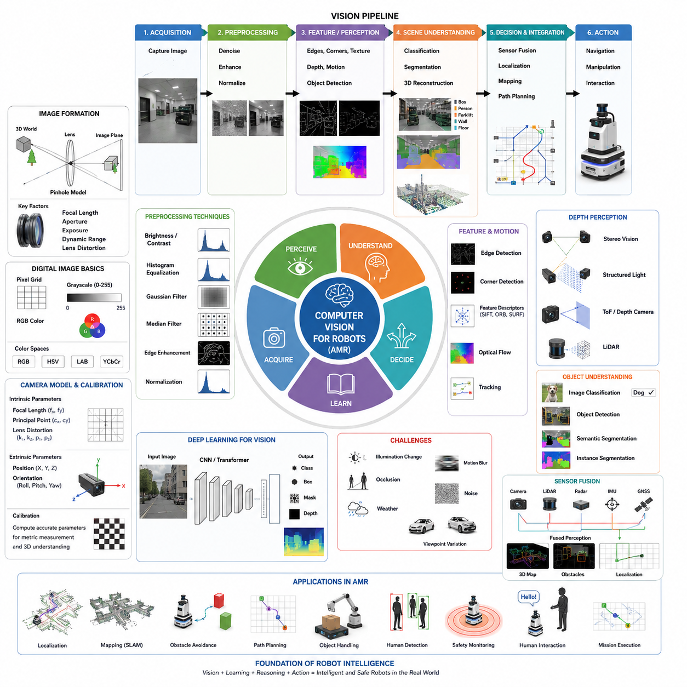
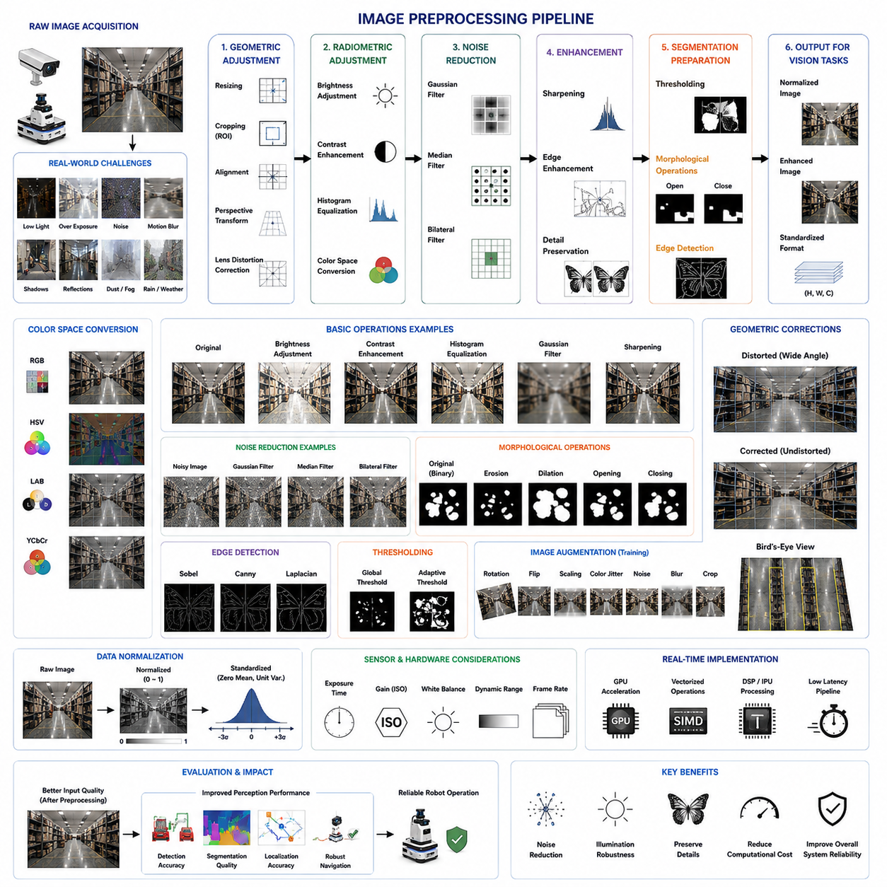
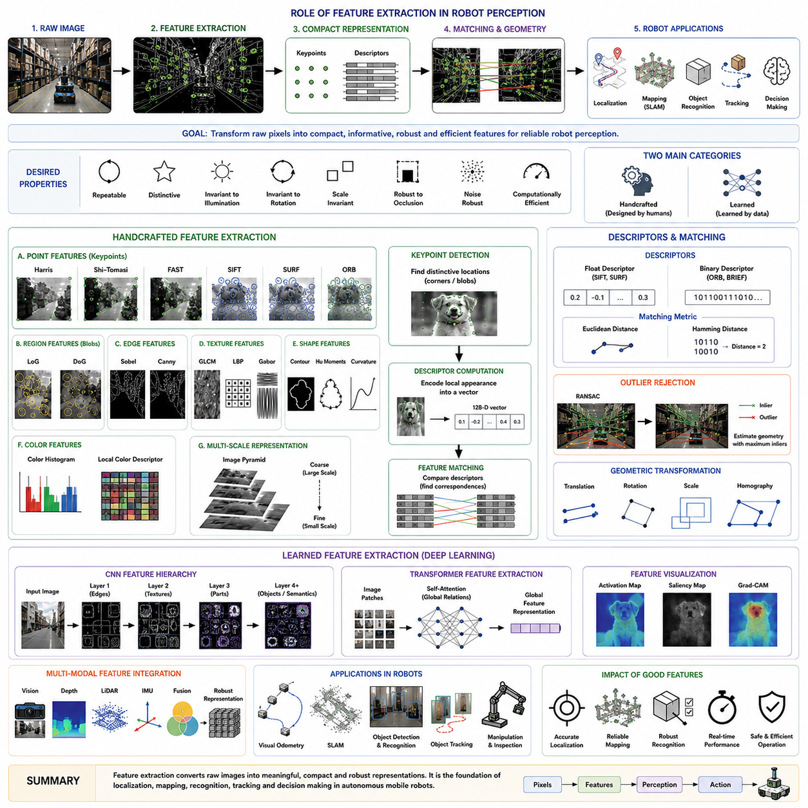
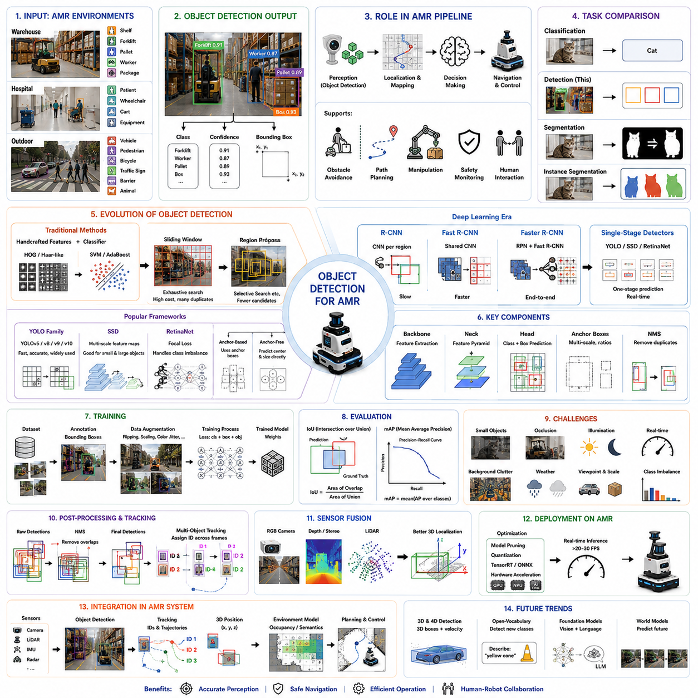
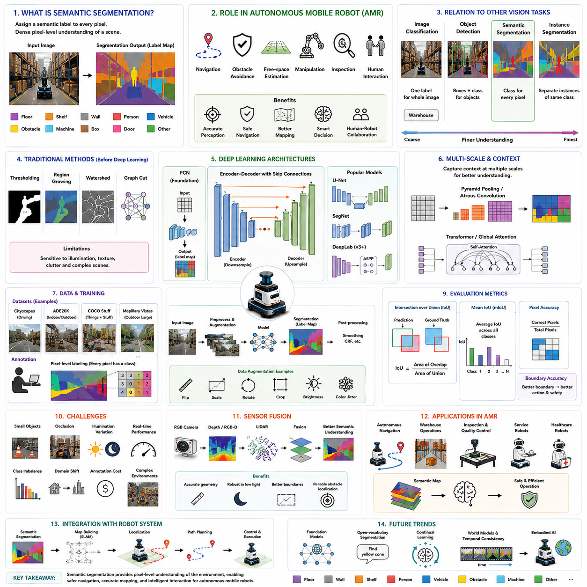
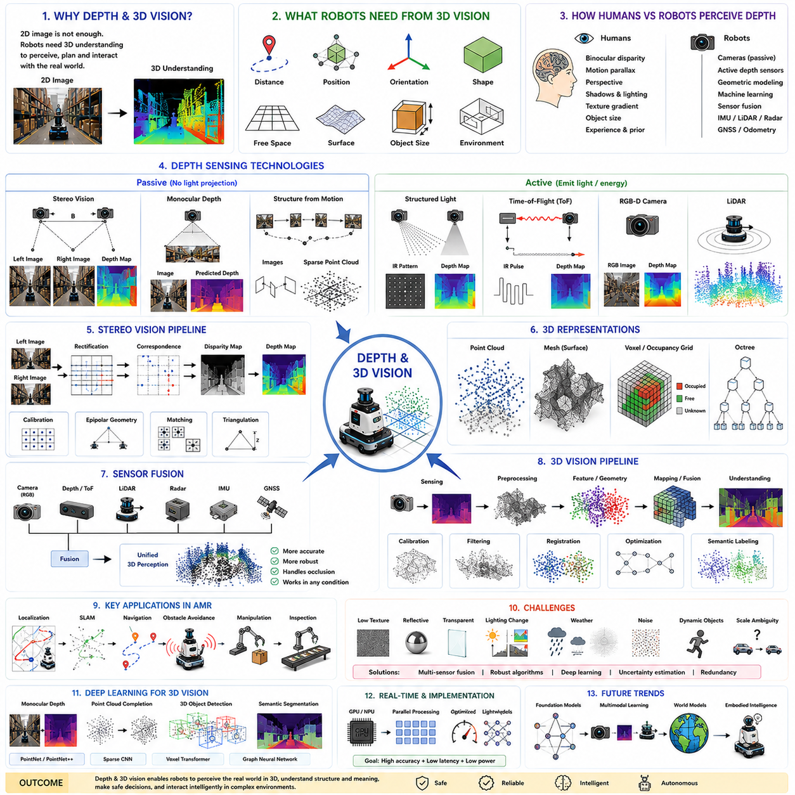
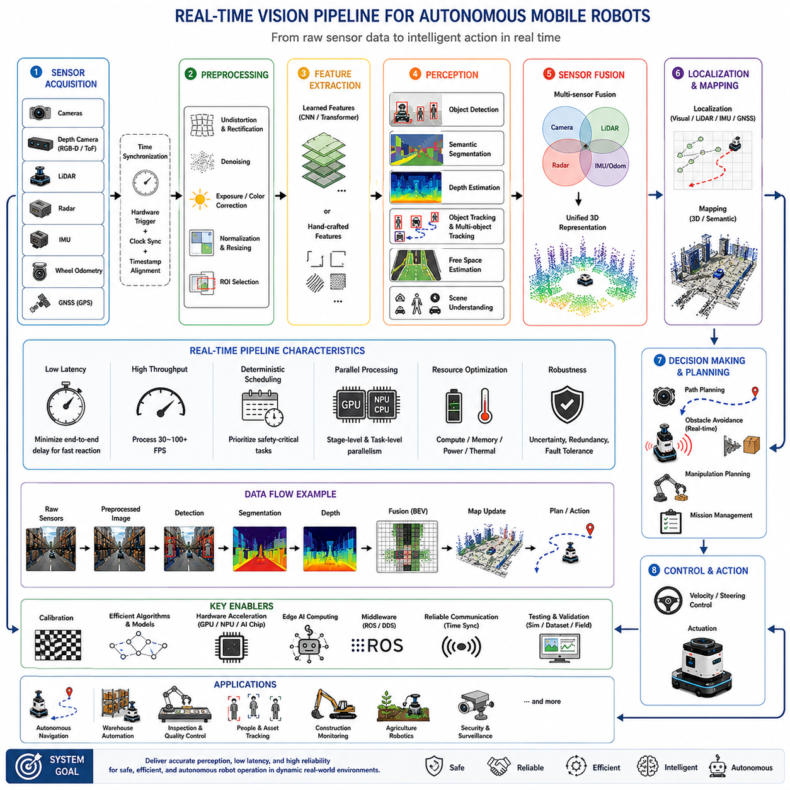
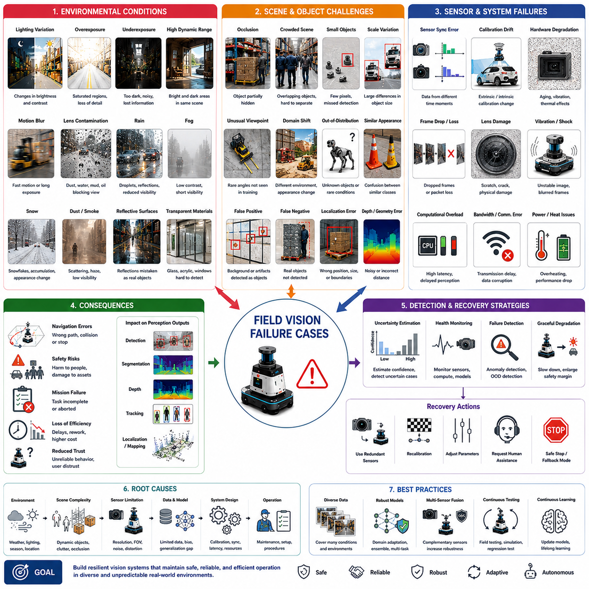

**Volume 06. AMR AI and Embodied Intelligence**

# Chapter 02. Computer Vision for Robotics

## 02.1 Computer Vision Basics

{width="7.268055555555556in" height="7.268055555555556in"}

Computer vision is the scientific and engineering discipline that enables computers and robots to acquire, interpret, and understand information from visual data. Unlike traditional image processing, which primarily transforms or enhances images, computer vision seeks to infer meaningful knowledge about objects, scenes, events, and spatial relationships. In autonomous mobile robots (AMRs), computer vision provides one of the primary sensing capabilities that allows a robot to perceive its surroundings, recognize obstacles, estimate free space, detect humans, identify objects, and continuously update its understanding of a changing environment.

Human vision performs perception almost effortlessly through millions of years of biological evolution. The human visual system rapidly integrates color, depth, motion, shape, texture, and contextual knowledge into a coherent understanding of the world. Computer vision attempts to reproduce similar capabilities through mathematical models, algorithms, and artificial intelligence. Although modern vision systems have achieved remarkable performance in many specialized tasks, they still face significant challenges when operating under changing lighting conditions, occlusions, adverse weather, sensor noise, or previously unseen environments.

A computer vision system begins with image acquisition. Cameras convert incoming light into digital signals by measuring the intensity of photons striking individual sensor elements. Each sensor element corresponds to a pixel, representing the smallest measurable unit of an image. The complete image is formed by arranging millions of pixels into a two-dimensional grid, where each pixel stores brightness or color information. Higher image resolution generally provides greater visual detail but also increases computational complexity, memory usage, and processing latency.

Digital images are numerical representations rather than direct visual observations. A grayscale image stores a single intensity value for each pixel, typically ranging from 0 to 255 in an 8-bit representation. Color images usually employ the RGB color model, where each pixel contains independent red, green, and blue intensity values. Combining these three channels produces a wide range of visible colors. Alternative color spaces, including HSV, LAB, and YCbCr, are frequently used because they separate brightness from chromatic information, simplifying many computer vision algorithms.

The quality of visual perception depends not only on image resolution but also on camera characteristics. Lens quality, focal length, aperture, exposure time, dynamic range, sensor sensitivity, and optical distortion all influence the captured image. A vision algorithm cannot recover information that has been lost during image acquisition. Consequently, selecting appropriate camera hardware is often as important as developing sophisticated perception algorithms.

Lighting plays a critical role in computer vision performance. Changes in illumination can dramatically alter the appearance of objects even when their physical properties remain unchanged. Shadows, reflections, glare, and low-light conditions introduce ambiguity that complicates object recognition. Industrial robotics frequently addresses these challenges by using controlled illumination, infrared lighting, polarized filters, or high dynamic range cameras to produce more consistent visual inputs.

Camera geometry provides the mathematical foundation for understanding how three-dimensional scenes are projected onto two-dimensional image planes. Perspective projection causes distant objects to appear smaller than nearby objects, while parallel lines may appear to converge toward vanishing points. These geometric effects are predictable and can be modeled using camera calibration parameters, enabling robots to estimate object positions, distances, and orientations with reasonable accuracy.

Camera calibration determines both intrinsic and extrinsic parameters. Intrinsic parameters describe the internal characteristics of the camera, including focal length, principal point, and lens distortion. Extrinsic parameters define the camera\'s position and orientation relative to a world coordinate system. Accurate calibration is essential for robotic applications such as localization, object manipulation, visual navigation, and multi-camera sensor fusion.

Computer vision relies heavily on image preprocessing before higher-level analysis begins. Preprocessing improves image quality while reducing noise and unwanted variations. Common operations include brightness adjustment, contrast enhancement, histogram equalization, Gaussian filtering, median filtering, edge enhancement, and image normalization. These operations increase the robustness of subsequent perception algorithms by producing more stable visual representations.

Edges represent one of the most important visual features within an image. An edge corresponds to a rapid change in pixel intensity and often indicates the boundary of an object. Classical edge detection algorithms such as Sobel, Prewitt, Laplacian, and Canny operators identify these intensity transitions using mathematical gradients. Although deep learning has reduced reliance on handcrafted edge detectors, edge information remains valuable in many industrial inspection and localization tasks.

Feature extraction transforms raw pixel data into more informative representations. Instead of processing millions of independent pixels, vision systems identify meaningful structures such as corners, blobs, contours, and textures. Classical feature descriptors including Harris Corner, SIFT, SURF, ORB, and FAST provide compact representations that enable object matching, image registration, visual localization, and simultaneous localization and mapping. These features remain important in applications where computational efficiency and interpretability are required.

Motion provides another powerful source of visual information. Consecutive images captured over time allow algorithms to estimate object movement, camera motion, and scene dynamics. Optical flow estimates the apparent motion of pixels between adjacent frames, supporting applications such as obstacle avoidance, target tracking, ego-motion estimation, and autonomous navigation. Motion analysis enables robots to distinguish moving objects from static backgrounds and predict future trajectories.

Depth perception extends two-dimensional images into three-dimensional spatial understanding. Humans naturally infer depth through binocular vision, motion, perspective, and prior knowledge. Robots achieve similar capabilities using stereo cameras, structured light sensors, time-of-flight cameras, RGB-D cameras, or LiDAR systems. Depth estimation allows robots to measure distances, detect obstacles, reconstruct environments, and plan safe navigation paths through complex spaces.

Stereo vision estimates depth by comparing corresponding image points captured from two synchronized cameras separated by a known baseline. The displacement between corresponding pixels, known as disparity, is inversely proportional to object distance. Accurate stereo matching requires camera calibration, image rectification, and efficient correspondence algorithms. Although computationally demanding, stereo vision provides dense geometric information without requiring active illumination.

Object recognition represents one of the central goals of computer vision. Recognition involves determining both the category and identity of objects appearing within an image. Traditional recognition systems relied on handcrafted feature extraction followed by statistical classifiers such as support vector machines or random forests. Modern systems primarily employ deep convolutional neural networks and transformer-based architectures that automatically learn hierarchical visual representations from large-scale datasets.

Image classification, object detection, semantic segmentation, and instance segmentation represent increasingly sophisticated levels of scene understanding. Image classification predicts the overall content of an image. Object detection identifies both object categories and bounding box locations. Semantic segmentation assigns a class label to every pixel, while instance segmentation further distinguishes individual object instances belonging to the same category. These capabilities collectively provide comprehensive environmental awareness for autonomous robots.

Robust computer vision systems must cope with uncertainty and imperfect observations. Sensor noise, motion blur, partial occlusion, weather conditions, varying viewpoints, and changing environments all reduce recognition accuracy. Consequently, modern robotic perception often integrates multiple sensors rather than relying exclusively on cameras. Sensor fusion combines information from vision, LiDAR, radar, inertial measurement units, ultrasonic sensors, and GNSS to improve robustness, redundancy, and operational safety.

Deep learning has fundamentally transformed computer vision over the past decade. Instead of manually designing feature extractors, neural networks automatically learn hierarchical visual representations directly from training data. Convolutional neural networks first demonstrated remarkable improvements in recognition accuracy, while more recent Vision Transformers have shown strong performance across diverse perception tasks. Despite these advances, successful deployment still depends heavily on high-quality datasets, careful training procedures, efficient inference optimization, and comprehensive validation.

In autonomous mobile robots, computer vision functions as a continuous perception pipeline rather than an isolated algorithm. Images are acquired, preprocessed, analyzed, interpreted, and integrated with other sensor observations in real time. The resulting environmental understanding supports localization, mapping, obstacle avoidance, path planning, human interaction, safety monitoring, and mission execution. As robotics continues to incorporate foundation models, multimodal learning, and embodied intelligence, computer vision will remain one of the most essential technologies enabling intelligent machines to perceive, understand, and safely interact with the physical world.

## 02.2 Image Preprocessing

{width="7.268055555555556in" height="7.268055555555556in"}

Image preprocessing is the foundation of every computer vision system because the quality of the input image directly influences the reliability of subsequent perception algorithms. Cameras operating in real-world environments inevitably capture noise, illumination changes, motion blur, lens distortion, weather effects, and sensor artifacts. Image preprocessing aims to reduce these undesirable variations while preserving the visual information necessary for feature extraction, object detection, segmentation, localization, and robot decision making. Rather than adding intelligence to a vision system, preprocessing prepares visual data so that later algorithms can operate more consistently and accurately.

In autonomous mobile robots, preprocessing is particularly important because perception must remain reliable under continuously changing environmental conditions. A robot navigating through warehouses, hospitals, factories, construction sites, or outdoor roads encounters different lighting conditions, moving shadows, reflective surfaces, dust, rain, fog, and vibrations. Raw images obtained directly from cameras often contain imperfections that significantly reduce recognition accuracy. Effective preprocessing minimizes these variations before the images enter more computationally intensive perception models.

The preprocessing pipeline usually begins immediately after image acquisition. Camera images are transferred into memory, synchronized with timestamps, and converted into standardized formats suitable for processing. Depending on the application, images may undergo resizing, cropping, color space conversion, normalization, geometric correction, filtering, or enhancement before entering feature extraction or deep learning inference. Maintaining a consistent preprocessing pipeline is essential because modern AI models are highly sensitive to differences between training data and deployment data.

Image resizing is one of the simplest yet most frequently applied preprocessing operations. Computer vision models often require fixed input dimensions regardless of the original camera resolution. High-resolution images may be downsampled to reduce computational cost, while smaller images may be enlarged to match network input requirements. However, excessive resizing may remove important visual details or introduce interpolation artifacts. Selecting an appropriate image resolution therefore requires balancing computational efficiency against recognition performance.

Cropping removes irrelevant image regions and focuses computation on areas containing useful information. Instead of processing the entire camera image, robots frequently analyze predefined regions of interest corresponding to driving lanes, shelves, conveyor belts, pedestrian zones, or workspaces. Region-of-interest selection reduces computational complexity while improving algorithm robustness by eliminating distracting background information that contributes little to the desired task.

Image normalization transforms pixel values into standardized numerical ranges. Deep learning models typically perform better when input values are normalized to consistent distributions rather than using raw intensity values. Common normalization methods include scaling pixel values between zero and one, centering data around zero mean, or standardizing using dataset-specific mean and variance. These operations stabilize optimization during model training while improving inference consistency across different hardware platforms.

Color space conversion provides alternative representations that simplify particular computer vision tasks. Although RGB remains the most common image representation, many algorithms benefit from separating brightness from color information. HSV emphasizes hue and saturation independently of illumination, LAB approximates human color perception, while YCbCr separates luminance from chrominance. Selecting an appropriate color space often improves segmentation, object recognition, defect detection, and illumination robustness.

Brightness adjustment compensates for global illumination differences caused by changing environmental lighting. Images captured under insufficient illumination may lose object details, while excessive brightness can saturate sensor responses and obscure boundaries. Brightness correction modifies pixel intensity distributions to produce visually balanced images without fundamentally altering scene geometry. Adaptive brightness adjustment is frequently employed in outdoor robotic systems where sunlight changes continuously throughout the day.

Contrast enhancement increases the distinction between dark and bright image regions, making important structures easier to detect. Low-contrast images frequently occur under fog, haze, overcast weather, or poor indoor lighting. Histogram stretching, adaptive contrast enhancement, and local contrast adjustment improve visibility of object boundaries while preserving fine structural details. Enhanced contrast often leads to more reliable edge detection and feature extraction.

Histogram equalization redistributes image intensity values to utilize the available brightness range more effectively. Rather than concentrating pixels within narrow intensity intervals, histogram equalization spreads values across the full dynamic range, increasing overall image contrast. Adaptive Histogram Equalization and Contrast Limited Adaptive Histogram Equalization further improve local image quality while preventing excessive amplification of noise in homogeneous regions.

Noise reduction is one of the primary objectives of preprocessing because image sensors inevitably introduce random variations during acquisition. Electronic noise increases under low-light conditions, high sensor gain, elevated temperature, or long exposure times. Noise corrupts edges, textures, and fine details, reducing the effectiveness of downstream perception algorithms. Appropriate denoising improves recognition performance without excessively smoothing meaningful image structures.

Gaussian filtering removes high-frequency noise by replacing each pixel with a weighted average of its neighboring pixels. Nearby pixels contribute more heavily than distant pixels according to a Gaussian distribution, producing smooth transitions while suppressing random fluctuations. Gaussian filters are widely used before edge detection because they reduce false gradients caused by sensor noise. However, excessive smoothing may blur object boundaries and eliminate fine details required for accurate recognition.

Median filtering replaces each pixel with the median value within a local neighborhood rather than computing an arithmetic average. This nonlinear filtering approach is particularly effective for removing impulsive noise such as salt-and-pepper artifacts while preserving sharp edges. Industrial inspection systems frequently employ median filters because they suppress isolated sensor defects without significantly degrading geometric boundaries.

Bilateral filtering simultaneously considers spatial distance and intensity similarity when smoothing images. Pixels with similar brightness contribute more strongly than those with significantly different intensities, allowing edges to remain sharp while homogeneous regions become smoother. Bilateral filtering therefore combines noise reduction with edge preservation, making it valuable for depth estimation, object segmentation, and surface inspection applications.

Sharpening enhances fine image details by emphasizing high-frequency components corresponding to edges and textures. Unsharp masking and Laplacian-based enhancement increase local contrast around object boundaries, improving visual clarity and feature detection. Sharpening must be applied carefully because excessive enhancement amplifies noise and may generate artificial structures that confuse later recognition algorithms.

Image thresholding converts grayscale images into binary representations by separating foreground from background according to pixel intensity. Global thresholding applies a single intensity threshold to the entire image, while adaptive thresholding computes local thresholds based on neighborhood statistics. Binary images simplify numerous industrial inspection tasks including component counting, document analysis, shape measurement, and defect detection.

Morphological operations manipulate binary image structures using predefined kernels called structuring elements. Erosion removes small foreground regions and separates connected objects. Dilation expands object boundaries and fills small gaps. Opening combines erosion followed by dilation to eliminate noise while preserving larger structures. Closing performs dilation followed by erosion to fill holes and connect fragmented regions. These operations provide robust post-processing for segmentation results.

Edge enhancement emphasizes intensity transitions corresponding to object boundaries. Gradient-based operators highlight changes in brightness while suppressing relatively uniform regions. Accurate edge information improves contour extraction, shape analysis, feature detection, and visual localization. Edge enhancement is particularly useful when objects exhibit weak texture but possess well-defined geometric boundaries.

Lens distortion correction compensates for nonlinear image deformation introduced by camera optics. Wide-angle and fisheye lenses frequently produce barrel or pincushion distortion, causing straight lines to appear curved. Camera calibration estimates distortion parameters that allow geometric correction before subsequent processing. Accurate distortion removal is essential for metric measurements, stereo vision, simultaneous localization and mapping, and autonomous navigation.

Perspective transformation changes the viewpoint of an image through geometric mapping. Birds-eye-view generation transforms forward-facing camera images into top-down representations that simplify lane detection, obstacle localization, and path planning. Perspective correction also enables accurate dimensional measurements from images captured at oblique viewing angles. Such transformations are widely used in intelligent transportation systems and industrial automation.

Image registration aligns multiple images captured from different viewpoints, times, or sensors into a common coordinate system. Registration algorithms estimate geometric transformations based on corresponding visual features or intensity distributions. Multi-camera perception, panorama generation, medical imaging, and map updating all depend upon accurate image registration to combine complementary information from multiple observations.

Image augmentation plays a critical role during deep learning training rather than runtime deployment. Artificial variations such as rotation, translation, scaling, flipping, color jitter, brightness adjustment, Gaussian noise, blur, and random cropping generate additional training examples from limited datasets. Data augmentation improves model generalization by exposing neural networks to diverse visual conditions that resemble real-world operational environments.

Modern computer vision systems increasingly integrate preprocessing directly into neural network architectures. Learned normalization layers, differentiable filtering operations, adaptive enhancement modules, and transformer-based feature preprocessing reduce reliance on manually designed image processing pipelines. Nevertheless, classical preprocessing remains valuable because many operations are computationally inexpensive, highly interpretable, and effective across a broad range of industrial applications.

Real-time robotic systems impose strict computational constraints on preprocessing algorithms. Every preprocessing stage contributes additional latency before perception and planning can begin. Efficient implementations exploit hardware acceleration through GPUs, vectorized instructions, digital signal processors, and dedicated image processing units. The objective is not to maximize visual quality but rather to maximize downstream perception accuracy while satisfying real-time execution requirements.

Image preprocessing should always be evaluated as part of the complete perception pipeline rather than as an isolated processing stage. A filter that improves visual appearance for human observers does not necessarily improve object detection or localization accuracy. Every preprocessing operation should therefore be validated using task-specific performance metrics such as detection precision, segmentation quality, localization accuracy, navigation success rate, inference latency, and overall system robustness.

As autonomous mobile robots continue operating in increasingly diverse environments, image preprocessing remains an indispensable component of computer vision. It bridges the gap between imperfect physical sensors and intelligent perception algorithms by transforming raw camera data into stable, consistent, and informative visual representations. Although deep learning has automated many aspects of visual understanding, robust preprocessing continues to improve perception reliability, computational efficiency, and operational safety, making it an essential foundation for modern robotic vision systems.

## 02.3 Feature Extraction

{width="7.268055555555556in" height="7.268055555555556in"}

Feature extraction is the process of identifying meaningful patterns, structures, and characteristics from raw image data that can be used for recognition, localization, tracking, and decision making. Instead of processing millions of individual pixel values directly, computer vision systems transform visual information into compact and informative representations known as features. These features describe important properties of objects, scenes, or image regions while reducing redundant information. Feature extraction serves as the bridge between low-level image processing and high-level visual understanding, making it one of the most fundamental components of robotic perception.

In autonomous mobile robots, feature extraction enables the perception system to recognize stable visual landmarks despite changes in viewpoint, illumination, scale, or partial occlusion. A robot navigating through a warehouse, factory, hospital, or outdoor environment continuously observes visual scenes that change as it moves. Although raw pixel values vary significantly from frame to frame, well-designed features remain relatively stable, allowing the robot to recognize previously visited locations, identify objects, estimate motion, and construct consistent environmental maps.

The primary objective of feature extraction is to represent images using a smaller number of highly informative descriptors. Rather than storing every pixel individually, the algorithm identifies image regions that contain useful structural information such as corners, edges, textures, blobs, or distinctive patterns. These features preserve the information required for recognition while significantly reducing computational complexity. Compact feature representations also improve matching efficiency and enable real-time robotic operation on embedded computing platforms.

An effective visual feature should satisfy several important properties. It should be repeatable so that the same physical location produces similar features under different imaging conditions. It should be distinctive enough to differentiate one object or location from another. It should remain robust against illumination changes, viewpoint variations, image noise, scale differences, and partial occlusions. Finally, feature extraction should be computationally efficient so that real-time perception remains feasible within the processing constraints of autonomous robotic systems.

Feature extraction techniques can generally be divided into handcrafted methods and learned methods. Handcrafted features are manually designed using mathematical models based on image gradients, intensity distributions, geometric structures, or texture statistics. Learned features are automatically discovered by deep neural networks through optimization on large training datasets. Although deep learning has become dominant in modern computer vision, handcrafted features remain valuable because of their interpretability, computational efficiency, and proven reliability in many industrial applications.

Edges represent one of the simplest forms of visual features. An edge corresponds to a rapid change in image intensity and frequently indicates the boundary between different objects or surface regions. Edge information provides valuable geometric structure while remaining relatively insensitive to uniform brightness variations. Gradient operators such as Sobel, Prewitt, Scharr, and Canny detect these intensity transitions by measuring local spatial derivatives. Edge maps form the basis of numerous higher-level vision algorithms including contour extraction, object segmentation, and geometric matching.

Corners provide significantly richer visual information than simple edges because intensity changes occur simultaneously in multiple directions. A corner represents a point where two or more edges intersect, producing a highly distinctive local structure. Unlike long straight edges that may appear similar along their entire length, corners provide unique reference points that can be reliably matched across different images. Consequently, corner detection forms the foundation of many visual localization and simultaneous localization and mapping systems.

The Harris Corner Detector remains one of the most influential corner detection algorithms. It analyzes local image gradients to identify locations where intensity changes significantly along multiple directions. Harris corners demonstrate good rotational invariance and repeatability while maintaining relatively low computational complexity. Although newer algorithms have improved performance under scale variations, Harris corner detection continues to serve as an important educational and industrial baseline.

The Shi-Tomasi Corner Detector improves upon the Harris method by selecting corners based on the minimum eigenvalue of the local gradient covariance matrix. This modification provides more stable corner selection for feature tracking applications. The Shi-Tomasi detector is widely used in visual odometry and optical flow estimation because it identifies image points that remain easier to track over consecutive video frames.

FAST, or Features from Accelerated Segment Test, was specifically developed for high-speed corner detection in real-time applications. Rather than computing image gradients, FAST compares pixel intensities around a circular neighborhood to determine whether a candidate location represents a corner. Its computational simplicity enables extremely fast execution, making it particularly suitable for embedded robotic systems with limited processing resources.

Blob detection identifies image regions that differ significantly from their surroundings in brightness or texture. Unlike corners, which correspond to precise points, blobs represent larger homogeneous regions that often correspond to physical objects or surface markings. Blob detectors provide useful visual landmarks for recognition, tracking, and scene analysis, especially when distinctive corner features are limited.

The Laplacian of Gaussian and Difference of Gaussian operators are classical approaches for blob detection. Both methods identify image structures across multiple spatial scales by analyzing second-order intensity variations. Multi-scale blob detection enables recognition of objects appearing at different distances from the camera, supporting scale-invariant feature extraction in dynamic robotic environments.

Scale-Invariant Feature Transform, commonly known as SIFT, introduced a major advancement in computer vision by combining scale-space detection with highly distinctive local descriptors. SIFT identifies stable keypoints across multiple image resolutions and constructs descriptors based on local gradient orientation histograms. These descriptors remain remarkably robust under changes in scale, rotation, moderate viewpoint variation, and illumination differences. SIFT became the foundation of many early object recognition, panorama stitching, and visual localization systems.

Speeded-Up Robust Features, known as SURF, was developed to provide functionality similar to SIFT while significantly reducing computational complexity. SURF approximates Gaussian filtering using integral images and box filters, enabling faster execution without substantial reductions in recognition accuracy. Although patent restrictions historically limited its widespread adoption, SURF demonstrated the importance of balancing robustness with computational efficiency.

Oriented FAST and Rotated BRIEF, commonly referred to as ORB, combines the FAST keypoint detector with an efficient binary descriptor. ORB provides rotational invariance while requiring considerably less computation than SIFT or SURF. Because ORB descriptors consist of binary strings rather than floating-point vectors, feature matching becomes significantly faster using Hamming distance. ORB remains one of the most widely deployed handcrafted feature extraction methods in embedded robotics and mobile computing.

Binary Robust Independent Elementary Features, or BRIEF, introduced binary feature descriptors based on simple intensity comparisons within local image patches. Although BRIEF lacks rotational invariance by itself, its computational efficiency inspired numerous subsequent descriptor designs. Binary descriptors dramatically reduced memory requirements while accelerating large-scale feature matching across extensive image databases.

Feature descriptors represent the appearance surrounding detected keypoints. While keypoint detectors determine where interesting image locations exist, descriptors encode the visual characteristics around those locations into compact numerical vectors. Effective descriptors allow corresponding image regions to be matched even when images differ in orientation, brightness, scale, or viewpoint. Descriptor quality largely determines the reliability of object recognition and visual localization.

Feature matching establishes correspondences between descriptors extracted from different images. Similar descriptors likely originate from the same physical object or environmental landmark. Distance metrics such as Euclidean distance for floating-point descriptors and Hamming distance for binary descriptors quantify descriptor similarity. Robust matching algorithms often employ nearest-neighbor search followed by geometric consistency verification to eliminate false correspondences.

Outlier rejection plays a crucial role during feature matching because incorrect correspondences inevitably occur in complex environments. Random Sample Consensus, commonly known as RANSAC, estimates geometric transformations while simultaneously rejecting inconsistent feature matches. By repeatedly selecting random subsets of correspondences, RANSAC identifies the transformation supported by the largest number of inliers. This technique substantially improves robustness in visual odometry, image registration, and simultaneous localization and mapping.

Texture features describe repeated intensity patterns that characterize surface appearance. Statistical texture descriptors capture spatial relationships among neighboring pixels, enabling differentiation between materials such as concrete, grass, wood, fabric, or metal. Gray-Level Co-occurrence Matrix, Local Binary Patterns, and Gabor filters remain important texture analysis techniques in industrial inspection, terrain classification, and defect detection applications.

Shape features describe geometric properties of objects independent of texture or color. Contours, convex hulls, Hu moments, Fourier descriptors, and curvature measurements provide robust representations of object geometry. Shape analysis proves particularly valuable when appearance varies significantly due to illumination while geometric structure remains relatively stable. Robotic manipulation, component inspection, and industrial measurement frequently rely upon geometric feature extraction.

Color features provide complementary information unavailable through grayscale analysis alone. Color histograms summarize global color distributions, while local color descriptors characterize object appearance within restricted image regions. Although color features remain sensitive to illumination variation, they significantly improve recognition performance when combined with geometric or texture descriptors. Agricultural robots, food inspection systems, and service robots often depend heavily on color information.

Feature pyramids represent images at multiple spatial resolutions, enabling simultaneous detection of large and small objects. Multi-scale representations allow algorithms to recognize identical objects appearing at different distances from the camera. Scale-space analysis has become an essential concept underlying both classical feature extraction methods and modern deep neural network architectures.

Deep learning fundamentally changed feature extraction by allowing neural networks to learn hierarchical representations directly from data. Instead of manually designing edge detectors, corner descriptors, or texture operators, convolutional neural networks automatically discover increasingly abstract features during supervised training. Early network layers typically learn edges and textures, intermediate layers represent object parts, and deeper layers encode semantic concepts useful for recognition and decision making.

Convolutional neural networks perform feature extraction through repeated convolution, nonlinear activation, and pooling operations. Convolution kernels automatically adapt during training to detect informative visual patterns. Pooling gradually increases receptive fields while improving translational robustness. The resulting hierarchical feature maps provide rich representations that significantly outperform handcrafted descriptors on many challenging computer vision benchmarks.

Feature visualization techniques help researchers understand what deep neural networks have learned. Activation maps, saliency maps, Grad-CAM visualizations, and feature inversion methods reveal which image regions contribute most strongly to network decisions. Although learned features remain less interpretable than handcrafted descriptors, visualization methods improve model transparency and support failure analysis in safety-critical robotic applications.

Vision Transformers have introduced a different approach to feature extraction by modeling relationships among image patches using self-attention mechanisms rather than local convolutions. Self-attention enables the network to capture long-range contextual dependencies across the entire image. Transformer-based features often provide stronger global scene understanding, particularly in complex environments where object relationships influence perception.

Modern robotic perception systems rarely rely on a single type of feature. Instead, multiple complementary features are integrated to improve robustness under diverse environmental conditions. Classical geometric features may support precise localization, while deep semantic features provide reliable object recognition. Depth information, motion cues, color distributions, and multimodal sensor measurements are frequently fused to create comprehensive environmental representations that support navigation, manipulation, inspection, and autonomous decision making.

The quality of extracted features directly influences the overall performance of every subsequent perception algorithm. Poor feature representations lead to unreliable localization, inaccurate mapping, unstable tracking, and incorrect object recognition regardless of the sophistication of higher-level reasoning algorithms. Consequently, feature extraction remains one of the most critical components of computer vision, providing the informative and compact representations upon which modern autonomous mobile robots build their understanding of the surrounding world.

## 02.4 Object Detection for AMR

{width="7.268055555555556in" height="7.268055555555556in"}

Object detection is one of the most essential perception capabilities in autonomous mobile robots because it enables a robot to identify and localize objects within its surrounding environment. Unlike image classification, which predicts a single category for an entire image, object detection simultaneously determines what objects are present and where they are located. The output typically consists of object categories, confidence scores, and bounding boxes describing each detected object. These results provide the foundation for navigation, obstacle avoidance, manipulation, safety monitoring, and autonomous decision making.

Autonomous mobile robots operate in dynamic environments where numerous objects continuously appear, disappear, and move. Warehouses contain shelves, pallets, forklifts, workers, and packages. Hospitals include patients, medical carts, wheelchairs, and equipment. Outdoor robots encounter vehicles, pedestrians, bicycles, traffic signs, construction barriers, and animals. Reliable object detection enables the robot to distinguish navigable space from potential hazards while continuously updating its understanding of the surrounding environment.

Object detection differs fundamentally from semantic segmentation and instance segmentation. Semantic segmentation classifies every image pixel into predefined categories but does not distinguish individual object instances. Instance segmentation extends semantic segmentation by separating multiple objects belonging to the same category. Object detection occupies the intermediate level of scene understanding by identifying object locations through bounding boxes while maintaining relatively low computational complexity. Consequently, object detection has become one of the most widely deployed perception techniques for real-time robotic systems.

The performance of an object detector depends on both localization accuracy and classification accuracy. Localization determines how precisely the predicted bounding box overlaps the actual object. Classification determines whether the object category has been correctly identified. A successful detector must simultaneously estimate both properties while maintaining high processing speed. Robotic applications often require real-time performance exceeding twenty or thirty frames per second to ensure timely responses during autonomous navigation.

Early object detection systems relied heavily on handcrafted visual features combined with statistical classifiers. Histogram of Oriented Gradients described local edge distributions, while Haar-like features represented intensity differences within rectangular regions. These features were combined with classifiers such as Support Vector Machines or AdaBoost to recognize pedestrians, faces, vehicles, and other predefined object categories. Although these methods achieved practical success in controlled environments, they struggled with large appearance variations and complex backgrounds.

The Viola-Jones detector represented one of the earliest real-time object detection systems capable of practical deployment. Haar-like features and cascade classifiers enabled rapid face detection by progressively rejecting unlikely image regions using increasingly sophisticated decision stages. Although modern deep learning has largely replaced this approach, the Viola-Jones framework demonstrated the importance of balancing computational efficiency with detection accuracy in embedded vision systems.

Sliding window detection was the dominant framework before deep learning became widespread. The detector systematically evaluated numerous image regions at multiple scales using a fixed-size classification window. Every possible location was independently classified as either containing an object or representing background. Although conceptually simple, exhaustive sliding window search required enormous computational resources and frequently produced redundant detections, limiting real-time performance.

Region proposal methods significantly improved computational efficiency by identifying candidate object regions before classification. Instead of evaluating every possible image location, algorithms such as Selective Search generated a relatively small set of promising object proposals based on color similarity, texture continuity, and geometric grouping. Deep neural networks subsequently classified only these proposed regions, dramatically reducing computational requirements compared with exhaustive sliding window approaches.

The emergence of deep learning fundamentally transformed object detection. Rather than manually designing visual features, convolutional neural networks automatically learned hierarchical representations directly from labeled training data. These learned features proved substantially more robust against viewpoint changes, illumination variations, scale differences, partial occlusions, and complex backgrounds. Deep learning rapidly surpassed handcrafted methods across nearly every object detection benchmark.

Region-based Convolutional Neural Networks introduced one of the first highly successful deep learning detection frameworks. R-CNN generated region proposals using traditional algorithms before classifying each region with a convolutional neural network. Although detection accuracy improved dramatically, computational cost remained high because feature extraction was repeated independently for every proposed region.

Fast R-CNN improved computational efficiency by computing convolutional feature maps only once for the entire image. Region proposals were projected onto shared feature maps, allowing classification and bounding box regression without repeated feature extraction. This shared computation substantially accelerated detection while maintaining excellent recognition accuracy, demonstrating the advantages of feature sharing within deep neural networks.

Faster R-CNN further advanced the framework by introducing the Region Proposal Network, which generated candidate object regions directly from convolutional feature maps. Eliminating external proposal algorithms created an end-to-end trainable detection system that significantly improved both speed and accuracy. Faster R-CNN remains widely used when maximum detection precision is more important than inference speed.

Single-stage detectors pursue real-time performance by eliminating explicit region proposal generation altogether. Instead of separating proposal generation and classification into multiple stages, these detectors directly predict object classes and bounding boxes from dense feature maps. Although early single-stage detectors initially sacrificed some accuracy, continued architectural improvements have narrowed the performance gap while providing substantially higher inference speeds.

The You Only Look Once family revolutionized real-time object detection by treating detection as a single regression problem. YOLO simultaneously predicts object locations, dimensions, confidence scores, and categories using a unified neural network. Because the entire image is processed in a single forward pass, YOLO achieves extremely high inference speeds while maintaining competitive detection accuracy. This balance has made YOLO one of the most popular object detection frameworks for autonomous mobile robots.

Successive generations of YOLO introduced numerous architectural improvements. Enhanced backbone networks, feature pyramid structures, anchor optimization, attention mechanisms, improved loss functions, and more efficient training strategies progressively increased both detection accuracy and inference speed. Modern implementations such as YOLOv8, YOLOv9, YOLOv10, and later variants demonstrate excellent performance across embedded robotics, industrial automation, and autonomous driving applications.

Single Shot Detector introduced another efficient single-stage detection framework. SSD predicts objects across multiple feature map resolutions, allowing simultaneous recognition of both small and large objects. Multi-scale feature extraction improves robustness across varying object sizes while maintaining relatively low computational complexity. SSD remains an important reference architecture for lightweight robotic perception systems.

RetinaNet addressed the imbalance between foreground and background examples through the introduction of focal loss. During training, background regions vastly outnumber object regions, causing standard classification losses to become dominated by easily classified negative examples. Focal loss reduces the influence of easy samples while emphasizing difficult examples, significantly improving detection performance for challenging object categories.

Anchor boxes historically played an important role in object detection by providing predefined reference bounding boxes of different sizes and aspect ratios. Neural networks predicted offsets relative to these anchors instead of estimating arbitrary bounding boxes directly. Appropriate anchor design improved convergence during training but required careful manual configuration. More recent anchor-free detectors simplify training by predicting object centers and dimensions directly.

Object detection performance is commonly evaluated using Intersection over Union. This metric measures the overlap between predicted and ground-truth bounding boxes relative to their combined area. Higher overlap indicates more accurate localization. Detection is generally considered correct when Intersection over Union exceeds a predefined threshold such as fifty percent or seventy-five percent, depending on application requirements.

Mean Average Precision has become the standard evaluation metric for object detection. Precision measures the proportion of predicted detections that are correct, while recall measures the proportion of actual objects successfully detected. Average Precision summarizes precision across different confidence thresholds, and Mean Average Precision averages this value across all object categories. Higher Mean Average Precision indicates superior overall detection performance.

Non-Maximum Suppression removes redundant detections generated for the same physical object. Deep neural networks frequently produce multiple overlapping bounding boxes with high confidence scores. Non-Maximum Suppression retains only the highest-confidence detection while discarding neighboring boxes whose overlap exceeds a predefined threshold. This post-processing step produces clean detection outputs suitable for robotic decision making.

Small object detection remains one of the most difficult challenges in robotic perception. Distant pedestrians, safety cones, tools, electrical components, or inspection targets may occupy only a few pixels within high-resolution images. Multi-scale feature pyramids, super-resolution techniques, attention mechanisms, and high-resolution backbone networks all contribute to improving small object detection accuracy.

Occlusion presents another major challenge. Objects may become partially hidden behind shelves, machinery, vehicles, vegetation, or other people. Humans naturally recognize partially visible objects using contextual reasoning and prior knowledge, but computer vision systems often struggle when only limited visual evidence remains. Data augmentation, transformer architectures, and multi-view sensor fusion improve robustness against partial occlusion.

Changing illumination significantly affects object appearance. Outdoor robots experience bright sunlight, deep shadows, rain, fog, snow, nighttime operation, and rapidly changing weather conditions. Indoor robots encounter artificial lighting variations, reflections, and glare. Robust object detectors therefore require extensive training under diverse illumination conditions together with adaptive preprocessing techniques and exposure control.

Real-time operation imposes strict computational constraints on autonomous mobile robots. Object detection competes with localization, mapping, path planning, obstacle avoidance, communication, and system monitoring for limited computational resources. Efficient model architectures, network pruning, quantization, TensorRT optimization, GPU acceleration, and dedicated AI accelerators enable advanced detectors to satisfy real-time requirements on embedded robotic platforms.

Object tracking naturally extends object detection by associating detections across consecutive video frames. Multi-object tracking assigns persistent identities to moving objects, allowing robots to estimate trajectories, predict future motion, and understand dynamic interactions within crowded environments. Detection provides spatial observations, while tracking introduces temporal consistency that greatly improves robotic situational awareness.

Object detection is increasingly integrated with depth sensing technologies. RGB cameras provide appearance information, while stereo vision, RGB-D cameras, structured light sensors, time-of-flight cameras, and LiDAR contribute geometric measurements. Fusing appearance and depth significantly improves localization accuracy, obstacle classification, manipulation planning, and safe autonomous navigation, especially in cluttered industrial environments.

Recent foundation vision models have expanded object detection beyond closed-set recognition. Traditional detectors recognize only categories included within their training datasets. Open-vocabulary detection combines language understanding with visual perception, allowing robots to detect previously unseen object categories described through natural language. This capability increases flexibility for service robots, warehouse automation, and human-robot collaboration.

In autonomous mobile robots, object detection functions as a continuously operating perception module rather than an isolated recognition algorithm. Camera images are processed frame by frame, detected objects are tracked over time, depth information estimates spatial positions, and sensor fusion integrates complementary observations from LiDAR, radar, and inertial sensors. The resulting environmental representation supports navigation, obstacle avoidance, manipulation, safety monitoring, human interaction, inspection, and mission execution.

As robotic systems become increasingly intelligent, object detection continues evolving from simple two-dimensional recognition toward comprehensive three-dimensional scene understanding. Future detection systems will integrate multimodal perception, foundation models, embodied intelligence, continual learning, uncertainty estimation, and world models into unified perception architectures. These advances will enable autonomous mobile robots to recognize increasingly complex environments, understand semantic relationships among objects, anticipate future events, and safely cooperate with humans across diverse real-world applications.

## 02.5 Semantic Segmentation

{width="7.268055555555556in" height="7.268055555555556in"}

Semantic segmentation is a computer vision task that assigns a semantic category to every individual pixel in an image. Unlike image classification, which predicts a single label for the entire image, or object detection, which identifies objects using bounding boxes, semantic segmentation provides dense pixel-level understanding of a scene. Every pixel is classified into predefined categories such as road, wall, floor, person, vehicle, vegetation, shelf, machine, or obstacle. This fine-grained representation enables autonomous mobile robots to perceive their surroundings with much greater precision than object-level detection alone.

In autonomous mobile robots, semantic segmentation provides a detailed understanding of the operating environment. A robot navigating through warehouses, hospitals, factories, airports, shopping centers, or outdoor roads must distinguish traversable surfaces from obstacles while simultaneously recognizing structural elements and dynamic objects. Instead of merely detecting that a person exists somewhere within a bounding box, semantic segmentation determines the exact pixels occupied by the person, allowing more accurate navigation, collision avoidance, and spatial reasoning.

Scene understanding is one of the primary objectives of semantic segmentation. A robot must understand not only individual objects but also the relationships between different regions of the environment. Floors connect to corridors, walls define boundaries, doors provide access, shelves contain products, and workstations define operational areas. Pixel-level classification transforms a raw camera image into a structured semantic map that supports navigation, localization, manipulation, and intelligent decision making.

Semantic segmentation differs significantly from image classification, object detection, and instance segmentation. Image classification produces one category for an entire image regardless of object locations. Object detection predicts object categories together with rectangular bounding boxes. Semantic segmentation classifies every pixel but treats multiple objects of the same category as a single region. Instance segmentation further separates individual objects belonging to the same semantic class. These four perception tasks represent progressively richer levels of visual understanding.

The output of a semantic segmentation system is commonly represented as a segmentation mask. Every pixel within the mask contains an integer corresponding to a predefined semantic category. Different colors are often assigned to different categories for visualization, allowing humans to interpret segmentation results easily. Although visualization uses color, the underlying representation remains a numerical label map that can be directly processed by robotic planning and control algorithms.

Pixel-level perception significantly improves navigation safety. Bounding boxes frequently include substantial background regions that do not belong to the detected object. For example, a pedestrian bounding box may include empty space surrounding the person. Semantic segmentation precisely identifies the occupied pixels, enabling robots to estimate obstacle shapes, available free space, and safe navigation corridors more accurately than detection-based methods alone.

Semantic segmentation also supports free-space estimation. Rather than explicitly detecting every obstacle, robots identify navigable ground regions directly from segmented images. Pixels classified as floor, pavement, road, or corridor represent traversable surfaces, while walls, vehicles, machinery, furniture, or vegetation indicate occupied regions. Free-space segmentation greatly simplifies path planning by transforming complex camera images into binary traversability maps.

Traditional image segmentation methods relied on handcrafted algorithms before deep learning became dominant. Thresholding separated foreground from background using pixel intensity values. Region growing expanded segments based on neighboring pixel similarity. Watershed algorithms treated image intensity as topographic surfaces. Graph-cut optimization partitioned images by minimizing energy functions. Although these techniques remain useful for specialized applications, they generally struggle under complex real-world conditions involving varying illumination, texture, and clutter.

The emergence of fully convolutional neural networks fundamentally transformed semantic segmentation. Rather than classifying individual image patches independently, fully convolutional architectures replaced dense classification layers with convolutional operations capable of generating dense pixel predictions. This innovation enabled efficient end-to-end learning while preserving spatial relationships throughout the network, dramatically improving segmentation accuracy across diverse visual environments.

Fully Convolutional Networks introduced the first successful deep learning architecture specifically designed for dense semantic segmentation. Traditional convolutional neural networks reduced image resolution through repeated pooling operations before classification. Fully Convolutional Networks replaced the final classification layers with learnable upsampling operations, allowing pixel-wise prediction while maintaining computational efficiency. This architecture established the foundation for nearly all subsequent semantic segmentation networks.

Encoder-decoder architectures became one of the most influential segmentation designs. The encoder gradually extracts increasingly abstract semantic features while reducing spatial resolution. The decoder progressively restores image resolution using learned upsampling operations. Skip connections transfer fine spatial information from encoder layers directly to corresponding decoder stages, preserving object boundaries while maintaining rich semantic understanding. This architecture balances recognition capability with localization precision.

U-Net represents one of the best-known encoder-decoder segmentation networks. Originally developed for biomedical image analysis, U-Net introduced extensive skip connections that preserve high-resolution spatial information throughout the decoding process. The architecture performs remarkably well even with relatively limited training datasets, making it widely applicable to industrial inspection, agricultural robotics, medical imaging, and autonomous mobile robotics.

SegNet introduced an efficient decoder architecture that reuses pooling indices computed during encoding to guide feature upsampling. Rather than learning complex deconvolution filters, SegNet reconstructs higher-resolution feature maps using the stored pooling locations. This strategy reduces memory consumption while maintaining accurate boundary reconstruction, making SegNet particularly attractive for embedded robotic platforms with limited computational resources.

DeepLab significantly advanced semantic segmentation by introducing atrous convolution, also known as dilated convolution. Atrous convolution expands the receptive field without increasing parameter count or reducing feature map resolution. Consequently, the network captures broader contextual information while preserving fine spatial details. Later versions integrated multi-scale feature extraction and conditional random fields, achieving state-of-the-art segmentation accuracy across numerous benchmark datasets.

Pyramid scene parsing architectures improve segmentation by combining information across multiple spatial scales. Small image regions provide detailed local appearance, while larger regions contribute contextual understanding. Pyramid pooling aggregates semantic information from multiple receptive field sizes before combining them into unified feature representations. This approach improves recognition of large structures, small objects, and ambiguous scene regions simultaneously.

Transformer-based segmentation models have recently introduced global attention mechanisms into dense scene understanding. Unlike convolutional neural networks that primarily capture local spatial relationships, transformers model interactions among distant image regions through self-attention. Global contextual reasoning enables improved segmentation of large structures, partially occluded objects, and visually ambiguous scenes where semantic interpretation depends upon long-range relationships.

Semantic segmentation requires large quantities of densely annotated training data. Unlike object detection, where annotators draw bounding boxes around objects, segmentation datasets require assigning a semantic label to every pixel. Pixel-level annotation is considerably more labor-intensive and expensive than bounding-box labeling. Consequently, high-quality segmentation datasets represent substantial investments and often determine the ultimate performance of deep learning segmentation systems.

Numerous public datasets have accelerated research in semantic segmentation. Cityscapes provides densely annotated urban driving scenes for autonomous vehicles. ADE20K contains a diverse collection of indoor and outdoor environments covering hundreds of semantic categories. COCO Stuff extends object annotations with background semantic labels. Mapillary Vistas emphasizes challenging outdoor environments containing diverse weather, lighting, and geographic conditions. These datasets support the development of robust segmentation models applicable across numerous robotic applications.

Data augmentation remains essential because segmentation models require strong generalization across varying environmental conditions. Random cropping, horizontal flipping, scaling, rotation, brightness adjustment, color jitter, Gaussian noise, blur, and weather simulation expose neural networks to diverse visual appearances during training. Augmentation reduces overfitting while improving robustness under real-world deployment conditions.

Semantic segmentation performance is commonly evaluated using Intersection over Union for each semantic category. This metric measures overlap between predicted segmentation masks and corresponding ground-truth regions. Mean Intersection over Union averages category-specific scores to produce a comprehensive evaluation of overall segmentation quality. Pixel Accuracy measures the percentage of correctly classified pixels but often overestimates performance when large background regions dominate the image.

Boundary accuracy represents another important evaluation criterion. Although two segmentation masks may achieve similar pixel accuracy, one may preserve object boundaries significantly better than the other. Accurate boundaries improve manipulation, obstacle avoidance, dimensional measurement, and free-space estimation. Modern segmentation research increasingly emphasizes boundary preservation in addition to overall semantic accuracy.

Real-time performance remains one of the greatest engineering challenges for robotic semantic segmentation. High-resolution images contain millions of pixels, each requiring independent semantic classification. Computational complexity therefore increases substantially compared with object detection. Efficient backbone networks, lightweight decoders, model pruning, quantization, TensorRT optimization, GPU acceleration, and specialized AI processors enable real-time deployment on embedded robotic computing platforms.

Small object segmentation presents unique difficulties because tiny objects occupy only limited image regions while contributing little to overall training loss. Safety cones, electrical connectors, inspection defects, distant pedestrians, and small tools may disappear during repeated feature downsampling. Multi-scale feature fusion, attention mechanisms, high-resolution feature maps, and boundary-aware loss functions improve segmentation performance for small critical objects.

Occlusion complicates semantic segmentation because portions of objects become hidden behind surrounding structures. Humans naturally infer complete object identities from partial observations using prior knowledge and contextual reasoning. Segmentation networks increasingly incorporate attention mechanisms, transformer architectures, and multimodal sensor fusion to improve robustness against partial visibility and complex environmental clutter.

Lighting variation strongly influences segmentation quality. Outdoor robots encounter direct sunlight, shadows, rain, fog, snow, nighttime operation, and seasonal environmental changes. Indoor robots experience artificial illumination, reflections, and variable lighting conditions across different facilities. Robust segmentation therefore requires extensive dataset diversity together with adaptive preprocessing and exposure control mechanisms.

Depth information substantially enhances semantic segmentation. RGB images contribute appearance information, while stereo vision, RGB-D cameras, structured light sensors, time-of-flight cameras, and LiDAR provide geometric measurements. Combining semantic and geometric information enables more accurate environmental understanding, obstacle localization, surface classification, and manipulation planning. Multimodal fusion has become a central research direction in robotic perception.

Semantic segmentation integrates naturally with simultaneous localization and mapping systems. Segmented scene information identifies stable structural elements while ignoring transient dynamic objects such as people or vehicles. Semantic maps improve long-term localization, enable object-aware navigation, support task planning, and facilitate interaction with human operators using meaningful environmental descriptions rather than purely geometric coordinates.

Foundation vision models are expanding semantic segmentation beyond fixed category prediction. Traditional segmentation networks recognize only classes present within their training datasets. Open-vocabulary segmentation combines language understanding with dense visual perception, allowing robots to segment objects described using natural language. This capability greatly increases flexibility for service robots, industrial automation, logistics, and human-robot collaboration in changing environments.

Semantic segmentation is increasingly integrated with world models and embodied intelligence. Rather than interpreting individual images independently, future robotic perception systems will maintain persistent semantic understanding across extended temporal sequences. Objects, surfaces, rooms, and functional regions will remain consistently represented even after leaving the camera\'s field of view. This persistent semantic memory supports long-term autonomy, task reasoning, and intelligent interaction with complex environments.

In autonomous mobile robots, semantic segmentation functions as a continuously operating perception module that transforms raw camera images into structured semantic representations. These representations guide localization, free-space estimation, obstacle avoidance, manipulation, inspection, human interaction, and mission execution. As multimodal perception, transformer architectures, foundation models, and continual learning continue advancing, semantic segmentation will remain one of the fundamental technologies enabling robots to perceive, understand, and safely operate within increasingly complex real-world environments.

## 02.6 Depth and 3D Vision

{width="7.268055555555556in" height="7.268055555555556in"}

Depth perception is one of the fundamental capabilities required for autonomous mobile robots to understand and interact with the three-dimensional physical world. While conventional cameras capture only two-dimensional projections of a scene, robots must estimate the distance, orientation, size, and spatial relationships of surrounding objects in order to navigate safely, manipulate objects accurately, and perform intelligent decision making. Depth and three-dimensional vision provide this essential geometric information, transforming flat images into measurable representations of the physical environment.

Human beings naturally perceive depth using multiple visual cues. Binocular disparity between the left and right eyes allows stereoscopic depth perception, while motion, perspective, shadows, texture gradients, object size, and prior experience contribute additional information about spatial structure. Robotic vision systems attempt to reproduce similar capabilities using cameras, active depth sensors, geometric modeling, and machine learning. Unlike humans, robots can also combine visual information with laser scanners, inertial sensors, radar, and satellite positioning systems to construct highly accurate three-dimensional world models.

Three-dimensional perception extends beyond measuring simple distances. A complete spatial understanding requires estimating object position, orientation, shape, surface geometry, free space, traversable terrain, and environmental structure. This information supports localization, simultaneous localization and mapping, obstacle avoidance, manipulation, inspection, path planning, and autonomous navigation. Without reliable depth estimation, a robot cannot accurately determine whether an obstacle is nearby, whether an object can be grasped, or whether sufficient clearance exists for safe movement.

Depth estimation methods can generally be divided into passive and active approaches. Passive methods estimate depth using ordinary cameras without projecting additional energy into the environment. Stereo vision, monocular depth estimation, and structure from motion belong to this category. Active methods directly illuminate the environment using infrared light, structured patterns, laser beams, or electromagnetic waves. Structured light cameras, time-of-flight sensors, RGB-D cameras, and LiDAR systems are representative examples of active depth sensing technologies.

Stereo vision remains one of the most widely studied passive depth estimation techniques. Two cameras separated by a known baseline simultaneously observe the same scene from slightly different viewpoints. Because nearby objects appear at different horizontal positions in the two images, corresponding image points exhibit measurable disparity. Geometric triangulation converts this disparity into physical distance using the known camera baseline and focal length. Larger disparities indicate closer objects, while smaller disparities correspond to greater distances.

Accurate stereo vision depends upon careful camera calibration. Intrinsic parameters describe focal length, principal point, and lens distortion, while extrinsic parameters define the relative position and orientation between cameras. Calibration ensures that corresponding image points satisfy known geometric relationships, allowing image rectification to align epipolar lines horizontally. Proper calibration substantially simplifies stereo correspondence by reducing the search for matching points to one-dimensional horizontal image regions.

Stereo correspondence is one of the most computationally challenging components of stereo vision. The algorithm must determine which pixel in the left image corresponds to the same physical point in the right image. Similarity measures based on intensity, texture, gradient, or learned feature representations evaluate candidate matches. Dense stereo algorithms estimate disparity for every pixel, while sparse stereo methods compute depth only for selected feature points. Accurate correspondence directly determines the quality of subsequent depth estimation.

Disparity maps represent the intermediate output of stereo vision systems. Every image pixel stores the measured disparity relative to the corresponding pixel in the second camera. Bright regions typically represent nearby objects with large disparities, while darker regions correspond to distant structures exhibiting smaller positional differences. Disparity maps can subsequently be transformed into metric depth maps using known camera geometry, providing dense three-dimensional measurements across the visible scene.

Depth maps represent the distance from the camera to every visible image point. Unlike disparity maps that depend upon camera configuration, depth maps express physical distances using metric units such as meters or millimeters. Depth maps enable robots to measure obstacle distances, estimate object dimensions, compute free space, reconstruct surfaces, and support manipulation planning. Many modern robotic perception pipelines process synchronized RGB images together with corresponding depth maps to improve environmental understanding.

Monocular depth estimation attempts to infer three-dimensional structure using only a single camera image. Unlike stereo vision, monocular methods cannot directly measure geometric disparity. Instead, they estimate depth from learned visual cues including perspective, shading, texture gradients, object size, occlusion, and semantic context. Deep neural networks trained on large-scale datasets have dramatically improved monocular depth prediction, allowing robots equipped with only one camera to estimate approximate scene geometry.

Although monocular depth estimation has achieved impressive progress, it inherently suffers from scale ambiguity. A single image alone cannot uniquely determine absolute distance because identical image projections may originate from different physical scales. Consequently, monocular systems often require additional information such as inertial measurements, known object dimensions, wheel odometry, or prior environmental knowledge to recover metric scale during practical robotic operation.

Structure from Motion reconstructs three-dimensional environments by analyzing images captured from a moving camera. Rather than relying upon multiple synchronized cameras, the algorithm estimates both camera motion and scene geometry simultaneously from sequential observations. Feature extraction, correspondence matching, geometric optimization, and bundle adjustment collectively reconstruct sparse three-dimensional point clouds representing the surrounding environment. Structure from Motion provides an important foundation for visual simultaneous localization and mapping.

Visual odometry estimates robot motion by analyzing consecutive camera images. Instead of explicitly reconstructing complete three-dimensional environments, visual odometry focuses on determining the relative movement of the camera between frames. Feature tracking, geometric consistency, epipolar constraints, and optimization estimate translation and rotation over time. Visual odometry supports autonomous navigation even when satellite positioning signals become unavailable within indoor environments, tunnels, forests, or urban canyons.

Simultaneous Localization and Mapping integrates depth estimation with robot localization. As the robot explores unknown environments, it continuously estimates its own pose while constructing a consistent three-dimensional map. Feature-based approaches represent environments using sparse landmarks, whereas dense methods reconstruct detailed surfaces and occupancy information. Semantic mapping further enriches geometric maps by associating meaningful object categories and environmental labels with reconstructed structures.

Structured light sensors actively project known infrared patterns onto surrounding surfaces. Cameras observe how these projected patterns deform when striking objects at different distances. Geometric analysis reconstructs depth by measuring pattern displacement relative to the projected reference. Structured light systems provide accurate depth measurements at short ranges while remaining relatively insensitive to visible lighting conditions. They are widely employed in indoor robotics, industrial inspection, and manipulation tasks.

Time-of-flight cameras determine distance by measuring the travel time of emitted light pulses. Active infrared illumination propagates toward surrounding objects, reflects from visible surfaces, and returns to the sensor. Because light travels at a known speed, measured propagation time directly determines object distance. Modern time-of-flight sensors produce dense depth images at video frame rates while requiring relatively compact hardware suitable for embedded robotic platforms.

RGB-D cameras combine conventional color imaging with active depth sensing in a synchronized sensor package. Each captured frame contains both RGB appearance information and corresponding depth measurements aligned at the pixel level. This multimodal representation enables robots to integrate semantic understanding with precise geometric perception. RGB-D sensors have become standard components within indoor service robots, warehouse automation systems, research platforms, and manipulation applications.

LiDAR measures distance by emitting laser beams and recording reflected signals. Rotating mechanical LiDAR systems sequentially scan surrounding environments, producing dense three-dimensional point clouds containing millions of spatial measurements. Solid-state LiDAR eliminates mechanical rotation through electronic beam steering, reducing size, weight, and maintenance requirements. LiDAR remains one of the most accurate and reliable depth sensing technologies for autonomous driving, outdoor robotics, and large-scale environmental mapping.

Point clouds provide one of the most common representations of three-dimensional environments. Every point stores spatial coordinates and often additional information including intensity, color, surface normal, or semantic labels. Unlike regular image grids, point clouds naturally represent irregular three-dimensional geometry without imposing artificial connectivity assumptions. Registration, filtering, segmentation, and surface reconstruction algorithms process point clouds to support navigation, inspection, measurement, and digital twin generation.

Surface reconstruction transforms discrete point clouds into continuous geometric models. Neighboring points are connected into polygon meshes representing physical object surfaces. Mesh representations facilitate collision checking, dimensional measurement, simulation, visualization, and robotic manipulation planning. Volumetric reconstruction methods additionally estimate occupied and free space throughout the environment, supporting motion planning and autonomous exploration.

Occupancy grids provide another widely used three-dimensional environmental representation. The surrounding space is divided into small volumetric cells called voxels. Every voxel stores the probability that the corresponding physical region is occupied, free, or unknown. Occupancy maps support obstacle avoidance, exploration planning, sensor fusion, and long-term environmental modeling. Octree representations further improve storage efficiency by adaptively varying voxel resolution according to environmental complexity.

Sensor fusion substantially improves depth estimation reliability by combining complementary sensing modalities. Cameras provide rich texture and semantic information but may struggle under poor illumination. LiDAR delivers accurate geometry but limited appearance information. Radar remains robust during adverse weather but provides relatively sparse spatial resolution. Inertial measurement units contribute motion estimates, while GNSS provides global positioning outdoors. Integrating these sensors creates more accurate and resilient three-dimensional perception than any individual sensor alone.

Deep learning has significantly influenced three-dimensional vision. Neural networks now estimate monocular depth, refine stereo correspondence, complete sparse point clouds, reconstruct surfaces, classify three-dimensional objects, and perform semantic scene understanding. PointNet, PointNet++, sparse convolutional networks, voxel transformers, and graph neural networks directly process three-dimensional data rather than relying solely on two-dimensional image representations.

Three-dimensional object detection extends conventional object detection by estimating complete spatial bounding boxes rather than two-dimensional image rectangles. A three-dimensional bounding box describes object position, dimensions, and orientation within physical space. This richer representation enables robots to estimate object trajectories, evaluate collision risks, perform manipulation planning, and understand environmental structure with substantially greater accuracy than two-dimensional detection alone.

Real-time performance remains a critical engineering requirement for three-dimensional perception. Depth estimation, point cloud processing, sensor fusion, localization, mapping, and planning all compete for limited computational resources. Efficient parallel implementations, GPU acceleration, dedicated AI processors, optimized numerical algorithms, and lightweight neural network architectures enable complex three-dimensional perception pipelines to operate within strict timing constraints required by autonomous robotic systems.

Depth sensing systems also encounter numerous practical challenges. Reflective surfaces, transparent materials, low-texture regions, adverse weather, fog, rain, dust, direct sunlight, sensor noise, motion blur, dynamic objects, and multipath reflections may significantly degrade measurement quality. Robust robotic perception therefore incorporates uncertainty estimation, sensor redundancy, adaptive filtering, confidence modeling, and multimodal fusion to maintain reliable operation under diverse environmental conditions.

Future three-dimensional vision systems will increasingly integrate foundation vision models, multimodal learning, world models, and embodied intelligence into unified perception architectures. Rather than treating geometry, semantics, motion, and interaction as independent problems, future robotic systems will develop persistent three-dimensional world representations that continuously evolve through observation, prediction, and experience. These integrated models will enable autonomous mobile robots to understand complex environments, anticipate future events, interact naturally with humans, and perform increasingly sophisticated physical tasks with greater safety, reliability, and intelligence.

## 02.7 Real-Time Vision Pipeline

{width="7.268055555555556in" height="7.268055555555556in"}

A real-time vision pipeline is an integrated sequence of perception, computation, and decision-making stages that continuously transforms raw sensor data into actionable information within strict timing constraints. Unlike offline computer vision systems that prioritize maximum accuracy regardless of execution time, real-time robotic vision must deliver reliable perception fast enough to support immediate navigation, obstacle avoidance, manipulation, and autonomous decision making. Every stage of the pipeline must therefore be carefully optimized to balance accuracy, latency, computational efficiency, and system reliability.

Autonomous mobile robots continuously receive large volumes of sensory information from cameras, depth sensors, LiDAR, radar, inertial measurement units, and other devices. These data streams must be synchronized, processed, interpreted, and transformed into environmental understanding before control commands are generated. The complete perception pipeline operates repeatedly at video frame rates, often processing thirty to one hundred or more frames every second. Missing timing deadlines may cause delayed reactions that compromise navigation accuracy and operational safety.

A real-time vision pipeline is typically organized as a sequence of interconnected processing modules. Sensor acquisition captures synchronized measurements from multiple sensors. Preprocessing improves image quality and removes sensor artifacts. Feature extraction identifies informative visual structures. High-level perception performs object detection, semantic segmentation, depth estimation, tracking, and scene understanding. Sensor fusion combines complementary information from multiple sensing modalities. Localization and mapping estimate robot position within the environment. Finally, planning and control generate navigation decisions based on the interpreted scene.

Sensor acquisition represents the first stage of the pipeline. Cameras continuously capture color images, while depth sensors measure distances, LiDAR generates three-dimensional point clouds, radar detects moving objects under adverse weather, and inertial sensors estimate motion dynamics. Each sensor operates at different frequencies, resolutions, communication interfaces, and latency characteristics. Efficient acquisition software ensures that data are received without frame loss while maintaining deterministic timing throughout the perception system.

Time synchronization is essential when multiple sensors operate simultaneously. Images, depth measurements, inertial observations, and LiDAR scans must correspond to the same physical moment to avoid inconsistencies during sensor fusion. Hardware triggering, precision clock synchronization, timestamp correction, and interpolation techniques align measurements originating from independent sensing devices. Accurate synchronization significantly improves localization, object tracking, and three-dimensional reconstruction accuracy.

Camera calibration remains a prerequisite for reliable perception. Intrinsic calibration estimates focal length, principal point, and lens distortion, while extrinsic calibration determines spatial relationships among multiple sensors. Calibration parameters allow image rectification, geometric projection, coordinate transformation, and accurate sensor fusion. Because calibration errors propagate throughout the entire perception pipeline, periodic recalibration is often necessary for long-term robotic deployment.

Image preprocessing improves visual quality before higher-level perception algorithms begin. Raw images may contain sensor noise, motion blur, exposure inconsistencies, lens distortion, dead pixels, compression artifacts, or adverse lighting effects. Noise filtering, histogram equalization, white balance correction, gamma adjustment, distortion removal, and image normalization improve input quality while maintaining computational efficiency. Robust preprocessing substantially increases the reliability of subsequent perception stages.

Image resizing frequently accompanies preprocessing because deep neural networks generally require fixed input dimensions. High-resolution images contain abundant information but significantly increase computational cost. Downsampling reduces processing time, whereas excessively small images may lose critical details necessary for recognizing distant pedestrians, inspection defects, or small obstacles. Selecting appropriate image resolution therefore represents an important engineering tradeoff between detection accuracy and real-time performance.

Region-of-interest selection further improves computational efficiency. Instead of processing entire camera images, the pipeline may focus on image regions relevant to navigation or manipulation. Sky regions, robot body components, or static interface elements can often be excluded from perception. Dynamic region selection based on previous detections or navigation context further reduces unnecessary computation while maintaining detection performance.

Feature extraction transforms raw pixels into compact visual representations suitable for recognition and localization. Classical methods detect edges, corners, textures, and geometric structures using handcrafted algorithms. Modern pipelines increasingly employ convolutional neural networks or transformer architectures that automatically learn hierarchical visual features during training. These learned representations support object detection, semantic segmentation, depth estimation, and scene understanding while remaining robust against environmental variation.

Object detection identifies important entities within the environment. Pedestrians, forklifts, shelves, pallets, vehicles, machinery, safety cones, inspection targets, and dynamic obstacles are localized using bounding boxes together with category labels and confidence scores. Modern real-time pipelines frequently employ YOLO-based detectors because they provide an effective balance between detection accuracy, computational efficiency, and inference speed suitable for embedded robotic platforms.

Semantic segmentation complements object detection by classifying every image pixel into predefined semantic categories. Rather than identifying only object locations, segmentation distinguishes traversable surfaces, walls, vegetation, machinery, roads, corridors, and occupied regions. Pixel-level understanding improves free-space estimation, obstacle boundary accuracy, manipulation planning, and navigation safety. Combining detection and segmentation produces substantially richer environmental understanding than either approach individually.

Depth estimation extends two-dimensional perception into three-dimensional spatial understanding. Stereo vision, RGB-D cameras, time-of-flight sensors, structured light systems, monocular depth estimation, and LiDAR all contribute geometric measurements describing object distance and environmental structure. Depth information enables robots to estimate obstacle dimensions, reconstruct surfaces, evaluate traversability, and perform manipulation planning with metric spatial accuracy.

Object tracking introduces temporal consistency across consecutive image frames. Rather than processing every frame independently, tracking algorithms associate repeated detections with persistent object identities. Trajectory estimation, velocity prediction, motion modeling, and occlusion handling allow robots to anticipate future object movement and maintain stable situational awareness in crowded dynamic environments. Tracking substantially reduces detection instability caused by temporary recognition failures.

Multi-object tracking extends this capability by simultaneously following numerous independent objects throughout complex scenes. Data association algorithms determine which detections correspond to previously observed objects, while motion prediction estimates future positions between observations. Kalman filtering, Hungarian assignment, ByteTrack, DeepSORT, and transformer-based tracking frameworks have become widely adopted solutions for maintaining consistent object identities over time.

Sensor fusion combines complementary information originating from multiple sensing modalities. Cameras provide rich appearance and semantic information, LiDAR supplies accurate geometric measurements, radar performs reliably during adverse weather, inertial sensors estimate robot motion, and wheel odometry measures platform displacement. Fusion algorithms integrate these observations into unified environmental representations that remain more robust than any individual sensor under changing operating conditions.

Fusion may occur at several different levels within the perception pipeline. Early fusion combines raw sensor measurements before feature extraction. Feature-level fusion integrates intermediate neural representations from multiple sensing modalities. Decision-level fusion combines independent perception outputs using probabilistic reasoning or confidence weighting. The appropriate fusion strategy depends upon sensor characteristics, computational resources, communication bandwidth, and application requirements.

Localization continuously estimates the robot\'s position within the surrounding environment. Visual odometry computes relative camera motion using feature tracking, while simultaneous localization and mapping integrates sensor observations into consistent environmental maps. Semantic landmarks, geometric structures, inertial measurements, wheel encoders, and satellite positioning contribute complementary information that improves localization accuracy during long-duration autonomous operation.

Environmental mapping transforms accumulated sensor observations into persistent spatial representations. Occupancy grids represent free and occupied space, point clouds describe three-dimensional geometry, polygon meshes reconstruct continuous surfaces, and semantic maps associate object categories with physical locations. These representations enable navigation planning, obstacle avoidance, inspection, digital twins, and long-term autonomous operation within previously explored environments.

Scene understanding extends beyond recognizing isolated objects. The perception system must infer relationships among objects, identify functional areas, estimate traversable regions, recognize interaction opportunities, and understand environmental context. A person walking beside a forklift represents a different safety situation than the same person standing behind protective barriers. Contextual reasoning therefore becomes increasingly important as robotic autonomy advances.

Decision-making modules transform environmental understanding into actionable behavior. Navigation planners determine collision-free paths, obstacle avoidance algorithms generate immediate evasive actions, manipulation planners compute grasp trajectories, inspection systems schedule observation sequences, and mission managers coordinate high-level task execution. Perception outputs directly influence every subsequent decision generated by the autonomous robot.

Real-time scheduling ensures that all perception modules complete within strict timing constraints. Different processing tasks possess different priorities depending upon their influence on robot safety. Obstacle detection, emergency braking, and localization generally require lower latency than environmental mapping or long-term semantic analysis. Modern robotic software frameworks employ deterministic scheduling strategies to guarantee that critical perception tasks consistently satisfy timing requirements.

Pipeline latency measures the total delay between sensor observation and robot action. Every processing stage contributes additional delay through acquisition, preprocessing, inference, communication, fusion, planning, and control. Excessive latency causes outdated environmental information to influence navigation decisions, particularly when robots operate at higher speeds. Consequently, minimizing end-to-end latency represents one of the primary design objectives for real-time robotic vision systems.

Pipeline throughput measures how many frames can be processed every second. High throughput enables smoother perception updates and more responsive navigation. However, throughput alone is insufficient because high frame rates become meaningless if processing delay remains excessive. Real-time robotic systems therefore optimize both throughput and latency simultaneously while maintaining acceptable recognition accuracy.

Parallel processing significantly improves computational efficiency. Independent perception modules execute simultaneously using multicore processors, graphics processing units, neural processing units, and dedicated AI accelerators. While one image undergoes preprocessing, another may be performing neural inference, sensor fusion, or object tracking. Pipeline parallelism maximizes hardware utilization and substantially reduces overall processing delay.

Graphics processing units remain the dominant hardware platform for deep learning inference within robotic vision systems. Thousands of parallel processing cores efficiently execute convolutional neural networks, transformer architectures, matrix multiplication, and tensor operations. TensorRT optimization, mixed-precision inference, model quantization, and operator fusion further accelerate execution while reducing memory consumption and power requirements.

Edge AI computing allows perception to execute directly onboard the robot without relying upon cloud communication. Local inference eliminates network latency, improves operational reliability, preserves data privacy, and enables autonomous operation in communication-limited environments. Modern autonomous mobile robots increasingly integrate high-performance GPUs, dedicated AI processors, and heterogeneous computing architectures capable of supporting sophisticated perception pipelines entirely onboard.

Resource optimization remains essential because robotic platforms possess finite computational power, memory capacity, battery energy, and thermal limits. Lightweight neural networks, efficient backbone architectures, structured pruning, knowledge distillation, dynamic inference, adaptive resolution processing, and hardware-aware optimization all contribute toward maintaining real-time performance under practical deployment constraints.

Pipeline robustness extends beyond computational efficiency. Real-world environments introduce sensor failures, communication interruptions, changing illumination, weather effects, moving obstacles, temporary occlusions, calibration drift, and hardware degradation. Fault detection, uncertainty estimation, confidence modeling, redundant sensing, adaptive parameter adjustment, and graceful degradation mechanisms allow perception systems to continue operating safely despite partial component failures.

Software architecture strongly influences overall pipeline maintainability. Modular perception systems separate acquisition, preprocessing, inference, fusion, localization, mapping, and planning into well-defined components connected through standardized interfaces. Middleware platforms such as Robot Operating System enable distributed execution, message synchronization, hardware abstraction, and scalable software development across increasingly complex robotic applications.

Testing and validation form indispensable components of real-time vision pipeline development. Individual modules undergo unit testing, integrated pipelines are evaluated using recorded datasets, simulation environments reproduce challenging operating conditions, and field trials verify performance under realistic deployment scenarios. Continuous monitoring identifies performance degradation, enabling developers to update models, recalibrate sensors, and improve robustness throughout the robot\'s operational lifetime.

The future of real-time vision pipelines lies in increasingly unified perception architectures that integrate multimodal sensing, foundation vision models, world models, embodied intelligence, continual learning, and predictive reasoning into a single adaptive framework. Rather than executing isolated perception algorithms independently, future autonomous mobile robots will maintain persistent internal representations of their environments that continuously evolve through observation, prediction, interaction, and experience. These integrated pipelines will enable safer navigation, more intelligent decision making, greater operational efficiency, and increasingly autonomous behavior across complex real-world environments.

## 02.8 Field Vision Failure Cases

{width="7.268055555555556in" height="7.268055555555556in"}

Field vision failure refers to situations in which a computer vision system produces incorrect, incomplete, delayed, or unreliable perception while operating in real-world environments. Unlike laboratory experiments where lighting, object placement, and environmental conditions are carefully controlled, autonomous mobile robots must function continuously under unpredictable weather, changing illumination, dynamic obstacles, sensor degradation, and hardware limitations. Understanding these failure cases is essential because perception errors directly influence navigation safety, obstacle avoidance, manipulation accuracy, and mission success. A reliable robotic vision system is therefore designed not only for high average accuracy but also for graceful behavior when failures inevitably occur.

Many vision algorithms demonstrate excellent benchmark performance while encountering unexpected difficulties during practical deployment. Public datasets often contain carefully labeled images collected under relatively balanced conditions, whereas field environments contain rare events, damaged infrastructure, temporary obstacles, unusual object appearances, and unexpected human behavior. The gap between laboratory evaluation and real-world deployment is commonly known as the sim-to-real or lab-to-field gap. Reducing this gap requires extensive field validation, continuous monitoring, and adaptive perception strategies rather than relying solely on benchmark accuracy.

Lighting variation represents one of the most common sources of vision failure. Cameras observe reflected light rather than object geometry itself, making perception highly sensitive to illumination conditions. Bright sunlight, deep shadows, backlighting, tunnels, nighttime operation, flashing lights, reflections, and rapidly changing exposure may significantly alter object appearance. Identical objects can produce dramatically different images depending on lighting conditions, causing recognition accuracy to decrease despite the physical environment remaining unchanged.

Overexposure occurs when excessive light saturates camera sensors. Bright regions lose texture information because pixel values reach their maximum measurable intensity. White walls, reflective vehicles, metallic machinery, polished floors, and direct sunlight frequently produce saturated image regions. Object boundaries disappear, feature extraction becomes unreliable, and object detectors may completely miss important obstacles located within overexposed areas.

Underexposure creates the opposite problem by reducing image brightness below useful levels. Dark environments contain limited visual information because sensor noise dominates weak image signals. Warehouses during nighttime, underground facilities, poorly illuminated corridors, and outdoor environments after sunset often challenge conventional cameras. Important visual details disappear, object boundaries become ambiguous, and detection confidence decreases substantially.

High Dynamic Range scenes present particularly difficult perception challenges. A single image may simultaneously contain extremely bright and extremely dark regions exceeding the camera\'s measurable intensity range. Examples include warehouse entrances exposed to sunlight, tunnel exits, windows within indoor environments, and outdoor construction sites during midday. Conventional cameras cannot accurately represent both extremes simultaneously, forcing tradeoffs between shadow visibility and highlight preservation.

Motion blur occurs when relative movement between the camera and the environment exceeds exposure time. Fast-moving robots, vibrating platforms, rapidly moving objects, or long exposure settings produce blurred images where edges become smeared and fine details disappear. Motion blur degrades feature extraction, object detection, optical flow estimation, and localization accuracy. Industrial robots operating on uneven terrain or autonomous vehicles traveling at higher speeds frequently encounter this challenge.

Lens contamination represents another practical source of perception failure. Dust, mud, rain droplets, snow, fingerprints, insects, oil, or condensation accumulating on protective camera covers partially obscure the visual field. Unlike algorithmic failures, lens contamination physically blocks incoming light before image formation occurs. Regular maintenance, hydrophobic coatings, lens cleaning systems, and contamination detection algorithms improve long-term operational reliability.

Rain introduces multiple perception difficulties simultaneously. Water droplets on camera lenses distort incoming light, while falling rain reduces visibility and introduces numerous moving artifacts throughout captured images. Reflections from wet roads, puddles, and surrounding surfaces further complicate perception. Although humans naturally compensate for these effects, computer vision systems often experience significant performance degradation unless specifically trained for adverse weather conditions.

Fog substantially reduces image contrast because suspended water droplets scatter incoming light. Distant objects gradually disappear while overall scene visibility decreases dramatically. Feature extraction becomes increasingly unreliable as distance increases, reducing localization accuracy and obstacle detection range. Autonomous outdoor robots operating in coastal, mountainous, or industrial environments must therefore integrate complementary sensing modalities capable of functioning under reduced visibility.

Snow creates unique challenges beyond simple visibility reduction. Falling snowflakes produce transient visual artifacts, accumulated snow alters environmental appearance, and reflective snow surfaces significantly change scene brightness. Previously learned visual landmarks may disappear beneath accumulated snow, causing localization algorithms to fail despite unchanged underlying infrastructure. Robust navigation therefore requires semantic understanding rather than dependence upon purely visual appearance.

Dust and smoke similarly reduce image quality through light scattering and partial occlusion. Construction sites, mining environments, agricultural fields, manufacturing facilities, and disaster response scenarios frequently expose robots to airborne particles. Visibility reduction affects camera-based perception more severely than active sensing technologies such as radar. Multi-sensor fusion therefore becomes particularly valuable within these challenging operating conditions.

Reflective surfaces often confuse vision algorithms because reflections resemble genuine physical objects. Glass walls, polished floors, mirrors, metallic machinery, wet pavement, and vehicle windows create duplicate appearances lacking corresponding physical obstacles. Monocular vision systems particularly struggle to distinguish real objects from reflections without additional geometric information. Depth sensing and temporal consistency significantly improve robustness against reflective environments.

Transparent materials represent another challenging perception scenario. Glass doors, acrylic barriers, transparent containers, and windows may appear almost invisible under certain lighting conditions. Cameras relying primarily upon texture and color frequently fail to detect transparent obstacles despite their physical presence. LiDAR, stereo vision, and multimodal sensing improve detection reliability, although even active sensors occasionally experience reduced performance with highly transparent materials.

Occlusion remains one of the most frequent causes of recognition failure. Objects become partially hidden behind shelves, machinery, vehicles, vegetation, boxes, or other people. Humans naturally infer complete object identity from limited visible evidence using contextual reasoning and prior experience. Vision algorithms often experience reduced confidence when significant portions of objects disappear from view. Temporal tracking, transformer architectures, and world models increasingly address this limitation by maintaining persistent object representations across time.

Crowded environments introduce additional perception complexity. Multiple people walking closely together, densely packed warehouse inventory, stacked construction materials, or congested factory workspaces create overlapping visual structures that complicate object separation. Detection algorithms may merge adjacent objects, tracking identities may switch unexpectedly, and semantic segmentation boundaries become increasingly ambiguous as object density increases.

Small objects frequently escape detection because they occupy only a limited number of image pixels. Electrical connectors, inspection defects, safety markers, dropped tools, distant pedestrians, and warning labels often disappear after repeated image downsampling within deep neural networks. Multi-scale feature pyramids, super-resolution techniques, high-resolution sensors, and specialized detection architectures improve recognition performance for these safety-critical objects.

Scale variation introduces further challenges because identical objects appear dramatically different depending upon viewing distance. Nearby vehicles occupy large image regions, while distant vehicles may span only several pixels. Robust object detectors therefore require extensive multi-scale training together with feature hierarchies capable of representing both fine details and large contextual structures simultaneously.

Unusual viewpoints frequently reduce recognition accuracy. Most training datasets contain objects photographed from commonly observed perspectives, whereas field robots occasionally encounter overhead, low-angle, tilted, partially inverted, or otherwise uncommon viewpoints. Construction equipment viewed from elevated platforms or warehouse shelves observed from ground level may differ substantially from training examples. Diverse viewpoint augmentation improves generalization across such situations.

Domain shift occurs whenever deployment environments differ significantly from training datasets. A detector trained using clean warehouse images may perform poorly within hospitals, outdoor construction sites, underground facilities, or agricultural fields. Differences in lighting, object appearance, background texture, camera characteristics, weather, and operational procedures collectively reduce recognition accuracy. Domain adaptation, transfer learning, and continual learning address these deployment challenges.

Out-of-distribution observations represent an increasingly important failure category. Deep neural networks generally assume deployment data resemble training examples. Unexpected objects, damaged infrastructure, unusual vehicles, previously unseen machinery, or rare environmental conditions may produce highly unreliable predictions despite apparently confident outputs. Detecting out-of-distribution inputs allows robotic systems to recognize situations where perception confidence should be reduced rather than blindly trusting incorrect predictions.

False positive detections occur when algorithms incorrectly classify background regions as meaningful objects. Shadows, reflections, unusual textures, equipment markings, vegetation, or environmental clutter may trigger erroneous detections. Excessive false positives reduce operational efficiency by causing unnecessary braking, detours, or manipulation attempts. Confidence calibration, temporal consistency verification, and sensor fusion reduce false alarm frequency.

False negative detections often present even greater safety risks because genuine hazards remain completely undetected. Missing pedestrians, forklifts, construction barriers, animals, or unexpected obstacles may directly threaten human safety and robotic operation. Safety-critical systems therefore prioritize minimizing false negatives while balancing acceptable false positive rates through conservative perception strategies.

Classification confusion occurs when visually similar objects become misidentified. Pallets may resemble storage boxes, maintenance workers may resemble visitors, construction equipment may resemble ordinary vehicles, and temporary barriers may resemble permanent infrastructure. Improved datasets, semantic context, temporal reasoning, and multimodal sensing reduce such ambiguity by considering environmental relationships rather than isolated object appearance.

Localization errors arise even when object categories are correctly identified. Bounding boxes may inaccurately estimate object size, semantic segmentation boundaries may shift, depth measurements may become noisy, or three-dimensional object positions may contain substantial geometric error. Such localization inaccuracies propagate directly into navigation planning, manipulation trajectories, and collision avoidance decisions, emphasizing that accurate recognition alone is insufficient for reliable autonomous operation.

Sensor synchronization failures introduce inconsistencies among multiple sensing modalities. Camera images, LiDAR scans, depth measurements, inertial observations, and wheel odometry collected at different moments may no longer describe identical physical scenes. Dynamic objects therefore appear misaligned during sensor fusion, degrading localization accuracy and environmental understanding. Precise timestamp management and hardware synchronization significantly reduce these problems.

Hardware degradation gradually influences long-term perception quality. Camera sensors age, lenses accumulate contamination, mechanical vibration alters calibration, thermal effects influence electronic performance, and communication interfaces occasionally introduce dropped frames. Continuous health monitoring, automated diagnostics, predictive maintenance, and periodic recalibration maintain reliable perception throughout extended deployment periods.

Computational overload also produces practical perception failures. Increasing image resolution, multiple cameras, complex neural networks, and simultaneous robotic tasks compete for limited computational resources. Excessive processing delays increase end-to-end latency, causing navigation decisions to rely upon outdated environmental information. Efficient scheduling, hardware acceleration, model optimization, and adaptive workload management maintain real-time responsiveness under varying computational demands.

Adversarial environmental conditions occasionally produce unexpected perception errors. Unusual lighting patterns, repetitive textures, visual camouflage, highly reflective materials, intentionally modified signs, or unexpected environmental artifacts may exploit weaknesses within learned visual representations. Although malicious adversarial attacks remain relatively uncommon in ordinary industrial environments, naturally occurring adversarial conditions frequently arise through ordinary environmental variation.

Modern robotic perception increasingly incorporates uncertainty estimation to identify potentially unreliable predictions. Instead of producing only deterministic outputs, probabilistic perception models estimate confidence associated with object detection, segmentation, depth estimation, localization, and tracking. Low-confidence observations may trigger slower robot motion, additional sensing, human supervision, or conservative navigation strategies that improve operational safety.

Failure recovery mechanisms represent equally important components of practical perception systems. Rather than assuming perfect recognition, robust robots continuously monitor perception quality, detect abnormal behavior, identify sensor degradation, and initiate corrective actions. Recovery may include switching to redundant sensors, recalibrating cameras, reducing vehicle speed, requesting remote operator assistance, or temporarily suspending autonomous operation until reliable perception resumes.

Comprehensive field testing remains the most effective strategy for discovering vision failures before commercial deployment. Laboratory evaluation cannot reproduce every environmental condition encountered throughout years of autonomous operation. Long-duration field experiments across different weather conditions, seasons, lighting environments, facilities, and operational scenarios expose rare corner cases that rarely appear within standard benchmark datasets. These observations continuously improve dataset quality, model robustness, safety validation, and overall system reliability.

Future robotic vision systems will increasingly combine multimodal sensing, foundation vision models, world models, continual learning, uncertainty reasoning, predictive perception, and embodied intelligence to minimize field failures. Rather than interpreting every image independently, future systems will maintain persistent environmental understanding that integrates geometry, semantics, motion, temporal consistency, and prior experience into unified world representations. Such architectures will allow autonomous mobile robots not only to recognize when perception is uncertain but also to actively compensate, seek additional information, adapt to changing environments, and continue operating safely under the diverse and unpredictable conditions encountered in real-world deployments.
