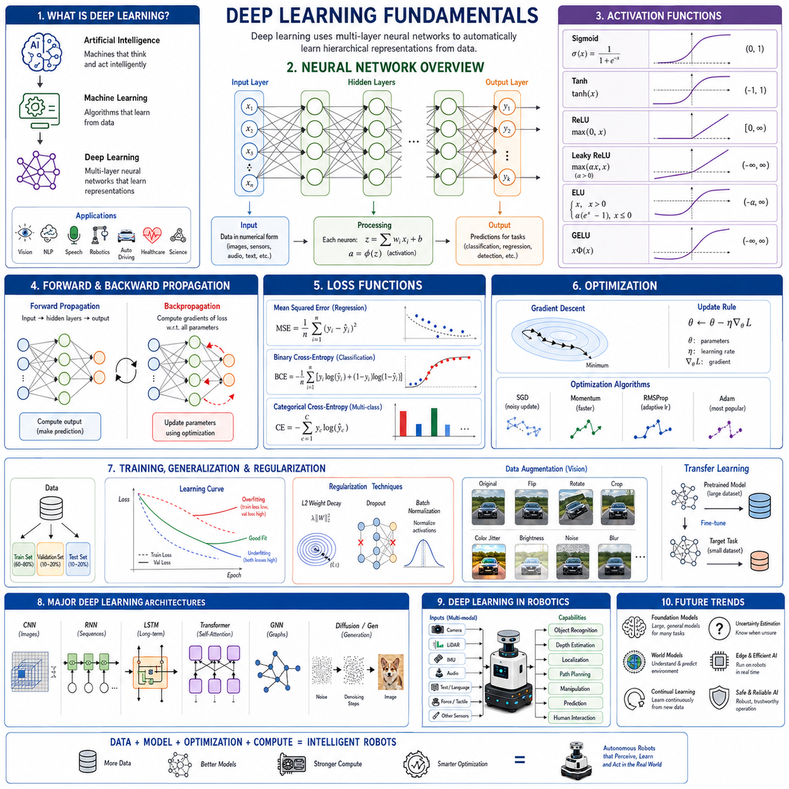
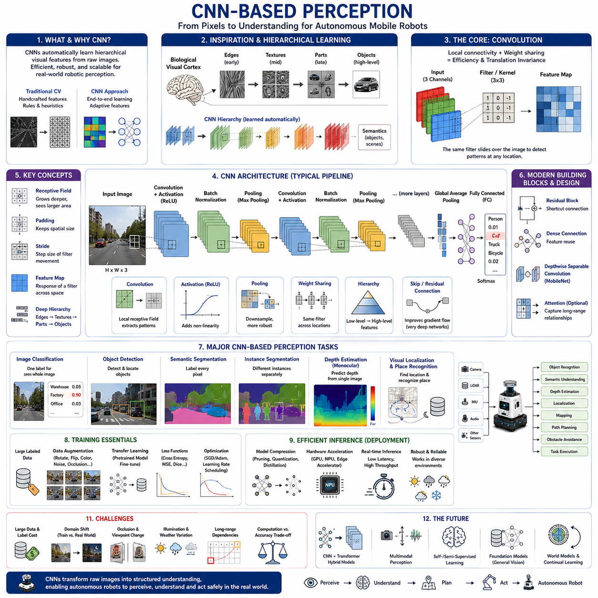
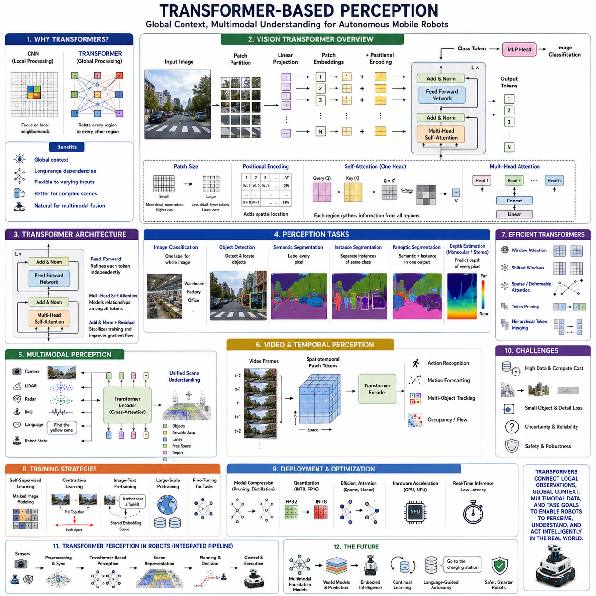
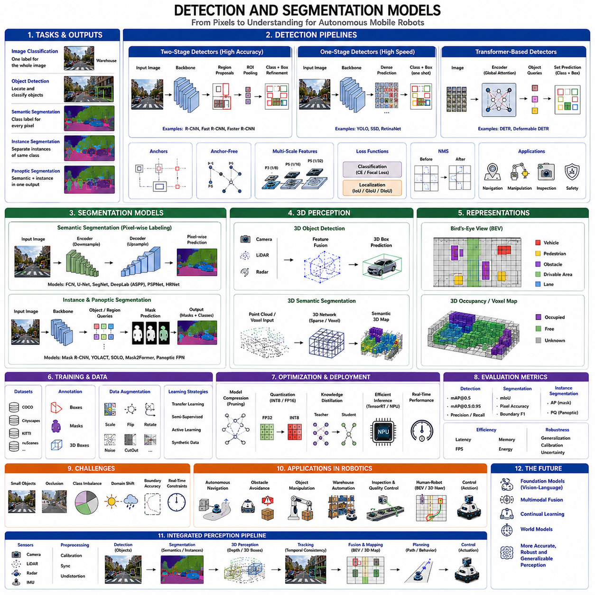
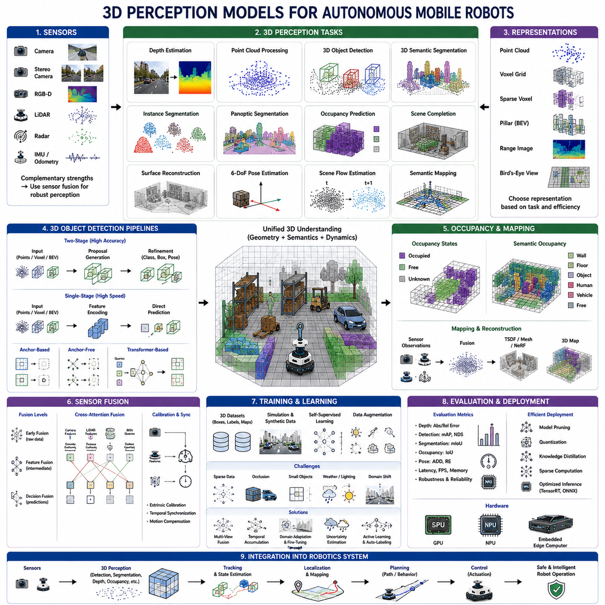
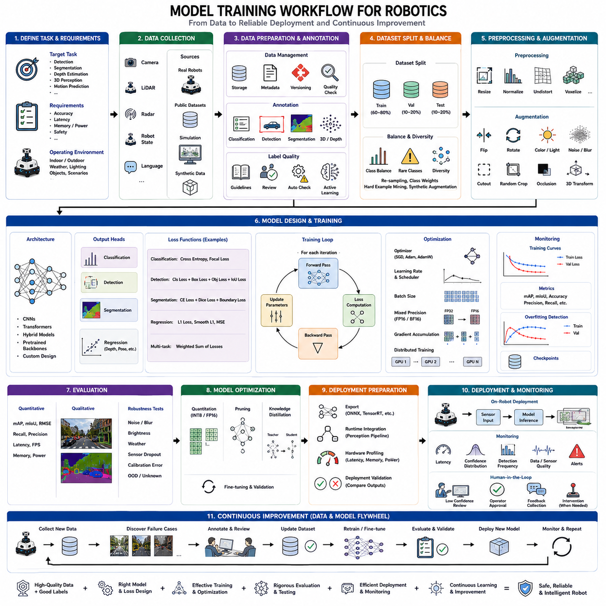
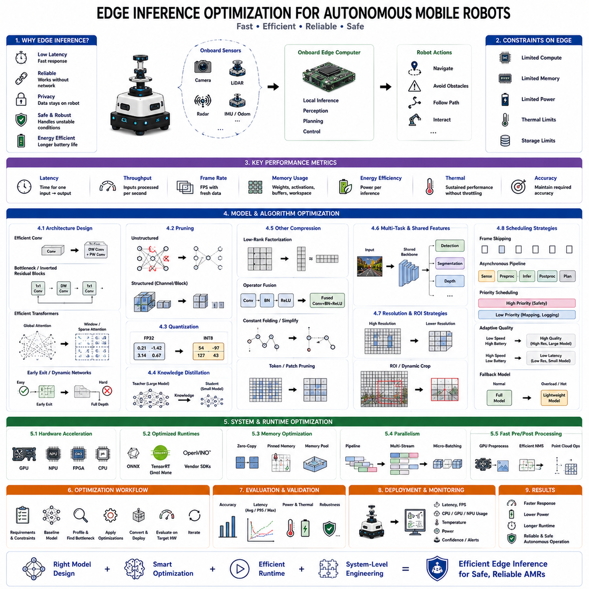
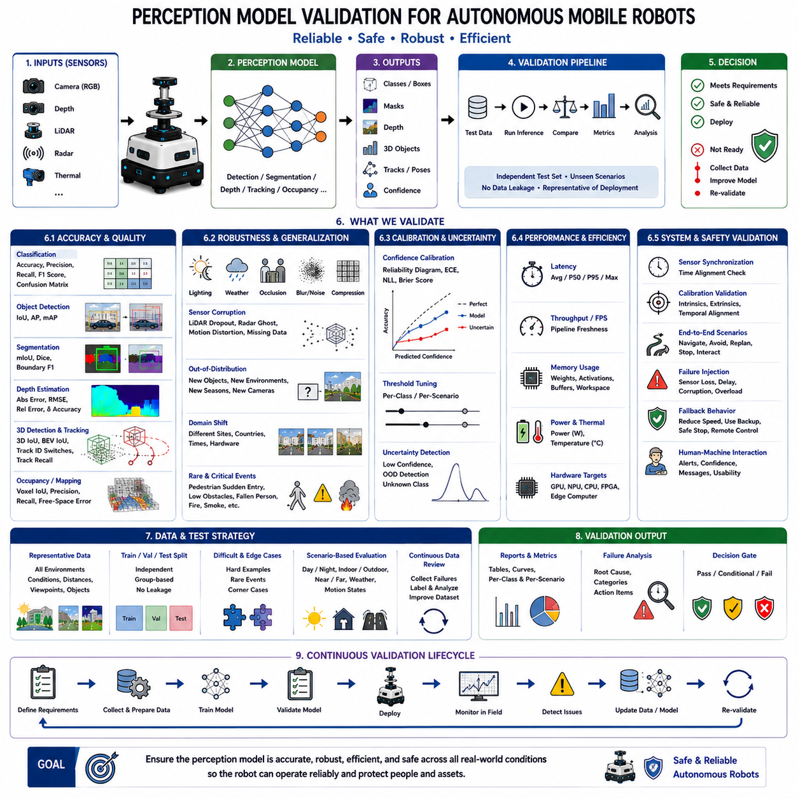

**Volume 06. AMR AI and Embodied Intelligence**

# Chapter 03. Deep Learning for Perception

## 03.1 Deep Learning Fundamentals

{width="7.268055555555556in" height="7.268055555555556in"}

Deep learning is a branch of artificial intelligence that enables computers to learn complex representations directly from data using multi-layer artificial neural networks. Unlike traditional machine learning methods that depend heavily on manually designed features, deep learning automatically discovers hierarchical patterns through optimization. This ability has transformed numerous fields including computer vision, natural language processing, speech recognition, robotics, healthcare, autonomous driving, and scientific computing. In autonomous mobile robots, deep learning serves as the foundation for perception, decision making, navigation, manipulation, and increasingly for embodied intelligence.

The concept of deep learning originates from artificial neural networks inspired by the biological nervous system. Although artificial neurons are greatly simplified compared with biological neurons, they share the fundamental principle of receiving multiple inputs, combining information through weighted connections, and producing outputs after nonlinear activation. By connecting large numbers of these artificial neurons into multiple computational layers, neural networks become capable of approximating highly complex mathematical functions and discovering meaningful patterns hidden within high-dimensional data.

Artificial intelligence encompasses a broad range of computational methods that enable machines to perform tasks normally requiring human intelligence. Machine learning represents a subset of artificial intelligence in which algorithms improve through experience rather than explicit programming. Deep learning is a further specialization of machine learning that employs deep neural network architectures to automatically learn representations from large datasets. This hierarchical relationship explains why deep learning has become one of the dominant technologies driving recent advances in artificial intelligence.

The word "deep" refers to the presence of multiple hidden layers between network inputs and outputs. Early neural networks often contained only one or two hidden layers because limited computational resources and optimization methods made deeper networks difficult to train. Modern deep learning architectures may contain dozens, hundreds, or even thousands of layers, allowing increasingly abstract feature representations to emerge throughout the network hierarchy.

A neural network begins with an input layer that receives numerical representations of data. Images become arrays of pixel values, audio signals become sampled waveforms or spectrograms, sensor measurements become feature vectors, and language becomes numerical embeddings or token representations. The network processes these inputs through multiple hidden layers before producing predictions at the output layer. Every layer gradually transforms information into increasingly meaningful internal representations suitable for the target learning task.

The artificial neuron represents the fundamental computational unit of deep learning. Each neuron receives multiple input values, multiplies them by learnable weights, adds a bias term, and applies a nonlinear activation function. The resulting output becomes input to neurons in subsequent layers. Although mathematically simple, millions or even billions of interconnected neurons collectively learn highly sophisticated representations capable of solving remarkably complex problems.

Weights determine the strength of connections between neurons. During training, optimization algorithms continuously adjust these weights to minimize prediction errors. Initially, weights are typically assigned small random values because identical initialization would prevent neurons from learning distinct representations. Through repeated optimization, weights gradually encode meaningful relationships extracted from training data, effectively storing the learned knowledge of the neural network.

Bias parameters provide additional flexibility by shifting activation thresholds independently of weighted inputs. Without bias terms, neural networks would possess unnecessarily restricted representational capability because every decision boundary would be forced through the coordinate origin. Learnable biases enable neurons to activate under appropriate conditions regardless of input magnitude, improving model expressiveness across diverse learning tasks.

Activation functions introduce nonlinearity into neural networks. Without nonlinear activation, multiple stacked layers would mathematically collapse into a single linear transformation regardless of network depth. Nonlinear functions enable deep networks to approximate arbitrarily complex relationships among inputs and outputs. Consequently, activation functions constitute one of the most important components enabling modern deep learning.

Sigmoid activation historically played a central role in early neural networks because its output resembles a probability between zero and one. However, sigmoid functions suffer from gradient saturation when neuron outputs approach their extreme values, slowing optimization within deep networks. Although sigmoid remains useful for binary classification outputs, hidden layers of modern architectures generally employ more computationally efficient activation functions.

Hyperbolic tangent activation extends sigmoid by producing outputs ranging from negative one to positive one. Zero-centered outputs improve optimization compared with sigmoid under many circumstances. Nevertheless, hyperbolic tangent still experiences gradient saturation during deep optimization, limiting its effectiveness within extremely deep neural networks despite remaining useful for selected recurrent architectures and specialized applications.

Rectified Linear Units revolutionized deep learning by providing simple yet highly effective activation behavior. Rather than saturating for positive inputs, Rectified Linear Units produce outputs equal to the input whenever positive while returning zero otherwise. This behavior significantly reduces gradient vanishing, accelerates optimization, and enables efficient training of substantially deeper neural networks than previously possible.

Numerous Rectified Linear Unit variants have subsequently been developed. Leaky Rectified Linear Units preserve small gradients for negative inputs, reducing inactive neuron problems. Parametric Rectified Linear Units learn negative slopes during optimization. Exponential Linear Units and Gaussian Error Linear Units introduce smoother nonlinear behavior that often improves convergence and predictive performance within modern transformer architectures.

Forward propagation describes the process of computing predictions from input data using current network parameters. Information flows sequentially through every layer, where weighted combinations and nonlinear activations transform representations until final outputs are produced. During inference, only forward propagation is required because network parameters remain fixed. Efficient forward computation therefore directly determines real-time performance within deployed robotic systems.

Learning occurs by comparing predicted outputs against known target values using objective functions known as loss functions. Loss functions quantify prediction errors numerically, providing optimization algorithms with measurable objectives. Smaller losses indicate better agreement between predictions and ground truth. Selecting appropriate loss functions depends upon the learning task, including classification, regression, segmentation, object detection, reinforcement learning, or generative modeling.

Mean Squared Error remains one of the most common loss functions for regression tasks. Prediction errors are squared before averaging, emphasizing larger deviations more strongly than smaller ones. Mean Squared Error encourages accurate numerical estimation but may become sensitive to outliers because large errors contribute disproportionately to overall optimization objectives.

Cross-entropy loss dominates modern classification problems because it directly measures disagreement between predicted probability distributions and target class labels. Lower cross-entropy indicates greater confidence assigned to correct categories. Binary cross-entropy addresses two-class classification, while categorical cross-entropy generalizes naturally to multi-class recognition tasks including object recognition, semantic segmentation, and language modeling.

Optimization requires computing how every network parameter influences prediction errors. Backpropagation efficiently calculates these gradients using the chain rule of differential calculus. Rather than independently differentiating each parameter, gradients propagate backward from output layers toward inputs while reusing intermediate computations. This remarkable algorithm makes large-scale neural network training computationally practical despite millions or billions of adjustable parameters.

Gradient descent represents the fundamental optimization strategy underlying nearly all deep learning. Gradients indicate directions of steepest error increase, allowing optimization to move parameters in opposite directions where prediction errors decrease. Repeated parameter updates gradually minimize loss functions until networks converge toward effective solutions capable of generalizing beyond training examples.

Batch Gradient Descent computes gradients using entire training datasets before every parameter update. Although mathematically stable, processing complete datasets becomes computationally expensive for modern large-scale learning problems. Consequently, deep learning rarely employs full-batch optimization except for relatively small datasets or specialized scientific applications requiring highly accurate gradient estimates.

Stochastic Gradient Descent instead updates parameters after processing individual training examples. Frequent updates introduce optimization noise but significantly reduce memory requirements while enabling continuous learning from streaming data. Mini-batch optimization balances these advantages by computing gradients using small subsets of training data, typically containing several dozen or several hundred examples per optimization step.

Modern optimization algorithms extend Stochastic Gradient Descent through adaptive parameter adjustment. Momentum accelerates optimization by accumulating previous gradient directions, reducing oscillation across steep objective landscapes. RMSProp adaptively scales learning rates according to recent gradient magnitudes. Adam combines momentum with adaptive learning rates, becoming one of the most widely adopted optimization algorithms across contemporary deep learning applications.

Learning rate determines the magnitude of parameter updates during optimization. Excessively large learning rates may cause divergence by overshooting optimal solutions, while excessively small learning rates significantly slow convergence. Selecting appropriate learning rates therefore critically influences optimization success. Learning rate scheduling gradually reduces update magnitude throughout training, enabling rapid initial progress followed by stable convergence toward accurate solutions.

Training data play an equally important role as network architecture. Large, diverse, accurately labeled datasets expose neural networks to broad variations encountered during deployment. Insufficient diversity encourages memorization rather than genuine learning, reducing generalization to previously unseen environments. Consequently, dataset quality often determines practical performance more strongly than modest architectural improvements.

Generalization refers to a network\'s ability to perform accurately on previously unseen examples rather than merely memorizing training data. Successful deep learning discovers underlying patterns applicable across new situations instead of reproducing specific training samples. Autonomous robots particularly require strong generalization because deployment environments inevitably differ from training conditions.

Overfitting occurs when neural networks memorize training examples instead of learning generalizable relationships. Training accuracy becomes extremely high while validation performance stagnates or decreases. Complex architectures, limited datasets, excessive optimization, and insufficient regularization frequently contribute to overfitting. Detecting and preventing overfitting represents one of the central challenges in practical deep learning.

Underfitting represents the opposite situation in which networks remain too simple or insufficiently trained to capture meaningful data patterns. Both training and validation accuracy remain low because model capacity cannot adequately represent task complexity. Increasing architectural capacity, extending training duration, or improving optimization often alleviates underfitting.

Regularization techniques improve generalization by discouraging overly specialized solutions. Weight decay penalizes excessively large parameters, encouraging smoother decision boundaries. Dropout randomly disables subsets of neurons during training, forcing networks to develop redundant distributed representations rather than depending excessively upon individual computational pathways. Batch normalization further stabilizes optimization while providing modest regularization benefits.

Data augmentation artificially expands training datasets through realistic transformations preserving semantic meaning. Image augmentation commonly includes rotation, translation, scaling, flipping, brightness adjustment, color variation, Gaussian noise, blur, cropping, weather simulation, and occlusion synthesis. Exposure to diverse appearances significantly improves robustness against real-world environmental variation encountered during robotic deployment.

Transfer learning dramatically reduces data requirements by initializing neural networks using knowledge previously acquired from large datasets. Rather than training entirely from random initialization, pretrained models provide rich feature representations transferable across related tasks. Fine-tuning adapts these representations toward specialized robotic applications while requiring substantially fewer labeled examples than training from scratch.

Modern deep learning encompasses numerous specialized architectures beyond conventional feedforward networks. Convolutional Neural Networks excel at image understanding through spatial feature extraction. Recurrent Neural Networks process sequential information. Long Short-Term Memory networks improve long-range temporal modeling. Transformers employ self-attention to capture global relationships. Graph Neural Networks operate on relational structures, while diffusion and autoregressive models generate realistic synthetic content.

Deep learning has fundamentally transformed robotic perception. Camera images, depth measurements, point clouds, inertial observations, force sensors, audio signals, and language instructions can all be processed within unified neural architectures. Robots increasingly combine multimodal information to recognize objects, estimate depth, localize themselves, understand human commands, predict environmental changes, and coordinate complex behaviors across diverse operational environments.

The future of deep learning extends beyond isolated prediction tasks toward integrated intelligent systems capable of continual learning, multimodal reasoning, world modeling, embodied interaction, uncertainty estimation, and autonomous adaptation. Foundation models trained across enormous datasets increasingly provide reusable representations applicable to numerous downstream robotic tasks. Combined with edge computing, efficient optimization, and continual learning, these advances are enabling autonomous mobile robots to perceive, understand, and interact with the physical world with unprecedented capability, flexibility, and reliability.

## 03.2 CNN-Based Perception

{width="7.268055555555556in" height="7.268055555555556in"}

Convolutional Neural Network (CNN) based perception is one of the most influential technologies in modern computer vision and serves as the foundation of visual intelligence for autonomous mobile robots. A CNN enables machines to automatically learn hierarchical visual representations directly from raw image data without requiring manually engineered features. Unlike traditional computer vision algorithms that depend heavily on handcrafted edge detectors, texture descriptors, and geometric rules, CNNs optimize feature extraction through end-to-end learning. This capability has fundamentally transformed robotic perception by enabling reliable object recognition, semantic understanding, depth estimation, localization, inspection, and navigation across highly diverse operating environments.

The development of CNNs was motivated by the limitations of fully connected neural networks when processing images. A typical image contains hundreds of thousands or even millions of pixels. Connecting every pixel directly to every neuron produces an enormous number of parameters, resulting in excessive computational complexity and severe overfitting. CNNs overcome this problem by exploiting the spatial structure of images. Local receptive fields, weight sharing, and hierarchical feature extraction dramatically reduce the number of trainable parameters while preserving the ability to learn highly discriminative visual representations.

The biological inspiration for CNNs originates from studies of the mammalian visual cortex. Neuroscientists discovered that neurons in the visual cortex respond primarily to local visual patterns such as edges, orientations, textures, and shapes rather than processing entire visual scenes simultaneously. These local responses gradually combine to represent increasingly complex visual concepts throughout successive cortical regions. CNNs emulate this hierarchical organization by learning progressively more abstract visual representations from simple image structures to complete semantic objects.

An image presented to a CNN is represented as a multidimensional tensor containing numerical pixel values. Color images usually consist of red, green, and blue channels, while grayscale images contain only one intensity channel. Each pixel represents a numerical measurement rather than symbolic information. The neural network gradually transforms these low-level numerical values into increasingly meaningful internal representations capable of distinguishing objects, environments, and semantic categories relevant to robotic perception.

The convolution operation forms the mathematical core of every CNN. Instead of connecting every neuron to every input pixel, small learnable filters slide across the image while performing weighted summations within local neighborhoods. Each filter detects a particular visual pattern such as horizontal edges, vertical lines, corners, textures, or repeated structures. Because identical filter parameters are shared across all image locations, convolution achieves both computational efficiency and translation invariance while dramatically reducing model complexity.

Convolution kernels typically possess dimensions such as three by three, five by five, or seven by seven pixels. During training, these kernels automatically adapt to detect visual structures useful for the target task. Early layers generally learn simple geometric patterns including edges and gradients, while intermediate layers capture textures, contours, and object parts. Deeper layers gradually recognize complete objects, semantic regions, and complex environmental relationships without requiring explicit feature engineering.

Weight sharing represents one of the defining characteristics of convolutional neural networks. Unlike fully connected networks where every connection possesses an independent parameter, convolution reuses identical filter weights throughout the entire image. This dramatically reduces memory requirements while allowing the same visual pattern to be recognized regardless of its spatial location. Translation invariance becomes especially valuable for autonomous robots because objects rarely appear at fixed image positions during navigation.

Feature maps are generated after convolution filters process input images. Each feature map represents the response of one learned filter across every spatial location. Strong activations indicate regions where particular visual patterns have been detected. Multiple feature maps collectively describe numerous complementary image characteristics, allowing subsequent network layers to integrate simple structures into increasingly sophisticated visual representations.

Activation functions introduce nonlinear behavior following every convolution operation. Rectified Linear Units have become the standard activation function because they significantly improve optimization efficiency and reduce gradient vanishing. Nonlinear activation enables CNNs to represent highly complex visual relationships that cannot be modeled using linear transformations alone. Consequently, stacked convolutional layers become capable of learning remarkably sophisticated perception models suitable for real-world robotic applications.

Pooling layers reduce spatial resolution while preserving the most informative visual features. Max pooling selects the strongest activation within local neighborhoods, whereas average pooling computes local averages. Pooling decreases computational complexity, improves robustness against small image translations, and expands the effective receptive field of subsequent layers. However, excessive pooling may remove fine spatial details important for segmentation, localization, or precise robotic manipulation.

Hierarchical feature learning represents one of the greatest strengths of CNN-based perception. Initial layers primarily recognize edges, gradients, and simple textures. Intermediate layers combine these primitive features into contours, corners, repeated structures, and object components. Deep layers ultimately identify complete semantic concepts such as pedestrians, vehicles, machinery, shelves, doors, or navigation landmarks. This hierarchical organization emerges automatically during optimization without requiring manual feature design.

The receptive field describes the image region influencing a particular neuron within the network. Shallow neurons observe only small local neighborhoods, whereas deeper neurons gradually integrate information from much larger portions of the image. Large receptive fields enable recognition of complete objects and contextual relationships, while small receptive fields preserve precise local details. Effective CNN architectures carefully balance these complementary requirements according to application objectives.

Padding preserves spatial dimensions during convolution by extending image boundaries with additional values. Without padding, repeated convolutions continuously shrink feature maps, eventually eliminating useful spatial information. Zero padding remains the most common approach because it preserves output dimensions while introducing minimal computational overhead. Proper padding also improves boundary recognition for objects appearing near image edges.

Stride determines how far convolution filters move between successive evaluations. Smaller strides preserve higher spatial resolution while increasing computational cost. Larger strides reduce processing requirements by skipping image locations but potentially sacrifice fine visual detail. Appropriate stride selection balances computational efficiency against localization precision according to real-time robotic perception requirements.

Modern CNN architectures frequently employ batch normalization between convolution and activation layers. Batch normalization standardizes intermediate feature distributions, stabilizing optimization while allowing higher learning rates and faster convergence. It additionally provides modest regularization benefits, improving generalization across diverse environmental conditions encountered during robotic deployment.

Residual learning fundamentally changed deep CNN design by introducing shortcut connections that bypass intermediate layers. Instead of learning complete feature transformations directly, residual blocks learn incremental refinements relative to their inputs. This simple architectural innovation greatly alleviates gradient degradation, enabling successful optimization of extremely deep neural networks containing hundreds of convolutional layers.

Residual Networks demonstrated that increasing network depth does not necessarily degrade optimization when appropriate architectural design is employed. Deep residual architectures achieve substantially higher recognition accuracy than earlier CNN models while maintaining stable optimization. Residual learning has subsequently become a foundational design principle adopted across numerous computer vision architectures beyond image classification.

Dense connectivity further extends information flow by connecting each layer directly to all subsequent layers. Rather than transmitting information sequentially through adjacent layers alone, dense architectures encourage feature reuse while improving gradient propagation. These networks often achieve comparable recognition performance using fewer parameters because earlier learned representations remain directly accessible throughout the network hierarchy.

Efficient CNN architectures have become increasingly important for embedded robotic platforms possessing limited computational resources. MobileNet employs depthwise separable convolutions to dramatically reduce computational complexity. ShuffleNet improves information exchange between feature channels. EfficientNet systematically balances network depth, width, and image resolution. These lightweight models enable sophisticated visual perception on mobile robots operating under strict energy and latency constraints.

CNNs have achieved remarkable success in image classification, where the objective is assigning one semantic category to an entire image. Classification networks learn increasingly abstract visual representations capable of distinguishing thousands of object categories. Although classification alone provides limited spatial information, pretrained classification models frequently serve as feature extractors for more advanced robotic perception tasks.

Object detection extends image classification by simultaneously identifying object categories and spatial locations. CNN-based detectors estimate bounding boxes together with class probabilities for every detected object. Two-stage detectors emphasize accuracy through proposal generation followed by classification refinement, while single-stage detectors directly predict objects within one inference pass, providing substantially faster performance suitable for real-time robotic applications.

Semantic segmentation employs CNNs to assign semantic labels to every image pixel rather than recognizing only object locations. Encoder-decoder architectures progressively compress visual information before reconstructing dense pixel-level predictions. Skip connections preserve high-resolution spatial information while integrating deep semantic representations. Semantic segmentation enables robots to distinguish traversable terrain, obstacles, walls, roads, vegetation, and workspaces with remarkable precision.

Instance segmentation further extends semantic segmentation by distinguishing individual object instances belonging to identical semantic categories. Multiple people, vehicles, pallets, or machinery can therefore be identified separately despite sharing common class labels. Instance-level understanding significantly improves manipulation planning, inventory management, collision avoidance, and multi-object interaction within autonomous robotic systems.

CNNs also contribute significantly to monocular depth estimation by learning geometric relationships directly from large annotated datasets. Rather than relying exclusively upon stereo correspondence or active sensors, convolutional architectures infer approximate three-dimensional structure from perspective, shading, texture, occlusion, and semantic context. Learned depth estimation complements traditional geometric approaches while reducing sensor complexity.

Visual localization increasingly relies upon CNN-derived feature representations rather than handcrafted descriptors. Deep features remain substantially more robust against illumination changes, viewpoint variation, seasonal appearance differences, and environmental aging than traditional feature extractors. CNN-based localization therefore improves long-term autonomous navigation across complex industrial, urban, and outdoor environments.

Visual place recognition represents another important CNN application for autonomous robots. Instead of identifying individual objects, the objective becomes recognizing previously visited locations despite substantial environmental variation. Deep feature embeddings encode distinctive environmental signatures allowing robots to recognize familiar places even under different weather conditions, lighting, or seasonal appearance changes.

Transfer learning has become particularly valuable within CNN-based robotic perception. Large-scale image classification datasets enable networks to learn general visual representations transferable across numerous downstream applications. Fine-tuning pretrained CNNs for specialized industrial inspection, warehouse automation, agricultural robotics, medical imaging, or construction monitoring substantially reduces required training data while improving convergence speed.

Data augmentation plays a critical role in developing robust CNN perception systems. Rotation, scaling, cropping, flipping, brightness adjustment, color perturbation, blur, weather simulation, synthetic occlusion, and noise injection expose networks to diverse visual conditions expected during deployment. Proper augmentation significantly improves robustness against real-world environmental variation while reducing overfitting.

CNN performance depends heavily upon high-quality labeled datasets. Object detection requires bounding boxes, semantic segmentation requires pixel-level annotations, instance segmentation requires individual object masks, and depth estimation requires geometric supervision. Producing these annotations demands considerable human effort, motivating increasing interest in synthetic data generation, self-supervised learning, semi-supervised learning, and foundation models capable of learning from limited supervision.

Training CNNs requires substantial computational resources because millions of parameters must be optimized using enormous datasets. Graphics Processing Units accelerate convolution operations through massively parallel numerical computation. Mixed precision training, distributed optimization, gradient accumulation, and efficient memory management enable practical optimization of increasingly sophisticated CNN architectures for large-scale perception tasks.

Real-time inference presents different engineering challenges from training. Autonomous robots must execute CNN models continuously under strict latency constraints while operating with finite computational resources. Model pruning, quantization, knowledge distillation, TensorRT optimization, operator fusion, and hardware-specific acceleration reduce inference latency while preserving recognition accuracy suitable for safety-critical robotic applications.

CNN-based perception has transformed nearly every component of autonomous mobile robotics. Camera images become reliable sources of semantic understanding, enabling robots to recognize people, vehicles, infrastructure, navigation landmarks, inspection targets, and operational hazards. Integrated perception pipelines combine CNNs with depth estimation, object tracking, localization, mapping, sensor fusion, and planning to support increasingly capable autonomous behavior across complex real-world environments.

Despite their remarkable success, CNNs also possess important limitations. They often require large labeled datasets, substantial computational resources, and careful hyperparameter optimization. Generalization may decrease when deployment environments differ significantly from training data, and purely convolutional architectures sometimes struggle to capture long-range spatial relationships compared with attention-based models. These limitations have motivated the integration of CNNs with transformers, multimodal foundation models, and world models.

The future of CNN-based perception lies not in replacing convolution entirely but in combining its exceptional local feature extraction capabilities with complementary architectures capable of reasoning across larger spatial, temporal, and semantic contexts. Hybrid CNN-transformer networks, multimodal perception systems, continual learning, self-supervised representation learning, foundation vision models, and embodied world models are creating increasingly intelligent perception systems. Within autonomous mobile robots, CNNs will remain a fundamental computational building block that transforms raw visual observations into structured environmental understanding, enabling safer navigation, more accurate manipulation, robust inspection, and adaptive interaction with the dynamic physical world.

## 03.3 Transformer-Based Perception

{width="7.268055555555556in" height="7.268055555555556in"}

Transformer-based perception is a modern approach to visual intelligence that uses attention mechanisms to model relationships across an entire image, video sequence, or multimodal sensor stream. Unlike conventional convolutional neural networks, which primarily process local neighborhoods, transformers directly learn interactions among distant visual regions. This capability enables autonomous mobile robots to understand global scene structure, object relationships, temporal context, and semantic meaning with greater flexibility.

The transformer architecture was originally developed for natural language processing, where self-attention allowed models to connect words regardless of their distance within a sentence. The same principle can be applied to visual perception by representing an image as a sequence of smaller regions. Each region becomes a token, and the network learns how every token relates to every other token. This transforms visual perception from local filtering into global relational reasoning.

In transformer-based vision, an input image is usually divided into fixed-size patches. Each patch contains a small rectangular region of pixels and is converted into a numerical vector through linear projection. These vectors are called patch embeddings. The resulting sequence resembles a sequence of language tokens, allowing the transformer to process visual information using the same general computational principles applied to text.

Patch size strongly influences model behavior. Smaller patches preserve fine spatial detail and improve recognition of small objects, boundaries, and textures, but they produce longer token sequences and increase computational cost. Larger patches reduce the number of tokens and accelerate inference, but important local information may be lost. Practical robotic systems therefore select patch size according to resolution, latency, and task requirements.

Because self-attention itself does not inherently know where image patches originated, positional information must be added to the patch embeddings. Positional encoding represents the spatial location of each token within the image. Without this information, the transformer would understand which visual patterns are present but not how they are arranged. Spatial position is essential for object localization, segmentation, depth estimation, and navigation.

A classification token is often appended to the patch sequence in vision transformer architectures. This special token gathers information from all image regions through repeated attention operations. After processing, its final representation can be used for image classification or other global prediction tasks. For dense robotic perception, however, individual patch tokens are often retained so that spatially detailed outputs can be reconstructed.

Self-attention is the central mechanism of transformer-based perception. Every token generates three learned representations called query, key, and value. The query represents what a token is searching for, the key represents what information a token contains, and the value stores the content to be aggregated. Similarity between queries and keys determines how strongly tokens influence one another.

Attention weights are calculated by comparing each query with all available keys. These weights are normalized and used to combine the corresponding values. As a result, one image region can directly gather information from any other region, even when they are far apart. A robot observing a person near a forklift can therefore relate the person, vehicle, floor markings, and safety barriers within a unified scene representation.

Multi-head attention extends self-attention by learning several relationship patterns simultaneously. One attention head may focus on object shape, another on spatial proximity, another on texture similarity, and another on semantic context. Combining these heads produces a richer representation than a single attention operation. Multi-head attention is particularly effective in cluttered environments where multiple relationships influence interpretation.

The transformer encoder repeatedly applies multi-head attention, normalization, residual connections, and feedforward neural networks. Each layer refines token representations by integrating increasingly complex contextual information. Shallow layers capture appearance and local structure, while deeper layers describe objects, scene layouts, interactions, and task-relevant meaning. Repetition allows global understanding to emerge progressively.

Residual connections are essential for training deep transformer networks. They allow information and gradients to bypass individual processing blocks, reducing optimization instability. Layer normalization further stabilizes feature distributions and improves convergence. Together, these components enable transformers to scale to large models containing hundreds of millions or billions of parameters.

Feedforward networks operate independently on each token after attention has exchanged information among tokens. These networks apply nonlinear transformations that refine each visual representation. Attention determines which information should be combined, while feedforward layers transform the combined information into more useful task-specific features. Both mechanisms are necessary for effective transformer perception.

Vision Transformers demonstrated that pure attention-based architectures could achieve highly competitive image classification performance. Instead of relying on convolution, they learned visual representations through patch tokenization and global attention. Their success showed that the inductive biases of convolution were helpful but not strictly necessary when sufficient training data and computational resources were available.

Convolutional neural networks assume that nearby pixels are strongly related and reuse the same filters across image locations. These assumptions improve efficiency and data utilization. Transformers use weaker assumptions and learn relationships more freely from data. This flexibility improves global reasoning, but it may require larger datasets and stronger regularization to achieve stable performance.

Hybrid CNN-transformer architectures combine local feature extraction with global attention. Convolutional layers efficiently identify edges, textures, and object parts, while transformer layers model long-range dependencies and semantic relationships. This combination is attractive for autonomous robots because it preserves efficient low-level perception while adding stronger contextual understanding.

Hierarchical vision transformers gradually reduce spatial resolution while increasing feature depth, similar to convolutional networks. Instead of processing one fixed token resolution throughout the model, they merge neighboring tokens at successive stages. This produces multi-scale representations suitable for object detection, semantic segmentation, depth estimation, and other dense prediction tasks.

Window-based attention limits self-attention to local image windows to reduce computational complexity. Global attention over all tokens becomes expensive as image resolution increases because the number of pairwise relationships grows rapidly. Window-based methods calculate attention within smaller regions and periodically shift or connect windows so that information can still propagate across the complete image.

Shifted-window transformers provide an efficient balance between local processing and global communication. Consecutive layers use different window boundaries, allowing tokens previously separated into different windows to interact. This design supports high-resolution perception while maintaining manageable computational cost, making it useful for embedded and real-time robotic applications.

Object detection has been significantly influenced by transformer architectures. Traditional detectors rely on anchors, region proposals, or dense candidate predictions followed by non-maximum suppression. Transformer-based detectors can instead treat object detection as a direct set prediction problem, where a fixed number of learned object queries search the image for relevant objects.

Detection Transformer architectures use object queries that interact with encoded visual tokens through cross-attention. Each query attempts to identify one object and predicts its category and bounding box. A matching algorithm associates predictions with ground-truth objects during training. This end-to-end structure reduces handcrafted components and demonstrates how attention can unify localization and classification.

Object queries can be interpreted as learnable search agents. During training, they develop specialized behaviors for locating meaningful visual entities. Some may focus on large objects, while others become effective at detecting small or partially occluded targets. Because all queries are processed together, the network can reason about multiple objects and reduce duplicate predictions.

Transformer-based semantic segmentation assigns classes to image regions while incorporating global scene context. A local image patch may appear ambiguous when examined alone, but its meaning becomes clearer when related to surrounding regions. A flat gray surface may represent a floor, wall, road, or machine depending on its spatial position and relationship to other objects.

Mask classification approaches treat segmentation as prediction of semantic masks rather than independent classification of every pixel. Learned queries represent objects or regions and generate corresponding mask embeddings. This enables semantic segmentation, instance segmentation, and panoptic segmentation to be handled within similar transformer-based frameworks.

Panoptic segmentation combines semantic understanding of background regions with instance-level separation of individual objects. Floors, walls, roads, and vegetation are labeled as broad semantic areas, while people, vehicles, pallets, or machines are represented as separate instances. Transformer-based models are well suited to this task because they naturally model both regions and object relationships.

Depth estimation also benefits from attention-based global reasoning. Monocular depth is inherently ambiguous because absolute distance cannot be directly measured from a single image. Transformers use long-range context to relate object size, perspective, horizon structure, surface continuity, and semantic identity. These relationships improve relative depth consistency across large scene regions.

Stereo matching can be enhanced using transformers that compare image features across left and right camera views. Attention establishes correspondences between distant candidate regions while considering global geometric context. This approach can improve depth estimation in low-texture areas, repeated patterns, and partially occluded regions where traditional local matching methods often fail.

Video perception extends transformer reasoning across time. Instead of processing every frame independently, video transformers represent spatial patches from multiple frames as spatiotemporal tokens. Attention then models object appearance, movement, interaction, and temporal continuity. This supports action recognition, motion forecasting, object tracking, and dynamic scene understanding.

Temporal attention allows current observations to reference earlier frames. A person briefly hidden behind a shelf can remain represented using information from previous observations. This persistent temporal context improves tracking under occlusion and reduces instability caused by temporary detection failures. For autonomous robots, such consistency is important in crowded and dynamic environments.

Multi-object tracking can be formulated using persistent track queries. Each query represents one tracked object and updates its internal state as new frames arrive. Attention associates track queries with current visual features, enabling the system to maintain identities, estimate trajectories, and recover objects after partial occlusion. This integrates detection and tracking more tightly than separate pipelines.

Transformers are particularly useful for multimodal perception. Camera images, depth maps, LiDAR point clouds, radar measurements, language instructions, and robot state information can all be represented as tokens. Attention enables these heterogeneous data sources to exchange information within a unified model. This supports richer scene understanding than isolated sensor processing.

Camera-LiDAR fusion benefits from attention because visual and geometric data possess different resolutions and coordinate structures. Cross-attention can associate image regions with corresponding 3D points or voxel features. Camera data contribute texture and semantic information, while LiDAR provides accurate distance and geometry. Their combination improves 3D detection and localization.

Bird\'s-eye-view perception transforms observations from multiple cameras into a unified top-down representation. Transformer-based methods use spatial queries to gather relevant image features from different camera views. The resulting bird\'s-eye-view map represents lanes, obstacles, vehicles, free space, and semantic regions within a common coordinate frame suitable for planning.

Multi-camera transformers learn relationships among overlapping and non-overlapping views. They can associate objects observed from different directions and reduce blind spots around the robot. Positional calibration information guides the attention process so that features from separate cameras are correctly projected and fused into a consistent environmental representation.

Language-guided perception is another major advantage of transformer architectures. Because transformers were originally developed for language, visual and textual tokens can be processed within compatible frameworks. A robot can search for an object described by natural language, such as a damaged box, yellow safety cone, open doorway, or person wearing protective equipment.

Open-vocabulary detection and segmentation extend perception beyond fixed training categories. Instead of recognizing only predefined labels, the model compares visual features with text embeddings describing arbitrary concepts. This enables robots to respond more flexibly to new tasks and human instructions without retraining a dedicated detector for every possible object.

Foundation vision models are typically based on large transformer architectures trained using massive and diverse datasets. They learn broadly reusable visual representations that can be adapted to classification, detection, segmentation, depth estimation, retrieval, and robotic control. Fine-tuning or prompt-based adaptation allows one pretrained model to support numerous downstream applications.

Self-supervised learning has become essential for training large transformer perception models. Rather than requiring complete human annotation, models learn by reconstructing masked image regions, predicting relationships between views, or matching different augmentations of the same scene. This reduces labeling cost and enables learning from large quantities of unstructured robotic sensor data.

Masked image modeling hides selected patches and trains the transformer to reconstruct or predict their content. To succeed, the model must understand object structure, surrounding context, and scene semantics. This learning process produces general-purpose representations that transfer effectively to multiple perception tasks after fine-tuning.

Contrastive learning trains representations by bringing related observations closer together while separating unrelated examples. Images of the same place under different lighting conditions may be treated as positive pairs, while unrelated scenes serve as negatives. Such training improves visual place recognition and long-term localization under environmental change.

Transformer models often require substantial computational resources. Full attention across high-resolution token sequences consumes large amounts of memory and processing time. This creates challenges for autonomous mobile robots operating with limited power, thermal capacity, and onboard compute. Efficient attention and model compression are therefore important deployment research areas.

Sparse attention reduces computation by connecting only selected token pairs rather than evaluating every possible relationship. Deformable attention samples a limited number of relevant locations around reference points. Linear attention approximates standard attention using more efficient mathematical formulations. These methods reduce latency while preserving much of the transformer's reasoning capability.

Token pruning removes visual tokens that contribute little to the current task. Background regions, static areas, or low-information patches can be discarded during inference, allowing the network to focus on important objects and navigation regions. Dynamic token selection is especially useful for real-time robotic perception because environmental complexity varies over time.

Knowledge distillation transfers capabilities from a large transformer model into a smaller student network. The student learns not only from ground-truth labels but also from the teacher's output distributions, attention patterns, or intermediate features. Distillation can preserve much of the original accuracy while reducing model size and computational demand.

Quantization reduces numerical precision of model weights and activations. Converting floating-point computation into lower-precision formats such as INT8 decreases memory use and accelerates inference on compatible hardware. Attention operations require careful calibration because numerical errors may affect similarity calculations, but modern deployment frameworks increasingly support efficient transformer quantization.

Real-time transformer deployment also benefits from mixed-precision inference, operator fusion, optimized matrix multiplication, and hardware-specific acceleration. GPUs and neural processing units are well suited to the large parallel matrix operations used by attention. Efficient implementation remains essential because theoretical model quality does not guarantee practical robotic performance.

Transformer-based perception still faces several limitations. Models may require enormous datasets, long training times, and extensive computational resources. Attention maps are not always reliable explanations of model behavior, and global reasoning does not eliminate sensitivity to domain shift, rare conditions, or adversarial visual patterns. Robust field validation remains necessary.

Transformers may also lose fine local detail when patch sizes are too large or token merging is aggressive. Small obstacles, narrow boundaries, distant pedestrians, and tiny inspection defects can be overlooked. Hybrid local-global architectures, high-resolution branches, and multi-scale attention help preserve critical details for safety-sensitive robotic tasks.

Domain adaptation remains important because a transformer trained on urban images may not perform reliably in warehouses, hospitals, construction sites, or agricultural environments. Fine-tuning, synthetic data, continual learning, and test-time adaptation enable models to adjust to changing cameras, lighting, object appearances, and operational conditions.

Uncertainty estimation should accompany transformer predictions in safety-critical systems. A model may produce confident outputs even when observing unfamiliar objects or degraded sensor data. Confidence calibration, ensemble inference, out-of-distribution detection, and probabilistic attention mechanisms help identify situations where autonomous decisions should become more conservative.

In autonomous mobile robots, transformer-based perception is rarely used as an isolated module. It operates within a real-time pipeline containing sensor synchronization, preprocessing, localization, mapping, planning, and control. Attention-based perception converts raw multimodal observations into object, scene, motion, and semantic representations that support safe and intelligent robot behavior.

The future of transformer-based perception will involve tighter integration with world models, embodied intelligence, continual learning, and action generation. Perception models will not merely describe the current frame but maintain persistent representations of objects, spaces, people, and events over time. They will predict future changes and evaluate how robot actions may alter the environment.

Multimodal foundation models will increasingly connect vision, language, audio, geometry, touch, and robot state within unified token-based architectures. A robot will be able to interpret a verbal instruction, identify relevant objects, estimate spatial relationships, predict consequences, and generate an action plan using a shared internal representation.

Transformer-based perception therefore represents more than an alternative feature extractor. It provides a general framework for connecting local observations, global context, temporal history, sensor modalities, semantic knowledge, and task objectives. For autonomous mobile robots, this capability supports more accurate perception, flexible interaction, persistent environmental understanding, and increasingly intelligent operation in complex real-world environments.

## 03.4 Detection and Segmentation Models

{width="7.268055555555556in" height="7.268055555555556in"}

Detection and segmentation models enable robots to transform raw visual data into structured information about objects, surfaces, free space, obstacles, and functional regions. These models form a central part of modern robotic perception because they determine what is present in the environment, where it is located, and how precisely it occupies physical space.

Object detection identifies individual objects and represents them using class labels, confidence scores, and bounding boxes. Segmentation provides denser spatial understanding by assigning labels to pixels or separating exact object regions. Detection is generally faster, while segmentation provides more precise geometry for navigation, manipulation, inspection, and safety monitoring.

Image classification represents the simplest visual recognition task because it assigns one label to an entire image. Detection extends this task by locating multiple objects within the image. Semantic segmentation further assigns a category to every pixel, while instance segmentation distinguishes separate objects belonging to the same category.

Panoptic segmentation combines semantic and instance segmentation within a unified scene representation. Background regions such as floors, walls, roads, and vegetation are labeled semantically, while countable objects such as people, vehicles, pallets, and machines are separated individually. This provides comprehensive scene understanding for autonomous systems.

Early object detection relied on handcrafted features such as Haar-like patterns, Histogram of Oriented Gradients, Scale-Invariant Feature Transform, and color or texture descriptors. These features were combined with classifiers such as Support Vector Machines, AdaBoost, or random forests to recognize predefined object categories.

Traditional detection methods performed reasonably well in controlled environments but struggled with large variations in scale, illumination, viewpoint, background clutter, and partial occlusion. Their limited representation capacity motivated the transition toward deep neural networks that could learn visual features directly from training data.

Two-stage object detectors separate candidate generation from object classification. In the first stage, the model identifies image regions likely to contain objects. In the second stage, each proposal is classified and its bounding box is refined. This architecture generally achieves high accuracy but requires more computation.

Region-based Convolutional Neural Networks introduced deep learning into object detection by extracting candidate regions and processing each region using a CNN. Although recognition accuracy improved substantially, repeated feature computation for many proposals made the original R-CNN architecture slow and expensive.

Fast R-CNN improved efficiency by computing shared convolutional feature maps for the entire image. Region proposals were projected onto these shared features, allowing classification and bounding box regression without repeating the convolutional backbone for every candidate region.

Faster R-CNN introduced the Region Proposal Network, which generates candidate boxes directly from learned feature maps. This removed the need for external proposal algorithms and enabled nearly end-to-end training. Faster R-CNN remains widely used when detection precision is more important than maximum inference speed.

Two-stage detectors are often preferred for industrial inspection, small object recognition, medical imaging, and applications requiring accurate localization. Their proposal refinement stages improve box quality, although they may not satisfy strict real-time requirements on low-power robotic hardware.

Single-stage detectors predict classes and bounding boxes directly from dense feature maps without a separate proposal stage. They process the image in one unified forward pass, providing significantly higher speed. This makes them particularly suitable for real-time autonomous mobile robots.

The YOLO family treats object detection as a direct regression problem. A single network predicts object positions, dimensions, classes, and confidence scores simultaneously. YOLO architectures offer an effective balance between accuracy, inference speed, model size, and deployment simplicity.

Successive YOLO generations introduced stronger backbones, multi-scale feature fusion, improved loss functions, anchor-free prediction, attention modules, and more efficient training strategies. These improvements have made YOLO one of the most widely deployed detection families in robotics and industrial automation.

Single Shot Detector predicts objects from multiple feature map resolutions. High-resolution maps support small object detection, while low-resolution maps represent larger objects and broader context. SSD provided an important early example of efficient multi-scale single-stage detection.

RetinaNet introduced focal loss to address the extreme imbalance between background and foreground samples. Easy background examples often dominate training, making small or difficult objects less influential. Focal loss reduces the weight of easy examples and focuses optimization on harder detections.

Anchor-based detectors use predefined reference boxes with different scales and aspect ratios. The network predicts corrections relative to these anchors. Anchors improve training stability but require careful configuration because poorly chosen shapes may reduce accuracy for unusual object geometries.

Anchor-free detectors predict object centers, keypoints, box boundaries, or distances directly. This removes manual anchor design and often simplifies optimization. Modern anchor-free models achieve high accuracy while providing efficient inference and improved flexibility across datasets.

Feature pyramids are essential for detecting objects at different scales. Shallow high-resolution features preserve details needed for small objects, while deeper low-resolution features capture semantic context for larger objects. Feature Pyramid Networks combine these representations through top-down and lateral connections.

Path Aggregation Networks further improve multi-scale fusion by strengthening information flow between low-level spatial features and high-level semantic features. Bidirectional feature pyramids repeatedly exchange information across resolutions, improving detection accuracy without excessive computational growth.

Bounding box regression estimates object location and dimensions. Modern detectors often predict center coordinates, width, height, or distances from reference points. Loss functions must encourage accurate overlap while remaining stable for boxes of different sizes and aspect ratios.

Intersection over Union measures the overlap between predicted and ground-truth bounding boxes. IoU-based losses directly optimize localization quality. Generalized IoU, Distance IoU, and Complete IoU incorporate additional geometric factors such as center distance and aspect ratio.

Classification loss determines whether predicted object categories match ground-truth labels. Cross-entropy remains common, while focal loss is useful when background or easy examples dominate. Label smoothing and class-balanced losses can further improve generalization and reduce overconfidence.

Non-Maximum Suppression removes duplicate predictions describing the same object. The highest-confidence box is retained while heavily overlapping alternatives are removed. Soft-NMS reduces confidence instead of deleting boxes immediately, improving performance when objects appear close together.

Transformer-based detectors reformulate object detection as direct set prediction. Learned object queries attend to global image features and predict a fixed set of objects. DETR demonstrated that anchors, proposal generation, and conventional Non-Maximum Suppression could be reduced or eliminated.

Deformable attention improved transformer detection by focusing computation on a small number of relevant spatial locations. This accelerated convergence and enhanced small object recognition. Hybrid CNN-transformer detectors now combine efficient local feature extraction with global relational reasoning.

Semantic segmentation assigns one semantic class to every pixel. It enables robots to identify traversable floors, roads, walls, vegetation, machinery, people, and other environmental regions. Unlike bounding boxes, semantic masks represent exact occupied areas and boundaries.

Fully Convolutional Networks replaced final dense classification layers with convolutional prediction layers. They generated spatial outputs rather than one image-level label, establishing the basic structure of modern semantic segmentation networks.

Encoder-decoder architectures became widely adopted for dense prediction. The encoder reduces spatial resolution while extracting semantic features. The decoder restores the output resolution and generates pixel-level labels. Skip connections preserve fine boundaries and small structures.

U-Net introduced a symmetric encoder-decoder design with strong skip connections between matching resolution levels. Originally developed for biomedical imaging, it became popular in industrial inspection, agricultural robotics, medical analysis, and robotic perception because it performs well with limited data.

SegNet reuses pooling indices from the encoder during decoder upsampling. This reduces memory requirements and supports accurate spatial reconstruction. Its efficient design made it attractive for embedded systems and early real-time segmentation applications.

DeepLab introduced atrous convolution to enlarge the receptive field without reducing feature map resolution. Atrous Spatial Pyramid Pooling captures information at multiple scales, allowing the model to understand both local boundaries and broad contextual structure.

Pyramid Scene Parsing Network aggregates contextual information from several spatial scales. Global context helps resolve ambiguous regions that may look similar locally. A gray surface may represent a wall, road, floor, or machine depending on its relationship to the surrounding scene.

High-Resolution Networks maintain high-resolution representations throughout the network instead of repeatedly downsampling and restoring them. Parallel multi-resolution branches exchange information continuously, preserving precise spatial details that are important for boundaries and small objects.

Instance segmentation combines object detection with pixel-level masks. Each object receives a category, bounding box, and individual segmentation mask. Mask R-CNN extended Faster R-CNN by adding a parallel mask prediction branch for each detected object.

Mask R-CNN uses Region of Interest alignment to preserve precise correspondence between feature maps and object regions. This improves mask boundaries compared with quantized pooling operations. The architecture remains an important baseline for accurate instance-level perception.

One-stage instance segmentation models generate masks directly without proposal refinement. Prototype-based methods produce shared mask bases and object-specific coefficients. This reduces computation and enables real-time instance segmentation for robotic applications.

Query-based mask models use learned queries to represent objects or semantic regions. The same framework can perform semantic, instance, and panoptic segmentation. Mask classification simplifies dense prediction by treating segmentation as a set of region-level predictions.

Segmentation loss often combines pixel-wise classification with boundary, overlap, or region consistency terms. Cross-entropy handles class prediction, while Dice loss improves overlap for small or imbalanced regions. Focal loss emphasizes difficult pixels, and boundary loss improves edge precision.

Class imbalance is common in robotic datasets. Floors and walls may occupy most pixels, while safety cones, tools, defects, or pedestrians occupy only small regions. Weighted losses, oversampling, targeted cropping, and hard-example mining improve recognition of rare but important classes.

Small object detection and segmentation remain difficult because repeated downsampling removes limited visual evidence. High-resolution inputs, feature pyramids, super-resolution, attention, tiling, and dedicated small-object heads help preserve fine details throughout the network.

Occlusion reduces visible object information and may cause detection or segmentation failures. Temporal tracking, multi-view cameras, depth sensing, transformer attention, and world models help maintain object identity and estimate hidden structure from context.

Boundary quality is especially important for navigation and manipulation. Inaccurate masks may falsely enlarge obstacles, remove free space, or shift grasp locations. Boundary refinement modules, high-resolution features, conditional random fields, and edge-aware losses improve geometric precision.

Detection and segmentation models require extensive labeled data. Detection datasets need object boxes and classes, while segmentation requires pixel-level masks. Annotation cost motivates the use of synthetic data, weak supervision, active learning, semi-supervised learning, and automated labeling tools.

Data augmentation improves generalization by simulating realistic appearance variations. Scaling, cropping, rotation, blur, color change, noise, shadows, rain, fog, occlusion, and copy-paste augmentation expose models to conditions expected during real deployment.

Transfer learning reduces training requirements by adapting pretrained visual backbones to specialized tasks. Models trained on large general datasets already understand edges, textures, shapes, and common objects. Fine-tuning transfers this knowledge to warehouses, hospitals, factories, or outdoor robots.

Open-vocabulary detection connects visual features with language embeddings. Instead of recognizing only fixed training classes, the model can detect objects described through text. This allows a robot to search for a red toolbox, damaged package, open door, or worker without a dedicated class-specific retraining process.

Open-vocabulary segmentation extends language-guided recognition to pixel-level masks. Text prompts define the concepts to be segmented, increasing flexibility in changing operational environments. Foundation vision-language models provide the broad representations required for this capability.

Promptable segmentation models can generate object masks from points, boxes, text, or reference regions. They reduce manual annotation effort and support interactive perception. In robotics, prompts may originate from language commands, object detectors, operator input, or task planners.

Three-dimensional detection estimates object position, dimensions, and orientation in physical space. Camera, LiDAR, radar, and depth data may be fused to generate 3D bounding boxes. This supports collision prediction, manipulation, trajectory forecasting, and spatial planning.

Three-dimensional segmentation labels points, voxels, meshes, or occupancy cells rather than image pixels. Point-based networks, sparse convolutional models, and voxel transformers classify environmental geometry. Semantic 3D maps provide persistent world representations for autonomous robots.

Bird\'s-eye-view perception unifies multi-camera and multi-sensor observations within a top-down coordinate frame. Detection and segmentation can then operate directly in the robot\'s navigation space. This simplifies path planning, free-space estimation, and multi-object reasoning.

Real-time deployment requires careful selection between model accuracy and computational cost. High-resolution segmentation may be accurate but slow, while lightweight detection may be fast but geometrically coarse. The correct architecture depends on robot speed, safety requirements, hardware, and task complexity.

Model pruning removes unimportant parameters or channels. Quantization reduces numerical precision, lowering memory use and accelerating inference. Knowledge distillation transfers behavior from a large teacher model to a smaller student. These methods enable advanced perception on embedded hardware.

TensorRT, mixed-precision inference, operator fusion, and hardware-specific kernels further reduce latency. GPUs, neural processing units, and dedicated accelerators provide parallel computation for convolution and attention. Efficient memory movement is often as important as raw arithmetic performance.

Evaluation must consider more than one accuracy metric. Mean Average Precision measures detection quality, while mean Intersection over Union evaluates semantic segmentation. Average Precision for masks measures instance segmentation. Latency, memory use, energy consumption, robustness, and calibration are equally important.

Field performance can differ greatly from benchmark results. Lighting changes, reflective surfaces, weather, camera contamination, vibration, unseen objects, and domain shift may reduce accuracy. Long-duration field testing is therefore essential before safety-critical deployment.

Uncertainty estimation helps determine when model outputs should not be trusted. Low-confidence detection, ambiguous segmentation, inconsistent temporal predictions, or disagreement across sensors may trigger slower motion, additional sensing, remote review, or safe fallback behavior.

Detection and segmentation should operate as parts of an integrated perception system rather than isolated models. Tracking adds temporal consistency, depth provides geometry, localization connects observations to maps, and sensor fusion improves robustness. Planning then converts perception into safe action.

Future detection and segmentation systems will increasingly combine CNNs, transformers, vision-language models, multimodal sensing, continual learning, and world models. A single adaptable model may detect objects, segment regions, estimate depth, track motion, and interpret natural-language tasks within one unified architecture.

For autonomous mobile robots, these models provide the structured visual understanding required to distinguish objects from background, identify safe space, estimate precise boundaries, and interpret complex scenes. Their continued development will support safer navigation, more accurate manipulation, reliable inspection, and increasingly flexible operation in dynamic real-world environments.

## 03.5 3D Perception Models

{width="7.268055555555556in" height="7.268055555555556in"}

Three-dimensional perception models allow autonomous robots to understand the geometry, position, orientation, and spatial relationships of objects in the physical world. Unlike two-dimensional vision, which describes appearance on an image plane, 3D perception estimates where objects and surfaces exist in real space.

This capability is essential for autonomous mobile robots because navigation, obstacle avoidance, manipulation, inspection, mapping, and interaction all depend on accurate spatial understanding. A robot must know not only what an object is, but also how far away it is, how large it is, and whether it blocks a planned path.

Three-dimensional perception models process data from cameras, stereo systems, RGB-D sensors, LiDAR, radar, or combinations of multiple sensors. Each sensor provides a different form of information, and modern models often combine them to create a more complete and reliable representation of the environment.

A monocular camera provides rich color, texture, and semantic information but does not directly measure absolute depth. Stereo cameras estimate depth through disparity, while RGB-D sensors directly provide aligned color and distance information. LiDAR offers highly accurate geometric measurements but contains less visual appearance information.

Radar measures distance and relative velocity and remains reliable under rain, fog, dust, and low-light conditions. However, radar data are generally sparse and lower in spatial resolution than camera or LiDAR data. Sensor fusion is therefore widely used to combine complementary strengths.

Three-dimensional perception can be divided into several major tasks. These include depth estimation, point cloud processing, 3D object detection, 3D semantic segmentation, occupancy prediction, surface reconstruction, pose estimation, scene flow estimation, and semantic mapping.

Depth estimation predicts the distance from the sensor to visible parts of the environment. It may produce a dense depth map aligned with the image or sparse depth values associated with selected features. Reliable depth is fundamental for metric reasoning and safe robotic motion.

Monocular depth estimation uses a single image to predict scene geometry. Because absolute distance cannot be uniquely recovered from one image, the model learns visual cues such as perspective, texture gradient, object size, shading, occlusion, and semantic context.

Deep monocular depth models are trained using ground-truth depth from LiDAR, stereo systems, RGB-D cameras, or synthetic environments. They can generate dense depth maps even when only a standard camera is available, reducing sensor cost and hardware complexity.

The major limitation of monocular depth is scale ambiguity. A model may correctly estimate relative depth while producing inaccurate absolute distance. Wheel odometry, inertial measurements, known object dimensions, or map information can help recover metric scale in robotic applications.

Stereo depth models process left and right camera images captured from slightly different viewpoints. Corresponding points appear at different horizontal positions, and the difference is called disparity. Greater disparity indicates a closer object, while smaller disparity indicates a more distant object.

Traditional stereo methods use hand-designed matching costs and optimization procedures. Deep stereo models learn feature extraction, correspondence matching, cost aggregation, and disparity refinement directly from data, improving performance in low-texture and complex environments.

Stereo models often construct a cost volume that compares candidate correspondences across possible disparity values. Three-dimensional convolution or transformer-based attention is then used to reason over the cost volume and select the most likely depth for each pixel.

Optical geometry remains important even when deep learning is used. Camera calibration, baseline distance, focal length, and image rectification directly affect stereo accuracy. Small calibration errors can produce large depth errors, especially for distant objects.

Depth completion models combine sparse geometric measurements with dense camera images. Sparse LiDAR points provide reliable metric depth, while RGB images supply boundaries, textures, and semantic information. The model predicts a dense depth map that preserves both accuracy and spatial detail.

Point clouds are one of the most common representations of 3D environments. Each point stores spatial coordinates and may also include intensity, color, time, confidence, surface normal, or semantic information. Point clouds directly represent irregular geometry without requiring a regular image grid.

However, point clouds are unordered, sparse, and nonuniform. The distance between neighboring points varies, and sensor density decreases with range. These properties make conventional image-based convolution unsuitable without additional representation changes.

PointNet introduced a direct method for processing unordered point sets. It applies shared neural transformations to individual points and uses symmetric aggregation, such as max pooling, to create representations independent of point ordering.

PointNet is efficient and conceptually simple, but it has limited ability to capture detailed local geometry. PointNet++ improves this by grouping nearby points at multiple spatial scales and learning hierarchical local features.

Point-based models preserve raw geometric precision and avoid voxel quantization. They are useful for object classification, part segmentation, scene segmentation, registration, and point cloud understanding. However, neighbor search and irregular memory access may become computationally expensive.

Voxel-based models divide 3D space into regular volumetric cells called voxels. Points falling inside the same cell are aggregated into a local feature. The resulting voxel grid can be processed using three-dimensional convolutional neural networks.

Regular voxel representations simplify neighborhood operations and are well suited to parallel hardware. However, dense 3D grids consume large amounts of memory because most cells in real environments are empty.

Sparse convolutional networks solve this problem by performing computation only on occupied voxels. They preserve the structured advantages of voxel processing while greatly reducing unnecessary operations in empty space.

Sparse voxel models are widely used for LiDAR segmentation, 3D object detection, occupancy prediction, and large-scale mapping. Their efficiency makes them attractive for real-time autonomous driving and mobile robotic systems.

Pillar-based models simplify 3D processing by dividing the ground plane into vertical columns called pillars. Points within each pillar are encoded into features, producing a two-dimensional feature map that can be processed using efficient 2D convolution.

PointPillars demonstrated that this simplified representation can provide fast 3D object detection with competitive accuracy. Pillar methods are especially suitable for road vehicles and ground robots where vertical structure can be compressed without losing critical information.

Range image models project LiDAR points onto a two-dimensional grid based on azimuth and elevation angles. The result resembles an image in which each pixel stores range, reflectance, or other geometric information.

This projection enables the use of efficient CNN architectures for point cloud segmentation and detection. However, projection may cause information loss, overlapping points, and distortion, particularly near object boundaries.

Bird\'s-eye-view representation projects 3D information onto the ground plane. The resulting top-down map provides a natural coordinate system for robot navigation, lane understanding, free-space estimation, and collision checking.

BEV models combine features from cameras, LiDAR, or radar into a unified spatial representation. Objects are represented according to their physical location rather than their image position, making planning and prediction more direct.

Camera-based BEV models transform image features into a top-down coordinate system using geometry, depth estimation, or learned spatial attention. Multiple cameras can be fused to create nearly complete coverage around the robot.

LiDAR-based BEV models directly encode point cloud geometry into a top-down grid. Camera and LiDAR BEV features can also be fused to combine visual semantics with precise metric structure.

Three-dimensional object detection predicts complete 3D bounding boxes around objects. Each box typically includes center position, length, width, height, orientation, category, and confidence score.

For autonomous robots, 3D detection identifies people, vehicles, forklifts, pallets, machinery, containers, obstacles, and inspection targets in metric space. This allows direct collision analysis and motion planning.

3D detectors may be point-based, voxel-based, pillar-based, BEV-based, or multimodal. Some models generate candidate proposals and refine them, while others directly predict objects in a single stage.

Two-stage 3D detectors generally provide high accuracy. The first stage generates candidate boxes, and the second stage refines object classification, localization, size, and orientation using more detailed local features.

Single-stage 3D detectors predict objects directly from encoded scene features. They are generally faster and easier to deploy in real-time systems, although performance may vary for small or distant objects.

Anchor-based 3D detectors use predefined boxes with common sizes and orientations. The network predicts corrections relative to these anchors. This supports stable learning but may require careful configuration for different object types.

Anchor-free 3D detectors predict object centers, keypoints, or box boundaries directly. They remove manual anchor design and often improve flexibility when object sizes and shapes vary significantly.

Transformer-based 3D detectors use learned queries and attention to identify objects from point, voxel, image, or BEV features. Global reasoning helps model interactions between distant objects and reduces duplicate predictions.

Three-dimensional semantic segmentation assigns a semantic category to every point or voxel. It can label road, floor, wall, vegetation, vehicle, person, shelf, machine, free space, or other environmental classes.

Point-wise segmentation preserves precise geometry, while voxel segmentation enables efficient structured computation. Range image segmentation offers high speed, and multimodal segmentation combines image semantics with 3D geometry.

Instance segmentation extends semantic segmentation by separating individual objects belonging to the same class. Two nearby people or multiple pallets can therefore be represented as distinct instances.

Panoptic 3D segmentation combines semantic regions and individual instances within one representation. Large background structures are labeled semantically, while countable objects are separated individually.

Occupancy models predict whether regions of 3D space are occupied, free, or unknown. Unlike object detection, occupancy prediction does not require every obstacle to belong to a known category.

This is important for safety because unfamiliar debris, irregular structures, and partially visible objects may still block the robot. Occupancy maps provide a direct interface for collision checking and motion planning.

Traditional occupancy grids update cell probabilities using geometric sensor models. Neural occupancy models learn to infer dense 3D structure from cameras, LiDAR, radar, or fused inputs.

Camera-only occupancy networks estimate hidden geometry from multiple views and temporal observations. They can predict occupied space even when direct depth sensing is unavailable, although geometric uncertainty must be carefully managed.

Semantic occupancy adds class information to each occupied cell. The robot can distinguish a static wall from a moving person, vegetation, vehicle, machine, or traversable floor.

Three-dimensional scene completion predicts missing geometry behind occlusions or outside sparse sensor observations. The model uses learned priors and context to estimate the likely structure of partially observed objects and rooms.

Semantic scene completion predicts both missing geometry and semantic labels. This allows a robot to reason about hidden surfaces and objects, supporting more stable mapping and planning.

Surface reconstruction converts depth maps or point clouds into continuous geometric models. Common outputs include meshes, signed distance fields, neural implicit surfaces, and volumetric maps.

Truncated Signed Distance Functions represent the distance from each voxel to the nearest surface. They are widely used in RGB-D mapping because multiple depth frames can be fused into smooth and consistent geometry.

Neural implicit models represent surfaces using learned continuous functions rather than explicit grids. They can produce detailed geometry at arbitrary resolution while using compact model parameters.

Neural radiance fields represent both scene geometry and view-dependent appearance. They are highly effective for photorealistic reconstruction, but traditional implementations are often too computationally expensive for real-time robot deployment.

More efficient radiance field and Gaussian-based methods are improving online mapping performance. These approaches may support high-quality digital twins, remote inspection, simulation, and persistent robot world models.

Six-degree-of-freedom pose estimation predicts object position and orientation. It is essential for robotic grasping, assembly, docking, inspection, and interaction with tools or equipment.

Pose models may use RGB images, depth maps, point clouds, object keypoints, or geometric templates. Accurate pose estimation requires robust correspondence between observed data and known object structure.

Model-based methods rely on CAD geometry or reference models, while category-level methods estimate pose for previously unseen objects within a known category. Category-level generalization is more flexible but generally less precise.

Scene flow estimation predicts the three-dimensional motion of points across time. It extends optical flow from the image plane into physical space and supports dynamic obstacle prediction, tracking, and motion understanding.

Temporal 3D models combine consecutive LiDAR scans, depth frames, or multi-camera observations. They use recurrent networks, temporal convolution, or transformers to model motion consistency and object trajectories.

Multi-sensor fusion improves 3D perception by combining complementary observations. Camera features provide semantic detail, LiDAR supplies accurate geometry, radar measures velocity, and IMU data support motion compensation.

Early fusion combines raw sensor data, feature-level fusion integrates intermediate representations, and decision-level fusion combines final predictions. Feature-level fusion is widely used because it balances flexibility and information preservation.

Cross-attention enables features from one sensor to selectively gather relevant information from another. Camera regions can attend to nearby LiDAR points, while BEV queries can combine image, radar, and geometry features.

Accurate calibration is essential for multimodal fusion. Intrinsic, extrinsic, and temporal calibration errors may misalign objects across sensors and produce incorrect 3D estimates.

Motion compensation is also necessary when sensors capture data at different times. LiDAR scans are accumulated over a period, while cameras capture frames nearly instantaneously. Robot movement can distort the fused scene if timing is ignored.

Training 3D perception models requires large and diverse datasets with accurate geometric annotations. Labels may include 3D boxes, point classes, instance IDs, depth maps, occupancy grids, poses, and motion trajectories.

Creating these annotations is expensive. Automated labeling, simulation, synthetic environments, weak supervision, self-supervised learning, and active learning are increasingly used to reduce cost.

Self-supervised 3D learning can exploit geometric consistency between sensors and time steps. A model may learn depth through image reconstruction, point correspondence, motion consistency, or masked point prediction.

Data augmentation includes point rotation, translation, scaling, random dropout, simulated occlusion, noise, intensity variation, weather effects, and object insertion. Augmentation improves robustness to sensor variation and field conditions.

Domain shift remains a major challenge. Models trained on one LiDAR type, camera configuration, environment, or geographic region may perform poorly when deployed elsewhere.

Domain adaptation, sensor normalization, synthetic-to-real training, fine-tuning, and continual learning help models adjust to new facilities, weather, hardware, and operational conditions.

Small and distant objects are particularly difficult because they contain very few points. Pedestrians, safety cones, cables, tools, and low obstacles may be represented by only a small number of measurements.

High-resolution sensing, temporal accumulation, multi-view fusion, image guidance, and specialized small-object features improve recognition of sparse targets.

Reflective, transparent, dark, or absorbent materials may produce missing or distorted measurements. Rain, fog, dust, snow, and direct sunlight also affect cameras and active depth sensors in different ways.

Robust systems estimate confidence and uncertainty rather than assuming every prediction is correct. Uncertain geometry can be enlarged into safety margins or trigger reduced speed, additional sensing, or operator review.

Real-time deployment requires balancing accuracy, memory use, latency, energy, and thermal limits. Large voxel grids and global attention can become expensive, especially with multiple sensors and high-resolution inputs.

Model pruning, quantization, knowledge distillation, sparse computation, token reduction, mixed precision, and optimized inference engines help reduce deployment cost.

GPUs, NPUs, and dedicated accelerators support the parallel matrix and convolution operations required by 3D models. Efficient memory transfer is often as important as computational throughput.

Evaluation metrics depend on the task. Depth uses absolute and relative error, 3D detection uses average precision and localization accuracy, segmentation uses mean Intersection over Union, and occupancy uses voxel-level IoU.

Practical evaluation must also measure end-to-end latency, robustness, confidence calibration, memory consumption, energy use, and failure behavior under difficult environmental conditions.

Three-dimensional perception models should not operate independently. Their outputs must connect with tracking, localization, mapping, planning, control, and mission management.

Object detection identifies meaningful entities, occupancy predicts collision space, semantic mapping provides persistent environmental knowledge, and scene flow predicts dynamic motion. Together they support safe and intelligent robot behavior.

Future 3D perception will increasingly combine cameras, LiDAR, radar, language, touch, and robot state in unified multimodal models. These systems will reason jointly about geometry, semantics, motion, uncertainty, and task goals.

Foundation models for three-dimensional perception will learn reusable representations from large-scale sensor datasets. They may support detection, segmentation, reconstruction, tracking, localization, and action planning within one adaptable architecture.

World models will maintain persistent three-dimensional representations that continue beyond the current sensor view. Robots will remember objects, predict future changes, and evaluate how planned actions may modify the environment.

For autonomous mobile robots, 3D perception models provide the geometric intelligence required to move safely, interact precisely, inspect reliably, and understand complex spaces. Their continued development will enable more capable, adaptive, and trustworthy robotic systems in real-world environments.

## 03.6 Model Training Workflow

{width="7.268055555555556in" height="7.268055555555556in"}

A model training workflow is the complete process used to transform raw data, engineering objectives, and computational resources into a validated machine learning model. It includes problem definition, data preparation, architecture selection, optimization, evaluation, deployment preparation, and continuous improvement.

In robotic perception, training is not simply the act of running an optimization algorithm. The workflow must ensure that the resulting model can operate accurately, efficiently, and safely under real environmental conditions. Every decision made before training influences the final system performance.

The process begins with a clear definition of the target task. A model may classify images, detect objects, segment pixels, estimate depth, predict robot motion, recognize actions, or fuse multimodal sensor data. The task determines the required data, labels, architecture, losses, and evaluation metrics.

Engineering requirements must be converted into measurable model objectives. A safety detector may prioritize recall, while an inspection model may require extremely precise localization. An embedded robot may accept slightly lower accuracy in exchange for lower latency, memory use, and power consumption.

The expected operating environment must also be defined before data collection begins. Indoor warehouses, outdoor construction sites, hospitals, roads, farms, and factories contain very different objects, lighting conditions, backgrounds, and failure modes. Training data must reflect these deployment conditions.

A practical workflow defines the input and output interfaces of the model. Inputs may include RGB images, depth maps, point clouds, radar measurements, robot state, or language instructions. Outputs may include class probabilities, bounding boxes, masks, depth values, poses, or control predictions.

Once the task is defined, data requirements can be estimated. The dataset must cover important object classes, environmental conditions, camera viewpoints, distances, motions, weather, lighting, and rare safety events. Data diversity is often more important than simply increasing the total number of samples.

Data may be collected from real robots, fixed sensors, public datasets, simulation environments, or synthetic generation tools. Combining several sources improves coverage, but differences between domains must be considered carefully. Inconsistent sensors and environments may introduce unwanted distribution shifts.

Real-world data are valuable because they capture actual noise, motion blur, reflections, occlusion, weather, human behavior, and hardware limitations. However, collecting and labeling real data can be expensive, slow, and operationally difficult, especially for rare or dangerous situations.

Simulation provides controlled access to large volumes of data. Object positions, lighting, camera parameters, weather, and sensor noise can be varied systematically. Perfect labels can be generated automatically, reducing annotation cost for detection, segmentation, depth, and pose estimation.

Synthetic data are most effective when they approximate the important characteristics of the target environment. Unrealistic textures, lighting, physics, or object distributions may cause a simulation-to-reality gap. Domain randomization and realistic rendering help reduce this problem.

Raw data must be organized using consistent file structures, naming conventions, metadata, and version control. A well-designed dataset records sensor type, timestamp, location, environmental condition, robot state, and annotation status. This organization supports reproducibility and future debugging.

Data quality inspection should occur before annotation or model training. Corrupted files, duplicated samples, missing frames, incorrect timestamps, extreme compression, sensor failures, and calibration errors can silently damage training. Automated validation tools help detect such issues early.

Duplicate and near-duplicate samples may cause data leakage between training and evaluation sets. Consecutive video frames can appear almost identical, creating misleadingly high validation accuracy. Group-based splitting should keep related sequences within the same dataset partition.

Annotation converts raw data into supervised training targets. Classification requires image labels, detection requires bounding boxes, segmentation requires masks, depth estimation requires distance maps, and 3D perception may require point labels, occupancy grids, poses, or 3D boxes.

Annotation guidelines must clearly define class meanings and boundary rules. Ambiguous categories, inconsistent object inclusion, or different interpretations among annotators create label noise. Written examples and quality checks help maintain consistent labeling across the dataset.

Small objects, partial occlusions, reflections, and uncertain boundaries require special annotation policies. The dataset should indicate whether heavily occluded objects are labeled, ignored, or assigned uncertainty. These choices directly influence model behavior during deployment.

Annotation quality can be improved through multiple review stages. One person may create the label, another may verify it, and automated tools may detect impossible boxes, overlapping masks, missing classes, or inconsistent dimensions. High-quality labels often improve performance more than additional noisy data.

Active learning can reduce annotation cost by selecting the most informative samples for labeling. Instead of labeling random data, the system identifies uncertain, diverse, rare, or representative examples. Human effort is then focused where it produces the greatest model improvement.

Weak supervision uses incomplete or approximate labels instead of fully detailed annotations. Image-level labels may guide localization, rough masks may train segmentation, and heuristic rules may create temporary labels. Although less precise, weak supervision can greatly expand dataset scale.

Semi-supervised learning combines a small labeled dataset with a larger unlabeled collection. A trained model generates pseudo-labels for unlabeled samples, and confident predictions are reused for further training. Careful filtering is necessary to prevent incorrect labels from reinforcing model errors.

The complete dataset is usually divided into training, validation, and test subsets. The training set updates model parameters, the validation set guides model selection, and the test set provides an independent final evaluation. The test set should remain untouched during development.

Splits must represent deployment conditions while preventing leakage. Different locations, recording sessions, robots, weather conditions, or time periods may be separated across subsets. A difficult test set is valuable because it reveals whether the model can generalize beyond familiar data.

Class balance must be examined before training. Common classes may dominate the dataset, while rare but safety-critical objects appear infrequently. A model trained without correction may achieve high average accuracy while failing to detect important rare events.

Oversampling, weighted losses, targeted data collection, synthetic generation, and hard-example mining can reduce class imbalance. However, excessive oversampling may cause memorization. The goal is to increase meaningful diversity rather than simply repeating identical rare examples.

Data preprocessing converts raw inputs into a consistent form required by the model. Images may be resized, normalized, color-converted, undistorted, or cropped. Point clouds may be filtered, voxelized, transformed, or motion-compensated before entering the network.

Preprocessing used during training must match preprocessing used during inference. Differences in image normalization, channel ordering, resizing method, or coordinate transforms may cause severe deployment failures even when the trained model appears correct during evaluation.

Data augmentation increases diversity by applying realistic transformations. Common image augmentations include flipping, rotation, cropping, scaling, blur, noise, color variation, brightness changes, shadows, rain, fog, occlusion, and copy-paste operations.

Three-dimensional augmentation may include point rotation, translation, scaling, random point removal, intensity change, sensor dropout, simulated occlusion, and object insertion. Augmentation should preserve correct labels while reflecting plausible real-world variation.

Excessive augmentation can reduce performance if transformed samples become unrealistic. The augmentation policy should match the robot\'s expected operating conditions. A ground robot may require horizontal rotation and lighting variation but not arbitrary upside-down images.

Model architecture selection depends on the task, data volume, hardware limits, and latency targets. CNNs offer efficient local feature extraction, transformers provide global context, and hybrid architectures combine both properties. Smaller models are often preferable for embedded robots.

Pretrained models provide a strong starting point. Weights learned from large general datasets already encode useful edges, textures, shapes, and semantic concepts. Fine-tuning these models usually requires less data and converges faster than training from random initialization.

Training from scratch may be necessary when sensor inputs differ greatly from standard datasets or when model behavior must be fully controlled. However, it requires more data, longer optimization, careful initialization, and stronger regularization.

The output head must match the target task. Classification heads predict category probabilities, detection heads predict classes and boxes, segmentation heads reconstruct pixel labels, and regression heads estimate continuous values such as depth, pose, or weight.

Loss functions convert prediction errors into numerical training objectives. Cross-entropy is common for classification, focal loss addresses difficult or imbalanced examples, and mean squared error or smooth L1 loss supports regression. Detection and segmentation often combine multiple losses.

Object detection may combine classification loss, bounding box regression loss, objectness loss, and IoU-based localization loss. Segmentation may combine cross-entropy, Dice loss, focal loss, and boundary loss. Each term must be weighted to reflect the task priorities.

Multi-task models require careful loss balancing. A shared model may perform detection, segmentation, depth estimation, and motion prediction simultaneously. If one loss dominates numerically, the network may ignore other tasks even when they are operationally important.

Optimization begins with parameter initialization and selection of an optimizer. Stochastic Gradient Descent, Adam, and AdamW are widely used. The best choice depends on model architecture, dataset size, batch size, and desired convergence behavior.

The learning rate is one of the most influential hyperparameters. A rate that is too large causes unstable updates, while a rate that is too small slows learning or traps the model in poor solutions. Learning-rate warmup often stabilizes the early phase of training.

Learning-rate schedules gradually change the update size during training. Step decay, cosine annealing, polynomial decay, and one-cycle policies are commonly used. Proper scheduling enables rapid early learning followed by stable fine adjustment.

Batch size affects optimization stability, memory use, and training speed. Large batches provide smoother gradients but require more memory and may generalize differently. Small batches introduce more noise and can improve robustness, although training may become unstable.

Gradient accumulation simulates a larger batch by combining gradients over several smaller iterations. This is useful when high-resolution images, 3D data, or large transformer models exceed available GPU memory.

Mixed-precision training uses lower-precision arithmetic for selected operations. FP16 or BF16 reduces memory consumption and accelerates compatible hardware while preserving model quality. Gradient scaling prevents small values from disappearing during reduced-precision computation.

Distributed training divides computation across multiple GPUs or machines. Data parallelism processes different mini-batches on each device, while model parallelism divides large models across devices. Communication overhead must be managed to obtain useful speed improvements.

During every training iteration, the model performs forward propagation, loss computation, backward propagation, and parameter updates. Training logs should record loss values, learning rate, gradient statistics, memory use, speed, and evaluation metrics.

Monitoring training curves helps identify problems early. A loss that does not decrease may indicate incorrect labels, unsuitable learning rates, broken preprocessing, or architectural errors. Sudden divergence may result from unstable gradients or numerical overflow.

Overfitting appears when training performance continues improving while validation performance stagnates or declines. Regularization, stronger augmentation, additional data, reduced model capacity, weight decay, dropout, and early stopping can reduce overfitting.

Underfitting occurs when both training and validation performance remain poor. The model may be too small, training may be too short, learning rates may be inappropriate, or the input data may not contain enough useful information.

Checkpointing saves model states during training. A checkpoint usually includes weights, optimizer state, learning-rate scheduler, epoch number, and random seeds. This allows interrupted training to resume and supports comparison among different development stages.

The best checkpoint should be selected using validation metrics related to the actual application. Lowest training loss is not always the correct criterion. A safety system may choose the checkpoint with the highest pedestrian recall or best calibrated uncertainty.

Hyperparameter optimization explores values such as learning rate, batch size, architecture depth, loss weights, augmentation strength, and regularization. Manual experimentation is common, but grid search, random search, Bayesian optimization, and population-based methods can improve efficiency.

Experiments must be tracked systematically. Every run should record code version, dataset version, configuration, random seed, hardware, metrics, and model artifacts. Without experiment tracking, it becomes difficult to reproduce improvements or understand performance regressions.

Validation should include both aggregate metrics and category-specific analysis. Mean Average Precision, mean Intersection over Union, accuracy, recall, precision, depth error, and pose error summarize performance, but individual class results reveal hidden weaknesses.

Confusion matrices show which classes are frequently mistaken for one another. Precision-recall curves illustrate the tradeoff between missed detections and false alarms. Threshold selection should reflect the operational cost of each error type.

Qualitative evaluation remains essential. Engineers should inspect predictions on representative images, videos, point clouds, and difficult corner cases. Visual review can reveal shifted boxes, broken masks, unstable depth, repeated false positives, or systematic failures not obvious in averages.

Evaluation should include environmental subgroups such as day, night, rain, fog, indoor, outdoor, near, far, crowded, and occluded scenes. A single average metric may hide severe weakness in one important operating condition.

Robustness testing introduces controlled corruption such as blur, noise, compression, brightness change, sensor dropout, and calibration error. These tests estimate how gracefully model performance degrades when field conditions differ from ideal training data.

Out-of-distribution testing evaluates inputs unlike the training set. Unknown objects, unusual environments, damaged sensors, and rare events may produce confident but incorrect predictions. Reliable systems must detect when the model is operating beyond its knowledge.

Confidence calibration measures whether predicted probabilities correspond to actual correctness. A model that reports ninety percent confidence should be correct approximately ninety percent of the time. Calibrated confidence supports safer thresholding and fallback decisions.

A model is not ready for deployment based only on accuracy. Latency, throughput, memory use, power consumption, thermal behavior, and model loading time must be measured on the actual target hardware.

Conversion to deployment formats may include TorchScript, ONNX, TensorRT, OpenVINO, or hardware-specific runtimes. Each conversion must be verified because unsupported operators, numerical differences, or preprocessing changes may alter predictions.

Quantization reduces weight and activation precision to formats such as FP16 or INT8. Post-training quantization is simple but may reduce accuracy. Quantization-aware training simulates low-precision behavior during optimization and usually preserves performance more effectively.

Model pruning removes unimportant weights, channels, blocks, or attention heads. Structured pruning is especially useful because it reduces actual hardware computation. Fine-tuning after pruning allows the remaining network to recover lost accuracy.

Knowledge distillation trains a smaller student model to imitate a larger teacher model. The student learns from labels, teacher probabilities, intermediate features, or attention maps. This often produces an efficient model with much of the teacher\'s capability.

Deployment validation should compare the optimized model against the original training model using identical inputs. Numerical differences, threshold changes, and output formatting must be checked before integration into the robot software stack.

System-level testing evaluates the model inside the complete perception pipeline. Sensor synchronization, preprocessing, tracking, fusion, localization, planning, and control may change how errors affect behavior. A model that performs well alone may still fail when integrated.

Simulation testing allows repeatable evaluation of dangerous or rare scenarios. Pedestrian crossings, sensor failures, blocked paths, sudden lighting changes, and emergency stops can be tested without risking people or hardware.

Field testing exposes the model to real vibration, temperature, network delay, weather, contamination, and unpredictable human behavior. Long-duration trials are necessary because many failures appear only after extended operation.

Failure cases discovered during deployment should be collected systematically. Difficult samples are reviewed, categorized, labeled, and added to the training dataset. This creates a data flywheel in which field experience continuously improves the model.

Continuous learning must be controlled carefully. Automatically updating a deployed safety model without verification may introduce regressions or catastrophic forgetting. New models should pass offline evaluation, simulation, field testing, and approval before release.

Dataset and model versioning are essential for traceability. Engineers should know which data, code, configuration, and hardware produced every deployed model. This information supports audits, rollback, debugging, and safety certification.

A model registry stores approved checkpoints together with metadata, metrics, deployment status, and compatibility information. Production systems should support rapid rollback when a new model behaves unexpectedly.

Monitoring continues after deployment. The robot can record inference latency, confidence distributions, detection frequency, sensor quality, and unusual inputs. Changes in these statistics may indicate domain shift, sensor degradation, or model failure.

Human review remains important for uncertain or high-risk cases. Remote operators may inspect low-confidence events, approve model-generated labels, or intervene when autonomous behavior becomes unsafe. Human feedback can also guide future dataset collection.

The training workflow is therefore an iterative engineering cycle rather than a single linear process. Problem definition guides data collection, data support model training, evaluation reveals weaknesses, and field experience produces new requirements and examples.

A mature workflow balances accuracy, robustness, efficiency, reproducibility, and safety. It treats data quality, validation, deployment optimization, and monitoring as equally important components rather than focusing only on neural network architecture.

For autonomous mobile robots, a disciplined model training workflow converts real-world experience into reliable perception and intelligent behavior. It enables models to learn from data, generalize to new environments, operate within hardware limits, and improve continuously without sacrificing operational safety.

## 03.7 Edge Inference Optimization

{width="7.268055555555556in" height="7.268055555555556in"}

Edge inference optimization is the process of adapting trained artificial intelligence models so that they can operate efficiently on robots, embedded computers, mobile processors, and other resource-constrained devices. The objective is to maintain acceptable accuracy while reducing latency, memory use, energy consumption, and thermal load.

In autonomous mobile robots, edge inference allows perception and decision-making to occur directly onboard the platform. Camera images, depth data, LiDAR scans, radar measurements, and robot state information can be processed locally without depending continuously on remote servers or cloud infrastructure.

Local inference reduces communication delay and enables faster responses to obstacles, people, vehicles, and environmental changes. This is especially important for safety-critical functions such as emergency braking, collision avoidance, localization, and real-time path correction.

Edge processing also improves reliability because the robot can continue operating when wireless communication becomes unstable, unavailable, or congested. Warehouses, tunnels, underground facilities, construction sites, and remote outdoor environments frequently contain communication dead zones.

Privacy is another important advantage of edge inference. Camera and sensor data can remain inside the robot instead of being continuously transmitted to external systems. This is valuable in hospitals, factories, offices, homes, and security-sensitive industrial environments.

However, edge devices have strict resource limitations. They usually provide less computational power, memory capacity, storage, energy, and cooling capability than data-center servers. An accurate model trained on large GPUs may therefore be impractical for direct deployment on an embedded platform.

Edge inference optimization begins by defining operational requirements. Engineers must determine the target frame rate, maximum acceptable latency, expected model accuracy, memory budget, power limit, and hardware platform. These requirements guide every subsequent optimization decision.

Latency describes the time required to process one input and produce an output. For robotic perception, end-to-end latency includes sensor capture, preprocessing, model execution, postprocessing, communication, planning, and control. Optimizing only neural inference may not reduce the total reaction time sufficiently.

Throughput represents the number of inputs processed during a given period. A system may achieve high throughput by processing several inputs in parallel while still suffering from high latency for each individual frame. Real-time robotics therefore requires simultaneous consideration of latency and throughput.

Frame rate is closely related to throughput but should be evaluated together with sensor timing. Processing thirty frames per second is useful only when each result corresponds to recent sensor data. A delayed pipeline may produce high frame counts while reacting to outdated observations.

Memory usage includes model weights, intermediate activations, input buffers, output buffers, runtime libraries, and temporary workspace. Large activation maps can consume more memory than model parameters, especially in segmentation, depth estimation, transformers, and three-dimensional perception models.

Energy efficiency directly affects battery-powered robots. Continuous neural inference can consume a substantial portion of total electrical power, reducing mission duration. Efficient models extend operating time and reduce the size and cost of required batteries.

Thermal constraints are equally important. Sustained high computational load generates heat, and embedded systems may reduce clock speed to protect hardware. This thermal throttling can cause inference latency to increase after several minutes even when initial benchmark results appear satisfactory.

Optimization should therefore be performed on the actual target hardware rather than estimated only from desktop GPU performance. The same model may behave very differently on a server GPU, embedded GPU, NPU, CPU, FPGA, or integrated system-on-chip.

Hardware selection strongly influences available optimization strategies. CPUs provide flexibility and support many operators but may be inefficient for large tensor computations. GPUs offer high parallel throughput, while NPUs accelerate selected neural operations with lower power consumption.

Embedded GPUs are commonly used in robotics because they support convolution, attention, matrix multiplication, image processing, and general-purpose parallel computation. They also provide mature software ecosystems for training model conversion and inference acceleration.

Neural processing units are designed specifically for low-power artificial intelligence inference. They can provide excellent energy efficiency, but they may support only selected operator types, tensor shapes, precision formats, and model architectures.

Field-programmable gate arrays allow custom hardware pipelines to be configured for specific models and timing requirements. They offer deterministic behavior and energy efficiency but require specialized development skills and longer optimization cycles.

Model optimization begins with profiling. Profiling identifies which layers, operators, memory transfers, and preprocessing stages consume the most time. Without profiling, engineers may optimize components that contribute little to total latency.

A profiler records execution duration, device utilization, memory allocation, kernel launch overhead, and data transfer behavior. Layer-by-layer analysis often reveals that a small number of operations dominate the total inference time.

Computational complexity is frequently estimated using floating-point operations or multiply-accumulate operations. However, theoretical operation counts do not fully predict real hardware speed because memory access, parallelism, operator support, and kernel efficiency also matter.

Parameter count affects model storage but does not directly determine latency. A model with few parameters may still produce large activation maps or use inefficient operations. Conversely, a larger model with hardware-friendly layers may execute faster.

Arithmetic intensity describes the ratio between computation and memory movement. Operations with high arithmetic intensity efficiently reuse data, while memory-bound operations spend more time moving tensors than performing calculations. Edge optimization must reduce unnecessary memory traffic.

Input resolution is one of the most powerful optimization variables. Reducing image width and height can greatly decrease convolution and attention cost. However, excessive downsampling may remove small objects, narrow boundaries, text, defects, and distant pedestrians.

Resolution should therefore be selected according to the smallest important target in the deployment environment. Dynamic resolution can also be used, allowing the system to process lower resolution during normal operation and higher resolution when uncertainty increases.

Region-of-interest processing reduces computation by analyzing only relevant parts of the sensor input. A robot may ignore the sky, its own chassis, static borders, or areas outside the planned route. Dynamic cropping can focus on previously detected or predicted object locations.

Frame skipping is another simple strategy. Not every model must run on every sensor frame. Object detection may operate at a lower frequency while lightweight tracking estimates object positions between detections.

Asynchronous pipelines allow different perception modules to run at different rates. Obstacle detection, semantic segmentation, mapping, and visual place recognition may have different timing requirements. Decoupling them prevents slower modules from blocking safety-critical functions.

Model architecture selection has a greater impact than many post-training optimizations. Lightweight networks are designed from the beginning to minimize computation and memory. MobileNet, EfficientNet, ShuffleNet, and similar architectures use efficient convolutional structures.

Depthwise separable convolution divides standard convolution into depthwise spatial filtering and pointwise channel mixing. This substantially reduces operations and parameters while preserving useful feature extraction capability.

Grouped convolution processes channel subsets independently, reducing computational cost. Channel shuffle or other mixing operations are often introduced so that information can still move across groups.

Bottleneck blocks reduce channel dimensions before expensive spatial operations and restore them afterward. This limits the amount of computation performed in the most costly layers.

Inverted residual blocks expand low-dimensional features temporarily, apply efficient depthwise convolution, and project them back to a compact representation. This design is widely used in mobile vision networks.

Efficient transformer architectures reduce the cost of self-attention. Standard attention becomes expensive when token count increases because every token may interact with every other token.

Window attention limits interactions to local regions. Shifted windows allow information to propagate across neighboring regions while avoiding the full cost of global attention.

Sparse attention connects only selected token pairs. Deformable attention samples a small number of relevant positions, and linear attention uses alternative formulations to reduce scaling complexity.

Token pruning removes unimportant image patches or feature tokens during inference. Background regions and low-information areas can be discarded so that later layers focus computation on relevant objects and navigation regions.

Early-exit networks allow simple inputs to terminate processing before reaching the deepest layers. Difficult cases continue through the complete model. This adaptive computation reduces average latency while preserving capacity for complex scenes.

Dynamic neural networks change their computational path according to the input. They may activate fewer channels, blocks, tokens, or experts when the scene is simple and allocate additional resources when uncertainty or environmental complexity increases.

Model pruning removes unnecessary parameters or structures from a trained network. Unstructured pruning sets individual weights to zero, while structured pruning removes complete channels, filters, blocks, or attention heads.

Unstructured pruning can produce highly sparse models but may not improve real hardware latency unless the inference engine supports sparse computation. Storage size may decrease without a corresponding speed improvement.

Structured pruning is generally more practical for edge deployment because it changes tensor dimensions and reduces dense computation. Removing complete channels or blocks can directly decrease latency on standard accelerators.

Pruning criteria may be based on weight magnitude, activation importance, gradient sensitivity, or learned sparsity. After pruning, the model is typically fine-tuned to recover lost accuracy.

Iterative pruning gradually removes small portions of the network and retrains after each step. This is usually more stable than removing a large fraction of the model at once.

Quantization reduces the numerical precision used for weights and activations. Training commonly uses FP32, while edge inference may use FP16, BF16, INT8, or lower-precision formats.

FP16 reduces memory use and often accelerates inference on modern GPUs while causing minimal accuracy loss. It is one of the simplest optimization methods for deployment.

INT8 quantization can provide larger reductions in memory and computation. It requires scale factors and zero points that map floating-point values into integer ranges.

Post-training quantization converts a trained model without full retraining. A calibration dataset is used to measure activation ranges. This method is fast but may reduce accuracy for models sensitive to numerical precision.

Quantization-aware training simulates low-precision behavior during training. The network learns weights that remain robust after conversion, generally preserving accuracy better than post-training quantization.

Calibration data should represent actual deployment inputs. If calibration includes only bright indoor images, quantized activations may behave poorly at night or under different sensors.

Per-channel quantization assigns different scaling parameters to separate channels, improving accuracy compared with one shared scale. Per-tensor quantization is simpler but may be less precise.

Mixed-precision inference uses different numerical formats for different operators. Sensitive layers may remain in FP16 or FP32, while robust layers operate in INT8. This balances speed and accuracy.

Very low precision, such as INT4 or binary weights, can further reduce cost but often requires specialized hardware and careful retraining. These methods are most suitable when extreme efficiency is required.

Knowledge distillation transfers information from a large teacher model to a smaller student model. The student learns from ground-truth labels and from the teacher\'s predictions or internal representations.

Soft probability distributions contain information about relationships among classes. A student may learn that two object categories are visually similar even when only one is the correct label.

Feature distillation aligns intermediate feature maps between teacher and student. Attention distillation transfers important spatial or token relationships. These methods often improve small models beyond ordinary supervised training.

Self-distillation uses deeper layers or previous checkpoints of the same model as teaching signals. It can improve compact networks without maintaining a separate teacher during deployment.

Low-rank factorization approximates large weight matrices using smaller matrices. This is useful for fully connected layers, attention projections, and selected convolutional kernels.

Matrix decomposition reduces parameter count and computation when weight structures contain redundancy. The decomposed model usually requires fine-tuning to recover accuracy.

Operator fusion combines several consecutive operations into one optimized kernel. Convolution, normalization, activation, and elementwise operations can often be fused to reduce memory access and kernel launch overhead.

Batch normalization can frequently be folded into convolution weights during inference. This removes a separate runtime operation without changing the model output.

Activation fusion incorporates functions such as ReLU directly into preceding kernels. Residual addition and quantization conversion may also be fused when supported by the runtime.

Constant folding evaluates static computations during model conversion rather than at runtime. Unused branches and redundant tensor transformations can be removed through graph optimization.

Memory layout affects operator performance. Tensor formats such as channel-first or channel-last may produce different speeds depending on hardware and runtime. Unnecessary layout conversions should be avoided.

Preprocessing can become a major bottleneck if image resizing, color conversion, normalization, and tensor copying are performed inefficiently on the CPU. These operations should be profiled together with neural inference.

GPU-based preprocessing allows image operations to occur on the same device as inference. This reduces CPU load and avoids repeated transfers between system memory and device memory.

Zero-copy pipelines allow multiple modules to reference the same memory buffer without duplicating data. This is especially valuable for high-resolution cameras, multiple sensors, and video streams.

Pinned memory can accelerate transfers between CPU and GPU. However, excessive pinned allocation may reduce system performance, so buffers should be reused efficiently.

Memory pools preallocate reusable workspaces and reduce repeated allocation overhead. Dynamic memory allocation during every frame can introduce latency variation and fragmentation.

Batching improves throughput by processing several inputs together. However, it also increases latency because the system may wait for a batch to fill. Safety-critical robotic perception usually uses small batches or batch size one.

Micro-batching may be useful when several cameras produce synchronized frames. Multiple views can be processed together if the resulting latency remains acceptable.

Pipeline parallelism overlaps sensor capture, preprocessing, inference, postprocessing, and planning. While one frame is being processed by the model, another frame may be captured or decoded.

Multiple execution streams allow independent GPU tasks to run concurrently. Careful synchronization is required to prevent race conditions and excessive resource contention.

Postprocessing should also be optimized. Non-Maximum Suppression, mask resizing, point cloud filtering, coordinate transformation, and tracking can consume substantial time after neural inference.

GPU-accelerated Non-Maximum Suppression reduces detection postprocessing latency. Limiting the number of candidate boxes before suppression can further reduce cost.

Segmentation outputs may be generated at lower resolution and upsampled only when required. Navigation systems may consume compact class maps instead of full-resolution visualization masks.

Three-dimensional models often require voxelization, pillarization, neighbor search, or coordinate sorting. Efficient kernels and sparse data structures are essential for real-time point cloud inference.

Sensor synchronization and calibration transforms should be implemented with minimal copying. Repeated conversion among coordinate systems can become costly in multi-camera and LiDAR fusion pipelines.

Inference runtimes convert trained models into optimized execution graphs. ONNX provides a common interchange format, while TensorRT, OpenVINO, ONNX Runtime, and vendor-specific SDKs optimize execution for target hardware.

Model export must preserve operator behavior, preprocessing, output order, and dynamic dimensions. Unsupported layers may require replacement, decomposition, or custom plugins.

TensorRT selects optimized kernels, fuses compatible operators, and supports FP16 and INT8 execution on NVIDIA hardware. Engine building may explore several tactics before selecting the fastest implementation.

OpenVINO optimizes models for Intel CPUs, integrated GPUs, and accelerators. ONNX Runtime supports multiple execution providers and allows one model format to target different hardware environments.

Vendor-specific NPU compilers may require fixed shapes, supported operators, and calibrated quantization. Model design should consider these restrictions early rather than only after training is complete.

Custom operators can support specialized layers not provided by standard runtimes. However, they increase maintenance cost and may reduce portability across hardware platforms.

Static input shapes usually allow stronger optimization than fully dynamic shapes. When possible, deployment should use a small set of predefined resolutions instead of arbitrary dimensions.

Dynamic shapes provide flexibility but can increase engine complexity and reduce kernel optimization. Separate engines may be built for common operating modes.

Hardware-aware neural architecture search automatically explores model designs under measured latency, memory, or energy constraints. This produces architectures optimized for a specific target device rather than theoretical operation count alone.

Latency lookup tables can estimate the cost of candidate layers on actual hardware. Search algorithms then select combinations that satisfy the deployment budget.

Benchmarking must include warmup because initial runs may contain model loading, memory allocation, kernel compilation, or cache initialization. Stable measurements should be collected after the system reaches normal operating conditions.

Average latency alone is insufficient. Median, high-percentile, minimum, and maximum latency reveal timing variation. A robotic system may fail when occasional inference spikes exceed safety deadlines.

Performance should be measured under sustained operation to capture thermal throttling and competition with other processes. Short benchmarks may overestimate real field performance.

CPU, GPU, memory, storage, network, and sensor processes share platform resources. Benchmarking should therefore occur while the complete robot software stack is running.

Power consumption should be measured during representative workloads. Maximum-performance modes may achieve low latency while reducing battery life and increasing heat beyond acceptable levels.

Dynamic voltage and frequency scaling changes processor speed according to workload and temperature. Fixed performance modes improve timing consistency but may consume more energy.

Task prioritization ensures that critical functions retain computational resources. Emergency obstacle detection should not be delayed by mapping, logging, visualization, or nonessential analytics.

Real-time operating system features, thread affinity, and process priorities can reduce timing jitter. Assigning critical threads to dedicated processor cores may improve consistency.

Scheduling policies may run lightweight safety models continuously while executing heavier semantic models at lower rates. This layered approach combines fast reaction with rich environmental understanding.

Fallback models provide continued operation when the primary model becomes overloaded or hardware resources decrease. The robot may switch to a smaller network, lower resolution, or reduced task set.

Adaptive quality control changes model settings according to robot speed, battery state, temperature, scene complexity, and confidence. A stationary robot may use a slower high-accuracy model, while a moving robot prioritizes low latency.

Uncertainty can guide computation. High-confidence scenes may use lightweight processing, while uncertain observations trigger additional views, higher resolution, or a larger model.

Caching can reuse features when parts of the environment remain unchanged. Static background representations may not need to be recomputed for every frame, although dynamic regions must still be updated.

Temporal feature reuse transfers intermediate representations across video frames. This reduces repeated computation but requires motion compensation and mechanisms to avoid accumulating stale information.

Tracking reduces the need to detect every object from the beginning in every frame. A detector may run periodically while a lightweight tracker updates positions at higher frequency.

Multi-model systems should avoid redundant backbones. Shared feature extraction can support detection, segmentation, depth estimation, and tracking through separate output heads.

Multi-task learning reduces repeated computation, but task interference must be controlled. Shared layers may improve efficiency while reducing accuracy if unrelated tasks compete for representation capacity.

Deployment accuracy must be evaluated after every optimization stage. Pruning, quantization, conversion, and operator fusion may each introduce small changes that accumulate into significant behavior differences.

Layer-wise comparison helps locate where optimized outputs diverge from the original model. This is particularly useful when diagnosing quantization errors or unsupported operator replacements.

Evaluation should include not only benchmark datasets but also deployment-specific corner cases. Small objects, night scenes, sensor noise, reflective surfaces, and rare safety events may be more sensitive to optimization.

Safety thresholds may need recalibration after model conversion. Confidence distributions can shift under quantization even when overall accuracy remains similar.

Robustness should be tested under processor overload, high temperature, memory pressure, dropped frames, and sensor interruptions. The optimized system must fail safely rather than producing uncontrolled delays.

Monitoring continues after deployment. The robot can record inference latency, hardware utilization, temperature, power use, memory consumption, confidence statistics, and dropped frames.

Changes in runtime behavior may indicate thermal degradation, software conflicts, sensor resolution changes, or model input drift. Automatic alerts can identify these issues before they cause operational failures.

Edge inference optimization is therefore a system-level engineering discipline rather than a single compression technique. Model architecture, hardware, runtime, memory management, scheduling, sensor processing, and control timing must be optimized together.

The best model is not always the one with the highest offline accuracy. The most useful model is the one that satisfies safety, latency, energy, robustness, and hardware constraints while preserving sufficient perception quality.

For autonomous mobile robots, effective edge inference optimization enables advanced artificial intelligence to operate continuously inside the machine. It provides fast response, communication independence, longer battery life, predictable timing, and reliable perception in complex real-world environments.

## 03.8 Perception Model Validation

{width="7.268055555555556in" height="7.268055555555556in"}

Perception model validation is the systematic process of determining whether a trained model is accurate, reliable, efficient, and safe enough for deployment in a real robotic system. It verifies not only average benchmark performance but also behavior under difficult, uncertain, and unexpected operating conditions.

For autonomous mobile robots, validation is essential because perception outputs directly influence navigation, obstacle avoidance, localization, manipulation, inspection, and mission execution. A model that performs well in laboratory tests may still fail when exposed to vibration, weather, lighting changes, occlusion, or unfamiliar objects.

Validation begins by confirming that the model requirements are clearly defined. Engineers must determine the expected accuracy, recall, precision, latency, memory use, power consumption, robustness, and safety behavior. These requirements should be measurable and connected to the intended robotic task.

A pedestrian detector may require very high recall because missing a person creates a severe safety risk. An inspection model may prioritize precise localization and low false-positive rates. A navigation segmentation model may focus on stable free-space boundaries rather than exact classification of every background object.

The validation plan should identify the model inputs and outputs. Inputs may include RGB images, depth maps, LiDAR point clouds, radar measurements, thermal images, audio, or fused sensor features. Outputs may include classes, bounding boxes, masks, depth, poses, tracks, occupancy grids, or confidence scores.

The first stage of validation checks the integrity of the evaluation dataset. Corrupted files, incorrect labels, duplicated samples, missing sensor data, or inconsistent calibration may produce misleading results. Dataset quality must be verified before model metrics can be trusted.

The evaluation dataset should represent the target deployment environment. It must include expected objects, camera viewpoints, distances, lighting, weather, surfaces, motion patterns, and operational scenarios. A model cannot be validated reliably using data unrelated to its intended environment.

Validation data should be independent from the training data. If near-duplicate images, adjacent video frames, or recordings from the same sequence appear in both sets, the reported performance may be unrealistically high. Group-based splitting reduces this type of leakage.

A dedicated test set should remain untouched during model development. The validation set may be used for model selection and threshold tuning, while the test set should provide the final unbiased estimate of performance after design decisions are complete.

The dataset should also contain difficult examples. Small objects, partial occlusion, motion blur, unusual viewpoints, reflective materials, transparent barriers, crowded scenes, and low-contrast targets often reveal weaknesses that average samples do not show.

Rare safety-critical events deserve special attention. Fallen people, sudden pedestrian entry, low obstacles, emergency vehicles, fire, smoke, damaged barriers, or unexpected machinery may appear infrequently but have a large operational impact.

Scenario-based validation groups data according to meaningful operating conditions. Day and night, indoor and outdoor, near and far distance, dry and wet surfaces, static and moving robot states, and clear and obstructed scenes should be evaluated separately.

Aggregate performance may hide severe weakness in one subgroup. A detector with high overall accuracy may fail almost completely at night or in rain. Subgroup analysis reveals whether the model is dependable across the complete operational design domain.

Classification models are commonly evaluated using accuracy, precision, recall, F1 score, confusion matrices, and class-specific error rates. Accuracy alone is insufficient when the dataset is imbalanced or when different error types have different consequences.

Precision measures how many positive predictions are correct. High precision is important when false alarms are costly, such as unnecessary emergency stops, incorrect inspection failures, or repeated operator alerts.

Recall measures how many real positive cases are successfully detected. High recall is crucial in safety applications because missed pedestrians, obstacles, defects, or hazards may produce dangerous outcomes.

The F1 score combines precision and recall into one value. It is useful when both false positives and false negatives matter, but it still does not express the exact operational cost of each error type.

A confusion matrix shows which classes are frequently mistaken for one another. It may reveal that pallets are confused with boxes, workers with mannequins, or wet surfaces with obstacles. Such patterns guide data collection and model improvement.

Object detection is usually evaluated using Intersection over Union, Average Precision, and mean Average Precision. Intersection over Union measures the overlap between a predicted bounding box and its corresponding ground-truth box.

A detection is considered correct when its overlap exceeds a selected threshold and the predicted class is correct. Higher thresholds require more accurate localization, while lower thresholds emphasize basic object discovery.

Average Precision summarizes the precision-recall curve for one class. Mean Average Precision combines results across multiple classes and often across several overlap thresholds.

Metrics should also be reported by object size and distance. Small or distant objects usually receive fewer pixels or LiDAR points and are more difficult to detect. Separate evaluation prevents large nearby objects from dominating the result.

False-positive analysis should identify repeated background patterns that trigger incorrect detections. Shadows, reflections, signs, machine parts, floor markings, or vegetation may be mistaken for target objects.

False-negative analysis should focus on objects missed under difficult conditions. Common causes include occlusion, low resolution, blur, poor lighting, unusual pose, class imbalance, or inaccurate labels.

Semantic segmentation models are commonly evaluated using pixel accuracy, class accuracy, Intersection over Union, mean Intersection over Union, Dice score, and boundary metrics.

Pixel accuracy can be misleading when large background classes dominate the image. A model may classify most floor pixels correctly while completely missing small but important objects.

Mean Intersection over Union gives equal importance to each semantic class and is therefore more informative for imbalanced datasets. However, it does not directly measure the quality of thin structures or boundaries.

Boundary F1 score evaluates how accurately predicted edges align with ground-truth boundaries. This is especially important for navigation because shifted obstacle boundaries may reduce free space or create unsafe paths.

Instance segmentation combines detection and mask evaluation. Models are assessed using mask Average Precision, object recall, class accuracy, and instance separation quality.

Closely spaced objects may be merged into one mask, while one object may be divided into several fragments. These errors should be analyzed separately because they affect manipulation, counting, and tracking.

Panoptic segmentation is commonly evaluated using Panoptic Quality, which combines recognition quality and segmentation quality. It measures both whether the correct instances are found and how accurately their masks are represented.

Depth estimation requires metrics such as absolute error, relative error, root mean squared error, and threshold accuracy. Evaluation should consider both near and far ranges because depth uncertainty often increases with distance.

A model may produce visually smooth depth maps while containing large metric errors. For robotic navigation and manipulation, absolute distance accuracy is more important than appearance alone.

Depth validation should also examine discontinuities around object boundaries. Blurred depth edges may cause obstacles to appear larger or smaller than they really are, affecting path planning and grasping.

Three-dimensional object detection is evaluated using 3D overlap, bird\'s-eye-view overlap, center distance, orientation error, and class-specific Average Precision.

A prediction may appear correct in the camera image but contain a large depth or orientation error in physical space. Therefore, 2D visualization alone is insufficient for validating 3D models.

Point cloud segmentation uses point-level accuracy and mean Intersection over Union. Performance should be analyzed across range, point density, elevation, object size, and sensor coverage.

Occupancy prediction is evaluated by comparing occupied, free, and unknown cells. Voxel-level Intersection over Union, precision, recall, and free-space error provide useful measures.

For navigation, false-free predictions are particularly dangerous. If an occupied region is predicted as free, the robot may attempt to drive through an obstacle. Validation should therefore report asymmetric safety-related errors.

Pose estimation may be evaluated using translation error, rotation error, keypoint distance, and average distance between transformed model points. The appropriate metric depends on object symmetry and task tolerance.

Tracking validation considers identity consistency over time. Metrics may include identity switches, track fragmentation, missed tracks, false tracks, trajectory error, and association accuracy.

A tracker can maintain high detection accuracy while frequently changing object IDs. Such behavior is problematic for motion prediction, human monitoring, and long-term interaction.

Temporal stability should be evaluated even for models that are not explicitly trackers. Frame-to-frame fluctuations in detection boxes, masks, depth, or confidence may create unstable planning and control behavior.

Prediction consistency can be measured across consecutive frames. A static object should not repeatedly appear and disappear or change class without a meaningful reason.

Confidence scores must also be validated. A well-calibrated model should assign high confidence to predictions that are usually correct and low confidence to uncertain or difficult cases.

Calibration metrics include Expected Calibration Error, reliability diagrams, negative log-likelihood, and Brier score. These tools measure whether predicted probabilities reflect actual correctness.

An overconfident model is dangerous because it may produce incorrect outputs without signaling uncertainty. An underconfident model may generate too many unnecessary fallback actions or operator alerts.

Threshold selection should be based on operational consequences rather than default values. The optimal confidence threshold may differ by class, environment, robot speed, or safety mode.

For safety-critical classes, lower thresholds may improve recall, while secondary classes may use higher thresholds to reduce false alarms. Class-specific threshold tuning is often more effective than one global threshold.

Robustness validation measures performance under controlled input degradation. Images may be modified with blur, noise, compression, brightness change, contrast loss, color shift, rain, fog, snow, or partial occlusion.

Sensor-specific corruption should also be tested. LiDAR may experience missing points, motion distortion, reflective dropout, or reduced range. Radar may contain ghost targets, multipath reflections, or sparse returns.

Robustness testing should evaluate gradual degradation rather than only one severe corruption level. This reveals how quickly performance declines as environmental quality worsens.

A reliable model should degrade gracefully. Small changes in lighting or noise should not produce sudden catastrophic changes in output.

Out-of-distribution validation tests data that differ from the training distribution. New object types, unfamiliar facilities, different countries, new camera hardware, or unusual weather may all create distribution shift.

The objective is not always to classify unknown inputs correctly. It may be more important for the model to recognize that the input is unfamiliar and reduce confidence.

Out-of-distribution detection can use confidence thresholds, feature distances, energy scores, ensembles, or dedicated uncertainty models. These methods must themselves be validated because they may also fail.

Open-set validation includes known and unknown classes in the evaluation. The model should correctly recognize known objects while avoiding confident misclassification of unfamiliar ones.

Adversarial and naturally confusing conditions should be tested. Repetitive patterns, camouflage, strong reflections, unusual shadows, damaged signs, and unexpected object arrangements may exploit model weaknesses.

Although deliberate adversarial attacks may be rare in many robot applications, naturally occurring adversarial examples are common in complex environments.

Domain shift validation compares performance across facilities, cameras, seasons, weather, or geographic regions. A model trained in one warehouse may behave differently in another warehouse with different shelves, floors, and lighting.

Cross-domain evaluation helps determine whether fine-tuning or domain adaptation is required. It also reveals which visual or geometric properties the model relies on most strongly.

Simulation can support validation by generating rare, dangerous, or precisely controlled scenarios. Sensor failures, pedestrian crossings, falling objects, blocked routes, or extreme lighting can be repeated consistently.

However, simulation results should not replace real-world validation. The physical world contains noise, hardware interactions, and human behavior that may not be represented accurately in a simulator.

Hardware-in-the-loop testing connects the real perception hardware and software to a simulated environment. This verifies model execution timing, interfaces, and system behavior without exposing a physical robot to all risks.

Software-in-the-loop testing evaluates the perception and decision software in a virtual environment. It is useful for rapid regression testing and large scenario coverage.

Model validation must include inference performance on the actual target device. Desktop GPU benchmarks do not reliably predict performance on embedded GPUs, CPUs, NPUs, or edge computers.

Latency should be measured from input availability to output completion. Average latency, median latency, maximum latency, and high-percentile latency should all be recorded.

Occasional latency spikes may violate safety deadlines even when average performance is acceptable. Real-time systems therefore require analysis of timing variation and worst-case behavior.

Throughput and frame rate should be measured together with pipeline freshness. Processing many frames is not useful when outputs are delayed or queued behind old data.

Memory usage should include model weights, activations, buffers, runtime workspace, and neighboring software processes. Out-of-memory conditions may appear only when the full robot stack is operating.

Power and temperature should be measured during sustained inference. Short tests may hide thermal throttling that occurs after several minutes of continuous operation.

Validation should be repeated under different performance modes, clock settings, battery states, and environmental temperatures. Field conditions may reduce hardware capability compared with laboratory measurements.

Optimized deployment models must be compared with their original training versions. Quantization, pruning, model conversion, operator replacement, or runtime optimization may alter outputs.

Layer-level comparison can identify where divergence begins. This is useful when an INT8 model loses accuracy or when exported ONNX and TensorRT models produce different results.

Post-training quantization should be validated using representative calibration data. Poor calibration may distort activation ranges and reduce performance under conditions not included in the calibration set.

Pruned models should be tested for class-specific degradation. Removing channels may affect rare or small objects more strongly than common large objects.

Knowledge-distilled models should be evaluated independently rather than assumed to inherit the teacher\'s reliability. A student may reproduce average accuracy while losing robustness or calibration.

System-level validation connects the model to preprocessing, tracking, fusion, mapping, planning, and control. Many failures arise from interactions among modules rather than from the neural network alone.

A correct detector may still produce unsafe behavior if coordinate transforms are wrong, timestamps are misaligned, or tracking introduces delayed positions.

Sensor synchronization must be validated with moving objects. Small timestamp errors can cause camera, LiDAR, radar, and odometry measurements to describe different physical states.

Calibration validation should confirm intrinsic, extrinsic, and temporal alignment. Small geometric errors may produce large fusion errors at long distances.

End-to-end scenario testing evaluates whether the robot behaves correctly, not merely whether the perception metric is high. The system should detect hazards, slow down, stop, replan, or request assistance appropriately.

Failure injection deliberately introduces sensor loss, delayed frames, corrupted data, overheating, memory pressure, or communication failure. The system should respond safely rather than continuing with invalid inputs.

Fallback behavior must be validated. The robot may switch to a secondary sensor, lower speed, simplified model, remote control, or safe stop when perception quality decreases.

Human-machine interaction should also be tested. Operators must understand alerts, confidence indicators, and failure messages. Ambiguous interfaces can convert a manageable model failure into an operational problem.

Long-duration field testing is essential because some failures appear only after hours or days. Lens contamination, calibration drift, temperature changes, memory leaks, and environmental changes accumulate over time.

Field trials should cover different seasons, times of day, traffic levels, and operational workloads. A short demonstration cannot represent the complete deployment environment.

Failure cases discovered during testing should be stored with sensor data, model outputs, environmental context, and system state. This creates a structured failure database for future improvement.

Each failure should be categorized by source. Possible categories include data limitation, label error, model weakness, calibration issue, synchronization issue, hardware overload, sensor failure, or software integration error.

Root-cause analysis prevents repeated trial-and-error changes. Retraining the model will not solve a failure caused by incorrect coordinate transformation or delayed timestamps.

Regression testing ensures that improvements do not break previously working behavior. Every new model should be evaluated on a fixed suite of representative and safety-critical scenarios.

The regression suite should include common cases, difficult cases, and known historical failures. New failure examples should be added continuously.

Model comparison should use consistent datasets, thresholds, preprocessing, and hardware settings. Otherwise, apparent improvement may result from changed evaluation conditions rather than a better model.

Statistical significance should be considered when performance differences are small. Results may vary due to random initialization, data sampling, or limited test size.

Confidence intervals and repeated runs provide a more reliable comparison than one metric value. This is especially important for rare-event evaluation where sample counts are small.

Safety validation may require hazard analysis and traceability. Each perception requirement should connect to a test, metric, result, and acceptance criterion.

Acceptance criteria should be defined before final evaluation. Changing criteria after observing results may produce biased decisions and hide important weaknesses.

A model may be accepted only when it satisfies all critical conditions rather than one average score. Required conditions may include minimum recall, maximum latency, acceptable calibration, and safe fallback behavior.

Documentation is a central part of validation. The dataset version, model version, code version, hardware, runtime, thresholds, metrics, and known limitations should all be recorded.

A model card can summarize intended use, training data, evaluation results, operating limits, ethical considerations, and known failure modes. This supports responsible deployment and maintenance.

Validation reports should clearly separate measured facts from assumptions. They should explain what was tested, what was not tested, and where uncertainty remains.

Model validation continues after deployment. Runtime monitoring can track confidence distributions, detection frequency, latency, temperature, dropped frames, and sensor health.

Changes in these statistics may indicate domain drift, sensor degradation, environmental change, or software conflicts. Automatic alerts support early intervention.

Field data can be sampled for periodic review. Low-confidence events, unexpected detections, and operator interventions are especially valuable for identifying emerging failure patterns.

Continuous validation does not mean automatic uncontrolled retraining. Updated models should still pass offline evaluation, simulation, regression testing, field validation, and approval before release.

Model and dataset versioning enable rollback when a new release performs poorly. Every deployed model should be traceable to its training data, configuration, and validation evidence.

A model registry can store approved models, metrics, hardware compatibility, deployment history, and status. This supports controlled release management across multiple robots.

Perception model validation is therefore a lifecycle process rather than a one-time benchmark. It begins during requirement definition and continues through training, optimization, deployment, monitoring, and future model updates.

A strong validation strategy combines quantitative metrics, qualitative review, subgroup analysis, robustness testing, system integration, long-duration trials, and safe fallback verification.

For autonomous mobile robots, rigorous perception validation converts model performance into operational confidence. It ensures that perception is not only accurate in ideal datasets but also dependable, timely, and safe in the diverse conditions of the real physical world.
