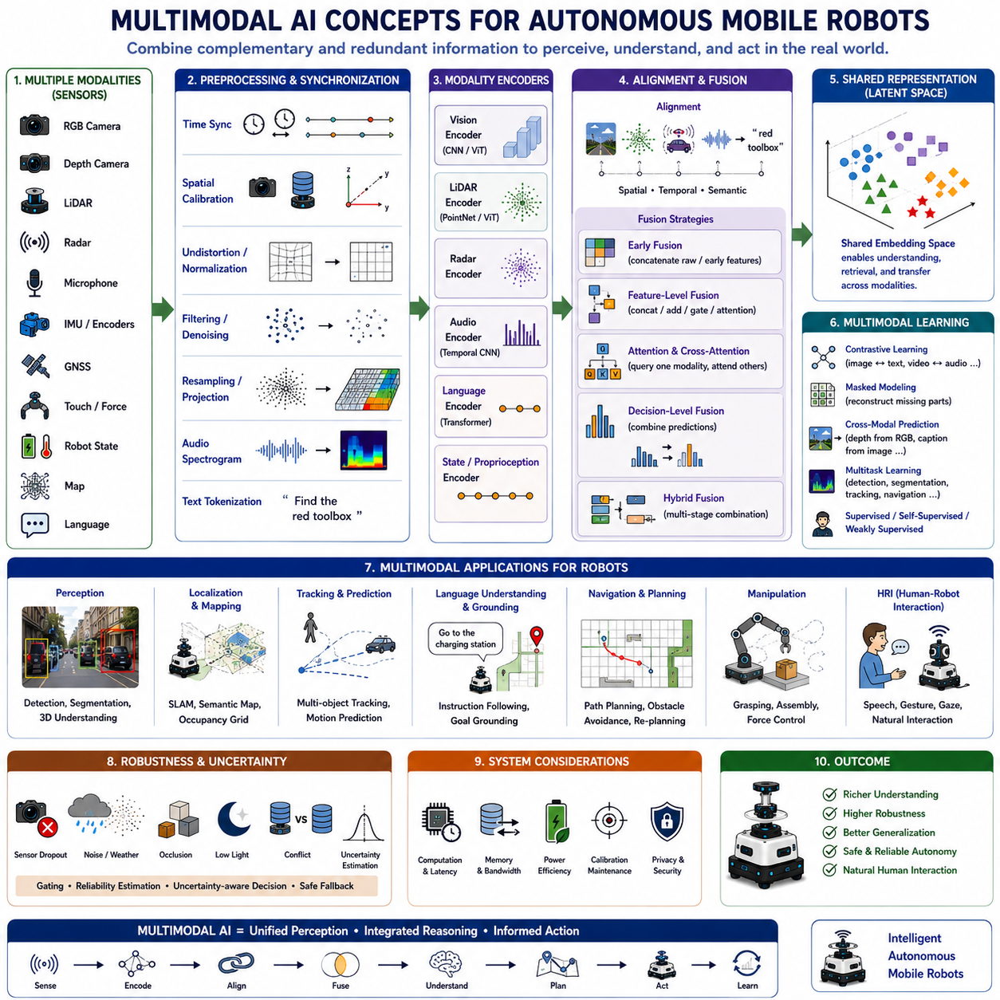
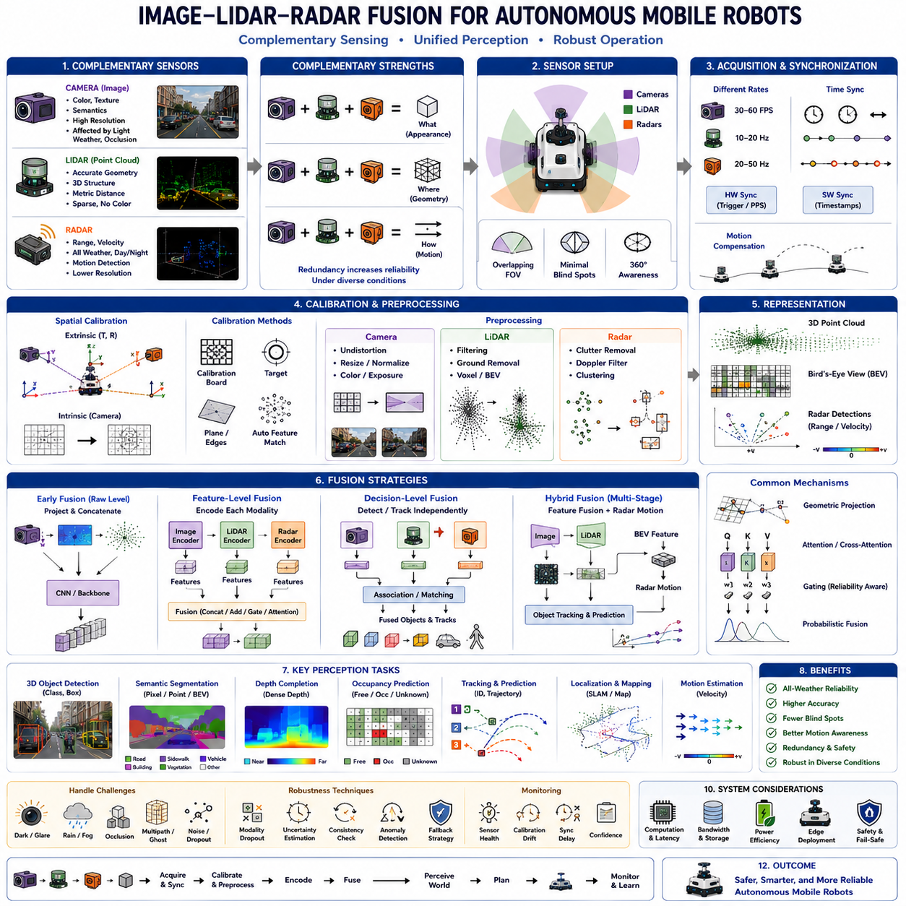
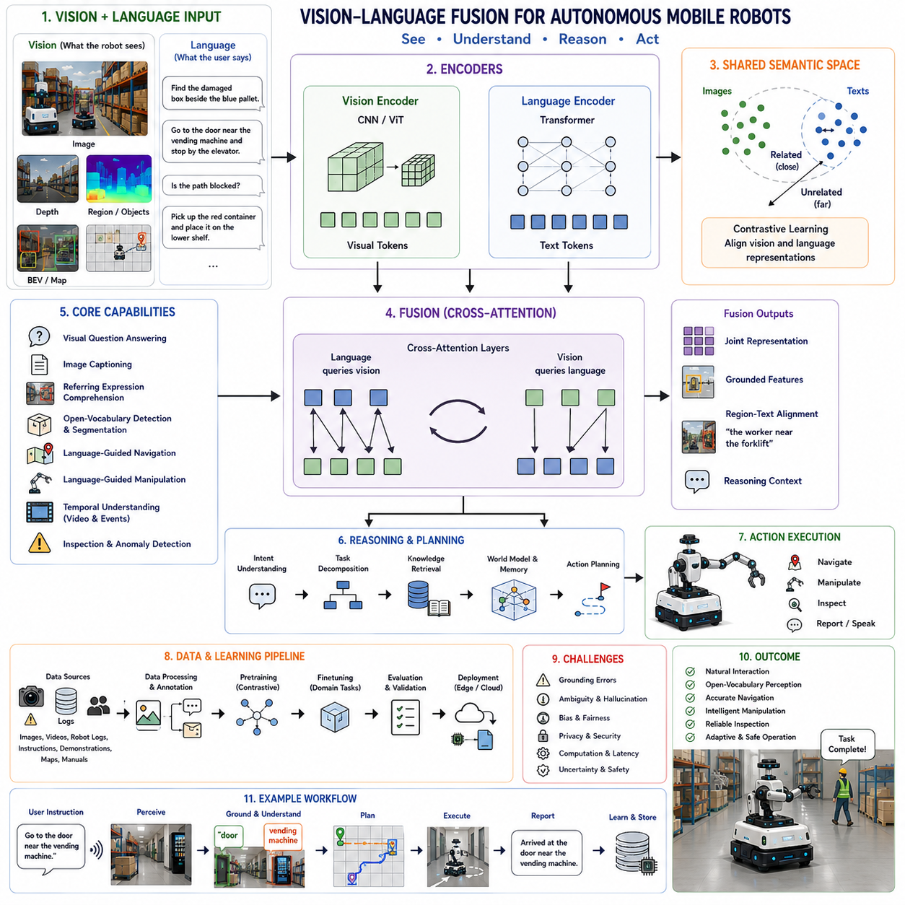
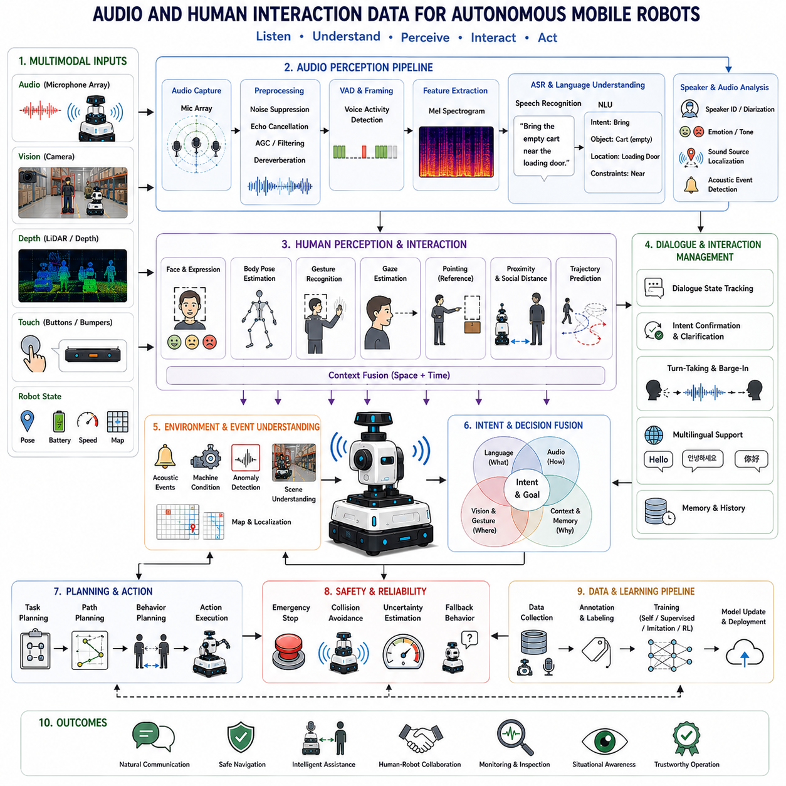
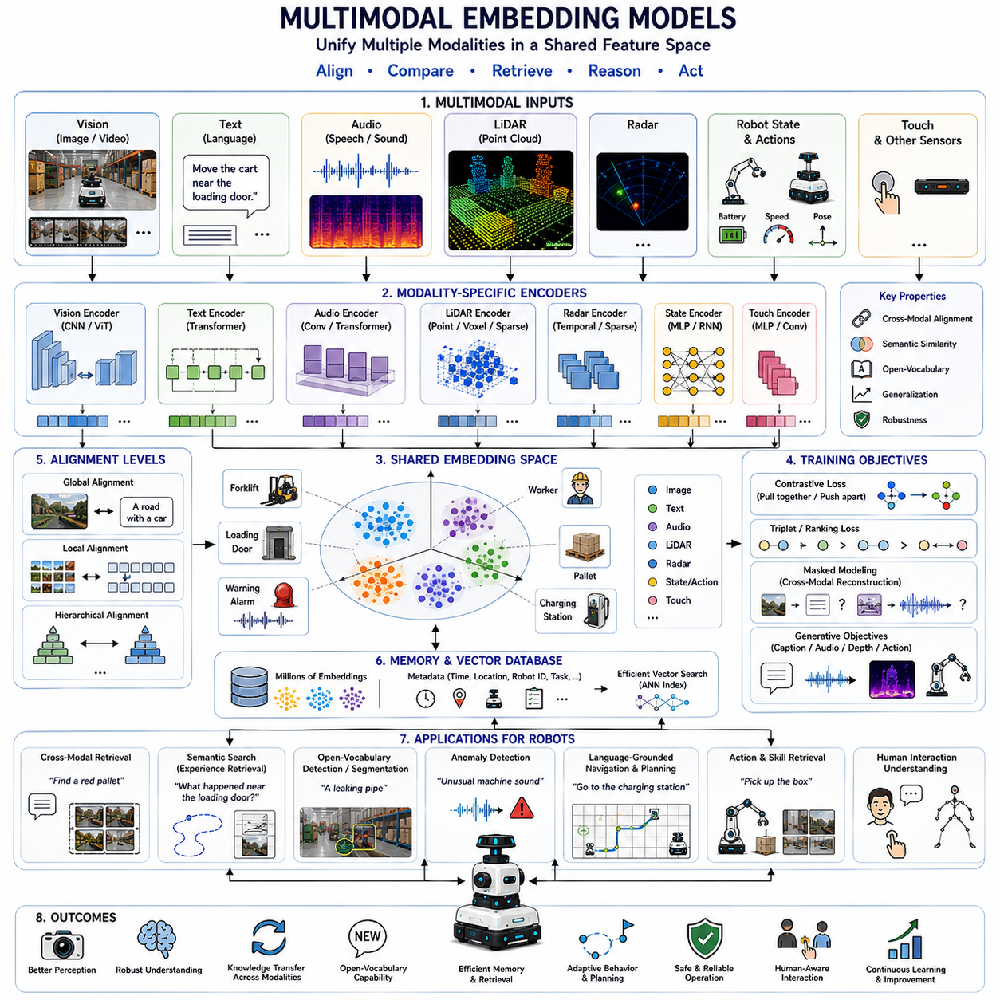
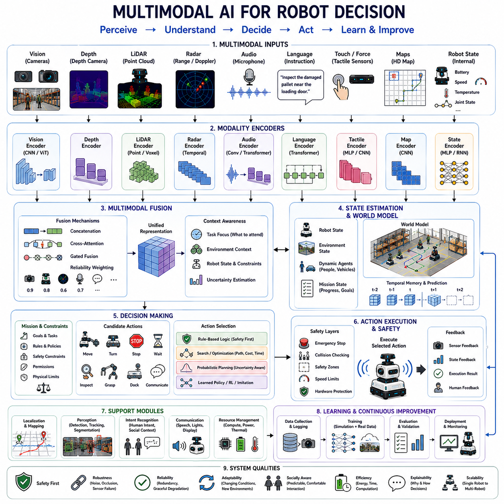
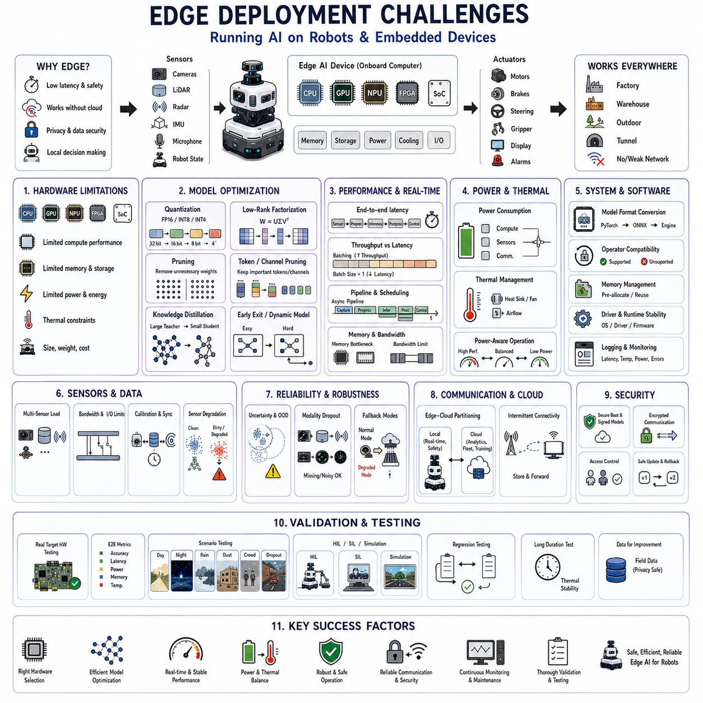
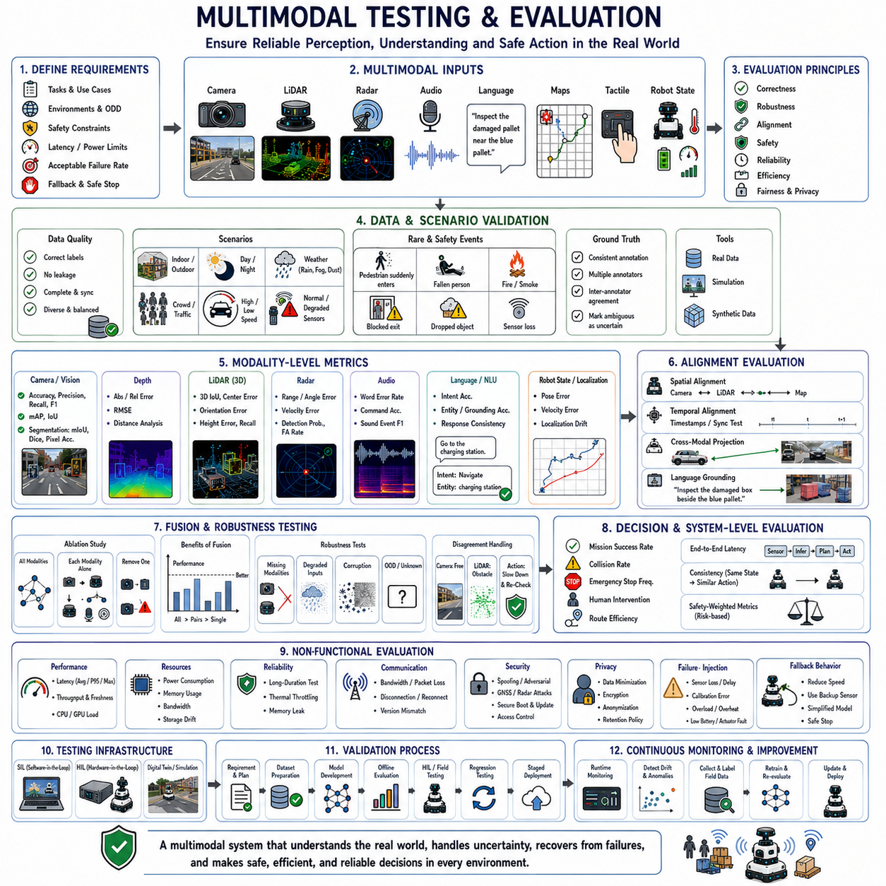

**Volume 06. AMR AI and Embodied Intelligence**

# Chapter 04. Multimodal AI

## 04.1 Multimodal AI Concepts

{width="7.268055555555556in" height="7.268055555555556in"}

멀티모달 인공지능(Multimodal Artificial Intelligence)은 여러 형태의 정보를 동시에 처리하고 연결하며 추론하는 인공지능 시스템을 의미한다. 이러한 정보에는 영상(Image), 비디오(Video), 언어(Language), 오디오(Audio), 깊이 정보(Depth), 라이다(LiDAR), 레이더(Radar), 촉각(Touch), 로봇 상태(Robot State), 지도(Map), 행동(Action) 등이 포함된다. 목표는 단일 정보만으로는 얻을 수 없는 풍부한 통합 이해를 구축하는 것이다.

인간은 세상을 이해할 때 여러 감각을 자연스럽게 결합한다. 시각은 객체와 공간 구조를 인식하고, 청각은 시야 밖에서 발생하는 사건을 알려주며, 촉각은 접촉 여부를 확인하고, 언어는 추상적인 의미를 제공한다. 멀티모달 인공지능은 이러한 통합된 지각과 추론 방식을 컴퓨터 시스템 안에서 구현하는 것을 목표로 한다.

모달리티(Modality)는 고유한 구조와 측정 방식, 불확실성을 가지는 특정 정보 유형을 의미한다. RGB 영상은 공간적인 색상 패턴을 포함하고, 오디오는 시간에 따라 변화하는 파형이며, 언어는 기호(Symbol) 기반의 순차 정보이고, 라이다는 불규칙한 기하학적 포인트를 생성한다. 따라서 각 모달리티는 이에 적합한 인코딩과 전처리가 필요하다.

단일 모달(Single-Modal) 시스템은 하나의 정보원만을 사용한다. 카메라 기반 검출기는 사람과 차량을 인식할 수 있고, 음성 모델은 음성 명령을 이해할 수 있다. 이러한 시스템은 특정 환경에서는 우수한 성능을 보일 수 있지만, 해당 모달리티가 노이즈, 정보 부족, 모호성 또는 장애를 겪으면 쉽게 성능이 저하된다.

멀티모달 시스템은 이러한 한계를 줄이기 위해 서로 보완적인 정보를 결합한다. 카메라는 객체의 종류를 식별하고, 라이다는 거리를 측정하며, 레이더는 상대 속도를 추정하고, 오디오는 접근하는 차량을 감지하며, 언어는 현재 수행해야 하는 임무를 설명한다. 이러한 정보가 함께 사용되면 더욱 신뢰성 높은 환경 이해가 가능하다.

상호 보완성(Complementarity)은 멀티모달 학습의 가장 중요한 이유 중 하나이다. 서로 다른 모달리티는 동일한 사건의 서로 다른 특성을 설명한다. 컬러 영상은 외형을 제공하고, 깊이 센서는 기하학적 구조를 제공하며, 레이더는 움직임을 제공하고, 언어는 의미와 의도를 설명한다. 이들이 결합되면 어느 하나만으로는 얻을 수 없는 표현을 형성할 수 있다.

중복성(Redundancy)도 매우 중요하다. 여러 모달리티는 동일한 특성을 서로 다른 방식으로 관측할 수 있다. 예를 들어 스테레오 비전(Stereo Vision)과 라이다는 모두 거리를 추정할 수 있으며, 카메라와 레이더는 움직이는 차량을 동시에 감지할 수 있다. 이러한 중복은 한 센서가 실패하더라도 다른 센서가 이를 보완하도록 만들어 시스템의 신뢰성을 높인다.

멀티모달 인식(Multimodal Perception)은 자율주행 이동로봇(AMR, Autonomous Mobile Robot)에서 특히 중요하다. 로봇은 조명, 날씨, 가림(Occlusion), 센서 노이즈, 측정 거리, 통신 환경이 지속적으로 변하는 실제 환경에서 동작한다. 따라서 강인한 자율성은 하나의 센서에 의존하는 것이 아니라 여러 정보를 통합하는 능력에 달려 있다.

일반적인 자율주행 로봇은 RGB 카메라, 깊이 카메라, 2차원 또는 3차원 라이다, 레이더, 초음파 센서(Ultrasonic Sensor), 관성측정장치(IMU, Inertial Measurement Unit), 휠 엔코더(Wheel Encoder), 위성항법장치(GNSS), 마이크, 내부 시스템 상태 정보를 함께 사용한다. 각각의 센서는 로봇과 주변 환경에 대한 서로 다른 정보를 제공한다.

멀티모달 인공지능의 첫 번째 단계는 데이터 획득(Data Acquisition)이다. 센서는 충분한 품질, 주기, 해상도, 시야 범위를 갖는 데이터를 수집해야 한다. 부적절한 센서 배치, 좁은 시야, 과도한 진동, 렌즈 오염, 하드웨어 간 간섭은 이후의 융합(Fusion) 성능을 크게 저하시킬 수 있다.

시간 동기화(Time Synchronization)는 매우 중요하다. 서로 다른 센서는 서로 다른 주기로 동작하기 때문이다. 예를 들어 카메라는 초당 30프레임을 촬영하고, 라이다는 초당 10회 회전하며, IMU는 초당 수백 번의 측정을 수행할 수 있다. 이 모든 데이터를 동일한 시간 기준으로 정렬해야 한다.

시간 동기화가 이루어지지 않으면 움직이는 객체가 센서마다 서로 다른 위치에 존재하는 것처럼 보인다. 영상 속 보행자와 라이다 포인트가 서로 대응하지 않을 수 있다. 하드웨어 트리거(Hardware Trigger), 공통 클럭(Shared Clock), 타임스탬프 보정, 보간(Interpolation), 움직임 보상(Motion Compensation)을 이용하여 이러한 문제를 줄인다.

공간 보정(Spatial Calibration)도 필수적이다. 각각의 센서는 서로 다른 위치와 방향에서 환경을 관측한다. 외부 보정(Extrinsic Calibration)은 센서 간 좌표 변환을 정의하고, 내부 보정(Intrinsic Calibration)은 카메라와 센서의 내부 기하학적 특성을 정의한다.

정확한 보정을 통해 영상 픽셀, 깊이 정보, 레이더 표적, 라이다 포인트를 하나의 물리 좌표계에서 연결할 수 있다. 작은 보정 오차도 먼 거리에서는 매우 큰 융합 오차를 만들 수 있으며, 특히 작은 객체나 좁은 안전 경계에서는 더욱 심각하다.

전처리(Preprocessing)는 원시 센서 데이터를 신경망이 처리하기 쉬운 형태로 변환하는 과정이다. 영상은 크기 변경, 정규화, 왜곡 보정, 색상 보정을 수행하고, 오디오는 스펙트로그램(Spectrogram)으로 변환할 수 있다. 포인트 클라우드는 필터링, 복셀화(Voxelization), 움직임 보상, 거리 영상(Range Image) 변환 등을 수행한다.

각 모달리티는 일반적으로 전용 인코더(Encoder)를 통해 처리된다. 영상은 CNN이나 비전 트랜스포머(Vision Transformer), 라이다는 포인트 네트워크(Point Network), 언어는 트랜스포머, 오디오와 IMU는 시계열 네트워크(Temporal Network) 등을 사용할 수 있다.

인코더의 출력은 임베딩(Embedding)이라 불리는 학습된 표현이다. 임베딩은 원시 데이터를 벡터(Vector)나 특징 맵(Feature Map)으로 압축하면서 작업에 필요한 정보를 유지한다. 효과적인 멀티모달 학습은 서로 다른 모달리티의 임베딩이 상호작용할 수 있도록 만드는 것을 목표로 한다.

표현 정렬(Representation Alignment)은 서로 다른 모달리티의 관련 정보를 연결하는 과정이다. 지게차(Forklift)를 보여주는 영상 영역은 동일한 라이다 포인트, 레이더 반사, 언어 설명과 연결되어야 한다. 이러한 정렬은 공간적, 시간적, 의미적 또는 작업(Task) 기반으로 이루어진다.

공간 정렬(Spatial Alignment)은 동일한 물리적 위치를 나타내는 특징을 연결한다. 카메라 픽셀은 깊이 정보를 이용하여 3차원 공간으로 투영될 수 있고, 라이다 포인트는 영상 위로 투영될 수 있으며, 여러 카메라의 특징은 BEV(Bird\'s-Eye View) 공간으로 변환될 수 있다.

시간 정렬(Temporal Alignment)은 시간적으로 떨어진 관측을 연결한다. 음성 명령, 시각적 사건, 로봇 행동은 서로 다른 시점에 발생하지만 동일한 작업의 일부일 수 있다. 시퀀스 모델과 메모리 구조는 이러한 관계를 학습한다.

의미 정렬(Semantic Alignment)은 동일한 의미를 서로 다른 방식으로 표현하는 정보를 연결한다. 지게차 사진, "forklift"라는 단어, 음성 명령, 3차원 포인트 군집은 내부적으로 유사한 표현을 가져야 한다. 이를 통해 서로 다른 모달리티 간의 지식 전달이 가능해진다.

융합(Fusion)은 여러 모달리티의 정보를 결합하는 과정이다. 원시 데이터 수준, 특징 수준, 결정 수준 또는 여러 단계를 결합하는 방식으로 수행될 수 있다. 최적의 방법은 센서 특성, 계산 자원, 작업 요구사항에 따라 달라진다.

초기 융합(Early Fusion)은 특징 추출 이전의 원시 데이터 또는 최소한의 전처리 데이터를 결합한다. 예를 들어 RGB 영상과 깊이 영상을 채널(Channel) 단위로 결합하여 하나의 신경망에 입력할 수 있다. 초기 융합은 세부 정보를 유지하지만 정확한 정렬과 동일한 해상도를 요구한다.

특징 수준 융합(Feature-Level Fusion)은 각 모달리티를 독립적으로 인코딩한 뒤 특징을 결합한다. 특징은 연결(Concatenation), 덧셈(Addition), 게이팅(Gating), 어텐션(Attention), 그래프(Graph) 기반 방식으로 통합될 수 있다. 현재 가장 널리 사용되는 방법이다.

결정 수준 융합(Decision-Level Fusion)은 각각의 모델이 독립적으로 예측한 결과를 결합한다. 카메라 검출기, 라이다 검출기, 레이더 추적기의 결과를 신뢰도 규칙이나 확률적 추론을 이용하여 최종적으로 통합한다. 구조가 단순하며 일부 센서가 없어도 동작하기 쉽다.

하이브리드 융합(Hybrid Fusion)은 여러 수준의 융합을 동시에 사용하는 방식이다. 카메라와 라이다는 특징 수준에서 융합하고, 레이더는 후반부에 결합하며, 최종 결과는 규칙 기반 안전 논리와 함께 사용할 수 있다. 실제 로봇 시스템에서는 이러한 방식이 자주 사용된다.

연결(Concatenation)은 가장 단순한 특징 융합 방식이다. 여러 모달리티의 특징 벡터를 하나로 이어 붙여 이후 계층에 전달한다. 구현은 간단하지만 모든 특징을 동일하게 취급하기 때문에 센서의 신뢰도를 반영하기 어렵다.

게이트 기반 융합(Gated Fusion)은 현재 상황에 따라 각 모달리티의 중요도를 학습한다. 야간에는 카메라보다 라이다와 레이더의 가중치를 높이는 것처럼 환경에 따라 동적으로 센서의 영향을 조절할 수 있다.

어텐션 기반 융합(Attention-Based Fusion)은 하나의 모달리티가 다른 모달리티에서 필요한 정보를 선택하도록 한다. 언어는 영상의 특정 영역에 집중할 수 있고, 영상 특징은 라이다 포인트를 선택적으로 참조할 수 있으며, BEV 쿼리(Query)는 여러 카메라와 레이더 정보를 동시에 수집할 수 있다.

교차 어텐션(Cross-Attention)은 한 모달리티의 Query와 다른 모달리티의 Key, Value를 사용한다. 길이나 좌표계가 다른 정보 간의 상호작용에 매우 효과적이며 모든 입력을 일대일로 맞출 필요가 없다.

자기 어텐션(Self-Attention)은 여러 모달리티를 공통 토큰(Token)으로 변환한 이후에도 사용할 수 있다. 영상 패치, 언어 토큰, 포인트 클라우드 토큰, 로봇 상태 토큰이 하나의 트랜스포머 내부에서 자유롭게 정보를 교환할 수 있다.

토큰화(Tokenization)는 각 모달리티를 트랜스포머가 처리할 수 있는 토큰으로 변환하는 과정이다. 영상은 패치 토큰, 언어는 단어 토큰, 포인트 클라우드는 기하학 토큰, 행동은 제어 토큰으로 표현된다.

모달리티 임베딩(Modality Embedding)은 각 토큰이 어떤 센서에서 생성되었는지를 알려준다. 위치 인코딩(Positional Encoding)과 시간 인코딩(Temporal Encoding)은 정보의 위치와 순서를 나타내어 모델이 센서 종류와 시간 관계를 이해하도록 돕는다.

공유 잠재 공간(Shared Latent Space)은 서로 다른 모달리티의 관련 정보가 가까운 위치에 존재하는 내부 표현 공간이다. 이를 통해 교차 모달 검색(Cross-Modal Retrieval), 제로샷 인식(Zero-Shot Recognition), 언어 기반 인식, 지식 전달이 가능해진다.

대조 학습(Contrastive Learning)은 공유 표현을 만드는 대표적인 방법이다. 서로 대응하는 영상과 문장은 임베딩 공간에서 가깝게 만들고, 관련 없는 쌍은 멀어지도록 학습한다. 동일한 방식으로 영상과 깊이, 영상과 행동, 비디오와 오디오도 정렬할 수 있다.

대조 학습은 서로 다른 모달리티 간 검색을 가능하게 한다. 사용자는 문장을 입력하여 관련 영상을 찾을 수 있으며, 로봇은 음성 명령과 가장 관련 있는 객체를 시각적으로 찾을 수 있다.

마스크드 모델링(Masked Modeling)은 입력의 일부를 가린 뒤 이를 복원하도록 학습하는 방법이다. 가려진 영상 패치, 단어, 깊이 값, 포인트 클라우드 영역을 예측하면서 모달 간 관계를 학습한다.

교차 모달 예측(Cross-Modal Prediction)은 하나의 모달리티를 이용하여 다른 모달리티를 예측하도록 학습한다. RGB 영상에서 깊이를 추정하거나, 영상에서 문장을 생성하거나, 영상과 행동으로 미래 상태를 예측하는 방식이 대표적이다.

자기지도 학습(Self-Supervised Learning)은 대규모 라벨링(Labeling)의 필요성을 줄여준다. 로봇이 수집하는 영상, 깊이, 오디오, 움직임, 행동은 자연스럽게 시간적으로 정렬되어 있어 별도의 수작업 라벨 없이도 학습 신호로 활용될 수 있다.

지도 학습(Supervised Learning)은 목표 출력이 명확할 때 여전히 중요하다. 객체 라벨, 분할 마스크, 3차원 박스, 음성 명령, 주행 목표, 조작 시연, 성공 및 실패 사례 등을 이용하여 학습할 수 있다.

약지도 학습(Weak Supervision)은 불완전하거나 대략적인 라벨을 사용한다. 언어 설명, 시스템 로그, 운영자의 행동, 지도 정보, 규칙 기반 센서 결과도 유용한 학습 정보가 될 수 있다.

멀티태스크 학습(Multi-Task Learning)은 하나의 멀티모달 모델이 여러 작업을 동시에 수행하도록 한다. 하나의 공유 인코더가 객체 검출, 분할, 깊이 추정, 객체 추적, 언어 이해, 행동 예측을 동시에 지원할 수 있다.

공유 학습은 계산 효율을 높이지만 서로 다른 작업이 동일한 표현을 공유하면서 간섭(Task Interference)이 발생할 수 있다. 따라서 손실 함수(Loss Function) 조정과 구조적 분리가 중요하다.

비전-언어 모델(Vision-Language Model)은 대표적인 멀티모달 인공지능이다. 영상과 자연어를 연결하여 이미지 설명(Image Captioning), 시각 질의응답(VQA, Visual Question Answering), 검색(Retrieval), 개방형 객체 인식(Open-Vocabulary Detection), 명령 이해를 수행할 수 있다.

로봇에서는 비전-언어 모델을 이용하여 작업자가 자연어로 목표를 설명할 수 있다. 로봇은 빨간 공구 상자를 찾거나, 손상된 박스를 검사하거나, 열린 출입문으로 이동하거나, 보호 장비를 착용한 작업자를 따라가는 작업을 수행할 수 있다.

언어 접지(Language Grounding)는 문장이 어떤 객체, 영역, 행동 또는 관계를 의미하는지를 결정하는 과정이다. 자연어가 실제 환경과 정확하게 연결되어야 언어 기반 주행과 조작이 가능하다.

개방형 어휘 인식(Open-Vocabulary Perception)은 미리 학습하지 않은 객체도 텍스트 설명을 이용하여 인식할 수 있도록 한다. 시각 특징과 텍스트 임베딩을 비교하여 새로운 객체도 이해할 수 있으므로 변화하는 환경에 더욱 유연하게 대응할 수 있다.

오디오-비전 학습(Audio-Visual Learning)은 소리와 영상을 함께 사용한다. 오디오는 접근하는 차량, 경보음, 충돌, 사람의 음성, 기계 이상, 시야 밖의 사건을 감지하며, 영상은 소리의 원인과 의미를 해석하는 데 도움을 준다.

오디오는 사람과 로봇의 상호작용도 향상시킨다. 음성 인식(Speech Recognition)은 명령을 텍스트로 변환하고, 화자 위치 추정(Speaker Localization)은 음성이 발생한 위치를 찾는다. 제스처와 입 움직임은 시끄러운 환경에서 음성 이해를 더욱 향상시킬 수 있다.

촉각-시각 학습(Tactile-Visual Learning)은 로봇 조작에서 중요하다. 비전은 접촉 이전에 물체의 형태와 자세를 추정하고, 촉각은 압력, 미끄러짐, 질감, 접촉 형상을 측정한다. 이를 결합하면 더욱 안정적인 파지가 가능하다.

힘과 토크 센서(Force/Torque Sensor)는 추가적인 물리 정보를 제공한다. 로봇은 비전으로 부품을 정렬하고, 힘 센서로 접촉을 감지하며, 예상과 다른 저항이 발생하면 움직임을 수정할 수 있다.

고유 감각(Proprioception)은 관절 각도, 모터 전류, 속도, 가속도, 배터리 상태, 액추에이터 온도와 같은 로봇 내부 상태를 의미한다. 외부 센서와 결합하면 상태 추정과 이상 탐지가 더욱 정확해진다.

카메라는 로봇이 이동하고 있음을 보여주고, 휠 엔코더와 IMU는 실제 움직임을 측정한다. 이들 간의 차이는 바퀴 미끄러짐, 충돌, 센서 드리프트, 기계적 이상을 나타낼 수 있다.

멀티모달 위치 추정(Multimodal Localization)은 비전, 라이다, GNSS, IMU, 휠 오도메트리(Odometry), 지도를 함께 사용한다. 각 센서는 서로 다른 장점과 약점을 가지므로 이들을 결합하면 더욱 안정적인 위치 추정이 가능하다.

GNSS는 실외에서는 전역 위치를 제공하지만 실내나 고층 건물 근처에서는 성능이 저하될 수 있다. 비전과 라이다는 지역 환경을 이용한 위치 추정을 제공하며, IMU와 오도메트리는 단기적인 움직임을 안정적으로 유지한다.

멀티모달 지도 작성(Multimodal Mapping)은 기하학과 의미 정보를 함께 포함한다. 라이다와 깊이 센서는 구조를 제공하고, 카메라는 객체 종류와 표면 정보를 제공하며, 언어와 임무 정보는 기능적 의미를 추가한다.

의미 지도(Semantic Map)는 출입문, 충전 스테이션, 제한 구역, 검사 대상, 작업 구역, 임시 장애물까지 포함할 수 있다. 이는 임무 계획과 장기적인 환경 이해를 향상시킨다.

BEV(Bird\'s-Eye View) 표현은 이동로봇에서 매우 유용한 공통 표현이다. 여러 카메라, 라이다, 레이더의 특징을 동일한 상부 좌표계로 변환하여 객체 검출, 점유 공간 예측, 경로 계획을 단순화한다.

점유 공간 모델(Occupancy Model)은 공간이 비어 있는지, 점유되어 있는지, 알 수 없는지를 예측한다. 멀티모달 입력은 기하학과 의미 정보를 동시에 사용하여 더욱 정확한 결과를 제공한다.

멀티모달 객체 추적은 외형, 위치, 움직임, 깊이, 레이더 속도를 함께 사용하여 객체의 ID를 유지한다. 일부 센서가 일시적으로 실패하더라도 다른 센서가 추적을 유지할 수 있다.

움직임 예측(Motion Prediction)도 여러 모달리티의 도움을 받는다. 사람의 자세, 이동 궤적, 지도 구조, 언어 정보는 사람이 로봇 앞을 가로지를지, 차량이 회전할지를 예측하는 데 활용될 수 있다.

멀티모달 행동 모델(Multimodal Action Model)은 인식과 로봇 제어를 연결한다. 입력에는 영상, 언어 명령, 고유 감각, 이전 행동, 지도 정보가 포함될 수 있으며, 출력은 주행 명령, 조작 궤적, 고수준 행동 시퀀스가 될 수 있다.

비전-언어-행동 모델(Vision-Language-Action Model)은 비전-언어 모델을 확장하여 로봇 행동까지 포함한다. 시연 데이터와 상호작용 데이터를 통해 관측, 명령, 행동의 관계를 학습한다.

이러한 모델은 명령을 이해하고, 관련 객체를 찾고, 공간 관계를 추정하며, 적절한 기술(Skill)을 선택하고, 실제 제어 명령을 생성할 수 있다. 이는 인간의 의도를 물리적 행동으로 직접 연결하는 기반이 된다.

월드 모델(World Model)은 더욱 넓은 멀티모달 환경 표현을 제공한다. 시각 정보, 기하학, 언어, 메모리, 행동, 미래 상태 예측을 통합하여 현재뿐 아니라 환경의 변화까지 표현하려고 한다.

멀티모달 월드 모델은 현재 보이지 않는 객체를 기억하고, 사람의 움직임을 예측하며, 로봇 행동의 결과를 추정하고, 실행 전에 여러 계획을 시뮬레이션할 수 있다.

메모리(Memory)는 실제 작업에서 필수적이다. 로봇은 명령을 받고 여러 공간을 이동하며 중간 사건을 경험한 뒤 다시 이전 위치로 돌아갈 수 있다. 지속적인 메모리는 이러한 모든 경험을 하나의 임무 맥락으로 연결한다.

단기 메모리(Short-Term Memory)는 최근 정보를 유지하고, 장기 메모리(Long-Term Memory)는 지도, 객체, 사용자 선호, 작업 이력을 저장한다. 검색(Retrieval) 메커니즘은 현재 상황에 필요한 정보를 선택한다.

멀티모달 인공지능은 일부 모달리티가 사라지는 상황도 처리해야 한다. 카메라가 가려지거나, 레이더가 데이터를 잃거나, 언어 입력이 없는 경우에도 남아 있는 센서만으로 동작해야 한다.

모달리티 드롭아웃(Modality Dropout)은 학습 과정에서 일부 모달리티를 의도적으로 제거하는 기법이다. 이를 통해 모델이 하나의 센서에 과도하게 의존하지 않도록 학습한다.

센서 신뢰도(Sensor Reliability)는 동적으로 추정할 수 있다. 노이즈 수준, 신뢰도, 가시성, 신호 강도, 다른 센서와의 일관성을 이용하여 각 센서의 영향력을 결정할 수 있다.

불확실성 추정(Uncertainty Estimation)은 멀티모달 시스템에서 매우 중요하다. 여러 센서를 사용한다고 해서 항상 올바른 결과가 보장되는 것은 아니다. 센서 간 충돌, 보정 오류, 새로운 환경, 과도한 자신감은 위험한 결정을 만들 수 있다.

우연적 불확실성(Aleatoric Uncertainty)은 센서 자체의 노이즈에서 발생하며, 인식적 불확실성(Epistemic Uncertainty)은 모델이 충분한 지식을 갖지 못한 경우 발생한다. 두 종류 모두 신뢰도와 안전 동작에 반영되어야 한다.

교차 모달 불일치(Cross-Modal Disagreement)는 중요한 경고 신호이다. 카메라는 자유 공간을 보여주지만 라이다는 장애물을 검출하는 경우 단순 평균을 사용해서는 안 된다. 로봇은 속도를 줄이거나 보정을 다시 확인하거나 더욱 안전한 판단을 선택해야 한다.

멀티모달 모델은 데이터 불균형(Data Imbalance) 문제도 가진다. 일부 모달리티가 더 많은 정보를 포함하거나 더 큰 특징 크기를 가지면 학습이 한쪽으로 치우칠 수 있다. 정규화, 균형 손실 함수, 게이팅, 독립 인코더를 이용하여 이를 완화할 수 있다.

학습 데이터는 실제 환경에서 발생하는 다양한 조합을 포함해야 한다. 각 센서를 이상적인 조건에서만 학습하는 것은 충분하지 않으며, 야간, 노이즈, 날씨, 센서 장애, 가림, 상충되는 센서 정보를 모두 포함해야 한다.

대규모 멀티모달 데이터셋은 구축과 라벨링이 매우 어렵다. 시간 동기화, 공간 보정, 저장 공간, 개인정보, 다양한 센서 때문에 비용이 크게 증가한다. 따라서 공개 데이터셋, 시뮬레이션, 합성 데이터(Synthetic Data), 자기지도 학습이 점점 더 중요해지고 있다.

시뮬레이션은 카메라, 깊이, 라이다, 레이더, 오디오, 로봇 상태를 완벽한 라벨과 함께 생성할 수 있다. 그러나 실제와의 차이(Simulation-to-Reality Gap)를 줄이기 위해서는 물리 모델과 센서 노이즈를 현실적으로 구현해야 한다.

평가는 개별 모달리티뿐 아니라 전체 융합 시스템도 함께 평가해야 한다. 모든 센서를 사용할 때와 일부 센서를 제거했을 때, 그리고 열악한 환경에서의 성능을 모두 비교해야 한다.

제거 실험(Ablation Study)은 각 모달리티의 기여도를 분석한다. 특정 센서를 제거해도 성능 변화가 거의 없다면 해당 센서는 불필요할 수 있으며, 반대로 성능이 크게 감소하면 시스템이 그 센서에 지나치게 의존하고 있음을 의미한다.

평가 지표는 작업에 따라 달라질 수 있으며, 분류 정확도, 객체 검출의 정밀도와 재현율, 분할 IoU, 깊이 오차, 추적 일관성, 위치 추정 오차, 행동 성공률, 임무 완료율 등을 사용할 수 있다.

지연 시간(Latency), 메모리 사용량, 소비 전력, 통신 대역폭도 함께 평가해야 한다. 멀티모달 모델이 높은 정확도를 가지더라도 계산량이 지나치게 많으면 이동로봇에는 적합하지 않을 수 있다.

엣지 장치(Edge Device)에서의 배포는 여러 센서가 동시에 많은 데이터를 생성하기 때문에 매우 어렵다. 효율적인 인코더, 입력 해상도 감소, 희소 처리(Sparse Processing), 공유 백본(Shared Backbone), 혼합 정밀도(Mixed Precision), 가지치기, 양자화, 하드웨어 가속이 계산량을 줄여준다.

모든 모달리티를 동일한 주기로 처리할 필요는 없다. 안전 센서는 항상 동작하고, 언어 이해나 의미 지도는 필요할 때만 수행하는 비동기 스케줄링(Asynchronous Scheduling)이 효율적이다.

프라이버시와 보안도 중요하다. 멀티모달 시스템은 영상, 음성, 위치, 사람의 행동을 함께 수집할 수 있기 때문이다. 로컬 처리(Local Processing), 접근 제어(Access Control), 암호화(Encryption), 선택적 저장, 데이터 최소화(Data Minimization)가 개인정보를 보호하는 데 도움이 된다.

멀티모달 시스템에서는 적대적 공격(Adversarial Risk)도 증가한다. 시각 패턴, 음성 공격, GNSS 스푸핑(Spoofing), 레이더 간섭, 상충되는 센서 입력을 이용하여 시스템을 혼란스럽게 만들 수 있다. 센서 인증과 교차 모달 검증은 이러한 위험을 줄여준다.

해석 가능성(Interpretability)은 여전히 어려운 문제이다. 어텐션 맵(Attention Map), 중요도 분석(Saliency), 센서 기여도, 반사실 분석(Counterfactual Analysis)은 의사결정 과정의 일부만 설명할 수 있다.

안전이 중요한 로봇에서는 설명도 실제 운용과 연결되어야 한다. 시스템은 어떤 센서가 사용되었는지, 각 센서의 신뢰도는 얼마였는지, 어떤 객체가 검출되었는지, 왜 특정 행동이나 대체 동작을 선택했는지를 기록해야 한다.

미래의 멀티모달 인공지능은 영상, 비디오, 언어, 오디오, 3차원 기하학, 행동, 로봇 경험을 함께 학습한 파운데이션 모델(Foundation Model)을 중심으로 발전할 것이다. 이러한 모델은 다양한 작업에서 재사용 가능한 공통 표현을 제공한다.

멀티모달 파운데이션 모델은 객체나 환경마다 별도의 모델을 다시 학습할 필요를 줄여준다. 프롬프팅(Prompting), 미세 조정(Fine-Tuning), 검색(Retrieval), 도구 사용(Tool Use)을 통해 일반 지식을 특정 로봇 작업에 적용할 수 있다.

체화된 멀티모달 지능(Embodied Multimodal Intelligence)은 인식, 추론, 메모리, 행동을 하나의 연속적인 순환 구조로 연결한다. 로봇은 환경을 관찰하고, 명령을 이해하고, 결과를 예측하고, 실제 행동을 수행하며, 그 경험으로부터 지속적으로 학습하게 된다.

가장 발전된 미래 시스템은 여러 모달리티를 단순한 센서 집합으로 취급하지 않을 것이다. 외형, 기하학, 언어, 소리, 촉각, 움직임, 불확실성, 목표를 하나의 통합된 세계 표현(World Representation) 안에서 지속적으로 연결하여 이해하게 될 것이다.

자율주행 이동로봇에서 멀티모달 인공지능은 강인한 인식, 자연스러운 인간과의 상호작용, 적응형 계획, 신뢰성 높은 자율 운용의 핵심 기반이 된다. 서로 보완적이고 중복되는 정보를 함께 활용함으로써 로봇은 복잡한 실제 환경을 더욱 정확하게 이해하고, 다양한 불확실성 속에서도 더욱 안전하게 행동할 수 있다.

## 04.2 Image, LiDAR, and Radar Fusion

{width="7.268055555555556in" height="7.268055555555556in"}

영상-라이다-레이더 융합(Image-LiDAR-Radar Fusion)은 시각적 외형(Visual Appearance), 정밀한 기하학(Precise Geometry), 움직임 정보(Motion Information)를 결합하는 멀티모달 인식(Multimodal Perception) 방식이다. 목표는 하나의 센서만으로는 얻기 어려운 완전하고 신뢰성 높은 환경 표현(Environment Representation)을 구축하는 것이다.

카메라(Camera)는 색상, 질감(Texture), 형태(Shape), 표지판, 차선, 객체 종류, 의미적 문맥(Semantic Context)을 풍부하게 제공한다. 그러나 어둠, 눈부심, 비, 안개, 모션 블러(Motion Blur), 렌즈 오염 상황에서는 성능이 크게 저하될 수 있다.

라이다(LiDAR)는 레이저 펄스(Laser Pulse)를 사용하여 센서와 주변 표면 사이의 거리를 직접 측정한다. 이를 통해 객체 위치, 자유 공간(Free Space), 표면 형상, 환경 구조를 실제 3차원 좌표계에서 표현하는 포인트 클라우드(Point Cloud)를 생성한다.

라이다는 장애물 검출(Obstacle Detection), 위치 추정(Localization), 지도 작성(Mapping), 3차원 객체 인식(3D Object Recognition)에 매우 유용하다. 그러나 카메라보다 색상과 질감 정보가 부족하며, 작거나 먼 객체는 매우 적은 포인트로만 표현될 수 있다.

레이더(Radar)는 전파를 송신하고 반사 신호를 분석하여 거리, 방향, 상대 속도(Relative Velocity)를 추정한다. 비, 안개, 먼지, 어둠처럼 카메라나 라이다 성능이 저하되는 환경에서도 비교적 안정적으로 동작한다.

레이더는 도플러 측정(Doppler Measurement)을 통해 뛰어난 움직임 정보를 제공한다. 접근하는 차량, 움직이는 사람, 동적 장애물을 시각적으로 분명하게 보이기 전에 감지할 수 있다. 주요 한계는 낮은 공간 해상도(Spatial Resolution)와 반사 노이즈이다.

세 가지 센서는 강한 상호 보완성(Complementarity)을 가진다. 카메라는 객체가 어떻게 보이는지를 설명하고, 라이다는 실제 공간에서 어디에 있는지를 설명하며, 레이더는 어떻게 움직이는지를 설명한다. 융합은 외형, 기하학, 속도를 하나의 인식 시스템 안에서 연결한다.

중복성(Redundancy)도 중요한 장점이다. 카메라와 라이다는 모두 객체를 검출할 수 있고, 라이다와 레이더는 모두 거리를 추정할 수 있다. 하나의 센서가 불안정해져도 다른 센서가 부분적인 상황 인식을 유지하여 더욱 안전한 로봇 행동을 지원한다.

자율주행 이동로봇(AMR, Autonomous Mobile Robot)에서는 이러한 융합이 실내외 변화 환경에서 특히 중요하다. 창고, 공장, 건설 현장, 도로, 항만, 캠퍼스에는 다양한 조명, 날씨, 재질, 장애물, 이동 객체가 존재한다.

융합 시스템을 설계할 때는 먼저 적절한 센서 배치(Sensor Placement)가 필요하다. 카메라는 명확한 시야를 확보해야 하고, 라이다는 물리적 가림을 최소화해야 하며, 레이더는 로봇 차체, 회전체, 전자 장치의 강한 간섭을 피해야 한다.

안전과 관련된 방향에서는 센서 시야(Field of View)가 서로 겹치도록 구성하는 것이 중요하다. 시야 중첩은 동일한 보행자, 차량, 팔레트, 벽, 장애물을 여러 센서로 관측하고 공통 표현에서 비교할 수 있도록 한다.

로봇 주변의 완전한 커버리지를 확보하려면 여러 대의 카메라, 하나 이상의 라이다, 다수의 레이더가 필요할 수 있다. 센서 수는 가시성, 비용, 대역폭, 보정 노력, 연산 부하, 기계적 복잡성 사이에서 균형을 맞춰야 한다.

시간 동기화(Time Synchronization)는 필수적이다. 카메라는 초당 30\~60프레임으로 동작하고, 라이다는 초당 10\~20회 스캔하며, 레이더는 또 다른 주기로 갱신될 수 있기 때문이다.

동기화가 없으면 서로 다른 센서의 관측이 서로 다른 시점을 나타낸다. 움직이는 지게차(Forklift)가 영상에서는 한 위치에, 라이다에서는 다른 위치에, 레이더에서는 또 다른 위치에 나타날 수 있다.

하드웨어 동기화(Hardware Synchronization)는 가장 정확한 시간 정렬을 제공한다. 공통 트리거(Shared Trigger), 공통 클럭(Shared Clock), PPS(Pulse Per Second) 신호를 이용하여 센서의 데이터 획득 시점을 조정할 수 있다.

소프트웨어 동기화(Software Synchronization)는 기록된 타임스탬프(Timestamp)를 이용하여 데이터를 정렬한다. 하드웨어 트리거를 사용할 수 없을 때는 보간(Interpolation), 버퍼링(Buffering), 최근접 매칭(Nearest-Neighbor Matching), 시간 창(Temporal Window)을 사용할 수 있다.

움직임 보상(Motion Compensation)은 일정 시간 동안 수집된 데이터를 보정한다. 회전형 라이다는 전체 스캔을 한순간에 획득하지 않기 때문에 로봇이 움직이는 동안 포인트 클라우드가 왜곡될 수 있다.

IMU(Inertial Measurement Unit), 휠 오도메트리(Wheel Odometry), 비주얼 오도메트리(Visual Odometry)는 움직임 보상에 필요한 정보를 제공한다. 로봇 속도와 센서 스캔 시간이 증가할수록 정확한 보정의 중요성이 커진다.

공간 보정(Spatial Calibration)은 센서 좌표계 사이의 관계를 정의한다. 각 카메라, 라이다, 레이더는 로봇 기준 좌표계에서 서로 다른 위치와 방향을 가진다.

카메라 내부 보정(Camera Intrinsic Calibration)은 초점 거리(Focal Length), 주점(Principal Point), 렌즈 왜곡(Lens Distortion)을 추정한다. 이를 통해 영상 픽셀을 카메라에서 3차원 공간으로 향하는 광선(Ray)으로 해석할 수 있다.

외부 보정(Extrinsic Calibration)은 센서 사이의 회전(Rotation)과 이동(Translation)을 추정한다. 이를 통해 라이다 포인트와 레이더 표적을 영상에 투영하거나 로봇 공통 좌표계로 변환할 수 있다.

카메라-라이다 보정(Camera-to-LiDAR Calibration)은 보정 보드, 기하학적 표적, 평면, 에지, 자동 환경 특징 매칭을 이용하여 수행할 수 있다. 정밀한 영상과 포인트 클라우드 정렬을 위해 정확한 대응 관계가 필요하다.

카메라-레이더 보정(Camera-to-Radar Calibration)은 레이더 반사가 영상 특징과 직접적으로 유사하지 않기 때문에 더 어렵다. 코너 리플렉터(Corner Reflector), 움직이는 표적, 알려진 랜드마크, 기록된 시퀀스 기반 최적화가 사용될 수 있다.

기계적 변경, 충격, 진동, 정비, 센서 교체 후에는 보정을 다시 확인해야 한다. 작은 물리적 이동도 특히 먼 거리에서 큰 정렬 오차를 만들 수 있다.

온라인 보정 모니터링(Online Calibration Monitoring)은 점진적인 드리프트(Drift)를 감지할 수 있다. 투영된 객체 경계, 도로, 기둥, 벽, 이동 표적을 센서 간 비교하여 지속적인 불일치를 탐지할 수 있다.

원시 카메라 영상은 일반적으로 크기 변경, 정규화(Normalization), 색상 보정, 왜곡 제거, 노출 보정을 필요로 한다. 이러한 과정은 시각 특징 추출에 일관된 입력을 제공한다.

라이다 전처리(LiDAR Preprocessing)는 포인트 필터링, 지면 제거(Ground Removal), 반사 강도 정규화, 움직임 보상, 복셀화(Voxelization), 필러화(Pillarization), 거리 영상(Range Image), 조감도(BEV, Bird\'s-Eye View) 변환을 포함할 수 있다.

레이더 전처리(Radar Preprocessing)는 클러터 제거(Clutter Removal), 도플러 필터링, 표적 군집화(Clustering), 노이즈 억제, 좌표 변환, 로봇 자체에서 발생하는 정적 반사 제거를 포함한다.

레이더 측정은 일반적으로 희소하고 불확실하다. 다중 반사, 다중 경로(Multipath), 유령 표적(Ghost Target), 낮은 각도 해상도는 실제 객체와 직접 대응하지 않는 측정값을 생성할 수 있다.

전처리 과정에서는 모든 레이더 표적을 동일하게 신뢰하지 않고 불확실성을 유지해야 한다. 거리, 각도, 속도, 반사 강도, 추적 이력을 이용하여 측정 신뢰도를 추정할 수 있다.

융합은 원시 데이터 수준, 특징 수준, 객체 수준, 결정 수준에서 수행될 수 있다. 각 방식은 정보 보존, 계산 비용, 모듈성(Modularity), 강인성 측면에서 서로 다른 장단점을 가진다.

초기 융합(Early Fusion)은 본격적인 특징 추출 이전에 원시 데이터나 최소 전처리 데이터를 결합한다. 라이다 깊이 정보를 영상에 투영하여 RGB 채널과 결합하거나 레이더 측정을 공간 특징 맵으로 추가할 수 있다.

초기 융합은 세밀한 지역 관계를 유지하지만 정밀한 보정과 동기화가 필요하다. 정렬 오차가 발생하면 공유 입력 자체가 오염되어 모델 성능이 저하될 수 있다.

특징 수준 융합(Feature-Level Fusion)은 각 모달리티를 전용 인코더(Encoder)로 처리한 후 특징을 연결, 덧셈, 게이팅(Gating), 어텐션(Attention), 기하학적 투영 방식으로 통합한다.

특징 수준 융합은 각 센서 구조에 적합한 인코더를 사용할 수 있기 때문에 널리 사용된다. 카메라는 영상 백본(Image Backbone), 라이다는 포인트 또는 복셀 네트워크, 레이더는 희소 또는 시간 기반 인코더를 사용할 수 있다.

결정 수준 융합(Decision-Level Fusion)은 센서별로 독립적인 예측을 생성한 후 결과를 결합한다. 카메라 검출기, 라이다 검출기, 레이더 추적기는 각각 객체를 생성하고 이후 이를 매칭하여 통합한다.

결정 수준 융합은 모듈성이 높고 디버깅이 쉽다. 센서 하나가 실패해도 전체 네트워크를 재설계하지 않고 해당 센서만 제외할 수 있다. 그러나 융합 이전에 유용한 저수준 관계가 손실될 수 있다.

하이브리드 융합(Hybrid Fusion)은 여러 융합 수준을 결합한다. 카메라와 라이다 특징은 네트워크 내부에서 통합하고, 레이더 속도는 후반 단계에서 객체 추적과 움직임 예측을 보완할 수 있다.

기하학적 투영(Geometric Projection)은 가장 직접적인 융합 방법 가운데 하나이다. 라이다 포인트를 카메라 좌표계로 변환한 후 보정 파라미터를 이용하여 영상 평면으로 투영할 수 있다.

투영된 포인트는 영상 픽셀에 희소 깊이 정보를 추가한다. 이를 통해 객체 검출, 의미론적 분할, 깊이 보완(Depth Completion), 카메라 기반 거리 추정 검증을 지원할 수 있다.

반대로 영상 특징을 라이다 포인트와 연결할 수도 있다. 각 포인트에 대응하는 영상 위치에서 색상이나 의미 특징을 샘플링하여 더 풍부한 포인트 클라우드 표현을 생성할 수 있다.

센서의 시야와 해상도가 다르면 투영 기반 융합이 어려워진다. 가림(Occlusion) 때문에 투영된 포인트가 잘못된 가시 표면과 연결될 수도 있다.

라이다 포인트는 실제로 객체 뒤쪽에서 발생했지만 영상에서는 전경 객체 위에 투영될 수 있다. 깊이 순서, 가시성 검사, Z-버퍼(Z-Buffer) 방식은 이러한 오류를 줄여준다.

조감도 융합(BEV Fusion)은 센서 데이터를 공통 상부 좌표계로 변환한다. 카메라 특징, 라이다 기하학, 레이더 표적을 실제 지면 위치를 기준으로 표현할 수 있다.

BEV 표현은 인식 결과를 자율주행 및 경로 계획 좌표계와 직접 정렬하기 때문에 이동로봇에 매우 적합하다. 장애물, 자유 공간, 이동 객체, 경로를 하나의 지도에서 표현할 수 있다.

라이다는 이미 실제 좌표를 포함하므로 BEV 표현에 자연스럽게 적합하다. 포인트는 상부 특징 맵으로 인코딩되기 전에 필러나 복셀로 그룹화될 수 있다.

레이더 측정도 거리와 각도 정보를 이용하여 BEV로 투영할 수 있다. 속도 벡터(Velocity Vector)와 반사 강도는 추가 채널로 저장될 수 있다.

카메라를 BEV로 변환하는 것은 영상 픽셀에 직접적인 깊이가 없기 때문에 더 어렵다. 깊이 분포를 추정하거나, 기하학을 이용하거나, 학습된 공간 어텐션(Spatial Attention)을 사용하여 영상 특징을 3차원 공간으로 확장해야 한다.

여러 카메라의 특징은 로봇 주변의 하나의 통합 BEV로 융합될 수 있다. 이를 통해 사각지대(Blind Spot)를 줄이고 개별 영상 시점과 독립적인 일관된 공간 표현을 제공할 수 있다.

어텐션 기반 융합(Attention-Based Fusion)은 하나의 모달리티가 다른 모달리티에서 필요한 특징을 선택하도록 한다. 영상 Query는 라이다 포인트를 참조하고, BEV Query는 카메라, 레이더, 기하 인코더에서 정보를 수집할 수 있다.

교차 어텐션(Cross-Attention)은 센서 데이터 구조가 서로 다를 때 유용하다. 밀집 영상 토큰과 희소 포인트 또는 레이더 토큰이 동일한 해상도를 가지지 않아도 상호작용할 수 있다.

변형 가능 어텐션(Deformable Attention)은 소수의 중요한 위치만 샘플링하여 계산량을 줄인다. 고해상도 영상과 대규모 포인트 클라우드 장면에서 특히 유용하다.

게이트 기반 융합(Gated Fusion)은 현재 센서 신뢰도에 따라 각 모달리티의 가중치를 동적으로 조절한다. 밝은 환경에서는 카메라의 기여도를 높이고, 야간에는 라이다와 레이더의 기여도를 높일 수 있다.

센서 신뢰도는 노출, 가시성, 포인트 밀도, 반사 강도, 날씨, 보정 일관성, 과거 예측 품질을 이용하여 추정할 수 있다.

학습 기반 게이팅 네트워크는 공간적으로 서로 다른 가중치를 부여할 수 있다. 영상 일부 영역은 정상적이지만 다른 영역은 눈부심이나 그림자로 인해 신뢰도가 낮을 수 있다.

확률적 융합(Probabilistic Fusion)은 센서 측정과 예측을 불확실성과 함께 표현한다. 고정된 값을 단순히 결합하는 대신 위치, 속도, 클래스, 신뢰도를 확률 분포로 표현하여 통합한다.

베이지안 필터(Bayesian Filter), 칼만 필터(Kalman Filter), 파티클 필터(Particle Filter), 확률적 신경망은 센서 노이즈를 고려하면서 시간에 따라 측정값을 통합할 수 있다.

레이더는 방사 속도(Radial Velocity)를 직접 측정하기 때문에 객체 추적에 특히 유용하다. 카메라와 라이다는 보통 여러 프레임을 비교해야 속도를 추정할 수 있다.

레이더 속도는 추적 초기화를 개선하고 이동 객체와 정적 구조를 구분하는 데 도움을 준다. 또한 빠르게 접근하는 위험 요소를 더 이른 시점에 감지할 수 있다.

그러나 방사 속도는 레이더를 향하거나 멀어지는 방향의 속도만 측정한다. 완전한 3차원 속도를 추정하려면 여러 레이더 시점이나 시간적 추적이 필요할 수 있다.

객체 수준 융합(Object-Level Fusion)은 센서별 검출 결과를 연결한다. 카메라 경계 상자, 라이다 군집, 레이더 표적이 동일한 실제 객체를 설명하는지 판단한다.

연관(Association)은 위치, 크기, 클래스, 속도, 외형, 시간적 연속성, 신뢰도를 이용할 수 있다. 잘못된 연관은 서로 다른 객체를 하나로 합치거나 하나의 객체를 여러 개의 추적으로 분리할 수 있다.

헝가리안 알고리즘(Hungarian Algorithm), 최근접 이웃(Nearest Neighbor), 확률적 데이터 연관(Probabilistic Data Association), 학습 기반 연관 네트워크가 일반적으로 사용된다.

3차원 객체 검출(3D Object Detection)은 영상-라이다-레이더 융합의 대표적인 응용 분야이다. 카메라 특징은 클래스 인식을 개선하고, 라이다는 정확한 3차원 박스를 제공하며, 레이더는 움직임 정보를 추가한다.

융합 모델은 사람, 차량, 지게차, 팔레트, 기계, 장벽, 기타 장애물을 실제 거리 공간에서 검출할 수 있다. 이는 충돌 예측과 경로 계획을 직접 지원한다.

의미론적 분할(Semantic Segmentation)도 융합을 통해 향상된다. 카메라는 밀집된 의미 정보를 제공하고, 라이다는 깊이와 기하 구조를 추가한다. 이를 통해 주행 가능 영역, 벽, 연석, 식생, 동적 객체를 더 정확히 구분할 수 있다.

3차원 의미론적 분할(3D Semantic Segmentation)은 포인트, 복셀, 점유 셀에 클래스를 부여한다. 영상 특징은 라이다만으로는 구분하기 어려운 유사한 기하 구조의 의미를 판단하는 데 도움을 준다.

깊이 보완(Depth Completion)은 희소한 라이다 깊이와 밀집된 카메라 영상을 결합하여 완전한 깊이 지도를 생성한다. 영상 경계는 보간을 안내하고, 라이다는 실제 거리 기준을 제공한다.

레이더는 긴 거리나 낮은 가시성 환경에서 깊이 추정을 보조할 수 있다. 그러나 낮은 각도 해상도 때문에 세밀한 경계 복원에는 한계가 있다.

자유 공간 검출(Free-Space Detection)은 로봇 주행에 필수적이다. 라이다는 기하학적 장애물을 검출하고, 카메라 분할은 주행 가능 영역을 인식하며, 레이더는 움직이거나 날씨로 가려진 위험 요소를 감지한다.

점유 공간 예측(Occupancy Prediction)은 공간을 자유, 점유, 미확인(Unknown)으로 표현한다. 카메라는 희소 포인트 사이의 구조를 추론하고, 능동 센서는 직접적인 거리 측정을 제공하여 점유 표현을 향상시킨다.

처음 보는 객체도 반드시 알려진 클래스에 속할 필요 없이 장애물로 처리할 수 있다. 따라서 점유 기반 융합은 안전 측면에서 매우 중요하다.

센서 융합은 위치 추정과 지도 작성도 지원한다. 카메라는 시각 랜드마크, 라이다는 안정적인 기하학, 레이더는 저가시성이나 반복 환경에서 추가적인 정보를 제공한다.

비전-라이다 오도메트리(Visual-LiDAR Odometry)는 영상 특징과 기하 정합을 결합하여 로봇 움직임을 추정한다. 시각 질감이나 포인트 구조 중 하나가 약해져도 드리프트(Drift)를 줄일 수 있다.

레이더 오도메트리(Radar Odometry)는 먼지, 안개, 어둠에서 움직임 추정 정보를 제공한다. 일부 환경에서는 정밀도가 낮을 수 있지만 카메라와 라이다가 불안정할 때 중복성을 제공한다.

의미 지도(Semantic Map)는 실제 거리 지도에 객체와 영역 의미를 추가한다. 융합 지도는 도로, 벽, 문, 충전 스테이션, 작업 구역, 사람, 임시 장애물을 포함할 수 있다.

시간에 따라 융합 인식을 유지하면 객체 추적과 예측이 향상된다. 외형, 기하학, 속도 정보를 이용하여 부분 가림 상황에서도 객체 ID를 유지할 수 있다.

카메라 외형 정보는 객체를 다시 식별하는 데 도움을 주고, 라이다는 정확한 위치를 유지하며, 레이더는 시각 검출이 불안정할 때도 속도 추정을 유지한다.

융합 모델은 하나의 시점이 아니라 여러 프레임을 함께 처리할 수 있다. 시간 트랜스포머(Temporal Transformer), 순환 신경망(Recurrent Network), 추적 메모리는 시간에 따른 센서 관측을 연결한다.

시간 누적(Temporal Accumulation)은 포인트 밀도를 높이고 먼 객체 인식을 향상시킨다. 그러나 이동 객체가 번지는 것을 방지하기 위해 움직임 보상이 필요하다.

융합 모델을 위한 데이터 수집은 단일 센서보다 복잡하다. 모든 센서 스트림은 정확한 타임스탬프, 보정 정보, 메타데이터, 로봇 움직임 정보와 함께 기록되어야 한다.

데이터셋은 다양한 조명, 날씨, 환경, 거리, 속도, 객체 종류, 센서 장애 조건을 포함해야 한다. 이상적인 주간 데이터만으로는 강인한 융합 시스템을 검증할 수 없다.

라벨에는 2차원 경계 상자, 3차원 경계 상자, 분할 마스크, 객체 추적 ID, 레이더 연관 정보, 깊이 지도, 점유 격자가 포함될 수 있다.

자동 라벨링(Automatic Labeling)은 비용을 줄일 수 있다. 라이다 기하학은 영상 주석을 지원하고, 카메라 인식은 포인트 클라우드 라벨을 보조하며, 다중 프레임 추적은 시간에 따라 라벨을 전파할 수 있다.

시뮬레이션은 완벽하게 동기화된 카메라, 라이다, 레이더 데이터를 완전한 라벨과 함께 생성할 수 있다. 희귀 위험 상황, 극한 날씨, 센서 장애, 제어된 움직임 시나리오에 유용하다.

레이더 시뮬레이션은 현실적인 다중 경로 반사, 물질 특성, 간섭, 노이즈를 정확히 재현하기 어렵기 때문에 특히 까다롭다.

도메인 랜덤화(Domain Randomization)는 센서 노이즈, 보정, 날씨, 조명, 객체 배치를 다양하게 변경한다. 이를 통해 모델이 특정 시뮬레이션 외형에 과적합되는 것을 줄일 수 있다.

융합 모델은 일부 센서가 누락되거나 품질이 저하되는 상황을 견딜 수 있도록 학습되어야 한다. 모달리티 드롭아웃(Modality Dropout)은 학습 중 카메라, 라이다, 레이더 입력을 의도적으로 제거한다.

이를 통해 모델이 하나의 센서에 완전히 의존하는 것을 방지할 수 있다. 실제 배포에서는 특정 센서를 사용할 수 없을 때도 제한된 모드로 동작할 수 있다.

센서별 데이터 증강(Sensor-Specific Augmentation)도 중요하다. 영상에는 블러, 어둠, 비, 눈부심을 적용하고, 라이다에는 포인트 누락, 거리 감소, 움직임 왜곡을 적용하며, 레이더에는 노이즈, 유령 표적, 측정 누락을 적용할 수 있다.

학습 데이터에는 센서 간 불일치도 포함해야 한다. 실제 시스템에서는 일시적인 보정 드리프트, 타임스탬프 지연, 상충되는 측정이 발생할 수 있다.

강인한 모델은 모든 관측을 억지로 하나의 확신 높은 결과로 합치지 않고 불일치를 인식해야 한다. 불확실성 인식 융합(Uncertainty-Aware Fusion)은 신뢰도를 낮추고 더욱 안전한 대응을 유도할 수 있다.

평가에서는 각 모달리티의 기여도를 측정해야 한다. 카메라 단독, 라이다 단독, 레이더 단독, 두 센서 조합, 전체 융합 성능을 비교하는 제거 실험(Ablation Test)이 필요하다.

특정 센서를 제거해도 성능 변화가 없다면 해당 센서가 유용한 정보를 제공하지 않을 수 있다. 반대로 성능이 급격히 감소하면 모델이 해당 센서에 지나치게 의존하고 있을 수 있다.

객체 검출 평가는 정밀도, 재현율, mAP(Mean Average Precision), 위치 오차, 속도 오차를 포함할 수 있다. 분할은 mIoU(Mean Intersection over Union), 추적은 ID 일관성과 궤적 오차를 사용할 수 있다.

평가는 날씨, 조명, 거리, 객체 크기, 움직임, 가림 조건별로도 수행해야 한다. 전체 평균 성능은 중요한 특정 조건에서의 심각한 약점을 감출 수 있다.

보정 민감도 테스트(Calibration Sensitivity Test)는 센서 변환값을 의도적으로 변경한다. 이를 통해 기계적 정렬 변화에 따라 성능이 얼마나 빠르게 저하되는지 확인할 수 있다.

동기화 민감도 테스트(Synchronization Sensitivity Test)는 시간 오프셋을 의도적으로 추가한다. 이를 통해 객체 정렬이 위험해지기 전에 시스템이 허용할 수 있는 타임스탬프 오차를 평가할 수 있다.

강인성 평가에는 센서 드롭아웃(Sensor Dropout)이 반드시 포함되어야 한다. 카메라 프레임이 멈추거나, 라이다 스캔이 불완전하거나, 레이더 통신이 실패할 때 로봇이 예측 가능하게 대응해야 한다.

융합 시스템은 유효하지 않은 데이터를 감지해야 한다. 정지된 프레임, 반복 타임스탬프, 빈 포인트 클라우드, 불가능한 레이더 속도, 비정상적인 센서 온도는 하드웨어 고장을 나타낼 수 있다.

실시간 성능(Runtime Performance)도 중요한 검증 항목이다. 융합 모델은 대규모 데이터 스트림을 처리하므로 많은 메모리, 대역폭, 연산량을 요구할 수 있다.

고해상도 영상, 밀집 포인트 클라우드, 다중 레이더, 시간 이력을 함께 사용하면 구조가 최적화되지 않은 경우 임베디드 엣지 컴퓨터의 한계를 초과할 수 있다.

효율적인 인코더, 희소 합성곱(Sparse Convolution), 복셀 감소, 토큰 가지치기(Token Pruning), 혼합 정밀도(Mixed Precision), 양자화(Quantization), 가지치기(Pruning), 지식 증류(Knowledge Distillation)는 배포 비용을 줄여준다.

모든 센서를 동일한 주기로 처리할 필요는 없다. 레이더 기반 움직임 검출은 높은 주기로 실행하고, 무거운 의미론적 분할은 더 낮은 주기로 실행할 수 있다.

비동기 파이프라인(Asynchronous Pipeline)은 각 센서를 독립적으로 갱신하고 가장 최근의 유효한 관측을 융합할 수 있다. 오래된 데이터를 혼합하지 않도록 정밀한 타임스탬프 관리가 필요하다.

공유 백본(Shared Backbone)은 중복 연산을 줄인다. 여러 카메라 영상이 하나의 시각 인코더를 공유할 수 있으며, 공통 BEV 표현이 객체 검출, 점유 공간, 추적, 경로 계획을 동시에 지원할 수 있다.

제로 카피(Zero-Copy) 메모리 전송과 GPU 기반 전처리는 오버헤드를 줄여준다. 영상 디코딩, 포인트 클라우드 변환, 투영, 융합 과정에서 CPU와 가속기 사이의 불필요한 메모리 이동을 최소화해야 한다.

실시간 융합에는 하드웨어 가속(Hardware Acceleration)이 필요할 수 있다. GPU는 유연한 병렬 계산을 제공하고, NPU나 FPGA는 특정 영상 및 신경망 연산을 가속할 수 있다.

엣지 배포에서는 장시간 온도와 소비 전력을 고려해야 한다. 짧은 벤치마크에서 좋은 성능을 보인 모델도 열 스로틀링(Thermal Throttling) 이후 느려질 수 있다.

안전과 관련된 스케줄링은 장애물 검출과 움직임 추정을 시각화, 로그 기록, 부가적인 의미 분석보다 우선해야 한다.

대체 전략(Fallback Strategy)도 필요하다. 카메라가 실패하면 로봇은 라이다와 레이더를 이용하여 저속으로 제한 운행할 수 있고, 라이다가 실패하면 카메라와 레이더를 이용하여 제어된 정지나 제한된 주행을 수행할 수 있다.

실패 대응은 운용 위험도에 따라 달라야 한다. 저속 실내 로봇은 신중하게 제한 운행할 수 있지만, 고속 야외 로봇은 즉시 안전 정지를 수행해야 할 수 있다.

교차 모달 불일치(Cross-Modal Disagreement)는 직접 대체 동작을 유발할 수 있다. 카메라가 자유 공간을 예측하지만 라이다가 점유 공간을 감지한다면 안전을 보존하는 해석을 우선해야 한다.

배포 이후에도 모니터링(Monitoring)은 계속되어야 한다. 로봇은 센서 가용성, 보정 일관성, 타임스탬프 지연, 포인트 밀도, 노출 품질, 레이더 클러터, 추론 지연, 신뢰도를 지속적으로 기록할 수 있다.

이러한 통계 변화는 센서 오염, 기계적 이동, 환경 변화, 열 과부하, 소프트웨어 장애를 나타낼 수 있다.

현장 데이터에서는 융합 특유의 오류를 분석해야 한다. 개별 센서는 모두 정상적으로 동작했지만 센서 간 연관이나 정렬이 잘못되어 전체 시스템이 실패할 수 있다.

근본 원인 분석(Root-Cause Analysis)은 센서 장애, 보정 장애, 동기화 장애, 모델 오류, 객체 추적 오류, 경로 계획 오류를 구분해야 한다.

지속적 개선(Continuous Improvement)은 데이터 플라이휠(Data Flywheel)을 형성한다. 어려운 융합 사례를 수집하고, 라벨링하고, 데이터셋에 추가하고, 다시 학습하고, 검증하고, 통제된 배포 절차를 통해 적용한다.

미래의 융합 시스템은 트랜스포머(Transformer), 공유 BEV 표현, 멀티모달 파운데이션 모델(Multimodal Foundation Model), 점유 네트워크(Occupancy Network), 지속적 월드 모델(Persistent World Model)을 더욱 적극적으로 활용할 것이다.

대규모 멀티모달 모델은 외형, 기하학, 속도, 언어, 지도, 행동 사이의 재사용 가능한 관계를 학습하게 된다. 이를 통해 작업별로 분리된 융합 파이프라인의 필요성이 줄어들 수 있다.

월드 모델(World Model)은 현재 센서 시야 밖에 있는 객체도 지속적으로 유지하고 환경 변화도 예측하게 된다. 카메라, 라이다, 레이더 관측은 하나의 지속적인 공간 메모리를 갱신하게 된다.

미래의 융합 시스템은 단순히 센서 측정값을 합치는 수준을 넘어 센서 신뢰도, 가려진 기하 구조, 객체 의도, 미래 움직임, 불확실성, 작업 관련성을 함께 추론하게 될 것이다.

자율주행 이동로봇에서 영상-라이다-레이더 융합은 강인한 환경 이해의 핵심 기반이다. 의미적 풍부함, 실제 거리 기반 기하학, 움직임 인식을 결합하여 복잡한 실제 환경에서 더욱 안전한 자율주행, 정확한 추적, 신뢰성 높은 지도 작성, 지능적인 행동을 가능하게 한다.

## 04.3 Vision and Language Fusion

{width="7.268055555555556in" height="7.268055555555556in"}

비전-언어 융합(Vision and Language Fusion)은 시각 정보와 단어, 문장, 명령, 기호 지식을 연결하는 멀티모달 인공지능(Multimodal Artificial Intelligence) 기술이다. 목표는 기계가 이미지와 언어를 공통 표현으로 이해하여 보고, 설명하고, 질문에 답하고, 검색하고, 추론하며, 행동할 수 있도록 만드는 것이다.

비전(Vision)은 색상, 형태, 질감, 객체 위치, 움직임, 깊이, 장면 구조를 제공한다. 언어(Language)는 이름, 개념, 관계, 목표, 규칙, 추상적인 설명을 제공한다. 비전-언어 융합은 이러한 상호 보완적인 정보를 하나의 의미적 이해(Semantic Understanding)로 연결한다.

비전 시스템은 빨간색 직사각형 물체를 인식할 수 있고, 언어는 그것이 소화기(Fire Extinguisher)이며 어떤 용도로 사용되는지를 설명할 수 있다. 이처럼 융합 모델은 단순한 외형을 넘어 객체의 의미와 중요성, 수행 가능한 행동까지 이해할 수 있다.

자율주행 이동로봇(AMR, Autonomous Mobile Robot)에서 비전-언어 융합은 작업자와의 자연스러운 의사소통을 가능하게 한다. 사용자는 정확한 좌표나 객체 클래스를 지정하지 않고도 목적지, 목표 객체, 위험 요소, 검사 지점, 원하는 작업을 자연어로 설명할 수 있다.

예를 들어 로봇이 "파란 팔레트(Blue Pallet) 옆에 있는 손상된 박스를 찾아라"라는 명령을 받았다고 가정해 보자. 로봇은 박스와 팔레트를 인식하고, 색상을 이해하며, 공간적 관계를 해석하고, 손상 여부를 판단한 뒤 모든 단어를 올바른 시각 영역과 연결해야 한다.

이처럼 언어를 실제 물리 세계와 연결하는 과정을 그라운딩(Grounding)이라고 한다. 비전 그라운딩(Visual Grounding)은 단어나 문장이 가리키는 객체, 영역, 사람, 장소, 사건을 찾는 과정이다. 정확한 그라운딩은 언어 기반 주행과 조작의 핵심 요소이다.

그라운딩은 명사(Noun), 속성(Attribute), 관계(Relation), 행동(Action)을 모두 포함한다. 명사는 객체를 식별하고, 속성은 색상이나 상태를 설명하며, 관계는 공간 구조를 정의하고, 동사는 수행해야 하는 행동을 나타낸다. 모델은 이러한 모든 요소를 함께 이해해야 목표를 정확히 찾을 수 있다.

시각 정보는 일반적으로 CNN(Convolutional Neural Network)이나 비전 트랜스포머(Vision Transformer)를 이용하여 처리된다. 이러한 모델은 영상의 픽셀을 특징 맵(Feature Map)이나 시각 토큰(Visual Token)으로 변환하여 객체와 장면 정보를 표현한다.

언어는 일반적으로 트랜스포머 기반 텍스트 인코더(Text Encoder)를 이용하여 처리된다. 단어 또는 서브워드(Subword)는 토큰(Token)으로 변환되며, 주변 문맥을 고려하여 의미를 학습한다. 동일한 단어도 문맥에 따라 다른 의미를 가질 수 있다.

시각 인코더와 언어 인코더는 처음에는 서로 다른 특징 공간(Feature Space)을 생성한다. 비전-언어 학습은 이 두 공간을 정렬(Alignment)하여 관련된 이미지와 문장이 내부 표현에서 서로 가까워지도록 만든다.

공유 임베딩 공간(Shared Embedding Space)은 시각 개념과 언어 개념을 직접 비교할 수 있도록 한다. 지게차(Forklift) 사진과 "산업용 지게차(Industrial Forklift)"라는 문장은 유사한 임베딩을 가져야 하며, 관련 없는 문장은 멀리 떨어져 있어야 한다.

대조 학습(Contrastive Learning)은 이러한 공유 공간을 만드는 대표적인 방법이다. 서로 대응하는 이미지와 문장은 가까워지고, 관련 없는 쌍은 멀어지도록 학습된다. 대규모 이미지-캡션 데이터셋은 별도의 클래스 정의 없이도 폭넓은 시각 개념을 학습하게 한다.

이미지와 텍스트의 대응 품질은 학습 성능에 큰 영향을 준다. 잘못된 캡션, 모호한 설명, 중요한 정보의 누락은 학습 노이즈를 증가시킨다. 매우 큰 데이터셋은 일부 노이즈를 견딜 수 있지만, 체계적인 오류는 편향되고 신뢰성이 낮은 표현을 만들 수 있다.

이미지 캡션(Image Caption)은 문장 수준의 감독 정보를 제공하지만 객체의 정확한 위치는 알려주지 않는다. 영역-텍스트(Region-Text) 데이터셋은 단어나 문장을 경계 상자(Bounding Box), 분할 마스크(Mask), 특정 이미지 영역과 연결하여 더욱 정확한 그라운딩을 지원한다.

객체 수준 정렬(Object-Level Alignment)은 특정 개념을 해당 객체의 시각 영역과 연결한다. 예를 들어 "헬멧(Helmet)"이라는 단어는 사람 전체가 아니라 헬멧이 위치한 영역과 대응되어야 한다.

패치 수준 정렬(Patch-Level Alignment)은 더욱 세밀한 대응을 생성한다. 작은 이미지 패치와 개별 단어 또는 문장을 연결하여 개방형 객체 인식(Open-Vocabulary Detection), 의미론적 분할(Semantic Segmentation), 참조 표현 이해(Referring Expression Understanding)를 향상시킨다.

교차 어텐션(Cross-Attention)은 비전-언어 융합의 핵심 메커니즘이다. 한 모달리티의 Query가 다른 모달리티에서 필요한 정보를 검색한다. 언어 토큰은 시각 영역을 참조하고, 시각 토큰은 관련 단어를 참조한다.

예를 들어 "지게차 근처의 작업자(The worker near the forklift)"라는 문장을 처리할 때 "worker" 토큰은 사람 영역을 참조하고, "near"는 검출된 지게차와의 공간적 관계를 고려하도록 모델을 유도한다.

양방향 어텐션(Bidirectional Attention)은 두 모달리티가 서로 영향을 주도록 한다. 시각 정보는 모호한 언어를 해석하고, 언어는 모델이 중요한 시각 정보를 선택하도록 안내한다.

초기 융합(Early Fusion)은 시각 입력과 언어 입력을 하나의 공통 토큰 시퀀스로 변환한 뒤 초기에 함께 처리한다. 트랜스포머는 이미지 패치와 언어 토큰을 동시에 학습한다.

초기 융합은 세밀한 상호작용을 지원하지만 계산량이 매우 크다. 많은 이미지 토큰과 언어 토큰은 메모리 사용량과 어텐션 계산 비용을 증가시킨다.

후기 융합(Late Fusion)은 비전과 언어를 각각 독립적으로 처리한 뒤 마지막 단계에서 임베딩이나 예측 결과를 결합한다. 구조가 단순하고 효율적이지만 세밀한 모달 간 상호작용은 감소할 수 있다.

중간 융합(Intermediate Fusion)은 독립적인 인코더와 여러 교차 어텐션 계층을 결합한다. 각 모달리티의 특성을 유지하면서 필요한 단계에서 풍부한 상호작용을 수행할 수 있다.

하이브리드 융합(Hybrid Fusion)은 검색(Retrieval)을 위한 공유 임베딩, 그라운딩을 위한 교차 어텐션, 안전성을 위한 규칙 기반 의사결정을 함께 사용할 수 있다. 실제 로봇 시스템에서는 여러 방식을 동시에 사용하는 경우가 많다.

토큰화(Tokenization)는 비전과 언어의 구조가 다르기 때문에 중요하다. 텍스트는 자연스럽게 순차 구조를 가지지만, 이미지는 패치(Patch), 객체(Object), 영역(Region), 학습된 시각 토큰으로 변환되어야 한다.

패치 토큰은 전체적인 영상 구조를 유지하고, 객체 토큰은 검출된 객체에 집중한다. 영역 토큰은 더욱 정확한 그라운딩을 제공하지만 객체 검출기의 품질에 영향을 받는다.

일부 모델은 학습 가능한 Query 토큰을 이용하여 시각 정보를 요약한 후 언어 모델에 전달한다. 이러한 Query는 가장 중요한 특징만 선택하여 시각 토큰 수를 줄여준다.

위치 인코딩(Positional Encoding)은 시각 토큰이 영상의 어느 위치에서 생성되었는지를 알려준다. 공간 정보가 없으면 모델은 객체를 인식하더라도 위, 아래, 왼쪽, 오른쪽, 안쪽, 근처와 같은 관계를 이해하기 어렵다.

언어도 위치 인코딩이 필요하다. "로봇이 사람을 따라간다"와 "사람이 로봇을 따라간다"는 동일한 단어를 포함하지만 전혀 다른 의미를 가진다.

비전-언어 사전학습(Vision-Language Pretraining)은 다양한 로봇 작업 이전에 재사용 가능한 표현을 학습한다. 대규모 사전학습은 분류(Classification), 검색(Retrieval), 캡션 생성(Captioning), 그라운딩, 질의응답, 개방형 객체 인식을 지원한다.

미세 조정(Fine-Tuning)은 창고, 병원, 건설 현장, 농장, 순찰 환경과 같은 특정 도메인에 모델을 적응시킨다. 도메인 데이터는 전문 용어와 특수 객체 인식 성능을 향상시킨다.

프롬프팅(Prompting)은 일반 모델이 새로운 작업을 수행하도록 지시하는 방법이다. 프롬프트는 위험 요소 탐지, 장면 설명, 목표 객체 검색, 작업자의 안전 장비 착용 여부 확인 등을 요청할 수 있다.

프롬프트의 품질은 결과에 큰 영향을 준다. 명확한 프롬프트는 목표, 문맥, 출력 형식, 제약 조건을 정의하지만, 모호한 프롬프트는 관련 없는 객체에 집중하거나 일관되지 않은 답변을 생성할 수 있다.

시각 질의응답(VQA, Visual Question Answering)은 대표적인 비전-언어 작업이다. 모델은 이미지와 질문을 입력받고 시각 정보를 기반으로 답을 생성한다.

로봇에서는 "통로가 막혀 있는가?", "팔레트가 몇 개 있는가?", "어느 문이 열려 있는가?", "작업자가 제한 구역 안에 있는가?"와 같은 질문에 답할 수 있다.

정확한 시각 질의응답은 단순한 객체 인식을 넘어 질문을 이해하고, 관련 증거를 찾고, 개수를 세거나 관계를 추론한 뒤 정확한 답을 생성해야 한다.

이미지 캡션(Image Captioning)은 장면을 자연어로 설명하는 작업이다. 원격 모니터링, 이벤트 요약, 접근성 향상, 검사 보고서, 로봇 메모리 구축에 활용될 수 있다.

로봇용 캡션은 장식적인 설명보다 작업과 관련된 사실을 우선해야 한다. 예를 들어 "충전 스테이션 앞을 사람이 막고 있다"는 단순한 방 설명보다 훨씬 유용하다.

밀집 캡션(Dense Captioning)은 여러 영상 영역에 대해 각각 설명을 생성한다. 이를 통해 하나의 장면 안에서 여러 객체, 행동, 공간 관계를 동시에 기록할 수 있다.

참조 표현 이해(Referring Expression Comprehension)는 특정 문장이 가리키는 객체 영역을 찾는다. 예를 들어 "왼쪽에서 두 번째 팔레트" 또는 "태블릿을 들고 있는 작업자"를 찾는 작업이다.

참조 표현 생성(Referring Expression Generation)은 반대로 선택된 객체를 유일하게 설명하는 문장을 생성하여 사람과 로봇 간의 의사소통을 향상시킨다.

개방형 객체 검출(Open-Vocabulary Object Detection)은 텍스트를 클래스 정의로 사용한다. 따라서 미리 학습하지 않은 객체도 실행 중 자연어 설명을 이용하여 탐색할 수 있다.

이는 로봇이 새로운 장비나 특정 임무의 목표물을 만날 때 매우 유용하다. 작업자는 "노란색 안전 테이프"나 "균열이 있는 콘크리트 패널"과 같은 대상을 별도의 재학습 없이 지정할 수 있다.

개방형 의미론적 분할(Open-Vocabulary Segmentation)은 이러한 능력을 픽셀 수준으로 확장한다. 텍스트 프롬프트가 개념을 정의하면 모델은 해당 개념이 차지하는 정확한 영역을 분할한다.

프롬프트 기반 분할(Promptable Segmentation)은 텍스트뿐 아니라 점(Point), 경계 상자(Box), 참조 이미지도 함께 사용할 수 있다. 언어 모델이 개념을 찾고, 분할 모델이 정확한 마스크를 생성한다.

언어 기반 주행(Language-Guided Navigation)은 자연어 명령과 공간 인식을 연결한다. 로봇은 목적지, 랜드마크, 방향, 공간 관계를 이해하면서 위치 추정과 장애물 회피를 동시에 수행해야 한다.

예를 들어 "자판기 옆 문을 지나 엘리베이터 근처에서 멈춰라"라는 명령은 객체 인식, 공간 관계 이해, 지도 추론, 순차적 행동 수행을 모두 요구한다.

비전-언어 주행 모델은 현재 영상, 이전 관측, 지도, 명령 토큰을 함께 사용한다. 명령의 일부는 현재 보이지 않는 장소를 가리킬 수 있으므로 메모리(Memory)가 필요하다.

경로 안내 문장은 여러 문이나 복도가 동시에 조건을 만족하는 경우처럼 모호할 수 있다. 로봇은 문맥을 이용하거나 추가 질문을 하거나 안전한 정보 수집 행동을 선택해야 한다.

언어는 능동적 인식(Active Perception)도 유도할 수 있다. 목표 객체가 보이지 않는다면 로봇은 회전하거나, 더 가까이 이동하거나, 카메라 시점을 바꾸거나, 다른 영역을 탐색할 수 있다.

능동적 인식은 단순히 관찰하는 것이 아니라 더 나은 관측을 위해 스스로 행동을 선택하는 것이다. 비전-언어 추론은 어떤 정보가 부족한지와 이를 어떻게 얻을지를 결정한다.

조작(Manipulation)에서는 비전-언어 융합이 자연어 명령과 객체, 자세(Pose), 행동을 연결한다. 예를 들어 "빨간 용기를 집어 아래 선반에 놓아라"와 같은 명령을 수행할 수 있다.

시스템은 올바른 용기를 찾고, 위치와 자세를 추정하고, 선반과의 관계를 이해하며, 적절한 파지(Grasp)와 이동 계획을 생성해야 한다.

언어는 고정된 클래스만으로 표현하기 어려운 속성도 지정할 수 있다. 손상된(Damaged), 깨끗한(Clean), 비어 있는(Empty), 느슨한(Loose), 날카로운(Sharp), 깨지기 쉬운(Fragile), 올바르게 정렬된(Aligned)과 같은 표현이 가능하다.

검사 로봇은 이러한 유연성을 활용하여 부식(Corrosion), 볼트 누락(Missing Bolt), 열린 덮개(Open Cover), 누수(Leak), 연기(Smoke), 비정상 마모(Unusual Wear), 막힌 비상구(Blocked Emergency Exit)를 검사할 수 있다.

비전-언어 융합은 관측 결과를 바탕으로 검사 요약 보고서를 생성할 수도 있다. 모델은 문제 내용, 위치, 심각도, 신뢰도, 권장 조치를 함께 설명할 수 있다.

그러나 생성된 문장은 반드시 실제 센서 증거와 연결되어야 한다. 모델이 실제로 존재하지 않는 내용을 그럴듯하게 생성하는 환각(Hallucination)이 발생할 수 있기 때문이다.

근거 기반 생성(Grounded Generation)은 모든 설명이 해당 이미지 영역, 객체, 측정값 또는 과거 관측과 연결되도록 요구한다.

검색 증강 생성(Retrieval-Augmented Generation)은 지도, 매뉴얼, 객체 데이터베이스, 검사 절차, 과거 보고서를 검색하여 현재 시각 정보와 함께 활용함으로써 사실성을 높일 수 있다.

예를 들어 유지보수 로봇은 기계 부품을 인식한 뒤 관련 정비 절차를 검색하고, 검사 방법과 안전 절차를 자연어로 설명할 수 있다.

멀티모달 메모리(Multimodal Memory)는 이미지와 함께 설명, 위치, 시간, 임무 정보를 저장한다. 이를 통해 단순한 센서 로그가 아니라 검색 가능한 경험 데이터가 만들어진다.

작업자는 나중에 "빨간 카트를 마지막으로 어디에서 보았는가?"라고 질문할 수 있으며, 로봇은 비전-언어 메모리를 검색하여 위치와 시간을 알려줄 수 있다.

시간적 비전-언어 융합(Temporal Vision-Language Fusion)은 이미지에서 비디오로 확장된다. 모델은 행동(Action), 객체 움직임, 사건 순서, 시간에 따른 변화를 이해해야 한다.

비디오-언어 모델(Video-Language Model)은 사람이 제한 구역에 들어갔는지, 물체가 떨어졌는지, 문이 오랫동안 열려 있었는지를 인식할 수 있다.

시간적 그라운딩(Temporal Grounding)은 문장을 비디오의 특정 시간 구간과 연결한다. 보고서는 사건 시작 시점, 지속 시간, 이전과 이후에 발생한 내용을 설명할 수 있다.

행동 인식(Action Recognition)은 언어 개념을 이용하여 행동을 설명하지만, 시각적으로 유사한 행동은 움직임과 문맥을 함께 고려해야 정확하게 구분할 수 있다.

비전-언어 융합은 이상 탐지(Anomaly Detection)도 지원한다. 모델은 현재 장면을 텍스트 규칙, 정상 절차, 기대 동작과 비교하여 이상 상황을 판단할 수 있다.

예를 들어 "로봇 충전 중에는 사람이 충전 구역에 들어가면 안 된다"는 안전 규칙과 현재 영상을 연결하여 규칙 위반 시 경고를 생성할 수 있다.

지식 그래프(Knowledge Graph)는 객체, 장소, 행동, 규칙 사이의 구조적인 관계를 제공한다. 비전-언어 모델은 이를 이용하여 더욱 일관된 추론을 수행할 수 있다.

예를 들어 지식 그래프는 소화기가 안전 장비이며, 출입구 근처에 설치되고, 항상 접근 가능해야 한다는 정보를 제공할 수 있다. 이러한 지식은 시각적 결과 해석에 활용된다.

공간 추론(Spatial Reasoning)은 여전히 어려운 문제이다. 모델은 왼쪽과 오른쪽, 가까움과 멀음, 여러 유사 객체 사이의 관계를 혼동할 수 있다. 정확한 기하학 정보와 좌표 표현은 이를 개선한다.

깊이 카메라(Depth Camera), 라이다, 지도는 비전-언어 시스템에 추가될 수 있다. 이를 통해 언어는 단순한 영상 외형뿐 아니라 실제 3차원 거리 공간에도 연결된다.

3차원 그라운딩(3D Grounding)은 "파란 탱크 뒤 2미터에 있는 밸브를 검사하라"와 같은 명령을 수행할 수 있도록 한다. 모델은 의미 인식과 공간 측정을 함께 수행해야 한다.

조감도(BEV, Bird\'s-Eye View)는 주행 관련 언어 이해에 유용하다. 객체와 랜드마크를 하나의 상부 좌표계에 배치하여 앞, 뒤, 왼쪽, 경로를 따라와 같은 관계를 쉽게 표현할 수 있다.

언어는 서로 다른 기준 좌표계를 사용할 수 있다. "로봇의 왼쪽", "건물의 왼쪽", "작업자의 왼쪽"은 서로 다른 기준을 의미한다.

강인한 시스템은 먼저 올바른 기준 좌표계를 판단한 후 행동을 계획해야 한다. 기준이 모호하면 추가 질문을 하거나 보수적으로 행동해야 한다.

비전-언어 시스템의 학습에는 다양한 이미지-텍스트 데이터가 필요하다. 객체, 환경, 속성, 행동, 공간 관계, 희귀 상황, 전문 용어가 모두 포함되어야 한다.

로봇 데이터셋은 자연어 명령, 시연(Demonstration), 주행 경로, 조작 행동, 성공 사례, 작업자의 수정 정보도 포함하는 것이 바람직하다.

합성 데이터(Synthetic Data)는 자동으로 생성된 캡션과 그라운딩 라벨을 제공할 수 있다. 희귀 위험 상황이나 복잡한 공간 관계를 학습하는 데 매우 유용하다.

합성 언어는 다양한 표현을 사용해야 한다. 하나의 문장 템플릿만 반복하면 실제 사람의 자연스러운 명령을 이해하기 어렵다.

의역(Paraphrasing)은 언어 다양성을 증가시킨다. "충전 스테이션으로 이동하라", "충전기로 가라", "배터리 도크에 접근하라"는 모두 동일한 의미를 표현할 수 있다.

부정 예제(Negative Example)도 중요하다. 모델은 시각적으로나 언어적으로 유사한 대상이라도 서로 다른 경우를 구분할 수 있어야 한다. 빨간 상자와 파란 상자는 명확히 구별되어야 한다.

하드 네거티브 마이닝(Hard Negative Mining)은 학습 과정에서 특히 혼동하기 쉬운 사례를 선택한다. 이를 통해 유사 객체와 관계를 더욱 세밀하게 구분할 수 있다.

자기지도 학습(Self-Supervised Learning)은 완전한 라벨 없이도 대규모 로봇 로그를 활용할 수 있다. 시간적 연속성, 이미지-텍스트 로그, 작업자 명령, 행동 결과는 자연스러운 학습 신호가 된다.

명령 수행 시연(Instruction-Following Demonstration)은 언어와 행동을 연결한다. 모델은 명령, 당시 장면, 수행된 행동, 최종 결과를 함께 관찰한다.

모방 학습(Imitation Learning)은 이러한 시연을 재현하도록 학습하며, 강화학습(Reinforcement Learning)은 작업 성공과 안전성을 기준으로 행동을 더욱 최적화한다.

비전-언어-행동 모델(Vision-Language-Action Model)은 비전-언어 융합을 직접 제어까지 확장한다. 시각 정보와 자연어 명령을 입력받아 고수준 기술(Skill) 또는 저수준 제어 명령을 생성한다.

이러한 모델은 인식, 추론, 행동을 하나의 구조에서 연결할 수 있다. 그러나 직접 행동을 생성하기 때문에 안전성과 검증 요구사항이 더욱 높아진다.

대규모 언어 모델(LLM, Large Language Model)은 고수준 계획기(High-Level Planner) 역할을 수행할 수 있다. 명령을 해석하고, 작업을 분해하며, 필요한 도구를 선택하고, 기호 기반 행동 순서를 생성한다.

전용 인식 모듈과 제어 모듈은 이러한 계획을 실제로 수행한다. 이러한 모듈형 구조는 일반 추론과 안전이 중요한 제어를 분리하는 데 도움이 된다.

계획기는 "팔레트를 찾는다", "라벨을 확인한다", "앞쪽으로 접근한다", "손상 부위를 검사한다", "증거를 기록한다", "원래 경로로 복귀한다"와 같은 행동 순서를 생성할 수 있다.

각 단계는 반드시 실제 센서 정보로 검증되어야 한다. 계획된 객체나 장소가 실제로 존재하는지 확인하지 않은 채 행동해서는 안 된다.

불확실성 추정(Uncertainty Estimation)은 매우 중요하다. 객체나 관계, 명령이 모호한 경우 모델은 과도한 확신 대신 불확실성을 표현해야 한다.

신뢰도는 영상 품질, 이미지-텍스트 유사도, 모델 간 일치도, 검출 품질, 여러 시점에서의 일관성을 이용하여 추정할 수 있다.

교차 모달 불일치(Cross-Modal Disagreement)는 오류를 발견하는 데 유용하다. 언어 모델은 객체를 언급하지만 검출기가 이를 찾지 못하면 로봇은 다른 시점을 확인하거나 작업자에게 추가 설명을 요청할 수 있다.

환각(Hallucination)은 비전-언어 시스템의 대표적인 위험 요소이다. 모델은 실제로 보이지 않는 객체나 사건을 기존 지식과 언어 패턴에 의존하여 생성할 수 있다.

시각적 그라운딩, 영역 검증, 검색(Retrieval), 구조화된 출력, 규칙 기반 검사는 환각을 줄이는 데 도움이 된다.

시스템은 관측(Observation)과 추론(Inference)을 구분해야 한다. "연기가 보인다"는 직접 관측이고, "화재가 발생했을 가능성이 있다"는 불확실성을 포함한 추론이다.

안전이 중요한 출력은 제한된 형식을 사용하는 것이 바람직하다. 자유로운 문장 대신 검증된 객체 클래스, 위치, 신뢰도, 근거 영역, 권장 행동을 함께 제공할 수 있다.

편향(Bias)도 중요한 문제이다. 인터넷 데이터로 학습된 비전-언어 모델은 문화, 인종, 직업, 환경에 대한 편향을 포함할 수 있다.

실제 로봇 적용에서는 다양한 사람, 작업복, 작업장, 조명, 지역에 대해 일관된 성능을 보이는지 검증해야 한다.

프라이버시(Privacy)도 고려해야 한다. 비전-언어 시스템은 사람의 영상과 음성 또는 텍스트 정보를 함께 처리할 수 있기 때문이다. 로컬 처리(Local Processing), 선택적 저장, 익명화(Anonymization), 접근 제어는 개인정보 보호에 도움이 된다.

보안 위협(Security Threat)에는 악의적인 텍스트, 적대적 이미지(Adversarial Image), 위조 표지판, 조작된 라벨, 환경 속 문자를 이용한 프롬프트 인젝션(Prompt Injection)이 포함된다.

로봇은 이미지나 문서에 적혀 있는 모든 문장을 자동으로 명령으로 해석해서는 안 된다. 신뢰 가능한 명령 채널과 환경에서 읽은 텍스트는 반드시 구분되어야 한다.

엣지 장치(Edge Device)에서의 배포는 시각 인코더와 언어 모델이 매우 크기 때문에 어렵다. 메모리, 지연 시간, 소비 전력, 발열이 탑재 가능한 모델의 크기를 제한한다.

모델 압축(Model Compression), 양자화(Quantization), 가지치기(Pruning), 지식 증류(Knowledge Distillation), 토큰 감소(Token Reduction), 효율적인 어텐션은 배포 비용을 줄일 수 있다.

하이브리드 엣지-클라우드(Hybrid Edge-Cloud) 구조는 안전과 관련된 인식은 로컬에서 처리하고, 복잡한 언어 추론은 원격 서버를 사용할 수 있다. 통신이 끊기더라도 핵심 안전 기능은 계속 동작해야 한다.

캐싱(Caching)은 반복 계산을 줄인다. 변하지 않는 장면의 임베딩, 지도 설명, 자주 사용하는 명령은 여러 작업에서 재사용될 수 있다.

실시간 운용을 위해서는 작업 스케줄링도 필요하다. 객체 검출과 장애물 회피는 항상 실행하고, 자세한 캡션 생성이나 보고서 작성은 더 낮은 주기로 수행할 수 있다.

평가는 검색, 캡션 생성, 그라운딩, 질의응답, 주행, 조작, 작업 완료율 등 실제 응용에 맞추어 수행되어야 한다.

검색은 Recall 기반 지표를 사용할 수 있고, 캡션은 의미 유사도와 사람 평가를 사용할 수 있으며, 그라운딩은 경계 상자나 마스크 중첩도를 사용할 수 있다.

질의응답은 정답률과 근거 검증을 포함해야 하며, 주행은 성공률, 경로 효율, 충돌률, 명령 수행률을 평가해야 한다.

조작 평가는 파지 성공률, 배치 정확도, 작업 완료율, 언어 그라운딩 정확도, 안전한 수행 여부를 포함할 수 있다.

사람에 의한 평가도 중요하다. 문장이 자연스럽더라도 실제 작업에는 도움이 되지 않거나 모호하거나 잘못될 수 있기 때문이다. 작업자는 명확성, 관련성, 신뢰성, 실제 활용 가능성을 평가해야 한다.

강인성 평가는 블러, 어둠, 가림, 다양한 표현, 철자 오류, 다국어, 모호한 설명, 처음 보는 객체 등을 포함해야 한다.

시스템은 잘못된 명령도 평가받아야 한다. 위험하거나, 불가능하거나, 권한이 없거나, 서로 모순되는 명령은 거부할 수 있어야 한다.

제거 실험(Ablation Study)은 비전과 언어 각각의 기여도를 분석한다. 비전 단독, 언어 단독, 완전한 융합 모델의 성능을 비교해야 한다.

현장 검증(Field Validation)은 전체 시스템 수준에서 수행되어야 한다. 언어 응답이 맞더라도 로봇이 잘못된 장소로 이동하거나 위험한 행동을 수행한다면 실패이다.

지속적인 모니터링은 명령, 그라운딩 결과, 신뢰도, 선택된 행동, 작업자 수정, 임무 결과를 기록해야 한다.

실패 사례는 시각 오류, 언어 이해 오류, 그라운딩 오류, 계획 오류, 메모리 오류, 제어 오류로 분류할 수 있다.

이러한 구분은 매우 중요하다. 카메라 보정이나 위치 추정 오류 때문에 발생한 문제를 언어 모델 재학습만으로 해결할 수는 없기 때문이다.

미래의 비전-언어 시스템은 이미지, 비디오, 텍스트, 기하학, 로봇 행동, 장기 경험을 함께 학습한 대규모 멀티모달 파운데이션 모델(Multimodal Foundation Model)을 사용할 것이다.

이러한 모델은 더욱 자연스러운 상호작용, 개방형 인식(Open-Ended Perception), 유연한 작업 계획, 시각 메모리, 새로운 객체와 환경에 대한 적응 능력을 제공할 것이다.

지속적 월드 모델(Persistent World Model)은 언어를 객체, 장소, 사람, 사건, 로봇 행동이 지속적으로 갱신되는 세계 표현과 연결하게 된다.

미래의 로봇은 현재 영상에 대한 질문에만 답하는 것이 아니라 과거를 기억하고, 변화를 설명하며, 미래를 예측하고, 행동 결과를 추론할 수 있게 될 것이다.

결국 비전-언어 융합은 물리적 인식과 기호 기반 의사소통을 연결하는 핵심 기술이다. 이는 기계가 자신이 보는 것과 인간이 말하는 의미를 연결하도록 만든다.

자율주행 이동로봇에서 이러한 기술은 자연스러운 명령 수행, 개방형 객체 인식, 의미 기반 주행, 지능형 검사, 상호작용 기반 학습, 복잡한 실제 환경에서의 유연한 자율 운용을 가능하게 하는 핵심 기반이 된다.

## 04.4 Audio and Human Interaction Data

{width="7.268055555555556in" height="7.268055555555556in"}

오디오(Audio)와 인간 상호작용 데이터(Human Interaction Data)는 비전(Vision)이나 기하학 정보(Geometry)만으로는 얻을 수 없는 정보를 로봇에게 제공한다. 음성(Speech), 억양(Tone), 방향(Direction), 제스처(Gesture), 시선(Gaze), 거리(Proximity), 접촉(Touch), 사회적 맥락(Social Context)은 로봇이 단순히 무엇이 일어나는지를 넘어 사람의 의도와 기대를 이해하도록 만든다.

자율주행 이동로봇(AMR, Autonomous Mobile Robot)에서 인간 상호작용 데이터는 자연스러운 의사소통, 안전한 주행, 작업 지원, 모니터링, 협업을 가능하게 한다. 음성 명령과 사람의 행동을 이해하는 로봇은 고정된 버튼이나 미리 정의된 경로만 사용하는 시스템보다 훨씬 유연하게 동작할 수 있다.

오디오는 가장 중요한 상호작용 모달리티(Modality) 가운데 하나이다. 소리는 카메라 시야 밖에서도 전달되므로 로봇은 보이지 않는 곳에서 발생한 경고, 접근하는 차량, 물체 낙하, 기계 이상, 사람의 호출을 인식할 수 있다.

사람의 음성은 언어적 정보와 비언어적 정보를 동시에 포함한다. 단어는 명시적인 의미를 전달하며, 음높이(Pitch), 리듬(Rhythm), 음량(Loudness), 망설임(Hesitation), 감정적 억양은 긴급성, 불확실성, 스트레스, 집중도와 같은 추가 정보를 제공한다.

인간 상호작용 데이터는 음성만 포함하지 않는다. 얼굴 표정(Facial Expression), 신체 자세(Body Pose), 손 제스처, 시선 방향, 보행 패턴, 사람 간 거리, 터치 입력, 작업자 명령, 이전 대화 이력도 중요한 정보가 된다.

멀티모달 상호작용 시스템(Multimodal Interaction System)은 이러한 신호를 독립적으로 처리하지 않고 함께 결합한다. 음성 명령은 손가락으로 가리키는 제스처와 함께 있을 때 더욱 명확해지며, 시선은 사람이 어떤 객체나 장소를 말하는지를 알려줄 수 있다.

오디오 데이터는 하나 이상의 마이크(Microphone)를 통해 수집된다. 단일 마이크는 시간에 따른 음압을 기록하며, 마이크 어레이(Microphone Array)는 음원의 방향과 위치, 공간 구조를 추정할 수 있다.

마이크의 설치 위치는 데이터 품질에 큰 영향을 준다. 센서는 모터 소음, 냉각 팬, 진동, 바람, 차체 공진, 전자기 간섭으로부터 보호되어야 한다. 잘못된 위치는 음성 인식과 음원 위치 추정의 신뢰성을 크게 저하시킨다.

지향성 마이크(Direction Microphone)는 특정 방향에서 들어오는 소리에 집중한다. 불필요한 배경 소음을 줄이고 로봇 앞에 있는 사람과의 음성 통신 품질을 향상시킨다.

무지향성 마이크(Omnidirectional Microphone)는 모든 방향의 소리를 수집한다. 환경 모니터링에는 유용하지만 더 많은 배경 소음을 포함하므로 음원 분리가 어려울 수 있다.

마이크 어레이는 여러 개의 마이크 신호를 결합한다. 신호 도달 시간과 위상 차이를 이용하여 음원의 방향을 추정하고 원하는 방향의 음성을 더욱 선명하게 추출한다.

빔포밍(Beamforming)은 원하는 방향으로 마이크 감도를 전자적으로 집중시키는 기술이다. 화자의 위치를 알고 있거나 추정할 수 있을 때 음성 품질을 크게 향상시킬 수 있다.

고정형 빔포밍(Fixed Beamforming)은 미리 정의된 마이크 배열과 필터를 사용한다. 적응형 빔포밍(Adaptive Beamforming)은 현재 환경, 화자 위치, 간섭 소음에 따라 실시간으로 특성을 변경한다.

음원 위치 추정(Sound Source Localization)은 소리의 방향이나 위치를 계산한다. 대표적으로 도달 시간 차이(TDOA, Time Difference of Arrival)를 이용하며, 위상 차이와 음압 차이도 추가적인 공간 정보를 제공한다.

실내에서는 벽, 바닥, 천장, 기계, 가구에서 발생하는 반사 때문에 음원 위치 추정이 어려워진다. 이러한 잔향(Reverberation)은 여러 개의 가짜 음원 방향을 만들어낼 수 있다.

음성 활동 검출(Speech Activity Detection)은 사람의 음성이 존재하는 시간 구간을 찾는다. 침묵과 불필요한 소음을 제거하여 이후의 음성 인식 계산량을 줄인다.

음성 활동 검출은 사람의 음성과 경보음, 기계 소리, 발자국, 음악 등을 구분해야 한다. 잘못된 활성화는 계산량을 증가시키고, 음성을 놓치면 중요한 명령을 무시하게 된다.

오디오 전처리(Audio Preprocessing)는 일반적으로 노이즈 제거(Noise Suppression), 에코 제거(Echo Cancellation), 이득 조절(Gain Control), 필터링(Filter), 리샘플링(Resampling), 잔향 제거(Dereverberation)를 포함한다.

노이즈 제거는 팬, 모터, 환기 장치처럼 일정하거나 천천히 변하는 소음을 줄인다. 최근에는 복잡한 비정상 소음에서도 음성을 분리하는 신경망 기반 기법이 널리 사용된다.

음향 에코 제거(Acoustic Echo Cancellation)는 로봇 스피커에서 출력된 소리가 다시 마이크로 입력되는 현상을 제거한다. 이를 수행하지 않으면 로봇이 자신의 음성을 새로운 명령으로 오인할 수 있다.

자동 이득 제어(Automatic Gain Control)는 작은 목소리와 큰 목소리가 모두 적절한 크기로 녹음되도록 조절한다. 과도한 증폭은 노이즈를 키우고, 너무 작은 증폭은 약한 음성을 잃게 만든다.

실외에서는 바람 소음(Wind Noise)이 큰 문제가 된다. 방풍 커버, 적절한 설치 위치, 전용 필터를 사용하면 이동 중에도 음성 품질을 유지할 수 있다.

로봇 자체 소음(Self-Noise)도 모델링해야 한다. 바퀴 모터, 조향 장치, 펌프, 브레이크, 냉각 팬, 차체 진동은 고유한 소리를 발생시키며 이를 추정하고 제거할 수 있다.

오디오 파형은 일반적으로 시간-주파수(Time-Frequency) 표현으로 변환된다. 스펙트로그램(Spectrogram)은 시간에 따라 주파수 에너지가 어떻게 변하는지를 나타내며 신경망 입력으로 널리 사용된다.

멜 스펙트로그램(Mel Spectrogram)은 사람의 청각 특성을 반영하여 주파수를 압축한 표현이다. 음성 인식, 화자 분석, 음향 이벤트 검출에서 가장 많이 사용된다.

멜 주파수 켑스트럼 계수(MFCC, Mel-Frequency Cepstral Coefficient)는 성도의 특성을 압축하여 표현하는 특징이다. 전통적인 음성 처리와 경량 시스템에서 여전히 널리 사용된다.

최근 모델은 원시 파형(Raw Waveform)을 직접 처리하기도 한다. 학습된 필터는 사람이 설계한 특징에 의존하지 않고 유용한 음향 패턴을 스스로 발견한다.

자동 음성 인식(ASR, Automatic Speech Recognition)은 음성을 텍스트로 변환한다. 다양한 화자, 억양, 말하기 속도, 어휘, 소음 환경, 녹음 장치를 모두 처리해야 한다.

로봇에서의 음성 인식은 일반적인 받아쓰기보다 응답 속도와 의도 이해가 더욱 중요하다. "지금 멈춰(Stop Now)"와 같은 짧은 명령은 매우 빠르고 신뢰성 있게 인식되어야 한다.

키워드 검출(Keyword Spotting)은 소수의 중요한 단어나 문장을 탐지한다. 계산량이 작아 웨이크 워드(Wake Word), 비상 명령, 자주 사용하는 명령 처리에 적합하다.

로봇은 "정지", "도와줘", "취소", 자신의 이름과 같은 키워드를 항상 감시할 수 있다. 유효한 키워드가 탐지된 후에만 복잡한 언어 처리를 시작한다.

명령 인식(Command Recognition)은 음성을 미리 정의된 행동이나 의도로 직접 변환한다. 통제된 환경에서는 자유로운 텍스트 생성보다 더욱 빠르고 안전할 수 있다.

개방형 음성 인식(Open-Ended Speech Recognition)은 자연스러운 대화와 다양한 명령을 지원한다. 그러나 모호성, 환각(Hallucination), 권한 문제도 함께 증가한다.

자연어 이해(NLU, Natural Language Understanding)는 변환된 텍스트를 해석한다. 시스템은 의도(Intent), 객체(Entity), 위치(Location), 수량(Quantity), 제약 조건, 요청된 행동을 추출한다.

예를 들어 "빈 카트를 적재장 문 근처로 가져와라"라는 명령에는 행동, 객체, 객체 상태, 목적지가 모두 포함되어 있다. 모든 요소는 현재 환경과 연결되어야 한다.

자연어 이해는 의도 분류(Intent Classification), 슬롯 채우기(Slot Filling), 의미 분석(Semantic Parsing), 대규모 언어 모델(LLM, Large Language Model)을 사용할 수 있다. 구조화된 출력은 로봇 계획 시스템과 연결하기 쉽다.

음성 인식 오류는 숨기지 말아야 한다. 신뢰도 점수, 대체 인식 결과, 불확실한 단어를 함께 제공하면 로봇은 추가 확인이 필요한지를 판단할 수 있다.

두 명령이 비슷하게 들리지만 안전 결과가 크게 다르다면 로봇은 추측해서는 안 된다. "3번 문 앞에서 멈추라고 하셨습니까?"와 같은 확인 질문이 필요할 수 있다.

화자 식별(Speaker Identification)은 누가 말하는지를 판별한다. 이를 통해 개인화, 접근 제어, 로그 관리, 역할 기반 권한 제어를 수행할 수 있다.

화자 검증(Speaker Verification)은 음성이 주장한 사람과 일치하는지를 확인한다. 그러나 녹음된 음성이나 합성 음성 때문에 단독 보안 수단으로 사용해서는 안 된다.

화자 분리(Speaker Diarization)는 여러 사람이 대화하는 경우 발화를 화자별로 구분한다. 여러 사람이 로봇 주변에서 대화하는 환경에서 유용하다.

음성 분리(Speech Separation)는 겹쳐진 여러 사람의 음성을 분리한다. 마이크 어레이와 신경망 기반 음원 분리를 이용하면 혼잡한 환경에서도 인식 성능을 높일 수 있다.

감정 및 부언어 분석(Paralinguistic Analysis)은 스트레스, 긴급성, 좌절감, 불확실성과 같은 특성을 추정한다. 이러한 정보는 로봇이 응답 방식을 조정하거나 지원 우선순위를 결정하는 데 도움이 된다.

그러나 감정 인식은 매우 신중하게 사용해야 한다. 사람의 감정은 복잡하며 문화와 상황에 따라 달라지므로 음성이나 표정만으로 정확하게 판단하기 어렵다.

시스템은 감정 추정을 사실처럼 표현해서는 안 된다. 대신 "목소리가 커졌다" 또는 "같은 요청을 반복했다"처럼 관측 가능한 현상을 설명하는 것이 더 안전하다.

음향 이벤트 검출(Acoustic Event Detection)은 비음성 소리를 인식한다. 경보음, 유리 파손, 충격, 발자국, 기침, 울음, 기계 고장, 화재 경보, 충돌음 등이 대표적인 대상이다.

산업용 로봇은 기계 소리를 이용하여 비정상 진동, 베어링 소음, 공기 누출, 펌프 고장, 모터 상태 변화를 감지할 수 있다.

오디오 이상 탐지(Audio Anomaly Detection)는 현재 소리를 정상 운전 패턴과 비교한다. 특정 고장 클래스를 정의하지 않아도 새로운 이상 현상을 탐지할 수 있다.

음향 이벤트는 영상과 시스템 정보와 함께 분석해야 한다. 큰 충격음과 동시에 모터 전류가 급격히 증가했다면 충돌일 가능성이 높지만, 충격음만으로는 다른 원인일 수도 있다.

사람의 제스처(Gesture)는 또 다른 중요한 상호작용 수단이다. 손가락으로 가리키기, 손 흔들기, 수신호, 고개 끄덕임, 팔 동작은 명령을 전달하거나 음성 명령을 보완한다.

제스처 인식은 사람, 손, 신체 키포인트(Keypoint)를 검출하는 것에서 시작한다. 이후 시간 모델이 연속 프레임에서 움직임을 분석하여 의미를 해석한다.

정적 제스처(Static Gesture)는 하나의 자세로 의미를 전달하며, 동적 제스처(Dynamic Gesture)는 시간에 따른 움직임을 이용한다. 예를 들어 손바닥을 펴는 동작은 정지를 의미할 수 있고, 손을 흔드는 동작은 주의를 요청할 수 있다.

제스처 체계는 작업 환경에 맞추어야 한다. 산업 현장, 병원, 공공장소, 군사 환경에서는 서로 다른 수신호 체계를 사용할 수 있다.

신체 자세 추정(Body Pose Estimation)은 주요 관절의 위치를 표현한다. 행동 인식, 넘어짐 감지, 의도 추정, 작업 자세 분석, 사회적 주행에 활용된다.

로봇은 사람의 몸 방향을 이용하여 자신을 바라보고 있는지, 자신의 경로를 가로지를 것인지, 근처에서 작업 중인지, 상호작용하려는 것인지를 추정할 수 있다.

시선 추정(Gaze Estimation)은 사람이 바라보는 방향을 예측한다. 이를 통해 사람이 어느 객체나 어느 로봇을 대상으로 말하는지를 이해할 수 있다.

장거리나 저해상도 환경에서는 시선 추정이 어렵다. 이 경우 머리 방향과 몸 방향이 더 안정적인 관심 방향 단서가 될 수 있다.

가리키기(Pointing Gesture)는 언어와 실제 공간을 연결한다. 사람은 "저 상자를 저쪽으로 옮겨라"라고 말하면서 먼저 상자를 가리키고 다음으로 목적지를 가리킬 수 있다.

로봇은 손 방향, 시선, 장면 기하학, 언어 문맥을 함께 이용하여 의도된 객체와 목적지를 찾아야 한다. 모호한 경우에는 추가 확인을 수행해야 한다.

프록세믹스(Proxemics)는 사람이 사회적 거리를 사용하는 방식을 의미한다. 로봇은 불필요하게 사람에게 너무 가까이 접근하지 않아야 한다.

적절한 거리는 문화, 환경, 작업, 사람 간 관계에 따라 달라진다. 병원 안내 로봇과 산업용 운반 로봇은 서로 다른 상호작용 거리를 가져야 한다.

사회적 주행(Social Navigation)은 사람의 위치, 방향, 움직임, 그룹 구조, 활동을 고려하여 경로를 계획한다. 가장 짧은 경로가 항상 가장 적절한 경로는 아니다.

로봇은 사람들의 대화를 가로지르거나, 출입구를 막거나, 뒤에서 갑자기 접근하거나, 좁은 공간으로 사람을 몰아넣는 행동을 피해야 한다.

사람의 이동 궤적(Trajectory) 데이터는 미래 움직임을 예측하는 데 사용된다. 위치, 속도, 몸 방향, 시선, 환경 구조, 집단 행동은 사람이 로봇 경로를 가로지를 가능성을 예측하게 한다.

그러나 사람은 언제든지 의도를 바꿀 수 있으므로 예측에는 항상 불확실성이 존재한다. 따라서 충분한 안전 여유와 보수적인 계획이 필요하다.

터치 상호작용(Touch Interaction)은 버튼, 터치스크린, 범퍼 센서(Bumper Sensor), 촉각 패널(Tactile Panel), 접촉 센서를 사용할 수 있다. 터치는 음성과 제스처를 보완하는 명확하고 즉각적인 입력이다.

비상 정지(Emergency Stop)는 음성 명령만으로 처리해서는 안 된다. 물리적인 비상 정지 버튼은 항상 사용할 수 있어야 한다.

힘 감지 표면(Force-Sensitive Surface)은 가볍게 밀거나 안내하는 힘도 감지할 수 있다. 이는 협업 작업이나 보조 이동에 활용될 수 있다.

인간 상호작용 데이터는 모든 모달리티 사이에서 시간 동기화(Time Synchronization)가 이루어져야 한다. 오디오, 영상, 깊이, 로봇 움직임, 터치, 시스템 이벤트는 동일한 시간 기준을 공유해야 한다.

동기화가 없으면 가리키는 제스처와 음성 명령이 서로 다른 사건으로 연결되거나 경보음이 잘못된 영상과 연결될 수 있다.

상호작용 신호는 정확히 같은 순간에 발생하지 않으므로 시간 창(Temporal Window)을 사용한다. 사람은 말을 하기 전에 먼저 가리킬 수도 있고, 말을 마친 뒤에도 계속 대상물을 바라볼 수 있다.

멀티모달 모델은 이러한 유연한 시간 관계를 학습해야 한다. 순환 신경망(RNN), 시간 합성곱, 트랜스포머, 메모리 구조가 수 초 동안의 이벤트를 연결할 수 있다.

상호작용 데이터에는 문맥(Context)도 포함되어야 한다. 동일한 문장도 로봇 상태, 위치, 현재 임무, 화자의 역할, 이전 대화에 따라 다른 의미를 가질 수 있다.

예를 들어 "뒤로 가라"는 명령은 이전 위치로 돌아가라는 의미일 수도 있고, 충전 스테이션으로 복귀하라는 의미일 수도 있으며, 단순히 후진하라는 의미일 수도 있다. 대화 이력은 이러한 의미를 구분하는 데 중요하다.

대화 관리(Dialogue Management)는 대화 상태를 유지한다. 완료된 요청, 해결되지 않은 참조, 사용자 확인, 이전 응답을 모두 기억한다.

턴 테이킹(Turn-Taking)은 로봇이 언제 듣고, 말하고, 기다리고, 끼어들어야 하는지를 결정한다. 타이밍이 좋지 않으면 상호작용이 매우 불편해질 수 있다.

로봇은 사용자의 말을 끊지 말아야 하며, 현재 듣고 있는지 또는 처리 중인지를 명확히 알려야 한다. 시각 표시, 효과음, 짧은 음성 응답이 도움이 된다.

바지인(Barge-In)은 로봇이 말하는 중에도 사용자가 끼어들 수 있도록 허용하는 기능이다. 수정, 취소, 긴급 명령에서 매우 중요하다.

공공장소나 국제 환경에서는 다국어 상호작용(Multilingual Interaction)이 필요할 수 있다. 다양한 언어, 억양, 외래어, 혼합 언어를 지원해야 한다.

코드 스위칭(Code-Switching)은 하나의 문장에서 여러 언어를 혼합하여 사용하는 현상이다. 기술 현장에서는 영어 장비 이름과 현지 언어가 함께 사용되는 경우가 많다.

전문 용어(Domain Vocabulary)는 학습과 평가에 반드시 포함되어야 한다. 장비 이름, 위치 코드, 약어, 직원 역할, 작업 용어는 일반 음성 데이터셋에 존재하지 않는 경우가 많다.

사용자 정의 언어 모델(Custom Language Model)이나 검색 시스템(Retrieval System)은 전체 모델을 다시 학습하지 않고도 전문 용어 인식을 향상시킬 수 있다.

상호작용 데이터는 실제 운용 환경을 반영해야 한다. 조용한 스튜디오 녹음만으로는 기계, 차량, 군중, 바람, 잔향이 존재하는 실제 환경을 대표할 수 없다.

데이터셋은 다양한 연령, 목소리, 억양, 말하기 속도, 키, 복장, 이동 방식, 상호작용 스타일을 포함해야 한다. 다양성은 일반화 성능을 높이고 특정 집단에 대한 편향을 줄인다.

마스크, 헬멧, 귀마개, 부분 가림, 겹쳐진 음성, 속삭임, 먼 거리 화자와 같은 어려운 사례도 반드시 포함해야 한다.

희귀하지만 안전과 관련된 명령은 별도로 충분히 수집해야 한다. 비상 정지, 구조 요청, 경고, 대피 명령은 평상시에는 자주 발생하지 않는다.

합성 음성(Synthetic Speech)은 어휘와 화자 다양성을 늘릴 수 있다. 그러나 실제 소음, 감정, 발음 변화, 마이크 특성을 충분히 재현하지 못하므로 실제 데이터를 대체해서는 안 된다.

오디오 증강(Audio Augmentation)은 배경 소음, 잔향, 음높이 변화, 속도 변화, 압축, 클리핑, 다양한 마이크 특성을 추가할 수 있다.

영상 상호작용 증강은 조명, 시점, 복장, 체형, 가림, 카메라 품질을 다양하게 변경할 수 있다. 단 제스처 라벨은 항상 정확하게 유지되어야 한다.

시뮬레이션은 사람의 움직임, 음성, 시선, 로봇 행동을 함께 생성할 수 있다. 그러나 실제 사람의 자연스러운 타이밍과 예측 불가능성을 완전히 재현하기는 어렵다.

오디오와 상호작용 데이터의 라벨링은 매우 복잡하다. 음성 기록, 화자 정보, 의도, 감정 단서, 음향 이벤트, 제스처 클래스, 신체 키포인트, 시선, 대화 상태, 행동 결과를 모두 포함할 수 있다.

정확한 시간 경계도 중요하다. 명령이나 제스처, 음향 이벤트가 언제 시작되고 끝나는지를 기록해야 한다.

주관적인 라벨은 평가자 간 일치도(Inter-Annotator Agreement)를 확인해야 한다. 감정, 의도, 사회적 적절성, 모호한 제스처는 사람마다 다르게 해석될 수 있다.

명확한 라벨링 지침은 일관성을 높인다. 불확실한 사례는 억지로 하나의 클래스로 분류하지 말고 모호한 사례로 표시하는 것이 바람직하다.

자기지도 학습(Self-Supervised Learning)은 라벨이 없는 대규모 오디오와 비디오를 활용할 수 있다. 마스킹된 구간 예측, 미래 프레임 예측, 영상과 음성의 관계 학습을 통해 일반적인 표현을 획득한다.

오디오-비주얼 대응 학습(Audio-Visual Correspondence Learning)은 특정 소리가 영상 속 이벤트와 일치하는지를 학습한다. 이를 통해 화자, 경보, 충격, 움직이는 기계를 쉽게 찾을 수 있다.

대조 학습(Contrastive Learning)은 음성 단어와 시각 객체, 제스처, 로봇 행동을 하나의 표현 공간에서 정렬한다. 관련된 정보는 가까워지고 관련 없는 정보는 멀어진다.

모방 학습(Imitation Learning)은 사람의 상호작용 시연을 이용한다. 모델은 사람이 무엇을 말했고 어떻게 행동했는지, 로봇이 어떻게 반응했는지, 결과가 성공했는지를 함께 학습한다.

강화학습(Reinforcement Learning)은 작업 성공, 안전성, 사용자 만족도, 효율성을 보상으로 사용하여 대화와 지원 행동을 최적화한다.

사람의 피드백은 중요하지만 신중하게 사용해야 한다. 사용자는 실제 안전성보다 친절한 행동을 선호하거나 잘못된 답변이라도 자연스럽게 들리면 높은 평가를 줄 수 있다.

따라서 안전 제약(Safety Constraint)은 사용자 선호와 별도로 유지되어야 한다. 로봇은 더 친절하게 보이기 위해 물리적 한계나 권한 규칙을 위반해서는 안 된다.

프라이버시(Privacy)는 매우 중요한 문제이다. 오디오와 인간 상호작용 데이터는 사람의 신원, 위치, 대화 내용, 생활 습관, 감정, 작업 패턴을 포함할 수 있기 때문이다.

데이터 최소화(Data Minimization)는 필요한 정보만 수집하여 위험을 줄인다. 일시적인 특징 추출만으로 충분하다면 원시 데이터를 계속 저장할 필요는 없다.

로컬 처리(Local Processing)는 원시 오디오와 영상을 외부 서버로 전송하지 않고 로봇 내부에서 분석한다. 이는 병원, 가정, 사무실, 보안 시설에서 특히 중요하다.

선택적 저장(Selective Storage)은 이벤트, 텍스트 기록, 익명화된 특징, 짧은 증거 구간만 저장할 수 있다. 저장 기간은 운영 목적과 법적 요구사항에 따라 정의되어야 한다.

접근 제어(Access Control)는 누가 녹음 파일과 대화 기록을 볼 수 있는지를 제한해야 한다. 민감한 데이터는 저장과 전송 과정에서 암호화되어야 한다.

익명화(Anonymization)는 얼굴, 이름, 음성, 정확한 위치를 제거할 수 있다. 그러나 여러 모달리티를 함께 사용할 경우 완전한 익명화는 매우 어려울 수 있다.

사람이 녹화되거나 녹음될 수 있는 환경에서는 동의(Consent)와 안내(Notification)가 중요하다. 표시판, 안내 문구, 음성 안내 등을 통해 데이터 수집 목적을 알려야 한다.

편향(Bias)과 공정성(Fairness)은 다양한 화자와 상호작용 스타일에서 평가되어야 한다. 음성 인식은 억양, 성별 표현, 연령, 장애, 소음 환경에 따라 성능 차이가 발생할 수 있다.

제스처 인식도 복장, 피부색, 체형, 보조기기 사용 여부, 문화적 차이에 따라 편향될 수 있으므로 다양한 환경에서 평가해야 한다.

보안 위협(Security Threat)에는 녹음된 음성 명령, 합성 음성, 적대적 오디오, 화면 속 텍스트를 이용한 프롬프트 인젝션(Prompt Injection), 가짜 제스처, 무단 사용자가 포함된다.

웨이크 워드와 화자 검증은 일부 위험을 줄일 수 있지만 충분하지 않다. 중요한 명령은 신뢰 가능한 채널, 추가 확인, 역할 기반 권한이 함께 필요하다.

시스템은 주변 대화와 실제 제어 명령을 구분해야 한다. 스피커에서 재생된 음성이나 화면에 표시된 문장이 자동으로 로봇 명령이 되어서는 안 된다.

상호작용 모델은 불확실성을 추정해야 한다. 낮은 음성 신뢰도, 모호한 제스처, 상충되는 모달리티, 알 수 없는 화자는 신중한 행동을 유도해야 한다.

교차 모달 확인(Cross-Modal Confirmation)은 신뢰성을 높인다. 음성 명령과 함께 시선이나 가리키기 제스처가 일치하면 더욱 높은 신뢰도로 명령을 수행할 수 있다.

오디오와 영상 정보가 서로 다를 경우 로봇은 임의로 하나를 선택해서는 안 된다. 질문을 하거나 자신의 해석을 다시 설명하거나 더 명확한 신호를 기다려야 한다.

평가는 단순한 음성 인식 정확도만으로 충분하지 않다. 의도 인식 정확도, 키워드 재현율, 오탐률(False Activation Rate), 화자 위치 오차, 대화 성공률, 응답 시간, 작업 완료율도 함께 측정해야 한다.

단어 오류율(WER, Word Error Rate)은 음성 인식 품질을 나타내지만, 하나의 단어 오류가 실제 안전성에 미치는 영향은 명령에 따라 매우 다를 수 있다.

명령 수준 정확도(Command-Level Accuracy)와 안전 가중 오류(Safety-Weighted Error)가 실제 로봇에서는 더욱 중요한 지표가 될 수 있다. "시작(Start)"과 "정지(Stop)"를 혼동하는 것은 조사 하나를 틀리는 것보다 훨씬 위험하다.

음향 이벤트 검출은 정밀도, 재현율, 이벤트 기반 F1 점수, 위치 오차를 사용한다. 반드시 실제 소음 환경과 다양한 거리에서 평가해야 한다.

제스처와 자세 시스템은 분류 정확도, 키포인트 오차, 시간 검출 성능, 참조 객체 선택 정확도를 이용하여 평가할 수 있다.

인간-로봇 상호작용은 사용자 평가(User Study)도 중요하다. 사용자는 명확성, 신뢰감, 편안함, 예측 가능성, 작업 부담, 안전성을 평가할 수 있다.

주관적인 평가는 객관적인 행동 분석과 함께 사용해야 한다. 사용자가 만족한다고 해서 로봇이 항상 효율적이고 안전하게 동작하는 것은 아니다.

종단 간 평가(End-to-End Evaluation)는 전체 상호작용이 올바른 행동으로 이어지는지를 확인한다. 음성 인식이 정확해도 계획기가 잘못 해석하면 실패이다.

강인성 평가는 소음, 잔향, 다중 화자, 다양한 억양, 마스크, 가림, 저조도, 모호한 제스처, 통신 장애를 포함해야 한다.

실패 주입(Failure Injection)은 마이크 정지, 오디오 지연, 비디오 프레임 손실, 잘못된 화자 위치 추정, 손상된 텍스트 기록을 시험할 수 있다.

대체 동작(Fallback Behavior)은 명확해야 한다. 로봇은 터치스크린으로 전환하거나, 확인을 요청하거나, 조용한 장소로 이동하거나, 속도를 줄이거나, 안전 대기 상태로 들어갈 수 있다.

엣지 배포(Edge Deployment)는 오디오, 영상, 언어 처리가 지속적으로 실행되므로 효율적인 모델이 필요하다. 키워드 검출과 안전 명령은 가벼운 로컬 모델을 사용하는 것이 바람직하다.

복잡한 대화와 언어 추론은 더 큰 온보드 모델이나 클라우드 서비스를 사용할 수 있다. 그러나 통신이 끊겨도 핵심 안전 기능은 반드시 유지되어야 한다.

비동기 스케줄링(Asynchronous Scheduling)은 오디오 감시는 항상 실행하고, 무거운 비전-언어 추론은 상호작용이 감지될 때만 수행하도록 할 수 있다.

공유 표현(Shared Representation)은 계산량을 줄인다. 하나의 비전 백본이 사람 검출, 제스처 인식, 시선 추정, 사회적 주행을 동시에 지원할 수 있다.

모델 압축(Model Compression), 양자화(Quantization), 가지치기(Pruning), 지식 증류(Knowledge Distillation), 스트리밍 추론(Streaming Inference)은 지연 시간과 소비 전력을 줄인다.

스트리밍 모델은 전체 입력이 끝날 때까지 기다리지 않고 오디오와 비디오를 순차적으로 처리한다. 이를 통해 더 빠른 응답과 적은 메모리 사용이 가능하다.

응답 지연(Latency)은 자연스러운 상호작용에서 매우 중요하다. 명령 후 응답이 너무 늦으면 사용자는 로봇이 이해하지 못했다고 생각하여 같은 명령을 반복할 수 있다.

비상 명령은 일반 대화보다 훨씬 짧은 지연 시간이 요구된다. 따라서 서로 다른 처리 경로와 시간 요구사항을 사용해야 한다.

배포 이후에도 지속적인 모니터링(Monitoring)이 필요하다. 인식 신뢰도, 실패 사례, 반복 명령, 응답 시간, 센서 품질, 작업자 수정 내역을 기록해야 한다.

이러한 통계는 도메인 변화(Domain Drift), 마이크 성능 저하, 새로운 용어, 변화된 소음 환경, 새로운 상호작용 패턴을 발견하는 데 도움이 된다.

실패 사례는 원인별로 분류해야 한다. 오디오 수집, 음성 인식, 언어 이해, 제스처 인식, 그라운딩, 대화 관리, 계획, 제어 오류 등으로 구분할 수 있다.

올바른 원인 분석은 매우 중요하다. 지도 오류나 경로 계획 문제를 음성 모델 재학습으로 해결할 수는 없기 때문이다.

지속적 개선(Continuous Improvement)은 실제 현장의 상호작용 데이터를 이용하여 데이터셋과 모델을 갱신한다. 새로운 버전은 프라이버시 검토, 회귀 시험, 안전 검증, 단계적 배포를 거쳐야 한다.

미래의 상호작용 시스템은 음성, 환경음, 비전, 시선, 제스처, 터치, 언어, 메모리, 로봇 상태를 하나의 멀티모달 모델(Multimodal Model)에서 함께 처리하게 될 것이다.

이러한 시스템은 단순한 명령만이 아니라 긴 대화, 공동 주의(Shared Attention), 협업, 사회적 맥락, 변화하는 사람의 목표까지 이해할 수 있게 될 것이다.

지속적 메모리(Persistent Memory)는 개인정보 보호 정책을 유지하면서도 사용자의 선호, 위치, 작업, 수정 이력을 기억할 수 있도록 지원한다.

월드 모델(World Model)은 상호작용을 실제 환경과 연결한다. 로봇은 누가 말했는지, 무엇을 의미하는지, 대상이 어디에 있는지, 환경이 어떻게 변할지, 어떤 행동이 안전한지를 함께 이해하게 된다.

자율주행 이동로봇에서 오디오와 인간 상호작용 데이터는 자연스럽고 반응성이 높으며 사회적으로 적절한 행동을 위한 핵심 기반이다. 이러한 데이터를 책임감 있게 수집하고 처리하면 더욱 안전한 협업, 명확한 의사소통, 지능적인 지원, 신뢰성 높은 인간 중심 로봇 운용이 가능해진다.

## 04.5 Multimodal Embedding Models

{width="7.268055555555556in" height="7.268055555555556in"}

멀티모달 임베딩 모델(Multimodal Embedding Model)은 서로 다른 종류의 데이터를 비교하고 결합하며 추론할 수 있도록 공통된 특징 공간(Shared Feature Space) 안의 수치 표현으로 변환하는 모델이다. 이러한 데이터에는 이미지(Image), 텍스트(Text), 오디오(Audio), 비디오(Video), 깊이(Depth), 라이다(LiDAR), 레이더(Radar), 촉각(Touch), 로봇 상태(Robot State), 행동(Action) 등이 포함될 수 있다.

임베딩(Embedding)은 특정 작업에 필요한 정보를 유지하도록 학습된 압축된 벡터(Vector) 또는 텐서(Tensor)이다. 모델은 원시 픽셀, 파형, 단어, 포인트 클라우드(Point Cloud)를 반복적으로 직접 처리하는 대신, 의미(Semantic Meaning), 구조(Structure), 유사성(Similarity), 문맥(Context)을 담고 있는 특징으로 변환한다.

멀티모달 임베딩의 핵심 목표는 동일한 객체, 사건, 장소 또는 행동을 설명하는 서로 다른 모달리티(Modality)의 정보를 연결하는 것이다. 예를 들어 지게차(Forklift)의 이미지, "Forklift"라는 단어, 엔진 소리, 라이다 형상은 모두 서로 가까운 내부 표현을 가져야 한다.

공유 임베딩 공간(Shared Embedding Space)은 서로 다른 모달리티를 수학적인 거리(Distance)나 유사도(Similarity)로 직접 비교할 수 있도록 만든다. 관련된 관측은 가까이 위치하고, 관련 없는 관측은 멀리 떨어져야 한다.

이러한 특성은 교차 모달 검색(Cross-Modal Retrieval)을 가능하게 한다. 사용자는 텍스트 질의를 입력하여 관련 이미지, 비디오, 로봇 관측, 오디오 이벤트를 검색할 수 있으며, 로봇도 자연어 설명을 이용하여 자신의 경험을 검색할 수 있다.

멀티모달 임베딩이 중요한 이유는 각 모달리티가 서로 다른 특성을 표현하기 때문이다. 이미지는 외형을 표현하고, 언어는 의미를 제공하며, 오디오는 시간적 사건을 전달하고, 라이다는 정확한 기하학 정보를 제공한다.

이러한 표현들이 정렬(Alignment)되면 정보는 서로 다른 모달리티 사이를 이동할 수 있다. 로봇은 텍스트 설명만으로 새로운 시각 객체의 의미를 이해하거나, 시각 정보를 이용하여 특정 소리의 발생 원인을 추정할 수 있다.

임베딩 모델의 첫 번째 단계는 모달리티별 인코딩(Modality-Specific Encoding)이다. 입력 데이터마다 구조와 통계적 특성이 다르므로 각각에 적합한 인코더(Encoder)가 필요하다.

이미지는 일반적으로 CNN(Convolutional Neural Network)이나 비전 트랜스포머(Vision Transformer)를 이용하여 처리된다. 이러한 모델은 픽셀을 특징 맵(Feature Map), 패치 토큰(Patch Token), 객체 토큰(Object Token), 전역 이미지 임베딩(Global Image Embedding)으로 변환한다.

텍스트는 일반적으로 트랜스포머 기반 언어 인코더(Language Encoder)를 이용하여 처리된다. 단어 또는 서브워드(Subword)는 문맥(Context)을 반영하는 토큰 임베딩(Token Embedding)으로 변환된다.

오디오는 원시 파형(Raw Waveform), 스펙트로그램(Spectrogram), 멜 스펙트로그램(Mel Spectrogram), 학습된 음향 토큰(Acoustic Token)으로 표현될 수 있다. 시간 합성곱(Temporal Convolution), 순환 신경망(RNN), 오디오 트랜스포머(Audio Transformer)가 널리 사용된다.

비디오는 공간 정보와 시간 정보를 동시에 처리해야 한다. 프레임 인코더(Frame Encoder)는 외형을 추출하고, 시간 어텐션(Temporal Attention)이나 시간 합성곱은 움직임과 사건 순서, 장기 변화를 학습한다.

라이다 포인트 클라우드는 순서가 없고 매우 희소(Sparse)하다. 포인트 기반 네트워크(Point-Based Network), 복셀 인코더(Voxel Encoder), 희소 합성곱(Sparse Convolution), 필러 모델(Pillar Model), 3차원 트랜스포머(3D Transformer)가 이를 기하학적 임베딩으로 변환한다.

레이더 데이터는 거리(Range), 각도(Angle), 도플러 속도(Doppler Velocity), 반사 강도(Reflection Intensity), 시간 추적 정보를 포함할 수 있다. 이를 위해 전용 희소 인코더나 시간 모델이 사용된다.

로봇 상태 임베딩(Robot State Embedding)은 관절 각도, 속도, 모터 전류, 배터리 상태, 위치, 임무 상태, 이전 행동을 표현한다. 이러한 정보는 외부 센서만으로는 얻을 수 없는 물리적 문맥을 제공한다.

각 모달리티를 인코딩한 이후에는 표현들을 서로 정렬해야 한다. 정렬은 서로 다른 모달리티에서 동일한 의미를 가진 관측이 동일한 특징 공간 안에서 가까운 위치를 갖도록 만드는 과정이다.

전역 정렬(Global Alignment)은 전체 입력 단위를 비교한다. 하나의 이미지와 하나의 캡션, 하나의 오디오와 하나의 이벤트 설명을 서로 대응시킨다.

전역 임베딩은 검색과 분류에는 효율적이지만 개별 객체, 영역, 단어, 시간 구간에 대한 세부 정보는 잃을 수 있다.

지역 정렬(Local Alignment)은 작은 단위들을 연결한다. 이미지 패치는 단어와 연결되고, 객체 영역은 문장과 연결되며, 비디오 구간은 설명 문장과 연결되고, 포인트 클러스터는 의미 라벨과 연결된다.

세밀한 정렬(Fine-Grained Alignment)은 단순히 이미지와 문장이 관련 있다는 것뿐 아니라 이미지의 어느 부분이 어떤 개념과 연결되는지를 학습한다.

계층적 임베딩 모델(Hierarchical Embedding Model)은 전역 표현과 지역 표현을 함께 사용한다. 장면 수준 벡터는 전체 문맥을 표현하고, 영역 수준 벡터는 객체와 공간 정보를 유지한다.

대조 학습(Contrastive Learning)은 멀티모달 임베딩을 학습하는 가장 대표적인 방법이다. 대응되는 쌍은 서로 가까워지고, 대응되지 않는 쌍은 멀어지도록 학습된다.

이미지-텍스트 학습에서는 하나의 배치(Batch)에 대응되는 이미지와 캡션이 포함된다. 올바른 쌍은 높은 유사도를 가지며, 잘못된 조합은 낮은 유사도를 갖도록 학습한다.

유사도 함수(Similarity Function)는 일반적으로 코사인 유사도(Cosine Similarity)나 정규화된 내적(Normalized Dot Product)을 사용한다. 임베딩은 방향(Direction)이 의미를 잘 나타내도록 정규화하는 경우가 많다.

온도 파라미터(Temperature Parameter)는 양성(Pair)과 음성(Pair)을 얼마나 강하게 구분할지를 결정한다. 너무 낮거나 너무 높으면 학습이 불안정해질 수 있다.

음성 예제(Negative Example)는 무엇을 서로 구분해야 하는지를 정의한다. 무작위 음성 예제는 쉽게 생성되지만 학습 효과는 제한적일 수 있다.

하드 네거티브(Hard Negative)는 매우 비슷하지만 실제 의미는 다른 예제이다. 예를 들어 빨간 팔레트와 파란 팔레트, 지게차 옆의 작업자와 지게차 뒤의 작업자는 좋은 학습 사례가 된다.

거짓 음성(False Negative)은 실제로는 관련된 데이터를 관련 없는 것으로 처리하는 경우이다. 대규모 데이터셋에서는 동일한 객체나 유사한 설명이 음성 예제로 잘못 선택될 수 있다.

신중한 샘플링과 의미 기반 필터링은 거짓 음성을 줄일 수 있다. 일부 방법은 하나의 입력에 여러 개의 올바른 양성 예제를 허용한다.

트리플릿 손실(Triplet Loss)은 앵커(Anchor), 양성 예제, 음성 예제를 사용한다. 양성 예제가 음성 예제보다 일정 거리 이상 더 가까워지도록 학습한다.

랭킹 손실(Ranking Loss)은 검색 순서를 최적화한다. 올바른 교차 모달 결과가 관련 없는 결과보다 항상 높은 순위를 갖도록 학습한다.

분류 목적(Classification Objective)도 임베딩 학습을 지원할 수 있다. 모델은 공통 의미 클래스를 예측하면서 비교 가능한 특징을 함께 학습한다.

그러나 고정 클래스 기반 학습은 일반화 능력을 제한할 수 있다. 대조 학습과 언어 기반 학습은 폐쇄형 클래스에 제한되지 않으므로 개방형 어휘(Open Vocabulary) 능력이 더욱 뛰어나다.

마스킹 학습(Masked Modeling)도 중요한 학습 전략이다. 입력 일부를 가리고 나머지 모달리티를 이용하여 이를 복원하도록 학습한다.

예를 들어 이미지로부터 단어를 예측하거나, 텍스트로부터 이미지 패치를 복원하거나, 비디오로부터 오디오를 복원하거나, 카메라로부터 포인트 클라우드 일부를 예측할 수 있다.

교차 모달 복원(Cross-Modal Reconstruction)은 서로 다른 모달리티가 어떻게 서로를 설명하는지를 학습한다. 이는 다양한 데이터 간의 변환 능력을 향상시킨다.

생성 목적(Generative Objective)은 공유 임베딩을 이용하여 캡션, 오디오 설명, 깊이 맵, 행동 시퀀스를 생성할 수 있다. 이는 풍부한 의미를 제공하지만 더 큰 디코더(Decoder)와 많은 계산량을 요구한다.

공동 임베딩 모델(Joint Embedding Model)은 모든 모달리티를 하나의 공통 공간으로 직접 변환한다. 모든 인코더는 동일한 차원의 표현을 생성한다.

이 구조는 검색과 비교를 단순하게 만들지만 서로 매우 다른 모달리티의 세부 특성이 일부 사라질 수 있다.

조정 임베딩 모델(Coordinated Embedding Model)은 각 모달리티의 공간을 유지하면서 그 사이의 변환만 학습한다. 투영 계층(Projection Layer)이나 교차 모달 변환이 정렬을 담당한다.

모달리티별 공간은 이미지 세부 정보, 오디오 시간 구조, 기하학 정보를 유지하는 데 유리하며, 비교가 필요한 경우에만 공유 공간으로 변환한다.

투영 헤드(Projection Head)는 인코더 출력을 임베딩 차원으로 변환한다. 선형 계층, 정규화, 비선형 활성화, 작은 다층 퍼셉트론(MLP)을 포함할 수 있다.

투영 헤드는 사전학습(Pretraining)에서는 사용되지만 다운스트림 작업에서는 제거되거나 변경될 수도 있다. 인코더 특징과 대조 학습 임베딩은 서로 다른 목적을 가질 수 있기 때문이다.

임베딩 차원(Dimensionality)은 성능과 효율성에 큰 영향을 미친다. 큰 벡터는 더 많은 정보를 저장하지만 메모리와 검색 시간이 증가한다.

너무 작은 임베딩은 세부 의미를 잃고, 너무 큰 임베딩은 불필요한 중복과 배포 비용을 증가시킨다.

차원 축소(Dimensionality Reduction)는 학습 이후 임베딩을 압축하는 방법이다. PCA(Principal Component Analysis), 학습 기반 병목(Bottleneck), 제품 양자화(Product Quantization), 저랭크 투영(Low-Rank Projection)이 널리 사용된다.

토큰 수준 임베딩(Token-Level Embedding)은 세부 정보를 유지하지만 시퀀스가 길어진다. 전역 풀링(Global Pooling)은 많은 토큰을 하나의 벡터로 압축하여 계산량을 줄이지만 공간 정보와 시간 정보를 일부 잃는다.

평균 풀링(Mean Pooling)은 모든 토큰의 평균을 사용하고, 최대 풀링(Max Pooling)은 가장 강한 특징만 선택한다. 어텐션 풀링(Attention Pooling)은 중요한 토큰을 스스로 선택한다.

특수 요약 토큰(Summary Token)은 전체 입력 정보를 하나의 토큰에 모은다. 그 품질은 학습 과정에서 얼마나 충분한 정보를 담도록 강제되었는가에 달려 있다.

쿼리 기반 압축(Query-Based Compression)은 소수의 학습 가능한 쿼리(Query)를 이용하여 많은 이미지, 오디오, 포인트 클라우드 토큰에서 중요한 정보만 추출한다.

이러한 쿼리 토큰은 센서 인코더와 언어 모델을 연결하는 역할을 수행하며 토큰 수를 줄이면서 중요한 정보를 유지한다.

교차 어텐션(Cross-Attention)은 임베딩이 고정된 표현이 아니라 동적으로 상호작용해야 하는 경우 사용된다. 한 모달리티는 Query를 제공하고 다른 모달리티는 Key와 Value를 제공한다.

예를 들어 "손상된 바퀴(Damaged Wheel)"라는 텍스트 질의는 동일한 이미지에서도 "경고 라벨(Warning Label)"이라는 질의와 다른 시각 영역에 집중하게 된다.

즉 조건부 임베딩(Conditional Embedding)은 작업(Task)에 따라 달라질 수 있다. 하나의 장면이 항상 하나의 표현만 가질 필요는 없다.

작업 인식 임베딩(Task-Aware Embedding)은 임무 목표, 명령, 로봇 상태를 함께 입력으로 사용한다. 따라서 동일한 환경도 주행, 검사, 조작에 따라 다르게 표현될 수 있다.

공간 임베딩(Spatial Embedding)은 위치와 기하학 관계를 유지한다. 위치 인코딩(Position Encoding)은 이미지 패치, 객체, 포인트, 지도 셀이 어디에 있는지를 나타낸다.

많은 영상 작업에서는 2차원 위치만으로 충분하지만 로봇은 실제 3차원 좌표와 기준 좌표계를 함께 사용해야 한다.

3차원 임베딩은 깊이, 방향, 크기, 법선 벡터(Surface Normal), 좌표 변환을 포함할 수 있다. 이는 공간 그라운딩과 로봇 경로 계획을 지원한다.

조감도(BEV, Bird\'s-Eye View) 임베딩은 다중 카메라, 라이다, 레이더 특징을 하나의 상부 좌표계로 변환한다. 이 표현은 주행 좌표계와 매우 잘 맞는다.

BEV 임베딩은 객체 검출, 점유 예측(Occupancy Prediction), 추적, 위치 추정(Localization), 경로 계획을 하나의 공간 표현에서 수행할 수 있게 한다.

시간 임베딩(Temporal Embedding)은 정보가 언제 관측되었는지를 표현한다. 비디오, 오디오, 추적, 대화, 행동 시퀀스에서 매우 중요하다.

시간 인코딩(Time Encoding)은 프레임 순서, 시간 정보, 지속 시간, 불규칙한 시간 간격을 표현할 수 있다.

강력한 시간 임베딩은 지속적인 객체와 일시적인 사건을 구분하며, 원인과 결과, 사건 순서, 미래 움직임을 추론하도록 지원한다.

메모리 임베딩(Memory Embedding)은 현재 관측을 넘어 이전 정보를 저장한다. 로봇은 과거에 본 객체, 장소, 대화, 임무를 장기간 기억할 수 있다.

단기 메모리(Short-Term Memory)는 최근 문맥을 유지하고, 장기 메모리(Long-Term Memory)는 지속적인 세계 이해와 경험 검색을 지원한다.

메모리 검색(Memory Retrieval)은 현재 질의 임베딩과 저장된 임베딩을 비교한다. 가장 관련성이 높은 기억이 계획이나 언어 추론에 추가된다.

이를 통해 "파란 카트를 마지막으로 어디에서 보았는가?" 또는 "적재장 문 근처에서 무엇이 바뀌었는가?"와 같은 질문에 답할 수 있다.

임베딩 데이터베이스(Embedding Database)는 수백만 개의 관측을 저장할 수 있으므로 효율적인 벡터 검색(Vector Search)이 매우 중요하다.

근사 최근접 탐색(Approximate Nearest Neighbor)은 모든 벡터를 비교하지 않고도 매우 빠른 검색을 가능하게 한다.

검색 인덱스(Index)는 그래프 기반 탐색, 클러스터링, 해싱(Hashing), 양자화 분할 등을 사용할 수 있으며 데이터 규모와 응답 시간에 따라 적절한 방식을 선택한다.

메타데이터(Metadata)는 임베딩과 함께 저장되어야 한다. 시간, 위치, 센서 종류, 로봇 ID, 신뢰도, 임무, 접근 권한은 검색 결과를 더욱 정확하게 필터링한다.

임베딩 유사도만으로는 의미적으로 비슷하지만 실제 작업에는 관련 없는 결과가 나올 수 있다. 메타데이터 필터링은 올바른 시간과 장소, 작업 조건에서만 검색하도록 만든다.

멀티모달 임베딩은 개방형 어휘 인식(Open-Vocabulary Recognition)을 가능하게 한다. 시각 관측은 미리 정의된 클래스가 아니라 텍스트 설명과 직접 비교될 수 있다.

예를 들어 로봇은 "누수되는 배관", "막힌 비상구", "방치된 가방"과 같은 새로운 개념도 텍스트 설명만으로 탐색할 수 있다.

개방형 어휘 기능은 새로운 객체나 상태가 등장할 때마다 분류기를 다시 학습해야 하는 부담을 크게 줄여준다.

그러나 의미적으로 비슷하다고 해서 항상 정확한 물리적 검출이 가능한 것은 아니다. 텍스트는 반드시 실제 시각적 또는 기하학적 증거와 연결되어야 한다.

영역 임베딩(Region Embedding)은 검출된 각 영역을 텍스트 개념과 비교한다. 이를 통해 개방형 객체 검출(Open-Vocabulary Detection)과 의미론적 분할(Semantic Segmentation)을 수행할 수 있다.

프롬프트 기반 분할(Promptable Segmentation)은 텍스트나 참조 임베딩을 이용하여 정확한 객체 마스크를 생성한다.

오디오 임베딩(Audio Embedding)은 음향 검색과 이벤트 인식을 지원한다. 녹음된 기계 소리를 알려진 고장 사례나 텍스트 설명과 비교할 수 있다.

오디오-텍스트 임베딩(Audio-Text Embedding)은 "베어링 풀림과 비슷한 소리" 또는 "비상 경보음을 검색하라"와 같은 질의를 처리할 수 있다.

비디오 임베딩(Video Embedding)은 단일 이미지가 아니라 행동과 사건을 표현한다. 낙하 사고, 출입 금지 구역 침입, 이상 움직임과 같은 이벤트 검색에 사용할 수 있다.

행동 임베딩(Action Embedding)은 언어, 관측, 로봇 행동을 하나의 공간에서 연결한다. 명령, 장면, 시연 행동은 서로 가까운 영역에 위치하게 된다.

비전-언어-행동 모델(Vision-Language-Action Model)은 이러한 임베딩을 이용하여 기술(Skill)을 선택하거나 시연을 검색하거나 제어 명령을 생성한다.

기술 임베딩(Skill Embedding)은 접근(Approach), 검사(Inspect), 파지(Grasp), 도킹(Dock), 추종(Follow), 정지(Stop)와 같은 재사용 가능한 행동을 표현한다.

고수준 계획기(High-Level Planner)는 현재 작업 임베딩과 저장된 기술 임베딩을 비교하여 가장 적절한 행동을 선택할 수 있다.

궤적 임베딩(Trajectory Embedding)은 이동 경로나 행동 시퀀스를 하나의 벡터로 표현한다. 유사 경로 검색, 이상 탐지, 모방 학습에 활용될 수 있다.

인간 상호작용 임베딩(Human Interaction Embedding)은 음성, 제스처, 시선, 신체 자세, 대화 이력을 하나의 표현으로 결합한다.

예를 들어 가리키는 제스처와 "저 상자"라는 문장은 각각 사용할 때보다 함께 사용할 때 더욱 정확하게 목표를 찾을 수 있다.

멀티모달 임베딩은 이상 탐지(Anomaly Detection)에도 유용하다. 정상 데이터는 특징 공간에서 일정한 구조를 형성하고, 이상 상황은 그 구조에서 멀리 떨어진 위치에 나타난다.

로봇은 현재 센서 임베딩을 과거 정상 운용 임베딩과 비교하여 환경 변화나 예상하지 못한 상황을 탐지할 수 있다.

그러나 알려진 데이터와 거리가 멀다고 해서 반드시 위험한 것은 아니다. 새로운 물체가 등장해도 이상으로 판단될 수 있기 때문이다.

따라서 이상 탐지는 임베딩 거리뿐 아니라 센서 신뢰도, 임무 문맥, 안전 규칙을 함께 고려해야 한다.

학습 데이터의 품질은 임베딩 공간의 구조를 크게 결정한다. 잘못된 대응 관계, 부족한 문맥, 클래스 불균형, 편향된 설명은 의미 구조를 왜곡할 수 있다.

대규모 웹 데이터셋은 다양한 개념을 포함하지만 창고, 공장, 병원, 실외 로봇 환경은 충분히 반영하지 못하는 경우가 많다.

따라서 일반 임베딩을 실제 로봇 환경에 맞추기 위해서는 도메인 적응(Domain Adaptation)이 필요하다.

미세 조정(Fine-Tuning)은 도메인 전용 데이터로 인코더 일부 또는 전체를 다시 학습한다. 관련성은 향상되지만 지나친 학습은 일반적인 지식을 잃게 만들 수 있다.

파라미터 효율적 학습(Parameter-Efficient Tuning)은 어댑터(Adapter), 저랭크 행렬(Low-Rank Matrix), 프롬프트 벡터(Prompt Vector)만 수정한다. 메모리를 절약하면서 사전학습 표현을 유지할 수 있다.

선형 프로빙(Linear Probing)은 고정된 임베딩 위에 단순한 분류기만 학습하여 임베딩 품질을 평가한다. 좋은 임베딩은 적은 추가 학습만으로도 높은 성능을 보여야 한다.

제로샷 평가(Zero-Shot Evaluation)는 별도의 학습 없이 텍스트 프롬프트나 참조 예제를 사용하여 성능을 평가한다. 이는 공유 임베딩 공간의 일반화 능력을 측정한다.

퓨샷 평가(Few-Shot Evaluation)는 매우 적은 수의 예제로 새로운 개념이나 작업을 학습할 수 있는지를 평가한다.

검색 평가는 Recall@K, Precision@K, 평균 역순위(MRR, Mean Reciprocal Rank), 중앙 순위(Median Rank)를 사용한다. 이는 올바른 교차 모달 결과가 상위에 나타나는지를 평가한다.

임베딩 클러스터링은 클래스 분리도(Class Separation), 이웃 일관성(Neighborhood Consistency), 시각화를 통해 평가할 수 있다. 그러나 보기 좋은 2차원 시각화가 반드시 좋은 고차원 구조를 의미하는 것은 아니다.

그라운딩(Grounding) 평가는 임베딩이 올바른 객체 영역, 시간 구간, 공간 위치를 찾는지를 확인해야 한다.

로봇에서는 작업 성공(Task Success)도 반드시 평가해야 한다. 의미적으로 비슷한 검색 결과라도 잘못된 기계를 검사하거나 잘못된 사람에게 접근한다면 실제로는 실패이다.

강인성(Robustness) 평가는 노이즈, 블러, 가림, 다양한 표현, 억양, 센서 손실, 보정 오차, 새로운 객체를 포함해야 한다.

모델은 중요하지 않은 변화에는 영향을 받지 않으면서도 실제 작업에 중요한 차이는 정확하게 구분해야 한다.

이를 불변성(Invariance)과 선택성(Selectivity)이라고 한다. 예를 들어 조명 변화는 무시하되 정상과 손상 상태는 반드시 구분해야 한다.

그러나 지나친 불변성은 문제가 될 수 있다. 색상을 무시하도록 학습하면 "빨간 비상 버튼"과 같은 명령을 수행하지 못할 수 있다.

따라서 임베딩 설계는 실제 작업 요구사항에 맞추어야 한다. 작업마다 필요한 유사성의 정의는 서로 다를 수 있다.

편향(Bias) 평가도 중요하다. 임베딩은 학습 데이터의 영향을 받아 사람, 직업, 환경, 행동을 부정확하거나 불공정하게 연결할 수 있다.

로봇 시스템은 다양한 사람, 복장, 언어, 작업 환경, 상호작용 방식에서 충분히 검증되어야 한다.

프라이버시(Privacy)도 매우 중요하다. 원시 데이터를 삭제하더라도 임베딩은 사람의 신원, 위치, 음성, 행동 정보를 일부 포함할 수 있기 때문이다.

저장된 벡터는 암호화, 접근 제어, 저장 기간 제한, 목적 기반 사용 정책으로 보호되어야 한다.

임베딩 역변환 공격(Embedding Inversion Attack)은 원래 입력을 복원하려고 시도하며, 멤버십 공격(Membership Attack)은 특정 데이터가 학습에 사용되었는지를 추정하려고 한다.

프라이버시 보호 학습(Privacy-Preserving Training), 익명화, 집계(Aggregation), 저장 제한은 이러한 위험을 줄일 수 있다.

보안 위협(Security Threat)에는 입력을 조작하여 임베딩 공간에서 잘못된 개념과 가까워지도록 만드는 적대적 입력(Adversarial Input)이 포함된다.

조작된 표지판, 음성, 텍스트 프롬프트는 잘못된 검색이나 부적절한 행동 선택을 유도할 수 있다.

교차 모달 검증(Cross-Modal Verification)과 신뢰 가능한 명령 채널은 이러한 공격을 줄이는 데 도움이 된다. 안전과 관련된 결정은 하나의 임베딩 결과만으로 내려서는 안 된다.

불확실성 추정(Uncertainty Estimation)도 필요하다. 높은 유사도 점수가 항상 올바른 결과를 의미하는 것은 아니다.

높은 유사도는 데이터셋 편향, 배경 패턴, 모호한 프롬프트 때문에 발생할 수도 있다.

보정(Calibration) 기법은 유사도 값을 실제 신뢰도로 변환하여 더욱 의미 있는 확률을 제공한다.

앙상블(Ensemble)과 여러 개의 프롬프트를 함께 사용하는 방법은 더욱 안정적인 결과를 제공한다. 여러 표현이 모두 일치하면 신뢰도가 높아지고, 서로 다르면 모호성을 의미한다.

프롬프트 엔지니어링(Prompt Engineering)은 텍스트 임베딩에 큰 영향을 준다. 사람에게는 같은 의미인 문장도 모델에게는 서로 다른 결과를 만들 수 있다.

프롬프트 템플릿(Prompt Template), 의역(Paraphrase) 평균화, 도메인 전용 용어는 안정성을 향상시킨다.

예를 들어 로봇은 "Charging Station", "Charger", "Battery Dock"와 같은 여러 표현을 동시에 사용하여 더욱 안정적인 임베딩을 생성할 수 있다.

다국어 임베딩(Multilingual Embedding)은 여러 언어의 동일한 개념을 하나의 공유 공간으로 정렬한다. 사용자는 서로 다른 언어로 동일한 로봇 메모리를 검색할 수 있다.

기술 환경에서는 현지 언어와 영어 제품명, 약어, 명령이 함께 사용되는 코드 스위칭(Code-Switching)이 매우 흔하므로 학습에도 이를 반영해야 한다.

엣지 배포(Edge Deployment)를 위해서는 효율적인 임베딩 모델이 필요하다. 대형 인코더는 메모리, 소비 전력, 응답 시간을 크게 증가시킨다.

모델 가지치기, 양자화, 지식 증류, 저랭크 적응(Low-Rank Adaptation), 토큰 감소(Token Reduction)는 배포 비용을 줄이는 대표적인 방법이다.

임베딩 계산은 갱신 빈도에 따라 분리할 수 있다. 변하지 않는 지도 객체는 한 번만 계산하고, 사람과 차량은 지속적으로 갱신한다.

캐싱(Caching)은 변화가 없는 데이터를 다시 계산하지 않도록 한다. 이미지, 지도, 텍스트 임베딩은 여러 임무에서 재사용될 수 있다.

증분 임베딩 갱신(Incremental Embedding Update)은 전체 장면을 다시 계산하지 않고 변화한 부분만 수정한다.

공유 백본(Shared Backbone)은 동일한 센서 입력으로 검색, 객체 검출, 그라운딩, 이상 분석을 동시에 수행할 수 있도록 한다.

작은 투영 헤드는 하나의 공통 특징으로부터 작업별 임베딩을 생성한다.

양자화 벡터 데이터베이스(Quantized Vector Database)는 저장 공간을 줄이고 검색 속도를 향상시킨다. 제품 양자화(Product Quantization)는 큰 벡터를 작은 코드로 표현한다.

그러나 압축은 오차를 발생시키므로 최적화 이후에도 검색 품질을 반드시 검증해야 한다.

응답 시간(Latency)은 센서 전처리, 임베딩 계산, 데이터베이스 검색, 재정렬(Reranking), 후속 추론까지 모두 포함하여 평가해야 한다.

빠른 인코더만으로는 충분하지 않다. 벡터 검색이나 메타데이터 필터링이 전체 시스템의 병목이 될 수도 있다.

재정렬(Reranking)은 검색 정확도를 높인다. 먼저 빠른 임베딩 검색으로 후보를 찾고, 이후 더 정교한 교차 모달 모델이 상위 결과를 다시 평가한다.

이러한 2단계 검색 구조는 속도와 정확도를 동시에 만족시킨다.

멀티모달 임베딩은 배포 이후에도 지속적으로 모니터링되어야 한다. 유사도 분포 변화, 검색 빈도, 새로운 이벤트 발생은 도메인 변화(Domain Drift)를 나타낼 수 있다.

새로운 장비, 계절 변화, 센서 교체, 용어 변경은 임베딩 공간 자체를 변화시킬 수 있다.

현장에서 수집한 데이터를 지속적 학습(Continual Learning)에 활용할 수 있지만 반드시 회귀 시험(Regression Test)과 안전 검증을 통과해야 한다.

버전 관리(Versioning)는 매우 중요하다. 임베딩 모델이 변경되면 기존 벡터와의 관계도 달라질 수 있기 때문이다.

인코더가 변경되면 저장된 임베딩도 다시 계산하거나 새로운 공간으로 변환해야 한다.

모델 레지스트리(Model Registry)는 인코더 버전, 투영 구조, 데이터셋, 전처리 방식, 벡터 차원, 호환성 정보를 기록해야 한다.

미래의 멀티모달 임베딩 모델은 이미지, 비디오, 언어, 오디오, 기하학, 행동, 메모리, 로봇 상태를 하나의 통합된 표현 공간으로 연결하게 될 것이다.

이러한 모델은 단순한 특징 추출기가 아니라 검색, 추론, 계획, 제어를 모두 지원하는 핵심 기반 기술이 될 것이다.

지속적 월드 모델(Persistent World Model)은 객체, 장소, 사람, 사건, 미래 상태를 모두 임베딩 형태로 유지하게 될 것이다.

작업 조건 임베딩(Task-Conditioned Embedding)은 동일한 환경도 현재 임무, 안전 요구사항, 수행 가능한 행동에 따라 다르게 표현한다.

가장 발전된 시스템은 기호 지식(Symbolic Knowledge)과 학습된 임베딩을 함께 사용할 것이다. 벡터 유사도는 유연한 의미 연결을 제공하고, 규칙과 지도는 정확성과 안전성을 보장한다.

자율주행 이동로봇에서 멀티모달 임베딩 모델은 서로 다른 센서와 상호작용 데이터를 하나의 공통 언어로 연결하는 핵심 기술이다. 이를 통해 개방형 어휘 인식(Open-Vocabulary Perception), 의미 기반 검색(Semantic Search), 그라운딩 메모리(Grounded Memory), 유연한 작업 학습(Flexible Task Learning), 실제 세계 경험을 기반으로 한 풍부한 추론(Rich Reasoning)이 가능해진다.

## 04.6 Multimodal AI for Robot Decision

{width="7.268055555555556in" height="7.268055555555556in"}

로봇 의사결정을 위한 멀티모달 인공지능(Multimodal AI for Robot Decision)은 비전(Vision), 언어(Language), 오디오(Audio), 깊이(Depth), 라이다(LiDAR), 레이더(Radar), 촉각(Touch), 지도(Map), 로봇 내부 상태(Robot State)의 정보를 통합하여 안전하고 상황을 이해하며 목표 지향적인 행동을 생성하는 기술이다.

로봇은 하나의 센서만으로는 신뢰성 있는 의사결정을 수행할 수 없다. 카메라는 객체를 인식하고, 라이다는 거리를 측정하며, 레이더는 속도를 추정하고, 언어는 임무를 설명한다. 이러한 정보들이 함께 해석될 때 비로소 진정한 의사결정 지능이 만들어진다.

의사결정 과정은 인식(Perception)에서 시작된다. 센서는 객체, 사람, 자유 공간(Free Space), 장애물, 움직임, 환경 조건, 그리고 로봇 자신의 물리적 상태에 대한 정보를 수집한다.

각 모달리티(Modality)는 서로 다른 장점과 단점을 가진다. 비전은 풍부한 의미 정보를 제공하지만 조명에 민감하고, 라이다는 정확한 기하학 정보를 제공하지만 외형 정보는 제한적이다. 레이더는 악천후에서도 움직임을 측정할 수 있지만 공간 해상도는 상대적으로 낮다.

오디오는 경보음, 음성, 충돌음, 카메라 밖에서 발생하는 사건을 감지할 수 있다. 촉각(Touch)과 힘 센서(Force Sensor)는 실제 접촉을 확인하며, 고유감각(Proprioception)은 모터 전류, 관절 상태, 배터리 상태, 속도, 기계적 상태를 제공한다.

멀티모달 의사결정은 서로 보완적인 정보를 이용하여 불확실성을 줄인다. 예를 들어 카메라가 작업자를 인식하고 라이다가 정확한 거리를 확인하면 로봇은 사람의 위치와 충돌 위험을 더욱 신뢰성 있게 추정할 수 있다.

중복 정보(Redundant Information)는 안전성을 향상시킨다. 카메라가 가려져도 라이다와 레이더는 장애물을 계속 감지할 수 있으며, GNSS가 불안정하면 비전, 라이다, IMU, 휠 오도메트리(Wheel Odometry)를 이용하여 위치를 유지할 수 있다.

의사결정 이전에는 모든 센서 데이터가 시간적으로 동기화(Time Synchronization)되어야 한다. 카메라, 라이다, 레이더, IMU, 마이크, 제어 시스템은 서로 다른 주기로 동작하기 때문이다.

시간이 맞지 않으면 잘못된 판단이 발생한다. 예를 들어 영상에서는 사람이 한 위치에 있고 라이다에서는 다른 위치에 존재하는 것처럼 보일 수 있으며, 이는 서로 다른 시점의 데이터를 비교했기 때문이다.

공간 보정(Spatial Calibration)도 매우 중요하다. 모든 센서는 자신만의 좌표계를 가지므로 모든 측정값은 공통된 로봇 좌표계나 세계 좌표계(World Coordinate System)로 변환되어야 한다.

작은 보정 오차도 장애물을 잘못된 위치에 배치할 수 있다. 고속 이동이나 좁은 통로에서는 이러한 오차가 제동, 경로 계획, 충돌 회피에 직접적인 영향을 준다.

다음 단계에서는 원시 데이터를 학습 가능한 표현(Learned Representation)으로 변환한다. 전용 인코더(Encoder)는 이미지, 포인트 클라우드, 레이더 데이터, 언어, 오디오, 지도, 로봇 상태를 각각 처리한다.

이러한 인코더는 작업에 필요한 정보를 유지하는 특징(Feature) 또는 임베딩(Embedding)을 생성한다. 표현에는 객체, 기하학, 움직임, 의도, 불확실성, 임무 문맥이 포함될 수 있다.

융합(Fusion)은 모달리티별 특징을 하나로 결합하는 과정이다. 초기 융합(Early Fusion)은 원시 데이터나 초기 특징을 결합하고, 특징 수준 융합(Feature-Level Fusion)은 중간 표현을 통합한다.

의사결정 수준 융합(Decision-Level Fusion)은 독립적인 모델들의 예측을 결합한다. 실제 시스템에서는 카메라와 라이다 특징을 먼저 융합하고, 레이더 속도 정보와 안전 규칙을 이후 단계에서 추가하는 하이브리드 구조를 많이 사용한다.

어텐션(Attention) 메커니즘은 현재 작업과 관련된 정보에 집중하도록 한다. 주행 명령에서는 자유 공간과 장애물에 집중하고, 검사 임무에서는 결함과 목표 부품에 더욱 집중한다.

교차 어텐션(Cross-Attention)은 하나의 모달리티가 다른 모달리티를 질의(Query)하도록 만든다. 예를 들어 언어는 관련된 시각 객체를 선택하고, 조감도(BEV) 질의는 카메라, 라이다, 레이더, 지도에서 필요한 정보를 수집할 수 있다.

게이트 융합(Gated Fusion)은 현재 환경에 따라 센서의 중요도를 변경한다. 야간에는 카메라의 비중을 줄이고 라이다와 레이더의 비중을 높일 수 있다.

센서 신뢰도(Sensor Reliability)는 지속적으로 추정되어야 한다. 노출 상태, 포인트 밀도, 신호 강도, 보정 상태, 노이즈 수준, 최근 예측 정확도는 센서의 신뢰성을 평가하는 기준이 된다.

융합된 표현은 상태 추정(State Estimation)의 기반이 된다. 상태 추정은 로봇, 환경, 주변 객체, 임무 진행 상황, 그리고 현재의 불확실성을 설명한다.

로봇 상태에는 위치, 속도, 자세, 배터리 상태, 적재 상태, 액추에이터 온도, 사용 가능한 연산 자원, 현재 고장 상태가 포함될 수 있다.

환경 상태(Environment State)는 자유 공간, 장애물, 바닥, 문, 작업 구역, 제한 구역, 랜드마크, 임시 구조물 등을 포함한다.

동적 객체 상태(Dynamic Agent State)는 사람, 차량, 지게차, 다른 로봇의 위치, 속도, 진행 방향, 식별 정보, 의도를 포함한다.

임무 상태(Mission State)는 로봇이 현재 무엇을 수행하려 하는지를 나타낸다. 목적지, 검사 대상, 운반 물체, 현재 단계, 남은 작업, 완료 조건이 여기에 포함된다.

월드 모델(World Model)은 이러한 상태를 시간에 따라 유지한다. 현재 관측과 과거 정보를 결합하고 환경이 앞으로 어떻게 변할지를 예측한다.

월드 모델은 현재 보이지 않는 객체도 기억할 수 있다. 또한 사람이 경로를 가로지를 가능성이나 문이 닫힐 가능성도 예측할 수 있다.

시간 추론(Temporal Reasoning)은 매우 중요하다. 하나의 이미지만으로는 물체가 움직이는지, 떨어지는지, 접근하는지, 정지해 있는지를 판단할 수 없다.

순환 신경망(RNN), 시간 합성곱(Temporal Convolution), 트랜스포머(Transformer), 메모리 모듈은 시간에 걸쳐 관측을 연결하여 지속적인 구조와 일시적인 사건을 구분한다.

멀티모달 AI는 사람의 의도(Human Intent)도 추론할 수 있다. 음성, 시선, 손가락 가리키기, 몸 방향, 이동 방향, 사회적 거리는 사람이 도움을 원하는지 또는 로봇의 경로를 건너려는지를 알려준다.

의도 추정은 항상 확률적으로 수행되어야 한다. 사람은 언제든지 방향을 바꿀 수 있으며, 제스처나 음성은 모호할 수 있기 때문이다. 로봇은 예측이 확실해 보여도 충분한 안전 거리를 유지해야 한다.

언어(Language)는 작업 수준(Task-Level)의 의미를 제공한다. 예를 들어 "적재장 문 근처의 손상된 팔레트를 검사하라"는 명령에는 행동, 대상 상태, 객체, 위치가 모두 포함되어 있다.

시스템은 문장의 모든 요소를 실제 환경과 연결(Physical Grounding)해야 한다. 해당 팔레트가 존재하는지, 어느 팔레트가 손상되었는지, 적재장이 올바른 위치인지를 확인해야 한다.

자연어는 규칙과 제약 조건도 표현할 수 있다. 예를 들어 클린룸 출입 금지, 작업자와 일정 거리 유지, 위험물 운반 시 특정 경로 사용과 같은 규칙이 포함될 수 있다.

언어 추론은 안전 제어를 직접 우회해서는 안 된다. 모든 고수준 명령은 구조화된 목표로 변환된 후 지도, 권한, 물리적 한계, 안전 정책과 반드시 비교되어야 한다.

의사결정 계층(Decision Layer)은 추정된 상태와 임무 목표를 가능한 행동으로 변환한다. 행동에는 이동, 감속, 정지, 회전, 대기, 검사, 파지, 도킹, 통신, 지원 요청 등이 포함될 수 있다.

행동 선택(Action Selection)은 규칙 기반(Rule-Based), 탐색(Search), 최적화(Optimization), 확률적 계획(Probabilistic Planning), 강화학습(Reinforcement Learning), 신경망 정책(Neural Policy)을 사용할 수 있다. 실제 로봇은 여러 방식을 함께 사용하는 경우가 많다.

규칙 기반 논리는 명확한 안전 요구사항에 적합하다. 비상 정지, 속도 제한, 제한 구역, 하드웨어 고장은 반드시 결정론적 규칙으로 관리되어야 한다.

탐색 기반 계획(Search-Based Planning)은 여러 경로나 행동 순서를 평가한다. 이동 거리, 시간, 에너지 소비, 충돌 위험, 작업 우선순위를 비교할 수 있다.

최적화 기반 제어(Optimization-Based Control)는 동역학과 물리적 제약을 만족하는 행동을 선택한다. 대표적인 예가 모델 예측 제어(MPC, Model Predictive Control)이다.

확률적 계획은 불확실한 미래를 고려한다. 사람이 경로를 건널 가능성, 문이 계속 열려 있을 가능성, 경로가 막힐 가능성을 함께 평가한다.

강화학습은 보상(Reward)을 이용하여 행동 정책을 학습한다. 복잡한 행동을 학습할 수 있지만 안전 제약과 충분한 검증이 반드시 필요하다.

모방학습(Imitation Learning)은 전문가 시연을 이용한다. 센서 입력, 명령, 행동, 결과를 함께 관찰하여 성공적인 행동을 재현하도록 학습한다.

비전-언어-행동 모델(Vision-Language-Action Model)은 이미지와 언어를 직접 로봇 기술(Skill)과 연결한다. 접근, 파지, 검사, 추종, 도킹, 정지와 같은 행동을 선택할 수 있다.

직접 행동 생성은 유연성을 높이지만 위험도 증가시킨다. 생성된 행동은 반드시 안전 필터, 기구학 검증(Kinematic Check), 충돌 검사, 권한 검사를 통과해야 한다.

계층적 의사결정(Hierarchical Decision-Making)은 고수준 목표와 저수준 제어를 분리한다. 계획기는 작업 순서를 선택하고, 제어기는 각각의 움직임을 안전하게 수행한다.

예를 들어 고수준 시스템은 밸브를 검사하도록 결정하고, 저수준 시스템은 위치 추정, 접근 방향, 충돌 회피, 카메라 자세, 정지 거리를 제어한다.

기술 라이브러리(Skill Library)는 재사용 가능한 행동을 저장한다. 주행, 도킹, 추종, 스캔, 열기, 파지, 보고, 충전소 복귀와 같은 기술이 포함될 수 있다.

의사결정 모델은 현재 작업 임베딩(Task Embedding), 환경 상태, 로봇 능력을 비교하여 가장 적합한 기술을 선택한다.

행동 트리(Behavior Tree)와 상태 머신(State Machine)은 임무 논리를 구성하는 데 널리 사용된다. 행동 전환, 복구 과정, 실패 처리를 명확하게 표현할 수 있다.

멀티모달 AI는 이러한 구조에 더욱 풍부한 조건을 제공한다. 객체 종류, 음성 확인, 경로 점유 상태, 배터리 상태, 센서 신뢰도 등을 동시에 조건으로 사용할 수 있다.

의사결정은 여러 목표를 동시에 고려해야 한다. 로봇은 시간을 최소화하면서도 에너지를 절약하고, 사람을 피하며, 적재물을 안정적으로 운반하고, 우선순위 임무를 완료해야 한다.

이러한 목표는 서로 충돌할 수 있다. 가장 짧은 경로가 사람이 많은 구역을 통과할 수도 있으며, 가장 안전한 경로는 시간이 더 오래 걸릴 수 있다.

다목적 계획(Multi-Objective Planning)은 이러한 목표에 비용(Cost)이나 우선순위를 부여한다. 안전은 절대적인 제약 조건이며, 시간과 에너지는 그 범위 안에서 최적화된다.

사회적 의사결정(Social Decision-Making)은 사람의 편안함과 예측 가능성도 고려한다. 로봇은 단순히 충돌만 피하는 것이 아니라 사람들이 이해하기 쉬운 방식으로 행동해야 한다.

사람들 사이를 가로지르거나, 뒤에서 갑자기 접근하거나, 출입구를 막거나, 좁은 공간에서 공격적으로 움직여서는 안 된다.

의사소통(Communication)도 의사결정의 일부이다. 로봇은 음성, 조명, 디스플레이, 움직임을 이용하여 자신의 의도를 사람에게 전달할 수 있다.

예를 들어 회전 중임을 알리거나, 대기 중임을 설명하거나, 우회 중임을 알려주거나, 길을 요청할 수 있다. 이러한 의사소통은 사람의 신뢰를 높인다.

불확실성 추정(Uncertainty Estimation)은 안전한 의사결정의 핵심이다. 인식, 위치 추정, 예측, 언어 이해, 행동 결과의 불확실성을 모두 표현해야 한다.

우연적 불확실성(Aleatoric Uncertainty)은 센서 노이즈나 환경의 모호성에서 발생하며, 인식적 불확실성(Epistemic Uncertainty)은 모델이 충분히 학습하지 못한 영역에서 발생한다.

불확실성이 높으면 더욱 보수적인 행동을 선택해야 한다. 감속하거나, 추가 관측을 수행하거나, 사용자에게 확인을 요청하거나, 안전하게 정지할 수 있다.

교차 모달 불일치(Cross-Modal Disagreement)는 중요한 안전 신호이다. 카메라는 자유 공간이라고 판단하지만 라이다는 장애물을 감지한다면 단순 평균을 사용해서는 안 된다.

이 경우 기하학 정보의 우선순위를 높이고 감속하거나 보정을 다시 확인하는 것이 더욱 안전한 방법이다.

분포 외 탐지(OOD Detection)는 학습 데이터에 없던 환경이나 객체를 발견한다. 이러한 경우 로봇은 확신 있는 행동을 피해야 한다.

개방 집합 인식(Open-Set Perception)은 객체를 알 수 없는 대상으로 분류하더라도 점유 공간으로 처리하여 안전을 유지한다.

대체 동작(Fallback Behavior)은 사전에 정의되어야 한다. 카메라가 고장 나면 라이다와 레이더만으로 저속 주행을 수행하고, 위치 추정이 불안정하면 정지 후 복구를 요청할 수 있다.

대체 모드는 기능을 줄이더라도 안전성은 유지해야 한다. 조작 기능을 끄거나 속도를 제한하거나 운행 구역을 축소하거나 원격 제어로 전환할 수 있다.

비상 동작(Emergency Behavior)은 복잡한 AI와 독립적으로 동작해야 한다. 물리적 비상 정지, 안전 스캐너, 저수준 충돌 방지는 AI가 실패하더라도 계속 동작해야 한다.

계산 상태(Computational State)도 의사결정에 영향을 준다. GPU 과부하, 높은 온도, 메모리 부족이 발생하면 경량 모델로 전환하거나 처리 주기를 줄일 수 있다.

적응형 계산(Adaptive Computation)은 작업 난이도에 따라 계산 자원을 조절한다. 단순한 환경에서는 가벼운 모델을 사용하고 복잡한 환경에서는 고성능 모델과 추가 센서를 활성화한다.

배터리 상태는 임무 계획에 직접 영향을 준다. 로봇은 현재 임무를 완료하고도 충분한 여유를 가지고 충전소까지 도달할 수 있는지를 판단해야 한다.

적재량과 지형도 중요하다. 무거운 적재물은 제동 거리를 늘리고, 속도를 낮추며, 회전을 완만하게 하고, 경사 제한을 더욱 엄격하게 만든다.

다중 로봇 시스템(Multi-Robot System)은 협력적인 의사결정을 수행해야 한다. 공유 지도, 교통 규칙, 작업 우선순위, 충전소 사용, 다른 로봇의 예상 이동을 함께 고려한다.

플릿 수준 지능(Fleet-Level Intelligence)은 작업과 경로를 배정하고, 각 로봇의 온보드 멀티모달 AI는 지역적인 인식과 즉각적인 안전 제어를 담당한다.

통신이 끊겨도 위험한 상황이 발생해서는 안 된다. 각 로봇은 독립적으로 정지하거나 안전하게 대기하거나 제한된 작업을 완료할 수 있어야 한다.

의사결정 모델 학습에는 시간적으로 동기화된 멀티모달 데이터가 필요하다. 센서 데이터, 로봇 상태, 명령, 행동, 환경 정보, 최종 결과를 함께 기록해야 한다.

성공 사례는 좋은 행동을 학습시키고 실패 사례는 위험하거나 비효율적인 행동을 이해하도록 만든다. 두 종류의 데이터 모두 반드시 필요하다.

시뮬레이션(Simulation)은 드문 상황이나 위험한 상황을 대규모로 생성할 수 있다. 갑작스러운 보행자 출현, 센서 고장, 경로 차단, 악천후 등을 안전하게 재현할 수 있다.

그러나 시뮬레이션만으로는 실제 사람의 행동, 센서 노이즈, 기계적 편차를 모두 재현할 수 없다. 실제 현장 데이터와 검증이 반드시 필요하다.

반사실 학습(Counterfactual Training)은 실제 행동뿐 아니라 다른 행동을 선택했을 경우의 결과도 함께 비교한다. 이를 통해 단순 모방이 아니라 결과를 이해하는 학습이 가능하다.

데이터 증강(Data Augmentation)은 조명, 날씨, 센서 노이즈, 객체 위치, 문장 표현, 사람의 움직임, 로봇 상태를 다양하게 변화시킨다.

모달리티 드롭아웃(Modality Dropout)은 일부 센서가 없어도 동작하도록 학습한다. 이를 통해 특정 센서에 과도하게 의존하는 문제를 줄일 수 있다.

검증(Validation)은 개별 모델 성능뿐 아니라 전체 임무 수행 성능도 함께 평가해야 한다. 객체 검출 정확도가 높다고 해서 올바른 의사결정이 이루어지는 것은 아니다.

종단 간 평가(End-to-End Evaluation)는 작업 성공률, 충돌률, 경로 효율, 응답 시간, 에너지 소비, 대체 동작, 사람의 개입 횟수를 함께 평가해야 한다.

시나리오 기반 평가는 주간, 야간, 비, 먼지, 군중, 좁은 통로, 통신 장애, 배터리 부족, 센서 고장, 예상하지 못한 장애물을 포함해야 한다.

안전이 중요한 시나리오는 명확한 합격 기준을 가져야 한다. 최소 장애물 검출률, 최대 제동 지연 시간, 센서 성능 저하 상황에서의 안전성을 검증해야 한다.

의사결정의 일관성도 중요하다. 동일한 상황에서는 특별한 문맥 변화가 없는 한 항상 유사한 행동이 나와야 한다.

설명 가능성(Explainability)은 디버깅과 신뢰성을 향상시킨다. 시스템은 감지한 위험, 사용한 센서, 신뢰도, 선택한 행동, 제외한 대안을 함께 기록할 수 있다.

설명은 실제 센서 데이터에 근거해야 한다. 자연스러운 문장이 실제 증거를 대신하거나 잘못된 확신을 만들어서는 안 된다.

프라이버시와 보안도 매우 중요하다. 멀티모달 의사결정 시스템은 영상, 음성, 위치, 사람의 행동을 처리하기 때문이다.

민감한 데이터는 최소한으로 수집하고 암호화해야 하며, 허가된 시스템만 접근해야 한다. 로컬 처리는 원시 데이터를 외부로 보내지 않아 프라이버시를 높인다.

보안 위협에는 위조 명령, 적대적 이미지, GNSS 교란, 레이더 간섭, 가짜 지도, 화면 속 프롬프트 인젝션(Prompt Injection)이 포함된다.

신뢰 가능한 명령 채널, 사용자 인증(Authentication), 교차 모달 검증, 규칙 기반 안전 검사는 이러한 위험을 줄이는 핵심 기술이다.

엣지 하드웨어(Edge Hardware)에서는 여러 인코더, 융합 모듈, 메모리, 계획기, 제어기가 제한된 지연 시간과 전력 안에서 동작해야 한다.

모델 압축(Model Compression), 혼합 정밀도(Mixed Precision), 양자화(Quantization), 가지치기(Pruning), 지식 증류(Knowledge Distillation), 희소 연산(Sparse Processing), 토큰 감소(Token Reduction)는 계산 비용을 줄이는 대표적인 방법이다.

비동기 스케줄링(Asynchronous Scheduling)은 안전 인식은 항상 수행하고, 의미 추론이나 언어 처리, 보고 기능은 낮은 주기로 실행하도록 할 수 있다.

공유 백본(Shared Backbone)은 객체 검출, 의미 분할, 추적, 점유 예측, 의사결정을 동일한 특징으로 수행하여 계산량을 줄인다.

배포 이후에도 지속적인 모니터링(Monitoring)이 필요하다. 신뢰도, 센서 불일치, 사람의 개입, 경로 변경, 실패 사례, 지연 시간, 하드웨어 상태를 기록해야 한다.

이러한 통계는 센서 드리프트(Sensor Drift), 모델 성능 저하, 새로운 환경, 오래된 지도, 변화된 사람의 행동을 발견하는 데 도움이 된다.

실패 사례는 원인별로 분류되어야 한다. 인식, 보정, 동기화, 그라운딩(Grounding), 위치 추정, 예측, 계획, 제어, 하드웨어 문제를 각각 구분해야 한다.

정확한 근본 원인 분석(Root Cause Analysis)은 매우 중요하다. 휠 보정 오류나 센서 시간 지연은 의사결정 모델을 다시 학습한다고 해결되지 않는다.

지속적 개선(Continuous Improvement)은 실제 데이터 수집, 재학습, 회귀 시험(Regression Test), 시뮬레이션, 현장 검증, 단계적 배포를 통해 이루어진다.

모델과 데이터셋의 버전 관리(Versioning)는 필수이다. 모든 의사결정 정책은 어떤 데이터와 설정, 하드웨어, 검증을 거쳤는지 추적 가능해야 한다.

미래의 멀티모달 로봇 의사결정 시스템은 더욱 큰 파운데이션 모델(Foundation Model), 지속적인 월드 모델(Persistent World Model), 체화 메모리(Embodied Memory), 학습된 기술 라이브러리(Skill Library)를 활용하게 될 것이다.

이러한 시스템은 인식, 언어, 기하학, 사람의 행동, 로봇 상태, 장기 임무 이력을 하나의 통합된 구조에서 함께 추론하게 된다.

그러나 안전한 자율성은 앞으로도 계층적 제어(Layered Control)가 필요하다. 유연한 AI 추론은 반드시 검증된 안전 제어와 운동 제어 위에서 동작해야 한다.

자율주행 이동로봇에서 멀티모달 AI는 다양한 센서 관측을 의미 있는 의사결정으로 연결하는 핵심 지능이다. 이를 통해 로봇은 상황을 이해하고, 환경 변화를 예측하며, 사람과 자연스럽게 소통하고, 적절한 행동을 선택하며, 복잡한 실제 환경에서도 안전하게 동작할 수 있다.

## 04.7 Edge Deployment Challenges

{width="7.268055555555556in" height="7.268055555555556in"}

엣지 배포(Edge Deployment)는 인공지능 모델을 로봇, 임베디드 컴퓨터(Embedded Computer), 모바일 프로세서(Mobile Processor), 또는 산업용 로컬 장치(Local Industrial Device)에서 직접 실행하는 과정이다. 목적은 원격 클라우드(Cloud)에 지속적으로 의존하지 않고 데이터가 생성되는 위치에서 인식(Perception)과 의사결정(Decision-Making)을 수행하는 것이다.

자율주행 이동로봇(Autonomous Mobile Robot, AMR)에서는 엣지 배포가 필수적이다. 장애물 검출, 위치 추정(Localization), 충돌 회피(Collision Avoidance), 비상 제동(Emergency Braking)은 수 밀리초 이내에 이루어져야 하므로 네트워크 지연이나 원격 서버 응답을 기다릴 수 없다.

로컬 처리(Local Processing)는 운영의 연속성도 향상시킨다. 로봇은 터널, 창고, 공장, 건설 현장, 항만, 실외 환경 등 무선 통신이 불안정하거나 혼잡하거나 사용할 수 없는 장소에서도 안정적으로 동작해야 한다.

엣지 배포는 개인정보 보호(Privacy) 측면에서도 장점이 있다. 원시 영상, 음성, 위치 정보, 사람과의 상호작용 데이터가 로봇 내부에만 유지될 수 있기 때문이다. 이는 병원, 사무실, 가정, 공장, 보안 시설에서 특히 중요하다.

그러나 엣지 환경에서 AI를 배포하는 것은 쉽지 않다. 임베디드 하드웨어는 연산 성능, 메모리, 저장 공간, 전력, 냉각 성능, 물리적 공간이 모두 제한되어 있기 때문이다.

여러 대의 데이터센터 GPU에서 학습된 모델은 수십억 번의 연산과 매우 큰 메모리를 요구할 수 있다. 동일한 모델이라도 온보드 컴퓨터(Onboard Computer)에서는 너무 느리거나, 너무 크거나, 소비 전력이 지나치게 높을 수 있다.

첫 번째 과제는 적절한 하드웨어를 선택하는 것이다. CPU, GPU, NPU, FPGA, SoC(System-on-Chip)는 각각 유연성, 속도, 전력 효율, 비용, 소프트웨어 지원 측면에서 서로 다른 장단점을 가진다.

CPU는 범용성이 뛰어나고 다양한 연산을 지원하지만, 대규모 합성곱(Convolution), 어텐션(Attention), 행렬 연산(Matrix Operation)에서는 성능이 부족할 수 있다. 대신 제어 로직(Control Logic), 전처리(Preprocessing), 통신, 경량 추론(Lightweight Inference)에 적합하다.

임베디드 GPU(Embedded GPU)는 높은 병렬 연산 능력과 성숙한 딥러닝 라이브러리를 제공한다. 이미지 처리, 3차원 인식, 트랜스포머 추론, 멀티모달 융합에 널리 사용된다.

신경망 처리 장치(NPU, Neural Processing Unit)는 저전력 환경에서 높은 추론 성능을 제공하도록 설계되었다. 와트당 성능은 뛰어나지만 지원하는 연산자(Operator), 텐서 구조(Tensor Layout), 정밀도(Precision)가 제한될 수 있다.

FPGA(Field Programmable Gate Array)는 사용자 정의 데이터 경로와 결정론적인 실행 시간을 제공한다. 엄격한 지연 시간과 전력 제한이 필요한 경우 유리하지만 개발 난이도가 높고 최적화 기간도 길다.

모델 학습이 끝나기 전부터 하드웨어 호환성을 고려해야 한다. 지원되지 않는 계층(Layer)을 사용하는 경우 연산자를 교체하거나 사용자 정의 플러그인(Custom Plugin)을 개발하거나 모델 구조 자체를 변경해야 할 수도 있다.

메모리 용량은 가장 큰 제약 중 하나이다. 모델 가중치(Model Weight), 중간 활성화(Intermediate Activation), 입력 텐서, 출력 텐서, 실행 라이브러리(Runtime Library), 임시 작업 공간(Workspace)이 모두 메모리에 저장되어야 한다.

고해상도 의미론적 분할(Semantic Segmentation), 깊이 추정(Depth Estimation), 비디오 트랜스포머(Video Transformer), 3차원 인식 모델에서는 중간 활성화가 모델 파라미터보다 더 많은 메모리를 사용할 수도 있다.

메모리 단편화(Memory Fragmentation)는 전체 메모리가 충분해 보이더라도 실행 실패를 일으킬 수 있다. 반복적인 메모리 할당과 해제가 장시간 동작 중 사용할 수 없는 공간을 만들기 때문이다.

미리 할당된 버퍼(Buffer)와 메모리 풀(Memory Pool)은 메모리 할당 오버헤드를 줄이고 예측 가능한 동작을 제공한다. 실시간 파이프라인에서는 메모리 재사용이 매우 중요하다.

저장 공간(Storage)도 제한적이다. 모델, 보정 파일(Calibration File), 지도(Map), 로그(Log), 데이터셋(Dataset), 롤백(Rollback) 버전, 소프트웨어 패키지가 동일한 저장 장치를 공유한다.

모델 패키지에는 반드시 필요한 연산자와 파일만 포함해야 한다. 사용하지 않는 개발 라이브러리와 임시 파일은 저장 공간을 낭비하고 유지보수를 어렵게 만든다.

연산 성능만 중요한 것이 아니다. 실제 병목은 메모리 대역폭(Memory Bandwidth)인 경우가 많다. 텐서는 프로세서와 메모리 사이를 반복적으로 이동해야 하기 때문이다.

연산량이 적은 모델이라도 작은 메모리 접근이나 반복적인 텐서 레이아웃(Tensor Layout) 변환이 많으면 실제 실행 속도는 느려질 수 있다.

연산 강도(Arithmetic Intensity)는 메모리 전송당 수행되는 계산량을 의미한다. 효율적인 모델은 데이터를 반복 재사용하고 불필요한 이동을 최소화한다.

연산자 융합(Operator Fusion)은 합성곱, 정규화(Normalization), 활성화 함수(Activation), 덧셈 연산을 하나의 커널(Kernel)로 결합한다. 이는 메모리 접근과 커널 실행 횟수를 줄인다.

배치 정규화(Batch Normalization)는 추론 단계에서 합성곱 가중치에 통합(Folding)될 수 있다. 결과는 동일하지만 실행 중 별도의 연산이 필요 없어져 성능이 향상된다.

텐서 레이아웃도 성능에 영향을 준다. Channel-First와 Channel-Last 형식은 하드웨어마다 최적화 정도가 다르며 반복적인 변환은 성능을 저하시킨다.

입력 해상도(Input Resolution)는 계산 비용에 직접적인 영향을 미친다. 해상도가 높을수록 작은 객체를 더 잘 탐지할 수 있지만 메모리 사용량과 지연 시간도 증가한다.

해상도는 가장 작은 중요 객체의 크기, 탐지 거리, 로봇 속도, 요구되는 안전 거리(Safety Margin)를 고려하여 결정해야 한다.

동적 해상도(Dynamic Resolution)는 단순한 장면에서는 낮은 해상도를 사용하고 불확실성이 증가할 때만 높은 해상도를 사용하는 방법이다.

관심 영역 처리(ROI, Region of Interest Processing)는 필요한 영역만 계산한다. 하늘, 로봇 자신의 차체, 고정된 테두리, 주행 경로 밖의 영역은 계산 대상에서 제외할 수 있다.

다중 카메라(Multi-Camera)를 사용하는 로봇은 계산량이 더욱 증가한다. 여러 영상 스트림을 동시에 디코딩(Decoding), 전처리, 추론, 동기화, 융합해야 하기 때문이다.

공유 비전 인코더(Shared Visual Encoder)는 여러 카메라를 개별 모델보다 효율적으로 처리할 수 있지만 메모리와 대역폭은 여전히 신중하게 관리해야 한다.

라이다, 레이더, 깊이 카메라, 마이크, 로봇 상태 데이터가 추가되면 처리해야 할 데이터 흐름은 더욱 증가한다. 멀티모달 시스템은 센서별 처리와 특징 융합을 모두 수행해야 한다.

센서 대역폭은 하나의 버스(Bus)나 인터페이스가 감당할 수 있는 수준을 초과할 수도 있다. USB, Ethernet, PCIe, 내부 메모리 경로는 병목이 발생하지 않도록 설계해야 한다.

제로 복사(Zero-Copy Transfer)는 여러 모듈이 동일한 버퍼를 공유하여 데이터 복사를 제거하는 방법이다. 고해상도 영상과 포인트 클라우드 처리에서 매우 큰 성능 향상을 제공한다.

하드웨어 가속(Hardware Acceleration)은 리사이즈, 색상 변환, 정규화, 이미지 변환과 같은 전처리를 CPU 대신 전용 하드웨어에서 수행하도록 한다.

전처리 불일치(Preprocessing Mismatch)는 매우 흔한 배포 실패 원인이다. 리사이즈 방식, 채널 순서, 정규화, 색상 변환이 학습과 다르면 모델 정확도가 크게 저하될 수 있다.

배포 파이프라인은 학습 시 사용한 전처리를 정확하게 재현해야 한다. 모든 전처리 파라미터는 버전 관리되고 기준 입력(Reference Input)으로 검증되어야 한다.

모델 형식 변환(Model Format Conversion)도 중요한 문제이다. 학습 프레임워크는 반드시 실제 배포에 적합한 것은 아니다.

모델은 ONNX, TensorRT, OpenVINO, TorchScript 또는 하드웨어 전용 형식으로 변환될 수 있다. 이 과정에서 연산 방식, 출력 순서, 입력 형태, 수치 정밀도가 달라질 수 있다.

지원되지 않는 연산자는 단순한 연산으로 대체하거나 사용자 정의 커널(Custom Kernel)을 구현해야 한다. 그러나 사용자 정의 연산자는 유지보수 비용을 증가시키고 이식성(Portability)을 낮춘다.

고정 입력 크기(Static Shape)는 런타임이 메모리 구조와 커널을 최적화할 수 있으므로 일반적으로 더 높은 성능을 제공한다.

동적 입력 크기(Dynamic Shape)는 유연하지만 실행 엔진이 복잡해지고 성능이 저하될 수 있다. 따라서 자주 사용하는 해상도별로 여러 개의 고정 엔진을 생성하는 경우도 많다.

양자화(Quantization)는 가중치와 활성화의 정밀도를 낮추는 기술이다. FP16, BF16, INT8이 대표적으로 사용된다.

FP16은 정확도 손실이 거의 없으면서도 임베디드 GPU에서 큰 성능 향상을 제공하므로 가장 현실적인 첫 번째 최적화 방법이다.

INT8은 더 높은 속도와 메모리 절감을 제공하지만 활성화 범위(Activation Range)를 정확하게 보정(Calibration)해야 한다.

보정 데이터(Calibration Data)는 실제 운용 환경을 충분히 대표해야 한다. 밝은 실내 영상만으로 보정한 모델은 야간이나 다른 센서 환경에서 성능이 크게 저하될 수 있다.

사후 양자화(Post-Training Quantization)는 간단하지만 민감한 모델에서는 정확도가 떨어질 수 있다. 양자화 인식 학습(QAT, Quantization-Aware Training)은 일반적으로 정확도를 더 잘 유지한다.

채널별 양자화(Per-Channel Quantization)는 채널마다 서로 다른 스케일(Scale)을 사용하므로 하나의 전역 스케일보다 높은 정확도를 제공하는 경우가 많다.

혼합 정밀도(Mixed Precision)는 중요한 계층은 높은 정밀도로 유지하고, 나머지 계층만 INT8을 사용하는 방식이다.

INT4와 같은 초저정밀도는 계산량을 더욱 줄일 수 있지만 전용 하드웨어와 추가 재학습이 필요한 경우가 많다.

가지치기(Pruning)는 불필요한 가중치나 구조를 제거하는 기술이다. 비구조적 가지치기(Unstructured Pruning)는 희소 행렬을 만들고, 구조적 가지치기(Structured Pruning)는 채널, 필터, 블록, 어텐션 헤드를 제거한다.

비구조적 희소성(Unstructured Sparsity)은 저장 공간은 줄일 수 있지만 런타임이 희소 연산을 지원하지 않으면 실제 속도 향상은 거의 없다.

구조적 가지치기는 텐서 크기를 직접 줄이므로 실제 지연 시간을 감소시키는 효과가 더욱 크다.

가지치기 이후에는 일반적으로 미세 조정(Fine-Tuning)이 필요하다. 한 번에 많이 제거하는 것보다 반복적으로 조금씩 제거하는 방식이 더 안정적이다.

지식 증류(Knowledge Distillation)는 큰 교사 모델(Teacher Model)을 모방하는 작은 학생 모델(Student Model)을 학습시키는 방법이다. 학생은 정답(Label), 교사의 확률 분포, 중간 특징, 어텐션 정보를 함께 학습한다.

지식 증류는 작은 모델에서도 높은 성능을 유지하도록 만들 수 있지만 학생 모델은 반드시 별도로 검증되어야 한다.

학생 모델은 평균 정확도는 유지하더라도 강인성(Robustness), 신뢰도 보정(Calibration), 희귀 클래스 성능이 저하될 수 있다.

저랭크 분해(Low-Rank Factorization)는 큰 행렬 연산을 더 작은 행렬들의 곱으로 분해하는 방법이다. 완전 연결 계층과 트랜스포머 투영(Transformer Projection)에 자주 사용된다.

토큰 가지치기(Token Pruning)는 이미지, 언어, 포인트 클라우드의 토큰 수를 줄인다. 배경이나 정보량이 적은 영역은 이후 계층에서 제거할 수 있다.

조기 종료 네트워크(Early-Exit Network)는 쉬운 입력은 중간 계층에서 추론을 종료하고 어려운 입력만 마지막 계층까지 계산한다.

동적 모델(Dynamic Model)은 장면의 복잡도에 따라 서로 다른 채널, 블록, 전문가 모델(Expert Model)을 활성화하여 평균 계산량을 줄인다.

실시간 성능은 단순히 추론 시간만 의미하지 않는다. 센서 획득, 디코딩, 전처리, 융합, 후처리, 계획, 제어까지 모두 전체 지연 시간에 포함된다.

종단 간 지연 시간(End-to-End Latency)은 센서 관측부터 액추에이터 반응까지 측정해야 한다. 신경망만 최적화해서는 충분하지 않을 수 있다.

처리량(Throughput)과 지연 시간(Latency)은 서로 다른 개념이다. 배치 처리(Batching)는 처리량을 높이지만 각 프레임의 응답 시간은 증가할 수 있다.

안전이 중요한 로봇은 대부분 배치 크기(Batch Size)를 1로 사용한다. 최대 처리량보다 최신 결과가 더 중요하기 때문이다.

마이크로 배치(Micro-Batching)는 여러 카메라를 동시에 처리할 때 사용할 수 있지만 추가 대기 시간은 반드시 허용 범위 안에 있어야 한다.

프레임 속도(Frame Rate)만으로도 성능을 판단할 수 없다. 오래된 프레임을 계속 처리하는 시스템은 높은 FPS를 유지하더라도 실제 응답성은 떨어질 수 있다.

따라서 오래된 프레임은 과감히 버리고 최신 데이터를 우선 처리하는 것이 더욱 중요하다.

비동기 파이프라인(Asynchronous Pipeline)은 센서 입력, 전처리, 추론, 제어를 동시에 수행하여 전체 지연 시간을 줄인다.

모델마다 서로 다른 실행 주기를 사용할 수도 있다. 장애물 검출은 항상 실행하고 의미 지도 생성이나 보고 기능은 더 낮은 주기로 실행할 수 있다.

경량 추적기(Lightweight Tracker)는 느린 객체 검출 사이에서도 객체 위치를 지속적으로 갱신하여 계산량을 줄인다.

스레드 스케줄링(Thread Scheduling)과 CPU 코어 할당(Affinity)은 실행 시간의 안정성에 영향을 준다. 중요한 작업은 별도의 CPU 코어나 높은 우선순위를 사용할 수 있다.

실시간 운영체제(Real-Time Operating System)는 지터(Jitter)를 줄일 수 있지만 GPU와 공유 메모리를 함께 사용하는 환경에서는 완전한 결정론적 실행은 여전히 어렵다.

평균 지연 시간만으로는 충분하지 않다. 최대 지연 시간(Maximum Latency)과 상위 백분위 지연 시간(High-Percentile Latency)도 반드시 측정해야 한다.

워밍업(Warmup) 실행은 커널 컴파일과 캐시 초기화 때문에 실제 성능과 다르므로 벤치마크에서 제외해야 한다.

장시간 테스트(Long-Duration Test)는 열 스로틀링(Thermal Throttling)과 메모리 단편화 때문에 반드시 수행되어야 한다.

전력 소비(Power Consumption)는 가장 중요한 엣지 배포 과제 중 하나이다. AI 가속기, 센서, 저장장치, 통신, 냉각 시스템이 모두 동일한 배터리를 사용하기 때문이다.

고성능 모드는 응답 시간을 줄이지만 임무 수행 시간을 단축시키고 발열을 증가시킨다.

전력 인식 스케줄링(Power-Aware Scheduling)은 배터리가 감소하면 모델 실행 주기를 낮추거나 해상도를 줄이거나 중요하지 않은 모듈을 비활성화한다.

로봇은 현재 배터리로 임무를 완료하고 안전하게 충전소까지 복귀할 수 있는지를 항상 계산해야 한다.

열 관리(Thermal Management)는 전력과 밀접하게 연결되어 있다. 지속적인 AI 추론은 팬(Fan), 방열판(Heat Sink), 전도(Conduction), 차체 설계를 통한 냉각이 필요하다.

먼지, 막힌 공기 흐름, 높은 외부 온도, 강한 햇빛은 냉각 성능을 크게 저하시킬 수 있다.

온도가 한계를 초과하면 프로세서는 클럭 속도를 낮추며 이것이 열 스로틀링이다. 이는 지연 시간을 증가시키고 안전 요구사항을 만족하지 못하게 만들 수 있다.

열 검증은 짧은 실험이 아니라 장시간 최대 부하 상태에서 수행되어야 한다.

기계 설계(Mechanical Design)도 열 성능에 영향을 준다. 센서 위치, 공기 흐름, 밀폐 구조, 진동 방지, 외함 재질이 모두 영향을 미친다.

실외 로봇은 방수(Waterproof)와 방진(Dustproof)이 필요하지만 이러한 보호 구조는 냉각을 더욱 어렵게 만든다.

수동 냉각(Passive Cooling)은 움직이는 부품이 없지만 큰 방열판과 낮은 소비 전력이 필요하다. 능동 냉각(Active Cooling)은 성능은 좋지만 팬 소음과 고장 위험이 존재한다.

전력과 온도 센서는 지속적으로 모니터링되어야 한다. 위험 온도에 도달하기 전에 시스템은 성능을 낮춘 안전 모드로 전환할 수 있어야 한다.

추론을 로컬에서 수행하더라도 통신은 여전히 중요하다. 플릿 관리(Fleet Management), 지도 갱신, 원격 모니터링, 클라우드 분석이 필요하기 때문이다.

대역폭 제한 때문에 모든 원시 데이터를 전송하는 것은 현실적이지 않다. 이벤트, 압축된 요약, 중요한 증거, 저속 텔레메트리(Telemetry)만 전송하는 것이 일반적이다.

엣지-클라우드 분할(Edge-Cloud Partitioning)은 지연 시간, 개인정보, 계산량에 따라 작업을 적절히 나눈다.

안전과 직접 관련된 인식과 제어는 반드시 로컬에서 수행해야 하며, 보고서 생성이나 플릿 최적화, 오프라인 분석은 원격에서 수행할 수 있다.

통신이 끊겨도 로봇은 안전하게 동작해야 한다. 장애물 검출, 비상 정지, 로컬 임무 복구는 클라우드에 의존해서는 안 된다.

간헐적인 연결은 로그, 지도, 소프트웨어 버전, 임무 정보의 불일치를 발생시킬 수 있다.

Store-and-Forward 방식은 데이터를 로컬에 저장하였다가 통신이 복구되면 자동으로 전송한다.

버전 충돌(Version Conflict)은 신중하게 관리해야 한다. 호환되지 않는 모델, 지도, 런타임(Runtime), 인터페이스 정의가 함께 사용되어서는 안 된다.

사이버 보안(Cybersecurity)은 매우 중요한 배포 과제이다. 엣지 장치는 네트워크에 연결되어 있으며 물리적으로도 접근 가능하기 때문이다.

공격자는 소프트웨어 업데이트, 모델 파일, 센서 인터페이스, 통신 링크, 저장 데이터를 공격할 수 있다.

보안 부팅(Secure Boot)은 신뢰할 수 있는 소프트웨어만 실행되도록 보장한다. 서명된 모델(Signature)과 암호화된 통신은 배포 자산을 보호한다.

접근 제어(Access Control)는 모델, 지도, 보정, 안전 파라미터를 수정할 수 있는 사용자를 제한해야 한다.

원격 업데이트(Remote Update)는 반드시 롤백(Rollback)을 지원해야 한다. 실패한 업데이트가 로봇을 사용할 수 없는 상태로 만들어서는 안 된다.

OTA(Over-the-Air) 업데이트는 플릿 운영에 유용하지만 모든 로봇을 동시에 업데이트하기보다 단계적 배포(Staged Rollout)가 훨씬 안전하다.

소수의 로봇에서 먼저 검증한 후 문제가 없을 때 전체 플릿으로 확대해야 한다.

모델 버전 관리(Model Versioning)는 학습 데이터, 전처리, 런타임, 보정 정보, 하드웨어 호환성, 검증 결과를 모두 기록해야 한다.

모델 레지스트리(Model Registry)는 승인된 모델을 관리하고 실험용 모델이 실수로 배포되는 것을 방지한다.

소프트웨어 의존성(Software Dependency)도 중요한 문제이다. 런타임 라이브러리, 드라이버, 펌웨어, 운영체제가 모두 서로 호환되어야 한다.

드라이버 업데이트 하나만으로도 기존 모델의 성능이 변하거나 지원되는 연산자가 달라질 수 있으므로 운영 환경은 최대한 안정적으로 유지하는 것이 중요하다.

컨테이너(Container)는 소프트웨어를 일관되게 배포할 수 있지만 임베디드 환경에서는 오버헤드와 하드웨어 접근성을 반드시 평가해야 한다.

현장의 엣지 장치는 개발 환경에 접근하기 어려운 경우가 많다. 따라서 진단 기능은 제한된 환경에서도 사용할 수 있도록 설계되어야 한다.

상태 모니터링(Health Monitoring)은 온도, 메모리 사용량, CPU 및 GPU 부하, 센서 상태, 추론 지연 시간, 버려진 프레임을 지속적으로 기록해야 한다.

로그는 저장 공간을 적게 사용하면서도 근본 원인 분석(Root Cause Analysis)이 가능할 정도의 정보를 포함해야 한다.

이벤트 기반 로그(Event-Triggered Logging)는 실패, 이상 상황, 사용자 개입이 발생한 시점에만 상세 데이터를 저장하여 저장 공간을 절약한다.

멀티모달 시스템에서는 센서와 프로세서 간의 시계 동기화(Clock Synchronization)가 매우 중요하다. 시간 오차는 융합과 추적 성능을 저하시킨다.

하드웨어 타임스탬프(Hardware Timestamp), 공유 클럭(Shared Clock), PPS(Pulse Per Second), PTP(Precision Time Protocol)는 시간 정렬을 향상시키는 방법이다.

보정 드리프트(Calibration Drift)도 중요한 현장 문제이다. 진동, 충격, 유지보수, 온도 변화는 센서 위치를 조금씩 변화시킬 수 있다.

온라인 일관성 검사(Online Consistency Check)는 카메라, 라이다, 레이더, 로봇 좌표계 사이의 오정렬을 자동으로 탐지할 수 있다.

모델의 성능 저하처럼 보이는 문제도 실제 원인은 보정이나 시간 동기화 오류일 수 있다. 따라서 근본 원인을 정확히 구분해야 한다.

센서 성능 저하(Sensor Degradation)도 고려해야 한다. 카메라 렌즈에는 먼지가 쌓이고, 라이다 창은 오염되며, 마이크의 품질도 시간이 지나면서 저하될 수 있다.

시스템은 입력 품질을 지속적으로 평가하고 센서 성능이 저하되면 신뢰도를 낮추어야 한다.

모달리티 드롭아웃(Modality Dropout)은 특정 센서가 사라지거나 신뢰할 수 없을 때도 시스템이 계속 동작하도록 학습시키는 방법이다.

센서 고장, 연산 과부하, 과열, 메모리 부족, 통신 장애에 대한 대체 모드(Fallback Mode)는 반드시 사전에 정의되어야 한다.

대체 모드는 속도를 줄이거나 중요하지 않은 기능을 끄거나 작은 모델로 전환하거나 안전 정지를 수행할 수 있다.

대체 동작은 현장에서 즉흥적으로 결정되어서는 안 되며 사전에 충분히 검증되어야 한다.

안전 구조(Safety Architecture)는 계층적으로 구성되어야 한다. AI는 풍부한 인식과 추론을 제공하지만 결정론적 안전 시스템이 최종 안전을 보장해야 한다.

비상 정지, 안전 스캐너, 속도 제한, 충돌 영역, 하드웨어 보호 기능은 AI가 실패하더라도 계속 동작해야 한다.

워치독 시스템(Watchdog System)은 소프트웨어 상태를 감시하고 필요한 경우 실패한 프로세스를 자동으로 재시작한다.

그러나 재시작 과정에서도 액추에이터는 반드시 안전한 상태를 유지해야 한다.

모델의 불확실성(Uncertainty)도 행동에 반영되어야 한다. 신뢰도가 낮거나 센서 간 의견이 다르면 속도를 줄이거나 추가 관측을 수행해야 한다.

분포 외 탐지(OOD Detection)는 학습하지 않은 환경을 발견하는 기술이다. 이러한 경우 로봇은 과도한 자신감을 가지고 행동해서는 안 된다.

개방 집합 장애물(Open-Set Obstacle)은 정체를 모르더라도 장애물로 처리하여 안전성을 유지해야 한다.

검증은 반드시 실제 목표 하드웨어(Target Hardware)에서 수행되어야 한다. 데스크톱 성능은 임베디드 환경을 정확하게 반영하지 못한다.

시험은 전체 소프트웨어 스택, 모든 센서, 통신, 로그 시스템, 백그라운드 프로세스를 포함해야 한다.

시나리오 기반 검증(Scenario-Based Validation)은 주간, 야간, 고온, 저온, 먼지, 비, 진동, 네트워크 장애, 센서 고장을 포함해야 한다.

벤치마크는 정확도, 지연 시간, 소비 전력, 메모리, 온도, 장시간 안정성을 함께 평가해야 한다.

속도만 향상되고 안전에 중요한 검출률이 감소한다면 그 최적화는 받아들여져서는 안 된다.

모든 최적화 모델은 동일한 기준 입력으로 원본 모델과 반드시 비교되어야 한다.

계층 수준 비교(Layer-Level Comparison)는 양자화나 모델 변환 과정에서 어느 단계부터 출력이 달라지는지를 확인할 수 있다.

회귀 시험(Regression Test)은 일반적인 상황뿐 아니라 어려운 사례와 과거 실패 사례도 반드시 포함해야 한다.

새로운 업데이트는 기존에 정상적으로 동작하던 기능을 절대로 손상시켜서는 안 된다.

엣지 배포는 설치로 끝나는 작업이 아니다. 지속적인 모니터링과 유지보수가 전체 생명주기(Lifecycle)의 일부이다.

실행 중 통계(Runtime Statistics)는 도메인 변화(Domain Drift), 새로운 환경, 새로운 객체, 하드웨어 노후화를 발견하는 데 도움을 준다.

현장에서 수집된 데이터는 향후 재학습에 활용될 수 있지만 개인정보 보호와 저장 정책을 반드시 준수해야 한다.

지속적 학습(Continual Learning)은 안전과 관련된 모델을 검증 없이 자동으로 업데이트해서는 안 된다.

업데이트된 모델은 오프라인 시험, 시뮬레이션, HIL(Hardware-in-the-Loop) 시험, 현장 시험, 단계적 배포를 모두 통과해야 한다.

HIL 시험은 실제 엣지 컴퓨터를 시뮬레이션된 센서와 연결하여 실제 로봇을 위험에 노출하지 않고도 타이밍과 소프트웨어 통합을 검증하는 방법이다.

SIL(Software-in-the-Loop) 시험은 대규모 시나리오를 빠르게 평가할 수 있지만 실제 하드웨어 지연과 발열을 완전히 재현하지는 못한다.

디지털 트윈(Digital Twin)은 로봇, 센서, 배터리, 열 상태, 네트워크를 가상으로 모델링하여 실제 배포 이전에 정책을 검증할 수 있도록 한다.

앞으로는 자원 오케스트레이션(Resource Orchestration)이 더욱 중요해질 것이다. 여러 모델을 동시에 실행하면서 언제 어떤 품질로 실행할지를 시스템이 스스로 결정해야 하기 때문이다.

미래의 엣지 플랫폼은 CPU, GPU, NPU, 전용 AI 가속기를 결합한 이기종 구조(Heterogeneous Architecture)를 사용할 것이다.

작업은 지연 시간, 소비 전력, 온도, 하드웨어 지원 상태에 따라 서로 다른 프로세서로 동적으로 이동하게 될 것이다.

컴파일러 기술도 개별 계층이 아니라 전체 계산 그래프(Graph)를 최적화하는 방향으로 발전할 것이다. 메모리 계획과 연산자 융합도 자동으로 수행될 것이다.

멀티모달 파운데이션 모델(Multimodal Foundation Model)은 대형 비전, 언어, 오디오, 행동 모델을 포함하므로 여전히 엣지 환경에서는 큰 도전 과제가 될 것이다.

실제 로봇은 지속적인 안전 인식을 위해 작은 로컬 모델을 사용하고, 복잡한 추론이 필요한 경우에만 대형 모델을 활성화하는 구조가 일반적이 될 것이다.

하이브리드 엣지-클라우드(Hybrid Edge-Cloud) 시스템은 앞으로도 로컬의 신뢰성과 클라우드의 높은 연산 능력 사이에서 균형을 유지하게 될 것이다.

가장 좋은 배포 구조는 하나의 성능 지표를 극대화하는 것이 아니다. 정확도, 지연 시간, 소비 전력, 발열, 메모리, 비용, 신뢰성, 개인정보 보호, 유지보수성, 안전성을 모두 균형 있게 만족해야 한다.

자율주행 이동로봇에서 엣지 배포의 과제는 단순한 모델 압축(Model Compression)의 문제가 아니라 시스템 전체의 공학(System-Level Engineering) 문제이다. 성공적인 배포를 위해서는 하드웨어, 소프트웨어, 센서, AI 모델, 통신, 전력, 열 관리, 검증, 현장 유지보수가 모두 함께 최적화되어야 한다.

## 04.8 Multimodal Testing and Evaluation

{width="7.268055555555556in" height="7.268055555555556in"}

멀티모달 테스트와 평가(Multimodal Testing and Evaluation)는 인공지능 시스템이 여러 종류의 데이터를 안정적으로 처리하고, 정렬하며, 융합하고, 해석할 수 있는지를 판단하는 과정이다. 목표는 개별 모델의 정확도뿐 아니라 전체 시스템이 실제 운용 조건에서 올바르게 동작하는지를 검증하는 것이다.

멀티모달 시스템(Multimodal System)은 이미지, 비디오, 깊이 정보, 라이다(LiDAR), 레이더(Radar), 오디오(Audio), 언어(Language), 지도(Map), 촉각 데이터(Tactile Data), 로봇 상태(Robot State), 행동(Action)을 사용할 수 있다. 각 모달리티(Modality)는 서로 다른 노이즈, 시간 특성, 기하학, 해상도, 고장 특성을 가지므로 개별 동작과 결합 동작을 모두 평가해야 한다.

테스트는 명확한 운용 요구사항(Operational Requirement)을 정의하는 것에서 시작된다. 엔지니어는 수행 작업, 목표 환경, 안전 제약, 지연 시간 제한, 전력 예산, 허용 가능한 고장률, 기능을 축소하거나 안전하게 정지해야 하는 조건을 정의해야 한다.

조용한 실내 창고에서 사용되는 로봇은 비, 먼지, 눈부심, 차량 통행, 간헐적인 통신 장애에 노출되는 실외 순찰 로봇과 다른 검증이 필요하다. 평가 계획은 전체 운용 설계 영역(Operational Design Domain)을 반영해야 한다.

첫 번째 단계는 데이터셋 검증(Dataset Validation)이다. 평가 데이터는 정확하고, 실제 환경을 대표하며, 학습 데이터와 독립적이고, 충분히 다양해야 한다. 손상된 파일, 중복된 시퀀스, 누락된 타임스탬프, 잘못된 라벨은 오해를 불러오는 결과를 만들 수 있다.

데이터 누수(Data Leakage)는 멀티모달 데이터셋에서 특히 위험하다. 인접한 비디오 프레임, 동기화된 센서 기록, 반복된 경로가 학습셋과 테스트셋에 동시에 포함되면 성능이 비현실적으로 높아질 수 있다.

그룹 기반 분할(Group-Based Splitting)은 전체 경로, 녹화 세션, 시설, 작업자, 시간 구간을 하나의 데이터 분할에만 포함하도록 한다. 이를 통해 처음 보는 조건에 대한 일반화 성능을 더 현실적으로 평가할 수 있다.

융합 성능을 평가하기 전에 각 모달리티를 개별적으로 점검해야 한다. 카메라 영상은 노출, 블러, 왜곡, 압축, 렌즈 오염 여부를 확인해야 한다.

라이다 데이터는 포인트 누락, 움직임 왜곡(Motion Distortion), 반사 물질에 의한 측정 누락, 스캔 중단, 잘못된 좌표 변환 여부를 검사해야 한다.

레이더 데이터는 클러터(Clutter), 유령 표적(Ghost Target), 다중 경로 반사(Multipath Reflection), 속도 정보 누락, 각도 불확실성을 점검해야 한다.

오디오는 배경 소음, 바람, 에코(Echo), 잔향(Reverberation), 클리핑(Clipping), 마이크 불일치, 겹쳐진 화자 음성을 평가해야 한다.

언어 데이터는 모호한 명령, 일관되지 않은 주석, 철자 변화, 전문 용어, 다국어 표현, 잘못된 참조 관계를 확인해야 한다.

로봇 상태 데이터는 유효한 타임스탬프, 단위, 좌표계, 관절 상태, 속도, 배터리 정보, 고장 상태, 액추에이터 조건을 포함해야 한다.

평가 데이터셋은 이상적인 단일 조건이 아니라 실제적인 조건의 조합을 포함해야 한다. 예를 들어 카메라는 야간 상태이고 레이더에는 클러터가 존재하며 로봇은 울퉁불퉁한 지면을 주행하는 상황이 포함될 수 있다.

멀티모달 시스템은 여러 개의 중간 수준 문제가 동시에 발생할 때 실패하는 경우가 많다. 하나의 손상만 따로 시험하면 이러한 상호작용 효과를 발견하지 못할 수 있다.

시나리오 기반 구성(Scenario-Based Organization)은 약점을 찾는 데 도움이 된다. 데이터는 실내와 실외, 주간과 야간, 건조와 우천, 저속과 고속, 단순 환경과 혼잡 환경, 정상 센서와 성능 저하 센서로 구분할 수 있다.

하위 그룹 분석(Subgroup Analysis)은 필수적이다. 평균 지표는 특정 조건에서 발생하는 심각한 실패를 감출 수 있기 때문이다. 시스템은 전체적으로는 우수해도 비, 어둠, 좁은 통로에서 신뢰성이 크게 떨어질 수 있다.

희귀하지만 안전과 관련된 사건은 별도로 평가해야 한다. 갑작스러운 보행자 진입, 쓰러진 사람, 막힌 비상구, 화재, 연기, 낙하 물체, 센서 손실, 통신 장애는 빈도는 낮지만 결과는 매우 심각할 수 있다.

합성 데이터(Synthetic Data)와 시뮬레이션(Simulation)은 희귀 사례의 범위를 확대할 수 있다. 그러나 시뮬레이션은 센서 노이즈, 인간 행동, 재질, 날씨, 기계 진동을 정확히 재현하지 못할 수 있으므로 실제 환경 시험도 반드시 필요하다.

정답 데이터(Ground Truth)의 품질은 매우 중요하다. 이미지 경계 상자, 분할 마스크, 3차원 객체, 궤적, 오디오 이벤트, 음성 의도, 로봇 행동은 일관되게 주석 처리되어야 한다.

거리나 객체 위치와 같은 일부 라벨은 객관적이다. 반면 사람의 의도, 감정, 사회적 적절성, 모호한 언어는 주관적일 수 있다.

주관적인 라벨은 평가자 간 일치도(Inter-Annotator Agreement)를 측정해야 한다. 평가자 간 의견 차이가 크다면 평가 대상 자체가 명확하지 않을 수 있다.

불확실한 사례는 억지로 하나의 클래스로 분류하지 말고 모호한 사례로 표시해야 한다. 이를 통해 임의적인 판단을 정답으로 취급하는 문제를 줄일 수 있다.

먼저 모달리티별 지표를 평가한다. 이미지 분류는 정확도(Accuracy), 정밀도(Precision), 재현율(Recall), F1 점수(F1 Score), 혼동 행렬(Confusion Matrix), 클래스별 오류율을 사용할 수 있다.

객체 검출(Object Detection)은 일반적으로 교집합 대비 합집합(IoU, Intersection over Union), 평균 정밀도(AP, Average Precision), 평균 평균 정밀도(mAP), 거짓 양성(False Positive), 거짓 음성(False Negative), 위치 오차를 사용한다.

의미론적 분할(Semantic Segmentation)은 픽셀 정확도, 클래스 정확도, 평균 IoU(mIoU), 다이스 점수(Dice Score), 경계 품질(Boundary Quality)을 사용할 수 있다.

깊이 추정(Depth Estimation)은 절대 오차, 상대 오차, 평균 제곱근 오차(RMSE, Root Mean Squared Error), 거리별 성능 분석이 필요하다.

라이다 객체 검출은 3차원 중첩도, 중심 거리, 방향 오차, 높이 오차, 클래스별 재현율을 사용할 수 있다.

레이더 평가는 거리 오차, 각도 오차, 속도 오차, 검출 확률, 오경보율(False-Alarm Rate), 추적 안정성을 포함할 수 있다.

오디오 인식은 단어 오류율(WER, Word Error Rate), 명령 정확도, 키워드 재현율, 오작동률(False Activation Rate), 화자 위치 오차, 음향 이벤트 F1 점수를 사용할 수 있다.

언어 이해(Language Understanding)는 의도 인식 정확도, 객체 정보 추출, 그라운딩 정확도, 작업 완료율, 응답 일관성으로 평가할 수 있다.

로봇 상태 추정은 자세 오차, 속도 오차, 위치 추정 드리프트(Localization Drift), 배터리 예측 오차, 고장 탐지 성능을 사용할 수 있다.

모달리티별 시험 이후에는 교차 모달 정렬(Cross-Modal Alignment)을 평가해야 한다. 관련 관측은 동일한 실제 객체, 시간, 장소, 사건을 가리켜야 한다.

공간 정렬 시험(Spatial Alignment Testing)은 카메라 픽셀, 라이다 포인트, 레이더 표적, 지도 셀, 로봇 좌표가 일관된 위치를 나타내는지 확인한다.

시간 정렬 시험(Temporal Alignment Testing)은 센서 측정이 동일한 시점을 설명하는지 확인한다. 의도적인 시간 지연을 추가하여 시스템이 타임스탬프 오차에 얼마나 민감한지 평가할 수 있다.

움직이는 객체는 동기화 시험에 유용하다. 정적인 장면에서는 드러나지 않는 시간 문제가 사람, 차량, 로봇이 움직일 때 심각하게 나타날 수 있다.

카메라-라이다 투영(Camera-to-LiDAR Projection)은 경계 중첩도, 포인트와 영역의 일관성, 투영된 특징 사이의 거리로 평가할 수 있다.

카메라-레이더 정렬(Camera-to-Radar Alignment)은 움직이는 반사체, 차량, 코너 리플렉터(Corner Reflector), 위치가 알려진 추적 객체를 이용하여 평가할 수 있다.

언어 그라운딩(Language Grounding)은 단어나 문장이 올바른 시각 객체, 공간 영역, 음향 사건, 로봇 행동을 가리키는지 검증해야 한다.

"파란 팔레트 옆의 손상된 박스를 검사하라"는 명령은 객체 인식, 속성 인식, 관계 이해, 목표 선택, 최종 행동의 각 단계에서 평가되어야 한다.

정렬 평가는 부분 대응도 포함해야 한다. 카메라에 보이는 모든 객체가 레이더에 검출되는 것은 아니며, 모든 라이다 포인트가 의미 있는 이미지 라벨을 갖는 것도 아니다.

융합 시험(Fusion Testing)은 여러 모달리티를 결합했을 때 단일 센서 기준보다 성능이 향상되는지를 평가한다.

제거 실험(Ablation Study)은 이 과정의 핵심이다. 모든 모달리티, 각 모달리티 단독, 선택된 센서 조합, 특정 모달리티 제거 조건에서 성능을 비교한다.

특정 센서를 제거해도 성능 변화가 없다면 모델이 해당 센서를 실제로 활용하지 않을 수 있다. 반대로 성능이 무너지면 시스템이 해당 센서에 지나치게 의존하는 것일 수 있다.

강력한 융합 모델은 상호 보완적인 정보를 활용하면서도 하나의 입력이 없을 때 지나치게 취약해지지 않아야 한다.

초기 융합(Early Fusion) 시스템은 보정 민감도(Calibration Sensitivity)를 시험해야 한다. 잘못 정렬된 원시 데이터가 공유 특징을 직접 오염시킬 수 있기 때문이다.

특징 수준 융합(Feature-Level Fusion)은 표현 균형(Representation Balance)을 평가해야 한다. 차원이 큰 하나의 모달리티가 학습을 지배하여 다른 입력을 억제할 수 있다.

결정 수준 융합(Decision-Level Fusion)은 연관 오류(Association Error)를 평가해야 한다. 서로 다른 센서의 검출 결과가 잘못 합쳐지거나 중복된 객체로 남을 수 있다.

게이트 융합(Gated Fusion)은 환경에 따라 센서 가중치가 올바르게 바뀌는지 확인해야 한다. 어둠이나 눈부심에서는 카메라의 영향이 감소하고 라이다나 레이더의 영향이 증가해야 한다.

어텐션 기반 융합(Attention-Based Fusion)은 현재 작업과 관련된 영역에 집중하는지를 검토해야 한다. 어텐션 맵만으로 올바른 추론을 증명할 수는 없지만 관련 없는 영역에 집중하는 문제를 발견하는 데 도움을 줄 수 있다.

확률적 융합(Probabilistic Fusion)은 불확실성 품질을 평가해야 한다. 신뢰도는 단순한 출력 크기가 아니라 실제 정답 가능성을 반영해야 한다.

기대 보정 오차(ECE, Expected Calibration Error), 브라이어 점수(Brier Score), 신뢰도 다이어그램(Reliability Diagram), 음의 로그 가능도(Negative Log-Likelihood)를 이용해 확률 품질을 평가할 수 있다.

과도하게 확신하는 멀티모달 시스템은 위험하다. 여러 센서가 동시에 잘못된 정보를 제공하면 잘못된 합의가 거짓 확신을 만들 수 있기 때문이다.

교차 모달 불일치(Cross-Modal Disagreement) 시험도 중요하다. 카메라, 라이다, 레이더, 언어, 지도 정보가 서로 충돌할 때 시스템이 적절하게 대응해야 한다.

예를 들어 카메라는 자유 공간으로 예측하지만 라이다가 장애물을 감지한다면 단순 평균으로 장애물을 제거해서는 안 된다.

예상되는 대응은 감속, 추가 관측, 센서 상태 점검, 안전 정지 등이 될 수 있다.

모달리티 누락 시험(Missing-Modality Testing)은 평가 중 하나 이상의 입력을 제거한다. 카메라 중단, 빈 라이다 스캔, 레이더 통신 손실, 오디오 누락, 언어 입력 부재를 포함해야 한다.

시스템은 유효하지 않은 자리 표시자(Placeholder)를 조용히 처리하는 것이 아니라 데이터 누락을 명확히 감지해야 한다.

동결된 입력(Frozen Input)도 시험해야 한다. 카메라가 동일한 프레임을 반복 전송하면서 타임스탬프만 바뀌면 데이터가 유효해 보이지만 실제로는 오래된 정보일 수 있다.

센서 성능 저하는 완전한 고장뿐 아니라 점진적인 형태로도 평가해야 한다. 부분적인 렌즈 오염, 라이다 거리 감소, 레이더 클러터 증가, 낮은 마이크 이득, 약한 GNSS를 여러 단계로 시험할 수 있다.

강인한 시스템은 점진적으로 성능이 저하되어야 한다. 작은 센서 품질 저하가 갑작스러운 치명적 행동으로 이어져서는 안 된다.

손상 벤치마크(Corruption Benchmark)는 이미지 블러, 어둠, 압축, 비, 안개, 색상 변화, 가림을 적용할 수 있다.

라이다 손상은 포인트 누락, 움직임 왜곡, 반사 손실, 보정 변화, 시야 감소를 포함할 수 있다.

레이더 손상은 유령 표적, 각도 노이즈, 도플러 정보 누락, 간섭, 희소 반사를 포함할 수 있다.

오디오 손상은 바람, 기계 소음, 에코, 잔향, 클리핑, 겹쳐진 음성, 다양한 마이크 특성을 포함한다.

언어 강인성 시험(Language Robustness Testing)은 의역(Paraphrase), 불완전한 명령, 철자 오류, 혼합 언어, 드문 단어, 모호한 참조를 포함해야 한다.

시스템은 "Charging Station", "Charger", "Battery Dock"과 같이 동일한 장소를 뜻하는 표현을 일관되게 이해해야 한다.

동시에 작지만 중요한 차이도 구분해야 한다. "문 앞에서 멈춰라"와 "문을 지나서 멈춰라"는 동일한 행동을 생성해서는 안 된다.

분포 밖 시험(OOD Testing)은 처음 보는 시설, 객체, 센서, 날씨, 사용자, 운용 패턴을 평가한다.

목표는 항상 올바른 분류를 수행하는 것이 아닐 수 있다. 불확실성을 감지하고 지나친 확신을 피하는 것이 더 중요할 수 있다.

개방 집합 평가(Open-Set Evaluation)는 알려지지 않은 객체와 사건을 포함한다. 로봇은 의미 라벨을 부여하지 못하더라도 물리적 객체를 점유 공간으로 처리해야 한다.

멀티모달 이상 탐지(Multimodal Anomaly Detection)는 실제 위험뿐 아니라 새롭지만 무해한 객체도 함께 시험해야 한다. 그렇지 않으면 알려진 임베딩에서 멀다는 이유만으로 과도한 경보가 발생할 수 있다.

시간적 평가(Temporal Evaluation)는 많은 멀티모달 작업이 시퀀스의 일관성에 의존하기 때문에 필요하다.

프레임 간 불안정성은 평균 정확도가 높더라도 객체, 마스크, 깊이, 추적, 신뢰도가 반복적으로 흔들리는 현상을 만들 수 있다.

추적 지표는 ID 전환(Identity Switch), 추적 단절(Fragmentation), 누락된 추적, 거짓 추적, 궤적 오차, 속도 일관성을 포함해야 한다.

시간적 그라운딩(Temporal Grounding)은 언어나 소리 설명이 비디오나 임무 기록의 올바른 시간 구간과 연결되는지를 검증한다.

월드 모델(World Model) 평가는 시스템이 현재 시야 밖의 객체를 기억하고 새로운 관측이 들어올 때 올바르게 갱신하는지를 시험해야 한다.

메모리 시험은 오래된 정보(Stale Information)를 포함해야 한다. 이동한 팔레트가 과거 위치에 영구적으로 남아 있어서는 안 된다.

검색 평가는 Recall@K, Precision@K, 평균 역순위(MRR, Mean Reciprocal Rank), 작업 관련 검색 성공률을 사용할 수 있다.

로봇 메모리에서는 의미적으로 비슷하지만 물리적으로 잘못된 결과도 실패이다. 올바른 위치, 시간, 로봇, 임무 문맥까지 일치해야 한다.

따라서 메타데이터 필터링(Metadata Filtering)도 임베딩 유사도와 함께 평가해야 한다.

의사결정 수준 평가는 멀티모달 이해가 올바른 행동으로 이어지는지를 측정한다.

장면 설명이 정확하더라도 로봇이 위험한 경로를 선택하거나 잘못된 객체에 접근하거나 사람의 경고를 무시하면 실패이다.

종단 간 시나리오(End-to-End Scenario)는 임무 성공률, 충돌률, 비상 정지 빈도, 사람의 개입, 경로 효율, 에너지 소비, 완료 시간을 함께 측정해야 한다.

안전 가중 지표(Safety-Weighted Metric)는 모든 오류의 비용이 동일하지 않기 때문에 유용하다.

보행자를 놓치는 오류는 벽 색상을 잘못 분류하는 것보다 훨씬 심각하다. 평가 지표는 실제 운용 결과를 반영해야 한다.

반복 실행에서 의사결정의 일관성(Decision Consistency)도 측정해야 한다. 관련 문맥이 바뀌지 않았다면 비슷한 상태는 예측 가능한 행동을 생성해야 한다.

반사실 평가(Counterfactual Evaluation)는 선택된 행동과 가능한 대안을 비교한다. 시스템은 더 낮은 위험이나 더 높은 임무 가치를 가진 행동을 선택해야 한다.

사회적 행동(Social Behavior)도 평가해야 한다. 로봇은 사람 집단 사이를 가로지르거나, 문을 막거나, 사람에게 지나치게 가까이 접근하거나, 예측하기 어렵게 움직여서는 안 된다.

인간-로봇 상호작용 연구(Human-Robot Interaction Study)는 명확성, 신뢰, 편안함, 작업 부담, 예측 가능성, 체감 안전성을 측정할 수 있다.

자연스럽고 정중한 로봇이라도 잘못된 의사결정을 할 수 있으므로 주관적인 평가와 객관적인 행동 지표를 함께 사용해야 한다.

응답 지연(Response Latency)은 상호작용 시스템에서 특히 중요하다. 비상 단어나 제스처는 긴 보고서 생성보다 훨씬 빠르게 처리되어야 한다.

지연 시간 시험은 센서 입력부터 행동 출력까지 전체 파이프라인을 포함해야 한다.

전처리, 디코딩, 융합, 추론, 후처리, 계획, 통신, 제어가 모두 총 지연 시간에 포함된다.

평균 지연 시간만으로는 충분하지 않다. 중앙값, 최대값, 상위 백분위 지연 시간은 안전 제한 시간을 초과하는 간헐적인 지연을 보여준다.

처리량(Throughput)은 데이터 최신성(Freshness)과 함께 측정해야 한다. 오래된 프레임을 많이 처리하는 것은 실시간 제어에 도움이 되지 않는다.

멀티모달 시스템은 많은 자원을 요구하므로 소비 전력, 메모리, 대역폭, 온도도 평가에 포함해야 한다.

시험은 데스크톱 하드웨어가 아니라 실제 목표 장치(Target Device)에서 수행해야 한다.

장시간 시험(Long-Duration Testing)은 열 스로틀링(Thermal Throttling), 메모리 누수, 단편화, 센서 드리프트, 로그 과부하를 발견하는 데 필요하다.

시험 중에는 전체 로봇 소프트웨어 스택이 함께 실행되어야 한다. 단독 모델 벤치마크는 CPU, GPU, 메모리, 저장장치, 네트워크 자원 경쟁을 감출 수 있다.

엣지-클라우드 시스템(Edge-Cloud System)은 통신 시험도 필요하다. 대역폭 감소, 패킷 손실, 지연, 연결 끊김, 재연결, 버전 불일치를 포함해야 한다.

클라우드 서비스를 사용할 수 없더라도 로봇의 로컬 안전 기능은 유지되어야 한다.

보안 시험(Security Testing)은 위조 음성 명령, 적대적 이미지(Adversarial Image), 조작된 표지판, GNSS 공격, 레이더 간섭, 가짜 지도, 프롬프트 인젝션(Prompt Injection)을 평가해야 한다.

신뢰 가능한 명령 채널은 환경에서 관측된 신뢰할 수 없는 문자나 음성과 구분되어야 한다.

프라이버시 시험(Privacy Testing)은 원시 오디오, 비디오, 신원, 위치 데이터가 정책에 따라 저장되고 전송되는지를 확인해야 한다.

접근 제어, 암호화, 익명화, 보존 기간, 이벤트 기반 로그를 검증해야 한다.

고장 주입 시험(Failure-Injection Testing)은 센서 손실, 지연된 타임스탬프, 손상된 보정값, 프로세서 과부하, 과열, 배터리 부족, 액추에이터 오류를 의도적으로 발생시킨다.

목표는 정상 성능뿐 아니라 예측 가능한 대체 동작(Fallback Behavior)을 검증하는 것이다.

대체 동작 평가는 저속 운용, 센서 대체, 경량 모델, 원격 지원, 안전 정지를 포함해야 한다.

멀티모달 AI 프로세스가 중단되거나 잘못된 출력을 생성하더라도 안전 기능은 계속 동작해야 한다.

워치독(Watchdog), 비상 정지, 안전 스캐너, 속도 제한, 하드웨어 보호 장치는 독립적으로 시험되어야 한다.

소프트웨어 인더루프 시험(SIL, Software-in-the-Loop)은 많은 가상 시나리오를 빠르게 평가할 수 있다.

하드웨어 인더루프 시험(HIL, Hardware-in-the-Loop)은 실제 엣지 컴퓨터에 가상 센서 입력을 제공하여 타이밍, 인터페이스, 자원 사용을 검증한다.

디지털 트윈(Digital Twin) 시험은 배터리, 열, 통신, 기계 모델을 포함하여 실제 현장 배포 이전에 장시간 임무를 평가할 수 있다.

시뮬레이션 결과는 실제 환경 결과와 비교하여 시뮬레이션-현실 간 차이(Simulation-to-Reality Gap)를 측정해야 한다.

회귀 시험(Regression Testing)은 모델 업데이트가 기존에 정상적으로 동작하던 기능을 손상시키지 않는지를 확인한다.

고정된 회귀 시험 세트는 일반 사례, 어려운 사례, 희귀 안전 사건, 과거 실패 사례를 모두 포함해야 한다.

새로운 모델, 런타임, 전처리 변경, 보정 변경은 동일한 통제된 시험을 통과해야 한다.

모델 변환과 최적화도 별도로 검증해야 한다. ONNX, TensorRT, OpenVINO, 양자화, 가지치기, 지식 증류 모델은 서로 다른 출력을 생성할 수 있다.

계층별 비교(Layer-Level Comparison)를 통해 출력 차이가 시작되는 위치를 찾을 수 있다.

배포 모델의 지표는 동일한 입력과 임계값을 사용하여 원본 기준 모델과 비교해야 한다.

속도가 빨라졌더라도 안전 관련 재현율, 신뢰도 보정, 강인성이 감소하면 해당 모델을 승인해서는 안 된다.

통계적 신뢰성(Statistical Confidence)도 고려해야 한다. 작은 성능 차이는 무작위 샘플링이나 제한된 테스트 규모 때문에 발생할 수 있다.

신뢰 구간(Confidence Interval), 반복 실험, 유의성 검정(Significance Testing)은 더욱 신뢰성 높은 비교를 제공한다.

희귀 사건은 일반 데이터셋에 충분한 샘플이 없으므로 목표 기반 샘플링(Targeted Sampling)이 필요할 수 있다.

합격 기준(Acceptance Criteria)은 최종 시험 이전에 정의해야 한다. 결과를 확인한 후 기준을 변경하면 편향이 발생한다.

핵심 요구사항에는 최소 보행자 재현율, 최대 종단 간 지연 시간, 허용 가능한 위치 추정 드리프트, 센서 손실 이후 검증된 안전 행동이 포함될 수 있다.

모델은 하나의 평균 점수가 높다는 이유가 아니라 모든 핵심 기준을 만족할 때 승인되어야 한다.

문서화(Documentation)는 평가의 필수 요소이다. 데이터셋 버전, 모델 버전, 하드웨어, 소프트웨어, 보정, 임계값, 지표, 실패 사례, 알려진 한계를 모두 기록해야 한다.

멀티모달 모델 카드(Multimodal Model Card)는 사용 목적, 지원 모달리티, 학습 데이터, 평가 결과, 입력 누락 시 동작, 위험, 운용 한계를 정리할 수 있다.

추적 가능성(Traceability)은 모든 요구사항을 시험, 결과, 승인 결정과 연결해야 한다.

평가는 배포 이후에도 계속된다. 런타임 모니터링(Runtime Monitoring)은 센서 품질, 불일치, 신뢰도, 지연 시간, 온도, 메모리, 통신, 사용자 개입을 추적할 수 있다.

이러한 통계 변화는 센서 성능 저하, 도메인 변화(Domain Drift), 새로운 객체, 오래된 지도, 소프트웨어 충돌을 나타낼 수 있다.

선별된 현장 데이터는 향후 개선에 활용할 수 있지만 프라이버시와 승인 절차를 준수해야 한다.

지속적 평가(Continuous Evaluation)는 통제되지 않은 자동 모델 업데이트를 의미하지 않는다.

모든 업데이트된 시스템은 오프라인 시험, 시뮬레이션, 하드웨어 인더루프 시험, 회귀 시험, 현장 시험, 단계적 배포를 통과해야 한다.

따라서 멀티모달 테스트는 전체 수명주기(Lifecycle)에 걸친 과정이다. 요구사항과 데이터셋 설계에서 시작하여 모델 개발, 통합, 배포, 모니터링, 유지보수까지 이어진다.

강력한 평가 전략은 모달리티별 지표, 정렬 시험, 융합 분석, 강인성 시험, 시스템 수준 시나리오, 안전 검증, 장시간 현장 운용을 모두 결합한다.

자율주행 이동로봇에서 엄격한 멀티모달 테스트는 센서와 모델의 성능을 실제 운용 신뢰성으로 전환한다. 이를 통해 전체 시스템은 복잡한 환경을 이해하고, 불확실성을 처리하며, 고장에서 복구하고, 실제 물리 세계에서 안전한 의사결정을 수행할 수 있다.
