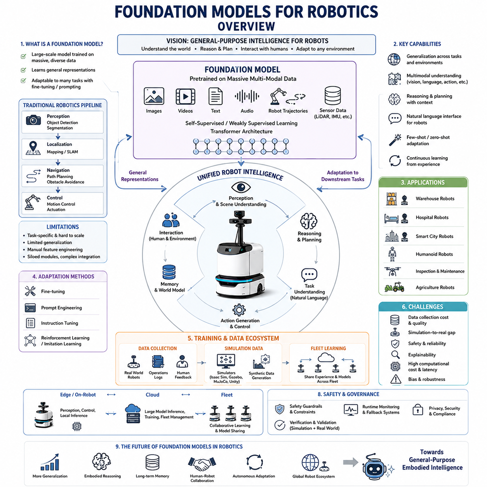
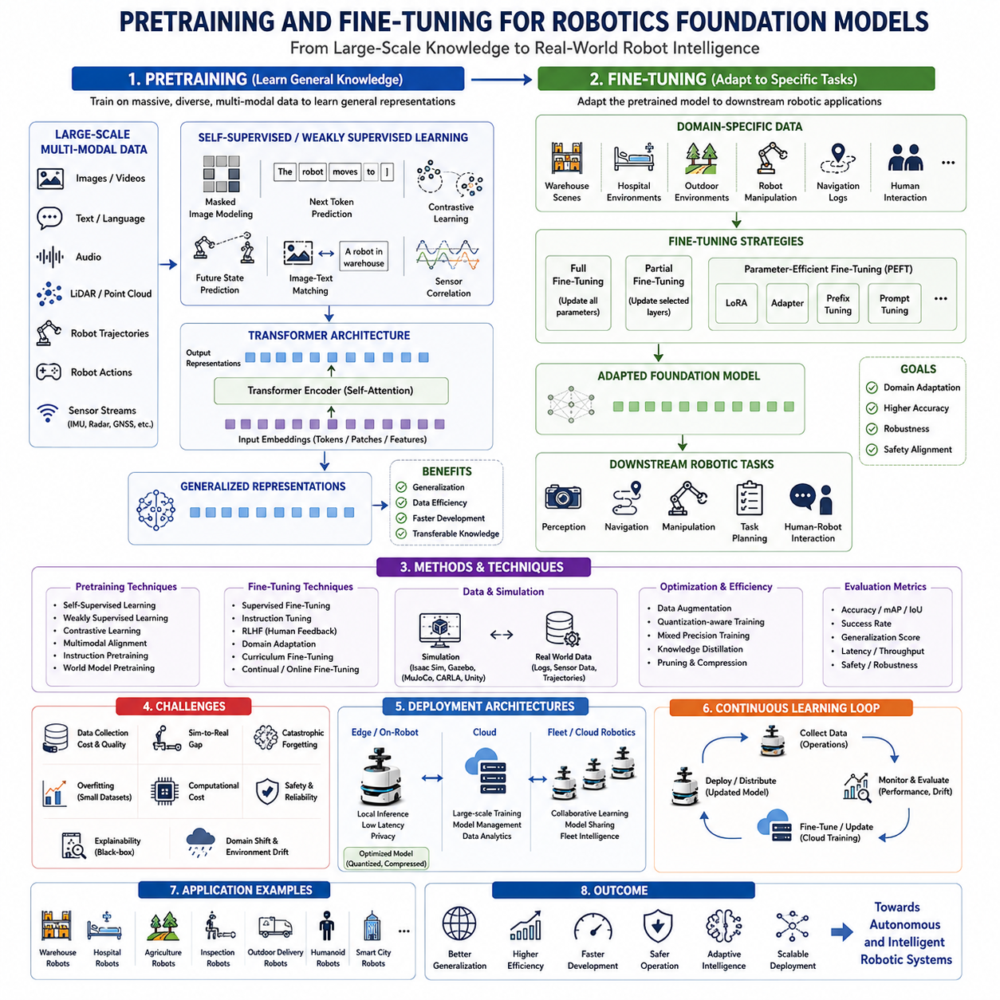
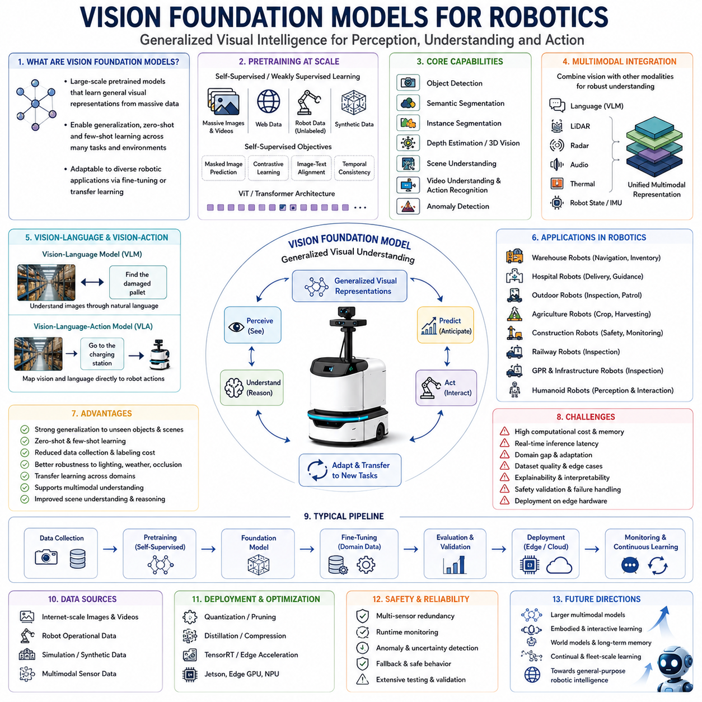
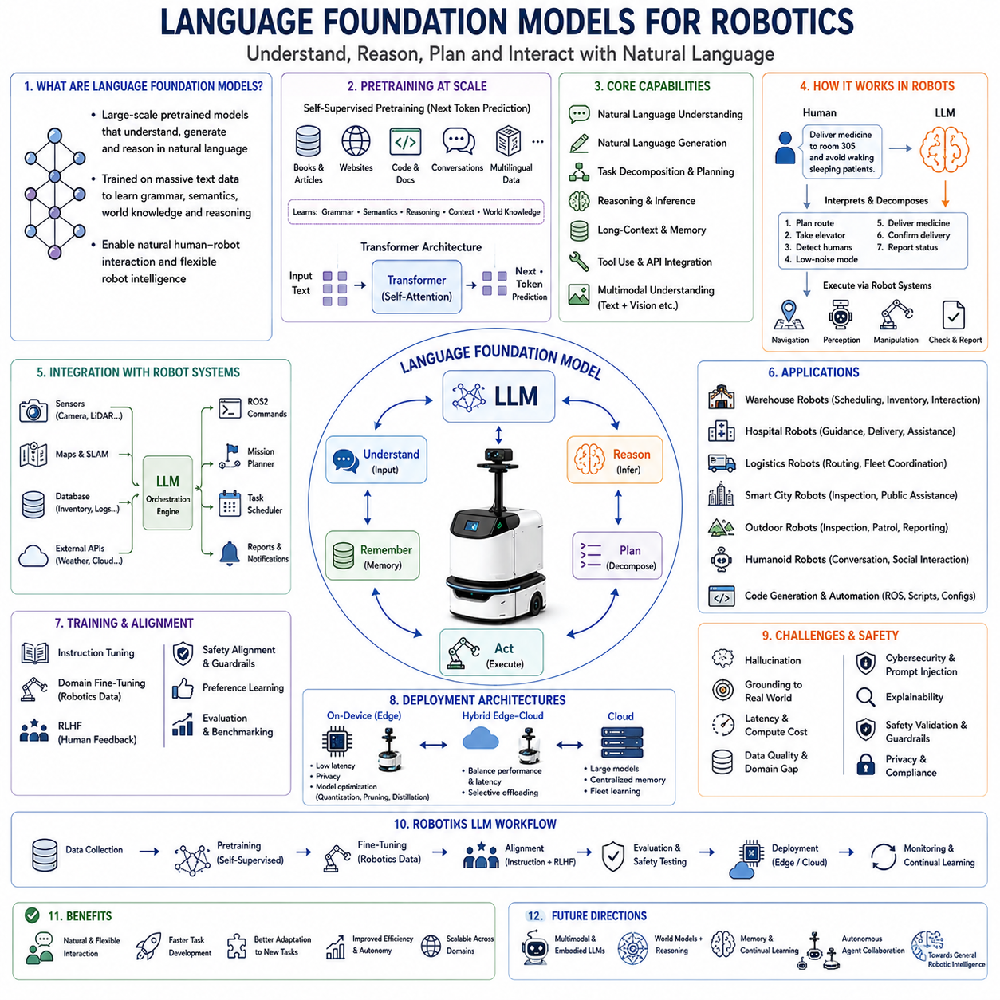
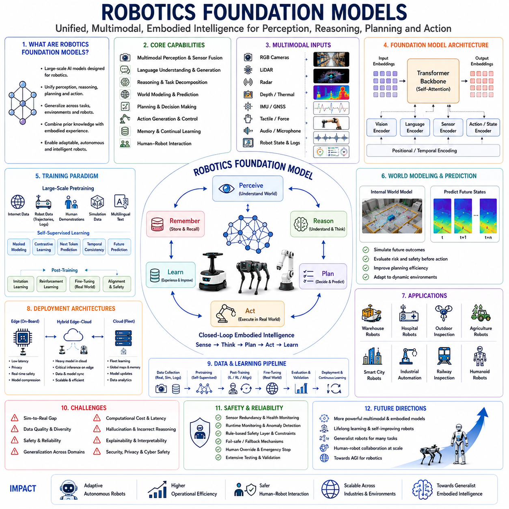
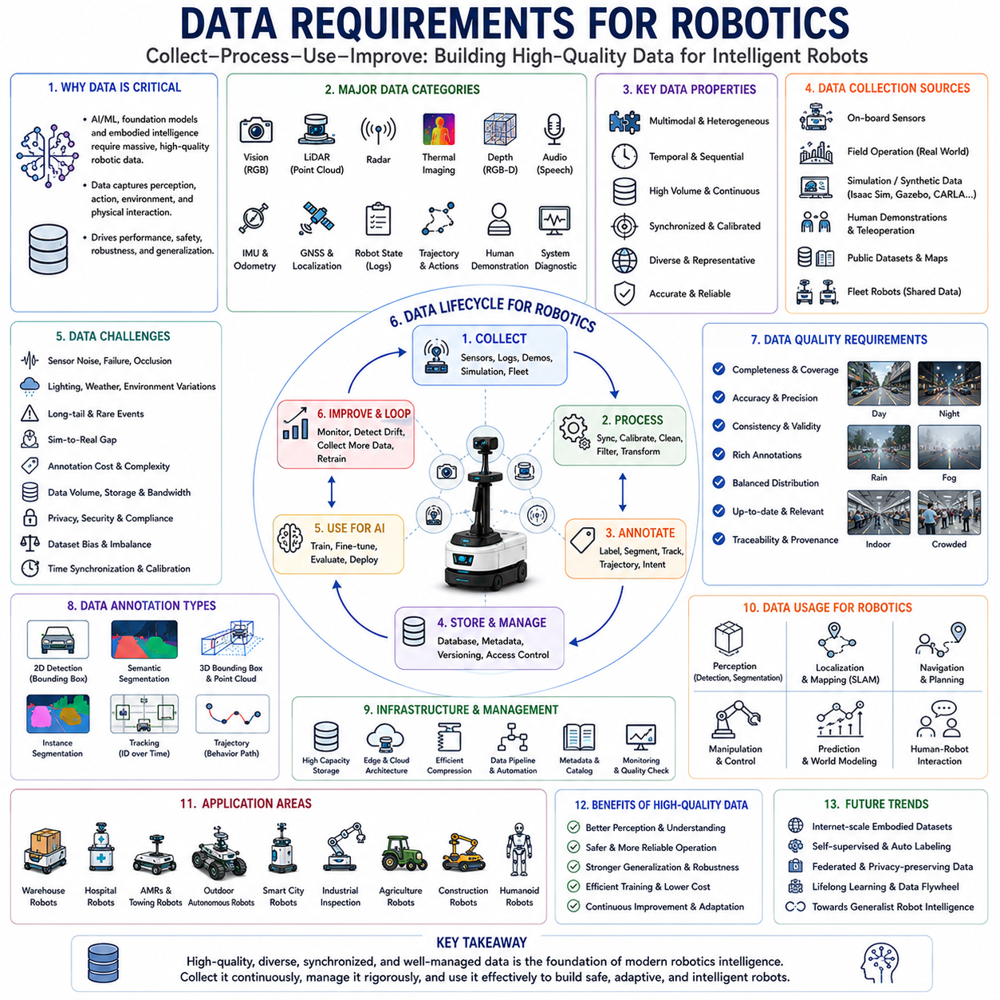
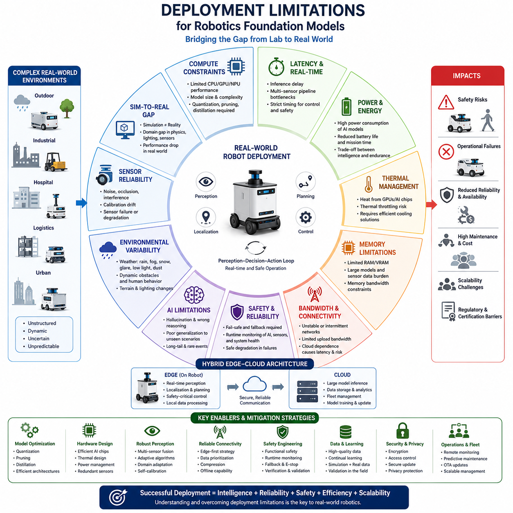
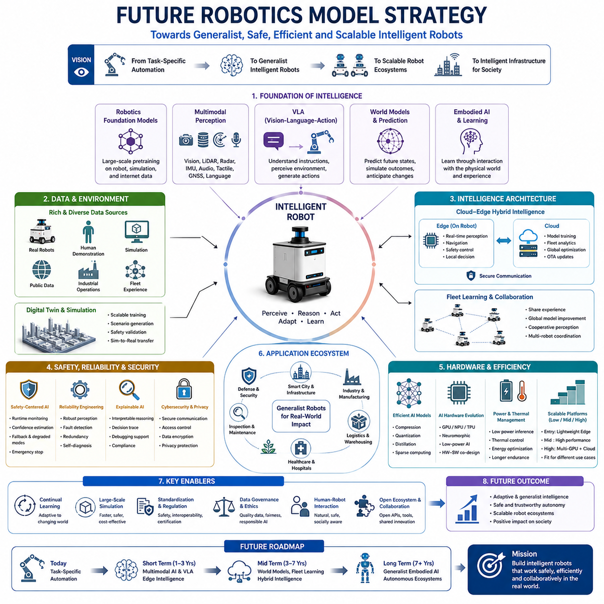

**Volume 06. AMR AI and Embodied Intelligence**


# Chapter 05. Foundation Models for Robotics

##  

## 05.1 Foundation Model Overview

{width="7.268055555555556in" height="7.268055555555556in"}

Foundation Models are rapidly transforming the field of robotics and Autonomous Mobile Robots (AMRs). Traditionally, robotic systems were developed using highly specialized algorithms designed for narrow and predefined tasks. Engineers manually implemented perception pipelines, rule-based decision systems, navigation logic, and environment-specific control algorithms. While these traditional approaches enabled industrial automation, they struggled to scale across diverse environments and complex real-world scenarios. Modern robotics increasingly requires systems capable of generalization, reasoning, adaptation, and multi-task learning. Foundation Models emerged as a response to these limitations and are now becoming one of the core technologies enabling the next generation of intelligent robots.

A Foundation Model is a large-scale AI model trained on massive amounts of diverse data using self-supervised or weakly supervised learning methods. Unlike traditional AI models designed for a single narrow task, Foundation Models learn generalized representations that can later be adapted to many downstream applications through fine-tuning, prompting, instruction tuning, or reinforcement learning. In robotics, Foundation Models provide the possibility of building robots that can understand scenes, interpret instructions, reason about tasks, interact naturally with humans, and adapt to unfamiliar environments without requiring task-specific programming for every scenario.

The concept of Foundation Models originated primarily from developments in Natural Language Processing (NLP). Large Language Models (LLMs) such as GPT, PaLM, LLaMA, Gemini, and Claude demonstrated that large-scale transformer architectures trained on internet-scale datasets could perform a wide variety of tasks without task-specific architectures. Similar trends later emerged in computer vision with Vision Transformers (ViTs), Segment Anything Models (SAM), DINO, CLIP, and multimodal architectures combining language and visual understanding. Robotics researchers soon recognized that similar large-scale models could potentially unify perception, reasoning, planning, and action generation within robotic systems.

Traditional robotics pipelines are typically modular and highly fragmented. A perception system detects objects, a localization system estimates position, a navigation system generates trajectories, and a control system drives actuators. Each subsystem is independently engineered and optimized. Although this modular structure provides robustness and interpretability, it often lacks flexibility and scalability. Foundation Models introduce the possibility of more integrated intelligence architectures where perception, semantic understanding, reasoning, memory, and task planning become deeply interconnected.

One of the most important characteristics of Foundation Models is representation learning. Instead of manually engineering features, Foundation Models automatically learn high-dimensional feature representations from enormous datasets. These learned representations encode semantic relationships between objects, environments, language, motion, and tasks. In robotics, this allows AI systems to generalize across multiple domains and tasks. For example, a robot trained to understand warehouse logistics may transfer some knowledge to hospital logistics or outdoor delivery scenarios.

Large-scale pretraining is a defining characteristic of Foundation Models. During pretraining, models are exposed to vast quantities of multimodal data including images, videos, language, audio, robot trajectories, sensor streams, and internet-scale text corpora. The model learns statistical relationships between these inputs without requiring explicit human labeling for every task. Self-supervised learning techniques play a major role in this process because collecting fully labeled robotic datasets is extremely expensive and time-consuming.

Transformer architectures became the dominant backbone for many Foundation Models. Transformers excel at modeling long-range dependencies and contextual relationships within sequences. Originally developed for language processing, transformers later expanded into computer vision, multimodal learning, and robotics. In robotics applications, transformers can process temporal sensor sequences, multimodal sensor fusion, language instructions, and action histories simultaneously.

Robotics Foundation Models differ from standard AI models because robots interact with the physical world. Unlike purely digital AI systems, robots must deal with uncertainty, sensor noise, latency, physical dynamics, environmental variability, and safety constraints. Therefore, Foundation Models for robotics must integrate physical reasoning and real-world grounding. A robot cannot simply generate plausible text responses; it must generate safe and executable actions within dynamic environments.

Vision Foundation Models play a critical role in modern robotics. These models learn generalized visual representations capable of supporting object detection, semantic segmentation, depth estimation, scene understanding, and anomaly detection. Models such as CLIP demonstrated that image and text embeddings can be aligned within a shared semantic space. This allows robots to understand visual scenes using natural language concepts rather than only fixed object categories.

For example, a traditional robot vision system might only recognize predefined classes such as "person," "chair," or "forklift." A Foundation Model-based system can interpret more abstract descriptions such as "damaged equipment," "unsafe area," "person without helmet," or "abandoned object." This significantly improves flexibility in industrial environments where unexpected situations frequently occur.

Language Foundation Models are also becoming increasingly important in robotics. Natural language provides an intuitive interface between humans and robots. LLM-based robotic systems can interpret complex instructions, decompose tasks into subtasks, answer questions, generate operational plans, and assist operators during field operations. Instead of manually programming workflows, operators may simply communicate with robots using conversational language.

Task planning is another area where Foundation Models provide major advantages. Traditional robotic task planning often relies on handcrafted finite state machines or rule-based planners. These systems become increasingly difficult to maintain as operational complexity grows. Foundation Models introduce more adaptive planning mechanisms capable of reasoning over goals, constraints, environmental conditions, and operational context.

Multimodal Foundation Models represent one of the most significant developments in robotics AI. Robots naturally operate using multiple sensor modalities including RGB cameras, LiDAR, radar, depth sensors, IMUs, GNSS, audio sensors, and tactile sensors. Multimodal models integrate information across these sensor streams into unified representations. This enables robots to reason more effectively about their environments.

For example, a robot operating in heavy rain may experience degraded camera performance. A multimodal Foundation Model can compensate using radar, thermal imaging, or LiDAR information. This sensor redundancy improves robustness and operational safety in real-world environments.

Vision-Language Models (VLMs) and Vision-Language-Action Models (VLAs) are increasingly central to robotics Foundation Model research. VLMs combine visual understanding and language reasoning, enabling robots to interpret scenes and understand instructions simultaneously. VLAs extend this concept further by directly generating robotic actions from multimodal inputs.

A VLA system may receive camera images, depth information, and a natural language instruction such as "deliver the medical package to room 302 while avoiding crowded hallways." The model can then generate a sequence of navigation and manipulation actions. This represents a major shift from traditional robotics pipelines toward more end-to-end embodied intelligence systems.

Embodied AI is closely connected to Foundation Models. Embodied AI emphasizes that intelligence emerges through interaction with the physical world rather than purely abstract reasoning. Robots learn through perception-action loops, environmental interaction, and continuous feedback. Foundation Models provide large-scale prior knowledge while embodied learning enables adaptation to real-world operational environments.

World Models are another important concept related to robotics Foundation Models. A World Model attempts to build an internal representation of the environment, predicting future states and outcomes based on current observations and actions. Robots equipped with World Models can simulate potential future scenarios internally before executing actions in the real world. This improves planning efficiency and operational safety.

One of the major challenges in robotics Foundation Models is data collection. Internet-scale text and image datasets are widely available, but robotic interaction datasets are much more difficult to obtain. Collecting robotic manipulation trajectories, navigation data, force feedback, and multimodal operational logs requires expensive hardware and extensive field operations. Furthermore, robotic datasets often contain domain-specific biases and limited environmental diversity.

Simulation environments play a major role in addressing these data limitations. Platforms such as NVIDIA Isaac Sim, Gazebo, MuJoCo, Habitat, and Unity-based simulators allow researchers to generate massive synthetic robotic datasets. Simulated environments enable large-scale reinforcement learning, imitation learning, and self-supervised learning workflows. However, simulation-to-real transfer remains a major challenge because simulated physics and sensor behavior do not perfectly match real-world conditions.

Fine-tuning is commonly used to adapt Foundation Models to specific robotic tasks. A large pretrained model may be further trained using domain-specific datasets such as warehouse navigation data, hospital delivery scenarios, agricultural field images, or industrial inspection datasets. Fine-tuning significantly reduces development costs compared to training models entirely from scratch.

Prompt engineering also plays an increasingly important role in robotics Foundation Models. Carefully designed prompts can guide model behavior, constrain outputs, improve safety, and enable structured reasoning. In robotics applications, prompts may specify operational rules, safety constraints, environmental context, or task priorities.

Safety remains one of the most critical concerns in Foundation Model robotics. Large AI models may produce unpredictable or hallucinated outputs. In digital applications this may simply produce incorrect information, but in robotics it may result in dangerous physical behavior. Therefore, robotic Foundation Models require extensive safety guardrails, runtime monitoring, fallback systems, and verification mechanisms.

Explainability is another major challenge. Traditional robotics systems are often easier to debug because their logic is explicitly programmed. Large Foundation Models operate as highly complex neural networks with billions of parameters, making internal decision processes difficult to interpret. Industrial robotics applications often require explainable behavior for safety certification and operational validation.

Latency and computational requirements also present major engineering challenges. Foundation Models are typically extremely large and computationally expensive. Running such models entirely on embedded robotic hardware may exceed available power, thermal, or memory budgets. Therefore, robotics systems increasingly adopt hybrid edge-cloud architectures where some AI tasks run locally while others are processed in cloud infrastructure.

Edge AI optimization techniques such as quantization, pruning, distillation, TensorRT optimization, mixed precision inference, and model compression are becoming essential for deploying Foundation Models on robots. Jetson Orin NX, Jetson Thor, RTX Edge GPUs, NPUs, and specialized accelerators are commonly used to support real-time AI inference in robotic systems.

Cloud robotics architectures further extend the capabilities of Foundation Models. Cloud-connected robots can share learned experiences, operational data, semantic maps, and AI updates across entire fleets. Fleet learning enables collective intelligence where improvements learned by one robot can benefit all robots within the system.

Industrial robotics applications for Foundation Models are rapidly expanding. In warehouse robotics, Foundation Models improve inventory understanding, semantic navigation, anomaly detection, and fleet coordination. In hospital robotics, they support human interaction, medication delivery, patient guidance, and operational logistics. In smart city robotics, they enable urban inspection, autonomous patrol, infrastructure monitoring, and multimodal situational awareness.

Outdoor autonomous robots particularly benefit from Foundation Models because outdoor environments contain high variability and unpredictability. Weather conditions, lighting changes, rough terrain, dynamic obstacles, and incomplete maps create challenges difficult to address using purely rule-based systems. Foundation Models improve adaptability and semantic understanding in such environments.

Humanoid robotics is also strongly connected to Foundation Models. Humanoid robots require integrated perception, language understanding, manipulation planning, locomotion coordination, and human interaction capabilities. Foundation Models provide a unified intelligence layer supporting these complex multimodal behaviors.

Despite their promise, Foundation Models are not a complete replacement for traditional robotics engineering. Real-world robots still require deterministic safety layers, robust control systems, certified emergency behaviors, and reliable low-level actuation. Hybrid architectures combining Foundation Models with traditional robotics pipelines are currently considered the most practical approach for industrial deployment.

The future of robotics Foundation Models will likely involve increasingly generalized robot intelligence. Future systems may continuously learn from operational experience, adapt to new tasks with minimal supervision, reason about physical environments, collaborate with humans naturally, and share knowledge across global robot fleets. Such developments could significantly accelerate the transition from narrow automation systems to truly intelligent embodied robotic ecosystems.

Ultimately, Foundation Models represent a major paradigm shift in robotics AI. They move robotic systems away from rigid task-specific programming toward scalable, adaptive, multimodal intelligence architectures. As hardware, datasets, simulation systems, and AI algorithms continue to evolve, Foundation Models are expected to become one of the foundational technologies driving the future of autonomous robotics, smart factories, intelligent logistics systems, hospital robots, smart city infrastructure robots, and next-generation embodied AI platforms.

Foundation Model은 현재 로보틱스와 자율주행 로봇(AMR) 분야를 급격하게 변화시키고 있는 핵심 기술 중 하나이다. 기존의 로봇 시스템은 대부분 특정 작업만 수행하도록 설계된 좁은 범위의 알고리즘 기반으로 개발되었다. 엔지니어들은 perception pipeline, rule-based decision system, navigation logic, 그리고 환경 특화 제어 알고리즘 등을 각각 개별적으로 설계하였다. 이러한 전통적 방식은 산업 자동화를 가능하게 했지만, 다양한 환경과 복잡한 실제 상황에 대응하기에는 한계가 있었다. 현대 로보틱스는 일반화(generalization), 추론(reasoning), 적응(adaptation), 그리고 멀티태스크 학습(multi-task learning)이 가능한 시스템을 요구하고 있으며, Foundation Model은 이러한 한계를 극복하기 위한 핵심 기술로 등장하였다.

Foundation Model은 대규모 데이터셋을 기반으로 Self-Supervised Learning 또는 Weakly Supervised Learning 방식으로 학습된 대형 AI 모델을 의미한다. 기존의 전통적인 AI 모델이 하나의 특정 작업만 수행하도록 설계된 반면, Foundation Model은 범용적인 표현(representation)을 학습하고, 이후 Fine-tuning, Prompting, Instruction Tuning, Reinforcement Learning 등을 통해 다양한 다운스트림 작업에 적용될 수 있다. 로보틱스 분야에서 Foundation Model은 로봇이 장면을 이해하고, 자연어 명령을 해석하며, 작업을 추론하고, 인간과 자연스럽게 상호작용하며, 새로운 환경에 적응할 수 있는 가능성을 제공한다.

Foundation Model의 개념은 원래 자연어 처리(NLP) 분야에서 시작되었다. GPT, PaLM, LLaMA, Gemini, Claude와 같은 Large Language Model(LLM)은 인터넷 규모의 대규모 데이터셋과 Transformer 구조를 기반으로 학습되어, 특정 작업 전용 구조 없이도 다양한 문제를 해결할 수 있다는 것을 보여주었다. 이후 이러한 흐름은 Computer Vision 분야로 확장되어 Vision Transformer(ViT), Segment Anything Model(SAM), DINO, CLIP, 그리고 멀티모달 모델로 발전하였다. 로봇 연구자들은 이러한 대규모 모델이 perception, reasoning, planning, action generation을 하나의 통합된 AI 시스템으로 결합할 수 있다는 가능성을 발견하게 되었다.

기존 로봇 시스템은 일반적으로 매우 모듈화되어 있다. Perception 시스템은 객체를 탐지하고, Localization 시스템은 위치를 추정하며, Navigation 시스템은 경로를 생성하고, Control 시스템은 액추에이터를 제어한다. 이러한 구조는 안정성과 해석 가능성 측면에서는 장점이 있지만, 복잡한 환경 변화에 대한 유연성이 부족하다. Foundation Model은 perception, semantic understanding, reasoning, memory, task planning 등을 하나의 통합된 지능 구조 안에서 연결할 수 있도록 한다.

Foundation Model의 가장 중요한 특징 중 하나는 Representation Learning이다. 기존 방식처럼 사람이 직접 feature를 설계하는 것이 아니라, 모델이 대규모 데이터로부터 자동으로 고차원 표현(high-dimensional representation)을 학습한다. 이러한 표현에는 객체, 환경, 언어, 동작, 작업 간의 의미적 관계가 포함된다. 이를 통해 로봇은 특정 환경에 국한되지 않고 여러 환경과 작업으로 지식을 일반화할 수 있다. 예를 들어 창고 물류에서 학습한 일부 개념을 병원 물류나 스마트 시티 로봇에도 활용할 수 있다.

대규모 사전학습(pretraining)은 Foundation Model의 핵심 특징이다. 모델은 이미지, 비디오, 텍스트, 음성, 로봇 trajectory, 센서 스트림 등 방대한 멀티모달 데이터를 기반으로 학습된다. 이 과정에서 모델은 모든 데이터를 사람이 라벨링하지 않아도, 데이터 내부의 통계적 관계를 스스로 학습한다. 로보틱스 분야에서는 완전한 라벨링 데이터셋 구축 비용이 매우 크기 때문에 Self-Supervised Learning이 특히 중요하다.

Transformer 구조는 Foundation Model의 핵심 아키텍처로 자리 잡았다. Transformer는 sequence 내부의 long-range dependency와 contextual relationship를 효과적으로 학습할 수 있다. 원래 자연어 처리용으로 개발되었지만, 이후 Computer Vision, Multimodal Learning, Robotics 분야까지 확장되었다. 로봇에서는 시간에 따른 센서 시퀀스, 멀티센서 데이터, 자연어 명령, 행동 히스토리 등을 동시에 처리할 수 있다.

로봇용 Foundation Model은 일반 AI 모델과 다른 특성을 가진다. 로봇은 실제 물리 세계와 상호작용하기 때문이다. 단순히 텍스트를 생성하는 것이 아니라, 실제 환경에서 안전하고 실행 가능한 행동을 생성해야 한다. 따라서 Robotics Foundation Model은 Physical Reasoning과 Real-world Grounding이 반드시 포함되어야 한다.

Vision Foundation Model은 현대 로봇에서 매우 중요한 역할을 한다. 이러한 모델은 객체 탐지(object detection), semantic segmentation, depth estimation, scene understanding, anomaly detection 등을 지원하는 범용 시각 표현을 학습한다. CLIP과 같은 모델은 이미지와 텍스트를 동일한 semantic embedding space 안에서 연결하였다. 이를 통해 로봇은 단순한 객체 카테고리뿐 아니라 자연어 기반 의미까지 이해할 수 있게 되었다.

예를 들어 기존의 전통적인 로봇 비전 시스템은 "사람", "의자", "지게차"와 같은 사전 정의된 객체만 탐지할 수 있었다. 하지만 Foundation Model 기반 시스템은 "안전모 미착용 작업자", "손상된 장비", "위험 구역", "버려진 물체"와 같은 보다 추상적이고 실제적인 개념도 이해할 수 있다. 이는 산업 현장에서 매우 큰 유연성을 제공한다.

Language Foundation Model 또한 로봇 분야에서 점점 중요해지고 있다. 자연어는 인간과 로봇 사이의 가장 직관적인 인터페이스이다. LLM 기반 로봇 시스템은 복잡한 명령을 해석하고, 작업을 세부 단계로 분해하며, 운영 계획을 생성하고, 현장 작업자를 지원할 수 있다. 과거처럼 모든 workflow를 수작업으로 프로그래밍하지 않아도 된다.

Task Planning 영역에서도 Foundation Model은 큰 장점을 제공한다. 기존 로봇의 작업 계획은 주로 finite state machine이나 rule-based planner를 사용하였다. 그러나 작업 복잡도가 증가하면 유지보수가 매우 어려워진다. Foundation Model은 목표(goal), 제약조건(constraint), 환경(context)을 종합적으로 고려하여 보다 유연한 planning을 수행할 수 있다.

Multimodal Foundation Model은 로봇 AI에서 가장 중요한 발전 중 하나이다. 로봇은 RGB Camera, LiDAR, Radar, Depth Sensor, IMU, GNSS, Audio Sensor 등 다양한 센서를 사용한다. Multimodal Model은 이러한 센서 정보를 통합된 representation으로 결합하여 보다 강력한 환경 이해 능력을 제공한다.

예를 들어 폭우 상황에서는 카메라 성능이 급격히 저하될 수 있다. 이 경우 Multimodal Foundation Model은 Radar, Thermal Camera, LiDAR 정보를 활용하여 perception 성능을 유지할 수 있다. 이는 실제 환경에서 robustness와 safety를 크게 향상시킨다.

Vision-Language Model(VLM)과 Vision-Language-Action(VLA) 모델은 현재 Robotics Foundation Model 연구의 핵심 분야이다. VLM은 visual understanding과 language reasoning을 결합하며, 로봇이 장면을 이해하고 자연어 명령을 동시에 해석할 수 있도록 한다. VLA는 여기에 실제 action generation 기능까지 추가한다.

예를 들어 VLA 시스템은 카메라 이미지, depth 정보, 그리고 "혼잡한 복도를 피해서 302호실로 의료 물품을 전달하라"와 같은 자연어 명령을 입력받아, 실제 navigation 및 manipulation 행동을 생성할 수 있다. 이는 기존의 전통적인 로봇 pipeline에서 크게 진화한 형태이다.

Embodied AI는 Foundation Model과 매우 밀접하게 연결된다. Embodied AI는 지능이 단순 추론이 아니라 실제 물리 세계와의 상호작용을 통해 형성된다고 본다. 로봇은 perception-action loop를 반복하면서 환경으로부터 지속적으로 학습한다. Foundation Model은 사전 지식을 제공하고, Embodied Learning은 실제 환경 적응 능력을 제공한다.

World Model 역시 중요한 개념이다. World Model은 현재 상태와 행동을 기반으로 미래 환경 변화를 예측하는 내부 시뮬레이션 모델이다. 로봇은 실제 행동 전에 내부적으로 미래 상황을 시뮬레이션할 수 있으며, 이를 통해 planning 효율과 safety를 향상시킬 수 있다.

데이터 수집은 Robotics Foundation Model의 가장 큰 과제 중 하나이다. 인터넷 기반 텍스트와 이미지는 쉽게 확보할 수 있지만, 로봇 trajectory, force feedback, multimodal operation log 등은 수집 비용이 매우 높다. 또한 실제 로봇 데이터는 환경 편향과 제한된 다양성 문제를 가진다.

Simulation 환경은 이러한 문제 해결에 중요한 역할을 한다. NVIDIA Isaac Sim, Gazebo, MuJoCo, Habitat, Unity 기반 시뮬레이터 등을 사용하여 대규모 synthetic robotics dataset을 생성할 수 있다. 이를 통해 reinforcement learning, imitation learning, self-supervised learning을 대규모로 수행할 수 있다. 그러나 여전히 Simulation-to-Real Gap은 중요한 문제로 남아 있다.

Fine-tuning은 Foundation Model을 특정 로봇 작업에 적용하기 위한 대표적인 방법이다. 예를 들어 창고 navigation 데이터, 병원 배송 데이터, 농업 환경 데이터 등을 사용하여 모델을 특정 도메인에 최적화할 수 있다. 이는 모델을 처음부터 새로 학습시키는 것보다 훨씬 효율적이다.

Prompt Engineering 역시 점점 중요해지고 있다. 잘 설계된 prompt는 모델의 행동을 제어하고, safety constraint를 추가하며, reasoning 품질을 향상시킬 수 있다. 로봇 분야에서는 operational rule, safety policy, task priority 등을 prompt로 지정할 수 있다.

Safety는 Robotics Foundation Model에서 가장 중요한 문제 중 하나이다. 대형 AI 모델은 Hallucination이나 예측 불가능한 출력을 생성할 수 있다. 일반 텍스트 AI에서는 단순 오류로 끝날 수 있지만, 로봇에서는 실제 사고로 이어질 수 있다. 따라서 Runtime Monitoring, Safety Guardrail, Fallback System, Verification Mechanism이 반드시 필요하다.

Explainability 또한 중요한 과제이다. 전통적인 로봇 시스템은 로직이 명시적이어서 디버깅이 상대적으로 쉬웠다. 하지만 수십억 개 파라미터를 가진 Foundation Model은 내부 의사결정을 해석하기 어렵다. 산업용 로봇에서는 인증과 safety validation을 위해 explainable behavior가 중요하다.

Latency와 연산 요구사항도 큰 문제이다. Foundation Model은 매우 크고 계산량이 많다. 임베디드 로봇 하드웨어에서 이를 그대로 실행하는 것은 전력, 발열, 메모리 측면에서 어렵다. 따라서 Edge-Cloud Hybrid Architecture가 점점 중요해지고 있다.

Edge AI 최적화 기술로는 Quantization, Pruning, Distillation, TensorRT Optimization, Mixed Precision Inference, Model Compression 등이 사용된다. Jetson Orin NX, Jetson Thor, RTX 기반 Edge GPU, NPU, AI Accelerator 등이 실제 로봇 시스템에 적용되고 있다.

Cloud Robotics Architecture는 Foundation Model의 능력을 더욱 확장시킨다. 클라우드 기반 로봇은 경험, semantic map, operational data, AI update 등을 fleet 전체와 공유할 수 있다. 이를 통해 한 대의 로봇이 학습한 내용을 전체 로봇 fleet가 활용할 수 있다.

산업 분야에서 Foundation Model의 활용은 빠르게 확대되고 있다. 창고 로봇에서는 semantic navigation, anomaly detection, fleet coordination에 활용되며, 병원 로봇에서는 human interaction, patient guidance, medication delivery 등에 적용된다. 스마트 시티 로봇에서는 urban inspection, autonomous patrol, infrastructure monitoring 등에 사용된다.

특히 실외 자율주행 로봇은 Foundation Model의 큰 수혜 분야이다. 야외 환경은 날씨 변화, 조명 변화, 거친 지형, 동적 장애물 등 예측 불가능성이 매우 크다. Foundation Model은 이러한 환경에서 adaptability와 semantic understanding을 크게 향상시킨다.

휴머노이드 로봇 역시 Foundation Model과 밀접하게 연결된다. 휴머노이드는 perception, language understanding, manipulation, locomotion, HRI 등을 모두 통합해야 하며, Foundation Model은 이러한 복합 행동을 지원하는 통합 intelligence layer 역할을 수행한다.

그러나 Foundation Model이 전통적인 로봇 엔지니어링을 완전히 대체하는 것은 아니다. 실제 산업용 로봇은 deterministic safety layer, robust control system, certified emergency behavior 등이 여전히 필요하다. 따라서 현재 가장 현실적인 방향은 Foundation Model과 기존 Robotics Pipeline을 결합하는 Hybrid Architecture이다.

미래의 Robotics Foundation Model은 더욱 범용적인 로봇 지능으로 발전할 가능성이 크다. 미래의 로봇은 operational experience를 지속적으로 학습하고, 최소한의 supervision만으로 새로운 작업에 적응하며, 인간과 자연스럽게 협업하고, global robot fleet 전체와 지식을 공유하게 될 것이다.

결국 Foundation Model은 로보틱스 AI의 패러다임 자체를 변화시키고 있다. 이는 로봇을 task-specific automation에서 벗어나 scalable, adaptive, multimodal intelligence architecture로 진화시키고 있다. 향후 하드웨어, 데이터셋, 시뮬레이션, AI 알고리즘이 발전함에 따라 Foundation Model은 자율주행 로봇, 스마트 팩토리, 병원 로봇, 스마트 시티 인프라 로봇, 차세대 Embodied AI 플랫폼의 핵심 기술이 될 것으로 예상된다.

##  

## 05.2 Pretraining and Fine-Tuning

{width="7.268055555555556in" height="7.268055555555556in"}

Pretraining and Fine-Tuning are two of the most fundamental processes in the development of modern Foundation Models for robotics and Autonomous Mobile Robots (AMRs). These two stages form the core learning pipeline that allows large-scale AI systems to acquire generalized intelligence from massive datasets and later adapt that intelligence to specialized robotic applications. In modern robotics, the ability to efficiently transfer knowledge from large pretrained models into real-world robotic systems is becoming one of the most important technological advantages for scalable AI development.

Traditional robotic AI systems were typically trained from scratch for specific tasks. Engineers collected task-specific datasets, manually designed features, and optimized models only for narrowly defined operational conditions. While this approach could achieve high performance within limited domains, it suffered from poor scalability, high development cost, and limited adaptability. Every new robot platform, sensor configuration, or operational environment often required retraining entirely new AI systems.

Foundation Models changed this paradigm by introducing large-scale pretraining methodologies. Instead of learning only narrow task-specific patterns, Foundation Models first learn generalized representations from enormous datasets covering diverse domains, environments, sensor modalities, and tasks. These pretrained models then serve as reusable knowledge bases that can later be adapted to downstream robotic applications through fine-tuning.

Pretraining refers to the initial large-scale learning stage where the model is exposed to massive quantities of data. During this phase, the model learns statistical relationships, semantic structures, spatial patterns, temporal dependencies, and contextual representations from the data itself. In most cases, pretraining uses self-supervised learning or weakly supervised learning techniques because manually labeling large-scale robotic datasets is extremely expensive and impractical.

Self-supervised learning is particularly important in robotics because robots continuously generate enormous amounts of unlabeled operational data. Cameras, LiDARs, radars, IMUs, depth sensors, GNSS modules, thermal cameras, and robot trajectories produce massive sensor streams during daily operation. Instead of requiring humans to label every frame or trajectory, self-supervised learning allows the model to automatically generate learning signals from the data itself.

For example, in visual pretraining, models may learn by predicting masked image regions, estimating future frames, matching image-text pairs, or distinguishing between augmented versions of the same scene. In language models, pretraining often involves predicting missing words or next-token generation. In robotics, pretraining may involve predicting future robot states, estimating environmental consistency, learning action-observation relationships, or understanding multimodal sensor correlations.

The scale of pretraining datasets is one of the defining characteristics of Foundation Models. Large Language Models may be trained on trillions of tokens, while vision models may process billions of images and videos. Robotics Foundation Models increasingly rely on multimodal datasets that combine visual information, language instructions, motion trajectories, robot actions, semantic maps, force feedback, and operational logs.

Transformer architectures dominate modern pretraining workflows because they can efficiently model long-range dependencies and contextual relationships across large datasets. Transformers use self-attention mechanisms to understand how different parts of the input sequence relate to each other. This capability is particularly valuable in robotics where environmental understanding often depends on temporal and spatial context.

Pretraining provides several major advantages for robotics AI systems. The first advantage is generalization. Pretrained models learn broad semantic knowledge from diverse environments and tasks, enabling them to adapt more effectively to unseen situations. Instead of memorizing narrow patterns, the model learns abstract representations that transfer across domains.

The second advantage is data efficiency. Fine-tuning a pretrained model typically requires far less labeled data than training a model entirely from scratch. This is especially important in robotics because collecting and labeling robotic datasets is expensive, time-consuming, and operationally difficult.

The third advantage is faster development. Organizations can build robotics AI systems more rapidly by leveraging pretrained models rather than constructing every AI component independently. This significantly accelerates research, prototyping, deployment, and product iteration cycles.

Fine-tuning is the process of adapting a pretrained Foundation Model to a specific downstream task or operational domain. During fine-tuning, the pretrained model parameters are partially or fully updated using smaller domain-specific datasets. The goal is to specialize the generalized knowledge learned during pretraining toward practical robotic applications.

For example, a large vision-language Foundation Model pretrained on internet-scale data may later be fine-tuned for warehouse robot navigation, hospital delivery robots, agricultural inspection robots, railway inspection systems, or GPR-based underground infrastructure robots. Fine-tuning allows the model to retain its generalized semantic understanding while adapting to domain-specific operational requirements.

Different fine-tuning strategies exist depending on the application requirements and computational constraints. Full fine-tuning updates all model parameters during downstream training. While this approach may achieve maximum task-specific performance, it requires significant computational resources and large GPU memory capacity.

Partial fine-tuning updates only selected layers of the model. Lower layers often contain generalized representations while higher layers become more task-specific. Freezing lower layers while updating upper layers reduces computational requirements and lowers the risk of catastrophic forgetting.

Parameter-efficient fine-tuning techniques are becoming increasingly important for robotics applications. Methods such as LoRA (Low-Rank Adaptation), adapters, prefix tuning, prompt tuning, and quantized fine-tuning allow large Foundation Models to be adapted using relatively small numbers of trainable parameters. These approaches significantly reduce memory requirements and training costs.

In robotics, fine-tuning datasets are often highly specialized. A warehouse robot may require datasets containing pallets, forklifts, shelves, workers, reflective floors, and industrial lighting conditions. A hospital robot may require datasets involving wheelchairs, medical carts, narrow hallways, human crowds, and patient interaction scenarios. Outdoor robots require data covering weather variation, rough terrain, shadows, vegetation, and dynamic obstacles.

Domain adaptation is one of the most important goals of fine-tuning. Even highly capable pretrained models may struggle when deployed in environments significantly different from their original training distributions. Fine-tuning helps bridge this domain gap by exposing the model to operationally relevant conditions.

Simulation environments play an important role in both pretraining and fine-tuning workflows. Robotics simulators such as NVIDIA Isaac Sim, Gazebo, Habitat, MuJoCo, CARLA, and Unity-based systems allow researchers to generate large-scale synthetic datasets. Simulation enables controlled generation of diverse weather conditions, lighting variations, sensor configurations, obstacle layouts, and robotic interactions.

However, simulation-based training introduces the Sim-to-Real Gap problem. Simulated environments cannot perfectly replicate real-world sensor noise, physics, material properties, environmental complexity, or human behavior. Fine-tuning using real-world operational data is therefore essential for practical deployment.

Multimodal pretraining is becoming increasingly important in robotics Foundation Models. Robots naturally interact with multiple sensor modalities simultaneously. Multimodal pretraining allows models to learn relationships between images, language, depth data, LiDAR point clouds, radar signals, audio streams, and robot actions.

For example, a robot may learn that a spoken instruction such as "avoid the wet floor near the entrance" corresponds to visual floor reflections, semantic location understanding, and safe navigation behavior. Such multimodal understanding significantly improves robot intelligence and adaptability.

Contrastive learning is widely used during multimodal pretraining. Contrastive learning teaches models to associate related data while separating unrelated data within embedding space. CLIP-style models, for example, learn aligned image and text embeddings that enable open-vocabulary visual understanding.

Instruction tuning is another important extension of fine-tuning. In instruction tuning, models are trained to follow structured commands and task instructions. This is particularly important for robotics because robots must interpret operator commands safely and consistently.

Reinforcement Learning from Human Feedback (RLHF) is increasingly used to align Foundation Models with human preferences and operational requirements. In robotics, RLHF may involve ranking robot behaviors, evaluating navigation safety, scoring manipulation quality, or optimizing human-robot interaction patterns.

One major challenge in robotics fine-tuning is catastrophic forgetting. During domain-specific adaptation, the model may lose some of the generalized knowledge acquired during pretraining. Preventing catastrophic forgetting requires careful optimization strategies, balanced datasets, and regularization techniques.

Another challenge is overfitting. Robotics datasets are often much smaller than internet-scale pretraining datasets. Excessive fine-tuning on limited operational data may cause the model to memorize narrow environmental patterns rather than generalize effectively.

Dataset quality is critically important for successful fine-tuning. Poorly labeled data, biased operational scenarios, insufficient environmental diversity, or missing edge cases may significantly degrade model performance. Robotics datasets must include diverse lighting conditions, weather conditions, sensor noise levels, obstacle variations, and operational edge cases.

Data augmentation is widely used to improve fine-tuning robustness. Common augmentation methods include image rotation, scaling, blur, noise injection, brightness adjustment, weather simulation, sensor dropout, motion distortion, and domain randomization. These techniques improve generalization performance under real-world conditions.

Fine-tuning also plays an important role in edge AI optimization. Large Foundation Models may be too computationally expensive for direct deployment on embedded robotic hardware. Fine-tuning smaller compressed variants allows robots to maintain acceptable performance within limited power and thermal budgets.

Quantization-aware fine-tuning is commonly used in robotics edge deployment. Models may be converted from FP32 precision to FP16, INT8, or even lower precision formats while preserving operational accuracy. This significantly improves inference efficiency on embedded AI accelerators.

Transfer learning is closely related to fine-tuning. Transfer learning refers broadly to reusing learned knowledge across tasks, while fine-tuning is a specific implementation method. In robotics, transfer learning allows perception models, navigation systems, and planning modules to benefit from previously acquired knowledge.

Federated learning is an emerging concept related to robotics Foundation Models. Instead of centrally collecting all operational data, robots may locally fine-tune models and share only model updates with cloud servers. This approach improves privacy, reduces bandwidth requirements, and enables fleet-wide collaborative learning.

Cloud robotics architectures significantly enhance large-scale fine-tuning workflows. Fleet robots continuously upload operational data to centralized cloud infrastructures where models are retrained, validated, and redistributed. This enables continuous learning across large robot fleets operating in different environments.

Continuous fine-tuning is becoming increasingly important in long-term robotic deployments. Real-world environments evolve over time due to seasonal changes, infrastructure modifications, operational drift, and changing human behaviors. AI models must therefore continuously adapt to maintain stable performance.

Monitoring systems are essential during deployment. Runtime monitoring tracks inference confidence, anomaly detection, environmental drift, latency, thermal conditions, and operational failures. These metrics help identify when additional fine-tuning or retraining becomes necessary.

Safety validation remains one of the most important requirements in robotics pretraining and fine-tuning workflows. AI models must be extensively tested under simulated and real-world conditions before deployment. Safety evaluation includes obstacle detection reliability, emergency response consistency, failure recovery behavior, degraded mode operation, and human interaction safety.

Explainability and interpretability are also important concerns. Large Foundation Models often function as black-box systems, making it difficult to understand why specific decisions were made. Industrial robotics deployments frequently require interpretable outputs for safety certification and debugging purposes.

The computational cost of pretraining remains extremely high. Training large Foundation Models may require thousands of GPUs, enormous energy consumption, and weeks or months of distributed computation. As a result, only a limited number of organizations currently possess the infrastructure required for large-scale robotics Foundation Model pretraining.

However, fine-tuning democratizes access to advanced AI capabilities. Smaller robotics companies can leverage open-source pretrained models and adapt them to specialized industrial applications without building massive AI infrastructures from scratch.

Future developments in pretraining and fine-tuning are expected to focus increasingly on embodied intelligence. Rather than learning only from static datasets, future robotic Foundation Models may continuously learn through interaction with the physical world. Robots may autonomously collect operational data, self-improve through experience, and collaboratively share learned knowledge across global robotic ecosystems.

Multimodal embodied pretraining, world model learning, VLA architectures, continual learning, and fleet-scale adaptive learning are expected to become central directions in next-generation robotics AI research. These technologies may ultimately enable robots to achieve far greater adaptability, autonomy, and operational intelligence than current narrowly specialized robotic systems.

Ultimately, pretraining and fine-tuning form the foundation of modern robotics AI development. Pretraining provides broad generalized intelligence learned from massive multimodal datasets, while fine-tuning adapts that intelligence to practical operational environments. Together, these processes enable scalable, adaptive, efficient, and increasingly autonomous robotic systems capable of operating in complex real-world environments.

Pretraining과 Fine-Tuning은 현대 로보틱스 및 자율주행 로봇(AMR)용 Foundation Model 개발에서 가장 핵심적인 두 단계이다. 이 두 과정은 대규모 AI 시스템이 방대한 데이터로부터 일반화된 지능을 학습하고, 이후 이를 특정 로봇 응용 분야에 적응시키기 위한 핵심 학습 파이프라인을 구성한다. 현대 로보틱스에서는 대규모 사전학습 모델의 지식을 실제 로봇 시스템으로 효율적으로 전이시키는 능력이 AI 개발 경쟁력의 핵심 요소가 되고 있다.

기존의 로봇 AI 시스템은 일반적으로 특정 작업을 위해 처음부터 학습(training from scratch)되는 방식이었다. 엔지니어들은 특정 작업용 데이터셋을 수집하고, feature를 수동으로 설계하며, 제한된 환경에서만 동작하도록 모델을 최적화하였다. 이러한 방식은 특정 분야에서는 높은 성능을 얻을 수 있었지만, 확장성 부족, 높은 개발 비용, 낮은 적응성이라는 한계를 가지고 있었다. 새로운 로봇 플랫폼이나 센서 구성이 등장할 때마다 거의 새로운 AI 시스템을 다시 개발해야 했다.

Foundation Model은 이러한 패러다임을 변화시켰다. Foundation Model은 특정 작업만 학습하는 것이 아니라, 먼저 대규모 데이터셋을 이용하여 다양한 환경, 센서, 작업에 대한 일반화된 표현(representation)을 학습한다. 이후 Fine-Tuning을 통해 실제 로봇 응용 분야에 적용된다.

Pretraining은 모델이 대규모 데이터를 학습하는 초기 단계이다. 이 단계에서 모델은 데이터 내부의 통계적 관계, 의미 구조, 공간 패턴, 시간 의존성, 그리고 문맥 정보를 학습한다. 대부분의 경우 Pretraining은 Self-Supervised Learning 또는 Weakly Supervised Learning 방식을 사용한다. 이는 로봇 데이터셋에 대해 사람이 직접 모든 데이터를 라벨링하는 것이 매우 비효율적이기 때문이다.

Self-Supervised Learning은 로보틱스에서 특히 중요하다. 로봇은 운영 중에 엄청난 양의 비라벨 데이터(unlabeled data)를 생성한다. 카메라, LiDAR, Radar, IMU, Depth Sensor, GNSS, Thermal Camera, Robot Trajectory 등은 매 순간 대규모 센서 데이터를 생성한다. Self-Supervised Learning은 사람이 일일이 라벨링하지 않아도 데이터 자체로부터 학습 신호를 생성할 수 있도록 한다.

예를 들어 Visual Pretraining에서는 이미지의 일부를 가리고 이를 예측하거나(masked image prediction), 미래 프레임을 예측하거나, 이미지-텍스트 쌍을 연결하거나, 동일한 장면의 augmentation 버전을 구별하도록 학습할 수 있다. Language Model에서는 일반적으로 다음 단어(next token)를 예측하는 방식이 사용된다. 로보틱스에서는 미래 로봇 상태 예측, 환경 일관성 추정, 행동-관측 관계 학습, 멀티센서 관계 학습 등이 사용될 수 있다.

Pretraining Dataset의 규모는 Foundation Model의 가장 중요한 특징 중 하나이다. Large Language Model은 수조 개 이상의 token을 학습하며, Vision Model은 수십억 장의 이미지와 비디오를 사용한다. Robotics Foundation Model은 이미지, 텍스트, 언어 명령, 로봇 trajectory, semantic map, force feedback, operation log 등을 포함하는 multimodal dataset을 점점 더 많이 사용하고 있다.

Transformer Architecture는 현대 Pretraining의 핵심 구조이다. Transformer는 Self-Attention Mechanism을 이용하여 sequence 내부의 long-range dependency와 contextual relationship를 효과적으로 학습한다. 이는 로봇 환경에서 시간 및 공간적 맥락을 이해하는 데 매우 유리하다.

Pretraining은 로봇 AI에 여러 가지 중요한 장점을 제공한다. 첫 번째는 Generalization이다. 사전학습 모델은 다양한 환경과 작업을 학습하기 때문에 새로운 상황에도 더 잘 적응할 수 있다. 단순히 특정 패턴을 암기하는 것이 아니라 추상적인 개념을 학습하게 된다.

두 번째 장점은 Data Efficiency이다. Fine-Tuning은 처음부터 모델을 새로 학습하는 것보다 훨씬 적은 양의 라벨 데이터만 필요로 한다. 이는 로봇 데이터셋 구축 비용이 매우 큰 현실에서 매우 중요한 장점이다.

세 번째 장점은 개발 속도 향상이다. 기업들은 모든 AI 시스템을 처음부터 직접 개발하지 않고, 기존의 Pretrained Model을 활용함으로써 연구, 프로토타입 제작, 제품 개발 속도를 크게 높일 수 있다.

Fine-Tuning은 Pretrained Foundation Model을 특정 작업이나 환경에 적응시키는 과정이다. Fine-Tuning 단계에서는 비교적 작은 규모의 도메인 특화 데이터셋을 사용하여 모델의 일부 또는 전체 파라미터를 업데이트한다. 이를 통해 Pretraining에서 얻은 일반 지식을 유지하면서도 실제 로봇 환경에 맞게 최적화할 수 있다.

예를 들어 인터넷 규모 데이터로 사전학습된 Vision-Language Foundation Model은 이후 창고 물류 로봇, 병원 배송 로봇, 농업 로봇, 철도 점검 로봇, GPR 기반 지하 구조물 탐지 로봇 등에 맞게 Fine-Tuning될 수 있다.

Fine-Tuning에는 여러 가지 방식이 존재한다. Full Fine-Tuning은 전체 모델 파라미터를 모두 업데이트하는 방식이다. 가장 높은 성능을 얻을 수 있지만, GPU 메모리와 계산 자원이 매우 많이 필요하다.

Partial Fine-Tuning은 모델의 일부 layer만 업데이트한다. 일반적으로 lower layer는 범용 표현을 유지하고, upper layer만 특정 작업에 맞게 변경한다. 이는 연산량을 줄이고 catastrophic forgetting을 줄이는 데 도움이 된다.

최근에는 Parameter-Efficient Fine-Tuning(PEFT)이 매우 중요해지고 있다. LoRA(Low-Rank Adaptation), Adapter, Prefix Tuning, Prompt Tuning, Quantized Fine-Tuning 등의 기술은 매우 적은 수의 파라미터만 학습하여 대형 Foundation Model을 효율적으로 적응시킬 수 있게 한다.

로봇용 Fine-Tuning Dataset은 매우 특화되어 있는 경우가 많다. 예를 들어 창고 로봇은 팔레트, 지게차, 선반, 작업자, 반사 바닥 등을 포함하는 데이터가 필요하다. 병원 로봇은 휠체어, 의료 카트, 좁은 복도, 사람 밀집 환경 등의 데이터가 필요하다. 실외 로봇은 비, 눈, 그림자, 거친 지형, 식생, 동적 장애물 등의 데이터를 포함해야 한다.

Domain Adaptation은 Fine-Tuning의 중요한 목적 중 하나이다. 아무리 강력한 Pretrained Model이라도 학습 환경과 크게 다른 실제 환경에서는 성능이 저하될 수 있다. Fine-Tuning은 실제 운영 환경 데이터를 사용하여 이러한 Domain Gap을 줄여준다.

시뮬레이션 환경은 Pretraining과 Fine-Tuning 모두에서 중요한 역할을 한다. NVIDIA Isaac Sim, Gazebo, Habitat, MuJoCo, CARLA, Unity 기반 시뮬레이터 등을 이용하면 다양한 환경 조건과 로봇 행동 데이터를 대규모로 생성할 수 있다.

그러나 Simulation 기반 학습은 Sim-to-Real Gap 문제를 가진다. 시뮬레이션은 실제 환경의 센서 노이즈, 물리 특성, 재질, 인간 행동 등을 완벽하게 재현할 수 없다. 따라서 실제 환경 데이터를 이용한 Fine-Tuning이 필수적이다.

Multimodal Pretraining은 로봇 분야에서 점점 중요해지고 있다. 로봇은 다양한 센서를 동시에 사용하기 때문에, 이미지, 언어, LiDAR, Radar, Audio, Action 등을 함께 학습하는 방식이 필요하다.

예를 들어 "입구 근처의 젖은 바닥을 피해 이동하라"는 음성 명령은 바닥 반사 이미지, semantic location, navigation behavior와 연결되어야 한다. 이러한 multimodal understanding은 로봇 지능을 크게 향상시킨다.

Contrastive Learning은 Multimodal Pretraining에서 널리 사용된다. 이는 관련된 데이터는 embedding space에서 가깝게, 관련 없는 데이터는 멀어지도록 학습하는 방식이다. CLIP 기반 모델이 대표적인 예이다.

Instruction Tuning은 로봇에서 매우 중요한 기술이다. 로봇은 사람의 명령을 안전하고 일관되게 해석해야 하기 때문에, 구조화된 command dataset으로 추가 학습을 수행한다.

RLHF(Reinforcement Learning from Human Feedback)는 인간의 선호와 안전 요구사항에 맞게 모델을 정렬(alignment)하기 위해 사용된다. 로봇에서는 navigation behavior ranking, manipulation quality scoring, HRI optimization 등에 사용될 수 있다.

로봇 Fine-Tuning의 주요 문제 중 하나는 Catastrophic Forgetting이다. 특정 도메인에 과도하게 적응하면 Pretraining에서 학습한 일반 지식을 잃어버릴 수 있다.

또 다른 문제는 Overfitting이다. 로봇 데이터셋은 일반적으로 매우 작기 때문에, 특정 환경에만 과적합될 위험이 있다.

Dataset Quality는 Fine-Tuning 성공 여부를 크게 좌우한다. 잘못된 라벨링, 편향된 데이터, 부족한 환경 다양성은 모델 성능을 심각하게 저하시킬 수 있다.

Data Augmentation은 Fine-Tuning robustness 향상에 널리 사용된다. Rotation, Blur, Noise Injection, Weather Simulation, Motion Distortion, Domain Randomization 등이 대표적이다.

Fine-Tuning은 Edge AI 최적화에서도 중요한 역할을 한다. 대형 Foundation Model은 임베디드 로봇 하드웨어에서 직접 실행하기 어렵기 때문에, 경량화된 모델로 Fine-Tuning하여 실제 배포가 가능하도록 만든다.

Quantization-aware Fine-Tuning은 FP32 모델을 FP16, INT8 등으로 변환하면서도 성능 저하를 최소화하는 기술이다. 이는 Jetson 기반 Edge AI 시스템에서 매우 중요하다.

Transfer Learning은 Fine-Tuning과 밀접한 개념이다. 기존 지식을 새로운 작업에 재사용하는 개념이며, Fine-Tuning은 그 대표적인 구현 방식이다.

Federated Learning은 점점 중요해지고 있는 개념이다. 로봇이 데이터를 중앙 서버로 모두 보내는 대신, 각 로봇이 로컬에서 모델을 학습하고 업데이트만 공유한다. 이는 개인정보 보호와 네트워크 효율 측면에서 유리하다.

Cloud Robotics Architecture는 대규모 Fine-Tuning을 가능하게 한다. Fleet 로봇이 운영 데이터를 클라우드로 업로드하면 중앙 서버에서 모델을 재학습하고 전체 fleet에 배포할 수 있다.

Continuous Fine-Tuning은 장기 운영 로봇에서 점점 중요해지고 있다. 계절 변화, 인프라 변화, 인간 행동 변화 등에 따라 환경이 계속 변하기 때문이다.

Deployment 이후에는 Runtime Monitoring이 필수적이다. Inference Confidence, Anomaly Detection, Environmental Drift, Latency, Thermal 상태 등을 모니터링하여 추가 Fine-Tuning 필요 여부를 판단한다.

Safety Validation은 로봇 AI에서 가장 중요한 요구사항 중 하나이다. 장애물 탐지, Emergency Response, Failure Recovery, Human Interaction Safety 등을 실제 환경과 시뮬레이션 모두에서 검증해야 한다.

Explainability 또한 중요하다. Foundation Model은 내부 동작을 이해하기 어려운 Black-box 형태인 경우가 많다. 산업용 로봇에서는 Safety Certification과 Debugging을 위해 설명 가능한 AI가 요구된다.

Pretraining의 계산 비용은 매우 높다. 대형 Foundation Model 학습에는 수천 개의 GPU와 엄청난 전력 소비가 필요하다. 따라서 실제로 이러한 모델을 처음부터 학습할 수 있는 기업은 매우 제한적이다.

반면 Fine-Tuning은 고급 AI 기술의 접근성을 크게 높여준다. 중소 로봇 기업도 Open-source Pretrained Model을 기반으로 자신들의 산업용 로봇에 맞게 AI를 최적화할 수 있다.

미래의 Pretraining과 Fine-Tuning은 Embodied Intelligence 방향으로 발전할 가능성이 크다. 미래의 로봇은 단순 데이터셋 학습이 아니라 실제 물리 환경과 상호작용하면서 지속적으로 학습하게 될 것이다.

Multimodal Embodied Pretraining, World Model Learning, VLA Architecture, Continual Learning, Fleet-scale Adaptive Learning 등은 차세대 로봇 AI 연구의 핵심 분야가 될 것으로 예상된다.

결국 Pretraining과 Fine-Tuning은 현대 Robotics AI의 핵심 기반 기술이다. Pretraining은 대규모 멀티모달 데이터로부터 일반화된 지능을 학습하고, Fine-Tuning은 이를 실제 운영 환경에 맞게 최적화한다. 이 두 과정은 복잡한 실제 환경에서 동작 가능한 확장성 있고 적응 가능한 차세대 지능형 로봇 시스템을 가능하게 만드는 핵심 요소라고 할 수 있다.

##  

## 05.3 Vision Foundation Models

{width="7.268055555555556in" height="7.268055555555556in"}

Vision Foundation Models are becoming one of the most transformative technologies in modern robotics and Autonomous Mobile Robot (AMR) systems. Traditional robotic vision systems were designed for highly specific tasks such as object detection, lane recognition, barcode scanning, or obstacle segmentation. These systems often required carefully handcrafted datasets, task-specific architectures, and extensive manual engineering. While such approaches achieved acceptable performance in constrained industrial environments, they struggled to generalize across changing conditions, unseen objects, dynamic environments, and multimodal operational requirements. Vision Foundation Models introduce a new paradigm in robotic perception by enabling generalized visual understanding across diverse tasks and environments.

A Vision Foundation Model is a large-scale pretrained visual AI model that learns generalized image and scene representations from massive datasets. Instead of being trained only for a single perception task, these models learn broad semantic relationships between objects, environments, spatial structures, textures, motions, and contextual information. Once pretrained, they can later be adapted to many downstream robotic applications through fine-tuning, prompt tuning, transfer learning, or multimodal integration.

Traditional computer vision systems in robotics relied heavily on convolutional neural networks (CNNs). CNN-based architectures such as ResNet, EfficientNet, YOLO, Faster R-CNN, SSD, and U-Net enabled major advances in robotic perception. These models were highly effective for narrow tasks such as object classification, object detection, semantic segmentation, and depth estimation. However, they often required large task-specific labeled datasets and struggled with zero-shot generalization.

The emergence of transformer architectures fundamentally changed visual AI research. Vision Transformers (ViTs) demonstrated that transformer-based architectures could achieve state-of-the-art visual performance by treating image patches similarly to language tokens. Self-attention mechanisms enabled models to capture long-range dependencies and contextual relationships within visual scenes more effectively than traditional convolutional approaches.

Vision Foundation Models typically undergo large-scale pretraining using self-supervised or weakly supervised learning methods. During pretraining, models are exposed to billions of images, videos, and multimodal data samples collected from internet-scale datasets or industrial data repositories. Instead of relying entirely on manual annotations, the models learn visual representations directly from data patterns.

Self-supervised learning plays a critical role in Vision Foundation Models because labeling massive robotics datasets is extremely expensive and operationally difficult. Self-supervised methods allow models to learn from unlabeled data by solving surrogate tasks such as masked image prediction, contrastive learning, image reconstruction, temporal consistency prediction, or image-text alignment.

Contrastive learning became one of the most influential approaches in Vision Foundation Model development. Models such as CLIP demonstrated that images and natural language descriptions could be embedded into a shared semantic space. This allows AI systems to understand visual concepts through natural language rather than only fixed predefined categories.

For robotics applications, this capability is extremely important. Traditional robot perception systems may only recognize classes explicitly included in the training dataset. A Vision Foundation Model, however, can potentially recognize previously unseen objects or semantic concepts through contextual understanding. For example, a robot may understand descriptions such as "damaged machinery," "wet floor," "construction hazard," "blocked passage," or "worker without safety helmet" even if these were not explicitly defined as fixed training classes.

Vision Foundation Models significantly improve zero-shot and few-shot learning capabilities. Zero-shot learning refers to performing tasks without explicit task-specific training examples. Few-shot learning refers to adapting to new tasks using only small amounts of labeled data. In industrial robotics, this dramatically reduces dataset collection costs and deployment time.

Object detection remains one of the most important applications of Vision Foundation Models in robotics. Autonomous robots must continuously identify humans, vehicles, pallets, forklifts, walls, doors, tools, infrastructure components, and dynamic obstacles. Modern Vision Foundation Models provide more robust detection under varying lighting conditions, weather conditions, sensor noise, motion blur, and environmental complexity.

Semantic segmentation is another critical robotics application. Semantic segmentation assigns semantic labels to every pixel in an image. This enables robots to distinguish roads, sidewalks, vegetation, walls, humans, machines, shelves, and free-space regions. Vision Foundation Models improve segmentation robustness and contextual consistency compared to traditional narrow-task segmentation systems.

Instance segmentation extends semantic segmentation by separately identifying individual object instances. In logistics robots, this capability is essential for pallet handling, package sorting, shelf inventory management, and autonomous manipulation systems.

Depth estimation and 3D scene understanding are also strongly influenced by Vision Foundation Models. Robots operating in real-world environments require spatial awareness and geometric understanding. Monocular depth estimation, stereo vision, RGB-D perception, and multimodal 3D scene reconstruction all benefit from large-scale pretrained visual representations.

Scene understanding is one of the most important capabilities enabled by Vision Foundation Models. Instead of merely detecting isolated objects, modern robotic AI systems increasingly attempt to understand full environmental context. Scene understanding involves object relationships, environmental semantics, spatial reasoning, and operational context awareness.

For example, a warehouse robot must understand not only that a forklift exists, but also whether it is moving, parked, carrying cargo, blocking a path, or interacting with workers. Similarly, hospital robots must understand crowded hallways, patient movement patterns, medical equipment zones, and emergency operational conditions.

Video Foundation Models are becoming increasingly important in robotics. Unlike static image models, video models process temporal information across sequences of frames. Temporal reasoning enables robots to predict motion, anticipate future events, estimate human behavior, and perform long-term activity understanding.

Action recognition and behavior prediction are particularly important for safe robot operation in human-populated environments. Robots must predict pedestrian trajectories, vehicle motion, worker behavior, and dynamic environmental changes. Video-based Vision Foundation Models significantly improve predictive perception capabilities.

Multimodal Vision Foundation Models integrate visual information with other modalities such as language, audio, LiDAR, radar, thermal imaging, and robot sensor streams. This multimodal integration greatly improves robustness and operational flexibility.

For example, visual cameras may fail under fog, heavy rain, darkness, glare, or smoke. Multimodal models can compensate using radar or thermal sensors. Similarly, language input can provide contextual guidance for visual interpretation.

Vision-Language Models (VLMs) represent one of the most important categories of Vision Foundation Models. VLMs jointly process visual and textual information, enabling robots to connect images with semantic language understanding. Robots can therefore interpret operator commands, answer questions about environments, generate scene descriptions, and perform visual reasoning tasks.

A Vision-Language robotic system may receive instructions such as "inspect the damaged pipeline section near the red valve" or "find abandoned equipment near the emergency exit." The system can combine semantic language understanding with visual perception to execute the task more effectively.

Vision-Language-Action (VLA) models extend this concept even further. VLAs directly connect perception with robotic action generation. These systems attempt to map visual observations and language instructions directly into executable robot actions.

Embodied AI research strongly depends on Vision Foundation Models. Embodied robots interact physically with the environment through perception-action loops. Vision serves as the primary interface between the robot and the physical world. Therefore, robust visual understanding becomes central to embodied intelligence.

Industrial robotics applications for Vision Foundation Models are expanding rapidly. Warehouse robots use visual foundation models for navigation, inventory recognition, package identification, and traffic management. Hospital robots use them for patient guidance, delivery operations, human interaction, and environmental awareness. Smart city robots use them for urban inspection, infrastructure monitoring, traffic analysis, anomaly detection, and public safety operations.

Outdoor autonomous robots particularly benefit from Vision Foundation Models because outdoor environments contain enormous variability. Weather conditions, seasonal changes, shadows, reflections, uneven terrain, vegetation, moving vehicles, pedestrians, and construction zones create highly dynamic perception challenges.

Agricultural robots use Vision Foundation Models for crop monitoring, fruit detection, weed identification, terrain analysis, and autonomous harvesting. Construction robots use them for safety monitoring, structural inspection, equipment tracking, and operational planning.

Railway inspection robots increasingly leverage Vision Foundation Models for rail defect detection, tunnel inspection, infrastructure anomaly detection, and obstacle recognition. GPR-integrated infrastructure robots may combine visual understanding with underground sensing systems for comprehensive inspection workflows.

Foundation Models also improve robotic anomaly detection systems. Traditional anomaly detection often struggles because abnormal events are difficult to define exhaustively. Vision Foundation Models learn broad environmental representations, enabling more flexible detection of unusual conditions, damaged structures, unsafe situations, or operational irregularities.

One major advantage of Vision Foundation Models is transfer learning. A model pretrained on massive visual datasets can be adapted to highly specialized industrial domains using relatively small datasets. This dramatically reduces AI development cost and accelerates deployment cycles.

However, Vision Foundation Models also introduce major engineering challenges. One challenge is computational cost. Large-scale visual models often require enormous GPU memory, computational throughput, and power consumption. Running such models directly on embedded robotic hardware may be difficult.

Edge AI optimization therefore becomes extremely important. Robotics systems frequently use model quantization, pruning, distillation, TensorRT optimization, mixed precision inference, and compressed architectures to enable real-time deployment on platforms such as Jetson Orin NX, Jetson Thor, RTX Edge GPUs, and AI accelerators.

Latency is another critical concern. Robots require real-time perception for safe navigation and operation. A highly accurate visual model becomes impractical if inference latency prevents timely reactions to environmental hazards.

Robustness and reliability are especially important in robotics Vision Foundation Models. Real-world robotic environments contain occlusions, lighting variation, sensor contamination, vibration, motion blur, weather effects, and unexpected operational edge cases. Vision models must maintain stable performance under such conditions.

Domain adaptation remains a major challenge. Models pretrained on internet-scale datasets may not perform optimally in industrial environments containing specialized equipment, unique lighting conditions, unusual object categories, or operational constraints. Fine-tuning using domain-specific robotic datasets is therefore essential.

Dataset quality significantly affects Vision Foundation Model performance. Industrial robotics datasets must include diverse operational conditions, sensor viewpoints, weather conditions, lighting environments, and failure scenarios. Missing edge cases may lead to dangerous operational blind spots.

Synthetic data generation is increasingly used to supplement robotics vision datasets. Simulation platforms such as NVIDIA Isaac Sim, CARLA, Habitat, and Unreal Engine-based systems allow engineers to generate diverse training environments at large scale. Domain randomization techniques improve generalization performance across real-world conditions.

Explainability is another important issue. Vision Foundation Models often function as highly complex black-box systems. Industrial robotics deployments frequently require interpretable outputs for debugging, validation, and safety certification.

Safety validation is especially critical because visual perception failures may directly cause accidents. Robotics companies increasingly implement multi-layer safety architectures where Foundation Models are combined with deterministic safety systems, sensor redundancy, runtime monitoring, and fallback behaviors.

Cloud robotics architectures further extend Vision Foundation Model capabilities. Cloud-connected robots can continuously upload operational data, receive model updates, and participate in fleet-level collaborative learning systems. Shared visual learning across fleets significantly accelerates model improvement.

Continual learning is becoming increasingly important for long-term robotics deployment. Real-world environments evolve continuously due to seasonal variation, infrastructure changes, operational drift, and human behavior changes. Vision Foundation Models must therefore adapt continuously while avoiding catastrophic forgetting.

Future Vision Foundation Models will likely become increasingly multimodal, embodied, and interactive. Instead of only processing static images, future robotic AI systems will combine visual understanding with physical interaction, memory, world models, language reasoning, and long-term autonomous learning.

Humanoid robotics will particularly benefit from advanced Vision Foundation Models because humanoid robots require highly generalized visual intelligence for human interaction, manipulation, navigation, and social understanding. Future humanoid systems may rely heavily on multimodal visual reasoning architectures integrated with embodied world models.

Ultimately, Vision Foundation Models represent a major transition from narrow task-specific computer vision systems toward generalized visual intelligence for robotics. They enable robots to understand environments more semantically, adapt more flexibly to new situations, interact more naturally with humans, and operate more safely within complex real-world environments.

As robotics, AI hardware, multimodal learning, simulation technologies, and cloud-edge infrastructures continue to evolve, Vision Foundation Models are expected to become one of the foundational technologies driving the next generation of intelligent autonomous robotic systems, smart factories, smart cities, industrial inspection platforms, logistics robots, hospital robots, and embodied AI ecosystems.

Vision Foundation Model은 현대 로보틱스와 자율주행 로봇(AMR) 시스템에서 가장 혁신적인 기술 중 하나로 자리 잡고 있다. 기존의 로봇 비전 시스템은 객체 탐지(object detection), 차선 인식(lane recognition), 바코드 스캔(barcode scanning), 장애물 분할(segmentation)과 같은 매우 제한적인 작업을 위해 설계되었다. 이러한 시스템은 일반적으로 특정 작업 전용 데이터셋, 전용 네트워크 구조, 그리고 수많은 수작업 엔지니어링을 필요로 했다. 이러한 접근 방식은 제한된 산업 환경에서는 충분한 성능을 제공했지만, 변화하는 환경, 새로운 객체, 동적 환경, 멀티모달 상황에서는 일반화 능력이 매우 부족했다. Vision Foundation Model은 다양한 작업과 환경에 대해 일반화된 시각 지능을 제공함으로써 로봇 perception의 새로운 패러다임을 제시하고 있다.

Vision Foundation Model은 대규모 데이터셋으로 사전학습된(pretrained) 범용 시각 AI 모델이다. 특정 perception task 하나만 학습하는 것이 아니라, 객체, 환경, 공간 구조, 텍스처, 움직임, 문맥(context) 간의 의미 관계를 대규모로 학습한다. 이후 Fine-Tuning, Prompt Tuning, Transfer Learning, Multimodal Integration 등을 통해 다양한 로봇 응용 분야에 적용될 수 있다.

기존 로봇 비전 시스템은 대부분 CNN(Convolutional Neural Network)에 의존하였다. ResNet, EfficientNet, YOLO, Faster R-CNN, SSD, U-Net 등의 구조는 객체 분류, 객체 탐지, Semantic Segmentation, Depth Estimation 등에 큰 발전을 가져왔다. 그러나 이러한 모델들은 대부분 특정 작업용 데이터셋에 강하게 의존하며, Zero-shot Generalization 능력이 부족했다.

Transformer Architecture의 등장은 Visual AI 분야를 근본적으로 변화시켰다. Vision Transformer(ViT)는 이미지 patch를 language token처럼 처리하는 방식을 도입하였다. Self-Attention Mechanism은 이미지 내부의 장거리 관계(long-range dependency)와 contextual relationship를 CNN보다 훨씬 효과적으로 학습할 수 있게 만들었다.

Vision Foundation Model은 일반적으로 Self-Supervised Learning 또는 Weakly Supervised Learning 기반으로 사전학습된다. 모델은 수십억 개의 이미지, 비디오, 멀티모달 데이터를 학습하면서 범용 시각 표현을 습득한다. 이 과정에서 모든 데이터를 사람이 라벨링할 필요는 없다.

Self-Supervised Learning은 Robotics Vision 분야에서 특히 중요하다. 로봇 환경 데이터는 매우 방대하지만, 사람이 직접 모든 데이터를 라벨링하는 것은 현실적으로 불가능하다. 따라서 모델은 Masked Image Prediction, Contrastive Learning, Image Reconstruction, Temporal Consistency Prediction, Image-Text Alignment 등의 방식으로 비라벨 데이터로부터 학습한다.

Contrastive Learning은 Vision Foundation Model 발전에 큰 영향을 준 기술이다. CLIP과 같은 모델은 이미지와 자연어 설명을 동일한 semantic embedding space에 정렬(alignment)하였다. 이를 통해 AI는 단순히 predefined class만 이해하는 것이 아니라, 자연어 기반 개념 자체를 이해할 수 있게 되었다.

로보틱스에서 이는 매우 중요한 의미를 가진다. 기존 로봇 비전 시스템은 데이터셋에 포함된 클래스만 인식할 수 있었다. 하지만 Vision Foundation Model은 "손상된 장비", "젖은 바닥", "공사 위험 지역", "통로를 막고 있는 물체", "안전모를 착용하지 않은 작업자"와 같은 새로운 개념도 문맥 기반으로 이해할 수 있다.

Vision Foundation Model은 Zero-shot 및 Few-shot Learning 성능을 크게 향상시킨다. Zero-shot Learning은 특정 작업 데이터를 별도로 학습하지 않아도 새로운 작업을 수행하는 능력이며, Few-shot Learning은 소량의 데이터만으로 새로운 작업에 적응하는 능력이다. 산업용 로보틱스에서는 데이터셋 구축 비용을 크게 줄여준다.

객체 탐지(Object Detection)는 Vision Foundation Model의 가장 중요한 응용 분야 중 하나이다. 자율주행 로봇은 사람, 차량, 팔레트, 지게차, 벽, 문, 공구, 인프라 구조물, 동적 장애물 등을 지속적으로 인식해야 한다. Vision Foundation Model은 조명 변화, 날씨 변화, 센서 노이즈, Motion Blur, 환경 복잡성 등 다양한 조건에서도 높은 강건성을 제공한다.

Semantic Segmentation 역시 매우 중요한 기술이다. 이는 이미지의 모든 픽셀에 semantic label을 부여하는 작업이다. 이를 통해 로봇은 도로, 인도, 식생, 벽, 사람, 장비, 선반, Free-space 등을 구분할 수 있다. Vision Foundation Model은 기존 segmentation 시스템보다 훨씬 더 robust하고 contextual consistency가 높은 segmentation 결과를 제공한다.

Instance Segmentation은 Semantic Segmentation을 확장하여 개별 객체 인스턴스를 분리한다. 이는 물류 로봇에서 pallet handling, package sorting, shelf inventory management, manipulation 작업 등에 매우 중요하다.

Depth Estimation과 3D Scene Understanding도 Vision Foundation Model의 중요한 분야이다. 실제 환경에서 동작하는 로봇은 공간 구조와 거리 정보를 이해해야 한다. Monocular Depth Estimation, Stereo Vision, RGB-D Perception, Multimodal 3D Reconstruction 등은 모두 Foundation Model 기반으로 빠르게 발전하고 있다.

Scene Understanding은 Vision Foundation Model이 제공하는 가장 중요한 능력 중 하나이다. 단순히 객체를 탐지하는 것이 아니라, 객체 간 관계와 환경 의미를 이해하는 것이다.

예를 들어 창고 로봇은 단순히 지게차를 인식하는 것이 아니라, 그것이 움직이고 있는지, 화물을 들고 있는지, 통로를 막고 있는지, 작업자와 상호작용하고 있는지를 이해해야 한다. 병원 로봇은 복도 혼잡도, 환자 이동 패턴, 의료 장비 위치 등을 이해해야 한다.

Video Foundation Model은 점점 더 중요해지고 있다. 정적 이미지가 아니라 시간 축을 포함한 비디오 데이터를 학습함으로써, 로봇은 움직임을 예측하고 미래 상황을 추론할 수 있게 된다.

Action Recognition과 Behavior Prediction은 특히 사람과 함께 동작하는 로봇에서 매우 중요하다. 로봇은 보행자 움직임, 차량 경로, 작업자 행동 등을 예측해야 한다. Video 기반 Vision Foundation Model은 이러한 Predictive Perception 능력을 크게 향상시킨다.

Multimodal Vision Foundation Model은 이미지뿐 아니라 Language, Audio, LiDAR, Radar, Thermal Sensor, Robot Sensor Stream 등을 함께 통합한다. 이러한 멀티모달 통합은 robustness와 operational flexibility를 크게 향상시킨다.

예를 들어 카메라는 안개, 비, 어둠, 연기 상황에서 성능이 저하될 수 있다. 그러나 Radar나 Thermal Sensor를 함께 사용하면 perception 성능을 유지할 수 있다.

Vision-Language Model(VLM)은 Vision Foundation Model의 가장 중요한 분야 중 하나이다. VLM은 이미지와 자연어를 동시에 이해한다. 이를 통해 로봇은 작업자의 명령을 이해하고, 환경을 설명하며, visual reasoning을 수행할 수 있다.

예를 들어 로봇은 "빨간 밸브 근처의 손상된 파이프를 점검하라" 또는 "비상구 근처의 버려진 장비를 찾아라"와 같은 명령을 이해하고 수행할 수 있다.

Vision-Language-Action(VLA) 모델은 여기서 한 단계 더 발전한다. VLA는 perception과 action generation을 직접 연결한다. 즉, 이미지와 언어 명령으로부터 실제 로봇 행동을 생성한다.

Embodied AI는 Vision Foundation Model에 강하게 의존한다. Embodied Robot은 perception-action loop를 통해 물리 세계와 상호작용하기 때문이다. 따라서 robust visual understanding은 embodied intelligence의 핵심 기반이 된다.

산업 분야에서 Vision Foundation Model의 활용은 빠르게 증가하고 있다. 물류 로봇에서는 navigation, inventory recognition, package identification, traffic management에 활용된다. 병원 로봇에서는 patient guidance, delivery, human interaction에 사용된다. 스마트 시티 로봇에서는 urban inspection, infrastructure monitoring, anomaly detection, public safety monitoring 등에 적용된다.

특히 실외 자율주행 로봇은 Vision Foundation Model의 큰 수혜 분야이다. 실외 환경은 날씨, 계절, 그림자, 반사광, 거친 지형, 식생, 차량, 보행자 등 변동성이 매우 크기 때문이다.

농업 로봇에서는 crop monitoring, fruit detection, weed identification, autonomous harvesting 등에 활용된다. 건설 로봇에서는 safety monitoring, structural inspection, equipment tracking 등에 사용된다.

철도 점검 로봇은 rail defect detection, tunnel inspection, infrastructure anomaly detection 등에 Vision Foundation Model을 활용한다. GPR 기반 인프라 로봇은 지하 탐지 정보와 visual understanding을 결합할 수 있다.

Vision Foundation Model은 이상 탐지(anomaly detection)에도 매우 강력하다. 기존 anomaly detection은 모든 abnormal case를 정의하기 어려웠다. 하지만 Foundation Model은 일반적인 환경 representation을 학습하기 때문에 보다 유연한 anomaly detection이 가능하다.

Vision Foundation Model의 가장 큰 장점 중 하나는 Transfer Learning이다. 인터넷 규모 데이터로 사전학습된 모델을 소량의 산업 데이터로 Fine-Tuning할 수 있기 때문에, AI 개발 비용을 크게 줄일 수 있다.

그러나 Vision Foundation Model은 여러 가지 도전 과제도 가진다. 첫 번째는 Computational Cost이다. 대규모 Vision Model은 매우 큰 GPU 메모리와 높은 전력 소비를 요구한다.

따라서 Edge AI Optimization이 매우 중요하다. Robotics에서는 Quantization, Pruning, Distillation, TensorRT Optimization, Mixed Precision Inference 등을 통해 Jetson Orin NX, Jetson Thor, RTX Edge GPU 등에서 실시간 동작이 가능하도록 최적화한다.

Latency 또한 중요한 문제이다. 로봇은 실시간 반응이 필요하기 때문에, 아무리 정확한 모델이라도 inference latency가 크면 실용성이 떨어진다.

Robustness와 Reliability는 로봇 환경에서 특히 중요하다. 실제 환경에는 센서 오염, 진동, 조명 변화, Motion Blur, 날씨 변화 등이 존재한다. Vision Model은 이러한 상황에서도 안정적으로 동작해야 한다.

Domain Adaptation 역시 큰 문제이다. 인터넷 이미지로 학습된 모델은 산업 환경의 특수 장비, 조명, 객체에 적응하지 못할 수 있다. 따라서 Domain-specific Fine-Tuning이 필수적이다.

Dataset Quality는 Vision Foundation Model 성능에 큰 영향을 준다. 산업용 데이터셋은 다양한 날씨, 센서 위치, 조명, Failure Case 등을 포함해야 한다.

Synthetic Data Generation은 Robotics Vision Dataset 구축에서 점점 중요해지고 있다. NVIDIA Isaac Sim, CARLA, Habitat, Unreal Engine 기반 환경은 대규모 synthetic training data를 생성할 수 있다.

Explainability 역시 중요한 문제이다. Vision Foundation Model은 Black-box 형태가 많기 때문에, 산업용 로봇에서는 debugging과 safety certification을 위해 해석 가능한 AI가 요구된다.

Safety Validation은 특히 중요하다. Perception Failure는 실제 사고로 이어질 수 있기 때문이다. 따라서 Robotics 회사들은 deterministic safety system, sensor redundancy, runtime monitoring, fallback behavior 등을 함께 사용한다.

Cloud Robotics Architecture는 Vision Foundation Model의 능력을 더욱 확장시킨다. Fleet robot은 operational data를 클라우드에 업로드하고, 모델 업데이트를 공유하며, collaborative learning을 수행할 수 있다.

Continual Learning은 장기 운영 로봇에서 점점 중요해지고 있다. 계절 변화, 인프라 변화, 인간 행동 변화 등에 따라 환경이 계속 변하기 때문이다. 따라서 Vision Foundation Model은 지속적으로 학습하고 적응해야 한다.

미래의 Vision Foundation Model은 더욱 Multimodal, Embodied, Interactive한 방향으로 발전할 것이다. 단순히 이미지를 처리하는 것이 아니라, Physical Interaction, Memory, World Model, Language Reasoning까지 통합하게 될 것이다.

특히 Humanoid Robotics는 Vision Foundation Model의 가장 큰 응용 분야 중 하나가 될 것이다. 휴머노이드는 인간과 유사한 시각 이해, manipulation, navigation, social interaction이 필요하기 때문이다.

결국 Vision Foundation Model은 기존의 좁은 범위의 컴퓨터 비전 시스템을 넘어, 범용적인 로봇 시각 지능으로 발전하고 있다. 이는 로봇이 환경을 보다 의미적으로 이해하고, 새로운 상황에 적응하며, 인간과 자연스럽게 상호작용하고, 복잡한 실제 환경에서 안전하게 동작할 수 있도록 만든다.

향후 로보틱스, AI 하드웨어, 멀티모달 학습, 시뮬레이션 기술, Cloud-Edge 인프라가 발전함에 따라, Vision Foundation Model은 차세대 자율주행 로봇, 스마트 팩토리, 스마트 시티, 산업 점검 로봇, 병원 로봇, Embodied AI 생태계의 핵심 기술이 될 것으로 예상된다.

##  

## 05.4 Language Foundation Models

{width="7.268055555555556in" height="7.268055555555556in"}

Language Foundation Models are rapidly becoming one of the most important technologies in robotics, Autonomous Mobile Robots (AMRs), embodied AI systems, and intelligent industrial automation platforms. Traditionally, robots interacted with humans through highly constrained interfaces such as buttons, fixed graphical user interfaces, barcode systems, industrial command panels, or predefined APIs. These interfaces were efficient for repetitive industrial operations but lacked flexibility, scalability, and natural interaction capability. As robotic systems become more intelligent and operate in increasingly complex environments, the ability to understand and generate natural language is becoming a critical requirement. Language Foundation Models provide the technological foundation enabling this transformation.

A Language Foundation Model is a large-scale pretrained neural network designed to understand, generate, reason with, and manipulate natural language. These models are typically trained on massive text datasets containing books, articles, websites, code repositories, scientific papers, technical manuals, conversations, and multimodal content. During pretraining, the model learns grammar, semantics, reasoning patterns, contextual relationships, world knowledge, and language structure from large-scale textual data.

Large Language Models (LLMs) are the most widely known category of Language Foundation Models. Examples include GPT, Gemini, Claude, LLaMA, PaLM, Mistral, DeepSeek, and other transformer-based architectures. These models demonstrated that large-scale self-supervised pretraining can produce highly generalized language intelligence capable of performing many downstream tasks without task-specific architectures.

Transformer architecture is the core technological foundation behind modern Language Foundation Models. Transformers introduced self-attention mechanisms that allow models to understand long-range contextual dependencies between words, phrases, and sentences. Unlike earlier recurrent neural networks (RNNs) or LSTM architectures, transformers can process entire sequences in parallel while maintaining contextual understanding across large documents and conversations.

Pretraining is one of the most important stages in Language Foundation Model development. During pretraining, the model learns statistical relationships between words, concepts, and contexts by predicting missing tokens or future tokens within sequences. This self-supervised learning process enables the model to acquire broad language understanding without requiring manually labeled datasets.

The scale of modern language pretraining is enormous. State-of-the-art LLMs are trained on trillions of tokens collected from internet-scale corpora. These datasets include multilingual content, technical documentation, conversational language, programming code, mathematical reasoning, scientific literature, and general world knowledge. This large-scale exposure allows the models to learn highly generalized representations of language and reasoning.

Language Foundation Models possess several important capabilities relevant to robotics and intelligent systems. The first capability is natural language understanding. Robots equipped with LLMs can interpret spoken or written instructions provided by human operators. Instead of requiring predefined command structures, users can interact with robots conversationally.

For example, instead of manually programming a logistics robot through industrial software interfaces, an operator may simply instruct the robot using commands such as "deliver these packages to the second floor storage room while avoiding crowded hallways" or "inspect the western pipeline section and report any visible damage." The LLM interprets these instructions semantically and converts them into structured task representations.

The second major capability is language generation. Robots can generate reports, explain operational status, answer user questions, summarize environmental observations, or communicate operational alerts using natural language. This significantly improves human-robot interaction and operational transparency.

Task decomposition is another major advantage provided by Language Foundation Models. Complex robotic tasks often consist of many sequential subtasks. Traditional robotics systems relied heavily on manually programmed state machines and rigid workflows. LLMs can dynamically decompose high-level instructions into executable action sequences.

For example, a hospital robot receiving the instruction "deliver medicine to room 305 and avoid disturbing sleeping patients" may decompose the task into navigation planning, elevator usage, human detection, low-noise operation, and delivery confirmation subtasks. This significantly improves robotic flexibility and autonomy.

Reasoning capability is becoming one of the defining characteristics of advanced Language Foundation Models. Modern LLMs can perform logical reasoning, contextual inference, chain-of-thought analysis, planning, and problem-solving. In robotics, reasoning is essential because real-world environments contain uncertainty, incomplete information, dynamic obstacles, and changing operational conditions.

Context management is another critical feature. Robots often operate over long-duration tasks requiring memory of prior interactions, environmental states, mission history, operational goals, and human preferences. Language Foundation Models increasingly support long-context reasoning, enabling robots to maintain coherent operational behavior across extended interactions.

Memory systems integrated with LLMs are becoming increasingly important in robotics architectures. Long-term memory allows robots to remember maps, operational procedures, equipment status, user preferences, safety zones, and prior experiences. Episodic memory architectures further allow robots to learn from operational history.

Tool usage and API integration are major areas of LLM robotics research. Modern Language Foundation Models can call external tools, APIs, databases, cloud services, sensor interfaces, and robot control systems. Rather than operating as isolated text generators, LLMs increasingly function as orchestration engines coordinating multiple robotic subsystems.

For example, an LLM-based robot agent may access SLAM systems, navigation APIs, camera feeds, inventory databases, cloud analytics services, weather data, maintenance records, and task scheduling systems while executing operations. This significantly expands robotic intelligence capabilities.

Robot operating systems such as ROS2 increasingly integrate LLM-based interfaces. LLMs may interpret operator instructions, generate ROS commands, configure mission parameters, analyze sensor logs, or monitor operational health. This simplifies robot management and reduces the complexity of human-machine interfaces.

Language Foundation Models also play an important role in multimodal robotics systems. Robots naturally operate using multiple modalities including vision, language, audio, depth sensors, LiDAR, radar, and physical interactions. Multimodal AI systems combine language reasoning with visual perception and robotic actions.

Vision-Language Models (VLMs) integrate visual understanding with language reasoning. Robots can therefore understand scenes while simultaneously interpreting textual instructions. Vision-Language-Action (VLA) models extend this further by generating executable robot actions directly from multimodal inputs.

For example, a VLA-enabled robot may receive an instruction such as "pick up the damaged box near the loading dock and place it in the inspection area." The model combines visual scene understanding, object localization, semantic reasoning, and manipulation planning to execute the task.

Embodied AI research strongly depends on Language Foundation Models because natural language serves as a high-level abstraction layer connecting humans and robots. Language allows humans to communicate goals, constraints, intentions, and contextual information efficiently. LLMs therefore become central coordination systems for embodied robotic intelligence.

Industrial robotics applications for Language Foundation Models are expanding rapidly. Warehouse robots use LLMs for task scheduling, inventory interaction, operator communication, and fleet coordination. Hospital robots use them for patient interaction, staff assistance, multilingual communication, and operational guidance.

Smart city robots may use LLMs for public assistance, infrastructure inspection reporting, emergency response coordination, traffic analysis, and citizen interaction. Towing AMRs and logistics robots may use LLM-based planning systems for adaptive task coordination and dynamic operational scheduling.

Outdoor autonomous robots particularly benefit from Language Foundation Models because outdoor operations involve highly dynamic environments and unpredictable scenarios. Human operators may need to provide flexible mission updates, environmental instructions, or emergency operational guidance during deployment.

Humanoid robots are one of the most important application areas for Language Foundation Models. Humanoids require sophisticated conversational ability, contextual reasoning, social interaction, emotional understanding, and adaptive task planning. LLMs provide the semantic intelligence layer supporting these functions.

Code generation is another important capability of Language Foundation Models in robotics. LLMs can generate robot control scripts, ROS nodes, configuration files, data processing pipelines, and diagnostic tools. This significantly accelerates robotics software development and debugging workflows.

Simulation environments increasingly integrate Language Foundation Models. LLMs can generate simulation scenarios, synthetic instructions, operational test cases, and autonomous agents within virtual environments. This improves robotics training efficiency and operational validation.

However, Language Foundation Models also introduce major engineering challenges. One of the biggest challenges is hallucination. LLMs sometimes generate plausible but incorrect outputs. In robotics, hallucinated reasoning may lead to dangerous operational decisions. Therefore, robotic LLM systems require strong safety validation mechanisms.

Grounding is another critical issue. Language models trained purely on internet text may lack accurate understanding of physical environments and robotic constraints. Robotics systems therefore require grounded language reasoning connected to real sensor data, environmental feedback, and physical interaction.

Latency and computational requirements also present significant challenges. Large Language Models often require enormous computational resources and GPU memory. Running such models entirely on embedded robotic hardware may exceed power, thermal, or memory limitations.

Edge AI optimization is therefore essential. Quantization, pruning, distillation, TensorRT optimization, speculative decoding, caching, and model compression techniques are widely used to deploy LLMs on edge robotic platforms such as Jetson Orin NX, Jetson Thor, RTX Edge GPUs, NPUs, and embedded accelerators.

Cloud robotics architectures significantly extend the capabilities of Language Foundation Models. Robots connected to cloud infrastructure can access larger models, distributed reasoning systems, centralized memory, fleet learning systems, and large-scale data analytics platforms.

However, cloud dependence introduces latency, bandwidth, reliability, cybersecurity, and privacy concerns. Real-time safety-critical operations often require local inference capabilities. Hybrid edge-cloud AI architectures are therefore increasingly common in robotics.

Fine-tuning is widely used to adapt Language Foundation Models to robotics domains. General-purpose LLMs pretrained on internet text may lack sufficient knowledge of robotics operations, industrial procedures, navigation systems, sensor data, safety rules, or domain-specific terminology.

Robotics fine-tuning datasets may include maintenance manuals, operational logs, robot trajectories, industrial workflows, troubleshooting procedures, safety regulations, fleet coordination protocols, and multimodal interaction records. Domain-specific fine-tuning significantly improves operational reliability.

Instruction tuning is particularly important for robotics LLMs. Robots must follow commands consistently, safely, and predictably. Instruction tuning teaches models how to respond appropriately to operational instructions, safety constraints, and mission objectives.

Reinforcement Learning from Human Feedback (RLHF) is increasingly applied to robotics language systems. Human operators may rank robot behaviors, evaluate responses, assess navigation quality, or provide feedback regarding interaction quality. RLHF aligns robot behavior with human operational preferences.

Security and cybersecurity become critical concerns when deploying Language Foundation Models in robotics. Malicious prompts, prompt injection attacks, adversarial instructions, or unauthorized API access may compromise robot behavior. Robotics systems therefore require robust authentication, access control, and safety guardrails.

Explainability is another major challenge. Industrial robotics deployments often require interpretable decision-making for debugging, certification, compliance, and operational trust. Large Language Models function as highly complex black-box systems, making internal reasoning difficult to analyze.

Safety architectures for robotics LLMs typically include runtime monitoring, safety validation layers, deterministic fallback systems, operational constraints, rule-based verification, and human override mechanisms. Hybrid AI architectures combining Foundation Models with deterministic robotics systems are currently considered the safest industrial approach.

Continual learning is becoming increasingly important for long-term robotic deployment. Language models may need to adapt continuously to evolving environments, operational procedures, infrastructure changes, and user requirements. Fleet learning systems allow robots to collectively improve language understanding over time.

Future Language Foundation Models for robotics will likely become increasingly multimodal, embodied, context-aware, and autonomous. Instead of functioning only as conversational systems, future robotic LLMs may become integrated cognitive engines supporting perception, memory, reasoning, planning, prediction, and action generation simultaneously.

Embodied conversational agents may eventually enable robots to collaborate naturally with humans across factories, hospitals, logistics centers, smart cities, public infrastructure systems, and home environments. Such systems may significantly reduce the barrier between human intention and robotic execution.

Ultimately, Language Foundation Models represent a major paradigm shift in robotics and intelligent automation. They transform robots from rigid task-specific machines into adaptive, conversational, context-aware, and semantically intelligent systems capable of understanding human intentions and operating within highly dynamic real-world environments.

As multimodal AI, cloud robotics, embodied intelligence, edge computing, and large-scale Foundation Models continue to evolve, Language Foundation Models are expected to become one of the core intelligence technologies driving the next generation of autonomous robots, smart factories, intelligent logistics systems, hospital robots, smart city infrastructure robots, and future embodied AI ecosystems.

Language Foundation Model은 현재 로보틱스, 자율주행 로봇(AMR), Embodied AI 시스템, 그리고 지능형 산업 자동화 플랫폼에서 가장 중요한 기술 중 하나로 빠르게 자리 잡고 있다. 기존의 로봇 시스템은 버튼, 고정형 GUI, 바코드 시스템, 산업용 제어 패널, 사전 정의된 API와 같은 제한적인 인터페이스를 통해 인간과 상호작용하였다. 이러한 방식은 반복적인 산업 자동화에는 효율적이었지만, 유연성, 확장성, 자연스러운 상호작용 능력이 부족했다. 그러나 로봇이 점점 더 복잡한 환경에서 지능적으로 동작하게 되면서, 자연어를 이해하고 생성하는 능력이 핵심 기술로 떠오르고 있다. Language Foundation Model은 이러한 변화를 가능하게 하는 핵심 기반 기술이다.

Language Foundation Model은 자연어를 이해하고, 생성하며, 추론하고, 조작할 수 있도록 설계된 대규모 사전학습(pretrained) 신경망 모델이다. 이러한 모델은 책, 논문, 웹사이트, 코드 저장소, 기술 문서, 대화 데이터, 과학 자료 등 방대한 텍스트 데이터셋으로 학습된다. 학습 과정에서 모델은 문법(grammar), 의미론(semantics), 추론 패턴(reasoning patterns), 문맥 관계(contextual relationship), 세계 지식(world knowledge), 언어 구조(language structure)를 학습한다.

Large Language Model(LLM)은 가장 대표적인 Language Foundation Model의 형태이다. GPT, Gemini, Claude, LLaMA, PaLM, Mistral, DeepSeek 등이 대표적인 예이며, 대부분 Transformer 기반 구조를 사용한다. 이러한 모델들은 대규모 Self-Supervised Pretraining만으로도 다양한 작업을 수행할 수 있다는 것을 보여주었다.

Transformer Architecture는 현대 Language Foundation Model의 핵심 기술이다. Transformer는 Self-Attention Mechanism을 사용하여 단어, 문장, 문맥 간의 장거리 관계(long-range dependency)를 이해할 수 있다. 기존의 RNN이나 LSTM과 달리, Transformer는 전체 시퀀스를 병렬 처리하면서도 문맥 정보를 유지할 수 있다.

Pretraining은 Language Foundation Model 개발에서 가장 중요한 단계 중 하나이다. 모델은 문장 내부의 다음 token을 예측하거나, 가려진 단어를 예측하는 방식으로 언어의 통계적 구조와 의미 관계를 학습한다. 이 과정은 별도의 라벨링 없이 Self-Supervised 방식으로 수행된다.

현대 LLM의 학습 규모는 매우 거대하다. 최신 모델들은 수조 개 이상의 token을 학습하며, 다국어 데이터, 기술 문서, 코드, 수학, 과학 문헌, 일반 지식 등을 포함한다. 이를 통해 모델은 매우 범용적인 언어 표현과 추론 능력을 획득한다.

Language Foundation Model은 로보틱스 분야에서 여러 중요한 기능을 제공한다. 첫 번째는 자연어 이해(Natural Language Understanding)이다. LLM이 탑재된 로봇은 사람이 제공하는 음성 또는 텍스트 명령을 이해할 수 있다. 더 이상 제한된 명령 체계에 의존하지 않고, 인간과 자연스럽게 대화할 수 있다.

예를 들어 물류 로봇에게 "혼잡한 복도를 피해서 2층 창고로 이 패키지를 배송하라" 또는 "서쪽 파이프라인을 점검하고 손상 여부를 보고하라"와 같은 자연어 명령을 전달할 수 있다. LLM은 이를 의미적으로 해석하여 구조화된 작업(task representation)으로 변환한다.

두 번째 중요한 기능은 자연어 생성(Language Generation)이다. 로봇은 운영 상태를 설명하고, 질문에 답변하며, 환경 정보를 요약하고, 경고 메시지를 생성할 수 있다. 이는 Human-Robot Interaction(HRI)을 크게 향상시킨다.

Task Decomposition 역시 매우 중요한 기능이다. 실제 로봇 작업은 여러 하위 작업(subtask)으로 구성된다. 기존 로봇은 finite state machine이나 rule-based workflow에 의존했지만, LLM은 복잡한 명령을 자동으로 여러 단계의 실행 가능한 작업으로 분해할 수 있다.

예를 들어 병원 로봇이 "305호에 약을 배송하되, 자고 있는 환자를 방해하지 마라"는 명령을 받으면, navigation planning, elevator usage, human detection, low-noise operation, delivery confirmation 등의 하위 작업으로 분해할 수 있다.

Reasoning Capability는 최신 Language Foundation Model의 가장 중요한 특징 중 하나이다. 현대 LLM은 논리 추론(logical reasoning), 문맥 추론(contextual inference), chain-of-thought reasoning, planning, problem solving 등을 수행할 수 있다. 로봇 환경은 불확실성과 동적 변화가 많기 때문에 이러한 reasoning 능력이 매우 중요하다.

Context Management 또한 핵심 기능이다. 로봇은 장시간 동안 작업을 수행하며, 이전 상호작용, 환경 상태, 미션 이력, 사용자 선호도 등을 기억해야 한다. 최신 LLM은 Long-context Reasoning을 지원하여 장시간의 coherent interaction을 유지할 수 있다.

LLM과 결합된 Memory System도 점점 중요해지고 있다. Long-term Memory는 지도, 운영 절차, 장비 상태, 사용자 선호도, 안전 구역 등을 기억할 수 있게 한다. Episodic Memory는 로봇이 경험을 기반으로 학습하도록 만든다.

Tool Usage와 API Integration은 LLM Robotics의 핵심 연구 분야 중 하나이다. 최신 LLM은 외부 Tool, API, Database, Cloud Service, Sensor Interface, Robot Control System 등을 호출할 수 있다. 단순 텍스트 생성기가 아니라 전체 로봇 시스템을 조정하는 orchestration engine 역할을 수행한다.

예를 들어 LLM 기반 Robot Agent는 SLAM 시스템, Navigation API, Camera Feed, Inventory Database, Cloud Analytics Service, Weather Data, Maintenance Record 등을 동시에 활용할 수 있다.

ROS2와 같은 Robot Operating System도 점점 LLM과 통합되고 있다. LLM은 ROS command를 생성하고, sensor log를 분석하며, mission parameter를 설정하고, robot health monitoring을 수행할 수 있다.

Language Foundation Model은 Multimodal Robotics에서도 매우 중요하다. 실제 로봇은 Vision, Language, Audio, LiDAR, Radar, Physical Interaction 등을 동시에 사용한다. Multimodal AI는 이러한 정보를 결합하여 더욱 강력한 지능을 제공한다.

Vision-Language Model(VLM)은 이미지와 언어를 함께 이해한다. Vision-Language-Action(VLA)은 여기에 실제 로봇 행동 생성까지 추가한다.

예를 들어 VLA 기반 로봇은 "적재 구역 근처의 손상된 박스를 검사 구역으로 옮겨라"라는 명령을 받으면, 시각 인식, 객체 위치 추정, semantic reasoning, manipulation planning을 결합하여 실제 행동을 생성할 수 있다.

Embodied AI 역시 Language Foundation Model에 크게 의존한다. 자연어는 인간과 로봇 사이의 가장 효율적인 high-level abstraction layer이기 때문이다. 인간은 언어를 통해 목표, 제약 조건, 의도, 상황 정보를 쉽게 전달할 수 있다.

산업 분야에서 Language Foundation Model의 활용은 빠르게 증가하고 있다. 물류 로봇은 task scheduling, inventory interaction, fleet coordination에 활용하며, 병원 로봇은 patient interaction, multilingual communication, staff assistance에 사용된다.

스마트 시티 로봇은 public assistance, infrastructure inspection reporting, emergency coordination, traffic analysis 등에 활용될 수 있다. Towing AMR과 물류 로봇은 adaptive task planning과 dynamic scheduling에 사용할 수 있다.

실외 자율주행 로봇은 Language Foundation Model의 큰 수혜 분야이다. 실외 환경은 매우 동적이며 예측 불가능하기 때문에, 사람의 유연한 mission update와 emergency guidance가 중요하기 때문이다.

휴머노이드 로봇은 Language Foundation Model의 가장 중요한 응용 분야 중 하나이다. 휴머노이드는 자연스러운 대화 능력, 사회적 상호작용, contextual reasoning, adaptive task planning이 필요하다.

Code Generation 또한 매우 중요한 기능이다. LLM은 ROS Node, Robot Script, Configuration File, Data Processing Pipeline 등을 자동 생성할 수 있다. 이는 로봇 개발 속도를 크게 향상시킨다.

Simulation Environment 역시 LLM과 통합되고 있다. LLM은 simulation scenario, synthetic instruction, operational test case 등을 생성할 수 있다.

그러나 Language Foundation Model은 여러 가지 문제도 가진다. 가장 큰 문제 중 하나는 Hallucination이다. LLM은 그럴듯하지만 잘못된 정보를 생성할 수 있다. 로봇에서는 이러한 오류가 실제 사고로 이어질 수 있기 때문에 매우 위험하다.

Grounding 문제도 중요하다. 인터넷 텍스트로만 학습한 모델은 실제 물리 세계에 대한 이해가 부족할 수 있다. 따라서 로봇 LLM은 실제 센서 데이터와 환경 피드백에 연결되어야 한다.

Latency와 연산 자원 문제도 크다. 대형 LLM은 매우 높은 GPU 성능과 메모리를 요구한다. 이를 Edge Robot에서 실행하기 위해서는 최적화가 필수적이다.

따라서 Quantization, Pruning, Distillation, TensorRT Optimization, Speculative Decoding, Model Compression 등의 기술이 널리 사용된다. Jetson Orin NX, Jetson Thor, RTX Edge GPU, NPU 등이 실제 로봇 시스템에 사용된다.

Cloud Robotics는 Language Foundation Model의 능력을 더욱 확장한다. 클라우드 연결 로봇은 더 큰 모델과 distributed reasoning system을 사용할 수 있다.

그러나 Cloud 의존성은 Latency, Network Reliability, Cybersecurity, Privacy 문제를 발생시킨다. 따라서 실제 로봇에서는 Hybrid Edge-Cloud AI Architecture가 점점 일반화되고 있다.

Fine-Tuning은 Robotics LLM에서 매우 중요하다. 일반 인터넷 데이터로 학습된 LLM은 산업용 로봇 지식이 부족할 수 있기 때문이다.

로봇용 Fine-Tuning Dataset에는 maintenance manual, operation log, robot trajectory, safety rule, fleet coordination protocol 등이 포함될 수 있다.

Instruction Tuning은 로봇이 명령을 안전하고 일관되게 수행하도록 만드는 핵심 기술이다.

RLHF(Reinforcement Learning from Human Feedback)는 로봇 행동을 인간 선호와 안전 기준에 맞게 정렬(alignment)하기 위해 사용된다.

Security와 Cybersecurity도 중요한 문제이다. Prompt Injection, Malicious Instruction, Unauthorized API Access 등은 로봇 시스템을 위험하게 만들 수 있다.

Explainability 역시 중요하다. 산업용 로봇에서는 debugging, certification, operational trust를 위해 해석 가능한 AI가 필요하다.

따라서 실제 Robotics LLM은 Runtime Monitoring, Safety Validation Layer, Deterministic Fallback System, Rule-based Verification, Human Override Mechanism 등을 포함하는 Hybrid Architecture를 사용한다.

Continual Learning은 장기 운영 로봇에서 점점 중요해지고 있다. 환경, 운영 절차, 사용자 요구사항이 계속 변화하기 때문이다.

미래의 Robotics Language Foundation Model은 더욱 Multimodal, Embodied, Context-aware, Autonomous한 방향으로 발전할 것이다. 단순 대화 시스템이 아니라 perception, memory, reasoning, planning, prediction, action generation을 통합하는 cognitive engine으로 발전하게 될 것이다.

미래의 Embodied Conversational Agent는 공장, 병원, 물류센터, 스마트 시티, 공공 인프라, 가정 환경에서 인간과 자연스럽게 협업할 수 있게 될 것이다.

결국 Language Foundation Model은 로보틱스와 지능형 자동화의 패러다임을 근본적으로 변화시키고 있다. 이는 로봇을 rigid task-specific machine에서 벗어나 adaptive, conversational, context-aware, semantically intelligent system으로 진화시키고 있다.

향후 Multimodal AI, Cloud Robotics, Embodied Intelligence, Edge Computing, Large-scale Foundation Model 기술이 발전함에 따라, Language Foundation Model은 차세대 자율주행 로봇, 스마트 팩토리, 지능형 물류 시스템, 병원 로봇, 스마트 시티 인프라 로봇, 미래 Embodied AI 생태계의 핵심 기술이 될 것으로 예상된다.

##  

## 05.5 Robotics Foundation Models

{width="7.268055555555556in" height="7.268055555555556in"}

Robotics Foundation Models represent one of the most important paradigm shifts in the history of robotics and artificial intelligence. Traditional robotic systems were typically developed using highly specialized algorithms designed for narrow and predefined operational tasks. Engineers manually integrated perception systems, localization modules, navigation pipelines, motion planning algorithms, and robot control software into tightly constrained architectures optimized for specific environments. While these systems achieved significant success in industrial automation, they often lacked flexibility, scalability, adaptability, and generalized intelligence. Robotics Foundation Models aim to fundamentally change this limitation by introducing generalized, multimodal, embodied intelligence architectures capable of operating across diverse robotic tasks and environments.

A Robotics Foundation Model is a large-scale AI model designed specifically for robotic perception, reasoning, planning, and action generation. Unlike traditional AI models trained only for isolated tasks such as object detection or speech recognition, Robotics Foundation Models attempt to unify multiple robotic capabilities into a single scalable intelligence framework. These capabilities may include visual understanding, language reasoning, sensor fusion, manipulation planning, navigation, task execution, environmental prediction, and human-robot interaction.

The emergence of Robotics Foundation Models is closely connected to the success of Foundation Models in language and computer vision. Large Language Models (LLMs) demonstrated that large-scale transformer architectures trained on internet-scale text datasets could perform highly generalized reasoning and conversational tasks. Vision Foundation Models similarly demonstrated strong generalization capabilities in image understanding and semantic perception. Robotics researchers recognized that similar approaches could potentially unify robotic intelligence across perception, planning, and action domains.

However, robotics introduces unique challenges not present in purely digital AI systems. Unlike text-based AI, robots interact directly with the physical world. Robotic systems must deal with uncertainty, sensor noise, latency, physical dynamics, safety constraints, environmental variability, and real-world execution risks. Therefore, Robotics Foundation Models require physical grounding and embodied intelligence rather than purely symbolic reasoning.

Embodied AI is one of the central concepts underlying Robotics Foundation Models. Embodied intelligence refers to intelligence that emerges through interaction with the physical environment. Robots learn not only from static datasets but also from perception-action loops, environmental feedback, operational experience, and physical consequences of actions. Robotics Foundation Models therefore combine large-scale prior knowledge with real-world interactive learning.

One of the defining characteristics of Robotics Foundation Models is multimodality. Robots naturally operate using multiple sensor modalities simultaneously. These include RGB cameras, LiDAR sensors, radar systems, thermal cameras, depth cameras, IMUs, GNSS modules, tactile sensors, audio systems, and robot state information. Robotics Foundation Models integrate these sensor streams into unified representations that support robust environmental understanding.

Multimodal sensor fusion is especially important in real-world robotics because individual sensors often fail under specific conditions. Cameras may fail in darkness, fog, glare, or smoke. LiDAR may struggle in heavy rain or reflective environments. GNSS signals may degrade in tunnels or dense urban environments. By combining multiple modalities, Robotics Foundation Models improve robustness, redundancy, and operational safety.

Language understanding is another important component of Robotics Foundation Models. Natural language provides an intuitive high-level communication interface between humans and robots. Robots equipped with language-capable Foundation Models can interpret human instructions, answer questions, generate reports, and reason about complex tasks using semantic understanding.

For example, an operator may instruct a robot using commands such as "inspect the underground utility corridor and report any signs of water leakage or structural damage." The robot must interpret semantic language, connect it with visual and sensor observations, plan an inspection route, execute navigation tasks, analyze sensor data, and generate meaningful reports.

Vision-Language-Action (VLA) architectures are becoming one of the most important structures within Robotics Foundation Models. VLAs combine visual perception, language reasoning, and robotic action generation within a unified end-to-end model. These systems attempt to directly map sensor observations and language instructions into executable robotic actions.

Traditional robotic pipelines typically separate perception, planning, and control into independent modules. Robotics Foundation Models instead move toward more integrated architectures where environmental understanding and action generation are deeply interconnected. This improves adaptability and semantic flexibility.

Transformer architectures dominate many Robotics Foundation Model designs because transformers can efficiently process sequential, multimodal, and contextual data. Attention mechanisms allow models to understand relationships between sensor observations, historical actions, language instructions, and environmental context.

Temporal reasoning is critically important in robotics. Robots operate continuously over time rather than processing isolated static inputs. Robotics Foundation Models therefore require temporal memory and sequential reasoning capabilities. Understanding motion, predicting future states, tracking environmental changes, and anticipating human behavior all depend on temporal modeling.

World Models are increasingly integrated into Robotics Foundation Models. A World Model is an internal predictive representation of the environment that allows robots to simulate future outcomes before executing actions. Robots can therefore evaluate potential consequences, avoid dangerous actions, and improve planning efficiency.

For example, a warehouse robot may internally simulate whether a planned route will intersect with moving forklifts or crowded human traffic areas. An outdoor inspection robot may predict terrain stability or weather-related navigation risks before proceeding.

Large-scale pretraining is another defining feature of Robotics Foundation Models. During pretraining, models are exposed to massive datasets containing images, videos, robot trajectories, language instructions, sensor streams, operational logs, simulation data, and human demonstrations. Self-supervised learning techniques are widely used because collecting fully labeled robotic datasets is extremely expensive.

Robotics datasets are fundamentally more complex than internet text datasets. Physical interaction data requires expensive hardware, sensors, actuators, simulation systems, and real-world operational testing. Furthermore, robotic data must capture diverse environmental conditions, weather variation, lighting changes, object interactions, and dynamic operational scenarios.

Simulation environments therefore play a major role in Robotics Foundation Model development. Platforms such as NVIDIA Isaac Sim, Gazebo, Habitat, MuJoCo, CARLA, and Unreal Engine-based simulators allow researchers to generate massive synthetic robotic datasets. Simulations support reinforcement learning, imitation learning, trajectory generation, sensor modeling, and scenario testing.

However, simulation alone is insufficient because of the Sim-to-Real Gap. Simulated physics, sensor behavior, material properties, and environmental complexity do not perfectly match the real world. Robotics Foundation Models therefore require fine-tuning and validation using real-world operational data.

Imitation learning is commonly used in Robotics Foundation Model training. Human operators demonstrate tasks while the model learns behavior patterns from observation-action pairs. This allows robots to acquire complex manipulation and navigation skills without manually programmed rules.

Reinforcement learning is also increasingly integrated with Robotics Foundation Models. Through reward-based learning, robots can optimize behaviors through trial-and-error interaction with environments. Reinforcement learning is particularly important for locomotion, dynamic control, manipulation, and adaptive navigation.

Continual learning is another important capability. Real-world environments evolve continuously over time. Infrastructure changes, seasonal variation, operational drift, and changing human behavior all require robotic systems to adapt continuously. Robotics Foundation Models increasingly incorporate lifelong learning mechanisms allowing continuous adaptation without catastrophic forgetting.

Generalization is one of the primary goals of Robotics Foundation Models. Traditional robotic systems often fail when deployed in environments different from their training conditions. Robotics Foundation Models aim to generalize across tasks, environments, sensors, and operational domains.

For example, a robot trained for warehouse logistics may transfer some navigation and manipulation knowledge to hospital logistics or industrial inspection tasks. Similarly, an outdoor patrol robot may adapt to smart city inspection or agricultural monitoring environments.

Robotic manipulation is another important application area. Robotics Foundation Models increasingly support grasp planning, object manipulation, tool usage, assembly operations, and dexterous interaction. Manipulation requires combining perception, force control, geometry understanding, and motion planning within dynamic environments.

Humanoid robotics is strongly connected to Robotics Foundation Models. Humanoids require highly generalized embodied intelligence capable of navigation, manipulation, language interaction, balance control, and social awareness. Robotics Foundation Models provide a scalable intelligence layer supporting these multimodal capabilities.

Cloud robotics architectures significantly extend the capabilities of Robotics Foundation Models. Cloud-connected robots can share operational data, semantic maps, learned behaviors, and AI updates across entire robot fleets. Fleet learning allows improvements learned by one robot to benefit all robots within the system.

However, cloud dependence introduces challenges including latency, network reliability, bandwidth limitations, cybersecurity risks, and privacy concerns. Real-time safety-critical operations often require local edge inference capabilities.

Edge AI optimization therefore becomes essential for Robotics Foundation Models. Large models must be compressed and optimized for deployment on embedded robotic hardware such as Jetson Orin NX, Jetson Thor, RTX Edge GPUs, NPUs, and AI accelerators. Techniques such as quantization, pruning, TensorRT optimization, distillation, and mixed precision inference are widely used.

Safety is one of the most critical concerns in Robotics Foundation Models. AI hallucinations, incorrect reasoning, perception failures, or unexpected actions may directly cause physical accidents. Robotics Foundation Models therefore require extensive safety architectures including runtime monitoring, deterministic fallback systems, sensor redundancy, rule-based safety layers, emergency stop systems, and operational validation frameworks.

Explainability is another major challenge. Foundation Models often operate as black-box systems with billions of parameters. Industrial robotics deployments frequently require interpretable decision-making for debugging, certification, safety validation, and regulatory compliance.

Runtime monitoring systems are becoming increasingly important. Robots continuously monitor inference confidence, environmental anomalies, sensor health, computational latency, thermal conditions, and operational performance. Runtime safety supervisors may intervene if abnormal AI behavior is detected.

Data quality significantly affects Robotics Foundation Model performance. Robotics datasets must include diverse environmental conditions, failure scenarios, edge cases, sensor degradation conditions, and operational variability. Poor dataset coverage may produce dangerous blind spots.

Robotics Foundation Models are increasingly applied across many industries. Warehouse robots use them for inventory understanding, navigation, fleet coordination, and semantic logistics operations. Hospital robots use them for patient interaction, medication delivery, equipment transport, and operational guidance.

Outdoor autonomous robots use Robotics Foundation Models for patrol, inspection, infrastructure analysis, anomaly detection, and smart city operations. Agricultural robots use them for crop analysis, harvesting, weed detection, and environmental monitoring.

GPR-based infrastructure robots may integrate Robotics Foundation Models with underground sensing systems, thermal imaging, LiDAR mapping, and multimodal inspection workflows. Railway robots may combine visual understanding, structural inspection, track anomaly detection, and predictive maintenance analysis.

Future Robotics Foundation Models will likely become increasingly embodied, multimodal, autonomous, and self-improving. Robots may continuously learn from operational experience, collaborate with humans naturally, reason about physical environments, and share knowledge globally across robotic ecosystems.

Generalist robotics systems represent one long-term goal. Instead of narrowly specialized robots designed only for single-purpose tasks, future robots may perform a wide variety of operations using unified generalized intelligence architectures. This may significantly reduce engineering complexity and deployment costs.

The convergence of Language Models, Vision Models, World Models, Reinforcement Learning, and Embodied AI is expected to drive the next major phase of robotics intelligence development. Future Robotics Foundation Models may function as integrated cognitive systems capable of perception, reasoning, memory, planning, prediction, communication, and physical action simultaneously.

Ultimately, Robotics Foundation Models represent a major transition from manually engineered automation systems toward scalable embodied intelligence platforms. They provide the technological foundation enabling robots to become more adaptive, autonomous, semantically aware, context-sensitive, and capable of operating safely within highly dynamic real-world environments.

As AI hardware, multimodal learning, cloud robotics, simulation technology, edge computing, and embodied intelligence continue to evolve, Robotics Foundation Models are expected to become one of the foundational technologies driving the future of autonomous robots, intelligent factories, hospital robotics, smart city infrastructure systems, industrial inspection platforms, logistics automation, humanoid robotics, and next-generation embodied AI ecosystems.

Robotics Foundation Model은 로보틱스와 인공지능 역사에서 가장 중요한 패러다임 변화 중 하나를 의미한다. 기존의 로봇 시스템은 일반적으로 특정 작업만 수행하도록 설계된 매우 특화된 알고리즘 기반 구조였다. 엔지니어들은 perception system, localization module, navigation pipeline, motion planning algorithm, robot control software 등을 각각 별도로 개발하고 특정 환경에 맞게 최적화하였다. 이러한 방식은 산업 자동화 분야에서 큰 성공을 거두었지만, 유연성, 확장성, 적응성, 범용 지능(generalized intelligence) 측면에서는 한계를 가지고 있었다. Robotics Foundation Model은 이러한 한계를 극복하고, 다양한 로봇 작업과 환경에서 동작 가능한 범용 멀티모달 Embodied Intelligence Architecture를 제공하는 것을 목표로 한다.

Robotics Foundation Model은 로봇의 perception, reasoning, planning, action generation을 위해 설계된 대규모 AI 모델이다. 기존의 AI 모델이 객체 탐지나 음성 인식과 같은 단일 작업만 수행하도록 설계된 것과 달리, Robotics Foundation Model은 다양한 로봇 기능을 하나의 통합된 지능 프레임워크 안에서 처리하려고 한다. 이러한 기능에는 visual understanding, language reasoning, sensor fusion, manipulation planning, navigation, task execution, environmental prediction, human-robot interaction 등이 포함된다.

Robotics Foundation Model의 등장은 Language Foundation Model과 Vision Foundation Model의 성공과 밀접하게 연결되어 있다. Large Language Model(LLM)은 대규모 Transformer Architecture가 인터넷 규모의 텍스트 데이터셋을 학습함으로써 범용 추론과 대화 능력을 가질 수 있음을 보여주었다. Vision Foundation Model 역시 이미지 이해와 semantic perception에서 뛰어난 일반화 성능을 보여주었다. 로봇 연구자들은 이러한 접근 방식을 로보틱스에 적용하면 perception, planning, action을 통합한 범용 로봇 지능을 만들 수 있다고 판단하였다.

그러나 로보틱스는 단순 디지털 AI와는 다른 특성을 가진다. 로봇은 실제 물리 세계와 직접 상호작용하기 때문이다. 로봇은 센서 노이즈, 지연(latency), 물리 동역학(physical dynamics), 환경 변화, 안전성 문제 등 현실적인 문제를 다루어야 한다. 따라서 Robotics Foundation Model은 단순 symbolic reasoning이 아니라 실제 세계에 grounded된 embodied intelligence를 필요로 한다.

Embodied AI는 Robotics Foundation Model의 핵심 개념 중 하나이다. Embodied Intelligence는 지능이 단순 데이터셋 학습이 아니라 물리 환경과의 상호작용을 통해 형성된다는 개념이다. 로봇은 perception-action loop, 환경 피드백, 실제 행동 결과를 통해 학습한다. 따라서 Robotics Foundation Model은 대규모 사전 지식과 실제 환경 기반 상호작용 학습을 결합한다.

Robotics Foundation Model의 가장 중요한 특징 중 하나는 Multimodality이다. 로봇은 RGB Camera, LiDAR, Radar, Thermal Camera, Depth Camera, IMU, GNSS, Tactile Sensor, Audio System, Robot State Information 등 다양한 센서를 동시에 사용한다. Robotics Foundation Model은 이러한 센서 데이터를 하나의 통합 representation으로 결합하여 환경을 이해한다.

Multimodal Sensor Fusion은 실제 로봇 환경에서 매우 중요하다. 특정 센서는 특정 환경에서 쉽게 실패할 수 있기 때문이다. 카메라는 어둠, 안개, 연기, 반사광 환경에서 성능이 저하될 수 있으며, LiDAR는 폭우나 반사 환경에서 문제가 발생할 수 있다. GNSS는 터널이나 도심 협곡 환경에서 신호가 불안정할 수 있다. Robotics Foundation Model은 여러 센서를 결합함으로써 robustness와 redundancy를 향상시킨다.

Language Understanding 역시 중요한 구성 요소이다. 자연어는 인간과 로봇 사이의 가장 직관적인 인터페이스이다. Language-capable Robotics Foundation Model은 사람의 명령을 이해하고, 질문에 답변하며, 보고서를 생성하고, 복잡한 작업을 semantic understanding 기반으로 수행할 수 있다.

예를 들어 작업자가 "지하 utility corridor를 점검하고 누수나 구조 손상 징후를 보고하라"는 명령을 내릴 수 있다. 로봇은 이를 이해하고, 센서 데이터와 연결하여 inspection route를 생성하고, navigation을 수행하며, anomaly detection을 통해 보고서를 생성할 수 있다.

Vision-Language-Action(VLA) Architecture는 Robotics Foundation Model에서 가장 중요한 구조 중 하나가 되고 있다. VLA는 visual perception, language reasoning, robot action generation을 하나의 end-to-end model로 결합한다. 즉, 센서 입력과 자연어 명령을 직접 실제 로봇 행동으로 연결한다.

기존 로봇 시스템은 perception, planning, control을 별도 모듈로 나누었지만, Robotics Foundation Model은 perception과 action generation을 통합된 semantic understanding 기반으로 연결한다.

Transformer Architecture는 Robotics Foundation Model에서도 핵심 구조로 사용된다. Transformer는 sequential, multimodal, contextual data를 효율적으로 처리할 수 있기 때문이다. Attention Mechanism은 센서 데이터, 과거 행동, 언어 명령, 환경 문맥 간의 관계를 학습한다.

Temporal Reasoning은 로봇에서 매우 중요하다. 로봇은 정적인 입력이 아니라 시간에 따라 변화하는 환경에서 동작한다. 따라서 Robotics Foundation Model은 temporal memory와 sequential reasoning을 지원해야 한다. Motion prediction, future state estimation, human behavior anticipation 등이 모두 temporal modeling에 의존한다.

World Model은 Robotics Foundation Model에서 점점 중요해지고 있다. World Model은 미래 환경 상태를 예측하는 내부 시뮬레이션 모델이다. 로봇은 실제 행동 전에 내부적으로 미래를 시뮬레이션할 수 있다.

예를 들어 창고 로봇은 특정 경로가 moving forklift나 crowded human traffic과 충돌할 가능성을 미리 예측할 수 있다. 실외 inspection robot은 terrain stability나 weather risk를 사전에 추정할 수 있다.

Large-scale Pretraining 역시 Robotics Foundation Model의 핵심 특징이다. 모델은 이미지, 비디오, robot trajectory, language instruction, sensor stream, operation log, simulation data, human demonstration 등을 학습한다. Self-Supervised Learning이 광범위하게 사용된다.

그러나 Robotics Dataset은 일반 인터넷 텍스트보다 훨씬 복잡하다. 실제 로봇 데이터는 expensive hardware, sensor system, actuator, simulation environment, field testing 등을 필요로 한다.

따라서 Simulation Environment가 매우 중요한 역할을 한다. NVIDIA Isaac Sim, Gazebo, Habitat, MuJoCo, CARLA, Unreal Engine 기반 시뮬레이터는 대규모 synthetic robotics dataset을 생성할 수 있다. 이를 통해 reinforcement learning, imitation learning, sensor simulation 등을 수행할 수 있다.

하지만 Simulation만으로는 충분하지 않다. Sim-to-Real Gap이 존재하기 때문이다. 실제 환경의 물리 특성, 센서 노이즈, 인간 행동은 시뮬레이션과 완전히 동일하지 않다. 따라서 Real-world Fine-Tuning이 필수적이다.

Imitation Learning은 Robotics Foundation Model 학습에서 매우 중요하다. 인간 작업자가 demonstration을 수행하면 로봇은 observation-action pair를 학습하여 행동을 습득한다.

Reinforcement Learning 역시 점점 중요해지고 있다. Reward-based Learning을 통해 로봇은 navigation, locomotion, manipulation 등을 trial-and-error 방식으로 최적화할 수 있다.

Continual Learning은 장기 운영 로봇에서 매우 중요한 기능이다. 실제 환경은 계절 변화, 인프라 변화, 인간 행동 변화 등으로 지속적으로 변하기 때문이다. Robotics Foundation Model은 catastrophic forgetting 없이 지속적으로 학습해야 한다.

Generalization은 Robotics Foundation Model의 가장 중요한 목표 중 하나이다. 기존 로봇은 training condition과 다른 환경에서 쉽게 실패하였다. Robotics Foundation Model은 다양한 환경과 작업으로 generalize하는 것을 목표로 한다.

예를 들어 창고 로봇에서 학습한 navigation knowledge를 병원 로봇이나 industrial inspection robot에도 적용할 수 있어야 한다.

Robotic Manipulation 역시 중요한 응용 분야이다. Robotics Foundation Model은 grasp planning, object manipulation, tool usage, assembly operation 등을 지원한다. 이는 perception, geometry understanding, force control, motion planning을 동시에 요구한다.

Humanoid Robotics는 Robotics Foundation Model과 매우 밀접하게 연결된다. 휴머노이드는 navigation, manipulation, language interaction, balance control, social awareness 등을 동시에 수행해야 하기 때문이다.

Cloud Robotics Architecture는 Robotics Foundation Model의 능력을 크게 확장한다. 클라우드 연결 로봇은 operational data, semantic map, learned behavior, AI update를 fleet 전체와 공유할 수 있다.

그러나 Cloud 의존성은 latency, network reliability, cybersecurity, privacy 문제를 유발한다. 따라서 실제 로봇에서는 local edge inference capability가 매우 중요하다.

Edge AI Optimization은 Robotics Foundation Model에서 필수적이다. 대형 모델은 Jetson Orin NX, Jetson Thor, RTX Edge GPU, NPU 등 임베디드 하드웨어에서 동작할 수 있도록 Quantization, Pruning, TensorRT Optimization, Distillation 등을 적용해야 한다.

Safety는 Robotics Foundation Model에서 가장 중요한 문제 중 하나이다. AI Hallucination, incorrect reasoning, perception failure, unexpected action은 실제 물리적 사고로 이어질 수 있다. 따라서 Runtime Monitoring, Deterministic Fallback System, Sensor Redundancy, Rule-based Safety Layer, Emergency Stop System 등이 필요하다.

Explainability 역시 중요한 문제이다. Foundation Model은 수십억 개의 파라미터를 가진 Black-box 형태이기 때문에, 산업용 로봇에서는 debugging, certification, regulatory compliance를 위해 explainable AI가 요구된다.

Runtime Monitoring System은 점점 중요해지고 있다. 로봇은 inference confidence, environmental anomaly, sensor health, thermal condition, operational performance 등을 지속적으로 모니터링해야 한다.

Dataset Quality는 Robotics Foundation Model 성능에 매우 큰 영향을 미친다. Robotics Dataset은 다양한 날씨, 실패 사례(edge case), 센서 열화(sensor degradation), operational variability를 포함해야 한다.

Robotics Foundation Model은 다양한 산업에 적용되고 있다. 물류 로봇은 inventory understanding, navigation, fleet coordination에 활용되며, 병원 로봇은 patient interaction, medication delivery, equipment transport에 활용된다.

실외 자율주행 로봇은 patrol, inspection, infrastructure analysis, anomaly detection, smart city operation 등에 활용된다. 농업 로봇은 crop analysis, harvesting, weed detection에 사용된다.

GPR 기반 인프라 로봇은 underground sensing, thermal imaging, LiDAR mapping, multimodal inspection workflow를 Robotics Foundation Model과 통합할 수 있다. 철도 로봇은 structural inspection, rail anomaly detection, predictive maintenance에 활용될 수 있다.

미래의 Robotics Foundation Model은 더욱 embodied, multimodal, autonomous, self-improving한 방향으로 발전할 것이다. 로봇은 operational experience를 통해 지속적으로 학습하고, 인간과 자연스럽게 협업하며, global robot ecosystem 전체와 지식을 공유하게 될 것이다.

Generalist Robotics System은 장기적인 목표 중 하나이다. 단일 목적 로봇이 아니라, 하나의 범용 지능 아키텍처를 기반으로 다양한 작업을 수행하는 로봇 시스템이 등장하게 될 것이다.

Language Model, Vision Model, World Model, Reinforcement Learning, Embodied AI의 융합은 차세대 로봇 지능 발전을 이끌 것으로 예상된다. 미래의 Robotics Foundation Model은 perception, reasoning, memory, planning, prediction, communication, physical action을 동시에 수행하는 통합 cognitive system이 될 가능성이 크다.

결국 Robotics Foundation Model은 수작업 기반 자동화 시스템에서 scalable embodied intelligence platform으로의 전환을 의미한다. 이는 로봇이 보다 adaptive하고, autonomous하며, semantically aware하고, context-sensitive하게 실제 환경에서 안전하게 동작할 수 있도록 만든다.

향후 AI Hardware, Multimodal Learning, Cloud Robotics, Simulation Technology, Edge Computing, Embodied Intelligence가 발전함에 따라, Robotics Foundation Model은 자율주행 로봇, 스마트 팩토리, 병원 로봇, 스마트 시티 인프라 시스템, 산업 점검 플랫폼, 물류 자동화, 휴머노이드 로봇, 차세대 Embodied AI 생태계의 핵심 기술이 될 것으로 예상된다.

##  

## 05.6 Data Requirements for Robotics

{width="7.268055555555556in" height="7.268055555555556in"}

Data is one of the most critical foundational elements in modern robotics, Autonomous Mobile Robots (AMRs), embodied AI systems, and Robotics Foundation Models. In traditional robotics, engineers manually programmed robot behaviors using deterministic algorithms and predefined logic. However, modern intelligent robotic systems increasingly rely on machine learning, deep learning, multimodal AI, reinforcement learning, and Foundation Models that require enormous quantities of high-quality data. As robotics evolves toward generalist embodied intelligence, the importance of scalable, diverse, multimodal, and continuously collected robotic data is growing rapidly.

Robotics data differs fundamentally from traditional internet data used in standard AI applications. Unlike purely digital AI systems, robots operate in dynamic physical environments involving uncertainty, sensor noise, physical interaction, environmental variation, safety constraints, and real-time operational requirements. Therefore, robotics datasets must capture not only semantic information but also physical behavior, environmental dynamics, temporal changes, and sensor relationships.

Modern robotic systems generate massive amounts of operational data continuously. Cameras, LiDAR sensors, radar systems, thermal cameras, depth cameras, IMUs, GNSS modules, wheel encoders, tactile sensors, microphones, robot state logs, and control systems all produce continuous streams of information. These sensor streams collectively form the primary data foundation for robotics AI development.

Vision data is one of the most important data categories in robotics. RGB cameras capture environmental appearance, object textures, lighting conditions, motion patterns, and semantic scene information. Vision datasets support object detection, semantic segmentation, visual SLAM, anomaly detection, scene understanding, human recognition, and navigation systems.

However, robotic vision data requirements are far more demanding than conventional image recognition datasets. Robotics environments contain dynamic lighting, motion blur, reflections, weather effects, sensor contamination, shadows, occlusions, and constantly changing environmental conditions. Therefore, robotics vision datasets must include significant environmental diversity.

For example, outdoor autonomous robots require data collected during daytime, nighttime, rain, snow, fog, dust, glare, and seasonal variation. Smart factory robots require reflective surfaces, narrow aisles, forklifts, pallets, workers, and industrial lighting conditions. Hospital robots require crowded hallways, medical equipment, wheelchairs, human interaction, and dynamic indoor environments.

LiDAR data is another critical robotics data modality. LiDAR provides precise three-dimensional spatial information and environmental geometry. Robotics datasets frequently include raw point clouds, intensity maps, occupancy grids, voxel representations, and semantic 3D annotations.

LiDAR data is particularly important for autonomous navigation, obstacle avoidance, localization, mapping, and free-space detection. Outdoor autonomous robots rely heavily on LiDAR because visual conditions may become unreliable under adverse weather or low-light conditions.

Radar data is increasingly important in robotics, especially for outdoor autonomous systems. Radar performs robustly in rain, fog, dust, smoke, and darkness where vision systems may fail. Radar datasets typically include range information, Doppler velocity, object reflections, and motion signatures.

Thermal imaging datasets are also becoming increasingly valuable. Thermal cameras enable robots to detect heat signatures, human presence, overheating equipment, electrical anomalies, fire hazards, and hidden operational issues. Industrial inspection robots and smart city infrastructure robots particularly benefit from thermal perception.

Depth sensing data supports three-dimensional environmental understanding. RGB-D cameras and stereo vision systems provide depth maps, spatial geometry, and object distance information. Depth datasets are critical for robotic manipulation, obstacle avoidance, scene reconstruction, and indoor navigation.

Audio and speech data are increasingly important in human-robot interaction systems. Robots operating in hospitals, public spaces, smart buildings, and industrial environments often require speech recognition, voice commands, environmental sound analysis, and multilingual communication capabilities.

Robot state data is another essential category. Robotics datasets frequently include wheel odometry, joint angles, motor currents, actuator states, battery status, velocity commands, torque measurements, and system diagnostics. This data is critical for control systems, predictive maintenance, failure analysis, and operational monitoring.

Localization and navigation datasets are central to AMR development. These datasets often contain GNSS trajectories, SLAM maps, odometry logs, route planning information, semantic maps, occupancy grids, and navigation decisions. Navigation datasets must capture both successful and failed operational scenarios.

Trajectory data is especially important for robotic learning systems. Robot trajectories describe sequences of observations, actions, and resulting environmental changes over time. These datasets are widely used in imitation learning, reinforcement learning, motion planning, and behavior prediction.

Human demonstration data is critical for imitation learning and embodied AI systems. Human operators may demonstrate manipulation tasks, navigation strategies, driving behavior, inspection workflows, or collaborative operations. Robots learn behavioral patterns from observation-action pairs collected during demonstrations.

Temporal consistency is one of the defining characteristics of robotics data. Unlike isolated internet images or static text samples, robotic systems continuously interact with environments over time. Robotics datasets therefore require sequential information capturing motion, environmental transitions, and temporal relationships.

Multimodal synchronization is another major challenge. Robotics systems operate using multiple sensors simultaneously, each with different update frequencies, latencies, coordinate systems, and data formats. Accurate timestamp synchronization is essential for sensor fusion and multimodal AI training.

For example, RGB cameras may operate at 30 FPS, LiDAR sensors at 10 Hz, radar systems at 20 Hz, IMUs at hundreds of Hz, and GNSS updates at lower frequencies. Robotics data pipelines must synchronize these heterogeneous streams accurately to support perception and decision-making systems.

Coordinate calibration is also critically important. Sensor datasets must include accurate extrinsic and intrinsic calibration information. Misalignment between sensors may significantly degrade perception performance and sensor fusion quality.

Annotation and labeling represent major challenges in robotics datasets. Manual annotation of robotics data is extremely labor-intensive and expensive. Semantic segmentation, object detection, trajectory labeling, scene understanding, behavior classification, and multimodal alignment all require significant human effort.

Robotics datasets often require more complex annotations than standard AI datasets. Labels may include object identity, object motion, semantic relationships, physical interactions, safety states, navigation intent, operational context, and environmental conditions.

Automatic labeling systems are becoming increasingly important in robotics. Self-supervised learning, weak supervision, synthetic labeling, pseudo-labeling, simulation-generated annotations, and multimodal cross-labeling techniques help reduce annotation costs.

Simulation environments play a major role in robotics data generation. Platforms such as NVIDIA Isaac Sim, Gazebo, CARLA, Habitat, MuJoCo, and Unreal Engine-based simulators can generate large-scale synthetic datasets with precise annotations.

Synthetic data generation provides several major advantages. Engineers can generate rare failure cases, dangerous operational scenarios, adverse weather conditions, and edge cases that may be difficult or unsafe to collect in real environments. Simulation also enables scalable data generation at lower operational cost.

However, synthetic data introduces the Sim-to-Real Gap problem. Simulated sensor behavior, physics, material properties, lighting conditions, and environmental dynamics may differ from reality. Therefore, synthetic datasets must be combined with real-world operational data.

Real-world field data collection remains essential. Robots deployed in operational environments continuously generate valuable data reflecting actual environmental conditions, human interactions, infrastructure variation, operational anomalies, and long-tail edge cases.

Edge cases are especially important in robotics datasets. Rare events such as sensor failures, unexpected obstacles, emergency situations, unusual weather conditions, abnormal human behavior, or infrastructure damage may significantly affect robotic safety and reliability.

Long-tail distributions are a major challenge in robotics AI. Most operational data represents normal conditions, while critical safety-relevant events occur infrequently. Robotics datasets must therefore intentionally include rare but important operational scenarios.

Data diversity is critically important for generalization. Robotics systems operating across multiple environments require datasets covering different geographies, infrastructures, lighting conditions, weather patterns, operational layouts, and human behaviors.

For example, robots trained only in clean laboratory environments often fail in industrial facilities, outdoor construction sites, or crowded public spaces. Broad environmental diversity improves robustness and transferability.

Data quality directly affects robotic AI performance. Poorly labeled data, corrupted sensor logs, inaccurate synchronization, incomplete annotations, calibration errors, or biased sampling may produce dangerous operational failures.

Data cleaning and validation therefore become essential components of robotics AI pipelines. Engineers must detect corrupted data, remove invalid sensor frames, validate timestamps, correct calibration errors, and ensure dataset consistency.

Data storage and infrastructure requirements are enormous in robotics. High-resolution video streams, LiDAR point clouds, radar signals, thermal images, and multimodal logs produce terabytes or petabytes of operational data. Efficient storage architectures, compression systems, and cloud-edge synchronization become essential.

Bandwidth limitations also affect robotics data pipelines. Outdoor autonomous robots and smart city robots may not be able to upload all raw sensor data continuously. Edge filtering, intelligent compression, event-based recording, and selective data upload strategies are often required.

Privacy and cybersecurity are increasingly important concerns. Robots operating in hospitals, public infrastructure, factories, or smart cities may collect sensitive visual, audio, or operational data. Robotics datasets therefore require strong security, anonymization, encryption, and access control mechanisms.

Federated learning is emerging as an important robotics data strategy. Instead of uploading all raw data to centralized cloud servers, robots may locally train models and share only parameter updates. This reduces bandwidth requirements and improves privacy protection.

Data governance becomes increasingly important as robotic fleets scale globally. Organizations require standardized data schemas, metadata systems, annotation protocols, validation pipelines, version control systems, and operational traceability.

MLOps for robotics increasingly focuses on continuous data collection, retraining workflows, dataset versioning, model monitoring, drift detection, and automated validation pipelines. Robotics AI systems require continuous operational improvement rather than static one-time training.

Dataset drift is a major operational issue. Environmental conditions change over time due to weather, infrastructure modifications, operational changes, or human behavior evolution. AI models trained on outdated data may gradually lose performance.

Runtime data monitoring systems therefore continuously analyze operational environments and identify situations where retraining or additional data collection becomes necessary. Data-centric AI development is becoming increasingly important in robotics engineering.

Foundation Models significantly increase robotics data requirements. Large-scale Robotics Foundation Models require enormous multimodal datasets covering vision, language, action, trajectories, world interaction, and human demonstrations. These datasets must support embodied reasoning and generalized robotic intelligence.

Embodied AI systems require action-grounded datasets rather than only passive observation data. Robots must learn how actions affect environments through continuous interaction. Action-conditioned learning therefore becomes central to future robotics data strategies.

Cloud robotics architectures further expand robotics data ecosystems. Fleet robots continuously share maps, operational logs, anomaly cases, navigation experiences, and learned behaviors. Fleet learning enables collective intelligence across distributed robotic systems.

Future robotics data requirements will likely grow exponentially as robots become more autonomous, multimodal, and generalized. Humanoid robots, smart city infrastructure robots, industrial inspection systems, hospital service robots, and embodied AI agents will require increasingly diverse and large-scale datasets.

Generalist robotic intelligence may ultimately require internet-scale embodied datasets combining language, vision, actions, physics, memory, planning, and human interaction. Such datasets may become one of the most valuable strategic assets in future robotics development.

Ultimately, data is the foundation of modern robotics intelligence. The performance, safety, adaptability, robustness, and scalability of robotic AI systems depend heavily on the quality, diversity, scale, synchronization, and operational realism of their datasets. As robotics continues evolving toward embodied AGI systems, data engineering will become one of the central pillars of autonomous robot development and intelligent machine ecosystems.

데이터는 현대 로보틱스, 자율주행 로봇(AMR), Embodied AI 시스템, 그리고 Robotics Foundation Model에서 가장 중요한 기반 요소 중 하나이다. 기존의 로봇 시스템은 deterministic algorithm과 사전 정의된 로직을 기반으로 동작하였다. 그러나 현대의 지능형 로봇 시스템은 Machine Learning, Deep Learning, Multimodal AI, Reinforcement Learning, Foundation Model에 점점 더 의존하고 있으며, 이러한 시스템은 막대한 양의 고품질 데이터를 필요로 한다. 로보틱스가 점차 범용 Embodied Intelligence 방향으로 발전함에 따라, 확장 가능하고 다양하며 멀티모달이고 지속적으로 수집되는 데이터의 중요성이 매우 빠르게 증가하고 있다.

로봇 데이터는 일반적인 인터넷 기반 AI 데이터와 근본적으로 다르다. 기존의 디지털 AI 시스템과 달리, 로봇은 불확실성, 센서 노이즈, 물리적 상호작용, 환경 변화, 안전성 요구사항, 실시간 제약 조건이 존재하는 실제 물리 세계에서 동작한다. 따라서 로봇 데이터셋은 단순한 semantic information뿐 아니라 physical behavior, environmental dynamics, temporal change, sensor relationship까지 포함해야 한다.

현대 로봇 시스템은 엄청난 양의 운영 데이터를 지속적으로 생성한다. Camera, LiDAR, Radar, Thermal Camera, Depth Camera, IMU, GNSS, Wheel Encoder, Tactile Sensor, Microphone, Robot State Log, Control System 등은 끊임없이 데이터를 생성한다. 이러한 센서 스트림은 Robotics AI 개발의 핵심 데이터 기반을 형성한다.

Vision Data는 로봇 분야에서 가장 중요한 데이터 유형 중 하나이다. RGB Camera는 환경의 외형, 객체 텍스처, 조명 조건, 움직임 패턴, semantic scene 정보를 제공한다. 이러한 데이터는 Object Detection, Semantic Segmentation, Visual SLAM, Anomaly Detection, Scene Understanding, Human Recognition, Navigation System 등에 활용된다.

그러나 Robotics Vision Dataset은 일반 이미지 데이터셋보다 훨씬 복잡하다. 실제 로봇 환경은 Dynamic Lighting, Motion Blur, Reflection, Weather Effect, Sensor Contamination, Shadow, Occlusion 등 다양한 변수들을 포함한다. 따라서 Robotics Vision Dataset은 매우 높은 수준의 환경 다양성을 포함해야 한다.

예를 들어 실외 자율주행 로봇은 낮, 밤, 비, 눈, 안개, 먼지, 역광, 계절 변화 조건에서 수집된 데이터를 필요로 한다. 스마트 팩토리 로봇은 반사 바닥, 좁은 통로, 지게차, 팔레트, 작업자, 산업 조명 환경 데이터를 포함해야 한다. 병원 로봇은 복잡한 복도, 의료 장비, 휠체어, 사람 이동, 동적 환경 데이터를 필요로 한다.

LiDAR Data 역시 매우 중요한 Robotics Data이다. LiDAR는 정확한 3D 공간 정보와 환경 geometry를 제공한다. Robotics Dataset에는 Raw Point Cloud, Intensity Map, Occupancy Grid, Voxel Representation, Semantic 3D Annotation 등이 포함될 수 있다.

LiDAR Data는 Autonomous Navigation, Obstacle Avoidance, Localization, Mapping, Free-space Detection에 매우 중요하다. 특히 실외 자율주행 로봇에서는 악천후나 저조도 환경에서 카메라보다 더 안정적인 성능을 제공할 수 있다.

Radar Data도 점점 중요해지고 있다. Radar는 비, 안개, 먼지, 연기, 어둠 환경에서도 비교적 안정적으로 동작한다. Radar Dataset은 Range Information, Doppler Velocity, Reflection Signature, Motion Pattern 등을 포함한다.

Thermal Imaging Dataset 역시 점점 중요성이 증가하고 있다. Thermal Camera는 열 분포를 감지하여 사람 존재, 과열 장비, 전기 이상, 화재 위험 등을 탐지할 수 있다. 산업 점검 로봇과 스마트 시티 인프라 로봇은 Thermal Perception의 큰 수혜 분야이다.

Depth Sensing Data는 3D 환경 이해를 지원한다. RGB-D Camera와 Stereo Vision은 Depth Map, Spatial Geometry, Object Distance 정보를 제공한다. 이러한 데이터는 Manipulation, Obstacle Avoidance, Scene Reconstruction, Indoor Navigation 등에 중요하다.

Audio 및 Speech Data는 Human-Robot Interaction(HRI)에서 점점 더 중요해지고 있다. 병원, 공공 공간, 스마트 빌딩, 산업 환경에서 동작하는 로봇은 음성 인식, Voice Command, Environmental Sound Analysis, Multilingual Communication 기능이 필요하다.

Robot State Data도 핵심적인 데이터 유형이다. Robotics Dataset에는 Wheel Odometry, Joint Angle, Motor Current, Actuator State, Battery Status, Velocity Command, Torque Measurement, System Diagnostic 등이 포함된다. 이러한 데이터는 Control System, Predictive Maintenance, Failure Analysis, Operational Monitoring에 활용된다.

Localization 및 Navigation Dataset은 AMR 개발의 핵심 요소이다. 이러한 데이터에는 GNSS Trajectory, SLAM Map, Odometry Log, Route Planning Information, Semantic Map, Occupancy Grid, Navigation Decision 등이 포함된다. Navigation Dataset은 성공 사례뿐 아니라 실패 사례도 포함해야 한다.

Trajectory Data는 Robot Learning에서 매우 중요하다. Robot Trajectory는 Observation, Action, Environmental Change sequence를 시간에 따라 기록한 데이터이다. 이는 Imitation Learning, Reinforcement Learning, Motion Planning, Behavior Prediction 등에 사용된다.

Human Demonstration Data는 Imitation Learning과 Embodied AI에서 핵심적인 역할을 한다. 인간 작업자가 Manipulation Task, Navigation Strategy, Driving Behavior, Inspection Workflow 등을 수행하면 로봇은 Observation-Action Pair를 학습한다.

Temporal Consistency는 Robotics Data의 핵심 특징 중 하나이다. 인터넷 이미지처럼 독립적인 데이터가 아니라, 로봇은 시간에 따라 환경과 지속적으로 상호작용한다. 따라서 Robotics Dataset은 Motion, Environmental Transition, Temporal Relationship를 포함하는 Sequential Information을 가져야 한다.

Multimodal Synchronization 역시 매우 중요한 문제이다. 로봇은 여러 센서를 동시에 사용하지만, 각 센서는 서로 다른 Update Frequency, Latency, Coordinate System, Data Format을 가진다. 따라서 정확한 Timestamp Synchronization이 필수적이다.

예를 들어 RGB Camera는 30FPS, LiDAR는 10Hz, Radar는 20Hz, IMU는 수백 Hz, GNSS는 낮은 주기로 동작할 수 있다. Robotics Data Pipeline은 이러한 heterogeneous stream을 정확히 동기화해야 한다.

Coordinate Calibration 또한 매우 중요하다. Robotics Dataset은 정확한 Intrinsic Calibration과 Extrinsic Calibration 정보를 포함해야 한다. 센서 간 Misalignment는 Sensor Fusion 성능을 크게 저하시킬 수 있다.

Annotation과 Labeling은 Robotics Dataset에서 매우 어려운 문제이다. Semantic Segmentation, Object Detection, Trajectory Labeling, Scene Understanding, Behavior Classification, Multimodal Alignment 등은 매우 많은 인력과 비용을 요구한다.

Robotics Dataset은 일반 AI Dataset보다 훨씬 더 복잡한 Annotation을 요구한다. Label에는 Object Identity, Motion State, Semantic Relationship, Physical Interaction, Safety State, Navigation Intent, Operational Context 등이 포함될 수 있다.

Automatic Labeling System은 점점 중요해지고 있다. Self-Supervised Learning, Weak Supervision, Synthetic Labeling, Pseudo-labeling, Simulation-based Annotation 등이 Labeling 비용을 줄이는 데 사용된다.

Simulation Environment는 Robotics Data Generation에서 매우 중요한 역할을 한다. NVIDIA Isaac Sim, Gazebo, CARLA, Habitat, MuJoCo, Unreal Engine 기반 환경은 대규모 Synthetic Dataset을 생성할 수 있다.

Synthetic Data는 여러 장점을 가진다. Rare Failure Case, Dangerous Operational Scenario, Adverse Weather Condition, Edge Case 등을 안전하고 대규모로 생성할 수 있다.

그러나 Synthetic Data는 Sim-to-Real Gap 문제를 가진다. 시뮬레이션의 센서 특성, 물리 모델, 조명, 재질 등이 실제 환경과 완전히 동일하지 않기 때문이다. 따라서 Synthetic Data는 반드시 Real-world Data와 함께 사용되어야 한다.

Real-world Field Data Collection은 여전히 필수적이다. 실제 환경에서 운영되는 로봇은 실제 환경 변화, 사람 상호작용, 인프라 차이, Operational Anomaly, Long-tail Edge Case를 포함하는 매우 중요한 데이터를 생성한다.

Edge Case는 Robotics Dataset에서 특히 중요하다. Sensor Failure, Unexpected Obstacle, Emergency Situation, Rare Weather Condition, Abnormal Human Behavior, Infrastructure Damage 등은 실제 로봇 안전성에 매우 큰 영향을 미친다.

Long-tail Distribution은 Robotics AI의 주요 문제 중 하나이다. 대부분의 데이터는 정상 상황(normal condition)이지만, 실제 사고로 이어질 수 있는 critical event는 매우 드물다. 따라서 Robotics Dataset은 의도적으로 Rare Event를 포함해야 한다.

Data Diversity는 Generalization 성능에 매우 중요하다. 로봇은 다양한 지역, 인프라, 조명, 날씨, 작업 환경, 인간 행동을 포함하는 데이터를 학습해야 한다.

예를 들어 깨끗한 실험실 데이터만 학습한 로봇은 산업 현장이나 공공 환경에서 쉽게 실패할 수 있다. Broad Environmental Diversity는 Robustness와 Transferability를 향상시킨다.

Data Quality는 Robotics AI 성능에 직접적인 영향을 미친다. 잘못된 Label, Corrupted Sensor Log, Inaccurate Synchronization, Calibration Error, Biased Sampling은 매우 위험한 AI Failure를 유발할 수 있다.

따라서 Data Cleaning과 Validation이 매우 중요하다. 엔지니어들은 Corrupted Data 제거, Invalid Sensor Frame Filtering, Timestamp Validation, Calibration Correction 등을 수행해야 한다.

Robotics Data Infrastructure Requirement는 매우 크다. 고해상도 Video Stream, LiDAR Point Cloud, Radar Signal, Thermal Image, Multimodal Log는 수 TB에서 수 PB 수준의 데이터를 생성할 수 있다.

Bandwidth Limitation 역시 중요한 문제이다. 실외 자율주행 로봇과 스마트 시티 로봇은 모든 Raw Sensor Data를 실시간 업로드할 수 없다. 따라서 Edge Filtering, Intelligent Compression, Event-based Recording, Selective Upload 전략이 필요하다.

Privacy와 Cybersecurity도 매우 중요한 문제이다. 병원, 공공 인프라, 공장, 스마트 시티 로봇은 민감한 영상 및 운영 데이터를 수집할 수 있기 때문이다. 따라서 Robotics Dataset은 Encryption, Access Control, Anonymization 등을 포함해야 한다.

Federated Learning은 점점 중요해지고 있는 Robotics Data Strategy이다. 로봇은 Raw Data 전체를 업로드하는 대신 Local Training 후 Parameter Update만 공유할 수 있다. 이는 Privacy와 Network Efficiency 측면에서 유리하다.

Data Governance 역시 매우 중요하다. 대규모 Robot Fleet 운영에서는 Standardized Data Schema, Metadata System, Annotation Protocol, Validation Pipeline, Dataset Version Control이 필요하다.

Robotics MLOps는 Continuous Data Collection, Retraining Workflow, Dataset Versioning, Drift Detection, Automated Validation Pipeline 등을 중심으로 발전하고 있다.

Dataset Drift는 실제 운영에서 매우 중요한 문제이다. 날씨, 인프라, 작업 환경, 인간 행동 변화로 인해 기존 데이터셋이 점차 오래된 데이터가 될 수 있다.

따라서 Runtime Data Monitoring System은 새로운 환경 변화를 감지하고, Retraining이나 Additional Data Collection 필요성을 판단해야 한다.

Foundation Model은 Robotics Data Requirement를 더욱 증가시키고 있다. Robotics Foundation Model은 Vision, Language, Action, Trajectory, World Interaction, Human Demonstration 등을 포함하는 대규모 Multimodal Dataset을 필요로 한다.

Embodied AI는 Passive Observation Data만으로는 충분하지 않다. 로봇은 실제 행동(action)이 환경에 어떤 영향을 미치는지를 학습해야 하기 때문이다. 따라서 Action-grounded Dataset이 중요해지고 있다.

Cloud Robotics Architecture는 Robotics Data Ecosystem을 더욱 확장시킨다. Fleet Robot은 Map, Operational Log, Anomaly Case, Navigation Experience, Learned Behavior 등을 공유할 수 있다.

미래의 Robotics Data Requirement는 로봇이 더욱 Autonomous하고 Generalized될수록 기하급수적으로 증가할 것이다. Humanoid Robot, Smart City Robot, Industrial Inspection Robot, Hospital Service Robot, Embodied AI Agent 등은 매우 거대한 규모의 Multimodal Dataset을 필요로 하게 될 것이다.

Generalist Robotics Intelligence는 궁극적으로 Internet-scale Embodied Dataset을 요구할 가능성이 크다. 이러한 데이터셋은 Language, Vision, Action, Physics, Memory, Planning, Human Interaction을 모두 포함하게 될 것이다.

결국 데이터는 현대 Robotics Intelligence의 핵심 기반이다. 로봇 AI의 성능, 안전성, 적응성, 강건성, 확장성은 Dataset의 품질, 다양성, 규모, 동기화 정확도, 실제 환경 반영 수준에 크게 의존한다.

향후 Robotics가 Embodied AGI 방향으로 발전함에 따라, Data Engineering은 Autonomous Robot Development와 Intelligent Machine Ecosystem의 가장 핵심적인 기반 기술 중 하나가 될 것이다.

##  

## 05.7 Deployment Limitations

{width="7.268055555555556in" height="7.268055555555556in"}

Deployment limitations represent one of the most important and practical challenges in modern robotics, Autonomous Mobile Robots (AMRs), embodied AI systems, and Robotics Foundation Models. While recent advances in artificial intelligence, multimodal learning, and Foundation Models have dramatically improved robotic capabilities, real-world deployment remains significantly more difficult than laboratory demonstrations or simulation-based evaluations. A robotics system that performs well under controlled experimental conditions may encounter severe operational failures when exposed to complex real-world environments. Therefore, understanding deployment limitations is essential for building safe, reliable, scalable, and commercially viable robotic systems.

One of the primary deployment limitations in robotics is computational resource constraints. Modern AI models, especially Foundation Models, Large Language Models (LLMs), Vision Foundation Models, and Vision-Language-Action (VLA) systems, require enormous computational power. These models often contain billions of parameters and require high-performance GPUs, large memory capacity, and substantial energy consumption.

However, real robotic systems operate on embedded edge hardware with strict power, thermal, size, and weight limitations. Autonomous robots cannot simply deploy data-center-scale AI infrastructure onboard. Edge devices such as Jetson Orin NX, Jetson Thor, embedded RTX GPUs, NPUs, and AI accelerators have finite processing capacity. As a result, large AI models must often be compressed, quantized, pruned, or simplified before deployment.

Latency is another critical deployment limitation. Real-world robotic systems require real-time decision-making and fast reaction speeds. Delayed perception or planning can directly cause operational failures or safety accidents. For example, an outdoor autonomous robot detecting an unexpected pedestrian or moving vehicle must respond immediately. Even highly accurate AI models become impractical if inference latency prevents timely action.

Real-time robotics often requires strict timing constraints across multiple subsystems. Perception pipelines, sensor fusion, localization, navigation, motion planning, and control systems must operate within tightly synchronized timing windows. Any delay introduced by AI inference can propagate through the system and destabilize robot operation.

Power consumption represents another major challenge. Large-scale AI models consume substantial electrical power during inference. High-performance GPUs may require hundreds of watts of continuous power, which significantly affects robot battery life and operational duration. For mobile robots, increased power consumption directly reduces mission endurance and operational efficiency.

Thermal management is also a major deployment concern. Embedded AI hardware generates significant heat during continuous operation. Outdoor robots operating under direct sunlight, industrial robots in high-temperature facilities, or enclosed edge computing systems may experience thermal throttling or hardware instability.

Memory limitations further restrict robotics deployment. Large Foundation Models often require tens or hundreds of gigabytes of GPU memory. Embedded robotic systems rarely possess such capacity. Memory bandwidth constraints also affect real-time sensor processing, especially for high-resolution vision systems, LiDAR point clouds, radar data, and multimodal AI architectures.

Bandwidth limitations significantly affect cloud robotics deployment. While cloud-connected robots can access larger AI models and centralized computing infrastructure, real-world network conditions are often unstable. Outdoor robots may experience intermittent connectivity, limited wireless coverage, or network congestion.

For example, smart city robots, agricultural robots, railway inspection robots, or underground infrastructure robots may operate in areas with poor communication infrastructure. Uploading high-resolution sensor streams continuously may become impractical due to limited bandwidth availability.

Cloud dependence also introduces latency and reliability risks. Safety-critical robotic decisions cannot always rely on remote cloud inference because communication delays or network outages may prevent timely responses. Therefore, many robotic systems require hybrid edge-cloud architectures where safety-critical operations remain local.

Environmental variability is one of the most difficult deployment limitations in robotics. Laboratory and simulation environments are usually clean, controlled, and highly structured. Real-world environments, however, contain weather variation, dynamic obstacles, uneven terrain, lighting changes, sensor contamination, electromagnetic interference, and unexpected operational scenarios.

Outdoor robots face especially severe environmental challenges. Rain, snow, fog, dust, mud, glare, low-light conditions, reflections, vegetation, and seasonal changes can significantly degrade sensor performance. Vision systems may fail under low visibility conditions, while LiDAR systems may experience interference during heavy precipitation.

Industrial environments also present unique challenges. Factories contain reflective surfaces, narrow aisles, moving forklifts, heavy machinery, electromagnetic noise, smoke, vibration, and constantly changing layouts. Hospital environments contain crowded hallways, unpredictable human movement, medical equipment interference, and strict safety requirements.

Sensor reliability becomes a critical deployment issue under such conditions. Cameras may become blocked by dirt or water droplets. LiDAR lenses may accumulate dust or moisture. GNSS signals may degrade in tunnels, urban canyons, or indoor facilities. IMUs may drift over time. Radar systems may generate false reflections.

Sensor calibration drift is another important operational challenge. Mechanical vibration, temperature changes, physical impacts, or long-term operation may gradually alter sensor alignment. Miscalibrated sensors can significantly degrade localization, mapping, and sensor fusion performance.

Robustness and generalization remain major limitations for AI-based robotic systems. Many AI models perform well only within environments similar to their training datasets. Real-world deployment often introduces unseen objects, rare operational scenarios, unusual lighting conditions, unexpected human behaviors, or infrastructure variations.

Long-tail edge cases are especially problematic. Most AI training datasets primarily contain normal operating conditions. Rare but safety-critical events such as fallen objects, damaged infrastructure, emergency vehicles, sensor failures, abnormal human behavior, or unexpected terrain conditions may be underrepresented.

Safety remains one of the most important deployment limitations in robotics. Unlike purely digital AI systems, robotic failures can directly cause physical accidents, injuries, equipment damage, or operational disruption. Therefore, robotics deployments require far stricter safety standards than many other AI applications.

AI hallucination is a particularly serious concern for Foundation Models deployed in robotics. Large models may generate plausible but incorrect outputs, inaccurate reasoning, or unsafe action recommendations. In robotics, hallucinated decisions may directly translate into dangerous physical behavior.

Deterministic behavior is difficult to guarantee in many large AI models. Industrial robotics deployments traditionally relied on deterministic rule-based systems precisely because predictable behavior is essential for certification and operational safety. Foundation Models often behave probabilistically, making formal validation more difficult.

Explainability is another deployment challenge. Many modern AI systems operate as highly complex black-box models containing billions of parameters. Industrial operators, regulatory agencies, and safety engineers often require interpretable reasoning and traceable decision-making for debugging, validation, and certification purposes.

Cybersecurity introduces additional deployment risks. Cloud-connected robots may become vulnerable to network attacks, unauthorized access, prompt injection, malicious sensor data, GPS spoofing, or remote system compromise. Robotics cybersecurity becomes increasingly important as robots integrate with public infrastructure and industrial systems.

Privacy concerns are also growing. Robots operating in hospitals, smart cities, public infrastructure, warehouses, or office buildings may continuously collect visual, audio, and operational data involving humans. Data governance, anonymization, encryption, and access control become critical requirements.

Data quality limitations strongly affect deployment success. AI models trained on biased, incomplete, poorly labeled, or unrepresentative datasets may fail under real operational conditions. Domain gaps between training data and deployment environments often lead to significant performance degradation.

Simulation-to-Real (Sim-to-Real) transfer remains a major limitation. Simulation environments are valuable for large-scale training and testing, but simulated sensor behavior, physics, lighting, and environmental dynamics rarely perfectly match real-world conditions.

Human unpredictability is another major deployment challenge. Robots operating around humans must handle highly dynamic and uncertain behaviors. Humans may move unpredictably, ignore safety protocols, obstruct robot paths, or behave differently from training assumptions.

Human-robot interaction introduces additional complexity. Robots must interpret gestures, speech, intent, social behavior, and contextual human activity while maintaining safety and operational efficiency. Misunderstanding human intent may create operational confusion or dangerous situations.

Infrastructure limitations also constrain robotic deployment. Many environments were not originally designed for autonomous robotic operation. Poorly marked pathways, inconsistent floor surfaces, narrow corridors, missing connectivity infrastructure, insufficient charging stations, or inaccessible maintenance areas may reduce deployment effectiveness.

Localization limitations frequently occur in real environments. GNSS signals may degrade outdoors, while SLAM systems may struggle in feature-poor or repetitive environments. Dynamic environments with moving objects and changing layouts further complicate localization reliability.

Battery limitations remain one of the largest practical deployment constraints for mobile robots. High-performance AI inference, sensor operation, motor control, wireless communication, and onboard computing all consume significant power. Balancing AI capability with operational endurance is a continuous engineering tradeoff.

Maintenance and operational support also represent significant deployment challenges. Real robotic fleets require continuous calibration, software updates, sensor maintenance, battery replacement, hardware repair, operational monitoring, and safety inspection. Maintenance costs may become substantial at scale.

Scalability is another important limitation. A robotic system functioning successfully in a pilot deployment may encounter new challenges when scaled across hundreds or thousands of units. Fleet coordination, cloud infrastructure load, data management, software consistency, operational monitoring, and update synchronization become increasingly complex.

Regulatory and certification challenges are also important deployment barriers. Many countries and industries require strict compliance with safety, cybersecurity, privacy, and operational regulations before autonomous systems can operate commercially.

For example, medical robots may require healthcare certification. Autonomous vehicles may require transportation approval. Industrial robots may require workplace safety certification. Public infrastructure robots may require municipal approval and liability compliance.

Economic limitations strongly affect deployment viability. High-end AI hardware, sensors, cloud infrastructure, data collection, maintenance, engineering labor, and operational support all contribute to deployment cost. Many robotics systems remain expensive compared to human labor in certain applications.

Operational reliability is often more important than peak AI performance. A slightly less intelligent but highly stable robotic system may be commercially preferable to a more advanced but unreliable AI system. Therefore, deployment engineering often prioritizes robustness and predictability over experimental AI capability.

Hybrid architectures are increasingly used to address deployment limitations. Many practical robotics systems combine deterministic safety layers, rule-based systems, traditional robotics algorithms, and Foundation Models together. This hybrid approach improves safety while still benefiting from modern AI flexibility.

Runtime monitoring systems are becoming essential for deployment safety. Robots continuously monitor inference confidence, sensor health, environmental anomalies, latency, thermal conditions, battery status, and operational performance. Runtime supervisors may intervene if abnormal behavior is detected.

Fallback systems are also critical. If AI perception fails, communication is lost, or hardware becomes unstable, robots must transition safely into degraded operational modes or emergency stop conditions.

Continual learning introduces additional deployment complexity. While adaptive learning improves long-term performance, uncontrolled online learning may also introduce instability or unexpected behavior changes. Safe continual learning remains an active research area.

Future robotics deployment strategies will likely increasingly rely on distributed intelligence architectures combining cloud computing, edge AI, fleet learning, multimodal perception, and embodied reasoning. Advances in AI hardware efficiency, battery technology, sensor robustness, and model optimization may gradually reduce many current deployment barriers.

However, deployment limitations will remain central engineering challenges even as AI capabilities improve. Real-world robotics is fundamentally constrained by physics, safety, infrastructure, economics, and environmental uncertainty.

Ultimately, successful robotics deployment requires balancing AI capability, safety, computational efficiency, reliability, scalability, operational cost, and environmental robustness. Understanding deployment limitations is therefore essential for transitioning robotics from laboratory research into safe, commercially viable, and large-scale real-world intelligent systems.

Deployment Limitation은 현대 로보틱스, 자율주행 로봇(AMR), Embodied AI 시스템, Robotics Foundation Model에서 가장 현실적이고 중요한 문제 중 하나이다. 최근 인공지능, 멀티모달 학습, Foundation Model 기술의 발전은 로봇의 성능을 크게 향상시켰지만, 실제 환경에서의 배포(deployment)는 실험실이나 시뮬레이션 환경보다 훨씬 더 어렵다. 실험 환경에서는 잘 동작하던 로봇도 실제 현장에서는 심각한 실패를 경험할 수 있다. 따라서 Deployment Limitation을 이해하는 것은 안전하고 신뢰성 있으며 확장 가능한 상용 로봇 시스템을 구축하기 위해 필수적이다.

가장 대표적인 Deployment Limitation 중 하나는 Computational Resource Constraint이다. 현대 AI 모델, 특히 Foundation Model, Large Language Model(LLM), Vision Foundation Model, Vision-Language-Action(VLA) 시스템은 매우 큰 연산 성능을 요구한다. 이러한 모델은 수십억 개 이상의 파라미터를 포함하며, 고성능 GPU, 대용량 메모리, 높은 전력 소비를 필요로 한다.

그러나 실제 로봇은 제한된 전력, 발열, 크기, 무게 조건을 가진 Embedded Edge Hardware에서 동작해야 한다. 로봇 내부에 데이터센터 수준의 AI 인프라를 탑재할 수는 없다. Jetson Orin NX, Jetson Thor, Embedded RTX GPU, NPU, AI Accelerator와 같은 Edge Device는 제한된 연산 자원만 제공한다. 따라서 대형 AI 모델은 Quantization, Pruning, Distillation, Compression 등을 통해 최적화되어야 한다.

Latency는 또 다른 매우 중요한 Deployment Limitation이다. 실제 로봇은 실시간 의사결정(real-time decision making)을 수행해야 한다. Perception이나 Planning이 늦어지면 실제 사고로 이어질 수 있다. 예를 들어 실외 자율주행 로봇이 갑자기 나타난 보행자나 차량을 감지했을 때 즉시 반응하지 못하면 매우 위험하다. 아무리 정확한 AI 모델이라도 Inference Latency가 크다면 실제 환경에서는 사용할 수 없다.

실시간 로보틱스는 여러 서브시스템 간의 엄격한 타이밍 제약을 가진다. Perception Pipeline, Sensor Fusion, Localization, Navigation, Motion Planning, Control System은 모두 정밀하게 동기화되어야 한다. AI Inference 지연은 전체 시스템에 영향을 미칠 수 있다.

Power Consumption 역시 중요한 문제이다. 대형 AI 모델은 매우 높은 전력을 소비한다. 고성능 GPU는 수백 와트의 전력을 사용할 수 있으며, 이는 로봇의 배터리 수명을 크게 감소시킨다. 모바일 로봇에서는 전력 소비 증가가 곧 운용 시간 감소를 의미한다.

Thermal Management 또한 매우 중요한 문제이다. Embedded AI Hardware는 지속적인 연산 중 많은 열을 발생시킨다. 실외 로봇은 직사광선 환경에서 동작할 수 있으며, 산업 환경은 고온 상태일 수 있다. 발열은 Thermal Throttling이나 Hardware Instability를 유발할 수 있다.

Memory Limitation 역시 중요한 제약이다. 대형 Foundation Model은 수십 GB 이상의 GPU Memory를 요구하는 경우가 많다. 그러나 대부분의 Embedded Robotics Platform은 제한된 메모리만 제공한다. 또한 고해상도 카메라, LiDAR Point Cloud, Radar Data, Multimodal Sensor Stream을 처리하려면 높은 Memory Bandwidth도 필요하다.

Bandwidth Limitation은 Cloud Robotics에서 매우 중요한 문제이다. Cloud-connected Robot은 더 큰 AI 모델을 사용할 수 있지만, 실제 환경에서는 네트워크 연결이 항상 안정적이지 않다. 실외 로봇은 무선 통신 품질이 낮은 지역에서 동작할 수 있다.

예를 들어 스마트 시티 로봇, 농업 로봇, 철도 점검 로봇, 지하 인프라 점검 로봇은 통신 인프라가 제한된 지역에서 동작할 수 있다. 고해상도 센서 데이터를 지속적으로 업로드하는 것은 현실적으로 어려울 수 있다.

Cloud Dependence는 Latency와 Reliability 문제도 유발한다. Safety-critical operation은 Cloud Inference에만 의존할 수 없다. 네트워크 장애가 발생하면 즉시 위험해질 수 있기 때문이다. 따라서 실제 로봇은 Hybrid Edge-Cloud Architecture를 사용하는 경우가 많다.

Environmental Variability는 Robotics Deployment에서 가장 어려운 문제 중 하나이다. 실험실 환경은 깨끗하고 통제되어 있지만, 실제 환경은 날씨 변화, 동적 장애물, 거친 지형, 조명 변화, 센서 오염, 전자기 간섭, 예상치 못한 상황 등을 포함한다.

실외 로봇은 특히 심각한 환경 문제를 가진다. 비, 눈, 안개, 먼지, 진흙, 역광, 저조도, 반사광, 식생, 계절 변화는 센서 성능을 크게 저하시킬 수 있다. Vision System은 Visibility가 낮을 때 실패할 수 있으며, LiDAR는 폭우 환경에서 성능 저하를 겪을 수 있다.

산업 환경 역시 독특한 문제를 가진다. 공장은 반사 표면, 좁은 통로, 이동하는 지게차, 강한 전자기 노이즈, 진동, 연기, 계속 변화하는 Layout을 가진다. 병원 환경은 혼잡한 복도, 예측 불가능한 인간 움직임, 의료 장비 간섭, 엄격한 안전 요구사항을 가진다.

Sensor Reliability는 실제 환경에서 매우 중요한 문제이다. 카메라는 물방울이나 먼지로 가려질 수 있고, LiDAR Lens는 오염될 수 있다. GNSS는 터널이나 도심 환경에서 신호가 약해질 수 있다. IMU는 Drift가 발생할 수 있으며, Radar는 False Reflection을 생성할 수 있다.

Sensor Calibration Drift도 중요한 문제이다. 진동, 온도 변화, 물리적 충격, 장기 운용은 센서 정렬을 점차 변화시킬 수 있다. Calibration Error는 Localization과 Sensor Fusion 성능을 크게 저하시킨다.

Robustness와 Generalization은 AI 기반 로봇의 가장 큰 한계 중 하나이다. 많은 AI 모델은 Training Dataset과 유사한 환경에서만 잘 동작한다. 실제 환경에는 새로운 객체, 희귀 상황, 특수 조명, 예상치 못한 인간 행동 등이 등장한다.

Long-tail Edge Case는 특히 심각한 문제이다. 대부분의 AI Dataset은 정상 상황 중심으로 구성된다. 하지만 실제 위험 상황은 매우 드물게 발생하기 때문에 충분한 학습 데이터가 부족하다.

Safety는 Robotics Deployment에서 가장 중요한 요소 중 하나이다. 디지털 AI와 달리 로봇의 실패는 실제 사고, 부상, 장비 파손, 운영 중단으로 이어질 수 있다. 따라서 로봇은 훨씬 엄격한 안전 기준을 요구한다.

AI Hallucination은 Foundation Model 기반 로봇에서 매우 심각한 문제이다. LLM이나 대형 모델은 그럴듯하지만 잘못된 출력을 생성할 수 있다. 로봇에서는 이러한 오류가 실제 위험 행동으로 이어질 수 있다.

Deterministic Behavior를 보장하기 어렵다는 것도 문제이다. 기존 산업용 로봇은 Predictable Behavior를 위해 Rule-based System을 사용하였다. 그러나 Foundation Model은 Probabilistic System이기 때문에 Formal Validation이 어렵다.

Explainability 역시 큰 문제이다. 현대 AI 시스템은 수십억 개의 파라미터를 가진 Black-box System인 경우가 많다. 산업용 로봇은 Debugging, Validation, Certification, Regulatory Compliance를 위해 Explainable AI를 요구한다.

Cybersecurity 역시 중요한 Deployment Risk이다. Cloud-connected Robot은 Network Attack, Unauthorized Access, Prompt Injection, GPS Spoofing 등의 공격 대상이 될 수 있다.

Privacy 문제도 점점 중요해지고 있다. 병원, 공공 인프라, 공장, 스마트 시티 로봇은 사람의 영상과 음성을 지속적으로 수집할 수 있기 때문이다. 따라서 Data Governance, Encryption, Access Control이 필수적이다.

Data Quality Limitation도 실제 성능에 큰 영향을 준다. Bias가 있는 데이터나 Incomplete Dataset은 실제 환경에서 성능 저하를 유발할 수 있다.

Simulation-to-Real(Sim-to-Real) Transfer 역시 중요한 문제이다. 시뮬레이션은 매우 유용하지만, 실제 환경의 물리 특성, 센서 노이즈, 조명, 재질을 완벽하게 재현할 수는 없다.

Human Unpredictability는 매우 어려운 문제이다. 사람은 예측 불가능하게 움직이며, 안전 규칙을 무시하거나, 로봇의 이동 경로를 갑자기 막을 수 있다.

Human-Robot Interaction(HRI)은 추가적인 복잡성을 가진다. 로봇은 Gesture, Speech, Human Intent, Social Behavior를 이해해야 한다.

Infrastructure Limitation도 중요한 문제이다. 많은 환경은 원래 로봇 운용을 위해 설계되지 않았다. 불규칙한 바닥, 좁은 통로, 부족한 충전 인프라, 불안정한 네트워크는 Deployment를 어렵게 만든다.

Localization Limitation도 자주 발생한다. GNSS는 실외에서 불안정할 수 있으며, SLAM은 반복적인 구조나 특징이 적은 환경에서 실패할 수 있다.

Battery Limitation은 모바일 로봇에서 가장 현실적인 문제 중 하나이다. AI Inference, Sensor Operation, Motor Control, Wireless Communication은 모두 높은 전력을 소비한다.

Maintenance와 Operational Support도 큰 문제이다. 실제 Robot Fleet는 지속적인 Calibration, Software Update, Sensor Cleaning, Battery Replacement, Hardware Repair가 필요하다.

Scalability 또한 중요한 문제이다. 한두 대의 로봇은 잘 동작하더라도, 수백\~수천 대 규모로 확장되면 Fleet Coordination, Cloud Load, Data Management, Software Synchronization 문제가 발생한다.

Regulatory와 Certification 문제도 매우 중요하다. 의료 로봇은 Healthcare Certification이 필요하며, 자율주행 시스템은 Transportation Approval이 필요하다. 산업용 로봇은 Workplace Safety Regulation을 충족해야 한다.

Economic Limitation도 현실적인 문제이다. 고성능 AI Hardware, Sensor, Cloud Infrastructure, Data Collection, Maintenance는 매우 높은 비용을 요구한다.

Operational Reliability는 Peak AI Performance보다 더 중요할 수 있다. 약간 덜 똑똑하더라도 매우 안정적인 로봇이 상업적으로 더 성공할 수 있다.

Hybrid Architecture는 이러한 문제 해결을 위해 널리 사용된다. 실제 로봇은 Deterministic Safety Layer, Rule-based System, Traditional Robotics Algorithm, Foundation Model을 함께 사용하는 경우가 많다.

Runtime Monitoring System은 점점 더 중요해지고 있다. 로봇은 Inference Confidence, Sensor Health, Environmental Anomaly, Latency, Thermal Condition, Battery Status를 지속적으로 모니터링해야 한다.

Fallback System 역시 매우 중요하다. AI가 실패하거나 통신이 끊기면 로봇은 안전한 degraded mode나 emergency stop 상태로 전환되어야 한다.

Continual Learning은 또 다른 복잡성을 가진다. 환경 변화에 적응하는 것은 중요하지만, 잘못된 Online Learning은 예기치 않은 동작 변화를 유발할 수 있다.

미래의 Robotics Deployment Strategy는 Distributed Intelligence Architecture 방향으로 발전할 가능성이 크다. Cloud Computing, Edge AI, Fleet Learning, Multimodal Perception, Embodied Reasoning이 결합된 구조가 일반화될 것이다.

그러나 AI 기술이 발전하더라도 Deployment Limitation은 계속 중요한 Engineering Challenge로 남게 될 것이다. 실제 로보틱스는 물리 법칙, 안전성, 인프라, 경제성, 환경 불확실성의 제약을 받기 때문이다.

결국 성공적인 Robotics Deployment는 AI Capability, Safety, Computational Efficiency, Reliability, Scalability, Operational Cost, Environmental Robustness 사이의 균형을 맞추는 과정이다. Deployment Limitation에 대한 깊은 이해는 로보틱스를 연구실 수준에서 실제 상용 Intelligent System으로 발전시키기 위한 핵심 요소라고 할 수 있다.

##  

## 05.8 Future Robotics Model Strategy

{width="7.268055555555556in" height="7.268055555555556in"}

Future robotics model strategy represents one of the most important directions in the evolution of intelligent Autonomous Mobile Robots (AMRs), embodied AI systems, humanoid robotics, industrial automation, and large-scale autonomous infrastructure. As artificial intelligence continues to advance through Foundation Models, multimodal learning, world models, reinforcement learning, and embodied reasoning systems, robotics is transitioning from isolated task-specific automation into highly adaptive, context-aware, continuously learning intelligent systems. The future strategy of robotics models therefore focuses not only on improving raw AI capability, but also on building scalable, safe, efficient, and deployable intelligence architectures capable of operating in complex real-world environments.

Historically, robotic systems were primarily designed using deterministic rule-based programming approaches. Traditional industrial robots relied heavily on predefined workflows, fixed trajectories, structured environments, and highly constrained operational assumptions. While such systems provided excellent repeatability and reliability in controlled environments, they lacked flexibility and adaptation capability. Modern robotics strategies are now shifting toward generalized intelligence models capable of understanding perception, context, reasoning, and decision-making across diverse operational scenarios.

One of the most important future strategies is the development of Robotics Foundation Models. Similar to how Large Language Models transformed natural language processing, Robotics Foundation Models aim to create generalized representations of physical environments, robotic behaviors, multimodal sensor inputs, and task execution knowledge. These models are trained using extremely large-scale datasets collected from robots, simulations, sensors, industrial operations, internet-scale visual data, and human demonstrations.

Future Robotics Foundation Models will increasingly integrate multiple modalities simultaneously. Instead of processing only images or isolated sensor streams, next-generation robotic AI systems will combine RGB cameras, depth sensors, LiDAR point clouds, radar signals, thermal imaging, tactile sensing, audio input, GNSS localization, and language understanding into unified multimodal embeddings. This allows robots to build far richer environmental understanding and contextual awareness.

Vision-Language-Action (VLA) architectures are expected to become central to future robotic intelligence. Traditional robotic pipelines often separate perception, planning, and control into independent modules. VLA systems instead attempt to unify visual understanding, language reasoning, and action generation into a single end-to-end model architecture. Such systems allow robots to interpret natural language instructions while simultaneously understanding the surrounding environment and generating corresponding physical actions.

For example, future warehouse robots may receive high-level instructions such as "Move damaged pallets from loading zone B to inspection area while avoiding active forklift traffic." Rather than relying on manually programmed workflows, the robot would dynamically interpret the environment, understand the semantic meaning of the task, and autonomously generate safe operational behaviors.

World Models will also become increasingly important in future robotics strategies. A World Model represents an internal predictive understanding of how the physical world behaves over time. Instead of reacting purely to immediate sensor inputs, robots equipped with world models can anticipate future states, predict environmental changes, estimate human intentions, and simulate potential action outcomes before execution.

This predictive capability is essential for safe autonomous operation in dynamic environments. Future robots operating in hospitals, factories, smart cities, logistics centers, railways, and outdoor environments must continuously predict moving obstacles, traffic patterns, pedestrian behavior, environmental changes, and infrastructure conditions.

Embodied AI represents another major future direction. Traditional AI systems largely operate in digital or purely informational domains. Embodied AI, however, emphasizes intelligence grounded in physical interaction with the real world. Future robotics systems will increasingly learn through direct environmental interaction rather than purely offline supervised training.

Embodied learning allows robots to improve manipulation, navigation, adaptation, and reasoning capabilities by continuously interacting with the physical environment. Such systems may learn terrain characteristics, operational constraints, object properties, or social interaction patterns directly from real-world experience.

Future robotics strategies will also heavily emphasize continual learning. Traditional AI deployment often assumes fixed models trained offline before deployment. However, real-world environments continuously evolve. Infrastructure changes, seasonal conditions vary, human behavior adapts, and operational requirements shift over time. Static AI models therefore become insufficient for long-term autonomous operation.

Continual learning systems enable robots to incrementally improve through operational experience. Robots may continuously collect field data, identify rare edge cases, update perception models, improve navigation behavior, and refine operational strategies. However, safe continual learning remains an active research challenge because uncontrolled adaptation may introduce instability or unexpected behaviors.

Cloud-edge hybrid intelligence architectures are expected to dominate future robotic deployments. Large Foundation Models may require enormous computational resources beyond the capability of embedded robotic hardware. At the same time, safety-critical operations require real-time local processing. Therefore, future systems will distribute intelligence across edge devices, local servers, and cloud infrastructure.

Edge AI systems onboard robots will handle low-latency perception, navigation, obstacle avoidance, and safety-critical decision-making. Cloud infrastructure will support large-scale learning, model training, fleet analytics, digital twins, remote monitoring, and global optimization. This distributed intelligence architecture enables robots to balance real-time responsiveness with large-scale AI capability.

Fleet learning strategies will become increasingly important as robotic deployments scale globally. Instead of individual robots learning independently, future fleets will share operational knowledge through centralized cloud learning systems. If one robot encounters a rare operational event or failure scenario, the learned experience may propagate across the entire fleet.

For example, a smart city patrol robot detecting unusual environmental conditions, infrastructure anomalies, or dangerous operational situations may upload relevant data to centralized cloud systems. Updated AI models can then be distributed across thousands of robots globally through OTA (Over-The-Air) updates.

Simulation and digital twin technologies will play a critical role in future robotics model strategy. Large-scale robotic AI training using real-world hardware is expensive, time-consuming, and potentially dangerous. Simulation environments therefore provide scalable platforms for data generation, reinforcement learning, safety validation, and stress testing.

Future digital twins will likely become highly realistic virtual representations of physical environments, infrastructure, robotic fleets, and operational workflows. These systems may continuously synchronize with real-world sensor data, enabling predictive maintenance, operational forecasting, AI training, and deployment validation.

Sim-to-Real transfer techniques will continue improving to reduce the gap between simulation training and real-world deployment. Domain randomization, physics adaptation, sensor modeling, generative environment synthesis, and reinforcement learning optimization will become increasingly sophisticated.

Future robotics strategies will also emphasize energy-efficient AI architectures. Large-scale AI models consume substantial computational power and generate significant thermal loads. Mobile robots operating on battery systems require highly optimized inference efficiency. Therefore, model compression, quantization, sparse computation, low-power AI accelerators, and specialized NPUs will become increasingly important.

AI hardware itself will evolve significantly. Future robotic platforms may integrate advanced embedded GPUs, AI accelerators, neuromorphic processors, photonic computing systems, or edge tensor processors specifically optimized for robotics workloads. Hardware-software co-design will become a major strategic engineering discipline.

Low, Mid, and High AI architecture strategies will likely continue expanding in importance for commercial robotics product lines. Entry-level robots may use lightweight edge AI systems such as Jetson Orin NX-class architectures for cost-sensitive deployments. Mid-range systems may integrate Jetson Thor-level multimodal AI processing. High-end industrial robots may combine multiple edge GPUs, cloud reasoning systems, and advanced multimodal Foundation Models.

This tiered architecture strategy enables robotics companies to optimize cost-performance tradeoffs across different market segments. Warehouse AMRs, hospital robots, agricultural robots, towing AMRs, smart city robots, defense robots, and railway inspection systems all require different AI capabilities, sensor configurations, and computational architectures.

Safety-centered AI architectures will become increasingly critical. As robotic intelligence grows more advanced, ensuring predictable and safe behavior becomes increasingly difficult. Future robotics strategies therefore require integrated runtime monitoring systems, safety supervisors, fallback controllers, and degraded operational modes.

AI confidence estimation systems may continuously monitor inference reliability. If perception confidence drops due to fog, sensor contamination, poor lighting, or abnormal environmental conditions, robots may automatically reduce operational speed or transition into safe fallback modes.

Future robotics models will also incorporate explainable AI mechanisms. Industrial operators, regulators, and safety engineers increasingly require interpretable reasoning for debugging, validation, and certification. Explainable AI architectures may therefore become integrated into future robotics systems to provide traceable decision pathways.

Cybersecurity will become a foundational requirement for future robotic deployments. As robots become connected through cloud systems, fleet networks, smart infrastructure, and edge-cloud ecosystems, cybersecurity risks increase dramatically. Future robotics strategies must include secure communication, encrypted data pipelines, access control, OTA validation, runtime intrusion detection, and AI security verification.

Privacy-aware robotics will also grow in importance. Robots operating in hospitals, offices, public spaces, logistics centers, and smart cities continuously collect large volumes of environmental and behavioral data. Future robotics strategies therefore require privacy-preserving perception systems, anonymization pipelines, federated learning methods, and secure data governance frameworks.

Human-Robot Interaction (HRI) will evolve substantially in future systems. Future robots must understand natural language, gestures, intent, social context, and emotional cues while operating safely around humans. Socially aware navigation, adaptive interaction, multilingual communication, and contextual reasoning will become increasingly important.

Humanoid robotics and AMR convergence may represent another major future trend. Historically, humanoid robots and mobile robots evolved separately. Future systems may increasingly combine mobility, manipulation, embodied reasoning, and multimodal intelligence into unified robotic platforms capable of operating in human-designed environments.

Generalist robotics models may eventually emerge. Instead of highly task-specific robots, future systems may perform multiple operational roles using shared Foundation Models and adaptable embodiment strategies. A single robot platform could potentially perform logistics delivery, infrastructure inspection, environmental monitoring, human interaction, and maintenance support depending on deployed software modules.

Autonomous infrastructure robotics will also expand significantly. Smart cities may deploy large fleets of inspection robots, patrol robots, GPR infrastructure robots, cleaning robots, delivery systems, environmental monitoring platforms, and autonomous maintenance systems interconnected through centralized AI fleet management systems.

Future robotics ecosystems will increasingly rely on distributed intelligence architectures. Individual robots may function as nodes within larger AI networks rather than isolated autonomous systems. Shared maps, collaborative perception, cooperative navigation, and distributed reasoning may allow robotic fleets to collectively solve complex operational problems.

Multi-agent robotics systems will likely become central in logistics, industrial automation, agriculture, defense, and smart city operations. Cooperative perception allows multiple robots to share sensor data and environmental understanding. Cooperative planning enables fleets to optimize traffic flow, energy usage, and operational efficiency at system-wide scale.

Future robotics model strategies must also address economic scalability. Highly advanced AI systems may provide impressive capabilities but remain commercially impractical due to hardware cost, maintenance complexity, or operational inefficiency. Therefore, practical robotics engineering requires balancing AI sophistication against deployment cost, reliability, maintainability, and scalability.

Operational robustness will likely remain more important than peak AI intelligence in many industrial deployments. A highly stable and predictable robotic system may provide greater commercial value than an extremely advanced but unreliable AI platform. Future robotics strategies therefore prioritize reliability engineering alongside AI advancement.

Regulatory compliance and certification frameworks will also strongly influence future robotics development. Governments and industries will increasingly establish standards for AI safety, operational validation, cybersecurity, privacy, and autonomous decision-making. Robotics companies must therefore integrate regulatory considerations directly into model architecture and deployment strategies.

Future robotics development may eventually move toward AGI-inspired embodied systems capable of generalized reasoning across diverse tasks and environments. However, such systems will still face major challenges involving safety, explainability, physical grounding, computational efficiency, and operational reliability.

Ultimately, the future robotics model strategy is not simply about building larger AI models. The true challenge lies in integrating intelligence, safety, scalability, efficiency, embodiment, reliability, and real-world deployability into unified robotic ecosystems. Successful future robotics systems will combine advanced multimodal Foundation Models, real-time edge AI, cloud intelligence, distributed fleet learning, safe autonomy, and embodied reasoning into highly adaptive intelligent infrastructures capable of operating safely and effectively in the physical world.

미래 로보틱스 모델 전략은 지능형 자율주행로봇(AMR), Embodied AI 시스템, 휴머노이드 로봇, 산업 자동화, 그리고 대규모 자율 인프라 시스템의 발전 방향에서 가장 중요한 주제 중 하나이다. 최근 인공지능은 Foundation Model, 멀티모달 학습, 월드 모델(World Model), 강화학습, 그리고 Embodied Reasoning 기술을 기반으로 빠르게 발전하고 있다. 이러한 발전은 로보틱스를 단순한 작업 자동화 수준에서 벗어나, 환경을 이해하고 상황을 판단하며 지속적으로 학습하는 고도화된 지능 시스템으로 변화시키고 있다. 따라서 미래의 로보틱스 모델 전략은 단순히 AI 성능을 높이는 것을 넘어, 실제 환경에서 안전하고 확장 가능하며 효율적으로 동작할 수 있는 통합 지능 구조를 구축하는 데 초점을 둔다.

과거의 로봇 시스템은 대부분 규칙 기반(Rule-Based) 방식으로 설계되었다. 전통적인 산업용 로봇은 정해진 작업 흐름, 고정된 경로, 구조화된 환경, 그리고 제한된 동작 조건을 기반으로 동작하였다. 이러한 시스템은 높은 반복성과 안정성을 제공했지만, 환경 변화에 대한 적응 능력은 매우 제한적이었다. 그러나 미래의 로보틱스 전략은 범용 지능 기반의 적응형 시스템으로 이동하고 있다. 즉, 로봇이 다양한 환경에서 상황을 이해하고 스스로 판단하며 행동할 수 있도록 하는 방향으로 발전하고 있다.

미래 전략의 핵심 중 하나는 Robotics Foundation Model의 개발이다. 이는 자연어 처리 분야에서 Large Language Model이 혁신을 가져온 것과 유사하게, 로봇 분야에서도 범용 환경 이해와 행동 생성을 가능하게 하는 대규모 모델을 구축하려는 전략이다. 이러한 모델은 로봇 센서 데이터, 시뮬레이션 데이터, 인간 시연 데이터, 인터넷 규모의 영상 데이터, 산업 운영 데이터 등을 활용하여 학습된다.

미래의 Robotics Foundation Model은 점점 더 멀티모달(Multimodal) 구조를 가지게 될 것이다. 기존의 로봇은 단일 센서 기반으로 동작했지만, 앞으로의 시스템은 RGB 카메라, Depth Camera, LiDAR, Radar, Thermal Camera, GNSS, IMU, 음성 데이터, 언어 명령 등을 통합적으로 처리하게 된다. 이를 통해 로봇은 단순한 물체 인식을 넘어서 환경의 의미와 상황(Context)을 이해할 수 있게 된다.

특히 VLA(Vision-Language-Action) 구조는 미래 로보틱스의 핵심 기술로 자리잡을 가능성이 높다. 기존 로봇 시스템은 Perception, Planning, Control이 각각 독립된 모듈로 분리되어 있었다. 그러나 VLA 구조에서는 영상 이해, 언어 이해, 행동 생성이 하나의 통합 모델 안에서 동시에 처리된다. 이를 통해 로봇은 사람의 자연어 명령을 이해하고, 현재 환경을 분석한 뒤, 적절한 행동을 생성할 수 있다.

예를 들어 미래의 물류 로봇은 단순히 "팔레트를 이동하라"는 수준이 아니라, "지게차를 피하면서 손상된 팔레트를 검사 구역으로 이동하라"와 같은 복합 명령을 이해할 수 있게 된다. 이는 단순 규칙 기반 로봇과는 완전히 다른 수준의 지능이다.

World Model 역시 미래 로보틱스 전략의 중요한 요소이다. 월드 모델은 로봇이 주변 환경의 변화를 예측하고 미래 상태를 시뮬레이션할 수 있는 내부 환경 모델이다. 기존 로봇이 현재 센서 입력에만 반응했다면, 미래 로봇은 앞으로 발생할 상황까지 예측하며 행동하게 된다.

이러한 예측 능력은 병원, 스마트시티, 공장, 철도, 물류센터와 같은 동적 환경에서 매우 중요하다. 미래 로봇은 사람의 이동 경로, 차량 흐름, 장애물 변화, 작업 패턴 등을 미리 예측하여 보다 안전하고 효율적으로 동작하게 된다.

Embodied AI 역시 미래 전략의 핵심이다. 기존 AI가 디지털 정보 처리 중심이었다면, Embodied AI는 실제 물리 세계와의 상호작용을 통해 학습하는 구조를 의미한다. 미래의 로봇은 단순히 데이터셋으로만 학습하지 않고, 실제 환경에서 경험을 축적하며 스스로 성능을 향상시키게 된다.

예를 들어 로봇은 실제 주행을 통해 지형 특성, 미끄러짐, 충격, 사람의 행동 패턴 등을 학습할 수 있다. 이는 기존의 정적 AI 모델과는 차원이 다른 적응 능력을 제공한다.

Continual Learning 또한 중요한 미래 전략이다. 현재 대부분의 AI 모델은 오프라인에서 학습된 후 고정된 상태로 배포된다. 그러나 실제 환경은 지속적으로 변화한다. 계절 변화, 시설 변경, 새로운 장애물, 인간 행동 변화 등이 발생한다. 따라서 미래 로봇은 운영 중에도 지속적으로 데이터를 수집하고 성능을 개선할 수 있어야 한다.

예를 들어 스마트시티 로봇은 새로운 교통 패턴이나 환경 변화를 학습하여 내비게이션 성능을 향상시킬 수 있다. 그러나 이러한 온라인 학습은 잘못된 학습이나 불안정성을 유발할 수 있기 때문에 안전한 Continual Learning 기술이 매우 중요하다.

미래의 로봇은 Cloud-Edge Hybrid Intelligence 구조를 중심으로 발전할 가능성이 높다. 대규모 Foundation Model은 매우 높은 연산 성능을 요구하므로 모든 AI를 Edge Device에 탑재하는 것은 어렵다. 동시에 안전 관련 기능은 반드시 실시간으로 로컬에서 처리되어야 한다.

따라서 미래 구조에서는 로봇 내부의 Edge AI가 실시간 Perception, Navigation, Safety Control을 담당하고, Cloud는 대규모 학습, Fleet Analytics, OTA 업데이트, 디지털 트윈 운영 등을 수행하게 된다.

Fleet Learning 역시 매우 중요한 전략이다. 미래에는 개별 로봇이 독립적으로 학습하는 것이 아니라, 전체 로봇 플릿(Fleet)이 학습 경험을 공유하게 된다. 하나의 로봇이 새로운 장애 상황이나 실패 사례를 경험하면, 해당 데이터는 클라우드로 업로드되고 전체 로봇 시스템에 반영될 수 있다.

예를 들어 스마트시티 순찰 로봇이 특정 환경에서 위험 상황을 발견하면, 그 경험은 전체 로봇 네트워크에 공유되어 모든 로봇이 동일한 위험을 회피할 수 있게 된다.

Simulation과 Digital Twin 기술도 미래 전략에서 매우 중요한 역할을 한다. 실제 로봇을 이용한 학습은 비용이 매우 높고 위험할 수 있기 때문에, 대규모 AI 학습은 시뮬레이션 기반으로 수행될 가능성이 높다.

미래의 Digital Twin은 실제 도시, 공장, 병원, 물류센터 등을 가상 환경에 매우 정밀하게 복제한 형태가 될 것이다. 로봇은 이 가상 환경에서 대규모 테스트와 학습을 수행한 뒤 실제 환경으로 배포된다.

Sim-to-Real 기술 역시 더욱 발전할 것이다. Domain Randomization, Physics Adaptation, Sensor Noise Modeling, Generative Simulation 등의 기술이 발전하면서 시뮬레이션과 실제 환경의 차이를 줄이게 된다.

미래 전략에서는 에너지 효율적인 AI 구조도 매우 중요해진다. 대규모 AI 모델은 많은 전력과 발열을 발생시키기 때문에, 모바일 로봇에서는 효율성이 핵심이다. 따라서 Model Compression, Quantization, Sparse Computing, Low-Power AI Accelerator 등이 점점 중요해질 것이다.

AI Hardware 역시 빠르게 진화할 것이다. 미래의 로봇은 Embedded GPU, NPU, AI Accelerator, Neuromorphic Processor, Photonic Computing 등을 활용하여 보다 효율적인 연산 구조를 가지게 될 가능성이 높다.

Low / Mid / High AI Architecture 전략도 더욱 중요해질 것이다. Entry Level 로봇은 Jetson Orin NX 수준의 경량 AI 구조를 사용하고, Mid Level은 Jetson Thor 기반 구조를 사용하며, High-End 시스템은 다중 Edge GPU와 대규모 Foundation Model을 통합하는 구조를 사용할 가능성이 높다.

이러한 계층형 전략은 제품 가격과 AI 성능 사이의 균형을 맞추는 데 매우 중요하다. 물류 로봇, 병원 로봇, GPR 로봇, 농업 로봇, 스마트시티 로봇은 서로 다른 AI 요구사항을 가지기 때문이다.

미래의 로봇 전략에서는 Safety-Centered AI Architecture가 핵심이 될 것이다. AI가 더욱 복잡해질수록 예측 불가능성이 증가하기 때문이다. 따라서 Runtime Monitoring, Safety Supervisor, Fallback Controller, Emergency Stop 구조가 반드시 포함되어야 한다.

예를 들어 안개나 센서 오염으로 인해 Perception 신뢰도가 낮아질 경우, 로봇은 자동으로 속도를 줄이거나 안전 모드로 전환할 수 있어야 한다.

Explainable AI 역시 중요성이 증가한다. 산업 현장과 규제 기관은 AI가 왜 특정 결정을 내렸는지 설명할 수 있기를 요구한다. 따라서 미래의 로봇은 추론 과정을 일부 설명 가능한 구조로 제공할 가능성이 높다.

Cybersecurity는 미래 로봇 시스템의 필수 요소가 될 것이다. 클라우드 연결 로봇은 해킹, GPS Spoofing, Prompt Injection, Remote Access 공격 등에 노출될 가능성이 있다. 따라서 보안 통신, 암호화, OTA 검증, 접근 제어 등이 핵심 기술이 된다.

Privacy-Aware Robotics도 매우 중요해질 것이다. 병원, 공공장소, 스마트시티에서 운영되는 로봇은 대량의 영상 및 행동 데이터를 수집하게 된다. 따라서 개인정보 보호와 데이터 거버넌스 기술이 필수적으로 요구된다.

Human-Robot Interaction(HRI) 역시 크게 발전할 것이다. 미래 로봇은 자연어, 제스처, 사람의 의도, 사회적 맥락 등을 이해해야 한다. 사회적 내비게이션과 인간 중심 인터랙션 기술이 중요해질 것이다.

Humanoid Robotics와 AMR의 융합도 미래 트렌드 중 하나이다. 이동성과 Manipulation, Embodied Reasoning을 동시에 가지는 범용 로봇 플랫폼이 등장할 가능성이 높다.

장기적으로는 Generalist Robot Model이 등장할 가능성도 있다. 하나의 로봇 플랫폼이 물류, 순찰, 유지보수, 환경 모니터링 등 다양한 작업을 수행할 수 있는 방향으로 발전하게 된다.

스마트시티에서는 대규모 Autonomous Infrastructure Robotics 생태계가 구축될 가능성이 높다. 순찰 로봇, GPR 검사 로봇, 청소 로봇, 배송 로봇, 환경 감시 로봇 등이 하나의 통합 관제 시스템 안에서 운영될 수 있다.

미래 로봇 생태계는 개별 로봇 중심이 아니라 Distributed Intelligence 기반으로 발전할 가능성이 높다. 로봇들은 지도, 환경 정보, 인식 데이터, 작업 경험 등을 서로 공유하며 집단 지능 형태로 운영될 수 있다.

특히 Multi-Agent Robotics는 물류, 산업 자동화, 스마트시티, 농업 분야에서 매우 중요한 역할을 하게 된다. Cooperative Perception과 Cooperative Navigation 기술을 통해 여러 로봇이 협력하여 작업을 수행하게 된다.

그러나 미래 전략은 단순히 AI 성능만 높이는 것이 아니다. 실제 산업에서는 운영 안정성, 유지보수성, 비용 효율성이 매우 중요하다. 지나치게 복잡한 AI 시스템은 상업적으로 실패할 가능성이 높다.

따라서 미래 로보틱스 전략의 핵심은 "지능(Intelligence)"과 "실제 운영 가능성(Deployability)" 사이의 균형을 맞추는 것이다. 미래의 성공적인 로봇 시스템은 Foundation Model, Edge AI, Cloud Intelligence, Fleet Learning, Safety Engineering, Embodied Reasoning을 통합한 형태로 발전하게 될 것이다. 이러한 시스템은 실제 물리 세계에서 안전하고 효율적으로 동작하는 대규모 지능형 로봇 생태계를 구축하는 기반이 될 것이다.
