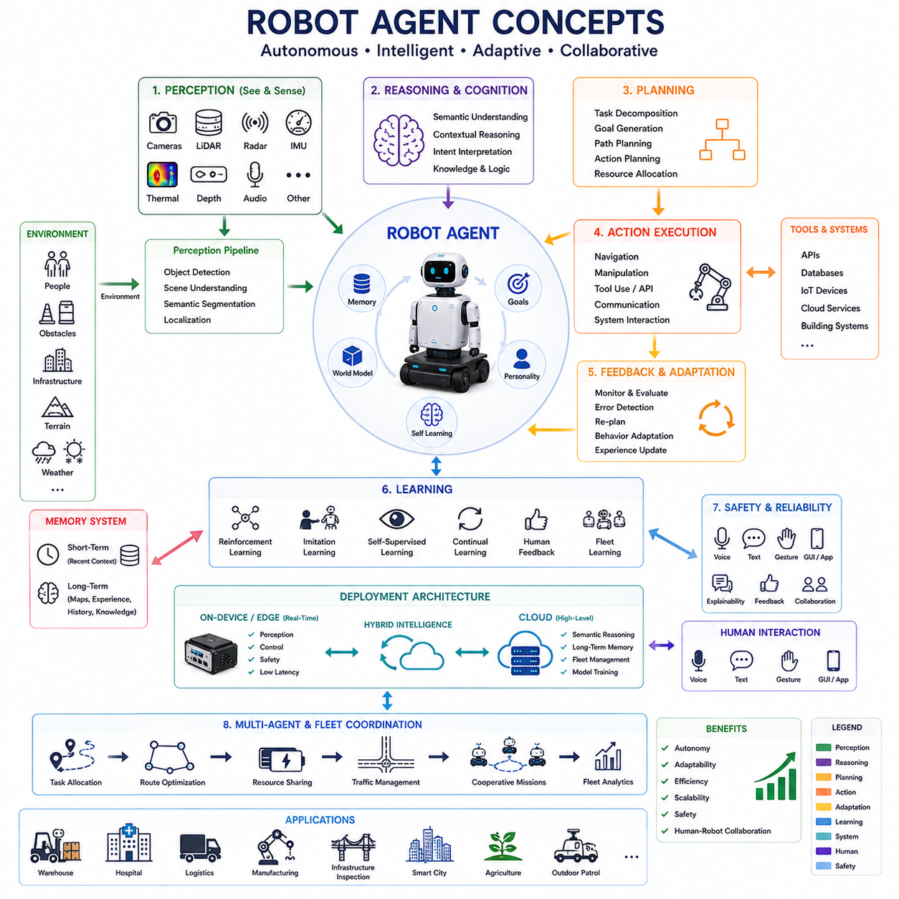
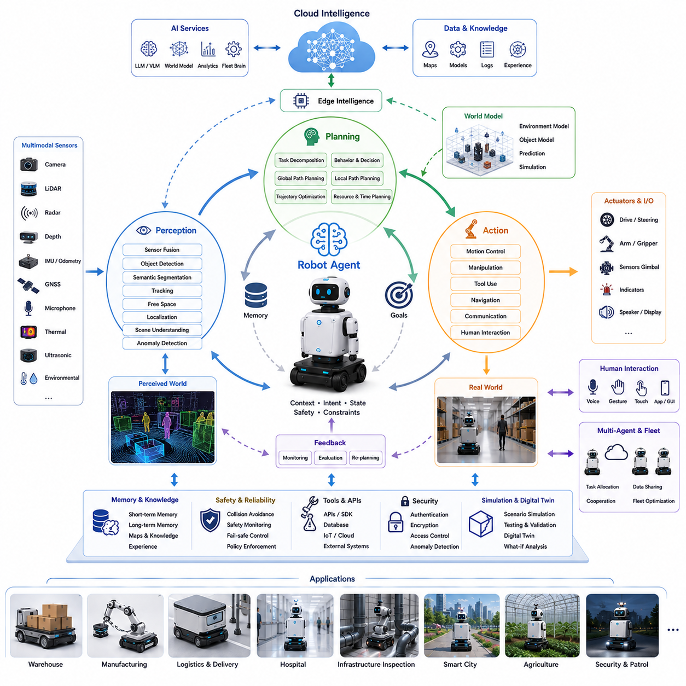
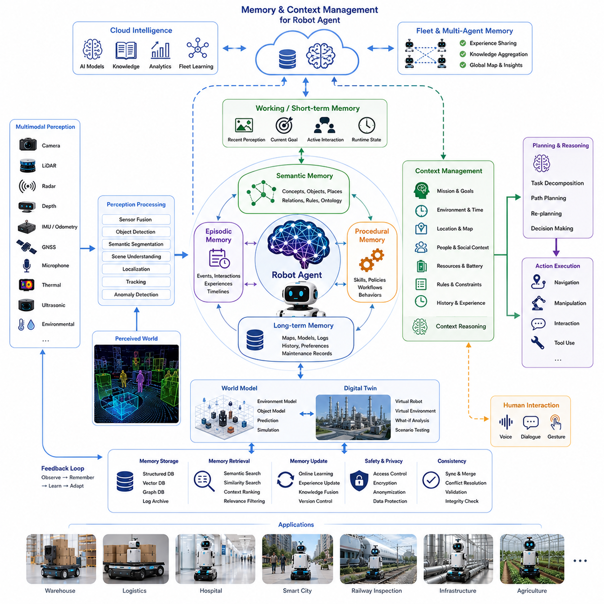
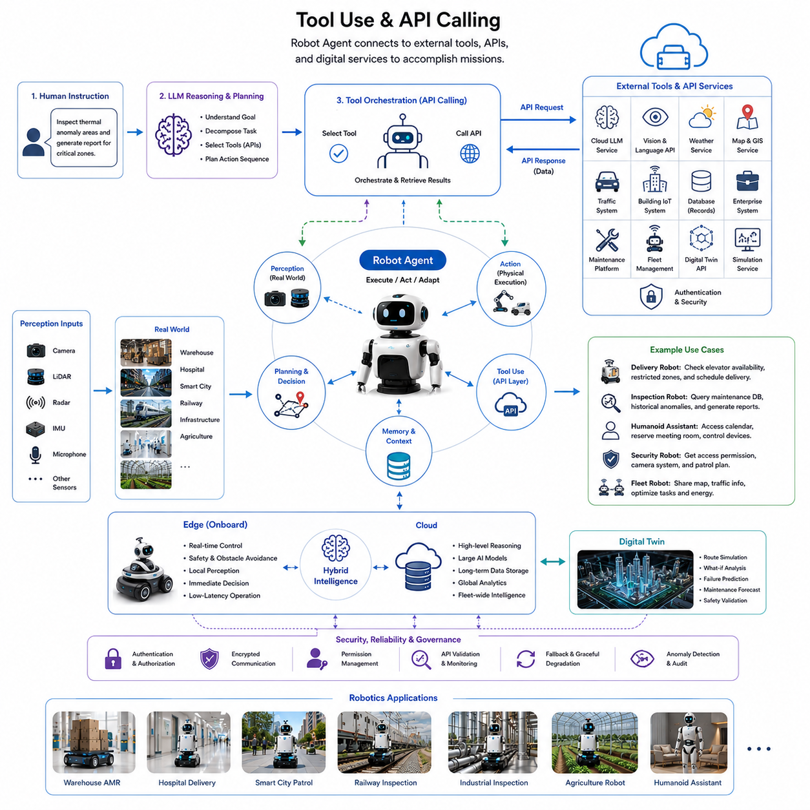
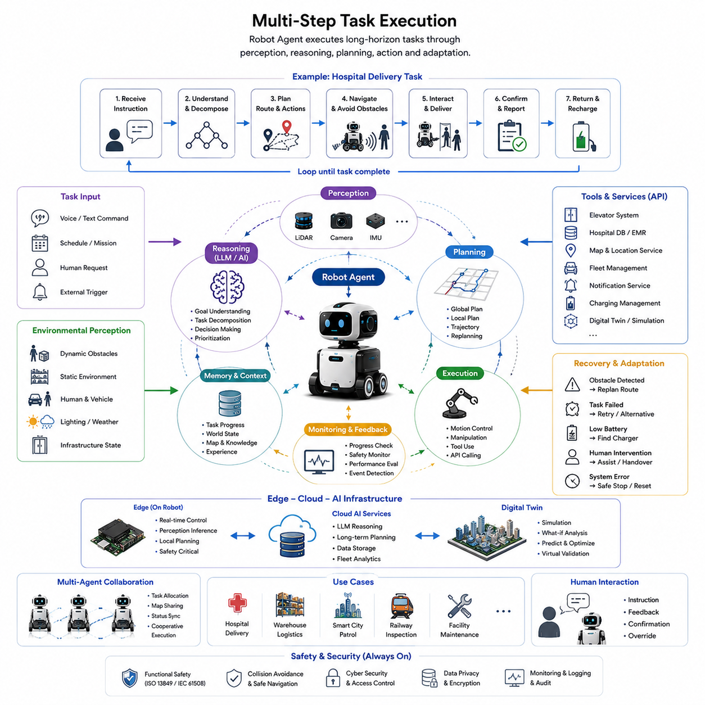
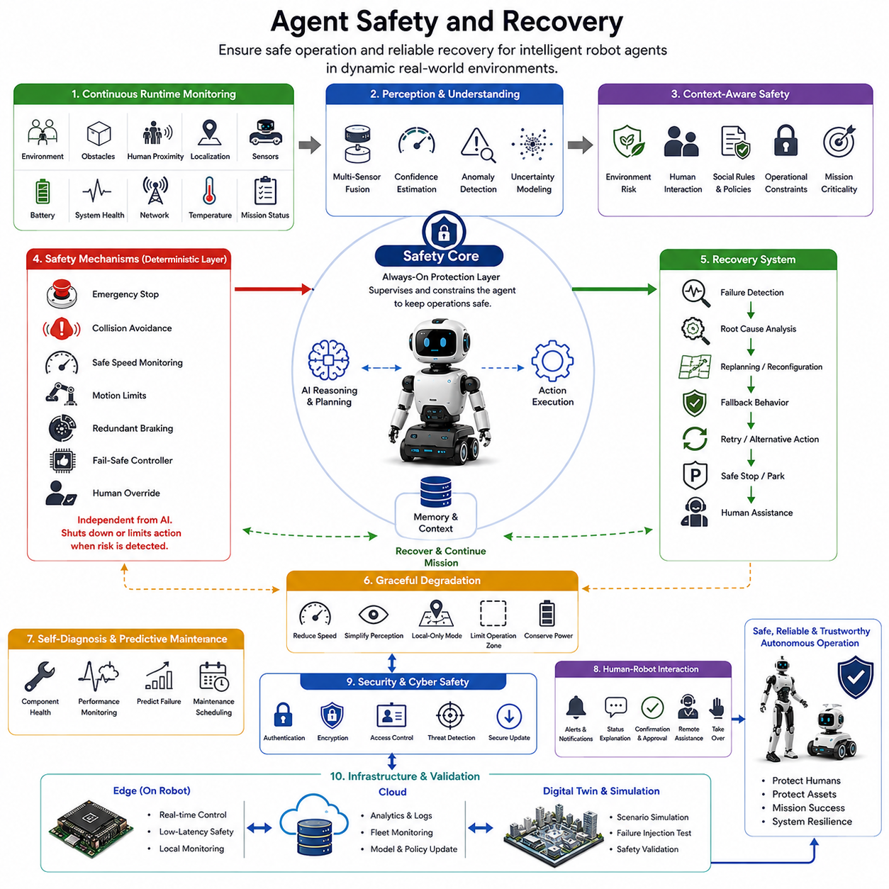
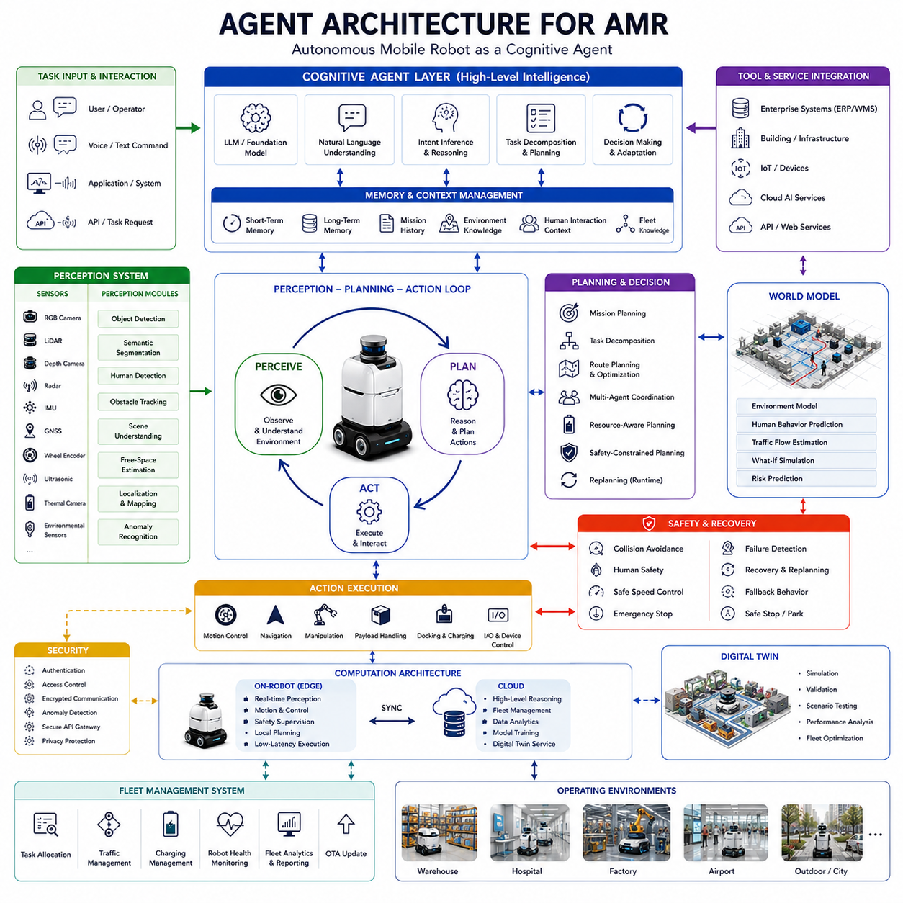
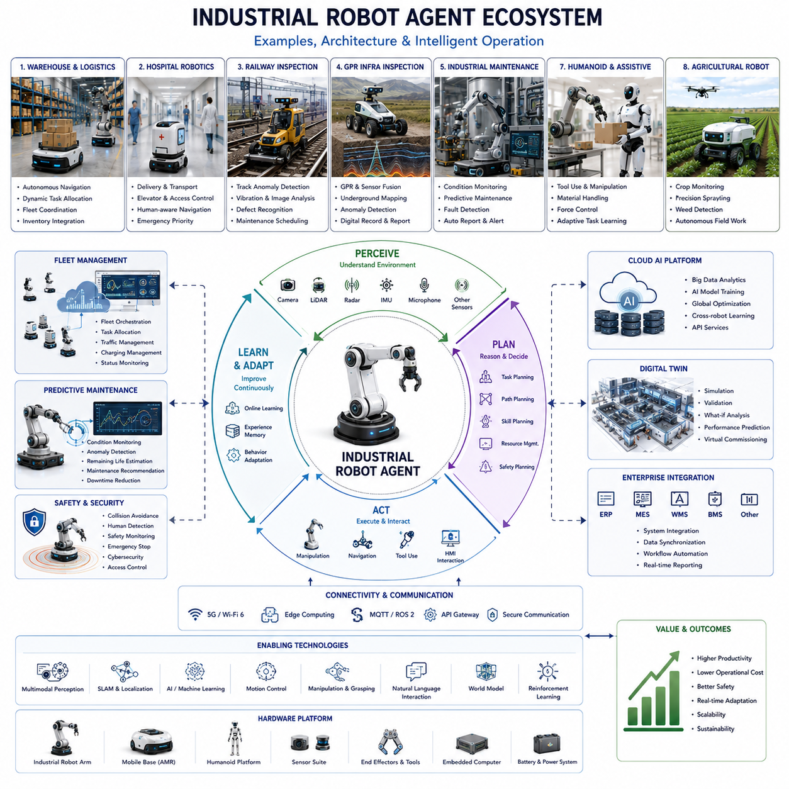

**Volume 06. AMR AI and Embodied Intelligence**

# Chapter 07. Robot Agents

## 07.1 Robot Agent Concepts

{width="7.268055555555556in" height="7.268055555555556in"}

로봇 에이전트 개념(Robot Agent Concepts)은 현대 로보틱스, Embodied AI, 자율주행로봇(AMR), 휴머노이드 로봇, 스마트 인프라 시스템, 그리고 미래 자율 기계 생태계에서 가장 혁신적인 개념 중 하나이다. 인공지능이 단순한 Perception Algorithm이나 Navigation Algorithm 수준을 넘어 통합 인지 아키텍처로 발전함에 따라, 로봇은 더 이상 단순히 프로그래밍된 기계가 아니라 실제 환경 속에서 지속적으로 인지하고, 추론하고, 계획하고, 행동하고, 학습하며, 소통하고, 적응하는 자율 지능 에이전트로 진화하고 있다. Robot Agent의 등장은 로봇 시스템의 설계 방식, 운영 방식, 배포 구조, 그리고 인간 사회와의 통합 방식 자체를 근본적으로 변화시키고 있다.

전통적인 로봇 시스템은 대부분 결정론적 소프트웨어 구조, 고정된 Workflow Logic, 수동으로 설계된 State Machine, 사전 정의된 Control Pipeline을 기반으로 만들어졌다. 이러한 시스템은 반복적이고 환경 변화가 적은 산업 환경에서는 매우 효과적이었다. 생산 라인 로봇, AGV, 자동 컨베이어 시스템 등은 명확한 규칙 기반 구조에서 높은 신뢰성을 제공하였다. 그러나 이러한 구조는 동적이고 예측 불가능하며 인간 중심적인 환경에서는 한계를 보였다. 특히 Context Understanding과 Adaptive Decision-Making이 필요한 상황에서는 유연성이 부족하였다.

Robot Agent 개념은 이러한 기존 로봇 철학을 근본적으로 바꾸는 새로운 구조이다. Robot Agent는 단순한 자동화 장치가 아니라, 목표를 이해하고, 환경 Context를 해석하며, 행동을 스스로 선택하고, 외부 시스템과 협력하며, 운영 전략을 지속적으로 조정하는 자율 지능 엔티티이다. 즉, Robot Agent는 Perception, Reasoning, Memory, Planning, Execution, Learning을 통합한 하나의 Cognitive Operational Framework로 이해할 수 있다.

Large Language Model(LLM), Vision-Language Model(VLM), Foundation Model, Multimodal AI, Embodied Intelligence 기술의 발전은 Robot Agent 구조를 급격히 발전시켰다. 이러한 기술들은 로봇이 Semantic Information을 이해하고, 자연어 명령을 해석하며, 복잡한 운영 목표를 추론하고, 고정된 절차를 넘어 동적으로 행동을 생성할 수 있도록 만든다. 그 결과 미래의 로봇은 단순 자동화 기계가 아니라 인간과 협업하는 지능형 자율 파트너 형태로 발전하고 있다.

Robot Agent의 핵심 특성 중 하나는 자율성(Autonomy)이다. 여기서 자율성은 단순한 자동 주행이나 자동 동작을 의미하지 않는다. 진정한 자율성은 로봇이 환경 상태, 작업 목표, 안전 제약, 자원 상태, Context Information을 고려하여 스스로 운영 결정을 내리는 능력을 의미한다. Robot Agent는 지속적으로 주변 환경을 분석하며 상황 변화에 따라 행동을 수정한다.

예를 들어 지하 인프라 검사 로봇이 다음과 같은 목표를 부여받을 수 있다.

"고장 위험이 높은 지하 유틸리티 구간을 검사하되 교통 방해를 최소화하라."

이 경우 Robot Agent는 단순히 사전 정의된 순서를 실행하는 것이 아니라:

Mission Priority 해석

환경 상태 분석

Sensor Confidence 평가

Navigation Strategy 수정

Inspection Focus Area 선택

Cloud System과 협력

Runtime Replanning 수행

등을 지속적으로 수행한다.

Perception은 Robot Agent의 가장 중요한 기반 능력 중 하나이다. 지능형 에이전트는 멀티모달 센서를 사용하여 환경을 지속적으로 인지해야 한다. 현대 Robot Agent는 일반적으로 다음과 같은 센서를 통합한다.

그러나 Robot Agent는 단순히 센서 데이터를 수집하는 것이 아니라 이를 의미 있는 Contextual Understanding으로 변환해야 한다. 이 과정에는:

등이 포함된다.

Contextual Reasoning 역시 Robot Agent의 핵심 능력이다. 기존 Rule-Based System과 달리 Robot Agent는 단순 명령 실행이 아니라 "의미"를 이해해야 한다. 동일한 명령이라도 환경에 따라 다른 행동이 필요할 수 있다.

예:

"빠르게 목적지로 이동해라."

라는 명령은 다음 조건에 따라 완전히 다른 행동을 생성할 수 있다.

보행자 밀도

환경 위험성

노면 상태

날씨 조건

Payload 상태

작업 긴급도

Robot Agent는 고정된 규칙이 아니라 Context 기반으로 행동을 결정해야 한다.

Memory System 역시 매우 중요한 요소이다. 미래의 Robot Agent는 Short-Term Memory와 Long-Term Memory를 모두 가지게 된다.

Short-Term Memory는:

최근 Sensor Observation

현재 Task State

등을 관리한다.

반면 Long-Term Memory는:

등을 저장한다.

Memory는 Robot Agent의 의사결정을 지속적으로 향상시킨다. 예를 들어 병원 로봇은 특정 시간대에 혼잡한 복도를 기억하여 향후 Navigation을 미리 조정할 수 있다. 산업 검사 로봇은 과거에 이상이 자주 발생했던 위치를 우선적으로 검사할 수 있다.

Planning Capability 역시 Robot Agent의 핵심이다. Robot Agent는 고수준 목표를 실제 실행 가능한 행동으로 지속적으로 변환해야 한다. 이 과정은 일반적으로 Hierarchical Planning 구조를 가진다.

Robot Agent는:

등으로 목표를 분해할 수 있다.

현대 Robot Agent는 단순 Geometric Planning이 아니라 Semantic Planning을 수행한다. 즉 단순 이동 경로만 계산하는 것이 아니라:

등을 함께 고려한다.

Action Execution 역시 Runtime Feedback과 강하게 연결되어야 한다. 실제 환경은 매우 동적이고 예측 불가능하기 때문이다.

예:

갑작스러운 장애물 등장

인간의 우선순위 변경

Sensor Confidence 감소

날씨 변화

네트워크 장애

Hardware 상태 변화

등이 발생할 수 있다.

따라서 Robot Agent는 항상 Perception → Planning → Action Loop를 지속적으로 유지해야 한다.

Learning Capability는 Robot Agent를 기존 자동화 시스템과 가장 크게 구분하는 요소 중 하나이다. 기존 로봇은 개발 시 정의된 고정 행동만 수행했지만, Robot Agent는 운영 경험을 통해 지속적으로 성능을 향상시킬 수 있다.

학습 방식에는:

등이 있다.

Embodied Intelligence는 Robot Agent와 매우 밀접하게 연결된다. Robot Agent는 실제 물리 환경에서 동작하기 때문에, 단순 Semantic Understanding만으로는 충분하지 않다. 로봇은:

등을 함께 이해해야 한다.

예를 들어 병원 환경에서 장비를 운반하는 휴머노이드 Robot Agent는:

등을 동시에 고려해야 한다.

Tool Usage와 API Orchestration도 매우 중요하다. 미래 Robot Agent는 단순히 내부 AI만 사용하는 것이 아니라 외부 시스템과 지속적으로 연동될 가능성이 높다.

예:

등과 연결될 수 있다.

예를 들어 Smart City Robot Agent는:

Traffic System 접근

Weather Service 조회

Infrastructure Monitoring 연동

Maintenance Database 접근

Cloud Foundation Model 사용

등을 수행할 수 있다.

Multi-Agent Coordination도 매우 중요하다. 미래 스마트시티나 물류 환경에는 수천\~수백만 대의 Robot Agent가 동시에 운영될 수 있다.

따라서 Robot Agent는:

등을 수행해야 한다.

Human-Robot Interaction 역시 크게 변화한다. 기존 로봇은 전문적인 인터페이스가 필요했지만, Robot Agent는:

등을 지원할 수 있다.

그러나 Conversational Capability는 새로운 문제도 만든다. 사람들은 자연스러운 대화 능력을 가진 로봇을 실제보다 더 지능적으로 인식하는 경향이 있다.

따라서 Robot Agent는:

등을 제공해야 한다.

Safety는 Robot Agent의 가장 중요한 요소 중 하나이다. 자율 에이전트는 동적으로 행동을 생성하기 때문에 적절한 제약이 없으면 위험한 행동을 할 가능성이 존재한다.

따라서 Safety Architecture는:

등을 포함해야 한다.

Cybersecurity 역시 매우 중요하다. 네트워크 연결 Robot Agent는:

등의 위험에 노출될 수 있다.

따라서:

등이 필요하다.

Cloud-Edge Hybrid Intelligence는 Robot Agent 구조에서 매우 중요하다.

Edge AI는:

등을 수행한다.

반면 Cloud는:

등을 담당한다.

따라서 미래 Robot Agent는:

으로 구성된 Hierarchical Hybrid Intelligence Architecture를 사용할 가능성이 높다.

World Model도 점점 중요해지고 있다. World Model은 로봇 내부의 예측 기반 환경 표현 구조이다. 이를 통해 Robot Agent는:

등을 실제 행동 전에 수행할 수 있다.

예를 들어 Smart City Robot Agent는 복잡한 교차로를 건너기 전에:

- 보행자 이동 예측

- 차량 흐름 분석

- 장애물 변화 예측

- 충돌 위험 계산

등을 내부적으로 시뮬레이션할 수 있다.

휴머노이드 로봇은 가장 고급 형태의 Robot Agent라고 볼 수 있다. 휴머노이드는:

등을 동시에 수행해야 하기 때문이다.

Robot Agent는 이미 다양한 산업에 적용되기 시작하였다.

등이 대표적인 예이다.

미래 Robot Agent는 점점 더 Self-Improving 구조로 발전할 가능성이 높다. Continual Learning 구조를 통해 장기 운영 경험을 학습하고, Fleet 전체가 Knowledge Sharing을 수행하는 Collective Intelligence 형태로 발전할 수 있다.

궁극적으로 Robot Agent 개념은 로봇 역사에서 매우 큰 전환점을 의미한다. 로봇은 더 이상 단순 프로그래밍 기계가 아니라, 실제 물리 세계에서 인지하고, 추론하고, 협력하고, 학습하며, 적응하는 자율 지능 엔티티로 진화하고 있다. 이러한 변화는 미래의 산업 자동화, 물류, 헬스케어, 스마트시티, 공공 서비스, 인간-기계 상호작용 구조 전체를 근본적으로 바꾸게 될 가능성이 매우 높다.

## 07.2 Perception, Planning, and Action Agents

{width="7.268055555555556in" height="7.268055555555556in"}

Perception-Planning-Action Agent 아키텍처는 현대 로보틱스, Embodied AI, 자율주행로봇(AMR), 휴머노이드 로봇, 그리고 지능형 자율 시스템에서 가장 핵심적인 개념 중 하나이다. 이 개념은 지능형 로봇이 단순히 독립적인 기능 모듈만으로는 효과적으로 동작할 수 없다는 이해에서 출발한다. 로봇은 환경을 지속적으로 인지하고(Perception), 관측된 정보를 기반으로 추론하며(Planning), 행동을 실행하고(Action), 그 결과를 다시 평가하는 과정을 실시간으로 반복해야 한다. 이러한 Closed-Loop 구조는 현대 Embodied AI의 핵심 행동 프레임워크이며, 지능형 로봇 시스템의 가장 중요한 기반 구조라고 할 수 있다.

전통적인 로봇 시스템은 일반적으로 Sensing, Planning, Control을 서로 분리된 소프트웨어 모듈로 구성하였다. 초기 산업용 로봇은 사전에 정의된 Motion Trajectory와 Deterministic Task Sequence를 기반으로 동작했으며, 환경 변화에 대한 인식 능력이 제한적이었다. 이러한 시스템은 구조화된 산업 환경에서는 매우 효과적이었지만, 인간과 함께 동작하거나 환경이 지속적으로 변하는 실제 환경에서는 큰 한계를 보였다.

Perception-Planning-Action 구조는 이러한 한계를 해결하기 위해 등장하였다. 이 구조는 환경 이해와 적응형 의사결정, 그리고 물리적 행동 실행을 하나의 연속적인 피드백 루프로 통합한다. 즉, 로봇은 단순히 고정된 명령을 실행하는 것이 아니라, 환경을 지속적으로 관찰하고(Context Awareness), 상황을 해석하며, 목표를 평가하고, 행동을 동적으로 수정해야 한다.

Perception은 이 인지 루프의 첫 번째 단계이다. Perception은 로봇이 멀티모달 센서를 사용하여 환경 정보를 획득하고, 처리하며, 해석하고, 이해하는 과정을 의미한다.

현대 로봇 에이전트는 일반적으로:

등을 통합하여 사용한다.

이 센서들은:

등에 대한 정보를 제공한다.

그러나 Raw Sensor Data 자체는 지능이 아니다. 로봇은 이 데이터를 의미 있는 Semantic Understanding으로 변환해야 한다.

이 과정에는:

등이 포함된다.

Perception의 목적은 단순히 "물체를 감지하는 것"이 아니라, 환경에 대한 의미 있는 내부 표현(Internal Representation)을 만드는 것이다.

예를 들어 산업 인프라 근처를 주행하는 실외 검사 로봇은:

- 이동 차량

- 작업자

- 배관 구조물

등을 동시에 인식할 수 있다.

로봇은 단순히 "무엇이 있는가"를 넘어서 "그것이 운영적으로 무엇을 의미하는가"를 이해해야 한다.

Semantic Understanding은 미래 Embodied AI에서 점점 더 중요해지고 있다. 현대 Robot Agent는 단순히 Geometric Obstacle을 감지하는 것이 아니라 Contextual Meaning을 이해해야 한다.

예:

등을 구분할 수 있어야 한다.

이러한 Contextual Perception은 로봇의 적응성과 운영 지능을 크게 향상시킨다.

Planning은 Perception-Planning-Action 구조의 두 번째 핵심 요소이다. Planning은 환경 정보와 Mission Objective를 실행 가능한 운영 전략으로 변환하는 과정이다.

Planning System은:

- 무엇을 해야 하는가

- 언제 행동해야 하는가

- 어떤 경로를 선택해야 하는가

- 자원을 어떻게 배분해야 하는가

- Safety Constraint를 어떻게 만족시킬 것인가

- Environmental Uncertainty를 어떻게 처리할 것인가

등을 결정한다.

기존 로보틱스 Planning은 A\*, Dijkstra, RRT, Trajectory Optimization 등 결정론적 알고리즘에 크게 의존하였다. 이러한 알고리즘은 여전히 중요하지만, 현대 Robot Agent는 Semantic Planning과 Contextual Reasoning을 함께 사용한다.

Advanced Planning System은:

등을 함께 고려한다.

즉 Planning은 단순 경로 생성 이상의 의미를 가진다.

예를 들어 병원 로봇이 다음과 같은 명령을 받았다고 가정하자.

"환자에게 방해를 최소화하면서 ICU에 응급 약품을 전달하라."

이 경우 Planning System은:

- 최적 경로

등을 동시에 고려해야 한다.

Task Decomposition 역시 매우 중요한 Planning 기능이다. 하나의 고수준 목표는 여러 개의 실행 가능한 Subtask로 분해되어야 한다.

예:

등이 하나의 Mission 안에 포함될 수 있다.

현대 Embodied AI는 LLM과 Multimodal Foundation Model을 Planning 구조에 점점 더 많이 통합하고 있다. 이러한 AI는 자연어 명령을 이해하고, Context를 해석하며, Adaptive Strategy를 생성하고, 환경 변화에 따라 Dynamic Replanning을 수행할 수 있다.

그러나 실제 로봇 Planning은 디지털 AI와 달리 반드시 Physical Feasibility를 고려해야 한다.

계획은 반드시:

등을 만족해야 한다.

이러한 Grounding Requirement는 Embodied Intelligence 연구의 핵심 과제 중 하나이다.

Action Execution은 세 번째 핵심 요소이다. 계획이 생성되면 로봇은 실제 환경에서 물리적으로 행동을 실행해야 한다.

Action Execution에는:

등이 포함된다.

실제 환경은 매우 동적이기 때문에 Execution에는 큰 불확실성이 존재한다.

예:

- 보행자가 갑자기 방향 변경

- 새로운 장애물 등장

- Surface Friction 변화

- 날씨 변화

- 네트워크 장애

- Sensor Confidence 감소

등이 발생할 수 있다.

따라서 Action Execution은 단순히 고정된 명령 실행이 아니라 Runtime Feedback 기반으로 동적으로 수정되어야 한다.

이것이 바로 Perception-Planning-Action 구조가 Continuous Closed-Loop 형태로 동작하는 이유이다.

즉:

- Perception은 환경 이해를 지속 업데이트

- Planning은 전략을 지속 수정

- Action은 새로운 환경 변화를 생성

하며 이 루프가 계속 반복된다.

Real-Time Responsiveness 역시 매우 중요하다. 많은 운영 결정은 밀리초 단위 내에 수행되어야 한다.

예:

등은 매우 낮은 Latency를 요구한다.

따라서 미래 Robot Agent는 Layered Edge-Cloud Intelligence Architecture를 사용하게 될 가능성이 높다.

Edge System은:

을 담당한다.

반면 Cloud는:

등을 담당한다.

이러한 구조는 Latency, Scalability, Reliability, Compute Capability의 균형을 맞춘다.

Memory System 역시 매우 중요하다.

Short-Term Memory는:

등을 유지한다.

Long-Term Memory는:

등을 저장한다.

Memory는 Planning Quality와 Contextual Adaptation을 크게 향상시킨다.

World Model도 점점 더 중요해지고 있다. World Model은 환경 변화와 미래 결과를 예측하는 내부 시뮬레이션 모델이다.

예를 들어 로봇은 복잡한 산업 복도를 지나가기 전에:

등을 내부적으로 시뮬레이션할 수 있다.

Multi-Agent Coordination은 Perception-Planning-Action 구조를 더욱 확장한다. 미래의 스마트시티와 물류 시스템에는 수천\~수백만 대의 Robot Agent가 협력적으로 운영될 가능성이 있다.

이들은:

등을 공유할 수 있다.

Human-Robot Interaction 역시 중요한 요소이다. 인간 행동은 매우 동적이고 Context Dependent하기 때문에 Robot Agent는:

등을 지속적으로 이해해야 한다.

특히 Socially Aware Navigation은 매우 중요하다.

로봇은:

등을 유지해야 한다.

Safety는 가장 중요한 요소 중 하나이다. AI 기반 Planning은 때때로 비현실적이거나 위험한 행동을 생성할 수 있다.

따라서 Robot Agent는:

등을 반드시 포함해야 한다.

Cybersecurity 역시 매우 중요하다. Cloud와 연결된 Robot Agent는:

등에 노출될 수 있다.

따라서:

등이 필요하다.

Energy Efficiency와 Computational Optimization도 매우 중요하다. 멀티모달 AI와 Planning System은 상당한 GPU 연산량과 전력을 요구한다.

그러나 모바일 로봇은:

을 가진다.

따라서 미래 시스템은:

등을 적극 사용하게 될 가능성이 높다.

휴머노이드 로봇은 Perception-Planning-Action 구조의 가장 고급 형태 중 하나이다.

휴머노이드는:

등을 동시에 수행해야 한다.

Embodied Intelligence 연구는 이러한 모든 기능을 완전히 통합된 Cognitive Operational Architecture로 만드는 방향으로 발전하고 있다.

Perception-Planning-Action Agent는 이미:

등 다양한 산업에 적용되고 있다.

미래 Robot Agent는 더욱:

한 방향으로 발전할 가능성이 높다.

Continual Learning 구조는 로봇이 운영 경험을 통해 지속적으로 학습하도록 만들며, Fleet 간 Knowledge Sharing을 가능하게 할 것이다.

World Model은 더욱 정교해지며 장기 전략 Planning과 Predictive Simulation을 가능하게 할 것이다.

궁극적으로 Perception-Planning-Action Agent 구조는 Embodied AI의 가장 핵심적인 기반 원리 중 하나이다. 이는 로봇이 실제 물리 세계와 지속적으로 상호작용하면서 Sensory Understanding을 Adaptive Physical Behavior로 변환하는 방법을 정의한다. 미래의 로보틱스, Multimodal AI, World Model, Embodied Cognition 기술이 발전할수록 Perception-Planning-Action 구조는 더욱 중요한 핵심 아키텍처가 될 가능성이 매우 높다.

## 07.3 Memory and Context Management

{width="7.268055555555556in" height="7.268055555555556in"}

Memory and Context Management는 현대 로보틱스, Embodied AI, 자율주행로봇(AMR), 휴머노이드 로봇, 멀티 에이전트 시스템, 그리고 미래 자율 지능 인프라에서 가장 핵심적인 기반 기술 중 하나이다. 로봇 시스템이 단순한 결정론적 자동화 구조를 넘어 장기 추론(Long-Horizon Reasoning), Semantic Understanding, Human Interaction, Autonomous Decision-Making이 가능한 Cognitive Agent로 발전함에 따라, 정보를 기억하고, 정리하고, 해석하며, Context 기반으로 활용하는 능력이 점점 더 중요해지고 있다. 강력한 Memory와 Context Management가 없다면 지능형 로봇은 운영 연속성을 유지할 수 없고, 환경 변화를 이해할 수 없으며, 경험으로부터 학습하거나 인간과 장기적으로 자연스럽게 상호작용할 수 없다.

전통적인 로봇 시스템은 매우 제한적인 메모리 구조를 사용하였다. 초기 산업용 로봇은 현재 위치, 속도 상태, 센서 값, 제어 변수 등 단기적인 정보만 유지하였다. 이러한 시스템은 환경 변화가 거의 없는 구조화된 산업 환경에서는 효과적으로 동작했지만, 실제 동적 환경에서는 한계를 가졌다. 작업이 종료되면 대부분의 Context 정보는 시스템 내부에 남지 않았다. 이러한 구조는 Deterministic Automation에는 충분했지만, 현대 Embodied AI 시스템에는 적합하지 않다.

현대 Robot Agent는 시간, 공간, Interaction History, Operational State, Environmental Understanding, Mission Continuity에 걸친 지속적인 Context Awareness를 필요로 한다. 병원, 물류창고, 철도, 스마트시티, 농업, 지하 인프라, 산업 플랜트 등에서 동작하는 로봇은 단순히 현재 센서 정보만으로는 충분하지 않다. 로봇은 현재 Perception을 과거 경험, Semantic Knowledge, Operational History, Predictive Modeling과 지속적으로 결합해야 한다.

로봇 시스템에서 Memory는 정보를 다양한 시간 규모에 걸쳐 저장하고, 검색하고, 정리하고, 업데이트하며, 활용하는 능력을 의미한다. 반면 Context Management는 Memory, 환경 상태, 인간과의 상호작용, Mission Objective, Situational Understanding을 결합하여 운영 의미를 해석하는 능력을 의미한다. 이 둘은 함께 지능형 로봇 시스템의 "Cognitive Continuity Layer"를 형성한다.

로봇 메모리 구조에서 가장 중요한 구분 중 하나는 Short-Term Memory와 Long-Term Memory의 분리이다.

Short-Term Memory는 즉각적인 운영 인식을 지원한다. 여기에는:

등이 포함된다.

Short-Term Memory는 빠르게 변화하며 지속적으로 업데이트된다. 이를 통해 로봇은 연속적인 의사결정 간의 일관성을 유지할 수 있다.

예를 들어 물류창고 로봇은 이동하는 지게차와 작업자의 최근 이동 경로를 몇 초 또는 몇 분 동안 기억해야 한다. 만약 이러한 Short-Term Memory가 없다면 로봇은 모든 상황을 매번 새롭게 해석해야 하며, 이는 불안정하거나 위험한 행동으로 이어질 수 있다.

반면 Long-Term Memory는 장기간에 걸친 지식 보존을 담당한다.

Long-Term Memory에는:

등이 저장될 수 있다.

Long-Term Memory는 로봇이 운영 경험을 축적하고 시간이 지날수록 지능을 향상시키도록 만든다.

예를 들어 병원 배송 로봇은 특정 시간대에 어떤 복도가 혼잡한지를 학습할 수 있다. 철도 검사 로봇은 반복적으로 구조 이상이 발생하는 위치를 기억할 수 있다. 농업 로봇은 계절별 환경 패턴을 학습하여 Navigation이나 Crop Monitoring 품질을 향상시킬 수 있다.

Semantic Memory 역시 매우 중요하다. Semantic Memory는 단순 Raw Data가 아니라 "세계에 대한 개념적 지식"을 저장한다.

예:

- Elevator는 층을 연결한다

- 병원에는 Restricted Medical Zone이 존재한다

- Pedestrian Crossing은 Socially Aware Navigation이 필요하다

- Maintenance Corridor에는 Hazardous Equipment가 있을 수 있다

- Loading Dock에는 차량 Traffic이 많다

등의 의미 기반 지식을 저장할 수 있다.

이러한 Semantic Understanding은 단순 Geometric Memory보다 훨씬 높은 수준의 Contextual Reasoning을 가능하게 한다.

Episodic Memory 역시 중요한 개념이다. Episodic Memory는 경험과 사건의 "시간적 흐름"을 저장한다.

예를 들어 로봇은:

- 인간 운영자와의 대화

- 시스템 오류 발생 과정

- Maintenance Procedure 수행 과정

- Navigation Difficulty와 관련된 환경 상태

- Collaborative Task 중 인간 반응

등을 기억할 수 있다.

Episodic Memory는 Contextual Adaptation과 장기 행동 일관성을 크게 향상시킨다.

Procedural Memory 역시 중요하다. Procedural Memory는 학습된 행동 기술과 운영 전략을 의미한다.

예:

등이 포함된다.

Procedural Memory는 로봇이 모든 세부 동작을 매번 재계산하지 않고도 효율적으로 행동할 수 있게 만든다.

현대 Embodied AI 시스템은 이러한 다양한 메모리 구조를 통합한 Cognitive Architecture로 발전하고 있다.

미래 Robot Agent는 동시에:

등을 유지할 가능성이 높다.

그러나 단순히 Memory만 존재한다고 해서 지능이 완성되는 것은 아니다. Context Management가 함께 필요하다.

Context는 동일한 정보가 상황에 따라 다르게 해석되도록 만든다.

예:

"빠르게 이동하라."

라는 명령은 다음 상황에 따라 다른 의미를 가진다.

- 혼잡한 병원 내부

- 비어 있는 산업 복도

- Emergency Response 상황

- Vulnerable Human Population 근처

Robot Agent는 단순 명령이 아니라 Contextual Meaning을 이해해야 한다.

Human-Robot Interaction 역시 Context Continuity에 크게 의존한다. 인간은 대화의 연속성을 자연스럽게 기대한다. 만약 로봇이 이전 대화나 Task History를 기억하지 못한다면 상호작용은 단절되고 부자연스러워진다.

예:

"이전에 이야기했던 동일한 파이프라인 구간을 검사해라."

이 경우 로봇은:

- 어떤 파이프라인이 언급되었는지

- 이전 이상 탐지 결과

- 과거 운영 지시

- 이전 환경 관측

등을 기억해야 한다.

이러한 Context Continuity는 협업 품질을 크게 향상시킨다.

LLM과 Multimodal AI는 로봇 메모리의 역할을 급격히 확장시켰다. 미래 Robot Agent는:

등을 유지할 수 있게 된다.

그러나 LLM 기반 Memory는 새로운 문제도 만든다.

대규모 메모리 시스템은:

등을 필요로 한다.

메모리 Retrieval은 매우 중요한 과제이다. 로봇은 장기간 운영되며 막대한 양의 데이터를 축적하게 된다. 따라서 필요한 정보를 빠르게 찾는 능력이 중요하다.

이를 위해 현대 시스템은:

등을 사용한다.

Grounded Memory 역시 매우 중요하다. 로봇의 메모리는 실제 물리 환경과 지속적으로 연결되어야 한다.

실제 환경은:

- 물체 이동

- 인프라 변화

- 인간 개입

- Operational State 변화

- Sensor Condition 변화

등이 지속적으로 발생한다.

예를 들어 로봇이 과거에 접근 가능했던 복도를 기억하고 있더라도, 현재는 장애물로 막혀 있을 수 있다. 따라서 메모리는 현재 Perception과 지속적으로 검증되어야 한다.

World Model 역시 메모리와 강하게 연결된다. World Model은 환경 변화와 미래 결과를 예측하는 내부 시뮬레이션 구조이다.

Memory는:

등을 학습하는 기반이 된다.

Cloud-Edge Hybrid Architecture는 Memory Management에도 큰 영향을 준다.

Edge System은:

등을 위한 Low-Latency Memory를 제공한다.

반면 Cloud는:

등을 담당한다.

Fleet Intelligence 역시 매우 중요하다. 미래의 Robot Fleet는 서로 경험을 공유할 가능성이 높다.

예:

- 물류 로봇이 막힌 경로 발견

- 철도 로봇이 인프라 이상 발견

- 병원 로봇이 최적 이동 시간 학습

- 농업 로봇이 Crop Anomaly 발견

등의 정보가 Fleet 전체에 공유될 수 있다.

Privacy와 Security 역시 매우 중요하다. 병원, 오피스, 스마트시티, 산업 시설 등에서 운영되는 로봇은:

등을 지속적으로 처리한다.

따라서:

등이 필요하다.

Memory Consistency 역시 큰 문제이다. 여러 로봇, Cloud System, Local Agent, Digital Twin이 서로 다른 Memory를 유지할 수 있기 때문이다.

이를 위해:

등이 필요할 수 있다.

Continual Learning은 Memory를 더욱 복잡하게 만든다. 로봇이 운영 경험을 통해 지속적으로 학습할 경우:

등이 발생할 수 있다.

따라서 미래 시스템은:

등을 포함하게 될 가능성이 높다.

휴머노이드 로봇은 특히 고급 Memory와 Context Management를 요구한다. 인간 사회적 상호작용은:

에 크게 의존하기 때문이다.

미래 휴머노이드는:

등을 기억할 수 있게 될 가능성이 높다.

Memory and Context Management는 이미:

등에 적용되고 있다.

궁극적으로 Memory and Context Management는 Embodied AI의 "인지 연속성(Cognitive Continuity)"을 담당하는 핵심 기반 기술이다. Memory가 없다면 로봇은 경험을 축적할 수 없고, 장기 목표를 이해할 수 없으며, 대화 연속성을 유지하거나 경험 기반 성능 향상을 이룰 수 없다. 또한 Context Management가 없다면 로봇은 동적 환경 속에서 상황의 의미를 올바르게 해석할 수 없다. 미래 로보틱스가 점점 더 자율적이고 협업적이며 지능적인 Agent 구조로 발전할수록, Memory와 Context Management는 가장 핵심적인 기술 중 하나가 될 가능성이 매우 높다.

## 07.4 Tool Use and API Calling

{width="7.268055555555556in" height="7.268055555555556in"}

Tool Use and API Calling은 현대 로보틱스, Embodied AI, 자율주행로봇(AMR), 휴머노이드 로봇, 스마트 인프라 시스템에서 가장 중요한 핵심 기술 중 하나이다. 미래의 로봇은 단순히 독립적으로 동작하는 기계가 아니라, 외부 소프트웨어 시스템, 클라우드 AI, 데이터베이스, IoT 인프라, 디지털 트윈, 엔터프라이즈 플랫폼과 지속적으로 연결되는 지능형 에이전트로 발전하고 있다.

기존 로봇 시스템은 대부분 Navigation, Sensor Processing, Motion Control 등을 내부 소프트웨어만으로 처리하였다. 이러한 구조는 제한된 산업 환경에서는 효과적이었지만, 복잡한 실제 환경에서는 충분하지 않았다. 현대 로봇은 단순 물리 장치가 아니라 디지털 인프라와 상호작용하는 Cognitive Agent로 진화하고 있다.

Tool Use는 로봇이 외부 기능이나 서비스를 사용하는 능력을 의미하며, API Calling은 외부 시스템과 프로그램적으로 통신하는 구조를 의미한다. 이를 통해 로봇은 내부 연산 능력을 넘어 외부 지능과 데이터를 활용할 수 있다.

예를 들어 스마트시티 로봇은:

등과 연결될 수 있다.

이러한 구조는 로봇의 Context Awareness와 Operational Intelligence를 크게 향상시킨다.

예를 들어 병원 배송 로봇은:

등을 조회한 뒤 최적 경로를 생성할 수 있다.

철도 검사 로봇은:

등을 활용하여 검사 우선순위를 조정할 수 있다.

LLM 기반 Robot Agent는 Tool Orchestration을 더욱 강력하게 만든다. LLM은 단순 명령 실행이 아니라:

- 어떤 API를 호출할지

- 언제 정보를 가져올지

- 결과를 어떻게 해석할지

- 다음 행동을 무엇으로 할지

를 Semantic Reasoning 기반으로 결정할 수 있다.

예를 들어:

"Thermal Anomaly가 높은 구역을 검사하고 Critical Zone에 대한 Report를 생성해라."

라는 명령을 받으면 로봇은:

- Thermal Monitoring System 조회

- Infrastructure Map 분석

- Maintenance Record 검색

- Fleet Coordination 수행

- Inspection Route 생성

- Report Upload 수행

등을 자동으로 수행할 수 있다.

Task Decomposition 역시 중요하다. 하나의 고수준 목표는:

등으로 분해될 수 있다.

현대 로봇은 일반적으로:

등으로 구성된 Modular Cognitive Pipeline을 사용한다.

API Calling은 Cloud Computing Resource 활용에도 매우 중요하다. 많은 AI 모델은 모바일 로봇 내부에서 실행하기 어려운 대규모 GPU 자원을 필요로 한다.

따라서 로봇은:

등을 외부에서 호출할 수 있다.

이러한 구조는:

- Edge System은 Real-Time Safety 담당

- Cloud System은 Semantic Reasoning 담당

하는 Hybrid Edge-Cloud Intelligence Architecture를 만든다.

Digital Twin 역시 중요한 활용 분야이다. 로봇은 Digital Twin API를 사용하여:

등을 수행할 수 있다.

Multi-Agent Robotics에서는 API 기반 Coordination이 더욱 중요해진다. 미래 로봇 플릿은:

등을 서로 공유하게 될 가능성이 높다.

Human-Robot Interaction도 Tool Use와 밀접하게 연결된다.

예:

"가장 가까운 충전소를 찾고 검사 작업 후 Maintenance를 예약해라."

라는 명령은:

등을 동시에 필요로 할 수 있다.

그러나 Tool Use와 API Calling은 새로운 문제도 만든다. 가장 큰 문제 중 하나는 Reliability이다.

외부 시스템은:

등으로 인해 사용할 수 없게 될 수 있다.

따라서 로봇은 Fallback Strategy를 반드시 가져야 한다.

예를 들어 Cloud Connection이 끊기면 로봇은:

등으로 전환할 수 있어야 한다.

Latency 역시 매우 중요하다. Navigation, Human Interaction, Obstacle Avoidance는 밀리초 수준의 반응 속도를 요구하기 때문이다.

따라서:

- Safety-Critical Function은 로컬 처리

- High-Level Reasoning은 Cloud 처리

구조가 일반적으로 사용된다.

Cybersecurity는 가장 중요한 문제 중 하나이다. API 기반 로봇은:

등의 공격에 노출될 수 있다.

따라서:

등이 필요하다.

Permission Management도 중요하다.

예:

- Delivery Robot은 Logistics System만 접근 가능

- Inspection Robot은 Infrastructure Database 접근 가능

- Emergency Robot은 일부 제한 Override 가능

등의 권한 관리가 필요하다.

Grounded Reasoning 역시 매우 중요하다. LLM은 존재하지 않는 API나 잘못된 Tool을 생성할 수 있기 때문이다.

따라서 로봇은:

등을 수행해야 한다.

Tool Use는 Scalability 측면에서도 매우 중요하다. 모든 기능을 로봇 내부에 넣는 대신 필요할 때 외부 서비스를 호출할 수 있기 때문이다.

미래 Cloud Robotics는:

등을 지원할 가능성이 높다.

휴머노이드 로봇은 특히 Tool Orchestration의 중요성이 크다. 휴머노이드는:

등과 연동되어야 한다.

예를 들어 휴머노이드 Assistant Robot은:

- Calendar System 접근

- Meeting Room 예약

- Presentation Equipment 제어

- Communication Platform 연동

등을 수행할 수 있다.

궁극적으로 Tool Use와 API Calling은 미래 로봇을 단순 자동화 기계에서 실제 지능형 Embodied AI Agent로 변화시키는 핵심 기술이다. 미래의 로봇은 단순한 독립형 시스템이 아니라, Cloud Intelligence, Digital Twin, Enterprise System, Smart Infrastructure와 지속적으로 연결되는 Distributed Cognitive Ecosystem 형태로 발전할 가능성이 매우 높다.

## 07.5 Multi-Step Task Execution

{width="7.268055555555556in" height="7.268055555555556in"}

Multi-Step Task Execution은 현대 로보틱스, Embodied AI, 자율주행로봇(AMR), 휴머노이드 로봇, 그리고 지능형 Robot Agent에서 가장 중요한 핵심 능력 중 하나이다. 기존 자동화 시스템이 개별 명령을 독립적으로 수행했다면, 현대 Robot Agent는 여러 단계로 구성된 장기 작업(Long-Horizon Task)을 연속적으로 수행할 수 있어야 한다. 실제 환경에서의 로봇 작업은 단순한 단일 행동이 아니라, 인지(Perception), 추론(Reasoning), 계획(Planning), 실행(Action), 검증(Verification), 복구(Recovery)가 장시간 동안 반복적으로 연결된 복합 운영 과정이다.

기존 산업용 로봇은 주로 반복적이고 결정론적인 작업을 수행하였다. 예를 들어 물체 이동, 고정 경로 주행, 반복적인 Motion Sequence 실행 등이 대표적이다. 이러한 시스템은 환경 변화가 거의 없는 구조화된 산업 환경에서는 매우 효과적이었다. 그러나 현대 Embodied AI 시스템은 동적이고 예측 불가능한 실제 환경에서 동작해야 하며, Contextual Adaptation, Semantic Understanding, Memory Continuity, Tool Usage, Runtime Decision-Making 등을 요구받는다.

Multi-Step Task Execution은 고수준 목표를 여러 개의 연결된 Subtask로 분해하고, 전체 Mission Lifecycle 동안 운영 연속성을 유지하는 능력을 의미한다. 즉, 로봇은 단순히 개별 명령에 반응하는 것이 아니라 장기 목표, 현재 진행 상태, 환경 변화, 자원 상태, Safety Constraint를 지속적으로 고려해야 한다.

예를 들어 병원 배송 로봇이 다음과 같은 명령을 받을 수 있다.

"응급 약품을 ICU 12호실에 배송하고, 혼잡한 복도를 피하며, 도착 후 의료진에게 알리고, 이후 충전소로 복귀하라."

이 단일 명령은:

등을 모두 포함하는 복합 Workflow를 필요로 한다.

현대 Robot Agent는 일반적으로 Hierarchical Task Decomposition 구조를 사용한다. 고수준 Mission Goal은 작은 실행 가능한 Subtask로 분해되고, 다시 Motion Command, Sensor Operation, API Interaction, Communication Workflow, Safety Validation 등으로 세분화된다. 이러한 구조는 복잡한 Mission을 유연하게 처리할 수 있게 만든다.

Perception은 Multi-Step Execution 전 과정에서 핵심 역할을 수행한다. 로봇은 작업 수행 중 지속적으로:

등을 모니터링해야 한다.

실제 환경은 고정되어 있지 않기 때문에 초기 계획이 항상 유효하지 않을 수 있다.

예를 들어 처음에는 안전했던 경로가 이후:

등으로 인해 사용할 수 없게 될 수 있다.

따라서 Robot Agent는 Runtime 중에도 지속적으로 Replanning을 수행해야 한다.

Memory와 Context Continuity 역시 매우 중요하다. Multi-Step Task는 장시간 동안 지속될 수 있기 때문에 로봇은:

등을 기억해야 한다.

만약 이러한 Context Management가 없다면 로봇은 장기 작업을 일관성 있게 수행할 수 없다.

LLM과 Embodied AI Architecture는 Multi-Step Execution 능력을 크게 향상시킨다. LLM 기반 Robot Agent는:

등을 Semantic Reasoning 기반으로 이해할 수 있다.

예를 들어 인프라 검사 로봇이 다음 명령을 받을 수 있다.

"누수 가능성이 높은 지하 유틸리티 구간을 검사하고 Critical Anomaly를 우선 처리하라."

이 경우 Robot Agent는:

- Infrastructure Map 조회

- Historical Inspection Data 분석

- Inspection Route 생성

등을 순차적으로 수행할 수 있다.

Tool Usage와 API Orchestration도 매우 중요하다. 현대 Robot Agent는:

등과 지속적으로 상호작용한다.

예를 들어 Smart City Robot은:

- Traffic Condition 조회

- Restricted Zone Permission 확인

- Maintenance Schedule 조회

- Fleet Coordination 수행

등을 Runtime 중에 수행할 수 있다.

Runtime Monitoring 역시 필수적이다. 실제 환경에서는:

등이 발생할 수 있다.

따라서 Robot Agent는 지속적으로:

등을 검증해야 한다.

Recovery Behavior 역시 매우 중요하다. 복잡한 작업은 부분 실패(Partial Failure)를 자주 경험하기 때문이다.

따라서 Intelligent Robot Agent는:

등을 수행할 수 있어야 한다.

예를 들어 병원 배송 중 Elevator가 사용 불가능해질 경우 로봇은:

등을 수행할 수 있어야 한다.

Human-Robot Interaction 역시 Multi-Step Task Execution에 큰 영향을 미친다. 인간은 일반적으로 Low-Level Command가 아니라 High-Level Objective 형태로 명령하기 때문이다.

예:

"회의 시작 전에 회의실을 준비해라."

이 명령은:

등의 연속된 작업으로 분해될 수 있다.

Cloud-Edge Hybrid Intelligence Architecture는 장기 작업 수행에서 매우 중요하다.

Edge System은:

을 담당한다.

반면 Cloud System은:

등을 담당한다.

Multi-Agent Robotics에서는 Multi-Step Execution이 더욱 복잡해진다. 미래 Robot Fleet는:

등을 수행하게 될 가능성이 높다.

예를 들어 여러 물류 로봇은 Traffic Congestion, Battery State, Operational Urgency에 따라 Task를 동적으로 재분배할 수 있다.

Safety는 가장 중요한 요소 중 하나이다. 장기 AI Workflow는 적절한 감독이 없으면 위험하거나 비일관적인 행동을 생성할 수 있다.

따라서 현대 Robot Agent는:

등을 포함한다.

Cybersecurity 역시 중요하다. Connected Robot Agent는:

등의 위험에 노출될 수 있다.

따라서:

등이 필요하다.

휴머노이드 로봇은 특히 Multi-Step Execution의 중요성이 크다. 인간 환경은 본질적으로 장기 Contextual Behavior를 요구하기 때문이다.

휴머노이드 로봇은:

등을 연속적으로 수행해야 한다.

Multi-Step Task Execution은 이미:

등에 적용되고 있다.

궁극적으로 Multi-Step Task Execution은 미래 Robot Agent가 단순 자동화 장비를 넘어 실제 지능형 Embodied AI로 발전하기 위한 핵심 기반 기술이다. 미래의 로봇은 Perception, Memory, Reasoning, Planning, Tool Usage, Runtime Adaptation, Recovery Behavior, Contextual Understanding을 통합하여 실제 환경에서 장기 복합 Mission을 안전하고 유연하게 수행할 수 있는 Cognitive Agent 형태로 발전할 가능성이 매우 높다.

## 07.6 Agent Safety and Recovery

{width="7.268055555555556in" height="7.268055555555556in"}

Agent Safety and Recovery는 현대 로보틱스, Embodied AI, 자율주행로봇(AMR), 휴머노이드 로봇, 그리고 지능형 자율 시스템에서 가장 중요한 기반 기술 중 하나이다. 로봇이 단순한 결정론적 산업 장비를 넘어 자율 추론, 장기 계획(Long-Horizon Planning), Tool Usage, API Interaction, Multi-Step Task Execution이 가능한 Cognitive Agent로 발전함에 따라, 안정적인 안전성(Safety)과 복구(Recovery) 능력은 필수 요소가 되고 있다. 아무리 높은 지능을 가진 로봇이라도 강력한 안전 구조가 없다면 실제 환경에서는 위험하고 불안정하며 상용화가 어려운 시스템이 될 수 있다. 따라서 미래의 Embodied AI 시스템은 고급 자율성과 함께 강력한 Safety Supervision, Fault Tolerance, Recovery Intelligence, Operational Resilience를 동시에 갖추어야 한다.

전통적인 산업용 로봇 환경은 비교적 예측 가능하고 구조화되어 있었다. 산업용 로봇은 대부분 펜스 내부에서 인간과 분리된 상태로 반복 작업을 수행하였다. 안전성은 물리적 격리, Emergency Stop, Hardcoded Constraint, Deterministic Control Logic 등을 통해 확보되었다. 그러나 현대 Robot Agent는 병원, 물류창고, 스마트시티, 철도, 산업 인프라, 농업 환경 등 인간과 함께 존재하는 동적 환경에서 운영된다. 이러한 환경에는 인간 이동, 장애물 변화, 환경 위험 요소, 네트워크 불안정성, 예측 불가능한 상황 등이 지속적으로 존재한다.

따라서 미래의 로봇 안전성은 단순한 고정 규칙이나 하드웨어 보호 장치만으로는 충분하지 않다. Safety는 로봇 에이전트 내부에 통합된 "지속적인 인지 기반 프로세스"가 되어야 한다. Robot Agent는 Runtime 동안 지속적으로:

등을 평가해야 한다.

Agent Safety는 정상 및 비정상 상황에서 로봇이 안전한 동작을 유지하는 능력을 의미한다. Recovery는 시스템이 실패를 감지하고, 예기치 않은 상황에 적응하며, 운영을 안전하게 복구하고 계속 수행하는 능력을 의미한다. Safety와 Recovery는 함께 Embodied AI의 Resilience Foundation을 형성한다.

현대 Robot Safety System의 가장 중요한 특징 중 하나는 Continuous Runtime Monitoring이다. Embodied AI 시스템은 지속적으로:

등을 모니터링해야 한다.

예를 들어 병원 로봇은 혼잡한 복도에서 사람 이동, 휠체어, 응급 상황, 복도 접근 가능 여부를 실시간으로 분석하면서 동시에 자신의 Localization Confidence와 Motion Safety도 평가해야 한다.

Perception Safety 역시 매우 중요하다. 로봇은 센서 기반으로 환경을 이해하기 때문에:

등이 발생하면 안전성이 크게 저하될 수 있다.

따라서 미래 Robot Agent는:

등을 통합하게 될 가능성이 높다.

예를 들어 카메라가 연기나 어둠으로 인해 신뢰도가 낮아지면 로봇은 LiDAR나 Radar의 비중을 높일 수 있다. Localization Confidence가 임계값 이하로 떨어지면 자동으로 속도를 줄이거나 Safe-Stop Mode로 전환할 수 있다.

Functional Safety는 로봇 시스템 엔지니어링의 핵심 원칙 중 하나이다. 이는 실패 상황에서도 위험한 동작을 방지하기 위한 결정론적 메커니즘을 의미한다.

현대 Robot Agent는 일반적으로:

등을 포함한다.

이러한 Deterministic Layer는 High-Level AI Reasoning과 독립적으로 동작한다.

이는 매우 중요하다. LLM이나 Foundation Model은 때때로:

를 생성할 수 있기 때문이다.

예를 들어 LLM 기반 Robot Agent가 위험 구역을 통과하는 경로를 생성할 수 있다. Runtime Safety Supervisor는 이를 감지하고 실행 전에 차단해야 한다.

Context-Aware Safety도 점점 중요해지고 있다. 동일한 행동이라도 환경에 따라 안전 여부가 달라질 수 있다.

예:

등에 따라 행동이 달라져야 한다.

예를 들어 비어 있는 산업 복도에서 10km/h 주행은 허용될 수 있지만, 병원 응급실에서는 위험할 수 있다.

Human-Robot Interaction은 추가적인 안전 문제를 만든다. 인간 행동은 예측 불가능하기 때문이다.

따라서 Robot Agent는 지속적으로:

등을 분석해야 한다.

Socially Aware Navigation은 공공 환경 로봇에서 매우 중요하다. 로봇은:

등을 유지해야 인간이 신뢰할 수 있다.

Cybersecurity 역시 Robot Safety의 핵심 요소가 되고 있다. 현대 Robot Agent는:

등과 연결된다.

따라서:

등의 위협에 노출된다.

이를 방지하기 위해:

등이 필요하다.

Recovery System은 실제 환경에서 필수적이다. 진정한 지능형 로봇은 "실패하지 않는 로봇"이 아니라 "실패를 안전하게 복구할 수 있는 로봇"이다.

현대 Recovery Architecture는 일반적으로:

등을 포함한다.

예를 들어 Delivery Robot이:

등을 경험하면 로봇은:

등을 판단해야 한다.

Graceful Degradation도 중요한 개념이다. 부분 실패가 발생해도 시스템 전체를 종료하지 않고 제한된 기능으로 계속 운영하는 방식이다.

예:

등이 있다.

Self-Diagnosis Capability도 중요하다. 미래 Robot Agent는:

등을 지속적으로 모니터링할 수 있다.

Predictive Maintenance System은 이러한 Self-Diagnosis와 강하게 연결된다. 로봇은 치명적 고장이 발생하기 전에:

등을 수행할 수 있다.

Cloud-Edge Hybrid Intelligence Architecture는 Safety와 Recovery에도 중요한 영향을 준다.

Edge System은:

등의 Low-Latency Function을 담당한다.

반면 Cloud는:

등을 담당한다.

Multi-Agent Fleet에서는 Safety Complexity가 더욱 증가한다. 여러 로봇이 동시에 운영될 경우:

등이 발생할 수 있다.

따라서 Fleet Management는:

등을 수행해야 한다.

휴머노이드 로봇은 특히 Safety와 Recovery의 중요성이 크다. 휴머노이드는 인간 환경에서 직접 상호작용하며:

등을 수행하기 때문이다.

따라서 휴머노이드 Safety Architecture는:

등을 포함해야 한다.

Ethical Safety 역시 중요해지고 있다. 미래 Robot Agent는 인간 안전, 자원 분배, 인프라 운영 등에 영향을 미치는 결정을 내릴 수 있기 때문이다.

따라서:

등이 필요하다.

Simulation과 Digital Twin은 Safety Validation에 매우 중요하다. 로봇은 실제 배포 전에:

등을 수행할 수 있다.

Digital Twin은 Runtime 중에도 Recovery Strategy를 시뮬레이션하는 데 사용될 수 있다.

Agent Safety and Recovery는 이미:

등 다양한 분야에 적용되고 있다.

궁극적으로 Agent Safety and Recovery는 미래 Embodied AI의 "Operational Trust Foundation"이라고 할 수 있다. 아무리 뛰어난 Perception, Planning, Memory, Reasoning, Autonomy를 가진 로봇이라도 안전하게 운영되고 안정적으로 복구될 수 없다면 실제 환경에서 신뢰받을 수 없다. 미래 로봇이 점점 더 자율적이고 지능적인 Cognitive Agent로 발전할수록, Safety와 Recovery Architecture는 가장 중요한 핵심 기술 중 하나가 될 가능성이 매우 높다.

## 07.7 Agent Architecture for AMR

{width="7.268055555555556in" height="7.268055555555556in"}

Autonomous Mobile Robot(AMR)를 위한 Agent Architecture는 현대 로보틱스, Embodied AI, 스마트 물류 시스템, 산업 자동화, 그리고 미래 지능형 인프라 플랫폼의 가장 중요한 기반 기술 중 하나이다. AMR은 단순한 Navigation Robot에서 Context-Aware Cognitive Agent로 발전하고 있으며, 이에 따라 내부 소프트웨어 및 시스템 구조 역시 매우 복잡하고 고도화되고 있다. 현대의 AMR 아키텍처는 더 이상 단순 Navigation Module만으로 구성되지 않는다. 대신 Multimodal Perception, Semantic Reasoning, World Model, Memory System, Task Planning, Cloud Connectivity, Fleet Coordination, Safety Supervision, Adaptive Runtime Behavior 등을 통합한 하나의 지능형 운영 구조로 발전하고 있다.

기존 Mobile Robot은 주로 Deterministic Navigation Pipeline 기반으로 설계되었다. 이러한 시스템은 Localization, Path Planning, Obstacle Avoidance, Motion Control에 초점을 맞추었다. 구조화된 산업 환경에서는 이러한 접근이 효과적이었지만, 현대 AMR은 물류창고, 병원, 공항, 공장, 스마트시티, 철도, 농업, 실외 인프라 환경 등 훨씬 복잡하고 동적인 환경에서 운영된다. 이러한 환경은 지속적인 환경 변화, 인간 상호작용, 예측 불가능성, 그리고 높은 운영 복잡성을 가진다.

따라서 현대 AMR Architecture는 단순한 Mobile Robot 구조가 아니라 Distributed Embodied AI System에 가까운 형태로 발전하고 있다. 미래의 AMR은 Semantic Goal을 이해하고, 인간 명령을 해석하며, Cloud Intelligence를 활용하고, Fleet과 협력하며, Runtime 중 장애를 복구하고, 환경 변화에 적응해야 한다. 이를 위해서는 Real-Time Robotic Control과 High-Level Cognitive Intelligence를 동시에 통합하는 구조가 필요하다.

AMR Agent Architecture의 핵심에는 일반적으로 Perception-Planning-Action Loop가 존재한다. 이 루프는 로봇이:

- 환경을 인식하고

- Context를 해석하며

- 운영 결정을 생성하고

- 물리적 행동을 실행하며

- 결과를 평가하고

- 행동을 지속적으로 수정하는

과정을 반복 수행하도록 만든다.

Perception System은 AMR Architecture의 가장 중요한 계층 중 하나이다. 현대 AMR은 일반적으로:

등을 통합한다.

이 센서들은 Geometry, Motion, Localization, Environmental Structure, Human Presence, Infrastructure Condition 등에 대한 정보를 제공한다.

Sensor Fusion은 매우 중요하다. 어떤 단일 센서도 모든 환경 조건을 완벽하게 처리할 수 없기 때문이다. 예를 들어:

- Camera는 저조도 환경에서 약하고

- LiDAR는 비나 눈 환경에서 어려움을 겪을 수 있으며

- GNSS는 실내나 Urban Canyon 환경에서 불안정할 수 있다.

따라서 현대 AMR은 Multimodal Sensor Fusion, Confidence Estimation, Redundancy Management를 적극 활용한다.

Perception Layer는 일반적으로:

등을 포함한다.

이를 통해 로봇은 단순 Geometric Obstacle Detection을 넘어 Semantic Understanding 기반 환경 인식을 수행할 수 있다.

Localization과 Mapping은 AMR의 핵심 구성 요소이다. 대부분의 AMR은 자신의 위치를 지속적으로 추정해야 한다.

현대 시스템은:

등을 사용한다.

미래의 AMR은 단순 Geometric Map이 아니라 Semantic Map을 유지하게 될 가능성이 높다.

Semantic Map에는:

등이 포함될 수 있다.

Planning System 역시 매우 중요한 계층이다. 현대 AMR의 Planning은 단순 Path Generation을 넘어:

등을 포함한다.

Planning System은:

등을 지속적으로 균형 있게 고려해야 한다.

Task Management Layer는 장기 작업(Long-Horizon Workflow)을 관리한다. 하나의 AMR Mission은:

등을 동시에 포함할 수 있다.

현대 AMR은 LLM과 Foundation Model을 High-Level Reasoning Layer에 점점 더 많이 통합하고 있다.

LLM 기반 Reasoning Layer는:

- Natural Language 이해

- Contextual Intent 해석

- Adaptive Workflow 생성

- Semantic Reasoning 수행

등을 가능하게 만든다.

예를 들어 병원 AMR은:

"혼잡한 복도를 피하면서 ICU에 물품을 배송하라."

라는 명령을 이해하고:

등을 고려하여 행동을 생성할 수 있다.

Memory와 Context Management 역시 점점 중요해지고 있다. 장기간 운영되는 AMR은:

등을 유지해야 한다.

이러한 Memory System은 장기 작업 동안 운영 연속성과 의사결정 품질을 향상시킨다.

World Model도 중요한 요소가 되고 있다. World Model은 환경 변화에 대한 내부 예측 모델이다.

AMR은 이를 통해:

등을 수행할 수 있다.

Action Execution Layer는 High-Level Planning 결과를 실제 물리 행동으로 변환한다.

이 계층은:

등을 제어한다.

Runtime Feedback Loop는 실행 품질과 환경 반응을 지속적으로 모니터링한다.

Safety Architecture는 가장 중요한 요소 중 하나이다. 현대 AMR은 인간 근처에서 직접 운영되는 경우가 많기 때문이다.

Safety System은 일반적으로:

등을 포함한다.

Safety Layer는 High-Level AI와 독립적으로 동작하여 AI 오류 상황에서도 안전성을 유지한다.

Recovery Architecture 역시 중요하다. 실제 환경에서는:

등이 발생할 수 있기 때문이다.

따라서 현대 AMR은:

등을 포함해야 한다.

Cloud-Edge Hybrid Intelligence Architecture는 현대 AMR 설계의 핵심이 되고 있다.

Edge Computing은:

을 담당한다.

반면 Cloud는:

등을 담당한다.

Fleet Management System 역시 중요하다. 현대 대규모 AMR Deployment는 수백\~수천 대의 로봇을 포함할 수 있기 때문이다.

Fleet Orchestration은:

등을 수행한다.

Tool Usage와 API Orchestration은 AMR Capability를 크게 확장한다.

현대 AMR은:

등과 연결될 수 있다.

Cybersecurity도 점점 중요해지고 있다. Connected AMR은:

등의 위험에 노출된다.

따라서 미래 AMR은:

등을 필요로 한다.

Human-Robot Interaction 역시 빠르게 발전하고 있다. 미래의 AMR은:

등을 지원하게 될 가능성이 높다.

Digital Twin Integration도 중요한 흐름이다. AMR은 Digital Twin과 연동하여:

등을 수행할 수 있다.

AMR Agent Architecture는 이미:

등에 적용되고 있다.

궁극적으로 Agent Architecture for AMR은 Robotics, Embodied AI, Cloud Intelligence, Semantic Reasoning, Distributed System, Autonomous Decision-Making이 통합된 형태라고 볼 수 있다. 미래의 AMR은 단순 Navigation Robot이 아니라, Contextual Understanding, Collaborative Operation, Adaptive Reasoning, Long-Horizon Autonomy를 수행하는 Intelligent Cognitive Agent로 발전하게 될 가능성이 매우 높다.

## 07.8 Industrial Robot Agent Examples

{width="7.268055555555556in" height="7.268055555555556in"}

Industrial Robot Agents는 현대 로보틱스, Embodied AI, 산업 자동화, 스마트 팩토리, 그리고 자율 인프라 시스템에서 가장 중요한 발전 방향 중 하나이다. 기존 산업용 로봇은 주로 용접, 조립, Pick-and-Place, Palletizing, 물류 이송과 같은 반복적이고 결정론적인 작업을 수행하도록 설계되었다. 이러한 시스템은 고정된 Workflow와 사전에 정의된 프로그래밍 로직에 의존하였으며, Contextual Understanding이나 Adaptive Reasoning 능력이 거의 없었다. 하지만 현대 Industrial Robot Agent는 단순 자동화 장비가 아니라 Perception, Reasoning, Planning, Interaction, Memory Management, Tool Usage, Cloud Connectivity를 통합한 지능형 Embodied AI 시스템으로 발전하고 있다.

현대 Industrial Robot Agent는 물리적 작업과 Cognitive Intelligence를 동시에 수행한다. 이러한 시스템은 단순한 기계가 아니라 실제 환경을 이해하고 스스로 판단하며 동적으로 행동하는 Intelligent Operational Agent에 가깝다.

가장 대표적인 사례 중 하나는 Warehouse Automation이다. 현대 물류 로봇은 더 이상 단순한 고정 경로 기반 AGV가 아니다. 대신:

- Warehouse Traffic 분석

등을 수행할 수 있다.

예를 들어 자율 물류 로봇은 지속적으로:

등을 수행한다.

대규모 물류 센터에서는 수백\~수천 대의 Robot Agent가:

등을 Cloud 기반 Fleet Coordination System을 통해 공유한다.

Hospital Robotics 역시 중요한 사례이다. 병원 환경은 매우 동적이고 Safety-Critical한 환경이다. 병원 로봇은 좁은 복도, 환자, 의료진, 응급 상황 등을 고려해야 한다.

예를 들어 병원 로봇이:

"혼잡한 복도를 피하면서 ICU에 응급 약품을 배송하라."

라는 명령을 받으면 로봇은:

등을 수행해야 한다.

산업 검사 로봇 역시 점점 더 지능화되고 있다. 기존 검사 시스템은 고정된 스캔 패턴이나 수동 운영에 의존했지만, 현대 Robot Agent는 인프라 상태를 스스로 해석하고 검사 전략을 동적으로 조정할 수 있다.

예를 들어 철도 검사 로봇은:

등을 수행할 수 있다.

GPR 기반 인프라 검사 로봇은:

등을 통합하여 지하 구조물을 자동 검사할 수 있다.

현대 산업 유지보수 로봇은 Predictive Maintenance Agent 형태로 발전하고 있다.

이러한 시스템은:

등을 지속적으로 분석하여 고장을 사전에 탐지한다.

예를 들어 공장 순찰 로봇은:

등을 수행할 수 있다.

Collaborative Robot(Cobot) 역시 중요한 산업용 Robot Agent이다. 기존 산업용 로봇이 인간과 분리되어 운영되었다면, Cobot은 인간과 직접 협력한다.

따라서 Cobot은:

등을 필요로 한다.

현대 Cobot은:

등을 수행할 수 있다.

Humanoid Industrial Robot도 빠르게 발전하고 있다. 휴머노이드 로봇은 인간 중심으로 설계된 기존 공장과 인프라를 그대로 사용할 수 있다는 장점이 있다.

산업용 휴머노이드는:

등을 수행할 수 있다.

Outdoor Industrial Robot Agent 역시 중요한 분야이다. 항만, 광산, 철도, 건설 현장, 플랜트, 스마트시티, 농업 환경 등은:

등을 포함한다.

따라서 Outdoor Robot Agent는:

등을 사용한다.

Agricultural Robot Agent도 빠르게 발전 중이다. 현대 농업 로봇은:

등을 수행할 수 있다.

현대 Industrial Robot Agent는 Cloud Infrastructure와 Enterprise System과도 강하게 연결된다.

로봇은:

등과 API 기반으로 연결된다.

Digital Twin은 산업 로봇에서 매우 중요해지고 있다. Robot Agent는 Digital Twin과 연동하여:

등을 수행할 수 있다.

Multi-Agent Collaboration 역시 핵심 트렌드이다. 미래 산업 환경에서는 수천 대의 Robot Agent가 동시에:

등을 수행하게 될 가능성이 높다.

Safety는 가장 중요한 요소 중 하나이다. 산업 환경에는 인간, 차량, 중장비, 위험 물질, Mission-Critical Infrastructure가 존재하기 때문이다.

따라서 Industrial Robot Agent는:

등을 포함해야 한다.

Cybersecurity도 매우 중요하다. Connected Industrial Robot은:

등의 위험에 노출될 수 있다.

따라서:

등이 필요하다.

LLM과 Embodied AI는 산업 로보틱스를 더욱 변화시키고 있다. 미래 Robot Agent는:

등을 지원할 가능성이 높다.

예를 들어 미래 산업 감독자가:

"비정상 진동이 발생한 생산 라인을 검사하고 Safety-Critical Machine을 우선 처리하라."

라고 지시하면 Robot Agent는:

등을 자동 수행할 수 있다.

Industrial Robot Agent는 이미:

등으로 확대되고 있다.

궁극적으로 Industrial Robot Agent는 Robotics, Embodied AI, Industrial Automation, Cloud Intelligence, Semantic Reasoning, Digital Infrastructure, Autonomous Decision-Making이 융합된 지능형 운영 시스템이라고 할 수 있다. 미래 산업 환경은 인간, 로봇, 클라우드 AI, 디지털 인프라가 지속적으로 연결되고 협력하는 대규모 Cognitive Ecosystem 형태로 발전할 가능성이 매우 높다.
