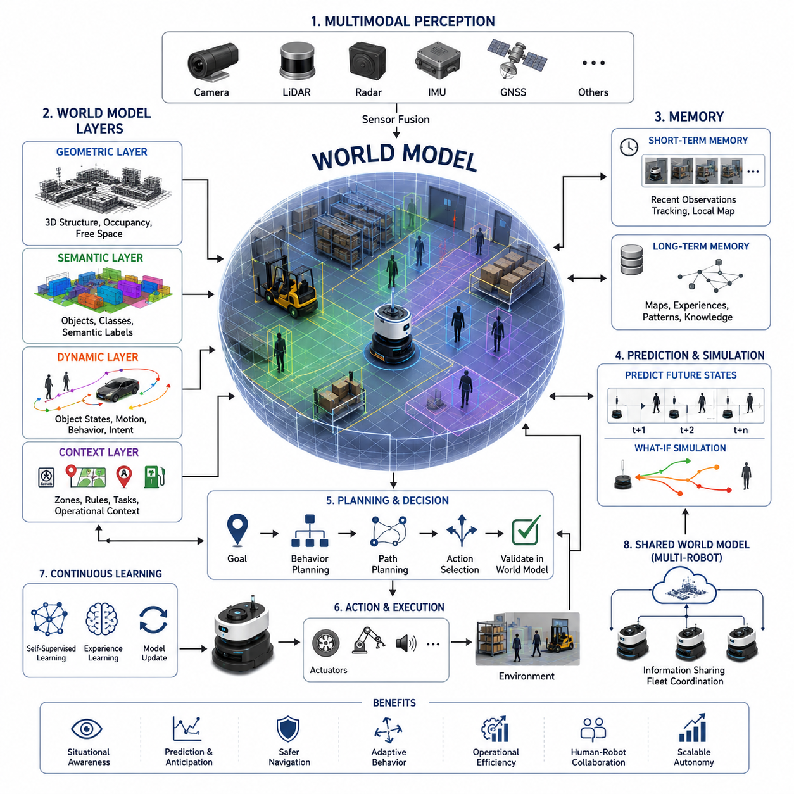
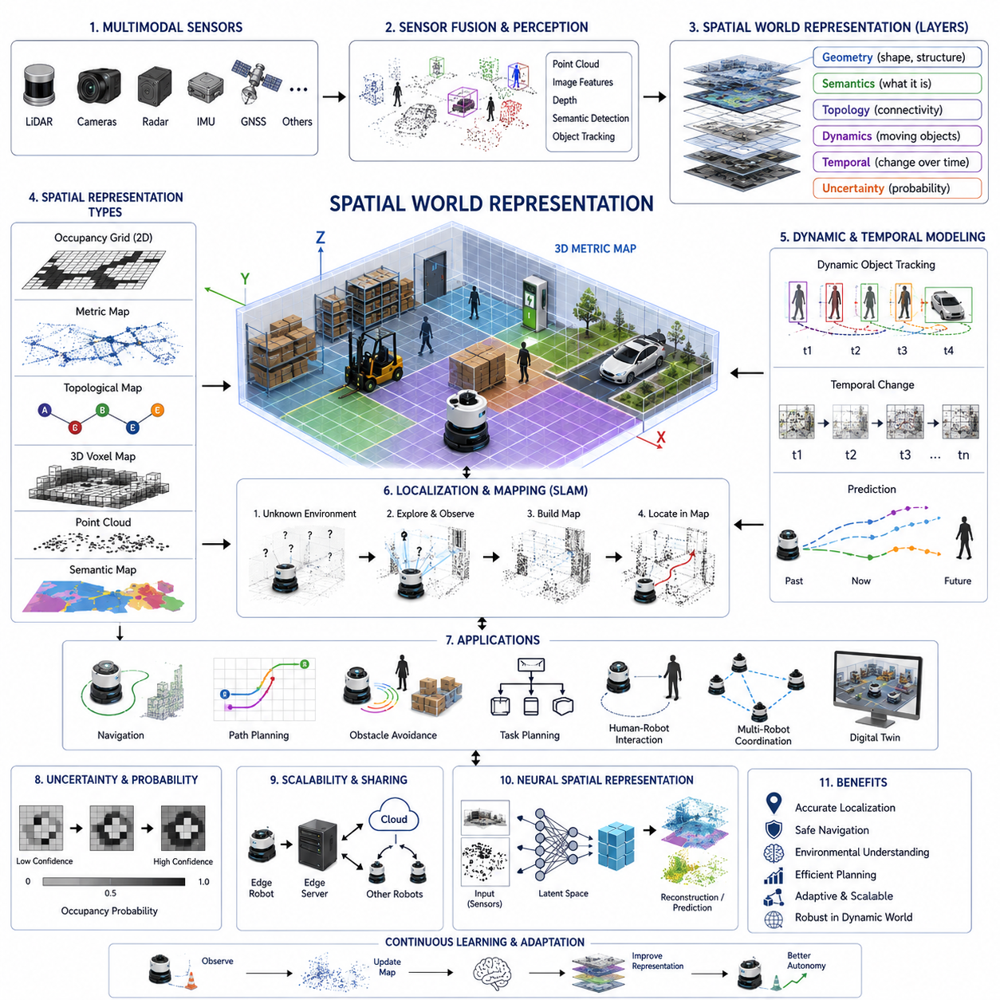
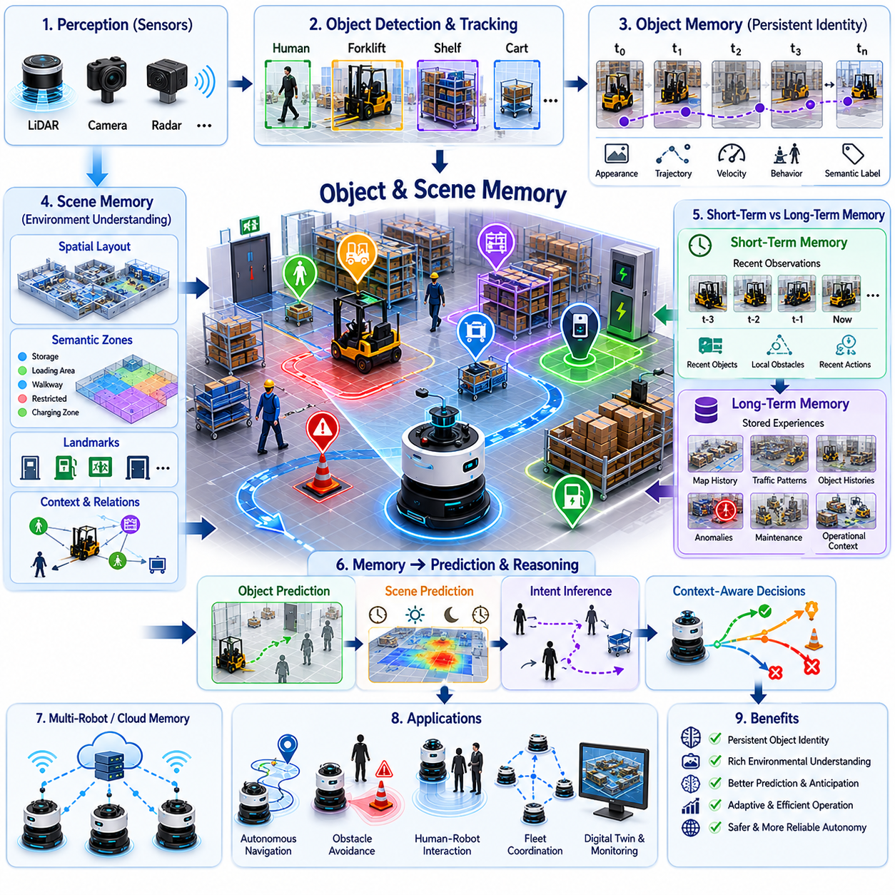
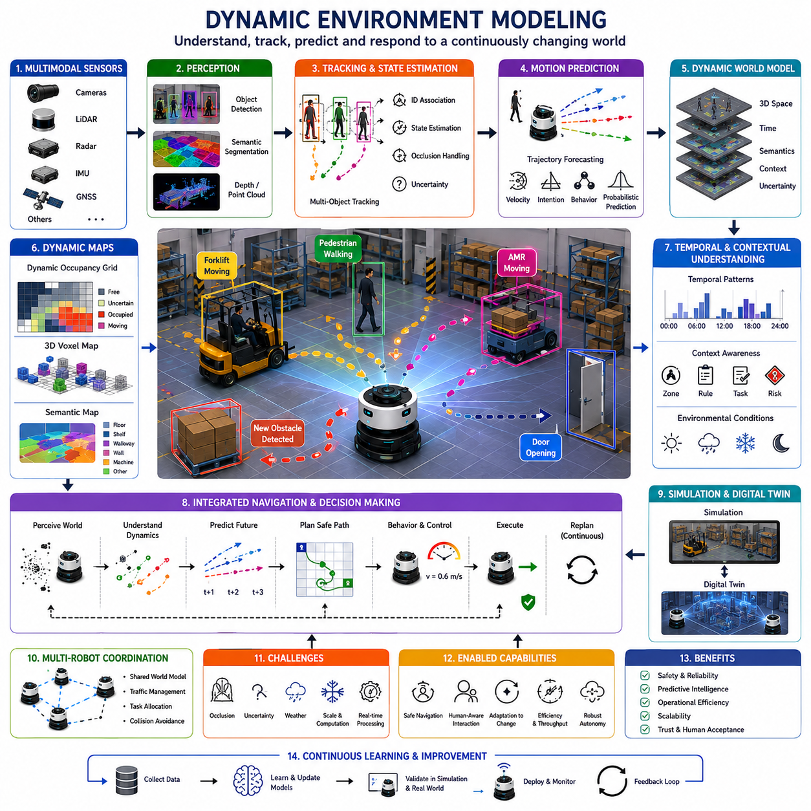
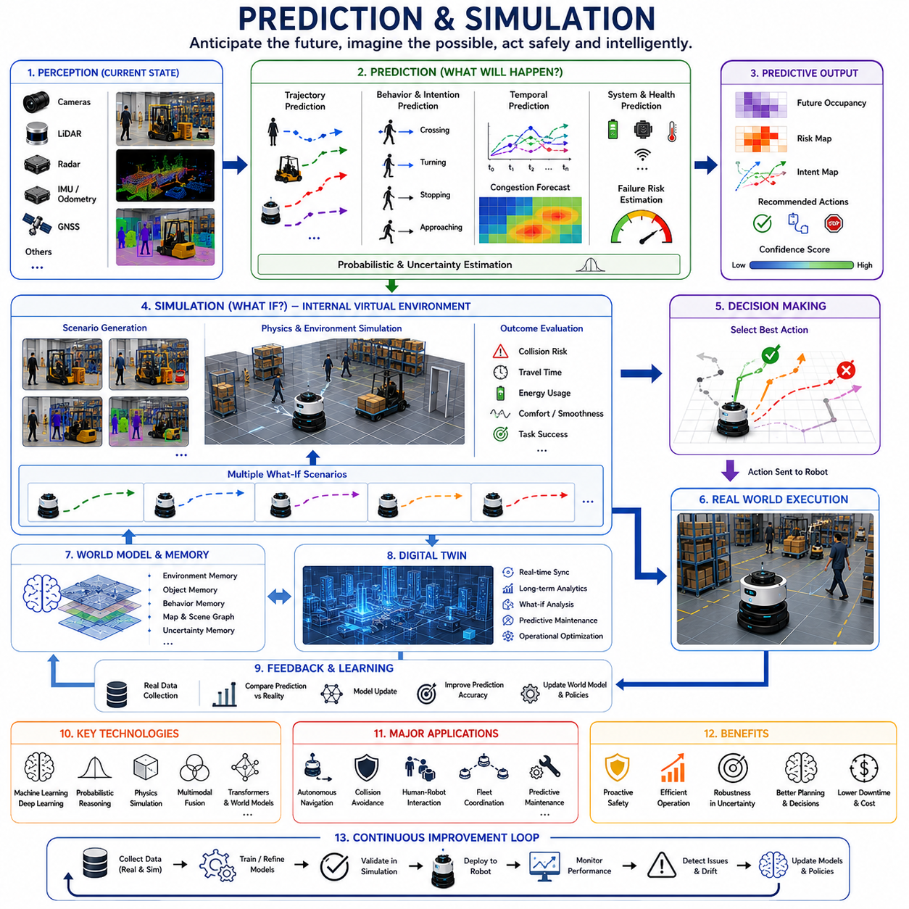
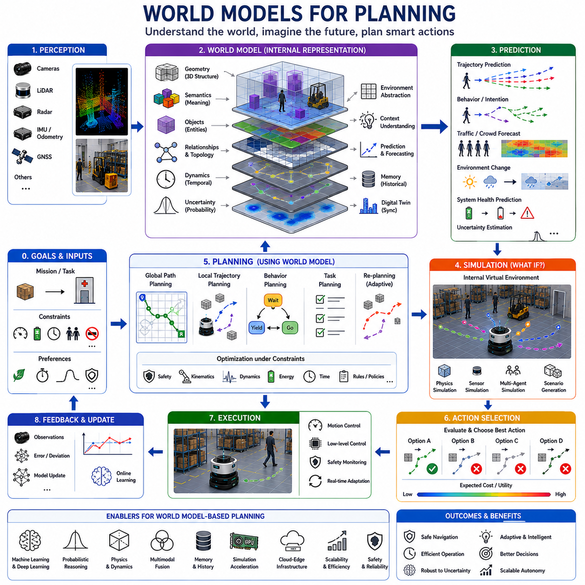
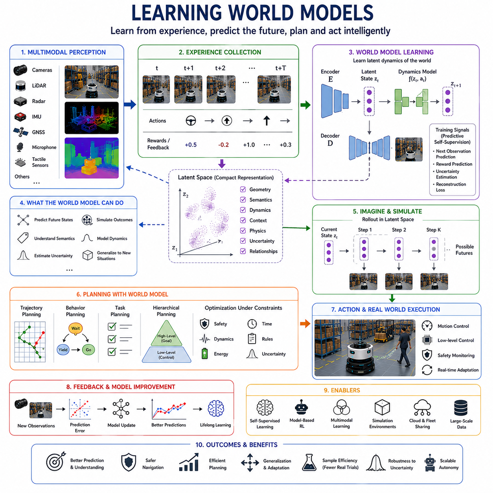
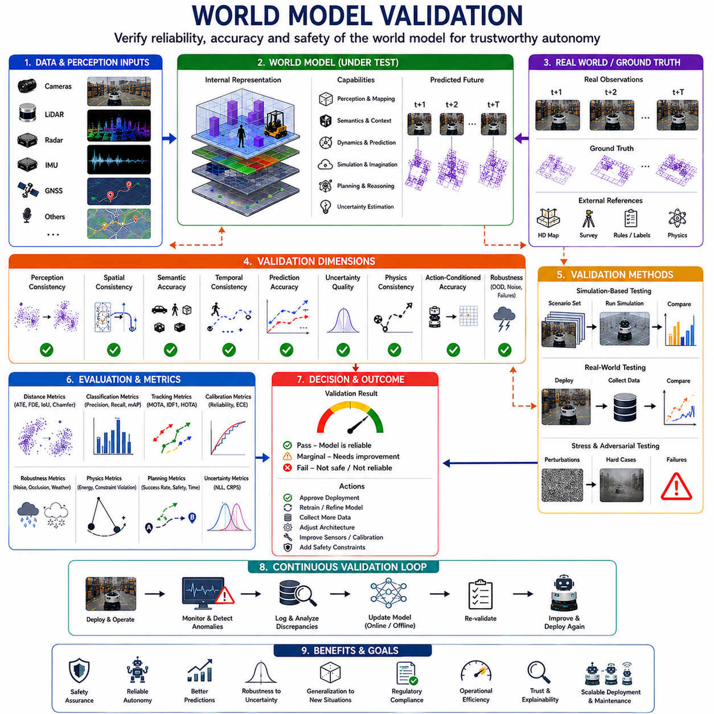

**Volume 06. AMR AI and Embodied Intelligence**

# Chapter 08. World Models

## 08.1 World Model Concepts

{width="7.268055555555556in" height="7.268055555555556in"}

월드 모델(World Model)은 현대 임바디드 인텔리전스(Embodied Intelligence)와 자율주행 로봇 분야에서 가장 중요한 핵심 개념 중 하나이다. 로보틱스에서 월드 모델은 로봇이 주변 환경을 이해하고, 예측하며, 상호작용하기 위해 내부적으로 구축하는 환경 표현 체계를 의미한다. 전통적인 규칙 기반 로봇 시스템이 즉각적인 센서 입력에만 반응했다면, 지능형 로봇은 지속적으로 변화하는 환경에 대한 내부적인 이해를 형성하려고 한다. 이러한 내부 세계 이해는 로봇이 실제 행동을 수행하기 전에 공간, 객체, 인간, 움직임, 미래 상황, 그리고 가능한 행동 결과를 추론할 수 있도록 만든다. 자율주행 모바일 로봇(AMR)에서 월드 모델은 인지, 계획, 예측, 메모리, 의사결정을 연결하는 핵심 인지 계층 역할을 수행한다.

월드 모델은 로봇 내부에 유지되는 현실 세계의 디지털 해석이라고 볼 수 있다. 로봇은 카메라, LiDAR, Radar, Depth Sensor, IMU, GNSS, Thermal Camera, Ultrasonic Sensor 등 다양한 센서를 통해 지속적으로 정보를 수집한다. 그러나 원시 센서 데이터만으로는 환경을 완전히 이해할 수 없다. 센서 데이터는 단지 순간적인 측정값일 뿐이기 때문이다. 월드 모델의 목적은 이러한 분산된 센서 정보를 하나의 일관된 환경 이해 구조로 통합하는 것이다. 이 구조 안에는 공간 구조, 의미 정보, 동적 객체 상태, 환경 조건, 시간적 관계, 장기적인 행동 패턴 등이 포함된다.

현대 AMR 시스템에서 월드 모델은 단순한 지도(Map)가 아니다. 초기 로봇 시스템은 Occupancy Grid나 정적 맵을 환경 표현의 중심으로 사용하였다. 이러한 방식은 Localization과 Navigation에는 여전히 유효하지만, 고차원 지능 구현에는 한계가 있다. 현대 로봇은 훨씬 더 풍부한 문맥(Context) 이해가 필요하다. 단순히 장애물이 어디에 있는지를 넘어서, 그것이 무엇인지, 움직이는지, 미래에 어떻게 행동할 가능성이 있는지, 그리고 로봇이 그것과 어떻게 안전하게 상호작용해야 하는지를 이해해야 한다. 예를 들어 인간 작업자는 벽이나 주차된 차량과 동일하게 처리될 수 없다. 따라서 월드 모델은 Semantic Understanding, 객체 관계, 의도 추정, 예측적 추론까지 포함하는 개념으로 확장된다.

월드 모델 개념은 인지과학, 신경과학, 제어이론, 인공지능, 강화학습 등의 분야에서 영향을 받아 발전해 왔다. 인간은 경험을 통해 자연스럽게 내부적인 세계 모델을 형성한다. 사람이 공장, 병원, 또는 도심 환경을 걸어갈 때, 인간의 뇌는 지속적으로 환경의 미래 상태를 예측한다. 사람은 보행자의 이동, 문이 열릴 가능성, 미끄러운 바닥, 차량 흐름, 물체 간 상호작용 등을 사전에 예상한다. 지능형 로봇은 이러한 능력의 일부를 계산적으로 구현하려고 시도한다. 따라서 월드 모델은 단순 반응형 로봇을 넘어 예측 기반 상황 인지(Predictive Situational Awareness)를 제공하기 위한 시도라고 볼 수 있다.

로보틱스에서 월드 모델은 여러 계층으로 구성될 수 있다. 가장 낮은 계층은 좌표, 거리, 표면, 자유 공간과 같은 기하학적 정보를 표현한다. 이러한 기하학적 표현은 Localization, Obstacle Avoidance, Path Planning에 필수적이다. 그 위에는 Semantic Layer가 존재하며, 여기서 로봇은 객체를 인식하고 환경 요소에 의미를 부여한다. 로봇은 Forklift, Human, Safety Cone, Rail Track, Docking Station, Door, Charging Point, 지하 매설 구조물 표시, 위험 구역 등을 구분할 수 있다. 또 다른 계층은 시간적 이해를 포함하며, 환경이 시간에 따라 어떻게 변화하는지를 모델링한다. 동적인 환경에서는 객체의 미래 이동 경로와 행동 변화를 예측하는 능력이 필요하다.

실외 자율주행 로봇에서는 월드 모델의 복잡성이 실내 환경보다 훨씬 높아진다. 실내 환경은 일반적으로 구조화되어 있고 예측 가능성이 높다. 반면 실외 환경은 날씨 변화, 조명 변화, 험로, 이동 차량, 보행자, 먼지, 비, 안개, 눈과 같은 매우 동적인 요소를 포함한다. 스마트시티나 산업 인프라 점검용 로봇은 센서 노이즈와 불완전한 관측 상황 속에서도 안정적인 환경 표현을 유지해야 한다. 이를 위해 지속적인 Sensor Fusion과 Uncertainty Management가 필요하다. 월드 모델은 완벽하지 않은 정보 상황에서도 안전한 의사결정을 가능하게 해야 한다.

Sensor Fusion은 월드 모델을 구성하는 가장 중요한 핵심 기술 중 하나이다. 단일 센서만으로 현실 세계를 완벽히 표현할 수는 없다. 카메라는 풍부한 Semantic 정보를 제공하지만 어두운 환경이나 악천후에서 성능이 저하될 수 있다. LiDAR는 정밀한 기하학적 측정을 제공하지만 반사체나 흡수체에서는 어려움이 발생할 수 있다. Radar는 악천후에 강하지만 공간 해상도가 낮다. GNSS는 전역 위치 정보를 제공하지만 도시 환경에서는 Multipath 문제가 발생할 수 있다. IMU는 움직임 추정을 지원하지만 시간이 지날수록 Drift가 누적된다. 월드 모델은 이러한 다양한 센서 정보를 하나의 통합된 환경 표현으로 결합한다. 이를 통해 로봇은 단일 센서보다 훨씬 더 신뢰성 높은 환경 이해를 구축할 수 있다.

메모리 또한 월드 모델에서 매우 중요한 요소이다. 지능형 로봇은 단기 메모리와 장기 메모리 구조를 모두 필요로 한다. 단기 메모리는 즉각적인 주행 및 장애물 회피를 지원한다. 장기 메모리는 시설 구조, 운영 구역, 과거 위험 요소, 반복적인 행동 패턴 등을 지속적으로 학습하고 저장한다. 예를 들어 순찰 로봇은 특정 시간대에 특정 구역에 차량이 자주 주차된다는 사실을 학습할 수 있다. 물류 로봇은 창고 통로의 혼잡 패턴을 학습할 수 있다. GPR 점검 로봇은 지하 이상 구조와 과거 유지보수 이력을 연계할 수 있다. 이러한 메모리 구조는 시간이 지남에 따라 로봇의 운영 효율성과 예측 능력을 향상시킨다.

월드 모델은 예측(Prediction)과 깊게 연결되어 있다. 예측은 지능의 핵심 특성 중 하나이다. 사건이 발생한 이후에만 반응하는 로봇은 본질적으로 한계가 있다. 지능형 로봇은 사건이 발생하기 전에 미래 상태를 예측하려고 한다. 예를 들어 작업자가 교차 지점으로 이동 중이라면 로봇은 그 사람의 미래 이동 경로를 예측한다. 비가 강해지면 노면 마찰 감소를 예측하고 속도를 줄인다. 창고 선반 뒤에 부분적으로 가려진 Forklift가 있다면 그 이동 가능 경로를 추론한다. 이러한 예측 능력은 로봇을 단순 자동화 장비에서 선제적 자율 시스템으로 변화시킨다.

시뮬레이션 또한 월드 모델 아키텍처에서 중요한 역할을 수행한다. 고급 월드 모델은 실제 행동을 수행하기 전에 내부적으로 여러 미래 상황을 시뮬레이션할 수 있다. 이는 일종의 "상상(Imagination)" 기능과 유사하다. 로봇은 여러 가능한 행동을 가정하고 각각의 결과를 예측한다. 자율주행에서는 Trajectory Optimization과 Collision Avoidance에 사용된다. Manipulation 작업에서는 Grasp Planning과 Motion Validation에 활용된다. 다중 로봇 환경에서는 협업 행동 및 Traffic Management를 가능하게 한다. 이러한 내부 시뮬레이션은 실제 행동 이전에 위험한 행동을 제거할 수 있기 때문에 안전성을 크게 향상시킨다.

최근 AI 기술 발전은 Neural World Model의 개념을 빠르게 발전시키고 있다. 전통적인 로보틱스는 수작업으로 설계된 환경 표현과 결정론적 알고리즘에 의존하였다. 그러나 최근 Deep Learning, Transformer Architecture, Self-Supervised Learning, Generative AI 기술이 발전하면서 로봇은 대규모 센서 데이터로부터 환경 표현을 직접 학습할 수 있게 되었다. Neural World Model은 공간적 관계와 시간적 관계를 동시에 포함하는 Latent Representation을 학습한다. 이러한 모델은 명시적인 수작업 프로그래밍 없이도 환경 변화와 객체 상호작용을 학습할 수 있다.

Transformer 기반 구조는 월드 모델 연구에서 특히 중요해지고 있다. Transformer는 긴 시퀀스 데이터를 처리하고 시간에 걸친 Context를 유지할 수 있다. 이를 통해 로봇은 시간적 연속성과 다단계 환경 변화를 이해할 수 있다. Vision Transformer, Multimodal Transformer, Vision-Language-Action Architecture 등은 로봇 추론 능력을 향상시키고 있다. 이러한 모델은 시각 정보, 언어 명령, 작업 목표, 미래 결과 예측을 하나의 통합 구조 안에서 연결할 수 있다.

Embodied AI 시스템에서 월드 모델은 행동 생성(Action Generation)과 밀접하게 연결된다. 로봇은 지속적으로 환경을 관찰하고, 월드 모델을 업데이트하며, 미래 상태를 예측하고, 최적 행동을 선택한 후, 그 행동의 결과를 다시 관찰한다. 이러한 Closed Loop Interaction은 임바디드 인텔리전스의 핵심 구조이다. 디지털 AI와 달리 로봇은 실제 물리 환경 안에서 동작하며, 행동은 실제 결과를 만들어낸다. 따라서 월드 모델의 품질은 로봇의 안전성, 신뢰성, 자율성 수준에 직접적인 영향을 준다.

월드 모델은 자율주행 및 계획 시스템에서도 핵심 역할을 한다. 모든 Path Planning 알고리즘은 정확한 환경 표현에 의존한다. 정적인 경로 계획만으로는 동적인 산업 환경에서 충분하지 않다. 로봇은 이동 장애물, 환경 변화, 운영 우선순위에 따라 지속적으로 경로를 업데이트해야 한다. 따라서 월드 모델은 Navigation System의 중앙 지식 저장소 역할을 수행한다. Localization, Perception, Planning, Fleet Management, Safety Controller 모두가 일관된 세계 표현에 의존한다.

다중 로봇 시스템에서는 Shared World Model의 중요성이 더욱 커진다. Fleet Robotics 환경에서는 여러 로봇이 Cloud 또는 Edge Network를 통해 환경 정보를 공유할 수 있다. 한 로봇이 막힌 통로를 발견하면 이를 다른 로봇에게 공유할 수 있다. 또 다른 로봇은 미끄러운 노면이나 임시 위험 요소를 감지할 수 있다. Shared World Model은 운영 협업 효율을 높이고, 중복 작업을 줄이며, 전체 시스템의 상황 인지 능력을 향상시킨다. Cloud Robotics와 Edge-Cloud Hybrid Architecture는 이러한 미래 월드 모델 발전과 깊게 연결되어 있다.

월드 모델의 가장 큰 기술적 과제 중 하나는 불확실성 관리(Uncertainty Management)이다. 현실 세계는 본질적으로 불완전하고 예측 불가능하다. 센서는 노이즈를 포함하며, 가려짐(Occlusion)이 빈번하고, 통신 지연이 존재하며, 환경은 끊임없이 변화한다. 로봇은 절대로 완벽한 정보를 가질 수 없다. 따라서 월드 모델은 불확실성을 명시적으로 표현해야 한다. Bayesian Filtering, Particle Filter, Kalman Filter, Uncertainty-Aware Neural Network 등의 기법이 환경 이해의 신뢰도를 추정하기 위해 사용된다. 안전한 로보틱스 시스템은 로봇이 "무엇을 알고 있는가"뿐 아니라 "무엇을 모르는가"까지 인식할 수 있어야 한다.

확장성(Scalability) 또한 중요한 과제이다. 로봇이 더 넓은 환경에서 장기간 운영될수록 누적 데이터 양은 폭발적으로 증가한다. 고해상도 LiDAR 스캔, 멀티 카메라 영상, Radar 데이터, Semantic Label, 시간 이력 데이터는 매우 큰 계산 자원을 요구한다. 따라서 Efficient Memory Management, Hierarchical Mapping, Compression Algorithm, Edge AI Optimization, Cloud Synchronization 기술이 필수적으로 요구된다. 또한 로봇은 밀리초 단위의 실시간 의사결정을 수행해야 하기 때문에 이러한 계산 요구사항은 더욱 어려운 문제가 된다.

산업용 로보틱스에서 월드 모델은 운영 문맥까지 통합해야 한다. 물류 로봇은 재고 구역, 적재 구역, 작업자 공간, 물류 흐름을 이해해야 한다. 병원 로봇은 의료 제한 구역, 환자 상호작용 규칙, 엘리베이터 시스템, 응급 절차를 이해해야 한다. 스마트시티 로봇은 교통 규칙, 보행자 안전, 날씨 상태, 도시 인프라 구조를 이해해야 한다. 따라서 월드 모델은 단순한 공간 표현이 아니라, 운영 지능(Operation Intelligence)이 내장된 환경 이해 구조라고 할 수 있다.

미래의 월드 모델은 더욱 멀티모달하고, 예측 기반이며, 자기 학습(Self-Learning) 능력을 가지게 될 것으로 예상된다. 차세대 임바디드 AI 시스템은 지속적인 현장 운영 경험을 통해 스스로 학습할 수 있게 될 것이다. 로봇은 수개월 또는 수년 동안 유지되는 장기 환경 메모리를 구축할 수 있을 것이다. 대규모 World Foundation Model은 도시, 공장, 병원, 산업 시설 간 일반화 능력을 제공할 수 있다. 또한 Digital Twin, Simulation Platform, Cloud Robotics, AGI 기반 추론 시스템과 결합되면서 로봇의 인지 능력은 더욱 확장될 것이다.

월드 모델의 발전은 전통적인 자동화 시스템에서 진정한 임바디드 인텔리전스로의 전환을 의미한다. 과거의 로봇은 제한된 환경에서 고정된 명령만 수행했다. 미래의 로봇은 동적인 내부 세계 표현을 유지하고, 불확실성을 추론하며, 미래를 예측하고, 환경 변화에 적응하며, 인간과 다른 로봇과 협력하게 될 것이다. 이러한 의미에서 월드 모델은 단순한 지도 시스템이 아니다. 그것은 지능형 로봇이 물리 세계를 이해하고, 예측하며, 안전하게 상호작용할 수 있도록 만드는 핵심 인지 인프라라고 할 수 있다.

## 08.2 Spatial World Representation

{width="7.268055555555556in" height="7.268055555555556in"}

공간 월드 표현(Spatial World Representation)은 지능형 로보틱스와 임바디드 AI 시스템에서 가장 핵심적인 구성 요소 중 하나이다. 이는 로봇이 물리 세계를 이해하고, 주행하며, 상호작용하기 위해 내부적으로 구축하는 공간적 이해 체계를 의미한다. Perception 시스템이 센서로부터 원시 데이터를 수집한다면, Spatial Representation은 이러한 관측 데이터를 구조화된 환경 모델로 조직하여 로봇이 기하학적 구조, 위치, 움직임, 장애물, 자유 공간, 환경 관계 등을 추론할 수 있도록 만든다. 자율주행 모바일 로봇(AMR)에서 Spatial World Representation은 Localization, Mapping, Navigation, Prediction, Planning, Decision-Making의 기반이 되는 핵심 구조라고 할 수 있다.

현실 세계에서 동작하는 로봇은 벽, 도로, 선반, 사람, 차량, 기계, 지형, 다양한 동적 객체들로 구성된 복잡한 환경을 지속적으로 마주하게 된다. 만약 로봇이 내부적인 공간 표현 능력을 가지지 못한다면 단순히 센서 신호에 반응하는 수준에 머물게 되며, 자신의 위치와 환경의 관계를 이해할 수 없게 된다. Spatial Representation은 로봇이 "현재 어디에 있는가", "장애물이 어디에 존재하는가", "어느 공간이 이동 가능한가", "객체들이 어떻게 배치되어 있는가", "환경이 시간에 따라 어떻게 변화하는가"와 같은 핵심 질문에 답할 수 있도록 만든다.

로보틱스에서의 공간 표현은 인간의 공간 인지와 유사한 목적을 가지지만 구현 방식은 상당히 다르다. 인간은 시각, 기억, 경험을 기반으로 풍부한 공간적 정신 모델(Mental Model)을 자연스럽게 구축한다. 사람이 공장 내부를 걸을 때 복도의 구조를 기억하고, 위험 구역을 인식하며, 사람과 차량의 흐름을 예측하고, 거리와 방향을 거의 무의식적으로 판단한다. 로봇은 이러한 능력의 일부를 수학적 모델, Sensor Fusion, AI 알고리즘을 통해 구현하려고 시도한다. 따라서 Spatial World Representation은 환경 인지(Environmental Awareness)의 계산적 구현체라고 볼 수 있다.

초기 로봇 시스템은 매우 단순한 공간 표현 구조를 사용하였다. 많은 산업용 로봇은 고정된 환경에서 동작했기 때문에 복잡한 환경 이해가 필요하지 않았다. 그러나 자율주행 로봇이 동적인 환경으로 확장되면서 공간 표현은 로보틱스와 AI 분야의 핵심 연구 영역이 되었다. 자율성을 확보하기 위해서는 로봇이 스스로 환경을 이해하고 구조화할 수 있어야 하기 때문이다.

가장 기본적인 공간 표현 방식 중 하나는 Occupancy Grid Map이다. 이 방식에서는 환경을 격자(Cell)로 나누고, 각 셀에 장애물이 존재할 확률을 저장한다. Occupancy Grid는 비교적 직관적이며 계산 관리가 용이하기 때문에 널리 사용되어 왔다. LiDAR와 Depth Sensor는 이러한 Grid를 실시간으로 업데이트하는 데 자주 사용된다. 로봇은 새로운 센서 데이터가 들어올 때마다 각 셀의 점유 확률을 지속적으로 갱신한다. Occupancy Grid는 Navigation과 Obstacle Avoidance에 매우 유용하지만, 이는 현대 공간 이해의 한 계층에 불과하다.

Metric Map은 또 다른 중요한 공간 표현 방식이다. Metric Representation은 정밀한 기하학적 거리와 좌표 체계를 중심으로 구성된다. 이러한 지도는 정확한 거리, 각도, 위치를 유지하기 때문에 Localization과 Trajectory Planning에 적합하다. 실내 로봇에서는 복도, 방, Docking Station, Storage Area 등을 센티미터 수준의 정밀도로 표현한다. 실외 로봇에서는 GNSS 기반 좌표 체계, 지형 구조, 도로 형상, 지리적 Landmark 등이 포함될 수 있다.

Topological Map은 공간 관계를 다른 방식으로 표현한다. 이 방식은 정확한 기하학 정보보다는 의미 있는 위치 간 연결 관계에 집중한다. 예를 들어 교차 지점, 복도, 충전 구역, 작업 스테이션 등을 Node로 표현하고 이동 가능한 경로를 Edge로 연결한다. 이는 인간의 공간 인지 방식과도 유사하다. 사람은 정확한 좌표를 기억하기보다는 "이 방이 저 복도와 연결되어 있다" 또는 "이 통로가 계단으로 이어진다"와 같은 관계 중심으로 환경을 기억한다. Topological Representation은 계산 효율성이 높고 고수준 경로 계획에 적합하다.

현대 로보틱스에서는 Metric 방식과 Topological 방식을 결합한 Hybrid Spatial Representation이 점점 더 중요해지고 있다. 이러한 Hybrid Representation은 로봇이 정밀한 기하학 정보를 유지하면서도 의미적 연결성과 Navigation 관계를 동시에 이해할 수 있도록 만든다. 예를 들어 물류 로봇은 로컬 Obstacle Avoidance에는 Metric Map을 사용하고, 창고 전체 이동 경로 계획에는 Topological Structure를 사용할 수 있다. 이러한 계층형 공간 표현은 확장성과 운영 효율성을 동시에 향상시킨다.

3차원 공간 표현은 로봇 환경이 복잡해질수록 더욱 중요해지고 있다. 전통적인 2D Map은 다층 구조, 험로, 실외 환경, 산업 플랜트, 도시 인프라와 같은 복잡한 환경에서는 충분하지 않다. 3D Spatial Model은 높이, 경사도, 물체의 높이, Overhang, 지형 불규칙성, 구조물 형상 등을 표현할 수 있다. 3D LiDAR, Stereo Vision, Depth Camera, Photogrammetry, Neural Radiance Field와 같은 기술이 풍부한 3D 환경 이해를 가능하게 한다.

Point Cloud는 가장 널리 사용되는 3D 공간 표현 방식 중 하나이다. LiDAR는 환경 표면을 표현하는 수백만 개의 공간 점(Point)을 생성한다. 이러한 Point Cloud는 매우 정밀한 기하학 정보를 제공하며 환경 구조를 재구성하는 데 사용된다. 그러나 원시 Point Cloud는 계산 비용이 매우 크고 직접 해석하기 어렵다. 따라서 로봇은 Point Cloud를 Voxel Grid, Mesh, Semantic Map, Compressed Spatial Embedding 등의 고수준 표현으로 변환하여 사용한다.

Voxel Representation은 Occupancy 개념을 3차원으로 확장한 방식이다. 환경을 3차원 큐브 단위로 나누고 각 Voxel에 점유 정보, Semantic Label, 확률 정보, 동적 상태 등을 저장한다. Voxel 기반 표현은 드론, 실외 로봇, 건설 로봇, 복잡한 산업 환경 등에서 특히 유용하다. 이러한 환경에서는 높이 변화와 공간 구조가 Navigation에 직접적인 영향을 주기 때문이다.

Semantic Spatial Representation은 기하학적 지도에 의미(Context)를 추가하는 개념이다. 전통적인 지도는 단지 객체의 위치를 표현하지만, Semantic Map은 객체가 무엇인지까지 설명한다. 예를 들어 도로, 보도, 문, 사람, Forklift, 충전 스테이션, 안전 구역, 지하 파이프라인, 철도 구조물, 위험 구역 등을 구분할 수 있다. 이러한 Semantic Understanding은 로봇 지능을 크게 향상시킨다. Navigation과 행동 결정은 단순한 형태 정보보다 객체의 의미에 더 크게 의존하기 때문이다.

예를 들어 병원 로봇은 환자, 의료 장비, 제한 구역, 응급 통로를 구분할 수 있어야 한다. 물류 로봇은 선반 구역, 적재 구역, Forklift 동선, 작업자 공간을 이해해야 한다. 스마트시티 점검 로봇은 도로, 횡단보도, 유틸리티 구조물, 차량, 공공 안전 구역을 인식해야 한다. 따라서 공간 표현은 단순 지도에서 운영 지능(Operation Intelligence) 기반 환경 이해로 발전하고 있다.

Spatial Representation은 Localization과도 깊게 연결된다. 로봇은 자신의 위치를 월드 모델 내에서 지속적으로 추정해야 한다. Localization 알고리즘은 현재 센서 데이터를 저장된 공간 표현과 비교하여 현재 Pose를 계산한다. 이를 위해 LiDAR Scan Matching, Visual Feature Tracking, GNSS Integration, IMU Fusion, Wheel Odometry, Graph Optimization 등이 사용된다. 정확한 Localization은 강력한 Spatial Representation 품질에 의존한다.

SLAM(Simultaneous Localization and Mapping)은 Spatial World Representation과 가장 밀접한 핵심 기술 중 하나이다. SLAM은 로봇이 지도를 생성하면서 동시에 자신의 위치를 추정할 수 있도록 만든다. 이는 미지 환경이나 변화하는 환경에서 동작하는 로봇에 필수적이다. 현대 SLAM 시스템은 Geometric Reconstruction, Probabilistic Estimation, Sensor Fusion, Loop Closure Optimization 등을 결합하여 장기적으로 일관된 공간 이해를 유지한다.

동적 환경 모델링(Dynamic Environment Modeling)은 또 다른 중요한 과제이다. 많은 전통적인 Mapping 시스템은 환경이 정적이라고 가정한다. 그러나 현실 세계에는 사람, 차량, 로봇, 문, 기계, 임시 장애물 등이 지속적으로 움직인다. 따라서 지능형 공간 표현 시스템은 정적 요소와 동적 요소를 구분할 수 있어야 한다. Dynamic Object Tracking은 객체의 이동 경로, 속도, 미래 움직임을 추정하여 Predictive Navigation과 Collision Avoidance를 지원한다.

Temporal Representation 역시 중요성이 증가하고 있다. 공간 이해는 단일 시점의 정적인 기하학 정보만을 의미하지 않는다. 로봇은 환경이 시간에 따라 어떻게 변화하는지를 이해해야 한다. 예를 들어 창고 복도는 특정 시간에 혼잡해질 수 있고, 실외 교통 흐름은 시간대별로 달라질 수 있으며, 건설 현장은 지속적으로 구조가 바뀔 수 있다. 따라서 Temporal World Model은 과거 관측 정보와 미래 예측 정보를 공간 추론 안에 통합한다.

Multimodal Sensor Fusion은 정확한 공간 표현의 핵심 요소이다. 서로 다른 센서는 상호 보완적인 정보를 제공한다. 카메라는 풍부한 Texture와 Semantic 정보를 제공하고, LiDAR는 정밀한 Geometry를 제공한다. Radar는 악천후 환경에서 강인성을 제공하며, IMU는 Motion Estimation을 지원한다. GNSS는 전역 위치를 제공하고, Thermal Camera는 열 정보를 제공하며, Ultrasonic Sensor는 근거리 감지에 유리하다. 로봇은 이러한 모든 정보를 통합하여 단일 센서보다 훨씬 신뢰성 높은 공간 표현을 구축한다.

환경 불확실성(Environmental Uncertainty)은 Spatial World Modeling의 가장 큰 난제 중 하나이다. 센서는 노이즈를 포함하고, 가려짐(Occlusion)이 자주 발생하며, 조명과 날씨는 지속적으로 변화하고, 객체는 예측 불가능하게 등장하거나 사라질 수 있다. 따라서 공간 표현은 종종 확률 기반 신뢰도 정보를 포함한다. Bayesian Filtering, Kalman Filter, Particle Filter, Probabilistic Occupancy Method 등은 불확실성 상황에서도 안전한 의사결정을 가능하게 한다.

대규모 환경에서의 확장성(Scalability) 또한 중요한 문제이다. 산업 시설, 스마트시티, 물류 센터, 철도 네트워크, 실외 인프라 환경은 막대한 공간 데이터를 생성한다. 고해상도 Point Cloud, Semantic Map, Dynamic Object History, Temporal Observation은 매우 큰 계산 자원을 요구한다. 따라서 Efficient Map Compression, Hierarchical Mapping, Distributed Cloud Synchronization, Edge AI Optimization 기술이 필수적이다.

Cloud Robotics는 Spatial Representation 구조에도 큰 영향을 미치고 있다. 로봇은 모든 지도를 로컬에 저장하는 대신 Edge-Cloud Infrastructure를 통해 공간 정보를 공유할 수 있다. Fleet Robot은 협업적으로 지도를 업데이트하고 환경 변화를 공유할 수 있다. 이러한 Shared Spatial Representation은 대규모 스마트 팩토리, 병원, 공항, 항만, 스마트시티 환경에서 매우 중요해진다.

Neural Spatial Representation은 최근 급속히 성장하는 연구 분야이다. 전통적인 지도는 수작업 기반 구조가 많고 유연성이 제한적이었다. 그러나 최근 Deep Learning과 Embodied AI 발전으로 인해 로봇은 센서 경험으로부터 직접 공간 표현을 학습할 수 있게 되었다. Neural Network는 Geometry, Semantic, Object Relationship, Temporal Dynamics를 Latent Representation 형태로 압축하여 표현할 수 있다. Vision Transformer, Neural Implicit Representation, Graph Neural Network, World Foundation Model 등이 이러한 고급 공간 추론에 사용되고 있다.

Neural Radiance Field(NeRF) 기반 표현은 미래 공간 모델링의 유망한 방향 중 하나이다. NeRF는 이미지 관측으로부터 매우 정밀한 3D 장면을 재구성하며 다양한 시점에서의 환경 렌더링을 가능하게 한다. 현재는 계산 비용이 높지만, 향후 최적화가 이루어지면 로봇이 현실적인 내부 공간 표현을 유지하며 Navigation, Simulation, Interaction에 활용할 가능성이 크다.

Spatial World Representation은 Digital Twin 기술과도 깊게 연결된다. Digital Twin은 물리 세계의 실시간 가상 복제 시스템이다. 산업 시설 내 로봇은 센서를 통해 Digital Twin 환경을 지속적으로 업데이트할 수 있다. 이를 통해 Remote Monitoring, Predictive Maintenance, Operational Simulation, Fleet Optimization 등이 가능해진다. 따라서 공간 표현은 단순한 지도 기술을 넘어 Cyber-Physical Intelligence Infrastructure의 핵심 구성 요소가 된다.

Human-Robot Interaction 역시 공간 이해에 크게 의존한다. 인간 주변에서 동작하는 로봇은 개인 공간, 보행 방향, 사회적 이동 패턴, 인간 의도 등을 이해해야 한다. Socially Aware Navigation은 단순한 Geometry뿐 아니라 행동 기반 공간 이해를 요구한다. 병원 복도나 공공장소에서 로봇은 인간의 이동 패턴을 예측하고 안전 거리를 유지해야 한다.

미래의 Spatial World Representation은 더욱 Semantic하고, Predictive하며, Adaptive하고, Self-Learning 구조로 발전할 것이다. 미래 로봇은 정적인 지도를 유지하는 대신 장기적인 경험을 통해 환경 이해를 지속적으로 진화시킬 것이다. 공간 표현은 물리 시뮬레이션, 언어 기반 추론, 운영 메모리, 예측적 추론, 멀티모달 문맥 이해를 하나의 통합된 Embodied World Model 안으로 결합하게 될 것이다.

임바디드 AI 시스템이 발전할수록 Spatial Representation은 지능형 자율성을 가능하게 하는 핵심 기술로 남게 될 것이다. 강력한 공간 이해 없이 로봇은 안전하게 주행할 수도 없고, 효과적으로 추론할 수도 없으며, 미래를 예측하거나 인간과 협력하거나 변화하는 환경에 적응할 수도 없다. 따라서 Spatial World Representation은 자율 로보틱스의 구조적 기반이며, 원시 센서 데이터를 실제 행동 가능한 환경 지능으로 변환하는 핵심 기술이라고 할 수 있다.

## 08.3 Object and Scene Memory

{width="7.268055555555556in" height="7.268055555555556in"}

객체 및 장면 메모리(Object and Scene Memory)는 지능형 임바디드 로보틱스와 자율주행 모바일 시스템에서 요구되는 가장 핵심적인 인지 능력 중 하나이다. 로보틱스에서 메모리는 단순한 데이터 저장 기능이 아니다. 그것은 로봇이 시간의 흐름 속에서도 지능적으로 동작할 수 있도록 만들어 주는 객체, 환경, 관계, 경험, 문맥 정보에 대한 지속적인 내부 표현 체계이다. Object Memory는 인간, 차량, 도구, Docking Station, 선반, 기계, 장애물과 같은 특정 객체를 기억하도록 해주며, Scene Memory는 환경 레이아웃, 운영 상태, 공간 관계, Semantic Context, 과거 환경 상태와 같은 더 넓은 환경 이해를 유지하도록 만든다. 이 두 가지 메모리 구조는 장기 자율성(Long-Term Autonomy), 예측 기반 추론(Predictive Reasoning), 적응형 Navigation, 지능형 의사결정의 핵심 기반이 된다.

전통적인 로봇은 사실상 메모리 없이 동작하였다. 초기 산업용 시스템은 고도로 제어된 환경 안에서 결정론적 규칙과 사전 정의된 워크플로우에 의존하였다. 이러한 로봇은 즉각적인 센서 입력에만 반응했으며 의미 있는 장기 환경 이해를 유지하지 못했다. 센서 관측이 사라지면 로봇은 사실상 환경을 "잊어버리는" 구조였다. 이러한 시스템은 반복적인 산업 자동화에는 충분했지만, 실제 현실 환경에서의 자율 운영에는 한계가 있었다. 현대의 AMR은 매우 동적이고 불확실한 환경 안에서 지속적으로 동작해야 한다. 따라서 로봇은 객체가 이전에 어디에 있었는지 기억하고, 반복적인 환경 패턴을 인식하며, 미래 상황을 예측하고, 시간에 따른 운영 변화를 학습할 수 있어야 한다.

인간의 인지 구조는 로봇 메모리 시스템을 이해하는 데 중요한 비유가 된다. 인간은 환경과 상호작용하면서 객체와 장면에 대한 기억을 지속적으로 구축한다. 사람이 창고에 들어가면 선반 위치, Forklift 이동 패턴, 제한 구역, 충전 스테이션, 과거 사고 사례 등을 기억한다. 또한 특정 시간에 어느 구역이 혼잡해지는지와 같은 시간 기반 정보도 기억한다. 지능형 로봇은 이러한 능력의 일부를 계산적으로 구현하려고 한다. 따라서 Object and Scene Memory는 머신 기반 상황 인지(Machine Situational Awareness)와 임바디드 인텔리전스의 핵심 구성 요소라고 할 수 있다.

Object Memory는 로봇이 환경 안의 개별 객체에 대한 지속적인 이해를 유지하는 능력을 의미한다. 이러한 객체는 벽, 문, 선반, 유틸리티 구조물, 철도 레일, 기계, 충전 스테이션과 같은 정적 객체일 수도 있고, 보행자, Forklift, 차량, 다른 로봇과 같은 동적 객체일 수도 있다. 중요한 점은 로봇이 객체를 단순히 순간적으로 감지하는 것이 아니라, 객체가 센서 시야에서 사라진 이후에도 그 객체의 존재를 지속적으로 기억하려 한다는 것이다.

지속적인 객체 추적(Persistent Object Tracking)은 로보틱스에서 매우 어려운 문제 중 하나이다. 현실 환경에서는 객체가 벽, 선반, 차량, 구조물 등에 의해 자주 가려진다(Occlusion). 예를 들어 창고를 주행하는 로봇은 Storage Rack 뒤로 이동한 Forklift를 일시적으로 보지 못할 수 있다. 그러나 로봇은 여전히 그 Forklift의 존재와 예상 이동 경로를 기억해야 한다. 마찬가지로 실외 순찰 로봇은 주차 차량 뒤로 가려진 보행자를 일시적으로 잃어버리더라도 그 사람의 예상 이동 방향을 유지해야 한다. 이러한 연속적인 환경 이해는 강력한 Object Memory 시스템 없이는 불가능하다.

Object Memory 시스템은 일반적으로 Perception, Tracking, Prediction, Temporal Reasoning을 결합하여 구성된다. 카메라, LiDAR, Radar, Depth Sensor는 환경 내 객체를 관측한다. Tracking Algorithm은 연속 프레임 사이에서 객체의 Identity를 유지한다. Prediction Module은 미래 위치와 이동 방향을 추정한다. Memory System은 객체의 Appearance, Trajectory, Behavior Pattern, Semantic Label, Interaction History, Operational Significance 등을 장기적으로 저장한다.

Semantic Identity는 Object Memory에서 매우 중요한 역할을 한다. 로봇은 단순히 객체의 존재만이 아니라 그것이 어떤 종류의 객체인지를 이해해야 한다. 인간, Forklift, 철도 차량, 응급 장비, 공사 장벽, 배송 카트는 각각 서로 다른 움직임 특성, 안전 규칙, 운영 의미를 가진다. 따라서 Semantic Object Memory는 Behavior-Aware Navigation과 Context-Sensitive Planning을 가능하게 만든다.

Scene Memory는 개별 객체를 넘어서 환경 전체에 대한 통합적인 이해를 의미한다. Scene은 로봇 주변 환경 전체의 구조를 의미한다. Scene Memory는 환경 레이아웃, 공간 구조, Semantic Relationship, Operational Zone, Environmental Condition, 장기적인 문맥 패턴 등을 시간에 걸쳐 유지한다. Object Memory가 개별 객체 중심이라면, Scene Memory는 환경 전체를 하나의 운영 공간으로 이해하는 구조라고 볼 수 있다.

Scene Memory는 로봇이 익숙한 환경을 인식하고 예상 가능한 상황을 추론할 수 있도록 만든다. 예를 들어 병원 로봇은 복도 구조, 엘리베이터 위치, 환자실, 응급 출구, 제한 의료 구역을 기억할 수 있다. 물류 로봇은 교대 시간에 Loading Bay 근처가 혼잡해진다는 사실을 기억할 수 있다. 스마트시티 점검 로봇은 특정 교차로나 버스 정류장 근처의 반복적인 보행자 밀도 패턴을 기억할 수 있다. 이러한 축적된 경험은 장기 운영 시 효율성과 안전성을 동시에 향상시킨다.

Spatial Memory는 Scene Memory의 가장 중요한 구성 요소 중 하나이다. Spatial Memory는 환경의 기하학적 및 Topological 구조를 장기간 유지하는 기능이다. 여기에는 방 구조, 이동 경로, 장애물 위치, 지형 구조, Docking Station, Landmark 등이 포함된다. Spatial Memory는 Localization, Navigation, Route Optimization, 장기 Map Consistency를 지원한다.

Temporal Memory는 환경 이해 안에 시간 개념을 추가한다. 로봇은 단순한 공간 관계뿐 아니라 시간에 따른 행동 패턴도 이해해야 한다. 특정 환경은 시간대, 날씨, 운영 스케줄, 인간 활동 주기에 따라 변화한다. 예를 들어 창고 복도는 적재 작업 시간대에 혼잡해질 수 있다. 실외 인프라 환경은 시간대별로 보행자 밀도가 달라질 수 있다. 병원은 응급 상황 시 운영 패턴이 달라질 수 있다. Temporal Scene Memory는 로봇이 이러한 반복적 환경 변화를 사전에 예측하도록 만든다.

Contextual Memory 또한 중요한 계층이다. 이는 객체와 장소에 연결된 운영 의미를 저장하는 메모리이다. 예를 들어 충전 스테이션은 단순한 물리 객체가 아니라 로봇 운영에 필수적인 자원이다. 제한 산업 구역은 저속 주행이나 추가 안전 검증이 필요한 장소일 수 있다. 공사 현장은 임시 위험 구역일 수 있다. Contextual Memory는 환경 정보와 운영 규칙, 행동 정책을 연결한다.

Long-Term Memory는 로봇이 수일, 수개월, 심지어 수년간의 운영 경험을 축적할 수 있도록 만든다. 전통적인 정적 맵과 달리 지능형 메모리 시스템은 운영 경험을 통해 지속적으로 진화한다. 로봇은 선호 경로, 고위험 구역, 환경 이상 패턴, 유지보수 이력, 반복적인 운영 비효율 등을 학습할 수 있다. 이러한 누적 지식은 자율성을 향상시키고 수작업 기반 규칙 의존도를 감소시킨다.

Short-Term Memory 또한 매우 중요하다. Long-Term Memory가 지속적인 지식을 저장한다면, Short-Term Memory는 즉각적인 상황 인지와 반응형 의사결정을 지원한다. 여기에는 최근 센서 데이터, 로컬 장애물 정보, 임시 객체 이동 경로, 최근 행동, 즉각적인 운영 문맥 등이 포함된다. 이는 빠른 Navigation Adjustment와 단기 Planning에 활용된다.

Short-Term Memory와 Long-Term Memory의 상호작용은 생물학적 인지 구조와 유사하다. Short-Term Memory는 즉각적인 환경 인지를 제공하고, Long-Term Memory는 경험 축적과 지식 회상을 담당한다. 현대 지능형 로봇은 이러한 두 종류의 메모리를 통합된 Cognitive Architecture 안에서 결합하려고 시도하고 있다.

Memory Consistency는 로보틱스에서 중요한 과제이다. 현실 환경은 본질적으로 동적이며 불확실하다. 객체는 움직이고, 레이아웃은 바뀌며, 센서에는 노이즈가 존재한다. 로봇은 저장된 기억이 여전히 유효한지 또는 업데이트가 필요한지를 지속적으로 판단해야 한다. 잘못된 메모리는 위험한 행동을 유발할 수 있다. 따라서 메모리 시스템은 Uncertainty Estimation, Confidence Scoring, Temporal Decay, Memory Validation 메커니즘을 필요로 한다.

Probabilistic Memory Representation은 이러한 불확실성을 처리하기 위해 사용된다. 로봇은 환경 정보를 절대적인 사실로 저장하지 않고 신뢰도 기반으로 저장할 수 있다. 예를 들어 벽이나 건물과 같은 영구 구조물에는 높은 신뢰도를 부여하고, 차량이나 임시 장애물에는 낮은 신뢰도를 부여할 수 있다. Bayesian Estimation, Kalman Filter, Particle Filter, Probabilistic Graph Model 등이 이러한 메모리 시스템에 활용된다.

Scene Graph Representation은 최근 Object and Scene Memory에서 매우 중요해지고 있다. Scene Graph는 객체를 Node로, 관계를 Edge로 표현한다. 이러한 관계는 공간 인접성, 포함 관계, 소유 관계, 상호작용, Semantic Association 등을 표현할 수 있다. 예를 들어 Forklift는 Loading Zone과 연결될 수 있고, 응급 장비는 제한 안전 구역과 연결될 수 있다. Scene Graph는 구조화된 관계 기반 추론을 가능하게 한다.

3차원 메모리 표현 또한 중요성이 증가하고 있다. 현대 로봇은 다층 건물, 계단, 경사로, 실외 지형, 산업 기계, 철도 인프라, 지하 구조물 등 복잡한 3D 환경에서 운영된다. 3D Memory System은 이러한 환경의 Volumetric Understanding을 유지하며 고도 변화와 구조적 복잡성을 포함한 공간 추론을 가능하게 만든다.

Multimodal Memory Architecture는 다양한 센서 정보를 통합한다. 카메라는 Appearance와 Texture 정보를 제공하고, LiDAR는 Geometry를 제공한다. Radar는 악천후 환경에서 강인성을 제공하고, Thermal Camera는 열 기반 정보를 제공한다. Audio Sensor는 문맥 정보를 추가할 수 있으며, GNSS와 IMU는 위치와 이동 이력을 제공한다. 이러한 다양한 정보를 결합함으로써 로봇은 더욱 풍부하고 신뢰성 높은 환경 메모리를 구축할 수 있다.

Deep Learning과 Transformer Architecture는 로봇 메모리 시스템을 빠르게 변화시키고 있다. 전통적인 메모리 구조는 수작업 데이터베이스와 결정론적 맵 구조에 의존하였다. 그러나 현대 AI 시스템은 대규모 센서 데이터로부터 직접 Latent Memory Representation을 학습한다. Transformer 기반 메모리 구조는 긴 시간 구간에 걸친 문맥 정보를 유지할 수 있다. Vision-Language Model, Multimodal Embedding, Neural Memory System은 로봇이 시각 정보, 언어 명령, 운영 목표, 과거 경험을 통합적으로 연결하도록 만든다.

Neural Memory System은 미래에 인간과 유사한 일반화 능력을 제공할 가능성이 있다. 예를 들어 하나의 산업 시설에서 Navigation 패턴을 학습한 로봇이 유사한 구조를 가진 다른 시설에서도 일부 지식을 재사용할 수 있다. 이러한 일반화 능력은 확장 가능한 Embodied Intelligence로 가는 중요한 단계가 된다.

Object and Scene Memory는 Prediction과도 깊게 연결된다. 예측은 과거 경험과 환경 행동 패턴에 기반하기 때문이다. 로봇은 메모리를 사용하여 객체의 미래 경로를 예측하고, 혼잡 상황을 예상하며, 환경 변화를 추론하고, 운영 의사결정을 최적화한다. 메모리가 없다면 Prediction은 불가능하다.

메모리 시스템은 Multi-Robot 및 Cloud Robotics 환경에서도 중요하다. Fleet Robot은 Cloud Infrastructure를 통해 환경 메모리를 공유할 수 있다. 한 로봇이 임시 위험 요소나 막힌 경로를 발견하면 이를 Fleet 전체에 공유할 수 있다. Shared Memory System은 운영 협업, 상황 인지, 집단 지능을 향상시킨다.

Digital Twin System은 로봇 메모리의 역할을 더욱 확장시킨다. Digital Twin은 물리 세계를 지속적으로 동기화하는 가상 표현이다. 로봇은 센서 데이터를 Digital Twin 플랫폼에 제공함으로써 시설 수준의 장기 메모리, Predictive Maintenance, Operational Analytics, Simulation 기반 Planning을 가능하게 만든다. 따라서 Object and Scene Memory는 거대한 Cyber-Physical Intelligence Ecosystem의 일부가 된다.

안전성(Safety)은 강력한 로봇 메모리 시스템이 필요한 가장 중요한 이유 중 하나이다. 인간 주변에서 동작하는 로봇은 객체와 환경에 대한 지속적인 인식을 유지해야 한다. 장애물을 잊어버리거나, 과거 위험 요소를 무시하거나, 이동 객체를 놓치는 것은 심각한 사고로 이어질 수 있다. 따라서 신뢰성 높은 메모리는 안전한 자율성을 위한 핵심 요소이다.

미래의 로봇 메모리 시스템은 더욱 Adaptive하고, Multimodal하며, Predictive하고, Self-Learning 구조로 발전할 것이다. 미래의 Embodied AI 시스템은 정적인 데이터베이스나 수작업 규칙 대신 장기적인 환경 상호작용을 통해 지속적으로 진화하는 메모리 구조를 구축하게 될 것이다. 로봇은 수년간의 운영 경험을 기반으로 Perception, Semantic Understanding, Spatial Reasoning, Prediction, Simulation, Language Grounding을 통합한 Cognitive Memory Architecture를 유지하게 될 것이다.

Object and Scene Memory의 발전은 반응형 로봇에서 진정한 Cognitive Autonomy로의 전환을 의미한다. 지능형 로봇은 단순히 세상을 보는 것이 아니라, 그것을 기억하고, 이해하고, 예측하며, 지속적으로 학습해야 한다. 이러한 의미에서 메모리는 단순 자동화와 진정한 지능형 임바디드 시스템을 구분하는 가장 핵심적인 능력 중 하나라고 할 수 있다. 객체 및 장면 메모리(Object and Scene Memory)는 지능형 임바디드 로보틱스와 자율주행 모바일 시스템에서 요구되는 가장 핵심적인 인지 능력 중 하나이다. 로보틱스에서 메모리는 단순한 데이터 저장 기능이 아니다. 그것은 로봇이 시간의 흐름 속에서도 지능적으로 동작할 수 있도록 만들어 주는 객체, 환경, 관계, 경험, 문맥 정보에 대한 지속적인 내부 표현 체계이다. Object Memory는 인간, 차량, 도구, Docking Station, 선반, 기계, 장애물과 같은 특정 객체를 기억하도록 해주며, Scene Memory는 환경 레이아웃, 운영 상태, 공간 관계, Semantic Context, 과거 환경 상태와 같은 더 넓은 환경 이해를 유지하도록 만든다. 이 두 가지 메모리 구조는 장기 자율성(Long-Term Autonomy), 예측 기반 추론(Predictive Reasoning), 적응형 Navigation, 지능형 의사결정의 핵심 기반이 된다.

전통적인 로봇은 사실상 메모리 없이 동작하였다. 초기 산업용 시스템은 고도로 제어된 환경 안에서 결정론적 규칙과 사전 정의된 워크플로우에 의존하였다. 이러한 로봇은 즉각적인 센서 입력에만 반응했으며 의미 있는 장기 환경 이해를 유지하지 못했다. 센서 관측이 사라지면 로봇은 사실상 환경을 "잊어버리는" 구조였다. 이러한 시스템은 반복적인 산업 자동화에는 충분했지만, 실제 현실 환경에서의 자율 운영에는 한계가 있었다. 현대의 AMR은 매우 동적이고 불확실한 환경 안에서 지속적으로 동작해야 한다. 따라서 로봇은 객체가 이전에 어디에 있었는지 기억하고, 반복적인 환경 패턴을 인식하며, 미래 상황을 예측하고, 시간에 따른 운영 변화를 학습할 수 있어야 한다.

인간의 인지 구조는 로봇 메모리 시스템을 이해하는 데 중요한 비유가 된다. 인간은 환경과 상호작용하면서 객체와 장면에 대한 기억을 지속적으로 구축한다. 사람이 창고에 들어가면 선반 위치, Forklift 이동 패턴, 제한 구역, 충전 스테이션, 과거 사고 사례 등을 기억한다. 또한 특정 시간에 어느 구역이 혼잡해지는지와 같은 시간 기반 정보도 기억한다. 지능형 로봇은 이러한 능력의 일부를 계산적으로 구현하려고 한다. 따라서 Object and Scene Memory는 머신 기반 상황 인지(Machine Situational Awareness)와 임바디드 인텔리전스의 핵심 구성 요소라고 할 수 있다.

Object Memory는 로봇이 환경 안의 개별 객체에 대한 지속적인 이해를 유지하는 능력을 의미한다. 이러한 객체는 벽, 문, 선반, 유틸리티 구조물, 철도 레일, 기계, 충전 스테이션과 같은 정적 객체일 수도 있고, 보행자, Forklift, 차량, 다른 로봇과 같은 동적 객체일 수도 있다. 중요한 점은 로봇이 객체를 단순히 순간적으로 감지하는 것이 아니라, 객체가 센서 시야에서 사라진 이후에도 그 객체의 존재를 지속적으로 기억하려 한다는 것이다.

지속적인 객체 추적(Persistent Object Tracking)은 로보틱스에서 매우 어려운 문제 중 하나이다. 현실 환경에서는 객체가 벽, 선반, 차량, 구조물 등에 의해 자주 가려진다(Occlusion). 예를 들어 창고를 주행하는 로봇은 Storage Rack 뒤로 이동한 Forklift를 일시적으로 보지 못할 수 있다. 그러나 로봇은 여전히 그 Forklift의 존재와 예상 이동 경로를 기억해야 한다. 마찬가지로 실외 순찰 로봇은 주차 차량 뒤로 가려진 보행자를 일시적으로 잃어버리더라도 그 사람의 예상 이동 방향을 유지해야 한다. 이러한 연속적인 환경 이해는 강력한 Object Memory 시스템 없이는 불가능하다.

Object Memory 시스템은 일반적으로 Perception, Tracking, Prediction, Temporal Reasoning을 결합하여 구성된다. 카메라, LiDAR, Radar, Depth Sensor는 환경 내 객체를 관측한다. Tracking Algorithm은 연속 프레임 사이에서 객체의 Identity를 유지한다. Prediction Module은 미래 위치와 이동 방향을 추정한다. Memory System은 객체의 Appearance, Trajectory, Behavior Pattern, Semantic Label, Interaction History, Operational Significance 등을 장기적으로 저장한다.

Semantic Identity는 Object Memory에서 매우 중요한 역할을 한다. 로봇은 단순히 객체의 존재만이 아니라 그것이 어떤 종류의 객체인지를 이해해야 한다. 인간, Forklift, 철도 차량, 응급 장비, 공사 장벽, 배송 카트는 각각 서로 다른 움직임 특성, 안전 규칙, 운영 의미를 가진다. 따라서 Semantic Object Memory는 Behavior-Aware Navigation과 Context-Sensitive Planning을 가능하게 만든다.

Scene Memory는 개별 객체를 넘어서 환경 전체에 대한 통합적인 이해를 의미한다. Scene은 로봇 주변 환경 전체의 구조를 의미한다. Scene Memory는 환경 레이아웃, 공간 구조, Semantic Relationship, Operational Zone, Environmental Condition, 장기적인 문맥 패턴 등을 시간에 걸쳐 유지한다. Object Memory가 개별 객체 중심이라면, Scene Memory는 환경 전체를 하나의 운영 공간으로 이해하는 구조라고 볼 수 있다.

Scene Memory는 로봇이 익숙한 환경을 인식하고 예상 가능한 상황을 추론할 수 있도록 만든다. 예를 들어 병원 로봇은 복도 구조, 엘리베이터 위치, 환자실, 응급 출구, 제한 의료 구역을 기억할 수 있다. 물류 로봇은 교대 시간에 Loading Bay 근처가 혼잡해진다는 사실을 기억할 수 있다. 스마트시티 점검 로봇은 특정 교차로나 버스 정류장 근처의 반복적인 보행자 밀도 패턴을 기억할 수 있다. 이러한 축적된 경험은 장기 운영 시 효율성과 안전성을 동시에 향상시킨다.

Spatial Memory는 Scene Memory의 가장 중요한 구성 요소 중 하나이다. Spatial Memory는 환경의 기하학적 및 Topological 구조를 장기간 유지하는 기능이다. 여기에는 방 구조, 이동 경로, 장애물 위치, 지형 구조, Docking Station, Landmark 등이 포함된다. Spatial Memory는 Localization, Navigation, Route Optimization, 장기 Map Consistency를 지원한다.

Temporal Memory는 환경 이해 안에 시간 개념을 추가한다. 로봇은 단순한 공간 관계뿐 아니라 시간에 따른 행동 패턴도 이해해야 한다. 특정 환경은 시간대, 날씨, 운영 스케줄, 인간 활동 주기에 따라 변화한다. 예를 들어 창고 복도는 적재 작업 시간대에 혼잡해질 수 있다. 실외 인프라 환경은 시간대별로 보행자 밀도가 달라질 수 있다. 병원은 응급 상황 시 운영 패턴이 달라질 수 있다. Temporal Scene Memory는 로봇이 이러한 반복적 환경 변화를 사전에 예측하도록 만든다.

Contextual Memory 또한 중요한 계층이다. 이는 객체와 장소에 연결된 운영 의미를 저장하는 메모리이다. 예를 들어 충전 스테이션은 단순한 물리 객체가 아니라 로봇 운영에 필수적인 자원이다. 제한 산업 구역은 저속 주행이나 추가 안전 검증이 필요한 장소일 수 있다. 공사 현장은 임시 위험 구역일 수 있다. Contextual Memory는 환경 정보와 운영 규칙, 행동 정책을 연결한다.

Long-Term Memory는 로봇이 수일, 수개월, 심지어 수년간의 운영 경험을 축적할 수 있도록 만든다. 전통적인 정적 맵과 달리 지능형 메모리 시스템은 운영 경험을 통해 지속적으로 진화한다. 로봇은 선호 경로, 고위험 구역, 환경 이상 패턴, 유지보수 이력, 반복적인 운영 비효율 등을 학습할 수 있다. 이러한 누적 지식은 자율성을 향상시키고 수작업 기반 규칙 의존도를 감소시킨다.

Short-Term Memory 또한 매우 중요하다. Long-Term Memory가 지속적인 지식을 저장한다면, Short-Term Memory는 즉각적인 상황 인지와 반응형 의사결정을 지원한다. 여기에는 최근 센서 데이터, 로컬 장애물 정보, 임시 객체 이동 경로, 최근 행동, 즉각적인 운영 문맥 등이 포함된다. 이는 빠른 Navigation Adjustment와 단기 Planning에 활용된다.

Short-Term Memory와 Long-Term Memory의 상호작용은 생물학적 인지 구조와 유사하다. Short-Term Memory는 즉각적인 환경 인지를 제공하고, Long-Term Memory는 경험 축적과 지식 회상을 담당한다. 현대 지능형 로봇은 이러한 두 종류의 메모리를 통합된 Cognitive Architecture 안에서 결합하려고 시도하고 있다.

Memory Consistency는 로보틱스에서 중요한 과제이다. 현실 환경은 본질적으로 동적이며 불확실하다. 객체는 움직이고, 레이아웃은 바뀌며, 센서에는 노이즈가 존재한다. 로봇은 저장된 기억이 여전히 유효한지 또는 업데이트가 필요한지를 지속적으로 판단해야 한다. 잘못된 메모리는 위험한 행동을 유발할 수 있다. 따라서 메모리 시스템은 Uncertainty Estimation, Confidence Scoring, Temporal Decay, Memory Validation 메커니즘을 필요로 한다.

Probabilistic Memory Representation은 이러한 불확실성을 처리하기 위해 사용된다. 로봇은 환경 정보를 절대적인 사실로 저장하지 않고 신뢰도 기반으로 저장할 수 있다. 예를 들어 벽이나 건물과 같은 영구 구조물에는 높은 신뢰도를 부여하고, 차량이나 임시 장애물에는 낮은 신뢰도를 부여할 수 있다. Bayesian Estimation, Kalman Filter, Particle Filter, Probabilistic Graph Model 등이 이러한 메모리 시스템에 활용된다.

Scene Graph Representation은 최근 Object and Scene Memory에서 매우 중요해지고 있다. Scene Graph는 객체를 Node로, 관계를 Edge로 표현한다. 이러한 관계는 공간 인접성, 포함 관계, 소유 관계, 상호작용, Semantic Association 등을 표현할 수 있다. 예를 들어 Forklift는 Loading Zone과 연결될 수 있고, 응급 장비는 제한 안전 구역과 연결될 수 있다. Scene Graph는 구조화된 관계 기반 추론을 가능하게 한다.

3차원 메모리 표현 또한 중요성이 증가하고 있다. 현대 로봇은 다층 건물, 계단, 경사로, 실외 지형, 산업 기계, 철도 인프라, 지하 구조물 등 복잡한 3D 환경에서 운영된다. 3D Memory System은 이러한 환경의 Volumetric Understanding을 유지하며 고도 변화와 구조적 복잡성을 포함한 공간 추론을 가능하게 만든다.

Multimodal Memory Architecture는 다양한 센서 정보를 통합한다. 카메라는 Appearance와 Texture 정보를 제공하고, LiDAR는 Geometry를 제공한다. Radar는 악천후 환경에서 강인성을 제공하고, Thermal Camera는 열 기반 정보를 제공한다. Audio Sensor는 문맥 정보를 추가할 수 있으며, GNSS와 IMU는 위치와 이동 이력을 제공한다. 이러한 다양한 정보를 결합함으로써 로봇은 더욱 풍부하고 신뢰성 높은 환경 메모리를 구축할 수 있다.

Deep Learning과 Transformer Architecture는 로봇 메모리 시스템을 빠르게 변화시키고 있다. 전통적인 메모리 구조는 수작업 데이터베이스와 결정론적 맵 구조에 의존하였다. 그러나 현대 AI 시스템은 대규모 센서 데이터로부터 직접 Latent Memory Representation을 학습한다. Transformer 기반 메모리 구조는 긴 시간 구간에 걸친 문맥 정보를 유지할 수 있다. Vision-Language Model, Multimodal Embedding, Neural Memory System은 로봇이 시각 정보, 언어 명령, 운영 목표, 과거 경험을 통합적으로 연결하도록 만든다.

Neural Memory System은 미래에 인간과 유사한 일반화 능력을 제공할 가능성이 있다. 예를 들어 하나의 산업 시설에서 Navigation 패턴을 학습한 로봇이 유사한 구조를 가진 다른 시설에서도 일부 지식을 재사용할 수 있다. 이러한 일반화 능력은 확장 가능한 Embodied Intelligence로 가는 중요한 단계가 된다.

Object and Scene Memory는 Prediction과도 깊게 연결된다. 예측은 과거 경험과 환경 행동 패턴에 기반하기 때문이다. 로봇은 메모리를 사용하여 객체의 미래 경로를 예측하고, 혼잡 상황을 예상하며, 환경 변화를 추론하고, 운영 의사결정을 최적화한다. 메모리가 없다면 Prediction은 불가능하다.

메모리 시스템은 Multi-Robot 및 Cloud Robotics 환경에서도 중요하다. Fleet Robot은 Cloud Infrastructure를 통해 환경 메모리를 공유할 수 있다. 한 로봇이 임시 위험 요소나 막힌 경로를 발견하면 이를 Fleet 전체에 공유할 수 있다. Shared Memory System은 운영 협업, 상황 인지, 집단 지능을 향상시킨다.

Digital Twin System은 로봇 메모리의 역할을 더욱 확장시킨다. Digital Twin은 물리 세계를 지속적으로 동기화하는 가상 표현이다. 로봇은 센서 데이터를 Digital Twin 플랫폼에 제공함으로써 시설 수준의 장기 메모리, Predictive Maintenance, Operational Analytics, Simulation 기반 Planning을 가능하게 만든다. 따라서 Object and Scene Memory는 거대한 Cyber-Physical Intelligence Ecosystem의 일부가 된다.

안전성(Safety)은 강력한 로봇 메모리 시스템이 필요한 가장 중요한 이유 중 하나이다. 인간 주변에서 동작하는 로봇은 객체와 환경에 대한 지속적인 인식을 유지해야 한다. 장애물을 잊어버리거나, 과거 위험 요소를 무시하거나, 이동 객체를 놓치는 것은 심각한 사고로 이어질 수 있다. 따라서 신뢰성 높은 메모리는 안전한 자율성을 위한 핵심 요소이다.

미래의 로봇 메모리 시스템은 더욱 Adaptive하고, Multimodal하며, Predictive하고, Self-Learning 구조로 발전할 것이다. 미래의 Embodied AI 시스템은 정적인 데이터베이스나 수작업 규칙 대신 장기적인 환경 상호작용을 통해 지속적으로 진화하는 메모리 구조를 구축하게 될 것이다. 로봇은 수년간의 운영 경험을 기반으로 Perception, Semantic Understanding, Spatial Reasoning, Prediction, Simulation, Language Grounding을 통합한 Cognitive Memory Architecture를 유지하게 될 것이다.

Object and Scene Memory의 발전은 반응형 로봇에서 진정한 Cognitive Autonomy로의 전환을 의미한다. 지능형 로봇은 단순히 세상을 보는 것이 아니라, 그것을 기억하고, 이해하고, 예측하며, 지속적으로 학습해야 한다. 이러한 의미에서 메모리는 단순 자동화와 진정한 지능형 임바디드 시스템을 구분하는 가장 핵심적인 능력 중 하나라고 할 수 있다.

객체 및 장면 메모리(Object and Scene Memory)는 지능형 임바디드 로보틱스와 자율주행 모바일 시스템에서 요구되는 가장 핵심적인 인지 능력 중 하나이다. 로보틱스에서 메모리는 단순한 데이터 저장 기능이 아니다. 그것은 로봇이 시간의 흐름 속에서도 지능적으로 동작할 수 있도록 만들어 주는 객체, 환경, 관계, 경험, 문맥 정보에 대한 지속적인 내부 표현 체계이다. Object Memory는 인간, 차량, 도구, Docking Station, 선반, 기계, 장애물과 같은 특정 객체를 기억하도록 해주며, Scene Memory는 환경 레이아웃, 운영 상태, 공간 관계, Semantic Context, 과거 환경 상태와 같은 더 넓은 환경 이해를 유지하도록 만든다. 이 두 가지 메모리 구조는 장기 자율성(Long-Term Autonomy), 예측 기반 추론(Predictive Reasoning), 적응형 Navigation, 지능형 의사결정의 핵심 기반이 된다.

전통적인 로봇은 사실상 메모리 없이 동작하였다. 초기 산업용 시스템은 고도로 제어된 환경 안에서 결정론적 규칙과 사전 정의된 워크플로우에 의존하였다. 이러한 로봇은 즉각적인 센서 입력에만 반응했으며 의미 있는 장기 환경 이해를 유지하지 못했다. 센서 관측이 사라지면 로봇은 사실상 환경을 "잊어버리는" 구조였다. 이러한 시스템은 반복적인 산업 자동화에는 충분했지만, 실제 현실 환경에서의 자율 운영에는 한계가 있었다. 현대의 AMR은 매우 동적이고 불확실한 환경 안에서 지속적으로 동작해야 한다. 따라서 로봇은 객체가 이전에 어디에 있었는지 기억하고, 반복적인 환경 패턴을 인식하며, 미래 상황을 예측하고, 시간에 따른 운영 변화를 학습할 수 있어야 한다.

인간의 인지 구조는 로봇 메모리 시스템을 이해하는 데 중요한 비유가 된다. 인간은 환경과 상호작용하면서 객체와 장면에 대한 기억을 지속적으로 구축한다. 사람이 창고에 들어가면 선반 위치, Forklift 이동 패턴, 제한 구역, 충전 스테이션, 과거 사고 사례 등을 기억한다. 또한 특정 시간에 어느 구역이 혼잡해지는지와 같은 시간 기반 정보도 기억한다. 지능형 로봇은 이러한 능력의 일부를 계산적으로 구현하려고 한다. 따라서 Object and Scene Memory는 머신 기반 상황 인지(Machine Situational Awareness)와 임바디드 인텔리전스의 핵심 구성 요소라고 할 수 있다.

Object Memory는 로봇이 환경 안의 개별 객체에 대한 지속적인 이해를 유지하는 능력을 의미한다. 이러한 객체는 벽, 문, 선반, 유틸리티 구조물, 철도 레일, 기계, 충전 스테이션과 같은 정적 객체일 수도 있고, 보행자, Forklift, 차량, 다른 로봇과 같은 동적 객체일 수도 있다. 중요한 점은 로봇이 객체를 단순히 순간적으로 감지하는 것이 아니라, 객체가 센서 시야에서 사라진 이후에도 그 객체의 존재를 지속적으로 기억하려 한다는 것이다.

지속적인 객체 추적(Persistent Object Tracking)은 로보틱스에서 매우 어려운 문제 중 하나이다. 현실 환경에서는 객체가 벽, 선반, 차량, 구조물 등에 의해 자주 가려진다(Occlusion). 예를 들어 창고를 주행하는 로봇은 Storage Rack 뒤로 이동한 Forklift를 일시적으로 보지 못할 수 있다. 그러나 로봇은 여전히 그 Forklift의 존재와 예상 이동 경로를 기억해야 한다. 마찬가지로 실외 순찰 로봇은 주차 차량 뒤로 가려진 보행자를 일시적으로 잃어버리더라도 그 사람의 예상 이동 방향을 유지해야 한다. 이러한 연속적인 환경 이해는 강력한 Object Memory 시스템 없이는 불가능하다.

Object Memory 시스템은 일반적으로 Perception, Tracking, Prediction, Temporal Reasoning을 결합하여 구성된다. 카메라, LiDAR, Radar, Depth Sensor는 환경 내 객체를 관측한다. Tracking Algorithm은 연속 프레임 사이에서 객체의 Identity를 유지한다. Prediction Module은 미래 위치와 이동 방향을 추정한다. Memory System은 객체의 Appearance, Trajectory, Behavior Pattern, Semantic Label, Interaction History, Operational Significance 등을 장기적으로 저장한다.

Semantic Identity는 Object Memory에서 매우 중요한 역할을 한다. 로봇은 단순히 객체의 존재만이 아니라 그것이 어떤 종류의 객체인지를 이해해야 한다. 인간, Forklift, 철도 차량, 응급 장비, 공사 장벽, 배송 카트는 각각 서로 다른 움직임 특성, 안전 규칙, 운영 의미를 가진다. 따라서 Semantic Object Memory는 Behavior-Aware Navigation과 Context-Sensitive Planning을 가능하게 만든다.

Scene Memory는 개별 객체를 넘어서 환경 전체에 대한 통합적인 이해를 의미한다. Scene은 로봇 주변 환경 전체의 구조를 의미한다. Scene Memory는 환경 레이아웃, 공간 구조, Semantic Relationship, Operational Zone, Environmental Condition, 장기적인 문맥 패턴 등을 시간에 걸쳐 유지한다. Object Memory가 개별 객체 중심이라면, Scene Memory는 환경 전체를 하나의 운영 공간으로 이해하는 구조라고 볼 수 있다.

Scene Memory는 로봇이 익숙한 환경을 인식하고 예상 가능한 상황을 추론할 수 있도록 만든다. 예를 들어 병원 로봇은 복도 구조, 엘리베이터 위치, 환자실, 응급 출구, 제한 의료 구역을 기억할 수 있다. 물류 로봇은 교대 시간에 Loading Bay 근처가 혼잡해진다는 사실을 기억할 수 있다. 스마트시티 점검 로봇은 특정 교차로나 버스 정류장 근처의 반복적인 보행자 밀도 패턴을 기억할 수 있다. 이러한 축적된 경험은 장기 운영 시 효율성과 안전성을 동시에 향상시킨다.

Spatial Memory는 Scene Memory의 가장 중요한 구성 요소 중 하나이다. Spatial Memory는 환경의 기하학적 및 Topological 구조를 장기간 유지하는 기능이다. 여기에는 방 구조, 이동 경로, 장애물 위치, 지형 구조, Docking Station, Landmark 등이 포함된다. Spatial Memory는 Localization, Navigation, Route Optimization, 장기 Map Consistency를 지원한다.

Temporal Memory는 환경 이해 안에 시간 개념을 추가한다. 로봇은 단순한 공간 관계뿐 아니라 시간에 따른 행동 패턴도 이해해야 한다. 특정 환경은 시간대, 날씨, 운영 스케줄, 인간 활동 주기에 따라 변화한다. 예를 들어 창고 복도는 적재 작업 시간대에 혼잡해질 수 있다. 실외 인프라 환경은 시간대별로 보행자 밀도가 달라질 수 있다. 병원은 응급 상황 시 운영 패턴이 달라질 수 있다. Temporal Scene Memory는 로봇이 이러한 반복적 환경 변화를 사전에 예측하도록 만든다.

Contextual Memory 또한 중요한 계층이다. 이는 객체와 장소에 연결된 운영 의미를 저장하는 메모리이다. 예를 들어 충전 스테이션은 단순한 물리 객체가 아니라 로봇 운영에 필수적인 자원이다. 제한 산업 구역은 저속 주행이나 추가 안전 검증이 필요한 장소일 수 있다. 공사 현장은 임시 위험 구역일 수 있다. Contextual Memory는 환경 정보와 운영 규칙, 행동 정책을 연결한다.

Long-Term Memory는 로봇이 수일, 수개월, 심지어 수년간의 운영 경험을 축적할 수 있도록 만든다. 전통적인 정적 맵과 달리 지능형 메모리 시스템은 운영 경험을 통해 지속적으로 진화한다. 로봇은 선호 경로, 고위험 구역, 환경 이상 패턴, 유지보수 이력, 반복적인 운영 비효율 등을 학습할 수 있다. 이러한 누적 지식은 자율성을 향상시키고 수작업 기반 규칙 의존도를 감소시킨다.

Short-Term Memory 또한 매우 중요하다. Long-Term Memory가 지속적인 지식을 저장한다면, Short-Term Memory는 즉각적인 상황 인지와 반응형 의사결정을 지원한다. 여기에는 최근 센서 데이터, 로컬 장애물 정보, 임시 객체 이동 경로, 최근 행동, 즉각적인 운영 문맥 등이 포함된다. 이는 빠른 Navigation Adjustment와 단기 Planning에 활용된다.

Short-Term Memory와 Long-Term Memory의 상호작용은 생물학적 인지 구조와 유사하다. Short-Term Memory는 즉각적인 환경 인지를 제공하고, Long-Term Memory는 경험 축적과 지식 회상을 담당한다. 현대 지능형 로봇은 이러한 두 종류의 메모리를 통합된 Cognitive Architecture 안에서 결합하려고 시도하고 있다.

Memory Consistency는 로보틱스에서 중요한 과제이다. 현실 환경은 본질적으로 동적이며 불확실하다. 객체는 움직이고, 레이아웃은 바뀌며, 센서에는 노이즈가 존재한다. 로봇은 저장된 기억이 여전히 유효한지 또는 업데이트가 필요한지를 지속적으로 판단해야 한다. 잘못된 메모리는 위험한 행동을 유발할 수 있다. 따라서 메모리 시스템은 Uncertainty Estimation, Confidence Scoring, Temporal Decay, Memory Validation 메커니즘을 필요로 한다.

Probabilistic Memory Representation은 이러한 불확실성을 처리하기 위해 사용된다. 로봇은 환경 정보를 절대적인 사실로 저장하지 않고 신뢰도 기반으로 저장할 수 있다. 예를 들어 벽이나 건물과 같은 영구 구조물에는 높은 신뢰도를 부여하고, 차량이나 임시 장애물에는 낮은 신뢰도를 부여할 수 있다. Bayesian Estimation, Kalman Filter, Particle Filter, Probabilistic Graph Model 등이 이러한 메모리 시스템에 활용된다.

Scene Graph Representation은 최근 Object and Scene Memory에서 매우 중요해지고 있다. Scene Graph는 객체를 Node로, 관계를 Edge로 표현한다. 이러한 관계는 공간 인접성, 포함 관계, 소유 관계, 상호작용, Semantic Association 등을 표현할 수 있다. 예를 들어 Forklift는 Loading Zone과 연결될 수 있고, 응급 장비는 제한 안전 구역과 연결될 수 있다. Scene Graph는 구조화된 관계 기반 추론을 가능하게 한다.

3차원 메모리 표현 또한 중요성이 증가하고 있다. 현대 로봇은 다층 건물, 계단, 경사로, 실외 지형, 산업 기계, 철도 인프라, 지하 구조물 등 복잡한 3D 환경에서 운영된다. 3D Memory System은 이러한 환경의 Volumetric Understanding을 유지하며 고도 변화와 구조적 복잡성을 포함한 공간 추론을 가능하게 만든다.

Multimodal Memory Architecture는 다양한 센서 정보를 통합한다. 카메라는 Appearance와 Texture 정보를 제공하고, LiDAR는 Geometry를 제공한다. Radar는 악천후 환경에서 강인성을 제공하고, Thermal Camera는 열 기반 정보를 제공한다. Audio Sensor는 문맥 정보를 추가할 수 있으며, GNSS와 IMU는 위치와 이동 이력을 제공한다. 이러한 다양한 정보를 결합함으로써 로봇은 더욱 풍부하고 신뢰성 높은 환경 메모리를 구축할 수 있다.

Deep Learning과 Transformer Architecture는 로봇 메모리 시스템을 빠르게 변화시키고 있다. 전통적인 메모리 구조는 수작업 데이터베이스와 결정론적 맵 구조에 의존하였다. 그러나 현대 AI 시스템은 대규모 센서 데이터로부터 직접 Latent Memory Representation을 학습한다. Transformer 기반 메모리 구조는 긴 시간 구간에 걸친 문맥 정보를 유지할 수 있다. Vision-Language Model, Multimodal Embedding, Neural Memory System은 로봇이 시각 정보, 언어 명령, 운영 목표, 과거 경험을 통합적으로 연결하도록 만든다.

Neural Memory System은 미래에 인간과 유사한 일반화 능력을 제공할 가능성이 있다. 예를 들어 하나의 산업 시설에서 Navigation 패턴을 학습한 로봇이 유사한 구조를 가진 다른 시설에서도 일부 지식을 재사용할 수 있다. 이러한 일반화 능력은 확장 가능한 Embodied Intelligence로 가는 중요한 단계가 된다.

Object and Scene Memory는 Prediction과도 깊게 연결된다. 예측은 과거 경험과 환경 행동 패턴에 기반하기 때문이다. 로봇은 메모리를 사용하여 객체의 미래 경로를 예측하고, 혼잡 상황을 예상하며, 환경 변화를 추론하고, 운영 의사결정을 최적화한다. 메모리가 없다면 Prediction은 불가능하다.

메모리 시스템은 Multi-Robot 및 Cloud Robotics 환경에서도 중요하다. Fleet Robot은 Cloud Infrastructure를 통해 환경 메모리를 공유할 수 있다. 한 로봇이 임시 위험 요소나 막힌 경로를 발견하면 이를 Fleet 전체에 공유할 수 있다. Shared Memory System은 운영 협업, 상황 인지, 집단 지능을 향상시킨다.

Digital Twin System은 로봇 메모리의 역할을 더욱 확장시킨다. Digital Twin은 물리 세계를 지속적으로 동기화하는 가상 표현이다. 로봇은 센서 데이터를 Digital Twin 플랫폼에 제공함으로써 시설 수준의 장기 메모리, Predictive Maintenance, Operational Analytics, Simulation 기반 Planning을 가능하게 만든다. 따라서 Object and Scene Memory는 거대한 Cyber-Physical Intelligence Ecosystem의 일부가 된다.

안전성(Safety)은 강력한 로봇 메모리 시스템이 필요한 가장 중요한 이유 중 하나이다. 인간 주변에서 동작하는 로봇은 객체와 환경에 대한 지속적인 인식을 유지해야 한다. 장애물을 잊어버리거나, 과거 위험 요소를 무시하거나, 이동 객체를 놓치는 것은 심각한 사고로 이어질 수 있다. 따라서 신뢰성 높은 메모리는 안전한 자율성을 위한 핵심 요소이다.

미래의 로봇 메모리 시스템은 더욱 Adaptive하고, Multimodal하며, Predictive하고, Self-Learning 구조로 발전할 것이다. 미래의 Embodied AI 시스템은 정적인 데이터베이스나 수작업 규칙 대신 장기적인 환경 상호작용을 통해 지속적으로 진화하는 메모리 구조를 구축하게 될 것이다. 로봇은 수년간의 운영 경험을 기반으로 Perception, Semantic Understanding, Spatial Reasoning, Prediction, Simulation, Language Grounding을 통합한 Cognitive Memory Architecture를 유지하게 될 것이다.

Object and Scene Memory의 발전은 반응형 로봇에서 진정한 Cognitive Autonomy로의 전환을 의미한다. 지능형 로봇은 단순히 세상을 보는 것이 아니라, 그것을 기억하고, 이해하고, 예측하며, 지속적으로 학습해야 한다. 이러한 의미에서 메모리는 단순 자동화와 진정한 지능형 임바디드 시스템을 구분하는 가장 핵심적인 능력 중 하나라고 할 수 있다.

객체 및 장면 메모리(Object and Scene Memory)는 지능형 임바디드 로보틱스와 자율주행 모바일 시스템에서 요구되는 가장 핵심적인 인지 능력 중 하나이다. 로보틱스에서 메모리는 단순한 데이터 저장 기능이 아니다. 그것은 로봇이 시간의 흐름 속에서도 지능적으로 동작할 수 있도록 만들어 주는 객체, 환경, 관계, 경험, 문맥 정보에 대한 지속적인 내부 표현 체계이다. Object Memory는 인간, 차량, 도구, Docking Station, 선반, 기계, 장애물과 같은 특정 객체를 기억하도록 해주며, Scene Memory는 환경 레이아웃, 운영 상태, 공간 관계, Semantic Context, 과거 환경 상태와 같은 더 넓은 환경 이해를 유지하도록 만든다. 이 두 가지 메모리 구조는 장기 자율성(Long-Term Autonomy), 예측 기반 추론(Predictive Reasoning), 적응형 Navigation, 지능형 의사결정의 핵심 기반이 된다.

전통적인 로봇은 사실상 메모리 없이 동작하였다. 초기 산업용 시스템은 고도로 제어된 환경 안에서 결정론적 규칙과 사전 정의된 워크플로우에 의존하였다. 이러한 로봇은 즉각적인 센서 입력에만 반응했으며 의미 있는 장기 환경 이해를 유지하지 못했다. 센서 관측이 사라지면 로봇은 사실상 환경을 "잊어버리는" 구조였다. 이러한 시스템은 반복적인 산업 자동화에는 충분했지만, 실제 현실 환경에서의 자율 운영에는 한계가 있었다. 현대의 AMR은 매우 동적이고 불확실한 환경 안에서 지속적으로 동작해야 한다. 따라서 로봇은 객체가 이전에 어디에 있었는지 기억하고, 반복적인 환경 패턴을 인식하며, 미래 상황을 예측하고, 시간에 따른 운영 변화를 학습할 수 있어야 한다.

인간의 인지 구조는 로봇 메모리 시스템을 이해하는 데 중요한 비유가 된다. 인간은 환경과 상호작용하면서 객체와 장면에 대한 기억을 지속적으로 구축한다. 사람이 창고에 들어가면 선반 위치, Forklift 이동 패턴, 제한 구역, 충전 스테이션, 과거 사고 사례 등을 기억한다. 또한 특정 시간에 어느 구역이 혼잡해지는지와 같은 시간 기반 정보도 기억한다. 지능형 로봇은 이러한 능력의 일부를 계산적으로 구현하려고 한다. 따라서 Object and Scene Memory는 머신 기반 상황 인지(Machine Situational Awareness)와 임바디드 인텔리전스의 핵심 구성 요소라고 할 수 있다.

Object Memory는 로봇이 환경 안의 개별 객체에 대한 지속적인 이해를 유지하는 능력을 의미한다. 이러한 객체는 벽, 문, 선반, 유틸리티 구조물, 철도 레일, 기계, 충전 스테이션과 같은 정적 객체일 수도 있고, 보행자, Forklift, 차량, 다른 로봇과 같은 동적 객체일 수도 있다. 중요한 점은 로봇이 객체를 단순히 순간적으로 감지하는 것이 아니라, 객체가 센서 시야에서 사라진 이후에도 그 객체의 존재를 지속적으로 기억하려 한다는 것이다.

지속적인 객체 추적(Persistent Object Tracking)은 로보틱스에서 매우 어려운 문제 중 하나이다. 현실 환경에서는 객체가 벽, 선반, 차량, 구조물 등에 의해 자주 가려진다(Occlusion). 예를 들어 창고를 주행하는 로봇은 Storage Rack 뒤로 이동한 Forklift를 일시적으로 보지 못할 수 있다. 그러나 로봇은 여전히 그 Forklift의 존재와 예상 이동 경로를 기억해야 한다. 마찬가지로 실외 순찰 로봇은 주차 차량 뒤로 가려진 보행자를 일시적으로 잃어버리더라도 그 사람의 예상 이동 방향을 유지해야 한다. 이러한 연속적인 환경 이해는 강력한 Object Memory 시스템 없이는 불가능하다.

Object Memory 시스템은 일반적으로 Perception, Tracking, Prediction, Temporal Reasoning을 결합하여 구성된다. 카메라, LiDAR, Radar, Depth Sensor는 환경 내 객체를 관측한다. Tracking Algorithm은 연속 프레임 사이에서 객체의 Identity를 유지한다. Prediction Module은 미래 위치와 이동 방향을 추정한다. Memory System은 객체의 Appearance, Trajectory, Behavior Pattern, Semantic Label, Interaction History, Operational Significance 등을 장기적으로 저장한다.

Semantic Identity는 Object Memory에서 매우 중요한 역할을 한다. 로봇은 단순히 객체의 존재만이 아니라 그것이 어떤 종류의 객체인지를 이해해야 한다. 인간, Forklift, 철도 차량, 응급 장비, 공사 장벽, 배송 카트는 각각 서로 다른 움직임 특성, 안전 규칙, 운영 의미를 가진다. 따라서 Semantic Object Memory는 Behavior-Aware Navigation과 Context-Sensitive Planning을 가능하게 만든다.

Scene Memory는 개별 객체를 넘어서 환경 전체에 대한 통합적인 이해를 의미한다. Scene은 로봇 주변 환경 전체의 구조를 의미한다. Scene Memory는 환경 레이아웃, 공간 구조, Semantic Relationship, Operational Zone, Environmental Condition, 장기적인 문맥 패턴 등을 시간에 걸쳐 유지한다. Object Memory가 개별 객체 중심이라면, Scene Memory는 환경 전체를 하나의 운영 공간으로 이해하는 구조라고 볼 수 있다.

Scene Memory는 로봇이 익숙한 환경을 인식하고 예상 가능한 상황을 추론할 수 있도록 만든다. 예를 들어 병원 로봇은 복도 구조, 엘리베이터 위치, 환자실, 응급 출구, 제한 의료 구역을 기억할 수 있다. 물류 로봇은 교대 시간에 Loading Bay 근처가 혼잡해진다는 사실을 기억할 수 있다. 스마트시티 점검 로봇은 특정 교차로나 버스 정류장 근처의 반복적인 보행자 밀도 패턴을 기억할 수 있다. 이러한 축적된 경험은 장기 운영 시 효율성과 안전성을 동시에 향상시킨다.

Spatial Memory는 Scene Memory의 가장 중요한 구성 요소 중 하나이다. Spatial Memory는 환경의 기하학적 및 Topological 구조를 장기간 유지하는 기능이다. 여기에는 방 구조, 이동 경로, 장애물 위치, 지형 구조, Docking Station, Landmark 등이 포함된다. Spatial Memory는 Localization, Navigation, Route Optimization, 장기 Map Consistency를 지원한다.

Temporal Memory는 환경 이해 안에 시간 개념을 추가한다. 로봇은 단순한 공간 관계뿐 아니라 시간에 따른 행동 패턴도 이해해야 한다. 특정 환경은 시간대, 날씨, 운영 스케줄, 인간 활동 주기에 따라 변화한다. 예를 들어 창고 복도는 적재 작업 시간대에 혼잡해질 수 있다. 실외 인프라 환경은 시간대별로 보행자 밀도가 달라질 수 있다. 병원은 응급 상황 시 운영 패턴이 달라질 수 있다. Temporal Scene Memory는 로봇이 이러한 반복적 환경 변화를 사전에 예측하도록 만든다.

Contextual Memory 또한 중요한 계층이다. 이는 객체와 장소에 연결된 운영 의미를 저장하는 메모리이다. 예를 들어 충전 스테이션은 단순한 물리 객체가 아니라 로봇 운영에 필수적인 자원이다. 제한 산업 구역은 저속 주행이나 추가 안전 검증이 필요한 장소일 수 있다. 공사 현장은 임시 위험 구역일 수 있다. Contextual Memory는 환경 정보와 운영 규칙, 행동 정책을 연결한다.

Long-Term Memory는 로봇이 수일, 수개월, 심지어 수년간의 운영 경험을 축적할 수 있도록 만든다. 전통적인 정적 맵과 달리 지능형 메모리 시스템은 운영 경험을 통해 지속적으로 진화한다. 로봇은 선호 경로, 고위험 구역, 환경 이상 패턴, 유지보수 이력, 반복적인 운영 비효율 등을 학습할 수 있다. 이러한 누적 지식은 자율성을 향상시키고 수작업 기반 규칙 의존도를 감소시킨다.

Short-Term Memory 또한 매우 중요하다. Long-Term Memory가 지속적인 지식을 저장한다면, Short-Term Memory는 즉각적인 상황 인지와 반응형 의사결정을 지원한다. 여기에는 최근 센서 데이터, 로컬 장애물 정보, 임시 객체 이동 경로, 최근 행동, 즉각적인 운영 문맥 등이 포함된다. 이는 빠른 Navigation Adjustment와 단기 Planning에 활용된다.

Short-Term Memory와 Long-Term Memory의 상호작용은 생물학적 인지 구조와 유사하다. Short-Term Memory는 즉각적인 환경 인지를 제공하고, Long-Term Memory는 경험 축적과 지식 회상을 담당한다. 현대 지능형 로봇은 이러한 두 종류의 메모리를 통합된 Cognitive Architecture 안에서 결합하려고 시도하고 있다.

Memory Consistency는 로보틱스에서 중요한 과제이다. 현실 환경은 본질적으로 동적이며 불확실하다. 객체는 움직이고, 레이아웃은 바뀌며, 센서에는 노이즈가 존재한다. 로봇은 저장된 기억이 여전히 유효한지 또는 업데이트가 필요한지를 지속적으로 판단해야 한다. 잘못된 메모리는 위험한 행동을 유발할 수 있다. 따라서 메모리 시스템은 Uncertainty Estimation, Confidence Scoring, Temporal Decay, Memory Validation 메커니즘을 필요로 한다.

Probabilistic Memory Representation은 이러한 불확실성을 처리하기 위해 사용된다. 로봇은 환경 정보를 절대적인 사실로 저장하지 않고 신뢰도 기반으로 저장할 수 있다. 예를 들어 벽이나 건물과 같은 영구 구조물에는 높은 신뢰도를 부여하고, 차량이나 임시 장애물에는 낮은 신뢰도를 부여할 수 있다. Bayesian Estimation, Kalman Filter, Particle Filter, Probabilistic Graph Model 등이 이러한 메모리 시스템에 활용된다.

Scene Graph Representation은 최근 Object and Scene Memory에서 매우 중요해지고 있다. Scene Graph는 객체를 Node로, 관계를 Edge로 표현한다. 이러한 관계는 공간 인접성, 포함 관계, 소유 관계, 상호작용, Semantic Association 등을 표현할 수 있다. 예를 들어 Forklift는 Loading Zone과 연결될 수 있고, 응급 장비는 제한 안전 구역과 연결될 수 있다. Scene Graph는 구조화된 관계 기반 추론을 가능하게 한다.

3차원 메모리 표현 또한 중요성이 증가하고 있다. 현대 로봇은 다층 건물, 계단, 경사로, 실외 지형, 산업 기계, 철도 인프라, 지하 구조물 등 복잡한 3D 환경에서 운영된다. 3D Memory System은 이러한 환경의 Volumetric Understanding을 유지하며 고도 변화와 구조적 복잡성을 포함한 공간 추론을 가능하게 만든다.

Multimodal Memory Architecture는 다양한 센서 정보를 통합한다. 카메라는 Appearance와 Texture 정보를 제공하고, LiDAR는 Geometry를 제공한다. Radar는 악천후 환경에서 강인성을 제공하고, Thermal Camera는 열 기반 정보를 제공한다. Audio Sensor는 문맥 정보를 추가할 수 있으며, GNSS와 IMU는 위치와 이동 이력을 제공한다. 이러한 다양한 정보를 결합함으로써 로봇은 더욱 풍부하고 신뢰성 높은 환경 메모리를 구축할 수 있다.

Deep Learning과 Transformer Architecture는 로봇 메모리 시스템을 빠르게 변화시키고 있다. 전통적인 메모리 구조는 수작업 데이터베이스와 결정론적 맵 구조에 의존하였다. 그러나 현대 AI 시스템은 대규모 센서 데이터로부터 직접 Latent Memory Representation을 학습한다. Transformer 기반 메모리 구조는 긴 시간 구간에 걸친 문맥 정보를 유지할 수 있다. Vision-Language Model, Multimodal Embedding, Neural Memory System은 로봇이 시각 정보, 언어 명령, 운영 목표, 과거 경험을 통합적으로 연결하도록 만든다.

Neural Memory System은 미래에 인간과 유사한 일반화 능력을 제공할 가능성이 있다. 예를 들어 하나의 산업 시설에서 Navigation 패턴을 학습한 로봇이 유사한 구조를 가진 다른 시설에서도 일부 지식을 재사용할 수 있다. 이러한 일반화 능력은 확장 가능한 Embodied Intelligence로 가는 중요한 단계가 된다.

Object and Scene Memory는 Prediction과도 깊게 연결된다. 예측은 과거 경험과 환경 행동 패턴에 기반하기 때문이다. 로봇은 메모리를 사용하여 객체의 미래 경로를 예측하고, 혼잡 상황을 예상하며, 환경 변화를 추론하고, 운영 의사결정을 최적화한다. 메모리가 없다면 Prediction은 불가능하다.

메모리 시스템은 Multi-Robot 및 Cloud Robotics 환경에서도 중요하다. Fleet Robot은 Cloud Infrastructure를 통해 환경 메모리를 공유할 수 있다. 한 로봇이 임시 위험 요소나 막힌 경로를 발견하면 이를 Fleet 전체에 공유할 수 있다. Shared Memory System은 운영 협업, 상황 인지, 집단 지능을 향상시킨다.

Digital Twin System은 로봇 메모리의 역할을 더욱 확장시킨다. Digital Twin은 물리 세계를 지속적으로 동기화하는 가상 표현이다. 로봇은 센서 데이터를 Digital Twin 플랫폼에 제공함으로써 시설 수준의 장기 메모리, Predictive Maintenance, Operational Analytics, Simulation 기반 Planning을 가능하게 만든다. 따라서 Object and Scene Memory는 거대한 Cyber-Physical Intelligence Ecosystem의 일부가 된다.

안전성(Safety)은 강력한 로봇 메모리 시스템이 필요한 가장 중요한 이유 중 하나이다. 인간 주변에서 동작하는 로봇은 객체와 환경에 대한 지속적인 인식을 유지해야 한다. 장애물을 잊어버리거나, 과거 위험 요소를 무시하거나, 이동 객체를 놓치는 것은 심각한 사고로 이어질 수 있다. 따라서 신뢰성 높은 메모리는 안전한 자율성을 위한 핵심 요소이다.

미래의 로봇 메모리 시스템은 더욱 Adaptive하고, Multimodal하며, Predictive하고, Self-Learning 구조로 발전할 것이다. 미래의 Embodied AI 시스템은 정적인 데이터베이스나 수작업 규칙 대신 장기적인 환경 상호작용을 통해 지속적으로 진화하는 메모리 구조를 구축하게 될 것이다. 로봇은 수년간의 운영 경험을 기반으로 Perception, Semantic Understanding, Spatial Reasoning, Prediction, Simulation, Language Grounding을 통합한 Cognitive Memory Architecture를 유지하게 될 것이다.

Object and Scene Memory의 발전은 반응형 로봇에서 진정한 Cognitive Autonomy로의 전환을 의미한다. 지능형 로봇은 단순히 세상을 보는 것이 아니라, 그것을 기억하고, 이해하고, 예측하며, 지속적으로 학습해야 한다. 이러한 의미에서 메모리는 단순 자동화와 진정한 지능형 임바디드 시스템을 구분하는 가장 핵심적인 능력 중 하나라고 할 수 있다.

## 08.4 Dynamic Environment Modeling

{width="7.268055555555556in" height="7.268055555555556in"}

동적 환경 모델링(Dynamic Environment Modeling)은 현실 세계 환경에서 동작하는 지능형 자율주행 로봇에 반드시 필요한 가장 핵심적인 기술 중 하나이다. 정적 환경만을 가정하는 기존의 Mapping 시스템과 달리, 동적 환경 모델링은 시간에 따라 지속적으로 변화하는 환경을 이해하고, 추적하며, 예측하고, 대응하는 것에 초점을 맞춘다. 현실 세계는 거의 항상 변화한다. 사람은 예측 불가능하게 움직이고, 차량은 방향을 바꾸며, 객체는 나타났다 사라지고, 문은 열리고 닫히며, 날씨와 조명은 지속적으로 변화하고, 운영 조건 또한 끊임없이 변동된다. 따라서 자율주행 모바일 로봇은 이러한 변화하는 환경에 대한 내부 표현을 지속적으로 업데이트해야만 안전하고 효율적이며 지능적으로 동작할 수 있다.

전통적인 로봇 시스템은 대부분 변화가 거의 없는 구조화된 산업 환경을 전제로 설계되었다. 산업용 로봇은 고정된 작업 셀 내부에서 결정론적인 워크플로우를 기반으로 동작하였다. 이러한 환경에서는 세계 자체가 거의 변하지 않았기 때문에 환경 모델링이 비교적 단순했다. 그러나 현대의 AMR은 창고, 병원, 스마트 팩토리, 물류 센터, 도시 환경, 항만, 철도 시스템, 농업 현장, 실외 인프라 환경 등 매우 동적인 환경에서 운영된다. 따라서 Dynamic Environment Modeling은 장기 자율성(Long-Term Autonomy)을 위한 핵심 기반 기술이 된다.

동적 환경은 시간에 따라 객체, 에이전트, 환경 상태, 운영 조건이 변화하는 모든 환경을 의미한다. 이러한 변화는 빠르게 발생할 수도 있고 천천히 진행될 수도 있다. 동적 요소에는 보행자, Forklift, 차량, 이동 로봇, 기계 장비, 동물, 임시 장애물, 날씨 변화, 조명 변화, 움직이는 문, 엘리베이터, 지형 상태 변화 등이 포함된다. 로봇은 이러한 변화를 지속적으로 감지하고 해석하면서도 안정적인 Navigation과 Operational Safety를 유지해야 한다.

Dynamic Environment Modeling은 단순한 장애물 감지를 훨씬 넘어서는 개념이다. 로봇은 객체가 존재하는지만 판단하는 것이 아니라, 그것이 정적인지 동적인지, 어떻게 움직이고 있는지, 미래에 어디로 이동할 가능성이 있는지, 다른 객체와 어떻게 상호작용할 수 있는지, 그리고 운영 위험성을 가지는지를 동시에 이해해야 한다. 이를 위해서는 Perception, Tracking, Prediction, Temporal Reasoning, Semantic Understanding, Uncertainty Estimation을 하나의 통합된 월드 모델 구조 안에 결합해야 한다.

Motion Understanding은 Dynamic Modeling의 가장 중요한 구성 요소 중 하나이다. 이는 환경 내 움직임 패턴을 해석하는 능력을 의미한다. 여기에는 객체의 속도, 가속도, 방향, 회전, 행동 경향 등을 추정하는 기능이 포함된다. 인간은 이러한 추론을 거의 무의식적으로 수행한다. 사람이 교차 지점으로 접근하는 보행자를 보면, 인간의 뇌는 자동으로 가능한 이동 경로를 예측한다. 지능형 로봇은 이러한 Predictive Situational Awareness를 계산적으로 구현하려고 한다.

Object Tracking은 Dynamic Modeling을 지원하는 핵심 기술이다. Tracking Algorithm은 연속적인 센서 관측 사이에서 객체의 Identity를 유지한다. 카메라, LiDAR, Radar, Depth Sensor, Thermal Camera는 지속적으로 환경을 관측하며, Tracking System은 시간 축을 따라 Detection을 연결한다. 이를 통해 로봇은 새롭게 관측된 객체가 이전에 보았던 동일 객체인지, 아니면 새로운 객체인지를 판단할 수 있다.

현실 환경에서 동적 객체를 추적하는 것은 매우 어려운 문제이다. 객체는 부분적으로 가려질 수 있고, 일시적으로 사라질 수 있으며, 서로 겹쳐 보일 수도 있고, 예측 불가능한 움직임을 보일 수도 있다. 예를 들어 Forklift는 선반 뒤로 이동한 뒤 다시 나타날 수 있고, 보행자는 갑자기 방향을 바꿀 수 있으며, 차량은 예기치 않게 정지할 수 있다. 따라서 Dynamic Environment Modeling은 불완전하거나 불확실한 관측 상황에서도 환경 이해의 연속성을 유지해야 한다.

불확실성을 처리하기 위해 Probabilistic Estimation 기법이 널리 사용된다. Kalman Filter, Extended Kalman Filter, Particle Filter, Bayesian Estimator, Probabilistic Occupancy Model 등은 센서 데이터가 노이즈를 포함하거나 일부 정보가 누락된 상황에서도 안정적인 상태 추정을 가능하게 한다. 이러한 기법은 불완전한 관측 상황에서도 로봇이 안정적인 미래 예측을 유지하도록 도와준다.

Trajectory Prediction은 Dynamic Environment Modeling의 또 다른 핵심 요소이다. 로봇이 움직이는 객체를 감지하고 추적한 이후에는 그 객체가 미래에 어디에 위치할지를 예측해야 한다. 안전한 Navigation은 단순 반응형 시스템만으로는 충분하지 않기 때문이다. 자율주행 로봇은 충돌 가능성, 혼잡 상황, 상호작용 위험성을 사전에 예측해야 한다.

Trajectory Prediction은 단순한 선형 예측부터 고급 AI 기반 행동 예측 모델까지 매우 다양한 수준으로 구현될 수 있다. 기본 시스템은 속도 벡터와 가속도 정보를 기반으로 미래 위치를 추정한다. 보다 고급 시스템은 Semantic Understanding, Human Intention Estimation, Environmental Context, Traffic Rule, Operational Pattern, Historical Behavior Data 등을 함께 고려한다. 예를 들어 횡단보도 근처의 보행자는 벽 근처에 서 있는 사람과는 다르게 예측된다. Loading Zone 안의 Forklift는 일반 통로를 이동하는 Forklift와 다른 행동 패턴을 가진다.

Temporal Reasoning은 Dynamic Environment Modeling과 깊게 연결되어 있다. 로봇은 단순히 현재 환경 상태만이 아니라 환경이 시간에 따라 어떻게 변화하는지를 이해해야 한다. 창고는 교대 시간에 혼잡해질 수 있고, 병원은 시간대에 따라 다른 Traffic Pattern을 보일 수 있으며, 실외 환경은 비, 눈, 안개, 야간 조건에 따라 크게 달라질 수 있다. Temporal Understanding은 로봇이 즉각적인 센서 입력에만 반응하는 것이 아니라 반복적인 환경 패턴을 예측하도록 만든다.

Semantic Understanding은 Dynamic Modeling의 품질을 크게 향상시킨다. 동적 객체는 각각 다른 의미와 행동 특성을 가진다. 인간은 Forklift와 다르게 움직이며, Delivery Robot은 일반 차량과 다른 동작 특성을 가진다. Construction Equipment는 보행자와 다른 Motion Constraint를 가진다. Semantic Classification은 객체 유형별 예측 모델과 안전 모델을 적용할 수 있도록 만든다. 이러한 Context-Aware Reasoning은 Navigation 성능과 Operational Reliability를 크게 향상시킨다.

Dynamic Occupancy Grid는 움직이는 환경을 표현하기 위해 현대 로보틱스에서 널리 사용된다. 기존 Occupancy Grid와 달리 Dynamic Occupancy Grid는 시간 기반 상태 추정과 Motion Information을 포함한다. 각 Grid Cell은 점유 확률, 속도 추정, Motion Vector, Uncertainty Value 등을 포함할 수 있다. 이를 통해 로봇은 정적 구조물과 움직이는 장애물을 구분하고 환경을 실시간으로 업데이트할 수 있다.

3차원 Dynamic Environment Modeling은 로봇이 더욱 복잡한 환경으로 확장되면서 중요성이 증가하고 있다. 실외 자율주행 로봇, 드론, 철도 점검 로봇, 건설 로봇, 농업 로봇, 스마트시티 로봇은 모두 강력한 3D 환경 이해를 요구한다. 3D Modeling은 고도 변화, 경사 조건, 지형 변형, 객체 높이, Overhead Obstacle, 다층 공간 구조 등을 표현할 수 있다.

Point Cloud Processing은 Dynamic 3D Modeling의 핵심 역할을 수행한다. 현대 LiDAR 시스템은 주변 환경의 공간 정보를 포함하는 대규모 Point Cloud Stream을 생성한다. Dynamic Modeling System은 이러한 Point Cloud를 분석하여 움직임을 감지하고, 이동 객체를 분리하며, Trajectory를 추정하고, 시간에 따른 장면 일관성을 유지한다. 그러나 원시 Point Cloud는 매우 큰 계산량을 요구하기 때문에 Efficient Processing Pipeline과 AI Acceleration 전략이 필수적이다.

Sensor Fusion은 신뢰성 높은 Dynamic Environment Modeling을 위해 필수적이다. 단일 센서만으로는 모든 동적 상황을 안정적으로 모델링할 수 없다. 카메라는 풍부한 Semantic 정보를 제공하지만 야간이나 악천후에서 성능이 저하될 수 있다. LiDAR는 정확한 Geometry를 제공하지만 반사체에서 어려움이 발생할 수 있다. Radar는 비, 안개, 눈 환경에서 강인성을 제공하지만 공간 해상도가 낮다. IMU는 Motion Estimation을 지원하고 GNSS는 전역 위치 정보를 제공한다. Dynamic Modeling System은 이러한 다양한 센서 정보를 결합하여 다양한 환경에서도 안정적인 환경 이해를 유지한다.

악천후(Adverse Weather)는 Dynamic Environment Modeling에서 가장 큰 난제 중 하나이다. 비, 눈, 안개, 먼지, 연기, 저조도 환경은 센서 성능을 크게 저하시킨다. 빗방울은 LiDAR에 False Reflection을 유발할 수 있으며, 카메라는 시야를 잃을 수 있고, Radar는 노이즈를 포함할 수 있다. 따라서 Dynamic Model은 센서 신뢰도 저하와 환경 불확실성 증가를 동시에 고려해야 한다.

Dynamic Environment Modeling은 Autonomous Navigation과 직접적으로 연결된다. Path Planning Algorithm은 정확한 Dynamic Prediction에 강하게 의존한다. 움직이는 장애물과 예측 불가능한 객체가 존재하는 환경에서는 정적 Path Planning만으로 충분하지 않다. 로봇은 실시간 환경 변화에 따라 지속적으로 Trajectory를 업데이트해야 한다. 따라서 Navigation System은 Dynamic World Model을 Local Planning, Collision Avoidance, Velocity Control, Behavior Planning 계층과 긴밀히 통합한다.

Human-Aware Navigation은 Dynamic Modeling의 매우 중요한 응용 분야이다. 인간 주변에서 동작하는 로봇은 인간 행동을 예측하고, 사회적으로 적절한 거리를 유지하며, 혼잡 환경에서 안전하게 주행해야 한다. 인간의 움직임은 본질적으로 불확실하고 문맥 의존적이다. 따라서 Socially Aware Robot은 Behavioral Modeling, Intention Estimation, Crowd Dynamics, Interaction Prediction 등을 Dynamic Environment Representation 안에 통합한다.

Dynamic Scene Graph는 복잡하게 변화하는 환경을 모델링하기 위한 강력한 구조로 떠오르고 있다. Dynamic Scene Graph에서는 객체를 Node로 표현하고 관계와 상호작용을 Edge로 표현한다. 이러한 그래프는 환경 변화에 따라 지속적으로 업데이트된다. Dynamic Scene Graph는 Relational Reasoning, Contextual Understanding, Multi-Agent Interaction Modeling을 가능하게 한다. 최근 Embodied AI와 고급 로봇 인지 시스템에서 점점 더 많이 사용되고 있다.

Machine Learning과 Deep Learning은 Dynamic Environment Modeling을 빠르게 변화시키고 있다. 전통적인 접근 방식은 수작업 기반 Motion Model과 결정론적 알고리즘에 의존하였다. 그러나 현대 AI 시스템은 데이터로부터 직접 환경 Dynamics를 학습한다. Recurrent Neural Network, Transformer, Graph Neural Network, Self-Supervised Learning, World Model 등은 복잡한 움직임 패턴과 행동 관계를 자동으로 학습할 수 있다.

Transformer Architecture는 특히 중요하다. Transformer는 긴 시간 시퀀스를 처리하면서 시간에 걸친 Context를 유지할 수 있기 때문이다. 이를 통해 로봇은 다단계 환경 변화와 장기적인 상호작용을 추론할 수 있다. Vision-Language-Action Model과 Multimodal World Model은 Dynamic Reasoning을 Embodied Intelligence 시스템 안에 통합하고 있다.

Simulation Environment는 Dynamic Modeling System의 학습과 검증에서 매우 중요한 역할을 수행한다. 현실 환경 데이터 수집은 비용이 높고 위험할 수 있다. Gazebo, Isaac Sim, CARLA, Digital Twin Environment와 같은 Simulation Platform은 로봇이 수백만 개의 동적 시나리오를 안전하게 경험할 수 있도록 만든다. 시뮬레이션 환경은 Reinforcement Learning, Trajectory Optimization, Collision Test, Behavior Validation에 활용된다.

Digital Twin은 산업용 Dynamic Modeling에서 점점 더 중요해지고 있다. Digital Twin은 물리 환경의 실시간 가상 복제 시스템이다. 로봇은 실시간 환경 데이터를 Digital Twin에 업데이트하며 Predictive Monitoring, Operational Simulation, Traffic Analysis, Fleet Coordination을 가능하게 만든다. 따라서 Dynamic Environment Modeling은 Cyber-Physical Intelligence Infrastructure의 일부가 된다.

Multi-Robot Coordination 역시 Dynamic Environment Modeling에 크게 의존한다. 동일 환경에서 운영되는 Fleet Robot은 인간과 차량뿐 아니라 다른 로봇들의 움직임도 이해해야 한다. Shared Dynamic World Model은 Collaborative Navigation, Distributed Traffic Management, Cooperative Task Execution, Collision Prevention을 가능하게 한다.

Computational Scalability는 중요한 엔지니어링 과제이다. Dynamic Modeling은 다수의 센서 스트림을 고주기로 처리하면서도 실시간 응답성을 유지해야 한다. 고해상도 LiDAR, 멀티 카메라 시스템, Radar Stream, Semantic Segmentation Model, Prediction Algorithm은 막대한 계산량을 요구한다. 따라서 Edge AI Optimization, GPU Acceleration, Model Compression, Hierarchical World Modeling, Cloud-Edge Task Distribution이 필수적이다.

안전성(Safety)은 Dynamic Environment Modeling의 가장 중요한 목적이다. 자율주행 로봇은 충돌이 발생하기 전에 위험을 감지해야 하며, 위험 상황을 예측하고, 비정상 환경을 인식하며, 불확실성 속에서도 안전하게 대응해야 한다. 따라서 Dynamic World Understanding은 Functional Safety, Operational Reliability, Human Trust를 직접적으로 지원한다.

미래의 Dynamic Environment Model은 더욱 Predictive하고, Semantic하며, Adaptive하고, Self-Learning 구조로 발전할 것이다. 미래의 Embodied AI 시스템은 단순히 객체를 추적하는 수준을 넘어, 인간의 의도를 이해하고, 장기적인 환경 변화를 예측하며, 인과 관계를 추론하고, 실제 행동 이전에 가상의 미래 시나리오를 시뮬레이션할 수 있게 될 것이다. 로봇은 Perception, Memory, Prediction, Planning, Simulation, Reasoning을 통합한 지속적으로 진화하는 World Model을 유지하게 될 것이다.

Dynamic Environment Modeling의 발전은 현대 로보틱스에서 가장 중요한 전환 중 하나를 의미한다. 로봇은 정적인 자동화 시스템에서 벗어나 지속적으로 변화하는 세계를 이해할 수 있는 지능형 시스템으로 진화하고 있다. 이러한 의미에서 Dynamic Environment Modeling은 안전하고 확장 가능하며 진정한 자율성을 가진 Embodied Intelligence를 구현하기 위한 핵심 인지 기반 기술이라고 할 수 있다.

## 08.5 Prediction and Simulation

{width="7.268055555555556in" height="7.268055555555556in"}

Prediction과 Simulation은 현대 자율주행 로보틱스와 임바디드 AI 시스템에서 가장 중요한 인지 능력 중 하나이다. 지능형 로봇은 단순히 현재 세계의 상태를 인식하고 이해하는 것만으로는 충분하지 않다. 미래에 발생할 사건을 사전에 예측할 수 있어야 한다. Prediction은 로봇이 미래의 환경 상태, 객체의 이동 경로, 인간 행동, 운영 위험성, 행동 결과 등을 추정하도록 만든다. Simulation은 로봇이 실제 행동을 수행하기 전에 가상의 미래 시나리오를 내부적으로 평가할 수 있도록 만든다. 이 두 기술은 함께 Proactive Autonomy의 기반을 형성하며, 로봇을 단순 반응형 기계에서 계획, 추론, 적응, 안전한 의사결정을 수행할 수 있는 지능형 시스템으로 발전시킨다.

전통적인 로봇 시스템은 대부분 Reactive Control Architecture 기반으로 동작하였다. 이러한 시스템은 환경 센서 입력을 감지한 후 즉각적으로 사전 정의된 반응을 수행하였다. 반응형 시스템은 단순 산업 자동화 작업에서는 여전히 유용하지만, 동적이고 불확실한 환경에서는 근본적인 한계를 가진다. 사건이 발생한 이후에만 반응하는 로봇은 위험, 비효율, 실패를 피하기에는 너무 늦게 대응하는 경우가 많다. 따라서 진정한 자율성은 Predictive Reasoning을 요구한다. 로봇은 이미 발생한 상황에 반응하는 것이 아니라 앞으로 발생할 가능성이 높은 미래를 예측해야 한다.

인간의 지능은 예측 기반 인지(Predictive Cognition)에 크게 의존한다. 인간은 세상과 상호작용하면서 끊임없이 내부적으로 미래 상황을 시뮬레이션한다. 사람이 복잡한 도로를 건널 때 인간의 뇌는 차량 경로, 보행자 이동, 신호등 변화, 위험 요소를 거의 무의식적으로 예측한다. 깨지기 쉬운 물체를 운반할 때는 균형 변화, 충돌 위험, 미래 움직임 제약을 사전에 고려한다. 임바디드 AI 시스템은 이러한 능력의 일부를 계산적으로 구현하려고 한다. 따라서 Prediction과 Simulation은 머신 기반 상황 인지와 지능형 의사결정을 가능하게 하는 핵심 메커니즘이 된다.

로보틱스에서 Prediction은 객체, 환경, 시스템, 상호작용의 미래 상태를 추정하는 것을 의미한다. 이러한 미래 상태에는 물리적 움직임, 환경 변화, 운영 조건 변화, 인간 행동, 로봇 상태 변화, 교통 패턴, 작업 결과 등이 포함된다. Prediction은 로봇이 미래 상황을 미리 예상하고 사전 대응형(Proactive) 행동을 수행하도록 만든다.

가장 기본적인 Prediction 형태 중 하나는 Trajectory Prediction이다. 이는 인간, Forklift, 차량, 다른 로봇, 이동 장비 등의 미래 이동 경로를 예측하는 기술이다. 창고, 병원, 공장, 공항, 스마트시티에서 동작하는 자율주행 로봇은 충돌을 피하고 안전하게 Navigation 하기 위해 지속적으로 객체 경로를 예측해야 한다.

단순 Trajectory Prediction은 현재 속도와 가속도를 기반으로 선형 이동을 추정할 수 있다. 그러나 현실 세계의 움직임은 단순 선형 모델로 설명되지 않는다. 인간 행동은 문맥(Context)에 따라 크게 달라진다. Loading Zone 근처의 Forklift는 일반 복도와 다른 움직임을 보인다. 차량은 갑자기 멈추거나 방향을 바꿀 수 있다. 따라서 고급 Prediction System은 Semantic Understanding, Behavioral Context, Environmental Structure, Historical Observation, Probabilistic Reasoning을 함께 고려한다.

Behavior Prediction은 단순한 기하학적 이동 예측을 넘어 인간의 의도와 행동을 이해하는 단계로 확장된다. Human-Aware Robot은 보행자가 복도를 건너려 하는지, 방 안으로 들어가려는지, 로봇과 상호작용하려는지, 또는 회피하려는지를 추정하려고 한다. 인간 주변에서 동작하는 Socially Aware Robot은 안전하고 자연스러운 Navigation을 위해 이러한 예측 능력이 필요하다.

Temporal Prediction 또한 중요한 요소이다. 장기간 운영되는 로봇은 시간에 따라 변화하는 운영 패턴을 예측해야 한다. 창고는 교대 시간에 혼잡해질 수 있고, 병원은 응급 상황 시 Traffic이 급증할 수 있으며, 실외 환경은 날씨와 조명 변화에 따라 크게 달라질 수 있다. Temporal Prediction은 로봇이 운영 패턴 변화를 사전에 인식하고 Planning을 최적화하도록 만든다.

Prediction은 로봇의 Self-Awareness와 내부 시스템 관리에도 매우 중요하다. 현대 로봇은 자신의 상태를 지속적으로 모니터링하고 미래의 문제를 예측하려고 한다. Predictive Maintenance System은 배터리 노화, 모터 마모, 센서 Drift, Thermal Overload, 통신 불안정성, 하드웨어 고장 위험을 사전에 예측한다. 이를 통해 산업 현장에서 Operational Reliability를 향상시키고 Downtime을 줄일 수 있다.

실외 로보틱스에서는 Environmental Prediction이 특히 중요하다. 실외 자율주행 로봇은 지형 변화, 날씨 변화, 시야 저하, 도로 상태, 환경 위험 요소를 사전에 예측해야 한다. 비는 Traction을 감소시킬 수 있고, 안개는 Perception 성능을 저하시킬 수 있으며, 눈은 Traversability를 변화시킬 수 있다. 드론은 강풍의 영향을 받을 수 있다. 따라서 지능형 Prediction System은 Environmental Sensing, Physical Modeling, Historical Data Analysis를 결합한다.

Prediction은 Uncertainty Estimation과 깊게 연결된다. 미래 상태를 완벽하게 아는 것은 불가능하다. 현실 세계에는 불완전한 정보, 센서 노이즈, 예측 불가능한 행동, 갑작스러운 사건이 존재한다. 따라서 Prediction System은 단일 결정론적 결과가 아니라 확률 분포 형태로 미래를 표현한다. Probabilistic Prediction은 여러 가능한 미래 시나리오를 동시에 고려할 수 있도록 만든다.

Bayesian Estimation, Kalman Filter, Particle Filter, Hidden Markov Model, Probabilistic Occupancy Map, Uncertainty-Aware Neural Network는 Predictive Reasoning에서 널리 사용된다. 이러한 방법은 로봇이 신뢰도(Confidence Interval)를 추정하고 불확실성 속에서도 안전한 행동을 유지하도록 만든다. 예를 들어 로봇은 보행자의 여러 가능한 이동 경로를 동시에 예측하면서 각각의 가능성에 확률을 부여할 수 있다.

Machine Learning은 로봇 Prediction System을 크게 발전시켰다. 전통적인 Prediction Model은 수작업 규칙과 수학적 가정에 크게 의존하였다. 그러나 현대 AI 시스템은 대규모 센서 데이터로부터 직접 Prediction Model을 학습한다. Deep Learning Architecture는 복잡한 공간 및 시간 관계를 자동으로 학습할 수 있다.

Recurrent Neural Network, Long Short-Term Memory Network, Graph Neural Network, Transformer, Diffusion Model, World Model 등은 Predictive Robotics에서 점점 더 많이 사용되고 있다. 이러한 구조는 긴 시간 구간의 Context와 행동 패턴을 학습할 수 있다. 특히 Transformer 기반 Prediction System은 긴 시퀀스 안에서도 Temporal Context를 유지할 수 있기 때문에 매우 강력하다.

Multimodal Prediction 또한 중요한 발전 방향이다. 로봇은 단일 센서에만 의존하지 않는다. 카메라, LiDAR, Radar, Depth Sensor, IMU, Thermal Camera, Audio Sensor, GNSS, 운영 데이터베이스 등이 모두 미래 예측에 사용된다. Multimodal AI System은 이러한 이질적 정보를 결합하여 더욱 풍부하고 안정적인 미래 예측을 생성한다.

그러나 Prediction만으로는 충분하지 않다. 지능형 로봇은 행동하기 전에 가상의 미래 시나리오를 내부적으로 평가할 수 있어야 한다. 이러한 능력이 바로 Simulation이다. Simulation은 가상의 환경 안에서 미래 결과를 모델링하는 과정이다. 어떤 의미에서는 Machine Imagination과 유사한 기능이라고 볼 수 있다.

Simulation은 로봇이 실제 행동을 수행하지 않고도 다양한 행동 결과를 시험할 수 있도록 만든다. 예를 들어 로봇은 여러 Navigation Trajectory를 시뮬레이션한 후 가장 안전한 경로를 선택할 수 있다. Manipulation Robot은 물체를 집기 전에 Grasp Stability를 시뮬레이션할 수 있다. 자율주행 차량은 교차로 진입 전에 충돌 가능성을 시뮬레이션할 수 있다. Simulation은 Operational Risk를 줄이고 의사결정 품질을 향상시킨다.

Physics Simulation은 로봇 Prediction System에서 중요한 역할을 수행한다. 물리 시뮬레이션은 Motion Dynamics, Collision Interaction, Friction, Gravity, Balance, Inertia, Force Transfer, Terrain Interaction, Mechanical Constraint 등을 모델링한다. 정밀한 물리 모델링은 다양한 환경 조건에서 미래 움직임 결과를 예측하도록 만든다.

Simulation Environment는 로봇 학습과 검증에서도 핵심적이다. 현실 세계 테스트는 비용이 높고 위험할 수 있다. Simulation Platform은 로봇이 수백만 개의 시나리오를 안전하고 빠르게 경험하도록 만든다. 특히 Reinforcement Learning은 막대한 수의 Interaction Episode를 필요로 하기 때문에 Simulation에 크게 의존한다.

현대 로보틱스에서는 Gazebo, Isaac Sim, CARLA, Webots, MuJoCo, Unity 기반 시뮬레이터, Digital Twin Environment 등이 널리 사용된다. 이러한 시스템은 로봇 센서, 물리 환경, 동적 장애물, 교통 시스템, 날씨 조건, 인간 행동, 운영 Workflow 등을 시뮬레이션할 수 있다. 개발자는 이를 통해 실제 현장 배치 전에 Perception System, Navigation Algorithm, Multi-Agent Coordination, Safety System, AI Decision Model을 검증할 수 있다.

Sim-to-Real Transfer는 로보틱스 시뮬레이션의 가장 중요한 과제 중 하나이다. 시뮬레이션 환경은 현실 세계를 완벽히 재현할 수 없다. 이러한 차이를 Sim-to-Real Gap이라고 부른다. 여기에는 센서 노이즈 차이, 조명 변화, 지형 오차, 예측 불가능한 환경 행동, 기계 공차, 현실 불확실성 등이 포함된다.

Sim-to-Real Gap을 줄이기 위해 Domain Randomization, Sensor Noise Modeling, Physics Calibration, Environmental Diversity Generation, Real-World Validation Workflow가 사용된다. 현대 시뮬레이션 시스템은 Photorealistic Rendering, Physically Accurate Sensor Simulation, Dynamic Weather Generation, Large-Scale Scenario Randomization을 통합하여 현실 전이 성능을 향상시키고 있다.

Digital Twin은 Prediction과 Simulation 기술의 빠르게 성장하는 응용 분야이다. Digital Twin은 물리 시스템 또는 환경의 실시간 가상 복제 시스템이다. 산업용 로봇은 실시간 센서 데이터를 통해 Digital Twin을 지속적으로 업데이트할 수 있다. 이를 통해 운영 변화 시뮬레이션, Traffic Flow Optimization, Predictive Maintenance, Infrastructure Risk Analysis, 미래 Deployment 전략 검증이 가능해진다.

Prediction과 Simulation은 Autonomous Planning System의 핵심 기반이기도 하다. Path Planning, Behavior Planning, Fleet Coordination, Task Allocation, Collision Avoidance는 모두 미래 결과를 평가하는 능력에 의존한다. 로봇은 행동하기 전에 내부적으로 여러 후보 Trajectory를 시뮬레이션한 후 가장 안전하고 효율적인 행동을 선택한다. 이러한 Predictive Planning Architecture는 Dynamic Environment Navigation의 핵심이다.

Multi-Agent Robotics는 Prediction과 Simulation의 중요성을 더욱 증가시킨다. Fleet Robot은 환경 변화뿐 아니라 다른 로봇의 미래 행동도 예측해야 한다. Cooperative Navigation, Distributed Traffic Management, Collaborative Task Execution은 여러 로봇 간의 공유된 Predictive World Understanding에 의존한다.

Embodied AI는 Prediction과 Simulation을 Unified Cognitive World Model 안에 통합하려 하고 있다. 미래 AI 시스템은 Perception, Planning, Memory, Control을 각각 독립된 모듈로 처리하는 대신, 지속적으로 진화하는 내부 시뮬레이션 기반 World Model을 유지하게 될 가능성이 높다. 이러한 World Model은 로봇이 가상의 미래를 상상하고, 결과를 예측하며, 불확실성을 추론하고, 행동을 동적으로 조정하도록 만든다.

World Model은 Embodied Intelligence 분야에서 가장 유망한 연구 방향 중 하나이다. World Model은 환경 Dynamics를 직접 학습하여 압축된 Latent Representation 형태로 저장한다. 즉, 물리 규칙을 수작업으로 프로그래밍하는 대신, AI 시스템이 경험 데이터를 통해 세상의 변화 규칙을 학습한다. 이러한 시스템은 미래에 인간과 유사한 직관적 예측 능력을 제공할 가능성이 있다.

Generative AI 또한 로보틱스 Prediction System에 영향을 주기 시작하고 있다. Diffusion Model과 Generative Transformer는 미래 환경 시나리오를 생성하고, 장기 상호작용 결과를 예측하며, 가능한 운영 미래를 합성할 수 있다. 이러한 생성 기반 능력은 Planning Robustness와 Scenario Analysis를 크게 향상시킬 수 있다.

Prediction과 Simulation은 Safety와도 깊게 연결된다. 안전한 로봇은 사고가 발생하기 전에 위험 상황을 예측해야 한다. 위험 요소를 사전에 평가하고 불확실성 속에서도 위험한 행동을 회피해야 한다. 따라서 Functional Safety System은 Predictive Monitoring, Runtime Simulation, Anomaly Detection, Probabilistic Risk Estimation을 실시간 운영 구조 안에 통합하고 있다.

Computational Efficiency는 Prediction과 Simulation System의 중요한 과제이다. 실시간 Prediction은 대규모 센서 스트림을 매우 낮은 지연 시간으로 처리해야 한다. High-Fidelity Simulation은 복잡한 물리 계산, 대규모 환경, 다수 에이전트를 포함할 경우 매우 높은 계산 비용을 요구한다. 따라서 Edge AI Optimization, GPU Acceleration, Neural Compression, Hierarchical Simulation Architecture, Cloud-Edge Task Distribution이 필수적이다.

미래의 Prediction 및 Simulation System은 더욱 Adaptive하고, Multimodal하며, Self-Supervised하고, Physically Grounded한 방향으로 발전할 것이다. 미래 로봇은 주변 환경에 대한 내부 시뮬레이션을 지속적으로 유지하면서 장기적인 인과 관계, 사회적 상호작용, 운영 전략까지 추론하게 될 것이다. Prediction System은 단기 Motion Estimation을 넘어 Generalized Embodied Reasoning으로 발전할 가능성이 높다.

Prediction과 Simulation 기술의 발전은 현대 로보틱스에서 매우 중요한 전환을 의미한다. 로봇은 더 이상 단순히 즉각적인 센서 입력에 반응하는 기계가 아니다. 미래 로봇은 행동하기 전에 미래 사건을 예측하고, 가상의 결과를 평가하며, 가능한 여러 미래 세계를 추론할 수 있는 시스템으로 발전하고 있다. 이러한 의미에서 Prediction과 Simulation은 진정한 지능형 Embodied Autonomy를 구현하기 위한 핵심 인지 기반 기술이라고 할 수 있다.

## 08.6 World Models for Planning

{width="7.268055555555556in" height="7.268055555555556in"}

계획(Planning)을 위한 월드 모델(World Models)은 현대 임바디드 AI와 자율주행 로보틱스에서 가장 혁신적이고 중요한 개념 중 하나이다. 지능형 로봇 시스템에서 Planning은 더 이상 정적인 맵과 사전 정의된 규칙 위에서 동작하는 단순 최적화 문제가 아니다. 현대의 Planning은 로봇이 환경을 이해하고, 미래 결과를 예측하며, 가상의 시나리오를 시뮬레이션하고, 불확실성을 평가하며, 적응형 행동 전략을 생성할 수 있도록 하는 풍부한 내부 세계 표현(World Representation)에 점점 더 의존하고 있다. 따라서 World Model은 동적이고 불확실한 현실 환경에서 지능형 Planning을 가능하게 하는 핵심 인지 기반이 된다.

전통적인 로봇 Planning 시스템은 대부분 결정론적이고 반응형 구조를 기반으로 하였다. 초기 산업용 로봇은 거의 변화하지 않는 구조화된 환경 안에서 동작하였다. Planning Algorithm은 고정된 맵, 사전 정의된 경로, 수작업으로 작성된 Workflow에 의존할 수 있었다. 이러한 환경에서는 세계 자체가 예측 가능했기 때문에 로봇이 깊은 환경 이해를 가질 필요가 없었다. 그러나 현대의 자율주행 모바일 로봇은 창고, 병원, 스마트 팩토리, 도시 인프라, 철도 시스템, 실외 환경, 물류 센터, 농업 현장, 인간 협업 공간과 같이 끊임없이 변화하는 환경에서 동작한다. 따라서 정적인 Planning 방식만으로는 장기 자율성을 달성할 수 없다.

World Model은 로봇의 Planning 방식을 근본적으로 변화시킨다. 지능형 로봇은 단순히 현재 센서 입력만을 기반으로 행동을 계획하는 것이 아니라, Geometry, Semantic, Object Relationship, Temporal Dynamics, Behavioral Pattern, Operational Context, Uncertainty Estimate, Predictive Environmental Evolution 등을 포함하는 지속적인 내부 환경 표현을 유지한다. Planning System은 이러한 World Model을 사용하여 현재 상태뿐 아니라 미래의 가능한 세계 상태까지 추론한 후 행동을 선택한다.

임바디드 AI 시스템에서 Planning은 목표를 달성하기 위해 행동을 선택하는 과정이라고 볼 수 있다. 이 과정에서는 운영 제약을 만족하고 위험을 최소화해야 한다. World Model은 이러한 의사결정을 위해 필요한 환경 지식을 제공한다. World Model이 없다면 로봇은 Context Awareness를 가지지 못하며 단순 반응형 행동에 제한된다. 반대로 World Model을 가진 로봇은 미래 상황을 예측하고, 가상의 결과를 평가하며, 시간에 걸친 행동 최적화를 수행할 수 있다.

World Model 기반 Planning은 인간의 사고 방식과 유사하다. 인간은 거의 항상 내부적인 세계 모델을 기반으로 미래 결과를 시뮬레이션하며 행동한다. 사람이 혼잡한 창고를 걸어갈 때는 Forklift의 이동 방향을 예측하고, 이동 경로를 계산하며, 혼잡 상황을 예상하고 행동을 조정한다. 차량을 운전할 때 인간은 교통 흐름, 도로 상태, 위험 요소를 지속적으로 예측한다. 지능형 로봇은 이러한 Predictive Planning 능력의 일부를 계산적으로 구현하려고 한다.

Planning에서 World Model이 수행하는 가장 중요한 역할 중 하나는 Environmental Abstraction이다. 현실 세계는 엄청난 양의 센서 데이터를 생성한다. 카메라, LiDAR, Radar, GNSS, IMU, Thermal Camera, Depth Sensor는 막대한 양의 Raw Observation을 지속적으로 생성한다. Planning System은 이러한 Raw Sensor Data를 직접 처리하기 어렵다. World Model은 이러한 데이터를 구조화된 환경 표현으로 변환하여 추론과 의사결정을 단순화한다.

Spatial World Representation은 Planning System에 기하학적 환경 이해를 제공한다. 여기에는 Free Space, Obstacle Location, Traversable Region, Terrain Condition, Docking Zone, Pathway, Environmental Topology 등이 포함된다. Planning Algorithm은 이러한 공간 정보를 활용하여 이동 가능한 Trajectory를 계산하고, 경로를 최적화하며, 충돌을 회피하고, Localization 일관성을 유지한다.

Semantic Understanding은 Planning 품질을 크게 향상시킨다. 로봇은 단순히 객체의 위치만이 아니라 그 객체가 운영적으로 무엇을 의미하는지를 이해해야 한다. 인간, Forklift, Delivery Robot, Safety Barrier, Emergency Exit, Charging Station, Rail Crossing, Restricted Area, Hazardous Zone은 각각 다른 운영 의미를 가진다. Semantic World Model은 Context-Sensitive Decision Making을 가능하게 한다.

예를 들어 인간 작업자 근처를 주행하는 로봇은 속도를 줄이고 더 큰 안전 거리를 유지할 수 있다. 물류 로봇은 Forklift Traffic Zone을 피하는 경로를 우선 선택할 수 있다. 병원 로봇은 응급 상황 시 Emergency Corridor를 회피할 수 있다. 스마트시티 로봇은 교통 규칙과 보행자 횡단 정책을 준수할 수 있다. 따라서 Semantic World Understanding은 단순 Geometry 기반 Planning을 Operational Reasoning 수준으로 발전시킨다.

Temporal Reasoning 역시 World Model 기반 Planning에서 매우 중요하다. 현실 환경은 시간에 따라 지속적으로 변화한다. 창고는 교대 시간에 혼잡해지고, 병원은 응급 상황 시 Traffic이 급격히 변하며, 실외 환경은 날씨와 조명 조건에 따라 달라진다. World Model은 과거 Observation과 행동 패턴을 유지함으로써 로봇이 환경 변화에 반응하는 수준을 넘어 미래 Dynamics를 예측할 수 있도록 만든다.

Prediction은 World-Model-Based Planning과 깊게 연결된다. 지능형 Planning은 행동이 실행되기 전에 미래 환경 상태를 예측해야 한다. 이동 객체의 Trajectory, 보행자 움직임, 차량 행동, 교통 밀도, 환경 위험 요소, 로봇 시스템 상태 모두가 Planning Decision에 영향을 준다. World Model은 미래 위험을 평가하기 위한 Predictive Context를 제공한다.

Trajectory Planning은 World Model의 가장 중요한 응용 분야 중 하나이다. 이는 동적 환경 안에서 안전하고 효율적인 이동 경로를 생성하는 과정이다. 전통적인 Trajectory Planner는 정적 맵과 로컬 Obstacle Avoidance에 의존하였다. 그러나 현대 World-Model-Based Planner는 Semantic Understanding, Prediction, Uncertainty Estimation, Behavioral Reasoning을 Trajectory Generation 안에 통합한다.

예를 들어 혼잡한 창고를 주행하는 로봇은 미래 보행자 이동 경로를 예측하고, Forklift Traffic Pattern을 추정하며, 혼잡 상황을 예상하고 보다 부드러운 Navigation 경로를 사전에 선택할 수 있다. 단순히 장애물에 반응하는 것이 아니라 미래 환경 변화를 지속적으로 평가하면서 행동을 최적화하는 것이다.

Behavior Planning은 더 높은 수준의 의사결정을 의미한다. Trajectory Planning이 "어떻게 움직일 것인가"를 결정한다면, Behavior Planning은 "어떤 운영 전략을 선택할 것인가"를 결정한다. 여기에는 보행자에게 양보하기, 교차 지점에서 대기하기, 혼잡 지역 우회하기, 충전 시점 선택하기, Fleet Coordination, 긴급 Delivery 우선 처리 등이 포함된다.

World Model은 이러한 지능형 Behavior Planning에 필요한 Situational Awareness를 제공한다. 로봇은 환경 문맥, 운영 목표, 시스템 제약, 미래 상태 예측을 기반으로 행동 전략을 선택한다. 이는 인간과 유사한 Cognitive Reasoning 구조라고 볼 수 있다.

Simulation은 World-Model-Based Planning과 밀접하게 연결된다. 지능형 로봇은 실제 행동을 수행하기 전에 내부적으로 여러 미래 시나리오를 시뮬레이션한다. 로봇은 여러 Navigation Trajectory를 내부적으로 평가한 후 가장 안전한 경로를 선택할 수 있다. Manipulation Robot은 실제로 물체를 잡기 전에 Grasp Stability를 시뮬레이션할 수 있다.

이러한 Simulation-Driven Planning은 Safety와 Robustness를 크게 향상시킨다. 위험한 행동은 실행 전에 제거될 수 있기 때문에 Collision Risk와 Operational Failure를 줄일 수 있다. 또한 Simulation은 Energy Consumption, Travel Time, Operational Smoothness 등을 최적화하도록 만든다.

Physics-Aware Planning 역시 중요한 영역이다. 현실 세계는 Friction, Gravity, Balance, Inertia, Terrain Interaction, Payload Dynamics, Vehicle Stability와 같은 물리 제약을 포함한다. Rough Terrain에서 동작하는 실외 자율주행 로봇은 경사도, Traction Limit, Suspension Dynamics, Rollover Risk를 고려해야 한다. Physical Simulation을 포함한 World Model은 로봇이 행동이 실제 물리 세계와 어떻게 상호작용할지를 예측하도록 만든다.

Uncertainty Management는 World-Model-Based Planning의 핵심 요소이다. 현실 세계는 본질적으로 불확실하다. 센서는 노이즈를 포함하고, 객체는 가려질 수 있으며, 환경은 예기치 않게 변화하고, 미래는 완벽히 예측될 수 없다. 따라서 지능형 Planning은 결정론적 방식이 아니라 확률 기반 방식으로 동작한다.

Probabilistic Planning System은 여러 가능한 미래 시나리오를 동시에 평가하고 각 결과에 Confidence Estimate를 부여한다. Bayesian Planning, Partially Observable Markov Decision Process, Probabilistic Occupancy Map, Uncertainty-Aware Neural Network, Stochastic Optimization Method 등은 불완전한 정보 속에서도 안전한 행동을 유지하도록 만든다.

복잡한 로봇 시스템에서는 Hierarchical Planning Architecture가 자주 사용된다. High-Level Planning은 추상적 Semantic World Model과 장기 운영 목표를 기반으로 동작하며, Low-Level Planning은 Local Obstacle Avoidance와 Immediate Motion Control을 담당한다. World Model은 이러한 여러 Planning Layer를 연결하는 공통 Context Foundation 역할을 수행한다.

Fleet Robotics에서는 World Model이 Cooperative Planning을 가능하게 한다. Shared Environmental Understanding은 여러 로봇이 Task를 협업적으로 분배하고, Traffic Conflict를 회피하며, Operational Efficiency를 최적화하도록 만든다. Cloud Robotics Architecture는 Cloud-Edge Infrastructure를 통해 Shared World Model을 지원하고 있다.

Digital Twin은 Planning Capability를 더욱 확장시킨다. Digital Twin은 물리 환경과 운영 시스템의 실시간 가상 복제 시스템이다. 로봇은 실시간 환경 데이터를 Digital Twin에 제공하며 Predictive Traffic Analysis, Operational Simulation, Infrastructure Optimization, Long-Term Planning Evaluation을 가능하게 한다.

World Model은 Task Planning에서도 핵심 역할을 한다. Task Planning은 복잡한 목표를 달성하기 위한 행동 시퀀스를 생성하는 과정이다. 예를 들어 병원 로봇이 의료 장비를 전달하려면 방 위치, Elevator Access, Restricted Zone, Pedestrian Traffic, Charging Constraint, Delivery Priority를 모두 이해해야 한다. World Model은 이러한 Multi-Step Task Decomposition과 Execution을 위한 Contextual Knowledge를 제공한다.

Language-Guided Planning 또한 점점 중요해지고 있다. Vision-Language-Action Model과 LLM 기반 Robot Agent는 World Model을 사용하여 언어 명령을 실제 행동으로 연결한다. 예를 들어 "혼잡한 복도를 피하면서 응급실로 장비를 전달하라"와 같은 명령은 Semantic Environmental Understanding, Predictive Reasoning, Planning이 결합된 World Model 기반 추론을 요구한다.

Machine Learning은 Planning Architecture를 빠르게 변화시키고 있다. 전통적인 Planning System은 수작업 기반 규칙과 Optimization Algorithm에 크게 의존하였다. 그러나 현대 AI 시스템은 Interaction Data, Simulation Experience, Reinforcement Learning Environment를 통해 직접 Planning Strategy를 학습한다. Neural World Model은 환경 Dynamics와 Planning Constraint를 자동으로 학습할 수 있다.

Transformer Architecture와 Generative World Model은 특히 유망하다. 이러한 시스템은 긴 시간 의존성, 환경 변화, Multi-Agent Interaction을 모델링할 수 있다. 미래의 Embodied AI System은 인간의 Cognitive Imagination과 유사한 방식으로 가상의 미래를 추론할 가능성이 있다.

Reinforcement Learning은 World-Model-Based Planning과 밀접하게 연결된다. Model-Based Reinforcement Learning에서는 로봇이 환경 Dynamics의 내부 Predictive Model을 학습하고 이를 Planning에 사용한다. 단순 반응형 Policy만 학습하는 것이 아니라, 행동 결과를 내부적으로 시뮬레이션한 후 행동을 선택한다. 이는 Sample Efficiency와 Long-Term Planning Capability를 크게 향상시킨다.

Safety는 World-Model-Based Planning의 가장 중요한 목적 중 하나이다. 인간 주변에서 동작하는 자율주행 로봇은 위험한 행동을 사전에 회피해야 한다. World Model은 위험 상황 예측, 충돌 예측, 비정상 상황 인식, 불확실성 속에서의 Functional Safety 유지 등을 가능하게 만든다. 현대 Safety Monitoring System은 Predictive Planning, Runtime Simulation, Probabilistic Risk Assessment를 실시간 운영 구조 안에 통합하고 있다.

Computational Scalability는 고급 Planning System의 중요한 과제이다. 풍부한 World Model은 Spatial, Semantic, Temporal, Dynamic Information을 막대한 규모로 포함한다. Planning System은 이를 실시간으로 처리하면서 Low-Latency Response를 유지해야 한다. 따라서 High-Performance GPU, Edge AI Accelerator, Cloud-Edge Hybrid Architecture, Hierarchical World Abstraction, Efficient Neural Compression 기술이 필수적이다.

미래의 Planning용 World Model은 더욱 Multimodal하고, Predictive하며, Adaptive하고, Self-Learning 구조로 발전할 것이다. 미래 로봇은 수작업 기반 Map과 고정된 Planning Rule에 의존하지 않고, Perception, Memory, Prediction, Language Understanding, Physical Reasoning, Operational Experience를 기반으로 지속적으로 진화하는 내부 세계 시뮬레이션을 유지하게 될 것이다.

미래의 Embodied AI System은 인간과 유사하게 가상의 미래를 추론할 가능성이 있다. 로봇은 장기적인 결과를 시뮬레이션하고, 사회적 상호작용을 예측하며, 운영 Tradeoff를 평가하고, 매우 불확실한 환경 안에서도 행동을 동적으로 적응시킬 수 있게 될 것이다. Planning은 단순 경로 생성에서 벗어나 Generalized Cognitive Reasoning으로 발전할 가능성이 높다.

Planning을 위한 World Model의 발전은 현대 로보틱스에서 가장 중요한 전환 중 하나를 의미한다. 로봇은 단순 반응형 자동화 시스템을 넘어, 행동하기 전에 세계를 이해하고, 예측하고, 시뮬레이션하고, 추론할 수 있는 시스템으로 발전하고 있다. 이러한 의미에서 World-Model-Based Planning은 진정한 지능형 Embodied Autonomy와 확장 가능한 현실 세계 로봇 지능을 구현하기 위한 핵심 인지 기반 기술이라고 할 수 있다.

## 08.7 Learning World Models

{width="7.268055555555556in" height="7.268055555555556in"}

Learning World Models는 현대 임바디드 AI, 자율주행 로보틱스, 그리고 인공지능 일반화(AGI) 시스템에서 가장 중요한 연구 방향 중 하나이다. 전통적인 로봇 시스템은 수작업으로 설계된 지도(Map), 사전 정의된 환경 규칙, 결정론적 Planning Architecture, 명시적으로 프로그래밍된 행동에 크게 의존하였다. 이러한 접근 방식은 구조화된 환경에서는 성공적이었지만, 현실 세계의 복잡성, 불확실성, 다양성에 대해서는 확장성이 제한적이었다. Learning World Model은 로봇이 경험, 센서 관측, 환경 상호작용, 피드백을 통해 세계에 대한 내부 표현을 스스로 학습하도록 함으로써 이러한 한계를 극복하려고 한다. 이렇게 학습된 내부 표현은 로봇이 미래 상태를 예측하고, 결과를 시뮬레이션하며, 환경 Dynamics를 추론하고, Semantic을 이해하며, 복잡한 행동을 계획하도록 만든다.

World Model은 환경이 시간에 따라 어떻게 변화하는지를 설명하는 내부 Predictive Representation이라고 볼 수 있다. 인간은 물리 세계와 상호작용하면서 자연스럽게 이러한 모델을 학습한다. 어린아이는 명시적인 수학 공식을 배우지 않아도 중력, 물체 지속성(Object Permanence), 움직임 Dynamics, 사회적 상호작용 패턴, 공간 관계를 경험을 통해 학습한다. 반복적인 관찰과 실험을 통해 인간의 뇌는 예측, 상상, Planning, 적응을 가능하게 하는 내부 모델을 구축한다. 로보틱스에서의 Learning World Model은 이러한 능력의 일부를 계산적으로 구현하려는 시도이다.

전통적인 로봇 시스템은 Perception, Mapping, Planning, Control, Prediction을 각각 독립적인 모듈로 분리하여 설계하였다. 각 서브시스템은 개별적으로 최적화되고 수작업으로 구성되었다. 그러나 실제 지능은 Perception, Memory, Prediction, Reasoning, Action이 서로 강하게 연결된 통합 표현 구조에서 발생하는 것으로 보인다. 따라서 Learned World Model은 환경 구조, Dynamics, Semantic, Uncertainty, 행동 관계를 하나의 공통 Latent Representation 안에 통합하려고 한다.

Learning World Model의 핵심 아이디어는 로봇이 단순히 정적인 지도나 규칙을 기억하는 것이 아니라, 행동과 환경 상호작용에 따라 세계가 어떻게 변화하는지를 학습해야 한다는 것이다. Learned World Model은 "다음에는 무엇이 일어날 것인가", "객체는 어떻게 움직일 것인가", "행동의 결과는 무엇인가", "인간은 어떻게 행동할 가능성이 있는가", "물리 Dynamics는 어떻게 변화하는가", "환경 상태는 시간에 따라 어떻게 전이되는가"와 같은 질문에 답하려고 한다.

Learning World Model이 중요한 가장 큰 이유 중 하나는 확장성(Scalability)이다. 현실 세계는 수작업 모델링만으로 완벽하게 표현하기에는 너무 복잡하다. 스마트 팩토리, 병원, 철도 시스템, 창고, 도시, 농장, 건설 현장, 실외 인프라 환경은 매우 다양한 환경 변화를 포함한다. 인간 행동, 날씨, 운영 Workflow, 교통 Dynamics, 조명 변화, 예측 불가능한 사건들은 지속적으로 환경 상태를 변화시킨다. Learned World Model은 이러한 복잡성을 사전 정의된 규칙이 아니라 데이터 기반 경험을 통해 학습하도록 만든다.

Perception은 Learning World Model의 기반 역할을 한다. 로봇은 카메라, LiDAR, Radar, IMU, GNSS, Depth Sensor, Thermal Camera, Microphone, Tactile Sensor, 운영 데이터베이스 등을 통해 지속적으로 환경 정보를 수집한다. 이러한 Multimodal Observation은 환경에 대한 Raw Information을 제공한다. Learning System은 이러한 고차원 데이터를 압축된 Latent Representation으로 변환하여 핵심 환경 정보를 효율적으로 표현한다.

Latent Representation은 현대 World Model Architecture의 핵심이다. AI 시스템은 Raw Sensor Data를 직접 저장하는 대신, 중요한 환경 정보를 압축한 내부 Embedding을 학습한다. 이러한 Latent Space는 Geometry, Object Identity, Semantic, Motion Dynamics, Operational Context, Physical Constraint, Temporal Evolution 등을 표현할 수 있다. 잘 학습된 Latent Representation은 로봇이 세상을 효율적으로 추론할 수 있도록 만든다.

Autoencoder와 Variational Autoencoder는 초기 Neural World Model에서 많이 사용된 구조였다. 이러한 시스템은 센서 데이터를 저차원 Latent Variable로 압축한 후 원본 데이터를 재구성하도록 학습된다. 이후에는 Temporal Prediction과 Action-Conditioned Dynamics를 결합한 더욱 고급 구조들이 등장하였다.

Temporal Modeling은 Learned World Model에서 가장 중요한 요소 중 하나이다. 정적인 환경 이해만으로는 Embodied Intelligence를 구현할 수 없다. 로봇은 환경이 시간에 따라 어떻게 변화하는지를 이해해야 한다. Temporal Learning Architecture는 현재 Observation과 수행된 Action을 기반으로 미래 Latent State를 예측하려고 한다. 이를 통해 로봇은 실제 행동 이전에 미래 결과를 추정할 수 있다.

Recurrent Neural Network, Long Short-Term Memory, Gated Recurrent Unit, Temporal Convolutional Network는 초기 Temporal Dynamics Modeling 구조였다. 이러한 시스템은 과거 정보를 유지하는 Internal Memory State를 제공하였다. 그러나 최근에는 Transformer Architecture가 긴 시퀀스를 처리하고 장기간 Context를 유지할 수 있기 때문에 더욱 강력한 Temporal Reasoning Capability를 제공하고 있다.

Transformer는 Learning World Model에서 매우 중요한 역할을 한다. 기존 RNN 기반 구조와 달리 Transformer는 Attention Mechanism을 사용하여 긴 시간 구간에서도 중요한 과거 정보를 선택적으로 참조할 수 있다. 이는 장기 Prediction Accuracy, Environmental Understanding, Planning Capability를 크게 향상시킨다.

Multimodal Transformer Architecture는 Visual Observation, Language Instruction, Motion Trajectory, Audio Cue, Semantic Label, Operational Context를 하나의 통합된 World Representation 안에 결합할 수 있다. 이러한 구조는 현대 Embodied AI의 핵심 기반이 되고 있다.

Prediction은 Learned World Model과 깊게 연결되어 있다. 로봇은 미래 Observation을 예측하고 실제 결과와 비교하면서 환경 Dynamics를 학습한다. Prediction Error는 Internal Representation을 개선하는 Learning Signal로 사용된다. 따라서 Learning World Model은 일종의 Predictive Self-Supervision 구조로 동작한다고 볼 수 있다.

Self-Supervised Learning은 특히 중요하다. 현실 환경에서 운영되는 로봇은 방대한 양의 Unlabeled Data를 생성한다. 모든 데이터를 사람이 Labeling하는 것은 불가능하다. Self-Supervised Learning은 시간 연속성, 센서 일관성, 행동-결과 관계, 물리 상호작용 제약 등을 활용하여 로봇이 스스로 학습하도록 만든다.

예를 들어 로봇은 특정 이동 명령 이후 다음 카메라 프레임을 예측할 수 있다. 예측 결과와 실제 관측 결과가 다르면 모델은 내부 파라미터를 업데이트하여 미래 예측 성능을 개선한다. 시간이 지나면서 로봇은 환경 Dynamics, Motion Relationship, Object Behavior, Physical Interaction을 경험 기반으로 학습하게 된다.

Action-Conditioned World Model은 로보틱스에서 특히 중요하다. 이러한 모델은 단순히 미래 환경 상태를 수동적으로 예측하는 것이 아니라, 로봇 행동에 따라 환경이 어떻게 변화하는지를 예측한다. 이를 통해 로봇은 실제 행동 전에 가상의 행동 결과를 내부적으로 평가할 수 있다. 이러한 능력은 Model-Based Planning과 Simulation-Driven Reasoning의 핵심이 된다.

Model-Based Reinforcement Learning은 Learning World Model과 밀접하게 연결된다. 전통적인 Reinforcement Learning은 막대한 현실 Interaction Data를 필요로 하기 때문에 실제 로봇 학습 비용이 매우 높다. Learned World Model은 환경 Dynamics를 내부적으로 시뮬레이션함으로써 학습 효율을 크게 향상시킨다.

Model-Based Reinforcement Learning에서는 로봇이 Predictive World Model을 학습한 후, 이를 사용하여 내부적으로 미래 Action Trajectory를 시뮬레이션한다. 즉, 매번 현실 세계와 상호작용하지 않고도 Learned Latent Environment 안에서 수많은 가상의 행동을 평가할 수 있다. 이는 Sample Efficiency를 크게 향상시키고 Policy Learning 속도를 높인다.

Dreamer, PlaNet, MuZero와 같은 World-Model-Based Reinforcement Learning System은 Agent가 Latent Predictive Simulation을 통해 복잡한 행동을 학습할 수 있음을 보여주었다. 이러한 접근 방식은 Perception, Memory, Prediction, Planning, Control을 통합된 구조 안에 결합한다는 점에서 Embodied AI에 큰 영향을 주고 있다.

Physics Understanding 역시 Learned World Model의 중요한 과제이다. 지능형 로봇은 Friction, Gravity, Inertia, Force Transfer, Balance, Object Stability, Terrain Interaction, Collision Dynamics 등을 이해해야 한다. 전통적인 Physics Engine은 명시적 수학 공식을 사용하지만, Learned World Model은 데이터로부터 이러한 물리 직관을 학습하려고 한다.

물리 직관을 학습한 로봇은 새로운 환경에서도 일반화 능력을 가질 수 있다. 예를 들어 한 환경에서 물체가 떨어지고, 미끄러지고, 충돌하고, 균형을 유지하는 방식을 학습한 로봇은 이러한 이해를 새로운 환경에도 적용할 수 있다. 이러한 Generalization은 확장 가능한 자율성을 위해 필수적이다.

Scene Understanding 또한 Learned World Model 안에서 자연스럽게 형성된다. 로봇은 객체와 환경, 운영 문맥 간의 관계를 학습한다. 예를 들어 Forklift는 Loading Zone과 자주 연관되고, 보행자는 복도와 개방 공간에서 서로 다른 움직임 패턴을 보이며, 젖은 바닥은 Traction을 감소시킨다는 사실을 학습할 수 있다. 이러한 학습된 관계는 Predictive Reasoning과 Decision-Making 품질을 향상시킨다.

Memory는 World Model Learning에 깊게 통합된다. 로봇은 환경, 운영 이력, 객체 상호작용, 환경 변화에 대한 장기 표현을 유지해야 한다. 이러한 Memory System은 Localization Consistency, Prediction Stability, Behavioral Adaptation, Contextual Planning을 지원한다. 현대 World Model은 Short-Term Working Memory와 Long-Term Episodic/Semantic Memory를 결합하려 하고 있다.

Dynamic Environment Modeling은 Learned World Model의 가장 중요한 응용 분야 중 하나이다. 현실 세계는 매우 동적이며 불확실하다. 인간, 차량, 로봇, 날씨, 운영 Workflow는 지속적으로 환경 상태를 변화시킨다. Learned World Model은 이러한 Dynamics를 수작업 규칙이 아니라 경험 데이터로부터 직접 학습하려고 한다.

Uncertainty Estimation 또한 필수적이다. Learned World Model은 불완전한 정보, 센서 노이즈, 가려짐(Occlusion), 예측 불가능한 사건, 모호한 Observation을 처리해야 한다. Probabilistic Latent Representation, Bayesian Neural Network, Ensemble Model, Uncertainty-Aware Prediction Architecture는 로봇이 불확실성 속에서도 안전하게 운영되도록 만든다.

Simulation은 Learning World Model과 밀접하게 연결된다. Simulation Environment는 현실 환경에서는 어렵거나 위험한 대규모 학습 기회를 제공한다. Isaac Sim, CARLA, Gazebo, MuJoCo, Digital Twin System은 다양한 Training Scenario를 생성하여 환경 Dynamics와 행동 정책을 학습하도록 만든다.

그러나 Simulation만으로는 충분하지 않다. 시뮬레이션 환경은 현실 세계를 완벽하게 재현하지 못하기 때문이다. 이러한 차이를 Sim-to-Real Gap이라고 한다. 이를 줄이기 위해 Domain Randomization, Photorealistic Rendering, Physics Calibration, Sensor Noise Modeling, Online Adaptation Strategy가 사용된다.

Digital Twin은 산업용 로보틱스에서 Learned World Model을 더욱 확장시킨다. Digital Twin은 현실 환경과 지속적으로 동기화되는 가상 환경이다. 로봇은 센서 데이터를 Digital Twin에 제공하며 Predictive Simulation, Operational Optimization, Maintenance Forecasting, Collaborative Planning을 가능하게 만든다.

Large-Scale Foundation Model 또한 World Model Learning에 영향을 주고 있다. Vision-Language Model, Multimodal Transformer, Generative AI Architecture는 인터넷 규모의 데이터로부터 광범위한 환경 Prior를 학습한다. 이러한 Foundation Model은 향후 다양한 도메인에서 일반화된 Embodied Reasoning Capability를 제공할 가능성이 있다.

Generative World Model은 매우 빠르게 성장하는 연구 분야이다. Diffusion Model, Autoregressive Transformer, Generative Latent Model은 미래 환경 상태를 생성하고, 장기 Trajectory를 예측하며, 가상의 미래 시나리오를 생성할 수 있다. 이러한 시스템은 미래에 로봇이 행동하기 전에 가능한 미래를 "상상"하도록 만들 수 있다.

Human-Robot Interaction 또한 Learned World Model의 영향을 받는다. 인간 주변에서 동작하는 로봇은 사회적 행동, 개인 공간, 인간 의도, Gesture 의미, 협업 Interaction Dynamics를 이해해야 한다. 이러한 패턴을 경험 기반으로 학습함으로써 로봇은 다양한 인간 환경에 자연스럽게 적응할 수 있다.

Cloud Robotics는 World Model Learning을 더욱 확장시킨다. Fleet Robot은 Cloud-Edge Infrastructure를 통해 환경 표현, 운영 경험, Failure Case, Behavioral Knowledge를 공유할 수 있다. 이러한 Collective Learning은 대규모 로봇 배치에서 적응 속도를 크게 향상시킨다.

Safety는 Learned World Model에서 가장 중요한 요소 중 하나이다. 자율 시스템은 불확실성과 불완전한 정보 속에서도 위험한 행동을 회피해야 한다. Runtime Monitoring, Anomaly Detection, Uncertainty-Aware Planning, Predictive Safety Estimation은 점점 더 Learned World Model Architecture 안에 통합되고 있다.

Computational Efficiency 또한 중요한 과제이다. Learned World Model은 거대한 Neural Architecture와 대규모 학습 데이터를 필요로 한다. 그러나 실제 로봇 운영은 엄격한 지연 시간과 전력 제약을 가진다. 따라서 Edge AI Optimization, Neural Compression, Distributed Inference, Specialized Accelerator, Hierarchical Latent Representation이 필수적이다.

미래의 Learned World Model은 더욱 Adaptive하고, Multimodal하며, Predictive하고, Self-Supervised하며, Physically Grounded한 방향으로 발전할 것이다. 미래의 Embodied AI System은 정적인 맵이나 수작업 규칙 대신 현실 환경과의 Lifelong Interaction을 통해 지속적으로 진화하는 World Representation을 유지하게 될 것이다.

미래 로봇은 생물학적 지능과 유사한 수준의 Environmental Intuition을 가질 가능성이 있다. 로봇은 결과를 예측하고, 가상의 미래를 시뮬레이션하며, 불확실성을 추론하고, 사회적 상호작용을 이해하며, 새로운 환경에 적응하고, 경험을 통해 내부 표현을 지속적으로 개선하게 될 것이다. 이러한 의미에서 Learning World Model은 확장 가능한 Artificial Embodied Intelligence와 장기 자율 로봇 인지를 구현하기 위한 핵심 기반 기술이라고 할 수 있다.

## 08.8 World Model Validation

{width="7.268055555555556in" height="7.268055555555556in"}

World Model Validation은 임바디드 AI, 자율주행 로보틱스, 지능형 자율 시스템에서 가장 핵심적인 프로세스 중 하나이다. 현대 로봇은 Perception, Prediction, Planning, Simulation, Reasoning, Decision-Making을 위해 Learned World Model에 점점 더 크게 의존하고 있다. 따라서 내부 세계 모델의 신뢰성과 정확성은 매우 중요해진다. 만약 World Model이 환경을 잘못 표현하거나, 부정확한 미래 상태를 예측하거나, 객체 행동을 잘못 이해하거나, 불확실성 상황에서 실패한다면 이는 곧바로 위험한 행동, 운영 실패, 비효율적인 Planning, 심각한 사고로 이어질 수 있다. 따라서 Validation은 단순한 테스트 과정이 아니라 신뢰 가능하고 확장 가능하며 안전한 Embodied Intelligence를 구현하기 위한 핵심 기반 기술이다.

World Model은 로봇의 내부적인 세계 이해라고 볼 수 있다. 이러한 내부 표현에는 공간 구조, Semantic Relationship, Object Identity, Environmental Dynamics, Physical Constraint, Temporal Pattern, Uncertainty Estimation, Predictive Simulation Capability 등이 포함될 수 있다. 이러한 모델이 Autonomous Decision-Making에 직접 영향을 미치기 때문에, World Model Validation은 물리 하드웨어나 제어 시스템 검증만큼 중요해지고 있다.

전통적인 로보틱스 Validation은 주로 기계적 신뢰성, 센서 Calibration, Navigation Stability, Low-Level Control Accuracy에 초점을 맞추었다. 그러나 현대 AI 기반 로봇은 Learned Latent Representation과 Neural Predictive System을 포함하기 때문에 훨씬 검증이 어렵다. 결정론적 알고리즘과 달리 Learned World Model은 종종 고차원 Black-Box System처럼 동작한다. 내부 추론 과정을 인간 엔지니어가 직접 관찰하기 어려운 경우가 많다. 이는 Explainability, Verification, Reliability Analysis, Safety Certification 측면에서 매우 큰 도전을 만든다.

World Model Validation은 먼저 Perception Consistency 검증에서 시작된다. 로봇은 신뢰성 있는 내부 표현을 생성하기 전에 센서 데이터를 정확히 해석해야 한다. 카메라, LiDAR, Radar, IMU, GNSS, Depth Sensor, Thermal Camera, Microphone 등 다양한 센서는 환경 Observation을 제공한다. 만약 Perception 자체가 부정확하거나 일관성이 없다면 상위 World Modeling 역시 신뢰할 수 없게 된다. 따라서 Validation은 Sensor Quality, Synchronization, Calibration Accuracy, Environmental Robustness, Multimodal Fusion Consistency 평가부터 시작된다.

Sensor Validation은 특히 중요하다. 현실 환경은 매우 다양하게 변화하기 때문이다. 조명 변화, 날씨, 가려짐(Occlusion), 센서 노이즈, 반사체, 전자기 간섭, 먼지, 연기, 비, 눈, 진동 등은 모두 Perception 성능을 저하시킬 수 있다. 실험실에서는 잘 동작하는 World Model이 현실 환경에서는 실패할 수 있다. 따라서 Validation System은 다양한 운영 환경에서의 Robustness를 평가해야 한다.

Spatial Consistency Validation 역시 중요한 요소이다. 로봇 내부의 Spatial Representation은 실제 환경 Geometry를 정확히 반영해야 한다. Mapping System, Localization System, Occupancy Grid, Semantic Map, Voxel Structure, Point Cloud, Scene Graph는 시간에 따라 기하학적 일관성을 유지해야 한다. Spatial Representation 오류는 Localization Drift, Collision Risk, Route Planning Failure, 불안정한 Navigation Behavior를 유발할 수 있다.

Localization Validation은 매우 중요한 역할을 한다. 많은 World Model은 정확한 Pose Estimation에 크게 의존하기 때문이다. 만약 로봇이 자신의 위치를 잘못 추정하면 전체 World Model이 오염될 수 있다. 따라서 Validation System은 Dynamic Condition, Long-Duration Operation, GNSS Degradation, Sensor Occlusion, Environmental Change 상황에서 Localization Accuracy를 평가한다.

Semantic Validation은 로봇이 고차원 Cognitive Reasoning으로 발전하면서 점점 더 중요해지고 있다. World Model은 단순 Geometry뿐 아니라 객체의 의미와 문맥 관계도 이해해야 한다. Validation System은 로봇이 인간, 차량, Forklift, 철도 시스템, Restricted Zone, Charging Station, Safety Barrier, Operational Infrastructure를 올바르게 인식하는지를 평가한다.

Semantic Error는 매우 위험할 수 있다. 예를 들어 인간을 정적인 객체로 잘못 분류하면 위험한 Motion Planning이 발생할 수 있다. Restricted Area를 잘못 인식하면 운영 안전 정책을 위반할 수 있다. 따라서 Semantic Validation에는 Object Classification Accuracy, Context Understanding, Relationship Modeling, Behavior-Aware Interpretation이 포함된다.

Temporal Consistency Validation은 World Model이 시간에 따른 환경 변화를 올바르게 표현하는지를 평가한다. Dynamic Environment에는 움직이는 인간, 차량, 로봇, 문, 엘리베이터, 날씨 변화, Traffic Pattern, Temporary Obstacle 등이 존재한다. World Model은 관측 정보가 일부 누락되거나 가려져 있어도 일관된 환경 이해를 유지해야 한다.

Object Persistence Validation은 Dynamic Environment에서 특히 중요하다. 로봇은 차량이나 선반 뒤로 사라진 보행자를 일시적으로 잃어버릴 수 있다. 그러나 강인한 World Model은 객체 Identity를 유지하고 가능한 Trajectory를 추정해야 한다. 따라서 Validation System은 Object Tracking Continuity, Motion Consistency, Temporal Memory Robustness를 테스트한다.

Prediction Validation은 World Model Evaluation에서 가장 어려운 문제 중 하나이다. 현대 World Model은 미래 환경 상태, 객체 Trajectory, 인간 의도, 운영 위험성, 물리 상호작용을 예측한다. Validation System은 이러한 예측이 다양한 시나리오에서 얼마나 정확한지를 평가해야 한다.

Trajectory Prediction Accuracy는 일반적으로 예측된 이동 경로와 실제 미래 Observation을 비교하여 평가된다. 그러나 현실 세계 Prediction은 불확실성을 포함한다. 여러 가능한 미래 결과가 동시에 존재할 수 있다. 따라서 Validation System은 단순 결정론적 정답 여부뿐 아니라 Probabilistic Prediction Quality도 평가한다.

Uncertainty Estimation Validation은 안전한 Embodied AI를 위해 매우 중요하다. 지능형 시스템은 자신이 무엇을 알고 있는지뿐 아니라 무엇을 모르는지도 이해해야 한다. 과도하게 확신하는 잘못된 Prediction은 불확실한 Prediction보다 더 위험할 수 있다. 따라서 Validation Framework는 Calibration Quality, Confidence Estimation Accuracy, Uncertainty Propagation, Out-of-Distribution Detection Capability를 평가한다.

Out-of-Distribution Validation은 Learned World Model에서 점점 중요해지고 있다. 현실 세계는 항상 학습 데이터와 다른 새로운 상황을 포함하기 때문이다. 새로운 객체, 비정상 조명, 극단적 날씨, 예측 불가능한 인간 행동, Sensor Degradation, Operational Anomaly 등은 로봇을 익숙하지 않은 상황으로 밀어 넣을 수 있다. Validation System은 World Model이 이러한 새로운 상황을 인식하고 안전하게 동작할 수 있는지를 테스트한다.

Simulation Validation 역시 매우 중요한 요소이다. 많은 현대 World Model은 행동을 선택하기 전에 내부적으로 미래 시나리오를 시뮬레이션한다. 만약 Simulation Accuracy가 낮다면 Planning System은 위험하거나 비효율적인 행동을 선택할 수 있다. Simulation Validation은 내부 Predictive Rollout이 현실 환경 Dynamics와 Physical Interaction을 얼마나 정확히 반영하는지를 평가한다.

Physics Consistency Validation은 Learned World Model이 기본 물리 법칙을 준수하는지를 평가한다. 지능형 로봇은 Gravity, Inertia, Collision Dynamics, Object Stability, Friction, Momentum, Terrain Interaction 등을 이해해야 한다. Validation System은 모델이 물리적으로 타당한 Prediction을 생성하는지, 불가능한 환경 상태를 생성하지 않는지를 평가한다.

Action-Conditioned Validation은 로봇 행동 이후 환경 변화 Prediction Accuracy를 평가한다. Embodied AI System은 환경과 지속적으로 상호작용한다. 따라서 World Model은 Action Consequence를 올바르게 예측해야 한다. Validation Framework는 Navigation Action, Manipulation Behavior, Interaction Event, Operational Decision 이후 환경 변화 예측 성능을 테스트한다.

Behavior Planning Validation 또한 World Model Evaluation과 밀접하게 연결된다. 자율주행 로봇은 World Model을 기반으로 Trajectory, Navigation Strategy, Collision Avoidance Maneuver, Task Priority, Operational Policy를 선택한다. Validation System은 이러한 Planning Decision이 다양한 운영 환경에서도 안전하고 효율적이며 설명 가능하고 강인한지를 평가한다.

Human-Aware Validation은 Collaborative Robotics에서 점점 더 중요해지고 있다. 인간 주변에서 동작하는 로봇은 인간 행동을 예측하고 사회적으로 적절한 행동을 유지해야 한다. Validation Framework는 Pedestrian Safety Margin, Crowd Navigation Stability, Social Interaction Comfort, Human Intention Estimation, Behavioral Adaptation을 평가한다.

Long-Duration Operational Validation 역시 매우 중요하다. 많은 World Model은 짧은 실험에서는 잘 동작하지만 장기간 운영 시 점진적으로 성능이 저하될 수 있다. Sensor Drift, 누적 Localization Error, 환경 변화, Memory Corruption, Computational Instability, Prediction Divergence가 발생할 수 있다. 따라서 Validation System은 현실 운영 조건에서 장기간 Field Test를 수행해야 한다.

Continual Learning은 추가적인 Validation 문제를 만든다. 미래 Embodied AI System은 Self-Supervised Learning과 Online Adaptation을 통해 운영 중에도 World Model을 지속적으로 업데이트할 가능성이 있다. 그러나 Online Learning은 Catastrophic Forgetting, Unstable Adaptation, Unintended Behavior Drift, Model Corruption 위험을 가진다. 따라서 Validation System은 Learning Stability를 모니터링하고 성능 개선이 Safety를 해치지 않는지를 검증해야 한다.

Simulation-Based Validation은 현실 테스트가 비용이 높고 위험하기 때문에 널리 사용된다. Simulation Environment는 로봇이 대규모 시나리오를 안전하게 경험하도록 만든다. Isaac Sim, Gazebo, CARLA, MuJoCo, Webots, Digital Twin System은 Navigation, Perception, Prediction, Planning, Safety System의 대규모 테스트를 지원한다.

그러나 Simulation Validation만으로는 충분하지 않다. 시뮬레이션은 현실 세계를 완벽하게 재현하지 못하기 때문이다. Sim-to-Real Gap은 여전히 로보틱스 Validation의 가장 큰 과제 중 하나이다. 따라서 강인한 Validation Strategy는 Simulation Test, Controlled Field Test, Real-World Deployment Monitoring을 함께 결합해야 한다.

Scenario Coverage는 Validation Engineering의 중요한 개념이다. 현실 환경은 너무 다양하기 때문에 모든 상황을 Exhaustive하게 테스트하는 것은 불가능하다. 따라서 Validation System은 Environmental Condition, Operational Context, Object Type, Weather State, Human Behavior, Lighting Condition, Failure Scenario에 대한 Coverage를 최대화하려고 한다.

Rare-Event Validation은 Safety 측면에서 특히 중요하다. 위험한 상황은 자주 발생하지 않지만 매우 심각한 결과를 초래할 수 있다. 예를 들어 갑작스러운 보행자 출현, 예기치 않은 차량 움직임, Navigation 중 Sensor Failure, 동시 시스템 장애 등이 있다. Validation Framework는 Synthetic Scenario Generation, Adversarial Testing, Stress Testing을 사용하여 이러한 Rare Failure Condition을 찾아낸다.

Adversarial Robustness Validation은 AI 기반 로보틱스에서 점점 중요해지고 있다. Neural World Model은 Adversarial Perturbation, Sensor Spoofing, Environmental Manipulation, Malicious Attack에 의해 예측 불가능하게 동작할 수 있다. 따라서 Validation System은 Perception Attack, Localization Spoofing, Communication Failure, Corrupted Sensor Stream, Adversarial Environmental Condition에 대한 Robustness를 평가한다.

Explainability와 Interpretability는 World Model Validation의 중요한 연구 분야이다. 규제 기관, Safety Engineer, 운영자는 Autonomous System이 왜 특정 결정을 내렸는지를 이해하려고 한다. 그러나 Learned Latent World Model은 직접 해석하기 어렵다. 따라서 Validation Framework는 Latent Representation, Attention Map, Prediction Pathway, Uncertainty Structure, Decision Rationale를 시각화하려고 한다.

Formal Verification 역시 World Model Safety Validation을 위해 연구되고 있다. Formal Verification은 특정 조건에서 위험한 행동이 발생하지 않음을 수학적으로 증명하려는 접근 방식이다. 대규모 Neural World Model에 적용하는 것은 매우 어렵지만, Deterministic Safety Envelope와 Learned AI System을 결합한 Hybrid Approach가 점점 증가하고 있다.

Functional Safety Standard 또한 Autonomous Robotics Validation에 큰 영향을 주고 있다. Automotive Safety, Industrial Robotics, Railway System, Medical Robotics, Collaborative Robot 관련 표준은 Structured Validation Methodology, Hazard Analysis, Fault Detection, Redundancy Evaluation, Runtime Monitoring, Fail-Safe Behavior Design을 요구한다.

Runtime Validation은 Adaptive Embodied AI 시대에서 더욱 중요해지고 있다. 미래 로봇은 Deployment 이전에만 Validation을 수행하는 것이 아니라, 운영 중에도 자신의 World Model을 지속적으로 검증하게 될 가능성이 높다. Runtime Monitoring System은 Anomaly를 탐지하고, Uncertainty Spike를 감지하며, Fallback Behavior를 실행하고, 위험한 Prediction을 실시간으로 차단할 수 있다.

Digital Twin은 World Model Validation의 강력한 도구로 발전하고 있다. Digital Twin은 현실 환경과 지속적으로 동기화되며 미래 시나리오를 Predictive Testing할 수 있도록 만든다. 로봇은 예측된 환경 변화와 실제 결과를 비교함으로써 지속적인 Model Refinement와 Validation을 수행할 수 있다.

Fleet Robotics는 추가적인 Validation 가능성을 제공한다. 동일한 환경에서 동작하는 여러 로봇은 서로 Prediction을 비교하고, Inconsistency를 탐지하며, Anomaly를 발견하고, Cloud-Edge Infrastructure를 통해 Validation Feedback을 공유할 수 있다. 이러한 Collective Validation은 대규모 Deployment의 Reliability를 크게 향상시킨다.

Computational Efficiency 또한 중요한 고려 사항이다. Validation System 자체도 대규모 Sensor Data, Prediction Output, Simulation Rollout, Uncertainty Estimate, Operational History를 분석해야 하기 때문에 매우 큰 계산 자원을 필요로 한다. 따라서 Efficient Validation Pipeline은 Distributed Computation, Edge AI Acceleration, Cloud Infrastructure, Automated Analysis System을 필요로 한다.

미래의 World Model Validation System은 더욱 Automated하고, Adaptive하며, Predictive하고, Self-Monitoring 방향으로 발전할 것이다. 미래 Validation Framework는 단순히 사람이 설계한 테스트 절차에 의존하지 않고, 운영 데이터를 지속적으로 분석하고, Hidden Failure Mode를 탐지하며, Synthetic Stress Scenario를 생성하고, Data-Driven Feedback을 통해 스스로 Robustness를 향상시키게 될 것이다.

World Model Validation의 발전은 Embodied AI에서 매우 중요한 전환을 의미한다. 로봇이 Learned Internal World Representation에 점점 더 의존하게 될수록 Validation은 Trust, Safety, Certification, Large-Scale Deployment를 위한 필수 요소가 된다. 신뢰 가능한 Validation Framework는 복잡한 현실 환경에서 안전하고 지능적으로 동작할 수 있는 Autonomous System을 구현하기 위한 가장 핵심적인 기반 기술 중 하나라고 할 수 있다.
