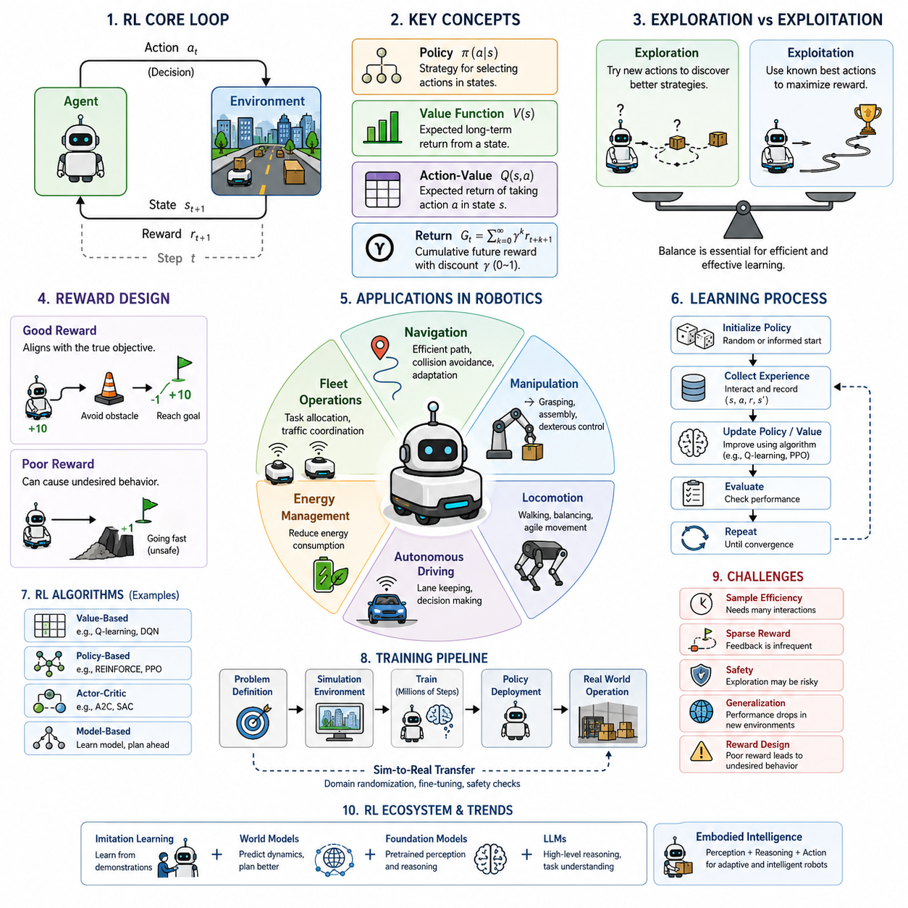
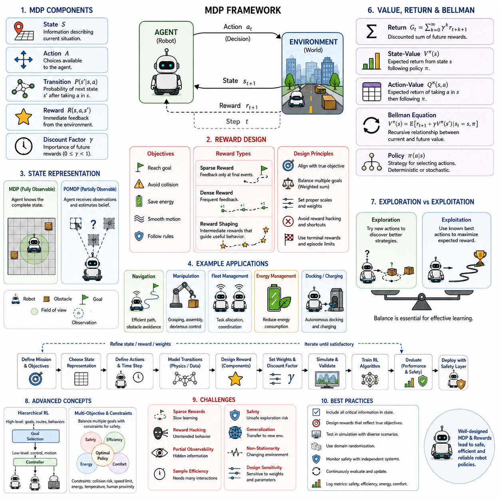
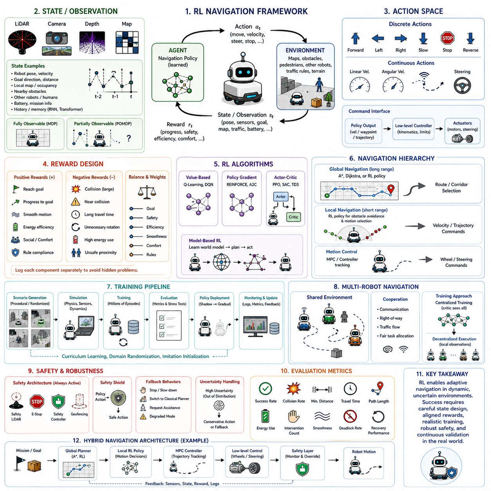
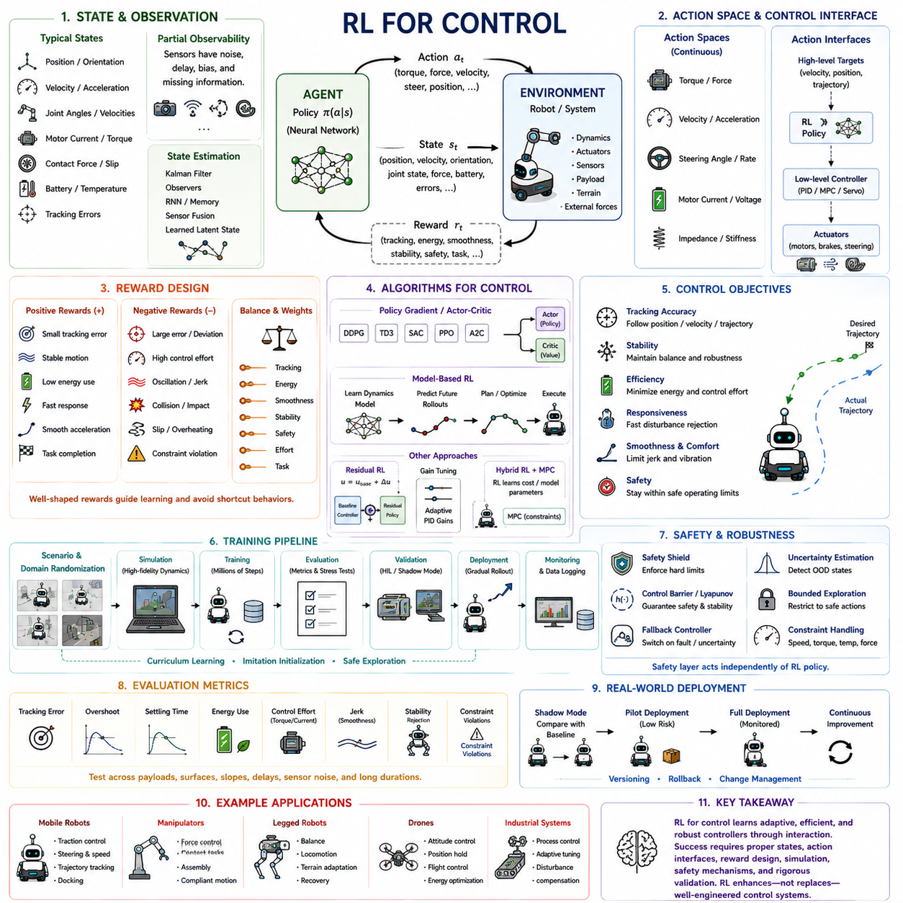
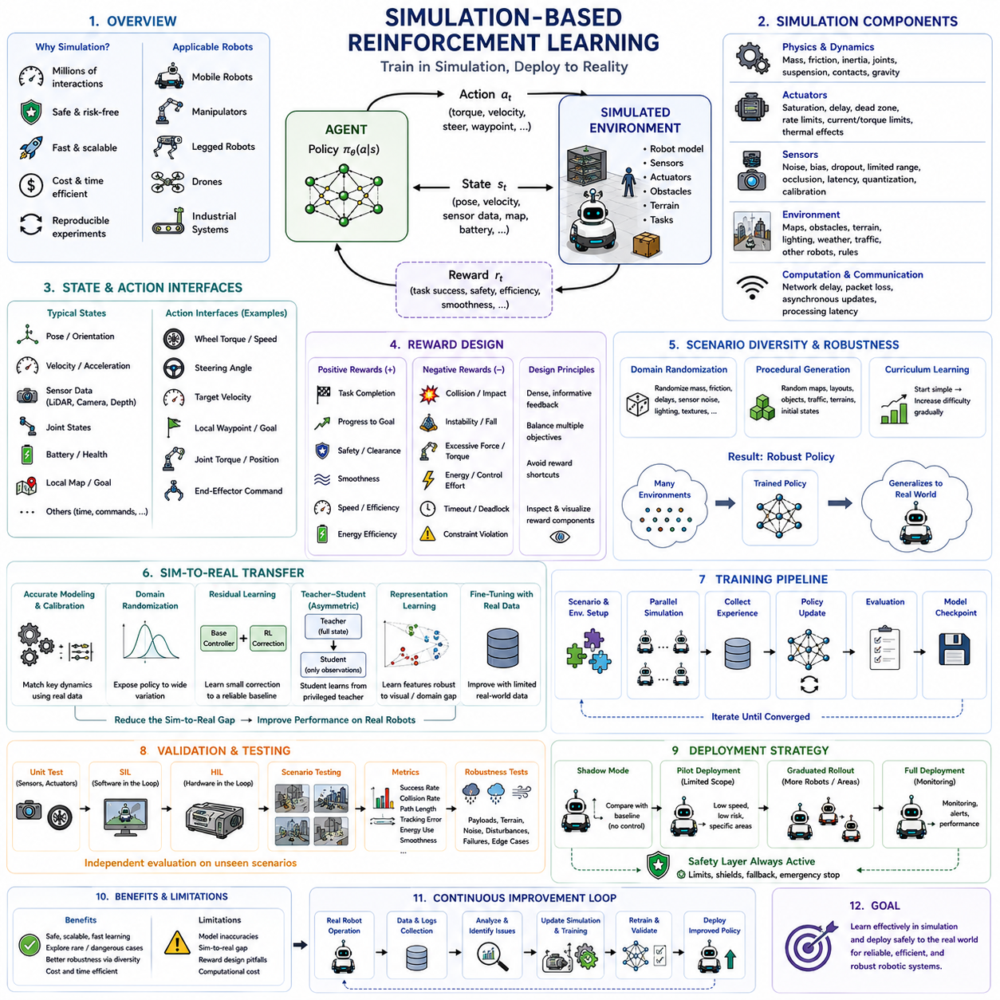
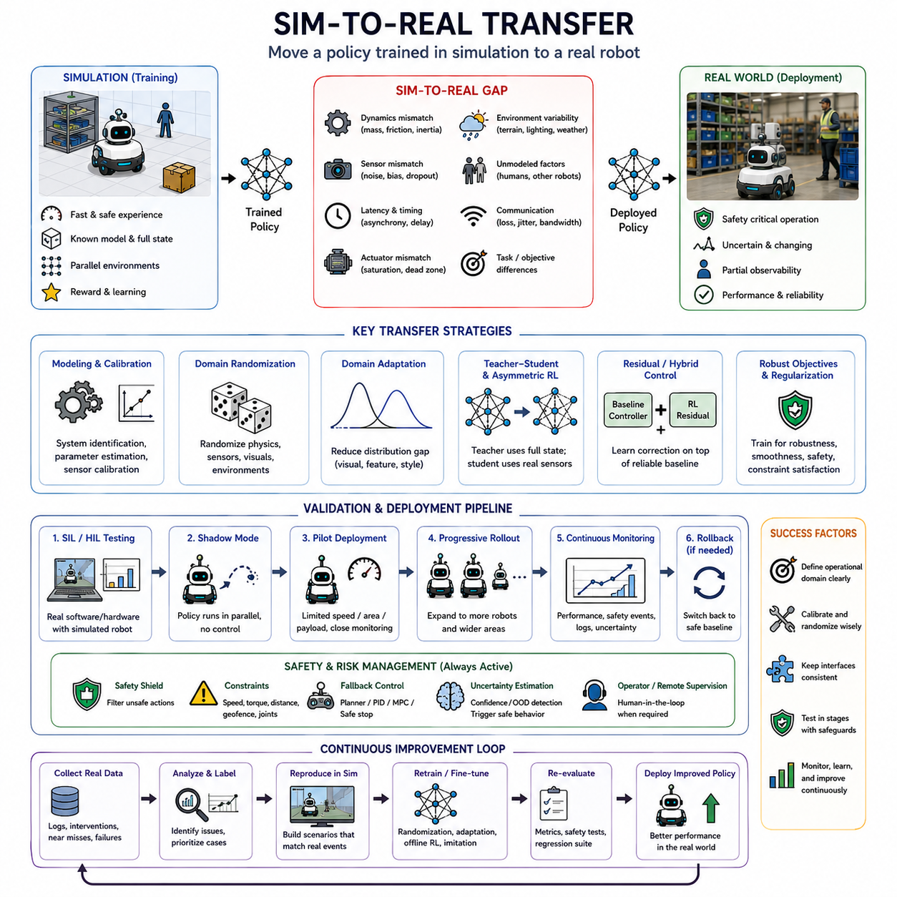
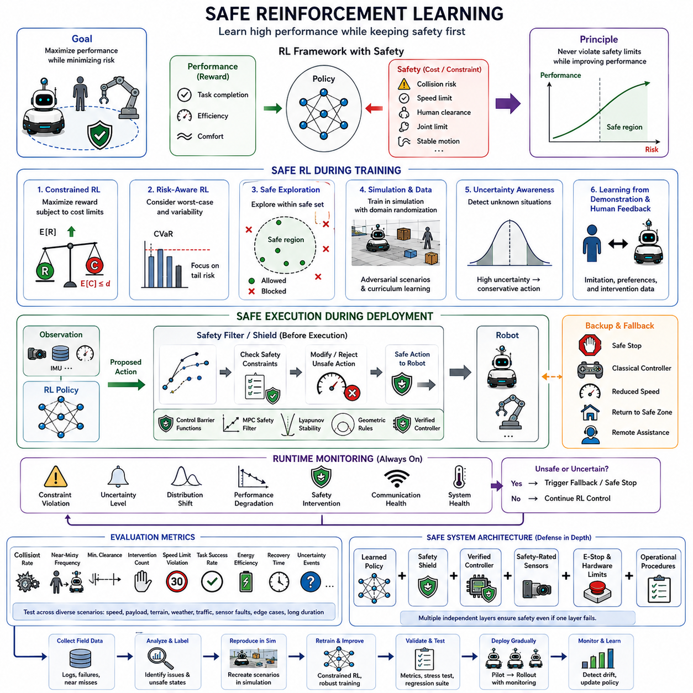
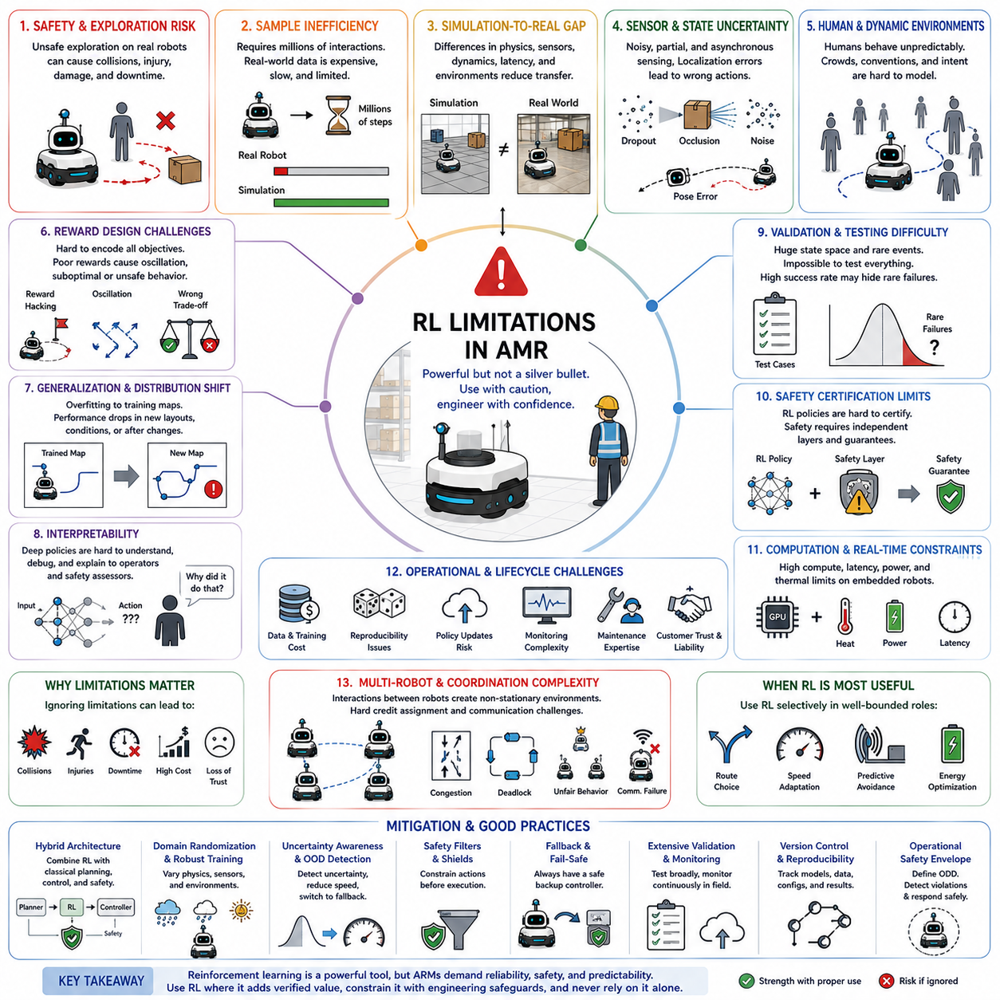

**Volume 06. AMR AI and Embodied Intelligence**

# Chapter 09. Reinforcement Learning

## 09.1 Reinforcement Learning Basics

{width="7.268055555555556in" height="7.268055555555556in"}

Reinforcement learning is a machine learning paradigm in which an autonomous agent learns how to make decisions by interacting with an environment. Unlike supervised learning, where correct answers are provided during training, reinforcement learning relies on experience. The agent observes the consequences of its actions, receives feedback in the form of rewards, and gradually improves its behavior to maximize long-term success. This learning process closely resembles how humans and animals acquire new skills through trial, error, and adaptation.

The central objective of reinforcement learning is not simply to perform well on individual decisions but to discover a strategy that consistently produces the highest cumulative reward over time. Every decision influences future opportunities, making reinforcement learning fundamentally different from traditional optimization methods. The agent must balance immediate gains against future benefits while continuously adapting to changing situations.

A reinforcement learning system consists of several essential components. The environment represents the world in which the agent operates. The agent is the decision-making entity responsible for selecting actions. A state describes the current situation observed by the agent. Actions represent the available choices, while rewards provide numerical feedback indicating whether an action was beneficial or harmful. Together, these components create a continuous interaction loop that drives learning.

The interaction cycle begins when the environment provides the current state to the agent. Based on this information, the agent selects an action according to its current decision strategy. The environment responds by changing to a new state and returning a reward. This new experience becomes part of the agent\'s accumulated knowledge, allowing future decisions to become increasingly effective.

Unlike supervised learning datasets, reinforcement learning rarely provides explicit examples of correct behavior. Instead, the agent must independently discover which actions lead to desirable outcomes. This characteristic makes reinforcement learning particularly valuable for solving complex sequential decision problems where optimal behavior cannot easily be specified by human experts.

One of the defining characteristics of reinforcement learning is delayed reward. Many actions do not produce immediate feedback. Instead, their consequences appear much later after several additional decisions have been made. The learning algorithm must therefore identify which earlier actions contributed to eventual success or failure despite long time delays between decisions and rewards.

Consider an autonomous mobile robot navigating a warehouse. Moving toward the destination may require temporarily taking a longer path to avoid congestion or obstacles. Although the longer route appears less efficient initially, it may ultimately reduce travel time and improve safety. Reinforcement learning enables the robot to recognize these long-term advantages through accumulated experience.

The learning objective is often described as maximizing cumulative reward rather than maximizing individual rewards. A greedy decision that produces an immediate positive reward may prevent the agent from achieving much larger rewards later. Consequently, reinforcement learning emphasizes long-term planning instead of short-term optimization.

Exploration and exploitation form one of the most important trade-offs in reinforcement learning. Exploration involves trying unfamiliar actions to discover potentially better strategies. Exploitation focuses on using existing knowledge to maximize current performance. Successful reinforcement learning requires balancing these competing objectives throughout the learning process.

If an agent explores excessively, learning becomes inefficient because many poor decisions are repeated unnecessarily. If it exploits too early, it may converge to a suboptimal strategy without discovering superior alternatives. Designing algorithms that maintain an appropriate balance between exploration and exploitation remains a central research challenge.

Another fundamental concept is the policy. A policy defines how an agent selects actions based on its current state. Policies may be represented by simple mathematical rules, probability distributions, lookup tables, or deep neural networks. During training, the policy gradually evolves as the agent gains experience from interacting with the environment.

The value function estimates how beneficial a particular state or action is in terms of future cumulative reward. Rather than evaluating only immediate outcomes, the value function predicts expected long-term returns. This prediction helps the agent distinguish between actions that appear attractive now and those that generate greater future benefits.

Closely related to the value function is the concept of return. Return represents the total accumulated reward expected from a given point onward. Because future rewards are often uncertain, reinforcement learning introduces discounting to reduce the influence of distant rewards. Discounting reflects the practical reality that immediate outcomes are generally more certain than distant ones.

The discount factor determines how much importance is assigned to future rewards. A high discount factor encourages long-term planning by emphasizing future consequences. A lower discount factor prioritizes immediate rewards and produces more short-sighted behavior. Selecting an appropriate discount factor depends on the characteristics of the application.

The environment may be deterministic or stochastic. In deterministic environments, the same action always produces the same result. In stochastic environments, identical actions may lead to different outcomes because of uncertainty, noise, or interactions with external factors. Most real robotic systems operate in stochastic environments where uncertainty is unavoidable.

Reinforcement learning is particularly attractive for robotics because many robotic tasks involve sequential decision making under uncertainty. Mobile robots, industrial manipulators, humanoid robots, drones, and autonomous vehicles all require continuous adaptation to dynamic environments. Traditional rule-based controllers often struggle to handle these highly variable situations.

For autonomous mobile robots, reinforcement learning can improve navigation efficiency by learning collision avoidance strategies, optimizing path selection, minimizing energy consumption, and adapting to changing traffic conditions. Rather than relying entirely on manually designed rules, the robot gradually discovers effective behaviors through repeated interaction with its environment.

Industrial robotic manipulation provides another important application. Grasping unknown objects, inserting components into assemblies, opening doors, or manipulating deformable materials often require complex control strategies that are difficult to model analytically. Reinforcement learning enables robots to improve these skills through extensive practice in simulation before deployment.

Deep reinforcement learning combines reinforcement learning with deep neural networks capable of representing highly complex policies and value functions. Instead of manually engineering features, deep networks automatically learn meaningful representations directly from images, LiDAR scans, force sensors, or multimodal observations. This capability has significantly expanded the range of solvable robotic problems.

Modern reinforcement learning algorithms can process high-dimensional sensor inputs while simultaneously learning sophisticated decision strategies. Vision-based robotic control, dexterous manipulation, autonomous driving, and legged locomotion have all benefited from advances in deep reinforcement learning during the past decade.

Simulation plays a critical role in reinforcement learning because real-world training is often expensive, slow, and potentially unsafe. Robots can perform millions of simulated interactions without damaging hardware or creating hazardous situations. After acquiring useful policies in simulation, the learned behaviors may be transferred to physical robots through carefully designed adaptation techniques.

Despite its advantages, reinforcement learning presents several significant challenges. Training frequently requires enormous amounts of experience, making data efficiency an ongoing research problem. Sparse rewards can slow learning because useful feedback occurs only occasionally. Poorly designed reward functions may unintentionally encourage undesirable behavior that technically maximizes the specified objective.

Another limitation involves safety during learning. Random exploration may produce dangerous actions when operating physical robots. Consequently, industrial reinforcement learning often incorporates safety constraints, supervised initialization, simulation-based training, and human oversight to reduce operational risk. Safe reinforcement learning has therefore become an important research direction.

Generalization also remains difficult. Policies trained under specific environmental conditions may perform poorly when transferred to unfamiliar settings. Variations in lighting, weather, terrain, sensor noise, payload, or mechanical wear can significantly affect performance. Improving robustness across diverse environments continues to be an active area of research.

Recent advances increasingly combine reinforcement learning with imitation learning, foundation models, world models, and large language models. Instead of learning entirely through trial and error, robots can begin with prior knowledge obtained from demonstrations or pretrained representations. This hybrid approach reduces training time while improving sample efficiency and overall performance.

Embodied intelligence further extends reinforcement learning by considering the interaction between perception, reasoning, and physical action. Intelligent behavior emerges not only from optimizing policies but also from continuously integrating sensory information, environmental understanding, memory, and motor control. Reinforcement learning therefore becomes one component within a broader intelligent robotic architecture.

As autonomous robots become more capable, reinforcement learning is expected to play an increasingly important role in enabling adaptive, experience-driven behavior. Rather than executing fixed programs, future robots will continually improve through interaction with their environments while maintaining safety, efficiency, and robustness. This ability to learn from experience represents one of the defining characteristics of next-generation intelligent robotic systems.

## 09.2 MDP and Reward Design

{width="7.268055555555556in" height="7.268055555555556in"}

A Markov Decision Process, commonly abbreviated as MDP, is a mathematical framework used to describe sequential decision-making problems. It provides a structured way to represent how an agent interacts with an environment, how actions change the situation, and how rewards guide the agent toward desirable long-term behavior.

An MDP is widely used as the theoretical foundation of reinforcement learning. It converts a complex control problem into a formal model composed of states, actions, transition probabilities, rewards, and a discount factor. These elements allow learning algorithms to evaluate present decisions in relation to their future consequences.

The state represents the information required to describe the current situation of the environment. In an autonomous mobile robot, a state may include the robot position, heading, velocity, battery level, obstacle locations, destination, traffic conditions, and the operational status of nearby robots.

A well-designed state should contain enough information for the agent to make an effective decision. If important variables are missing, the agent may select inappropriate actions because it cannot distinguish between situations that require different responses. This issue is known as state aliasing.

The Markov property assumes that the current state contains all information needed to predict the next state. In other words, once the present state is known, earlier states do not provide additional information about the immediate future. This assumption simplifies both mathematical analysis and algorithm design.

Real robotic systems do not always satisfy the Markov property perfectly. Sensor noise, hidden obstacles, communication delays, mechanical wear, and unobserved human intentions may influence future outcomes. Engineers therefore attempt to construct state representations that approximate the Markov property as closely as possible.

When the agent cannot directly observe the complete state, the problem is often modeled as a Partially Observable Markov Decision Process, or POMDP. In that case, the agent receives observations rather than complete states and must estimate hidden information using memory, belief states, sensor fusion, or recurrent neural networks.

The action is the decision selected by the agent. For a mobile robot, actions may include moving forward, turning, slowing down, stopping, selecting a route, requesting passage, docking, or waiting. Actions can be discrete, continuous, or a combination of both depending on the control problem.

Discrete action spaces contain a limited set of choices. A navigation agent might select among forward, left, right, stop, and reverse. Discrete actions are easier to model, but they may produce rough or inefficient control when a robot requires precise velocity, acceleration, steering, or actuator commands.

Continuous action spaces allow the agent to choose real-valued control signals. Examples include linear velocity, angular velocity, steering angle, wheel torque, braking force, and joint position. Continuous control provides smoother behavior but usually requires more advanced reinforcement learning algorithms.

The transition model describes how the environment changes after the agent selects an action. It defines the probability of reaching a new state given the current state and action. In deterministic environments, one state-action pair always produces the same next state.

Most real robotic environments are stochastic. The same command may generate slightly different results because of wheel slip, uneven terrain, payload variation, actuator delay, localization error, wind, sensor noise, or unexpected human movement. Transition probabilities represent this uncertainty.

The reward is a numerical signal that evaluates the immediate consequence of an action. A positive reward indicates desirable progress, while a negative reward represents an undesirable result or cost. The agent learns a policy that attempts to maximize the expected sum of rewards over time.

Reward design is one of the most important and difficult tasks in reinforcement learning. The reward function defines what the agent is encouraged to achieve, but it does not directly specify how the objective should be accomplished. The agent may discover strategies that satisfy the reward mathematically while violating the designer's intention.

For an autonomous mobile robot, reaching the destination may produce a large positive reward. Collisions, emergency stops, unstable motion, excessive energy consumption, unsafe proximity to humans, and mission failure may generate negative rewards. Smaller rewards can be assigned for safe progress toward the goal.

A sparse reward provides feedback only when a major event occurs. The robot may receive a positive reward after reaching the destination and a negative reward after a collision, while receiving no reward during most of the journey. Sparse rewards are easy to define but often make learning slow and inefficient.

A dense reward provides frequent feedback during the task. The robot may receive a small positive reward whenever it reduces the distance to the destination and a small penalty for unnecessary movement. Dense feedback can accelerate learning, but it may also introduce unintended shortcuts.

Reward shaping refers to adding intermediate rewards that guide the agent toward useful behavior. For example, a navigation agent can receive additional rewards for maintaining clearance from obstacles, following a smooth trajectory, reducing travel time, and preserving sufficient battery energy.

Reward shaping must be applied carefully because poorly designed intermediate rewards can change the true objective. A robot rewarded only for moving toward a goal may become trapped behind an obstacle while repeatedly attempting to move directly forward instead of selecting a longer but feasible route.

A common reward design uses multiple weighted terms. The total reward may combine destination progress, collision avoidance, energy efficiency, motion smoothness, time efficiency, path deviation, human comfort, and rule compliance. Each term represents a different aspect of the desired behavior.

The relative weights of reward terms strongly influence the learned policy. If collision penalties are too small, the robot may accept unsafe risk to reduce travel time. If safety penalties are excessively large, the robot may become overly cautious, stop frequently, or refuse to move in crowded areas.

Reward scales also affect learning stability. Extremely large rewards can produce unstable value estimates and large gradient updates. Very small rewards may generate weak learning signals. Normalization, clipping, scaling, and careful weight tuning are often required to maintain numerical stability.

Terminal rewards are assigned when an episode ends. Successful completion may produce a large positive terminal reward, while collision, timeout, localization failure, or departure from the permitted area may generate a negative terminal reward. Terminal conditions define the practical boundaries of the task.

An episode is a sequence of interactions from an initial state to a terminal state. A warehouse navigation episode may begin when a mission is assigned and end when the robot reaches the destination, exceeds the time limit, requests human assistance, or encounters a safety-critical event.

Some robotic tasks are naturally continuing rather than episodic. A patrol robot may operate for many hours without a clear terminal state. In such cases, artificial episode boundaries can be introduced based on time, battery cycles, mission completion, shift changes, or periodic policy evaluation.

The discount factor determines the importance of future rewards. A value close to zero encourages the agent to focus on immediate outcomes. A value close to one gives greater importance to long-term consequences. The appropriate setting depends on the duration and structure of the task.

For navigation, a high discount factor encourages the robot to consider how current motion affects future safety and route efficiency. However, a value that is too high may increase training instability because distant rewards become highly influential even when predictions are uncertain.

The return is the discounted sum of future rewards expected after a state or action. Reinforcement learning algorithms estimate this return to evaluate decisions. A policy is considered better when it produces higher expected returns across the distribution of possible starting states and environmental conditions.

The state-value function estimates the expected return from a state when the agent follows a particular policy. It answers the question of how favorable the current situation is. States near the destination with safe and open paths usually have higher values than states near hazards or dead ends.

The action-value function estimates the expected return of selecting a specific action in a particular state and then following the policy. It allows the agent to compare available actions. Algorithms such as Q-learning learn action values directly and select actions with the highest expected return.

The Bellman principle expresses a recursive relationship between current value and future value. The value of a state depends on the immediate reward and the discounted value of the next state. This relationship allows long-term decision problems to be solved through repeated local updates.

The Bellman equation is fundamental because it connects short-term experience with long-term planning. Each interaction provides information about the reward received and the next state reached. The learning algorithm uses this information to improve estimates of future return.

A policy defines the agent's action-selection strategy. A deterministic policy selects one action for each state, while a stochastic policy assigns probabilities to multiple actions. Stochastic policies are useful when uncertainty, exploration, or behavioral diversity is required.

In robotic navigation, a stochastic policy may choose among several safe routes rather than always following the same path. This can reduce congestion, support multi-robot coordination, and improve robustness when the environment changes. However, randomness must be limited in safety-critical situations.

The initial state distribution specifies where episodes begin. If training always starts from a small set of easy states, the policy may fail in unfamiliar situations. Effective training therefore includes diverse starting locations, orientations, payload conditions, battery levels, and environmental configurations.

MDP design requires careful selection of time steps. A short time step provides precise control but creates longer episodes and higher computational cost. A long time step reduces computation but may hide important dynamics or cause the agent to react too slowly to obstacles and safety events.

The action duration must also match the physical system. If a velocity command is applied for too long, the robot may move beyond a safe region before the next decision. If commands change too frequently, actuators may oscillate, energy use may increase, and control may become unstable.

Hierarchical reinforcement learning can divide a complex MDP into multiple levels. A high-level policy selects goals, routes, or behaviors, while a low-level controller generates motion commands. This separation is especially useful in AMR systems where mission planning and real-time control operate at different rates.

A high-level action may instruct the robot to navigate to a station, wait at a checkpoint, or begin docking. The low-level controller then handles steering, velocity regulation, and obstacle avoidance. Hierarchical design reduces the complexity of the action space and improves interpretability.

Reward functions can also be separated by control level. Mission-level rewards may emphasize task completion and throughput, while navigation-level rewards focus on safety and travel efficiency. Motion-level rewards may encourage smooth acceleration, low tracking error, and stable actuator behavior.

Multi-objective reward design is necessary when several operational goals must be considered simultaneously. Industrial robots must balance productivity, safety, energy use, equipment wear, passenger comfort, traffic rules, and mission priority. These objectives may conflict with one another.

A single weighted reward combines all objectives into one scalar value, but this approach may hide trade-offs. Small changes in weights can produce large changes in behavior. Engineers should therefore evaluate each reward component separately rather than relying only on the total return.

Constrained MDPs provide another approach by treating safety or resource limits as explicit constraints. The agent maximizes reward while keeping collision probability, energy use, temperature, speed, or human proximity within acceptable limits. This is often more appropriate for industrial robotics.

Safety constraints should not depend solely on learned behavior. A practical AMR architecture normally includes independent emergency stops, safety scanners, speed limits, collision monitors, geofences, and fallback controllers. Reinforcement learning operates within these protected boundaries rather than replacing them.

Reward hacking occurs when the agent exploits weaknesses in the reward function. For example, a robot rewarded for remaining close to a target may circle around it without completing the task. A robot rewarded for speed may create unsafe motion unless safety and terminal conditions are defined correctly.

Specification gaming is a broader form of reward hacking in which the agent follows the literal reward specification but violates the intended purpose. Preventing this behavior requires adversarial testing, scenario diversity, runtime monitoring, and evaluation metrics that are independent of the training reward.

Inverse reward design recognizes that a reward function is an imperfect description of the designer's intention. Instead of assuming the reward is always correct, the system treats it as evidence about the true objective. This perspective encourages cautious behavior when the agent encounters unfamiliar conditions.

Human feedback can support reward design by providing preferences between different robot behaviors. Rather than manually assigning exact numerical values, a human evaluator can compare two trajectories and indicate which one is safer, smoother, or more efficient. A reward model can then learn from these preferences.

Imitation learning can also reduce dependence on complex reward engineering. Demonstrations from skilled operators provide examples of desirable behavior. Reinforcement learning can then refine the initial policy using rewards, while preserving useful patterns learned from expert data.

Simulation is commonly used to test MDP and reward designs before physical deployment. Engineers can visualize trajectories, compare reward components, detect unintended strategies, and generate rare failure scenarios. Simulation allows unsafe policies to be rejected before they reach real hardware.

Domain randomization improves robustness by varying friction, mass, sensor noise, obstacle behavior, lighting, latency, and terrain during training. The resulting MDP represents a family of environments rather than a single fixed model. This helps the policy transfer from simulation to the real world.

Offline reinforcement learning constructs policies from previously collected datasets instead of unrestricted online interaction. In this setting, the reward function may be recalculated for stored trajectories. Offline learning is attractive for AMRs because real operational data can be reused without dangerous exploration.

However, offline reinforcement learning is limited by the coverage of the dataset. The policy may be unreliable when it selects actions that are poorly represented in the training data. Conservative learning methods are therefore used to discourage decisions that move far beyond known experience.

Reward evaluation should include more than average return. A policy with high average reward may still produce rare but unacceptable failures. Engineers should measure collision rates, near misses, timeout frequency, energy consumption, intervention count, path efficiency, and performance under abnormal conditions.

Sensitivity analysis examines how behavior changes when reward weights, discount factors, transition noise, and initial states are modified. A robust policy should not collapse under small parameter changes. Large behavioral changes may indicate that the MDP or reward design is poorly conditioned.

The reward function should remain aligned with operational requirements throughout the product lifecycle. Changes in robot payload, speed, environment, customer workflow, or safety policy may invalidate earlier assumptions. Reward definitions and evaluation scenarios must therefore be version-controlled and reviewed.

Production systems also require runtime monitoring for reward-related failures. The deployed robot does not usually calculate training rewards for control, but equivalent metrics can be logged. Unexpected changes in these metrics may reveal model drift, environmental change, or emerging unsafe behavior.

MDP modeling and reward design are therefore not merely theoretical preparation for selecting an algorithm. They define the meaning of the learning problem itself. Even a powerful reinforcement learning algorithm cannot produce reliable behavior when the state, action, transition, or reward model is poorly designed.

For autonomous mobile robots, a successful MDP must represent the physical environment, operational mission, safety boundaries, uncertainty, and long-term consequences of action. A successful reward function must encourage useful performance without creating unsafe shortcuts or overly conservative behavior.

The most effective designs combine formal modeling, simulation, expert knowledge, field data, safety engineering, and continuous validation. Through this integrated process, reinforcement learning can develop policies that are not only high-performing in simulation but also stable, understandable, and dependable in real robotic operations.

## 09.3 RL for Navigation

{width="7.268055555555556in" height="7.268055555555556in"}

Reinforcement learning for navigation applies experience-driven decision making to the movement of autonomous robots through complex environments. Instead of relying only on fixed rules, the robot learns a policy that maps observations or states to motion decisions that maximize long-term mission performance.

Navigation is naturally a sequential decision problem. A movement command changes the robot's position, orientation, speed, and future options. A decision that appears efficient at one moment may create congestion, increase collision risk, or lead the robot into a dead end several steps later.

Traditional navigation systems usually separate global path planning, local obstacle avoidance, and motion control. Reinforcement learning can improve one of these components or learn a combined navigation strategy. In practical systems, it is often integrated with classical planners rather than used as a complete replacement.

The agent in a navigation problem is the robot or the learned navigation policy. The environment includes the map, obstacles, pedestrians, vehicles, terrain, traffic rules, and other robots. The agent observes the environment, selects an action, receives a reward, and repeats this interaction.

The state represents information needed for navigation decisions. It may contain the robot pose, velocity, goal direction, remaining distance, obstacle locations, local map, planned route, battery condition, and nearby traffic. The quality of this state representation strongly affects the learned behavior.

A compact state may use the relative angle and distance to the goal together with a sequence of LiDAR measurements. This representation is computationally efficient and commonly used for local navigation experiments. However, it may not provide enough semantic context for complex industrial environments.

A richer state can include camera images, depth data, semantic maps, human motion estimates, and predicted obstacle trajectories. Deep neural networks can extract useful features from these high-dimensional inputs, but training becomes more expensive and requires greater data diversity.

The robot may also receive incomplete observations rather than a complete state. Obstacles can be hidden behind walls, people may suddenly enter the path, and sensors may have limited range. Navigation is therefore often closer to a partially observable decision process than a fully observable one.

Memory helps the agent reason under partial observability. Recurrent networks, temporal transformers, occupancy histories, or short sequences of sensor frames can capture how the environment has changed. This allows the robot to distinguish between stationary structures and moving objects.

The action space determines what the reinforcement learning policy controls. A discrete policy may choose actions such as move forward, rotate left, rotate right, slow down, stop, or reverse. Discrete actions simplify training but may create abrupt or inefficient motion.

A continuous policy can directly generate linear velocity, angular velocity, steering angle, acceleration, or wheel torque. This provides smoother control and allows more precise responses. Continuous action spaces are often used with policy-gradient or actor-critic algorithms.

In many AMR systems, reinforcement learning does not directly control motors. Instead, the policy outputs a desired velocity, local waypoint, or short trajectory. A conventional controller then converts this command into wheel or steering control while enforcing actuator limits and stability requirements.

This layered structure separates learned decision making from deterministic control. It reduces the risk that the policy will generate physically impossible commands. It also allows proven low-level control software to remain in use while the navigation intelligence is improved.

The reward function defines the behavior the robot is encouraged to learn. A positive reward is usually assigned for reaching the destination. Negative rewards may be assigned for collisions, unsafe proximity, excessive travel time, unnecessary rotation, energy consumption, or mission failure.

Progress toward the destination often provides a dense reward. The robot receives a small positive value when its distance to the goal decreases and a penalty when it moves away. This gives frequent learning feedback, but it can also encourage shortsighted behavior around obstacles.

For example, a robot may repeatedly approach a wall because the goal lies directly behind it. Although each step reduces the straight-line distance, the robot does not learn to take the necessary detour. Reward design must therefore account for feasible paths rather than only geometric distance.

Collision penalties are normally large because safety is more important than small improvements in travel time. However, a collision penalty alone may not be sufficient. The policy should also be discouraged from near misses, sudden braking, oscillation, and uncomfortable proximity to people.

Smoothness rewards can penalize rapid changes in linear or angular velocity. These terms improve ride quality, reduce mechanical stress, and make robot behavior easier for humans to predict. Excessive smoothness penalties, however, may prevent the robot from reacting quickly in emergencies.

Time penalties encourage efficient motion by assigning a small cost at every step. The robot then learns that unnecessarily long episodes reduce total return. If the time penalty is too strong, the policy may choose aggressive shortcuts that reduce safety margins.

Energy-aware rewards can discourage frequent acceleration, excessive turning, wheel slip, or unnecessary detours. Such rewards are valuable for battery-powered AMRs that must complete many missions before charging. Energy optimization must remain subordinate to safety and mission completion.

Social navigation requires additional reward terms. The robot may be encouraged to maintain personal space, avoid passing too closely, approach people from visible directions, and move consistently with local traffic flow. Human comfort cannot be represented only by collision avoidance.

A successful reward function balances goal achievement, safety, efficiency, smoothness, and operational rules. Each term should be logged separately during training. A high total reward may otherwise hide poor performance in one critical safety component.

The policy determines how actions are selected from the current state. A deterministic policy always produces the same action for the same input. A stochastic policy produces a probability distribution, supporting exploration and allowing several valid responses to similar situations.

Value-based methods estimate how beneficial each action is in a given state. Q-learning and Deep Q-Networks are common examples for discrete navigation problems. They can learn effective obstacle avoidance, but they become difficult to apply when the action space is large or continuous.

Policy-gradient methods directly optimize the parameters of the navigation policy. They are suitable for continuous motion control and stochastic policies. However, their gradient estimates may have high variance and may require many environment interactions.

Actor-critic methods combine a policy model with a value estimator. The actor selects navigation actions, while the critic evaluates their expected long-term return. Algorithms such as PPO, SAC, TD3, and A2C are widely used in simulated robotic navigation research.

Proximal Policy Optimization is popular because it offers relatively stable updates and is straightforward to implement. Soft Actor-Critic is useful for continuous control and encourages exploration through entropy. The best algorithm depends on the state, action, reward, and training environment.

Model-based reinforcement learning learns or uses a model of environmental dynamics. The robot can predict how actions may change its state and plan using simulated future outcomes. This approach can improve sample efficiency but becomes difficult when human and obstacle behavior is highly uncertain.

Global navigation decides how to move across a large map from a start point to a distant goal. Classical algorithms such as A\* or Dijkstra remain reliable for this task. Reinforcement learning can help select routes based on congestion, energy, risk, or long-term fleet conditions.

A learned global policy may choose among several corridors or zones rather than directly generating every motion command. It can avoid frequently blocked areas, select elevators, prefer safer crossings, and adapt routes according to mission priority or battery state.

Local navigation reacts to nearby obstacles and converts the global route into immediate motion. This is a common target for reinforcement learning because local environments are dynamic and difficult to model with fixed rules. The policy can learn flexible avoidance behaviors from repeated experience.

The local policy may receive a LiDAR scan, relative goal vector, current velocity, and previous action. It then outputs the next velocity command. Training episodes expose the policy to walls, corners, narrow passages, moving obstacles, and different goal locations.

Dynamic obstacle avoidance requires predicting how nearby objects may move. A purely reactive policy may avoid the current position of a pedestrian but fail to account for the person's future trajectory. Temporal observations and trajectory prediction can improve decision quality.

The robot should not only avoid collision but also avoid creating conflict. Entering a narrow passage at the wrong time may force another robot to stop or reverse. Reinforcement learning can learn yielding, waiting, and negotiation behaviors when these outcomes are represented in the reward.

Multi-robot navigation extends the problem from one agent to several agents sharing the same environment. Each robot's action changes the conditions faced by the others. This creates a non-stationary learning problem because the behavior of other agents may evolve during training.

Centralized training with decentralized execution is frequently used for multi-robot reinforcement learning. During training, a centralized critic can access information about all robots. During operation, each robot selects actions using only locally available observations and shared messages.

Fleet-level rewards can encourage total throughput, balanced traffic, low congestion, and fair task distribution. However, purely global rewards may make it difficult for an individual robot to understand how its actions affected the result. Credit assignment becomes a major challenge.

Communication can improve cooperative navigation. Robots may share intended paths, local obstacle information, right-of-way requests, and estimated arrival times. Reinforcement learning can determine when communication is useful and how shared information should influence motion decisions.

Navigation policies are usually trained in simulation because real-world exploration is slow and unsafe. A simulator can generate millions of interactions involving collisions, blocked routes, sensor errors, and unusual traffic patterns without damaging physical hardware.

Simulation should reproduce the robot's kinematics, sensor field of view, actuator delay, acceleration limits, and collision geometry. Unrealistic simulation may produce policies that perform well virtually but fail when deployed on the physical platform.

Domain randomization varies environmental and robot parameters during training. Friction, mass, payload, sensor noise, latency, obstacle speed, lighting, and map layout can be changed across episodes. The policy learns to handle a distribution of conditions rather than one fixed simulator.

Procedural environment generation can create many different maps automatically. Training in only a small number of layouts often causes memorization. Random rooms, corridors, intersections, shelves, slopes, and obstacle placements improve generalization to unseen environments.

Curriculum learning begins with simple navigation tasks and gradually increases difficulty. The robot may first learn to reach goals in open space, then avoid static obstacles, pass through narrow corridors, and finally handle dense moving traffic.

A curriculum can significantly reduce training time because the policy develops basic skills before facing complex situations. However, the transition between difficulty levels must be managed carefully to prevent the agent from forgetting previously learned behavior.

Imitation learning can initialize the policy using demonstrations from a classical planner or human operator. The robot first learns to reproduce reasonable navigation behavior. Reinforcement learning then improves the policy through interaction and reward optimization.

This combination reduces unsafe random exploration and improves sample efficiency. It is particularly useful when good navigation logs already exist. Demonstrations should include difficult and recovery situations rather than only successful nominal trajectories.

Offline reinforcement learning can train from recorded navigation data without additional online interaction. Historical AMR logs may contain states, actions, next states, and mission outcomes. Rewards can be reconstructed from collision, travel time, energy, and safety records.

The main limitation of offline learning is incomplete coverage. The dataset may not contain enough examples of rare hazards or unusual actions. A policy that moves outside the recorded behavior distribution may produce unreliable predictions and unsafe decisions.

Safe reinforcement learning introduces explicit limits on risk. The policy may optimize navigation efficiency while maintaining constraints on collision probability, speed, braking distance, or human proximity. Safety constraints are more reliable than expressing every requirement as a reward weight.

A learned navigation policy should always operate within an independent safety architecture. Safety LiDAR, emergency stops, speed monitoring, protective fields, geofences, and certified safety controllers must be able to override the learned command when necessary.

A safety shield can inspect the action proposed by the policy before execution. If the action violates a constraint, the shield replaces it with a safe alternative such as braking or reducing speed. This allows learning-based navigation without giving the policy unrestricted control.

Fallback behavior is necessary when sensor inputs are invalid or the policy becomes uncertain. The robot may stop, return to a classical planner, reduce speed, request remote assistance, or enter a degraded mode. A policy should never be the only available decision mechanism.

Uncertainty estimation helps determine when the policy is outside its training distribution. Ensemble models, Bayesian approximations, observation-distance measures, or confidence predictors can detect unfamiliar states. High uncertainty should trigger conservative actions or fallback control.

Sim-to-real transfer remains one of the greatest challenges. Real sensors contain noise, missing data, reflections, motion distortion, and calibration errors. Real humans and vehicles also behave less predictably than simulated agents.

Fine-tuning on real data can reduce the simulation gap, but online exploration must be tightly controlled. A practical strategy is to deploy the policy in shadow mode, compare its proposed actions with the existing navigation stack, and collect disagreement cases before activation.

Shadow-mode evaluation allows engineers to measure what the learned policy would have done without giving it control. High-risk disagreements can be reviewed and added to future training scenarios. This creates a safer path from simulation to production deployment.

Navigation evaluation should include more than success rate. Important metrics include collision rate, minimum obstacle distance, travel time, path length, energy use, intervention frequency, motion smoothness, deadlock rate, and recovery performance.

Performance should be measured across easy, difficult, and adversarial scenarios. Narrow passages, sudden pedestrian entry, sensor dropout, localization jumps, communication loss, slippery surfaces, blocked routes, and dense robot traffic should all be tested.

Generalization should be evaluated on maps and obstacle configurations that were not used during training. A policy that performs well only on familiar layouts has learned memorized patterns rather than transferable navigation principles.

Long-duration testing is also important. Small oscillations or inefficient choices may appear harmless in short episodes but create energy loss, mechanical wear, congestion, or repeated mission delays during continuous operation.

Explainability is difficult because deep reinforcement learning policies may not provide clear reasons for their actions. Engineers can analyze attention maps, state sensitivity, value estimates, trajectory comparisons, and counterfactual scenarios to understand policy behavior.

Logging is essential for field deployment. Sensor inputs, policy outputs, safety overrides, confidence values, reward-related metrics, and final executed commands should be recorded. These logs support debugging, incident analysis, and controlled policy improvement.

Navigation environments change over time. New shelves, construction zones, seasonal weather, worn floors, and different pedestrian patterns can reduce policy performance. Continuous monitoring is needed to detect distribution shift and emerging failure cases.

Policy updates should follow a controlled validation process. A new model must be tested in simulation, replayed on recorded data, evaluated in shadow mode, and deployed gradually. Rollback must be possible when performance or safety metrics deteriorate.

Reinforcement learning is most effective when it complements reliable navigation engineering. Classical global planners offer predictability, while learned local policies can provide adaptation in complex situations. Safety controllers enforce non-negotiable physical constraints.

A hybrid architecture may use A\* for global route planning, reinforcement learning for local motion selection, a model predictive controller for trajectory tracking, and an independent safety layer for collision prevention. Each component addresses the problem at an appropriate level.

Such separation improves interpretability and makes validation more manageable. It also allows the learned policy to be replaced or updated without redesigning the entire navigation stack. Production AMRs generally benefit from this modular approach.

Reinforcement learning can provide significant advantages when navigation involves uncertainty, dynamic interaction, and competing long-term objectives. It can learn behaviors that are difficult to express through manually designed rules, including yielding, adaptive speed selection, and congestion-aware routing.

However, high simulated reward does not automatically imply safe real-world navigation. Reliable deployment requires careful state design, realistic action limits, aligned rewards, diverse training scenarios, uncertainty monitoring, independent safety systems, and continuous field validation.

The long-term role of reinforcement learning in AMR navigation is therefore not simply to replace planners. Its deeper value is to add adaptive decision making to a structured autonomous system, allowing robots to learn from experience while remaining constrained by physical, operational, and safety requirements.

## 09.4 RL for Control

{width="7.268055555555556in" height="7.268055555555556in"}

Reinforcement learning for control applies experience-based learning to the generation of physical control actions. Instead of relying only on manually derived control laws, the agent learns how to regulate motion by interacting with a dynamic system and observing the effects of its commands over time.

Control problems differ from high-level planning because actions directly influence physical variables such as position, velocity, acceleration, torque, force, steering angle, and joint motion. Small errors can accumulate quickly, so the learned policy must react accurately, smoothly, and within strict timing limits.

In a reinforcement learning control system, the agent is usually the control policy. The environment includes the robot body, actuators, sensors, payload, terrain, external forces, and surrounding physical conditions. The agent observes the current state, selects a command, receives a reward, and updates its behavior.

The state should describe the physical condition of the system with enough detail to support stable control. It may include position, orientation, velocity, acceleration, joint angles, motor current, wheel speed, contact force, battery voltage, actuator temperature, and tracking error.

For an autonomous mobile robot, the state may contain linear velocity, angular velocity, steering angle, wheel rotation, chassis orientation, lateral error, heading error, and desired trajectory. For a manipulator, it may include joint positions, joint velocities, end-effector pose, and contact forces.

A complete state is not always directly available. Sensor delays, noise, mechanical backlash, wheel slip, unmeasured forces, and hidden contact conditions may create partial observability. The controller may therefore require state estimation, temporal memory, or sensor fusion before selecting an action.

Kalman filters, observers, recurrent networks, and learned latent-state models can reconstruct hidden variables. Accurate state estimation is especially important for high-speed control because even a small delay or estimation error can reduce stability and tracking accuracy.

The action space determines the level at which the policy controls the robot. At a high level, the policy may generate desired velocity or target position. At a lower level, it may produce torque, motor current, braking force, steering rate, or actuator voltage.

Direct torque control offers high flexibility because the policy can shape the physical behavior of the system in detail. However, it also increases risk. Incorrect torque commands may cause oscillation, instability, overheating, excessive force, or hardware damage.

For this reason, industrial reinforcement learning often uses an intermediate action interface. The policy generates a target velocity, acceleration, impedance, or short trajectory, while a conventional controller converts that target into safe actuator commands.

This separation preserves proven motor-control and servo-control functions. The learned policy handles adaptation and optimization, while deterministic low-level controllers enforce current limits, torque limits, velocity bounds, and actuator protection.

Continuous action spaces are common in control because physical commands are usually real-valued. Algorithms must therefore generate smooth numerical outputs rather than selecting from a small set of discrete actions. Actor-critic and policy-gradient methods are widely used for this purpose.

Discrete control can still be useful for mode selection. A policy may choose among accelerate, maintain speed, decelerate, stop, or reverse. Another controller then generates the exact continuous command required for the selected mode.

The reward function defines the desired control behavior. It may reward small tracking error, stable motion, low energy use, fast response, smooth acceleration, and successful task completion. It may penalize oscillation, excessive torque, wheel slip, impact, overheating, and unsafe states.

Tracking error is often the main reward component. The policy receives a higher reward when the robot follows the desired position, velocity, orientation, or trajectory closely. A simple error term is easy to design, but it may not fully represent control quality.

A controller that minimizes tracking error aggressively may use excessive torque or rapid actuator changes. It may achieve accurate motion while increasing energy consumption and mechanical stress. Additional reward terms are therefore needed to balance performance and durability.

Control effort penalties discourage unnecessarily large commands. Penalizing torque, current, acceleration, or steering rate can reduce energy use and hardware wear. However, excessive penalties may produce weak control responses and slow recovery from disturbances.

Smoothness penalties discourage rapid changes between consecutive actions. They reduce vibration, improve ride quality, and make motion more predictable. Smoothness is especially important for robots carrying fragile goods, medical materials, or human passengers.

Jerk, which is the rate of change of acceleration, is an important measure of comfort and mechanical quality. A policy that limits jerk can produce more natural movement. However, jerk reduction must not prevent emergency braking or rapid stabilization when safety is threatened.

Energy-aware reward design can use electrical power, battery current, motor losses, or estimated mechanical work. This allows the policy to discover efficient control strategies. For AMRs, energy optimization can extend operating time and reduce charging frequency.

Stability must be represented explicitly or indirectly. A balancing robot may receive rewards for maintaining body orientation and penalties for large tilt angles. A legged robot may be rewarded for stable contact patterns and penalized for falls or loss of support.

For vehicle-like robots, lateral stability may depend on yaw rate, sideslip, steering angle, and speed. The reward can discourage aggressive steering that increases rollover risk or causes tire slip. These terms become especially important on uneven or low-friction surfaces.

Terminal penalties are assigned when the system reaches unacceptable conditions. An episode may end after a collision, fall, actuator limit violation, unstable oscillation, excessive temperature, or departure from the permitted operating region.

Reward shaping can accelerate control learning by providing intermediate feedback. For example, a manipulator may receive rewards for moving closer to a target pose before completing the task. A mobile robot may receive rewards for reducing lateral and heading errors along a trajectory.

Poor reward shaping can create unintended strategies. A robot rewarded mainly for reducing position error may ignore velocity limits. A controller rewarded only for speed may become unstable. Every reward term should therefore be tested against possible shortcuts.

The discount factor determines how strongly the policy values future control outcomes. In fast control loops, many small time steps may occur within a short physical period. The discount factor must be selected in relation to the control frequency and task duration.

A high discount factor encourages the controller to consider long-term stability, energy use, and future tracking quality. A lower value emphasizes immediate error correction. If it is too low, the controller may become shortsighted and repeatedly create future disturbances.

Control frequency strongly affects the design of reinforcement learning. A policy running at ten hertz behaves differently from one running at one kilohertz. Higher frequencies allow rapid response but increase computational requirements and sensitivity to delay.

The inference time of the neural network must remain below the control period. If the policy response is delayed, the command may be based on an outdated state. Real-time execution therefore requires deterministic latency, efficient models, and reliable hardware.

Timing jitter can also degrade performance. Even when average inference time is acceptable, irregular delays may destabilize a tightly controlled system. Production deployment must measure worst-case latency rather than only average speed.

Traditional control systems often use proportional-integral-derivative control, state feedback, model predictive control, or optimal control. These methods provide strong theoretical foundations and predictable behavior when accurate models are available.

Reinforcement learning is attractive when the system is difficult to model, highly nonlinear, affected by changing payloads, or exposed to complex contact and friction. It can learn control strategies directly from interaction without requiring a perfect analytical model.

However, reinforcement learning does not automatically outperform classical control. For simple linear systems with well-known dynamics, conventional controllers are often more efficient, easier to verify, and more reliable. RL is most useful when adaptation or complex optimization is required.

A hybrid control architecture combines learned and classical methods. The reinforcement learning policy may generate references, adapt controller gains, estimate disturbances, or select operating modes. A conventional controller then guarantees basic stability and constraint handling.

Gain tuning is a practical application. The policy can adjust PID gains according to speed, payload, terrain, or battery state. This allows the control system to adapt while retaining the familiar structure of the underlying controller.

Residual reinforcement learning is another useful approach. A classical controller generates the main command, and the learned policy adds a small corrective term. The residual policy improves performance without taking complete control of the system.

This method reduces learning complexity because the agent does not need to discover basic control from the beginning. It also provides a safer baseline, since the conventional controller continues to operate even when the learned correction is imperfect.

Model predictive control can also be combined with reinforcement learning. RL may learn the cost function, terminal value, disturbance model, or model parameters used by MPC. MPC then performs constrained optimization at runtime.

Such combinations are attractive for industrial robotics because they preserve explicit constraints. Speed, torque, acceleration, and safety limits can remain within the MPC formulation while reinforcement learning improves prediction or long-term decision quality.

Value-based methods are less common for direct continuous control because they require evaluating many possible actions. Discretizing the action space is possible, but fine discretization increases complexity and coarse discretization reduces control quality.

Policy-gradient methods directly optimize a parameterized control policy. They can produce continuous actions but may require many interactions and careful tuning. Their performance depends strongly on reward scaling, normalization, and exploration noise.

Actor-critic methods use an actor to generate actions and a critic to estimate expected return. This structure is well suited to continuous control. Common algorithms include DDPG, TD3, SAC, PPO, and A2C.

Deep Deterministic Policy Gradient can learn continuous deterministic policies, but it may be sensitive to hyperparameters and value overestimation. Twin Delayed DDPG reduces this issue by using multiple critics and delayed policy updates.

Soft Actor-Critic introduces entropy into the objective, encouraging broad exploration. It often provides strong sample efficiency and robust continuous control. The resulting stochastic policy can later be evaluated in a more deterministic mode.

Proximal Policy Optimization is widely used because of its stable update mechanism. It is especially popular in simulation-based robotics. However, it is usually an on-policy method and may require more samples than off-policy algorithms.

Model-based reinforcement learning learns a dynamic model and uses it to predict future physical behavior. The policy can improve through simulated rollouts generated by the learned model. This can reduce the amount of real interaction required.

The challenge is model error. Small prediction errors can accumulate over long horizons and produce unrealistic control strategies. Model uncertainty should therefore be estimated, and planning should remain conservative when predictions are unreliable.

System identification supports both classical and learned control. Data from the robot can be used to estimate mass, inertia, friction, delay, actuator response, and contact dynamics. These estimates improve simulation quality and policy transfer.

Simulation is essential for reinforcement learning control because real-world exploration may damage hardware. A simulator allows millions of control steps, failures, disturbances, and extreme conditions to be tested without physical risk.

The simulator must accurately represent dynamics, actuator saturation, friction, delay, sensor noise, collision, and contact. A visually realistic simulator is not sufficient if its physical behavior differs from the real robot.

For control, small dynamic mismatches can be more important than visual differences. Incorrect tire friction, motor response, damping, or payload inertia may cause a policy to fail even when the simulated environment looks realistic.

Domain randomization improves robustness by changing physical parameters during training. Mass, friction, center of gravity, motor strength, delay, sensor bias, battery voltage, and external disturbances can be varied across episodes.

The resulting policy learns to control a family of systems rather than one exact model. This supports transfer to real robots, where physical parameters change because of manufacturing tolerance, wear, temperature, and payload variation.

Curriculum learning can begin with ideal dynamics and gradually introduce noise, delay, disturbances, and constraints. The policy first learns the basic task and later develops robustness. This often improves convergence compared with training under full difficulty from the start.

Imitation learning can initialize a control policy using data from a conventional controller or skilled human operator. The policy begins with reasonable behavior and then uses reinforcement learning to improve energy efficiency, adaptation, or disturbance rejection.

Offline reinforcement learning can use recorded control data from existing systems. This is attractive when online exploration is unsafe. However, the dataset must contain sufficient variation in states, actions, disturbances, and recovery behavior.

A dataset collected only under normal operation may not teach the policy how to recover from large errors. Rare disturbances, actuator faults, and boundary conditions should be represented through simulation or carefully designed experiments.

Exploration is difficult in physical control because random actions can be dangerous. Noise added to torque or steering commands may create instability. Exploration should therefore be constrained, simulated, or limited to safe operating regions.

Safe exploration can use action bounds, control barrier functions, safety filters, or backup controllers. The proposed action is checked before execution, and unsafe commands are modified or rejected.

A safety shield may enforce limits on speed, torque, current, tilt, braking distance, temperature, or contact force. It operates independently of the learned policy and prevents the agent from violating non-negotiable constraints.

Control barrier functions provide a mathematical method for maintaining the system inside a safe region. They can adjust the RL action while preserving as much of the intended command as possible.

Lyapunov-based approaches can introduce stability considerations into reinforcement learning. A Lyapunov function measures whether the system is moving toward or away from a stable condition. It can guide policy updates or constrain unsafe actions.

Formal stability guarantees for deep reinforcement learning remain difficult. Neural policies are nonlinear and may behave unpredictably outside the training distribution. Independent monitoring and conservative deployment are therefore essential.

Uncertainty estimation helps detect unfamiliar states. If the robot experiences an unusual payload, surface, or actuator response, the policy may be outside its training range. High uncertainty should trigger reduced speed, fallback control, or operator assistance.

Fallback control should always be available. If inference fails, sensors become invalid, or the policy output becomes abnormal, the robot should switch to a verified controller, stop safely, or enter a degraded mode.

Shadow-mode testing is useful before activation. The learned controller runs in parallel with the existing controller but does not command the hardware. Engineers compare proposed actions, identify risky disagreements, and collect new training cases.

After shadow-mode validation, deployment can proceed gradually. The policy may first operate only in low-risk conditions, at reduced speed, or on a limited number of robots. Expansion should depend on measured performance and safety data.

Control evaluation must include more than cumulative reward. Tracking error, overshoot, settling time, rise time, energy use, control effort, jerk, oscillation, thermal load, and constraint violations should all be measured.

Robustness testing should include changes in payload, friction, battery voltage, slope, wind, sensor bias, actuator delay, and component wear. The policy should maintain acceptable performance across the expected operating range.

Disturbance rejection is a key control metric. The system should recover from pushes, wheel slip, sudden load changes, surface transitions, or external forces. Recovery time and peak deviation are often more informative than average performance.

Long-duration testing reveals problems that short episodes may miss. Small biases can cause drift, repeated actuator corrections can create heat, and minor oscillations can accelerate mechanical wear over many hours.

Hardware-in-the-loop testing provides an intermediate stage between simulation and full deployment. Real controllers, communication interfaces, and timing behavior are connected to a simulated plant. This allows integration issues to be detected safely.

Real-time logging is essential. State estimates, policy outputs, actuator commands, safety interventions, latency, reward-related metrics, and physical responses should be recorded for debugging and incident analysis.

Policy versioning must be controlled. Every deployed model should have a unique version, documented training configuration, validated operating range, and rollback path. Uncontrolled model replacement is unacceptable in industrial control systems.

Changes in hardware may require retraining or revalidation. New motors, tires, payload structures, battery systems, or firmware can alter system dynamics. A policy validated on one configuration should not automatically be trusted on another.

Continual learning may allow the controller to improve from field data, but direct online updating creates serious safety and reproducibility risks. In most production systems, data should be collected in operation and policies updated offline under a controlled approval process.

For AMRs, reinforcement learning control can improve traction management, steering response, trajectory tracking, energy efficiency, docking accuracy, and adaptation to changing payloads or terrain.

On slippery surfaces, a learned controller may detect patterns of wheel slip and reduce torque before conventional thresholds are exceeded. On slopes, it may adjust acceleration and braking according to load and battery condition.

During docking, the policy can learn fine corrections based on position error, heading, sensor confidence, and mechanical alignment. The learned behavior may handle small calibration errors better than a fixed sequence of commands.

For manipulators, RL can improve force control, contact-rich assembly, grasp stabilization, and compliant motion. These tasks involve nonlinear contact and uncertainty that are difficult to model precisely.

For legged robots, reinforcement learning has demonstrated strong performance in balancing, locomotion, terrain adaptation, and disturbance recovery. Simulation enables enormous amounts of training that would be impractical on physical hardware.

Nevertheless, industrial reliability requires more than impressive demonstrations. The controller must operate predictably over long periods, recover from faults, respect hardware limits, and provide evidence that safety mechanisms remain effective.

The most practical role of reinforcement learning for control is often adaptive enhancement rather than total replacement. It can improve a stable baseline through residual correction, parameter adaptation, energy optimization, or learned disturbance compensation.

A successful architecture separates learning, control, and safety responsibilities. The learned policy provides adaptive intelligence, the deterministic controller manages physical execution, and the independent safety layer enforces strict limits.

Reinforcement learning for control is therefore not only an algorithmic problem. It requires coordinated design of state estimation, action interfaces, reward functions, real-time computing, simulation, safety systems, validation, deployment, and monitoring.

When these elements are integrated carefully, reinforcement learning can produce controllers that adapt to nonlinear dynamics, uncertainty, and changing operating conditions. Its value lies in improving physical performance while remaining bounded by stable control principles and robust engineering safeguards.

## 09.5 Simulation-Based RL

{width="7.268055555555556in" height="7.268055555555556in"}

Simulation-based reinforcement learning trains an agent inside a virtual environment before deploying the learned policy to a physical robot. The simulator reproduces the robot, sensors, actuators, obstacles, terrain, and task conditions so that the agent can gain experience without risking real hardware. This approach is especially valuable in robotics because reinforcement learning often requires millions of interactions. Collecting the same amount of experience with a physical robot would consume excessive time, energy, labor, and equipment life while creating repeated safety risks.

A simulated robot can fail thousands of times without causing physical damage. It can collide, fall, lose balance, select inefficient paths, or apply poor control commands while the learning algorithm gradually discovers more effective behavior. Simulation also accelerates experimentation. Many virtual environments can run faster than real time, and multiple copies can operate in parallel. This allows a training system to generate far more experience than a single physical robot could collect during the same period.

The agent interacts with the simulator through the same reinforcement learning loop used in the real world. It observes a state or sensor input, selects an action, receives a reward, and transitions to a new state. The accumulated experience is used to update the policy or value function. The simulator acts as the environment in this loop. It calculates how the robot moves after each action, how sensors respond, whether contact occurs, and how the task progresses. The quality of these calculations strongly influences the usefulness of the learned policy.

A simulation environment can represent a mobile robot navigating through corridors, a manipulator assembling components, a legged robot walking over terrain, or a drone maintaining stable flight. The same general training principle applies across these systems. For an autonomous mobile robot, the simulator may include maps, shelves, doors, ramps, pedestrians, other robots, charging stations, and traffic rules. The agent can learn navigation, control, docking, collision avoidance, or fleet coordination within this virtual space.

The simulated state should contain information equivalent to what will be available during real operation. It may include robot pose, velocity, LiDAR scans, camera images, depth data, battery state, wheel speed, local maps, target direction, and nearby obstacle motion. Using privileged information during training can be helpful but must be handled carefully. A simulator knows exact positions, velocities, and contact states that real sensors cannot measure perfectly. A policy that depends on this hidden information may fail when transferred to the real robot.

Privileged information is often used only by the critic, teacher model, or reward calculation. The deployed policy receives realistic observations that match the physical system. This allows efficient training without creating an impossible runtime dependency. The action interface must also match the intended deployment architecture. A policy may output wheel torque, steering angle, target velocity, local waypoint, joint command, or desired trajectory. Mismatch between simulated and real action interfaces can make policy transfer difficult.

Simulation-based reinforcement learning can operate at several control levels. A high-level policy may select goals or routes, while a lower-level policy generates motion. Another policy may control torque or force directly for manipulation, locomotion, or stabilization. The reward function evaluates the agent\'s behavior in simulation. It may encourage task completion, safety, smoothness, speed, energy efficiency, tracking accuracy, and rule compliance. It may penalize collisions, unstable motion, excessive force, timeout, or constraint violation.

Simulation makes reward design easier to inspect because every internal variable is available. Engineers can calculate exact distances, contact forces, energy use, trajectory errors, or success conditions. They can also visualize why a policy receives a particular reward. However, a reward that works well in simulation may still produce undesirable behavior. The agent may exploit a modeling weakness or a reward shortcut that does not exist in reality. Careful scenario review is therefore required throughout training.

A navigation policy may learn to pass extremely close to obstacles because the simulator models collision geometry too generously. A manipulator may exploit unrealistic contact behavior. A legged robot may use motions that are physically impossible for the real actuators. These failures show that simulation accuracy involves more than appearance. A visually realistic environment can still have incorrect friction, delay, mass, collision response, sensor noise, or actuator dynamics. Physical realism is essential for policies that control real machines.

The simulator should represent the robot\'s kinematics and dynamics at the required level of detail. Kinematic simulation may be sufficient for high-level path planning, while torque control, balance, contact, and traction require accurate dynamic simulation. Robot mass, inertia, center of gravity, wheel radius, suspension, joint limits, motor strength, braking force, and damping influence physical behavior. Incorrect values may cause a policy to learn control strategies that cannot work on the real platform.

Actuator models should include saturation, delay, dead zones, rate limits, current limits, and thermal effects when relevant. Real actuators cannot change output instantly or produce unlimited force. Ignoring these limits creates unrealistic policies. Sensor simulation is equally important. Real sensors contain noise, bias, quantization, missing values, limited range, occlusion, motion distortion, and timing differences. Policies trained on perfect sensor data often become fragile in actual environments.

A simulated LiDAR should represent range limits, angular resolution, dropout, reflection errors, and obstacle occlusion. Camera simulation may require realistic lighting, texture, blur, exposure changes, and lens effects when visual perception is part of the policy. Depth cameras may produce missing values near reflective or transparent surfaces. Inertial sensors may contain bias and drift. Wheel odometry may be affected by slip. Adding such imperfections helps the policy learn robust behavior. Communication and computation should also be modeled.

Control messages may experience network delay, packet loss, scheduling variation, or asynchronous sensor arrival. These effects are important in distributed robots, fleet systems, and cloud-connected control architectures. The simulation time step determines how often the environment updates. A small step provides accurate dynamics but increases computation. A larger step runs faster but may miss collisions, rapid contacts, or unstable motion. The policy update frequency does not always need to match the physics frequency.

The simulator may calculate dynamics at a high rate while the reinforcement learning policy acts at a lower rate. This mirrors real systems where motor control and decision making operate at different frequencies. Parallel simulation is one of the greatest advantages of simulation-based reinforcement learning. Hundreds or thousands of environment instances can generate experience simultaneously on CPUs or GPUs. This significantly reduces the wall-clock time required for training. Each environment can begin from different positions, maps, payloads, or physical parameters.

The resulting experience is more diverse than repeatedly running one fixed scenario. Diversity improves robustness and reduces memorization. Vectorized simulation executes many environments using shared operations. GPU-based simulators can update large numbers of robots in parallel, especially when the physics and neural network calculations are optimized for the same hardware. High-throughput simulation is useful for on-policy algorithms such as PPO, which require fresh experience after each policy update.

It also benefits off-policy methods by rapidly filling replay buffers with varied transitions. Faster simulation does not automatically produce better policies. If the virtual environment is too simplified, the agent may learn quickly but transfer poorly. Training speed and simulation fidelity must therefore be balanced according to the task. A high-fidelity simulator may be necessary for direct control, manipulation, contact, or rough-terrain locomotion. A lighter simulator may be sufficient for route selection, task allocation, or strategic fleet behavior.

Multi-stage simulation can combine different levels of fidelity. Early learning may occur in a simplified environment, while later training and validation use more detailed physics. This reduces training cost while preserving transfer quality. Curriculum learning is commonly used with simulation. The agent begins with simple tasks and gradually encounters more difficult conditions. A mobile robot may first navigate open space, then static obstacles, narrow passages, moving people, and dense traffic.

A manipulator may first reach a target without contact, then grasp objects, handle pose variation, and finally perform precise assembly. A legged robot may begin on flat ground before learning slopes, steps, loose surfaces, and external disturbances. The curriculum should increase difficulty at a rate that supports learning. If the environment becomes difficult too quickly, the agent may fail to receive useful rewards. If it remains easy for too long, the policy may overfit to simple behavior. Automatic curriculum methods adjust difficulty based on performance.

When the agent succeeds consistently, the simulator increases obstacle density, disturbance strength, task precision, or initial-state variation. Procedural generation creates new environments automatically. Random maps, rooms, corridors, obstacle arrangements, object poses, terrain profiles, or traffic patterns can be generated for every episode. This prevents the agent from memorizing a limited set of layouts. A policy that succeeds only in familiar scenes has not learned general navigation or control principles. Procedural diversity encourages transferable behavior.

Domain randomization varies the parameters of the simulated world. Instead of trying to build one perfectly accurate model, the training system exposes the policy to a wide range of possible models. Physical randomization may change mass, friction, inertia, center of gravity, motor strength, wheel radius, suspension properties, damping, payload, battery voltage, and actuator delay. Sensor randomization may vary noise, bias, range, field of view, resolution, calibration, dropout, lighting, texture, and latency.

Environmental randomization may alter terrain, obstacle behavior, weather, traffic density, or map structure. The objective is to make the real system appear as one possible environment within the randomized distribution. A policy that succeeds across broad variation is less likely to depend on exact simulator assumptions. Randomization must remain realistic. If parameter ranges are excessively wide, learning may become unstable or the policy may become unnecessarily conservative. If the ranges are too narrow, the policy may still fail under real variation.

System identification helps choose appropriate randomization ranges. Measurements from the physical robot can estimate motor response, friction, latency, sensor noise, and dynamic parameters. These estimates guide simulator calibration. Domain randomization can be combined with domain adaptation. Randomization encourages broad robustness, while adaptation uses real observations to align simulated and physical representations more precisely. A major challenge is the simulation-to-reality gap, often called the sim-to-real gap.

It refers to differences between the virtual environment and the real system that cause policy performance to degrade after deployment. The gap may result from incorrect physics, sensor differences, actuator delay, unmodeled wear, environmental complexity, human behavior, communication timing, or incomplete task definitions. For perception-based policies, the visual gap can be significant. Real images contain lighting variation, reflections, dirt, blur, shadows, and objects not represented during training. Photorealistic rendering or representation learning can reduce this difference.

For control policies, the dynamic gap is often more important. A small error in friction, delay, inertia, or torque response may destabilize a controller even when the visual environment looks highly realistic. Sim-to-real transfer can use several strategies. These include domain randomization, simulator calibration, robust control objectives, real-data fine-tuning, residual learning, adaptation networks, and progressive deployment. Residual learning is useful when a conventional controller already performs the basic task. The simulated policy learns only a correction to the baseline command.

This reduces dependence on perfect simulation and provides a stable fallback. Teacher-student learning can also support transfer. A teacher policy uses complete simulated state information, while a student learns from realistic sensor observations. The student imitates the teacher and is deployed on the real robot. Asymmetric actor-critic methods follow a similar principle. The critic uses privileged simulator information to estimate value accurately, while the actor receives only observations available during real operation.

Representation learning can transform simulated and real sensor data into a shared feature space. If the policy acts on robust features rather than raw pixels, the visual domain gap may be reduced. Fine-tuning with real data may improve performance after simulation training. However, unrestricted reinforcement learning on physical hardware is often unsafe and expensive. Real-world updates should therefore be limited and carefully monitored. Offline reinforcement learning can use recorded real trajectories to refine a simulated policy.

This avoids dangerous exploration but depends on the quality and coverage of the operational dataset. A policy may also be deployed in shadow mode. It receives live sensor data and generates proposed actions, but the existing controller remains in charge. Engineers compare decisions and identify situations where the policy behaves unexpectedly. Shadow mode provides valuable real-world data without control risk. Disagreement cases can be recreated in simulation, added to the training distribution, and used to improve the next policy version.

Hardware-in-the-loop testing creates an intermediate validation stage. Real computers, controllers, communication interfaces, and timing behavior are connected to a simulated robot or environment. This allows engineers to test inference latency, message timing, software integration, safety overrides, and hardware interfaces without moving the physical robot. It reveals issues that are not visible in pure software simulation. Software-in-the-loop testing runs the actual robot software stack against the simulator.

The navigation, perception, control, and mission software use simulated sensor messages and produce normal commands. This approach validates system integration and reduces the difference between training code and deployment code. It is particularly valuable for ROS2-based robots and distributed control systems. Simulation can also generate rare and dangerous scenarios. Sudden pedestrian entry, sensor failure, localization loss, brake degradation, blocked exits, communication loss, or extreme terrain can be tested repeatedly.

Such events may be too rare to collect from normal field operation but too important to ignore. Simulation makes it possible to build a broad safety-validation library. Adversarial scenarios intentionally search for policy weaknesses. Obstacles, disturbances, sensor errors, or initial states are selected to maximize failure probability. This reveals fragile behavior that random testing may miss. Scenario coverage should be measured systematically. Engineers should track which combinations of speed, payload, terrain, traffic, sensor condition, and mission type have been tested.

A policy with high average performance may still fail in a narrow region of the operating domain. Coverage analysis helps identify these untested or weak areas. Training evaluation and deployment evaluation should remain separate. The training reward is used to improve the policy, but validation should include independent metrics that the agent cannot exploit. For navigation, these metrics may include success rate, collision rate, minimum clearance, path length, travel time, deadlock frequency, energy consumption, intervention count, and motion smoothness.

For control, metrics may include tracking error, overshoot, settling time, stability margin, torque usage, jerk, energy, thermal load, and constraint violations. For manipulation, evaluation may measure grasp success, force peaks, placement accuracy, cycle time, object damage, and recovery from pose error. Policies should be tested on environments not used during training. New maps, textures, payloads, disturbances, and obstacle behaviors provide a more honest measure of generalization.

Long-duration simulation can reveal drift, repeated oscillation, energy inefficiency, or rare state accumulation. Short episodes may hide these problems even when immediate performance appears strong. Simulation should also model policy failure handling. The robot must know what to do when observations are invalid, confidence is low, the model crashes, or commands violate safety constraints. An independent safety layer should remain active during simulated training and real deployment. It may enforce speed limits, torque limits, geofences, collision boundaries, or emergency stopping.

Training with the safety layer included helps the policy understand the actual operational constraints. Otherwise, the policy may repeatedly request actions that are always overridden after deployment. A safety shield can modify unsafe commands before execution. The training system can log these interventions and penalize policies that rely excessively on the shield. Fallback controllers should also be tested in simulation. The system may switch to a classical planner, verified controller, reduced-speed mode, or safe stop when the learned policy becomes uncertain.

Uncertainty estimation can be trained and evaluated using simulation. The environment can generate out-of-distribution states, sensor failures, or parameter combinations that were not included in nominal training. A reliable system should reduce speed or request fallback control when uncertainty becomes high. The goal is not merely to maximize performance but to recognize when the policy should not be trusted. Simulation-based reinforcement learning requires careful data and experiment management.

Training configurations, random seeds, simulator versions, policy checkpoints, reward definitions, and parameter ranges should all be recorded. Without strict version control, it becomes difficult to reproduce a result or understand why two policy versions behave differently. Reproducibility is essential for industrial validation. Simulator changes can alter learned behavior even when the reinforcement learning code remains unchanged. Physics engines, sensor models, collision meshes, and timing settings should therefore be versioned like software.

Training logs should include reward components, episode outcomes, safety violations, environment parameters, action distributions, and learning curves. These records help detect unstable learning or unintended strategies. Model checkpoints should be evaluated periodically rather than only at the end of training. The policy with the highest training reward may not provide the best robustness or safety. Automated evaluation pipelines can test each checkpoint across a fixed scenario suite. This allows direct comparison of success, safety, efficiency, and generalization.

Simulation cost must also be considered. Large-scale training may require substantial GPU or CPU resources, storage, and engineering effort. High-fidelity rendering and physics can make experiments expensive. Efficient environment design, parallel execution, mixed-fidelity training, and targeted scenario generation can reduce cost. The objective is not maximum realism everywhere, but sufficient realism for the learned behavior. Different simulation tools serve different purposes.

Some emphasize rigid-body physics, others photorealistic perception, large-scale parallel training, traffic simulation, or ROS integration. Tool selection should follow the task requirements. A mobile robot navigation project may prioritize map generation, LiDAR simulation, pedestrian motion, and ROS2 interfaces. A manipulation project may require accurate contact, force, friction, and articulated-object models. A legged robot project may prioritize fast GPU physics and parallel training.

An autonomous driving project may require traffic behavior, road networks, cameras, radar, LiDAR, and large scenario libraries. Simulation-based reinforcement learning works best as part of a broader engineering process. It should connect requirements, system modeling, training, safety design, validation, deployment, monitoring, and field-data feedback. The simulator should evolve as real-world data becomes available. Failures, near misses, sensor artifacts, and unusual operating conditions should be reproduced virtually and added to future training. This creates a closed improvement loop.

Field operation identifies weaknesses, simulation recreates them safely, reinforcement learning improves the policy, and staged validation confirms whether the update is ready for deployment. For AMRs, this process can improve navigation, docking, traction control, energy management, traffic interaction, and recovery behavior without exposing the physical fleet to uncontrolled exploration. The most important benefit of simulation is not simply faster training.

It is the ability to explore a wide range of conditions, including failures and edge cases, within a repeatable and measurable environment. The most important limitation is that the simulator is never identical to reality. A policy should therefore be treated as a candidate behavior that requires transfer engineering, safety protection, and real-world validation. Successful simulation-based reinforcement learning depends on realistic interfaces, calibrated dynamics, diverse scenarios, controlled randomization, independent metrics, staged deployment, and continuous feedback from the physical system.

When these elements are integrated, simulation becomes more than a training tool. It becomes a development and validation platform that connects learning algorithms with reliable robotic products. The final goal is not to create a policy that performs impressively in a virtual world. The goal is to produce a robot that behaves safely, efficiently, and robustly under the uncertainty and variation of real operation.

## 09.6 Sim-to-Real Transfer

{width="7.268055555555556in" height="7.268055555555556in"}

Sim-to-real transfer is the process of moving a policy, model, or controller trained in simulation into a physical robot. The goal is to preserve the performance learned in the virtual environment despite differences in sensors, actuators, dynamics, timing, and operating conditions. Simulation allows reinforcement learning agents to collect large amounts of experience safely and quickly.

However, a policy that succeeds in simulation may fail on a real robot because the simulated world is only an approximation of reality. The difference between simulation and physical operation is called the sim-to-real gap. This gap includes every mismatch that can change how the robot observes, decides, and acts after deployment.

The gap may originate from inaccurate physics, imperfect sensor models, actuator delays, communication latency, environmental variability, unmodeled disturbances, or differences between the simulated task and the real operational objective. A simulator may reproduce the robot\'s appearance accurately while still representing its dynamics poorly.

For reinforcement learning control, errors in friction, mass, inertia, damping, motor response, or contact behavior can be more damaging than visual differences. For perception-based policies, the visual gap is often critical.

Real images contain shadows, reflections, dirt, blur, exposure changes, lens distortion, weather effects, and objects that may never appear in the simulated training environment. LiDAR data also differs between simulation and reality. Real scans may contain missing returns, multipath reflections, varying intensity, limited range, motion distortion, dust, rain, or partial occlusion.

Depth sensors may fail near reflective, dark, transparent, or distant surfaces. Policies trained on perfect depth images can become highly unreliable when deployed in industrial or outdoor environments. Actuator behavior introduces another major source of mismatch. Real motors have delay, saturation, dead zones, current limits, temperature effects, backlash, and manufacturing variation.

A simulated command may produce an immediate and exact response, while the physical robot may respond slowly or differently because of battery voltage, payload, tire condition, or mechanical wear. Timing mismatch also affects transfer.

Sensor messages may arrive asynchronously, neural network inference may vary in latency, and control commands may be delayed by software scheduling or communication networks. A policy trained with perfectly synchronized inputs may become unstable when real sensor streams contain different timestamps. Time synchronization and delay modeling are therefore central to successful transfer.

The physical environment is also more complex than simulation. Real floors may be uneven, slippery, damaged, wet, dusty, or covered with small objects that were not modeled during training. Human behavior is difficult to simulate accurately. Pedestrians may hesitate, change direction suddenly, ignore expected traffic patterns, or react differently to the robot.

Other robots, forklifts, doors, elevators, carts, and temporary construction zones further increase the uncertainty of real operation. The transfer process must account for this diversity. The first step in sim-to-real engineering is to define the operational domain. Engineers must specify the expected terrain, payload, speed, lighting, weather, sensor condition, traffic density, and task range.

A transfer strategy should focus on this defined domain rather than attempting to prepare the policy for every possible situation. An excessively broad objective may increase training cost and reduce policy performance. System identification is used to reduce model mismatch.

Engineers collect data from the real robot and estimate parameters such as mass, inertia, friction, motor response, delay, steering behavior, and braking characteristics. The estimated parameters are then used to calibrate the simulator. Calibration does not make the simulator perfect, but it improves the accuracy of the most important physical relationships.

Different experiments may be required for different parameters. Straight-line acceleration can reveal motor response, turning tests can identify steering dynamics, and slope tests can provide information about traction and braking. Sensor calibration is equally important.

Camera intrinsics, LiDAR alignment, depth scale, IMU bias, wheel radius, and time offsets should match the real platform as closely as possible. Even after calibration, physical parameters continue to vary. Payload changes, tire wear, battery condition, temperature, and component aging make one fixed simulator insufficient.

Domain randomization addresses this problem by varying simulation parameters during training. The agent learns to succeed across a distribution of environments rather than relying on one exact model. Physical randomization may change mass, friction, center of gravity, inertia, motor strength, wheel radius, suspension, damping, braking force, or actuator delay.

Sensor randomization may vary noise, bias, dropout, field of view, calibration, resolution, latency, and range. Visual randomization may alter lighting, texture, color, shadow, object appearance, and camera exposure. Environmental randomization can change map structure, terrain, obstacle placement, traffic behavior, weather, and starting conditions.

The real world should ideally fall within the range represented during training. Randomization must be carefully bounded. Unrealistically wide ranges can make learning unstable and cause the policy to become excessively conservative. Ranges that are too narrow provide little protection against real variation.

Real measurements should therefore guide the center and width of each randomized parameter. Automatic domain randomization can adjust variation according to policy performance. As the agent becomes successful, the training system gradually introduces more difficult parameter combinations. This creates a curriculum in which the policy first learns the basic task and later learns robustness.

It prevents excessive uncertainty from overwhelming the early learning process. Domain randomization is especially effective when the real system is only one of many plausible physical models. It encourages the policy to focus on stable relationships rather than simulator-specific details. Domain adaptation provides another transfer method.

It attempts to reduce the difference between simulated and real data distributions after training or during deployment. For visual policies, adaptation may transform simulated images to resemble real images or learn a representation in which both domains appear similar. Feature-level adaptation is often safer than direct image translation.

The policy acts on shared latent features rather than depending on exact pixel appearance. Representation learning can produce features that are invariant to lighting, texture, weather, or sensor noise. Pretraining on diverse real and simulated data can support this objective. Teacher-student learning is another common strategy.

A teacher policy is trained using privileged simulator information, while a student learns to reproduce its behavior using realistic observations. The teacher may access exact position, velocity, contact state, or obstacle trajectory. The student receives only the sensor inputs available on the physical robot.

This approach allows efficient learning while preserving a deployable observation interface. The student benefits from the teacher\'s strong policy without depending on unavailable information. Asymmetric actor-critic methods follow a similar structure. The critic uses full simulated state to estimate value accurately, while the actor receives only realistic observations.

The actor is the component deployed on the robot. The critic is used only during training and may depend on information that cannot be measured in operation. Residual reinforcement learning reduces transfer risk by combining a conventional controller with a learned correction. The baseline controller handles the main task, while the RL policy improves performance.

The learned residual may compensate for model error, friction changes, payload variation, or small tracking errors. Since the policy does not control the entire system, transfer becomes easier and safer. A well-designed residual is usually limited in magnitude. The baseline controller remains responsible for basic stability and the RL policy makes bounded adjustments.

Hybrid control can also combine reinforcement learning with model predictive control. RL may learn a cost function, disturbance estimate, dynamic correction, or terminal value. The model predictive controller then produces actions while enforcing speed, acceleration, torque, or safety constraints. This structure preserves explicit control limits during deployment.

Robust control objectives can improve transfer. Instead of optimizing performance under one nominal model, the policy is trained to perform well under uncertainty and disturbance. The reward may include penalties for sensitivity, oscillation, excessive control effort, unstable contact, or dependence on exact state values.

Policies that use large, aggressive commands may perform well in ideal simulation but transfer poorly. More moderate control often tolerates model error better. Action smoothing and rate limits can reduce sensitivity to timing and actuator mismatch. They also lower mechanical stress and improve predictability. Observation normalization must be consistent between simulation and deployment.

Differences in units, scaling, clipping, or coordinate conventions can cause immediate policy failure. Every sensor and state variable should use the same definition in both environments. Frame conventions, angle direction, velocity sign, and timestamp interpretation must be verified. The action interface must also match exactly.

A target velocity in simulation should correspond to the same physical meaning, update rate, limits, and downstream controller behavior on the real robot. Software integration errors can create a larger gap than the learning algorithm itself. Message formats, coordinate frames, timing, safety overrides, and actuator commands require end-to-end verification.

Software-in-the-loop testing connects the actual robot software stack to the simulator. The real navigation, control, and communication software processes simulated sensor data and generates normal commands. This test reveals interface errors while keeping the physical robot safe. It also reduces the difference between the training pipeline and production software.

Hardware-in-the-loop testing adds real computers, controllers, networks, or embedded devices to the simulated environment. The robot body may remain virtual, but the actual inference hardware and communication paths are used. This allows realistic testing of latency, scheduling, and integration behavior. Hardware-in-the-loop testing is particularly useful for edge AI systems.

It can reveal thermal throttling, memory limits, network delay, and timing jitter before physical movement begins. Real-time performance must be validated before deployment. Average inference speed is not enough because occasional long delays may destabilize control. Worst-case latency, missed deadlines, and message jitter should be measured under realistic CPU, GPU, network, and logging loads.

A policy should also be tested with sensor dropout and delayed inputs. It must either remain stable or trigger a safe fallback when the observation quality becomes unacceptable. Uncertainty estimation supports safer transfer. The policy or a separate model estimates whether the current state is similar to the training distribution.

High uncertainty may indicate an unfamiliar payload, unusual terrain, damaged sensor, rare obstacle, or incorrect environmental condition. When uncertainty increases, the robot can reduce speed, use a classical controller, request assistance, or enter a safe-stop mode. Ensemble models are one way to estimate uncertainty.

Several policies or predictors are trained, and disagreement between their outputs indicates low confidence. Distance-based methods compare current features with the training data distribution. Bayesian approximations and dedicated confidence networks can also be used. Uncertainty estimates should not be treated as perfect guarantees.

They are additional signals that support conservative decision making and runtime monitoring. Shadow mode is an important stage of sim-to-real deployment. The learned policy receives live sensor data and generates proposed actions, but it does not control the robot. The existing controller remains active while engineers compare the proposed RL commands with the actual commands.

Shadow mode reveals how the policy behaves under real sensor noise, timing, traffic, and environment conditions without creating movement risk. Disagreement cases should be reviewed carefully. Some differences may represent useful improvements, while others may reveal unsafe or unfamiliar behavior. These cases can be replayed or recreated in simulation.

They become valuable scenarios for retraining and validation. After shadow testing, the policy may enter pilot deployment. It should operate only under limited speed, restricted areas, selected payloads, or low-risk missions. A safety operator or remote supervisor may remain available during the pilot stage. Detailed logs should be collected for every action and intervention.

The deployment scope should expand gradually only after the policy meets predefined performance and safety criteria. Progressive rollout may begin with one robot, then a small group, and finally a larger fleet. Each stage should support immediate rollback. A rollback mechanism must restore the previous verified controller or policy version when abnormal behavior is detected.

Independent safety systems must remain active throughout transfer and deployment. Reinforcement learning should not replace emergency stops, safety scanners, geofences, speed limits, or certified safety control. A safety shield can examine the proposed RL action before execution. Unsafe commands are modified, limited, or rejected.

The shield may enforce braking distance, collision boundaries, torque limits, joint limits, slope limits, human clearance, or maximum speed. Training should include the same safety shield used in deployment. Otherwise, the policy may repeatedly request actions that are always overridden in the real system.

Frequent safety intervention indicates that the policy is poorly aligned with operational constraints. Intervention frequency should therefore be monitored as a deployment metric. Fallback control is another essential component. When the policy fails, becomes uncertain, or receives invalid input, the robot should switch to a verified alternative.

Fallback options include a classical planner, PID controller, MPC controller, reduced-speed mode, controlled stop, or remote assistance. The transition between RL and fallback control must be smooth. Sudden switching can create discontinuous commands and instability. Blending methods can gradually reduce the RL contribution while increasing the baseline controller contribution.

State machines can define when RL control is allowed and when deterministic behavior must take priority. Real-world fine-tuning may improve performance after initial transfer. However, unrestricted online reinforcement learning is rarely acceptable for industrial robots. Exploration on physical hardware can cause collisions, wear, overheating, or unsafe interaction.

Real-world updates should therefore be limited and controlled. Offline reinforcement learning can use recorded real trajectories to refine the policy without executing new exploratory actions. The dataset may include normal operation, safety interventions, near misses, difficult docking events, wheel slip, and recovery behavior. The coverage of the dataset is critical.

A policy cannot reliably learn behavior for states and actions that are absent from the data. Conservative offline methods reduce the tendency to select actions far outside the recorded behavior distribution. Fine-tuning may also use supervised learning. The policy can imitate a trusted controller or human correction in situations where its simulated behavior is inadequate.

A small amount of carefully selected real data may be more valuable than a large amount of repetitive nominal data. Active data selection identifies situations with high uncertainty, high disagreement, or poor performance. These cases are prioritized for labeling, simulation reconstruction, or retraining. Evaluation after transfer must use independent metrics.

The training reward alone does not prove safe or useful real-world behavior. For navigation, metrics may include mission success, collision rate, near misses, minimum clearance, travel time, path length, energy use, intervention count, and deadlock frequency.

For control, metrics may include tracking error, overshoot, settling time, jerk, torque use, thermal load, stability, and constraint violations. For docking, evaluation may include final pose error, alignment success, contact force, retry count, and charging connection reliability.

For manipulation, important metrics include grasp success, placement accuracy, force peaks, object damage, cycle time, and recovery performance. Testing should include nominal, difficult, and adversarial scenarios. Policies that perform well only under normal conditions are not ready for deployment.

Payload variation, worn tires, low battery, sensor bias, communication loss, lighting change, rain, dust, floor transition, and unexpected obstacles should all be evaluated. Long-duration operation is required because some transfer failures appear slowly. Small bias may cause drift, repeated corrections may create heat, and minor inefficiency may reduce battery life.

A policy should be evaluated across multiple physical robots. Manufacturing variation may cause different behavior even among nominally identical units. Fleet-level deployment can reveal interactions not visible during single-robot testing. Congestion, communication load, right-of-way conflicts, and shared-resource delays may affect performance. Logging is essential during every transfer stage.

The system should record observations, policy actions, final executed commands, safety overrides, uncertainty, latency, and system response. Logs support failure analysis, model comparison, and reproduction of real events in simulation. Policy versioning must be strict.

Every deployed model should have a unique identifier, training configuration, simulator version, randomization range, evaluation record, and approved operating domain. Changes to robot hardware, firmware, sensors, payload structure, or network architecture may invalidate previous validation. A policy approved for one configuration should not automatically be trusted on another.

Recalibration, regression testing, or retraining may be required. Simulator versioning is equally important. Changes in physics, sensor models, collision geometry, time step, or reward logic can alter policy behavior. The complete transfer pipeline should be reproducible. Engineers should be able to identify exactly how a deployed policy was trained and validated.

Real-world failures should be converted into simulation scenarios. A near miss, docking failure, sensor artifact, or terrain problem can be reconstructed virtually. The updated scenario becomes part of a permanent regression suite. Future policies must pass it before deployment. This creates a continuous sim-to-real improvement loop.

Field data reveals weaknesses, simulation reproduces them, training improves the policy, and staged testing confirms the update. For AMRs, sim-to-real transfer may support local navigation, docking, traction control, steering adaptation, energy optimization, and traffic interaction.

A navigation policy may require realistic LiDAR noise, pedestrian behavior, floor friction, control delay, and map uncertainty. A docking policy may require accurate geometry, sensor offset, wheel slip, charging-station tolerance, and contact modeling. A traction policy may require randomized payload, tire friction, motor response, slope, battery voltage, and surface condition.

A fleet policy may require realistic communication delay, congestion, task demand, shared zones, and behavior of other robots. The transfer strategy should match the policy\'s level of authority. High-level route selection generally requires less physical fidelity than direct torque control.

Policies that directly control force, torque, or balance require much stronger simulation accuracy, safety protection, and real-world validation. The most practical approach is often hybrid. Simulation-trained RL provides adaptation, while conventional planning, control, and safety systems provide predictable structure.

A successful transfer architecture clearly separates perception, learning, control, monitoring, and safety responsibilities. The learned policy should operate only within a defined envelope of speed, payload, terrain, sensor health, and uncertainty. When the robot leaves this envelope, it should degrade gracefully rather than attempting to maintain full autonomous performance.

Sim-to-real transfer is therefore not a single technical trick. It is an engineering process involving calibration, randomization, adaptation, testing, safety design, staged deployment, monitoring, and continuous improvement. A strong policy in simulation is only the starting point. Real-world reliability depends on how carefully the gap is measured and managed.

The final objective is not to make simulation identical to reality, which is impossible. The objective is to create policies that remain useful despite unavoidable differences. When the simulator captures the important dynamics, randomization covers realistic variation, interfaces remain consistent, and safety systems constrain deployment, reinforcement learning can transfer effectively to physical robots.

Successful sim-to-real transfer converts virtual experience into dependable real-world behavior. It enables robots to benefit from large-scale learning while preserving the safety, predictability, and robustness required for industrial operation.

## 09.7 Safe Reinforcement Learning

{width="7.268055555555556in" height="7.268055555555556in"}

Safe reinforcement learning focuses on learning useful behavior while limiting the probability and severity of harmful actions. In robotics, this means the agent must improve performance without creating unacceptable risks to people, equipment, infrastructure, or the robot itself. Conventional reinforcement learning often assumes that exploration is inexpensive.

The agent can try many actions, fail repeatedly, and gradually discover a better policy. This assumption may be acceptable in games or simulations, but it is dangerous for physical robots operating in real environments. A mobile robot cannot learn collision avoidance by repeatedly striking people or equipment.

A manipulator cannot explore force control by applying arbitrary torque to fragile objects. A legged robot cannot fall without consequences every time it tests a new movement. Safe reinforcement learning therefore modifies the learning process so that safety is treated as a fundamental requirement rather than a secondary reward term.

The objective is not only to maximize return, but to do so while respecting explicit constraints and controlling uncertainty. A central distinction exists between performance objectives and safety requirements. Performance objectives may include speed, energy efficiency, task completion, and throughput.

Safety requirements define conditions that must not be violated, even when doing so could improve the reward. This distinction is important because a single weighted reward may hide critical trade-offs. If safety is represented only by a collision penalty, the agent may still accept a small collision probability when the expected performance benefit is high enough.

In industrial robotics, some risks are non-negotiable. Maximum speed, braking distance, torque, temperature, human clearance, and allowed operating zones may need to remain within strict limits at all times. Safe reinforcement learning often models these requirements as constraints.

The agent maximizes expected reward while keeping expected cost, failure probability, or state violations below defined thresholds. A constrained Markov decision process extends the standard reinforcement learning framework by adding one or more cost functions. Reward represents desired performance, while cost represents risk, resource use, or safety violation.

For an autonomous mobile robot, reward may represent mission completion and travel efficiency. Cost may represent collision risk, human proximity, excessive speed, unstable motion, battery overuse, or entry into a restricted zone. The policy must optimize these competing quantities without violating acceptable safety budgets.

This approach is more transparent than combining all objectives into one scalar reward. However, expected cost alone may not be sufficient. A policy with low average risk may still produce rare catastrophic failures. Industrial safety therefore requires attention to worst-case behavior, tail risk, and failure severity.

Risk-sensitive reinforcement learning considers not only the average return but also its variability or lower-probability outcomes. The policy is trained to avoid behaviors that occasionally produce severe losses even when their average performance is attractive. Conditional value at risk is one method used to emphasize the worst portion of outcomes.

Instead of optimizing only the mean, the agent considers the average loss among the most harmful episodes. This is useful when rare collisions, falls, or control failures are unacceptable. A policy with slightly lower average performance may be preferred if it significantly reduces extreme failure cases. Chance constraints provide another method.

They require the probability of violating a safety condition to remain below a specified limit. For example, the probability of entering a human safety zone, exceeding a joint limit, or losing stability may need to remain below a very small threshold. Estimating these probabilities accurately can be difficult because rare events require large amounts of data.

Simulation, importance sampling, adversarial scenario generation, and statistical confidence bounds can support this evaluation. Safe reinforcement learning can protect safety during both training and deployment. These are related but different problems. Training safety concerns how the agent explores and updates its policy.

Deployment safety concerns how a learned policy behaves after it has been placed in a physical system. A policy may be safe after convergence but unsafe during learning. Random exploration may produce extreme actions long before the policy becomes useful. This is why unrestricted online reinforcement learning is rarely appropriate for industrial robots.

Most exploration should occur in simulation or within tightly controlled physical conditions. Action limits are the simplest form of safe exploration. Torque, velocity, acceleration, steering rate, force, or joint position can be clipped to permitted ranges. Although action clipping prevents extreme commands, it does not guarantee safe behavior.

A sequence of individually valid actions may still lead to collision, instability, or overheating. State constraints are therefore also required. The robot may need to remain outside collision zones, below temperature limits, within stable orientation ranges, and inside approved operating regions. A safety filter evaluates the proposed action before execution.

If the action could cause a constraint violation, it is modified or replaced with a safer alternative. The learning policy remains responsible for the main behavior, but the filter prevents unsafe commands from reaching the physical system. A safety shield is a broader protective mechanism.

It may use geometric rules, predictive models, formal methods, or verified controllers to supervise the learned policy. For a mobile robot, the shield may calculate whether the proposed velocity allows sufficient braking distance. If not, it can reduce speed or command a stop.

For a manipulator, the shield may prevent excessive force, self-collision, joint-limit violation, or entry into a human workspace. For a legged robot, the shield may reject actions that create an unstable support pattern or excessive body tilt. Control barrier functions provide a mathematical framework for safety filtering.

A barrier function defines whether the current state lies inside a safe set. The controller modifies the proposed action so that the system remains within this safe region. The adjustment is often designed to preserve as much of the original RL action as possible. Barrier functions are attractive because they can provide local safety guarantees under known system dynamics.

However, their effectiveness depends on the accuracy of the model and the definition of the safe set. Unmodeled delays, disturbances, or contact effects can reduce the guarantee. Lyapunov-based methods are used to address stability. A Lyapunov function measures whether the system is moving toward a stable condition.

Safe policy updates can be constrained so that the Lyapunov value decreases or remains within an acceptable region. This approach is particularly relevant for balancing, locomotion, trajectory tracking, and other control problems where instability can develop rapidly. Formal safety guarantees for deep reinforcement learning remain difficult.

Neural policies are highly nonlinear and may behave unpredictably outside the training distribution. Therefore, mathematical constraints should be combined with monitoring, fallback control, and conservative deployment. A model predictive safety filter can predict future states over a short horizon.

It evaluates whether the proposed action may lead to collision, constraint violation, or instability. If a risk is detected, a constrained optimizer produces a safer command. This allows the learned policy to operate while a predictive controller enforces physical limits. The quality of this protection depends on the predictive model and time horizon.

Very short horizons may miss delayed hazards, while long horizons increase computational cost. Safe reinforcement learning also uses backup controllers. A verified controller, classical planner, or emergency behavior remains available if the learned policy becomes unreliable. The backup controller may not be optimal, but it should provide predictable and safe behavior.

For an AMR, fallback behavior may include slowing down, stopping, following a classical local planner, returning to a safe location, or requesting remote assistance. For a manipulator, fallback may involve holding position, releasing force, moving to a home pose, or disabling motion. The transition between the learned policy and backup control must be carefully designed.

Abrupt switching can create discontinuities, oscillation, or mechanical stress. Blended control can gradually reduce the influence of the RL policy while increasing the contribution of the verified controller. A supervisory state machine can define when RL control is permitted.

Conditions may include healthy sensors, low uncertainty, acceptable speed, valid localization, and operation inside an approved zone. When any condition fails, the system can enter degraded mode or safe stop. Uncertainty estimation is a major component of safe reinforcement learning. A policy should not behave with high confidence when the current situation is far outside its training experience.

Uncertainty may arise from unfamiliar environments, sensor failure, new payloads, changing friction, unusual human behavior, or model drift. Epistemic uncertainty represents a lack of knowledge caused by limited training data. Aleatoric uncertainty represents inherent randomness or noise in the environment. These two forms of uncertainty have different implications.

Epistemic uncertainty may be reduced through more data, while aleatoric uncertainty may require conservative decision making. Ensemble methods estimate uncertainty by training several models and comparing their predictions. Large disagreement indicates that the current state is not well understood.

Bayesian approximations, confidence networks, latent-distance methods, and out-of-distribution detectors can also be used. Uncertainty estimates should influence behavior. The robot may reduce speed, increase clearance, avoid complex actions, or switch to fallback control when confidence is low.

A safe system should recognize not only dangerous states but also states in which its own predictions are unreliable. Distribution shift is a common source of risk. The environment may change after deployment because of new layouts, lighting, weather, equipment, traffic patterns, or mechanical wear. A policy trained in one distribution may produce unsafe actions in another.

Runtime monitoring is required to detect this shift. Monitoring can compare current observations, action distributions, confidence values, and performance metrics with the training baseline. Sudden changes in sensor statistics, safety interventions, braking frequency, or tracking error may indicate emerging risk. Safe reinforcement learning should also consider reward misspecification.

A policy can behave dangerously while still maximizing the formal reward. Reward hacking occurs when the agent exploits a shortcut or modeling weakness. A robot rewarded for speed may pass too close to people. A robot rewarded for remaining near a target may circle without completing the task.

Safety requirements should therefore be evaluated with metrics that are independent of the training reward. Human oversight can support safe learning. Engineers, operators, or remote supervisors can intervene when the agent enters an unfamiliar or risky situation. Human intervention data can be used to identify unsafe states, train a risk model, or improve the policy.

However, relying on human intervention alone is not sufficient. Reaction time, communication delay, and operator workload may prevent timely action. Human input is most effective when combined with automatic monitoring and safety systems. Learning from human preferences can help represent complex safety and comfort requirements.

Evaluators can compare two behaviors and indicate which one appears safer or more acceptable. A reward model can learn from these preferences. This is useful for social navigation, smooth motion, cooperative behavior, and tasks where safety is difficult to encode numerically. Preference models can also be wrong or inconsistent.

They should support, not replace, formal constraints and direct safety metrics. Imitation learning provides another safe starting point. A policy can first learn from a trusted controller or expert demonstration rather than beginning with random actions. This reduces early exploration risk and gives the agent a reasonable initial behavior.

However, demonstrations may not cover unusual failures or recovery conditions. The policy must still be tested beyond the nominal expert data. Offline reinforcement learning is attractive for safety-critical systems because it trains from existing datasets without direct exploration. Recorded trajectories may include normal operation, human interventions, failures, and recovery behavior.

The main risk is distributional extrapolation. The policy may select actions that are not well represented in the dataset, where value estimates are unreliable. Conservative offline reinforcement learning discourages actions that move far beyond the recorded behavior. Dataset quality is critical.

Safe learning requires not only successful trajectories but also difficult states, near misses, faults, and corrective actions. A dataset containing only ideal operation may teach the policy nothing about safety recovery. Simulation is the primary environment for safe reinforcement learning research and training. It allows dangerous exploration without physical consequences.

The simulator can generate collisions, sensor failures, high-speed instability, actuator faults, and rare environmental events. However, simulation safety does not automatically transfer to reality. The simulator may omit important hazards or underestimate physical uncertainty.

Domain randomization improves safety robustness by varying mass, friction, delay, sensor noise, obstacle behavior, and other conditions. Adversarial training intentionally searches for states that cause failure. The environment or a separate adversary creates difficult disturbances, obstacle motions, or sensor errors.

This approach can reveal vulnerabilities more efficiently than random scenario generation. The adversary must remain realistic. Unrealistic attacks may waste training resources or produce unnecessarily conservative behavior. Curriculum learning can gradually increase safety difficulty.

The agent may begin with open environments and then encounter tighter constraints, moving obstacles, sensor dropout, and stronger disturbances. The policy first learns useful behavior and then develops robustness under increasing risk. Recovery behavior should be trained explicitly. Avoiding all failures is impossible, so the robot must know how to respond when it approaches an unsafe condition.

A navigation policy may need to escape deadlock, back away from an obstacle, or recover after localization error. A control policy may need to stabilize after a push, wheel slip, sudden load change, or partial actuator loss. A manipulator may need to reduce force, release an object, or return to a safe pose after unexpected contact.

Recovery rewards should not encourage intentional entry into dangerous states. Training scenarios should control when and how failures are introduced. Safe exploration can also use reachability analysis. This method estimates the set of states from which the system can remain safe or return to safety. The agent is prevented from entering states outside this recoverable region.

Reachability methods can provide strong guarantees for lower-dimensional systems, but they become computationally difficult for complex robots and large neural policies. Approximate reachability and learned safety critics can extend these ideas to larger systems. A safety critic estimates expected future cost or violation probability. The policy can avoid actions with high predicted risk.

The critic may be trained from simulated failures, real interventions, or labeled unsafe trajectories. Because safety critics can make errors, they should be validated conservatively and combined with independent protective systems. Multi-agent systems create additional safety challenges. Each robot\'s action changes the risk faced by others.

A policy may be individually safe but collectively create congestion, deadlock, or unsafe competition. Safe multi-agent reinforcement learning must address communication, right-of-way, coordinated braking, shared zones, and uncertainty about other agents. Centralized training may use information about all robots, while decentralized execution relies on local observations and communication.

Global safety constraints can include total congestion, minimum inter-robot distance, shared-resource capacity, and emergency access routes. Credit assignment remains difficult because one robot may create risk that appears later in another robot\'s trajectory. Communication failure must also be considered. Robots should remain safe even when messages are delayed, lost, or inconsistent.

Policies should not assume perfect cooperation. Conservative right-of-way rules and local collision avoidance must remain available. Safe reinforcement learning for human-robot interaction requires special care. Human motion is uncertain, and people may not understand the robot\'s intentions.

The robot should maintain comfortable distance, use predictable trajectories, avoid sudden acceleration, and communicate its intent clearly. Social safety includes psychological comfort as well as physical collision avoidance. A technically collision-free path may still be unacceptable if it moves too closely, blocks a person, or behaves unpredictably. Safety evaluation must use diverse metrics.

Average reward and task success are not sufficient. Important metrics include collision rate, near-miss frequency, minimum clearance, intervention count, speed-limit violations, constraint violations, uncertainty events, and fallback activation. For control systems, tracking error, stability margin, overshoot, thermal load, torque limits, and recovery time should also be measured.

For manipulation, contact force, object damage, joint-limit violations, and human-zone intrusion are important. Rare-event metrics require many trials. Confidence intervals and statistical testing should accompany reported safety results. A policy with zero failures in a small test set is not necessarily safe. The test may simply be too limited to expose the weakness.

Scenario coverage should be tracked systematically. Speed, payload, terrain, weather, sensor condition, traffic density, and task type should be varied. Boundary conditions deserve special attention because failures often occur near the edge of the operating range. Adversarial and out-of-distribution testing should supplement nominal evaluation. Long-duration testing is also essential.

Repeated small errors can cause heat, battery degradation, mechanical wear, or gradual drift. Safety cases for learned systems should document the policy, operating limits, training process, validation evidence, runtime safeguards, and fallback behavior. A safety case explains why the system can be trusted within a clearly defined domain. It should not claim universal safety.

Instead, it should state assumptions, known limitations, and conditions that require human intervention. Policy versioning is critical. Every deployed model should have a unique identifier, validated operating range, training configuration, and rollback path. Changes in sensors, firmware, payload, motors, tires, or environment may invalidate earlier safety evidence.

A policy must be revalidated after significant system changes. Deployment should proceed in stages. The first stage is usually simulation and recorded-data evaluation. Software-in-the-loop and hardware-in-the-loop testing then verify timing, interfaces, and safety mechanisms. Shadow mode allows the policy to process real data without controlling the robot.

Pilot deployment begins with low speed, restricted areas, selected missions, and close supervision. Progressive rollout expands the policy to more robots and environments only after meeting predefined criteria. Continuous monitoring remains necessary after full deployment. Safety is not a one-time approval but an ongoing operational process.

All relevant events should be logged, including observations, proposed actions, executed actions, safety overrides, uncertainty, latency, and system response. Logs support incident analysis, drift detection, and future training. Real-world failures and near misses should be reproduced in simulation and added to the regression test suite.

Future policy versions must demonstrate that they handle these cases correctly. Rollback must be immediate when safety metrics deteriorate or unexpected behavior appears. Online policy updates should generally be avoided in industrial robots unless the update mechanism itself has been validated.

A safer approach is to collect field data, retrain offline, validate the new model, and deploy it through a controlled approval process. Safe reinforcement learning does not mean that the learning policy alone guarantees safety. Reliable systems use multiple layers of protection.

These may include mechanical limits, safety-rated sensors, emergency stops, deterministic controllers, software monitors, and operational procedures. The learned policy occupies only one layer within this larger architecture. Defense in depth ensures that one model failure does not directly become a physical accident.

For AMRs, the policy may optimize navigation or control, while certified safety scanners and emergency braking remain independent. For manipulators, RL may improve force or motion planning, while joint limits and human safety zones are enforced by separate systems. For legged robots, the learned policy may control locomotion, while stability monitors and emergency shutdown logic remain active.

The most practical role of safe reinforcement learning is to improve adaptive performance within a verified safety envelope. The policy should know when it is allowed to act, when it should become conservative, and when it must surrender control. Safe reinforcement learning is therefore not a single algorithm.

It is a complete engineering discipline that combines constrained optimization, uncertainty estimation, simulation, formal methods, fallback control, monitoring, validation, and governance. Its success depends on clearly defined hazards, realistic operating limits, diverse data, independent safeguards, and continuous evidence collection.

The final objective is not to eliminate all risk, which is impossible in complex physical environments. The objective is to make risk measurable, bounded, detectable, and manageable while still allowing the robot to learn useful behavior.

When safety is designed into the learning process, deployment architecture, and operational workflow, reinforcement learning can provide adaptation without sacrificing the reliability required for real robotic systems.

## 09.8 RL Limitations in AMR

{width="7.268055555555556in" height="7.268055555555556in"}

Reinforcement learning offers powerful methods for adaptive navigation and control, but its practical use in autonomous mobile robots remains limited by safety, data, computation, validation, and operational complexity. These limitations become especially important when AMRs operate near people, equipment, and critical infrastructure.

An AMR must perform reliably across long periods rather than only during short demonstrations. A policy that succeeds in most test episodes may still be unsuitable for production if it occasionally causes collisions, deadlocks, unstable motion, or unpredictable responses. One major limitation is sample inefficiency.

Reinforcement learning often requires millions of interactions before a useful policy emerges. Collecting this experience on a physical AMR would consume excessive time, energy, labor, and hardware life. Real-world exploration also creates safety risk. Early policies may command unnecessary rotations, aggressive acceleration, unsafe obstacle approaches, or inefficient routes.

These actions cannot be freely tested in warehouses, hospitals, factories, airports, or public spaces. Simulation reduces this problem but does not eliminate it. A policy can collect large amounts of virtual experience, yet its performance may decline sharply when transferred to a physical robot because the simulated environment differs from reality.

This difference is known as the simulation-to-reality gap. It may arise from incorrect friction, wheel slip, motor response, braking delay, sensor noise, communication latency, floor conditions, or human behavior. AMR navigation is particularly sensitive to small modeling errors. A slight difference in tire friction or actuator delay may change stopping distance and turning behavior.

A policy trained under ideal conditions may therefore produce unsafe motion on worn, dusty, wet, or uneven floors. Sensor models are another source of mismatch. Simulated LiDAR and depth cameras often provide clean measurements, while real sensors contain dropout, reflections, occlusion, motion distortion, calibration error, and asynchronous timestamps.

A policy may appear robust when trained with perfect observations but fail when real sensor data becomes incomplete. Industrial environments contain reflective metal, transparent doors, dark surfaces, dust, vibration, and changing lighting that are difficult to model accurately. Localization errors also create problems.

Reinforcement learning policies frequently assume that robot pose and goal direction are sufficiently accurate. Real AMRs may experience map mismatch, wheel odometry drift, GNSS loss, or temporary scan-matching failure. A small pose error can cause an action to be inappropriate. A turning command that is correct for the estimated state may move the real robot toward an obstacle.

Reinforcement learning does not automatically compensate for incorrect state estimation. Partial observability is another limitation. The robot cannot see behind shelves, walls, vehicles, or people. It may not know whether a hidden pedestrian is approaching or whether another robot will enter a shared corridor.

Memory-based policies can use recent observations, but hidden information remains uncertain. Recurrent networks may improve prediction, yet they can also become difficult to train, validate, and interpret. Human behavior is especially difficult to model. People may hesitate, reverse direction, ignore traffic rules, block routes, or approach the robot unexpectedly.

A policy trained on simple pedestrian models may behave poorly in real social environments. Social navigation requires more than collision avoidance. The AMR must maintain comfortable distance, move predictably, avoid trapping people, and respect local movement conventions. These requirements are difficult to represent through a single reward function.

Reward design is therefore a major limitation. The policy learns what the reward measures, not necessarily what the designer intended. A poorly designed reward may create behavior that appears successful numerically but is operationally unacceptable. For example, rewarding only rapid goal progress may encourage the robot to pass too closely to obstacles.

Rewarding short travel time may encourage aggressive acceleration. Rewarding collision avoidance too strongly may cause the robot to stop excessively. A reward may also create oscillation. If forward progress and obstacle clearance compete, the robot may alternate between movement and avoidance without committing to a stable path.

Reward hacking occurs when the agent exploits a weakness in the reward definition. An AMR may circle near a destination, repeatedly request passage, or remain in a locally rewarding state without completing the mission. It is difficult to guarantee that every possible shortcut has been removed. Complex environments contain interactions that designers did not anticipate during reward construction.

Multi-objective optimization adds further difficulty. AMRs must balance safety, mission time, energy use, battery health, path length, motion comfort, congestion, and equipment wear. Combining these goals through weighted reward terms requires careful tuning. Small weight changes can produce large behavioral differences, making policy development unstable and difficult to reproduce.

A policy optimized for travel time may consume more energy. A policy optimized for energy may move too slowly. A policy optimized for clearance may block traffic by remaining excessively cautious. The correct trade-off may also vary by customer and application.

A hospital AMR, factory transport robot, outdoor patrol robot, and warehouse vehicle have different safety margins and performance priorities. A single policy may therefore not generalize well across products. Retuning rewards and retraining for every robot configuration increases engineering cost. Generalization is one of the most serious limitations.

Policies may memorize patterns from training maps instead of learning transferable navigation principles. An AMR trained in a small collection of corridors may perform well during evaluation on similar layouts but fail in a new facility with different widths, intersections, slopes, doors, or obstacle distributions. Visual and semantic changes can also reduce performance.

New shelves, signs, reflective objects, construction zones, pallets, carts, and temporary barriers may create states outside the training distribution. Outdoor AMRs face even greater variation. Rain, snow, fog, leaves, mud, gravel, shadows, sunlight, and temperature changes affect perception and motion.

Domain randomization helps by varying simulated conditions, but it is difficult to determine the correct range. Too little variation produces fragile policies, while excessive variation makes training slower and may produce overly conservative behavior. A policy trained to tolerate extreme uncertainty may sacrifice efficiency under normal conditions.

This creates a practical trade-off between robustness and performance. Distribution shift continues after deployment. Facility layouts change, tires wear, payloads vary, sensors age, and pedestrian patterns evolve. A policy validated at one time may become less reliable later.

Detecting this degradation is difficult because average mission success may remain high while rare hazardous situations increase. Reinforcement learning policies are also difficult to interpret. Deep neural networks can contain millions of parameters, and their decisions may not have a clear human-readable explanation.

When an AMR turns unexpectedly or stops in an open area, engineers may struggle to determine which sensor feature or learned association caused the action. Value estimates, attention maps, and trajectory analysis can provide partial insight, but they do not fully explain complex policies. Lack of explainability complicates incident analysis, customer acceptance, certification, and maintenance.

Industrial teams often prefer deterministic rules because they can be inspected and tested directly. Validation is another major challenge. Traditional navigation modules can be tested through defined requirements, geometric constraints, and deterministic scenarios. Learned policies may produce different actions across small input changes. The possible state space of a real AMR is enormous.

It includes combinations of maps, speeds, payloads, obstacles, sensor faults, human behavior, communication delay, and battery condition. Testing every combination is impossible. A limited test set cannot prove that the policy will remain safe in all future situations. High average success rates may hide rare but severe failures.

A policy with a 99.99 percent success rate may still create unacceptable incidents when deployed across hundreds of robots operating continuously. Rare-event evaluation requires very large numbers of episodes. Generating and reviewing these scenarios can be expensive even in simulation. Statistical confidence is also difficult to establish.

Zero collisions in a small test set does not prove that the true collision probability is sufficiently low. Adversarial testing can search for failures, but the adversarial scenarios must remain realistic. Unrealistic conditions may provide little practical value, while insufficiently strong tests may miss important weaknesses. Safety certification presents additional difficulties.

Many safety standards were designed around deterministic systems, physical safeguards, and clearly defined failure modes. A neural reinforcement learning policy may not provide a simple proof of behavior. Its internal parameters do not directly correspond to physical safety requirements.

For this reason, RL policies usually cannot replace certified safety scanners, emergency stops, safety controllers, protective fields, or mechanical limits. Independent safety layers remain necessary, but they also reduce the policy\'s authority. The AMR may frequently override RL commands, limiting the practical benefit of the learned behavior.

If safety interventions occur often, the policy has not learned the real operational constraints effectively. If interventions are rare, extensive evidence is still required to justify trust. Runtime monitoring adds computational and architectural complexity.

The system may need uncertainty estimation, out-of-distribution detection, safety filtering, command validation, fallback control, and event logging. Each additional layer introduces interfaces, failure modes, timing requirements, and validation effort. Uncertainty estimation itself is imperfect. A policy may assign high confidence to an unfamiliar state or low confidence to a safe one.

Ensemble models and Bayesian approximations increase computational cost. They also do not provide absolute guarantees that unknown conditions will be detected. Fallback control is essential, but switching between RL and conventional control can be difficult. Sudden changes in command source may cause discontinuity, oscillation, or delayed response.

A state machine or blending mechanism can smooth the transition, but this adds more design logic and test cases. The fallback controller must also remain fully maintained. As a result, using RL may not eliminate the need for the classical navigation stack. This duplication increases software complexity, memory use, maintenance effort, and integration cost.

Real-time computation creates another limitation. AMRs must process sensors, localization, planning, control, communication, and safety functions within strict time limits. Large neural policies may require GPUs or high-performance edge computers. These platforms increase power consumption, heat, weight, cost, and system integration requirements.

Average inference time may appear acceptable, but worst-case latency and timing jitter can still cause unsafe responses. Thermal throttling may slow inference during long operation. Competing workloads such as perception, mapping, video streaming, and fleet communication may further increase delay.

Network-based inference is generally unsuitable for safety-critical low-level control because connectivity may be delayed or unavailable. Edge inference avoids network dependence but requires sufficient onboard computing resources. This creates a trade-off between model complexity and practical deployment cost. Energy consumption is also relevant.

An AMR with powerful GPUs may reduce battery operating time. The energy saved by an optimized RL policy may be smaller than the power consumed by the additional computation. Model compression, quantization, and pruning can reduce cost, but they may alter policy behavior and require complete revalidation. Training cost can also be high.

Large simulation environments, parallel training, hyperparameter searches, and repeated evaluations require substantial GPU or CPU resources. Reinforcement learning is sensitive to random seeds, learning rates, reward scales, network architecture, and environment settings. Two training runs with similar configurations may produce different behaviors.

This reduces reproducibility and makes engineering schedules difficult to predict. Hyperparameter tuning is often expensive because the effect of one parameter may not become visible until many training episodes have been completed. A policy may improve early and later collapse. Another may achieve high reward but poor safety.

Selecting the final checkpoint requires extensive independent evaluation. Data management becomes complex. Teams must track simulator versions, map sets, reward definitions, policy checkpoints, randomization ranges, and evaluation results. A small change in physics, sensor modeling, collision geometry, or time step may change learned behavior significantly.

Without strict version control, it becomes impossible to reproduce the policy deployed on a robot or understand why it behaves differently from another version. Policy updates also create operational risk. A new model may improve one environment while degrading another. Regression testing must therefore include previous failures, edge cases, customer-specific maps, and hardware configurations.

Gradual rollout and rollback mechanisms are necessary, but they increase deployment complexity. Continual online learning is often presented as an advantage of reinforcement learning, yet it is difficult to use safely in industrial AMRs. A policy that updates during operation changes after validation. Its future behavior may no longer match the tested model.

Online updates also reduce reproducibility because two robots may develop different policies from different experiences. Most production systems therefore collect data online but perform learning offline. The new policy is then validated and deployed through a controlled process. This reduces risk but also limits the promise of continuous autonomous improvement.

Offline reinforcement learning avoids active exploration but introduces other problems. The policy depends strongly on the quality and coverage of the historical dataset. Recorded AMR data usually contains many examples of normal operation but few collisions, faults, or recovery events.

A policy trained on this dataset may perform well in routine conditions but fail when it encounters a rare state. Value estimates become unreliable for actions not represented in the data. Conservative methods reduce this problem but may restrict improvement beyond the existing controller. Multi-robot operation introduces additional limitations.

Each robot\'s behavior changes the environment observed by others. A policy trained with a fixed model of other robots may perform poorly when the fleet size, communication pattern, or task distribution changes. Cooperative rewards create credit-assignment problems. It may be difficult to determine which robot caused congestion, delay, or a future deadlock.

Centralized training may use global information unavailable during decentralized execution. Communication failure can then reduce policy performance. Fleet-level policies also increase the state and action spaces dramatically. Training becomes more expensive and validation becomes even more difficult. Policies may learn competitive or unfair behavior if global objectives are poorly specified.

One robot may repeatedly yield while another receives most high-priority tasks. Shared areas, elevators, doors, chargers, and narrow corridors require explicit coordination. Classical reservation and traffic-control systems often provide clearer guarantees. Reinforcement learning may improve these systems, but fully learned coordination can be difficult to explain and certify.

Maintenance personnel may also lack the expertise required to diagnose learned policies. Traditional AMR teams are familiar with maps, planners, controllers, and safety scanners. Reinforcement learning adds neural networks, simulation pipelines, reward engineering, training infrastructure, and model monitoring.

Organizations must maintain specialized skills across robotics, machine learning, safety, data engineering, and DevOps. This increases staffing requirements and dependence on a small number of experts. Vendor and tool dependence can also become a problem. Training may rely on a specific simulator, physics engine, GPU platform, or software framework.

Changes in these tools may require retraining or migration. Long-term support is important because industrial AMRs may remain in service for many years. Customer acceptance is another constraint. Customers generally expect predictable behavior, clear service procedures, and measurable performance guarantees.

A statement that the robot learned its behavior through experience may not reassure operators after an unexpected movement. Customers may request clear explanations of operating limits, failure handling, and responsibility. Liability becomes difficult when a learned policy contributes to an accident.

Engineers must determine whether the cause was training data, reward design, sensor failure, model drift, software integration, or safety-system behavior. Detailed logging is therefore necessary, but storing high-frequency sensor and policy data creates storage, privacy, and analysis challenges.

Privacy concerns may arise when cameras or human-interaction data are recorded for training and incident review. Cybersecurity must also be considered. Policy files, training pipelines, reward definitions, and update mechanisms can become attack surfaces. An attacker who modifies a policy or observation stream may cause unsafe behavior without changing the conventional navigation software.

Model integrity checks, secure boot, signed updates, access control, and anomaly monitoring are required. These protections add further system complexity. Another limitation is the difficulty of defining the appropriate authority for RL. High-level decisions are easier to constrain but may provide limited performance improvement.

Low-level control provides greater adaptation but creates much higher safety, timing, and validation risk. For many AMRs, the most practical role of RL is therefore narrow and bounded. It may select among routes, adjust speed, optimize energy, or provide a small residual correction. Using RL for direct motor control or complete navigation replacement is usually more difficult to justify.

Hybrid architectures are often more realistic. A classical planner provides global routes, a learned policy handles selected local decisions, and a deterministic controller executes motion. An independent safety layer monitors the final command. This design limits the consequences of policy failure. However, hybrid systems require careful arbitration.

The components may disagree, create oscillation, or duplicate functions. Clear responsibility boundaries and update rates are essential. The RL policy should not conflict with traffic rules, mission logic, safety fields, or low-level control. The added complexity must provide measurable value.

If RL improves travel time only slightly while greatly increasing validation and maintenance cost, it may not be commercially justified. A conventional method may offer lower peak performance but higher predictability, easier certification, and faster deployment.

The decision to use reinforcement learning should therefore begin with a clear problem that cannot be solved adequately by traditional methods. Suitable problems may involve complex adaptation, uncertain interactions, or optimization across long-term objectives. Problems with simple dynamics, fixed rules, and well-defined models may be better served by classical planning and control.

A production AMR should not use reinforcement learning merely because it is technically fashionable. A strong engineering process should compare RL with non-learning baselines using safety, efficiency, cost, maintainability, and lifecycle metrics. The baseline should include realistic tuning effort. Reinforcement learning should demonstrate a meaningful advantage under representative conditions.

Even when RL is selected, the policy should operate within a defined operational design domain. This domain specifies allowed maps, payloads, speeds, sensor health, weather, traffic, and hardware configuration. Operation outside this domain should trigger reduced performance, fallback control, or safe stop.

The policy should not attempt to maintain full autonomy when the assumptions supporting its validation are no longer true. Long-term monitoring is necessary because the real environment continues to evolve. Success at deployment does not guarantee future reliability.

Safety intervention rate, confidence, collision warnings, energy consumption, travel time, deadlock frequency, and human complaints should be monitored. Changes in these indicators may reveal performance drift before a serious incident occurs. Field failures and near misses should be reproduced in simulation and added to regression testing.

This creates a continuous improvement loop, but each update requires new training, evaluation, approval, and deployment effort. The lifecycle cost of this loop may be substantial. Reinforcement learning limitations in AMRs are therefore not caused by one weak algorithm. They arise from the interaction of learning, robotics, safety, infrastructure, people, and business requirements.

The technology is strongest when its role is carefully bounded, its benefits are measurable, and its behavior is protected by conventional engineering safeguards. The safest approach is usually to preserve deterministic mission logic, proven navigation components, verified low-level control, and independent safety systems.

Reinforcement learning can then provide adaptation in selected areas where traditional methods struggle. Its output should be monitored, constrained, and replaceable. A fallback path must remain available whenever confidence, sensor quality, or operational conditions become unacceptable. In this role, RL becomes an enhancement rather than a single point of failure.

The final limitation is that learned performance is always conditional. It depends on training coverage, simulator quality, reward alignment, hardware consistency, and operating assumptions. No policy can guarantee reliable behavior in every environment or under every failure. A realistic AMR strategy therefore treats reinforcement learning as one component in a larger autonomous system.

It combines learning with formal requirements, deterministic control, safety engineering, validation, monitoring, and human governance. When these limitations are recognized early, reinforcement learning can be applied selectively and responsibly. When they are ignored, impressive simulation results may create fragile, expensive, and unsafe products.

The practical question is not whether reinforcement learning can navigate or control an AMR. The more important question is whether it can deliver enough verified value to justify its additional risk, complexity, cost, and lifecycle burden.
