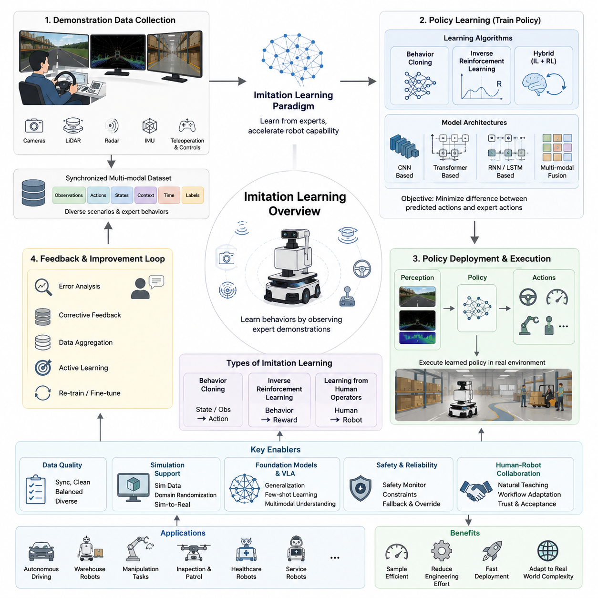
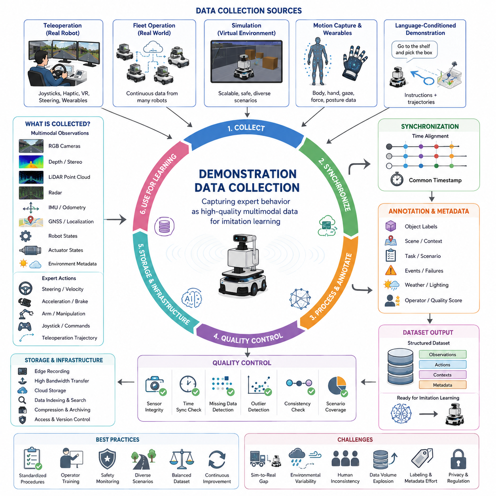
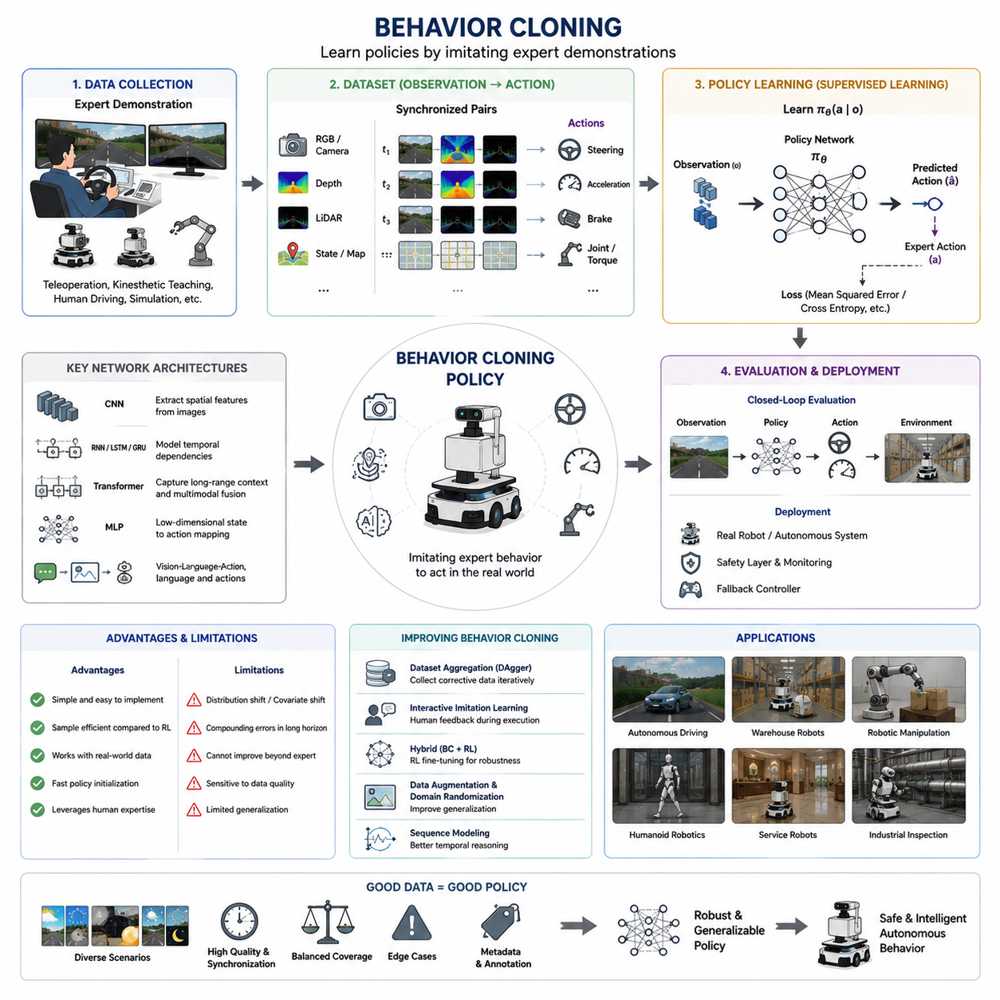
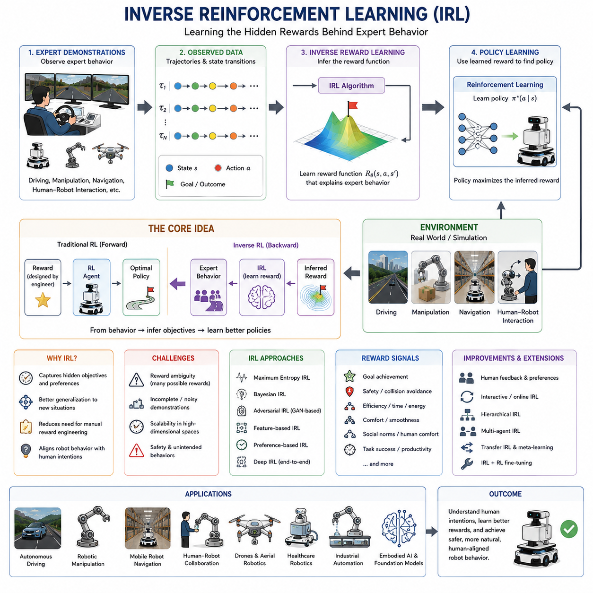
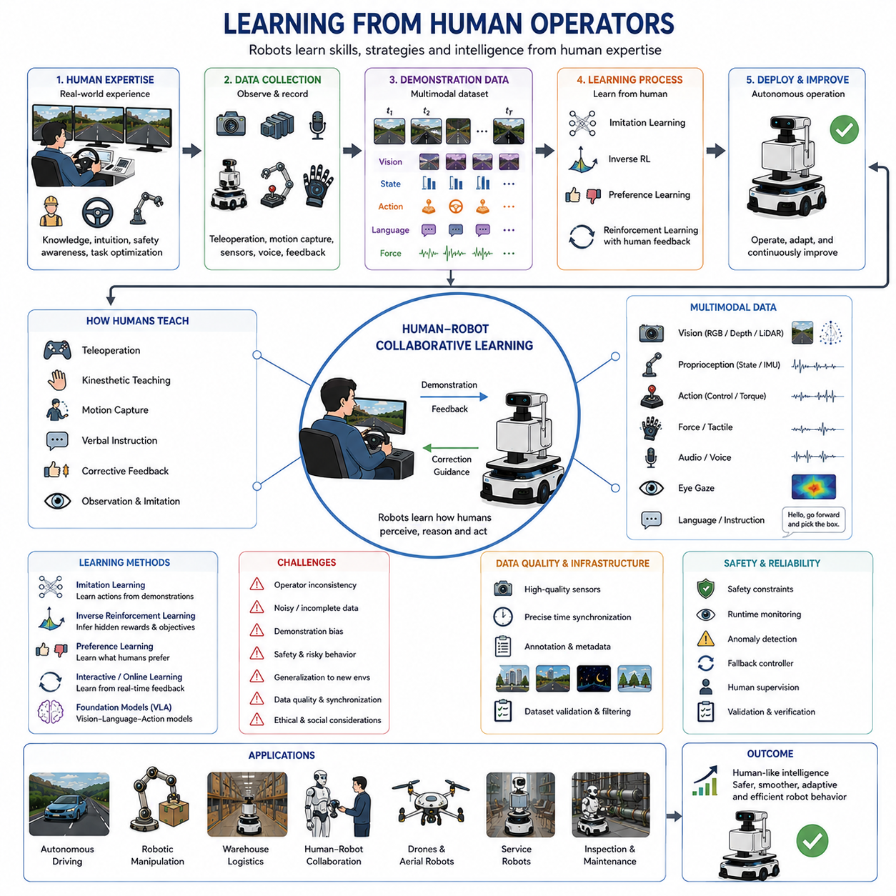
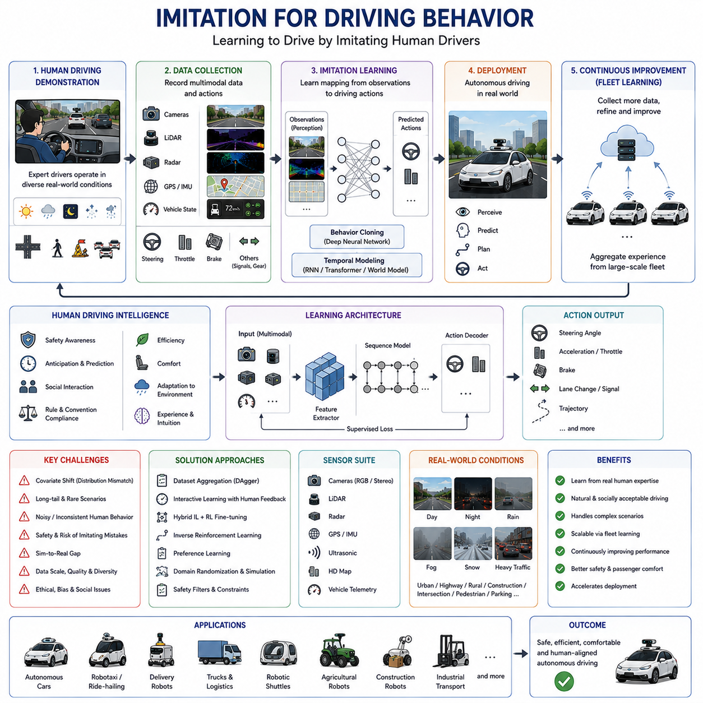
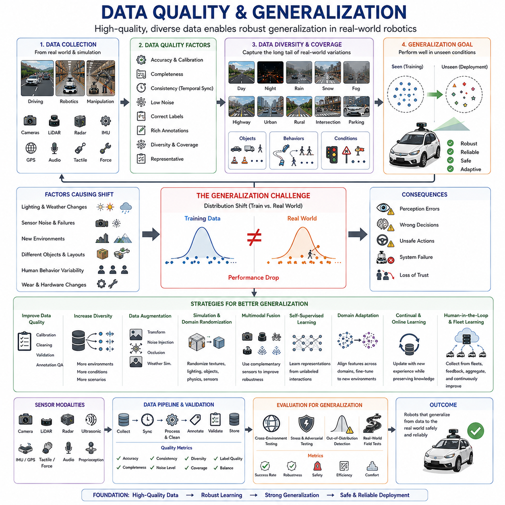
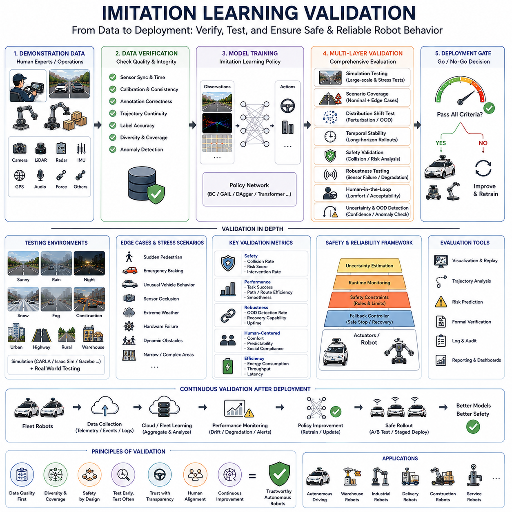

**Volume 06. AMR AI and Embodied Intelligence**


# Chapter 10. Imitation Learning

##  

## 10.1 Imitation Learning Overview

{width="7.268055555555556in" height="7.268055555555556in"}

"10_01_Imitation_Learning_Overview" introduces one of the most important learning paradigms in modern robotics and embodied artificial intelligence: the ability of robots to acquire behaviors directly from demonstrations performed by humans or expert systems. In traditional robotics, engineers manually programmed rules, trajectories, state transitions, and control logic for every operational condition. While this approach worked for highly structured industrial environments, it became increasingly difficult to scale as robots entered complex real-world environments filled with uncertainty, dynamic obstacles, human interactions, and unstructured tasks. Imitation learning emerged as a practical and scalable alternative that allows robots to learn behaviors by observing examples rather than relying entirely on handcrafted programming.

The core concept of imitation learning is fundamentally inspired by biological learning systems. Humans and animals learn many behaviors through observation, repetition, and adaptation rather than through explicit mathematical instruction. Children learn how to walk, manipulate objects, interact socially, and navigate environments by observing parents and surrounding individuals. Similarly, robots equipped with sensors, perception systems, and learning architectures can observe expert demonstrations and learn policies that map observations to actions. This capability significantly reduces the engineering burden required to program every possible behavior manually.

In modern autonomous mobile robots and embodied AI systems, imitation learning plays an increasingly important role because many operational tasks are difficult to define using explicit rule-based logic. Human driving behavior, warehouse navigation strategies, collaborative movement around workers, robotic manipulation sequences, inspection workflows, and socially aware navigation patterns often contain subtle contextual knowledge that is difficult to encode mathematically. Through imitation learning, robots can capture implicit behavioral patterns directly from demonstration data collected from human operators or expert control systems.

The basic structure of imitation learning generally involves three major components: demonstration data collection, policy learning, and behavioral execution. During data collection, robots observe expert behavior through sensors such as cameras, LiDAR, radar, IMU systems, depth cameras, force sensors, joystick commands, steering inputs, or full teleoperation interfaces. These demonstrations are transformed into datasets containing observations, states, actions, timestamps, environmental context, and sometimes additional semantic annotations. The learning system then trains a policy model capable of reproducing similar actions when exposed to comparable environmental conditions.

One of the simplest and most widely used approaches in imitation learning is behavior cloning. In behavior cloning, the learning problem is formulated as supervised learning. The robot learns a direct mapping between observed states and expert actions. For example, an autonomous vehicle may learn steering and acceleration commands from camera images and vehicle telemetry recorded during human driving sessions. Similarly, an indoor AMR may learn navigation policies from demonstration trajectories collected by experienced operators. Behavior cloning is attractive because it is relatively simple to implement and can leverage standard deep learning architectures such as convolutional neural networks, transformers, recurrent neural networks, and multimodal perception systems.

However, imitation learning also introduces significant challenges related to generalization and distribution shift. Demonstration data typically covers only a subset of possible operational scenarios, meaning the robot may encounter unseen environments or unexpected states during deployment. Small prediction errors can accumulate over time, causing the robot to deviate from safe trajectories or enter operational states that were never represented in the training data. This phenomenon is often referred to as compounding error or covariate shift. Researchers therefore developed more advanced approaches such as dataset aggregation, interactive learning, corrective feedback systems, and hybrid reinforcement learning integration to improve robustness.

Imitation learning is especially important in robotics because collecting large-scale real-world interaction data is often expensive, dangerous, or time-consuming. Reinforcement learning systems frequently require millions of interactions before achieving stable behavior, which may be impractical for industrial robots, autonomous vehicles, or healthcare robots operating in safety-critical environments. Imitation learning allows robots to bootstrap useful behaviors from relatively small amounts of expert demonstration data, dramatically accelerating the learning process. In many modern robotics systems, imitation learning and reinforcement learning are combined to achieve both sample efficiency and long-term optimization capability.

The rise of deep learning has significantly expanded the capabilities of imitation learning systems. Early robotics systems relied on handcrafted features and shallow control models, but modern deep imitation learning architectures can process raw multimodal sensory inputs directly. RGB cameras, 3D LiDAR, radar systems, thermal cameras, audio signals, language instructions, and proprioceptive sensor streams can all be integrated into end-to-end learning pipelines. Transformer architectures, vision-language-action models, and foundation models for robotics increasingly enable robots to learn complex behaviors from diverse demonstration datasets.

Imitation learning is also deeply connected to the concept of embodied intelligence. Unlike purely virtual AI systems, robots interact physically with dynamic environments where actions directly influence future observations. This creates strong coupling between perception, motion, control, environment understanding, and task execution. Successful imitation learning therefore requires not only pattern recognition but also temporal reasoning, spatial understanding, physical interaction modeling, and safety-aware decision making. Robots must learn how actions affect future environmental states while maintaining stable and reliable operation.

In autonomous driving systems, imitation learning has been widely used for lane following, obstacle avoidance, human-like driving behavior, parking assistance, and navigation policy learning. Large-scale driving datasets collected from human drivers allow AI systems to learn practical driving strategies that would be extremely difficult to program manually. Similarly, warehouse robots use imitation learning to optimize navigation behaviors around human workers and dynamically changing logistics environments. Outdoor autonomous robots can learn terrain handling strategies, inspection patterns, and patrol behaviors from experienced operators.

Teleoperation systems have become an important source of high-quality demonstration data in robotics imitation learning. Human operators remotely control robots using joysticks, haptic devices, VR interfaces, steering systems, or wearable control devices while the robot records synchronized sensor data and action commands. This enables robots to collect highly realistic operational demonstrations under diverse environmental conditions. Recent advances in digital twins and simulation environments also allow demonstration data generation inside virtual environments before transferring learned policies to real-world robots.

Another important development is inverse reinforcement learning, where robots attempt to infer the hidden reward function underlying expert behavior rather than simply copying observed actions directly. Instead of learning "what action to perform," the robot attempts to learn "why the expert performed the action." This allows more flexible generalization and adaptive behavior generation. Inverse reinforcement learning has become particularly important for socially aware robotics, autonomous driving systems, and long-horizon planning tasks where human decision-making contains implicit objectives and contextual preferences.

Data quality remains one of the most critical factors in successful imitation learning. Poorly synchronized sensors, inconsistent demonstrations, labeling errors, environmental bias, insufficient scenario diversity, and operator inconsistency can severely degrade learning performance. Industrial robotics systems therefore require carefully designed data collection pipelines involving time synchronization, multimodal sensor fusion, metadata management, operational annotation standards, and scenario balancing strategies. High-quality demonstration data often determines the upper performance limit of imitation learning systems.

Simulation-based imitation learning is increasingly used to reduce development cost and improve scalability. High-fidelity simulation environments such as Gazebo, Isaac Sim, CARLA, and Omniverse allow robots to generate demonstration data safely and efficiently. Domain randomization techniques help bridge the sim-to-real gap by exposing learning systems to diverse environmental variations including lighting changes, sensor noise, weather conditions, dynamic obstacles, and terrain variations. Simulated demonstrations can then be combined with real-world operational data to improve robustness.

Modern foundation models and vision-language-action systems are rapidly changing the future of imitation learning. Instead of learning narrow task-specific behaviors, robots increasingly learn generalized action representations from extremely large multimodal datasets collected across many tasks, environments, and robot platforms. These systems may eventually enable robots to acquire new behaviors from only a few demonstrations or natural language instructions. The integration of imitation learning with foundation models, world models, large language models, and embodied AI architectures is expected to become one of the defining research directions in future robotics systems.

Safety is another critical consideration in imitation learning for robotics. Since robots learn directly from demonstrations, unsafe operator behaviors or incomplete demonstrations can propagate dangerous policies into deployment systems. Industrial robotics applications therefore require strict validation pipelines, runtime safety monitoring, fallback control systems, operational constraints, and human override mechanisms. Safe imitation learning frameworks increasingly combine learned policies with rule-based safety controllers to maintain operational reliability in uncertain environments.

Imitation learning also plays an important role in human-robot collaboration. Robots that learn from human demonstrations can adapt more naturally to human workflows, social navigation patterns, ergonomic preferences, and collaborative task execution. In factories, hospitals, warehouses, and smart city environments, this capability may significantly improve operational efficiency and human acceptance of robotic systems. Human operators can effectively "teach" robots new tasks without requiring deep programming expertise.

As robotics systems continue evolving toward embodied intelligence and autonomous decision-making, imitation learning is expected to become one of the foundational technologies enabling scalable robot behavior acquisition. Future autonomous systems may continuously learn from fleets of deployed robots, cloud-shared operational experiences, multimodal sensory streams, and collective human interactions. The boundary between imitation learning, reinforcement learning, self-supervised learning, and foundation-model-based robot intelligence will likely become increasingly integrated over time.

Ultimately, imitation learning represents a major shift in robotics engineering philosophy. Instead of manually specifying every behavior through explicit rules and deterministic control logic, engineers increasingly build systems capable of learning directly from human expertise and operational experience. This transition moves robotics from traditional automation toward adaptive embodied intelligence capable of operating in complex real-world environments with greater flexibility, scalability, and autonomy. "10_01_Imitation_Learning_Overview" therefore serves as a foundational introduction to one of the most influential paradigms shaping the future of intelligent autonomous robots and embodied AI systems.

"10_01_Imitation_Learning_Overview"는 현대 로보틱스와 Embodied AI에서 가장 중요한 학습 패러다임 중 하나인 모방 학습(Imitation Learning)에 대해 설명합니다. 전통적인 로봇 시스템에서는 엔지니어가 모든 동작 규칙, 경로, 상태 전이, 제어 로직을 직접 프로그래밍해야 했습니다. 이러한 방식은 구조화된 산업 환경에서는 효과적이었지만, 로봇이 불확실성, 동적 장애물, 인간과의 상호작용, 비정형 작업이 존재하는 실제 환경으로 진입하면서 점점 확장성이 떨어지게 되었습니다. 모방 학습은 이러한 한계를 극복하기 위한 현실적이고 확장 가능한 대안으로 등장하였으며, 로봇이 수작업 프로그래밍 대신 인간이나 전문가의 행동 예제를 관찰하여 직접 행동을 학습할 수 있도록 합니다.

모방 학습의 핵심 개념은 생물학적 학습 시스템에서 영감을 받았습니다. 인간과 동물은 많은 행동을 명시적인 수학 공식이 아니라 관찰, 반복, 적응을 통해 학습합니다. 어린아이는 부모와 주변 사람들을 보며 걷기, 물체 조작, 사회적 상호작용, 환경 탐색을 배우게 됩니다. 마찬가지로 센서와 인공지능 시스템을 가진 로봇도 전문가의 시연 데이터를 관찰함으로써 관측값과 행동 사이의 정책(policy)을 학습할 수 있습니다. 이러한 능력은 모든 행동을 수동으로 프로그래밍해야 하는 엔지니어링 부담을 크게 줄여 줍니다.

현대의 자율주행 로봇과 Embodied AI 시스템에서 모방 학습이 중요한 이유는 많은 작업들이 명시적인 규칙 기반 로직으로 정의하기 어렵기 때문입니다. 인간의 운전 행동, 물류 창고 내 주행 전략, 작업자 주변 협업 이동, 로봇 조작 순서, 점검 절차, 사회적 배려가 포함된 주행 행동 등은 수학적으로 표현하기 어려운 미묘한 맥락 정보를 포함하고 있습니다. 모방 학습을 통해 로봇은 이러한 암묵적인 행동 패턴을 인간 운영자나 전문가 시스템의 시연 데이터로부터 직접 학습할 수 있습니다.

모방 학습 시스템은 일반적으로 시연 데이터 수집, 정책 학습, 행동 실행의 세 단계로 구성됩니다. 데이터 수집 단계에서는 로봇이 카메라, LiDAR, Radar, IMU, Depth Camera, Force Sensor, 조이스틱 입력, 스티어링 입력, Teleoperation Interface 등을 통해 전문가 행동을 관찰합니다. 이러한 시연 데이터는 관측값, 상태, 행동, 시간 정보, 환경 맥락, 경우에 따라 의미 정보(annotation)를 포함하는 데이터셋으로 변환됩니다. 이후 학습 시스템은 유사한 환경 조건에서 비슷한 행동을 생성할 수 있는 정책 모델을 학습하게 됩니다.

모방 학습에서 가장 단순하면서도 널리 사용되는 방법은 Behavior Cloning입니다. Behavior Cloning에서는 문제를 지도학습(Supervised Learning) 형태로 정의합니다. 로봇은 관측된 상태와 전문가 행동 사이의 직접적인 매핑을 학습하게 됩니다. 예를 들어 자율주행 차량은 인간 운전자의 카메라 영상과 차량 telemetry 데이터를 기반으로 조향 및 가속 명령을 학습할 수 있습니다. 실내 AMR 역시 숙련된 운영자가 생성한 주행 경로 데이터를 통해 navigation policy를 학습할 수 있습니다. Behavior Cloning은 구현이 비교적 단순하며 CNN, Transformer, RNN, Multimodal Perception Model 같은 기존 딥러닝 구조를 활용할 수 있다는 장점이 있습니다.

하지만 모방 학습에는 일반화와 분포 이동(distribution shift) 문제라는 중요한 한계도 존재합니다. 시연 데이터는 실제 환경의 일부 상황만 포함하기 때문에, 로봇이 실제 운영 중 훈련 데이터에 없던 새로운 환경이나 예외 상황을 만나게 될 수 있습니다. 작은 예측 오차가 누적되면 로봇은 안전한 경로를 벗어나거나 훈련 데이터에 존재하지 않았던 위험한 상태로 진입할 수 있습니다. 이를 Compounding Error 또는 Covariate Shift라고 부릅니다. 이러한 문제를 해결하기 위해 Dataset Aggregation, Interactive Learning, Corrective Feedback System, Reinforcement Learning 결합 방식 등이 개발되었습니다.

모방 학습은 특히 로보틱스 분야에서 중요합니다. 실제 로봇 상호작용 데이터를 대규모로 수집하는 것은 매우 비용이 많이 들고 위험하며 시간이 오래 걸리기 때문입니다. Reinforcement Learning은 안정적인 행동을 학습하기 위해 수백만 번 이상의 상호작용이 필요한 경우가 많으며, 이는 산업용 로봇이나 의료 로봇 같은 안전 중요 시스템에서는 현실적으로 어렵습니다. 모방 학습은 비교적 적은 양의 전문가 데이터만으로도 유용한 행동을 학습할 수 있기 때문에 학습 속도를 크게 향상시킵니다. 실제 산업 시스템에서는 모방 학습과 강화학습을 결합하여 샘플 효율성과 장기 최적화를 동시에 달성하는 경우가 많습니다.

딥러닝의 발전은 모방 학습의 가능성을 크게 확장시켰습니다. 초기 로봇 시스템은 수작업 feature와 단순 제어 모델에 의존했지만, 현대의 Deep Imitation Learning은 Raw Multimodal Sensor Input을 직접 처리할 수 있습니다. RGB Camera, 3D LiDAR, Radar, Thermal Camera, Audio Signal, Language Instruction, 내부 센서 데이터(Proprioceptive Data) 등을 통합하여 End-to-End Learning Pipeline을 구성할 수 있게 되었습니다. Transformer Architecture, Vision-Language-Action Model, Robotics Foundation Model은 다양한 시연 데이터로부터 복잡한 행동을 학습할 수 있도록 발전하고 있습니다.

모방 학습은 Embodied Intelligence 개념과도 깊게 연결됩니다. 가상 AI 시스템과 달리 로봇은 실제 물리 환경과 상호작용하며 행동이 미래 상태에 직접 영향을 미칩니다. 따라서 성공적인 모방 학습은 단순 패턴 인식만으로는 충분하지 않으며, 시간적 추론, 공간 이해, 물리적 상호작용 모델링, 안전 중심 의사결정이 함께 요구됩니다. 로봇은 자신의 행동이 미래 환경 상태를 어떻게 변화시키는지 이해하면서 안정적으로 동작해야 합니다.

자율주행 시스템에서는 모방 학습이 차선 유지, 장애물 회피, 인간과 유사한 운전 행동, 주차 보조, 주행 정책 학습 등에 널리 활용되고 있습니다. 대규모 인간 운전 데이터셋을 이용하면 수작업 프로그래밍으로는 매우 어려운 실제 운전 전략을 학습할 수 있습니다. 물류 창고 로봇 역시 작업자와 복잡한 환경 속에서 효율적인 주행 행동을 모방 학습으로 최적화할 수 있습니다. 실외 자율주행 로봇은 지형 대응 전략, 순찰 패턴, 점검 행동 등을 전문가 시연으로부터 학습할 수 있습니다.

Teleoperation System은 고품질 모방 학습 데이터의 중요한 공급원으로 사용됩니다. 인간 운영자는 조이스틱, Haptic Device, VR Interface, Steering System, Wearable Control Device 등을 이용하여 원격으로 로봇을 제어하고, 로봇은 센서 데이터와 행동 명령을 동기화하여 기록합니다. 이를 통해 다양한 환경 조건에서 매우 현실적인 시연 데이터를 수집할 수 있습니다. 최근에는 Digital Twin과 시뮬레이션 환경을 이용하여 가상 환경에서 시연 데이터를 생성한 뒤 실제 로봇으로 이전하는 방식도 활발히 사용되고 있습니다.

Inverse Reinforcement Learning 역시 중요한 발전 방향입니다. 단순히 행동을 복사하는 것이 아니라 전문가 행동 뒤에 숨어 있는 보상 함수(reward function)를 추론하려는 접근 방식입니다. 즉 "무엇을 해야 하는가"가 아니라 "왜 그렇게 행동했는가"를 학습하는 것입니다. 이를 통해 보다 유연하고 일반화된 행동 생성이 가능해집니다. 이러한 접근은 사회적 로봇, 자율주행, 장기 계획 시스템에서 특히 중요하게 활용되고 있습니다.

데이터 품질은 모방 학습 성능을 결정하는 핵심 요소입니다. 센서 동기화 오류, 불일관된 시연, 라벨 오류, 환경 편향, 시나리오 다양성 부족, 운영자 간 행동 차이는 모두 학습 성능을 크게 저하시킬 수 있습니다. 따라서 산업용 로봇 시스템에서는 시간 동기화, 멀티모달 센서 융합, 메타데이터 관리, Annotation Standard, 시나리오 균형화 전략 등을 포함한 체계적인 데이터 수집 파이프라인이 필요합니다.

시뮬레이션 기반 모방 학습은 비용 절감과 확장성을 위해 점점 중요해지고 있습니다. Gazebo, Isaac Sim, CARLA, Omniverse 같은 고정밀 시뮬레이션 환경은 안전하고 효율적으로 시연 데이터를 생성할 수 있게 해줍니다. Domain Randomization 기법은 조명 변화, 센서 노이즈, 날씨, 동적 장애물, 지형 변화를 시뮬레이션에 포함하여 Sim-to-Real Gap을 줄이는 데 활용됩니다. 이후 시뮬레이션 데이터와 실제 운영 데이터를 결합하여 더욱 견고한 정책을 학습하게 됩니다.

현대의 Foundation Model과 Vision-Language-Action 시스템은 모방 학습의 미래를 빠르게 변화시키고 있습니다. 로봇은 더 이상 특정 작업 하나만 학습하는 것이 아니라, 다양한 환경과 작업에서 수집된 초대규모 멀티모달 데이터셋으로부터 일반화된 행동 표현을 학습하게 됩니다. 미래에는 몇 개의 시연이나 자연어 명령만으로 새로운 행동을 학습할 수 있는 로봇이 등장할 가능성이 높습니다. 모방 학습은 Foundation Model, World Model, LLM, Embodied AI Architecture와 결합되며 미래 로봇 AI의 핵심 방향 중 하나가 되고 있습니다.

안전성은 로보틱스 모방 학습에서 매우 중요한 요소입니다. 로봇은 인간 시연 데이터를 그대로 학습하기 때문에 잘못된 행동이나 불완전한 시연이 위험한 정책으로 이어질 수 있습니다. 따라서 산업용 로봇에서는 엄격한 검증 시스템, Runtime Safety Monitoring, Fallback Control System, Operational Constraint, Human Override Mechanism 등이 필요합니다. 최근에는 Learned Policy와 Rule-Based Safety Controller를 결합한 Safe Imitation Learning Framework가 활발히 연구되고 있습니다.

모방 학습은 인간-로봇 협업에서도 중요한 역할을 합니다. 인간의 시연을 통해 학습한 로봇은 인간 작업 방식, 사회적 이동 패턴, 인체공학적 선호도, 협업 행동에 더 자연스럽게 적응할 수 있습니다. 공장, 병원, 물류창고, 스마트시티 환경에서 이러한 능력은 작업 효율성과 인간의 로봇 수용성을 크게 향상시킬 수 있습니다. 인간 운영자는 복잡한 프로그래밍 없이도 로봇에게 새로운 작업을 "가르칠" 수 있게 됩니다.

로봇 시스템이 Embodied Intelligence와 Autonomous Decision-Making 방향으로 발전함에 따라 모방 학습은 점점 더 핵심 기술이 될 것으로 예상됩니다. 미래의 자율 시스템은 여러 대의 로봇 fleet, 클라우드 기반 공유 경험, 멀티모달 센서 스트림, 인간과의 집단 상호작용을 통해 지속적으로 학습하게 될 것입니다. 또한 모방 학습, 강화학습, 자기지도학습, Foundation Model 기반 로봇 지능의 경계는 점점 더 통합될 것으로 보입니다.

결국 모방 학습은 로봇 엔지니어링 철학 자체의 변화를 의미합니다. 과거에는 모든 행동을 명시적 규칙과 결정론적 제어 로직으로 프로그래밍했지만, 미래 로봇 시스템은 인간의 경험과 전문성을 직접 학습할 수 있는 방향으로 발전하고 있습니다. 이는 로보틱스를 단순 자동화에서 복잡한 실제 환경 속에서 유연하고 확장 가능하며 자율적으로 동작하는 적응형 Embodied Intelligence로 전환시키는 핵심 기술입니다. 따라서 "10_01_Imitation_Learning_Overview"는 미래 지능형 자율 로봇과 Embodied AI 시스템을 형성하는 가장 중요한 학습 패러다임 중 하나에 대한 기초적이면서도 핵심적인 소개가 됩니다.

##  

## 10.2 Demonstration Data Collection

{width="7.268055555555556in" height="7.268055555555556in"}

"10_02_Demonstration_Data_Collection" focuses on one of the most important foundations of imitation learning and embodied robotics intelligence: the systematic acquisition of high-quality demonstration data from human operators, expert systems, simulation environments, or autonomous operational platforms. In imitation learning, the quality, diversity, synchronization, and realism of demonstration data directly determine the performance, safety, robustness, and generalization capability of the learned robot policy. Unlike conventional supervised learning datasets that may consist only of labeled images or structured data tables, demonstration datasets for robotics contain complex multimodal information describing dynamic interactions between perception, decision-making, motion control, environmental context, and temporal behavior. As modern robots evolve toward embodied intelligence and autonomous decision-making, demonstration data collection becomes one of the most strategically important engineering processes in robotics AI development.

The core objective of demonstration data collection is to capture expert behavior in a form that can be transformed into machine-learnable representations. In traditional robotics engineering, behaviors were manually programmed using deterministic control logic, predefined trajectories, and handcrafted state transitions. However, many real-world robotic tasks contain implicit knowledge that is difficult to formalize mathematically. Human driving behavior, collaborative navigation around workers, terrain adaptation, object manipulation strategies, inspection patterns, social interaction behaviors, and recovery maneuvers often involve subtle contextual reasoning that emerges naturally during human operation. Demonstration data collection allows robotic systems to observe these expert behaviors directly and transform them into trainable datasets for imitation learning systems.

A typical demonstration dataset contains synchronized streams of sensory observations, robot states, environmental information, and expert actions. In autonomous mobile robots, this may include RGB camera images, depth images, LiDAR point clouds, radar data, GNSS coordinates, IMU measurements, wheel encoder information, actuator states, velocity vectors, localization maps, and environmental metadata. At the same time, the dataset records expert control actions such as steering angles, acceleration commands, braking signals, joystick inputs, teleoperation trajectories, or robot arm control sequences. The synchronization between perception and action is critically important because even small timing inconsistencies can significantly degrade learning performance and behavioral stability.

One of the most common methods for collecting demonstration data is teleoperation-based control. In this approach, a human operator remotely controls the robot using joysticks, steering wheels, haptic devices, VR interfaces, wearable systems, or dedicated industrial control stations. While the operator performs tasks, the robot records all sensor streams and control commands simultaneously. Teleoperation allows robots to capture realistic expert behavior under actual operational conditions including narrow corridors, dynamic obstacles, crowded warehouse environments, outdoor terrain variations, and collaborative human-robot interaction scenarios. Because the human operator directly adapts to environmental uncertainty in real time, teleoperation data often contains valuable implicit decision-making patterns that are difficult to design manually.

For autonomous driving and outdoor robotics applications, demonstration data collection frequently involves fleet-scale data acquisition. Multiple vehicles or robots continuously collect operational data during daily deployment while cloud infrastructure aggregates and organizes the information into centralized training datasets. These large-scale collection systems may accumulate petabytes of multimodal operational data including driving trajectories, obstacle encounters, weather conditions, traffic interactions, terrain changes, and safety events. Fleet learning architectures allow robotic systems to learn from collective operational experience rather than relying solely on isolated demonstrations from individual operators.

Simulation-based demonstration collection has also become increasingly important due to the high cost and operational risk associated with real-world robotics data acquisition. Modern simulation environments such as Gazebo, Isaac Sim, CARLA, Webots, AirSim, and Omniverse allow robots to generate large-scale demonstration datasets safely and efficiently. Virtual environments can reproduce warehouse operations, urban driving scenarios, industrial inspection workflows, agricultural navigation, construction environments, and human interaction situations without risking physical damage or safety incidents. Simulation systems also allow precise control over environmental variables such as lighting, weather, sensor noise, obstacle density, and terrain conditions.

One of the major advantages of simulation-based data collection is scalability. Real-world demonstration collection may require expensive hardware, trained operators, regulatory approval, and long operational schedules. In contrast, simulation environments can generate millions of interaction samples rapidly using parallelized virtual robots. Domain randomization techniques further improve generalization by introducing randomized environmental conditions such as changing textures, object placement, illumination, sensor distortions, weather effects, and dynamic object behavior. By exposing learning systems to highly diverse simulated environments, robots can improve robustness when transferred into real-world deployment.

Despite the advantages of simulation, sim-to-real transfer remains one of the largest challenges in robotics learning. Real-world environments contain complex physical phenomena that are difficult to reproduce perfectly inside simulations. Sensor calibration errors, actuator latency, wheel slippage, environmental uncertainty, vibration, thermal effects, and unpredictable human behavior often create significant gaps between simulated and physical operation. As a result, many robotics systems combine simulation-generated demonstrations with real-world operational data to improve transfer robustness and deployment reliability.

Another important aspect of demonstration data collection is multimodal synchronization. Modern embodied AI systems rarely rely on a single sensor modality. Instead, robots combine vision, LiDAR, radar, audio, tactile sensing, proprioceptive feedback, force measurements, localization systems, and language instructions into unified perception-action pipelines. Accurate timestamp synchronization between these modalities is essential because temporal misalignment can corrupt causal relationships between observations and actions. High-precision synchronization technologies such as PTP, hardware triggers, synchronized clocks, ROS timestamping, and sensor fusion middleware are commonly used in industrial robotics systems.

Data annotation and metadata management also play a major role in demonstration collection workflows. In addition to raw sensor data and action commands, many systems include semantic annotations describing environmental context, object classes, operational scenarios, task labels, failure conditions, safety events, weather conditions, and terrain types. Rich metadata enables more advanced training strategies such as scenario balancing, targeted failure analysis, curriculum learning, domain adaptation, and retrieval-based training workflows. In large-scale industrial AI systems, metadata management often becomes as important as the sensor data itself.

Human demonstration consistency represents another major challenge in imitation learning datasets. Different operators may perform the same task using different strategies, reaction times, safety margins, and behavioral preferences. Inconsistent demonstrations can confuse learning systems and reduce policy stability. Industrial robotics organizations therefore often establish standardized operational procedures and training protocols for human demonstrators. Some systems also evaluate operator quality scores and filter low-quality demonstrations before dataset integration.

Safety-aware data collection is critically important in robotics applications. During demonstration acquisition, robots may operate near humans, industrial machinery, vehicles, or hazardous environments. Safety monitoring systems including emergency stop mechanisms, collision avoidance systems, geofencing, speed limitation controls, runtime monitoring software, and fallback controllers are often integrated into data collection platforms. In high-risk domains such as autonomous driving, mining, healthcare robotics, and industrial inspection, strict operational validation procedures are required before demonstration collection begins.

Data storage and infrastructure management become increasingly challenging as demonstration datasets grow in scale. Modern robotics fleets may generate terabytes of data per day from cameras, LiDAR systems, radar sensors, telemetry streams, and operational logs. Efficient storage architectures require high-bandwidth recording systems, distributed cloud storage, compression pipelines, metadata indexing systems, retrieval frameworks, and long-term archival management. Many industrial AI systems now rely on hybrid edge-cloud data infrastructures where robots perform local buffering while uploading selected operational events to centralized training servers.

Data quality control is one of the most important engineering tasks in demonstration learning systems. Corrupted sensor streams, dropped frames, synchronization drift, operator errors, sensor occlusion, environmental artifacts, inconsistent labeling, and hardware instability can significantly reduce training performance. Automated validation pipelines are increasingly used to detect abnormal trajectories, missing sensor data, timestamp inconsistencies, abnormal actuator behavior, and corrupted recordings before training begins. High-quality datasets are often more valuable than larger but poorly curated datasets.

Temporal diversity and scenario coverage are also essential for robust imitation learning. If robots are trained only in ideal conditions, they may fail catastrophically in unexpected environments. Effective demonstration collection therefore includes diverse environmental conditions such as rain, fog, snow, dust, low-light operation, crowded spaces, uneven terrain, sensor interference, dynamic obstacles, and emergency situations. Edge-case collection strategies are especially important for autonomous systems operating in public or safety-critical environments.

Recent advances in wearable sensing and motion capture technologies have expanded the possibilities of demonstration collection. Human body motion, hand trajectories, gaze direction, force application, posture dynamics, and ergonomic movement patterns can now be recorded using motion capture suits, gloves, eye trackers, EMG systems, and spatial tracking sensors. These technologies are especially important in humanoid robotics, collaborative manipulation systems, and dexterous robotic control research.

Language-conditioned demonstration collection is another emerging research direction. In these systems, demonstration trajectories are paired with natural language instructions describing tasks, goals, constraints, and environmental context. This creates multimodal datasets suitable for training vision-language-action models capable of understanding both sensory input and linguistic commands. Future embodied AI systems may increasingly rely on these integrated datasets to support flexible task generalization and human-robot communication.

Cloud robotics and fleet learning architectures are also transforming how demonstration data is collected and utilized. Instead of training individual robots independently, modern systems increasingly aggregate operational experiences from thousands of deployed robots into centralized learning infrastructures. Shared learning systems allow robots to collectively improve navigation policies, obstacle avoidance strategies, manipulation behaviors, and safety handling mechanisms through continuous operational feedback loops.

The future of demonstration data collection is closely tied to the broader evolution of embodied AI and foundation models for robotics. Large-scale multimodal robotics datasets are expected to become foundational resources for generalized robot intelligence. Future robots may learn from massive collections of operational demonstrations spanning warehouses, hospitals, factories, construction sites, transportation systems, homes, and smart city infrastructures. These datasets may eventually support generalist robot models capable of transferring learned knowledge across entirely different tasks and environments.

Ultimately, demonstration data collection represents far more than a simple recording process. It is the creation of experiential knowledge infrastructures that allow robots to inherit operational intelligence from humans and expert systems. The quality, diversity, scale, synchronization, and realism of demonstration datasets fundamentally determine how effectively robots can learn adaptive behavior in complex real-world environments. "10_02_Demonstration_Data_Collection" therefore serves as a foundational chapter explaining one of the most critical engineering pillars underlying imitation learning, embodied intelligence, autonomous robotics, and future AI-driven robotic ecosystems.

"10_02_Demonstration_Data_Collection"은 모방 학습(Imitation Learning)과 Embodied Robotics Intelligence의 가장 중요한 기반 중 하나인 시연 데이터(Demonstration Data)의 체계적인 수집 과정에 대해 설명합니다. 모방 학습에서는 인간 운영자, 전문가 시스템, 시뮬레이션 환경, 자율 운영 플랫폼 등으로부터 수집되는 시연 데이터의 품질, 다양성, 동기화 수준, 현실성이 학습된 로봇 정책의 성능, 안전성, 강건성, 일반화 능력을 직접적으로 결정합니다. 일반적인 지도학습 데이터셋이 단순히 이미지나 정형 데이터만 포함하는 경우가 많은 반면, 로보틱스용 시연 데이터셋은 지각(perception), 의사결정, 모션 제어, 환경 맥락, 시간적 행동이 복합적으로 결합된 멀티모달 동적 정보를 포함합니다. 현대 로봇이 Embodied Intelligence와 Autonomous Decision-Making 방향으로 발전함에 따라 시연 데이터 수집은 로봇 AI 개발에서 가장 전략적으로 중요한 엔지니어링 프로세스 중 하나가 되고 있습니다.

시연 데이터 수집의 핵심 목적은 전문가의 행동을 기계가 학습 가능한 형태로 변환하는 것입니다. 전통적인 로봇 엔지니어링에서는 행동을 결정론적 제어 로직, 사전 정의된 경로, 수작업 상태 전이 방식으로 직접 프로그래밍했습니다. 하지만 실제 환경에서의 많은 로봇 작업은 수학적으로 명확히 정의하기 어려운 암묵적 지식을 포함하고 있습니다. 인간의 운전 행동, 작업자 주변 협업 주행, 지형 적응, 물체 조작 전략, 점검 패턴, 사회적 상호작용 행동, 복구 동작 등은 인간 운영 과정 속에서 자연스럽게 형성되는 미묘한 맥락적 판단을 포함합니다. 시연 데이터 수집은 이러한 전문가 행동을 직접 관찰하고 학습 가능한 데이터셋으로 변환할 수 있게 합니다.

일반적인 시연 데이터셋은 센서 관측값, 로봇 상태, 환경 정보, 전문가 행동을 시간 동기화된 형태로 포함합니다. 자율주행 로봇의 경우 RGB 카메라 영상, Depth Image, LiDAR Point Cloud, Radar Data, GNSS 좌표, IMU 측정값, Wheel Encoder 정보, Actuator 상태, 속도 벡터, Localization Map, 환경 메타데이터 등이 포함될 수 있습니다. 동시에 조향각, 가속 명령, 제동 신호, 조이스틱 입력, Teleoperation Trajectory, Robot Arm 제어 명령 같은 전문가 행동 데이터도 기록됩니다. 지각과 행동 간의 시간 동기화는 매우 중요하며, 작은 시간 오차만으로도 학습 성능과 행동 안정성이 크게 저하될 수 있습니다.

가장 널리 사용되는 시연 데이터 수집 방식 중 하나는 Teleoperation 기반 제어입니다. 인간 운영자는 조이스틱, 스티어링 휠, Haptic Device, VR Interface, Wearable System, 산업용 제어 스테이션 등을 이용해 원격으로 로봇을 조작하며, 로봇은 모든 센서 데이터와 제어 명령을 동시에 기록합니다. Teleoperation은 좁은 통로, 동적 장애물, 복잡한 창고 환경, 실외 지형 변화, 인간-로봇 협업 환경 같은 실제 운영 조건에서 현실적인 전문가 행동을 수집할 수 있게 해줍니다. 인간 운영자가 실시간으로 환경 불확실성에 적응하기 때문에, 이러한 데이터에는 수작업으로 설계하기 어려운 암묵적인 의사결정 패턴이 포함됩니다.

자율주행 및 실외 로보틱스 분야에서는 Fleet-Scale Data Acquisition이 점점 중요해지고 있습니다. 여러 대의 차량과 로봇이 실제 운영 중 지속적으로 데이터를 수집하고, 클라우드 인프라가 이를 중앙 집중형 학습 데이터셋으로 통합합니다. 이러한 시스템은 주행 경로, 장애물 상황, 날씨 조건, 교통 상호작용, 지형 변화, 안전 이벤트 등을 포함하는 페타바이트 규모의 멀티모달 데이터를 축적할 수 있습니다. Fleet Learning Architecture는 개별 운영자 데이터가 아니라 집단적 운영 경험으로부터 로봇이 학습할 수 있도록 합니다.

시뮬레이션 기반 시연 데이터 수집도 점점 중요해지고 있습니다. 실제 로봇 데이터 수집은 비용이 높고 위험 부담이 크기 때문입니다. Gazebo, Isaac Sim, CARLA, Webots, AirSim, Omniverse 같은 시뮬레이션 환경은 창고 운영, 도시 주행, 산업 점검, 농업 환경, 건설 현장, 인간 상호작용 시나리오 등을 안전하게 재현할 수 있습니다. 시뮬레이션은 조명, 날씨, 센서 노이즈, 장애물 밀도, 지형 조건 같은 환경 변수를 정밀하게 제어할 수 있다는 장점도 제공합니다.

시뮬레이션 기반 데이터 수집의 가장 큰 장점 중 하나는 확장성입니다. 실제 데이터 수집에는 고가의 하드웨어, 숙련된 운영자, 규제 승인, 긴 운영 시간이 필요할 수 있습니다. 반면 시뮬레이션 환경은 병렬화된 가상 로봇을 통해 수백만 개의 상호작용 샘플을 빠르게 생성할 수 있습니다. 또한 Domain Randomization 기법은 텍스처 변화, 물체 위치 변경, 조명 변화, 센서 왜곡, 날씨 효과, 동적 객체 행동 등을 무작위로 생성하여 일반화 성능을 향상시킵니다. 이를 통해 실제 환경에서도 더 강건한 정책을 학습할 수 있습니다.

하지만 시뮬레이션과 실제 환경 사이의 Sim-to-Real Gap은 여전히 중요한 문제입니다. 실제 환경에는 센서 보정 오류, Actuator Latency, Wheel Slip, 진동, 열 효과, 예측 불가능한 인간 행동 등 시뮬레이션에서 완벽하게 재현하기 어려운 복잡한 물리 현상이 존재합니다. 따라서 많은 로봇 시스템은 시뮬레이션 데이터와 실제 운영 데이터를 함께 결합하여 강건성과 배포 안정성을 향상시킵니다.

멀티모달 동기화 역시 시연 데이터 수집에서 매우 중요합니다. 현대 Embodied AI 시스템은 단일 센서가 아니라 Vision, LiDAR, Radar, Audio, Tactile Sensor, Proprioceptive Feedback, Force Measurement, Localization System, Language Instruction 등을 통합적으로 사용합니다. 이러한 센서 간의 시간 동기화가 정확하지 않으면 관측과 행동 사이의 인과 관계가 깨질 수 있습니다. 산업용 로봇 시스템에서는 PTP, Hardware Trigger, ROS Timestamp, Sensor Fusion Middleware 같은 고정밀 동기화 기술이 널리 사용됩니다.

데이터 Annotation과 Metadata 관리도 중요한 역할을 합니다. 원시 센서 데이터와 행동 명령 외에도 환경 맥락, 객체 클래스, 작업 시나리오, 실패 상황, 안전 이벤트, 날씨 상태, 지형 유형 같은 의미 정보가 함께 저장되는 경우가 많습니다. 이러한 풍부한 메타데이터는 Scenario Balancing, Failure Analysis, Curriculum Learning, Domain Adaptation, Retrieval-Based Training 같은 고급 학습 전략을 가능하게 합니다. 실제 산업용 AI 시스템에서는 메타데이터 관리가 센서 데이터 자체만큼 중요해지고 있습니다.

인간 시연의 일관성 문제도 중요한 과제입니다. 서로 다른 운영자는 동일한 작업을 서로 다른 전략, 반응 속도, 안전 거리, 행동 스타일로 수행할 수 있습니다. 이러한 불일관성은 학습 시스템을 혼란스럽게 하고 정책 안정성을 저하시킬 수 있습니다. 따라서 산업용 로보틱스 조직은 표준화된 운영 절차와 시연 프로토콜을 정의하는 경우가 많으며, 일부 시스템은 운영자 품질 점수를 평가하여 저품질 데이터를 필터링하기도 합니다.

안전 중심 데이터 수집 역시 매우 중요합니다. 시연 데이터 수집 중 로봇은 인간, 산업 장비, 차량, 위험 환경 근처에서 동작할 수 있기 때문입니다. Emergency Stop System, Collision Avoidance System, Geofencing, Speed Limitation, Runtime Monitoring Software, Fallback Controller 같은 안전 시스템이 일반적으로 통합됩니다. 자율주행, 광산, 의료 로봇, 산업 점검 같은 고위험 분야에서는 시연 수집 전에 엄격한 운영 검증 절차가 요구됩니다.

데이터 저장 및 인프라 관리도 중요한 문제입니다. 현대 로봇 Fleet은 카메라, LiDAR, Radar, Telemetry Stream, 운영 로그로부터 하루 수 테라바이트 이상의 데이터를 생성할 수 있습니다. 이를 위해 고대역폭 기록 시스템, 분산 클라우드 저장소, 압축 파이프라인, 메타데이터 인덱싱, 검색 시스템, 장기 보관 아키텍처가 필요합니다. 많은 산업용 AI 시스템은 로봇이 로컬에서 데이터를 버퍼링하고 선택된 이벤트만 클라우드로 업로드하는 Hybrid Edge-Cloud 구조를 사용합니다.

데이터 품질 관리 역시 가장 중요한 엔지니어링 작업 중 하나입니다. 손상된 센서 스트림, 누락 프레임, 동기화 오류, 운영자 실수, 센서 가림, 환경 노이즈, 잘못된 라벨링, 하드웨어 불안정성은 학습 성능을 크게 저하시킬 수 있습니다. 최근에는 비정상 경로, 누락 센서 데이터, 시간 불일치, 비정상 Actuator 행동, 손상된 기록을 자동으로 탐지하는 Validation Pipeline이 널리 사용되고 있습니다. 실제로는 양이 많지만 품질이 낮은 데이터보다 적지만 고품질 데이터셋이 훨씬 더 가치가 있는 경우가 많습니다.

시간적 다양성과 시나리오 커버리지 역시 중요합니다. 이상적인 조건에서만 학습한 로봇은 예외 환경에서 치명적으로 실패할 수 있습니다. 따라서 효과적인 시연 데이터 수집은 비, 안개, 눈, 먼지, 저조도 환경, 군중 환경, 불규칙 지형, 센서 간섭, 동적 장애물, 비상 상황 등을 포함해야 합니다. 특히 Public Environment나 Safety-Critical Environment에서 운영되는 자율 시스템은 Edge Case 수집 전략이 매우 중요합니다.

최근에는 Wearable Sensor와 Motion Capture 기술의 발전으로 시연 데이터 수집 가능성이 더욱 확장되고 있습니다. 인간의 몸 움직임, 손 궤적, 시선 방향, 힘 적용, 자세 변화 등을 Motion Capture Suit, Glove, Eye Tracker, EMG System, Spatial Tracking Sensor로 기록할 수 있게 되었습니다. 이러한 기술은 Humanoid Robot, Collaborative Manipulation System, Dexterous Robot Control 분야에서 특히 중요하게 사용됩니다.

Language-Conditioned Demonstration Collection 역시 중요한 연구 방향입니다. 이 방식에서는 시연 경로와 함께 작업 설명, 목표, 제약 조건, 환경 설명을 자연어로 함께 저장합니다. 이를 통해 Vision-Language-Action Model을 학습할 수 있는 멀티모달 데이터셋이 생성됩니다. 미래의 Embodied AI는 감각 정보와 언어 명령을 동시에 이해하는 방향으로 발전할 가능성이 높습니다.

Cloud Robotics와 Fleet Learning Architecture는 시연 데이터 수집과 활용 방식을 크게 변화시키고 있습니다. 과거처럼 개별 로봇이 독립적으로 학습하는 것이 아니라, 수천 대의 로봇 운영 경험을 중앙 집중형 학습 시스템으로 통합하는 방식이 점점 보편화되고 있습니다. 이를 통해 Navigation Policy, Obstacle Avoidance, Manipulation Behavior, Safety Handling Mechanism 등이 집단적으로 개선될 수 있습니다.

시연 데이터 수집의 미래는 Embodied AI와 Robotics Foundation Model의 발전과 밀접하게 연결되어 있습니다. 대규모 멀티모달 로봇 데이터셋은 미래 범용 로봇 지능의 핵심 기반이 될 가능성이 높습니다. 미래 로봇은 창고, 병원, 공장, 건설 현장, 교통 시스템, 가정, 스마트 시티 등 다양한 환경에서 수집된 대규모 운영 데이터를 기반으로 학습하게 될 것입니다. 이러한 데이터셋은 서로 다른 작업과 환경 사이에서도 지식을 전이할 수 있는 Generalist Robot Model 개발을 가능하게 할 것입니다.

결국 시연 데이터 수집은 단순 기록 작업이 아닙니다. 그것은 인간과 전문가 시스템의 운영 지능을 로봇이 계승할 수 있도록 하는 경험 기반 지식 인프라를 구축하는 과정입니다. 데이터셋의 품질, 다양성, 규모, 동기화 수준, 현실성은 로봇이 실제 환경에서 얼마나 효과적으로 적응 행동을 학습할 수 있는지를 결정합니다. 따라서 "10_02_Demonstration_Data_Collection"은 모방 학습, Embodied Intelligence, 자율 로보틱스, 미래 AI 기반 로봇 생태계를 구성하는 가장 핵심적인 엔지니어링 기반 중 하나를 설명하는 중요한 장이라고 할 수 있습니다.

##  

## 10.3 Behavior Cloning

{width="7.268055555555556in" height="7.268055555555556in"}

"10_03_Behavior_Cloning" introduces one of the most fundamental and widely used approaches in imitation learning for robotics and embodied artificial intelligence systems. Behavior cloning allows robots to learn control policies directly from expert demonstrations by treating the learning problem as a supervised learning task. Instead of manually programming every motion, trajectory, or decision-making rule, engineers provide examples of expert behavior, and the robot learns how to reproduce similar actions when exposed to comparable environmental observations. This paradigm represents a major transition in robotics engineering, moving from handcrafted deterministic control systems toward data-driven autonomous behavior acquisition. In modern robotics, behavior cloning has become a foundational technique for autonomous vehicles, warehouse robots, humanoid systems, collaborative manipulators, service robots, agricultural automation, and intelligent industrial inspection systems.

The central idea behind behavior cloning is conceptually simple but operationally powerful. During the demonstration phase, a human operator or expert system performs tasks while the robot records sensory observations and corresponding control actions. The collected dataset is then used to train a machine learning model that maps observations directly to actions. In autonomous driving systems, for example, the model may learn steering, acceleration, and braking commands from synchronized camera images, LiDAR data, radar measurements, and vehicle telemetry. In robotic manipulation systems, the robot may learn grasping trajectories, arm movement sequences, and force control behaviors from teleoperated demonstrations. The objective is to imitate expert behavior as closely as possible by minimizing prediction errors between the learned policy and demonstrated actions.

Behavior cloning is often considered the most straightforward form of imitation learning because it does not explicitly require reward functions, environment simulation loops, or long-term policy optimization processes. Instead, the learning pipeline resembles conventional supervised deep learning. Inputs such as images, sensor streams, localization maps, or robot states are processed by neural networks, while expert actions serve as target labels. Standard optimization methods such as stochastic gradient descent, Adam optimization, and backpropagation are used to train the policy network. This simplicity makes behavior cloning highly attractive for industrial robotics systems where operational efficiency and engineering practicality are important.

The rise of deep learning has dramatically expanded the capabilities of behavior cloning systems. Early robotics systems relied on handcrafted features and shallow regression models, but modern deep neural architectures can directly process high-dimensional multimodal sensory data. Convolutional neural networks extract spatial features from RGB images and depth maps, transformers model long-range temporal dependencies and multimodal context, recurrent neural networks capture sequential behavioral dynamics, and vision-language-action architectures integrate perception with semantic task understanding. These advances allow robots to learn increasingly complex behaviors directly from raw sensor inputs without extensive manual feature engineering.

One of the key strengths of behavior cloning is sample efficiency compared to many reinforcement learning approaches. Reinforcement learning systems often require millions of interactions with environments before achieving stable behavior. In contrast, behavior cloning can bootstrap useful policies from relatively small expert demonstration datasets. This characteristic is particularly valuable in robotics applications where real-world interaction is expensive, slow, or potentially dangerous. Industrial robots, autonomous vehicles, construction robots, and medical robotic systems cannot safely perform millions of trial-and-error interactions in uncontrolled environments. Behavior cloning provides a practical method for rapidly transferring human expertise into robotic control systems.

In autonomous mobile robots, behavior cloning is widely used for navigation policy learning. Human operators demonstrate safe driving trajectories through warehouses, factories, sidewalks, outdoor roads, or inspection sites while the robot records synchronized environmental observations and motion commands. The learned model can then reproduce similar navigation behaviors autonomously. Because human operators naturally adapt to dynamic obstacles, narrow passages, social navigation conventions, and terrain variations, the resulting policy often captures subtle operational strategies that would be difficult to encode manually using rule-based systems.

Behavior cloning is also extensively applied in robotic manipulation tasks. Human demonstrations collected through teleoperation systems, motion capture devices, VR interfaces, or kinesthetic teaching allow robots to learn grasping behaviors, assembly procedures, tool usage, object placement strategies, and collaborative manipulation tasks. In industrial environments, robots may learn repetitive assembly operations from skilled workers. In household robotics, robots may learn object retrieval, door opening, kitchen assistance, or cleaning tasks. In humanoid robotics research, behavior cloning enables robots to imitate human movement patterns, locomotion strategies, and dexterous hand coordination.

Despite its practical advantages, behavior cloning also suffers from important limitations. One of the largest challenges is distribution shift, often referred to as covariate shift. During training, the robot observes expert demonstrations that typically remain close to optimal operational trajectories. However, during deployment, even small prediction errors may gradually accumulate, causing the robot to enter environmental states that were never represented in the training dataset. Once outside the demonstrated state distribution, the policy may behave unpredictably and generate increasingly unstable actions. This problem becomes particularly severe in long-horizon tasks such as autonomous driving, navigation, and sequential manipulation.

To address distribution shift, researchers developed several advanced extensions to basic behavior cloning. Dataset Aggregation methods iteratively collect corrective demonstrations whenever the robot deviates from expert trajectories. Interactive imitation learning systems allow human supervisors to intervene during robot operation and provide corrective feedback in real time. Hybrid reinforcement learning approaches combine behavior cloning initialization with reinforcement learning fine-tuning to improve long-term policy robustness. These methods attempt to bridge the gap between supervised imitation and autonomous adaptation.

Another major challenge in behavior cloning involves multimodal ambiguity. In many real-world situations, multiple valid actions may exist for the same observation. For example, a robot approaching an obstacle may safely navigate either left or right. Human operators may also demonstrate slightly different strategies depending on personal preferences, environmental context, or operational objectives. Traditional supervised learning methods sometimes struggle to represent this behavioral diversity, leading to averaged or unstable action predictions. Modern approaches increasingly use probabilistic policy models, diffusion policies, transformer-based sequence models, and generative behavior architectures to better represent multimodal action distributions.

Temporal reasoning is critically important in behavior cloning for robotics systems. Robot behavior is not determined solely by instantaneous observations but also by temporal context, historical state transitions, future planning objectives, and environmental dynamics. Sequence modeling architectures such as recurrent neural networks, temporal transformers, attention-based models, and world models are increasingly integrated into behavior cloning pipelines to improve long-term behavioral coherence. This is especially important in autonomous driving, robotic manipulation, and collaborative robotics where future consequences of actions must be anticipated.

Sensor fusion also plays a major role in modern behavior cloning systems. Real-world robots rarely rely on a single sensor modality. Instead, RGB cameras, stereo vision systems, LiDAR, radar, GNSS, IMU sensors, tactile sensing, proprioceptive feedback, force sensors, and audio systems are fused into unified perception representations. Effective behavior cloning therefore depends not only on learning policies but also on building robust multimodal perception pipelines capable of extracting meaningful environmental representations from noisy and heterogeneous sensor streams.

Data quality is one of the most important determinants of behavior cloning performance. Inconsistent demonstrations, poor sensor calibration, synchronization errors, noisy labels, insufficient scenario diversity, and biased operational data can severely degrade policy robustness. Industrial robotics systems therefore require carefully designed data collection pipelines involving precise timestamp synchronization, metadata management, operator quality control, scenario balancing, edge-case collection, and automated validation procedures. High-quality demonstrations often matter more than simply increasing dataset size.

Simulation environments are widely used to support behavior cloning development. High-fidelity simulators such as Isaac Sim, Gazebo, CARLA, AirSim, and Omniverse allow robots to generate large-scale demonstration datasets safely and efficiently. Simulation also enables controlled experimentation under varying weather conditions, sensor noise levels, lighting environments, obstacle densities, and terrain characteristics. Domain randomization techniques improve sim-to-real transfer by exposing policies to highly diverse synthetic environments. Nevertheless, transferring learned behavior from simulation to real-world deployment remains a significant engineering challenge due to physical discrepancies and environmental uncertainty.

Behavior cloning is becoming increasingly important in large-scale robotics foundation models and embodied AI research. Modern vision-language-action systems aim to learn generalized robotic behaviors from massive multimodal demonstration datasets collected across different robots, environments, and tasks. Instead of learning isolated task-specific policies, future systems may develop shared behavioral representations capable of transferring knowledge across domains. Robots may eventually learn entirely new tasks from only a few demonstrations or natural language instructions combined with prior learned experience.

Cloud robotics and fleet learning architectures further expand the potential of behavior cloning. Thousands of deployed robots can continuously upload operational experience into centralized cloud infrastructures where collective learning systems aggregate demonstrations and retrain shared policies. This allows robotic fleets to improve continuously through large-scale distributed operational experience. Navigation strategies, obstacle avoidance behaviors, manipulation skills, safety handling, and recovery maneuvers can all evolve through shared fleet learning pipelines.

Safety remains one of the most critical concerns in behavior cloning systems. Since robots directly imitate observed behavior, unsafe demonstrations or incomplete operational coverage may propagate dangerous policies into deployment environments. Industrial systems therefore combine learned policies with safety constraints, runtime monitoring systems, fallback controllers, rule-based safety layers, collision avoidance systems, and operational verification pipelines. Safety-aware behavior cloning frameworks increasingly integrate formal verification methods, uncertainty estimation systems, and robust policy validation strategies.

Behavior cloning also contributes significantly to human-robot collaboration. Robots that learn from human demonstrations often behave in ways that appear more intuitive, predictable, and socially compatible with human workflows. In factories, hospitals, logistics centers, public environments, and smart cities, this capability can improve both operational efficiency and human trust in autonomous systems. Human operators effectively become teachers capable of transferring operational expertise directly into robotic systems without requiring explicit low-level programming.

The future of behavior cloning is closely connected to the broader evolution of embodied intelligence, world models, foundation models, multimodal learning, and autonomous AI systems. Future robots may continuously learn from shared operational experiences, cloud-based memory systems, multimodal environmental understanding, and collective human interaction data. The distinction between behavior cloning, reinforcement learning, self-supervised learning, and generative policy modeling may become increasingly blurred as robotics AI systems evolve toward more generalized autonomous intelligence.

Ultimately, behavior cloning represents a major shift in how robots acquire behavior and operational knowledge. Instead of relying entirely on manually engineered control systems, robots increasingly learn directly from human expertise and real-world operational experience. This transition fundamentally changes robotics from rigid automation toward adaptive embodied intelligence capable of operating in dynamic and uncertain environments. "10_03_Behavior_Cloning" therefore serves as a foundational chapter explaining one of the most influential methodologies driving the future of intelligent robotics and autonomous embodied AI systems.

"10_03_Behavior_Cloning"은 로보틱스와 Embodied Artificial Intelligence 시스템에서 가장 기본적이면서도 널리 사용되는 모방 학습(Imitation Learning) 방법 중 하나인 Behavior Cloning에 대해 설명합니다. Behavior Cloning은 학습 문제를 지도학습(Supervised Learning) 형태로 정의하여 로봇이 전문가 시연 데이터로부터 직접 제어 정책(policy)을 학습할 수 있도록 합니다. 과거처럼 모든 동작, 경로, 의사결정 규칙을 수작업으로 프로그래밍하는 대신, 엔지니어는 전문가 행동 예제를 제공하고 로봇은 이를 바탕으로 유사한 환경에서 비슷한 행동을 생성하는 방법을 학습합니다. 이러한 패러다임은 로보틱스를 수작업 결정론적 제어 시스템에서 데이터 기반 자율 행동 학습 시스템으로 전환시키는 중요한 변화를 의미합니다. 현대 로보틱스에서 Behavior Cloning은 자율주행 차량, 물류 로봇, 휴머노이드 시스템, 협업 로봇, 서비스 로봇, 농업 자동화, 산업 점검 시스템의 핵심 기술 중 하나로 자리 잡고 있습니다.

Behavior Cloning의 핵심 아이디어는 개념적으로 단순하지만 운영적으로 매우 강력합니다. 시연 단계에서 인간 운영자나 전문가 시스템이 작업을 수행하면 로봇은 센서 관측값과 제어 명령을 동시에 기록합니다. 이후 수집된 데이터셋을 사용하여 머신러닝 모델이 관측값을 행동으로 직접 매핑하도록 학습됩니다. 예를 들어 자율주행 시스템에서는 카메라 이미지, LiDAR 데이터, Radar 측정값, 차량 Telemetry를 기반으로 조향, 가속, 제동 명령을 학습할 수 있습니다. 로봇 조작 시스템에서는 Teleoperation으로 수집된 Grasping Trajectory, Arm Motion Sequence, Force Control Behavior 등을 학습할 수 있습니다. 목표는 학습된 정책과 전문가 행동 사이의 예측 오차를 최소화하여 전문가 행동을 최대한 유사하게 재현하는 것입니다.

Behavior Cloning은 가장 단순한 형태의 모방 학습으로 간주됩니다. Reinforcement Learning처럼 Reward Function이나 Environment Simulation Loop, 장기 정책 최적화 과정이 필요하지 않기 때문입니다. 대신 일반적인 Supervised Deep Learning과 매우 유사한 구조를 가집니다. 이미지, 센서 스트림, Localization Map, Robot State 등이 입력으로 사용되고, 전문가 행동이 정답(label) 역할을 합니다. 이후 SGD, Adam Optimizer, Backpropagation 같은 일반적인 최적화 기법을 사용하여 정책 네트워크를 학습합니다. 이러한 단순성은 산업용 로봇 시스템에서 특히 큰 장점이 되며, 실제 운영 효율성과 엔지니어링 실용성을 높여 줍니다.

딥러닝의 발전은 Behavior Cloning의 성능을 크게 확장시켰습니다. 초기 로봇 시스템은 Handcrafted Feature와 단순 회귀 모델에 의존했지만, 현대의 Deep Neural Network는 고차원 멀티모달 센서 데이터를 직접 처리할 수 있습니다. CNN은 RGB 이미지와 Depth Map에서 공간 특징을 추출하고, Transformer는 장거리 시간 의존성과 멀티모달 맥락을 모델링하며, RNN은 순차적 행동 변화를 학습합니다. Vision-Language-Action Architecture는 지각 정보와 의미 기반 작업 이해를 통합할 수 있게 해줍니다. 이러한 발전을 통해 로봇은 복잡한 행동을 Raw Sensor Input으로부터 직접 학습할 수 있게 되었습니다.

Behavior Cloning의 가장 큰 장점 중 하나는 Reinforcement Learning 대비 높은 Sample Efficiency입니다. Reinforcement Learning은 안정적인 행동을 학습하기 위해 수백만 번의 상호작용이 필요한 경우가 많지만, Behavior Cloning은 비교적 적은 양의 전문가 데이터만으로도 유용한 정책을 빠르게 학습할 수 있습니다. 이는 실제 상호작용 비용이 높고 위험한 로보틱스 분야에서 특히 중요합니다. 산업용 로봇, 자율주행 차량, 건설 로봇, 의료 로봇은 현실 환경에서 무수한 Trial-and-Error 학습을 수행하기 어렵기 때문입니다. Behavior Cloning은 인간의 전문 지식을 빠르게 로봇 시스템으로 이전할 수 있는 현실적인 방법을 제공합니다.

자율주행 로봇에서는 Navigation Policy Learning에 Behavior Cloning이 널리 사용됩니다. 인간 운영자가 창고, 공장, 보도, 실외 도로, 점검 구역을 안전하게 주행하면 로봇은 환경 관측값과 모션 명령을 동기화하여 기록합니다. 이후 학습된 모델은 유사한 Navigation Behavior를 자율적으로 재현할 수 있습니다. 인간 운영자는 자연스럽게 동적 장애물, 좁은 통로, 사회적 이동 규칙, 지형 변화에 적응하기 때문에, 결과적으로 학습된 정책은 수작업 Rule-Based System으로는 구현하기 어려운 미묘한 운영 전략까지 포함하게 됩니다.

Behavior Cloning은 로봇 조작 분야에서도 매우 널리 사용됩니다. Teleoperation, Motion Capture, VR Interface, Kinesthetic Teaching 등을 통해 수집된 인간 시연 데이터를 사용하여 로봇은 물체 잡기, 조립 작업, 도구 사용, 물체 배치, 협업 Manipulation Task 등을 학습할 수 있습니다. 산업 환경에서는 숙련된 작업자의 조립 행동을 학습할 수 있으며, 가정용 로봇은 물건 가져오기, 문 열기, 주방 보조, 청소 작업 등을 학습할 수 있습니다. 휴머노이드 로봇 연구에서는 인간의 움직임 패턴, 보행 전략, 정교한 손 조작 기술을 모방하는 데 활용됩니다.

하지만 Behavior Cloning에는 중요한 한계도 존재합니다. 가장 큰 문제 중 하나는 Distribution Shift, 즉 Covariate Shift입니다. 학습 중 로봇은 대부분 전문가의 안정적인 경로만 관찰하게 됩니다. 하지만 실제 배포 환경에서는 작은 예측 오차가 점차 누적되면서 로봇이 훈련 데이터에 존재하지 않았던 상태로 진입할 수 있습니다. 이러한 상태에서는 정책이 예측 불가능한 행동을 생성할 가능성이 높아집니다. 이 문제는 자율주행, Navigation, Sequential Manipulation 같은 Long-Horizon Task에서 특히 심각합니다.

이 문제를 해결하기 위해 여러 확장 기술이 개발되었습니다. Dataset Aggregation 방식은 로봇이 전문가 경로에서 벗어날 때마다 수정 시연 데이터를 추가로 수집합니다. Interactive Imitation Learning은 인간 감독자가 실시간으로 개입하여 수정 피드백을 제공할 수 있도록 합니다. Hybrid Reinforcement Learning 방식은 Behavior Cloning으로 초기 정책을 학습한 뒤 Reinforcement Learning으로 추가 최적화를 수행합니다. 이러한 방법들은 지도학습 기반 모방과 자율 적응 사이의 간극을 줄이기 위해 사용됩니다.

또 다른 중요한 문제는 Multimodal Ambiguity입니다. 실제 환경에서는 동일한 관측값에 대해 여러 개의 올바른 행동이 존재할 수 있습니다. 예를 들어 장애물을 만난 로봇은 왼쪽 또는 오른쪽 어느 방향으로도 안전하게 이동할 수 있습니다. 인간 운영자 역시 개인적 선호도나 상황에 따라 서로 다른 전략을 사용할 수 있습니다. 기존 지도학습 방식은 이러한 행동 다양성을 충분히 표현하지 못해 평균적이고 불안정한 행동을 생성할 수 있습니다. 이를 해결하기 위해 최근에는 Probabilistic Policy Model, Diffusion Policy, Transformer-Based Sequence Model, Generative Behavior Architecture 같은 기술이 사용되고 있습니다.

시간적 추론 역시 매우 중요합니다. 로봇 행동은 단순히 현재 관측값만으로 결정되지 않고 과거 상태 변화, 미래 목표, 환경 동역학에 의해 영향을 받습니다. 따라서 RNN, Temporal Transformer, Attention-Based Model, World Model 같은 Sequence Modeling 구조가 점점 더 많이 사용되고 있습니다. 이는 자율주행, 로봇 Manipulation, 협업 로봇 시스템에서 특히 중요합니다.

Sensor Fusion 역시 핵심 요소입니다. 실제 로봇은 RGB Camera, Stereo Vision, LiDAR, Radar, GNSS, IMU, Tactile Sensor, Force Sensor, Audio System 등을 동시에 사용합니다. 따라서 효과적인 Behavior Cloning은 단순 정책 학습뿐 아니라 멀티모달 센서 데이터를 통합하여 의미 있는 환경 표현을 생성하는 강건한 Perception Pipeline 구축에도 의존합니다.

데이터 품질은 Behavior Cloning 성능을 결정하는 가장 중요한 요소 중 하나입니다. 불일관된 시연, 센서 보정 오류, 동기화 문제, 노이즈 라벨, 시나리오 다양성 부족, 편향된 운영 데이터는 정책 강건성을 크게 저하시킬 수 있습니다. 따라서 산업용 로봇 시스템은 정밀 시간 동기화, 메타데이터 관리, 운영자 품질 관리, 시나리오 균형화, Edge-Case 수집, 자동 Validation Procedure를 포함한 체계적인 데이터 수집 파이프라인을 필요로 합니다. 실제로는 데이터 양보다 데이터 품질이 더 중요할 수 있습니다.

시뮬레이션 환경 역시 중요한 역할을 합니다. Isaac Sim, Gazebo, CARLA, AirSim, Omniverse 같은 시뮬레이터는 안전하고 효율적으로 대규모 시연 데이터를 생성할 수 있게 해줍니다. 시뮬레이션은 날씨, 센서 노이즈, 조명, 장애물 밀도, 지형 조건 등을 다양하게 제어할 수 있습니다. Domain Randomization 기법은 다양한 Synthetic Environment를 제공하여 Sim-to-Real Transfer 성능을 향상시킵니다. 하지만 실제 환경과의 물리적 차이와 환경 불확실성 때문에 Sim-to-Real Transfer는 여전히 중요한 과제로 남아 있습니다.

Behavior Cloning은 대규모 Robotics Foundation Model과 Embodied AI 연구에서도 점점 중요해지고 있습니다. 현대의 Vision-Language-Action System은 다양한 로봇, 환경, 작업에서 수집된 초대규모 멀티모달 시연 데이터셋으로부터 일반화된 행동 표현을 학습하려고 합니다. 미래 시스템은 단일 작업 정책이 아니라 여러 작업 사이에서 지식을 전이할 수 있는 공통 행동 표현을 학습할 가능성이 높습니다. 또한 소수의 시연이나 자연어 명령만으로 새로운 작업을 학습할 수 있는 방향으로 발전하고 있습니다.

Cloud Robotics와 Fleet Learning Architecture는 Behavior Cloning의 가능성을 더욱 확장시키고 있습니다. 수천 대의 로봇이 운영 데이터를 중앙 클라우드 시스템에 업로드하고, 공유 정책을 지속적으로 재학습함으로써 집단적 운영 경험을 학습할 수 있습니다. Navigation Strategy, Obstacle Avoidance, Manipulation Skill, Safety Handling, Recovery Maneuver 등이 Fleet 차원에서 지속적으로 개선될 수 있습니다.

안전성은 Behavior Cloning에서 가장 중요한 문제 중 하나입니다. 로봇은 관찰된 행동을 직접 모방하기 때문에, 잘못된 시연이나 불충분한 시나리오 커버리지는 위험한 정책으로 이어질 수 있습니다. 따라서 산업 시스템은 Learned Policy와 함께 Safety Constraint, Runtime Monitoring, Fallback Controller, Rule-Based Safety Layer, Collision Avoidance System, Operational Verification Pipeline을 함께 사용합니다. 최근에는 Formal Verification, Uncertainty Estimation, Robust Policy Validation을 결합한 Safety-Aware Behavior Cloning Framework도 활발히 연구되고 있습니다.

Behavior Cloning은 인간-로봇 협업에도 중요한 영향을 미칩니다. 인간 시연을 학습한 로봇은 인간 작업 방식과 더 자연스럽고 예측 가능하며 사회적으로 친화적인 행동을 수행할 수 있습니다. 공장, 병원, 물류센터, 공공 환경, 스마트시티에서 이러한 특성은 운영 효율성과 인간의 신뢰를 크게 향상시킬 수 있습니다. 인간 운영자는 복잡한 저수준 프로그래밍 없이도 자신의 전문 지식을 로봇에게 직접 전달할 수 있게 됩니다.

Behavior Cloning의 미래는 Embodied Intelligence, World Model, Foundation Model, Multimodal Learning, Autonomous AI System과 밀접하게 연결되어 있습니다. 미래 로봇은 공유 운영 경험, 클라우드 기반 메모리 시스템, 멀티모달 환경 이해, 집단적 인간 상호작용 데이터를 통해 지속적으로 학습할 가능성이 높습니다. 또한 Behavior Cloning, Reinforcement Learning, Self-Supervised Learning, Generative Policy Modeling 사이의 경계는 점점 더 흐려질 것입니다.

결국 Behavior Cloning은 로봇이 행동과 운영 지식을 습득하는 방식을 근본적으로 변화시키고 있습니다. 과거처럼 모든 행동을 수작업 제어 시스템에 의존하는 것이 아니라, 인간의 전문성과 실제 운영 경험으로부터 직접 학습하는 방향으로 전환되고 있습니다. 이는 로보틱스를 경직된 자동화 시스템에서 동적이고 불확실한 환경에서도 적응적으로 동작할 수 있는 Embodied Intelligence로 변화시키는 핵심 기술입니다. 따라서 "10_03_Behavior_Cloning"은 미래 지능형 로보틱스와 자율 Embodied AI 시스템을 이끄는 가장 중요한 방법론 중 하나를 설명하는 핵심 장이라고 할 수 있습니다.

##  

## 10.4 Inverse Reinforcement Learning

{width="7.268055555555556in" height="7.268055555555556in"}

"10_04_Inverse_Reinforcement_Learning" introduces one of the most advanced and conceptually important learning paradigms in modern robotics and embodied artificial intelligence: the ability of autonomous systems to infer hidden objectives, motivations, and reward structures directly from expert behavior. While conventional imitation learning methods such as behavior cloning focus on reproducing observed actions, inverse reinforcement learning attempts to answer a deeper question: why did the expert choose those actions in the first place? Instead of directly copying demonstrations, the robot attempts to discover the underlying reward function that explains expert decision-making. This distinction fundamentally changes how autonomous systems learn, generalize, adapt, and reason about complex environments. Inverse reinforcement learning has therefore become a major research direction in autonomous driving, robotics manipulation, human-robot collaboration, intelligent planning systems, and large-scale embodied AI architectures.

The foundation of inverse reinforcement learning originates from the framework of reinforcement learning itself. In traditional reinforcement learning, an agent interacts with an environment and learns policies that maximize a predefined reward function. Engineers manually define rewards representing desired outcomes such as reaching a destination, minimizing energy consumption, avoiding collisions, maximizing productivity, or achieving task completion. However, many real-world behaviors involve implicit objectives that are difficult to define mathematically. Human driving behavior, social navigation, collaborative manipulation, ergonomic movement, negotiation strategies, and adaptive decision-making often depend on subtle preferences, contextual reasoning, and hidden priorities that cannot easily be encoded into handcrafted reward functions.

Inverse reinforcement learning addresses this challenge by reversing the conventional learning process. Instead of specifying the reward function explicitly, the system observes expert demonstrations and attempts to infer the reward structure that best explains the observed behavior. The robot assumes that expert demonstrations approximately represent optimal or near-optimal behavior under some unknown reward function. By analyzing trajectories, state transitions, action selections, environmental conditions, and temporal decision patterns, the learning system estimates what objective the expert was implicitly trying to optimize.

This capability is particularly important in robotics because human expertise often contains tacit operational knowledge accumulated through years of experience. A skilled warehouse operator may naturally optimize safety, efficiency, smoothness, and human comfort simultaneously without consciously formalizing these objectives. An experienced autonomous vehicle driver may adjust speed, lane position, obstacle avoidance margins, and pedestrian interactions using deeply contextual reasoning that is difficult to describe through explicit programming rules. Inverse reinforcement learning allows robots to extract these hidden objectives directly from observed behavior rather than relying entirely on manually engineered reward systems.

The mathematical structure of inverse reinforcement learning is closely related to Markov Decision Processes. In a standard reinforcement learning formulation, an environment is described by states, actions, transition dynamics, and rewards. Reinforcement learning seeks to discover an optimal policy given the reward function. Inverse reinforcement learning reverses this relationship: the demonstrations and resulting policy are observed, while the underlying reward function remains unknown. The challenge is therefore fundamentally ill-posed because many different reward functions may explain the same observed behavior. Designing algorithms capable of identifying meaningful and stable reward structures becomes one of the central challenges in IRL research.

Early inverse reinforcement learning systems relied on handcrafted feature representations and probabilistic optimization methods. Engineers manually defined environmental features such as obstacle distance, lane alignment, velocity smoothness, energy efficiency, or collision risk. The learning system then estimated reward weights that best matched expert trajectories. While these approaches demonstrated the feasibility of reward inference, they struggled to scale to high-dimensional environments involving complex perception and multimodal sensory input.

The rise of deep learning significantly expanded the capabilities of inverse reinforcement learning. Deep neural networks enabled systems to infer reward structures directly from high-dimensional sensory observations such as RGB images, LiDAR point clouds, radar data, depth images, language instructions, and multimodal environmental representations. Deep IRL architectures can now process raw perception data while simultaneously learning feature extraction, environmental representation, and reward estimation. This has made inverse reinforcement learning increasingly applicable to autonomous vehicles, robotic manipulation systems, drone navigation, and embodied AI platforms.

Maximum entropy inverse reinforcement learning became one of the most influential formulations in the field. Instead of assuming that expert demonstrations are perfectly optimal, maximum entropy methods model expert behavior probabilistically. Demonstrated trajectories are treated as more likely when they achieve higher rewards, while still allowing stochastic variability in behavior. This formulation improves robustness and better captures the natural uncertainty present in human decision-making. In real-world environments, human experts rarely behave deterministically, and maximum entropy formulations provide a more realistic representation of behavioral diversity.

Inverse reinforcement learning is particularly valuable in autonomous driving systems. Human driving behavior involves balancing multiple competing objectives simultaneously, including safety, efficiency, comfort, legality, social conventions, passenger experience, and risk avoidance. Hardcoding all these objectives manually is extremely difficult. By observing human drivers, IRL systems can infer reward structures that capture nuanced driving preferences and socially acceptable navigation strategies. This allows autonomous vehicles to behave in ways that feel more natural, predictable, and comfortable to human passengers and surrounding traffic participants.

In robotic manipulation, inverse reinforcement learning enables robots to infer task intentions beyond simple trajectory imitation. Human operators may adapt grip force, arm posture, movement smoothness, collision avoidance behavior, and object handling strategies depending on context. IRL allows robots to infer why these adjustments occur, enabling better generalization to new object configurations and environments. Instead of copying fixed motions, robots learn underlying objectives such as minimizing object damage, maximizing stability, or maintaining ergonomic movement patterns.

Human-robot collaboration is another major application area for inverse reinforcement learning. In collaborative industrial environments, robots must operate safely and predictably around human workers while adapting to human preferences and social behaviors. Human motion often reflects implicit objectives such as comfort zones, safety margins, workload reduction, communication intent, and ergonomic efficiency. IRL systems can infer these latent preferences and generate robot behaviors that better align with human expectations and collaborative workflows.

Temporal reasoning plays a major role in inverse reinforcement learning because rewards often depend on long-term future consequences rather than immediate outcomes. Human experts may temporarily sacrifice short-term efficiency to improve long-term safety, reduce risk exposure, or prepare for future operational constraints. IRL systems therefore require strong sequential reasoning capabilities capable of analyzing long-horizon behavioral dependencies. Recurrent neural networks, transformers, sequence models, and world models are increasingly integrated into IRL architectures to improve temporal understanding.

One of the largest challenges in inverse reinforcement learning is ambiguity in reward inference. Multiple reward functions may explain the same observed demonstrations equally well. This reward ambiguity problem makes it difficult to determine whether the inferred objectives truly represent human intent or merely statistical artifacts. Researchers therefore developed Bayesian IRL methods, preference learning systems, uncertainty estimation techniques, and human feedback integration approaches to improve reward inference stability and interpretability.

Data quality and demonstration diversity are critically important for successful inverse reinforcement learning. If demonstrations only cover narrow operational conditions, the inferred reward function may fail to generalize to unseen environments. Inconsistent human behavior, noisy trajectories, incomplete observations, sensor errors, and insufficient scenario diversity can all distort reward estimation. Large-scale IRL systems therefore require carefully designed demonstration collection pipelines involving multimodal synchronization, metadata management, scenario balancing, and operational quality control.

Simulation environments play an important role in IRL research and development. High-fidelity simulators such as CARLA, Isaac Sim, Gazebo, AirSim, and Omniverse allow researchers to generate large-scale expert demonstrations under controlled conditions. Simulation also enables safe experimentation with dangerous scenarios that would be difficult or unethical to reproduce in real-world environments. Researchers can study collision avoidance, emergency maneuvers, adverse weather conditions, and human interaction behaviors while maintaining operational safety.

Modern inverse reinforcement learning increasingly overlaps with preference learning and human alignment research. Instead of inferring rewards solely from demonstrations, systems may incorporate pairwise preference comparisons, language feedback, correction signals, or interactive supervision. Humans may indicate which robot behavior they prefer between alternative trajectories, allowing the system to refine its reward model iteratively. These approaches are becoming increasingly important for aligning autonomous systems with human values and operational expectations.

Inverse reinforcement learning is also closely connected to foundation models and embodied AI systems. Large-scale multimodal robotics models may eventually learn generalized reward representations from massive operational datasets spanning driving, manipulation, navigation, inspection, healthcare, logistics, and collaborative robotics. Instead of learning narrow task-specific rewards, future systems may develop broad behavioral priors representing human-like objectives across many domains. This could significantly improve transfer learning, zero-shot adaptation, and long-term autonomous planning.

Cloud robotics and fleet learning architectures further amplify the potential of IRL systems. Distributed robotic fleets continuously generate operational data reflecting human supervision, corrective interventions, and environmental interactions. Centralized learning infrastructures can aggregate these experiences to improve reward models collectively. Autonomous systems may therefore continuously refine their understanding of human preferences and operational objectives through large-scale distributed experience accumulation.

Safety remains one of the most important concerns in inverse reinforcement learning. Incorrectly inferred rewards may produce dangerous unintended behaviors even when demonstrations appear valid. Reward hacking, specification ambiguity, hidden bias, and incomplete operational coverage can all lead to unsafe policies. Industrial AI systems therefore combine IRL with runtime monitoring, formal safety constraints, fallback controllers, uncertainty estimation, and human oversight mechanisms. Safe reward learning remains one of the most critical research problems in embodied AI and autonomous robotics.

The future of inverse reinforcement learning is deeply tied to the broader evolution of autonomous intelligence, world models, multimodal learning, generative policy architectures, and human-aligned AI systems. Future robots may continuously infer human intentions, operational preferences, social norms, collaborative objectives, and long-term environmental goals from multimodal interaction data. The boundary between imitation learning, reinforcement learning, preference learning, cognitive modeling, and foundation-model-based embodied intelligence may become increasingly unified over time.

Ultimately, inverse reinforcement learning represents a major philosophical shift in how robots understand intelligent behavior. Instead of merely copying observed actions, robots attempt to understand the hidden intentions and objectives underlying expert decision-making. This transition moves robotics from surface-level imitation toward deeper behavioral understanding and adaptive reasoning. "10_04_Inverse_Reinforcement_Learning" therefore serves as a foundational chapter explaining one of the most influential methodologies driving the future of human-aligned autonomous robotics and embodied artificial intelligence systems.

"10_04_Inverse_Reinforcement_Learning"은 현대 로보틱스와 Embodied Artificial Intelligence에서 가장 고급스럽고 개념적으로 중요한 학습 패러다임 중 하나인 역강화학습(Inverse Reinforcement Learning, IRL)에 대해 설명합니다. 기존의 모방 학습 방식인 Behavior Cloning이 관찰된 행동 자체를 복제하는 데 집중한다면, 역강화학습은 보다 근본적인 질문을 다룹니다. 즉, "왜 전문가가 그러한 행동을 선택했는가?"를 학습하려는 것입니다. 단순히 행동을 따라 하는 것이 아니라, 전문가의 의사결정 뒤에 숨어 있는 보상 함수(reward function)와 목표를 추론하는 것이 핵심입니다. 이러한 차이는 자율 시스템이 학습하고 일반화하며 적응하고 환경을 이해하는 방식 자체를 근본적으로 변화시킵니다. 역강화학습은 자율주행, 로봇 Manipulation, 인간-로봇 협업, 지능형 계획 시스템, Embodied AI Architecture 분야에서 매우 중요한 연구 방향으로 발전하고 있습니다.

역강화학습의 기반은 Reinforcement Learning 구조에서 출발합니다. 기존 강화학습에서는 에이전트가 환경과 상호작용하며 사전에 정의된 보상 함수를 최대화하는 정책(policy)을 학습합니다. 엔지니어는 목적지 도달, 에너지 최소화, 충돌 회피, 생산성 향상 같은 목표를 수학적 보상 함수로 정의합니다. 하지만 실제 인간 행동에는 명시적으로 정의하기 어려운 암묵적 목표가 매우 많이 포함되어 있습니다. 인간의 운전 행동, 사회적 이동, 협업 작업, 인체공학적 움직임, 협상 전략, 적응형 의사결정 등은 미묘한 선호도와 맥락적 판단을 포함하고 있기 때문에 수작업 Reward Function으로 완전히 표현하기 어렵습니다.

역강화학습은 이러한 문제를 해결하기 위해 학습 방향 자체를 뒤집습니다. 보상 함수를 직접 정의하는 대신, 시스템은 전문가 시연 데이터를 관찰하고 그 행동을 가장 잘 설명하는 보상 구조를 추론합니다. 로봇은 전문가 행동이 어떤 숨겨진 보상 함수를 최적화한 결과라고 가정합니다. 이후 Trajectory, State Transition, Action Selection, Environmental Context, Temporal Decision Pattern 등을 분석하여 전문가가 암묵적으로 최적화하려 했던 목표를 추정합니다.

이러한 능력은 로보틱스에서 특히 중요합니다. 인간의 전문성은 수년간의 경험으로 축적된 암묵적 운영 지식을 포함하기 때문입니다. 숙련된 창고 운영자는 안전성, 효율성, 부드러운 이동, 인간 편의성을 동시에 자연스럽게 고려합니다. 숙련된 운전자는 속도, 차선 위치, 장애물 회피 거리, 보행자 상호작용을 매우 맥락적으로 조절합니다. 이러한 지식은 단순 규칙으로 표현하기 어렵습니다. 역강화학습은 로봇이 이러한 숨겨진 목표를 인간 행동으로부터 직접 추출할 수 있도록 합니다.

수학적으로 역강화학습은 Markov Decision Process와 밀접하게 연결됩니다. 일반 강화학습에서는 상태(state), 행동(action), 전이(transition), 보상(reward)이 정의된 환경에서 최적 정책을 학습합니다. 하지만 IRL에서는 정책과 시연 데이터는 관측 가능하지만 보상 함수가 알려져 있지 않습니다. 문제는 동일한 행동을 설명할 수 있는 보상 함수가 여러 개 존재할 수 있다는 점입니다. 따라서 어떤 보상 구조가 실제 인간 의도를 가장 잘 반영하는지를 추론하는 것이 핵심 과제가 됩니다.

초기의 IRL 시스템은 Handcrafted Feature와 확률 최적화 방식에 의존했습니다. 엔지니어는 장애물 거리, 차선 정렬, 속도 안정성, 에너지 효율, 충돌 위험 같은 환경 특징을 정의하고, 시스템은 전문가 경로를 가장 잘 설명하는 Reward Weight를 학습했습니다. 하지만 이러한 방식은 복잡한 지각 환경과 멀티모달 센서 데이터를 처리하는 데 한계가 있었습니다.

딥러닝의 발전은 IRL의 가능성을 크게 확장시켰습니다. Deep Neural Network는 RGB 이미지, LiDAR Point Cloud, Radar Data, Depth Image, Language Instruction 같은 고차원 센서 데이터를 직접 처리하면서 Reward Structure를 추론할 수 있게 되었습니다. Deep IRL Architecture는 특징 추출, 환경 표현, 보상 추론을 동시에 수행할 수 있습니다. 이를 통해 역강화학습은 자율주행 차량, 로봇 Manipulation, 드론 Navigation, Embodied AI Platform 등에 실제 적용 가능해졌습니다.

Maximum Entropy Inverse Reinforcement Learning은 IRL 분야에서 가장 영향력 있는 방법 중 하나입니다. 이 방식은 전문가 행동이 완벽히 최적이라고 가정하지 않고 확률적으로 모델링합니다. 높은 보상을 얻는 행동일수록 선택될 가능성이 높다고 가정하면서도 인간 행동의 불확실성과 다양성을 허용합니다. 실제 인간은 완전히 결정론적으로 행동하지 않기 때문에 이러한 방식은 현실적인 행동 모델링에 더 적합합니다.

자율주행 시스템에서 IRL은 특히 중요합니다. 인간 운전은 안전성, 효율성, 승차감, 법규 준수, 사회적 규범, 위험 회피 등 여러 목표를 동시에 고려합니다. 이러한 요소를 모두 수작업 Reward Function으로 정의하는 것은 매우 어렵습니다. IRL은 인간 운전 데이터를 통해 자연스럽고 사회적으로 허용 가능한 주행 전략을 학습할 수 있게 합니다. 결과적으로 자율주행 차량은 인간에게 더 자연스럽고 예측 가능하며 편안한 행동을 수행할 수 있게 됩니다.

로봇 Manipulation에서도 IRL은 중요한 역할을 합니다. 인간 운영자는 상황에 따라 Grip Force, Arm Posture, Movement Smoothness, Collision Avoidance, Object Handling Strategy를 조절합니다. IRL은 이러한 행동 뒤에 있는 목적을 추론하여 새로운 물체와 환경에서도 일반화 가능한 Manipulation Policy를 생성할 수 있게 합니다. 단순 경로 복제가 아니라 "왜 그런 조작을 했는가"를 학습하는 것입니다.

인간-로봇 협업 역시 중요한 응용 분야입니다. 협업 환경에서 인간은 Comfort Zone, Safety Margin, Workload Reduction, Communication Intent, Ergonomic Efficiency 같은 암묵적 목표를 가지고 행동합니다. IRL은 이러한 잠재적 선호도를 추론하여 인간 기대에 더 잘 맞는 로봇 행동을 생성할 수 있게 합니다.

시간적 추론은 IRL에서 매우 중요합니다. 보상은 즉각적인 결과가 아니라 장기적인 미래 결과에 의해 결정되는 경우가 많기 때문입니다. 인간 전문가는 단기 효율성을 희생하면서 장기 안전성을 확보하기도 합니다. 따라서 IRL은 장기 시퀀스 의존성을 분석할 수 있는 Temporal Reasoning 능력이 필요합니다. 이를 위해 RNN, Transformer, Sequence Model, World Model 같은 구조가 적극적으로 사용되고 있습니다.

IRL의 가장 큰 문제 중 하나는 Reward Ambiguity입니다. 동일한 행동을 설명할 수 있는 보상 함수가 여러 개 존재할 수 있기 때문입니다. 따라서 학습된 보상이 실제 인간 의도를 반영하는지 단순 통계적 결과인지 구분하기 어렵습니다. 이를 해결하기 위해 Bayesian IRL, Preference Learning, Uncertainty Estimation, Human Feedback Integration 같은 접근 방식이 개발되었습니다.

데이터 품질과 시연 다양성 역시 매우 중요합니다. 좁은 환경에서만 수집된 데이터는 새로운 환경에서 일반화되지 않을 수 있습니다. 인간 행동의 불일관성, 노이즈 데이터, 불완전한 관측, 센서 오류, 시나리오 다양성 부족은 Reward Estimation을 왜곡시킬 수 있습니다. 따라서 대규모 IRL 시스템은 멀티모달 동기화, 메타데이터 관리, 시나리오 균형화, 운영 품질 관리가 포함된 체계적 데이터 수집 파이프라인이 필요합니다.

시뮬레이션 환경 역시 IRL 연구에서 중요한 역할을 합니다. CARLA, Isaac Sim, Gazebo, AirSim, Omniverse 같은 고정밀 시뮬레이터는 안전한 환경에서 대규모 전문가 시연 데이터를 생성할 수 있게 합니다. 충돌 회피, 긴급 회피, 악천후, 인간 상호작용 같은 위험 상황도 안전하게 연구할 수 있습니다.

최근 IRL은 Preference Learning 및 Human Alignment 연구와도 점점 더 연결되고 있습니다. 단순 시연 데이터뿐 아니라 인간의 언어 피드백, 선호도 비교, 수정 지시 등을 함께 사용하여 Reward Model을 지속적으로 개선합니다. 예를 들어 인간은 두 개의 로봇 행동 중 어떤 것이 더 선호되는지를 선택해 줄 수 있으며, 시스템은 이를 기반으로 보상 모델을 정교화합니다.

IRL은 Foundation Model 및 Embodied AI와도 밀접하게 연결됩니다. 미래의 대규모 멀티모달 로봇 모델은 운전, Manipulation, Navigation, Inspection, Healthcare, Logistics, Collaborative Robotics 등 다양한 운영 데이터로부터 일반화된 Reward Representation을 학습할 가능성이 높습니다. 이를 통해 서로 다른 환경에서도 인간과 유사한 목표를 공유하는 Generalized Robot Intelligence가 가능해질 수 있습니다.

Cloud Robotics와 Fleet Learning Architecture는 IRL의 가능성을 더욱 확장시킵니다. 분산된 로봇 Fleet은 인간 감독, 수정 개입, 환경 상호작용 데이터를 지속적으로 생성하며, 중앙 학습 시스템은 이를 통합하여 Reward Model을 집단적으로 개선할 수 있습니다. 결과적으로 자율 시스템은 인간 선호도와 운영 목표를 지속적으로 학습하고 적응할 수 있게 됩니다.

안전성은 IRL에서 가장 중요한 문제 중 하나입니다. 잘못 추론된 보상 함수는 위험한 행동을 생성할 수 있습니다. Reward Hacking, Hidden Bias, 불완전한 데이터 커버리지는 모두 위험 요소가 됩니다. 따라서 산업용 AI 시스템은 Runtime Monitoring, Formal Safety Constraint, Fallback Controller, Uncertainty Estimation, Human Oversight와 결합하여 IRL을 사용합니다. Safe Reward Learning은 현재 Embodied AI와 Autonomous Robotics에서 가장 중요한 연구 과제 중 하나입니다.

IRL의 미래는 Autonomous Intelligence, World Model, Multimodal Learning, Generative Policy Architecture, Human-Aligned AI와 깊게 연결되어 있습니다. 미래 로봇은 인간 의도, 사회적 규범, 협업 목표, 장기적 환경 목적을 멀티모달 상호작용 데이터로부터 지속적으로 추론할 가능성이 높습니다. 모방 학습, 강화학습, 선호도 학습, 인지 모델링, Foundation Model 기반 Embodied Intelligence 사이의 경계는 점점 더 통합될 것입니다.

결국 역강화학습은 로봇이 지능적 행동을 이해하는 방식을 근본적으로 변화시키고 있습니다. 단순히 행동을 복사하는 것이 아니라, 전문가 의사결정 뒤에 숨겨진 의도와 목표를 이해하려고 시도하기 때문입니다. 이는 로보틱스를 표면적 모방 단계에서 깊은 행동 이해와 적응적 추론 단계로 발전시키는 핵심 기술입니다. 따라서 "10_04_Inverse_Reinforcement_Learning"은 인간 정렬(Human-Aligned) 자율 로보틱스와 Embodied Artificial Intelligence 미래를 이끄는 가장 중요한 방법론 중 하나를 설명하는 핵심 장이라고 할 수 있습니다.

##  

## 10.5 Learning from Human Operators

{width="7.268055555555556in" height="7.268055555555556in"}

"10_05_Learning_from_Human_Operators" focuses on one of the most important foundations of modern robotics and embodied artificial intelligence: the ability of robots to acquire operational intelligence directly from human expertise. While traditional robotics systems relied heavily on manually engineered rules, deterministic control algorithms, and predefined operational procedures, modern intelligent robots increasingly learn behaviors, strategies, decision patterns, and environmental adaptation directly from human operators. This paradigm represents a major transition in robotics engineering, moving from rigid automation toward adaptive human-centered embodied intelligence. In many real-world environments, human operators possess years of tacit knowledge that is extremely difficult to formalize mathematically. Learning from human operators allows robots to inherit this expertise through observation, interaction, correction, demonstration, and collaborative feedback. As autonomous systems continue evolving toward more generalized intelligence, human-guided learning is becoming one of the most strategically important capabilities in robotics AI development.

Human operators provide a uniquely valuable source of knowledge because their behavior naturally integrates perception, reasoning, prediction, safety awareness, environmental adaptation, social understanding, and task optimization simultaneously. In industrial factories, experienced workers unconsciously optimize movement efficiency, ergonomic posture, safety margins, and workflow coordination. In autonomous driving, human drivers continuously balance safety, traffic flow, passenger comfort, road regulations, and social driving conventions. In warehouse logistics, operators dynamically adapt navigation strategies based on congestion, obstacle movement, and operational priorities. These complex behavioral patterns emerge naturally through human experience rather than explicit programming. Robots that learn from human operators can therefore acquire rich operational intelligence that would otherwise be extremely difficult to engineer manually.

One of the most common approaches for learning from human operators involves direct demonstration collection through teleoperation systems. Human operators remotely control robots using joysticks, steering systems, haptic devices, VR interfaces, wearable controllers, or motion capture systems while the robot records synchronized sensory observations and action commands. These demonstrations create datasets linking environmental perception with expert actions. The robot then uses imitation learning algorithms to reproduce similar behaviors autonomously. Teleoperation-based learning is particularly valuable because it captures real-world operational adaptation under realistic environmental conditions rather than artificially simplified laboratory scenarios.

Learning from human operators is especially important in robotics because many tasks involve contextual reasoning and implicit decision-making. Human operators often adapt behavior based on subtle environmental cues that may not even be consciously recognized. For example, a warehouse robot operator may slightly reduce speed near blind corners, maintain larger safety margins around human workers, or choose smoother trajectories to improve cargo stability. These behaviors reflect accumulated operational wisdom rather than explicitly programmed rules. Through observation and imitation, robots can internalize these nuanced operational strategies.

In modern embodied AI systems, learning from human operators increasingly extends beyond simple trajectory imitation. Robots are beginning to learn high-level behavioral principles, task sequencing strategies, environmental understanding, collaborative interaction patterns, and adaptive planning methods. Instead of merely copying individual actions, intelligent systems attempt to infer operational intent and underlying objectives. This allows robots to generalize learned knowledge across new environments and previously unseen tasks. The combination of imitation learning, inverse reinforcement learning, preference learning, and foundation-model-based reasoning significantly expands the depth of knowledge robots can acquire from human interaction.

Multimodal perception plays a critical role in learning from human operators. Human expertise is not represented solely through motion trajectories or control commands. Instead, operational behavior is closely linked to visual perception, spatial reasoning, force feedback, auditory information, environmental context, and temporal dynamics. Modern robotics systems therefore integrate RGB cameras, depth sensors, LiDAR, radar, force sensors, tactile systems, audio streams, eye tracking systems, motion capture technologies, and physiological sensors into human learning pipelines. These multimodal observation systems allow robots to capture not only what humans do, but also how they perceive and respond to environmental conditions.

Motion capture systems have become increasingly important for collecting high-quality human demonstration data. Full-body motion capture suits, hand tracking gloves, eye gaze tracking systems, EMG sensors, and spatial localization systems allow robots to observe precise human movement patterns and interaction behaviors. In humanoid robotics, these technologies enable robots to learn walking patterns, balance strategies, dexterous manipulation, collaborative motion, and human-like interaction behaviors. Fine-grained human motion data is particularly important for tasks involving dynamic balance, force-sensitive manipulation, or socially interactive movement.

Natural language interaction is also transforming how robots learn from human operators. Instead of relying solely on direct demonstrations, modern systems increasingly combine demonstrations with spoken instructions, corrective feedback, semantic explanations, and conversational guidance. Human operators may explain task goals, environmental constraints, safety requirements, or operational preferences using natural language. Vision-language-action models and multimodal foundation models allow robots to associate language with perception and action simultaneously. This enables robots to learn not only physical behaviors but also semantic task understanding and contextual reasoning.

Interactive learning represents another major development in human-guided robotics. Instead of collecting static offline demonstrations, robots may continuously interact with human operators during deployment. Humans provide corrective interventions whenever the robot behaves incorrectly or encounters unfamiliar situations. The robot then updates its policy incrementally using online learning techniques. This interactive process allows robots to adapt more efficiently to evolving environments and operational conditions. Interactive learning also improves long-term robustness because robots receive direct corrective feedback when distribution shifts occur during deployment.

Human preference learning is becoming increasingly important in collaborative robotics and autonomous systems. In many cases, there may be multiple technically correct behaviors, but humans may strongly prefer one style of operation over another. For example, autonomous vehicles may choose aggressive or conservative driving strategies, service robots may navigate socially crowded spaces differently, and industrial robots may vary in movement smoothness or interaction distance. Preference learning systems allow robots to infer human comfort, trust, social expectations, and operational preferences through comparative feedback and interactive evaluation.

One of the most important challenges in learning from human operators is inconsistency in demonstrations. Different human operators often perform the same task in different ways depending on skill level, personal preference, fatigue, environmental familiarity, and operational style. This behavioral diversity can confuse learning systems if not properly managed. Robotics organizations therefore frequently standardize training procedures, establish demonstration protocols, evaluate operator quality, and perform dataset filtering to improve consistency. Advanced machine learning systems may also learn to model operator uncertainty and behavioral variation explicitly.

Data quality remains critically important in human-guided learning systems. Poor sensor synchronization, noisy control signals, incomplete demonstrations, labeling errors, environmental bias, hardware instability, and insufficient scenario diversity can significantly reduce policy reliability. Industrial robotics systems therefore require carefully engineered data collection infrastructures involving precise timestamp synchronization, multimodal sensor fusion, metadata management, operational annotation standards, and automated validation pipelines. High-quality human demonstration datasets are often more valuable than simply increasing data quantity.

Safety is one of the most important concerns in systems learning from human operators. Human behavior is not always optimal or safe. Operators may occasionally perform risky maneuvers, violate operational procedures, or demonstrate inconsistent responses under stress. Robots that blindly imitate unsafe behavior may create dangerous deployment conditions. Industrial robotics systems therefore combine learned policies with safety constraints, runtime monitoring, rule-based safety controllers, fallback systems, and operational verification frameworks. Human demonstrations are often filtered, validated, and safety-reviewed before integration into training pipelines.

Simulation environments play an increasingly important role in human-guided robotics learning. High-fidelity simulators such as Isaac Sim, Gazebo, CARLA, AirSim, and Omniverse allow human operators to generate demonstrations safely within virtual environments. Simulation-based learning significantly reduces cost and operational risk while enabling scalable data collection under diverse conditions. Domain randomization techniques expose robots to variable lighting, weather, sensor noise, obstacle density, and terrain configurations, improving robustness when transferring learned policies into real-world environments.

Cloud robotics and fleet learning architectures further expand the capabilities of learning from human operators. Instead of relying on isolated demonstrations from individual users, modern robotic systems increasingly aggregate operational experience across thousands of deployed robots and human supervisors. Centralized cloud infrastructures continuously collect demonstrations, corrective interventions, operational anomalies, and environmental interactions from distributed robotic fleets. Shared learning systems allow robots to collectively improve navigation strategies, manipulation skills, safety handling, and operational efficiency over time.

Learning from human operators is particularly important in embodied AI because human behavior naturally reflects embodied interaction with physical environments. Humans continuously adapt posture, force application, trajectory planning, environmental awareness, and motion coordination based on physical constraints and sensory feedback. Robots learning from these behaviors acquire not only abstract decision-making policies but also physically grounded operational intelligence. This embodied knowledge becomes increasingly important as robots move into complex real-world environments requiring adaptive and context-sensitive interaction.

The emergence of robotics foundation models is significantly changing the future of human-guided learning. Large-scale multimodal datasets containing demonstrations, language instructions, corrective feedback, environmental observations, and interaction histories are being used to train generalized embodied AI systems. Future robots may learn new tasks from only a small number of demonstrations or natural language instructions while leveraging prior operational experience accumulated across many domains. The distinction between imitation learning, reinforcement learning, language learning, and cognitive reasoning may become increasingly blurred as robotics AI systems evolve toward more generalized intelligence.

Ethical and social considerations also become increasingly important as robots learn from human operators. Human demonstrations may contain hidden biases, unsafe habits, cultural assumptions, or socially inappropriate behavior patterns. Autonomous systems trained on such data may unintentionally inherit undesirable behaviors. Responsible robotics development therefore requires careful dataset auditing, bias analysis, safety validation, explainability systems, and human oversight mechanisms to ensure that learned behaviors align with ethical and operational standards.

The future of learning from human operators is deeply connected to the broader evolution of human-robot collaboration and adaptive embodied intelligence. Future robots may continuously learn from shared human operational experience, multimodal interaction feedback, cloud-based collective memory systems, and socially interactive environments. Human expertise may become one of the primary driving forces enabling autonomous systems to achieve robust real-world adaptability across industrial, medical, transportation, agricultural, domestic, and smart city applications.

Ultimately, learning from human operators represents a fundamental transformation in robotics engineering philosophy. Instead of manually specifying every operational rule and control behavior, engineers increasingly build systems capable of inheriting practical intelligence directly from human experience. This transition moves robotics from rigid deterministic automation toward adaptive embodied intelligence capable of understanding context, collaborating naturally with humans, and operating robustly within complex dynamic environments. "10_05_Learning_from_Human_Operators" therefore serves as a foundational chapter explaining one of the most influential paradigms shaping the future of intelligent robotics, autonomous systems, and human-centered embodied AI.

"10_05_Learning_from_Human_Operators"는 현대 로보틱스와 Embodied Artificial Intelligence의 가장 중요한 기반 중 하나인 인간 전문가로부터 로봇이 직접 운영 지능을 학습하는 방법에 대해 설명합니다. 전통적인 로봇 시스템은 수작업으로 설계된 규칙, 결정론적 제어 알고리즘, 사전 정의된 운영 절차에 크게 의존했지만, 현대의 지능형 로봇은 점점 더 인간 운영자로부터 행동, 전략, 의사결정 패턴, 환경 적응 방식을 직접 학습하고 있습니다. 이러한 패러다임은 로보틱스를 경직된 자동화 시스템에서 인간 중심의 적응형 Embodied Intelligence로 전환시키는 중요한 변화를 의미합니다. 실제 산업 환경에서 인간 운영자는 수년간 축적된 암묵적 지식을 가지고 있으며, 이러한 지식은 수학적으로 명확히 표현하기 매우 어렵습니다. 인간 운영자로부터의 학습은 로봇이 관찰, 상호작용, 수정 피드백, 시연, 협업을 통해 이러한 전문성을 직접 계승할 수 있게 합니다. 자율 시스템이 점점 더 범용 지능 방향으로 발전함에 따라 인간 기반 학습은 로보틱스 AI 개발에서 가장 전략적으로 중요한 능력 중 하나가 되고 있습니다.

인간 운영자는 매우 가치 있는 지식 원천입니다. 인간의 행동은 지각, 추론, 예측, 안전 인식, 환경 적응, 사회적 이해, 작업 최적화를 동시에 통합하고 있기 때문입니다. 산업 현장에서 숙련된 작업자는 자연스럽게 이동 효율성, 인체공학적 자세, 안전 거리, 작업 흐름 협업을 최적화합니다. 자율주행에서는 인간 운전자가 안전성, 교통 흐름, 승차감, 도로 규칙, 사회적 운전 관습을 동시에 고려합니다. 물류 창고에서는 운영자가 혼잡도, 장애물 움직임, 작업 우선순위에 따라 Navigation Strategy를 동적으로 변경합니다. 이러한 복잡한 행동 패턴은 명시적 프로그래밍이 아니라 인간 경험을 통해 자연스럽게 형성됩니다. 따라서 인간 운영자로부터 학습한 로봇은 수작업 엔지니어링만으로는 구현하기 어려운 풍부한 운영 지능을 획득할 수 있습니다.

인간 운영자로부터 학습하는 가장 일반적인 방법 중 하나는 Teleoperation 기반 시연 데이터 수집입니다. 인간 운영자는 조이스틱, 스티어링 시스템, Haptic Device, VR Interface, Wearable Controller, Motion Capture System 등을 사용하여 원격으로 로봇을 제어합니다. 이 과정에서 로봇은 센서 관측값과 행동 명령을 동시에 기록합니다. 이러한 시연 데이터는 환경 인식과 전문가 행동 사이의 관계를 포함하는 데이터셋을 형성합니다. 이후 로봇은 Imitation Learning 알고리즘을 사용하여 유사한 행동을 자율적으로 재현하게 됩니다. Teleoperation 기반 학습은 실제 환경 조건에서 인간의 적응 행동을 직접 포함하기 때문에 매우 중요합니다.

인간 운영자로부터의 학습이 중요한 이유는 많은 작업이 맥락적 추론과 암묵적 의사결정을 포함하기 때문입니다. 인간 운영자는 스스로 인식하지 못하는 미묘한 환경 신호에 따라 행동을 조정하는 경우가 많습니다. 예를 들어 창고 로봇 운영자는 사각지대 근처에서 속도를 줄이거나, 작업자 주변에서 더 넓은 안전 거리를 유지하거나, 화물 안정성을 위해 더 부드러운 경로를 선택할 수 있습니다. 이러한 행동은 수학적으로 명시된 규칙이 아니라 경험에서 축적된 운영 지혜를 반영합니다. 로봇은 이러한 행동을 관찰하고 모방함으로써 미묘한 운영 전략을 내재화할 수 있습니다.

현대 Embodied AI 시스템에서 인간 운영자로부터의 학습은 단순 Trajectory Imitation을 넘어 확장되고 있습니다. 로봇은 점점 더 고수준 행동 원리, 작업 순서 전략, 환경 이해, 협업 상호작용 패턴, 적응형 계획 방식을 학습하고 있습니다. 단순 행동 복사가 아니라 인간 행동 뒤의 운영 의도와 목표를 추론하려고 합니다. 이를 통해 로봇은 새로운 환경과 미지의 작업에도 일반화할 수 있게 됩니다. Imitation Learning, Inverse Reinforcement Learning, Preference Learning, Foundation-Model-Based Reasoning의 결합은 인간 상호작용으로부터 학습 가능한 지식의 깊이를 크게 확장시키고 있습니다.

멀티모달 지각은 인간 운영자 기반 학습에서 매우 중요한 역할을 합니다. 인간의 전문성은 단순 Motion Trajectory나 Control Command만으로 표현되지 않습니다. 운영 행동은 시각 인식, 공간 추론, 힘 피드백, 청각 정보, 환경 맥락, 시간적 변화와 밀접하게 연결되어 있습니다. 따라서 현대 로봇 시스템은 RGB Camera, Depth Sensor, LiDAR, Radar, Force Sensor, Tactile System, Audio Stream, Eye Tracking System, Motion Capture Technology, Physiological Sensor 등을 통합하여 인간 학습 파이프라인을 구성합니다. 이를 통해 로봇은 인간이 "무엇을 하는가"뿐 아니라 "환경을 어떻게 인식하고 반응하는가"까지 학습할 수 있습니다.

Motion Capture System은 고품질 인간 시연 데이터 수집에서 점점 더 중요해지고 있습니다. Full-Body Motion Capture Suit, Hand Tracking Glove, Eye Gaze Tracking System, EMG Sensor, Spatial Localization System 등을 이용하면 인간의 움직임과 상호작용 행동을 정밀하게 기록할 수 있습니다. 휴머노이드 로봇에서는 이를 통해 보행 패턴, 균형 전략, 정교한 손 조작, 협업 움직임, 인간과 유사한 상호작용 행동을 학습할 수 있습니다. 특히 동적 균형, 힘 기반 Manipulation, 사회적 상호작용이 필요한 작업에서 매우 중요합니다.

자연어 상호작용 역시 인간 기반 학습 방식을 변화시키고 있습니다. 현대 시스템은 단순 시연뿐 아니라 음성 지시, 수정 피드백, 의미 기반 설명, 대화형 가이드를 함께 사용합니다. 인간 운영자는 작업 목표, 환경 제약, 안전 요구사항, 운영 선호도를 자연어로 설명할 수 있습니다. Vision-Language-Action Model과 Multimodal Foundation Model은 언어와 지각 및 행동을 동시에 연결하여 학습할 수 있게 해줍니다. 이를 통해 로봇은 물리적 행동뿐 아니라 의미 기반 작업 이해와 맥락적 추론도 학습할 수 있습니다.

Interactive Learning은 또 다른 중요한 발전 방향입니다. 로봇은 더 이상 정적인 Offline Demonstration만 사용하는 것이 아니라 실제 운영 중 인간 운영자와 지속적으로 상호작용합니다. 로봇이 잘못된 행동을 하거나 새로운 상황을 만나면 인간이 직접 수정 개입을 수행합니다. 로봇은 이러한 피드백을 Online Learning으로 반영하며 정책을 지속적으로 개선합니다. 이는 변화하는 환경에 대한 적응성과 장기적 강건성을 크게 향상시킵니다.

Human Preference Learning 역시 중요성이 커지고 있습니다. 동일한 작업이라도 인간은 특정 스타일의 행동을 선호할 수 있습니다. 예를 들어 자율주행 차량은 공격적 주행과 보수적 주행 중 하나를 선택할 수 있고, 서비스 로봇은 사회적 공간에서 다양한 Navigation Style을 가질 수 있습니다. Preference Learning은 인간의 편안함, 신뢰, 사회적 기대, 운영 선호도를 추론하여 인간 중심 행동을 생성할 수 있도록 합니다.

가장 큰 문제 중 하나는 인간 시연의 불일관성입니다. 서로 다른 운영자는 동일 작업을 서로 다른 방식으로 수행할 수 있으며, 숙련도, 피로도, 환경 경험, 개인 스타일에 따라 행동이 달라질 수 있습니다. 이러한 다양성은 학습 시스템을 혼란스럽게 만들 수 있습니다. 따라서 로보틱스 조직은 표준화된 시연 절차, 운영 프로토콜, 운영자 품질 평가, 데이터셋 필터링 등을 수행합니다. 일부 고급 시스템은 운영자 불확실성과 행동 변동성 자체를 모델링하기도 합니다.

데이터 품질은 인간 기반 학습에서 매우 중요합니다. 센서 동기화 오류, 노이즈 Control Signal, 불완전한 시연, 라벨 오류, 환경 편향, 하드웨어 불안정성, 시나리오 다양성 부족은 정책 신뢰성을 크게 저하시킬 수 있습니다. 따라서 산업용 로봇 시스템은 정밀 Timestamp Synchronization, Multimodal Sensor Fusion, Metadata Management, Annotation Standard, Automated Validation Pipeline 등을 포함한 정교한 데이터 수집 인프라를 필요로 합니다.

안전성은 인간 기반 학습에서 가장 중요한 문제 중 하나입니다. 인간 행동은 항상 최적이거나 안전한 것은 아닙니다. 운영자는 위험한 행동을 하거나 규칙을 위반하거나 스트레스 상황에서 비일관적인 반응을 보일 수 있습니다. 로봇이 이러한 행동을 그대로 모방하면 위험한 정책이 생성될 수 있습니다. 따라서 산업 시스템은 Learned Policy와 함께 Safety Constraint, Runtime Monitoring, Rule-Based Safety Controller, Fallback System, Operational Verification Framework를 함께 사용합니다. 인간 시연 데이터는 Training Pipeline에 사용되기 전에 필터링과 안전 검증을 거칩니다.

시뮬레이션 환경 역시 중요한 역할을 합니다. Isaac Sim, Gazebo, CARLA, AirSim, Omniverse 같은 고정밀 시뮬레이터는 인간 운영자가 안전하게 시연 데이터를 생성할 수 있도록 합니다. Simulation-Based Learning은 비용과 위험을 줄이면서 다양한 환경에서 대규모 데이터를 수집할 수 있게 합니다. Domain Randomization은 조명, 날씨, 센서 노이즈, 장애물 밀도, 지형 조건을 변화시켜 실제 환경 전이 성능을 향상시킵니다.

Cloud Robotics와 Fleet Learning Architecture는 인간 기반 학습의 가능성을 더욱 확장시킵니다. 현대 로봇 시스템은 개별 시연에 의존하지 않고 수천 대의 로봇과 인간 감독자로부터 운영 경험을 수집합니다. 중앙 클라우드 인프라는 시연 데이터, 수정 개입, 운영 이상 상황, 환경 상호작용 데이터를 지속적으로 통합합니다. Shared Learning System은 Navigation Strategy, Manipulation Skill, Safety Handling, Operational Efficiency를 집단적으로 개선할 수 있게 합니다.

인간 운영자로부터의 학습은 Embodied AI에서 특히 중요합니다. 인간 행동은 물리 환경과의 Embodied Interaction을 자연스럽게 반영하기 때문입니다. 인간은 자세, 힘 적용, 경로 계획, 환경 인식, Motion Coordination을 지속적으로 조절합니다. 로봇은 이러한 행동을 통해 단순 의사결정 정책뿐 아니라 물리적으로 기반된 운영 지능 자체를 학습할 수 있습니다. 이는 실제 환경에서 적응적이고 맥락 기반 상호작용을 수행하는 데 매우 중요합니다.

Robotics Foundation Model의 등장은 인간 기반 학습의 미래를 크게 변화시키고 있습니다. 시연 데이터, 자연어 지시, 수정 피드백, 환경 관측, 상호작용 기록을 포함하는 초대규모 멀티모달 데이터셋이 범용 Embodied AI 학습에 사용되고 있습니다. 미래 로봇은 소수의 시연이나 자연어 명령만으로도 새로운 작업을 학습할 수 있으며, 이전 운영 경험을 활용하여 빠르게 일반화할 수 있을 것입니다. 모방 학습, 강화학습, 언어 학습, 인지 추론 사이의 경계는 점점 더 흐려질 것입니다.

윤리적·사회적 문제도 중요합니다. 인간 시연에는 숨겨진 편향, 위험한 습관, 문화적 가정, 사회적으로 부적절한 행동이 포함될 수 있습니다. 로봇이 이러한 행동을 그대로 학습하면 원치 않는 행동을 재현할 수 있습니다. 따라서 책임 있는 로보틱스 개발을 위해서는 데이터셋 감사, 편향 분석, 안전 검증, Explainability System, Human Oversight Mechanism이 필요합니다.

인간 운영자로부터의 학습의 미래는 Human-Robot Collaboration과 Adaptive Embodied Intelligence의 발전과 깊게 연결되어 있습니다. 미래 로봇은 공유된 인간 운영 경험, 멀티모달 상호작용 피드백, 클라우드 기반 집단 메모리, 사회적 상호작용 환경을 통해 지속적으로 학습할 것입니다. 인간의 전문성은 산업, 의료, 교통, 농업, 가정, 스마트시티 환경에서 자율 시스템의 현실 적응성을 가능하게 하는 가장 중요한 요소 중 하나가 될 것입니다.

결국 인간 운영자로부터의 학습은 로봇 엔지니어링 철학 자체를 변화시키고 있습니다. 과거에는 모든 운영 규칙과 제어 행동을 수작업으로 정의했지만, 미래 로봇은 인간 경험으로부터 직접 실용적 지능을 계승하는 방향으로 발전하고 있습니다. 이는 로보틱스를 경직된 결정론적 자동화에서 맥락 이해, 인간 협업, 복잡 환경 적응이 가능한 Adaptive Embodied Intelligence로 전환시키는 핵심 기술입니다. 따라서 "10_05_Learning_from_Human_Operators"는 미래 지능형 로보틱스와 Human-Centered Embodied AI를 형성하는 가장 중요한 패러다임 중 하나를 설명하는 핵심 장이라고 할 수 있습니다.

##  

## 10.6 Imitation for Driving Behavior

{width="7.268055555555556in" height="7.268055555555556in"}

"10_06_Imitation_for_Driving_Behavior" focuses on one of the most influential and practically important applications of imitation learning in modern robotics and autonomous systems: teaching autonomous vehicles and mobile robots to drive by learning directly from human driving behavior. Driving is an extraordinarily complex activity involving perception, prediction, decision-making, motion planning, safety reasoning, social interaction, and continuous adaptation to dynamic environments. Traditional rule-based autonomous driving systems attempted to manually encode traffic rules, obstacle avoidance strategies, lane-following algorithms, and motion control logic through deterministic engineering approaches. However, real-world driving contains countless edge cases, ambiguous social situations, unpredictable human behavior, and contextual decision-making patterns that are extremely difficult to model explicitly. Imitation learning offers an alternative paradigm in which autonomous systems learn driving behavior directly from human demonstrations rather than relying entirely on handcrafted rules.

The core principle behind imitation-based driving systems is the assumption that experienced human drivers demonstrate operational strategies that reflect practical real-world intelligence. Human drivers naturally balance safety, efficiency, comfort, legality, traffic flow, social conventions, and environmental adaptation simultaneously. They interpret subtle environmental cues, anticipate hazards, negotiate interactions with pedestrians and other vehicles, and continuously adjust behavior based on weather, road conditions, visibility, and traffic density. Many of these decisions involve tacit knowledge accumulated through years of driving experience rather than explicitly formalized rules. By observing large-scale driving demonstrations, autonomous systems can learn these complex behavioral patterns directly from human operational data.

Imitation learning for driving behavior generally begins with large-scale demonstration data collection. Human-operated vehicles equipped with multimodal sensor systems continuously record environmental observations and driver actions during normal driving operation. These vehicles may contain RGB cameras, stereo vision systems, LiDAR, radar, ultrasonic sensors, GNSS receivers, IMU units, wheel encoders, driver monitoring systems, and vehicle telemetry modules. At the same time, steering angles, throttle inputs, braking commands, turn signal activation, gear changes, and vehicle trajectories are recorded in synchronized form. The resulting dataset captures not only the physical environment but also the human decisions associated with each driving situation.

The scale of driving datasets has become one of the defining factors in autonomous driving development. Modern fleet-learning systems may collect petabytes of multimodal operational data from thousands or millions of vehicles operating under diverse weather conditions, road environments, traffic densities, and cultural driving behaviors. These large-scale datasets allow driving policies to learn generalizable patterns covering urban roads, highways, rural terrain, tunnels, intersections, parking lots, pedestrian crossings, construction zones, and complex traffic interactions. Fleet-scale operational learning significantly improves robustness compared to small laboratory-scale demonstration datasets.

Behavior cloning represents one of the earliest and most widely used approaches in imitation-based driving systems. In behavior cloning, deep neural networks directly learn mappings from sensor observations to control commands. Camera images, LiDAR data, localization maps, and vehicle state information are processed by neural networks, while human steering, acceleration, and braking actions serve as training targets. Convolutional neural networks initially dominated end-to-end driving architectures, but modern systems increasingly integrate transformers, sequence models, multimodal fusion architectures, and vision-language-action models to improve contextual understanding and temporal reasoning.

Temporal reasoning is critically important in driving behavior imitation because driving decisions depend strongly on future predictions and long-term planning rather than immediate perception alone. Human drivers continuously anticipate future traffic behavior, predict pedestrian movement, estimate collision risk, and prepare for upcoming environmental changes. Modern imitation learning systems therefore incorporate temporal sequence models capable of analyzing historical observations and predicting future state evolution. Recurrent neural networks, temporal transformers, attention mechanisms, and world models are increasingly integrated into autonomous driving architectures to improve long-horizon planning consistency.

One of the major advantages of imitation learning in driving applications is its ability to capture socially compliant driving behavior. Human driving is not governed solely by traffic laws; it also depends heavily on implicit social conventions. Drivers negotiate lane merges, yield behavior, intersection priority, pedestrian interactions, and cooperative navigation through subtle contextual signals. These socially adaptive behaviors are extremely difficult to encode manually using deterministic logic. By learning from human demonstrations, autonomous systems can develop more natural, predictable, and socially acceptable driving styles that improve passenger comfort and public trust.

Imitation learning is particularly important in edge-case handling for autonomous driving systems. Rare operational scenarios such as emergency braking, obstacle avoidance, sudden pedestrian appearance, unusual traffic behavior, or adverse weather conditions may not occur frequently enough for conventional rule engineering approaches to handle comprehensively. Large-scale human driving datasets allow autonomous systems to observe how experienced drivers respond to such situations under real-world conditions. Fleet learning architectures further expand this capability by aggregating rare operational events across distributed vehicle populations.

Despite its advantages, imitation learning for driving behavior also faces major challenges. One of the most significant issues is covariate shift, where small prediction errors gradually accumulate and push the vehicle into states not represented in the training data. Human demonstrations typically remain within safe operational boundaries, but autonomous systems may drift into unfamiliar situations during deployment. Once outside the demonstrated distribution, policy stability may degrade rapidly. This problem becomes especially dangerous in high-speed driving scenarios where small deviations can lead to catastrophic outcomes.

Researchers developed several advanced approaches to address distribution shift in imitation-based driving systems. Dataset aggregation techniques iteratively collect corrective demonstrations whenever the autonomous system deviates from expert behavior. Interactive learning systems allow human safety drivers to intervene and provide corrective feedback during deployment. Hybrid reinforcement learning approaches combine imitation learning initialization with reinforcement learning fine-tuning to improve robustness under unseen conditions. These methods aim to bridge the gap between supervised behavioral imitation and autonomous adaptive decision-making.

Sensor fusion is one of the most important components of imitation-based driving systems. Human drivers rely heavily on visual perception, but autonomous systems require additional sensing modalities to achieve robust environmental awareness. Modern autonomous driving architectures integrate RGB cameras, LiDAR, radar, ultrasonic sensors, GNSS localization, HD maps, IMU systems, and vehicle telemetry into unified perception frameworks. Effective sensor fusion improves obstacle detection, lane understanding, depth estimation, weather robustness, and localization stability. Multimodal learning architectures are therefore central to modern imitation learning pipelines for driving behavior.

Driving behavior imitation also increasingly incorporates semantic understanding and language-guided reasoning. Modern vision-language-action systems allow autonomous vehicles to associate environmental perception with high-level semantic context. Language annotations describing traffic situations, hazards, road conditions, or driver intent can be integrated into training datasets. Future systems may eventually learn driving strategies not only from demonstrations but also from verbal instruction, natural language explanation, and high-level mission guidance.

Human preference learning is becoming increasingly important in autonomous driving systems. Multiple technically correct driving behaviors may exist in the same environment, but passengers and surrounding drivers often prefer certain styles of operation. Aggressive acceleration, sharp braking, excessive lane changes, or overly cautious navigation may reduce comfort and public acceptance even if technically safe. Preference learning systems allow autonomous vehicles to infer desirable driving styles through human feedback, comparative evaluation, and interactive supervision. This improves comfort, trust, and social compatibility.

Simulation environments play a major role in imitation learning for driving behavior. High-fidelity simulators such as CARLA, Isaac Sim, AirSim, LGSVL, and Omniverse allow autonomous systems to generate and evaluate driving behavior safely under diverse conditions. Simulation environments can reproduce heavy rain, fog, snow, nighttime operation, sensor failures, emergency situations, dense urban traffic, and rare hazardous scenarios that would be difficult or unsafe to collect extensively in real-world operation. Domain randomization further improves generalization by exposing models to highly variable environmental conditions.

Sim-to-real transfer remains one of the most difficult engineering challenges in autonomous driving AI. Simulated environments cannot perfectly reproduce all real-world physical dynamics, sensor imperfections, environmental variability, and unpredictable human interactions. Vehicle vibration, sensor calibration drift, road surface variability, atmospheric effects, and social driving behavior create gaps between simulation and physical deployment. Modern systems therefore combine simulation-based learning with extensive real-world fleet data collection to improve deployment reliability.

Inverse reinforcement learning is increasingly integrated into driving behavior imitation systems. Instead of merely copying human actions, IRL-based systems attempt to infer the hidden reward structures underlying human driving decisions. This allows vehicles to generalize more flexibly to unseen situations by understanding driving objectives such as safety, efficiency, passenger comfort, and social cooperation. Preference-based reinforcement learning and human-aligned reward modeling are also becoming central research areas in autonomous driving AI.

Cloud robotics and fleet learning infrastructures further expand the capabilities of imitation-based driving systems. Distributed fleets continuously upload driving data, intervention events, edge cases, collision near-misses, and environmental observations into centralized learning systems. Shared learning architectures allow autonomous vehicles to collectively improve navigation policies, obstacle handling, route planning, and safety behavior over time. This creates large-scale distributed operational intelligence networks capable of continuous adaptation and improvement.

Safety remains the most critical challenge in imitation learning for autonomous driving. Human drivers are not perfect, and demonstration datasets may contain unsafe behaviors, illegal actions, inconsistent reactions, or biased operational patterns. Blindly imitating human behavior can therefore propagate dangerous policies into deployment systems. Autonomous driving architectures consequently combine learned policies with safety verification systems, rule-based constraints, collision prediction frameworks, fallback controllers, runtime monitoring systems, and formal safety validation procedures. Safety-aware imitation learning has become one of the central research themes in autonomous vehicle engineering.

Ethical considerations are also deeply connected to imitation-based driving systems. Human driving behavior reflects cultural norms, regional traffic customs, implicit social negotiation strategies, and individual risk preferences. Autonomous systems trained on biased datasets may inherit undesirable or unsafe behaviors. Responsible AI development therefore requires careful dataset auditing, fairness analysis, explainability frameworks, bias mitigation techniques, and regulatory oversight to ensure socially aligned autonomous behavior.

The future of imitation for driving behavior is closely connected to the broader evolution of embodied AI, foundation models, world models, and multimodal autonomous intelligence. Future autonomous systems may continuously learn from large-scale shared fleet experience, multimodal environmental understanding, language-guided reasoning, and interactive human feedback. Driving intelligence may evolve from narrow task-specific navigation toward generalized embodied mobility intelligence capable of operating across vehicles, delivery robots, industrial transport systems, drones, and smart city infrastructures.

Ultimately, imitation learning for driving behavior represents a fundamental transformation in autonomous vehicle engineering. Instead of attempting to manually specify every possible traffic rule, interaction scenario, and environmental response, engineers increasingly build systems capable of inheriting practical driving intelligence directly from human operational experience. This transition moves autonomous driving from rigid deterministic automation toward adaptive embodied intelligence capable of operating safely and naturally within complex real-world transportation ecosystems. "10_06_Imitation_for_Driving_Behavior" therefore serves as a foundational chapter explaining one of the most influential paradigms shaping the future of autonomous mobility, intelligent robotics, and human-aligned embodied AI systems.

"10_06_Imitation_for_Driving_Behavior"는 현대 로보틱스와 자율 시스템에서 모방 학습(Imitation Learning)이 가장 실질적이고 중요한 방식으로 적용되는 분야 중 하나인 자율주행 행동 학습에 대해 설명합니다. 운전은 지각(perception), 예측(prediction), 의사결정(decision-making), 경로 계획(motion planning), 안전 추론(safety reasoning), 사회적 상호작용(social interaction), 동적 환경 적응(adaptive behavior)이 동시에 요구되는 매우 복잡한 작업입니다. 기존의 규칙 기반 자율주행 시스템은 교통 규칙, 장애물 회피 전략, 차선 유지 알고리즘, 차량 제어 로직 등을 수작업으로 설계하려고 했습니다. 하지만 실제 도로 환경에는 수많은 Edge Case, 애매한 사회적 상황, 예측 불가능한 인간 행동, 맥락 기반 의사결정이 존재하며, 이를 모두 명시적 규칙으로 정의하는 것은 거의 불가능합니다. 모방 학습은 이러한 문제를 해결하기 위해 인간 운전자의 실제 행동으로부터 직접 운전 전략을 학습하는 새로운 패러다임을 제공합니다.

운전 행동 모방 학습의 핵심 원리는 숙련된 인간 운전자가 실제 환경에서 검증된 운영 전략을 자연스럽게 보여준다는 가정에 기반합니다. 인간 운전자는 안전성, 효율성, 승차감, 법규 준수, 교통 흐름, 사회적 관습, 환경 적응을 동시에 고려합니다. 또한 미묘한 환경 신호를 해석하고, 위험을 예측하며, 보행자 및 다른 차량과 상호작용하고, 날씨와 도로 상태 및 교통 밀도에 따라 행동을 지속적으로 조정합니다. 이러한 판단은 대부분 수학적 규칙이 아니라 오랜 경험을 통해 축적된 암묵적 지식입니다. 모방 학습은 대규모 인간 운전 데이터를 관찰하여 이러한 복잡한 행동 패턴을 직접 학습할 수 있도록 합니다.

운전 행동 모방 학습은 일반적으로 대규모 시연 데이터 수집으로 시작됩니다. 인간이 운전하는 차량에는 RGB 카메라, Stereo Vision, LiDAR, Radar, Ultrasonic Sensor, GNSS, IMU, Wheel Encoder, Driver Monitoring System, Vehicle Telemetry Module 등이 장착됩니다. 동시에 Steering Angle, Throttle Input, Brake Command, Turn Signal, Gear Change, Vehicle Trajectory 같은 운전 행동도 시간 동기화된 형태로 기록됩니다. 결과적으로 생성되는 데이터셋은 단순 환경 정보뿐 아니라 각 상황에서 인간이 수행한 실제 의사결정까지 포함하게 됩니다.

운전 데이터셋의 규모는 현대 자율주행 개발의 핵심 요소 중 하나가 되었습니다. 현대 Fleet Learning 시스템은 수천\~수백만 대의 차량으로부터 다양한 날씨, 도로 환경, 교통 밀도, 문화적 운전 습관을 포함한 페타바이트 규모의 멀티모달 데이터를 수집합니다. 이를 통해 도시 도로, 고속도로, 시골길, 터널, 교차로, 주차장, 횡단보도, 공사 구간, 복잡한 교통 상호작용 등 매우 다양한 환경을 학습할 수 있습니다. 이러한 Fleet-Scale Learning은 소규모 실험실 데이터셋보다 훨씬 높은 일반화 성능을 제공합니다.

Behavior Cloning은 가장 초기이면서도 가장 널리 사용되는 운전 모방 학습 방식입니다. 이 방법에서는 Deep Neural Network가 센서 입력으로부터 직접 운전 제어 명령을 학습합니다. 카메라 영상, LiDAR 데이터, Localization Map, Vehicle State가 입력으로 사용되고, 인간의 Steering, Acceleration, Braking 행동이 정답 데이터 역할을 합니다. 초기에는 CNN 기반 End-to-End Driving 구조가 주로 사용되었지만, 최근에는 Transformer, Sequence Model, Multimodal Fusion Architecture, Vision-Language-Action Model이 점점 더 중요해지고 있습니다.

시간적 추론(Temporal Reasoning)은 운전 행동 모방에서 매우 중요합니다. 인간 운전자는 단순히 현재 상황만 보는 것이 아니라 미래 교통 상황을 예측하고, 보행자 움직임을 예상하며, 충돌 위험을 계산하고, 다가오는 환경 변화를 준비합니다. 따라서 현대의 모방 학습 시스템은 과거 상태를 기억하고 미래 상태를 예측할 수 있는 Temporal Sequence Model을 사용합니다. RNN, Temporal Transformer, Attention Mechanism, World Model은 장기 계획 안정성을 향상시키기 위해 적극적으로 활용되고 있습니다.

운전 모방 학습의 가장 큰 장점 중 하나는 사회적으로 자연스러운 운전 행동을 학습할 수 있다는 점입니다. 인간 운전은 단순히 교통 법규만으로 결정되지 않습니다. 차선 합류, 양보 행동, 교차로 우선권, 보행자 상호작용, 협력적 주행 같은 사회적 규범이 매우 중요합니다. 이러한 행동은 결정론적 규칙 기반 시스템으로 구현하기 어렵습니다. 인간 시연 데이터를 기반으로 학습한 자율 시스템은 더 자연스럽고 예측 가능하며 사회적으로 수용 가능한 운전 스타일을 형성할 수 있습니다. 이는 승차감과 대중 신뢰 향상에도 매우 중요합니다.

모방 학습은 Edge Case 처리에서도 매우 중요한 역할을 합니다. 긴급 제동, 갑작스러운 보행자 등장, 예외적인 차량 행동, 악천후 상황 같은 드문 이벤트는 규칙 기반 시스템만으로 처리하기 어렵습니다. 대규모 인간 운전 데이터는 숙련된 운전자가 실제 환경에서 이러한 상황에 어떻게 반응하는지를 보여줍니다. Fleet Learning Architecture는 수많은 차량에서 발생한 희귀 이벤트를 집단적으로 학습함으로써 Edge Case 대응 능력을 향상시킵니다.

하지만 운전 행동 모방 학습에도 중요한 한계가 존재합니다. 가장 대표적인 문제는 Covariate Shift입니다. 인간 시연 데이터는 대부분 안정적이고 안전한 상태에서 수집되지만, 실제 자율주행 중 작은 예측 오차가 누적되면 차량이 훈련 데이터에 존재하지 않았던 상태로 진입할 수 있습니다. 일단 학습 데이터 분포 밖으로 벗어나면 정책 안정성이 급격히 저하될 수 있습니다. 이는 고속 주행 환경에서 특히 위험합니다.

이를 해결하기 위해 다양한 확장 기술이 개발되었습니다. Dataset Aggregation 방식은 자율 시스템이 전문가 경로에서 벗어날 때마다 수정 시연 데이터를 추가로 수집합니다. Interactive Learning 시스템은 인간 Safety Driver가 개입하여 실시간 수정 피드백을 제공합니다. Hybrid Reinforcement Learning은 모방 학습으로 초기 정책을 생성한 뒤 Reinforcement Learning으로 추가 최적화를 수행합니다. 이러한 접근 방식은 단순 행동 모방과 자율 적응 사이의 간극을 줄이는 데 목적이 있습니다.

Sensor Fusion은 운전 모방 시스템의 핵심 요소입니다. 인간은 주로 시각에 의존하지만 자율 시스템은 보다 강건한 환경 인식을 위해 다양한 센서를 통합해야 합니다. 현대 자율주행 시스템은 RGB Camera, LiDAR, Radar, Ultrasonic Sensor, GNSS, HD Map, IMU, Vehicle Telemetry를 통합된 Perception Framework로 결합합니다. 효과적인 Sensor Fusion은 장애물 인식, 차선 이해, 깊이 추정, 악천후 대응, Localization 안정성을 크게 향상시킵니다.

운전 행동 모방은 점점 더 Semantic Understanding과 Language-Guided Reasoning을 포함하게 되고 있습니다. 현대 Vision-Language-Action 시스템은 환경 인식과 고수준 의미 정보를 동시에 연결할 수 있습니다. 교통 상황, 위험 요소, 도로 상태, 운전자 의도 등을 설명하는 자연어 Annotation이 학습 데이터셋에 포함될 수 있습니다. 미래 시스템은 단순 시연뿐 아니라 자연어 설명과 고수준 미션 지시로부터도 운전 전략을 학습할 수 있을 것입니다.

Human Preference Learning 역시 중요성이 증가하고 있습니다. 동일한 상황에서도 여러 가지 "기술적으로 올바른" 운전 방식이 존재할 수 있습니다. 하지만 사람들은 공격적 가속, 급제동, 잦은 차선 변경, 지나치게 보수적인 주행을 불편하게 느낄 수 있습니다. Preference Learning은 인간 피드백과 비교 평가를 통해 더 선호되는 운전 스타일을 학습할 수 있게 합니다. 이는 승차감과 신뢰성을 크게 향상시킵니다.

시뮬레이션 환경은 운전 행동 모방에서 매우 중요한 역할을 합니다. CARLA, Isaac Sim, AirSim, LGSVL, Omniverse 같은 고정밀 시뮬레이터는 다양한 환경에서 안전하게 운전 행동을 생성하고 평가할 수 있게 합니다. 폭우, 안개, 눈, 야간 주행, 센서 고장, 긴급 상황, 복잡한 도시 교통 같은 위험 상황도 안전하게 재현 가능합니다. Domain Randomization은 다양한 환경 변화를 제공하여 일반화 성능을 향상시킵니다.

하지만 Sim-to-Real Transfer는 여전히 가장 어려운 문제 중 하나입니다. 시뮬레이션은 실제 세계의 모든 물리 현상과 사회적 상호작용을 완벽히 재현할 수 없습니다. 차량 진동, 센서 보정 오차, 도로 표면 변화, 대기 효과, 인간 운전 행동 등은 실제 환경에서 발생하는 중요한 차이점입니다. 따라서 현대 시스템은 시뮬레이션 학습과 실제 Fleet Data를 함께 결합하여 강건성을 확보합니다.

Inverse Reinforcement Learning 역시 운전 행동 모방과 점점 더 결합되고 있습니다. 단순히 인간 행동을 복사하는 것이 아니라, 인간 운전자가 왜 그런 행동을 했는지 그 보상 구조를 추론하는 것입니다. 이를 통해 차량은 안전성, 효율성, 승차감, 사회적 협력 같은 운전 목표를 보다 일반화된 형태로 이해할 수 있습니다. Preference-Based Reinforcement Learning과 Human-Aligned Reward Modeling도 중요한 연구 분야로 발전하고 있습니다.

Cloud Robotics와 Fleet Learning Infrastructure는 운전 모방 시스템의 가능성을 더욱 확장시키고 있습니다. 분산된 차량 Fleet은 Driving Data, Intervention Event, Edge Case, Near-Miss Event, Environmental Observation을 지속적으로 중앙 시스템에 업로드합니다. 공유 학습 구조를 통해 자율 차량은 Navigation Policy, Obstacle Handling, Route Planning, Safety Behavior를 집단적으로 개선할 수 있습니다. 이는 대규모 분산 운영 지능 네트워크를 형성하게 됩니다.

안전성은 자율주행 모방 학습에서 가장 중요한 문제입니다. 인간 운전자는 완벽하지 않으며, 시연 데이터에는 위험 행동, 불법 운전, 불일치 반응, 편향된 행동이 포함될 수 있습니다. 따라서 인간 행동을 그대로 모방하는 것은 위험할 수 있습니다. 현대 자율주행 시스템은 Learned Policy와 함께 Safety Verification System, Rule-Based Constraint, Collision Prediction Framework, Fallback Controller, Runtime Monitoring, Formal Safety Validation Procedure를 결합합니다. Safe Imitation Learning은 자율주행 연구의 핵심 분야 중 하나입니다.

윤리적 문제도 매우 중요합니다. 인간 운전 행동은 문화적 규범, 지역 교통 습관, 사회적 협상 방식, 개인적 위험 선호도를 반영합니다. 편향된 데이터셋으로 학습한 시스템은 원치 않는 행동을 재현할 수 있습니다. 따라서 Responsible AI Development를 위해 Dataset Auditing, Fairness Analysis, Explainability Framework, Bias Mitigation, Regulatory Oversight가 요구됩니다.

운전 행동 모방의 미래는 Embodied AI, Foundation Model, World Model, Multimodal Autonomous Intelligence와 깊게 연결되어 있습니다. 미래 자율 시스템은 대규모 Fleet Experience, Multimodal Environmental Understanding, Language-Guided Reasoning, Interactive Human Feedback를 통해 지속적으로 학습할 것입니다. Driving Intelligence는 단순 차량 주행을 넘어 Delivery Robot, Industrial Transport System, Drone, Smart City Mobility까지 포함하는 범용 Embodied Mobility Intelligence로 발전할 가능성이 높습니다.

결국 운전 행동 모방 학습은 자율주행 엔지니어링 철학 자체를 변화시키고 있습니다. 과거처럼 모든 교통 규칙과 상황을 수작업으로 정의하는 것이 아니라, 인간 운전 경험으로부터 직접 실용적 운전 지능을 계승하는 방향으로 발전하고 있습니다. 이는 자율주행을 경직된 결정론적 자동화에서 실제 교통 환경 속에서 자연스럽고 안전하게 동작하는 Adaptive Embodied Intelligence로 변화시키는 핵심 기술입니다. 따라서 "10_06_Imitation_for_Driving_Behavior"는 미래 자율 이동 시스템과 Human-Aligned Embodied AI를 형성하는 가장 중요한 패러다임 중 하나를 설명하는 핵심 장이라고 할 수 있습니다.

##  

## 10.7 Data Quality and Generalization

{width="7.268055555555556in" height="7.268055555555556in"}

"10_07_Data_Quality_and_Generalization" focuses on one of the most critical foundations of modern imitation learning, autonomous robotics, and embodied artificial intelligence systems: the relationship between data quality and the ability of learned models to generalize reliably across unseen environments, operational conditions, and real-world scenarios. In modern AI-driven robotics, the performance of a learning system is determined not only by neural network architecture, computational scale, or optimization methods, but fundamentally by the quality, diversity, realism, consistency, and representational coverage of the training data itself. As autonomous systems increasingly operate in complex real-world environments, ensuring robust generalization becomes one of the most important engineering challenges in robotics AI development. Poor-quality datasets may allow models to perform well in laboratory benchmarks while failing catastrophically during deployment in uncontrolled operational environments. Consequently, data quality engineering has become a central discipline in modern embodied AI research and industrial robotics development.

The concept of generalization refers to the ability of a learned model to perform correctly in situations that were not explicitly represented in the training dataset. In robotics and autonomous systems, this requirement is especially difficult because real-world environments contain enormous variability. Lighting conditions, weather changes, sensor noise, terrain deformation, obstacle configurations, human behavior, environmental clutter, mechanical wear, and unexpected operational events continuously alter the sensory observations encountered by robots. A model trained only under narrow conditions may overfit to specific environmental patterns rather than learning robust operational principles. As a result, the system may fail when exposed to new situations even if the changes appear minor to humans.

One of the most important factors influencing generalization is dataset diversity. In imitation learning and embodied robotics, training datasets must represent a sufficiently broad range of operational conditions. Autonomous driving systems, for example, require exposure to urban roads, highways, rural environments, tunnels, intersections, parking areas, construction zones, night driving, rain, snow, fog, heavy traffic, pedestrians, bicycles, emergency vehicles, and unusual obstacle behaviors. Similarly, warehouse robots require data from varying lighting conditions, crowded aisles, dynamic worker movement, package configurations, floor conditions, and navigation layouts. Without sufficient diversity, learned policies often become brittle and fail under operational distribution shifts.

Distribution shift represents one of the most severe problems in robotics AI systems. During training, models learn from a fixed dataset distribution, but during deployment, environmental conditions may differ substantially from those observed during training. Small deviations in sensor appearance, environmental structure, or operational dynamics can significantly degrade model performance. In autonomous driving, slight weather changes or unusual lighting conditions may alter visual perception sufficiently to reduce detection accuracy. In robotic manipulation, unfamiliar object textures or lighting reflections may interfere with grasp planning. Because robotics systems interact directly with physical environments, distribution shift can lead not merely to reduced accuracy but potentially to dangerous operational failures.

Data quality problems appear in many forms throughout robotics learning pipelines. Sensor calibration errors may distort environmental measurements. Timestamp synchronization mismatches may corrupt temporal relationships between observations and actions. Incomplete annotations may confuse learning systems. Noisy labels, inconsistent demonstrations, corrupted recordings, dropped frames, localization drift, sensor occlusion, and hardware instability may all reduce training effectiveness. In multimodal systems, slight misalignment between RGB cameras, LiDAR sensors, radar systems, GNSS modules, and IMU measurements can severely degrade sensor fusion performance. High-quality robotics datasets therefore require extremely careful engineering and validation procedures.

Temporal consistency is another major requirement for robotics data quality. Unlike static image classification tasks, autonomous robots operate continuously over time. Perception, motion, prediction, and control form tightly coupled sequential processes. Inconsistent temporal data may destabilize learning systems and produce unsafe behavior during deployment. Autonomous driving datasets therefore require precise synchronization between perception sensors and vehicle control commands. Robotic manipulation systems must maintain accurate timing between force feedback, visual perception, and actuator motion. Temporal coherence becomes increasingly important as AI systems move toward long-horizon planning and embodied reasoning architectures.

Human demonstration quality is particularly important in imitation learning systems. Human operators may behave inconsistently depending on fatigue, experience level, stress, environmental familiarity, or personal driving style. Some demonstrations may contain unsafe behavior, inefficient trajectories, poor reaction timing, or operational errors. If low-quality demonstrations are incorporated into training datasets without filtering, the resulting policies may inherit undesirable behaviors. Industrial robotics organizations therefore often implement operator evaluation procedures, demonstration scoring systems, dataset auditing pipelines, and expert validation frameworks to ensure consistent training quality.

Bias in robotics datasets represents another major challenge for generalization. Training data collected only in specific environments may unintentionally encode hidden biases. Autonomous driving systems trained primarily in clear weather conditions may perform poorly during snow or heavy rain. Robots trained mostly in organized warehouses may struggle in cluttered industrial sites. Geographic bias, cultural driving differences, infrastructure variation, and demographic imbalance may all influence learned behavior. These biases become especially problematic when autonomous systems are deployed across global operational environments with significantly different conditions.

Edge-case coverage is one of the most difficult problems in autonomous robotics data engineering. Most operational situations encountered by robots are relatively routine, while catastrophic failures often arise from rare events. Emergency braking scenarios, unexpected pedestrian behavior, sensor failures, unusual obstacles, construction anomalies, environmental hazards, and mechanical faults may occur infrequently but carry extremely high safety importance. Conventional datasets may contain insufficient examples of these rare conditions, causing models to generalize poorly under critical situations. Large-scale fleet learning architectures are increasingly used to collect and aggregate rare edge-case events from distributed robotic deployments.

Simulation environments play an increasingly important role in improving generalization performance. High-fidelity simulators such as Isaac Sim, Gazebo, CARLA, AirSim, and Omniverse allow robotics developers to generate highly diverse synthetic datasets under controlled conditions. Domain randomization techniques intentionally vary textures, lighting, weather, sensor noise, obstacle placement, terrain characteristics, and environmental dynamics to expose models to broad operational variability. This synthetic diversity helps reduce overfitting and improves sim-to-real transfer robustness. However, simulation-generated data must still be carefully aligned with real-world physical characteristics to avoid unrealistic learning artifacts.

Domain adaptation techniques are frequently used to improve generalization across changing environments. Models trained in one domain may require adaptation to new operational conditions through fine-tuning, feature alignment, adversarial training, self-supervised learning, or continual learning methods. Autonomous systems deployed globally may continuously encounter novel infrastructure layouts, weather patterns, sensor configurations, and operational workflows. Adaptive learning systems capable of updating environmental representations dynamically become increasingly important for maintaining long-term deployment reliability.

Multimodal learning significantly improves robustness and generalization in robotics systems. Human perception naturally combines vision, sound, motion, depth perception, tactile sensing, and contextual reasoning simultaneously. Similarly, autonomous robots increasingly integrate RGB cameras, LiDAR, radar, ultrasonic sensors, force sensing, tactile feedback, GNSS localization, audio systems, and proprioceptive state estimation into unified learning architectures. When one sensing modality becomes unreliable under adverse conditions, other modalities may compensate. Radar systems may remain reliable during fog or rain when camera visibility degrades. LiDAR may improve geometric understanding when visual textures become ambiguous. Effective multimodal fusion therefore becomes a key strategy for improving generalization under diverse operational environments.

Foundation models and large-scale pretraining are increasingly transforming generalization capabilities in robotics AI. Instead of training narrow task-specific models from limited datasets, modern systems increasingly leverage massive multimodal pretraining across diverse operational domains. Large-scale vision-language-action models may learn generalized environmental representations transferable across many tasks and robotic platforms. Transfer learning, few-shot adaptation, and self-supervised representation learning significantly improve robustness compared to isolated task-specific training approaches.

Data augmentation techniques are widely used to improve dataset diversity artificially. Image perturbation, geometric transformations, sensor noise injection, weather simulation, lighting variation, motion blur synthesis, occlusion modeling, trajectory perturbation, and environment randomization help expose models to broader operational variability during training. In autonomous driving systems, synthetic rain, fog, glare, snow, and nighttime transformations improve visual robustness. In robotic manipulation, randomized object orientation, texture variation, and background clutter improve grasp generalization.

Self-supervised learning also contributes significantly to generalization in robotics systems. Unlike fully supervised learning approaches requiring extensive human annotation, self-supervised systems learn environmental representations directly from unlabeled sensory interaction. Temporal prediction, future state estimation, contrastive learning, masked modeling, and multimodal alignment allow robots to acquire robust representations from large-scale operational data. These methods often improve adaptability because they capture underlying environmental structure rather than memorizing narrow task-specific labels.

Continual learning becomes increasingly important as autonomous systems operate over long deployment lifetimes. Real-world environments evolve continuously. Warehouses change layouts, roads undergo construction, sensor hardware ages, weather patterns shift, and operational workflows evolve. Static training datasets eventually become outdated. Continual learning architectures allow robots to incorporate new operational experience incrementally while preserving previously learned knowledge. However, continual learning also introduces challenges such as catastrophic forgetting, model instability, and online safety validation.

Evaluation methodology is another critical component of generalization engineering. Laboratory benchmarks often fail to represent real-world deployment complexity. Models achieving high offline accuracy may still fail under operational conditions involving noise, uncertainty, dynamic interaction, or long-tail scenarios. Robust evaluation therefore requires diverse testing environments, field trials, cross-domain validation, adversarial testing, simulation stress testing, uncertainty analysis, and real-world deployment monitoring. Industrial robotics systems increasingly rely on continuous operational validation pipelines rather than isolated benchmark testing.

Safety-aware generalization is becoming one of the most important research areas in embodied AI. Autonomous systems must not only generalize effectively but also maintain safe behavior under uncertainty. Out-of-distribution detection, uncertainty estimation, anomaly detection, runtime monitoring, fallback control systems, and rule-based safety constraints are increasingly integrated into robotics AI architectures. When confidence decreases under unfamiliar conditions, robots may reduce operational speed, request human intervention, or switch to conservative fallback behaviors.

Cloud robotics and fleet learning architectures significantly improve data quality and generalization capabilities. Distributed fleets continuously upload operational data, intervention events, failure cases, sensor anomalies, and environmental observations into centralized learning infrastructures. Shared operational experience allows collective improvement across entire robotic populations. Rare edge cases encountered by one robot may improve safety and robustness for all deployed systems. This large-scale distributed learning paradigm is becoming central to modern autonomous robotics engineering.

Ethical considerations are also deeply connected to data quality and generalization. Poorly balanced datasets may create unfair or unsafe behavior across different environments or user groups. Bias in operational data may propagate undesirable behaviors into deployed systems. Responsible robotics development therefore requires dataset auditing, fairness analysis, explainability systems, bias mitigation strategies, operational transparency, and human oversight mechanisms to ensure socially aligned deployment.

The future of data quality engineering and generalization research is closely tied to the broader evolution of embodied intelligence, world models, multimodal reasoning, and autonomous learning systems. Future robots may continuously refine environmental understanding through self-supervised interaction, distributed fleet learning, multimodal reasoning, simulation adaptation, and collaborative cloud-based memory systems. Generalization may increasingly evolve from narrow task adaptation toward broad environmental intelligence capable of operating robustly across diverse physical and social contexts.

Ultimately, "10_07_Data_Quality_and_Generalization" represents one of the foundational pillars underlying all modern robotics AI systems. No matter how advanced neural architectures become, autonomous systems cannot achieve reliable real-world intelligence without high-quality, diverse, representative, and safety-aware operational data. Robust generalization determines whether robots remain laboratory prototypes or become dependable autonomous systems capable of functioning safely and adaptively within complex dynamic environments. This chapter therefore serves as a foundational explanation of one of the most critical engineering disciplines shaping the future of intelligent robotics, autonomous mobility, and embodied artificial intelligence.

"10_07_Data_Quality_and_Generalization"은 현대 모방 학습(Imitation Learning), 자율 로보틱스, Embodied Artificial Intelligence 시스템의 가장 핵심적인 기반 중 하나인 데이터 품질(Data Quality)과 일반화(Generalization)의 관계에 대해 설명합니다. 현대 AI 기반 로봇 시스템에서 성능은 단순히 Neural Network Architecture, 계산 자원, 최적화 알고리즘에 의해 결정되는 것이 아니라, 근본적으로 학습 데이터 자체의 품질, 다양성, 현실성, 일관성, 대표성에 의해 결정됩니다. 자율 시스템이 점점 더 복잡한 실제 환경에서 동작하게 되면서, 보지 못한 환경과 상황에서도 안정적으로 동작할 수 있는 일반화 능력은 로보틱스 AI 개발에서 가장 중요한 엔지니어링 과제 중 하나가 되고 있습니다. 품질이 낮은 데이터셋은 실험실 환경에서는 높은 성능을 보일 수 있지만 실제 배포 환경에서는 치명적인 실패를 초래할 수 있습니다. 따라서 데이터 품질 엔지니어링은 현대 Embodied AI와 산업용 로보틱스 개발의 핵심 분야로 자리 잡고 있습니다.

일반화(Generalization)란 학습 데이터에 명시적으로 포함되지 않은 새로운 환경과 상황에서도 모델이 올바르게 동작할 수 있는 능력을 의미합니다. 로보틱스에서는 이 문제가 특히 어렵습니다. 실제 환경은 매우 다양한 변수를 포함하기 때문입니다. 조명 변화, 날씨 변화, 센서 노이즈, 지형 변화, 장애물 구성, 인간 행동, 환경 혼잡도, 기계 마모, 예기치 않은 이벤트 등은 로봇이 관측하는 센서 입력을 지속적으로 변화시킵니다. 특정 환경에만 최적화된 모델은 실제 환경의 다양한 변화를 처리하지 못하고 특정 패턴에 과적합(overfitting)될 수 있습니다. 그 결과 인간에게는 사소한 변화로 보이는 상황에서도 시스템이 실패할 수 있습니다.

일반화 성능을 결정하는 가장 중요한 요소 중 하나는 데이터셋 다양성(dataset diversity)입니다. 모방 학습과 Embodied Robotics에서는 매우 다양한 운영 조건을 데이터셋에 포함해야 합니다. 예를 들어 자율주행 시스템은 도시 도로, 고속도로, 시골길, 터널, 교차로, 주차장, 공사 구간, 야간, 비, 눈, 안개, 혼잡 교통, 보행자, 자전거, 긴급 차량, 비정상 장애물 행동 등을 모두 경험해야 합니다. 물류 창고 로봇 역시 다양한 조명 조건, 혼잡한 통로, 동적 작업자 움직임, 패키지 배치, 바닥 상태, Navigation Layout을 학습해야 합니다. 충분한 다양성이 없는 경우 학습된 정책은 매우 취약해지고 Distribution Shift 상황에서 쉽게 실패하게 됩니다.

Distribution Shift는 로보틱스 AI 시스템에서 가장 심각한 문제 중 하나입니다. 학습 중에는 고정된 데이터 분포를 사용하지만 실제 배포 환경은 학습 환경과 상당히 다를 수 있습니다. 센서 외형, 환경 구조, 운영 동역학의 작은 변화만으로도 모델 성능이 크게 저하될 수 있습니다. 자율주행에서는 약간의 날씨 변화나 조명 변화만으로도 Detection Accuracy가 감소할 수 있습니다. 로봇 Manipulation에서는 새로운 물체 텍스처나 반사광이 Grasp Planning을 방해할 수 있습니다. 로봇 시스템은 실제 물리 환경과 직접 상호작용하기 때문에 Distribution Shift는 단순 정확도 저하가 아니라 실제 안전 문제로 이어질 수 있습니다.

데이터 품질 문제는 로보틱스 학습 파이프라인 전반에서 다양한 형태로 나타납니다. 센서 보정 오류는 환경 측정을 왜곡시킬 수 있으며, Timestamp Synchronization 오류는 관측과 행동 사이의 시간 관계를 손상시킬 수 있습니다. 불완전한 Annotation, 노이즈 라벨, 손상된 데이터, Dropped Frame, Localization Drift, Sensor Occlusion, Hardware Instability 역시 학습 성능을 저하시킵니다. 특히 멀티모달 시스템에서는 RGB Camera, LiDAR, Radar, GNSS, IMU 사이의 작은 시간 불일치만으로도 Sensor Fusion 성능이 심각하게 저하될 수 있습니다. 따라서 고품질 로보틱스 데이터셋은 매우 정교한 엔지니어링과 Validation Procedure를 필요로 합니다.

시간적 일관성(Temporal Consistency) 역시 매우 중요합니다. 로봇 시스템은 정적인 이미지 분류와 달리 연속적인 시간 흐름 속에서 동작합니다. Perception, Motion, Prediction, Control은 서로 강하게 연결된 Sequential Process입니다. 시간적 일관성이 깨진 데이터는 학습 시스템을 불안정하게 만들고 실제 배포 시 위험한 행동을 유발할 수 있습니다. 자율주행 데이터셋은 센서와 Vehicle Control Command 사이의 정밀한 시간 동기화를 필요로 합니다. 로봇 Manipulation 역시 Force Feedback, Visual Perception, Actuator Motion 사이의 정확한 시간 관계가 유지되어야 합니다.

인간 시연 데이터 품질은 Imitation Learning에서 특히 중요합니다. 인간 운영자는 피로도, 숙련도, 스트레스, 환경 익숙함, 개인 스타일에 따라 다르게 행동할 수 있습니다. 일부 시연에는 위험 행동, 비효율 경로, 느린 반응, 운영 실수가 포함될 수 있습니다. 이러한 저품질 시연이 그대로 학습 데이터에 포함되면 로봇은 원치 않는 행동을 학습하게 됩니다. 따라서 산업용 로봇 조직은 Operator Evaluation Procedure, Demonstration Scoring System, Dataset Auditing Pipeline, Expert Validation Framework 등을 사용하여 데이터 품질을 관리합니다.

데이터 편향(Bias) 역시 일반화의 큰 문제입니다. 특정 환경에서만 수집된 데이터는 숨겨진 편향을 포함할 수 있습니다. 맑은 날씨에서만 학습한 자율주행 시스템은 눈이나 폭우 환경에서 성능이 급격히 저하될 수 있습니다. 정리된 창고에서만 학습한 로봇은 복잡한 산업 현장에서 실패할 수 있습니다. 지역적 차이, 문화적 운전 습관, 인프라 구조, 인구 통계적 편향 역시 학습 행동에 영향을 줄 수 있습니다. 이러한 편향은 글로벌 환경에서 자율 시스템을 운영할 때 더욱 심각한 문제가 됩니다.

Edge-Case Coverage는 자율 로보틱스 데이터 엔지니어링에서 가장 어려운 문제 중 하나입니다. 대부분의 운영 상황은 일상적이지만, 실제 치명적 실패는 드문 예외 상황에서 발생합니다. Emergency Braking, 갑작스러운 보행자 행동, 센서 고장, 특이 장애물, 공사 이상 상황, 환경 위험, 기계 결함 등은 자주 발생하지 않지만 매우 중요합니다. 일반적인 데이터셋은 이러한 Rare Event를 충분히 포함하지 못하기 때문에 Critical Situation에서 모델이 실패할 수 있습니다. 이를 해결하기 위해 Fleet Learning Architecture를 사용하여 분산된 로봇 Fleet에서 발생한 희귀 이벤트를 집단적으로 수집합니다.

시뮬레이션 환경은 일반화 성능 향상에 매우 중요한 역할을 합니다. Isaac Sim, Gazebo, CARLA, AirSim, Omniverse 같은 고정밀 시뮬레이터는 매우 다양한 Synthetic Dataset을 생성할 수 있게 해줍니다. Domain Randomization은 텍스처, 조명, 날씨, 센서 노이즈, 장애물 위치, 지형 구조, 환경 동역학을 의도적으로 변화시켜 모델이 다양한 환경을 경험하게 합니다. 이러한 Synthetic Diversity는 Overfitting을 줄이고 Sim-to-Real Transfer 성능을 향상시킵니다. 하지만 시뮬레이션 데이터 역시 실제 환경과 충분히 유사해야 비현실적 학습 문제가 발생하지 않습니다.

Domain Adaptation 기법도 Generalization 향상에 자주 사용됩니다. 한 환경에서 학습한 모델은 Fine-Tuning, Feature Alignment, Adversarial Training, Self-Supervised Learning, Continual Learning 등을 통해 새로운 환경에 적응할 수 있습니다. 글로벌 배포 시스템은 새로운 도로 구조, 날씨 패턴, 센서 구성, 운영 흐름을 지속적으로 경험하기 때문에 동적 적응 능력이 매우 중요합니다.

Multimodal Learning은 로보틱스 시스템의 강건성과 일반화를 크게 향상시킵니다. 인간은 시각, 청각, 깊이 인식, 촉각, 맥락적 추론을 동시에 사용합니다. 마찬가지로 로봇도 RGB Camera, LiDAR, Radar, Ultrasonic Sensor, Force Sensing, Tactile Feedback, GNSS, Audio System, Proprioceptive Estimation 등을 통합적으로 사용합니다. 특정 센서가 악천후나 노이즈로 인해 불안정해지더라도 다른 센서가 이를 보완할 수 있습니다. 예를 들어 Camera Visibility가 감소하는 안개나 비 환경에서는 Radar가 여전히 안정적으로 동작할 수 있습니다.

Foundation Model과 대규모 사전학습(Large-Scale Pretraining)은 로보틱스 일반화 능력을 크게 변화시키고 있습니다. 기존처럼 작은 데이터셋으로 Task-Specific Model을 학습하는 것이 아니라, 초대규모 멀티모달 사전학습을 통해 Generalized Environmental Representation을 학습합니다. Vision-Language-Action Model은 다양한 작업과 플랫폼 사이에서 지식을 전이할 수 있습니다. Transfer Learning, Few-Shot Adaptation, Self-Supervised Representation Learning은 기존 방식보다 훨씬 강건한 일반화 성능을 제공합니다.

Data Augmentation 역시 중요한 방법입니다. Image Perturbation, Geometric Transformation, Sensor Noise Injection, Weather Simulation, Lighting Variation, Motion Blur Synthesis, Occlusion Modeling, Trajectory Perturbation 같은 기법은 인위적으로 데이터 다양성을 증가시킵니다. 자율주행에서는 Synthetic Rain, Fog, Snow, Nighttime Transformation을 사용하여 시각 강건성을 향상시킵니다. 로봇 Manipulation에서는 Object Orientation, Texture Variation, Background Clutter Randomization이 사용됩니다.

Self-Supervised Learning 역시 일반화 향상에 크게 기여합니다. Fully Supervised Learning과 달리, Self-Supervised System은 라벨 없는 센서 상호작용 데이터로부터 환경 표현을 직접 학습합니다. Temporal Prediction, Future State Estimation, Contrastive Learning, Masked Modeling, Multimodal Alignment 같은 방식은 대규모 운영 데이터로부터 강건한 Representation을 학습할 수 있게 합니다. 이러한 방식은 단순 Label Memorization보다 실제 환경 구조를 더 잘 이해할 수 있게 합니다.

Continual Learning 역시 점점 중요해지고 있습니다. 실제 환경은 지속적으로 변화하기 때문입니다. 창고 레이아웃은 바뀌고, 도로는 공사를 하고, 센서는 노화되며, 날씨 패턴과 작업 흐름도 변화합니다. 정적인 데이터셋은 결국 현실과 맞지 않게 됩니다. Continual Learning은 새로운 경험을 지속적으로 반영하면서 기존 지식을 유지할 수 있도록 합니다. 하지만 Catastrophic Forgetting, Model Instability, Online Safety Validation 같은 새로운 문제도 발생합니다.

평가 방법(Evaluation Methodology) 역시 매우 중요합니다. 실험실 Benchmark는 실제 환경 복잡성을 충분히 반영하지 못하는 경우가 많습니다. Offline Accuracy가 높은 모델도 Noise, Uncertainty, Dynamic Interaction, Long-Tail Scenario 환경에서는 실패할 수 있습니다. 따라서 실제 산업 시스템은 다양한 테스트 환경, Field Trial, Cross-Domain Validation, Adversarial Testing, Simulation Stress Testing, Real-World Deployment Monitoring을 포함한 복합적 검증 구조를 사용합니다.

Safety-Aware Generalization은 Embodied AI에서 가장 중요한 연구 분야 중 하나가 되고 있습니다. 자율 시스템은 단순히 잘 일반화되는 것뿐 아니라, 불확실한 상황에서도 안전하게 동작해야 합니다. Out-of-Distribution Detection, Uncertainty Estimation, Anomaly Detection, Runtime Monitoring, Fallback Controller, Rule-Based Safety Constraint가 점점 더 중요한 요소가 되고 있습니다. 익숙하지 않은 환경에서는 로봇이 속도를 줄이거나 인간 개입을 요청하거나 보수적 동작 모드로 전환할 수 있어야 합니다.

Cloud Robotics와 Fleet Learning Architecture는 데이터 품질과 일반화 능력을 크게 향상시킵니다. 분산된 로봇 Fleet은 운영 데이터, 개입 이벤트, 실패 사례, 센서 이상, 환경 관측 정보를 중앙 시스템으로 지속적으로 업로드합니다. 공유된 운영 경험은 전체 Fleet의 성능을 동시에 향상시킬 수 있습니다. 한 로봇이 경험한 Rare Edge Case는 모든 로봇의 안전성과 강건성을 개선할 수 있습니다. 이러한 대규모 분산 학습은 현대 자율 로보틱스의 핵심 구조가 되고 있습니다.

윤리적 문제 역시 데이터 품질과 밀접하게 연결됩니다. 불균형한 데이터셋은 특정 환경이나 사용자 그룹에 대해 불공정하거나 위험한 행동을 유발할 수 있습니다. 데이터 편향은 실제 운영 시스템에 그대로 반영될 수 있습니다. 따라서 Responsible Robotics Development를 위해 Dataset Auditing, Fairness Analysis, Explainability System, Bias Mitigation Strategy, Operational Transparency, Human Oversight가 필수적으로 요구됩니다.

데이터 품질 엔지니어링과 일반화 연구의 미래는 Embodied Intelligence, World Model, Multimodal Reasoning, Autonomous Learning System 발전과 밀접하게 연결되어 있습니다. 미래 로봇은 Self-Supervised Interaction, Distributed Fleet Learning, Multimodal Reasoning, Simulation Adaptation, Cloud-Based Collective Memory를 통해 지속적으로 환경 이해를 개선할 것입니다. 일반화는 단순 Task Adaptation을 넘어 다양한 물리적·사회적 환경에서 강건하게 동작할 수 있는 Broad Environmental Intelligence로 발전할 가능성이 높습니다.

결국 "10_07_Data_Quality_and_Generalization"은 모든 현대 로보틱스 AI 시스템의 가장 핵심적인 기반 중 하나를 설명합니다. 아무리 고급 Neural Architecture가 등장하더라도, 고품질·고다양성·대표성 있는 안전 중심 운영 데이터 없이는 실제 환경에서 신뢰 가능한 자율 지능을 구현할 수 없습니다. 일반화 능력은 로봇이 단순 실험실 Prototype에 머무를지, 실제 복잡한 환경에서 안전하고 적응적으로 동작하는 진정한 Autonomous System으로 발전할지를 결정하는 핵심 요소입니다. 따라서 이 장은 미래 지능형 로보틱스, 자율 이동 시스템, Embodied Artificial Intelligence를 형성하는 가장 중요한 엔지니어링 분야 중 하나를 설명하는 핵심 장이라고 할 수 있습니다.

##  

## 10.8 Imitation Learning Validation

{width="7.268055555555556in" height="7.268055555555556in"}

"10_08_Imitation_Learning_Validation" focuses on one of the most critical engineering disciplines in modern robotics and embodied artificial intelligence: the systematic verification, testing, evaluation, and safety assessment of imitation learning systems before real-world deployment. In imitation learning, robots acquire behavior directly from human demonstrations, expert trajectories, teleoperation sessions, or operational datasets rather than relying entirely on manually engineered rules. While this approach dramatically improves adaptability and learning efficiency, it also introduces significant uncertainty regarding policy robustness, generalization, safety, and reliability. Unlike conventional deterministic software systems, learned policies may exhibit unpredictable behavior when exposed to environmental conditions that differ from the training distribution. As autonomous robots increasingly operate in safety-critical environments such as roads, factories, warehouses, hospitals, construction sites, and public infrastructure, rigorous validation becomes essential for ensuring trustworthy operation.

The fundamental objective of imitation learning validation is to determine whether a learned policy can safely and reliably reproduce desired behavior under diverse operational conditions. Validation extends far beyond simple offline accuracy measurements. A model achieving high prediction accuracy on a training dataset may still fail catastrophically in real-world environments due to distribution shift, temporal instability, sensor degradation, environmental uncertainty, or rare edge-case scenarios. Robotics systems interact directly with physical environments, meaning failures can lead not only to reduced performance but also to collisions, property damage, operational downtime, financial loss, or threats to human safety. Consequently, imitation learning validation requires a comprehensive multi-layered engineering framework integrating simulation testing, field validation, safety analysis, uncertainty estimation, robustness evaluation, and continuous operational monitoring.

One of the first stages in imitation learning validation involves dataset verification and integrity assessment. Since imitation learning policies depend heavily on demonstration data quality, validating the underlying dataset becomes critically important. Engineers must verify sensor synchronization, timestamp consistency, annotation correctness, calibration stability, trajectory continuity, environmental diversity, and action labeling accuracy. Corrupted sensor streams, dropped frames, inconsistent demonstrations, noisy annotations, localization drift, and multimodal misalignment may silently introduce instability into learned policies. Validation pipelines therefore often include automated anomaly detection systems capable of identifying abnormal trajectories, missing sensor packets, actuator inconsistencies, and data corruption before training begins.

Training-validation separation is another essential component of robust evaluation methodology. Models must be tested on operational scenarios that were not included in the training dataset to evaluate genuine generalization capability. In robotics, simple random train-test splitting is often insufficient because highly similar environmental sequences may unintentionally appear in both datasets. More advanced evaluation strategies therefore use geographically separated environments, temporally distinct operational sessions, weather-separated datasets, sensor perturbation tests, and cross-domain scenario validation to measure true deployment robustness. This becomes particularly important in autonomous driving, where vehicles may encounter entirely new road layouts, infrastructure styles, or traffic patterns after deployment.

Simulation environments play a central role in imitation learning validation because they enable large-scale testing under controlled and repeatable conditions. High-fidelity simulators such as Isaac Sim, CARLA, Gazebo, AirSim, LGSVL, and Omniverse allow robotics engineers to evaluate learned policies across thousands or millions of scenarios without physical safety risk. Simulated environments can reproduce rain, snow, fog, nighttime operation, dense pedestrian interaction, sensor failures, obstacle emergence, road anomalies, construction zones, industrial hazards, and emergency situations that would be expensive or dangerous to test extensively in the real world. Massive simulation-based stress testing allows engineers to identify failure modes before deployment.

Scenario diversity is one of the most important aspects of imitation learning validation. Robots operating in real-world environments inevitably encounter long-tail scenarios that occur infrequently but may have severe consequences when mishandled. Validation systems must therefore include both common operational conditions and rare edge cases. In autonomous driving, this may include sudden pedestrian crossings, unexpected vehicle behavior, emergency braking situations, glare conditions, heavy rain, snow-covered roads, construction detours, or sensor occlusion events. In warehouse robotics, robots may encounter dynamic worker movement, unstable cargo, unexpected obstacles, floor contamination, or network communication failure. Robust validation requires systematic coverage of both nominal and abnormal operational conditions.

Distribution shift testing is particularly important in imitation learning systems because learned policies are highly sensitive to environmental changes outside the training distribution. Slight changes in lighting, weather, camera exposure, sensor calibration, terrain appearance, or object texture may significantly alter model behavior. Validation pipelines therefore intentionally introduce controlled perturbations to evaluate robustness under varying operational conditions. Domain randomization techniques, synthetic sensor degradation, environmental perturbation testing, adversarial scenario generation, and out-of-distribution evaluation frameworks help identify weaknesses in learned policies before deployment.

Temporal stability evaluation represents another major validation challenge in embodied AI systems. Many imitation learning policies may appear stable for short durations while gradually diverging during long-horizon operation. Small control prediction errors can accumulate over time, causing robots to drift away from safe trajectories or enter unstable operational states. Long-duration rollout testing therefore becomes essential. Autonomous vehicles may be evaluated over thousands of kilometers of simulated and real-world driving. Mobile robots may undergo continuous navigation testing over extended operational cycles. Temporal validation helps identify compounding error behavior and long-term policy instability.

Safety validation is one of the most critical components of imitation learning assessment. Human demonstrations may contain unsafe behavior, inconsistent operational patterns, or incomplete environmental coverage. Blindly reproducing demonstrated behavior may therefore propagate dangerous actions into deployed systems. Safety validation frameworks integrate collision analysis, risk prediction systems, runtime monitoring, formal verification methods, fallback control systems, emergency intervention mechanisms, and rule-based operational constraints. Safe imitation learning increasingly combines learned policies with deterministic safety layers that override dangerous actions when uncertainty becomes excessive.

Human-in-the-loop validation is frequently used in industrial robotics systems. Instead of evaluating policies entirely autonomously, human supervisors observe robot behavior during testing and provide qualitative feedback regarding safety, comfort, predictability, efficiency, and operational acceptability. In autonomous driving, human evaluators may assess passenger comfort, lane stability, braking smoothness, social driving behavior, and interaction quality with pedestrians or surrounding vehicles. Human-centered evaluation becomes especially important because technically correct robot behavior may still appear unnatural, uncomfortable, or socially inappropriate.

Robustness testing against sensor failures and degraded operational conditions is another essential aspect of validation. Real-world robots inevitably experience sensor dropout, network latency, partial occlusion, GPS degradation, actuator wear, environmental interference, or hardware malfunction. Validation pipelines therefore intentionally simulate hardware failures and degraded sensing conditions. Multimodal redundancy evaluation determines whether alternative sensor modalities can compensate for degraded perception. For example, radar systems may maintain obstacle detection during heavy fog when camera visibility becomes unreliable.

Uncertainty estimation plays an increasingly important role in imitation learning validation. Modern robotics systems must not only generate predictions but also estimate confidence levels regarding their decisions. Low-confidence conditions often correspond to unfamiliar environments, sensor anomalies, or out-of-distribution observations. Bayesian neural networks, ensemble models, Monte Carlo dropout methods, evidential learning systems, and probabilistic policy architectures are increasingly integrated into robotics AI pipelines to estimate operational uncertainty. Validation frameworks evaluate whether uncertainty estimates correlate reliably with failure risk.

Out-of-distribution detection has become a major research area in autonomous robotics validation. During deployment, robots may encounter environmental states significantly different from the training dataset. OOD detection systems attempt to identify unfamiliar observations and trigger fallback safety behaviors. Validation procedures therefore include intentionally unfamiliar operational conditions to evaluate whether the system correctly recognizes distribution anomalies. Autonomous systems may reduce speed, request human intervention, switch to conservative navigation modes, or enter safe-stop procedures when confidence decreases.

Field testing remains indispensable despite advances in simulation technology. Real-world environments contain physical dynamics, sensor noise, human behavior variability, atmospheric conditions, and operational complexity that are difficult to reproduce perfectly in simulation. Robotics organizations therefore conduct staged deployment validation processes beginning with controlled laboratory testing, followed by restricted pilot environments, supervised operational trials, and gradually expanding deployment coverage. Outdoor autonomous robots may undergo testing across varying weather conditions, terrain types, lighting environments, and operational densities before commercial deployment approval.

Metrics for imitation learning validation extend beyond simple classification accuracy or prediction error. Robotics systems require multidimensional evaluation frameworks covering safety, robustness, efficiency, comfort, smoothness, task completion success, energy consumption, recovery capability, operational continuity, and human interaction quality. Autonomous driving systems may measure collision frequency, lane deviation, intervention rate, braking smoothness, route efficiency, passenger comfort, and social compliance. Warehouse robots may evaluate navigation efficiency, collision avoidance, operational uptime, worker interaction safety, and task throughput.

Continuous operational monitoring becomes increasingly important after deployment. Unlike static software systems, robotics AI models may gradually degrade as environments evolve over time. Roads change, warehouses reorganize layouts, sensor hardware ages, weather conditions shift, and human operational patterns evolve. Fleet learning infrastructures continuously collect operational telemetry, intervention events, failure cases, near misses, environmental anomalies, and performance statistics from deployed robots. These data streams support continuous validation, online performance auditing, and iterative policy improvement.

Cloud robotics architectures significantly enhance large-scale validation capabilities. Distributed fleets operating across many environments generate massive quantities of operational data reflecting diverse conditions and rare edge cases. Centralized validation infrastructures aggregate these experiences to identify emerging failure modes, detect performance degradation trends, and refine evaluation benchmarks continuously. Shared operational intelligence allows rare failures encountered by one robot to improve validation coverage for the entire fleet.

Ethical and regulatory considerations also play an increasingly important role in imitation learning validation. Autonomous systems operating in public environments must satisfy legal safety standards, operational transparency requirements, accountability frameworks, and social trust expectations. Explainability systems, audit logging, safety certification procedures, bias analysis, and regulatory compliance testing become essential components of deployment validation. Human-aligned behavior evaluation is especially important in collaborative robots, autonomous vehicles, healthcare robotics, and public service robots.

Foundation models and large-scale embodied AI systems introduce new validation challenges. Modern multimodal architectures may exhibit emergent behavior not explicitly represented in training data. Generalized robotics foundation models operating across many tasks and environments require validation methodologies capable of assessing broad behavioral adaptability rather than narrow task-specific performance. Future validation systems may increasingly combine simulation stress testing, formal verification, human oversight, continual monitoring, and self-supervised anomaly detection into integrated operational assurance frameworks.

The future of imitation learning validation is closely tied to the broader evolution of trustworthy AI, embodied intelligence, autonomous reasoning, and human-robot collaboration. Future robots may continuously self-monitor operational confidence, identify distribution anomalies, request human assistance proactively, and adapt behavior dynamically under uncertainty. Validation may evolve from static pre-deployment testing toward lifelong continuous operational assurance supported by distributed fleet learning, cloud-scale simulation, multimodal reasoning, and adaptive safety monitoring systems.

Ultimately, "10_08_Imitation_Learning_Validation" represents one of the most important engineering foundations underlying reliable autonomous robotics. No matter how advanced learning algorithms become, autonomous systems cannot safely operate in real-world environments without rigorous validation, robustness analysis, safety verification, and continuous operational monitoring. Validation transforms imitation learning from experimental research into deployable industrial intelligence capable of functioning safely and reliably within complex dynamic physical environments. This chapter therefore serves as a foundational explanation of one of the most essential disciplines shaping the future of trustworthy robotics, autonomous mobility, and embodied artificial intelligence systems.

"10_08_Imitation_Learning_Validation"은 현대 로보틱스와 Embodied Artificial Intelligence에서 가장 중요한 엔지니어링 분야 중 하나인 모방 학습(Imitation Learning) 시스템의 검증(Validation), 테스트(Test), 평가(Evaluation), 안전성 검증(Safety Assessment)에 대해 설명합니다. 모방 학습에서는 로봇이 수작업 규칙 기반 제어 대신 인간 시연 데이터, 전문가 Trajectory, Teleoperation Session, 운영 데이터셋으로부터 직접 행동을 학습합니다. 이러한 방식은 적응성과 학습 효율성을 크게 향상시키지만, 동시에 정책(policy)의 강건성, 일반화 성능, 안전성, 신뢰성에 대한 불확실성도 증가시킵니다. 기존 결정론적 소프트웨어와 달리 학습 기반 정책은 훈련 데이터와 다른 환경 조건에서 예측 불가능한 행동을 보일 수 있습니다. 자율 로봇이 도로, 공장, 물류창고, 병원, 건설현장, 공공 인프라 같은 안전 중요 환경에서 점점 더 많이 사용됨에 따라, 철저한 Validation은 신뢰 가능한 운영을 위해 필수 요소가 되고 있습니다.

Imitation Learning Validation의 핵심 목표는 학습된 정책이 다양한 환경 조건에서 원하는 행동을 안전하고 안정적으로 재현할 수 있는지를 검증하는 것입니다. Validation은 단순한 Offline Accuracy 측정을 훨씬 넘어서는 개념입니다. 학습 데이터에서 높은 예측 정확도를 보이는 모델도 Distribution Shift, Temporal Instability, Sensor Degradation, Environmental Uncertainty, Rare Edge-Case 때문에 실제 환경에서는 치명적으로 실패할 수 있습니다. 로봇은 물리 환경과 직접 상호작용하기 때문에 실패는 단순 성능 저하가 아니라 충돌, 장비 손상, 다운타임, 재정적 손실, 인간 안전 위협으로 이어질 수 있습니다. 따라서 모방 학습 Validation은 시뮬레이션 테스트, 현장 검증, 안전 분석, 불확실성 추정, 강건성 평가, 지속적 운영 모니터링을 통합하는 다층적 엔지니어링 프레임워크를 필요로 합니다.

Validation의 첫 단계 중 하나는 데이터셋 검증과 무결성 평가입니다. 모방 학습 정책은 시연 데이터 품질에 크게 의존하기 때문에 데이터셋 자체의 검증이 매우 중요합니다. 엔지니어는 Sensor Synchronization, Timestamp Consistency, Annotation Correctness, Calibration Stability, Trajectory Continuity, Environmental Diversity, Action Label Accuracy를 검증해야 합니다. 손상된 센서 스트림, Dropped Frame, 불일치 시연, 노이즈 Annotation, Localization Drift, Multimodal Misalignment는 학습 정책에 심각한 불안정을 유발할 수 있습니다. 따라서 Validation Pipeline에는 비정상 Trajectory, 누락된 Sensor Packet, Actuator Inconsistency, Data Corruption을 탐지하는 자동화된 Anomaly Detection System이 포함되는 경우가 많습니다.

Training-Validation Separation 역시 매우 중요합니다. 모델은 학습 데이터에 포함되지 않은 환경에서 테스트되어야 진정한 일반화 성능을 평가할 수 있습니다. 로보틱스에서는 단순 Random Train-Test Split만으로는 충분하지 않습니다. 매우 유사한 환경 시퀀스가 학습과 테스트 양쪽에 동시에 포함될 수 있기 때문입니다. 따라서 보다 고급 평가 방식은 Geographic Separation, Temporal Separation, Weather-Separated Dataset, Sensor Perturbation Test, Cross-Domain Scenario Validation 등을 사용하여 실제 배포 강건성을 평가합니다. 이는 특히 자율주행에서 중요하며, 차량은 배포 이후 완전히 새로운 도로 구조와 교통 패턴을 만나게 될 수 있습니다.

시뮬레이션 환경은 Imitation Learning Validation에서 매우 중요한 역할을 합니다. Isaac Sim, CARLA, Gazebo, AirSim, LGSVL, Omniverse 같은 고정밀 시뮬레이터는 수천\~수백만 개의 시나리오를 물리적 위험 없이 반복적으로 테스트할 수 있게 해줍니다. 시뮬레이션은 비, 눈, 안개, 야간 운행, 고밀도 보행자 상호작용, 센서 고장, 장애물 출현, 도로 이상 상황, 공사 구간, 산업 위험, 긴급 상황 등을 안전하게 재현할 수 있습니다. 이러한 대규모 Simulation Stress Testing은 실제 배포 이전에 Failure Mode를 발견할 수 있도록 합니다.

Scenario Diversity는 Validation에서 가장 중요한 요소 중 하나입니다. 실제 환경의 로봇은 드물지만 매우 위험한 Long-Tail Scenario를 반드시 만나게 됩니다. 따라서 Validation은 일반적인 운영 환경뿐 아니라 Rare Edge Case까지 포함해야 합니다. 자율주행에서는 갑작스러운 보행자 등장, 비정상 차량 행동, Emergency Braking, 강한 햇빛 반사, 폭우, 눈 덮인 도로, 공사 우회, Sensor Occlusion 등을 포함해야 합니다. 물류 로봇은 동적 작업자 이동, 불안정 화물, 예상치 못한 장애물, 바닥 오염, 네트워크 장애 같은 상황을 테스트해야 합니다.

Distribution Shift Test는 모방 학습 Validation에서 특히 중요합니다. 학습 정책은 훈련 데이터 밖의 환경 변화에 매우 민감하기 때문입니다. 조명, 날씨, 카메라 노출, 센서 보정, 지형 외형, 물체 텍스처의 작은 변화만으로도 모델 행동이 크게 달라질 수 있습니다. 따라서 Validation Pipeline은 의도적으로 다양한 Perturbation을 삽입하여 Robustness를 테스트합니다. Domain Randomization, Synthetic Sensor Degradation, Environmental Perturbation Test, Adversarial Scenario Generation, Out-of-Distribution Evaluation은 배포 전 취약점을 발견하는 데 사용됩니다.

Temporal Stability Evaluation 역시 매우 중요합니다. 일부 모방 학습 정책은 짧은 시간 동안은 안정적으로 보이지만, 장기 운영에서는 점차 불안정해질 수 있습니다. 작은 제어 오차가 시간이 지나면서 누적되어 안전 경로에서 벗어나거나 불안정 상태로 진입할 수 있습니다. 따라서 Long-Duration Rollout Testing이 필수적입니다. 자율주행 차량은 수천 km 이상의 주행 테스트를 수행하며, 모바일 로봇은 장시간 연속 Navigation Test를 진행합니다. 이러한 시간 기반 Validation은 장기적 정책 불안정성을 발견하는 데 중요합니다.

Safety Validation은 가장 핵심적인 Validation 요소 중 하나입니다. 인간 시연 데이터에는 위험 행동이나 불완전한 환경 커버리지가 포함될 수 있습니다. 따라서 단순 모방만 수행하면 위험한 정책이 생성될 수 있습니다. Safety Validation Framework는 Collision Analysis, Risk Prediction, Runtime Monitoring, Formal Verification, Fallback Controller, Emergency Intervention Mechanism, Rule-Based Safety Constraint를 함께 통합합니다. 최근 Safe Imitation Learning은 Learned Policy 위에 결정론적 Safety Layer를 추가하여 위험 행동을 차단하는 방향으로 발전하고 있습니다.

Human-in-the-Loop Validation도 산업 로보틱스에서 매우 중요합니다. 완전 자동 평가 대신 인간 감독자가 테스트 중 로봇 행동을 관찰하며 안전성, 편안함, 예측 가능성, 효율성, 운영 적합성을 평가합니다. 자율주행에서는 Passenger Comfort, Lane Stability, Braking Smoothness, Social Driving Behavior, Pedestrian Interaction Quality 등을 인간 평가자가 직접 평가할 수 있습니다. 기술적으로는 맞는 행동이라도 인간에게 불편하거나 부자연스러울 수 있기 때문에 이러한 Human-Centered Evaluation은 매우 중요합니다.

센서 고장 및 열화 환경에 대한 Robustness Test도 필수적입니다. 실제 로봇은 Sensor Dropout, Network Latency, Partial Occlusion, GPS Degradation, Actuator Wear, Environmental Interference를 경험하게 됩니다. 따라서 Validation Pipeline은 의도적으로 Hardware Failure와 Sensor Degradation을 삽입합니다. Multimodal Redundancy Evaluation은 다른 센서가 고장 센서를 얼마나 잘 보완할 수 있는지를 평가합니다. 예를 들어 폭우나 안개 환경에서 Camera Visibility가 감소하면 Radar가 Obstacle Detection을 유지할 수 있는지 검증합니다.

Uncertainty Estimation은 점점 더 중요한 Validation 요소가 되고 있습니다. 현대 로봇 시스템은 단순 예측뿐 아니라 자신의 신뢰도(confidence)도 추정할 수 있어야 합니다. 낮은 Confidence는 익숙하지 않은 환경이나 Sensor Anomaly와 연결되는 경우가 많습니다. Bayesian Neural Network, Ensemble Model, Monte Carlo Dropout, Evidential Learning, Probabilistic Policy Architecture는 불확실성 추정을 위해 사용됩니다. Validation은 이러한 Uncertainty가 실제 Failure Risk와 얼마나 잘 연관되는지를 평가합니다.

Out-of-Distribution Detection 역시 중요한 연구 분야입니다. 실제 배포 환경에서 로봇은 학습 데이터와 크게 다른 환경을 만나게 됩니다. OOD Detection System은 이러한 익숙하지 않은 상황을 탐지하여 Fallback Safety Behavior를 활성화합니다. Validation 과정에서는 의도적으로 익숙하지 않은 환경을 삽입하여 시스템이 이를 올바르게 감지하는지 평가합니다. Autonomous System은 Confidence가 낮아질 경우 속도를 줄이거나 인간 개입을 요청하거나 Safe-Stop Procedure로 전환할 수 있어야 합니다.

Field Testing은 시뮬레이션 발전에도 불구하고 여전히 필수적입니다. 실제 환경에는 Simulation으로 완벽히 재현하기 어려운 물리 동역학, Sensor Noise, 인간 행동 다양성, 대기 조건, 운영 복잡성이 존재합니다. 따라서 로봇 조직은 Laboratory Test → 제한된 Pilot Environment → Supervised Operational Trial → 확장된 실제 배포 순으로 단계적 Validation을 수행합니다. 실외 자율 로봇은 다양한 날씨, 지형, 조명, 운영 밀도 환경에서 테스트를 거쳐야 상용 배포 승인을 받을 수 있습니다.

Validation Metric 역시 단순 Accuracy를 넘어 확장됩니다. 로봇 시스템은 Safety, Robustness, Efficiency, Comfort, Smoothness, Task Completion Success, Energy Consumption, Recovery Capability, Operational Continuity, Human Interaction Quality를 포함하는 다차원 평가가 필요합니다. 자율주행은 Collision Frequency, Lane Deviation, Intervention Rate, Braking Smoothness, Passenger Comfort, Social Compliance를 측정합니다. 물류 로봇은 Navigation Efficiency, Collision Avoidance, Operational Uptime, Worker Interaction Safety, Task Throughput 등을 평가합니다.

Continuous Operational Monitoring 역시 매우 중요합니다. 실제 환경은 지속적으로 변화하기 때문에 AI 모델은 시간이 지나면서 성능이 저하될 수 있습니다. 도로 구조 변화, 창고 레이아웃 변경, 센서 노화, 날씨 변화, 인간 운영 패턴 변화는 모두 영향을 미칩니다. Fleet Learning Infrastructure는 운영 Telemetry, Intervention Event, Failure Case, Near Miss, Environmental Anomaly를 지속적으로 수집하여 Online Validation과 Iterative Policy Improvement를 수행합니다.

Cloud Robotics Architecture는 대규모 Validation을 가능하게 합니다. 다양한 환경에서 운영되는 Fleet은 방대한 Operational Data와 Rare Edge Case를 생성합니다. 중앙 Validation Infrastructure는 이를 통합하여 새로운 Failure Mode와 성능 저하 경향을 발견합니다. 한 로봇이 경험한 Rare Failure는 전체 Fleet의 Validation Coverage를 향상시킬 수 있습니다.

윤리적·규제적 요소 역시 점점 중요해지고 있습니다. 공공 환경에서 동작하는 자율 시스템은 법적 안전 기준, 운영 투명성, 책임성, 사회적 신뢰 요구사항을 만족해야 합니다. Explainability System, Audit Logging, Safety Certification, Bias Analysis, Regulatory Compliance Test는 배포 Validation의 핵심 요소가 되고 있습니다. 특히 협업 로봇, 자율주행 차량, 의료 로봇, 공공 서비스 로봇에서는 Human-Aligned Behavior Evaluation이 매우 중요합니다.

Foundation Model과 대규모 Embodied AI는 새로운 Validation 문제를 만들어내고 있습니다. 현대 멀티모달 시스템은 학습 데이터에 명시되지 않은 Emergent Behavior를 보일 수 있습니다. 따라서 범용 로봇 Foundation Model은 단순 Task-Specific Performance가 아니라 Broad Behavioral Adaptability를 검증할 수 있는 새로운 Validation Methodology를 필요로 합니다. 미래의 Validation System은 Simulation Stress Test, Formal Verification, Human Oversight, Continual Monitoring, Self-Supervised Anomaly Detection을 통합하는 방향으로 발전할 가능성이 높습니다.

Imitation Learning Validation의 미래는 Trustworthy AI, Embodied Intelligence, Autonomous Reasoning, Human-Robot Collaboration과 깊게 연결되어 있습니다. 미래 로봇은 스스로 Confidence를 모니터링하고, Distribution Anomaly를 탐지하며, 인간 도움을 요청하고, 불확실성 하에서 행동을 동적으로 조정할 수 있을 것입니다. Validation은 정적 배포 전 테스트에서 Lifelong Continuous Operational Assurance로 발전할 가능성이 높습니다.

결국 "10_08_Imitation_Learning_Validation"은 신뢰 가능한 자율 로보틱스의 가장 중요한 기반 중 하나를 설명합니다. 아무리 고급 학습 알고리즘이 등장하더라도, 철저한 Validation, Robustness Analysis, Safety Verification, Continuous Monitoring 없이는 실제 환경에서 안전한 자율 시스템을 구현할 수 없습니다. Validation은 Imitation Learning을 단순 연구 단계에서 실제 산업 배포 가능한 신뢰성 있는 Autonomous Intelligence로 전환시키는 핵심 과정입니다. 따라서 이 장은 미래 Trustworthy Robotics, Autonomous Mobility, Embodied Artificial Intelligence를 형성하는 가장 핵심적인 엔지니어링 분야 중 하나를 설명하는 중요한 장이라고 할 수 있습니다.
