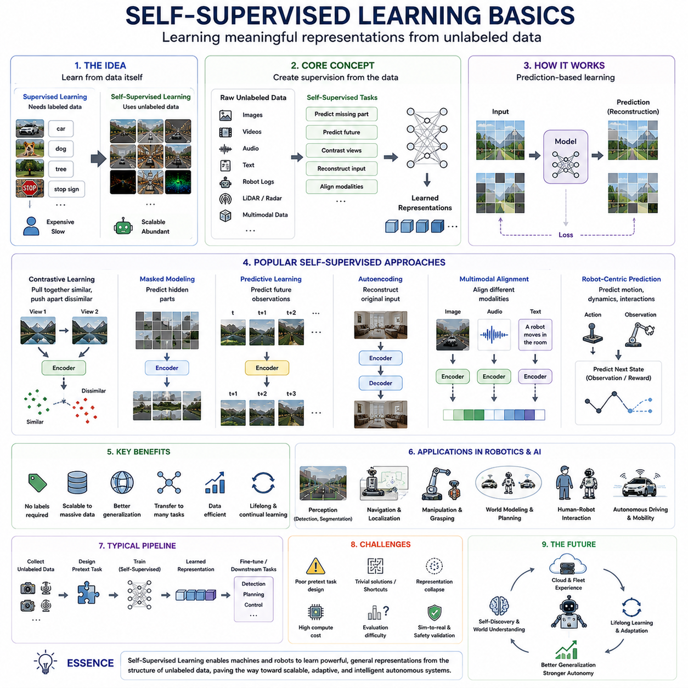
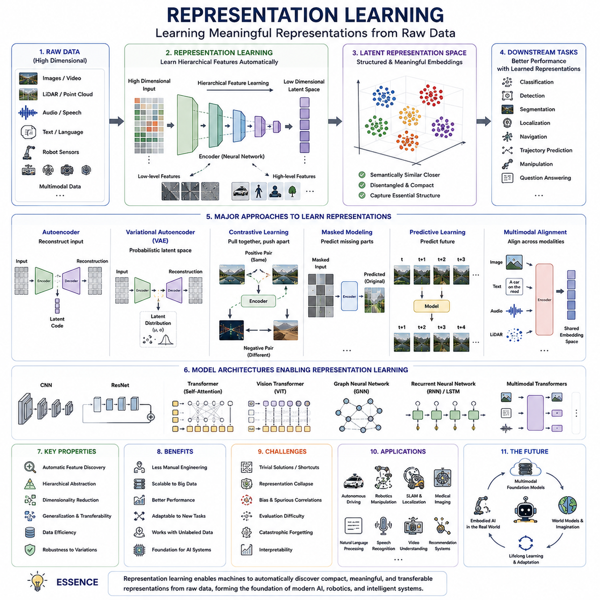
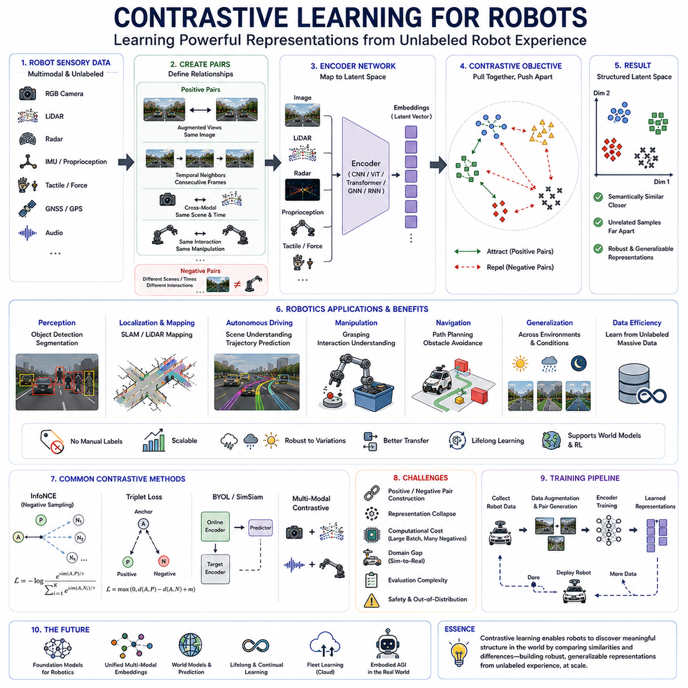
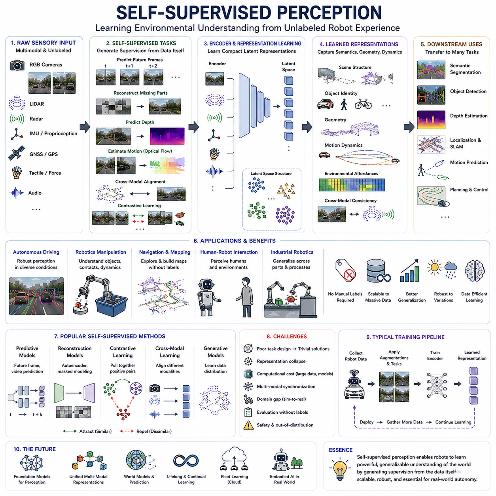
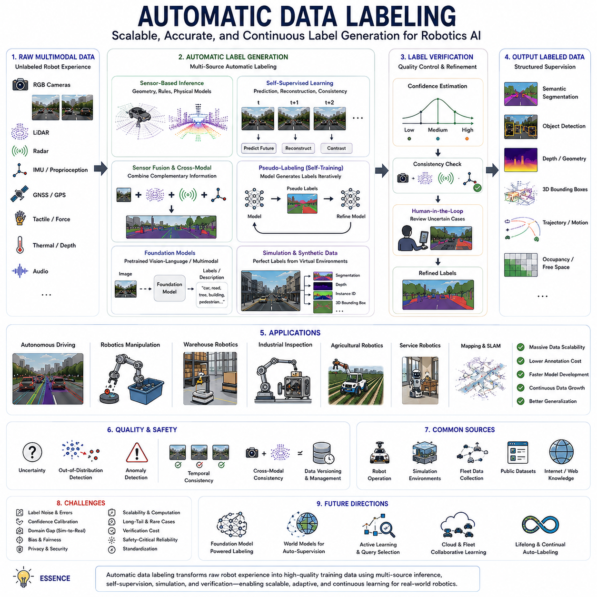
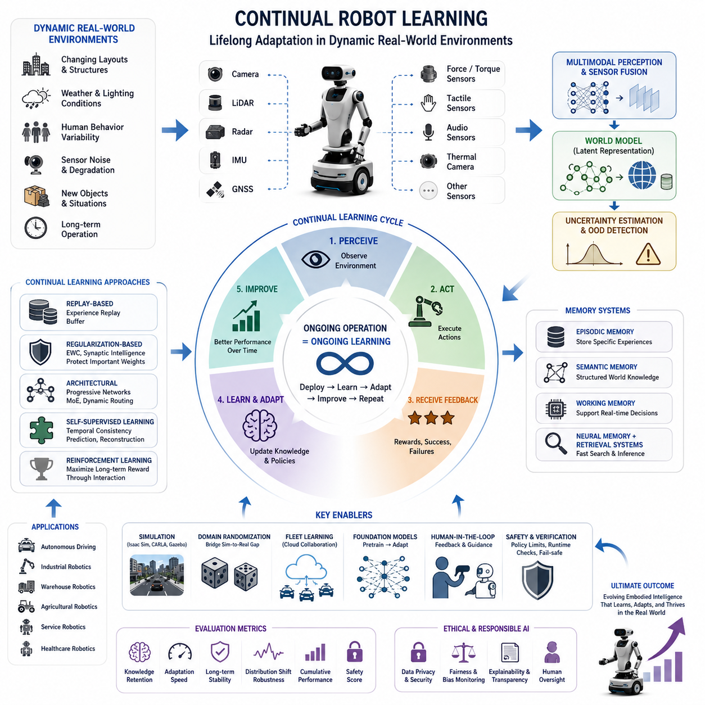
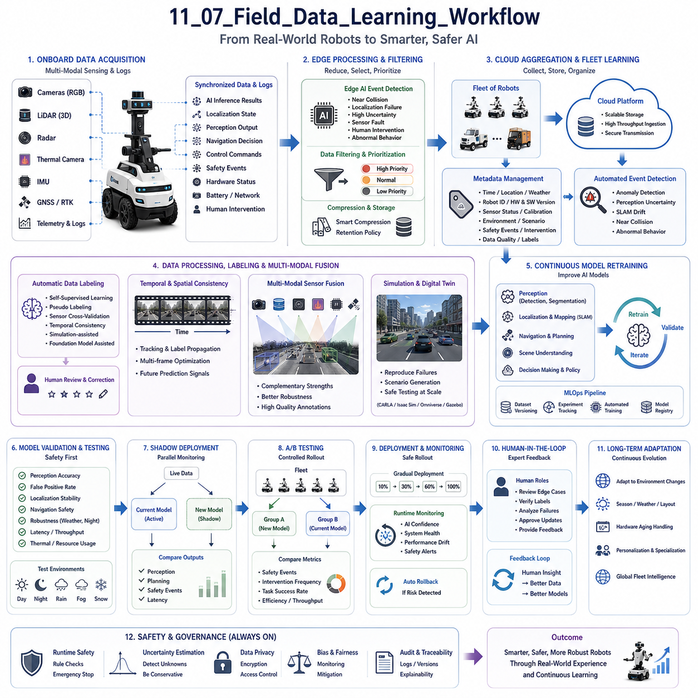
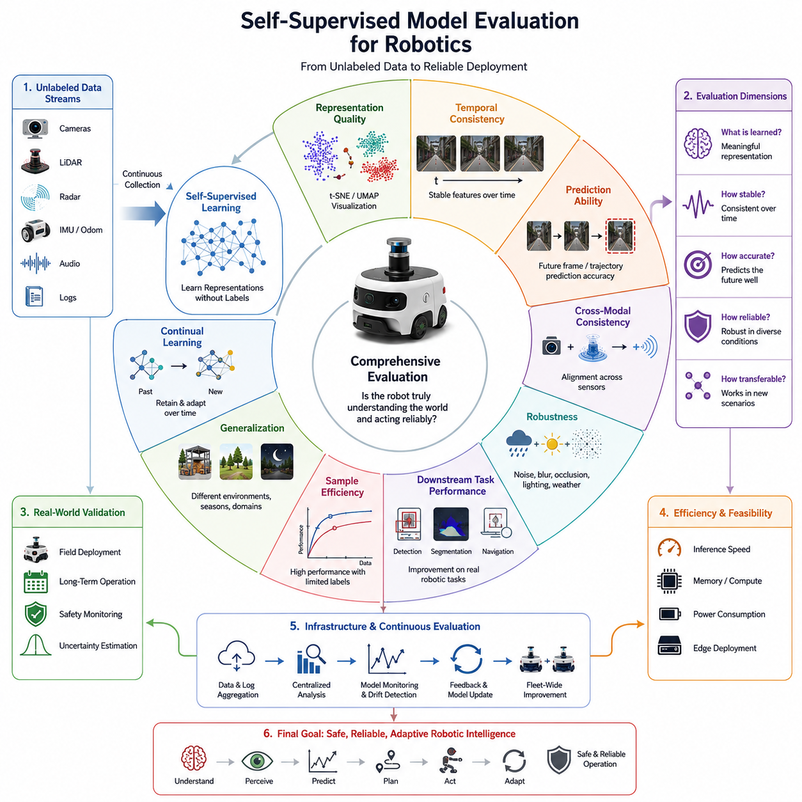

**Volume 06. AMR AI and Embodied Intelligence**


# Chapter 11. Self-Supervised Robot Learning

## 11.1 Self-Supervised Learning Basics

{width="7.268055555555556in" height="7.268055555555556in"}

"11_01_Self_Supervised_Learning_Basics" introduces one of the most transformative paradigms in modern artificial intelligence, robotics, and embodied machine learning: self-supervised learning. Unlike traditional supervised learning, which depends heavily on manually labeled datasets, self-supervised learning allows machines to learn meaningful representations directly from raw unlabeled data by generating supervisory signals automatically from the structure of the data itself. This paradigm has dramatically changed the trajectory of AI research because the majority of real-world sensory information exists without human annotations. Images, videos, audio streams, robot trajectories, LiDAR scans, radar signals, text corpora, environmental observations, and multimodal operational data are generated continuously in massive quantities, but manually labeling such data is expensive, slow, and often impractical. Self-supervised learning provides a scalable framework enabling autonomous systems to learn rich environmental understanding from these enormous unlabeled datasets.

The central concept behind self-supervised learning is prediction-based representation learning. Instead of relying on externally provided labels, the learning system constructs surrogate learning tasks from the input data itself. The model learns by predicting missing, future, transformed, or related portions of the data. In image learning, the system may predict missing image patches, reconstruct corrupted regions, determine whether two augmented views originate from the same image, or infer spatial relationships between image segments. In language models, the system predicts missing words or future tokens from surrounding context. In robotics, self-supervised systems may predict future sensor observations, estimate robot motion consistency, infer environmental dynamics, or align multimodal sensor streams. Through solving these automatically generated prediction tasks, neural networks gradually learn meaningful latent representations capturing the underlying structure of the environment.

Self-supervised learning emerged as a response to several major limitations of supervised learning. Traditional supervised AI systems require enormous labeled datasets, often involving millions of manually annotated samples. In computer vision, image classification systems rely on human-labeled object categories. Autonomous driving systems require manually labeled lane boundaries, object bounding boxes, segmentation masks, and trajectory annotations. Robotics manipulation datasets frequently require detailed task labels and operational metadata. Creating such datasets demands extensive human labor and introduces annotation inconsistency, labeling bias, and scalability constraints. Self-supervised learning addresses this bottleneck by utilizing naturally available unlabeled data at virtually unlimited scale.

One of the most important properties of self-supervised learning is its ability to learn generalized feature representations rather than narrow task-specific mappings. Supervised models often optimize directly for a predefined classification objective and may overfit to dataset-specific labeling structures. In contrast, self-supervised learning forces models to capture broader environmental regularities because the prediction tasks depend on understanding underlying data structure. These learned representations often transfer effectively across many downstream tasks including object detection, semantic segmentation, navigation, localization, manipulation, trajectory prediction, and scene understanding.

Contrastive learning became one of the most influential approaches in self-supervised representation learning. In contrastive methods, the model learns to distinguish between similar and dissimilar data samples. Two augmented views of the same image are treated as positive pairs, while unrelated images serve as negative pairs. The network learns representations that bring positive pairs closer together in feature space while separating negative samples. Frameworks such as SimCLR, MoCo, BYOL, DINO, and VICReg significantly advanced representation learning performance using this paradigm. Contrastive learning demonstrated that highly effective visual representations could be learned without manual annotation, fundamentally changing computer vision research.

Masked modeling approaches also became highly influential in self-supervised learning. Instead of comparing positive and negative samples, masked models hide portions of the input data and require the network to reconstruct the missing information. Transformer-based language models such as BERT popularized masked token prediction in natural language processing. Similar ideas were later extended to images, videos, point clouds, and multimodal robotics data. Masked Autoencoders and Vision Transformers learn environmental structure by reconstructing hidden image patches, while robotics systems may predict missing sensor observations or future environmental states. These methods encourage models to understand global contextual relationships rather than memorizing local patterns.

Temporal prediction is particularly important in robotics-oriented self-supervised learning systems. Robots operate within dynamic physical environments where future states depend on current observations and actions. Self-supervised robotics systems therefore frequently learn by predicting future frames, estimating motion trajectories, forecasting sensor evolution, or modeling environmental dynamics. Predictive world models allow robots to learn physical consistency, object permanence, collision behavior, motion dynamics, and temporal causality without explicit supervision. This capability becomes especially important for autonomous navigation, manipulation planning, and long-horizon decision-making.

Multimodal self-supervised learning has become a major research direction in embodied AI systems. Real-world robots rarely rely on a single sensory modality. Instead, they integrate RGB cameras, depth sensors, LiDAR, radar, IMU measurements, GNSS localization, tactile sensing, audio streams, proprioceptive feedback, and force measurements simultaneously. Self-supervised learning frameworks can exploit natural relationships between these sensor modalities. For example, synchronized camera and LiDAR observations may supervise each other without human annotation. Audio events may align with visual motion patterns. Robot proprioception may predict external environmental interaction. Learning consistent representations across modalities significantly improves robustness and environmental understanding.

Self-supervised learning is particularly valuable for robotics because physical environments naturally generate enormous amounts of interaction data. Autonomous vehicles continuously observe road environments while driving. Warehouse robots repeatedly navigate aisles and interact with inventory. Industrial robots perform repetitive manipulation operations. Service robots interact with humans and dynamic environments throughout deployment. Most of these operational experiences remain unlabeled, but self-supervised learning allows robots to extract meaningful representations from this continuous sensory stream. This dramatically reduces dependence on expensive manual labeling pipelines.

One of the most important applications of self-supervised learning in robotics involves pretraining large perception models before downstream task specialization. Instead of training models from scratch using limited labeled robotics datasets, engineers increasingly pretrain foundation models using massive unlabeled multimodal operational data. The resulting representations are then fine-tuned for specific robotics tasks such as obstacle detection, semantic segmentation, localization, grasp prediction, scene understanding, or trajectory planning. Pretraining significantly improves sample efficiency, robustness, and generalization performance compared to purely supervised approaches.

Generalization represents one of the strongest advantages of self-supervised learning. Because models learn broader environmental structure rather than narrow task labels, the resulting representations often transfer effectively across domains and environments. Autonomous robots trained using self-supervised methods may adapt more successfully to new lighting conditions, weather patterns, terrain types, object appearances, or operational workflows. This becomes critically important for real-world deployment because autonomous systems inevitably encounter situations not explicitly represented in labeled training datasets.

World models are deeply connected to self-supervised learning in embodied AI research. A world model attempts to learn compressed internal representations of environmental dynamics through predictive interaction. By predicting future observations and consequences of actions, robots gradually develop implicit models of physical reality. Self-supervised predictive learning enables systems to understand motion continuity, object interactions, collision dynamics, spatial relationships, and temporal consistency. Future autonomous robots may rely heavily on continuously updated world models learned directly from operational experience.

Self-supervised learning also contributes significantly to data efficiency in robotics. Collecting labeled robotics datasets is particularly expensive because physical robot operation often requires safety supervision, hardware maintenance, operator expertise, and complex annotation pipelines. Self-supervised pretraining reduces the amount of labeled data required for downstream tasks by leveraging large quantities of unlabeled operational data. This capability becomes increasingly important as robotics systems scale toward broader real-world deployment.

Simulation environments are widely used to support self-supervised robotics learning. High-fidelity simulators such as Isaac Sim, CARLA, Gazebo, AirSim, and Omniverse allow robots to generate enormous quantities of synthetic interaction data under diverse environmental conditions. Simulation supports predictive learning, multimodal alignment, sensor synchronization, future trajectory forecasting, and environmental dynamics modeling. Domain randomization further improves generalization by exposing models to variable textures, weather conditions, lighting patterns, obstacle arrangements, and sensor noise distributions.

Continual learning and online adaptation are naturally compatible with self-supervised learning frameworks. Since supervision is generated automatically from incoming sensory data, robots may continuously improve environmental understanding during deployment. Autonomous systems can refine representations incrementally as they encounter new operational conditions, environments, and tasks. This lifelong learning capability may become one of the defining characteristics of future embodied AI systems operating over extended deployment periods.

Large-scale foundation models increasingly integrate self-supervised learning as their primary training paradigm. Modern vision-language-action architectures often rely on multimodal self-supervised pretraining across internet-scale image, video, language, and robotics datasets. These models learn generalized environmental representations capable of supporting many downstream tasks simultaneously. Transfer learning, few-shot adaptation, and zero-shot reasoning become possible because the underlying representations capture broad semantic and physical structure rather than narrow task labels.

Despite its advantages, self-supervised learning also introduces several important challenges. Designing effective surrogate prediction tasks is nontrivial because poorly designed objectives may encourage trivial shortcuts rather than meaningful representation learning. Some self-supervised models may learn dataset biases, texture correlations, or low-level statistical artifacts without acquiring true semantic understanding. Representation collapse, unstable optimization, computational cost, and evaluation difficulty remain active research problems. Robotics systems additionally face challenges related to temporal consistency, multimodal synchronization, sim-to-real transfer, and safety-critical deployment validation.

Evaluation methodology for self-supervised learning is also more complex than conventional supervised learning. Since the objective is representation quality rather than direct task accuracy, evaluation often involves downstream transfer performance across many tasks and environments. Linear probing, few-shot adaptation benchmarks, cross-domain generalization tests, and robotics deployment experiments are commonly used to measure representation effectiveness. In embodied AI systems, successful evaluation requires measuring robustness, adaptability, temporal consistency, and operational reliability under real-world conditions.

Ethical considerations also emerge in large-scale self-supervised learning systems. Massive operational datasets may unintentionally contain biased environmental patterns, unsafe behaviors, privacy-sensitive information, or socially undesirable correlations. Because self-supervised learning extracts structure directly from raw data, hidden biases may propagate into downstream models without explicit human awareness. Responsible AI development therefore requires dataset auditing, privacy protection, fairness analysis, explainability systems, and operational oversight mechanisms.

The future of self-supervised learning is closely connected to the broader evolution of autonomous intelligence, foundation models, embodied cognition, and lifelong robotics learning. Future robots may continuously learn from shared fleet experience, cloud-scale multimodal interaction data, predictive world modeling, and environmental self-discovery. The boundary between perception, reasoning, planning, memory, and action may become increasingly unified within large self-supervised embodied AI architectures capable of continuously refining internal representations through real-world experience.

Ultimately, "11_01_Self_Supervised_Learning_Basics" represents one of the most important conceptual foundations underlying the next generation of robotics and artificial intelligence systems. Self-supervised learning transforms machine learning from dependence on expensive human annotation toward scalable autonomous representation learning directly from environmental interaction. This transition enables robots to learn continuously, adapt dynamically, generalize broadly, and develop richer understanding of complex physical environments. As embodied AI systems continue evolving toward greater autonomy and intelligence, self-supervised learning will likely remain one of the central paradigms shaping the future of robotics, autonomous systems, and artificial intelligence research.

"11_01_Self_Supervised_Learning_Basics"는 현대 인공지능, 로보틱스, Embodied Machine Learning에서 가장 혁신적인 패러다임 중 하나인 Self-Supervised Learning(자기지도학습)에 대해 설명합니다. 기존의 Supervised Learning이 대량의 수작업 라벨링 데이터에 의존하는 것과 달리, Self-Supervised Learning은 데이터 자체의 구조로부터 자동으로 Supervisory Signal을 생성하여 의미 있는 표현(representation)을 학습합니다. 이 패러다임은 AI 연구 방향을 크게 변화시켰는데, 실제 세계의 대부분의 센서 데이터는 라벨이 존재하지 않기 때문입니다. 이미지, 비디오, 오디오 스트림, 로봇 Trajectory, LiDAR Scan, Radar Signal, 텍스트, 환경 관측 데이터, 멀티모달 운영 데이터는 지속적으로 대량 생성되지만 이를 사람이 직접 라벨링하는 것은 비용과 시간이 매우 많이 들며 현실적으로 불가능한 경우도 많습니다. Self-Supervised Learning은 이러한 방대한 비라벨(Unlabeled) 데이터로부터 로봇과 AI 시스템이 환경 이해 능력을 학습할 수 있도록 하는 확장 가능한 프레임워크를 제공합니다.

Self-Supervised Learning의 핵심 개념은 Prediction-Based Representation Learning입니다. 외부에서 제공되는 라벨 대신, 시스템은 입력 데이터 자체로부터 학습 과제를 자동 생성합니다. 모델은 데이터의 일부를 예측하거나 복원하거나 관계를 추론하는 과정을 통해 학습합니다. 예를 들어 이미지 학습에서는 누락된 이미지 패치를 예측하거나 손상된 영역을 복원하거나 두 개의 Augmented View가 동일 이미지인지 판단할 수 있습니다. 언어 모델에서는 주변 문맥으로부터 누락된 단어나 미래 Token을 예측합니다. 로보틱스에서는 미래 센서 관측값 예측, 로봇 Motion Consistency 추정, 환경 동역학 예측, 멀티모달 센서 정렬 등을 학습할 수 있습니다. 이러한 자동 생성 Prediction Task를 해결하면서 Neural Network는 점차 환경 구조를 이해하는 의미 있는 Latent Representation을 형성하게 됩니다.

Self-Supervised Learning은 기존 Supervised Learning의 여러 한계를 해결하기 위해 등장했습니다. 기존 지도학습 시스템은 수백만 개 이상의 사람이 직접 라벨링한 데이터셋을 필요로 합니다. Computer Vision에서는 이미지마다 Object Category를 사람이 표시해야 하며, 자율주행 시스템은 Lane Boundary, Object Bounding Box, Segmentation Mask, Trajectory Annotation을 모두 수작업으로 생성해야 합니다. Robotics Manipulation Dataset 역시 상세한 작업 라벨과 운영 메타데이터를 요구합니다. 이러한 데이터셋 생성은 막대한 인력과 비용이 필요하며 Annotation Inconsistency, Labeling Bias, Scalability 문제를 야기합니다. Self-Supervised Learning은 자연스럽게 생성되는 비라벨 데이터를 거의 무제한 규모로 활용할 수 있다는 점에서 이러한 병목 문제를 해결합니다.

Self-Supervised Learning의 가장 중요한 특징 중 하나는 특정 작업(Task-Specific)이 아닌 Generalized Feature Representation을 학습한다는 점입니다. 기존 Supervised Model은 특정 Classification Objective에 과도하게 최적화되면서 데이터셋 특성에 Overfitting될 수 있습니다. 반면 Self-Supervised Learning은 데이터 구조 자체를 이해해야 Prediction Task를 해결할 수 있기 때문에 보다 일반적인 환경 표현을 학습하게 됩니다. 이렇게 학습된 Representation은 Object Detection, Semantic Segmentation, Navigation, Localization, Manipulation, Trajectory Prediction, Scene Understanding 같은 다양한 Downstream Task에 효과적으로 전이될 수 있습니다.

Contrastive Learning은 Self-Supervised Representation Learning에서 가장 영향력 있는 접근 방식 중 하나가 되었습니다. Contrastive Method에서는 유사한 데이터와 비유사 데이터를 구분하도록 모델을 학습합니다. 동일 이미지의 두 개 Augmented View는 Positive Pair로 간주되고, 다른 이미지는 Negative Pair가 됩니다. 모델은 Positive Pair는 가까운 Feature Space로, Negative Sample은 멀리 떨어진 공간으로 학습합니다. SimCLR, MoCo, BYOL, DINO, VICReg 같은 Framework는 이러한 방식을 통해 수작업 라벨 없이도 매우 강력한 Visual Representation을 학습할 수 있음을 보여주었습니다. 이는 Computer Vision 연구 방향을 근본적으로 변화시켰습니다.

Masked Modeling 역시 매우 중요한 Self-Supervised Learning 방식입니다. 이 방식에서는 입력 데이터의 일부를 숨긴 뒤 모델이 이를 복원하도록 학습합니다. BERT 같은 Transformer 기반 Language Model은 Masked Token Prediction을 통해 자연어 구조를 학습했습니다. 이후 이러한 아이디어는 이미지, 비디오, Point Cloud, 멀티모달 로보틱스 데이터로 확장되었습니다. Masked Autoencoder와 Vision Transformer는 숨겨진 이미지 패치를 복원하면서 환경 구조를 학습하며, 로봇 시스템은 누락된 센서 데이터나 미래 환경 상태를 예측할 수 있습니다. 이러한 방식은 단순 Local Pattern이 아니라 Global Context Relationship을 이해하도록 만듭니다.

Temporal Prediction은 Robotics-Oriented Self-Supervised Learning에서 매우 중요합니다. 로봇은 동적인 물리 환경에서 동작하며 미래 상태는 현재 관측과 행동에 의존합니다. 따라서 로봇은 Future Frame Prediction, Motion Trajectory Forecasting, Sensor Evolution Prediction, Environmental Dynamics Modeling을 통해 학습할 수 있습니다. Predictive World Model은 Explicit Supervision 없이도 Physical Consistency, Object Permanence, Collision Behavior, Motion Dynamics, Temporal Causality를 학습하게 합니다. 이는 Autonomous Navigation, Manipulation Planning, Long-Horizon Decision-Making에서 매우 중요합니다.

Multimodal Self-Supervised Learning은 Embodied AI의 핵심 연구 분야가 되고 있습니다. 실제 로봇은 단일 센서가 아니라 RGB Camera, Depth Sensor, LiDAR, Radar, IMU, GNSS, Tactile Sensor, Audio Stream, Force Feedback 등을 동시에 사용합니다. Self-Supervised Framework는 이러한 센서들 사이의 자연스러운 관계를 활용할 수 있습니다. 예를 들어 Camera와 LiDAR는 서로를 Supervision Source로 사용할 수 있으며, Audio Event는 Visual Motion과 연결될 수 있습니다. Robot Proprioception은 외부 환경 상호작용을 예측할 수 있습니다. 이러한 Cross-Modal Representation Learning은 환경 이해와 강건성을 크게 향상시킵니다.

Self-Supervised Learning은 로보틱스에서 특히 중요한데, 실제 환경이 지속적으로 방대한 상호작용 데이터를 생성하기 때문입니다. 자율주행 차량은 도로 환경을 지속적으로 관찰하며, 물류 로봇은 반복적으로 창고를 이동하고, 산업용 로봇은 반복적인 Manipulation 작업을 수행합니다. 대부분의 운영 데이터는 라벨이 없지만, Self-Supervised Learning은 이러한 연속적 센서 스트림으로부터 의미 있는 환경 표현을 추출할 수 있습니다. 이는 고비용 Annotation Pipeline에 대한 의존도를 크게 줄여 줍니다.

로보틱스에서 가장 중요한 응용 중 하나는 대규모 Perception Model의 Pretraining입니다. 제한된 Robotics Label Dataset만으로 모델을 처음부터 학습하는 대신, 대규모 Unlabeled Multimodal Operational Data로 Foundation Model을 사전학습합니다. 이후 Obstacle Detection, Semantic Segmentation, Localization, Grasp Prediction, Scene Understanding, Trajectory Planning 같은 구체적 작업에 Fine-Tuning합니다. 이러한 Pretraining은 Sample Efficiency, Robustness, Generalization을 크게 향상시킵니다.

Generalization은 Self-Supervised Learning의 가장 강력한 장점 중 하나입니다. 모델은 특정 Label이 아니라 환경 구조 자체를 학습하기 때문에 다양한 환경과 도메인으로 쉽게 전이됩니다. Self-Supervised Learning 기반 자율 로봇은 새로운 조명, 날씨, 지형, 물체 외형, 운영 방식에도 보다 잘 적응할 수 있습니다. 이는 실제 환경에서 매우 중요합니다. 자율 시스템은 반드시 학습 데이터에 없던 상황을 만나게 되기 때문입니다.

World Model은 Self-Supervised Learning과 매우 밀접하게 연결됩니다. World Model은 환경 동역학을 Predictive Interaction을 통해 압축된 내부 표현으로 학습하려는 구조입니다. 미래 관측과 행동 결과를 예측하면서 로봇은 점차 물리 세계의 내부 모델을 형성하게 됩니다. Self-Supervised Predictive Learning은 Motion Continuity, Object Interaction, Collision Dynamics, Spatial Relationship, Temporal Consistency를 학습하게 합니다. 미래 로봇은 실제 운영 경험을 통해 지속적으로 업데이트되는 World Model에 크게 의존할 가능성이 높습니다.

Self-Supervised Learning은 Robotics Data Efficiency에도 크게 기여합니다. Robotics Dataset 구축은 물리 로봇 운영, 안전 감독, 하드웨어 유지보수, 전문가 조작, 복잡한 Annotation이 필요하기 때문에 비용이 매우 높습니다. Self-Supervised Pretraining은 방대한 비라벨 운영 데이터를 활용하여 Downstream Task에 필요한 라벨 데이터를 크게 줄여 줍니다. 이는 로봇이 실제 세계로 확장될수록 더욱 중요해집니다.

시뮬레이션 환경 역시 중요한 역할을 합니다. Isaac Sim, CARLA, Gazebo, AirSim, Omniverse 같은 시뮬레이터는 매우 다양한 Synthetic Interaction Data를 생성할 수 있게 해줍니다. Simulation은 Predictive Learning, Multimodal Alignment, Sensor Synchronization, Future Trajectory Forecasting, Environmental Dynamics Modeling에 활용됩니다. Domain Randomization은 텍스처, 날씨, 조명, 장애물 구조, 센서 노이즈를 변화시켜 Generalization을 향상시킵니다.

Continual Learning과 Online Adaptation은 Self-Supervised Framework와 매우 잘 결합됩니다. Supervision이 입력 데이터 자체에서 생성되기 때문에 로봇은 실제 운영 중에도 지속적으로 환경 이해를 개선할 수 있습니다. 새로운 환경과 작업을 경험할 때마다 Representation을 점진적으로 업데이트할 수 있으며, 이는 미래 Embodied AI의 핵심 특성이 될 가능성이 높습니다.

대규모 Foundation Model 역시 Self-Supervised Learning을 핵심 학습 방식으로 사용하고 있습니다. 현대 Vision-Language-Action Architecture는 인터넷 규모의 이미지, 비디오, 언어, 로봇 데이터셋으로부터 멀티모달 Self-Supervised Pretraining을 수행합니다. 이러한 모델은 다양한 작업에 활용 가능한 Generalized Representation을 형성하며, Transfer Learning, Few-Shot Adaptation, Zero-Shot Reasoning을 가능하게 합니다.

하지만 Self-Supervised Learning에도 중요한 문제점이 존재합니다. 효과적인 Surrogate Prediction Task를 설계하는 것은 쉽지 않으며, 잘못 설계된 Objective는 의미 있는 환경 이해 대신 단순 Shortcut을 학습하게 만들 수 있습니다. 일부 모델은 실제 의미 이해 없이 Texture Correlation이나 Low-Level Statistical Artifact만 학습할 수 있습니다. Representation Collapse, Optimization Instability, 높은 계산 비용, Evaluation Difficulty 역시 중요한 연구 과제입니다. 로보틱스에서는 Temporal Consistency, Multimodal Synchronization, Sim-to-Real Transfer, Safety-Critical Validation 문제도 존재합니다.

평가 방법 역시 기존 지도학습보다 훨씬 복잡합니다. Self-Supervised Learning의 목표는 단순 Accuracy가 아니라 Representation Quality이기 때문입니다. 따라서 Downstream Transfer Performance, Linear Probing, Few-Shot Adaptation Benchmark, Cross-Domain Generalization Test, 실제 로봇 Deployment Experiment 등을 사용하여 성능을 평가합니다. Embodied AI에서는 Robustness, Adaptability, Temporal Consistency, Operational Reliability까지 함께 측정해야 합니다.

윤리적 문제 역시 중요합니다. 대규모 Operational Dataset에는 편향된 환경 패턴, 위험 행동, 개인정보, 사회적으로 바람직하지 않은 상관관계가 포함될 수 있습니다. Self-Supervised Learning은 Raw Data로부터 직접 구조를 학습하기 때문에 숨겨진 Bias가 모델에 그대로 반영될 수 있습니다. 따라서 Responsible AI Development를 위해 Dataset Auditing, Privacy Protection, Fairness Analysis, Explainability System, Human Oversight가 필요합니다.

Self-Supervised Learning의 미래는 Autonomous Intelligence, Foundation Model, Embodied Cognition, Lifelong Robotics Learning과 깊게 연결되어 있습니다. 미래 로봇은 Shared Fleet Experience, Cloud-Scale Multimodal Interaction Data, Predictive World Modeling, Environmental Self-Discovery를 통해 지속적으로 학습할 가능성이 높습니다. 미래 AI 시스템에서는 Perception, Reasoning, Planning, Memory, Action 사이의 경계가 점점 통합될 것입니다.

결국 "11_01_Self_Supervised_Learning_Basics"는 차세대 로보틱스와 AI 시스템의 가장 중요한 기반 개념 중 하나를 설명합니다. Self-Supervised Learning은 머신러닝을 고비용 Human Annotation 의존 구조에서 벗어나 실제 환경 상호작용으로부터 스스로 Representation을 학습하는 방향으로 변화시키고 있습니다. 이는 로봇이 지속적으로 학습하고, 동적으로 적응하며, 폭넓게 일반화하고, 복잡한 물리 환경을 더 깊이 이해할 수 있도록 만듭니다. Embodied AI 시스템이 점점 더 높은 자율성과 지능을 향해 발전함에 따라, Self-Supervised Learning은 미래 로보틱스와 Autonomous AI를 형성하는 가장 핵심적인 패러다임 중 하나로 남게 될 것입니다.

##  

## 11.2 Representation Learning

{width="7.268055555555556in" height="7.268055555555556in"}

"11_02_Representation_Learning" focuses on one of the most fundamental concepts underlying modern artificial intelligence, robotics, computer vision, language modeling, and embodied machine intelligence: the ability of machines to automatically learn meaningful internal representations of data. Representation learning refers to the process through which an AI system transforms raw sensory input into structured latent features that capture useful patterns, semantic meaning, spatial relationships, temporal dependencies, and environmental abstractions. Instead of relying entirely on manually engineered features, modern deep learning systems learn hierarchical representations directly from data itself. This paradigm shift fundamentally changed machine learning because it enabled AI systems to extract increasingly abstract and transferable knowledge from massive multimodal datasets.

In traditional machine learning systems, feature engineering played a central role in model development. Human engineers manually designed mathematical descriptors such as edges, corners, gradients, textures, histograms, geometric measurements, or handcrafted signal-processing features to represent input data. For example, classical computer vision systems used SIFT, SURF, HOG, and Haar-like features for image understanding tasks. Speech recognition systems depended on manually extracted frequency-domain representations such as MFCC features. Robotics systems often relied on explicitly programmed geometric heuristics for localization and obstacle detection. While these methods achieved partial success, they suffered from limited scalability, poor adaptability, and restricted generalization across changing environments.

Representation learning transformed this paradigm by allowing neural networks to automatically discover useful features directly from raw data through optimization. Instead of manually defining environmental structure, deep learning systems learn internal representations that maximize predictive performance. Lower neural network layers often learn simple local patterns such as edges, textures, frequencies, or geometric primitives, while deeper layers gradually capture increasingly abstract concepts including object identity, spatial structure, semantic relationships, motion dynamics, and contextual meaning. This hierarchical representation learning process enables modern AI systems to perform highly complex reasoning tasks across vision, language, robotics, and multimodal embodied intelligence.

The central idea behind representation learning is that raw sensory observations often contain enormous amounts of redundancy and low-level variability. Useful intelligence emerges not from memorizing raw pixels or sensor values but from extracting compressed latent structures that capture the essential properties of the environment. In robotics, raw RGB images contain millions of pixel values, but autonomous navigation depends on higher-level concepts such as free space, obstacles, road boundaries, dynamic agents, and environmental geometry. Representation learning allows neural networks to discover these hidden structures automatically through large-scale optimization.

Latent space representations are one of the most important concepts in modern AI systems. A latent representation refers to a compressed internal encoding generated by a neural network that captures meaningful information about the input data. These latent embeddings often organize semantically similar inputs near each other within feature space. Images of similar objects may cluster together. Similar motion trajectories may share related latent dynamics. Language representations may encode semantic similarity, grammatical structure, and contextual relationships. In robotics, latent spaces may represent environmental geometry, navigation affordances, object interaction possibilities, or task-relevant spatial relationships. The structure of latent space strongly influences downstream learning performance.

Deep neural networks naturally support hierarchical representation learning because successive layers progressively transform data into more abstract representations. In computer vision systems, early convolutional layers often detect local textures, edges, and gradients. Intermediate layers learn object parts, shapes, and geometric structures. Deeper layers encode semantic object categories, scene understanding, and contextual reasoning. Similar hierarchical abstraction appears in language models, where lower layers capture lexical patterns while deeper layers learn syntax, semantics, reasoning structures, and long-range contextual dependencies. This hierarchical organization allows modern foundation models to learn highly transferable knowledge representations.

Representation learning is deeply connected to dimensionality reduction. Real-world sensory data often exists in extremely high-dimensional form, but meaningful environmental structure may occupy a much lower-dimensional manifold. Autonomous vehicles generate enormous streams of camera images, LiDAR point clouds, radar signals, GNSS measurements, IMU readings, and operational telemetry. Representation learning compresses this multimodal information into compact latent representations preserving task-relevant structure while discarding irrelevant noise and redundancy. Efficient representations improve generalization, computational efficiency, memory usage, and downstream learning performance.

Autoencoders became one of the earliest and most influential architectures for unsupervised representation learning. An autoencoder consists of an encoder network compressing input data into a latent representation and a decoder network reconstructing the original input from the latent code. By forcing the model to reconstruct data through a compressed bottleneck, the system learns compact representations capturing the essential structure of the input distribution. Variational autoencoders later extended this concept by introducing probabilistic latent representations capable of supporting generative modeling, uncertainty estimation, and structured latent interpolation.

Contrastive representation learning emerged as another highly influential paradigm. Instead of reconstructing inputs directly, contrastive methods learn representations by comparing similarities and differences between data samples. Two augmented views of the same image are treated as semantically related positive pairs, while unrelated samples serve as negative examples. The network learns feature embeddings that cluster semantically similar observations while separating unrelated samples. Methods such as SimCLR, MoCo, BYOL, DINO, and VICReg demonstrated that highly powerful visual representations could be learned without manual labels. Contrastive learning fundamentally changed modern self-supervised computer vision research.

Transformers and attention mechanisms significantly expanded representation learning capabilities. Unlike traditional convolutional architectures focusing primarily on local neighborhoods, transformers learn global contextual relationships between distant elements within data sequences. Vision Transformers represent images as sequences of patches, while language transformers process tokenized text sequences. Attention mechanisms dynamically determine which parts of the input are most relevant for representation formation. This enables models to capture long-range dependencies, multimodal relationships, contextual reasoning, and semantic abstraction at unprecedented scale.

Representation learning became especially important with the emergence of foundation models and large-scale pretraining. Instead of training narrow task-specific models from scratch, modern AI systems increasingly learn generalized representations from massive multimodal datasets before fine-tuning for downstream tasks. Large language models learn semantic representations from internet-scale text corpora. Vision-language models jointly learn image and language embeddings aligned within shared latent spaces. Robotics foundation models integrate perception, language, action, and environmental interaction into unified embodied representations transferable across many tasks and platforms.

Multimodal representation learning represents one of the most important research directions in embodied AI. Real-world intelligence depends on integrating information from many sensory modalities simultaneously. Autonomous robots process RGB cameras, LiDAR, radar, IMU measurements, GNSS localization, force sensing, tactile feedback, proprioception, and audio streams concurrently. Multimodal representation learning aims to construct unified latent spaces aligning information across these modalities. For example, visual observations may align with language descriptions, force interactions, or motion trajectories. Cross-modal representation learning improves robustness, adaptability, and semantic understanding.

Temporal representation learning is critically important in robotics and autonomous systems because environmental dynamics evolve continuously over time. Autonomous vehicles predict future motion trajectories, pedestrian movement, traffic evolution, and collision risk. Manipulation robots model object dynamics, contact interactions, and sequential task execution. Self-supervised predictive learning methods allow robots to learn temporal consistency directly from operational experience. World models and sequence modeling architectures increasingly rely on temporal representation learning to support long-horizon planning and embodied reasoning.

Generalization is one of the strongest advantages of robust representation learning. Models trained using generalized latent representations often transfer effectively across different environments, tasks, and domains. A perception model pretrained on massive multimodal data may adapt rapidly to new lighting conditions, weather patterns, road structures, industrial layouts, or manipulation tasks. Transfer learning and few-shot adaptation become possible because the underlying representations encode broad environmental structure rather than narrow task-specific labels. This becomes critically important for robotics systems operating within unpredictable real-world environments.

Representation learning also significantly improves data efficiency. Labeling robotics datasets is expensive because physical operation requires safety supervision, annotation infrastructure, hardware maintenance, and expert operators. Self-supervised and unsupervised representation learning allow robots to exploit vast quantities of unlabeled operational data. Pretrained representations reduce the amount of labeled data needed for downstream tasks such as obstacle detection, semantic segmentation, navigation planning, grasp prediction, or scene understanding. This scalability is essential for large-scale autonomous system deployment.

Simulation environments increasingly support representation learning research in robotics. High-fidelity simulators such as Isaac Sim, CARLA, Gazebo, AirSim, and Omniverse allow generation of large-scale synthetic multimodal interaction datasets. Domain randomization exposes models to varying textures, weather conditions, lighting patterns, terrain structures, obstacle configurations, and sensor noise distributions. Simulated environments support predictive representation learning, multimodal alignment, temporal forecasting, and world model training. Sim-to-real transfer remains challenging, but large-scale representation pretraining significantly improves adaptation robustness.

World models are deeply connected to representation learning in embodied AI. A world model attempts to construct compressed latent representations capturing environmental dynamics, physical interactions, temporal causality, and action consequences. Instead of memorizing raw sensory observations, robots learn predictive internal models of how the environment evolves. These latent world representations support planning, imagination, simulation, uncertainty estimation, and autonomous decision-making. Future embodied AI systems may increasingly rely on continuously updated world models learned through large-scale self-supervised interaction.

Representation learning also plays a major role in reinforcement learning systems. Instead of learning policies directly from raw sensory inputs, reinforcement learning agents increasingly rely on latent representations capturing environmental state structure. Better representations improve sample efficiency, exploration, long-horizon reasoning, and policy stability. In robotics, latent representations may encode navigational affordances, manipulation possibilities, object relationships, and operational constraints. Combining representation learning with reinforcement learning significantly improves embodied intelligence performance.

One of the major challenges in representation learning involves ensuring that latent representations capture semantically meaningful information rather than superficial statistical correlations. Models may sometimes learn shortcuts, dataset biases, or texture patterns without understanding true environmental semantics. Robust evaluation therefore requires transfer learning benchmarks, out-of-distribution testing, cross-domain generalization analysis, robotics deployment trials, and multimodal reasoning evaluation. Interpretability and explainability remain active research areas because latent spaces often contain highly abstract structures difficult for humans to analyze directly.

Continual learning introduces additional complexity into representation learning systems. Real-world environments evolve continuously over time. Warehouses change layouts, roads undergo construction, sensor hardware ages, weather patterns shift, and operational workflows evolve. Static representations eventually become outdated. Lifelong learning systems therefore aim to update latent representations continuously while preserving previously acquired knowledge. Avoiding catastrophic forgetting while maintaining adaptive plasticity remains one of the most important open research problems in embodied AI.

Ethical considerations also emerge in large-scale representation learning systems. Massive operational datasets may contain biases, unsafe behaviors, demographic imbalance, or privacy-sensitive information. Learned latent spaces may inadvertently encode undesirable correlations or discriminatory patterns. Responsible AI development therefore requires dataset auditing, fairness analysis, privacy preservation, operational transparency, explainability systems, and human oversight mechanisms to ensure socially aligned deployment.

The future of representation learning is closely connected to the broader evolution of autonomous intelligence, multimodal foundation models, world modeling, self-supervised learning, and embodied cognition. Future AI systems may learn unified representations spanning vision, language, action, reasoning, memory, and physical interaction within shared latent architectures. Autonomous robots may continuously refine environmental understanding through lifelong multimodal experience, collaborative cloud learning, predictive world simulation, and self-supervised adaptation.

Ultimately, "11_02_Representation_Learning" represents one of the most fundamental conceptual foundations underlying modern artificial intelligence and robotics. Representation learning transforms machine learning from manually engineered feature extraction toward autonomous discovery of meaningful environmental structure directly from data. This transition enables scalable learning, broad generalization, multimodal integration, embodied reasoning, and adaptive intelligence across increasingly complex real-world environments. As robotics and AI systems continue evolving toward greater autonomy and embodied cognition, representation learning will remain one of the central paradigms shaping the future of intelligent machines.

"11_02_Representation_Learning"은 현대 인공지능, 로보틱스, 컴퓨터 비전, 언어 모델링, Embodied Machine Intelligence의 가장 핵심적인 개념 중 하나인 표현 학습(Representation Learning)에 대해 설명합니다. Representation Learning은 AI 시스템이 원시 센서 데이터(raw sensory input)를 의미 있는 내부 특징(latent feature)으로 자동 변환하여 패턴, 의미 구조, 공간 관계, 시간적 의존성, 환경 추상화 등을 학습하는 과정을 의미합니다. 과거처럼 사람이 직접 Feature를 설계하는 것이 아니라, 현대 딥러닝 시스템은 데이터 자체로부터 계층적 표현(hierarchical representation)을 자동 학습합니다. 이러한 패러다임 변화는 AI 시스템이 대규모 멀티모달 데이터로부터 점점 더 추상적이고 전이 가능한 지식을 획득할 수 있도록 만들었습니다.

기존 머신러닝에서는 Feature Engineering이 매우 중요한 역할을 했습니다. 인간 엔지니어는 Edge, Corner, Gradient, Texture, Histogram, Geometry Descriptor 같은 수학적 특징을 수작업으로 설계했습니다. 예를 들어 전통적인 Computer Vision에서는 SIFT, SURF, HOG, Haar-like Feature 같은 방식이 사용되었습니다. 음성 인식에서는 MFCC 같은 Frequency-Domain Feature가 사용되었고, 로봇 시스템은 수작업 Geometric Heuristic에 의존하는 경우가 많았습니다. 하지만 이러한 방식은 확장성 부족, 환경 변화에 대한 취약성, 일반화 한계라는 문제를 가지고 있었습니다.

Representation Learning은 이러한 구조를 근본적으로 변화시켰습니다. Neural Network는 Raw Data로부터 직접 유용한 Feature를 자동으로 발견할 수 있습니다. 낮은 Layer는 Edge, Texture, Frequency 같은 단순 패턴을 학습하고, 깊은 Layer로 갈수록 Object Identity, Spatial Structure, Semantic Relationship, Motion Dynamics, Contextual Meaning 같은 고차원 개념을 학습하게 됩니다. 이러한 계층적 표현 학습 구조는 현대 AI 시스템이 Vision, Language, Robotics, Multimodal Embodied Intelligence 영역에서 복잡한 추론을 수행할 수 있도록 만듭니다.

Representation Learning의 핵심 아이디어는 Raw Sensory Observation 자체에는 엄청난 양의 중복 정보와 저수준 변동성이 포함되어 있다는 점입니다. 실제 지능은 픽셀이나 센서 값을 그대로 기억하는 것이 아니라, 환경의 본질적 구조를 압축된 형태로 표현하는 데서 나타납니다. 예를 들어 로보틱스에서 RGB 이미지는 수백만 개의 픽셀 값을 포함하지만, 실제 Autonomous Navigation에 필요한 것은 Free Space, Obstacle, Road Boundary, Dynamic Agent, Environmental Geometry 같은 고수준 개념입니다. Representation Learning은 이러한 숨겨진 구조를 Neural Network가 자동으로 발견하도록 만듭니다.

Latent Space Representation은 현대 AI에서 가장 중요한 개념 중 하나입니다. Latent Representation은 Neural Network 내부에서 생성되는 압축된 내부 표현으로, 입력 데이터의 의미 있는 정보를 담고 있습니다. 이러한 Latent Embedding은 의미적으로 유사한 입력 데이터를 가까운 위치에 배치합니다. 예를 들어 비슷한 물체 이미지는 Feature Space에서 가까운 위치에 클러스터링되며, 유사한 Motion Trajectory 역시 비슷한 Latent Dynamics를 공유할 수 있습니다. 언어 모델에서는 Semantic Similarity, Grammar Structure, Contextual Relationship이 Latent Space에 반영됩니다. 로보틱스에서는 Environmental Geometry, Navigation Affordance, Object Interaction Possibility, Task-Relevant Spatial Relationship 등이 Latent Space에 표현될 수 있습니다.

Deep Neural Network는 자연스럽게 Hierarchical Representation Learning을 지원합니다. Computer Vision에서는 초기 Convolution Layer가 Local Texture와 Edge를 감지하고, 중간 Layer는 Object Part와 Geometry Structure를 학습하며, 깊은 Layer는 Semantic Category와 Scene Understanding을 학습합니다. Language Model 역시 낮은 Layer는 Lexical Pattern을 학습하고, 깊은 Layer는 Syntax, Semantic, Reasoning Structure, Long-Range Context를 학습합니다. 이러한 계층적 구조 덕분에 현대 Foundation Model은 매우 강력한 전이 가능한 지식을 형성할 수 있습니다.

Representation Learning은 Dimensionality Reduction과도 밀접하게 연결됩니다. 실제 센서 데이터는 매우 고차원(high-dimensional)이지만, 실제 의미 있는 환경 구조는 훨씬 낮은 차원의 Manifold에 존재하는 경우가 많습니다. 자율주행 차량은 Camera, LiDAR, Radar, GNSS, IMU, Telemetry로부터 엄청난 양의 데이터를 생성하지만, Representation Learning은 이러한 멀티모달 정보를 Task-Relevant Structure를 유지한 상태로 압축할 수 있습니다. 이러한 압축은 계산 효율성, 메모리 사용량, 일반화 성능을 크게 향상시킵니다.

Autoencoder는 초기 Representation Learning에서 가장 중요한 구조 중 하나였습니다. Autoencoder는 입력 데이터를 Latent Representation으로 압축하는 Encoder와 이를 복원하는 Decoder로 구성됩니다. 시스템은 압축된 Bottleneck을 통과해 원래 입력을 복원해야 하기 때문에, 자연스럽게 데이터의 핵심 구조를 학습하게 됩니다. Variational Autoencoder는 이를 확장하여 확률적 Latent Representation을 학습하며, Generative Modeling과 Uncertainty Estimation까지 가능하게 만들었습니다.

Contrastive Representation Learning 역시 매우 중요한 접근 방식입니다. 이 방식에서는 입력 데이터를 직접 복원하는 대신, 데이터 간 유사성과 차이를 학습합니다. 동일 이미지의 두 Augmented View는 Positive Pair로 사용되고, 다른 이미지는 Negative Pair가 됩니다. 모델은 Positive Pair를 Feature Space에서 가깝게, Negative Pair는 멀리 배치하도록 학습합니다. SimCLR, MoCo, BYOL, DINO, VICReg 같은 방법은 수작업 라벨 없이도 매우 강력한 Visual Representation을 학습할 수 있음을 보여주었습니다. 이는 현대 Self-Supervised Computer Vision 연구를 근본적으로 변화시켰습니다.

Transformer와 Attention Mechanism은 Representation Learning 능력을 크게 확장시켰습니다. 기존 Convolution Architecture는 주로 Local Neighborhood를 중심으로 동작했지만, Transformer는 데이터 내부의 Global Context Relationship을 학습할 수 있습니다. Vision Transformer는 이미지를 Patch Sequence로 처리하고, Language Transformer는 Token Sequence를 처리합니다. Attention Mechanism은 입력 데이터 중 어떤 부분이 Representation 형성에 중요한지를 동적으로 결정합니다. 이를 통해 Long-Range Dependency, Multimodal Relationship, Contextual Reasoning, Semantic Abstraction을 훨씬 더 효과적으로 학습할 수 있습니다.

Representation Learning은 Foundation Model과 Large-Scale Pretraining의 등장과 함께 더욱 중요해졌습니다. 과거처럼 특정 Task-Specific Model을 처음부터 학습하는 대신, 현대 AI 시스템은 방대한 멀티모달 데이터로부터 Generalized Representation을 먼저 학습한 뒤 Downstream Task에 Fine-Tuning합니다. Large Language Model은 인터넷 규모의 텍스트로부터 Semantic Representation을 학습하고, Vision-Language Model은 이미지와 언어를 Shared Latent Space 안에서 정렬합니다. Robotics Foundation Model은 Perception, Language, Action, Environmental Interaction을 통합된 Embodied Representation으로 학습합니다.

Multimodal Representation Learning은 Embodied AI에서 가장 중요한 연구 방향 중 하나입니다. 실제 지능은 다양한 센서를 동시에 통합해야 합니다. Autonomous Robot은 RGB Camera, LiDAR, Radar, IMU, GNSS, Force Sensor, Tactile Feedback, Audio Stream 등을 동시에 처리합니다. Multimodal Representation Learning은 이러한 다양한 센서 정보를 통합된 Latent Space 안에 정렬하려고 합니다. 예를 들어 Visual Observation은 Language Description, Force Interaction, Motion Trajectory와 연결될 수 있습니다. 이러한 Cross-Modal Representation은 Robustness와 Semantic Understanding을 크게 향상시킵니다.

Temporal Representation Learning은 Robotics와 Autonomous System에서 특히 중요합니다. 환경은 시간에 따라 지속적으로 변화하기 때문입니다. 자율주행 차량은 미래 차량 움직임과 보행자 행동을 예측해야 하며, Manipulation Robot은 Object Dynamics와 Sequential Task Execution을 모델링해야 합니다. Self-Supervised Predictive Learning은 로봇이 실제 운영 경험을 통해 Temporal Consistency를 학습하도록 합니다. 현대 World Model과 Sequence Modeling Architecture는 Long-Horizon Planning과 Embodied Reasoning을 위해 Temporal Representation Learning에 크게 의존합니다.

Generalization은 강력한 Representation Learning의 가장 큰 장점 중 하나입니다. 잘 학습된 Latent Representation은 다양한 환경과 작업에 쉽게 전이됩니다. 대규모 멀티모달 데이터로 Pretrained된 모델은 새로운 조명, 날씨, 도로 구조, 산업 환경, Manipulation Task에 빠르게 적응할 수 있습니다. 이는 로봇 시스템이 실제 환경에서 예측 불가능한 상황을 반드시 만나게 되기 때문에 매우 중요합니다.

Representation Learning은 Data Efficiency도 크게 향상시킵니다. Robotics Dataset Labeling은 안전 감독, 하드웨어 유지보수, Annotation Infrastructure, 전문가 운영이 필요하기 때문에 비용이 매우 높습니다. Self-Supervised 및 Unsupervised Representation Learning은 방대한 Unlabeled Operational Data를 활용할 수 있게 합니다. Pretrained Representation은 Obstacle Detection, Semantic Segmentation, Navigation Planning, Grasp Prediction, Scene Understanding 같은 Downstream Task에 필요한 Label Data 양을 크게 줄여 줍니다.

시뮬레이션 환경 역시 Representation Learning 연구를 지원합니다. Isaac Sim, CARLA, Gazebo, AirSim, Omniverse 같은 시뮬레이터는 대규모 Synthetic Multimodal Dataset을 생성할 수 있게 합니다. Domain Randomization은 Texture, Weather, Lighting, Terrain, Obstacle Configuration, Sensor Noise를 다양하게 변화시켜 Generalization을 향상시킵니다. Simulation은 Predictive Representation Learning, Multimodal Alignment, Temporal Forecasting, World Model Training에 매우 중요합니다.

World Model은 Representation Learning과 매우 깊게 연결되어 있습니다. World Model은 환경 동역학과 물리 상호작용, 시간적 인과관계, 행동 결과를 압축된 Latent Representation으로 표현하려고 합니다. 로봇은 단순히 센서 데이터를 저장하는 것이 아니라, 환경이 어떻게 변화하는지를 내부적으로 예측 가능한 형태로 학습합니다. 이러한 World Representation은 Planning, Imagination, Simulation, Uncertainty Estimation, Autonomous Decision-Making을 지원합니다.

Representation Learning은 Reinforcement Learning에서도 중요한 역할을 합니다. RL Agent는 Raw Sensory Input 대신 Latent Representation을 기반으로 정책(policy)을 학습하는 경우가 많습니다. 더 좋은 Representation은 Sample Efficiency, Exploration, Long-Horizon Reasoning, Policy Stability를 크게 향상시킵니다. 로보틱스에서는 Navigation Affordance, Manipulation Possibility, Object Relationship, Operational Constraint 등이 Latent Representation 안에 포함될 수 있습니다.

Representation Learning의 가장 큰 문제 중 하나는 모델이 진짜 의미 있는 환경 구조를 학습하는 것이 아니라 단순한 Statistical Shortcut이나 Dataset Bias를 학습할 가능성이 있다는 점입니다. 따라서 Robust Evaluation이 매우 중요합니다. Transfer Learning Benchmark, Out-of-Distribution Test, Cross-Domain Generalization Analysis, Robotics Deployment Trial, Multimodal Reasoning Evaluation 등을 통해 Representation Quality를 평가해야 합니다. Interpretability와 Explainability 역시 중요한 연구 분야입니다.

Continual Learning은 Representation Learning에 추가적인 복잡성을 부여합니다. 실제 환경은 지속적으로 변화합니다. 창고는 레이아웃이 바뀌고, 도로는 공사를 하며, 센서는 노화되고, 운영 방식도 변화합니다. 따라서 Static Representation은 시간이 지나면 현실과 맞지 않게 됩니다. Lifelong Learning System은 기존 지식을 유지하면서 새로운 환경에 적응할 수 있어야 합니다. Catastrophic Forgetting을 방지하면서 Adaptability를 유지하는 것은 Embodied AI의 핵심 연구 과제 중 하나입니다.

윤리적 문제도 중요합니다. 대규모 Operational Dataset에는 Bias, Unsafe Behavior, Demographic Imbalance, Privacy-Sensitive Information이 포함될 수 있습니다. 학습된 Latent Space는 원치 않는 Correlation이나 차별적 패턴을 포함할 수 있습니다. 따라서 Responsible AI Development를 위해 Dataset Auditing, Fairness Analysis, Privacy Preservation, Explainability System, Human Oversight가 요구됩니다.

Representation Learning의 미래는 Autonomous Intelligence, Multimodal Foundation Model, World Modeling, Self-Supervised Learning, Embodied Cognition과 깊게 연결되어 있습니다. 미래 AI 시스템은 Vision, Language, Action, Reasoning, Memory, Physical Interaction을 통합된 Latent Architecture 안에서 표현할 가능성이 높습니다. Autonomous Robot은 Lifelong Multimodal Experience, Collaborative Cloud Learning, Predictive World Simulation, Self-Supervised Adaptation을 통해 지속적으로 환경 이해를 개선하게 될 것입니다.

결국 "11_02_Representation_Learning"은 현대 AI와 로보틱스의 가장 핵심적인 기반 개념 중 하나를 설명합니다. Representation Learning은 머신러닝을 수작업 Feature Engineering 중심 구조에서 데이터 자체로부터 의미 있는 환경 구조를 자동 발견하는 방향으로 변화시켰습니다. 이는 확장 가능한 학습, 강력한 일반화, 멀티모달 통합, Embodied Reasoning, Adaptive Intelligence를 가능하게 합니다. 로보틱스와 AI가 점점 더 높은 자율성과 Embodied Cognition 방향으로 발전함에 따라, Representation Learning은 미래 지능형 기계를 형성하는 가장 핵심적인 패러다임 중 하나로 남게 될 것입니다.

##  

## 11.3 Contrastive Learning for Robots

{width="7.268055555555556in" height="7.268055555555556in"}

"11_03_Contrastive_Learning_for_Robots" focuses on one of the most influential paradigms in modern self-supervised robotics intelligence: contrastive learning. Contrastive learning has emerged as a foundational method for enabling robots to learn robust, generalized, and semantically meaningful representations directly from unlabeled sensory experience. Unlike traditional supervised learning systems that rely heavily on manually labeled datasets, contrastive learning allows robots to construct internal representations by comparing similarities and differences between observations. This capability is especially important in robotics because autonomous systems continuously generate enormous quantities of multimodal operational data that are difficult, expensive, or impossible to annotate manually. Cameras, LiDAR sensors, radar systems, tactile arrays, force sensors, IMUs, GNSS modules, and robot proprioception streams produce continuous sensory information during operation. Contrastive learning provides a scalable mechanism for extracting useful environmental understanding from these unlabeled experiences.

The central idea behind contrastive learning is relatively simple yet extremely powerful. The learning system attempts to bring semantically related observations closer together in latent representation space while pushing unrelated observations farther apart. Instead of learning explicit labels, the model learns relational structure. Two observations representing the same object, scene, trajectory, environmental state, or physical interaction should produce similar embeddings. Unrelated observations should occupy distant regions within feature space. Through repeated optimization over massive datasets, the neural network gradually develops representations that capture meaningful environmental structure.

In robotics, this approach becomes particularly valuable because physical environments naturally contain large amounts of relational information. Consecutive camera frames from a moving robot are often semantically related. LiDAR scans and RGB images captured simultaneously describe the same scene from different modalities. Force feedback and visual observations may correspond to the same manipulation interaction. Robot trajectories recorded under similar operational conditions may share common environmental dynamics. Contrastive learning leverages these naturally occurring correlations to build powerful representations without requiring explicit human supervision.

One of the earliest motivations for contrastive learning in robotics emerged from limitations in supervised perception systems. Traditional robotics AI depended heavily on manually labeled datasets containing semantic segmentation masks, object bounding boxes, lane annotations, obstacle categories, or manipulation labels. Creating these datasets at scale proved extremely expensive and difficult. Furthermore, supervised models often learned narrow task-specific representations that generalized poorly across new environments. Contrastive learning offered an alternative paradigm capable of utilizing large-scale unlabeled operational data while simultaneously improving generalization performance.

Contrastive learning systems typically rely on positive pairs and negative pairs. Positive pairs are observations considered semantically related, while negative pairs are unrelated samples. In computer vision, two augmented views of the same image may form a positive pair. In robotics, positive pairs can be constructed in many different ways. Consecutive temporal frames may serve as positives because they represent the same environment over short time intervals. Multimodal sensor observations captured simultaneously may also form positive relationships. Different viewpoints of the same object or environment may be treated as semantically consistent observations. Negative pairs usually involve unrelated scenes, different environments, separate trajectories, or temporally distant observations.

Data augmentation plays an essential role in contrastive robotics learning. The model should learn invariant representations robust to irrelevant environmental variations. Therefore, training pipelines often apply random image cropping, rotation, brightness variation, blur, sensor noise, geometric perturbation, occlusion simulation, viewpoint shifts, and temporal jittering. The objective is to force the neural network to focus on stable semantic structure rather than superficial pixel-level details. In robotics, augmentation may also include LiDAR perturbation, radar noise injection, motion distortion, simulated weather variation, or sensor degradation modeling.

Contrastive learning architectures generally include an encoder network responsible for generating latent embeddings from sensory observations. These encoders may consist of convolutional neural networks, transformers, graph neural networks, recurrent sequence models, or multimodal fusion architectures depending on the robotics application. The embeddings generated by the encoder are then optimized using contrastive objectives such as InfoNCE loss, triplet loss, or similarity maximization functions. During training, the network gradually organizes semantically meaningful structure within latent space.

Latent representation space is one of the most important concepts in contrastive robotics learning. Ideally, observations representing similar environmental conditions, physical interactions, navigational contexts, or object relationships should cluster together. For example, robot trajectories through similar warehouse aisles may occupy neighboring latent regions. Similar grasp configurations may form consistent manipulation clusters. Different weather conditions affecting the same road geometry may still produce semantically aligned representations. The organization of latent space directly influences downstream robotics performance.

Temporal contrastive learning is especially important for embodied robotics systems. Robots interact continuously with dynamic physical environments where observations evolve over time. Temporal consistency provides rich self-supervisory signals. Consecutive sensory frames usually share substantial semantic continuity even though low-level sensor values change. By learning to associate temporally adjacent observations, robots develop stable representations of environmental structure, object permanence, spatial continuity, and motion dynamics. This capability is fundamental for autonomous navigation, SLAM, trajectory prediction, and predictive world modeling.

Multimodal contrastive learning has become one of the most important research directions in embodied AI. Modern robots rarely rely on a single sensory modality. Instead, they process RGB cameras, LiDAR, radar, IMU measurements, GNSS localization, tactile sensing, proprioception, force feedback, audio streams, and environmental telemetry simultaneously. Contrastive objectives can align representations across these modalities. For example, LiDAR point clouds and synchronized camera images describing the same environment should produce compatible embeddings. Audio signatures may align with visual events. Tactile feedback may correspond to manipulation contact states. Cross-modal alignment significantly improves robustness and environmental understanding.

Autonomous driving systems represent one of the largest application domains for contrastive robotics learning. Self-driving vehicles generate enormous quantities of multimodal sensory data during operation. Contrastive learning allows autonomous vehicles to learn robust scene representations without requiring exhaustive manual labeling. The system may learn invariant environmental structure across changing weather conditions, lighting variations, traffic densities, and geographic regions. Temporal and multimodal contrastive objectives help vehicles develop stable representations supporting obstacle detection, localization, semantic understanding, trajectory prediction, and planning.

Contrastive learning is also highly valuable for robotic manipulation systems. Manipulation tasks involve complex interactions between visual perception, force sensing, object geometry, motion planning, and contact dynamics. Contrastive objectives allow robots to associate visual observations with successful grasp states, stable manipulation trajectories, or object interaction dynamics. Similar manipulation strategies may cluster together within latent space even across different object categories. This improves transfer learning and generalization across unseen manipulation tasks.

Embodied world models are deeply connected to contrastive learning. A world model attempts to construct compressed latent representations of environmental dynamics and physical interactions. Contrastive objectives help organize these latent representations according to semantic consistency, temporal continuity, and physical causality. Predictive world models often combine contrastive learning with future-state prediction, sequence modeling, and latent dynamics estimation. This allows robots to develop internal environmental simulations supporting planning, imagination, uncertainty estimation, and long-horizon reasoning.

Contrastive learning significantly improves generalization performance in robotics systems. Traditional supervised models often overfit to narrow dataset distributions and fail under environmental variation. In contrast, contrastive learning encourages models to capture broader structural relationships rather than memorizing specific labels. As a result, representations learned through contrastive methods often transfer more effectively across different lighting conditions, weather environments, sensor configurations, terrain structures, and operational workflows. This becomes critically important for real-world robotics deployment where environmental variability is unavoidable.

One of the strongest advantages of contrastive robotics learning is scalability. Since supervision emerges automatically from relational structure within the data, robots can learn continuously from large-scale operational experience without requiring expensive annotation pipelines. Fleet robotics systems operating across warehouses, roads, factories, hospitals, or outdoor environments may collectively generate petabytes of multimodal sensory data. Contrastive learning enables these distributed operational experiences to become valuable representation learning resources.

Simulation environments increasingly support contrastive learning research in robotics. High-fidelity simulators such as Isaac Sim, CARLA, Gazebo, AirSim, and Omniverse generate diverse synthetic multimodal environments suitable for self-supervised representation learning. Domain randomization introduces variations in lighting, weather, textures, object placement, terrain geometry, sensor noise, and environmental dynamics. Contrastive learning benefits greatly from such diversity because robust latent representations emerge through exposure to wide operational variability.

Foundation models and large-scale multimodal robotics architectures increasingly integrate contrastive learning as a core pretraining mechanism. Vision-language models often align image embeddings with textual descriptions using contrastive objectives. Robotics foundation models may jointly align perception, language, action trajectories, and environmental dynamics within unified latent spaces. These generalized representations support transfer learning, few-shot adaptation, and cross-domain reasoning across many robotics tasks simultaneously.

Despite its strengths, contrastive learning also introduces several important challenges. One major issue involves selecting appropriate positive and negative pairs. Incorrect pair construction may encourage undesirable latent structures or collapse semantic distinctions. In robotics, environmental ambiguity and sensor uncertainty may complicate pair generation. Two visually similar scenes may correspond to different navigational affordances. Temporally adjacent observations may occasionally involve abrupt environmental changes. Designing robust contrastive objectives therefore requires careful engineering.

Representation collapse represents another major challenge. If optimization is poorly configured, the model may map all observations into similar embeddings, destroying meaningful latent structure. Modern methods such as BYOL, SimSiam, VICReg, and redundancy reduction objectives attempt to prevent collapse through architectural and optimization constraints. Stability remains an important research area in large-scale robotics contrastive learning systems.

Computational scale also becomes significant in contrastive learning. Large batch sizes, extensive negative sampling, multimodal alignment, transformer architectures, and long temporal sequences require substantial computational resources. Robotics foundation models trained on multimodal fleet-scale operational data may require distributed GPU clusters, cloud infrastructure, and high-bandwidth data pipelines. Efficient training strategies and scalable optimization remain active research topics.

Evaluation methodology for contrastive robotics learning is more complex than conventional supervised learning. Since the primary objective involves representation quality rather than direct classification accuracy, evaluation typically measures downstream transfer performance. Learned representations may be tested on obstacle detection, semantic segmentation, localization, trajectory prediction, manipulation planning, SLAM, navigation, and reinforcement learning tasks. Generalization across environments, robustness under perturbation, temporal consistency, and multimodal alignment quality also become important evaluation criteria.

Safety considerations are critically important in robotics contrastive learning. Learned latent representations directly influence autonomous decision-making, navigation planning, manipulation behavior, and environmental understanding. Poor representations may lead to dangerous operational failures. Out-of-distribution conditions, sensor anomalies, environmental ambiguity, and rare edge cases must therefore be considered during training and validation. Safe embodied AI systems increasingly combine contrastive representation learning with uncertainty estimation, anomaly detection, runtime monitoring, and safety-constrained policy architectures.

Ethical and societal considerations also emerge in large-scale robotics representation learning systems. Operational datasets may contain demographic bias, unsafe behavior patterns, privacy-sensitive information, or undesirable environmental correlations. Since contrastive learning extracts structure directly from raw operational data, hidden biases may propagate into latent representations. Responsible AI development therefore requires dataset auditing, fairness analysis, explainability systems, privacy preservation, and human oversight frameworks.

The future of contrastive learning for robots is closely connected to the broader evolution of embodied intelligence, world modeling, multimodal reasoning, and lifelong autonomous learning. Future robots may continuously refine latent representations through distributed fleet learning, cloud-scale multimodal interaction, predictive world simulation, and self-supervised environmental exploration. Unified latent spaces spanning vision, language, action, memory, planning, and physical interaction may become central components of next-generation embodied AI systems.

Ultimately, "11_03_Contrastive_Learning_for_Robots" represents one of the most important paradigms shaping the future of robotics intelligence. Contrastive learning transforms robots from systems dependent on expensive manual supervision into autonomous learners capable of discovering meaningful environmental structure directly from operational experience. By organizing latent representations according to semantic similarity, temporal continuity, multimodal consistency, and physical interaction dynamics, contrastive learning provides a scalable foundation for robust embodied intelligence. As robotics systems continue evolving toward greater autonomy, adaptability, and environmental understanding, contrastive learning will remain one of the central technologies driving the next generation of intelligent autonomous machines.

"11_03_Contrastive_Learning_for_Robots"는 현대 Self-Supervised Robotics Intelligence에서 가장 영향력 있는 패러다임 중 하나인 Contrastive Learning(대조 학습)에 대해 설명합니다. Contrastive Learning은 로봇이 사람이 직접 라벨링하지 않은 대규모 센서 데이터로부터 강건하고 일반화 가능한 의미 기반 표현(representation)을 학습할 수 있도록 하는 핵심 기술입니다. 기존 Supervised Learning 시스템은 대량의 수작업 라벨 데이터에 크게 의존했지만, Contrastive Learning은 관측 데이터 사이의 유사성과 차이를 비교함으로써 내부 표현을 학습합니다. 이는 로보틱스에서 특히 중요한데, 자율 시스템은 운영 중 방대한 양의 멀티모달 데이터를 지속적으로 생성하기 때문입니다. Camera, LiDAR, Radar, Tactile Sensor, Force Sensor, IMU, GNSS, Robot Proprioception 같은 센서들은 끊임없이 환경 정보를 생성합니다. Contrastive Learning은 이러한 비라벨(Unlabeled) 데이터로부터 유용한 환경 이해 능력을 추출할 수 있는 확장 가능한 방법을 제공합니다.

Contrastive Learning의 핵심 아이디어는 비교적 단순하지만 매우 강력합니다. 시스템은 의미적으로 관련된 관측값은 Latent Representation Space에서 가깝게 배치하고, 관련 없는 관측값은 멀리 떨어뜨리도록 학습합니다. 즉, 명시적인 라벨을 학습하는 것이 아니라 데이터 간 관계(relational structure)를 학습하는 것입니다. 동일한 물체, 장면, Trajectory, 환경 상태, 물리 상호작용을 나타내는 관측은 유사한 Embedding을 가져야 하고, 관련 없는 데이터는 다른 영역에 위치해야 합니다. 이러한 과정을 대규모 데이터셋에서 반복적으로 최적화함으로써 Neural Network는 점차 의미 있는 환경 구조를 반영하는 Representation을 형성하게 됩니다.

로보틱스에서는 이러한 접근 방식이 특히 유용합니다. 실제 물리 환경에는 자연스럽게 관계 정보(relational information)가 존재하기 때문입니다. 이동 중인 로봇이 연속적으로 촬영한 카메라 프레임은 의미적으로 매우 유사합니다. 동시에 수집된 LiDAR Scan과 RGB 이미지는 동일한 환경을 다른 방식으로 표현합니다. Force Feedback과 Visual Observation은 동일 Manipulation Interaction에 대응될 수 있습니다. 유사한 운영 조건에서 수집된 Robot Trajectory는 공통된 환경 동역학을 공유할 수 있습니다. Contrastive Learning은 이러한 자연스러운 상관관계를 활용하여 인간의 라벨 없이도 강력한 Representation을 구축합니다.

Contrastive Learning이 로보틱스에서 주목받기 시작한 이유 중 하나는 기존 Supervised Perception System의 한계 때문이었습니다. 기존 Robotics AI는 Semantic Segmentation Mask, Object Bounding Box, Lane Annotation, Obstacle Category, Manipulation Label 같은 수작업 데이터셋에 크게 의존했습니다. 하지만 이러한 데이터셋을 대규모로 구축하는 것은 매우 비싸고 어렵습니다. 또한 Supervised Model은 특정 Task에 과도하게 최적화되면서 새로운 환경에 대한 일반화 성능이 낮은 경우가 많았습니다. Contrastive Learning은 대규모 비라벨 운영 데이터를 활용하면서 동시에 일반화 성능도 향상시킬 수 있는 새로운 패러다임을 제공했습니다.

Contrastive Learning 시스템은 일반적으로 Positive Pair와 Negative Pair를 사용합니다. Positive Pair는 의미적으로 관련된 관측 데이터이며, Negative Pair는 서로 관련 없는 데이터입니다. Computer Vision에서는 동일 이미지의 두 Augmented View가 Positive Pair가 될 수 있습니다. 로보틱스에서는 Positive Pair를 다양한 방식으로 구성할 수 있습니다. 연속적인 시간 프레임은 동일 환경을 짧은 시간 간격으로 관찰한 것이므로 Positive Pair가 될 수 있습니다. 동시에 수집된 멀티모달 센서 데이터도 Positive Pair가 될 수 있습니다. 동일 물체나 환경의 다른 시점(Viewpoint)도 의미적으로 일관된 관측으로 간주될 수 있습니다. 반면 Negative Pair는 서로 다른 환경, 무관한 장면, 다른 Trajectory, 시간적으로 멀리 떨어진 관측 등으로 구성됩니다.

Data Augmentation은 Contrastive Robotics Learning에서 매우 중요한 역할을 합니다. 모델은 의미 없는 환경 변화에 강건한(invariant) Representation을 학습해야 하기 때문입니다. 따라서 학습 과정에서는 Random Cropping, Rotation, Brightness Variation, Blur, Sensor Noise, Geometric Perturbation, Occlusion Simulation, Viewpoint Shift, Temporal Jittering 같은 Augmentation이 사용됩니다. 목적은 Neural Network가 단순 Pixel-Level Pattern이 아니라 안정적인 Semantic Structure에 집중하도록 만드는 것입니다. 로보틱스에서는 LiDAR Perturbation, Radar Noise Injection, Motion Distortion, Simulated Weather Variation, Sensor Degradation Modeling 같은 방식도 사용됩니다.

Contrastive Learning Architecture는 일반적으로 Encoder Network를 중심으로 구성됩니다. Encoder는 센서 데이터를 입력받아 Latent Embedding을 생성합니다. Encoder는 Robotics Application에 따라 CNN, Transformer, Graph Neural Network, Recurrent Sequence Model, Multimodal Fusion Architecture 등 다양한 구조를 사용할 수 있습니다. 생성된 Embedding은 InfoNCE Loss, Triplet Loss, Similarity Maximization Function 같은 Contrastive Objective로 최적화됩니다. 반복 학습을 통해 Latent Space는 점차 의미 있는 환경 구조를 반영하도록 정렬됩니다.

Latent Representation Space는 Contrastive Robotics Learning에서 가장 중요한 개념 중 하나입니다. 이상적인 경우 유사한 환경 조건, 물리 상호작용, Navigation Context, Object Relationship은 Latent Space에서 가까운 위치에 클러스터링되어야 합니다. 예를 들어 유사한 창고 통로를 이동하는 로봇 Trajectory는 가까운 Latent Region에 위치할 수 있습니다. 유사한 Grasp Configuration은 Manipulation Cluster를 형성할 수 있습니다. 서로 다른 날씨 환경이라도 동일한 도로 구조를 가진 경우 의미적으로 유사한 Representation을 형성할 수 있습니다. 이러한 Latent Space의 구조는 Downstream Robotics Performance에 직접적인 영향을 미칩니다.

Temporal Contrastive Learning은 Embodied Robotics에서 특히 중요합니다. 로봇은 동적인 물리 환경에서 지속적으로 상호작용하며, 환경 관측은 시간에 따라 변화합니다. Temporal Consistency는 매우 풍부한 Self-Supervisory Signal을 제공합니다. 연속적인 센서 프레임은 Low-Level Sensor Value는 달라지더라도 Semantic Continuity를 유지하는 경우가 많습니다. Temporal Contrastive Learning은 이러한 시간적 연속성을 활용하여 로봇이 Environmental Structure, Object Permanence, Spatial Continuity, Motion Dynamics를 학습하도록 합니다. 이는 Autonomous Navigation, SLAM, Trajectory Prediction, Predictive World Modeling에 핵심적인 역할을 합니다.

Multimodal Contrastive Learning은 Embodied AI의 핵심 연구 방향 중 하나가 되고 있습니다. 현대 로봇은 RGB Camera, LiDAR, Radar, IMU, GNSS, Tactile Sensor, Proprioception, Force Feedback, Audio Stream 등을 동시에 처리합니다. Contrastive Objective는 이러한 다양한 센서 간 Representation Alignment를 수행할 수 있습니다. 예를 들어 동일 환경을 나타내는 LiDAR Point Cloud와 Camera Image는 서로 호환되는 Embedding을 생성해야 합니다. Audio Event는 Visual Motion과 연결될 수 있고, Tactile Feedback은 Manipulation Contact State와 연결될 수 있습니다. 이러한 Cross-Modal Alignment는 환경 이해와 강건성을 크게 향상시킵니다.

Autonomous Driving은 Contrastive Robotics Learning의 가장 큰 응용 분야 중 하나입니다. 자율주행 차량은 운행 중 방대한 멀티모달 센서 데이터를 생성합니다. Contrastive Learning은 이러한 데이터로부터 대규모 수작업 라벨 없이도 강력한 Scene Representation을 학습할 수 있게 합니다. 시스템은 다양한 날씨, 조명, 교통 밀도, 지역 환경 변화 속에서도 안정적인 환경 구조를 학습할 수 있습니다. Temporal 및 Multimodal Contrastive Objective는 Obstacle Detection, Localization, Semantic Understanding, Trajectory Prediction, Planning을 지원하는 안정적 Representation을 형성하게 합니다.

Contrastive Learning은 Robotic Manipulation에도 매우 중요합니다. Manipulation은 Visual Perception, Force Sensing, Object Geometry, Motion Planning, Contact Dynamics 사이의 복잡한 상호작용을 포함합니다. Contrastive Objective는 로봇이 성공적인 Grasp State, 안정적인 Manipulation Trajectory, 물체 상호작용 Dynamics를 연결할 수 있게 합니다. 유사한 Manipulation Strategy는 서로 다른 Object Category에서도 유사한 Latent Cluster를 형성할 수 있습니다. 이는 Transfer Learning과 Generalization을 크게 향상시킵니다.

Embodied World Model 역시 Contrastive Learning과 깊게 연결되어 있습니다. World Model은 환경 동역학과 물리 상호작용을 압축된 Latent Representation으로 구성하려고 합니다. Contrastive Objective는 이러한 Latent Space를 Semantic Consistency, Temporal Continuity, Physical Causality에 따라 조직화합니다. Predictive World Model은 Contrastive Learning과 Future-State Prediction, Sequence Modeling, Latent Dynamics Estimation을 결합하여 로봇이 Planning, Imagination, Uncertainty Estimation, Long-Horizon Reasoning을 수행할 수 있도록 합니다.

Contrastive Learning은 Robotics Generalization Performance를 크게 향상시킵니다. 기존 Supervised Model은 좁은 Dataset Distribution에 Overfitting되는 경우가 많았지만, Contrastive Learning은 특정 Label Memorization이 아니라 환경 구조 자체를 학습하도록 유도합니다. 따라서 Contrastive Representation은 다양한 조명, 날씨, 센서 구성, 지형 구조, 운영 Workflow에 더 잘 일반화됩니다. 이는 실제 환경에서 로봇이 반드시 경험하게 되는 다양한 환경 변화에 매우 중요합니다.

Contrastive Robotics Learning의 가장 큰 장점 중 하나는 Scalability입니다. Supervision이 데이터 내부 관계로부터 자동 생성되기 때문에, 로봇은 고비용 Annotation 없이도 대규모 운영 경험으로부터 지속적으로 학습할 수 있습니다. 물류창고, 도로, 공장, 병원, 실외 환경에서 운영되는 Fleet Robotics System은 페타바이트 규모의 멀티모달 데이터를 생성할 수 있으며, Contrastive Learning은 이러한 데이터를 가치 있는 Representation Learning Resource로 전환시킵니다.

시뮬레이션 환경 역시 Contrastive Robotics Learning 연구를 강력하게 지원합니다. Isaac Sim, CARLA, Gazebo, AirSim, Omniverse 같은 시뮬레이터는 다양한 Synthetic Multimodal Environment를 생성할 수 있습니다. Domain Randomization은 조명, 날씨, 텍스처, Object Placement, Terrain Geometry, Sensor Noise를 다양하게 변화시킵니다. Contrastive Learning은 이러한 다양한 환경에 노출될수록 더욱 강건한 Representation을 학습할 수 있습니다.

Foundation Model과 대규모 멀티모달 로보틱스 구조는 Contrastive Learning을 핵심 Pretraining 방식으로 사용하기 시작했습니다. Vision-Language Model은 이미지와 텍스트를 Contrastive Objective로 정렬하며, Robotics Foundation Model은 Perception, Language, Action Trajectory, Environmental Dynamics를 통합된 Latent Space 안에서 정렬할 수 있습니다. 이러한 Generalized Representation은 Transfer Learning, Few-Shot Adaptation, Cross-Domain Reasoning을 가능하게 합니다.

하지만 Contrastive Learning에도 중요한 문제들이 존재합니다. 가장 큰 문제 중 하나는 Positive Pair와 Negative Pair를 어떻게 선택할 것인가입니다. 잘못된 Pair Construction은 원치 않는 Latent Structure를 형성할 수 있습니다. 로보틱스에서는 환경 모호성과 센서 불확실성 때문에 Pair Generation이 복잡해질 수 있습니다. 시각적으로 유사한 장면이라도 실제 Navigation Affordance는 완전히 다를 수 있으며, 시간적으로 가까운 프레임도 갑작스러운 환경 변화가 발생할 수 있습니다. 따라서 Robust Contrastive Objective 설계는 매우 중요한 연구 주제입니다.

Representation Collapse 역시 주요 문제입니다. 최적화가 잘못되면 모델이 모든 입력을 유사한 Embedding으로 매핑하여 의미 있는 구조를 잃을 수 있습니다. BYOL, SimSiam, VICReg 같은 최신 방법은 Architectural Constraint와 Optimization Strategy를 통해 이러한 Collapse를 방지하려고 합니다. Stability는 여전히 대규모 Robotics Contrastive Learning의 핵심 연구 분야입니다.

계산 자원 문제도 매우 중요합니다. Large Batch Size, Extensive Negative Sampling, Multimodal Alignment, Transformer Architecture, Long Temporal Sequence는 막대한 계산 자원을 요구합니다. Fleet-Scale Operational Data를 기반으로 하는 Robotics Foundation Model은 Distributed GPU Cluster와 Cloud Infrastructure를 필요로 할 수 있습니다. Efficient Training Strategy와 Scalable Optimization은 중요한 연구 주제입니다.

Contrastive Robotics Learning의 Evaluation Methodology 역시 복잡합니다. 목표가 단순 Classification Accuracy가 아니라 Representation Quality이기 때문입니다. 따라서 Obstacle Detection, Semantic Segmentation, Localization, Trajectory Prediction, Manipulation Planning, SLAM, Navigation, Reinforcement Learning 같은 다양한 Downstream Task에서 Transfer Performance를 측정합니다. 또한 Environment Generalization, Robustness, Temporal Consistency, Multimodal Alignment Quality도 중요한 평가 요소입니다.

안전성은 Robotics Contrastive Learning에서 매우 중요합니다. 학습된 Latent Representation은 Autonomous Decision-Making, Navigation Planning, Manipulation Behavior, Environmental Understanding에 직접적인 영향을 줍니다. 잘못된 Representation은 위험한 행동으로 이어질 수 있습니다. 따라서 Out-of-Distribution Condition, Sensor Anomaly, Environmental Ambiguity, Rare Edge Case에 대한 고려가 필요합니다. 현대 Safe Embodied AI는 Contrastive Representation Learning과 함께 Uncertainty Estimation, Anomaly Detection, Runtime Monitoring, Safety-Constrained Policy Architecture를 통합하고 있습니다.

윤리적·사회적 문제 역시 존재합니다. Operational Dataset에는 Demographic Bias, Unsafe Behavior Pattern, Privacy-Sensitive Information, Undesirable Environmental Correlation이 포함될 수 있습니다. Contrastive Learning은 Raw Operational Data로부터 직접 구조를 학습하기 때문에 숨겨진 Bias가 Latent Representation에 반영될 수 있습니다. 따라서 Responsible AI Development를 위해 Dataset Auditing, Fairness Analysis, Explainability System, Privacy Preservation, Human Oversight가 요구됩니다.

Contrastive Learning for Robots의 미래는 Embodied Intelligence, World Modeling, Multimodal Reasoning, Lifelong Autonomous Learning과 깊게 연결되어 있습니다. 미래 로봇은 Distributed Fleet Learning, Cloud-Scale Multimodal Interaction, Predictive World Simulation, Self-Supervised Environmental Exploration을 통해 지속적으로 Latent Representation을 개선할 것입니다. Vision, Language, Action, Memory, Planning, Physical Interaction을 통합하는 Unified Latent Space는 차세대 Embodied AI의 핵심 구조가 될 가능성이 높습니다.

결국 "11_03_Contrastive_Learning_for_Robots"는 미래 Robotics Intelligence를 형성하는 가장 중요한 패러다임 중 하나를 설명합니다. Contrastive Learning은 로봇을 고비용 Human Annotation에 의존하는 시스템에서 벗어나 실제 운영 경험으로부터 의미 있는 환경 구조를 스스로 발견하는 Autonomous Learner로 변화시킵니다. Semantic Similarity, Temporal Continuity, Multimodal Consistency, Physical Interaction Dynamics를 기반으로 Latent Representation을 조직함으로써, Contrastive Learning은 강건한 Embodied Intelligence를 위한 확장 가능한 기반을 제공합니다. 로보틱스 시스템이 더욱 높은 자율성과 적응성, 환경 이해 능력을 향해 발전함에 따라, Contrastive Learning은 차세대 지능형 자율 시스템을 이끄는 핵심 기술 중 하나로 남게 될 것입니다.

##  

## 11.4 Self-Supervised Perception

{width="7.268055555555556in" height="7.268055555555556in"}

"11_04_Self_Supervised_Perception" focuses on one of the most important technological transitions in modern robotics and artificial intelligence: enabling autonomous systems to develop perceptual understanding directly from raw sensory experience without requiring extensive human annotation. Traditional robotic perception systems relied heavily on supervised learning methods trained using manually labeled datasets. Object categories, semantic segmentation masks, obstacle annotations, lane markings, pose labels, and environmental metadata had to be created by human operators through expensive and time-consuming annotation pipelines. However, autonomous robots operating in real-world environments continuously generate enormous quantities of multimodal sensory data that remain unlabeled. Cameras, LiDAR systems, radar sensors, thermal cameras, depth sensors, tactile arrays, IMU measurements, GNSS localization, audio streams, and robot proprioception collectively produce massive operational datasets during deployment. Self-supervised perception introduces a scalable paradigm allowing robots to learn meaningful environmental representations directly from this continuous sensory experience.

The central idea behind self-supervised perception is that the environment itself contains rich structural relationships that can serve as implicit supervisory signals. Instead of relying on manually provided labels, the robot learns by predicting, reconstructing, aligning, comparing, or forecasting portions of sensory data. Through solving these automatically generated learning tasks, the system gradually acquires robust environmental understanding. In vision systems, the model may learn by predicting missing image regions, reconstructing corrupted frames, estimating future observations, associating multiple viewpoints of the same scene, or aligning synchronized multimodal sensor streams. In robotics, these predictive learning mechanisms allow autonomous systems to discover semantic structure directly from physical interaction and environmental continuity.

Perception is one of the most fundamental components of embodied intelligence. Autonomous systems must continuously interpret dynamic environments to navigate safely, interact with objects, collaborate with humans, and execute complex tasks. Perception systems transform raw sensory observations into structured internal representations describing free space, obstacles, geometry, object identity, motion dynamics, environmental affordances, and operational context. Traditional supervised perception pipelines often generalized poorly because they depended heavily on narrow labeled datasets collected under limited conditions. Self-supervised perception addresses this limitation by enabling robots to learn generalized representations from broad operational experience across diverse environments.

One of the most important motivations for self-supervised perception emerged from the scalability limitations of manual annotation. Modern autonomous systems generate petabytes of operational sensory data. Autonomous vehicles collect enormous video streams, LiDAR point clouds, radar reflections, and localization telemetry during driving. Warehouse robots continuously observe inventory structures, human workers, navigation paths, and environmental changes. Industrial robots monitor manipulation interactions, assembly processes, and dynamic operational states. Annotating even a small fraction of this data manually is prohibitively expensive. Self-supervised perception allows these unlabeled operational experiences to become valuable learning resources.

Prediction-based learning forms a central foundation of self-supervised perception systems. The robot learns environmental structure by predicting hidden or future sensory observations. Future frame prediction teaches temporal continuity and motion understanding. Masked image modeling encourages spatial reasoning and contextual understanding. Depth prediction supports geometric awareness. Motion forecasting teaches physical dynamics and object interaction behavior. Through predictive learning, the robot gradually builds latent representations that capture the underlying structure of the environment rather than memorizing isolated visual patterns.

Temporal consistency provides one of the richest supervisory signals available to autonomous systems. Consecutive observations collected during robot motion are naturally related over time. A robot navigating through an environment observes smooth spatial transitions, persistent object identities, evolving scene geometry, and coherent environmental dynamics. Self-supervised perception systems exploit this continuity to learn stable representations. Temporal prediction tasks encourage models to understand object permanence, motion causality, spatial continuity, and environmental structure. This capability becomes especially important for navigation, localization, SLAM, trajectory prediction, and long-horizon planning.

Contrastive learning has become one of the most influential methods in self-supervised perception research. Contrastive systems learn by comparing similarities and differences between observations. Positive pairs represent semantically related views, while negative pairs represent unrelated observations. In robotics, positive pairs may consist of synchronized RGB-LiDAR observations, consecutive temporal frames, multiple viewpoints of the same object, or multimodal observations recorded simultaneously. The model learns representations that cluster semantically similar observations together while separating unrelated samples within latent space. Contrastive perception systems often achieve strong generalization because they focus on structural relationships rather than narrow task labels.

Multimodal self-supervised perception is critically important in robotics because real-world environments are inherently multimodal. Autonomous robots simultaneously process RGB images, depth maps, LiDAR point clouds, radar reflections, IMU signals, GNSS localization, thermal imaging, tactile sensing, force feedback, and audio streams. Each modality captures different aspects of environmental structure. Cameras provide dense semantic texture information. LiDAR captures precise geometric structure. Radar offers robustness under fog, rain, and low-visibility conditions. Tactile sensing provides contact understanding. Self-supervised learning frameworks can align representations across these modalities without manual supervision. Cross-modal consistency becomes a powerful source of supervision for robust perception learning.

Depth estimation represents one of the major applications of self-supervised perception. Traditional depth prediction systems required expensive ground-truth depth sensors or manually calibrated datasets. Self-supervised monocular depth estimation instead learns depth structure by exploiting geometric relationships between consecutive frames and camera motion. Stereo consistency, temporal reconstruction error, and photometric alignment provide natural supervisory signals. These methods allow robots to infer environmental geometry using ordinary cameras without requiring exhaustive labeled depth annotations.

Optical flow estimation also benefits significantly from self-supervised learning approaches. Optical flow describes apparent pixel motion between consecutive image frames and plays an important role in motion understanding, obstacle tracking, navigation, and dynamic scene interpretation. Self-supervised optical flow systems often rely on temporal reconstruction consistency rather than manually labeled flow vectors. The robot learns motion representations by minimizing frame reconstruction error under predicted motion transformations. These learned motion representations support autonomous navigation and predictive environmental reasoning.

Self-supervised semantic perception increasingly supports autonomous driving systems. Modern self-driving vehicles must understand road structure, traffic dynamics, pedestrian behavior, lane boundaries, traffic signs, obstacle motion, and environmental semantics under highly variable conditions. Self-supervised perception allows autonomous vehicles to learn robust scene representations directly from large-scale driving experience. Temporal consistency, multimodal alignment, predictive modeling, and contrastive objectives help vehicles generalize across changing weather conditions, lighting variations, road structures, and geographic regions.

Robotic manipulation systems also benefit extensively from self-supervised perception. Manipulation tasks require understanding object geometry, material properties, grasp affordances, contact dynamics, and physical interaction behavior. Self-supervised learning allows robots to associate visual appearance with successful grasps, stable manipulation trajectories, force interactions, and tactile feedback. Through repeated interaction, robots gradually develop richer object-centric representations supporting manipulation planning and adaptive control.

Embodied world models are closely connected to self-supervised perception systems. A world model attempts to construct compressed latent representations describing environmental dynamics, physical interactions, temporal evolution, and action consequences. Predictive self-supervised learning helps robots build internal environmental simulations capable of forecasting future states. These representations support planning, imagination, uncertainty estimation, collision prediction, and long-horizon reasoning. Future autonomous systems may increasingly rely on continuously updated predictive world models learned through self-supervised interaction.

Generalization represents one of the strongest advantages of self-supervised perception. Since the robot learns broader environmental structure rather than narrow labeled categories, learned representations often transfer effectively across different operational conditions. Autonomous robots may adapt more successfully to varying weather, lighting, terrain, sensor configurations, environmental layouts, and operational workflows. This becomes critically important because real-world deployment environments inevitably differ from training conditions.

Self-supervised perception also improves robustness against distribution shift. Traditional supervised perception systems frequently fail when encountering conditions not represented in labeled datasets. Slight changes in lighting, weather, sensor noise, or environmental structure may significantly degrade performance. Self-supervised learning encourages representations that focus on stable environmental relationships and physical consistency rather than superficial visual statistics. As a result, perception systems become more robust under changing operational conditions.

Large-scale foundation models increasingly incorporate self-supervised perception as a primary training mechanism. Vision transformers, multimodal architectures, and embodied AI foundation models are often pretrained using massive unlabeled datasets. These systems learn generalized visual and multimodal representations before fine-tuning for downstream robotics tasks. Shared latent representations spanning vision, language, action, and environmental interaction support transfer learning, few-shot adaptation, and cross-domain reasoning.

Simulation environments play a major role in self-supervised perception research. High-fidelity simulators such as Isaac Sim, CARLA, Gazebo, AirSim, and Omniverse allow robots to generate large-scale synthetic sensory experience under diverse environmental conditions. Domain randomization introduces variability in lighting, weather, terrain geometry, object placement, textures, sensor noise, and environmental dynamics. Simulation supports safe large-scale self-supervised training before real-world deployment.

Continual learning naturally integrates with self-supervised perception systems. Since supervisory signals emerge automatically from sensory structure, robots can continuously improve representations during deployment. Autonomous systems may refine environmental understanding incrementally as they encounter new operational conditions. This lifelong learning capability becomes especially important for robots operating over extended deployment periods in evolving environments.

Self-supervised perception also contributes significantly to data efficiency. Robotics datasets are expensive because physical robot operation requires safety supervision, operator expertise, hardware maintenance, and complex annotation infrastructure. Self-supervised pretraining allows robots to leverage enormous quantities of unlabeled operational data while requiring relatively small labeled datasets for downstream tasks. This dramatically improves scalability for industrial robotics deployment.

Despite its advantages, self-supervised perception also introduces major technical challenges. Designing effective self-supervised objectives is difficult because poorly designed prediction tasks may encourage trivial solutions or representation collapse. Models may learn superficial statistical shortcuts rather than meaningful semantic structure. Temporal prediction may become unstable over long horizons. Multimodal alignment may suffer from synchronization errors. Simulation-trained representations may fail to transfer fully into real-world environments. Robust evaluation methodologies therefore remain critically important.

Evaluation of self-supervised perception systems is more complex than conventional supervised learning. Representation quality must be measured through downstream task transfer performance, robustness analysis, out-of-distribution testing, cross-domain generalization, temporal consistency evaluation, and real-world deployment validation. Successful perception systems must maintain operational reliability under sensor degradation, environmental uncertainty, dynamic interaction, and safety-critical conditions.

Safety considerations are especially important for embodied self-supervised perception systems. Perception errors directly influence navigation planning, collision avoidance, manipulation behavior, and autonomous decision-making. Out-of-distribution detection, uncertainty estimation, anomaly detection, runtime monitoring, and fallback safety systems therefore become essential components of robust deployment architectures. Autonomous robots must recognize unfamiliar or ambiguous situations and respond conservatively when confidence decreases.

Ethical and societal considerations also emerge in large-scale self-supervised perception systems. Operational datasets may contain demographic imbalance, environmental bias, privacy-sensitive information, or unsafe behavior patterns. Learned representations may unintentionally encode undesirable correlations. Responsible AI development therefore requires fairness analysis, dataset auditing, explainability systems, privacy protection mechanisms, and human oversight procedures.

The future of self-supervised perception is closely tied to the broader evolution of embodied intelligence, multimodal reasoning, world modeling, and lifelong autonomous learning. Future robots may continuously refine environmental understanding through predictive interaction, cloud-scale fleet learning, multimodal representation alignment, and collaborative world modeling. Perception, reasoning, planning, memory, and action may become increasingly unified within large embodied AI architectures capable of continuously adapting to complex real-world environments.

Ultimately, "11_04_Self_Supervised_Perception" represents one of the most important technological foundations shaping the future of robotics and artificial intelligence. Self-supervised perception transforms autonomous systems from label-dependent pattern recognizers into adaptive embodied learners capable of discovering environmental structure directly from operational experience. By leveraging temporal continuity, multimodal consistency, predictive modeling, and large-scale unlabeled sensory interaction, self-supervised perception provides a scalable pathway toward robust, generalized, and continuously adaptive machine intelligence operating safely within complex physical environments.

"11_04_Self_Supervised_Perception"은 현대 로보틱스와 인공지능에서 가장 중요한 기술적 전환 중 하나인 Self-Supervised Perception(자기지도 기반 인식)에 대해 설명합니다. 이는 자율 시스템이 대규모 수작업 라벨링 없이도 원시 센서 경험(raw sensory experience)으로부터 스스로 환경 이해 능력을 학습할 수 있도록 만드는 기술입니다. 기존 로봇 인식 시스템은 대부분 Supervised Learning 기반으로 동작했으며, Object Category, Semantic Segmentation Mask, Obstacle Annotation, Lane Marking, Pose Label, Environmental Metadata 등을 사람이 직접 생성해야 했습니다. 그러나 실제 환경에서 동작하는 자율 로봇은 지속적으로 방대한 양의 멀티모달 센서 데이터를 생성합니다. Camera, LiDAR, Radar, Thermal Camera, Depth Sensor, Tactile Sensor, IMU, GNSS, Audio Stream, Robot Proprioception 등은 실제 운영 중 엄청난 양의 비라벨(Unlabeled) 데이터를 생성합니다. Self-Supervised Perception은 이러한 연속적인 센서 경험으로부터 의미 있는 환경 표현을 학습할 수 있는 확장 가능한 패러다임을 제공합니다.

Self-Supervised Perception의 핵심 개념은 환경 자체가 풍부한 구조적 관계(structural relationship)를 포함하고 있으며, 이것이 암묵적 Supervisory Signal로 사용될 수 있다는 점입니다. 사람이 직접 라벨을 제공하지 않아도 로봇은 데이터의 일부를 예측하거나 복원하거나 정렬하거나 비교하거나 미래 상태를 예측하는 과정을 통해 학습할 수 있습니다. 이러한 자동 생성 학습 과제를 해결하면서 시스템은 점차 강건한 환경 이해 능력을 형성하게 됩니다. 예를 들어 Vision System에서는 누락된 이미지 영역 예측, 손상된 프레임 복원, 미래 관측 예측, 동일 장면의 다중 시점 정렬, 멀티모달 센서 스트림 정렬 등을 통해 학습할 수 있습니다. 이러한 Predictive Learning Mechanism은 자율 시스템이 실제 물리 환경과의 상호작용 속에서 Semantic Structure를 발견하도록 만듭니다.

Perception은 Embodied Intelligence의 가장 핵심적인 구성 요소 중 하나입니다. Autonomous System은 안전한 Navigation, Object Interaction, Human Collaboration, Complex Task Execution을 위해 환경을 지속적으로 해석해야 합니다. Perception System은 Raw Sensor Observation을 Free Space, Obstacle, Geometry, Object Identity, Motion Dynamics, Environmental Affordance, Operational Context 같은 구조화된 내부 표현으로 변환합니다. 기존 Supervised Perception Pipeline은 제한된 환경에서 수집된 Label Dataset에 과도하게 의존했기 때문에 일반화 성능이 낮은 경우가 많았습니다. Self-Supervised Perception은 다양한 운영 경험으로부터 Generalized Representation을 학습함으로써 이러한 문제를 해결합니다.

Self-Supervised Perception이 등장하게 된 가장 중요한 이유 중 하나는 Manual Annotation의 확장성 한계 때문입니다. 현대 Autonomous System은 페타바이트(Petabyte) 규모의 Operational Sensory Data를 생성합니다. 자율주행 차량은 주행 중 방대한 Video Stream, LiDAR Point Cloud, Radar Reflection, Localization Telemetry를 생성합니다. 물류 로봇은 Inventory Structure, Human Worker, Navigation Path, Environmental Change를 지속적으로 관찰합니다. 산업용 로봇은 Manipulation Interaction, Assembly Process, Dynamic Operational State를 모니터링합니다. 이러한 데이터를 사람이 직접 라벨링하는 것은 현실적으로 매우 어렵고 비용이 막대합니다. Self-Supervised Perception은 이러한 비라벨 운영 경험을 가치 있는 학습 자원으로 전환합니다.

Prediction-Based Learning은 Self-Supervised Perception의 핵심 기반입니다. 로봇은 숨겨진 데이터나 미래 관측값을 예측하면서 환경 구조를 학습합니다. Future Frame Prediction은 Temporal Continuity와 Motion Understanding을 학습하게 하며, Masked Image Modeling은 Spatial Reasoning과 Contextual Understanding을 학습하게 합니다. Depth Prediction은 Geometric Awareness를 제공하고, Motion Forecasting은 Physical Dynamics와 Object Interaction Behavior를 이해하게 합니다. 이러한 Predictive Learning을 통해 로봇은 단순 Visual Pattern Memorization이 아니라 환경의 근본 구조를 반영하는 Latent Representation을 형성하게 됩니다.

Temporal Consistency는 자율 시스템이 활용할 수 있는 가장 풍부한 Supervisory Signal 중 하나입니다. 로봇이 이동하면서 수집하는 연속적인 관측 데이터는 시간적으로 자연스럽게 연결되어 있습니다. 로봇은 부드러운 Spatial Transition, 지속적인 Object Identity, 변화하는 Scene Geometry, 일관된 Environmental Dynamics를 관찰하게 됩니다. Self-Supervised Perception은 이러한 Temporal Continuity를 활용하여 안정적인 Representation을 학습합니다. Temporal Prediction Task는 Object Permanence, Motion Causality, Spatial Continuity, Environmental Structure를 이해하도록 만듭니다. 이러한 능력은 Navigation, Localization, SLAM, Trajectory Prediction, Long-Horizon Planning에서 매우 중요합니다.

Contrastive Learning은 Self-Supervised Perception 연구에서 가장 영향력 있는 방법 중 하나가 되었습니다. Contrastive System은 관측 데이터 간 유사성과 차이를 비교하면서 학습합니다. Positive Pair는 의미적으로 관련된 관측이며, Negative Pair는 관련 없는 데이터입니다. 로보틱스에서는 동기화된 RGB-LiDAR Observation, 연속 Temporal Frame, 동일 물체의 다른 시점, 동시에 기록된 멀티모달 센서 데이터가 Positive Pair가 될 수 있습니다. 모델은 의미적으로 유사한 관측을 Latent Space에서 가깝게 배치하고, 관련 없는 데이터는 멀리 분리하도록 학습합니다. Contrastive Perception System은 특정 Label이 아니라 구조적 관계를 학습하기 때문에 일반화 성능이 매우 높습니다.

Multimodal Self-Supervised Perception은 로보틱스에서 매우 중요합니다. 실제 환경은 본질적으로 멀티모달이기 때문입니다. Autonomous Robot은 RGB Image, Depth Map, LiDAR Point Cloud, Radar Reflection, IMU Signal, GNSS Localization, Thermal Image, Tactile Sensing, Force Feedback, Audio Stream 등을 동시에 처리합니다. 각 센서는 환경의 서로 다른 특성을 제공합니다. Camera는 Dense Semantic Texture를 제공하고, LiDAR는 정확한 Geometry Structure를 제공합니다. Radar는 안개나 비 같은 저가시성 환경에서도 강건성을 제공합니다. Tactile Sensor는 Contact Understanding을 제공합니다. Self-Supervised Framework는 이러한 센서 간 Representation을 수작업 없이 정렬할 수 있습니다. Cross-Modal Consistency는 매우 강력한 Supervision Source가 됩니다.

Depth Estimation은 Self-Supervised Perception의 대표적인 응용 분야입니다. 기존 Depth Prediction System은 Ground-Truth Depth Sensor나 정밀 Calibration Dataset이 필요했습니다. 반면 Self-Supervised Monocular Depth Estimation은 연속 프레임 사이의 Geometry Relationship과 Camera Motion을 이용해 Depth Structure를 학습합니다. Stereo Consistency, Temporal Reconstruction Error, Photometric Alignment가 자연스러운 Supervisory Signal이 됩니다. 이를 통해 로봇은 일반 카메라만으로도 환경 Geometry를 추론할 수 있습니다.

Optical Flow Estimation 역시 Self-Supervised Learning의 큰 혜택을 받는 분야입니다. Optical Flow는 연속 프레임 사이의 Pixel Motion을 의미하며, Motion Understanding, Obstacle Tracking, Navigation, Dynamic Scene Interpretation에 매우 중요합니다. Self-Supervised Optical Flow는 사람이 직접 라벨링한 Flow Vector 대신 Temporal Reconstruction Consistency를 사용합니다. 로봇은 Motion Transformation 기반 Reconstruction Error를 최소화하면서 Motion Representation을 학습하게 됩니다.

Self-Supervised Semantic Perception은 자율주행 분야에서도 매우 중요해지고 있습니다. 자율주행 차량은 Road Structure, Traffic Dynamics, Pedestrian Behavior, Lane Boundary, Traffic Sign, Obstacle Motion, Environmental Semantic을 매우 다양한 환경에서 이해해야 합니다. Self-Supervised Perception은 대규모 주행 경험으로부터 강건한 Scene Representation을 직접 학습할 수 있도록 합니다. Temporal Consistency, Multimodal Alignment, Predictive Modeling, Contrastive Objective는 차량이 다양한 날씨와 조명 조건에서도 안정적인 환경 이해를 유지하도록 만듭니다.

Robotic Manipulation 역시 Self-Supervised Perception의 큰 혜택을 받습니다. Manipulation은 Object Geometry, Material Property, Grasp Affordance, Contact Dynamics, Physical Interaction을 이해해야 합니다. Self-Supervised Learning은 로봇이 Visual Appearance와 Successful Grasp, Stable Manipulation Trajectory, Force Interaction, Tactile Feedback을 연결할 수 있도록 합니다. 반복적인 Interaction을 통해 로봇은 점점 더 풍부한 Object-Centric Representation을 형성하게 됩니다.

Embodied World Model은 Self-Supervised Perception과 깊게 연결되어 있습니다. World Model은 환경 동역학, 물리 상호작용, 시간 변화, 행동 결과를 설명하는 압축된 Latent Representation을 구축하려고 합니다. Predictive Self-Supervised Learning은 로봇이 미래 상태를 예측할 수 있는 내부 환경 시뮬레이션을 구축하도록 만듭니다. 이러한 Representation은 Planning, Imagination, Uncertainty Estimation, Collision Prediction, Long-Horizon Reasoning을 지원합니다. 미래 Autonomous System은 실제 운영 경험을 통해 지속적으로 업데이트되는 Predictive World Model에 점점 더 의존할 가능성이 높습니다.

Generalization은 Self-Supervised Perception의 가장 강력한 장점 중 하나입니다. 로봇은 좁은 Label Category가 아니라 보다 넓은 환경 구조를 학습하기 때문에 다양한 운영 조건으로 쉽게 전이됩니다. Autonomous Robot은 다양한 Weather, Lighting, Terrain, Sensor Configuration, Environmental Layout, Operational Workflow에 더 잘 적응할 수 있습니다. 이는 실제 배포 환경이 학습 환경과 반드시 다르기 때문에 매우 중요합니다.

Self-Supervised Perception은 Distribution Shift에 대한 강건성도 향상시킵니다. 기존 Supervised Perception System은 학습 데이터에 없는 환경 조건에서 쉽게 실패했습니다. 조명, 날씨, Sensor Noise, Environmental Structure의 작은 변화만으로도 성능이 크게 저하될 수 있었습니다. Self-Supervised Learning은 Surface-Level Visual Statistic이 아니라 Stable Environmental Relationship과 Physical Consistency를 학습하도록 유도합니다. 결과적으로 환경 변화에 더 강건한 Perception System을 구축할 수 있습니다.

대규모 Foundation Model은 Self-Supervised Perception을 핵심 학습 메커니즘으로 사용하기 시작했습니다. Vision Transformer, Multimodal Architecture, Embodied AI Foundation Model은 대규모 비라벨 데이터로 사전학습(pretraining)됩니다. 이후 Downstream Robotics Task에 Fine-Tuning됩니다. Vision, Language, Action, Environmental Interaction을 통합하는 Shared Latent Representation은 Transfer Learning, Few-Shot Adaptation, Cross-Domain Reasoning을 가능하게 합니다.

시뮬레이션 환경 역시 중요한 역할을 합니다. Isaac Sim, CARLA, Gazebo, AirSim, Omniverse 같은 시뮬레이터는 다양한 환경 조건에서 대규모 Synthetic Sensory Experience를 생성할 수 있습니다. Domain Randomization은 조명, 날씨, 지형, 물체 배치, 텍스처, Sensor Noise를 다양하게 변화시킵니다. Simulation은 실제 배포 이전에 안전하게 대규모 Self-Supervised Training을 수행할 수 있도록 합니다.

Continual Learning은 Self-Supervised Perception과 자연스럽게 결합됩니다. Supervisory Signal이 데이터 자체 구조에서 생성되기 때문에 로봇은 실제 운영 중에도 지속적으로 Representation을 개선할 수 있습니다. Autonomous System은 새로운 환경 조건을 경험하면서 Environmental Understanding을 점진적으로 업데이트할 수 있습니다. 이러한 Lifelong Learning Capability는 장기간 운영되는 로봇 시스템에서 매우 중요합니다.

Self-Supervised Perception은 Data Efficiency도 크게 향상시킵니다. Robotics Dataset 구축은 Safety Supervision, Operator Expertise, Hardware Maintenance, Complex Annotation Infrastructure가 필요하기 때문에 매우 비용이 높습니다. Self-Supervised Pretraining은 방대한 Unlabeled Operational Data를 활용하면서도 Downstream Task에는 비교적 적은 Label Data만 필요하게 만듭니다. 이는 Industrial Robotics Deployment의 확장성을 크게 향상시킵니다.

하지만 Self-Supervised Perception에도 중요한 기술적 과제가 존재합니다. 효과적인 Self-Supervised Objective를 설계하는 것은 쉽지 않습니다. 잘못 설계된 Prediction Task는 의미 있는 Semantic Structure 대신 Trivial Shortcut을 학습하게 만들 수 있습니다. Temporal Prediction은 Long Horizon에서 불안정해질 수 있으며, Multimodal Alignment는 Synchronization Error의 영향을 받을 수 있습니다. 또한 Simulation에서 학습된 Representation이 실제 환경으로 완전히 전이되지 않을 수도 있습니다. 따라서 Robust Evaluation Methodology가 매우 중요합니다.

Self-Supervised Perception System의 평가는 기존 Supervised Learning보다 훨씬 복잡합니다. Representation Quality는 Downstream Transfer Performance, Robustness Analysis, Out-of-Distribution Test, Cross-Domain Generalization, Temporal Consistency Evaluation, Real-World Deployment Validation 등을 통해 평가해야 합니다. 성공적인 Perception System은 Sensor Degradation, Environmental Uncertainty, Dynamic Interaction, Safety-Critical Condition에서도 안정적으로 동작해야 합니다.

안전성 역시 매우 중요합니다. Perception Error는 Navigation Planning, Collision Avoidance, Manipulation Behavior, Autonomous Decision-Making에 직접적인 영향을 줍니다. 따라서 Out-of-Distribution Detection, Uncertainty Estimation, Anomaly Detection, Runtime Monitoring, Fallback Safety System이 필수적으로 요구됩니다. Autonomous Robot은 익숙하지 않은 상황이나 모호한 환경을 인식하고, Confidence가 낮아질 경우 보수적으로 동작할 수 있어야 합니다.

윤리적·사회적 문제 역시 존재합니다. Operational Dataset에는 Demographic Imbalance, Environmental Bias, Privacy-Sensitive Information, Unsafe Behavior Pattern이 포함될 수 있습니다. 학습된 Representation은 원치 않는 Correlation을 포함할 수 있습니다. 따라서 Responsible AI Development를 위해 Fairness Analysis, Dataset Auditing, Explainability System, Privacy Protection, Human Oversight가 요구됩니다.

Self-Supervised Perception의 미래는 Embodied Intelligence, Multimodal Reasoning, World Modeling, Lifelong Autonomous Learning과 깊게 연결되어 있습니다. 미래 로봇은 Predictive Interaction, Cloud-Scale Fleet Learning, Multimodal Representation Alignment, Collaborative World Modeling을 통해 지속적으로 환경 이해를 개선할 것입니다. Perception, Reasoning, Planning, Memory, Action은 점점 더 통합된 Embodied AI Architecture 안에서 결합될 가능성이 높습니다.

결국 "11_04_Self_Supervised_Perception"은 미래 Robotics와 AI를 형성하는 가장 중요한 기술 기반 중 하나를 설명합니다. Self-Supervised Perception은 Autonomous System을 단순 Label-Dependent Pattern Recognizer에서 벗어나 실제 운영 경험으로부터 환경 구조를 스스로 발견하는 Adaptive Embodied Learner로 변화시킵니다. Temporal Continuity, Multimodal Consistency, Predictive Modeling, Large-Scale Unlabeled Sensory Interaction을 활용함으로써, Self-Supervised Perception은 복잡한 물리 환경에서 안전하고 강건하며 지속적으로 적응 가능한 Machine Intelligence로 발전하는 핵심 경로를 제공합니다.

##  

## 11.5 Automatic Data Labeling

{width="7.268055555555556in" height="7.268055555555556in"}

"11_05_Automatic_Data_Labeling" focuses on one of the most important enabling technologies for large-scale robotics artificial intelligence: the automatic generation, refinement, verification, and management of training labels without requiring exhaustive human annotation. Modern AI systems depend heavily on massive datasets containing semantic labels, object boundaries, trajectory annotations, depth information, environmental metadata, segmentation masks, motion vectors, and operational context descriptions. However, manually generating these labels for robotics systems operating in real-world environments is extremely expensive, time-consuming, inconsistent, and often impossible at industrial scale. Autonomous vehicles, warehouse robots, industrial manipulators, agricultural robots, service robots, and autonomous inspection systems continuously generate enormous volumes of multimodal sensory data. Cameras, LiDAR sensors, radar systems, thermal imagers, tactile arrays, GNSS localization modules, IMU measurements, force sensors, and audio streams collectively produce petabytes of operational information. Automatic data labeling provides scalable mechanisms for converting these raw observations into structured learning datasets.

The fundamental goal of automatic data labeling is to reduce or eliminate dependence on manual annotation pipelines while maintaining sufficiently accurate supervisory signals for machine learning systems. Instead of relying entirely on human operators to draw bounding boxes, classify objects, annotate segmentation masks, or label trajectories, autonomous systems generate labels automatically using algorithmic inference, sensor fusion, simulation, self-supervision, weak supervision, heuristic modeling, cross-modal consistency, or pretrained foundation models. This capability dramatically accelerates robotics AI development because labeled data becomes one of the most valuable and expensive resources in autonomous system engineering.

Traditional supervised learning pipelines rely heavily on human annotation infrastructure. In autonomous driving, human annotators may spend enormous amounts of time labeling lane boundaries, traffic signs, pedestrians, vehicles, road surfaces, and semantic environments frame by frame. In warehouse robotics, workers may manually label packages, shelving systems, navigation paths, and manipulation targets. Industrial robotics systems often require object pose labels, assembly state annotations, defect classifications, and operational event descriptions. These annotation workflows are labor intensive and difficult to scale. Furthermore, human annotations frequently contain inconsistency, ambiguity, subjectivity, and labeling error. Automatic data labeling emerged as a response to these scalability limitations.

One of the earliest forms of automatic labeling involved geometric and rule-based inference systems. In robotics environments, sensors often provide structured relationships that can generate labels automatically. Stereo camera systems may estimate depth through geometric triangulation. LiDAR systems naturally provide 3D environmental structure that can support object segmentation and occupancy estimation. GNSS and IMU systems may automatically generate localization trajectories. Motion consistency across temporal sequences may identify moving objects without manual annotation. These sensor-derived labels provide weak but scalable supervision signals for training perception systems.

Sensor fusion plays a central role in automatic labeling pipelines. Modern robotics systems typically operate using multimodal sensor architectures combining RGB cameras, LiDAR, radar, IMU, GNSS, thermal imaging, ultrasonic sensors, tactile sensing, and force feedback. Each modality provides complementary information about the environment. Automatic labeling systems exploit these cross-modal relationships to infer semantic structure. For example, LiDAR geometry may generate pseudo-depth labels for camera images. Radar detections may identify moving objects under poor visibility conditions. Temporal alignment between GNSS localization and camera frames may automatically produce trajectory supervision. Cross-modal consistency becomes a powerful source of scalable supervision.

Self-supervised learning contributes significantly to automatic labeling systems. Instead of requiring explicit semantic labels, robots may learn supervisory structure directly from environmental consistency. Temporal continuity, geometric consistency, motion prediction, masked reconstruction, contrastive alignment, and predictive modeling all generate implicit supervisory signals. These signals can produce pseudo-labels that guide downstream learning systems. For example, future frame prediction may support motion segmentation. Temporal consistency may identify persistent objects. Predictive depth estimation may generate geometric supervision. Self-supervised labeling systems allow robots to learn from vast quantities of unlabeled operational experience.

Pseudo-labeling became one of the most widely used strategies in automatic data labeling. In pseudo-labeling systems, a pretrained or partially trained model generates estimated labels for unlabeled data. These predictions are then used as supervisory signals for further training. As the model improves, pseudo-label quality also improves, enabling iterative self-training loops. In robotics perception systems, pseudo-labels may include semantic segmentation masks, object detections, depth maps, trajectory predictions, occupancy grids, or environmental classifications. Large-scale fleet robotics systems increasingly rely on continuous pseudo-label generation to expand training datasets automatically.

Confidence estimation becomes critically important in pseudo-labeling pipelines. Automatically generated labels inevitably contain errors and uncertainty. If incorrect pseudo-labels are incorporated blindly into training datasets, the system may reinforce undesirable behavior or degrade representation quality. Modern automatic labeling systems therefore often incorporate uncertainty estimation, confidence thresholds, ensemble agreement analysis, or human verification stages. High-confidence pseudo-labels may be accepted automatically, while low-confidence predictions are flagged for manual review or excluded from training pipelines.

Foundation models increasingly play a major role in automatic labeling systems. Large pretrained vision-language models, multimodal transformers, and robotics foundation models can generate semantic descriptions, object detections, segmentation masks, and environmental interpretations with relatively strong generalization capability. These models may serve as automatic labeling engines for robotics datasets. Vision-language alignment allows systems to generate semantic labels directly from textual prompts. Open-vocabulary perception systems can identify previously unseen object categories without explicit retraining. Foundation-model-assisted labeling dramatically reduces annotation costs while improving scalability.

Simulation environments represent another major source of automatic labeling. High-fidelity robotics simulators such as Isaac Sim, CARLA, Gazebo, AirSim, and Omniverse generate perfectly labeled synthetic datasets automatically because the simulator has direct access to environmental state information. Ground-truth depth, segmentation masks, object poses, trajectories, occupancy grids, collision states, and semantic metadata can all be extracted directly from the simulated world model. Synthetic data generation allows robotics systems to acquire enormous labeled datasets safely and efficiently before real-world deployment.

Domain randomization further enhances simulation-based labeling pipelines. Simulated environments can vary lighting conditions, weather patterns, textures, terrain structures, obstacle layouts, sensor noise, and environmental dynamics automatically. These variations improve generalization by exposing models to broad operational diversity. Synthetic automatic labeling becomes especially valuable for rare edge-case scenarios that are difficult or dangerous to collect in real-world environments, such as emergency driving conditions, industrial accidents, severe weather, or hazardous operational failures.

Automatic labeling systems are particularly important in autonomous driving applications. Self-driving vehicles continuously generate enormous multimodal sensory streams during operation. Manual annotation of these datasets is prohibitively expensive. Automatic labeling pipelines use temporal consistency, LiDAR-camera fusion, HD maps, localization systems, pretrained perception models, and fleet learning architectures to generate semantic labels automatically. Vehicles may identify lanes, traffic participants, obstacles, free space, and road structure through combined geometric and predictive inference systems. Continuous fleet learning allows autonomous driving datasets to expand rapidly with minimal human supervision.

Robotic manipulation systems also benefit significantly from automatic labeling. Manipulation tasks involve object recognition, grasp detection, pose estimation, contact prediction, force interaction understanding, and trajectory optimization. Automatic labeling systems may use robot proprioception, force sensing, motion consistency, grasp success detection, and tactile feedback to generate supervisory signals. Successful grasps automatically become positive examples. Failed manipulations generate negative samples. Through repeated interaction, robots can autonomously generate large-scale manipulation datasets without extensive human annotation.

Embodied world models are deeply connected to automatic labeling systems. Predictive world models generate structured environmental representations describing spatial geometry, object dynamics, temporal evolution, and action consequences. These latent world representations may themselves function as supervisory structures. Future-state prediction, collision forecasting, trajectory consistency, and environmental reconstruction all contribute to automatic supervision generation. Autonomous systems increasingly learn through predictive interaction rather than explicit human instruction.

Weak supervision and heuristic labeling methods also play important roles in scalable robotics learning. Weak supervision uses approximate or partially reliable labeling signals rather than precise manual annotations. Heuristic rules, geometric priors, sensor thresholds, environmental assumptions, or operational metadata may generate coarse labels. Although individual weak labels may contain noise, large-scale aggregation often produces useful training signals. Weak supervision becomes especially valuable when collecting perfectly annotated robotics datasets is infeasible.

Human-in-the-loop labeling systems combine automatic labeling with selective human verification. Instead of manually labeling every sample, human operators review only uncertain or high-risk predictions generated automatically. Active learning systems prioritize ambiguous samples most likely to improve model performance. This hybrid approach dramatically reduces annotation workload while preserving data quality. Industrial robotics organizations increasingly rely on human-in-the-loop validation pipelines to scale dataset generation efficiently.

Automatic labeling also supports continual learning and lifelong adaptation. Real-world robotics environments evolve continuously over time. Roads change structure, warehouses reorganize layouts, industrial workflows evolve, weather conditions shift, and sensor hardware ages. Static manually labeled datasets eventually become outdated. Automatic labeling systems allow robots to continuously generate updated supervisory data during deployment. This enables ongoing model refinement and environmental adaptation without requiring constant manual annotation.

Temporal consistency analysis is one of the strongest sources of automatic supervision in robotics systems. Consecutive observations collected during robot motion naturally share semantic continuity. Objects persist over time. Environmental geometry evolves smoothly. Motion trajectories exhibit physical consistency. Automatic labeling systems exploit these properties to propagate labels across temporal sequences. If an object is identified confidently in one frame, temporal tracking may generate labels across neighboring frames automatically. Temporal propagation significantly reduces annotation cost.

Graph-based and clustering approaches are increasingly used for automatic representation labeling. Similar observations within latent space may cluster together automatically, allowing semantic grouping without explicit labels. Unsupervised clustering systems identify recurring environmental structures, object categories, operational states, or navigation patterns. These emergent semantic organizations provide additional supervision signals for downstream robotics learning systems.

Despite its advantages, automatic data labeling introduces several important technical challenges. Automatically generated labels inevitably contain noise, uncertainty, and error. Incorrect labels may propagate undesirable representations into downstream models. Distribution shift may reduce pseudo-label reliability under unfamiliar conditions. Simulation-generated labels may not transfer perfectly into real-world environments. Weak supervision signals may introduce systematic bias. Robust confidence estimation, anomaly detection, uncertainty modeling, and human oversight therefore remain critically important components of large-scale automatic labeling systems.

Evaluation of automatic labeling quality is also challenging. Unlike manual annotation pipelines where ground truth is explicitly verified by humans, automatic labels may contain hidden systematic failure modes. Validation therefore requires cross-modal consistency analysis, downstream transfer evaluation, real-world deployment testing, uncertainty calibration, and robustness assessment. Safety-critical robotics systems must ensure that labeling errors do not propagate into dangerous operational behavior.

Safety considerations become especially important in autonomous robotics applications. Perception errors, localization mistakes, trajectory prediction failures, or incorrect semantic interpretations may directly influence navigation planning, obstacle avoidance, manipulation control, and human interaction safety. Automatic labeling systems must therefore integrate runtime monitoring, uncertainty estimation, out-of-distribution detection, fallback safety mechanisms, and human review procedures for high-risk operational cases.

Ethical and societal considerations also emerge in automatic labeling systems. Large-scale operational datasets may contain demographic imbalance, environmental bias, unsafe behavioral patterns, or privacy-sensitive information. Automatically generated labels may reinforce hidden biases present in operational data. Responsible AI development therefore requires fairness analysis, dataset auditing, explainability systems, privacy protection mechanisms, operational transparency, and human oversight.

The future of automatic data labeling is closely tied to the broader evolution of embodied intelligence, multimodal foundation models, world modeling, cloud robotics, and fleet learning systems. Future autonomous robots may continuously generate supervisory signals directly from physical interaction, predictive world simulation, multimodal sensor fusion, and collaborative distributed learning. Unified perception-language-action architectures may increasingly eliminate the distinction between representation learning and labeling itself, allowing robots to construct semantic understanding dynamically from experience.

Ultimately, "11_05_Automatic_Data_Labeling" represents one of the most important enabling technologies for scalable robotics artificial intelligence. Automatic labeling transforms autonomous systems from annotation-dependent learners into self-improving embodied agents capable of generating supervisory structure directly from operational experience. By leveraging multimodal consistency, temporal continuity, predictive modeling, simulation, pseudo-labeling, and foundation-model reasoning, automatic labeling systems provide a practical pathway toward continuously adaptive large-scale machine intelligence operating robustly within complex real-world environments.

"11_05_Automatic_Data_Labeling"은 대규모 로보틱스 인공지능을 가능하게 만드는 가장 중요한 기술 중 하나인 자동 데이터 라벨링(Automatic Data Labeling)에 대해 설명합니다. 이는 사람이 직접 대규모로 라벨링하지 않아도, AI 시스템이 학습용 라벨을 자동 생성·정제·검증·관리할 수 있도록 만드는 기술입니다. 현대 AI 시스템은 Semantic Label, Object Boundary, Trajectory Annotation, Depth Information, Environmental Metadata, Segmentation Mask, Motion Vector, Operational Context 같은 대규모 데이터셋에 의존합니다. 하지만 실제 환경에서 동작하는 로봇 시스템에 대해 이러한 데이터를 사람이 직접 생성하는 것은 매우 비싸고, 시간이 오래 걸리며, 일관성이 부족하고, 산업 규모로는 거의 불가능합니다. 자율주행 차량, 물류 로봇, 산업용 Manipulator, 농업 로봇, 서비스 로봇, 자율 점검 로봇은 지속적으로 엄청난 양의 멀티모달 센서 데이터를 생성합니다. Camera, LiDAR, Radar, Thermal Imager, Tactile Sensor, GNSS, IMU, Force Sensor, Audio Stream 등은 페타바이트(Petabyte) 규모의 운영 데이터를 생성합니다. Automatic Data Labeling은 이러한 Raw Observation을 구조화된 학습 데이터셋으로 변환하는 확장 가능한 메커니즘을 제공합니다.

Automatic Data Labeling의 핵심 목표는 사람이 직접 수행하는 Annotation Pipeline에 대한 의존도를 줄이거나 제거하면서도 충분히 정확한 Supervisory Signal을 유지하는 것입니다. 사람이 직접 Bounding Box를 그리거나 Object Classification을 하거나 Segmentation Mask를 생성하는 대신, Autonomous System은 알고리즘 추론, Sensor Fusion, Simulation, Self-Supervision, Weak Supervision, Heuristic Modeling, Cross-Modal Consistency, Foundation Model 등을 활용하여 자동으로 라벨을 생성합니다. 이러한 능력은 Robotics AI 개발 속도를 극적으로 향상시키는데, Label Data는 Autonomous System Engineering에서 가장 가치 있으면서도 가장 비싼 자원 중 하나이기 때문입니다.

기존 Supervised Learning Pipeline은 Human Annotation Infrastructure에 크게 의존했습니다. 자율주행에서는 사람 Annotator가 수많은 프레임마다 Lane Boundary, Traffic Sign, Pedestrian, Vehicle, Road Surface, Semantic Environment를 일일이 라벨링해야 했습니다. 물류 로봇에서는 Package, Shelf System, Navigation Path, Manipulation Target을 사람이 직접 표시해야 했습니다. 산업용 로봇은 Object Pose Label, Assembly State Annotation, Defect Classification, Operational Event Description을 필요로 했습니다. 이러한 Annotation Workflow는 노동 집약적이며 확장성이 매우 낮습니다. 또한 사람 라벨에는 Inconsistency, Ambiguity, Subjectivity, Labeling Error가 자주 포함됩니다. Automatic Data Labeling은 이러한 확장성 한계를 해결하기 위해 등장했습니다.

초기의 Automatic Labeling 방식 중 하나는 Geometry 및 Rule-Based Inference System이었습니다. 로보틱스 환경에서는 센서 자체가 구조적 관계를 제공하기 때문에 이를 통해 자동으로 라벨을 생성할 수 있습니다. Stereo Camera는 Geometric Triangulation으로 Depth를 추정할 수 있고, LiDAR는 자연스럽게 3D Environmental Structure를 제공합니다. GNSS와 IMU는 Localization Trajectory를 자동 생성할 수 있습니다. Temporal Sequence에서의 Motion Consistency는 Moving Object를 자동 식별할 수 있습니다. 이러한 Sensor-Derived Label은 완벽하지는 않지만 확장 가능한 Supervision Signal을 제공합니다.

Sensor Fusion은 Automatic Labeling Pipeline의 핵심 역할을 합니다. 현대 로보틱스 시스템은 RGB Camera, LiDAR, Radar, IMU, GNSS, Thermal Imaging, Ultrasonic Sensor, Tactile Sensor, Force Feedback 같은 멀티모달 구조를 사용합니다. 각 센서는 서로 보완적인 환경 정보를 제공합니다. Automatic Labeling System은 이러한 Cross-Modal Relationship을 활용하여 Semantic Structure를 추론합니다. 예를 들어 LiDAR Geometry는 Camera Image를 위한 Pseudo-Depth Label을 생성할 수 있고, Radar Detection은 저가시성 환경에서 Moving Object를 식별할 수 있습니다. GNSS Localization과 Camera Frame 사이의 Temporal Alignment는 Trajectory Supervision을 자동 생성할 수 있습니다. Cross-Modal Consistency는 매우 강력한 Supervision Source가 됩니다.

Self-Supervised Learning 역시 Automatic Labeling에 크게 기여합니다. 명시적인 Semantic Label 없이도 로봇은 Environmental Consistency로부터 Supervisory Structure를 학습할 수 있습니다. Temporal Continuity, Geometric Consistency, Motion Prediction, Masked Reconstruction, Contrastive Alignment, Predictive Modeling은 모두 암묵적 Supervisory Signal을 생성합니다. 이러한 Signal은 Downstream Learning System을 위한 Pseudo-Label로 사용될 수 있습니다. 예를 들어 Future Frame Prediction은 Motion Segmentation을 지원하고, Temporal Consistency는 Persistent Object를 식별할 수 있습니다. Predictive Depth Estimation은 Geometric Supervision을 생성할 수 있습니다. Self-Supervised Labeling System은 로봇이 방대한 Unlabeled Operational Experience로부터 학습할 수 있도록 만듭니다.

Pseudo-Labeling은 가장 널리 사용되는 Automatic Data Labeling 전략 중 하나입니다. Pseudo-Labeling에서는 Pretrained Model 또는 Partially Trained Model이 Unlabeled Data에 대해 예측 Label을 생성합니다. 이러한 Prediction은 다시 학습 데이터로 사용됩니다. 모델 성능이 향상될수록 Pseudo-Label 품질도 향상되며, 이를 통해 Iterative Self-Training Loop가 형성됩니다. Robotics Perception System에서 Pseudo-Label은 Semantic Segmentation Mask, Object Detection, Depth Map, Trajectory Prediction, Occupancy Grid, Environmental Classification 등을 포함할 수 있습니다. 대규모 Fleet Robotics System은 지속적인 Pseudo-Label Generation을 통해 데이터셋을 자동 확장합니다.

Confidence Estimation은 Pseudo-Labeling Pipeline에서 매우 중요합니다. 자동 생성된 Label에는 반드시 Error와 Uncertainty가 포함되기 때문입니다. 잘못된 Pseudo-Label이 그대로 학습에 사용되면 시스템이 원치 않는 행동을 강화하거나 Representation Quality를 저하시킬 수 있습니다. 따라서 현대 Automatic Labeling System은 Uncertainty Estimation, Confidence Threshold, Ensemble Agreement Analysis, Human Verification Stage를 함께 사용합니다. High-Confidence Pseudo-Label만 자동 승인하고, Low-Confidence Prediction은 Human Review 대상으로 분류하거나 학습에서 제외합니다.

Foundation Model 역시 Automatic Labeling에서 점점 중요한 역할을 합니다. 대규모 Vision-Language Model, Multimodal Transformer, Robotics Foundation Model은 Semantic Description, Object Detection, Segmentation Mask, Environmental Interpretation을 자동 생성할 수 있습니다. 이러한 모델은 Robotics Dataset의 Automatic Labeling Engine으로 사용될 수 있습니다. Vision-Language Alignment는 Text Prompt만으로 Semantic Label을 생성할 수 있게 하며, Open-Vocabulary Perception System은 새로운 Object Category도 인식할 수 있습니다. Foundation-Model-Assisted Labeling은 Annotation Cost를 크게 줄이면서 Scalability를 향상시킵니다.

Simulation Environment 역시 Automatic Labeling의 핵심 자원입니다. Isaac Sim, CARLA, Gazebo, AirSim, Omniverse 같은 시뮬레이터는 Ground-Truth 정보를 완벽하게 알고 있기 때문에 자동으로 완벽한 Label Dataset을 생성할 수 있습니다. Ground-Truth Depth, Segmentation Mask, Object Pose, Trajectory, Occupancy Grid, Collision State, Semantic Metadata를 직접 추출할 수 있습니다. Synthetic Data Generation은 실제 배포 이전에 대규모 Label Dataset을 안전하고 효율적으로 확보할 수 있게 합니다.

Domain Randomization은 Simulation-Based Labeling을 더욱 강력하게 만듭니다. 시뮬레이터는 Lighting Condition, Weather Pattern, Texture, Terrain Structure, Obstacle Layout, Sensor Noise, Environmental Dynamics를 자동으로 변화시킬 수 있습니다. 이는 모델이 다양한 환경을 경험하도록 하여 Generalization을 향상시킵니다. 특히 Emergency Driving, Industrial Accident, Severe Weather 같은 Rare Edge-Case는 실제 환경에서 수집하기 어렵거나 위험하기 때문에 Synthetic Automatic Labeling이 매우 유용합니다.

Automatic Labeling은 Autonomous Driving에서 특히 중요합니다. 자율주행 차량은 운행 중 방대한 멀티모달 데이터를 생성하지만, 이를 사람이 직접 라벨링하는 것은 현실적으로 불가능합니다. 따라서 Automatic Labeling Pipeline은 Temporal Consistency, LiDAR-Camera Fusion, HD Map, Localization System, Pretrained Perception Model, Fleet Learning Architecture를 활용하여 Semantic Label을 자동 생성합니다. 차량은 Lane, Traffic Participant, Obstacle, Free Space, Road Structure를 자동 식별할 수 있습니다. Continuous Fleet Learning은 최소한의 Human Supervision으로 데이터셋을 빠르게 확장할 수 있도록 만듭니다.

Robotic Manipulation 역시 Automatic Labeling의 큰 혜택을 받습니다. Manipulation은 Object Recognition, Grasp Detection, Pose Estimation, Contact Prediction, Force Interaction Understanding, Trajectory Optimization을 포함합니다. Automatic Labeling System은 Robot Proprioception, Force Sensing, Motion Consistency, Grasp Success Detection, Tactile Feedback을 이용하여 Supervisory Signal을 생성할 수 있습니다. Successful Grasp는 Positive Example이 되고, Failed Manipulation은 Negative Sample이 됩니다. 반복적인 Interaction을 통해 로봇은 스스로 대규모 Manipulation Dataset을 구축할 수 있습니다.

Embodied World Model 역시 Automatic Labeling과 깊게 연결됩니다. Predictive World Model은 Spatial Geometry, Object Dynamics, Temporal Evolution, Action Consequence를 설명하는 구조화된 Representation을 생성합니다. 이러한 Latent World Representation 자체가 Supervisory Structure 역할을 할 수 있습니다. Future-State Prediction, Collision Forecasting, Trajectory Consistency, Environmental Reconstruction은 모두 Automatic Supervision을 생성합니다. 미래 Autonomous System은 Explicit Human Instruction보다 Predictive Interaction을 통해 점점 더 많이 학습할 가능성이 높습니다.

Weak Supervision과 Heuristic Labeling 역시 중요한 역할을 합니다. Weak Supervision은 완벽한 Annotation 대신 부분적으로 신뢰 가능한 Approximate Label을 사용합니다. Heuristic Rule, Geometric Prior, Sensor Threshold, Environmental Assumption, Operational Metadata는 Coarse Label을 생성할 수 있습니다. 개별 Weak Label은 Noise를 포함하더라도 대규모 Aggregation을 통해 유용한 Supervisory Signal을 형성할 수 있습니다. 이는 완벽한 Robotics Dataset 구축이 어려운 환경에서 매우 유용합니다.

Human-in-the-Loop Labeling은 Automatic Labeling과 Human Verification을 결합한 방식입니다. 사람이 모든 데이터를 직접 라벨링하는 대신, 자동 생성된 Prediction 중 불확실하거나 위험한 경우만 사람이 검토합니다. Active Learning System은 모델 성능 향상에 가장 중요한 Ambiguous Sample을 우선 선택합니다. 이러한 Hybrid Approach는 Data Quality를 유지하면서 Annotation Workload를 크게 줄여 줍니다. 산업용 로보틱스 조직은 이러한 Human-in-the-Loop Validation Pipeline을 점점 더 많이 사용하고 있습니다.

Automatic Labeling은 Continual Learning과 Lifelong Adaptation도 지원합니다. 실제 환경은 지속적으로 변화합니다. 도로 구조는 바뀌고, 창고 레이아웃은 재구성되며, 산업 Workflow는 진화하고, 날씨 패턴도 변화하며, 센서 하드웨어는 노화됩니다. Static Manually Labeled Dataset은 결국 현실과 맞지 않게 됩니다. Automatic Labeling System은 실제 운영 중에도 지속적으로 Supervisory Data를 생성하여 Model Refinement와 Environmental Adaptation을 가능하게 합니다.

Temporal Consistency Analysis는 로보틱스에서 가장 강력한 Automatic Supervision Source 중 하나입니다. 연속적으로 수집된 Observation은 자연스럽게 Semantic Continuity를 공유합니다. Object는 시간에 따라 지속되고, Environmental Geometry는 부드럽게 변화하며, Motion Trajectory는 Physical Consistency를 유지합니다. Automatic Labeling System은 이러한 특성을 이용하여 Label을 Temporal Sequence 전체로 Propagation할 수 있습니다. 예를 들어 한 프레임에서 Object가 높은 Confidence로 인식되면, Temporal Tracking을 통해 인접 프레임 전체에 자동으로 Label을 생성할 수 있습니다.

Graph-Based 및 Clustering 기반 방법도 Automatic Representation Labeling에 사용됩니다. Latent Space에서 유사한 Observation은 자동으로 Cluster를 형성할 수 있으며, 이를 통해 명시적 Label 없이도 Semantic Grouping이 가능합니다. Unsupervised Clustering System은 반복적으로 등장하는 Environmental Structure, Object Category, Operational State, Navigation Pattern을 자동 발견할 수 있습니다. 이러한 Emergent Semantic Organization은 추가적인 Supervisory Signal로 활용됩니다.

하지만 Automatic Data Labeling에도 중요한 문제점이 존재합니다. 자동 생성된 Label은 반드시 Noise, Uncertainty, Error를 포함합니다. 잘못된 Label은 Downstream Model에 잘못된 Representation을 전파할 수 있습니다. Distribution Shift는 Pseudo-Label Reliability를 저하시킬 수 있으며, Simulation-Generated Label은 실제 환경으로 완전히 전이되지 않을 수도 있습니다. Weak Supervision은 Systematic Bias를 유발할 수 있습니다. 따라서 Robust Confidence Estimation, Anomaly Detection, Uncertainty Modeling, Human Oversight는 여전히 매우 중요합니다.

Automatic Labeling Quality Evaluation 역시 어렵습니다. Manual Annotation과 달리 Ground Truth를 직접 검증하기 어렵기 때문입니다. 따라서 Validation은 Cross-Modal Consistency Analysis, Downstream Transfer Evaluation, Real-World Deployment Testing, Uncertainty Calibration, Robustness Assessment 등을 포함해야 합니다. Safety-Critical Robotics System은 Labeling Error가 위험한 행동으로 이어지지 않도록 보장해야 합니다.

안전성 역시 매우 중요합니다. Perception Error, Localization Mistake, Trajectory Prediction Failure, Incorrect Semantic Interpretation은 Navigation Planning, Obstacle Avoidance, Manipulation Control, Human Interaction Safety에 직접적인 영향을 미칩니다. 따라서 Automatic Labeling System은 Runtime Monitoring, Uncertainty Estimation, Out-of-Distribution Detection, Fallback Safety Mechanism, Human Review Procedure를 반드시 포함해야 합니다.

윤리적·사회적 문제 역시 존재합니다. 대규모 Operational Dataset에는 Demographic Imbalance, Environmental Bias, Unsafe Behavioral Pattern, Privacy-Sensitive Information이 포함될 수 있습니다. Automatically Generated Label은 숨겨진 Bias를 강화할 수도 있습니다. 따라서 Responsible AI Development를 위해 Fairness Analysis, Dataset Auditing, Explainability System, Privacy Protection, Operational Transparency, Human Oversight가 요구됩니다.

Automatic Data Labeling의 미래는 Embodied Intelligence, Multimodal Foundation Model, World Modeling, Cloud Robotics, Fleet Learning과 깊게 연결되어 있습니다. 미래 Autonomous Robot은 Physical Interaction, Predictive World Simulation, Multimodal Sensor Fusion, Collaborative Distributed Learning을 통해 Supervisory Signal을 스스로 생성하게 될 것입니다. Unified Perception-Language-Action Architecture는 Representation Learning과 Labeling 사이의 경계를 점점 더 제거할 가능성이 높습니다.

결국 "11_05_Automatic_Data_Labeling"은 확장 가능한 Robotics Artificial Intelligence를 가능하게 만드는 가장 중요한 핵심 기술 중 하나입니다. Automatic Labeling은 Autonomous System을 Annotation-Dependent Learner에서 Operational Experience 자체로부터 Supervisory Structure를 생성하는 Self-Improving Embodied Agent로 변화시킵니다. Multimodal Consistency, Temporal Continuity, Predictive Modeling, Simulation, Pseudo-Labeling, Foundation-Model Reasoning을 활용함으로써, Automatic Labeling System은 복잡한 실제 환경에서 지속적으로 적응하고 발전할 수 있는 대규모 Machine Intelligence로 가는 실질적인 경로를 제공합니다.

##  

## 11.6 Continual Robot Learning

{width="7.268055555555556in" height="7.268055555555556in"}

"11_06_Continual_Robot_Learning" focuses on one of the most important long-term goals in robotics and embodied artificial intelligence: enabling autonomous robots to continuously learn, adapt, and improve throughout their operational lifetime. Traditional machine learning systems are typically trained once using fixed datasets and then deployed with frozen parameters. Although these systems may perform effectively under known conditions, they often struggle when environments evolve, operational conditions shift, sensors degrade, workflows change, or entirely new tasks emerge. Real-world robotics environments are inherently dynamic and unpredictable. Roads change due to construction, warehouses reorganize inventory layouts, industrial processes evolve, weather conditions vary, lighting changes continuously, human behaviors shift, and physical hardware ages over time. Continual robot learning addresses these challenges by allowing robots to update their internal knowledge and behavioral policies incrementally through ongoing experience.

The core idea behind continual robot learning is that intelligence should not be static. Biological organisms continuously adapt to new experiences throughout life, gradually refining perception, motor coordination, environmental understanding, and decision-making capabilities. Similarly, autonomous robots operating in complex physical environments require mechanisms for lifelong adaptation. Instead of treating training and deployment as completely separate phases, continual learning merges learning directly into operational experience. Robots observe, interact, predict, fail, recover, and improve continuously while deployed in real environments. This paradigm transforms robots from fixed task executors into evolving embodied learning systems.

One of the primary motivations for continual robot learning comes from the limitations of static supervised training. Conventional robotics AI systems are trained on pre-collected datasets representing only a small subset of real-world variability. Even very large datasets cannot capture every possible environmental condition, sensor anomaly, weather pattern, operational workflow, or unexpected edge case. As a result, deployed systems often encounter distribution shifts where operational conditions differ from training conditions. These shifts may significantly degrade performance. Continual learning enables robots to adapt dynamically as environmental distributions evolve.

Catastrophic forgetting represents one of the central technical challenges in continual learning systems. Standard neural networks tend to overwrite previously learned knowledge when trained on new data. For example, a warehouse robot learning a new shelving layout may unintentionally lose performance on previously learned navigation routes. An autonomous vehicle adapting to snowy conditions may degrade its understanding of dry-road environments. Preventing catastrophic forgetting while simultaneously allowing adaptation to new information remains one of the most important open problems in robotics AI research.

Several major strategies have emerged to address catastrophic forgetting. Replay-based methods store representative past experiences and periodically retrain the network using both old and new data. By revisiting prior knowledge during learning, the system preserves previously acquired capabilities while incorporating new information. Experience replay buffers are widely used in reinforcement learning and robotics adaptation systems. However, replay systems introduce challenges involving memory storage, dataset balancing, computational efficiency, and long-term scalability.

Regularization-based continual learning methods attempt to preserve important neural parameters while learning new tasks. These approaches estimate which network weights are most critical for previously learned knowledge and constrain future updates accordingly. Elastic Weight Consolidation, Synaptic Intelligence, and related methods reduce destructive interference between old and new learning. Such strategies allow robots to adapt incrementally while maintaining stability across multiple operational domains.

Architectural approaches represent another major direction in continual robot learning. Instead of modifying a single static network continuously, these systems dynamically expand, modularize, or route information across specialized sub-networks. Progressive neural networks, modular robotics architectures, mixture-of-experts systems, and dynamic routing mechanisms allow new knowledge to be incorporated without completely overwriting prior representations. In embodied robotics systems, modular architectures may separate navigation, perception, manipulation, planning, and environmental reasoning into partially independent but interconnected learning components.

Self-supervised learning plays a major role in continual robot adaptation because it enables autonomous systems to generate supervisory signals directly from sensory experience. Real-world robots continuously collect vast quantities of unlabeled multimodal data during operation. Cameras, LiDAR systems, radar sensors, IMU measurements, GNSS localization, tactile sensing, force feedback, audio streams, and proprioceptive telemetry provide enormous volumes of environmental information. Self-supervised learning allows robots to exploit temporal consistency, predictive modeling, multimodal alignment, and environmental reconstruction to improve representations continuously without requiring human annotation.

Temporal consistency provides one of the strongest supervisory signals for continual robot learning. Consecutive observations collected during robot operation naturally contain semantic continuity. Objects persist across frames, environments evolve smoothly, and physical interactions obey consistent dynamics. Robots can learn by predicting future observations, reconstructing missing sensory information, estimating motion trajectories, or aligning multimodal sensor streams over time. These predictive tasks support continuous representation refinement during deployment.

Reinforcement learning is closely connected to continual robot learning because robots improve behavior through repeated interaction with the environment. Unlike static supervised learning, reinforcement learning naturally supports ongoing adaptation through trial-and-error experience. Robots learn navigation policies, manipulation strategies, exploration behaviors, and operational decision-making by optimizing long-term reward functions. Continual reinforcement learning extends this capability across evolving environments and changing operational objectives.

Robotic manipulation systems particularly benefit from continual learning. Manipulation tasks involve highly variable object geometry, material properties, contact dynamics, grasp affordances, and environmental conditions. A robot deployed in industrial assembly, warehouse logistics, or household assistance environments encounters continuously changing objects and interaction scenarios. Through continual learning, the robot may gradually improve grasp stability, motion efficiency, force control, and object understanding based on accumulated experience.

Autonomous driving systems also require continual adaptation. Roads change structure, weather conditions vary seasonally, traffic patterns evolve, sensor hardware ages, and regional driving behaviors differ significantly. Self-driving vehicles operating over long deployment periods must continuously refine perception systems, trajectory prediction models, localization algorithms, and planning policies. Fleet learning architectures allow distributed autonomous vehicles to collectively contribute operational experience into shared learning systems. Rare edge cases encountered by one vehicle may improve the capabilities of the entire fleet.

Fleet learning represents one of the most powerful paradigms in continual robotics learning. Instead of individual robots learning independently, large groups of robots share operational experience through cloud-based infrastructures. Warehouse robots, autonomous vehicles, delivery robots, industrial manipulators, agricultural systems, and inspection platforms collectively generate massive multimodal datasets during deployment. Cloud learning systems aggregate these experiences, refine global models, and redistribute updated representations across the fleet. This collective intelligence dramatically accelerates adaptation and generalization.

Embodied world models are deeply connected to continual learning systems. A world model attempts to construct compressed latent representations describing environmental dynamics, physical causality, object interactions, temporal evolution, and action consequences. As robots accumulate operational experience, these world models become increasingly sophisticated. Continual learning allows robots to refine predictive environmental understanding incrementally. Future embodied AI systems may rely heavily on continuously evolving world models learned through lifelong interaction.

Multimodal learning becomes especially important in continual robotics adaptation. Real-world robots rarely rely on a single sensory modality. Instead, they integrate RGB vision, LiDAR geometry, radar reflections, GNSS localization, IMU dynamics, force sensing, tactile interaction, thermal imaging, and audio streams simultaneously. Continual multimodal learning allows robots to maintain robust environmental understanding even when individual sensors degrade or environmental conditions change. Cross-modal consistency provides additional stability during long-term adaptation.

Simulation environments play a major role in continual robot learning research. High-fidelity simulators such as Isaac Sim, CARLA, Gazebo, AirSim, and Omniverse enable robots to experience diverse operational conditions safely and efficiently. Domain randomization exposes models to varying weather patterns, lighting conditions, terrain structures, sensor noise, and obstacle configurations. Continual learning algorithms can be stress-tested under controlled environmental variation before deployment into real-world systems.

Sim-to-real transfer remains one of the major challenges in continual robotics learning. Although simulation provides scalable experience generation, synthetic environments never perfectly match physical reality. Sensor noise, contact dynamics, lighting variability, material properties, and unexpected environmental interactions introduce discrepancies between simulation and deployment. Continual adaptation mechanisms help bridge this gap by allowing robots to refine representations directly through real-world experience after deployment.

Memory systems are critically important in continual learning architectures. Robots must preserve historical operational knowledge while simultaneously incorporating new information. Episodic memory systems store important past experiences. Semantic memory structures organize long-term environmental understanding. Short-term working memory supports immediate reasoning and planning. Advanced continual robotics architectures increasingly integrate neural memory systems, retrieval-based reasoning, and persistent latent world representations to support long-term adaptation.

Uncertainty estimation becomes especially important in continual robot learning because autonomous systems frequently encounter unfamiliar or ambiguous situations. Overconfident adaptation under uncertain conditions may produce dangerous operational failures. Robots therefore require mechanisms for estimating confidence, detecting out-of-distribution observations, identifying anomalies, and recognizing knowledge limitations. Safe continual learning systems often combine uncertainty-aware reasoning with conservative fallback behaviors and runtime monitoring architectures.

Safety represents one of the most critical challenges in continual robotics adaptation. Unlike offline supervised training, continual learning occurs during active deployment where mistakes may directly affect physical safety. Navigation failures, manipulation errors, localization drift, or unstable behavioral adaptation may create dangerous situations involving humans, vehicles, industrial equipment, or infrastructure. Safe continual learning therefore requires constrained policy updates, simulation-based validation, uncertainty estimation, runtime verification, and human oversight mechanisms.

Human-in-the-loop learning architectures are frequently used in practical continual robotics systems. Human operators provide corrective feedback, safety supervision, demonstrations, or intervention signals during uncertain situations. Active learning frameworks identify operational scenarios where human guidance would provide the greatest improvement benefit. This collaborative adaptation paradigm combines autonomous learning scalability with human expertise and oversight.

Continual robot learning also supports personalization and environmental specialization. Service robots operating in homes, hospitals, hotels, or offices may gradually adapt to specific users, local layouts, operational preferences, or organizational workflows. Agricultural robots may specialize for regional crop conditions and seasonal environmental patterns. Industrial robots may optimize behaviors for particular manufacturing processes. This adaptive specialization improves operational efficiency and long-term usability.

Foundation models increasingly support continual robot learning through large-scale pretrained representations. Instead of learning all knowledge from scratch, robots begin with generalized multimodal representations acquired through massive pretraining. Continual adaptation then refines these representations for local environments and operational requirements. Transfer learning, few-shot adaptation, and online fine-tuning become practical because the foundation model already encodes broad semantic and physical knowledge.

Continual learning also contributes significantly to data efficiency. Labeling robotics datasets manually remains expensive and time-consuming. Continual self-supervised learning allows robots to improve continuously using naturally generated operational data without requiring exhaustive human annotation. This capability becomes essential for scalable long-term deployment across large robotics fleets.

Evaluation of continual robot learning systems is significantly more complex than traditional static machine learning evaluation. Performance must be measured not only on current tasks but also on retention of previous knowledge, adaptation speed, long-term stability, robustness under distribution shift, safety during online learning, and generalization across evolving environments. Metrics often include forgetting rate, transfer efficiency, adaptation latency, cumulative reward improvement, operational reliability, and cross-domain performance retention.

Ethical and societal considerations also emerge in lifelong autonomous learning systems. Continuous operational data collection may involve privacy-sensitive information, demographic imbalance, environmental bias, or unintended behavioral adaptation. Autonomous systems adapting without oversight may gradually develop undesirable strategies or unsafe policies. Responsible AI deployment therefore requires transparency mechanisms, auditability, fairness monitoring, explainability systems, operational governance, and human oversight.

The future of continual robot learning is closely connected to the broader evolution of embodied intelligence, world modeling, cloud robotics, foundation models, and autonomous reasoning systems. Future robots may operate as continuously evolving embodied agents capable of lifelong adaptation through multimodal interaction, predictive environmental simulation, distributed fleet learning, and collaborative human-robot experience sharing. Perception, memory, reasoning, planning, and action may become increasingly unified within integrated lifelong learning architectures.

Ultimately, "11_06_Continual_Robot_Learning" represents one of the most important conceptual foundations for achieving truly adaptive autonomous robotics systems. Continual learning transforms robots from static task-specific machines into evolving embodied intelligence systems capable of learning continuously from operational experience. By integrating self-supervision, reinforcement learning, memory architectures, multimodal perception, uncertainty estimation, world modeling, and fleet-scale collaboration, continual robot learning provides a pathway toward resilient, scalable, and long-lived machine intelligence capable of operating effectively within dynamic real-world environments.

"11_06_Continual_Robot_Learning"은 로봇공학과 구현형 인공지능(Embodied AI) 분야에서 가장 중요한 장기 목표 중 하나인 지속적 학습(Continual Learning)을 중심으로 다루는 개념이다. 이는 자율 로봇이 단순히 사전에 학습된 모델을 반복적으로 수행하는 수준을 넘어, 실제 운영 환경에서 스스로 학습하고 적응하며 점진적으로 성능을 향상시키는 능력을 의미한다. 기존의 전통적인 머신러닝 시스템은 일반적으로 고정된 데이터셋을 기반으로 한 번 학습된 후 배포되며, 배포 이후에는 파라미터가 거의 변경되지 않는다. 이러한 방식은 제한된 환경에서는 효과적일 수 있지만, 현실 세계와 같이 지속적으로 변화하는 환경에서는 성능 저하가 발생하기 쉽다. 실제 산업 환경에서는 도로 구조가 공사로 인해 바뀌고, 물류창고의 레이아웃이 변경되며, 생산 공정이 변화하고, 날씨와 조명 조건이 계속 변하고, 인간의 행동 패턴 역시 시간에 따라 달라진다. 또한 센서의 성능 저하나 하드웨어 노후화도 발생한다. 지속적 로봇 학습은 이러한 변화 속에서도 로봇이 스스로 환경을 이해하고 내부 지식을 갱신할 수 있도록 한다.

지속적 로봇 학습의 핵심 철학은 "지능은 고정된 것이 아니라 끊임없이 진화해야 한다"는 점에 있다. 생물학적 생명체는 평생 동안 새로운 경험을 통해 적응하고 학습하며 환경에 맞게 행동을 수정한다. 인간 역시 반복적인 경험을 통해 감각, 운동 능력, 환경 이해 능력, 의사결정 능력을 개선한다. 지속적 학습 로봇 역시 배포 이후에도 지속적으로 환경을 관찰하고, 행동하고, 실패하고, 복구하고, 개선하는 과정을 반복한다. 이는 기존의 "학습 단계"와 "운영 단계"를 완전히 분리하던 방식과 달리, 실제 운영 과정 자체를 학습 프로세스의 일부로 통합하는 개념이다. 결과적으로 로봇은 단순한 고정형 자동화 기계가 아니라 시간이 지날수록 더 정교해지는 진화형 지능 시스템으로 변화하게 된다.

지속적 학습이 중요한 가장 큰 이유 중 하나는 기존 정적(supervised) 학습 방식의 한계 때문이다. 대부분의 로봇 AI 시스템은 미리 수집된 데이터셋을 기반으로 학습되지만, 현실 세계의 무한한 변수와 예외 상황을 데이터셋 하나로 모두 표현하는 것은 불가능하다. 아무리 대규모 데이터셋이라 하더라도 모든 날씨 조건, 센서 오류, 조명 변화, 산업 환경 변화, 도로 상태, 인간 행동 패턴을 포함할 수는 없다. 따라서 실제 운영 환경에서는 학습 시점과 다른 데이터 분포(distribution shift)가 발생하며, 이는 AI 성능 저하의 주요 원인이 된다. 지속적 학습은 로봇이 새로운 환경 데이터를 지속적으로 반영함으로써 이러한 분포 변화를 점진적으로 적응할 수 있게 만든다.

하지만 지속적 학습에는 매우 어려운 기술적 문제도 존재한다. 가장 대표적인 것이 "Catastrophic Forgetting(재앙적 망각)"이다. 일반적인 신경망은 새로운 데이터를 학습할 때 기존에 학습했던 지식을 덮어써버리는 경향이 있다. 예를 들어 물류 로봇이 새로운 창고 레이아웃을 학습하는 과정에서 기존 경로 탐색 능력을 잃어버릴 수 있으며, 자율주행 차량이 눈길 환경에 적응하다가 건조 노면에서의 성능이 저하될 수도 있다. 지속적 학습은 새로운 지식을 받아들이면서도 기존 지식을 안정적으로 유지해야 하므로, 학습 안정성과 적응성 사이의 균형이 매우 중요하다.

이 문제를 해결하기 위해 여러 접근 방식이 연구되고 있다. 가장 대표적인 방법은 Replay 기반 학습이다. 이는 과거 경험 데이터를 저장해 두고, 새로운 데이터를 학습할 때 이전 데이터를 함께 재사용하는 방식이다. 경험 재생 버퍼(Experience Replay Buffer)를 활용하면 기존 지식을 유지하면서도 새로운 정보를 통합할 수 있다. 그러나 장기간 운영되는 로봇에서는 저장 공간 문제, 데이터 균형 문제, 계산량 증가 등의 새로운 과제가 발생한다.

또 다른 접근은 정규화 기반(Regularization-based) 지속 학습이다. 이러한 방식은 기존 지식에 중요한 신경망 파라미터를 보호하면서 새로운 학습을 수행한다. Elastic Weight Consolidation(EWC)이나 Synaptic Intelligence 같은 기법은 기존에 중요한 가중치가 급격히 변경되지 않도록 제한함으로써 재앙적 망각을 줄인다. 이를 통해 로봇은 여러 환경을 순차적으로 학습하면서도 안정적인 성능을 유지할 수 있다.

구조적(Architectural) 접근도 중요한 방향 중 하나이다. 단일 신경망을 계속 수정하는 대신, 네트워크를 모듈화하거나 새로운 하위 네트워크를 동적으로 추가하는 방식이다. Progressive Neural Network, Mixture-of-Experts, Dynamic Routing 구조 등이 대표적이다. 예를 들어 자율주행 로봇에서는 내비게이션, 인식, 조작, 계획, 환경 이해 등을 서로 부분적으로 독립된 모듈로 구성하여 새로운 기능을 추가하더라도 기존 기능이 손상되지 않도록 할 수 있다.

자기지도학습(Self-Supervised Learning)은 지속적 로봇 학습에서 매우 중요한 역할을 한다. 실제 로봇은 운영 중에 카메라, LiDAR, Radar, IMU, GNSS, 힘 센서, 촉각 센서 등 다양한 센서를 통해 막대한 양의 데이터를 수집한다. 하지만 이 데이터를 모두 사람이 수동으로 라벨링하는 것은 현실적으로 불가능하다. 자기지도학습은 시간적 연속성, 미래 예측, 센서 간 정렬, 환경 재구성 등의 특성을 활용해 로봇 스스로 학습 신호를 생성할 수 있도록 한다. 이를 통해 로봇은 인간의 개입 없이도 장기간에 걸쳐 환경 이해 능력을 지속적으로 향상시킬 수 있다.

시간적 일관성(Temporal Consistency)은 매우 강력한 학습 신호이다. 연속된 프레임 사이에는 객체가 지속적으로 존재하고 환경 변화가 점진적으로 일어나며 물리 법칙이 유지된다. 로봇은 미래 프레임 예측, 누락된 센서 데이터 복원, 이동 경로 예측 등을 통해 환경 표현을 개선할 수 있다. 이러한 방식은 실제 운영 중에도 지속적으로 학습을 가능하게 만든다.

강화학습(Reinforcement Learning)은 지속적 로봇 학습과 밀접하게 연결된다. 강화학습에서는 로봇이 환경과 상호작용하면서 장기 보상을 최대화하도록 행동 정책을 학습한다. 지속적 강화학습은 변화하는 환경과 목표 속에서도 로봇이 계속 적응할 수 있게 한다. 예를 들어 산업용 자율주행 로봇은 시간이 지나면서 더 효율적인 경로를 찾고, 더 안정적인 장애물 회피 전략을 학습할 수 있다.

조작(Manipulation) 로봇은 지속적 학습의 혜택을 특히 크게 받는다. 실제 환경에서 로봇은 계속해서 새로운 형태의 물체, 재질, 무게, 마찰 조건을 만나게 된다. 지속적 학습을 통해 로봇은 반복적인 경험을 기반으로 그립 안정성, 힘 제어, 물체 인식, 조작 효율성을 점차 개선할 수 있다.

자율주행 차량 역시 지속적 학습이 필수적이다. 도로 구조는 계속 바뀌고, 지역별 교통 문화는 다르며, 계절과 날씨도 변화한다. 센서의 노후화 또한 성능에 영향을 준다. 따라서 자율주행 시스템은 배포 이후에도 지속적으로 인식 모델, 경로 계획 알고리즘, 위치 추정 시스템 등을 업데이트해야 한다. 특히 Fleet Learning은 매우 강력한 개념으로, 여러 대의 차량이 수집한 데이터를 클라우드 기반으로 공유하여 전체 시스템 성능을 향상시킨다. 한 차량이 경험한 희귀한 사고 상황이 전체 차량군의 학습 데이터로 활용될 수 있다.

지속적 학습은 World Model과도 깊게 연결된다. 월드 모델은 환경의 물리적 구조, 시간적 변화, 객체 상호작용, 행동 결과 등을 잠재 표현(latent representation) 형태로 압축하여 표현하는 개념이다. 로봇은 장기간 경험을 통해 점점 더 정교한 세계 모델을 구축하게 되며, 이를 기반으로 미래 상황을 예측하고 더 안정적인 의사결정을 수행할 수 있다.

멀티모달 학습(Multimodal Learning) 역시 중요하다. 현실의 로봇은 RGB 카메라 하나만 사용하는 것이 아니라 LiDAR, Radar, Thermal Camera, IMU, GNSS, Audio Sensor 등 다양한 센서를 동시에 활용한다. 지속적 멀티모달 학습은 특정 센서가 고장 나거나 환경 조건이 나빠져도 전체 시스템이 안정적으로 동작할 수 있도록 한다. 센서 간 일관성은 장기 학습 과정에서 안정성을 제공하는 중요한 요소이다.

시뮬레이션 환경 역시 지속적 로봇 학습 연구에서 핵심 역할을 한다. Isaac Sim, CARLA, Gazebo, AirSim, Omniverse 와 같은 고정밀 시뮬레이터는 다양한 날씨, 조명, 장애물, 센서 노이즈 조건을 안전하게 생성할 수 있게 해준다. Domain Randomization 기법을 통해 실제 환경에서 발생할 수 있는 수많은 변수를 시뮬레이션 단계에서 미리 학습할 수 있다.

하지만 시뮬레이션과 현실 사이에는 여전히 Sim-to-Real Gap이 존재한다. 센서 노이즈, 재질 반사율, 조명 조건, 물리적 접촉 등은 현실 환경에서 훨씬 복잡하다. 지속적 학습은 실제 운영 경험을 기반으로 이러한 차이를 점진적으로 보정할 수 있도록 한다.

메모리 시스템 또한 지속적 학습에서 핵심이다. 로봇은 과거 경험을 장기적으로 유지하면서 새로운 정보를 동시에 학습해야 한다. Episodic Memory는 특정 경험을 저장하고, Semantic Memory는 환경에 대한 일반적인 지식을 구조화하며, Working Memory는 즉각적인 의사결정을 지원한다. 최신 연구에서는 신경망 기반 메모리 구조와 검색 기반 추론 시스템이 결합되고 있다.

불확실성 추정(Uncertainty Estimation)은 안전성과 직결된다. 로봇은 자신이 모르는 상황을 인식할 수 있어야 하며, 새로운 환경에 대해 과도하게 확신해서는 안 된다. 따라서 이상 탐지(Anomaly Detection), OOD(Out-of-Distribution) 탐지, 신뢰도 추정 등이 중요하다. 안전한 지속적 학습 시스템은 이러한 불확실성을 기반으로 보수적인 행동 전략을 선택한다.

특히 안전성은 지속적 로봇 학습의 가장 중요한 과제 중 하나이다. 지속적 학습은 실제 운영 중에 이루어지므로, 잘못된 학습은 곧바로 물리적 사고로 이어질 수 있다. 따라서 정책 업데이트 제한, 시뮬레이션 기반 검증, 런타임 검증, 인간 감독 체계가 반드시 필요하다.

Human-in-the-Loop 학습은 실용적인 해결책 중 하나이다. 인간 운영자는 위험 상황에서 피드백을 제공하거나 시범 행동을 수행함으로써 로봇의 학습 안정성을 향상시킨다. Active Learning 시스템은 인간 개입이 가장 필요한 상황을 자동으로 선택할 수 있다.

지속적 학습은 개인화(Personalization)와 환경 특화(Environmental Specialization)에도 활용된다. 예를 들어 병원 서비스 로봇은 특정 병원의 운영 방식에 적응하고, 농업 로봇은 지역별 작물 특성에 적응할 수 있다. 산업용 로봇 역시 특정 제조 공정에 최적화된 행동 전략을 점진적으로 학습할 수 있다.

최근에는 Foundation Model 기반 접근이 지속적 학습에 큰 영향을 주고 있다. 로봇은 거대한 사전학습 모델을 기반으로 출발하고, 이후 실제 환경 데이터를 통해 소규모 적응만 수행한다. 이를 통해 데이터 효율성이 크게 향상되며 Few-shot Adaptation과 Online Fine-tuning이 가능해진다.

지속적 로봇 학습 시스템의 평가는 기존 AI 평가보다 훨씬 복잡하다. 단순 정확도뿐 아니라 기존 지식 유지율, 적응 속도, 장기 안정성, 분포 변화 대응력, 안전성, 누적 성능 향상 등이 함께 평가되어야 한다.

또한 윤리적 문제도 중요하다. 지속적인 데이터 수집은 개인정보, 편향성, 설명 가능성 문제를 야기할 수 있다. 따라서 미래의 지속적 학습 로봇은 투명성, 감사 가능성, 공정성 모니터링, 인간 감독 체계를 반드시 포함해야 한다.

궁극적으로 "11_06_Continual_Robot_Learning"은 고정된 자동화 기계를 넘어, 평생 학습하며 진화하는 구현형 지능 시스템을 만드는 핵심 개념이다. 자기지도학습, 강화학습, 멀티모달 인식, 메모리 시스템, 월드 모델, Fleet Learning, 불확실성 추정, 인간 협업 구조가 통합되면서 미래의 로봇은 실제 세계 속에서 장기간 스스로 성장하는 지능형 존재로 발전하게 될 것이다.

##  

## 11.7 Field Data Learning Workflow

{width="7.268055555555556in" height="7.268055555555556in"}

"11_07_Field_Data_Learning_Workflow" focuses on one of the most important operational pipelines in modern robotics and embodied artificial intelligence systems: the continuous learning workflow driven by real-world field data collected from deployed robots. While simulation environments, synthetic datasets, and laboratory experiments provide essential foundations for AI model development, the most valuable learning signals ultimately emerge from real operational environments. Autonomous mobile robots operating in factories, warehouses, hospitals, outdoor industrial sites, agricultural fields, smart cities, ports, airports, and logistics centers continuously generate enormous volumes of multimodal sensory data during daily operation. Cameras capture visual scenes, LiDAR systems generate three-dimensional geometry, radar sensors provide robust detection under adverse weather conditions, IMU sensors measure motion dynamics, GNSS systems estimate global positioning, wheel encoders track odometry, thermal cameras monitor environmental heat signatures, microphones capture audio environments, and internal telemetry systems record system states, actuator conditions, power consumption, and operational events. Field data learning workflows transform this continuously generated operational experience into improved AI models, refined robot behaviors, enhanced safety systems, and increasingly robust autonomous intelligence systems.

The central philosophy of field data learning workflows is that deployed robots become persistent data-generating embodied intelligence platforms. Unlike conventional software systems that rely primarily on pre-collected datasets, robotics systems operate within continuously evolving physical environments where unexpected situations frequently emerge. Real-world deployment exposes robots to edge cases, environmental anomalies, sensor degradations, operational failures, rare obstacle configurations, unusual human behaviors, weather variations, lighting changes, terrain irregularities, and infrastructure modifications that cannot be fully represented in laboratory datasets. Each operational experience becomes a valuable learning opportunity. Field data learning workflows enable organizations to systematically capture, organize, process, validate, and utilize these experiences to continuously improve autonomous system performance throughout the operational lifecycle.

Modern autonomous robot fleets generate extraordinarily large amounts of operational data. A single outdoor autonomous robot equipped with multiple RGB cameras, 3D LiDAR systems, radar arrays, thermal cameras, GNSS RTK modules, IMU sensors, and telemetry streams may produce multiple gigabytes of data per hour during continuous operation. Large fleet deployments involving hundreds or thousands of robots can generate petabyte-scale datasets over time. Efficient field data learning workflows therefore require sophisticated data infrastructure architectures capable of supporting distributed edge collection, selective data filtering, cloud aggregation, metadata indexing, dataset versioning, long-term storage management, and scalable machine learning pipelines.

The first stage of field data learning workflows begins with onboard data acquisition. During operation, robots continuously collect synchronized multimodal sensory streams together with internal operational telemetry. Time synchronization becomes critically important because accurate sensor alignment is required for downstream AI training and event reconstruction. High-precision timestamp synchronization using protocols such as NTP and PTP enables consistent temporal alignment across cameras, LiDAR systems, radar sensors, IMU measurements, actuator commands, localization states, navigation decisions, and AI inference outputs. Without reliable synchronization, downstream learning quality degrades significantly due to sensor misalignment and temporal inconsistencies.

Data acquisition systems must also support robust event logging architectures. In addition to raw sensor streams, robots record AI inference outputs, obstacle detections, trajectory planning decisions, localization estimates, control commands, safety events, runtime warnings, operator interventions, emergency stops, hardware diagnostics, battery conditions, network latency measurements, and environmental metadata. These operational logs provide essential contextual information for diagnosing failures and improving autonomous behaviors. In many industrial robotics deployments, operational metadata becomes equally important as raw sensor data itself.

Because continuous full-resolution recording of all sensor streams quickly becomes impractical, field data learning workflows frequently employ intelligent edge filtering systems. Edge computing platforms deployed directly on the robot analyze operational data in real time and selectively identify valuable learning segments for upload. Rare anomalies, near-collision events, localization failures, perception uncertainty spikes, unusual environmental conditions, unexpected obstacle encounters, or human intervention events may automatically trigger prioritized recording and upload policies. This selective filtering significantly reduces bandwidth requirements while preserving high-value learning scenarios.

Data compression and efficient storage strategies become essential components of scalable field learning architectures. Raw multimodal robotics datasets are extremely storage-intensive. High-resolution video streams, dense LiDAR point clouds, radar tensors, and synchronized telemetry logs require optimized compression pipelines that preserve learning-critical information while minimizing storage costs. Lossless compression may be necessary for certain safety-critical datasets, while perceptually optimized compression may be acceptable for less critical operational data. Organizations must balance storage cost, bandwidth constraints, and downstream AI training quality when designing data retention strategies.

Once field data is collected, cloud aggregation systems organize incoming operational streams into centralized learning infrastructures. Cloud robotics architectures enable data from geographically distributed robot fleets to be consolidated into shared datasets. Robots operating in different factories, hospitals, cities, climates, countries, or industrial environments collectively contribute operational experience into centralized learning systems. Fleet learning enables rare edge cases encountered by individual robots to improve the performance of the entire deployment ecosystem. A perception failure observed by one robot in a snowy outdoor environment may improve future perception robustness across all robots operating globally.

Metadata management becomes critically important in large-scale robotics learning workflows. Raw sensor streams alone are insufficient for effective dataset utilization. Each operational segment must be associated with rich metadata describing environmental conditions, weather states, geographic regions, robot hardware configurations, software versions, operational context, sensor health states, safety events, human interventions, localization quality, task types, and anomaly classifications. Metadata indexing enables engineers and AI systems to efficiently search for highly specific operational scenarios during model development and validation.

Automated event detection systems play a major role in scalable field learning pipelines. Because manually reviewing massive robotics datasets is impossible, AI-assisted event mining systems automatically identify operationally significant scenarios. Perception uncertainty estimation models may detect low-confidence obstacle detections. Localization monitoring systems may identify SLAM drift events. Runtime safety systems may flag near-collision scenarios. Behavioral anomaly detectors may identify unusual navigation decisions or unstable control behaviors. These automatically detected events become prioritized candidates for downstream analysis and model retraining.

Data labeling represents one of the most resource-intensive stages in robotics AI development. Manual annotation of robotics datasets involving video streams, LiDAR point clouds, semantic segmentation masks, trajectory labels, obstacle classifications, and behavior annotations requires enormous human effort. Field data learning workflows increasingly rely on automatic data labeling systems to reduce annotation cost. Self-supervised learning, pseudo-label generation, sensor cross-validation, temporal consistency, geometric projection, simulation-assisted annotation, and foundation model guidance are commonly used to generate partially automated labels. Human annotators then review and refine automatically generated annotations rather than labeling all data entirely from scratch.

Temporal continuity within robotics datasets provides powerful opportunities for automated learning. Consecutive frames collected during robot operation naturally preserve environmental consistency, object persistence, motion continuity, and physical causality. Tracking systems propagate labels across sequences. Future frame prediction tasks generate self-supervised learning signals. Sensor fusion algorithms refine object consistency over time. Multi-frame optimization significantly improves labeling quality compared to isolated single-frame annotation approaches.

Field learning workflows also heavily utilize multimodal sensor fusion during dataset refinement. Cameras provide rich semantic understanding, LiDAR systems capture accurate geometry, radar offers robustness under adverse weather conditions, thermal cameras reveal heat signatures, and GNSS systems provide global positioning context. Combining these modalities improves annotation reliability and model robustness. For example, radar detections may validate low-visibility obstacles missed by vision systems during fog or heavy rain conditions. LiDAR geometry may refine object boundaries for semantic segmentation tasks. Cross-modal consistency checking helps identify sensor failures and annotation errors.

Simulation environments increasingly integrate directly into field data learning workflows. Real-world field data is often replayed inside digital twin environments such as Isaac Sim, CARLA, Gazebo, and Omniverse. Engineers reproduce operational failures inside controlled simulation environments to analyze root causes, stress-test algorithms, and evaluate alternative AI strategies safely. Simulation replay enables accelerated debugging and systematic robustness evaluation without risking physical equipment or human safety.

Continuous model retraining forms the core learning loop of field data workflows. Newly collected operational datasets are periodically integrated into training pipelines to improve perception models, localization systems, navigation policies, scene understanding architectures, and decision-making algorithms. Model retraining may occur offline within centralized cloud infrastructure or incrementally using distributed edge learning approaches. Foundation models pretrained on massive datasets may undergo domain-specific fine-tuning using field-collected operational data to improve performance under local deployment conditions.

MLOps infrastructure becomes essential for managing continuous robotics learning at scale. Robotics AI systems require dataset versioning, experiment tracking, reproducible training pipelines, automated validation workflows, deployment orchestration, rollback systems, and runtime monitoring. Multiple AI model versions may coexist simultaneously across different robot fleets, geographic regions, or operational environments. Robust MLOps architectures ensure traceability, reproducibility, and operational safety during continuous model evolution.

Model validation represents one of the most safety-critical stages in field learning workflows. Newly trained AI models cannot be deployed directly without rigorous verification. Validation pipelines evaluate perception accuracy, false-positive rates, localization stability, trajectory safety, obstacle detection robustness, behavior consistency, computational latency, thermal performance, memory utilization, and long-term operational reliability. Models must be tested across diverse environmental conditions including varying weather, lighting, traffic density, terrain complexity, and sensor degradation scenarios.

Shadow deployment strategies are commonly used during robotics model validation. New AI models run in parallel with production systems without directly controlling the robot. The shadow model observes sensor inputs and produces predictions while the active production model continues operating normally. Engineers compare outputs between old and new models to evaluate improvements, regressions, and behavioral differences under real operational conditions before enabling full deployment.

A/B testing frameworks also support gradual deployment validation. Small subsets of robot fleets receive updated AI models while the remainder continue using stable production versions. Operational metrics including intervention frequency, safety events, navigation efficiency, perception accuracy, and task completion rates are monitored carefully. Controlled rollout strategies reduce operational risk during continuous learning deployment cycles.

Human-in-the-loop review systems remain critically important despite advances in automation. Expert engineers review difficult edge cases, validate anomaly classifications, audit labeling quality, analyze operational failures, and approve safety-critical model updates. Human oversight is particularly important for rare or ambiguous scenarios involving uncertain environmental interpretation or potentially hazardous behaviors. Collaborative workflows combining automated learning pipelines with expert human review provide a balance between scalability and operational reliability.

Field learning workflows also support long-term operational adaptation. Industrial environments evolve over time as layouts change, infrastructure expands, lighting conditions vary, seasonal weather patterns emerge, and operational workflows shift. Autonomous robots must continuously adapt to these evolving environments while maintaining stable performance. Continuous field learning enables long-term environmental specialization without requiring complete retraining from scratch.

Safety monitoring remains deeply integrated throughout the entire workflow. Runtime safety systems continuously evaluate AI confidence, sensor health, localization consistency, and behavioral stability during operation. Uncertainty estimation models detect out-of-distribution scenarios and unfamiliar environmental conditions. Fallback safety mechanisms activate when confidence degrades below safe thresholds. Conservative operational policies prevent unstable online adaptation from producing dangerous behaviors during real-world deployment.

Cybersecurity and privacy protection also become major considerations in large-scale field data learning systems. Operational robotics datasets may contain sensitive facility layouts, industrial process information, infrastructure details, human activity patterns, or personally identifiable information. Secure data encryption, access control policies, anonymization pipelines, audit logging, and regulatory compliance frameworks are therefore essential components of responsible robotics data management.

Edge-cloud collaborative architectures increasingly dominate modern field learning systems. Real-time inference and immediate safety-critical decisions occur locally on edge AI hardware deployed directly on robots. Meanwhile, large-scale model retraining, fleet-level analytics, long-term dataset aggregation, and computationally intensive optimization tasks occur within centralized cloud infrastructure. This hybrid architecture balances low-latency operational requirements with scalable AI training capabilities.

Foundation models and large-scale multimodal representations are significantly transforming field data learning workflows. Instead of training robotics AI systems entirely from scratch, modern pipelines increasingly utilize pretrained vision transformers, multimodal embedding models, world models, and language-conditioned foundation architectures. Field-collected operational data then fine-tunes these generalized models for specific industrial environments, robot platforms, and deployment conditions. This dramatically improves data efficiency and accelerates adaptation.

The future of field data learning workflows is closely connected to lifelong embodied intelligence systems. Future robots may continuously observe, learn, reason, predict, and improve autonomously throughout deployment without requiring fully centralized retraining cycles. Distributed fleet learning, self-supervised adaptation, multimodal world modeling, cloud-edge collaboration, and autonomous dataset generation may eventually create robotics ecosystems capable of large-scale collective intelligence evolution across global deployment networks.

Ultimately, "11_07_Field_Data_Learning_Workflow" represents one of the foundational operational infrastructures required for scalable autonomous robotics. Real-world deployment is no longer viewed as the final stage after AI development, but rather as the beginning of an ongoing continuous learning cycle. By integrating field data collection, intelligent filtering, multimodal annotation, cloud aggregation, automated retraining, simulation validation, safety monitoring, human oversight, and fleet-scale adaptation, modern robotics systems evolve continuously through operational experience. This workflow transforms autonomous robots from static preprogrammed machines into continuously improving embodied intelligence systems capable of adapting robustly to the complexity and unpredictability of real-world environments. _

"11_07_Field_Data_Learning_Workflow"는 현대 로봇공학과 구현형 인공지능(Embodied AI) 시스템에서 가장 중요한 운영 파이프라인 중 하나인 실제 현장 데이터 기반 지속 학습 워크플로우를 중심으로 다루는 개념이다. 시뮬레이션 환경, 합성 데이터셋, 연구실 기반 실험은 AI 모델 개발에 필수적인 기반을 제공하지만, 실제로 가장 가치 있는 학습 신호는 결국 현실 환경에서 운영 중인 로봇으로부터 생성된다. 공장, 물류창고, 병원, 산업 현장, 농업 환경, 스마트시티, 항만, 공항 등에서 운영되는 자율주행 로봇은 매일 엄청난 양의 멀티모달 데이터를 생성한다. 카메라는 시각 정보를 수집하고, LiDAR는 3차원 공간 형상을 생성하며, Radar는 악천후 환경에서도 안정적인 객체 탐지를 지원한다. IMU는 동작 상태를 측정하고, GNSS는 위치 정보를 제공하며, Thermal Camera는 열 정보를 수집하고, 내부 Telemetry 시스템은 배터리 상태, 전력 소비, 액추에이터 동작, 시스템 상태 등을 기록한다. 현장 데이터 학습 워크플로우는 이렇게 생성되는 실제 운영 데이터를 활용하여 AI 모델을 개선하고, 로봇 행동 정책을 정교화하며, 안전성을 향상시키고, 장기적으로 더욱 강인한 자율 시스템을 구축하는 과정을 의미한다.

현장 데이터 학습 워크플로우의 핵심 철학은 배포된 로봇 자체가 지속적으로 데이터를 생성하는 구현형 지능 플랫폼이라는 점에 있다. 기존 소프트웨어 시스템은 사전에 준비된 데이터셋에 크게 의존하지만, 로봇은 실제 세계라는 끊임없이 변화하는 물리 환경 속에서 동작한다. 실제 운영 환경에서는 예외 상황, 센서 이상, 환경 변화, 희귀한 장애물 구조, 예측 불가능한 인간 행동, 날씨 변화, 조명 변화, 지형 변화 등이 끊임없이 발생한다. 이러한 경험은 모두 중요한 학습 기회가 된다. 현장 데이터 학습 워크플로우는 이러한 경험을 체계적으로 수집하고 분석하여 로봇 성능을 지속적으로 향상시키는 구조를 제공한다.

현대 자율주행 로봇은 엄청난 양의 데이터를 생성한다. 예를 들어 다수의 RGB 카메라, 3D LiDAR, Radar, Thermal Camera, GNSS RTK, IMU 및 Telemetry 센서를 탑재한 실외 자율주행 로봇은 시간당 수 기가바이트 이상의 데이터를 생성할 수 있다. 수백 대 또는 수천 대 규모의 로봇 Fleet에서는 장기간 운영 시 페타바이트(PB) 수준의 데이터가 축적될 수 있다. 따라서 현장 데이터 학습 워크플로우는 분산 Edge 수집, 선택적 데이터 필터링, Cloud 기반 통합, Metadata 인덱싱, Dataset 버전 관리, 장기 저장 구조, 확장 가능한 머신러닝 파이프라인 등을 포함하는 고도화된 데이터 인프라 구조를 필요로 한다.

워크플로우의 첫 단계는 Onboard Data Acquisition, 즉 로봇 내부에서의 데이터 수집이다. 로봇은 운영 중 다양한 센서 데이터를 시간 동기화된 형태로 수집한다. 이때 Time Synchronization은 매우 중요하다. 카메라, LiDAR, Radar, IMU, Localization, AI Inference, Navigation Decision, Control Command 간의 시간 정렬이 정확하지 않으면 이후 AI 학습 품질이 크게 저하된다. 따라서 NTP와 PTP 같은 고정밀 시간 동기화 프로토콜이 사용되며, 이를 통해 센서 간 일관된 시간 기준을 유지한다.

데이터 수집 시스템은 단순 센서 데이터뿐 아니라 운영 로그도 함께 기록한다. AI 추론 결과, 장애물 탐지 결과, 경로 계획 정보, Localization 상태, 제어 명령, Safety Event, Emergency Stop, 하드웨어 상태, 배터리 상태, 네트워크 지연, 인간 개입 여부 등이 모두 함께 저장된다. 이러한 운영 메타데이터는 단순 원시 데이터만큼이나 중요하며, 문제 분석과 AI 개선에 핵심적인 역할을 한다.

모든 데이터를 무조건 저장하는 것은 현실적으로 불가능하기 때문에, Edge Filtering 시스템이 중요하게 사용된다. 로봇 내부의 Edge AI 시스템은 운영 중 실시간으로 데이터를 분석하며, 중요한 이벤트만 선택적으로 저장하거나 업로드한다. 예를 들어 Near Collision, Localization Failure, Perception Uncertainty 증가, 이상 환경 조건, Human Intervention, 센서 이상 등이 발생하면 우선적으로 기록 및 전송한다. 이러한 방식은 네트워크 대역폭과 저장 공간 부담을 크게 줄이면서도 학습 가치가 높은 데이터를 유지할 수 있게 해준다.

데이터 압축과 저장 전략 역시 중요하다. 고해상도 영상, Dense LiDAR Point Cloud, Radar Tensor, Telemetry Log 등은 매우 큰 저장 공간을 요구한다. 따라서 압축 알고리즘은 학습에 중요한 정보를 유지하면서 저장 비용을 최소화해야 한다. 일부 Safety-Critical 데이터는 Lossless Compression이 필요할 수 있으며, 일부는 Perceptual Compression이 허용될 수 있다. 운영 목적과 비용 구조에 따라 적절한 데이터 유지 정책이 설계되어야 한다.

수집된 데이터는 Cloud Aggregation 시스템을 통해 중앙 학습 인프라로 통합된다. Cloud Robotics 구조에서는 서로 다른 공장, 병원, 도시, 국가, 기후 환경에서 운영되는 로봇들이 공통 학습 데이터셋에 기여한다. 이를 Fleet Learning이라고 하며, 한 대의 로봇이 경험한 희귀한 문제 상황이 전체 Fleet의 성능 향상으로 연결될 수 있다. 예를 들어 특정 차량이 눈길 환경에서 경험한 인식 실패 사례는 전 세계 모든 로봇의 인식 모델 개선에 활용될 수 있다.

Metadata Management는 대규모 로봇 학습 시스템에서 매우 중요하다. 단순 원시 데이터만으로는 의미 있는 검색과 활용이 어렵다. 따라서 각 데이터는 날씨 상태, 지역 정보, 하드웨어 버전, 소프트웨어 버전, 센서 상태, 운영 환경, Safety Event, Human Intervention 여부, Localization 품질 등과 함께 관리된다. 이를 통해 특정 상황에 대한 데이터를 효율적으로 검색하고 재학습에 활용할 수 있다.

Automated Event Detection 시스템도 핵심 요소이다. 사람이 방대한 데이터를 직접 검토하는 것은 불가능하기 때문에, AI 기반 이벤트 탐지 시스템이 중요한 상황을 자동으로 분류한다. 예를 들어 Perception Uncertainty 증가, SLAM Drift, Near Collision, 비정상 Navigation Behavior, 이상 제어 패턴 등을 자동 감지하여 우선 분석 대상으로 분류한다.

Data Labeling은 가장 비용이 많이 드는 작업 중 하나이다. 영상, LiDAR Point Cloud, Semantic Segmentation, Trajectory Labeling 등을 사람이 직접 수작업으로 라벨링하는 것은 매우 많은 비용과 시간이 필요하다. 따라서 최근에는 Automatic Data Labeling이 적극 활용된다. Self-Supervised Learning, Pseudo Labeling, Sensor Cross Validation, Temporal Consistency, Geometric Projection, Simulation-assisted Annotation, Foundation Model 기반 자동 라벨링 등이 사용되며, 인간은 전체를 처음부터 라벨링하는 대신 자동 생성된 결과를 검수하는 역할을 맡는다.

시간적 연속성(Temporal Continuity)은 로봇 데이터에서 매우 강력한 학습 요소이다. 연속 프레임은 객체 지속성, 움직임 연속성, 물리 법칙 등을 자연스럽게 포함한다. Tracking 시스템은 객체 라벨을 프레임 간 전파할 수 있으며, Future Prediction 기반 Self-Supervised Learning도 가능하다. Multi-frame Optimization은 단일 프레임 기반 라벨링보다 훨씬 더 안정적인 학습 품질을 제공한다.

멀티모달 센서 융합 역시 현장 데이터 학습 워크플로우의 핵심이다. 카메라는 Semantic 정보를 제공하고, LiDAR는 Geometry를 제공하며, Radar는 악천후에서도 강인한 탐지를 제공한다. Thermal Camera는 열 정보를 제공하고 GNSS는 위치 정보를 제공한다. 이러한 센서를 결합하면 Annotation 품질과 AI Robustness가 크게 향상된다. 예를 들어 안개 환경에서 Vision이 놓친 장애물을 Radar가 보완할 수 있으며, LiDAR는 Object Boundary를 정교하게 제공할 수 있다.

시뮬레이션 환경 역시 현장 데이터 학습과 밀접하게 연결된다. 실제 운영 중 발생한 실패 상황은 Isaac Sim, CARLA, Gazebo, Omniverse 와 같은 디지털 트윈 환경에서 재현될 수 있다. 이를 통해 엔지니어는 위험 없이 문제를 분석하고 다양한 AI 전략을 테스트할 수 있다.

Continuous Model Retraining은 현장 데이터 학습의 핵심 루프이다. 새롭게 수집된 데이터는 Perception, Localization, Navigation, Scene Understanding, Decision Making 모델 재학습에 사용된다. 재학습은 Cloud 기반 대규모 학습 인프라에서 수행될 수 있으며, 일부는 Edge Incremental Learning 방식으로도 진행될 수 있다.

이를 위해서는 강력한 MLOps 인프라가 필요하다. Dataset Versioning, Experiment Tracking, Reproducible Training Pipeline, Automated Validation, Deployment Orchestration, Rollback System, Runtime Monitoring 등이 포함된다. 다양한 지역과 Fleet에서 서로 다른 모델 버전이 동시에 운영될 수 있기 때문에 체계적인 관리가 필수적이다.

Model Validation은 가장 중요한 Safety 단계 중 하나이다. 새롭게 학습된 모델은 즉시 배포되지 않는다. Perception Accuracy, False Positive Rate, Localization Stability, Obstacle Detection Robustness, Navigation Safety, Latency, Thermal Performance 등을 다양한 환경 조건에서 검증해야 한다.

Shadow Deployment는 자주 사용되는 검증 전략이다. 새로운 모델은 실제 운영 중 기존 모델과 병렬 실행되지만, 직접 로봇을 제어하지는 않는다. 엔지니어는 기존 모델과 새로운 모델의 출력을 비교하여 개선 여부를 검증한다.

A/B Testing 역시 중요한 방법이다. 일부 Fleet에만 새로운 모델을 적용하고 나머지는 기존 모델을 유지한 상태에서 Safety Event, Intervention Frequency, Navigation Efficiency 등을 비교 분석한다. 이를 통해 위험을 최소화하면서 점진적인 모델 배포가 가능해진다.

Human-in-the-Loop 시스템 역시 매우 중요하다. 숙련된 엔지니어는 어려운 Edge Case를 검토하고, 라벨 품질을 확인하며, 운영 실패 원인을 분석하고, Safety-Critical Model Update를 승인한다. 인간 감독은 여전히 필수적인 역할을 수행한다.

현장 데이터 학습은 장기 환경 적응(Long-term Adaptation)에도 중요하다. 산업 환경은 시간이 지나며 Layout이 바뀌고, 조명 조건이 달라지며, 계절 변화가 발생하고, 운영 방식도 변화한다. 지속적 학습은 로봇이 이러한 환경 변화에 적응하도록 지원한다.

Safety Monitoring은 전체 워크플로우에 통합되어 있다. Runtime Safety 시스템은 AI Confidence, Sensor Health, Localization Consistency, Behavioral Stability를 지속적으로 감시한다. Uncertainty Estimation은 새로운 환경과 OOD 상황을 탐지하며, Confidence가 낮아질 경우 Fallback Safety Mechanism이 활성화된다.

Cybersecurity와 Privacy 역시 중요한 요소이다. 실제 로봇 데이터에는 시설 구조, 산업 정보, 인간 행동 정보 등 민감한 정보가 포함될 수 있다. 따라서 데이터 암호화, 접근 제어, 익명화, Audit Logging, 규제 대응 구조가 필수적이다.

최근에는 Edge-Cloud Collaborative Architecture가 주류가 되고 있다. 실시간 추론과 Safety-Critical Decision은 Edge AI에서 수행되고, 대규모 재학습과 Fleet Analytics는 Cloud에서 수행된다. 이를 통해 저지연 운영성과 대규모 AI 학습 능력을 동시에 확보할 수 있다.

Foundation Model과 대규모 Multimodal Representation은 현장 데이터 학습 구조를 크게 변화시키고 있다. 이제 로봇은 모든 것을 처음부터 학습하는 대신, 사전학습된 Vision Transformer, Multimodal Embedding, World Model 등을 기반으로 출발하고, 현장 데이터를 활용해 Fine-tuning을 수행한다. 이를 통해 데이터 효율성과 적응 속도가 크게 향상된다.

미래의 Field Data Learning Workflow는 Lifelong Embodied Intelligence와 밀접하게 연결될 것이다. 미래 로봇은 중앙 재학습 없이도 스스로 관찰하고 학습하며, 분산 Fleet Learning과 Self-Supervised Adaptation을 통해 지속적으로 진화할 가능성이 있다.

궁극적으로 "11_07_Field_Data_Learning_Workflow"는 대규모 자율주행 로봇 시스템을 구축하기 위한 핵심 운영 인프라를 의미한다. 실제 운영 환경은 더 이상 AI 개발 이후의 마지막 단계가 아니라, 지속적 학습이 시작되는 출발점이 된다. 현장 데이터 수집, Intelligent Filtering, Multimodal Annotation, Cloud Aggregation, Automated Retraining, Simulation Validation, Safety Monitoring, Human Oversight, Fleet-scale Adaptation을 통합함으로써, 현대 로봇 시스템은 운영 경험을 통해 지속적으로 진화하는 구현형 지능 시스템으로 발전하게 된다.

##  

## 11.8 Self-Supervised Model Evaluation

{width="7.268055555555556in" height="7.268055555555556in"}

"11_08_Self_Supervised_Model_Evaluation" focuses on one of the most critical stages in modern robot learning systems: evaluating whether self-supervised models truly learn meaningful, robust, and deployable intelligence from real-world robotic experience. In traditional supervised learning systems, evaluation is relatively straightforward because the dataset already contains labeled ground truth. Metrics such as accuracy, precision, recall, mAP, IoU, or F1-score can be directly calculated using predefined annotations. However, self-supervised robot learning fundamentally changes this paradigm because the robot learns representations, behaviors, and predictive structures from unlabeled sensor streams gathered during autonomous operation. As a result, the evaluation process becomes substantially more complex and must examine not only task performance but also representation quality, adaptability, robustness, long-term stability, and operational safety.

In AMR and embodied AI systems, self-supervised learning is commonly used to train models from continuous streams of RGB images, depth maps, LiDAR point clouds, radar reflections, IMU measurements, wheel odometry, audio signals, operational logs, and interaction histories. The robot continuously observes its environment and attempts to discover patterns, relationships, temporal consistency, spatial structure, and predictive information without relying on human-generated labels. Because the robot learns autonomously, engineers must determine whether the learned internal representations actually correspond to useful physical understanding or whether the model is merely exploiting statistical shortcuts hidden within the dataset.

One of the most important aspects of self-supervised model evaluation is representation quality analysis. A robot may learn latent embeddings from millions of sensor frames, but the true question is whether those embeddings capture meaningful physical structure. Evaluation therefore focuses on whether semantically similar observations cluster together while unrelated observations remain separated in latent space. For example, images of pedestrians should naturally form a coherent representation cluster, while forklifts, walls, pallets, vehicles, and open corridors should occupy distinct embedding regions. Engineers frequently visualize learned feature spaces using dimensionality reduction techniques such as t-SNE, PCA, or UMAP to determine whether the representation structure reflects meaningful environmental organization.

Temporal consistency evaluation is another essential factor in robotic self-supervised learning. Robots operate in continuous time rather than isolated static images. A meaningful model should therefore maintain stable representations across sequential observations of the same object or environment. For example, as an AMR approaches a corridor intersection, the representation of nearby obstacles should evolve smoothly rather than fluctuate unpredictably. Sudden latent instability often indicates poor temporal understanding, sensor synchronization problems, insufficient motion modeling, or weak feature generalization. Evaluating temporal consistency helps determine whether the robot truly understands persistent environmental structure rather than reacting frame-by-frame without long-term coherence.

Prediction-based evaluation also plays a major role in self-supervised robotic systems. Many self-supervised architectures are designed around predictive learning objectives, such as future frame prediction, sensor completion, masked reconstruction, next-state estimation, or trajectory forecasting. Evaluation therefore examines how accurately the robot can predict future observations or environmental dynamics. In outdoor autonomous robots, this may involve predicting future pedestrian motion, estimating vehicle trajectories, forecasting obstacle movement, or anticipating terrain conditions ahead of the platform. Accurate prediction indicates that the model has learned useful causal and physical relationships within the environment rather than superficial visual patterns.

Cross-modal consistency evaluation is particularly important in multimodal robotic systems. Modern AMRs often use multiple sensing modalities simultaneously, including RGB cameras, thermal sensors, LiDAR, radar, GNSS, IMU, and audio systems. Self-supervised learning frequently attempts to align information across these modalities. Evaluation therefore examines whether the learned representation from one modality remains consistent with information obtained from another modality. For example, the position of an obstacle detected in LiDAR should align with corresponding image features and radar detections. When multimodal embeddings remain coherent across sensing domains, the robot gains stronger robustness against sensor failure, adverse weather, occlusion, or lighting changes.

Generalization evaluation is one of the most difficult yet important aspects of self-supervised model validation. A model may perform extremely well within environments similar to the training data but fail catastrophically in unseen locations. Since AMRs operate in continuously changing real-world conditions, engineers must evaluate how well learned representations transfer across environments, seasons, lighting conditions, weather states, surface textures, sensor noise patterns, and operational domains. A warehouse robot trained in one facility should ideally maintain stable performance in another facility with different layouts, floor markings, or shelving configurations. Similarly, outdoor robots trained during daytime should continue operating during dusk, nighttime, fog, rain, snow, or dust conditions.

Robustness evaluation extends beyond simple accuracy measurements and focuses on operational reliability under difficult conditions. Real robotic environments contain motion blur, vibration, sensor dropouts, reflective surfaces, electromagnetic interference, shadows, partial occlusions, lens contamination, and unpredictable human behavior. Self-supervised models must therefore be stress-tested against large numbers of environmental disturbances. Engineers often inject synthetic perturbations into sensor streams to evaluate model stability under degraded conditions. These perturbations may include Gaussian noise, blur, compression artifacts, missing LiDAR packets, camera exposure changes, GNSS drift, radar interference, or time synchronization offsets. Robust models maintain stable representations and operational behavior despite these disturbances.

Another critical component is downstream task evaluation. In many cases, self-supervised learning is not the final objective itself but rather a method for learning reusable representations that improve downstream robotic tasks. Engineers therefore evaluate whether pretrained self-supervised features improve object detection, semantic segmentation, localization, path planning, obstacle avoidance, terrain classification, or manipulation performance compared to purely supervised baselines. A successful self-supervised model typically reduces annotation requirements while improving adaptability and operational robustness.

Sample efficiency evaluation is also highly valuable in robotic AI systems. One of the primary motivations behind self-supervised learning is reducing dependence on expensive labeled datasets. Evaluation therefore examines how rapidly a model can adapt to new tasks using only limited additional supervision. If a self-supervised representation allows downstream tasks to achieve high performance using small amounts of labeled data, the learned representation is considered highly transferable and operationally valuable. This characteristic becomes especially important in industrial robotics because labeling large-scale operational datasets is extremely costly and time-consuming.

Long-term continual learning evaluation is becoming increasingly important in embodied AI systems. Modern robots are expected to learn continuously from operational experience rather than remaining fixed after deployment. However, continual learning introduces challenges such as catastrophic forgetting, representation drift, and unstable adaptation. Evaluation therefore monitors how model performance evolves over weeks, months, or years of operation. Engineers analyze whether newly learned information improves overall capability while preserving previously acquired knowledge. Stable continual learning systems must balance adaptation and memory retention simultaneously.

Field evaluation is one of the defining characteristics of robotic AI validation. Unlike purely digital AI systems, robots interact with physical environments where errors may lead to operational disruption or safety hazards. Self-supervised models must therefore be validated using real-world deployment scenarios rather than relying solely on offline benchmark datasets. Outdoor patrol robots may be tested across industrial sites, parking lots, campuses, logistics centers, construction areas, or smart city environments. Hospital robots may be evaluated in crowded corridors with dynamic human traffic and changing lighting conditions. Field evaluation exposes hidden weaknesses that are often invisible during laboratory testing.

Safety evaluation is critically important because self-supervised learning systems may occasionally learn unstable or unsafe internal correlations from uncontrolled operational data. Evaluation must therefore verify that the learned model does not produce unsafe navigation decisions, hazardous obstacle interpretations, or unpredictable behavioral outputs. Engineers frequently implement runtime monitoring systems that analyze model confidence, uncertainty estimation, anomaly detection, and safety constraint violations. When abnormal behavior is detected, fallback systems or rule-based controllers may temporarily override the AI subsystem to maintain operational safety.

Uncertainty estimation evaluation has become increasingly significant in modern embodied AI systems. Self-supervised models should not only produce predictions but also estimate confidence levels associated with those predictions. A robot navigating through fog or heavy rain should recognize when sensor uncertainty increases beyond acceptable operational thresholds. Engineers evaluate whether uncertainty estimates correlate properly with real-world failure probabilities. Reliable uncertainty estimation improves safety, fallback decision-making, and autonomous operational trustworthiness.

Energy and computational efficiency evaluation are also essential for edge AI deployment. Many self-supervised learning models are extremely large and computationally intensive. However, AMRs often operate on embedded AI platforms with limited power budgets, thermal constraints, and real-time processing requirements. Evaluation therefore measures inference latency, GPU utilization, memory bandwidth, power consumption, thermal stability, and edge deployment feasibility. A highly accurate model may still be unsuitable for deployment if it exceeds the computational limits of the robot platform.

Simulation-to-real transfer evaluation is another major research area. Many self-supervised learning systems are initially trained or validated in simulated environments before deployment to physical robots. Engineers must therefore evaluate whether the learned representations remain valid after transferring into real-world operation. Simulation environments often fail to capture sensor imperfections, lighting variability, mechanical vibration, weather conditions, or human unpredictability. Evaluation focuses on measuring domain gap effects and determining how effectively the learned model generalizes from synthetic training data to real operational environments.

Benchmarking methodologies for self-supervised robotic AI are also evolving rapidly. Traditional AI benchmarks based on static datasets are insufficient for embodied intelligence systems because real robotic performance depends heavily on interaction, adaptation, long-term operation, and physical environmental complexity. New benchmark strategies increasingly include multi-environment testing, lifelong learning evaluation, cross-domain adaptation, temporal reasoning tasks, multimodal consistency analysis, and safety-oriented operational testing. Benchmarking is gradually shifting from purely academic metrics toward deployment-oriented performance indicators.

Modern self-supervised evaluation pipelines increasingly integrate cloud robotics and MLOps infrastructure. Robots deployed across multiple operational sites continuously upload operational logs, sensor recordings, failure cases, and model telemetry into centralized cloud systems. Engineers then analyze large-scale fleet-wide behavioral statistics to identify failure trends, environmental weaknesses, and model drift patterns. Continuous evaluation frameworks allow AI systems to improve iteratively while maintaining operational traceability and safety governance.

Explainability analysis is also becoming more important in robotic self-supervised learning. Engineers increasingly seek to understand why a model makes particular decisions rather than treating the AI as a black box. Visualization methods such as attention maps, saliency analysis, feature attribution, latent space tracking, and trajectory explanation tools help identify whether the robot is focusing on meaningful environmental features. Explainability becomes especially important in safety-critical applications such as autonomous driving, hospital robotics, industrial inspection, and defense robotics.

Ultimately, self-supervised model evaluation represents far more than measuring numerical accuracy. It is the process of determining whether a robot has acquired meaningful operational intelligence capable of surviving within complex physical environments. Evaluation must examine perception quality, temporal reasoning, multimodal consistency, robustness, adaptability, uncertainty estimation, energy efficiency, continual learning stability, operational safety, and real-world deployment reliability simultaneously. As embodied AI systems continue evolving toward lifelong autonomous learning, evaluation methodologies will become one of the most important engineering disciplines in future robotics development. The future of autonomous robots will depend not only on how effectively they learn from experience, but also on how rigorously engineers can evaluate, validate, monitor, and continuously improve those learned capabilities throughout long-term real-world operation.

"11_08_Self_Supervised_Model_Evaluation"은 현대 로봇 학습 시스템에서 가장 중요한 단계 중 하나인 자기지도학습(Self-Supervised Learning) 모델의 평가 과정을 중심으로 다루는 주제이다. 이는 자기지도 방식으로 학습된 모델이 실제로 의미 있는 표현(Representation), 안정적인 일반화 성능, 그리고 실제 현장에 배치 가능한 수준의 지능을 학습했는지를 검증하는 과정이다. 기존의 지도학습(Supervised Learning)에서는 정답 라벨이 존재하기 때문에 정확도(Accuracy), 정밀도(Precision), 재현율(Recall), mAP, IoU, F1-score와 같은 지표를 통해 비교적 명확하게 성능을 평가할 수 있었다. 그러나 자기지도학습 기반 로봇 시스템은 라벨이 없는 실제 운영 데이터를 통해 스스로 패턴과 구조를 학습하기 때문에, 단순한 분류 정확도 이상의 훨씬 복합적인 평가 체계가 요구된다.

AMR과 Embodied AI 시스템에서는 RGB 카메라 영상, Depth 데이터, LiDAR 포인트 클라우드, Radar 반사 정보, IMU 데이터, Wheel Odometry, 오디오 신호, 운영 로그 등 다양한 센서 스트림을 활용하여 자기지도학습이 수행된다. 로봇은 인간이 직접 라벨링하지 않은 환경 데이터를 지속적으로 수집하면서 공간 구조, 시간적 변화, 객체 관계, 물리적 움직임, 환경의 인과 관계 등을 스스로 학습하게 된다. 따라서 평가 과정에서는 단순히 "잘 맞추는가"를 넘어서, 로봇이 실제 환경의 의미를 제대로 이해했는지를 분석해야 한다.

자기지도학습 평가에서 가장 중요한 요소 중 하나는 표현 학습(Representation Learning)의 품질 분석이다. 로봇은 수백만 장의 센서 데이터를 기반으로 잠재 공간(Latent Space)을 형성하게 되는데, 이 공간이 실제 환경의 의미 구조를 제대로 반영하고 있는지를 검증해야 한다. 예를 들어 보행자 이미지들은 서로 가까운 특징 공간에 군집화되어야 하며, 차량, 지게차, 벽, 팔레트, 개방 공간 등은 서로 다른 영역에 분리되어야 한다. 이를 평가하기 위해 t-SNE, PCA, UMAP과 같은 차원 축소 기법을 사용하여 학습된 특징 공간을 시각화하고 의미 구조를 분석한다.

시간적 일관성(Temporal Consistency) 역시 매우 중요한 평가 항목이다. 로봇은 정적인 이미지 한 장을 처리하는 시스템이 아니라 연속적인 시간 흐름 속에서 동작한다. 따라서 동일한 객체나 환경에 대해 시간이 지나더라도 안정적인 표현을 유지해야 한다. 예를 들어 AMR이 복도를 따라 이동하면서 장애물에 접근할 경우, 해당 장애물의 내부 표현은 부드럽게 변화해야 하며 갑작스럽게 불안정하게 흔들려서는 안 된다. 만약 표현이 프레임마다 급격히 변한다면 이는 시간적 이해 부족, 센서 동기화 문제, 또는 일반화 실패를 의미할 수 있다.

예측 기반 평가(Prediction-Based Evaluation) 또한 자기지도학습에서 핵심적인 역할을 한다. 많은 자기지도 모델들은 미래 프레임 예측, 센서 복원, Masked Reconstruction, 다음 상태 예측, Trajectory Forecasting과 같은 방식으로 학습된다. 따라서 평가 단계에서는 로봇이 미래 환경 상태를 얼마나 정확하게 예측할 수 있는지를 분석한다. 예를 들어 실외 자율주행 로봇은 보행자의 이동 방향, 차량의 미래 위치, 장애물의 움직임, 노면 상태 등을 예측해야 한다. 정확한 미래 예측 능력은 단순한 패턴 암기가 아니라 실제 물리적 관계와 환경 구조를 이해하고 있음을 의미한다.

멀티모달 일관성(Cross-Modal Consistency) 평가는 현대 로봇 AI에서 매우 중요하다. 최신 AMR은 RGB 카메라, Thermal Camera, LiDAR, Radar, GNSS, IMU 등 다양한 센서를 동시에 사용한다. 자기지도학습은 이러한 서로 다른 센서 정보를 공통된 특징 공간으로 정렬하려고 시도한다. 따라서 평가에서는 LiDAR에서 감지된 장애물 위치가 RGB 영상의 객체 위치와 일치하는지, Radar 반사 정보와 동일한 공간적 구조를 형성하는지 등을 분석한다. 멀티모달 표현이 안정적으로 정렬될수록 로봇은 악천후, 조명 변화, 센서 일부 고장 상황에서도 더 강건하게 동작할 수 있다.

일반화 성능(Generalization)은 자기지도학습 평가에서 가장 어려우면서도 가장 중요한 영역 중 하나이다. 특정 환경에서만 잘 동작하는 모델은 실제 산업 현장에서는 큰 가치가 없다. 따라서 평가 과정에서는 새로운 공장, 다른 창고, 새로운 도시 환경, 야간 환경, 비·눈·안개·먼지 상황 등 다양한 환경 변화에 대해 모델이 얼마나 안정적으로 적응하는지를 분석한다. 예를 들어 한 물류센터에서 학습된 로봇이 다른 물류센터에서도 안정적으로 동작해야 하며, 주간 데이터로 학습한 모델이 야간에도 동작 가능해야 한다.

강건성(Robustness) 평가는 단순 정확도 이상의 개념이다. 실제 로봇 환경에서는 진동, Motion Blur, 센서 노이즈, 렌즈 오염, 전자기 간섭, 그림자, 부분 가림(Occlusion), 반사 표면 등 수많은 문제가 발생한다. 자기지도학습 모델은 이러한 환경에서도 안정적으로 동작해야 한다. 따라서 평가 과정에서는 인위적으로 Gaussian Noise, Blur, Packet Loss, Exposure 변화, GNSS Drift, Time Synchronization Error 등을 추가하여 모델의 안정성을 분석한다. 진정한 산업용 로봇 AI는 깨끗한 데이터가 아니라 열악한 현실 환경에서도 동작해야 하기 때문이다.

Downstream Task Evaluation 역시 중요한 평가 방법이다. 자기지도학습의 목적은 단순히 Representation 자체를 만드는 것이 아니라, 이후의 다양한 로봇 작업 성능을 향상시키는 데 있다. 따라서 학습된 특징이 Object Detection, Semantic Segmentation, Localization, Navigation, Obstacle Avoidance, Terrain Classification 등의 실제 작업에 얼마나 도움이 되는지를 평가한다. 성공적인 자기지도 모델은 라벨링 비용을 줄이면서도 높은 현장 적응성과 성능 향상을 제공한다.

샘플 효율성(Sample Efficiency) 평가는 산업용 로봇 AI에서 매우 중요하다. 자기지도학습의 핵심 목표 중 하나는 대규모 수작업 라벨링을 줄이는 것이다. 따라서 평가에서는 적은 양의 추가 라벨 데이터만으로도 높은 성능을 달성할 수 있는지를 분석한다. 만약 자기지도 Representation이 소량의 데이터만으로 새로운 작업에 빠르게 적응할 수 있다면, 이는 매우 가치 있는 표현 학습이라고 볼 수 있다.

지속적 학습(Continual Learning)에 대한 평가도 점점 중요해지고 있다. 미래의 로봇은 배포 후에도 계속해서 현장 데이터를 학습하며 성능을 향상시키게 된다. 그러나 지속적 학습은 Catastrophic Forgetting, Representation Drift, 불안정한 적응 등의 문제를 유발할 수 있다. 따라서 평가 과정에서는 수개월 또는 수년 동안 운영되는 동안 모델이 기존 지식을 유지하면서 새로운 정보를 안정적으로 학습하는지를 분석해야 한다.

현장 평가(Field Evaluation)는 로봇 AI의 가장 중요한 특성 중 하나이다. 로봇은 실제 물리 환경과 상호작용하기 때문에 작은 오류도 안전 문제나 운영 장애로 이어질 수 있다. 따라서 자기지도학습 모델은 단순한 오프라인 데이터셋 테스트가 아니라 실제 산업 현장, 병원, 물류센터, 스마트시티, 건설 현장 등에서 검증되어야 한다. 실외 순찰 로봇은 주차장, 산업단지, 캠퍼스, 공사 현장 등에서 테스트될 수 있으며, 병원 로봇은 복잡한 사람 흐름과 조명 변화 속에서 검증될 수 있다.

안전성 평가(Safety Evaluation)는 특히 중요하다. 자기지도학습 시스템은 비정상적 데이터 패턴으로 인해 위험한 내부 관계를 학습할 가능성이 있기 때문이다. 따라서 모델이 잘못된 장애물 판단, 위험한 주행 결정, 예측 불가능한 행동을 생성하지 않는지를 평가해야 한다. 이를 위해 Runtime Monitoring, Uncertainty Estimation, Anomaly Detection, Safety Constraint Monitoring 등의 시스템이 함께 사용된다. 이상 상황이 발생하면 Rule-Based Safety Controller가 AI를 일시적으로 대체할 수도 있다.

불확실성 추정(Uncertainty Estimation) 평가는 최근 매우 중요해지고 있다. 로봇은 단순히 결과만 출력하는 것이 아니라, 자신이 얼마나 확신하고 있는지도 판단해야 한다. 예를 들어 안개나 폭우 환경에서는 센서 품질이 급격히 저하될 수 있는데, 이때 로봇이 자신의 인식 신뢰도가 낮아졌음을 인지할 수 있어야 한다. 신뢰 가능한 불확실성 추정은 안전성과 운영 안정성 향상에 직접적으로 연결된다.

에너지 효율성과 계산 효율성 평가도 매우 중요하다. 많은 자기지도학습 모델은 거대한 연산량을 요구하지만, 실제 AMR은 제한된 전력과 GPU 자원 위에서 동작한다. 따라서 평가 과정에서는 Inference Latency, GPU 사용량, 메모리 대역폭, 발열, 전력 소비 등을 분석해야 한다. 아무리 정확도가 높은 모델이라도 실시간 처리와 Edge AI 배치가 불가능하다면 실제 제품에는 적용하기 어렵다.

Simulation-to-Real Transfer 평가도 중요한 연구 분야이다. 많은 자기지도 모델은 먼저 시뮬레이션 환경에서 학습되거나 검증된다. 그러나 실제 환경은 시뮬레이션과 달리 센서 노이즈, 기계 진동, 조명 변화, 날씨 변화, 인간 행동 등의 복잡한 요소가 존재한다. 따라서 시뮬레이션에서 학습된 Representation이 실제 환경에서도 유지되는지를 검증해야 한다.

벤치마킹(Benchmarking) 방식 역시 빠르게 변화하고 있다. 기존 AI의 정적 데이터셋 중심 평가 방식은 Embodied AI에 충분하지 않다. 미래의 로봇 평가 체계는 장기 운영, 다중 환경 적응, 시간적 추론, 멀티모달 이해, 안전성 검증 등을 포함하는 방향으로 진화하고 있다. 즉 단순한 AI 정확도 경쟁이 아니라 실제 현장 운영 능력을 중심으로 평가 체계가 이동하고 있는 것이다.

현대의 자기지도학습 평가 시스템은 Cloud Robotics와 Robot MLOps 구조와도 밀접하게 연결된다. 다수의 로봇이 현장에서 수집한 운영 로그, 실패 사례, 센서 데이터, 모델 성능 정보를 클라우드로 업로드하고, 이를 중앙 서버에서 분석하여 모델 Drift, 환경 변화, 실패 패턴 등을 추적한다. 이를 통해 로봇 AI는 지속적으로 개선되면서도 안전성과 추적 가능성을 유지할 수 있다.

설명 가능성(Explainability) 분석 역시 중요성이 증가하고 있다. 엔지니어는 AI가 왜 특정 결정을 내렸는지를 이해하려고 한다. Attention Map, Saliency Analysis, Feature Attribution, Latent Space Tracking 등의 기법을 통해 로봇이 실제로 어떤 환경 특징에 집중하고 있는지를 분석할 수 있다. 이러한 설명 가능성은 자율주행, 병원 로봇, 산업 점검 로봇과 같은 안전 중심 시스템에서 특히 중요하다.

결국 자기지도학습 모델 평가는 단순히 숫자로 표현되는 정확도를 측정하는 작업이 아니다. 이는 로봇이 실제 세계를 얼마나 의미 있게 이해하고 있으며, 복잡한 물리 환경 속에서 장기간 안정적으로 생존할 수 있는지를 검증하는 과정이다. 미래의 Embodied AI와 자율주행 로봇은 경험을 통해 스스로 학습하게 될 것이며, 그 과정에서 평가 기술은 AI 모델 자체만큼이나 중요한 핵심 공학 분야로 발전하게 될 것이다.
