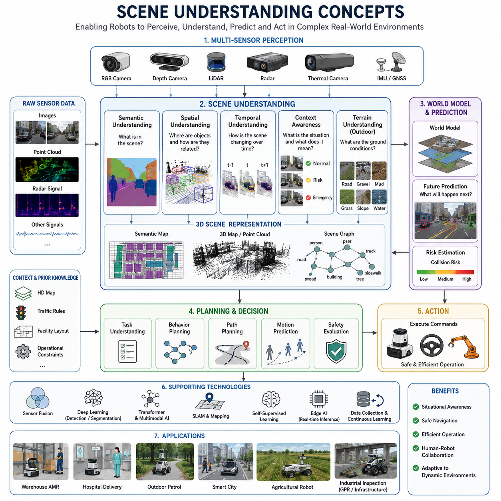
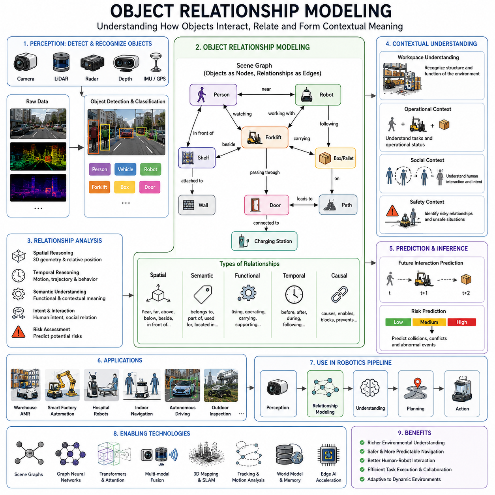
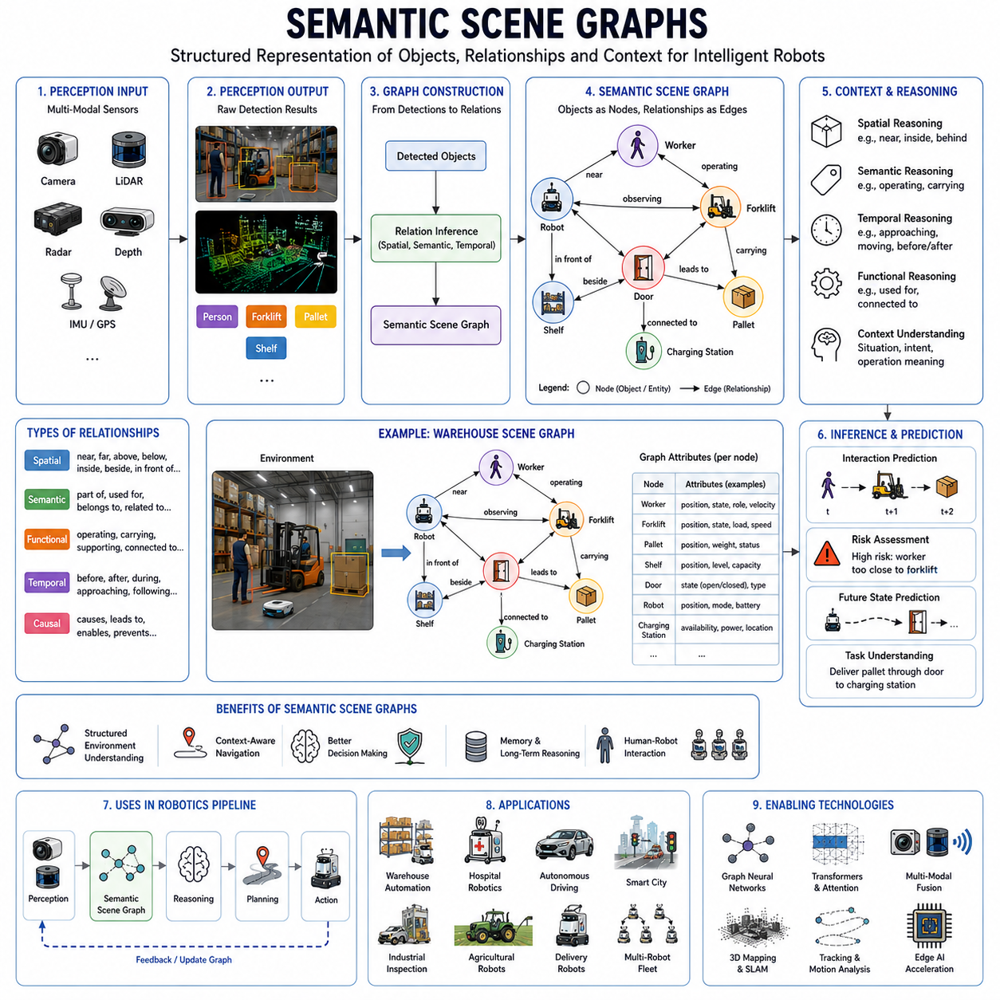
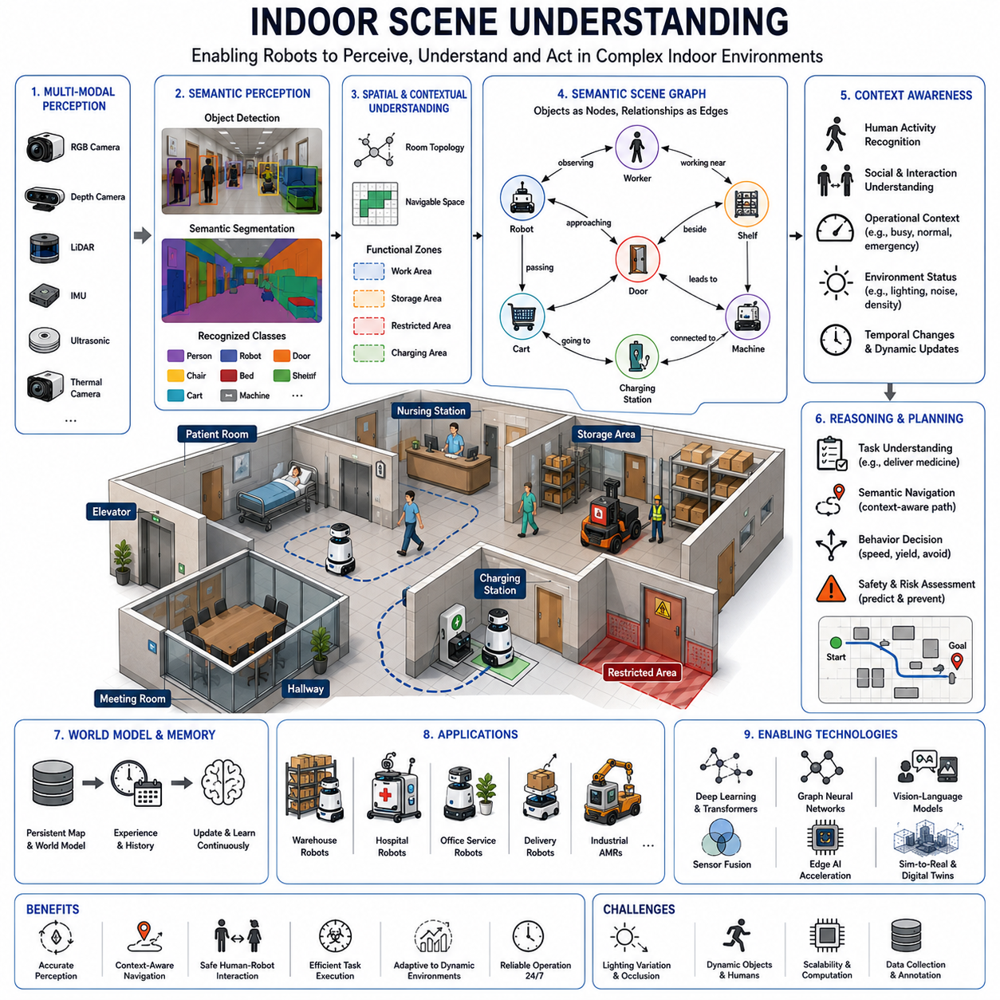
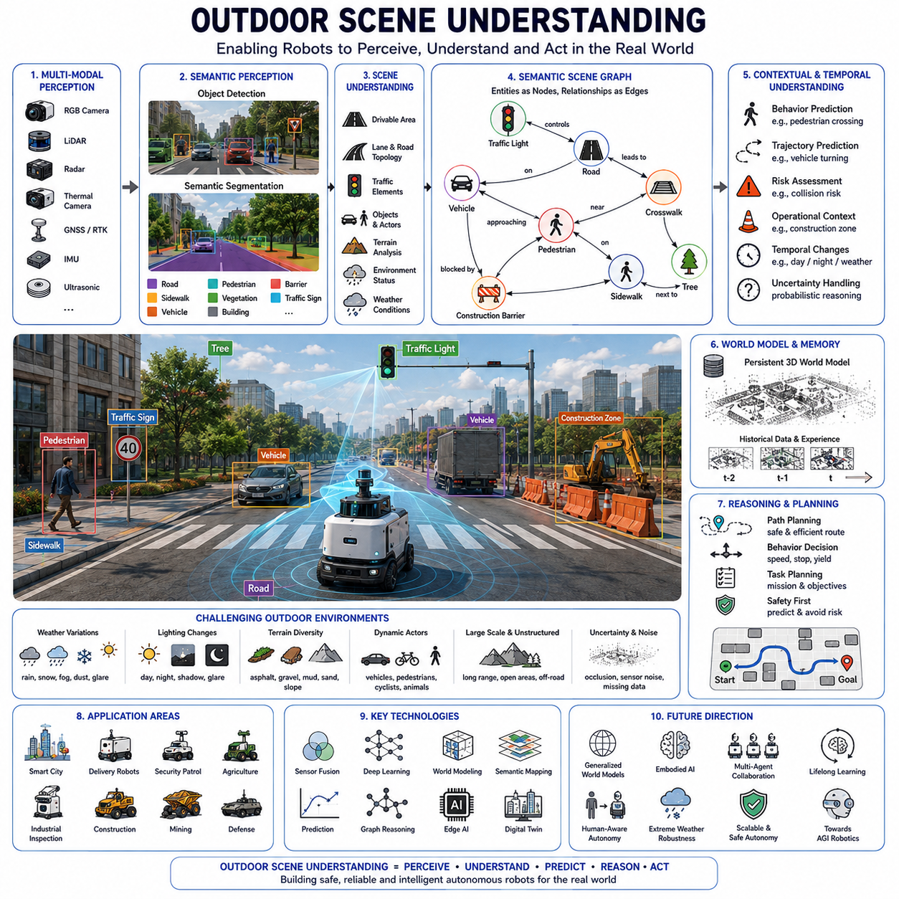
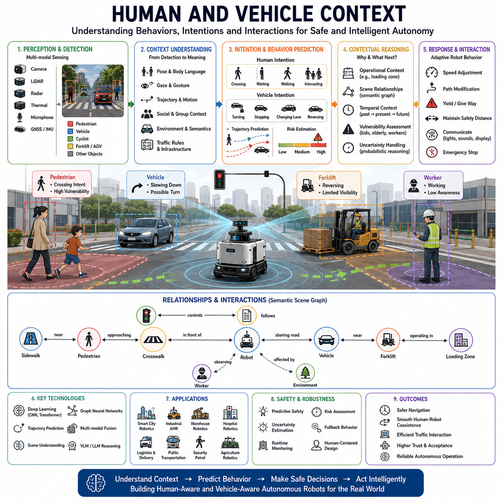
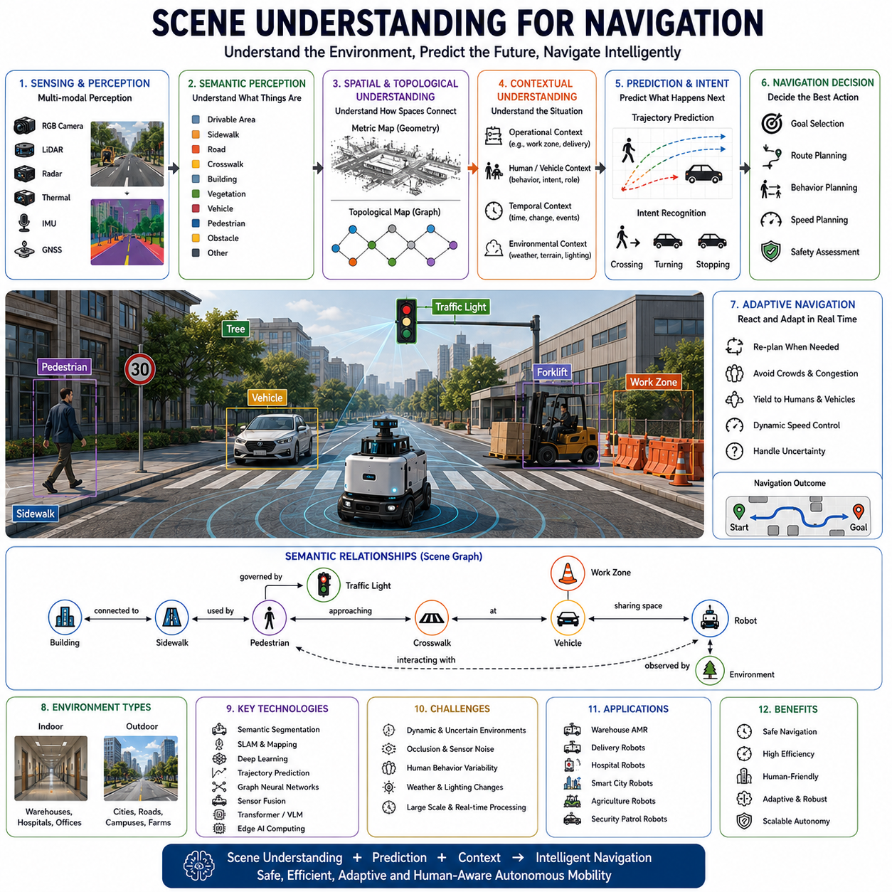
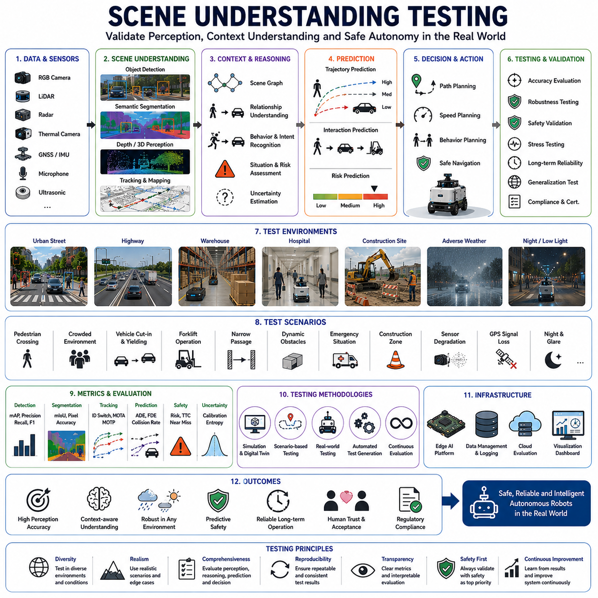

**Volume 06. AMR AI and Embodied Intelligence**

# Chapter 12. Scene Understanding

## 12.1 Scene Understanding Concepts

{width="7.268055555555556in" height="7.268055555555556in"}

"12_01_Scene_Understanding_Concepts"는 자율주행 로봇과 구현형 인공지능(Embodied AI) 시스템이 주변 환경을 단순히 감지하는 수준을 넘어, 공간과 객체, 상황, 맥락을 종합적으로 이해하는 능력을 설명하는 핵심 개념이다. 전통적인 로봇 시스템에서는 센서 데이터를 개별적으로 처리하는 방식이 일반적이었다. 예를 들어 카메라는 객체를 인식하고, LiDAR는 거리 정보를 계산하며, GPS는 위치를 추정하는 역할을 수행하였다. 그러나 실제 환경은 단순한 센서 데이터의 집합이 아니라 의미와 관계가 포함된 복합적인 공간이다. Scene Understanding은 이러한 복합 환경을 하나의 통합된 의미 공간으로 해석하는 과정이며, 로봇이 단순한 자동화 장치를 넘어 지능형 자율 시스템으로 발전하기 위한 핵심 기술로 간주된다.

AMR(Autonomous Mobile Robot) 환경에서 Scene Understanding은 주변의 객체를 단순히 "무엇이 존재하는가" 수준으로 인식하는 것이 아니라, "무엇이 어떤 관계로 존재하며 현재 어떤 상황이 발생하고 있는가"를 이해하는 과정이다. 예를 들어 병원 물류 로봇은 단순히 사람과 카트를 탐지하는 것이 아니라, 의료진의 이동 패턴, 환자의 위치, 응급 상황 가능성, 통로 혼잡 상태 등을 함께 이해해야 한다. 실외 순찰 로봇은 차량, 보행자, 공사 구역, 날씨 변화, 그림자, 조명 상태를 동시에 분석하며 위험도를 추정해야 한다. 이러한 종합적 환경 해석 능력이 바로 Scene Understanding의 핵심 목표이다.

초기의 로봇 시스템에서는 Scene Understanding이 제한적이었다. 전통적인 머신비전 시스템은 에지 검출, 특징점 추출, 색상 기반 분류 같은 규칙 기반 알고리즘에 크게 의존하였다. 이러한 방식은 조명 변화나 복잡한 환경에 취약했으며, 환경 전체의 의미를 이해하기 어려웠다. 이후 CNN 기반 딥러닝이 등장하면서 객체 인식과 세그멘테이션 정확도가 급격히 향상되었고, 최근에는 Transformer 기반 비전 모델과 멀티모달 AI가 등장하면서 Scene Understanding은 단순한 시각 인식에서 공간적 추론과 상황 이해 단계로 확장되고 있다.

Scene Understanding의 첫 번째 핵심 요소는 Perception이다. 이는 카메라, LiDAR, Radar, Thermal Camera, Depth Camera 등의 센서를 통해 환경 데이터를 수집하는 과정이다. RGB 카메라는 색상과 질감을 제공하며, LiDAR는 3D 거리 정보를 제공한다. Radar는 악천후 환경에서도 안정적인 물체 감지가 가능하며, Thermal Camera는 열 기반 객체 탐지를 가능하게 한다. 현대 AMR은 일반적으로 여러 센서를 동시에 사용하며, 이러한 멀티센서 구조를 통해 환경 인식의 신뢰성을 높인다.

두 번째 핵심 요소는 Semantic Understanding이다. 이는 단순한 픽셀 수준 분석을 넘어 객체의 의미를 이해하는 과정이다. 예를 들어 로봇은 단순히 "사각형 물체"를 탐지하는 것이 아니라 그것이 "사람", "차량", "파렛트", "위험 표지판", "문", "계단"인지 구분해야 한다. Semantic Segmentation 기술은 장면 전체를 픽셀 단위로 분류하여 환경의 의미 지도를 생성한다. 이러한 의미 기반 환경 표현은 로봇의 경로 계획과 행동 결정에서 매우 중요한 역할을 수행한다.

세 번째 요소는 Spatial Understanding이다. 로봇은 객체의 존재뿐 아니라 공간적 관계를 이해해야 한다. 예를 들어 "사람이 차량 앞에 서 있다", "팔레트가 통로를 막고 있다", "문이 열려 있다", "작업자가 위험 구역 근처에 있다"와 같은 관계 정보를 해석해야 한다. Spatial Understanding은 3D Scene Reconstruction, Occupancy Grid Mapping, Point Cloud Processing, Scene Graph Representation 등의 기술과 밀접하게 연결된다.

Scene Understanding에서 중요한 또 하나의 개념은 Temporal Understanding이다. 실제 환경은 정적이지 않으며 지속적으로 변화한다. 로봇은 시간 흐름에 따른 객체 이동과 환경 변화를 이해해야 한다. 예를 들어 창고 AMR은 사람의 이동 방향을 예측하고, 병원 로봇은 복도 혼잡도를 추정하며, 실외 순찰 로봇은 차량 접근 속도를 계산해야 한다. Temporal Understanding은 Video Understanding, Motion Prediction, Object Tracking, Trajectory Forecasting 기술과 연결된다.

최근 구현형 AI에서는 Scene Understanding이 World Model과 긴밀하게 통합되고 있다. World Model은 로봇 내부에 형성되는 가상 환경 모델이며, 로봇은 이를 기반으로 미래 상황을 예측한다. 예를 들어 자율주행 로봇은 현재 장면만 보는 것이 아니라 앞으로 몇 초 후 발생할 가능성이 높은 상황을 시뮬레이션한다. 이는 단순한 인식 시스템을 넘어 예측 기반 행동 시스템으로 발전하는 핵심 과정이다.

Indoor Scene Understanding과 Outdoor Scene Understanding은 요구 조건이 크게 다르다. 실내 환경은 상대적으로 구조화되어 있지만 좁은 공간과 사람 밀집 환경이 많다. 병원, 공장, 물류창고에서는 사람과 로봇의 협업 안전성이 매우 중요하다. 반면 실외 환경은 훨씬 복잡하다. 날씨 변화, 조명 변화, 그림자, 먼지, 비, 눈, 안개, 다양한 지형 변화가 존재한다. 따라서 실외 로봇은 더욱 강력한 Scene Understanding 능력을 요구한다.

특히 실외 자율주행 플랫폼에서는 Scene Understanding이 단순한 시각 인식 수준을 넘어 지형 해석까지 포함한다. 로봇은 단순히 장애물을 탐지하는 것이 아니라 지면 상태, 경사도, 수로, 진흙, 자갈, 잔디, 포트홀 등을 이해해야 한다. 이는 Rough Terrain Navigation과 연결되며, 농업 로봇, 순찰 로봇, GPR 기반 지하 구조물 점검 로봇에서 매우 중요한 요소가 된다.

Scene Understanding은 멀티모달 AI와도 깊은 관련이 있다. 최근의 AI 시스템은 이미지뿐 아니라 LiDAR Point Cloud, Radar Signal, 음성, 텍스트 정보까지 통합하여 환경을 이해한다. 예를 들어 Vision-Language Model(VLM)은 카메라 영상과 언어 정보를 동시에 처리하며, "위험 구역 근처의 작업자를 피해서 이동하라"와 같은 고수준 명령을 이해할 수 있다. 이러한 기술은 향후 Embodied AI와 AGI 기반 로봇 시스템의 핵심 기반 기술로 발전하고 있다.

또한 Scene Understanding은 Robot Agent 구조에서 매우 중요한 역할을 수행한다. 현대 Robot Agent는 일반적으로 Perception → Understanding → Planning → Action 구조로 동작한다. 여기서 Scene Understanding은 Perception과 Planning 사이의 핵심 중간 계층 역할을 수행한다. 단순 센서 데이터는 직접 행동 결정으로 연결되기 어렵기 때문에, Scene Understanding 계층이 환경을 의미적으로 해석하여 Planning 시스템에 전달한다.

산업용 로봇 환경에서는 Scene Understanding의 안정성과 실시간성이 매우 중요하다. 공장이나 물류센터에서는 수많은 이동 객체가 존재하며, 실시간으로 경로를 재계산해야 한다. 이를 위해 Edge AI 기반 추론 시스템이 사용된다. Jetson Orin NX, Jetson Thor, Edge GPU 시스템 등은 실시간 Scene Understanding을 위한 핵심 AI 연산 플랫폼으로 활용된다. 특히 대규모 Transformer 기반 Scene Understanding 모델은 높은 GPU 메모리와 연산 성능을 요구한다.

Scene Understanding의 또 다른 핵심 요소는 Context Awareness이다. 동일한 객체라도 상황에 따라 의미가 달라질 수 있다. 예를 들어 작업자가 통로를 걷고 있는 상황과, 작업자가 쓰러져 있는 상황은 완전히 다른 의미를 가진다. 로봇은 단순 객체 인식이 아니라 상황 맥락을 이해해야 한다. 이를 위해 최근에는 Graph Neural Network, Context Modeling, Attention 기반 Scene Reasoning 기술이 활발히 연구되고 있다.

Safety 측면에서도 Scene Understanding은 매우 중요하다. 단순한 장애물 탐지만으로는 안전성을 보장할 수 없다. 로봇은 위험 상황의 가능성을 이해해야 한다. 예를 들어 어린아이가 갑자기 뛰어들 가능성, 차량이 급회전할 가능성, 작업자가 로봇 이동 경로로 접근할 가능성 등을 예측해야 한다. 이러한 Predictive Scene Understanding은 미래형 안전 시스템의 핵심 기술로 평가된다.

실제 산업 현장에서는 Scene Understanding의 성능 검증도 중요한 과제가 된다. 테스트 환경에서는 다양한 조명 조건, 날씨 변화, 객체 밀집 상황, 센서 오염, 부분 가림(Occlusion), 악천후 환경 등을 포함한 복합 테스트가 수행된다. 또한 데이터셋의 다양성과 실제 현장 데이터 확보가 매우 중요하다. 특정 환경에서만 학습된 모델은 새로운 환경에서 성능이 급격히 저하될 수 있기 때문이다.

최근에는 Self-Supervised Learning 기반 Scene Understanding 연구도 빠르게 발전하고 있다. 기존 방식은 대규모 수작업 라벨링이 필요했지만, Self-Supervised Learning은 로봇이 스스로 환경 데이터를 학습할 수 있도록 한다. 이를 통해 장기간 운영되는 로봇은 현장 데이터를 기반으로 지속적으로 Scene Understanding 성능을 개선할 수 있다.

미래의 Scene Understanding은 단순한 시각 기반 AI를 넘어 Embodied Intelligence와 통합될 가능성이 높다. 로봇은 단순히 장면을 보는 것이 아니라 실제 물리 세계에서 행동하면서 환경을 이해하게 된다. 예를 들어 문 손잡이를 실제로 조작해 보며 문 구조를 학습하고, 다양한 지형을 주행하면서 지면 특성을 학습하는 방식이다. 이는 인간의 학습 방식과 유사한 형태이며, 차세대 AGI 기반 로봇의 핵심 방향으로 평가된다.

궁극적으로 Scene Understanding은 자율주행 로봇의 "환경 이해 능력" 자체를 의미한다. 이는 단순 센서 처리 기술이 아니라 공간 인식, 객체 의미 이해, 상황 추론, 미래 예측, 안전 판단, 행동 계획을 연결하는 통합 지능 시스템이다. 미래의 AMR과 Embodied AI 시스템에서는 Scene Understanding이 로봇 지능의 중심 계층으로 자리잡게 될 것이며, 산업 자동화, 스마트시티, 의료 로봇, 물류 로봇, 순찰 로봇, 농업 로봇 등 거의 모든 자율 시스템의 핵심 기반 기술로 발전하게 될 것이다.

## 12.2 Object Relationship Modeling

{width="7.268055555555556in" height="7.268055555555556in"}

"12_02_Object_Relationship_Modeling"은 로봇 지각(Perception)과 구현형 인공지능(Embodied AI) 분야에서 매우 중요한 핵심 개념으로, 환경 내부에 존재하는 개별 객체(Object) 자체를 이해하는 수준을 넘어 객체들 사이의 관계(Relationship), 상호작용(Interaction), 의존성(Dependency), 그리고 맥락적 의미(Contextual Meaning)를 이해하는 기술을 의미한다. 자율주행 로봇과 지능형 로봇 시스템에서 단순히 객체를 인식하는 것만으로는 진정한 환경 이해(Environmental Intelligence)를 달성할 수 없다. 로봇이 사람, 차량, 벽, 문, 선반, 기계, 통로 등을 각각 탐지할 수 있다고 하더라도, 이 객체들이 서로 어떻게 연결되고 어떤 상황을 형성하는지를 이해하지 못한다면 고수준의 상황 판단 능력을 갖추었다고 보기 어렵다. Object Relationship Modeling은 이러한 한계를 해결하기 위해 환경을 "연결된 의미 네트워크"로 해석하도록 만드는 핵심 기술이다.

전통적인 로봇 비전 시스템은 주로 객체 탐지(Object Detection)와 분류(Classification)에 초점을 맞추었다. 초기 머신비전 시스템은 특징점 추출과 규칙 기반 알고리즘을 활용하여 객체를 식별하였고, 이후 딥러닝 기반 CNN 모델이 등장하면서 객체 인식 정확도가 크게 향상되었다. 그러나 이러한 시스템들도 대부분 객체를 독립적인 존재로 취급하였다. 예를 들어 사람과 지게차(Forklift)를 각각 인식할 수는 있지만, "사람이 움직이는 지게차 가까이에 위치하고 있어 위험하다"는 관계를 이해하지 못하는 경우가 많았다. Relationship Modeling은 바로 이러한 "객체 간 의미 관계"를 이해하도록 함으로써 로봇의 환경 이해 능력을 크게 확장시킨다.

실제 환경에서 의미는 개별 객체보다 객체 간 관계에서 발생하는 경우가 많다. 예를 들어 의자와 테이블이 함께 있으면 좌석 공간을 의미하고, 횡단보도 근처에 정지한 차량은 보행자와의 상호작용 가능성을 의미하며, 공장 기계 근처에서 공구를 들고 있는 작업자는 유지보수 작업 중일 가능성을 의미한다. Object Relationship Modeling은 이러한 관계를 통해 환경의 운영 의미를 추론할 수 있도록 한다. 이 기능은 공장, 병원, 스마트시티, 물류창고, 농업 현장, 실외 자율주행 환경 등에서 매우 중요한 역할을 수행한다.

Object Relationship Modeling의 가장 기본적인 요소 중 하나는 Spatial Relationship Analysis이다. 이는 객체들이 3차원 공간 내에서 어떤 상대적 위치 관계를 가지는지를 분석하는 과정이다. 예를 들어 위, 아래, 옆, 내부, 근처, 뒤, 앞, 연결됨, 막고 있음, 교차함, 둘러싸고 있음 등의 관계가 포함된다. 자율주행 로봇은 이러한 공간 관계를 지속적으로 분석하여 환경 구조를 이해한다. 예를 들어 창고 로봇은 팔레트가 통로를 막고 있는지, 사람이 선반 뒤에서 접근하고 있는지, 카트가 적재 구역 내부에 위치하고 있는지를 이해해야 한다. 이러한 공간 추론 능력은 단순 기하학 데이터를 실제 환경 의미로 변환하는 핵심 과정이다.

거리 추정과 기하학적 추론 또한 중요한 역할을 한다. LiDAR Point Cloud, Stereo Vision, Depth Camera, Radar, SLAM Map 등은 객체 간 공간 관계를 계산하기 위한 기초 데이터를 제공한다. 로봇은 단순히 객체 위치를 파악하는 것이 아니라 객체들이 서로 어떤 구조를 형성하는지를 분석한다. 최신 Scene Understanding 시스템은 이러한 관계를 Scene Graph와 같은 구조적 표현 방식으로 저장하고 처리한다.

Temporal Relationship Modeling은 시간 축(Time Domain)에서 객체 관계를 이해하는 과정이다. 실제 환경은 정적이지 않으며 객체 간 관계도 지속적으로 변화한다. 보행자가 차량 방향으로 이동할 수 있고, 지게차가 적재 구역으로 접근할 수 있으며, 여러 대의 로봇이 동일한 교차점으로 이동할 수도 있다. Temporal Relationship Analysis는 로봇이 이러한 환경 변화와 상호작용을 이해하고 미래 상황을 예측하도록 한다. 이는 안전한 자율주행과 예측 기반 의사결정을 위해 매우 중요하다.

Motion Trajectory Analysis는 Temporal Modeling의 핵심 구성 요소이다. 로봇은 객체의 이동 경로를 추적함으로써 의도(Intent)와 행동 패턴을 추론한다. 예를 들어 사람이 로봇 경로 방향으로 이동하고 있다면 충돌 가능성을 예측할 수 있으며, 차량이 교차점 근처에서 속도를 줄이면 회전 가능성을 추정할 수 있다. 이러한 시간 기반 관계 분석은 단순 반응형 시스템을 넘어 예측 기반 자율 시스템으로 발전하기 위한 핵심 기술이다.

Semantic Relationship Modeling은 객체 간 기능적 또는 개념적 연결성을 이해하는 과정이다. 예를 들어 키보드는 작업 공간과 연결되고, 병상은 환자 치료 구역과 연결되며, 안전 콘은 위험 구역과 연결된다. 로봇은 이러한 의미 관계를 이해함으로써 환경 구조와 운영 목적을 해석할 수 있다. 단순히 객체를 인식하는 수준이 아니라, 객체가 환경에서 어떤 역할을 수행하는지를 이해하게 되는 것이다.

산업용 로봇 환경에서 Semantic Relationship은 운영 효율성과 안전성에 매우 중요한 역할을 한다. 제조 공장의 AMR은 특정 공구가 특정 작업장에 속한다는 점을 이해해야 하고, 자재는 특정 저장 구역과 연결된다는 점을 이해해야 한다. 병원 로봇은 약품 카트가 간호 업무와 연결되어 있고, 응급 장비가 우선 통행 구역과 연결된다는 점을 이해해야 한다. 이러한 의미 기반 관계는 더욱 지능적이고 맥락 기반(Context-Aware)의 로봇 행동을 가능하게 만든다.

Object Relationship Modeling은 Human-Robot Interaction(HRI)에서도 매우 중요하다. 인간 환경은 본질적으로 관계 중심적이며, 로봇은 사회적 맥락과 인간 행동 관계를 이해해야 자연스럽고 안전하게 동작할 수 있다. 사회적 로봇은 사람 간 거리, 그룹 행동, 시선 방향, 몸의 방향성, 이동 패턴 등을 분석하여 인간 의도를 해석한다. 예를 들어 병원 복도에서 이동하는 로봇은 사람들이 단순히 지나가는 중인지, 대기 중인지, 대화 중인지, 특정 장비를 사용하는 중인지를 이해해야 한다.

최근 Object Relationship Modeling에서는 Graph 기반 표현 방식이 매우 중요해지고 있다. Scene Graph는 대표적인 관계 표현 기술 중 하나이다. Scene Graph에서는 객체를 노드(Node)로 표현하고 객체 간 관계를 엣지(Edge)로 표현한다. 예를 들어 "사람이 지게차 옆에 있음", "로봇이 문으로 접근 중", "차량이 적재 구역 근처에 주차됨"과 같은 관계가 그래프 구조로 표현된다. 이러한 구조는 Graph Neural Network(GNN)나 Transformer 기반 AI 시스템에서 고수준 추론을 가능하게 만든다.

Scene Graph는 단순 픽셀 기반 인식보다 훨씬 구조화된 환경 표현을 제공한다. 이는 로봇의 Planning, Reasoning, Memory Management, Contextual Understanding에 매우 중요한 역할을 한다. 특히 Embodied AI 시스템에서는 장시간 환경 상태를 기억하고 추론해야 하기 때문에 Scene Graph 기반 표현이 매우 중요해지고 있다.

Transformer 기반 AI는 최근 Object Relationship Modeling 성능을 크게 향상시키고 있다. Vision Transformer와 Multimodal Transformer는 여러 객체 간 관계를 동시에 분석할 수 있는 Attention 메커니즘을 사용한다. 이를 통해 로봇은 군중 행동, 교통 흐름, 작업 환경 구조, 협업 활동과 같은 복잡한 관계를 이해할 수 있다.

Multimodal AI는 관계 모델링을 더욱 확장시킨다. 최신 AI 시스템은 Vision, LiDAR, Radar, Audio, Language 정보를 동시에 결합하여 환경을 통합적으로 이해한다. Vision-Language Model(VLM)은 객체 관계를 자연어와 연결하여 "크레인을 조작 중인 작업자를 피해서 이동하라" 또는 "정비 구역 옆에 자재를 배치하라"와 같은 명령을 이해할 수 있도록 한다. 이는 구현형 AI와 AGI 기반 로봇으로 발전하기 위한 핵심 단계로 평가된다.

자율주행 차량과 실외 로봇은 Object Relationship Modeling이 가장 중요하게 사용되는 대표적인 분야 중 하나이다. 실외 환경은 보행자, 차량, 자전거, 공사 장비, 교통 신호, 도로 구조 등 매우 복잡한 관계를 포함한다. 동일한 객체라도 주변 상황에 따라 의미가 달라진다. 예를 들어 횡단보도 근처의 정지 차량은 보행자 통행 가능성을 의미할 수 있지만, 적재 구역 근처에서는 단순 주차 상태일 수 있다. Relationship-Aware Perception은 이러한 상황 맥락을 해석하는 핵심 기술이다.

Object Relationship Modeling은 Predictive Safety System과도 깊은 관련이 있다. 미래의 AI 안전 시스템은 단순히 충돌 직전 상황을 감지하는 수준이 아니라, 객체 간 관계 변화를 기반으로 위험도를 사전에 추정한다. 예를 들어 보행자가 차량 방향으로 이동하면서 주변을 보지 않는다면 충돌 위험을 예측할 수 있다. 여러 대의 지게차가 동일 교차점으로 접근하고 있다면 로봇은 사전에 속도를 줄이거나 경로를 변경할 수 있다.

Multi-Robot System에서도 Relationship Modeling은 매우 중요하다. 공장이나 물류센터에서는 수십 대 이상의 로봇이 동시에 움직이며 협업한다. 각 로봇은 주변 로봇의 위치, 의도, 우선순위, 이동 경로를 이해해야 한다. Cooperative Relationship Modeling은 충돌 회피, 작업 분배, 교통 최적화, 협업 주행을 가능하게 만든다.

Object Relationship Modeling은 Robot Memory와 World Model에서도 중요한 역할을 수행한다. 최신 Embodied AI 시스템은 객체 관계를 지속적으로 기억하고 누적 학습한다. 단순히 현재 프레임만 처리하는 것이 아니라, 과거 관계 패턴과 장기 환경 변화를 기억함으로써 더욱 높은 수준의 환경 이해 능력을 구현한다.

하지만 Object Relationship Modeling은 계산 복잡도가 매우 높다는 문제를 가진다. 실제 환경에서는 수많은 객체와 관계가 존재하며, 객체 수가 증가할수록 가능한 관계 조합은 기하급수적으로 증가한다. 따라서 실시간 자율주행 시스템에서는 정확도와 연산 효율성 사이의 균형이 매우 중요하다. NVIDIA Jetson Orin NX, Jetson Thor, RTX 기반 Edge GPU 시스템 등이 이러한 관계 추론 연산을 가속하기 위해 사용된다.

데이터셋 구축 또한 매우 큰 도전 과제이다. Relationship Modeling은 단순 객체 라벨만 필요한 것이 아니라 "사람이 상자를 들고 있음", "로봇이 작업자를 따라감", "차량이 통로를 막고 있음"과 같은 관계 라벨이 필요하다. 이러한 데이터 구축 비용은 매우 높기 때문에 최근에는 Self-Supervised Learning과 Weakly Supervised Learning 연구가 활발하게 진행되고 있다.

미래의 Object Relationship Modeling은 World Model, Embodied Reasoning, AGI 기반 로봇 구조와 깊게 통합될 가능성이 높다. 로봇은 단순히 객체 관계를 인식하는 수준을 넘어 원인과 결과(Causality), 기능적 의존성(Functionality), 장기 환경 변화(Long-Term Dynamics)까지 이해하게 될 것이다.

궁극적으로 Object Relationship Modeling은 로봇이 실제 세계를 구조적이고 맥락적이며 의미 기반으로 이해하기 위한 핵심 기술이다. 이는 단순 센서 처리와 고수준 지능 사이를 연결하는 중요한 계층이며, 자율주행 로봇, 스마트시티 시스템, 물류 로봇, 의료 로봇, 산업 자동화 시스템, 농업 로봇, 미래형 구현형 AI 시스템에서 필수적인 핵심 기반 기술로 자리잡게 될 것이다.

## 12.3 Semantic Scene Graphs

{width="7.268055555555556in" height="7.268055555555556in"}

"12_03_Semantic_Scene_Graphs"는 현대 로봇공학, 구현형 인공지능(Embodied AI), 자율 시스템 분야에서 가장 중요한 구조적 환경 표현 기술 중 하나를 설명하는 개념이다. Semantic Scene Graph는 환경 내부의 객체(Object)를 노드(Node)로 표현하고, 객체들 사이의 관계(Relationship)를 엣지(Edge)로 표현하는 그래프 기반 환경 표현 방식이다. 기존의 전통적인 인식 시스템이 단순 객체 탐지 결과나 센서 데이터 자체를 출력하는 수준이었다면, Semantic Scene Graph는 환경 정보를 구조화된 관계 기반 지식으로 조직화한다. 이를 통해 로봇은 단순히 세상을 "보는" 수준을 넘어, 환경의 맥락(Context), 구조(Structure), 기능(Function), 동적 상호작용(Dynamic Interaction)까지 이해할 수 있게 된다.

자율주행 로봇과 지능형 로봇 시스템이 점점 더 복잡한 환경에서 동작하게 되면서 기존 Perception Pipeline의 한계가 명확하게 드러나고 있다. 전통적인 Computer Vision 시스템은 Bounding Box, Segmentation Mask, Point Cloud Cluster와 같은 형태의 출력 결과를 생성한다. 이러한 정보는 저수준 인식(Low-Level Perception)에는 유용하지만, 객체 간의 맥락적 관계를 자연스럽게 표현하지 못한다. 예를 들어 시스템이 작업자, 지게차, 팔레트를 각각 탐지할 수는 있지만, "작업자가 지게차 옆에 있고 지게차가 팔레트를 적재 구역으로 운반 중이다"라는 상황 관계를 이해하지 못할 수 있다. Semantic Scene Graph는 이러한 문제를 해결하기 위해 센서 기반 인식 결과를 구조화된 의미 표현으로 변환하여 Reasoning, Planning, Prediction, Decision-Making이 가능한 형태로 만든다.

Semantic Scene Graph의 기본 구조는 노드(Node)와 엣지(Edge)로 구성된다. 노드는 일반적으로 환경 내부의 객체, 영역, 엔티티, 의미 개념 등을 표현한다. 예를 들어 사람, 로봇, 차량, 선반, 문, 통로, 기계, 공구, 팔레트, 벽, 충전 스테이션, 교통 표지판, 운영 구역 등이 노드가 될 수 있다. 각 노드는 객체 종류, 위치, 방향, 크기, 상태, 움직임 정보, 신뢰도, 의미 라벨, 운영 상태 등의 속성을 포함할 수 있다.

엣지는 노드들 사이의 관계를 표현한다. 이러한 관계는 공간적 관계, 의미적 관계, 기능적 의존성, 물리적 상호작용, 시간적 순서, 원인 관계 등을 포함할 수 있다. 예를 들어 "로봇이 문으로 접근 중", "작업자가 기계를 조작 중", "지게차가 팔레트를 운반 중", "차량이 횡단보도 근처에 위치", "사람이 제한 구역 내부에 있음"과 같은 관계가 그래프 형태로 표현될 수 있다. 이러한 관계 표현을 통해 로봇은 단순 객체 인식을 넘어 훨씬 깊은 환경 이해 능력을 가지게 된다.

Semantic Scene Graph의 가장 큰 장점 중 하나는 기하학적 인식(Geometric Perception)과 상징적 추론(Symbolic Reasoning)을 연결할 수 있다는 점이다. 전통적인 인식 시스템은 수치 기반 데이터 처리에 강하지만, 고수준 Planning 시스템은 구조화된 상징적 정보가 필요하다. Scene Graph는 저수준 센서 데이터와 고수준 AI Reasoning 사이를 연결하는 중간 표현 계층 역할을 수행한다. 이러한 특징은 로봇이 복잡한 실제 환경에서 지속적으로 환경을 이해하고 추론해야 하는 Embodied AI 시스템에서 특히 중요하다.

Spatial Relationship Representation은 Semantic Scene Graph의 핵심 기능 중 하나이다. 로봇은 객체가 단순히 존재하는지만 이해하는 것이 아니라 서로 어떤 공간 관계를 가지는지도 이해해야 한다. 공간 관계에는 near, far, above, below, beside, behind, in front of, attached to, connected to, inside, outside, blocking 등의 개념이 포함된다. 이러한 관계는 로봇이 환경 구조와 이동 가능 공간을 이해하는 데 매우 중요한 역할을 수행한다.

예를 들어 물류창고에서 동작하는 AMR은 선반이 저장 구역과 연결되어 있고, 팔레트가 물류 작업과 연관되어 있으며, 작업자가 특정 작업 구역과 연결된다는 점을 그래프 형태로 표현할 수 있다. 이러한 구조화된 표현은 단순 위치 정보 이상의 의미 기반 Navigation과 Task Coordination을 가능하게 만든다.

Temporal Relationship 또한 매우 중요하다. 실제 환경은 지속적으로 변화하며 객체 관계 역시 시간에 따라 변화한다. Dynamic Scene Graph는 정적인 그래프 구조에 시간 기반 변화 정보를 추가한 개념이다. 객체는 등장하거나 사라질 수 있으며, 움직이거나 상태가 변할 수 있다. 사람이 로봇 방향으로 걸어오는 상황, 문이 자동으로 열리는 상황, 차량이 교차점에서 속도를 줄이는 상황 등이 모두 시간 기반 관계 변화에 해당한다.

Dynamic Semantic Scene Graph는 로봇이 환경 변화를 추적하고 미래 상호작용을 예측할 수 있도록 만든다. 예를 들어 보행자가 횡단보도로 접근하고 있다면 로봇은 향후 자신의 경로와 충돌 가능성이 있음을 예측할 수 있다. 물류창고 AMR은 주변 지게차와 작업자의 이동 패턴을 기반으로 혼잡 가능성을 예측할 수 있다. 이러한 예측 기능은 자율 안전 시스템과 지능형 Planning 구조에서 매우 중요하다.

Semantic Scene Graph는 Contextual Reasoning에도 매우 강력한 기능을 제공한다. Context는 환경 의미를 이해하는 데 핵심 요소이다. 동일한 객체라도 주변 관계에 따라 완전히 다른 의미를 가질 수 있다. 예를 들어 적재 구역 옆에 주차된 차량은 정상 물류 상황일 수 있지만, 비상구를 막고 있는 차량은 위험 상황일 수 있다. Scene Graph는 객체 간 관계를 기반으로 환경 맥락을 추론할 수 있게 만든다.

병원 로봇 환경에서는 Contextual Reasoning이 특히 중요하다. 병원 서비스 로봇은 약품 카트가 간호 스테이션과 연결되어 있다는 점, 병상이 환자 치료 구역에 속한다는 점, 응급 장비가 우선 대응 경로와 연결된다는 점을 이해해야 한다. 응급 상황에서는 환경 관계가 빠르게 변할 수 있기 때문에 로봇은 Scene Graph를 지속적으로 업데이트해야 한다.

Semantic Scene Graph의 가장 중요한 응용 분야 중 하나는 Navigation과 Path Planning이다. 기존 Navigation 시스템은 Occupancy Map 기반의 단순 장애물 회피에 의존하는 경우가 많았다. 하지만 이러한 방식은 환경 의미를 이해하지 못한다. Semantic Scene Graph는 의미 기반 Navigation을 가능하게 만든다.

예를 들어 로봇은 단순히 장애물을 피하는 것이 아니라 사람이 많은 구역을 우회하거나, 작업 구역 근처에서는 속도를 줄이거나, 안전도가 높은 경로를 우선 선택할 수 있다. 실외 자율주행 환경에서는 도로, 인도, 횡단보도, 공사 구역, 차량 흐름 등을 그래프 형태로 표현하여 더욱 지능적인 Navigation이 가능해진다.

Semantic Scene Graph는 Robot Memory System 및 World Model과도 깊은 관련이 있다. 최신 Embodied AI 구조에서는 그래프 기반 환경 메모리를 장기간 유지하는 방향으로 발전하고 있다. 로봇은 단순히 현재 센서 프레임만 처리하는 것이 아니라 객체, 위치, 관계, 운영 상태, 반복 패턴 등을 지속적으로 누적 학습한다. 이를 통해 장기적인 환경 추론(Long-Term Reasoning)이 가능해진다.

예를 들어 스마트시티 순찰 로봇은 특정 시간대의 보행자 흐름 패턴이나 자주 막히는 구역을 학습할 수 있다. 물류창고 로봇은 특정 적재 구역이 특정 시간대에 혼잡해진다는 점을 기억할 수 있다. 이러한 Scene Graph 기반 Memory는 로봇의 장기 환경 지능(Long-Term Environmental Intelligence)을 형성하는 핵심 요소가 된다.

Semantic Scene Graph는 Graph Neural Network(GNN)와 매우 잘 결합된다. GNN은 그래프 구조 자체를 직접 처리할 수 있기 때문에 객체 간 관계 기반 추론에 매우 적합하다. 기존 CNN이 주로 국소 시각 특징(Local Visual Feature)을 분석하는 반면, GNN은 환경 전체의 관계 구조를 분석한다. 이를 통해 상호작용 예측, Contextual Classification, Relational Inference와 같은 고수준 AI 기능이 가능해진다.

최근 Transformer 기반 AI 구조는 Semantic Scene Graph의 발전을 더욱 가속화하고 있다. Attention Mechanism은 여러 객체 간 복잡한 관계를 동시에 분석할 수 있도록 한다. Vision Transformer, Multimodal Transformer, Vision-Language Model은 Scene Graph와 의미 기반 Reasoning을 결합하는 방향으로 빠르게 발전하고 있다.

특히 Vision-Language Model(VLM)은 Scene Graph와 자연어를 연결하는 중요한 역할을 수행한다. 이를 통해 로봇은 "정비 구역 근처 충전 스테이션 옆으로 이동하라" 또는 "중장비를 조작 중인 작업자를 피해서 이동하라"와 같은 명령을 환경 관계 기반으로 이해할 수 있다. 이러한 기술은 미래 Embodied AI 시스템의 핵심 기반 기술 중 하나로 평가된다.

Multimodal Fusion 역시 Semantic Scene Graph 품질을 향상시키는 중요한 기술이다. 카메라는 의미 정보를 제공하고, LiDAR는 정확한 3D 구조를 제공하며, Radar는 악천후 환경에서 안정적인 탐지를 지원한다. Thermal Camera는 야간 인식을 강화하고, GNSS는 대규모 위치 정보를 제공한다. 이러한 멀티센서 데이터를 통합함으로써 실제 환경에서 신뢰성 높은 Scene Graph를 생성할 수 있다.

실외 자율주행 로봇에서는 Semantic Scene Graph의 중요성이 더욱 커진다. 실외 환경은 도로, 차량, 보행자, 자전거, 공사 장비, 식생, 지형 변화, 날씨 변화 등 매우 복잡한 요소를 포함한다. 단순 Object Detection만으로는 이러한 환경을 충분히 이해할 수 없다. Scene Graph는 이러한 복잡한 환경을 구조적으로 표현하여 Contextual Navigation과 Predictive Planning을 가능하게 만든다.

농업 로봇 역시 Semantic Scene Graph의 큰 혜택을 받을 수 있다. 농업 환경에서는 작물, 관개 시스템, 농기계, 작업 경로 등이 서로 복잡하게 연결되어 있다. Semantic Scene Graph는 이러한 농업 환경 구조를 로봇이 이해하도록 도와준다.

GPR 기반 지하 구조물 점검 로봇과 같은 산업용 점검 로봇도 Semantic Scene Graph를 활용할 수 있다. 지하 구조물, 점검 대상, 유지보수 구역, 지형 상태, 위험 요소 등을 하나의 통합된 관계 기반 환경 모델로 표현할 수 있기 때문이다.

하지만 Semantic Scene Graph에는 여러 기술적 도전 과제도 존재한다. 가장 큰 문제 중 하나는 확장성(Scalability)이다. 실제 환경에는 수많은 객체와 관계가 존재하며 환경이 복잡해질수록 그래프 크기는 급격히 증가한다. 따라서 실시간 자율주행 시스템에서는 효율적인 Graph Construction, Compression, Incremental Update 기술이 매우 중요하다.

또 다른 문제는 Uncertainty와 Perception Error이다. 실제 센서 데이터는 노이즈가 많고 불완전하다. 객체가 가려질 수도 있고, 조명이 부족할 수도 있으며, 예측 불가능하게 움직일 수도 있다. 따라서 로봇은 불완전한 데이터 환경에서도 안정적으로 Scene Graph를 생성해야 한다. 이를 위해 Probabilistic Graph Model과 Uncertainty-Aware Reasoning 연구가 활발하게 진행되고 있다.

데이터 구축 또한 매우 큰 도전 과제이다. Semantic Scene Graph Dataset은 단순 객체 라벨만 필요한 것이 아니라 관계 정보까지 포함해야 한다. 예를 들어 "사람이 상자를 들고 있음", "차량이 보행자에게 접근 중", "로봇이 통로를 따라 이동 중"과 같은 관계 라벨이 필요하다. 이러한 데이터 구축 비용이 매우 높기 때문에 최근에는 Self-Supervised Learning 기반 자동 그래프 생성 기술 연구가 활발해지고 있다.

미래의 Semantic Scene Graph는 Embodied Reasoning, World Model, AGI 기반 로봇 구조와 더욱 깊게 통합될 가능성이 높다. 로봇은 단순히 정적인 관계를 표현하는 수준을 넘어 원인과 결과(Causality), 기능적 의존성(Functionality), 행동 의도(Intent), 장기 환경 변화(Long-Term Dynamics)까지 이해하게 될 것이다.

궁극적으로 Semantic Scene Graph는 자율주행 로봇의 환경 지능(Environmental Intelligence)을 표현하는 가장 강력한 프레임워크 중 하나이다. 이는 단순 센서 데이터를 구조화된 관계 기반 지식으로 변환하여 Reasoning, Prediction, Planning, Navigation, Memory, Contextual Understanding, Embodied Interaction을 가능하게 만든다. 향후 로봇공학이 Embodied AI와 범용 자율 시스템으로 발전함에 따라 Semantic Scene Graph는 인간 수준에 가까운 환경 이해를 가능하게 하는 핵심 기반 기술로 자리잡게 될 것이다.

## 12.4 Indoor Scene Understanding

{width="7.268055555555556in" height="7.268055555555556in"}

"12_04_Indoor_Scene_Understanding"는 자율주행 로봇과 구현형 인공지능(Embodied AI) 시스템이 복잡한 실내 환경을 의미적(Semantic), 공간적(Spatial), 맥락적(Contextual)으로 이해할 수 있도록 만드는 기술과 구조를 설명하는 개념이다. Indoor Scene Understanding은 서비스 로봇, 물류 로봇, 병원 로봇, 배달 로봇, 산업용 AMR, 협업 로봇 등이 건물 내부와 구조화된 시설 환경에서 지능적으로 동작하기 위해 반드시 필요한 핵심 기술 중 하나이다. 단순한 장애물 탐지나 위치 추정(Localization)을 넘어, 실내 공간 구조, 객체 관계, 인간 활동, 이동 제약, 운영 상황, 동적 환경 변화 등을 통합적으로 이해하는 것이 핵심 목표이다.

현대의 실내 로봇 시스템은 인간 입장에서는 비교적 구조화되어 보이는 환경에서 동작하지만, 로봇 관점에서는 매우 복잡한 인식 문제를 가진다. 물류창고에는 선반, 팔레트, 지게차, 작업자, 이동 카트, 적재 구역, 충전 스테이션, 임시 장애물이 존재한다. 병원에는 환자, 의료진, 병상, 약품 카트, 휠체어, 엘리베이터, 제한 구역, 응급 통로가 존재한다. 사무실 환경에는 책상, 의자, 회의실, 복도, 문, 사람들의 상호작용이 지속적으로 변화하며 존재한다. 실내 로봇은 이러한 환경을 단순한 기하학적 장애물 집합으로 인식하는 것이 아니라, 의미를 가진 운영 공간으로 이해해야 한다.

초기의 실내 로봇 시스템은 주로 SLAM(Simultaneous Localization and Mapping)과 Occupancy Grid Mapping 같은 기하학 기반 기술에 의존하였다. 이러한 기술은 로봇이 자유 공간과 장애물을 구분하며 이동할 수 있도록 해주었지만, 환경의 의미를 이해하지는 못했다. 예를 들어 벽, 유리문, 사람, 이동 카트는 Occupancy Map에서는 모두 동일한 "장애물"처럼 표현될 수 있다. 그러나 실제 운영 환경에서는 각각 완전히 다른 대응 방식이 필요하다. Indoor Scene Understanding은 단순 Geometry를 넘어 Semantic Perception, Contextual Reasoning, Object Relationship, Operational Awareness를 통합하는 개념이다.

Indoor Scene Understanding의 핵심 요소 중 하나는 Semantic Perception이다. Semantic Perception은 로봇이 실내 객체와 공간을 의미와 기능 기반으로 인식할 수 있도록 한다. 로봇은 단순한 형상이나 표면을 인식하는 것이 아니라, 문, 복도, 엘리베이터, 충전 스테이션, 병상, 저장 랙, 기계 장비, 비상구, 작업 공간, 제한 구역 등을 구분해야 한다. Semantic Segmentation과 Object Detection 기술은 이러한 의미 기반 환경 인식의 핵심 역할을 수행한다.

실내 환경은 반복 구조가 많다는 특징을 가진다. 긴 복도, 동일한 선반 구조, 반복되는 방 구조, 반사되는 유리 표면 등은 로봇의 Localization과 Mapping 시스템에 혼란을 줄 수 있다. Semantic Understanding은 이러한 문제를 해결하는 데 중요한 역할을 한다. 예를 들어 두 개의 유사한 복도가 있더라도, 주변의 엘리베이터, 비상 표지판, 작업 공간 구조 등을 통해 서로 다른 위치임을 구분할 수 있다.

Spatial Understanding 또한 실내 환경 이해의 핵심 요소이다. 실내 로봇은 방 구조, 공간 연결성, 이동 가능 경로, 장애물 배치, 기능 구역 등을 이해해야 한다. Spatial Reasoning은 "문이 복도와 연결되어 있음", "충전 스테이션이 정비 구역 옆에 위치함", "약품 카트가 환자실 근처에 있음"과 같은 관계를 이해하도록 만든다. 이러한 관계 기반 이해는 지능형 Navigation과 Task Planning을 가능하게 한다.

Indoor Scene Understanding에서는 Contextual Awareness도 매우 중요하다. 동일한 공간이라도 상황에 따라 전혀 다른 의미를 가질 수 있기 때문이다. 예를 들어 병원 복도는 일반 운영 상황과 응급 상황에서 완전히 다른 운영 의미를 가진다. 물류창고 적재 구역은 지게차가 활발히 이동하는 시간에는 위험 구역으로 변할 수 있다. 회의실은 비어 있는 공간일 때는 자유 이동이 가능하지만, 회의 중일 때는 조용한 이동이 요구될 수 있다. Context-Aware Scene Understanding은 로봇이 이러한 운영 상황 변화에 따라 행동을 동적으로 조정할 수 있도록 한다.

실내 환경에서는 Human-Centered Understanding이 특히 중요하다. 실내 로봇은 사람과 동일한 공간에서 함께 동작하기 때문이다. 따라서 사람의 행동, 이동 패턴, 사회적 거리, 협업 흐름 등을 이해해야 한다. Socially Aware Robot은 사람의 몸 방향, 이동 방향, 그룹 형성, 개인 공간(Personal Space), 시선 방향 등을 분석하여 안전하고 자연스럽게 행동한다.

예를 들어 병원 복도를 이동하는 서비스 로봇은 사람들이 단순히 이동 중인지, 대기 중인지, 대화 중인지, 장비를 운반 중인지 등을 이해해야 한다. 사무실 환경에서는 회의를 방해하지 않도록 조용한 이동이 필요할 수 있으며, 물류창고에서는 작업자와 지게차 주변에서 더욱 큰 안전 거리를 유지해야 할 수 있다.

Indoor Scene Understanding은 멀티모달 센서 융합(Multimodal Sensor Fusion)에 크게 의존한다. RGB 카메라는 의미 기반 객체 인식을 제공하고, Depth Camera는 3D 구조를 제공하며, LiDAR는 정밀한 Geometry Mapping과 장애물 탐지를 수행한다. IMU는 움직임 추정을 지원하며, Ultrasonic Sensor는 근거리 안전 감지에 사용된다. Thermal Camera는 저조도 환경이나 야간 환경에서 사람 탐지 성능을 향상시킬 수 있다. 최신 실내 로봇은 이러한 다양한 센서를 융합하여 안정적인 환경 이해를 수행한다.

조명 변화는 Indoor Scene Understanding의 주요 문제 중 하나이다. 실내 환경에는 그림자, 반사, 유리, 형광등, 창문을 통한 자연광, 어두운 복도 등 다양한 조명 조건이 존재한다. 이러한 변화는 Vision 기반 시스템의 성능을 크게 저하시킬 수 있다. 따라서 실제 시스템에서는 Vision Sensor뿐 아니라 Depth Sensor, LiDAR, AI 기반 조명 적응 기술 등을 함께 사용한다.

실내 환경에서는 Furniture Dynamics도 중요한 문제이다. 의자가 이동하고, 문이 열리고 닫히며, 임시 장애물이 생기고, 작업 공간 배치가 바뀌는 등 환경이 지속적으로 변화한다. 따라서 실내 로봇은 정적인 Map만 사용하는 것이 아니라, 환경 모델을 지속적으로 업데이트해야 한다.

이러한 개념은 Persistent World Modeling과 연결된다. 로봇은 단순히 현재 센서 프레임만 처리하는 것이 아니라, 실내 공간 구조, 객체 위치, 운영 구역, 사람 활동 패턴, 과거 환경 변화 등을 지속적으로 기억하는 내부 World Model을 유지한다. 이러한 Persistent Indoor World Model은 장기 운영 환경에서 더욱 효율적인 Navigation과 Reasoning을 가능하게 만든다.

Semantic Scene Graph는 Indoor Scene Understanding에서 매우 중요한 역할을 한다. 실내 환경은 자연스럽게 관계 기반 구조를 가진다. 방은 복도와 연결되고, 엘리베이터는 층을 연결하며, 작업 공간은 특정 부서와 연결되고, 충전 스테이션은 로봇 운영과 연결된다. Semantic Scene Graph는 이러한 관계를 구조화된 그래프 형태로 표현하여 Reasoning과 Planning에 활용할 수 있게 만든다.

예를 들어 병원 로봇은 환자실과 간호 스테이션, 응급 통로, 엘리베이터, 약품 카트 등을 그래프 구조로 연결하여 관리할 수 있다. 이를 통해 Context-Aware Navigation과 Task Execution이 가능해진다.

Indoor Scene Understanding은 Task-Oriented Robotics와도 밀접하게 연결된다. 실내 로봇은 단순 이동만 수행하는 것이 아니라 실제 운영 업무(Task)를 수행한다. 물류 로봇은 자재를 운반하고, 병원 로봇은 약품과 린넨을 배송하며, 사무실 로봇은 내부 물류 업무를 지원한다. 따라서 실내 환경을 "작업 수행 관점"에서 이해하는 것이 중요하다.

Task-Aware Scene Understanding은 로봇이 운영상 중요한 객체와 구역을 우선적으로 이해하도록 만든다. 예를 들어 비상 통로를 항상 확보해야 하거나, 작업자의 중요한 작업을 방해하지 않아야 하거나, 특정 시간대 혼잡도를 고려하여 경로를 선택하는 기능이 가능해진다. 이는 단순 Geometry 기반 로봇에서 Meaning-Driven Autonomous System으로 발전하는 과정이라 할 수 있다.

Indoor Navigation 또한 Semantic Understanding과 결합될 때 훨씬 효율적이 된다. 기존 Navigation 알고리즘은 주로 최단 거리와 충돌 회피를 목표로 한다. 하지만 Semantic Navigation은 더 높은 수준의 환경 의미를 고려한다. 예를 들어 넓은 복도를 우선 선택하거나, 야간에는 병실 근처 속도를 줄이거나, 사람이 많은 구역을 우회할 수 있다.

Indoor Localization 역시 Semantic Understanding의 큰 도움을 받는다. 반복 구조가 많은 실내 환경에서는 Geometry 기반 Localization만으로는 혼란이 발생하기 쉽다. 하지만 방 번호, 엘리베이터, 리셉션 데스크, 충전 스테이션 등의 Semantic Landmark를 활용하면 훨씬 안정적인 Localization이 가능하다.

현대 Indoor Scene Understanding에서는 AI가 중심 역할을 수행한다. Deep Learning 모델은 Object Detection, Semantic Segmentation, Depth Estimation, Scene Classification, Human Pose Estimation, Activity Recognition, Contextual Inference 등을 수행한다. 최근에는 Transformer 기반 구조가 CNN 기반 구조를 빠르게 대체하고 있는데, 이는 장거리 관계(Long-Range Relationship)와 Contextual Reasoning 능력이 더욱 우수하기 때문이다.

Vision-Language Model(VLM) 또한 실내 로봇 분야에서 점점 중요해지고 있다. 언어와 환경 인식을 결합함으로써 로봇은 "엘리베이터 옆 방으로 물건을 전달하라" 또는 "응급실 근처 혼잡 구역을 피해서 이동하라"와 같은 자연어 명령을 이해할 수 있게 된다. 이는 더욱 유연한 Human-Robot Interaction과 고수준 Autonomous Reasoning을 가능하게 만든다.

실시간 Indoor Scene Understanding을 위해서는 Edge AI Architecture가 필수적이다. 실내 로봇은 Navigation, Localization, Obstacle Avoidance, Semantic Reasoning, Task Planning을 동시에 수행해야 하며, 이를 위해 지속적으로 대용량 센서 데이터를 처리해야 한다. NVIDIA Jetson Orin NX, Jetson Thor, Edge GPU 시스템은 이러한 실시간 AI 추론을 가능하게 하는 핵심 플랫폼이다.

Indoor Scene Understanding은 Collaborative Robot에서 특히 중요하다. 협업 로봇은 사람과 함께 동일 공간에서 동작하기 때문에, 예측 불가능한 인간 행동을 이해하면서도 안전성과 운영 효율성을 유지해야 한다. Predictive Scene Understanding은 사람 이동을 예측하고 이상 상황을 감지하며, 사전에 행동을 조정할 수 있도록 만든다.

Safety는 Indoor Robotics에서 가장 중요한 요소 중 하나이다. 실내 환경에는 환자, 노약자, 일반 직원, 방문객 등 다양한 사람들이 존재한다. 따라서 로봇은 환경 위험도, 제한 구역, 충돌 가능성, 응급 상황 등을 지속적으로 이해해야 한다. Scene Understanding은 단순 반응형 충돌 회피를 넘어 맥락 기반 위험 분석(Contextual Risk Assessment)을 가능하게 한다.

최근에는 Indoor Scene Understanding 학습과 검증을 위해 Simulation과 Digital Twin 기술도 활발히 사용되고 있다. 가상 환경에서 로봇은 방 구조, 객체 관계, Navigation 행동, 운영 패턴 등을 학습할 수 있으며, Sim-to-Real Transfer 기술을 통해 실제 환경에 적용된다.

Indoor Scene Understanding용 데이터 구축 역시 매우 어려운 문제이다. 실내 환경은 산업군, 건물 구조, 조명 조건, 가구 배치, 운영 방식에 따라 매우 다양하다. 따라서 대규모 데이터셋에는 Semantic Label, Room Annotation, Object Relationship, Human Activity, Operational Metadata 등이 포함되어야 하며, 데이터 다양성이 매우 중요하다.

최근에는 Self-Supervised Learning과 Continual Learning도 중요한 연구 방향이 되고 있다. 로봇은 단순히 수작업 라벨 데이터에만 의존하는 것이 아니라, 장기간 운영 과정에서 스스로 환경 구조와 운영 패턴을 학습할 수 있다. 예를 들어 병원에서 수개월 운영된 로봇은 시간대별 혼잡 패턴과 운영 흐름을 점차 학습하게 된다.

미래의 Indoor Scene Understanding은 Embodied AI, World Model, Cognitive Robotics와 더욱 깊게 통합될 가능성이 높다. 미래 로봇은 단순히 방과 객체를 인식하는 수준을 넘어, 인간 의도, 작업 흐름, 운영 의미, 장기 환경 변화까지 이해하게 될 것이다. 이는 단순 Perception 기반 자동화에서 Cognitive Environmental Intelligence로 발전하는 과정이다.

궁극적으로 Indoor Scene Understanding은 현대 실내 자율주행 로봇의 핵심 지능 계층 중 하나이다. 이는 Semantic Perception, Spatial Reasoning, Contextual Understanding, Human-Aware Interaction, World Modeling, Predictive Planning을 하나의 통합된 환경 인지 시스템으로 결합한다. 앞으로 병원, 물류창고, 스마트빌딩, 공장, 공공시설 등에서 AMR이 급속히 확대됨에 따라 Indoor Scene Understanding은 안전하고 효율적이며 인간 친화적인 로봇 운영을 가능하게 하는 가장 중요한 기반 기술 중 하나로 자리잡게 될 것이다.

## 12.5 Outdoor Scene Understanding

{width="7.268055555555556in" height="7.268055555555556in"}

"12_05_Outdoor_Scene_Understanding"는 자율주행 로봇과 구현형 인공지능(Embodied AI) 시스템이 복잡한 실외 환경을 의미적(Semantic), 공간적(Spatial), 시간적(Temporal), 맥락적(Contextual)으로 이해할 수 있도록 만드는 기술과 지능 구조를 설명하는 개념이다. Outdoor Scene Understanding은 현대 로봇공학에서 가장 어렵고 중요한 기술 중 하나로 평가된다. 그 이유는 실외 환경이 매우 동적이며 비정형적이고, 예측 불가능하며 지속적으로 변화하기 때문이다. 실내 환경은 비교적 구조화되어 있고 통제 가능한 경우가 많지만, 실외 환경은 날씨 변화, 조명 변화, 거친 지형, 교통 흐름, 인간 활동, 환경 노이즈, 대규모 운영 공간 등의 영향을 지속적으로 받는다. 따라서 Outdoor Scene Understanding은 실제 세계에서 안정적으로 동작할 수 있는 진정한 자율 시스템으로 발전하기 위한 핵심 단계라고 할 수 있다.

현재 자율주행 실외 로봇은 물류, 스마트시티, 보안 순찰, 농업, 광산, 건설, 산업 점검, 교통, 국방 등 다양한 분야에서 빠르게 활용되고 있다. 이러한 로봇은 도로, 인도, 교차로, 지형 상태, 식생, 건물, 차량, 보행자, 날씨, 공사 구역, 인프라 자산, 위험 요소 등을 동시에 이해해야 한다. 단순한 장애물 탐지만으로는 충분하지 않으며, 환경 의미를 해석하고 미래 상황을 예측하며 위험도를 추정하고 상황에 따라 행동을 동적으로 조정해야 한다.

초기의 실외 자율주행 시스템은 주로 GPS 기반 Navigation, LiDAR 기반 장애물 탐지, SLAM과 같은 기하학 기반 기술에 의존하였다. 이러한 기술은 기본적인 자율 이동은 가능하게 만들었지만 환경의 의미와 맥락을 이해하지는 못했다. 예를 들어 도로 표지판, 보행자, 웅덩이, 공사 바리케이드, 주차된 차량은 모두 단순 Geometry Object로 표현될 수 있지만 실제 운영 환경에서는 완전히 다른 의미를 가진다. Outdoor Scene Understanding은 단순 Geometry를 넘어 Semantic Perception, Contextual Reasoning, Environmental Prediction, Dynamic World Modeling을 통합함으로써 환경 지능을 크게 확장시킨다.

Outdoor Scene Understanding의 가장 중요한 문제 중 하나는 환경 변화(Environmental Variability)이다. 실외 환경은 조명, 날씨, 계절, 교통 흐름, 인간 활동, 지형 상태 등에 따라 지속적으로 변한다. 동일한 도로도 낮, 밤, 비, 눈, 안개, 석양 조건에 따라 완전히 다른 모습으로 보일 수 있다. 그림자는 시간에 따라 이동하며, 먼지, 진흙, 물, 식생 변화, 공사 활동은 환경 외형을 지속적으로 변화시킨다. 따라서 실외 로봇은 매우 높은 적응형 인식 능력을 가져야 한다.

Semantic Perception은 Outdoor Scene Understanding의 핵심 기반 기술이다. 실외 로봇은 환경 요소를 의미 기반으로 인식하고 분류해야 한다. 여기에는 도로, 차선, 인도, 교통 표지판, 신호등, 횡단보도, 연석, 바리케이드, 울타리, 식생, 건물, 전봇대, 차량, 보행자, 자전거, 동물, 공사 장비, 다양한 지형 종류 등이 포함된다. Semantic Segmentation과 Object Detection은 이러한 환경 의미를 이해하기 위한 핵심 AI 기술이다.

실외 환경은 실내와 달리 부분적으로만 구조화되어 있다는 특징이 있다. 일부 지역은 도로와 교통 체계가 명확하지만, 다른 지역은 개방형 지형, 비포장 경로, 농경지, 숲, 산업 단지, 재난 지역일 수 있다. 따라서 Outdoor Scene Understanding 시스템은 구조화된 환경 추론과 비정형 지형 해석을 동시에 수행할 수 있어야 한다.

Terrain Understanding은 Outdoor Robotics에서 가장 중요한 요소 중 하나이다. 실외 로봇은 아스팔트, 콘크리트, 자갈, 진흙, 잔디, 모래, 눈, 얼음, 암석, 포트홀, 경사면, 물 고임, 울퉁불퉁한 지면 등을 이해해야 한다. 지형 특성은 로봇의 안정성, 접지력, 속도 제한, 에너지 소비, 안전성에 직접적인 영향을 미친다. Geometry상 이동 가능해 보이는 경로라도 실제로는 미끄럽거나, 지반이 약하거나, 진흙이 깊거나, 숨겨진 장애물이 존재할 수 있다.

특히 농업 로봇, 광산 로봇, 군사용 로봇, 실외 순찰 로봇, 산업 점검 로봇에서는 Rough Terrain Understanding이 매우 중요하다. 이러한 환경에서는 일반 도로 인프라 없이 거친 지형을 직접 주행해야 하기 때문에 로봇은 지속적으로 지형 위험도를 평가해야 한다. 따라서 Terrain-Aware Navigation은 Geometry, Semantic, Material Property, Environmental Prediction을 통합한 형태로 발전하고 있다.

Weather Understanding 역시 매우 중요한 문제이다. 비, 눈, 안개, 먼지, 연기, 강한 햇빛은 Perception System 성능을 크게 저하시킬 수 있다. 카메라는 빛 반사와 저시야 문제를 겪을 수 있고, LiDAR는 산란 현상 영향을 받을 수 있으며, Radar는 노이즈 반사가 증가할 수 있다. Thermal Signature 또한 날씨에 따라 크게 달라진다. 따라서 Outdoor Scene Understanding은 멀티센서 융합(Multimodal Sensor Fusion)에 크게 의존한다.

RGB Camera는 풍부한 Semantic Appearance 정보를 제공하고, LiDAR는 정밀한 3D Geometry를 생성하며, Radar는 악천후 환경에서도 안정적인 장거리 인식을 제공한다. Thermal Camera는 야간 및 열 기반 탐지를 지원하고, GNSS/RTK는 대규모 위치 정보를 제공한다. IMU는 움직임 추정을 지원하며, Ultrasonic Sensor는 근거리 안전 감지에 사용된다. 이러한 센서 융합은 일부 센서가 악화된 환경에서도 로봇이 Situational Awareness를 유지할 수 있도록 만든다.

실외 환경은 차량, 보행자, 자전거, 동물, 중장비, 다수의 자율 시스템 등이 동시에 움직이는 매우 동적인 공간이다. 따라서 Temporal Understanding이 매우 중요하다. 실외 로봇은 현재 환경 상태뿐 아니라 앞으로 환경이 어떻게 변할지를 예측해야 한다. 횡단보도로 접근하는 보행자, 차선을 변경하는 차량, 적재 구역 근처에서 후진하는 지게차 모두 미래 행동 예측이 필요하다.

Trajectory Prediction과 Behavior Forecasting은 Outdoor Scene Understanding의 핵심 요소이다. 로봇은 객체의 이동 패턴, 가속도, 공간 관계, 맥락 정보를 분석하여 미래 환경 상태를 추정한다. 이러한 Predictive Scene Understanding은 단순 반응형 시스템이 아닌 사전 대응형(Proactive) 의사결정을 가능하게 한다.

Contextual Reasoning 역시 매우 중요하다. 동일한 객체라도 주변 상황에 따라 의미가 달라질 수 있기 때문이다. 예를 들어 도로 옆에 정지된 차량은 단순 주차일 수도 있고, 고장 차량일 수도 있으며, 적재 작업 중일 수도 있고, 사고 상황일 수도 있다. 진흙 구간 역시 6x6 중장비 플랫폼에게는 안전할 수 있지만 소형 배송 로봇에게는 위험할 수 있다. Context-Aware Reasoning은 이러한 운영 의미를 해석할 수 있도록 한다.

Outdoor Scene Understanding은 대규모 Mapping과 World Modeling과도 깊은 관련이 있다. 실외 로봇은 도로, 건물, 교차로, 산업 인프라, 전력 시설, 자연 환경 등을 포함한 넓은 지역에서 동작한다. 따라서 HD Map, Semantic Map, Topological Map, Digital Twin 등이 함께 사용된다.

Semantic Scene Graph 역시 Outdoor Robotics에서 매우 중요해지고 있다. 도로, 교차로, 인도, 건물, 교통 체계, 인프라 구조물 등을 그래프 형태로 연결하여 환경 관계를 표현할 수 있기 때문이다. 예를 들어 스마트시티 순찰 로봇은 인도가 횡단보도와 연결되고, 횡단보도가 교통 신호와 연결된다는 점을 이해할 수 있다.

실외 자율 시스템은 매우 높은 불확실성(Uncertainty)을 처리해야 한다. 실외 환경은 정보가 불완전하고, 사람 행동은 예측 불가능하며, 숨겨진 장애물과 환경 변화가 자주 발생한다. 따라서 Probabilistic Reasoning과 Uncertainty-Aware AI가 매우 중요한 역할을 수행한다.

Human and Vehicle Interaction Understanding 또한 Outdoor Scene Understanding의 핵심 요소이다. 실외 로봇은 보행자, 자동차, 트럭, 자전거, 지게차 등과 공간을 공유한다. 따라서 의도(Intent)와 행동을 예측하는 것이 매우 중요하다. 예를 들어 도로 가장자리를 바라보는 보행자는 횡단 의도가 있을 가능성이 높으며, 적재 구역 근처에서 천천히 움직이는 차량은 화물 작업 중일 수 있다.

Smart City Robotics는 Outdoor Scene Understanding의 대표적인 응용 분야 중 하나이다. 스마트시티 로봇은 배송, 순찰, 감시, 청소, 인프라 점검, 공공 안전 등의 작업을 수행할 수 있다. 이를 위해 도시 인프라, 교통 흐름, 인간 활동 구역, 공공 규정 등을 깊이 이해해야 한다.

농업 로봇 역시 Outdoor Scene Understanding이 필수적이다. 농업 환경에는 작물, 관개 시스템, 불규칙한 지형, 농기계, 동물, 계절 변화가 존재한다. 로봇은 잡초와 작물을 구분하고, 토양 상태를 이해하며, 넓은 개방형 환경을 이동할 수 있어야 한다.

산업 점검 로봇은 파이프라인, 철도, 항만, 공사 현장, GPR 기반 지하 구조물 점검 환경 등에서 동작한다. 이러한 환경에서는 산업 자산, 지형 상태, 위험 구역, 날씨 영향 등을 동시에 이해해야 한다.

Outdoor Scene Understanding에서는 Edge AI Architecture가 필수적이다. 실외 로봇은 고해상도 카메라, 다채널 LiDAR, Radar Array, Thermal Camera 등에서 매우 많은 데이터를 실시간으로 생성한다. NVIDIA Jetson Orin NX, Jetson Thor, RTX 기반 Edge GPU 시스템은 이러한 실시간 AI 추론을 가능하게 하는 핵심 플랫폼이다.

실외 환경은 복잡도가 매우 높기 때문에 실시간 처리 제약도 매우 심각하다. 로봇은 Semantic Perception, Terrain Analysis, Localization, Mapping, Motion Prediction, Path Planning, Safety Analysis를 동시에 수행해야 한다. 이를 위해 GPU Acceleration, Sensor Synchronization, Distributed Processing Architecture가 중요해진다.

Outdoor Scene Understanding은 Embodied AI와 World Model 구조와도 깊게 연결된다. 최신 실외 로봇은 단순히 현재 센서 데이터를 처리하는 것이 아니라, 지속적으로 내부 World Model을 유지한다. 여기에는 Semantic Structure, Terrain Property, Operational Zone, Traffic Flow, Historical Observation, Future Prediction 등이 포함된다.

Simulation과 Digital Twin도 Outdoor Scene Understanding 학습과 검증에 매우 중요하다. 실제 실외 데이터 수집은 매우 비용이 크고 어려운 작업이다. 따라서 시뮬레이션 환경에서 다양한 날씨, 교통 상황, 지형 변화, 희귀 사고 상황 등을 학습시키고 Sim-to-Real Transfer를 통해 실제 환경에 적용한다.

데이터 수집과 Annotation 역시 매우 큰 도전 과제이다. 실외 환경은 국가, 도시, 산업군, 기후에 따라 매우 다르다. 따라서 Semantic Label, Terrain Annotation, Weather Condition, Object Relationship, Trajectory Data 등이 포함된 대규모 데이터셋이 필요하다.

최근에는 Self-Supervised Learning과 Continual Learning도 중요한 연구 방향이 되고 있다. 모든 실외 상황을 수작업 라벨링하는 것은 사실상 불가능하기 때문이다. 장기간 운영되는 실외 로봇은 현장 데이터를 기반으로 계절 변화, 운영 패턴, 희귀 이벤트 등을 스스로 학습할 수 있다.

Safety는 Outdoor Scene Understanding에서 가장 중요한 문제 중 하나이다. 실외 로봇은 사람, 차량, 산업 장비, 공공 인프라 근처에서 동작하기 때문에 Perception Failure나 Context Misunderstanding은 심각한 사고로 이어질 수 있다. 따라서 Outdoor AI 시스템은 Redundancy, Uncertainty Estimation, Runtime Monitoring, Fallback Behavior, Safety Validation 등을 반드시 포함해야 한다.

미래의 Outdoor Scene Understanding은 AGI 기반 로봇, 대규모 World Model, Embodied Cognition, Multimodal Reasoning과 더욱 깊게 통합될 가능성이 높다. 미래 로봇은 단순 객체 인식과 Navigation을 넘어 사회적 맥락, 운영 의도, 인프라 행동, 환경 인과 관계, 장기 환경 변화까지 이해하게 될 것이다.

궁극적으로 Outdoor Scene Understanding은 자율주행 로봇이 실제 세계에서 안전하고 효율적이며 지능적으로 동작하기 위한 핵심 지능 계층이다. 이는 Semantic Perception, Terrain Reasoning, Contextual Awareness, Weather Adaptation, Predictive Modeling, Human Interaction Understanding, Embodied Environmental Cognition을 하나의 통합된 AI 구조로 결합한다. 앞으로 스마트시티, 물류, 농업, 산업 점검, 국방, 공공 인프라 분야에서 실외 자율 로봇이 급속히 확대됨에 따라 Outdoor Scene Understanding은 미래 구현형 자율 시스템의 가장 중요한 기반 기술 중 하나로 자리잡게 될 것이다.

## 12.6 Human and Vehicle Context

{width="7.268055555555556in" height="7.268055555555556in"}

"12_06_Human_and_Vehicle_Context"는 자율주행 로봇, 지능형 교통 시스템, 구현형 인공지능(Embodied AI) 분야에서 가장 중요한 핵심 능력 중 하나를 설명하는 개념이다. 이는 로봇과 자율 시스템이 사람(Human)과 차량(Vehicle)을 단순한 이동 객체(Moving Object)로 인식하는 수준을 넘어, 행동(Behavior), 의도(Intent), 상호작용(Interaction), 환경적 관계(Contextual Relationship)를 실시간으로 해석하고 이해하는 능력을 의미한다. Human and Vehicle Context Understanding은 단순 Object Detection을 넘어서는 개념이며, 자율 시스템이 왜 특정 행동이 발생하는지, 앞으로 어떤 행동이 발생할 가능성이 있는지, 그리고 그것이 안전성과 주행 계획에 어떤 의미를 가지는지를 이해하도록 만든다.

초기의 로봇 인식 시스템은 주로 객체 탐지와 위치 추정에 집중하였다. 로봇은 Computer Vision과 Sensor Fusion을 활용하여 보행자, 자동차, 트럭, 지게차, 자전거 등을 인식할 수 있었다. 그러나 실제 환경에서는 단순한 객체 탐지만으로는 안전한 자율주행이 불가능하다. 인간의 행동은 본질적으로 예측 불가능하며, 차량의 움직임 역시 환경 상황, 교통 흐름, 사회적 상호작용에 따라 달라진다. Human and Vehicle Context Understanding은 객체 종류만 인식하는 것이 아니라 행동의 의미를 해석하도록 만든다.

현대의 AMR 환경에서는 사람과 차량이 로봇과 동일한 공간을 공유하기 때문에 Context Understanding이 매우 중요하다. 실외 순찰 로봇은 보행자와 차량 흐름을 함께 이해해야 하며, 산업용 AMR은 지게차, 작업자, 서비스 차량과 협업해야 한다. 병원 로봇은 환자, 의료진, 스트레처, 약품 카트와 함께 동작한다. 스마트시티 로봇은 자전거, 버스, 전동 킥보드, 배송 차량, 보행자 등을 동시에 처리해야 한다. 이러한 환경에서는 단순 인식 정확도보다 맥락 기반 추론(Contextual Reasoning)이 훨씬 중요하다.

Human and Vehicle Context Understanding의 핵심 요소 중 하나는 Intention Recognition이다. 자율 시스템은 환경 관찰, 움직임 패턴, 공간 관계, 행동 신호 등을 기반으로 인간이나 차량이 다음에 무엇을 할 가능성이 있는지를 추정해야 한다. 예를 들어 도로 가장자리에 서서 차량 방향을 바라보는 보행자는 횡단 의도가 있을 수 있다. 교차점 근처에서 속도를 줄이는 차량은 회전 준비 중일 수 있다. 적재 구역 근처에서 후진하는 지게차는 화물 적재 작업을 수행 중일 가능성이 있다. 이러한 Intent Understanding은 위험 상황이 발생하기 전에 로봇이 사전 대응(Proactive Response)을 수행할 수 있도록 만든다.

인간 의도 인식은 특히 어려운 문제이다. 인간 행동은 상황에 따라 매우 다양하게 변하기 때문이다. 사람은 갑자기 멈출 수도 있고, 방향을 급격히 바꿀 수도 있으며, 다른 사람과 상호작용하거나 긴급 상황에서 비정상 행동을 할 수도 있다. 따라서 Human-Aware Robot은 Pose Estimation, Body Orientation, Trajectory Prediction, Gaze Estimation, Gesture Recognition, Semantic Context 등을 통합적으로 분석한다.

Body Language 또한 중요한 Context Signal이다. 사람의 자세, 걷는 속도, 머리 방향, 팔 움직임, 그룹 형성은 모두 행동 의미를 나타낸다. 예를 들어 자신감 있게 걷는 사람과 횡단보도 근처에서 망설이는 사람은 전혀 다른 행동 가능성을 가진다. 기계를 바라보는 작업자는 장비를 조작 중일 수 있으며, 뒤로 걸으면서 화물을 운반하는 작업자는 주변 상황 인식 능력이 제한될 수 있다. Human Context Reasoning은 이러한 미세 행동 신호까지 분석한다.

Social Context도 매우 중요한 요소이다. 사람은 혼잡한 환경에서 독립적으로 움직이지 않는다. 사람들은 그룹을 형성하고, 줄을 서고, 입구 근처에 모이며, 사회적 규칙에 따라 충돌을 회피한다. Socially Aware Robot은 사람 간 거리, 군중 흐름, 보행 규칙, 협업 행동 패턴 등을 이해해야 한다. 이러한 기능은 병원, 공항, 쇼핑몰, 사무실, 스마트시티와 같은 환경에서 특히 중요하다.

Human and Vehicle Context Understanding에는 Vulnerability Assessment도 포함된다. 모든 사람과 차량이 동일한 위험도를 가지는 것은 아니다. 예를 들어 도로 근처를 뛰어다니는 어린아이는 예측 가능성이 낮고 충돌 위험이 매우 높다. 보행 보조기를 사용하는 노인은 느리고 불규칙하게 움직일 수 있다. 자전거는 보행자보다 더 넓은 안전 거리가 필요할 수 있다. Context-Aware Robot은 이러한 위험도와 취약성을 고려하여 Navigation 전략을 동적으로 조정한다.

Vehicle Context Understanding 역시 매우 중요하다. 차량은 속도, 교통 규칙, 도로 구조, 운전자 행동에 따라 매우 다양한 움직임을 보인다. 자율 시스템은 차량의 Trajectory, Acceleration, Lane Position, Braking Behavior, Turn Signal 등을 지속적으로 분석해야 한다.

Trajectory Prediction은 Vehicle Context Understanding의 핵심 기술 중 하나이다. 로봇은 과거 이동 데이터, 도로 구조, 교통 흐름, 주변 객체 관계를 기반으로 미래 차량 위치를 예측한다. 예를 들어 횡단보도 근처에서 감속하는 차량은 보행자 양보 가능성이 있을 수 있으며, 교차점에서 급가속하는 차량은 충돌 위험이 높을 수 있다.

Contextual Interpretation은 동일한 차량 움직임도 상황에 따라 완전히 다른 의미를 가질 수 있기 때문에 중요하다. 적재 구역 근처에 정지한 트럭은 정상 물류 작업일 수 있지만, 도로 중앙에 정지한 동일한 트럭은 위험 상황일 수 있다. 주차장 내부에서 천천히 움직이는 차량과 횡단보도 근처에서 천천히 움직이는 차량은 전혀 다른 의미를 가진다. Context-Aware AI는 단순 Motion Analysis가 아니라 환경 의미 기반으로 행동을 해석한다.

Human and Vehicle Context Understanding은 Shared Autonomy 환경에서 특히 중요하다. 공장이나 물류센터에서는 지게차, 견인 차량, AMR, 작업자가 동시에 좁은 공간에서 움직인다. Context-Aware Navigation은 이러한 복합 환경에서 안전성과 효율성을 크게 향상시킨다.

예를 들어 물류 로봇은 무거운 팔레트를 운반 중인 지게차가 더 긴 제동 거리와 더 넓은 회전 공간을 필요로 한다는 점을 이해할 수 있다. 또한 화물을 적재 중인 작업자는 주변 로봇을 인식하지 못할 가능성이 높다는 점도 이해할 수 있다. 이러한 운영 맥락을 Planning에 반영함으로써 로봇은 위험을 줄이고 협업 효율성을 향상시킬 수 있다.

스마트시티 환경에서는 Human and Vehicle Context Understanding의 중요성이 더욱 커진다. 스마트시티에는 보행자, 차량, 버스, 자전거, 배송 로봇, 응급 차량, 교통 인프라가 복잡하게 상호작용한다. Context-Aware Robot은 신호등, 보행 우선권, 횡단보도 행동, 차량 양보 패턴 등을 이해해야 한다.

Emergency Vehicle Understanding은 특수하지만 매우 중요한 기능이다. 구급차, 소방차, 경찰차는 일반 차량과 다른 행동을 보일 수 있다. 로봇은 사이렌, 점멸등, 차량 회피 흐름 등을 인식하여 비상 상황을 이해해야 한다. 이를 제대로 해석하지 못하면 매우 위험한 상황이 발생할 수 있다.

Human and Vehicle Context Understanding은 Scene Understanding과 Semantic Scene Graph와도 깊게 연결된다. 사람과 차량은 독립 객체가 아니라 환경 관계의 일부이기 때문이다. 예를 들어 보행자는 횡단보도와 연결될 수 있고, 작업자는 중장비와 연결될 수 있으며, 차량은 적재 구역이나 차선과 연결될 수 있다. Scene Graph는 이러한 관계를 구조적으로 표현하여 고수준 추론을 가능하게 만든다.

Temporal Understanding 역시 매우 중요하다. Context는 고정된 것이 아니라 시간에 따라 변화한다. 보행자 그룹은 점차 횡단 행동으로 전환될 수 있고, 정차된 차량은 갑자기 출발할 수 있으며, 입구 근처 군중은 이벤트나 이상 상황을 의미할 수 있다. Dynamic Context Modeling은 로봇이 이러한 환경 변화를 이해하고 미래 상황을 예측하도록 만든다.

Multimodal AI Architecture는 Context Understanding 성능을 크게 향상시킨다. RGB Camera는 Appearance와 Pose 정보를 제공하고, LiDAR는 정밀한 공간 구조를 제공하며, Radar는 악천후 환경에서 안정적인 Motion Tracking을 수행한다. Thermal Camera는 야간 사람 탐지를 지원하고, Audio Sensor는 사이렌이나 군중 소음을 감지할 수 있다. GNSS와 HD Map은 대규모 환경 Context를 제공한다.

Deep Learning은 현대 Context Understanding 시스템의 핵심 기술이다. Neural Network는 Human Detection, Pose Estimation, Action Recognition, Trajectory Prediction, Interaction Modeling, Scene Classification 등을 수행한다. 특히 Transformer Architecture는 여러 객체 간 장거리 공간 관계와 시간 관계를 동시에 처리할 수 있기 때문에 매우 효과적이다.

Graph Neural Network(GNN)도 점점 중요해지고 있다. 사람, 차량, 인프라, 로봇 등을 노드(Node)로 표현하고, 상호작용을 엣지(Edge)로 표현하는 Graph 구조를 통해 "보행자가 차량 근처 횡단 중", "작업자가 기계 조작 중", "지게차가 적재 구역 접근 중"과 같은 관계를 추론할 수 있다.

Vision-Language Model(VLM)도 Human and Vehicle Context Understanding에 활용되기 시작하고 있다. 로봇은 "적재 구역 근처 혼잡한 사람들을 피해서 이동하라" 또는 "무거운 장비를 운반 중인 작업자에게 양보하라"와 같은 자연어 기반 Context 명령을 이해할 수 있다.

Human and Vehicle Context Understanding은 Safety System과 매우 깊은 관련이 있다. 기존 Collision Avoidance System은 충돌 직전 상황에서만 반응하였다. 그러나 Context-Aware Safety System은 행동 패턴을 분석하여 위험을 사전에 예측한다. 예를 들어 휴대폰을 보면서 도로 방향으로 걷는 보행자는 일반 보행자보다 더 높은 위험도로 판단될 수 있다.

Predictive Safety System은 충돌 가능성, 위험 상호작용, 이상 행동 등을 예측하여 속도를 줄이거나 안전 구역을 확장하거나 경로를 수정하거나 비상 정지를 수행할 수 있다. 이러한 Contextual Safety Reasoning은 차세대 자율주행 로봇의 핵심 안전 기술로 평가된다.

산업 환경에서는 Human and Vehicle Context Understanding이 더욱 복잡하다. 작업자는 큰 화물을 운반하면서 시야가 제한될 수 있고, 지게차는 갑자기 후진할 수 있으며, 임시 장애물이 갑자기 나타날 수 있다. 따라서 산업용 로봇은 지속적으로 운영 상태를 분석하고 위험도에 따라 행동을 조정해야 한다.

Human Trust와 Comfort 또한 Context-Aware Robot Behavior와 깊게 연결된다. 사람이 많은 구역에서 속도를 줄이거나, 보행자에게 자연스럽게 양보하거나, 작업자를 방해하지 않는 로봇은 인간에게 더 안전하고 지능적으로 느껴진다. 따라서 Human-Centered Context Understanding은 로봇 수용성에도 직접적인 영향을 미친다.

Human and Vehicle Context Understanding용 데이터 구축은 매우 어렵다. 단순 Object Label만 필요한 것이 아니라 행동 Annotation, Interaction Description, Trajectory Data, Operational Semantic, Temporal Event Sequence까지 필요하기 때문이다. 또한 다양한 국가, 문화, 교통 체계, 인간 행동 패턴이 포함되어야 한다.

Simulation과 Digital Twin도 매우 중요해지고 있다. 실제 환경에서 위험 상황 데이터를 충분히 수집하기 어렵기 때문이다. 시뮬레이션 환경에서는 Near-Collision, Emergency Scenario, Abnormal Human Behavior 등을 안전하게 학습할 수 있으며, Sim-to-Real Transfer를 통해 실제 환경에 적용된다.

Self-Supervised Learning과 Continual Learning 역시 중요한 연구 방향이다. 병원, 물류센터, 스마트시티, 공장 등 환경마다 행동 패턴이 다르기 때문에, 로봇은 장기간 운영을 통해 현장 특화 행동 패턴을 학습해야 한다.

미래의 Human and Vehicle Context Understanding은 Embodied Social Intelligence 방향으로 발전할 가능성이 높다. 미래 로봇은 단순 이동 예측을 넘어 사회적 규칙, 협업 의도, 감정 신호, 운영 목적, 장기 상호작용 패턴까지 이해하게 될 것이다.

궁극적으로 Human and Vehicle Context Understanding은 자율주행 로봇이 인간 중심 환경에서 안전하고 효율적으로 동작하기 위한 핵심 지능 계층이다. 이는 Semantic Perception, Behavioral Reasoning, Interaction Modeling, Trajectory Prediction, Contextual Awareness, Predictive Safety, Social Intelligence를 하나의 통합된 환경 지능 구조로 결합한다. 앞으로 스마트시티, 산업 물류, 의료, 교통, 농업, 공공 인프라 분야에서 자율 로봇이 급속히 확대됨에 따라, Human and Vehicle Context Understanding은 안전하고 협업 가능한 구현형 자율 시스템을 가능하게 하는 가장 중요한 기반 기술 중 하나가 될 것이다.

## 12.7 Scene Understanding for Navigation

{width="7.268055555555556in" height="7.268055555555556in"}

"12_07_Scene_Understanding_for_Navigation"은 자율주행 로봇과 구현형 인공지능(Embodied AI) 시스템에서 가장 중요한 지능 계층 중 하나를 설명하는 개념으로, 로봇이 환경을 의미적(Semantic), 공간적(Spatial), 시간적(Temporal), 맥락적(Contextual)으로 이해하여 안전하고 효율적이며 적응적인 자율주행(Navigation)을 수행할 수 있도록 만드는 기술을 의미한다. 이는 단순한 경로 계획(Path Planning)이나 장애물 회피(Obstacle Avoidance)를 넘어서는 개념이며, Geometry 기반 Navigation에서 Cognitive Navigation으로 발전하는 핵심 과정이다. 즉, 로봇은 단순히 비어 있는 공간을 따라 이동하는 것이 아니라, 환경의 의미를 이해하고 미래 변화를 예측하며 상황에 맞게 Navigation 전략을 지속적으로 조정해야 한다.

초기의 로봇 Navigation 시스템은 주로 Localization, Mapping, Obstacle Avoidance 기술에 의존하였다. 초기 AMR은 Occupancy Grid Map, Waypoint Following, LiDAR 기반 충돌 회피, Rule-Based Motion Planning을 사용하여 이동하였다. 이러한 시스템은 구조화된 공장 환경에서는 매우 효과적이었지만, 현대의 로봇은 훨씬 더 복잡하고 동적인 환경에서 동작해야 한다. 사람, 차량, 이동 장애물, 날씨 변화, 작업 흐름, 사회적 상호작용이 존재하는 환경에서는 단순 Free Space 분석만으로는 충분하지 않다. 로봇은 환경의 운영 의미(Operational Meaning)를 이해해야 한다.

Scene Understanding for Navigation은 Semantic Intelligence를 Navigation에 도입하는 개념이다. 로봇은 단순히 빈 공간과 장애물을 구분하는 것이 아니라, 도로, 인도, 복도, 교차점, 작업 구역, 충전 스테이션, 적재 구역, 횡단보도, 제한 구역, 비상 통로, 교통 흐름 등을 이해해야 한다. 이러한 Semantic Awareness는 로봇이 단순 최단 거리 기반이 아니라 안전성, 운영 효율성, 인간 편의성, 환경 위험도, 운영 규칙 등을 고려하여 더욱 지능적인 Navigation 결정을 수행하도록 만든다.

Scene Understanding for Navigation의 가장 기본적인 요소 중 하나는 Semantic Perception이다. Semantic Perception은 환경 요소를 기능과 의미 기반으로 인식하도록 만든다. 실내 로봇은 복도, 엘리베이터, 작업 공간, 저장 랙, 병실, 비상구, 충전 스테이션 등을 인식할 수 있어야 하며, 실외 로봇은 도로, 인도, 차선, 횡단보도, 연석, 공사 구역, 식생, 주차 공간 등을 이해해야 한다. Semantic Segmentation과 Object Detection 기술은 이러한 의미 기반 환경 표현을 생성하는 핵심 AI 기술이다.

Semantic Navigation은 기존 Geometry Navigation과 근본적으로 다르다. 전통적인 Navigation에서는 대부분의 장애물을 동일하게 처리하였다. 하지만 실제 환경에서는 각 객체가 서로 다른 Navigation 전략을 요구한다. 벽은 정적이고 통과 불가능한 객체이지만, 사람은 동적이며 사회적 고려가 필요한 객체이다. 지게차는 정지 물체보다 훨씬 넓은 안전 거리가 필요하다. 병원의 응급 통로는 물리적으로 이동 가능하더라도 운영상 제한될 수 있다. Semantic Understanding은 이러한 환경 의미를 Navigation에 반영하도록 만든다.

Spatial Understanding 또한 매우 중요한 요소이다. 로봇은 방 구조, 도로 연결성, 교차점 구조, 이동 가능 공간, 장애물 배치, 환경 레이아웃 등을 이해해야 한다. Spatial Reasoning은 "문이 복도와 연결됨", "횡단보도가 차선과 교차함", "적재 구역이 창고 입구 옆에 위치함", "충전 스테이션이 정비 구역 근처에 있음"과 같은 관계를 해석하도록 만든다. 이러한 관계 기반 이해는 더욱 효율적이고 Context-Aware Navigation Planning을 가능하게 만든다.

Topological Understanding은 대규모 환경에서 특히 중요하다. 단순 Geometry Map만 사용하는 것이 아니라, 공간 간 연결 구조를 이해하는 Topological Map을 구축한다. 예를 들어 방, 복도, 교차점, 도로, 작업 구역 등을 연결된 그래프 형태로 표현할 수 있다. 이를 통해 로봇은 장거리 Planning을 더욱 효율적으로 수행할 수 있으며, 여러 수준의 환경 추론이 가능해진다.

Contextual Understanding은 고급 Navigation Intelligence의 핵심 요소 중 하나이다. Navigation 결정은 환경 상황에 크게 의존한다. 예를 들어 병원 복도는 평상시에는 일반 배송 경로일 수 있지만, 응급 상황에서는 제한 구역이 될 수 있다. 물류창고 경로는 지게차 작업 중일 때 위험 구역이 될 수 있으며, 스마트시티의 인도는 출퇴근 시간에 매우 혼잡해질 수 있다. Context-Aware Navigation System은 이러한 운영 상황을 지속적으로 분석하며 Navigation 전략을 동적으로 조정한다.

Human-Aware Navigation은 Scene Understanding for Navigation에서 가장 중요한 요소 중 하나이다. 현대의 자율주행 로봇은 보행자, 작업자, 환자, 고객, 차량과 공간을 공유한다. 따라서 안전한 Navigation을 위해서는 사람 행동, 사회적 규칙, 그룹 이동 패턴, 개인 공간(Personal Space), 이동 의도(Intent)를 이해해야 한다. Socially Aware Navigation System은 보행자 이동 경로, 걷는 방향, 몸 방향, 군중 흐름 등을 분석하여 더욱 자연스럽고 안전한 Navigation을 수행한다.

예를 들어 병원 복도를 이동하는 로봇은 노약자 근처에서 속도를 줄이고, 장비를 운반 중인 의료진에게 더 넓은 안전 거리를 유지하며, 간호 스테이션 근처 대화를 방해하지 않도록 행동할 수 있다. 사무실 환경에서는 회의 공간을 우회할 수 있으며, 물류창고에서는 지게차에 우선권을 줄 수 있다. 이러한 Human-Centered Navigation은 안전성과 인간 수용성을 모두 향상시킨다.

Trajectory Prediction 역시 현대 Navigation 시스템에서 매우 중요한 기술이다. 자율 로봇은 보행자, 차량, 지게차, 자전거, 다른 로봇의 미래 이동 경로를 예측해야 한다. Predictive Navigation System은 이동 이력, 환경 제약, 상호작용 패턴, Contextual Semantic을 기반으로 미래 Trajectory를 추정한다. 이를 통해 로봇은 위험이 실제 발생하기 전에 사전 회피(Proactive Avoidance)를 수행할 수 있다.

Temporal Understanding은 Navigation Scene Understanding의 핵심 요소이다. 실제 환경은 지속적으로 변화한다. 문은 열리고 닫히며, 사람은 모였다 흩어지고, 차량은 가속과 정지를 반복하며, 임시 장애물이 나타나고 사라진다. Navigation System은 이러한 변화를 반영하는 Dynamic World Model을 유지해야 한다. 이를 통해 현재 상태뿐 아니라 미래 환경 상태까지 예측할 수 있다.

Scene Understanding for Navigation은 Semantic Scene Graph와도 깊게 연결된다. Scene Graph는 객체를 노드(Node), 관계를 엣지(Edge)로 표현한다. Navigation System은 "보행자가 횡단보도로 접근 중", "차량이 적재 구역 근처에 위치", "지게차가 선반 옆 작업 중"과 같은 관계를 그래프 구조로 표현할 수 있다. 이러한 Relational Representation은 고수준 Navigation Reasoning을 가능하게 만든다.

실외 Navigation은 특히 매우 어려운 문제이다. 실외 환경은 매우 동적이며 비정형적이고 불확실성이 높다. 실외 로봇은 도로, 인도, 교차점, 교통 규칙, 날씨, 지형, 공사 구역, 식생, 대규모 인프라를 동시에 이해해야 한다. 또한 비, 눈, 안개, 그림자, 먼지, 거친 지형에서도 안정적으로 동작해야 한다.

Terrain Understanding은 Outdoor Navigation에서 매우 중요하다. 아스팔트, 자갈, 진흙, 잔디, 눈, 얼음, 거친 지형 등은 이동 안정성과 주행 성능에 직접적인 영향을 미친다. Terrain-Aware Navigation은 Traversability, Traction, Stability, Rollover Risk 등을 분석한다. Geometry상 이동 가능해 보여도 실제로는 미끄럽거나 지반이 약해 위험할 수 있다.

Weather-Aware Navigation 역시 중요한 요소이다. 비와 안개는 카메라 가시성을 저하시킬 수 있고, 눈은 지형 외형을 바꿀 수 있으며, 강한 햇빛은 Glare와 Shadow 문제를 발생시킨다. 따라서 Outdoor Navigation은 RGB Camera, LiDAR, Radar, Thermal Camera, GNSS, IMU 등을 융합한 Multimodal Sensor Fusion에 크게 의존한다.

Multimodal Perception은 Navigation Robustness를 크게 향상시킨다. Camera는 Semantic Appearance를 제공하고, LiDAR는 정밀한 3D Geometry를 생성하며, Radar는 악천후 환경에서 안정적인 탐지를 제공한다. Thermal Camera는 야간 인식을 지원하고, GNSS는 대규모 Localization을 제공한다. 이러한 센서 융합을 통해 일부 센서가 저하되어도 안정적인 Situational Awareness를 유지할 수 있다.

실내 Navigation은 또 다른 특성을 가진다. 실내 환경은 좁은 복도, 혼잡한 공간, 반복 구조, 엘리베이터, 가구 변화 등이 존재한다. 또한 사람과의 상호작용 빈도가 매우 높기 때문에 Social Navigation과 Contextual Understanding이 더욱 중요하다. 병원, 물류창고, 공장, 사무실 등 각 환경마다 운영 흐름을 이해해야 한다.

최근 Navigation Planning Architecture는 AI 통합 방향으로 빠르게 발전하고 있다. 전통적인 시스템은 Perception, Localization, Planning, Control을 분리된 모듈로 처리했지만, 최신 AI 기반 Navigation은 End-to-End 또는 Hybrid Learning 구조로 발전하고 있다. Deep Learning 모델은 Semantic Perception, Trajectory Prediction, Contextual Reasoning, Navigation Planning을 동시에 수행할 수 있다.

Transformer 기반 구조는 특히 Navigation Intelligence에서 중요성이 증가하고 있다. Attention Mechanism은 여러 객체 간 장거리 공간 관계와 시간 관계를 동시에 처리할 수 있기 때문이다. Vision Transformer, Multimodal Transformer, Graph Transformer는 기존 CNN보다 더 높은 수준의 Contextual Reasoning을 제공한다.

Graph Neural Network(GNN)도 Navigation Reasoning에서 중요한 역할을 한다. 그래프 구조는 환경 연결성, 객체 상호작용, 교통 흐름, 운영 관계를 자연스럽게 표현할 수 있다. GNN 기반 Navigation은 보행자 횡단 행동, 물류창고 교통 흐름, Multi-Robot Coordination 등을 더욱 효과적으로 처리할 수 있다.

Vision-Language Model(VLM) 역시 Navigation에 영향을 주기 시작하고 있다. 로봇은 "응급실 근처 혼잡한 복도를 피해서 이동하라", "공사 구역을 우회하는 가장 안전한 경로를 선택하라"와 같은 자연어 기반 Navigation 명령을 이해할 수 있다. 이는 Human-Robot Interaction과 Operational Flexibility를 크게 향상시킨다.

Scene Understanding for Navigation은 Multi-Robot System에서도 매우 중요하다. 대규모 물류창고, 병원, 항만, 공항, 스마트시티에는 수십\~수백 대의 로봇이 동시에 움직일 수 있다. Navigation System은 교통 흐름 조정, 혼잡 회피, 우선순위 관리, 안전 거리 유지 등을 수행해야 한다.

Predictive Safety는 Navigation Scene Understanding의 가장 중요한 결과 중 하나이다. 기존 Obstacle Avoidance는 위험이 가까워진 이후에만 반응했지만, Context-Aware Navigation은 위험 상황을 사전에 예측한다. 예를 들어 휴대폰을 보며 걷는 보행자가 갑자기 도로를 횡단할 가능성을 예측하거나, 두 대의 지게차가 동일 교차점으로 접근하여 혼잡이 발생할 가능성을 예측할 수 있다.

산업 환경에서는 운영 흐름(Operational Workflow)까지 Navigation에 반영해야 한다. 공장과 물류센터에서는 생산 일정, 작업 구역, 임시 제한 구역, 장비 이동 흐름 등을 이해해야 한다. 따라서 Navigation Intelligence는 전체 운영 관리 시스템과 깊게 연결된다.

실시간 Navigation Scene Understanding을 위해서는 Edge AI Architecture가 필수적이다. 고해상도 Camera, LiDAR Point Cloud, Radar Data, Thermal Imaging, GNSS, Map Data를 지속적으로 처리해야 하기 때문이다. NVIDIA Jetson Orin NX, Jetson Thor, RTX 기반 Edge Server는 이러한 실시간 자율주행 연산을 지원하는 핵심 플랫폼이다.

Simulation과 Digital Twin은 Navigation Intelligence 학습과 검증에서 매우 중요하다. 실제 환경 데이터 수집은 비용이 높고 위험할 수 있기 때문이다. 시뮬레이션 환경에서는 다양한 교통 상황, 날씨 변화, 사회적 상호작용, 희귀 사고 상황 등을 안전하게 학습할 수 있다.

데이터 구축 역시 매우 큰 도전 과제이다. Navigation Dataset에는 Semantic Label, Object Trajectory, Interaction Pattern, Terrain Information, Traffic Behavior, Contextual Metadata 등이 포함되어야 한다. 또한 다양한 국가, 도시, 산업군, 환경 조건을 포함해야 한다.

최근에는 Self-Supervised Learning과 Continual Learning도 중요해지고 있다. Navigation 환경은 지속적으로 변화하기 때문에, 장기간 운영되는 로봇은 현장 데이터를 기반으로 교통 흐름, 운영 패턴, 계절 변화 등을 스스로 학습해야 한다.

미래의 Scene Understanding for Navigation은 완전한 Embodied Environmental Intelligence 방향으로 발전할 가능성이 높다. 미래 로봇은 단순히 장애물을 피하고 경로를 따라가는 수준을 넘어, 운영 목적, 사회적 규칙, 인간 의도, 인프라 행동, 환경 인과 관계까지 이해하게 될 것이다.

궁극적으로 Scene Understanding for Navigation은 자율주행 로봇이 복잡한 실제 환경에서 안전하고 지능적으로 이동하기 위한 핵심 지능 계층이다. 이는 Semantic Perception, Spatial Reasoning, Contextual Awareness, Human Interaction Understanding, Predictive Modeling, Terrain Analysis, Multimodal Fusion, Embodied Cognition을 하나의 통합된 Navigation Intelligence Framework로 결합한다. 앞으로 스마트시티, 물류, 의료, 산업 자동화, 농업, 공공 인프라 분야에서 자율주행 로봇이 급속히 확대됨에 따라, Scene Understanding for Navigation은 안전하고 적응적이며 지능적인 Autonomous Mobility를 가능하게 하는 가장 핵심적인 기반 기술 중 하나가 될 것이다.

## 12.8 Scene Understanding Testing

{width="7.268055555555556in" height="7.268055555555556in"}

"12_08_Scene_Understanding_Testing"은 자율주행 로봇과 구현형 인공지능(Embodied AI) 시스템에서 사용되는 Scene Understanding 기술의 성능, 신뢰성, 강건성(Robustness), 안전성(Safety), 실제 환경 적용 가능성(Real-World Readiness)을 평가하기 위한 테스트 방법론, 검증 프레임워크, 평가 시스템, 운영 검증 프로세스를 설명하는 개념이다. 현대 자율 로봇이 Semantic Perception, Contextual Reasoning, Predictive Understanding, Multimodal Environmental Interpretation에 점점 더 의존하게 되면서, Scene Understanding Testing의 중요성도 급격히 증가하고 있다. 이제 Scene Understanding Testing은 단순 Object Detection Accuracy 측정 수준을 넘어, 환경 인지(Environmental Cognition), 행동 예측(Behavior Prediction), Context Awareness, Navigation Safety, Uncertainty Handling, 악조건 Robustness, 장기 운영 안정성(Long-Term Reliability)까지 포함하는 종합적인 검증 체계로 발전하고 있다.

초기의 로봇 테스트는 주로 하드웨어 안정성, Localization Precision, Obstacle Avoidance Accuracy, Deterministic Navigation 성능을 평가하는 수준이었다. 초기 로봇 시스템은 비교적 구조화된 환경에서 동작했기 때문에 운영 변수도 제한적이었다. 하지만 현대 자율 시스템은 사람, 차량, 날씨 변화, 지형 변화, 사회적 상호작용, 예측 불가능한 운영 상황이 존재하는 복잡한 실내외 환경에서 동작해야 한다. 이러한 환경에서는 단순 기능 테스트만으로는 충분하지 않다. 로봇은 얼마나 "지능적으로" 환경을 이해하고 안전하게 대응하는지까지 평가되어야 한다.

따라서 Scene Understanding Testing은 단순 Component-Level Evaluation에서 System-Level Cognitive Validation으로 발전하고 있다. 이제는 Perception Module만 개별적으로 평가하는 것이 아니라, Sensing, Semantic Understanding, Contextual Reasoning, Prediction, Planning, Autonomous Decision-Making이 통합적으로 얼마나 안정적으로 동작하는지를 검증한다. 목표는 단순히 "객체를 탐지하는가"가 아니라, "환경 의미를 올바르게 이해하고 안전한 운영 결정을 수행하는가"를 검증하는 것이다.

Scene Understanding Testing의 가장 기본적인 요소 중 하나는 Perception Validation이다. 이는 카메라, LiDAR, Radar, Thermal Camera, Depth Camera, GNSS, IMU, Ultrasonic Sensor 등 다양한 센서의 인식 정확도와 강건성을 평가하는 과정이다. 평가 항목에는 Object Detection Accuracy, Semantic Segmentation Quality, Depth Estimation Precision, Localization Stability, Tracking Consistency, False Positive Rate, False Negative Rate, Sensor Synchronization 등이 포함된다.

Object Detection Testing은 일반적으로 Precision, Recall, mAP(mean Average Precision), Classification Accuracy, Localization Error 등을 평가한다. 그러나 현대 Scene Understanding 시스템은 단순 객체 탐지 이상의 기능을 수행해야 한다. 예를 들어 보행자를 탐지하는 것만으로는 충분하지 않다. 시스템은 보행자가 횡단 의도를 가지고 있는지, 주의가 산만한 상태인지, 주변 교통 상황이 위험한지를 함께 이해해야 한다.

Semantic Segmentation Testing 역시 매우 중요하다. Semantic Segmentation은 환경의 각 픽셀 또는 포인트를 도로, 인도, 건물, 식생, 보행자, 차량, 장애물, 지형 등 의미 기반 클래스로 분류한다. 이러한 시스템은 조명 변화, 날씨 변화, Motion Blur, Occlusion, Sensor Noise 환경에서도 안정적으로 동작해야 한다. Navigation과 Planning은 Semantic Environment Interpretation에 크게 의존하기 때문에 Segmentation Robustness는 매우 중요하다.

최근에는 Scene Graph Validation도 점점 중요해지고 있다. Semantic Scene Graph는 객체를 노드(Node), 관계를 엣지(Edge)로 표현하여 Contextual Interaction을 구조적으로 표현한다. Scene Graph Testing은 Relationship Accuracy, Contextual Consistency, Temporal Stability, Graph Update Reliability, Reasoning Correctness 등을 평가한다. 예를 들어 시스템이 "보행자가 횡단보도로 접근 중", "지게차가 팔레트를 운반 중", "차량이 적재 구역을 막고 있음"과 같은 관계를 정확히 이해하는지를 검증한다.

Temporal Consistency Testing 또한 필수적이다. 실제 환경은 지속적으로 변화하며, Scene Understanding System은 각 센서 프레임을 독립적으로 처리하는 것이 아니라 시간 흐름 속에서 환경 상태를 안정적으로 유지해야 한다. Temporal Testing은 Object Tracking Continuity, Trajectory Prediction Accuracy, Interaction Modeling Stability, Environmental Memory Consistency 등을 평가한다. 예를 들어 보행자가 방향을 갑자기 바꾸거나, 차량이 급가속하거나, 임시 장애물이 갑자기 나타나는 상황을 정확히 처리할 수 있어야 한다.

Human Behavior Understanding은 추가적인 테스트 복잡성을 만든다. 인간 행동은 매우 다양하고 Context Dependent하기 때문이다. Human-Aware Scene Understanding System은 군중 환경, 횡단보도 상황, 응급 대피 상황, 협업 작업 환경, 병원 운영 환경 등 다양한 Human Interaction Scenario에서 테스트되어야 한다. 테스트 목표는 로봇이 사람 행동에 대해 안전하고 사회적으로 적절한 대응을 수행하는지 검증하는 것이다.

Vehicle Interaction Testing 역시 매우 중요하다. 실외 자율 로봇은 차량, 지게차, 견인 차량, 물류 차량 등과 함께 동작해야 한다. 테스트는 Trajectory Prediction Accuracy, Collision Risk Estimation, Vehicle Interaction Handling, Traffic Rule Interpretation, Emergency Response Behavior 등을 포함한다.

Contextual Reasoning Validation은 Scene Understanding Testing에서 가장 어려운 분야 중 하나이다. 동일한 객체라도 환경 상황에 따라 완전히 다른 의미를 가질 수 있기 때문이다. 예를 들어 정차된 차량은 정상 주차일 수도 있고, 적재 작업일 수도 있으며, 고장 차량일 수도 있고, 비상 상황일 수도 있다. 이러한 Contextual Understanding은 단순 Dataset Benchmarking만으로는 검증할 수 없으며, Scenario-Based Validation이 필요하다.

따라서 최근에는 Scenario-Based Testing이 매우 중요한 방법론으로 자리잡고 있다. 이는 개별 Perception Task만 평가하는 것이 아니라, 실제 환경과 유사한 복합 상황에서 로봇의 행동을 검증하는 방식이다. 예를 들어 혼잡한 교차로, 물류창고 혼잡 상황, 병원 응급 상황, 공사 구역, 악천후, 보행자 예측 불가능 행동, 인프라 장애 상황 등을 시뮬레이션하여 테스트한다.

Simulation과 Digital Twin은 Scene Understanding Testing에서 점점 더 중요한 역할을 한다. 실제 환경에서 모든 위험 상황을 수집하는 것은 사실상 불가능하고 위험하기 때문이다. 시뮬레이션 환경에서는 다양한 날씨, 조명 변화, 교통 흐름, 지형 변화, 센서 장애, 통신 장애, 비정상 인간 행동 등을 재현할 수 있다. 이후 Sim-to-Real Validation을 통해 실제 환경 적용 성능을 평가한다.

Adverse Weather Testing은 Outdoor Autonomous System에서 특히 중요하다. 비, 눈, 안개, 먼지, 연기, 강한 햇빛, 어두운 환경은 Sensor Performance와 Scene Interpretation Quality를 크게 저하시킬 수 있다. 이러한 테스트는 Sensor Fusion Stability, Redundancy, Uncertainty Estimation 등을 평가한다.

Terrain Testing 또한 Outdoor Robotics에서 매우 중요하다. 농업 로봇, 광산 로봇, 순찰 로봇, 산업 점검 로봇은 자갈, 진흙, 모래, 잔디, 경사면, 얼음, 물 웅덩이 등 매우 다양한 지형을 만나게 된다. Terrain-Aware Scene Understanding은 Traversability, Stability, Traction, Rollover Risk 등을 정확히 평가해야 한다.

Indoor Scene Understanding Testing은 또 다른 특성을 가진다. 실내 로봇은 좁은 복도, 반사되는 유리, 반복 구조, 가구 이동, 혼잡 공간, 엘리베이터 등 복잡한 환경을 처리해야 한다. 병원, 사무실, 공장, 물류창고 등 각 운영 환경마다 다른 Validation Methodology가 필요하다.

Safety Validation은 Scene Understanding Testing의 가장 중요한 목적 중 하나이다. 사람 근처에서 동작하는 자율 로봇은 높은 수준의 Risk Awareness와 Fail-Safe Behavior를 가져야 한다. Safety Testing은 Collision Avoidance, Emergency Stop, Risk Prediction, Obstacle Response Latency, Uncertainty Estimation, Fallback Behavior 등을 평가한다.

최근에는 Predictive Safety Evaluation의 중요성이 증가하고 있다. 현대 Autonomous System은 위험이 발생한 이후 반응하는 것이 아니라, 미래 위험을 사전에 예측해야 한다. 예를 들어 휴대폰을 보면서 도로로 접근하는 보행자, 갑자기 후진하는 지게차, 제한 구역 근처에 형성되는 군중 등을 사전에 예측해야 한다.

Uncertainty Estimation Testing 역시 매우 중요하다. 실제 환경은 불완전하고 노이즈가 많으며 애매한 상황이 자주 발생한다. Robust Scene Understanding System은 "잘못된 확신(Overconfident Wrong Prediction)"을 피하고 불확실성을 추정할 수 있어야 한다. 따라서 Confidence Calibration, Sensor Disagreement Handling, Unknown Environment Robustness 등을 평가한다.

최근에는 Runtime Monitoring도 중요해지고 있다. Runtime Monitoring은 실제 운영 중 AI 시스템의 이상 동작, Sensor Inconsistency, Model Failure, Unsafe Operational State를 지속적으로 감시한다. Confidence Level이 너무 낮아질 경우 Fallback Behavior 또는 Human Intervention을 수행할 수 있어야 한다.

Edge AI Performance Testing 또한 매우 중요하다. Scene Understanding은 실시간 연산이 필수이기 때문이다. 고해상도 Camera, LiDAR Point Cloud, Radar Stream, Thermal Imaging 등은 엄청난 데이터량을 생성한다. 따라서 Inference Latency, GPU Utilization, Memory Bandwidth, Thermal Stability, Synchronization Performance, Energy Efficiency 등을 테스트해야 한다.

Scalability Evaluation도 중요한 항목이다. 현대 로봇 시스템은 다수의 로봇, 복잡한 인프라, 혼잡한 교통 흐름이 존재하는 대규모 환경에서 동작할 수 있다. 따라서 Multi-Robot Coordination, Traffic Congestion Handling, Distributed Perception Sharing, Cloud-Edge Hybrid Processing 등을 검증해야 한다.

Data-Centric Evaluation 또한 매우 중요해지고 있다. AI 성능은 Dataset Quality에 크게 의존하기 때문이다. 테스트 프레임워크는 Dataset Diversity, Annotation Consistency, Class Imbalance, Geographic Variation, Seasonal Variation, Environmental Diversity 등을 분석해야 한다.

Cross-Domain Generalization Testing도 필수적이다. 예를 들어 특정 물류창고에서 학습된 로봇이 다른 구조의 물류창고에서도 안정적으로 동작할 수 있어야 한다. 특정 도시에서 학습된 Outdoor Robot이 다른 교통 문화와 날씨 환경에서도 안정적으로 동작해야 한다.

Long-Term Deployment Testing은 장기간 운영 안정성을 평가한다. 자율 로봇은 수개월 이상 지속 운영될 수 있으며, 그 동안 환경도 변화한다. 따라서 Continual Learning Performance, Sensor Aging Effect, Memory Stability, Environmental Adaptation 등을 검증해야 한다.

Human Trust Evaluation도 점점 중요해지고 있다. 사람은 단순 기술 정확도만이 아니라 로봇의 부드러운 움직임, 예측 가능성, 사회적 적절성, 안전성을 기반으로 로봇을 신뢰하게 된다. 따라서 User Study를 통해 Human Comfort, Perceived Intelligence, Interaction Quality 등을 평가한다.

Regulatory Validation과 Certification도 중요성이 증가하고 있다. 자율 시스템이 공공 환경으로 확대되면서 Safety Standard, Operational Guideline, Functional Safety Requirement, AI Governance Requirement 등이 빠르게 발전하고 있다. Scene Understanding Testing은 국제 안전 규격과 점점 더 긴밀하게 연결되고 있다.

최근에는 AI 자체가 Testing Efficiency 향상에도 사용되고 있다. AI 기반 Validation System은 Edge Case Scenario를 자동 생성하고, 이상 상황을 탐지하며, Failure Pattern을 분석할 수 있다. Automated Scenario Generation과 Reinforcement Learning 기반 Testing Environment는 Validation Coverage를 크게 향상시킨다.

Self-Supervised Learning과 Continual Learning은 새로운 테스트 문제를 만든다. AI 시스템이 운영 중에도 계속 학습할 수 있기 때문에 초기 성능뿐 아니라 Learning Stability, Catastrophic Forgetting Resistance, Operational Consistency도 검증해야 한다.

미래의 Scene Understanding Testing은 점점 더 자동화되고 Simulation-Driven 방식으로 발전할 가능성이 높다. 또한 주기적 Offline Evaluation이 아니라, 운영 중 지속적으로 수행되는 Continuous Online Validation 형태로 발전하게 될 것이다. Digital Twin, Large-Scale Simulation Cloud, Synthetic Data Generation, AI-Based Validation Agent 등이 핵심 역할을 수행하게 될 것이다.

궁극적으로 Scene Understanding Testing은 안전하고 신뢰할 수 있는 자율 로봇 시스템 구축을 위한 가장 핵심적인 기반 기술 중 하나이다. 이는 Perception Validation, Contextual Reasoning Assessment, Predictive Safety Evaluation, Simulation-Based Testing, Uncertainty Analysis, Runtime Monitoring, Scalability Verification, Long-Term Operational Assessment를 하나의 통합 Validation Framework로 결합한다. 앞으로 자율 로봇이 스마트시티, 산업 자동화, 물류, 의료, 농업, 교통, 공공 인프라 분야로 빠르게 확대됨에 따라, Scene Understanding Testing은 신뢰 가능하고 안전하며 적응적이고 지능적인 Embodied Autonomy를 보장하는 가장 중요한 핵심 기술 중 하나로 자리잡게 될 것이다.
