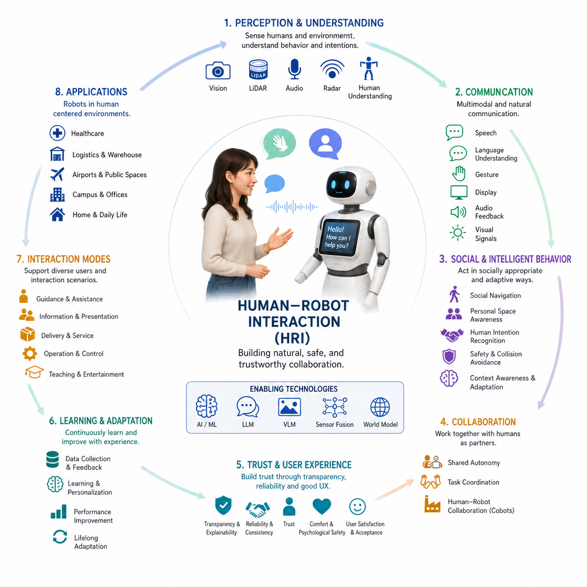
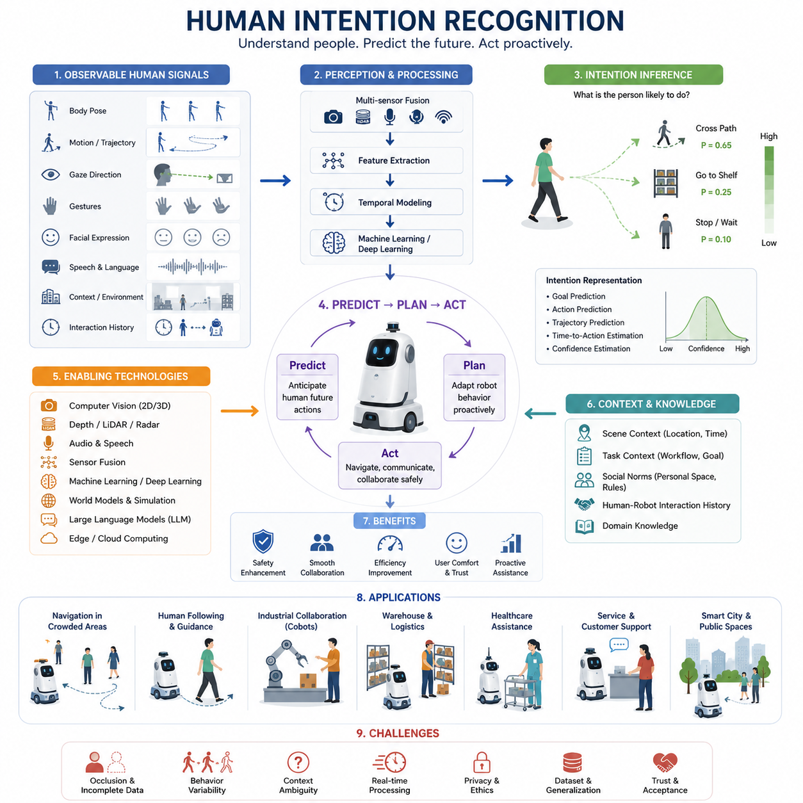
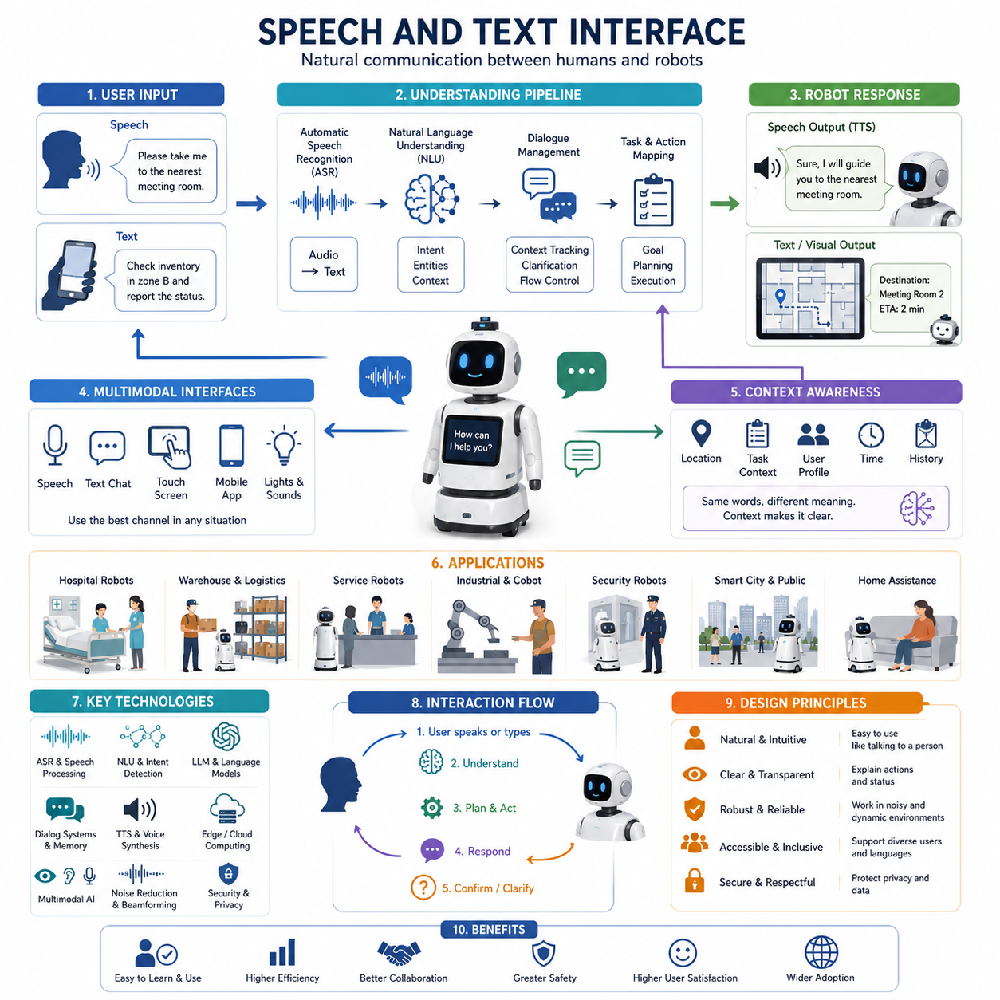
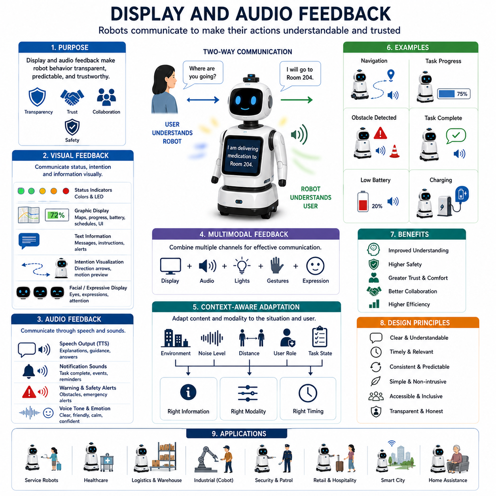
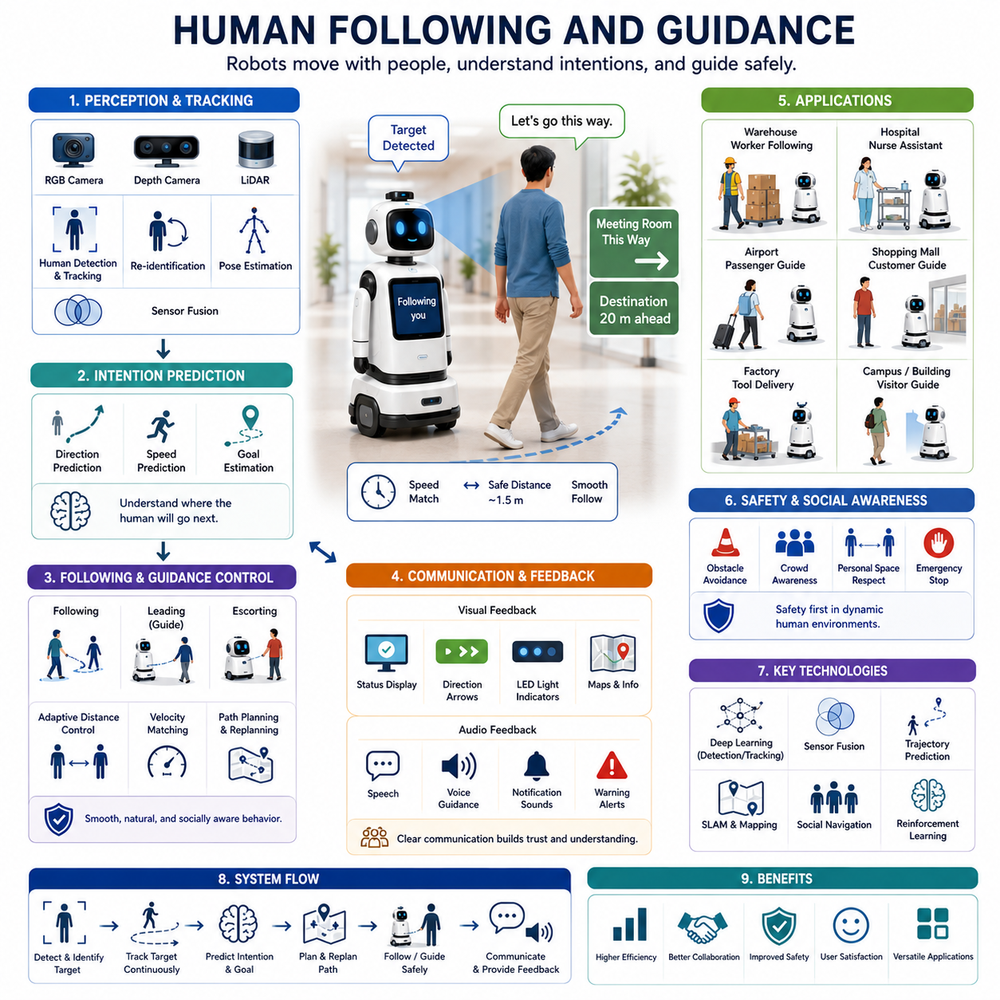
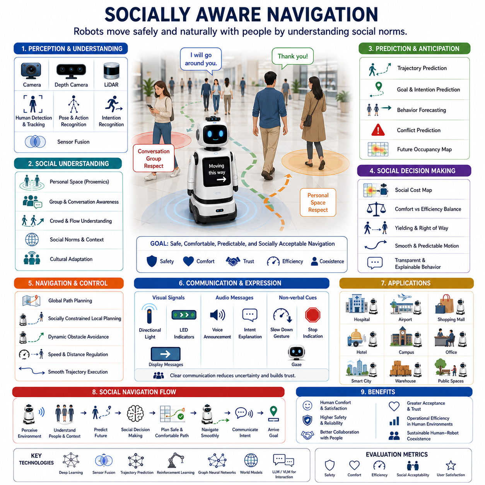
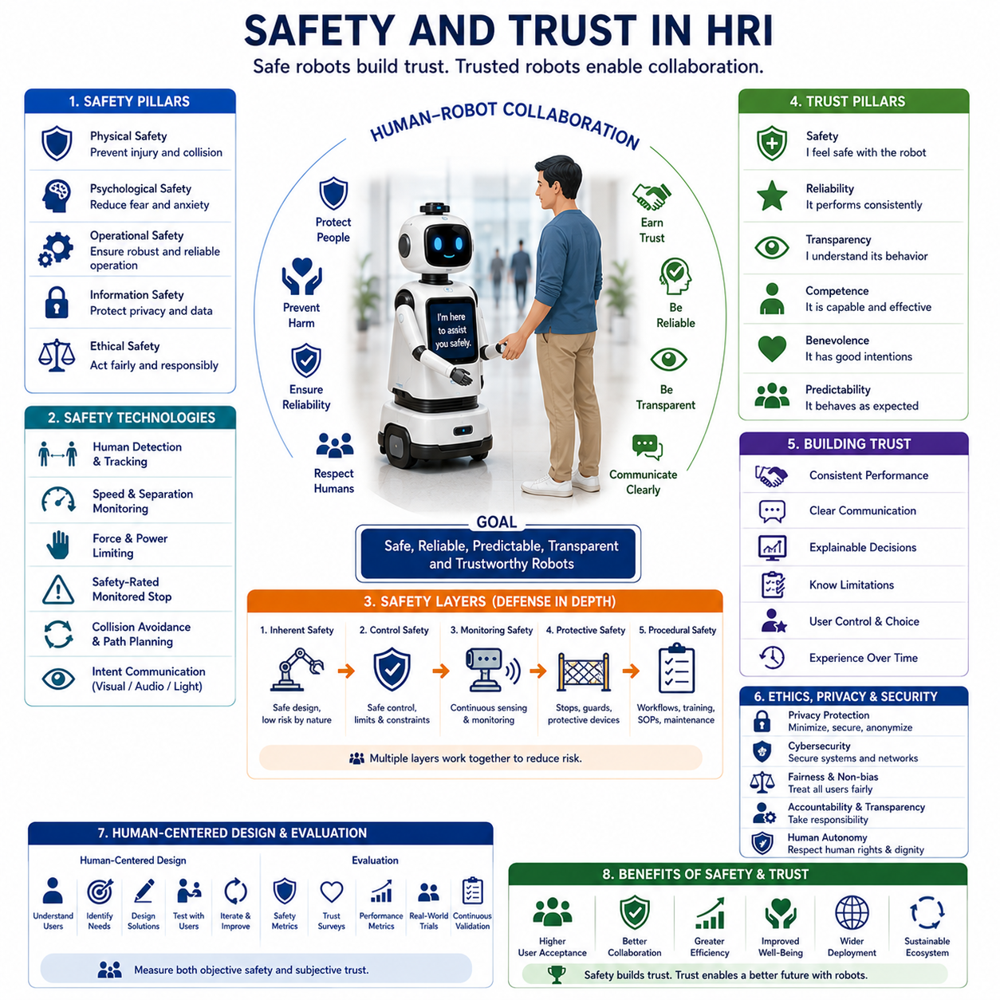
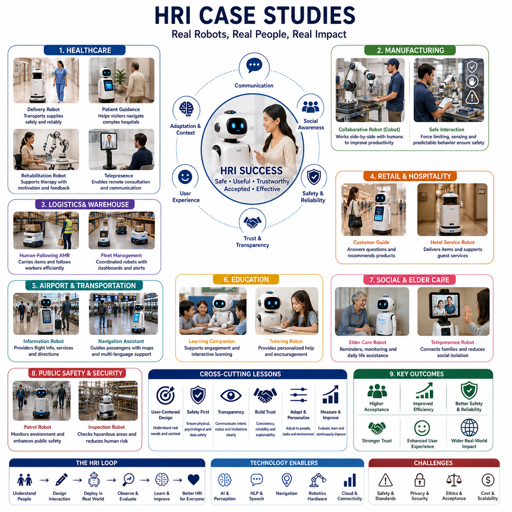

**Volume 06. AMR AI and Embodied Intelligence**

# Chapter 13. Human-Robot Interaction

## 13.1 HRI Fundamentals

{width="7.268055555555556in" height="7.268055555555556in"}

Human--Robot Interaction (HRI) is the multidisciplinary field that studies how humans and robots communicate, collaborate, coexist, and work together in shared environments. As autonomous mobile robots, service robots, industrial robots, and embodied AI systems become increasingly integrated into everyday life, the importance of effective human--robot interaction continues to grow. A robot is no longer viewed merely as an automated machine executing predefined commands. Instead, modern robots are expected to understand human intentions, communicate naturally, operate safely around people, and adapt their behavior according to social and environmental contexts. Human--Robot Interaction therefore serves as one of the foundational pillars of intelligent robotics and embodied artificial intelligence.

The primary objective of HRI is to create interactions that are intuitive, efficient, safe, trustworthy, and productive. Humans naturally interact with other humans through speech, gestures, facial expressions, body language, eye contact, and contextual understanding. Robots, however, perceive the world through sensors such as cameras, LiDARs, microphones, radar systems, tactile sensors, and various environmental detectors. The challenge of HRI lies in bridging the gap between human communication mechanisms and machine perception systems. Effective interaction requires robots to transform sensor observations into meaningful representations of human intentions and behaviors while generating actions and responses that humans can easily understand.

Historically, robot interaction was limited to industrial settings where robots operated inside isolated safety cages. Human involvement was minimal, and interactions were restricted to programming, maintenance, and supervision. Traditional industrial robots followed deterministic commands and lacked the capability to interpret human behavior. As robotics technology evolved and robots began moving into hospitals, warehouses, offices, airports, campuses, hotels, shopping centers, homes, and public spaces, direct interaction between humans and robots became unavoidable. This transition fundamentally changed the design philosophy of robotic systems. Modern robots must now prioritize user experience, social acceptance, operational transparency, and collaborative behavior in addition to technical performance.

Human--Robot Interaction combines concepts from robotics, artificial intelligence, psychology, cognitive science, neuroscience, sociology, human factors engineering, communication theory, and design. The interdisciplinary nature of HRI reflects the complexity of human behavior itself. Humans interpret actions not only based on physical movement but also through expectations, cultural norms, emotions, social cues, and contextual information. Therefore, robots designed for human environments must incorporate models that account for these factors rather than relying solely on geometric navigation or mechanical control.

One of the central concepts in HRI is communication. Communication between humans and robots can occur through multiple channels. Verbal communication includes speech recognition, spoken dialogue, and natural language processing. Nonverbal communication includes gestures, body posture, gaze direction, facial expressions, movement trajectories, and proximity behaviors. Environmental communication includes digital displays, lights, sounds, mobile applications, and graphical interfaces. Modern robotic systems often employ multimodal interaction strategies that combine several communication channels simultaneously. For example, a service robot may verbally greet a user, display information on a screen, and use directional lighting to indicate its next movement.

Natural language interaction represents a major milestone in HRI development. Humans naturally communicate through language, making speech-based interfaces particularly attractive. Advances in large language models and conversational AI have dramatically improved the capabilities of robots to understand instructions, answer questions, provide explanations, and engage in collaborative dialogue. Instead of memorizing fixed command phrases, users can increasingly communicate with robots using natural conversational language. This shift significantly lowers the barrier to robot adoption and improves accessibility for non-technical users.

Beyond communication, perception of human behavior is another critical component of HRI. Robots must detect and interpret the presence, location, movement, and intentions of nearby people. Human detection systems utilize vision sensors, LiDAR sensors, thermal cameras, radar systems, and sensor fusion architectures to identify individuals within the robot\'s operating environment. Advanced perception systems can estimate body pose, recognize gestures, track gaze direction, identify activities, and infer behavioral intentions. Understanding human behavior enables robots to anticipate actions rather than merely reacting after events occur.

Human intention recognition is particularly important in collaborative environments. A warehouse robot may predict that a worker intends to cross an aisle. A hospital delivery robot may recognize that a nurse is approaching and adjust its path accordingly. A service robot may infer that a customer requires assistance based on posture, gaze, or verbal cues. Intention-aware robots create smoother interactions by proactively adapting their behavior to human needs and expectations.

Trust plays a fundamental role in successful human--robot interaction. Humans are unlikely to rely on robots they perceive as unpredictable, unreliable, or unsafe. Trust emerges from consistent robot behavior, understandable decision-making, accurate performance, and transparent communication. Robots that frequently behave unexpectedly or fail without explanation may quickly lose user confidence. Consequently, modern HRI research emphasizes explainability and transparency. Robots should communicate their intentions, goals, and planned actions whenever possible. Users who understand why a robot behaves in a certain way are more likely to trust and cooperate with it.

Safety is perhaps the most important requirement in HRI. Robots operating near humans must prevent collisions, minimize physical risks, and respond appropriately to unexpected situations. Safety mechanisms include obstacle detection, emergency stopping systems, safety-rated sensors, speed control zones, human-aware navigation algorithms, and redundant monitoring architectures. However, physical safety alone is insufficient. Psychological safety must also be considered. A robot moving too quickly, approaching too closely, or exhibiting confusing behaviors may cause discomfort even if no actual danger exists. Therefore, HRI design often incorporates social norms regarding personal space, movement predictability, and interaction etiquette.

The concept of personal space is derived from human social behavior. Humans naturally maintain certain distances depending on social relationships and environmental contexts. Robots operating in public environments must respect these unwritten rules. Approaching too closely can create discomfort, while remaining excessively distant may hinder communication. Socially aware robots dynamically adjust their behavior according to human proximity, crowd density, activity type, and cultural expectations.

Social navigation is an important application of HRI principles. Traditional navigation systems focus on reaching destinations efficiently while avoiding obstacles. Social navigation extends this concept by considering human comfort and social conventions. A socially aware robot may avoid interrupting conversations, respect queues, yield to pedestrians, maintain comfortable passing distances, and select paths that minimize disturbance. Such behavior significantly improves public acceptance of robotic systems.

Human--robot collaboration represents another major area of HRI research. Collaborative robots, often called cobots, are designed to work directly alongside humans. Unlike traditional industrial robots that operate independently, collaborative robots share workspaces, tasks, and responsibilities with human partners. Successful collaboration requires robots to understand human actions, coordinate timing, communicate intentions, and adapt to changing conditions. In manufacturing environments, cobots may assist workers with repetitive tasks. In healthcare environments, robots may support nurses and clinicians. In logistics facilities, autonomous robots may cooperate with warehouse operators to optimize material handling processes.

Shared autonomy is a particularly effective framework for human--robot collaboration. In shared autonomy systems, control authority is distributed between humans and robots. The robot contributes automation, perception, and execution capabilities, while the human provides judgment, supervision, and high-level decision-making. This approach combines the strengths of both parties. Humans excel at reasoning, creativity, and contextual understanding, while robots excel at precision, consistency, and continuous operation. Shared autonomy enables more robust and efficient performance than either humans or robots operating independently.

Emotional interaction is an emerging domain within HRI. While industrial robots primarily focus on functional objectives, service and companion robots increasingly require emotional awareness. Emotion recognition systems attempt to identify human emotional states through facial expressions, voice characteristics, physiological signals, and behavioral patterns. Emotionally adaptive robots can modify communication styles, interaction timing, and assistance strategies based on user emotional conditions. Although current technologies remain limited, emotional intelligence is expected to become an increasingly important component of future human-centered robotic systems.

Accessibility and inclusiveness are also essential considerations. Robots should be designed to accommodate users with diverse physical abilities, cognitive capabilities, languages, and cultural backgrounds. Universal design principles encourage the development of interaction systems that are accessible to elderly individuals, children, people with disabilities, and users with limited technical expertise. Inclusive HRI design expands the societal impact and usability of robotic technologies.

The emergence of embodied AI is transforming Human--Robot Interaction. Traditional robots often relied on predefined interaction rules and scripted behaviors. Embodied AI systems leverage foundation models, multimodal learning architectures, vision-language models, world models, and large language models to achieve more flexible and adaptive interactions. These systems can interpret complex environments, understand natural language instructions, reason about user goals, and generate context-aware responses. As a result, future robots are expected to interact with humans in ways that increasingly resemble natural human communication.

Human--Robot Interaction is not limited to direct communication. It also encompasses long-term relationships between users and robotic systems. Factors such as reliability, familiarity, personalization, and learning influence how users perceive robots over time. Robots that adapt to individual preferences and behavioral patterns can create more effective and satisfying user experiences. Long-term interaction research therefore examines how robots can maintain engagement, build trust, and improve collaboration through continuous learning and adaptation.

Evaluation of HRI systems requires both technical and human-centered metrics. Traditional robotics metrics such as accuracy, latency, task completion time, and collision rates remain important. However, HRI evaluation also includes measures such as user satisfaction, trust, workload, comfort, acceptance, engagement, and perceived safety. Controlled experiments, field studies, surveys, behavioral observations, and longitudinal deployments are commonly used to assess interaction quality. Successful HRI systems achieve a balance between engineering performance and positive human experience.

In autonomous mobile robots, Human--Robot Interaction has become a critical differentiator between technically functional systems and truly deployable products. Robots operating in hospitals, warehouses, airports, campuses, smart cities, and public environments must interact seamlessly with people who possess varying levels of technical expertise. Effective HRI reduces operational friction, improves safety, enhances productivity, and accelerates user acceptance. As robots become more intelligent and autonomous, interaction quality will increasingly determine the success or failure of robotic deployments.

Looking toward the future, Human--Robot Interaction will evolve from command-based interfaces toward collaborative partnerships between humans and intelligent machines. Advances in multimodal perception, conversational AI, embodied intelligence, social robotics, affective computing, and adaptive learning will enable robots to understand human needs with greater accuracy and respond with greater sophistication. Future robots will not simply execute tasks; they will communicate, cooperate, assist, teach, learn, and collaborate as integrated participants within human-centered environments. The ultimate vision of Human--Robot Interaction is to create robotic systems that are not only technically capable but also socially compatible, trustworthy, and beneficial companions in everyday life.

## 13.2 Human Intention Recognition

{width="7.268055555555556in" height="7.268055555555556in"}

Human Intention Recognition (HIR) is one of the most important capabilities required for intelligent human-centered robotic systems. It refers to the ability of a robot to infer, predict, and understand what a human intends to do before the action is fully executed. While traditional robotic systems primarily react to observed events, intention-aware robots attempt to anticipate future actions and adapt their behavior proactively. This predictive capability enables smoother collaboration, safer interactions, higher operational efficiency, and more natural communication between humans and robots. Within the broader field of Human-Robot Interaction (HRI), Human Intention Recognition serves as a critical bridge between human behavior understanding and autonomous robot decision-making.

Humans naturally recognize the intentions of other humans through observation of body language, facial expressions, gaze direction, gestures, movement patterns, speech, and contextual information. When a person reaches toward a door handle, others can immediately infer that the individual intends to open the door. When someone turns their head toward a particular object, observers often understand where their attention is focused. Human cognition continuously performs intention inference without conscious effort. For robots operating in human environments, developing similar capabilities is essential for achieving socially acceptable and collaborative behavior.

The importance of intention recognition increases significantly as robots move from isolated industrial environments into human-populated spaces such as hospitals, warehouses, airports, offices, campuses, shopping centers, hotels, smart cities, and homes. In these environments, human behavior is often unpredictable, dynamic, and context-dependent. Simply detecting people is no longer sufficient. A robot must understand what people are likely to do next in order to plan safe and efficient actions. Anticipating human intentions allows the robot to avoid conflicts, reduce unnecessary delays, improve collaboration, and create a more comfortable user experience.

Human Intention Recognition can be viewed as a predictive perception problem. Traditional perception systems focus on understanding the current state of the environment. Intention recognition extends perception into the future by estimating probable human goals, actions, and behaviors. Instead of merely observing that a person is walking, the robot attempts to determine where the person is going, why they are moving, and what they are likely to do next. This transformation from reactive perception to predictive understanding represents a major advancement in robotic intelligence.

A fundamental challenge in intention recognition is that human intentions are not directly observable. Unlike physical position, velocity, or orientation, intentions exist within the cognitive processes of individuals. Robots must therefore infer intentions indirectly through observable signals. These signals may include body posture, walking trajectory, hand movements, gaze direction, facial expressions, speech content, interaction history, environmental context, and task-related information. Effective intention recognition systems combine multiple sources of evidence to estimate the most likely human objective.

Human motion analysis is one of the most widely used approaches for intention recognition. Human movement often provides strong clues about future behavior. Walking speed, trajectory curvature, acceleration patterns, and body orientation can reveal intended destinations and planned actions. For example, a person approaching a warehouse intersection may intend to cross the robot's path, enter a nearby aisle, or stop to retrieve an item. By analyzing motion patterns over time, robots can estimate the probability of each possible outcome and adjust navigation behavior accordingly.

Trajectory prediction represents a core component of motion-based intention recognition. In trajectory prediction, historical movement observations are used to estimate future positions and paths. Early methods relied on kinematic models and statistical estimation techniques. Modern systems increasingly employ machine learning and deep learning models capable of learning complex behavioral patterns from large datasets. Neural networks, recurrent neural networks, transformers, graph neural networks, and trajectory forecasting models can capture social interactions and environmental influences that affect human movement decisions.

Gaze estimation is another important source of intention information. Humans frequently direct their attention toward objects, locations, or individuals relevant to their current goals. By observing head orientation, eye movement, and gaze direction, robots can infer which objects are attracting human attention. In collaborative environments, gaze information often provides an early indicator of intended actions. A worker looking toward a specific pallet may soon move toward it. A customer staring at a service kiosk may require assistance. A patient looking at a medicine cart may be preparing to interact with it.

Gesture recognition provides additional insight into human intentions. Gestures often serve as explicit communication signals between humans and robots. Pointing gestures can indicate desired destinations or objects. Hand signals may request assistance, initiate commands, or communicate warnings. Advanced vision-based systems can identify both static gestures and dynamic gesture sequences. Combining gesture recognition with contextual understanding allows robots to interpret human requests more accurately and respond appropriately.

Speech and language understanding significantly enhance intention recognition capabilities. Human intentions are frequently communicated verbally through commands, questions, requests, and conversational dialogue. Natural language processing systems enable robots to extract goals, constraints, preferences, and task requirements from spoken or written communication. Large language models have dramatically improved the ability of robots to interpret complex instructions and infer implicit intentions that may not be directly expressed.

Context awareness plays a crucial role in intention recognition. Human behavior cannot be fully understood without considering environmental and situational context. The same action may have different meanings depending on location, time, task, and surrounding conditions. For example, a person moving quickly through a hospital corridor may be rushing to an emergency situation, while similar movement in a shopping mall may indicate a customer attempting to catch public transportation. Contextual information helps robots disambiguate observed behaviors and improve prediction accuracy.

Task context is particularly important in industrial and collaborative environments. In manufacturing facilities, warehouse operations, logistics centers, and healthcare settings, workers often perform structured activities according to predefined workflows. Robots that understand task sequences can anticipate human actions more effectively. For example, if a warehouse operator has just scanned a package, the robot may predict that the next action involves transporting the package to a designated location. Such task-aware predictions enable more efficient human-robot collaboration.

Human intention recognition systems commonly employ multimodal perception architectures. Relying on a single sensor modality often results in incomplete or ambiguous interpretations. Modern systems integrate data from RGB cameras, depth cameras, LiDAR sensors, microphones, thermal cameras, wearable devices, and environmental sensors. Sensor fusion techniques combine these heterogeneous data sources into unified representations of human behavior. Multimodal systems generally achieve higher robustness, accuracy, and reliability compared to single-modality approaches.

Machine learning has become the dominant methodology for intention recognition. Traditional rule-based systems require manually engineered behavioral models and often struggle with complex real-world scenarios. Data-driven approaches learn patterns directly from observed examples. Supervised learning methods use labeled datasets containing examples of human behaviors and corresponding intentions. Deep neural networks can identify subtle correlations between sensory observations and future actions that may be difficult to model explicitly.

Recent advances in self-supervised learning and foundation models are further transforming intention recognition capabilities. Instead of relying exclusively on manually labeled datasets, robots can learn behavioral representations from large-scale unlabeled interaction data. Foundation models trained on diverse multimodal datasets can capture generalized knowledge about human behavior, enabling better adaptation across different environments and applications. These models provide a foundation for more flexible and scalable intention recognition systems.

World models represent another promising direction for intention recognition. A world model maintains an internal representation of the environment, objects, agents, and dynamic relationships. By simulating possible future scenarios, the robot can predict likely human actions and evaluate alternative outcomes. World models enable robots to reason about future events rather than simply recognizing current observations. This capability supports more sophisticated planning, collaboration, and decision-making.

In autonomous mobile robots, intention recognition is particularly important for navigation in crowded environments. Human-aware navigation systems use intention predictions to avoid conflicts and improve safety. Rather than reacting only when a pedestrian enters a danger zone, the robot anticipates potential collisions before they occur. Predictive navigation enables smoother path planning, reduces sudden braking events, and creates more socially acceptable robot behavior.

Socially aware navigation extends intention recognition beyond collision avoidance. Humans expect robots to behave according to social norms and conventions. Understanding intentions allows robots to yield appropriately, avoid interrupting conversations, respect personal space, and navigate naturally among groups of people. Socially intelligent navigation significantly improves user comfort and public acceptance of robotic systems.

Human-following robots rely heavily on intention recognition. Service robots, logistics assistants, and collaborative robots often need to accompany humans while maintaining appropriate distance and positioning. Predicting a person\'s intended route allows the robot to move proactively rather than constantly reacting to movement changes. This results in smoother following behavior and improved user experience.

In healthcare robotics, intention recognition supports patient assistance, clinical workflows, and caregiver collaboration. Robots can anticipate when patients require support, identify signs of distress, and predict caregiver needs. Understanding intentions enables more personalized and responsive assistance while reducing cognitive workload for healthcare professionals.

Collaborative industrial robots also benefit significantly from intention recognition. Manufacturing workers frequently perform tasks alongside robotic systems. Anticipating human actions allows robots to coordinate movements, prepare tools, deliver components, and adjust task schedules proactively. This reduces waiting times, improves productivity, and enhances workplace safety.

Safety remains a primary motivation for intention recognition research. Many accidents occur because automated systems fail to anticipate human actions. Predictive understanding enables robots to identify potentially hazardous situations before they develop into actual incidents. Early detection of unsafe intentions, unexpected movements, or abnormal behaviors supports risk mitigation and accident prevention.

Trust and user acceptance are closely related to intention recognition performance. Humans tend to trust robots that demonstrate awareness of their needs and intentions. When a robot appears to understand human goals and adapts its behavior accordingly, interactions feel more natural and cooperative. Conversely, robots that consistently misunderstand human intentions may be perceived as unreliable or frustrating to use.

Despite significant progress, Human Intention Recognition remains a challenging research problem. Human behavior is inherently variable, influenced by emotions, cultural factors, environmental conditions, social interactions, and individual preferences. The same observable behavior may correspond to different intentions in different contexts. Furthermore, sensing limitations, occlusions, sensor noise, and incomplete observations introduce additional uncertainty into prediction processes.

Evaluation of intention recognition systems requires careful consideration of multiple performance metrics. Prediction accuracy, response time, robustness, false-positive rates, false-negative rates, confidence estimation, and real-world deployment effectiveness are commonly measured. Field testing is particularly important because human behavior in real environments often differs significantly from controlled laboratory conditions.

Future Human Intention Recognition systems are expected to integrate multimodal foundation models, world models, embodied AI architectures, large language models, and continual learning mechanisms. These technologies will enable robots to understand not only immediate intentions but also long-term goals, social relationships, collaborative objectives, and complex behavioral patterns. Future robots will increasingly function as proactive partners capable of anticipating human needs before explicit instructions are given.

As robotic systems become more intelligent and deeply integrated into society, Human Intention Recognition will evolve from a specialized research topic into a foundational capability of autonomous machines. Robots that can accurately understand human intentions will communicate more naturally, collaborate more effectively, navigate more safely, and provide greater value across industrial, commercial, healthcare, and public applications. Ultimately, intention recognition represents a critical step toward creating truly human-centered robotic systems capable of operating seamlessly within human environments.

## 13.3 Speech and Text Interface

{width="7.268055555555556in" height="7.268055555555556in"}

Speech and Text Interface represents one of the most important communication mechanisms in modern Human--Robot Interaction (HRI). It enables humans to communicate with robots using natural language through spoken conversations, written commands, text messages, digital interfaces, and multimodal communication systems. As robotics evolves from isolated industrial automation toward intelligent service robots, autonomous mobile robots, collaborative robots, and embodied AI systems, speech and text interfaces have become essential for creating intuitive, accessible, and human-centered interactions. Rather than forcing users to learn specialized commands or programming languages, modern robots increasingly allow people to communicate in the same way they communicate with other humans. This shift significantly improves usability, adoption, and operational effectiveness across a wide range of robotic applications.

Historically, robots were controlled through highly structured interfaces. Early industrial robots required programming through teach pendants, command-line interfaces, dedicated control software, or manually defined task sequences. These methods were effective for trained operators but created significant barriers for general users. As robots expanded into hospitals, airports, hotels, warehouses, offices, campuses, smart cities, and homes, the need for more natural communication methods became increasingly apparent. Human users expect robots to understand instructions, answer questions, provide information, and engage in conversational interactions without requiring technical expertise.

Speech interfaces provide one of the most natural communication channels between humans and robots. Speech is the primary form of communication among humans, making it an intuitive mechanism for controlling robotic systems. A speech-enabled robot can receive commands, ask clarification questions, provide status updates, deliver guidance, and participate in collaborative dialogue. The ability to communicate through spoken language dramatically reduces cognitive load and enables more efficient interaction in dynamic environments.

The development of speech interfaces relies on several core technologies. The first component is automatic speech recognition (ASR), which converts spoken language into machine-readable text. Speech recognition systems analyze audio signals captured through microphones and transform acoustic patterns into words and sentences. Modern ASR systems employ deep learning architectures capable of recognizing speech across different accents, languages, speaking styles, and environmental conditions. Continuous improvements in neural network models have significantly increased recognition accuracy while reducing latency.

Speech recognition in robotic environments presents unique challenges compared to traditional voice assistants. Robots often operate in noisy environments such as factories, warehouses, airports, hospitals, and public spaces. Background conversations, machinery noise, vehicle sounds, environmental echoes, and microphone movement can degrade recognition performance. Robust speech interfaces therefore incorporate noise reduction algorithms, beamforming techniques, microphone arrays, acoustic filtering, and adaptive speech enhancement technologies to improve signal quality.

After speech recognition converts audio into text, natural language understanding (NLU) systems analyze the linguistic content to determine the user's intent. Understanding language involves more than recognizing words. The robot must identify goals, commands, constraints, preferences, references, contextual information, and implicit meanings. For example, when a user says, "Can you take me to the nearest conference room?" the robot must recognize the navigation request, identify the destination category, determine the user's location, and generate an appropriate navigation plan.

Natural language understanding has advanced significantly through the emergence of transformer-based language models and large language models. Traditional systems relied heavily on predefined grammars and manually engineered intent classifiers. Modern language models can interpret flexible, conversational language and handle ambiguous, incomplete, or context-dependent instructions. This capability enables robots to interact with users in a much more natural and human-like manner.

Dialogue management forms another critical component of speech interfaces. Human communication is rarely limited to single commands. Instead, interactions often involve multi-turn conversations that require maintaining context across multiple exchanges. Dialogue management systems track conversation history, maintain contextual awareness, manage clarification requests, and coordinate interaction flows. A robot may need to ask follow-up questions when instructions are ambiguous or incomplete. Effective dialogue management creates more natural and efficient communication experiences.

Speech synthesis, also known as text-to-speech (TTS), enables robots to communicate verbally with humans. TTS systems convert machine-generated text into spoken audio. High-quality speech synthesis contributes significantly to user experience and perceived intelligence. Modern neural speech synthesis systems generate natural-sounding voices with realistic pronunciation, intonation, rhythm, and emotional expression. The choice of voice characteristics can influence user trust, comfort, engagement, and acceptance.

Text-based interfaces represent an equally important communication channel. Text interaction can occur through touchscreens, mobile applications, web portals, messaging systems, command consoles, digital kiosks, and robot displays. Text interfaces offer advantages in noisy environments where speech recognition may be unreliable. They also provide persistent records of communication, allowing users to review instructions, notifications, and interaction histories.

Robot displays frequently combine text communication with graphical information. Visual interfaces can present maps, task progress indicators, status information, warnings, navigation guidance, schedules, operational metrics, and contextual explanations. Combining text and graphics often improves comprehension and reduces misunderstanding. In service environments, users may prefer reading detailed information rather than listening to lengthy spoken explanations.

Multimodal interaction represents a growing trend in speech and text interface design. Rather than relying exclusively on speech or text, robots increasingly combine multiple communication modalities simultaneously. Speech, text, visual displays, gestures, facial expressions, lights, sounds, and mobile notifications can work together to create richer and more robust interactions. Multimodal systems accommodate different user preferences, environmental conditions, and accessibility requirements.

Context awareness plays a crucial role in effective speech and text interaction. Human communication is inherently contextual. The same phrase may have different meanings depending on location, task, user role, environmental conditions, and conversation history. For example, the command "stop" may refer to navigation, task execution, speech output, or a specific process depending on the current context. Context-aware language systems use environmental information, operational states, and interaction history to interpret user intentions more accurately.

Task-oriented dialogue systems are particularly important in robotics. Unlike general conversational agents, robots often interact with users to accomplish specific objectives. Examples include navigation assistance, item delivery, inventory management, inspection tasks, maintenance operations, information retrieval, healthcare support, and collaborative manufacturing activities. Task-oriented systems focus on extracting actionable information from conversations and translating user intentions into executable robot behaviors.

Large Language Models have dramatically transformed speech and text interfaces for robotics. Traditional robotic dialogue systems were constrained by predefined command structures and limited conversational flexibility. Modern LLMs enable robots to understand complex instructions, interpret nuanced requests, perform reasoning, generate explanations, summarize information, and maintain long-term conversational context. These capabilities significantly expand the range of tasks that can be managed through natural language interaction.

Speech and text interfaces are becoming increasingly important for autonomous mobile robots operating in public environments. Hospital robots must communicate with nurses, doctors, patients, and visitors. Logistics robots must coordinate with warehouse workers and supervisors. Security robots must interact with staff and pedestrians. Service robots must assist customers, provide directions, answer questions, and support operational workflows. Effective communication directly influences operational efficiency and user acceptance.

Human-centered interface design is essential for successful speech and text interaction systems. Communication should be intuitive, predictable, and easy to understand. Complex technical terminology should generally be avoided when interacting with non-technical users. Interface designers must consider language proficiency, cultural differences, cognitive workload, accessibility requirements, and environmental constraints. User experience design principles play a critical role in ensuring effective communication.

Accessibility is a particularly important consideration. Speech interfaces can greatly assist users with limited mobility or visual impairments, while text interfaces may be preferable for individuals with hearing impairments or speech difficulties. Inclusive interface design aims to support diverse user populations through flexible communication options. Multilingual support further expands accessibility by allowing robots to interact with users in their preferred languages.

Trust and transparency are strongly influenced by communication quality. Users are more likely to trust robots that clearly explain their actions, decisions, and limitations. When a robot communicates why it is performing a particular task or why a request cannot be fulfilled, users gain a better understanding of system behavior. Transparent communication reduces uncertainty and improves collaboration.

Error handling represents a major challenge in speech and text interfaces. Misunderstandings can occur due to recognition errors, ambiguous language, incomplete information, environmental noise, or contextual uncertainty. Robust systems incorporate clarification strategies, confirmation mechanisms, fallback procedures, and recovery dialogues. Rather than making potentially unsafe assumptions, robots should request additional information when confidence levels are low.

Privacy and security considerations are increasingly important as speech-enabled robots become more widespread. Audio recordings may contain sensitive personal information, confidential conversations, or proprietary business data. Speech and text systems must implement appropriate security measures, access controls, encryption protocols, and privacy protections. Regulatory compliance and ethical considerations play an important role in system design and deployment.

Real-time performance is critical for effective interaction. Human conversations occur at rapid speeds, and excessive response delays can significantly degrade user experience. Speech recognition, language understanding, reasoning, dialogue management, and response generation must operate efficiently within strict latency constraints. Edge computing, optimized AI models, and hardware acceleration are frequently employed to achieve real-time performance.

Cloud-based and edge-based architectures each offer advantages for speech and text interfaces. Cloud systems provide access to large-scale language models and computational resources but may introduce latency and connectivity dependencies. Edge systems offer lower latency and improved privacy but face computational limitations. Many modern robotic systems employ hybrid architectures that balance performance, scalability, reliability, and security.

The integration of speech and text interfaces with perception systems further enhances interaction quality. Robots can combine language understanding with visual perception, gesture recognition, human intention recognition, scene understanding, and environmental awareness. This multimodal intelligence enables more natural communication because language can be interpreted within the context of observed human behavior and environmental conditions.

In industrial environments, speech interfaces can improve productivity by enabling hands-free operation. Workers can issue commands, request information, update task status, and interact with robotic systems without interrupting physical activities. This capability is particularly valuable in logistics, manufacturing, inspection, maintenance, and field service applications where efficiency and mobility are important.

Healthcare robotics represents another domain where speech and text interfaces provide significant value. Patients may use speech commands to request assistance, obtain information, schedule services, or communicate with healthcare personnel. Medical staff can interact with robots while performing clinical tasks, reducing workload and improving operational efficiency. Natural language communication helps create more user-friendly healthcare environments.

The future of speech and text interfaces is closely tied to the development of embodied AI, foundation models, conversational intelligence, and multimodal reasoning systems. Future robots will likely engage in extended dialogues, maintain long-term memory of interactions, understand emotional context, adapt communication styles to individual users, and participate in collaborative problem-solving activities. Communication will evolve from simple command execution toward sophisticated human-robot partnerships.

As autonomous robots become increasingly integrated into society, speech and text interfaces will serve as fundamental mechanisms for interaction between humans and machines. They will enable robots to understand human needs, communicate intentions, explain decisions, coordinate activities, and provide assistance in ways that feel natural and intuitive. Ultimately, speech and text interfaces are not merely input and output channels; they are foundational technologies that allow robots to become understandable, approachable, trustworthy, and effective participants in human-centered environments.

## 13.4 Display and Audio Feedback

{width="7.268055555555556in" height="7.268055555555556in"}

Display and Audio Feedback is a fundamental component of Human--Robot Interaction (HRI) that enables robots to communicate their status, intentions, actions, warnings, and information to human users through visual and auditory channels. While perception systems allow robots to understand the environment and human behavior, feedback systems enable humans to understand the robot. Effective communication is a two-way process. A robot that can perceive humans but cannot clearly express its own intentions may create confusion, discomfort, inefficiency, and safety risks. Therefore, display and audio feedback mechanisms serve as essential interfaces that bridge robotic intelligence and human understanding. Within modern autonomous robots, service robots, collaborative robots, autonomous mobile robots, and embodied AI systems, feedback systems are as important as perception, navigation, and decision-making capabilities.

Human beings continuously exchange information through multiple communication channels. Facial expressions, gestures, speech, visual signals, sounds, body posture, and environmental cues all contribute to understanding. Humans naturally expect similar communication behaviors from robots operating in shared environments. When a robot moves without explanation, changes direction unexpectedly, stops suddenly, or performs actions without notification, users may experience uncertainty or mistrust. Conversely, robots that clearly communicate their intentions create a sense of transparency, predictability, and reliability. Display and audio feedback systems are therefore fundamental tools for establishing trust between humans and robotic systems.

The primary purpose of feedback systems is to make robot behavior understandable. Autonomous robots continuously perform complex internal computations related to perception, localization, navigation, planning, obstacle avoidance, task execution, and safety monitoring. Most of these processes are invisible to users. Without feedback mechanisms, humans have little insight into what the robot is doing or why certain decisions are being made. Display and audio feedback convert internal robot states into human-understandable information, enabling more effective interaction and collaboration.

Visual displays are among the most widely used feedback mechanisms in modern robotics. Displays can present information using text, graphics, symbols, maps, animations, colors, icons, status indicators, and interactive user interfaces. Depending on the application, displays may range from simple LED indicators to sophisticated touchscreens capable of presenting complex operational information. The choice of display technology depends on environmental conditions, user requirements, robot capabilities, and intended interaction scenarios.

One of the simplest forms of visual feedback is status indication. Many robots use colored LEDs to communicate operational states. Green lights may indicate normal operation, blue lights may indicate active interaction mode, yellow lights may signal caution, and red lights may indicate faults or emergency conditions. Such visual indicators allow users to quickly understand robot status without requiring detailed explanations. Status lighting is particularly effective because it can be recognized from a distance and understood within seconds.

Graphical displays provide a richer communication channel than simple indicators. Touchscreen interfaces can present robot location, navigation paths, battery status, task progress, estimated completion times, system health information, and contextual guidance. Service robots operating in hospitals, airports, hotels, and shopping centers frequently use graphical displays to communicate with users. Maps, directional arrows, appointment schedules, queue information, and facility guidance can all be presented through visual interfaces.

Text-based displays remain important despite advances in conversational AI. Written information provides clarity, permanence, and accessibility. Users can review instructions, warnings, operational details, and task summaries at their own pace. Text displays are particularly useful in noisy environments where audio communication may be difficult. They also support multilingual communication by allowing dynamic language selection according to user preferences.

Modern robotic displays increasingly incorporate adaptive user interfaces. Rather than presenting static information, adaptive systems adjust displayed content according to context, user identity, operational state, and environmental conditions. A hospital delivery robot may present different information to nurses, patients, and maintenance staff. A warehouse robot may provide operational details to workers while displaying simplified status information to visitors. Context-aware interfaces improve usability and reduce information overload.

Animated visual feedback plays an important role in conveying robot intentions. Movement predictions, directional indicators, progress animations, and action previews help users understand future robot behavior. For example, a mobile robot may display arrows indicating planned movement direction before initiating motion. This simple feedback mechanism significantly improves predictability and reduces user uncertainty. Intention visualization is particularly important in crowded environments where humans and robots must coordinate movements safely.

Facial displays and expressive interfaces have become increasingly common in social robots and service robots. Although robots do not possess emotions in the human sense, expressive displays can simulate emotional communication cues that improve interaction quality. Animated eyes, facial expressions, and visual reactions help users interpret robot attention, engagement, confidence, and responsiveness. Such interfaces contribute to social acceptance and user comfort, especially in long-term interaction scenarios.

Audio feedback complements visual communication by providing information through sound. Audio communication offers several advantages. Unlike visual displays, sound does not require users to maintain visual contact with the robot. Audio signals can attract attention, communicate urgent information, and support interactions during movement or multitasking. Consequently, audio feedback systems are widely used across many robotic applications.

Speech synthesis is one of the most important forms of audio feedback. Text-to-Speech (TTS) systems enable robots to communicate verbally with users. Modern speech synthesis technologies generate highly natural voices with realistic pronunciation, rhythm, intonation, and emotional variation. Verbal communication allows robots to provide instructions, answer questions, announce status updates, explain actions, and support collaborative tasks. Speech-based feedback significantly improves accessibility and ease of use.

The effectiveness of speech feedback depends not only on linguistic accuracy but also on delivery quality. Speaking speed, voice tone, volume, timing, and emotional characteristics influence user perception. A calm and confident voice may increase trust, while an overly mechanical or abrupt voice may reduce user comfort. Designers carefully select voice characteristics that align with application requirements and user expectations.

Audio notifications provide a lightweight feedback mechanism for communicating status changes and events. Short sounds, tones, chimes, and alerts can indicate task completion, navigation events, incoming requests, charging status, operational warnings, or system errors. These sounds allow users to remain informed without requiring continuous monitoring of robot displays. Effective audio notification design emphasizes clarity, consistency, and minimal intrusiveness.

Safety-related audio feedback is particularly important in human-populated environments. Autonomous robots often operate near pedestrians, workers, patients, customers, and visitors. Audible warnings can alert nearby individuals to robot movement, turning actions, obstacle encounters, emergency stops, or hazardous conditions. Such warnings improve situational awareness and reduce accident risks. However, excessive use of alerts may lead to alarm fatigue, reducing effectiveness over time.

Sound design is a specialized discipline within robot feedback engineering. Different sounds evoke different emotional and cognitive responses. Pleasant, informative sounds contribute to positive user experiences, while harsh or repetitive sounds may create annoyance. Designers must balance noticeability with comfort, ensuring that audio feedback remains effective without becoming disruptive. This challenge becomes especially important in environments such as hospitals, offices, hotels, and residential settings.

Multimodal feedback systems combine visual and audio channels to maximize communication effectiveness. Humans process information through multiple sensory modalities simultaneously. Presenting information through both visual and auditory channels increases comprehension, improves accessibility, and reduces misunderstanding. For example, a robot approaching a user may simultaneously display a message, announce its intention verbally, and activate directional lighting. Such multimodal communication supports diverse user preferences and environmental conditions.

Context awareness significantly influences feedback design. Different situations require different communication strategies. During routine operation, concise status updates may be sufficient. During emergencies, more prominent warnings may be necessary. Environmental conditions such as noise levels, lighting conditions, crowd density, and user proximity affect the effectiveness of different feedback modalities. Intelligent feedback systems dynamically adapt communication methods according to contextual factors.

Human-centered design principles are central to successful feedback systems. Information should be understandable, relevant, timely, and actionable. Excessive information can overwhelm users, while insufficient information can create confusion. Effective feedback focuses on communicating what users need to know at a given moment. Simplicity, clarity, consistency, and predictability are essential design objectives.

Transparency is a major benefit of well-designed feedback systems. Autonomous robots often perform complex decision-making processes that may not be immediately obvious to users. By communicating reasoning, intentions, and constraints, robots help users understand their behavior. For example, instead of simply stopping, a robot might announce that a temporary obstacle has been detected and that rerouting is in progress. Such explanations increase user confidence and acceptance.

Trust development is closely linked to communication quality. Humans are more likely to trust robots that provide clear, consistent, and honest feedback. Unexpected behaviors without explanation often reduce trust. Transparent communication helps establish predictable interactions and improves long-term user relationships with robotic systems. Trust is particularly important in healthcare, public service, industrial collaboration, and autonomous transportation applications.

Accessibility considerations are essential for inclusive feedback design. Different users possess different sensory abilities and preferences. Visual displays may be difficult for visually impaired users, while audio communication may present challenges for hearing-impaired individuals. Multimodal feedback provides alternative communication channels that support broader accessibility. Universal design principles encourage robots to accommodate diverse user populations.

Feedback systems also play a crucial role in collaborative robotics. Human workers collaborating with robots must understand robot intentions, task progress, and operational states. Clear communication reduces coordination errors and improves productivity. In manufacturing environments, collaborative robots frequently use displays, lights, sounds, and verbal announcements to communicate task status and coordination information.

Autonomous mobile robots operating in public environments benefit significantly from intention communication. Pedestrians often feel more comfortable when they understand what a robot plans to do next. Visual indicators showing turning intentions, stopping actions, destination information, or navigation plans improve predictability and facilitate smoother human-robot coexistence. Such communication behaviors resemble the signaling mechanisms used in human transportation systems.

Advances in artificial intelligence are transforming robot feedback capabilities. Large language models, conversational AI systems, and multimodal foundation models enable more natural and context-aware communication. Future robots will likely generate personalized explanations, adapt communication styles to individual users, and engage in dynamic dialogues rather than relying on predefined messages. Feedback systems will become increasingly intelligent, responsive, and human-centered.

Emotionally adaptive feedback represents an emerging area of research. By recognizing user emotions and contextual factors, robots may adjust communication tone, language complexity, information density, and interaction style. Such adaptability can improve user satisfaction, engagement, and long-term acceptance. Emotional intelligence is expected to become an increasingly important component of advanced feedback systems.

Evaluation of display and audio feedback systems involves both technical and human-centered metrics. Technical measures include response latency, recognition accuracy, display readability, audio intelligibility, and system reliability. Human-centered measures include user satisfaction, comprehension, trust, comfort, workload, engagement, and perceived safety. Successful feedback systems balance engineering performance with positive user experience.

As robots become increasingly integrated into everyday life, display and audio feedback will continue to evolve from simple status indicators into sophisticated communication ecosystems. Future robots will communicate intentions, explain decisions, provide guidance, support collaboration, and adapt interactions according to individual needs and environmental conditions. Effective feedback systems will play a critical role in enabling safe, trustworthy, transparent, and productive relationships between humans and intelligent robotic systems.

Ultimately, display and audio feedback represent far more than user interface components. They serve as the communication foundation through which humans understand robotic behavior and robots establish meaningful interactions with people. In the future of autonomous robotics and embodied intelligence, communication quality will be as important as perception, planning, and control. Robots that can clearly communicate their intentions and status will achieve higher acceptance, stronger trust, and more successful integration into human-centered environments.

## 13.5 Human Following and Guidance

{width="7.268055555555556in" height="7.268055555555556in"}

Human Following and Guidance is a specialized area of Human--Robot Interaction (HRI) that focuses on enabling robots to accompany, follow, guide, escort, and assist humans during movement within shared environments. As autonomous mobile robots increasingly enter hospitals, airports, warehouses, shopping centers, hotels, campuses, factories, smart cities, and public facilities, the ability to move naturally alongside people has become a critical capability. Unlike conventional navigation systems that focus solely on reaching destinations, human-following and guidance systems require robots to continuously understand human behavior, predict intentions, adapt movements, communicate effectively, and maintain safe and socially acceptable interactions. This capability represents a significant step toward creating robots that function as collaborative partners rather than isolated autonomous machines.

The fundamental objective of human-following systems is to allow robots to accompany a designated individual while maintaining appropriate spatial relationships and behavioral coordination. Humans naturally walk together while continuously adjusting speed, direction, interpersonal distance, and movement patterns. Achieving similar behavior in robotic systems requires sophisticated perception, tracking, prediction, planning, and control capabilities. The robot must not only identify and locate the target person but also continuously estimate future movements and adapt its own trajectory accordingly.

Human-following behavior appears deceptively simple from a human perspective. People effortlessly follow friends, colleagues, family members, or guides in crowded environments. However, replicating this behavior in robotic systems presents substantial technical challenges. The robot must distinguish the target individual from surrounding people, maintain visual or sensor-based contact, handle temporary occlusions, predict movement intentions, avoid obstacles, respect social norms, and ensure safety under highly dynamic conditions.

Person identification forms the first stage of human-following systems. Before a robot can follow someone, it must determine whom it should follow. Various approaches are used depending on application requirements. Visual identification may utilize facial recognition, body appearance models, clothing features, color patterns, skeletal pose estimation, or re-identification algorithms. Other methods include wearable devices, smartphones, RFID tags, Bluetooth beacons, Ultra-Wideband systems, or dedicated tracking markers. The choice of identification technology depends on environmental constraints, privacy requirements, operational reliability, and deployment costs.

Once a target individual has been identified, the robot must continuously track the person\'s position. Human tracking systems combine multiple perception technologies including RGB cameras, depth cameras, LiDAR sensors, radar systems, thermal cameras, and sensor fusion architectures. Modern tracking algorithms maintain robust estimates of human location even when observations become partially obstructed or temporarily unavailable. Reliable tracking is essential because loss of target information can lead to navigation errors, user frustration, and safety risks.

Computer vision plays a particularly important role in human-following applications. Deep learning-based detection and tracking models can identify people, estimate body poses, recognize movement patterns, and maintain identity consistency over time. Advanced visual tracking systems can distinguish the target user from surrounding pedestrians even in crowded environments. Multi-camera systems further improve robustness by providing multiple viewpoints and reducing the effects of occlusion.

LiDAR-based tracking provides complementary capabilities. While cameras are sensitive to lighting conditions, LiDAR sensors provide reliable geometric measurements across a wide range of environments. Human legs, body contours, and movement patterns can be detected through LiDAR point clouds. Combining LiDAR and vision data often produces more robust tracking performance than either modality alone. Sensor fusion has therefore become a standard design approach in many commercial human-following robots.

Human intention prediction significantly enhances following performance. Reactive tracking alone often produces jerky, unnatural robot behavior. By predicting future human movements, robots can move more smoothly and maintain better positioning. Human intention recognition systems analyze walking direction, body orientation, gaze direction, trajectory history, environmental context, and interaction patterns to estimate future actions. Predictive following allows robots to anticipate turns, stops, speed changes, and destination choices before they occur.

Maintaining appropriate following distance is a critical aspect of human-following behavior. Following too closely may create discomfort and safety concerns, while following too far may reduce effectiveness and increase the risk of losing the target. Optimal following distance depends on environmental conditions, crowd density, robot size, operational speed, cultural expectations, and user preferences. Modern systems dynamically adjust following distance based on contextual factors rather than relying on fixed thresholds.

Personal space considerations are closely related to following distance management. Humans maintain different interpersonal distances depending on social relationships and situational contexts. Robots operating in human environments should respect these social norms. Human-centered following systems incorporate proxemics principles to ensure comfortable interactions. Socially aware distance regulation contributes significantly to user acceptance and trust.

Path planning for human-following robots differs substantially from traditional autonomous navigation. Conventional navigation systems optimize routes toward predefined destinations. Human-following robots instead optimize trajectories relative to a moving human target. The robot must continuously update navigation plans as the human changes direction, speed, or destination. Real-time replanning is therefore a fundamental requirement.

Obstacle avoidance remains an essential component of following behavior. While tracking a target individual, the robot must simultaneously avoid static obstacles, dynamic obstacles, other pedestrians, vehicles, and environmental hazards. This creates a complex multi-objective optimization problem involving target maintenance, safety preservation, social compliance, and navigation efficiency. Advanced planning algorithms balance these competing requirements in real time.

Human-following systems frequently operate in environments containing crowds. Crowd navigation introduces additional complexity because multiple individuals may exhibit similar appearances and movement patterns. Occlusions become more frequent, and trajectory prediction becomes more difficult. Crowd-aware tracking algorithms incorporate social behavior models, group dynamics analysis, and probabilistic tracking techniques to maintain reliable performance under such conditions.

Guidance systems represent the complementary counterpart to following systems. In guidance scenarios, the robot leads a human rather than follows one. Examples include hospital service robots guiding visitors, airport robots escorting passengers, warehouse robots leading workers to inventory locations, museum robots conducting tours, and smart city robots providing navigation assistance. Guidance requires many of the same technologies used in following systems but reverses the leader-follower relationship.

Effective guidance requires the robot to maintain awareness of the guided individual. A robot cannot simply move toward a destination without considering whether the user remains engaged and capable of following. Guidance systems continuously monitor user position, walking speed, attention level, and interaction status. If the user falls behind, becomes distracted, or deviates from the intended route, the robot may slow down, stop, or provide additional instructions.

Communication plays a vital role in human-following and guidance applications. Robots must clearly communicate intentions, directions, status information, and guidance instructions. Visual displays, directional lighting, speech synthesis, audio cues, gesture displays, and mobile notifications are commonly employed. Effective communication improves user confidence and reduces confusion during navigation tasks.

Speech interfaces are particularly useful in guidance applications. A robot can provide verbal instructions such as "Please follow me," "We are approaching the destination," or "Please wait while I avoid an obstacle." Conversational guidance creates more natural interactions and reduces the cognitive burden on users. Integration with large language models further enhances communication flexibility and responsiveness.

Display-based guidance systems complement speech communication by presenting maps, directional arrows, route information, estimated arrival times, and contextual instructions. Visual guidance is especially valuable in noisy environments where speech communication may be difficult. Combining visual and auditory feedback generally produces the most effective user experience.

Human-following robots have numerous practical applications. In logistics and warehouse operations, robots can follow workers while transporting materials, tools, or inventory items. This reduces physical workload and improves operational efficiency. Warehouse assistants that autonomously follow workers enable hands-free transportation and streamline material handling workflows.

Healthcare environments represent another important application domain. Hospital service robots may follow nurses during medication delivery, accompany patients, transport medical supplies, or assist healthcare staff. Following behavior reduces workload while maintaining close collaboration between humans and robotic systems. Patient guidance robots can escort visitors to appointments, departments, and treatment areas.

Retail and hospitality industries increasingly employ guidance robots to improve customer experiences. Shopping assistants can guide customers to products, hotel robots can escort guests to rooms, and airport robots can provide navigation assistance to travelers. Human-following and guidance capabilities transform robots from static information kiosks into active service providers.

Industrial environments benefit significantly from collaborative following systems. Maintenance robots may accompany technicians during inspections. Tool-carrying robots can follow workers throughout production facilities. Collaborative transportation systems allow robots to assist human operators without requiring complex manual control. Such applications increase productivity while reducing physical strain.

Security and patrol applications also utilize following and guidance capabilities. Security robots may accompany personnel during inspections, support patrol operations, or guide emergency evacuations. During emergencies, guidance robots can provide safe evacuation routes and assist occupants in reaching designated assembly areas.

Safety is a primary concern in all human-following and guidance systems. Robots must continuously monitor surrounding environments, maintain safe distances, avoid collisions, and respond appropriately to unexpected situations. Redundant sensing, emergency stopping mechanisms, fail-safe behaviors, and safety-certified control architectures are commonly employed to ensure reliable operation.

Trust and user acceptance strongly influence the effectiveness of following and guidance systems. Users are more likely to cooperate with robots that behave predictably, communicate clearly, and demonstrate awareness of human needs. Smooth motion, socially appropriate positioning, transparent communication, and reliable performance all contribute to positive user experiences.

Artificial intelligence is rapidly transforming human-following and guidance technologies. Deep learning, multimodal perception, reinforcement learning, world models, and embodied AI architectures enable robots to understand complex human behaviors and adapt dynamically to changing situations. These technologies allow robots to move beyond simple tracking and toward intelligent collaborative assistance.

The emergence of Vision-Language Models, Vision-Language-Action models, and foundation models is expected to further enhance following and guidance capabilities. Future robots may understand natural language requests such as "Follow me to the conference room," "Guide this visitor to the emergency department," or "Stay close while carrying these supplies." Such systems will combine perception, reasoning, communication, and navigation within unified intelligent architectures.

Future human-following and guidance systems will likely become increasingly personalized. Robots may learn user preferences regarding following distance, walking speed, communication style, route selection, and interaction frequency. Personalized adaptation will improve comfort, efficiency, and long-term acceptance across diverse user populations.

As autonomous robots become more integrated into daily life, human-following and guidance capabilities will serve as fundamental building blocks for collaborative human-robot mobility. Robots will no longer function merely as autonomous machines navigating independently. Instead, they will become intelligent companions capable of accompanying, assisting, guiding, and collaborating with humans in dynamic environments. The ability to move together naturally represents a key milestone in the evolution of human-centered robotics and embodied intelligence.

## 13.6 Socially Aware Navigation

{width="7.268055555555556in" height="7.268055555555556in"}

Socially Aware Navigation (SAN) is an advanced navigation paradigm in Human--Robot Interaction (HRI) that enables robots to move through human-populated environments while respecting social norms, human comfort, behavioral expectations, and interpersonal conventions. Traditional robot navigation systems primarily focus on collision avoidance, path optimization, and goal achievement. While these objectives remain important, they are insufficient for robots operating in environments where humans are present. A robot that merely avoids collisions may still behave in ways that people perceive as uncomfortable, disruptive, rude, or even unsafe. Socially Aware Navigation extends conventional navigation by incorporating human-centered behavioral models that allow robots to coexist naturally with people in shared spaces. As autonomous mobile robots increasingly operate in hospitals, airports, shopping malls, hotels, campuses, offices, factories, smart cities, and public infrastructure, socially aware navigation has become a critical capability for achieving successful human-robot coexistence.

The fundamental objective of Socially Aware Navigation is to enable robots to move in a manner that humans perceive as predictable, comfortable, understandable, and socially acceptable. Humans continuously navigate complex social environments while unconsciously following numerous behavioral conventions. People maintain personal space, avoid cutting through conversations, yield when appropriate, form queues, respect walking directions, and coordinate movement with surrounding individuals. These behaviors are rarely formalized but are deeply embedded within social interactions. For robots to become accepted participants in human environments, they must learn to follow similar principles.

Traditional navigation systems generally model humans as dynamic obstacles. From the perspective of classical robotics, a person is simply another moving object whose position and velocity must be considered during path planning. While this approach can prevent physical collisions, it does not account for social expectations. A robot may legally pass extremely close to a pedestrian without colliding, yet still cause discomfort. Similarly, a robot may interrupt a conversation group, block a doorway, or force pedestrians to change direction unnecessarily. Such behaviors reduce user acceptance and negatively affect trust.

Socially Aware Navigation addresses these limitations by treating humans not merely as obstacles but as social agents. Human movement is influenced by goals, intentions, social relationships, environmental context, and cultural expectations. Understanding these factors allows robots to make navigation decisions that are not only physically safe but also socially appropriate. This shift from geometric navigation to social navigation represents a major advancement in robotic autonomy.

One of the most important concepts in Socially Aware Navigation is personal space. Humans naturally maintain invisible boundaries around themselves. These boundaries vary depending on cultural background, social relationships, emotional states, and situational context. Anthropologist Edward Hall introduced the concept of proxemics, which describes how interpersonal distance influences social interaction. Intimate distance, personal distance, social distance, and public distance each correspond to different interaction contexts. Robots operating near humans must respect these spatial preferences to avoid causing discomfort.

Personal space modeling is widely used in social navigation algorithms. Instead of representing a person as a single point obstacle, robots model human occupancy as a dynamic spatial field. Areas immediately surrounding individuals are assigned higher social costs, encouraging navigation planners to maintain comfortable distances whenever possible. These social cost maps allow robots to select routes that minimize disturbance while still achieving operational objectives.

Crowd navigation presents additional challenges. Human movement within crowds exhibits complex collective behavior. Pedestrians form lanes, avoid collisions cooperatively, adapt speed dynamically, and respond to group interactions. Robots navigating through crowds must understand these patterns rather than simply reacting to individual positions. Crowd-aware navigation systems utilize predictive models that estimate future pedestrian trajectories and identify socially acceptable movement opportunities.

Human trajectory prediction is therefore a fundamental component of socially aware navigation. By analyzing movement history, body orientation, walking speed, gaze direction, and environmental context, robots can estimate likely future paths for nearby individuals. Predictive navigation enables smoother interactions because robots can anticipate potential conflicts before they occur. Rather than reacting abruptly when someone suddenly enters the planned path, the robot proactively adjusts its trajectory to avoid disruptions.

Human intention recognition further enhances navigation quality. Understanding where people intend to go allows robots to make more intelligent decisions. For example, a robot approaching a hallway intersection may recognize that a pedestrian intends to cross its path and adjust speed accordingly. In collaborative environments, recognizing human intentions can significantly reduce navigation conflicts and improve operational efficiency.

Group behavior awareness represents another important aspect of Socially Aware Navigation. Humans frequently move as part of social groups rather than as isolated individuals. Families, coworkers, tourists, patients, and visitors often travel together while maintaining social formations. Robots should avoid passing directly between group members because doing so may disrupt social interactions. Instead, socially aware robots identify group structures and plan paths that respect group cohesion.

Conversation awareness is closely related to group behavior modeling. Individuals engaged in conversation often establish shared interaction spaces known as F-formations. These formations define conversational boundaries and interaction zones. A robot passing through the center of a conversation group may be perceived as disruptive even if no physical collision occurs. Advanced social navigation systems detect conversational configurations and adjust movement accordingly.

Yielding behavior is another key element of socially appropriate navigation. Humans continuously negotiate movement priority in shared environments. At intersections, doorways, corridors, elevators, and narrow passages, individuals often yield to one another based on social conventions. Robots capable of understanding and participating in these conventions appear more cooperative and predictable. Appropriate yielding behavior contributes significantly to user comfort and trust.

Navigation transparency plays a critical role in human-robot coexistence. Humans frequently infer intentions by observing movement patterns. If a robot behaves unpredictably or changes direction abruptly, nearby individuals may feel uncertain about its intentions. Socially aware robots communicate future actions through motion cues, directional indicators, displays, lights, or verbal announcements. Transparent behavior reduces ambiguity and improves coordination between humans and robots.

Motion smoothness is closely linked to predictability. Sudden accelerations, sharp turns, and erratic trajectory changes may cause discomfort even when no safety risks exist. Social navigation systems prioritize smooth motion profiles that resemble natural human movement. Gradual adjustments allow pedestrians to anticipate robot actions and adapt accordingly. Smooth motion also improves perceived intelligence and professionalism.

Environmental context strongly influences socially appropriate behavior. Different environments impose different social expectations. A hospital corridor requires different navigation strategies than a warehouse floor, airport terminal, university campus, shopping mall, or office building. In hospitals, robots may prioritize patient comfort and quiet operation. In warehouses, efficiency and worker coordination may be more important. Context-aware navigation systems adapt behavioral parameters according to environmental conditions.

Cultural factors further complicate social navigation. Preferred interpersonal distances, passing conventions, queue behaviors, and social norms vary across regions and societies. For example, some countries generally favor passing on the right side while others favor passing on the left. Acceptable personal distances may differ substantially between cultures. Future socially aware robots may need to adapt behavior according to regional norms and user populations.

Socially aware navigation is particularly important for service robots. Robots operating in hotels, airports, shopping centers, museums, hospitals, and public facilities interact directly with large numbers of people. User experience becomes a primary performance metric. A robot that reaches destinations efficiently but creates discomfort may ultimately fail to achieve acceptance. Consequently, social behavior often becomes as important as navigation accuracy.

Autonomous mobile robots in healthcare environments provide a strong example of social navigation requirements. Hospitals contain patients, visitors, nurses, physicians, and support staff moving through complex spaces. Patients may have limited mobility, reduced awareness, or elevated stress levels. Socially aware navigation enables robots to move safely while minimizing disruption to clinical workflows and patient care activities.

Collaborative industrial environments also benefit from socially aware navigation. Workers frequently share spaces with autonomous robots. Robots that anticipate worker movements, maintain comfortable distances, and communicate intentions contribute to safer and more productive workplaces. Human-centered navigation reduces cognitive workload because workers do not need to constantly monitor robot behavior.

Human-following and guidance applications rely heavily on social navigation principles. A robot accompanying a person should position itself naturally relative to the user while avoiding interference with surrounding pedestrians. Similarly, a guidance robot leading visitors through public spaces must consider both the guided individual and other people sharing the environment. Social navigation enables more natural and effective guidance behavior.

Artificial intelligence has significantly accelerated advances in Socially Aware Navigation. Deep learning models, reinforcement learning systems, graph neural networks, trajectory prediction networks, and multimodal perception architectures enable robots to understand complex social environments. Rather than relying solely on manually defined rules, modern systems learn behavioral patterns directly from human movement data. This data-driven approach improves adaptability and scalability.

Reinforcement learning has become particularly influential in social navigation research. In simulated and real-world environments, robots can learn navigation policies that balance safety, efficiency, comfort, and social compliance. Reward functions incorporate both physical and social objectives, encouraging behaviors that align with human expectations. Reinforcement learning allows robots to discover sophisticated navigation strategies that may be difficult to design manually.

World Models and Embodied AI architectures are expected to further advance social navigation capabilities. By maintaining internal representations of people, environments, intentions, relationships, and future scenarios, robots can reason more effectively about social interactions. These models support long-term planning and proactive behavior rather than purely reactive navigation.

Large Language Models and Vision-Language Models also introduce new possibilities. Robots may use natural language communication to negotiate navigation decisions, explain intentions, provide guidance, or coordinate movements with nearby individuals. Communication becomes an additional navigation tool rather than merely a separate interaction modality.

Evaluation of Socially Aware Navigation requires both technical and human-centered metrics. Traditional metrics such as travel time, path length, collision rates, and computational efficiency remain important. However, social navigation also requires evaluation of comfort, trust, perceived safety, social acceptability, interaction quality, and user satisfaction. Human-subject studies therefore play a central role in validating navigation systems.

One of the greatest challenges in Socially Aware Navigation is balancing efficiency with social compliance. The most socially acceptable path is not always the shortest or fastest route. Excessive caution may reduce productivity, while aggressive optimization may reduce user comfort. Effective navigation systems must continuously balance operational efficiency against social considerations.

Future robots will likely operate in increasingly complex human environments where social interaction becomes inseparable from navigation. Hospitals, smart cities, airports, public transportation systems, logistics facilities, corporate campuses, and residential communities will all require robots capable of understanding human behavior and respecting social expectations. Social navigation will therefore become a foundational capability rather than an optional enhancement.

As robotics evolves toward human-centered autonomy and embodied intelligence, Socially Aware Navigation will play a pivotal role in enabling harmonious coexistence between humans and machines. Robots that can navigate while respecting human comfort, social norms, personal space, group behavior, and contextual expectations will achieve higher levels of trust, acceptance, and effectiveness. Ultimately, socially aware navigation transforms robot movement from a purely engineering problem into a sophisticated form of social participation, allowing robots to become natural and welcome members of human environments.

## 13.7 Safety and Trust in HRI

{width="7.268055555555556in" height="7.268055555555556in"}

Safety and Trust in Human--Robot Interaction (HRI) represent two of the most fundamental requirements for the successful integration of robots into human environments. While advances in artificial intelligence, perception, navigation, manipulation, and autonomy have significantly expanded the capabilities of robotic systems, technical performance alone is insufficient to ensure successful adoption. Robots must not only operate safely but also be perceived as safe, reliable, predictable, and trustworthy by human users. Safety protects humans from physical, psychological, operational, and systemic harm, while trust determines whether people are willing to cooperate with, rely upon, and accept robotic systems in their daily activities. Together, safety and trust form the foundation upon which all effective human-robot collaboration is built.

Historically, safety in robotics was primarily addressed through physical separation. Industrial robots operated inside fenced work cells where humans were excluded from the robot's workspace during operation. This approach minimized interaction and effectively reduced accident risks. However, as robotics evolved toward collaborative robots, service robots, autonomous mobile robots, healthcare robots, social robots, and embodied AI systems, physical separation became increasingly impractical. Modern robots frequently share spaces with humans, requiring new approaches that support both safety and interaction simultaneously.

In human-centered robotic environments, safety extends far beyond collision avoidance. Physical safety remains critically important, but modern HRI also considers psychological safety, emotional comfort, operational reliability, cybersecurity, privacy protection, and ethical behavior. A robot may avoid physical collisions yet still create unsafe situations through confusing communication, unpredictable behavior, privacy violations, or inappropriate decision-making. Therefore, contemporary HRI safety frameworks adopt a holistic perspective that addresses multiple dimensions of human well-being.

Physical safety remains the most visible and heavily regulated aspect of HRI. Robots operating near humans must prevent injuries caused by collisions, crushing forces, pinching hazards, impact events, unstable motion, falling objects, and unexpected behaviors. Safety engineering principles require designers to identify potential hazards, evaluate associated risks, and implement mitigation measures throughout the system lifecycle. International safety standards provide structured methodologies for assessing and managing these risks.

Risk assessment serves as the foundation of robotic safety engineering. Before deployment, engineers systematically analyze possible hazards, estimate their likelihood and severity, and determine appropriate mitigation strategies. Risk assessment considers robot speed, payload, actuator power, operating environment, user population, task characteristics, and environmental conditions. The resulting safety requirements influence hardware design, software architecture, operational procedures, and certification processes.

Collaborative robots, often referred to as cobots, introduced a major shift in safety philosophy. Rather than separating humans and robots, cobots are specifically designed to share workspaces safely. Collaborative safety is achieved through a combination of sensing technologies, force limitations, motion constraints, and intelligent control systems. These robots continuously monitor their surroundings and adapt behavior to minimize risks during interaction.

Power and force limiting represents one of the most widely adopted collaborative safety strategies. By limiting actuator forces, speeds, and kinetic energy, robots can reduce injury risks even when accidental contact occurs. Mechanical compliance, torque sensing, soft materials, lightweight structures, and advanced control algorithms contribute to safer physical interactions. Such approaches enable robots to work alongside humans without requiring extensive physical barriers.

Safety-rated monitored stop mechanisms provide another important protection layer. When a human enters a designated safety zone, the robot automatically stops movement while maintaining operational readiness. Once the individual leaves the monitored area, normal operation can resume. This approach balances productivity and safety by minimizing unnecessary downtime while preventing hazardous interactions.

Speed and separation monitoring further extends collaborative safety capabilities. Advanced perception systems continuously measure distances between robots and nearby humans. As people approach, robots dynamically reduce speed or modify trajectories to maintain safe separation distances. If separation becomes insufficient, the robot may stop completely. Such adaptive behavior enables efficient operation while preserving safety margins.

Human detection and tracking technologies are central to modern safety systems. Cameras, depth sensors, LiDAR, radar, ultrasonic sensors, and sensor fusion architectures provide real-time awareness of human presence and movement. Reliable human detection allows robots to anticipate interactions and respond proactively rather than reactively. Advances in artificial intelligence have significantly improved the accuracy and robustness of these perception systems.

Safety is closely connected to predictability. Humans feel more comfortable around robots whose behavior is consistent and understandable. Unpredictable motion patterns can create anxiety and increase accident risks because people cannot accurately anticipate robot actions. Consequently, HRI systems emphasize smooth motion, transparent decision-making, intention communication, and behavior consistency. Predictability improves both objective safety and subjective perceptions of safety.

Communication plays a critical role in safe human-robot interaction. Humans continuously communicate intentions through speech, gestures, facial expressions, body language, and environmental signals. Robots must similarly communicate their actions, plans, and operational states. Visual indicators, displays, lighting systems, audio feedback, speech synthesis, and motion cues help users understand robot intentions and avoid misunderstandings.

Socially aware navigation contributes significantly to safety in shared environments. A robot that respects personal space, avoids interrupting conversations, yields appropriately, and follows social norms creates a safer and more comfortable experience. Social safety complements physical safety by reducing psychological stress and improving user acceptance. As robots become more common in public spaces, social safety considerations become increasingly important.

Psychological safety is often overlooked but plays a crucial role in HRI success. Humans may experience discomfort, anxiety, fear, or uncertainty when interacting with robots, particularly autonomous systems capable of independent decision-making. Factors such as robot appearance, movement style, communication quality, and behavioral transparency influence psychological responses. Designers must therefore consider emotional and cognitive aspects of safety alongside physical protection measures.

Trust represents the second major pillar of successful human-robot interaction. Trust can be defined as the willingness of a human to rely on a robot under conditions of uncertainty and vulnerability. Trust is not a fixed property but rather a dynamic psychological state that evolves through experience. Users continuously evaluate robot performance, reliability, predictability, competence, transparency, and intentions when determining whether to trust a system.

Trust is essential because modern robotic systems frequently perform tasks that users cannot directly supervise. Autonomous navigation, medical assistance, industrial collaboration, logistics operations, and service delivery all require humans to delegate responsibility to robotic systems. Without sufficient trust, users may reject, ignore, override, or underutilize robot capabilities, reducing overall effectiveness.

Appropriate trust calibration is one of the most important objectives in HRI. Excessive trust can be dangerous because users may overestimate robot capabilities and fail to monitor performance adequately. Insufficient trust can also be problematic because users may refuse to utilize valuable functionality. Effective HRI seeks to establish calibrated trust in which user expectations accurately match actual system capabilities.

Reliability strongly influences trust development. Robots that consistently perform tasks correctly are more likely to be trusted than systems exhibiting frequent failures or inconsistent behavior. Reliability encompasses hardware robustness, software stability, perception accuracy, navigation performance, communication quality, and task execution success. Every interaction contributes to the user's trust assessment.

Transparency enhances trust by helping users understand how robots make decisions. Black-box behavior often creates uncertainty because users cannot predict future actions or explain unexpected outcomes. Transparent systems provide explanations, status information, reasoning processes, confidence estimates, and operational limitations. Such information enables users to form more accurate mental models of robot behavior.

Explainable Artificial Intelligence (XAI) has emerged as an important tool for building trust in advanced robotic systems. As AI algorithms become increasingly complex, understanding decision-making processes becomes more difficult. Explainable AI techniques provide interpretable explanations that help users understand why particular actions were selected. These explanations improve accountability, transparency, and trustworthiness.

Competence perception also affects trust. Users tend to trust robots that demonstrate expertise, efficiency, and task-specific capabilities. Competence can be communicated through successful performance, smooth operation, confident behavior, accurate responses, and professional presentation. However, competence alone is insufficient; trustworthy systems must also demonstrate honesty, predictability, and transparency.

Anthropomorphism influences trust in complex ways. Human-like appearances, voices, facial expressions, and social behaviors can increase engagement and facilitate communication. However, excessive anthropomorphism may create unrealistic expectations regarding robot intelligence and capabilities. Designers must carefully balance familiarity and realism to avoid misleading users while still promoting positive interactions.

Ethical considerations are increasingly important in discussions of safety and trust. Robots often operate in contexts involving personal information, sensitive decisions, vulnerable populations, and significant social consequences. Ethical concerns include privacy, fairness, accountability, transparency, bias mitigation, informed consent, and human autonomy. Addressing these concerns is essential for maintaining public trust in robotic technologies.

Privacy protection is particularly important in modern HRI systems. Many robots collect audio, video, location, biometric, behavioral, and operational data. Users must trust that this information will be handled responsibly. Data minimization, secure storage, encryption, access controls, anonymization techniques, and regulatory compliance contribute to privacy protection and trust preservation.

Cybersecurity has become an integral component of robotic safety. Network-connected robots are vulnerable to cyberattacks that may compromise functionality, data integrity, privacy, or physical safety. Security measures such as authentication, encryption, intrusion detection, secure updates, and access management help protect robotic systems against malicious interference. Cybersecurity failures can quickly undermine trust even if physical safety mechanisms remain intact.

Human factors engineering provides valuable insights into safety and trust design. Understanding human cognition, attention, workload, perception, decision-making, and behavioral adaptation allows engineers to create systems that align with human capabilities and limitations. Human-centered design principles ensure that robotic systems remain understandable, usable, and safe across diverse user populations.

Evaluation of safety and trust requires both technical and human-centered metrics. Safety assessments may consider collision rates, injury probabilities, fault tolerance, reliability, response times, and regulatory compliance. Trust evaluations often involve user studies measuring confidence, acceptance, perceived reliability, transparency, comfort, and willingness to collaborate. Combining objective and subjective measures provides a more comprehensive understanding of system performance.

Artificial intelligence is transforming both safety and trust mechanisms in HRI. Machine learning enables improved perception, anomaly detection, predictive safety monitoring, adaptive behavior, and personalized interaction strategies. At the same time, increasing autonomy introduces new challenges related to explainability, accountability, verification, and trust calibration. Future safety frameworks must address both opportunities and risks associated with intelligent systems.

Embodied AI and foundation models will further expand the scope of HRI safety and trust research. Future robots may possess advanced reasoning capabilities, long-term memory, multimodal understanding, and natural language communication. Such capabilities offer significant benefits but also increase complexity. Ensuring that increasingly intelligent systems remain safe, transparent, and trustworthy will become a central challenge for the robotics community.

In the future, safety and trust will not be treated as separate design objectives but as interconnected properties of human-centered robotic systems. Safe robots foster trust, and trusted robots are more likely to be used effectively. Together, these qualities enable productive collaboration, social acceptance, and long-term integration of robotic technologies into everyday life. As robots become permanent participants in human environments, safety and trust will remain the most important foundations for successful Human--Robot Interaction, shaping how humans perceive, accept, and cooperate with intelligent machines.

## 13.8 HRI Case Studies

{width="7.268055555555556in" height="7.268055555555556in"}

Human--Robot Interaction (HRI) has evolved from a specialized research topic into a fundamental discipline that influences nearly every modern robotics application. As robots move beyond isolated industrial environments and become integrated into hospitals, airports, warehouses, offices, retail stores, homes, public facilities, and urban infrastructure, effective interaction between humans and robots becomes increasingly important. HRI case studies provide valuable insights into how robotic systems perform in real-world environments, how users respond to robotic technologies, and how interaction design influences safety, trust, efficiency, usability, and long-term acceptance. By examining practical deployments across different domains, researchers and engineers can identify successful design patterns, understand operational challenges, and develop future HRI systems that better align with human needs and expectations.

One of the most influential areas of HRI deployment is healthcare. Hospitals represent highly dynamic environments where robots interact with patients, nurses, physicians, visitors, and administrative staff. Healthcare robots are frequently deployed for delivery tasks, patient guidance, disinfection, telepresence, rehabilitation, and monitoring. These applications require robots to navigate crowded hallways, communicate effectively with diverse users, and operate safely around vulnerable populations.

Hospital delivery robots provide a representative case study of practical HRI implementation. These robots transport medications, laboratory samples, medical supplies, and equipment throughout healthcare facilities. While the transportation task itself may appear straightforward, successful deployment depends heavily on interaction quality. Nurses must understand robot status, trust delivery accuracy, and coordinate workflows with robotic systems. Patients must feel comfortable when encountering robots in hallways and treatment areas. Studies have shown that transparent communication, predictable navigation, clear status indicators, and socially appropriate behavior significantly improve user acceptance in healthcare environments.

Patient guidance robots represent another important healthcare application. Large hospitals can be difficult to navigate, particularly for elderly individuals, first-time visitors, or patients experiencing stress. Guidance robots equipped with speech interfaces, displays, and socially aware navigation capabilities can escort users to clinics, laboratories, imaging centers, and treatment rooms. Field studies indicate that users generally prefer robots that provide clear explanations, maintain comfortable walking speeds, and adapt guidance behavior according to individual needs.

Rehabilitation robots offer a unique perspective on long-term human-robot interaction. Unlike short-duration service encounters, rehabilitation systems often interact with patients repeatedly over weeks or months. These robots assist physical therapy exercises, motor recovery programs, and rehabilitation assessments. Research demonstrates that patient motivation and engagement are strongly influenced by robot behavior. Encouraging feedback, adaptive difficulty adjustment, personalized interaction strategies, and emotionally supportive communication contribute significantly to rehabilitation outcomes.

Another major category of HRI case studies involves collaborative manufacturing. The introduction of collaborative robots, or cobots, transformed industrial automation by allowing humans and robots to share workspaces. Traditional industrial robots were separated from workers by safety barriers, limiting direct interaction. Cobots introduced a new paradigm in which robots and humans cooperate on shared tasks while maintaining safety through sensing, control, and interaction design.

Assembly assistance represents one of the most common collaborative manufacturing applications. Cobots may hold components, position tools, transport materials, or perform repetitive operations while human workers focus on tasks requiring dexterity, judgment, or problem-solving. Studies consistently show that productivity improvements depend not only on robotic capabilities but also on worker trust, communication quality, and interaction transparency. Workers perform more effectively when robots clearly communicate intentions and behave predictably.

Industrial case studies also highlight the importance of trust calibration. Excessive trust may lead workers to overlook robot errors, while insufficient trust may cause operators to ignore useful robotic assistance. Successful deployments typically emphasize transparency, explainable behavior, consistent performance, and appropriate human oversight. These findings have influenced the development of modern collaborative robot design guidelines.

Warehouse automation provides another rich source of HRI case studies. Autonomous mobile robots are increasingly used for inventory transportation, order fulfillment, material handling, and logistics support. Unlike fully automated facilities, many modern warehouses utilize mixed human-robot environments where workers and robots operate simultaneously.

Human-following warehouse robots have demonstrated significant productivity benefits. These robots accompany workers during picking operations, carrying inventory and reducing physical strain. User studies indicate that workers appreciate systems that maintain appropriate following distances, adapt to walking speed changes, and recover gracefully when temporary tracking disruptions occur. Poorly designed following behavior can reduce acceptance despite technical functionality.

Fleet management environments present additional interaction challenges. Workers must coordinate with multiple robots simultaneously, monitor system status, respond to alerts, and manage exceptions. Effective interface design becomes critical. Visual dashboards, wearable notifications, mobile applications, and robot-mounted displays all contribute to successful human-robot coordination. These deployments demonstrate that HRI extends beyond direct robot interaction and includes broader operational ecosystems.

Retail environments provide important insights into customer-facing HRI applications. Service robots deployed in shopping centers, supermarkets, and retail stores perform tasks such as customer assistance, product guidance, inventory monitoring, and promotional engagement. These environments require robots to interact with individuals possessing diverse expectations, technological familiarity, and communication preferences.

Customer guidance robots have shown varying levels of success depending on interaction design quality. Users generally respond positively when robots provide useful information efficiently and communicate naturally. However, acceptance decreases when robots exhibit repetitive dialogue, poor speech recognition, slow responses, or socially inappropriate behavior. These case studies emphasize the importance of natural communication and context awareness.

Hospitality robots in hotels offer another valuable set of lessons. Robots may deliver room service items, escort guests, provide information, or support concierge services. Guest satisfaction studies indicate that novelty initially attracts attention, but long-term acceptance depends on reliability, convenience, and service quality. Users ultimately evaluate robots based on practical utility rather than technological sophistication alone.

Airport robotics deployments illustrate HRI challenges in large-scale public environments. Airports contain diverse populations, multiple languages, complex navigation requirements, and time-sensitive operations. Information robots, navigation assistants, and customer service robots have been deployed in various international airports to support passenger experiences.

Airport case studies consistently highlight the importance of multimodal interaction. Passengers often prefer combinations of speech, text, maps, directional indicators, and visual displays rather than relying on a single communication channel. Multilingual capabilities are particularly important in global transportation hubs. Robots capable of adapting communication styles according to user needs generally achieve higher satisfaction ratings.

Educational environments provide unique opportunities for studying long-term social interaction. Educational robots are used in classrooms, laboratories, tutoring systems, and learning support programs. These robots often serve as teaching assistants, learning companions, or educational facilitators. Research demonstrates that engagement, curiosity, and learning outcomes can be positively influenced by effective interaction design.

Child-robot interaction studies are particularly prominent within educational robotics. Children frequently anthropomorphize robots and develop social relationships with them more readily than adults. While this can increase engagement and motivation, it also raises important questions regarding trust, expectations, and ethical design. Educational case studies emphasize the need for age-appropriate communication and transparent representation of robot capabilities.

Social robotics deployments provide further insights into human acceptance of robotic technologies. Social robots are designed specifically to engage with humans through communication, emotional expression, and social behaviors. Applications include companionship, elder care, customer service, reception tasks, and public engagement.

Elder care robots have received significant attention due to demographic changes and increasing demand for caregiving support. These robots may provide reminders, monitor well-being, facilitate communication with family members, and support daily activities. Longitudinal studies indicate that older adults generally value reliability, simplicity, and practical assistance more than advanced technological features. Trust develops gradually through repeated positive interactions.

Telepresence robots became particularly relevant during periods of restricted physical access. These systems enable remote participation in meetings, healthcare consultations, educational activities, and family interactions. HRI studies demonstrate that mobility, embodiment, and environmental awareness create richer communication experiences than conventional video conferencing systems. However, privacy considerations and social etiquette remain important design challenges.

Public safety and security robots provide another important category of case studies. These robots perform patrol, monitoring, inspection, and surveillance tasks in public spaces, campuses, transportation facilities, and industrial sites. Public acceptance depends heavily on transparency, privacy protection, and communication quality. People are generally more comfortable with security robots when their purpose, capabilities, and limitations are clearly communicated.

Autonomous transportation systems contribute valuable HRI insights despite operating at larger scales than traditional robots. Self-driving vehicles must communicate intentions to passengers, pedestrians, cyclists, and other road users. External displays, lighting systems, motion cues, and auditory signals have been investigated as mechanisms for conveying vehicle intentions. These studies reinforce the importance of transparency and predictability in autonomous systems.

Search-and-rescue robotics provides examples of HRI under extreme conditions. During disaster response operations, robots support human teams by exploring hazardous areas, collecting information, transporting supplies, and assisting victims. Interaction effectiveness becomes particularly critical because users often operate under stress, uncertainty, and time pressure. Simple, robust, and intuitive interfaces consistently outperform complex interaction schemes in these environments.

Case studies involving military and defense robotics reveal additional lessons regarding trust and autonomy. Human operators frequently supervise semi-autonomous systems operating in uncertain environments. Research highlights the importance of maintaining human situational awareness and avoiding both overreliance and underutilization of autonomous capabilities. These findings have influenced broader HRI research concerning trust calibration and human oversight.

Across all domains, several recurring themes emerge. Successful HRI deployments consistently prioritize transparency, predictability, communication quality, safety, reliability, and user-centered design. Technical performance alone rarely determines acceptance. Users evaluate robots based on how well they integrate into existing workflows, respect social norms, support human goals, and communicate effectively.

Trust emerges as one of the most frequently studied variables across case studies. Whether in healthcare, manufacturing, logistics, retail, education, or public service, trust directly influences user acceptance and system effectiveness. Trust is built through consistent performance, understandable behavior, clear communication, and demonstrated competence. Failures in any of these areas can significantly reduce adoption rates.

Social behavior also plays a critical role. Robots that respect personal space, communicate intentions, adapt to human preferences, and behave according to social expectations generally achieve higher acceptance. Socially aware navigation, human intention recognition, and adaptive interaction strategies have therefore become important research and development priorities.

The emergence of artificial intelligence, large language models, multimodal perception systems, and embodied AI architectures is creating new opportunities for HRI. Future case studies will likely involve robots capable of richer communication, deeper contextual understanding, personalized interaction, and long-term relationship building. These capabilities may transform robots from task-specific tools into collaborative partners operating across diverse environments.

Ultimately, HRI case studies serve as a bridge between theoretical research and practical deployment. They reveal how real users interact with robots under authentic conditions, identify factors that influence acceptance and performance, and guide the development of future systems. As robots become increasingly integrated into everyday life, lessons learned from these deployments will continue to shape the evolution of human-centered robotics. The accumulated evidence demonstrates that successful robotic systems are not defined solely by technological sophistication but by their ability to interact safely, naturally, effectively, and meaningfully with the people they are designed to serve.
