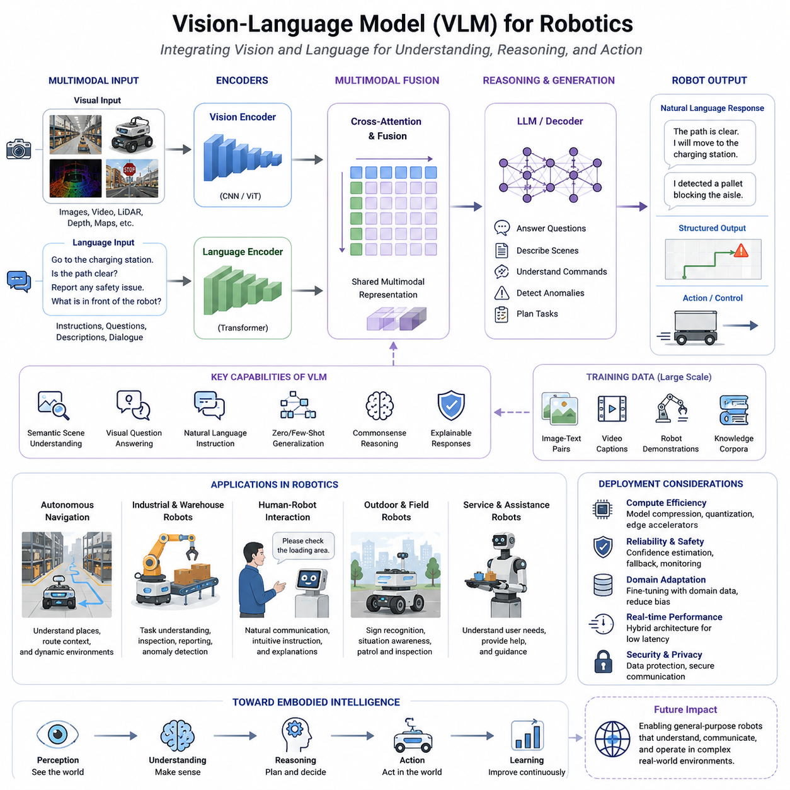
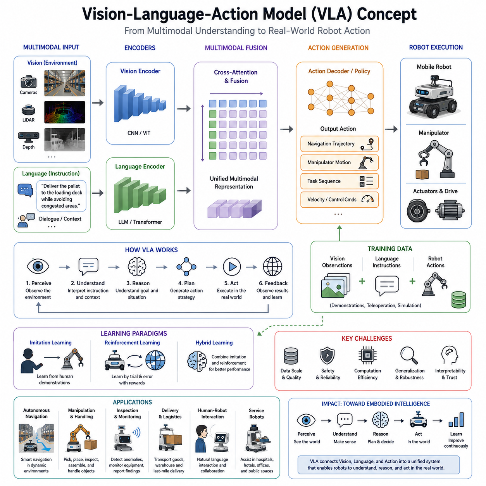
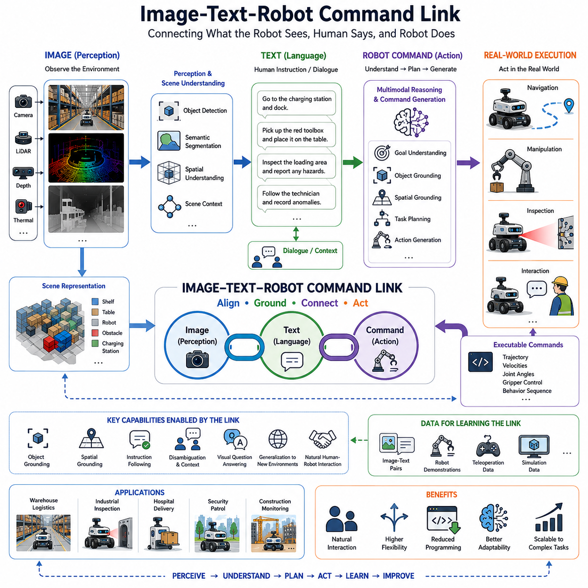
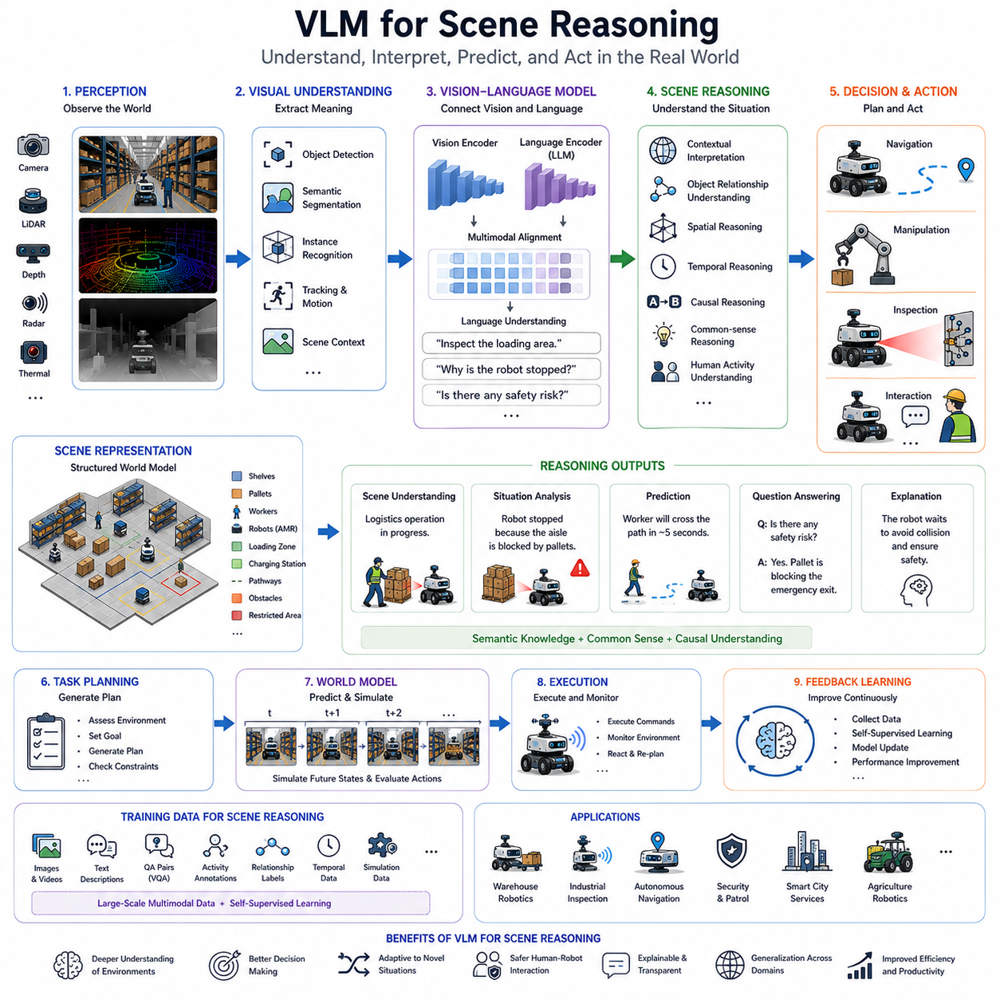
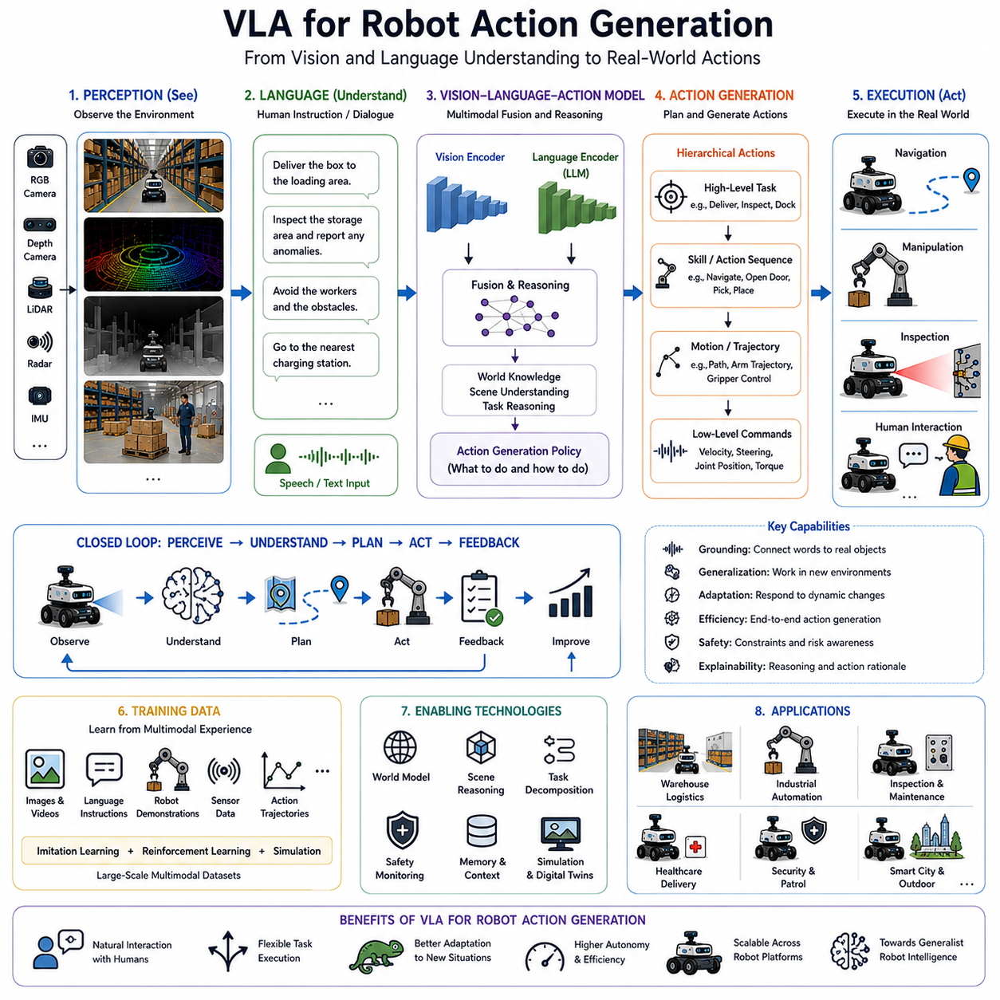
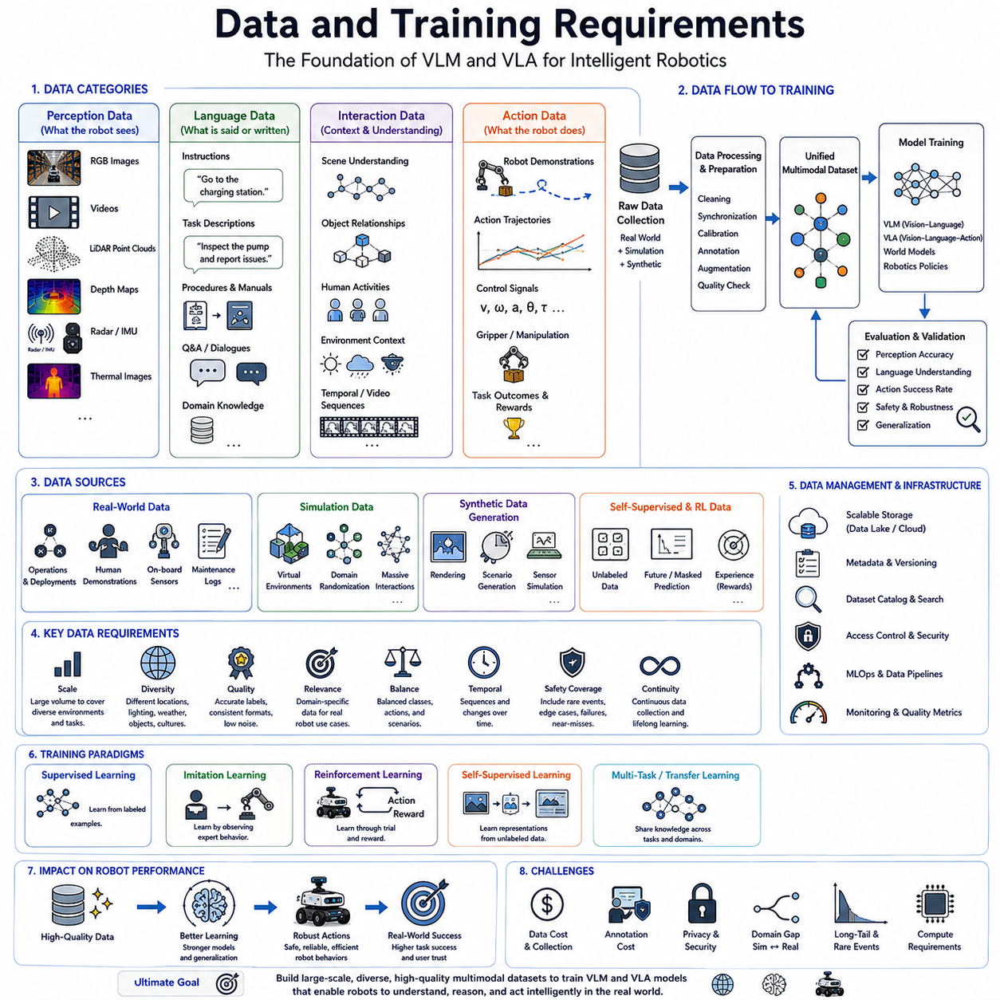
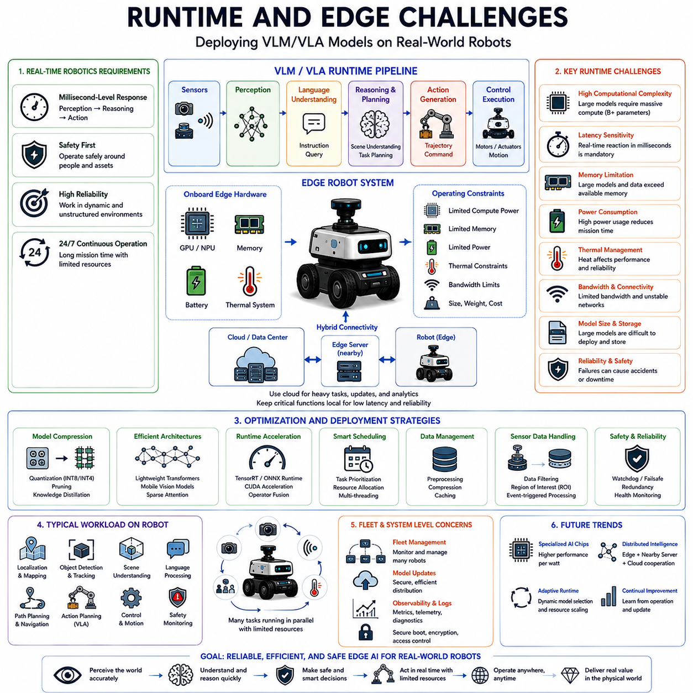
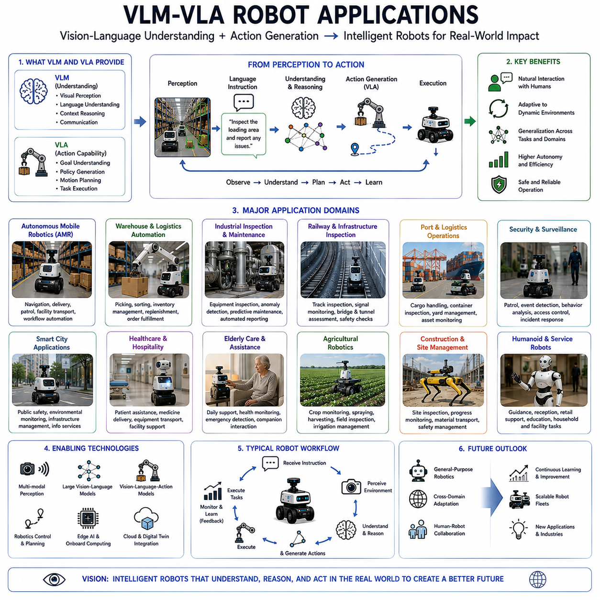

**Volume 06. AMR AI and Embodied Intelligence**

# Chapter 14. VLM and VLA

## 14.1 Vision-Language Model Overview

{width="7.268055555555556in" height="7.268055555555556in"}

# 14_01_Vision_Language_Model 개요

Vision-Language Model(VLM)은 현대 인공지능 분야에서 가장 중요한 발전 중 하나로 평가되며, 차세대 자율주행 로봇, 서비스 로봇, 산업용 로봇, Embodied AI, 그리고 범용 지능형 기계의 핵심 기술로 자리 잡고 있다. VLM은 시각 정보와 언어 정보를 하나의 통합된 추론 프레임워크 안에서 처리하는 AI 아키텍처이다. 기존의 컴퓨터 비전 시스템이 이미지나 영상만 이해하고, 대규모 언어 모델(LLM)이 텍스트만 이해하는 것과 달리, VLM은 시각과 언어를 동시에 이해하고 연결하며 추론할 수 있도록 설계되었다. 이를 통해 로봇은 카메라나 센서를 통해 물리적 세계를 인식하는 동시에 인간이 자연어로 전달하는 의도를 이해할 수 있게 된다.

Vision-Language Model의 등장은 컴퓨터 비전, 자연어 처리, 멀티모달 AI, 그리고 파운데이션 모델 기술이 융합된 결과라고 볼 수 있다. 기존 로봇 시스템은 객체 인식, 위치 추정, 의미론적 분할, 작업 계획 등의 기능이 각각 독립적인 모듈로 구현되는 경우가 많았다. 이러한 구조에서는 각 모듈이 제한된 정보만 활용하기 때문에 전체 환경에 대한 종합적인 이해가 어려웠다. 반면 VLM은 시각적 인식과 의미적 이해를 긴밀하게 결합함으로써 로봇이 환경, 객체, 관계, 작업 목표, 그리고 인간의 의도를 하나의 통합된 관점에서 이해할 수 있도록 지원한다. 이는 Embodied Intelligence와 범용 로봇 지능으로 가는 중요한 단계라고 할 수 있다.

Vision-Language Model의 핵심 목적은 시각 정보와 언어 정보를 공통의 표현 공간(Common Representation Space)으로 변환하는 데 있다. 이미지, 비디오, 센서 데이터, 지도, 도면과 같은 시각 정보는 비전 인코더를 통해 특징 벡터로 변환된다. 동시에 텍스트 명령, 설명 문장, 대화 내용, 지식 정보는 언어 모델을 통해 임베딩된다. 이후 두 정보는 동일한 잠재 공간(Latent Space)에서 정렬되며, 시각적 개념과 언어적 개념 사이의 관계를 학습하게 된다. 그 결과 로봇은 "창고 안에서 충전 스테이션으로 이동하는 로봇"이라는 이미지를 "창고의 충전 구역으로 이동 중인 로봇"이라는 언어적 개념과 연결하여 이해할 수 있다.

VLM의 가장 중요한 특징 중 하나는 Zero-Shot 및 Few-Shot 추론 능력이다. 전통적인 컴퓨터 비전 시스템은 새로운 객체를 인식하기 위해 별도의 데이터 수집과 학습 과정이 필요하다. 반면 VLM은 대규모 사전학습 과정에서 습득한 언어 지식을 활용하여 이전에 보지 못한 객체나 상황도 어느 정도 이해할 수 있다. 예를 들어 특정 장비를 학습한 적이 없는 로봇이라도 해당 장비에 대한 언어적 설명을 기반으로 그 역할과 특성을 추론할 수 있다. 이는 로봇의 일반화 능력을 크게 향상시키는 요소이다.

Vision-Language Model의 발전은 딥러닝과 Transformer 기술의 발전 과정과 밀접하게 연결되어 있다. 초기 컴퓨터 비전은 수작업 특징 추출과 지도학습 기반의 접근법에 의존하였다. 이후 CNN이 등장하면서 이미지 인식 성능이 크게 향상되었다. 동시에 자연어 처리 분야에서는 Transformer 기반 언어 모델이 등장하여 대규모 언어 이해 능력을 확보하였다. 연구자들은 이미지와 언어를 함께 학습할 수 있다는 가능성에 주목했고, 대규모 이미지-텍스트 데이터셋을 이용한 대조 학습(Contrastive Learning)과 자기지도학습(Self-Supervised Learning)이 발전하면서 오늘날의 VLM이 등장하게 되었다.

일반적인 Vision-Language Model은 여러 핵심 구성 요소로 이루어진다. 첫 번째는 비전 인코더(Visual Encoder)이다. 이 모듈은 카메라 영상이나 이미지 데이터를 의미 있는 특징 표현으로 변환한다. 최근에는 Vision Transformer(ViT)나 CNN 기반 모델이 널리 사용되며, 객체의 형태, 질감, 위치, 공간 관계 등을 추출한다.

두 번째는 언어 모델(Language Model)이다. 이 모듈은 자연어 명령, 질문, 설명, 문서 등을 처리한다. Transformer 기반 아키텍처가 주로 사용되며, 문맥 이해와 상식적 추론 능력을 제공한다. 언어 모델은 인간이 사용하는 자연어를 로봇이 이해할 수 있는 형태로 변환하는 역할을 수행한다.

세 번째는 멀티모달 융합(Multimodal Fusion) 계층이다. 이 계층은 시각 정보와 언어 정보를 하나의 표현 공간으로 결합한다. Cross-Attention, Contrastive Learning, Multimodal Transformer와 같은 기술이 활용되며, 이를 통해 이미지와 텍스트 사이의 의미적 관계를 학습한다.

네 번째는 추론 및 생성 계층(Reasoning and Generation Layer)이다. 이 계층에서는 장면 설명, 질문 응답, 명령 해석, 이상 상황 탐지, 작업 계획 지원 등의 고차원 기능이 수행된다. 이는 단순히 객체를 인식하는 수준을 넘어 환경에 대한 의미적 이해와 추론을 가능하게 한다.

Vision-Language Model을 학습하기 위해서는 대규모 이미지-텍스트 쌍 데이터가 필요하다. 이러한 데이터는 이미지 캡션, 비디오 설명, 인터넷 기반 멀티미디어 데이터, 로봇 작업 시연 데이터 등으로 구성될 수 있다. 학습 과정에서 모델은 특정 이미지와 관련된 텍스트를 연결하고, 관련 없는 데이터와는 구분하는 방법을 학습한다. 이를 통해 시각 정보와 언어 정보 간의 의미적 정렬이 이루어진다.

VLM의 가장 큰 장점 중 하나는 의미론적 장면 이해(Semantic Scene Understanding) 능력이다. 기존 객체 인식 시스템은 사람, 카트, 로봇을 각각 별개의 객체로 인식할 수는 있지만, 이들 사이의 관계를 이해하는 데는 한계가 있다. 반면 VLM은 "작업자가 물품을 자율주행 로봇에 적재하고 있다"와 같은 상황적 의미를 추론할 수 있다. 이러한 능력은 로봇이 보다 지능적인 의사결정을 수행하는 데 매우 중요하다.

또 다른 중요한 기능은 Visual Question Answering(VQA)이다. 사용자가 장면에 대해 질문하면 VLM은 시각적 정보를 기반으로 답변을 생성할 수 있다. 예를 들어 운영자가 "로봇의 이동 경로에 장애물이 있는가?" 또는 "현재 정지한 이유는 무엇인가?"와 같은 질문을 하면, VLM은 카메라 데이터를 분석하여 설명 가능한 형태로 답변을 제공할 수 있다. 이는 로봇 운영의 투명성과 사용자 신뢰성을 높이는 데 기여한다.

VLM은 자연어 기반 작업 지시(Natural Language Task Specification)도 가능하게 한다. 기존 로봇은 구조화된 명령어와 사전에 정의된 워크플로우에 의존했다. 그러나 VLM 기반 로봇은 "창고를 순찰하고 이상 상황을 보고하라" 또는 "가장 가까운 충전 스테이션을 찾아 이동하라"와 같은 자연어 명령을 이해할 수 있다. 이를 통해 인간과 로봇 간의 상호작용이 훨씬 직관적이고 유연해진다.

자율주행 로봇 분야에서 VLM은 내비게이션의 지능성을 크게 향상시킨다. 기존 내비게이션 시스템은 지도, 위치 추정, 장애물 회피에 집중하였다. VLM은 여기에 의미적 정보를 추가한다. 로봇은 복도, 출입구, 대기 구역, 적재 구역, 위험 구역, 충전 구역 등의 의미를 이해할 수 있으며, 이를 기반으로 더욱 상황에 적합한 경로를 선택할 수 있다.

산업용 로봇 분야에서도 VLM의 활용 가능성은 매우 크다. 물류 창고, 제조 공장, 검사 로봇, 서비스 로봇 등은 모두 복잡하고 변화하는 환경에서 운영된다. VLM은 작업 맥락을 이해하고, 이상 상황을 식별하며, 인간의 지시를 해석하고, 작업 결과를 자연어 보고서 형태로 생성할 수 있다. 예를 들어 검사 로봇은 손상된 설비를 발견하고 그 상태를 사람이 이해하기 쉬운 문장으로 설명할 수 있다.

실외 자율주행 로봇 역시 VLM의 혜택을 크게 받을 수 있다. 순찰 로봇, 스마트시티 로봇, 농업 로봇, 인프라 검사 로봇 등은 매우 다양한 환경에서 운용된다. VLM은 랜드마크 인식, 표지판 이해, 인간 활동 분석, 이상 상황 설명 등의 기능을 제공함으로써 실외 환경에 대한 이해도를 높인다.

Human-Robot Interaction(HRI) 분야에서 VLM은 혁신적인 변화를 가져오고 있다. 기존 로봇 인터페이스는 버튼, 메뉴, 정형화된 명령어에 의존하였다. 반면 VLM 기반 인터페이스에서는 사용자가 자연어로 질문하고, 물체를 지칭하며, 작업 목표를 설명할 수 있다. 로봇은 이를 이해하고 대화형으로 응답할 수 있기 때문에 사용자 경험이 크게 향상된다.

그러나 Vision-Language Model에는 여러 기술적 한계도 존재한다. 첫 번째는 높은 연산 요구사항이다. 대규모 VLM은 막대한 GPU 연산 능력과 메모리를 필요로 한다. 따라서 모바일 로봇과 같은 전력 제약 환경에서는 직접 운용이 쉽지 않다. 이를 해결하기 위해 모델 경량화, 양자화, 프루닝, 전용 AI 가속기 기술이 연구되고 있다.

두 번째는 신뢰성과 안정성 문제이다. VLM은 때때로 실제 상황과 다른 설명을 생성하거나 잘못된 추론을 수행할 수 있다. 이러한 Hallucination 문제는 안전이 중요한 로봇 시스템에서 매우 심각한 위험 요소가 될 수 있다. 따라서 신뢰도 평가, 안전 모니터링, 예외 처리 체계가 반드시 필요하다.

세 번째는 데이터 편향 문제이다. 인터넷 데이터 기반으로 학습된 VLM은 특정 산업 환경이나 특수 작업 환경을 충분히 반영하지 못할 수 있다. 공장, 병원, 항만, 철도, 건설 현장과 같은 환경에서는 별도의 도메인 적응과 추가 학습이 요구된다.

또한 실시간성 문제도 중요한 과제이다. 로봇은 변화하는 환경에 즉각적으로 대응해야 한다. 그러나 대규모 멀티모달 추론은 상당한 지연 시간을 유발할 수 있다. 따라서 실제 시스템에서는 안전 관련 기능은 기존 인식 시스템이 담당하고, VLM은 고수준 의미 추론을 담당하는 하이브리드 구조가 널리 사용되고 있다.

Vision-Language Model은 파운데이션 모델(Foundation Model)과도 밀접한 관련이 있다. 현대 VLM은 대규모 사전학습을 통해 범용적인 표현 능력을 확보하며, 이후 특정 로봇 환경에 맞게 미세조정(Fine-Tuning)된다. 이를 통해 다양한 로봇 플랫폼에 공통적으로 적용 가능한 범용 지능 계층을 제공할 수 있다.

또한 VLM은 Embodied AI의 핵심 구성 요소로 간주된다. Embodied AI는 인식, 기억, 추론, 행동을 통합하여 물리적 세계와 상호작용하는 지능을 의미한다. VLM은 시각적 인식과 의미적 이해를 연결하는 역할을 수행하며, 로봇이 단순히 보는 것을 넘어 이해하고 설명하며 추론할 수 있도록 만든다. 이는 향후 Vision-Language-Action(VLA), Robot Agent, World Model과 같은 고차원 지능 시스템으로 발전하는 기반이 된다.

향후 Vision-Language Model은 대부분의 지능형 로봇 시스템에서 표준 아키텍처의 일부가 될 것으로 예상된다. 미래의 로봇은 시각 정보, 언어 정보, 환경 맥락, 작업 목표, 인간 의도를 통합적으로 이해하는 멀티모달 추론 엔진을 중심으로 동작하게 될 것이다. 이러한 발전은 인간과 로봇의 자연스러운 협업을 가능하게 하고, 보다 높은 수준의 자율성과 적응성을 제공하며, 궁극적으로 Embodied Intelligence와 범용 로봇 지능 시대를 여는 핵심 기술로 자리매김할 것이다.

## 14.2 Vision-Language-Action Model Concept

{width="7.268055555555556in" height="7.268055555555556in"}

# 14_02 Vision-Language-Action Model 개념

인공지능 기술의 급속한 발전은 로봇을 단순히 환경을 인식하고 이동하는 기계에서 복잡한 실제 환경을 이해하고 추론하며 스스로 행동할 수 있는 지능형 시스템으로 변화시키고 있다. 이러한 변화의 중심에는 Vision-Language-Action(VLA) 모델이 있다. VLA 모델은 Vision-Language Model(VLM)의 기능을 한 단계 확장한 개념으로, 시각 정보와 언어 이해를 실제 물리적 행동으로 직접 연결하는 통합 AI 아키텍처이다. VLM이 이미지를 이해하고 인간의 지시를 해석하며 환경에 대해 추론하는 데 초점을 둔다면, VLA는 여기에서 더 나아가 실제 로봇이 수행해야 할 행동까지 생성한다.

Vision-Language-Action 모델은 Embodied Intelligence, 즉 체화된 지능의 발전 과정에서 중요한 전환점으로 평가된다. 전통적인 로봇 시스템은 일반적으로 인지(Perception), 계획(Planning), 제어(Control)를 서로 독립적인 모듈로 구성한다. 센서 데이터는 먼저 인식 시스템에서 처리되고, 이후 계획 알고리즘이 경로와 작업 순서를 계산하며, 마지막으로 제어기가 모터와 액추에이터를 구동한다. 이러한 구조는 오랜 기간 산업 현장에서 성공적으로 사용되어 왔지만, 복잡한 환경에서는 높은 개발 비용과 많은 시스템 통합 노력이 요구된다. 반면 VLA 모델은 시각 정보와 언어 정보, 그리고 행동 정보를 하나의 학습 프레임워크 안에서 통합적으로 학습한다.

Vision-Language-Action 모델은 Vision-Language Model의 자연스러운 진화 형태라고 볼 수 있다. VLM이 "세상을 이해하는 모델"이라면 VLA는 "세상 속에서 행동하는 모델"이다. VLM은 질문에 답하거나 장면을 설명할 수 있지만, VLA는 실제로 이동하고, 조작하고, 검사하고, 운반하며, 작업을 수행할 수 있다. 이러한 능력은 AI를 단순한 정보 처리 시스템이 아니라 물리적 환경에서 목적을 달성하는 능동적인 주체로 변화시킨다.

Vision-Language-Action 모델의 핵심은 세 가지 영역을 하나로 연결하는 것이다. 첫 번째는 Vision이다. 카메라, Depth Sensor, LiDAR, Radar 등의 센서를 통해 주변 환경을 인식한다. 두 번째는 Language이다. 인간의 명령, 작업 목표, 문맥 정보, 자연어 지시를 이해한다. 세 번째는 Action이다. 로봇의 이동, 조향, 매니퓰레이션, 검사, 운반과 같은 실제 행동을 의미한다. VLA는 이 세 가지를 하나의 통합 모델로 연결하여 관찰과 행동 사이의 관계를 학습한다.

기존 로봇 시스템에서는 객체 인식과 경로 계획, 그리고 제어가 각각 독립적으로 수행된다. 그러나 VLA는 이러한 관계를 하나의 학습 모델 안에서 동시에 학습한다. 이를 통해 로봇은 환경을 관찰하고, 사용자의 의도를 이해하며, 적절한 행동을 스스로 생성할 수 있다. 또한 기존에 명시적으로 프로그래밍되지 않은 새로운 상황에도 보다 유연하게 대응할 수 있다.

일반적인 Vision-Language-Action 모델은 여러 주요 구성 요소로 이루어진다. 첫 번째는 시각 인식 모듈이다. 이 모듈은 카메라와 각종 센서로부터 입력된 데이터를 처리하여 객체, 공간 구조, 인간 활동, 환경 맥락 등의 정보를 추출한다. 최근에는 Vision Transformer(ViT)와 같은 고성능 비전 백본이 주로 사용된다.

두 번째는 언어 이해 모듈이다. 일반적으로 대규모 언어 모델(LLM) 또는 멀티모달 Transformer 구조를 사용한다. 이 모듈은 인간의 명령, 작업 목표, 대화, 운영 지침 등을 해석한다. 예를 들어 "적재 구역을 점검하라", "가장 가까운 충전 스테이션으로 이동하라", "기술자를 따라가며 이상 상황을 기록하라"와 같은 자연어 지시를 이해할 수 있다.

세 번째는 멀티모달 융합 계층이다. 이 계층에서는 시각 정보와 언어 정보를 결합하여 공통 표현 공간을 생성한다. 이를 통해 로봇은 단순히 무엇이 보이는지를 이해하는 수준을 넘어, 현재 작업 목표와 환경 정보가 어떻게 연결되는지를 파악할 수 있다.

네 번째는 행동 생성(Action Generation) 모듈이다. 이것이 VLA 모델의 핵심 차별점이다. VLM이 텍스트를 생성하는 반면, VLA는 행동을 생성한다. 행동은 이동 경로, 속도 명령, 조향 명령, 로봇 팔 움직임, 작업 순서, 정책(Policy) 등 다양한 형태로 표현될 수 있다. 생성된 행동은 실제 제어 시스템으로 전달되어 로봇이 물리적 행동을 수행하게 된다.

VLA 모델의 동작 방식은 인간의 인지 과정과 매우 유사하다. 인간은 주변 환경을 관찰하고, 현재 상황을 이해하며, 목표를 파악한 후 행동을 결정한다. VLA는 이러한 과정을 데이터 기반 학습을 통해 습득한다. 규칙을 하나하나 프로그래밍하는 대신, 수많은 사례를 통해 관찰과 행동의 관계를 학습하는 것이다.

Vision-Language-Action 모델의 가장 큰 특징 중 하나는 End-to-End 작업 수행 능력이다. 기존 시스템은 인식, 계획, 제어를 별도로 개발해야 했지만, VLA는 이를 통합된 형태로 학습한다. 결과적으로 시스템 통합 복잡성이 감소하고, 새로운 환경에 대한 적응성이 향상될 수 있다.

VLA 모델을 학습하기 위해서는 시각 정보, 언어 정보, 행동 정보가 동시에 포함된 대규모 데이터셋이 필요하다. 이러한 데이터는 단순한 이미지-텍스트 데이터보다 훨씬 복잡하다. 로봇이 무엇을 보았는지, 어떤 지시를 받았는지, 그리고 실제로 어떤 행동을 수행했는지가 모두 기록되어야 한다.

로봇 시연 데이터(Robot Demonstration Data)는 VLA 학습에 매우 중요한 역할을 한다. 인간 작업자가 직접 작업을 수행하는 과정을 기록하면, 로봇은 그 데이터를 통해 행동 패턴을 학습할 수 있다. 이러한 데이터는 내비게이션, 물체 조작, 검사, 운반, 조립, 협업 작업 등 다양한 작업을 포함할 수 있다.

시뮬레이션 환경 역시 VLA 개발에서 중요한 역할을 한다. 실제 로봇 데이터를 대규모로 수집하는 것은 비용과 시간이 많이 들고 안전 문제도 존재한다. 따라서 Isaac Sim, Gazebo, MuJoCo와 같은 시뮬레이터를 활용하여 수백만 건의 학습 데이터를 생성한다. 이러한 가상 경험은 실제 데이터와 결합되어 모델의 일반화 능력을 향상시킨다.

VLA 모델에서 가장 널리 사용되는 학습 방식 중 하나는 모방학습(Imitation Learning)이다. 인간 작업자가 수행한 작업을 관찰하고 이를 그대로 학습함으로써 로봇 행동 정책을 생성한다. 이 방법은 복잡한 로봇 기술을 빠르게 습득할 수 있다는 장점이 있다.

강화학습(Reinforcement Learning) 역시 VLA와 결합될 수 있다. 이 경우 로봇은 시행착오를 통해 최적의 행동 전략을 학습한다. 보상 함수(Reward Function)를 최대화하는 방향으로 행동을 개선하며, 인간 시연 데이터 이상의 성능을 달성할 가능성도 있다.

Vision-Language-Action 모델의 또 다른 중요한 장점은 범용성이다. 전통적인 로봇은 특정 작업을 위해 설계되며, 작업이 바뀌면 새로운 개발이 필요하다. 반면 VLA는 다양한 자연어 지시를 이해하고 새로운 작업에 적응할 수 있다. 하나의 모델이 이동, 검사, 물류 운반, 모니터링, 보고, 협업 등의 다양한 작업을 수행할 수 있다.

자율주행 로봇에서는 VLA가 보다 지능적인 내비게이션을 가능하게 한다. 예를 들어 "혼잡한 구역을 피해서 적재 구역으로 물품을 운반하라"라는 명령을 받으면, 로봇은 환경을 분석하고 혼잡도를 판단하며 최적의 경로를 생성할 수 있다.

실외 자율주행 로봇에서도 VLA의 효과는 매우 크다. 캠퍼스 순찰 로봇, 스마트시티 로봇, 철도 검사 로봇, 항만 로봇, 농업 로봇 등은 예측하기 어려운 환경에서 운영된다. VLA는 이러한 환경에서 인간의 고수준 지시를 이해하고 상황에 맞게 행동을 생성할 수 있다.

매니퓰레이션 로봇 분야에서도 VLA는 큰 변화를 가져오고 있다. 기존에는 정교한 모션 플래닝이 필요했지만, VLA는 "빨간 공구함을 집어서 검사 구역 옆에 놓아라"와 같은 명령을 이해하고 직접 행동 계획을 생성할 수 있다.

인간-로봇 상호작용(HRI) 역시 크게 향상된다. 사용자는 더 이상 복잡한 명령 체계를 이해할 필요가 없다. 자연어로 작업 목표를 설명하면 로봇은 이를 이해하고 스스로 행동 전략을 수립하여 실행할 수 있다. 이는 산업 현장뿐 아니라 서비스 로봇 분야에서도 매우 중요한 변화이다.

Vision-Language Model과 Vision-Language-Action Model의 차이를 이해하는 것도 중요하다. VLM은 환경을 이해하고 설명하는 역할에 집중한다. 반면 VLA는 이러한 이해를 실제 행동으로 연결한다. 따라서 VLM이 로봇의 인지(Cognition) 계층이라면, VLA는 인지와 행동을 연결하는 실행(Execution) 계층이라고 볼 수 있다.

VLA 모델은 Embodied AI와도 밀접하게 연결된다. Embodied AI는 물리적 세계와의 상호작용을 통해 학습하고 성장하는 지능을 의미한다. VLA는 인식과 행동을 직접 연결함으로써 로봇이 환경 속에서 경험을 축적하고 지속적으로 학습할 수 있는 기반을 제공한다.

하지만 VLA 모델에는 여러 도전 과제도 존재한다. 첫 번째는 데이터 부족 문제이다. 인터넷에는 수많은 이미지와 텍스트 데이터가 존재하지만, 실제 로봇 행동 데이터는 매우 제한적이다. 다양한 환경과 다양한 로봇 플랫폼에 대한 데이터 수집이 필요하다.

두 번째는 안전성 문제이다. VLM이 잘못된 답변을 생성하는 것은 비교적 작은 문제일 수 있지만, VLA가 잘못된 행동을 생성하면 충돌, 장비 파손, 안전 사고로 이어질 수 있다. 따라서 안전 모니터링과 검증 체계가 반드시 필요하다.

세 번째는 높은 연산 요구사항이다. 최신 VLA 모델은 대규모 멀티모달 Transformer를 기반으로 하기 때문에 실시간 추론을 위해 강력한 GPU와 AI 가속기가 요구된다. 이를 해결하기 위해 모델 경량화와 Edge AI 최적화 기술이 지속적으로 발전하고 있다.

또한 설명 가능성(Explainability)도 중요한 과제이다. 왜 특정 행동을 선택했는지 이해하기 어려운 경우가 많다. 산업용 로봇, 의료 로봇, 자율주행 시스템과 같은 안전이 중요한 분야에서는 행동의 근거를 설명할 수 있어야 한다.

향후 Vision-Language-Action 모델은 범용 로봇 파운데이션 모델의 핵심이 될 것으로 예상된다. 현재는 작업별로 별도의 모델이 필요하지만, 미래에는 하나의 범용 모델이 다양한 환경과 작업에 적용될 수 있을 것이다. 이러한 모델은 마치 로봇의 운영체제처럼 동작하며, 프롬프트나 추가 학습만으로 새로운 기능을 습득하게 될 것이다.

멀티모달 파운데이션 모델이 지속적으로 발전함에 따라 VLA는 자율주행 로봇, 산업용 로봇, 물류 로봇, 서비스 로봇, 휴머노이드 로봇의 핵심 기술로 자리 잡을 가능성이 높다. 미래의 로봇은 주변 환경을 인식하고, 인간의 의도를 이해하며, 목표를 추론하고, 결과를 예측하고, 실제 행동을 수행하는 모든 과정을 하나의 통합 모델 안에서 처리하게 될 것이다.

결국 Vision-Language-Action 모델은 단순한 AI 모델 구조를 넘어 로봇 지능의 새로운 패러다임을 의미한다. 이는 로봇을 고정된 자동화 기계에서 적응형 지능 시스템으로 발전시키며, 인간과 협력하고 복잡한 실제 환경에서 자율적으로 행동할 수 있는 진정한 Embodied Intelligence 시대를 여는 핵심 기술이 될 것이다.

## 14.3 Image-Text-Robot Command Link

{width="7.268055555555556in" height="7.268055555555556in"}

# 14_03 이미지-텍스트-로봇 명령 연계(Image-Text-Robot Command Link)

지능형 로봇 기술의 발전은 인식(Perception), 언어 이해(Language Understanding), 그리고 자율 행동(Autonomous Action)의 융합에 의해 가속화되고 있다. 로봇이 정해진 작업만 수행하는 자동화 기계를 넘어 복잡한 실제 환경에서 스스로 판단하고 행동하는 시스템으로 발전함에 따라, 시각 정보와 자연어 명령, 그리고 실제 로봇 행동을 연결하는 능력이 매우 중요해지고 있다. 이러한 연결 구조를 Image-Text-Robot Command Link라고 한다. 이는 로봇이 이미지와 센서 데이터를 통해 환경을 이해하고, 인간의 언어 명령을 해석한 뒤, 이를 실제 물리적 행동으로 변환하는 과정 전체를 의미한다.

기존 로봇 시스템은 대부분 사전에 정의된 명령 체계를 기반으로 동작하였다. 개발자는 이동 경로, 작업 순서, 조작 동작, 안전 규칙 등을 미리 프로그래밍해야 했으며, 사용자는 GUI, 메뉴 기반 인터페이스 또는 특수 명령어를 통해 로봇을 제어하였다. 이러한 방식은 반복적인 산업 환경에서는 매우 효과적이지만, 변화가 많은 실제 환경에서는 확장성과 유연성이 부족하다는 한계를 가진다.

최근의 AI 기반 로봇은 이러한 한계를 극복하기 위해 자연어와 시각 정보를 활용하는 멀티모달 접근 방식을 채택하고 있다. 인간은 자연어로 작업 목표를 설명하고, 로봇은 카메라와 센서를 통해 환경을 인식한다. Image-Text-Robot Command Link는 이 두 영역을 연결하여 로봇이 인간의 의도를 이해하고 실제 행동으로 수행할 수 있도록 만드는 핵심 기술이다.

이 개념의 핵심은 세 가지 정보 공간을 연결하는 것이다. 첫 번째는 시각 정보 공간이다. 여기에는 이미지, 비디오, LiDAR 포인트클라우드, Depth 데이터, 열화상 데이터 등 환경을 인식하는 모든 정보가 포함된다. 두 번째는 언어 정보 공간이다. 인간의 명령, 작업 지시, 운영 절차, 대화, 문맥 정보 등이 여기에 속한다. 세 번째는 로봇 행동 공간이다. 이동 명령, 조향 명령, 로봇 팔 동작, 검사 작업, 순찰 행동, 작업 시퀀스 등이 포함된다. Image-Text-Robot Command Link의 목적은 이 세 가지 공간을 하나의 통합된 의미 공간으로 연결하는 것이다.

실제 로봇 시스템에서는 먼저 환경 관찰이 이루어진다. 카메라, LiDAR, Radar, Depth Camera, Thermal Camera 등 다양한 센서가 주변 환경을 지속적으로 관측한다. 수집된 데이터는 객체 인식, 장면 이해, 위치 추정, 장애물 탐지 등의 과정을 거쳐 의미 있는 환경 정보로 변환된다.

동시에 로봇은 인간 또는 상위 시스템으로부터 언어 명령을 받는다. 이러한 명령은 음성, 텍스트, 대화, 작업 계획 등의 형태로 전달될 수 있다. 예를 들어 "충전 스테이션으로 이동하라", "적재 구역을 점검하라", "정비사를 따라가라", "안전 위험 요소를 보고하라"와 같은 명령이 여기에 해당한다.

문제는 이러한 언어 명령을 실제 환경과 연결하는 과정이다. 인간은 "빨간 공구함을 가져와라"라는 말을 들으면 주변 환경에서 해당 물체를 즉시 찾을 수 있다. 로봇도 동일한 능력을 가져야 한다. Image-Text-Robot Command Link는 언어와 시각 정보를 연결하여 로봇이 명령에 포함된 개념을 실제 환경 속 객체와 연결할 수 있도록 한다.

현대의 멀티모달 AI는 이를 위해 공통 의미 공간(Common Semantic Space)을 사용한다. 이미지와 텍스트를 각각 임베딩(Embedding)한 후 동일한 잠재 공간에 배치함으로써 관련된 개념끼리 가까운 위치에 존재하도록 학습한다. 예를 들어 빨간 공구함이 포함된 이미지와 "red toolbox"라는 문장은 동일한 의미 공간에서 매우 가까운 위치를 가지게 된다. 이를 통해 로봇은 언어 명령에 등장하는 객체를 환경 속에서 찾아낼 수 있다.

Image-Text-Robot Command Link의 가장 중요한 응용 분야 중 하나는 객체 그라운딩(Object Grounding)이다. 그라운딩은 언어 개념을 실제 물리적 객체에 연결하는 과정을 의미한다. 그라운딩이 없다면 언어는 단순한 추상 정보에 머무르게 된다. 반면 그라운딩이 이루어지면 "가장 가까운 팔레트", "비상구", "파란색 컨테이너", "고장 난 설비"와 같은 표현이 실제 환경 속 특정 객체를 의미하게 된다.

객체 그라운딩은 물체 조작 작업에서 특히 중요하다. 예를 들어 창고 로봇이 "손상된 박스를 검사 구역으로 이동시켜라"라는 명령을 받았다고 가정하자. 로봇은 먼저 어떤 박스가 손상된 박스인지 식별해야 하며, 이후 검사 구역이 어디에 있는지를 이해하고, 최종적으로 이동 및 조작 계획을 생성해야 한다. 이 모든 과정의 기반이 되는 것이 Image-Text-Robot Command Link이다.

공간적 그라운딩(Spatial Grounding)도 매우 중요하다. 인간의 명령에는 왼쪽, 오른쪽, 앞, 뒤, 위, 아래, 근처와 같은 공간 개념이 자주 등장한다. 예를 들어 "프린터 옆 테이블 위에 박스를 올려놓아라"라는 명령을 수행하기 위해서는 여러 객체 간의 공간 관계를 이해해야 한다. 로봇은 단순히 객체를 인식하는 것을 넘어 객체들 사이의 관계를 이해해야 한다.

장면 이해(Scene Understanding)는 이러한 연결 능력을 더욱 강화한다. 최신 로봇은 단순한 좌표와 장애물 정보만을 사용하는 것이 아니라 복도, 사무실, 창고, 적재 구역, 충전 구역, 보행자 구역, 위험 구역과 같은 의미적 공간 정보를 활용한다. 이러한 의미적 이해는 자연어 명령을 더욱 정확하게 해석할 수 있도록 만든다.

Image-Text-Robot Command Link는 Visual Question Answering(VQA) 기능에도 활용된다. 운영자는 종종 로봇에게 환경에 대한 질문을 한다. "통로를 막고 있는 것이 무엇인가?", "현재 몇 명의 작업자가 있는가?", "적재 구역이 비어 있는가?"와 같은 질문에 대해 로봇은 시각 정보를 분석하고 텍스트 형태의 답변을 생성할 수 있다. 이 경우 정보 흐름은 이미지에서 텍스트 방향으로 진행된다.

또한 이 기술은 명령 모호성 해소에도 중요한 역할을 한다. 인간의 언어는 종종 불완전하거나 모호하다. "저 박스를 가져와라"라는 표현은 시각적 문맥이 없으면 의미를 알 수 없다. 그러나 로봇이 현재 장면을 분석하고 사용자의 시선을 이해할 수 있다면, 어떤 박스를 의미하는지 추론할 수 있다.

Vision-Language Model의 발전은 Image-Text-Robot Command Link의 성능을 크게 향상시켰다. 과거에는 언어와 객체의 관계를 사람이 직접 정의해야 했지만, 현대의 VLM은 대규모 멀티모달 데이터셋을 통해 이러한 관계를 자동으로 학습한다. 그 결과 로봇은 이전에 보지 못한 환경에서도 보다 자연스럽게 언어를 이해할 수 있게 되었다.

Vision-Language-Action(VLA) 모델은 이러한 개념을 더욱 발전시킨다. VLA는 이미지와 텍스트의 연결을 실제 행동 생성까지 확장한다. 예를 들어 "입구 근처에 주차된 차량을 점검하라"라는 명령을 받으면 로봇은 차량을 식별하고, 해당 위치로 이동하며, 센서를 이용해 점검을 수행하고, 최종 보고서를 생성할 수 있다. 이 과정에서 Image-Text-Robot Command Link는 인식과 행동을 연결하는 핵심 역할을 수행한다.

이러한 시스템을 학습시키기 위해서는 대규모 멀티모달 데이터가 필요하다. 이미지와 텍스트 데이터는 기본적인 의미 연결을 학습하는 데 사용된다. 여기에 로봇 행동 데이터가 추가되면 명령과 행동의 관계까지 학습할 수 있다. 시연 데이터, 원격 조작 데이터, 시뮬레이션 데이터, 운영 로그 등이 중요한 학습 자원이 된다.

자기지도학습(Self-Supervised Learning)은 이러한 데이터 활용을 더욱 효율적으로 만든다. 모든 데이터를 사람이 직접 라벨링할 필요 없이, 데이터 내부의 자연스러운 관계를 이용하여 시각 정보와 언어 정보를 학습할 수 있다. 이를 통해 보다 광범위한 환경과 상황을 이해할 수 있는 모델을 구축할 수 있다.

자율주행 로봇 분야에서 Image-Text-Robot Command Link는 특히 유용하다. 기존 내비게이션 시스템은 좌표와 지도 중심으로 동작하였다. 반면 멀티모달 시스템은 "가장 가까운 비상구로 이동하라", "작업자가 모여 있는 구역을 점검하라"와 같은 명령도 이해할 수 있다.

산업 현장에서는 로봇 운영이 훨씬 단순해진다. 창고 작업자는 복잡한 프로그래밍 없이 자연어로 작업을 지시할 수 있으며, 검사 로봇은 작업 설명만으로 임무를 수행할 수 있다. 정비 담당자는 장비 상태를 설명하며 로봇에게 점검을 요청할 수 있다.

실외 자율주행 로봇에서는 이러한 기능의 가치가 더욱 크다. 캠퍼스 순찰, 항만 운영, 철도 검사, 스마트시티 운영과 같은 환경에서는 모든 상황을 미리 정의할 수 없다. 자연어 기반 임무 지시는 운영자가 목표만 전달하면 로봇이 세부 실행 계획을 스스로 생성할 수 있도록 만든다.

인간-로봇 상호작용(HRI) 분야에서도 혁신적인 변화가 나타난다. 사용자는 더 이상 저수준 명령을 입력할 필요가 없다. 목표를 설명하고 질문을 하며 작업 의도를 전달하면 된다. 로봇은 이를 시각적 환경 정보와 결합하여 적절한 행동을 생성한다.

그러나 여러 도전 과제도 존재한다. 첫 번째는 언어의 모호성이다. 인간의 언어는 상황에 따라 의미가 달라질 수 있으며 불완전한 경우도 많다. 따라서 고급 추론 능력이 요구된다.

두 번째는 인식 정확도 문제이다. 잘못된 객체 인식이나 위치 추정 오류는 명령 해석 오류로 이어질 수 있다. 따라서 강인한 인식 시스템이 반드시 필요하다.

세 번째는 실시간 처리 문제이다. 대규모 멀티모달 모델은 높은 연산 자원을 요구한다. 따라서 Edge AI 최적화와 효율적인 추론 기술이 중요해지고 있다.

네 번째는 안전성 문제이다. 명령을 잘못 해석하면 위험한 행동이 발생할 수 있다. 따라서 안전 제약 조건, 검증 시스템, 비상 정지 기능 등이 필수적으로 요구된다.

설명 가능성 역시 중요한 과제이다. 운영자는 로봇이 왜 특정 행동을 수행했는지 이해할 수 있어야 한다. 이는 신뢰성 확보와 디버깅, 그리고 인증 과정에서 매우 중요한 요소가 된다.

미래에는 Foundation Model, World Model, Robot Agent, Embodied AI 기술이 발전하면서 이미지, 언어, 행동의 연결이 더욱 긴밀해질 것으로 예상된다. 이때 Image-Text-Robot Command Link는 단순한 인터페이스가 아니라 로봇 지능의 핵심 인지 메커니즘으로 발전하게 될 것이다.

멀티모달 파운데이션 모델이 성숙해질수록 인간은 고수준 목표만 전달하고, 로봇은 환경을 이해하고, 관련 객체를 찾고, 행동 계획을 수립하며, 실제 작업을 수행하게 될 것이다. 이는 로봇 도입 비용을 줄이고 활용 범위를 크게 확대할 것이다.

결국 Image-Text-Robot Command Link는 Embodied Intelligence의 핵심 기반 기술 중 하나이다. 로봇이 무엇을 보고 있는지, 인간이 무엇을 말하는지, 그리고 로봇이 어떻게 행동해야 하는지를 하나의 통합된 체계로 연결함으로써, 단순한 자동화를 넘어 진정한 지능형 로봇 시대를 가능하게 하는 핵심 기술로 자리매김하게 될 것이다.

## 14.4 VLM for Scene Reasoning

{width="7.268055555555556in" height="7.268055555555556in"}

# 14_04 장면 추론(Scene Reasoning)을 위한 Vision-Language Model

Vision-Language Model(VLM)의 등장은 지능형 시스템이 물리적 세계를 이해하고 해석하는 방식을 근본적으로 변화시키고 있다. 기존의 컴퓨터 비전 시스템은 주로 객체 인식, 이미지 분류, 장애물 탐지, 의미론적 분할(Semantic Segmentation)과 같은 기능에 집중하였다. 이러한 기능들은 여전히 중요하지만, 고도화된 로봇 시스템이 실제 환경에서 자율적으로 동작하기 위해서는 단순한 객체 인식을 넘어 환경의 맥락, 관계, 의도, 그리고 미래 상황까지 이해할 수 있어야 한다. 이러한 능력을 Scene Reasoning, 즉 장면 추론이라고 하며, Vision-Language Model은 이를 가능하게 하는 핵심 기술로 자리 잡고 있다.

장면 추론은 단순히 "무엇이 보이는가"를 파악하는 수준을 넘어 "무슨 일이 일어나고 있는가", "왜 그런 상황이 발생했는가", "앞으로 어떤 일이 발생할 수 있는가", 그리고 "어떤 행동을 해야 하는가"를 이해하는 과정을 의미한다. 객체 탐지가 개별 객체를 식별하는 데 초점을 둔다면, 장면 추론은 객체들 사이의 관계와 환경 전체의 의미를 이해하는 데 초점을 둔다. 실제 로봇 환경은 매우 복잡하고 동적이며, 단순한 객체 정보만으로는 충분히 설명할 수 없는 상황이 많기 때문에 장면 추론은 자율 로봇의 핵심 능력으로 간주된다.

기존의 로봇 인식 시스템은 일반적으로 카메라와 센서를 통해 데이터를 수집하고, 객체 인식 모듈이 객체를 식별한 뒤, 경로 계획과 제어 시스템이 행동을 결정하는 구조를 가진다. 이러한 구조는 정형화된 환경에서는 효과적이지만, 새로운 상황이나 복잡한 인간 활동을 이해하는 데는 한계가 있다. 장면 추론은 단순한 기하학적 분석을 넘어 환경에 대한 의미적 이해를 제공함으로써 이러한 한계를 극복한다.

Vision-Language Model은 시각 정보와 언어 지식을 결합하여 장면 추론을 수행한다. 이미지와 영상은 더 이상 단순한 픽셀 집합이 아니라 객체, 관계, 행동, 목적, 환경적 맥락이 포함된 의미 있는 정보로 해석된다. 언어 모델은 이러한 시각 정보에 상식(Common Sense), 의미론적 지식, 인과관계, 그리고 추론 능력을 제공하여 보다 깊이 있는 환경 이해를 가능하게 한다.

VLM 기반 장면 추론의 가장 중요한 특징 중 하나는 맥락(Context) 이해이다. 동일한 객체라도 위치와 상황에 따라 의미가 달라질 수 있다. 예를 들어 창고 내부 통로에 놓인 팔레트는 일반적인 물류 작업의 일부일 수 있지만, 비상구 앞에 놓인 팔레트는 안전 위험 요소가 된다. 기존 객체 인식 시스템은 두 경우 모두 단순히 "팔레트"라고 인식하지만, 장면 추론 시스템은 해당 위치와 환경적 의미를 함께 이해할 수 있다.

장면 추론은 먼저 시각 인식 단계에서 시작된다. 카메라, Depth Sensor, LiDAR, Radar, Thermal Camera 등 다양한 센서가 환경을 지속적으로 관찰한다. 최신 인식 네트워크는 객체, 공간 구조, 움직임, 형태, 위치 관계 등의 특징을 추출하며, 이는 이후의 고수준 추론 과정에 활용된다.

다음 단계는 의미론적 표현(Semantic Representation)이다. 객체는 단순한 위치 정보가 아니라 의미를 가진 엔티티(Entity)로 표현된다. 예를 들어 창고 환경에서는 선반, 작업자, AMR, 팔레트, 적재 구역, 충전 스테이션 등이 각각 의미를 가진 객체로 표현되며, 이들 사이의 관계가 함께 저장된다. 이 과정에서 환경은 단순한 좌표 공간이 아니라 의미적 관계가 포함된 구조화된 장면으로 변환된다.

Vision-Language Model은 시각 정보와 언어 정보를 공통 표현 공간으로 연결한다. 대규모 사전학습 과정에서 모델은 이미지와 텍스트 사이의 관계를 학습한다. 그 결과 특정 시각적 패턴은 물류 작업, 유지보수 작업, 안전 위험, 혼잡 지역, 검사 절차와 같은 의미적 개념과 연결된다. 이러한 의미 연결은 단순 인식을 넘어선 추론을 가능하게 한다.

객체 관계 이해(Object Relationship Understanding)는 장면 추론의 핵심 요소이다. 실제 환경은 독립적인 객체의 집합이 아니라 상호 연결된 관계의 네트워크이다. 예를 들어 창고에서 작업자가 카트를 밀고 적재 구역으로 이동하는 장면을 관찰했다고 가정하자. 기존 시스템은 작업자, 카트, 적재 구역을 각각 개별 객체로 인식한다. 반면 장면 추론 시스템은 "물류 작업이 진행 중이며 작업자가 화물을 운반하고 있다"는 상황을 이해할 수 있다.

공간 추론(Spatial Reasoning)도 매우 중요하다. 로봇은 객체 간의 위치 관계를 이해해야 한다. 왼쪽, 오른쪽, 위, 아래, 앞, 뒤, 내부, 외부와 같은 공간 개념은 실제 환경 해석과 작업 수행에 필수적이다. 예를 들어 "발전기 뒤에 있는 장비를 점검하라" 또는 "작업대 옆 테이블에 물품을 놓아라"와 같은 명령을 수행하기 위해서는 공간 관계를 정확히 이해해야 한다.

시간 추론(Temporal Reasoning)은 장면 이해를 시간 축으로 확장한다. 많은 로봇 응용에서는 현재 상태뿐만 아니라 시간에 따른 변화도 중요하다. 예를 들어 순찰 로봇이 제한 구역에 주차된 차량을 발견했을 경우, 차량이 방금 도착했는지 아니면 장시간 방치되어 있는지를 파악해야 한다. 이러한 시간적 분석은 이상 상황 탐지와 보안 분야에서 매우 중요하다.

인과 추론(Causal Reasoning)은 원인과 결과의 관계를 이해하는 능력이다. 인간은 자연스럽게 어떤 현상이 발생한 이유를 추론한다. 예를 들어 창고 통로에 박스가 떨어져 있다면 사람은 누군가가 운반 중에 떨어뜨렸을 가능성을 생각한다. VLM은 이러한 인과 관계를 추론함으로써 보다 높은 수준의 상황 이해를 제공한다. 이는 고장 진단, 이상 탐지, 사고 분석 등에 활용될 수 있다.

상식 추론(Common-Sense Reasoning) 역시 중요한 역할을 한다. 많은 상황은 시각 정보만으로 완전히 이해할 수 없다. 예를 들어 로봇이 비 오는 날의 실외 환경을 관찰한다면 도로가 미끄러울 수 있다는 사실을 추론해야 한다. 또한 안전모를 착용한 작업자들이 중장비 주변에서 작업하는 모습을 본다면 건설 또는 유지보수 작업이 진행 중임을 이해할 수 있어야 한다. 이러한 능력은 언어 기반 학습을 통해 습득된 상식 지식에 의해 가능해진다.

인간 활동 이해(Human Activity Understanding)는 장면 추론의 대표적인 응용 분야이다. 인간과 로봇이 함께 작업하는 환경에서는 사람의 행동과 의도를 이해하는 것이 매우 중요하다. VLM은 사람이 장비를 운반하고 있는지, 작업을 수행하고 있는지, 도움을 기다리고 있는지, 다른 사람과 협업하고 있는지를 파악할 수 있다. 이러한 이해는 안전한 협업과 효율적인 작업 수행에 필수적이다.

장면 추론은 자율주행 로봇에서도 중요한 역할을 한다. 로봇의 의사결정은 단순한 경로 계획만으로 이루어지지 않는다. 예를 들어 통로를 막고 있는 것이 움직이는 작업자인지, 고정된 팔레트인지에 따라 대응 방식이 달라져야 한다. 장면 추론은 이러한 환경적 맥락을 고려하여 적절한 행동을 선택할 수 있도록 지원한다.

산업용 검사 로봇도 장면 추론의 혜택을 크게 받는다. 기존 비전 시스템은 단순히 이상 징후를 탐지하는 데 그쳤지만, 장면 추론은 그 의미를 해석할 수 있다. 예를 들어 장비 근처의 작은 오일 누출은 유지보수가 필요한 상태를 의미할 수 있으며, 장비 위치가 비정상적이라면 운영 절차의 문제를 시사할 수도 있다.

실외 자율주행 로봇에서는 장면 추론의 중요성이 더욱 커진다. 순찰 로봇, 스마트시티 로봇, 농업 로봇, 인프라 점검 로봇은 매우 복잡하고 변화가 많은 환경에서 동작한다. VLM 기반 장면 추론은 교통 상황, 보행자 행동, 환경 위험 요소, 날씨 영향, 공사 구역 등의 맥락을 이해할 수 있도록 지원한다.

Vision-Language Model이 제공하는 가장 강력한 기능 중 하나는 Visual Question Answering(VQA)이다. 운영자는 "왜 로봇이 멈춰 있는가?", "현재 혼잡의 원인은 무엇인가?", "안전 위험 요소가 존재하는가?"와 같은 질문을 할 수 있다. 이러한 질문에 답하기 위해서는 단순 객체 인식이 아니라 장면 전체에 대한 의미적 이해와 추론이 필요하다.

설명 가능성(Explainability) 역시 장면 추론의 중요한 장점이다. 기존 AI는 결과만 제공하는 경우가 많았지만, VLM은 관찰 결과와 판단 근거를 자연어로 설명할 수 있다. 이는 사용자 신뢰도를 높이고 디버깅과 안전 검증을 용이하게 만든다.

장면 추론은 작업 계획(Task Planning)에도 중요한 역할을 한다. 로봇이 작업을 수행하기 전에 환경 상태, 자원 가용성, 제약 조건, 예상 결과를 이해해야 한다. 예를 들어 팔레트를 운반하기 전에 경로가 비어 있는지, 적재 구역에 접근 가능한지, 사람의 이동이 작업에 영향을 주지 않는지를 평가할 수 있어야 한다.

최근에는 장면 추론과 World Model의 결합도 활발히 연구되고 있다. World Model은 로봇 내부에 구축되는 환경 시뮬레이션 모델로, 미래 상황을 예측하는 역할을 한다. 장면 추론은 현재 상황을 의미적으로 이해하고, World Model은 이를 바탕으로 미래 상태를 예측한다. 두 기술의 결합은 보다 지능적인 자율 시스템을 가능하게 한다.

VLM 기반 장면 추론을 학습하기 위해서는 이미지, 비디오, 텍스트 설명, 관계 정보, 질문-응답 데이터 등을 포함한 대규모 멀티모달 데이터셋이 필요하다. 최근 데이터셋은 단순 객체 인식을 넘어 관계, 활동, 상황 설명을 포함하고 있으며, 이를 통해 보다 복잡한 의미 구조를 학습할 수 있다.

자기지도학습(Self-Supervised Learning)은 장면 추론 능력을 확장하는 중요한 기술이다. 수작업 라벨링 없이도 대규모 데이터에서 자연스럽게 발생하는 관계를 학습할 수 있기 때문에, 모델은 광범위한 환경 지식을 습득할 수 있다.

그러나 장면 추론에는 여러 도전 과제도 존재한다. 첫 번째는 높은 계산 비용이다. 장면 추론은 대규모 Transformer 모델을 필요로 하며, 모바일 로봇에서 실시간으로 실행하기 어렵다. 따라서 Edge AI 최적화와 모델 경량화 기술이 중요하다.

두 번째는 강인성(Robustness) 문제이다. 실제 환경은 조명 변화, 센서 노이즈, 가림 현상, 악천후, 예기치 못한 상황 등으로 가득 차 있다. 따라서 다양한 환경에서도 안정적으로 동작할 수 있는 시스템 설계가 필요하다.

세 번째는 Hallucination 문제이다. VLM은 실제로 존재하지 않는 상황을 그럴듯하게 설명할 수 있다. 이러한 오류는 로봇의 의사결정과 안전성에 직접적인 영향을 미칠 수 있기 때문에 신뢰도 평가와 불확실성 추정 기술이 중요하다.

안전성 역시 매우 중요한 연구 주제이다. 장면 추론 결과가 직접 행동으로 연결되는 경우 잘못된 추론은 사고로 이어질 수 있다. 따라서 장면 추론은 안전 인증을 받은 제어 시스템과 결합되어야 한다.

향후 VLM 기반 장면 추론은 더욱 발전할 것으로 예상된다. 대규모 멀티모달 파운데이션 모델, World Model, Robot Agent, Embodied AI 기술이 결합되면서 로봇은 단순히 객체를 인식하는 수준을 넘어 상황을 이해하고, 의도를 파악하며, 미래를 예측하고, 행동 계획을 생성할 수 있게 될 것이다.

장기적으로 VLM 기반 장면 추론은 모든 지능형 로봇의 기본 능력이 될 가능성이 높다. 창고, 공장, 병원, 물류센터, 철도, 항만, 농업, 스마트시티, 가정 환경에 이르기까지 다양한 분야에서 로봇은 단순히 보는 것이 아니라 이해하는 존재로 발전하게 될 것이다. Vision-Language Model은 인식과 인지, 그리고 행동을 연결하는 의미적 다리 역할을 수행하며, 이를 통해 차세대 자율 로봇 시대를 여는 핵심 기술로 자리매김하게 될 것이다.

## 14.5 VLA for Robot Action Generation

{width="7.268055555555556in" height="7.268055555555556in"}

# 14_05 로봇 행동 생성(Robot Action Generation)을 위한 Vision-Language-Action 모델

Vision-Language-Action(VLA) 모델은 현대 로봇공학과 Embodied AI 분야에서 가장 중요한 기술 발전 중 하나로 평가받고 있다. Vision-Language Model(VLM)이 로봇이 시각 환경을 이해하고 인간의 명령을 해석할 수 있도록 지원한다면, VLA는 이러한 이해를 실제 물리적 행동으로 전환하는 역할을 수행한다. VLA 모델은 인식, 추론, 계획, 행동 생성을 하나의 통합된 프레임워크 안에서 연결하여 로봇이 관찰과 의도를 실제 행동으로 변환할 수 있도록 만든다. 이러한 변화는 단순히 환경을 인식하는 지능에서 실제 세계와 상호작용하는 행동 중심 지능으로의 전환을 의미하며, 차세대 자율주행 로봇, 휴머노이드, 산업용 로봇, 서비스 로봇, 물류 로봇, 그리고 Embodied AI 시스템의 핵심 기술로 주목받고 있다.

전통적인 로봇 시스템은 일반적으로 계층형 구조를 기반으로 설계되어 왔다. 센서가 환경 정보를 수집하면 인식 모듈이 객체와 장애물을 식별하고, 계획 모듈이 행동 전략을 결정하며, 제어 시스템이 최종적으로 모터와 액추에이터를 구동한다. 이러한 구조는 오랫동안 성공적으로 사용되어 왔지만, 시스템 통합이 복잡하고 새로운 작업을 수행하기 위해서는 많은 추가 개발이 필요하다는 한계를 가진다.

Vision-Language-Action 모델은 이러한 접근 방식과는 다른 패러다임을 제시한다. 인식, 계획, 행동을 각각 독립적인 모듈로 다루는 대신, 시각 정보와 언어 명령, 그리고 실제 행동 사이의 관계를 데이터 기반으로 학습한다. 개발자는 모든 행동 규칙을 직접 설계할 필요가 없으며, 모델은 대규모 학습을 통해 환경과 인간의 행동 패턴을 이해하고 적절한 행동을 생성할 수 있게 된다.

VLA 모델의 핵심 목표는 로봇 행동 생성(Robot Action Generation)이다. 행동 생성은 센서로부터 얻은 관찰 정보와 작업 목표를 실제 물리적 행동으로 변환하는 과정을 의미한다. 인간은 주변 환경을 관찰하고, 목표를 이해하고, 제약 조건을 고려한 뒤 행동을 수행한다. VLA 모델은 이러한 인간의 인지 과정을 학습하여 로봇이 유사한 방식으로 행동을 생성할 수 있도록 한다.

일반적인 VLA 시스템은 여러 구성 요소로 이루어진다. 먼저 인식 계층은 카메라, LiDAR, Radar, Depth Sensor, 힘 센서, 촉각 센서, 마이크 등 다양한 센서로부터 환경 정보를 수집한다. 언어 계층은 자연어 명령, 작업 목표, 운영 절차, 대화 내용을 이해한다. 마지막으로 행동 계층은 모터, 조향 장치, 로봇 팔, 그리퍼, 액추에이터 등을 제어하기 위한 행동 명령을 생성한다.

VLA의 가장 중요한 특징 중 하나는 멀티모달 융합(Multimodal Fusion)이다. 시각 정보와 언어 정보는 공통 의미 공간으로 변환되며, 모델은 환경 상태와 작업 목표 사이의 관계를 학습한다. 이를 통해 로봇은 단순히 환경을 인식하는 것이 아니라 현재 상황이 수행해야 할 작업과 어떻게 연결되는지를 이해할 수 있다.

로봇 행동 생성은 여러 수준에서 이루어진다. 가장 상위 수준에서는 "충전 스테이션으로 이동하라", "적재 구역을 점검하라", "물품을 배송하라"와 같은 작업 목표를 생성할 수 있다. 중간 수준에서는 문 열기, 장애물 회피, 도킹, 물체 집기와 같은 행동 시퀀스를 생성한다. 가장 낮은 수준에서는 속도 명령, 조향 각도, 관절 궤적, 모터 토크와 같은 제어 명령을 생성한다. 실제 시스템에서는 이러한 여러 계층이 함께 동작하여 안정적인 행동 수행을 가능하게 한다.

행동 생성에서 매우 중요한 개념은 그라운딩(Grounding)이다. 언어 명령은 실제 환경의 객체와 연결되어야 한다. 예를 들어 "빨간 공구함을 집어라"라는 명령을 받으면 로봇은 먼저 공구함을 식별하고, 위치를 파악하며, 집기 전략을 수립한 후, 실제 모터 명령을 생성해야 한다. 이를 위해서는 객체 인식, 공간 추론, 의미 이해, 행동 계획이 긴밀하게 결합되어야 한다.

내비게이션은 VLA 기반 행동 생성의 대표적인 응용 분야이다. 기존 내비게이션 시스템은 지도와 경로 계획기에 크게 의존하였다. 그러나 VLA는 "가장 가까운 비상구로 이동하라", "적재 구역을 점검하라", "혼잡한 구역을 피하라"와 같은 의미 기반 명령을 이해할 수 있다. 로봇은 단순히 좌표를 따라 이동하는 것이 아니라 명령의 의미를 이해하고 상황에 맞는 이동 전략을 생성할 수 있다.

물체 조작(Manipulation) 분야에서도 VLA는 큰 가능성을 보여주고 있다. 기존 산업용 로봇은 정교한 객체 모델과 모션 플래닝 알고리즘이 필요했다. 반면 VLA는 "작업대 옆에 박스를 놓아라" 또는 "손상된 부품을 검사 구역으로 옮겨라"와 같은 명령을 이해하고 적절한 조작 행동을 생성할 수 있다.

장면 이해(Scene Understanding)와 행동 생성의 관계도 매우 중요하다. 로봇이 행동하기 전에 먼저 현재 상황을 이해해야 한다. Vision-Language Model은 객체, 관계, 활동, 위험 요소를 이해하는 장면 추론 능력을 제공한다. VLA는 이러한 정보를 활용하여 실제 행동을 결정한다. 즉, VLM이 인지(Cognition)를 담당한다면, VLA는 실행(Execution)을 담당한다고 볼 수 있다.

행동 생성은 작업 분해(Task Decomposition)에도 크게 의존한다. 실제 환경의 작업은 대부분 단일 행동으로 끝나지 않는다. 예를 들어 "창고를 점검하고 이상 사항을 보고하라"는 명령은 창고 이동, 환경 관찰, 이상 탐지, 증거 수집, 보고서 생성이라는 여러 단계로 구성된다. 최신 VLA 모델은 이러한 복잡한 작업을 자동으로 세부 작업으로 분해하고 실행할 수 있다.

모방학습(Imitation Learning)은 행동 생성 학습의 핵심 기술 중 하나이다. 인간 작업자가 수행한 작업을 기록하여 로봇이 이를 학습하도록 한다. 학습 과정에서는 센서 데이터, 언어 명령, 실제 행동 정보가 함께 저장된다. 로봇은 이를 통해 관찰과 행동 사이의 관계를 학습하며, 이후 새로운 환경에서도 유사한 행동을 수행할 수 있게 된다.

강화학습(Reinforcement Learning)은 행동 생성 능력을 더욱 향상시킨다. 로봇은 시행착오를 통해 보상을 최대화하는 행동을 학습한다. 이를 통해 단순 모방을 넘어 최적화된 행동 전략을 스스로 발견할 수 있다. 강화학습은 내비게이션, 조작, 에너지 효율 최적화 등에 특히 효과적이다.

최근에는 World Model이 VLA 시스템과 결합되고 있다. World Model은 환경의 미래 상태를 예측하는 내부 시뮬레이션 모델이다. 로봇은 행동을 실행하기 전에 여러 가능한 결과를 시뮬레이션하고 가장 적절한 행동을 선택할 수 있다. 이는 안전성과 효율성을 크게 향상시키며, 단순 반응형 행동에서 예측 기반 행동으로 발전하게 만든다.

인간-로봇 상호작용(HRI)에서도 VLA는 중요한 역할을 한다. 기존 로봇은 복잡한 인터페이스와 명령 체계를 요구하였다. 반면 VLA 기반 시스템은 자연어로 목표를 전달하면 로봇이 의도를 이해하고 행동을 생성할 수 있다. 이는 로봇 사용의 진입 장벽을 크게 낮추고 활용성을 높인다.

산업 환경에서는 VLA를 통해 보다 유연한 운영이 가능해진다. 창고, 공장, 항만, 공항, 철도, 병원, 스마트시티 등은 지속적으로 변화하는 환경이다. 기존의 고정된 워크플로우는 이러한 변화에 대응하기 어렵다. VLA는 환경과 목표를 이해하고 상황에 맞게 행동을 조정할 수 있다.

자율주행 로봇은 VLA 기술의 가장 직접적인 수혜자이다. 물류 로봇은 혼잡도를 고려하여 경로를 변경할 수 있고, 순찰 로봇은 이상 상황을 조사할 수 있으며, 검사 로봇은 특정 이상 징후에 집중할 수 있다. 농업 로봇은 작물 상태와 환경 조건에 따라 작업 방식을 조정할 수 있다.

휴머노이드 로봇은 VLA의 궁극적인 응용 분야 중 하나로 여겨진다. 인간 환경은 인간을 위해 설계되어 있기 때문에, 휴머노이드는 자연어를 이해하고, 환경을 인식하며, 인간의 의도를 추론하고, 복잡한 행동을 생성할 수 있어야 한다. VLA는 이러한 요구사항을 충족할 수 있는 유력한 기술로 평가받고 있다.

행동 생성 모델을 학습하기 위해서는 대규모 데이터가 필요하다. 단순한 이미지-텍스트 데이터만으로는 충분하지 않으며, 행동 데이터가 반드시 포함되어야 한다. 영상, 센서 데이터, 언어 명령, 행동 궤적을 포함한 로봇 데이터셋이 필요하다. Isaac Sim, Gazebo, MuJoCo와 같은 시뮬레이션 플랫폼은 수백만 건의 행동 데이터를 생성하는 데 중요한 역할을 한다.

안전성은 VLA 행동 생성에서 가장 중요한 과제 중 하나이다. 잘못된 행동은 충돌, 장비 손상, 작업 중단, 인명 사고로 이어질 수 있다. 따라서 실제 시스템은 안전 제약 조건, 런타임 모니터링, 비상 정지 기능, 안전 인증 제어기를 함께 사용한다. 많은 산업용 시스템은 VLA가 고수준 행동을 생성하고, 하위 안전 제어기가 이를 검증하는 구조를 채택하고 있다.

설명 가능성(Explainability)도 중요성이 커지고 있다. 운영자는 로봇이 왜 특정 행동을 선택했는지 이해할 수 있어야 한다. 행동 생성 과정의 설명 가능성은 신뢰성 향상, 디버깅, 인증 과정에서 중요한 요소가 된다.

또한 계산 효율성도 중요한 과제이다. 대규모 멀티모달 모델은 높은 연산 자원을 요구하기 때문에 모바일 로봇에 직접 탑재하기 어렵다. 이를 해결하기 위해 Edge AI 최적화, 모델 압축, 양자화, 프루닝, 전용 AI 가속기 기술이 활발히 연구되고 있다.

일반화(Generalization) 역시 핵심 연구 분야이다. 로봇은 학습 환경과 다른 장소에서도 동작해야 한다. 공장, 창고, 병원, 항만, 철도, 실외 환경 등 다양한 조건에서 동일한 행동 능력을 유지할 수 있어야 한다.

미래의 로봇 행동 생성은 로봇용 파운데이션 모델과 밀접하게 연결될 것으로 예상된다. 연구자들은 하나의 범용 모델이 다양한 작업을 수행할 수 있는 Generalist Robot Model을 목표로 하고 있다. 이러한 모델은 프롬프트, 추가 학습, 시연 데이터만으로 새로운 기능을 습득할 수 있으며, 로봇 개발 비용을 크게 절감할 수 있다.

Vision-Language-Action 기술이 발전함에 따라 미래의 로봇은 목표를 이해하고, 환경을 분석하며, 상황을 추론하고, 결과를 예측한 뒤 최적의 행동을 생성할 수 있게 될 것이다. 현재의 인식, 계획, 제어가 분리된 구조는 점차 통합된 Embodied Intelligence 구조로 발전할 것이며, 로봇 행동 생성은 수작업으로 설계된 알고리즘이 아니라 경험을 통해 학습되는 인지 과정으로 변화하게 될 것이다.

결국 VLA 기반 행동 생성은 진정한 자율 로봇 실현을 위한 핵심 기술이다. 시각, 언어, 추론, 예측, 행동을 하나의 프레임워크로 통합함으로써 로봇은 단순한 자동화 장비를 넘어 실제 세계를 이해하고 적응하며 행동하는 지능형 에이전트로 발전하게 된다. 이러한 능력은 Embodied AI의 핵심 기반이 되며, 차세대 자율 로봇 시대를 이끄는 중심 기술로 자리 잡을 것이다.

## 14.6 Data and Training Requirements

{width="7.268055555555556in" height="7.268055555555556in"}

# 14_06 데이터 및 학습 요구사항(Data and Training Requirements)

Vision-Language Model(VLM)과 Vision-Language-Action(VLA) 모델의 성공은 궁극적으로 학습에 사용되는 데이터의 품질, 다양성, 규모, 그리고 구조에 의해 결정된다. 전통적인 로봇 시스템이 주로 사람이 설계한 규칙과 알고리즘에 의존했다면, 현대의 Embodied AI 시스템은 대규모 학습을 통해 지식과 행동 능력을 획득한다. 따라서 데이터는 이제 로봇 개발에서 가장 중요한 자산 중 하나가 되었다. 실제로 많은 경우 모델 아키텍처 자체보다도 데이터의 품질과 규모가 최종 성능을 결정하는 핵심 요소가 된다.

파운데이션 모델의 등장은 데이터의 중요성을 더욱 높였다. 대규모 모델은 현실 세계의 복잡성을 반영할 수 있는 방대한 데이터셋을 필요로 한다. 특히 로봇은 물리적 환경을 이해하고, 인간의 의도를 파악하며, 객체 간 상호작용과 공간 관계를 이해하고, 시간에 따른 변화와 행동의 결과까지 학습해야 한다. 순수한 디지털 AI와 달리 로봇은 물리 법칙, 안전 제약, 불확실성, 그리고 끊임없이 변화하는 환경 속에서 동작하기 때문에 학습 데이터 역시 이러한 현실을 반영해야 한다.

로봇용 데이터 요구사항은 일반적인 머신러닝 시스템과 상당히 다르다. 이미지 분류 모델은 이미지와 라벨만 있으면 되지만, 언어 모델은 방대한 텍스트 데이터를 필요로 한다. Vision-Language Model은 이미지와 텍스트가 연결된 데이터가 필요하며, Vision-Language-Action 모델은 여기에 로봇 행동 데이터, 제어 명령, 센서 정보, 작업 목표, 환경 반응까지 포함해야 한다. 로봇의 지능 수준이 높아질수록 데이터의 복잡성도 함께 증가하게 된다.

가장 기본적으로 VLM과 VLA를 위한 데이터는 인식 데이터(Perception Data), 언어 데이터(Language Data), 상호작용 데이터(Interaction Data), 행동 데이터(Action Data)로 구분할 수 있다. 인식 데이터에는 이미지, 비디오, LiDAR 포인트클라우드, Radar 데이터, Depth Map, Thermal Image, IMU 데이터 등이 포함된다. 이러한 데이터는 물리적 환경을 이해하기 위한 기초 정보를 제공한다.

시각 데이터는 현대 로봇 AI의 핵심 입력이다. 카메라는 객체의 외형뿐만 아니라 주변 환경의 맥락, 인간의 활동, 교통 상황, 날씨 변화, 조명 조건, 공간 구조 등을 기록한다. 고품질 이미지 및 비디오 데이터셋은 모델이 다양한 환경에서 일반화 가능한 시각 표현을 학습할 수 있도록 지원한다. 로봇용 데이터셋은 실내 환경뿐 아니라 창고, 공장, 병원, 건설 현장, 철도 시설, 항만, 스마트시티, 농업 환경 등 실제 운영 환경을 폭넓게 포함해야 한다.

LiDAR와 3차원 공간 데이터 역시 매우 중요하다. 일반 이미지가 시각적 정보를 제공하는 반면 LiDAR는 환경의 기하학적 구조를 직접 측정한다. 포인트클라우드는 객체 형태, 거리 정보, 장애물 위치, 지형 특성 등을 표현할 수 있다. 이미지와 LiDAR를 함께 활용하는 데이터셋은 의미적 이해와 공간 추론 능력을 동시에 학습할 수 있도록 해준다. 이는 자율주행 로봇과 자율주행 차량에서 특히 중요하다.

언어 데이터는 인간의 의도와 로봇 행동을 연결하는 핵심 요소이다. 학습 데이터에는 작업 지시문, 운영 절차서, 유지보수 매뉴얼, 점검 지침, 자연어 대화, 질의응답 데이터, 임무 설명 등이 포함될 수 있다. 이러한 데이터를 통해 로봇은 의미론적 지식과 상식적 추론 능력을 습득하게 된다.

언어 데이터의 품질은 로봇의 추론 능력에 직접적인 영향을 미친다. 예를 들어 산업용 로봇은 유지보수 절차, 검사 프로세스, 물류 운영 절차와 같은 데이터를 학습해야 한다. 의료 로봇은 환자 지원과 의료 상담 시나리오를 학습해야 하며, 농업 로봇은 농작물 관리와 환경 모니터링에 관련된 전문 용어와 작업 절차를 학습해야 한다.

이미지-텍스트 데이터셋은 Vision-Language Model의 기반이 된다. 이러한 데이터는 이미지와 설명 문장을 연결하여 시각 개념과 언어 개념을 동일한 표현 공간에 정렬하는 역할을 한다. 이를 통해 로봇은 언어로 표현된 객체를 인식하고, 장면을 이해하며, 시각적 추론을 수행할 수 있게 된다. 인터넷 기반의 대규모 이미지-텍스트 데이터셋은 현대 VLM 발전의 핵심 요소였다.

그러나 인터넷 데이터만으로는 실제 로봇 환경을 충분히 학습하기 어렵다. 창고, 공장, 병원, 철도 시설, 항만, 물류센터, 플랜트와 같은 산업 환경은 인터넷 이미지와 매우 다르기 때문이다. 따라서 로봇 전용 이미지-텍스트 데이터셋의 중요성이 점점 커지고 있다.

장면 이해(Scene Understanding) 데이터셋은 객체 간 관계와 활동 정보를 포함한다. 이러한 데이터셋은 단순히 객체를 식별하는 것을 넘어 객체 간 상호작용, 인간의 행동, 공간 관계, 환경 맥락 등을 학습할 수 있도록 한다. 이는 장면 추론, 작업 계획, 의사결정에 필수적인 능력이다.

비디오 데이터는 시간 정보를 제공한다. 많은 로봇 작업은 시간에 따른 변화 이해를 필요로 한다. 인간의 행동, 차량 이동, 장비 작동, 작업 수행 과정 등은 모두 시간적 특성을 가진다. 비디오 기반 학습은 활동 인식, 인과 관계 이해, 이벤트 예측, 동작 패턴 분석 능력을 향상시킨다.

로봇 시연 데이터(Robot Demonstration Data)는 VLA 학습에 매우 중요하다. 이러한 데이터에는 인간 작업자 또는 전문가 로봇이 성공적으로 수행한 작업 과정이 기록된다. 각 데이터는 센서 관측 정보, 언어 명령, 환경 상태, 그리고 실제 행동 정보를 포함한다. VLA 모델은 이를 통해 행동 전략을 학습하고 새로운 상황으로 일반화할 수 있다.

행동 복제(Behavioral Cloning)는 이러한 시연 데이터를 활용하는 대표적인 방법이다. 모델은 특정 상황에서 수행된 행동을 모방함으로써 유사한 상황에서 동일한 행동을 생성할 수 있게 된다. 예를 들어 창고 로봇은 작업자가 복잡한 통로를 통과하는 방식을 학습할 수 있으며, 매니퓰레이션 로봇은 물체를 집고 놓는 기술을 학습할 수 있다.

행동 궤적(Action Trajectory) 데이터도 매우 중요하다. 여기에는 이동 경로, 로봇 팔 움직임, 그리퍼 제어, 속도 명령, 조향 정보 등이 포함된다. 고품질 궤적 데이터는 로봇이 보다 부드럽고 안전하며 효율적인 행동을 생성할 수 있도록 돕는다.

실제 데이터 수집 비용이 매우 높기 때문에 시뮬레이션 데이터의 중요성이 점점 커지고 있다. Isaac Sim, Gazebo, MuJoCo, Webots, 그리고 디지털 트윈 환경은 방대한 양의 학습 데이터를 생성할 수 있다. 로봇은 가상 환경에서 수백만 번의 상호작용을 경험하며 학습할 수 있고, 이는 개발 속도를 크게 향상시킨다.

합성 데이터(Synthetic Data)는 또 다른 중요한 자원이다. 인공적으로 생성된 이미지, 센서 데이터, 작업 시나리오를 통해 실제 환경에서 얻기 어려운 데이터를 보완할 수 있다. Domain Randomization 기법을 활용하면 다양한 환경 조건을 인위적으로 생성하여 모델의 일반화 능력을 높일 수 있다.

강화학습은 또 다른 데이터 생성 방식이다. 로봇은 환경과 상호작용하면서 관측, 행동, 보상, 상태 변화를 기록한다. 이러한 경험 데이터는 장기적인 행동 최적화와 전략 학습에 활용된다.

최근에는 자기지도학습(Self-Supervised Learning)이 매우 중요한 역할을 하고 있다. 로봇 데이터에 대한 수작업 라벨링은 비용이 매우 높다. 자기지도학습은 미래 상태 예측, 누락 정보 복원, 객체 관계 추론 등을 통해 라벨 없이도 유용한 표현을 학습할 수 있게 한다. 이를 통해 방대한 운영 데이터를 효과적으로 활용할 수 있다.

데이터 다양성은 모델 성능을 결정하는 핵심 요소 중 하나이다. 실제 환경은 조명, 날씨, 지형, 객체 형태, 인간 행동, 작업 절차 등이 매우 다양하다. 학습 데이터는 이러한 변화를 충분히 포함해야 하며, 그렇지 않으면 모델은 새로운 환경에서 쉽게 실패할 수 있다.

지역적 다양성도 중요하다. 국가와 지역에 따라 인프라, 표지판, 운영 규정, 문화적 특성이 달라질 수 있다. 글로벌 로봇 시스템을 구축하기 위해서는 다양한 국가와 산업 환경에서 데이터를 수집해야 한다.

데이터의 양보다 중요한 것은 데이터 품질이다. 잘못된 라벨, 불완전한 주석, 센서 오류, 저품질 이미지가 포함된 대규모 데이터셋은 오히려 성능을 저하시킬 수 있다. 따라서 데이터 검증, 정제, 품질 관리 체계가 반드시 필요하다.

주석(Annotation) 요구사항도 응용 분야에 따라 다르다. 객체 탐지는 Bounding Box가 필요하고, Segmentation은 픽셀 단위 라벨이 필요하다. Scene Understanding은 객체 관계 주석이 필요하며, VLA 학습은 행동 정보와 작업 결과까지 포함해야 한다.

데이터 규모가 커질수록 데이터 관리 인프라의 중요성도 증가한다. 현대 로봇 기업은 수백 TB에서 수 PB 규모의 데이터를 수집한다. 이를 관리하기 위해 Cloud Storage, Data Lake, Metadata Management, Robotics MLOps 플랫폼 등이 활용된다. 데이터 관리 능력은 AI 개발 속도와 품질에 직접적인 영향을 미친다.

지속적 학습(Continuous Learning)은 추가적인 데이터 요구사항을 만든다. 현장에 배치된 로봇은 끊임없이 새로운 데이터를 생성한다. 운영 데이터를 수집하고 분석하여 모델 업데이트에 활용함으로써, 로봇은 시간이 지날수록 성능을 향상시킬 수 있다. 특히 대규모 로봇 플릿(Fleet)에서는 이러한 데이터 피드백 루프가 매우 중요하다.

안전 관련 데이터는 별도의 중요성을 가진다. 사고 직전 상황, 센서 이상, 위험 상황, 예외 케이스와 같은 데이터는 일반적인 운영 데이터보다 훨씬 가치가 높다. 안전한 로봇 행동은 이러한 드문 사례를 충분히 학습했을 때 가능해진다.

대규모 VLM과 VLA 모델 학습에는 막대한 컴퓨팅 자원이 필요하다. 데이터 파이프라인은 다수의 GPU와 고성능 컴퓨팅 환경을 지원해야 하며, 데이터 저장, 검색, 전처리, 증강, 배치 처리 등의 과정이 효율적으로 이루어져야 한다. 따라서 데이터 엔지니어링은 모델 개발만큼 중요한 분야가 되고 있다.

Embodied Intelligence 시대에는 데이터의 중요성이 더욱 커질 것이다. 미래의 로봇은 단순한 정적 데이터셋이 아니라 실제 환경과의 상호작용을 통해 지속적으로 학습하게 된다. 센서 관찰, 인간과의 상호작용, 환경 변화, 작업 수행 경험이 모두 학습 자산으로 축적될 것이다.

향후에는 Vision, Language, Action, World Model, Simulation, Real-World Experience를 모두 통합한 초대형 로봇 데이터셋이 등장할 것으로 예상된다. 이러한 데이터셋은 내비게이션, 조작, 검사, 인간-로봇 상호작용을 하나의 모델 안에서 학습할 수 있는 범용 로봇 파운데이션 모델의 기반이 될 것이다.

결국 데이터와 학습 요구사항은 VLM과 VLA의 근간을 이루는 요소이다. 모델 구조와 컴퓨팅 자원도 중요하지만, 로봇의 지능 수준은 결국 학습 데이터에 포함된 지식의 범위와 품질에 의해 결정된다. 로봇이 Embodied AI와 범용 자율성으로 발전할수록, 대규모 멀티모달 데이터를 수집하고 관리하며 학습하는 능력이 로봇 기업과 연구기관의 가장 중요한 경쟁력이 될 것이다.

## 14.7 Runtime and Edge Challenges

{width="7.268055555555556in" height="7.268055555555556in"}

# 14_07 런타임 및 엣지 환경의 도전 과제(Runtime and Edge Challenges)

Vision-Language Model(VLM), Vision-Language-Action(VLA), 그리고 멀티모달 파운데이션 모델의 발전은 지능형 로봇의 능력을 크게 향상시켰다. 이러한 시스템은 시각 환경을 이해하고, 인간의 명령을 해석하며, 환경적 맥락을 추론하고, 계획을 수립하며, 복잡한 행동까지 생성할 수 있다. 그러나 이러한 대규모 AI 모델을 실제 로봇에 탑재하여 운영하는 과정에서는 런타임 성능과 엣지 컴퓨팅 환경에 관련된 다양한 문제들이 발생한다. 클라우드 환경에서는 막대한 연산 자원을 활용할 수 있지만, 실제 로봇은 제한된 전력, 제한된 연산 능력, 제한된 메모리, 통신 대역폭 제약, 발열 문제, 신뢰성, 안전성 등의 현실적인 제약 속에서 동작해야 한다.

런타임(Runtime) 문제는 로봇이 일반적인 AI 서비스와 근본적으로 다르기 때문에 발생한다. 예를 들어 챗봇은 몇 초의 응답 지연이 발생해도 큰 문제가 되지 않는다. 그러나 사람과 함께 이동하는 자율주행 로봇이나 산업용 로봇은 수십 밀리초 수준의 빠른 반응이 요구된다. 창고에서 이동 중인 AMR이 갑자기 나타난 작업자를 회피하거나, 검사 로봇이 위험 상황을 감지하는 경우에는 즉각적인 판단이 필수적이다. 따라서 실시간 인식, 추론, 계획, 행동 생성은 Embodied AI가 해결해야 할 가장 중요한 과제 중 하나이다.

엣지 컴퓨팅(Edge Computing)은 이러한 문제를 해결하기 위해 등장한 개념이다. 엣지 AI는 클라우드 서버가 아닌 로봇 내부 또는 로봇 근처의 컴퓨팅 장치에서 AI 추론을 수행한다. 이를 통해 네트워크 지연을 줄이고, 통신 장애 시에도 로봇이 자율적으로 동작할 수 있게 한다. 따라서 현대 로봇 시스템에서 런타임 최적화와 엣지 배치는 매우 중요한 연구 주제가 되고 있다.

가장 큰 문제 중 하나는 연산 복잡성(Computational Complexity)이다. 최신 Vision-Language Model은 수십억 개 이상의 파라미터를 포함하고 있으며, Transformer 기반 구조는 대규모 행렬 연산과 Attention 계산을 반복적으로 수행한다. 이러한 작업은 데이터센터의 GPU 클러스터에서는 가능하지만, 모바일 로봇 내부에서는 큰 부담이 된다.

대부분의 로봇은 제한된 온보드(On-Board) 컴퓨팅 자원을 사용한다. 최신 자율주행 로봇도 일반적으로 NVIDIA Jetson, Jetson Thor, Orin NX, Edge GPU, 산업용 Edge PC, NPU 기반 AI 가속기 등을 사용한다. 이러한 장치는 클라우드 데이터센터의 H100 GPU 서버와 비교하면 연산 성능이 훨씬 낮다. 따라서 클라우드용으로 개발된 모델을 그대로 로봇에 탑재하는 것은 현실적으로 어렵다.

메모리 제약(Memory Constraint)도 중요한 문제이다. 최신 멀티모달 모델은 추론 과정에서 수십 GB 이상의 메모리를 요구할 수 있다. 그러나 모바일 로봇은 제한된 RAM만을 탑재한다. 동시에 센서 데이터, 지도 데이터, 위치 추정 정보, 운영 소프트웨어도 함께 메모리를 사용해야 한다. 따라서 메모리 관리 최적화는 안정적인 런타임 운영을 위한 필수 조건이 된다.

지연 시간(Latency)은 로봇 성능을 결정하는 핵심 지표이다. 지연 시간은 센서 데이터가 입력된 순간부터 행동이 생성될 때까지의 시간을 의미한다. 지연이 증가하면 로봇은 변화하는 환경에 적절히 대응하지 못한다. 예를 들어 물류 로봇이 이동 중 갑자기 작업자가 진입했을 때 수백 밀리초 이상의 지연이 발생하면 충돌 위험이 증가할 수 있다.

특히 VLA 모델은 이미지 분석, 언어 해석, 환경 추론, 행동 계획, 제어 명령 생성까지 수행해야 하기 때문에 더욱 높은 연산량을 요구한다. 이러한 복잡한 작업을 실시간으로 수행하는 것은 현재 기술 수준에서도 매우 어려운 과제 중 하나이다.

전력 소비(Power Consumption) 역시 매우 중요한 문제이다. 클라우드 서버는 충분한 전력을 공급받을 수 있지만, 모바일 로봇은 배터리 기반으로 동작한다. 따라서 AI 연산에 사용되는 전력은 곧 로봇의 운용 시간을 감소시키는 요인이 된다.

예를 들어 물류 로봇, 순찰 로봇, 검사 로봇은 수 시간에서 수십 시간 동안 연속적으로 동작해야 한다. 그러나 GPU 기반 AI 시스템이 수백 와트의 전력을 소비하면 배터리 소모가 급격히 증가한다. 따라서 연산 성능과 전력 효율 사이의 균형이 매우 중요하다.

발열(Thermal Management)은 전력 소비와 밀접한 관련이 있다. 고성능 AI 프로세서는 대량의 열을 발생시킨다. 과도한 발열은 성능 저하, 장비 수명 감소, 오류 발생 증가의 원인이 된다. 특히 실외 자율주행 로봇은 고온 환경에서 운용되는 경우가 많아 열 관리가 더욱 중요하다.

온도가 일정 수준 이상 상승하면 CPU나 GPU는 스스로 성능을 낮추는 Thermal Throttling을 수행한다. 이는 추론 속도 저하를 초래하며, 결국 실시간 성능에 직접적인 영향을 미친다.

통신 대역폭(Bandwidth)도 중요한 요소이다. 많은 로봇 시스템은 클라우드와 엣지를 함께 사용하는 하이브리드 구조를 채택한다. 클라우드는 대규모 추론, 데이터 분석, 모델 업데이트를 수행할 수 있지만, 이를 위해서는 대량의 센서 데이터를 전송해야 한다.

현대 로봇은 고해상도 카메라, LiDAR, Radar, Thermal Camera, Audio Sensor 등 다양한 센서를 사용한다. 이들 센서는 초당 수백 MB에서 수 GB의 데이터를 생성할 수 있다. 이러한 데이터를 모두 클라우드로 전송하는 것은 현실적으로 어렵다. 따라서 Edge에서 데이터를 필터링하고 중요한 정보만 전송하는 구조가 필요하다.

네트워크 신뢰성(Network Reliability) 역시 중요한 문제이다. 창고, 병원, 철도 시설, 항만, 터널, 광산, 농업 환경과 같은 장소에서는 네트워크 연결이 불안정할 수 있다. 만약 로봇이 클라우드에 지나치게 의존한다면 통신 장애 발생 시 정상적인 동작이 불가능해질 수 있다. 따라서 필수 기능은 반드시 로컬에서 수행될 수 있어야 한다.

모델 크기(Model Size)도 큰 장애 요소이다. 최신 멀티모달 파운데이션 모델은 수십억 개 이상의 파라미터를 포함하고 있다. 이러한 모델은 저장 공간과 메모리 요구사항이 매우 크기 때문에 로봇에 직접 탑재하기 어렵다.

이를 해결하기 위해 다양한 모델 최적화 기술이 개발되고 있다. 대표적인 방법 중 하나가 양자화(Quantization)이다. 양자화는 FP32 연산을 INT8 또는 INT4와 같은 저정밀도 형식으로 변환하여 메모리 사용량과 연산량을 크게 줄인다. 최신 Edge AI 하드웨어는 이러한 양자화 모델을 효율적으로 실행할 수 있도록 설계되고 있다.

프루닝(Pruning)도 널리 사용된다. 신경망 내부에는 실제 성능에 큰 영향을 주지 않는 파라미터가 존재한다. 프루닝은 이러한 불필요한 가중치와 노드를 제거하여 모델 크기를 줄이는 방법이다.

지식 증류(Knowledge Distillation)는 대형 모델의 지식을 소형 모델에 전달하는 기술이다. 작은 모델은 대형 모델의 행동을 모방하도록 학습되며, 이를 통해 훨씬 적은 자원으로 유사한 성능을 달성할 수 있다. 이는 로봇용 Edge AI에 매우 유용한 접근 방식이다.

최근에는 엣지 환경에 최적화된 신경망 구조도 연구되고 있다. 경량 Transformer, Mobile Vision Network, Sparse Attention, Hybrid Neural-Symbolic 구조 등이 대표적인 예이다. 이러한 모델은 적은 연산 자원으로도 높은 성능을 제공하는 것을 목표로 한다.

런타임 스케줄링(Runtime Scheduling)도 중요하다. 현대 로봇은 동시에 여러 AI 작업을 수행한다. 위치 추정, SLAM, 객체 인식, 장애물 회피, 장면 이해, 언어 처리, 작업 계획, RMS/FMS 통신, 안전 모니터링 등이 동시에 실행된다. 따라서 제한된 연산 자원을 효율적으로 분배해야 한다.

센서 융합(Sensor Fusion)은 추가적인 부담을 만든다. 카메라, LiDAR, Radar, GNSS, IMU, Wheel Encoder 등 다양한 센서 데이터를 동기화하고 통합해야 한다. 이러한 작업은 상당한 연산량과 정교한 시간 관리가 필요하다.

안전성이 중요한 시스템에서는 더욱 엄격한 요구사항이 적용된다. 자율 지게차, 창고 로봇, 의료 로봇, 배달 로봇, 건설 로봇 등은 사람과 함께 작업하기 때문에 잘못된 판단이 사고로 이어질 수 있다.

이를 해결하기 위해 많은 로봇 시스템은 계층형 구조를 사용한다. 고수준 추론은 VLA 모델이 수행하지만, 저수준 제어와 안전 기능은 인증된 제어 알고리즘이 담당한다. 이러한 하이브리드 구조는 AI의 유연성과 전통적 제어 시스템의 신뢰성을 동시에 확보할 수 있게 한다.

실외 자율주행 로봇에서는 이러한 문제가 더욱 복잡해진다. 날씨 변화, 조명 변화, 지형 변화, 환경 노이즈, 통신 불안정성 등이 동시에 존재하기 때문이다. 스마트시티, 철도, 항만, 농업, 순찰 분야에서는 매우 강인한 Edge AI 구조가 요구된다.

플릿(Fleet) 규모로 로봇을 운영할 경우 문제는 더욱 커진다. 수십 대 또는 수백 대의 로봇을 운영하려면 모델 버전 관리, 원격 업데이트, 리소스 최적화, 중앙 모니터링이 필요하다. 따라서 단일 로봇의 런타임 최적화뿐만 아니라 전체 플릿 수준의 운영 전략도 중요해진다.

관측 가능성(Observability)과 진단(Diagnostics) 역시 필수 요소이다. 엔지니어는 CPU 사용률, GPU 사용률, 메모리 사용량, 온도, 네트워크 상태, 추론 지연 시간 등을 실시간으로 모니터링할 수 있어야 한다. 이러한 정보는 성능 최적화와 장애 대응에 필수적이다.

보안(Security) 문제도 중요하다. 엣지 장치는 물리적으로 접근 가능하기 때문에 공격에 노출될 수 있다. 따라서 Secure Boot, 암호화 통신, Trusted Execution Environment, Runtime Integrity Monitoring과 같은 기술이 점점 중요해지고 있다.

미래에는 전용 AI 하드웨어가 이러한 문제를 상당 부분 해결할 것으로 예상된다. 차세대 NPU, AI Accelerator, Robotics AI Processor는 훨씬 높은 전력 효율을 제공할 것이다. 이를 통해 더욱 복잡한 VLM과 VLA 모델을 로봇 내부에서 직접 실행할 수 있게 될 것이다.

또한 분산 지능(Distributed Intelligence) 구조도 발전할 것으로 예상된다. 미래의 로봇은 Edge, Local Server, Fleet Server, Cloud를 상황에 따라 동적으로 활용하면서 작업을 분산 처리하게 될 것이다. 이를 통해 성능, 지연 시간, 에너지 효율, 신뢰성을 동시에 최적화할 수 있다.

VLA 모델이 발전할수록 런타임 최적화는 모델 개발만큼 중요한 분야가 될 것이다. 아무리 뛰어난 AI 모델이라도 실제 로봇 환경에서 안정적으로 동작할 수 없다면 실질적인 가치가 없다.

결국 런타임과 엣지 환경의 문제는 연구실 수준의 AI를 실제 산업용 로봇으로 전환하는 과정에서 가장 큰 장벽 중 하나이다. 이를 해결하기 위해서는 인공지능, 로봇공학, 임베디드 시스템, 컴퓨터 아키텍처, 네트워크, 안전공학, 시스템 통합 기술이 함께 발전해야 한다.

장기적으로 이러한 문제들이 해결되면 로봇은 클라우드 의존도를 줄이고, 실제 환경에서 스스로 인식하고 추론하며 행동을 생성하는 진정한 Embodied Intelligence 시스템으로 발전하게 될 것이다. Runtime과 Edge AI는 이러한 미래를 가능하게 하는 핵심 기반 기술이라고 할 수 있다.

## 14.8 VLM/VLA Robot Applications

{width="7.268055555555556in" height="7.268055555555556in"}

# 14_08 VLM-VLA 기반 로봇 응용 분야

Vision-Language Model(VLM)과 Vision-Language-Action(VLA) 모델의 급속한 발전은 로봇 산업을 특정 작업만 수행하는 자동화 시스템에서 범용 지능형 시스템으로 변화시키고 있다. 기존의 로봇은 정해진 환경에서 미리 정의된 작업을 수행하도록 설계되었으며, 새로운 작업을 수행하기 위해서는 많은 프로그래밍과 시스템 통합 과정이 필요했다. 반면 VLM과 VLA 기술은 로봇이 시각 환경을 이해하고, 인간의 명령을 해석하며, 환경의 맥락을 추론하고, 상황에 맞는 행동을 생성할 수 있도록 지원한다. 이러한 능력은 로봇의 활용 범위를 크게 확대하며, 복잡하고 변화가 많은 실제 환경에서도 효과적으로 동작할 수 있는 기반을 제공한다.

Vision-Language Model은 주로 인식, 이해, 의사소통, 추론 능력을 제공한다. Vision-Language-Action 모델은 여기에 실제 행동 생성 능력을 추가하여 로봇이 물리적 환경과 상호작용할 수 있도록 만든다. 두 기술의 결합은 차세대 지능형 로봇의 핵심 기반이 되고 있으며, 멀티모달 정보를 활용하여 학습하고 상황에 따라 유연하게 대응할 수 있는 새로운 로봇 패러다임을 만들어가고 있다.

가장 대표적인 응용 분야는 자율주행 이동로봇(AMR)이다. AMR은 창고, 공장, 병원, 캠퍼스, 공항, 쇼핑몰, 산업시설 등 다양한 환경에서 활용되고 있다. 기존의 AMR은 지도, 위치추정, 경로 계획, 장애물 회피를 기반으로 동작했지만 환경 변화나 복잡한 운영 요구에 대응하는 데 한계가 있었다.

VLM을 탑재한 이동로봇은 자연어 명령을 이해하고 환경의 의미를 파악할 수 있다. 운영자는 좌표를 입력하는 대신 "적재 구역을 점검하라", "가장 가까운 정비팀에게 부품을 전달하라", "혼잡한 통로를 피해 이동하라"와 같은 자연어 명령을 전달할 수 있다. 로봇은 이를 이해하고 실제 상황에 맞게 행동을 조정할 수 있다.

VLA 기반 로봇은 여기서 한 단계 더 발전하여 관찰과 명령으로부터 직접 행동 정책을 생성한다. 로봇은 고정된 작업 절차에 의존하지 않고, 목표를 이해한 뒤 스스로 행동을 생성한다. 이를 통해 더 높은 수준의 자율성과 유연성을 확보할 수 있다.

창고 자동화는 VLM과 VLA가 가장 빠르게 적용되고 있는 분야 중 하나이다. 현대 물류창고는 수많은 상품, 팔레트, 작업자, 지게차, 컨베이어 시스템이 복잡하게 연결되어 있다. 이러한 환경을 효율적으로 운영하기 위해서는 단순 이동 기능을 넘어 상황을 이해하는 능력이 필요하다.

Vision-Language Model은 창고 내의 재고 위치를 파악하고, 작업 지시서를 이해하며, 우선순위를 해석하고, 작업자와 자연스럽게 소통할 수 있도록 지원한다. VLA는 이를 바탕으로 피킹, 운반, 분류, 재고 보충, 검수 작업 등을 수행할 수 있다.

예를 들어 "7번 통로의 손상된 박스를 검사 구역으로 이동시켜라"라는 명령을 받으면 로봇은 해당 물체를 식별하고, 경로를 계획하며, 장애물을 회피하고, 물체를 집어 이동한 뒤 지정된 장소에 배치할 수 있다.

산업용 검사 및 유지보수 분야 역시 매우 중요한 응용 영역이다. 제조 공장, 발전소, 철도 시설, 항만, 플랜트, 송전 설비는 지속적인 점검이 필요하다. 기존의 검사 시스템은 특정 이상 현상을 탐지하는 데 초점을 맞추었지만, VLM은 이상 현상의 의미까지 이해할 수 있다.

예를 들어 로봇은 장비의 부식 상태를 발견하고, 오일 누출을 식별하며, 안전 펜스가 제거된 상태를 인식할 수 있다. 또한 단순히 문제를 발견하는 것을 넘어 해당 문제가 어떤 위험을 의미하는지 설명하고 적절한 대응 방안을 제안할 수 있다.

VLA는 이러한 검사 과정을 자동화한다. "2층 전기실의 모든 배전반을 점검하고 이상 사항을 보고하라"는 명령을 받으면 로봇은 스스로 경로를 계획하고, 센서를 적절한 위치에 배치하며, 데이터를 수집하고, 이상 상태를 분석한 후 보고서를 생성할 수 있다.

철도 인프라 점검은 특히 유망한 응용 분야이다. 철도망에는 선로, 신호기, 전차선, 통신 장비, 교량, 터널 등 수많은 시설이 분산되어 있다. VLM 기반 로봇은 이러한 설비를 이해하고 이상 상태를 식별할 수 있으며, VLA는 점검 경로를 따라 이동하며 실제 점검 작업을 수행할 수 있다.

항만 및 물류 운영 역시 중요한 응용 분야이다. 항만은 컨테이너, 크레인, 선박, 화물 차량, 작업자들이 복잡하게 상호작용하는 환경이다. VLM은 작업 상황을 이해하고 안전 상태를 모니터링하며 물류 흐름을 해석할 수 있다. VLA는 자율 화물 운반, 컨테이너 검사, 시설 순찰 등의 작업을 수행할 수 있다.

보안 및 순찰 로봇은 멀티모달 AI의 직접적인 수혜 분야이다. 기존 순찰 로봇은 고정된 경로를 따라 이동하며 단순 이벤트만 감지하였다. VLM 기반 보안 로봇은 인간의 행동을 이해하고, 비정상 상황을 탐지하며, 환경의 맥락을 해석할 수 있다.

예를 들어 단순 보행과 의심스러운 행동을 구분할 수 있으며, 안전 위험 요소를 인식하고 보다 정확한 상황 판단을 수행할 수 있다. VLA는 이러한 상황에 대응하여 현장을 조사하거나, 보안 담당자에게 정보를 전달하거나, 추가 관찰을 수행할 수 있다.

스마트시티 환경에서도 VLM과 VLA의 활용 가능성은 매우 크다. 도시 환경은 복잡하고 지속적으로 변화한다. 공공 안전, 환경 모니터링, 시설 관리, 교통 지원, 도시 인프라 점검 등 다양한 분야에서 지능형 로봇이 활용될 수 있다.

Vision-Language Model은 도시 환경을 단순한 좌표 공간이 아닌 의미적 공간으로 이해한다. 도로, 교차로, 공공시설, 공사 구역, 보행 구역, 교통 허브 등의 개념을 인식함으로써 보다 지능적인 의사결정을 수행할 수 있다.

의료 로봇은 장기적으로 가장 큰 영향을 미칠 분야 중 하나이다. 병원, 클리닉, 재활센터, 요양시설에서는 자연스러운 인간-로봇 상호작용이 필수적이다. VLM은 환자의 요청을 이해하고, 의료 장비를 인식하며, 의료 환경을 해석할 수 있다.

VLA는 물품 운반, 장비 이송, 환자 안내, 상태 모니터링, 병원 물류 지원과 같은 실제 작업을 수행할 수 있도록 만든다. 특히 의료 환경은 복잡하고 변화가 많기 때문에 상황을 이해하고 행동을 생성하는 능력이 매우 중요하다.

노인 돌봄 로봇은 VLM과 VLA 기술의 혜택을 크게 받을 수 있다. 이러한 로봇은 자연어 대화, 일상 활동 인식, 안전 상태 모니터링, 응급 상황 탐지, 생활 지원 등의 기능을 수행해야 한다. 멀티모달 AI는 보다 자연스럽고 인간 친화적인 상호작용을 가능하게 한다.

농업 로봇 역시 중요한 응용 분야이다. 농업 환경은 날씨, 지형, 작물 상태, 계절 변화 등의 영향을 크게 받는다. 기존 자동화 시스템은 이러한 복잡성에 대응하기 어려웠다.

VLM은 작물 상태를 이해하고, 잡초를 식별하며, 관개 상태를 분석하고, 농업 작업을 해석할 수 있다. VLA는 수확, 방제, 운반, 모니터링, 농장 순찰 등의 행동을 생성할 수 있다. 변화가 많은 농업 환경에서는 이러한 적응형 행동 능력이 특히 중요하다.

건설 현장 역시 VLM과 VLA의 활용 가능성이 높은 분야이다. 건설 현장은 지속적으로 변화하며 다양한 장비, 자재, 작업자, 위험 요소가 존재한다. VLM은 건설 활동을 이해하고 안전 규정 위반을 탐지할 수 있으며, VLA는 자재 운반, 현장 점검, 공정 모니터링 등을 수행할 수 있다.

휴머노이드 로봇은 VLM과 VLA의 궁극적인 응용 분야 중 하나로 평가된다. 인간 환경은 인간을 기준으로 설계되어 있기 때문에 휴머노이드는 언어를 이해하고, 시각 환경을 해석하며, 인간의 의도를 파악하고, 복잡한 행동을 수행해야 한다.

VLM은 인간 명령과 환경을 이해하는 인지 기반을 제공하며, VLA는 실제 물리적 행동을 생성한다. 미래의 휴머노이드는 가사 지원, 시설 관리, 산업 지원, 고객 서비스 등 다양한 업무를 수행할 수 있을 것으로 기대된다.

고객 서비스 로봇도 빠르게 발전하고 있다. 공항, 호텔, 쇼핑몰, 박물관, 공공시설에서는 방문객 안내와 질의응답을 수행하는 로봇이 점점 증가하고 있다. VLM은 자연스러운 대화를 가능하게 하고, 주변 환경을 이해하여 상황에 맞는 정보를 제공할 수 있다.

교육 및 훈련 분야 역시 중요한 응용 영역이다. 교육용 로봇은 학습 지원, 실험 보조, 기술 훈련, 인터랙티브 교육 등을 수행할 수 있다. 시각 정보와 언어 정보를 동시에 이해함으로써 보다 효과적인 교육 경험을 제공할 수 있다.

디지털 트윈과의 결합은 또 다른 가능성을 제공한다. VLM과 VLA를 탑재한 로봇은 물리 환경의 가상 복제 모델과 상호작용하면서 예지 정비, 운영 최적화, 시뮬레이션 기반 학습, 시나리오 분석을 수행할 수 있다.

플릿(Fleet) 관리 역시 중요한 응용 분야이다. 대규모 창고, 병원, 공장, 캠퍼스에서는 수십 대에서 수백 대의 로봇이 동시에 운영된다. VLM과 VLA는 동적 작업 할당, 협업, 자원 관리, 문제 해결을 보다 지능적으로 수행할 수 있도록 지원한다.

이처럼 다양한 응용 분야를 살펴보면 공통적인 특징이 존재한다. VLM은 환경 이해, 의미 추론, 의사소통, 상황 인식을 제공한다. VLA는 이러한 이해를 실제 행동으로 전환한다. 그리고 두 기술의 결합은 로봇을 단순 자동화 장비에서 적응형 지능 시스템으로 변화시킨다.

파운데이션 모델이 발전할수록 로봇은 특정 작업 전용 시스템에서 범용 지능형 에이전트로 진화하게 될 것이다. 미래에는 내비게이션, 조작, 검사, 대화, 계획 수립을 각각 별도의 시스템으로 구현하는 대신, 하나의 통합 모델이 모든 기능을 수행하는 시대가 도래할 가능성이 높다.

Embodied AI의 궁극적인 목표는 단순히 자동화를 고도화하는 것이 아니다. 진정한 목표는 세상을 이해하고, 경험을 통해 학습하며, 인간과 자연스럽게 소통하고, 새로운 환경에 적응하며, 의미 있는 목표를 달성할 수 있는 지능형 시스템을 만드는 것이다. Vision-Language Model과 Vision-Language-Action Model은 이러한 미래를 실현하는 핵심 기술이며, 현재 다양한 산업 현장에서 그 가능성을 입증하며 차세대 지능형 로봇 시대를 열어가고 있다.
