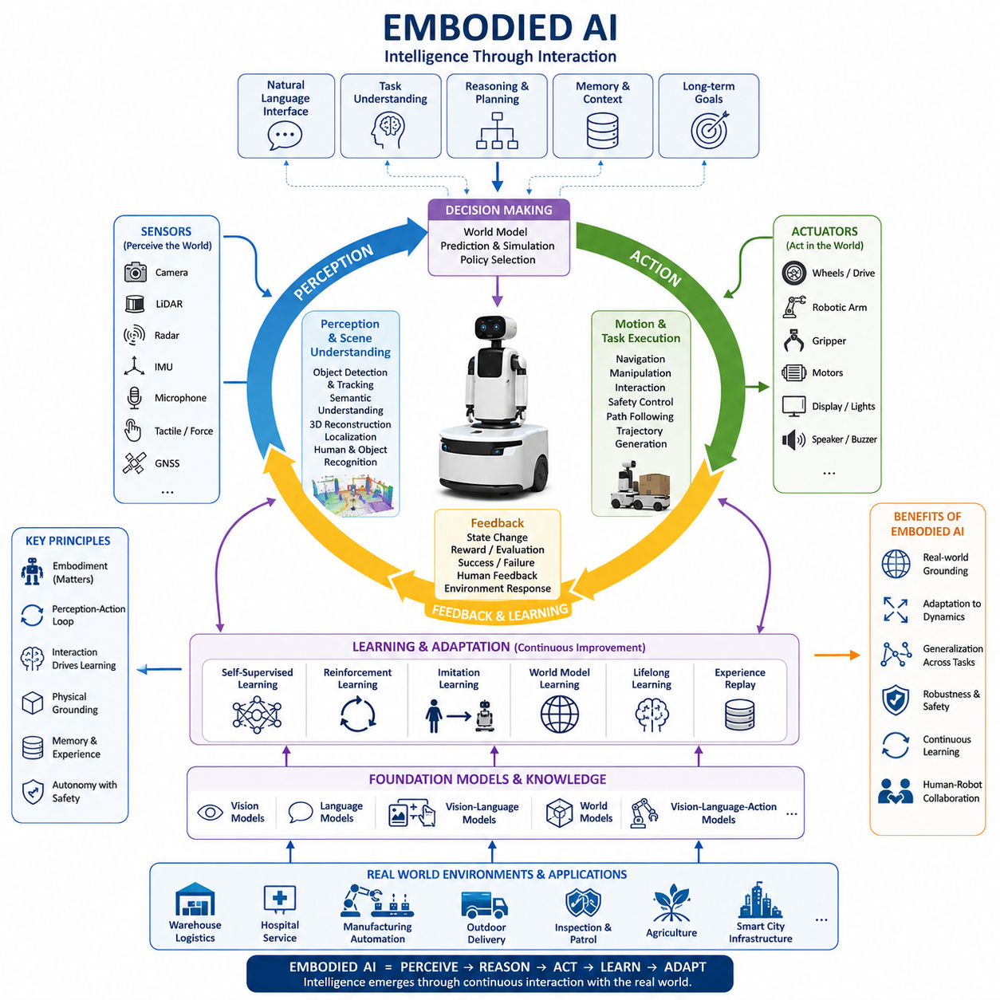
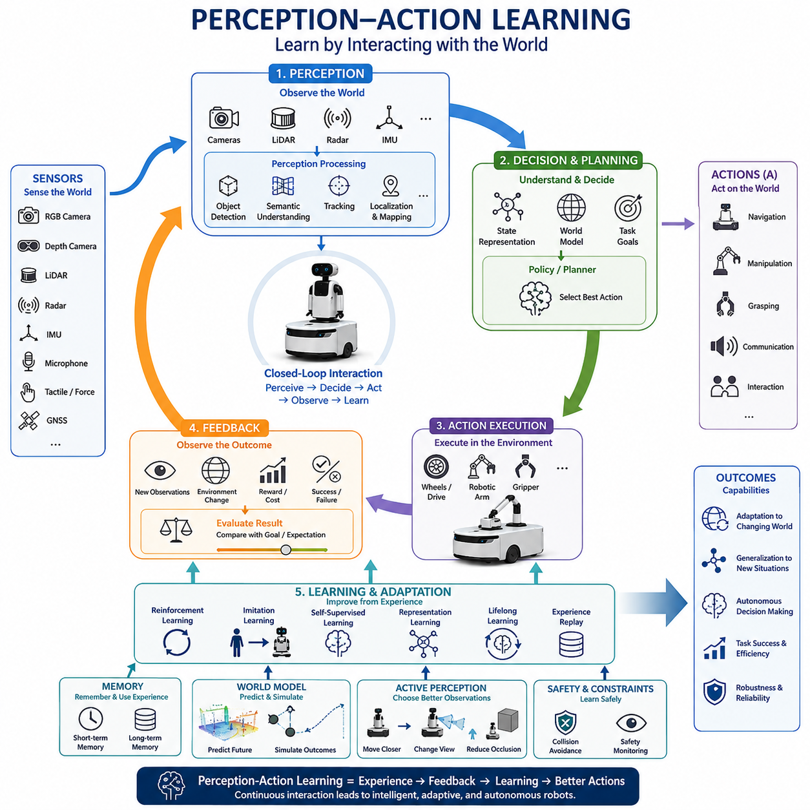
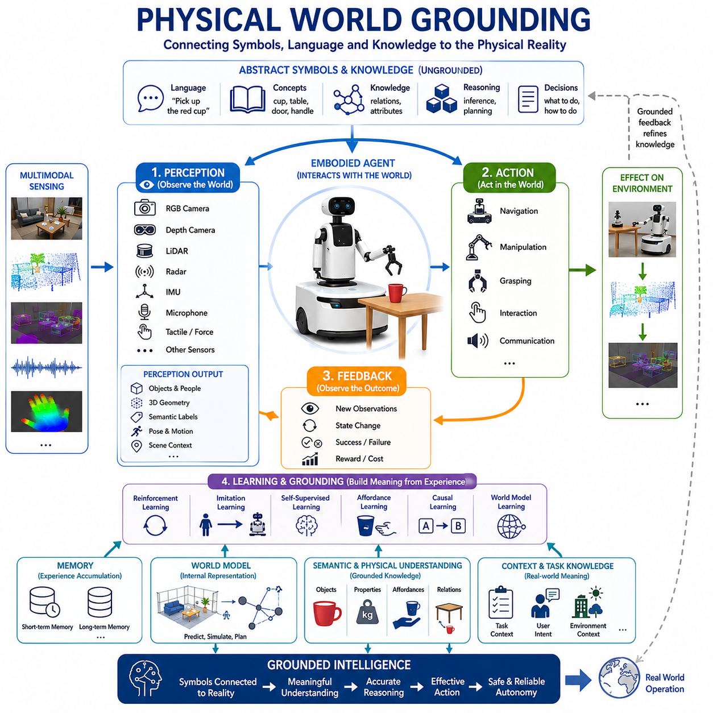
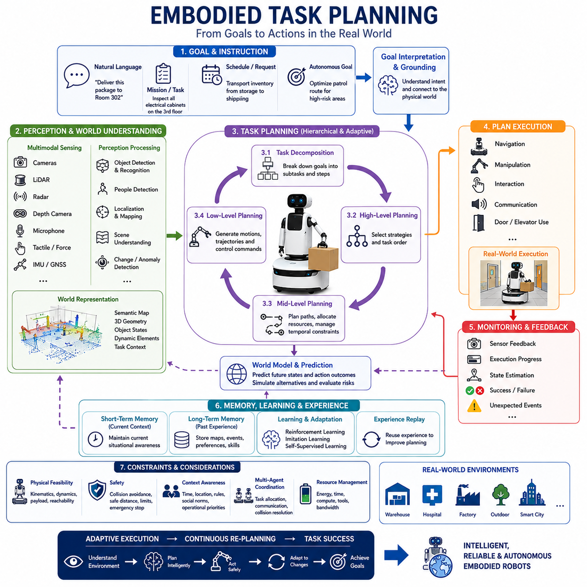
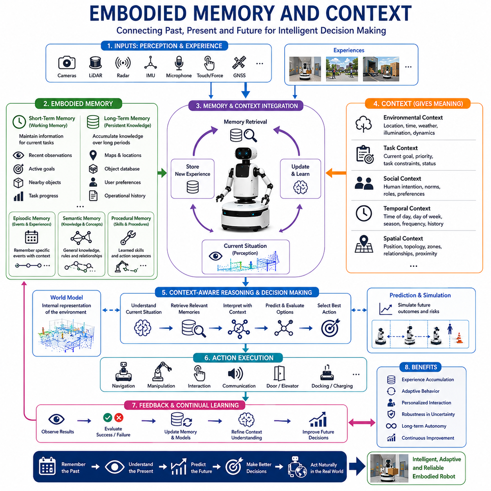
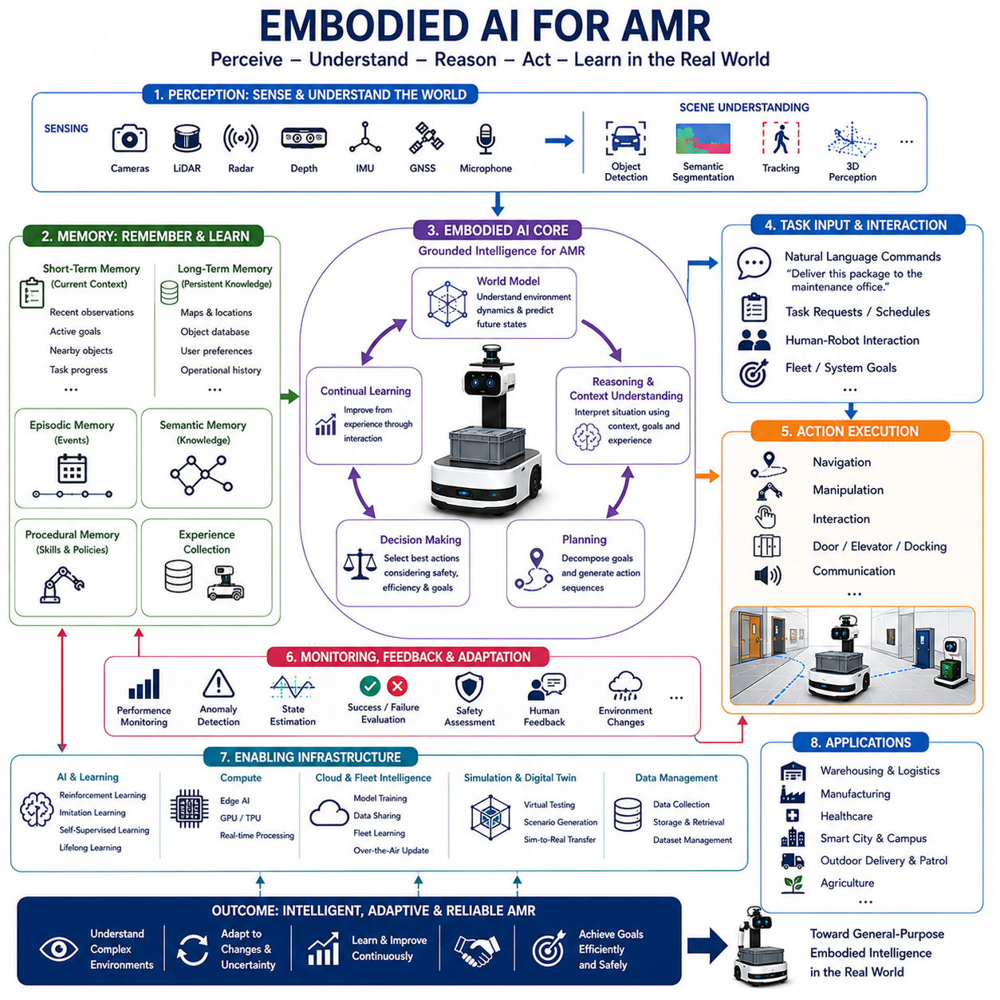
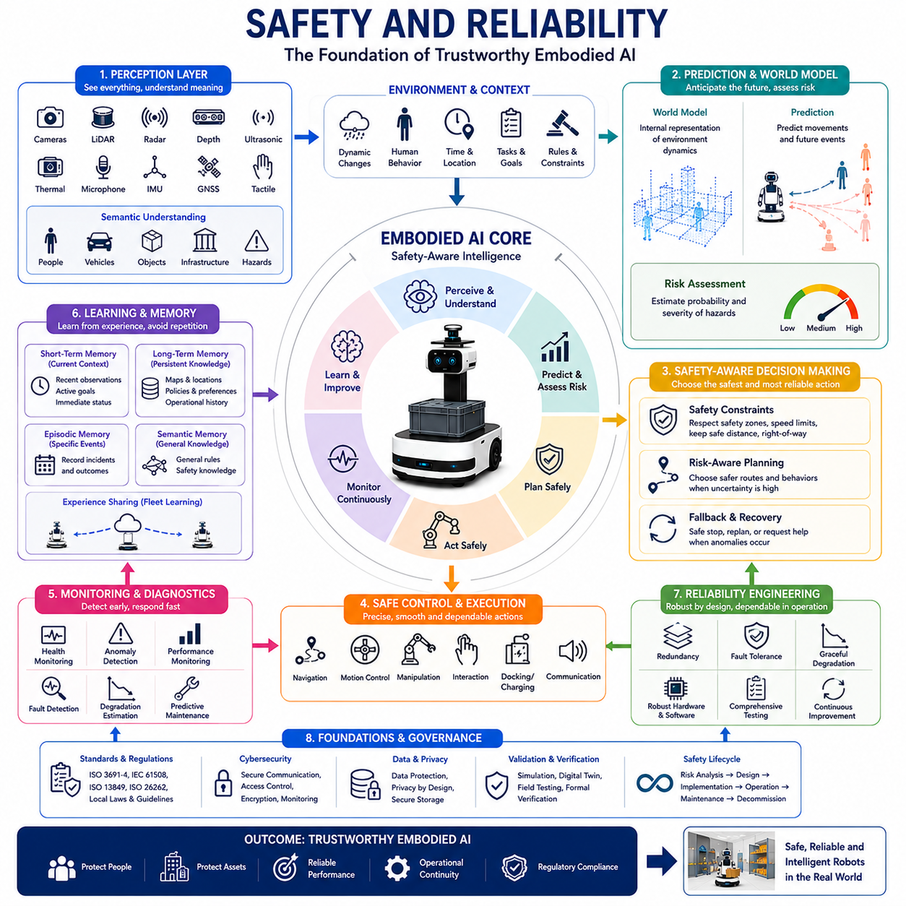
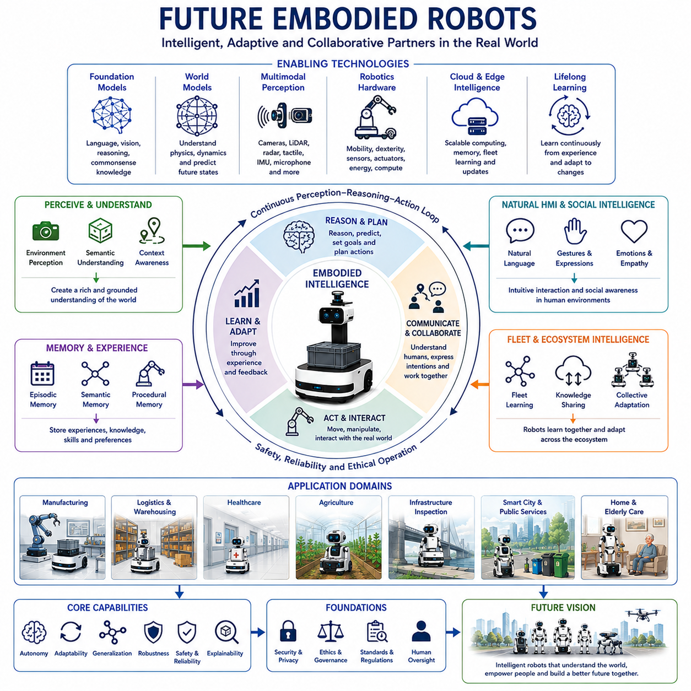

**Volume 06. AMR AI and Embodied Intelligence**

# Chapter 15. Embodied AI

## 15.1 Embodied AI Definition

{width="7.268055555555556in" height="7.268055555555556in"}

# 15_01_Embodied AI 정의 (Embodied AI Definition)

Embodied AI(체화형 인공지능)는 물리적 또는 가상적인 몸체를 가진 상태에서 환경과 상호작용하며 학습하고, 추론하고, 행동하는 인공지능을 의미한다. 기존의 AI가 정적인 데이터나 디지털 정보 위에서 작동하는 것과 달리, Embodied AI는 세계를 인식하고 행동하며 그 결과를 관찰하는 과정을 반복함으로써 지능을 형성한다. 로봇공학 분야에서 Embodied AI는 인지, 학습, 계획, 제어, 물리적 실행을 하나의 통합된 시스템으로 결합하는 개념이며, 차세대 자율 로봇의 핵심 기반 기술로 평가받고 있다.

Embodied AI의 개념은 '체화된 인지(Embodied Cognition)' 이론에서 출발한다. 이 이론은 지능이 단순히 두뇌나 계산 과정에서만 발생하는 것이 아니라, 신체와 환경의 상호작용 속에서 형성된다고 설명한다. 인간은 책을 읽거나 설명을 듣는 것만으로 세상을 이해하지 않는다. 물체를 만지고, 공간을 이동하고, 도구를 사용하며, 사람과 상호작용하는 과정에서 지식을 획득한다. Embodied AI는 이러한 인간의 학습 방식을 기계에 적용하려는 시도라고 볼 수 있다.

기존의 인공지능은 이미지 분류, 자연어 처리, 추천 시스템, 데이터 분석과 같은 분야에서 뛰어난 성과를 거두었다. 그러나 실제 물리 세계는 불확실성, 센서 노이즈, 환경 변화, 예측 불가능한 사건들로 가득 차 있다. 창고, 병원, 공장, 도시, 농장과 같은 공간에서 작동하는 로봇은 끊임없이 변하는 상황에 대응해야 한다. Embodied AI는 이러한 문제를 해결하기 위해 지능을 단순한 계산 모델이 아니라 환경과의 지속적인 상호작용 과정으로 정의한다.

Embodied AI의 가장 중요한 특징은 인식(Perception)과 행동(Action)의 강한 결합이다. 로봇은 센서를 통해 환경을 관찰하고, 행동을 통해 환경을 변화시키며, 변화된 환경을 다시 관찰한다. 이러한 순환 구조 속에서 행동과 결과 사이의 인과관계를 학습하게 된다. 예를 들어 자율주행 로봇은 장애물을 인식하는 것뿐만 아니라 특정 조향 명령이 미래의 센서 관측에 어떤 영향을 미치는지 경험을 통해 학습한다. 로봇 팔 역시 물체를 잡고 이동시키는 과정에서 힘, 마찰, 무게 중심과 같은 물리적 특성을 이해하게 된다.

일반적인 Embodied AI 시스템은 센서, 액추에이터, 학습 모델, 메모리, 계획 모듈, 의사결정 엔진으로 구성된다. 카메라, LiDAR, Radar, 마이크, 촉각 센서, IMU, GNSS와 같은 센서는 환경 정보를 수집한다. 모터, 휠, 로봇 팔, 그리퍼 등의 액추에이터는 환경에 물리적인 영향을 가한다. 인공지능 모델은 이러한 정보를 해석하여 적절한 행동을 결정한다. 이 전체 구조가 하나의 폐루프(Closed Loop)를 형성하며 Embodied Intelligence의 기반이 된다.

Embodied AI와 기존 AI를 구분하는 핵심 요소 중 하나는 'Grounding'이다. 전통적인 AI는 단어와 기호를 처리하지만, 그 의미가 실제 물리 세계와 직접 연결되지 않을 수 있다. 반면 Embodied AI는 물리적 경험을 통해 개념을 학습한다. 예를 들어 '의자'라는 개념을 학습할 때 단순히 이미지 패턴만 인식하는 것이 아니라, 의자가 공간을 차지하는 방식, 사람이 사용하는 방식, 접촉 시 발생하는 물리적 변화 등을 함께 이해한다. 이러한 물리적 기반의 학습은 보다 깊고 견고한 지식을 형성하게 한다.

물리적 Grounding은 상식(Common Sense)의 형성에도 중요한 역할을 한다. 인간은 중력, 마찰, 균형, 가림 현상, 공간 관계와 같은 개념을 별도의 교육 없이 경험을 통해 자연스럽게 이해한다. Embodied AI 역시 반복적인 상호작용을 통해 유사한 이해를 획득할 수 있다. 로봇은 물체를 다루는 경험을 통해 무거운 물체는 더 큰 힘이 필요하고, 지지되지 않은 물체는 떨어지며, 깨지기 쉬운 물체는 조심스럽게 다뤄야 한다는 사실을 학습할 수 있다.

최근 Embodied AI의 발전은 Foundation Model, Large Language Model(LLM), Vision-Language Model(VLM), World Model, Reinforcement Learning(RL), Imitation Learning(IL), Self-Supervised Learning(SSL)의 발전과 밀접하게 연결되어 있다. Foundation Model은 광범위한 일반화 능력을 제공하고, LLM은 추론과 계획 능력을 지원한다. VLM은 시각 정보와 언어를 연결하며, World Model은 미래 상태를 예측할 수 있는 내부 환경 모델을 제공한다. 강화학습은 시행착오를 통한 최적화를 가능하게 하고, 모방학습은 인간의 행동을 학습하는 메커니즘을 제공한다.

특히 Vision-Language-Action(VLA) 모델은 Embodied AI 발전의 중요한 전환점으로 평가받는다. 기존의 VLM이 장면을 이해하고 설명하는 데 초점을 맞추었다면, VLA는 실제 행동까지 생성할 수 있다. 즉, 로봇은 장면을 인식하고, 사용자의 명령을 이해하며, 목표를 추론하고, 최종적으로 물리적 행동을 수행할 수 있게 된다. 이는 로봇을 단순한 정보 처리 시스템에서 실제 작업 수행 주체로 발전시키는 핵심 기술이다.

Embodied AI에서 World Model은 매우 중요한 역할을 한다. World Model은 로봇이 환경의 구조와 동작 원리를 내부적으로 표현하는 모델이다. 이를 통해 로봇은 미래를 예측하고, 위험을 사전에 분석하며, 다양한 행동 시나리오를 시뮬레이션할 수 있다. 예를 들어 배송 로봇은 보행자의 이동 경로를 예측하고 차량의 움직임을 추정하여 보다 안전한 주행 경로를 선택할 수 있다.

메모리 역시 Embodied Intelligence의 핵심 요소이다. 단순 반응형 시스템은 현재 관측만을 기반으로 행동하지만, Embodied AI는 과거 경험을 기억하고 활용한다. 로봇은 위치, 객체, 사용자 선호도, 환경 변화, 이전 작업 기록 등을 기억함으로써 더 정교한 의사결정을 수행할 수 있다. 단기 메모리는 현재 작업의 문맥을 유지하고, 장기 메모리는 지속적인 학습과 적응을 가능하게 한다.

Embodied AI에서 학습은 단순한 지도학습을 넘어선다. 실제 환경은 학습 데이터셋으로 완벽하게 표현될 수 없기 때문에 로봇은 운영 과정에서도 지속적으로 학습해야 한다. 자기지도학습은 로봇이 스스로 학습 신호를 생성하도록 하며, 강화학습은 보상 기반 최적화를 수행한다. 평생학습(Lifelong Learning)은 재학습 없이 새로운 환경에 적응할 수 있도록 지원한다. 이러한 능력은 장기간 운영되는 자율 로봇에서 매우 중요하다.

AMR(Autonomous Mobile Robot) 분야에서 Embodied AI는 큰 변화를 가져오고 있다. 기존 AMR은 지도 기반 주행과 규칙 기반 의사결정에 크게 의존하였다. 이러한 방식은 구조화된 환경에서는 효과적이지만, 복잡하고 변화가 많은 환경에서는 한계를 가진다. Embodied AI는 상황 이해, 의미 기반 추론, 적응형 의사결정, 자연어 인터페이스를 제공함으로써 보다 높은 수준의 자율성을 구현한다. 로봇은 단순히 정해진 경로를 따라 이동하는 것이 아니라 환경을 이해하고 상황에 맞게 행동할 수 있게 된다.

창고에서는 재고 배치를 이해하고 작업자와 협업하며 물류 흐름을 최적화할 수 있다. 병원에서는 의료진과 자연스럽게 상호작용하며 약품이나 물품을 전달할 수 있다. 실외 환경에서는 날씨, 지형, 교통 상황을 고려하면서 순찰, 검사, 운송 업무를 수행할 수 있다. 이러한 다양한 응용 분야는 모두 동일한 Embodied Intelligence 프레임워크 위에서 구현될 수 있다.

그러나 Embodied AI의 구현은 많은 기술적 도전을 수반한다. 물리 세계는 디지털 세계보다 훨씬 복잡하다. 센서는 항상 노이즈를 포함하고 있으며, 액추에이터는 오차와 마모가 발생한다. 환경은 예측 불가능하게 변화한다. 또한 로봇의 행동은 사람과 시설에 직접적인 영향을 미치므로 높은 수준의 안전성과 신뢰성이 요구된다. 따라서 Embodied AI는 단순한 정확도뿐만 아니라 강건성(Robustness), 신뢰성(Reliability), 설명 가능성(Explainability), 장애 복구 능력(Fault Recovery)을 함께 고려해야 한다.

시뮬레이션은 Embodied AI 개발에서 핵심적인 역할을 수행한다. 최신 시뮬레이터는 실제와 유사한 가상 환경을 제공하여 로봇이 대규모 경험을 축적할 수 있도록 지원한다. 디지털 트윈 기술은 실제 로봇과 가상 모델을 연결하여 지속적인 학습과 검증을 가능하게 한다. 이를 통해 비용과 위험을 줄이면서 학습 속도를 높일 수 있다. 그러나 시뮬레이션에서 학습한 모델을 실제 환경으로 이전하는 Sim-to-Real 문제는 여전히 중요한 연구 과제로 남아 있다.

최근 대규모 로봇 데이터셋의 등장 역시 Embodied AI 발전을 가속화하고 있다. 수많은 로봇의 주행 기록, 조작 데이터, 멀티모달 센서 데이터가 축적되면서 범용 로봇 Foundation Model의 개발이 가능해지고 있다. 이는 인터넷 규모 데이터가 LLM의 발전을 촉진한 것과 유사한 흐름이라고 볼 수 있다.

Embodied AI는 AGI(Artificial General Intelligence)와도 밀접한 관련이 있다. 많은 연구자들은 진정한 범용 지능이 실세계 경험 없이 구현되기 어렵다고 주장한다. 언어 모델은 강력한 추론 능력을 보유할 수 있지만 실제 물리적 경험은 부족하다. Embodied AI는 지능을 물리 세계에 연결함으로써 상식, 인과 추론, 적응적 행동을 가능하게 하는 중요한 단계로 여겨진다.

미래의 Embodied AI 시스템은 멀티모달 인식, 대규모 World Model, 자율 계획, 평생학습, 물리적 상호작용 능력을 하나의 통합된 구조 안에 포함하게 될 것이다. 이러한 시스템은 가정, 공장, 병원, 물류센터, 도시 인프라, 교통 시스템 등 다양한 공간에서 인간과 협력하며 작동하게 된다. 또한 개별 로봇을 넘어 로봇 플릿(Fleet) 전체가 경험을 공유하고 집단적으로 학습하는 방향으로 발전할 가능성이 높다.

결론적으로 Embodied AI는 단순히 로봇 위에서 실행되는 AI 모델이 아니라, 인식·행동·학습·기억·추론·환경 상호작용이 하나의 통합 시스템으로 동작하는 새로운 지능 패러다임이다. 이는 로봇을 규칙 기반 자동화 기계에서 스스로 이해하고 적응하며 학습하는 자율 지능체로 진화시키는 핵심 기술이며, 향후 수십 년간 로봇공학과 인공지능 발전을 이끄는 중심 개념이 될 것으로 전망된다.

## 15.2 Perception-Action Learning

{width="7.268055555555556in" height="7.268055555555556in"}

# 15_02 지각-행동 학습 (Perception-Action Learning)

지각-행동 학습(Perception-Action Learning)은 Embodied AI와 지능형 로봇공학의 가장 핵심적인 개념 중 하나이다. 이는 자율 에이전트가 환경을 지속적으로 인식하고, 행동을 수행하며, 그 행동의 결과를 관찰하고, 경험을 통해 미래의 행동을 개선해 나가는 학습 과정을 의미한다. 정적인 데이터셋을 기반으로 학습하고 동작하는 전통적인 인공지능과 달리, 지각-행동 학습은 지능이 환경과의 상호작용 과정에서 형성된다고 본다. 즉, 지능은 단순히 정보를 처리하는 능력이 아니라 세상에 영향을 주고 그 결과를 학습하는 능력에서 나온다. 이러한 원리는 Embodied Intelligence의 핵심 기반이며, 적응형 자율 로봇을 구현하는 근본적인 메커니즘이다.

이 개념은 생물학적 지능에서 영감을 얻었다. 인간과 동물은 단순히 관찰만으로 학습하지 않는다. 직접 움직이고, 만지고, 조작하고, 실패하고, 다시 시도하는 과정을 통해 세상을 이해한다. 어린아이는 물체를 잡고 떨어뜨리고 이동시키는 과정을 통해 무게와 형태를 학습한다. 걷는 능력은 수많은 균형 조절과 반복적인 움직임을 통해 습득된다. 사회적 행동 역시 타인의 반응을 관찰하고 자신의 행동을 조정하는 과정에서 발전한다. Perception-Action Learning은 이러한 자연적 학습 방식을 로봇 시스템에 적용하려는 접근법이다.

지각-행동 학습은 기본적으로 폐루프(Closed Loop) 구조를 가진다. 로봇은 먼저 센서를 통해 환경을 인식한다. 인식 시스템은 객체, 사람, 장애물, 지형, 환경 상태 등에 대한 정보를 추출한다. 이후 의사결정 시스템은 현재 상황에 적합한 행동을 선택한다. 선택된 행동은 모터, 바퀴, 로봇 팔, 그리퍼와 같은 액추에이터를 통해 실행된다. 행동이 완료되면 환경은 변화하고 새로운 센서 데이터가 생성된다. 로봇은 이 결과를 평가하고 다음 행동에 반영한다. 이러한 순환 구조가 지속적으로 반복되면서 지능이 발전하게 된다.

로봇에서 지각(Perception)은 외부 세계에 대한 정보를 획득하는 과정이다. 현대 자율주행 로봇은 RGB 카메라, Depth Camera, LiDAR, Radar, 초음파 센서, IMU, GNSS, 힘 센서, 촉각 센서, 마이크 등 다양한 센서를 사용한다. 각 센서는 서로 다른 유형의 정보를 제공한다. 카메라는 시각 정보를 제공하고, LiDAR는 3차원 공간 구조를 측정하며, Radar는 악천후 환경에서도 안정적인 감지가 가능하다. 촉각 센서는 물리적 접촉을 감지하고, IMU는 자세와 운동 상태를 측정한다. 이러한 다양한 센서 정보는 하나의 통합된 환경 모델로 융합된다.

지각은 단순히 데이터를 수집하는 것을 의미하지 않는다. 객체 검출, 의미론적 분할, 객체 추적, 장면 이해, 위치 추정, 지도 생성, 상황 인식 등의 과정을 통해 환경에 대한 구조화된 이해를 생성한다. 예를 들어 물류창고 로봇은 단순히 카메라 영상을 보는 것이 아니라 선반, 작업자, 팔레트, 통로, 이동 경로를 인식하고 이를 바탕으로 작업 환경을 이해한다. 이러한 환경 이해가 이후 행동 결정의 기반이 된다.

행동(Action)은 로봇이 환경에 영향을 미치는 수단이다. 행동은 이동, 조작, 운반, 검사, 통신, 협업, 탐색 등 다양한 형태로 나타날 수 있다. 행동의 결과는 환경을 변화시키며, 변화된 환경은 새로운 관측 정보를 생성한다. 이 점이 단순 관찰 기반 AI와 Embodied AI를 구분하는 중요한 특징이다. 지능형 로봇은 세상을 관찰하는 데 그치지 않고, 적극적으로 탐색하고 상호작용하며 경험을 축적한다.

지각-행동 학습의 중요한 특징 중 하나는 능동적 지각(Active Perception)이다. 전통적인 인식 시스템은 센서 데이터를 수동적으로 받아들이는 방식이었다. 그러나 능동적 지각에서는 행동 자체가 더 나은 인식을 가능하게 한다. 로봇은 물체를 더 잘 보기 위해 가까이 이동할 수 있고, 카메라 각도를 조정하여 가려진 부분을 확인할 수 있으며, 특정 위치로 이동하여 위치 추정 정확도를 향상시킬 수 있다. 즉, 행동이 인식 능력을 향상시키고, 향상된 인식이 다시 더 나은 행동을 가능하게 하는 선순환 구조가 형성된다.

학습은 이러한 지각과 행동의 상호작용 속에서 발생한다. 로봇은 행동의 결과를 목표와 비교하여 성공 여부를 평가한다. 성공적인 행동은 강화되고 실패한 행동은 수정된다. 반복적인 경험을 통해 로봇은 특정 상황에서 어떤 행동이 가장 효과적인지 학습하게 된다. 결국 환경 상태와 행동 사이의 최적 정책(Policy)이 형성된다.

강화학습(Reinforcement Learning)은 Perception-Action Learning을 구현하는 대표적인 방법론이다. 강화학습에서 에이전트는 환경 상태를 관찰하고 행동을 선택하며 보상을 받는다. 이후 새로운 상태로 전이되고 다시 행동을 선택한다. 이러한 반복 과정 속에서 누적 보상을 최대화하는 정책을 학습한다. 자율주행, 드론 제어, 로봇 팔 조작, 물류 로봇 경로 최적화 등 다양한 분야에서 활용되고 있다.

모방학습(Imitation Learning)은 또 다른 중요한 접근법이다. 강화학습이 시행착오 기반 학습이라면, 모방학습은 인간 전문가의 행동을 관찰하여 학습한다. 로봇은 인간이 특정 상황에서 어떤 행동을 수행하는지 관찰하고 이를 학습 데이터로 활용한다. 이를 통해 학습 시간을 크게 단축할 수 있으며, 위험한 환경에서도 안전하게 학습할 수 있다. 최근에는 모방학습과 강화학습을 결합하여 초기 학습 속도와 장기 성능을 동시에 향상시키는 방식이 널리 사용되고 있다.

자기지도학습(Self-Supervised Learning)은 지각-행동 학습을 더욱 확장한다. 로봇은 외부의 정답 데이터 없이 스스로 학습 신호를 생성한다. 예를 들어 로봇 팔이 물체를 집으려 시도하고 성공 또는 실패 여부를 스스로 판단하면서 학습할 수 있다. 환경 자체가 학습 데이터의 생성자가 되는 것이다. 이러한 접근은 대규모 데이터 구축 비용을 줄이고 지속적인 현장 학습을 가능하게 한다.

지각-행동 학습에서 중요한 문제 중 하나는 상태 표현(State Representation)이다. 센서 데이터는 매우 고차원적이며 복잡하다. 카메라 영상, LiDAR 포인트 클라우드, IMU 데이터, 레이더 데이터 등을 그대로 사용할 경우 계산 비용이 매우 높다. 따라서 로봇은 의사결정에 필요한 핵심 정보만을 추출하여 효율적인 내부 표현으로 변환해야 한다. 최근 딥러닝과 Representation Learning 기술의 발전은 이러한 상태 표현 학습 능력을 크게 향상시켰다.

World Model은 고도화된 Perception-Action Learning의 핵심 요소이다. World Model은 환경의 동작 원리를 내부적으로 표현하는 예측 모델이다. 로봇은 행동을 수행하기 전에 미래 결과를 시뮬레이션할 수 있다. 예를 들어 자율주행 로봇은 보행자의 이동 방향을 예측하고, 차량의 움직임을 추정하며, 다양한 경로의 위험도를 평가할 수 있다. 이를 통해 단순 반응형 시스템보다 훨씬 높은 수준의 계획 능력을 확보할 수 있다.

시간적 이해(Temporal Understanding) 역시 중요한 요소이다. 많은 행동의 결과는 즉시 나타나지 않는다. 현재의 상황은 과거 행동의 결과일 수 있으며, 현재 행동은 미래에 영향을 미친다. 따라서 로봇은 시간에 따른 상태 변화를 이해해야 한다. 단기 메모리는 현재 작업의 문맥을 유지하고, 장기 메모리는 장기간 축적된 경험을 저장한다. 이러한 기억 체계는 보다 정교한 의사결정을 가능하게 한다.

자율주행 로봇에서 Perception-Action Learning은 특히 중요하다. 전통적인 규칙 기반 내비게이션은 예상된 상황에서는 잘 동작하지만 새로운 상황에 적응하기 어렵다. 반면 지각-행동 학습 기반 로봇은 경험을 통해 환경에 적응할 수 있다. 병원 로봇은 시간대별 사람의 이동 패턴을 학습할 수 있으며, 실외 배송 로봇은 날씨 변화에 따른 주행 특성을 학습할 수 있다. 물류 로봇은 창고 내 교통 흐름을 학습하여 최적 경로를 선택할 수 있다.

로봇 조작 분야에서도 큰 장점을 제공한다. 물체 조작은 위치, 무게, 마찰, 형상 등의 미세한 차이에 크게 영향을 받는다. Perception-Action Learning은 반복적인 경험을 통해 이러한 복잡한 상호작용을 학습할 수 있게 한다. 물체 집기, 분류, 조립, 포장, 공구 사용과 같은 작업은 지속적인 학습을 통해 성능이 향상된다.

인간-로봇 상호작용(HRI) 역시 지각-행동 학습의 중요한 응용 분야이다. 인간 행동은 예측하기 어렵고 상황에 따라 달라진다. 로봇은 사람의 반응을 관찰하고 자신의 행동을 조정하면서 점차 더 자연스럽게 상호작용할 수 있게 된다. 서비스 로봇, 의료 로봇, 교육 로봇, 안내 로봇 등에서 이러한 적응 능력은 매우 중요하다.

최근 등장한 Vision-Language-Action(VLA) 모델은 지각-행동 학습을 새로운 수준으로 발전시키고 있다. 이러한 모델은 시각 정보, 언어 이해, 추론, 행동 생성을 하나의 통합 구조 안에서 수행한다. 로봇은 장면을 관찰하고, 자연어 명령을 이해하며, 목표를 추론한 후 적절한 행동을 생성할 수 있다. 이는 범용 로봇 지능 구현을 위한 중요한 단계로 평가받고 있다.

실제 환경에서 Perception-Action Learning을 적용하는 것은 여전히 어려운 과제이다. 센서 노이즈, 통신 지연, 환경 변화, 예기치 못한 장애물, 안전 요구사항 등 수많은 문제가 존재한다. 따라서 강건한 학습 알고리즘, 실시간 모니터링, 안전 제어, 비상 복구 메커니즘이 반드시 함께 설계되어야 한다.

시뮬레이션은 이러한 문제를 해결하는 중요한 도구이다. 고품질 시뮬레이터는 실제 환경과 유사한 가상 환경을 제공하여 대규모 학습을 가능하게 한다. 디지털 트윈은 실제 로봇과 가상 모델을 연결하여 지속적인 개선을 지원한다. 이를 통해 위험 없이 경험을 축적할 수 있으며 학습 비용도 크게 절감할 수 있다. 다만 시뮬레이션과 실제 환경의 차이를 극복하는 Sim-to-Real 문제는 여전히 중요한 연구 분야이다.

미래의 Perception-Action Learning은 Embodied AI 발전과 함께 더욱 고도화될 것으로 예상된다. Foundation Model은 대규모 로봇 데이터를 활용하여 범용 지식을 제공할 것이며, World Model은 더욱 정확한 미래 예측을 수행하게 될 것이다. 메모리 시스템은 평생학습을 지원하고, VLA 아키텍처는 인식·추론·계획·행동을 하나의 통합 프레임워크로 결합하게 될 것이다.

결국 Perception-Action Learning은 Embodied Intelligence가 형성되는 가장 근본적인 메커니즘이다. 지능은 단순한 정보 처리 능력이 아니라 세상과 상호작용하며 학습하는 능력이다. 로봇은 환경을 인식하고, 행동하고, 결과를 관찰하며, 경험을 축적함으로써 점차 더 높은 수준의 자율성과 적응성을 획득하게 된다. 이러한 지각-행동 순환 구조는 미래 지능형 로봇의 핵심 원리가 될 것이며, 범용 자율 로봇 실현을 위한 가장 중요한 기술적 토대가 될 것이다.

## 15.3 Physical World Grounding

{width="7.268055555555556in" height="7.268055555555556in"}

# 15_03 물리 세계 그라운딩 (Physical World Grounding)

물리 세계 그라운딩(Physical World Grounding)은 Embodied AI의 가장 핵심적인 개념 중 하나로, 인공지능 시스템이 내부적으로 사용하는 개념, 기호, 언어, 지식 표현, 의사결정 과정을 실제 물리 세계와 연결하는 과정을 의미한다. 전통적인 인공지능은 숫자, 기호, 텍스트 토큰과 같은 추상적인 표현을 기반으로 동작한다. 이러한 표현은 언어 처리나 데이터 분석과 같은 분야에서는 매우 효과적이지만, 그 자체만으로는 해당 기호가 실제 세계에서 무엇을 의미하는지 이해하지 못한다. Physical World Grounding은 로봇이 감각 정보와 물리적 경험을 통해 이러한 추상적 표현을 현실 세계와 연결하도록 함으로써 진정한 의미의 이해를 가능하게 한다.

그라운딩 문제(Grounding Problem)는 오랫동안 인공지능 분야의 핵심 과제로 여겨져 왔다. 예를 들어 언어 모델은 "컵(Cup)", "테이블(Table)", "잡다(Grasp)"와 같은 단어들 사이의 통계적 관계를 학습할 수 있다. 하지만 실제 컵이 무엇인지, 어떻게 생겼는지, 어떤 기능을 하는지, 손으로 잡으면 어떤 감촉이 느껴지는지에 대해서는 알지 못한다. 반면 인간은 컵을 보고, 만지고, 들어 올리고, 물을 마시고, 떨어뜨리는 경험을 통해 컵의 의미를 이해한다. 즉, 의미는 단순한 기호에서 나오지 않고 경험으로부터 형성된다. Physical World Grounding은 이러한 인간의 학습 방식을 인공지능에 적용하려는 시도라고 볼 수 있다.

Embodied AI는 지능이 단순히 계산 과정에서 발생하는 것이 아니라 환경과의 지속적인 상호작용 속에서 형성된다고 가정한다. 따라서 지각(Perception)과 행동(Action)은 이해의 핵심 요소가 된다. 로봇은 단순히 물체를 인식하는 데 그치지 않는다. 해당 물체를 만지고, 이동시키고, 조작하면서 그것의 물리적 특성과 기능을 학습한다. 반복적인 경험을 통해 로봇은 외형뿐만 아니라 기능, 맥락, 인과관계, 사용 목적까지 이해하게 된다.

Physical World Grounding은 지각, 내부 표현, 행동의 상호작용을 통해 이루어진다. 지각은 환경에 대한 정보를 제공한다. 내부 표현은 이러한 정보를 구조화된 지식으로 변환한다. 행동은 그 지식이 실제로 맞는지 검증하고 새로운 정보를 획득하는 역할을 수행한다. 이 세 가지가 결합될 때 비로소 기호와 현실 사이의 연결이 형성된다. 그라운딩이 없는 상태에서는 기호는 단순한 데이터에 불과하지만, 그라운딩이 이루어지면 실제 세계를 설명하는 의미 있는 지식이 된다.

현대 로봇은 멀티모달 센서를 활용하여 물리 세계를 이해한다. 카메라는 시각 정보를 제공하고, LiDAR는 3차원 구조를 측정하며, Radar는 물체의 움직임과 거리 정보를 제공한다. 마이크는 음향 정보를 수집하고, 촉각 센서는 접촉 상태를 감지하며, 힘 센서는 물체와의 상호작용을 측정한다. 이러한 다양한 센서 정보는 서로 보완되면서 보다 풍부하고 정확한 환경 이해를 가능하게 한다.

시각적 그라운딩(Visual Grounding)은 가장 활발하게 연구되고 있는 분야 중 하나이다. 시각적 그라운딩은 언어와 시각 정보를 연결하는 능력을 의미한다. 예를 들어 로봇이 "파란 상자 옆의 빨간 박스를 집어라"라는 명령을 받았을 때, 언어 속의 개념을 실제 환경 속 객체와 연결해야 한다. 이를 위해서는 객체 인식, 공간 추론, 의미 이해, 상황 분석이 동시에 이루어져야 한다. 최근 Vision-Language Model(VLM)의 발전은 이러한 능력을 크게 향상시키고 있다.

그러나 진정한 Physical World Grounding은 시각 정보만으로는 완성되지 않는다. 실제 이해는 상호작용을 통해 이루어진다. 예를 들어 로봇이 의자를 본다고 해서 의자를 완전히 이해하는 것은 아니다. 의자의 무게, 안정성, 사용 목적, 사람이 앉는 방식, 이동 가능 여부 등을 경험해야 비로소 의자의 의미를 이해했다고 말할 수 있다. 문(Door) 역시 단순히 외형을 인식하는 것이 아니라 어떻게 열리는지, 어느 정도의 힘이 필요한지, 열렸을 때 공간 구조가 어떻게 변하는지를 학습해야 한다.

조작(Manipulation)은 Physical World Grounding의 중요한 수단이다. 로봇은 물체를 잡고, 밀고, 당기고, 들어 올리고, 회전시키는 과정을 통해 물체의 물리적 특성을 학습한다. 이 과정에서 마찰, 무게, 탄성, 강성, 형태, 구조적 특성에 대한 이해가 형성된다. 또한 물체가 제공하는 기능적 가능성도 학습하게 된다.

이러한 기능적 가능성을 어포던스(Affordance)라고 한다. 어포던스는 특정 물체가 어떤 행동을 가능하게 하는지를 의미한다. 손잡이는 당길 수 있고, 버튼은 누를 수 있으며, 상자는 물건을 담을 수 있다. Grounded AI는 물체를 단순히 "무엇인가"로 인식하는 것이 아니라 "무엇을 할 수 있는가"의 관점에서도 이해한다. 이는 실제 작업 수행 능력과 직접적으로 연결된다.

창고 로봇을 예로 들면, 단순히 팔레트와 선반을 인식하는 것만으로는 충분하지 않다. 팔레트가 운반 대상이라는 것, 선반이 저장 공간이라는 것, 특정 통로가 이동 경로라는 것까지 이해해야 한다. 이러한 기능적 이해는 실제 작업 경험을 통해 형성된다.

공간적 그라운딩(Spatial Grounding)도 매우 중요한 요소이다. 로봇은 위치, 거리, 방향, 접근 가능성, 공간 구조를 이해해야 한다. "안쪽", "바깥쪽", "뒤", "아래", "가까운", "먼"과 같은 개념은 모두 물리적 공간 관계에 기반한다. 이러한 공간적 이해는 자율주행, 물체 탐색, 지도 생성, 명령 해석의 핵심 기반이 된다.

시간적 그라운딩(Temporal Grounding)은 물리 세계의 변화 과정을 이해하는 능력이다. 실제 환경은 정적이지 않다. 사람은 이동하고, 차량은 움직이며, 날씨는 변하고, 장비는 노후화된다. 따라서 로봇은 현재 상태뿐만 아니라 시간에 따른 변화도 이해해야 한다. 배송 로봇은 보행자의 이동 경로를 예측해야 하며, 점검 로봇은 장비의 상태 변화 추세를 분석해야 한다. 시간적 이해는 예측과 계획의 핵심 요소이다.

인과적 그라운딩(Causal Grounding)은 가장 높은 수준의 물리적 이해를 의미한다. 인간은 행동이 결과를 만든다는 사실을 자연스럽게 이해한다. 문을 열면 통과할 수 있고, 물체를 밀면 이동하며, 스위치를 누르면 장비 상태가 변한다. Grounded Robot은 이러한 인과관계를 학습하여 단순한 상관관계가 아닌 원인과 결과를 이해하게 된다. 이러한 능력은 추론과 계획 수립의 핵심 기반이 된다.

World Model은 Physical World Grounding을 구현하는 핵심 기술 중 하나이다. World Model은 환경의 구조와 동작 원리를 내부적으로 표현하는 모델이다. 로봇은 관찰과 경험을 통해 World Model을 지속적으로 업데이트하며 미래 상황을 예측한다. 특정 행동을 수행하기 전에 예상 결과를 시뮬레이션할 수 있기 때문에 보다 안전하고 효율적인 의사결정이 가능해진다.

메모리 역시 매우 중요하다. 물리 세계에 대한 이해는 단일 경험만으로 형성되지 않는다. 반복적인 경험이 축적되면서 점차 정교한 지식이 형성된다. 단기 메모리는 현재 작업의 맥락을 유지하고, 장기 메모리는 환경, 객체, 사용자, 과거 작업 경험을 저장한다. 메모리는 개별 경험을 연결하여 일관된 세계 이해를 형성하는 역할을 수행한다.

대규모 언어 모델(LLM)은 광범위한 지식을 보유하고 있지만 실제 물리 경험은 부족하다. 따라서 현실과 맞지 않는 추론이나 환각(Hallucination)이 발생할 수 있다. Embodied AI는 이러한 문제를 해결하기 위해 LLM을 센서, World Model, 로봇 플랫폼과 결합한다. 이를 통해 언어 기반 추론이 실제 환경에 기반한 판단으로 연결될 수 있다.

Vision-Language-Action(VLA) 모델은 Grounded Intelligence를 구현하는 대표적인 기술이다. 이러한 모델은 시각 정보, 언어 이해, 추론, 행동 생성을 하나의 프레임워크 안에서 통합한다. 로봇은 장면을 관찰하고, 사용자의 명령을 이해하며, 환경 제약 조건을 고려한 후 실제 행동을 생성할 수 있다. Grounding은 이러한 행동이 현실적으로 가능하고 상황에 적합하도록 보장하는 역할을 한다.

자율주행 로봇에서 Physical World Grounding은 특히 중요하다. 기존의 규칙 기반 시스템은 예상된 상황에서는 효과적이지만 예상치 못한 상황에서는 한계를 보인다. Grounded Robot은 환경의 의미를 이해한다. 실외 순찰 로봇은 보행자, 차량, 공사 구역, 임시 장애물을 구분하고 각각의 의미를 해석할 수 있다. 병원 로봇은 환자실, 응급실, 의료 장비의 중요도를 이해하고 행동을 조정할 수 있다.

산업용 로봇에서도 Grounding의 중요성은 점점 커지고 있다. 미래의 스마트 팩토리는 변화하는 생산 요구사항에 유연하게 대응해야 한다. Grounded Robot은 도구, 장비, 작업 공정의 역할을 이해하고 상황에 맞는 행동을 선택할 수 있다. 이는 기존의 고정된 자동화 시스템보다 훨씬 높은 유연성을 제공한다.

인간-로봇 상호작용(HRI) 역시 Grounding에 크게 의존한다. 인간은 물리 세계에 대한 공통된 이해를 전제로 대화한다. "문 옆에 상자를 놓아라" 또는 "테이블 위의 공구를 가져와라"와 같은 명령은 맥락적 해석이 필요하다. Grounded Robot은 이러한 언어를 실제 환경과 연결하여 자연스럽게 이해하고 실행할 수 있다.

강화학습, 모방학습, 자기지도학습은 Grounded Intelligence를 형성하는 중요한 학습 방법이다. 강화학습은 행동과 결과의 관계를 학습하고, 모방학습은 인간의 행동을 학습하며, 자기지도학습은 로봇 스스로 경험을 통해 지식을 축적하도록 한다. 이들은 모두 Physical World Grounding의 핵심 메커니즘으로 활용된다.

시뮬레이션은 Grounding 연구에 매우 유용한 도구이다. 고품질 시뮬레이터는 대규모 경험 수집과 안전한 실험을 가능하게 한다. 디지털 트윈은 실제 환경과 가상 환경을 연결하여 학습 속도를 향상시킨다. 그러나 궁극적인 Grounding은 실제 환경에서의 경험을 통해서만 완성될 수 있다. 실제 센서, 실제 물리 법칙, 실제 운영 환경과의 상호작용이 필수적이다.

Physical World Grounding의 가장 큰 도전 과제 중 하나는 일반화(Generalization)이다. 실제 세계는 매우 다양하고 복잡하다. 조명 조건이 바뀌고, 객체의 형태가 달라지며, 사람들의 행동도 상황마다 다르다. Grounded Intelligence는 이러한 다양한 환경에서도 의미를 유지하면서 동시에 새로운 상황에 적응할 수 있어야 한다.

안전성 역시 Grounding과 밀접하게 관련되어 있다. 현실을 제대로 이해하지 못하는 로봇은 위험한 행동을 수행할 수 있다. 반대로 Grounded Robot은 환경의 위험 요소를 인식하고, 물리적 제약을 이해하며, 안전한 행동을 선택할 수 있다. 따라서 Grounding은 안전한 자율 시스템 구현을 위한 필수 요소라고 할 수 있다.

미래에는 대규모 Embodied Foundation Model이 등장하면서 Physical World Grounding이 더욱 발전할 것으로 예상된다. 이러한 모델은 인식, 기억, World Model, 언어 이해, 추론, 행동 생성을 하나의 통합 아키텍처로 결합하게 될 것이다. 로봇은 단순히 객체를 인식하는 수준을 넘어 환경을 이해하고, 결과를 예측하며, 지속적으로 학습하고, 스스로 적응하는 수준의 지능을 갖추게 될 것이다.

결국 Physical World Grounding은 디지털 지능을 실제 세계와 연결하는 다리와 같은 역할을 한다. 이는 추상적인 기호를 의미 있는 개념으로 바꾸고, 단순한 관찰을 실행 가능한 지식으로 전환하며, 계산 기반 AI를 실제 행동이 가능한 Embodied Intelligence로 발전시키는 핵심 원리이다. 앞으로의 자율 로봇과 Embodied AI 시스템에서 Physical World Grounding은 가장 중요한 기반 기술 중 하나로 자리 잡게 될 것이다.

## 15.4 Embodied Task Planning

{width="7.268055555555556in" height="7.268055555555556in"}

# 15_04 체화형 작업 계획 (Embodied Task Planning)

Embodied Task Planning(체화형 작업 계획)은 체화형 지능 에이전트가 목표, 의도, 고수준 명령을 실제 실행 가능한 행동 시퀀스로 변환하는 과정이다. 이 과정에서 로봇은 물리적 환경, 센서 정보, 환경 제약 조건, 실제 세계의 결과를 지속적으로 고려한다. 전통적인 작업 계획(Task Planning)이 주로 기호적(Symbolic) 또는 가상 환경에서 수행되는 반면, Embodied Task Planning은 물리 세계에 기반하며 인식, 추론, 예측, 행동 생성, 환경 피드백을 하나의 통합된 의사결정 프레임워크 안에서 수행한다. 이는 Embodied AI의 핵심 능력 중 하나로, 로봇이 단순한 사전 정의 스크립트를 넘어 실제 환경에서 목표 지향적이고 적응적인 행동을 수행할 수 있도록 한다.

전통적인 로봇 계획 시스템은 환경에 대한 완전한 정보를 알고 있다는 가정하에 동작하는 경우가 많다. 이러한 시스템은 고정된 지도, 사전 정의된 절차, 결정론적 행동 순서를 기반으로 계획을 생성한다. 공장 자동화와 같은 구조화된 환경에서는 매우 효과적일 수 있지만, 실제 세계는 항상 변화하고 예측 불가능하다. 사람의 이동, 물체의 위치 변화, 날씨 변화, 장비 고장, 작업 우선순위 변경 등이 지속적으로 발생한다. Embodied Task Planning은 이러한 변화에 대응하기 위해 현재 환경을 이해하고, 계획을 지속적으로 수정하며, 새로운 정보에 따라 행동을 조정할 수 있도록 설계된다.

체화형 작업 계획의 출발점은 인식(Perception)과 계획(Planning)의 통합이다. 로봇은 환경을 이해하지 못한 상태에서는 효과적인 계획을 세울 수 없다. 카메라, LiDAR, Radar, Depth Camera, 촉각 센서, 마이크, GNSS, IMU 등의 센서는 환경에 대한 정보를 지속적으로 제공한다. 인식 모듈은 이러한 데이터를 활용하여 객체를 식별하고, 사람을 인식하며, 위치를 추정하고, 장면을 이해하며, 환경 변화를 감지한다. 충분한 환경 이해가 이루어진 후에야 비로소 의미 있는 계획 수립이 가능해진다.

Embodied Task Planning과 전통적인 계획의 가장 큰 차이점 중 하나는 불확실성(Uncertainty)을 다루는 방식이다. 고전적인 계획 알고리즘은 환경이 알려져 있고 예측 가능하다고 가정한다. 그러나 실제 환경에서는 센서 노이즈, 불완전한 정보, 동적 장애물, 예측 불가능한 사건이 항상 존재한다. 따라서 체화형 계획은 한 번 계산하고 끝나는 과정이 아니라 지속적으로 갱신되는 과정이다. 로봇은 현재 가정을 검증하고, 환경 변화를 감지하며, 필요할 경우 계획을 수정한다.

Embodied Task Planning은 일반적으로 목표 해석(Goal Interpretation) 단계에서 시작된다. 목표는 인간의 명령, 임무 지시, 운영 계획, 작업 요청 또는 로봇 스스로의 판단에 의해 생성될 수 있다. 예를 들어 사용자가 "302호실로 이 물품을 배송하라"고 지시할 수 있다. 점검 로봇은 "3층의 모든 전기 제어반을 검사하라"는 임무를 받을 수 있으며, 물류 로봇은 "창고에서 출하 구역까지 자재를 이동하라"는 목표를 부여받을 수 있다. 이러한 목표는 대부분 추상적이며 고수준의 형태로 제공된다. 로봇은 이를 실제 행동 수준의 세부 계획으로 변환해야 한다.

목표 해석 과정에는 자연어 이해가 포함되는 경우가 많다. 최근 Embodied AI 시스템은 LLM과 VLM을 활용하여 인간의 자연어 명령을 이해한다. 하지만 자연어는 모호성을 포함한다. 예를 들어 "기계 옆에 있는 공구 상자를 가져와라"라는 명령을 수행하기 위해서는 어떤 기계를 의미하는지, 공구 상자가 어디에 있는지, 공간 관계가 무엇인지를 이해해야 한다. 이를 위해 언어 개념과 실제 환경 정보를 연결하는 Grounding 과정이 필요하다.

작업 분해(Task Decomposition)는 Embodied Task Planning의 핵심 기능이다. 복잡한 목표는 일반적으로 하나의 행동으로 수행될 수 없다. 따라서 목표는 여러 개의 하위 작업(Subtask)으로 분해된다. 예를 들어 물품 배송 작업은 물품 탐색, 물품 집기, 목적지까지 이동, 장애물 회피, 엘리베이터 이용, 목적지 확인, 물품 전달 등의 세부 단계로 구성될 수 있다. 이러한 분해 과정을 통해 복잡한 작업을 관리 가능한 수준으로 나눌 수 있다.

이를 위해 계층적 계획(Hierarchical Planning) 구조가 널리 사용된다. 상위 계획기는 전체 목표와 전략을 결정한다. 중간 계층은 작업 순서와 자원 배분을 관리한다. 하위 계층은 실제 경로 생성, 궤적 계획, 제어 명령 생성을 담당한다. 이러한 구조를 통해 로봇은 여러 수준의 추상화 계층에서 동시에 의사결정을 수행할 수 있다.

World Model은 Embodied Task Planning에서 매우 중요한 역할을 수행한다. World Model은 환경의 구조, 객체 관계, 동적 요소, 작업 맥락, 미래 상태 예측 등을 포함하는 내부 표현이다. 계획기는 이 모델을 활용하여 다양한 행동 시나리오를 평가하고 실행 전에 결과를 예측한다. 즉, 로봇은 단순히 현재 상황에 반응하는 것이 아니라 미래를 시뮬레이션하고 최적의 행동을 선택할 수 있다.

예측(Prediction)은 계획 수립에서 핵심적인 기능이다. 효과적인 계획을 위해서는 환경이 앞으로 어떻게 변할지를 예상해야 한다. 보행자는 이동 방향을 바꿀 수 있고, 차량은 교차로에 진입할 수 있으며, 특정 출입문은 잠길 수 있다. 실외 환경에서는 날씨 변화가 주행 성능에 영향을 줄 수 있다. 이러한 미래 변화를 예측함으로써 로봇은 문제를 사전에 회피하고 보다 안정적인 계획을 수립할 수 있다.

Embodied Task Planning은 단순한 경로 계획(Path Planning)과는 다르다. 전통적인 경로 계획은 두 지점 사이의 최단 경로를 찾는 데 집중한다. 반면 Embodied Planner는 안전성, 에너지 소비, 작업 우선순위, 사회적 규범, 운영 정책 등을 함께 고려한다. 따라서 최단 경로가 아니라 가장 적절한 경로를 선택할 수 있다.

이러한 이유로 맥락 인식(Context Awareness)이 매우 중요하다. 동일한 작업이라도 환경에 따라 최적의 계획은 달라질 수 있다. 병원 배송 로봇은 야간에 환자를 방해하지 않는 조용한 경로를 선택해야 한다. 순찰 로봇은 위험도가 높은 지역을 우선적으로 점검할 수 있다. 물류 로봇은 실시간 교통 흐름에 따라 이동 경로를 변경할 수 있다. 맥락은 단순 경로 생성 문제를 지능형 의사결정 문제로 확장시킨다.

메모리 역시 계획의 효율성을 크게 향상시킨다. 로봇은 환경과의 반복적인 상호작용을 통해 경험을 축적한다. 이전에 발견했던 장애물 위치, 작업 흐름, 장비 위치, 사용자 선호도 등을 기억함으로써 보다 효율적인 계획을 생성할 수 있다. 장기 메모리는 누적된 경험을 저장하고, 단기 메모리는 현재 작업의 상황 정보를 유지한다.

최근에는 학습 기반 접근법이 계획 시스템에 적극적으로 도입되고 있다. 기존 계획기는 규칙과 최적화 알고리즘에 크게 의존했다. 반면 Embodied AI는 강화학습, 모방학습, 자기지도학습 등을 통해 계획 전략 자체를 학습한다. 강화학습은 경험을 통해 최적 정책을 찾고, 모방학습은 인간 전문가의 행동을 학습하며, 자기지도학습은 현장 경험을 통해 지속적으로 성능을 향상시킨다.

LLM은 작업 계획 분야에 새로운 가능성을 제공하고 있다. LLM은 상식 추론, 절차적 지식, 작업 분해 능력을 보유하고 있기 때문에 고수준 계획기로 활용될 수 있다. 하지만 언어 모델만으로는 물리적 제약을 충분히 고려할 수 없다. 따라서 Embodied Task Planning은 LLM의 추론 능력과 실제 환경 정보를 결합하여 현실적으로 실행 가능한 계획을 생성한다.

Vision-Language-Action(VLA) 모델은 이를 더욱 발전시킨 형태이다. VLA는 시각 정보, 언어 이해, 추론, 행동 생성을 하나의 통합 구조 안에서 수행한다. 로봇은 장면을 관찰하고, 사용자의 명령을 이해하며, 환경을 고려한 행동을 직접 생성할 수 있다. 이는 범용 Embodied Intelligence로 가는 중요한 단계로 평가된다.

Embodied Task Planning의 핵심 요구사항 중 하나는 물리적 실행 가능성(Physical Feasibility)이다. 아무리 논리적으로 완벽한 계획이라도 로봇의 신체 구조와 능력으로 실행할 수 없다면 의미가 없다. 이동 로봇은 지형 조건, 배터리 용량, 차량 크기, 주행 가능성을 고려해야 한다. 로봇 팔은 도달 가능 범위, 하중 한계, 충돌 가능성, 관절 제약 조건 등을 고려해야 한다. 따라서 계획기는 항상 물리적 현실성과 논리적 타당성을 동시에 검토해야 한다.

안전성은 Embodied Task Planning에 깊이 통합되어 있다. 로봇은 사람, 차량, 장비와 함께 작업하는 경우가 많다. 따라서 충돌 회피, 속도 제한, 비상 정지, 안전 거리 유지, 접근 금지 구역 관리 등이 계획 과정에 포함된다. 안전은 별도의 기능이 아니라 모든 계획 과정에 내재된 기본 요소이다.

인간-로봇 상호작용(HRI)은 계획을 더욱 복잡하게 만든다. 인간의 행동은 예측하기 어렵고, 의도는 상황에 따라 변할 수 있다. 따라서 로봇은 인간의 행동과 사회적 규범을 고려해야 한다. 사람을 따라가는 로봇, 협업 작업 로봇, 서비스 로봇 등은 물리적 환경뿐만 아니라 사회적 환경까지 이해하는 계획 능력이 필요하다.

다중 로봇 환경(Multi-Agent Environment)에서는 계획의 복잡성이 더욱 증가한다. 미래의 로봇은 단독으로 동작하기보다 여러 대가 협력하는 형태가 될 가능성이 높다. 여러 로봇이 작업을 분담하고, 정보를 공유하며, 공동 목표를 수행해야 한다. 이를 위해서는 작업 할당, 충돌 방지, 통신, 동기화, 협력 계획 기능이 필요하다.

시뮬레이션은 Embodied Task Planning 개발에 매우 중요한 역할을 한다. 고정밀 시뮬레이터를 활용하면 다양한 계획 전략을 안전하게 실험할 수 있다. 디지털 트윈은 실제 운영 데이터를 반영하여 계획 성능을 지속적으로 개선할 수 있도록 지원한다. 이를 통해 개발 비용을 절감하고 안전성을 높일 수 있다.

최근에는 지속적 계획(Continual Planning)이라는 개념이 중요해지고 있다. 기존 계획은 시작 시점에 생성되어 완료 시까지 유지되는 경우가 많았다. 반면 Embodied AI에서는 계획이 지속적으로 갱신된다. 환경 변화와 작업 진행 상황을 반영하여 계획을 실시간으로 수정함으로써 더욱 강건한 운영이 가능해진다.

물류, 의료, 제조, 인프라 점검, 농업, 스마트시티 등 다양한 분야에서 Embodied Task Planning의 중요성은 점점 커지고 있다. 창고에서는 물류 흐름 최적화가 필요하며, 병원에서는 의료진과 협력하면서 물품을 전달해야 한다. 산업 시설에서는 설비 점검과 이상 대응이 필요하다. 이러한 모든 응용 분야에서 체화형 작업 계획은 핵심 역할을 수행한다.

미래의 Embodied Task Planning은 World Model, 메모리 시스템, 멀티모달 인식, 언어 이해, 평생학습과 더욱 긴밀하게 통합될 것으로 예상된다. 미래의 로봇은 단순히 정해진 절차를 실행하는 것이 아니라 목표를 이해하고, 결과를 예측하며, 경험을 통해 학습하고, 스스로 전략을 수정하는 능력을 갖추게 될 것이다.

결국 Embodied Task Planning은 지능과 행동을 연결하는 핵심 다리 역할을 한다. 이는 추상적인 목표를 실제 물리적 행동으로 변환하는 과정이며, 인식, 추론, 예측, 학습, 실행을 하나의 통합 프레임워크 안에서 수행한다. 환경과의 지속적인 상호작용을 통해 로봇은 불확실한 상황에서도 적응하고 복잡한 목표를 달성할 수 있게 된다. 앞으로 자율 로봇이 더욱 보편화될수록 Embodied Task Planning은 특수 목적 자동화 시스템을 진정한 지능형 자율 시스템으로 발전시키는 핵심 기술로 자리 잡게 될 것이다.

## 15.5 Embodied Memory and Context

{width="7.268055555555556in" height="7.268055555555556in"}

# 15_05 체화형 기억과 컨텍스트 (Embodied Memory and Context)

Embodied Memory and Context(체화형 기억과 컨텍스트)는 Embodied AI의 가장 중요한 구성 요소 중 하나로, 지능형 에이전트가 경험의 연속성을 유지하고, 현재 관측을 넘어선 상황을 이해하며, 축적된 경험을 기반으로 의사결정을 수행할 수 있도록 하는 핵심 메커니즘이다. 지각(Perception)이 현재 환경에 대한 정보를 제공하고, 계획(Planning)이 미래 행동을 결정한다면, 기억(Memory)과 컨텍스트(Context)는 과거 경험, 현재 상황, 미래 목표를 연결하는 인지적 기반을 제공한다. 기억과 컨텍스트가 없는 로봇은 단순 반응형 시스템에 불과하며, 현재 센서 입력에만 반응할 뿐 과거로부터 배우거나 장기적인 목표를 이해하지 못한다. 진정한 Embodied Intelligence는 지각과 행동뿐만 아니라 기억하고, 해석하고, 상황을 활용하는 능력에서 비롯된다.

인간의 지능은 기억과 컨텍스트의 중요성을 잘 보여준다. 인간은 현재 보이는 정보만으로 판단하지 않는다. 과거 경험, 학습된 지식, 환경에 대한 이해, 사회적 규범, 미래 목표를 모두 고려하여 행동한다. 예를 들어 익숙한 건물에 들어가면 사람은 즉시 내부 구조를 떠올리고, 각 공간의 용도를 이해하며, 과거 경험을 바탕으로 앞으로 일어날 일을 예측할 수 있다. 이러한 맥락적 이해가 효율적인 의사결정과 적응적 행동을 가능하게 한다. Embodied AI 역시 이러한 능력을 로봇에 구현하고자 한다.

Embodied AI에서 기억은 일반적인 컴퓨터 메모리와는 다르다. 컴퓨터 메모리는 데이터를 저장하고 필요할 때 불러오는 역할을 수행한다. 반면 체화형 기억은 단순 저장소가 아니라 경험, 환경 지식, 작업 이력, 행동 패턴, 학습된 관계를 축적하는 동적인 지식 체계이다. 로봇은 환경과 상호작용하면서 지속적으로 기억을 업데이트하고, 이를 미래 행동에 활용한다.

체화형 기억은 크게 단기 기억(Short-Term Memory)과 장기 기억(Long-Term Memory)으로 구분된다. 단기 기억은 현재 수행 중인 작업과 직접 관련된 정보를 유지한다. 최근 관찰 결과, 작업 진행 상태, 주변 사람과 장애물의 위치, 현재 목표 등이 이에 해당한다. 예를 들어 병원 배송 로봇은 현재 복도에 있는 사람들의 위치, 방금 열린 문, 이동 목표, 최근 센서 정보를 단기적으로 기억한다. 이러한 정보는 즉각적인 의사결정에 중요하지만 작업이 종료되면 가치가 감소한다.

장기 기억은 오랜 기간 동안 축적되는 지식과 경험을 저장한다. 여기에는 지도 정보, 물체 위치, 사용자 선호도, 운영 이력, 환경 특성, 작업 절차, 학습된 행동 등이 포함된다. 장기 기억은 여러 번의 경험을 통해 축적되며, 로봇이 시간이 지남에 따라 더 효율적이고 지능적으로 행동할 수 있도록 지원한다. 예를 들어 수년간 운영된 물류 로봇은 특정 시간대의 교통 흐름, 장비 위치, 계절별 운영 특성, 자주 발생하는 장애 상황 등을 기억하게 된다.

에피소드 기억(Episodic Memory)은 체화형 지능에서 매우 중요한 장기 기억의 형태이다. 에피소드 기억은 특정 시점에 발생한 경험과 사건을 저장한다. 단순한 지식이 아니라 실제 상황과 맥락을 포함한 경험 자체를 기억하는 것이다. 예를 들어 특정 배송 임무, 특정 작업자와의 상호작용, 예상치 못한 환경 변화 등을 기억할 수 있다. 이러한 기억은 유사한 상황이 발생했을 때 중요한 참고 자료로 활용된다.

의미 기억(Semantic Memory)은 에피소드 기억과 상호 보완적인 역할을 수행한다. 에피소드 기억이 개별 경험을 저장한다면, 의미 기억은 경험으로부터 추출된 일반적인 지식과 개념을 저장한다. 예를 들어 "문은 통과를 가능하게 한다", "엘리베이터는 층을 이동할 수 있게 한다", "충전기는 배터리를 보충한다"와 같은 지식이 의미 기억에 해당한다. 이는 특정 사건에 종속되지 않는 일반적인 이해를 제공한다.

절차 기억(Procedural Memory)도 중요한 구성 요소이다. 절차 기억은 기술, 행동 패턴, 작업 절차를 저장한다. 인간이 걷기, 운전, 타이핑, 도구 사용을 몸으로 익히듯이 로봇도 주행 기술, 물체 조작 기술, 점검 절차, 상호작용 프로토콜 등을 절차 기억 형태로 저장할 수 있다. 한 번 학습된 기술은 반복적인 재계획 없이 효율적으로 실행될 수 있다.

컨텍스트(Context)는 기억과 관측에 의미를 부여하는 해석 프레임워크이다. 동일한 센서 데이터라도 상황에 따라 전혀 다른 의미를 가질 수 있다. 예를 들어 병원 복도에 사람이 서 있는 것은 정상적인 상황일 수 있지만, 제한 구역에서 사람이 감지된다면 이상 상황일 수 있다. 닫힌 문 역시 평상시에는 일반적인 상태이지만 특정 작업에서는 장애물이 될 수 있다. 컨텍스트는 단순 관측을 의미 있는 상황 이해로 전환한다.

환경 컨텍스트(Environmental Context)는 가장 기본적인 형태의 컨텍스트이다. 위치, 시간, 날씨, 운영 상태, 환경 변화 등이 포함된다. 실외 순찰 로봇은 낮과 밤을 다르게 해석해야 하며, 비나 눈이 오는 상황도 고려해야 한다. 환경 컨텍스트는 변화하는 조건에 적응하는 기반이 된다.

작업 컨텍스트(Task Context)는 현재 수행 중인 목표와 관련된 정보를 제공한다. 같은 환경이라도 수행 중인 작업에 따라 중요 정보가 달라진다. 예를 들어 창고에서 재고 조사 작업을 수행하는 로봇은 선반과 물품에 집중해야 하지만, 물품 운송 로봇은 이동 경로와 장애물에 집중해야 한다. 작업 컨텍스트는 인식, 계획, 행동 선택에 직접적인 영향을 준다.

사회적 컨텍스트(Social Context)는 인간과 상호작용하는 로봇에서 특히 중요하다. 여기에는 인간의 의도, 사회적 규범, 조직의 규칙, 의사소통 방식 등이 포함된다. 병원 서비스 로봇은 환자의 프라이버시, 의료진의 우선순위, 응급 상황 절차 등을 이해해야 한다. 이러한 이해는 단순한 물리적 관측만으로는 얻을 수 없으며 사회적 맥락에 대한 이해가 필요하다.

시간적 컨텍스트(Temporal Context)는 시간의 흐름에 따른 의미를 제공한다. 동일한 장면도 시간에 따라 다르게 해석될 수 있다. 예를 들어 교대 시간에 복도가 붐비는 것은 정상적인 현상이지만, 심야 시간에 같은 상황이 발생하면 이상 상황일 수 있다. 시간적 컨텍스트는 일정, 반복 패턴, 운영 주기 등을 이해하는 데 도움을 준다.

공간적 컨텍스트(Spatial Context) 역시 중요하다. 객체 간의 위치 관계, 공간 구조, 이동 경로, 기능 구역에 대한 이해를 포함한다. 예를 들어 유지보수 로봇은 공구가 일반적으로 작업장 근처에 있다는 것을 알고 있으며, 비상 장비가 출입구 근처에 배치된다는 사실도 이해할 수 있다. 이러한 공간적 이해는 탐색, 계획, 작업 수행을 더욱 효율적으로 만든다.

현대 Embodied AI는 기억 확장형(Memory-Augmented) 아키텍처를 활용하여 복잡한 컨텍스트를 관리한다. 기억 모듈은 지각 시스템, 계획 시스템, World Model, 언어 모델과 통합되어 작동한다. 이를 통해 로봇은 과거 경험을 검색하고, 지식을 업데이트하며, 장기간에 걸쳐 상황 인식을 유지할 수 있다.

World Model과 기억은 매우 밀접하게 연결되어 있다. World Model은 현재 환경에 대한 내부 표현을 제공하고, 기억은 과거 경험과 축적된 지식을 제공한다. 이 둘이 결합되면 로봇은 미래를 예측할 수 있다. 현재 관측과 과거 경험을 동시에 활용하여 앞으로 발생할 가능성이 높은 상황을 예상할 수 있기 때문이다. 이러한 능력은 반응형 행동이 아닌 선제적 행동(Proactive Behavior)을 가능하게 한다.

대규모 언어 모델(LLM)은 기억과 컨텍스트 관리에 대한 관심을 크게 증가시켰다. LLM은 컨텍스트 기반 추론 능력이 뛰어나지만, 제한된 컨텍스트 윈도우와 지속적인 기억 부재라는 한계를 가진다. Embodied AI는 외부 메모리 시스템을 활용하여 이러한 문제를 해결한다. 장기 기억과 언어 추론이 결합되면 훨씬 더 정교한 작업 수행이 가능해진다.

검색(Retrieval) 메커니즘은 체화형 기억 시스템에서 핵심적인 역할을 한다. 아무리 많은 정보를 저장하더라도 필요한 순간에 적절한 정보를 찾지 못하면 의미가 없다. 따라서 현대 시스템은 벡터 데이터베이스, 의미 기반 검색, 그래프 구조, 계층적 메모리 구조 등을 활용하여 필요한 경험과 지식을 빠르게 검색한다.

컨텍스트 기반 추론(Context-Aware Reasoning)은 지능형 로봇의 중요한 발전 방향이다. 고정된 규칙을 적용하는 대신 상황에 따라 행동을 조정한다. 예를 들어 배터리가 부족하면 에너지 효율을 우선시하고, 임무가 긴급하면 최단 경로를 선택할 수 있다. 이러한 유연성은 인간의 의사결정 방식과 더욱 유사한 행동을 가능하게 한다.

인간-로봇 상호작용(HRI) 역시 기억과 컨텍스트의 영향을 크게 받는다. 로봇이 사용자의 선호도, 과거 대화, 반복되는 작업을 기억한다면 더욱 개인화된 서비스를 제공할 수 있다. 또한 컨텍스트를 이해함으로써 모호한 명령도 보다 정확하게 해석할 수 있다.

장기 자율 운영(Long-Term Autonomous Operation)에서는 기억의 중요성이 더욱 커진다. 공장, 병원, 창고, 스마트시티, 농업, 인프라 점검 현장에서 운영되는 로봇은 수개월 또는 수년 동안 활동할 수 있다. 이 과정에서 방대한 경험 데이터가 축적된다. 기억 시스템은 이러한 데이터를 활용하여 반복적인 문제를 효율적으로 해결하고 운영 성능을 지속적으로 향상시킨다.

강화학습, 모방학습, 자기지도학습, 평생학습 역시 모두 기억에 의존한다. 과거 경험을 저장하고 재사용하는 메커니즘이 없다면 지속적인 학습은 불가능하다. 경험 재생(Experience Replay), 시연 데이터 저장소, 지식 저장소 등은 누적된 경험을 활용하여 지속적인 성능 향상을 지원한다.

Embodied Memory and Context의 가장 큰 기술적 과제 중 하나는 확장성(Scalability)이다. 로봇이 오랜 기간 운영되면 저장해야 할 데이터가 기하급수적으로 증가한다. 따라서 효율적인 저장, 압축, 요약, 검색, 망각(Forgetting) 메커니즘이 필요하다. 중요한 정보는 유지하고 불필요하거나 오래된 정보는 제거해야 한다.

또 다른 과제는 기억의 일관성과 신뢰성이다. 환경은 계속 변화한다. 지도는 오래될 수 있고, 물체 위치는 바뀔 수 있으며, 사용자 선호도도 달라질 수 있다. 따라서 기억은 지속적으로 업데이트되어야 하며, 오래된 정보가 잘못된 의사결정을 유발하지 않도록 관리되어야 한다.

프라이버시와 보안도 중요한 문제이다. 로봇은 환경 정보, 사용자 선호도, 행동 패턴과 같은 민감한 정보를 저장할 수 있다. 따라서 암호화, 접근 제어, 데이터 거버넌스, 개인정보 보호 기술이 반드시 필요하다.

미래의 Embodied Memory and Context는 평생학습(Lifelong Learning)과 더욱 긴밀하게 통합될 것으로 예상된다. 미래의 로봇은 평생 동안 경험을 축적하며 지속적으로 학습하는 존재가 될 것이다. 기억은 더욱 구조화되고 계층화되며, 멀티모달 형태로 발전할 것이다. 또한 World Model, Foundation Model, 추론 시스템과 긴밀하게 연결되어 보다 높은 수준의 지능을 구현하게 될 것이다.

결국 Embodied Memory and Context는 단순한 지각-행동 루프를 진정한 지능으로 발전시키는 핵심 요소이다. 기억과 컨텍스트는 로봇이 과거로부터 배우고, 현재를 이해하며, 미래를 예측할 수 있도록 해준다. 또한 상황에 맞는 적응적 행동, 개인화된 서비스, 장기적인 목표 달성을 가능하게 한다. 이러한 의미에서 기억과 컨텍스트는 Embodied AI의 인지적 기반(Cognitive Foundation)이라 할 수 있으며, 지각, 계획, 학습, 행동을 하나의 통합된 자율 지능 체계로 연결하는 핵심 역할을 수행한다.

## 15.6 Embodied AI for AMR

{width="7.268055555555556in" height="7.268055555555556in"}

# 15_06 AMR을 위한 체화형 인공지능 (Embodied AI for AMR)

AMR(Autonomous Mobile Robot)을 위한 Embodied AI는 로봇공학, 인공지능, 인지 시스템, World Model, 기억 시스템, 추론, 적응형 의사결정을 하나의 통합된 지능 플랫폼으로 결합하는 개념이다. 기존의 AMR은 주로 사전 구축된 지도, 규칙 기반 내비게이션 알고리즘, 결정론적 제어 시스템, 그리고 정형화된 운영 절차에 의존해 왔다. 이러한 방식은 공장이나 물류창고와 같은 구조화된 환경에서는 매우 효과적이지만, 예측 불가능한 상황, 환경 변화, 비정형 작업, 그리고 상황 이해가 필요한 환경에서는 한계를 보인다. Embodied AI는 로봇이 경험으로부터 학습하고, 주변 환경을 이해하며, 상황을 추론하고, 새로운 환경에 적응하며, 실제 세계와의 상호작용을 통해 지속적으로 발전할 수 있도록 한다. 이는 자율이동로봇의 미래를 결정짓는 가장 중요한 기술적 전환점 중 하나로 평가된다.

Embodied AI의 등장 배경은 인공지능이 단순한 데이터 처리에서 벗어나 물리 세계와 연결된 지능으로 진화하고 있다는 점에 있다. 전통적인 AI는 주로 텍스트, 이미지, 데이터와 같은 디지털 정보 공간에서 작동한다. 반면 AMR은 사람, 차량, 장애물, 날씨, 작업 환경 변화와 같은 수많은 불확실성이 존재하는 실제 물리 환경에서 운영된다. Embodied AI는 지각, 행동, 기억, 추론을 이러한 환경과 직접 연결함으로써 실제 세계를 이해하고 활용하는 지능을 구현한다.

AMR은 Embodied AI를 구현하기에 매우 적합한 플랫폼이다. 이동 능력 자체가 환경과의 지속적인 상호작용을 만들어내기 때문이다. 고정된 작업 공간에서 반복 작업을 수행하는 산업용 로봇과 달리, AMR은 끊임없이 주변 환경을 인식하고 해석하며 이동해야 한다. 이동 과정에서 새로운 정보가 생성되고, 모든 행동은 미래의 관측에 영향을 준다. 이러한 지각-행동 순환 구조가 체화형 지능의 기반이 된다.

Embodied AI 기반 AMR의 가장 중요한 특징 중 하나는 인식과 행동의 긴밀한 통합이다. 기존 시스템은 센싱, 계획, 제어가 비교적 독립적인 모듈로 구성되는 경우가 많았다. 반면 Embodied AI는 이들 사이의 연결을 더욱 강화한다. 로봇은 카메라, LiDAR, Radar, Depth Camera, GNSS, IMU, 마이크 등의 센서를 통해 지속적으로 환경을 관찰한다. 수집된 정보는 현재 작업 목표와 과거 경험을 바탕으로 해석된다. 행동은 단순히 목표를 달성하기 위한 수단이 아니라 추가 정보를 수집하고 불확실성을 줄이며 미래 의사결정을 개선하기 위한 과정으로 활용된다.

Embodied AMR의 지각은 단순한 장애물 감지를 넘어선다. 기존 로봇은 공간을 주로 점유 격자(Occupancy Grid)나 기하학적 구조로 표현했다. 그러나 Embodied AI는 의미론적(Semantic) 이해를 추가한다. 창고 로봇은 선반, 작업자, 적재 구역, 충전 스테이션, 안전 구역을 구분할 수 있다. 병원 로봇은 환자실, 간호 스테이션, 응급실, 엘리베이터, 의료 장비를 이해할 수 있다. 이러한 의미 기반 환경 이해는 훨씬 더 높은 수준의 자율성을 가능하게 한다.

장면 이해(Scene Understanding)는 Embodied AI의 핵심 능력 중 하나이다. 로봇은 단순히 무엇이 존재하는지를 아는 것이 아니라, 각각의 객체가 어떤 관계를 가지고 있는지 이해해야 한다. 예를 들어 창고에서 팔레트가 단순히 존재하는 것과 작업자가 현재 적재 작업을 수행 중인 팔레트를 인식하는 것은 전혀 다른 의미를 가진다. 상황적 의미를 이해함으로써 보다 지능적인 행동이 가능해진다.

Physical World Grounding은 AMR의 지능을 실제 세계에 연결하는 역할을 한다. 기존 AI는 추상적인 기호와 데이터만을 다루는 경우가 많다. 반면 Embodied AI는 개념을 실제 경험과 연결한다. 예를 들어 로봇은 문(Door)을 단순한 객체가 아니라 이동 경로를 연결하는 기능적 구조물로 이해한다. 복도는 단순한 공간이 아니라 사람과 로봇이 이동하는 교통 경로로 인식된다. 이러한 Grounding은 지식을 실제 행동과 연결해준다.

World Model은 Embodied AI 기반 AMR의 핵심 구성 요소이다. World Model은 환경의 구조와 동작 원리를 내부적으로 표현하는 모델이다. 로봇은 관찰과 경험을 통해 환경 모델을 지속적으로 업데이트하며 미래를 예측할 수 있다. 예를 들어 실외 배송 로봇은 보행자의 이동 방향을 예측하고, 차량의 진입 가능성을 계산하며, 날씨 변화가 주행에 미치는 영향을 고려할 수 있다. 이는 단순 반응형 시스템보다 훨씬 높은 수준의 자율성을 제공한다.

기억(Memory)은 Embodied AMR을 기존 로봇과 구분하는 또 하나의 핵심 요소이다. 기존 AMR은 현재 작업에 필요한 정보만을 유지하는 경우가 많았다. 반면 Embodied AI는 과거 경험을 장기간 축적하고 활용한다. 로봇은 환경 구조, 사용자 선호도, 이동 패턴, 장애 발생 이력, 작업 결과 등을 기억한다. 시간이 지날수록 이러한 경험이 축적되면서 로봇의 성능은 지속적으로 향상된다.

체화형 기억은 여러 계층으로 구성된다. 단기 기억은 현재 작업에 필요한 정보를 유지한다. 장기 기억은 지도, 환경 정보, 사용자 정보 등을 저장한다. 에피소드 기억은 특정 사건과 경험을 기록하며, 의미 기억은 일반적인 지식을 저장한다. 절차 기억은 학습된 행동 패턴과 작업 기술을 보관한다. 이러한 기억 체계는 로봇이 경험으로부터 학습하고 적응할 수 있게 만든다.

Embodied AI는 작업 계획(Task Planning)에도 큰 변화를 가져온다. 기존 로봇은 사전 정의된 절차를 따르는 경우가 많았다. 하지만 Embodied AI는 목표를 이해하고 상황에 맞게 계획을 수정할 수 있다. 예를 들어 물품 배송 중 예상치 못한 장애물이 발생하면 단순히 멈추는 것이 아니라 새로운 경로를 계획하고 목표를 달성하기 위한 대안을 찾을 수 있다. 계획은 더 이상 정적인 과정이 아니라 지속적으로 업데이트되는 동적 과정이 된다.

대규모 언어 모델(LLM)은 Embodied AMR에 새로운 가능성을 제공하고 있다. 사용자는 복잡한 명령 대신 자연어로 목표를 전달할 수 있다. 예를 들어 "정비실로 이 장비를 가져다줘" 또는 "서쪽 복도의 충전 스테이션을 모두 점검해줘"와 같은 명령을 사용할 수 있다. LLM은 이러한 명령을 해석하고 작업을 세부 단계로 분해하는 역할을 수행한다. 그러나 실제 실행은 반드시 물리 세계의 제약 조건과 연결되어야 한다.

Vision-Language Model(VLM)과 Vision-Language-Action(VLA) 모델은 Embodied AI를 더욱 발전시키고 있다. 이러한 모델은 시각 정보, 언어 이해, 추론, 행동 생성을 하나의 프레임워크 안에서 통합한다. 로봇은 장면을 관찰하고, 명령을 이해하며, 상황을 해석하고, 적절한 행동을 생성할 수 있다. 이는 범용 로봇 지능 구현을 위한 중요한 단계이다.

인간-로봇 상호작용(HRI) 역시 Embodied AI를 통해 크게 향상된다. 기존 AMR은 제한된 인터페이스를 통해서만 사람과 상호작용했다. Embodied AI는 인간의 의도, 제스처, 맥락을 이해할 수 있도록 한다. 병원에서는 긴급 배송을 우선 처리할 수 있고, 창고에서는 작업자의 이동을 고려하여 경로를 조정할 수 있다. 이러한 사회적 인지 능력은 안전성과 사용성을 동시에 향상시킨다.

실외 자율주행 로봇은 Embodied AI의 대표적인 응용 분야이다. 실외 환경은 지형 변화, 날씨 변화, 차량, 보행자, 공사 구역 등 수많은 변수로 구성된다. 기존 규칙 기반 시스템은 이러한 환경에 대응하는 데 한계를 가진다. Embodied AI는 환경을 이해하고 경험을 축적함으로써 점점 더 안정적이고 효율적으로 운영될 수 있다. 순찰 로봇, 배송 로봇, 인프라 점검 로봇, 농업 로봇, 스마트시티 서비스 로봇 등이 대표적인 예이다.

플릿(Fleet) 수준의 집단 지능 역시 중요한 발전 방향이다. 개별 로봇은 운영 과정에서 경험을 축적하지만, Embodied AI는 이러한 경험을 여러 로봇이 공유할 수 있도록 한다. 하나의 로봇이 학습한 환경 정보나 운영 노하우를 전체 플릿이 활용할 수 있다. 이를 통해 로봇 집단 전체의 지능 수준이 빠르게 향상된다.

클라우드 로보틱스와 엣지 컴퓨팅은 Embodied AMR의 핵심 인프라가 된다. 실시간 의사결정은 로컬에서 수행되지만, 클라우드는 대규모 메모리 저장, 플릿 학습, 모델 업데이트, 시뮬레이션 환경 제공 등을 담당한다. Edge와 Cloud를 결합한 하이브리드 구조는 미래 Embodied AI 아키텍처의 핵심이 될 것으로 예상된다.

강화학습, 모방학습, 자기지도학습, 평생학습은 Embodied AMR의 지속적인 발전을 가능하게 한다. 로봇은 경험을 통해 최적의 행동을 학습하고, 인간의 행동을 모방하며, 스스로 데이터를 생성하여 학습한다. 이러한 학습 메커니즘은 로봇을 고정 기능 장비에서 지속적으로 발전하는 지능형 시스템으로 변화시킨다.

시뮬레이션은 Embodied AI 개발에서 중요한 역할을 한다. 고정밀 시뮬레이터와 디지털 트윈은 대규모 경험을 안전하게 생성할 수 있게 해준다. 이를 통해 개발 비용을 줄이고 학습 속도를 높일 수 있다. 하지만 최종적으로는 실제 환경에서의 경험을 통해 검증되고 보완되어야 한다.

안전성은 Embodied AI에서 가장 중요한 요구사항 중 하나이다. AMR은 사람, 차량, 설비와 함께 운영된다. 따라서 위험 감지, 충돌 회피, 비상 정지, 위험 예측, 안전한 행동 생성이 반드시 포함되어야 한다. 자율성이 높아질수록 안전 메커니즘의 중요성도 더욱 커진다.

강건성(Robustness)과 신뢰성(Reliability) 역시 필수적이다. 실제 환경에서는 센서 고장, 통신 장애, 환경 변화, 예측 불가능한 상황이 발생한다. Embodied AI는 이러한 상황에서도 안정적으로 동작해야 하며, 실패 시에도 안전한 복구 전략을 수행할 수 있어야 한다.

Embodied AI는 물류, 병원, 제조, 스마트시티, 농업, 인프라 점검 등 거의 모든 산업에 큰 영향을 미칠 것으로 예상된다. 물류창고는 더욱 유연한 자동화를 구현할 수 있고, 병원은 상황을 이해하는 서비스 로봇을 활용할 수 있다. 제조업은 자율 점검과 물류 자동화를 고도화할 수 있으며, 스마트시티는 다양한 도시 서비스를 자율 로봇과 연계할 수 있다.

미래의 AMR은 Foundation Model, World Model, 멀티모달 인식, 장기 기억, 평생학습, 자연어 추론, 플릿 집단 지능을 하나의 통합된 구조 안에 포함하게 될 것이다. 이러한 로봇은 특정 작업만 수행하는 기계가 아니라, 환경을 이해하고 목표를 해석하며 결과를 예측하고 경험으로부터 학습하는 범용 지능 시스템으로 발전하게 된다.

결론적으로 Embodied AI for AMR은 지각, 기억, 세계 이해, 추론, 계획, 학습, 행동을 하나의 물리적으로 연결된 자율 시스템 안에서 통합하는 기술이다. 이는 기존의 정적인 자동화를 넘어, 상황을 이해하고 경험을 통해 발전하며 스스로 적응하는 자율 로봇을 구현하는 핵심 기술이다. 앞으로의 AMR은 단순히 명령을 수행하는 기계가 아니라, 환경을 이해하고 스스로 학습하는 지능형 파트너로 발전하게 될 것이며, Embodied AI는 그 중심에 위치하게 될 것이다.

## 15.7 Safety and Reliability

{width="7.268055555555556in" height="7.268055555555556in"}

# 15_07 안전성과 신뢰성 (Safety and Reliability)

안전성(Safety)과 신뢰성(Reliability)은 Embodied AI 시스템의 가장 중요한 기반 요소 중 하나이다. 지능, 자율성, 인식, 계획, 학습이 로봇이 무엇을 할 수 있는지를 결정한다면, 안전성과 신뢰성은 로봇이 그러한 기능을 실제 환경에서 지속적이고 믿을 수 있게 수행할 수 있는지를 결정한다. 로봇이 연구실과 같은 통제된 환경을 벗어나 공장, 병원, 물류창고, 공공시설, 스마트시티, 교통 인프라, 주거 환경 등으로 확장됨에 따라 실패의 결과는 훨씬 더 심각해지고 있다. 따라서 Embodied AI에서 안전성과 신뢰성은 부가 기능이 아니라 시스템 아키텍처 자체에 내재되어야 하는 핵심 요소이다.

전통적인 산업용 로봇은 주로 물리적 격리를 통해 안전성을 확보하였다. 로봇은 안전 펜스 안에서 동작하며 제한된 공간에서 반복적인 작업을 수행했다. 하지만 자율주행 로봇과 Embodied AI 시스템은 전혀 다른 환경에서 동작한다. 이들은 사람과 공간을 공유하고, 동적인 환경과 상호작용하며, 스스로 의사결정을 내리고, 학습을 통해 행동을 변화시킨다. 따라서 안전은 더 이상 울타리나 격리만으로 보장될 수 없다. 인식, 추론, 예측, 제어, 모니터링, 운영 정책이 결합된 종합적인 안전 체계가 필요하다.

신뢰성은 안전성과 밀접하게 관련되어 있지만 서로 다른 개념이다. 안전성은 사람, 장비, 시설, 환경에 피해를 주지 않는 것을 목표로 한다. 반면 신뢰성은 시스템이 의도된 기능을 지속적으로 수행할 수 있는 능력을 의미한다. 어떤 로봇이 매우 안전하지만 자주 멈추거나 작업을 완료하지 못한다면 신뢰성이 부족한 것이다. 반대로 생산성은 높지만 예측 불가능한 행동을 한다면 안전하지 않다. 따라서 Embodied AI는 안전성과 신뢰성을 동시에 만족해야 한다.

Embodied AI의 가장 큰 도전 중 하나는 불확실성(Uncertainty) 속에서 동작해야 한다는 점이다. 실제 환경에는 불완전한 정보, 센서 노이즈, 환경 변화, 예상치 못한 장애물, 통신 장애, 하드웨어 열화, 예측 불가능한 인간 행동이 존재한다. 안전성과 신뢰성은 이러한 불확실성을 고려한 상태에서 유지되어야 한다. 따라서 시스템은 항상 자신의 판단에 대한 신뢰도를 평가하고 위험도를 분석하며 상황에 따라 행동을 조정해야 한다.

안전성의 첫 번째 계층은 인식(Perception)이다. 로봇은 감지하지 못한 위험을 피할 수 없다. 현대의 Embodied AI 시스템은 RGB 카메라, Depth Camera, LiDAR, Radar, 초음파 센서, 열화상 카메라, 마이크, 힘 센서, 촉각 센서, GNSS, IMU 등 다양한 센서를 사용한다. 센서 중복성(Redundancy)은 안전성을 높이는 중요한 요소이다. 특정 센서가 고장 나더라도 다른 센서가 동일한 정보를 제공할 수 있어야 한다. 또한 센서 융합(Sensor Fusion)을 통해 보다 정확하고 강건한 환경 이해가 가능해진다.

환경 인식(Environmental Awareness)은 안전 운행의 핵심이다. 로봇은 사람, 차량, 장애물, 시설물, 위험 지역, 출입 제한 구역 등을 인식해야 한다. 그러나 단순한 감지만으로는 충분하지 않다. 각 객체의 의미를 이해해야 한다. 움직이는 보행자는 정지된 물체와 다르게 취급되어야 하며, 응급 장비는 일반 가구와 다르게 인식되어야 한다. 위험 물질은 특별한 절차에 따라 처리되어야 한다. 즉, 안전은 단순한 센싱이 아니라 의미 기반 이해(Semantic Understanding)에 기반해야 한다.

컨텍스트 인식(Context Awareness)은 안전성을 더욱 향상시킨다. 동일한 상황이라도 환경에 따라 다른 대응이 필요할 수 있다. 빈 창고에서 적절한 속도가 사람이 많은 병원 복도에서는 위험할 수 있다. 야간 점검 로봇과 주간 배송 로봇은 서로 다른 위험 요소를 가진다. 컨텍스트를 이해하는 시스템은 환경 조건, 작업 우선순위, 사람의 존재 여부 등을 고려하여 행동을 조정한다.

예측(Prediction)은 안전성 확보에 필수적인 능력이다. 많은 위험은 현재 상태가 아니라 미래에 발생할 가능성에서 비롯된다. 로봇은 보행자, 차량, 기계 설비 등의 움직임을 예측해야 한다. 이를 통해 충돌 가능성을 사전에 발견하고 예방 조치를 수행할 수 있다. 예를 들어 배송 로봇은 시야가 확보되지 않은 교차 구간에 접근할 때 보이지 않는 보행자가 나타날 가능성을 고려하여 속도를 줄일 수 있다.

World Model은 예측 기반 안전성의 핵심 요소이다. World Model은 환경의 구조, 동작 원리, 인과관계를 내부적으로 표현한다. 로봇은 이를 활용하여 미래 상황을 시뮬레이션하고 위험을 사전에 평가할 수 있다. 즉각적인 반응만 수행하는 것이 아니라 여러 행동 시나리오를 비교하여 가장 안전한 선택을 할 수 있게 된다.

Embodied AI의 의사결정 과정은 모든 계층에서 안전성을 고려해야 한다. 상위 계층은 임무와 작업 목표를 결정한다. 중간 계층은 자원 배분과 경로 계획을 수행한다. 하위 계층은 실제 제어 명령을 생성한다. 안전성은 이 모든 계층에 포함되어야 하며, 효율성이나 생산성이 안전을 희생하는 방향으로 작동해서는 안 된다.

위험 평가(Risk Assessment)는 Embodied Intelligence의 핵심 프로세스이다. 로봇은 행동을 수행하기 전에 잠재적 위험 요소를 분석하고, 발생 가능성과 결과의 심각성을 평가해야 한다. 위험 기반 계획(Risk-Aware Planning)은 불확실성이 높은 상황에서 보다 안전한 대안을 선택하도록 한다. 예를 들어 혼잡한 구역을 통과하는 대신 조금 더 먼 우회 경로를 선택할 수 있다. 목표는 단순한 작업 완료가 아니라 안전한 작업 완료이다.

인간 중심 안전성(Human-Centered Safety)은 Embodied AI에서 가장 중요한 요소 중 하나이다. 자율 로봇은 작업자, 환자, 방문객, 고객 등 다양한 사람들과 공간을 공유한다. 인간은 예측하기 어려운 존재이다. 갑자기 멈추거나, 방향을 바꾸거나, 제한 구역에 들어갈 수 있다. 따라서 안전 시스템은 예상과 다른 행동이 발생하더라도 항상 인간 보호를 최우선으로 고려해야 한다.

인간 인지형 내비게이션(Human-Aware Navigation)은 최근 중요한 연구 분야가 되고 있다. 사람을 단순한 이동 장애물로 취급하는 것이 아니라, 의도와 사회적 규범을 가진 존재로 이해하는 것이다. 적절한 거리 유지, 양보 행동, 부드러운 움직임, 의도 전달 등이 모두 안전성과 사용자 경험 향상에 기여한다.

설명 가능성(Explainability) 역시 안전성과 신뢰성을 높이는 중요한 요소이다. 자율성이 높아질수록 운영자는 왜 특정 결정이 내려졌는지 이해해야 한다. 설명 가능한 AI는 위험 평가, 계획 수립, 행동 선택 과정에 대한 투명성을 제공한다. 이를 통해 문제 발생 시 원인을 분석하고 시스템을 개선할 수 있다. 신뢰할 수 있는 자율성은 안전한 판단뿐만 아니라 이해 가능한 판단을 요구한다.

신뢰성은 강건한 시스템 아키텍처에 크게 의존한다. Embodied AI는 센서, 프로세서, 통신 네트워크, 소프트웨어 모듈, AI 모델, 액추에이터, 배터리, 클라우드 시스템으로 구성된다. 어느 하나의 구성 요소라도 실패할 수 있다. 따라서 신뢰성 있는 시스템은 중복 구조, 장애 감지, 성능 저하 상태 운영(Graceful Degradation), 복구 메커니즘을 포함해야 한다. 일부 기능이 실패하더라도 전체 시스템은 안전하게 운영되어야 한다.

장애 감지(Fault Detection)와 진단(Diagnostics)은 장기 운영에서 필수적이다. 로봇은 센서 상태, 하드웨어 건강 상태, 통신 품질, 계산 자원, 배터리 상태, 소프트웨어 무결성을 지속적으로 모니터링한다. 이상 징후는 심각한 장애로 발전하기 전에 탐지되어야 한다. 예지 정비(Predictive Maintenance)는 장비 열화를 조기에 발견하여 계획된 유지보수를 가능하게 한다.

학습(Learning)은 안전성과 신뢰성에 기회와 위험을 동시에 제공한다. 강화학습, 모방학습, 자기지도학습, 평생학습은 로봇의 성능을 향상시키지만, 학습된 정책이 예상치 못한 행동을 유발할 수도 있다. 특히 학습 데이터와 다른 환경에서는 위험이 발생할 수 있다. 따라서 안전 학습(Safe Learning)은 탐색과 적응의 자유를 제공하면서도 안전 경계를 유지해야 한다.

시뮬레이션은 안전성과 신뢰성 검증의 핵심 도구이다. 고정밀 시뮬레이터는 실제 환경에서 발생하기 어려운 위험 상황을 대규모로 생성할 수 있다. 수백만 번의 가상 실험을 통해 시스템의 대응 능력을 검증할 수 있다. 디지털 트윈은 실제 환경과 연계된 가상 모델을 제공하여 지속적인 검증과 개선을 가능하게 한다.

형식 검증(Formal Verification)은 또 다른 접근 방식이다. 알고리즘과 소프트웨어가 특정 안전 조건을 만족함을 수학적으로 증명하는 기법이다. Embodied AI 전체를 완벽하게 검증하는 것은 어렵지만, 중요한 안전 기능에 대해서는 강력한 신뢰성을 제공할 수 있다.

국제 표준과 규제 역시 중요성이 증가하고 있다. ISO 3691-4(산업용 모바일 로봇), IEC 61508(기능 안전)과 같은 표준은 위험 평가, 시스템 설계, 시험, 인증 절차를 정의한다. 이러한 표준 준수는 시장 신뢰성과 사업화 가능성을 높인다.

사이버보안(Cybersecurity)은 안전성과 신뢰성의 중요한 일부이다. 현대 로봇은 클라우드, 무선 통신, OTA 업데이트에 의존한다. 사이버 공격은 센서 데이터를 조작하거나 의사결정 시스템을 교란할 수 있다. 따라서 암호화, 인증, 접근 제어, 보안 모니터링은 필수적인 요소이다.

기억 시스템(Memory System)은 신뢰성 향상에 크게 기여한다. 운영 이력, 장애 기록, 환경 정보, 유지보수 기록을 저장함으로써 로봇은 과거 실패로부터 학습할 수 있다. 에피소드 기억은 특정 사건을 분석할 수 있게 하고, 의미 기억은 일반화된 안전 지식을 제공한다.

플릿(Fleet) 수준의 집단 지능은 신뢰성을 더욱 향상시킨다. 한 대의 로봇이 경험한 문제를 전체 로봇이 공유할 수 있기 때문이다. 특정 이상 상황을 한 로봇이 발견하면 다른 로봇도 즉시 대응 전략을 학습할 수 있다. 이러한 집단 학습은 안전성과 신뢰성 개선 속도를 크게 높인다.

산업 현장에서 안전성과 신뢰성은 곧 경제성과 연결된다. 예기치 않은 장애는 가동 중단, 유지보수 비용 증가, 생산성 저하를 초래한다. 신뢰성 높은 로봇은 이러한 비용을 줄이고 운영 효율을 향상시킨다. 안전한 로봇은 사고 위험, 법적 책임, 규제 문제, 기업 이미지 훼손을 줄인다. 따라서 안전성과 신뢰성은 단순한 기술적 요구사항이 아니라 사업 전략의 핵심 요소이다.

의료 로봇은 특히 높은 수준의 안전성과 신뢰성을 요구한다. 서비스 로봇, 물류 로봇, 재활 로봇, 의료 보조 시스템은 인간의 건강과 직접적으로 연결되어 있다. 따라서 극도로 높은 신뢰성과 엄격한 안전 기준이 필요하다.

실외 자율주행 로봇은 더욱 복잡한 위험 환경에 직면한다. 날씨 변화, 지형 변화, 차량, 보행자, 통신 장애 등 다양한 변수가 존재한다. Embodied AI는 이러한 환경에 적응할 수 있도록 하지만, 안전성과 신뢰성 메커니즘은 모든 상황에서 일관되게 동작해야 한다.

미래의 Embodied AI는 자기 모니터링(Self-Monitoring), 자기 진단(Self-Diagnosis), 자기 개선(Self-Improvement) 기능을 갖춘 방향으로 발전할 것이다. 고도화된 World Model은 더욱 정확한 위험 예측을 제공하고, Foundation Model은 폭넓은 맥락 이해를 지원할 것이다. 평생학습 시스템은 새로운 위험 요소에 적응하며, 통합 안전 아키텍처는 인식, 예측, 추론, 제어, 검증을 하나의 체계로 결합할 것이다.

결국 안전성과 신뢰성은 Embodied AI의 모든 기능을 떠받치는 기반이다. 인식, 계획, 학습, 기억, 추론, 자율성은 사람을 보호하고, 자산을 보존하며, 안정적인 성능을 제공할 수 있을 때 비로소 가치가 있다. 따라서 안전성과 신뢰성은 Embodied AI의 별도 모듈이 아니라 모든 기능을 관통하는 기본 속성이다. 이러한 특성은 자율 로봇을 단순한 기술 실험에서 벗어나 실제 환경에서 신뢰할 수 있는 파트너로 발전시키는 핵심 요소가 될 것이다.

## 15.8 Future Embodied Robots

{width="7.268055555555556in" height="7.268055555555556in"}

# 15_08 미래의 체화형 로봇 (Future Embodied Robots)

미래의 체화형 로봇(Future Embodied Robots)은 인공지능과 로봇공학의 다음 진화 단계로 평가된다. 이러한 로봇은 단순한 작업 자동화를 넘어, 복잡한 물리 환경 속에서 자율적으로 운영되며 상황을 이해하고, 경험을 통해 학습하며, 지속적으로 적응할 수 있는 지능형 존재로 발전하게 된다. 현재의 로봇은 특정 작업에 최적화된 시스템으로서 제한된 환경에서는 뛰어난 성능을 발휘하지만, 예기치 않은 상황이나 새로운 환경에서는 한계를 보인다. 반면 미래의 체화형 로봇은 범용적인 지능을 기반으로 인식, 추론, 학습, 협업, 의사소통, 행동을 수행할 수 있다. 이들은 단순히 사전 정의된 명령을 실행하는 기계가 아니라 목표를 이해하고 환경을 해석하며 결과를 예측하고 경험을 축적하면서 스스로 발전하는 존재가 될 것이다. Embodied AI, Foundation Model, World Model, 첨단 센서 기술, 로봇 하드웨어, 클라우드 지능, 평생학습 기술의 융합이 이러한 변화를 이끌고 있다.

역사적으로 로봇은 특정 목적에 맞추어 설계된 특화 장비였다. 산업용 로봇은 조립 작업을 수행하고, 물류 로봇은 정해진 경로를 따라 물건을 운반하며, 서비스 로봇은 제한된 기능만 수행했다. 이러한 시스템은 특정 환경에서는 매우 효율적이지만 새로운 상황에 적응하는 능력은 부족하다. 미래의 체화형 로봇은 이러한 한계를 극복하고 물리적 상호작용과 고도화된 인지 능력을 결합한 새로운 형태의 지능 시스템으로 발전할 것이다. 지능은 더 이상 소프트웨어 안에 갇혀 있는 것이 아니라 실제 세계와의 상호작용 속에서 형성되고 발전하게 된다.

체화 지능(Embodied Intelligence)의 핵심 철학은 인지가 지각과 행동으로부터 분리될 수 없다는 것이다. 인간의 지능은 환경을 보고, 움직이고, 만지고, 경험하는 과정에서 형성된다. 미래의 로봇 역시 이러한 방식으로 학습하게 될 것이다. 기존 AI처럼 대규모 데이터셋만으로 학습하는 것이 아니라 실제 환경에서 경험을 축적하며 지식을 획득하게 된다. 물체를 조작하고, 사람과 상호작용하고, 새로운 환경을 탐색하는 모든 과정이 학습 데이터가 된다. 학습은 더 이상 개발 단계에서 끝나는 과정이 아니라 평생 동안 지속되는 과정이 된다.

미래 체화형 로봇 발전의 핵심 동력 중 하나는 Foundation Model의 등장이다. 대규모 언어 모델과 멀티모달 모델은 이미 언어 이해, 이미지 해석, 추론, 생성 능력에서 놀라운 성과를 보여주고 있다. 미래의 로봇은 이러한 능력을 실제 물리 환경으로 확장하게 된다. Foundation Model은 로봇의 인지 엔진 역할을 수행하며 상식 추론, 일반 지식, 언어 이해, 고수준 의사결정을 지원한다. 여기에 물리적 신체와 환경 경험이 결합되면서 추상적 지식이 실제 행동으로 연결될 수 있게 된다.

World Model은 미래 로봇의 핵심 구성 요소가 될 것으로 예상된다. World Model은 환경의 구조, 동역학, 인과관계, 미래 상태를 내부적으로 표현하는 모델이다. 로봇은 지속적인 관찰과 경험을 통해 World Model을 발전시키고 이를 활용하여 미래를 예측할 수 있다. 단순히 현재 상황에 반응하는 것이 아니라 다양한 미래 시나리오를 시뮬레이션하고 가장 적절한 행동을 선택하게 된다. 이는 장기 계획과 복잡한 문제 해결의 핵심 기반이 된다.

미래의 로봇은 인식과 추론을 더욱 긴밀하게 통합하게 될 것이다. 현재의 로봇 시스템은 인식, 계획, 제어가 비교적 독립적으로 구성되는 경우가 많다. 하지만 미래에는 이러한 기능이 하나의 통합된 지능 아키텍처 안에서 수행될 가능성이 높다. 로봇은 환경을 관찰하면서 동시에 의미를 해석하고, 결과를 예측하며, 행동을 생성할 수 있다. 이러한 통합은 더욱 빠르고 유연한 의사결정을 가능하게 한다.

멀티모달 인식(Multimodal Perception)은 미래 로봇의 중요한 특징이다. 카메라만으로는 환경을 충분히 이해할 수 없다. 미래의 로봇은 카메라, LiDAR, Radar, 촉각 센서, 힘 센서, 마이크, 열화상 센서, 화학 센서, IMU 등 다양한 센서를 동시에 활용하게 된다. 이러한 센서 융합은 악천후, 저조도, 소음 환경, 복잡한 상호작용 상황에서도 안정적인 인식을 가능하게 한다.

Physical World Grounding은 미래 로봇의 핵심 원리로 남을 것이다. 언어, 개념, 기호, 지식은 반드시 실제 물리 세계와 연결되어야 한다. 미래의 로봇은 단순히 물체를 인식하는 것이 아니라 그것의 기능, 사용 목적, 제약 조건, 행동 가능성까지 이해하게 된다. 예를 들어 의자를 보면 단순한 객체가 아니라 사람이 앉을 수 있는 가구이며 이동이 가능하고 공간을 차지하는 존재라는 사실까지 이해한다. 이러한 Grounding은 지식을 실제 행동으로 연결하는 핵심 역할을 수행한다.

기억 시스템(Memory System)은 더욱 고도화될 것이다. 현재 AI 시스템은 장기 기억 능력이 제한적이다. 하지만 미래의 체화형 로봇은 수년간 축적된 경험을 저장하고 활용할 수 있게 된다. 에피소드 기억은 특정 경험을 저장하고, 의미 기억은 일반화된 지식을 저장하며, 절차 기억은 학습된 기술을 보관한다. 이러한 기억은 로봇이 지속적으로 발전할 수 있는 기반이 된다.

컨텍스트 인식(Context Awareness) 역시 크게 발전할 것이다. 미래의 로봇은 환경적 맥락, 작업 맥락, 사회적 맥락, 조직적 맥락, 시간적 맥락을 동시에 이해할 수 있다. 예를 들어 병원 배송 로봇은 응급 상황과 일반 상황을 구분하여 다르게 행동할 수 있다. 서비스 로봇은 사용자별 선호도와 상황을 고려하여 맞춤형 서비스를 제공할 수 있다. 컨텍스트는 단순한 지능을 상황 인지형 지능으로 발전시킨다.

평생학습(Lifelong Learning)은 미래 로봇의 필수 능력이 될 것이다. 현재의 AI는 학습 후 배포되는 경우가 많지만, 미래의 로봇은 운영 과정에서 지속적으로 학습한다. 새로운 경험, 환경 변화, 사용자 요구사항 변화가 모두 학습의 재료가 된다. 이를 통해 로봇은 시간이 지날수록 더욱 똑똑해지고 효율적으로 발전하게 된다.

인간-로봇 상호작용(HRI)은 더욱 자연스러워질 것이다. 미래의 로봇은 자연어, 제스처, 표정, 몸짓, 상황 이해를 활용하여 사람과 소통한다. 사용자는 더 이상 복잡한 명령어를 사용할 필요가 없다. 로봇은 사용자의 의도를 이해하고 협력적으로 행동할 수 있다. 이러한 능력은 로봇을 단순한 도구가 아니라 동료, 비서, 파트너, 돌봄 제공자로 변화시킬 것이다.

사회적 지능(Social Intelligence)은 매우 중요한 요소가 될 것이다. 사람과 함께 생활하는 로봇은 사회적 규범, 문화적 기대, 인간관계, 감정적 요소를 이해해야 한다. 개인 공간을 존중하고, 예의 바르게 행동하며, 감정 상태를 고려하는 능력이 필요하다. 이는 의료, 교육, 서비스, 가정 환경에서 특히 중요하다.

협업 지능(Collaborative Intelligence)은 개별 로봇을 넘어 로봇 집단으로 확장될 것이다. 미래의 로봇은 경험과 지식을 서로 공유할 수 있다. 한 로봇이 학습한 내용이 전체 로봇 플릿에 전달되어 집단 지능을 형성하게 된다. 이러한 집단 학습은 적응 속도를 크게 향상시키고 운영 효율성을 높인다.

클라우드 로보틱스와 엣지 컴퓨팅은 미래 로봇의 핵심 인프라가 된다. 실시간 제어는 로컬에서 수행되지만, 대규모 학습, 메모리 저장, 모델 업데이트, 플릿 관리 등은 클라우드에서 처리된다. 이 두 가지가 결합된 하이브리드 구조는 확장성과 실시간성을 동시에 제공한다.

시뮬레이션과 디지털 트윈은 로봇 개발 방식을 변화시킬 것이다. 고정밀 시뮬레이션은 실제 배치 전에 방대한 경험을 제공할 수 있다. 디지털 트윈은 실제 시스템과 가상 모델을 연결하여 운영 최적화와 예지 정비를 지원한다. 미래에는 현실과 가상의 경계가 점점 희미해질 것이다.

하드웨어 기술 역시 크게 발전할 것이다. 미래의 로봇은 더 나은 이동성, 조작성, 에너지 효율성, 센서 성능, 계산 능력을 갖추게 된다. 휴머노이드, 사족보행 로봇, 자율주행 차량, 드론, 수중 로봇, 산업용 플랫폼 등이 모두 발전하게 될 것이다.

자율이동로봇(AMR)은 미래 체화형 지능의 가장 대표적인 형태가 될 가능성이 높다. 물류, 의료, 제조, 농업, 보안, 스마트시티, 인프라 유지보수 분야에서 AMR의 활용이 급속히 확대될 것이다. Embodied AI는 이러한 로봇이 단순한 이동 장비를 넘어 상황을 이해하고 스스로 판단하는 지능형 에이전트로 발전하도록 만든다.

휴머노이드 로봇 역시 중요한 발전 방향이다. 인간 환경은 인간의 신체 구조를 기준으로 설계되어 있기 때문에 휴머노이드 형태는 높은 범용성을 제공한다. 미래의 휴머노이드는 가정 지원, 의료 지원, 산업 작업, 재난 대응 등 다양한 역할을 수행할 수 있을 것으로 기대된다.

의료 분야는 미래 체화형 로봇의 대표적인 응용 분야이다. 의료 보조 로봇, 재활 로봇, 노인 돌봄 로봇, 원격 진료 로봇은 의료 서비스의 품질을 향상시키고 인력 부족 문제를 완화할 수 있다. 개인화된 기억, 상황 이해, 감정 인식 기능은 환자 맞춤형 서비스를 가능하게 한다.

산업 현장 역시 크게 변화할 것이다. 미래의 로봇은 인간과 협력하며 새로운 작업을 빠르게 학습하고, 생산 환경 변화에 적응할 수 있다. 완전한 인간 대체보다는 인간의 능력을 증강하는 방향으로 발전할 가능성이 높다.

농업 로봇은 단순 자동화를 넘어 지능형 농업 관리 시스템으로 진화할 것이다. 작물 상태, 토양 조건, 날씨 변화, 병충해 발생을 이해하고 적절한 조치를 수행할 수 있게 된다.

인프라 점검 로봇 역시 중요성이 증가할 것이다. 교량, 철도, 터널, 파이프라인, 발전소, 항만, 공항 등을 지속적으로 모니터링하고 이상을 조기에 발견하여 유지보수를 지원하게 된다.

안전성과 신뢰성은 미래 로봇에서도 가장 중요한 요소로 남을 것이다. 자율성이 높아질수록 위험도 증가한다. 따라서 인식, 예측, 위험 평가, 계획, 모니터링, 복구 기능을 포함한 통합 안전 아키텍처가 필수적이다.

윤리적 문제 또한 중요해질 것이다. 개인정보 보호, 책임 소재, 투명성, 공정성, 인간 통제권, 고용 문제 등 다양한 사회적 이슈가 등장할 것이다. 책임 있는 개발과 운영을 위한 제도적 장치가 필요하다.

장기적으로는 인공일반지능(AGI)과 Embodied Intelligence가 결합될 가능성도 있다. 물리적 경험을 가진 지능은 단순한 디지털 AI보다 더욱 깊은 세계 이해를 형성할 수 있다. 이러한 결합은 보다 높은 수준의 범용 지능을 실현하는 중요한 단계가 될 수 있다.

결국 미래의 체화형 로봇은 물리 세계에 기반을 두고, 지속적으로 학습하며, 상황을 이해하고, 사회적으로 협력할 수 있는 자율 지능 시스템으로 발전하게 될 것이다. 이들은 디지털 지능과 물리적 행동 사이의 간극을 연결하며, 단순히 정보를 처리하는 시스템이 아니라 실제 세계에서 활동하는 지능형 존재가 된다. 앞으로의 체화형 로봇은 인간의 능력을 확장하고 생산성을 향상시키며 안전성을 높이는 신뢰할 수 있는 협력자로 자리 잡게 될 것이며, Embodied AI는 이러한 미래를 실현하는 핵심 기술이 될 것이다.
