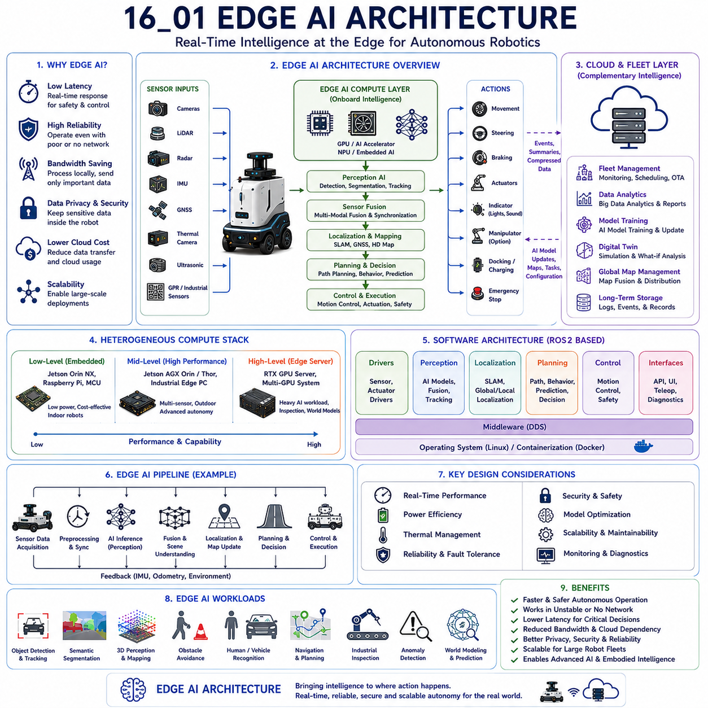
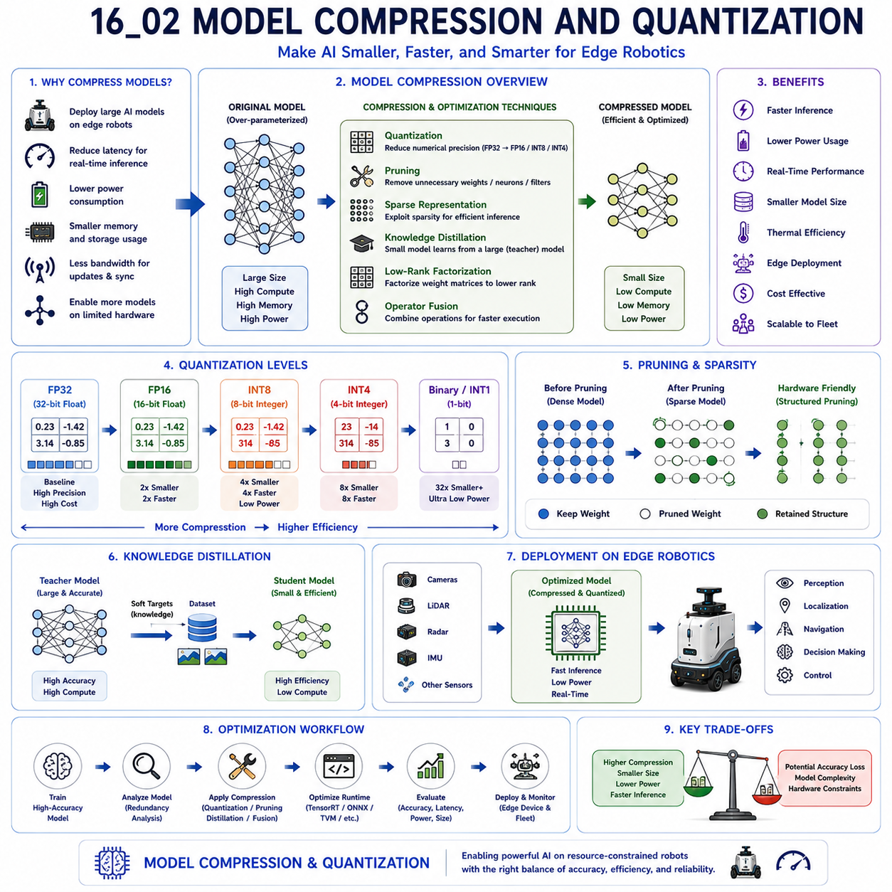
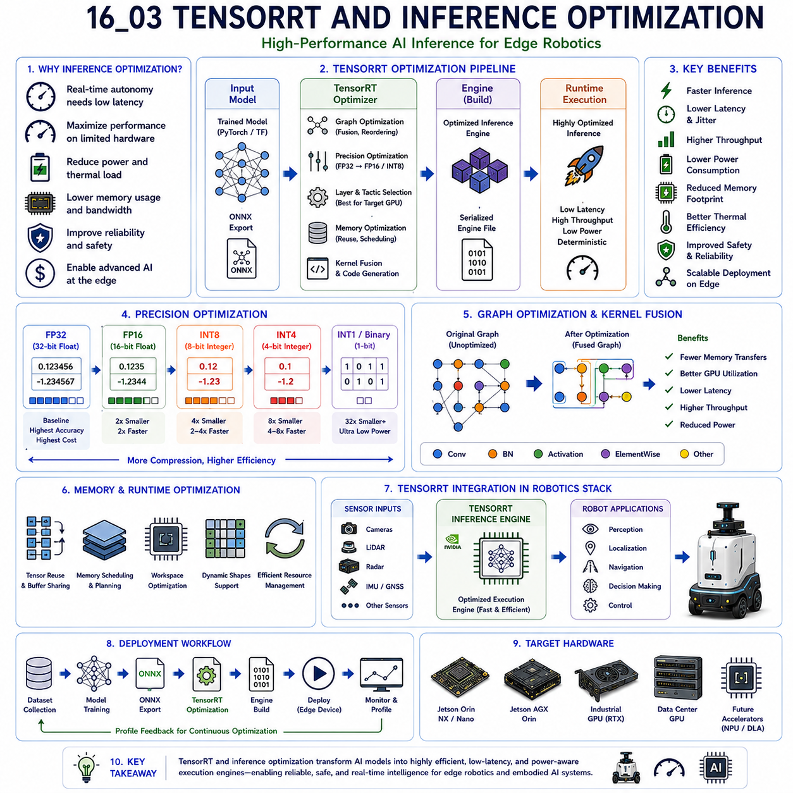
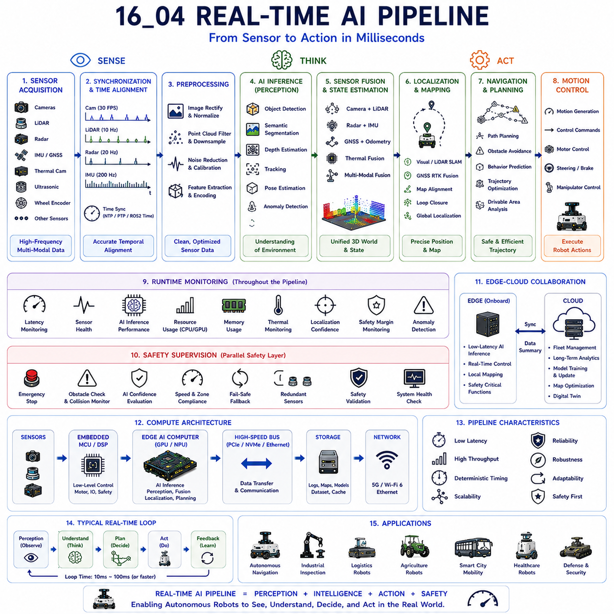
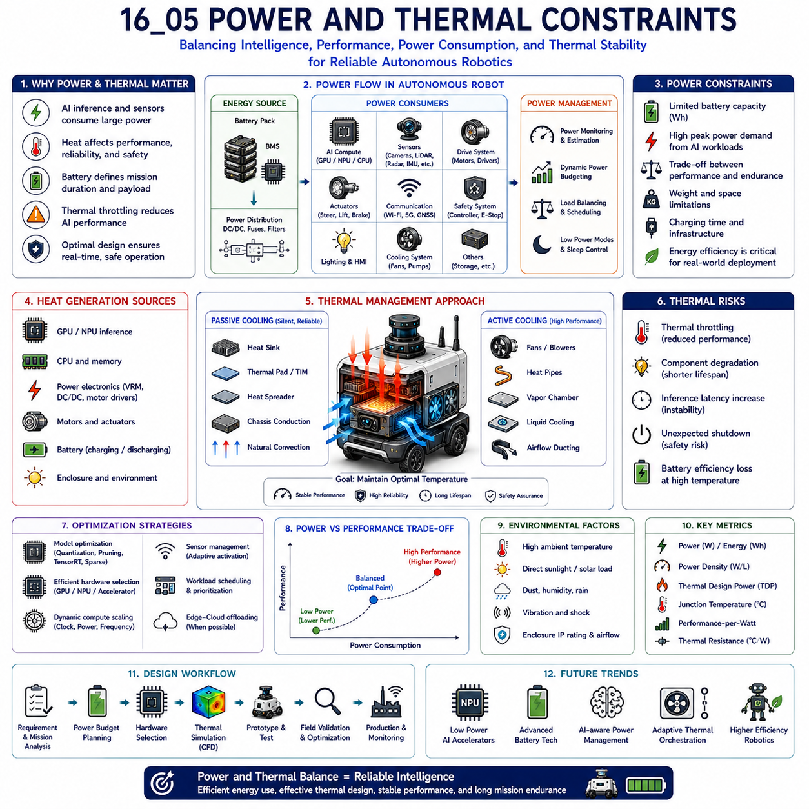
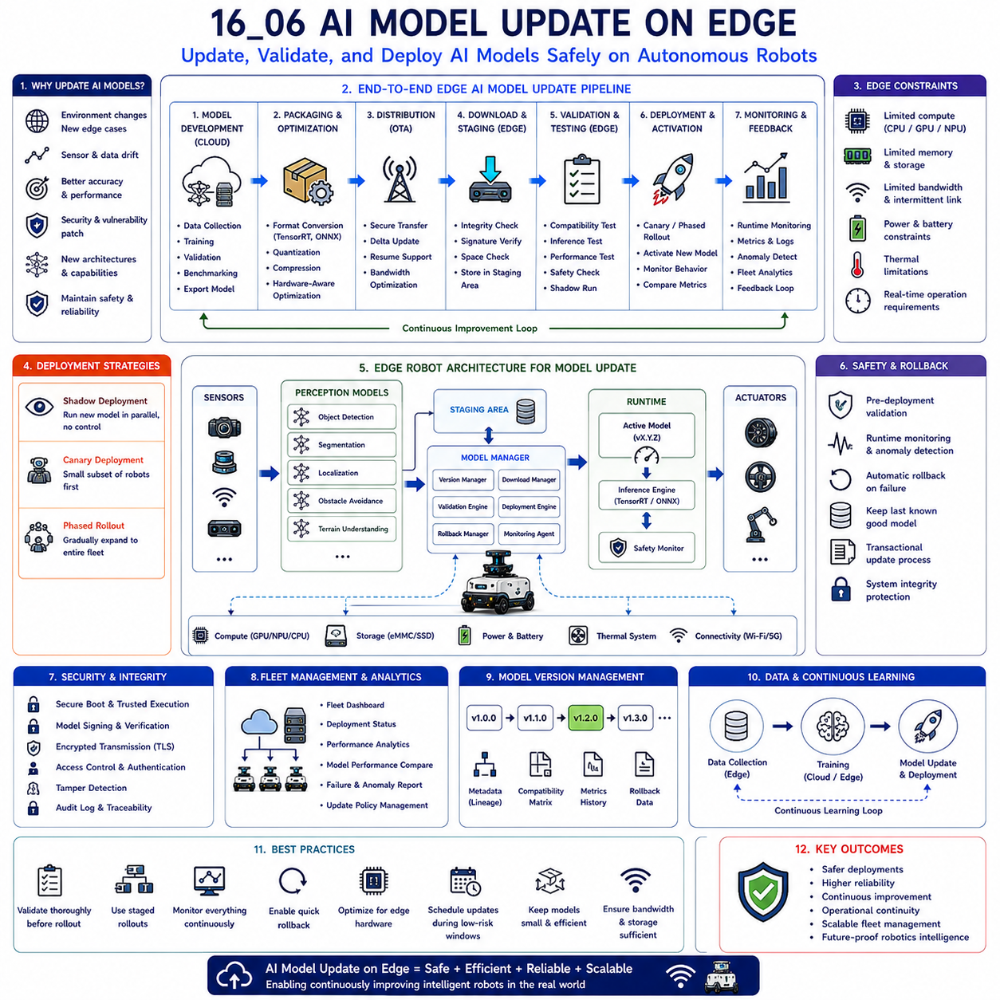
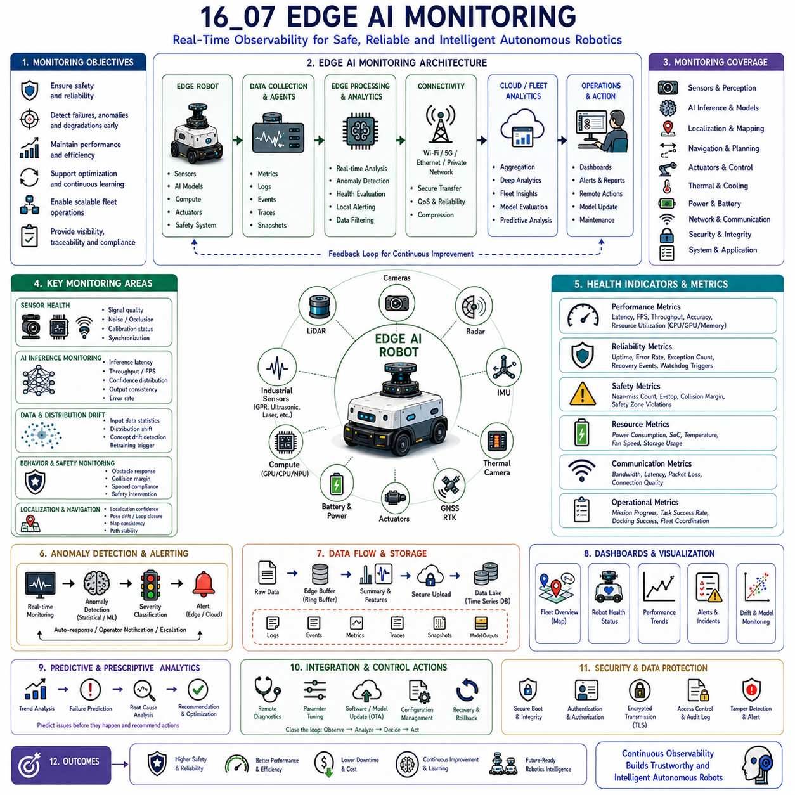
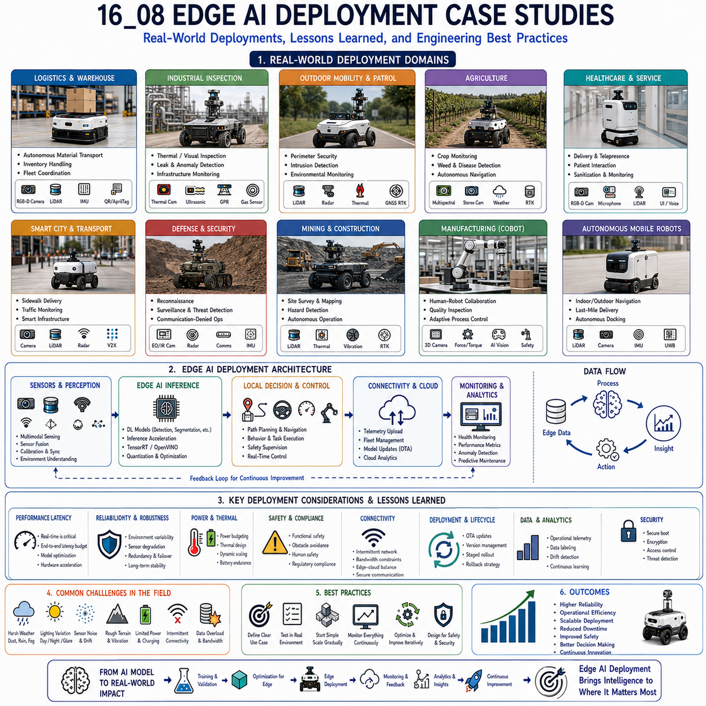

**Volume 06. AMR AI and Embodied Intelligence**


# Chapter 16. Edge AI for AMR

## 16.1 Edge AI Architecture

{width="7.268055555555556in" height="7.268055555555556in"}

"16_01_Edge_AI_Architecture" describes the foundational system architecture used to deploy artificial intelligence directly on autonomous robotic platforms rather than relying entirely on cloud infrastructure. Edge AI Architecture is one of the most important enabling technologies for modern AMR systems, embodied AI platforms, industrial robots, smart city robotics, autonomous vehicles, and real-time intelligent machines. The concept refers to the design methodology in which AI inference, perception processing, sensor fusion, decision-making, and operational intelligence are executed locally on edge computing devices installed inside the robot itself. This architecture minimizes latency, improves reliability, reduces network dependency, enhances operational safety, and enables real-time autonomous behavior even under unstable communication conditions.

Traditional robotics systems often depended heavily on centralized servers or remote computing infrastructure for high-level intelligence and data processing. Early automation systems primarily relied on deterministic control logic, rule-based operation, and low-bandwidth communication between robots and backend systems. However, as robotics evolved toward deep learning, multimodal perception, semantic scene understanding, autonomous navigation, embodied intelligence, and world modeling, the amount of computation required for autonomous operation increased dramatically. At the same time, robotics applications increasingly expanded into dynamic real-world environments where network connectivity cannot always be guaranteed. These conditions accelerated the emergence of Edge AI Architecture as a core robotics engineering discipline.

The central principle of Edge AI is that critical intelligence must remain physically close to the robot's sensing and control systems. Instead of transmitting all raw sensor data to cloud servers for processing, the robot performs AI inference locally using onboard GPU systems, AI accelerators, NPUs, embedded AI modules, or industrial edge servers. This approach dramatically reduces communication latency and enables robots to react to environmental changes in real time.

Latency reduction is one of the most important motivations behind Edge AI deployment. Autonomous robots continuously interact with dynamic physical environments where milliseconds can determine operational safety. Perception pipelines, obstacle avoidance systems, pedestrian interaction modules, emergency stop logic, motion planning systems, and vehicle detection pipelines all require deterministic low-latency execution. If sensor data had to travel continuously to cloud infrastructure and wait for remote inference responses, operational delay would become unacceptable for safe autonomous navigation.

Real-time perception is therefore one of the core workloads handled by Edge AI Architecture. Cameras, LiDAR systems, radar modules, depth sensors, thermal cameras, IMUs, GNSS systems, and industrial inspection sensors generate large amounts of multimodal data continuously. AI models running on edge compute systems process these inputs to perform object detection, semantic segmentation, free-space detection, object tracking, terrain understanding, scene understanding, human detection, vehicle recognition, and environmental classification.

Edge AI systems are especially important in robotics because sensor data throughput is extremely large. High-resolution cameras may stream multiple gigabytes of image data every minute. 3D LiDAR systems generate dense point cloud streams. Radar systems produce continuous velocity and motion information. GPR systems generate massive underground signal datasets. Transmitting all of this data continuously to cloud infrastructure would require extremely expensive communication bandwidth and may still introduce unacceptable latency. Edge processing allows robots to filter, compress, prioritize, and interpret data locally before selective cloud synchronization occurs.

Edge AI Architecture is fundamentally different from conventional cloud-centric AI systems. In cloud-centric architectures, centralized servers provide most of the computational intelligence while edge devices primarily serve as data collection nodes. In robotics, however, physical interaction with dynamic environments requires local autonomy. Robots cannot depend entirely on external infrastructure for mission-critical operational decisions.

One of the most important characteristics of Edge AI Architecture is distributed intelligence. Modern autonomous robots often divide workloads across multiple compute layers including embedded controllers, real-time processors, edge GPU systems, onboard AI accelerators, fleet servers, and cloud infrastructure. Low-level control loops may execute on MCUs or real-time embedded processors, while perception AI runs on GPUs or NPUs, and large-scale analytics or fleet optimization runs in cloud infrastructure.

Edge AI systems must therefore support heterogeneous computing architectures. Different workloads require different processing characteristics. Real-time motor control requires deterministic timing and low jitter. Deep learning inference requires massively parallel GPU acceleration. Sensor synchronization requires high-speed I/O handling. Navigation systems require efficient CPU-GPU collaboration. Industrial inspection workloads may require specialized FPGA or DSP acceleration.

The hardware foundation of Edge AI Architecture typically includes embedded AI computing modules such as NVIDIA Jetson Orin NX, Jetson AGX Orin, Jetson Thor, industrial x86 edge computers with RTX GPUs, AI accelerators, NPUs, or custom robotics computing platforms. The choice of compute architecture depends heavily on robot size, operational environment, sensor complexity, AI workload, power budget, and product cost targets.

Low-Level Edge AI systems usually prioritize compactness, low power consumption, affordability, and thermal simplicity. These systems are commonly used for indoor AMRs, delivery robots, lightweight logistics robots, and cost-sensitive service robotics. Mid-Level Edge AI systems support more advanced multimodal perception and outdoor autonomy. High-Level Edge AI systems integrate workstation-grade GPUs and large memory bandwidth to support industrial inspection, large transformer models, multimodal embodied AI, and world-model-based robotics intelligence.

Power efficiency is one of the defining challenges of Edge AI Architecture. Unlike cloud datacenters with effectively unlimited power and cooling infrastructure, autonomous robots operate using battery-constrained mobile power systems. Every watt consumed by AI processing directly affects operational duration, thermal load, battery size, and overall vehicle weight. Edge AI systems therefore require highly optimized compute efficiency.

AI model optimization becomes essential under these constraints. Quantization, TensorRT acceleration, mixed precision inference, sparse neural networks, model pruning, operator fusion, and efficient transformer architectures are commonly used to maximize AI inference performance while minimizing power consumption and thermal generation.

Thermal management is another critical engineering discipline within Edge AI systems. AI inference workloads generate significant heat, especially during continuous multimodal perception processing. Thermal instability may reduce inference reliability, throttle compute performance, shorten component lifespan, or cause unexpected operational failures. Edge AI Architecture therefore includes thermal sensors, cooling systems, airflow engineering, heat sink optimization, industrial fans, liquid cooling systems, and intelligent thermal control policies.

Real-time AI pipelines represent the operational core of Edge AI Architecture. Sensor inputs continuously flow through synchronized AI inference stages. Data from cameras, LiDAR, radar, IMU, GNSS, and industrial sensors must be timestamped, synchronized, preprocessed, fused, analyzed, and converted into actionable robot decisions with deterministic timing constraints. ROS2-based distributed architectures are frequently used to orchestrate these pipelines.

Sensor fusion is one of the most computationally demanding components of Edge AI systems. Multimodal perception requires simultaneous processing of heterogeneous data streams. Camera-based semantic understanding, LiDAR-based geometry analysis, radar-based motion detection, thermal sensing, and inertial fusion must all combine into unified environmental representations. Edge AI systems therefore require high-bandwidth memory systems and efficient inter-process communication frameworks.

Localization and navigation workloads also heavily depend on Edge AI. Visual SLAM, LiDAR SLAM, semantic localization, terrain-aware navigation, obstacle prediction, dynamic path planning, and predictive navigation all require substantial onboard computation. Outdoor robots additionally process GNSS RTK data, HD maps, terrain classification, weather-aware navigation, and vehicle interaction prediction.

Industrial inspection robotics places especially high demands on Edge AI Architecture. GPR inspection systems generate extremely large subsurface signal datasets requiring AI reconstruction and anomaly detection pipelines. Thermal inspection systems continuously monitor heat signatures. Ultrasonic systems analyze material integrity. Laser profilers generate geometric surface analysis data. Edge AI systems must process these specialized industrial sensing workloads while simultaneously maintaining autonomous mobility and operational safety.

Embodied AI further expands the importance of Edge AI Architecture. Future autonomous robots increasingly require world modeling, contextual memory, multimodal reasoning, language understanding, task planning, and adaptive decision-making. Many of these workloads must execute directly on the robot itself because operational autonomy cannot depend entirely on remote infrastructure.

Vision-Language Models and Vision-Language-Action systems introduce additional challenges for edge deployment. These models require substantial GPU memory, transformer acceleration, and efficient runtime orchestration. Edge AI systems increasingly incorporate hybrid architectures where lightweight local models handle safety-critical real-time reasoning while larger cloud models provide strategic planning or long-term contextual intelligence.

Edge-cloud collaboration therefore becomes a central component of modern robotics architecture. Pure edge-only systems may provide excellent autonomy but limited large-scale intelligence capability. Pure cloud-based systems may provide strong reasoning capability but insufficient operational reliability. Hybrid cloud-edge architectures balance these tradeoffs by distributing AI workloads strategically.

In hybrid systems, low-latency perception, obstacle avoidance, emergency response, localization, and navigation remain onboard, while fleet analytics, large-scale model retraining, digital twin synchronization, global map optimization, long-term learning, and operational analytics occur in cloud infrastructure. The robot dynamically decides which workloads remain local and which tasks synchronize externally.

Bandwidth optimization becomes increasingly important in large robotics deployments. Robots continuously generate operational telemetry, sensor recordings, event logs, AI inference statistics, maintenance diagnostics, and fleet coordination data. Edge AI systems perform local filtering and event-driven recording to reduce communication overhead. Only relevant operational events or summarized intelligence may be uploaded to cloud infrastructure.

Cybersecurity also becomes critically important within Edge AI Architecture. Autonomous robots operating in industrial facilities, hospitals, public infrastructure, logistics centers, or defense environments cannot expose operational control systems to insecure external networks. Edge autonomy reduces attack surfaces by minimizing dependency on continuous remote communication.

Fault tolerance and degraded operational modes are fundamental design principles within Edge AI systems. Robots must maintain safe operation even when cloud connectivity fails, communication bandwidth collapses, or external infrastructure becomes unavailable. Local AI inference allows robots to continue autonomous operation independently during communication outages.

Edge AI monitoring systems continuously evaluate compute health, GPU utilization, inference latency, memory consumption, sensor integrity, thermal stability, and operational confidence metrics. Runtime AI monitoring frameworks detect abnormal model behavior, sensor degradation, synchronization failures, or unexpected operational conditions. These monitoring systems support predictive maintenance and operational safety.

Containerization and orchestration technologies are increasingly important within Edge AI systems. Docker-based deployment pipelines, Kubernetes-inspired orchestration systems, ROS2 composable nodes, and modular software architectures allow robotics companies to deploy AI models consistently across heterogeneous robot fleets. OTA update systems support remote AI deployment and continuous model improvement.

Simulation and digital twins also play an important role in Edge AI Architecture development. Virtual simulation environments allow AI pipelines, perception systems, navigation behaviors, and runtime orchestration frameworks to be tested before deployment on physical robots. Synthetic datasets accelerate model training and edge optimization workflows.

Edge AI Architecture strongly influences product segmentation strategy within robotics companies. Lightweight indoor robots may prioritize low-power embedded AI systems. Mid-range outdoor robots may require stronger multimodal edge inference capability. High-end industrial inspection robots may integrate server-class edge GPUs supporting multiple simultaneous AI pipelines and large transformer inference workloads.

Future robotics systems will likely evolve toward increasingly intelligent distributed edge ecosystems. Robots may share local intelligence collaboratively through edge mesh networks. Fleet-level world models may synchronize dynamically between robots. Edge AI systems may increasingly incorporate adaptive compute orchestration where AI workloads move dynamically between local devices, nearby edge infrastructure, and cloud datacenters according to operational conditions.

AI accelerators specialized for robotics workloads may significantly improve future Edge AI performance efficiency. Robotics-oriented NPUs, low-power transformer accelerators, sparse inference hardware, event-driven AI processors, and multimodal fusion accelerators may dramatically improve inference capability per watt.

Edge AI will also become increasingly important as autonomous robots expand into smart cities, infrastructure inspection, healthcare, agriculture, defense, logistics, and large-scale embodied intelligence ecosystems. These operational domains require continuous autonomy even under unreliable connectivity and highly dynamic environmental conditions.

Ultimately, "16_01_Edge_AI_Architecture" represents one of the foundational enabling technologies for modern autonomous robotics and embodied AI systems. It integrates onboard intelligence, multimodal perception, distributed computing, real-time inference, cloud-edge collaboration, safety monitoring, thermal optimization, power-aware AI deployment, and scalable fleet intelligence into unified robotic autonomy frameworks. As robotics systems continue evolving toward increasingly intelligent embodied agents operating in complex real-world environments, Edge AI Architecture will remain one of the most critical engineering disciplines enabling scalable, reliable, safe, and commercially practical autonomous robotic ecosystems.

"16_01_Edge_AI_Architecture"는 인공지능을 클라우드 인프라에 전적으로 의존하지 않고 자율주행 로봇 내부에서 직접 실행하기 위한 핵심 시스템 아키텍처를 설명하는 개념이다. Edge AI Architecture는 현대 AMR 시스템, Embodied AI 플랫폼, 산업용 로봇, 스마트시티 로봇, 자율주행 차량, 실시간 지능형 기계에서 가장 중요한 기반 기술 중 하나이다. 이 개념은 AI Inference, Perception Processing, Sensor Fusion, Decision-Making, Operational Intelligence를 로봇 내부의 Edge Computing Device에서 직접 수행하는 설계 방식을 의미한다. 이러한 구조는 Latency를 최소화하고, Reliability를 향상시키며, Network Dependency를 줄이고, Operational Safety를 강화하며, 통신이 불안정한 환경에서도 Real-Time Autonomous Behavior를 가능하게 한다.

기존 로봇 시스템은 종종 중앙 서버나 Remote Computing Infrastructure에 크게 의존하였다. 초기 자동화 시스템은 주로 Deterministic Control Logic, Rule-Based Operation, Low-Bandwidth Communication 중심이었다. 그러나 로봇이 Deep Learning, Multimodal Perception, Semantic Scene Understanding, Autonomous Navigation, Embodied Intelligence, World Modeling 방향으로 발전하면서 필요한 연산량은 급격히 증가하였다. 동시에 로봇은 안정적인 네트워크 연결이 항상 보장되지 않는 실제 환경으로 확장되었다. 이러한 변화는 Edge AI Architecture를 핵심 Robotics Engineering Discipline으로 발전시키는 계기가 되었다.

Edge AI의 핵심 원칙은 "중요한 지능은 로봇의 센서와 제어 시스템 가까이에 존재해야 한다"는 것이다. 즉, 모든 Raw Sensor Data를 Cloud Server로 전송하여 처리하는 대신, 로봇 내부의 GPU, AI Accelerator, NPU, Embedded AI Module, Industrial Edge Server를 사용하여 Local AI Inference를 수행한다. 이러한 구조는 Communication Latency를 크게 줄이고 실시간 환경 변화에 대한 즉각적인 반응을 가능하게 한다.

Latency Reduction은 Edge AI 도입의 가장 중요한 이유 중 하나이다. Autonomous Robot은 지속적으로 Dynamic Physical Environment와 상호작용한다. Obstacle Avoidance, Pedestrian Interaction, Emergency Stop, Motion Planning, Vehicle Detection과 같은 기능은 Millisecond 수준의 빠른 응답이 필요하다. 만약 모든 Sensor Data를 Cloud로 보내고 응답을 기다린다면 Operational Delay가 발생하여 안전한 Autonomous Navigation이 불가능해질 수 있다.

Real-Time Perception은 Edge AI Architecture의 핵심 Workload 중 하나이다. Camera, LiDAR, Radar, Depth Sensor, Thermal Camera, IMU, GNSS, Industrial Inspection Sensor는 매우 큰 양의 Multimodal Data를 지속적으로 생성한다. Edge Compute System에서 실행되는 AI Model은 이러한 데이터를 처리하여 Object Detection, Semantic Segmentation, Free-Space Detection, Object Tracking, Terrain Understanding, Scene Understanding, Human Detection, Vehicle Recognition, Environmental Classification 등을 수행한다.

Edge AI는 Robotics에서 특히 중요하다. 그 이유는 Sensor Data Throughput이 매우 크기 때문이다. High-Resolution Camera는 분당 수 GB 이상의 데이터를 생성할 수 있다. 3D LiDAR는 Dense Point Cloud Stream을 생성하고, Radar는 Continuous Velocity Information을 생성하며, GPR System은 Massive Underground Signal Dataset을 생성한다. 이러한 데이터를 모두 Cloud로 전송하는 것은 매우 큰 Bandwidth Cost를 요구하며 Latency 문제도 발생시킨다. 따라서 Edge Processing은 데이터를 Local에서 Filtering, Compression, Prioritization, Interpretation한 후 필요한 정보만 Cloud와 동기화한다.

Edge AI Architecture는 Conventional Cloud-Centric AI System과 근본적으로 다르다. Cloud-Centric System은 대부분의 Intelligence를 Centralized Server가 담당하고 Edge Device는 단순 Data Collection Node 역할을 수행한다. 그러나 Robotics는 Dynamic Physical Environment와 직접 상호작용하기 때문에 Local Autonomy가 필수적이다.

Edge AI Architecture의 가장 중요한 특징 중 하나는 Distributed Intelligence이다. 현대 Autonomous Robot은 Workload를 Embedded Controller, Real-Time Processor, Edge GPU System, AI Accelerator, Fleet Server, Cloud Infrastructure 사이에 분산시킨다. Low-Level Motor Control은 MCU나 Real-Time Processor에서 실행되며, Deep Learning Inference는 GPU나 NPU에서 실행되고, Fleet Optimization이나 Large-Scale Analytics는 Cloud Infrastructure에서 수행된다.

따라서 Edge AI는 Heterogeneous Computing Architecture를 지원해야 한다. Real-Time Motor Control은 Deterministic Timing과 Low Jitter가 필요하고, Deep Learning Inference는 Massive Parallel GPU Acceleration이 필요하다. Sensor Synchronization은 High-Speed I/O Handling이 중요하며, Navigation은 CPU-GPU Collaboration이 필요하다. Industrial Inspection Workload는 FPGA나 DSP Acceleration이 필요할 수도 있다.

Edge AI Architecture의 Hardware Foundation은 일반적으로 NVIDIA Jetson Orin NX, Jetson AGX Orin, Jetson Thor, RTX GPU 기반 Industrial x86 Edge Computer, AI Accelerator, NPU 또는 Custom Robotics Computing Platform으로 구성된다. Compute Architecture 선택은 Robot Size, Operational Environment, Sensor Complexity, AI Workload, Power Budget, Product Cost Target에 따라 달라진다.

Low-Level Edge AI System은 Compactness, Low Power Consumption, Affordability, Thermal Simplicity를 우선시한다. 이러한 구조는 Indoor AMR, Delivery Robot, Lightweight Logistics Robot, Cost-Sensitive Service Robot에 적합하다. Mid-Level Edge AI는 Stronger Multimodal Perception과 Outdoor Autonomy를 지원한다. High-Level Edge AI는 Workstation-Class GPU와 Large Memory Bandwidth를 통해 Industrial Inspection, Large Transformer Model, Multimodal Embodied AI, World Model 기반 Robotics Intelligence를 지원한다.

Power Efficiency는 Edge AI Architecture의 가장 중요한 과제 중 하나이다. Cloud Datacenter와 달리 Autonomous Robot은 Battery-Constrained Mobile Power System 위에서 동작한다. AI Processing에 사용되는 모든 전력은 Operational Duration, Thermal Load, Battery Size, Vehicle Weight에 직접적인 영향을 준다. 따라서 Edge AI System은 매우 높은 Compute Efficiency가 필요하다.

AI Model Optimization은 이러한 제약 조건에서 필수적이다. Quantization, TensorRT Acceleration, Mixed Precision Inference, Sparse Neural Network, Model Pruning, Operator Fusion, Efficient Transformer Architecture 등이 AI Inference Performance를 최대화하면서도 Power Consumption과 Thermal Generation을 줄이기 위해 사용된다.

Thermal Management 역시 중요한 Engineering Discipline이다. AI Inference는 Continuous Multimodal Perception Processing 동안 상당한 열을 발생시킨다. Thermal Instability는 Inference Reliability 저하, Compute Throttling, Component Lifespan 감소, Unexpected Operational Failure를 유발할 수 있다. 따라서 Edge AI Architecture는 Thermal Sensor, Cooling System, Airflow Engineering, Heat Sink Optimization, Industrial Fan, Liquid Cooling, Intelligent Thermal Control Policy를 포함한다.

Real-Time AI Pipeline은 Edge AI Architecture의 Operational Core이다. Sensor Input은 Synchronization된 AI Inference Stage를 통과한다. Camera, LiDAR, Radar, IMU, GNSS, Industrial Sensor 데이터는 Timestamping, Synchronization, Preprocessing, Fusion, Analysis 과정을 거쳐 Deterministic Timing Constraint 안에서 Robot Decision으로 변환된다. ROS2 기반 Distributed Architecture가 이러한 Pipeline Orchestration에 자주 사용된다.

Sensor Fusion은 Edge AI에서 가장 연산량이 큰 영역 중 하나이다. Multimodal Perception은 여러 종류의 Heterogeneous Data Stream을 동시에 처리해야 한다. Camera 기반 Semantic Understanding, LiDAR 기반 Geometry Analysis, Radar 기반 Motion Detection, Thermal Sensing, Inertial Fusion이 Unified Environmental Representation으로 통합된다. 따라서 Edge AI는 High-Bandwidth Memory System과 Efficient IPC Framework가 필요하다.

Localization과 Navigation 역시 Edge AI에 크게 의존한다. Visual SLAM, LiDAR SLAM, Semantic Localization, Terrain-Aware Navigation, Obstacle Prediction, Dynamic Path Planning, Predictive Navigation은 모두 높은 수준의 Onboard Computation을 요구한다. Outdoor Robot은 GNSS RTK, HD Map, Terrain Classification, Weather-Aware Navigation, Vehicle Interaction Prediction까지 처리해야 한다.

Industrial Inspection Robotics는 Edge AI에 특히 높은 요구사항을 가진다. GPR Inspection System은 Massive Subsurface Signal Dataset을 생성하며 AI Reconstruction과 Anomaly Detection Pipeline이 필요하다. Thermal Inspection System은 Continuous Heat Signature Monitoring을 수행한다. Ultrasonic System은 Material Integrity를 분석한다. Laser Profiler는 Surface Geometry Analysis를 수행한다. Edge AI System은 이러한 Industrial Sensing Workload를 처리하면서 Autonomous Mobility와 Operational Safety도 동시에 유지해야 한다.

Embodied AI는 Edge AI의 중요성을 더욱 증가시킨다. 미래 Autonomous Robot은 World Modeling, Contextual Memory, Multimodal Reasoning, Language Understanding, Task Planning, Adaptive Decision-Making을 필요로 한다. 이러한 기능은 Cloud에 완전히 의존할 수 없기 때문에 많은 부분이 Robot 자체에서 실행되어야 한다.

Vision-Language Model과 Vision-Language-Action System은 Edge Deployment에 새로운 도전을 가져온다. 이러한 모델은 매우 큰 GPU Memory, Transformer Acceleration, Efficient Runtime Orchestration을 요구한다. 따라서 Edge AI System은 Safety-Critical Real-Time Reasoning은 Lightweight Local Model이 처리하고, Strategic Planning이나 Long-Term Contextual Intelligence는 Cloud Model이 처리하는 Hybrid Architecture를 점점 더 많이 채택하고 있다.

따라서 Edge-Cloud Collaboration은 현대 Robotics Architecture의 핵심 요소가 된다. Pure Edge System은 Strong Autonomy를 제공하지만 Large-Scale Intelligence에는 제한이 있을 수 있다. 반면 Pure Cloud System은 강력한 Reasoning Capability를 제공하지만 Operational Reliability가 부족할 수 있다. Hybrid Cloud-Edge Architecture는 이러한 Tradeoff를 균형 있게 조정한다.

Hybrid System에서는 Low-Latency Perception, Obstacle Avoidance, Emergency Response, Localization, Navigation은 Onboard에서 수행되고, Fleet Analytics, Large-Scale Model Retraining, Digital Twin Synchronization, Global Map Optimization, Long-Term Learning은 Cloud에서 수행된다. Robot은 어떤 Workload를 Local에서 유지할지, 어떤 작업을 External Synchronization할지를 Dynamic하게 결정한다.

Bandwidth Optimization 역시 중요하다. Robot은 Operational Telemetry, Sensor Recording, Event Log, AI Inference Statistic, Maintenance Diagnostic, Fleet Coordination Data를 지속적으로 생성한다. Edge AI는 Local Filtering과 Event-Driven Recording을 통해 Communication Overhead를 줄인다. 중요한 Operational Event나 Summarized Intelligence만 Cloud로 업로드된다.

Cybersecurity 역시 매우 중요하다. Autonomous Robot이 Industrial Facility, Hospital, Public Infrastructure, Logistics Center, Defense Environment에서 운영될 경우 Operational Control System을 외부 네트워크 공격으로부터 보호해야 한다. Edge Autonomy는 Continuous Remote Communication Dependency를 줄여 Attack Surface를 감소시킨다.

Fault Tolerance와 Degraded Operational Mode는 Edge AI의 핵심 설계 원칙이다. Robot은 Cloud Connectivity가 끊기거나 Communication Bandwidth가 급격히 감소하더라도 안전한 Autonomous Operation을 유지해야 한다. Local AI Inference는 Communication Outage 상황에서도 Autonomous Operation을 가능하게 한다.

Edge AI Monitoring System은 Compute Health, GPU Utilization, Inference Latency, Memory Consumption, Sensor Integrity, Thermal Stability, Operational Confidence Metric을 지속적으로 평가한다. Runtime AI Monitoring Framework는 Abnormal Model Behavior, Sensor Degradation, Synchronization Failure, Unexpected Operational Condition을 탐지한다.

Containerization과 Orchestration Technology 역시 점점 중요해지고 있다. Docker 기반 Deployment Pipeline, Kubernetes 스타일 Orchestration System, ROS2 Composable Node, Modular Software Architecture는 Heterogeneous Robot Fleet에 AI Model을 일관성 있게 배포할 수 있게 해준다. OTA Update System은 Remote AI Deployment와 Continuous Model Improvement를 지원한다.

Simulation과 Digital Twin 역시 중요한 역할을 한다. Virtual Simulation Environment는 Physical Robot Deployment 이전에 AI Pipeline, Perception System, Navigation Behavior, Runtime Orchestration Framework를 검증할 수 있게 해준다. Synthetic Dataset은 Model Training과 Edge Optimization Workflow를 가속화한다.

Edge AI Architecture는 Product Segmentation Strategy에도 직접적인 영향을 준다. Lightweight Indoor Robot은 Low-Power Embedded AI를 사용하고, Mid-Range Outdoor Robot은 Stronger Multimodal Edge Inference Capability를 사용하며, High-End Industrial Inspection Robot은 Multiple AI Pipeline과 Large Transformer Inference를 지원하는 Server-Class Edge GPU를 사용할 수 있다.

미래 Robotics System은 점점 더 Intelligent Distributed Edge Ecosystem 방향으로 발전할 가능성이 높다. Robot은 Edge Mesh Network를 통해 Local Intelligence를 공유하고, Fleet-Level World Model을 Dynamic하게 Synchronize하며, AI Workload를 Local Device, Nearby Edge Infrastructure, Cloud Datacenter 사이에서 동적으로 이동시킬 수 있게 될 것이다.

Robotics-Specific AI Accelerator는 미래 Edge AI Efficiency를 크게 향상시킬 가능성이 있다. Robotics-Oriented NPU, Low-Power Transformer Accelerator, Sparse Inference Hardware, Event-Driven AI Processor, Multimodal Fusion Accelerator는 Inference Capability-per-Watt를 크게 향상시킬 수 있다.

Edge AI는 Smart City, Infrastructure Inspection, Healthcare, Agriculture, Defense, Logistics, Large-Scale Embodied Intelligence Ecosystem으로 Autonomous Robot이 확장될수록 더욱 중요해질 것이다. 이러한 분야는 불안정한 Connectivity 환경에서도 Continuous Autonomy를 요구하기 때문이다.

궁극적으로 "16_01_Edge_AI_Architecture"는 현대 Autonomous Robotics와 Embodied AI System을 가능하게 하는 핵심 기반 기술 중 하나이다. 이는 Onboard Intelligence, Multimodal Perception, Distributed Computing, Real-Time Inference, Cloud-Edge Collaboration, Safety Monitoring, Thermal Optimization, Power-Aware AI Deployment, Scalable Fleet Intelligence를 하나의 Unified Robotic Autonomy Framework로 통합한다. 앞으로 로봇이 더욱 지능적인 Embodied Agent로 발전함에 따라, Edge AI Architecture는 확장 가능하고 신뢰성 있으며 안전하고 상업적으로 실용적인 Autonomous Robotic Ecosystem을 구현하기 위한 가장 중요한 Engineering Discipline 중 하나로 계속 발전하게 될 것이다.

##  

## 16.2 Model Compression and Quantization

{width="7.268055555555556in" height="7.268055555555556in"}

"16_02_Model_Compression_and_Quantization" describes one of the most critical optimization technologies in modern edge AI, autonomous robotics, and embodied intelligence systems. As artificial intelligence models become increasingly large and computationally expensive, deploying them directly on embedded robotic platforms becomes extremely challenging due to limitations in compute power, memory bandwidth, storage capacity, thermal dissipation, and energy consumption. Model Compression and Quantization are therefore essential techniques that enable high-performance AI inference to operate efficiently on edge devices such as autonomous robots, industrial edge computers, embedded AI modules, smart sensors, and mobile robotic systems.

Modern robotics systems increasingly rely on deep neural networks, transformer architectures, multimodal perception pipelines, semantic scene understanding, world modeling, and predictive reasoning systems. These AI models often contain millions or even billions of parameters and require substantial computational infrastructure when executed in their original form. Cloud datacenters can support these workloads using massive GPU clusters and large-scale cooling systems, but autonomous robots must operate using constrained onboard hardware powered by mobile battery systems. Model optimization techniques therefore become fundamental to practical robotic deployment.

The primary goal of Model Compression and Quantization is to reduce the computational complexity, memory footprint, power consumption, and inference latency of AI models while preserving as much inference accuracy and operational reliability as possible. This optimization process allows advanced AI functionality to operate on compact edge computing systems that would otherwise be incapable of supporting large-scale neural network inference.

One of the most important principles underlying compression technologies is that many deep neural networks contain significant redundancy. During training, large neural networks often develop redundant parameters, duplicated feature representations, over-parameterized layers, and computational inefficiencies. Compression techniques attempt to remove or simplify these redundancies while preserving the essential representational capability of the model.

Quantization is one of the most widely used optimization methods in Edge AI systems. Traditional deep learning models are commonly trained using high-precision floating-point representations such as FP32. While FP32 provides excellent numerical precision, it also requires large memory bandwidth, high computational cost, and increased power consumption. Quantization reduces the numerical precision of model parameters and activations to lower-bit representations such as FP16, INT8, INT4, or even binary representations.

FP16 quantization represents one of the most common optimization levels used in GPU-based robotics inference systems. By reducing numerical precision from 32-bit floating point to 16-bit floating point, memory usage and computational load can be reduced significantly while maintaining relatively small accuracy degradation. Modern GPUs frequently include specialized tensor acceleration hardware optimized for FP16 operations, allowing dramatic increases in inference throughput.

INT8 quantization provides even greater efficiency improvements. INT8 models use 8-bit integer arithmetic instead of floating-point operations, substantially reducing memory bandwidth requirements and computational complexity. Many embedded AI accelerators and robotics inference engines are specifically optimized for INT8 execution. This allows autonomous robots to execute perception pipelines, object detection systems, semantic segmentation networks, and navigation AI models at much higher frame rates under constrained power budgets.

However, quantization introduces important tradeoffs. Lower numerical precision may reduce inference accuracy, particularly for complex multimodal models, transformer architectures, or fine-grained perception systems. Quantization-aware training and calibration techniques are therefore used to minimize accuracy degradation during deployment.

Post-training quantization is one common deployment strategy. In this approach, a fully trained neural network is converted into lower-precision representations after training is complete. This method is relatively simple and fast but may result in larger accuracy loss for sensitive models. Quantization-aware training, by contrast, incorporates quantization effects during the training process itself, allowing the model to adapt its parameters for reduced precision execution more effectively.

Model pruning represents another major compression strategy. Neural network pruning removes unnecessary weights, neurons, filters, or entire layers from the model. Many neural networks contain parameters that contribute minimally to final inference results. By identifying and removing low-importance parameters, model size and compute cost can be reduced substantially.

Structured pruning removes entire channels, convolutional filters, attention heads, or network blocks. This form of pruning is particularly useful for hardware acceleration because it preserves efficient memory access patterns and computational structure. Unstructured pruning removes individual weights selectively, often achieving higher compression ratios but creating irregular sparse computation patterns that may be more difficult for hardware accelerators to optimize efficiently.

Sparse neural networks emerge naturally from pruning techniques. Sparse models contain many zero-valued weights, reducing the number of active computations required during inference. Specialized sparse inference accelerators and optimized runtime frameworks can exploit sparsity to improve performance-per-watt and inference throughput dramatically.

Knowledge distillation represents another powerful model compression methodology. In this approach, a smaller "student" model learns to replicate the behavior of a larger "teacher" model. The teacher model may possess extremely high accuracy and advanced reasoning capability but require excessive computational infrastructure. The student model learns compressed representations of the teacher's knowledge, enabling significantly smaller deployment architectures while preserving much of the original model performance.

Knowledge distillation is especially important in robotics because autonomous systems frequently require compact real-time inference under strict latency constraints. Large transformer models or multimodal foundation models may be too computationally expensive for onboard deployment, but distilled versions can provide practical embedded intelligence suitable for edge robotics applications.

Weight sharing and parameter factorization techniques further improve model efficiency. Many neural network parameters exhibit similar patterns or correlations that can be represented more compactly. Matrix decomposition methods such as low-rank factorization reduce parameter storage and computational complexity by approximating large matrices using smaller representations.

Operator fusion is another important optimization strategy in Edge AI systems. During inference, multiple neural network operations are often combined into single optimized execution kernels. This reduces memory transfers, minimizes overhead, improves cache efficiency, and increases inference throughput. Edge AI frameworks such as TensorRT, ONNX Runtime, TVM, OpenVINO, and TensorFlow Lite heavily utilize operator fusion to accelerate deployment.

Model compression is particularly important for robotics perception systems. Autonomous robots continuously process data from cameras, LiDAR systems, radar modules, depth sensors, thermal cameras, IMUs, and industrial sensing infrastructure. Real-time object detection, semantic segmentation, free-space estimation, human recognition, vehicle detection, terrain understanding, and scene analysis require continuous AI inference under strict latency requirements.

Without compression and optimization, these perception systems may exceed the compute capability of embedded edge hardware. Compression techniques therefore directly enable practical deployment of advanced autonomy functions on mobile robotic platforms.

Semantic segmentation networks especially benefit from optimization because they often contain extremely large convolutional architectures processing high-resolution image streams continuously. Quantized and compressed segmentation models can maintain acceptable environmental understanding while dramatically reducing inference cost.

Transformer architectures introduce even greater optimization challenges. Vision transformers, multimodal transformers, vision-language-action systems, and world-model architectures require substantial memory bandwidth and tensor processing throughput. Compression techniques such as efficient attention mechanisms, token pruning, sparse attention, low-rank adaptation, and quantized transformer inference become essential for practical edge deployment.

Embodied AI systems increasingly depend on these optimizations. Future autonomous robots are expected to support contextual memory, multimodal reasoning, semantic world understanding, adaptive planning, and language interaction. These functions require significantly larger AI models than traditional robotics pipelines. Compression and quantization therefore become foundational technologies enabling embodied intelligence at the edge.

Edge AI deployment frameworks play a major role in model optimization workflows. TensorRT is widely used for GPU acceleration and optimized inference graph generation. ONNX Runtime enables cross-platform deployment flexibility. TensorFlow Lite supports mobile and embedded inference systems. OpenVINO provides acceleration for Intel-based edge platforms. TVM enables compiler-level optimization for heterogeneous compute architectures.

Hardware-specific optimization becomes increasingly important as edge AI hardware diversifies. NVIDIA GPUs, ARM NPUs, Intel VPUs, Qualcomm AI engines, custom ASIC accelerators, FPGA-based inference systems, and robotics-specific AI processors all require different optimization strategies. Compression workflows therefore frequently include hardware-aware model optimization and architecture search.

Latency optimization is especially important in robotics applications. Real-time navigation, obstacle avoidance, emergency response, and human interaction systems require deterministic inference timing. Compression techniques reduce not only compute cost but also inference latency variability, improving operational safety and predictability.

Power efficiency is another major motivation for compression. Mobile robots operate under battery constraints, and AI inference often represents one of the largest sources of energy consumption. Efficient compressed models significantly extend operational duration and reduce thermal load. This directly improves deployment practicality for autonomous logistics robots, inspection robots, agricultural robots, healthcare robots, and outdoor mobility platforms.

Thermal stability also improves through optimization. High-power AI inference generates substantial heat, particularly during continuous multimodal perception processing. Compressed models reduce GPU utilization and energy dissipation, simplifying cooling requirements and improving long-term hardware reliability.

Bandwidth optimization becomes increasingly important in cloud-edge robotics architectures. Smaller compressed AI models reduce OTA deployment size, synchronization overhead, cloud distribution cost, and update latency. Fleet-wide AI deployment becomes more scalable when optimized models require less communication bandwidth.

Industrial robotics presents especially demanding optimization requirements. Inspection robots processing GPR imaging, thermal analysis, ultrasonic sensing, laser profiling, and infrastructure anomaly detection often operate under strict real-time constraints while carrying limited onboard compute capacity. Compression technologies enable industrial AI pipelines to operate efficiently at the robotic edge.

Autonomous driving and outdoor robotics similarly require highly optimized inference systems. Outdoor robots process larger sensor arrays, dynamic environments, weather-aware perception, semantic navigation, and predictive safety systems simultaneously. Without aggressive optimization, embedded hardware may not sustain required frame rates or operational latency constraints.

Compression techniques also support scalability across product lineups. Robotics companies frequently deploy multiple robot categories using shared AI architectures but different compute platforms. Lightweight robots may use heavily compressed models on low-power embedded systems, while high-end industrial robots may deploy larger models on workstation-class edge GPUs. Compression enables flexible AI deployment across product ecosystems.

Simulation and digital twin systems increasingly support model optimization workflows. Engineers can evaluate compressed model behavior across synthetic environments, environmental variations, sensor degradation scenarios, and operational edge cases before physical deployment. This reduces validation cost and accelerates deployment cycles.

Accuracy-performance balancing remains one of the most difficult aspects of model optimization. Excessive compression may reduce perception quality, navigation stability, object recognition reliability, or safety performance. Robotics systems therefore require careful validation to ensure compressed models maintain sufficient operational reliability under real-world conditions.

Safety-critical robotics applications require especially rigorous optimization validation. Emergency stop systems, pedestrian detection systems, collision avoidance pipelines, and industrial safety monitoring architectures cannot tolerate excessive inference degradation. Safety certification frameworks may require formal evaluation of compressed model reliability.

Adaptive compression may become increasingly important in future robotics systems. Robots may dynamically adjust AI precision, model complexity, or compute allocation according to environmental conditions, battery state, mission requirements, or operational risk levels. Such adaptive AI architectures could optimize energy efficiency while maintaining sufficient intelligence capability.

The future evolution of AI hardware may further transform compression strategies. Specialized low-power transformer accelerators, sparse AI processors, analog AI chips, neuromorphic computing systems, and robotics-specific inference architectures may dramatically improve AI efficiency beyond current GPU-centric systems.

Large multimodal foundation models will likely continue driving demand for advanced compression techniques. As robots increasingly integrate vision-language-action systems, world models, and embodied cognitive reasoning, efficient deployment methodologies will become essential for practical autonomy at the edge.

Ultimately, "16_02_Model_Compression_and_Quantization" represents one of the foundational enabling technologies for scalable Edge AI robotics. It integrates neural network optimization, efficient inference engineering, hardware-aware deployment, latency reduction, power optimization, thermal efficiency, and embedded intelligence scalability into practical autonomous robotic systems. As autonomous robots continue evolving toward increasingly intelligent embodied AI platforms operating in logistics, healthcare, industrial inspection, agriculture, defense, smart cities, and large-scale autonomous ecosystems, Model Compression and Quantization will remain essential technologies enabling real-time intelligence under realistic hardware and operational constraints.

"16_02_Model_Compression_and_Quantization"는 현대 Edge AI, 자율주행 로봇, 구현형 인공지능(Embodied Intelligence) 시스템에서 가장 중요한 최적화 기술 중 하나를 설명하는 개념이다. AI 모델이 점점 더 커지고 연산량이 증가함에 따라, 이를 Embedded Robotics Platform에 직접 배포하는 것은 Compute Power, Memory Bandwidth, Storage Capacity, Thermal Dissipation, Energy Consumption 측면에서 매우 어려워지고 있다. 따라서 Model Compression과 Quantization은 Autonomous Robot, Industrial Edge Computer, Embedded AI Module, Smart Sensor, Mobile Robotics System과 같은 Edge Device에서 고성능 AI Inference를 효율적으로 실행하기 위한 핵심 기술이 된다.

현대 로봇 시스템은 Deep Neural Network, Transformer Architecture, Multimodal Perception Pipeline, Semantic Scene Understanding, World Modeling, Predictive Reasoning System에 점점 더 의존하고 있다. 이러한 AI Model은 수백만에서 수십억 개의 Parameter를 포함할 수 있으며, 원래 형태 그대로 실행할 경우 매우 큰 연산 인프라를 요구한다. Cloud Datacenter는 Massive GPU Cluster와 대규모 Cooling Infrastructure를 통해 이를 처리할 수 있지만, Autonomous Robot은 Battery 기반 Mobile Power System 위에서 제한된 Onboard Hardware로 동작해야 한다. 따라서 AI Model Optimization은 실질적인 Robotics Deployment를 가능하게 하는 핵심 기술이 된다.

Model Compression과 Quantization의 핵심 목표는 "Inference Accuracy와 Operational Reliability를 최대한 유지하면서 AI Model의 Computational Complexity, Memory Footprint, Power Consumption, Inference Latency를 줄이는 것"이다. 이를 통해 제한된 Embedded Edge Hardware에서도 Advanced AI Functionality를 실행할 수 있게 된다.

Compression Technology의 가장 중요한 원칙 중 하나는 "대부분의 Deep Neural Network는 상당한 Redundancy를 가진다"는 점이다. 대규모 Neural Network는 Training 과정에서 Redundant Parameter, Duplicated Feature Representation, Over-Parameterized Layer, Computational Inefficiency를 자연스럽게 형성하는 경우가 많다. Compression Technique는 이러한 중복 요소를 제거하거나 단순화하여 Model Efficiency를 향상시킨다.

Quantization은 Edge AI에서 가장 널리 사용되는 Optimization Method 중 하나이다. 일반적인 Deep Learning Model은 FP32와 같은 High-Precision Floating Point Representation으로 학습된다. FP32는 높은 Numerical Precision을 제공하지만, Memory Bandwidth와 Computational Cost, Power Consumption이 매우 크다. Quantization은 이러한 Floating Point Parameter와 Activation을 FP16, INT8, INT4 또는 Binary Representation과 같은 Low-Bit Representation으로 변환한다.

FP16 Quantization은 GPU 기반 Robotics Inference에서 가장 널리 사용되는 최적화 방식 중 하나이다. FP32에서 FP16으로 Numerical Precision을 낮추면 Memory Usage와 Computational Load를 크게 줄일 수 있으며, Accuracy Degradation은 상대적으로 작다. 현대 GPU는 FP16 Tensor Operation을 위한 Specialized Hardware Acceleration을 포함하는 경우가 많아 Inference Throughput을 크게 향상시킬 수 있다.

INT8 Quantization은 더욱 큰 Efficiency Improvement를 제공한다. INT8 Model은 Floating Point 대신 8-Bit Integer Arithmetic를 사용하므로 Memory Bandwidth Requirement와 Computational Complexity를 크게 줄일 수 있다. 많은 Embedded AI Accelerator와 Robotics Inference Engine은 INT8 Execution에 최적화되어 있다. 이를 통해 Autonomous Robot은 제한된 Power Budget 안에서도 Object Detection, Semantic Segmentation, Navigation AI Model을 훨씬 높은 Frame Rate로 실행할 수 있다.

그러나 Quantization은 중요한 Tradeoff를 가진다. Numerical Precision이 낮아질수록 Inference Accuracy가 감소할 수 있으며, 특히 Complex Multimodal Model, Transformer Architecture, Fine-Grained Perception System에서 이러한 문제가 발생할 수 있다. 따라서 Quantization-Aware Training과 Calibration Technique가 사용되어 Accuracy Degradation을 최소화한다.

Post-Training Quantization은 가장 일반적인 Deployment Strategy 중 하나이다. 이 방식은 Fully Trained Neural Network를 Training 이후 Low-Precision Representation으로 변환한다. 구현은 간단하지만 Accuracy Loss가 발생할 가능성이 있다. 반면 Quantization-Aware Training은 Training 과정 자체에 Quantization Effect를 포함하여 Model이 Reduced Precision Execution에 적응하도록 만든다.

Model Pruning 역시 중요한 Compression Strategy이다. Neural Network Pruning은 불필요한 Weight, Neuron, Filter, Entire Layer를 제거한다. 많은 Neural Network Parameter는 Final Inference Result에 거의 영향을 주지 않기 때문에, Importance가 낮은 Parameter를 제거하면 Model Size와 Compute Cost를 크게 줄일 수 있다.

Structured Pruning은 Entire Channel, Convolution Filter, Attention Head, Network Block을 제거한다. 이는 Hardware Acceleration에 특히 유리한 방식이다. 반면 Unstructured Pruning은 개별 Weight를 선택적으로 제거한다. Compression Ratio는 더 높을 수 있지만 Sparse Computation Pattern이 불규칙해져 Hardware Optimization이 어려울 수 있다.

Sparse Neural Network는 이러한 Pruning 결과로 형성된다. Sparse Model은 Zero-Valued Weight를 많이 포함하므로 Active Computation이 크게 감소한다. Specialized Sparse Inference Accelerator와 Optimized Runtime Framework는 이를 활용하여 Performance-per-Watt와 Inference Throughput을 크게 향상시킬 수 있다.

Knowledge Distillation은 매우 강력한 Model Compression Methodology이다. 이 방식에서는 큰 "Teacher Model"의 행동을 작은 "Student Model"이 학습한다. Teacher Model은 높은 Accuracy와 Advanced Reasoning Capability를 가지지만 매우 큰 연산 인프라를 요구한다. Student Model은 Teacher의 지식을 압축된 형태로 학습하여 훨씬 작은 Deployment Architecture에서도 유사한 성능을 제공한다.

Knowledge Distillation은 Robotics에서 특히 중요하다. Autonomous System은 Strict Latency Constraint 안에서 Compact Real-Time Inference를 수행해야 하기 때문이다. Large Transformer Model이나 Multimodal Foundation Model은 Onboard Deployment에 너무 무거울 수 있지만, Distilled Version은 Practical Embedded Intelligence를 제공할 수 있다.

Weight Sharing과 Parameter Factorization 역시 중요한 Optimization Technique이다. 많은 Neural Network Parameter는 유사한 패턴과 Correlation을 가진다. Matrix Decomposition과 Low-Rank Factorization은 Large Matrix를 Smaller Representation으로 근사하여 Parameter Storage와 Computational Complexity를 줄인다.

Operator Fusion 역시 Edge AI에서 매우 중요하다. 여러 Neural Network Operation을 하나의 Optimized Execution Kernel로 결합함으로써 Memory Transfer와 Overhead를 줄이고 Cache Efficiency와 Inference Throughput을 향상시킨다. TensorRT, ONNX Runtime, TVM, OpenVINO, TensorFlow Lite와 같은 Edge AI Framework는 이러한 Operator Fusion을 적극적으로 사용한다.

Model Compression은 Robotics Perception System에서 특히 중요하다. Autonomous Robot은 Camera, LiDAR, Radar, Depth Sensor, Thermal Camera, IMU, Industrial Sensing Infrastructure 데이터를 지속적으로 처리해야 한다. Object Detection, Semantic Segmentation, Free-Space Estimation, Human Recognition, Vehicle Detection, Terrain Understanding, Scene Analysis는 모두 Strict Latency Requirement 안에서 수행되어야 한다.

Compression과 Optimization이 없다면 이러한 AI Pipeline은 Embedded Edge Hardware의 Compute Capability를 초과할 수 있다. 따라서 Compression Technology는 실제 Robotics Deployment를 가능하게 하는 핵심 기술이다.

Semantic Segmentation Network는 특히 Optimization 효과가 크다. 이러한 모델은 일반적으로 매우 큰 Convolution Architecture를 가지며 High-Resolution Image Stream을 지속적으로 처리한다. Quantized 및 Compressed Segmentation Model은 Acceptable Environmental Understanding을 유지하면서도 Inference Cost를 크게 줄일 수 있다.

Transformer Architecture는 더욱 큰 최적화 과제를 제공한다. Vision Transformer, Multimodal Transformer, Vision-Language-Action System, World Model Architecture는 매우 큰 Memory Bandwidth와 Tensor Processing Throughput을 요구한다. 따라서 Efficient Attention Mechanism, Token Pruning, Sparse Attention, Low-Rank Adaptation, Quantized Transformer Inference가 중요해진다.

Embodied AI System은 이러한 최적화 기술의 중요성을 더욱 증가시킨다. 미래 Autonomous Robot은 Contextual Memory, Multimodal Reasoning, Semantic World Understanding, Adaptive Planning, Language Interaction을 지원해야 한다. 이러한 기능은 기존 Robotics Pipeline보다 훨씬 큰 AI Model을 요구한다. 따라서 Compression과 Quantization은 Edge Embodied Intelligence를 가능하게 하는 핵심 기반 기술이 된다.

Edge AI Deployment Framework 역시 중요한 역할을 한다. TensorRT는 GPU Acceleration과 Optimized Inference Graph Generation에 널리 사용된다. ONNX Runtime은 Cross-Platform Deployment Flexibility를 제공한다. TensorFlow Lite는 Mobile 및 Embedded Inference에 적합하다. OpenVINO는 Intel 기반 Edge Platform Acceleration을 지원한다. TVM은 Heterogeneous Compute Architecture를 위한 Compiler-Level Optimization을 제공한다.

Hardware-Specific Optimization도 점점 중요해지고 있다. NVIDIA GPU, ARM NPU, Intel VPU, Qualcomm AI Engine, Custom ASIC Accelerator, FPGA-Based Inference System은 각각 다른 Optimization Strategy를 요구한다. 따라서 Compression Workflow는 Hardware-Aware Model Optimization을 포함하는 경우가 많다.

Latency Optimization은 Robotics에서 특히 중요하다. Real-Time Navigation, Obstacle Avoidance, Emergency Response, Human Interaction은 Deterministic Inference Timing을 요구한다. Compression Technique는 단순히 Compute Cost만 줄이는 것이 아니라 Inference Latency Variability도 감소시켜 Operational Safety와 Predictability를 향상시킨다.

Power Efficiency 역시 중요한 목표이다. Mobile Robot은 Battery Constraint 아래에서 운영되며, AI Inference는 가장 큰 Energy Consumption Source 중 하나이다. Efficient Compressed Model은 Operational Duration을 늘리고 Thermal Load를 감소시킨다. 이는 Autonomous Logistics Robot, Inspection Robot, Agricultural Robot, Healthcare Robot, Outdoor Mobility Platform에서 매우 중요하다.

Thermal Stability 역시 Optimization을 통해 향상된다. High-Power AI Inference는 Continuous Multimodal Perception 동안 상당한 열을 발생시킨다. Compressed Model은 GPU Utilization과 Energy Dissipation을 줄여 Cooling Requirement를 단순화하고 Long-Term Hardware Reliability를 향상시킨다.

Bandwidth Optimization 역시 중요하다. Smaller Compressed AI Model은 OTA Deployment Size, Synchronization Overhead, Cloud Distribution Cost, Update Latency를 줄인다. Fleet-Wide AI Deployment도 훨씬 효율적으로 수행할 수 있다.

Industrial Robotics는 특히 높은 Optimization Requirement를 가진다. GPR Imaging, Thermal Analysis, Ultrasonic Sensing, Laser Profiling, Infrastructure Anomaly Detection을 수행하는 Inspection Robot은 Strict Real-Time Constraint 안에서 동작하면서도 제한된 Onboard Compute Capacity를 가진다. Compression Technology는 이러한 Industrial AI Pipeline을 효율적으로 Edge에서 실행할 수 있게 해준다.

Autonomous Driving과 Outdoor Robotics 역시 Highly Optimized Inference System을 요구한다. Outdoor Robot은 Larger Sensor Array, Dynamic Environment, Weather-Aware Perception, Semantic Navigation, Predictive Safety System을 동시에 처리해야 한다. Aggressive Optimization이 없다면 Embedded Hardware는 Required Frame Rate와 Operational Latency Constraint를 만족시키기 어렵다.

Compression Technique는 Product Lineup Scalability에도 중요한 역할을 한다. Robotics Company는 Shared AI Architecture를 다양한 Compute Platform 위에 배포하는 경우가 많다. Lightweight Robot은 Low-Power Embedded System 위에서 Heavily Compressed Model을 사용하고, High-End Industrial Robot은 Larger Model을 Workstation-Class GPU에서 실행할 수 있다.

Simulation과 Digital Twin 역시 중요한 역할을 한다. Engineer는 Physical Deployment 이전에 Synthetic Environment, Environmental Variation, Sensor Degradation Scenario, Operational Edge Case에서 Compressed Model Behavior를 검증할 수 있다.

Accuracy-Performance Balance는 가장 어려운 Optimization 과제 중 하나이다. Excessive Compression은 Perception Quality, Navigation Stability, Object Recognition Reliability, Safety Performance를 저하시킬 수 있다. 따라서 Robotics System은 Real-World Condition에서 충분한 Operational Reliability를 유지하는지 철저한 검증이 필요하다.

Safety-Critical Robotics Application은 특히 엄격한 Validation이 요구된다. Emergency Stop System, Pedestrian Detection System, Collision Avoidance Pipeline, Industrial Safety Monitoring Architecture는 Excessive Inference Degradation을 허용할 수 없다. 일부 Safety Certification Framework는 Compressed Model Reliability에 대한 Formal Evaluation을 요구할 수 있다.

Adaptive Compression은 미래 Robotics System에서 점점 더 중요해질 가능성이 있다. Robot은 Environmental Condition, Battery State, Mission Requirement, Operational Risk Level에 따라 AI Precision, Model Complexity, Compute Allocation을 동적으로 조정할 수 있게 될 것이다.

미래 AI Hardware의 발전은 Compression Strategy를 크게 변화시킬 수 있다. Low-Power Transformer Accelerator, Sparse AI Processor, Analog AI Chip, Neuromorphic Computing System, Robotics-Specific Inference Architecture는 현재 GPU-Centric System보다 훨씬 높은 Efficiency를 제공할 수 있다.

Large Multimodal Foundation Model은 앞으로도 Advanced Compression Technology에 대한 수요를 계속 증가시킬 가능성이 높다. Robot이 Vision-Language-Action System, World Model, Embodied Cognitive Reasoning을 점점 더 많이 통합하게 될 것이기 때문이다.

궁극적으로 "16_02_Model_Compression_and_Quantization"은 확장 가능한 Edge AI Robotics를 가능하게 하는 핵심 기반 기술 중 하나이다. 이는 Neural Network Optimization, Efficient Inference Engineering, Hardware-Aware Deployment, Latency Reduction, Power Optimization, Thermal Efficiency, Embedded Intelligence Scalability를 실질적인 Autonomous Robotics System 안으로 통합한다. 앞으로 Autonomous Robot이 물류, 의료, 산업 점검, 농업, 국방, 스마트시티, Large-Scale Autonomous Ecosystem으로 확대됨에 따라, Model Compression과 Quantization은 제한된 Hardware와 Operational Constraint 안에서 Real-Time Intelligence를 구현하기 위한 필수 기술로 계속 발전하게 될 것이다.

##  

## 16.3 TensorRT and Inference Optimization

{width="7.268055555555556in" height="7.268055555555556in"}

"16_03_TensorRT_and_Inference_Optimization" describes one of the most important runtime acceleration technologies used in modern edge AI, autonomous robotics, embedded intelligence systems, and high-performance real-time inference architectures. As AI models become increasingly complex and computationally expensive, executing them efficiently on embedded robotic hardware becomes a critical engineering challenge. TensorRT and related inference optimization technologies provide the runtime acceleration frameworks necessary to transform large neural networks into highly optimized execution engines capable of operating in real-time autonomous systems under strict power, latency, and thermal constraints.

Modern autonomous robots increasingly rely on deep learning pipelines for perception, localization, navigation, semantic understanding, object recognition, obstacle avoidance, human interaction, world modeling, and decision-making. These workloads involve extremely large neural network architectures processing multimodal sensor streams continuously. Cameras, LiDAR systems, radar modules, thermal cameras, depth sensors, IMUs, GNSS systems, and industrial sensing infrastructure generate enormous volumes of data requiring real-time AI inference. Without aggressive runtime optimization, many advanced AI models cannot execute fast enough for practical robotic deployment.

Inference optimization therefore becomes a foundational enabling technology for autonomous robotics. Training a neural network and deploying it efficiently are fundamentally different engineering problems. A model that performs well during offline training may still fail to satisfy real-time operational constraints when executed on embedded hardware. TensorRT and related optimization frameworks bridge this gap by transforming generic deep learning models into hardware-optimized inference engines specialized for efficient deployment.

TensorRT is NVIDIA's high-performance deep learning inference optimization framework designed specifically for GPU acceleration. It converts trained neural network models into highly optimized runtime execution graphs capable of maximizing GPU utilization while minimizing latency, memory consumption, and power usage. TensorRT is widely used in robotics systems based on NVIDIA Jetson platforms, industrial edge GPU systems, autonomous vehicles, smart cameras, industrial inspection robots, and embodied AI architectures.

The core principle behind TensorRT is that deep learning models contain many opportunities for runtime optimization that are not fully exploited during standard framework execution. Traditional deep learning frameworks such as PyTorch or TensorFlow prioritize training flexibility, dynamic graph construction, debugging capability, and model experimentation. However, production robotics systems require deterministic high-speed inference execution rather than training flexibility. TensorRT therefore restructures neural network execution specifically for deployment efficiency.

One of the most important optimization mechanisms within TensorRT is graph optimization. Neural networks consist of computational graphs composed of many interconnected operations including convolutions, activation functions, normalization layers, matrix multiplications, attention mechanisms, and tensor transformations. Standard execution frameworks often process these operations separately, creating unnecessary memory transfers and computational overhead. TensorRT analyzes the computational graph and fuses compatible operations together into highly optimized execution kernels.

Kernel fusion significantly improves inference performance. By combining multiple operations into unified GPU execution stages, TensorRT reduces memory bandwidth usage, minimizes intermediate tensor transfers, improves cache efficiency, and increases GPU occupancy. This optimization is especially important in robotics systems where memory bandwidth and thermal constraints strongly limit overall inference throughput.

Precision optimization represents another major capability of TensorRT. AI models are commonly trained using FP32 precision, but many inference workloads can operate efficiently using lower numerical precision such as FP16 or INT8. TensorRT automatically converts compatible layers into optimized lower-precision execution paths while attempting to preserve model accuracy.

FP16 optimization is widely used in robotics systems because modern NVIDIA GPUs contain Tensor Cores specifically designed for high-throughput half-precision operations. FP16 inference reduces memory consumption and computational load significantly while maintaining relatively small accuracy degradation. Autonomous robots using Jetson Orin, Jetson AGX, or RTX-based edge systems often rely heavily on FP16 inference pipelines to maximize real-time perception performance.

INT8 optimization provides even greater acceleration. INT8 inference uses 8-bit integer arithmetic instead of floating-point operations, dramatically reducing memory bandwidth and computational complexity. TensorRT supports INT8 calibration workflows that analyze representative datasets to determine appropriate quantization scaling factors. Properly calibrated INT8 models can often maintain high inference accuracy while achieving substantial performance improvements.

However, aggressive precision reduction introduces important tradeoffs. Complex transformer architectures, semantic segmentation systems, multimodal fusion pipelines, and fine-grained industrial inspection models may experience accuracy degradation under low-precision inference. TensorRT therefore includes layer-wise optimization controls allowing sensitive operations to remain in higher precision while less sensitive operations execute in optimized lower precision.

Memory optimization is another critical component of inference acceleration. Large AI models generate enormous numbers of intermediate tensors during inference execution. TensorRT performs aggressive tensor reuse, memory scheduling, and buffer optimization to minimize memory footprint and improve cache locality. Efficient memory management is especially important in edge robotics systems where onboard memory capacity is limited.

Dynamic tensor optimization further improves deployment flexibility. Robotics systems often process variable input sizes, changing sensor resolutions, dynamic batch configurations, and adaptive runtime workloads. TensorRT supports dynamic shape optimization allowing inference engines to adapt efficiently to varying operational conditions without excessive runtime overhead.

Batch optimization also plays a major role in inference acceleration. Some robotics workloads process sensor data sequentially in real time, while others benefit from batch execution. TensorRT analyzes workload characteristics and selects optimal execution strategies balancing throughput and latency according to deployment requirements.

Inference latency reduction is one of the most important goals of optimization frameworks. Autonomous robots operate in dynamic physical environments where milliseconds matter. Perception systems, obstacle avoidance pipelines, pedestrian interaction systems, emergency response mechanisms, and navigation logic all require deterministic low-latency inference execution. Excessive inference delay can directly compromise operational safety.

Real-time robotics therefore requires not only high average performance but also low latency variability. TensorRT optimizations improve execution determinism by reducing runtime overhead, minimizing memory fragmentation, optimizing GPU scheduling, and stabilizing execution timing. This is especially important in safety-critical autonomous systems.

Sensor fusion systems particularly benefit from inference optimization. Modern autonomous robots frequently combine data from multiple cameras, LiDAR systems, radar modules, thermal cameras, IMUs, GNSS systems, and industrial sensors simultaneously. These multimodal pipelines require large amounts of parallel AI inference under strict timing constraints. Optimized inference frameworks allow edge compute systems to sustain these workloads efficiently.

Semantic segmentation pipelines represent especially demanding workloads. High-resolution segmentation networks continuously analyze environmental structure, free space, road boundaries, terrain categories, obstacles, and semantic scene information. Without optimization, segmentation models may exceed the compute capacity of embedded robotic platforms. TensorRT acceleration enables real-time semantic understanding under practical edge hardware constraints.

Object detection systems also rely heavily on inference optimization. Autonomous robots continuously identify humans, vehicles, machinery, infrastructure elements, obstacles, safety hazards, and operational targets. YOLO-based architectures, transformer detectors, multimodal detection systems, and industrial anomaly detection models all benefit significantly from TensorRT acceleration.

Transformer-based embodied AI architectures introduce even greater optimization challenges. Vision transformers, multimodal transformers, vision-language models, vision-language-action systems, and world-model architectures require extremely large tensor operations and memory bandwidth. TensorRT increasingly supports transformer acceleration through optimized attention kernels, fused transformer operators, and efficient tensor scheduling mechanisms.

Embodied AI systems will likely depend heavily on future inference optimization technologies. Robots supporting contextual memory, semantic reasoning, adaptive planning, multimodal cognition, and language interaction require increasingly sophisticated AI models. Efficient inference acceleration becomes essential for deploying such intelligence directly on edge robotic platforms.

Industrial inspection robotics represents one of the most demanding deployment environments for inference optimization. GPR inspection systems process large underground signal reconstruction pipelines. Thermal inspection systems analyze heat distributions continuously. Ultrasonic sensing systems evaluate material integrity. Laser profiling systems analyze surface geometry. Autonomous inspection robots must process these AI workloads simultaneously while maintaining safe navigation and real-time mobility control.

Outdoor robotics further amplifies optimization requirements. Outdoor robots process larger sensor suites, weather-aware perception systems, terrain understanding pipelines, semantic navigation architectures, and predictive safety systems under challenging environmental conditions. Efficient inference optimization directly determines operational scalability and deployment practicality.

Thermal management strongly interacts with inference optimization. High GPU utilization generates significant heat during continuous AI processing. Thermal instability may reduce inference reliability, trigger GPU throttling, shorten component lifespan, or create unexpected operational failures. TensorRT optimization reduces unnecessary computation, improving performance-per-watt and lowering thermal stress.

Power efficiency is equally important in mobile robotics systems. Autonomous robots operate using battery-constrained power architectures, and AI inference often represents one of the largest sources of energy consumption. Efficient inference optimization extends operational duration, reduces battery requirements, and improves deployment scalability.

Inference optimization also supports bandwidth efficiency within cloud-edge robotics architectures. Efficient local inference reduces dependency on cloud processing and minimizes communication overhead. Robots can perform most perception and decision-making workloads onboard while synchronizing only summarized operational intelligence with cloud infrastructure.

Edge-cloud collaboration increasingly relies on optimized inference distribution strategies. Low-latency perception and navigation remain onboard, while larger strategic reasoning models may operate partially in cloud infrastructure. Efficient inference acceleration allows robots to maximize local autonomy while minimizing cloud dependency.

Deployment pipelines are another important aspect of TensorRT-based robotics systems. Models trained in PyTorch or TensorFlow are typically exported through ONNX into deployment-ready inference graphs. TensorRT then parses the graph, applies optimization passes, selects optimal execution kernels, calibrates precision modes, and generates serialized inference engines specialized for target hardware platforms.

Hardware-aware optimization becomes increasingly important as robotics hardware diversifies. Jetson Orin NX, Jetson AGX Orin, Jetson Thor, RTX edge servers, industrial GPU clusters, NPUs, and specialized robotics accelerators each possess different performance characteristics. TensorRT optimization workflows frequently incorporate hardware-specific tuning strategies.

ROS2 integration is also critical within robotics deployment architectures. TensorRT inference engines are commonly integrated into ROS2-based perception nodes, navigation systems, localization frameworks, and industrial inspection pipelines. Efficient ROS2 communication combined with optimized inference execution enables scalable distributed robotics architectures.

Containerization technologies further simplify deployment scalability. Docker containers allow TensorRT-optimized AI systems to be deployed consistently across heterogeneous robotic fleets. OTA update systems support remote model deployment, runtime optimization updates, and fleet-wide AI synchronization.

Simulation and digital twin environments increasingly support inference optimization workflows. Engineers can evaluate TensorRT-optimized models across synthetic environments, environmental edge cases, sensor degradation scenarios, and operational stress conditions before deployment onto physical robots. This reduces development cost and accelerates deployment cycles.

Safety validation remains critically important. Optimization must not compromise operational reliability or safety-critical inference behavior. Pedestrian detection systems, emergency stop architectures, collision avoidance pipelines, industrial safety monitoring systems, and autonomous driving frameworks require rigorous validation under optimized inference execution conditions.

Future inference optimization technologies will likely evolve beyond current GPU-centric architectures. Sparse AI accelerators, transformer-specific hardware, event-driven inference processors, neuromorphic computing systems, robotics-oriented NPUs, and adaptive runtime orchestration frameworks may dramatically improve future embodied AI efficiency.

Dynamic runtime optimization may also become increasingly important. Future robots may continuously adapt inference precision, model complexity, GPU allocation, sensor activation, and AI scheduling according to environmental conditions, battery state, operational risk level, and mission requirements. Such adaptive inference systems could dramatically improve operational efficiency.

Large multimodal foundation models will continue driving demand for increasingly advanced optimization frameworks. Vision-language-action systems, world models, semantic reasoning architectures, and embodied cognitive systems require enormous inference infrastructure. Efficient deployment methodologies therefore become foundational enabling technologies for future autonomous intelligence.

Ultimately, "16_03_TensorRT_and_Inference_Optimization" represents one of the most critical runtime engineering disciplines enabling practical Edge AI robotics. It integrates graph optimization, precision acceleration, memory scheduling, GPU efficiency, latency reduction, thermal optimization, power-aware inference, hardware-specific acceleration, and scalable deployment engineering into real-time autonomous systems. As robotics continues evolving toward increasingly intelligent embodied AI ecosystems operating in logistics, healthcare, industrial inspection, agriculture, smart cities, defense, and large-scale autonomous infrastructure, TensorRT and inference optimization technologies will remain foundational components enabling scalable, reliable, safe, and commercially practical robotic intelligence at the edge.

"16_03_TensorRT_and_Inference_Optimization"은 현대 Edge AI, 자율주행 로봇, Embedded Intelligence System, 고성능 실시간 Inference Architecture에서 가장 중요한 Runtime Acceleration Technology 중 하나를 설명하는 개념이다. AI 모델이 점점 더 복잡하고 연산량이 증가함에 따라, 이를 Embedded Robotic Hardware에서 효율적으로 실행하는 것은 매우 중요한 엔지니어링 과제가 되었다. TensorRT와 관련된 Inference Optimization Technology는 대규모 Neural Network를 Highly Optimized Execution Engine으로 변환하여, 제한된 전력·지연시간·발열 조건 안에서도 실시간 Autonomous System이 동작할 수 있도록 해주는 핵심 Runtime Acceleration Framework이다.

현대 Autonomous Robot은 점점 더 Deep Learning 기반 Perception Pipeline에 의존하고 있다. Object Recognition, Semantic Understanding, Localization, Navigation, Obstacle Avoidance, Human Interaction, World Modeling, Decision-Making 등은 모두 대규모 AI Model을 필요로 한다. 동시에 Camera, LiDAR, Radar, Thermal Camera, Depth Sensor, IMU, GNSS, Industrial Sensor는 엄청난 양의 데이터를 지속적으로 생성한다. 이러한 AI Workload를 실시간으로 처리하지 못하면 실제 Robotics Deployment는 불가능하다.

따라서 Inference Optimization은 Autonomous Robotics를 가능하게 하는 핵심 기반 기술이 된다. 중요한 점은 "AI 모델을 학습하는 것"과 "실제로 효율적으로 실행하는 것"은 완전히 다른 문제라는 점이다. Offline Training에서 잘 동작하는 모델이 실제 Embedded Edge Hardware 위에서 Real-Time Constraint를 만족하지 못하는 경우는 매우 흔하다. TensorRT와 같은 Optimization Framework는 이러한 문제를 해결하여 Generic Deep Learning Model을 Hardware-Optimized Runtime Engine으로 변환한다.

TensorRT는 NVIDIA가 제공하는 High-Performance Deep Learning Inference Optimization Framework이다. 이는 Neural Network를 Highly Optimized Runtime Execution Graph로 변환하여 GPU Utilization을 극대화하고 Latency, Memory Consumption, Power Usage를 최소화한다. TensorRT는 NVIDIA Jetson Platform, Industrial Edge GPU System, Autonomous Vehicle, Smart Camera, Industrial Inspection Robot, Embodied AI Architecture 등에서 널리 사용된다.

TensorRT의 핵심 원리는 "Neural Network에는 Runtime Optimization Opportunity가 매우 많다"는 점이다. 일반적인 Deep Learning Framework인 PyTorch나 TensorFlow는 Training Flexibility, Dynamic Graph Construction, Debugging Capability, Model Experimentation을 우선시한다. 반면 실제 Robotics System은 Training Flexibility보다 Deterministic High-Speed Inference Execution이 더 중요하다. TensorRT는 이러한 Deployment Efficiency를 위해 Neural Network Execution을 재구성한다.

TensorRT의 가장 중요한 기능 중 하나는 Graph Optimization이다. Neural Network는 Convolution, Activation Function, Normalization Layer, Matrix Multiplication, Attention Mechanism, Tensor Transformation 등 수많은 Operation으로 구성된 Computational Graph 형태를 가진다. 일반 Framework는 이러한 Operation을 개별적으로 실행하여 불필요한 Memory Transfer와 Computational Overhead를 발생시킨다. TensorRT는 Graph를 분석하여 Compatible Operation을 Fusion하여 Highly Optimized Execution Kernel로 변환한다.

Kernel Fusion은 Inference Performance를 크게 향상시킨다. 여러 Operation을 Unified GPU Execution Stage로 결합함으로써 Memory Bandwidth Usage를 줄이고, Intermediate Tensor Transfer를 최소화하며, Cache Efficiency와 GPU Occupancy를 향상시킨다. 이는 Memory Bandwidth와 Thermal Constraint가 매우 중요한 Robotics System에서 특히 중요하다.

Precision Optimization 역시 TensorRT의 핵심 기능이다. AI Model은 일반적으로 FP32 Precision으로 학습되지만, 실제 Inference는 FP16이나 INT8과 같은 Lower Precision으로도 충분히 동작할 수 있다. TensorRT는 Compatible Layer를 자동으로 Lower-Precision Execution Path로 변환하면서 Accuracy를 최대한 유지하려고 한다.

FP16 Optimization은 Robotics에서 매우 널리 사용된다. 현대 NVIDIA GPU는 FP16 Tensor Operation을 위한 Tensor Core를 포함하고 있기 때문이다. FP16 Inference는 Memory Consumption과 Computational Load를 크게 줄이며, Accuracy Degradation은 비교적 작다. Jetson Orin, Jetson AGX, RTX 기반 Edge System은 FP16 Pipeline을 통해 Real-Time Perception Performance를 크게 향상시킨다.

INT8 Optimization은 더욱 강력한 Acceleration을 제공한다. INT8 Inference는 Floating Point 대신 8-bit Integer Arithmetic를 사용하므로 Memory Bandwidth와 Computational Complexity를 크게 줄일 수 있다. TensorRT는 Representative Dataset을 기반으로 Calibration Workflow를 수행하여 Appropriate Quantization Scaling Factor를 계산한다. Properly Calibrated INT8 Model은 상당한 성능 향상을 제공하면서도 높은 Accuracy를 유지할 수 있다.

그러나 Aggressive Precision Reduction은 중요한 Tradeoff를 가진다. Complex Transformer Architecture, Semantic Segmentation System, Multimodal Fusion Pipeline, Fine-Grained Industrial Inspection Model은 Low-Precision Inference에서 Accuracy Degradation이 발생할 수 있다. 따라서 TensorRT는 Layer-Wise Precision Control을 제공하여 Sensitive Operation은 Higher Precision으로 유지하고, Less Sensitive Operation만 Lower Precision으로 실행할 수 있도록 한다.

Memory Optimization 역시 매우 중요한 요소이다. Large AI Model은 Inference 동안 Massive Intermediate Tensor를 생성한다. TensorRT는 Tensor Reuse, Memory Scheduling, Buffer Optimization을 수행하여 Memory Footprint를 줄이고 Cache Locality를 향상시킨다. 이는 Onboard Memory Capacity가 제한된 Edge Robotics System에서 특히 중요하다.

Dynamic Tensor Optimization은 Deployment Flexibility를 향상시킨다. Robotics System은 Variable Input Size, Changing Sensor Resolution, Dynamic Batch Configuration, Adaptive Runtime Workload를 처리해야 한다. TensorRT는 Dynamic Shape Optimization을 지원하여 Runtime Overhead를 최소화하면서도 다양한 Operational Condition에 적응할 수 있다.

Batch Optimization 역시 중요한 역할을 한다. 일부 Robotics Workload는 Sequential Real-Time Processing을 수행하지만, 일부는 Batch Execution이 더 효율적이다. TensorRT는 Throughput과 Latency 사이의 균형을 고려하여 최적의 Execution Strategy를 선택한다.

Inference Latency Reduction은 Robotics에서 가장 중요한 목표 중 하나이다. Autonomous Robot은 Dynamic Physical Environment에서 동작하며 Millisecond 수준의 빠른 반응이 필요하다. Perception System, Obstacle Avoidance, Pedestrian Interaction, Emergency Response, Navigation Logic은 모두 Deterministic Low-Latency Inference를 요구한다. Excessive Inference Delay는 직접적으로 Operational Safety를 위협할 수 있다.

따라서 Real-Time Robotics는 단순히 높은 Average Performance만이 아니라 Low Latency Variability도 필요하다. TensorRT는 Runtime Overhead 감소, Memory Fragmentation 최소화, GPU Scheduling Optimization, Execution Timing Stabilization을 통해 이러한 문제를 해결한다.

Sensor Fusion System은 특히 TensorRT Optimization의 큰 수혜를 받는다. 현대 Autonomous Robot은 Multiple Camera, LiDAR, Radar, Thermal Camera, IMU, GNSS, Industrial Sensor 데이터를 동시에 처리한다. 이러한 Multimodal Pipeline은 엄청난 Parallel AI Inference를 요구한다. Optimized Inference Framework는 이러한 Workload를 실시간으로 처리할 수 있도록 해준다.

Semantic Segmentation Pipeline 역시 매우 무거운 Workload이다. High-Resolution Segmentation Network는 Environment Structure, Free Space, Road Boundary, Terrain Category, Obstacle, Semantic Scene Information을 지속적으로 분석한다. TensorRT Acceleration이 없다면 이러한 모델은 Embedded Robotic Platform에서 실행되기 어렵다.

Object Detection System 역시 TensorRT에 크게 의존한다. Autonomous Robot은 Human, Vehicle, Machinery, Infrastructure Element, Safety Hazard를 지속적으로 탐지해야 한다. YOLO 기반 Architecture, Transformer Detector, Multimodal Detection System은 모두 TensorRT Acceleration을 통해 큰 성능 향상을 얻는다.

Transformer 기반 Embodied AI Architecture는 더욱 큰 Optimization Challenge를 제공한다. Vision Transformer, Multimodal Transformer, Vision-Language Model, Vision-Language-Action System, World Model Architecture는 매우 큰 Tensor Operation과 Memory Bandwidth를 요구한다. TensorRT는 Optimized Attention Kernel, Fused Transformer Operator, Efficient Tensor Scheduling을 통해 이러한 문제를 해결하려고 한다.

Embodied AI는 미래 Inference Optimization Technology에 더욱 의존하게 될 가능성이 높다. Contextual Memory, Semantic Reasoning, Adaptive Planning, Multimodal Cognition, Language Interaction을 지원하는 Robot은 훨씬 더 복잡한 AI Model을 요구하기 때문이다.

Industrial Inspection Robotics는 특히 극단적인 Deployment Environment이다. GPR Inspection System은 Large Underground Signal Reconstruction Pipeline을 처리해야 하며, Thermal Inspection System은 Continuous Heat Distribution Analysis를 수행하고, Ultrasonic Sensing System은 Material Integrity를 분석한다. Autonomous Inspection Robot은 이러한 AI Workload를 동시에 처리하면서 Safe Navigation과 Real-Time Mobility Control도 수행해야 한다.

Outdoor Robotics는 이러한 Optimization Requirement를 더욱 증가시킨다. Outdoor Robot은 Larger Sensor Suite, Weather-Aware Perception, Terrain Understanding, Semantic Navigation, Predictive Safety System을 동시에 처리해야 한다. Efficient Inference Optimization은 실제 Operational Scalability와 Deployment Practicality를 결정하는 핵심 요소가 된다.

Thermal Management 역시 Inference Optimization과 깊게 연결된다. High GPU Utilization은 Continuous AI Processing 동안 상당한 열을 발생시킨다. Thermal Instability는 GPU Throttling, Reduced Reliability, Unexpected Failure를 유발할 수 있다. TensorRT Optimization은 불필요한 Computation을 줄여 Performance-per-Watt를 향상시키고 Thermal Stress를 감소시킨다.

Power Efficiency 역시 매우 중요하다. Autonomous Robot은 Battery 기반으로 동작하며, AI Inference는 가장 큰 Energy Consumption Source 중 하나이다. Efficient Inference Optimization은 Operational Duration을 연장하고 Battery Requirement를 줄이며 Deployment Scalability를 향상시킨다.

Inference Optimization은 Cloud-Edge Robotics Architecture에서도 중요하다. Efficient Local Inference는 Cloud Dependency를 줄이고 Communication Overhead를 감소시킨다. Robot은 대부분의 Perception과 Decision-Making을 Local에서 수행하고, Summarized Operational Intelligence만 Cloud와 동기화할 수 있다.

Edge-Cloud Collaboration은 점점 더 중요한 Architecture가 되고 있다. Low-Latency Perception과 Navigation은 Onboard에서 수행되고, Large Strategic Reasoning Model은 부분적으로 Cloud Infrastructure에서 실행된다. Efficient Inference Acceleration은 Local Autonomy를 극대화하면서도 Cloud Dependency를 최소화한다.

Deployment Pipeline 역시 중요한 요소이다. PyTorch나 TensorFlow에서 학습된 Model은 일반적으로 ONNX 형태로 Export된다. TensorRT는 이를 Parsing하여 Optimization Pass를 수행하고, Optimal Execution Kernel을 선택하며, Precision Calibration을 수행한 후, Target Hardware에 최적화된 Serialized Inference Engine을 생성한다.

Hardware-Aware Optimization 역시 중요하다. Jetson Orin NX, Jetson AGX Orin, Jetson Thor, RTX Edge Server, Industrial GPU Cluster, NPU, Specialized Robotics Accelerator는 각각 다른 성능 특성을 가진다. TensorRT Workflow는 이러한 Hardware-Specific Tuning을 포함하는 경우가 많다.

ROS2 Integration 역시 Robotics Deployment에서 매우 중요하다. TensorRT Inference Engine은 ROS2 기반 Perception Node, Navigation System, Localization Framework, Industrial Inspection Pipeline과 통합된다. Efficient ROS2 Communication과 Optimized Inference Execution은 Scalable Distributed Robotics Architecture를 가능하게 한다.

Containerization Technology 역시 중요하다. Docker Container는 TensorRT-Optimized AI System을 Heterogeneous Robot Fleet 전체에 일관성 있게 배포할 수 있도록 해준다. OTA Update System은 Remote Model Deployment와 Fleet-Wide AI Synchronization을 지원한다.

Simulation과 Digital Twin 역시 중요한 역할을 한다. Engineer는 TensorRT-Optimized Model을 Synthetic Environment, Environmental Edge Case, Sensor Degradation Scenario, Operational Stress Condition에서 검증할 수 있다. 이는 Development Cost를 줄이고 Deployment Cycle을 가속화한다.

Safety Validation은 매우 중요하다. Optimization은 Operational Reliability나 Safety-Critical Inference Behavior를 손상시키면 안 된다. Pedestrian Detection System, Emergency Stop Architecture, Collision Avoidance Pipeline, Industrial Safety Monitoring System은 모두 엄격한 Validation이 필요하다.

미래 Inference Optimization Technology는 GPU-Centric Architecture를 넘어 더욱 발전할 가능성이 있다. Sparse AI Accelerator, Transformer-Specific Hardware, Event-Driven Inference Processor, Neuromorphic Computing System, Robotics-Oriented NPU는 미래 Embodied AI Efficiency를 크게 향상시킬 수 있다.

Dynamic Runtime Optimization 역시 미래에는 중요해질 가능성이 높다. Robot은 Environmental Condition, Battery State, Operational Risk Level, Mission Requirement에 따라 Inference Precision, Model Complexity, GPU Allocation, Sensor Activation, AI Scheduling을 Dynamic하게 조정할 수 있게 될 것이다.

Large Multimodal Foundation Model은 더욱 발전된 Optimization Framework에 대한 수요를 계속 증가시킬 것이다. Vision-Language-Action System, World Model, Semantic Reasoning Architecture, Embodied Cognitive System은 매우 큰 Inference Infrastructure를 요구하기 때문이다.

궁극적으로 "16_03_TensorRT_and_Inference_Optimization"은 실질적인 Edge AI Robotics를 가능하게 하는 가장 중요한 Runtime Engineering Discipline 중 하나이다. 이는 Graph Optimization, Precision Acceleration, Memory Scheduling, GPU Efficiency, Latency Reduction, Thermal Optimization, Power-Aware Inference, Hardware-Specific Acceleration, Scalable Deployment Engineering을 Real-Time Autonomous System 안으로 통합한다. 앞으로 Robotics가 물류, 의료, 산업 점검, 농업, 스마트시티, 국방, Large-Scale Autonomous Infrastructure 방향으로 발전함에 따라, TensorRT와 Inference Optimization Technology는 확장 가능하고 신뢰성 있으며 안전하고 상업적으로 실용적인 Robotic Intelligence를 Edge에서 구현하기 위한 핵심 기반 기술로 계속 발전하게 될 것이다.

##  

## 16.4 Real-Time AI Pipeline

{width="7.268055555555556in" height="7.268055555555556in"}

"16_04_Real_Time_AI_Pipeline" describes the complete operational architecture that enables autonomous robotic systems and embodied AI platforms to process sensor data, perform artificial intelligence inference, make decisions, and execute physical actions continuously under strict real-time constraints. A Real-Time AI Pipeline is one of the most critical engineering foundations in modern robotics because autonomous robots operate inside dynamic physical environments where perception delays, computational bottlenecks, synchronization failures, or inference instability can directly affect operational safety, navigation accuracy, system reliability, and mission success.

Modern autonomous robotics systems are no longer simple automation devices executing predefined deterministic programs. Instead, they increasingly function as intelligent embodied systems capable of perceiving complex environments, understanding semantic context, predicting environmental changes, reasoning about operational objectives, interacting with humans, coordinating with fleets, and adapting continuously to dynamic situations. These capabilities require large-scale real-time data processing pipelines integrating multimodal sensors, AI inference engines, localization systems, navigation modules, decision-making frameworks, safety monitoring architectures, cloud-edge collaboration systems, and low-level robotic control infrastructure.

The fundamental objective of a Real-Time AI Pipeline is to transform raw sensor inputs into actionable autonomous behavior with minimal latency and deterministic execution reliability. This transformation occurs continuously through multiple interconnected stages including sensor acquisition, synchronization, preprocessing, perception inference, sensor fusion, localization, environmental understanding, path planning, behavioral reasoning, motion generation, actuator control, runtime monitoring, and safety validation.

The concept of "real-time" within robotics differs significantly from conventional software systems. In general computing, small processing delays may be acceptable. In autonomous robotics, however, milliseconds matter. A delayed pedestrian detection result, late obstacle recognition, unsynchronized sensor fusion event, or unstable navigation output may lead directly to operational failure or unsafe behavior. Real-Time AI Pipelines therefore prioritize deterministic timing, predictable latency, synchronized execution, and continuous operational responsiveness.

Sensor acquisition represents the first stage of the pipeline. Autonomous robots continuously collect data from multiple sensing systems including RGB cameras, depth cameras, LiDAR systems, radar modules, thermal cameras, IMUs, GNSS RTK receivers, wheel encoders, ultrasonic sensors, industrial inspection devices, environmental monitoring systems, and specialized infrastructure sensing platforms such as GPR systems or laser profilers.

These sensors generate enormous volumes of heterogeneous data streams simultaneously. High-resolution cameras may generate gigabytes of image data per minute. LiDAR systems continuously produce dense three-dimensional point clouds. Radar systems generate velocity and motion signatures. Thermal cameras produce temperature maps. Industrial inspection systems generate subsurface or material integrity signals. Real-Time AI Pipelines must process all of these inputs continuously without interrupting autonomous operation.

Sensor synchronization is therefore one of the most critical components of the pipeline. Different sensors operate at different frame rates, timing intervals, communication protocols, and latency characteristics. Cameras may operate at 30 FPS or 60 FPS, LiDAR systems at 10 Hz or 20 Hz, radar systems at different update frequencies, and IMU systems at hundreds or thousands of measurements per second. The pipeline must align these data streams accurately using timestamp synchronization frameworks such as NTP, PTP, hardware-triggered synchronization, or ROS2 time coordination systems.

Accurate synchronization is essential because sensor fusion depends on temporal consistency. A robot cannot correctly fuse camera images and LiDAR geometry if the data represent different moments in time. Even small synchronization errors may degrade localization accuracy, obstacle detection reliability, or scene understanding capability.

Preprocessing stages prepare raw sensor data for AI inference. Image pipelines may perform resizing, normalization, distortion correction, exposure balancing, HDR processing, color conversion, or noise reduction. LiDAR pipelines may filter outliers, remove ground points, downsample point clouds, or estimate geometric features. Radar pipelines may extract motion vectors or signal reflections. Thermal imaging systems may perform calibration and environmental compensation.

Preprocessing optimization is extremely important because inefficient preprocessing may become a major latency bottleneck within real-time systems. Modern pipelines therefore frequently accelerate preprocessing using GPU computation, CUDA kernels, hardware accelerators, or parallel edge computing architectures.

AI inference represents the central intelligence stage of the Real-Time AI Pipeline. Neural network models continuously analyze sensor data to perform object detection, semantic segmentation, free-space estimation, object tracking, terrain classification, human recognition, vehicle detection, pose estimation, anomaly detection, semantic scene understanding, and predictive environmental reasoning.

Multiple AI models often execute simultaneously within robotics pipelines. A single autonomous robot may run separate networks for perception, semantic understanding, obstacle detection, localization support, navigation prediction, human interaction analysis, industrial inspection AI, and safety monitoring. Efficient orchestration of these concurrent inference workloads becomes one of the most important engineering challenges in modern robotics.

Inference acceleration technologies such as TensorRT, ONNX Runtime, OpenVINO, TensorFlow Lite, CUDA acceleration, quantization, and model compression are therefore essential components of Real-Time AI Pipelines. Without aggressive optimization, embedded robotics hardware may not sustain required inference throughput under real-time operational conditions.

Sensor fusion integrates outputs from multiple sensing modalities into unified environmental representations. Camera-based semantic understanding combines with LiDAR-based geometry, radar-based motion analysis, thermal sensing, inertial measurement, GNSS localization, and industrial sensing data. Sensor fusion significantly improves environmental robustness because individual sensing modalities possess different strengths and weaknesses under varying operational conditions.

Multimodal fusion becomes especially important in outdoor robotics where environmental uncertainty is high. Rain may degrade camera visibility and LiDAR performance simultaneously, while radar continues functioning effectively. Thermal cameras may detect humans at night when RGB cameras struggle. The Real-Time AI Pipeline continuously combines these sensing modalities dynamically to maintain operational reliability.

Localization systems represent another major component of the pipeline. Autonomous robots continuously estimate their position relative to the environment using Visual SLAM, LiDAR SLAM, GNSS RTK fusion, wheel odometry, IMU integration, semantic localization, and map alignment frameworks. Localization pipelines must maintain centimeter-level accuracy while operating continuously under real-world environmental variability.

Navigation systems consume outputs from perception and localization pipelines to generate safe movement trajectories. Real-Time AI Pipelines continuously analyze obstacles, free space, traffic conditions, pedestrian behavior, terrain characteristics, and mission objectives while generating collision-free motion plans. Navigation frameworks frequently integrate predictive reasoning capable of estimating future environmental changes before executing movement commands.

Behavioral reasoning represents a higher-level intelligence layer within advanced pipelines. Embodied AI systems increasingly require semantic understanding, contextual reasoning, world modeling, task planning, and adaptive decision-making. Robots must understand not only where obstacles exist but also how humans behave, how environments evolve, and how operational priorities should adapt dynamically.

Motion control transforms navigation outputs into physical robotic movement. Real-Time AI Pipelines interface with motor controllers, steering systems, braking systems, suspension control modules, robotic manipulators, and industrial actuators. Low-level control loops typically operate under extremely strict timing constraints to ensure stable vehicle dynamics and safe physical interaction.

Runtime monitoring is critically important throughout the entire pipeline. Real-Time AI systems continuously monitor sensor integrity, inference latency, synchronization accuracy, GPU utilization, memory consumption, thermal stability, localization confidence, navigation safety margins, and operational reliability metrics. Runtime AI monitoring frameworks detect abnormal behavior before failures propagate into unsafe conditions.

Safety monitoring architectures operate independently alongside the primary AI pipeline. Safety systems verify obstacle detection reliability, monitor emergency stop conditions, evaluate AI confidence levels, supervise navigation outputs, and ensure compliance with operational safety constraints. Redundant safety pipelines are especially important in outdoor autonomous systems and industrial robotics applications.

Real-Time AI Pipelines are highly dependent on distributed computing architectures. Modern robots often separate workloads across MCUs, embedded processors, GPUs, AI accelerators, industrial edge servers, and cloud infrastructure. Low-level motor control executes on deterministic real-time processors while deep learning inference runs on GPUs and long-term analytics may execute in cloud environments.

Edge AI computing forms the operational foundation of real-time robotics intelligence. Most safety-critical perception and decision-making workloads must execute locally onboard the robot because cloud communication latency may be unpredictable. Cloud-edge collaboration architectures therefore distribute workloads strategically according to latency sensitivity and operational importance.

Cloud infrastructure still plays a major supporting role within advanced AI pipelines. Fleet analytics, digital twin synchronization, map optimization, long-term learning, AI retraining, operational telemetry analysis, predictive maintenance, and large-scale model management frequently occur within cloud systems. However, low-latency operational intelligence remains primarily onboard.

Bandwidth optimization becomes increasingly important as robotics systems scale. Continuous streaming of all raw sensor data to cloud infrastructure is economically impractical and operationally inefficient. Real-Time AI Pipelines therefore implement edge filtering, event-driven recording, selective synchronization, AI-based compression, and local semantic interpretation before transmitting operational summaries externally.

Industrial inspection robotics introduces some of the most demanding Real-Time AI Pipeline requirements. GPR systems generate large underground signal datasets requiring AI reconstruction and anomaly detection. Thermal inspection systems continuously analyze heat signatures. Laser profiling systems evaluate structural geometry. Ultrasonic systems analyze material integrity. All of these sensing workloads must operate simultaneously while the robot maintains autonomous mobility and safety.

Outdoor autonomous robotics further increases pipeline complexity. Outdoor systems process larger sensor arrays, weather-aware perception models, terrain understanding frameworks, semantic navigation architectures, and predictive safety systems under highly dynamic environmental conditions. Environmental uncertainty significantly increases the computational and synchronization demands of the pipeline.

Embodied AI systems further expand the complexity of Real-Time AI Pipelines. Future robots increasingly require multimodal memory systems, semantic world models, language interaction, adaptive mission planning, contextual reasoning, and predictive environmental understanding. These advanced cognitive workloads must integrate directly with low-level real-time autonomy systems.

Vision-language-action architectures introduce especially demanding pipeline requirements. Robots capable of understanding natural language instructions while interacting physically with dynamic environments require synchronized coordination between perception, semantic reasoning, language processing, memory systems, navigation, and physical control systems.

Containerization and orchestration technologies increasingly support scalable Real-Time AI Pipeline deployment. Docker-based runtime environments, ROS2 composable nodes, modular microservice architectures, Kubernetes-inspired orchestration systems, and OTA deployment frameworks allow robotics companies to manage heterogeneous robot fleets consistently.

Simulation and digital twin environments are essential during pipeline development. Engineers validate synchronization behavior, latency characteristics, AI inference reliability, sensor fusion consistency, safety responses, navigation stability, and runtime orchestration performance within synthetic environments before deployment onto physical robotic systems.

Thermal management and power efficiency strongly influence pipeline architecture. Continuous multimodal AI inference generates substantial heat and consumes large amounts of energy. Real-Time AI Pipelines therefore incorporate adaptive compute scheduling, inference optimization, dynamic sensor activation, workload balancing, and thermal-aware resource management.

Hardware acceleration technologies continue evolving rapidly to support these pipelines. GPUs, NPUs, FPGAs, tensor accelerators, sparse inference processors, robotics-oriented AI accelerators, and neuromorphic architectures may dramatically improve future real-time robotics intelligence efficiency.

Adaptive runtime orchestration may become one of the defining features of future embodied AI systems. Robots may dynamically reconfigure AI precision, sensor activation, compute allocation, cloud synchronization frequency, and behavioral complexity according to operational conditions, environmental uncertainty, battery state, or mission priorities.

Future Real-Time AI Pipelines will likely evolve toward increasingly distributed intelligence ecosystems. Multiple robots may share perception data collaboratively, synchronize local world models, exchange semantic environmental understanding, and coordinate distributed autonomous decision-making through edge mesh architectures.

Ultimately, "16_04_Real_Time_AI_Pipeline" represents one of the foundational engineering architectures enabling practical autonomous robotics and embodied AI systems. It integrates sensor acquisition, synchronization, preprocessing, AI inference, multimodal fusion, localization, navigation, behavioral intelligence, motion control, runtime monitoring, safety supervision, edge computing, cloud collaboration, and adaptive orchestration into unified real-time autonomous systems. As robotics continues expanding across logistics, healthcare, industrial inspection, agriculture, defense, smart cities, infrastructure management, and embodied intelligence ecosystems, Real-Time AI Pipelines will remain among the most critical technologies enabling scalable, reliable, safe, and intelligent autonomous robotic operation in complex real-world environments.

"16_04_Real_Time_AI_Pipeline"은 자율주행 로봇과 구현형 인공지능(Embodied AI) 플랫폼이 센서 데이터를 처리하고, 인공지능 추론을 수행하며, 의사결정을 내리고, 실제 물리적 동작을 수행하는 전체 실시간 운영 아키텍처를 설명하는 개념이다. Real-Time AI Pipeline은 현대 로봇공학에서 가장 중요한 엔지니어링 기반 중 하나이다. 그 이유는 Autonomous Robot이 Dynamic Physical Environment 안에서 동작하기 때문이다. Perception Delay, Computational Bottleneck, Synchronization Failure, Inference Instability는 Navigation Accuracy, Operational Safety, System Reliability, Mission Success에 직접적인 영향을 줄 수 있다.

현대 Autonomous Robotics System은 더 이상 단순한 Deterministic Automation Device가 아니다. 대신 Complex Environment를 인식하고, Semantic Context를 이해하며, Environmental Change를 예측하고, Operational Objective를 추론하며, Human과 상호작용하고, Fleet Coordination을 수행하며, Dynamic Situation에 적응하는 Intelligent Embodied System으로 발전하고 있다. 이러한 기능을 위해서는 Multimodal Sensor, AI Inference Engine, Localization System, Navigation Module, Decision-Making Framework, Safety Monitoring Architecture, Cloud-Edge Collaboration, Low-Level Robotic Control Infrastructure가 통합된 대규모 Real-Time Data Processing Pipeline이 필요하다.

Real-Time AI Pipeline의 핵심 목표는 Raw Sensor Input을 최소한의 Latency와 Deterministic Execution Reliability를 유지하면서 Autonomous Behavior로 변환하는 것이다. 이러한 과정은 Sensor Acquisition, Synchronization, Preprocessing, Perception Inference, Sensor Fusion, Localization, Environmental Understanding, Path Planning, Behavioral Reasoning, Motion Generation, Actuator Control, Runtime Monitoring, Safety Validation 등의 단계로 지속적으로 이루어진다.

Robotics에서 "Real-Time"이라는 개념은 일반 Software System과는 다르다. 일반 Computing Environment에서는 약간의 Delay가 허용될 수 있지만, Autonomous Robotics에서는 Millisecond 수준의 Delay도 중요하다. Delayed Pedestrian Detection, Late Obstacle Recognition, Unsynchronized Sensor Fusion, Unstable Navigation Output은 직접적으로 Unsafe Behavior를 유발할 수 있다. 따라서 Real-Time AI Pipeline은 Deterministic Timing, Predictable Latency, Synchronized Execution, Continuous Operational Responsiveness를 최우선으로 한다.

Sensor Acquisition은 Pipeline의 첫 번째 단계이다. Autonomous Robot은 RGB Camera, Depth Camera, LiDAR, Radar, Thermal Camera, IMU, GNSS RTK, Wheel Encoder, Ultrasonic Sensor, Industrial Inspection Device, Environmental Monitoring System, GPR System, Laser Profiler 등 다양한 Sensor로부터 데이터를 지속적으로 수집한다.

이러한 Sensor는 Massive Heterogeneous Data Stream을 동시에 생성한다. High-Resolution Camera는 분당 수 GB의 데이터를 생성할 수 있으며, LiDAR는 Dense 3D Point Cloud를 지속적으로 생성하고, Radar는 Velocity 및 Motion Signature를 생성한다. Thermal Camera는 Temperature Map을 생성하며, Industrial Inspection System은 Material Integrity 또는 Underground Signal Dataset을 생성한다. Real-Time AI Pipeline은 이러한 데이터를 Autonomous Operation을 중단하지 않고 지속적으로 처리해야 한다.

Sensor Synchronization은 따라서 Pipeline에서 가장 중요한 요소 중 하나이다. 각 Sensor는 서로 다른 Frame Rate, Timing Interval, Communication Protocol, Latency Characteristic을 가진다. Camera는 30FPS 또는 60FPS로 동작하고, LiDAR는 10Hz 또는 20Hz, Radar는 또 다른 Update Frequency를 가지며, IMU는 초당 수백 또는 수천 개의 Measurement를 생성할 수 있다. Pipeline은 NTP, PTP, Hardware Trigger Synchronization, ROS2 Time Coordination 등을 이용하여 이 데이터를 정확히 동기화해야 한다.

정확한 Synchronization은 Sensor Fusion의 핵심이다. Camera Image와 LiDAR Geometry가 서로 다른 시점의 데이터를 나타낸다면 올바른 Fusion이 불가능하다. 작은 Synchronization Error만으로도 Localization Accuracy, Obstacle Detection Reliability, Scene Understanding Capability가 크게 저하될 수 있다.

Preprocessing Stage는 Raw Sensor Data를 AI Inference에 적합하도록 준비한다. Image Pipeline은 Resizing, Normalization, Distortion Correction, Exposure Balancing, HDR Processing, Color Conversion, Noise Reduction 등을 수행할 수 있다. LiDAR Pipeline은 Outlier Filtering, Ground Removal, Point Cloud Downsampling, Geometric Feature Estimation 등을 수행한다. Radar Pipeline은 Motion Vector나 Reflection Signal을 추출하며, Thermal Imaging System은 Calibration과 Environmental Compensation을 수행한다.

Preprocessing Optimization은 매우 중요하다. 비효율적인 Preprocessing은 전체 Real-Time System의 Latency Bottleneck이 될 수 있기 때문이다. 따라서 현대 Pipeline은 GPU Computation, CUDA Kernel, Hardware Accelerator, Parallel Edge Computing Architecture를 사용하여 Preprocessing을 가속화한다.

AI Inference는 Real-Time AI Pipeline의 핵심 Intelligence Stage이다. Neural Network Model은 Sensor Data를 분석하여 Object Detection, Semantic Segmentation, Free-Space Estimation, Object Tracking, Terrain Classification, Human Recognition, Vehicle Detection, Pose Estimation, Anomaly Detection, Semantic Scene Understanding, Predictive Environmental Reasoning 등을 수행한다.

현대 Robotics Pipeline에서는 여러 AI Model이 동시에 실행되는 경우가 많다. 하나의 Autonomous Robot 안에서 Perception, Semantic Understanding, Obstacle Detection, Localization Support, Navigation Prediction, Human Interaction Analysis, Industrial Inspection AI, Safety Monitoring 등을 위한 여러 Neural Network가 동시에 동작할 수 있다. 이러한 Concurrent Inference Workload를 효율적으로 Orchestration하는 것은 매우 중요한 Engineering Challenge이다.

따라서 TensorRT, ONNX Runtime, OpenVINO, TensorFlow Lite, CUDA Acceleration, Quantization, Model Compression과 같은 Inference Acceleration Technology는 필수적이다. Aggressive Optimization이 없다면 Embedded Robotics Hardware는 Real-Time Operational Requirement를 만족시키기 어렵다.

Sensor Fusion은 여러 Sensing Modality의 출력을 Unified Environmental Representation으로 통합한다. Camera 기반 Semantic Understanding은 LiDAR 기반 Geometry, Radar 기반 Motion Analysis, Thermal Sensing, Inertial Measurement, GNSS Localization, Industrial Sensor Data와 결합된다. Sensor Fusion은 다양한 환경 조건에서 Operational Robustness를 크게 향상시킨다.

Multimodal Fusion은 Outdoor Robotics에서 특히 중요하다. Rain은 Camera와 LiDAR 성능을 동시에 저하시킬 수 있지만 Radar는 정상적으로 동작할 수 있다. Thermal Camera는 Night Environment에서 Human Detection을 수행할 수 있다. Real-Time AI Pipeline은 이러한 Sensing Modality를 Dynamic하게 조합하여 Operational Reliability를 유지한다.

Localization System은 Pipeline의 또 다른 핵심 요소이다. Autonomous Robot은 Visual SLAM, LiDAR SLAM, GNSS RTK Fusion, Wheel Odometry, IMU Integration, Semantic Localization, Map Alignment Framework를 사용하여 자신의 위치를 지속적으로 추정한다. Localization Pipeline은 실제 환경의 변화 속에서도 Centimeter-Level Accuracy를 유지해야 한다.

Navigation System은 Perception과 Localization Output을 사용하여 Safe Trajectory를 생성한다. Real-Time AI Pipeline은 Obstacle, Free Space, Traffic Condition, Pedestrian Behavior, Terrain Characteristic, Mission Objective를 지속적으로 분석하면서 Collision-Free Motion Plan을 생성한다. 현대 Navigation Framework는 Future Environmental Change를 예측하는 Predictive Reasoning 기능까지 포함하는 경우가 많다.

Behavioral Reasoning은 Higher-Level Intelligence Layer를 구성한다. Embodied AI System은 Semantic Understanding, Contextual Reasoning, World Modeling, Task Planning, Adaptive Decision-Making을 점점 더 요구하고 있다. Robot은 단순히 Obstacle의 위치만 이해하는 것이 아니라 Human Behavior, Environmental Evolution, Operational Priority까지 추론해야 한다.

Motion Control은 Navigation Output을 실제 Physical Movement로 변환한다. Real-Time AI Pipeline은 Motor Controller, Steering System, Braking System, Suspension Control Module, Robotic Manipulator, Industrial Actuator와 연결된다. Low-Level Control Loop는 Stable Vehicle Dynamics와 Safe Physical Interaction을 위해 매우 엄격한 Timing Constraint 아래에서 동작한다.

Runtime Monitoring은 Pipeline 전체에서 매우 중요하다. Real-Time AI System은 Sensor Integrity, Inference Latency, Synchronization Accuracy, GPU Utilization, Memory Consumption, Thermal Stability, Localization Confidence, Navigation Safety Margin, Operational Reliability Metric을 지속적으로 모니터링한다. Runtime AI Monitoring Framework는 Failure가 Unsafe Condition으로 발전하기 전에 Abnormal Behavior를 탐지한다.

Safety Monitoring Architecture는 Primary AI Pipeline과 독립적으로 동작한다. Safety System은 Obstacle Detection Reliability를 검증하고, Emergency Stop Condition을 감시하며, AI Confidence Level을 평가하고, Navigation Output을 감독하며, Operational Safety Constraint 준수를 보장한다. Outdoor Autonomous System과 Industrial Robotics에서는 Redundant Safety Pipeline이 특히 중요하다.

Real-Time AI Pipeline은 Distributed Computing Architecture에 크게 의존한다. 현대 Robot은 MCU, Embedded Processor, GPU, AI Accelerator, Industrial Edge Server, Cloud Infrastructure에 Workload를 분산한다. Low-Level Motor Control은 Deterministic Real-Time Processor에서 실행되고, Deep Learning Inference는 GPU에서 실행되며, Long-Term Analytics는 Cloud에서 실행될 수 있다.

Edge AI Computing은 Real-Time Robotics Intelligence의 핵심 기반이다. 대부분의 Safety-Critical Perception과 Decision-Making Workload는 Cloud Communication Latency가 예측 불가능하기 때문에 Robot 내부에서 직접 실행되어야 한다. 따라서 Cloud-Edge Collaboration Architecture는 Latency Sensitivity와 Operational Importance에 따라 Workload를 전략적으로 분산시킨다.

Cloud Infrastructure 역시 중요한 역할을 수행한다. Fleet Analytics, Digital Twin Synchronization, Map Optimization, Long-Term Learning, AI Retraining, Operational Telemetry Analysis, Predictive Maintenance, Large-Scale Model Management는 Cloud에서 수행되는 경우가 많다. 그러나 Low-Latency Operational Intelligence는 대부분 Onboard에서 유지된다.

Bandwidth Optimization 역시 중요하다. 모든 Raw Sensor Data를 Cloud로 지속적으로 Streaming하는 것은 경제적으로 비효율적이며 Operationally 비현실적이다. 따라서 Real-Time AI Pipeline은 Edge Filtering, Event-Driven Recording, Selective Synchronization, AI-Based Compression, Local Semantic Interpretation을 수행한 후 Operational Summary만 외부로 전송한다.

Industrial Inspection Robotics는 가장 복잡한 Real-Time AI Pipeline Requirement를 가진 분야 중 하나이다. GPR System은 Underground Signal Dataset을 생성하며 AI Reconstruction과 Anomaly Detection을 요구한다. Thermal Inspection System은 Continuous Heat Signature Analysis를 수행하고, Laser Profiling System은 Structural Geometry를 분석한다. Ultrasonic System은 Material Integrity를 분석한다. 이러한 모든 Sensing Workload는 Autonomous Mobility와 Safety를 유지하면서 동시에 실행되어야 한다.

Outdoor Autonomous Robotics는 Pipeline Complexity를 더욱 증가시킨다. Outdoor System은 Larger Sensor Array, Weather-Aware Perception, Terrain Understanding, Semantic Navigation, Predictive Safety System을 Highly Dynamic Environment에서 동시에 처리해야 한다. Environmental Uncertainty는 Pipeline의 Computational Demand와 Synchronization Complexity를 크게 증가시킨다.

Embodied AI는 Real-Time AI Pipeline Complexity를 더욱 확장시킨다. 미래 Robot은 Multimodal Memory System, Semantic World Model, Language Interaction, Adaptive Mission Planning, Contextual Reasoning, Predictive Environmental Understanding을 필요로 할 것이다. 이러한 Cognitive Workload는 Low-Level Real-Time Autonomy와 직접 통합되어야 한다.

Vision-Language-Action Architecture는 특히 높은 Pipeline Requirement를 가진다. Natural Language를 이해하고 Dynamic Physical Environment와 상호작용하는 Robot은 Perception, Semantic Reasoning, Language Processing, Memory System, Navigation, Physical Control 사이의 정교한 Synchronization이 필요하다.

Containerization과 Orchestration Technology는 Scalable Real-Time AI Pipeline Deployment를 지원한다. Docker Runtime Environment, ROS2 Composable Node, Modular Microservice Architecture, Kubernetes-Style Orchestration System, OTA Deployment Framework는 Heterogeneous Robot Fleet를 효율적으로 관리할 수 있게 해준다.

Simulation과 Digital Twin은 Pipeline Development에서 매우 중요하다. Engineer는 Physical Robot Deployment 이전에 Synthetic Environment에서 Synchronization Behavior, Latency Characteristic, AI Inference Reliability, Sensor Fusion Consistency, Safety Response, Navigation Stability, Runtime Orchestration Performance를 검증할 수 있다.

Thermal Management와 Power Efficiency는 Pipeline Architecture에 직접적인 영향을 준다. Continuous Multimodal AI Inference는 상당한 Heat와 Energy Consumption을 유발한다. 따라서 Real-Time AI Pipeline은 Adaptive Compute Scheduling, Inference Optimization, Dynamic Sensor Activation, Workload Balancing, Thermal-Aware Resource Management를 포함한다.

Hardware Acceleration Technology는 이러한 Pipeline을 지원하기 위해 빠르게 발전하고 있다. GPU, NPU, FPGA, Tensor Accelerator, Sparse Inference Processor, Robotics-Oriented AI Accelerator, Neuromorphic Architecture는 미래 Real-Time Robotics Intelligence Efficiency를 크게 향상시킬 가능성이 있다.

Adaptive Runtime Orchestration은 미래 Embodied AI System의 핵심 기능 중 하나가 될 가능성이 높다. Robot은 Environmental Condition, Environmental Uncertainty, Battery State, Mission Priority에 따라 AI Precision, Sensor Activation, Compute Allocation, Cloud Synchronization Frequency, Behavioral Complexity를 Dynamic하게 조정할 수 있게 될 것이다.

미래 Real-Time AI Pipeline은 더욱 Distributed Intelligence Ecosystem 방향으로 발전할 가능성이 높다. Multiple Robot은 Collaborative Perception Data를 공유하고, Local World Model을 Synchronize하며, Semantic Environmental Understanding을 교환하고, Distributed Autonomous Decision-Making을 수행하게 될 것이다.

궁극적으로 "16_04_Real_Time_AI_Pipeline"은 실질적인 Autonomous Robotics와 Embodied AI System을 가능하게 하는 핵심 Engineering Architecture 중 하나이다. 이는 Sensor Acquisition, Synchronization, Preprocessing, AI Inference, Multimodal Fusion, Localization, Navigation, Behavioral Intelligence, Motion Control, Runtime Monitoring, Safety Supervision, Edge Computing, Cloud Collaboration, Adaptive Orchestration을 하나의 Unified Real-Time Autonomous System으로 통합한다. 앞으로 Robotics가 물류, 의료, 산업 점검, 농업, 국방, 스마트시티, 인프라 관리, Embodied Intelligence Ecosystem으로 확장됨에 따라, Real-Time AI Pipeline은 확장 가능하고 신뢰성 있으며 안전하고 지능적인 Autonomous Robotic Operation을 가능하게 하는 가장 중요한 기반 기술 중 하나로 계속 발전하게 될 것이다.

##  

## 16.5 Power and Thermal Constraints

{width="7.268055555555556in" height="7.268055555555556in"}

"16_05_Power_and_Thermal_Constraints" describes one of the most critical engineering limitations and design considerations in modern edge AI robotics, autonomous mobile robots, embodied AI platforms, industrial inspection systems, and high-performance embedded computing architectures. As AI models become increasingly large and computationally intensive, the amount of electrical power required for real-time inference and the amount of heat generated by AI computation continue increasing rapidly. In autonomous robotics systems operating under battery limitations, compact enclosure constraints, outdoor environmental conditions, and safety-critical deployment requirements, power consumption and thermal management become fundamental factors determining whether an AI architecture is practically deployable.

Modern robotics systems increasingly integrate multimodal perception pipelines, transformer-based reasoning models, semantic scene understanding systems, foundation models, world models, VLM and VLA architectures, fleet intelligence systems, and advanced embodied AI capabilities. These workloads demand substantial GPU computation, high memory bandwidth, continuous sensor processing, and real-time decision-making under strict latency requirements. However, unlike datacenter infrastructure, autonomous robots operate within highly constrained mobile environments where battery capacity, cooling capability, enclosure volume, airflow conditions, environmental exposure, and weight limitations are all restricted simultaneously.

The relationship between AI performance and power consumption forms one of the most important tradeoffs in edge robotics design. Higher AI performance generally requires larger GPUs, increased compute density, higher memory bandwidth, larger neural networks, and more aggressive inference acceleration. These improvements increase perception accuracy, reasoning capability, semantic understanding quality, and operational intelligence. However, they also increase power draw, thermal output, cooling complexity, battery requirements, and overall system cost.

Power constraints fundamentally shape the entire robotics architecture. Every component within an autonomous robot consumes electrical energy including compute systems, GPUs, CPUs, embedded controllers, sensors, motor drivers, communication systems, safety controllers, lighting systems, storage devices, cooling fans, networking infrastructure, and actuator systems. AI inference frequently becomes one of the largest power consumers in modern embodied AI robots, especially when operating large multimodal models continuously in real-time.

Battery-powered autonomous systems must therefore balance intelligence capability against operational duration. A robot equipped with extremely powerful AI hardware may achieve excellent perception and reasoning performance but suffer from insufficient operational endurance. Conversely, highly power-efficient systems may preserve battery life but fail to provide sufficient intelligence for complex autonomous tasks. Engineering optimization requires carefully balancing these competing requirements.

Thermal generation is a direct consequence of electrical power consumption. Nearly all electrical energy consumed by AI hardware eventually converts into heat. High-performance GPUs performing continuous tensor computation generate substantial thermal output. Transformer inference, multimodal fusion pipelines, semantic segmentation systems, object detection networks, SLAM processing, and sensor fusion workloads collectively produce continuous heat during operation.

Thermal accumulation creates multiple operational risks. Excessive temperatures may reduce GPU performance through thermal throttling, destabilize AI inference timing, degrade sensor reliability, shorten electronic component lifespan, reduce battery efficiency, damage internal circuitry, or trigger emergency shutdown conditions. In safety-critical robotics applications, thermal instability may directly compromise operational reliability.

Thermal throttling represents one of the most important real-world limitations in edge AI deployment. Modern GPUs automatically reduce operating frequency and compute throughput when temperatures exceed safe operating thresholds. While this protects hardware from physical damage, it also reduces inference performance dynamically. In robotics systems requiring deterministic real-time operation, sudden compute degradation caused by thermal throttling may destabilize perception pipelines, navigation systems, or safety monitoring architectures.

Embedded AI systems therefore require highly optimized thermal design from the earliest architecture stages. Cooling solutions are not secondary mechanical components but core operational infrastructure directly influencing AI reliability, performance stability, and deployment feasibility.

Passive cooling represents the simplest thermal management strategy. Passive cooling relies on heat sinks, thermal conduction materials, heat spreaders, thermal pads, enclosure conduction paths, and natural convection to dissipate heat without active airflow systems. Passive cooling improves reliability because it eliminates moving components such as fans. It also reduces maintenance requirements and improves environmental sealing for outdoor robotics.

However, passive cooling alone often becomes insufficient for high-performance AI workloads. Advanced embodied AI systems, transformer inference architectures, high-resolution multimodal perception pipelines, and industrial AI processing frequently exceed the thermal dissipation capability of purely passive systems. Active cooling therefore becomes necessary.

Active cooling systems use fans, blowers, liquid cooling loops, vapor chambers, heat pipes, or forced airflow systems to remove heat from AI hardware. Industrial edge GPU computers frequently use multiple high-speed cooling fans combined with optimized airflow channels. Some high-power AI edge servers use liquid cooling systems for maximum thermal dissipation efficiency.

Fan-based cooling systems introduce additional engineering tradeoffs. High airflow improves thermal dissipation but increases power consumption, acoustic noise, dust accumulation, maintenance requirements, vibration, and potential reliability concerns. Outdoor robotics operating in industrial sites, agricultural environments, ports, mining facilities, or construction zones may encounter dust, moisture, rain, salt, or debris that complicate cooling system reliability.

Environmental operating conditions strongly influence thermal system design. Outdoor robots operating under direct sunlight may experience significant solar thermal loading. High ambient temperatures reduce cooling effectiveness because thermal dissipation depends on temperature gradients between components and surrounding air. Autonomous robots operating in deserts, factories, power plants, or tropical environments may face extremely challenging thermal conditions.

Cold environments introduce different constraints. Extremely low temperatures may reduce battery efficiency, alter cooling behavior, increase condensation risk, or affect sensor operation. Thermal management systems must therefore maintain stable internal operating temperatures across wide environmental ranges.

Power delivery architecture also becomes increasingly important as AI compute density rises. High-performance GPUs require stable power regulation with minimal voltage fluctuation. Transient AI workloads may produce rapid changes in current demand, requiring carefully engineered power distribution systems including DC-DC converters, capacitors, power filters, and voltage regulation modules.

Battery systems directly influence AI architecture feasibility. Mobile autonomous robots possess finite battery energy capacity measured in watt-hours or kilowatt-hours. AI hardware selection therefore directly impacts mission duration. A high-power AI platform may dramatically reduce operational endurance unless battery size increases correspondingly. However, larger batteries increase vehicle weight, structural requirements, charging time, and overall system cost.

Weight constraints further complicate the problem. Cooling systems, larger batteries, reinforced enclosures, thermal insulation materials, and power electronics all add physical mass. Increased mass influences vehicle dynamics, energy consumption, suspension design, braking requirements, payload capacity, and mobility performance.

Compute efficiency therefore becomes one of the most important metrics in embodied AI robotics. Engineers increasingly evaluate AI systems not only according to raw performance but according to performance-per-watt. Efficient AI architectures maximize operational intelligence while minimizing energy consumption and thermal output.

Model optimization technologies directly support power and thermal management goals. Quantization, pruning, TensorRT acceleration, sparse inference, operator fusion, mixed precision computation, and efficient neural architectures reduce computational complexity significantly. Efficient inference reduces GPU utilization, lowers power consumption, decreases heat generation, and improves operational endurance.

Dynamic power management becomes increasingly important in advanced robotics systems. Modern robots may adjust GPU frequency, CPU clock rates, sensor activation states, AI model complexity, inference frequency, or workload scheduling dynamically according to operational conditions. Adaptive compute scaling allows robots to conserve energy during low-demand operation while providing maximum performance when environmental complexity increases.

Sensor activation management also contributes to power optimization. Not all sensors must operate continuously at maximum performance. Some systems dynamically reduce camera frame rates, LiDAR scan density, radar update frequency, or thermal imaging usage depending on operational context. Intelligent sensor scheduling reduces overall system power consumption significantly.

Edge-cloud workload distribution further influences power efficiency. Robots may execute latency-critical perception and navigation workloads locally while offloading large-scale analytics, long-term learning, or strategic planning to cloud infrastructure when network connectivity permits. This reduces onboard compute demand while maintaining operational intelligence capability.

Power budgeting becomes a fundamental engineering process in robotics system design. Engineers must estimate worst-case power consumption across all operating scenarios including peak AI inference load, maximum actuator usage, communication activity, sensor operation, safety monitoring, and environmental stress conditions. Safety margins are critical because unexpected power shortages may compromise operational reliability.

Industrial inspection robots introduce especially demanding power and thermal challenges. GPR systems, thermal inspection cameras, ultrasonic imaging systems, laser profilers, industrial GPUs, high-brightness lighting systems, and autonomous mobility platforms collectively consume substantial electrical power simultaneously. Long-duration industrial missions require careful energy optimization to maintain operational practicality.

Outdoor autonomous robots further amplify thermal challenges because environmental unpredictability affects cooling performance continuously. Rain, dust, humidity, mud, vibration, direct sunlight, and airflow variability complicate thermal system reliability. Enclosure sealing for IP-rated outdoor protection often reduces natural airflow, making thermal dissipation more difficult.

AI accelerators and embedded NPUs increasingly emerge as solutions for efficient edge intelligence. Specialized AI accelerators perform neural network inference with much higher energy efficiency compared to general-purpose GPU architectures. Embedded NPUs integrated into edge SoCs provide lower-power AI inference suitable for compact robotics platforms.

Heterogeneous computing architectures become increasingly important. Rather than executing all workloads on a single GPU, robotics systems distribute tasks across CPUs, MCUs, DSPs, GPUs, NPUs, FPGAs, and dedicated accelerators according to workload characteristics. Low-level deterministic control executes on MCUs while AI perception executes on GPUs and lightweight sensor processing executes on DSPs or NPUs.

Real-time scheduling also interacts strongly with power management. Continuous maximum-performance operation may waste energy unnecessarily. Intelligent workload orchestration dynamically schedules compute-intensive tasks according to operational urgency and environmental complexity. Such adaptive scheduling improves overall system efficiency significantly.

Thermal-aware AI orchestration may become one of the defining technologies of future embodied AI systems. Robots may dynamically modify inference precision, model size, sensor activation, navigation speed, or behavioral complexity according to internal thermal conditions. If thermal stress rises excessively, AI workloads may temporarily reduce complexity to preserve operational stability.

Battery charging infrastructure also affects AI deployment strategy. Fast charging systems generate additional thermal load within battery systems. High-power charging may reduce battery lifespan if thermal management is insufficient. Fleet robotics deployments therefore require integrated energy and thermal management strategies extending beyond individual robots.

Thermal simulation and digital twin modeling are increasingly important during development. Engineers analyze airflow behavior, heat propagation, enclosure conduction, fan efficiency, GPU hotspot formation, and environmental thermal interactions using CFD simulation and thermal digital twins before manufacturing physical systems.

Mechanical enclosure design strongly influences thermal performance. Airflow channels, heat sink placement, intake and exhaust positioning, cable routing, vibration isolation, waterproof sealing, and EMI shielding all interact with thermal dissipation capability. AI system architecture and mechanical engineering therefore become tightly coupled disciplines.

Reliability engineering is fundamentally connected to thermal stability. Electronic component failure rates increase dramatically at elevated temperatures. Capacitors, VRMs, GPUs, memory modules, SSDs, connectors, and power electronics all degrade faster under thermal stress. Long-term industrial robotics deployment therefore requires highly conservative thermal safety margins.

AI model selection itself increasingly depends on power and thermal constraints. Large multimodal foundation models may provide superior intelligence capability but exceed the power budget of compact mobile robots. Engineers must therefore balance model complexity against operational feasibility. Smaller optimized models may provide more commercially practical deployment solutions.

Future robotics hardware will likely continue evolving toward higher energy efficiency. Advanced semiconductor processes, low-power AI accelerators, sparse computation hardware, neuromorphic processors, photonic AI systems, and transformer-specific accelerators may dramatically reduce future embodied AI power requirements.

Battery technology evolution will also influence future AI deployment capability. Solid-state batteries, silicon-anode batteries, structural batteries, high-density lithium chemistries, and rapid charging systems may significantly expand operational endurance for high-performance AI robots.

Future embodied AI systems may ultimately operate using fully adaptive energy-aware intelligence orchestration. Robots could continuously balance intelligence quality, operational risk, thermal state, battery condition, mission priority, environmental uncertainty, and compute availability dynamically in real time.

Ultimately, "16_05_Power_and_Thermal_Constraints" represents one of the most fundamental engineering realities underlying practical Edge AI robotics and embodied intelligence systems. It integrates power delivery engineering, battery architecture, thermal management, compute efficiency, AI optimization, cooling system design, environmental reliability, runtime orchestration, and energy-aware intelligence scaling into deployable autonomous systems. As autonomous robots continue evolving toward increasingly intelligent multimodal embodied AI platforms operating in logistics, healthcare, industrial inspection, agriculture, defense, smart cities, and large-scale autonomous ecosystems, power and thermal engineering will remain among the most critical factors determining the scalability, reliability, safety, endurance, and commercial practicality of future robotic intelligence.

"16_05_Power_and_Thermal_Constraints"는 현대 Edge AI Robotics, Autonomous Mobile Robot, Embodied AI Platform, Industrial Inspection System, 고성능 Embedded Computing Architecture에서 가장 중요한 엔지니어링 제약 조건과 설계 고려사항 중 하나를 설명하는 개념이다. AI 모델이 점점 더 대형화되고 연산량이 증가함에 따라, 실시간 AI Inference에 필요한 전력 소비와 열 발생량 역시 급격히 증가하고 있다. Battery 기반 Mobile Robot, Compact Enclosure, Outdoor Environment, Safety-Critical Deployment Requirement 아래에서 동작하는 Autonomous Robotics System에서는 Power Consumption과 Thermal Management가 AI Architecture의 실제 배포 가능성을 결정하는 핵심 요소가 된다.

현대 Robotics System은 점점 더 Multimodal Perception Pipeline, Transformer-Based Reasoning Model, Semantic Scene Understanding, Foundation Model, World Model, VLM 및 VLA Architecture, Fleet Intelligence System, Advanced Embodied AI Capability를 통합하고 있다. 이러한 Workload는 Massive GPU Computation, High Memory Bandwidth, Continuous Sensor Processing, Real-Time Decision-Making을 요구한다. 그러나 Datacenter Infrastructure와 달리 Autonomous Robot은 제한된 Battery Capacity, Cooling Capability, Enclosure Volume, Airflow Condition, Environmental Exposure, Weight Constraint 안에서 동작해야 한다.

AI Performance와 Power Consumption 사이의 관계는 Edge Robotics Design에서 가장 중요한 Tradeoff 중 하나이다. 더 높은 AI 성능은 일반적으로 Larger GPU, Increased Compute Density, Higher Memory Bandwidth, Larger Neural Network, Aggressive Inference Acceleration을 요구한다. 이는 Perception Accuracy, Reasoning Capability, Semantic Understanding Quality, Operational Intelligence를 향상시킨다. 하지만 동시에 Power Draw, Thermal Output, Cooling Complexity, Battery Requirement, Overall System Cost 역시 증가시킨다.

Power Constraint는 Robotics Architecture 전체를 근본적으로 결정한다. Autonomous Robot 내부의 모든 구성 요소는 전력을 소비한다. GPU, CPU, Embedded Controller, Sensor, Motor Driver, Communication System, Safety Controller, Lighting System, Storage Device, Cooling Fan, Networking Infrastructure, Actuator System 모두 전력을 필요로 한다. 특히 AI Inference는 현대 Embodied AI Robot에서 가장 큰 Power Consumer 중 하나가 되는 경우가 많다.

Battery-Powered Autonomous System은 따라서 Intelligence Capability와 Operational Duration 사이의 균형을 유지해야 한다. 매우 강력한 AI Hardware를 장착한 Robot은 뛰어난 Perception과 Reasoning Performance를 제공할 수 있지만 Operational Endurance가 부족할 수 있다. 반대로 Highly Power-Efficient System은 Battery Life를 보존할 수 있지만 Complex Autonomous Task를 처리하기 위한 충분한 Intelligence를 제공하지 못할 수 있다. Engineering Optimization은 이러한 상충 관계를 균형 있게 조정하는 과정이다.

Thermal Generation은 Electrical Power Consumption의 직접적인 결과이다. AI Hardware가 소비하는 거의 모든 전력은 결국 Heat로 변환된다. High-Performance GPU가 Continuous Tensor Computation을 수행하면 상당한 열이 발생한다. Transformer Inference, Multimodal Fusion Pipeline, Semantic Segmentation System, Object Detection Network, SLAM Processing, Sensor Fusion Workload는 지속적으로 Heat를 생성한다.

Thermal Accumulation은 다양한 Operational Risk를 유발한다. Excessive Temperature는 Thermal Throttling을 통해 GPU Performance를 저하시킬 수 있으며, AI Inference Timing Instability를 유발하고, Sensor Reliability를 저하시킬 수 있다. 또한 Electronic Component Lifespan 감소, Battery Efficiency 저하, Internal Circuit Damage, Emergency Shutdown Trigger와 같은 문제를 유발할 수 있다. Safety-Critical Robotics Environment에서는 Thermal Instability가 직접적으로 Operational Reliability를 위협할 수 있다.

Thermal Throttling은 Edge AI Deployment에서 가장 중요한 실제 제약 조건 중 하나이다. 현대 GPU는 Temperature가 Safe Operating Threshold를 초과하면 Operating Frequency와 Compute Throughput을 자동으로 낮춘다. 이는 Hardware Protection을 위한 기능이지만, 동시에 Inference Performance를 Dynamic하게 감소시킨다. Deterministic Real-Time Operation이 필요한 Robotics System에서는 Thermal Throttling으로 인한 Sudden Compute Degradation이 Perception Pipeline, Navigation System, Safety Monitoring Architecture를 불안정하게 만들 수 있다.

따라서 Embedded AI System은 초기 Architecture 단계부터 Highly Optimized Thermal Design을 필요로 한다. Cooling Solution은 단순한 Mechanical Component가 아니라 AI Reliability, Performance Stability, Deployment Feasibility를 직접적으로 결정하는 핵심 Operational Infrastructure이다.

Passive Cooling은 가장 단순한 Thermal Management Strategy이다. Passive Cooling은 Heat Sink, Thermal Conduction Material, Heat Spreader, Thermal Pad, Enclosure Conduction Path, Natural Convection을 이용하여 Fan 없이 열을 방출한다. Passive Cooling은 Moving Component가 없기 때문에 Reliability를 향상시키며, Maintenance Requirement를 줄이고 Outdoor Robotics를 위한 Environmental Sealing을 개선한다.

그러나 High-Performance AI Workload에서는 Passive Cooling만으로는 부족한 경우가 많다. Advanced Embodied AI System, Transformer Inference Architecture, High-Resolution Multimodal Perception Pipeline, Industrial AI Processing은 Passive System의 Thermal Dissipation Capability를 초과하는 경우가 많다. 따라서 Active Cooling이 필요해진다.

Active Cooling System은 Fan, Blower, Liquid Cooling Loop, Vapor Chamber, Heat Pipe, Forced Airflow System을 사용하여 AI Hardware의 Heat를 제거한다. Industrial Edge GPU Computer는 Multiple High-Speed Cooling Fan과 Optimized Airflow Channel을 사용하는 경우가 많다. 일부 High-Power AI Edge Server는 Liquid Cooling System을 사용하기도 한다.

Fan-Based Cooling System은 추가적인 Engineering Tradeoff를 가진다. High Airflow는 Thermal Dissipation을 향상시키지만, 동시에 Power Consumption, Acoustic Noise, Dust Accumulation, Maintenance Requirement, Vibration, Potential Reliability Concern을 증가시킨다. Industrial Site, Agricultural Environment, Port, Mining Facility, Construction Zone에서 동작하는 Outdoor Robotics는 Dust, Moisture, Rain, Salt, Debris에 노출될 수 있어 Cooling Reliability를 더욱 어렵게 만든다.

Environmental Operating Condition 역시 Thermal System Design에 큰 영향을 준다. Direct Sunlight 아래에서 동작하는 Outdoor Robot은 상당한 Solar Thermal Loading을 받을 수 있다. High Ambient Temperature는 Thermal Dissipation Efficiency를 감소시킨다. Autonomous Robot이 Desert, Factory, Power Plant, Tropical Environment에서 동작할 경우 매우 어려운 Thermal Condition에 직면할 수 있다.

Cold Environment는 또 다른 제약을 제공한다. Extremely Low Temperature는 Battery Efficiency를 감소시키고 Cooling Behavior를 변화시키며 Condensation Risk를 증가시킬 수 있다. 따라서 Thermal Management System은 Wide Environmental Range에서 Stable Internal Operating Temperature를 유지해야 한다.

Power Delivery Architecture 역시 중요하다. High-Performance GPU는 Stable Power Regulation과 Minimal Voltage Fluctuation을 필요로 한다. AI Workload는 Rapid Current Demand Change를 유발할 수 있으므로 Carefully Engineered Power Distribution System이 필요하다. 여기에는 DC-DC Converter, Capacitor, Power Filter, Voltage Regulation Module이 포함된다.

Battery System은 AI Architecture Feasibility를 직접적으로 결정한다. Mobile Autonomous Robot은 제한된 Battery Energy Capacity를 가진다. 따라서 AI Hardware Selection은 Mission Duration에 직접적인 영향을 준다. High-Power AI Platform은 Operational Endurance를 크게 감소시킬 수 있으며, 이를 보완하기 위해 Larger Battery가 필요할 수 있다. 그러나 Larger Battery는 Vehicle Weight, Structural Requirement, Charging Time, Overall System Cost를 증가시킨다.

Weight Constraint는 문제를 더욱 복잡하게 만든다. Cooling System, Larger Battery, Reinforced Enclosure, Thermal Insulation Material, Power Electronics는 모두 Physical Mass를 증가시킨다. Increased Mass는 Vehicle Dynamics, Energy Consumption, Suspension Design, Braking Requirement, Payload Capacity, Mobility Performance에 영향을 준다.

따라서 Compute Efficiency는 Embodied AI Robotics에서 가장 중요한 Metric 중 하나가 된다. 현대 Robotics Engineering은 단순한 Raw Performance가 아니라 "Performance-per-Watt"를 핵심 평가 기준으로 사용한다. Efficient AI Architecture는 최소한의 Energy Consumption과 Thermal Output으로 최대한의 Operational Intelligence를 제공한다.

Model Optimization Technology는 Power 및 Thermal Management를 직접적으로 지원한다. Quantization, Pruning, TensorRT Acceleration, Sparse Inference, Operator Fusion, Mixed Precision Computation, Efficient Neural Architecture는 Computational Complexity를 크게 줄인다. Efficient Inference는 GPU Utilization을 감소시키고, Power Consumption과 Heat Generation을 줄이며, Operational Endurance를 향상시킨다.

Dynamic Power Management는 Advanced Robotics System에서 점점 더 중요해지고 있다. 현대 Robot은 GPU Frequency, CPU Clock Rate, Sensor Activation State, AI Model Complexity, Inference Frequency, Workload Scheduling을 Operational Condition에 따라 Dynamic하게 조정할 수 있다. Adaptive Compute Scaling은 Environmental Complexity가 낮을 때 Energy를 절약하고, 필요 시 Maximum Performance를 제공한다.

Sensor Activation Management 역시 중요한 Optimization Method이다. 모든 Sensor가 항상 Maximum Performance로 동작할 필요는 없다. 일부 System은 Operational Context에 따라 Camera Frame Rate, LiDAR Scan Density, Radar Update Frequency, Thermal Imaging Usage를 Dynamic하게 조정한다. Intelligent Sensor Scheduling은 Overall System Power Consumption을 크게 감소시킨다.

Edge-Cloud Workload Distribution 역시 Power Efficiency에 영향을 준다. Robot은 Latency-Critical Perception과 Navigation Workload는 Local에서 실행하고, Large-Scale Analytics, Long-Term Learning, Strategic Planning은 Network Connectivity가 허용될 경우 Cloud로 Offloading할 수 있다. 이는 Onboard Compute Demand를 감소시키면서도 Operational Intelligence Capability를 유지한다.

Power Budgeting은 Robotics System Design에서 Fundamental Engineering Process이다. Engineer는 Peak AI Inference Load, Maximum Actuator Usage, Communication Activity, Sensor Operation, Safety Monitoring, Environmental Stress Condition을 포함한 Worst-Case Power Consumption을 계산해야 한다. Safety Margin은 매우 중요하며, Unexpected Power Shortage는 Operational Reliability를 직접적으로 위협할 수 있다.

Industrial Inspection Robot은 특히 극단적인 Power 및 Thermal Challenge를 가진다. GPR System, Thermal Inspection Camera, Ultrasonic Imaging System, Laser Profiler, Industrial GPU, High-Brightness Lighting System, Autonomous Mobility Platform은 동시에 상당한 전력을 소비한다. Long-Duration Industrial Mission에서는 Operational Practicality를 유지하기 위해 매우 정교한 Energy Optimization이 필요하다.

Outdoor Autonomous Robot은 Thermal Challenge를 더욱 증가시킨다. Rain, Dust, Humidity, Mud, Vibration, Direct Sunlight, Airflow Variability는 Cooling System Reliability를 어렵게 만든다. IP-Rated Outdoor Protection을 위한 Enclosure Sealing은 Natural Airflow를 감소시키므로 Thermal Dissipation을 더욱 어렵게 만든다.

AI Accelerator와 Embedded NPU는 Efficient Edge Intelligence를 위한 핵심 Solution으로 등장하고 있다. Specialized AI Accelerator는 General-Purpose GPU보다 훨씬 높은 Energy Efficiency로 Neural Network Inference를 수행할 수 있다. Embedded NPU는 Compact Robotics Platform에 적합한 Low-Power AI Inference를 제공한다.

Heterogeneous Computing Architecture 역시 중요하다. 모든 Workload를 Single GPU에서 처리하는 대신, Robotics System은 CPU, MCU, DSP, GPU, NPU, FPGA, Dedicated Accelerator에 Task를 분산한다. Low-Level Deterministic Control은 MCU에서 실행되고, AI Perception은 GPU에서 실행되며, Lightweight Sensor Processing은 DSP 또는 NPU에서 실행된다.

Real-Time Scheduling 역시 Power Management와 밀접하게 연결된다. Continuous Maximum-Performance Operation은 불필요한 Energy Waste를 유발할 수 있다. Intelligent Workload Orchestration은 Operational Urgency와 Environmental Complexity에 따라 Compute-Intensive Task를 Dynamic하게 Scheduling한다.

Thermal-Aware AI Orchestration은 미래 Embodied AI의 핵심 기술 중 하나가 될 가능성이 높다. Robot은 Internal Thermal Condition에 따라 Inference Precision, Model Size, Sensor Activation, Navigation Speed, Behavioral Complexity를 Dynamic하게 조정할 수 있게 될 것이다. Thermal Stress가 증가하면 AI Workload Complexity를 일시적으로 감소시켜 Operational Stability를 유지할 수 있다.

Battery Charging Infrastructure 역시 AI Deployment Strategy에 영향을 준다. Fast Charging System은 Battery 내부에 Additional Thermal Load를 생성한다. Thermal Management가 부족할 경우 High-Power Charging은 Battery Lifespan을 감소시킬 수 있다. 따라서 Fleet Robotics Deployment는 Individual Robot을 넘어선 Integrated Energy and Thermal Management Strategy를 필요로 한다.

Thermal Simulation과 Digital Twin Modeling은 Development 과정에서 점점 더 중요해지고 있다. Engineer는 CFD Simulation과 Thermal Digital Twin을 사용하여 Airflow Behavior, Heat Propagation, Enclosure Conduction, Fan Efficiency, GPU Hotspot Formation, Environmental Thermal Interaction을 분석한다.

Mechanical Enclosure Design은 Thermal Performance에 직접적인 영향을 준다. Airflow Channel, Heat Sink Placement, Intake and Exhaust Positioning, Cable Routing, Vibration Isolation, Waterproof Sealing, EMI Shielding은 모두 Thermal Dissipation Capability와 상호작용한다. 따라서 AI System Architecture와 Mechanical Engineering은 밀접하게 연결된 분야가 된다.

Reliability Engineering 역시 Thermal Stability와 직접적으로 연결된다. Elevated Temperature에서는 Electronic Component Failure Rate가 급격히 증가한다. Capacitor, VRM, GPU, Memory Module, SSD, Connector, Power Electronics는 Thermal Stress 아래에서 빠르게 열화된다. 따라서 Long-Term Industrial Robotics Deployment는 매우 보수적인 Thermal Safety Margin을 필요로 한다.

AI Model Selection 자체도 점점 더 Power 및 Thermal Constraint에 의존하게 되고 있다. Large Multimodal Foundation Model은 뛰어난 Intelligence Capability를 제공하지만 Compact Mobile Robot의 Power Budget을 초과할 수 있다. 따라서 Engineer는 Model Complexity와 Operational Feasibility 사이에서 균형을 유지해야 한다. Smaller Optimized Model이 Commercially Practical Deployment를 제공하는 경우도 많다.

미래 Robotics Hardware는 점점 더 높은 Energy Efficiency 방향으로 발전할 가능성이 높다. Advanced Semiconductor Process, Low-Power AI Accelerator, Sparse Computation Hardware, Neuromorphic Processor, Photonic AI System, Transformer-Specific Accelerator는 미래 Embodied AI의 Power Requirement를 크게 감소시킬 수 있다.

Battery Technology 역시 미래 AI Deployment Capability에 큰 영향을 줄 것이다. Solid-State Battery, Silicon-Anode Battery, Structural Battery, High-Density Lithium Chemistry, Rapid Charging System은 High-Performance AI Robot의 Operational Endurance를 크게 향상시킬 가능성이 있다.

미래 Embodied AI System은 결국 Fully Adaptive Energy-Aware Intelligence Orchestration 방향으로 발전할 가능성이 높다. Robot은 Intelligence Quality, Operational Risk, Thermal State, Battery Condition, Mission Priority, Environmental Uncertainty, Compute Availability를 Real-Time으로 Dynamic하게 균형 조정하게 될 것이다.

궁극적으로 "16_05_Power_and_Thermal_Constraints"는 실질적인 Edge AI Robotics와 Embodied Intelligence System을 가능하게 하는 가장 근본적인 Engineering Reality 중 하나이다. 이는 Power Delivery Engineering, Battery Architecture, Thermal Management, Compute Efficiency, AI Optimization, Cooling System Design, Environmental Reliability, Runtime Orchestration, Energy-Aware Intelligence Scaling을 실제 Autonomous System 안으로 통합한다. 앞으로 Autonomous Robot이 물류, 의료, 산업 점검, 농업, 국방, 스마트시티, Large-Scale Autonomous Ecosystem으로 확장될수록, Power와 Thermal Engineering은 미래 Robotic Intelligence의 Scalability, Reliability, Safety, Endurance, Commercial Practicality를 결정하는 가장 중요한 요소 중 하나로 계속 발전하게 될 것이다.

##  

## 16.6 AI Model Update on Edge

{width="7.268055555555556in" height="7.268055555555556in"}

"16_06_AI_Model_Update_on_Edge" describes the complete operational framework, system architecture, and lifecycle management methodology used to update artificial intelligence models directly on edge robotics platforms while maintaining continuous operational reliability, safety, security, and real-time autonomous functionality. As autonomous robots evolve toward increasingly intelligent embodied AI systems operating continuously in dynamic real-world environments, the ability to update AI models safely and efficiently on deployed robotic platforms becomes one of the most important engineering disciplines in modern robotics infrastructure.

Traditional software systems often relied on infrequent manual software upgrades performed under controlled maintenance conditions. Modern autonomous robots, however, operate continuously across logistics centers, factories, hospitals, smart cities, industrial infrastructure, agricultural fields, transportation systems, ports, construction environments, and outdoor autonomous ecosystems. These robots increasingly depend on deep learning models, multimodal perception pipelines, semantic reasoning systems, transformer architectures, world models, and adaptive embodied intelligence frameworks that require continuous improvement over time.

AI models are no longer static components deployed once and left unchanged. Instead, they evolve continuously as operational environments change, new edge cases are discovered, datasets expand, sensor characteristics drift, infrastructure changes occur, customer requirements evolve, and new AI architectures become available. Autonomous robots therefore require systematic mechanisms for updating onboard AI models while preserving operational continuity and ensuring deployment safety.

The primary objective of AI Model Update on Edge systems is to enable robots to receive, validate, optimize, deploy, activate, monitor, and potentially roll back AI models directly on edge computing platforms without requiring full system shutdown or dangerous operational interruption. This capability becomes especially important in large-scale robotics fleets where hundreds or thousands of autonomous robots may operate simultaneously across distributed environments.

Modern edge robotics systems frequently deploy multiple AI models simultaneously. A single robot may operate separate models for object detection, semantic segmentation, obstacle avoidance, localization support, terrain understanding, human interaction, navigation prediction, industrial inspection analysis, anomaly detection, safety monitoring, multimodal reasoning, language understanding, and embodied behavioral planning. Each of these models may require independent update cycles depending on operational priorities and environmental changes.

AI model updates are fundamentally different from traditional software updates because machine learning systems are probabilistic rather than fully deterministic. Updating a neural network may subtly alter robot behavior, environmental interpretation, navigation decisions, safety responses, or operational reasoning even when overall system architecture remains unchanged. This introduces significant validation and safety challenges.

Edge deployment environments impose additional constraints compared to cloud infrastructure. Autonomous robots possess limited compute resources, finite storage capacity, constrained bandwidth, thermal restrictions, power limitations, intermittent connectivity, and real-time operational requirements. AI model update systems must therefore function efficiently under these constrained deployment conditions.

One of the most important principles in AI Model Update on Edge systems is deployment safety. Robots operating in public environments, industrial facilities, hospitals, transportation infrastructure, or safety-critical operational domains cannot tolerate unstable or partially validated AI deployments. An incorrect model update may degrade perception reliability, destabilize navigation, increase false detections, reduce localization accuracy, or compromise operational safety.

Update validation therefore becomes one of the central engineering processes within edge AI lifecycle management. Before deployment, candidate AI models typically undergo extensive simulation testing, offline validation, synthetic environment evaluation, stress testing, safety analysis, dataset benchmarking, edge-case analysis, and hardware compatibility verification. However, even validated models may behave differently under real-world deployment conditions.

Shadow deployment strategies are increasingly used to reduce deployment risk. In shadow deployment architectures, new AI models operate passively alongside existing production models without directly controlling robot behavior. The system compares outputs between the deployed production model and the candidate update model continuously. Engineers analyze behavioral differences, confidence distributions, latency characteristics, perception consistency, and operational anomalies before fully activating the new model.

Canary deployment strategies further improve operational safety. Instead of deploying updates simultaneously across an entire fleet, only a small subset of robots initially receives the updated model. These robots operate under enhanced monitoring conditions while engineers evaluate real-world performance stability. If no critical issues emerge, deployment gradually expands across larger portions of the fleet.

Over-the-air deployment infrastructure forms the communication backbone of modern AI model update systems. OTA systems allow robots to receive updated AI models remotely through wireless networking infrastructure including Wi-Fi, 5G, industrial private networks, satellite communication, or edge mesh networking architectures. OTA deployment dramatically improves operational scalability because physical manual intervention becomes unnecessary for most software and AI updates.

Bandwidth efficiency becomes critically important in large-scale robotics deployments. Modern AI models may range from hundreds of megabytes to multiple gigabytes in size, particularly when transformer architectures or multimodal foundation models are involved. Continuous distribution of large AI models across large fleets may overwhelm network infrastructure if deployment optimization is insufficient.

Compression and differential update technologies therefore play important roles. Instead of transmitting entire models repeatedly, update systems may transmit only changed parameters, compressed model deltas, optimized weight patches, or selectively modified network layers. Such strategies reduce bandwidth usage dramatically and accelerate deployment speed.

Edge AI systems often maintain multiple model versions simultaneously. Production models remain operational while candidate models download, validate, optimize, or execute in parallel. Version management infrastructure tracks model lineage, deployment history, hardware compatibility, rollback capability, operational metrics, and validation status continuously.

Rollback capability is one of the most critical safety features within AI update systems. If a newly deployed model exhibits degraded performance, abnormal behavior, increased latency, thermal instability, or unexpected operational errors, the robot must rapidly revert to a previously validated model. Rollback systems therefore maintain redundant deployment states and transactional update procedures preventing corrupted deployments from destabilizing autonomous operation.

Containerization technologies strongly support modern edge AI deployment architectures. Docker containers, ROS2 composable node systems, Kubernetes-inspired orchestration frameworks, and modular runtime environments allow AI models to deploy independently from lower-level robotics infrastructure. Containerized deployment improves reproducibility, version isolation, rollback safety, and hardware portability across heterogeneous robotic fleets.

Hardware-aware optimization becomes increasingly important during edge deployment. Different robots within a fleet may possess different compute architectures including Jetson Orin NX systems, Jetson AGX platforms, RTX edge servers, NPUs, industrial edge accelerators, or custom robotics computing hardware. AI model update systems therefore frequently perform hardware-specific optimization during deployment using TensorRT conversion, quantization, precision calibration, operator fusion, sparse inference optimization, and memory scheduling adaptation.

Inference compatibility verification is another essential deployment stage. AI models must satisfy strict runtime constraints including inference latency, GPU memory usage, CPU utilization, thermal behavior, synchronization compatibility, sensor interface consistency, and ROS2 communication stability. Even highly accurate AI models may become unsuitable if runtime efficiency fails under operational conditions.

Real-time robotics systems require deterministic deployment behavior. Autonomous robots cannot tolerate unpredictable system states during AI updates. Update orchestration frameworks therefore carefully schedule deployment activities according to operational context. Some updates occur only while robots are docked for charging, during maintenance windows, or under low-risk operational conditions.

Live model swapping represents an advanced capability in modern edge AI systems. Rather than rebooting the entire robot during updates, runtime orchestration frameworks may dynamically replace AI inference engines while maintaining continuous system operation. Such hot-swapping mechanisms require highly modular software architectures and careful synchronization management.

Safety monitoring systems operate continuously during deployment activities. Runtime monitoring frameworks evaluate inference confidence, sensor consistency, navigation stability, obstacle detection reliability, localization accuracy, GPU utilization, thermal conditions, and operational anomalies immediately after model activation. If abnormal behavior emerges, automatic rollback procedures may trigger immediately.

AI model update systems increasingly integrate fleet intelligence analytics. Large robotics fleets continuously generate operational telemetry, failure reports, environmental observations, sensor recordings, edge-case events, and runtime diagnostics. Centralized analytics platforms analyze fleet-wide operational behavior to identify opportunities for AI improvement and prioritize model retraining objectives.

Continuous learning architectures further extend the concept of edge AI updates. Future embodied AI systems may eventually support semi-autonomous or fully autonomous online adaptation where robots continuously improve certain models using operational experience. However, unrestricted self-modification introduces significant safety and validation concerns, especially in safety-critical robotics applications.

Federated learning may become increasingly important in distributed robotics ecosystems. Instead of transmitting raw operational data to centralized cloud infrastructure, robots may locally train model improvements and share only compressed gradient updates or learned parameter modifications. Federated learning improves privacy, reduces bandwidth usage, and enables collaborative distributed AI improvement across large fleets.

Industrial robotics environments introduce especially demanding deployment requirements. Industrial inspection robots operating GPR analysis pipelines, thermal anomaly detection systems, laser profiling AI, ultrasonic analysis models, or predictive maintenance systems frequently operate in safety-critical infrastructure environments. AI updates in such systems require rigorous validation, traceability, and operational certification workflows.

Outdoor robotics further complicates update management because network connectivity may be intermittent or unstable. Autonomous robots operating in agriculture, construction, mining, logistics yards, smart city infrastructure, or remote industrial environments may experience degraded communication bandwidth or extended offline operation. Edge update systems must therefore support resumable downloads, offline caching, local validation, and delayed synchronization.

Cybersecurity becomes critically important within edge AI update infrastructure. Autonomous robots connected through OTA deployment systems may become targets for malicious attacks attempting to inject compromised AI models, corrupt runtime behavior, or destabilize operational safety. Secure deployment frameworks therefore incorporate cryptographic signing, encrypted transmission, authentication protocols, trusted execution environments, secure boot architectures, and deployment integrity verification.

Digital twin infrastructure increasingly supports AI deployment validation. Before deployment, candidate AI models may execute within large-scale simulation environments replicating fleet conditions, sensor characteristics, environmental variability, traffic patterns, industrial infrastructure layouts, and operational edge cases. Such simulation-driven deployment validation significantly reduces operational deployment risk.

Embodied AI systems further increase the complexity of update management. Future robots increasingly integrate world models, multimodal reasoning systems, language interaction architectures, memory frameworks, semantic planning systems, and adaptive behavioral intelligence. Updates affecting one subsystem may influence many interconnected operational behaviors simultaneously.

Vision-language-action systems present especially difficult validation challenges because behavioral outcomes emerge from highly interconnected multimodal reasoning processes. Small model changes may subtly alter navigation decisions, human interaction behavior, semantic interpretation, or contextual planning capability in difficult-to-predict ways.

Energy and thermal considerations also influence deployment strategies. Downloading, optimizing, validating, and activating large AI models may consume substantial compute resources, battery power, and thermal budget. Edge orchestration systems therefore frequently schedule updates during charging periods or low-demand operational windows.

Future robotics systems will likely evolve toward increasingly autonomous AI lifecycle management architectures. Robots may continuously evaluate model quality, detect concept drift, identify environmental changes, request retraining updates, optimize local inference engines, and coordinate distributed intelligence synchronization dynamically across entire fleets.

Adaptive AI deployment orchestration may become one of the defining technologies of future embodied intelligence ecosystems. Robots could dynamically select different model versions according to environmental conditions, operational complexity, mission objectives, hardware health, battery state, or thermal constraints. Such adaptive model orchestration would allow highly flexible embodied intelligence deployment.

Foundation models and large multimodal AI architectures will likely further increase the importance of efficient edge update infrastructure. As robots increasingly deploy large-scale transformer systems, world models, multimodal memory architectures, and embodied reasoning frameworks, scalable deployment engineering becomes essential for maintaining practical operational infrastructure.

Ultimately, "16_06_AI_Model_Update_on_Edge" represents one of the foundational lifecycle management disciplines enabling scalable embodied AI robotics ecosystems. It integrates OTA deployment infrastructure, runtime orchestration, deployment safety validation, rollback protection, hardware-aware optimization, fleet analytics, cybersecurity, cloud-edge collaboration, simulation validation, and adaptive AI lifecycle management into operational autonomous robotics systems. As robotics continues evolving toward increasingly intelligent, distributed, multimodal embodied AI ecosystems operating continuously across logistics, healthcare, industrial inspection, agriculture, defense, smart cities, and large-scale autonomous infrastructure, AI Model Update on Edge systems will remain among the most critical technologies enabling reliable, scalable, safe, and continuously improving robotic intelligence in real-world deployment environments.

"16_06_AI_Model_Update_on_Edge"는 자율주행 로봇과 Embodied AI Platform에서 AI 모델을 Edge Device 내부에서 직접 업데이트하기 위한 전체 운영 프레임워크, 시스템 아키텍처, 라이프사이클 관리 방법론을 설명하는 개념이다. Autonomous Robot이 Dynamic Real-World Environment에서 지속적으로 동작하는 Embodied AI System으로 발전함에 따라, 배포된 Robotics Platform에서 AI Model을 안전하고 효율적으로 업데이트하는 능력은 현대 Robotics Infrastructure에서 가장 중요한 엔지니어링 분야 중 하나가 되고 있다.

기존 Software System은 일반적으로 드물게 수행되는 Manual Software Upgrade에 의존하였다. 이러한 업데이트는 Controlled Maintenance Condition에서 수행되었다. 그러나 현대 Autonomous Robot은 물류센터, 공장, 병원, 스마트시티, 산업 인프라, 농업 환경, 운송 시스템, 항만, 건설 환경, Outdoor Autonomous Ecosystem에서 지속적으로 운영된다. 또한 Deep Learning Model, Multimodal Perception Pipeline, Semantic Reasoning System, Transformer Architecture, World Model, Adaptive Embodied Intelligence Framework에 의존한다. 이러한 AI System은 시간이 지남에 따라 지속적인 개선이 필요하다.

AI Model은 더 이상 한 번 배포 후 고정되는 Static Component가 아니다. 대신 Operational Environment 변화, New Edge Case 발견, Dataset Expansion, Sensor Drift, Infrastructure Change, Customer Requirement Evolution, New AI Architecture 등장에 따라 지속적으로 진화한다. 따라서 Autonomous Robot은 Onboard AI Model을 지속적으로 업데이트할 수 있는 체계적인 메커니즘을 필요로 한다.

AI Model Update on Edge System의 핵심 목표는 Robot이 Full System Shutdown이나 Dangerous Operational Interruption 없이 Edge Computing Platform에서 AI Model을 Receive, Validate, Optimize, Deploy, Activate, Monitor, Rollback할 수 있도록 하는 것이다. 이러한 기능은 특히 수백\~수천 대의 Autonomous Robot이 동시에 운영되는 Large-Scale Robotics Fleet에서 매우 중요하다.

현대 Edge Robotics System은 일반적으로 여러 AI Model을 동시에 운영한다. 하나의 Robot 안에서도 Object Detection, Semantic Segmentation, Obstacle Avoidance, Localization Support, Terrain Understanding, Human Interaction, Navigation Prediction, Industrial Inspection Analysis, Anomaly Detection, Safety Monitoring, Multimodal Reasoning, Language Understanding, Embodied Behavioral Planning을 위한 개별 AI Model이 동작할 수 있다. 이러한 Model은 각각 독립적인 Update Cycle을 가질 수 있다.

AI Model Update는 Traditional Software Update와 근본적으로 다르다. Machine Learning System은 Deterministic System이 아니라 Probabilistic System이기 때문이다. 새로운 Neural Network를 배포하면 System Architecture는 동일하더라도 Robot Behavior, Environmental Interpretation, Navigation Decision, Safety Response, Operational Reasoning이 미묘하게 변화할 수 있다. 따라서 AI Update는 매우 복잡한 Validation 및 Safety Challenge를 가진다.

Edge Deployment Environment는 Cloud Infrastructure와 비교할 때 추가적인 제약 조건을 가진다. Autonomous Robot은 Limited Compute Resource, Finite Storage Capacity, Constrained Bandwidth, Thermal Restriction, Power Limitation, Intermittent Connectivity, Real-Time Operational Requirement 안에서 동작한다. 따라서 AI Model Update System은 이러한 제약 조건 아래에서도 효율적으로 동작해야 한다.

AI Model Update on Edge System의 가장 중요한 원칙 중 하나는 Deployment Safety이다. Public Environment, Industrial Facility, Hospital, Transportation Infrastructure, Safety-Critical Operational Domain에서 운영되는 Robot은 Unstable하거나 Partially Validated된 AI Deployment를 허용할 수 없다. 잘못된 AI Update는 Perception Reliability 저하, Navigation Instability, False Detection 증가, Localization Accuracy 감소, Operational Safety Compromise를 유발할 수 있다.

따라서 Update Validation은 Edge AI Lifecycle Management에서 가장 중요한 Engineering Process 중 하나이다. Deployment 이전에 Candidate AI Model은 Extensive Simulation Testing, Offline Validation, Synthetic Environment Evaluation, Stress Testing, Safety Analysis, Dataset Benchmarking, Edge-Case Analysis, Hardware Compatibility Verification을 수행한다. 그러나 Even Validated Model도 실제 환경에서는 예상과 다른 동작을 할 수 있다.

Shadow Deployment Strategy는 이러한 Risk를 줄이기 위해 점점 더 많이 사용되고 있다. Shadow Deployment에서는 New AI Model이 Existing Production Model과 병렬로 Passive하게 실행되지만 실제 Robot Behavior를 직접 제어하지는 않는다. 시스템은 Production Model과 Candidate Model의 Output을 지속적으로 비교한다. Engineer는 Behavioral Difference, Confidence Distribution, Latency Characteristic, Perception Consistency, Operational Anomaly를 분석한 후에 Full Activation 여부를 결정한다.

Canary Deployment Strategy 역시 중요한 안전 메커니즘이다. AI Update를 Fleet 전체에 동시에 배포하는 대신, Small Subset of Robot에만 먼저 배포한다. 이러한 Robot은 Enhanced Monitoring Condition 아래에서 운영되며, Real-World Performance Stability를 평가한다. 문제가 없으면 점진적으로 Fleet 전체로 Deployment를 확장한다.

Over-the-Air Deployment Infrastructure는 현대 AI Model Update System의 핵심 Communication Backbone이다. OTA System은 Robot이 Wi-Fi, 5G, Industrial Private Network, Satellite Communication, Edge Mesh Networking 등을 통해 Remote하게 AI Model을 수신할 수 있게 해준다. OTA Deployment는 Large-Scale Robotics Fleet의 Operational Scalability를 크게 향상시킨다.

Bandwidth Efficiency는 Large-Scale Robotics Deployment에서 매우 중요하다. 현대 AI Model은 수백 MB에서 수 GB까지 크기가 증가하고 있으며, 특히 Transformer Architecture나 Multimodal Foundation Model은 매우 크다. 대규모 Fleet에 이러한 Model을 지속적으로 배포하면 Network Infrastructure에 큰 부담이 발생할 수 있다.

따라서 Compression 및 Differential Update Technology가 중요해진다. Entire Model을 반복적으로 전송하는 대신, Changed Parameter, Compressed Model Delta, Optimized Weight Patch, Selectively Modified Network Layer만 전송할 수 있다. 이러한 방식은 Bandwidth Usage를 크게 줄이고 Deployment Speed를 향상시킨다.

Edge AI System은 일반적으로 Multiple Model Version을 동시에 유지한다. Production Model은 계속 Operational State를 유지하는 동안, Candidate Model은 Download, Validation, Optimization, Parallel Execution을 수행할 수 있다. Version Management Infrastructure는 Model Lineage, Deployment History, Hardware Compatibility, Rollback Capability, Operational Metric, Validation Status를 지속적으로 관리한다.

Rollback Capability는 AI Update System에서 가장 중요한 Safety Feature 중 하나이다. Newly Deployed Model이 Degraded Performance, Abnormal Behavior, Increased Latency, Thermal Instability, Unexpected Operational Error를 발생시키면 Robot은 즉시 Previous Validated Model로 복귀해야 한다. 따라서 Rollback System은 Redundant Deployment State와 Transactional Update Procedure를 유지한다.

Containerization Technology는 현대 Edge AI Deployment Architecture를 강력하게 지원한다. Docker Container, ROS2 Composable Node System, Kubernetes-Style Orchestration Framework, Modular Runtime Environment는 AI Model을 Lower-Level Robotics Infrastructure와 독립적으로 배포할 수 있게 해준다. Containerized Deployment는 Reproducibility, Version Isolation, Rollback Safety, Hardware Portability를 크게 향상시킨다.

Hardware-Aware Optimization 역시 중요한 단계이다. Fleet 내부의 Robot은 Jetson Orin NX, Jetson AGX, RTX Edge Server, NPU, Industrial Edge Accelerator, Custom Robotics Computing Hardware 등 서로 다른 Compute Architecture를 가질 수 있다. 따라서 AI Model Update System은 TensorRT Conversion, Quantization, Precision Calibration, Operator Fusion, Sparse Inference Optimization, Memory Scheduling Adaptation을 포함한 Hardware-Specific Optimization을 수행한다.

Inference Compatibility Verification 역시 필수적이다. AI Model은 Inference Latency, GPU Memory Usage, CPU Utilization, Thermal Behavior, Synchronization Compatibility, Sensor Interface Consistency, ROS2 Communication Stability를 만족해야 한다. Even Highly Accurate AI Model도 Runtime Efficiency가 부족하면 실제 Deployment에 적합하지 않을 수 있다.

Real-Time Robotics System은 Deterministic Deployment Behavior를 요구한다. Autonomous Robot은 AI Update 중에 Unpredictable System State를 허용할 수 없다. 따라서 Update Orchestration Framework는 Operational Context에 따라 Deployment Timing을 신중하게 조정한다. 일부 Update는 Robot이 Charging Dock에 있을 때, Maintenance Window 동안, 또는 Low-Risk Operational Condition에서만 수행된다.

Live Model Swapping은 Advanced Edge AI System의 중요한 기능이다. Entire Robot을 Reboot하지 않고 Runtime 중에 AI Inference Engine을 Dynamic하게 교체할 수 있다. 이러한 Hot-Swapping Mechanism은 Highly Modular Software Architecture와 Careful Synchronization Management를 필요로 한다.

Safety Monitoring System은 Deployment Activity 동안 지속적으로 동작한다. Runtime Monitoring Framework는 Inference Confidence, Sensor Consistency, Navigation Stability, Obstacle Detection Reliability, Localization Accuracy, GPU Utilization, Thermal Condition, Operational Anomaly를 실시간으로 분석한다. Abnormal Behavior가 감지되면 Automatic Rollback Procedure가 즉시 실행될 수 있다.

AI Model Update System은 점점 더 Fleet Intelligence Analytics와 통합되고 있다. Large Robotics Fleet은 Operational Telemetry, Failure Report, Environmental Observation, Sensor Recording, Edge-Case Event, Runtime Diagnostic을 지속적으로 생성한다. Centralized Analytics Platform은 이러한 Fleet-Wide Operational Behavior를 분석하여 AI Improvement Opportunity를 발견하고 Retraining Priority를 결정한다.

Continuous Learning Architecture는 Edge AI Update Concept을 더욱 확장한다. 미래 Embodied AI System은 Operational Experience를 기반으로 Semi-Autonomous 또는 Fully Autonomous Online Adaptation을 수행할 가능성이 있다. 그러나 Unrestricted Self-Modification은 Safety 및 Validation Risk를 증가시키므로 특히 Safety-Critical Robotics Environment에서는 매우 신중한 접근이 필요하다.

Federated Learning은 Distributed Robotics Ecosystem에서 점점 더 중요해질 가능성이 있다. Raw Operational Data를 Centralized Cloud로 전송하는 대신, Robot은 Local에서 Model Improvement를 학습하고 Compressed Gradient Update 또는 Learned Parameter Modification만 공유할 수 있다. 이는 Privacy를 향상시키고 Bandwidth Usage를 감소시키며 Collaborative Distributed AI Improvement를 가능하게 한다.

Industrial Robotics Environment는 특히 까다로운 Deployment Requirement를 가진다. GPR Analysis Pipeline, Thermal Anomaly Detection System, Laser Profiling AI, Ultrasonic Analysis Model, Predictive Maintenance System을 운영하는 Industrial Inspection Robot은 Safety-Critical Infrastructure Environment에서 동작한다. 이러한 환경에서는 Rigorous Validation, Traceability, Operational Certification Workflow가 필수적이다.

Outdoor Robotics는 Update Management를 더욱 어렵게 만든다. Agriculture, Construction, Mining, Logistics Yard, Smart City Infrastructure, Remote Industrial Environment에서 운영되는 Robot은 Unstable Connectivity 또는 Extended Offline Operation을 경험할 수 있다. 따라서 Edge Update System은 Resumable Download, Offline Caching, Local Validation, Delayed Synchronization을 지원해야 한다.

Cybersecurity는 Edge AI Update Infrastructure에서 매우 중요하다. OTA Deployment System에 연결된 Autonomous Robot은 Malicious AI Model Injection, Runtime Corruption, Operational Safety Destabilization 공격의 대상이 될 수 있다. 따라서 Secure Deployment Framework는 Cryptographic Signing, Encrypted Transmission, Authentication Protocol, Trusted Execution Environment, Secure Boot Architecture, Deployment Integrity Verification을 포함한다.

Digital Twin Infrastructure 역시 AI Deployment Validation에 점점 더 많이 사용되고 있다. Candidate AI Model은 Fleet Condition, Sensor Characteristic, Environmental Variability, Traffic Pattern, Industrial Infrastructure Layout, Operational Edge Case를 재현하는 Large-Scale Simulation Environment에서 먼저 실행된다. 이러한 Simulation-Driven Validation은 Operational Deployment Risk를 크게 감소시킨다.

Embodied AI System은 Update Management Complexity를 더욱 증가시킨다. 미래 Robot은 World Model, Multimodal Reasoning System, Language Interaction Architecture, Memory Framework, Semantic Planning System, Adaptive Behavioral Intelligence를 통합하게 된다. 하나의 Subsystem Update가 여러 Interconnected Operational Behavior에 동시에 영향을 줄 수 있다.

Vision-Language-Action System은 특히 Validation이 어렵다. Small Model Change가 Navigation Decision, Human Interaction Behavior, Semantic Interpretation, Contextual Planning Capability에 미묘한 영향을 줄 수 있기 때문이다.

Energy와 Thermal Consideration 역시 Deployment Strategy에 영향을 준다. Large AI Model의 Download, Optimization, Validation, Activation은 상당한 Compute Resource, Battery Power, Thermal Budget를 소비한다. 따라서 Edge Orchestration System은 일반적으로 Charging Period 또는 Low-Demand Operational Window 동안 Update를 수행한다.

미래 Robotics System은 점점 더 Autonomous AI Lifecycle Management Architecture 방향으로 발전할 가능성이 있다. Robot은 Model Quality를 Continuous하게 평가하고, Concept Drift를 탐지하며, Environmental Change를 분석하고, Retraining Update를 요청하며, Local Inference Engine을 최적화하고, Distributed Intelligence Synchronization을 Fleet 전체에 걸쳐 Dynamic하게 수행할 수 있게 될 것이다.

Adaptive AI Deployment Orchestration은 미래 Embodied Intelligence Ecosystem의 핵심 기술 중 하나가 될 가능성이 높다. Robot은 Environmental Condition, Operational Complexity, Mission Objective, Hardware Health, Battery State, Thermal Constraint에 따라 Different Model Version을 Dynamic하게 선택할 수 있게 될 것이다.

Foundation Model과 Large Multimodal AI Architecture는 Efficient Edge Update Infrastructure의 중요성을 더욱 증가시킬 것이다. Robot이 Large-Scale Transformer System, World Model, Multimodal Memory Architecture, Embodied Reasoning Framework를 점점 더 많이 통합하게 되기 때문이다.

궁극적으로 "16_06_AI_Model_Update_on_Edge"는 확장 가능한 Embodied AI Robotics Ecosystem을 가능하게 하는 핵심 Lifecycle Management Discipline 중 하나이다. 이는 OTA Deployment Infrastructure, Runtime Orchestration, Deployment Safety Validation, Rollback Protection, Hardware-Aware Optimization, Fleet Analytics, Cybersecurity, Cloud-Edge Collaboration, Simulation Validation, Adaptive AI Lifecycle Management를 Operational Autonomous Robotics System 안으로 통합한다. 앞으로 Robotics가 물류, 의료, 산업 점검, 농업, 국방, 스마트시티, Large-Scale Autonomous Infrastructure 방향으로 발전함에 따라, AI Model Update on Edge System은 실제 환경에서 Reliable, Scalable, Safe, Continuously Improving Robotic Intelligence를 가능하게 하는 가장 중요한 핵심 기술 중 하나로 계속 발전하게 될 것이다.

##  

## 16.7 Edge AI Monitoring

{width="7.268055555555556in" height="7.268055555555556in"}

"16_07_Edge_AI_Monitoring" describes the complete operational monitoring architecture used to supervise, analyze, validate, optimize, and maintain artificial intelligence systems operating on edge robotics platforms in real time. As autonomous robots evolve into highly complex embodied AI systems integrating multimodal perception, semantic reasoning, world modeling, transformer-based cognition, fleet intelligence, and continuous autonomous operation, monitoring becomes one of the most important foundational engineering disciplines ensuring operational reliability, safety, scalability, and long-term maintainability.

Traditional embedded systems monitoring focused primarily on low-level hardware metrics such as CPU load, memory usage, network connectivity, and device status. Modern edge AI robotics environments require dramatically more sophisticated monitoring architectures because autonomous robots now depend on probabilistic AI inference systems rather than purely deterministic control logic. These AI systems continuously interpret complex physical environments, make operational decisions, predict environmental behavior, interact with humans, and coordinate distributed autonomous activity under highly dynamic real-world conditions.

The primary objective of Edge AI Monitoring is to continuously observe the operational health, performance, reliability, safety, efficiency, and behavioral stability of AI-driven robotic systems while they are actively deployed in real-world environments. Monitoring systems must detect failures, degradations, anomalies, environmental drift, sensor instability, inference degradation, runtime bottlenecks, synchronization problems, safety risks, and operational inconsistencies before they propagate into unsafe or mission-critical failures.

Modern autonomous robots operate through deeply interconnected computational pipelines integrating sensors, AI inference engines, localization frameworks, navigation systems, behavioral reasoning modules, safety monitoring architectures, communication infrastructure, cloud-edge synchronization systems, and real-time control loops. Edge AI Monitoring therefore extends far beyond simple hardware supervision and becomes a comprehensive intelligence observability architecture.

Sensor monitoring represents one of the foundational components of Edge AI Monitoring systems. Autonomous robots continuously depend on multimodal sensor inputs including RGB cameras, depth cameras, LiDAR systems, radar modules, thermal cameras, GNSS RTK systems, IMUs, wheel encoders, ultrasonic sensors, industrial inspection sensors, environmental monitoring systems, GPR devices, and laser profiling systems. Monitoring architectures must continuously evaluate whether these sensors are functioning correctly, producing stable outputs, maintaining synchronization consistency, and operating within expected environmental tolerances.

Sensor degradation may occur gradually over time or suddenly under difficult environmental conditions. Cameras may become obstructed by dust, rain, fog, mud, or condensation. LiDAR systems may experience reflection instability or contamination. Radar systems may encounter electromagnetic interference. Thermal cameras may drift due to environmental heating. GNSS signals may degrade in urban canyon environments or industrial zones. Edge AI Monitoring systems continuously analyze sensor health metrics to detect these issues early.

Synchronization monitoring is equally important because modern robotics pipelines rely heavily on precise temporal alignment between heterogeneous sensor systems. Small timestamp inconsistencies between cameras, LiDAR systems, radar modules, and IMU measurements may degrade localization accuracy, sensor fusion reliability, semantic scene understanding quality, and navigation safety. Monitoring frameworks therefore continuously validate synchronization integrity throughout the real-time pipeline.

AI inference monitoring forms the core intelligence observability layer of the system. Modern robots execute multiple neural networks simultaneously for perception, semantic segmentation, object detection, obstacle avoidance, terrain understanding, anomaly detection, industrial inspection analysis, localization support, human interaction, and embodied reasoning. Monitoring systems must continuously evaluate inference latency, GPU utilization, memory consumption, inference confidence distributions, activation patterns, prediction consistency, and runtime stability.

Inference latency monitoring is especially critical in real-time robotics systems. Autonomous robots operate under strict timing constraints where perception delays may directly affect safety. If AI inference becomes slower due to thermal throttling, compute overload, memory fragmentation, background tasks, or hardware degradation, navigation and obstacle avoidance performance may become unstable. Monitoring frameworks continuously measure end-to-end latency throughout the AI pipeline.

Confidence monitoring represents another important aspect of AI observability. Neural networks typically produce confidence scores associated with detections, classifications, segmentations, predictions, or semantic interpretations. Sudden reductions in confidence may indicate environmental uncertainty, sensor degradation, distribution shift, unseen operating conditions, or AI failure scenarios. Monitoring architectures continuously analyze confidence distributions over time to detect abnormal operational behavior.

Distribution drift monitoring becomes increasingly important in long-term autonomous deployment. AI models are typically trained using finite datasets collected under specific environmental conditions. Real-world environments, however, evolve continuously. Seasonal changes, lighting variations, infrastructure modifications, weather conditions, traffic behavior changes, industrial layout alterations, or new obstacle categories may gradually shift operational data distributions away from training conditions.

Edge AI Monitoring systems therefore increasingly incorporate data drift detection mechanisms. These systems compare live operational data against historical training distributions to identify situations where deployed AI models may no longer generalize reliably. Drift monitoring is especially important for outdoor robotics, industrial inspection systems, autonomous logistics platforms, and long-duration embodied AI deployments.

Semantic behavior monitoring extends beyond low-level inference supervision into higher-level operational reasoning analysis. Modern embodied AI systems increasingly make contextual decisions influenced by semantic understanding, world models, multimodal reasoning, and adaptive behavioral planning. Monitoring frameworks therefore analyze not only whether AI models execute correctly but whether resulting robot behavior remains operationally safe, predictable, and mission-consistent.

Navigation monitoring represents another critical subsystem. Autonomous robots continuously generate motion trajectories based on perception, localization, semantic understanding, obstacle prediction, and operational objectives. Monitoring systems evaluate path stability, collision margins, obstacle response consistency, localization confidence, trajectory smoothness, braking behavior, steering stability, and mission progress continuously during operation.

Localization monitoring is particularly important because navigation reliability depends fundamentally on accurate position estimation. Visual SLAM systems, LiDAR SLAM pipelines, GNSS RTK fusion systems, wheel odometry, and semantic localization architectures may all experience degradation under difficult environmental conditions. Monitoring frameworks evaluate localization confidence, map consistency, pose drift, loop closure stability, and environmental alignment continuously.

Thermal monitoring forms one of the most important operational infrastructure layers within edge AI systems. High-performance AI inference generates substantial heat, particularly during continuous multimodal processing. GPUs, CPUs, memory systems, power electronics, AI accelerators, storage devices, and communication modules may all experience thermal stress during operation. Monitoring systems continuously track temperature distributions, thermal gradients, cooling efficiency, fan performance, airflow behavior, and thermal throttling conditions.

Power monitoring is equally important in battery-powered autonomous robotics systems. AI inference, sensing systems, communication infrastructure, lighting systems, mobility actuators, and cooling systems all consume energy continuously. Monitoring frameworks track battery state-of-charge, discharge rate, power allocation, voltage stability, charging behavior, energy efficiency, and operational endurance predictions dynamically during deployment.

GPU monitoring becomes especially important in embodied AI robotics because GPUs often represent the primary computational engine supporting real-time intelligence. Monitoring architectures evaluate GPU utilization, tensor core activity, memory bandwidth usage, compute saturation, kernel execution timing, CUDA stream behavior, memory fragmentation, and runtime acceleration efficiency continuously.

Runtime orchestration monitoring supervises distributed compute coordination across CPUs, GPUs, NPUs, MCUs, edge servers, and cloud infrastructure. Modern robotics systems frequently distribute workloads dynamically according to latency sensitivity, computational complexity, thermal conditions, and operational priorities. Monitoring systems therefore track scheduling efficiency, workload balancing, communication latency, synchronization behavior, and resource allocation stability.

Network and communication monitoring are critically important in cloud-edge robotics ecosystems. Autonomous robots increasingly communicate with fleet management systems, cloud analytics platforms, digital twin infrastructure, remote operators, and collaborative edge intelligence systems. Monitoring frameworks evaluate connectivity quality, bandwidth usage, latency stability, packet loss, synchronization consistency, and OTA deployment reliability continuously.

Cybersecurity monitoring becomes increasingly important as robotics systems become connected through wireless infrastructure and OTA update architectures. Edge AI Monitoring systems increasingly analyze unauthorized access attempts, abnormal communication patterns, model integrity violations, suspicious runtime behavior, authentication failures, and operational anomalies potentially associated with cyberattacks.

Industrial robotics environments introduce especially demanding monitoring requirements. Industrial inspection robots operating GPR systems, thermal anomaly detection pipelines, ultrasonic imaging systems, laser profilers, predictive maintenance AI, and infrastructure analysis platforms frequently operate within safety-critical industrial facilities. Monitoring systems in such environments require extremely high reliability, traceability, operational transparency, and regulatory compliance.

Outdoor autonomous robotics further increases monitoring complexity because environmental uncertainty continuously changes operational conditions. Rain, fog, snow, dust, low-light conditions, terrain variability, vibration, temperature changes, direct sunlight, and dynamic human activity may all influence AI system behavior. Monitoring frameworks must distinguish between temporary environmental uncertainty and actual system degradation.

Event-based monitoring architectures are increasingly important for large-scale robotics deployments. Instead of continuously storing all raw operational data, monitoring systems selectively capture important events including near-collision incidents, perception anomalies, navigation instability, unexpected behavior, safety intervention triggers, localization failures, or environmental edge cases. This dramatically improves scalability while preserving diagnostically valuable information.

Fleet-wide analytics represent another major evolution in Edge AI Monitoring. Large robotics fleets continuously generate operational telemetry across thousands of robots operating in different environments. Centralized analytics platforms aggregate fleet-wide monitoring data to identify systemic failures, environmental trends, hardware degradation patterns, software instability, AI generalization limitations, and deployment optimization opportunities.

Digital twin systems increasingly integrate tightly with monitoring architectures. Real-time operational telemetry synchronizes continuously with virtual digital twin environments representing robot behavior, environmental state, infrastructure conditions, and fleet operations. Engineers use digital twins to analyze failures, replay operational anomalies, simulate update scenarios, and optimize future deployments.

Predictive maintenance systems represent one of the most commercially important applications of Edge AI Monitoring. Monitoring architectures analyze long-term operational telemetry to predict component degradation before failure occurs. Motors, bearings, batteries, cooling systems, sensors, storage devices, and compute hardware may all exhibit early degradation signatures detectable through AI-driven telemetry analysis.

Continuous learning systems increasingly depend on monitoring infrastructure. Operational telemetry, environmental edge cases, anomaly recordings, sensor drift events, and behavioral inconsistencies provide valuable retraining datasets for future AI improvement. Monitoring therefore becomes deeply integrated with AI lifecycle management and continuous deployment systems.

Explainability monitoring may become increasingly important in future embodied AI systems. Large multimodal foundation models, world models, and transformer-based reasoning systems often produce highly complex internal representations that are difficult to interpret. Monitoring frameworks may increasingly incorporate explainable AI mechanisms allowing engineers to understand why robots made specific decisions under difficult operational conditions.

Safety monitoring architectures operate independently alongside primary AI pipelines. Safety supervisors verify obstacle detection reliability, braking response consistency, emergency stop readiness, operational speed compliance, human proximity awareness, and collision avoidance behavior continuously. Redundant monitoring improves operational safety in public and industrial environments.

ROS2 observability becomes critically important in modern robotics systems because many autonomous robots operate through distributed ROS2 nodes communicating asynchronously across heterogeneous compute architectures. Monitoring frameworks evaluate message latency, topic throughput, node stability, DDS communication behavior, synchronization consistency, and distributed runtime reliability.

Containerized monitoring infrastructures increasingly support scalable deployment management. Docker-based runtime environments, Kubernetes-inspired orchestration systems, modular observability agents, and cloud-edge telemetry frameworks allow robotics companies to supervise heterogeneous fleets consistently across distributed global operations.

Adaptive monitoring architectures may become one of the defining features of future embodied AI systems. Monitoring intensity, telemetry resolution, logging frequency, sensor diagnostics, and anomaly analysis complexity may dynamically adjust according to operational risk level, environmental uncertainty, mission criticality, thermal conditions, or battery state.

Future Edge AI Monitoring systems will likely evolve toward fully autonomous observability ecosystems capable of self-diagnosis, predictive reasoning, adaptive orchestration, distributed anomaly detection, collaborative fleet learning, and autonomous operational optimization. Robots may eventually supervise not only their physical hardware and AI inference pipelines but also their own behavioral intelligence quality continuously.

Ultimately, "16_07_Edge_AI_Monitoring" represents one of the foundational operational intelligence disciplines enabling scalable, safe, reliable, and continuously improving embodied AI robotics ecosystems. It integrates sensor observability, AI inference analysis, thermal supervision, power monitoring, localization validation, navigation stability analysis, cybersecurity observability, fleet analytics, predictive maintenance, runtime orchestration monitoring, and adaptive operational intelligence into unified robotics monitoring infrastructures. As autonomous robots continue expanding across logistics, healthcare, industrial inspection, agriculture, defense, smart cities, infrastructure management, and large-scale embodied AI ecosystems, Edge AI Monitoring will remain among the most critical technologies ensuring trustworthy, scalable, resilient, and operationally safe robotic intelligence in real-world environments.

"16_07_Edge_AI_Monitoring"은 실시간으로 동작하는 Edge Robotics Platform 위의 인공지능 시스템을 감독, 분석, 검증, 최적화, 유지하기 위한 전체 운영 모니터링 아키텍처를 설명하는 개념이다. Autonomous Robot이 Multimodal Perception, Semantic Reasoning, World Modeling, Transformer-Based Cognition, Fleet Intelligence, Continuous Autonomous Operation을 통합한 고도화된 Embodied AI System으로 발전함에 따라, Monitoring은 Operational Reliability, Safety, Scalability, Long-Term Maintainability를 보장하는 가장 중요한 핵심 엔지니어링 분야 중 하나가 되고 있다.

기존 Embedded System Monitoring은 CPU Load, Memory Usage, Network Connectivity, Device Status와 같은 Low-Level Hardware Metric 중심이었다. 그러나 현대 Edge AI Robotics Environment는 훨씬 더 복잡한 Monitoring Architecture를 요구한다. Autonomous Robot은 Deterministic Control Logic이 아니라 Probabilistic AI Inference System에 의존하기 때문이다. 이러한 AI System은 Dynamic Real-World Environment를 지속적으로 해석하고, Operational Decision을 수행하며, Environmental Behavior를 예측하고, Human과 상호작용하며, Distributed Autonomous Activity를 조정한다.

Edge AI Monitoring의 핵심 목표는 실제 환경에서 동작 중인 AI 기반 Robotics System의 Operational Health, Performance, Reliability, Safety, Efficiency, Behavioral Stability를 지속적으로 관찰하는 것이다. Monitoring System은 Failure, Degradation, Anomaly, Environmental Drift, Sensor Instability, Inference Degradation, Runtime Bottleneck, Synchronization Problem, Safety Risk, Operational Inconsistency를 조기에 탐지하여 Unsafe Condition으로 발전하기 전에 대응해야 한다.

현대 Autonomous Robot은 Sensor, AI Inference Engine, Localization Framework, Navigation System, Behavioral Reasoning Module, Safety Monitoring Architecture, Communication Infrastructure, Cloud-Edge Synchronization System, Real-Time Control Loop가 복잡하게 연결된 구조로 동작한다. 따라서 Edge AI Monitoring은 단순 Hardware Supervision을 넘어서 Comprehensive Intelligence Observability Architecture가 된다.

Sensor Monitoring은 Edge AI Monitoring의 가장 기본적인 요소 중 하나이다. Autonomous Robot은 RGB Camera, Depth Camera, LiDAR, Radar, Thermal Camera, GNSS RTK, IMU, Wheel Encoder, Ultrasonic Sensor, Industrial Inspection Sensor, Environmental Monitoring System, GPR Device, Laser Profiler 등에 의존한다. Monitoring Architecture는 이러한 Sensor가 정상적으로 동작하는지, Stable Output을 생성하는지, Synchronization Consistency를 유지하는지, Expected Environmental Tolerance 안에서 운영되는지를 지속적으로 평가해야 한다.

Sensor Degradation은 시간이 지남에 따라 서서히 발생하거나, Difficult Environmental Condition에서 갑자기 발생할 수 있다. Camera는 Dust, Rain, Fog, Mud, Condensation에 의해 가려질 수 있으며, LiDAR는 Reflection Instability 또는 Contamination을 경험할 수 있다. Radar는 Electromagnetic Interference를 받을 수 있고, Thermal Camera는 Environmental Heating에 의해 Drift가 발생할 수 있다. GNSS Signal은 Urban Canyon이나 Industrial Zone에서 불안정해질 수 있다. Edge AI Monitoring System은 이러한 문제를 조기에 탐지하기 위해 Sensor Health Metric을 지속적으로 분석한다.

Synchronization Monitoring 역시 매우 중요하다. 현대 Robotics Pipeline은 Heterogeneous Sensor System 사이의 Precise Temporal Alignment에 강하게 의존하기 때문이다. Camera, LiDAR, Radar, IMU 사이의 작은 Timestamp Inconsistency만으로도 Localization Accuracy, Sensor Fusion Reliability, Semantic Scene Understanding Quality, Navigation Safety가 저하될 수 있다. 따라서 Monitoring Framework는 Real-Time Pipeline 전체의 Synchronization Integrity를 지속적으로 검증한다.

AI Inference Monitoring은 System의 Core Intelligence Observability Layer를 구성한다. 현대 Robot은 Perception, Semantic Segmentation, Object Detection, Obstacle Avoidance, Terrain Understanding, Anomaly Detection, Industrial Inspection Analysis, Localization Support, Human Interaction, Embodied Reasoning을 위한 Multiple Neural Network를 동시에 실행한다. Monitoring System은 Inference Latency, GPU Utilization, Memory Consumption, Inference Confidence Distribution, Activation Pattern, Prediction Consistency, Runtime Stability를 지속적으로 분석해야 한다.

Inference Latency Monitoring은 특히 중요하다. Autonomous Robot은 Strict Timing Constraint 아래에서 동작하기 때문이다. Thermal Throttling, Compute Overload, Memory Fragmentation, Background Task, Hardware Degradation에 의해 AI Inference가 느려지면 Navigation 및 Obstacle Avoidance Performance가 불안정해질 수 있다. Monitoring Framework는 End-to-End Latency를 Real-Time으로 측정한다.

Confidence Monitoring 역시 중요한 AI Observability 요소이다. Neural Network는 Detection, Classification, Segmentation, Prediction, Semantic Interpretation과 함께 Confidence Score를 생성한다. Confidence Reduction은 Environmental Uncertainty, Sensor Degradation, Distribution Shift, Unseen Operating Condition, AI Failure Scenario를 나타낼 수 있다. 따라서 Monitoring Architecture는 Confidence Distribution의 변화를 지속적으로 분석한다.

Distribution Drift Monitoring은 Long-Term Autonomous Deployment에서 점점 더 중요해지고 있다. AI Model은 일반적으로 특정 환경 조건에서 수집된 Finite Dataset으로 학습된다. 그러나 실제 환경은 지속적으로 변화한다. Seasonal Change, Lighting Variation, Infrastructure Modification, Weather Condition, Traffic Behavior Change, Industrial Layout Alteration, New Obstacle Category는 Operational Data Distribution을 Training Condition으로부터 점점 멀어지게 만든다.

따라서 Edge AI Monitoring System은 Data Drift Detection Mechanism을 포함하게 되고 있다. 이러한 System은 Live Operational Data와 Historical Training Distribution을 비교하여, Deployed AI Model이 더 이상 Reliable하게 Generalization하지 못하는 상황을 탐지한다. 이는 Outdoor Robotics, Industrial Inspection System, Autonomous Logistics Platform, Long-Duration Embodied AI Deployment에서 특히 중요하다.

Semantic Behavior Monitoring은 단순 Low-Level Inference Supervision을 넘어서 Higher-Level Operational Reasoning Analysis까지 확장된다. 현대 Embodied AI System은 Semantic Understanding, World Model, Multimodal Reasoning, Adaptive Behavioral Planning에 영향을 받는 Contextual Decision을 수행한다. 따라서 Monitoring Framework는 AI Model이 정상적으로 실행되는지만이 아니라, Robot Behavior가 Operationally Safe하고 Predictable하며 Mission-Consistent한지도 분석해야 한다.

Navigation Monitoring 역시 핵심적인 Subsystem이다. Autonomous Robot은 Perception, Localization, Semantic Understanding, Obstacle Prediction, Operational Objective를 기반으로 Motion Trajectory를 생성한다. Monitoring System은 Path Stability, Collision Margin, Obstacle Response Consistency, Localization Confidence, Trajectory Smoothness, Braking Behavior, Steering Stability, Mission Progress를 지속적으로 평가한다.

Localization Monitoring은 특히 중요하다. Navigation Reliability는 Accurate Position Estimation에 직접적으로 의존하기 때문이다. Visual SLAM, LiDAR SLAM, GNSS RTK Fusion, Wheel Odometry, Semantic Localization Architecture는 Difficult Environmental Condition에서 Degradation을 경험할 수 있다. Monitoring Framework는 Localization Confidence, Map Consistency, Pose Drift, Loop Closure Stability, Environmental Alignment를 지속적으로 평가한다.

Thermal Monitoring은 Edge AI System에서 가장 중요한 Operational Infrastructure Layer 중 하나이다. High-Performance AI Inference는 Continuous Multimodal Processing 동안 상당한 Heat를 생성한다. GPU, CPU, Memory System, Power Electronics, AI Accelerator, Storage Device, Communication Module은 모두 Thermal Stress를 경험할 수 있다. Monitoring System은 Temperature Distribution, Thermal Gradient, Cooling Efficiency, Fan Performance, Airflow Behavior, Thermal Throttling Condition을 지속적으로 추적한다.

Power Monitoring 역시 Battery-Powered Autonomous Robotics System에서 매우 중요하다. AI Inference, Sensing System, Communication Infrastructure, Lighting System, Mobility Actuator, Cooling System은 지속적으로 에너지를 소비한다. Monitoring Framework는 Battery State-of-Charge, Discharge Rate, Power Allocation, Voltage Stability, Charging Behavior, Energy Efficiency, Operational Endurance Prediction을 Dynamic하게 분석한다.

GPU Monitoring은 특히 중요하다. GPU는 Real-Time Intelligence를 지원하는 핵심 Computational Engine이기 때문이다. Monitoring Architecture는 GPU Utilization, Tensor Core Activity, Memory Bandwidth Usage, Compute Saturation, Kernel Execution Timing, CUDA Stream Behavior, Memory Fragmentation, Runtime Acceleration Efficiency를 지속적으로 분석한다.

Runtime Orchestration Monitoring은 CPU, GPU, NPU, MCU, Edge Server, Cloud Infrastructure 사이의 Distributed Compute Coordination을 감독한다. 현대 Robotics System은 Latency Sensitivity, Computational Complexity, Thermal Condition, Operational Priority에 따라 Workload를 Dynamic하게 분산한다. 따라서 Monitoring System은 Scheduling Efficiency, Workload Balancing, Communication Latency, Synchronization Behavior, Resource Allocation Stability를 추적한다.

Network 및 Communication Monitoring은 Cloud-Edge Robotics Ecosystem에서 매우 중요하다. Autonomous Robot은 Fleet Management System, Cloud Analytics Platform, Digital Twin Infrastructure, Remote Operator, Collaborative Edge Intelligence System과 지속적으로 통신한다. Monitoring Framework는 Connectivity Quality, Bandwidth Usage, Latency Stability, Packet Loss, Synchronization Consistency, OTA Deployment Reliability를 지속적으로 평가한다.

Cybersecurity Monitoring 역시 중요성이 증가하고 있다. Edge AI Monitoring System은 Unauthorized Access Attempt, Abnormal Communication Pattern, Model Integrity Violation, Suspicious Runtime Behavior, Authentication Failure, Cyberattack 관련 Operational Anomaly를 분석한다.

Industrial Robotics Environment는 특히 까다로운 Monitoring Requirement를 가진다. GPR System, Thermal Anomaly Detection Pipeline, Ultrasonic Imaging System, Laser Profiler, Predictive Maintenance AI, Infrastructure Analysis Platform을 운영하는 Industrial Inspection Robot은 Safety-Critical Industrial Facility에서 동작한다. 이러한 환경에서는 Extremely High Reliability, Traceability, Operational Transparency, Regulatory Compliance가 요구된다.

Outdoor Autonomous Robotics는 Monitoring Complexity를 더욱 증가시킨다. Rain, Fog, Snow, Dust, Low-Light Condition, Terrain Variability, Vibration, Temperature Change, Direct Sunlight, Dynamic Human Activity는 모두 AI System Behavior에 영향을 줄 수 있다. Monitoring Framework는 Temporary Environmental Uncertainty와 Actual System Degradation을 구분할 수 있어야 한다.

Event-Based Monitoring Architecture는 Large-Scale Robotics Deployment에서 점점 더 중요해지고 있다. 모든 Raw Operational Data를 저장하는 대신, Near-Collision Incident, Perception Anomaly, Navigation Instability, Unexpected Behavior, Safety Intervention Trigger, Localization Failure, Environmental Edge Case와 같은 중요한 Event만 선택적으로 기록한다. 이는 Scalability를 크게 향상시키면서도 Diagnostic Value를 유지한다.

Fleet-Wide Analytics는 Edge AI Monitoring의 중요한 진화 방향이다. Large Robotics Fleet은 수천 대의 Robot에서 Operational Telemetry를 생성한다. Centralized Analytics Platform은 Fleet-Wide Monitoring Data를 분석하여 Systemic Failure, Environmental Trend, Hardware Degradation Pattern, Software Instability, AI Generalization Limitation, Deployment Optimization Opportunity를 발견한다.

Digital Twin System 역시 Monitoring Architecture와 밀접하게 통합되고 있다. Real-Time Operational Telemetry는 Robot Behavior, Environmental State, Infrastructure Condition, Fleet Operation을 표현하는 Virtual Digital Twin Environment와 지속적으로 동기화된다. Engineer는 이를 이용하여 Failure Analysis, Operational Anomaly Replay, Update Scenario Simulation, Future Deployment Optimization을 수행한다.

Predictive Maintenance System은 Edge AI Monitoring의 가장 Commercially Important Application 중 하나이다. Monitoring Architecture는 Long-Term Operational Telemetry를 분석하여 Failure 이전에 Component Degradation을 예측한다. Motor, Bearing, Battery, Cooling System, Sensor, Storage Device, Compute Hardware는 모두 Early Degradation Signature를 보일 수 있다.

Continuous Learning System 역시 Monitoring Infrastructure에 의존한다. Operational Telemetry, Environmental Edge Case, Anomaly Recording, Sensor Drift Event, Behavioral Inconsistency는 Future AI Improvement를 위한 Valuable Retraining Dataset이 된다. 따라서 Monitoring은 AI Lifecycle Management 및 Continuous Deployment System과 깊게 통합된다.

Explainability Monitoring은 미래 Embodied AI에서 점점 더 중요해질 가능성이 있다. Large Multimodal Foundation Model, World Model, Transformer-Based Reasoning System은 매우 복잡한 Internal Representation을 생성하기 때문에 해석이 어렵다. 따라서 Monitoring Framework는 Robot이 특정 상황에서 왜 특정 결정을 내렸는지를 이해할 수 있도록 Explainable AI Mechanism을 포함하게 될 가능성이 높다.

Safety Monitoring Architecture는 Primary AI Pipeline과 독립적으로 동작한다. Safety Supervisor는 Obstacle Detection Reliability, Braking Response Consistency, Emergency Stop Readiness, Operational Speed Compliance, Human Proximity Awareness, Collision Avoidance Behavior를 지속적으로 검증한다. Redundant Monitoring은 Public 및 Industrial Environment에서 Operational Safety를 향상시킨다.

ROS2 Observability 역시 매우 중요하다. 많은 Autonomous Robot은 Distributed ROS2 Node를 통해 Asynchronous하게 통신하기 때문이다. Monitoring Framework는 Message Latency, Topic Throughput, Node Stability, DDS Communication Behavior, Synchronization Consistency, Distributed Runtime Reliability를 평가한다.

Containerized Monitoring Infrastructure는 Scalable Deployment Management를 지원한다. Docker-Based Runtime Environment, Kubernetes-Style Orchestration System, Modular Observability Agent, Cloud-Edge Telemetry Framework는 Heterogeneous Fleet를 일관성 있게 관리할 수 있도록 해준다.

Adaptive Monitoring Architecture는 미래 Embodied AI System의 핵심 기능 중 하나가 될 가능성이 높다. Monitoring Intensity, Telemetry Resolution, Logging Frequency, Sensor Diagnostic, Anomaly Analysis Complexity는 Operational Risk Level, Environmental Uncertainty, Mission Criticality, Thermal Condition, Battery State에 따라 Dynamic하게 조정될 수 있다.

미래 Edge AI Monitoring System은 Fully Autonomous Observability Ecosystem 방향으로 발전할 가능성이 높다. Robot은 Self-Diagnosis, Predictive Reasoning, Adaptive Orchestration, Distributed Anomaly Detection, Collaborative Fleet Learning, Autonomous Operational Optimization을 수행하게 될 수 있다. 즉, Robot은 단순히 Physical Hardware와 AI Inference Pipeline뿐 아니라 자신의 Behavioral Intelligence Quality 자체도 Continuous하게 감독하게 될 것이다.

궁극적으로 "16_07_Edge_AI_Monitoring"은 Scalable, Safe, Reliable, Continuously Improving Embodied AI Robotics Ecosystem을 가능하게 하는 핵심 Operational Intelligence Discipline 중 하나이다. 이는 Sensor Observability, AI Inference Analysis, Thermal Supervision, Power Monitoring, Localization Validation, Navigation Stability Analysis, Cybersecurity Observability, Fleet Analytics, Predictive Maintenance, Runtime Orchestration Monitoring, Adaptive Operational Intelligence를 Unified Robotics Monitoring Infrastructure 안으로 통합한다. 앞으로 Autonomous Robot이 물류, 의료, 산업 점검, 농업, 국방, 스마트시티, 인프라 관리, Large-Scale Embodied AI Ecosystem으로 확장됨에 따라, Edge AI Monitoring은 실제 환경에서 Trustworthy, Scalable, Resilient, Operationally Safe Robotic Intelligence를 보장하는 가장 중요한 핵심 기술 중 하나로 계속 발전하게 될 것이다.

##  

## 16.8 Edge AI Deployment Case Studies

{width="7.268055555555556in" height="7.268055555555556in"}

"16_08_Edge_AI_Deployment_Case_Studies" describes real-world deployment examples, operational architectures, engineering lessons, and practical implementation strategies for Edge AI systems operating within autonomous robotics environments. While theoretical AI architectures provide important conceptual understanding, actual deployment case studies reveal the true engineering challenges involved in transforming advanced artificial intelligence models into stable, scalable, commercially practical, and operationally reliable robotic systems. Edge AI deployment in real-world environments requires far more than simply executing neural networks on embedded hardware. It requires complete integration of sensing systems, inference acceleration, thermal management, power optimization, networking infrastructure, safety supervision, runtime orchestration, fleet analytics, and long-term operational maintenance.

Modern autonomous robotics deployments increasingly span logistics automation, industrial inspection, smart manufacturing, healthcare robotics, agricultural automation, outdoor mobility platforms, intelligent transportation systems, defense robotics, smart city infrastructure, and embodied AI ecosystems. Each deployment environment introduces unique operational constraints, environmental conditions, latency requirements, safety risks, infrastructure limitations, and AI workload characteristics. Edge AI deployment case studies therefore provide essential engineering knowledge regarding how theoretical AI systems behave under real-world operational conditions.

One of the most common Edge AI deployment environments is autonomous logistics robotics operating inside warehouses and distribution centers. These systems typically integrate RGB cameras, depth cameras, LiDAR systems, QR navigation systems, IMUs, and fleet management infrastructure to enable autonomous material transportation, pallet movement, inventory handling, and dynamic path planning. Logistics robots often operate continuously for long durations under strict operational efficiency requirements.

In such environments, Edge AI deployment focuses heavily on low-latency navigation, obstacle avoidance, localization stability, and fleet coordination. AI inference workloads include semantic segmentation, object detection, free-space estimation, human detection, traffic prediction, docking alignment, and route optimization. Embedded AI systems commonly use NVIDIA Jetson platforms or industrial edge computers accelerated with TensorRT-optimized inference pipelines.

One major lesson learned from logistics deployment case studies is that operational reliability is often more important than maximum AI complexity. Highly sophisticated AI architectures may provide slightly higher perception accuracy but may also introduce increased latency variability, thermal instability, excessive power consumption, or maintenance complexity. Many commercially successful logistics deployments prioritize robust deterministic operation over experimental AI capability.

Industrial inspection robotics represents another major category of Edge AI deployment. These robots frequently operate within power plants, manufacturing facilities, pipelines, utility infrastructure, petrochemical sites, tunnels, rail systems, and large industrial environments. Inspection robots may integrate thermal imaging systems, ultrasonic sensors, GPR systems, laser profilers, gas detectors, vibration monitoring systems, acoustic analysis sensors, and visual AI inspection pipelines simultaneously.

Edge AI deployment in industrial inspection environments introduces unique challenges because robots often operate under harsh environmental conditions including dust, vibration, electromagnetic interference, humidity, high temperature, corrosive environments, and low-light operation. AI models must therefore maintain stable performance despite environmental degradation and sensor noise.

Thermal inspection deployment case studies demonstrate the importance of multimodal fusion. Thermal anomalies alone may produce false positives caused by sunlight reflection, ambient temperature variation, or environmental heating. By combining RGB imaging, thermal analysis, historical operational patterns, and semantic infrastructure understanding, Edge AI systems achieve much higher anomaly detection reliability.

GPR-based underground inspection systems represent some of the most computationally demanding Edge AI deployments. Ground penetrating radar generates large subsurface signal datasets requiring real-time filtering, reconstruction, anomaly detection, semantic interpretation, and infrastructure mapping. Full raw GPR streaming often exceeds practical wireless bandwidth limits, making edge filtering and local AI interpretation essential.

Deployment case studies in underground infrastructure robotics consistently show that bandwidth optimization becomes critically important. Instead of transmitting all raw GPR signals continuously to cloud infrastructure, robots increasingly perform onboard AI analysis and transmit only summarized anomaly regions, compressed datasets, or operational alerts. This dramatically improves scalability and operational practicality.

Outdoor autonomous robotics deployments introduce even greater complexity. Outdoor robots operate in highly dynamic environments containing changing weather, terrain variability, unpredictable lighting conditions, moving vehicles, pedestrians, environmental clutter, rain, fog, dust, and seasonal changes. Edge AI systems must therefore support highly adaptive perception architectures.

Autonomous outdoor patrol robots provide important Edge AI deployment examples. These robots frequently integrate multimodal sensing including RGB cameras, thermal cameras, radar systems, LiDAR, GNSS RTK, IMUs, microphones, and AI-based behavioral analysis systems. Patrol robots perform perimeter security, anomaly detection, intrusion recognition, safety monitoring, and environmental surveillance.

One major lesson from outdoor robotics deployments is that environmental robustness dominates laboratory AI benchmark performance. Models achieving excellent benchmark accuracy under ideal conditions may fail under fog, nighttime operation, glare, heavy rain, or complex urban environments. Successful deployment therefore depends heavily on operational redundancy and multimodal sensing rather than reliance on single-modality AI systems.

Agricultural robotics deployments provide another important class of Edge AI case studies. Agricultural robots operate under difficult terrain conditions, variable sunlight, mud, dust, plant occlusion, seasonal growth variation, and highly unstructured environments. AI systems may support crop monitoring, autonomous navigation, weed detection, fruit harvesting, spraying optimization, and agricultural infrastructure analysis.

Edge AI deployment in agriculture demonstrates the importance of energy efficiency and operational endurance. Agricultural robots frequently operate across large open areas with limited charging infrastructure. Power-efficient AI acceleration, dynamic sensor scheduling, adaptive compute scaling, and efficient inference orchestration become essential for practical field deployment.

Healthcare robotics deployments introduce different priorities emphasizing safety, human interaction reliability, explainability, and operational predictability. Hospital delivery robots, telemedicine platforms, autonomous sanitization robots, patient monitoring systems, and assistive robotics platforms increasingly integrate Edge AI for navigation, semantic understanding, voice interaction, patient recognition, and operational coordination.

Case studies in healthcare robotics consistently emphasize the importance of behavioral predictability and human trust. Even technically accurate AI systems may become unacceptable if their behavior appears inconsistent, difficult to understand, or psychologically uncomfortable for patients and healthcare staff. Edge AI deployment therefore extends beyond pure technical performance into human-centered operational design.

Smart city robotics deployments further increase complexity by integrating distributed autonomous systems operating across large urban infrastructure environments. Autonomous delivery robots, intelligent traffic monitoring systems, sidewalk mobility robots, environmental monitoring platforms, infrastructure inspection systems, and collaborative urban robotics fleets increasingly depend on Edge AI architectures.

These deployments demonstrate the importance of cloud-edge collaboration. Pure cloud-based AI architectures often fail due to communication latency and bandwidth limitations, while purely onboard systems may lack sufficient large-scale coordination capability. Successful smart city deployments typically distribute workloads strategically between onboard intelligence and centralized cloud analytics.

Defense and security robotics deployments impose some of the strictest operational requirements. Military autonomous systems, perimeter security robots, reconnaissance platforms, and autonomous surveillance systems frequently operate under communication-denied conditions, extreme environmental uncertainty, adversarial interference, and safety-critical mission requirements.

Edge AI deployment in defense environments strongly emphasizes autonomous local decision-making because cloud connectivity may become unavailable or unreliable. Such deployments often prioritize deterministic operation, secure inference infrastructure, redundant sensing, hardened hardware, encrypted communication, and cybersecurity resilience.

Mining and construction robotics deployments reveal additional Edge AI engineering challenges. These environments contain dust, vibration, heavy machinery, unstable terrain, poor visibility, extreme temperature variation, and continuously changing infrastructure layouts. AI systems must support autonomous navigation, hazard detection, terrain understanding, machinery coordination, and operational safety monitoring under highly unstable conditions.

Case studies from mining robotics demonstrate the importance of hardware durability and thermal reliability. AI performance alone becomes insufficient if compute systems cannot survive continuous vibration, dust exposure, and thermal stress over long operational periods. Ruggedized edge computing platforms therefore become essential deployment infrastructure.

Collaborative robotics deployments inside manufacturing environments provide another important case study category. Collaborative robots increasingly integrate AI-based human interaction understanding, gesture recognition, semantic task interpretation, safety monitoring, and adaptive motion planning. These systems must operate safely alongside human workers continuously.

Deployment case studies consistently show that real-time monitoring infrastructure becomes one of the most important operational components of Edge AI systems. Continuous monitoring of sensor health, inference latency, thermal conditions, localization confidence, navigation stability, battery state, network connectivity, and runtime anomalies is essential for long-term operational reliability.

OTA deployment and lifecycle management also emerge as critical operational lessons. Large robotics fleets require continuous AI improvement, security patching, runtime optimization, and deployment validation. Manual update procedures become operationally infeasible at scale. Successful deployments therefore rely heavily on AI lifecycle orchestration, version management, rollback systems, staged deployment strategies, and fleet analytics infrastructure.

Cybersecurity case studies increasingly demonstrate the importance of secure Edge AI infrastructure. Autonomous robots connected through wireless networks and OTA systems may become targets for malicious attacks attempting to compromise navigation, perception, or operational control systems. Secure boot systems, encrypted communication, authentication infrastructure, and model integrity verification become mandatory in commercial deployments.

Power and thermal management consistently emerge as dominant deployment constraints across nearly all Edge AI case studies. AI workloads that operate successfully in laboratory environments may fail under real-world continuous deployment because of thermal throttling, insufficient cooling, battery limitations, or unstable power delivery behavior. Long-duration deployment reliability therefore depends heavily on thermal engineering and energy-aware AI optimization.

TensorRT optimization and model compression technologies appear repeatedly across successful deployment architectures. Real-time robotics systems frequently cannot sustain required AI throughput without quantization, inference acceleration, operator fusion, sparse inference optimization, and hardware-aware deployment engineering. Efficient inference becomes a fundamental enabling technology for practical Edge AI robotics.

ROS2-based distributed architectures are increasingly common across deployment case studies. Modular ROS2 pipelines allow perception, localization, navigation, AI inference, sensor fusion, and monitoring systems to operate independently while supporting scalable distributed runtime orchestration. However, deployment case studies also reveal that ROS2 observability and synchronization monitoring become essential as system complexity increases.

Digital twin infrastructure increasingly supports deployment scalability. Large robotics fleets use simulation-driven validation, synthetic environment testing, replay analysis, operational anomaly reproduction, and predictive system analysis before deploying updated AI models into real-world environments. Digital twins significantly reduce operational deployment risk.

Case studies involving multimodal embodied AI systems reveal the growing importance of contextual intelligence. Future robots increasingly require semantic reasoning, multimodal memory, language understanding, behavioral planning, and world modeling rather than isolated perception tasks alone. Such systems require significantly more sophisticated deployment infrastructure than earlier generation robotics pipelines.

Vision-language-action deployments particularly highlight the complexity of future embodied AI engineering. Robots capable of understanding natural language instructions while interacting physically with dynamic environments require tightly integrated multimodal AI pipelines operating under strict real-time constraints. Edge deployment of these systems remains an active engineering frontier.

Another recurring lesson across deployment case studies is that operational datasets differ substantially from research datasets. Real-world environments contain noise, ambiguity, unexpected behavior, incomplete observations, damaged infrastructure, weather effects, sensor degradation, and human unpredictability rarely represented fully in laboratory benchmarks. Continuous operational telemetry collection therefore becomes essential for long-term AI improvement.

Fleet-scale deployment analytics increasingly support continuous learning ecosystems. Large fleets generate enormous operational datasets that enable retraining, anomaly analysis, distribution drift detection, infrastructure optimization, predictive maintenance, and adaptive deployment improvement. Fleet intelligence may become one of the defining competitive advantages of future robotics companies.

Future Edge AI deployment architectures will likely evolve toward highly adaptive embodied intelligence ecosystems. Robots may dynamically modify inference precision, model selection, sensor activation, workload distribution, cloud synchronization frequency, and behavioral complexity according to environmental conditions, thermal state, operational risk, battery condition, and mission objectives.

Foundation models and large multimodal AI systems will likely further transform deployment architectures. As robots increasingly integrate world models, multimodal memory systems, semantic planning frameworks, and embodied reasoning architectures, deployment infrastructure must support much larger AI workloads while preserving real-time operational reliability.

Ultimately, "16_08_Edge_AI_Deployment_Case_Studies" represents the practical engineering reality of transforming advanced AI theory into deployable autonomous robotics systems. These case studies integrate AI inference optimization, multimodal sensing, runtime orchestration, thermal engineering, power management, fleet analytics, OTA deployment, cybersecurity, safety supervision, cloud-edge collaboration, digital twin validation, and embodied operational intelligence into real-world robotic infrastructure. As autonomous robots continue expanding across logistics, healthcare, industrial inspection, agriculture, defense, smart cities, mining, construction, and large-scale embodied AI ecosystems, Edge AI deployment case studies will remain among the most valuable sources of engineering knowledge guiding the evolution of practical intelligent robotics systems.

"16_08_Edge_AI_Deployment_Case_Studies"는 실제 Autonomous Robotics Environment에서 운영되는 Edge AI System의 Real-World Deployment Example, Operational Architecture, Engineering Lesson, Practical Implementation Strategy를 설명하는 개념이다. 이론적인 AI Architecture는 중요한 Conceptual Understanding을 제공하지만, 실제 Deployment Case Study는 Advanced AI Model을 Stable하고 Scalable하며 Commercially Practical하고 Operationally Reliable한 Robotics System으로 변환하는 과정에서 발생하는 실제 Engineering Challenge를 보여준다. 실제 Edge AI Deployment는 단순히 Embedded Hardware에서 Neural Network를 실행하는 수준을 넘어, Sensing System, Inference Acceleration, Thermal Management, Power Optimization, Networking Infrastructure, Safety Supervision, Runtime Orchestration, Fleet Analytics, Long-Term Operational Maintenance를 모두 통합해야 한다.

현대 Autonomous Robotics Deployment는 물류 자동화, 산업 점검, 스마트 제조, 의료 로봇, 농업 자동화, Outdoor Mobility Platform, Intelligent Transportation System, Defense Robotics, Smart City Infrastructure, Embodied AI Ecosystem 등 다양한 분야로 확장되고 있다. 각각의 Deployment Environment는 고유한 Operational Constraint, Environmental Condition, Latency Requirement, Safety Risk, Infrastructure Limitation, AI Workload Characteristic을 가진다. 따라서 Edge AI Deployment Case Study는 실제 환경에서 AI System이 어떻게 동작하는지를 이해하기 위한 핵심적인 Engineering Knowledge를 제공한다.

가장 대표적인 Edge AI Deployment Environment 중 하나는 Warehouse 및 Distribution Center에서 운영되는 Autonomous Logistics Robotics이다. 이러한 System은 RGB Camera, Depth Camera, LiDAR, QR Navigation System, IMU, Fleet Management Infrastructure를 통합하여 Autonomous Material Transportation, Pallet Movement, Inventory Handling, Dynamic Path Planning을 수행한다. Logistics Robot은 일반적으로 장시간 Continuous Operation을 수행한다.

이러한 환경에서 Edge AI Deployment는 Low-Latency Navigation, Obstacle Avoidance, Localization Stability, Fleet Coordination에 초점을 맞춘다. AI Inference Workload에는 Semantic Segmentation, Object Detection, Free-Space Estimation, Human Detection, Traffic Prediction, Docking Alignment, Route Optimization이 포함된다. Embedded AI System은 일반적으로 TensorRT-Optimized Inference Pipeline을 사용하는 NVIDIA Jetson Platform 또는 Industrial Edge Computer를 사용한다.

Logistics Deployment Case Study에서 얻은 중요한 교훈 중 하나는 "Operational Reliability가 Maximum AI Complexity보다 중요하다"는 점이다. Highly Sophisticated AI Architecture는 약간 더 높은 Perception Accuracy를 제공할 수 있지만, 동시에 Increased Latency Variability, Thermal Instability, Excessive Power Consumption, Maintenance Complexity를 유발할 수 있다. Commercially Successful Logistics Deployment는 Experimental AI Capability보다 Robust Deterministic Operation을 우선시하는 경우가 많다.

Industrial Inspection Robotics 역시 중요한 Edge AI Deployment Category이다. 이러한 Robot은 Power Plant, Manufacturing Facility, Pipeline, Utility Infrastructure, Petrochemical Site, Tunnel, Rail System, Large Industrial Environment에서 운영된다. Inspection Robot은 Thermal Imaging System, Ultrasonic Sensor, GPR System, Laser Profiler, Gas Detector, Vibration Monitoring System, Acoustic Analysis Sensor, Visual AI Inspection Pipeline을 동시에 통합할 수 있다.

Industrial Inspection Environment에서의 Edge AI Deployment는 Dust, Vibration, Electromagnetic Interference, Humidity, High Temperature, Corrosive Environment, Low-Light Operation과 같은 Harsh Environmental Condition을 다루어야 한다. 따라서 AI Model은 Environmental Degradation과 Sensor Noise에도 Stable Performance를 유지해야 한다.

Thermal Inspection Deployment Case Study는 Multimodal Fusion의 중요성을 보여준다. Thermal Anomaly만으로는 Sunlight Reflection, Ambient Temperature Variation, Environmental Heating에 의한 False Positive가 발생할 수 있다. RGB Imaging, Thermal Analysis, Historical Operational Pattern, Semantic Infrastructure Understanding을 결합함으로써 훨씬 높은 Anomaly Detection Reliability를 달성할 수 있다.

GPR-Based Underground Inspection System은 가장 Computationally Demanding한 Edge AI Deployment 중 하나이다. Ground Penetrating Radar는 Large Subsurface Signal Dataset을 생성하며, Real-Time Filtering, Reconstruction, Anomaly Detection, Semantic Interpretation, Infrastructure Mapping을 요구한다. Full Raw GPR Streaming은 일반적으로 Wireless Bandwidth Limit를 초과하기 때문에 Edge Filtering과 Local AI Interpretation이 필수적이다.

Underground Infrastructure Robotics Deployment Case Study는 Bandwidth Optimization의 중요성을 지속적으로 보여준다. 모든 Raw GPR Signal을 Cloud로 Streaming하는 대신, Robot은 Onboard AI Analysis를 수행하고 Summarized Anomaly Region, Compressed Dataset, Operational Alert만 전송한다. 이는 Scalability와 Operational Practicality를 크게 향상시킨다.

Outdoor Autonomous Robotics Deployment는 더욱 높은 Complexity를 가진다. Outdoor Robot은 Changing Weather, Terrain Variability, Unpredictable Lighting Condition, Moving Vehicle, Pedestrian, Environmental Clutter, Rain, Fog, Dust, Seasonal Change가 존재하는 Highly Dynamic Environment에서 운영된다. 따라서 Edge AI System은 Highly Adaptive Perception Architecture를 필요로 한다.

Autonomous Outdoor Patrol Robot은 중요한 Deployment Example이다. 이러한 Robot은 RGB Camera, Thermal Camera, Radar, LiDAR, GNSS RTK, IMU, AI-Based Behavioral Analysis System을 통합한다. Patrol Robot은 Perimeter Security, Anomaly Detection, Intrusion Recognition, Safety Monitoring, Environmental Surveillance를 수행한다.

Outdoor Robotics Deployment에서 얻은 가장 중요한 교훈 중 하나는 "Environmental Robustness가 Laboratory Benchmark Performance보다 중요하다"는 점이다. Ideal Condition에서 Excellent Benchmark Accuracy를 가진 Model도 Fog, Night Operation, Glare, Heavy Rain, Complex Urban Environment에서는 실패할 수 있다. 따라서 Successful Deployment는 Single-Modality AI System보다 Operational Redundancy와 Multimodal Sensing에 크게 의존한다.

Agricultural Robotics Deployment는 또 다른 중요한 Edge AI Case Study이다. Agricultural Robot은 Difficult Terrain, Variable Sunlight, Mud, Dust, Plant Occlusion, Seasonal Growth Variation, Highly Unstructured Environment에서 동작한다. AI System은 Crop Monitoring, Autonomous Navigation, Weed Detection, Fruit Harvesting, Spraying Optimization, Agricultural Infrastructure Analysis를 지원한다.

Agriculture Deployment는 Energy Efficiency와 Operational Endurance의 중요성을 보여준다. Agricultural Robot은 Large Open Area에서 Limited Charging Infrastructure 아래 운영되기 때문에, Power-Efficient AI Acceleration, Dynamic Sensor Scheduling, Adaptive Compute Scaling, Efficient Inference Orchestration이 매우 중요하다.

Healthcare Robotics Deployment는 또 다른 우선순위를 가진다. 이러한 환경에서는 Safety, Human Interaction Reliability, Explainability, Operational Predictability가 매우 중요하다. Hospital Delivery Robot, Telemedicine Platform, Autonomous Sanitization Robot, Patient Monitoring System, Assistive Robotics Platform은 Navigation, Semantic Understanding, Voice Interaction, Patient Recognition, Operational Coordination을 위해 Edge AI를 사용한다.

Healthcare Robotics Case Study는 Behavioral Predictability와 Human Trust의 중요성을 지속적으로 강조한다. 기술적으로 Accurate한 AI System이라도 Behavior가 Inconsistent하거나 이해하기 어렵거나 Psychological Discomfort를 유발하면 실제 Hospital Environment에서 수용되기 어렵다. 따라서 Edge AI Deployment는 Pure Technical Performance를 넘어 Human-Centered Operational Design까지 고려해야 한다.

Smart City Robotics Deployment는 Distributed Autonomous System을 Large Urban Infrastructure Environment 전체로 확장한다. Autonomous Delivery Robot, Intelligent Traffic Monitoring System, Sidewalk Mobility Robot, Environmental Monitoring Platform, Infrastructure Inspection System, Collaborative Urban Robotics Fleet는 점점 더 Edge AI Architecture에 의존하고 있다.

이러한 Deployment는 Cloud-Edge Collaboration의 중요성을 보여준다. Pure Cloud-Based AI Architecture는 Communication Latency와 Bandwidth Limitation 때문에 실패하는 경우가 많고, Pure Onboard System은 Large-Scale Coordination Capability가 부족할 수 있다. Successful Smart City Deployment는 Onboard Intelligence와 Centralized Cloud Analytics 사이에 Strategic Workload Distribution을 수행한다.

Defense 및 Security Robotics Deployment는 가장 엄격한 Operational Requirement를 가진다. Military Autonomous System, Perimeter Security Robot, Reconnaissance Platform, Autonomous Surveillance System은 Communication-Denied Environment, Extreme Environmental Uncertainty, Adversarial Interference, Safety-Critical Mission Requirement 아래에서 운영된다.

Defense Environment의 Edge AI Deployment는 Autonomous Local Decision-Making을 강하게 강조한다. Cloud Connectivity가 불가능하거나 Unreliable할 수 있기 때문이다. 따라서 Deterministic Operation, Secure Inference Infrastructure, Redundant Sensing, Hardened Hardware, Encrypted Communication, Cybersecurity Resilience가 중요해진다.

Mining 및 Construction Robotics Deployment는 추가적인 Engineering Challenge를 보여준다. Dust, Vibration, Heavy Machinery, Unstable Terrain, Poor Visibility, Extreme Temperature Variation, Continuously Changing Infrastructure Layout은 AI System의 안정성을 어렵게 만든다. AI System은 Autonomous Navigation, Hazard Detection, Terrain Understanding, Machinery Coordination, Operational Safety Monitoring을 수행해야 한다.

Mining Robotics Case Study는 Hardware Durability와 Thermal Reliability의 중요성을 보여준다. Compute System이 Continuous Vibration, Dust Exposure, Thermal Stress를 견디지 못하면 AI Performance 자체가 의미가 없어진다. 따라서 Ruggedized Edge Computing Platform이 필수적이다.

Collaborative Robotics Deployment는 Manufacturing Environment 안에서 Human과 함께 동작하는 AI Robot의 사례를 제공한다. Collaborative Robot은 AI-Based Human Interaction Understanding, Gesture Recognition, Semantic Task Interpretation, Safety Monitoring, Adaptive Motion Planning을 통합한다. 이러한 System은 Human Worker와 Safe하게 Continuous Operation을 수행해야 한다.

Deployment Case Study는 Continuous Monitoring Infrastructure의 중요성을 지속적으로 보여준다. Sensor Health, Inference Latency, Thermal Condition, Localization Confidence, Navigation Stability, Battery State, Network Connectivity, Runtime Anomaly를 Continuous하게 Monitoring하는 것이 Long-Term Operational Reliability의 핵심이다.

OTA Deployment 및 Lifecycle Management 역시 중요한 Operational Lesson이다. Large Robotics Fleet는 Continuous AI Improvement, Security Patching, Runtime Optimization, Deployment Validation을 필요로 한다. Manual Update Procedure는 Large Scale Deployment에서 현실적이지 않다. 따라서 Successful Deployment는 AI Lifecycle Orchestration, Version Management, Rollback System, Staged Deployment Strategy, Fleet Analytics Infrastructure에 크게 의존한다.

Cybersecurity Case Study는 Secure Edge AI Infrastructure의 중요성을 점점 더 강조한다. Wireless Network와 OTA System에 연결된 Autonomous Robot은 Navigation, Perception, Operational Control System을 공격하려는 Malicious Attack의 대상이 될 수 있다. 따라서 Secure Boot System, Encrypted Communication, Authentication Infrastructure, Model Integrity Verification이 Commercial Deployment에서는 필수적이다.

Power 및 Thermal Management는 거의 모든 Edge AI Case Study에서 Dominant Deployment Constraint로 나타난다. Laboratory Environment에서는 정상적으로 동작하는 AI Workload도 실제 Continuous Deployment에서는 Thermal Throttling, Insufficient Cooling, Battery Limitation, Unstable Power Delivery 때문에 실패할 수 있다. 따라서 Long-Duration Deployment Reliability는 Thermal Engineering과 Energy-Aware AI Optimization에 크게 의존한다.

TensorRT Optimization과 Model Compression Technology는 Successful Deployment Architecture에서 반복적으로 등장한다. Real-Time Robotics System은 Quantization, Inference Acceleration, Operator Fusion, Sparse Inference Optimization, Hardware-Aware Deployment Engineering 없이 필요한 AI Throughput을 유지하기 어렵다. Efficient Inference는 Practical Edge AI Robotics의 핵심 기반 기술이다.

ROS2-Based Distributed Architecture 역시 Deployment Case Study에서 점점 더 일반화되고 있다. Modular ROS2 Pipeline은 Perception, Localization, Navigation, AI Inference, Sensor Fusion, Monitoring System을 독립적으로 운영하면서도 Scalable Distributed Runtime Orchestration을 지원한다. 그러나 동시에 ROS2 Observability와 Synchronization Monitoring의 중요성도 증가하고 있다.

Digital Twin Infrastructure는 Deployment Scalability를 지원한다. Large Robotics Fleet는 Simulation-Driven Validation, Synthetic Environment Testing, Replay Analysis, Operational Anomaly Reproduction, Predictive System Analysis를 통해 Updated AI Model을 실제 환경에 배포하기 전에 검증한다. Digital Twin은 Operational Deployment Risk를 크게 감소시킨다.

Multimodal Embodied AI System Case Study는 Contextual Intelligence의 중요성을 보여준다. 미래 Robot은 단순한 Perception Task를 넘어 Semantic Reasoning, Multimodal Memory, Language Understanding, Behavioral Planning, World Modeling을 요구하게 된다. 이러한 System은 Earlier Generation Robotics Pipeline보다 훨씬 더 복잡한 Deployment Infrastructure를 필요로 한다.

Vision-Language-Action Deployment는 Future Embodied AI Engineering의 Complexity를 특히 잘 보여준다. Natural Language Instruction을 이해하면서 Dynamic Physical Environment와 상호작용하는 Robot은 Tight Integration된 Multimodal AI Pipeline을 Strict Real-Time Constraint 아래에서 운영해야 한다. 이러한 System의 Edge Deployment는 여전히 Active Engineering Frontier이다.

Deployment Case Study에서 반복적으로 나타나는 또 다른 교훈은 "Operational Dataset이 Research Dataset과 크게 다르다"는 점이다. 실제 환경은 Noise, Ambiguity, Unexpected Behavior, Incomplete Observation, Damaged Infrastructure, Weather Effect, Sensor Degradation, Human Unpredictability를 포함한다. Continuous Operational Telemetry Collection은 따라서 Long-Term AI Improvement를 위해 필수적이다.

Fleet-Scale Deployment Analytics는 Continuous Learning Ecosystem을 지원한다. Large Fleet는 Massive Operational Dataset을 생성하며, 이를 통해 Retraining, Anomaly Analysis, Distribution Drift Detection, Infrastructure Optimization, Predictive Maintenance, Adaptive Deployment Improvement를 수행할 수 있다. Fleet Intelligence는 미래 Robotics Company의 핵심 Competitive Advantage 중 하나가 될 가능성이 높다.

미래 Edge AI Deployment Architecture는 Highly Adaptive Embodied Intelligence Ecosystem 방향으로 발전할 가능성이 높다. Robot은 Environmental Condition, Thermal State, Operational Risk, Battery Condition, Mission Objective에 따라 Inference Precision, Model Selection, Sensor Activation, Workload Distribution, Cloud Synchronization Frequency, Behavioral Complexity를 Dynamic하게 조정하게 될 것이다.

Foundation Model과 Large Multimodal AI System은 Deployment Architecture를 더욱 변화시킬 가능성이 높다. Robot이 World Model, Multimodal Memory System, Semantic Planning Framework, Embodied Reasoning Architecture를 통합하게 되면서, Deployment Infrastructure는 훨씬 더 큰 AI Workload를 Real-Time Operational Reliability를 유지하면서 처리해야 한다.

궁극적으로 "16_08_Edge_AI_Deployment_Case_Studies"는 Advanced AI Theory를 실제 Deployable Autonomous Robotics System으로 변환하는 Practical Engineering Reality를 설명하는 개념이다. 이러한 Case Study는 AI Inference Optimization, Multimodal Sensing, Runtime Orchestration, Thermal Engineering, Power Management, Fleet Analytics, OTA Deployment, Cybersecurity, Safety Supervision, Cloud-Edge Collaboration, Digital Twin Validation, Embodied Operational Intelligence를 실제 Robotics Infrastructure 안으로 통합한다. 앞으로 Autonomous Robot이 물류, 의료, 산업 점검, 농업, 국방, 스마트시티, 광산, 건설, Large-Scale Embodied AI Ecosystem으로 확장됨에 따라, Edge AI Deployment Case Study는 Practical Intelligent Robotics System의 발전 방향을 제시하는 가장 중요한 Engineering Knowledge Source 중 하나로 계속 활용될 것이다.
