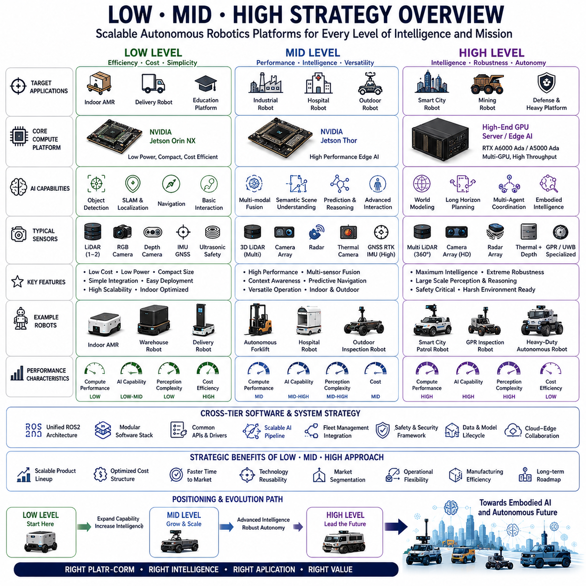
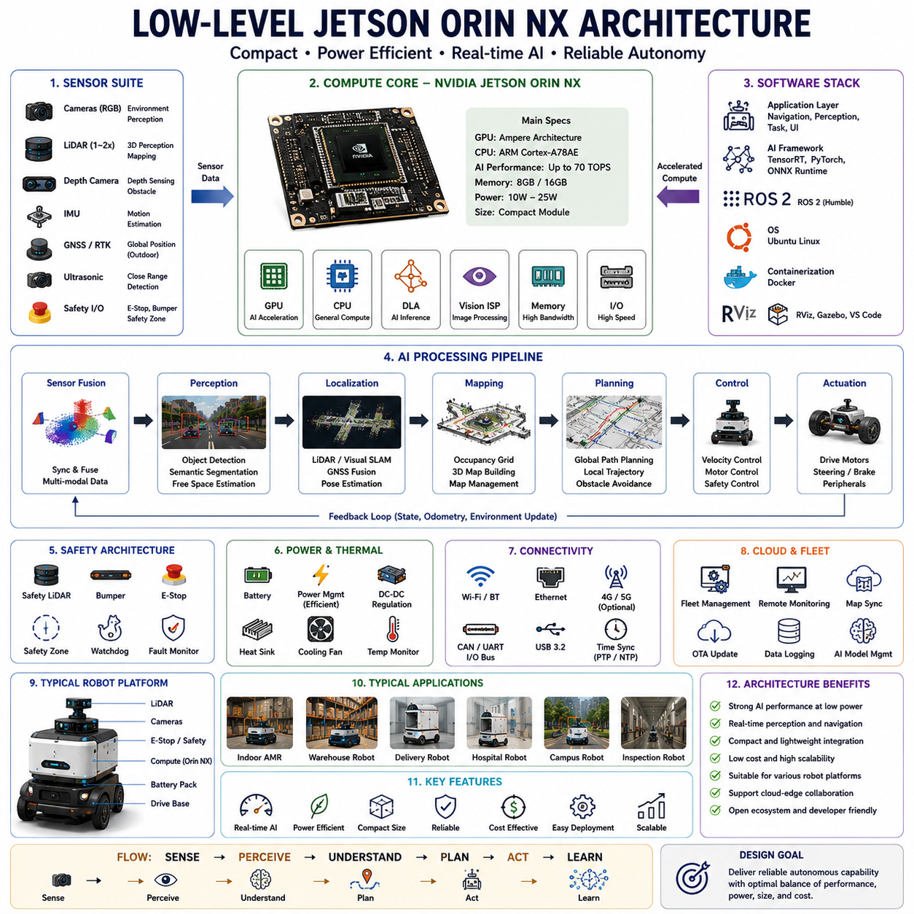
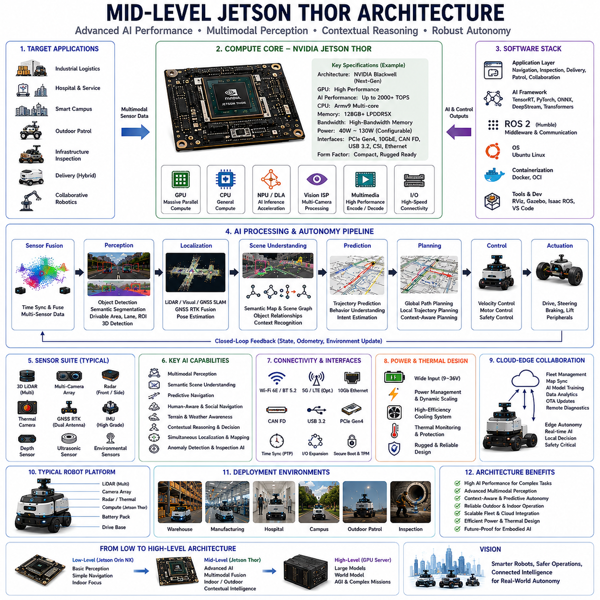
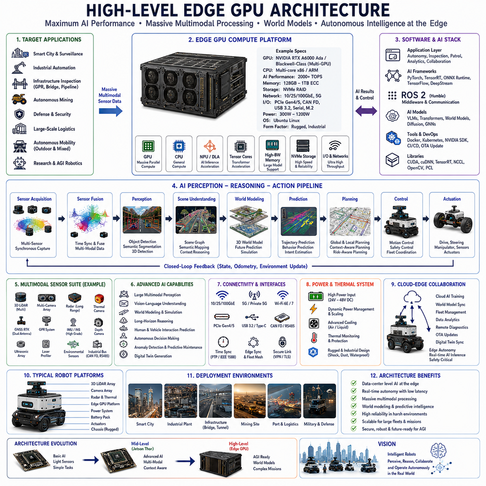
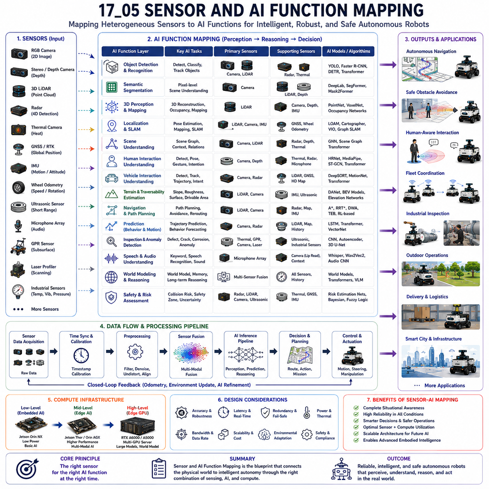
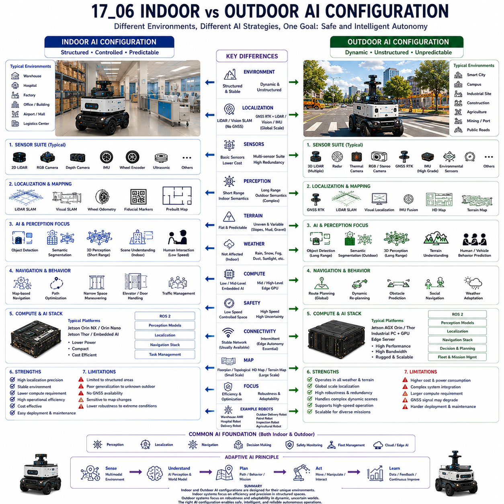
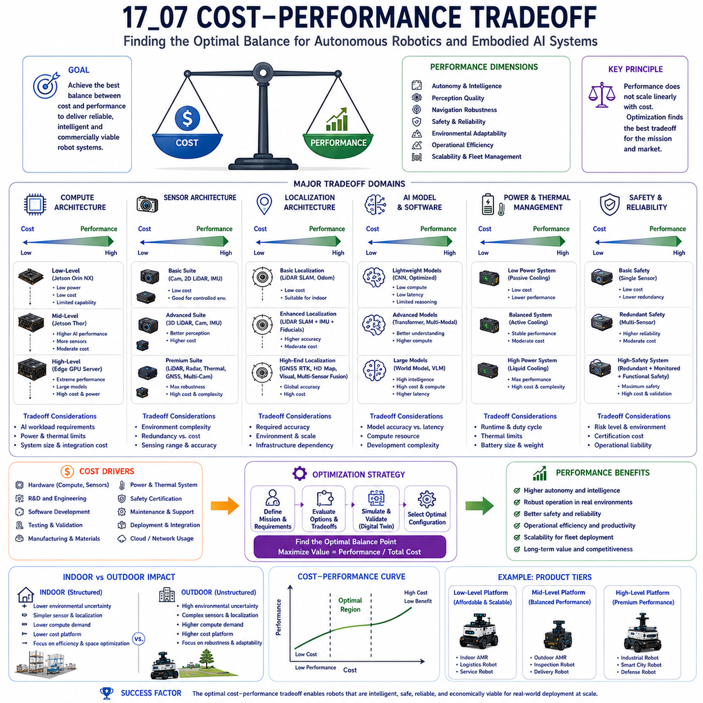
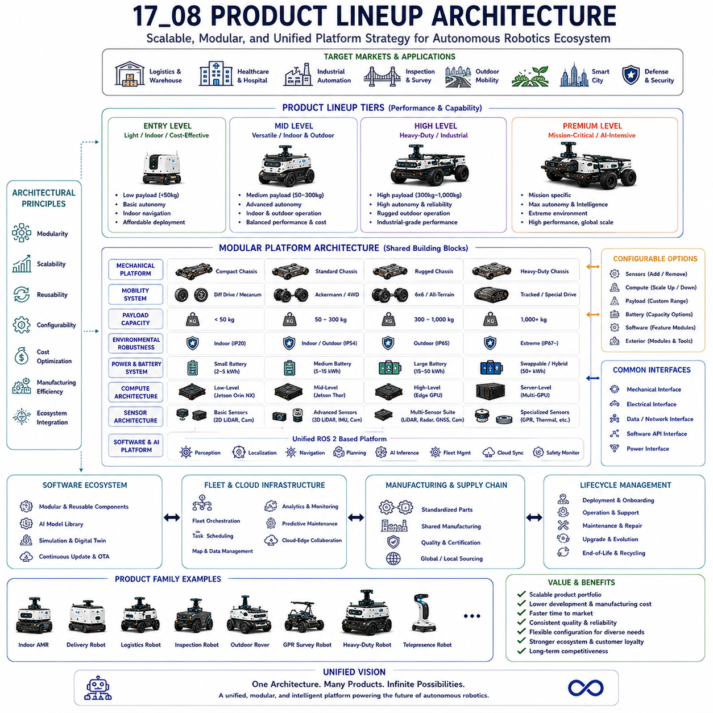

**Volume 06. AMR AI and Embodied Intelligence**


# Chapter 17. Low, Mid, and High AI Architecture

## 17.1 Low-Mid-High Strategy Overview

{width="7.268055555555556in" height="7.268055555555556in"}

"17_01_Low_Mid_High_Strategy_Overview" describes one of the most important architectural and product planning concepts in modern autonomous robotics and embodied AI systems: the systematic classification of robotic AI platforms into Low-Level, Mid-Level, and High-Level compute architectures according to performance, intelligence capability, operational environment, scalability, sensor complexity, AI workload, and commercial product positioning. This strategy is widely used in advanced AMR development because a single hardware architecture cannot efficiently satisfy all robotics applications simultaneously. Different industries, deployment scales, environmental conditions, safety requirements, and AI workloads require different balances among cost, power consumption, computational performance, thermal design, autonomy level, and operational intelligence.

The Low-Mid-High strategy is fundamentally a platform segmentation methodology that enables robotics companies to create scalable product lineups while optimizing engineering efficiency and market coverage. Instead of developing completely independent robot architectures for every customer or application, robotics manufacturers define standardized compute tiers that support different levels of autonomous intelligence and operational capability. This strategy significantly improves maintainability, software reuse, manufacturing scalability, supply chain stability, and long-term product roadmap management.

Modern autonomous mobile robots operate across extremely diverse environments. Some robots perform simple indoor logistics tasks with relatively low AI requirements, while others operate outdoors under highly dynamic conditions involving multimodal perception, large-scale scene understanding, predictive reasoning, and real-time AI decision-making. A lightweight indoor delivery robot does not require the same computational resources as a smart city patrol robot or a GPR-based underground infrastructure inspection platform. The Low-Mid-High architecture strategy allows robotics companies to align hardware capability with operational complexity.

The Low-Level architecture typically represents entry-level or efficiency-optimized autonomous robotic systems. These robots focus on relatively constrained operational environments where perception complexity and AI workloads remain moderate. Low-Level platforms are often used for indoor AMRs, warehouse logistics robots, basic delivery robots, lightweight patrol robots, or educational and research platforms. The primary design objectives are low cost, low power consumption, compact size, simplified thermal management, and high deployment scalability.

In many modern AMR systems, the Low-Level AI architecture is centered around embedded edge computing platforms such as NVIDIA Jetson Orin NX. These systems provide sufficient AI capability for standard perception, localization, navigation, obstacle avoidance, and lightweight semantic understanding while maintaining relatively low power consumption and compact integration size. Typical AI functions may include 2D/3D perception, basic object detection, semantic segmentation, visual SLAM, route planning, safety monitoring, and simple human interaction.

Low-Level robots generally rely on moderate sensor configurations. A typical sensor architecture may include one or two LiDAR sensors, several RGB cameras, depth cameras, IMU, GNSS, ultrasonic sensors, and basic safety systems. AI workloads are typically constrained to real-time perception and navigation rather than large-scale reasoning or multimodal embodied intelligence. These systems are highly suitable for cost-sensitive markets where scalability and operational simplicity are more important than advanced autonomous cognition.

The Mid-Level architecture represents a transition toward significantly more intelligent and capable robotic systems. Mid-Level robots are designed for more complex environments involving higher perception density, more advanced scene understanding, dynamic environmental interaction, and larger AI workloads. These robots often operate in mixed indoor-outdoor environments, industrial sites, smart logistics centers, hospitals, campuses, or medium-complexity outdoor environments.

The Mid-Level architecture increasingly centers around next-generation AI computing platforms such as NVIDIA Jetson Thor or advanced integrated AI edge systems. These platforms provide substantially greater GPU performance, AI inference throughput, memory bandwidth, and multimodal processing capability compared to Low-Level systems. Mid-Level robots support more advanced AI functions including multimodal fusion, semantic scene understanding, predictive navigation, contextual reasoning, trajectory prediction, fleet intelligence, and more advanced human-robot interaction.

Sensor architecture also becomes significantly more sophisticated at the Mid-Level. Systems may include multiple 3D LiDAR sensors, larger camera arrays, radar systems, thermal cameras, dual-antenna GNSS RTK systems, higher-grade IMUs, and additional environmental sensing modules. AI pipelines process significantly larger sensor streams and support more advanced perception tasks under dynamic environmental conditions.

One of the defining characteristics of Mid-Level systems is the increasing integration of embodied AI capabilities. Robots begin transitioning from simple navigation machines toward context-aware intelligent agents capable of understanding operational semantics, environmental relationships, and task-oriented reasoning. Mid-Level robots often support more advanced operational workflows such as industrial inspection, autonomous logistics coordination, collaborative robotics, smart facility management, and adaptive outdoor navigation.

The High-Level architecture represents the highest tier of autonomous robotics intelligence and compute capability. These systems are designed for highly complex, safety-critical, multimodal, and computation-intensive environments requiring advanced embodied AI, large-scale scene understanding, predictive world modeling, multi-agent coordination, and high-performance edge AI inference. High-Level platforms are typically used in smart city robotics, defense robotics, large-scale outdoor autonomous systems, industrial inspection robots, mining robots, autonomous heavy platforms, advanced research systems, and AGI-oriented embodied robotics platforms.

High-Level architectures often combine embedded AI systems with high-performance edge GPU servers or workstation-class compute platforms. Typical configurations may include NVIDIA RTX A6000 Ada, RTX A5000 Ada, or future industrial AI accelerators integrated with edge computers and advanced networking infrastructure. These systems may contain multiple GPUs dedicated to separate AI functions such as autonomy, multimodal perception, world modeling, large language model inference, or industrial inspection AI pipelines.

The computational demands of High-Level systems are extremely large because they often process multiple high-bandwidth sensor streams simultaneously. These may include multi-channel 3D LiDAR systems, radar arrays, large RGB camera arrays, thermal imaging, depth sensing, GPR systems, ultrasonic imaging, laser profiling, GNSS RTK, and industrial sensor fusion pipelines. Data throughput requirements can become enormous, especially for large-scale outdoor embodied AI systems.

High-Level robots frequently support advanced AI functions such as real-time semantic scene graphs, multimodal transformer architectures, large world models, vision-language-action systems, predictive environmental reasoning, fleet-level cooperative intelligence, long-horizon planning, and cloud-edge collaborative AI architectures. These systems increasingly resemble distributed embodied AI platforms rather than conventional mobile robots.

The Low-Mid-High strategy is not simply a hardware classification system. It also represents a software architecture strategy. Robotics companies increasingly design unified software stacks that scale across multiple compute tiers. Core software frameworks, middleware layers, ROS2 infrastructure, AI pipelines, safety systems, fleet management software, and deployment tools are shared across product lines whenever possible. This modular software strategy dramatically reduces engineering cost and accelerates product development cycles.

AI model deployment strategy also differs significantly across Low, Mid, and High architectures. Low-Level systems typically prioritize optimized lightweight inference models with strong real-time efficiency. Quantized models, TensorRT optimization, edge-efficient CNNs, and compressed perception pipelines are commonly used. Mid-Level systems support larger multimodal AI pipelines and more advanced transformer-based architectures. High-Level systems may support foundation models, VLM/VLA architectures, large-scale world models, and cloud-connected AI ecosystems.

Power consumption and thermal design become increasingly important as systems scale upward. Low-Level robots prioritize battery efficiency and passive or simplified cooling systems. Mid-Level robots require more advanced thermal management including active cooling and optimized airflow architecture. High-Level platforms often require industrial thermal engineering including liquid cooling, high-capacity fans, ruggedized enclosures, thermal isolation, and advanced power distribution systems.

The Low-Mid-High strategy also directly affects robot mechanical design. Low-Level robots are generally compact, lightweight, and optimized for indoor maneuverability. Mid-Level systems often support heavier payloads, larger sensor suites, and more ruggedized chassis designs. High-Level robots frequently operate in harsh outdoor conditions requiring heavy-duty suspension systems, large battery capacity, reinforced structures, high ingress protection ratings, and industrial-grade environmental durability.

Operational safety architecture also evolves across the compute tiers. Low-Level systems primarily focus on standard obstacle avoidance and basic safety sensing. Mid-Level robots support more advanced safety reasoning, contextual awareness, and predictive navigation. High-Level systems integrate functional safety architecture, AI runtime monitoring, redundant sensing systems, fail-operational autonomy, predictive risk assessment, and advanced safety certification methodologies.

The Low-Mid-High architecture strategy is particularly important for outdoor robotics because environmental complexity varies dramatically across deployment scenarios. A small campus delivery robot requires very different AI capabilities compared to a smart city autonomous patrol robot operating under rain, snow, nighttime conditions, and dense pedestrian traffic. Heavy-duty outdoor autonomous platforms used in agriculture, mining, or industrial inspection require even higher levels of environmental understanding and AI robustness.

Industrial inspection robots represent an especially important application area for High-Level AI architectures. GPR-based underground infrastructure inspection robots, thermal inspection systems, autonomous rail inspection robots, and smart utility infrastructure robots often require enormous compute resources because they process multimodal industrial sensor streams while simultaneously performing navigation, inspection analysis, anomaly detection, and predictive maintenance reasoning.

The Low-Mid-High strategy also supports long-term commercial scalability. Companies can enter markets initially with Low-Level cost-efficient platforms while gradually expanding toward Mid-Level and High-Level intelligent robotics systems. This layered strategy enables phased product development, market segmentation, technology reuse, and progressive AI capability expansion.

China-versus-global robotics architecture strategies are also closely connected to the Low-Mid-High framework. Some robotics companies define separate supply chain architectures depending on target markets, regulatory constraints, and export control considerations. China-local models may emphasize Chinese-sourced components and locally available AI accelerators, while global models may integrate higher-end international GPU platforms and globally certified safety systems.

Cloud-edge collaboration becomes increasingly important at Mid-Level and High-Level architectures. Low-Level robots often perform most computation locally due to limited operational complexity. Mid-Level systems increasingly split workloads between onboard AI and cloud infrastructure. High-Level platforms frequently operate as distributed embodied AI ecosystems where edge robots collaborate continuously with cloud-based world models, fleet intelligence systems, remote monitoring platforms, and large-scale AI training pipelines.

The Low-Mid-High strategy also influences manufacturing and product lifecycle management. Standardized architecture tiers simplify production workflows, spare parts management, software maintenance, and long-term deployment support. Unified compute platforms improve scalability while reducing engineering fragmentation across product families.

Future embodied AI systems will likely further expand the distinction between Low-Level, Mid-Level, and High-Level architectures. Low-Level robots may become highly affordable mass-deployment systems optimized for simple logistics and service tasks. Mid-Level systems may dominate industrial automation and smart infrastructure environments. High-Level systems may evolve into AGI-oriented embodied intelligence platforms capable of long-term autonomous reasoning, collaborative world modeling, and adaptive cognitive behavior.

Ultimately, "17_01_Low_Mid_High_Strategy_Overview" represents a foundational strategic framework for scalable autonomous robotics development. It integrates compute architecture, AI capability, sensor complexity, operational intelligence, safety design, software scalability, manufacturing strategy, and long-term product planning into a unified robotics platform methodology. As autonomous robotics continues expanding across logistics, healthcare, smart cities, industrial automation, infrastructure inspection, agriculture, and embodied AI ecosystems, the Low-Mid-High strategy will become one of the most important architectural foundations supporting flexible, scalable, and commercially viable autonomous robotic systems.

"17_01_Low_Mid_High_Strategy_Overview"는 현대 자율주행 로봇과 구현형 인공지능(Embodied AI) 시스템에서 가장 중요한 아키텍처 및 제품 전략 개념 중 하나를 설명하는 내용이다. 이는 로봇 플랫폼을 Low-Level, Mid-Level, High-Level AI 아키텍처로 체계적으로 구분하여 성능, 지능 수준, 운영 환경, 확장성, 센서 복잡도, AI 연산량, 제품 포지셔닝에 따라 최적화하는 전략이다. 현대 AMR 산업에서는 단일 하드웨어 구조로 모든 응용 분야를 효율적으로 지원하는 것이 사실상 불가능하기 때문에 이러한 계층형 전략이 매우 중요하다. 산업 분야, 운영 환경, 안전 요구사항, AI 워크로드, 고객 가격대가 서로 다르기 때문에 로봇 플랫폼 역시 다양한 계층으로 구분되어야 한다.

Low-Mid-High 전략은 단순 하드웨어 구분이 아니라 플랫폼 세분화(Platform Segmentation) 전략이다. 이를 통해 로봇 기업은 제품 라인업을 체계적으로 구성하고, 엔지니어링 효율성과 시장 대응력을 동시에 확보할 수 있다. 고객마다 완전히 다른 로봇 구조를 개발하는 대신, 표준화된 Compute Tier를 정의하여 다양한 자율주행 수준과 운영 시나리오를 지원하는 방식이다. 이러한 전략은 소프트웨어 재사용성, 유지보수 효율성, 생산 확장성, 공급망 안정성, 장기 제품 로드맵 관리에 매우 큰 장점을 제공한다.

현대 자율주행 로봇은 매우 다양한 환경에서 동작한다. 일부 로봇은 단순 실내 물류 작업을 수행하는 반면, 일부는 실외에서 멀티모달 인식과 대규모 Scene Understanding, 실시간 AI Reasoning이 필요한 환경에서 동작한다. 예를 들어 단순 실내 배송 로봇과 스마트시티 순찰 로봇, GPR 기반 지하 구조물 점검 로봇은 요구되는 연산 능력이 완전히 다르다. Low-Mid-High 전략은 이러한 운영 복잡도에 맞춰 하드웨어와 AI 성능을 최적화한다.

Low-Level Architecture는 일반적으로 Entry-Level 또는 Efficiency-Oriented Autonomous Robot을 의미한다. 이러한 플랫폼은 비교적 제한된 환경에서 동작하며 AI 연산 요구사항도 중간 수준 이하인 경우가 많다. 대표적인 예로 실내 AMR, 창고 물류 로봇, 단순 배송 로봇, 소형 순찰 로봇, 교육용 로봇 플랫폼 등이 있다. 주요 목표는 저비용, 저전력, 소형화, 단순한 열 설계, 대규모 배포 가능성이다.

현대 AMR 구조에서는 Low-Level AI Architecture가 NVIDIA Jetson Orin NX 기반으로 구성되는 경우가 많다. 이러한 플랫폼은 비교적 낮은 전력 소비와 작은 크기 안에서 실시간 Perception, Localization, Navigation, Obstacle Avoidance, Basic Semantic Understanding을 수행할 수 있다. 일반적인 AI 기능에는 2D/3D Perception, Basic Object Detection, Semantic Segmentation, Visual SLAM, Route Planning, Safety Monitoring, Simple Human Interaction 등이 포함된다.

Low-Level Robot은 보통 비교적 단순한 센서 구성을 가진다. 예를 들어 1\~2개의 LiDAR, RGB Camera, Depth Camera, IMU, GNSS, Ultrasonic Sensor 정도의 구성이 일반적이다. AI 연산 역시 대규모 World Modeling이나 Embodied Intelligence보다는 실시간 Navigation 중심이다. 이러한 구조는 비용 민감도가 높은 시장에서 매우 효과적이다.

Mid-Level Architecture는 보다 고급화된 지능형 로봇 구조를 의미한다. Mid-Level Robot은 더 복잡한 환경에서 동작하며, 높은 Perception Density, Advanced Scene Understanding, Dynamic Environmental Interaction, Larger AI Workload를 처리할 수 있어야 한다. 대표적으로 산업 현장, 스마트 물류센터, 병원, 캠퍼스, 중간 수준의 실외 환경 등이 해당된다.

Mid-Level Architecture는 점점 NVIDIA Jetson Thor와 같은 차세대 AI 플랫폼 중심으로 발전하고 있다. 이러한 플랫폼은 Low-Level 대비 훨씬 높은 GPU 성능, AI Inference Throughput, Memory Bandwidth, Multimodal Processing Capability를 제공한다. Mid-Level Robot은 Multimodal Fusion, Semantic Scene Understanding, Predictive Navigation, Contextual Reasoning, Trajectory Prediction, Fleet Intelligence, Advanced Human-Robot Interaction 등을 지원할 수 있다.

센서 구성 역시 Mid-Level에서 크게 복잡해진다. 다수의 3D LiDAR, Camera Array, Radar, Thermal Camera, Dual-Antenna GNSS RTK, High-Grade IMU 등이 포함될 수 있다. AI Pipeline은 훨씬 많은 Sensor Stream을 처리하며, 동적인 환경에서도 안정적으로 인식과 Navigation을 수행해야 한다.

Mid-Level Robot의 특징 중 하나는 Embodied AI 기능의 본격적인 통합이다. 로봇은 단순 Navigation Machine이 아니라 Operational Semantics, Environmental Relationship, Task-Oriented Reasoning을 이해하는 Intelligent Agent로 발전하기 시작한다. 대표 응용 분야로는 산업 점검, 자율 물류 협업, 스마트 시설 관리, 적응형 실외 Navigation 등이 있다.

High-Level Architecture는 가장 높은 수준의 자율주행 지능과 연산 능력을 제공하는 구조이다. 이러한 시스템은 매우 복잡하고 Safety-Critical한 환경에서 동작하며, Advanced Embodied AI, Large-Scale Scene Understanding, Predictive World Modeling, Multi-Agent Coordination, High-Performance Edge AI Inference를 요구한다. 대표적인 응용 분야로는 스마트시티 로봇, 국방 로봇, 대형 실외 자율 플랫폼, 산업 점검 로봇, 광산 로봇, AGI 기반 Embodied Robotics 플랫폼 등이 있다.

High-Level Architecture는 일반적으로 Embedded AI System과 High-Performance Edge GPU Server를 결합한다. 대표적으로 NVIDIA RTX A6000 Ada, RTX A5000 Ada, 미래 산업용 AI Accelerator 등이 사용될 수 있다. 일부 시스템은 여러 개의 GPU를 탑재하여 각각 Autonomy, Multimodal Perception, World Modeling, LLM Inference, Inspection AI 등을 별도로 처리한다.

High-Level System의 연산 요구사항은 매우 크다. Multi-Channel 3D LiDAR, Radar Array, Large Camera Array, Thermal Imaging, Depth Sensing, GPR, Ultrasonic Imaging, Laser Profiling, GNSS RTK 등을 동시에 처리해야 하기 때문이다. 특히 대규모 실외 Embodied AI System에서는 데이터 처리량이 매우 커진다.

High-Level Robot은 Real-Time Semantic Scene Graph, Multimodal Transformer, Large World Model, Vision-Language-Action System, Predictive Environmental Reasoning, Fleet-Level Cooperative Intelligence, Long-Horizon Planning 등을 지원할 수 있다. 이러한 시스템은 단순 Mobile Robot이라기보다 Distributed Embodied AI Platform에 가까워지고 있다.

Low-Mid-High 전략은 단순 Hardware Classification이 아니라 Software Architecture Strategy이기도 하다. 현대 로봇 기업은 다양한 Compute Tier에서 공통 Software Stack을 재사용하려고 한다. ROS2 Infrastructure, AI Pipeline, Safety System, Fleet Management Software, Deployment Tool 등을 공통화함으로써 엔지니어링 비용을 크게 절감할 수 있다.

AI Model Deployment Strategy 역시 Tier에 따라 달라진다. Low-Level System은 Lightweight Model, Quantized Model, TensorRT Optimization, Edge-Efficient CNN 등을 사용한다. Mid-Level은 Larger Multimodal AI와 Transformer 기반 구조를 지원하며, High-Level은 Foundation Model, VLM/VLA, Large World Model, Cloud-Connected AI Ecosystem까지 지원할 수 있다.

Power Consumption과 Thermal Design도 매우 중요한 차이를 만든다. Low-Level Robot은 배터리 효율성과 단순 Cooling을 중시한다. Mid-Level은 Active Cooling과 Airflow Optimization이 필요해지며, High-Level은 Liquid Cooling, High-Capacity Fan, Ruggedized Enclosure, Industrial Thermal Engineering까지 요구될 수 있다.

Low-Mid-High 전략은 Mechanical Design에도 직접적인 영향을 미친다. Low-Level Robot은 소형·경량 구조가 많고 실내 기동성을 중시한다. Mid-Level은 더 큰 Payload와 Sensor Suite를 지원하며 Ruggedized Chassis가 적용될 수 있다. High-Level Robot은 거친 실외 환경을 위한 Heavy-Duty Suspension, Large Battery Capacity, Reinforced Structure, High IP Rating 등을 필요로 한다.

Operational Safety Architecture 역시 단계적으로 발전한다. Low-Level은 기본 Obstacle Avoidance와 Safety Sensor 중심이며, Mid-Level은 Contextual Awareness와 Predictive Navigation이 추가된다. High-Level은 Functional Safety Architecture, AI Runtime Monitoring, Redundant Sensing, Fail-Operational Autonomy, Predictive Risk Assessment 등을 포함한다.

특히 Outdoor Robotics에서는 Low-Mid-High 전략이 매우 중요하다. 단순 캠퍼스 배송 로봇과 스마트시티 순찰 로봇은 완전히 다른 AI Capability를 요구한다. 농업, 광산, 산업 점검용 Heavy-Duty Outdoor Platform은 훨씬 더 높은 수준의 Environmental Understanding과 AI Robustness가 필요하다.

산업 점검 로봇은 High-Level AI Architecture의 대표적인 예이다. GPR 기반 지하 구조물 점검 로봇, Thermal Inspection Robot, Rail Inspection Robot, Smart Utility Robot 등은 Navigation과 동시에 Inspection AI, Anomaly Detection, Predictive Maintenance를 수행해야 하기 때문에 매우 높은 연산 능력이 필요하다.

Low-Mid-High 전략은 장기적인 사업 확장성 측면에서도 중요하다. 기업은 초기에는 Low-Level Platform으로 시장 진입을 수행하고, 이후 Mid-Level과 High-Level Intelligent Robotics 시장으로 확장할 수 있다. 이는 단계적 제품 확장과 기술 재사용을 가능하게 만든다.

China-vs-Global Robotics Architecture 전략 역시 Low-Mid-High Framework와 깊게 연결된다. 일부 기업은 중국 시장용과 글로벌 시장용 구조를 별도로 정의한다. 중국형 모델은 중국산 부품과 현지 AI Accelerator 중심으로 구성될 수 있으며, 글로벌 모델은 고성능 GPU와 국제 인증 Safety System을 포함할 수 있다.

Cloud-Edge Collaboration은 Mid-Level과 High-Level Architecture에서 더욱 중요해진다. Low-Level은 대부분 로컬 연산 중심이지만, Mid-Level은 일부 AI Workload를 Cloud와 분산 처리하기 시작한다. High-Level은 Cloud-Based World Model, Fleet Intelligence, Remote Monitoring, Large-Scale AI Training과 지속적으로 연결되는 Distributed Embodied AI Ecosystem 형태로 발전한다.

Low-Mid-High 전략은 Manufacturing과 Product Lifecycle Management에도 큰 영향을 준다. 표준화된 Architecture Tier는 생산 효율, Spare Part Management, Software Maintenance, Long-Term Support를 단순화시킨다. Unified Compute Platform은 제품군 전체의 Scalability를 크게 향상시킨다.

미래의 Embodied AI System에서는 Low-Level, Mid-Level, High-Level Architecture의 구분이 더욱 뚜렷해질 가능성이 높다. Low-Level은 대량 보급형 Logistics/Service Robot으로 발전할 가능성이 높고, Mid-Level은 산업 자동화와 스마트 인프라 시장의 중심이 될 수 있다. High-Level은 AGI 기반 Embodied Intelligence Platform으로 발전하여 장기 Reasoning, Cooperative World Modeling, Adaptive Cognitive Behavior를 수행하게 될 것이다.

궁극적으로 "17_01_Low_Mid_High_Strategy_Overview"는 확장 가능한 자율주행 로봇 개발을 위한 핵심 전략 프레임워크이다. 이는 Compute Architecture, AI Capability, Sensor Complexity, Operational Intelligence, Safety Design, Software Scalability, Manufacturing Strategy, Long-Term Product Planning을 하나의 통합 플랫폼 전략으로 결합한다. 앞으로 자율주행 로봇이 물류, 의료, 스마트시티, 산업 자동화, 인프라 점검, 농업, Embodied AI 생태계로 빠르게 확대됨에 따라, Low-Mid-High 전략은 유연하고 확장 가능하며 상업적으로 경쟁력 있는 Autonomous Robotics System을 구축하기 위한 가장 중요한 기반 구조 중 하나가 될 것이다.

##  

## 17.2 Low-Level Jetson Orin NX Architecture

{width="7.268055555555556in" height="7.268055555555556in"}

"17_02_Low_Level_Jetson_Orin_NX_Architecture" describes the design philosophy, hardware structure, AI processing pipeline, operational capability, and deployment strategy of low-level autonomous robotic platforms built around the NVIDIA Jetson Orin NX edge AI computing architecture. This architecture represents one of the most practical and commercially scalable approaches for modern autonomous mobile robots because it provides a strong balance among computational performance, power efficiency, compact integration, thermal manageability, and cost optimization. Low-Level Jetson Orin NX Architecture is especially important for indoor AMRs, lightweight outdoor robots, delivery robots, warehouse logistics systems, educational robotics, inspection robots, and scalable commercial robotic platforms where edge AI capability must coexist with practical deployment constraints.

Modern autonomous robots increasingly require real-time artificial intelligence processing directly at the edge. Robots operating in real-world environments must continuously process sensor streams, interpret environmental information, estimate robot position, avoid obstacles, recognize humans and objects, perform navigation planning, and respond to environmental changes without relying entirely on cloud connectivity. However, many robotic platforms cannot support extremely large GPU systems due to limitations in size, power consumption, battery capacity, thermal dissipation, and deployment cost. The Jetson Orin NX architecture addresses this problem by providing high-performance embedded AI computing within a relatively compact and power-efficient platform.

The NVIDIA Jetson Orin NX platform is based on NVIDIA's Ampere GPU architecture and Arm CPU architecture optimized for edge AI deployment. The platform integrates GPU acceleration, AI tensor processing, CPU computation, memory subsystems, multimedia acceleration, and high-speed I/O interfaces into a compact embedded module. This allows autonomous robots to execute advanced AI inference workloads locally while maintaining mobility and power efficiency. Compared to traditional industrial PC architectures, Jetson Orin NX significantly reduces system volume, integration complexity, and overall energy consumption.

One of the defining characteristics of the Jetson Orin NX architecture is its balance between AI performance and embedded deployment practicality. The system provides sufficient AI compute capability to support real-time perception and autonomous navigation while remaining suitable for battery-powered mobile platforms. This balance is critical because autonomous robots must operate continuously for extended durations while maintaining acceptable thermal conditions and manageable energy usage.

Low-Level Jetson Orin NX robotic systems typically focus on environments where operational complexity remains moderate but reliable autonomous functionality is still required. Common deployment scenarios include indoor logistics robots, warehouse AMRs, campus delivery robots, lightweight patrol systems, hospital service robots, educational robotics platforms, and compact inspection robots. In these applications, the primary engineering objectives are efficient navigation, stable perception, low deployment cost, scalability, and simplified maintenance.

The AI processing architecture of Jetson Orin NX-based robots generally centers around real-time perception and navigation. The system continuously processes data from cameras, LiDAR sensors, IMUs, GNSS modules, depth sensors, and ultrasonic safety systems. These sensor streams are fused to generate environmental understanding, localization estimation, obstacle detection, semantic interpretation, and motion planning decisions.

Visual perception is one of the most important AI functions within the architecture. RGB cameras provide environmental appearance information used for object detection, semantic segmentation, visual localization, and environmental classification. AI models running on the Orin NX GPU accelerate convolutional neural networks and transformer-based perception pipelines to achieve real-time inference capability. Object detection systems identify pedestrians, obstacles, vehicles, pallets, shelves, doors, or operational infrastructure depending on deployment environment.

Semantic segmentation plays an important role in enabling meaning-aware environmental understanding. Instead of treating the environment as purely geometric space, segmentation models classify pixels into semantic categories such as floor, wall, pathway, obstacle, road, sidewalk, storage rack, or restricted area. Semantic awareness significantly improves navigation quality and operational safety because robots can interpret environmental meaning rather than relying only on obstacle geometry.

LiDAR integration is another core component of the Low-Level Jetson Orin NX architecture. Most systems include one or two 2D or 3D LiDAR sensors for obstacle detection, localization support, mapping, and free-space estimation. LiDAR provides highly reliable geometric perception even under lighting variation where camera-only systems may degrade. LiDAR point cloud processing pipelines running on the Orin NX support simultaneous localization and mapping, obstacle clustering, occupancy mapping, and local navigation planning.

Visual SLAM and LiDAR SLAM systems are frequently deployed within Jetson Orin NX robots to enable autonomous localization and mapping. SLAM algorithms estimate robot position while simultaneously constructing environmental maps. Indoor robots often rely heavily on LiDAR SLAM due to repetitive architectural structures and GNSS limitations, while lightweight outdoor systems may integrate GNSS-assisted localization for larger operational environments.

Navigation architecture within the Low-Level Orin NX framework generally includes global path planning, local trajectory planning, obstacle avoidance, safety monitoring, and motion control integration. ROS2-based middleware is commonly used to coordinate sensor fusion, AI inference, localization, planning, and control modules. Navigation systems continuously update local environmental representations and generate safe motion trajectories in real time.

Obstacle avoidance systems within Low-Level architectures are optimized for practical reliability and low computational overhead. Unlike high-end embodied AI systems that perform complex predictive reasoning, Low-Level robots prioritize stable real-time collision prevention and efficient path following. Safety LiDAR systems, ultrasonic sensors, emergency stop mechanisms, and safety zones are integrated into the navigation stack to ensure operational safety around humans and equipment.

Human detection and lightweight human-aware navigation are increasingly included even in Low-Level robotic platforms. Although these systems may not perform advanced social reasoning, they can still detect pedestrians, estimate basic movement trajectories, and adjust navigation behavior accordingly. This capability is especially important in hospitals, warehouses, campuses, and commercial facilities where robots share space with people.

The Jetson Orin NX architecture is particularly attractive because of its energy efficiency. Battery-powered autonomous robots require careful energy management to maintain practical operational duration. High-power industrial GPUs may provide greater computational capability but significantly reduce operational endurance due to thermal and energy constraints. Orin NX provides a favorable balance allowing multiple hours of continuous autonomous operation within compact robotic systems.

Thermal management is a major design consideration in embedded AI robotics. AI inference workloads generate substantial heat, especially during continuous real-time operation involving multiple sensor streams and neural network pipelines. Low-Level Jetson Orin NX architectures generally use optimized passive or active cooling systems including aluminum heat sinks, low-profile fans, airflow channels, and thermal interface materials. Compact thermal engineering is essential because mobile robotic platforms have limited internal space.

Mechanical integration is another important characteristic of the architecture. Jetson Orin NX modules allow highly compact robot designs because the compute platform occupies relatively little physical space compared to industrial PCs or workstation-class GPU systems. This supports lightweight chassis design, lower center of gravity, improved maneuverability, and simplified cable routing.

The software architecture surrounding Jetson Orin NX is also highly important. Most modern systems rely on Linux-based operating systems such as Ubuntu combined with ROS2 middleware frameworks. ROS2 provides distributed communication infrastructure supporting modular AI deployment, sensor integration, navigation coordination, and fleet-level scalability. Containerization technologies such as Docker are also increasingly used to simplify software deployment and update management.

AI model optimization is essential for practical deployment on embedded edge hardware. Low-Level Jetson Orin NX systems typically use TensorRT optimization, quantized inference models, lightweight CNN architectures, compressed transformer models, and edge-efficient AI pipelines. These optimizations reduce memory usage, increase inference throughput, and minimize latency while preserving acceptable AI accuracy.

Multimodal sensor fusion remains a central capability even within Low-Level architectures. RGB cameras, LiDAR, depth sensors, IMUs, GNSS, and ultrasonic sensors are combined to improve robustness and environmental understanding. Sensor fusion improves localization accuracy, obstacle detection reliability, and navigation stability under varying operational conditions.

Low-Level Orin NX robots frequently support cloud-edge collaboration architectures. While most real-time autonomy functions operate locally on the edge device, cloud systems may provide fleet management, map synchronization, software updates, telemetry monitoring, remote diagnostics, and AI model management. This hybrid architecture allows scalable commercial deployment without overwhelming onboard computational resources.

Fleet management is especially important in warehouse and logistics deployments where multiple AMRs operate simultaneously. Even relatively low-level robots can participate in centralized fleet orchestration systems coordinating traffic flow, task assignment, charging schedules, and operational monitoring. The Jetson Orin NX architecture provides sufficient communication and AI capability to support such distributed autonomous operations.

The Low-Level architecture is also highly important for robotics scalability and commercialization. Many robotics companies initially enter markets using Orin NX-based systems because they provide cost-effective deployment while still supporting meaningful AI capability. Once software frameworks, operational workflows, and sensor architectures mature, companies may later expand toward Mid-Level or High-Level AI platforms.

Educational and research robotics also benefit significantly from the Orin NX architecture. The platform provides accessible GPU-accelerated AI computing suitable for robotics research, AI experimentation, SLAM development, reinforcement learning, perception system prototyping, and autonomous navigation research. The broad ecosystem surrounding NVIDIA Jetson platforms accelerates robotics innovation and developer adoption.

Industrial inspection robots often use Low-Level Orin NX architectures for lightweight mobile sensing applications. Examples include facility inspection robots, thermal inspection systems, security patrol robots, indoor monitoring robots, and lightweight outdoor utility inspection platforms. These systems typically require reliable real-time perception and mobility rather than large-scale embodied reasoning.

One limitation of Low-Level architectures is that AI workload capacity remains constrained compared to larger GPU systems. Large multimodal transformers, large world models, advanced embodied cognition systems, and extremely dense sensor processing pipelines may exceed the computational limits of embedded edge hardware. As environmental complexity increases, Mid-Level or High-Level architectures may become necessary.

However, the efficiency and practicality of Low-Level architectures make them extremely important within the robotics industry. Most commercial robotics deployments do not require AGI-scale intelligence. Instead, they require stable, reliable, cost-effective autonomy optimized for specific operational tasks. The Jetson Orin NX architecture addresses this practical market requirement effectively.

Future Low-Level architectures will likely continue evolving toward greater AI efficiency, stronger multimodal processing, improved transformer acceleration, lower power consumption, and tighter cloud-edge integration. Edge AI accelerators, specialized robotics NPUs, energy-efficient transformer architectures, and compact multimodal world models may significantly expand the capability of future embedded autonomous systems.

Ultimately, "17_02_Low_Level_Jetson_Orin_NX_Architecture" represents one of the foundational architectures enabling practical large-scale autonomous robotics deployment. It combines embedded GPU acceleration, real-time AI inference, multimodal perception, navigation intelligence, ROS2-based software infrastructure, energy-efficient operation, and scalable commercial deployment into a compact robotic AI platform. As autonomous robots continue expanding across logistics, healthcare, facility management, education, inspection, and smart infrastructure environments, Jetson Orin NX-based Low-Level architectures will remain one of the most important foundations supporting affordable, scalable, and reliable embodied autonomous systems.

"17_02_Low_Level_Jetson_Orin_NX_Architecture"는 NVIDIA Jetson Orin NX 기반의 저수준(Low-Level) 자율주행 로봇 플랫폼의 설계 철학, 하드웨어 구조, AI 처리 파이프라인, 운영 특성, 배포 전략을 설명하는 개념이다. 이 아키텍처는 현대 자율주행 로봇 산업에서 가장 실용적이고 상업적으로 확장 가능한 구조 중 하나로 평가된다. 그 이유는 연산 성능, 전력 효율, 소형화, 열 설계, 비용 효율성 사이에서 매우 우수한 균형을 제공하기 때문이다. 특히 실내 AMR, 소형 실외 로봇, 배송 로봇, 창고 물류 로봇, 교육용 로봇, 경량 점검 로봇과 같은 분야에서 매우 중요하게 사용된다. 이러한 환경에서는 강력한 Edge AI 성능이 필요하지만 동시에 배터리 지속 시간, 시스템 크기, 열 관리, 비용 등의 현실적인 제약도 만족해야 한다.

현대 자율주행 로봇은 점점 더 많은 AI 연산을 Edge Device 내부에서 실시간으로 수행해야 한다. 로봇은 주변 센서 데이터를 지속적으로 처리하면서 환경을 이해하고, 위치를 추정하고, 장애물을 회피하고, 사람과 객체를 인식하며, Navigation Planning을 수행해야 한다. 그러나 대부분의 로봇은 대형 GPU 서버를 탑재할 수 없다. 크기, 무게, 배터리 용량, 전력 소비, 발열, 비용 등의 제약이 존재하기 때문이다. Jetson Orin NX 아키텍처는 이러한 문제를 해결하기 위해 설계된 Edge AI 플랫폼이다. 비교적 작은 크기와 낮은 전력 소비 안에서 강력한 AI Inference 성능을 제공한다.

Jetson Orin NX는 NVIDIA Ampere GPU Architecture와 Arm CPU Architecture 기반의 Embedded AI Module이다. GPU Acceleration, AI Tensor Processing, CPU Computation, Memory Subsystem, Multimedia Acceleration, High-Speed I/O Interface 등이 하나의 소형 모듈 안에 통합되어 있다. 이를 통해 로봇은 클라우드 연결 없이도 로컬에서 고속 AI 연산을 수행할 수 있다. 기존 산업용 PC 구조에 비해 크기와 소비 전력이 크게 줄어들며 통합 난이도도 낮아진다.

Jetson Orin NX Architecture의 가장 큰 특징 중 하나는 "AI 성능과 실용적 배포 가능성의 균형"이다. 이 플랫폼은 실시간 Perception과 Autonomous Navigation을 수행할 수 있을 정도의 충분한 AI 성능을 제공하면서도, 배터리 기반 모바일 로봇에 적합한 수준의 전력 소비를 유지한다. 이러한 균형은 실제 자율주행 로봇에서 매우 중요하다. 로봇은 수 시간 이상 지속 운영되어야 하며 동시에 발열도 관리 가능해야 하기 때문이다.

Low-Level Jetson Orin NX 기반 로봇은 일반적으로 비교적 제한적이지만 안정적인 자율주행 기능이 필요한 환경을 목표로 한다. 대표적인 응용 분야로는 Indoor Logistics Robot, Warehouse AMR, Campus Delivery Robot, Lightweight Patrol Robot, Hospital Service Robot, Educational Robotics Platform, Compact Inspection Robot 등이 있다. 이러한 환경에서는 저비용, 높은 안정성, 쉬운 유지보수, 대규모 배포 가능성이 핵심 목표가 된다.

Jetson Orin NX 기반 로봇의 AI 처리 구조는 일반적으로 실시간 Perception과 Navigation 중심으로 설계된다. 시스템은 Camera, LiDAR, IMU, GNSS, Depth Sensor, Ultrasonic Safety Sensor 등의 데이터를 지속적으로 처리한다. 이러한 Sensor Stream은 Sensor Fusion을 통해 Environmental Understanding, Localization, Obstacle Detection, Semantic Interpretation, Motion Planning으로 연결된다.

Visual Perception은 이 구조에서 가장 중요한 AI 기능 중 하나이다. RGB Camera는 환경 Appearance 정보를 제공하며, 이를 통해 Object Detection, Semantic Segmentation, Visual Localization, Environmental Classification 등을 수행한다. Orin NX GPU는 CNN 및 Transformer 기반 Perception Pipeline을 실시간으로 가속한다. Object Detection System은 보행자, 장애물, 차량, 팔레트, 선반, 문, 산업 인프라 등을 인식할 수 있다.

Semantic Segmentation 또한 매우 중요한 역할을 수행한다. 로봇은 단순히 Geometry 기반 Free Space만 이해하는 것이 아니라, 바닥, 벽, 이동 경로, 장애물, 도로, 인도, 저장 랙, 제한 구역 등을 의미 기반으로 분류해야 한다. 이러한 Semantic Awareness는 Navigation 품질과 Safety를 크게 향상시킨다.

LiDAR Integration 역시 핵심 요소이다. 대부분의 Low-Level Robot은 1\~2개의 2D 또는 3D LiDAR를 사용한다. LiDAR는 Obstacle Detection, Localization, Mapping, Free Space Estimation을 지원한다. 특히 조명 변화 환경에서도 안정적인 Geometry Perception을 제공한다. Orin NX 기반 Point Cloud Processing Pipeline은 SLAM, Obstacle Clustering, Occupancy Mapping, Local Navigation Planning 등을 수행할 수 있다.

Visual SLAM 및 LiDAR SLAM 역시 자주 사용된다. SLAM은 로봇 위치를 추정하면서 동시에 환경 지도를 생성하는 기술이다. 실내 환경에서는 반복 구조와 GNSS 제한 때문에 LiDAR SLAM 의존도가 높고, 소형 실외 시스템에서는 GNSS Assisted Localization이 함께 사용되기도 한다.

Navigation Architecture는 Global Path Planning, Local Trajectory Planning, Obstacle Avoidance, Safety Monitoring, Motion Control Integration으로 구성된다. ROS2 기반 Middleware가 Sensor Fusion, AI Inference, Localization, Planning, Control Module을 연결하는 경우가 많다. Navigation System은 실시간으로 Local Environmental Representation을 업데이트하며 안전한 Trajectory를 생성한다.

Obstacle Avoidance System은 Low-Level Architecture에서 매우 실용적으로 최적화된다. High-End Embodied AI처럼 복잡한 Predictive Reasoning보다는, 안정적인 실시간 Collision Prevention과 Efficient Path Following을 우선시한다. Safety LiDAR, Ultrasonic Sensor, Emergency Stop Mechanism, Safety Zone 등이 Navigation Stack에 통합된다.

최근에는 Low-Level Robot에도 Human Detection과 Basic Human-Aware Navigation 기능이 점점 추가되고 있다. 이러한 시스템은 고급 Social Reasoning까지는 수행하지 않지만, 사람을 인식하고 기본적인 이동 방향을 추정하여 Navigation Behavior를 조정할 수 있다. 이는 병원, 창고, 캠퍼스, 상업 시설에서 매우 중요하다.

Jetson Orin NX Architecture의 가장 큰 장점 중 하나는 높은 에너지 효율성이다. 배터리 기반 로봇은 Operational Endurance가 매우 중요하다. 고성능 GPU는 더 강력한 연산을 제공할 수 있지만, 배터리 지속 시간을 크게 감소시킨다. Orin NX는 수 시간 이상의 지속 자율주행을 가능하게 하는 우수한 전력 효율을 제공한다.

Thermal Management 역시 매우 중요한 설계 요소이다. AI Inference는 상당한 열을 발생시키며, 특히 여러 Sensor Stream과 Neural Network Pipeline을 지속 처리할 경우 발열이 커진다. Low-Level Architecture는 일반적으로 Aluminum Heat Sink, Low-Profile Fan, Airflow Channel, Thermal Interface Material 등을 사용한 Compact Cooling Structure를 적용한다.

Mechanical Integration도 중요한 특징이다. Jetson Orin NX는 산업용 PC나 대형 GPU Server에 비해 매우 작은 크기를 가지기 때문에, 로봇 전체 구조를 더욱 Compact하게 설계할 수 있다. 이는 Lightweight Chassis, Low Center of Gravity, Better Maneuverability, Simplified Cable Routing 등을 가능하게 만든다.

Software Architecture 역시 매우 중요하다. 대부분 Ubuntu 기반 Linux와 ROS2 Middleware를 사용한다. ROS2는 Distributed Communication Infrastructure를 제공하며, Modular AI Deployment, Sensor Integration, Navigation Coordination, Fleet-Level Scalability를 지원한다. 최근에는 Docker 기반 Containerization도 널리 사용되고 있다.

AI Model Optimization은 Embedded Edge Hardware에서 매우 중요하다. Low-Level System은 TensorRT Optimization, Quantized Inference Model, Lightweight CNN, Compressed Transformer 등을 사용하여 Memory Usage를 줄이고 Inference Throughput을 높인다.

Multimodal Sensor Fusion 역시 핵심 기능이다. RGB Camera, LiDAR, Depth Sensor, IMU, GNSS, Ultrasonic Sensor 등을 결합하여 Localization Accuracy와 Obstacle Detection Reliability를 향상시킨다.

Low-Level Robot도 Cloud-Edge Collaboration 구조를 사용하는 경우가 많다. 대부분의 실시간 자율주행 기능은 Edge Device에서 처리되지만, Cloud는 Fleet Management, Map Synchronization, Software Update, Telemetry Monitoring, Remote Diagnostics 등을 담당한다.

Fleet Management는 특히 Warehouse와 Logistics 환경에서 중요하다. 여러 AMR이 동시에 운영될 경우 중앙 Fleet Management System이 Traffic Flow, Task Assignment, Charging Schedule 등을 관리한다. Jetson Orin NX는 이러한 분산 Autonomous Operation을 지원할 수 있는 충분한 AI 및 Communication Capability를 제공한다.

Low-Level Architecture는 Robotics Commercialization에서도 매우 중요하다. 많은 로봇 기업이 초기 제품을 Orin NX 기반으로 개발하는 이유는 충분한 AI Capability를 제공하면서도 비용 효율적이기 때문이다. 이후 Software Framework와 Operational Workflow가 성숙해지면 Mid-Level 또는 High-Level Platform으로 확장할 수 있다.

Educational Robotics와 Research Robotics에서도 Orin NX는 매우 인기 있다. GPU Accelerated AI Computing을 저렴하게 제공하기 때문에 Robotics Research, SLAM Development, Reinforcement Learning, Autonomous Navigation Experimentation에 적합하다.

Industrial Inspection Robot에서도 Low-Level Orin NX Architecture가 자주 사용된다. 예를 들어 Facility Inspection Robot, Thermal Inspection Robot, Security Patrol Robot, Indoor Monitoring Robot, Lightweight Outdoor Utility Inspection Robot 등이 있다. 이러한 시스템은 대규모 Embodied Reasoning보다는 Reliable Real-Time Perception과 Mobility가 중요하다.

물론 Low-Level Architecture의 한계도 존재한다. 대규모 Multimodal Transformer, Large World Model, Advanced Embodied Cognition, Dense Sensor Processing은 Embedded Edge Hardware 성능 한계를 초과할 수 있다. 환경 복잡도가 증가하면 Mid-Level 또는 High-Level Architecture가 필요해질 수 있다.

그럼에도 불구하고 Low-Level Architecture는 로봇 산업에서 매우 중요한 위치를 가진다. 실제 상용 로봇의 대부분은 AGI 수준 지능이 필요한 것이 아니라, 특정 업무를 안정적이고 저렴하게 수행하는 것이 목표이기 때문이다. Jetson Orin NX Architecture는 이러한 현실적 시장 요구를 매우 효과적으로 만족시킨다.

미래의 Low-Level Architecture는 더욱 높은 AI Efficiency, Stronger Multimodal Processing, Better Transformer Acceleration, Lower Power Consumption, Stronger Cloud-Edge Integration 방향으로 발전할 가능성이 높다. Specialized Robotics NPU, Edge AI Accelerator, Energy-Efficient Transformer Architecture, Compact Multimodal World Model 등이 미래 Embedded Autonomous System의 성능을 크게 향상시킬 수 있다.

궁극적으로 "17_02_Low_Level_Jetson_Orin_NX_Architecture"는 실용적이고 대규모 배포 가능한 Autonomous Robotics System을 가능하게 하는 핵심 기반 구조 중 하나이다. 이는 Embedded GPU Acceleration, Real-Time AI Inference, Multimodal Perception, Navigation Intelligence, ROS2 기반 Software Infrastructure, Energy-Efficient Operation, Scalable Commercial Deployment를 하나의 Compact Robotics AI Platform으로 통합한다. 앞으로 자율주행 로봇이 물류, 의료, 시설 관리, 교육, 점검, 스마트 인프라 분야로 빠르게 확대됨에 따라, Jetson Orin NX 기반 Low-Level Architecture는 경제적이고 확장 가능하며 신뢰성 높은 Embodied Autonomous System을 구축하기 위한 가장 중요한 기반 구조 중 하나로 계속 활용될 것이다.

##  

## 17.3 Mid-Level Jetson Thor Architecture

{width="7.268055555555556in" height="7.268055555555556in"}

"17_03_Mid_Level_Jetson_Thor_Architecture" describes the architectural philosophy, AI computing structure, sensor integration strategy, operational intelligence framework, and deployment model of mid-level autonomous robotic systems built around the NVIDIA Jetson Thor platform and next-generation embedded edge AI architectures. Mid-Level Jetson Thor Architecture represents a major evolutionary step between lightweight embedded robotic systems and large-scale high-performance AI robotics platforms. It is specifically designed to support significantly more advanced autonomous intelligence, multimodal environmental understanding, contextual reasoning, and large-scale sensor processing while still maintaining the compactness, mobility, and deployment practicality required for real-world autonomous robots.

As autonomous robotics evolves toward embodied AI and context-aware intelligence, traditional low-level edge computing architectures increasingly encounter limitations in perception density, AI workload scalability, multimodal fusion capability, and long-horizon reasoning performance. Modern robots are no longer expected to simply follow predefined paths or avoid obstacles. They are increasingly required to understand operational environments semantically, interpret human and vehicle interactions, perform predictive navigation, coordinate with fleet infrastructure, and operate robustly across dynamic indoor and outdoor environments. The Mid-Level Jetson Thor Architecture is designed to address this growing demand for higher autonomous intelligence without transitioning immediately toward large industrial GPU server systems.

The NVIDIA Jetson Thor platform represents the next generation of robotics-focused embedded AI computing systems. Compared to earlier edge platforms such as Jetson Orin NX, Jetson Thor significantly expands GPU capability, AI tensor processing performance, memory bandwidth, multimodal processing throughput, and transformer acceleration capability. This architectural evolution enables mid-level autonomous robots to process much larger and more complex AI workloads directly at the edge while maintaining manageable power consumption and embedded deployment characteristics.

One of the defining goals of Mid-Level Jetson Thor Architecture is to support embodied AI-oriented robotics applications. Embodied AI systems require robots to understand environments semantically, reason contextually, predict environmental dynamics, and integrate perception with navigation and decision-making in real time. This requires significantly larger AI models, denser sensor integration, more advanced scene understanding, and greater computational parallelism than typical low-level architectures can efficiently support.

Mid-Level Jetson Thor robotic systems are commonly designed for environments with moderate-to-high operational complexity. These environments include industrial logistics centers, hospitals, manufacturing facilities, smart campuses, autonomous outdoor patrol systems, infrastructure inspection platforms, collaborative robotics environments, and intelligent delivery systems operating across mixed indoor-outdoor conditions. In such environments, robots must interpret operational semantics, dynamic interactions, and changing environmental conditions continuously.

The AI compute architecture of Jetson Thor systems generally combines high-performance GPU acceleration, dedicated AI tensor processing, advanced multimedia processing, high-bandwidth memory systems, and optimized robotics I/O integration. These systems are designed specifically for large-scale multimodal AI inference pipelines running under real-time operational constraints. Compared to lightweight embedded AI systems, Mid-Level architectures support much higher sensor density and significantly more sophisticated AI reasoning.

Sensor integration is one of the most important characteristics of Mid-Level Jetson Thor Architecture. While low-level robotic systems may rely on relatively simple sensor configurations, Mid-Level systems often integrate multiple 3D LiDAR sensors, multi-camera arrays, radar modules, thermal cameras, high-grade IMUs, GNSS RTK systems, depth sensors, ultrasonic sensors, and environmental monitoring devices simultaneously. These sensors collectively generate extremely large streams of real-time data that must be fused continuously into coherent environmental understanding.

Multimodal sensor fusion therefore becomes a core architectural layer within Mid-Level robotics systems. RGB cameras provide semantic appearance understanding and object recognition capability. LiDAR generates dense 3D geometry and spatial mapping information. Radar systems provide robust motion tracking and adverse-weather perception. Thermal cameras enable nighttime operation and heat-based detection. GNSS RTK systems support large-scale outdoor localization. IMUs provide inertial motion estimation and stability tracking. Sensor fusion pipelines running on Jetson Thor combine these heterogeneous sensor streams into unified scene understanding representations.

Semantic scene understanding becomes far more advanced in Mid-Level systems compared to low-level architectures. Robots are no longer limited to detecting obstacles and free space. Instead, they interpret roads, hallways, crosswalks, loading zones, workstations, elevators, emergency routes, charging stations, operational traffic flow, and human interaction regions. Semantic segmentation and object relationship modeling allow robots to understand environmental meaning rather than relying purely on geometry-based navigation.

Scene graph generation is increasingly important within Mid-Level architectures. Semantic Scene Graphs represent environmental entities as nodes and contextual relationships as edges. Robots use these graph structures to understand interactions such as "pedestrian approaching corridor," "forklift operating near loading zone," or "vehicle entering restricted area." These relational representations significantly improve contextual reasoning and navigation intelligence.

Visual perception pipelines running on Jetson Thor architectures frequently employ transformer-based AI models and multimodal neural networks. Vision Transformers, multimodal transformers, graph neural networks, and advanced segmentation models increasingly replace earlier CNN-only pipelines. These architectures improve contextual reasoning capability, long-range interaction modeling, and semantic environmental understanding.

Trajectory prediction and predictive navigation are also major components of Mid-Level architectures. Autonomous robots operating in dynamic environments must estimate future human, vehicle, and robot movement patterns continuously. Predictive AI models analyze trajectories, behavioral cues, environmental constraints, and operational context to estimate future environmental states. This enables proactive navigation rather than purely reactive obstacle avoidance.

Navigation systems within Mid-Level Jetson Thor robots are significantly more sophisticated than traditional autonomous navigation stacks. Navigation no longer focuses solely on shortest-path planning and collision avoidance. Instead, robots consider semantic constraints, human comfort, traffic flow, operational efficiency, contextual risk, environmental dynamics, and social interaction patterns. Human-aware navigation, predictive routing, and context-aware path planning become central capabilities.

Outdoor operational capability is one of the major advantages of Mid-Level architectures. These systems are often designed to operate reliably across both indoor and outdoor environments. Outdoor navigation requires handling lighting variation, weather conditions, uneven terrain, dynamic obstacles, road structures, pedestrian interactions, and long-range localization. Mid-Level Jetson Thor systems provide sufficient AI and sensor processing capability to support robust outdoor autonomous operation without requiring workstation-class GPU infrastructure.

Terrain understanding also becomes increasingly important in Mid-Level autonomous robotics. Robots operating outdoors must estimate terrain traversability, slope stability, surface friction, obstacle risk, and environmental safety continuously. AI models analyze LiDAR geometry, visual texture, depth information, and environmental context to estimate safe navigation paths under varying terrain conditions.

Weather-aware perception is another major architectural capability. Rain, snow, fog, dust, darkness, glare, and harsh sunlight can significantly degrade individual sensor modalities. Mid-Level architectures therefore rely heavily on multimodal redundancy and robust sensor fusion. Radar and thermal sensing become increasingly important under adverse environmental conditions where camera visibility decreases.

Human-robot interaction capability also expands significantly within Mid-Level systems. Robots increasingly operate in environments shared with workers, patients, pedestrians, and collaborative industrial systems. Human detection, pose estimation, body orientation analysis, crowd understanding, and social navigation are integrated into the AI stack. Robots may dynamically adjust speed, trajectory, and safety margins according to human behavior and operational context.

Industrial inspection applications are particularly well suited to Mid-Level Jetson Thor Architecture. Inspection robots often require simultaneous autonomous navigation, sensor fusion, anomaly detection, thermal analysis, infrastructure inspection, and operational reporting. Mid-Level architectures provide sufficient compute performance for these multimodal industrial AI workloads without the excessive cost and thermal complexity of full workstation GPU systems.

The software architecture surrounding Jetson Thor systems typically builds upon ROS2-based distributed robotics middleware combined with AI acceleration frameworks such as TensorRT, CUDA, PyTorch, ONNX Runtime, and advanced robotics SDKs. ROS2 enables modular communication among perception systems, localization modules, planning frameworks, safety systems, and fleet coordination infrastructure.

Containerization and orchestration technologies are increasingly important in Mid-Level deployments. Docker-based deployment, modular AI service pipelines, over-the-air update systems, and cloud-edge synchronization allow robotics companies to manage large robot fleets efficiently. AI models, navigation software, and operational logic can be updated remotely without requiring full system replacement.

Cloud-edge collaboration becomes significantly more advanced within Mid-Level architectures. While core real-time autonomy functions remain on the edge device, cloud infrastructure increasingly supports map synchronization, fleet coordination, AI model training, telemetry analysis, predictive maintenance, operational analytics, and large-scale data management. This hybrid distributed architecture improves scalability while preserving real-time operational safety.

Edge AI optimization remains critically important despite increased compute capability. Real-time robotics systems still operate under strict power, thermal, and latency constraints. Mid-Level architectures therefore rely heavily on AI optimization techniques including TensorRT acceleration, mixed precision inference, quantization, sparse neural networks, efficient transformer architectures, and GPU pipeline optimization.

Power and thermal management become significantly more sophisticated compared to low-level embedded systems. Mid-Level Jetson Thor robots generally require advanced cooling systems including high-efficiency heat sinks, active airflow management, industrial thermal monitoring, dynamic power scaling, and optimized enclosure ventilation. Maintaining stable AI inference performance under continuous operational load is essential for reliability.

Mechanical architecture also evolves substantially within Mid-Level robotic platforms. Robots often support larger payloads, larger battery systems, ruggedized environmental protection, and denser sensor mounting structures. Chassis systems may include advanced suspension, weather-resistant enclosures, industrial-grade cable routing, and modular sensor mounting infrastructure suitable for harsh operational environments.

Operational safety architecture becomes increasingly intelligent within Mid-Level systems. Safety no longer depends solely on emergency stop systems and proximity sensing. Instead, AI systems perform predictive risk estimation, contextual hazard analysis, runtime uncertainty monitoring, and adaptive safety response generation. Safety-aware navigation and operational reasoning become tightly integrated into the autonomy stack.

Fleet intelligence is another major capability enabled by Mid-Level architectures. Robots operating in warehouses, hospitals, campuses, or industrial facilities increasingly coordinate with centralized fleet management systems. Traffic optimization, task scheduling, charging coordination, operational prioritization, and collaborative routing are managed dynamically across multiple robots simultaneously.

One of the major strategic advantages of Mid-Level Jetson Thor Architecture is its scalability toward future embodied AI systems. Many robotics companies view Mid-Level architectures as transitional platforms bridging practical commercial robotics and future AGI-oriented embodied intelligence systems. These platforms provide enough computational headroom to support rapidly evolving AI models while remaining commercially deployable.

Simulation and digital twin integration are increasingly important within Mid-Level development workflows. Robots can be trained and validated within photorealistic simulation environments before deployment. Sim-to-real transfer pipelines allow AI models trained in simulation to generalize effectively into physical operational environments. Continuous learning pipelines further improve long-term environmental adaptation capability.

Cybersecurity and data integrity also become increasingly important as robots gain more intelligence and cloud connectivity. Mid-Level architectures often include secure boot systems, encrypted communication, runtime integrity monitoring, authenticated OTA update mechanisms, and operational access control systems to protect against cyber threats and operational compromise.

One limitation of Mid-Level architectures is that although they significantly exceed low-level embedded systems, they still remain constrained compared to full workstation-class GPU infrastructures. Extremely large foundation models, massive world models, or AGI-scale multimodal reasoning systems may still require High-Level distributed GPU architectures. However, Mid-Level systems provide one of the best balances between capability, practicality, scalability, and deployment efficiency available in modern robotics.

Future Mid-Level architectures will likely evolve toward even tighter integration between embodied AI, multimodal reasoning, world models, and distributed cloud-edge intelligence. Transformer acceleration, robotics-specific AI accelerators, unified multimodal perception frameworks, and compact foundation models may dramatically increase autonomous capability while preserving embedded deployment efficiency.

Ultimately, "17_03_Mid_Level_Jetson_Thor_Architecture" represents one of the most important evolutionary stages in modern autonomous robotics. It combines advanced edge AI computing, multimodal perception, semantic scene understanding, predictive navigation, contextual reasoning, human-aware interaction, cloud-edge collaboration, and scalable robotics infrastructure into a unified embodied AI platform. As autonomous robots continue expanding across industrial automation, healthcare, smart infrastructure, logistics, outdoor mobility, and collaborative robotics ecosystems, Mid-Level Jetson Thor Architecture will become one of the foundational technologies enabling practical next-generation embodied autonomous intelligence systems.

"17_03_Mid_Level_Jetson_Thor_Architecture"는 NVIDIA Jetson Thor 플랫폼과 차세대 Embedded Edge AI 구조를 기반으로 하는 중간 수준(Mid-Level) 자율주행 로봇 시스템의 설계 철학, AI 연산 구조, 센서 통합 전략, 운영 지능 프레임워크, 배포 모델을 설명하는 개념이다. Mid-Level Jetson Thor Architecture는 경량 Embedded Robot System과 대규모 High-Performance AI Robotics Platform 사이를 연결하는 핵심 진화 단계라고 할 수 있다. 이 구조는 훨씬 더 높은 수준의 Autonomous Intelligence, Multimodal Environmental Understanding, Contextual Reasoning, Large-Scale Sensor Processing을 지원하면서도 실제 자율주행 로봇에 필요한 Compactness, Mobility, Deployment Practicality를 유지하도록 설계되었다.

자율주행 로봇이 Embodied AI와 Context-Aware Intelligence 방향으로 발전하면서, 기존 Low-Level Edge Computing Architecture는 점점 한계를 드러내고 있다. 현대 로봇은 단순히 경로를 따라 이동하거나 장애물을 회피하는 수준을 넘어, 환경을 의미적으로 이해하고, 사람과 차량의 상호작용을 해석하며, 미래 상황을 예측하고, 실내외 복합 환경에서 안정적으로 동작해야 한다. Mid-Level Jetson Thor Architecture는 이러한 "고급 자율 지능" 요구를 만족시키기 위해 설계된 플랫폼이다.

NVIDIA Jetson Thor는 차세대 Robotics-Oriented Embedded AI Computing Platform이다. Jetson Orin NX와 비교할 때 GPU 성능, AI Tensor Processing Capability, Memory Bandwidth, Multimodal Processing Throughput, Transformer Acceleration 성능이 크게 향상되었다. 이러한 발전을 통해 Mid-Level Robot은 훨씬 더 복잡한 AI Workload를 실시간으로 처리할 수 있다.

Mid-Level Jetson Thor Architecture의 핵심 목표 중 하나는 Embodied AI-Oriented Robotics를 지원하는 것이다. Embodied AI는 로봇이 환경을 Semantic하게 이해하고, Contextual Reasoning을 수행하며, Environmental Dynamics를 예측하고, Perception과 Navigation을 통합적으로 처리하는 것을 의미한다. 이를 위해서는 훨씬 더 큰 AI Model, Dense Sensor Integration, Advanced Scene Understanding, Massive Computational Parallelism이 필요하다.

Mid-Level Jetson Thor 기반 로봇은 일반적으로 중간 이상 수준의 복잡한 환경에서 운영된다. 대표적으로 산업 물류센터, 병원, 제조 공장, 스마트 캠퍼스, 실외 순찰 시스템, 인프라 점검 로봇, 협업 로봇 환경, Indoor-Outdoor Hybrid Delivery System 등이 있다. 이러한 환경에서는 로봇이 Operational Semantics와 Dynamic Interaction을 지속적으로 이해해야 한다.

Jetson Thor 기반 AI Compute Architecture는 High-Performance GPU Acceleration, Dedicated AI Tensor Processing, Advanced Multimedia Processing, High-Bandwidth Memory, Robotics-Oriented I/O Integration을 결합한 구조이다. 이는 대규모 Multimodal AI Inference Pipeline을 실시간으로 처리하기 위해 최적화되어 있다. Low-Level Embedded AI System과 비교할 때 훨씬 더 높은 Sensor Density와 Advanced AI Reasoning Capability를 지원한다.

Sensor Integration은 Mid-Level Architecture의 가장 중요한 특징 중 하나이다. Low-Level System이 단순한 Sensor Configuration을 사용하는 반면, Mid-Level Robot은 Multiple 3D LiDAR, Multi-Camera Array, Radar, Thermal Camera, High-Grade IMU, GNSS RTK, Depth Sensor, Ultrasonic Sensor 등을 동시에 통합한다. 이러한 Sensor Stream은 매우 높은 데이터량을 생성하며, 실시간으로 Sensor Fusion이 수행되어야 한다.

따라서 Multimodal Sensor Fusion은 Mid-Level Architecture의 핵심 계층이다. RGB Camera는 Semantic Appearance와 Object Recognition을 제공하고, LiDAR는 Dense 3D Geometry와 Spatial Mapping을 생성하며, Radar는 악천후 환경에서도 안정적인 Motion Tracking을 제공한다. Thermal Camera는 야간 운영과 Heat-Based Detection을 지원하며, GNSS RTK는 대규모 Outdoor Localization을 지원한다. IMU는 Inertial Motion Estimation과 Stability Tracking을 제공한다. Jetson Thor 기반 Sensor Fusion Pipeline은 이러한 다양한 Sensor Stream을 하나의 Unified Scene Understanding으로 통합한다.

Semantic Scene Understanding은 Mid-Level Architecture에서 크게 발전한다. 로봇은 단순히 장애물과 Free Space만 인식하는 것이 아니라, 도로, 복도, 횡단보도, 적재 구역, 작업 공간, 엘리베이터, 비상 통로, 충전 스테이션, 운영 동선 등을 의미 기반으로 이해한다. Semantic Segmentation과 Object Relationship Modeling은 환경 의미를 해석하도록 만든다.

Scene Graph Generation 역시 중요해진다. Semantic Scene Graph는 객체를 Node로, 관계를 Edge로 표현한다. 로봇은 "보행자가 복도로 접근 중", "지게차가 적재 구역에서 작업 중", "차량이 제한 구역으로 진입 중"과 같은 Contextual Relationship를 이해할 수 있다. 이러한 Relational Representation은 Navigation Intelligence와 Contextual Reasoning을 크게 향상시킨다.

Visual Perception Pipeline 역시 크게 발전한다. Mid-Level System은 Vision Transformer, Multimodal Transformer, Graph Neural Network, Advanced Segmentation Model 등을 사용한다. 이는 기존 CNN 기반 Pipeline보다 더 강력한 Long-Range Interaction Modeling과 Semantic Environmental Understanding을 제공한다.

Trajectory Prediction과 Predictive Navigation 역시 핵심 기능이다. 로봇은 사람, 차량, 다른 로봇의 미래 이동 경로를 예측해야 한다. Predictive AI Model은 Trajectory, Behavioral Cue, Environmental Constraint, Operational Context를 분석하여 미래 환경 상태를 추정한다. 이를 통해 Reactive Obstacle Avoidance를 넘어 Proactive Navigation이 가능해진다.

Navigation System 역시 기존 Navigation Stack보다 훨씬 고도화된다. Mid-Level Navigation은 단순 최단 경로가 아니라 Semantic Constraint, Human Comfort, Traffic Flow, Operational Efficiency, Contextual Risk, Social Interaction까지 고려한다. Human-Aware Navigation, Predictive Routing, Context-Aware Path Planning이 핵심 기능이 된다.

Outdoor Operational Capability는 Mid-Level Architecture의 중요한 장점이다. 이러한 시스템은 Indoor-Outdoor Hybrid Operation을 안정적으로 수행할 수 있다. 실외 Navigation은 조명 변화, 날씨 변화, 거친 지형, Dynamic Obstacle, 도로 구조, 사람과 차량 상호작용 등을 처리해야 한다. Jetson Thor는 이러한 Outdoor AI Workload를 처리할 수 있는 충분한 성능을 제공한다.

Terrain Understanding 역시 중요해진다. 실외 로봇은 Traversability, Slope Stability, Surface Friction, Obstacle Risk를 지속적으로 추정해야 한다. AI Model은 LiDAR Geometry, Visual Texture, Depth Information, Environmental Context를 결합하여 안전한 주행 경로를 판단한다.

Weather-Aware Perception도 중요한 기능이다. 비, 눈, 안개, 먼지, 강한 햇빛은 Sensor Performance를 크게 저하시킬 수 있다. Mid-Level Architecture는 Multimodal Redundancy와 Robust Sensor Fusion을 통해 이러한 문제를 극복한다. 특히 Radar와 Thermal Camera의 중요성이 커진다.

Human-Robot Interaction Capability 역시 크게 향상된다. Mid-Level Robot은 사람과 함께 운영되는 환경에서 동작하기 때문에 Human Detection, Pose Estimation, Crowd Understanding, Social Navigation 등을 지원한다. 로봇은 사람 행동과 운영 상황에 따라 속도와 경로를 동적으로 조정할 수 있다.

Industrial Inspection Application은 Mid-Level Architecture의 대표적인 응용 분야이다. Inspection Robot은 Autonomous Navigation과 동시에 Sensor Fusion, Anomaly Detection, Thermal Analysis, Infrastructure Inspection, Operational Reporting을 수행해야 한다. Mid-Level Architecture는 이러한 Multimodal Industrial AI Workload를 처리할 수 있는 충분한 성능을 제공한다.

Software Architecture는 일반적으로 ROS2 기반 Distributed Robotics Middleware를 중심으로 구성된다. TensorRT, CUDA, PyTorch, ONNX Runtime, Robotics SDK 등이 함께 사용된다. ROS2는 Perception, Localization, Planning, Safety System, Fleet Coordination을 연결하는 핵심 Infrastructure 역할을 수행한다.

Containerization과 Orchestration도 중요해진다. Docker 기반 Deployment, Modular AI Service Pipeline, OTA Update System, Cloud-Edge Synchronization은 대규모 Robot Fleet 운영을 가능하게 만든다.

Cloud-Edge Collaboration은 Mid-Level Architecture에서 더욱 발전한다. 핵심 실시간 자율주행 기능은 Edge Device에서 수행되지만, Cloud는 Map Synchronization, Fleet Coordination, AI Training, Telemetry Analysis, Predictive Maintenance, Operational Analytics 등을 담당한다.

Edge AI Optimization은 여전히 매우 중요하다. Mid-Level System 역시 Power, Thermal, Latency 제약을 가진다. 따라서 TensorRT Acceleration, Mixed Precision Inference, Quantization, Sparse Neural Network, Efficient Transformer Optimization 등이 사용된다.

Power와 Thermal Management는 Low-Level보다 훨씬 복잡해진다. Mid-Level Robot은 High-Efficiency Heat Sink, Active Airflow Management, Industrial Thermal Monitoring, Dynamic Power Scaling 등을 사용한다. 장시간 AI Inference 동안 안정적인 Thermal Condition을 유지해야 하기 때문이다.

Mechanical Architecture 역시 크게 발전한다. Mid-Level Robot은 Larger Payload, Larger Battery System, Ruggedized Enclosure, Dense Sensor Mounting Structure를 지원한다. 일부 플랫폼은 Advanced Suspension, Weather-Resistant Structure, Industrial-Grade Cable Routing을 포함한다.

Operational Safety Architecture도 더욱 지능화된다. Safety는 단순 Emergency Stop이 아니라 Predictive Risk Estimation, Contextual Hazard Analysis, Runtime Uncertainty Monitoring, Adaptive Safety Response까지 포함하게 된다.

Fleet Intelligence 역시 중요한 기능이다. 병원, 창고, 캠퍼스, 산업 시설에서는 여러 대의 로봇이 동시에 운영된다. Fleet Management System은 Traffic Optimization, Task Scheduling, Charging Coordination, Collaborative Routing 등을 수행한다.

Mid-Level Jetson Thor Architecture의 가장 큰 전략적 장점 중 하나는 미래 Embodied AI System으로 확장 가능하다는 점이다. 많은 로봇 기업은 Mid-Level Platform을 "Practical Commercial Robotics"와 "Future AGI-Oriented Embodied Intelligence" 사이의 Transitional Platform으로 보고 있다. 이 구조는 빠르게 발전하는 AI Model을 수용할 수 있을 정도의 충분한 Compute Headroom을 제공한다.

Simulation과 Digital Twin Integration 역시 중요하다. 로봇은 Photorealistic Simulation Environment에서 학습 및 검증될 수 있으며, Sim-to-Real Transfer Pipeline을 통해 실제 환경으로 이전된다. Continual Learning Pipeline은 장기적인 Environmental Adaptation을 가능하게 만든다.

Cybersecurity와 Data Integrity도 중요성이 증가한다. Mid-Level Robot은 Cloud Connectivity와 높은 AI Capability를 가지기 때문에 Secure Boot, Encrypted Communication, Runtime Integrity Monitoring, Authenticated OTA Update 등을 포함하는 경우가 많다.

물론 Mid-Level Architecture도 한계를 가진다. High-Level Workstation-Class GPU Infrastructure와 비교하면 Extremely Large Foundation Model, Massive World Model, AGI-Scale Multimodal Reasoning에는 여전히 제한이 존재한다. 그러나 Capability, Practicality, Scalability, Deployment Efficiency 사이에서 매우 우수한 균형을 제공한다.

미래의 Mid-Level Architecture는 Embodied AI, Multimodal Reasoning, World Model, Distributed Cloud-Edge Intelligence와 더욱 긴밀하게 통합될 가능성이 높다. Transformer Acceleration, Robotics-Specific AI Accelerator, Unified Multimodal Perception Framework, Compact Foundation Model 등이 미래 Mid-Level Autonomous System의 핵심이 될 것이다.

궁극적으로 "17_03_Mid_Level_Jetson_Thor_Architecture"는 현대 자율주행 로봇의 가장 중요한 진화 단계 중 하나이다. 이는 Advanced Edge AI Computing, Multimodal Perception, Semantic Scene Understanding, Predictive Navigation, Contextual Reasoning, Human-Aware Interaction, Cloud-Edge Collaboration, Scalable Robotics Infrastructure를 하나의 Embodied AI Platform으로 통합한다. 앞으로 자율주행 로봇이 산업 자동화, 의료, 스마트 인프라, 물류, 실외 모빌리티, 협업 로봇 생태계로 빠르게 확대됨에 따라, Mid-Level Jetson Thor Architecture는 차세대 Embodied Autonomous Intelligence를 가능하게 하는 핵심 기반 기술 중 하나가 될 것이다.

##  

## 17.4 High-Level Edge GPU Architecture

{width="7.268055555555556in" height="7.268055555555556in"}

"17_04_High_Level_Edge_GPU_Architecture" describes the highest tier of autonomous robotic computing infrastructure designed for advanced embodied AI, large-scale multimodal perception, high-density sensor fusion, world modeling, predictive intelligence, industrial-scale autonomy, and AGI-oriented robotic systems. High-Level Edge GPU Architecture represents the transition from conventional embedded robotics toward distributed cognitive robotic platforms capable of performing extremely large AI workloads directly at the operational edge. These systems are specifically designed for robotics environments where computational requirements exceed the capabilities of compact embedded AI modules and require workstation-class GPU acceleration, large memory capacity, high-bandwidth sensor processing, and scalable cloud-edge intelligence integration.

As autonomous robotics evolves toward highly intelligent embodied systems, computational demands continue increasing dramatically. Modern robots are expected not only to navigate safely but also to understand semantic environments, interpret contextual relationships, predict human and vehicle behavior, process multimodal sensor streams, execute large transformer models, generate world representations, coordinate fleets, analyze industrial inspection data, and perform long-horizon planning simultaneously. These requirements exceed the practical limitations of low-level and many mid-level embedded architectures. High-Level Edge GPU Architecture emerges as the solution for robots requiring near data-center-scale AI processing while maintaining operational autonomy directly in the field.

The fundamental concept behind High-Level Edge GPU Architecture is the deployment of large AI compute capability at the robotic edge rather than relying exclusively on cloud processing. Cloud AI systems provide massive computational scalability but introduce latency, bandwidth dependency, connectivity limitations, operational uncertainty, and potential safety risks. Many industrial, defense, infrastructure, and autonomous mobility applications require deterministic low-latency AI inference even in disconnected or degraded network environments. Edge GPU systems allow robots to maintain high-level autonomy locally while optionally synchronizing with cloud intelligence systems.

High-Level Edge GPU systems typically combine industrial edge computers, workstation-class GPUs, high-bandwidth networking infrastructure, high-capacity memory systems, ruggedized thermal management architecture, and distributed robotics software frameworks into integrated robotic AI platforms. Common GPU configurations may include NVIDIA RTX A6000 Ada, RTX A5000 Ada, future Blackwell-class industrial GPUs, or multi-GPU edge AI clusters specifically optimized for robotics inference workloads.

One of the defining characteristics of High-Level Edge GPU Architecture is extreme multimodal processing capability. Unlike lightweight embedded systems that process relatively constrained sensor pipelines, high-level robotic platforms frequently ingest enormous streams of heterogeneous sensor data simultaneously. These may include multi-channel 3D LiDAR arrays, large RGB camera arrays, radar systems, thermal imaging systems, depth cameras, ultrasonic imaging, GNSS RTK systems, industrial sensor buses, laser profilers, hyperspectral sensors, GPR systems, acoustic sensing arrays, vibration monitoring systems, and environmental telemetry infrastructure.

The data throughput requirements of such systems are enormous. Large robotic platforms may process multiple gigabytes of sensor data per minute while maintaining real-time autonomy. GPR-based infrastructure inspection robots, industrial digital twin systems, autonomous mining vehicles, smart city surveillance robots, advanced logistics fleets, and defense robotics platforms all generate massive multimodal data streams that require immediate interpretation. High-Level Edge GPU Architecture is specifically designed to support this scale of operational AI processing.

Perception systems within High-Level architectures become significantly more advanced than conventional robotic perception pipelines. Instead of isolated perception modules, robots increasingly employ unified multimodal world understanding frameworks. Vision-language-action models, multimodal transformers, scene graph reasoning systems, semantic world models, and long-context AI architectures operate together to generate persistent environmental intelligence.

Large transformer models represent one of the most important computational drivers behind High-Level architectures. Modern embodied AI increasingly relies on transformer-based multimodal reasoning systems capable of integrating visual perception, spatial reasoning, temporal modeling, contextual understanding, and language interaction into unified AI pipelines. These models require enormous GPU memory bandwidth and tensor processing throughput, particularly when operating in real time at the edge.

World modeling is another defining capability enabled by High-Level Edge GPU systems. Instead of reacting frame-by-frame to environmental input, robots construct persistent predictive internal representations of the world. World models estimate environmental dynamics, predict future states, reason about hidden variables, and simulate potential future outcomes. These capabilities dramatically improve autonomous planning, environmental adaptation, and long-horizon task execution.

Scene understanding also becomes significantly more sophisticated within High-Level architectures. Robots no longer interpret environments merely as collections of objects and obstacles. Instead, they construct semantic world representations containing spatial relationships, operational semantics, human interaction zones, traffic flow models, contextual constraints, and predictive environmental behavior. Scene graphs, topological world models, and relational reasoning systems become central components of the autonomy stack.

High-Level Edge GPU systems are particularly important for large outdoor autonomous platforms operating in highly dynamic environments. Outdoor autonomous systems encounter varying weather conditions, lighting changes, complex terrain, traffic interactions, environmental uncertainty, and long-range operational requirements. Large AI models running on edge GPU systems allow robots to perform predictive reasoning, contextual navigation, terrain interpretation, and multimodal environmental understanding under highly variable real-world conditions.

Human and vehicle interaction understanding is another major area requiring High-Level architectures. Robots operating in smart cities, industrial logistics centers, transportation infrastructure, or collaborative work environments must continuously predict pedestrian movement, vehicle trajectories, operational intent, social interaction dynamics, and potential safety risks. These computations become extremely demanding when performed simultaneously across large operational environments.

Predictive navigation systems operating on High-Level architectures go far beyond traditional path planning. These systems continuously estimate future environmental states, traffic evolution, human behavior, and operational constraints while optimizing routes dynamically according to safety, efficiency, and mission objectives. Navigation becomes increasingly cognitive and context-aware rather than purely geometric.

Industrial inspection robotics represents one of the strongest applications for High-Level Edge GPU Architecture. Inspection robots often combine autonomous mobility with AI-intensive sensing pipelines such as GPR imaging, thermal analysis, ultrasonic inspection, laser profiling, anomaly detection, corrosion analysis, crack detection, predictive maintenance modeling, and infrastructure digital twin generation. These applications require enormous compute throughput due to the combination of navigation AI and industrial sensing AI.

GPR-based underground infrastructure inspection platforms are especially computationally demanding. Ground penetrating radar systems generate large volumetric subsurface datasets that require filtering, denoising, signal reconstruction, anomaly detection, and AI-based interpretation. Simultaneously, the robot must perform outdoor localization, multimodal navigation, terrain understanding, and operational safety management. High-Level GPU systems allow these functions to operate concurrently in real time.

Defense robotics and autonomous security systems also heavily depend on High-Level architectures. Autonomous defense systems may integrate radar tracking, thermal imaging, long-range surveillance, object classification, threat assessment, trajectory prediction, distributed sensor fusion, and autonomous mission planning simultaneously. Such systems require deterministic high-throughput AI inference under harsh operational conditions.

Cloud-edge collaboration becomes deeply integrated within High-Level architectures. While robots maintain local autonomy at the edge, cloud infrastructure supports world model synchronization, fleet coordination, AI training, digital twin maintenance, historical analytics, operational monitoring, remote diagnostics, and distributed knowledge sharing. Robots increasingly operate as components of larger distributed embodied intelligence ecosystems.

Distributed AI processing is another important characteristic of High-Level systems. Multiple GPUs may be assigned to different AI domains such as autonomy, perception, language reasoning, inspection AI, simulation, or world modeling. GPU scheduling and workload orchestration become important architectural considerations to maintain stable real-time operation.

Memory architecture becomes critically important at the High-Level tier. Large AI models require enormous memory capacity and high-bandwidth memory systems to support transformer inference, multimodal fusion, world modeling, and large scene representation processing. GPU memory capacity directly influences the complexity of AI models that can operate locally at the robotic edge.

Networking infrastructure also evolves significantly. High-Level Edge GPU systems often include high-speed Ethernet, PCIe Gen4/Gen5, time synchronization systems, CAN FD integration, industrial communication buses, Wi-Fi 6E/7, private 5G connectivity, and distributed edge synchronization frameworks. Real-time multimodal sensor coordination depends heavily on low-latency networking and accurate time synchronization.

ROS2-based distributed robotics middleware remains central to many High-Level architectures, but systems increasingly incorporate advanced orchestration frameworks, GPU-aware middleware layers, AI inference schedulers, distributed runtime managers, and containerized AI microservices. Docker, Kubernetes-like orchestration, OTA deployment systems, and AI model lifecycle management tools become increasingly important.

Runtime AI monitoring becomes essential because High-Level architectures operate under extreme AI complexity. Runtime monitoring systems continuously evaluate AI confidence, sensor consistency, anomaly detection, thermal stability, GPU utilization, and operational safety conditions. If confidence degrades or uncertainty increases excessively, fallback behaviors or human intervention protocols may activate automatically.

Thermal management becomes one of the largest engineering challenges within High-Level Edge GPU systems. Workstation-class GPUs generate substantial heat under continuous AI inference workloads. Industrial robotics deployments often require ruggedized thermal architecture including high-capacity airflow systems, liquid cooling, thermal isolation, industrial heat exchangers, intelligent fan control, and environmental sealing. Thermal instability directly affects inference reliability and operational safety.

Power architecture also becomes significantly more complex. High-Level robotic platforms may consume several hundred watts or more during peak operation. Power distribution systems must support GPUs, edge servers, sensor arrays, motor controllers, industrial peripherals, communication systems, and battery management infrastructure simultaneously. Dynamic power scaling and intelligent energy management become critical operational functions.

Mechanical design evolves substantially to support High-Level architectures. Robots often require reinforced chassis systems, vibration isolation, modular electronics compartments, environmental protection systems, and industrial-grade cable routing infrastructure. Outdoor industrial platforms may also require IP-rated enclosures, ruggedized connectors, EMI shielding, and shock-resistant mounting systems.

Safety architecture within High-Level systems becomes deeply integrated with AI reasoning itself. Instead of relying solely on rule-based safety systems, robots increasingly employ predictive safety modeling, AI-driven hazard assessment, uncertainty-aware planning, and semantic risk estimation. Functional safety and embodied AI safety increasingly converge into unified autonomy frameworks.

Simulation and digital twin integration are deeply connected to High-Level Edge GPU systems. Large-scale photorealistic simulation environments are used continuously for training, validation, operational replay, predictive analysis, and scenario generation. Real-world robot data may synchronize directly with digital twin systems to support infrastructure management, predictive maintenance, and operational optimization.

High-Level architectures also support continual learning and adaptive AI deployment more effectively than smaller embedded systems. Robots may continuously collect operational data, retrain AI models, optimize world representations, and improve environmental adaptation over time. This capability becomes increasingly important for long-term autonomous operation across changing environments.

Cybersecurity becomes critically important because High-Level systems combine AI intelligence, industrial infrastructure connectivity, cloud synchronization, and operational autonomy. Secure boot systems, encrypted communication, trusted execution environments, runtime integrity verification, authenticated OTA updates, and AI model protection mechanisms become essential parts of the architecture.

One of the major strategic advantages of High-Level Edge GPU Architecture is future readiness for AGI-oriented embodied robotics. As robotics moves toward generalized embodied intelligence, robots will require increasingly large foundation models, multimodal reasoning systems, memory architectures, and world simulation capabilities. High-Level architectures provide the computational foundation necessary for this long-term transition.

However, High-Level systems also introduce substantial engineering complexity. Power consumption, thermal management, cost, software orchestration, reliability validation, and system integration become significantly more difficult compared to low-level or mid-level architectures. Therefore, High-Level architectures are generally reserved for applications where operational complexity and AI requirements justify the additional infrastructure.

Future High-Level Edge GPU systems will likely evolve toward tighter integration between embodied AI, cloud-scale distributed intelligence, multimodal world models, and robotics-specific AI accelerators. Specialized robotics GPUs, compact high-bandwidth memory systems, AI operating systems, and distributed cognitive architectures may dramatically expand autonomous robotic capability over the next decade.

Ultimately, "17_04_High_Level_Edge_GPU_Architecture" represents the highest-performance tier of modern autonomous robotics infrastructure. It integrates large-scale edge AI computing, multimodal world understanding, predictive reasoning, distributed intelligence, industrial sensor fusion, advanced autonomy, cloud-edge collaboration, and embodied AI cognition into unified robotic intelligence systems. As autonomous robots expand into smart cities, industrial infrastructure, defense, mining, transportation, large-scale logistics, and AGI-oriented embodied intelligence ecosystems, High-Level Edge GPU Architecture will become one of the foundational technologies enabling truly intelligent large-scale autonomous robotic systems.

"17_04_High_Level_Edge_GPU_Architecture"는 고급 구현형 인공지능(Embodied AI), 대규모 멀티모달 인식(Multimodal Perception), 고밀도 센서 융합(High-Density Sensor Fusion), 월드 모델(World Modeling), 예측 기반 지능(Predictive Intelligence), 산업 규모 자율주행(Industrial-Scale Autonomy), AGI 지향 로봇 시스템을 위한 최고 수준의 자율주행 로봇 연산 인프라 구조를 설명하는 개념이다. High-Level Edge GPU Architecture는 기존 Embedded Robotics에서 "분산형 인지 로봇 플랫폼(Distributed Cognitive Robotic Platform)"으로 발전하는 핵심 단계이며, 매우 큰 AI Workload를 로봇 Edge 내부에서 직접 처리할 수 있도록 설계된 구조이다.

현대 자율주행 로봇은 단순 Navigation 수준을 넘어, Semantic Environment Understanding, Contextual Relationship Reasoning, Human and Vehicle Behavior Prediction, Multimodal Sensor Processing, Large Transformer Inference, World Representation Generation, Fleet Coordination, Industrial Inspection Analysis, Long-Horizon Planning 등을 동시에 수행해야 한다. 이러한 요구사항은 Low-Level 및 상당수 Mid-Level Embedded Architecture의 한계를 초과한다. High-Level Edge GPU Architecture는 사실상 "Data-Center 수준 AI 성능을 현장 로봇에 배치하는 구조"라고 볼 수 있다.

이 구조의 핵심 개념은 "Cloud 의존도를 최소화하면서도 고급 AI 연산을 로컬 Edge에서 수행하는 것"이다. Cloud AI는 매우 높은 연산 성능을 제공하지만, Latency, Bandwidth Dependency, Connectivity Problem, Operational Uncertainty, Safety Issue 등의 문제를 가진다. 산업, 국방, 인프라, 자율 모빌리티 환경에서는 Network가 불안정하거나 끊어진 상황에서도 실시간 AI Inference가 안정적으로 수행되어야 한다. High-Level Edge GPU System은 이러한 환경에서도 높은 수준의 Autonomous Intelligence를 유지하도록 설계된다.

High-Level Edge GPU System은 일반적으로 Industrial Edge Computer, Workstation-Class GPU, High-Bandwidth Networking, Large Memory System, Ruggedized Thermal Architecture, Distributed Robotics Software Framework를 통합한 구조를 가진다. 대표적인 GPU 구성으로는 NVIDIA RTX A6000 Ada, RTX A5000 Ada, 차세대 Blackwell-Class Industrial GPU, Multi-GPU Edge Cluster 등이 사용될 수 있다.

High-Level Architecture의 가장 큰 특징 중 하나는 "Extreme Multimodal Processing Capability"이다. Low-Level Embedded Robot이 비교적 단순한 Sensor Pipeline을 사용하는 반면, High-Level Robot은 동시에 매우 많은 Heterogeneous Sensor Stream을 처리한다. 여기에는 Multi-Channel 3D LiDAR, Large RGB Camera Array, Radar System, Thermal Imaging, Depth Camera, Ultrasonic Imaging, GNSS RTK, Laser Profiler, Hyperspectral Sensor, GPR, Acoustic Sensor Array, Environmental Telemetry 등이 포함될 수 있다.

이러한 시스템의 Data Throughput Requirement는 매우 크다. 일부 Industrial Inspection Robot은 분당 수 기가바이트 이상의 데이터를 생성한다. GPR 기반 인프라 점검 로봇, Industrial Digital Twin System, Autonomous Mining Vehicle, Smart City Surveillance Robot, Large Logistics Fleet, Defense Robotics Platform 등은 매우 큰 Multimodal Data Stream을 실시간으로 처리해야 한다. High-Level Edge GPU Architecture는 이러한 규모의 AI Processing을 지원하기 위해 설계되었다.

Perception System 역시 기존 Robotics Perception Pipeline보다 훨씬 고도화된다. High-Level Robot은 단순 Perception Module이 아니라 Unified Multimodal World Understanding Framework를 사용한다. Vision-Language-Action Model, Multimodal Transformer, Scene Graph Reasoning, Semantic World Model, Long-Context AI Architecture가 하나의 통합 AI Pipeline으로 동작한다.

Large Transformer Model은 High-Level Architecture의 가장 중요한 연산 요구사항 중 하나이다. 현대 Embodied AI는 Vision, Spatial Reasoning, Temporal Modeling, Contextual Understanding, Language Interaction을 통합 처리하는 Transformer 기반 구조로 발전하고 있다. 이러한 모델은 매우 높은 GPU Memory Bandwidth와 Tensor Processing Throughput을 요구한다.

World Modeling 역시 High-Level GPU System의 핵심 기능이다. 로봇은 단순히 Sensor Frame에 반응하는 것이 아니라, "환경의 지속적인 내부 표현(Persistent Predictive Internal Representation)"을 생성한다. World Model은 환경 변화, 미래 상태, 숨겨진 변수, 잠재 위험 등을 예측한다. 이를 통해 Long-Horizon Planning과 Environmental Adaptation이 가능해진다.

Scene Understanding 역시 훨씬 고도화된다. 로봇은 환경을 단순 객체 집합이 아니라 Spatial Relationship, Operational Semantics, Human Interaction Zone, Traffic Flow Model, Contextual Constraint, Predictive Environmental Behavior를 포함한 "Semantic World Representation"으로 이해한다. Scene Graph, Topological World Model, Relational Reasoning System이 핵심 구성 요소가 된다.

High-Level Edge GPU System은 특히 대형 Outdoor Autonomous Platform에서 중요하다. 실외 로봇은 날씨 변화, 조명 변화, 복잡한 지형, 교통 흐름, 장거리 운영, 환경 불확실성을 처리해야 한다. Large AI Model 기반 Predictive Reasoning과 Context-Aware Navigation은 이러한 환경에서 매우 중요하다.

Human and Vehicle Interaction Understanding 역시 핵심 기능이다. 스마트시티, 산업 물류센터, 교통 인프라, 협업 작업 환경에서는 사람과 차량의 미래 행동을 지속적으로 예측해야 한다. 이러한 계산은 대규모 환경에서는 매우 큰 연산량을 요구한다.

Predictive Navigation은 기존 Navigation과 완전히 다르다. High-Level System은 단순 Path Planning이 아니라 미래 환경 상태, Traffic Evolution, Human Behavior, Operational Constraint를 지속적으로 예측하면서 경로를 최적화한다. Navigation은 점점 Cognitive and Context-Aware System으로 발전하고 있다.

Industrial Inspection Robotics는 High-Level Architecture의 대표적인 응용 분야이다. Inspection Robot은 Autonomous Mobility와 동시에 GPR Imaging, Thermal Analysis, Ultrasonic Inspection, Laser Profiling, Anomaly Detection, Corrosion Analysis, Crack Detection, Predictive Maintenance Modeling, Infrastructure Digital Twin Generation 등을 수행해야 한다.

특히 GPR 기반 지하 구조물 점검 로봇은 매우 높은 연산량을 요구한다. GPR은 대규모 Volumetric Subsurface Dataset을 생성하며, Filtering, Denoising, Signal Reconstruction, Anomaly Detection, AI Interpretation이 동시에 수행되어야 한다. 동시에 로봇은 Outdoor Localization, Multimodal Navigation, Terrain Understanding, Operational Safety Management도 수행해야 한다. High-Level GPU System은 이러한 작업을 병렬로 실시간 처리할 수 있다.

Defense Robotics와 Autonomous Security System 역시 High-Level Architecture에 크게 의존한다. 이러한 시스템은 Radar Tracking, Thermal Imaging, Long-Range Surveillance, Threat Assessment, Trajectory Prediction, Distributed Sensor Fusion, Autonomous Mission Planning 등을 동시에 수행해야 한다.

Cloud-Edge Collaboration은 High-Level Architecture에서 매우 깊게 통합된다. 로봇은 Edge에서 Local Autonomy를 유지하면서도, Cloud는 World Model Synchronization, Fleet Coordination, AI Training, Digital Twin Maintenance, Historical Analytics, Operational Monitoring, Distributed Knowledge Sharing 등을 수행한다.

Distributed AI Processing 역시 중요한 특징이다. Multi-GPU System에서는 GPU마다 서로 다른 AI Domain을 처리할 수 있다. 예를 들어 하나는 Navigation, 하나는 Inspection AI, 하나는 World Modeling, 하나는 Language Reasoning을 처리할 수 있다. GPU Scheduling과 Workload Orchestration이 중요한 설계 요소가 된다.

Memory Architecture 역시 핵심 요소이다. Large AI Model은 매우 큰 GPU Memory Capacity와 High-Bandwidth Memory를 요구한다. 특히 Transformer Inference와 Large Scene Representation은 메모리 대역폭에 매우 민감하다.

Networking Infrastructure도 매우 중요하다. High-Level Edge GPU System은 High-Speed Ethernet, PCIe Gen4/Gen5, Time Synchronization, CAN FD, Industrial Bus, Wi-Fi 6E/7, Private 5G 등을 포함할 수 있다. Real-Time Multimodal Sensor Coordination은 저지연 네트워크와 정밀한 Time Synchronization에 크게 의존한다.

ROS2 기반 Distributed Robotics Middleware는 여전히 핵심 역할을 수행하지만, 최근에는 GPU-Aware Middleware, AI Inference Scheduler, Distributed Runtime Manager, Containerized AI Microservice 등이 함께 사용된다. Docker, Kubernetes 스타일 Orchestration, OTA Deployment System, AI Model Lifecycle Management도 중요해지고 있다.

Runtime AI Monitoring 역시 필수적이다. High-Level System은 매우 복잡한 AI 구조를 가지기 때문에, AI Confidence, Sensor Consistency, Anomaly Detection, Thermal Stability, GPU Utilization, Operational Safety를 지속적으로 감시해야 한다. Confidence가 낮아질 경우 자동 Fallback 또는 Human Intervention이 수행될 수 있다.

Thermal Management는 가장 큰 엔지니어링 과제 중 하나이다. Workstation-Class GPU는 지속적인 AI Inference 시 매우 큰 열을 발생시킨다. 따라서 High-Level Robot은 High-Capacity Airflow, Liquid Cooling, Thermal Isolation, Industrial Heat Exchanger, Intelligent Fan Control 등을 포함하는 Ruggedized Thermal Architecture를 사용한다.

Power Architecture 역시 매우 복잡하다. High-Level Robot은 수백 와트 이상의 전력을 소비할 수 있다. GPU, Edge Server, Sensor Array, Motor Controller, Communication System, Battery Management Infrastructure를 동시에 지원해야 한다. Dynamic Power Scaling과 Intelligent Energy Management가 중요해진다.

Mechanical Design도 크게 변화한다. High-Level Robot은 Reinforced Chassis, Vibration Isolation, Modular Electronics Compartment, Environmental Protection Structure, Industrial Cable Routing 등을 포함한다. 일부 Outdoor Platform은 IP-Rated Enclosure, Ruggedized Connector, EMI Shielding, Shock-Resistant Mounting을 포함한다.

Safety Architecture 역시 AI 중심으로 발전한다. 기존 Rule-Based Safety를 넘어 Predictive Safety Modeling, AI-Based Hazard Assessment, Uncertainty-Aware Planning, Semantic Risk Estimation이 통합된다. Functional Safety와 Embodied AI Safety가 하나의 Unified Autonomy Framework로 결합되는 방향으로 발전하고 있다.

Simulation과 Digital Twin 역시 깊게 연결된다. High-Level Robot은 Photorealistic Simulation Environment에서 학습 및 검증되며, 실제 운영 데이터는 Digital Twin과 동기화되어 Predictive Maintenance와 Infrastructure Optimization에 활용된다.

High-Level Architecture는 Continual Learning과 Adaptive AI Deployment에도 유리하다. 로봇은 장기간 운영 중 데이터를 수집하고 AI Model을 지속적으로 개선할 수 있다. 이는 변화하는 환경에 대한 장기 적응력을 제공한다.

Cybersecurity 역시 매우 중요하다. High-Level Robot은 AI Intelligence, Industrial Infrastructure Connectivity, Cloud Synchronization을 포함하기 때문에 Secure Boot, Encrypted Communication, Trusted Execution Environment, Runtime Integrity Verification, Authenticated OTA Update 등이 필수적이다.

High-Level Edge GPU Architecture의 가장 큰 전략적 장점 중 하나는 AGI-Oriented Embodied Robotics에 대한 미래 확장성이다. 미래 Embodied AI는 점점 더 큰 Foundation Model, Multimodal Reasoning System, Memory Architecture, World Simulation Capability를 요구하게 될 것이다. High-Level Architecture는 이러한 미래를 위한 연산 기반을 제공한다.

물론 High-Level System은 큰 복잡성을 가진다. 전력 소비, 열 설계, 비용, Software Orchestration, Reliability Validation, System Integration이 매우 어려워진다. 따라서 이러한 구조는 Operational Complexity와 AI Requirement가 충분히 높은 경우에만 사용된다.

미래의 High-Level Edge GPU System은 Embodied AI, Cloud-Scale Distributed Intelligence, Multimodal World Model, Robotics-Specific AI Accelerator와 더욱 긴밀하게 통합될 가능성이 높다. Specialized Robotics GPU, Compact High-Bandwidth Memory, AI Operating System, Distributed Cognitive Architecture 등이 향후 로봇 성능을 크게 향상시킬 것이다.

궁극적으로 "17_04_High_Level_Edge_GPU_Architecture"는 현대 자율주행 로봇 인프라의 최고 성능 계층을 의미한다. 이는 Large-Scale Edge AI Computing, Multimodal World Understanding, Predictive Reasoning, Distributed Intelligence, Industrial Sensor Fusion, Advanced Autonomy, Cloud-Edge Collaboration, Embodied AI Cognition을 하나의 통합 Robotics Intelligence System으로 결합한다. 앞으로 자율주행 로봇이 스마트시티, 산업 인프라, 국방, 광산, 교통, 대규모 물류, AGI 기반 Embodied Intelligence 생태계로 확대됨에 따라, High-Level Edge GPU Architecture는 진정한 지능형 Autonomous Robotics를 가능하게 하는 핵심 기반 기술 중 하나가 될 것이다.

##  

## 17.5 Sensor and AI Function Mapping

{width="7.268055555555556in" height="7.268055555555556in"}

"17_05_Sensor_and_AI_Function_Mapping" describes one of the most important system engineering methodologies in modern autonomous robotics and embodied AI systems: the structured mapping relationship between physical sensor architectures and artificial intelligence functional layers. This concept explains how various robotic sensors contribute to different AI functions, how multimodal sensor data supports autonomous intelligence, and how robotic systems distribute perception, reasoning, navigation, prediction, interaction, and operational safety tasks across heterogeneous sensing infrastructure. Sensor and AI Function Mapping is a foundational design strategy because modern autonomous robots cannot rely on a single sensor modality or isolated AI algorithm. Instead, they require tightly integrated relationships among sensing systems, compute architectures, AI models, and operational intelligence frameworks.

As autonomous mobile robots evolve toward embodied AI and large-scale environmental cognition, the complexity of sensor integration increases dramatically. Traditional robots often relied on limited sensing architectures such as 2D LiDAR and simple obstacle detection pipelines. Modern intelligent robots, however, require semantic scene understanding, predictive environmental reasoning, multimodal interaction analysis, terrain interpretation, world modeling, human behavior estimation, and autonomous decision-making. These capabilities require coordinated interaction among multiple heterogeneous sensors and specialized AI models.

Sensor and AI Function Mapping therefore becomes a critical architectural discipline for AMR engineering. It defines which sensors contribute to which AI functions, how data flows through perception pipelines, which compute systems process each modality, how sensor redundancy is achieved, and how operational robustness is maintained under changing environmental conditions. This mapping strategy also directly influences compute architecture selection, edge AI deployment, power budgeting, thermal management, network bandwidth planning, and long-term product scalability.

One of the most fundamental principles of Sensor and AI Function Mapping is that different sensors provide different environmental information characteristics. Cameras provide dense semantic appearance information but are highly dependent on lighting conditions. LiDAR provides accurate spatial geometry but lacks semantic texture understanding. Radar provides robust motion sensing under adverse weather conditions but typically offers lower spatial resolution. Thermal cameras detect heat signatures independent of visible lighting. GNSS systems provide global localization but degrade indoors or under urban canyon conditions. IMUs provide inertial motion estimation but accumulate drift over time. Ultrasonic sensors provide short-range obstacle awareness but limited environmental detail.

Because no individual sensor is sufficient for full autonomous intelligence, modern robotic systems increasingly depend on multimodal sensor fusion. Sensor and AI Function Mapping defines how these sensor modalities cooperate to support higher-level AI functions. The mapping process identifies which sensors are primary, secondary, redundant, safety-critical, or context-specific for each operational capability.

Perception systems represent one of the most important AI functional layers supported by sensor mapping. Object detection AI models primarily rely on RGB cameras for semantic recognition because cameras provide detailed visual texture and color information. However, LiDAR often supplements camera-based perception by providing accurate 3D geometry and depth estimation. Radar may additionally support motion detection under poor visibility conditions. Thermal cameras can enhance nighttime pedestrian detection and safety monitoring.

Semantic segmentation is another major AI function requiring multimodal sensor support. Cameras provide high-resolution semantic texture information enabling road, sidewalk, obstacle, floor, vegetation, wall, or lane classification. LiDAR contributes depth structure and geometric consistency. Depth cameras improve short-range indoor environmental understanding. Sensor mapping determines how these modalities combine into unified semantic scene representations.

3D perception systems rely heavily on LiDAR, stereo cameras, depth sensors, and radar integration. LiDAR provides dense point cloud geometry used for spatial reconstruction, obstacle clustering, free-space estimation, and terrain analysis. Stereo and depth cameras provide local depth estimation with semantic appearance alignment. Radar contributes long-range object velocity estimation and adverse-weather robustness. AI models fuse these modalities into coherent 3D world understanding systems.

Localization and mapping functions also require carefully designed sensor mappings. Indoor localization often depends on LiDAR SLAM, visual SLAM, wheel odometry, and IMU integration. Outdoor systems frequently combine GNSS RTK, IMU fusion, LiDAR mapping, camera localization, and radar-assisted positioning. Sensor mapping strategies determine which localization subsystems dominate under specific environmental conditions and how fallback behavior operates when individual sensors degrade.

Scene understanding AI functions require broader multimodal integration. Semantic scene understanding combines RGB cameras, LiDAR, radar, depth sensing, thermal sensing, and contextual memory systems to interpret environmental meaning. Instead of recognizing isolated objects, robots interpret relationships such as pathways, intersections, work zones, restricted areas, loading zones, pedestrian regions, vehicle interaction areas, and operational traffic flows.

Scene graph generation further expands the role of sensor mapping. Semantic scene graphs represent objects as nodes and contextual relationships as edges. Cameras provide object identity and semantic classification. LiDAR provides spatial relationship estimation. Radar supports motion trajectory interpretation. AI reasoning systems combine these inputs into relational world representations describing environmental interaction structures.

Human interaction understanding is another major domain requiring sophisticated sensor-to-AI mapping. RGB cameras support pedestrian detection, pose estimation, facial analysis, gesture recognition, and body orientation estimation. Depth sensors improve skeletal tracking and human distance estimation. Thermal cameras enhance human detection in darkness. Microphones support voice interaction and acoustic awareness. Radar may contribute human motion tracking under visually degraded conditions.

Human-aware navigation systems use these sensor inputs to support socially aware robotic behavior. AI models estimate pedestrian trajectories, crowd dynamics, personal space boundaries, crossing intention, group interaction behavior, and collision risk. Sensor mapping frameworks define which sensors contribute to safety-critical human interaction functions under varying operational conditions.

Vehicle interaction understanding also depends heavily on sensor fusion architectures. Cameras recognize vehicles, traffic lights, signs, lanes, and road structures. Radar estimates object velocity and motion under adverse weather. LiDAR supports accurate vehicle geometry reconstruction and spatial localization. GNSS and HD map systems contribute large-scale environmental context. Predictive AI systems combine these modalities to estimate traffic behavior and collision risk.

Terrain understanding and traversability estimation represent especially important AI functions for outdoor autonomous robots. LiDAR provides terrain geometry, slope estimation, obstacle structure, and ground elevation mapping. Cameras contribute surface texture interpretation such as mud, gravel, asphalt, grass, snow, or water detection. IMUs support stability estimation and vibration monitoring. AI models fuse these modalities to estimate safe traversal capability.

Weather-aware AI systems rely heavily on sensor mapping redundancy. Rain, snow, fog, dust, darkness, and glare may degrade cameras significantly. Radar and thermal cameras often become dominant sensing modalities under such conditions. Sensor mapping frameworks define environmental adaptation logic determining how AI systems dynamically prioritize sensor confidence under changing weather scenarios.

Industrial inspection robotics introduces additional sensing complexity. GPR systems provide subsurface imaging capability for underground infrastructure inspection. Thermal cameras detect overheating equipment and insulation anomalies. Ultrasonic sensors support crack detection and material inspection. Laser profilers analyze surface deformation and dimensional accuracy. Acoustic sensing arrays detect vibration anomalies and mechanical failure patterns. AI mapping frameworks determine how these industrial sensors integrate with autonomous navigation and inspection intelligence systems.

GPR-based robotics systems provide particularly strong examples of sensor and AI function mapping. GPR data itself is highly complex and typically processed using signal reconstruction AI, anomaly detection AI, and subsurface interpretation models. Simultaneously, navigation systems rely on LiDAR, GNSS RTK, IMU, and cameras for autonomous movement. Inspection AI and navigation AI therefore operate as parallel multimodal intelligence pipelines sharing operational context.

Sensor and AI Function Mapping also directly affects compute architecture design. Different sensor modalities generate dramatically different data rates and computational requirements. High-resolution camera arrays require GPU-intensive visual AI inference. LiDAR point cloud processing demands high-bandwidth spatial computation. Radar signal processing often relies on DSP-oriented acceleration. Thermal imaging may require specialized AI preprocessing. GPR reconstruction pipelines can generate enormous computational workloads.

Therefore, mapping strategies strongly influence whether systems use Low-Level embedded AI architectures, Mid-Level edge AI platforms, or High-Level workstation GPU infrastructures. Lightweight indoor robots may process limited sensor configurations using compact edge AI systems. Large outdoor embodied AI robots may require multiple GPUs, edge servers, and distributed compute orchestration to support full multimodal intelligence.

Real-time constraints represent another critical design factor. Sensor and AI mapping must account for latency, synchronization accuracy, processing throughput, and operational response time. Safety-critical systems such as obstacle avoidance, collision prevention, emergency stop detection, and pedestrian interaction require deterministic low-latency processing pipelines. Time synchronization systems such as PTP and hardware timestamping become essential for maintaining multimodal sensor consistency.

Power and thermal constraints also influence mapping design. High-density sensor arrays and AI inference workloads generate substantial power consumption and thermal load. Sensor mapping frameworks help optimize which sensors operate continuously, intermittently, or contextually according to operational conditions and energy management strategies.

Cloud-edge collaboration increasingly influences sensor mapping architectures as well. Some sensor processing tasks operate fully at the edge for low-latency autonomy, while other functions synchronize with cloud infrastructure for large-scale analytics, digital twin generation, fleet learning, or AI retraining. Edge-cloud mapping frameworks determine where AI inference and sensor processing occur across distributed systems.

Sensor redundancy and safety architecture are central to autonomous robotics reliability. Safety-critical systems cannot depend entirely on single sensor modalities. For example, camera failures under low light may be compensated by thermal cameras and radar systems. GNSS failures may trigger LiDAR SLAM fallback modes. AI mapping frameworks define degraded operational modes and fail-safe behavior under partial sensor failure conditions.

Sensor confidence estimation becomes increasingly important in advanced AI systems. AI models continuously evaluate sensor quality, environmental uncertainty, noise levels, and confidence metrics. Dynamic sensor weighting systems adjust AI fusion strategies according to real-time operational conditions. Sensor and AI mapping therefore evolves from static configuration toward adaptive autonomous perception orchestration.

Simulation and digital twin systems are increasingly used to validate sensor mapping strategies. Virtual simulation environments allow engineers to evaluate sensor coverage, environmental robustness, AI behavior, synchronization accuracy, and failure scenarios before physical deployment. Synthetic data generation also supports AI training across diverse environmental conditions.

Embodied AI systems further expand the complexity of sensor mapping because robots increasingly integrate memory, reasoning, world models, and multimodal interaction into unified cognitive architectures. Future robots may continuously combine visual sensing, spatial mapping, language understanding, tactile feedback, acoustic awareness, and environmental memory into generalized embodied intelligence systems.

The rise of Vision-Language-Action models and multimodal foundation models also changes sensor mapping methodologies. Instead of separate AI pipelines for each sensor modality, future systems increasingly process unified multimodal embeddings integrating vision, language, spatial reasoning, temporal understanding, and action planning simultaneously.

Sensor and AI Function Mapping additionally plays a major role in robotics product strategy. Different robot categories require different sensing priorities. Indoor warehouse robots emphasize LiDAR and safety sensing. Smart city robots require multimodal outdoor perception. Hospital robots prioritize human interaction sensing. Inspection robots integrate specialized industrial sensors. Military robots may emphasize radar, thermal imaging, and long-range perception systems.

Cost-performance tradeoffs also heavily depend on sensor mapping decisions. High-end sensor suites provide stronger environmental understanding but dramatically increase hardware cost, compute requirements, power consumption, and integration complexity. Product architecture teams must carefully balance operational capability against deployment scalability and commercial viability.

Future sensor mapping frameworks will likely become increasingly adaptive and AI-driven themselves. Autonomous systems may dynamically reconfigure sensor priorities, compute allocation, AI pipelines, and operational strategies according to environmental conditions, mission objectives, energy constraints, and safety requirements. AI-driven sensor orchestration may become one of the defining technologies of future embodied intelligence systems.

Ultimately, "17_05_Sensor_and_AI_Function_Mapping" represents a foundational systems engineering framework for modern autonomous robotics. It integrates physical sensing infrastructure, multimodal perception, AI reasoning pipelines, compute architectures, safety systems, cloud-edge intelligence, and operational autonomy into unified embodied intelligence architectures. As autonomous robots continue evolving toward large-scale embodied AI systems operating across logistics, healthcare, smart cities, industrial automation, infrastructure inspection, defense, and AGI-oriented robotics ecosystems, Sensor and AI Function Mapping will become one of the most critical foundations enabling scalable, reliable, intelligent, and context-aware autonomous robotic systems.

"17_05_Sensor_and_AI_Function_Mapping"은 현대 자율주행 로봇과 구현형 인공지능(Embodied AI) 시스템에서 가장 중요한 시스템 엔지니어링 방법론 중 하나인 "센서 아키텍처와 AI 기능 계층 간의 구조적 매핑 관계"를 설명하는 개념이다. 이 개념은 다양한 로봇 센서가 각각 어떤 AI 기능을 지원하는지, 멀티모달 센서 데이터가 어떻게 자율 지능을 형성하는지, 그리고 로봇 시스템이 인식(Perception), 추론(Reasoning), Navigation, Prediction, Interaction, Operational Safety 기능을 어떻게 서로 다른 센서와 연결하는지를 설명한다. 현대 자율주행 로봇은 단일 센서나 단일 AI 알고리즘만으로 동작할 수 없기 때문에, Sensor and AI Function Mapping은 자율주행 시스템 설계의 핵심 기반이 된다.

자율주행 로봇이 Embodied AI와 대규모 환경 인지 방향으로 발전함에 따라 Sensor Integration Complexity는 급격히 증가하고 있다. 과거 로봇은 단순 2D LiDAR와 Obstacle Detection 정도의 제한된 센서 구조를 사용하는 경우가 많았다. 그러나 현대 Intelligent Robot은 Semantic Scene Understanding, Predictive Environmental Reasoning, Multimodal Interaction Analysis, Terrain Interpretation, World Modeling, Human Behavior Estimation, Autonomous Decision-Making까지 수행해야 한다. 이러한 기능은 다수의 Heterogeneous Sensor와 Specialized AI Model의 긴밀한 통합을 요구한다.

따라서 Sensor and AI Function Mapping은 AMR Engineering에서 매우 중요한 Architecture Discipline이 된다. 이 구조는 어떤 센서가 어떤 AI 기능을 담당하는지, 데이터가 어떻게 Perception Pipeline을 흐르는지, 어떤 Compute System이 어떤 Sensor Modality를 처리하는지, Sensor Redundancy가 어떻게 구성되는지, 환경 변화 상황에서 Operational Robustness를 어떻게 유지하는지를 정의한다. 또한 이러한 Mapping Strategy는 Compute Architecture Selection, Edge AI Deployment, Power Budgeting, Thermal Management, Network Bandwidth Planning, Long-Term Product Scalability에도 직접적인 영향을 준다.

Sensor and AI Function Mapping의 가장 기본적인 원칙 중 하나는 "각 센서가 서로 다른 환경 정보를 제공한다"는 점이다. Camera는 Dense Semantic Appearance Information을 제공하지만 조명 조건에 매우 민감하다. LiDAR는 정확한 Spatial Geometry를 제공하지만 Semantic Texture 정보는 부족하다. Radar는 악천후에서도 강인한 Motion Sensing을 제공하지만 Spatial Resolution은 낮은 경우가 많다. Thermal Camera는 가시광과 무관하게 Heat Signature를 감지할 수 있다. GNSS는 Global Localization을 제공하지만 실내나 Urban Canyon 환경에서는 성능이 저하된다. IMU는 Inertial Motion Estimation을 제공하지만 시간이 지남에 따라 Drift가 누적된다. Ultrasonic Sensor는 근거리 장애물 감지에는 유용하지만 환경 표현력은 제한적이다.

따라서 단일 센서만으로 완전한 Autonomous Intelligence를 구현하는 것은 불가능하다. 현대 로봇은 점점 더 Multimodal Sensor Fusion에 의존하게 된다. Sensor and AI Function Mapping은 이러한 다양한 Sensor Modality가 어떻게 협력하여 Higher-Level AI Function을 지원하는지를 정의한다. 또한 각 센서가 Primary Sensor인지, Secondary Sensor인지, Redundant Sensor인지, Safety-Critical Sensor인지도 결정한다.

Perception System은 Sensor Mapping이 가장 중요한 AI Functional Layer 중 하나이다. Object Detection AI는 주로 RGB Camera를 사용하여 Semantic Recognition을 수행한다. Camera는 Texture와 Color Information을 제공하기 때문이다. 그러나 LiDAR는 정확한 3D Geometry와 Depth Estimation을 제공하여 Camera Perception을 보완한다. Radar는 Visibility가 낮은 환경에서 Motion Detection을 지원할 수 있다. Thermal Camera는 Nighttime Pedestrian Detection과 Safety Monitoring에 유용하다.

Semantic Segmentation 역시 Multimodal Sensor Support가 중요한 AI 기능이다. Camera는 Road, Sidewalk, Obstacle, Floor, Vegetation, Wall, Lane 등의 Semantic Classification을 가능하게 한다. LiDAR는 Depth Structure와 Geometric Consistency를 제공한다. Depth Camera는 Indoor Short-Range Environmental Understanding을 지원한다. Sensor Mapping은 이러한 Modality를 어떻게 Unified Semantic Scene Representation으로 통합할지를 정의한다.

3D Perception System은 LiDAR, Stereo Camera, Depth Sensor, Radar에 크게 의존한다. LiDAR는 Dense Point Cloud Geometry를 제공하며 Spatial Reconstruction, Obstacle Clustering, Free-Space Estimation, Terrain Analysis에 사용된다. Stereo 및 Depth Camera는 Semantic Appearance와 결합된 Local Depth Estimation을 제공한다. Radar는 Long-Range Object Velocity Estimation과 Adverse-Weather Robustness를 지원한다. AI Model은 이러한 Modality를 결합하여 Coherent 3D World Understanding을 생성한다.

Localization and Mapping Function 역시 정교한 Sensor Mapping이 필요하다. Indoor Localization은 LiDAR SLAM, Visual SLAM, Wheel Odometry, IMU Fusion에 크게 의존한다. Outdoor System은 GNSS RTK, IMU Fusion, LiDAR Mapping, Camera Localization, Radar-Assisted Positioning을 함께 사용할 수 있다. Sensor Mapping Strategy는 어떤 환경에서 어떤 Localization Subsystem이 우선적으로 동작할지, Sensor Failure 시 어떤 Fallback Mode를 사용할지를 정의한다.

Scene Understanding AI는 더 광범위한 Multimodal Integration을 요구한다. Semantic Scene Understanding은 RGB Camera, LiDAR, Radar, Depth Sensor, Thermal Sensor, Contextual Memory System을 결합하여 환경 의미를 해석한다. 로봇은 단순 객체 인식이 아니라 Pathway, Intersection, Work Zone, Restricted Area, Loading Zone, Pedestrian Region, Vehicle Interaction Area, Operational Traffic Flow 등을 이해하게 된다.

Scene Graph Generation은 Sensor Mapping의 역할을 더욱 확장시킨다. Semantic Scene Graph는 객체를 Node로, 관계를 Edge로 표현한다. Camera는 Object Identity와 Semantic Classification을 제공하고, LiDAR는 Spatial Relationship Estimation을 제공하며, Radar는 Motion Trajectory Interpretation을 지원한다. AI Reasoning System은 이러한 입력을 결합하여 Relational World Representation을 생성한다.

Human Interaction Understanding 역시 매우 정교한 Sensor-to-AI Mapping을 요구한다. RGB Camera는 Pedestrian Detection, Pose Estimation, Facial Analysis, Gesture Recognition, Body Orientation Estimation을 수행한다. Depth Sensor는 Skeletal Tracking과 Human Distance Estimation을 향상시킨다. Thermal Camera는 어두운 환경에서 Human Detection을 강화한다. Microphone은 Voice Interaction과 Acoustic Awareness를 지원한다. Radar는 Visual Degradation 상황에서도 Human Motion Tracking을 지원할 수 있다.

Human-Aware Navigation System은 이러한 Sensor Input을 사용하여 Socially Aware Robotic Behavior를 생성한다. AI Model은 Pedestrian Trajectory, Crowd Dynamics, Personal Space Boundary, Crossing Intention, Group Interaction Behavior, Collision Risk를 추정한다. Sensor Mapping Framework는 환경 변화에 따라 어떤 센서가 Human Interaction Safety를 담당할지를 정의한다.

Vehicle Interaction Understanding 역시 Sensor Fusion Architecture에 크게 의존한다. Camera는 Vehicle, Traffic Light, Sign, Lane, Road Structure를 인식한다. Radar는 Adverse Weather 상황에서도 Object Velocity와 Motion Estimation을 제공한다. LiDAR는 정확한 Vehicle Geometry Reconstruction과 Spatial Localization을 지원한다. GNSS 및 HD Map System은 Large-Scale Environmental Context를 제공한다. Predictive AI는 이러한 Modality를 결합하여 Traffic Behavior와 Collision Risk를 예측한다.

Terrain Understanding과 Traversability Estimation은 Outdoor Autonomous Robot에서 특히 중요하다. LiDAR는 Terrain Geometry, Slope Estimation, Obstacle Structure, Ground Elevation Mapping을 제공한다. Camera는 Mud, Gravel, Asphalt, Grass, Snow, Water 등의 Surface Texture Interpretation을 수행한다. IMU는 Stability Estimation과 Vibration Monitoring을 지원한다. AI Model은 이러한 정보를 결합하여 Safe Traversal Capability를 추정한다.

Weather-Aware AI System은 Sensor Mapping Redundancy에 크게 의존한다. 비, 눈, 안개, 먼지, 어둠, 역광은 Camera 성능을 크게 저하시킬 수 있다. 이러한 상황에서는 Radar와 Thermal Camera가 주요 Sensor로 전환될 수 있다. Sensor Mapping Framework는 환경 변화에 따라 Dynamic Sensor Confidence Prioritization을 수행한다.

Industrial Inspection Robotics는 더욱 복잡한 Sensing Structure를 가진다. GPR은 Underground Infrastructure Inspection을 위한 Subsurface Imaging을 제공한다. Thermal Camera는 Overheating Equipment와 Insulation Anomaly를 탐지한다. Ultrasonic Sensor는 Crack Detection과 Material Inspection을 지원한다. Laser Profiler는 Surface Deformation과 Dimensional Accuracy를 분석한다. Acoustic Sensor Array는 Vibration Anomaly와 Mechanical Failure Pattern을 탐지한다. AI Mapping Framework는 이러한 Industrial Sensor를 Autonomous Navigation 및 Inspection Intelligence와 통합한다.

특히 GPR 기반 로봇은 Sensor and AI Function Mapping의 대표적인 사례이다. GPR Data는 매우 복잡하기 때문에 Signal Reconstruction AI, Anomaly Detection AI, Subsurface Interpretation Model이 필요하다. 동시에 Navigation은 LiDAR, GNSS RTK, IMU, Camera에 의존한다. 결과적으로 Inspection AI와 Navigation AI가 Parallel Multimodal Intelligence Pipeline 형태로 동작하게 된다.

Sensor and AI Function Mapping은 Compute Architecture Design에도 직접적인 영향을 준다. Sensor마다 Data Rate와 Computational Requirement가 크게 다르기 때문이다. High-Resolution Camera Array는 GPU-Intensive Visual AI Inference를 요구한다. LiDAR Point Cloud Processing은 High-Bandwidth Spatial Computation을 요구한다. Radar Signal Processing은 DSP-Oriented Acceleration을 요구할 수 있다. GPR Reconstruction Pipeline은 매우 큰 연산량을 생성한다.

따라서 Mapping Strategy는 Low-Level Embedded AI, Mid-Level Edge AI, High-Level Workstation GPU Architecture 중 어떤 구조를 사용할지를 결정한다. Lightweight Indoor Robot은 Compact Edge AI System만으로 충분할 수 있지만, Large Outdoor Embodied AI Robot은 Multi-GPU와 Edge Server Infrastructure가 필요할 수 있다.

Real-Time Constraint 역시 매우 중요한 설계 요소이다. Sensor and AI Mapping은 Latency, Synchronization Accuracy, Processing Throughput, Operational Response Time을 고려해야 한다. Obstacle Avoidance, Collision Prevention, Emergency Stop, Pedestrian Interaction과 같은 Safety-Critical System은 Deterministic Low-Latency Pipeline이 필요하다. PTP와 Hardware Timestamping 기반 Time Synchronization System이 중요해진다.

Power와 Thermal Constraint도 Sensor Mapping Design에 영향을 준다. High-Density Sensor Array와 AI Inference는 매우 큰 전력 소비와 발열을 발생시킨다. Sensor Mapping Framework는 어떤 Sensor를 Continuous Mode로 운영할지, Contextual Mode로 운영할지 결정한다.

Cloud-Edge Collaboration도 Sensor Mapping에 영향을 준다. 일부 Sensor Processing은 Low-Latency Autonomy를 위해 Edge에서 처리되고, 일부는 Large-Scale Analytics, Digital Twin Generation, Fleet Learning, AI Retraining을 위해 Cloud와 동기화된다.

Sensor Redundancy와 Safety Architecture는 Autonomous Robotics Reliability의 핵심이다. Safety-Critical System은 단일 Sensor에 의존할 수 없다. 예를 들어 저조도 환경에서 Camera Failure가 발생하면 Thermal Camera와 Radar가 Fallback Sensor로 동작할 수 있다. GNSS Failure 시 LiDAR SLAM Fallback Mode가 활성화될 수 있다. AI Mapping Framework는 이러한 Degraded Operational Mode와 Fail-Safe Behavior를 정의한다.

Sensor Confidence Estimation 역시 점점 중요해지고 있다. AI Model은 Sensor Quality, Environmental Uncertainty, Noise Level, Confidence Metric을 지속적으로 평가한다. Dynamic Sensor Weighting System은 실시간 환경에 따라 AI Fusion Strategy를 조정한다. 따라서 Sensor and AI Mapping은 점점 "Static Configuration"에서 "Adaptive Autonomous Perception Orchestration"으로 발전하고 있다.

Simulation과 Digital Twin은 Sensor Mapping Validation에도 사용된다. Virtual Simulation Environment는 Sensor Coverage, Environmental Robustness, AI Behavior, Synchronization Accuracy, Failure Scenario를 실제 배포 전에 검증할 수 있게 한다. Synthetic Data Generation 역시 다양한 환경 학습에 활용된다.

Embodied AI System은 Sensor Mapping Complexity를 더욱 증가시킨다. 미래 로봇은 Visual Sensing, Spatial Mapping, Language Understanding, Tactile Feedback, Acoustic Awareness, Environmental Memory를 하나의 Unified Cognitive Architecture로 결합하게 될 것이다.

Vision-Language-Action Model과 Multimodal Foundation Model의 발전도 Sensor Mapping Methodology를 변화시키고 있다. 미래 시스템은 Sensor별 독립 AI Pipeline이 아니라 Vision, Language, Spatial Reasoning, Temporal Understanding, Action Planning을 Unified Multimodal Embedding 형태로 처리하게 될 가능성이 높다.

Sensor and AI Function Mapping은 Robotics Product Strategy에서도 중요한 역할을 한다. Indoor Warehouse Robot은 LiDAR와 Safety Sensing을 우선시하며, Smart City Robot은 Outdoor Multimodal Perception을 강조한다. Hospital Robot은 Human Interaction Sensing이 중요하며, Inspection Robot은 Specialized Industrial Sensor를 통합한다. Military Robot은 Radar, Thermal Imaging, Long-Range Perception을 중시한다.

Cost-Performance Tradeoff 역시 Sensor Mapping Decision에 크게 의존한다. High-End Sensor Suite는 강력한 Environmental Understanding을 제공하지만 Hardware Cost, Compute Requirement, Power Consumption, Integration Complexity를 크게 증가시킨다. Product Architecture Team은 Operational Capability와 Commercial Scalability 사이에서 균형을 맞춰야 한다.

미래의 Sensor Mapping Framework는 점점 더 Adaptive하고 AI-Driven 방식으로 발전할 가능성이 높다. Autonomous System은 환경 조건, Mission Objective, Energy Constraint, Safety Requirement에 따라 Sensor Priority, Compute Allocation, AI Pipeline, Operational Strategy를 Dynamic하게 재구성할 수 있게 될 것이다. AI-Driven Sensor Orchestration은 미래 Embodied Intelligence System의 핵심 기술 중 하나가 될 가능성이 높다.

궁극적으로 "17_05_Sensor_and_AI_Function_Mapping"은 현대 Autonomous Robotics를 위한 핵심 시스템 엔지니어링 프레임워크이다. 이는 Physical Sensing Infrastructure, Multimodal Perception, AI Reasoning Pipeline, Compute Architecture, Safety System, Cloud-Edge Intelligence, Operational Autonomy를 하나의 Unified Embodied Intelligence Architecture로 통합한다. 앞으로 자율주행 로봇이 물류, 의료, 스마트시티, 산업 자동화, 인프라 점검, 국방, AGI 기반 Robotics Ecosystem으로 확대됨에 따라, Sensor and AI Function Mapping은 확장 가능하고 신뢰성 있으며 지능적이고 Context-Aware한 Autonomous Robotic System을 구축하기 위한 가장 중요한 기반 기술 중 하나가 될 것이다.

##  

## 17.6 Indoor vs Outdoor AI Configuration

{width="7.268055555555556in" height="7.268055555555556in"}

"17_06_Indoor_vs_Outdoor_AI_Configuration" describes one of the most important architectural distinctions in autonomous robotics and embodied AI systems: the difference between indoor-oriented AI configurations and outdoor-oriented AI configurations. Although both indoor and outdoor autonomous robots share common foundations such as perception, localization, navigation, obstacle avoidance, and decision-making, the environmental complexity, operational uncertainty, sensor requirements, AI workload characteristics, safety conditions, and infrastructure dependencies differ dramatically between indoor and outdoor domains. As a result, autonomous robotics systems require fundamentally different AI configurations depending on their operational environments.

Indoor autonomous robots typically operate in relatively structured and semi-controlled environments such as warehouses, hospitals, factories, office buildings, shopping malls, airports, logistics centers, laboratories, and smart buildings. Outdoor autonomous robots operate in highly dynamic and unpredictable environments such as streets, campuses, industrial complexes, agricultural fields, construction sites, mining areas, ports, public infrastructure, and smart cities. Because of these differences, the AI architecture, sensor fusion strategy, localization methodology, compute infrastructure, safety logic, environmental understanding capability, and operational reasoning systems must be configured differently.

One of the most fundamental differences between indoor and outdoor AI systems is environmental predictability. Indoor environments are generally more structured and stable. Walls, corridors, shelves, rooms, elevators, and operational pathways tend to remain relatively consistent over time. Lighting conditions may vary slightly, but drastic environmental changes are less common. Outdoor environments, however, are highly dynamic and continuously changing. Weather, lighting, terrain conditions, pedestrian density, vehicle traffic, environmental noise, shadows, dust, rain, snow, fog, glare, and moving obstacles constantly alter operational conditions.

Because of this environmental difference, indoor AI systems often prioritize efficiency, precision, and operational optimization within constrained spaces, while outdoor AI systems prioritize robustness, adaptability, environmental redundancy, and predictive reasoning under uncertainty. Indoor robots may optimize navigation efficiency around known infrastructure layouts, whereas outdoor robots must continuously interpret uncertain environmental changes and respond adaptively.

Localization architecture is one of the clearest distinctions between indoor and outdoor AI configurations. Indoor robots typically cannot rely on GNSS because satellite signals are unreliable inside buildings. Instead, indoor systems depend heavily on LiDAR SLAM, visual SLAM, wheel odometry, fiducial markers, depth sensing, IMU fusion, and prebuilt indoor maps. Localization systems emphasize centimeter-level precision within constrained environments.

Outdoor robots, on the other hand, frequently rely on GNSS RTK systems combined with LiDAR localization, visual localization, IMU fusion, and HD map alignment. Outdoor localization must operate over much larger geographic areas and under varying terrain conditions. GNSS provides global positioning capability, but environmental factors such as urban canyons, tunnels, tree cover, industrial structures, and multipath interference can degrade signal quality. Therefore, outdoor AI systems require stronger localization redundancy and fallback mechanisms.

Sensor configuration also differs substantially between indoor and outdoor systems. Indoor robots often prioritize 2D LiDAR, RGB cameras, depth cameras, IMUs, wheel encoders, and ultrasonic sensors. Because indoor environments are relatively structured and weather-free, these sensors are usually sufficient for safe navigation and operational awareness. Indoor robots frequently emphasize compactness, low cost, and energy efficiency.

Outdoor AI configurations generally require far more diverse sensor suites. Multiple 3D LiDAR systems, radar modules, thermal cameras, GNSS RTK systems, high-grade IMUs, stereo vision systems, long-range cameras, environmental sensors, and terrain perception systems are commonly integrated. Outdoor robots require multimodal sensing redundancy because environmental conditions can degrade individual sensor modalities unpredictably.

Lighting conditions represent another major distinction. Indoor lighting is relatively controlled and stable, allowing vision-based AI systems to perform consistently. Outdoor lighting changes continuously according to sunlight angle, shadows, nighttime conditions, headlights, reflections, rain, snow, and glare. Outdoor AI systems therefore require more advanced image normalization, dynamic exposure adaptation, HDR imaging, thermal sensing, and multimodal perception fusion.

Weather handling capability is one of the most important characteristics separating outdoor AI from indoor AI. Indoor robots generally operate in climate-controlled environments without rain, fog, snow, mud, or dust exposure. Outdoor robots must maintain operational capability across highly variable environmental conditions. Rain may degrade cameras and LiDAR simultaneously. Snow may obscure pathways and landmarks. Fog reduces visibility. Dust interferes with optics. Strong sunlight creates reflection and saturation problems.

Because of these challenges, outdoor AI systems frequently integrate radar and thermal sensing to maintain operational awareness under adverse conditions. Radar provides robust motion and object detection even during low visibility. Thermal cameras detect humans, vehicles, and heat sources independently of visible lighting conditions. Sensor fusion systems dynamically adjust sensor weighting according to environmental confidence estimation.

Terrain understanding is another critical difference between indoor and outdoor AI configurations. Indoor robots usually operate on relatively flat and predictable surfaces such as concrete floors, tiles, epoxy surfaces, or structured pathways. Outdoor robots encounter gravel, mud, grass, snow, slopes, uneven terrain, potholes, debris, curbs, and loose surfaces. Outdoor AI systems therefore require advanced terrain classification and traversability estimation capabilities.

Terrain-aware AI models analyze LiDAR geometry, camera texture, depth information, IMU vibration signatures, and environmental context to determine safe traversal capability. Traversability estimation becomes especially important for agricultural robots, construction robots, mining robots, infrastructure inspection robots, and autonomous heavy-duty outdoor platforms.

Obstacle understanding also differs significantly between indoor and outdoor systems. Indoor obstacles are often relatively predictable and geometrically structured. Shelves, walls, furniture, carts, and pedestrians generally move within constrained operational patterns. Outdoor environments contain highly dynamic obstacles such as vehicles, bicycles, animals, construction equipment, moving crowds, vegetation, weather effects, and irregular terrain objects.

Outdoor AI therefore requires stronger contextual reasoning and predictive behavior modeling. Autonomous robots must estimate future pedestrian trajectories, vehicle motion patterns, traffic interactions, and environmental dynamics continuously. Predictive navigation becomes much more important outdoors compared to many indoor systems.

Human interaction complexity is also substantially different. Indoor robots usually operate in lower-speed, semi-structured human environments such as hospitals, offices, or warehouses. Outdoor robots interact with unpredictable pedestrian behavior, crosswalk dynamics, mixed traffic, crowds, and urban infrastructure. Outdoor AI systems therefore require more advanced human behavior prediction, social navigation reasoning, and safety margin estimation.

Indoor AI systems often prioritize operational efficiency and space optimization. Warehouse robots optimize shelf access routes, hospital robots optimize delivery pathways, and office robots optimize indoor service workflows. Indoor AI may emphasize map consistency, traffic management, and route optimization more than extreme environmental robustness.

Outdoor AI systems prioritize environmental adaptability and operational survivability. Outdoor robots must continuously evaluate risk, sensor reliability, environmental uncertainty, and mission feasibility. Outdoor navigation systems dynamically adapt route planning according to weather conditions, terrain quality, obstacle density, traffic flow, and operational hazards.

Compute architecture also differs between indoor and outdoor robotics systems. Indoor robots often use Low-Level or Mid-Level embedded AI systems such as Jetson Orin NX or Jetson Thor because operational environments are relatively constrained. Outdoor robots frequently require Mid-Level or High-Level Edge GPU architectures due to larger sensor arrays, more complex AI models, and greater environmental uncertainty.

Outdoor robots also generate significantly larger sensor data throughput. Multiple 3D LiDAR systems, radar arrays, long-range cameras, thermal imaging, GNSS RTK, and environmental monitoring systems collectively produce large multimodal datasets requiring high-bandwidth AI processing. Edge GPU acceleration becomes increasingly necessary as outdoor AI complexity grows.

Semantic scene understanding differs substantially between indoor and outdoor systems. Indoor semantic understanding focuses on corridors, rooms, elevators, workstations, shelves, storage zones, doors, and human interaction regions. Outdoor semantic understanding includes roads, sidewalks, intersections, crosswalks, traffic lanes, parking zones, vegetation, construction areas, utility infrastructure, terrain boundaries, and weather-affected operational regions.

Map representation methodologies also diverge. Indoor robots frequently rely on structured occupancy maps, topological maps, semantic floor plans, and tightly controlled operational geofences. Outdoor robots require larger-scale HD maps, terrain maps, semantic environmental layers, dynamic obstacle models, and continuously updated environmental representations.

Safety architecture becomes more demanding in outdoor environments. Indoor robots generally operate at lower speeds and within controlled spaces. Outdoor autonomous systems may operate at higher speeds and under significantly greater uncertainty. Outdoor AI systems therefore require stronger predictive safety systems, redundant sensing architectures, fail-operational behaviors, and advanced hazard assessment models.

Functional safety requirements become increasingly important outdoors. Safety monitoring systems continuously evaluate sensor integrity, AI confidence, environmental visibility, localization stability, and operational uncertainty. If confidence falls below safety thresholds, robots may reduce speed, switch navigation modes, request remote assistance, or enter safe-stop behavior automatically.

Power and thermal management requirements also differ significantly. Indoor robots typically operate under moderate environmental temperatures and predictable duty cycles. Outdoor systems must survive high heat, freezing temperatures, direct sunlight, rain exposure, humidity, dust, and thermal shock conditions. Outdoor compute systems therefore require ruggedized enclosures, industrial cooling systems, weather-resistant electronics, and high-durability power infrastructure.

Mechanical architecture evolves substantially for outdoor robotics. Indoor robots often prioritize compactness and maneuverability. Outdoor robots require rugged suspension systems, reinforced chassis structures, high-clearance wheel systems, weather protection, industrial connectors, vibration isolation, and larger battery systems. AI configuration must align with these mechanical characteristics because terrain capability directly influences perception and navigation behavior.

Industrial inspection robots illustrate the differences between indoor and outdoor AI particularly well. Indoor inspection robots operating in factories may rely heavily on map-based navigation and stable lighting. Outdoor infrastructure inspection robots must simultaneously process weather variation, terrain instability, GNSS uncertainty, multimodal inspection sensing, and dynamic operational hazards.

GPR-based underground infrastructure inspection robots represent especially complex outdoor AI systems. These platforms combine GPR subsurface analysis, LiDAR navigation, GNSS RTK localization, terrain interpretation, obstacle avoidance, industrial inspection AI, and environmental robustness simultaneously. Such systems often require High-Level Edge GPU architectures and advanced multimodal AI fusion.

Cloud-edge collaboration strategies also differ between indoor and outdoor systems. Indoor robots often operate within strong local network infrastructure allowing stable cloud synchronization and centralized fleet coordination. Outdoor robots may experience intermittent connectivity, requiring stronger onboard autonomy and distributed operational intelligence.

Fleet management complexity also changes significantly. Indoor robot fleets often operate in tightly controlled environments with predictable traffic flows. Outdoor fleets may coordinate across campuses, industrial complexes, public roads, or smart city infrastructure where environmental uncertainty is much greater.

Simulation and validation methodologies differ substantially as well. Indoor AI systems can often be validated using relatively controlled digital twins and structured testing environments. Outdoor AI systems require massive environmental diversity during training and validation including weather simulation, lighting variation, terrain diversity, seasonal changes, traffic interactions, and sensor degradation scenarios.

Embodied AI systems further expand the distinction between indoor and outdoor AI configurations. Indoor embodied AI may focus more heavily on human interaction, task execution, and semantic workspace understanding. Outdoor embodied AI increasingly requires world modeling, predictive environmental reasoning, multimodal contextual understanding, and adaptive mission planning.

Future autonomous robotics systems will likely blur some boundaries between indoor and outdoor AI through unified multimodal embodied intelligence frameworks. However, environmental differences will continue requiring specialized AI configuration strategies optimized for specific operational domains.

Ultimately, "17_06_Indoor_vs_Outdoor_AI_Configuration" represents a foundational architectural framework for autonomous robotics system design. It explains how environmental conditions directly shape sensor architecture, AI workload distribution, navigation methodology, localization strategy, safety logic, compute infrastructure, and operational intelligence. As autonomous robots continue expanding across warehouses, hospitals, smart buildings, campuses, industrial sites, infrastructure inspection, smart cities, agriculture, logistics, and public mobility ecosystems, the distinction between indoor and outdoor AI configuration will remain one of the most critical considerations in building scalable, reliable, and intelligent embodied autonomous robotic systems.

"17_06_Indoor_vs_Outdoor_AI_Configuration"은 자율주행 로봇과 구현형 인공지능(Embodied AI) 시스템에서 가장 중요한 아키텍처적 구분 중 하나인 "실내용 AI 구성(Indoor-Oriented AI Configuration)"과 "실외용 AI 구성(Outdoor-Oriented AI Configuration)"의 차이를 설명하는 개념이다. 실내 및 실외 자율주행 로봇은 모두 Perception, Localization, Navigation, Obstacle Avoidance, Decision-Making과 같은 공통 기반 기술을 공유하지만, 환경 복잡도, 운영 불확실성, 센서 요구사항, AI Workload 특성, 안전 조건, 인프라 의존성이 크게 다르기 때문에 완전히 다른 AI Configuration Strategy가 필요하다.

Indoor Autonomous Robot은 일반적으로 창고, 병원, 공장, 오피스 빌딩, 쇼핑몰, 공항, 물류센터, 연구실, 스마트 빌딩과 같은 비교적 구조화되고 Semi-Controlled된 환경에서 운영된다. 반면 Outdoor Autonomous Robot은 도로, 캠퍼스, 산업 단지, 농업 지역, 건설 현장, 광산, 항만, 공공 인프라, 스마트시티와 같은 매우 동적이고 예측 불가능한 환경에서 운영된다. 따라서 AI Architecture, Sensor Fusion Strategy, Localization Methodology, Compute Infrastructure, Safety Logic, Environmental Understanding Capability 역시 서로 다르게 설계되어야 한다.

Indoor와 Outdoor AI System의 가장 근본적인 차이 중 하나는 Environmental Predictability이다. Indoor Environment는 일반적으로 구조화되어 있으며 비교적 안정적이다. 벽, 복도, 선반, 방, 엘리베이터, 이동 경로는 시간이 지나도 큰 변화가 없는 경우가 많다. 조명 변화는 존재하지만 극단적인 환경 변화는 드물다. 반면 Outdoor Environment는 지속적으로 변화한다. 날씨, 조명, 지형 상태, 보행자 밀도, 차량 흐름, 그림자, 먼지, 비, 눈, 안개, 역광, 움직이는 장애물 등이 계속 변한다.

이러한 환경 차이 때문에 Indoor AI는 제한된 공간 안에서 효율성, 정밀도, 운영 최적화를 중시하는 반면, Outdoor AI는 Robustness, Adaptability, Environmental Redundancy, Predictive Reasoning을 더욱 중요하게 고려한다. Indoor Robot은 알려진 Infrastructure Layout을 기반으로 최적 경로를 계산하지만, Outdoor Robot은 끊임없이 변화하는 환경을 해석하고 적응해야 한다.

Localization Architecture는 Indoor와 Outdoor AI Configuration의 가장 대표적인 차이 중 하나이다. Indoor Robot은 GNSS를 사용할 수 없는 경우가 많기 때문에 LiDAR SLAM, Visual SLAM, Wheel Odometry, Fiducial Marker, Depth Sensor, IMU Fusion, Prebuilt Indoor Map에 크게 의존한다. Indoor Localization은 제한된 공간 안에서 센티미터 단위의 정밀도를 목표로 한다.

반면 Outdoor Robot은 GNSS RTK를 중심으로 LiDAR Localization, Visual Localization, IMU Fusion, HD Map Alignment를 함께 사용한다. Outdoor Localization은 훨씬 더 넓은 영역에서 동작해야 하며 다양한 지형과 환경 변화를 처리해야 한다. 그러나 GNSS 역시 Urban Canyon, Tunnel, Tree Cover, Industrial Structure, Multipath Interference 등에 의해 성능이 저하될 수 있기 때문에 Outdoor AI는 더 강력한 Localization Redundancy와 Fallback Mechanism을 요구한다.

Sensor Configuration 역시 크게 다르다. Indoor Robot은 일반적으로 2D LiDAR, RGB Camera, Depth Camera, IMU, Wheel Encoder, Ultrasonic Sensor 중심의 구조를 가진다. 실내 환경은 날씨 변화가 없고 구조가 비교적 단순하기 때문에 이러한 센서만으로도 충분한 경우가 많다. 또한 Indoor Robot은 Compactness, Low Cost, Energy Efficiency를 중요하게 고려한다.

Outdoor AI Configuration은 훨씬 더 다양한 Sensor Suite를 요구한다. Multiple 3D LiDAR, Radar Module, Thermal Camera, GNSS RTK, High-Grade IMU, Stereo Vision System, Long-Range Camera, Environmental Sensor, Terrain Perception System 등이 함께 사용된다. Outdoor Robot은 예측 불가능한 환경 변화 때문에 Multimodal Sensing Redundancy가 필수적이다.

Lighting Condition 역시 큰 차이점이다. Indoor Lighting은 상대적으로 안정적이기 때문에 Vision-Based AI가 일관된 성능을 유지하기 쉽다. 반면 Outdoor Lighting은 태양 각도, 그림자, 야간 환경, 차량 헤드라이트, 반사광, 비, 눈, 역광 등에 의해 지속적으로 변한다. 따라서 Outdoor AI는 Dynamic Exposure Adaptation, HDR Imaging, Thermal Sensing, Advanced Image Normalization, Multimodal Perception Fusion이 필요하다.

Weather Handling Capability는 Outdoor AI와 Indoor AI를 구분하는 가장 중요한 요소 중 하나이다. Indoor Robot은 일반적으로 Climate-Controlled Environment에서 동작하기 때문에 비, 안개, 눈, 진흙, 먼지 등의 영향을 거의 받지 않는다. 반면 Outdoor Robot은 매우 다양한 환경 조건에서 안정적으로 동작해야 한다. 비는 Camera와 LiDAR를 동시에 저하시킬 수 있고, 눈은 Pathway와 Landmark를 가릴 수 있으며, 안개는 Visibility를 감소시킨다. 먼지는 Optical System을 방해하며, 강한 햇빛은 Reflection과 Saturation 문제를 발생시킨다.

따라서 Outdoor AI는 Radar와 Thermal Sensing에 크게 의존하는 경우가 많다. Radar는 Visibility가 낮은 환경에서도 안정적인 Motion Detection을 제공한다. Thermal Camera는 Visible Lighting과 무관하게 사람과 차량, 열원을 탐지할 수 있다. Sensor Fusion System은 환경 조건에 따라 Dynamic Sensor Weighting을 수행한다.

Terrain Understanding 역시 Indoor와 Outdoor AI Configuration의 핵심 차이점이다. Indoor Robot은 일반적으로 평평하고 예측 가능한 Surface 위에서 동작한다. 예를 들어 콘크리트 바닥, 타일, 에폭시 바닥 등이 있다. 반면 Outdoor Robot은 Gravel, Mud, Grass, Snow, Slope, Uneven Terrain, Pothole, Debris, Curb, Loose Surface 등을 처리해야 한다.

Outdoor AI는 따라서 Advanced Terrain Classification과 Traversability Estimation Capability를 필요로 한다. AI Model은 LiDAR Geometry, Camera Texture, Depth Information, IMU Vibration Signature, Environmental Context를 결합하여 Safe Traversal Capability를 추정한다. 이는 농업 로봇, 건설 로봇, 광산 로봇, 인프라 점검 로봇, Heavy-Duty Outdoor Platform에서 매우 중요하다.

Obstacle Understanding 역시 크게 다르다. Indoor Obstacle은 상대적으로 구조적이며 예측 가능하다. 선반, 벽, 가구, 카트, 보행자는 제한된 패턴 안에서 움직이는 경우가 많다. 반면 Outdoor Environment는 차량, 자전거, 동물, 건설 장비, 군중, 식생, 날씨 효과, 불규칙 지형 등 훨씬 더 복잡한 Dynamic Obstacle을 포함한다.

따라서 Outdoor AI는 Stronger Contextual Reasoning과 Predictive Behavior Modeling을 요구한다. Autonomous Robot은 보행자 Trajectory, Vehicle Motion Pattern, Traffic Interaction, Environmental Dynamics를 지속적으로 예측해야 한다. Predictive Navigation은 Outdoor Environment에서 훨씬 더 중요해진다.

Human Interaction Complexity 역시 Outdoor가 훨씬 높다. Indoor Robot은 병원, 오피스, 창고와 같은 비교적 저속의 Semi-Structured Human Environment에서 동작한다. 반면 Outdoor Robot은 예측 불가능한 보행자 행동, Crosswalk Dynamics, Mixed Traffic, Crowd, Urban Infrastructure와 상호작용해야 한다. 따라서 Outdoor AI는 Advanced Human Behavior Prediction, Social Navigation Reasoning, Safety Margin Estimation이 필요하다.

Indoor AI는 Operational Efficiency와 Space Optimization을 중요하게 고려한다. Warehouse Robot은 Shelf Access Route를 최적화하고, Hospital Robot은 Delivery Pathway를 최적화하며, Office Robot은 Indoor Service Workflow를 최적화한다. 따라서 Indoor AI는 Extreme Environmental Robustness보다 Map Consistency와 Route Optimization을 더 중요하게 고려하는 경우가 많다.

Outdoor AI는 Environmental Adaptability와 Operational Survivability를 우선시한다. Outdoor Robot은 Risk, Sensor Reliability, Environmental Uncertainty, Mission Feasibility를 지속적으로 평가해야 한다. Route Planning 역시 Weather Condition, Terrain Quality, Obstacle Density, Traffic Flow, Operational Hazard에 따라 동적으로 변경된다.

Compute Architecture 역시 크게 다르다. Indoor Robot은 비교적 제한된 환경에서 동작하기 때문에 Jetson Orin NX나 Jetson Thor와 같은 Low-Level 또는 Mid-Level Embedded AI Platform만으로 충분한 경우가 많다. 반면 Outdoor Robot은 더 큰 Sensor Array와 복잡한 AI Model을 처리해야 하기 때문에 Mid-Level 또는 High-Level Edge GPU Architecture를 요구하는 경우가 많다.

Outdoor Robot은 Sensor Data Throughput 역시 훨씬 크다. Multiple 3D LiDAR, Radar Array, Long-Range Camera, Thermal Imaging, GNSS RTK, Environmental Monitoring System 등이 동시에 동작하기 때문이다. 따라서 High-Bandwidth AI Processing과 Edge GPU Acceleration이 중요해진다.

Semantic Scene Understanding 역시 Indoor와 Outdoor에서 크게 다르다. Indoor Semantic Understanding은 Corridor, Room, Elevator, Workstation, Shelf, Storage Zone, Door, Human Interaction Region을 중심으로 한다. Outdoor Semantic Understanding은 Road, Sidewalk, Intersection, Crosswalk, Traffic Lane, Parking Zone, Vegetation, Construction Area, Utility Infrastructure, Terrain Boundary 등을 포함한다.

Map Representation Methodology도 다르다. Indoor Robot은 Structured Occupancy Map, Topological Map, Semantic Floor Plan, Controlled Geofence를 사용한다. Outdoor Robot은 Large-Scale HD Map, Terrain Map, Semantic Environmental Layer, Dynamic Obstacle Model, Continuously Updated Environmental Representation을 필요로 한다.

Safety Architecture 역시 Outdoor가 훨씬 더 복잡하다. Indoor Robot은 일반적으로 저속이며 통제된 공간에서 운영된다. Outdoor Robot은 더 높은 속도와 훨씬 큰 Environmental Uncertainty를 가진다. 따라서 Predictive Safety System, Redundant Sensing Architecture, Fail-Operational Behavior, Advanced Hazard Assessment가 필요하다.

Functional Safety Requirement 역시 Outdoor에서 더욱 중요하다. Safety Monitoring System은 Sensor Integrity, AI Confidence, Environmental Visibility, Localization Stability, Operational Uncertainty를 지속적으로 평가한다. Confidence가 낮아지면 Robot은 Speed Reduction, Navigation Mode Switching, Remote Assistance Request, Safe Stop 등을 수행할 수 있다.

Power와 Thermal Management Requirement 역시 크게 다르다. Indoor Robot은 비교적 안정된 온도와 예측 가능한 Duty Cycle 안에서 동작한다. Outdoor System은 고온, 저온, 직사광선, 비, 습기, 먼지, Thermal Shock를 견뎌야 한다. 따라서 Ruggedized Enclosure, Industrial Cooling System, Weather-Resistant Electronics, High-Durability Power Infrastructure가 필요하다.

Mechanical Architecture 역시 Outdoor Robotics에서 크게 발전한다. Indoor Robot은 Compactness와 Maneuverability를 우선시한다. Outdoor Robot은 Rugged Suspension System, Reinforced Chassis, High-Clearance Wheel System, Weather Protection, Industrial Connector, Vibration Isolation, Larger Battery System을 포함한다. AI Configuration은 이러한 Mechanical Capability와 긴밀하게 연결된다.

Industrial Inspection Robot은 Indoor와 Outdoor AI 차이를 가장 잘 보여주는 사례 중 하나이다. Indoor Inspection Robot은 Stable Lighting과 Map-Based Navigation에 크게 의존할 수 있다. 반면 Outdoor Infrastructure Inspection Robot은 Weather Variation, Terrain Instability, GNSS Uncertainty, Multimodal Inspection Sensing, Dynamic Hazard를 동시에 처리해야 한다.

특히 GPR 기반 지하 구조물 점검 로봇은 매우 복잡한 Outdoor AI System이다. 이러한 플랫폼은 GPR Subsurface Analysis, LiDAR Navigation, GNSS RTK Localization, Terrain Interpretation, Obstacle Avoidance, Industrial Inspection AI, Environmental Robustness를 동시에 수행해야 한다. 따라서 High-Level Edge GPU Architecture와 Advanced Multimodal AI Fusion이 필요한 경우가 많다.

Cloud-Edge Collaboration Strategy 역시 다르다. Indoor Robot은 안정적인 Local Network Infrastructure 안에서 동작하기 때문에 Cloud Synchronization과 Centralized Fleet Coordination이 상대적으로 쉽다. Outdoor Robot은 Intermittent Connectivity가 발생할 수 있기 때문에 Stronger Onboard Autonomy가 필요하다.

Fleet Management Complexity 역시 Outdoor가 훨씬 높다. Indoor Fleet은 상대적으로 예측 가능한 Traffic Flow 안에서 운영된다. Outdoor Fleet은 Campus, Industrial Complex, Public Road, Smart City Infrastructure를 포함하는 훨씬 복잡한 환경에서 운영될 수 있다.

Simulation과 Validation Methodology도 크게 다르다. Indoor AI는 비교적 구조화된 Testing Environment와 Controlled Digital Twin으로 검증이 가능하다. 반면 Outdoor AI는 Weather Simulation, Lighting Variation, Terrain Diversity, Seasonal Change, Traffic Interaction, Sensor Degradation Scenario를 포함하는 Massive Environmental Diversity가 필요하다.

Embodied AI System은 Indoor와 Outdoor AI의 차이를 더욱 확대한다. Indoor Embodied AI는 Human Interaction, Task Execution, Semantic Workspace Understanding을 중시하는 반면, Outdoor Embodied AI는 World Modeling, Predictive Environmental Reasoning, Multimodal Contextual Understanding, Adaptive Mission Planning을 더욱 강조한다.

미래 Autonomous Robotics System은 Unified Multimodal Embodied Intelligence Framework를 통해 Indoor와 Outdoor AI의 경계를 일부 줄일 가능성이 있다. 그러나 환경 차이는 계속 존재할 것이며, 이에 따라 Specialized AI Configuration Strategy 역시 계속 필요할 것이다.

궁극적으로 "17_06_Indoor_vs_Outdoor_AI_Configuration"은 Autonomous Robotics System Design을 위한 핵심 Architecture Framework이다. 이는 환경 조건이 Sensor Architecture, AI Workload Distribution, Navigation Methodology, Localization Strategy, Safety Logic, Compute Infrastructure, Operational Intelligence에 어떻게 직접적인 영향을 미치는지를 설명한다. 앞으로 자율주행 로봇이 창고, 병원, 스마트 빌딩, 캠퍼스, 산업 현장, 인프라 점검, 스마트시티, 농업, 물류, 공공 모빌리티로 확대됨에 따라, Indoor와 Outdoor AI Configuration의 차이는 확장 가능하고 신뢰성 있으며 지능적인 Embodied Autonomous Robotic System을 구축하기 위한 가장 중요한 고려 요소 중 하나로 계속 남게 될 것이다.

##  

## 17.7 Cost and Performance Tradeoff

{width="7.268055555555556in" height="7.268055555555556in"}

"17_07_Cost_Performance_Tradeoff" describes one of the most critical engineering and business optimization concepts in autonomous robotics and embodied AI systems: the continuous balance between system cost and operational performance. Every autonomous robotic platform must make strategic tradeoffs among computational capability, sensing quality, AI intelligence, operational robustness, safety architecture, scalability, manufacturing complexity, deployment efficiency, maintenance cost, and long-term product competitiveness. In modern robotics, achieving the highest possible performance is rarely the sole objective. Instead, successful robotic platforms are designed around optimized cost-performance equilibrium points that satisfy operational requirements while maintaining commercial viability.

As robotics systems evolve toward increasingly intelligent embodied AI platforms, the complexity of cost-performance tradeoff analysis grows substantially. Traditional industrial automation systems often emphasized deterministic operation with relatively fixed hardware configurations. Modern autonomous robots, however, integrate multimodal perception, AI reasoning, cloud-edge collaboration, large sensor suites, autonomous navigation, predictive analytics, fleet coordination, and increasingly sophisticated world modeling architectures. Each additional capability improves autonomy and intelligence but also increases hardware cost, power consumption, software complexity, integration effort, validation workload, and operational maintenance requirements.

Cost-performance tradeoff analysis therefore becomes a foundational systems engineering methodology. It influences every major architectural decision including compute platform selection, sensor configuration, AI model design, communication infrastructure, power architecture, thermal management, safety redundancy, manufacturing strategy, deployment scale, and product segmentation. The ability to optimize these tradeoffs often determines whether a robotics platform succeeds commercially or remains economically impractical.

One of the most fundamental principles of robotics cost-performance optimization is that performance scaling is rarely linear with cost scaling. A modest increase in performance may require disproportionately large increases in hardware capability, software complexity, and validation effort. For example, moving from basic obstacle avoidance to advanced semantic scene understanding may require multiple additional sensors, significantly larger AI models, more powerful GPU systems, expanded memory bandwidth, and more complex software orchestration frameworks.

Compute architecture represents one of the largest cost-performance tradeoff domains in autonomous robotics. Low-Level embedded AI platforms such as Jetson Orin NX provide strong energy efficiency, compact integration, and low deployment cost. These systems are highly effective for indoor AMRs, warehouse robots, lightweight service robots, and cost-sensitive deployments. However, they possess limitations in multimodal processing capability, transformer inference throughput, large world modeling support, and high-density sensor fusion performance.

Mid-Level architectures such as Jetson Thor significantly increase AI processing capability and environmental intelligence. These systems support larger sensor arrays, advanced semantic understanding, predictive navigation, multimodal fusion, and stronger embodied AI functionality. However, they also introduce higher hardware cost, increased power consumption, larger thermal management requirements, and greater software integration complexity.

High-Level Edge GPU architectures provide extremely large AI processing capability suitable for industrial inspection, smart city robotics, infrastructure analysis, defense robotics, and AGI-oriented embodied systems. Multi-GPU edge servers can support large multimodal transformers, world models, industrial AI pipelines, and large-scale scene understanding. However, the cost increase is substantial. GPU hardware, industrial cooling systems, ruggedized enclosures, high-capacity batteries, advanced networking infrastructure, and reliability engineering dramatically increase total system cost.

Sensor architecture introduces another major tradeoff domain. Cameras are relatively inexpensive and provide rich semantic information, but they are highly sensitive to lighting conditions and environmental degradation. LiDAR provides accurate geometry and localization support but significantly increases hardware cost. High-resolution 3D LiDAR systems may represent one of the most expensive components within autonomous robots. Radar systems improve robustness under rain, fog, and dust but introduce additional sensor fusion complexity. Thermal cameras enable nighttime operation and heat-based anomaly detection but further increase system expense.

Because sensor cost scales rapidly with sensor quality and redundancy, robotics companies must carefully determine which sensing modalities are operationally necessary. Indoor robots operating in controlled environments may function effectively using a relatively simple sensor suite. Outdoor robots operating under weather variation and high uncertainty require multimodal redundancy, dramatically increasing system cost.

Localization architecture also reflects important cost-performance tradeoffs. Basic indoor localization systems using LiDAR SLAM and wheel odometry may provide sufficient performance for warehouse automation. Outdoor robots requiring centimeter-level global localization often require GNSS RTK systems, high-grade IMUs, HD maps, visual localization pipelines, and advanced sensor fusion frameworks. These additions improve operational robustness but significantly increase hardware and software cost.

AI model complexity creates another major optimization challenge. Lightweight convolutional neural networks optimized for edge deployment provide efficient real-time inference and low power consumption. However, they may possess limited contextual understanding and reduced generalization capability. Transformer-based multimodal models improve semantic reasoning, long-range interaction understanding, and predictive intelligence but require substantially larger GPU resources, memory bandwidth, and thermal capacity.

Large foundation models and embodied AI architectures further amplify this tradeoff. While large models may dramatically improve environmental understanding and cognitive flexibility, they also increase inference latency, energy consumption, deployment complexity, and cloud synchronization requirements. Many practical commercial robots therefore prioritize task-specific optimized AI pipelines rather than extremely large generalized intelligence systems.

Power consumption is deeply connected to cost-performance optimization. High-performance compute systems require larger batteries, more advanced power distribution systems, and increased charging infrastructure. Larger batteries improve operational duration but increase vehicle weight, mechanical complexity, and manufacturing cost. High-power AI systems also generate additional heat requiring industrial cooling infrastructure, further increasing system complexity and operational expense.

Thermal management itself becomes a major engineering tradeoff. Passive cooling systems reduce maintenance requirements and simplify mechanical integration but limit maximum compute density. Active cooling systems improve sustained AI performance but introduce fan noise, maintenance requirements, dust vulnerability, and additional power consumption. Liquid cooling solutions provide high thermal efficiency but substantially increase system complexity and cost.

Mechanical architecture also reflects cost-performance balancing. Lightweight chassis systems reduce manufacturing expense and energy consumption but may limit payload capacity, environmental durability, and terrain capability. Ruggedized outdoor platforms support harsh operational conditions and heavy sensor integration but require reinforced structures, industrial suspension systems, weather-resistant enclosures, and high-durability components.

Environmental robustness is one of the most expensive aspects of outdoor robotics. Indoor robots operating within controlled environments can often rely on consumer-grade or semi-industrial components. Outdoor robots exposed to rain, dust, vibration, thermal shock, and uneven terrain require industrial-grade connectors, sealed enclosures, corrosion-resistant materials, vibration isolation, and environmental protection systems. Each improvement in environmental durability increases manufacturing cost substantially.

Operational safety introduces another critical tradeoff dimension. Basic indoor robots operating at low speeds may rely on relatively simple obstacle avoidance and emergency stop systems. Outdoor autonomous systems operating near humans, vehicles, and public infrastructure require advanced safety architectures including redundant sensing, runtime AI monitoring, predictive risk assessment, fail-operational behavior, and functional safety validation. Safety certification processes themselves may represent major cost drivers during product development.

Software architecture complexity also affects long-term cost-performance balance. Highly modular and scalable software systems improve maintainability and future extensibility but require larger initial engineering investment. Simpler software architectures reduce short-term development cost but may become difficult to scale across product families or evolving AI capabilities.

Cloud-edge collaboration introduces additional economic tradeoffs. Fully edge-based autonomy reduces dependency on cloud infrastructure and communication latency but requires larger onboard compute systems. Cloud-assisted AI architectures reduce onboard compute requirements but introduce network dependency, bandwidth costs, cybersecurity challenges, and operational latency risks. Hybrid cloud-edge architectures attempt to optimize this balance by distributing AI workloads strategically.

Bandwidth management is particularly important for large-scale inspection and multimodal robotics systems. High-resolution cameras, LiDAR arrays, GPR systems, thermal imaging, and industrial inspection sensors generate enormous volumes of operational data. Streaming all sensor data continuously to cloud infrastructure may become economically impractical due to communication bandwidth cost and storage requirements. Edge filtering, selective transmission, event-driven recording, and AI-based compression therefore become essential optimization strategies.

Manufacturing strategy also plays a central role in cost-performance tradeoff analysis. Robotics companies often design multiple product tiers targeting different market segments. Low-Level platforms may prioritize affordability and scalability. Mid-Level systems balance advanced intelligence and deployment practicality. High-Level systems target premium industrial or infrastructure applications where operational performance justifies higher system cost.

Supply chain strategy further influences optimization decisions. Locally sourced components may reduce geopolitical risk and improve manufacturing flexibility but increase cost. International sourcing may reduce hardware expense but introduce supply chain dependency and certification complexity. Some robotics companies maintain separate architectures for domestic and global markets to optimize cost structure under varying regulatory environments.

Maintenance and lifecycle cost must also be considered alongside initial hardware expense. Highly complex robotic systems may provide superior autonomy but require more specialized maintenance personnel, replacement parts, calibration procedures, software updates, and operational diagnostics. Simpler systems may deliver lower peak performance but achieve better long-term operational economics.

Deployment scale strongly influences acceptable cost-performance balance. Small pilot projects may justify expensive high-performance architectures for research and validation purposes. Large-scale commercial deployment often requires aggressive cost optimization to achieve practical return on investment. Warehouse robotics, delivery robotics, and public service robotics particularly depend on scalable economic deployment models.

Inspection robotics demonstrates especially complex tradeoff relationships. Industrial inspection robots integrating GPR, thermal imaging, ultrasonic sensing, laser profiling, and advanced AI analysis may provide extremely valuable infrastructure intelligence. However, the compute architecture, sensor integration, and validation requirements may become extremely expensive. Engineering teams must therefore evaluate whether incremental inspection capability justifies increased hardware and operational cost.

Autonomous outdoor mobility systems face similarly difficult optimization challenges. Increasing operational speed, environmental robustness, sensing redundancy, and predictive intelligence all improve autonomy capability but rapidly increase cost and complexity. Product architects must determine acceptable tradeoff boundaries according to market needs and operational risk tolerance.

Simulation and digital twin technologies increasingly support cost-performance optimization. Virtual testing environments allow robotics companies to evaluate sensor configurations, AI models, safety logic, and environmental robustness before physical prototyping. Simulation reduces development cost, accelerates validation, and improves architectural decision-making efficiency.

AI optimization techniques also significantly influence tradeoff management. Quantization, TensorRT acceleration, sparse neural networks, mixed precision inference, efficient transformers, and edge-optimized multimodal models allow robotics systems to achieve higher intelligence within constrained compute budgets. AI efficiency engineering increasingly becomes as important as raw compute scaling.

Energy efficiency will likely become one of the dominant cost-performance optimization priorities in future embodied AI systems. As robots integrate larger AI models and more complex multimodal processing pipelines, sustainable energy management will become essential for practical deployment scalability.

The evolution of robotics-specific AI accelerators may significantly shift future tradeoff curves. Specialized NPUs, efficient transformer accelerators, robotics-oriented GPU architectures, and compact high-bandwidth memory systems may provide dramatically improved AI performance per watt and per dollar compared to current general-purpose GPU systems.

Embodied AI further expands the complexity of cost-performance analysis because future robots increasingly require memory systems, contextual reasoning, world models, language interaction, and adaptive behavior generation. These capabilities may dramatically improve operational flexibility but also require substantially larger computational infrastructure.

Future autonomous robotics systems will likely adopt increasingly adaptive cost-performance architectures. AI systems may dynamically allocate compute resources, sensor activation, cloud synchronization, and operational behavior according to mission requirements, energy state, environmental conditions, and safety constraints. Dynamic resource orchestration may become one of the key optimization technologies of future embodied intelligence systems.

Ultimately, "17_07_Cost_Performance_Tradeoff" represents a foundational engineering and business strategy framework for autonomous robotics development. It explains how compute capability, sensor architecture, AI intelligence, environmental robustness, safety systems, cloud infrastructure, operational scalability, and manufacturing strategy must be balanced against economic practicality. As autonomous robots continue expanding across logistics, healthcare, industrial automation, infrastructure inspection, smart cities, agriculture, defense, and embodied AI ecosystems, cost-performance optimization will remain one of the most critical disciplines determining which autonomous robotic systems achieve large-scale commercial success.

"17_07_Cost_Performance_Tradeoff"는 자율주행 로봇과 구현형 인공지능(Embodied AI) 시스템에서 가장 중요한 엔지니어링 및 비즈니스 최적화 개념 중 하나인 "비용과 성능 사이의 균형"을 설명하는 내용이다. 모든 자율주행 로봇 플랫폼은 연산 성능, 센서 품질, AI 지능 수준, 운영 강인성, 안전 아키텍처, 확장성, 제조 복잡성, 배포 효율성, 유지보수 비용, 장기 제품 경쟁력 사이에서 전략적인 Tradeoff를 수행해야 한다. 현대 로봇 공학에서 "최고 성능"만을 추구하는 것은 현실적이지 않다. 실제로 성공적인 로봇 플랫폼은 운영 요구사항을 만족하면서도 상업적으로 유지 가능한 "최적 비용-성능 균형점"을 중심으로 설계된다.

로봇 시스템이 점점 더 고도화된 Embodied AI Platform으로 발전하면서 Cost-Performance Tradeoff 분석의 복잡도 역시 급격히 증가하고 있다. 과거 산업 자동화 시스템은 비교적 고정된 Hardware Configuration과 Deterministic Operation 중심이었다. 그러나 현대 Autonomous Robot은 Multimodal Perception, AI Reasoning, Cloud-Edge Collaboration, Large Sensor Suite, Autonomous Navigation, Predictive Analytics, Fleet Coordination, World Modeling Architecture 등을 통합한다. 새로운 기능이 추가될수록 Autonomy와 Intelligence는 향상되지만, 동시에 Hardware Cost, Power Consumption, Software Complexity, Integration Effort, Validation Workload, Operational Maintenance Requirement도 증가하게 된다.

따라서 Cost-Performance Tradeoff Analysis는 Autonomous Robotics의 핵심 시스템 엔지니어링 방법론이 된다. 이는 Compute Platform Selection, Sensor Configuration, AI Model Design, Communication Infrastructure, Power Architecture, Thermal Management, Safety Redundancy, Manufacturing Strategy, Deployment Scale, Product Segmentation 등 거의 모든 아키텍처 결정에 직접적인 영향을 미친다. 실제로 이러한 Tradeoff를 얼마나 잘 최적화하느냐가 상업적 성공 여부를 결정하는 경우가 많다.

Cost-Performance Optimization의 가장 중요한 원칙 중 하나는 "성능 향상이 비용 증가와 선형적으로 비례하지 않는다"는 점이다. 예를 들어 단순 Obstacle Avoidance에서 Advanced Semantic Scene Understanding으로 이동하기 위해서는 추가 센서, 훨씬 더 큰 AI Model, 고성능 GPU System, 더 큰 Memory Bandwidth, 복잡한 Software Orchestration Framework가 필요해질 수 있다. 즉, 작은 성능 향상을 위해 매우 큰 비용 증가가 발생할 수 있다.

Compute Architecture는 Cost-Performance Tradeoff에서 가장 중요한 영역 중 하나이다. Jetson Orin NX와 같은 Low-Level Embedded AI Platform은 높은 에너지 효율, Compact Integration, 낮은 배포 비용을 제공한다. 이러한 시스템은 Indoor AMR, Warehouse Robot, Lightweight Service Robot, Cost-Sensitive Deployment에 매우 적합하다. 그러나 Multimodal Processing Capability, Transformer Inference Throughput, Large World Modeling, High-Density Sensor Fusion에는 한계가 존재한다.

Jetson Thor와 같은 Mid-Level Architecture는 훨씬 높은 AI Processing Capability와 Environmental Intelligence를 제공한다. 이러한 시스템은 Larger Sensor Array, Advanced Semantic Understanding, Predictive Navigation, Multimodal Fusion, Stronger Embodied AI Functionality를 지원할 수 있다. 그러나 동시에 Hardware Cost, Power Consumption, Thermal Management Requirement, Software Integration Complexity도 증가한다.

High-Level Edge GPU Architecture는 Industrial Inspection, Smart City Robotics, Infrastructure Analysis, Defense Robotics, AGI-Oriented Embodied System을 위한 매우 강력한 AI Processing Capability를 제공한다. Multi-GPU Edge Server는 Large Multimodal Transformer, World Model, Industrial AI Pipeline, Large-Scale Scene Understanding을 지원할 수 있다. 그러나 GPU Hardware, Industrial Cooling System, Ruggedized Enclosure, Large Battery, Advanced Networking Infrastructure, Reliability Engineering 등의 비용이 매우 크게 증가한다.

Sensor Architecture 역시 중요한 Tradeoff 영역이다. Camera는 비교적 저렴하면서도 풍부한 Semantic Information을 제공하지만, Lighting Condition과 Environmental Degradation에 매우 민감하다. LiDAR는 정확한 Geometry와 Localization Capability를 제공하지만 Hardware Cost가 매우 높다. 특히 High-Resolution 3D LiDAR는 Autonomous Robot에서 가장 비싼 부품 중 하나가 될 수 있다. Radar는 Rain, Fog, Dust 상황에서 Robustness를 향상시키지만 Sensor Fusion Complexity를 증가시킨다. Thermal Camera는 Nighttime Operation과 Heat-Based Anomaly Detection을 가능하게 하지만 추가 비용을 크게 증가시킨다.

센서 품질과 Redundancy가 증가할수록 비용은 급격히 증가한다. 따라서 Robotics Company는 어떤 Sensing Modality가 실제 Operational Requirement에 필요한지를 신중히 판단해야 한다. Indoor Robot은 비교적 단순한 Sensor Suite만으로도 충분할 수 있지만, Outdoor Robot은 Multimodal Redundancy가 필수이므로 비용이 급격히 증가한다.

Localization Architecture 역시 중요한 Cost-Performance Tradeoff를 가진다. Indoor Robot은 LiDAR SLAM과 Wheel Odometry만으로 충분한 경우가 많다. 그러나 Outdoor Robot에서 Centimeter-Level Global Localization을 달성하려면 GNSS RTK, High-Grade IMU, HD Map, Visual Localization, Advanced Sensor Fusion Framework가 필요하다. 이러한 기능은 Operational Robustness를 향상시키지만 Hardware와 Software 비용을 크게 증가시킨다.

AI Model Complexity 역시 중요한 최적화 과제이다. Lightweight CNN은 Real-Time Inference와 Low Power Consumption에 매우 효율적이다. 그러나 Contextual Understanding과 Generalization Capability에는 한계가 있을 수 있다. 반면 Transformer-Based Multimodal Model은 Semantic Reasoning, Long-Range Interaction Understanding, Predictive Intelligence를 크게 향상시키지만 훨씬 더 큰 GPU Resource와 Thermal Capacity를 요구한다.

Large Foundation Model과 Embodied AI Architecture는 이러한 Tradeoff를 더욱 확대시킨다. 대형 AI Model은 Environmental Understanding과 Cognitive Flexibility를 향상시킬 수 있지만, Inference Latency, Energy Consumption, Deployment Complexity, Cloud Synchronization Requirement를 증가시킨다. 따라서 많은 Commercial Robot은 Extremely Large Generalized Intelligence보다 Task-Specific Optimized AI Pipeline을 선호한다.

Power Consumption 역시 Cost-Performance Optimization과 깊게 연결된다. High-Performance Compute System은 Larger Battery, Advanced Power Distribution System, Charging Infrastructure를 요구한다. Larger Battery는 Operational Duration을 향상시키지만 Vehicle Weight, Mechanical Complexity, Manufacturing Cost를 증가시킨다. High-Power AI System은 더 많은 열을 발생시키므로 Industrial Cooling Infrastructure도 필요하게 된다.

Thermal Management 역시 중요한 Engineering Tradeoff이다. Passive Cooling은 유지보수가 쉽고 구조가 단순하지만 Maximum Compute Density에 제한이 있다. Active Cooling은 Sustained AI Performance를 향상시키지만 Fan Noise, Maintenance Requirement, Dust Vulnerability, Additional Power Consumption을 유발한다. Liquid Cooling은 매우 높은 Thermal Efficiency를 제공하지만 시스템 복잡성과 비용을 크게 증가시킨다.

Mechanical Architecture 역시 Cost-Performance Balance를 반영한다. Lightweight Chassis는 제조 비용과 에너지 소비를 줄일 수 있지만 Payload Capacity와 Terrain Capability에 제한이 있을 수 있다. Ruggedized Outdoor Platform은 거친 환경과 Heavy Sensor Integration을 지원하지만 Reinforced Structure, Industrial Suspension, Weather-Resistant Enclosure, High-Durability Component가 필요하다.

Environmental Robustness는 Outdoor Robotics에서 가장 비용이 많이 드는 요소 중 하나이다. Indoor Robot은 Consumer-Grade 또는 Semi-Industrial Component만으로도 충분한 경우가 많다. 그러나 Outdoor Robot은 Rain, Dust, Vibration, Thermal Shock, Uneven Terrain을 견뎌야 하기 때문에 Industrial Connector, Sealed Enclosure, Corrosion-Resistant Material, Vibration Isolation, Environmental Protection System이 필요하다. Environmental Durability가 증가할수록 제조 비용도 급격히 증가한다.

Operational Safety 역시 중요한 Tradeoff 영역이다. Low-Speed Indoor Robot은 비교적 단순한 Obstacle Avoidance와 Emergency Stop만으로도 충분할 수 있다. 그러나 Outdoor Autonomous System은 Redundant Sensing, Runtime AI Monitoring, Predictive Risk Assessment, Fail-Operational Behavior, Functional Safety Validation을 요구한다. 실제로 Safety Certification Process 자체가 매우 큰 비용 요소가 될 수 있다.

Software Architecture Complexity 역시 장기적인 Cost-Performance Balance에 영향을 준다. Highly Modular and Scalable Software System은 미래 확장성과 유지보수성을 향상시키지만 초기 Engineering Investment가 크다. 단순한 Software Architecture는 초기 비용은 낮지만 장기적으로 Product Family 확장과 AI Capability Evolution에 어려움을 줄 수 있다.

Cloud-Edge Collaboration 역시 경제적 Tradeoff를 가진다. Fully Edge-Based Autonomy는 Cloud Dependency와 Communication Latency를 줄이지만 Larger Onboard Compute System을 요구한다. Cloud-Assisted AI는 Onboard Compute Requirement를 줄이지만 Network Dependency, Bandwidth Cost, Cybersecurity Challenge, Operational Latency Risk를 증가시킨다. 따라서 많은 시스템은 Hybrid Cloud-Edge Architecture를 사용한다.

Bandwidth Management는 Large-Scale Inspection Robot에서 특히 중요하다. High-Resolution Camera, LiDAR, GPR, Thermal Imaging, Industrial Inspection Sensor는 매우 큰 데이터를 생성한다. 모든 데이터를 Cloud로 Streaming하는 것은 Bandwidth Cost와 Storage Requirement 측면에서 비효율적일 수 있다. 따라서 Edge Filtering, Selective Transmission, Event-Driven Recording, AI-Based Compression이 중요해진다.

Manufacturing Strategy 역시 Cost-Performance Tradeoff에 큰 영향을 준다. Robotics Company는 일반적으로 여러 Product Tier를 설계한다. Low-Level Platform은 Affordability와 Scalability를 우선시하며, Mid-Level System은 Advanced Intelligence와 Deployment Practicality 사이의 균형을 맞춘다. High-Level System은 Premium Industrial Application을 목표로 한다.

Supply Chain Strategy 역시 중요하다. Local Sourcing은 Geopolitical Risk를 줄이고 Manufacturing Flexibility를 향상시키지만 비용이 증가할 수 있다. International Sourcing은 Hardware Expense를 줄일 수 있지만 Supply Chain Dependency와 Certification Complexity를 증가시킨다.

Maintenance와 Lifecycle Cost도 고려되어야 한다. Highly Complex Robotic System은 Superior Autonomy를 제공할 수 있지만 Specialized Maintenance Personnel, Replacement Part, Calibration Procedure, Software Update, Operational Diagnostics를 요구할 수 있다. 단순한 시스템은 Peak Performance는 낮을 수 있지만 Long-Term Operational Economics는 더 우수할 수 있다.

Deployment Scale 역시 중요한 요소이다. Small Pilot Project에서는 Expensive High-Performance Architecture도 정당화될 수 있다. 그러나 Large-Scale Commercial Deployment에서는 ROI를 위해 Aggressive Cost Optimization이 필수적이다.

Inspection Robotics는 특히 복잡한 Tradeoff Relationship을 가진다. GPR, Thermal Imaging, Ultrasonic Sensing, Laser Profiling, Advanced AI Analysis를 통합한 Inspection Robot은 매우 높은 가치를 제공할 수 있지만, Compute Architecture, Sensor Integration, Validation Requirement 역시 매우 비싸질 수 있다. 따라서 Incremental Inspection Capability가 추가 비용을 정당화하는지 평가해야 한다.

Autonomous Outdoor Mobility System 역시 유사한 최적화 문제를 가진다. Higher Speed, Environmental Robustness, Sensing Redundancy, Predictive Intelligence는 모두 성능을 향상시키지만 비용과 복잡성을 급격히 증가시킨다.

Simulation과 Digital Twin Technology는 Cost-Performance Optimization을 지원하는 중요한 도구가 되고 있다. Virtual Testing Environment는 Physical Prototype 이전에 Sensor Configuration, AI Model, Safety Logic, Environmental Robustness를 검증할 수 있게 해준다.

AI Optimization Technique 역시 매우 중요하다. Quantization, TensorRT Acceleration, Sparse Neural Network, Mixed Precision Inference, Efficient Transformer, Edge-Optimized Multimodal Model은 제한된 Compute Budget 안에서 더 높은 AI Intelligence를 가능하게 한다.

Energy Efficiency는 미래 Embodied AI System에서 가장 중요한 Cost-Performance Optimization Priority 중 하나가 될 가능성이 높다. 로봇이 Larger AI Model과 Complex Multimodal Processing을 통합할수록 Sustainable Energy Management가 중요해진다.

Robotics-Specific AI Accelerator의 발전은 미래 Tradeoff Curve를 크게 변화시킬 가능성이 있다. Specialized NPU, Efficient Transformer Accelerator, Robotics-Oriented GPU Architecture, Compact High-Bandwidth Memory는 AI Performance-per-Watt와 Performance-per-Dollar를 크게 향상시킬 수 있다.

Embodied AI는 Cost-Performance Analysis를 더욱 복잡하게 만든다. 미래 로봇은 Memory System, Contextual Reasoning, World Model, Language Interaction, Adaptive Behavior Generation을 필요로 하게 될 것이다. 이는 Operational Flexibility를 향상시키지만 훨씬 더 큰 Compute Infrastructure를 요구한다.

미래 Autonomous Robotics System은 점점 더 Adaptive Cost-Performance Architecture를 채택할 가능성이 높다. AI System은 Mission Requirement, Energy State, Environmental Condition, Safety Constraint에 따라 Dynamic하게 Compute Resource, Sensor Activation, Cloud Synchronization, Operational Behavior를 조정하게 될 것이다.

궁극적으로 "17_07_Cost_Performance_Tradeoff"는 Autonomous Robotics Development를 위한 핵심 Engineering 및 Business Strategy Framework이다. 이는 Compute Capability, Sensor Architecture, AI Intelligence, Environmental Robustness, Safety System, Cloud Infrastructure, Operational Scalability, Manufacturing Strategy를 경제성과 어떻게 균형 맞출 것인지를 설명한다. 앞으로 자율주행 로봇이 물류, 의료, 산업 자동화, 인프라 점검, 스마트시티, 농업, 국방, Embodied AI Ecosystem으로 확대됨에 따라, Cost-Performance Optimization은 어떤 Autonomous Robotic System이 대규모 상업적 성공을 달성할 수 있는지를 결정하는 가장 중요한 요소 중 하나로 계속 남게 될 것이다.

##  

## 17.8 Product Lineup Architecture

{width="7.268055555555556in" height="7.268055555555556in"}

"17_08_Product_Lineup_Architecture" describes the strategic system design methodology used to create scalable, modular, and commercially optimized autonomous robotics product families across multiple operational domains and performance tiers. Product Lineup Architecture is one of the most important business and engineering frameworks in modern robotics because autonomous robotic systems rarely exist as isolated single products. Instead, successful robotics companies develop structured product ecosystems composed of multiple platform variants sharing common technologies, modular subsystems, software frameworks, AI architectures, sensor stacks, and manufacturing strategies while targeting different customer requirements, operational environments, and market segments.

As autonomous robotics evolves toward embodied AI, multimodal intelligence, cloud-edge autonomy, and large-scale deployment ecosystems, product complexity increases significantly. A single robot configuration can no longer efficiently satisfy all operational requirements across logistics, healthcare, industrial inspection, outdoor mobility, smart city infrastructure, agriculture, defense, and collaborative robotics domains. Different industries require different payload capacities, autonomy levels, environmental robustness, compute architectures, sensor suites, operational speeds, and safety certifications. Product Lineup Architecture therefore becomes essential for balancing scalability, cost optimization, engineering reuse, manufacturing efficiency, and long-term product competitiveness.

The core objective of Product Lineup Architecture is to establish a unified robotics platform strategy capable of supporting multiple robot categories without requiring complete redesign for every new product. Instead of developing entirely independent systems, robotics companies design modular architectures where mechanical platforms, electrical systems, compute infrastructure, sensor integration frameworks, AI software stacks, and fleet management systems are shared across product families whenever possible.

One of the foundational principles of Product Lineup Architecture is platform modularity. Modular design allows robotic systems to scale across different performance tiers and application domains while minimizing engineering duplication. A common base platform may support multiple robot configurations ranging from lightweight indoor delivery robots to heavy-duty outdoor autonomous inspection systems. This modular approach significantly reduces research and development cost while improving manufacturing scalability and long-term maintainability.

Mechanical platform standardization is one of the most visible aspects of robotics product architecture. Many robotics companies develop standardized chassis families with varying widths, wheel configurations, payload capacities, suspension systems, and environmental protection levels. For example, a robotics company may maintain standardized platforms such as compact indoor AMRs, medium outdoor logistics robots, and heavy-duty industrial autonomous vehicles while sharing core structural design philosophy and subsystem interfaces.

Wheel architecture frequently becomes an important segmentation variable within product lineups. Indoor robots may prioritize differential drive or omnidirectional mecanum wheel systems optimized for maneuverability in constrained environments. Outdoor robots may use Ackermann steering, articulated steering, or heavy-duty 6x6 drive systems optimized for terrain stability and operational robustness. Product architecture frameworks define how these mechanical variations integrate within shared software and electrical infrastructure.

Payload capacity is another major product differentiation parameter. Lightweight service robots may support payloads below 50 kilograms, while industrial logistics platforms may support several hundred kilograms, and heavy-duty outdoor robots may support payloads approaching one ton or more. Product Lineup Architecture determines how drive systems, battery capacity, chassis reinforcement, braking systems, and suspension structures scale across these operational requirements.

Environmental operating conditions strongly influence lineup segmentation. Indoor robots operating within warehouses, hospitals, or offices generally prioritize compactness, low noise, low cost, and maneuverability. Outdoor robots require weather resistance, vibration isolation, terrain capability, environmental sealing, and ruggedized sensor integration. Industrial inspection robots may require even more specialized environmental protection including dust resistance, corrosion resistance, thermal shielding, and hazardous environment certification.

Compute architecture forms another critical dimension of Product Lineup Architecture. Low-Level systems based on embedded AI platforms such as Jetson Orin NX provide affordable deployment for lightweight indoor applications. Mid-Level systems using Jetson Thor architectures support stronger multimodal perception, semantic understanding, and outdoor autonomy. High-Level systems integrating workstation-class edge GPUs support industrial inspection, world modeling, large transformer inference, and large-scale embodied AI systems.

Product lineup strategy often aligns compute architecture directly with operational complexity. Entry-level robots may emphasize affordability and scalability. Mid-tier robots balance intelligence and operational capability. Premium platforms prioritize maximum autonomy, environmental robustness, and advanced AI reasoning regardless of higher infrastructure cost.

Sensor architecture also defines major product segmentation boundaries. Basic indoor robots may rely primarily on 2D LiDAR, RGB cameras, wheel odometry, and ultrasonic sensing. Advanced outdoor robots integrate multiple 3D LiDAR systems, radar modules, GNSS RTK systems, thermal cameras, high-grade IMUs, depth cameras, and environmental sensors. Specialized industrial robots may further integrate GPR systems, laser profilers, acoustic sensing arrays, hyperspectral imaging, or ultrasonic inspection modules.

Sensor modularity is particularly important because customer requirements vary substantially across industries. A warehouse customer may prioritize navigation efficiency and fleet management, while an infrastructure inspection customer may require advanced industrial sensing capability. Product Lineup Architecture allows sensor configurations to scale according to mission requirements while maintaining common AI and compute infrastructure.

Battery systems and power architecture also scale across product families. Indoor robots typically prioritize long operational duration and rapid charging efficiency. Outdoor robots require larger battery capacity due to higher compute load, larger sensor arrays, stronger drive systems, and environmental heating or cooling requirements. Heavy-duty industrial robots may require swappable battery systems, high-voltage architectures, or hybrid power systems.

Charging infrastructure itself becomes an important architectural consideration. Smaller indoor robots may rely on autonomous docking systems and standardized charging pads. Larger outdoor robots may require industrial charging stations, rapid charging infrastructure, or automated battery replacement systems. Product Lineup Architecture defines how charging strategies integrate across the robotics ecosystem.

Software architecture standardization is one of the most important factors enabling scalable robotics product families. Modern robotics companies increasingly develop unified software platforms supporting all robot categories through configurable modules and shared middleware. ROS2-based distributed architectures frequently serve as common foundations connecting perception, localization, planning, fleet management, safety systems, cloud synchronization, and AI orchestration frameworks.

AI architecture reuse is particularly valuable because developing large-scale robotics AI systems requires enormous engineering investment. Product Lineup Architecture therefore attempts to maximize software reuse across different robot categories. Object detection pipelines, semantic segmentation models, navigation frameworks, scene understanding systems, fleet management infrastructure, and runtime monitoring tools may all operate across multiple products with only configuration-level adaptation.

Fleet management systems become increasingly important as robotics deployments scale. Product lineup ecosystems often include centralized fleet orchestration platforms capable of managing heterogeneous robot fleets simultaneously. Indoor AMRs, outdoor delivery robots, inspection robots, and infrastructure service robots may all connect to common fleet infrastructure supporting task scheduling, map synchronization, traffic management, predictive maintenance, and operational analytics.

Cloud-edge collaboration architecture also plays a major role in lineup scalability. Smaller robots may rely primarily on lightweight onboard AI with selective cloud support. Larger robots may support distributed AI processing between edge GPU systems and cloud infrastructure. Product Lineup Architecture defines how cloud services integrate consistently across product families while supporting different compute capabilities.

Operational speed represents another important segmentation factor. Indoor service robots often operate below walking speed for safety and human interaction compatibility. Outdoor logistics robots may operate at moderate transportation speeds. Industrial outdoor platforms or smart city mobility systems may require significantly higher operational speeds and advanced dynamic stability control systems.

Safety architecture varies substantially across lineup categories. Entry-level indoor robots may rely on basic obstacle avoidance and safety LiDAR systems. Outdoor autonomous robots require predictive safety systems, redundant sensing architectures, runtime AI monitoring, fail-operational behaviors, and advanced risk assessment frameworks. Industrial platforms may additionally require functional safety certification and compliance with sector-specific regulations.

Manufacturing strategy is deeply integrated into Product Lineup Architecture. Robotics companies often design common subsystem interfaces allowing shared manufacturing infrastructure across product families. Shared motor controllers, battery modules, sensor brackets, compute enclosures, cable routing systems, and software deployment pipelines significantly reduce production complexity and inventory cost.

Supply chain optimization also becomes increasingly important as product ecosystems scale globally. Some companies maintain separate product architectures optimized for domestic manufacturing and international deployment. Regional sourcing strategies, certification requirements, export regulations, and geopolitical considerations may all influence product architecture decisions.

Cost-performance optimization strongly shapes lineup segmentation. Entry-level products emphasize affordability and deployment scalability. Mid-range products target balanced performance and operational flexibility. Premium products prioritize maximum AI capability, environmental robustness, and advanced autonomy for high-value industrial applications. The lineup architecture defines how performance scales relative to cost across the portfolio.

Inspection robotics demonstrates especially complex lineup architecture requirements. A company may maintain lightweight indoor inspection robots for factories, medium outdoor infrastructure inspection robots, and heavy-duty GPR-enabled autonomous survey vehicles. While operational requirements differ substantially, shared AI frameworks, cloud infrastructure, and fleet management systems may unify the product ecosystem.

Healthcare robotics introduces additional specialization. Hospital robots may emphasize human interaction, low noise operation, safety, hygiene compatibility, and indoor navigation. Medical logistics robots may prioritize secure delivery and fleet coordination. Telemedicine robots may integrate high-bandwidth communication systems, AI interaction modules, and medical sensing infrastructure. Product Lineup Architecture allows these categories to share underlying platform technologies while supporting different operational objectives.

Agricultural robotics requires another distinct lineup strategy. Small precision farming robots may emphasize lightweight mobility and crop-level sensing. Larger agricultural platforms may integrate heavy-duty autonomous mobility, terrain-aware AI, environmental sensing, and large operational range capability. Weather resistance and terrain adaptability become dominant architectural priorities.

Defense robotics often represents the highest-performance segment within product ecosystems. Defense platforms may require long-range perception, thermal imaging, radar integration, distributed autonomous coordination, ruggedized environmental protection, and high-end edge GPU compute systems. These systems typically share fewer cost constraints but impose much higher reliability and environmental robustness requirements.

Simulation and digital twin integration increasingly influence Product Lineup Architecture. Robotics companies now frequently develop unified simulation environments supporting multiple product families simultaneously. Shared simulation frameworks accelerate AI validation, safety testing, fleet coordination analysis, and operational optimization across product ecosystems.

Embodied AI further expands the importance of lineup architecture because future robots increasingly require generalized cognitive capability across different operational domains. Shared world models, multimodal reasoning systems, language interaction frameworks, and adaptive behavioral intelligence may eventually operate across entire robot ecosystems rather than individual isolated products.

Lifecycle management becomes another important consideration. Product Lineup Architecture must support software updates, AI retraining, fleet expansion, hardware upgrades, sensor replacement, battery evolution, and long-term operational maintenance. Modular upgradeability significantly improves long-term product sustainability and customer retention.

Business strategy and market positioning are deeply connected to lineup architecture decisions. Some companies focus primarily on scalable low-cost deployments. Others prioritize premium industrial intelligence systems. Many robotics companies attempt to maintain tiered product ecosystems balancing affordability, operational capability, and advanced AI differentiation across multiple market segments.

Future robotics ecosystems will likely evolve toward increasingly unified embodied intelligence architectures where heterogeneous robot fleets share common AI memory systems, cloud reasoning infrastructure, multimodal world models, and distributed operational intelligence. Product Lineup Architecture will therefore become even more important as robots evolve from isolated machines into coordinated autonomous intelligence networks.

Ultimately, "17_08_Product_Lineup_Architecture" represents a foundational engineering and business framework for scalable autonomous robotics ecosystems. It integrates modular platform design, compute architecture scaling, sensor configuration management, AI software reuse, manufacturing optimization, fleet orchestration, cloud-edge intelligence, and long-term operational scalability into unified robotics product strategies. As autonomous robots continue expanding across logistics, healthcare, industrial automation, infrastructure inspection, agriculture, defense, smart cities, and embodied AI ecosystems, Product Lineup Architecture will become one of the most critical foundations enabling sustainable, scalable, intelligent, and commercially successful autonomous robotic platforms.

"17_08_Product_Lineup_Architecture"는 확장 가능하고(Scalable), 모듈화되며(Modular), 상업적으로 최적화된(Commercially Optimized) 자율주행 로봇 제품군(Product Family)을 설계하기 위한 전략적 시스템 설계 방법론을 설명하는 개념이다. Product Lineup Architecture는 현대 로봇 산업에서 가장 중요한 비즈니스 및 엔지니어링 프레임워크 중 하나이다. 실제로 성공적인 로봇 기업은 단일 제품만을 개발하지 않는다. 대신 다양한 운영 환경과 시장을 목표로 하는 여러 로봇 플랫폼을 공통 기술 기반 위에서 구성한다. 이러한 구조는 공통 기계 플랫폼, 전장 시스템, AI 소프트웨어, 센서 구조, 제조 전략을 공유하면서도 서로 다른 고객 요구사항과 운영 목적을 지원할 수 있도록 설계된다.

자율주행 로봇이 Embodied AI, Multimodal Intelligence, Cloud-Edge Autonomy, Large-Scale Deployment Ecosystem 방향으로 발전하면서 제품 복잡도는 급격히 증가하고 있다. 단일 로봇 구조만으로 물류, 의료, 산업 점검, 실외 모빌리티, 스마트시티, 농업, 국방, 협업 로봇 시장을 모두 만족시키는 것은 현실적으로 어렵다. 각 산업은 서로 다른 Payload Capacity, Autonomy Level, Environmental Robustness, Compute Architecture, Sensor Suite, Operational Speed, Safety Certification을 요구한다. 따라서 Product Lineup Architecture는 Scalability, Cost Optimization, Engineering Reuse, Manufacturing Efficiency, Long-Term Product Competitiveness를 동시에 달성하기 위한 핵심 전략이 된다.

Product Lineup Architecture의 핵심 목표는 "새로운 제품마다 완전히 다른 로봇을 설계하지 않고도 다양한 제품군을 지원할 수 있는 통합 플랫폼 전략"을 구축하는 것이다. 즉, Robotics Company는 Mechanical Platform, Electrical System, Compute Infrastructure, Sensor Integration Framework, AI Software Stack, Fleet Management System을 가능한 한 공유하면서 다양한 제품군을 구성한다.

가장 중요한 원칙 중 하나는 Platform Modularity이다. Modular Design은 서로 다른 성능 계층과 응용 분야 사이에서 시스템을 확장할 수 있도록 해준다. 예를 들어 하나의 Base Platform이 Lightweight Indoor Delivery Robot부터 Heavy-Duty Outdoor Inspection Robot까지 여러 형태로 확장될 수 있다. 이러한 구조는 연구개발 비용을 크게 줄이고 제조 효율성과 유지보수성을 향상시킨다.

Mechanical Platform Standardization은 Product Lineup Architecture에서 가장 눈에 띄는 요소 중 하나이다. 많은 Robotics Company는 Chassis Width, Wheel Configuration, Payload Capacity, Suspension System, Environmental Protection Level만 달리하면서 공통 플랫폼 구조를 유지한다. 예를 들어 Compact Indoor AMR, Medium Outdoor Logistics Robot, Heavy-Duty Industrial Autonomous Vehicle과 같은 계층형 제품군을 운영할 수 있다.

Wheel Architecture 역시 중요한 Product Segmentation 요소이다. Indoor Robot은 좁은 공간 기동성을 위해 Differential Drive 또는 Omnidirectional Mecanum Wheel을 사용하는 경우가 많다. Outdoor Robot은 Terrain Stability와 Operational Robustness를 위해 Ackermann Steering, Articulated Steering, Heavy-Duty 6x6 Drive를 사용할 수 있다. Product Architecture는 이러한 Mechanical Variation이 Shared Software 및 Electrical Infrastructure와 어떻게 통합되는지를 정의한다.

Payload Capacity 역시 핵심 Product Differentiation Parameter이다. Lightweight Service Robot은 50kg 이하의 Payload를 지원할 수 있으며, Industrial Logistics Platform은 수백 kg, Heavy-Duty Outdoor Robot은 1톤 이상의 Payload를 지원할 수도 있다. Product Lineup Architecture는 Drive System, Battery Capacity, Chassis Reinforcement, Braking System, Suspension Structure가 이러한 요구사항에 따라 어떻게 확장될지를 정의한다.

Environmental Operating Condition 역시 Product Segmentation에 큰 영향을 준다. Indoor Robot은 Compactness, Low Noise, Low Cost, Maneuverability를 중시한다. Outdoor Robot은 Weather Resistance, Vibration Isolation, Terrain Capability, Environmental Sealing, Ruggedized Sensor Integration을 요구한다. Industrial Inspection Robot은 Dust Resistance, Corrosion Resistance, Thermal Shielding, Hazardous Environment Certification까지 필요할 수 있다.

Compute Architecture는 Product Lineup Architecture의 핵심 축 중 하나이다. Jetson Orin NX 기반 Low-Level System은 Lightweight Indoor Application을 위한 Affordable Deployment를 제공한다. Jetson Thor 기반 Mid-Level System은 Stronger Multimodal Perception과 Outdoor Autonomy를 지원한다. Workstation-Class Edge GPU 기반 High-Level System은 Industrial Inspection, World Modeling, Large Transformer Inference, Large-Scale Embodied AI를 지원한다.

Product Lineup Strategy는 일반적으로 Operational Complexity에 따라 Compute Architecture를 계층화한다. Entry-Level Robot은 Affordability와 Scalability를 강조하고, Mid-Tier Robot은 Intelligence와 Operational Capability 사이의 균형을 추구하며, Premium Platform은 Maximum Autonomy와 Advanced AI Reasoning을 목표로 한다.

Sensor Architecture 역시 중요한 Product Segmentation 요소이다. Basic Indoor Robot은 2D LiDAR, RGB Camera, Wheel Odometry, Ultrasonic Sensor 정도만 사용할 수 있다. Advanced Outdoor Robot은 Multiple 3D LiDAR, Radar, GNSS RTK, Thermal Camera, High-Grade IMU, Depth Camera, Environmental Sensor 등을 통합한다. Specialized Industrial Robot은 GPR, Laser Profiler, Acoustic Sensor Array, Hyperspectral Imaging, Ultrasonic Inspection Module까지 포함할 수 있다.

Sensor Modularity는 매우 중요하다. 창고 고객은 Navigation Efficiency와 Fleet Management를 중요하게 생각할 수 있지만, Infrastructure Inspection 고객은 Industrial Sensing Capability를 더 중요하게 생각할 수 있다. Product Lineup Architecture는 이러한 다양한 요구사항을 공통 AI 및 Compute Infrastructure 위에서 지원할 수 있도록 한다.

Battery System과 Power Architecture 역시 Product Family에 따라 확장된다. Indoor Robot은 Long Operational Duration과 Rapid Charging Efficiency를 중시한다. Outdoor Robot은 Larger Battery Capacity가 필요하다. Heavy-Duty Industrial Robot은 Swappable Battery System, High-Voltage Architecture, Hybrid Power System까지 사용할 수 있다.

Charging Infrastructure 역시 Product Architecture의 중요한 요소이다. Small Indoor Robot은 Autonomous Docking System과 Standardized Charging Pad를 사용할 수 있지만, Larger Outdoor Robot은 Industrial Charging Station이나 Automated Battery Replacement System이 필요할 수 있다.

Software Architecture Standardization은 Scalable Robotics Product Family를 가능하게 하는 핵심 요소이다. 많은 Robotics Company는 ROS2 기반 Distributed Architecture를 중심으로 모든 Product Category를 지원하는 Unified Software Platform을 개발한다. 이는 Perception, Localization, Planning, Fleet Management, Safety System, Cloud Synchronization, AI Orchestration Framework를 공통 Infrastructure로 통합한다.

AI Architecture Reuse 역시 매우 중요하다. Large-Scale Robotics AI System 개발에는 매우 큰 Engineering Investment가 필요하기 때문이다. 따라서 Object Detection Pipeline, Semantic Segmentation Model, Navigation Framework, Scene Understanding System, Fleet Management Infrastructure, Runtime Monitoring Tool 등을 가능한 한 여러 Product Category에서 재사용하려고 한다.

Fleet Management System은 Product Ecosystem이 커질수록 중요해진다. Indoor AMR, Outdoor Delivery Robot, Inspection Robot, Infrastructure Service Robot이 모두 하나의 Fleet Infrastructure와 연결될 수 있다. 이는 Task Scheduling, Map Synchronization, Traffic Management, Predictive Maintenance, Operational Analytics를 통합 관리하게 한다.

Cloud-Edge Collaboration Architecture 역시 중요한 요소이다. Smaller Robot은 Lightweight Onboard AI와 Selective Cloud Support를 사용할 수 있지만, Larger Robot은 Distributed AI Processing과 Edge GPU System을 사용할 수 있다. Product Lineup Architecture는 이러한 Cloud Service Integration이 Product Family 전반에서 일관성을 유지하도록 한다.

Operational Speed 역시 중요한 Product Segmentation Factor이다. Indoor Service Robot은 Human Interaction Safety를 위해 Walking Speed 이하로 운영되는 경우가 많다. Outdoor Logistics Robot은 중간 수준의 이동 속도를 가지며, Industrial Outdoor Platform이나 Smart City Mobility System은 훨씬 높은 속도를 요구할 수 있다.

Safety Architecture 역시 제품군마다 크게 달라진다. Entry-Level Indoor Robot은 Basic Obstacle Avoidance와 Safety LiDAR만으로 충분할 수 있다. Outdoor Autonomous Robot은 Predictive Safety System, Redundant Sensing Architecture, Runtime AI Monitoring, Fail-Operational Behavior, Advanced Risk Assessment가 필요하다. Industrial Platform은 Functional Safety Certification까지 요구될 수 있다.

Manufacturing Strategy는 Product Lineup Architecture와 깊게 연결된다. Robotics Company는 Common Subsystem Interface를 설계하여 Shared Manufacturing Infrastructure를 구축한다. Shared Motor Controller, Battery Module, Sensor Bracket, Compute Enclosure, Cable Routing System, Software Deployment Pipeline은 생산 복잡도와 Inventory Cost를 줄여준다.

Supply Chain Optimization 역시 중요하다. 일부 기업은 Domestic Manufacturing과 International Deployment를 위해 서로 다른 Product Architecture를 유지한다. Regional Sourcing Strategy, Certification Requirement, Export Regulation, Geopolitical Consideration이 Product Architecture에 영향을 줄 수 있다.

Cost-Performance Optimization 역시 Product Segmentation을 결정하는 핵심 요소이다. Entry-Level Product는 Affordability와 Deployment Scalability를 우선시한다. Mid-Range Product는 Balanced Performance를 제공하며, Premium Product는 Maximum AI Capability와 Environmental Robustness를 제공한다.

Inspection Robotics는 특히 복잡한 Product Lineup Requirement를 가진다. Robotics Company는 Factory Inspection을 위한 Lightweight Indoor Inspection Robot, Outdoor Infrastructure Inspection Robot, Heavy-Duty GPR Autonomous Survey Vehicle을 동시에 운영할 수 있다. Operational Requirement는 다르지만 Shared AI Framework와 Fleet Infrastructure를 사용할 수 있다.

Healthcare Robotics 역시 독특한 Product Lineup Strategy를 요구한다. Hospital Robot은 Human Interaction, Low Noise Operation, Safety, Hygiene Compatibility, Indoor Navigation을 강조한다. Medical Logistics Robot은 Secure Delivery와 Fleet Coordination을 중시한다. Telemedicine Robot은 High-Bandwidth Communication과 Medical Sensor Integration을 포함할 수 있다.

Agricultural Robotics 역시 별도의 Product Lineup Strategy를 가진다. Small Precision Farming Robot은 Lightweight Mobility와 Crop-Level Sensing을 강조한다. Large Agricultural Platform은 Heavy-Duty Autonomous Mobility, Terrain-Aware AI, Environmental Sensing을 요구한다.

Defense Robotics는 일반적으로 가장 높은 성능 계층에 속한다. Defense Platform은 Long-Range Perception, Thermal Imaging, Radar Integration, Distributed Autonomous Coordination, Ruggedized Environmental Protection, High-End Edge GPU Compute System을 요구할 수 있다. 이러한 시스템은 Cost Constraint는 상대적으로 적지만 Reliability Requirement는 매우 높다.

Simulation과 Digital Twin 역시 Product Lineup Architecture에 점점 더 중요해지고 있다. Robotics Company는 여러 Product Family를 동시에 지원하는 Unified Simulation Environment를 구축한다. 이는 AI Validation, Safety Testing, Fleet Coordination Analysis, Operational Optimization을 가속화한다.

Embodied AI는 Product Lineup Architecture의 중요성을 더욱 증가시킨다. 미래 로봇은 Generalized Cognitive Capability를 여러 Operational Domain에 걸쳐 공유하게 될 가능성이 높다. Shared World Model, Multimodal Reasoning System, Language Interaction Framework, Adaptive Behavioral Intelligence가 전체 Robot Ecosystem에서 동작할 수 있다.

Lifecycle Management 역시 중요한 요소이다. Product Lineup Architecture는 Software Update, AI Retraining, Fleet Expansion, Hardware Upgrade, Sensor Replacement, Battery Evolution, Long-Term Maintenance를 지원해야 한다. Modular Upgradeability는 Long-Term Sustainability와 Customer Retention을 향상시킨다.

Business Strategy와 Market Positioning 역시 Lineup Architecture와 깊게 연결된다. 일부 기업은 Low-Cost Large-Scale Deployment를 목표로 하며, 일부는 Premium Industrial Intelligence System을 목표로 한다. 많은 Robotics Company는 Tiered Product Ecosystem을 통해 여러 시장을 동시에 공략한다.

미래 Robotics Ecosystem은 점점 더 Unified Embodied Intelligence Architecture로 발전할 가능성이 높다. Heterogeneous Robot Fleet은 Shared AI Memory System, Cloud Reasoning Infrastructure, Multimodal World Model, Distributed Operational Intelligence를 공유하게 될 것이다. 따라서 Product Lineup Architecture의 중요성은 더욱 커질 것이다.

궁극적으로 "17_08_Product_Lineup_Architecture"는 확장 가능한 Autonomous Robotics Ecosystem을 위한 핵심 Engineering 및 Business Framework이다. 이는 Modular Platform Design, Compute Architecture Scaling, Sensor Configuration Management, AI Software Reuse, Manufacturing Optimization, Fleet Orchestration, Cloud-Edge Intelligence, Long-Term Operational Scalability를 하나의 Unified Robotics Product Strategy로 통합한다. 앞으로 자율주행 로봇이 물류, 의료, 산업 자동화, 인프라 점검, 농업, 국방, 스마트시티, Embodied AI Ecosystem으로 확대됨에 따라, Product Lineup Architecture는 지속 가능하고 확장 가능하며 지능적이고 상업적으로 성공 가능한 Autonomous Robotics Platform을 구축하기 위한 가장 중요한 기반 중 하나가 될 것이다.
