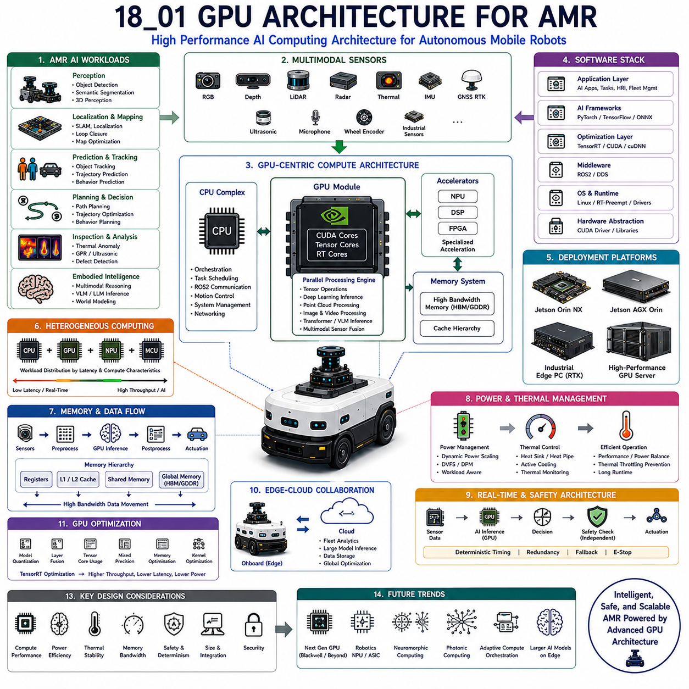
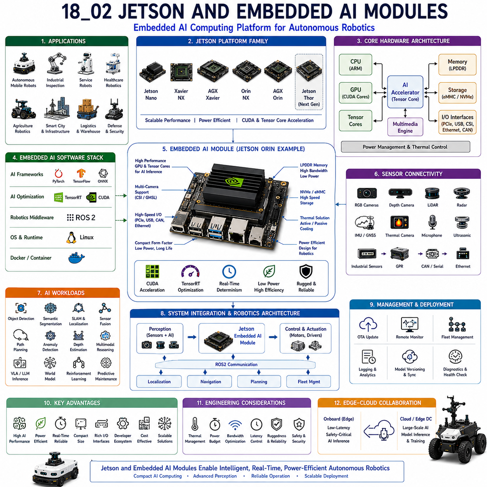
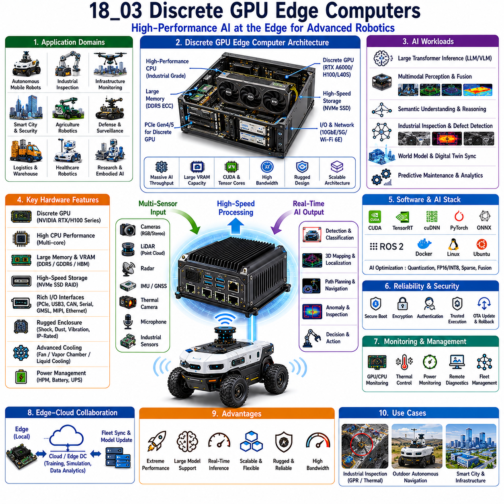
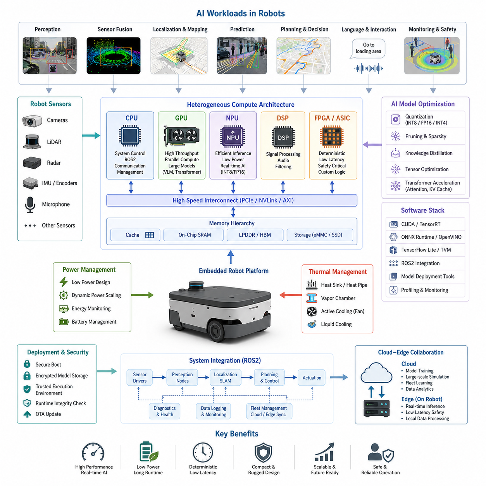
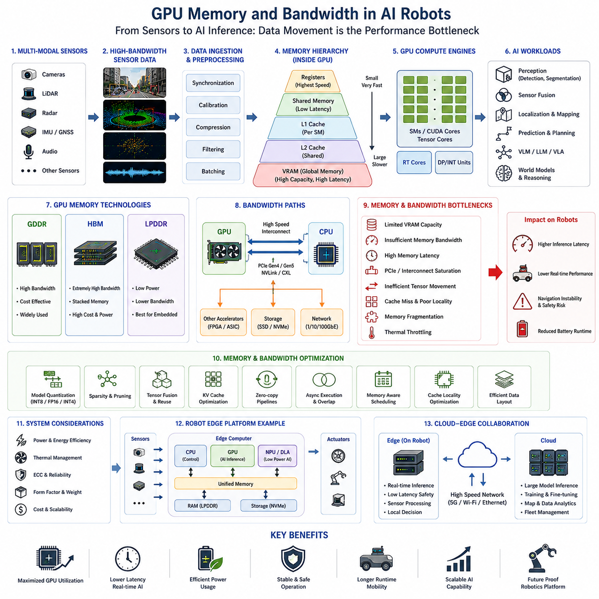
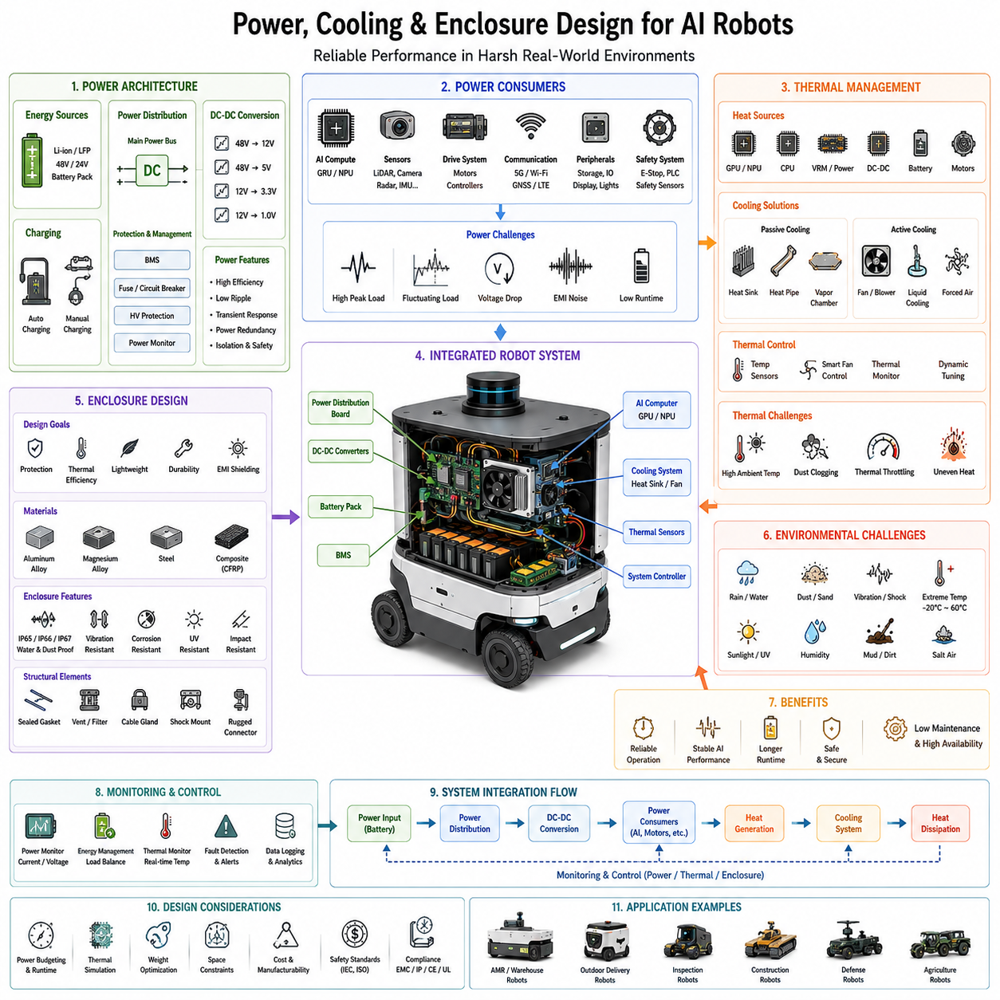
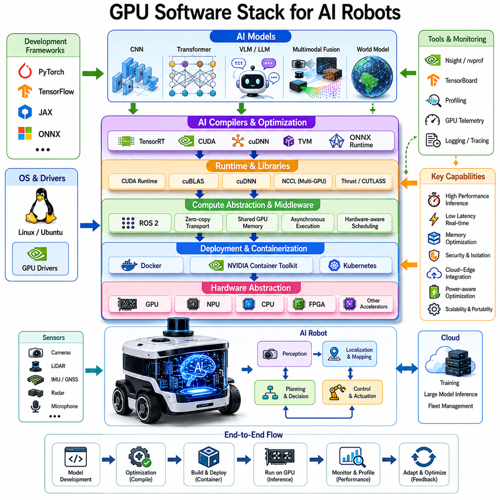
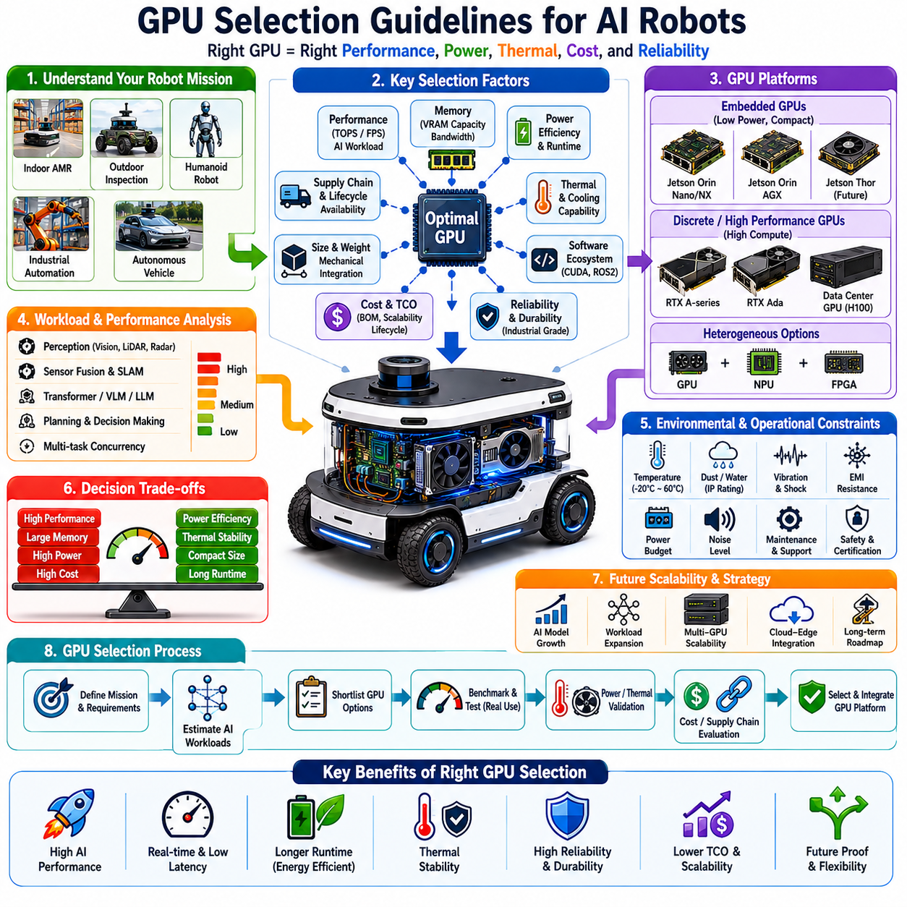

**Volume 06. AMR AI and Embodied Intelligence**

# Chapter 18. GPU and Accelerator Design

## 18.1 GPU Architecture for AMR

{width="7.268055555555556in" height="7.268055555555556in"}

"18_01_GPU_Architecture_for_AMR" describes the complete computational architecture, system design methodology, operational principles, and engineering considerations involved in integrating GPU-based high-performance computing platforms into Autonomous Mobile Robots and embodied AI robotic systems. As AMRs evolve from simple navigation machines into intelligent autonomous systems capable of multimodal perception, semantic understanding, world modeling, foundation-model reasoning, real-time decision making, and large-scale AI inference, GPU architecture becomes one of the most important foundational technologies enabling modern robotics intelligence.

Traditional mobile robots relied primarily on CPUs and lightweight embedded controllers for navigation and control. Earlier generations of AGVs and simple AMRs often performed deterministic path following, obstacle avoidance, and low-level motion control using rule-based software running on industrial PCs or microcontrollers. These systems required relatively modest computational power because their perception pipelines and autonomy capabilities were limited. Modern AMRs, however, increasingly integrate deep learning, multimodal sensor fusion, semantic scene understanding, transformer-based AI models, reinforcement learning systems, vision-language-action architectures, and embodied reasoning frameworks that require dramatically greater computational throughput.

GPU architecture therefore becomes the core computational engine supporting modern robotics intelligence. Unlike traditional CPUs optimized for sequential task execution, GPUs are designed for massively parallel computation. Thousands of parallel cores simultaneously process tensor operations, matrix multiplication, convolutional inference, transformer attention calculations, point cloud processing, image reconstruction, sensor fusion, and AI inference workloads. This computational parallelism allows autonomous robots to execute sophisticated AI pipelines in real time while maintaining operational safety and navigation responsiveness.

Modern AMRs frequently operate multiple AI pipelines simultaneously. A single autonomous robot may execute object detection, semantic segmentation, obstacle tracking, free-space estimation, LiDAR perception, radar processing, SLAM optimization, localization filtering, trajectory prediction, human detection, anomaly detection, industrial inspection analysis, and multimodal scene understanding concurrently. These workloads generate enormous computational demands that exceed the capabilities of traditional embedded processors.

GPU architecture in AMR systems therefore focuses on balancing compute performance, memory bandwidth, thermal stability, power efficiency, physical integration constraints, operational reliability, and real-time determinism. Unlike cloud datacenters where power and cooling resources are abundant, robotics platforms operate under severe physical and operational constraints. Autonomous robots possess limited battery capacity, restricted enclosure volume, vibration exposure, environmental uncertainty, and thermal limitations while simultaneously requiring high-performance AI inference.

One of the most important concepts in AMR GPU architecture is heterogeneous computing. Modern robotics systems rarely depend solely on a GPU or CPU alone. Instead, compute workloads are distributed across CPUs, GPUs, MCUs, NPUs, DSPs, FPGA accelerators, and dedicated sensor-processing hardware according to latency requirements and computational characteristics. CPUs typically manage orchestration, task scheduling, ROS2 communication, motion control, networking, and real-time coordination, while GPUs accelerate neural network inference, tensor computation, parallel perception pipelines, and large-scale data processing.

The computational requirements of autonomous robots vary dramatically depending on deployment environment and operational complexity. Indoor logistics robots operating structured warehouse environments may require relatively modest GPU resources because environmental variability is limited. Outdoor autonomous robots operating in dynamic urban environments, however, require substantially larger GPU architectures capable of processing multiple high-resolution sensor streams simultaneously under strict real-time constraints.

Sensor complexity strongly influences GPU architecture design. Modern outdoor AMRs may integrate multiple RGB cameras, depth cameras, thermal cameras, 3D LiDAR systems, radar arrays, GNSS RTK modules, IMUs, ultrasonic sensors, industrial inspection sensors, and audio systems simultaneously. Each sensor produces continuous high-bandwidth data streams requiring preprocessing, synchronization, AI inference, filtering, and sensor fusion.

High-resolution camera systems alone may generate several gigabytes of data per second. Multi-camera perception pipelines frequently execute object detection, semantic segmentation, depth estimation, visual localization, and scene understanding simultaneously across multiple synchronized video streams. GPUs therefore require sufficient tensor processing throughput and memory bandwidth to maintain stable low-latency inference.

LiDAR perception introduces additional computational challenges. Modern 3D LiDAR systems generate large-scale point cloud data requiring filtering, voxelization, feature extraction, object clustering, semantic segmentation, obstacle tracking, and localization processing. Point cloud neural networks and spatial AI models often require substantial GPU memory capacity and highly parallel tensor computation.

Transformer-based AI models further increase GPU requirements in next-generation AMRs. Vision transformers, multimodal transformers, world models, foundation models, and vision-language-action architectures execute extremely large matrix operations and attention mechanisms requiring advanced tensor acceleration capabilities. GPU architectures supporting Tensor Cores and mixed-precision inference therefore become increasingly important in robotics deployments.

NVIDIA Jetson platforms currently represent some of the most widely deployed GPU architectures for AMRs. Jetson Orin NX, Jetson AGX Orin, Jetson Thor, and earlier Xavier platforms integrate ARM CPUs, CUDA GPU cores, Tensor Cores, multimedia accelerators, and AI inference engines into compact low-power embedded modules optimized for robotics and edge AI applications.

Jetson-based GPU architectures are especially valuable because they combine relatively high AI throughput with low power consumption and compact physical integration. This enables autonomous robots to deploy advanced AI capabilities while maintaining battery endurance and manageable thermal conditions. Embedded GPU platforms therefore dominate many commercial AMR deployments.

Discrete GPU architectures are increasingly used in larger outdoor autonomous robots and industrial AI platforms requiring significantly higher compute performance. Edge computers integrating RTX A5000 Ada, RTX A6000 Ada, RTX 4090, L40S, or industrial GPU accelerators support advanced multimodal AI pipelines, large-scale transformer inference, GPR processing, industrial inspection AI, and real-time world modeling systems.

High-performance outdoor robotics frequently require multiple GPUs operating simultaneously. One GPU may handle navigation and perception workloads while another processes industrial inspection AI, thermal anomaly detection, radar analysis, or multimodal foundation models. Distributed GPU architectures therefore become increasingly common in advanced embodied AI robotics systems.

GPU memory architecture plays a critical role in AMR performance. AI inference pipelines require continuous movement of tensors, feature maps, point clouds, images, embeddings, and neural network parameters between memory systems and compute cores. Insufficient memory bandwidth may become a major performance bottleneck even when GPU compute throughput appears sufficient.

Modern robotics GPUs therefore increasingly integrate high-bandwidth memory architectures including GDDR6, LPDDR5X, HBM memory, and optimized cache hierarchies supporting low-latency parallel tensor processing. Memory optimization becomes especially important in transformer-based embodied AI systems where model parameters may occupy many gigabytes.

Thermal engineering represents one of the most difficult challenges in AMR GPU architecture. Continuous AI inference generates substantial heat, especially under outdoor environmental conditions. Autonomous robots often operate under direct sunlight, elevated ambient temperature, restricted airflow, dusty environments, or sealed IP-rated enclosures. Thermal instability may trigger GPU throttling, inference latency spikes, system instability, or unexpected shutdown.

GPU cooling architecture therefore becomes a major engineering discipline within robotics design. Embedded AI modules frequently use heat pipes, vapor chambers, active cooling fans, liquid cooling systems, conductive chassis cooling, thermal spreaders, and airflow channel optimization. Outdoor industrial robots may require fully sealed thermal management systems maintaining both environmental protection and cooling efficiency simultaneously.

Power architecture is equally important. GPUs may consume significant power during continuous AI inference, especially during multimodal processing or transformer execution. Battery-powered autonomous robots must carefully balance AI performance against operational endurance. High-power GPUs may reduce runtime dramatically if power management architecture is insufficient.

Dynamic power scaling therefore becomes essential. Modern AMR GPU systems increasingly adjust inference precision, GPU clock frequency, tensor acceleration mode, sensor activation state, and AI workload scheduling dynamically according to operational requirements. Robots may reduce AI complexity during low-risk navigation while increasing compute allocation under difficult environmental conditions.

Real-time determinism remains one of the most important robotics constraints influencing GPU architecture. Autonomous robots cannot tolerate unpredictable inference latency or unstable runtime behavior because navigation safety depends on consistent perception timing. GPU scheduling, memory allocation, CUDA kernel execution, and ROS2 synchronization must therefore remain carefully optimized for deterministic operation.

ROS2-based GPU integration has become increasingly important in modern robotics software architecture. Perception nodes, AI inference pipelines, localization systems, and multimodal sensor fusion frameworks frequently execute across distributed ROS2 nodes accelerated through CUDA and TensorRT. Efficient GPU communication infrastructure therefore becomes critical for minimizing latency and avoiding unnecessary data copying.

TensorRT optimization plays a central role in AMR GPU architecture. Raw deep learning models often fail to meet real-time performance requirements without quantization, layer fusion, kernel optimization, sparse inference acceleration, precision calibration, and hardware-specific deployment optimization. TensorRT enables embedded robotics GPUs to achieve significantly higher inference throughput while reducing power consumption.

CUDA architecture forms the foundation of many robotics GPU software pipelines. CUDA allows robotics developers to implement parallelized point cloud processing, image filtering, tensor operations, voxelization pipelines, localization acceleration, and custom perception algorithms directly on GPU hardware. Many advanced robotics pipelines therefore depend heavily on CUDA engineering expertise.

Multimodal sensor fusion further increases GPU architecture complexity. Modern AMRs increasingly combine RGB cameras, LiDAR, radar, thermal imaging, audio systems, GNSS, and semantic contextual data into unified embodied AI pipelines. GPU architectures must therefore support heterogeneous parallel workloads executing simultaneously under synchronized real-time constraints.

Safety architecture also influences GPU design. Autonomous robots operating in public or industrial environments frequently require redundant compute pathways, independent safety controllers, deterministic fallback systems, and isolated emergency processing channels. Safety-certified robotics architectures may separate mission-critical safety logic from non-deterministic AI inference pipelines.

Industrial inspection robots introduce especially demanding GPU requirements. GPR analysis, thermal anomaly detection, ultrasonic imaging, laser profiling, infrastructure analysis, predictive maintenance AI, and multimodal defect detection require very high computational throughput combined with rugged environmental reliability. Such robots frequently deploy edge GPU servers with workstation-class accelerators.

Humanoid robots and advanced embodied AI systems further increase GPU demands dramatically. Future embodied intelligence architectures may integrate world models, multimodal memory systems, semantic reasoning engines, language models, task planning frameworks, gesture recognition, and real-time full-body motion coordination simultaneously. Such systems may eventually require datacenter-scale AI acceleration distributed across onboard edge compute infrastructure.

Cloud-edge hybrid architectures increasingly influence AMR GPU deployment strategies. Some workloads execute locally onboard robots for low-latency safety-critical processing, while larger transformer reasoning tasks or fleet analytics may execute within cloud infrastructure. Effective task partitioning therefore becomes essential for scalable embodied AI systems.

GPU virtualization and containerization technologies are also becoming increasingly important in robotics deployments. Docker containers, Kubernetes-inspired orchestration systems, and isolated AI runtime environments improve deployment scalability, reproducibility, OTA updates, and fleet-level software management. GPU-aware container orchestration enables large robotics fleets to maintain consistent AI deployment environments.

Monitoring infrastructure forms another critical component of AMR GPU architecture. Runtime systems continuously monitor GPU temperature, power consumption, memory usage, tensor throughput, CUDA errors, inference latency, thermal throttling behavior, fan operation, and hardware stability. Monitoring allows predictive maintenance and operational reliability analysis across large robotics fleets.

Cybersecurity also becomes increasingly important as GPU-based robotics systems integrate OTA deployment, wireless networking, cloud synchronization, and remote management infrastructure. Secure boot, encrypted model deployment, trusted execution environments, firmware validation, and hardware integrity verification become essential components of production robotics GPU architectures.

Future GPU architectures for AMRs will likely evolve toward highly specialized robotics accelerators optimized specifically for multimodal embodied AI workloads. Dedicated transformer accelerators, sparse tensor engines, low-power AI accelerators, neuromorphic processors, photonic computing systems, and robotics-specific NPUs may significantly improve future edge robotics performance.

Embodied AI systems will increasingly require dynamic adaptive GPU orchestration. Robots may allocate compute resources differently according to environmental complexity, battery condition, mission objectives, thermal state, and operational risk level. Such adaptive compute architectures may become central to next-generation autonomous robotics platforms.

Ultimately, "18_01_GPU_Architecture_for_AMR" represents one of the foundational engineering disciplines enabling modern intelligent robotics systems. It integrates heterogeneous computing, parallel AI acceleration, multimodal sensor processing, thermal engineering, power optimization, real-time inference, CUDA acceleration, TensorRT optimization, ROS2 integration, safety architecture, and edge-cloud orchestration into scalable embodied AI robotics platforms. As autonomous robots continue evolving toward highly intelligent multimodal embodied systems operating across logistics, industrial inspection, healthcare, smart cities, agriculture, defense, and large-scale autonomous infrastructure, GPU architecture will remain among the most critical enabling technologies driving the future of robotics intelligence.

## 18.2 Jetson and Embedded AI Modules

{width="7.268055555555556in" height="7.268055555555556in"}

"18_02_Jetson_and_Embedded_AI_Modules" describes the architecture, operational principles, hardware design philosophy, deployment methodologies, and engineering considerations associated with NVIDIA Jetson platforms and other embedded AI modules used in autonomous robotics systems. As modern autonomous mobile robots, industrial inspection robots, service robots, smart infrastructure platforms, and embodied AI systems evolve toward increasingly intelligent operation, embedded AI modules become one of the most important enabling technologies supporting real-time perception, autonomous navigation, multimodal AI processing, semantic reasoning, and edge intelligence directly onboard robotic platforms.

Traditional robotics systems relied heavily on industrial PCs, microcontrollers, PLC systems, and low-power CPUs for navigation and control. Earlier autonomous systems primarily executed deterministic software pipelines involving obstacle avoidance, waypoint navigation, motor control, and basic sensor processing. These workloads required relatively modest computational throughput and could often operate without dedicated AI acceleration hardware. Modern embodied AI systems, however, increasingly depend on deep learning inference, transformer architectures, multimodal sensor fusion, semantic scene understanding, world models, reinforcement learning, and large-scale neural network processing. These workloads require specialized AI acceleration architectures capable of executing highly parallel tensor computation efficiently within constrained robotics environments.

Embedded AI modules emerged specifically to address this challenge. Instead of deploying full-scale datacenter-class compute infrastructure onboard mobile robots, embedded AI platforms integrate GPU acceleration, AI tensor processing, CPU orchestration, multimedia acceleration, memory systems, power management, and thermal optimization into compact low-power modules suitable for edge robotics deployment. These modules allow autonomous robots to execute sophisticated AI workloads directly onboard while maintaining practical operational endurance and manageable physical integration.

NVIDIA Jetson platforms currently represent some of the most influential embedded AI modules in robotics and edge AI ecosystems. The Jetson family includes Jetson Nano, Xavier NX, AGX Xavier, Jetson Orin NX, AGX Orin, and emerging next-generation platforms such as Jetson Thor. These systems combine ARM CPU architectures, CUDA GPU cores, Tensor Cores, AI accelerators, multimedia processing engines, high-speed memory subsystems, and embedded Linux software environments into highly integrated AI computing modules optimized for robotics and autonomous systems.

One of the most important advantages of Jetson-based embedded AI modules is the balance between compute performance and power efficiency. Datacenter GPUs may provide extremely high AI throughput but typically require large cooling systems, high electrical power, and stationary infrastructure. Autonomous robots, however, operate under strict power, weight, thermal, and volume constraints. Embedded AI modules therefore focus on maximizing AI performance per watt rather than maximizing absolute compute throughput alone.

Power efficiency becomes especially important in battery-powered autonomous systems. Every watt consumed by onboard computing reduces operational endurance and increases thermal management requirements. Embedded AI modules therefore incorporate advanced power management systems capable of dynamically scaling compute performance according to operational workload, thermal state, battery condition, and mission requirements.

Modern Jetson platforms support highly parallel AI inference pipelines through CUDA acceleration and Tensor Core architectures. Tensor Cores specifically accelerate matrix multiplication and tensor operations central to deep learning workloads. These accelerators dramatically improve performance for convolutional neural networks, transformer inference, semantic segmentation, object detection, depth estimation, and multimodal AI processing.

Jetson platforms also integrate multimedia acceleration hardware supporting high-resolution video decoding, image processing, camera synchronization, and sensor streaming. Autonomous robots frequently operate multiple camera systems simultaneously, including RGB cameras, stereo vision systems, depth cameras, thermal cameras, and industrial inspection imaging systems. Multimedia acceleration allows efficient sensor ingestion and preprocessing without overloading CPU resources.

Memory architecture plays a critical role in embedded AI module performance. Modern AI inference workloads require continuous movement of tensors, images, embeddings, point clouds, and feature maps between memory and compute resources. Jetson platforms therefore integrate high-bandwidth LPDDR memory systems optimized for low-power high-throughput operation. Efficient memory bandwidth becomes especially important for transformer models and multimodal embodied AI architectures processing multiple synchronized sensor streams simultaneously.

Thermal management represents one of the most difficult engineering challenges in embedded AI robotics systems. Continuous AI inference generates substantial heat, particularly when executing multimodal perception pipelines or transformer architectures over long operational durations. Autonomous robots often operate in outdoor environments exposed to sunlight, dust, vibration, restricted airflow, high ambient temperature, and sealed IP-rated enclosures.

Embedded AI modules therefore require carefully designed cooling architectures. Passive heatsinks may suffice for low-power deployments, while higher-performance robotics systems frequently require active cooling fans, heat pipes, vapor chambers, conductive chassis cooling, airflow optimization, or liquid-assisted thermal systems. Thermal stability directly influences inference reliability and operational determinism because thermal throttling may increase latency unpredictably.

Real-time determinism is especially important in robotics deployments. Autonomous systems cannot tolerate unstable AI latency during navigation, obstacle avoidance, or safety-critical operation. Embedded AI modules must therefore maintain predictable runtime performance even under fluctuating thermal conditions and changing environmental workloads.

Jetson-based systems are particularly valuable because they provide full CUDA compatibility. Robotics developers can directly accelerate perception pipelines, point cloud processing, tensor operations, voxelization algorithms, image reconstruction, localization filtering, and custom neural network architectures using CUDA programming models. This software flexibility has significantly accelerated robotics AI development across industry and research ecosystems.

TensorRT optimization forms another core component of embedded AI deployment workflows. Raw neural network models often fail to meet real-time robotics requirements without optimization. TensorRT enables quantization, layer fusion, kernel optimization, sparse inference acceleration, precision calibration, and hardware-specific execution tuning optimized specifically for NVIDIA embedded architectures.

Quantization becomes especially important in embedded AI systems because reduced numerical precision dramatically improves inference throughput and reduces memory bandwidth requirements. FP16, INT8, and mixed-precision inference allow embedded AI modules to execute larger neural networks within constrained power and thermal envelopes while preserving acceptable accuracy.

Modern autonomous robots frequently integrate multiple sensors simultaneously, creating significant computational complexity. RGB cameras, LiDAR systems, radar arrays, GNSS RTK modules, IMUs, ultrasonic sensors, thermal cameras, microphones, industrial inspection devices, and environmental monitoring systems all generate continuous sensor streams requiring synchronization, preprocessing, sensor fusion, and AI inference.

Embedded AI modules therefore increasingly support high-speed sensor interfaces including PCIe, CSI, Ethernet, CAN bus, USB3, GMSL, MIPI, serial interfaces, and industrial communication protocols. Efficient sensor ingestion and synchronization become essential for real-time embodied AI operation.

ROS2 integration has become one of the defining characteristics of modern embedded robotics AI systems. Jetson platforms frequently execute distributed ROS2 nodes supporting perception pipelines, localization systems, navigation frameworks, multimodal sensor fusion, runtime orchestration, and AI inference services simultaneously. Efficient ROS2 middleware optimization therefore becomes essential for maintaining low-latency communication between robotics subsystems.

Jetson platforms are widely used across diverse robotics applications. Indoor logistics robots frequently deploy Jetson Orin NX systems for object detection, localization, obstacle avoidance, and fleet interaction. Outdoor autonomous robots may deploy AGX Orin systems supporting multimodal perception, radar fusion, semantic scene understanding, and high-resolution navigation pipelines.

Industrial inspection robotics represents another important deployment category. Thermal inspection robots, GPR analysis platforms, infrastructure inspection systems, ultrasonic imaging robots, laser profiling systems, and predictive maintenance platforms frequently deploy embedded AI modules for onboard anomaly detection and semantic analysis.

Healthcare robotics similarly benefit from embedded AI acceleration. Telemedicine robots, hospital delivery systems, patient monitoring platforms, assistive robotics systems, and intelligent diagnostic devices increasingly integrate embedded AI modules supporting multimodal interaction, navigation, semantic reasoning, and contextual environmental understanding.

Agricultural robotics also rely heavily on embedded AI systems. Autonomous tractors, crop monitoring robots, weed detection systems, fruit harvesting platforms, and agricultural inspection robots operate under harsh environmental conditions requiring robust low-power AI acceleration. Embedded modules must tolerate vibration, dust, temperature variation, and unstable terrain while maintaining reliable inference capability.

Defense and security robotics frequently require ruggedized embedded AI platforms capable of operating under communication-denied conditions. Autonomous surveillance robots, reconnaissance systems, perimeter security platforms, and tactical robotics systems rely heavily on onboard AI acceleration because remote cloud infrastructure may become unavailable during deployment.

Embedded AI modules also strongly influence the evolution of embodied AI architectures. Future robots increasingly integrate multimodal transformers, semantic memory systems, world models, language interaction frameworks, and vision-language-action systems. These workloads dramatically increase compute requirements beyond traditional robotics perception pipelines.

Jetson Thor and next-generation embedded AI architectures aim to address this transition toward embodied intelligence. Future embedded AI modules will likely integrate substantially larger tensor throughput, transformer acceleration, sparse inference optimization, multimodal memory acceleration, and robotics-specific AI execution engines optimized for embodied reasoning tasks.

Cloud-edge collaboration increasingly shapes embedded AI module deployment strategies. Some workloads execute entirely onboard for low-latency safety-critical autonomy, while large-scale transformer reasoning or fleet intelligence tasks may execute remotely through edge-cloud orchestration systems. Embedded AI modules therefore become part of larger distributed intelligence ecosystems rather than isolated compute devices.

Cybersecurity also becomes increasingly important as embedded AI systems integrate OTA updates, wireless networking, fleet management systems, cloud synchronization, and remote monitoring infrastructure. Secure boot systems, encrypted storage, trusted execution environments, authentication infrastructure, and AI model integrity verification become essential components of production-grade embedded AI deployments.

Monitoring infrastructure forms another important component of embedded AI module ecosystems. Runtime monitoring systems continuously analyze GPU temperature, CPU utilization, memory bandwidth, power consumption, inference latency, sensor synchronization stability, thermal throttling behavior, and operational anomalies. Such monitoring supports predictive maintenance and long-term deployment reliability.

Containerization technologies increasingly support scalable robotics deployment workflows. Docker containers, Kubernetes-inspired orchestration frameworks, ROS2 composable nodes, and modular AI runtime environments allow embedded AI systems to maintain consistent deployment environments across heterogeneous robotics fleets.

Distributed multi-module architectures are also becoming increasingly common. Large outdoor autonomous robots and advanced embodied AI platforms may integrate multiple embedded AI modules simultaneously. One module may handle navigation and safety-critical autonomy while another executes multimodal transformer reasoning or industrial inspection AI. Such distributed architectures improve scalability and operational isolation.

Power architecture engineering becomes critically important in multi-module systems. High-performance embedded AI platforms may consume substantial power during peak AI inference. Robotics platforms therefore require intelligent power distribution systems, battery management integration, voltage stabilization, power sequencing control, and thermal-aware workload scheduling.

Remote management infrastructure further improves operational scalability. Fleet-wide embedded AI systems increasingly support OTA updates, remote diagnostics, deployment orchestration, model synchronization, runtime monitoring, and centralized analytics. Large robotics deployments therefore function as distributed intelligent compute ecosystems rather than isolated autonomous devices.

Future embedded AI modules may increasingly integrate specialized accelerators optimized specifically for robotics workloads. Neuromorphic processors, photonic AI accelerators, robotics-specific NPUs, sparse transformer engines, event-driven perception accelerators, and embodied cognition processors may dramatically improve future robotics compute efficiency.

Embodied AI systems may eventually require hierarchical embedded compute architectures where multiple specialized processors cooperate dynamically according to task complexity, environmental uncertainty, thermal state, and mission objectives. Such adaptive compute architectures may become one of the defining characteristics of future autonomous robotics platforms.

Ultimately, "18_02_Jetson_and_Embedded_AI_Modules" represents one of the foundational engineering disciplines enabling modern embodied AI robotics ecosystems. It integrates embedded GPU acceleration, tensor processing, multimodal AI inference, ROS2 orchestration, thermal engineering, power optimization, CUDA acceleration, TensorRT deployment, runtime monitoring, cybersecurity infrastructure, and distributed edge intelligence into compact scalable robotics computing platforms. As autonomous robots continue expanding across logistics, healthcare, industrial inspection, agriculture, defense, smart cities, and large-scale embodied AI ecosystems, embedded AI modules will remain among the most critical enabling technologies supporting scalable, intelligent, reliable, and operationally practical robotics intelligence.

## 18.3 Discrete GPU Edge Computers

{width="7.268055555555556in" height="7.268055555555556in"}

"18_03_Discrete_GPU_Edge_Computers" describes the architecture, operational principles, deployment methodologies, hardware integration strategies, and engineering considerations associated with discrete GPU-based edge computing systems used in advanced autonomous robotics and embodied AI platforms. As autonomous mobile robots evolve toward highly intelligent multimodal systems capable of executing large-scale AI inference, transformer-based reasoning, world modeling, semantic understanding, industrial inspection analytics, and embodied cognition, embedded AI modules alone are often insufficient to satisfy the increasing computational requirements of next-generation robotics applications. Discrete GPU edge computers therefore emerge as one of the most important high-performance computing architectures enabling advanced robotics intelligence directly at the operational edge.

Traditional robotics systems relied primarily on industrial PCs, embedded CPUs, or low-power AI accelerators for navigation and control. Earlier autonomous robots generally executed deterministic navigation pipelines, basic obstacle avoidance, localization, and limited perception workloads. Such systems required relatively modest computational capability and could often operate using lightweight edge computing platforms. However, modern embodied AI robotics increasingly integrate multimodal transformers, large language models, vision-language-action systems, semantic scene understanding, high-resolution sensor fusion, predictive reasoning, industrial inspection AI, digital twin synchronization, and large-scale perception pipelines requiring dramatically greater compute throughput.

Embedded AI modules such as NVIDIA Jetson systems provide excellent power efficiency and compact integration for many robotics workloads. However, large-scale autonomous systems operating in outdoor environments, industrial infrastructure, smart cities, defense platforms, or advanced embodied AI deployments frequently exceed the compute capability of compact embedded modules. Discrete GPU edge computers address this limitation by integrating workstation-class or datacenter-class GPU accelerators directly into ruggedized edge computing systems deployable onboard autonomous robots or within local infrastructure environments.

A discrete GPU edge computer typically consists of industrial-grade CPUs, high-performance PCIe GPU accelerators, large-capacity system memory, high-bandwidth storage subsystems, power regulation infrastructure, thermal management systems, networking interfaces, and ruggedized enclosure architecture optimized for robotics deployment conditions. Unlike integrated embedded modules, discrete GPU architectures use standalone graphics processing hardware connected through high-bandwidth interfaces such as PCIe Gen4 or PCIe Gen5.

One of the defining characteristics of discrete GPU edge computers is extremely high parallel computational throughput. Modern GPUs such as NVIDIA RTX A5000 Ada, RTX A6000 Ada, RTX 4090, L40S, H100, or future robotics-oriented accelerators contain thousands of CUDA cores, Tensor Cores, large memory subsystems, and specialized AI acceleration hardware optimized for tensor computation, transformer inference, multimodal reasoning, and large-scale neural network processing.

These systems allow autonomous robots to execute workloads previously limited to datacenter infrastructure. Large transformer models, semantic memory architectures, multimodal world models, high-resolution sensor fusion, GPR interpretation pipelines, large-scale thermal analysis systems, predictive maintenance AI, and real-time simulation-assisted planning can increasingly execute directly at the edge without relying entirely on remote cloud inference.

The rise of embodied AI significantly accelerates the importance of discrete GPU edge computers. Future autonomous robots increasingly require contextual understanding, multimodal reasoning, semantic planning, natural language interaction, memory systems, and world-model cognition rather than isolated perception alone. Such workloads require dramatically larger compute infrastructure than traditional robotics AI systems.

Vision-language-action systems illustrate this transition clearly. A modern autonomous robot may simultaneously process multiple RGB cameras, LiDAR point clouds, radar streams, thermal imagery, GNSS localization, audio interaction, semantic memory retrieval, contextual reasoning, and task planning while executing transformer-based inference pipelines. These workloads frequently exceed the capability of embedded GPU modules and therefore motivate the deployment of discrete GPU edge systems.

Industrial inspection robotics represents one of the strongest deployment domains for discrete GPU edge computers. Ground penetrating radar analysis, thermal anomaly interpretation, ultrasonic imaging, laser profiling, predictive maintenance AI, infrastructure defect detection, multimodal semantic inspection, and large-scale industrial analytics all require substantial computational throughput combined with real-time operational reliability.

For example, a GPR-based underground inspection robot may generate extremely large subsurface signal datasets requiring continuous reconstruction, filtering, semantic segmentation, anomaly detection, and infrastructure interpretation. Processing these workloads in real time using transformer-enhanced AI pipelines often requires workstation-class GPU acceleration integrated directly into the robotics platform.

Thermal imaging analytics also increasingly rely on discrete GPU infrastructure. Modern industrial inspection robots may simultaneously process multiple thermal cameras, RGB imagery, infrastructure context maps, historical maintenance records, and semantic anomaly reasoning pipelines. Such multimodal analytics demand substantial tensor throughput and memory bandwidth.

Memory architecture plays a critical role in discrete GPU edge computing systems. Large AI models, transformer architectures, multimodal embeddings, high-resolution imagery, LiDAR point clouds, and semantic memory systems require continuous movement of large tensors between GPU compute resources and memory subsystems. Modern discrete GPUs therefore integrate high-bandwidth GDDR6, GDDR6X, HBM, or future high-speed memory architectures supporting extremely high AI throughput.

Large VRAM capacity becomes especially important in embodied AI systems. Transformer models containing billions of parameters may require tens of gigabytes of memory simply for inference execution. Robotics systems increasingly deploying large multimodal reasoning models therefore require edge computers equipped with high-memory GPU accelerators.

Thermal engineering represents one of the most difficult challenges in discrete GPU robotics systems. High-performance GPUs may consume hundreds of watts continuously during large-scale AI inference workloads. Outdoor robotics deployments expose edge computers to elevated ambient temperature, dust, vibration, sunlight, restricted airflow, and sealed industrial enclosures.

Discrete GPU edge computers therefore require advanced thermal management systems including high-capacity heatsinks, vapor chambers, liquid cooling, directed airflow architecture, thermal partitioning, conductive cooling systems, industrial fan assemblies, and real-time thermal monitoring infrastructure. Thermal stability directly affects inference determinism and operational reliability because GPU throttling may introduce unpredictable latency spikes.

Power architecture engineering is equally critical. Large discrete GPUs may consume substantial peak power during transformer inference or multimodal processing. Autonomous robots operating on battery power must therefore carefully balance compute performance against operational endurance. Robotics power systems require intelligent voltage regulation, battery integration, transient load handling, power sequencing, and fault isolation mechanisms capable of supporting high-performance AI acceleration reliably.

Multi-GPU architectures are increasingly common in advanced robotics platforms. One GPU may execute navigation, localization, and perception pipelines while another GPU handles multimodal reasoning, industrial inspection AI, or large transformer inference. Distributed GPU architectures improve scalability and allow workload isolation between safety-critical and non-deterministic AI systems.

Safety architecture becomes increasingly important in discrete GPU robotics systems. Autonomous robots operating in industrial or public environments require deterministic fallback behavior even if high-level AI reasoning systems fail. Safety-critical navigation loops therefore remain isolated from non-deterministic multimodal inference pipelines. Independent safety controllers, redundant compute systems, and emergency fallback architectures become essential operational components.

CUDA acceleration forms the foundation of most discrete GPU robotics software stacks. CUDA enables developers to accelerate tensor operations, point cloud processing, image reconstruction, voxelization, localization filtering, transformer inference, semantic segmentation, multimodal sensor fusion, and custom AI algorithms directly on GPU hardware. Robotics AI development increasingly depends on advanced CUDA optimization expertise.

TensorRT optimization further enhances discrete GPU deployment efficiency. Quantization, layer fusion, sparse inference acceleration, precision calibration, operator optimization, and transformer acceleration significantly improve inference throughput while reducing latency and power consumption. Real-time robotics workloads frequently depend on aggressive TensorRT optimization to maintain operational responsiveness.

ROS2 integration represents another major aspect of discrete GPU robotics architecture. Distributed ROS2 nodes supporting perception, localization, planning, multimodal reasoning, digital twin synchronization, fleet coordination, and AI inference may execute simultaneously across multiple GPU-accelerated edge computing systems. Efficient middleware optimization becomes critical for maintaining low-latency distributed robotics communication.

Networking infrastructure strongly influences discrete GPU edge computer deployment strategies. High-bandwidth Ethernet, fiber networking, 5G communication, Wi-Fi 6E, TSN networking, industrial fieldbus systems, and edge-cloud orchestration frameworks increasingly connect robotics GPU systems into larger distributed intelligence ecosystems.

Cloud-edge collaboration further expands the role of discrete GPU edge computers. Some workloads remain fully local for low-latency autonomy while cloud infrastructure supports large-scale retraining, digital twin simulation, fleet intelligence analytics, semantic memory synchronization, and remote AI reasoning. Discrete GPU edge systems therefore function as intermediate intelligence layers between lightweight onboard compute and hyperscale cloud infrastructure.

Edge datacenter architectures increasingly deploy clusters of discrete GPU edge computers within industrial environments. Factories, ports, airports, hospitals, logistics centers, tunnels, mining facilities, and smart city infrastructure may host local GPU acceleration clusters supporting nearby autonomous robots through ultra-low-latency networking. Such architectures reduce cloud dependence while preserving high-performance AI capability.

Cybersecurity becomes critically important in discrete GPU edge systems. Robotics infrastructure connected through wireless networking and cloud synchronization may become vulnerable to adversarial attacks, malicious model manipulation, unauthorized access, or inference injection. Secure boot systems, encrypted storage, trusted execution environments, authentication infrastructure, secure OTA updates, and AI model integrity verification therefore become mandatory deployment requirements.

Monitoring infrastructure forms another major engineering discipline within discrete GPU robotics systems. Runtime monitoring platforms continuously analyze GPU temperature, power consumption, inference latency, CUDA execution stability, memory utilization, thermal throttling behavior, network quality, and operational anomalies. Predictive maintenance and deployment reliability depend heavily on continuous operational telemetry analysis.

Containerization technologies increasingly support scalable robotics AI deployment. Docker containers, Kubernetes-inspired orchestration frameworks, distributed GPU schedulers, containerized inference services, and modular AI runtime environments allow robotics infrastructure to scale dynamically across heterogeneous compute ecosystems while maintaining deployment consistency.

OTA deployment systems further improve scalability and lifecycle management. Robotics fleets increasingly support remote AI model updates, runtime optimization, deployment rollback, security patching, and fleet-wide synchronization through distributed orchestration systems connected to GPU edge infrastructure.

Discrete GPU edge computers also strongly support digital twin architectures. Robots continuously synchronize operational telemetry with simulation environments executing on GPU clusters. Large-scale simulation, replay analysis, synthetic data generation, infrastructure modeling, and operational scenario prediction increasingly rely on edge GPU acceleration.

Future robotics systems may increasingly integrate foundation models and multimodal cognitive architectures directly within edge GPU infrastructure. Large multimodal transformers supporting contextual reasoning, semantic understanding, long-term memory, and embodied planning may become standard components of advanced robotics platforms.

Robotics-specific GPU accelerators may eventually emerge as specialized architectures optimized specifically for embodied AI workloads. Sparse transformer accelerators, event-driven perception engines, multimodal memory processors, robotics-oriented tensor engines, neuromorphic AI accelerators, and photonic computing systems may dramatically improve future robotics edge intelligence efficiency.

Energy efficiency will remain a defining engineering challenge. Although discrete GPU edge systems provide enormous computational capability, robotics deployments must continuously balance compute performance against thermal stability, power consumption, operational endurance, and deployment practicality. Adaptive workload scheduling and hierarchical AI orchestration may therefore become increasingly important.

Hierarchical robotics intelligence architectures may eventually dominate future deployments. Lightweight reflexive safety systems remain onboard embedded modules, high-performance multimodal reasoning executes on discrete GPU edge computers, and large-scale fleet cognition or foundation-model retraining occurs within cloud infrastructure. Such distributed intelligence architectures provide scalability while preserving operational resilience.

Ultimately, "18_03_Discrete_GPU_Edge_Computers" represents one of the foundational high-performance computing architectures enabling advanced embodied AI robotics ecosystems. It integrates workstation-class GPU acceleration, multimodal AI inference, transformer execution, industrial analytics, ROS2 orchestration, CUDA optimization, TensorRT acceleration, thermal engineering, power management, cybersecurity infrastructure, digital twin synchronization, and distributed edge intelligence into ruggedized robotics computing platforms. As autonomous robots continue expanding across logistics, industrial inspection, healthcare, defense, agriculture, smart cities, infrastructure management, and large-scale embodied AI ecosystems, discrete GPU edge computers will remain among the most critical enabling technologies supporting scalable, intelligent, real-time, and operationally practical robotics intelligence.

## 18.4 AI Accelerators and NPUs

{width="7.268055555555556in" height="7.268055555555556in"}

"18_04_AI_Accelerators_and_NPUs" focuses on the specialized computing architectures designed to accelerate artificial intelligence workloads inside autonomous mobile robots, intelligent edge systems, industrial AI platforms, and embodied robotic systems. As robotic intelligence evolves from simple rule-based processing toward deep neural networks, multimodal reasoning systems, VLMs, VLA systems, and embodied AI architectures, the computational requirements inside robots have increased dramatically. Traditional CPUs alone are no longer sufficient to handle the massive tensor operations required for modern AI inference and training pipelines. This limitation has led to the emergence of dedicated AI accelerators, Neural Processing Units (NPUs), Tensor Processing Units (TPUs), vision accelerators, inference ASICs, FPGA-based AI modules, and heterogeneous computing architectures specifically optimized for deep learning workloads.

In modern AMR systems, AI accelerators are responsible for executing perception models, object detection pipelines, semantic segmentation, sensor fusion, localization assistance, behavior prediction, path planning support, language processing, and real-time decision-making. Unlike general-purpose processors, AI accelerators are optimized for matrix multiplication, tensor computation, parallel convolution operations, transformer inference, and low-latency execution. These capabilities enable robots to process multiple sensor streams simultaneously while maintaining deterministic real-time performance. The emergence of edge AI has made AI accelerators one of the most critical components in intelligent robot architectures.

A major challenge in robotics is the requirement to execute large AI models within strict power, thermal, and space limitations. Industrial robots operating in outdoor environments may encounter high ambient temperatures, vibration, dust, humidity, and unstable power conditions. Therefore, robotic AI accelerators must balance computational performance with energy efficiency. Unlike cloud datacenters that can consume kilowatts of power, mobile robots typically operate within limited battery budgets. A robot powered by a 48V battery platform must carefully allocate energy between locomotion, perception, communication, safety systems, and AI computation. Excessive AI power consumption directly reduces operational time and system stability.

NPUs are specifically designed to address these constraints. An NPU is a dedicated processor optimized for neural network execution. Unlike CPUs, which are optimized for sequential operations, or GPUs, which are optimized for highly parallel graphics workloads, NPUs are purpose-built for AI tensor operations. Many NPUs integrate low-precision arithmetic units such as INT8, FP16, BF16, and mixed-precision execution engines. These optimizations dramatically improve inference throughput while reducing power consumption. In robotics, NPUs are increasingly used for object detection, segmentation, OCR, human recognition, gesture analysis, audio recognition, and low-power perception pipelines.

One of the most important design considerations in AI accelerators is the distinction between training acceleration and inference acceleration. Training requires extremely high floating-point throughput, massive memory bandwidth, distributed synchronization, and long-duration sustained workloads. Inference acceleration prioritizes low latency, low power consumption, deterministic execution, and real-time responsiveness. Most AMRs primarily focus on inference acceleration because models are usually trained in cloud environments or datacenter GPU clusters before deployment onto robots. Therefore, robotic AI accelerators are optimized primarily for inference rather than full-scale training.

Embedded AI accelerators have become central components in modern robotic platforms. NVIDIA Jetson modules combine GPU acceleration with ARM CPU architectures, allowing robots to run CUDA-based AI pipelines at the edge. Intel Movidius VPUs focus on low-power vision inference acceleration. Google Coral TPUs accelerate TensorFlow Lite inference workloads. Qualcomm AI engines integrate mobile AI acceleration into compact embedded systems. AMD Xilinx FPGA architectures allow customizable low-latency AI pipelines for industrial robotics. Huawei Ascend NPUs and Chinese domestic AI accelerators are increasingly important in regional robotics ecosystems, especially where export restrictions influence hardware availability.

In low-level robotic architectures, small NPUs may handle lightweight AI tasks such as lane detection, obstacle classification, QR recognition, or safety-zone monitoring. Mid-level AI architectures often integrate more advanced embedded accelerators capable of multimodal sensor fusion and transformer-based inference. High-level robotic systems may include multiple discrete GPUs combined with dedicated NPUs for workload distribution. In such architectures, GPUs may handle large VLM or perception models while NPUs manage low-latency safety inference pipelines.

The role of heterogeneous computing is becoming increasingly important in robotics. Heterogeneous AI architectures distribute workloads across CPUs, GPUs, NPUs, DSPs, and FPGA modules. Each processor type handles tasks best suited to its computational characteristics. CPUs manage control logic, communication, ROS2 orchestration, and system coordination. GPUs handle large-scale tensor computation and transformer inference. NPUs accelerate dedicated perception models with high energy efficiency. DSPs process audio and signal-processing workloads. FPGA systems provide deterministic low-latency hardware pipelines for industrial safety applications. This cooperative processing architecture significantly improves overall robot efficiency.

Memory bandwidth is one of the most critical limitations in AI accelerators. Modern AI models, especially transformer-based architectures, require enormous memory movement during inference. Even if computational units are highly optimized, insufficient memory bandwidth can become the primary bottleneck. Robotics systems therefore require careful optimization of memory hierarchy, cache management, tensor scheduling, and DMA transfers. High-speed LPDDR memory, HBM memory, and optimized interconnects become critical for large AI workloads.

Another major challenge is real-time latency. In robotics, AI decisions directly affect physical actions. Delayed inference may cause navigation instability, obstacle collisions, or unsafe robot behavior. AI accelerators for robotics therefore prioritize deterministic inference latency. This differs significantly from cloud AI systems where throughput may be more important than predictable latency. Safety-critical robotics systems often require bounded worst-case latency guarantees rather than merely high average performance.

Quantization is one of the most important optimization techniques used in NPUs. AI models originally trained in FP32 precision are converted into lower precision formats such as FP16, INT8, or even INT4. Quantization dramatically reduces memory usage, computational cost, and power consumption. Modern NPUs are highly optimized for low-precision inference. Quantization-aware training and post-training quantization techniques are therefore widely used in robotic AI deployment workflows.

Pruning and sparsity optimization also play important roles in accelerator design. Many neural networks contain redundant weights or activations that contribute minimally to final outputs. Structured pruning removes unnecessary channels, filters, or layers, reducing model complexity. Sparse tensor acceleration allows AI accelerators to skip zero-valued computations, significantly improving efficiency. Advanced AI accelerators increasingly include hardware-level sparse computation engines specifically optimized for transformer architectures.

Transformer acceleration has become a critical focus area for modern NPUs. Traditional CNN accelerators were optimized primarily for convolution operations. However, VLMs, LLMs, and embodied AI systems rely heavily on transformer architectures. Transformer inference requires optimized attention mechanisms, KV cache management, high-speed memory access, and large tensor synchronization. AI accelerator vendors are now redesigning hardware architectures specifically for transformer execution.

Thermal management is a major engineering challenge in robotic AI accelerators. High-performance AI computation generates significant heat. In outdoor AMRs operating under sunlight or industrial heat conditions, internal temperatures can rise rapidly. Excessive temperature leads to thermal throttling, reduced inference speed, hardware instability, or component failure. Industrial AI systems therefore require advanced thermal solutions including heat pipes, vapor chambers, active cooling fans, liquid cooling systems, conductive chassis cooling, and thermal isolation architectures.

Power efficiency directly affects robot operational duration. A robot consuming excessive AI power may require larger batteries, increasing weight and reducing mobility efficiency. Engineers must therefore optimize TOPS-per-watt performance rather than focusing solely on raw TOPS metrics. AI accelerator selection involves balancing computational throughput, latency, thermal constraints, energy efficiency, software compatibility, and long-term supply stability.

Software ecosystem compatibility is another critical factor in AI accelerator adoption. Hardware alone is insufficient without optimized software frameworks. CUDA, TensorRT, OpenVINO, TensorFlow Lite, ONNX Runtime, TVM, and vendor-specific SDKs form the software foundation of accelerator deployment. Robotics developers require robust model conversion pipelines, inference debugging tools, profiling systems, runtime monitoring, and long-term driver stability. A powerful accelerator with weak software support may become impractical in real-world industrial deployments.

ROS2 integration has become increasingly important for AI accelerators in robotics. AI inference nodes must communicate efficiently with sensor pipelines, localization systems, navigation stacks, and fleet management systems. Zero-copy communication, GPU memory sharing, asynchronous execution, and hardware-aware scheduling become essential for maintaining real-time robotic performance. Advanced robotic AI architectures increasingly integrate inference acceleration directly into ROS2-based distributed systems.

Security considerations are also becoming increasingly important in AI accelerators. AI models deployed inside robots may contain proprietary algorithms, sensitive industrial data, or safety-critical functionality. Secure boot, encrypted model storage, trusted execution environments, hardware authentication, and runtime integrity monitoring are increasingly integrated into industrial AI accelerators. Edge AI systems must also protect against adversarial attacks, unauthorized firmware modification, and malicious model replacement.

AI accelerators are also central to embodied AI and humanoid robotics. Humanoid systems require simultaneous execution of perception, motion planning, balance control, manipulation intelligence, language reasoning, and environmental interaction. Such workloads demand extremely high computational density within compact form factors. Future humanoid robots may integrate multiple specialized accelerators operating cooperatively across perception, cognition, and motor-control domains.

Cloud-edge cooperative acceleration is another emerging trend. Certain workloads may execute locally on robot NPUs while larger reasoning tasks execute on cloud GPU clusters. Edge accelerators handle low-latency perception and safety functions while cloud systems manage heavy model retraining, large-scale simulation, and fleet-level learning. This distributed AI architecture enables scalable robotic intelligence while reducing onboard computational burden.

Industrial deployment requirements further complicate accelerator selection. Long product lifecycle availability, supply chain stability, export regulations, certification compatibility, ruggedization, and regional sourcing constraints all affect hardware strategy. Some robotics companies adopt dual-hardware architectures with different accelerator vendors for domestic and international markets. This strategy helps address geopolitical restrictions while maintaining global deployment flexibility.

Future AI accelerators for robotics will likely emphasize energy-efficient transformer inference, real-time world model execution, multimodal fusion acceleration, memory-centric computing, neuromorphic architectures, and adaptive heterogeneous processing. Emerging technologies such as photonic AI processors, in-memory computing, analog neural accelerators, and event-driven spiking neural hardware may dramatically reduce power consumption while increasing inference capability. These developments could enable highly autonomous robots capable of executing advanced embodied intelligence entirely on edge devices without constant cloud dependency.

As AMRs evolve toward intelligent embodied systems, AI accelerators and NPUs will become foundational infrastructure for robotic cognition. The future of robotics depends not only on better algorithms, but also on highly optimized hardware architectures capable of executing complex AI workloads safely, efficiently, reliably, and in real time within constrained physical environments. AI accelerators therefore represent the convergence point between semiconductor engineering, robotics, deep learning, embedded systems, and industrial autonomy.

## 18.5 GPU Memory and Bandwidth

{width="7.268055555555556in" height="7.268055555555556in"}

"18_05_GPU_Memory_and_Bandwidth" focuses on one of the most critical bottlenecks in modern AI robotics systems: the movement, storage, synchronization, and processing of massive volumes of data inside GPU-based computing architectures. In autonomous mobile robots, embodied AI platforms, industrial inspection robots, humanoid systems, and edge AI infrastructure, computational performance is no longer determined solely by the number of GPU cores or AI TOPS capability. Instead, real-world robotic AI performance is increasingly constrained by memory architecture, memory bandwidth, latency, cache efficiency, tensor movement, and interconnect throughput. As AI models become larger and multimodal sensor systems generate enormous data streams, memory systems have become one of the most important engineering challenges in robotic AI design.

Modern robotic AI systems process data from multiple sensors simultaneously. A single outdoor autonomous robot may operate several RGB cameras, depth cameras, LiDAR sensors, radar systems, thermal cameras, ultrasonic sensors, GNSS modules, IMUs, and audio interfaces at the same time. These sensor streams generate continuous high-bandwidth data that must be transferred into GPU memory for AI processing. For example, multiple 4K camera streams combined with 3D LiDAR point clouds and radar tensors can easily generate gigabytes of sensor data every second. Even before AI inference begins, the memory subsystem is already under heavy load simply due to sensor ingestion requirements.

GPU memory architecture plays a fundamental role in determining how efficiently AI workloads can execute. Modern GPUs contain several layers of memory hierarchy including registers, shared memory, L1 cache, L2 cache, VRAM, unified memory, and external storage interfaces. Each layer has different latency, capacity, and bandwidth characteristics. AI acceleration performance depends heavily on how efficiently data moves between these layers. If memory access becomes inefficient, GPU compute cores may remain idle while waiting for tensor data to arrive. This phenomenon is often referred to as memory bottlenecking.

Bandwidth refers to the amount of data that can be transferred per second between memory and processing units. In AI systems, bandwidth is often more important than raw computational capability. A GPU may theoretically provide extremely high tensor compute throughput, but if memory bandwidth is insufficient, the processor cannot be fully utilized. Transformer-based AI models especially place enormous stress on memory bandwidth because attention mechanisms require repeated movement of large tensor matrices between memory and compute units. As a result, many modern AI accelerators are designed around memory-centric architectures rather than purely compute-centric architectures.

The evolution of AI models has dramatically increased memory requirements. Early CNN-based perception systems primarily processed localized convolution operations with relatively manageable memory footprints. Modern transformer-based models such as VLMs, LLMs, VLA systems, and world models require significantly larger parameter storage and intermediate activation memory. Embodied AI architectures further increase complexity by integrating perception, planning, memory, reasoning, and action generation into unified neural systems. These workloads demand both large memory capacity and extremely high memory throughput.

VRAM capacity is a major consideration in robotic GPU selection. Large AI models may require tens of gigabytes of memory simply to store model weights. Additional memory is needed for activation buffers, tensor caching, sensor pipelines, intermediate feature maps, and operating system overhead. If available GPU memory is insufficient, systems may fall back to slower host memory transfers, significantly degrading inference latency. In real-time robotics systems, such latency spikes can directly affect navigation safety and operational stability.

Different GPU memory technologies provide different tradeoffs between capacity, bandwidth, power consumption, and cost. GDDR memory is widely used in discrete GPUs due to its high bandwidth and relatively mature ecosystem. HBM memory provides dramatically higher bandwidth through stacked memory architectures and wide bus interfaces. LPDDR memory is commonly used in embedded AI systems due to its lower power consumption. Robotics engineers must carefully select memory technologies depending on platform constraints, thermal limits, battery budgets, and AI workload requirements.

HBM, or High Bandwidth Memory, has become increasingly important for large-scale AI systems. HBM uses vertically stacked memory dies connected through through-silicon vias, enabling extremely wide memory buses and massive bandwidth. This architecture significantly improves transformer inference and large tensor processing performance. However, HBM systems are expensive, thermally demanding, and often unsuitable for compact battery-powered edge robots. Therefore, many robotic platforms use LPDDR or GDDR memory instead of datacenter-class HBM systems.

Unified memory architectures are increasingly common in embedded robotics systems. In traditional discrete GPU systems, CPU memory and GPU memory are separated, requiring explicit data transfers over interfaces such as PCIe. Unified memory systems allow CPUs and GPUs to share memory spaces directly, reducing transfer overhead and simplifying programming models. NVIDIA Jetson platforms are examples of unified memory architectures commonly used in robotics. Unified memory improves power efficiency and reduces latency for certain workloads, although total available bandwidth may still remain limited compared to high-end discrete GPUs.

PCIe bandwidth is another critical factor in GPU-based robotics systems. Sensors, storage devices, networking modules, FPGA accelerators, and GPUs often communicate through PCIe interconnects. Insufficient PCIe bandwidth can create severe bottlenecks during high-speed sensor streaming or multi-GPU synchronization. Advanced systems may utilize PCIe Gen4, Gen5, NVLink, or custom high-speed interconnects to support large-scale data movement.

Multi-GPU robotic systems introduce additional memory synchronization challenges. In high-end autonomous robots, one GPU may process perception tasks while another handles AI reasoning or large multimodal models. These GPUs must exchange tensor information rapidly and consistently. Memory synchronization latency can become a major system limitation. Technologies such as NVLink reduce GPU-to-GPU transfer overhead compared to standard PCIe communication. However, thermal, power, and system complexity increase significantly in multi-GPU robotic architectures.

Latency is often more important than throughput in robotics. Cloud AI systems may prioritize maximizing batch processing efficiency, but robots require deterministic real-time responses. Memory access latency therefore becomes critical. Even small delays in retrieving sensor tensors or AI feature maps can affect perception timing and motion control. Real-time robotic AI systems must optimize not only bandwidth but also memory scheduling, cache locality, prefetching, and synchronization overhead.

Cache architecture plays a major role in AI acceleration efficiency. Modern GPUs contain multiple cache levels that reduce repeated access to slower VRAM. L1 cache provides extremely low-latency local storage near compute units. L2 cache serves as a shared intermediate layer across GPU cores. Efficient cache usage dramatically improves transformer inference performance because frequently reused tensors can remain locally available rather than repeatedly fetched from VRAM. AI compiler optimizations increasingly focus on maximizing cache reuse efficiency.

Tensor movement optimization has become one of the most important areas in AI system engineering. In many AI workloads, moving data consumes more energy than computation itself. Robotics systems therefore increasingly optimize dataflow architectures to minimize unnecessary tensor transfers. Zero-copy pipelines, shared GPU memory buffers, asynchronous execution engines, and hardware-aware scheduling frameworks help reduce memory movement overhead.

Transformer inference introduces unique memory challenges. Attention mechanisms require large key-value cache storage during inference. As context length increases, memory usage grows rapidly. Long-context embodied AI systems that maintain environmental memory or conversational history may require substantial KV cache capacity. Efficient KV cache compression, memory reuse, and attention optimization techniques are therefore critical for robotic LLM deployment.

Quantization significantly reduces memory pressure. FP32 models require large storage capacity and memory bandwidth. INT8, FP16, BF16, and INT4 quantized models dramatically reduce memory requirements while improving inference efficiency. Modern AI accelerators are increasingly optimized for low-precision tensor computation. Quantization not only improves compute speed but also reduces memory transfer requirements, which is often equally important.

Sparse tensor acceleration also reduces memory bandwidth consumption. Sparse neural networks contain many zero-valued weights or activations. Instead of transferring and computing unnecessary values, sparse acceleration hardware skips zero regions. This improves effective memory bandwidth utilization and reduces power consumption. Sparse transformer architectures are becoming increasingly important in large-scale embodied AI systems.

Sensor fusion workloads are particularly demanding on memory systems. Autonomous robots often combine RGB imagery, LiDAR point clouds, radar tensors, IMU data, and localization maps into unified AI pipelines. These heterogeneous data formats require large memory buffers and complex synchronization mechanisms. Efficient memory management becomes essential for maintaining real-time multimodal processing.

Edge AI systems face especially difficult memory constraints. Unlike cloud datacenters, embedded robots cannot simply add unlimited VRAM or large cooling systems. Memory capacity, power consumption, board space, and thermal constraints are tightly limited. Engineers must therefore optimize model architecture, inference scheduling, tensor reuse, and sensor processing pipelines very carefully. Memory-aware AI architecture design becomes mandatory in mobile robotics.

Thermal considerations are directly linked to memory bandwidth. High-speed memory interfaces consume substantial power and generate significant heat. HBM systems especially require advanced cooling solutions. Excessive memory temperature can lead to throttling, bit errors, reduced reliability, or shortened hardware lifespan. Industrial robotics platforms therefore require ruggedized thermal management systems capable of maintaining stable memory operation in harsh outdoor environments.

Memory reliability is critically important in industrial and safety robotics. Bit errors in memory may corrupt AI inference results or localization data. ECC memory is therefore commonly used in high-reliability GPU systems. ECC introduces some overhead but significantly improves system robustness. Autonomous robots operating in industrial environments, mining sites, defense applications, or infrastructure inspection scenarios often require ECC-protected memory architectures.

ROS2-based robotic systems also interact heavily with GPU memory management. Large sensor streams are transferred between perception nodes, mapping systems, planning modules, and AI inference engines. Zero-copy ROS2 transport mechanisms reduce redundant memory copying and improve bandwidth efficiency. GPU-aware middleware architectures are increasingly important for large-scale robotic AI systems.

Cloud-edge robotics architectures introduce distributed memory considerations. Certain AI workloads may execute locally while larger models run remotely in cloud servers. This creates additional network bandwidth requirements between edge robots and cloud infrastructure. Intelligent task partitioning becomes necessary to balance onboard memory constraints with remote computational resources. High-latency cloud dependency can create operational risks if communication becomes unstable.

Memory optimization has become one of the most important aspects of AI deployment engineering. AI developers increasingly profile tensor allocation patterns, memory fragmentation, cache efficiency, and bandwidth utilization during model deployment. Advanced inference frameworks such as TensorRT, ONNX Runtime, TVM, and custom compiler stacks aggressively optimize memory layouts and tensor scheduling for robotic workloads.

Future GPU memory systems will likely evolve toward memory-centric AI architectures. Processing-in-memory technologies, optical interconnects, 3D stacked memory systems, chiplet-based architectures, near-memory computing, and neuromorphic memory systems may significantly reduce data movement overhead. These technologies could enable future robots to run large embodied AI models entirely on-device while maintaining low power consumption.

As autonomous robots evolve toward intelligent embodied systems capable of reasoning, perception, interaction, and long-term autonomy, GPU memory and bandwidth will become even more critical than raw compute performance itself. The future of robotic AI acceleration depends not only on faster processors, but on highly optimized memory architectures capable of sustaining massive multimodal tensor movement with low latency, high reliability, and energy-efficient operation. In many next-generation AI robotics systems, memory bandwidth may ultimately define the upper limit of achievable intelligence at the edge.

## 18.6 Power, Cooling, and Enclosure Design

{width="7.268055555555556in" height="7.268055555555556in"}

"18_06_Power_Cooling_and_Enclosure_Design" focuses on one of the most important engineering foundations of modern AI robotics systems: the integration of electrical power architecture, thermal management systems, and protective mechanical enclosure structures required to operate high-performance AI hardware reliably in real-world robotic environments. As autonomous mobile robots evolve toward increasingly powerful embodied AI systems, their computational demands continue to rise dramatically. High-performance GPUs, NPUs, sensor arrays, edge computers, communication modules, and real-time AI accelerators consume substantial electrical power and generate large amounts of heat. Without properly engineered power delivery systems, cooling mechanisms, and enclosure designs, even the most advanced AI architectures become unstable, unreliable, unsafe, or impossible to deploy in practical industrial environments.

Modern AI-enabled robots operate under far more difficult environmental conditions than traditional datacenter computing systems. Unlike cloud servers installed inside controlled facilities with stable power and dedicated cooling infrastructure, autonomous robots operate outdoors, inside factories, warehouses, hospitals, construction sites, mines, ports, agricultural environments, and smart city infrastructure. These environments expose robotic systems to vibration, shock, dust, moisture, electromagnetic interference, rain, mud, sunlight, snow, humidity, salt air, temperature fluctuations, and unstable power conditions. Therefore, robotic AI hardware cannot simply reuse conventional consumer computing designs. Instead, robotics platforms require tightly integrated power, thermal, and enclosure engineering specifically optimized for mobility, reliability, and environmental survivability.

Power architecture is one of the most critical aspects of robotic AI system design. Every subsystem inside a robot consumes energy from a finite onboard battery system. High-performance GPUs, embedded AI modules, LiDAR systems, motor controllers, communication devices, safety sensors, lighting systems, cooling fans, and edge servers all compete for limited electrical power resources. Engineers must therefore design sophisticated power distribution architectures capable of balancing performance, efficiency, reliability, and operational runtime.

Battery systems form the foundation of robotic power architecture. Most industrial AMRs utilize lithium-based battery technologies such as lithium-ion, lithium iron phosphate, or advanced high-density battery systems. Battery voltage levels vary depending on platform scale and application. Smaller indoor robots may use 24V or 36V systems, while larger outdoor robots commonly operate using 48V architectures. Heavy-duty industrial robots, towing AMRs, autonomous construction platforms, and defense robotics systems may utilize even higher voltage configurations. The battery system must supply stable power not only to locomotion systems but also to AI computing infrastructure.

Power consumption in AI robotics has increased significantly due to the rise of transformer-based models, multimodal perception systems, and embodied intelligence architectures. Earlier robotic systems using lightweight CNN-based vision pipelines could operate with relatively modest computational power. Modern VLMs, LLMs, world models, multimodal sensor fusion systems, and large transformer-based AI workloads may require hundreds or even thousands of watts depending on platform complexity. This dramatically changes the design requirements for onboard electrical systems.

Power distribution networks inside robots must support multiple voltage rails simultaneously. GPUs, CPUs, sensors, motors, communication modules, storage devices, safety controllers, and actuators often require different operating voltages. DC-DC converters therefore play a central role in robotic electrical architecture. These converters transform battery voltage into stable low-voltage rails such as 12V, 5V, 3.3V, or sub-1V levels required by AI processors and embedded electronics. High-efficiency power conversion becomes essential because wasted energy directly converts into heat, reducing both system efficiency and operational runtime.

Transient power behavior is another major challenge in AI robotics systems. AI accelerators may rapidly change power consumption depending on workload intensity. Transformer inference, sensor fusion, or large multimodal reasoning tasks can generate sudden power spikes. Simultaneously, locomotion systems such as drive motors or robotic arms may also generate fluctuating loads. Power supply instability during these events can cause system crashes, GPU resets, sensor failures, or unexpected robot behavior. Engineers therefore design robust power regulation systems capable of handling transient load changes while maintaining voltage stability.

Power redundancy and fault isolation are critical in safety-oriented robotics platforms. Industrial robots operating near humans must continue safe operation even if partial electrical failures occur. Separate isolated power domains are often implemented for safety controllers, emergency stop systems, perception sensors, locomotion systems, and AI computing hardware. This architecture prevents localized electrical failures from propagating throughout the entire robot.

Thermal management becomes increasingly difficult as AI performance increases. High-performance GPUs and NPUs generate substantial heat during sustained AI inference. In outdoor robotics environments, ambient temperatures may already be high before internal system heating is considered. Under direct sunlight, internal enclosure temperatures may rise rapidly. Excessive heat can trigger thermal throttling, reduced AI performance, hardware instability, shortened component lifespan, or complete system shutdown.

Cooling systems therefore become essential infrastructure within AI robotics platforms. Passive cooling methods use heatsinks, thermal spreaders, conductive chassis materials, and heat pipes to dissipate heat without moving parts. Passive cooling offers high reliability because there are no mechanical failures associated with fans or pumps. However, passive systems alone are often insufficient for large AI accelerators or high-power GPUs.

Active cooling systems use fans, blowers, liquid cooling pumps, or forced airflow systems to improve thermal dissipation. High-performance outdoor robots frequently utilize industrial-grade cooling fans capable of operating under vibration, dust exposure, and temperature extremes. Fan selection becomes a complex engineering tradeoff involving airflow, noise, reliability, power consumption, and environmental resistance.

Heat pipe technology is widely used in robotic AI systems. Heat pipes efficiently transfer heat away from GPUs and CPUs toward larger cooling surfaces or chassis structures. Vapor chamber cooling systems further improve heat spreading efficiency across compact embedded AI platforms. These technologies are especially important in edge AI systems where space constraints limit conventional cooling approaches.

Liquid cooling is increasingly being explored for high-performance robotic AI platforms. Large embodied AI systems, humanoid robots, and heavy industrial autonomous systems may contain multiple GPUs operating continuously at high utilization levels. Traditional air cooling may become insufficient under these workloads. Liquid cooling provides significantly higher thermal transfer capability, although it introduces additional complexity, weight, maintenance requirements, and reliability considerations.

Thermal interface materials are critical but often overlooked components in robotic cooling design. Poor thermal contact between processors and cooling systems dramatically reduces heat transfer efficiency. Engineers therefore carefully select thermal pads, thermal paste, phase-change materials, or graphite interface layers to optimize thermal conductivity while maintaining long-term reliability under vibration and thermal cycling conditions.

Environmental sealing introduces additional thermal challenges. Outdoor robots often require high IP-rated enclosure protection against dust and water ingress. However, sealed enclosures restrict airflow and trap heat internally. Engineers must therefore carefully balance environmental protection with cooling performance. Some systems use conductive enclosure cooling where heat transfers directly into the robot chassis itself. Others utilize sealed heat exchangers or pressure-equalized cooling systems.

Enclosure design itself plays a major role in robotic AI reliability. The enclosure must protect internal electronics from mechanical damage, environmental hazards, electromagnetic interference, and thermal stress while remaining lightweight and structurally robust. Outdoor autonomous robots may encounter impacts, debris, rain, mud, UV exposure, and industrial contaminants. Therefore, enclosure materials and structural engineering become critical.

Aluminum alloys are commonly used for AI robotics enclosures because they provide excellent thermal conductivity, structural strength, corrosion resistance, and moderate weight. Magnesium alloys offer lighter weight but may introduce cost and corrosion challenges. Steel provides superior mechanical durability but increases overall platform weight. Composite materials such as carbon fiber or reinforced polymers may be used in specialized applications where weight reduction is critical.

Mechanical vibration is a major concern in outdoor robotics. Continuous vibration from rough terrain, vehicle motion, industrial machinery, or towing loads can damage connectors, solder joints, storage devices, cooling systems, and PCB assemblies. Engineers therefore integrate vibration isolation systems, shock absorbers, floating mounts, reinforced brackets, and ruggedized connectors throughout robotic enclosure designs.

Electromagnetic compatibility is another critical consideration. High-power motor drivers, switching regulators, wireless communication systems, and GPUs generate electromagnetic noise that may interfere with sensors or safety systems. Enclosure shielding, cable routing, grounding architecture, and EMI filtering become essential for maintaining stable operation.

Ingress protection ratings define enclosure resistance against dust and water exposure. Indoor AMRs may operate with relatively moderate protection levels, while outdoor industrial robots may require IP65, IP66, or even IP67-rated enclosures. Higher protection levels improve environmental survivability but complicate thermal management due to reduced airflow availability.

Acoustic considerations are increasingly important in human-interactive robots. High-speed cooling fans may generate excessive noise inside hospitals, offices, hotels, or collaborative workspaces. Engineers therefore optimize fan curves, airflow paths, acoustic insulation, and thermal efficiency to reduce operational noise while maintaining adequate cooling.

Power efficiency directly affects robot operational runtime. Every watt consumed by AI hardware must ultimately be supplied by the battery system. High-performance GPUs may significantly reduce mission duration if not carefully optimized. Engineers therefore prioritize energy-efficient AI architectures, low-power inference acceleration, workload scheduling, dynamic frequency scaling, and adaptive power management.

Dynamic power management systems are becoming increasingly sophisticated. Modern robotic AI systems continuously monitor GPU utilization, temperature, battery status, workload demand, and thermal conditions. AI workloads may dynamically shift between edge devices, NPUs, GPUs, or cloud infrastructure depending on current system conditions. Dynamic voltage and frequency scaling further optimize energy consumption during varying workloads.

Thermal monitoring systems play an essential role in robotic reliability. Temperature sensors distributed throughout GPUs, CPUs, batteries, VRMs, memory modules, and enclosure interiors continuously monitor thermal conditions. Intelligent control software adjusts cooling systems dynamically to prevent overheating while minimizing power consumption and acoustic noise.

Battery thermal management is equally critical. Lithium battery systems are highly sensitive to temperature extremes. Overheating may reduce battery lifespan or create safety hazards. Cold environments may dramatically reduce battery performance and available power output. Advanced robots therefore integrate battery heating systems, thermal insulation, and active thermal regulation architectures.

Serviceability is another important design consideration. Industrial robotic platforms must support field maintenance, component replacement, filter cleaning, fan servicing, and battery replacement. Poor enclosure accessibility can significantly increase maintenance costs and operational downtime. Modular enclosure architectures therefore become advantageous in large-scale fleet deployments.

Cloud-edge AI architectures further complicate power and thermal planning. Some workloads may execute onboard while larger inference tasks operate remotely in cloud infrastructure. Communication systems such as 5G, Wi-Fi, Ethernet, or satellite links introduce additional power and thermal loads. Network equipment itself may require cooling and environmental protection.

Future AI robotics systems will likely require even more advanced power and cooling solutions. Humanoid robots, embodied AGI systems, and real-time world-model architectures may demand datacenter-level compute performance within mobile robotic platforms. This will drive innovation in high-efficiency power electronics, advanced battery systems, liquid cooling, phase-change thermal management, integrated structural cooling, and intelligent energy-aware AI scheduling.

Emerging technologies such as immersion cooling, microfluidic cooling channels, solid-state thermal pumps, graphene-based thermal materials, optical interconnects, and low-power neuromorphic processors may significantly reshape robotic AI hardware architecture in the future. At the same time, energy-efficient AI models and adaptive workload orchestration may reduce overall system power demands.

As robotic intelligence continues to expand, power architecture, cooling systems, and enclosure engineering will become increasingly inseparable from AI system design itself. The future success of embodied AI robotics will depend not only on more powerful algorithms and accelerators, but also on the ability to sustain reliable high-performance AI operation safely within harsh, mobile, power-constrained real-world environments.

## 18.7 GPU Software Stack

{width="7.268055555555556in" height="7.268055555555556in"}

"18_07_GPU_Software_Stack" focuses on the complete software ecosystem required to operate GPU-accelerated AI systems inside autonomous robots, embodied AI platforms, edge computing systems, industrial AMRs, and intelligent robotic infrastructures. While GPU hardware provides the raw computational capability necessary for modern AI workloads, the actual performance, reliability, scalability, and deployability of robotic AI systems depend heavily on the software stack built around the GPU architecture. In modern robotics, the GPU software stack is no longer a simple driver layer. Instead, it has evolved into a highly sophisticated multi-layer ecosystem integrating operating systems, kernel drivers, compute frameworks, runtime libraries, AI compilers, middleware systems, inference engines, orchestration platforms, monitoring tools, simulation environments, and cloud-edge integration frameworks.

The rapid evolution of AI robotics has significantly increased the importance of GPU software architecture. Earlier robotic systems primarily relied on CPU-based software pipelines with relatively limited AI acceleration. Modern embodied AI systems, however, execute large transformer-based neural networks, multimodal sensor fusion pipelines, visual-language models, world models, reinforcement learning policies, and large-scale perception systems entirely on GPU-accelerated infrastructures. As a result, software optimization has become just as important as hardware capability itself.

At the foundation of the GPU software stack lies the operating system layer. Most AI robotics platforms utilize Linux-based operating systems due to their flexibility, performance, open-source ecosystem, and compatibility with real-time robotic frameworks. Ubuntu has become particularly dominant in robotics because of its strong ROS2 integration and wide support across GPU vendors and AI frameworks. Embedded robotic systems may utilize customized Linux distributions optimized for low-latency AI execution, secure boot systems, reduced resource usage, and ruggedized industrial deployment.

Kernel-level GPU drivers form the next critical layer. GPU drivers provide the communication bridge between the operating system and the physical GPU hardware. These drivers manage memory allocation, task scheduling, synchronization, power management, thermal monitoring, DMA transfers, and hardware acceleration interfaces. In robotic AI systems, driver stability is critically important because driver failures may immediately disable perception pipelines, localization systems, or autonomous navigation functions. Industrial robotic deployments therefore prioritize long-term driver stability over experimental performance optimization.

CUDA has become one of the most influential GPU computing platforms in AI robotics. CUDA provides a parallel computing framework allowing developers to directly access GPU hardware acceleration capabilities. AI models, tensor operations, matrix multiplication, convolution kernels, transformer attention mechanisms, and point cloud processing pipelines are frequently accelerated using CUDA-based implementations. The dominance of CUDA within the AI ecosystem has significantly shaped the development direction of modern robotics software architectures.

CUDA enables fine-grained optimization of GPU workloads. Developers can control memory movement, kernel scheduling, parallel execution behavior, thread allocation, and tensor operation efficiency. In robotics systems where latency and determinism are important, such low-level optimization capabilities become extremely valuable. CUDA streams allow asynchronous execution of multiple workloads simultaneously, enabling robots to process sensor fusion, localization, and AI inference in parallel.

TensorRT plays a central role in robotic AI inference optimization. While AI models are often developed using frameworks such as PyTorch or TensorFlow, deploying these models efficiently on robotic edge hardware requires aggressive optimization. TensorRT converts trained neural networks into highly optimized inference engines tailored for specific GPU architectures. It performs layer fusion, precision calibration, tensor optimization, memory scheduling, kernel selection, and execution graph optimization to maximize inference performance while minimizing latency and power consumption.

Model optimization is essential because robotic systems operate under strict real-time constraints. A perception model that runs adequately in a cloud environment may become unusable on an embedded robot if inference latency is too high. TensorRT therefore enables robotic AI systems to achieve deterministic low-latency inference while operating within limited power and thermal budgets.

ONNX has become an important interoperability standard within GPU software ecosystems. AI models are often trained using different frameworks such as PyTorch, TensorFlow, JAX, or MXNet. ONNX provides a unified intermediate representation that allows models to be transferred between frameworks and deployment environments. In robotics development workflows, ONNX simplifies model portability and enables flexible deployment across different hardware accelerators.

ONNX Runtime further extends this capability by providing high-performance inference execution engines optimized for multiple hardware backends. This allows robotics developers to deploy the same AI model across GPUs, NPUs, CPUs, FPGA accelerators, and cloud systems with relatively minimal changes. Cross-platform portability becomes increasingly important in industrial robotics where hardware supply chains, regional regulations, or product variants may require multiple deployment architectures.

Deep learning frameworks form another critical layer within the GPU software stack. PyTorch has become highly popular in robotics AI research due to its flexibility, dynamic graph execution, and strong community ecosystem. TensorFlow remains important in production-oriented AI deployment, especially within embedded and mobile AI systems. JAX and Flax are increasingly used in advanced AI research involving transformer architectures, differentiable simulation, reinforcement learning, and large-scale distributed training.

These frameworks abstract much of the low-level GPU complexity while still enabling hardware acceleration. They manage tensor operations, gradient computation, automatic differentiation, model graph construction, and distributed computation. However, high-performance robotics deployment often still requires lower-level optimization beyond framework defaults.

GPU memory management is a critical part of the software stack. Modern AI workloads frequently encounter memory bottlenecks due to large transformer models, multimodal sensor pipelines, and long-context inference systems. The software stack must therefore optimize tensor allocation, memory reuse, asynchronous transfers, cache utilization, and fragmentation reduction. Advanced inference frameworks aggressively optimize memory layouts to minimize bandwidth limitations.

Containerization technologies such as Docker have become increasingly important in robotics GPU software deployment. AI robotics systems often contain complex dependencies involving CUDA versions, driver compatibility, Python libraries, inference frameworks, ROS2 packages, and sensor SDKs. Containers provide reproducible deployment environments that simplify development, testing, and field maintenance. NVIDIA Container Toolkit extends container support with direct GPU acceleration inside Docker environments.

Kubernetes and orchestration frameworks are also entering advanced robotics infrastructures. Large robotic fleets may deploy AI workloads dynamically across edge devices and cloud infrastructure. Container orchestration allows scalable deployment, remote updates, workload balancing, and distributed AI services across robotic fleets. Although originally designed for datacenter environments, orchestration systems are increasingly adapted for cloud-edge robotics ecosystems.

ROS2 middleware integration is one of the most important aspects of GPU software architecture in robotics. ROS2 provides distributed communication between perception nodes, localization systems, navigation modules, sensor drivers, AI inference pipelines, and fleet management systems. GPU-aware ROS2 architectures increasingly support zero-copy communication, shared GPU memory transport, asynchronous execution, and hardware-aware scheduling to reduce latency and maximize throughput.

Perception pipelines represent one of the most GPU-intensive robotics workloads. Modern robots process RGB images, depth data, LiDAR point clouds, radar tensors, semantic segmentation maps, object tracking systems, and multimodal sensor fusion pipelines simultaneously. GPU software frameworks must therefore support highly parallel execution and efficient data movement between sensors and inference engines.

Point cloud processing introduces unique GPU software challenges. LiDAR-based 3D perception requires massive spatial computation involving voxelization, clustering, feature extraction, object detection, and SLAM integration. CUDA-accelerated libraries significantly improve real-time 3D perception performance. GPU-based point cloud processing has become essential in outdoor robotics and autonomous driving systems.

Simulation frameworks also heavily depend on GPU software ecosystems. Isaac Sim, Gazebo, Omniverse, Unity, Unreal Engine, and digital twin platforms increasingly rely on GPU acceleration for physics simulation, rendering, synthetic data generation, reinforcement learning environments, and large-scale robotic testing. GPU software stacks must therefore support both inference and simulation workloads simultaneously in some development pipelines.

Distributed GPU computing becomes important for large-scale AI robotics research. Training embodied AI models often requires multiple GPUs connected through NVLink or high-speed interconnects. Distributed training frameworks synchronize gradients, tensors, optimizer states, and memory buffers across GPU clusters. Although training usually occurs in datacenters, deployment-oriented optimization knowledge transfers directly into robotic inference systems.

Profiling and monitoring tools are critical for robotics AI optimization. Tools such as NVIDIA Nsight, nvprof, TensorBoard, GPU telemetry systems, and runtime performance analyzers help developers identify bottlenecks involving memory transfers, kernel inefficiencies, synchronization delays, thermal throttling, and workload imbalance. In robotics, profiling often focuses not only on throughput but also on deterministic real-time latency.

Real-time scheduling becomes especially important in robotics GPU software stacks. Unlike cloud AI systems where throughput optimization dominates, robotic systems require predictable timing behavior. Perception, localization, obstacle avoidance, and safety systems must complete within bounded latency windows. GPU scheduling frameworks therefore increasingly support priority-aware execution, workload isolation, and deterministic inference scheduling.

Security is becoming increasingly important in GPU software ecosystems. AI models deployed inside industrial robots may represent valuable intellectual property. GPU software stacks therefore increasingly integrate secure boot systems, encrypted model loading, trusted execution environments, runtime integrity monitoring, and secure firmware update mechanisms. Cybersecurity becomes especially critical in connected robotic fleets operating over public networks.

Edge-cloud AI integration further expands GPU software complexity. Certain workloads may execute locally while larger reasoning models run in cloud datacenters. GPU software stacks therefore increasingly include remote inference APIs, distributed task scheduling, model synchronization frameworks, cloud telemetry systems, and bandwidth-aware execution planning. Hybrid AI execution models become essential for balancing edge latency with cloud-scale intelligence.

Power-aware GPU software optimization is another emerging area. AI workloads may dynamically adjust model size, inference frequency, precision level, or execution location depending on battery status, thermal conditions, and mission priorities. Adaptive runtime systems help maximize operational duration while maintaining acceptable AI performance.

Cross-vendor GPU portability remains a major challenge in robotics software development. NVIDIA dominates the robotics AI ecosystem, but AMD, Intel, Qualcomm, Huawei, and custom AI accelerator vendors continue expanding their presence. Standardized AI deployment frameworks such as ONNX, OpenCL, Vulkan Compute, SYCL, and TVM attempt to reduce vendor lock-in and improve portability across heterogeneous hardware architectures.

Future GPU software stacks for robotics will likely become increasingly autonomous and self-optimizing. AI compilers may automatically adapt models to available hardware resources, thermal conditions, power budgets, and runtime constraints. Dynamic graph optimization, adaptive tensor scheduling, workload prediction, and runtime hardware abstraction layers may significantly simplify future robotics deployment pipelines.

Emerging technologies such as GPU virtualization, multi-tenant AI acceleration, memory-centric execution models, neuromorphic runtime frameworks, photonic AI computing interfaces, and hardware-software co-optimization systems may fundamentally reshape robotics AI software architecture in the coming years.

As embodied AI systems continue evolving toward more general-purpose intelligence, GPU software stacks will become one of the most critical enabling technologies in robotics. The future success of autonomous robotic systems will depend not only on advanced AI models or powerful hardware accelerators, but also on highly optimized software ecosystems capable of integrating perception, reasoning, simulation, control, cloud connectivity, safety, and real-time execution into unified intelligent robotic platforms.

## 18.8 GPU Selection Guidelines

{width="7.268055555555556in" height="7.268055555555556in"}

"18_08_GPU_Selection_Guidelines" focuses on the engineering methodologies, architectural considerations, performance analysis techniques, and strategic decision-making processes required to select appropriate GPU platforms for autonomous mobile robots, embodied AI systems, industrial robotic platforms, edge AI devices, cloud-connected robotic infrastructures, and future intelligent autonomous systems. GPU selection in robotics is not simply a matter of choosing the highest-performance processor available. Instead, it involves balancing computational capability, power efficiency, thermal constraints, software ecosystem compatibility, mechanical integration, memory architecture, environmental durability, supply chain stability, lifecycle support, certification requirements, deployment scalability, and long-term product strategy.

As AI-driven robotics evolves toward increasingly sophisticated embodied intelligence systems, GPU selection has become one of the most important system-level engineering decisions. Modern autonomous robots no longer execute only lightweight navigation or simple computer vision algorithms. Instead, they operate multimodal AI pipelines integrating RGB perception, LiDAR processing, radar fusion, semantic understanding, transformer inference, visual-language reasoning, world models, reinforcement learning policies, and large-scale robot behavior systems simultaneously. These workloads require enormous computational resources, but robotics systems remain fundamentally constrained by mobility, battery capacity, thermal dissipation, reliability requirements, and operational environments.

One of the most important principles in GPU selection is understanding the target robot mission profile. Different robotic applications require fundamentally different computational architectures. Indoor AMRs operating in warehouses may prioritize moderate inference performance with long battery runtime and compact form factors. Outdoor autonomous inspection robots may require higher-performance perception systems capable of processing large multimodal sensor arrays under difficult weather conditions. Humanoid robots and embodied AI systems may require extremely high compute density to support reasoning, manipulation, multimodal understanding, and real-time decision-making simultaneously. GPU selection must therefore always begin with a deep understanding of operational requirements.

Real-time perception requirements strongly influence GPU selection. A robot equipped with multiple RGB cameras, 3D LiDAR sensors, radar systems, thermal cameras, and depth sensors generates enormous data streams that must be processed continuously. Object detection, semantic segmentation, tracking, free-space estimation, obstacle prediction, and sensor fusion all compete for GPU resources simultaneously. Engineers must estimate total AI workload requirements carefully rather than evaluating isolated benchmark numbers.

TOPS metrics are commonly used in AI accelerator marketing, but they often provide incomplete information for robotics applications. A GPU with extremely high theoretical TOPS may perform poorly under real-world robotic workloads if memory bandwidth, software optimization, thermal limitations, or inference latency become bottlenecks. Real robotics performance depends on the complete interaction between compute architecture, memory systems, software stack optimization, and workload characteristics. Therefore, GPU selection must consider actual deployment behavior rather than marketing specifications alone.

Memory capacity is one of the most critical GPU selection factors. Modern transformer-based AI systems require increasingly large memory footprints. VLMs, LLMs, multimodal fusion architectures, and world models often require substantial VRAM capacity even during inference. In robotics systems, additional memory is consumed by sensor buffers, mapping systems, localization pipelines, ROS2 middleware, logging systems, and runtime orchestration frameworks. Insufficient GPU memory can create catastrophic latency spikes due to memory swapping or host-device transfers.

Memory bandwidth is equally important. Many AI workloads, especially transformer inference and multimodal fusion, are limited more by memory movement than raw compute throughput. GPUs with insufficient bandwidth may fail to sustain real-time inference despite high theoretical computational capability. Engineers therefore analyze not only VRAM size but also memory architecture, cache hierarchy, interconnect design, and bandwidth efficiency.

Power consumption directly affects robotic operational runtime. High-performance GPUs may dramatically reduce mission duration if not carefully optimized. Mobile robots operate within finite battery energy budgets shared between locomotion systems, perception hardware, communications, safety infrastructure, and onboard computing. GPU selection therefore becomes a tradeoff between AI capability and operational endurance. A robot designed for eight hours of autonomous operation may become impractical if GPU power consumption reduces runtime to only two hours.

Thermal constraints further complicate GPU selection. High-performance GPUs generate significant heat during sustained inference workloads. Industrial robots operating outdoors may already experience high ambient temperatures before internal heat generation is considered. Thermal throttling can dramatically reduce AI performance or create unstable robotic behavior. Engineers must therefore evaluate cooling feasibility alongside raw computational capability. In many cases, a theoretically weaker GPU with stable sustained performance becomes more practical than a more powerful GPU suffering from thermal instability.

Embedded GPUs play a major role in modern robotics. NVIDIA Jetson platforms have become dominant in many robotic AI systems due to their balance of power efficiency, CUDA ecosystem support, compact integration, and edge AI optimization. Jetson Orin NX platforms are commonly used for low-level or mid-level robotic AI architectures requiring moderate inference performance within strict power constraints. Jetson AGX Orin systems support higher-end multimodal AI workloads. Future embedded AI platforms such as Jetson Thor aim to support even larger embodied AI workloads within robotic edge environments.

Discrete GPUs become necessary when AI workloads exceed embedded platform capabilities. High-end outdoor robots, autonomous vehicles, advanced industrial AI systems, and humanoid robots may require desktop-class or datacenter-class GPUs. GPUs such as RTX A-series, RTX Ada architectures, or datacenter accelerators provide significantly higher compute density, memory bandwidth, and transformer inference performance. However, they also introduce major power, cooling, weight, and enclosure design challenges.

Industrial deployment conditions strongly influence GPU selection strategy. Consumer GPUs may offer high performance at relatively low cost, but they are often not designed for continuous industrial operation under vibration, temperature extremes, dust exposure, or long product lifecycle requirements. Industrial robotic systems often prioritize reliability, ECC memory support, ruggedization, and long-term driver stability over raw benchmark performance.

Supply chain stability is becoming increasingly important in robotics hardware planning. AI hardware markets experience rapid product cycles, regional restrictions, component shortages, and geopolitical constraints. A GPU selected for prototype development may become unavailable during mass production scaling. Robotics companies therefore increasingly evaluate long-term procurement stability, regional sourcing risks, export regulations, and vendor lifecycle guarantees during GPU selection processes.

Software ecosystem compatibility is one of the most decisive GPU selection factors. Hardware capability alone is insufficient if the software stack lacks maturity or optimization support. CUDA dominance within robotics AI has created strong ecosystem momentum around NVIDIA hardware. TensorRT optimization, ROS2 integration, CUDA libraries, AI inference frameworks, simulation platforms, and developer tooling strongly influence deployment feasibility. Even theoretically competitive hardware may struggle to achieve adoption without equivalent software infrastructure.

ROS2 compatibility is particularly important in robotic GPU selection. AI inference systems must integrate tightly with perception pipelines, localization systems, navigation stacks, sensor synchronization frameworks, and fleet management systems. GPU-aware middleware optimization, zero-copy transport support, asynchronous execution, and hardware acceleration APIs all affect real-world robotic performance.

Latency requirements differ significantly across robotic applications. Some robots prioritize throughput for cloud-assisted batch analytics, while others require deterministic real-time responses for navigation safety. Humanoid balance control, autonomous driving, collision avoidance, and manipulation systems often require extremely low-latency inference behavior. GPU selection must therefore consider worst-case latency rather than average throughput alone.

Workload diversity also affects GPU selection. Robotics systems rarely execute a single AI model continuously. Instead, they often run multiple heterogeneous workloads simultaneously including perception, SLAM, planning, language reasoning, control systems, and fleet communication. GPUs optimized for pure AI benchmark workloads may perform differently under complex multi-process robotic pipelines.

Cloud-edge task partitioning influences onboard GPU requirements. Some AI workloads may execute locally while larger transformer models run remotely in cloud infrastructure. Robots with reliable high-bandwidth connectivity may offload computationally expensive tasks to cloud GPU clusters. However, safety-critical functions such as perception, obstacle avoidance, localization, and emergency response generally remain on-device due to latency and reliability requirements.

Cost optimization is another major consideration in GPU selection. Industrial robotics companies must balance hardware performance against product pricing targets and manufacturing scalability. A high-end GPU may improve AI capability but make the final robot commercially uncompetitive. Product segmentation strategies therefore often introduce low-end, mid-range, and high-end AI hardware configurations targeting different customer markets.

Battery architecture and power delivery systems must also align with GPU requirements. Large GPUs may require substantial transient current handling capability, high-efficiency DC-DC conversion systems, and advanced thermal management. Embedded AI modules simplify integration but limit maximum performance. Full-scale discrete GPUs provide superior compute capability but significantly increase electrical and mechanical complexity.

Environmental durability requirements may eliminate certain GPU options entirely. Outdoor autonomous robots operating in rain, dust, extreme cold, or industrial environments require ruggedized electronics capable of stable long-term operation. Vibration tolerance, connector durability, EMI resistance, thermal cycling stability, and environmental sealing become essential evaluation criteria.

Mechanical integration constraints further affect GPU selection. Compact robots may lack physical space for large cooling systems, full-length PCIe GPUs, or heavy thermal assemblies. Weight distribution may also affect robot stability, especially in mobile platforms operating on uneven terrain or dynamic motion environments.

AI model evolution must also be considered during GPU planning. Robotics companies increasingly recognize that AI workloads expand rapidly over product lifecycles. A GPU sufficient for current AI models may become inadequate within several years as transformer architectures, multimodal systems, and embodied AI capabilities evolve. Therefore, forward scalability becomes an important strategic consideration.

Multi-GPU architectures are increasingly used in advanced robotics systems. One GPU may handle real-time perception while another executes high-level reasoning or world-model inference. Distributed GPU architectures improve workload separation and scalability but increase synchronization complexity, thermal requirements, and system cost.

FPGA accelerators and NPUs may complement GPU architectures in robotics systems. GPUs handle large transformer workloads efficiently, while NPUs provide low-power inference acceleration for safety-critical or continuously running AI tasks. Heterogeneous computing strategies are becoming increasingly common in industrial robotics.

Simulation and synthetic data generation workloads also influence GPU selection. Robotics development increasingly relies on digital twins, Isaac Sim, Omniverse, reinforcement learning environments, and large-scale virtual testing infrastructures. Training-oriented GPU requirements may differ significantly from deployment-oriented inference hardware.

Future GPU selection strategies may increasingly prioritize AI-specific architectural features rather than traditional graphics-oriented metrics. Transformer acceleration engines, sparsity optimization, low-precision tensor support, memory-centric architectures, and power-efficient AI scheduling will likely become dominant evaluation criteria for robotics applications.

Emerging AI hardware technologies may further reshape GPU selection methodologies. Chiplet-based architectures, optical interconnects, in-memory computing, neuromorphic accelerators, photonic AI processors, and adaptive heterogeneous computing systems may significantly alter the balance between edge and cloud robotics computing in the future.

As embodied AI systems continue evolving toward increasingly autonomous and cognitively capable robots, GPU selection will become even more central to robotics product strategy. The success of future robotic platforms will depend not only on selecting the most powerful processors, but on choosing balanced computational architectures capable of sustaining reliable, scalable, power-efficient, thermally stable, software-compatible, and economically viable AI operation within the demanding constraints of real-world robotic deployment environments.
