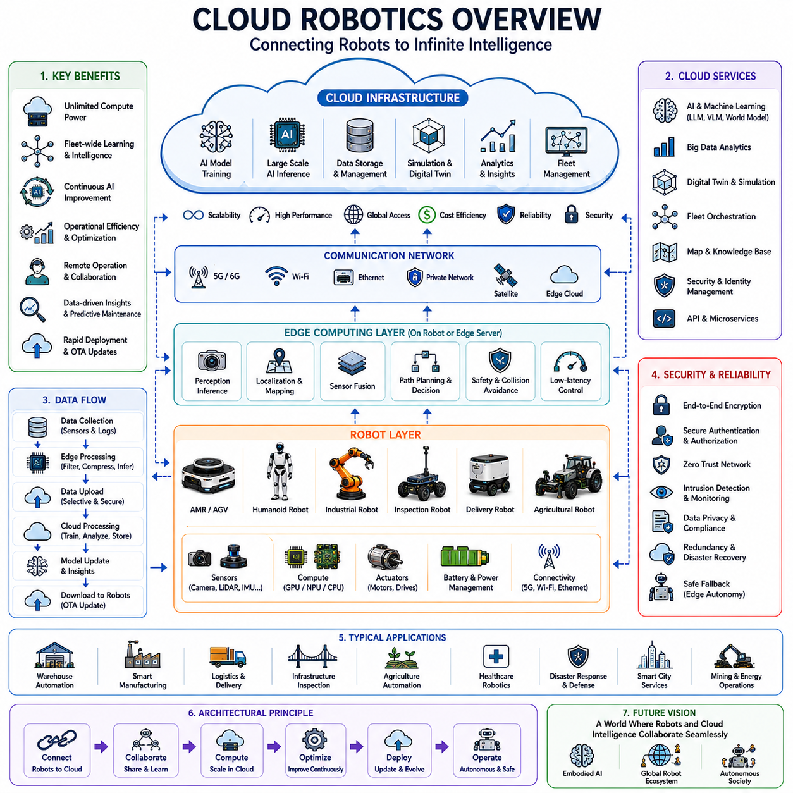
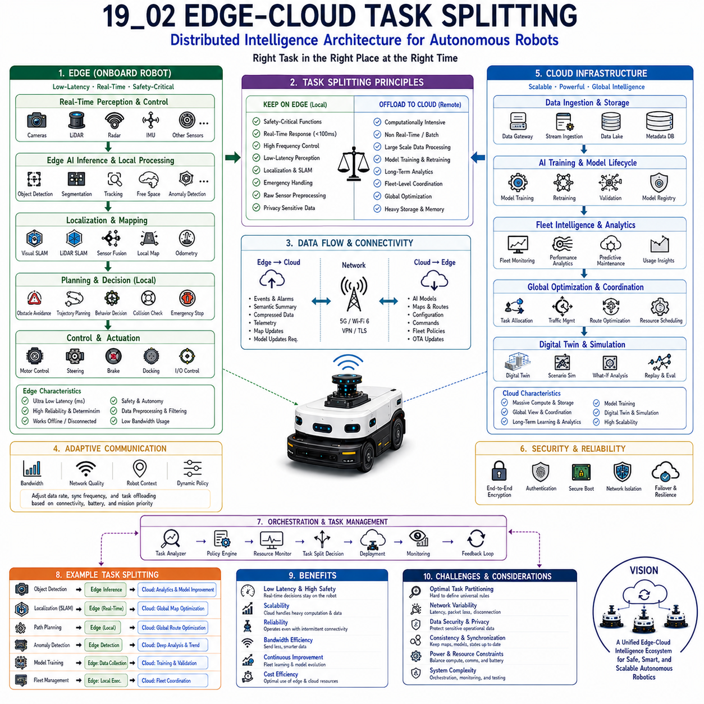
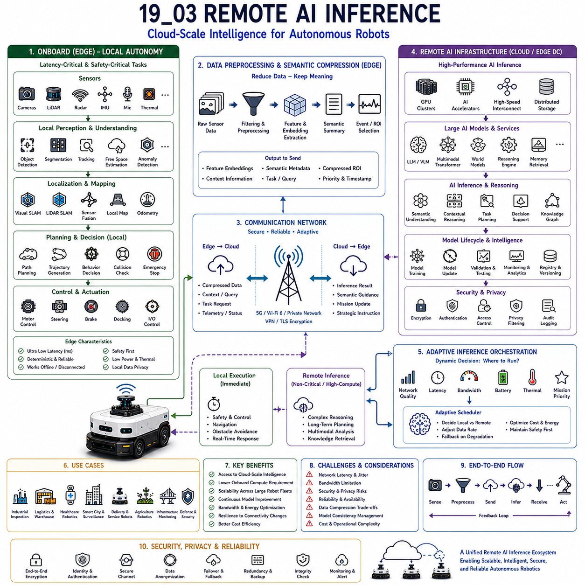
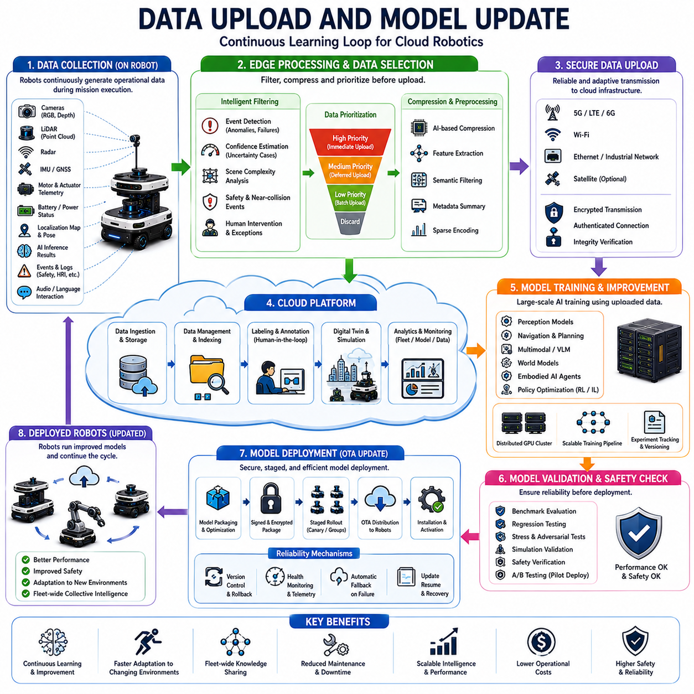
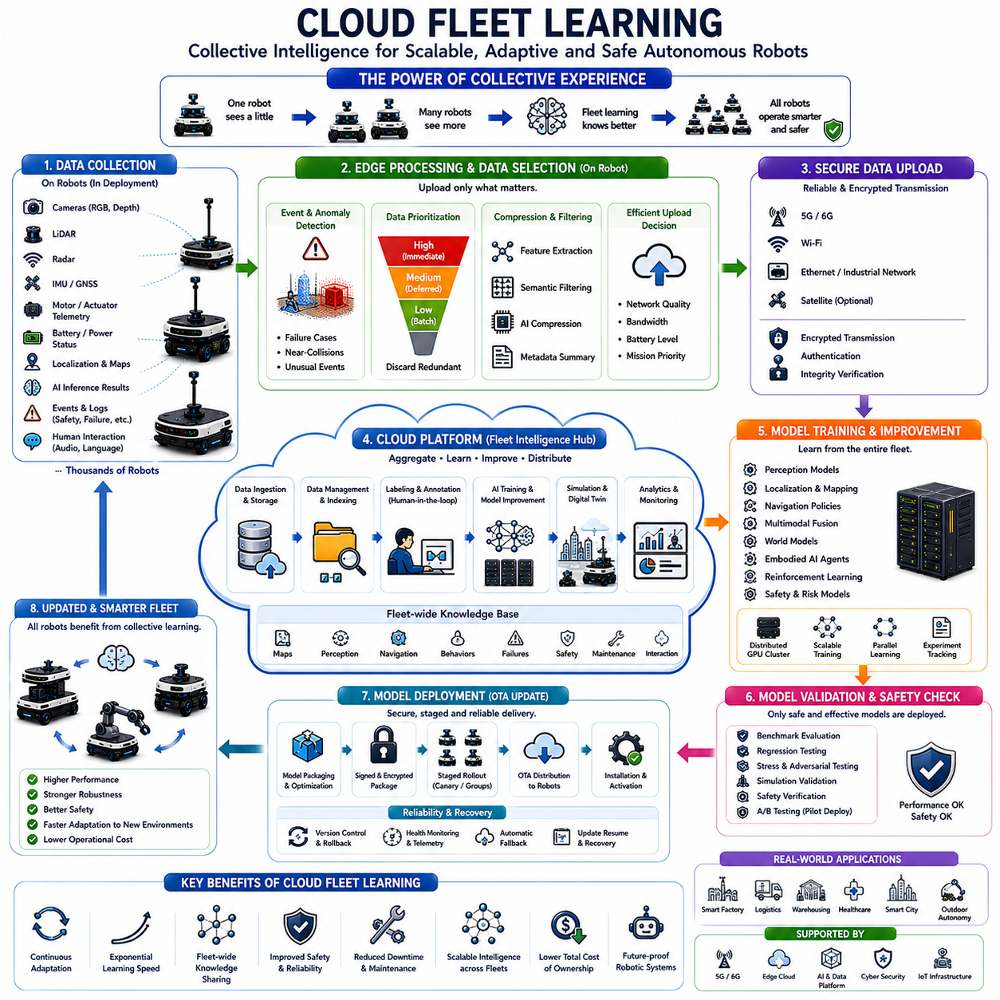
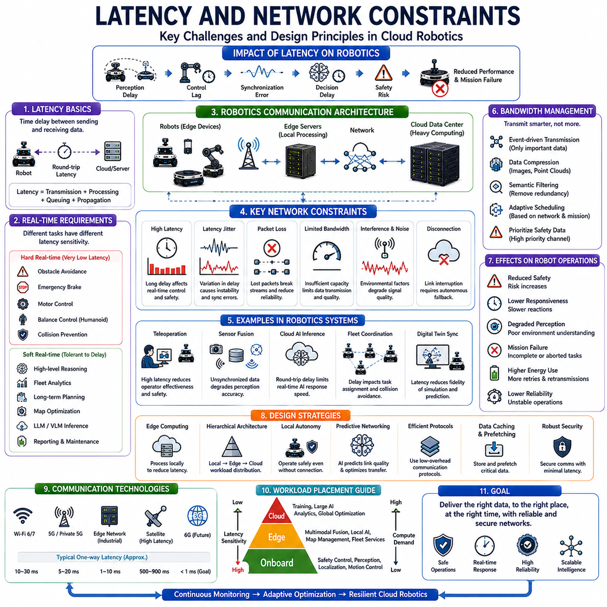
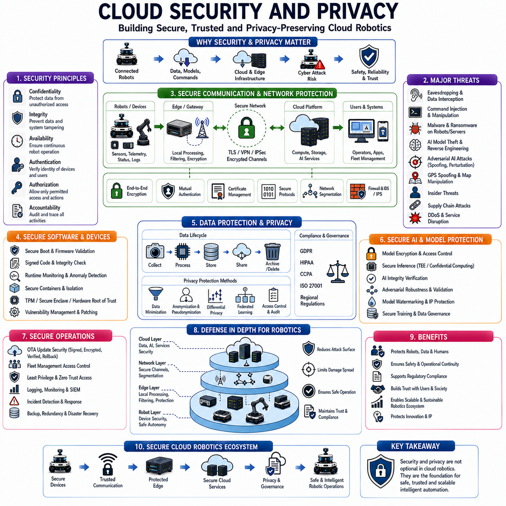
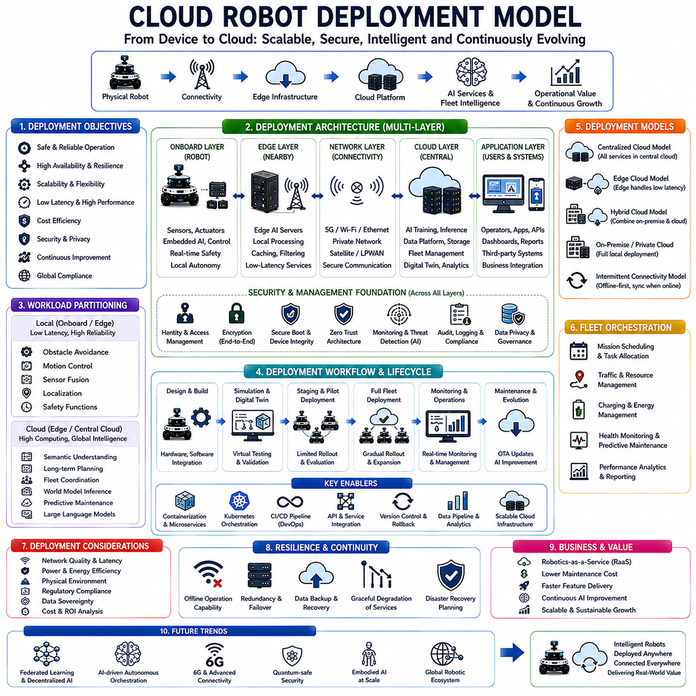

**Volume 06. AMR AI and Embodied Intelligence**

# Chapter 19. Cloud Robot Architecture

## 19.1 Cloud Robotics Overview

{width="7.268055555555556in" height="7.268055555555556in"}

"19_01_Cloud_Robotics_Overview" focuses on the overall architecture, operational principles, infrastructure models, and strategic significance of cloud robotics systems within modern autonomous mobile robots, embodied AI platforms, industrial robotic fleets, intelligent infrastructure systems, and large-scale AI-driven automation ecosystems. Cloud robotics represents the convergence of robotics, cloud computing, artificial intelligence, edge computing, distributed systems, wireless communication, and large-scale data orchestration technologies. Instead of treating robots as fully isolated standalone machines, cloud robotics enables robots to operate as connected intelligent agents that continuously exchange information, computational workloads, learned knowledge, operational status, environmental maps, and AI models through networked cloud infrastructures.

Traditional robotic systems were designed primarily as self-contained machines. Computation, perception, navigation, control logic, and data storage all resided entirely inside the robot itself. This architecture simplified connectivity requirements but severely limited scalability, learning capability, computational power, and long-term operational intelligence. As AI workloads became increasingly demanding and robotics systems expanded toward multimodal perception, transformer-based reasoning, world models, and fleet-level coordination, standalone robotic architectures became increasingly insufficient. Cloud robotics emerged as a solution that extends robotic intelligence beyond the physical limitations of onboard hardware.

The fundamental concept of cloud robotics is the separation and distribution of robotic workloads across edge devices and centralized cloud infrastructure. Certain functions remain onboard the robot due to strict latency or safety requirements, while other workloads are offloaded to cloud computing systems with significantly larger computational resources. This architecture allows robots to access virtually unlimited storage, high-performance GPU clusters, large-scale AI models, fleet-level coordination systems, and long-term knowledge databases without requiring every robot to carry datacenter-level hardware internally.

Modern cloud robotics systems generally consist of several major architectural layers. The physical robot layer includes sensors, actuators, embedded computers, GPUs, NPUs, motor controllers, and onboard AI systems. The edge computing layer performs low-latency local processing such as obstacle avoidance, localization, safety monitoring, and immediate perception inference. Above this layer, cloud infrastructure provides large-scale AI computation, distributed data storage, simulation environments, model training systems, fleet management, analytics platforms, and centralized orchestration services. Communication networks such as 5G, Wi-Fi, Ethernet, private industrial networks, satellite communication, or hybrid networking architectures connect these layers together.

One of the most important advantages of cloud robotics is computational scalability. Autonomous robots increasingly require large transformer models, multimodal reasoning systems, world models, and large-scale perception architectures that exceed the computational capacity of embedded edge hardware. Cloud GPU clusters provide access to enormous computational resources that can support high-level reasoning, fleet-wide learning, long-context inference, and large multimodal AI workloads. Instead of equipping every robot with extremely expensive and power-hungry datacenter GPUs, cloud robotics enables intelligent workload distribution between onboard edge systems and centralized AI infrastructure.

Cloud robotics also dramatically improves fleet-level learning and collective intelligence. In traditional isolated robotic systems, each robot learns independently from its own experiences. Cloud robotics allows robots to share learned information across entire fleets. If one robot encounters a new obstacle type, unusual environmental condition, navigation failure, or operational anomaly, this information can be uploaded to centralized cloud systems and distributed to other robots. Fleet-wide learning accelerates adaptation, improves operational safety, and enables continuous AI improvement across large deployments.

Data collection and analytics are central components of cloud robotics architectures. Modern autonomous robots generate enormous volumes of sensor data including RGB video streams, LiDAR point clouds, radar tensors, IMU telemetry, GPS information, environmental maps, operational logs, maintenance records, AI inference outputs, and human interaction data. Cloud infrastructure enables centralized storage, indexing, analysis, and long-term retention of this information. Robotics companies can analyze operational trends, optimize AI models, detect system anomalies, improve navigation policies, and monitor fleet health using cloud-based analytics systems.

Cloud robotics significantly enhances AI model training workflows. Training large-scale embodied AI systems often requires massive datasets collected from real-world robotic deployments. Robots continuously upload operational data to centralized cloud infrastructure where distributed GPU clusters perform retraining, reinforcement learning optimization, behavior analysis, synthetic data generation, and model validation. Updated AI models can then be redistributed back to robotic fleets through over-the-air deployment systems. This creates a continuous learning loop between edge robots and cloud AI infrastructure.

Simulation and digital twin technologies are deeply connected with cloud robotics systems. Large-scale robotic simulations require substantial computational resources for physics simulation, rendering, sensor emulation, reinforcement learning environments, and synthetic dataset generation. Cloud infrastructure enables distributed simulation at scales impossible on individual robotic platforms. Digital twin systems replicate real-world robots, environments, factories, warehouses, hospitals, or smart cities within virtual cloud environments. These digital replicas support predictive maintenance, operational planning, AI training, and large-scale testing before deployment into physical environments.

Fleet management becomes significantly more powerful through cloud robotics. Centralized cloud platforms can monitor robot health, battery status, mission progress, environmental conditions, software versions, thermal states, network connectivity, and AI inference statistics across entire robotic fleets. Operators can coordinate multi-robot task scheduling, traffic management, workload balancing, charging optimization, and maintenance planning from centralized control systems. This capability becomes especially important in large industrial deployments involving hundreds or thousands of robots.

Cloud robotics also supports advanced remote operation capabilities. Teleoperation systems allow human operators to remotely monitor, assist, or directly control robots through cloud-connected infrastructures. In hazardous environments such as mining, disaster response, nuclear facilities, offshore operations, or defense applications, remote robotic operation significantly improves human safety. Low-latency communication networks combined with edge AI assistance enable increasingly sophisticated human-robot collaboration across long distances.

Edge-cloud task partitioning is one of the most important design challenges in cloud robotics. Certain robotic functions must remain entirely onboard due to strict real-time safety requirements. Obstacle avoidance, emergency braking, low-level motor control, localization, and immediate perception processing typically execute locally on edge AI systems. High-level reasoning, long-term planning, large language processing, semantic analytics, and fleet-wide optimization may execute in cloud infrastructure. Determining the optimal workload distribution between edge and cloud systems is a central engineering challenge.

Latency remains one of the most critical limitations of cloud robotics. Network delays can vary significantly depending on communication infrastructure, geographic distance, congestion, wireless signal quality, and cloud service availability. Safety-critical robotic systems cannot depend entirely on remote cloud inference because unpredictable latency may create dangerous operational conditions. Therefore, cloud robotics architectures typically combine local autonomy with cloud-enhanced intelligence rather than relying exclusively on remote processing.

Communication infrastructure plays a foundational role in cloud robotics performance. High-bandwidth, low-latency communication technologies such as 5G significantly improve cloud robotics feasibility. Private industrial wireless networks, edge datacenters, and distributed cloud architectures reduce communication latency and improve reliability. Future 6G networks may further enhance robotic cloud integration by supporting ultra-low-latency distributed AI services and massive machine-to-machine connectivity.

Bandwidth management becomes increasingly important as robotic sensor systems grow more complex. Continuous transmission of raw sensor data such as high-resolution video streams or dense LiDAR point clouds may exceed available network capacity. Cloud robotics systems therefore increasingly use edge filtering, AI-driven compression, event-triggered transmission, selective data synchronization, and hierarchical data prioritization strategies to reduce bandwidth requirements while preserving critical information.

Cybersecurity represents a major challenge in cloud robotics systems. Connected robots may become targets for cyberattacks, unauthorized remote access, data theft, or malicious operational interference. Industrial robotic fleets operating within factories, logistics networks, hospitals, or public infrastructure require strong security architectures. Secure communication protocols, encrypted data transmission, hardware authentication, zero-trust networking, secure boot systems, runtime integrity verification, and cloud access control mechanisms become essential components of cloud robotics infrastructure.

Privacy and regulatory compliance also become increasingly important in cloud-connected robotic systems. Robots operating in public spaces, hospitals, offices, or smart cities may capture sensitive visual, audio, biometric, or operational data. Cloud robotics systems must therefore comply with regional privacy regulations, data governance policies, cybersecurity standards, and industrial certification requirements. Data localization laws may further influence cloud deployment architectures in different countries.

Cloud robotics introduces new operational business models for robotics companies. Robots increasingly operate as service-oriented platforms rather than isolated hardware products. Robotics-as-a-Service models allow customers to subscribe to robotic functionality through cloud-managed infrastructure. Cloud-based analytics, AI updates, predictive maintenance, remote diagnostics, and fleet optimization services create recurring revenue opportunities beyond initial hardware sales.

Cloud robotics also accelerates collaborative robotics and swarm intelligence systems. Multiple robots can coordinate through shared cloud infrastructure to perform cooperative tasks such as warehouse logistics, agricultural automation, autonomous inspection, environmental mapping, infrastructure monitoring, and disaster response. Shared cloud intelligence enables distributed decision-making and coordinated multi-agent behavior at scales difficult to achieve through isolated robotic systems.

Artificial general intelligence and embodied AI research increasingly depend on cloud robotics architectures. Future embodied AI systems may require continuous access to enormous multimodal knowledge bases, large language models, world models, simulation environments, and distributed memory systems. Cloud robotics provides the scalable infrastructure necessary to support these computationally intensive cognitive architectures while maintaining practical robotic mobility.

Industrial cloud robotics platforms increasingly integrate with enterprise software ecosystems including ERP systems, MES platforms, warehouse management systems, manufacturing execution systems, digital supply chains, smart city infrastructure, hospital information systems, and industrial IoT frameworks. This integration transforms robots into fully connected operational agents within larger digital ecosystems.

Hybrid cloud architectures are becoming increasingly important in industrial robotics. Certain workloads may execute within private on-premise datacenters for security, latency, or regulatory reasons, while less sensitive AI workloads leverage public cloud infrastructure for scalability. Multi-cloud strategies may further improve reliability and vendor flexibility.

Future cloud robotics systems will likely evolve toward distributed intelligence architectures where edge AI, regional edge datacenters, centralized cloud infrastructure, and collaborative robotic fleets operate as unified cognitive ecosystems. Advances in edge AI acceleration, distributed AI orchestration, neuromorphic computing, federated learning, cloud-native robotics middleware, and intelligent communication systems will further blur the distinction between onboard intelligence and cloud intelligence.

As autonomous robotics continues evolving toward large-scale embodied intelligence, cloud robotics will become one of the foundational architectures enabling scalable robotic cognition, collaborative learning, global fleet coordination, and continuous AI evolution. The future of robotics may ultimately depend not on isolated intelligent machines, but on interconnected robotic ecosystems operating collectively through distributed cloud intelligence infrastructures.

## 19.2 Edge-Cloud Task Splitting

{width="7.268055555555556in" height="7.268055555555556in"}

"19_02_Edge_Cloud_Task_Splitting" describes the distributed computational architecture and operational intelligence strategy used to divide autonomous robotics workloads between onboard edge computing systems and remote cloud infrastructure. As autonomous mobile robots and embodied AI platforms become increasingly intelligent, the computational requirements of perception, reasoning, navigation, semantic understanding, fleet coordination, and multimodal AI processing continue growing rapidly. However, no single computing architecture can optimally satisfy every robotics requirement simultaneously. Edge systems provide low-latency local intelligence while cloud infrastructure offers large-scale computational power, global data aggregation, and long-term learning capability. Edge-Cloud Task Splitting therefore becomes one of the most important architectural principles enabling scalable, intelligent, and operationally practical robotics ecosystems.

Traditional autonomous robots often relied entirely on onboard computing systems because early robotics tasks primarily required local navigation and low-level control. These robots performed obstacle avoidance, localization, and path following directly on embedded processors without significant external computational support. As AI workloads expanded into multimodal perception, transformer-based reasoning, semantic scene understanding, world modeling, fleet intelligence, and embodied cognition, purely onboard computing architectures became increasingly difficult to scale efficiently.

At the same time, fully cloud-based robotics architectures also proved impractical for safety-critical autonomous systems. Wireless network latency, communication interruptions, bandwidth limitations, cybersecurity risks, and unpredictable connectivity make cloud-only robotics architectures unsuitable for real-time operational autonomy. Autonomous robots operating in dynamic physical environments require immediate decision-making capabilities that cannot depend entirely on remote infrastructure.

Edge-Cloud Task Splitting therefore emerged as a hybrid intelligence architecture balancing local autonomy with centralized computational scalability. In this architecture, latency-sensitive, safety-critical, and real-time operational workloads execute locally on the robot's edge computing platform, while computationally intensive, long-term, large-scale, or globally coordinated workloads execute in cloud infrastructure.

The most fundamental principle of Edge-Cloud Task Splitting is latency awareness. Tasks requiring deterministic real-time response must remain onboard the robot. Obstacle avoidance, emergency braking, collision prevention, motor control, sensor synchronization, localization filtering, low-level perception, and safety monitoring all require millisecond-level responsiveness. Even small communication delays may compromise operational safety if these functions depend on remote cloud infrastructure.

For example, an autonomous outdoor robot detecting a pedestrian crossing its path cannot wait for cloud-based inference results before deciding whether to brake. Sensor data must be processed immediately through onboard edge AI systems. Object detection, semantic segmentation, trajectory prediction, and collision-risk estimation therefore execute directly on embedded GPU or edge AI hardware integrated within the robot.

Localization systems also typically remain edge-resident because navigation reliability depends on continuous low-latency position estimation. Visual SLAM, LiDAR SLAM, wheel odometry fusion, IMU integration, and local map matching execute onboard the robot continuously. Any interruption or instability in localization may immediately affect safe navigation behavior.

Sensor preprocessing pipelines similarly remain on the edge side of the architecture. Modern autonomous robots generate enormous volumes of sensor data through RGB cameras, LiDAR systems, radar arrays, thermal imaging systems, depth sensors, ultrasonic sensors, GPR systems, microphones, and industrial inspection devices. Transmitting all raw sensor streams continuously to cloud infrastructure is usually impractical because of bandwidth limitations and communication cost.

Edge computing therefore performs immediate filtering, preprocessing, compression, synchronization, semantic extraction, and event detection locally before transmitting summarized information externally. Instead of sending all raw camera frames, robots may transmit only detected anomalies, compressed feature embeddings, semantic summaries, or selected event recordings.

Cloud infrastructure, meanwhile, specializes in large-scale computational tasks requiring massive parallel processing or global system coordination. Fleet analytics, long-term learning, digital twin simulation, large-scale model training, operational telemetry aggregation, predictive maintenance analysis, semantic map generation, infrastructure optimization, and foundation-model reasoning may all execute more efficiently within cloud environments.

AI model training represents one of the clearest examples of cloud-side processing. Training modern transformer models, multimodal foundation models, semantic reasoning systems, and world models requires extremely large GPU clusters and massive datasets that exceed the capability of onboard robotics hardware. Robots therefore collect operational data at the edge while centralized cloud systems aggregate fleet-wide datasets for retraining and AI optimization.

Cloud infrastructure also enables fleet intelligence coordination. Large robotics deployments may involve hundreds or thousands of autonomous robots operating simultaneously across warehouses, industrial facilities, hospitals, ports, smart cities, or transportation systems. Centralized cloud systems analyze fleet-wide operational behavior, optimize task allocation, coordinate traffic flow, monitor global performance metrics, and synchronize shared environmental intelligence.

Digital twin systems strongly depend on Edge-Cloud Task Splitting architectures. Robots continuously synchronize operational telemetry with cloud-hosted virtual environments representing physical infrastructure, fleet behavior, environmental conditions, and operational state. Digital twins support predictive maintenance, simulation-driven validation, operational replay analysis, and future deployment optimization.

One of the most important engineering challenges in Edge-Cloud Task Splitting is determining optimal workload partitioning. Different AI tasks possess different latency sensitivity, computational complexity, bandwidth requirements, synchronization needs, privacy concerns, and operational criticality. System architects must carefully analyze these characteristics when deciding whether tasks belong on edge infrastructure or cloud infrastructure.

Inference partitioning becomes especially important in multimodal embodied AI systems. Some lightweight perception models may execute entirely onboard while larger reasoning models partially depend on cloud acceleration. Robots may perform local object detection and semantic segmentation while cloud infrastructure performs large-scale multimodal reasoning, contextual memory retrieval, or high-level mission planning.

Transformer-based AI architectures further complicate this partitioning problem. Large multimodal transformers may require computational resources exceeding the capacity of embedded edge hardware. Engineers therefore increasingly explore hybrid inference architectures where some transformer layers execute onboard while others execute remotely. Such distributed inference architectures remain an active research area in embodied AI engineering.

Bandwidth management is another central consideration in Edge-Cloud Task Splitting. Wireless communication bandwidth remains limited, especially in outdoor or industrial environments. High-resolution video streams, LiDAR point clouds, thermal imaging data, and GPR signals may quickly saturate communication infrastructure if transmitted continuously without optimization.

Edge systems therefore increasingly implement semantic filtering architectures. Instead of transmitting raw data, robots extract higher-level semantic information locally. For example, a surveillance robot may locally analyze multiple camera streams and transmit only abnormal events, human detections, or security anomalies to cloud infrastructure. Industrial inspection robots may locally analyze GPR data and transmit only underground anomaly regions or compressed infrastructure summaries.

Adaptive communication strategies also become important. Communication bandwidth may vary dynamically depending on network conditions, environmental interference, robot location, or operational context. Robots therefore increasingly adapt data synchronization frequency, telemetry resolution, and cloud communication behavior according to available connectivity quality.

Cybersecurity strongly influences Edge-Cloud Task Splitting architecture. Safety-critical operational autonomy must remain functional even if cloud connectivity becomes unavailable or compromised. Autonomous robots therefore maintain local fallback intelligence enabling continued safe operation during communication failures, network attacks, or cloud service interruptions.

Privacy and regulatory considerations also affect workload partitioning. Healthcare robotics, industrial inspection systems, defense robotics, and public surveillance platforms may process sensitive data subject to privacy regulations or operational confidentiality requirements. Edge computing allows sensitive raw data to remain local while only anonymized summaries or extracted semantic features transmit externally.

Power and thermal constraints further influence task allocation strategies. Continuous cloud communication consumes significant power, particularly for high-bandwidth wireless transmission. Robots operating under battery limitations must carefully balance onboard computation against communication energy cost. In some scenarios, local inference may actually consume less energy than continuous cloud synchronization.

Environmental uncertainty also affects Edge-Cloud operational strategy. Outdoor robots operating in remote industrial facilities, agricultural environments, mining sites, tunnels, ports, or construction areas may experience intermittent connectivity or extended offline operation. Such systems require robust autonomous local intelligence capable of operating independently when cloud infrastructure becomes inaccessible.

Industrial robotics deployments provide especially valuable Edge-Cloud Task Splitting case studies. Industrial inspection robots frequently process thermal imaging, ultrasonic sensing, GPR analysis, laser profiling, and infrastructure monitoring data locally for immediate anomaly detection while cloud infrastructure performs long-term predictive maintenance analytics, infrastructure trend analysis, and fleet-level operational optimization.

Autonomous logistics systems similarly illustrate distributed intelligence architecture. Warehouse robots locally perform navigation, obstacle avoidance, docking alignment, and traffic interaction while centralized cloud systems optimize warehouse-wide task scheduling, inventory coordination, traffic routing, and operational efficiency analysis.

Smart city robotics ecosystems may represent one of the most advanced examples of Edge-Cloud Task Splitting. Urban autonomous robots, intelligent traffic systems, environmental monitoring platforms, infrastructure inspection robots, delivery robots, and collaborative mobility systems increasingly operate as distributed embodied intelligence networks coordinated through large-scale cloud-edge architectures.

Edge orchestration frameworks play a central role in these systems. Runtime orchestration platforms dynamically allocate workloads between edge and cloud resources according to latency requirements, compute availability, thermal state, battery condition, operational priority, network quality, and environmental complexity. Adaptive orchestration may become one of the defining characteristics of future embodied AI ecosystems.

Containerization technologies strongly support Edge-Cloud Task Splitting architectures. Docker containers, Kubernetes-inspired orchestration systems, ROS2 composable nodes, and distributed AI runtime environments allow robotics workloads to migrate dynamically between cloud and edge infrastructure while preserving deployment consistency.

OTA deployment systems also depend heavily on cloud-edge coordination. Cloud infrastructure manages AI lifecycle orchestration, model versioning, deployment validation, rollback control, fleet synchronization, and security updates while robots perform local model verification and runtime activation.

Monitoring infrastructure similarly spans both edge and cloud domains. Local monitoring systems supervise real-time operational safety, thermal behavior, inference latency, sensor integrity, and navigation stability while cloud analytics platforms aggregate fleet-wide telemetry for predictive maintenance, anomaly detection, distribution drift analysis, and long-term AI optimization.

Federated learning may become increasingly important in future robotics ecosystems. Instead of transmitting raw operational data centrally, robots may locally train AI improvements and transmit only compressed model updates or learned parameter gradients to cloud infrastructure. Federated learning improves privacy, reduces bandwidth requirements, and supports scalable collaborative learning across distributed fleets.

Embodied AI systems further increase the complexity of Edge-Cloud Task Splitting. Future robots may integrate semantic memory systems, world models, multimodal reasoning engines, language interaction architectures, and adaptive behavioral planning frameworks. Some cognitive tasks may require cloud-scale reasoning resources while physical interaction and operational autonomy remain fully edge-resident.

Vision-language-action systems especially illustrate this complexity. Robots capable of understanding natural language instructions while interacting physically with dynamic environments require tightly coordinated multimodal AI architectures distributed across edge and cloud infrastructure. Efficient workload partitioning becomes critical for maintaining both responsiveness and intelligence quality.

Future Edge-Cloud robotics systems will likely evolve toward highly adaptive distributed intelligence ecosystems. Robots may continuously modify task allocation strategies according to operational risk, mission complexity, thermal conditions, environmental uncertainty, battery availability, communication quality, and fleet coordination requirements.

Cloud infrastructure may increasingly function as a collective intelligence layer supporting global reasoning, long-term memory, simulation, retraining, and fleet coordination, while edge systems remain responsible for real-time embodied interaction, safety-critical autonomy, and local environmental understanding.

Ultimately, "19_02_Edge_Cloud_Task_Splitting" represents one of the foundational distributed intelligence architectures enabling scalable embodied AI robotics ecosystems. It integrates low-latency edge autonomy, large-scale cloud intelligence, adaptive workload orchestration, semantic data filtering, fleet coordination, digital twin infrastructure, cybersecurity resilience, OTA lifecycle management, federated learning, and multimodal embodied AI into unified operational robotics systems. As autonomous robots continue expanding across logistics, industrial inspection, healthcare, agriculture, defense, smart cities, infrastructure management, and large-scale autonomous ecosystems, Edge-Cloud Task Splitting will remain among the most critical architectural principles enabling scalable, intelligent, resilient, and operationally practical robotic intelligence.

## 19.3 Remote AI Inference

{width="7.268055555555556in" height="7.268055555555556in"}

"19_03_Remote_AI_Inference" describes the distributed artificial intelligence architecture in which autonomous robots utilize external computing infrastructure to execute AI inference workloads beyond the computational capability of onboard edge hardware. As embodied AI systems become increasingly sophisticated, modern robots integrate multimodal transformers, foundation models, semantic reasoning systems, large-scale vision-language-action architectures, world models, fleet intelligence systems, and contextual planning frameworks that require computational resources often exceeding the limits of embedded robotics platforms. Remote AI inference therefore emerges as one of the most important enabling technologies allowing robots to access cloud-scale intelligence while maintaining operational autonomy.

Traditional autonomous robots primarily executed all AI processing locally because early robotics workloads were relatively lightweight. Object detection, obstacle avoidance, localization, and path planning could often execute on CPUs or embedded GPUs integrated directly within the robot. However, modern robotics intelligence increasingly depends on massive AI architectures containing billions of parameters, multimodal reasoning engines, semantic memory systems, and transformer-based world understanding frameworks that demand enormous computational throughput and memory capacity.

Embedded edge computing platforms, despite rapid advances in GPU acceleration, remain constrained by power consumption, thermal limitations, enclosure volume, battery endurance, weight restrictions, environmental ruggedness, and real-time operational reliability. Large AI models may require hundreds of watts or even kilowatts of computational power when operating continuously. Deploying such infrastructure directly onboard every autonomous robot is often economically impractical, thermally challenging, and operationally inefficient.

Remote AI inference addresses this limitation by allowing robots to offload selected AI workloads to external compute infrastructure. In this architecture, robots perform latency-critical safety operations locally while transmitting selected sensor data, semantic representations, compressed embeddings, or contextual information to remote inference servers operating within cloud datacenters, edge datacenters, local infrastructure clusters, or distributed AI acceleration networks.

The core principle of Remote AI Inference is workload separation based on latency sensitivity and computational complexity. Tasks requiring deterministic real-time response remain onboard the robot, while tasks requiring large-scale reasoning, heavy transformer execution, semantic understanding, contextual memory retrieval, or computationally intensive multimodal analysis may execute remotely.

For example, an autonomous robot navigating through a crowded urban environment must perform obstacle avoidance, emergency braking, localization, and low-level perception locally because these operations require millisecond-level response time. However, high-level semantic reasoning tasks such as interpreting complex human instructions, long-term mission planning, contextual environmental understanding, or large-scale visual-language reasoning may execute remotely without compromising immediate operational safety.

Remote inference architectures become especially valuable in multimodal embodied AI systems. Future autonomous robots increasingly combine RGB vision, LiDAR perception, radar analysis, thermal imaging, audio understanding, natural language interaction, semantic memory, contextual planning, and world-model reasoning into unified embodied intelligence pipelines. Many of these tasks involve transformer architectures and foundation models requiring computational scales beyond practical embedded hardware limits.

Vision-language-action systems provide a particularly important example. A robot receiving natural language instructions such as "inspect the underground pipeline area near the eastern maintenance zone and identify unusual thermal signatures around valve infrastructure" may require large-scale multimodal reasoning involving visual perception, semantic localization, infrastructure understanding, contextual language interpretation, historical operational memory, and task planning. Executing such reasoning entirely onboard may exceed the capability of compact robotics hardware.

Remote AI inference allows these higher-level reasoning tasks to execute on cloud-scale GPU clusters while the robot continues performing low-level navigation and safety operations locally. The robot transmits summarized environmental context and receives semantic guidance, mission updates, contextual reasoning outputs, or strategic planning instructions from the remote AI infrastructure.

One of the most important engineering considerations in Remote AI Inference is communication latency. Wireless communication introduces unavoidable delay caused by transmission time, network congestion, routing overhead, protocol processing, and infrastructure variability. High-latency communication may destabilize robotics systems if improperly integrated into real-time operational loops.

Therefore, robotics architectures carefully isolate latency-sensitive control systems from remote inference pathways. Safety-critical loops including motor control, obstacle avoidance, braking systems, collision prevention, localization filtering, and low-level trajectory correction remain entirely edge-resident. Remote inference augments higher-level cognition rather than replacing local operational autonomy.

Bandwidth optimization represents another major challenge. Modern autonomous robots generate enormous quantities of sensor data continuously. High-resolution camera arrays, 3D LiDAR systems, radar sensors, thermal imaging devices, depth cameras, ultrasonic systems, GPR scanners, industrial inspection sensors, and environmental monitoring devices may collectively produce gigabytes of data per second.

Transmitting all raw sensor streams continuously to remote AI infrastructure is generally infeasible because of bandwidth limitations and communication cost. Remote AI inference systems therefore increasingly rely on semantic compression and intelligent preprocessing performed locally on the robot. Edge systems extract feature embeddings, semantic summaries, object representations, event-triggered recordings, spatial abstractions, or compressed multimodal context before transmitting selected information externally.

For example, an industrial inspection robot analyzing thermal infrastructure may locally identify candidate anomaly regions and transmit only cropped thermal signatures, semantic metadata, contextual infrastructure information, and compressed visual representations to remote AI systems for deeper reasoning. This dramatically reduces communication bandwidth while preserving valuable operational intelligence.

Distributed AI orchestration becomes increasingly important in large-scale robotics ecosystems. Robots may dynamically decide whether AI tasks execute locally or remotely depending on communication quality, network availability, thermal state, battery condition, mission urgency, environmental complexity, operational risk level, and compute workload intensity.

Adaptive inference scheduling may become one of the defining characteristics of future embodied AI systems. Under excellent connectivity conditions, robots may rely heavily on cloud-scale AI reasoning infrastructure. Under degraded communication conditions or disconnected operation, robots may dynamically fall back to smaller local AI models with reduced capability but maintained operational safety.

Edge datacenters represent an increasingly important intermediate architecture between onboard computing and centralized cloud infrastructure. Instead of transmitting AI workloads to geographically distant hyperscale datacenters, robots may communicate with nearby edge servers deployed within factories, hospitals, warehouses, smart city infrastructure, industrial facilities, ports, airports, or telecommunications infrastructure.

Edge datacenters dramatically reduce communication latency while still providing substantially greater computational power than onboard robotics hardware. Such architectures support near-real-time remote inference for sophisticated AI workloads that remain infeasible on embedded systems alone.

5G and future wireless networking technologies strongly influence Remote AI Inference viability. High-bandwidth low-latency wireless communication allows robots to access remote AI acceleration more efficiently than earlier-generation networking systems. Private industrial 5G infrastructure becomes especially important in large-scale industrial robotics deployments.

Industrial inspection robotics provide valuable Remote AI Inference case studies. GPR analysis, thermal anomaly interpretation, predictive maintenance AI, ultrasonic defect analysis, multimodal infrastructure assessment, and large-scale semantic infrastructure reasoning frequently require substantial GPU resources. Robots may locally preprocess sensor streams while remote GPU clusters perform computationally intensive inference tasks.

Healthcare robotics similarly benefit from remote AI inference architectures. Telemedicine robots, hospital service robots, and assistive robotics systems may access cloud-based language models, medical reasoning systems, multimodal patient interaction frameworks, and semantic dialogue engines exceeding the capability of embedded hardware.

Smart city robotics ecosystems may eventually operate through large-scale distributed remote inference infrastructure. Autonomous delivery robots, infrastructure inspection systems, collaborative mobility platforms, urban monitoring robots, and intelligent transportation systems may continuously access centralized AI reasoning services supporting global environmental understanding and coordinated urban intelligence.

Cybersecurity becomes critically important in Remote AI Inference architectures. Robots transmitting operational data to remote infrastructure may become vulnerable to communication interception, adversarial attacks, model manipulation, or malicious inference injection. Secure communication protocols, encrypted transmission, authentication systems, trusted execution environments, and inference integrity verification therefore become essential operational requirements.

Privacy considerations also strongly influence architecture design. Autonomous robots operating in healthcare, public infrastructure, industrial facilities, or defense environments may process highly sensitive operational data. Remote AI inference architectures increasingly incorporate privacy-preserving techniques including local anonymization, semantic abstraction, encrypted inference, federated reasoning, and controlled data retention policies.

Inference caching becomes another important optimization strategy. Frequently repeated reasoning tasks or semantic queries may be cached locally to reduce repeated communication overhead. Robots may store compressed embeddings, contextual memory representations, semantic maps, or commonly used inference outputs locally for faster future retrieval.

Large language models increasingly drive the evolution of Remote AI Inference systems. Future robots may rely heavily on conversational reasoning, contextual memory, mission planning, semantic understanding, and world knowledge generated through extremely large multimodal transformer architectures. Such models often require computational infrastructure far beyond practical onboard deployment capability.

Cloud-scale GPU infrastructure therefore becomes a shared cognitive layer supporting multiple robots simultaneously. Instead of every robot containing an independent full-scale foundation model, robotics fleets may access centralized multimodal reasoning services while maintaining local autonomy for real-time operational control.

Remote inference architectures also support continuous AI improvement. Cloud infrastructure may continuously update, retrain, optimize, and validate AI models using fleet-wide operational telemetry. Robots then dynamically access improved intelligence capability without requiring immediate large-scale onboard hardware upgrades.

Monitoring infrastructure becomes extremely important in Remote AI Inference systems. Runtime orchestration frameworks continuously monitor communication latency, packet loss, inference response time, network stability, cloud availability, GPU workload distribution, inference reliability, and operational safety margins. Robots must dynamically detect degraded remote inference conditions and safely adapt operational behavior accordingly.

Containerized distributed AI architectures increasingly support scalable remote inference deployment. Kubernetes orchestration systems, containerized inference services, distributed GPU schedulers, and microservice-based AI runtime environments allow robotics infrastructure to scale dynamically according to fleet demand and operational workload.

Federated robotics intelligence may become one of the defining characteristics of future autonomous systems. Instead of isolated robots operating independently, fleets may collectively contribute operational data, semantic experiences, contextual knowledge, and learned embeddings into shared remote intelligence infrastructure continuously improving global robotic reasoning capability.

Digital twin systems also strongly integrate with Remote AI Inference architectures. Robots synchronize operational telemetry with cloud-hosted simulation environments allowing large-scale reasoning, scenario prediction, infrastructure modeling, operational replay analysis, and simulation-driven planning assistance.

Energy optimization further motivates remote inference architectures. Executing extremely large AI models locally may consume prohibitive power and generate excessive heat on battery-powered robots. Remote inference allows smaller lightweight embedded hardware to access large-scale intelligence without carrying datacenter-class compute infrastructure onboard continuously.

Future embodied AI systems may increasingly operate through hierarchical intelligence architectures. Low-level reflexive control, navigation safety, and local perception remain onboard the robot. Intermediate contextual processing executes within nearby edge datacenters. Large-scale reasoning, semantic memory, fleet coordination, and foundation-model cognition execute within cloud infrastructure. Such hierarchical intelligence architectures may become the dominant paradigm for future autonomous robotics ecosystems.

Neuromorphic computing, photonic AI accelerators, sparse transformer architectures, and robotics-specific inference accelerators may eventually reduce the need for remote inference by improving onboard compute efficiency dramatically. However, the growth rate of AI model complexity currently continues exceeding the growth rate of practical embedded compute capability, ensuring Remote AI Inference remains highly important for future robotics intelligence.

Ultimately, "19_03_Remote_AI_Inference" represents one of the foundational distributed intelligence architectures enabling scalable embodied AI robotics systems. It integrates cloud-scale reasoning, edge autonomy, distributed GPU acceleration, semantic compression, adaptive inference orchestration, multimodal transformer execution, cybersecurity resilience, federated intelligence, digital twin infrastructure, and hierarchical embodied cognition into unified operational robotics ecosystems. As autonomous robots continue expanding across logistics, healthcare, industrial inspection, agriculture, defense, smart cities, transportation infrastructure, and large-scale embodied AI ecosystems, Remote AI Inference will remain among the most critical enabling technologies supporting scalable, intelligent, adaptive, and operationally practical robotic intelligence.

## 19.4 Data Upload and Model Update

{width="7.268055555555556in" height="7.268055555555556in"}

"19_04_Data_Upload_and_Model_Update" focuses on one of the most important operational workflows in modern cloud robotics and embodied AI systems: the continuous collection of field data from deployed robots, the secure transmission of operational datasets to cloud infrastructure, the retraining and validation of AI models using accumulated real-world data, and the deployment of updated AI models back to robotic fleets through automated or semi-automated update pipelines. In modern autonomous robotics, AI models cannot remain static after initial deployment. Real-world environments continuously change, operational conditions evolve, sensor characteristics drift over time, and robots encounter new objects, lighting conditions, weather conditions, infrastructure layouts, human behaviors, and unexpected operational anomalies. Therefore, large-scale robotics systems increasingly rely on continuous data upload and model update architectures to maintain performance, improve intelligence, and support long-term autonomous operation.

Traditional robotics systems were often designed using relatively fixed software architectures. AI models or control algorithms were trained once during development and then deployed with minimal changes throughout the product lifecycle. While this approach simplified deployment, it created significant limitations in adaptability and scalability. Modern embodied AI systems, however, require continuous learning from real-world experience. Cloud-connected robotics platforms therefore establish persistent operational loops in which robots continuously generate data, upload selected information to cloud infrastructure, support centralized AI improvement pipelines, and receive updated AI models through remote deployment systems.

The data upload pipeline begins inside the robot itself. Modern autonomous robots continuously generate enormous amounts of operational information. RGB camera streams, LiDAR point clouds, radar tensors, IMU telemetry, GNSS positioning data, depth images, thermal camera outputs, motor control signals, actuator states, battery telemetry, localization maps, AI inference outputs, navigation trajectories, human interaction logs, safety events, and environmental context information are all continuously produced during robot operation. In advanced embodied AI systems, even language interaction logs, world-model state transitions, and multimodal memory embeddings may become part of the operational dataset.

However, uploading all raw robotic data directly to cloud infrastructure is generally impractical. High-resolution multimodal sensor systems can generate terabytes of data within short operational periods. Continuous raw-data upload would exceed available bandwidth, increase cloud storage costs, and create severe operational inefficiencies. Therefore, modern cloud robotics architectures increasingly rely on intelligent edge-side data filtering and selective upload strategies.

Edge AI systems play a major role in deciding which data should be uploaded. Robots increasingly perform local event detection, anomaly analysis, confidence estimation, scene complexity evaluation, and failure prediction before transmitting data to the cloud. Instead of uploading all sensor streams continuously, robots may selectively upload only operationally significant events such as navigation failures, near-collision incidents, perception uncertainty cases, unusual environmental conditions, human intervention events, or AI model disagreement scenarios.

Data prioritization becomes a critical part of the upload architecture. Safety-critical events are often transmitted immediately with high priority, while lower-priority operational logs may be uploaded during idle periods or when high-bandwidth network connectivity becomes available. Some systems implement hierarchical upload policies in which compressed metadata is transmitted first, followed by detailed sensor recordings only if cloud systems request deeper analysis.

Compression and preprocessing technologies are essential for scalable cloud robotics data pipelines. High-resolution RGB video, LiDAR point clouds, and radar tensors require substantial bandwidth and storage capacity. Robots therefore increasingly use AI-assisted compression techniques, feature extraction pipelines, sparse encoding methods, and semantic filtering before transmission. Instead of uploading full raw sensor frames, edge systems may upload object tracks, semantic maps, localization states, event summaries, or feature embeddings.

Communication infrastructure strongly influences data upload strategies. Robots operating within factories or warehouses may use high-speed Wi-Fi or private industrial networks with relatively stable bandwidth availability. Outdoor autonomous robots may depend on 5G, LTE, satellite communication, or hybrid networking systems where bandwidth conditions vary dynamically. Cloud robotics systems therefore increasingly use adaptive upload scheduling systems that adjust data transmission behavior according to current network quality, operational urgency, power conditions, and mission priorities.

Data synchronization between robots and cloud infrastructure introduces major engineering complexity. Robots may temporarily lose connectivity, experience intermittent bandwidth limitations, or operate in disconnected environments for extended periods. Therefore, robust buffering, synchronization recovery, retry management, and local storage persistence systems become essential. Autonomous robots must continue safe operation even during complete communication outages.

Once operational data reaches cloud infrastructure, large-scale storage and orchestration systems manage the incoming datasets. Cloud robotics platforms typically organize uploaded data into structured pipelines including sensor archives, operational metadata, localization histories, AI inference logs, fleet telemetry databases, maintenance records, and simulation replay systems. Distributed storage systems allow scalable indexing and retrieval of massive robotics datasets collected from large robotic fleets.

Data labeling and annotation become central components of the model update pipeline. Some uploaded data may already contain self-supervised or automatically generated labels produced during robot operation. However, many advanced AI training workflows still require human review, validation, correction, or semantic annotation. Robotics companies increasingly combine automated labeling pipelines with human-in-the-loop verification systems to improve dataset quality while minimizing manual labor requirements.

Self-supervised learning and continual learning architectures are becoming increasingly important within cloud robotics systems. Instead of relying entirely on manually labeled datasets, robots may learn representations directly from operational experience. Contrastive learning, predictive modeling, multimodal alignment, reinforcement learning feedback, and world-model consistency analysis allow AI systems to improve continuously using large volumes of unlabeled operational data.

Cloud-based AI training infrastructure forms the core of the model improvement pipeline. Large GPU clusters process uploaded robotic datasets to retrain perception systems, navigation policies, multimodal reasoning architectures, VLM systems, world models, and embodied AI agents. Distributed training systems synchronize large-scale datasets collected from diverse environments, robot configurations, and operational conditions.

Fleet-level learning represents one of the most powerful advantages of cloud robotics architectures. A single robot encountering a novel operational scenario may generate data that improves the entire robotic fleet. For example, if one outdoor inspection robot encounters an unusual weather condition, sensor failure mode, or previously unseen obstacle type, this information can be integrated into centralized AI retraining pipelines and redistributed to all similar robots. This collective intelligence architecture dramatically accelerates operational adaptation and long-term AI improvement.

Simulation and digital twin systems are deeply integrated into model update workflows. Uploaded operational data may be replayed inside simulation environments to reproduce field failures, validate new AI behaviors, or generate synthetic augmentation datasets. Cloud robotics platforms increasingly combine real-world operational data with synthetic simulation data to improve robustness across diverse environmental conditions.

Model validation is one of the most critical stages of the update pipeline. Newly trained AI models cannot simply be deployed directly into operational robotic fleets without extensive verification. Robotics AI systems operate in safety-critical environments where incorrect perception or navigation behavior may create dangerous conditions. Therefore, updated models undergo comprehensive testing including benchmark evaluation, regression testing, adversarial scenario analysis, stress testing, simulation validation, safety verification, and field pilot deployment.

A/B testing strategies are increasingly used in robotic fleet deployments. Instead of deploying updated AI models to all robots simultaneously, cloud robotics platforms may first deploy new models to limited subsets of robots operating in controlled environments. Performance differences between baseline and updated models are continuously monitored before large-scale rollout occurs.

Rollback and recovery mechanisms are essential components of model update systems. If newly deployed AI models introduce unexpected failures, instability, or degraded performance, robotic fleets must quickly revert to previous validated versions. OTA update systems therefore maintain version management infrastructure, secure rollback protocols, staged deployment pipelines, and runtime fallback mechanisms.

Over-the-air deployment systems play a central role in modern cloud robotics operations. Updated AI models, navigation maps, software patches, safety policies, configuration files, and runtime optimization packages are remotely distributed through cloud-connected infrastructure. OTA systems significantly reduce maintenance costs because robots no longer require manual physical servicing for every software update.

Edge AI deployment constraints strongly influence model update design. Robots may operate with limited compute resources, memory capacity, storage availability, or power budgets. Updated models must therefore be optimized for target hardware platforms before deployment. Quantization, pruning, TensorRT optimization, ONNX conversion, sparsity optimization, and memory compression techniques are commonly applied during deployment preparation.

Security becomes critically important in cloud-based model update pipelines. Unauthorized model modification could create catastrophic operational risks. Cloud robotics systems therefore implement encrypted communication, signed firmware packages, secure boot systems, trusted execution environments, hardware authentication, and runtime integrity verification to protect update pipelines from cyberattacks or malicious interference.

Privacy and compliance considerations further complicate robotics data upload systems. Robots operating in hospitals, factories, public infrastructure, or smart cities may capture sensitive visual, biometric, operational, or behavioral data. Cloud robotics architectures must therefore implement strong access control, anonymization pipelines, regional data governance compliance, and secure retention policies.

Federated learning is emerging as an alternative architecture for privacy-sensitive robotic AI systems. Instead of uploading raw operational data to centralized cloud infrastructure, robots may train local AI updates on-device and upload only model gradients or compressed parameter updates. This approach improves privacy while still enabling fleet-wide collective learning.

Data drift and model drift monitoring become essential for long-term robotic AI operation. Environmental conditions, sensor behavior, infrastructure layouts, and human interaction patterns may gradually change over time. Cloud monitoring systems continuously analyze operational statistics to detect performance degradation, distribution shifts, or emerging failure patterns requiring retraining.

Energy and bandwidth optimization increasingly influence upload strategies. Autonomous robots operating in remote outdoor environments may need to minimize communication energy consumption to preserve operational endurance. Intelligent scheduling systems therefore coordinate upload timing according to battery state, mission urgency, and network availability.

Large-scale industrial robotics deployments may involve thousands of robots operating simultaneously across multiple geographic regions. Cloud robotics platforms must therefore support globally distributed data ingestion, regional edge processing, multi-cloud synchronization, scalable AI retraining infrastructure, and geographically distributed deployment orchestration.

Future embodied AI systems will likely depend even more heavily on continuous data upload and model update pipelines. Humanoid robots, autonomous industrial platforms, healthcare robots, smart city robots, and collaborative AI agents may continuously evolve through lifelong operational learning. Cloud-edge AI ecosystems will increasingly function as persistent distributed intelligence infrastructures where robots collectively improve through shared experience.

Advances in self-supervised learning, federated learning, world-model adaptation, AI safety monitoring, autonomous validation systems, and distributed cloud AI infrastructure will further accelerate this evolution. Future robotics platforms may eventually update their perception systems, reasoning architectures, behavioral policies, and multimodal world models almost continuously while maintaining strict safety guarantees and operational reliability.

As cloud robotics evolves toward large-scale embodied intelligence ecosystems, data upload and model update pipelines will become one of the foundational mechanisms enabling continuous robotic learning, operational adaptation, fleet intelligence, and long-term autonomous evolution across industrial, commercial, and public robotic deployments.

## 19.5 Cloud Fleet Learning

{width="7.268055555555556in" height="7.268055555555556in"}

"19_05_Cloud_Fleet_Learning" focuses on one of the most transformative concepts in modern cloud robotics and embodied AI systems: the ability for large fleets of autonomous robots to collectively learn from shared operational experience through cloud-connected AI infrastructures. Traditional robotic systems were typically isolated machines that operated independently with fixed onboard intelligence. Each robot learned only from its own limited experiences, and any improvements usually required manual software updates or centralized redevelopment. Cloud fleet learning fundamentally changes this paradigm by enabling robots to continuously exchange knowledge, operational data, learned behaviors, failure experiences, environmental understanding, and AI model improvements across an entire distributed robotic ecosystem.

In modern autonomous robotics, individual robots are no longer treated as isolated computational entities. Instead, they become connected nodes within large-scale distributed intelligence networks. Each robot continuously collects environmental information, sensor observations, navigation outcomes, perception results, operational anomalies, human interaction patterns, and behavioral experiences during real-world deployment. Through cloud robotics infrastructure, this information becomes part of a shared fleet-level intelligence system that allows all robots to benefit collectively from the experiences of every deployed unit.

The fundamental principle behind cloud fleet learning is collective operational adaptation. When a robot encounters a new environment, difficult weather condition, unexpected obstacle, sensor anomaly, or navigation failure, the operational data generated during that experience can be uploaded to centralized cloud systems. AI training infrastructure then analyzes the data, improves relevant models, validates new behaviors, and redistributes optimized AI models back to the robotic fleet. As a result, knowledge gained by one robot becomes available to every robot connected to the system.

This concept significantly accelerates robotic intelligence growth. In isolated robotic architectures, each robot requires substantial direct operational exposure to improve its behavior. Cloud fleet learning enables exponential knowledge scaling because the entire fleet effectively learns together. A thousand robots operating simultaneously across different environments generate dramatically more operational experience than any individual robot could accumulate alone. This shared experience becomes one of the most valuable assets in large-scale autonomous robotics systems.

Fleet learning is especially important in outdoor autonomous robotics because real-world environments are highly dynamic and unpredictable. Weather conditions, lighting variations, road surfaces, infrastructure layouts, seasonal changes, pedestrian behavior, industrial obstacles, vegetation growth, snow accumulation, fog, dust, and construction activity continuously alter operational conditions. Static AI models eventually become insufficient in such evolving environments. Fleet learning allows AI systems to continuously adapt to changing real-world conditions using distributed operational experience.

Modern cloud fleet learning systems generally operate through several tightly integrated layers. At the lowest level, physical robots collect multimodal operational data during field deployment. Edge AI systems preprocess this information locally, perform event filtering, evaluate anomaly significance, and select important operational cases for upload. Cloud infrastructure then aggregates fleet-wide data, organizes operational knowledge, retrains AI models, validates updates, and redistributes improved models back to robots through over-the-air deployment systems.

One of the most important applications of fleet learning is perception improvement. Autonomous robots continuously encounter new object appearances, unusual lighting conditions, sensor noise patterns, environmental occlusions, and rare operational scenarios. If one robot experiences a perception failure caused by a previously unseen obstacle type, that operational dataset can be uploaded to cloud infrastructure where AI models are retrained to recognize similar scenarios. The improved perception model can then be distributed to the entire fleet, dramatically improving collective robustness.

Localization and mapping systems also benefit greatly from cloud fleet learning. Robots operating in large industrial environments, smart cities, warehouses, hospitals, mines, or infrastructure facilities continuously generate localization maps and environmental observations. Cloud infrastructure can merge information collected by multiple robots into highly accurate global maps. Shared localization intelligence allows robots to improve navigation accuracy even in environments that individual robots have never directly explored before.

Fleet learning becomes even more powerful when combined with multimodal sensor fusion systems. Modern robots simultaneously process RGB imagery, LiDAR point clouds, radar tensors, thermal imaging, depth sensors, GNSS positioning, IMU telemetry, and audio information. Different robots may encounter different environmental conditions that affect sensor performance differently. By aggregating fleet-wide multimodal operational data, cloud AI systems can improve sensor fusion robustness across highly diverse operational conditions.

Cloud fleet learning also significantly improves safety performance. Near-collision incidents, emergency braking events, human intervention cases, navigation failures, and abnormal robot behaviors can all be analyzed centrally. Safety-critical edge cases that might rarely occur in individual robots become statistically meaningful when aggregated across thousands of robotic operating hours. This enables continuous safety improvement through large-scale operational learning.

Human-robot interaction systems also benefit from fleet-level learning. Robots deployed in hospitals, hotels, airports, shopping centers, factories, or smart city infrastructure encounter diverse human behaviors, speech patterns, interaction preferences, and operational expectations. Cloud fleet learning allows interaction models to continuously improve through collective experience across large populations and deployment environments.

Reinforcement learning becomes especially powerful in cloud robotics ecosystems. Individual robots may perform policy optimization locally while cloud systems aggregate experiences from multiple agents. Distributed reinforcement learning architectures enable large-scale behavior optimization using massively parallel real-world robotic experience. This dramatically accelerates learning efficiency compared to isolated robotic training approaches.

Embodied AI systems rely heavily on fleet learning because physical interaction with real environments is inherently expensive and time-consuming. Unlike purely digital AI systems, embodied robots must physically operate in the real world to gather experience. Cloud fleet learning reduces this limitation by pooling experiences from large numbers of robots operating simultaneously across different environments and operational conditions.

Simulation systems are deeply integrated into cloud fleet learning architectures. Real-world operational data uploaded from robotic fleets can be replayed inside large-scale simulation environments to reproduce failures, validate new AI policies, generate synthetic datasets, or perform adversarial testing. Digital twin infrastructures continuously synchronize real-world fleet information with virtual environments to support accelerated AI improvement cycles.

Cloud fleet learning also supports predictive maintenance systems. Large robotic fleets generate continuous telemetry regarding motor behavior, battery performance, thermal conditions, vibration signatures, sensor health, actuator performance, and hardware degradation patterns. Cloud analytics systems can identify early warning signs of component failures using fleet-wide operational statistics. Predictive maintenance models become increasingly accurate as more operational data accumulates across the fleet.

Bandwidth optimization becomes critically important in fleet learning systems because large robotic fleets generate enormous amounts of data. Uploading all raw sensor streams continuously would quickly overwhelm network infrastructure. Therefore, intelligent filtering systems prioritize unusual events, operational anomalies, uncertainty cases, and rare environmental conditions while discarding redundant or low-value information. Edge AI systems increasingly perform local semantic filtering before cloud upload.

Federated learning architectures are becoming increasingly important within cloud fleet learning ecosystems. In traditional centralized learning systems, robots upload raw operational data to cloud infrastructure. Federated learning instead allows robots to train local model updates on-device and upload only gradient updates or compressed parameter modifications. This improves privacy, reduces bandwidth usage, and supports deployment in sensitive environments such as hospitals, defense systems, or industrial facilities.

Security becomes one of the most important challenges in cloud fleet learning systems. Since robots continuously exchange operational intelligence through networked cloud infrastructure, cybersecurity vulnerabilities could potentially affect entire fleets simultaneously. Secure communication protocols, encrypted update pipelines, hardware authentication, runtime integrity monitoring, zero-trust networking, and AI model verification systems therefore become essential components of fleet learning architectures.

Data governance and privacy compliance further complicate fleet learning systems. Robots operating in public spaces may capture sensitive visual, audio, biometric, or behavioral information. Cloud robotics infrastructures must therefore implement strict access control, anonymization pipelines, secure retention policies, and regional regulatory compliance mechanisms.

Cloud fleet learning also introduces significant operational scalability advantages. Large industrial robotic deployments involving thousands of robots can continuously improve AI systems without requiring manual reprogramming of individual units. Centralized AI improvement pipelines reduce maintenance costs while enabling rapid deployment of new capabilities across entire fleets.

Task specialization and collaborative intelligence emerge naturally within large fleet learning systems. Different robots operating in different environments may develop specialized operational expertise. Cloud systems can selectively distribute optimized models depending on environmental conditions, robot hardware configurations, regional requirements, or mission profiles. This creates adaptive fleet-wide intelligence architectures capable of balancing generalized knowledge with specialized optimization.

World-model learning becomes especially powerful in fleet-scale systems. Embodied AI systems increasingly rely on predictive world models representing physical environments, object dynamics, human behavior, and long-term environmental structure. Fleet learning enables world models to improve using massive distributed operational experience collected from geographically diverse deployments.

Cloud fleet learning also supports continual adaptation to hardware evolution. As robotic fleets introduce new sensors, GPUs, NPUs, batteries, or actuator systems, cloud AI infrastructure can continuously optimize models for heterogeneous hardware configurations. This becomes increasingly important in long-lifecycle industrial robotics systems where hardware generations may coexist for many years.

Communication infrastructure strongly influences fleet learning performance. High-speed 5G networks, industrial private wireless systems, edge datacenters, satellite communication, and future 6G architectures significantly improve real-time fleet coordination and cloud synchronization. Distributed edge-cloud architectures reduce latency and improve operational resilience.

Future fleet learning systems may evolve toward highly autonomous distributed intelligence ecosystems where robots continuously exchange knowledge with minimal human supervision. Self-supervised learning, autonomous model validation, AI-driven anomaly discovery, adaptive workload orchestration, and decentralized coordination mechanisms may eventually allow robotic fleets to improve continuously at massive scale.

Humanoid robotics and large embodied AI systems will likely depend heavily on fleet learning architectures. Human-like robots require enormous operational experience to develop robust physical interaction skills, environmental understanding, manipulation behaviors, language reasoning, and social interaction capabilities. Distributed fleet learning provides one of the only scalable methods for accumulating such vast embodied operational experience.

Industrial cloud fleet learning platforms will increasingly integrate with smart factories, digital supply chains, infrastructure management systems, healthcare networks, smart city platforms, logistics ecosystems, and industrial IoT infrastructures. Robots will become continuously evolving intelligent agents embedded within large-scale connected digital ecosystems.

As cloud robotics continues evolving toward globally distributed embodied intelligence systems, cloud fleet learning will become one of the foundational mechanisms enabling continuous robotic adaptation, large-scale operational intelligence, collective AI evolution, and long-term autonomous system improvement across industrial, commercial, and public robotic infrastructures.

## 19.6 Latency and Network Constraints

{width="7.268055555555556in" height="7.268055555555556in"}

"19_06_Latency_and_Network_Constraints" focuses on one of the most critical engineering challenges in modern cloud robotics, autonomous systems, and embodied AI infrastructures: the limitations imposed by communication latency, bandwidth variability, network reliability, transmission stability, and distributed system synchronization across cloud-edge robotic ecosystems. As autonomous robots become increasingly dependent on cloud computing, fleet coordination, remote AI inference, and distributed intelligence architectures, communication performance becomes deeply intertwined with robotic safety, operational reliability, real-time decision-making, and large-scale autonomous system scalability.

Traditional standalone robots operated primarily using fully onboard computation and local control loops. In such systems, communication networks played relatively minor roles because most perception, navigation, and control functions remained inside the robot itself. However, modern cloud robotics systems increasingly distribute computational workloads across edge devices, cloud GPU clusters, remote simulation infrastructure, centralized fleet management systems, and collaborative AI services. This architectural shift introduces significant dependence on communication infrastructure, making latency and network constraints fundamental design considerations rather than secondary operational concerns.

Latency refers to the time delay between transmitting information and receiving a response across a communication network. In robotics systems, latency directly affects perception synchronization, remote control responsiveness, distributed AI inference timing, fleet coordination stability, and safety-critical decision execution. Unlike many traditional IT systems where small delays may be acceptable, robotic systems often operate in dynamic physical environments where milliseconds can determine operational safety and mission success.

One of the most important distinctions in robotics networking is the difference between hard real-time and soft real-time workloads. Hard real-time functions require deterministic timing guarantees because delayed execution may create unsafe operational behavior. Examples include obstacle avoidance, emergency braking, low-level motor control, balance stabilization in humanoid robots, and collision prevention systems. These functions generally cannot depend entirely on remote cloud communication because unpredictable network latency introduces unacceptable operational risk.

Soft real-time functions tolerate greater communication delays and are therefore more suitable for cloud-based execution. High-level reasoning, fleet analytics, long-term planning, map optimization, predictive maintenance, semantic reporting, and cloud-based language model inference may operate under less stringent timing constraints. Cloud robotics architectures therefore carefully partition workloads between local edge systems and centralized cloud infrastructure according to latency sensitivity.

Round-trip latency becomes especially important in remote robotic operation systems. Teleoperation platforms require continuous bidirectional communication between human operators and robotic systems. If network latency becomes excessive, delayed visual feedback and control response may significantly reduce operational effectiveness or create dangerous instability. In hazardous environments such as disaster response, mining, offshore operations, or surgical robotics, even relatively small communication delays may severely affect precision and safety.

Perception pipelines are highly sensitive to synchronization latency. Modern robots process RGB cameras, LiDAR sensors, radar systems, thermal imaging, depth sensors, GNSS positioning, and IMU telemetry simultaneously. These sensor streams must be synchronized accurately to support reliable sensor fusion and environmental understanding. Variable network latency can introduce temporal misalignment between distributed sensor data streams, degrading localization accuracy and perception robustness.

Cloud-based AI inference introduces additional latency complexity. Large transformer models, visual-language models, and world models may require computational resources exceeding onboard hardware capabilities. Offloading these workloads to cloud GPU infrastructure provides access to large-scale AI capability but also introduces communication delay. Robots must therefore carefully balance cloud AI benefits against latency limitations. Safety-critical robotic functions typically remain on-device, while higher-level cognitive processing may utilize cloud inference systems.

Bandwidth limitations represent another major challenge in cloud robotics systems. Modern autonomous robots generate enormous amounts of data through high-resolution cameras, LiDAR point clouds, radar tensors, audio streams, localization maps, and AI telemetry systems. Continuous transmission of all raw sensor data would quickly overwhelm available network infrastructure. Therefore, intelligent bandwidth management becomes essential for scalable robotic deployment.

Edge filtering and selective transmission architectures are increasingly important in bandwidth-constrained robotics environments. Instead of transmitting all sensor data continuously, robots locally analyze operational significance before upload. Important events such as navigation failures, anomaly detections, safety incidents, unusual environmental conditions, or uncertain AI predictions receive transmission priority, while redundant or low-value data may be compressed, summarized, deferred, or discarded entirely.

Adaptive communication scheduling further improves network efficiency. Robotics systems increasingly adjust transmission behavior dynamically according to available bandwidth, mission urgency, network congestion, battery status, and operational context. During high-priority operational periods, robots may reduce nonessential cloud communication to preserve bandwidth for safety-critical functions. During idle periods or strong connectivity conditions, larger datasets may be synchronized with cloud infrastructure.

5G communication technologies significantly improve cloud robotics feasibility due to lower latency and higher bandwidth compared to earlier wireless systems. Ultra-reliable low-latency communication modes support near-real-time cloud connectivity for distributed robotic systems. Private industrial 5G networks are increasingly deployed inside factories, logistics centers, ports, and industrial campuses to provide deterministic communication infrastructure for autonomous robotic fleets.

Despite these improvements, wireless communication remains fundamentally variable and imperfect. Signal interference, physical obstacles, multipath propagation, network congestion, weather conditions, electromagnetic interference, and geographic coverage limitations all affect communication quality. Robots operating outdoors, underground, inside industrial facilities, or across large geographic regions frequently encounter unstable network conditions. Cloud robotics architectures must therefore remain resilient under intermittent connectivity.

Network jitter introduces additional operational complexity. Even if average latency appears acceptable, unpredictable timing variation may destabilize distributed robotic systems. Inconsistent communication timing can disrupt sensor synchronization, fleet coordination, teleoperation responsiveness, and distributed control architectures. Real-time robotic systems therefore require not only low latency but also stable and predictable latency characteristics.

Packet loss and communication interruptions further complicate cloud robotics operation. Temporary network failures may interrupt cloud synchronization, OTA updates, teleoperation streams, or distributed AI services. Autonomous robots must therefore maintain sufficient local intelligence to continue safe operation during communication outages. Fail-safe autonomy becomes essential in cloud-connected robotic systems.

Edge computing emerges as one of the most important architectural responses to latency constraints. Instead of relying entirely on distant centralized cloud infrastructure, edge computing places computational resources closer to robots geographically and topologically. Edge AI servers deployed within factories, smart cities, warehouses, or regional datacenters significantly reduce communication latency while preserving many cloud-computing advantages.

Hierarchical computing architectures are increasingly common in robotics systems. Low-level safety and perception functions execute locally onboard the robot. Mid-level coordination and local AI services execute within nearby edge infrastructure. Large-scale analytics, model training, fleet learning, and distributed knowledge management execute within centralized cloud datacenters. This multi-layer architecture balances latency, scalability, computational capability, and operational reliability.

Localization and navigation systems are especially sensitive to communication constraints. Autonomous robots require consistent environmental awareness and rapid decision-making. If cloud-dependent localization systems experience latency spikes or communication interruptions, navigation performance may degrade rapidly. Therefore, critical localization pipelines generally maintain onboard redundancy even when cloud-assisted mapping services are available.

Swarm robotics and collaborative fleet coordination introduce additional communication challenges. Multiple robots coordinating tasks in shared environments require synchronized situational awareness, task allocation, collision avoidance coordination, and operational scheduling. Communication delays between robots may reduce coordination efficiency or create emergent instability in distributed multi-agent systems.

Cloud-based digital twin systems also depend heavily on communication quality. Real-time synchronization between physical robots and virtual simulation environments requires continuous bidirectional data exchange. High latency or bandwidth instability may reduce digital twin fidelity, limiting predictive maintenance accuracy, operational simulation realism, or AI training effectiveness.

Industrial robotics deployments frequently operate within highly complex electromagnetic environments. Factories, ports, manufacturing facilities, warehouses, and heavy industrial sites often contain metal structures, high-power machinery, wireless interference sources, and dynamic physical obstacles that degrade wireless communication reliability. Robotics communication systems therefore require robust industrial-grade networking architectures.

Satellite communication introduces additional latency considerations for remote robotics systems. Autonomous robots operating in mining, agriculture, offshore infrastructure, remote logistics, or defense environments may depend on satellite connectivity where terrestrial networks are unavailable. Satellite communication provides broad coverage but introduces significantly higher latency than terrestrial wireless infrastructure. Cloud robotics architectures operating under satellite conditions require specialized workload partitioning strategies.

Energy consumption associated with communication also becomes important in mobile robotics systems. Wireless data transmission consumes substantial power, especially during high-bandwidth operation. Continuous cloud synchronization may reduce operational endurance in battery-powered autonomous robots. Energy-aware communication scheduling therefore becomes an important optimization objective.

Security mechanisms introduce additional latency overhead into robotic communication systems. Encryption, authentication, integrity verification, secure tunneling, and zero-trust networking improve cybersecurity but may increase communication latency and computational overhead. Robotics system designers must carefully balance security requirements against real-time operational constraints.

Data compression technologies help reduce bandwidth usage but may also introduce computational latency. AI-assisted compression, semantic filtering, sparse transmission, and feature-based encoding reduce network load while preserving important information. However, compression and decompression operations consume onboard computational resources and may introduce additional processing delay.

Distributed AI inference introduces unique synchronization challenges. Robots increasingly utilize combinations of onboard AI acceleration, edge AI servers, and cloud GPU clusters simultaneously. Maintaining coherent distributed inference behavior across heterogeneous computational nodes requires sophisticated workload orchestration and timing management systems.

Predictive communication management is becoming increasingly important in advanced robotics systems. AI models may predict future connectivity conditions based on robot location, environmental context, network history, or operational patterns. Robots can proactively adjust upload schedules, cache critical information, or prefetch cloud resources before entering low-connectivity environments.

Future 6G communication systems may significantly reshape cloud robotics architectures. Ultra-low-latency communication, massive machine-to-machine connectivity, distributed AI-native networking, integrated sensing and communication systems, and edge-integrated intelligence may allow far tighter integration between cloud infrastructure and robotic systems. However, even future communication technologies will likely remain imperfect under certain operational conditions.

Federated learning and decentralized AI architectures partially reduce cloud dependency by allowing robots to perform more intelligence locally while still participating in fleet-wide learning systems. Instead of continuously transmitting raw operational data, robots may exchange compressed model updates or distributed knowledge representations.

Embodied AI systems further increase sensitivity to latency constraints because physical interaction with dynamic environments requires highly responsive decision-making. Humanoid robots, collaborative industrial robots, autonomous vehicles, and human-assistive robotics systems often require near-instantaneous reaction capability. Communication-dependent architectures must therefore carefully preserve local autonomy for safety-critical behavior.

Future cloud robotics systems will likely evolve toward highly adaptive distributed intelligence architectures where workload distribution dynamically changes according to latency conditions, bandwidth availability, safety requirements, computational demand, and operational priorities. AI-driven orchestration systems may continuously optimize cloud-edge workload partitioning in real time.

As cloud robotics continues expanding across industrial automation, smart cities, logistics networks, healthcare infrastructure, agriculture, construction, and public robotic ecosystems, latency and network constraints will remain among the most fundamental engineering limitations shaping the architecture, safety, scalability, and operational intelligence of future autonomous robotic systems.

## 19.7 Cloud Security and Privacy

{width="7.268055555555556in" height="7.268055555555556in"}

"19_07_Cloud_Security_and_Privacy" focuses on one of the most critical foundational challenges in modern cloud robotics, embodied AI systems, industrial autonomous platforms, and large-scale distributed robotic infrastructures: the protection of robotic systems, operational data, AI models, communication networks, cloud platforms, and human-related information against cyber threats, unauthorized access, operational manipulation, data leakage, and privacy violations. As robotics systems become increasingly connected through cloud computing, fleet learning, remote AI inference, over-the-air updates, digital twin platforms, and large-scale distributed intelligence architectures, cybersecurity and privacy protection evolve from secondary operational concerns into core system-level engineering requirements directly tied to safety, reliability, legal compliance, and long-term deployability.

Traditional standalone robotic systems operated primarily within isolated environments using local computation and limited external communication. In such architectures, cybersecurity exposure was relatively constrained because the robot itself remained disconnected from large external infrastructures. However, modern cloud robotics systems continuously exchange operational data, AI models, sensor streams, fleet telemetry, remote commands, localization maps, maintenance records, software updates, and multimodal environmental information through networked cloud ecosystems. This connectivity dramatically expands the attack surface of robotic systems.

Cloud-connected robots differ fundamentally from conventional IT systems because cyberattacks against robots may directly affect physical behavior in the real world. A compromised server in a traditional IT environment may create financial or informational damage, but a compromised autonomous robot may create physical safety hazards, industrial disruption, infrastructure damage, operational shutdowns, or direct threats to human life. Therefore, cybersecurity in robotics must address both digital security and physical operational safety simultaneously.

One of the most important concepts in cloud robotics security is the protection of communication channels between robots, edge infrastructure, and cloud platforms. Modern autonomous robots continuously transmit telemetry, perception data, AI inference outputs, operational status, and control messages across wireless and wired communication networks. If these communication channels are not properly secured, attackers may intercept sensitive data, inject malicious commands, manipulate navigation behavior, or disrupt fleet coordination systems.

Encryption forms the foundation of secure robotic communication. End-to-end encryption ensures that operational data remains unreadable to unauthorized entities during transmission. Modern cloud robotics systems increasingly use TLS-based secure communication, VPN tunnels, encrypted message brokers, and hardware-backed cryptographic systems to protect data exchange between robots and cloud infrastructure. However, encryption also introduces additional computational overhead and latency, requiring careful optimization in real-time robotics systems.

Authentication is equally important. Cloud robotics infrastructures must verify the identity of every robot, cloud service, edge server, operator terminal, and update system participating in the network. Without strong authentication mechanisms, malicious devices could impersonate legitimate robots or cloud systems. Hardware-rooted trust architectures, digital certificates, secure tokens, TPM modules, secure enclaves, and cryptographic device identities are increasingly used to establish trusted robotic communication ecosystems.

Authorization and access control mechanisms further restrict which systems and users may access specific robotic resources or operational functions. Industrial robotics deployments often involve multiple stakeholders including operators, maintenance teams, AI engineers, cloud administrators, third-party vendors, and fleet management systems. Fine-grained access control policies become essential for preventing unauthorized modification of robotic behavior, AI models, operational parameters, or cloud infrastructure.

Zero-trust security architectures are becoming increasingly important in cloud robotics. Traditional network security models assumed that systems inside trusted networks were inherently safe. Modern cloud robotics environments no longer operate under such assumptions because robots, edge servers, cloud platforms, remote operators, and mobile devices may communicate across highly distributed infrastructures. Zero-trust systems continuously verify identity, authorization, device integrity, and communication validity regardless of network location.

Secure boot systems play a critical role in protecting robotic software integrity. During startup, robots must verify that firmware, operating systems, AI models, drivers, and runtime software have not been tampered with. Cryptographic signature verification prevents unauthorized or malicious code from executing on robotic platforms. Secure boot mechanisms are especially important because compromised low-level firmware may allow attackers to gain persistent control over robotic systems.

Over-the-air update systems introduce both major operational advantages and serious cybersecurity risks. Cloud robotics platforms frequently distribute AI model updates, navigation maps, safety policies, configuration files, and software patches remotely across large robotic fleets. If attackers compromise update pipelines, malicious software could potentially propagate throughout entire fleets simultaneously. Therefore, OTA update systems require signed update packages, encrypted delivery channels, staged deployment verification, rollback mechanisms, runtime integrity checks, and strict authentication infrastructure.

AI models themselves become important security assets within cloud robotics systems. Advanced embodied AI models may represent highly valuable intellectual property developed through massive operational data collection and expensive training processes. Unauthorized extraction or duplication of AI models may create competitive risks, security vulnerabilities, or adversarial exploitation opportunities. Model encryption, secure inference environments, trusted execution systems, and hardware-isolated AI accelerators increasingly protect deployed AI systems.

Adversarial AI attacks introduce unique security challenges for autonomous robots. Carefully manipulated sensor inputs, adversarial images, spoofed GPS signals, manipulated LiDAR reflections, or malicious multimodal inputs may intentionally deceive robotic perception systems. Unlike traditional cybersecurity attacks targeting software vulnerabilities alone, adversarial AI attacks directly exploit weaknesses in machine learning models themselves. Cloud robotics systems therefore require robust AI validation, anomaly detection, sensor redundancy, and runtime consistency verification mechanisms.

Localization and navigation systems are especially vulnerable to cyber manipulation. GPS spoofing attacks may falsify robot positioning information, while manipulated mapping data may redirect robots into unsafe areas. Cloud-shared maps and collaborative localization systems therefore require integrity verification, consensus validation, and anomaly monitoring to prevent malicious environmental manipulation.

Fleet management systems become highly sensitive operational targets because they coordinate large numbers of robots simultaneously. A compromised fleet management platform could potentially disrupt logistics systems, industrial automation infrastructure, autonomous delivery services, or smart city operations at large scale. Distributed authorization systems, segmented network architecture, operational isolation zones, and multi-layer authentication therefore become essential for large-scale robotic fleet security.

Cloud infrastructure security forms another foundational requirement. Robotics cloud platforms store enormous amounts of operational data including sensor recordings, AI training datasets, localization maps, behavioral logs, maintenance histories, human interaction records, and proprietary AI models. These cloud systems require comprehensive cybersecurity protection including intrusion detection, continuous monitoring, network segmentation, encrypted storage, runtime auditing, secure orchestration systems, and incident response infrastructure.

Edge computing systems introduce additional complexity because they often operate in physically accessible environments outside secure datacenter facilities. Edge AI servers deployed within factories, warehouses, hospitals, ports, or public infrastructure may face increased physical tampering risk. Secure edge infrastructure therefore requires hardware security modules, encrypted local storage, tamper detection systems, runtime integrity monitoring, and secure remote management protocols.

Privacy protection becomes increasingly important as robots operate within human environments. Autonomous robots deployed in hospitals, homes, offices, hotels, shopping centers, airports, factories, and public spaces continuously capture visual, audio, behavioral, and operational information. High-resolution RGB cameras, depth sensors, microphones, localization systems, and multimodal AI perception pipelines may unintentionally collect personally identifiable information, biometric data, behavioral patterns, speech recordings, or sensitive environmental context.

Regional privacy regulations strongly influence cloud robotics architecture. Laws such as GDPR, HIPAA, CCPA, and country-specific data governance regulations impose strict requirements regarding data collection, storage, transmission, retention, processing, and user consent. Cloud robotics systems operating globally must therefore support region-aware data governance architectures and regulatory compliance mechanisms.

Data minimization strategies are increasingly used to reduce privacy exposure. Instead of uploading raw sensor recordings continuously, robots may locally process information and upload only compressed semantic summaries, event metadata, or anonymized operational statistics. Edge AI systems increasingly perform privacy-preserving preprocessing before cloud synchronization.

Anonymization and pseudonymization techniques help reduce privacy risk in robotics datasets. Faces, license plates, voice signatures, biometric identifiers, and sensitive environmental details may be blurred, masked, encrypted, or removed before storage or transmission. However, effective anonymization remains technically challenging in multimodal AI systems where multiple sensor streams may still allow indirect identification.

Federated learning becomes particularly valuable for privacy-sensitive robotics applications. Instead of uploading raw operational data to centralized cloud infrastructure, robots perform local model training and share only compressed model updates or gradient information. This approach significantly reduces centralized exposure of sensitive operational datasets while still enabling fleet-wide collective learning.

Differential privacy techniques further strengthen privacy protection by injecting carefully controlled statistical noise into uploaded information or distributed AI training systems. These methods reduce the risk of reconstructing sensitive individual data from aggregated datasets while preserving overall training utility.

Human-robot interaction systems create especially sensitive privacy concerns because robots increasingly interact directly with people through speech, gesture recognition, behavioral observation, and personalized AI services. Cloud-connected service robots may accumulate long-term behavioral profiles, operational preferences, emotional interaction histories, or sensitive healthcare-related information. Strict privacy governance becomes essential in such systems.

Industrial cloud robotics systems also handle highly sensitive operational information including factory layouts, manufacturing workflows, logistics schedules, warehouse inventory patterns, industrial process data, infrastructure vulnerabilities, and enterprise operational intelligence. Cybersecurity breaches affecting such systems may create major economic or national security consequences.

Incident detection and response systems become critical components of cloud robotics security infrastructure. AI-driven monitoring systems increasingly analyze robotic fleet behavior, network traffic patterns, sensor anomalies, operational inconsistencies, and cloud access activity to identify potential cyberattacks or abnormal behavior. Automated containment systems may isolate compromised robots or network segments before attacks spread across entire fleets.

Resilience and recovery mechanisms are essential because no security system can guarantee complete protection. Cloud robotics architectures increasingly incorporate redundancy, segmented operational zones, fail-safe local autonomy, distributed backups, secure rollback mechanisms, and graceful degradation strategies to maintain safe operation even under partial compromise conditions.

Supply-chain security introduces another major challenge in robotics ecosystems. Autonomous robotic platforms integrate hardware, firmware, AI models, cloud services, operating systems, communication modules, and software libraries from multiple vendors. Compromised components anywhere within this supply chain may create hidden vulnerabilities. Secure supply-chain validation and software bill-of-material tracking therefore become increasingly important.

Future cloud robotics systems will likely rely heavily on AI-driven cybersecurity architectures capable of continuously monitoring distributed robotic ecosystems, detecting emerging threats, validating AI behavior, and autonomously responding to cyber incidents in real time. At the same time, attackers may increasingly use AI-driven techniques to target robotic systems, creating a rapidly evolving adversarial landscape.

Quantum-resistant cryptography, confidential computing, homomorphic encryption, secure multi-party computation, decentralized trust systems, AI-native security monitoring, hardware-isolated AI accelerators, and autonomous cyber-defense agents may significantly reshape future robotics security architectures.

As cloud robotics evolves toward globally distributed embodied intelligence systems operating across industrial infrastructure, healthcare networks, transportation systems, smart cities, logistics ecosystems, and public environments, cloud security and privacy protection will become inseparable from robotic safety, operational trustworthiness, legal compliance, and societal acceptance. The long-term success of autonomous robotics may ultimately depend not only on AI capability or hardware performance, but also on the ability to establish secure, privacy-preserving, trustworthy, and resilient distributed robotic intelligence infrastructures.

## 19.8 Cloud Robot Deployment Model

{width="7.268055555555556in" height="7.268055555555556in"}

"19_08_Cloud_Robot_Deployment_Model" focuses on the deployment architectures, operational methodologies, infrastructure strategies, lifecycle management systems, and scalability frameworks used to deploy cloud-connected autonomous robots across industrial, commercial, public, and large-scale embodied AI environments. As cloud robotics evolves beyond isolated experimental platforms into globally distributed intelligent robotic ecosystems, deployment models become one of the most important engineering and business considerations. Modern robotic systems are no longer deployed as standalone machines operating independently in isolated environments. Instead, they function as continuously connected distributed intelligent agents operating within highly integrated cloud-edge infrastructures that support fleet coordination, AI updates, distributed learning, predictive maintenance, security management, digital twin synchronization, and large-scale operational orchestration.

Traditional robotics deployment models were relatively simple. A robot was manufactured, programmed, installed at a customer site, and operated largely as an independent system with limited remote connectivity. Software updates were infrequent, AI models remained mostly static, and operational improvement often required manual engineering intervention. However, the rise of cloud robotics fundamentally transformed this deployment philosophy. Modern autonomous robots increasingly operate as continuously evolving software-defined platforms tightly integrated with cloud infrastructure throughout their operational lifecycle.

One of the core concepts in cloud robot deployment is the separation between physical robotic hardware and continuously evolving cloud intelligence services. In traditional robotics systems, most intelligence resided permanently onboard the robot. In cloud robotics architectures, many higher-level functions such as fleet learning, AI retraining, large-scale analytics, semantic reasoning, digital twin synchronization, distributed mapping, and predictive optimization are executed through centralized or distributed cloud infrastructure. This creates a hybrid deployment model combining onboard autonomy with cloud-enhanced intelligence.

Modern cloud robot deployment architectures generally consist of several tightly integrated layers. The physical deployment layer includes robotic hardware such as sensors, actuators, embedded AI computers, power systems, communication modules, and mobility platforms. The edge infrastructure layer includes local gateways, edge AI servers, industrial networking equipment, and local orchestration systems deployed near operational environments. The cloud layer provides centralized AI services, fleet management platforms, distributed databases, AI training clusters, digital twin infrastructure, analytics systems, cybersecurity management, and large-scale orchestration services. Communication networks such as 5G, Wi-Fi, Ethernet, satellite systems, or private industrial wireless networks interconnect these layers into unified operational ecosystems.

One of the most important deployment considerations in cloud robotics is workload partitioning. Certain robotic functions must remain entirely onboard due to strict real-time and safety requirements. Obstacle avoidance, low-level motion control, emergency braking, sensor synchronization, localization, and immediate perception pipelines typically execute locally on embedded edge hardware. Higher-level AI functions such as semantic analysis, long-term planning, fleet coordination, world-model reasoning, predictive maintenance analytics, and large language model services may execute within cloud infrastructure. Determining the optimal balance between local autonomy and cloud dependence is one of the most critical engineering decisions in deployment architecture design.

Cloud robot deployment models vary significantly depending on operational domain. Industrial warehouse robots typically operate within relatively structured environments supported by stable private wireless networks and local edge servers. Smart city robots may require highly distributed cloud-edge architectures due to large geographic operating regions and varying network conditions. Healthcare robots operating inside hospitals must comply with strict privacy regulations and may require hybrid on-premise cloud architectures. Outdoor autonomous robots operating in agriculture, mining, construction, or infrastructure inspection may require intermittent-connectivity deployment models capable of long-duration autonomous operation under unstable communication conditions.

Edge computing plays a central role in modern deployment architectures. Pure cloud-dependent robotic systems remain impractical for many real-world applications because communication latency and network reliability cannot guarantee deterministic behavior under all conditions. Edge infrastructure therefore provides localized computational resources positioned geographically closer to robots. Edge AI servers deployed within factories, warehouses, hospitals, ports, campuses, or smart city infrastructure significantly reduce latency while preserving many benefits of centralized cloud computing.

Hierarchical deployment architectures are increasingly common in large-scale robotics ecosystems. Local onboard AI systems handle safety-critical real-time functions. Regional edge infrastructure manages local coordination, short-latency AI services, and distributed caching. Centralized cloud infrastructure supports global fleet learning, large-scale analytics, AI retraining, and long-term orchestration. This multi-layer deployment model improves scalability, resilience, and operational efficiency.

Cloud-native robotics architectures are becoming increasingly important. Instead of designing robots as isolated embedded systems with limited connectivity, modern cloud-native robots are designed from the beginning as distributed software platforms integrated with scalable cloud infrastructure. Containerized services, microservice architectures, Kubernetes orchestration, distributed message brokers, cloud-native databases, AI orchestration pipelines, and API-driven infrastructure increasingly shape robotic deployment ecosystems.

Containerization technologies significantly improve deployment flexibility. Robotic software components can be packaged into isolated containers supporting consistent deployment across heterogeneous hardware platforms. AI inference services, perception pipelines, navigation modules, fleet management agents, simulation systems, and monitoring tools may all operate as containerized microservices. This simplifies version control, scalability management, rollback operations, and software maintenance across large fleets.

Over-the-air deployment systems represent one of the most transformative capabilities in modern cloud robotics. AI models, navigation maps, safety policies, firmware updates, software patches, and runtime configuration changes can be distributed remotely across entire robotic fleets. OTA infrastructure dramatically reduces maintenance costs and accelerates deployment of new capabilities. However, OTA deployment also introduces significant cybersecurity and validation challenges because errors or malicious modifications may affect large numbers of robots simultaneously.

Deployment staging and validation pipelines therefore become critical operational requirements. New AI models or software updates are rarely deployed immediately across entire fleets. Instead, cloud robotics platforms typically implement staged rollout strategies. Updates may first be tested in simulation environments, digital twin infrastructures, laboratory robots, pilot deployment groups, and controlled operational subsets before full fleet deployment occurs. Continuous monitoring systems analyze update behavior during each deployment stage to identify anomalies or regression risks.

Digital twin infrastructure plays an increasingly important role in deployment workflows. Before deploying software updates into physical robotic systems, cloud robotics platforms may validate changes within large-scale virtual environments synchronized with real-world operational conditions. Digital twins allow AI behavior analysis, stress testing, failure simulation, predictive maintenance evaluation, and operational optimization without risking physical robotic infrastructure.

Scalability becomes one of the most important concerns in cloud robot deployment. Small robotics deployments involving a few robots may operate successfully using relatively simple infrastructure. However, large-scale industrial deployments involving thousands of robots across multiple geographic regions require highly scalable orchestration systems. Distributed cloud infrastructure, regional edge datacenters, global synchronization pipelines, scalable telemetry ingestion systems, and automated fleet management become essential at scale.

Multi-region deployment architectures are increasingly common in global robotics systems. International deployments may require geographically distributed cloud infrastructure to reduce latency, improve reliability, satisfy regional data regulations, and support localized operational requirements. Different regions may also require different AI models, mapping systems, language interfaces, operational policies, or regulatory compliance frameworks.

Hybrid cloud deployment models are especially important in industrial and privacy-sensitive robotics applications. Certain operational data or AI services may remain within private on-premise datacenters due to security or regulatory constraints, while other workloads utilize public cloud infrastructure for scalability and AI training. Hybrid architectures balance security, latency, operational control, and computational scalability.

Offline resilience becomes a critical deployment requirement in real-world robotic systems. Robots cannot assume permanent cloud connectivity. Communication outages, network congestion, wireless interference, infrastructure failures, and geographic limitations may interrupt cloud access unexpectedly. Therefore, cloud robot deployment models must ensure that robots maintain sufficient local intelligence to continue safe operation during temporary disconnection periods.

Security infrastructure becomes deeply integrated into deployment architecture. Cloud-connected robots continuously exchange operational data, AI models, telemetry, and remote commands through distributed networks. Deployment systems therefore require secure communication protocols, encrypted storage, hardware-rooted authentication, runtime integrity verification, secure boot systems, zero-trust networking, OTA security validation, and continuous cybersecurity monitoring.

Identity and device management systems are also fundamental components of deployment infrastructure. Large-scale robotic fleets may involve thousands of heterogeneous robots, edge servers, cloud services, operators, maintenance devices, and AI infrastructure components. Centralized identity management systems track device authentication, software versions, operational permissions, security status, and lifecycle state throughout deployment environments.

Fleet orchestration systems coordinate large numbers of deployed robots simultaneously. Mission scheduling, workload balancing, charging coordination, traffic management, AI policy distribution, operational monitoring, and predictive maintenance all require centralized orchestration infrastructure. Advanced deployment models increasingly rely on AI-driven orchestration systems capable of dynamically optimizing fleet behavior according to operational conditions.

Cloud robotics deployment models also influence business structure. Robots increasingly operate under Robotics-as-a-Service models rather than traditional hardware-only sales models. Cloud-connected deployment architectures allow vendors to continuously deliver AI improvements, remote diagnostics, operational analytics, predictive maintenance, and subscription-based intelligent services throughout the robot lifecycle. This creates recurring operational revenue models beyond initial hardware deployment.

Regulatory compliance strongly affects deployment architecture design. Healthcare robots may require HIPAA-compliant infrastructure. European deployments may require GDPR-compliant data governance systems. Industrial deployments may require compliance with ISO cybersecurity standards, functional safety regulations, and regional industrial certification requirements. Cloud deployment models must therefore integrate regulatory constraints directly into operational architecture.

Data governance becomes increasingly important as robots collect large-scale operational information. Deployment systems must manage data retention policies, anonymization pipelines, regional storage requirements, access auditing, consent management, and operational privacy protections. Cloud robotics infrastructures increasingly incorporate policy-driven data governance automation.

Communication infrastructure strongly shapes deployment feasibility. Urban smart-city deployments may leverage dense 5G infrastructure and edge datacenters. Rural agricultural robots may operate using intermittent LTE or satellite communication. Industrial facilities may use private wireless infrastructure. Deployment architecture must therefore adapt dynamically to communication environment constraints.

Energy management also affects deployment design. Cloud synchronization, continuous telemetry upload, distributed AI inference, and wireless communication all consume power. Battery-powered autonomous robots must balance computational workload, communication activity, and operational endurance carefully. Edge-cloud workload distribution directly affects system energy efficiency.

Future deployment architectures may increasingly support autonomous infrastructure adaptation. AI-driven orchestration systems may dynamically relocate workloads between onboard AI, edge infrastructure, and cloud datacenters according to latency conditions, operational priorities, computational demand, energy availability, and network quality. Deployment models may become highly adaptive and self-optimizing.

Federated learning and decentralized AI architectures may further reshape cloud robot deployment models. Instead of relying entirely on centralized cloud AI services, future robotic fleets may increasingly exchange compressed knowledge representations, local model updates, and distributed operational intelligence while preserving stronger privacy and reducing bandwidth dependency.

Humanoid robots and advanced embodied AI systems will likely require even more sophisticated deployment architectures. Such systems may depend simultaneously on onboard real-time control, regional edge reasoning services, cloud-scale world models, distributed memory systems, and fleet-level collective learning infrastructures. Managing these highly distributed intelligence layers will become one of the defining engineering challenges of future robotics deployment.

As cloud robotics evolves toward globally distributed intelligent robotic ecosystems, deployment models will become far more than infrastructure configuration strategies. They will define how robotic intelligence scales, adapts, evolves, collaborates, and integrates into industrial systems, smart cities, healthcare infrastructure, logistics networks, public environments, and future embodied AI ecosystems. The long-term success of autonomous robotics may ultimately depend on the ability to design deployment architectures that balance scalability, safety, security, latency, adaptability, privacy, resilience, operational efficiency, and continuous AI evolution within highly complex distributed robotic environments.
