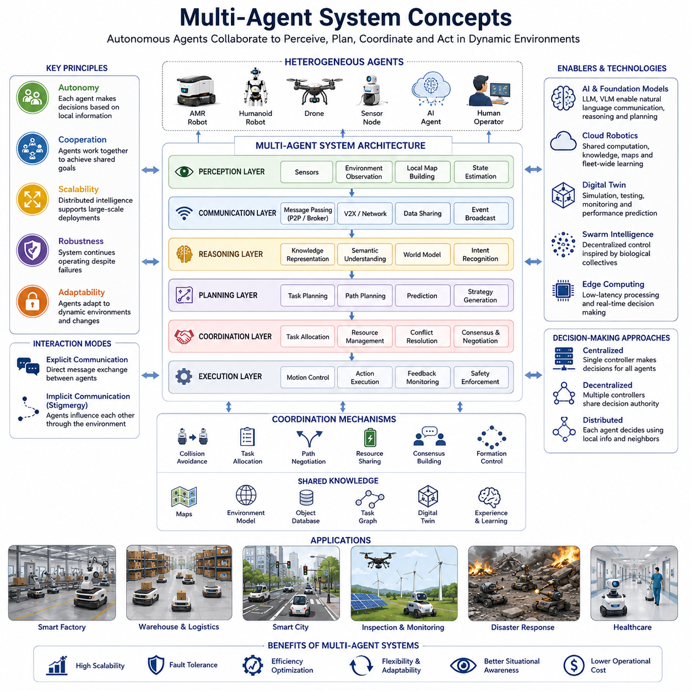
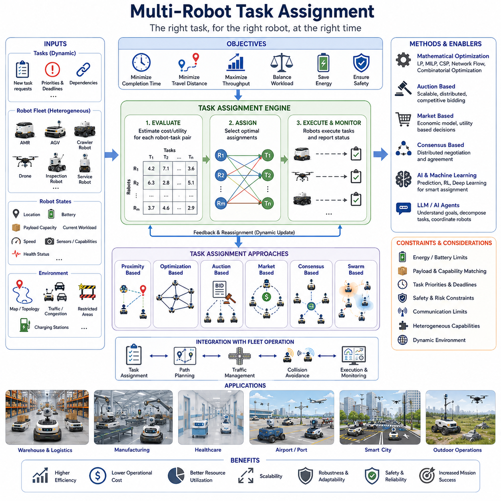
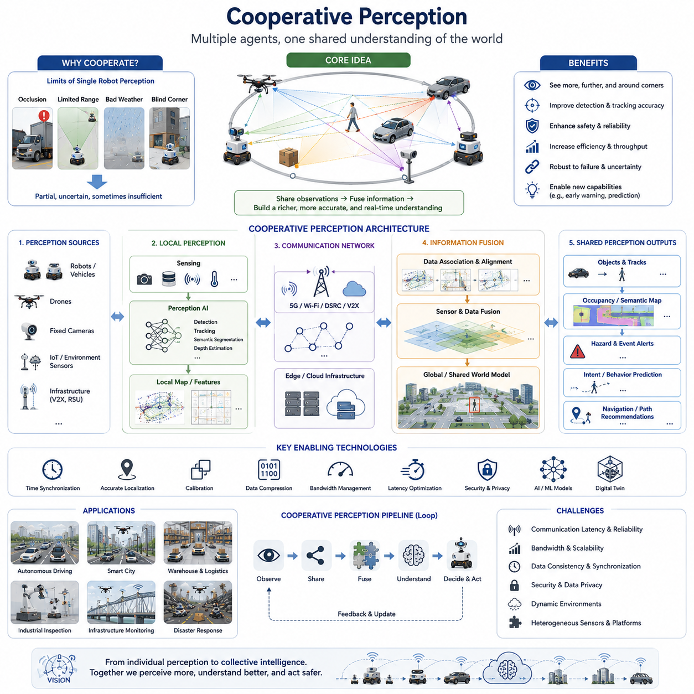
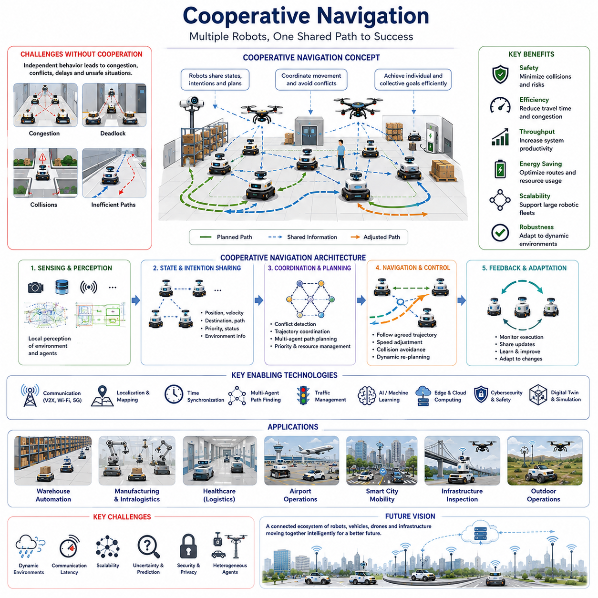
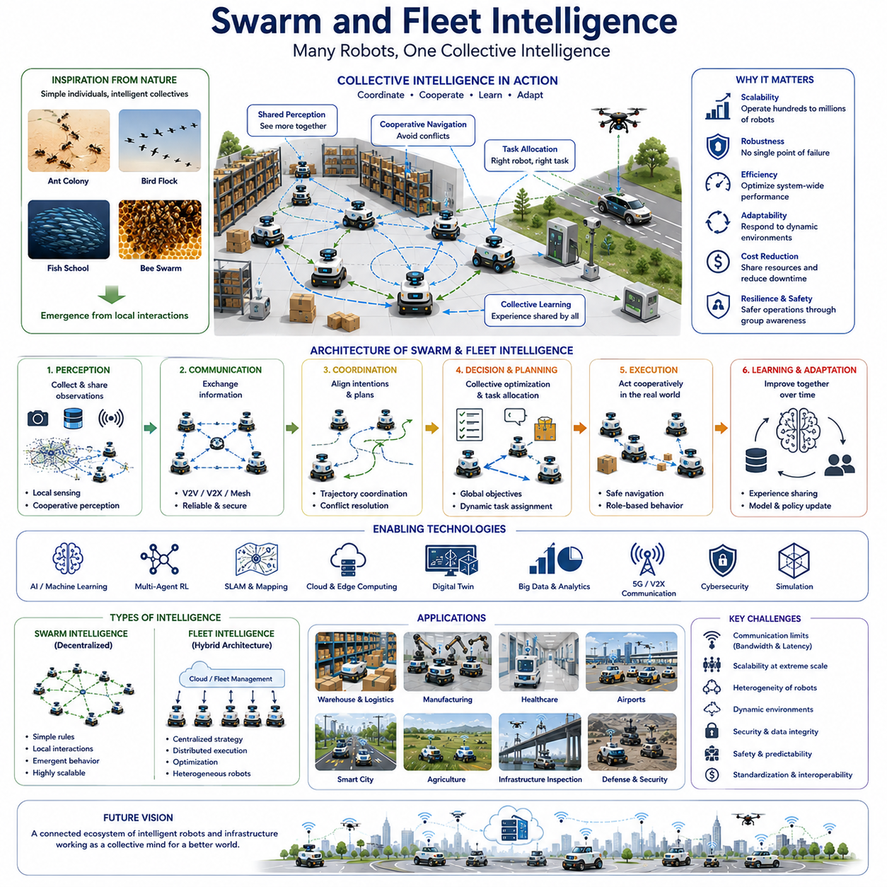
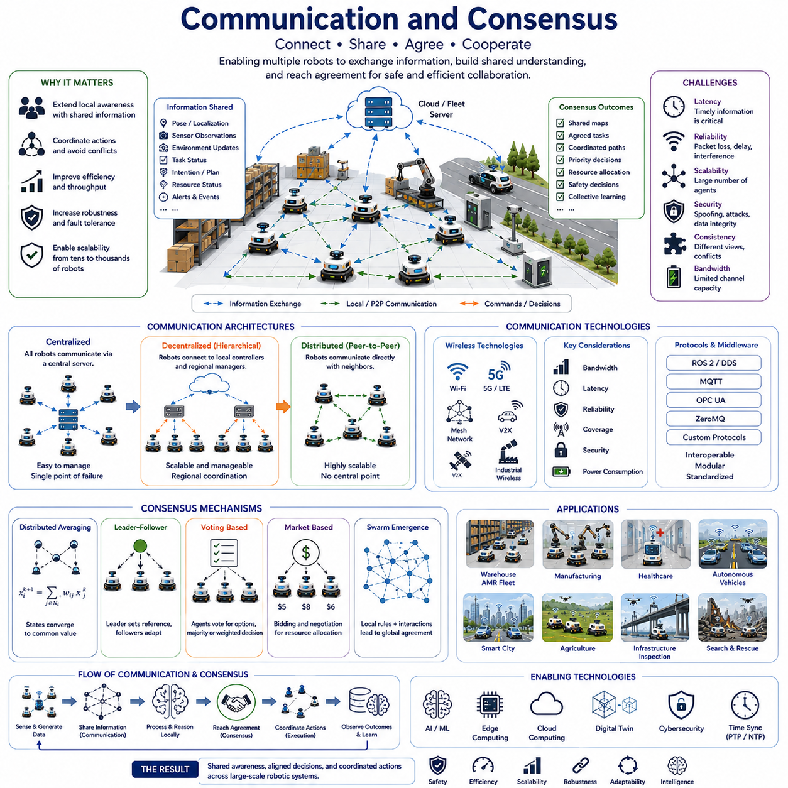
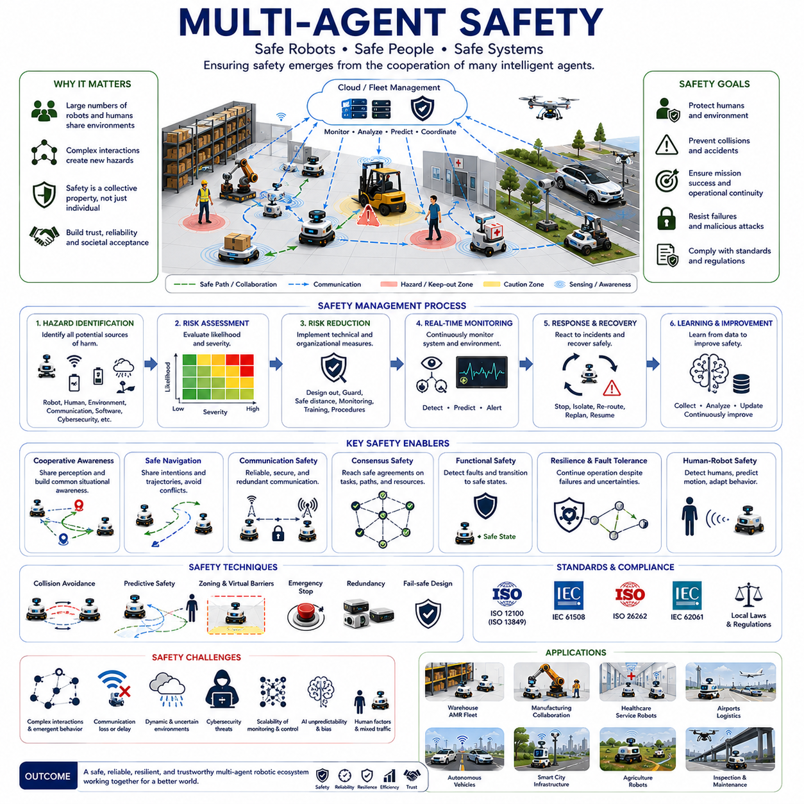
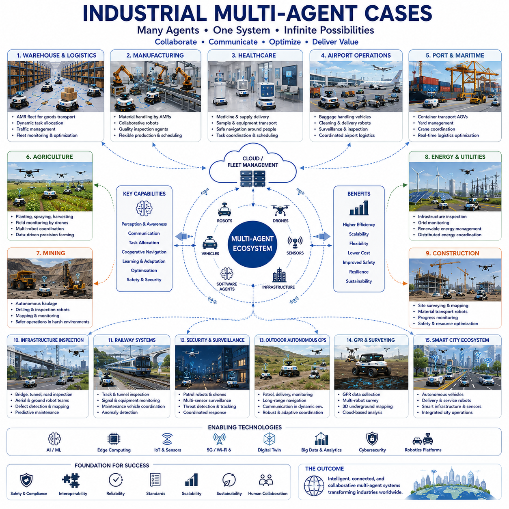

**Volume 06. AMR AI and Embodied Intelligence**

# Chapter 20. Multi-Agent Robotics

## 20.1 Multi-Agent System Concepts

{width="7.268055555555556in" height="7.268055555555556in"}

멀티 에이전트 시스템(Multi-Agent System, MAS)은 지능형 로봇 시스템 설계 방식의 근본적인 변화를 의미한다. 전통적인 자율 로봇은 일반적으로 독립적인 개체로 설계되어 스스로 환경을 인식하고, 의사결정을 수행하며, 행동을 실행한다. 이러한 접근 방식은 많은 응용 분야에서 효과적이지만, 현대 산업 환경은 점점 더 여러 로봇, 소프트웨어 에이전트, 클라우드 서비스, 지능형 인프라 간의 협력을 요구하고 있다. 이에 따라 멀티 에이전트 시스템은 차세대 자율주행 로봇(AMR), 플릿(Fleet) 로봇, 클라우드 로보틱스, 스마트 팩토리, 스마트 시티, 그리고 Embodied AI 생태계의 핵심 아키텍처 패러다임으로 자리 잡고 있다. 멀티 에이전트 시스템 개념은 협력형 로봇 지능을 이해하기 위한 기초이며, 다중 로봇 작업 할당, 협력 인지, 협력 주행, 군집 지능, 플릿 최적화와 같은 고급 주제를 이해하는 기반이 된다.

멀티 에이전트 시스템은 여러 개의 자율적 개체, 즉 에이전트(agent)들이 서로 상호작용하며 개별 또는 공동의 목표를 달성하는 시스템으로 정의할 수 있다. 각 에이전트는 일정 수준의 자율성, 의사결정 능력, 인지 능력, 통신 기능, 행동 실행 능력을 갖는다. 중앙 제어기가 모든 작업을 통제하는 중앙집중형 시스템과 달리, 멀티 에이전트 시스템은 지능을 여러 개체에 분산시킨다. 이러한 분산 지능은 시스템의 확장성, 유연성, 강건성, 적응성을 크게 향상시킨다.

로봇 분야에서 에이전트는 물리적 로봇일 수도 있고, 소프트웨어 모듈, 클라우드 기반 AI 서비스, 디지털 트윈, 센서 노드, 심지어 인간 운영자일 수도 있다. 각 에이전트는 자신만의 지역적 상황(Local Context)에서 동작하면서도 전체 시스템 목표 달성에 기여한다. 예를 들어 물류 창고에서는 수십에서 수백 대의 AMR이 동시에 물품을 운반하고, 충돌을 회피하며, 경로를 최적화하고, 환경 정보를 공유하며 작업을 협력적으로 수행한다. 개별 로봇은 독립적으로 동작하지만, 전체 플릿은 하나의 거대한 시스템처럼 작동하여 물류 목표를 달성한다.

자율성은 멀티 에이전트 시스템의 핵심 개념이다. 자율 에이전트는 환경을 인식하고 정보를 처리하며 의사결정을 내리고 행동을 실행할 수 있다. 그러나 멀티 에이전트 환경에서 자율성은 고립을 의미하지 않는다. 에이전트들은 지속적으로 정보를 교환하고, 자원을 협상하며, 활동을 조정하고, 환경 변화에 적응한다. 개별 자율성과 집단 협력 사이의 균형이 멀티 에이전트 시스템의 성능을 결정한다.

멀티 에이전트 시스템이 중요한 이유 중 하나는 뛰어난 확장성 때문이다. 로봇 수가 수십 대 수준을 넘어 수백 대, 수천 대 규모로 증가하면 중앙집중형 시스템은 계산 부하, 통신 병목, 단일 장애점(Single Point of Failure) 문제에 직면하게 된다. 반면 멀티 에이전트 아키텍처는 계산과 의사결정을 네트워크 전체에 분산시켜 대규모 시스템에서도 효율적으로 동작할 수 있게 한다. 이러한 특성은 스마트 팩토리, 물류센터, 공항, 항만, 병원, 캠퍼스, 스마트 시티와 같은 대규모 환경에서 특히 중요하다.

또 다른 장점은 강건성(Robustness)이다. 중앙집중형 시스템에서는 중앙 제어기가 고장 나면 전체 시스템이 마비될 수 있다. 반면 분산형 멀티 에이전트 시스템에서는 일부 에이전트가 고장 나더라도 나머지 에이전트들이 작업을 재분배하거나 행동을 조정하여 시스템을 계속 운영할 수 있다. 이러한 특성은 재난 대응, 보안 순찰, 사회 기반 시설 점검, 군수 지원, 긴급 구조와 같은 임무 수행 환경에서 매우 중요하다.

일반적인 멀티 에이전트 시스템 아키텍처는 인지(Perception), 통신(Communication), 추론(Reasoning), 계획(Planning), 협조(Coordination), 실행(Execution) 계층으로 구성된다. 인지 계층은 카메라, LiDAR, 레이더, IMU, GPS, 환경 센서 등을 이용하여 주변 환경을 관찰한다. 통신 계층은 에이전트 간 정보 교환을 담당한다. 추론 계층은 데이터를 해석하고 지식을 생성하며, 계획 계층은 목표 달성을 위한 전략을 수립한다. 협조 계층은 여러 에이전트 간의 상호작용을 관리하고, 실행 계층은 실제 행동을 수행한다.

통신은 멀티 에이전트 시스템의 핵심 요소이다. 통신이 없다면 에이전트들은 독립적으로 움직일 뿐 효과적으로 협력할 수 없다. 통신 방식은 P2P(peer-to-peer), 중앙 서버, 메시지 브로커, 클라우드 플랫폼, 엣지 컴퓨팅 기반 구조 등 다양한 형태로 구현될 수 있다. 에이전트들은 위치 정보, 센서 데이터, 작업 상태, 위험 경고, 자원 상태 등의 정보를 공유한다.

통신은 명시적(Explicit) 또는 암묵적(Implicit) 방식으로 이루어진다. 명시적 통신은 직접 메시지를 주고받는 방식이다. 예를 들어 특정 로봇이 장애물을 발견했을 때 다른 로봇에게 이를 알릴 수 있다. 암묵적 통신은 환경을 매개로 이루어진다. 예를 들어 군집 로봇은 특정 행동을 통해 환경을 변화시키고, 다른 로봇은 그 변화를 감지하여 행동을 수정한다. 이러한 방식은 개미나 흰개미와 같은 사회성 곤충에서 영감을 받은 Stigmergy 개념과 관련이 있다.

협조(Coordination)는 멀티 에이전트 시스템의 또 다른 핵심 요소이다. 협조는 여러 에이전트가 서로 방해하지 않고 효율적으로 목표를 달성하도록 돕는다. 이를 위해 충돌 회피, 자원 할당, 작업 스케줄링, 경로 협상, 합의 기반 의사결정과 같은 다양한 기법이 사용된다.

복잡한 작업은 일반적으로 여러 하위 작업으로 분해된다. 예를 들어 대규모 물류센터에서는 수백 개의 배송 작업이 동시에 발생한다. 멀티 에이전트 시스템은 이러한 작업을 자동으로 분해하고 각 로봇에 적절히 할당한다. 각 로봇은 자신의 작업을 수행하면서도 전체 시스템 목표 달성에 기여한다.

작업 할당(Task Allocation)은 협조와 밀접하게 연결되어 있다. 효과적인 작업 할당은 전체 효율을 극대화하고 운영 비용을 최소화하는 것을 목표로 한다. 이를 위해 로봇의 현재 위치, 배터리 상태, 적재 능력, 센서 구성, 작업 우선순위 등을 고려한다. 최근에는 AI 기반 최적화 기술이 적용되어 동적 환경에서도 높은 효율을 유지할 수 있게 되었다.

의사결정 구조는 중앙집중형, 분산형, 완전 분포형으로 나눌 수 있다. 중앙집중형은 전체 시스템 최적화에 유리하지만 확장성과 장애 대응에 한계가 있다. 분산형은 여러 제어기가 의사결정을 담당한다. 완전 분포형은 각 에이전트가 지역 정보와 이웃 에이전트와의 통신을 기반으로 독립적으로 판단한다.

분산 시스템에서는 합의(Consensus) 알고리즘이 중요한 역할을 한다. 합의는 여러 에이전트가 공통된 정보나 행동 방침에 대해 동의하는 과정을 의미한다. 협력 주행, 대형 유지(Formation Control), 분산 맵핑, 자원 공유, 군집 제어 등에서 널리 사용된다. 합의를 통해 에이전트들은 불완전한 정보 환경에서도 일관된 행동을 유지할 수 있다.

지식 표현(Knowledge Representation) 또한 중요한 요소이다. 에이전트는 환경, 자기 상태, 다른 에이전트의 상태를 모델링해야 한다. 이를 위해 지도(Map), 의미론적 장면 그래프(Semantic Scene Graph), 객체 데이터베이스, 월드 모델(World Model), 작업 그래프(Task Graph), 디지털 트윈 등이 활용된다. 공유된 지식은 에이전트 간 협력의 기반이 된다.

최근 AI 기술의 발전은 멀티 에이전트 시스템의 능력을 크게 확장시켰다. 대규모 언어 모델(LLM), 비전-언어 모델(VLM), 파운데이션 모델(Foundation Model)이 멀티 에이전트 구조에 통합되면서 에이전트들은 자연어를 사용하여 의사소통하고, 복잡한 명령을 이해하며, 계획을 공유하고, 고차원적 추론을 수행할 수 있게 되었다. 과거에는 단순한 숫자 데이터만 교환했다면, 이제는 의도, 목표, 계획, 설명과 같은 의미적 정보를 공유할 수 있다.

에이전틱 AI(Agentic AI)의 발전은 멀티 에이전트 로보틱스에 새로운 가능성을 열고 있다. 에이전틱 시스템은 목표 지향적 행동, 계획 수립, 추론, 메모리 관리, 도구 사용, 지속적 학습을 수행할 수 있다. 멀티 에이전트 환경에서는 서로 다른 전문성을 가진 에이전트들이 협력하여 단일 에이전트로는 해결하기 어려운 문제를 해결할 수 있다. 예를 들어 어떤 에이전트는 인지에 특화되고, 다른 에이전트는 경로 계획, 또 다른 에이전트는 인간과의 상호작용을 담당할 수 있다.

클라우드 로보틱스는 멀티 에이전트 시스템의 중요한 확장 형태이다. 클라우드 인프라는 에이전트들이 공유된 지식 베이스, 글로벌 지도, 대규모 AI 모델, 집단 학습 결과에 접근할 수 있도록 한다. 서로 다른 지역에서 운용되는 로봇이 데이터를 클라우드에 업로드하면, 한 로봇이 학습한 지식이 다른 로봇에게도 전파될 수 있다. 이는 플릿 전체의 학습 속도와 적응 능력을 크게 향상시킨다.

디지털 트윈 기술 또한 멀티 에이전트 시스템을 강화한다. 디지털 트윈은 물리적 시스템의 가상 복제본으로서, 에이전트의 행동을 시뮬레이션하고 협조 전략을 검증하며 성능을 예측할 수 있다. 이를 통해 실제 배치 전에 다양한 시나리오를 테스트하고 최적화할 수 있다.

군집 지능(Swarm Intelligence)은 멀티 에이전트 시스템의 특수한 형태이다. 개미 집단, 벌 무리, 새 떼, 물고기 떼와 같은 자연계의 집단 행동에서 영감을 받았다. 단순한 개체들의 지역적 상호작용만으로도 매우 복잡하고 효율적인 집단 행동이 나타날 수 있다. 군집 로보틱스는 이러한 원리를 활용하여 탐사, 감시, 환경 모니터링, 재난 구조, 대규모 점검과 같은 임무를 수행한다.

산업 현장에서는 멀티 에이전트 개념이 빠르게 확산되고 있다. 현대 물류창고는 수백 대의 AMR을 운영하며, 스마트 팩토리는 로봇과 설비, 센서가 협력한다. 스마트 시티는 자율주행차, 배송 로봇, 인프라 센서, 클라우드 서비스를 통합한다. 실외 자율주행 로봇은 드론, 고정형 카메라, IoT 센서와 협력하여 넓은 지역의 상황 인식을 수행할 수 있다.

안전성은 멀티 에이전트 시스템에서 매우 중요한 문제이다. 에이전트 수가 증가할수록 상호작용 복잡성도 증가한다. 충돌 방지, 통신 장애 대응, 목표 충돌 해결, 악의적 행동 방지, 사이버 보안 대응 등이 필수적으로 고려되어야 한다. 따라서 로컬 안전 제어와 글로벌 안전 감시 체계를 함께 운영하는 경우가 많다.

보안 역시 중요하다. 멀티 에이전트 시스템은 네트워크에 크게 의존하기 때문에 스푸핑, 서비스 거부 공격, 무단 접근, 데이터 변조 등의 위협에 노출될 수 있다. 따라서 암호화, 인증, 접근 제어, 신뢰 관리 체계가 필수적으로 적용되어야 한다.

미래의 멀티 에이전트 시스템은 Embodied Intelligence의 발전과 함께 더욱 확장될 것이다. 미래에는 AMR, 휴머노이드, 드론, 자율주행차, IoT 장치, 디지털 트윈, AI 에이전트가 하나의 거대한 지능 생태계를 형성하게 될 것이다. 이들은 개별 기계가 아니라 협력하는 지능적 구성원으로 동작하게 된다. 집단 인지(Collective Perception), 집단 학습(Collective Learning), 집단 추론(Collective Reasoning), 집단 행동(Collective Action)이 차세대 로봇 시스템의 핵심 특징이 될 것이다.

AI 기술이 발전함에 따라 멀티 에이전트 시스템은 점점 더 자율적이고 자기 조직화(Self-Organizing)되는 방향으로 진화할 것으로 예상된다. 미래의 에이전트들은 스스로 팀을 구성하고, 역할을 협상하며, 경험을 공유하고, 조직 구조를 재구성하면서 지속적으로 성능을 최적화할 수 있을 것이다. 이러한 능력은 산업 자동화, 물류, 의료, 교통, 인프라 관리, 농업, 스마트 시티 등 다양한 분야를 혁신하게 될 것이다.

궁극적으로 멀티 에이전트 시스템은 현대 지능형 로보틱스의 가장 중요한 기반 기술 중 하나이다. 이는 다수의 자율 개체가 협력하고 학습하며 적응할 수 있는 아키텍처를 제공한다. 따라서 AMR, 플릿 관리 시스템, 클라우드 로보틱스, Embodied AI 플랫폼, 미래의 자율 생태계를 개발하는 모든 엔지니어와 연구자에게 멀티 에이전트 시스템에 대한 이해는 필수적이다. 앞으로 로봇이 사회 전반에 대규모로 보급될수록 멀티 에이전트 지능은 확장성, 강건성, 효율성, 협업성을 보장하는 핵심 기술로 자리매김하게 될 것이다.

## 20.2 Multi-Robot Task Assignment

{width="7.268055555555556in" height="7.268055555555556in"}

다중 로봇 작업 할당(Multi-Robot Task Assignment, MRTA)은 현대 로보틱스와 멀티 에이전트 시스템에서 가장 중요한 협업 문제 중 하나이다. 자율주행 로봇이 물류창고, 공장, 병원, 공항, 항만, 스마트시티, 실외 운영 환경 등 다양한 분야에 대규모로 배치되면서 여러 로봇에게 작업을 효율적으로 분배하는 능력은 필수적인 요소가 되었다. 다중 로봇 시스템은 몇 대의 로봇으로 구성된 소규모 협업 환경일 수도 있고, 수백 또는 수천 대의 로봇으로 구성된 대규모 플릿일 수도 있다. 규모와 관계없이 핵심 문제는 동일하다. 어떤 로봇이 어떤 작업을 수행할 것인지, 언제 수행할 것인지, 어떤 조건에서 수행할 것인지를 결정하는 것이다. 효율적인 작업 할당은 생산성, 운영 비용, 자원 활용도, 안전성, 확장성, 그리고 전체 임무 성공률에 직접적인 영향을 미친다. 멀티 에이전트 로보틱스 관점에서 작업 할당은 상위 수준의 임무 목표와 실제 로봇 행동을 연결하는 핵심 연결고리라고 할 수 있다.

다중 로봇 작업 할당의 본질은 여러 작업(Task)을 여러 로봇(Robot)에 배분하여 하나 이상의 성능 목표를 최적화하는 것이다. 이러한 목표에는 작업 완료 시간 최소화, 이동 거리 감소, 처리량 증가, 작업 부하 균형화, 에너지 절감, 자원 활용 극대화, 안전성 향상, 임무 성공률 향상 등이 포함된다. 단일 로봇 시스템이 하나의 로봇에 대한 최적 행동 경로를 찾는 데 집중한다면, 다중 로봇 시스템은 여러 로봇의 상태와 상호작용을 동시에 고려해야 한다.

작업 할당의 필요성은 여러 로봇이 동시에 활용 가능한 환경에서 발생한다. 예를 들어 100대의 AMR이 운영되는 물류창고를 생각해보자. 하루 동안 수많은 운송 요청이 지속적으로 발생한다. 시스템은 각 작업을 어떤 로봇이 수행해야 하는지 결정해야 하며, 이 과정에서 로봇의 위치, 배터리 상태, 현재 작업량, 적재 능력, 교통 상황, 우선순위 등을 고려해야 한다. 작업 할당이 비효율적이면 로봇 간 혼잡이 발생하고 이동 거리가 증가하며 작업 지연과 생산성 저하가 나타난다. 반대로 효율적인 작업 할당은 전체 시스템 성능을 크게 향상시킨다.

다중 로봇 작업 할당은 전통적인 자원 배분(Resource Allocation) 및 운영 최적화(Operations Research) 문제의 확장으로 볼 수 있다. 로봇은 자원(Resource)이며 작업은 처리해야 할 업무(Job)로 간주된다. 그러나 로봇 시스템은 일반적인 생산 스케줄링과 달리 동적인 환경에서 움직이고, 배터리를 소모하며, 센서와 하드웨어 제약을 가지며, 인간 및 다른 로봇과 상호작용한다. 따라서 작업 할당은 실시간으로 변화하는 환경에 적응할 수 있어야 한다.

작업 할당에서 중요한 개념 중 하나는 단일 작업 로봇(Single-Task Robot)과 다중 작업 로봇(Multi-Task Robot)의 구분이다. 단일 작업 방식에서는 로봇이 현재 작업을 완료한 후 새로운 작업을 할당받는다. 이는 구현이 단순하고 물류 시스템에서 널리 사용된다. 반면 다중 작업 방식에서는 로봇이 여러 작업을 미리 예약하거나 작업 큐를 유지하면서 순차적으로 처리한다. 이러한 방식은 효율성을 높일 수 있지만 계산 복잡성이 증가한다.

작업 자체의 특성도 중요하다. 어떤 작업은 독립적이어서 어느 로봇이 수행해도 무방하다. 그러나 다른 작업들은 의존성(Dependency)을 가진다. 예를 들어 한 로봇이 특정 구역을 점검한 후에야 다른 로봇이 유지보수를 수행할 수 있는 경우가 있다. 또한 일부 작업은 여러 로봇이 동시에 수행해야 한다. 무거운 물체를 함께 운반하거나 대형 구조물을 동시에 검사하는 작업이 대표적이다. 이러한 의존성은 작업 할당 알고리즘 설계에 큰 영향을 준다.

작업 할당 문제는 환경 특성에 따라 정적(Static) 또는 동적(Dynamic) 문제로 구분된다. 정적 작업 할당은 모든 작업이 사전에 정의되어 있고 실행 중에 변하지 않는 경우를 의미한다. 이는 시뮬레이션이나 오프라인 계획에 적합하다. 반면 실제 산업 환경은 대부분 동적 환경이다. 새로운 작업이 생성되고, 우선순위가 변경되며, 로봇이 고장 나거나 환경이 변화한다. 따라서 실시간 재할당과 적응 능력이 필수적이다.

가장 단순한 작업 할당 방법은 근접성(Proximity) 기반 방식이다. 새로운 작업이 발생하면 가장 가까운 로봇에게 작업을 부여한다. 계산 비용이 낮고 구현이 간단하지만, 배터리 상태나 향후 작업 가능성, 교통 상황 등을 고려하지 못하기 때문에 대규모 환경에서는 비효율적일 수 있다.

최적화 기반 작업 할당은 전체 시스템 성능을 극대화하는 할당을 찾는 것을 목표로 한다. 선형계획법(Linear Programming), 혼합정수계획법(Mixed Integer Programming), 제약 만족 문제(Constraint Satisfaction), 네트워크 플로우(Network Flow), 조합 최적화(Combinatorial Optimization)와 같은 기법이 활용된다. 이러한 방법은 매우 우수한 결과를 제공할 수 있지만, 로봇 수가 많아질수록 계산량이 급격히 증가한다.

경매 기반(Auction-Based) 방식은 산업용 다중 로봇 시스템에서 매우 널리 사용된다. 새로운 작업이 발생하면 로봇들이 해당 작업에 대한 비용이나 수행 가능성을 평가하여 입찰(Bid)을 제출한다. 가장 적합한 입찰을 한 로봇이 작업을 수행하게 된다. 이는 실제 경제 시장과 유사한 방식으로 동작하며 확장성과 유연성이 뛰어나다.

시장 기반(Market-Based) 작업 할당은 경매 개념을 더욱 발전시킨 형태이다. 각 로봇은 독립적인 경제 주체처럼 행동하며 자신의 효용(Utility)을 극대화하는 방향으로 작업을 선택한다. 중앙 제어 없이도 전체 시스템이 효율적으로 최적화되는 특성을 가진다.

합의 기반(Consensus-Based) 작업 할당은 경쟁보다는 협력에 초점을 맞춘다. 로봇들은 통신을 통해 서로 협상하고 공동으로 작업 배분에 대한 합의를 도출한다. 이러한 방식은 분산 환경에서 높은 신뢰성과 장애 대응 능력을 제공한다.

군집 로보틱스(Swarm Robotics)는 또 다른 접근법을 제공한다. 군집 시스템에서는 명시적인 작업 할당이 이루어지지 않는다. 대신 단순한 규칙을 따르는 개별 로봇들이 상호작용하면서 집단적으로 작업을 수행한다. 이는 개미, 벌, 흰개미와 같은 사회성 곤충의 행동에서 영감을 얻었다. 군집 방식은 완벽한 최적해를 보장하지는 않지만 매우 뛰어난 확장성과 강건성을 제공한다.

인공지능 기술은 작업 할당 분야를 빠르게 변화시키고 있다. 머신러닝 모델은 미래 작업 수요를 예측하고, 작업 완료 시간을 추정하며, 교통 패턴을 분석하여 최적의 작업 배분을 수행할 수 있다. 강화학습(Reinforcement Learning)은 플릿이 경험을 통해 더 나은 작업 할당 정책을 학습하도록 지원한다. 딥러닝 모델은 복잡한 운영 데이터 속에서 숨겨진 패턴을 발견하고 기존 규칙 기반 시스템보다 우수한 성능을 제공할 수 있다.

최근 등장한 파운데이션 모델과 대규모 언어 모델(LLM)은 작업 할당의 새로운 가능성을 열고 있다. AI 에이전트는 자연어로 표현된 임무를 이해하고 이를 세부 작업으로 분해한 후 여러 로봇에게 자동으로 할당할 수 있다. 예를 들어 "시설 전체를 점검하고 이상 상황을 보고하라"는 명령이 입력되면 AI 시스템은 점검 작업을 세분화하고 로봇들에게 역할을 분배하며 진행 상황을 모니터링할 수 있다.

작업 할당은 로봇 상태 정보에 크게 의존한다. 각 로봇은 위치, 속도, 적재 능력, 배터리 잔량, 센서 구성, 연산 성능, 현재 작업 부하 등 다양한 특성을 가진다. 효율적인 작업 할당 시스템은 이러한 정보를 지속적으로 모니터링하여 가장 적합한 로봇에게 작업을 배정한다.

현대 로봇 플릿은 점점 더 이종(Heterogeneous) 시스템으로 발전하고 있다. 스마트시티 환경에서는 지상 로봇, 드론, 점검 차량, 고정형 센서, 클라우드 AI 서비스가 함께 운영된다. 드론은 공중 감시를 담당하고, 지상 로봇은 물리적 작업을 수행하며, 센서는 환경 데이터를 제공하고, 클라우드는 대규모 계산을 수행한다. 작업 할당 시스템은 이러한 각기 다른 능력을 고려해야 한다.

배터리 관리도 매우 중요한 요소이다. 모바일 로봇은 에너지 제약을 받기 때문에 잘못된 작업 할당은 배터리 소모를 가속화하고 운영 중단을 초래할 수 있다. 따라서 최신 시스템은 배터리 상태를 고려하여 작업을 할당하고 충전 스케줄과 연계하여 운영한다.

산업 현장에서는 작업 우선순위 관리도 중요하다. 모든 작업이 동일한 중요도를 가지는 것은 아니다. 긴급 점검, 안전 사고 대응, 중요 물류 작업은 일반 작업보다 높은 우선순위를 가진다. 작업 할당 시스템은 긴급 작업을 우선 처리하면서도 전체 효율성을 유지해야 한다.

통신 인프라는 작업 할당 성능에 직접적인 영향을 미친다. 중앙집중형 시스템은 플릿 관리 서버와의 안정적인 연결이 필요하다. 분산형 시스템은 로봇 간 P2P 통신에 의존한다. 네트워크 지연, 대역폭 제한, 통신 장애, 사이버 보안 문제는 모두 작업 할당 성능에 영향을 준다.

작업 할당은 경로 계획(Path Planning) 및 교통 관리(Traffic Management)와 밀접하게 연결되어 있다. 특정 로봇에게 작업을 할당하더라도 실제 이동 경로가 혼잡하면 효율이 떨어질 수 있다. 따라서 최신 플릿 관리 시스템은 작업 할당과 경로 계획을 통합하여 최적의 운영을 수행한다.

디지털 트윈은 작업 할당 최적화를 위한 강력한 도구로 부상하고 있다. 디지털 트윈은 실제 로봇 플릿과 환경의 가상 복제본을 제공하여 다양한 작업 할당 전략을 사전에 시뮬레이션할 수 있게 한다. 이를 통해 병목 현상, 자원 활용도, 처리량 등을 분석하고 최적 정책을 도출할 수 있다.

클라우드 로보틱스 역시 작업 할당을 강화한다. 클라우드는 전체 플릿 데이터를 수집하고 중앙 최적화를 수행한다. 한 현장에서 학습된 작업 할당 경험이 다른 현장에도 전파될 수 있어 지속적인 성능 향상이 가능하다.

다중 로봇 작업 할당은 물류창고, 병원, 공항, 제조공장, 스마트시티 등 다양한 산업 분야에서 활용된다. 물류창고에서는 상품 운송을 담당하고, 병원에서는 의약품과 의료물자를 배송하며, 공항에서는 수하물 운송을 지원한다. 제조공장에서는 생산 라인 간 자재 이동을 수행하며, 스마트시티에서는 점검 로봇, 보안 로봇, 청소 로봇, 유지보수 로봇이 협력하여 도시를 운영한다.

실외 로봇 환경에서는 더욱 복잡한 문제가 발생한다. 순찰 로봇, 인프라 점검 로봇, 농업용 로봇, GPR 기반 지하 구조물 탐사 로봇은 넓은 지역에서 운영된다. 이 경우 지형, 날씨, 통신 품질, 임무 긴급성, 차량 성능 등을 동시에 고려해야 한다.

안전성은 작업 할당 과정 전체에서 최우선 고려사항이다. 어떤 작업도 로봇의 능력을 초과하거나 안전을 위협해서는 안 된다. 따라서 위험 요소, 인간 존재 여부, 환경 제약, 법적 규제 등을 고려한 안전 중심 할당이 필요하다.

향후 수천 대 규모의 로봇 플릿이 등장하면서 확장성은 더욱 중요해질 것이다. 전통적인 중앙집중형 최적화 방식은 한계에 도달할 가능성이 높다. 따라서 미래에는 중앙집중형 전략 계획과 분산형 현장 의사결정을 결합한 하이브리드 아키텍처가 주류가 될 것으로 예상된다.

다중 로봇 작업 할당의 미래는 Embodied AI, Agentic AI, 자율 협업 생태계의 발전과 밀접하게 연결되어 있다. 미래의 로봇은 단순히 작업을 배정받는 존재가 아니라 스스로 목표를 이해하고, 역할을 협상하며, 경험을 공유하고, 팀을 조직하는 지능형 에이전트가 될 것이다. 작업 할당은 단순한 자원 배분을 넘어 임무 전체를 조직하고 관리하는 협력형 미션 오케스트레이션(Mission Orchestration)으로 발전할 것이다.

결국 다중 로봇 작업 할당은 대규모 자율 시스템을 가능하게 하는 핵심 기술이다. 이는 개별 로봇들의 집합을 하나의 지능형 협업 플릿으로 변화시키는 역할을 수행한다. 앞으로 로봇이 물류, 제조, 의료, 인프라 관리, 농업, 교통, 스마트시티 전반에 확산될수록 작업 할당 기술은 확장 가능하고 효율적이며 지능적인 멀티 에이전트 로봇 생태계를 구현하는 핵심 기반 기술로 자리 잡게 될 것이다.

## 20.3 Cooperative Perception

{width="7.268055555555556in" height="7.268055555555556in"}

협력 인지(Cooperative Perception)는 차세대 다중 로봇 시스템, 자율주행 차량, 지능형 교통 시스템, 클라우드 로보틱스, 그리고 Embodied AI 생태계를 구현하는 데 있어 가장 중요한 핵심 기술 중 하나이다. 기존의 로봇 인지는 개별 로봇이 보유한 센서의 성능과 관측 범위에 근본적으로 제한된다. 각 자율 로봇은 자신의 센서를 통해 환경을 관찰하고, 수집한 정보를 바탕으로 내부 환경 모델을 구축한다. 카메라, LiDAR, 레이더, 깊이 센서, 인공지능 기술이 크게 발전했음에도 불구하고, 단일 로봇은 가려짐(Occlusion), 제한된 센서 범위, 악천후, 계산 자원 부족, 불완전한 상황 인식과 같은 문제를 피할 수 없다. 협력 인지는 이러한 한계를 극복하기 위해 여러 로봇, 차량, 센서, 인프라 시스템이 인지 정보를 공유하고 공동으로 환경을 이해하는 방식을 제공한다.

협력 인지의 핵심 개념은 매우 단순하면서도 강력하다. 개별 로봇을 독립적인 관찰자로 보는 대신, 모든 센싱 장치를 하나의 공동 인지 네트워크의 구성원으로 간주한다. 각 에이전트는 환경의 일부를 관찰하고, 이러한 관찰 결과를 결합하여 어느 하나의 로봇이 단독으로 구축할 수 없는 수준의 풍부한 환경 모델을 생성한다. 이를 통해 로봇은 자신의 센서 범위 밖의 정보, 시야에 가려진 정보, 또는 계산적으로 처리하기 어려운 정보까지 활용할 수 있게 된다. 결과적으로 더 정확한 의사결정, 향상된 안전성, 높은 운영 효율성, 그리고 복잡한 동적 환경에서의 안정적인 운영이 가능해진다.

전통적인 자율 로봇 시스템에서는 로컬 센싱(Local Sensing)이 기본이다. 카메라는 시각 정보를 제공하고, LiDAR는 3차원 포인트 클라우드를 생성하며, 레이더는 거리와 속도를 측정하고, 위치추정 시스템은 로봇의 위치를 계산한다. 로봇은 이러한 데이터를 기반으로 자신만의 월드 모델(World Model)을 구축한다. 그러나 건물 뒤에서 접근하는 차량, 주차 차량에 가려진 보행자, 코너 뒤에 위치한 장애물 등은 센서 시야에 들어오기 전까지 탐지가 불가능하다. 이러한 제한은 안전 문제와 성능 저하를 초래할 수 있다.

협력 인지는 단일 로봇의 물리적 한계를 넘어서는 인지 능력을 제공한다. 여러 에이전트가 관측 정보를 공유함으로써, 로봇은 자신의 관점에서는 보이지 않는 객체와 상황을 인식할 수 있다. 예를 들어 교차로에 접근하는 로봇은 이미 교차로를 관찰하고 있는 다른 로봇으로부터 정보를 받을 수 있다. 지상 점검 로봇은 상공을 비행하는 드론이 촬영한 영상을 활용할 수 있으며, 물류창고의 AMR은 천장에 설치된 고정형 카메라의 데이터를 활용할 수 있다. 이러한 협력 센싱은 상황 인식 능력을 획기적으로 향상시킨다.

협력 인지는 분산 센싱(Distributed Sensing) 개념과 밀접하게 연결되어 있다. 분산 센싱 구조에서는 여러 독립적인 센서 노드가 정보를 수집한다. 이러한 노드에는 이동형 로봇, 드론, 자율주행차, 감시 카메라, IoT 센서, 스마트 인프라, 엣지 컴퓨팅 장치, 클라우드 서비스 등이 포함될 수 있다. 각 노드는 자신의 위치와 센서 특성에 따라 고유한 관측 정보를 제공하며, 이들이 결합되어 거대한 분산 인지 생태계를 형성한다.

협력 인지에서 가장 중요한 기술적 과제 중 하나는 정보 융합(Information Fusion)이다. 여러 에이전트가 수집한 관측 정보를 일관된 환경 모델로 통합해야 하기 때문이다. 이를 위해 센서 융합(Sensor Fusion) 기술이 활용된다. 카메라, LiDAR, 레이더, 열화상 카메라, GNSS, IMU, 환경 센서 등에서 생성된 데이터를 시간적으로 동기화하고 공간적으로 정렬한 후 결합해야 한다. 융합 알고리즘은 중복 정보를 제거하고 불일치를 해결하며 전체 인지 정확도를 향상시킨다.

협력 인지는 다양한 수준에서 구현될 수 있다. 가장 낮은 수준은 원시 데이터 융합(Raw Data Fusion)이다. 예를 들어 한 로봇이 LiDAR 포인트 클라우드 전체를 다른 로봇에게 전송하는 방식이다. 이 방법은 가장 많은 정보를 제공하지만 통신 대역폭과 계산 자원을 많이 요구한다. 특징 수준 융합(Feature-Level Fusion)은 객체 특징, 랜드마크, 의미 정보 등을 공유하는 방식으로 효율성을 높인다. 결정 수준 융합(Decision-Level Fusion)은 객체 탐지 결과, 위험 경고, 추적 결과, 경로 추천과 같은 최종 판단 결과만 공유한다.

통신 인프라는 협력 인지의 핵심 요소이다. 인지 정보는 여러 에이전트 간에 신뢰성 있게 전달되어야 한다. 이를 위해 Wi-Fi, 5G, V2X(Vehicle-to-Everything), 메시 네트워크, 엣지 컴퓨팅, 클라우드 플랫폼 등이 활용된다. 통신 구조는 인지 성능에 직접적인 영향을 미친다. 고대역폭 네트워크는 풍부한 데이터 공유를 가능하게 하고, 저지연 네트워크는 실시간 협력 의사결정을 지원한다.

지연 시간(Latency)은 협력 인지의 가장 중요한 문제 중 하나이다. 인지 정보는 시간이 지나면 가치가 감소한다. 동적인 환경에서는 차량, 사람, 장애물이 계속 움직이기 때문에 오래된 정보는 오히려 잘못된 판단을 유도할 수 있다. 따라서 협력 인지 시스템은 통신 지연, 처리 지연, 동기화 오류를 최소화해야 한다.

시간 동기화(Time Synchronization) 역시 필수적이다. 여러 에이전트가 수집한 데이터를 정확히 융합하려면 동일한 시간 기준을 사용해야 한다. 동기화가 이루어지지 않으면 공간적·시간적 불일치가 발생한다. 이를 위해 PTP(Precision Time Protocol), GPS 기반 시각 동기화, 분산 클럭 관리 기술 등이 사용된다.

위치추정 정확도 또한 협력 인지 성능에 직접적인 영향을 미친다. 여러 로봇의 데이터를 하나의 환경 모델로 통합하려면 각 센서의 위치와 자세를 정확하게 알아야 한다. 작은 위치 오차도 융합 결과에서는 큰 오류로 확대될 수 있다. 따라서 RTK-GNSS, Visual Localization, LiDAR Localization, SLAM 기술 등이 중요한 역할을 수행한다.

객체 탐지와 추적(Object Detection and Tracking)은 협력 인지의 대표적인 응용 분야이다. 각 로봇은 자신이 탐지한 객체를 다른 에이전트와 공유한다. 여러 관점에서 관찰된 데이터를 결합하면 탐지 정확도가 향상되고 오탐(False Positive)이 감소하며, 이동 객체의 추적 성능이 크게 향상된다.

협력 인지는 특히 가려짐(Occlusion)이 많은 환경에서 큰 효과를 발휘한다. 도시 환경, 산업 시설, 물류창고, 숲, 건설 현장 등은 수많은 시야 차단 요소를 포함한다. 협력 인지를 통해 로봇은 사실상 "코너 너머를 보는 능력"을 갖게 된다. 다른 에이전트가 관찰한 정보를 활용함으로써 시야 제한 문제를 극복할 수 있기 때문이다.

자율주행차 분야는 협력 인지가 가장 활발히 연구되는 영역 중 하나이다. 차량 간 통신(V2V)과 차량-인프라 통신(V2I)을 통해 인지 정보를 공유한다. 교차로에 접근하는 차량은 시야 밖에 있는 보행자, 자전거, 차량에 대한 정보를 미리 받을 수 있다. 도로 인프라에 설치된 센서도 추가적인 상황 인식을 제공하여 안전한 주행을 지원한다.

물류창고에서는 협력 인지를 통해 AMR 플릿이 더욱 효율적으로 운영된다. 로봇들은 장애물, 혼잡 구역, 재고 위치, 환경 변화 정보를 공유한다. 이를 통해 교통 체증을 줄이고 경로 계획을 최적화하며 운영 효율을 향상시킬 수 있다.

산업 점검 분야에서도 협력 인지는 큰 가치를 가진다. 지상 로봇, 드론, 고정형 카메라, 열화상 시스템, 환경 센서가 협력하여 대규모 시설을 점검할 수 있다. 서로 다른 센서의 장점이 결합되면서 단일 플랫폼으로는 얻을 수 없는 풍부한 점검 결과를 생성할 수 있다.

인공지능은 현대 협력 인지 시스템의 핵심 기술이다. 딥러닝 모델은 객체를 탐지하고, 환경을 이해하며, 의미 정보를 생성한다. 협력 AI 구조에서는 여러 에이전트가 수집한 데이터를 공동 학습에 활용할 수 있다. 연합학습(Federated Learning), 분산 머신러닝, 집단 인지 모델은 로봇 플릿 전체가 경험을 공유하며 성능을 향상시키도록 지원한다.

최근 등장한 파운데이션 모델과 VLM(Vision-Language Model)은 협력 인지를 한 단계 더 발전시키고 있다. 이제 로봇은 단순한 센서 데이터뿐 아니라 장면의 의미, 상황 해석, 의도, 맥락 정보를 공유할 수 있게 되었다. 이는 인지 정보를 보다 고차원적인 수준에서 교환할 수 있음을 의미한다.

월드 모델(World Model)은 협력 인지와 매우 밀접하게 연관된다. 월드 모델은 로봇이 환경을 이해하는 내부 표현이다. 멀티 에이전트 환경에서는 여러 로봇의 월드 모델을 통합하여 공유된 세계 모델(Shared World Model)을 구축할 수 있다. 이러한 공통 환경 인식은 계획, 내비게이션, 협력, 의사결정의 기반이 된다.

클라우드 로보틱스는 협력 인지를 더욱 확장한다. 클라우드는 다양한 지역에서 운영되는 수많은 로봇의 인지 데이터를 수집하고 통합한다. 이를 통해 대규모 환경 모델을 구축하고, 생성된 지식을 다시 현장의 로봇에게 배포할 수 있다.

엣지 컴퓨팅은 클라우드의 한계를 보완한다. 엣지 노드는 로봇 가까이에서 데이터를 처리하여 지연 시간을 최소화한다. 따라서 대규모 협력 인지 시스템에서는 클라우드와 엣지를 결합한 하이브리드 구조가 가장 유력한 아키텍처로 평가받고 있다.

디지털 트윈 역시 협력 인지의 중요한 활용처이다. 실시간 인지 데이터를 디지털 트윈에 반영하면 실제 환경을 지속적으로 업데이트하는 가상 환경을 구축할 수 있다. 이를 통해 모니터링, 시뮬레이션, 계획 수립, 최적화, 예측 분석이 가능해진다.

보안과 프라이버시는 협력 인지에서 매우 중요한 이슈이다. 인지 정보가 여러 시스템에 공유되기 때문에 데이터 위변조나 무단 접근이 발생할 경우 심각한 문제가 발생할 수 있다. 잘못된 인지 정보는 위험한 행동과 잘못된 의사결정을 유발할 수 있다. 따라서 암호화, 인증, 접근 제어, 신뢰 관리, 이상 탐지 기술이 필수적으로 적용되어야 한다.

확장성 역시 중요한 과제이다. 참여하는 에이전트 수가 증가할수록 통신량과 데이터 처리량도 기하급수적으로 증가한다. 따라서 어떤 정보를 누구에게 언제 전달할 것인지를 결정하는 효율적인 정보 관리 기법이 필요하다. 적응형 통신 정책, 정보 필터링, 계층형 인지 아키텍처가 이러한 문제를 해결하는 데 활용된다.

미래의 협력 인지는 Embodied Intelligence와 자율 생태계의 핵심 기반 기술이 될 것이다. 로봇, 자율주행차, 드론, 스마트 인프라, 디지털 트윈, AI 서비스가 지속적으로 인지 정보를 교환하며 거대한 집단 지능 시스템을 형성하게 된다.

스마트시티에서는 수천 개의 센서와 에이전트가 하나의 통합 인지 네트워크를 구성하여 교통 관리, 공공 안전, 환경 모니터링, 인프라 유지보수, 물류 운영을 지원할 것이다. 산업 환경에서는 전체 로봇 플릿이 동일한 환경 인식을 공유하며 협력하게 될 것이다. 자율주행 교통 시스템에서는 차량과 인프라가 함께 협력하여 사각지대를 제거하고 안전성을 극대화할 것이다.

궁극적으로 협력 인지는 인지를 개별 로봇의 능력에서 집단 지능의 능력으로 전환시키는 기술이다. 로봇은 더 이상 자신의 센서에만 의존하지 않고, 분산된 인지 네트워크의 구성원으로서 공동의 환경 이해를 구축하게 된다. 이러한 변화는 현대 로보틱스와 멀티 에이전트 시스템에서 가장 중요한 패러다임 전환 중 하나이다. 앞으로 로봇 시스템이 더욱 대규모화되고 복잡해질수록 협력 인지는 보다 안전하고, 지능적이며, 강력한 자율 시스템을 구현하는 핵심 기반 기술로 자리 잡게 될 것이다.

## 20.4 Cooperative Navigation

{width="7.268055555555556in" height="7.268055555555556in"}

협력 내비게이션(Cooperative Navigation)은 여러 자율 에이전트가 이동 경로, 주행 계획, 의사결정, 환경 상호작용을 공동으로 조정하여 개별 목표와 집단 목표를 동시에 달성하는 다중 로봇 시스템의 핵심 기술이다. 전통적인 내비게이션 시스템이 단일 로봇이 목적지까지 이동하면서 장애물을 회피하는 데 초점을 맞추었다면, 협력 내비게이션은 여러 로봇, 자율주행차, 드론, 지능형 인프라, 인간 작업자가 함께 존재하는 환경에서 상호 협력하며 이동하는 것을 목표로 한다. 이러한 환경에서는 내비게이션이 더 이상 개별 로봇의 문제가 아니라 통신, 협조, 공유 인식, 분산 의사결정, 집단 최적화가 결합된 공동의 문제로 발전한다. 따라서 협력 내비게이션은 지능형 로봇 플릿, 클라우드 로보틱스, 스마트 팩토리, 자동화 물류창고, 자율주행 교통 시스템, 실외 자율주행 플랫폼, 미래의 Embodied Intelligence 생태계를 구현하는 핵심 기반 기술이라 할 수 있다.

협력 내비게이션의 가장 중요한 목표는 여러 에이전트가 동일한 환경을 공유하면서도 충돌 없이 안전하게 이동하고, 혼잡을 줄이며, 자원을 효율적으로 활용하고, 전체 시스템의 성능을 극대화하는 것이다. 단일 로봇 내비게이션에서는 경로 계획이 주로 개인 최적화 문제로 다루어진다. 그러나 수십 대, 수백 대, 수천 대의 로봇이 동시에 운영되는 환경에서는 각 로봇이 독립적으로 최단 경로만 추구할 경우 교차로, 통로, 엘리베이터, 충전소, 도킹 스테이션 등에서 심각한 혼잡과 병목 현상이 발생할 수 있다. 협력 내비게이션은 이러한 문제를 해결하기 위해 각 에이전트가 자신의 목표뿐 아니라 다른 에이전트의 계획과 행동까지 고려하도록 만든다.

협력 내비게이션의 필요성은 로봇 운영 규모가 커질수록 더욱 분명해진다. 현대 물류창고에서는 수백 대의 AMR이 저장 구역과 포장 구역 사이를 오가며 물품을 운송한다. 병원에서는 약품, 의료기기, 세탁물, 식사를 운반하는 서비스 로봇이 동시에 움직인다. 공항에서는 수하물 운반 차량이 운영되며, 실외 환경에서는 순찰 로봇, 점검 로봇, 자율주행 차량이 도로와 보행 공간을 공유한다. 이러한 환경에서는 개별 로봇의 효율보다 전체 플릿의 효율이 더 중요하며, 이를 가능하게 하는 기술이 바로 협력 내비게이션이다.

협력 내비게이션의 핵심은 공유 상황 인식(Shared Situational Awareness)에 있다. 로봇이 자신의 주변 환경뿐 아니라 다른 로봇의 의도, 목적지, 계획 경로, 예상 행동까지 이해할 수 있다면 훨씬 더 효율적인 의사결정을 내릴 수 있다. 이를 통해 단순히 장애물을 피하는 수준을 넘어 미래의 충돌 가능성을 예측하고 사전에 대응할 수 있게 된다.

이를 위해 통신은 협력 내비게이션의 가장 중요한 기반 기술 중 하나이다. 로봇들은 자신의 위치, 속도, 경로 계획, 목적지, 우선순위, 배터리 상태, 환경 관측 정보를 지속적으로 공유한다. 이러한 정보는 P2P 네트워크, 중앙 플릿 관리 시스템, 클라우드 플랫폼, 엣지 컴퓨팅 노드, 메시 네트워크, V2X(Vehicle-to-Everything) 통신 등을 통해 전달될 수 있다.

협력 내비게이션에서 중요한 개념 중 하나는 궤적 조정(Trajectory Coordination)이다. 궤적은 단순한 경로가 아니라 시간에 따른 이동 계획을 포함한다. 여러 로봇이 자신의 미래 궤적을 공유하면 충돌 가능성을 사전에 탐지할 수 있다. 이후 속도를 조정하거나 경로를 수정하거나 이동 순서를 변경함으로써 충돌을 예방할 수 있다. 이는 문제가 발생한 후 대응하는 반응형 방식보다 훨씬 효율적이다.

충돌 회피(Collision Avoidance)는 협력 내비게이션의 가장 중요한 기능 중 하나이다. 기존의 충돌 회피는 센서로 장애물을 발견한 후 행동을 수정하는 반응형 접근이었다. 그러나 협력 내비게이션에서는 각 로봇이 자신의 이동 계획을 공유하므로 충돌 가능성을 수 초 또는 수십 초 전에 예측할 수 있다. 이를 통해 급정지나 불필요한 우회 없이 부드럽고 효율적인 이동이 가능해진다.

경로 계획(Path Planning) 역시 협력 내비게이션에서는 새로운 의미를 가진다. 단일 로봇 환경에서는 개별 로봇의 이동 효율이 중요하지만, 다중 로봇 환경에서는 전체 플릿의 효율이 더 중요하다. 어떤 경로가 특정 로봇에게는 최적일 수 있지만 전체 시스템에는 혼잡을 유발할 수 있다. 따라서 협력 내비게이션은 시스템 전체의 이동 시간을 최소화하고 통행량을 균형 있게 분산시키는 방향으로 경로를 생성한다.

다중 에이전트 경로 탐색(Multi-Agent Path Finding)은 협력 내비게이션 연구의 중요한 분야이다. 목표는 여러 로봇이 동일한 공간을 공유하면서도 서로 충돌하지 않는 경로를 생성하는 것이다. 이를 위해 Conflict-Based Search(CBS), Graph Search, Prioritized Planning, Distributed Planning, Hybrid Planning과 같은 다양한 알고리즘이 개발되어 왔다.

교통 관리(Traffic Management)는 협력 내비게이션과 밀접하게 연결된다. 대규모 로봇 플릿에서는 교차로, 복도, 작업 구역, 충전소 등의 흐름을 관리해야 한다. 이는 도시 교통 시스템과 유사하게 가상 차선, 우선 통행 규칙, 예약 기반 통행, 속도 제한, 동적 우회 경로 등을 활용하여 구현할 수 있다.

우선순위 관리(Priority Management) 역시 중요한 요소이다. 모든 로봇이 동일한 중요도를 가지는 것은 아니다. 응급 약품을 운반하는 병원 로봇, 안전 점검 로봇, 긴급 대응 로봇은 일반 물류 로봇보다 높은 우선권을 가져야 한다. 협력 내비게이션은 이러한 우선순위를 반영하여 이동 계획을 조정한다.

동적 장애물 환경에서는 협력 내비게이션의 가치가 더욱 커진다. 사람, 차량, 장비, 다른 로봇이 지속적으로 환경을 변화시키기 때문이다. 협력 인지(Cooperative Perception)를 통해 로봇들은 장애물과 환경 변화를 공유하고, 이를 기반으로 공동으로 경로를 수정할 수 있다.

위치추정(Localization)과 지도 작성(Mapping)도 협력 내비게이션의 중요한 기반 기술이다. 정확한 이동을 위해서는 모든 로봇이 자신의 위치를 정확히 알아야 하며, 환경에 대한 공통된 이해를 가져야 한다. 다중 로봇 위치추정과 협력 맵핑(Cooperative Mapping)은 이러한 공통 참조 체계를 제공한다.

협력 인지와 협력 내비게이션은 서로 밀접하게 연결되어 있다. 협력 인지가 환경 정보를 공유하는 기술이라면, 협력 내비게이션은 공유된 정보를 기반으로 움직임을 조정하는 기술이다. 장애물, 자유 공간, 교통 상황, 시설 상태에 대한 집단 인식은 더 나은 내비게이션 결정을 가능하게 한다.

인공지능은 협력 내비게이션을 크게 발전시키고 있다. 머신러닝은 교통 패턴을 예측하고, 혼잡 가능성을 분석하며, 사람의 행동을 추정할 수 있다. 강화학습은 플릿 전체가 경험을 통해 더 나은 이동 정책을 학습하도록 만든다. 딥러닝은 복잡한 환경 요인과 이동 효율 사이의 관계를 학습하여 더욱 최적화된 경로를 생성할 수 있다.

최근 등장한 파운데이션 모델과 Agentic AI는 협력 내비게이션을 한 단계 더 발전시키고 있다. 미래의 로봇은 단순히 경로를 계산하는 것이 아니라 임무 목표를 이해하고, 다른 로봇과 협상하며, 상황에 따라 이동 전략을 변경할 수 있게 될 것이다.

군집 로보틱스(Swarm Robotics)는 협력 내비게이션의 독특한 형태이다. 군집 시스템에서는 중앙 통제 없이 단순한 규칙만으로도 집단적으로 효율적인 이동이 가능하다. 이는 개미 군집, 새 떼, 물고기 떼, 벌 무리에서 영감을 받은 방식으로, 매우 높은 확장성과 강건성을 제공한다.

대형 유지(Formation Control) 역시 중요한 응용 분야이다. 여러 로봇이 일정한 간격과 배열을 유지하면서 이동해야 하는 경우가 있다. 예를 들어 군집 점검, 수색 구조, 대형 인프라 점검, 군수 지원 임무 등에서는 여러 로봇이 협력하여 특정 대형을 유지해야 한다.

클라우드 로보틱스는 협력 내비게이션을 더욱 강화한다. 클라우드는 전체 플릿의 이동 데이터를 수집하여 교통 흐름을 분석하고 미래의 혼잡을 예측할 수 있다. 또한 전역 최적화를 수행하여 각 로봇에게 최적의 이동 전략을 제공할 수 있다.

엣지 컴퓨팅은 클라우드의 한계를 보완한다. 엣지 노드는 현장 가까이에서 데이터를 처리하기 때문에 매우 낮은 지연 시간으로 내비게이션 의사결정을 지원할 수 있다. 따라서 대규모 시스템에서는 클라우드와 엣지를 결합한 하이브리드 구조가 가장 효과적인 아키텍처로 평가받고 있다.

디지털 트윈은 협력 내비게이션의 설계와 최적화에 강력한 도구를 제공한다. 가상 환경에서 다양한 교통 정책과 경로 계획 알고리즘을 검증하고, 병목 현상을 분석하며, 비상 상황 대응 전략을 테스트할 수 있다.

협력 내비게이션은 물류창고, 제조공장, 병원, 공항, 스마트시티 등 다양한 산업 분야에서 활용되고 있다. 창고에서는 처리량을 높이고 혼잡을 줄이며, 제조공장에서는 자재 흐름을 최적화한다. 병원에서는 의료 물류를 지원하고, 공항에서는 수하물 운송을 효율화한다. 스마트시티에서는 교통, 점검, 유지보수, 공공안전 서비스를 지원한다.

실외 로봇 환경에서는 더욱 복잡한 문제가 발생한다. 순찰 로봇, 농업 로봇, 광산 로봇, 인프라 점검 로봇, GPR 탐사 로봇은 넓은 지역에서 운영된다. 이 경우 지형, 기상 조건, 통신 품질, 임무 위험도 등을 고려해야 하며, 협력 내비게이션은 이러한 문제를 해결하는 핵심 기술이 된다.

안전성은 협력 내비게이션에서 최우선 가치이다. 인간의 안전, 시설 보호, 임무 신뢰성을 보장해야 한다. 이를 위해 위험 분석, 비상 정지, 안전 거리 유지, 장애 대응 절차 등이 통합된다. 여러 로봇이 위험 상황에서 공동으로 대응할 수 있도록 하는 협력 안전 프레임워크도 중요하다.

사이버 보안 또한 중요한 요소이다. 협력 내비게이션은 통신과 정보 공유에 크게 의존하기 때문에 스푸핑 공격, 허위 정보 주입, 무단 접근, 서비스 거부 공격 등에 취약할 수 있다. 따라서 암호화, 인증, 접근 제어, 이상 탐지 기술이 필수적으로 적용되어야 한다.

확장성은 미래 협력 내비게이션 시스템의 가장 큰 과제 중 하나이다. 수천 대 이상의 자율 에이전트가 운영되는 환경에서는 단순한 중앙집중형 제어가 한계에 도달할 수 있다. 따라서 계층형 내비게이션 구조, 분산 협조 메커니즘, 적응형 통신 전략이 점점 더 중요해질 것으로 예상된다.

협력 내비게이션의 미래는 Embodied Intelligence와 집단 지능(Collective Intelligence)의 발전과 밀접하게 연결되어 있다. 미래에는 AMR, 휴머노이드, 드론, 자율주행차, IoT 센서, 스마트 인프라, 디지털 트윈, AI 에이전트가 하나의 거대한 생태계를 구성하게 될 것이다. 이들은 지속적으로 정보를 교환하고, 이동을 조정하며, 자원을 협상하고, 공동 목표를 달성하기 위해 협력할 것이다.

스마트시티에서는 수천 대의 차량, 배송 로봇, 드론, 인프라 시스템이 동시에 협력하여 이동할 수 있다. 산업 현장에서는 전체 플릿이 하나의 거대한 유기체처럼 행동하며 운영 상황에 따라 스스로 재구성될 수 있다. 미래의 자율 교통 시스템에서는 협력 내비게이션을 통해 현재 교통 시스템의 비효율성을 크게 줄이고 안전성과 지속가능성을 향상시킬 수 있을 것이다.

궁극적으로 협력 내비게이션은 이동(Mobility)을 개별 최적화 문제에서 집단 지능 문제로 전환시키는 기술이다. 여러 로봇과 자율 시스템이 정보를 공유하고, 행동을 조정하며, 집단적으로 이동을 최적화할 수 있도록 함으로써 협력 내비게이션은 효율적이고 확장 가능하며 안전하고 적응력이 뛰어난 미래 로봇 생태계의 핵심 기반을 제공한다. 앞으로 물류, 제조, 의료, 교통, 인프라 관리, 농업, 스마트시티 전반에서 협력 내비게이션은 차세대 자율 시스템을 구현하는 가장 중요한 기술 중 하나가 될 것이다.

## 20.5 Swarm and Fleet Intelligence

{width="7.268055555555556in" height="7.268055555555556in"}

스웜 및 플릿 지능(Swarm and Fleet Intelligence)은 현대 멀티 에이전트 로보틱스의 가장 진보된 패러다임 중 하나로, 다수의 자율 로봇이 협력하고 학습하며 적응함으로써 개별 로봇만으로는 달성하기 어렵거나 비효율적인 목표를 공동으로 수행하는 개념이다. 로봇 시스템이 독립적인 자율 기계에서 상호 연결된 지능형 에이전트 생태계로 발전함에 따라 스웜 지능과 플릿 지능은 산업 자동화, 물류, 교통, 인프라 관리, 국방, 농업, 의료, 스마트시티, 그리고 미래의 Embodied AI 시스템에서 핵심 기술로 자리 잡고 있다. 이러한 개념은 수백, 수천, 나아가 수백만 개의 에이전트가 분산된 환경에서 협력적으로 운영되는 대규모 자율 시스템의 기반을 제공한다. 또한 이는 멀티 에이전트 로보틱스 분야에서 작업 할당, 협력 인지, 협력 내비게이션을 넘어 집단 지능 시스템으로 발전하는 자연스러운 단계라 할 수 있다.

스웜 지능의 개념은 자연계의 생물 집단에서 시작되었다. 개미 군집, 벌 무리, 새 떼, 물고기 떼, 흰개미 집단은 집단 지능의 대표적인 사례이다. 개별 개체는 제한된 감지 능력과 단순한 행동 규칙만을 가지지만, 집단 전체는 매우 복잡하고 효율적인 행동을 수행한다. 개미는 최적 경로를 발견하고, 새들은 충돌 없이 대형을 유지하며 비행하고, 벌들은 효율적으로 역할을 분배한다. 이러한 자연 현상은 중앙 통제 없이도 단순한 개체들이 협력하여 고도의 지능적 행동을 수행할 수 있음을 보여주며, 스웜 로보틱스의 중요한 영감이 되었다.

스웜 지능의 핵심 원리는 창발성(Emergence)이다. 창발성이란 단순한 개별 행동이 상호작용하면서 복잡한 집단 행동이 나타나는 현상을 의미한다. 개미 한 마리는 군집 전체를 이해하지 못하지만, 집단은 매우 체계적으로 움직인다. 마찬가지로 개별 로봇은 환경 전체를 알지 못하더라도 주변 로봇과 상호작용하면서 집단적으로 탐사, 지도 작성, 운송, 감시, 문제 해결과 같은 고차원적 행동을 수행할 수 있다. 이러한 창발적 지능은 중앙 제어 없이도 확장성과 강건성을 제공한다.

플릿 지능은 스웜 지능과 밀접하게 관련되어 있지만 적용 대상과 운영 방식에서 차이가 있다. 플릿 지능은 산업 환경이나 상업 환경에서 운영되는 대규모 로봇 집단의 관리, 최적화, 학습에 초점을 둔다. 스웜 지능이 상대적으로 단순한 에이전트들의 분산형 자기 조직화에 중점을 둔다면, 플릿 지능은 이종 로봇, 클라우드 인프라, 플릿 관리 시스템, 디지털 트윈, AI 플랫폼 등을 활용하여 운영 목표를 달성하는 데 초점을 둔다. 물류창고의 AMR 플릿, 자율주행 차량 네트워크, 병원 서비스 로봇 플릿, 공항 물류 로봇, 실외 점검 로봇 플릿 등이 대표적인 사례이다.

스웜 지능과 플릿 지능의 중요한 차이 중 하나는 아키텍처이다. 스웜 시스템은 일반적으로 완전 분산형 구조를 가진다. 각 로봇은 단순한 규칙을 따르며 주변 로봇과 상호작용한다. 전체적인 행동은 이러한 상호작용의 결과로 자연스럽게 나타난다. 반면 플릿 시스템은 중앙집중형 전략 계획과 분산형 실행을 결합한 하이브리드 구조를 채택하는 경우가 많다. 플릿 관리 서버는 작업 할당, 교통 최적화, 로봇 상태 모니터링을 수행하고, 개별 로봇은 현장에서 자율적으로 행동한다.

확장성은 스웜 및 플릿 지능의 가장 큰 장점 중 하나이다. 전통적인 중앙집중형 로봇 시스템은 로봇 수가 증가할수록 계산 부하와 통신 부담이 급격히 증가한다. 반면 스웜 및 플릿 아키텍처는 의사결정을 분산시켜 수천 대 규모의 로봇 운영도 가능하게 만든다. 이는 스마트 팩토리, 대규모 물류센터, 스마트시티, 자율 교통 네트워크 등에서 매우 중요한 특성이다.

강건성(Robustness) 또한 중요한 장점이다. 중앙집중형 시스템은 중앙 제어기의 장애가 전체 시스템의 마비로 이어질 수 있다. 그러나 스웜 시스템에서는 일부 로봇이 고장 나더라도 전체 집단의 성능에 미치는 영향이 제한적이다. 플릿 시스템 역시 통신 장애나 하드웨어 고장이 발생해도 나머지 로봇이 임무를 지속할 수 있도록 설계된다. 이러한 특성은 재난 대응, 국방, 인프라 모니터링, 대규모 물류 운영과 같은 임무에서 매우 중요하다.

통신은 집단 지능의 핵심 요소이다. 집단 행동은 에이전트 간 정보 교환을 통해 형성된다. 통신은 직접적인 메시지 교환일 수도 있고, 환경을 통한 간접적인 상호작용일 수도 있다. 개미가 페로몬을 이용해 정보를 공유하는 것처럼 로봇도 공유 지도, 환경 마커, 클라우드 데이터베이스 등을 활용하여 정보를 전달할 수 있다. 통신 구조는 시스템의 확장성, 적응성, 성능에 직접적인 영향을 미친다.

분산 의사결정은 스웜 지능의 핵심 특징이다. 각 로봇은 자신의 주변 환경을 기반으로 행동을 결정한다. 이러한 지역적 결정들이 모여 집단 전체의 행동을 형성한다. 분산 의사결정은 계산 부하를 줄이고 장애 대응 능력을 향상시키며 환경 변화에 빠르게 적응할 수 있도록 해준다. 그러나 원하는 집단 행동을 유도하는 로컬 규칙을 설계하는 것은 여전히 중요한 연구 과제이다.

작업 할당 역시 스웜 및 플릿 지능에서 중요한 요소이다. 많은 스웜 시스템에서는 중앙에서 작업을 명시적으로 배정하지 않는다. 대신 로봇이 환경 자극이나 현재 수요를 기반으로 스스로 작업을 선택한다. 이는 곤충 군집의 노동 분배 방식과 유사하다. 반면 플릿 시스템은 경매 기반 방식, 시장 기반 방식, AI 기반 최적화, 예측 스케줄링 등 보다 정교한 작업 할당 기법을 사용한다.

집단 인지(Collective Perception)는 스웜 및 플릿 지능의 핵심 구성 요소이다. 개별 로봇은 환경의 일부만 관찰할 수 있지만, 관측 정보를 공유하면 전체 환경에 대한 포괄적인 이해를 구축할 수 있다. 이를 통해 위험 요소를 탐지하고, 시설 상태를 모니터링하며, 운영 기회를 발견하고, 전체 플릿의 상황 인식을 향상시킬 수 있다.

집단 맵핑(Collective Mapping)은 이러한 개념을 더욱 확장한 것이다. 여러 로봇이 동시에 지도 작성에 참여하여 하나의 공유 지도를 구축한다. 다중 로봇 SLAM 시스템은 여러 로봇의 데이터를 통합하여 더 빠르고 정확하게 환경 지도를 생성할 수 있다. 이는 대규모 물류센터, 농업 환경, 광산, 재난 지역, 스마트시티 등에서 매우 유용하다.

집단 학습(Collective Learning)은 플릿 지능의 가장 혁신적인 특성 중 하나이다. 기존 로봇은 자신의 경험만을 통해 학습하지만, 플릿 지능에서는 한 로봇이 학습한 내용을 전체 플릿과 공유할 수 있다. 예를 들어 한 로봇이 더 효율적인 경로를 발견하거나 새로운 장애물 패턴을 학습하면, 그 지식은 모든 로봇에게 전파될 수 있다. 클라우드 로보틱스는 이러한 집단 학습을 가능하게 하는 핵심 기술이다.

머신러닝은 스웜 및 플릿 지능을 크게 향상시키고 있다. 강화학습은 에이전트가 환경과 상호작용하며 협력 전략을 학습하도록 지원한다. 다중 에이전트 강화학습(Multi-Agent Reinforcement Learning)은 여러 로봇이 공동 목표를 달성하는 정책을 학습할 수 있게 한다. 연합학습(Federated Learning)은 모든 데이터를 중앙 서버에 저장하지 않고도 AI 모델을 공동으로 학습할 수 있도록 한다.

최근의 파운데이션 모델, 대규모 언어 모델(LLM), 비전-언어 모델(VLM), Agentic AI는 집단 지능의 미래를 크게 변화시키고 있다. AI 에이전트는 목표를 이해하고, 자연어로 의사소통하며, 역할을 협상하고, 공동으로 계획을 수립할 수 있다. 미래의 플릿은 단순한 자동화 시스템이 아니라 집단적으로 사고하고 학습하는 지능형 조직에 가까워질 것이다.

스웜 내비게이션은 집단 지능이 이동 효율을 향상시키는 대표적인 사례이다. 로봇들은 경로를 공유하고, 충돌을 예방하며, 혼잡을 줄이고, 대형을 유지하면서 이동할 수 있다. 이러한 원리는 드론 군집, 자율주행 차량 플릿, 해양 로봇, 물류 AMR 등에 적용될 수 있다.

에너지 관리도 중요하다. 대규모 플릿에서는 생산성과 에너지 효율을 동시에 고려해야 한다. 로봇들은 충전 일정을 조정하고, 작업 부하를 분산하며, 배터리 자원을 공동으로 관리한다. 이를 통해 운영 비용을 절감하고 가동 시간을 늘릴 수 있다.

디지털 트윈은 스웜 및 플릿 지능의 중요한 지원 기술이다. 실제 로봇 플릿과 운영 환경의 가상 복제본을 생성하여 성능 분석, 시뮬레이션, 예측 유지보수, 전략 계획을 수행할 수 있다. 엔지니어들은 실제 운영 전에 다양한 집단 행동과 알고리즘을 검증할 수 있다.

클라우드 로보틱스는 플릿 지능을 구현하는 핵심 플랫폼이다. 클라우드는 데이터 저장, AI 모델 학습, 운영 분석, 플릿 관리 기능을 제공한다. 로봇들이 현장에서 수집한 데이터를 클라우드로 전송하면, 클라우드는 이를 분석하여 새로운 지식을 생성하고 다시 플릿 전체에 배포할 수 있다.

엣지 컴퓨팅은 클라우드를 보완한다. 엣지 노드는 현장 가까이에서 실시간 처리를 수행하여 낮은 지연 시간으로 의사결정을 지원한다. 따라서 현대적인 플릿 시스템은 클라우드와 엣지를 결합한 하이브리드 구조를 채택하는 경우가 많다.

산업 현장에서 스웜 및 플릿 지능의 활용은 빠르게 확대되고 있다. 물류창고에서는 수백 대의 AMR이 재고 이동을 최적화한다. 제조공장에서는 로봇들이 생산 공정을 지원한다. 병원에서는 약품, 검체, 의료 물자를 운반한다. 공항에서는 수하물 운송을 담당하며, 스마트시티에서는 점검, 감시, 유지보수, 환경 모니터링을 수행한다.

실외 로봇 시스템은 특히 유망한 응용 분야이다. 농업용 로봇 플릿은 파종, 모니터링, 방제, 수확을 협력적으로 수행한다. 인프라 점검 로봇은 도로, 철도, 교량, 파이프라인을 검사한다. 순찰 로봇은 캠퍼스, 산업단지, 항만, 공항을 감시한다. 다중 GPR 탐사 로봇은 지하 인프라를 공동으로 조사하면서 지도와 탐지 결과를 공유할 수 있다.

안전성은 집단 지능 시스템에서 매우 중요한 요소이다. 에이전트 수가 증가할수록 행동의 복잡성도 증가하기 때문이다. 따라서 집단 행동이 예측 가능하고 신뢰할 수 있으며 운영 목표와 일치하도록 설계해야 한다. 다중 에이전트 안전 프레임워크, 런타임 모니터링, 형식 검증, AI 안전 메커니즘이 이러한 요구를 지원한다.

사이버 보안 또한 매우 중요하다. 집단 지능은 통신과 공유 정보에 크게 의존하므로 악의적인 공격자가 허위 정보를 주입하거나 통신을 방해할 수 있다. 따라서 암호화, 인증, 신뢰 관리, 이상 탐지 기술이 필수적으로 적용되어야 한다.

Embodied AI가 발전함에 따라 스웜 및 플릿 지능은 더욱 고도화될 것으로 예상된다. 미래에는 AMR, 휴머노이드, 드론, 자율주행차, IoT 센서, 디지털 트윈, AI 에이전트가 하나의 거대한 집단 지능 네트워크를 형성하게 될 것이다. 이들은 지속적으로 정보를 공유하고, 경험을 교환하며, 행동을 최적화할 것이다.

장기적으로는 자율 기계 사회(Autonomous Society of Machines)라는 개념으로 발전할 가능성이 있다. 집단 인지, 집단 학습, 집단 추론, 집단 계획, 집단 행동이 차세대 로봇 생태계의 기본 특성이 될 것이다. 로봇은 더 이상 독립적인 기계가 아니라 자기 조직화되고 지속적으로 학습하는 공동체의 구성원으로 기능하게 된다.

궁극적으로 스웜 및 플릿 지능은 로보틱스, 인공지능, 분산 시스템, 클라우드 컴퓨팅, 집단 행동, Embodied Intelligence가 융합된 결과물이다. 이는 개별 로봇 집합을 하나의 거대한 지능형 유기체로 변화시키며, 효율성, 강건성, 적응성, 확장성을 동시에 제공한다. 앞으로 산업 전반에서 로봇 수가 급격히 증가함에 따라 스웜 및 플릿 지능은 미래 로봇 시대를 정의하는 핵심 기술 중 하나로 자리 잡게 될 것이다.

## 20.6 Communication and Consensus

{width="7.268055555555556in" height="7.268055555555556in"}

통신과 합의(Communication and Consensus)는 다중 로봇, 자율주행 차량, 소프트웨어 에이전트, 클라우드 서비스, 분산 로봇 시스템 간의 지능적인 협력을 가능하게 하는 핵심 기반 기술이다. 인지(Perception)가 환경을 이해하도록 돕고 내비게이션(Navigation)이 이동을 가능하게 한다면, 통신과 합의는 여러 에이전트가 정보를 공유하고 행동을 조정하며 갈등을 해결하고 공동 목표를 달성할 수 있도록 지원한다. 현대의 멀티 에이전트 로보틱스에서는 로봇이 독립적으로 동작하는 경우보다 협력적인 집단의 구성원으로 활동하는 경우가 훨씬 많다. 따라서 정보 공유와 집단 의사결정은 필수적인 요소가 되었다. 물류창고, 제조공장, 병원, 교통망, 스마트시티, 농업, 자율 인프라 등 다양한 분야에서 로봇 운영 규모가 증가함에 따라 통신과 합의 기술은 확장 가능하고 신뢰성 있는 로봇 생태계를 구현하는 핵심 요소로 자리 잡고 있다. 멀티 에이전트 로보틱스 관점에서 통신과 합의는 협력 인지, 작업 할당, 협력 내비게이션, 스웜 지능, 플릿 지능을 하나의 집단 시스템으로 연결하는 신경망과 같은 역할을 수행한다.

통신은 에이전트 간에 정보를 교환하는 과정으로 정의할 수 있다. 로봇 시스템에서 통신은 센서 데이터, 위치 정보, 작업 상태, 환경 변화, 이동 계획, 운영 제약 조건, 전략적 목표 등을 공유할 수 있게 한다. 통신이 없다면 각 로봇은 자신의 센서 정보만을 기반으로 독립적으로 판단해야 한다. 이는 단순한 작업에는 충분할 수 있지만 시스템 규모가 커질수록 한계가 분명해진다. 통신은 개별 로봇의 인식 범위를 확장시키고 집단 행동에 참여할 수 있도록 만든다.

통신의 중요성은 다수의 로봇이 동시에 운영되는 환경에서 더욱 분명하게 드러난다. 예를 들어 수백 대의 AMR이 운영되는 물류창고에서는 각 로봇이 자신의 상태뿐 아니라 다른 로봇의 상태도 이해해야 한다. 교통 혼잡, 경로 차단, 충전소 사용 가능 여부, 작업 우선순위, 이상 상황 등의 정보가 지속적으로 공유되어야 전체 시스템이 효율적으로 운영될 수 있다. 이러한 요구는 병원, 공항, 제조공장, 스마트시티, 자율주행차 네트워크에서도 동일하게 나타난다.

통신 구조는 크게 중앙집중형(Centralized), 분산형(Decentralized), 완전 분포형(Distributed)으로 구분할 수 있다. 중앙집중형 구조에서는 모든 로봇이 중앙 서버 또는 플릿 관리 시스템과 통신한다. 중앙 시스템은 정보를 수집하고 처리한 뒤 결과를 다시 각 로봇에 전달한다. 이 방식은 전체 시스템을 한눈에 관리할 수 있다는 장점이 있지만 확장성 문제와 단일 장애점(Single Point of Failure)이라는 단점을 가진다.

분산형 구조는 여러 개의 지역 제어기 또는 관리 노드를 활용한다. 로봇은 가까운 관리 노드와 통신하며, 상위 시스템은 전체적인 조정을 수행한다. 이러한 방식은 중앙집중형보다 확장성이 높고 안정성이 향상된다.

완전 분포형 구조는 중앙 제어기를 제거하고 로봇들이 직접 서로 통신하는 방식이다. P2P(Peer-to-Peer) 네트워크를 기반으로 하며 높은 확장성과 강건성을 제공한다. 그러나 정보 일관성 유지, 동기화, 갈등 해결, 합의 형성 등의 문제를 해결해야 한다.

P2P 통신은 멀티 에이전트 시스템에서 매우 중요한 역할을 한다. 로봇들은 중앙 서버를 거치지 않고 직접 정보를 교환한다. 이러한 구조는 통신 지연을 줄이고 장애에 대한 내성을 향상시킨다. 스웜 로보틱스, 협력 내비게이션, 협력 인지, 분산 맵핑 등에서 널리 활용된다.

통신은 다양한 물리적 매체를 통해 이루어진다. Wi-Fi, 4G, 5G, Private LTE, 메시 네트워크, V2X 통신, 위성 통신, 산업용 무선 네트워크 등이 대표적이다. 어떤 기술을 사용할지는 운영 환경, 요구 대역폭, 지연 시간, 보안 수준, 커버리지 범위 등에 따라 결정된다.

대역폭(Bandwidth)은 통신 시스템 설계에서 매우 중요한 요소이다. 작업 상태 정보나 위치 정보는 적은 데이터만 필요하지만, LiDAR 포인트 클라우드, 영상 스트림, 레이더 데이터, 대규모 지도 정보는 상당한 통신 자원을 요구한다. 따라서 정보의 중요도와 네트워크 용량을 고려한 효율적인 데이터 관리가 필요하다.

지연 시간(Latency) 또한 중요한 요소이다. 협력 충돌 회피나 실시간 교통 제어와 같은 기능은 매우 빠른 응답 속도를 요구한다. 통신 지연이 발생하면 정보가 오래되어 잘못된 판단으로 이어질 수 있다. 따라서 실시간성이 중요한 시스템에서는 저지연 통신 구조가 필수적이다.

신뢰성(Reliability)도 중요하다. 통신 장애는 협력을 방해하고 운영 성능을 저하시킬 수 있다. 따라서 산업용 시스템은 중복 경로, 오류 검출, 재전송, 적응형 라우팅, 안전 모드 등을 활용하여 통신 장애에도 안전하게 동작하도록 설계된다.

통신 프로토콜은 정보 교환 규칙을 정의한다. ROS2, DDS, MQTT, OPC UA, ZeroMQ와 같은 미들웨어는 로봇 간 정보 전달을 표준화하고 상호운용성을 제공한다. 이러한 프로토콜은 모듈화와 확장성을 지원하며 다양한 로봇 플랫폼을 연결하는 역할을 한다.

정보 공유는 통신의 가장 중요한 목적 중 하나이다. 로봇은 센서, 위치추정, 계획, 제어 시스템을 통해 지속적으로 데이터를 생성한다. 이러한 정보가 공유되면 전체 시스템은 집단 상황 인식(Collective Situational Awareness)을 형성할 수 있으며, 보다 효과적인 의사결정을 수행할 수 있다.

그러나 통신만으로는 협력 행동을 보장할 수 없다. 모든 에이전트가 정보를 공유하더라도 서로 다른 결론에 도달할 수 있기 때문이다. 이 문제를 해결하는 것이 바로 합의(Consensus)이다.

합의는 여러 에이전트가 특정 정보나 행동에 대해 공통된 결정을 내리는 과정을 의미한다. 이는 분산 시스템, 제어 이론, 멀티 에이전트 로보틱스에서 매우 중요한 개념이다. 합의는 위치 정보, 환경 지도, 작업 할당, 경로 우선순위, 자원 분배, 안전 정책 등에 대한 공동 결정을 가능하게 한다.

가장 단순한 형태의 합의는 상태 동기화(State Synchronization)이다. 여러 로봇이 동일한 변수에 대한 추정값을 공유하면서 점진적으로 같은 값에 수렴하는 방식이다. 이는 협력 위치추정, 분산 지도 작성, 군집 제어, 대형 유지 등에 활용된다.

합의는 특히 정보가 불완전하거나 상충되는 경우에 중요하다. 각 로봇은 서로 다른 관찰 결과를 가질 수 있으며, 센서 노이즈나 통신 지연도 존재한다. 합의 알고리즘은 이러한 차이를 조정하여 일관된 집단 지식을 생성한다.

분산 평균화(Distributed Averaging)는 가장 널리 연구된 합의 기법 중 하나이다. 각 에이전트는 이웃 에이전트와 정보를 교환하며 자신의 상태를 갱신한다. 시간이 지나면 모든 에이전트의 상태가 동일한 값으로 수렴하게 된다. 이러한 방식은 다양한 로봇 네트워크와 제어 시스템의 기초가 된다.

리더-팔로워(Leader-Follower) 구조는 계층형 합의 방식이다. 하나 또는 여러 개의 리더가 기준 상태를 설정하고, 나머지 로봇은 이를 따라간다. 드론 군집, 차량 행렬 주행, 군집 점검 임무 등에서 자주 사용된다.

투표 기반(Voting-Based) 합의는 여러 선택지 중 하나를 결정해야 할 때 활용된다. 각 로봇이 후보안에 대해 평가를 수행하고 투표를 진행한다. 다수결, 가중 투표, 순위 투표 등의 방식이 사용될 수 있다. 작업 할당, 임무 계획, 자원 관리에 유용하다.

시장 기반(Market-Based) 합의는 경제 시스템에서 영감을 받았다. 로봇은 독립적인 경제 주체처럼 행동하며 입찰과 협상을 통해 의사결정을 수행한다. 이는 대규모 이종 플릿에서 효율적인 자원 분배를 가능하게 한다.

스웜 지능에서는 합의가 자연스럽게 형성된다. 개별 로봇은 단순한 규칙만을 따르지만, 집단 상호작용을 통해 이동 방향, 작업 분배, 자원 활용 방식 등에 대한 집단적 합의가 만들어진다. 이는 생물학적 군집 행동과 매우 유사하다.

협력 인지는 통신과 합의에 크게 의존한다. 여러 로봇이 객체, 장애물, 환경 상태를 관측하고 그 정보를 공유한다. 이후 합의 과정을 통해 충돌되는 관측 결과를 조정하고 하나의 통합된 환경 모델을 생성한다.

협력 내비게이션 역시 통신과 합의가 핵심이다. 로봇은 이동 경로를 공유하고, 통행 우선순위를 협상하며, 교통 흐름을 조정한다. 합의 기반 내비게이션은 충돌을 방지하고 전체 효율을 향상시킨다.

집단 학습(Collective Learning)은 통신과 합의의 AI 확장 형태라 할 수 있다. 로봇은 자신의 경험, 학습 모델, 운영 결과를 공유한다. 연합학습(Federated Learning)은 이러한 과정의 대표적인 예로, 각 로봇이 데이터를 직접 공유하지 않고도 공동으로 AI 모델을 학습할 수 있게 한다.

인공지능은 통신과 합의를 더욱 발전시키고 있다. 머신러닝은 통신 장애를 예측하고 네트워크 자원을 최적화할 수 있으며, 강화학습은 효율적인 협력 전략을 스스로 학습하게 만든다. AI 기반 합의 시스템은 대규모 환경에서도 높은 품질의 의사결정을 가능하게 한다.

LLM과 Agentic AI는 의미 기반 통신(Semantic Communication)의 시대를 열고 있다. 과거의 로봇 통신이 숫자와 메시지 중심이었다면, 미래의 로봇은 목표, 의도, 계획, 설명, 맥락 정보를 공유할 수 있게 된다. 이는 보다 인간과 유사한 협업을 가능하게 한다.

클라우드 로보틱스는 통신과 합의를 대규모로 확장한다. 클라우드는 전역 지도, 집단 학습 결과, 운영 분석 데이터를 저장하고 공유한다. 로봇들은 자신의 정보를 클라우드에 업로드하고, 클라우드는 전체 최적화 결과를 다시 로봇에게 제공한다.

엣지 컴퓨팅은 클라우드의 지연 문제를 보완한다. 엣지 노드는 로봇 근처에서 데이터를 처리하여 빠른 의사결정을 가능하게 한다. 따라서 미래의 대규모 시스템은 클라우드와 엣지를 결합한 하이브리드 구조가 주류가 될 것으로 예상된다.

디지털 트윈은 통신 및 합의 전략을 검증하는 강력한 도구이다. 가상 환경에서 네트워크 장애, 통신 지연, 합의 알고리즘의 성능을 테스트할 수 있으며, 실제 배포 전에 위험을 줄일 수 있다.

산업 현장에서는 물류 플릿, 제조 시스템, 병원 서비스 로봇, 자율주행차 네트워크, 스마트시티 인프라 등에서 통신과 합의 기술이 광범위하게 활용된다. 실외 환경에서는 농업 로봇, 광산 로봇, 철도 점검 로봇, 순찰 로봇, GPR 탐사 로봇 등이 넓은 지역에서 협력하기 위해 통신과 합의를 필요로 한다.

안전성은 통신과 합의 설계의 최우선 요소이다. 통신 장애나 잘못된 합의는 위험한 상황을 초래할 수 있다. 따라서 안전 인증 프로토콜, 중복 구조, 장애 허용 합의 알고리즘, 실시간 안전 모니터링이 필수적으로 적용된다.

사이버 보안 또한 매우 중요하다. 통신 네트워크는 공격의 주요 대상이 될 수 있다. 스푸핑, 서비스 거부 공격, 허위 정보 주입, 합의 조작 등이 발생할 수 있기 때문에 암호화, 인증, 신뢰 관리, 이상 탐지, Zero-Trust 보안 구조가 필요하다.

확장성은 미래 통신 및 합의 시스템의 가장 큰 과제 중 하나이다. 수백 대 수준의 플릿에서 수천 대, 수만 대, 나아가 수백만 대 규모의 자율 시스템으로 발전할수록 통신량과 합의 복잡성은 기하급수적으로 증가한다. 이를 해결하기 위해 계층형 통신 구조, 적응형 네트워크, 분산 합의 알고리즘, 지능형 정보 필터링 기술이 더욱 중요해질 것이다.

미래의 Embodied AI 생태계에서는 AMR, 휴머노이드, 드론, 자율주행차, IoT 장치, 디지털 트윈, AI 에이전트가 거대한 네트워크를 구성하게 될 것이다. 이들은 단순한 데이터 교환을 넘어 공동 추론, 공동 계획, 집단 학습, 집단 적응을 수행하게 된다.

결국 통신과 합의는 개별 로봇의 집합을 하나의 지능형 시스템으로 변화시키는 핵심 기술이다. 통신은 정보가 흐르는 통로를 제공하고, 합의는 공통된 결정을 형성하는 메커니즘을 제공한다. 이 둘은 협력 인지, 협력 내비게이션, 작업 할당, 집단 학습, 스웜 행동, 플릿 최적화의 기반이 되며, 미래의 멀티 에이전트 로보틱스와 Embodied Intelligence를 지탱하는 가장 중요한 핵심 기술로 자리 잡게 될 것이다.

## 20.7 Multi-Agent Safety

{width="7.268055555555556in" height="7.268055555555556in"}

멀티 에이전트 안전성(Multi-Agent Safety)은 현대 로보틱스, 자율 시스템, 그리고 Embodied AI 분야에서 가장 중요한 핵심 기술 영역 중 하나이다. 로봇 기술이 개별 기계 중심의 시스템에서 수많은 에이전트가 상호작용하는 대규모 지능형 네트워크로 발전함에 따라 안전성 확보는 더욱 복잡하고 중요한 과제가 되었다. 전통적인 안전 공학은 개별 기계의 고장 방지에 초점을 두었지만, 멀티 에이전트 시스템에서는 개별 로봇의 안전성뿐 아니라 여러 로봇, 자율주행 차량, 드론, 소프트웨어 에이전트, 클라우드 서비스, 인간 작업자 간의 상호작용까지 고려해야 한다. 이러한 환경에서는 안전성이 단순히 하나의 장치에 의해 보장되는 것이 아니라 통신, 협력, 의사결정, 환경 인식, 집단 행동에 의해 결정되는 집단적 속성으로 나타난다. 따라서 멀티 에이전트 안전성은 산업, 상업, 공공 서비스, 사회 전반에 걸쳐 대규모 자율 시스템을 신뢰성 있게 운영하기 위한 핵심 기반 기술이라고 할 수 있다.

멀티 에이전트 시스템에서의 안전성은 단순한 충돌 회피를 의미하지 않는다. 안전성은 인간의 신체적 피해 방지, 작업자 보호, 시설 및 장비 보호, 환경 훼손 방지, 임무 실패 예방, 운영 연속성 유지, 악의적 공격으로부터의 보호까지 포함하는 매우 포괄적인 개념이다. 수백 또는 수천 대의 로봇이 동시에 운영되는 환경에서는 개별 로봇이 안전하더라도 상호작용 과정에서 예상치 못한 위험이 발생할 수 있다. 따라서 멀티 에이전트 안전성은 개별 시스템이 아니라 집단 행동 전체를 대상으로 한다.

멀티 에이전트 안전성이 중요해지는 가장 큰 이유 중 하나는 자율 시스템의 규모 확대이다. 물류창고에서는 수백 대의 AMR이 물품을 운송하고, 제조공장에서는 로봇과 인간 작업자가 협업하며, 병원에서는 서비스 로봇이 약품과 의료물자를 운반한다. 공항에서는 자율 물류 시스템이 운영되고, 스마트시티에서는 자율주행 차량과 점검 로봇, 유지보수 로봇이 동시에 활동한다. 시스템 규모가 커질수록 예상치 못한 상호작용이 발생할 가능성도 증가하므로 안전성 관리가 더욱 중요해진다.

멀티 에이전트 안전성의 기본 원칙은 위험 요소 식별(Hazard Identification)이다. 위험 요소란 피해나 사고를 유발할 가능성이 있는 조건을 의미한다. 다중 로봇 환경에서는 로봇 간 충돌, 인간과의 충돌, 통신 장애, 경로 충돌, 자원 경쟁, 소프트웨어 오류, 센서 고장, 사이버 공격, 환경 변화, 잘못된 의사결정 등이 주요 위험 요소가 된다. 따라서 시스템 개발 초기 단계부터 운영 종료까지 전 생애주기에 걸쳐 위험 요소를 체계적으로 식별해야 한다.

위험도 평가(Risk Assessment)는 안전성 관리의 다음 단계이다. 위험도는 일반적으로 사고 발생 가능성과 그 결과의 심각도를 결합하여 평가한다. 멀티 에이전트 시스템은 동적으로 변화하는 환경에서 운영되므로 위험도 역시 지속적으로 평가되어야 한다. 예를 들어 평상시에는 안전한 경로도 사람이 많이 몰리는 시간대에는 위험할 수 있다. 또한 작은 통신 지연도 협력 주행 상황에서는 큰 위험으로 확대될 수 있다. 따라서 실시간 위험 평가가 필수적이다.

인간 안전은 대부분의 로봇 응용 분야에서 최우선 가치이다. 협동 로봇과 서비스 로봇은 인간과 같은 공간에서 운영되는 경우가 많다. 따라서 로봇의 행동은 예측 가능하고 이해 가능하며 통제 가능해야 한다. 안전한 인간-로봇 상호작용을 위해서는 인간의 위치를 지속적으로 추적하고, 움직임을 예측하며, 의도를 추정하고, 상황에 따라 행동을 조정할 수 있어야 한다. 모든 자율 에이전트는 인간을 우선적으로 고려하는 안전 정책을 갖추어야 한다.

충돌 회피(Collision Avoidance)는 멀티 에이전트 안전성에서 가장 눈에 띄는 요소 중 하나이다. 여러 로봇이 동일한 공간을 공유하는 경우 잠재적인 충돌 가능성을 지속적으로 분석해야 한다. 기존 시스템은 주로 센서 기반의 반응형 회피를 사용했지만, 멀티 에이전트 환경에서는 미래 경로와 계획을 공유하여 충돌을 사전에 예측하는 방식이 더욱 효과적이다.

안전한 내비게이션은 협력 인식(Cooperative Awareness)과 밀접하게 연결되어 있다. 개별 로봇은 환경의 일부만 관찰할 수 있기 때문에 협력 인지를 통해 서로의 관측 정보를 공유해야 한다. 이를 통해 위험 요소를 조기에 발견하고 불확실성을 줄이며 예방 중심의 안전 관리를 수행할 수 있다.

통신 안전성 역시 매우 중요하다. 다중 로봇 협업은 통신에 크게 의존한다. 통신이 실패하면 서로 다른 환경 모델을 가지게 되고, 충돌되는 의사결정이나 잘못된 행동이 발생할 수 있다. 따라서 안전 중심의 통신 시스템은 중복 네트워크, 오류 탐지, 적응형 통신, 비상 모드 등을 포함해야 한다. 통신 품질이 저하되더라도 시스템은 안전한 상태를 유지해야 한다.

합의 안전성(Consensus Safety)은 여러 에이전트가 공동 결정을 내려야 하는 상황에서 중요하다. 작업 할당, 협력 내비게이션, 자원 분배, 분산 제어 등에서는 합의 알고리즘이 사용된다. 그러나 잘못된 정보, 통신 장애, 악성 노드 등이 존재하면 잘못된 합의 결과가 도출될 수 있다. 따라서 합의 과정 자체도 안전성 검증이 필요하다.

분산 의사결정은 추가적인 안전 문제를 발생시킨다. 중앙 관리자가 없는 시스템에서는 각 로봇이 부분적인 정보만을 바탕으로 결정을 내린다. 이는 확장성과 강건성을 제공하지만 의도하지 않은 집단 행동을 유발할 수 있다. 따라서 충돌 탐지, 우선순위 관리, 행동 규제 메커니즘이 필요하다. 핵심 과제는 개별 로봇의 지역적 결정이 전체적으로도 안전한 결과를 만들어내도록 보장하는 것이다.

스웜 로보틱스는 독특한 안전 문제를 가진다. 스웜 시스템은 중앙 제어 없이 단순한 규칙만으로 집단 행동을 생성한다. 이러한 창발적 행동은 예측과 검증이 어렵다. 따라서 스웜 안전성은 개별 로봇이 아닌 집단 전체의 동역학을 분석해야 한다. 이를 위해 수학적 검증, 형식 검증(Formal Verification), 대규모 시뮬레이션 등이 활용된다.

플릿 지능 시스템은 종합적인 운영 안전 관리 체계를 필요로 한다. 현대 플릿 관리 플랫폼은 로봇 상태, 배터리 수준, 작업 할당, 경로 계획, 통신 품질, 환경 상태 등을 지속적으로 모니터링한다. 안전 분석 기능은 잠재적 위험을 조기에 발견하고 적절한 대응을 수행하도록 지원한다.

기능 안전(Functional Safety)은 안전성 확보를 위한 체계적인 공학 방법론이다. 기능 안전은 시스템이 고장을 감지했을 때 안전 상태로 전환되는 것을 보장한다. IEC 61508, ISO 13849, ISO 26262, IEC 62061 등 다양한 국제 표준이 이러한 절차를 정의하고 있으며, 멀티 에이전트 환경에 맞는 확장이 지속적으로 연구되고 있다.

고장 허용(Fault Tolerance)은 멀티 에이전트 안전성의 핵심 요소이다. 로봇은 센서 고장, 소프트웨어 오류, 통신 단절, 환경 변화 등을 경험할 수 있다. 따라서 시스템은 이러한 문제를 예상하고 운영을 지속하거나 안전하게 정지할 수 있어야 한다. 이를 위해 중복 센서, 중복 통신 경로, 분산 제어 구조, 성능 저하 기반 운영(Graceful Degradation) 등이 활용된다.

회복탄력성(Resilience)은 단순한 고장 허용을 넘어선 개념이다. 이는 장애, 공격, 예상치 못한 상황이 발생하더라도 시스템이 적응하고 복구할 수 있는 능력을 의미한다. 미래의 자율 시스템은 자기 진단, 자기 복구, 동적 재구성 기능을 갖춘 회복탄력성 중심 구조를 채택하게 될 것이다.

인공지능은 안전성 측면에서 기회와 도전을 동시에 제공한다. AI는 위험 탐지, 고장 예측, 위험도 평가, 안전 전략 최적화를 가능하게 한다. 그러나 AI 모델은 예상치 못한 환경에서 비정상적인 행동을 보일 수도 있다. 따라서 설명 가능성(Explainability), 강건성 검증, 불확실성 추정, 지속적인 모니터링이 중요하다.

대규모 언어 모델, 파운데이션 모델, Agentic AI는 새로운 안전 문제를 제기한다. 미래의 AI 에이전트는 자연어로 소통하고 계획을 협상하며 전략적 결정을 내릴 수 있다. 따라서 이들의 추론 과정이 안전 기준, 윤리 원칙, 운영 목표와 일치하는지 검증하는 체계가 필요하다.

형식 검증(Formal Verification)은 안전성을 수학적으로 증명하는 방법이다. 이를 통해 내비게이션 알고리즘, 통신 프로토콜, 합의 메커니즘, 제어 정책 등이 특정 조건에서 안전함을 입증할 수 있다. 완전한 검증은 어렵지만 안전성 향상에 매우 중요한 역할을 한다.

시뮬레이션은 안전성 검증의 핵심 도구이다. 디지털 트윈과 고정밀 시뮬레이션 환경은 통신 장애, 센서 고장, 사이버 공격, 극한 환경 등을 실제 위험 없이 시험할 수 있도록 지원한다. 이를 통해 개발 비용을 줄이고 안전성을 향상시킬 수 있다.

사이버 보안과 안전성은 점점 더 밀접하게 연결되고 있다. 자율 시스템은 통신 네트워크와 클라우드 서비스에 크게 의존하기 때문에 공격자가 센서 데이터를 조작하거나 통신을 방해하면 안전 사고로 이어질 수 있다. 따라서 인증, 암호화, 침입 탐지, 신뢰 관리, Zero-Trust 보안 체계가 필수적으로 적용되어야 한다.

윤리(Ethics) 또한 중요한 안전 요소로 부상하고 있다. 자율 시스템은 인간과 사회에 영향을 미치는 결정을 내리기 때문이다. 공정성, 투명성, 책임성, 프라이버시 보호, 인간 자율성 존중 등의 요소는 미래의 안전 프레임워크에 필수적으로 포함될 것이다.

집단 안전성(Collective Safety)은 미래 자율 시스템의 핵심 개념이다. 이는 안전성을 개별 로봇의 특성이 아니라 전체 집단의 특성으로 바라보는 접근법이다. 공유 인지, 협력 계획, 분산 위험 평가, 집단 학습, 공동 대응 체계는 개별 로봇보다 훨씬 높은 수준의 안전성을 제공할 수 있다.

클라우드 로보틱스는 중앙 집중형 모니터링과 플릿 전체 분석을 통해 안전성을 향상시킨다. 하나의 현장에서 발생한 안전 문제와 교훈을 전체 플릿에 공유함으로써 지속적인 안전성 개선이 가능하다.

엣지 컴퓨팅은 안전성 측면에서도 중요하다. 안전 관련 의사결정은 매우 빠른 응답이 필요하므로 클라우드만으로는 충분하지 않을 수 있다. 따라서 클라우드와 엣지를 결합한 하이브리드 구조가 미래 안전 아키텍처의 핵심이 될 것으로 예상된다.

멀티 에이전트 안전성은 제조, 물류, 의료, 교통, 스마트시티, 농업, 광산, 철도, 인프라 점검 등 거의 모든 자율 시스템 분야에 적용된다. 특히 실외 로봇 환경은 기상 변화, 복잡한 지형, 통신 제약, 인간 활동 등으로 인해 더욱 높은 수준의 안전성이 요구된다.

자율 시스템 규모가 확대될수록 인간 운영자가 모든 로봇을 직접 감독하는 것은 불가능해진다. 따라서 자동화된 안전 모니터링, 이상 탐지, 위험 예측, 자동 대응, AI 기반 안전 분석이 필수 요소가 될 것이다.

미래의 Embodied Intelligence 생태계에서는 수많은 로봇, 차량, 드론, 센서, AI 에이전트, 스마트 인프라가 상호 연결된 거대한 네트워크를 형성하게 된다. 이들은 정보를 공유하고 행동을 조정하며 집단적으로 위험을 관리하게 될 것이다. 이때 안전성은 개별 장치의 속성이 아니라 전체 생태계의 특성으로 진화하게 된다.

궁극적으로 멀티 에이전트 안전성은 대규모 자율 시스템이 사회적 신뢰를 확보하고 지속적으로 운영될 수 있도록 하는 핵심 기반 기술이다. 이는 안전성을 단순한 기계 중심 개념에서 인지, 통신, 의사결정, 학습, 협력, 사이버 보안, 인간 상호작용을 포함하는 시스템 전체의 능력으로 확장시킨다. 미래의 로봇 생태계가 더욱 복잡하고 광범위해질수록 멀티 에이전트 안전성은 집단 지능이 인간 사회에 안전하고 책임감 있게 기여하도록 보장하는 가장 중요한 기술 분야 중 하나가 될 것이다.

## 20.8 Industrial Multi-Agent Cases

{width="7.268055555555556in" height="7.268055555555556in"}

산업용 멀티 에이전트 시스템(Industrial Multi-Agent Systems)은 현대 로보틱스, 인공지능, 분산 시스템, 자율 운영 기술이 실제 산업 현장에 적용된 가장 대표적인 사례 중 하나이다. 멀티 에이전트 로보틱스의 많은 개념은 협력, 조정, 통신, 집단 지능에 관한 학술 연구에서 시작되었지만, 산업 현장에서는 이러한 개념들이 실제 운영 시스템으로 발전하여 측정 가능한 비즈니스 가치를 창출하고 있다. 산업용 멀티 에이전트 시스템은 여러 대의 자율 로봇, 소프트웨어 에이전트, 클라우드 서비스, 엣지 컴퓨팅 노드, 디지털 트윈, 지능형 인프라가 협력하여 제조, 물류, 의료, 교통, 에너지, 농업, 건설, 광산, 보안, 스마트시티 등의 분야에서 공동의 운영 목표를 달성하는 구조를 의미한다. 이러한 시스템은 분산 지능이 어떻게 복잡한 환경에서 효율성, 확장성, 안전성, 회복탄력성, 적응성을 향상시키는지를 보여준다.

산업용 멀티 에이전트 시스템이 빠르게 성장하게 된 배경에는 여러 기술적 발전이 있다. 로봇 기술의 발전은 자율 플랫폼의 비용을 낮추고 센서, 컴퓨팅, 이동 성능을 향상시켰다. 인공지능은 인식, 계획, 의사결정 능력을 크게 향상시켰다. 클라우드 컴퓨팅과 엣지 컴퓨팅은 분산된 환경에서 수많은 에이전트를 조정할 수 있는 능력을 제공하였다. Wi-Fi 6, 5G, Private LTE, 산업용 메시 네트워크와 같은 통신 기술은 안정적인 연결성을 제공하였다. 이러한 기술들이 결합되면서 독립적으로 동작하는 로봇이 아닌 집단적으로 협력하는 대규모 산업 생태계가 가능해졌다.

산업용 멀티 에이전트 시스템의 가장 성숙한 사례는 물류창고 자동화에서 찾을 수 있다. 현대 전자상거래 물류센터에서는 수백 또는 수천 대의 AMR이 동시에 운영된다. 이들은 저장 위치와 피킹 스테이션, 포장 구역, 출하 구역 사이에서 물품을 운반한다. 각 로봇은 독립적으로 내비게이션과 작업 수행을 할 수 있지만, 동시에 전체 플릿의 일부로서 집단 지능 시스템에 참여한다. 작업 할당 알고리즘은 운송 요청을 배분하고, 협력 내비게이션은 교통 흐름을 관리하며, 플릿 관리 시스템은 배터리 상태와 운영 효율을 모니터링한다. 이러한 멀티 에이전트 협력을 통해 물류센터는 인간 중심의 운영으로는 달성하기 어려운 처리량을 실현한다.

대규모 물류 운영은 집단 최적화의 대표적인 사례이다. 재고 배치 방식은 로봇 이동 거리에 영향을 미치고, 교통 관리는 혼잡도에 영향을 주며, 충전 스케줄은 플릿 가용성을 결정한다. 또한 피킹 스테이션의 작업량은 전체 처리량에 영향을 미친다. 멀티 에이전트 최적화 알고리즘은 이러한 요소들을 지속적으로 분석하고 조정하여 전체 시스템 성능을 극대화한다. 결과적으로 개별 로봇의 의사결정이 전체 시스템의 최적화된 결과로 이어지는 지능형 생태계가 형성된다.

제조 환경은 또 다른 중요한 응용 분야이다. 전통적인 제조 시스템은 고정된 생산 라인과 정해진 작업 흐름에 의존하였다. 그러나 스마트 팩토리는 보다 유연한 멀티 에이전트 구조를 채택하고 있다. AMR은 자재를 운반하고, 협동 로봇은 조립 작업을 수행하며, 자동 검사 시스템은 품질을 점검한다. 디지털 트윈은 생산 공정을 가상으로 모델링하고, AI 에이전트는 생산 일정과 자원 배분을 최적화한다. 이들은 지속적으로 통신하며 협력함으로써 적응형 생산 환경을 구현한다.

Industry 4.0은 멀티 에이전트 시스템과 밀접하게 연결되어 있다. Industry 4.0의 핵심 비전은 기계, 로봇, 센서, 소프트웨어, 인간 작업자가 하나의 사이버-물리 시스템 안에서 협력하는 것이다. 멀티 에이전트 아키텍처는 이러한 비전을 실현하기 위한 분산 지능을 제공한다. 생산 시스템은 고객 요구 변화에 따라 스스로 생산 라인을 조정하고 작업 흐름을 재구성할 수 있다.

의료 환경에서도 멀티 에이전트 시스템의 활용이 증가하고 있다. 병원은 환자 수 증가와 인력 부족으로 인해 운영 복잡성이 높아지고 있다. 서비스 로봇은 약품 운반, 검체 운송, 식사 배달, 세탁물 처리, 의료 장비 이동 등의 업무를 수행한다. 여러 로봇이 병원 복도, 엘리베이터, 병동, 서비스 구역에서 협력하며 운영된다. 플릿 관리 시스템은 작업을 최적화하면서도 환자와 의료진의 안전을 보장한다.

의료 환경은 안전 중심의 멀티 에이전트 협력의 중요성을 잘 보여준다. 병원은 취약한 환자와 복잡한 인간 활동이 존재하는 공간이다. 따라서 로봇은 사람 주변에서 안전하게 이동해야 하며, 협력 인지, 예측 내비게이션, 통신 기반 협력, 안전 프레임워크가 필수적으로 요구된다.

공항 역시 대표적인 산업용 멀티 에이전트 환경이다. 공항은 승객, 수하물, 보안 시스템, 물류 장비, 교통 인프라가 복합적으로 상호작용하는 공간이다. 자율 수하물 운반 차량, 점검 로봇, 청소 로봇, 배송 로봇, 감시 시스템은 멀티 에이전트 구조를 통해 협력한다. 공유 상황 인식과 공동 의사결정은 운영 효율을 향상시키고 비용을 절감한다.

항만 및 물류 시설에서도 멀티 에이전트 기술이 빠르게 확산되고 있다. 자율 트럭, 컨테이너 운반 차량, 점검 드론, 창고 로봇, 스케줄링 시스템이 협력하여 물류를 처리한다. 이들은 화물 이동, 장비 활용, 저장 공간 배치, 운송 계획을 실시간으로 최적화한다. 글로벌 물동량이 증가할수록 이러한 지능형 물류 생태계의 중요성은 더욱 커지고 있다.

농업은 멀티 에이전트 시스템이 빠르게 성장하는 분야 중 하나이다. 자율 농기계는 파종, 생육 모니터링, 방제, 관개, 수확을 수행한다. 농업 환경은 넓은 공간에 걸쳐 있기 때문에 중앙 집중형 제어가 비효율적이다. 멀티 에이전트 협력은 넓은 농지의 효율적 커버리지, 자원 최적화, 협력 맵핑, 정밀 농업을 가능하게 한다. 드론은 공중 관찰을 수행하고 지상 로봇은 실제 작업을 수행한다.

광산 역시 멀티 에이전트 구조의 대표적인 활용 사례이다. 자율 덤프트럭, 시추 장비, 점검 로봇, 맵핑 차량, 환경 모니터링 시스템이 협력하여 운영된다. 이러한 구조는 위험 지역에 대한 인간 노출을 줄이는 동시에 생산성을 향상시킨다. 공유 상황 인식은 대규모 광산 환경의 효율적인 자원 관리와 운영을 지원한다.

에너지 인프라 관리도 중요한 응용 분야이다. 발전소, 재생에너지 단지, 송전망, 파이프라인, 유틸리티 시설은 지속적인 점검과 유지보수가 필요하다. 드론, 지상 로봇, 센서 네트워크, AI 분석 플랫폼이 협력하여 설비 상태를 모니터링하고 이상을 탐지한다.

스마트 그리드는 멀티 에이전트 지능의 대표적인 사례이다. 태양광 발전소, 풍력 발전소, 배터리 저장 시스템, 전기차, 스마트 빌딩은 모두 하나의 자율 에이전트처럼 동작한다. 이들은 공급과 수요를 조정하고 에너지 분배를 최적화하며 전력망의 회복탄력성을 향상시킨다.

건설 현장 역시 멀티 에이전트 시스템을 적극적으로 도입하고 있다. 건설 현장은 구조가 지속적으로 변화하는 매우 동적인 환경이다. 측량 드론, 자재 운반 로봇, 점검 시스템, 프로젝트 관리 AI가 협력하여 진행 상황을 모니터링하고 자원 활용을 최적화한다.

인프라 점검은 경제적 가치가 매우 높은 응용 분야이다. 도로, 철도, 교량, 터널, 공항, 항만, 파이프라인, 전력선은 정기적인 점검이 필요하다. 기존 방식은 비용이 많이 들고 위험할 수 있다. 멀티 에이전트 로봇 시스템은 드론, 지상 로봇, 수중 로봇, 고정형 센서를 활용하여 효율적인 점검을 수행한다. 공유 지도와 협력 인지는 점검 효율을 크게 향상시킨다.

철도 분야에서도 멀티 에이전트 기술이 확대되고 있다. 점검 로봇은 선로, 터널, 신호 장비, 역사 시설을 검사한다. 자율 차량은 유지보수 장비를 운반한다. AI 에이전트는 데이터를 분석하여 이상을 탐지하고 예방 정비를 수행한다.

보안 및 감시 분야 역시 중요한 활용 영역이다. 산업단지, 캠퍼스, 물류센터, 공항, 군사 시설은 지속적인 감시가 필요하다. 순찰 로봇, 감시 드론, 고정형 카메라, 센서 네트워크, 통합 관제 시스템은 하나의 보안 생태계로 동작한다. 협력 인지와 공동 대응은 위협 탐지와 상황 인식을 향상시킨다.

실외 자율 로봇은 산업용 멀티 에이전트 시스템의 대표적인 사례이다. 순찰 로봇, 인프라 점검 차량, 환경 모니터링 시스템, 농업 로봇, 물류 차량, GPR 탐사 로봇은 넓은 환경에서 동시에 운영된다. 이들은 내비게이션, 작업 할당, 통신, 안전 관리를 공동으로 수행해야 한다.

GPR 기반 지하 시설 점검 시스템은 인프라 관리 분야의 특수한 사례이다. 대규모 지하 인프라 조사에서는 여러 자율 차량이 동시에 데이터를 수집한다. 자율주행 플랫폼, 맵핑 시스템, 위치추정 장치, 클라우드 분석 플랫폼, 디지털 트윈이 협력하여 종합적인 지하 인프라 모델을 구축한다. 이러한 구조는 점검 비용을 줄이고 데이터 품질을 향상시킨다.

스마트시티는 산업용 멀티 에이전트 시스템의 가장 포괄적인 비전이라 할 수 있다. 미래 도시에는 수천 개 이상의 자율 에이전트가 동시에 운영될 수 있다. 자율주행차는 승객과 화물을 운송하고, 배송 로봇은 라스트 마일 물류를 담당하며, 점검 로봇은 도시 인프라를 관리한다. 환경 센서는 데이터를 수집하고, 에너지 관리 에이전트는 자원을 최적화한다. 이들은 함께 도시 규모의 지능형 생태계를 형성한다.

통신과 연결성은 모든 산업용 멀티 에이전트 시스템의 기반이다. 안정적인 정보 교환은 협력과 공동 의사결정을 가능하게 한다. Wi-Fi 6, 5G, Private LTE, TSN(Time-Sensitive Networking), 산업용 이더넷, 엣지 컴퓨팅은 이러한 대규모 자율 운영을 지원한다.

클라우드 로보틱스는 산업용 멀티 에이전트 시스템의 성능을 크게 향상시킨다. 클라우드는 여러 현장의 데이터를 수집하고 분석하며, AI 모델 학습과 플릿 관리 서비스를 제공한다. 한 현장에서 학습된 지식은 다른 현장에도 적용될 수 있으며, 집단 지능은 지속적으로 향상된다.

엣지 컴퓨팅은 실시간성이 필요한 산업 환경에서 중요한 역할을 한다. 클라우드만으로는 응답 속도 요구를 충족하기 어렵기 때문에 엣지 노드가 현장 근처에서 데이터를 처리한다. 이를 통해 빠른 의사결정과 안전한 운영이 가능해진다.

디지털 트윈은 산업용 멀티 에이전트 시스템의 필수 요소가 되고 있다. 가상 환경에서 운영 전략을 시뮬레이션하고 병목 현상을 분석하며 운영 정책을 검증할 수 있다. 이는 위험을 줄이고 혁신 속도를 높인다.

인공지능은 산업용 멀티 에이전트 시스템의 두뇌 역할을 한다. 머신러닝은 인식, 예측, 계획, 최적화, 이상 탐지, 의사결정을 지원한다. 강화학습은 협력 전략을 학습하게 하며, 파운데이션 모델과 Agentic AI는 더 높은 수준의 추론과 적응 능력을 제공한다. 미래의 산업 시스템은 인간의 개입 없이도 작업을 협상하고 지식을 공유하며 집단적으로 학습할 수 있게 될 것이다.

안전성은 모든 산업 응용 분야의 핵심 요구사항이다. 멀티 에이전트 안전 프레임워크는 집단 행동이 예측 가능하고 신뢰할 수 있도록 보장한다. 기능 안전, 위험도 평가, 고장 허용, 런타임 모니터링은 복잡한 환경에서도 안전한 운영을 지원한다.

사이버 보안 또한 매우 중요하다. 산업용 멀티 에이전트 시스템은 통신 네트워크와 클라우드 인프라에 크게 의존하기 때문에 암호화, 인증, 신뢰 관리, 이상 탐지, Zero-Trust 아키텍처가 필수적이다. 사이버 보안과 안전성은 점점 더 하나의 통합 영역으로 발전하고 있다.

산업용 멀티 에이전트 시스템의 미래는 Embodied Intelligence, 자율 운영, 디지털 전환, 집단 AI와 밀접하게 연결되어 있다. 미래의 공장, 물류센터, 병원, 도시, 교통망, 에너지 시스템은 수많은 지능형 에이전트가 정보를 공유하고 학습하며 협력하는 거대한 생태계로 발전할 것이다.

궁극적으로 산업용 멀티 에이전트 시스템은 집단 지능이 실제 산업 현장에서 구현된 형태라고 할 수 있다. 자율 에이전트들이 통신하고 협력하며 학습하고 공동으로 의사결정을 수행함으로써 산업 전반의 운영 방식을 혁신하고 있다. 기술이 발전할수록 이러한 시스템은 더욱 안전하고, 효율적이며, 회복탄력성이 높고, 지능적인 산업 생태계를 구축하는 핵심 기술로 자리 잡게 될 것이다.
