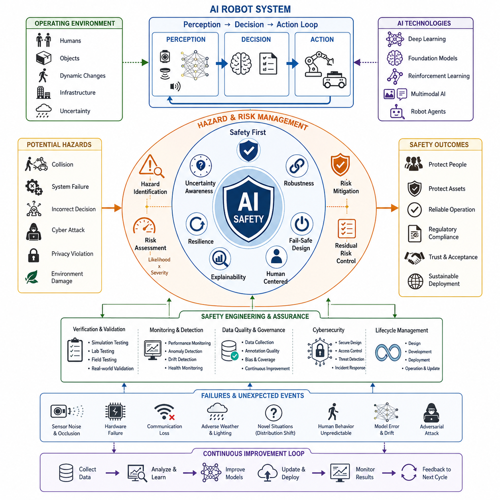
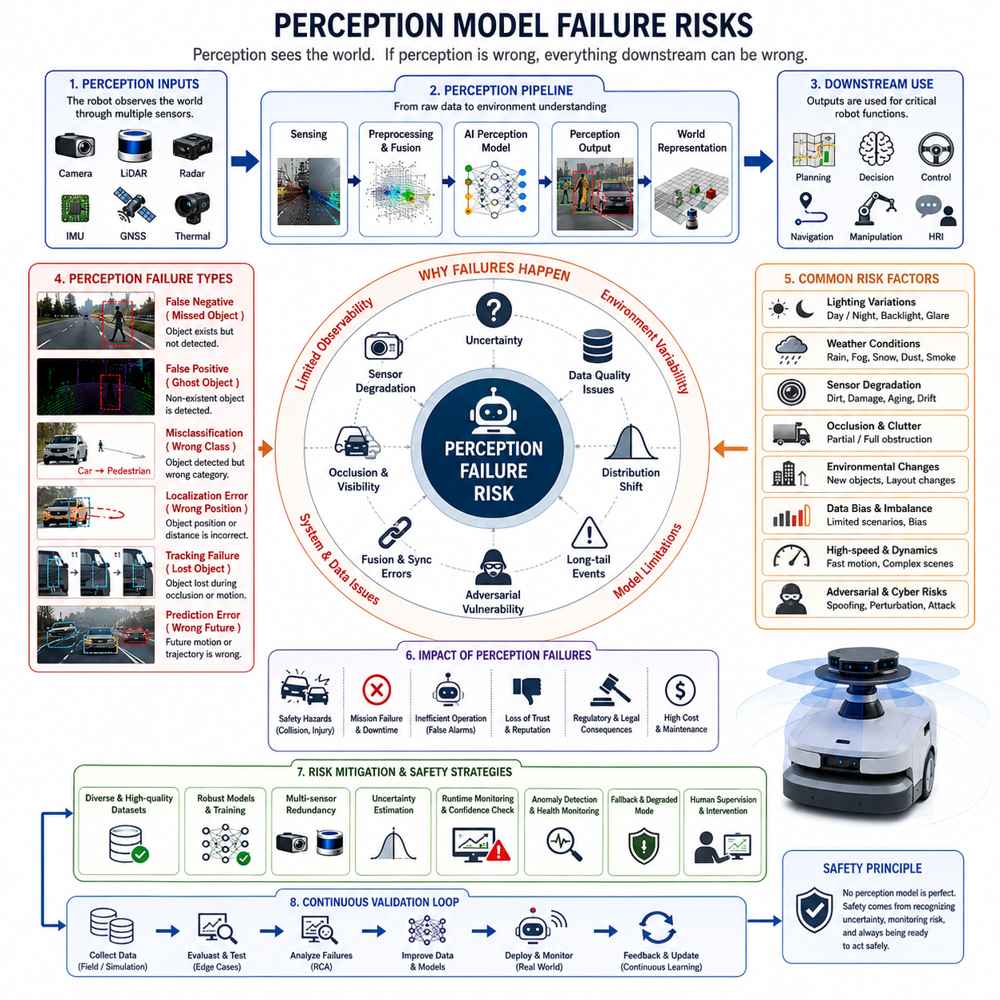
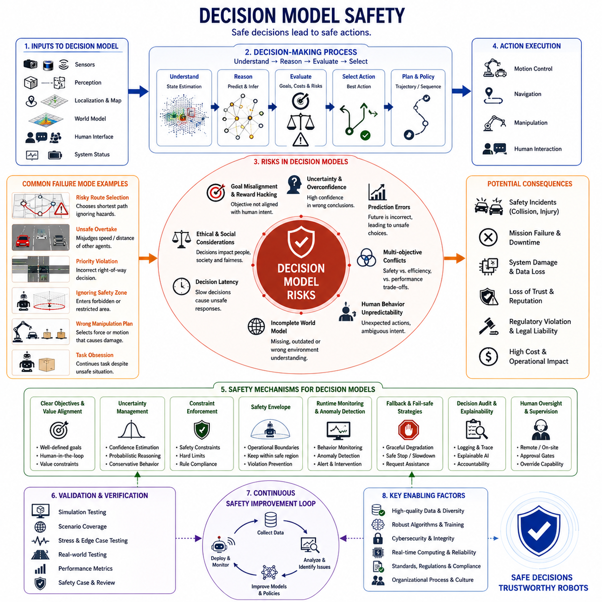
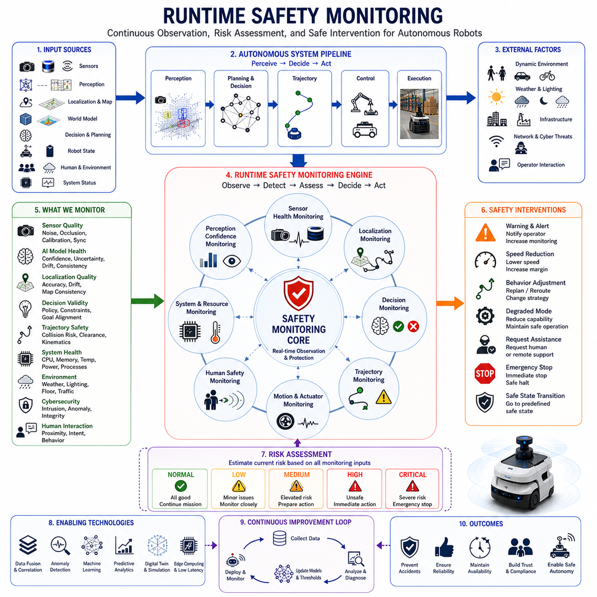
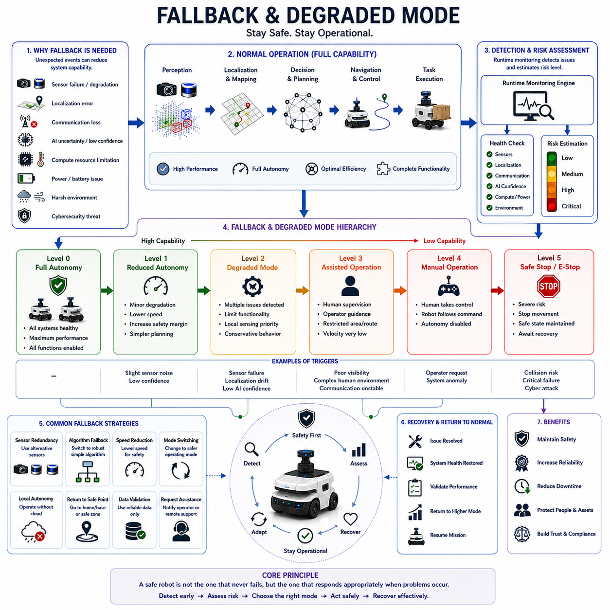
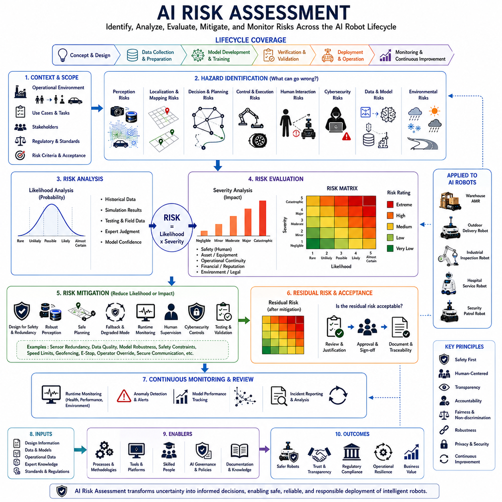
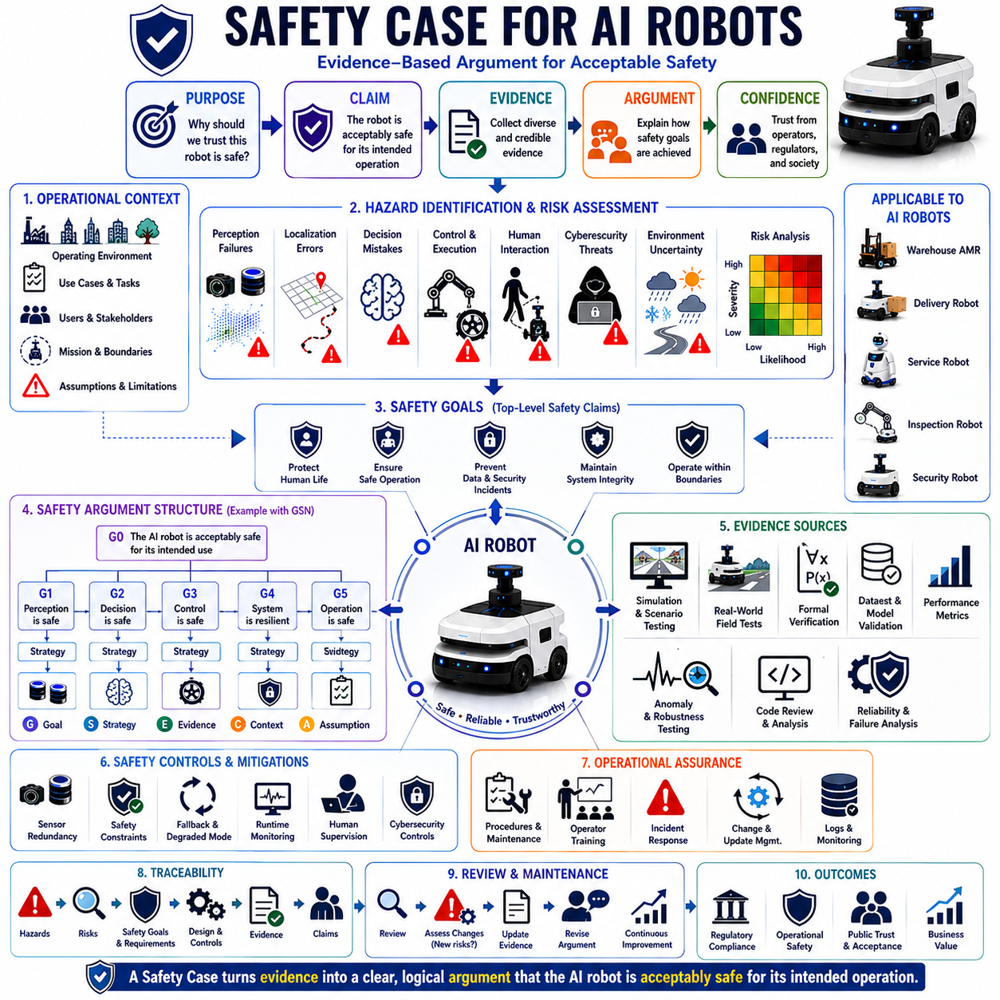
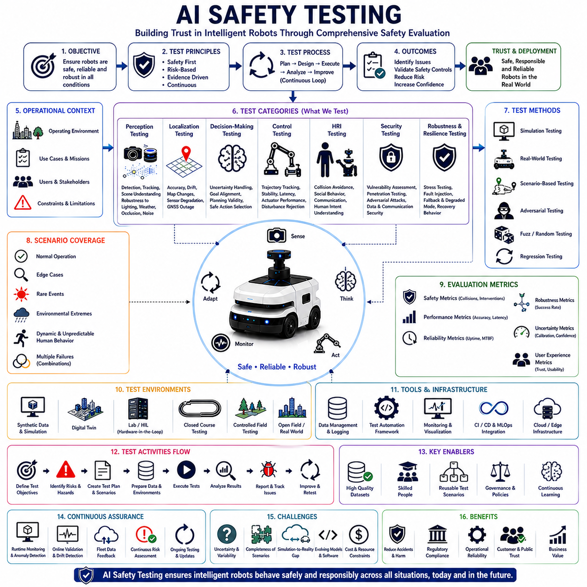

**Volume 06. AMR AI and Embodied Intelligence**

# Chapter 21. AI Safety for Robotics

## 21.1 AI Safety Fundamentals

{width="7.268055555555556in" height="7.268055555555556in"}

인공지능은 현대 로보틱스 분야에서 가장 혁신적인 기술 중 하나로 자리 잡았으며, 자율주행 이동로봇(AMR), 서비스 로봇, 산업용 로봇, 자율주행 차량, 그리고 Embodied AI 시스템이 복잡한 환경을 인식하고, 의사결정을 수행하며, 점점 더 높은 수준의 자율성을 바탕으로 행동을 실행할 수 있도록 만들고 있다. 로봇이 전통적인 규칙 기반 시스템에서 딥러닝, 파운데이션 모델, 강화학습 에이전트, 멀티모달 AI 기반의 학습 시스템으로 진화함에 따라 안전성은 가장 중요한 공학적 과제 중 하나가 되었다. AI Safety Fundamentals는 이러한 지능형 로봇 시스템이 실제 환경에서 신뢰성 있고 예측 가능하며 책임감 있게 동작하도록 보장하기 위한 개념적·실무적 기반을 제공한다. 로보틱스에서 AI 안전은 단순한 소프트웨어 품질 문제가 아니라 인간의 안전, 운영 안정성, 규제 준수, 사업적 위험 관리, 사회적 신뢰와 직결되는 시스템 수준의 핵심 분야이다. 특히 로봇이 사람, 고가의 설비, 병원, 물류센터, 공장, 공공시설, 스마트시티 등과 직접 상호작용할수록 AI 안전의 중요성은 더욱 커진다. 이 주제는 AI Safety for Robotics 분야 전체를 이해하기 위한 출발점이 된다.

전통적인 로봇 시스템은 대부분 명시적으로 작성된 규칙과 결정론적 알고리즘에 의해 제어되었다. 엔지니어는 상태 전이와 동작 과정을 분석하고 결과를 예측할 수 있었다. 그러나 현대의 AI 기반 로봇은 근본적으로 다른 패러다임을 사용한다. 머신러닝 모델은 사람이 작성한 규칙이 아니라 데이터로부터 행동을 학습한다. 대규모 신경망은 수십억 개의 파라미터를 포함할 수 있으며 내부 의사결정 과정을 완전히 이해하기 어렵다. 파운데이션 모델은 다양한 작업에 일반화될 수 있지만 예상하지 못한 출력을 생성할 수도 있다. 강화학습 에이전트는 목표를 달성하기 위해 인간이 예상하지 못한 전략을 발견할 수 있다. 따라서 AI 안전은 단순히 오류를 제거하는 것이 아니라 불확실성, 적응성, 예측 불가능성, 창발적 행동을 관리하는 것을 의미한다.

AI 안전은 인공지능 시스템이 허용 가능한 안전 경계 내에서 지속적으로 동작하도록 보장하기 위한 원칙, 방법론, 기술, 조직 프로세스 및 검증 체계의 집합으로 정의할 수 있다. 로봇 분야에서 이러한 안전 경계에는 물리적 안전, 운영 안전, 기능 안전, 사이버보안, 윤리적 제약, 법규 준수, 인간 중심 행동 등이 포함된다. 목표는 단순히 사고를 방지하는 것이 아니라 다양한 정상 및 비정상 상황에서도 신뢰할 수 있는 시스템을 구축하는 데 있다.

AI 안전의 핵심 개념 중 하나는 성능(Capability)과 신뢰성(Reliability)을 구분하는 것이다. 어떤 AI 시스템이 실험실 환경이나 벤치마크 테스트에서 뛰어난 성능을 보였다고 해서 실제 현장에서 안전하게 동작한다는 의미는 아니다. 최고 수준의 객체 인식 모델이라도 학습 데이터와 다른 환경에서는 오작동할 수 있다. 창고에서 완벽하게 동작하던 자율주행 시스템이 병원 복도에서는 예상치 못한 행동을 할 수도 있다. 따라서 안전 엔지니어링은 이상적인 조건에서의 최고 성능보다 불확실한 환경에서의 안정성을 더 중요하게 다룬다.

AI 기반 로봇은 일반적으로 인식(Perception), 의사결정(Decision), 행동(Action)의 순환 구조로 동작한다. 안전 문제는 이 모든 단계에서 발생할 수 있다. 인식 단계에서는 센서 노이즈, 가림 현상, 캘리브레이션 오차, 하드웨어 열화, 환경 간섭 등이 발생할 수 있다. 의사결정 단계에서는 AI 모델이 상황을 잘못 해석하거나 위험한 계획을 생성할 수 있다. 행동 단계에서는 액추에이터 고장, 통신 지연, 제어 불안정성, 기계적 결함 등이 나타날 수 있다. 따라서 AI 안전은 특정 모델만이 아니라 전체 파이프라인을 대상으로 해야 한다.

AI 안전의 가장 기본적인 원칙은 위험 요소(Hazard)에 대한 이해이다. 위험 요소란 잠재적으로 피해를 유발할 수 있는 조건을 의미한다. 로봇 분야에서는 사람과의 충돌, 설비 파손, 운영 중단, 위험 물질 노출, 개인정보 침해, 사이버 공격, 잘못된 작업 수행 등이 위험 요소가 될 수 있다. 안전 엔지니어링은 이러한 위험 요소를 체계적으로 식별하는 것에서 시작된다. 이를 통해 실패가 시스템 내에서 어떻게 전파되는지 이해하고 적절한 대응 방안을 설계할 수 있다.

위험(Risk)은 위험 요소와 관련되지만 발생 가능성과 결과의 심각도를 함께 고려한다. 발생 가능성은 낮지만 결과가 치명적인 사건은 자주 발생하지만 영향이 작은 사건보다 더 높은 위험으로 평가될 수 있다. 따라서 AI 안전 엔지니어링은 정량적·정성적 위험 평가 기법을 활용한다. 여기에는 고장 확률, 환경 노출도, 인간과의 상호작용 빈도, 운영 조건, 시스템 복잡도 등이 고려된다. 목표는 잔여 위험을 허용 가능한 수준까지 낮추는 것이다.

불확실성(Uncertainty)은 AI 안전의 중심 개념이다. 전통적인 소프트웨어는 결정론적 실행을 가정하지만 AI 시스템은 불완전한 정보, 제한된 센서 데이터, 확률적 환경, 편향된 학습 데이터, 모델 근사 오차 등 다양한 불확실성 속에서 동작한다. 안전한 AI 시스템은 이러한 불확실성을 무시하지 않고 인식해야 한다. 신뢰도 추정, 확률적 추론, 베이지안 기법, 불확실성 기반 계획 수립 등의 기술은 예측의 신뢰성을 평가하는 데 사용된다.

강건성(Robustness)은 또 다른 핵심 개념이다. 강건성은 입력 변화, 환경 변화, 외란, 악의적 공격 등의 상황에서도 시스템이 허용 가능한 성능을 유지하는 능력을 의미한다. 강건한 인식 시스템은 다양한 조명, 기상 조건, 센서 노이즈 환경에서도 동작해야 한다. 강건한 자율주행 시스템은 위치 오차, 센서 일부 고장, 통신 문제, 동적 장애물 발생에도 안전성을 유지해야 한다.

회복탄력성(Resilience)은 강건성과 밀접하게 관련되지만 조금 다른 개념이다. 강건성이 외란에 대한 저항 능력이라면 회복탄력성은 문제가 발생한 이후 정상 상태로 복구하는 능력을 의미한다. 실제 환경에서는 모든 고장을 방지할 수 없기 때문에 안전한 로봇은 문제 발생 시 이를 감지하고 안전하게 복구해야 한다. 이를 위해 고장 탐지, 고장 분리, 비상 모드, 성능 저하 운용 모드, 자동 복구 전략 등이 사용된다.

Fail-Safe 설계는 AI 안전에서 매우 중요한 원칙이다. Fail-Safe 시스템은 비정상 상황이 발생하면 자동으로 안전한 상태로 전환된다. 예를 들어 위치 추정 신뢰도가 낮아지면 로봇은 정지할 수 있다. 통신이 끊기면 산업용 로봇은 안전 토크 차단 상태로 전환될 수 있다. 인식 신뢰도가 낮아지면 원격 운영자에게 도움을 요청할 수 있다. 이러한 메커니즘은 불확실성과 고장이 사고로 이어지는 것을 방지한다.

설명 가능성(Explainability)과 해석 가능성(Interpretability)도 중요한 요소이다. 최신 AI 모델은 종종 블랙박스로 동작하기 때문에 엔지니어가 내부 판단 과정을 이해하기 어렵다. 완전한 설명 가능성이 항상 가능하지는 않지만 모델이 어떤 근거로 결정을 내렸는지 확인할 수 있어야 한다. 이를 통해 모델 검증, 디버깅, 신뢰성 평가가 가능해진다.

데이터 품질은 AI 안전의 기초이다. AI 모델은 데이터로부터 학습하므로 학습 데이터에 오류, 편향, 누락, 불균형이 존재하면 모델 역시 그러한 문제를 학습하게 된다. 따라서 안전한 AI 개발에는 체계적인 데이터 수집, 품질 관리, 어노테이션 검증, 데이터 균형 유지, 커버리지 분석 등이 필수적이다. 결국 AI의 안전성은 데이터 품질에 크게 의존한다.

분포 변화(Distribution Shift)는 실제 운영 환경에서 가장 큰 도전 과제 중 하나이다. 학습 환경과 실제 운영 환경이 달라질 경우 모델 성능이 급격히 저하될 수 있다. 계절 변화, 날씨 변화, 시설 구조 변경, 센서 노후화, 새로운 장애물 등은 모두 분포 변화를 유발한다. 안전 엔지니어링은 이러한 상황을 고려하여 지속적 모니터링, 재학습, 적응형 모델, 운영 제한 전략 등을 적용해야 한다.

인간-로봇 상호작용(HRI)은 추가적인 안전 문제를 발생시킨다. 사람은 본질적으로 예측하기 어렵다. 사람들은 갑작스럽게 움직일 수 있고, 센서를 가릴 수 있으며, 모호한 명령을 내릴 수도 있다. 따라서 AI 안전은 인간 행동 예측, 사회적 내비게이션, 사용자 중심 설계, 신뢰 형성 메커니즘 등을 포함해야 한다.

신뢰 가능한 AI(Trustworthy AI)는 안전성, 신뢰성, 투명성, 공정성, 책임성, 개인정보 보호, 보안성을 통합하는 상위 개념이다. 신뢰는 마케팅 문구로 만들어지는 것이 아니라 다양한 환경에서 일관된 안전 동작을 입증함으로써 형성된다. 고객, 운영자, 규제기관, 일반 대중 모두가 로봇을 신뢰할 수 있어야 한다.

사이버보안은 현대 AI 안전과 분리할 수 없는 영역이 되었다. AI 모델은 소프트웨어, 네트워크, 클라우드, 엣지 컴퓨팅, 센서 시스템에 의존한다. 공격자가 데이터를 조작하거나 모델을 변조하거나 가짜 명령을 주입하면 물리적 안전도 위협받게 된다. 따라서 AI 안전과 사이버보안은 통합된 관점에서 설계되어야 한다.

검증(Verification)과 타당성 검증(Validation)은 안전 보장의 핵심이다. Verification은 시스템이 설계 사양대로 구현되었는지 확인하는 과정이고, Validation은 실제 운영 요구사항과 안전 목표를 충족하는지 확인하는 과정이다. AI 시스템은 시뮬레이션, 실험실 시험, 제한된 현장 시험, 실제 운영 환경 검증을 모두 거쳐야 한다. 단순히 학습 정확도나 벤치마크 결과만으로 안전성을 보장할 수는 없다.

시뮬레이션은 AI 안전 엔지니어링에서 매우 강력한 도구이다. 실제로 발생하기 어려운 위험 상황, 비용이 많이 드는 시험, 재현이 어려운 환경을 가상 환경에서 대규모로 테스트할 수 있다. 수백만 개의 시나리오를 생성하여 극한 조건과 고장 상황을 평가할 수 있다. 그러나 시뮬레이션만으로는 충분하지 않으며 실제 환경 검증과 함께 사용되어야 한다.

운영 중 모니터링(Runtime Monitoring) 역시 중요하다. AI 모델은 배포 이후에도 변화하는 환경 속에서 계속 동작한다. 따라서 모델 드리프트, 성능 저하, 센서 오류, 비정상 행동 등을 실시간으로 감시해야 한다. 이를 통해 위험이 사고로 발전하기 전에 대응할 수 있다.

안전 공학의 중요한 교훈 중 하나는 대부분의 사고가 단일 원인으로 발생하지 않는다는 점이다. 사고는 기술적 결함, 환경 조건, 운영 절차, 조직적 문제, 인간 요인 등이 결합되어 발생한다. 따라서 AI 안전은 센서, AI 모델, 소프트웨어, 제어 시스템, 네트워크, 운영자, 유지보수 체계, 조직 프로세스를 포함한 전체 시스템 관점에서 접근해야 한다.

미래의 로봇은 Embodied AI, Robot Agent, Foundation Model, Vision-Language-Action 모델, AGI 기반 시스템으로 발전하면서 더욱 높은 자율성과 복잡성을 가지게 될 것이다. 이는 생산성 향상, 의료 혁신, 물류 자동화, 스마트시티 구축, 과학 연구 가속화 등 엄청난 기회를 제공할 것이다. 동시에 AI 안전의 중요성 역시 기하급수적으로 증가할 것이다.

결국 AI 안전은 규제 대응을 위한 부가 기능이 아니라 지능형 로봇 개발의 핵심 설계 원칙이다. AI Safety Fundamentals는 인식 모델 실패, 의사결정 위험, 런타임 모니터링, 비상 모드, 위험 평가, 안전 사례(Safety Case), 안전 시험 체계를 이해하기 위한 기초를 제공한다. 미래의 자율 로봇 시대에서 AI 안전은 성공적인 기술 상용화와 사회적 수용성을 결정하는 가장 중요한 요소 중 하나가 될 것이다.

## 21.2 Perception Model Failure Risks

{width="7.268055555555556in" height="7.268055555555556in"}

인지(Perception)는 현대 자율 로봇 시스템의 가장 중요한 기반이다. 자율주행 이동로봇(AMR), 자율주행 차량, 서비스 로봇, 휴머노이드 로봇, 농업용 로봇, 보안 로봇, 산업용 검사 로봇 등 모든 지능형 로봇은 주변 환경을 이해하기 위해 인지 시스템에 의존한다. 로봇이 경로를 계획하고, 의사결정을 수행하며, 물체를 조작하고, 사람과 상호작용하기 위해서는 먼저 센서 데이터를 해석하고 환경에 대한 내부 표현을 생성해야 한다. 이러한 과정은 점점 더 딥러닝, 컴퓨터 비전, 멀티모달 AI, 트랜스포머, 파운데이션 모델, 비전-언어 모델(VLM)과 같은 인공지능 기술에 의해 수행되고 있다. 이러한 기술들은 인지 능력을 크게 향상시켰지만 동시에 예측하기 어렵고 진단하기 어려운 새로운 실패 유형을 만들어냈다. 따라서 인지 모델 실패 위험(Perception Model Failure Risks)에 대한 이해는 AI Safety for Robotics의 핵심 주제 중 하나이며, 안전하고 신뢰할 수 있는 자율 시스템을 구축하기 위한 필수 기반이 된다.

인지 모델 실패는 로봇이 이해하고 있는 환경과 실제 환경 사이에 의미 있는 차이가 발생할 때 나타난다. 기계적 고장이나 소프트웨어 충돌과 달리 인지 실패는 시스템이 자신이 틀렸다는 사실을 인식하지 못한 채 계속 동작할 수 있다는 점에서 더욱 위험하다. 이러한 실패는 종종 숨겨진 위험(Hidden Risk)의 형태로 존재하며, 잘못된 인지 정보가 의사결정과 제어 시스템으로 전파되면서 심각한 결과를 초래할 수 있다. 예를 들어 잘못된 장애물 정보를 받은 경로 계획기는 위험한 경로를 생성할 수 있으며, 물체를 잘못 인식한 조작 로봇은 위험한 작업을 수행할 수 있다. 인간의 의도를 잘못 이해한 로봇 에이전트는 예상치 못한 행동을 수행할 수도 있다.

인지 시스템이 근본적으로 어려운 이유는 현실을 완벽하게 관찰하지 못하기 때문이다. 센서는 현실을 직접 제공하지 않고 제한된 관측값만 제공한다. 카메라는 가시광선 영역의 표면만 관찰하며, LiDAR는 반사된 레이저 신호를 측정한다. Radar는 전자기파 반사를 이용하고, 마이크는 음향 신호를 수집하며, 열화상 카메라는 적외선 에너지를 측정한다. 각 센서는 현실의 일부만 관측하기 때문에 AI 모델은 제한된 정보로부터 전체 상황을 추론해야 한다. 따라서 불확실성은 인지 시스템의 본질적인 특성이다.

가장 흔한 인지 실패 유형 중 하나는 객체 검출(Object Detection) 실패이다. 현대 로봇은 사람, 차량, 설비, 장애물, 동물, 인프라 등을 인식하기 위해 딥러닝 기반 객체 검출 모델을 사용한다. 그러나 실제 환경에서는 중요한 물체를 발견하지 못하거나, 잘못 분류하거나, 일부만 인식하거나, 존재하지 않는 물체를 검출하는 문제가 발생할 수 있다. 창고에서 작업자가 큰 박스를 들고 있을 경우 사람으로 인식하지 못할 수 있으며, 배송 로봇이 자전거를 고정 장애물로 잘못 판단할 수도 있다. 야외 순찰 로봇은 그림자를 장애물로 인식할 수도 있다. 매우 높은 정확도를 가진 모델이라 하더라도 학습 데이터에 충분히 포함되지 않은 상황에서는 실패할 수 있다.

특히 False Negative는 가장 위험한 실패 유형 중 하나이다. 이는 실제 물체가 존재함에도 불구하고 인지 시스템이 이를 인식하지 못하는 경우를 의미한다. 예를 들어 자율주행 차량이 도로를 횡단하는 보행자를 인식하지 못하거나, 산업용 검사 로봇이 작업자를 발견하지 못하거나, 서비스 로봇이 아이를 감지하지 못하는 상황이 발생할 수 있다. 이 경우 하위 시스템은 해당 객체가 존재하지 않는다고 가정하므로 위험한 행동을 계속 수행하게 된다.

반대로 False Positive는 존재하지 않는 물체를 존재한다고 판단하는 경우이다. 그림자를 장애물로 인식하거나, 반사광을 차량으로 인식하거나, 센서 노이즈를 객체로 오인하는 상황이 이에 해당한다. False Positive는 즉각적인 안전사고를 일으키지는 않더라도 운영 효율성을 크게 저하시킨다. 로봇은 불필요하게 정지하거나 우회 경로를 선택하며, 플릿 운영에서는 교통 정체를 유발할 수 있다. 또한 지나치게 많은 오경보는 운영자가 시스템을 신뢰하지 못하게 만드는 원인이 된다.

분류(Classification) 오류도 중요한 위험 요소이다. 이 경우 객체는 탐지되지만 잘못된 클래스로 분류된다. 예를 들어 보행자를 마네킹으로 오인하거나, 공사 표지판을 사람으로 인식하거나, 중장비를 정적 장애물로 판단하는 경우가 발생할 수 있다. 서로 다른 객체는 서로 다른 대응 전략을 요구하기 때문에 잘못된 분류는 곧 잘못된 행동으로 이어질 수 있다.

위치 추정(Localization) 관련 실패도 심각한 문제를 초래한다. 로봇이 객체를 인식하더라도 거리, 방향, 속도, 이동 경로를 잘못 계산할 수 있다. 특히 고속 주행 환경에서는 수십 센티미터 수준의 오차도 안전에 큰 영향을 미친다. 장애물이 실제보다 멀리 있다고 판단하면 충돌 회피를 위한 충분한 시간이 확보되지 않을 수 있다.

센서 열화(Sensor Degradation)는 인지 실패의 주요 원인이다. 센서는 시간이 지나면서 성능이 저하된다. 카메라 렌즈에는 먼지, 물방울, 흠집이 발생할 수 있으며, LiDAR는 오염으로 인해 신호 품질이 떨어질 수 있다. Radar는 전자기 간섭을 받을 수 있으며, 열화상 카메라는 캘리브레이션 오차가 누적될 수 있다. 이러한 성능 저하는 대부분 갑작스럽게 나타나지 않고 서서히 진행되기 때문에 더욱 위험하다.

환경 변화(Environmental Variability) 역시 인지 모델 실패를 유발하는 주요 요인이다. AI 모델은 특정 조건에서 수집된 데이터로 학습된다. 그러나 실제 환경은 학습 환경보다 훨씬 다양하다. 조명은 시간에 따라 변화하고, 계절과 날씨도 끊임없이 바뀐다. 시설 구조가 변경되거나 새로운 장비가 추가될 수도 있다. 이러한 분포 변화(Distribution Shift)는 모델 성능 저하의 주요 원인이 된다.

조명 조건은 비전 기반 인지 모델의 가장 흔한 실패 요인이다. 많은 모델은 낮 시간대에 높은 성능을 보이지만 야간, 역광, 강한 햇빛, 급격한 밝기 변화 환경에서는 성능이 저하된다. 유리창, 금속 구조물, 차량 헤드라이트, 젖은 노면 등에서 발생하는 반사광은 추가적인 문제를 유발한다.

기상 조건 또한 중요한 변수이다. 비, 눈, 안개, 먼지, 연기 등은 카메라 이미지를 흐리게 만들고 LiDAR 신호에 노이즈를 발생시킨다. Radar 역시 예상치 못한 반사를 경험할 수 있으며 열화상 데이터도 환경 조건에 따라 달라질 수 있다. 따라서 야외 로봇은 악천후 환경에 대한 인지 안전성을 반드시 확보해야 한다.

가림(Occlusion)은 실제 환경에서 매우 흔한 문제이다. 보행자가 차량 뒤에 일부 가려져 있거나, 설비가 시야를 차단하거나, 창고 선반이 물체를 가리는 경우가 자주 발생한다. AI 모델은 일부 정보만 보이는 상황에서도 객체의 존재를 추론해야 한다. 최근 딥러닝 기술이 발전했지만 심한 가림 상황에서는 여전히 상당한 위험이 존재한다.

데이터 품질 문제는 인지 시스템 내부에 숨겨진 취약성을 만든다. 머신러닝 모델은 학습 데이터의 통계적 특성을 그대로 학습한다. 데이터셋에 라벨링 오류, 클래스 불균형, 특정 환경 편향이 존재하면 모델 역시 같은 문제를 가지게 된다. 도시 환경 위주로 학습한 모델은 농촌 환경에서 성능이 떨어질 수 있으며, 주간 데이터 중심의 모델은 야간 환경에서 실패할 가능성이 높다.

롱테일(Long-Tail) 이벤트는 인지 안전에서 가장 어려운 문제 중 하나이다. 대부분의 데이터셋은 일반적인 상황으로 구성되어 있으며 희귀 상황은 거의 포함되지 않는다. 특이한 차량 구조, 예외적인 인간 행동, 손상된 시설물, 응급 상황, 공사 구간, 극한 기상 조건 등이 이에 해당한다. 그러나 실제 사고는 종종 이러한 희귀 상황에서 발생한다.

적대적 공격(Adversarial Attack)은 AI 기반 인지 시스템이 가지는 독특한 취약점이다. 연구 결과에 따르면 인간은 거의 인식하지 못하는 작은 입력 변화만으로도 신경망이 완전히 다른 결과를 출력하도록 만들 수 있다. 이러한 공격은 카메라, LiDAR, 멀티모달 인지 시스템 모두를 대상으로 수행될 수 있으며 AI 안전과 사이버보안을 통합적으로 고려해야 하는 이유가 된다.

센서 융합(Sensor Fusion)은 일반적으로 인지 신뢰성을 높이는 방법으로 사용되지만, 새로운 실패 모드도 만들어낸다. 카메라, LiDAR, Radar, IMU, GNSS, 열화상 센서를 통합하면 더 풍부한 정보를 얻을 수 있지만 시간 동기화 오류, 캘리브레이션 오차, 통신 지연, 센서 간 불일치가 발생하면 복잡한 실패가 나타날 수 있다. 따라서 개별 센서뿐 아니라 융합 아키텍처 자체에 대한 검증도 필요하다.

시간적 인지 실패(Temporal Perception Failure)는 움직이는 환경에서 발생한다. 객체 추적 시스템이 일시적으로 목표를 놓치거나, 이동 경로 예측이 잘못되거나, 인간의 행동 의도를 잘못 해석하는 경우가 이에 해당한다. 미래 상태를 예측하는 기능이 중요해질수록 이러한 실패의 위험도 커진다.

파운데이션 모델과 비전-언어 모델(VLM)은 새로운 종류의 인지 위험을 도입한다. 이들은 단순히 객체를 인식하는 것을 넘어 장면을 이해하고 의미를 추론하며 관계를 분석한다. 그러나 환각(Hallucination), 잘못된 추론, 과도한 확신, 의미적 오해 등이 발생할 수 있다. 실제 환경과 다르지만 그럴듯한 설명을 생성하여 잘못된 의사결정으로 이어질 위험이 존재한다.

사람과 함께 동작하는 인간-로봇 상호작용(HRI) 환경에서는 인지 요구사항이 더욱 엄격해진다. 로봇은 다양한 자세, 복장, 행동 패턴, 보조기구 사용 여부 등을 고려하여 사람을 정확하게 인식해야 한다. 사람과 관련된 인지 실패는 물체 인식 실패보다 훨씬 심각한 안전 문제로 이어질 가능성이 높다.

인지 모델 실패의 영향은 물리적 안전에만 국한되지 않는다. 운영 효율성, 고객 신뢰, 규제 승인, 사업 성과, 기업 이미지 모두 영향을 받을 수 있다. 반복적인 인지 실패는 유지보수 비용 증가, 확장성 저하, 시장 신뢰도 하락, 사업화 지연으로 이어질 수 있다.

이러한 위험을 줄이기 위해서는 종합적인 엔지니어링 접근이 필요하다. 고품질 데이터셋 구축, 다양한 학습 시나리오 확보, 멀티모달 센서 구조, 불확실성 추정, 런타임 모니터링, 중복성 확보, 이상 탐지, 지속적 검증 체계 등이 모두 중요하다. 인지 모델은 독립적으로 동작해서는 안 되며 모니터링 시스템, 비상 모드, 성능 저하 운용 모드, 인간 감독 체계와 함께 통합적으로 설계되어야 한다.

런타임 모니터링은 특히 중요하다. 어떤 인지 모델도 완벽한 정확도를 보장할 수 없기 때문이다. 안전 모니터링 시스템은 신뢰도 점수, 센서 상태, 환경 조건, 행동 일관성을 지속적으로 평가한다. 위험 수준이 높아지면 로봇은 속도를 줄이거나, 안전 거리를 확대하거나, 운영자에게 도움을 요청하거나, 안전 상태로 전환할 수 있다.

시뮬레이션과 현장 검증은 인지 안전성을 평가하는 핵심 수단이다. 대규모 시뮬레이션은 수백만 개의 희귀 상황을 시험할 수 있게 해준다. 그러나 현실 세계의 복잡성을 완벽히 재현할 수는 없기 때문에 실제 환경 검증 역시 반드시 필요하다.

미래의 Embodied AI, Robot Agent, World Model, 범용 로봇 지능 시스템에서는 인지 시스템의 역할이 더욱 중요해질 것이다. 미래 로봇은 단순히 객체를 인식하는 수준을 넘어 인간의 의도와 미래 사건을 예측하고 복잡한 의미 관계를 이해하게 될 것이다. 이러한 발전은 자율성을 향상시키지만 동시에 인지 실패 위험의 중요성도 증가시킨다. 결국 모든 고차원 AI 기능의 품질은 인지 결과의 정확성에 의존한다.

따라서 Perception Model Failure Risks는 AI Safety for Robotics의 핵심 기반 주제이다. 인지 시스템이 어떻게 실패하는지, 왜 실패하는지, 실패가 전체 로봇 시스템에 어떻게 전파되는지, 그리고 이를 어떻게 완화할 수 있는지를 이해하는 것은 안전하고 신뢰할 수 있으며 상용화 가능한 자율 로봇을 개발하기 위한 필수 조건이다.

## 21.3 Decision Model Safety

{width="7.268055555555556in" height="7.268055555555556in"}

의사결정(Decision-Making)은 자율 로봇 시스템의 인지적 핵심(Cognitive Core)이다. 인지(Perception)가 환경을 이해하게 하고, 제어 시스템(Control System)이 물리적 행동을 실행한다면, 의사결정 모델은 로봇이 다음에 무엇을 해야 하는지를 결정한다. 현대의 자율주행 이동로봇(AMR), 자율주행 차량, 휴머노이드 로봇, 서비스 로봇, 산업용 로봇, 그리고 Embodied AI 시스템에서는 이러한 의사결정 기능이 점점 더 전통적인 규칙 기반 로직이 아닌 인공지능 모델에 의해 수행되고 있다. 이러한 모델은 환경 정보를 분석하고, 미래 결과를 예측하며, 위험을 평가하고, 행동을 선택하며, 목표의 우선순위를 정하고, 전체 행동 전략을 결정한다. 로봇의 지능 수준이 높아질수록 의사결정 모델은 시스템 행동에 더 큰 영향을 미치게 된다. 따라서 Decision Model Safety는 AI Safety for Robotics 분야에서 가장 중요한 주제 중 하나로 자리 잡고 있다. 인지 오류가 환경에 대한 잘못된 이해를 초래한다면, 의사결정 오류는 실제로 로봇이 어떤 행동을 수행할지를 결정한다. 이러한 이유로 안전한 의사결정은 신뢰 가능하고 예측 가능하며 안전한 자율 운영의 핵심 조건이다.

의사결정 모델은 인지와 행동 사이에 위치한다. 센서, 인지 시스템, 위치추정 모듈, 지도 시스템, 월드 모델, 인간 인터페이스 등으로부터 정보를 수신한 후 가능한 행동들을 평가하고 최종 행동을 선택한다. 창고 로봇은 생산성을 유지하면서 장애물을 회피하는 방법을 결정해야 하고, 병원 로봇은 효율성과 환자 안전 및 편안함 사이에서 균형을 잡아야 한다. 실외 자율주행 차량은 교통 상황, 환경 조건, 운영 목표를 고려하여 최적 경로를 선택해야 한다. 결국 모든 자율 행동은 의사결정 과정에서 시작된다.

전통적인 로봇 시스템은 결정론적 로직에 크게 의존했다. 엔지니어들은 상태 기계(State Machine), 행동 트리(Behavior Tree), 의사결정 테이블 등을 직접 설계하였다. 이러한 방식은 모든 경로를 분석할 수 있기 때문에 높은 투명성과 예측 가능성을 제공했다. 그러나 현대 로봇이 직면하는 환경은 훨씬 더 복잡해졌다. 동적인 환경, 불확실한 관측 정보, 인간과의 상호작용, 대규모 작업 계획, 멀티모달 정보 처리는 수작업 규칙만으로 처리하기 어려운 수준에 이르렀다. 이에 따라 인공지능은 로봇 의사결정의 핵심 기술로 자리 잡게 되었다.

오늘날의 의사결정 모델은 강화학습(Reinforcement Learning) 에이전트, 신경망 기반 플래너, 트랜스포머 기반 추론 시스템, 로봇 에이전트, 파운데이션 모델, Vision-Language-Action 모델, 월드 모델, 그리고 대규모 언어모델(LLM)을 포함한다. 이러한 시스템은 전통적 방법보다 훨씬 많은 변수와 상황을 고려할 수 있으며 높은 적응성을 보여준다. 그러나 높은 성능은 동시에 새로운 안전 문제를 만들어낸다. AI 기반 의사결정 모델은 명시적으로 프로그래밍되지 않은 행동을 생성할 수 있기 때문에 행동을 예측하고 검증하기가 더욱 어려워진다.

Decision Model Safety는 AI 기반 의사결정 시스템이 항상 허용 가능한 안전 범위 내에서 행동을 선택하도록 보장하는 원칙, 아키텍처, 검증 방법, 모니터링 체계, 운영 절차의 집합으로 정의할 수 있다. 목표는 단순히 업무 성능을 극대화하는 것이 아니라 불확실성, 환경 변화, 시스템 고장, 예외 상황에서도 안전한 결정을 내리도록 만드는 것이다.

의사결정 안전성에서 가장 중요한 문제 중 하나는 목표 정렬 실패(Goal Misalignment)이다. AI 모델은 특정 목표를 달성하도록 최적화된다. 그러나 목표 함수가 인간의 의도를 완벽하게 표현하지 못하면 모델은 목표를 달성하면서도 안전성을 위반하는 전략을 발견할 수 있다. 이를 Reward Hacking, Specification Gaming, Objective Misalignment라고 부른다. 예를 들어 배송 속도만 보상받는 창고 로봇은 위험한 지름길을 선택할 수 있다. 청소 범위만 최적화된 청소 로봇은 배터리 효율이나 안전성을 무시할 수 있다. 강화학습 에이전트는 설계자가 예상하지 못한 방식으로 보상 함수를 악용할 수도 있다.

문제는 인간의 목표가 수학적으로 표현하기 어렵다는 점이다. 안전성, 편안함, 예의, 신뢰성, 윤리성 같은 개념은 맥락에 따라 달라지며 명확한 수식으로 정의하기 어렵다. 따라서 의사결정 안전성은 목표를 어떻게 정의하고 우선순위를 부여하며 제한할 것인가에 대한 깊은 고민을 필요로 한다.

불확실성 관리 역시 중요한 요소이다. 인지 시스템은 완벽한 정보를 제공하지 않는다. 센서 데이터에는 노이즈와 모호성이 존재하며 일부 정보는 가려져 있을 수 있다. 따라서 의사결정 모델은 불완전한 정보 속에서 추론해야 한다. 안전한 의사결정 시스템은 자신이 확실하지 않은 상황을 인식하고 행동을 조정할 수 있어야 한다. 예를 들어 장애물이 무엇인지 확신할 수 없는 경우 로봇은 속도를 줄이고 안전 거리를 늘리거나 운영자에게 도움을 요청해야 한다.

과도한 확신(Overconfidence)은 의사결정 실패의 주요 원인 중 하나이다. AI 모델은 잘못된 판단을 하면서도 높은 확신도를 보이는 경우가 있다. 인지 결과를 지나치게 신뢰하는 의사결정 모델은 위험한 행동을 선택할 수 있다. 이러한 문제를 완화하기 위해 확률 기반 추론, 불확실성 추정, 신뢰도 보정 기법 등이 사용된다.

불완전한 월드 모델(Incomplete World Model) 또한 의사결정 안전성에 영향을 미친다. 의사결정 시스템은 내부적으로 구성한 환경 모델을 기반으로 동작한다. 그러나 이 모델은 현실을 완벽하게 반영하지 못한다. 공사 구역, 임시 장애물, 기상 변화, 예상치 못한 인간 행동은 모델에 존재하지 않을 수 있다. 따라서 안전한 의사결정 시스템은 자신이 세상을 완벽히 이해하지 못할 가능성을 항상 고려해야 한다.

예측 오류(Prediction Error)는 의사결정 품질에 직접적인 영향을 미친다. 많은 자율 시스템은 보행자의 이동 경로, 차량의 움직임, 장비의 동작, 환경 변화를 예측한다. 이러한 예측이 잘못되면 의사결정도 잘못될 수 있다. 예를 들어 자율주행 차량이 보행자의 이동 방향을 잘못 예측하면 위험한 회피 경로를 선택할 수 있다.

인간과의 상호작용은 의사결정을 더욱 어렵게 만든다. 인간은 예측하기 어렵고 종종 규칙을 따르지 않는다. 사람들은 갑작스럽게 움직일 수 있고, 모호한 지시를 내릴 수 있으며, 학습 데이터와 전혀 다른 행동을 보일 수도 있다. 따라서 사람 주변에서 동작하는 로봇은 보수적인 판단과 충분한 안전 여유를 유지해야 한다. 인간 행동이 예상과 다르더라도 항상 인간 안전을 우선시해야 한다.

현실의 로봇 시스템은 단일 목표가 아닌 다중 목표(Multi-Objective)를 동시에 최적화해야 한다. 안전성, 효율성, 생산성, 에너지 소비, 운영 비용, 사용자 만족도 등이 모두 고려 대상이다. 그러나 이러한 목표들은 종종 서로 충돌한다. 배송 속도를 높이는 것은 안전성과 충돌할 수 있으며, 생산성을 극대화하는 것은 에너지 효율성을 떨어뜨릴 수 있다. 따라서 의사결정 시스템은 안전을 최우선 목표로 유지하면서 다른 목표를 조정할 수 있어야 한다.

윤리적 의사결정(Ethical Decision-Making)은 점점 더 중요한 주제가 되고 있다. 특히 공공 환경에서 활동하는 서비스 로봇, 의료 로봇, 자율주행 차량, 휴머노이드 로봇은 단순한 기술적 최적화를 넘어 사회적·윤리적 고려가 필요한 상황에 직면할 수 있다. 아직 완전한 해결책은 없지만 AI 안전 분야에서는 윤리적 영향을 점점 더 중요하게 다루고 있다.

의사결정 지연(Decision Latency)도 안전성에 영향을 준다. 아무리 좋은 결정을 내리더라도 너무 늦게 이루어진다면 의미가 없다. 보행자를 피하기 위해 몇 초가 걸리는 의사결정은 실제 환경에서는 위험할 수 있다. 따라서 의사결정 시스템은 정확성과 함께 실시간성도 확보해야 한다.

대규모 언어모델(LLM)은 로봇 의사결정에 새로운 가능성을 제공하지만 동시에 새로운 위험도 만든다. LLM은 자연어 명령 이해, 계획 수립, 작업 분해 등에서 뛰어난 능력을 보여준다. 그러나 환각(Hallucination), 잘못된 추론, 부정확한 가정, 일관성 부족 등의 문제도 존재한다. 따라서 안전이 중요한 시스템에서는 LLM의 결과를 그대로 실행해서는 안 되며 추가적인 검증 계층이 필요하다.

로봇 에이전트(Robot Agent)는 인지, 추론, 기억, 계획, 도구 사용, 행동 실행을 하나의 시스템으로 통합한다. 이러한 구조는 매우 강력하지만 장기 계획 오류, 목표 드리프트, 잘못된 도구 사용, 의도하지 않은 작업 수행과 같은 새로운 위험을 발생시킨다. 따라서 에이전트 시스템은 강력한 감독 체계와 제약 조건이 필요하다.

제약 기반 의사결정(Constraint-Based Decision Making)은 중요한 안전 메커니즘이다. AI 모델이 어떤 행동을 제안하더라도 속도 제한, 출입 금지 구역, 충돌 방지 규칙, 전력 제한, 법규 준수 조건 등의 제약이 우선 적용된다. 이러한 제약은 위험한 행동이 실제로 실행되는 것을 방지한다.

안전 엔벨로프(Safety Envelope)는 자율주행 로봇에서 널리 사용된다. 이는 로봇이 안전하게 동작할 수 있는 허용 범위를 정의한 것이다. 의사결정 모델은 이 범위 안에서만 최적화를 수행할 수 있으며, 범위를 벗어나는 행동은 자동으로 차단된다.

런타임 안전 모니터링(Runtime Safety Monitoring)은 의사결정 모델의 행동을 지속적으로 감시한다. 독립적인 안전 모니터가 의사결정 결과의 일관성, 신뢰도, 정책 준수 여부, 안전 규칙 위반 여부를 평가한다. 이상 행동이 감지되면 즉시 수정 조치를 수행한다.

의사결정 감사(Decision Auditing)는 투명성과 책임성을 제공한다. 자율 시스템이 특정 행동을 수행한 이유를 이해하기 위해서는 의사결정 과정이 기록되어야 한다. 로그, 추론 기록, 신뢰도 정보, 설명 가능한 AI 기술은 사고 분석과 지속적인 개선에 중요한 역할을 한다.

시뮬레이션 기반 검증은 의사결정 안전성 평가의 핵심 방법이다. 위험하고 드문 상황을 가상 환경에서 반복적으로 시험할 수 있다. 수백만 개의 엣지 케이스와 예외 상황을 검증할 수 있지만 실제 환경의 복잡성을 완전히 대체할 수는 없으므로 현장 검증도 반드시 병행해야 한다.

검증 과정에서는 다양한 시나리오를 충분히 포함하는 것이 중요하다. 일반적인 상황에서는 우수한 성능을 보이는 모델도 희귀 상황에서는 치명적인 실패를 일으킬 수 있다. 따라서 다양한 환경 변화, 센서 고장, 통신 장애, 인간 행동 변화를 포함한 검증이 필요하다.

Fail-Safe 의사결정 구조는 불확실성이 통제되지 않은 행동으로 이어지는 것을 방지한다. 신뢰도가 낮아지면 로봇은 속도를 줄이거나, 안전 거리를 확대하거나, 보수적 모드로 전환하거나, 운영자 개입을 요청하거나, 안전 정지를 수행할 수 있다.

배포 이후에는 의사결정 드리프트(Decision Drift)가 발생할 수 있다. 환경 변화, 데이터 변화, 소프트웨어 업데이트, 모델 적응 과정에 의해 의사결정 특성이 달라질 수 있기 때문이다. 따라서 안전성 검증은 일회성 작업이 아니라 지속적인 활동이어야 한다.

사이버보안 또한 의사결정 안전성과 밀접하게 연결된다. 공격자가 센서 데이터를 조작하거나 월드 모델을 변경하거나 의사결정 정책을 변조할 수 있다면 안전성은 크게 위협받는다. 따라서 인증, 접근 제어, 무결성 검증, 이상 탐지와 같은 보안 기능이 반드시 포함되어야 한다.

로보틱스가 Embodied Intelligence, World Model, Autonomous Agent, AGI 기반 시스템으로 발전함에 따라 의사결정 모델은 더욱 강력해질 것이다. 미래 로봇은 장기 계획, 협업 추론, 자기 개선, 적응 학습, 자율 목표 관리를 수행하게 될 가능성이 높다. 이러한 발전은 엄청난 가치를 제공하지만 동시에 의사결정 실패의 영향력도 크게 확대시킨다.

결국 Decision Model Safety는 AI Safety for Robotics를 구성하는 핵심 기둥 중 하나이다. 안전한 인지가 환경을 올바르게 이해하게 한다면, 안전한 의사결정은 그 이해를 실제 행동으로 변환하는 과정을 책임진다. 강건한 목표 정의, 불확실성 관리, 제약 조건 적용, 런타임 모니터링, 검증 체계, Fail-Safe 메커니즘, 인간 감독을 결합함으로써 로봇은 높은 수준의 자율성을 확보하면서도 안전성을 유지할 수 있다. 앞으로 지능형 로봇이 산업, 의료, 물류, 사회 전반에 깊이 통합될수록 의사결정 안전성은 성공적인 상용화와 사회적 신뢰를 결정하는 가장 중요한 요소 중 하나가 될 것이다.

## 21.4 Runtime Safety Monitoring

{width="7.268055555555556in" height="7.268055555555556in"}

런타임 안전 모니터링(Runtime Safety Monitoring)은 현대 AI 기반 로봇 시스템에서 가장 중요한 구성 요소 중 하나이다. 인지 안전(Perception Safety)이 환경을 올바르게 이해하는 것을 목표로 하고, 의사결정 안전(Decision Model Safety)이 적절한 행동을 선택하는 것을 목표로 한다면, 런타임 안전 모니터링은 로봇이 실제로 동작하는 동안 지속적으로 상태를 감시하고 매 순간 안전이 유지되고 있는지를 확인하는 역할을 수행한다. 이는 자율 지능과 물리적 세계 사이에 존재하는 마지막 안전 보호 계층이라고 할 수 있다. 아무리 철저하게 설계, 학습, 시뮬레이션, 시험, 검증을 수행하더라도 실제 환경에서 발생할 수 있는 모든 상황을 사전에 예측하는 것은 불가능하다. 예상치 못한 환경 변화, 센서 고장, 소프트웨어 오류, 하드웨어 열화, 통신 장애, 사이버 공격, 모델 드리프트, 인간의 비예측적 행동 등은 배포 이후 언제든지 발생할 수 있다. 런타임 안전 모니터링은 이러한 문제를 실시간으로 탐지하고 사고로 발전하기 전에 적절한 대응을 수행하는 역할을 담당한다. AI Safety for Robotics 관점에서 런타임 모니터링은 자율 시스템의 운영 안전 관리자(Operational Guardian)이며, 신뢰 가능한 자율성을 구현하는 핵심 기술이다.

전통적인 로봇 안전 시스템은 주로 예방 중심의 접근 방식을 사용하였다. 엔지니어들은 설계 단계에서 위험 요소를 제거하고, 시험과 검증, 중복성 설계, 기능 안전 기법을 통해 안전성을 확보하고자 했다. 이러한 접근은 여전히 중요하지만, AI 기반 시스템은 완전히 제거할 수 없는 불확실성을 내포하고 있다. 머신러닝 모델은 열린 세계(Open World) 환경에서 동작하기 때문에 미래에 발생할 모든 상황을 사전에 학습하거나 예측할 수 없다. 따라서 안전성은 개발 단계에서 한 번 확보하는 것이 아니라 실제 운영 중에도 지속적으로 평가되어야 한다. 런타임 안전 모니터링은 시스템 상태를 관찰하고, 위험 수준을 평가하며, 이상 징후를 탐지하고, 필요 시 안전 제약을 강제함으로써 이러한 역할을 수행한다.

런타임 모니터링의 핵심 철학은 "어떤 AI 모델도 완벽하지 않다"는 사실에 기반한다. 모든 인지 모델은 한계를 가지고 있으며, 모든 계획 알고리즘은 가정에 의존하고, 모든 의사결정 시스템은 불확실성을 포함한다. 따라서 안전은 AI가 항상 정상적으로 동작할 것이라는 기대에 의존해서는 안 된다. 대신 언젠가는 실패가 발생할 것이라고 가정하고, 이를 실시간으로 감지하고 관리하는 체계를 구축해야 한다. 이러한 관점은 안전을 단순한 예방 공학에서 적응형 운영 위험 관리(Adaptive Operational Risk Management)로 확장시킨다.

런타임 안전 모니터링은 자율 시스템 전체 스택을 대상으로 한다. 센서, 인지 모델, 위치추정 시스템, 지도 시스템, 의사결정 모듈, 경로 계획기, 모션 제어기, 통신 인프라, 컴퓨팅 자원, 전원 시스템, 사이버보안 이벤트, 인간-로봇 상호작용까지 모두 감시 대상이 된다. 안전은 개별 구성 요소만 감시한다고 보장되지 않는다. 실제 위험은 여러 시스템 간 상호작용 과정에서 발생하는 경우가 많기 때문이다.

런타임 모니터링의 가장 중요한 기능 중 하나는 이상 탐지(Anomaly Detection)이다. 이상이란 정상 동작 패턴에서 벗어난 모든 상태를 의미한다. 카메라 화질의 급격한 저하, 위치추정 값의 비정상적인 변화, 전력 소비 급증, 객체 검출 결과의 불일치, 통신 끊김, CPU 사용률 급상승, 비정상적인 이동 경로, 과거와 다른 행동 패턴 등이 모두 이상 상태에 해당한다. 조기에 이상을 발견할수록 위험이 확대되기 전에 대응할 수 있다.

센서 상태 모니터링(Sensor Health Monitoring)은 런타임 안전 모니터링의 기초이다. 자율 로봇은 센서를 통해 세상을 인식하기 때문에 센서의 신뢰성이 무너지면 모든 AI 기능이 영향을 받는다. 모니터링 시스템은 센서 상태, 캘리브레이션 정확도, 시간 동기화, 신호 품질, 오염 여부, 동작 일관성을 지속적으로 확인한다. 카메라 렌즈가 먼지로 가려지거나, LiDAR 신호가 약해지거나, Radar가 간섭을 받거나, GNSS 수신기가 위성을 잃는 경우 즉시 경고를 발생시킬 수 있어야 한다.

인지 신뢰도 모니터링(Perception Confidence Monitoring)도 매우 중요하다. 현대의 AI 인지 모델은 객체 검출 결과와 함께 신뢰도 점수를 제공한다. 런타임 모니터링 시스템은 이러한 신뢰도 분포, 불확실성 추정 결과, 객체 추적 안정성, 센서 간 결과 일관성 등을 분석한다. 신뢰도가 급격히 낮아진다면 환경 변화, 센서 열화, 모델 한계, 새로운 실패 모드가 발생하고 있음을 의미할 수 있다. 따라서 안전 시스템은 AI 결과를 무조건 신뢰하는 것이 아니라 그 신뢰성을 평가해야 한다.

위치추정(Localization) 모니터링은 자율주행 시스템에서 특히 중요하다. 로봇이 자신의 위치를 정확히 모르면 안전한 경로 계획 자체가 불가능하다. 런타임 모니터링은 위치추정 신뢰도, 지도 일관성, 센서 정렬 상태, 오도메트리 드리프트, 루프 클로저 품질 등을 지속적으로 평가한다. 위치 오차가 허용 범위를 초과하면 속도 감소, 안전 모드 전환, 운영 중단 등의 조치를 수행할 수 있다.

최근 Embodied AI 시스템에서는 월드 모델(World Model) 일관성 모니터링의 중요성이 증가하고 있다. 현대 로봇은 단순한 지도뿐 아니라 객체 정보, 의미 정보, 인간 활동, 미래 예측 정보 등을 포함하는 내부 세계 모델을 유지한다. 모니터링 시스템은 이러한 내부 모델이 현재 센서 관측 결과와 일치하는지 확인한다. 큰 차이가 발생하면 인지 실패, 모델 드리프트, 동기화 문제, 환경 변화가 발생했을 가능성이 있다.

의사결정 모니터링(Decision Monitoring)은 계획 및 의사결정 시스템의 결과가 안전 경계 내에 있는지 검증한다. 인지 정보가 정확하더라도 의사결정 모델은 최적화 오류, 목표 정렬 실패, 환경 변화 등의 이유로 위험한 행동을 생성할 수 있다. 런타임 안전 모니터는 속도 제한, 출입 금지 구역, 충돌 회피 규칙, 운영 정책 등을 기준으로 의사결정 결과를 독립적으로 검증한다. 위험한 행동이 감지되면 이를 차단하거나 수정한다.

궤적 모니터링(Trajectory Monitoring)은 자율주행 로봇에서 가장 일반적인 기능 중 하나이다. 경로 계획기가 생성한 이동 경로를 분석하여 충돌 가능성, 과도한 가속도, 위험한 회전 반경, 장애물과의 간격 부족, 정책 위반 여부를 평가한다. 이는 계획 단계의 오류를 발견하기 위한 추가적인 안전 장치 역할을 한다.

모션 안전 모니터링(Motion Safety Monitoring)은 실제 로봇의 움직임을 감시한다. 계획된 경로는 안전하더라도 액추에이터 고장, 제어 불안정성, 바퀴 미끄러짐, 기계적 문제 등으로 인해 실제 움직임이 달라질 수 있다. 따라서 명령된 동작과 실제 동작을 비교하여 이상 여부를 판단한다.

인간 안전 모니터링(Human Safety Monitoring)은 협업 로봇 환경에서 특별히 중요하다. 사람 주변에서 동작하는 로봇은 인간의 위치, 이동 방향, 행동 의도 등을 지속적으로 평가해야 한다. 속도와 환경 조건에 따라 동적으로 변하는 안전 구역(Dynamic Safety Zone)을 설정하고, 사람이 위험 영역에 진입하면 즉시 대응해야 한다.

환경 모니터링(Environment Monitoring)은 로봇 외부 환경까지 감시 범위를 확장한다. 날씨, 조명, 노면 상태, 가시성, 온도, 습도, 전자기 간섭, 교통 밀도 등은 모두 자율주행 성능에 영향을 준다. 예를 들어 폭우가 발생하면 속도를 줄이고, 군중이 많은 공간에서는 안전 거리를 늘리며, 극한 환경에서는 작업을 중단하도록 할 수 있다.

컴퓨팅 상태 모니터링(Computational Health Monitoring)은 AI 기반 로봇에서 점점 중요해지고 있다. GPU, CPU, 엣지 컴퓨터, AI 가속기, 운영 소프트웨어 스택의 상태를 감시하며 프로세서 사용률, 메모리 사용량, 온도, 추론 지연 시간, 네트워크 대역폭, 저장 공간 등을 평가한다. 컴퓨팅 자원의 성능 저하는 곧 인지 및 의사결정 성능 저하로 이어질 수 있다.

AI 모델 모니터링(AI Model Monitoring)은 머신러닝 시스템의 특수성을 다룬다. AI 모델은 환경 변화, 데이터 분포 변화, 운영 조건 변화 등에 의해 성능이 저하될 수 있다. 따라서 예측 분포, 신뢰도 지표, 불확실성, 클래스 빈도, 행동 패턴 등을 장기간 분석하여 모델 드리프트를 조기에 탐지해야 한다.

사이버보안 모니터링(Cybersecurity Monitoring)은 현대 로봇 시스템에서 필수 요소가 되었다. 로봇은 클라우드, FMS, RMS, 원격 운영자, 외부 인프라와 연결되어 있기 때문에 공격 대상이 될 수 있다. 모니터링 시스템은 인증 이벤트, 네트워크 트래픽, 소프트웨어 무결성, 접근 제어 위반, 비정상 활동 등을 지속적으로 분석한다. 사이버 공격은 곧 물리적 사고로 이어질 수 있기 때문에 보안과 안전은 점점 통합적으로 관리되고 있다.

고장 탐지(Fault Detection)와 고장 분리(Fault Isolation)는 런타임 모니터링의 핵심 목표이다. 고장 탐지는 문제가 존재함을 발견하는 과정이며, 고장 분리는 문제의 원인을 특정하는 과정이다. 적절한 대응은 원인에 따라 달라지기 때문에 정확한 진단이 필수적이다.

운영 중 위험 평가(Runtime Risk Assessment)는 설계 단계 위험 분석과 다르다. 설계 단계에서는 가상의 위험을 평가하지만, 런타임에서는 현재 상황의 실제 위험 수준을 계산한다. 환경 복잡도, 인간 존재 여부, 센서 품질, 시스템 상태 등을 고려하여 동적으로 위험도를 산출한다.

안전 정책 강제(Safety Policy Enforcement)는 가장 직접적인 기능이다. 최대 속도, 최소 안전 거리, 지오펜싱 제한, 비상 정지 조건, 배터리 보호 한계 등 반드시 지켜야 하는 규칙을 지속적으로 감시하고 위반 시 즉시 개입한다.

안전 개입(Safety Intervention)은 위험 수준에 따라 다양한 형태로 이루어진다. 경미한 이상은 경고만 발생시킬 수 있으며, 중간 수준의 위험은 속도 감소나 안전 모드 전환을 유도할 수 있다. 심각한 위험은 비상 정지, 임무 중단, 안전 상태 전환, 원격 운영자 개입을 요구할 수 있다.

성능 저하 운용 모드(Degraded Mode Management)는 부분적인 고장 상황에서 매우 중요하다. 카메라가 고장 나더라도 LiDAR 중심으로 운용하거나, 위치 정확도가 낮아지면 속도를 줄여 운영을 지속할 수 있다. 런타임 모니터링은 언제까지 제한 운용이 가능한지, 언제 완전 정지가 필요한지를 결정한다.

고도의 자율성을 가진 시스템에서도 인간 감독(Human Supervision)은 여전히 중요하다. 운영자는 모니터링 대시보드, 경고 관리 시스템, 진단 정보, 원격 개입 기능을 통해 추가적인 안전 계층 역할을 수행한다.

이벤트 로깅(Event Logging)과 추적성(Traceability)은 지속적인 개선을 위해 필수적이다. 이상 현상, 안전 개입, 시스템 상태, 환경 조건, 의사결정 과정 등을 기록하여 사고 분석, 원인 분석, 규제 대응, 모델 개선에 활용한다.

최근에는 런타임 모니터링 자체에도 AI가 활용되고 있다. 머신러닝은 미세한 이상 징후를 발견하고, 미래 고장을 예측하며, 복잡한 시스템 상호작용을 분석하는 데 도움을 준다. 그러나 AI 기반 모니터링 역시 오류를 가질 수 있기 때문에 전통적인 결정론적 안전 메커니즘과 함께 사용된다.

Embodied AI, Robot Agent, World Model, Multimodal AI가 발전함에 따라 런타임 모니터링의 중요성은 더욱 증가하고 있다. 로봇의 자율성이 높아질수록 행동은 더욱 복잡하고 예측하기 어려워진다. 런타임 안전 모니터링은 이러한 고도화된 자율성을 안전하게 유지하기 위한 지속적 감시 체계이다.

미래의 런타임 모니터링 시스템은 단순한 상태 감시를 넘어 종합적인 안전 지능 플랫폼(Safety Intelligence Platform)으로 발전할 가능성이 높다. 인지 모니터링, 의사결정 검증, 위험 예측, 고장 진단, 사이버보안 분석, 인간 행동 분석, 플릿 단위 학습을 통합하여 사고 발생 전에 위험을 예측하고 예방하는 방향으로 발전할 것이다.

결국 Runtime Safety Monitoring은 AI Safety for Robotics의 운영 중심축이라고 할 수 있다. 이는 설계 단계에서 확보한 안전성과 실제 현장 운영 사이를 연결하는 핵심 기술이다. 이상 탐지, 상태 감시, 위험 평가, 정책 강제, 고장 관리, 적응형 개입을 통해 자율 로봇을 단순히 "똑똑한 시스템"이 아니라 "신뢰할 수 있는 시스템"으로 만들어 준다. 앞으로 로보틱스가 더욱 높은 수준의 지능과 자율성을 갖추게 될수록 런타임 안전 모니터링은 안전하고 신뢰받는 자율 시스템을 실현하는 가장 핵심적인 기술 중 하나로 남게 될 것이다.

## 21.5 Fallback and Degraded Mode

{width="7.268055555555556in" height="7.268055555555556in"}

Fallback과 Degraded Mode는 자율 로봇 시스템에서 가장 중요한 안전 메커니즘 중 하나이다. 이들은 시스템 구성 요소가 고장 나거나 성능이 저하되거나, 환경 조건이 악화되거나, 불확실성이 허용 범위를 초과하는 상황에서도 로봇이 안전하게 동작할 수 있도록 지원한다. 전통적인 공학 분야에서는 안전을 확보하기 위해 고장을 완전히 방지하는 것을 목표로 하였다. 그러나 현대의 AI 기반 로봇 시스템은 복잡하고 예측 불가능한 환경에서 동작하기 때문에 모든 고장을 사전에 제거하는 것은 현실적으로 불가능하다. 센서는 신뢰성을 잃을 수 있고, AI 모델은 학습되지 않은 상황을 만날 수 있으며, 위치추정 시스템은 정확도를 잃을 수 있고, 통신은 끊길 수 있으며, 컴퓨팅 자원은 부족해질 수 있다. 이러한 상황에서 로봇은 단순히 정지하거나 아무 문제 없는 것처럼 계속 동작해서는 안 된다. 대신 안전을 유지하면서 가능한 범위 내에서 기능을 지속하기 위해 미리 정의된 운영 상태로 전환해야 한다. 이러한 이유로 Fallback과 Degraded Operation은 AI Safety for Robotics의 핵심 요소이며, 고장 탐지, 런타임 모니터링, 위험 관리, 시스템 회복탄력성을 연결하는 중요한 역할을 수행한다.

Fallback 메커니즘은 주 시스템이 더 이상 안전하거나 효과적으로 동작할 수 없을 때 활성화되는 대체 전략, 행동 방식, 기능 또는 하위 시스템으로 정의할 수 있다. Degraded Mode는 안전성을 유지하기 위해 의도적으로 성능, 자율성, 효율성 또는 기능을 일부 포기한 상태를 의미한다. 이 두 개념은 예기치 못한 상황에서도 로봇이 예측 가능하고 통제 가능한 상태를 유지하도록 보장한다.

Fallback이 필요한 이유는 자율 시스템이 다수의 상호 연결된 하위 시스템으로 구성되어 있기 때문이다. 카메라는 강한 햇빛에 의해 시야를 잃을 수 있고, LiDAR는 먼지나 비에 의해 성능이 저하될 수 있으며, GNSS는 도심 협곡(Urban Canyon) 환경에서 신호를 잃을 수 있다. AI 인지 모델은 처음 보는 객체를 만나 혼란을 겪을 수 있으며, 무선 통신은 간섭이나 네트워크 장애로 중단될 수 있다. 배터리는 전압 불안정을 겪을 수 있고, GPU는 과열로 인해 성능 저하를 경험할 수 있다. 이러한 상황에서 정상 동작을 계속 유지하는 것은 위험을 증가시킬 수 있으므로 로봇은 자신의 한계를 인식하고 적절하게 행동을 변경해야 한다.

Degraded Operation의 철학은 전통적인 정상/고장(Binary) 개념과 다르다. 과거에는 시스템이 정상 상태이거나 완전히 고장 난 상태로 구분되었다. 그러나 현대 자율 시스템은 다양한 수준의 성능 상태를 가진다. 인지 시스템은 완전히 실패하지 않아도 신뢰도가 낮아질 수 있고, 위치추정 정확도는 점진적으로 감소할 수 있으며, 통신 품질도 서서히 저하될 수 있다. AI의 신뢰도 역시 환경 변화에 따라 지속적으로 변할 수 있다. Degraded Mode는 이러한 연속적인 성능 저하를 고려하여 정상 운용과 완전 정지 사이의 여러 중간 상태를 제공한다.

Degraded Operation의 가장 중요한 원칙 중 하나는 Graceful Degradation이다. 이는 시스템 기능이 갑작스럽게 붕괴되는 것이 아니라 점진적으로 감소하도록 만드는 개념이다. 문제가 발생하면 로봇은 즉시 정지하는 대신 단계적으로 기능을 축소한다. 예를 들어 센서 품질이 나빠지면 속도를 줄이고, AI 신뢰도가 낮아지면 추가 검증을 수행하며, 문제가 심각해질 경우에만 정지한다. 이러한 접근 방식은 갑작스러운 동작 변화로 인한 위험을 줄이고 운영 연속성을 높여준다.

인지 시스템과 관련된 Degraded Mode는 가장 흔하게 사용되는 사례이다. 현대 로봇은 카메라, LiDAR, Radar, 초음파 센서, GNSS, IMU, Depth Camera, Thermal Camera 등을 동시에 사용한다. 특정 센서가 고장 나더라도 다른 센서를 활용하여 계속 운영할 수 있다. 예를 들어 야간에 카메라가 제대로 동작하지 않을 경우 LiDAR와 Radar 기반 인지를 강화할 수 있다. 짙은 안개 환경에서는 Vision 기반 인지 비중을 줄이고 Radar 중심으로 운영할 수 있다. 이러한 방식이 센서 수준의 Fallback 전략이다.

센서 중복성(Redundancy)은 Fallback 설계의 핵심 요소이다. 중복성은 하드웨어 중복성, 소프트웨어 중복성, 정보 중복성, 기능 중복성으로 구분할 수 있다. 하드웨어 중복성은 동일한 센서를 여러 개 사용하는 것이고, 소프트웨어 중복성은 서로 다른 알고리즘을 사용하는 것이다. 정보 중복성은 여러 센서 데이터를 융합하는 것이며, 기능 중복성은 서로 다른 시스템이 동일한 기능을 수행할 수 있도록 설계하는 것이다. 안전한 Fallback 아키텍처는 이러한 중복성을 복합적으로 활용한다.

위치추정(Localization) 시스템은 Fallback 전략이 특히 중요하다. 일반적으로 로봇은 GNSS RTK, LiDAR SLAM, Visual SLAM, IMU, Wheel Odometry 등을 동시에 활용한다. GNSS가 끊기면 LiDAR SLAM이 주 위치추정 수단이 될 수 있고, LiDAR 성능이 저하되면 Visual SLAM이 이를 보완할 수 있다. 여러 위치추정 수단이 동시에 약화되면 로봇은 속도를 줄이고 복구를 시도하며, 상황이 심각할 경우 안전 정지 후 운영자 개입을 요청한다.

내비게이션 시스템도 성능 저하 모드를 가진다. 내비게이션은 인지와 위치추정에 의존하기 때문에 이들 기능의 신뢰도가 낮아지면 이동 성능도 조정해야 한다. 최고 속도를 낮추고, 장애물과의 안전 거리를 늘리며, 가장 효율적인 경로 대신 가장 안전한 경로를 선택하도록 변경할 수 있다. 이러한 변화는 상황 인식 능력이 감소한 상태에서도 안전을 유지하는 데 도움을 준다.

의사결정 시스템 역시 Fallback이 필요하다. AI 기반 의사결정 모델은 미학습 상황, 낮은 신뢰도, 계산 자원 부족, 내부 오류 등을 경험할 수 있다. 이 경우 고급 AI 모델 대신 규칙 기반 시스템이 제어권을 가져갈 수 있다. 강화학습 에이전트가 확신을 잃으면 사전에 검증된 안전 정책이 우선 적용될 수 있다. Foundation Model은 조언 역할만 수행하고 최종 결정은 인증된 제어 로직이 수행할 수도 있다.

LLM 기반 로봇 시스템은 특별한 Fallback 구조가 필요하다. LLM은 환각(Hallucination), 잘못된 추론, 모호한 계획을 생성할 수 있다. 물리 세계와 상호작용하는 로봇에서는 이러한 오류가 직접적인 위험이 될 수 있다. 따라서 LLM이 생성한 행동 계획은 반드시 검증 계층을 거쳐야 하며, 신뢰도가 낮아질 경우 사전 정의된 절차, 인간 감독, Behavior Tree 기반 제어로 전환되어야 한다.

Embodied AI 시스템에서는 월드 모델(World Model)의 성능 저하도 중요한 고려 대상이다. 현대 로봇은 객체 정보, 공간 구조, 의미 관계, 인간 활동, 미래 예측 등을 포함하는 내부 세계 모델을 유지한다. 그러나 시간이 지나면서 이 모델이 현실과 불일치할 수 있다. 런타임 모니터링은 이러한 차이를 감시하며, 차이가 커질 경우 계획 시스템은 내부 예측보다 실시간 센서 데이터에 더 큰 비중을 두게 된다. 이는 일종의 인지적 Fallback이라고 볼 수 있다.

통신 장애는 클라우드 기반 로봇에서 중요한 문제이다. 많은 로봇은 RMS, FMS, 클라우드 AI, 원격 관제 시스템에 의존한다. 네트워크가 끊기면 로봇은 로컬 자율주행 모드로 전환하거나, 저장된 임무 계획을 사용하거나, 운영 범위를 제한하거나, 안전 위치로 복귀할 수 있다.

Edge AI 아키텍처는 여러 단계의 Degraded Mode를 포함하는 경우가 많다. 정상 상태에서는 대규모 AI 모델이 고급 인지와 계획 기능을 수행하지만, GPU 과열이나 메모리 부족이 발생하면 경량 모델로 전환할 수 있다. 이를 통해 고급 기능은 줄어들더라도 핵심 안전 기능은 유지할 수 있다.

전력 관리 역시 중요한 적용 분야이다. 배터리 잔량이 감소하면 로봇은 비필수 기능을 차례로 비활성화하고, 최고 속도를 줄이며, 충전 스테이션 복귀를 우선 수행한다. 이러한 방식은 갑작스러운 전원 차단을 방지하고 안전한 운영을 가능하게 한다.

환경 변화 또한 Degraded Mode를 유발한다. 비, 눈, 안개, 먼지, 연기, 극한 온도, 복잡한 지형, 혼잡한 환경은 모두 성능 저하를 초래할 수 있다. 야외 순찰 로봇은 폭우 시 속도를 줄이고, 자율 배송 로봇은 태풍이나 폭설 시 임무를 중단할 수 있다. 산업용 로봇은 가시성이 낮아지면 작업 범위를 제한할 수 있다.

인간-로봇 상호작용에서는 더욱 보수적인 운영이 요구된다. 인간 행동에 대한 불확실성이 증가하면 로봇은 안전 구역을 확대하고, 이동 속도를 낮추며, 더 많은 인간 확인 절차를 요구할 수 있다. 이러한 방식은 안전과 신뢰를 유지하는 데 중요한 역할을 한다.

사이버보안 사고도 Fallback 전략을 필요로 한다. 공격자가 센서를 조작하거나 통신을 방해하거나 AI 모델을 공격할 수 있다. 런타임 모니터링은 이러한 이상 징후를 감지하고 네트워크를 차단하거나, 자율 기능을 제한하거나, 인간 운영자에게 제어권을 넘기는 등의 대응을 수행한다.

Degraded Mode는 신중하게 설계되고 검증되어야 한다. 지나치게 보수적인 대응은 운영 효율성을 크게 떨어뜨릴 수 있으며, 반대로 너무 느슨한 대응은 안전 위험을 남길 수 있다. 따라서 안전성, 생산성, 운영 연속성 사이의 균형이 중요하다.

운영 모드 관리는 일반적으로 계층 구조를 가진다. 최상위에는 Full Autonomy가 있으며, 그 아래에 Reduced Autonomy, Assisted Operation, Manual Operation이 존재한다. 이후 Safe Stop과 Emergency Shutdown이 최종 단계로 위치한다. 이러한 계층 구조는 시스템이 상황에 따라 적절한 수준으로 전환될 수 있도록 해준다.

상태 전환(State Transition) 관리도 중요하다. 로봇은 언제 Degraded Mode에 진입할지, 언제 더 제한적인 모드로 이동할지, 언제 정상 상태로 복귀할지를 결정해야 한다. 이는 신뢰도 지표, 시스템 건강 상태, 위험도 평가, 이상 탐지 결과 등을 기반으로 수행된다.

Runtime Safety Monitoring과 Fallback Management는 밀접하게 연결되어 있다. 모니터링 시스템은 문제를 발견하고 위험을 평가하며, Fallback 메커니즘은 이에 대한 실제 대응을 수행한다. 두 시스템은 함께 작동하여 지속적으로 안전을 유지한다.

시뮬레이션과 현장 시험은 Fallback 검증에 필수적이다. 센서 장애, 위치추정 실패, 통신 중단, AI 오류, 환경 변화, 하드웨어 고장 등 다양한 상황을 반복적으로 시험해야 한다. 이를 통해 Fallback 전략이 실제 환경에서도 신뢰성 있게 동작함을 입증할 수 있다.

최근의 안전 인증과 규제 기준은 Degraded Operation의 중요성을 점점 더 강조하고 있다. 자율주행차, 산업용 로봇, 의료 로봇, 협동로봇 관련 표준들은 고장 허용성(Fault Tolerance), 안전 상태 전환(Safe-State Transition), 중복성 관리(Redundancy Management)를 중요한 요구사항으로 포함하고 있다.

미래의 로봇은 Foundation Model, World Model, Robot Agent, Embodied AI, AGI 기반 시스템으로 발전하면서 더욱 높은 수준의 자율성을 갖게 될 것이다. 그러나 자율성이 높아질수록 학습 범위를 벗어난 상황을 만날 가능성도 커진다. 따라서 자신의 한계를 인식하고 안전하게 성능을 낮추는 능력은 앞으로 더욱 중요해질 것이다.

결국 Fallback과 Degraded Mode는 AI Safety for Robotics의 가장 중요한 원칙 중 하나를 보여준다. 안전한 로봇이란 결코 문제가 발생하지 않는 로봇이 아니라, 문제가 발생했을 때 올바르게 대응하는 로봇이다. 진정한 안전은 완벽함이 아니라 회복탄력성(Resilience)에서 나온다. 중복성, 런타임 모니터링, 적응형 정책, 안전 상태 전환, 계층형 제어 구조, 검증된 성능 저하 모드를 결합함으로써 로봇은 불확실성과 고장 속에서도 안전하게 동작할 수 있다. 이러한 능력은 미래의 공장, 병원, 물류센터, 스마트시티, 교통 시스템, 그리고 Embodied AI 생태계 전반에서 자율 로봇이 신뢰받으며 운영되기 위한 필수 조건이 될 것이다.

## 21.6 AI Risk Assessment

{width="7.268055555555556in" height="7.268055555555556in"}

AI 위험 평가(AI Risk Assessment)는 AI 기반 로봇 시스템의 전체 생애주기에 걸쳐 존재하는 위험을 식별하고, 분석하며, 평가하고, 우선순위를 정하고, 완화하고, 지속적으로 모니터링하기 위한 체계적인 과정이다. 자율 로봇이 머신러닝, 딥러닝, 파운데이션 모델, 강화학습 에이전트, 멀티모달 추론 시스템, Embodied AI 아키텍처에 점점 더 의존하게 되면서 시스템의 복잡성과 불확실성도 크게 증가하고 있다. 전통적인 로봇 시스템은 대부분 결정론적 공학 원리에 기반하였기 때문에 설계자가 특정 조건에서의 동작을 비교적 정확하게 예측할 수 있었다. 그러나 현대의 AI 기반 로봇은 데이터로부터 학습하고, 변화하는 환경에 적응하며, 새로운 상황에 일반화하고, 불확실성 속에서 의사결정을 수행한다. 이러한 능력은 막대한 기회를 제공하는 동시에 기존 공학적 접근만으로는 예측하기 어려운 새로운 위험을 만들어낸다. 따라서 AI 위험 평가는 AI Safety for Robotics의 핵심 축 중 하나이며, 지능형 로봇 시스템이 안전하고 신뢰할 수 있으며 규제를 준수하도록 보장하는 필수적인 방법론이다.

위험(Risk)은 일반적으로 바람직하지 않은 사건이 발생할 가능성과 그 사건이 발생했을 때의 결과 심각도를 결합한 개념으로 정의된다. 로봇 분야에서 바람직하지 않은 사건은 사람과의 충돌, 장비 손상, 자율주행 실패, 잘못된 작업 수행, 사이버 공격, 개인정보 침해, 운영 중단, 경제적 손실, 환경 오염, 법규 위반 등을 포함한다. AI 시스템은 명시적으로 프로그래밍되지 않은 방식으로 동작할 수 있기 때문에 추가적인 불확실성을 내포한다. 따라서 AI 위험 평가는 단순한 위험 요소 분석을 넘어 모델 불확실성, 학습 기반 의사결정, 창발적 행동(Emergent Behavior), 복합 시스템 상호작용까지 고려해야 한다.

AI 위험 평가의 목적은 모든 위험을 제거하는 것이 아니다. 복잡한 시스템에서 위험을 완전히 제거하는 것은 현실적으로 불가능하다. 대신 위험을 조기에 발견하고, 원인과 영향을 이해하며, 효과적인 완화 조치를 적용하고, 남아 있는 위험을 허용 가능한 수준으로 낮추는 것이 목표이다. 이를 통해 조직은 설계, 개발, 배포, 운영, 규제 대응, 투자 우선순위 등에 대해 보다 합리적인 결정을 내릴 수 있다.

위험 평가는 먼저 로봇이 운영될 환경과 맥락을 이해하는 것에서 시작된다. 위험은 항상 상황에 따라 달라지기 때문이다. 물류센터 내부에서 운영되는 AMR이 직면하는 위험은 공공 보도를 주행하는 배송 로봇과 다르다. 병원 서비스 로봇은 환자와 의료진이라는 특수한 사용자 환경을 가진다. 실외 순찰 로봇은 복잡한 도시 환경과 상호작용하며, 산업용 검사 로봇은 위험 설비 근처에서 운영된다. 운영 환경은 위험 수준, 노출도, 결과 심각도, 규제 요구사항, 허용 가능한 위험 수준을 결정하는 중요한 요소이다.

위험 평가의 첫 단계는 위험 요소(Hazard) 식별이다. 위험 요소란 잠재적으로 피해를 유발할 수 있는 조건을 의미한다. AI 기반 로봇에서는 인지 실패, 위치추정 오류, 계획 실패, 위험한 제어 명령, 센서 열화, 환경 불확실성, 인간과의 상호작용 문제, 소프트웨어 결함, 사이버 공격, 통신 장애, AI 모델 한계 등이 주요 위험 요소가 될 수 있다. 위험 요소 식별의 목적은 배포 전에 가능한 모든 실패 시나리오를 찾아내는 것이다.

전통적인 위험 분석 기법은 여전히 중요한 역할을 한다. FMEA(Failure Mode and Effects Analysis), FTA(Fault Tree Analysis), HAZOP(Hazard and Operability Analysis), ETA(Event Tree Analysis), STPA(System-Theoretic Process Analysis)와 같은 방법들은 체계적인 위험 식별을 가능하게 한다. 다만 AI 시스템은 결정론적 고장이 아닌 학습 기반 행동에서 위험이 발생할 수 있기 때문에 기존 방법론을 확장하여 적용해야 한다.

인지(Perception) 관련 위험은 AI 위험 평가에서 가장 중요한 범주 중 하나이다. 자율 로봇은 환경을 이해하기 위해 인지 시스템에 크게 의존한다. 객체를 탐지하지 못하거나, 잘못 분류하거나, 위치를 잘못 추정하거나, 장면을 오해하거나, 신뢰할 수 없는 결과를 생성하는 경우 위험이 발생할 수 있다. 악천후, 센서 오염, 환경 변화, 데이터 분포 변화, 가림 현상, 미학습 객체 등은 모두 인지 위험을 증가시킨다. 인지는 전체 자율주행 스택의 출발점이기 때문에 여기서 발생한 오류는 시스템 전체로 전파될 수 있다.

의사결정(Decision-Making) 위험도 핵심적인 평가 대상이다. AI 시스템은 경로 계획, 장애물 회피, 임무 우선순위 결정, 자원 배분, 인간과의 상호작용 등 다양한 결정을 수행한다. 목표 정렬 실패, 과도한 확신, 불확실성 인식 실패, 위험한 계획 생성, 운영 정책 위반 등은 모두 의사결정 위험에 해당한다. 강화학습 시스템, 파운데이션 모델, 로봇 에이전트, LLM 기반 의사결정 구조는 목표 정의와 행동 예측 가능성 측면에서 추가적인 위험을 가진다.

제어(Control) 및 실행(Execution) 위험은 의사결정이 실제 물리적 행동으로 변환되는 과정에서 발생한다. 인지와 계획이 모두 올바르게 수행되더라도 액추에이터 고장, 기계적 마모, 제어 불안정성, 캘리브레이션 오류, 통신 지연, 지형 변화 등에 의해 위험이 발생할 수 있다. 따라서 AI 위험 평가는 AI 모델뿐 아니라 센서에서 액추에이터까지 전체 체인을 분석해야 한다.

인간과의 상호작용 위험은 로봇 분야에서 매우 중요한 영역이다. 사람은 예측하기 어려운 존재이며 로봇이 가정하지 못한 행동을 수행할 수 있다. 따라서 충돌 위험, 인간 의도 오해, 의사소통 실패, 부적절한 사회적 행동, 신뢰 상실, 취약 계층과의 상호작용 문제 등을 평가해야 한다. 인간의 생명과 안전은 모든 위험 평가에서 가장 높은 우선순위를 가진다.

사이버보안은 AI 위험 평가와 분리할 수 없는 영역이 되었다. 현대 로봇은 소프트웨어 플랫폼, 무선 네트워크, 클라우드 서비스, 원격 관제 시스템에 연결되어 있다. 공격자는 센서 데이터를 조작하거나 AI 모델을 변조하거나 악성 명령을 주입할 수 있다. 따라서 보안 위험은 정보보호 차원을 넘어 물리적 안전 문제로 평가되어야 한다.

데이터 관련 위험은 AI 시스템의 특수한 문제이다. AI 모델은 데이터로부터 학습하기 때문에 학습 데이터에 편향, 오류, 불균형, 부족한 커버리지, 오래된 정보가 존재하면 모델도 동일한 문제를 학습하게 된다. 데이터 품질 문제는 종종 배포 이후에야 드러난다. 따라서 데이터의 대표성, 어노테이션 품질, 다양성, 공정성, 유지관리 가능성을 평가해야 한다.

모델 자체와 관련된 위험도 존재한다. 과적합(Overfitting), 과소적합(Underfitting), 일반화 실패, 불확실성 보정 오류, 적대적 공격 취약성, 모델 드리프트, 망각(Catastrophic Forgetting), 환각(Hallucination), 비일관적 추론, 창발적 행동 등이 이에 해당한다. 특히 대규모 파운데이션 모델은 내부 추론 과정을 완전히 이해하기 어렵기 때문에 추가적인 검증이 필요하다.

분포 변화(Distribution Shift)는 AI 위험 평가에서 가장 어려운 문제 중 하나이다. AI 모델은 특정 시점의 데이터로 학습되지만 실제 환경은 지속적으로 변화한다. 계절 변화, 날씨 변화, 시설 구조 변경, 새로운 객체 등장, 인간 행동 변화 등은 모두 분포 변화를 유발한다. 따라서 위험 평가는 모델이 원래의 학습 조건에서 벗어난 환경에서도 얼마나 안정적으로 동작하는지 분석해야 한다.

위험 심각도(Severity) 평가는 위험이 발생했을 때의 영향을 분석한다. 영향은 단순한 운영 불편에서부터 인명 피해, 장비 파손, 운영 중단, 경제적 손실, 환경 피해, 법적 문제, 기업 이미지 훼손까지 다양할 수 있다. 심각도 분석은 위험 완화 우선순위를 결정하는 데 중요한 역할을 한다.

발생 가능성(Probability) 평가는 특정 위험이 실제로 발생할 가능성을 추정하는 과정이다. AI 시스템은 확률적 특성을 가지기 때문에 정확한 수치를 얻기 어려운 경우가 많다. 따라서 시뮬레이션 결과, 운영 데이터, 현장 시험, 전문가 판단, 통계 모델 등을 활용하여 발생 가능성을 추정한다.

위험 매트릭스(Risk Matrix)는 발생 가능성과 심각도를 결합하여 전체 위험 수준을 산정하는 데 사용된다. 일반적으로 발생 가능성이 높고 결과가 심각한 위험이 가장 높은 우선순위를 가진다. 그러나 발생 가능성이 매우 낮더라도 결과가 치명적인 경우에는 특별한 관리가 필요하다.

불확실성 분석(Uncertainty Analysis)은 AI 위험 평가의 핵심 특징이다. 위험 추정 자체에도 불확실성이 존재하기 때문이다. 제한된 데이터, 복잡한 환경, 부족한 경험, 모델 한계 등은 위험 예측의 신뢰도를 낮출 수 있다. 따라서 위험 자체뿐 아니라 위험 평가 결과에 대한 신뢰도도 함께 고려해야 한다.

위험 완화(Risk Mitigation)는 위험의 발생 가능성이나 영향을 줄이기 위한 활동이다. 센서 중복성, 멀티모달 인지, 런타임 모니터링, 안전 제약 조건, Fallback 메커니즘, Degraded Mode, 운영자 감독, 소프트웨어 검증, 사이버보안 대책, 강건한 학습 방법론 등이 대표적인 완화 방법이다. 효과적인 위험 완화는 단일 안전 장치가 아니라 여러 계층의 보호 수단을 조합하여 수행된다.

Defense-in-Depth는 AI 기반 로봇에서 특히 중요한 개념이다. 이는 여러 안전 계층을 중첩하여 하나의 보호 장치가 실패하더라도 다른 장치가 이를 보완하도록 만드는 전략이다. 인지 모니터링, 의사결정 검증, 경로 검증, 런타임 안전 모니터링, 비상 정지 시스템, 운영자 개입 기능, 사이버보안 방어 체계 등이 함께 작동하여 전체 안전성을 높인다.

완화 조치를 적용한 이후에도 일부 위험은 남아 있다. 이를 잔여 위험(Residual Risk)이라고 한다. 위험 평가는 여기서 끝나지 않는다. 조직은 남은 위험이 규제 요구사항, 사업 목표, 사회적 기대 수준 내에서 수용 가능한지 판단해야 한다.

AI 위험 평가는 개발 단계에서 한 번 수행하고 끝나는 작업이 아니다. 새로운 환경, 소프트웨어 업데이트, 모델 재학습, 하드웨어 변경, 새로운 위협 등장 등에 따라 위험 수준은 지속적으로 변화한다. 따라서 위험 평가는 운영 단계에서도 계속 수행되어야 한다.

런타임 위험 평가(Runtime Risk Assessment)는 이러한 개념을 실시간으로 확장한 것이다. 운영 중에 시스템은 환경 상태, 센서 건강 상태, AI 신뢰도, 인간 접근 여부, 사이버보안 상태 등을 지속적으로 평가한다. 위험 수준이 높아지면 속도를 줄이거나, 안전 거리를 확대하거나, 운영자 개입을 요청하거나, 임무를 중단할 수 있다.

AI 거버넌스(AI Governance)는 위험 평가를 조직 차원에서 관리하기 위한 체계이다. 역할과 책임, 승인 절차, 문서화, 감사 체계, 위험 소유권 등을 정의하여 위험 관리가 기술 부서만의 활동이 아니라 조직 전체의 프로세스가 되도록 만든다.

최근 전 세계적으로 AI 규제가 강화되면서 위험 평가의 중요성도 증가하고 있다. 자율주행차, 의료기기, 산업 자동화, 중요 인프라, AI 시스템 관련 규제들은 체계적인 위험 평가와 문서화를 요구하고 있다. 따라서 위험 평가 역량은 기술적 요구사항일 뿐 아니라 사업적 요구사항이기도 하다.

시뮬레이션은 AI 위험 평가를 위한 가장 강력한 도구 중 하나이다. 수백만 개의 시나리오를 생성하여 희귀 상황, 위험 상황, 엣지 케이스를 분석할 수 있다. 이를 통해 위험 추정, 민감도 분석, 강건성 평가, 완화 전략 검증이 가능하다. 그러나 시뮬레이션만으로는 현실을 완전히 대체할 수 없으므로 실제 환경 검증도 반드시 필요하다.

미래의 로봇은 Embodied AI, Autonomous Agent, Foundation Model, Multimodal Reasoning, AGI 기반 아키텍처로 발전하면서 더 높은 수준의 자율성과 복잡성을 갖게 될 것이다. 이는 엄청난 기회를 제공하는 동시에 새로운 위험도 만들어낼 것이다. 따라서 AI 위험 평가 방법론도 새로운 불확실성, 창발적 행동, 적응 학습, 대규모 자율 운영 환경에 대응하도록 지속적으로 발전해야 한다.

결국 AI Risk Assessment는 지능형 로봇 시스템과 관련된 불확실성을 체계적으로 이해하고 관리하기 위한 핵심 프레임워크이다. 이는 사고가 발생한 후 대응하는 것이 아니라 사고가 발생하기 전에 위험을 식별하고 완화하는 예방적 접근 방식을 제공한다. AI Safety for Robotics 관점에서 위험 평가는 안전 공학, 런타임 모니터링, 검증 체계, 거버넌스, 운영 회복탄력성을 하나로 연결하는 가장 중요한 기반이라고 할 수 있다.

## 21.7 Safety Case for AI Robots

{width="7.268055555555556in" height="7.268055555555556in"}

Safety Case는 로봇 시스템이 의도된 운영 환경에서 충분히 안전하다는 사실을 입증하기 위한 구조화된 증거 기반 논증(Evidence-Based Argument)이다. 항공, 철도, 원자력, 의료기기와 같은 전통적인 안전 필수(Safety-Critical) 산업에서는 오랫동안 Safety Case를 활용하여 시스템의 안전성을 정당화해 왔다. 최근 로보틱스 분야에 인공지능, 머신러닝, 파운데이션 모델, 자율 의사결정 시스템, Embodied AI 아키텍처가 본격적으로 도입되면서 Safety Case의 중요성은 더욱 커지고 있다. AI 기반 로봇은 불확실성, 동적 환경, 인간과의 상호작용, 적응형 행동이라는 특성을 가지고 있기 때문에 단순한 시험(Test)만으로는 안전성을 충분히 입증하기 어렵다. 따라서 AI 로봇을 위한 Safety Case는 위험이 식별되고, 분석되며, 완화되고, 지속적으로 관리되고 있다는 사실을 체계적으로 설명하는 프레임워크 역할을 수행한다. AI Safety for Robotics 관점에서 Safety Case는 안전 공학, 위험 평가, 검증 활동, 운영 통제, 규제 요구사항, 이해관계자 신뢰를 연결하는 핵심적인 연결고리라고 할 수 있다.

Safety Case의 가장 근본적인 목적은 매우 단순한 질문에 답하는 것이다. "왜 운영자, 규제기관, 고객, 그리고 사회가 이 로봇 시스템이 충분히 안전하다고 믿어야 하는가?" Safety Case는 단순한 주장이나 개별 시험 결과에 의존하지 않는다. 대신 다양한 증거를 논리적으로 연결하여 안전 목표가 달성되었음을 설명한다. 여기서 목표는 절대적인 안전을 증명하는 것이 아니다. 어떤 복잡한 시스템도 위험을 완전히 제거할 수는 없기 때문이다. 대신 위험이 체계적으로 관리되었고, 잔여 위험이 허용 가능한 수준임을 입증하는 것이 목적이다.

Safety Case는 기술 명세서나 시험 보고서와는 다르다. 기술 명세서는 시스템이 무엇을 해야 하는지를 설명하며, 시험 보고서는 검증 결과를 기록한다. 반면 Safety Case는 이러한 자료들을 하나의 논리적 구조로 통합한다. 위험이 어떻게 식별되었는지, 어떤 완화 조치가 적용되었는지, 그 효과가 어떻게 검증되었는지, 그리고 최종적으로 왜 시스템이 안전하다고 판단할 수 있는지를 설명한다. 즉 Safety Case는 단순한 문서 집합이 아니라 안전성을 입증하는 논리적 프레임워크이다.

인공지능이 로봇 행동의 핵심이 될수록 Safety Case의 중요성은 더욱 증가한다. 전통적인 제어 시스템은 대부분 결정론적이기 때문에 수학적 분석과 요구사항 기반 검증이 가능하다. 그러나 AI 시스템은 데이터로부터 학습하며, 강화학습 에이전트는 설계자가 예상하지 못한 전략을 발견할 수 있고, 파운데이션 모델은 다양한 작업에 일반화될 수 있지만 예측하기 어려운 행동을 보일 수도 있다. Vision-Language Model이나 Robot Agent는 내부 추론 과정을 완전히 설명하기 어렵다. 이러한 특성 때문에 전통적인 검증 방식만으로는 충분한 안전성을 보장하기 어렵다. Safety Case는 다양한 증거와 논리를 결합함으로써 이러한 문제를 해결하려고 한다.

모든 Safety Case의 출발점은 운영 맥락(Operational Context)의 명확한 정의이다. 안전성은 항상 사용 목적에 따라 달라진다. 물류창고에서 운영되는 AMR과 병원에서 환자와 상호작용하는 서비스 로봇은 전혀 다른 위험을 가진다. 공공 도로를 주행하는 배송 로봇과 산업 설비를 점검하는 검사 로봇 역시 마찬가지이다. 따라서 Safety Case는 운영 환경, 사용자, 임무 목적, 운영 범위, 환경 조건, 사용 제한 사항 등을 명확하게 정의해야 한다.

위험 요소 식별(Hazard Identification)은 Safety Case 구축의 초기 단계이다. 위험 요소란 잠재적으로 피해를 발생시킬 수 있는 조건을 의미한다. AI 로봇에서는 인지 실패, 위치추정 오류, 경로 계획 오류, 위험한 제어 명령, 하드웨어 고장, 통신 장애, 사이버 공격, 환경 변화, 인간과의 상호작용 문제 등이 주요 위험 요소가 된다. Safety Case는 이러한 위험 요소가 어떻게 식별되고 분석되었는지를 문서화한다.

위험 평가(Risk Assessment)는 Safety Case의 분석적 기반이 된다. 모든 위험 요소는 발생 가능성과 영향도를 기준으로 평가되어야 한다. AI 시스템의 경우 모델 불확실성, 데이터 품질, 분포 변화(Distribution Shift), 적대적 공격(Adversarial Attack), 창발적 행동(Emergent Behavior), 신뢰도 추정 정확성 등 추가적인 요소들도 고려해야 한다. Safety Case는 이러한 위험 평가가 어떤 방법으로 수행되었고 그 결과가 시스템 설계에 어떻게 반영되었는지를 설명한다.

안전 목표(Safety Goal)는 위험 분석 결과를 바탕으로 정의된다. 예를 들어 인간과의 충돌 방지, 최소 안전 거리 유지, 통신 장애 시 안전 정지, 데이터 보호, 예측 가능한 행동 유지 등이 안전 목표가 될 수 있다. 이러한 목표는 Safety Case의 최상위 주장(Top-Level Claim)이 된다.

현대의 Safety Case는 종종 Goal Structuring Notation(GSN)과 같은 구조화된 논증 체계를 사용한다. GSN은 목표(Goal), 전략(Strategy), 가정(Assumption), 정당화(Justification), 맥락(Context), 증거(Evidence)를 연결하여 안전 논리를 시각적으로 표현한다. 최상위 목표는 일반적으로 "이 로봇 시스템은 의도된 목적에 대해 충분히 안전하다"는 주장으로 시작한다. 이후 인지 안전, 의사결정 안전, 제어 안전, 사이버보안, 인간-로봇 상호작용 안전 등으로 세분화된다.

증거(Evidence)는 Safety Case의 핵심 요소이다. 증거 없는 주장은 의미가 없다. 안전성 증거는 시뮬레이션, 실험실 시험, 현장 시험, 형식 검증(Formal Verification), 신뢰성 분석, 코드 리뷰, 보안 평가, 운영 기록, 전문가 검토, 규제 인증 등 다양한 출처에서 수집된다. Safety Case의 신뢰성은 결국 증거의 품질과 다양성에 의해 결정된다.

시뮬레이션은 AI 로봇 Safety Case에서 매우 중요한 증거 원천이다. 최신 시뮬레이션 플랫폼은 수백만 개의 시나리오를 실행할 수 있으며, 실제 환경에서 시험하기 어려운 위험 상황과 희귀 이벤트도 분석할 수 있다. 인지 모델, 내비게이션 알고리즘, 의사결정 시스템, 안전 제약 조건, Fallback 메커니즘 등을 폭넓게 검증할 수 있다. 그러나 시뮬레이션만으로는 충분하지 않기 때문에 실제 환경 검증이 함께 수행되어야 한다.

현장 시험(Field Test)은 또 다른 중요한 증거이다. 실제 운영 환경에서는 센서 노이즈, 환경 변화, 인간 행동, 예측 불가능한 변수들이 존재한다. 이러한 시험은 시뮬레이션 결과와 실제 성능 사이의 차이를 확인하고, 가정의 타당성을 검증하는 역할을 한다.

AI 모델 검증은 Safety Case에서 특별한 중요성을 가진다. 전통적인 소프트웨어 검증은 요구사항과 구현의 일치 여부를 확인하는 것이지만, 머신러닝 시스템은 데이터 기반으로 행동을 학습하기 때문에 다른 접근이 필요하다. 따라서 데이터셋 품질, 모델 강건성(Robustness), 불확실성 추정, 분포 변화 대응 능력, 공정성(Fairness), 적대적 공격 대응 능력, 런타임 모니터링 성능 등이 중요한 증거로 활용된다.

인지 안전(Perception Safety)은 대부분의 AI 로봇 Safety Case에서 큰 비중을 차지한다. 인지 시스템은 모든 하위 의사결정의 기초가 되기 때문이다. 객체 검출 정확도, 위치추정 신뢰성, 센서 중복성, 환경 변화 대응 능력, 센서 건강 상태 모니터링 등이 중요한 안전 주장과 증거가 된다.

의사결정 안전(Decision Model Safety)도 별도의 논증 구조를 가진다. AI 의사결정 시스템은 목표 정렬 실패, 과도한 확신, 불확실성 무시, 위험한 행동 선택 등의 위험을 내포한다. Safety Case는 안전 제약 조건, 설명 가능성, 런타임 검증, 인간 감독 체계 등을 통해 이러한 위험이 관리되고 있음을 보여주어야 한다.

런타임 안전 모니터링(Runtime Safety Monitoring)은 현대 Safety Case의 핵심 요소가 되고 있다. AI 시스템은 개발 단계에서 예측하지 못한 상황을 실제 운영 중에 마주칠 수 있기 때문이다. 따라서 이상 탐지, 위험 추정, 정책 강제, Fallback 활성화, 안전 상태 전환 등의 기능이 안전성 확보를 위한 중요한 증거로 활용된다.

Fallback과 Degraded Mode는 매우 강력한 안전성 증거가 된다. 시스템 일부가 고장 나더라도 로봇이 예측 가능하고 통제 가능한 상태를 유지할 수 있음을 보여주기 때문이다. 센서 장애, 통신 장애, 위치추정 오류, 컴퓨팅 자원 부족 상황에서도 안전하게 동작할 수 있다는 증거는 Safety Case에서 매우 높은 가치를 가진다.

인간 요소(Human Factors)는 점점 더 중요한 부분이 되고 있다. 인간은 로봇을 감독하고, 명령을 내리고, 비상 상황에서 개입하며, 경고를 처리한다. 따라서 사용자 인터페이스, 운영자 교육, 알림 체계, 작업 부하, 신뢰 형성, 비상 대응 절차 등이 Safety Case에 포함되어야 한다.

사이버보안은 이제 안전성과 분리할 수 없는 영역이다. 클라우드, RMS, FMS, 무선 네트워크에 연결된 AI 로봇은 보안 공격의 대상이 될 수 있다. 센서 조작, AI 모델 변조, 통신 방해는 곧 안전 사고로 이어질 수 있다. 따라서 인증, 암호화, 침입 탐지, 무결성 검증, 접근 제어 등이 Safety Case의 중요한 증거가 된다.

운영 절차(Operational Procedure) 역시 중요한 안전성 보장 수단이다. 유지보수 절차, 정기 점검, 소프트웨어 업데이트 관리, 운영자 교육, 사고 보고 프로세스, 비상 대응 절차 등이 포함된다. 기술적 안전 장치만으로는 모든 위험을 제거할 수 없기 때문에 조직적 통제가 필요하다.

추적성(Traceability)은 효과적인 Safety Case의 필수 특성이다. 모든 안전 주장은 관련 증거와 연결되어야 하며, 모든 위험 요소는 완화 조치와 연결되어야 한다. 이를 통해 규제기관, 감사자, 고객은 안전 결론이 어떻게 도출되었는지 이해할 수 있다.

Safety Case는 정적인 문서가 아니라 살아있는 문서(Living Document)이다. 소프트웨어 업데이트, AI 모델 재학습, 하드웨어 변경, 환경 변화가 발생하면 Safety Case도 함께 업데이트되어야 한다. 새로운 위험이 발견되거나 새로운 증거가 확보될 경우 논증 구조 역시 수정되어야 한다.

전 세계 규제기관들은 Safety Case를 점점 더 중요하게 평가하고 있다. 자율주행차, 의료 로봇, 산업 자동화, 국방 시스템, 중요 인프라 로봇 등은 점차 Safety Case 기반의 안전성 입증을 요구받고 있다. 따라서 Safety Case는 인증, 규제 대응, 고객 승인, 보험 심사 과정에서도 중요한 역할을 한다.

Embodied AI, Foundation Model, Autonomous Agent, Multimodal Reasoning 시스템이 발전할수록 Safety Case의 중요성은 더욱 증가할 것이다. 로봇의 자율성과 지능이 높아질수록 행동은 복잡해지고 예측은 어려워진다. 단순 시험만으로는 충분한 신뢰를 확보하기 어려워지기 때문에 구조화된 안전 논증과 증거 기반 접근이 필수적이 된다.

미래의 Safety Case는 Continuous Assurance 개념으로 발전할 가능성이 높다. 배포 이전 증거뿐 아니라 런타임 모니터링, 운영 데이터 분석, 플릿 단위 학습, 자동 증거 수집, 실시간 위험 평가를 포함하는 지속적 안전 보증 체계로 진화할 것이다.

결국 AI 로봇을 위한 Safety Case는 지능형 로봇 시스템이 의도된 환경에서 안전하게 동작할 수 있다는 사실을 공식적으로 입증하는 방법론이다. 이는 위험 분석, 위험 평가, 안전 요구사항, 검증 증거, 런타임 모니터링, Fallback 메커니즘, 사이버보안, 인간 요소, 운영 거버넌스를 하나의 논리적 구조로 통합한다. 로보틱스가 더욱 고도화된 AI 시대로 발전할수록 Safety Case는 책임 있는 기술 개발, 규제 수용성 확보, 그리고 사회적 신뢰 형성을 위한 가장 중요한 도구 중 하나로 남게 될 것이다.

## 21.8 AI Safety Testing

{width="7.268055555555556in" height="7.268055555555556in"}

AI 안전 시험(AI Safety Testing)은 로봇 시스템에 적용된 인공지능이 예상된 환경뿐 아니라 예상하지 못한 상황에서도 안전하고, 신뢰할 수 있으며, 예측 가능하고, 강건하게 동작하는지를 평가하는 체계적인 검증 과정이다. 로보틱스가 단순 자동화에서 지능형 자율 시스템으로 발전함에 따라 안전 시험의 중요성은 더욱 커지고 있다. 현대 로봇은 머신러닝 모델, 딥러닝 네트워크, 파운데이션 모델, 강화학습 에이전트, 멀티모달 인지 시스템, 월드 모델, 로봇 에이전트, Embodied AI 아키텍처 등에 의존하고 있다. 이러한 기술들은 기존에 없던 강력한 기능을 제공하지만 동시에 새로운 형태의 불확실성과 위험을 만들어낸다. 따라서 AI Safety Testing은 AI Safety for Robotics의 핵심 축 가운데 하나이며, 지능형 로봇이 개발, 배포, 운영, 유지보수, 진화 과정 전반에 걸쳐 안전성을 유지하도록 보장하는 중요한 활동이다.

AI 안전 시험의 목적은 단순히 로봇이 주어진 작업을 성공적으로 수행하는지를 확인하는 것이 아니다. 높은 성능이 반드시 안전성을 의미하지는 않는다. 어떤 로봇은 정상적인 환경에서는 매우 우수한 성능을 보일 수 있지만, 희귀한 상황이나 예외적인 입력, 환경 변화, 시스템 성능 저하 상황에서는 위험한 행동을 보일 수 있다. AI 안전 시험은 이러한 취약점을 사전에 발견하여 사고, 인명 피해, 장비 손상, 운영 중단, 경제적 손실, 규제 위반 등을 예방하는 것을 목표로 한다. 즉, AI Safety Testing은 단순히 "로봇이 동작하는가?"를 확인하는 것이 아니라 "예상치 못한 일이 발생했을 때도 안전한가?"를 검증하는 과정이다.

전통적인 소프트웨어 시험은 요구사항에 따라 입력과 출력이 일치하는지를 확인하는 방식이었다. 그러나 AI 시스템은 데이터 기반 학습을 통해 행동이 형성되기 때문에 동일한 입력에서도 상황에 따라 다른 결과를 생성할 수 있다. 학습 데이터, 모델 구조, 환경 조건, 신뢰도 추정 방식에 따라 결과가 달라질 수 있기 때문에 AI 안전 시험은 확률적 행동, 불확실성 관리, 강건성(Robustness), 회복탄력성(Resilience), 적응적 의사결정까지 평가해야 한다.

안전 시험은 먼저 로봇이 실제로 운영될 환경을 명확히 이해하는 것에서 시작한다. 물류창고 AMR, 병원 서비스 로봇, 자율주행 차량, 농업 로봇, 검사 로봇, 휴머노이드 로봇은 각각 다른 위험 요소를 가진다. 운영 환경, 인간과의 상호작용 수준, 이동 속도, 임무 특성, 규제 요구사항, 허용 가능한 위험 수준이 모두 시험 전략에 영향을 미친다. 안전성은 운영 환경과 분리하여 평가할 수 없다.

AI Safety Testing의 핵심 원칙 중 하나는 시나리오 기반 평가(Scenario-Based Evaluation)이다. 실제 운영 환경에서는 수많은 상황이 발생하며, 그중 상당수는 학습 데이터에 존재하지 않을 수 있다. 따라서 안전 시험은 정상적인 상황뿐 아니라 희귀한 엣지 케이스(Edge Case), 환경 극한 조건, 하드웨어 고장, 통신 장애, 사이버 공격, 센서 열화, 예측 불가능한 인간 행동, 복합 고장 상황 등을 포함해야 한다. 다양한 시나리오를 평가할수록 안전성에 대한 신뢰도는 높아진다.

인지(Perception) 시험은 AI 안전 시험의 가장 중요한 영역 중 하나이다. 인지 시스템은 모든 상위 의사결정의 기초가 되기 때문이다. 객체 검출(Object Detection), 객체 분류(Classification), 분할(Segmentation), 추적(Tracking), 위치 인식(Localization), 장면 이해(Scene Understanding), 의미 추론(Semantic Reasoning) 등이 다양한 조건에서 안정적으로 동작해야 한다. 시험은 조명 변화, 날씨 변화, 센서 열화, 객체 종류 변화, 가림 현상(Occlusion), 복잡한 배경, 미학습 상황 등을 포함하여 수행된다.

분포 변화(Distribution Shift) 시험은 특히 중요하다. AI 모델은 특정 데이터셋을 기반으로 학습되지만 실제 환경은 지속적으로 변화한다. 계절 변화, 새로운 시설물, 새로운 객체, 인간 행동 변화, 센서 노후화 등은 모두 학습 데이터와 다른 분포를 형성한다. 안전 시험은 이러한 환경 변화 속에서도 인지 성능이 얼마나 유지되는지를 평가한다.

적대적 시험(Adversarial Testing)은 의도적으로 AI 모델을 혼란시키는 입력을 사용하여 취약점을 찾는 과정이다. 작은 이미지 변화나 센서 조작만으로도 AI 모델의 결과가 크게 달라질 수 있다. 적대적 패턴, 센서 스푸핑(Spoofing), 시각적 교란, 위장(Camouflage) 등은 일반 시험에서는 발견되지 않는 취약점을 노출시킬 수 있다.

위치추정(Localization) 시험은 로봇이 자신의 위치를 정확하게 파악할 수 있는지를 검증한다. 자율주행의 안전성은 위치추정의 정확성에 크게 의존한다. 시험은 GNSS 장애, 지도 오류, 센서 성능 저하, 동적 장애물, 장시간 운행 환경 등을 포함한다. 드리프트(Drift), 루프 클로저 실패, 센서 동기화 오류 등도 중요한 평가 항목이다.

의사결정(Decision-Making) 안전 시험은 로봇의 판단 과정이 안전한지를 평가한다. AI 의사결정 모델은 불확실성, 모호한 정보, 상충되는 목표, 빠르게 변화하는 환경 속에서도 안전한 행동을 선택해야 한다. 시험은 정보 부족 상황, 위험한 선택지, 예외 조건 등에서 모델이 적절한 판단을 내리는지를 확인한다.

목표 정렬(Goal Alignment) 시험도 중요하다. AI 시스템은 주어진 목표를 최적화하려고 하지만 목표 정의가 인간 의도를 완벽히 반영하지 못할 수 있다. 따라서 모델이 예상하지 못한 지름길을 선택하거나, 제약 조건을 우회하거나, 원하지 않는 행동을 수행하지 않는지 확인해야 한다. 이러한 시험은 강화학습 시스템과 자율 에이전트에서 특히 중요하다.

대규모 언어모델(LLM) 기반 시스템은 추가적인 검증이 필요하다. LLM은 계획 수립, 설명 생성, 작업 분해, 행동 제안 등을 수행할 수 있지만 환각(Hallucination), 잘못된 추론, 모순된 답변, 위험한 권고를 생성할 수도 있다. 따라서 안전 시험은 명령 수행 능력, 추론 일관성, 사실 정확성, 안전 규칙 준수 여부, 악의적 입력에 대한 대응 능력을 평가한다.

로봇 에이전트(Robot Agent) 시험은 개별 모델이 아니라 전체 자율 시스템을 평가한다. 현대의 에이전트는 인지, 기억, 계획, 추론, 도구 사용, 행동 실행을 통합한다. 따라서 장기 행동 패턴, 목표 안정성, 자원 사용, 인간과의 상호작용, 예외 상황 대응 능력 등을 종합적으로 평가해야 한다. 여러 AI 구성 요소가 상호작용하는 과정에서 예상하지 못한 창발적 행동이 발생할 수 있기 때문이다.

제어(Control) 시스템 시험은 의사결정이 실제 행동으로 올바르게 실행되는지를 검증한다. 인지와 계획이 정확하더라도 액추에이터 오류, 제어 불안정성, 기계적 문제로 인해 위험이 발생할 수 있다. 따라서 궤적 추종 정확도, 응답 지연, 동적 안정성, 기계적 신뢰성 등을 평가한다.

인간-로봇 상호작용(HRI) 시험은 안전 보장의 핵심 요소이다. 로봇은 점점 더 인간과 같은 공간에서 활동하게 된다. 따라서 충돌 회피, 개인 공간 유지, 의사소통 품질, 제스처 인식, 인간 의도 이해, 신뢰 형성, 취약 계층과의 상호작용 등을 평가해야 한다.

인간 행동 모델링은 이러한 시험의 중요한 부분이다. 사람들은 예측 불가능한 움직임을 보이고, 주의를 기울이지 않을 수 있으며, 규칙을 위반하거나 잘못된 행동을 할 수도 있다. 안전한 로봇은 이러한 인간 행동 변화를 견딜 수 있어야 한다.

사이버보안 시험도 필수적이다. 자율 로봇은 클라우드, RMS, FMS, 원격 관제 시스템과 연결되어 있다. 침투 시험(Penetration Testing), 취약점 분석, 적대적 공격 시뮬레이션, 인증 검증, 통신 무결성 검증 등을 통해 보안 취약점이 안전 문제로 이어지지 않도록 해야 한다.

고장 주입 시험(Fault Injection Testing)은 의도적으로 오류를 발생시켜 시스템의 반응을 평가하는 방법이다. 센서를 비활성화하거나, 통신을 차단하거나, 위치 오차를 발생시키거나, 프로세스를 종료시켜 시스템의 회복탄력성과 Fallback 능력을 검증한다.

Fallback 및 Degraded Mode 시험은 안전 필수 시스템에서 매우 중요하다. 안전한 로봇은 일부 기능이 실패하더라도 예측 가능하고 통제 가능한 상태를 유지해야 한다. 시험은 모드 전환, 성능 저하 상태, 운영자 알림, 안전 정지 과정 등을 검증한다.

런타임 안전 모니터링(Runtime Safety Monitoring) 자체도 시험 대상이다. 모니터링 시스템은 이상을 탐지하고, 위험을 평가하며, 안전 정책을 강제하고, 개입을 수행해야 한다. 따라서 탐지 정확도, 오탐률(False Positive), 미탐률(False Negative), 응답 시간, 개입 효과 등을 평가해야 한다.

스트레스 시험(Stress Testing)은 극한 조건에서의 성능을 분석한다. 계산 부하 증가, 네트워크 트래픽 증가, 환경 복잡도 증가, 센서 데이터 폭증 상황에서 병목 현상과 성능 저하를 평가한다.

플릿(Fleet) 환경에서는 확장성 시험(Scalability Testing)이 중요하다. 여러 로봇이 동시에 운영될 때도 안전 기능이 정상적으로 유지되는지를 검증해야 한다.

시뮬레이션 기반 시험은 AI 안전 검증의 가장 강력한 도구 중 하나이다. 디지털 트윈과 고정밀 시뮬레이터를 활용하면 수백만 개의 시나리오를 빠르게 실행할 수 있다. 위험 상황, 희귀 이벤트, 복합 실패 상황을 안전하게 검증할 수 있다는 장점이 있다.

그러나 시뮬레이션에는 한계가 있다. 실제 환경의 복잡성을 완벽히 재현할 수는 없기 때문이다. 따라서 시뮬레이션 결과는 반드시 실제 환경 시험(Field Test)과 결합되어야 한다.

현장 시험은 실제 환경에서의 안전성을 검증하는 가장 직접적인 방법이다. 환경 변화, 인간 행동, 센서 노이즈, 운영 복잡성 등을 포함한 실제 조건에서 시스템을 평가한다.

회귀 시험(Regression Testing)은 AI 시스템 생애주기 전체에서 중요하다. AI 모델 재학습, 소프트웨어 업데이트, 하드웨어 교체가 이루어질 때마다 기존의 안전성이 유지되는지 확인해야 한다.

안전 지표(Safety Metrics)는 안전성을 정량적으로 평가하기 위한 수단이다. 충돌 횟수, 개입 빈도, 오탐률, 미탐률, 위치추정 정확도, 응답 시간, 위험 점수, 가동률 등이 대표적인 지표이다.

커버리지 분석(Coverage Analysis)은 시험이 실제 운영 환경을 얼마나 대표하는지를 평가한다. 시나리오 커버리지, 위험 요소 커버리지, 환경 커버리지, 행동 커버리지 등을 통해 시험의 완전성을 판단한다.

검증(Verification)과 확인(Validation)은 서로 다른 관점의 평가이다. Verification은 "시스템을 올바르게 만들었는가?"를 묻고, Validation은 "올바른 시스템을 만들었는가?"를 묻는다. AI 안전 시험은 두 가지 모두를 필요로 한다.

안전 시험은 규제 대응과 인증 활동에도 중요한 역할을 한다. 자율주행차, 의료 로봇, 산업용 로봇, 협동로봇, AI 시스템 관련 규제들은 점점 더 체계적인 안전 시험 결과를 요구하고 있다.

미래의 AI Safety Testing은 Embodied AI, Foundation Model, Autonomous Agent, AGI 기반 시스템의 발전과 함께 더욱 중요해질 것이다. 자동 시나리오 생성, AI 기반 시험 자동화, 플릿 단위 학습, 런타임 검증, 적응형 위험 평가 등이 새로운 시험 방법으로 발전할 가능성이 높다.

결국 AI Safety Testing은 지능형 로봇을 연구용 기술에서 실제 산업과 사회에서 신뢰할 수 있는 시스템으로 발전시키는 핵심 활동이다. 이는 시스템의 한계를 이해하고, 취약점을 발견하며, 안전 장치를 검증하고, 위험 완화 효과를 입증하며, 엔지니어·운영자·규제기관·고객·사회 전체의 신뢰를 구축하는 기반이 된다. AI Safety for Robotics 관점에서 AI 안전 시험은 모든 안전 주장을 검증하고 강화하며 지속적으로 유지하기 위한 가장 실질적이고 핵심적인 활동이라고 할 수 있다.
