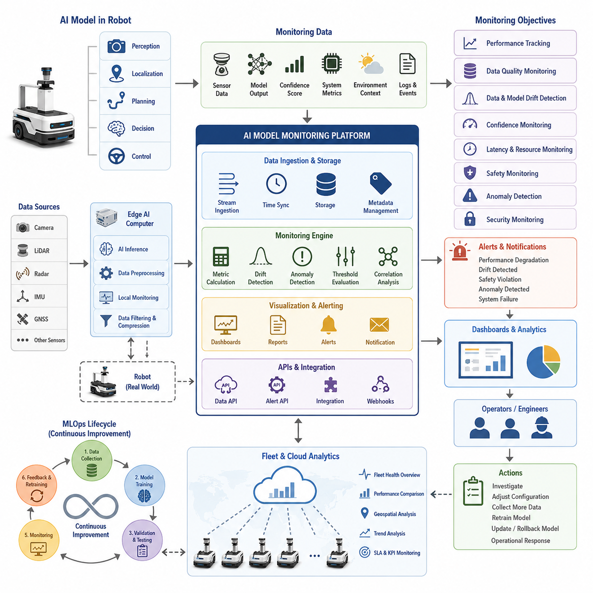
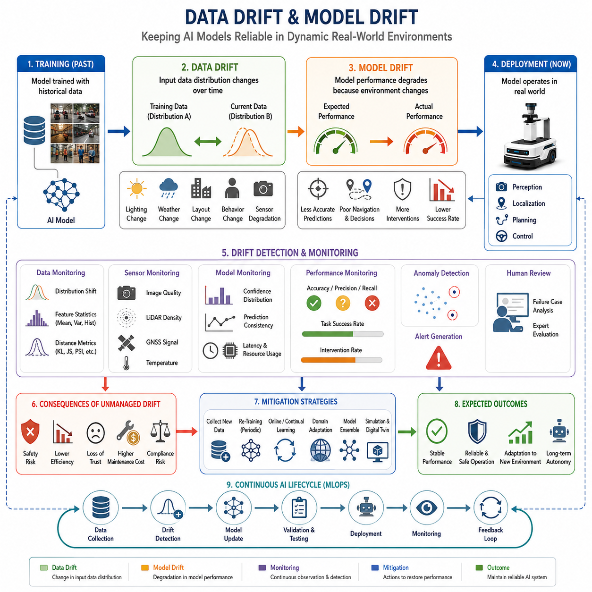
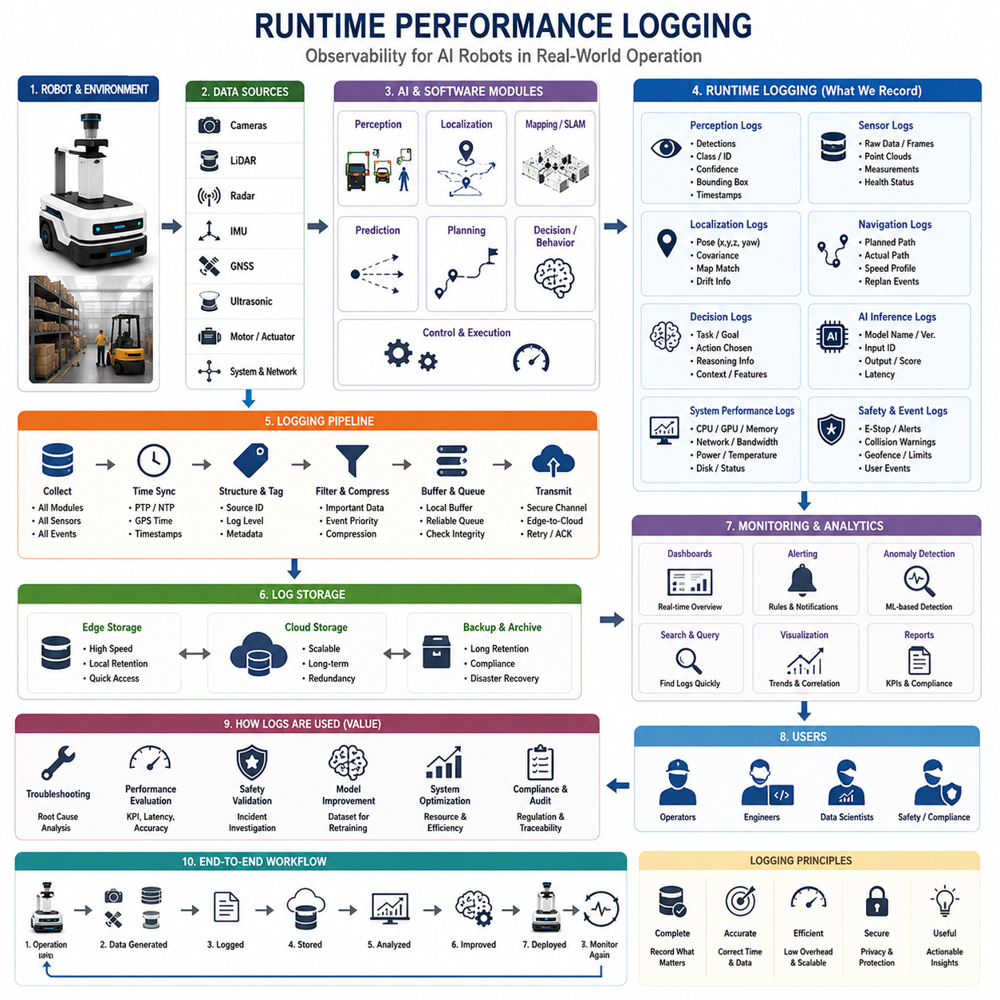
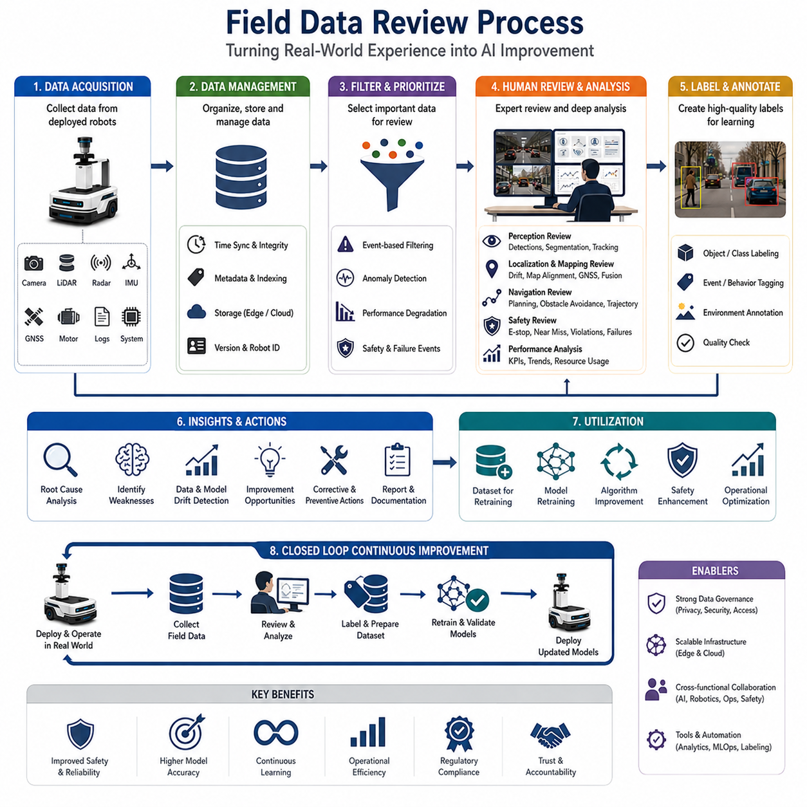
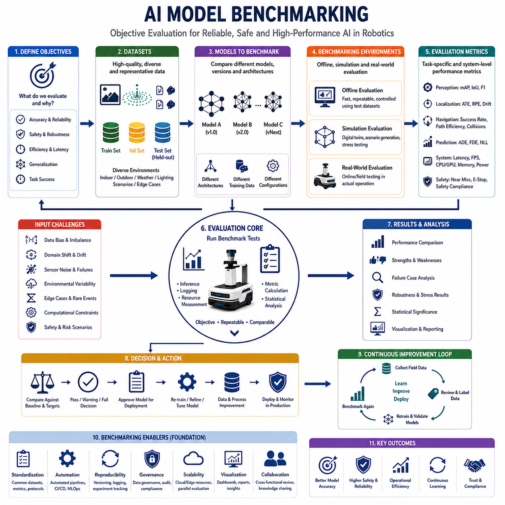
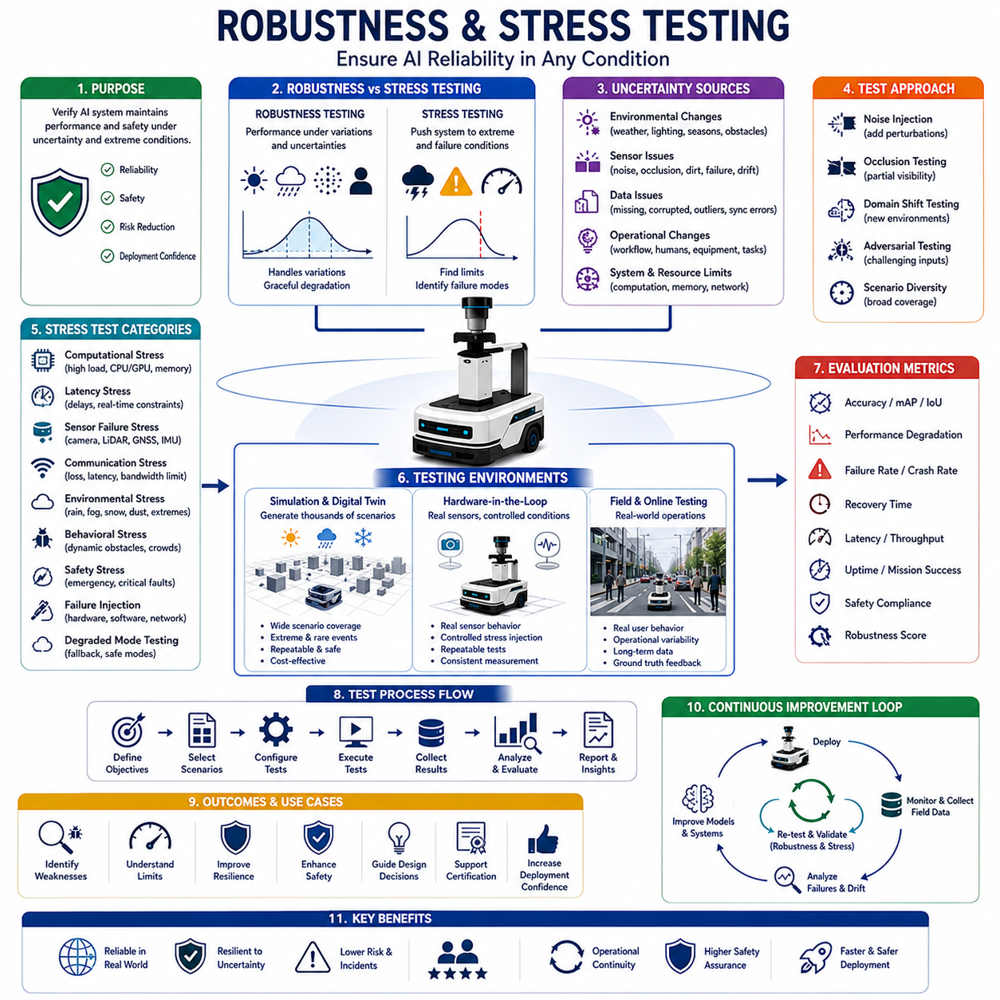
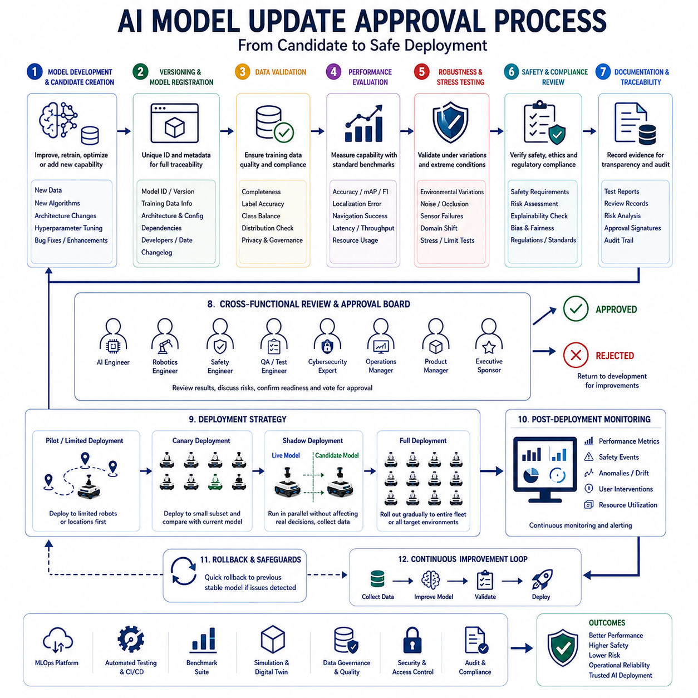
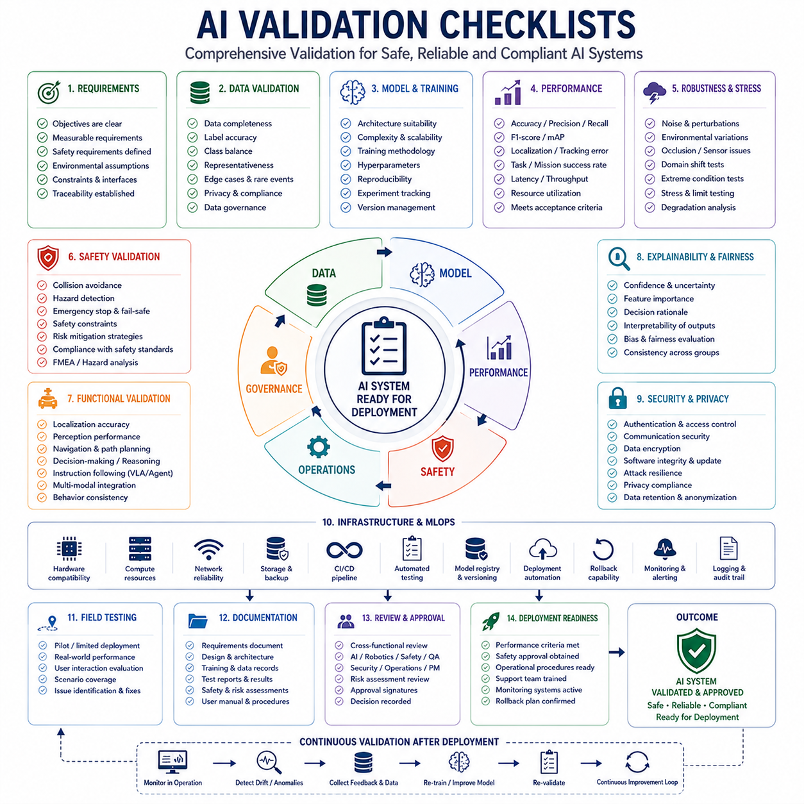

**Volume 06. AMR AI and Embodied Intelligence**


# Chapter 22. AI Monitoring and Validation

##  

## 22.1 AI Model Monitoring Overview

{width="7.268055555555556in" height="7.268055555555556in"}

Artificial Intelligence has become a fundamental component of modern Autonomous Mobile Robots (AMRs), autonomous vehicles, service robots, industrial inspection robots, logistics systems, and emerging embodied AI platforms. As AI models increasingly take responsibility for perception, reasoning, decision-making, prediction, and interaction, the importance of continuously monitoring these models throughout their operational lifecycle has become a critical engineering requirement. AI monitoring is no longer a supplementary activity performed after deployment; it is now an integral part of the overall AI system architecture and operational strategy. In real-world robotic environments, AI models are exposed to continuously changing conditions, dynamic environments, hardware variability, network disruptions, evolving user behavior, and unforeseen edge cases. Consequently, an AI model that performs well during development and testing may gradually degrade in production if monitoring mechanisms are not properly implemented. AI model monitoring provides the visibility, traceability, and operational intelligence necessary to ensure that deployed AI systems remain safe, reliable, efficient, and aligned with operational objectives. This topic belongs to the AI Monitoring and Validation domain within the broader AMR AI and Embodied Intelligence framework.

AI model monitoring can be defined as the continuous observation, measurement, analysis, and evaluation of AI system behavior during runtime. The purpose of monitoring is to determine whether a model continues to operate within expected performance boundaries and whether corrective actions are required. Unlike traditional software monitoring, which primarily focuses on CPU utilization, memory consumption, network activity, and application availability, AI monitoring must evaluate both system-level performance and model-level behavior. An AI application may remain technically operational while simultaneously producing degraded predictions, incorrect classifications, unsafe decisions, or biased outputs. Monitoring therefore extends beyond infrastructure health into the domain of model quality and operational trustworthiness. AI monitoring provides the evidence needed to determine whether deployed intelligence remains effective under real-world conditions.

The AI lifecycle can be broadly divided into development, training, validation, deployment, operation, monitoring, maintenance, and continuous improvement. Monitoring occupies a central position within this lifecycle because it connects development assumptions with operational realities. During training, engineers evaluate models using curated datasets and predefined metrics. During deployment, however, models encounter new environments that may differ significantly from the original training conditions. Monitoring bridges this gap by collecting runtime observations and comparing them against expected performance baselines. The resulting insights drive retraining decisions, parameter tuning, architecture improvements, and operational adjustments. Without monitoring, organizations lose visibility into how AI behaves after deployment and become unable to systematically improve performance over time.

In robotics, AI monitoring is particularly important because AI outputs often influence physical actions. A perception model may identify pedestrians, vehicles, equipment, obstacles, or free space. A planning model may generate navigation trajectories. A task allocation model may assign missions to multiple robots. An LLM-based agent may interpret human instructions and generate robot actions. Any degradation in these models can directly affect safety, productivity, mission success, and user trust. Unlike purely digital systems, robotic platforms operate in physical environments where mistakes can result in property damage, operational downtime, or human safety risks. AI monitoring therefore serves as a protective layer that continuously evaluates model behavior and detects emerging risks before they escalate into operational incidents.

One of the primary objectives of AI monitoring is performance tracking. Performance tracking involves measuring how effectively a model performs its intended function over time. For an object detection model, performance metrics may include detection accuracy, false positive rates, false negative rates, confidence distributions, and inference latency. For a semantic segmentation model, monitoring may include intersection-over-union scores, class-level accuracy, and prediction consistency. For navigation models, monitoring may focus on obstacle avoidance success rates, path efficiency, collision avoidance metrics, and mission completion statistics. These measurements provide quantitative evidence of whether performance remains stable or begins to degrade as environmental conditions evolve.

Another major objective is operational observability. Observability refers to the ability to understand internal system behavior through external measurements. Modern AI systems generate vast amounts of operational data, including sensor inputs, intermediate features, inference outputs, confidence values, decision logs, execution traces, and system diagnostics. Monitoring frameworks aggregate these data streams into a coherent operational view. Engineers can examine why a model made a particular decision, identify conditions associated with failures, and correlate model outputs with environmental variables. Enhanced observability reduces troubleshooting time and supports systematic root-cause analysis.

Data quality monitoring represents another essential component of AI model monitoring. AI systems depend heavily on the quality of input data. Sensors may become misaligned, damaged, obstructed, or degraded over time. Cameras may experience glare, fog, rain, snow, or darkness. LiDAR systems may suffer contamination or reduced visibility. GNSS signals may be disrupted by urban canyons or atmospheric interference. If input data quality deteriorates, model performance will likely decline regardless of model architecture quality. Monitoring systems therefore evaluate sensor integrity, data completeness, synchronization quality, signal distributions, and anomaly indicators. Early detection of sensor issues prevents erroneous AI behavior and reduces operational risk.

Data drift detection is one of the most important functions within AI monitoring. Data drift occurs when the statistical properties of operational data differ significantly from those observed during training. A robot trained primarily in warehouses may later operate in hospitals, campuses, outdoor facilities, or industrial sites. Environmental lighting, object appearances, human behavior patterns, and traffic conditions may differ substantially. These changes alter the data distribution encountered by the model. Monitoring systems continuously compare operational data against historical baselines to detect such shifts. When drift exceeds acceptable thresholds, engineers may initiate retraining procedures, collect new datasets, or modify deployment configurations.

Closely related to data drift is model drift. Model drift occurs when predictive performance deteriorates over time even though the model architecture remains unchanged. This phenomenon often arises because environmental conditions evolve while the model remains static. For example, new vehicle types, equipment designs, uniforms, infrastructure layouts, or operational procedures may appear in deployment environments. As real-world conditions diverge from training assumptions, model accuracy gradually decreases. Monitoring systems identify performance degradation trends and alert operators before significant operational impact occurs. Model drift monitoring is particularly important in long-term deployments spanning months or years.

Confidence monitoring provides another valuable mechanism for runtime supervision. Many AI models produce confidence scores associated with predictions. Monitoring systems analyze confidence distributions across large numbers of inferences. Unexpected changes may indicate environmental anomalies, sensor degradation, data drift, or model uncertainty. Consistently low confidence values may suggest that a model is encountering unfamiliar scenarios. Excessively high confidence combined with poor outcomes may indicate calibration problems. Confidence monitoring therefore serves as an indirect measure of model reliability and situational awareness.

Latency monitoring is equally critical in robotic systems. Even highly accurate AI models can become operationally ineffective if inference times exceed real-time constraints. Autonomous navigation often requires perception updates within tens of milliseconds. Delayed predictions can cause outdated environmental representations and unsafe decisions. Monitoring frameworks continuously measure inference latency, GPU utilization, CPU load, memory consumption, network delays, and communication bottlenecks. These metrics ensure that AI models meet real-time operational requirements and support timely decision-making.

Safety monitoring occupies a central role in robotics AI deployments. Safety monitoring evaluates whether AI outputs remain within predefined operational boundaries. Safety monitors may verify speed limits, obstacle clearance margins, navigation constraints, emergency stop triggers, geofencing rules, and regulatory requirements. In many architectures, independent safety systems operate alongside AI components and validate AI decisions before execution. This layered approach reduces the likelihood of unsafe actions resulting from model errors or unexpected environmental conditions.

Anomaly detection systems significantly enhance AI monitoring capabilities. Anomalies refer to unusual observations that differ from normal operating patterns. These anomalies may originate from sensor failures, environmental changes, cyberattacks, hardware malfunctions, software bugs, or novel situations. AI monitoring platforms often employ statistical analysis, machine learning techniques, or rule-based methods to identify anomalies in real time. Early anomaly detection enables rapid intervention and minimizes operational disruptions.

Logging serves as the foundational infrastructure supporting all monitoring activities. Comprehensive logging captures sensor inputs, inference outputs, confidence values, environmental context, hardware status, decision histories, and execution outcomes. Effective logs provide the evidence required for performance analysis, incident investigations, regulatory compliance, and model improvement initiatives. In advanced robotic systems, logging architectures may support synchronized multimodal data recording across cameras, LiDARs, radar systems, IMUs, GNSS receivers, and onboard computing platforms.

Visualization tools transform raw monitoring data into actionable insights. Dashboards provide real-time visibility into AI health, operational status, performance trends, and system alerts. Engineers can monitor fleet-wide AI behavior across hundreds or thousands of deployed robots. Visual analytics facilitate rapid identification of emerging issues and support informed decision-making. Effective dashboards balance technical detail with operational clarity, enabling both engineers and operations personnel to understand system performance.

Alerting mechanisms complement monitoring by ensuring timely responses to critical conditions. Monitoring systems define thresholds for performance degradation, anomaly detection, resource utilization, safety violations, and operational failures. When thresholds are exceeded, automated alerts notify engineers, operators, or maintenance personnel. Alert prioritization mechanisms help organizations focus attention on the most significant risks while minimizing alarm fatigue.

In large-scale deployments, AI monitoring often operates as part of a broader MLOps ecosystem. MLOps extends traditional DevOps principles into machine learning operations, emphasizing automation, reproducibility, governance, and continuous improvement. Monitoring supplies the operational feedback necessary for MLOps workflows. Data collected during deployment supports retraining, validation, benchmarking, version comparison, rollout management, and model governance activities. Monitoring therefore enables a closed-loop improvement process that continuously enhances AI performance.

Edge AI environments introduce unique monitoring challenges. Many AMRs operate on embedded computing platforms with limited computational resources, storage capacity, and communication bandwidth. Monitoring systems must therefore balance visibility requirements against operational constraints. Edge monitoring often performs local aggregation, filtering, compression, and prioritization before transmitting selected information to centralized cloud platforms. Hybrid cloud-edge monitoring architectures enable scalable deployment while preserving real-time responsiveness.

Cloud robotics platforms further extend monitoring capabilities by aggregating data from entire fleets. Fleet-level monitoring identifies systemic issues that may not be visible at the individual robot level. Organizations can analyze geographic trends, environmental influences, hardware variations, software versions, and operational patterns across large deployments. Fleet analytics accelerate problem identification and support data-driven operational optimization.

Security considerations are increasingly integrated into AI monitoring frameworks. Adversarial attacks, data poisoning, model theft, unauthorized access, and cyber-physical threats can compromise AI system integrity. Monitoring platforms therefore track security-related indicators, including unusual input patterns, unexpected behavior changes, authentication anomalies, communication irregularities, and access control violations. Security monitoring complements traditional cybersecurity measures and strengthens overall system resilience.

As embodied AI systems become more sophisticated, monitoring requirements continue to expand. Future robots will integrate foundation models, multimodal reasoning systems, world models, large language models, vision-language-action architectures, and autonomous agents. Monitoring these complex systems will require deeper observability into reasoning processes, memory utilization, planning chains, contextual understanding, and agent behaviors. Traditional performance metrics alone will be insufficient. Next-generation monitoring platforms must evaluate not only what decisions are made but also why they are made and whether the underlying reasoning remains trustworthy.

Ultimately, AI model monitoring serves as the operational nervous system of intelligent robotic platforms. It transforms deployed AI from a static artifact into a continuously observable, measurable, and improvable capability. Effective monitoring enables organizations to maintain safety, reliability, transparency, and performance throughout the entire operational lifecycle. In AMRs, autonomous vehicles, industrial robots, service robots, and future embodied intelligence systems, monitoring is not merely an engineering best practice but a foundational requirement for achieving scalable, trustworthy, and sustainable AI-driven autonomy. The evolution of robotics will increasingly depend on robust monitoring infrastructures capable of transforming field observations into actionable intelligence, ensuring that deployed AI systems remain adaptive, resilient, and aligned with both technical objectives and real-world operational demands.

# 22_01_AI 모델 모니터링 개요 (AI Model Monitoring Overview)

인공지능은 현대 자율이동로봇(AMR), 자율주행 차량, 서비스 로봇, 산업용 검사 로봇, 물류 자동화 시스템, 그리고 차세대 Embodied AI 플랫폼의 핵심 구성 요소가 되었다. AI 모델이 인식(Perception), 추론(Reasoning), 의사결정(Decision Making), 예측(Prediction), 상호작용(Interaction) 등의 역할을 담당하게 되면서, 이러한 모델을 운영 전 과정에서 지속적으로 관찰하고 관리하는 AI 모델 모니터링의 중요성이 크게 증가하고 있다. AI 모니터링은 더 이상 배포 이후에 수행하는 부가적인 활동이 아니라, 전체 AI 시스템 아키텍처와 운영 전략의 필수 구성 요소로 자리 잡고 있다.

실제 환경에서 동작하는 로봇은 끊임없이 변화하는 환경, 동적인 장애물, 센서 노화, 하드웨어 편차, 네트워크 상태 변화, 예기치 못한 예외 상황 등에 지속적으로 노출된다. 따라서 개발 단계에서 우수한 성능을 보였던 AI 모델이라 하더라도 운영 환경에서는 점진적으로 성능이 저하될 수 있다. AI 모델 모니터링은 이러한 변화를 지속적으로 감시하고 분석하여 시스템이 안전하고 신뢰성 있게 동작하도록 지원한다. 또한 운영 중 발생하는 데이터를 수집하고 해석함으로써 AI 시스템을 지속적으로 개선할 수 있는 기반을 제공한다.

AI 모델 모니터링은 운영 중인 AI 모델의 상태를 지속적으로 관찰하고 측정하며 평가하는 과정으로 정의할 수 있다. 그 목적은 모델이 예상된 성능 범위 내에서 정상적으로 동작하는지 확인하고, 문제가 발생할 경우 적절한 대응을 수행하는 데 있다. 일반적인 소프트웨어 모니터링이 CPU 사용률, 메모리 점유율, 네트워크 상태, 애플리케이션 가용성 등을 확인하는 데 집중한다면, AI 모니터링은 여기에 더해 모델의 예측 품질과 의사결정의 신뢰성까지 평가해야 한다.

AI 시스템은 기술적으로는 정상 동작하는 것처럼 보이더라도 실제로는 잘못된 예측을 하거나 위험한 결정을 내릴 수 있다. 따라서 AI 모니터링은 단순한 시스템 상태 감시를 넘어 모델의 품질과 신뢰성을 지속적으로 평가하는 역할을 수행한다.

AI 개발 생명주기는 일반적으로 데이터 수집, 모델 개발, 학습, 검증, 배포, 운영, 모니터링, 유지보수, 재학습의 단계로 구성된다. 이 가운데 모니터링은 개발 단계의 가정과 실제 운영 환경을 연결하는 핵심 역할을 수행한다. 학습 과정에서는 제한된 데이터셋을 기반으로 모델을 평가하지만, 실제 운영 환경은 훨씬 다양하고 예측하기 어렵다. 모니터링은 운영 환경에서 발생하는 데이터를 지속적으로 수집하여 모델의 실제 성능을 확인하고, 필요할 경우 재학습이나 구조 개선을 수행할 수 있도록 지원한다.

특히 로봇 시스템에서는 AI 모델의 출력이 물리적 행동으로 직접 연결되기 때문에 모니터링의 중요성이 더욱 크다. 객체 인식 모델은 사람, 차량, 장비, 장애물을 식별하며, 경로 계획 모델은 이동 경로를 생성하고, 작업 계획 모델은 로봇의 임무를 결정한다. 또한 LLM 기반 에이전트는 사용자의 자연어 명령을 해석하여 실제 행동으로 변환한다. 이러한 모델이 잘못된 판단을 내릴 경우 생산성 저하를 넘어 안전사고로 이어질 수 있다. 따라서 AI 모니터링은 잠재적인 위험을 조기에 발견하고 대응하기 위한 중요한 안전 장치 역할을 수행한다.

AI 모니터링의 가장 기본적인 목적은 성능 추적(Performance Tracking)이다. 객체 탐지 모델의 경우 탐지 정확도, 오탐(False Positive), 미탐(False Negative), 신뢰도 점수(Confidence Score), 추론 시간(Inference Latency) 등을 지속적으로 측정한다. 의미론적 분할(Semantic Segmentation) 모델은 IoU(Intersection over Union), 클래스별 정확도, 예측 일관성 등을 평가할 수 있다. 자율주행 및 내비게이션 모델은 충돌 회피 성공률, 경로 효율성, 임무 완료율 등의 지표를 통해 성능을 측정한다.

또 다른 중요한 목적은 운영 가시성(Operational Observability)의 확보이다. AI 시스템은 센서 데이터, 중간 특징값, 추론 결과, 신뢰도 점수, 의사결정 로그, 실행 기록 등 방대한 양의 데이터를 생성한다. 모니터링 시스템은 이러한 정보를 통합하여 엔지니어가 모델의 동작 원인을 이해할 수 있도록 지원한다. 이를 통해 특정 결정이 왜 발생했는지 분석할 수 있으며, 문제 발생 시 신속한 원인 분석과 디버깅이 가능해진다.

데이터 품질(Data Quality) 모니터링 역시 매우 중요한 요소이다. AI 모델의 성능은 입력 데이터의 품질에 직접적으로 영향을 받는다. 카메라가 오염되거나 렌즈에 물방울이 맺히는 경우, LiDAR가 먼지로 인해 성능이 저하되는 경우, GNSS 신호가 차단되는 경우 등 센서 문제는 AI 성능 저하로 직결된다. 따라서 모니터링 시스템은 데이터 완전성, 센서 상태, 시간 동기화 품질, 신호 품질 등을 지속적으로 점검해야 한다.

AI 모니터링에서 특히 중요한 개념 중 하나는 데이터 드리프트(Data Drift)이다. 데이터 드리프트는 운영 환경의 데이터 분포가 학습 데이터의 분포와 달라지는 현상을 의미한다. 예를 들어 창고 환경에서 학습한 모델이 병원이나 공장, 야외 환경에서 운용될 경우 조명 조건, 객체 종류, 사람의 행동 패턴 등이 달라질 수 있다. 이러한 변화는 모델 성능 저하의 주요 원인이 된다. 모니터링 시스템은 실시간 데이터를 학습 데이터와 비교하여 데이터 분포 변화 여부를 탐지한다.

모델 드리프트(Model Drift) 또한 중요한 모니터링 대상이다. 모델 드리프트는 환경 변화에 따라 모델 성능이 점진적으로 감소하는 현상이다. 예를 들어 새로운 차량 형태, 새로운 장비, 새로운 복장이나 작업 절차가 등장하면 기존 모델은 점차 정확도를 잃게 된다. 모니터링 시스템은 이러한 성능 저하 추세를 감지하여 재학습 시점을 결정하는 데 활용된다.

신뢰도 모니터링(Confidence Monitoring)은 모델의 불확실성을 평가하는 방법이다. 대부분의 AI 모델은 예측 결과와 함께 신뢰도 점수를 제공한다. 신뢰도 분포가 평소와 다르게 변화하거나 지나치게 낮아질 경우 모델이 익숙하지 않은 환경을 경험하고 있음을 의미할 수 있다. 반대로 지나치게 높은 신뢰도를 보이면서도 실제 결과는 좋지 않은 경우 모델 보정(Calibration) 문제가 존재할 수 있다.

실시간 시스템에서는 지연 시간(Latency) 모니터링도 필수적이다. 아무리 정확한 AI 모델이라도 응답 시간이 지나치게 길다면 실시간 로봇 시스템에서는 사용할 수 없다. 자율주행 로봇은 수십 밀리초 수준의 빠른 인식과 판단이 필요하다. 따라서 GPU 사용률, CPU 부하, 메모리 사용량, 추론 시간, 네트워크 지연 등을 지속적으로 측정해야 한다.

안전 모니터링(Safety Monitoring)은 로봇 AI에서 가장 중요한 영역 중 하나이다. 안전 모니터링은 AI가 생성한 결과가 정의된 안전 기준을 만족하는지 확인한다. 속도 제한, 장애물과의 최소 거리, 위험 지역 접근 제한, 비상 정지 조건 등이 대표적인 예이다. 실제 산업용 로봇 시스템에서는 AI 모델과 독립적으로 동작하는 안전 감시 모듈이 존재하며, AI의 결정을 최종적으로 검증한 후 실행을 허가하는 구조가 널리 사용된다.

이상 탐지(Anomaly Detection)는 AI 모니터링의 핵심 기술 중 하나이다. 이상 현상은 센서 고장, 환경 변화, 소프트웨어 오류, 하드웨어 문제, 사이버 공격, 새로운 환경 조건 등 다양한 원인으로 발생할 수 있다. 이상 탐지 시스템은 통계적 기법이나 머신러닝 알고리즘을 활용하여 정상 패턴과 다른 현상을 자동으로 탐지하고 경고를 발생시킨다.

모든 모니터링 시스템의 기반은 로깅(Logging)이다. 로깅 시스템은 센서 데이터, AI 추론 결과, 신뢰도 값, 시스템 상태, 의사결정 기록 등을 저장한다. 이러한 로그는 성능 분석, 장애 조사, 규제 대응, 모델 개선을 위한 핵심 자료로 활용된다. 특히 로봇 시스템에서는 카메라, LiDAR, Radar, IMU, GNSS 등의 데이터를 시간 동기화하여 기록하는 것이 매우 중요하다.

시각화(Visualization)는 수집된 데이터를 사람이 이해할 수 있도록 변환하는 역할을 한다. 대시보드는 AI 모델의 상태, 성능 변화, 시스템 건강도, 경고 이벤트 등을 실시간으로 표시한다. 이를 통해 운영자는 수백 대 또는 수천 대 규모의 로봇 플릿(Fleet)에 대한 상태를 한눈에 파악할 수 있다.

알림(Alerting) 시스템은 모니터링 결과에 대한 신속한 대응을 가능하게 한다. 성능 저하, 데이터 드리프트, 이상 탐지, 안전 위반 등의 상황이 발생하면 자동으로 엔지니어 또는 운영자에게 통보한다. 적절한 임계값 설정과 우선순위 관리는 불필요한 경고를 줄이고 중요한 문제에 집중할 수 있도록 돕는다.

대규모 로봇 시스템에서는 AI 모니터링이 MLOps의 핵심 구성 요소로 활용된다. MLOps는 머신러닝 모델의 개발, 배포, 운영, 개선을 자동화하는 체계이다. 모니터링을 통해 수집된 운영 데이터는 재학습, 성능 비교, 모델 승인, 버전 관리 등에 활용되며 지속적인 성능 개선을 가능하게 한다.

엣지 AI 환경에서는 제한된 컴퓨팅 자원과 통신 대역폭 때문에 효율적인 모니터링 구조가 필요하다. 일반적으로 엣지 장치는 데이터를 선별적으로 수집하고 요약한 뒤 클라우드로 전송한다. 클라우드는 다수의 로봇으로부터 데이터를 통합하여 보다 심층적인 분석을 수행한다.

플릿 수준의 AI 모니터링은 개별 로봇에서는 발견하기 어려운 문제를 식별할 수 있게 한다. 지역별 성능 차이, 환경 영향, 하드웨어 버전별 문제, 소프트웨어 업데이트 효과 등을 분석하여 전체 운영 효율성을 향상시킬 수 있다.

최근에는 AI 보안(Security Monitoring)도 중요한 모니터링 영역으로 부상하고 있다. 적대적 공격(Adversarial Attack), 데이터 오염(Data Poisoning), 모델 탈취(Model Theft), 비인가 접근 등의 위협이 증가하면서 AI 시스템의 보안 상태를 실시간으로 감시하는 기능이 요구되고 있다.

향후 Embodied AI, Foundation Model, Vision-Language-Action 모델, Robot Agent, World Model 기반 시스템이 확산되면서 AI 모니터링의 역할은 더욱 확대될 것이다. 미래의 모니터링 시스템은 단순히 성능 지표를 측정하는 수준을 넘어 AI의 추론 과정, 기억 구조, 계획 과정, 에이전트 행동의 적절성까지 분석해야 할 것으로 예상된다.

결국 AI 모델 모니터링은 지능형 로봇 시스템의 신경계와 같은 역할을 수행한다. 모니터링은 배포된 AI를 단순한 소프트웨어가 아닌 지속적으로 관찰되고 개선되는 지능 시스템으로 전환시킨다. 안전성, 신뢰성, 투명성, 성능을 유지하기 위해 AI 모니터링은 필수적인 기술이며, 미래의 AMR, 자율주행차, 산업용 로봇, 휴머노이드, Embodied AI 플랫폼의 성공은 강력한 모니터링 체계 구축에 크게 의존하게 될 것이다.

##  

## 22.2 Data Drift and Model Drift

{width="7.268055555555556in" height="7.268055555555556in"}

# 22_02_Data Drift and Model Drift

Artificial Intelligence systems deployed in Autonomous Mobile Robots (AMRs), autonomous vehicles, industrial robots, service robots, and embodied intelligence platforms are expected to operate continuously in dynamic and constantly evolving environments. During development, AI models are trained and validated using carefully prepared datasets that represent expected operating conditions. However, once these models are deployed into real-world environments, the assumptions made during training gradually become less accurate. Environmental conditions change, operational workflows evolve, hardware components age, user behavior shifts, and entirely new situations emerge. As a result, the statistical characteristics of incoming data and the effectiveness of AI models may change over time. These phenomena are commonly known as Data Drift and Model Drift. Understanding, detecting, and mitigating these drifts are among the most important responsibilities of AI monitoring and validation systems because they directly affect safety, reliability, accuracy, and operational performance. Data Drift and Model Drift form a fundamental component of AI lifecycle management within robotics and intelligent autonomous systems.

Data Drift refers to a situation in which the characteristics of operational data differ significantly from the data used during model training. In other words, the input distribution encountered by the deployed model gradually changes over time. Although the model itself remains unchanged, the information being provided to the model no longer matches the statistical patterns it learned during training. Since machine learning models rely heavily on the assumption that future data resembles historical data, significant deviations can reduce prediction quality and decision accuracy.

The concept of Data Drift originates from the principle that machine learning systems are fundamentally data-dependent. During training, models learn relationships between input features and expected outputs. These relationships are optimized based on observed examples. If future inputs differ substantially from those examples, the model may encounter situations outside its learned experience. Consequently, predictions become less reliable even when the model architecture and weights remain unchanged.

In robotic systems, Data Drift is particularly common because robots operate in highly dynamic environments. Consider an AMR deployed in a warehouse. During development, training data may have been collected under specific lighting conditions, with particular shelf arrangements, floor markings, worker uniforms, and equipment types. Over time, warehouse layouts may change, inventory may be reorganized, lighting systems may be upgraded, and new machinery may be introduced. Although these changes may appear minor from a human perspective, they can significantly alter the statistical properties of sensor data observed by AI models.

Data Drift can occur in several forms. One of the most common forms is Covariate Drift. Covariate Drift occurs when the distribution of input features changes while the relationship between inputs and outputs remains relatively stable. For example, an object detection model may continue to recognize forklifts correctly, but the appearance of forklifts may change because a new model of forklift has been introduced. Similarly, weather conditions may alter camera images without changing the fundamental definition of objects within the scene.

Another form is Prior Probability Drift. This occurs when the frequency of certain classes changes over time. For instance, a hospital delivery robot may have been trained in an environment where pedestrians represented the majority of moving obstacles. After deployment, autonomous cleaning machines, wheelchairs, and service carts may become more common. Although the appearance of individual classes remains unchanged, their relative frequency changes, affecting prediction behavior and operational performance.

Concept Drift represents another important category. In this case, the relationship between inputs and outputs changes over time. For example, traffic behavior patterns in an outdoor robot deployment may change because of new operational procedures or infrastructure modifications. The same visual inputs may now correspond to different expected actions. Concept Drift is particularly challenging because the underlying assumptions learned by the model become invalid.

Sensor-related Data Drift is especially significant in robotics. Cameras may accumulate dirt, moisture, scratches, or lens degradation. LiDAR systems may experience reduced reflectivity performance due to contamination. GNSS signals may fluctuate because of new buildings, changing weather patterns, or electromagnetic interference. Thermal cameras may exhibit calibration shifts over long-term operation. These sensor variations alter incoming data distributions and can gradually reduce model performance.

Environmental drift is another major source of Data Drift. Indoor robots encounter changing lighting conditions, seasonal decorations, moving furniture, and evolving facility layouts. Outdoor robots face changing weather, sunlight angles, vegetation growth, snow accumulation, rain, fog, dust, and road construction activities. Every environmental change influences sensor observations and contributes to distribution shifts.

Operational drift occurs when human behavior or business processes evolve. For example, a logistics center may introduce new workflows that change traffic patterns. A hospital may adopt new patient transport procedures. A factory may modify production layouts. These operational changes affect robot interactions and alter the context in which AI models operate.

While Data Drift focuses on changes in inputs, Model Drift refers to degradation in model performance over time. Model Drift occurs when the predictive effectiveness of a model declines because the environment has evolved beyond the assumptions captured during training. In essence, Data Drift often becomes the underlying cause of Model Drift, although the two concepts are not identical.

A model experiencing drift may still produce predictions, but those predictions become increasingly inaccurate, inconsistent, or unreliable. Performance metrics such as accuracy, precision, recall, detection rates, navigation success rates, mission completion rates, or user satisfaction scores gradually deteriorate. Model Drift represents the operational manifestation of changing environmental realities.

In robotic perception systems, Model Drift may appear as declining object detection accuracy. An object recognition model trained several years earlier may fail to recognize new equipment types introduced into a facility. Semantic segmentation models may struggle with newly painted floors or modified infrastructure. Human detection systems may become less effective when worker uniforms change significantly.

In navigation systems, Model Drift may manifest as increased path planning failures, inefficient route generation, unexpected stops, or elevated intervention rates. A model trained in one environment may become progressively less effective as that environment evolves.

In large language model-based robot agents, Model Drift can emerge when task requirements change. User expectations, operational procedures, and organizational policies may evolve. Instructions that were previously correct may no longer align with current operational requirements. The language model remains unchanged, but its responses become less useful because the surrounding context has shifted.

Model Drift can be categorized into gradual drift, sudden drift, recurring drift, and incremental drift. Gradual drift occurs slowly over extended periods. Environmental changes accumulate over weeks, months, or years, causing performance degradation that may initially go unnoticed. Sudden drift occurs when a significant change immediately alters operating conditions. Examples include facility renovations, sensor replacements, software updates, or operational policy changes.

Recurring drift appears when environmental conditions cycle through predictable patterns. Seasonal weather variations provide a common example. A robot may encounter different visual environments during summer, winter, daytime, and nighttime operations. Performance may fluctuate according to recurring environmental cycles.

Incremental drift occurs through a series of small changes that individually appear insignificant but collectively produce substantial deviations over time. Many real-world deployments experience this form of drift because environments evolve continuously rather than through abrupt transformations.

Detecting Data Drift and Model Drift is a central objective of AI monitoring systems. Drift detection requires continuous observation of both input characteristics and output performance metrics. Modern monitoring platforms employ statistical methods, machine learning techniques, and operational analytics to identify drift before significant performance degradation occurs.

Statistical distribution monitoring is among the most common approaches for detecting Data Drift. Input features observed during operation are compared against baseline distributions established during training. Metrics such as mean values, variances, feature correlations, histograms, probability distributions, and embedding representations are continuously evaluated. Significant deviations indicate potential drift.

Distance-based methods are frequently used to quantify distribution changes. Techniques such as Kullback-Leibler divergence, Jensen-Shannon divergence, Wasserstein distance, and Population Stability Index provide numerical measures of distribution similarity. Monitoring systems establish thresholds beyond which alerts are generated for further investigation.

Feature monitoring focuses on individual sensor measurements and derived features. Camera brightness distributions, LiDAR point densities, object size distributions, velocity profiles, environmental temperatures, and other characteristics are continuously analyzed. Unexpected shifts may indicate environmental changes, sensor degradation, or operational anomalies.

Confidence monitoring provides an indirect mechanism for drift detection. Many AI models generate confidence scores alongside predictions. When confidence distributions change significantly, the model may be encountering unfamiliar conditions. A sudden increase in low-confidence predictions often serves as an early warning indicator of Data Drift.

Model Drift detection typically relies on performance measurements. Ground truth data collected during operation enables direct comparison between predictions and actual outcomes. Detection accuracy, classification performance, navigation success rates, obstacle avoidance effectiveness, and mission completion statistics provide valuable indicators of model health.

In some deployments, obtaining immediate ground truth may be difficult. Consequently, proxy metrics are often used. Intervention frequency, emergency stop activations, manual overrides, operator corrections, customer complaints, and abnormal behavior reports can serve as indirect indicators of Model Drift.

Human-in-the-loop review processes remain important for drift assessment. Engineers periodically review operational data samples, failure cases, edge scenarios, and unusual events. Human expertise helps identify emerging issues that automated monitoring systems may overlook.

The consequences of unmanaged drift can be severe. Safety risks increase when perception systems fail to recognize critical obstacles. Operational efficiency declines when navigation models generate suboptimal paths. Customer trust erodes when robots behave unpredictably. Maintenance costs rise as troubleshooting efforts become more frequent. In large fleets, even small performance degradations can produce significant financial impacts.

Mitigation strategies focus on maintaining alignment between deployed models and operational environments. Continuous data collection represents the foundation of drift management. Operational data must be systematically captured, stored, and analyzed. High-quality datasets reflecting current operating conditions enable retraining and adaptation.

Periodic retraining is one of the most effective responses to drift. Updated datasets containing recent operational examples are incorporated into the training process. Models learn new environmental characteristics while preserving previously acquired knowledge. Retraining schedules may be periodic or triggered automatically by monitoring alerts.

Online learning and continual learning approaches provide more advanced solutions. Rather than waiting for scheduled retraining cycles, models adapt incrementally as new data becomes available. Although these methods offer improved adaptability, they require careful validation to prevent unintended performance degradation.

Domain adaptation techniques help models generalize across changing environments. Transfer learning, self-supervised learning, synthetic data generation, and multimodal fusion can reduce sensitivity to environmental variations. Robust models are inherently more resistant to drift.

Model ensembles also improve resilience. Multiple models trained under different conditions can operate simultaneously. Ensemble strategies reduce dependence on a single model and provide improved stability across diverse environments.

Simulation environments play an increasingly important role in drift management. Digital twins and virtual testing platforms allow engineers to evaluate models under a wide range of environmental conditions before deployment. Simulated weather variations, lighting conditions, sensor degradations, and infrastructure modifications help identify potential drift vulnerabilities.

MLOps platforms integrate drift monitoring into the broader AI lifecycle. Automated pipelines continuously collect operational data, evaluate performance, detect drift, trigger retraining workflows, conduct validation testing, and manage deployment approvals. This closed-loop process ensures that AI systems remain aligned with real-world conditions throughout their operational lifetime.

In safety-critical robotic applications, drift management becomes an essential component of operational governance. Regulatory compliance, functional safety requirements, and risk management frameworks increasingly demand evidence that deployed AI systems are continuously monitored and maintained. Drift detection provides the observational capability required to demonstrate ongoing system reliability.

As robotics evolves toward foundation models, multimodal intelligence, robot agents, vision-language-action architectures, and embodied AI systems, the complexity of drift management will increase substantially. Future AI systems will not only process sensor data but also reason about goals, plans, context, and interactions. Monitoring must therefore extend beyond simple statistical distributions to include reasoning quality, planning consistency, memory utilization, contextual adaptation, and behavioral alignment.

Ultimately, Data Drift and Model Drift represent unavoidable realities of deploying AI into the physical world. Real environments continuously evolve, and no training dataset can fully capture future operating conditions. The objective of AI monitoring is not to eliminate drift entirely but to detect it rapidly, understand its causes, assess its impact, and implement corrective actions before safety or performance are compromised. Organizations that establish robust drift monitoring frameworks gain the ability to maintain trustworthy, adaptive, and continuously improving AI systems. In AMRs, autonomous vehicles, industrial robotics, service robots, and future embodied intelligence platforms, effective drift management will remain one of the most critical foundations of long-term autonomous operation.

# 22_02 데이터 드리프트와 모델 드리프트 (Data Drift and Model Drift)

자율이동로봇(AMR), 자율주행차, 산업용 로봇, 서비스 로봇, 그리고 Embodied AI 플랫폼에 적용되는 인공지능 시스템은 지속적으로 변화하는 실제 환경에서 장기간 안정적으로 동작해야 한다. AI 모델은 개발 단계에서 특정 데이터셋을 기반으로 학습되고 검증되지만, 실제 운영 환경은 시간이 흐르면서 끊임없이 변화한다. 조명 조건이 달라지고, 시설 구조가 변경되며, 사용자 행동 패턴이 변하고, 새로운 장비와 객체가 등장한다. 또한 하드웨어는 노후화되고 센서 성능은 점진적으로 변화한다. 이러한 변화는 학습 당시의 가정과 실제 환경 사이에 차이를 발생시키며, 결국 AI 모델의 성능 저하를 유발할 수 있다.

이러한 현상을 설명하는 대표적인 개념이 데이터 드리프트(Data Drift)와 모델 드리프트(Model Drift)이다. 두 개념은 AI 모니터링과 검증 분야의 핵심 주제이며, AI 시스템의 안전성, 신뢰성, 정확성, 운영 효율성을 유지하기 위해 반드시 관리해야 하는 요소이다.

데이터 드리프트는 운영 중 입력되는 데이터의 특성이 학습 데이터의 특성과 달라지는 현상을 의미한다. 모델 자체는 변하지 않았지만 모델이 입력받는 데이터의 통계적 분포가 변화한 상태이다. 머신러닝 모델은 일반적으로 학습 데이터와 실제 운영 데이터가 유사하다는 가정을 전제로 동작한다. 따라서 입력 데이터의 특성이 크게 달라지면 모델은 자신이 경험하지 못한 상황을 만나게 되고 예측 품질이 점차 저하된다.

머신러닝 모델은 학습 과정에서 입력과 출력 사이의 관계를 학습한다. 그러나 실제 운영 환경의 데이터가 학습 당시와 다르게 변화하면 모델이 학습한 관계가 더 이상 유효하지 않을 수 있다. 결과적으로 모델은 잘못된 예측을 수행하거나 불안정한 결정을 내리게 된다.

로봇 시스템에서는 데이터 드리프트가 매우 흔하게 발생한다. 예를 들어 물류 창고에서 운영되는 AMR을 생각해 보면, 초기 학습 데이터는 특정 조명 환경, 특정 선반 구조, 특정 작업자 복장, 특정 장비 구성을 기반으로 수집되었을 수 있다. 그러나 시간이 지나면서 창고 레이아웃이 변경되고, 새로운 장비가 도입되며, 조명 시스템이 교체되고, 작업 방식이 달라질 수 있다. 사람에게는 작은 변화처럼 보일 수 있지만 AI 모델 입장에서는 입력 데이터의 통계적 특성이 크게 변한 것으로 인식될 수 있다.

데이터 드리프트는 여러 형태로 나타난다. 가장 대표적인 형태는 공변량 드리프트(Covariate Drift)이다. 이는 입력 데이터의 분포는 변하지만 입력과 출력 사이의 관계는 크게 변하지 않는 경우를 의미한다. 예를 들어 객체 탐지 모델이 지게차를 인식하도록 학습되었는데, 새로운 디자인의 지게차가 도입되면서 외형이 달라진 경우가 이에 해당한다. 객체의 의미는 같지만 입력 데이터의 분포가 달라진 것이다.

사전 확률 드리프트(Prior Probability Drift)는 특정 클래스의 발생 빈도가 변하는 현상이다. 예를 들어 병원 배송 로봇이 처음에는 사람을 주된 이동 장애물로 인식하도록 학습되었지만, 이후 자율 청소 로봇이나 전동 휠체어의 수가 증가한다면 장애물 구성 비율이 달라진다. 객체 자체는 변하지 않지만 등장 빈도의 변화가 모델 성능에 영향을 줄 수 있다.

개념 드리프트(Concept Drift)는 더욱 심각한 형태의 변화이다. 이는 입력과 출력 사이의 관계 자체가 변하는 현상이다. 예를 들어 특정 교차로에서의 교통 흐름이나 작업 절차가 변경되면 동일한 입력에 대해 이전과 다른 행동이 요구될 수 있다. 이 경우 기존 모델이 학습한 규칙 자체가 더 이상 유효하지 않게 된다.

센서 기반 데이터 드리프트는 로봇 분야에서 매우 중요한 문제이다. 카메라는 먼지, 습기, 스크래치, 렌즈 노화의 영향을 받을 수 있다. LiDAR는 오염으로 인해 반사 특성이 변화할 수 있으며, GNSS는 새로운 건물이나 전파 간섭에 의해 정확도가 감소할 수 있다. 열화상 카메라는 장기 운용 과정에서 캘리브레이션이 변할 수 있다. 이러한 변화는 모두 입력 데이터의 특성을 변화시키고 데이터 드리프트를 유발한다.

환경 변화 역시 중요한 원인이다. 실내 로봇은 계절별 조명 변화, 시설 구조 변경, 가구 이동, 장식물 설치 등의 영향을 받는다. 실외 로봇은 비, 눈, 안개, 먼지, 햇빛 방향 변화, 식생 성장, 도로 공사 등의 영향을 받는다. 이러한 환경 변화는 카메라와 LiDAR 데이터의 분포를 지속적으로 변화시킨다.

운영 방식의 변화 또한 데이터 드리프트를 발생시킨다. 물류센터의 동선 변경, 병원의 환자 이동 정책 변경, 공장의 생산 프로세스 변경은 모두 로봇이 경험하는 환경을 변화시키며 새로운 데이터 분포를 생성한다.

반면 모델 드리프트(Model Drift)는 모델 자체의 성능이 시간이 지남에 따라 감소하는 현상을 의미한다. 데이터 드리프트가 입력 데이터의 변화에 초점을 맞춘 개념이라면, 모델 드리프트는 그 결과로 나타나는 성능 저하 현상에 초점을 맞춘다.

모델 드리프트가 발생하면 AI 모델은 여전히 결과를 출력하지만 정확도와 신뢰성이 점차 감소한다. 객체 인식 정확도가 낮아지고, 잘못된 분류가 증가하며, 경로 계획의 품질이 떨어지고, 임무 성공률이 감소하게 된다.

로봇 비전 시스템에서는 새로운 장비나 새로운 형태의 차량이 등장했을 때 객체 탐지 정확도가 감소할 수 있다. 의미론적 분할 모델은 새롭게 칠해진 바닥이나 변경된 시설 구조를 제대로 인식하지 못할 수 있다. 사람 인식 시스템은 작업복 디자인이 크게 변경되면 정확도가 떨어질 수 있다.

자율주행 시스템에서는 경로 생성 실패, 비효율적인 이동 경로, 불필요한 정지, 수동 개입 증가 등이 모델 드리프트의 형태로 나타난다. 운영 환경이 변화함에 따라 기존 모델의 효율성이 감소하는 것이다.

LLM 기반 로봇 에이전트의 경우에도 모델 드리프트가 발생할 수 있다. 조직의 업무 절차나 운영 규칙이 변경되면 과거에는 적절했던 응답이 더 이상 적절하지 않을 수 있다. 모델은 그대로지만 환경과 요구사항이 변하면서 성능 저하가 발생하는 것이다.

모델 드리프트는 점진적 드리프트, 급격한 드리프트, 반복적 드리프트, 누적적 드리프트로 구분할 수 있다.

점진적 드리프트는 수개월 또는 수년에 걸쳐 서서히 발생하는 성능 저하를 의미한다. 작은 변화들이 누적되면서 모델 성능이 점차 감소한다.

급격한 드리프트는 시설 개조, 센서 교체, 대규모 운영 정책 변경과 같이 환경이 갑자기 변하는 경우에 발생한다. 성능 저하가 즉시 나타날 수 있다.

반복적 드리프트는 계절 변화와 같이 주기적으로 반복되는 환경 변화에서 발생한다. 여름과 겨울, 주간과 야간 환경이 반복적으로 변화하면서 모델 성능도 함께 변동한다.

누적적 드리프트는 개별적으로는 미미한 변화들이 장기간 누적되면서 큰 성능 차이를 만드는 경우를 의미한다. 실제 산업 현장에서는 이러한 형태가 매우 흔하게 발생한다.

데이터 드리프트와 모델 드리프트를 탐지하는 것은 AI 모니터링 시스템의 핵심 목표 중 하나이다. 이를 위해 입력 데이터와 출력 성능을 지속적으로 관찰해야 한다.

가장 일반적인 방법은 통계적 분포 비교이다. 운영 데이터의 평균, 분산, 히스토그램, 특징 벡터 분포 등을 학습 데이터와 비교하여 차이를 측정한다. 분포 차이가 일정 수준 이상 증가하면 드리프트 가능성을 경고한다.

이를 정량적으로 평가하기 위해 Kullback-Leibler Divergence, Jensen-Shannon Divergence, Wasserstein Distance, Population Stability Index 등의 지표가 널리 활용된다. 이러한 수치는 현재 데이터 분포와 과거 데이터 분포 사이의 차이를 수학적으로 측정한다.

특징값 모니터링도 중요하다. 카메라 밝기, LiDAR 포인트 밀도, 객체 크기 분포, 이동 속도 분포, 온도 변화 등의 특징을 지속적으로 추적하여 이상 징후를 탐지할 수 있다.

신뢰도 점수 모니터링 역시 효과적인 방법이다. 대부분의 AI 모델은 예측 결과와 함께 신뢰도 값을 제공한다. 신뢰도 분포가 갑자기 낮아지거나 변동성이 증가하면 모델이 익숙하지 않은 환경을 경험하고 있을 가능성이 높다.

모델 드리프트는 실제 성능 지표를 통해 평가된다. 객체 탐지 정확도, 분류 정확도, 충돌 회피 성공률, 임무 성공률, 경로 계획 품질 등의 지표가 대표적이다.

실제 정답 데이터를 즉시 확보하기 어려운 경우에는 대체 지표가 사용된다. 수동 개입 횟수, 비상 정지 발생 빈도, 운영자 수정 횟수, 사용자 불만 건수, 장애 보고 건수 등이 모델 성능 저하를 간접적으로 나타낼 수 있다.

인간 전문가의 검토 역시 여전히 중요하다. 엔지니어는 주기적으로 운영 데이터를 검토하고 실패 사례를 분석하며 자동화된 시스템이 발견하지 못한 문제를 찾아낸다.

드리프트를 방치할 경우 다양한 문제가 발생한다. 객체 인식 실패는 안전사고로 이어질 수 있으며, 경로 계획 성능 저하는 운영 효율성을 감소시킨다. 고객 신뢰도는 하락하고 유지보수 비용은 증가한다. 특히 대규모 플릿에서는 작은 성능 저하도 큰 경제적 손실로 이어질 수 있다.

이를 해결하기 위한 가장 기본적인 방법은 지속적인 데이터 수집이다. 운영 환경의 데이터를 체계적으로 저장하고 분석하여 최신 환경을 반영하는 데이터셋을 구축해야 한다.

주기적인 재학습(Retraining)은 가장 널리 사용되는 대응 방법이다. 최신 데이터를 활용하여 모델을 다시 학습시키면 변화된 환경에 적응할 수 있다.

온라인 학습(Online Learning)과 지속 학습(Continual Learning)은 더욱 발전된 방식이다. 모델이 새로운 데이터를 지속적으로 반영하여 실시간에 가깝게 적응할 수 있도록 한다. 다만 새로운 오류가 발생하지 않도록 철저한 검증 체계가 필요하다.

도메인 적응(Domain Adaptation) 기술은 환경 변화에 대한 강인성을 높인다. 전이학습, 자기지도학습, 합성 데이터 생성, 멀티모달 융합 등의 기법이 활용된다.

앙상블 모델도 드리프트 대응에 효과적이다. 서로 다른 환경에서 학습된 여러 모델을 함께 사용하면 특정 환경 변화에 대한 민감도를 줄일 수 있다.

디지털 트윈과 시뮬레이션 역시 중요한 역할을 수행한다. 다양한 조명, 날씨, 센서 상태, 시설 구조를 가상 환경에서 재현함으로써 실제 배포 전에 드리프트 위험을 평가할 수 있다.

MLOps 플랫폼은 드리프트 관리를 자동화한다. 운영 데이터 수집, 드리프트 탐지, 재학습, 검증, 배포 승인 과정을 자동으로 수행하여 AI 모델이 항상 최신 환경에 적응하도록 지원한다.

안전이 중요한 로봇 시스템에서는 드리프트 관리가 필수적인 운영 활동이다. 기능 안전과 위험 관리 체계는 AI 모델이 지속적으로 감시되고 유지관리된다는 근거를 요구한다. 드리프트 모니터링은 이러한 요구사항을 충족하는 핵심 수단이 된다.

앞으로 Foundation Model, Vision-Language-Action 모델, Robot Agent, World Model, Embodied AI 시스템이 확산됨에 따라 드리프트 관리의 복잡성은 더욱 증가할 것이다. 미래의 모니터링 시스템은 단순한 데이터 분포뿐 아니라 추론 품질, 계획 과정, 기억 구조, 에이전트 행동의 일관성까지 평가해야 할 것이다.

결국 데이터 드리프트와 모델 드리프트는 실제 환경에서 AI를 운영하는 이상 피할 수 없는 현상이다. 중요한 것은 드리프트를 완전히 제거하는 것이 아니라 빠르게 탐지하고 원인을 분석하며 적절한 대응 조치를 수행하는 것이다. 강력한 드리프트 관리 체계를 구축한 조직은 AI 시스템의 안전성과 신뢰성을 장기간 유지할 수 있으며, AMR, 자율주행차, 산업용 로봇, 서비스 로봇, 그리고 미래의 Embodied AI 플랫폼에서도 지속 가능한 자율성을 실현할 수 있다.

##  

## 22.3 Runtime Performance Logging

{width="7.268055555555556in" height="7.268055555555556in"}

Runtime Performance Logging is one of the most important operational capabilities in modern AI systems, autonomous robots, Autonomous Mobile Robots (AMRs), autonomous vehicles, industrial automation platforms, and embodied intelligence systems. While model training and validation provide evidence that an AI model performs well under controlled testing conditions, actual deployment environments introduce a wide range of uncertainties that cannot be fully captured during development. Environmental changes, sensor degradation, hardware variations, network instability, software updates, unexpected user behavior, and unforeseen edge cases can significantly influence the behavior of deployed AI systems. Runtime Performance Logging provides the mechanism for continuously recording, analyzing, and understanding the operational behavior of AI models and robotic systems while they are actively performing real-world tasks. It forms the foundation of AI observability, operational monitoring, failure analysis, safety validation, and continuous improvement throughout the lifecycle of intelligent robotic platforms.

At its core, Runtime Performance Logging refers to the systematic collection of information generated during the execution of an AI system. Unlike offline testing logs that are produced in controlled environments, runtime logs capture the actual behavior of deployed systems under real operational conditions. These logs provide visibility into how AI models perceive their environment, make decisions, allocate resources, execute actions, and respond to unexpected situations. Without comprehensive logging, engineers and operators have little insight into the reasons behind successful operations or failures. Runtime logging therefore transforms complex AI systems from opaque black boxes into observable and diagnosable systems.

In robotics, runtime logging serves multiple purposes simultaneously. It supports operational monitoring, enables performance evaluation, facilitates troubleshooting, assists regulatory compliance, supports safety investigations, provides training data for future model improvements, and contributes to long-term system optimization. A well-designed logging framework ensures that every significant event occurring within the robotic system can be reconstructed, analyzed, and understood after deployment.

The need for runtime logging becomes particularly apparent when considering the complexity of modern robotic architectures. A typical intelligent robot may include multiple cameras, LiDAR sensors, radar systems, ultrasonic sensors, GNSS receivers, IMUs, motor controllers, navigation modules, perception models, planning algorithms, localization systems, safety monitors, cloud communication interfaces, and AI decision-making components. Each subsystem generates data continuously. Understanding the overall behavior of the robot requires correlating information from all these sources. Runtime logging provides the common infrastructure that enables such correlation.

One of the primary objectives of runtime logging is operational transparency. Engineers need to understand what happened, when it happened, and why it happened. When a robot unexpectedly stops, deviates from its path, misses an obstacle, generates an incorrect prediction, or triggers an emergency stop, runtime logs provide the evidence required to reconstruct the sequence of events leading to the outcome. This capability is essential for identifying root causes and implementing corrective actions.

Perception logging represents one of the most important categories of runtime performance logging. AI perception systems continuously process sensor inputs to identify objects, estimate free space, recognize human activity, classify environments, and generate semantic understanding of the world. Logging perception outputs allows engineers to evaluate detection quality, confidence distributions, classification consistency, segmentation performance, and environmental understanding over time. For example, object detection logs may record detected object classes, bounding box coordinates, confidence scores, timestamps, and sensor identifiers. These records enable detailed analysis of perception behavior under varying environmental conditions.

Sensor logging provides visibility into the raw information being supplied to AI models. Cameras generate image streams, LiDAR sensors produce point clouds, radar systems generate range measurements, GNSS receivers provide positioning data, and IMUs measure acceleration and rotational motion. Recording sensor data allows engineers to verify whether failures originated from the sensors themselves or from downstream AI processing components. Sensor logging is especially valuable when investigating environmental effects such as poor lighting, rain, fog, snow, dust, or sensor contamination.

Localization logging is another critical component of robotic observability. Autonomous robots continuously estimate their position and orientation within their environment using techniques such as odometry, SLAM, GNSS localization, visual localization, and sensor fusion. Logging localization outputs enables engineers to track position estimates, evaluate localization accuracy, analyze drift behavior, detect map inconsistencies, and diagnose navigation failures. Position trajectories recorded over long periods provide valuable insight into system stability and operational performance.

Navigation logging captures information related to route planning, obstacle avoidance, trajectory generation, behavioral decision-making, and motion execution. These logs document the planned path, actual path followed, speed profiles, obstacle interactions, rerouting events, navigation constraints, and mission outcomes. By analyzing navigation logs, engineers can identify inefficiencies, safety concerns, and environmental challenges that affect autonomous operation.

Decision logging becomes increasingly important as AI systems evolve toward advanced reasoning architectures, foundation models, robot agents, and vision-language-action systems. Decision logs record the reasoning processes, task selections, action choices, confidence levels, planning outputs, and contextual information associated with AI decisions. These records help explain why a particular decision was made and support investigations into unexpected or unsafe behaviors.

System performance logging focuses on computational and operational resources. AI workloads often place significant demands on CPUs, GPUs, memory subsystems, storage devices, communication networks, and power systems. Logging resource utilization enables engineers to monitor system health and identify bottlenecks before they affect operational performance. Typical metrics include CPU utilization, GPU utilization, memory consumption, disk activity, network throughput, power consumption, temperature measurements, and inference latency.

Inference logging specifically records the behavior of deployed AI models. Each inference event may include input identifiers, prediction outputs, confidence values, model version information, execution times, resource usage statistics, and contextual metadata. These logs provide detailed insight into how AI models behave under real-world conditions. Long-term analysis of inference logs can reveal performance trends, emerging failure modes, and signs of model degradation.

Safety logging plays a critical role in autonomous robotic systems. Safety monitors continuously evaluate operational conditions and intervene when predefined safety constraints are violated. Safety logs capture emergency stop events, collision warnings, obstacle proximity alerts, speed limit violations, geofence breaches, sensor failures, communication losses, and safety system activations. These records are essential for compliance, incident investigation, and safety certification activities.

Event logging provides a higher-level summary of significant operational occurrences. Examples include mission start events, mission completion events, docking operations, charging cycles, software updates, maintenance activities, communication interruptions, user interactions, and operational alerts. Event logs provide a concise operational history that complements lower-level technical logs.

Time synchronization is a fundamental requirement for effective runtime logging. Modern robots generate data from numerous independent subsystems operating at different frequencies. Cameras may produce images at thirty frames per second, LiDAR sensors may generate point clouds at ten hertz, IMUs may operate at hundreds of hertz, and AI inference engines may execute asynchronously. Without accurate time synchronization, correlating these data streams becomes difficult or impossible. Precision Time Protocol, Network Time Protocol, GPS timing, and hardware synchronization mechanisms are commonly employed to maintain consistent timestamps across the system.

Structured logging significantly improves the usability of collected information. Rather than storing unstructured text messages, modern logging systems use standardized formats that include timestamps, subsystem identifiers, severity levels, event categories, metadata fields, and contextual information. Structured logs facilitate automated analysis, indexing, searching, filtering, and visualization.

Log severity classification helps prioritize operational attention. Informational messages document normal operation. Warning messages indicate potential issues requiring observation. Error messages identify failures affecting functionality. Critical messages signal serious operational risks requiring immediate intervention. Severity levels enable efficient monitoring and alert management in large deployments.

Data retention policies represent an important aspect of logging architecture. High-frequency sensors can generate enormous volumes of data. Continuous recording of all raw sensor streams may be impractical because of storage limitations. Organizations must therefore define retention strategies balancing operational needs, storage costs, regulatory requirements, and analysis objectives. Some logs may be retained for days, others for months, and critical incident records may be archived for years.

Compression and filtering techniques help manage logging scalability. Edge devices often preprocess data before transmission to cloud infrastructure. Important events, anomalies, and summaries are prioritized, while routine data may be compressed or selectively retained. Intelligent filtering reduces bandwidth requirements without sacrificing operational visibility.

Cloud-based logging architectures have become increasingly common in large robotic fleets. Individual robots generate logs locally while simultaneously transmitting selected information to centralized cloud platforms. Fleet-level analytics aggregate logs from multiple robots, enabling comparative analysis, trend detection, anomaly identification, and operational benchmarking across entire deployments. Cloud logging facilitates centralized monitoring while supporting distributed operations.

Visualization platforms transform runtime logs into actionable insights. Dashboards display key performance indicators, operational status, resource utilization, AI performance metrics, safety alerts, and environmental trends. Engineers can rapidly identify abnormal behavior patterns, performance degradation, and emerging risks through visual analytics. Effective visualization significantly improves operational awareness and decision-making.

Anomaly detection systems frequently leverage runtime logs as their primary data source. Machine learning algorithms analyze historical logging patterns to establish baselines for normal behavior. Deviations from these baselines trigger alerts indicating potential failures, environmental changes, cyber threats, or unexpected operational conditions. Automated anomaly detection enhances monitoring scalability and reduces dependence on manual observation.

Runtime logs also play a crucial role in AI model validation. Validation does not end after deployment; instead, operational evidence continuously contributes to confidence in model performance. Runtime logs provide the real-world data required to verify that AI systems maintain expected levels of accuracy, robustness, reliability, and safety. This evidence supports regulatory compliance, customer assurance, and internal quality management processes.

Model improvement workflows rely heavily on runtime logging. Operational logs reveal failure cases, rare events, edge scenarios, and previously unseen environmental conditions. These examples become valuable training data for future model updates. Continuous improvement strategies use logged operational experiences to expand training datasets, enhance robustness, and improve generalization capabilities.

In MLOps environments, runtime logging forms the foundation of closed-loop learning systems. Logs collected during deployment are analyzed, labeled, validated, and incorporated into retraining pipelines. Updated models are then evaluated and redeployed, generating new operational logs that continue the improvement cycle. This iterative process enables AI systems to adapt to changing environments while maintaining operational reliability.

Security monitoring increasingly depends on runtime logging. Cybersecurity threats targeting autonomous systems may manifest as unusual communication patterns, unexpected configuration changes, unauthorized access attempts, abnormal sensor behavior, or suspicious AI outputs. Security logs provide the evidence required to detect, investigate, and respond to these threats. As robotic systems become more connected, the integration of operational logging and cybersecurity monitoring becomes increasingly important.

Future embodied AI systems will dramatically expand logging requirements. Foundation models, multimodal reasoning systems, robot agents, world models, and advanced planning architectures generate far more complex internal states than traditional robotic systems. Logging will need to capture reasoning chains, memory interactions, context representations, planning decisions, tool usage patterns, and agent coordination behaviors. Observability will evolve from monitoring simple numerical outputs to understanding the internal processes that drive intelligent behavior.

Explainable AI initiatives further increase the importance of runtime logging. Stakeholders increasingly demand transparency regarding how AI systems arrive at decisions. Runtime logs provide the evidence necessary to reconstruct decision pathways, evaluate reasoning quality, and demonstrate accountability. As regulations governing AI systems become more stringent, comprehensive logging will become a mandatory requirement rather than a recommended practice.

Ultimately, Runtime Performance Logging serves as the observational backbone of modern AI and robotic systems. It provides the visibility necessary to understand operational behavior, diagnose failures, evaluate performance, ensure safety, support compliance, improve models, and maintain trust in autonomous systems. Without logging, organizations lose the ability to learn from deployment experiences and cannot systematically improve system performance over time. In Autonomous Mobile Robots, autonomous vehicles, industrial robotics, service robots, and future embodied intelligence platforms, runtime logging is not merely a technical utility but a strategic capability that enables reliable, scalable, and continuously improving autonomy. As AI systems become more capable and more deeply integrated into physical environments, comprehensive runtime logging will remain one of the most critical foundations of trustworthy intelligent operation.

# 22_03 런타임 성능 로깅 (Runtime Performance Logging)

런타임 성능 로깅(Runtime Performance Logging)은 현대 AI 시스템, 자율이동로봇(AMR), 자율주행차, 산업용 로봇, 서비스 로봇, 그리고 Embodied AI 시스템에서 가장 중요한 운영 기술 중 하나이다. AI 모델은 개발 단계에서 학습과 검증을 통해 성능을 확인하지만, 실제 운영 환경에서는 개발 과정에서 완전히 예측할 수 없는 다양한 변수들이 존재한다. 환경 변화, 센서 성능 저하, 하드웨어 편차, 네트워크 장애, 소프트웨어 업데이트, 사용자 행동 변화, 예외 상황 등이 모두 AI 시스템의 동작에 영향을 미친다.

런타임 성능 로깅은 이러한 실제 환경에서 AI 모델과 로봇 시스템이 어떻게 동작하는지를 지속적으로 기록하고 분석하는 체계이다. 이는 AI 관측성(Observability), 운영 모니터링, 장애 분석, 안전 검증, 성능 최적화, 지속적 개선의 기반을 형성하며, 지능형 로봇 시스템의 전체 수명주기에서 핵심적인 역할을 수행한다.

런타임 성능 로깅은 운영 중인 시스템이 생성하는 정보를 체계적으로 수집하고 저장하는 과정을 의미한다. 개발 환경에서 생성되는 테스트 로그와 달리, 런타임 로그는 실제 현장에서 발생하는 시스템의 행동을 기록한다. 이를 통해 AI 모델이 환경을 어떻게 인식하고, 어떤 결정을 내리며, 자원을 어떻게 사용하고, 예외 상황에 어떻게 대응하는지 확인할 수 있다.

충분한 로깅 체계가 없다면 엔지니어는 시스템이 왜 성공했는지, 왜 실패했는지 알 수 없다. 따라서 런타임 로깅은 복잡한 AI 시스템을 단순한 블랙박스가 아닌 관찰 가능하고 분석 가능한 시스템으로 만들어 주는 핵심 기술이다.

로봇 시스템에서 런타임 로깅은 여러 목적을 동시에 수행한다. 운영 상태 모니터링, 성능 평가, 장애 분석, 규제 대응, 안전 조사, 데이터 수집, AI 모델 개선, 장기적인 시스템 최적화 등이 대표적인 활용 사례이다. 잘 설계된 로깅 시스템은 운영 중 발생하는 중요한 사건들을 모두 재구성할 수 있도록 지원한다.

현대 로봇 시스템은 매우 복잡한 구조를 가진다. 하나의 로봇 안에는 카메라, LiDAR, Radar, 초음파 센서, GNSS, IMU, 모터 제어기, 내비게이션 모듈, SLAM 시스템, 객체 인식 모델, 경로 계획기, 안전 모듈, 클라우드 통신 시스템 등이 동시에 동작한다. 각각의 구성 요소는 지속적으로 데이터를 생성한다. 런타임 로깅은 이러한 데이터를 통합하여 전체 시스템의 상태를 이해할 수 있도록 지원한다.

런타임 로깅의 가장 중요한 목적 중 하나는 운영 투명성(Operational Transparency)을 확보하는 것이다. 엔지니어는 어떤 일이 발생했는지, 언제 발생했는지, 왜 발생했는지를 이해해야 한다. 로봇이 갑자기 멈추거나, 경로를 이탈하거나, 장애물을 놓치거나, 비상 정지를 수행한 경우 런타임 로그는 해당 사건의 원인을 추적할 수 있는 증거를 제공한다.

AI 인식(Perception) 로깅은 런타임 로깅의 핵심 영역이다. 객체 탐지, 객체 추적, 의미론적 분할, 사람 인식, 차량 인식, 자유 공간 탐지 등의 AI 모델이 생성하는 결과를 기록한다. 객체 종류, 위치 정보, 신뢰도 점수, 탐지 시간, 사용된 센서 정보 등이 저장된다. 이를 통해 다양한 환경 조건에서 AI 인식 모델의 성능을 평가할 수 있다.

센서 로깅은 AI 모델에 입력되는 원시 데이터를 기록하는 과정이다. 카메라는 영상 데이터를 생성하고, LiDAR는 포인트 클라우드를 생성하며, Radar는 거리 정보를 생성하고, GNSS는 위치 데이터를 제공한다. 센서 데이터를 저장하면 문제 발생 시 원인이 센서인지 AI 모델인지 구분할 수 있다. 또한 비, 안개, 먼지, 조도 변화 등 환경 요소가 센서 성능에 미치는 영향도 분석할 수 있다.

위치 추정(Localization) 로깅 역시 매우 중요하다. 자율주행 로봇은 오도메트리, SLAM, GNSS, 비전 기반 위치 추정 등을 활용하여 자신의 위치를 계산한다. 위치 추정 로그에는 위치 좌표, 방향 정보, 오차 추정값, 맵 매칭 결과 등이 포함된다. 이를 통해 위치 오차, 드리프트, 맵 오류, 내비게이션 실패 원인을 분석할 수 있다.

내비게이션 로깅은 경로 계획, 장애물 회피, 궤적 생성, 행동 결정, 실제 주행 결과 등을 기록한다. 계획된 경로와 실제 주행 경로를 비교할 수 있으며, 장애물 회피 과정과 재경로 생성 과정도 분석할 수 있다. 이러한 정보는 자율주행 성능 최적화에 매우 유용하다.

최근에는 Foundation Model, Robot Agent, Vision-Language-Action(VLA) 모델이 도입되면서 의사결정 로깅(Decision Logging)의 중요성이 증가하고 있다. 의사결정 로그는 AI가 특정 행동을 선택한 이유, 고려한 정보, 생성한 계획, 사용한 도구, 신뢰도 수준 등을 기록한다. 이를 통해 AI의 판단 과정을 설명하고 예상치 못한 행동의 원인을 분석할 수 있다.

시스템 성능 로깅은 컴퓨팅 자원의 사용 상태를 기록한다. AI 모델은 CPU, GPU, 메모리, 저장장치, 네트워크, 전력 시스템을 활용한다. CPU 사용률, GPU 사용률, 메모리 점유율, 디스크 사용량, 네트워크 대역폭, 전력 소비량, 시스템 온도 등의 정보는 운영 안정성을 유지하는 데 필수적이다.

추론(Inference) 로깅은 AI 모델 실행 과정 자체를 기록한다. 입력 데이터 식별자, 추론 결과, 신뢰도 값, 모델 버전, 실행 시간, 사용 자원 등이 저장된다. 이러한 정보는 모델이 실제 환경에서 어떻게 동작하는지 이해하는 데 매우 중요하다. 장기적인 추론 로그 분석은 성능 저하나 모델 드리프트를 발견하는 데 활용될 수 있다.

안전 로깅(Safety Logging)은 자율주행 로봇에서 매우 중요한 영역이다. 비상 정지, 충돌 경고, 위험 구역 진입, 안전 거리 위반, 통신 장애, 센서 오류 등의 이벤트를 기록한다. 이러한 정보는 안전성 검증과 사고 조사에 필수적으로 활용된다.

이벤트 로깅(Event Logging)은 보다 높은 수준의 운영 이벤트를 기록한다. 임무 시작, 임무 완료, 충전 시작, 충전 완료, 소프트웨어 업데이트, 유지보수 작업, 사용자 명령, 시스템 재부팅 등이 대표적인 이벤트이다. 이벤트 로그는 시스템의 운영 이력을 이해하는 데 유용하다.

효율적인 런타임 로깅을 위해서는 시간 동기화(Time Synchronization)가 필수적이다. 카메라, LiDAR, IMU, GNSS, AI 모델은 서로 다른 주기로 동작한다. 카메라는 초당 수십 프레임을 생성하고, IMU는 수백 Hz로 데이터를 생성한다. 이러한 데이터가 정확한 시간 정보를 가지지 않으면 서로의 관계를 분석하기 어렵다. 따라서 PTP(Precision Time Protocol), NTP(Network Time Protocol), GPS 시간 동기화 등이 사용된다.

현대 로깅 시스템은 구조화된 로깅(Structured Logging)을 사용한다. 단순한 텍스트 메시지가 아니라 시간 정보, 시스템 이름, 로그 수준, 이벤트 종류, 메타데이터 등을 포함하는 표준화된 형태로 저장된다. 이러한 구조는 검색과 분석을 훨씬 쉽게 만든다.

로그 수준(Log Severity)은 운영 우선순위를 결정하는 데 사용된다. 정보(Info) 로그는 정상 동작을 기록하고, 경고(Warning)는 잠재적인 문제를 나타낸다. 오류(Error)는 기능 실패를 의미하며, 치명적(Critical) 로그는 즉각적인 대응이 필요한 심각한 문제를 나타낸다.

데이터 보존 정책(Data Retention Policy)도 중요하다. 카메라와 LiDAR는 엄청난 양의 데이터를 생성한다. 모든 데이터를 영구적으로 저장하는 것은 현실적으로 어렵다. 따라서 중요도에 따라 보존 기간을 다르게 설정해야 한다. 일반 로그는 며칠 또는 몇 주 동안 보관하고, 중요한 장애 로그는 수년 동안 저장할 수 있다.

압축과 필터링 기술은 저장 공간과 네트워크 사용량을 줄이는 데 활용된다. 엣지 장치는 데이터를 요약하거나 중요한 이벤트만 선택적으로 전송할 수 있다. 이를 통해 운영 효율성을 높이면서도 필요한 정보를 유지할 수 있다.

대규모 로봇 플릿에서는 클라우드 기반 로깅 아키텍처가 널리 사용된다. 각 로봇은 로컬에서 로그를 저장하면서 동시에 중요한 정보를 클라우드로 전송한다. 클라우드는 여러 대의 로봇에서 수집된 데이터를 통합 분석하여 운영 성능을 평가한다.

시각화 플랫폼은 로그 데이터를 이해하기 쉬운 형태로 변환한다. 대시보드는 성능 지표, 자원 사용률, AI 상태, 안전 경고, 환경 변화 등을 실시간으로 표시한다. 운영자는 이를 통해 문제를 빠르게 발견하고 대응할 수 있다.

이상 탐지(Anomaly Detection) 시스템 역시 런타임 로그를 주요 데이터 소스로 활용한다. 머신러닝 알고리즘은 정상 패턴을 학습한 후 비정상적인 행동을 자동으로 탐지한다. 이를 통해 센서 이상, 환경 변화, 시스템 장애, 사이버 공격 등을 조기에 발견할 수 있다.

런타임 로그는 AI 모델 검증에도 중요한 역할을 수행한다. AI 검증은 배포 전 테스트에서 끝나는 것이 아니라 운영 중에도 지속적으로 수행되어야 한다. 런타임 로그는 실제 환경에서 모델의 정확성, 강건성, 신뢰성을 평가할 수 있는 객관적인 근거를 제공한다.

AI 모델 개선 역시 런타임 로깅에 크게 의존한다. 운영 중 발생한 실패 사례, 희귀 상황, 예외 조건은 향후 모델 재학습에 활용될 수 있는 매우 가치 있는 데이터이다. 이러한 데이터를 수집하고 분석함으로써 AI 모델은 지속적으로 발전할 수 있다.

MLOps 환경에서는 런타임 로깅이 폐쇄형 개선 루프(Closed Loop Improvement)의 핵심 역할을 수행한다. 운영 로그는 분석과 라벨링 과정을 거쳐 새로운 학습 데이터로 활용되고, 이를 기반으로 재학습된 모델은 다시 현장에 배포된다. 이러한 반복 과정은 AI 시스템의 지속적인 발전을 가능하게 한다.

사이버 보안 관점에서도 런타임 로깅은 매우 중요하다. 비정상적인 통신 패턴, 권한 없는 접근 시도, 예상치 못한 설정 변경, 의심스러운 AI 출력 등은 모두 로그를 통해 탐지될 수 있다. 따라서 운영 로깅과 보안 로깅은 점점 더 긴밀하게 통합되고 있다.

미래의 Embodied AI 시스템은 더욱 복잡한 로깅 체계를 요구할 것이다. Foundation Model, World Model, Robot Agent는 단순한 입력과 출력뿐 아니라 내부 추론 과정, 메모리 사용, 계획 생성, 도구 호출 과정 등을 포함한다. 따라서 미래의 로깅 시스템은 AI가 어떻게 생각하고 판단했는지까지 기록하는 방향으로 발전할 것이다.

설명 가능한 AI(Explainable AI) 역시 런타임 로깅의 중요성을 높이고 있다. AI가 특정 결정을 내린 이유를 설명하기 위해서는 충분한 운영 기록이 필요하다. 규제가 강화될수록 이러한 기록은 필수 요구사항이 될 가능성이 높다.

결국 런타임 성능 로깅은 현대 AI 및 로봇 시스템의 관측성과 신뢰성을 보장하는 핵심 기반 기술이다. 로깅은 운영 상태를 이해하고, 장애를 분석하며, 안전성을 검증하고, AI를 개선하며, 자율 시스템에 대한 신뢰를 구축하는 데 필수적인 역할을 수행한다. AMR, 자율주행차, 산업용 로봇, 서비스 로봇, 그리고 미래의 Embodied AI 플랫폼에서 런타임 로깅은 단순한 기록 기능이 아니라 지속적으로 발전하는 지능형 시스템을 가능하게 하는 전략적 핵심 역량이라고 할 수 있다.

##  

## 22.4 Field Data Review Process

{width="7.268055555555556in" height="7.268055555555556in"}

Artificial Intelligence systems deployed in Autonomous Mobile Robots (AMRs), autonomous vehicles, industrial robots, service robots, and embodied AI platforms continuously generate enormous volumes of operational data. Every perception event, localization update, navigation decision, sensor measurement, safety trigger, and AI inference contributes to a growing repository of field-generated information. While model development and validation activities typically occur in controlled environments, real-world deployment exposes AI systems to complex and unpredictable operating conditions that cannot be fully represented during training. As a result, field data becomes one of the most valuable assets for improving AI performance, enhancing robustness, increasing safety, and supporting continuous learning. The Field Data Review Process is the structured methodology used to collect, organize, analyze, evaluate, and utilize operational data generated during real-world deployment. It serves as the bridge between deployed AI systems and future model improvements, enabling organizations to transform operational experiences into actionable engineering knowledge. Within the AI Monitoring and Validation framework, field data review represents a critical feedback mechanism that supports the entire lifecycle of intelligent robotic systems.

Field data refers to information collected from robots operating in actual deployment environments rather than laboratory settings or simulation platforms. Unlike curated training datasets, field data reflects authentic operational conditions, including environmental variability, human interactions, infrastructure changes, weather effects, hardware limitations, communication disruptions, and unforeseen edge cases. These data provide direct evidence of how AI systems perform under real-world conditions and reveal limitations that may not have been discovered during development.

The importance of field data review arises from the fundamental reality that no training dataset can perfectly represent all future operating conditions. Even large-scale datasets inevitably contain gaps in environmental diversity, behavioral complexity, and rare-event coverage. Once a robot enters production environments, it encounters situations that differ from those observed during training. These experiences provide valuable opportunities to identify weaknesses, validate assumptions, and improve system performance. Without systematic review processes, organizations lose the ability to learn effectively from deployment experiences.

The field data review process begins with data acquisition. Modern robotic platforms continuously collect information from multiple subsystems, including cameras, LiDAR sensors, radar systems, GNSS receivers, IMUs, motor controllers, navigation modules, AI inference engines, safety systems, and cloud communication interfaces. Depending on system architecture, data may be recorded locally on edge devices, transmitted to centralized cloud infrastructure, or stored through hybrid architectures that combine local and remote storage. Effective data acquisition strategies ensure that operational information is captured with sufficient fidelity to support future analysis while balancing storage capacity, bandwidth limitations, and privacy requirements.

Data quality is a fundamental consideration during acquisition. Incomplete, corrupted, unsynchronized, or poorly labeled data can significantly reduce the effectiveness of review activities. Therefore, field data collection systems must implement mechanisms for timestamp synchronization, integrity verification, metadata generation, sensor calibration tracking, and communication reliability monitoring. High-quality data collection establishes the foundation upon which all subsequent analysis depends.

Following acquisition, data organization becomes essential. Large robotic fleets can generate terabytes or even petabytes of operational information over relatively short periods. Raw data alone has limited value unless it can be efficiently searched, categorized, filtered, and retrieved. Data organization typically involves structuring information according to robot identifiers, deployment locations, mission types, timestamps, software versions, sensor sources, operational contexts, and event classifications. Metadata management systems enable engineers to locate relevant datasets quickly and efficiently when investigating specific issues.

Data indexing plays a critical role in large-scale deployments. Engineers may need to identify all incidents involving pedestrian interactions, navigation failures, localization errors, emergency stop activations, or specific environmental conditions. Comprehensive indexing enables efficient retrieval of operational experiences and significantly accelerates review workflows. Without proper indexing, valuable field data often remains inaccessible despite being technically available.

Once data is organized, the review process proceeds to filtering and prioritization. Not all collected data requires equal attention. Most operational data represents normal system behavior and provides limited insight into improvement opportunities. Review teams therefore prioritize datasets associated with anomalies, failures, performance degradation, safety events, edge cases, environmental changes, and unusual operational conditions. Intelligent filtering mechanisms reduce analysis workload while ensuring that critical information receives appropriate attention.

Event-based review strategies are widely employed in industrial robotics. Instead of examining continuous operational streams, engineers focus on significant events such as collisions, near misses, obstacle avoidance failures, localization losses, communication interruptions, emergency stops, mission failures, perception errors, and user interventions. Event-centric review allows organizations to concentrate resources on situations most likely to yield actionable insights.

Anomaly detection systems often assist the review process by automatically identifying unusual operational patterns. Machine learning algorithms monitor sensor data, AI outputs, system metrics, and operational behaviors to detect deviations from established baselines. These anomalies become candidates for detailed human review. Automated anomaly detection improves scalability and helps organizations manage growing volumes of operational data.

Human review remains one of the most important components of field data evaluation. Although automated analytics can identify patterns and statistical irregularities, human expertise is often required to interpret complex operational contexts. Experienced engineers examine sensor recordings, AI predictions, robot actions, environmental conditions, and mission outcomes to determine whether observed behaviors represent normal variation, system limitations, environmental challenges, or genuine failures. Human judgment provides contextual understanding that automated systems may lack.

Perception model review is a major focus area within field data analysis. Engineers evaluate object detection performance, semantic segmentation quality, tracking stability, classification accuracy, confidence distributions, and environmental robustness. Field data frequently reveals perception challenges associated with changing lighting conditions, adverse weather, sensor contamination, unusual object appearances, occlusions, and complex human behaviors. These observations help identify weaknesses requiring additional training data or architectural improvements.

Localization and mapping review examines how effectively robots estimate their position within operational environments. Analysts investigate localization drift, map alignment errors, loop closure failures, GNSS degradation, sensor fusion inconsistencies, and environmental influences on positioning accuracy. Long-term field deployments often expose localization challenges that remain hidden during laboratory testing.

Navigation review focuses on route planning effectiveness, obstacle avoidance behavior, path efficiency, mission completion rates, and interaction quality with dynamic environments. Engineers analyze navigation failures, unexpected stops, inefficient trajectories, congestion effects, and behavioral anomalies. Navigation review helps identify opportunities for algorithm refinement and operational optimization.

Safety review represents one of the highest-priority activities within the field data review process. Every safety-related event receives careful examination to determine contributing factors, potential risks, and corrective actions. Emergency stop activations, near-collision incidents, geofence violations, speed limit breaches, sensor failures, and human-robot interaction anomalies are analyzed in detail. Safety review supports risk mitigation efforts and contributes to regulatory compliance requirements.

Operational performance analysis extends beyond individual incidents to examine broader trends. Review teams assess metrics such as mission success rates, operational uptime, energy consumption, intervention frequency, task completion efficiency, fleet utilization, and resource allocation effectiveness. Longitudinal analysis reveals performance trends that may indicate emerging challenges or opportunities for improvement.

Data labeling often follows initial review activities. Many field data samples contain valuable training examples that can enhance future AI models. Engineers and annotators identify relevant objects, behaviors, events, environmental conditions, and operational contexts. High-quality labels transform raw field observations into structured training datasets suitable for supervised learning workflows. Accurate annotation is particularly important for rare events and edge cases that are underrepresented in existing datasets.

Failure analysis constitutes a central objective of field data review. When robots behave unexpectedly or fail to achieve desired outcomes, operational records provide the evidence required for root-cause investigation. Effective failure analysis seeks to identify not only what happened but also why it happened. Contributing factors may include sensor limitations, model weaknesses, software defects, environmental conditions, hardware malfunctions, operational procedures, or combinations of multiple factors. Comprehensive failure analysis enables targeted corrective actions and prevents recurrence.

Root-cause analysis methodologies are frequently applied during review activities. Engineers reconstruct event timelines, correlate information across subsystems, evaluate causal relationships, and test alternative explanations. Structured investigation frameworks help organizations develop consistent and repeatable review processes. These methodologies improve diagnostic accuracy and accelerate problem resolution.

Field data review also plays a crucial role in identifying Data Drift and Model Drift. Operational environments evolve continuously, causing discrepancies between training conditions and deployment realities. Review teams monitor changes in sensor distributions, environmental characteristics, object frequencies, user behaviors, and performance metrics. Early detection of drift enables timely retraining and adaptation efforts before significant degradation occurs.

Benchmark comparison provides additional insight during review activities. Current operational performance is compared against historical baselines, simulation results, laboratory evaluations, and predefined performance targets. Deviations from expected benchmarks may indicate emerging issues or opportunities for optimization. Continuous benchmarking supports objective performance assessment across deployment lifecycles.

Fleet-level analysis expands the scope of review beyond individual robots. Large deployments generate diverse operational experiences across different locations, environments, weather conditions, and usage patterns. Aggregated analysis identifies systemic trends, recurring challenges, geographic variations, and fleet-wide performance characteristics. Fleet-level insights often reveal improvement opportunities that remain invisible when examining robots individually.

Collaboration between multidisciplinary teams is essential for effective field data review. AI engineers, robotics specialists, software developers, safety experts, operations personnel, system architects, and product managers each contribute unique perspectives. Cross-functional collaboration ensures that review findings are interpreted comprehensively and translated into meaningful improvements across the entire system.

Review findings ultimately drive corrective and preventive actions. AI models may require retraining with newly collected data. Navigation algorithms may need refinement. Sensor configurations may require adjustment. Operational procedures may need modification. Hardware components may require redesign. Safety mechanisms may need enhancement. The value of field data review lies not merely in observation but in the implementation of improvements based on discovered insights.

Continuous learning systems increasingly automate portions of this process. Operational data is automatically collected, filtered, analyzed, labeled, validated, and incorporated into retraining pipelines. Advanced MLOps architectures support closed-loop learning frameworks in which field experiences continuously improve deployed AI capabilities. Nevertheless, human oversight remains critical for ensuring safety, reliability, and strategic alignment.

Data governance considerations play an important role throughout the review process. Organizations must address privacy protection, cybersecurity requirements, data ownership, access control, retention policies, regulatory compliance, and ethical considerations. Proper governance ensures that field data can be utilized responsibly while protecting stakeholders and maintaining trust.

As robotics evolves toward foundation models, multimodal AI, vision-language-action systems, robot agents, and embodied intelligence, field data review will become even more important. Future AI systems will generate increasingly complex operational behaviors involving reasoning chains, contextual memory, long-term planning, and adaptive interactions. Review methodologies must evolve accordingly to evaluate not only outputs but also internal decision processes and behavioral consistency.

Digital twins and simulation platforms are expected to become tightly integrated with field data review workflows. Operational observations collected from deployed robots can be replayed in simulation environments to reproduce failures, evaluate alternative solutions, and validate improvements before deployment. This integration creates powerful feedback loops between real-world operation and virtual testing.

Ultimately, the Field Data Review Process serves as the learning engine of intelligent robotic systems. It transforms operational experiences into engineering knowledge, converts failures into improvement opportunities, and bridges the gap between deployment and development. Without systematic field data review, AI systems remain static and unable to adapt effectively to changing environments. With robust review processes, organizations can continuously improve safety, reliability, performance, and robustness throughout the operational lifecycle. In Autonomous Mobile Robots, autonomous vehicles, industrial robotics, service robots, and future embodied AI platforms, field data review represents one of the most critical foundations for achieving scalable, trustworthy, and continuously evolving autonomy.

# 22_04 현장 데이터 검토 프로세스 (Field Data Review Process)

자율이동로봇(AMR), 자율주행차, 산업용 로봇, 서비스 로봇, 그리고 Embodied AI 플랫폼에 적용되는 인공지능 시스템은 운영 과정에서 막대한 양의 데이터를 지속적으로 생성한다. 객체 인식 결과, 위치 추정 정보, 경로 계획 결과, 센서 측정값, 안전 이벤트, AI 추론 결과 등 모든 활동이 운영 데이터로 축적된다. AI 모델은 개발 단계에서 학습과 검증을 거치지만, 실제 현장은 개발 환경과는 다른 복잡하고 예측하기 어려운 조건을 포함한다. 따라서 현장에서 수집되는 데이터는 AI 성능 개선, 안전성 향상, 강건성 확보, 지속적 학습을 위한 가장 중요한 자산 중 하나가 된다.

현장 데이터 검토 프로세스(Field Data Review Process)는 실제 운영 환경에서 생성된 데이터를 체계적으로 수집하고 정리하며 분석하고 평가하여 향후 시스템 개선에 활용하는 일련의 절차를 의미한다. 이 과정은 배포된 AI 시스템과 차세대 모델 개선 사이를 연결하는 핵심 피드백 메커니즘이며, AI 기반 로봇 시스템의 지속적 발전을 가능하게 하는 중요한 기반이 된다. AI 모니터링 및 검증 체계에서 현장 데이터 검토는 운영 경험을 엔지니어링 지식으로 전환하는 핵심 활동으로 간주된다.

현장 데이터는 실험실이나 시뮬레이션 환경이 아닌 실제 운영 환경에서 수집된 데이터를 의미한다. 이러한 데이터에는 환경 변화, 사람과의 상호작용, 시설 구조 변화, 날씨 영향, 하드웨어 성능 변화, 통신 장애, 예외 상황 등 실제 운영에서만 발생할 수 있는 다양한 요소가 포함된다. 따라서 현장 데이터는 AI 시스템이 실제 환경에서 얼마나 효과적으로 동작하는지 보여주는 가장 현실적인 증거가 된다.

현장 데이터 검토가 중요한 이유는 어떤 학습 데이터셋도 미래의 모든 상황을 완벽하게 포함할 수 없기 때문이다. 아무리 대규모 데이터셋이라 하더라도 환경의 다양성, 인간 행동의 복잡성, 희귀 이벤트의 발생 가능성을 모두 반영할 수는 없다. 실제 운영 과정에서 로봇은 개발 단계에서 경험하지 못한 수많은 상황을 마주하게 된다. 이러한 경험을 체계적으로 분석해야만 AI 모델의 한계를 발견하고 성능을 향상시킬 수 있다.

현장 데이터 검토 프로세스는 데이터 수집(Data Acquisition) 단계에서 시작된다. 현대 로봇 시스템은 카메라, LiDAR, Radar, GNSS, IMU, 모터 제어기, 내비게이션 시스템, AI 추론 엔진, 안전 모듈, 클라우드 통신 시스템 등 다양한 구성 요소로부터 데이터를 생성한다. 이 데이터는 로컬 저장소, 클라우드 서버 또는 하이브리드 구조를 통해 저장된다. 효과적인 데이터 수집 전략은 저장 공간과 통신 비용을 고려하면서도 향후 분석에 필요한 정보를 충분히 확보할 수 있어야 한다.

데이터 품질은 수집 단계에서 가장 중요한 요소 중 하나이다. 데이터가 누락되거나 손상되거나 시간 동기화가 맞지 않는 경우 이후 분석의 신뢰성이 크게 떨어질 수 있다. 따라서 데이터 수집 시스템은 정확한 타임스탬프, 무결성 검증, 센서 상태 정보, 캘리브레이션 정보, 통신 상태 등을 함께 기록해야 한다.

수집된 데이터는 체계적으로 정리되어야 한다. 대규모 로봇 플릿은 단기간에도 수 테라바이트에서 수 페타바이트에 이르는 데이터를 생성할 수 있다. 따라서 단순 저장만으로는 활용 가치가 낮다. 데이터는 로봇 ID, 운영 장소, 임무 종류, 소프트웨어 버전, 센서 종류, 시간 정보, 이벤트 유형 등에 따라 분류되고 관리되어야 한다.

메타데이터 관리와 인덱싱(Indexing)은 대규모 운영 환경에서 매우 중요하다. 엔지니어는 특정 장애물 회피 실패, 위치 추정 오류, 비상 정지 발생, 특정 날씨 조건 등과 관련된 데이터를 빠르게 검색해야 한다. 적절한 인덱싱 체계는 필요한 데이터를 신속하게 찾을 수 있도록 지원하며 분석 효율성을 크게 향상시킨다.

데이터가 정리된 후에는 필터링과 우선순위 선정 과정이 수행된다. 운영 중 생성되는 대부분의 데이터는 정상 동작을 나타내므로 모두 상세 분석할 필요는 없다. 따라서 이상 현상, 안전 이벤트, 성능 저하, 임무 실패, 사용자 개입, 예외 상황 등이 포함된 데이터를 우선적으로 검토한다.

산업용 로봇에서는 이벤트 기반 검토(Event-Based Review)가 널리 사용된다. 엔지니어는 충돌 사고, 근접 충돌, 장애물 회피 실패, 위치 추정 손실, 통신 장애, 비상 정지, 작업 실패와 같은 주요 이벤트를 중심으로 분석을 수행한다. 이러한 접근 방식은 제한된 분석 자원을 가장 중요한 문제에 집중할 수 있게 한다.

이상 탐지 시스템은 현장 데이터 검토를 지원하는 중요한 도구이다. 머신러닝 알고리즘은 센서 데이터, AI 출력, 시스템 성능 지표를 분석하여 정상 패턴과 다른 이상 행동을 자동으로 탐지한다. 이렇게 탐지된 이벤트는 상세 검토 대상으로 분류된다.

자동화 기술이 발전하고 있지만 인간 전문가의 검토는 여전히 필수적이다. AI 분석 시스템은 통계적 이상 현상을 발견할 수 있지만 실제 운영 맥락을 이해하는 데는 한계가 있다. 경험 많은 엔지니어는 센서 영상, AI 예측 결과, 로봇 행동, 환경 조건, 작업 결과 등을 종합적으로 검토하여 문제의 원인을 판단한다.

현장 데이터 검토의 주요 대상 중 하나는 인식(Perception) 모델이다. 엔지니어는 객체 탐지 정확도, 의미론적 분할 성능, 객체 추적 안정성, 분류 정확도, 신뢰도 분포 등을 분석한다. 이를 통해 조명 변화, 악천후, 센서 오염, 특이 객체, 가림 현상 등 다양한 환경 조건에서 발생하는 문제를 발견할 수 있다.

위치 추정과 지도 작성(Localization and Mapping) 역시 중요한 검토 대상이다. 위치 오차, 드리프트 현상, 맵 정합 실패, GNSS 성능 저하, 센서 융합 문제 등을 분석하여 위치 추정 시스템의 안정성을 평가한다. 특히 장기 운영 환경에서는 개발 단계에서 발견되지 않았던 문제가 나타날 수 있다.

내비게이션 검토는 경로 계획 품질, 장애물 회피 성능, 경로 효율성, 임무 성공률, 동적 환경 대응 능력을 평가한다. 예상치 못한 정지, 비효율적 이동, 교통 혼잡 대응 실패, 비정상 행동 등을 분석하여 알고리즘 개선 방향을 도출한다.

안전 검토는 가장 높은 우선순위를 가진 활동 중 하나이다. 비상 정지, 근접 충돌, 위험 지역 진입, 속도 제한 위반, 센서 오류, 사람-로봇 상호작용 문제 등 모든 안전 관련 이벤트는 철저하게 분석된다. 이를 통해 위험 요소를 제거하고 안전성을 향상시킬 수 있다.

운영 성능 분석은 개별 사건을 넘어 전체적인 운영 효율성을 평가한다. 임무 성공률, 시스템 가동률, 에너지 소비량, 사용자 개입 빈도, 작업 완료 시간, 플릿 활용률 등의 지표를 분석하여 장기적인 성능 추세를 확인한다.

데이터 라벨링은 현장 데이터 검토 이후 수행되는 중요한 작업이다. 운영 과정에서 수집된 데이터는 향후 AI 모델 학습을 위한 귀중한 자산이 된다. 객체, 이벤트, 행동, 환경 조건 등을 정확하게 라벨링함으로써 새로운 학습 데이터셋을 구축할 수 있다. 특히 희귀 이벤트와 실패 사례는 AI 모델의 강건성을 향상시키는 데 매우 중요한 역할을 한다.

현장 데이터 검토의 핵심 목적 중 하나는 실패 분석(Failure Analysis)이다. 로봇이 예상과 다르게 행동하거나 임무 수행에 실패했을 경우, 로그와 센서 데이터를 기반으로 원인을 분석한다. 원인은 센서 한계, 모델 성능 부족, 소프트웨어 버그, 환경 변화, 하드웨어 문제, 운영 절차 등 매우 다양할 수 있다. 정확한 원인 분석은 동일한 문제가 재발하는 것을 방지하는 데 필수적이다.

루트 원인 분석(Root Cause Analysis)은 실패 분석 과정에서 널리 사용되는 방법론이다. 엔지니어는 이벤트의 시간 순서를 재구성하고, 여러 시스템의 데이터를 상호 비교하며, 가능한 원인을 체계적으로 검증한다. 이러한 접근은 문제 해결의 정확성을 높이고 대응 시간을 단축시킨다.

현장 데이터 검토는 데이터 드리프트(Data Drift)와 모델 드리프트(Model Drift)를 발견하는 데도 중요한 역할을 한다. 운영 환경은 지속적으로 변화하기 때문에 학습 데이터와 실제 데이터 사이에 차이가 발생한다. 센서 데이터 분포 변화, 객체 빈도 변화, 사용자 행동 변화, 성능 지표 감소 등을 지속적으로 모니터링함으로써 드리프트를 조기에 발견할 수 있다.

벤치마크 비교 역시 중요한 활동이다. 현재 운영 성능을 과거 성능, 시뮬레이션 결과, 목표 성능 지표와 비교함으로써 개선 필요성을 평가할 수 있다. 이러한 비교 분석은 객관적인 성능 평가를 가능하게 한다.

플릿 수준 분석(Fleet-Level Analysis)은 개별 로봇을 넘어 전체 운영 시스템을 분석하는 단계이다. 여러 지역, 다양한 환경, 서로 다른 운영 조건에서 수집된 데이터를 통합 분석함으로써 공통적인 문제와 개선 기회를 발견할 수 있다.

효과적인 현장 데이터 검토를 위해서는 AI 엔지니어, 로봇 엔지니어, 소프트웨어 개발자, 안전 전문가, 운영 담당자, 시스템 아키텍트, 제품 관리자 간의 협업이 필요하다. 각 분야의 전문가는 서로 다른 관점에서 데이터를 해석하며 보다 종합적인 개선 방안을 도출할 수 있다.

현장 데이터 검토의 최종 목적은 개선 활동으로 연결되는 것이다. 새로운 데이터로 AI 모델을 재학습할 수 있으며, 내비게이션 알고리즘을 수정할 수도 있다. 센서 구성을 변경하거나 운영 절차를 개선할 수도 있으며, 필요에 따라 하드웨어를 재설계할 수도 있다. 데이터 검토의 진정한 가치는 단순한 관찰이 아니라 실제 개선으로 이어지는 데 있다.

최근에는 지속적 학습(Continuous Learning) 체계가 발전하면서 이러한 과정의 상당 부분이 자동화되고 있다. 데이터 수집, 필터링, 분석, 라벨링, 재학습 과정이 자동으로 연결되는 MLOps 기반 폐쇄형 학습 구조가 점점 확산되고 있다. 그러나 안전성과 품질을 보장하기 위해 인간의 감독은 여전히 필수적이다.

데이터 거버넌스 또한 중요한 요소이다. 개인정보 보호, 사이버 보안, 데이터 소유권, 접근 권한 관리, 보관 정책, 규제 준수 등을 고려해야 한다. 적절한 거버넌스 체계는 데이터를 안전하고 책임감 있게 활용할 수 있도록 보장한다.

향후 Foundation Model, 멀티모달 AI, Vision-Language-Action 모델, Robot Agent, Embodied AI가 발전함에 따라 현장 데이터 검토의 중요성은 더욱 증가할 것이다. 미래의 검토 프로세스는 단순한 입력과 출력뿐 아니라 AI의 추론 과정, 기억 구조, 계획 수립 과정, 행동 일관성까지 평가해야 할 것이다.

디지털 트윈과 시뮬레이션 플랫폼 역시 현장 데이터 검토와 더욱 긴밀하게 연결될 것으로 예상된다. 실제 현장에서 수집된 데이터를 시뮬레이션 환경에서 재현함으로써 문제를 반복적으로 분석하고 개선안을 검증할 수 있다.

결국 현장 데이터 검토 프로세스는 지능형 로봇 시스템의 학습 엔진 역할을 수행한다. 운영 경험을 엔지니어링 지식으로 전환하고, 실패를 개선 기회로 바꾸며, 배포와 개발 사이의 간극을 연결한다. 체계적인 현장 데이터 검토가 없다면 AI 시스템은 정체될 수밖에 없다. 반대로 강력한 검토 체계를 구축한 조직은 안전성, 신뢰성, 성능, 강건성을 지속적으로 향상시킬 수 있으며, AMR, 자율주행차, 산업용 로봇, 서비스 로봇, 그리고 미래의 Embodied AI 플랫폼에서 확장 가능하고 신뢰할 수 있는 자율성을 실현할 수 있다.

##  

## 22.5 AI Model Benchmarking

{width="7.268055555555556in" height="7.268055555555556in"}

Artificial Intelligence systems have become a fundamental component of modern Autonomous Mobile Robots (AMRs), autonomous vehicles, industrial robots, service robots, logistics automation systems, and embodied intelligence platforms. These systems rely on AI models for perception, localization, navigation, prediction, decision-making, human interaction, and task execution. As AI becomes increasingly responsible for critical operational functions, organizations must establish objective methods for evaluating model quality, measuring performance, comparing alternatives, and validating improvements. AI Model Benchmarking provides the structured framework used to assess AI models against predefined standards, datasets, metrics, and operational requirements. It enables organizations to determine whether a model meets performance expectations, whether a new model version is superior to an existing deployment, and whether an AI system remains suitable for real-world operation. Within the AI Monitoring and Validation domain, benchmarking serves as one of the most important mechanisms for ensuring continuous quality, reliability, safety, and improvement throughout the AI lifecycle.

AI Model Benchmarking can be defined as the systematic process of evaluating one or more AI models using standardized datasets, metrics, testing procedures, and performance criteria. The goal is to establish objective measurements that enable meaningful comparison across different models, architectures, versions, datasets, and deployment conditions. Benchmarking transforms subjective impressions into quantitative evidence. Rather than relying on intuition or isolated observations, engineers use benchmarking results to make informed decisions regarding model selection, deployment approval, retraining priorities, and operational readiness.

The need for benchmarking arises because AI systems are inherently probabilistic rather than deterministic. Traditional software systems often produce predictable outputs given identical inputs. Machine learning models, however, generate predictions whose quality depends on data distributions, training procedures, environmental conditions, and model architectures. Consequently, objective evaluation mechanisms are necessary to determine which models perform best under specific operational scenarios.

In robotics, benchmarking becomes particularly important because AI outputs directly influence physical actions. A perception model may determine whether a robot detects a pedestrian. A localization model may estimate robot position. A navigation model may generate motion trajectories. A task-planning model may allocate missions across an autonomous fleet. Errors in these systems can affect productivity, operational efficiency, safety, and user trust. Benchmarking provides evidence that deployed models satisfy required performance standards before they are allowed to influence physical operations.

The benchmarking process typically begins with the definition of evaluation objectives. Different AI applications require different performance criteria. An object detection model may prioritize accuracy and recall. A navigation model may emphasize obstacle avoidance and path efficiency. A robot agent may focus on task completion rates and reasoning quality. Effective benchmarking starts by clearly defining what constitutes success within the target operational domain.

Dataset selection represents one of the most critical aspects of benchmarking. Benchmark results are only as meaningful as the datasets used during evaluation. High-quality benchmark datasets must accurately represent operational environments, task requirements, environmental variability, and safety-critical scenarios. If benchmark datasets fail to reflect real-world conditions, measured performance may not translate into successful deployment outcomes.

In robotic perception systems, benchmark datasets often contain images, point clouds, radar measurements, semantic labels, object annotations, trajectory records, and environmental metadata. These datasets may include indoor environments, outdoor environments, warehouses, hospitals, factories, campuses, urban roads, construction sites, and other deployment contexts. Dataset diversity is essential because AI models must generalize across a wide range of operational conditions.

Training datasets and benchmark datasets must remain separate. Evaluating models using data encountered during training produces overly optimistic results that do not reflect true generalization capability. Independent benchmark datasets provide a more realistic assessment of model performance under unseen conditions.

Benchmark datasets are commonly divided into validation datasets and test datasets. Validation datasets support model tuning and hyperparameter optimization during development. Test datasets remain isolated until final evaluation. This separation reduces the risk of overfitting and ensures objective performance measurement.

Performance metrics serve as the quantitative foundation of benchmarking. Different AI tasks require different evaluation metrics. Classification models commonly use accuracy, precision, recall, F1-score, confusion matrices, and area-under-curve measurements. Object detection models often employ mean Average Precision (mAP), Intersection-over-Union (IoU), precision-recall curves, and detection latency metrics.

Semantic segmentation models typically utilize pixel accuracy, class-level accuracy, mean IoU, Dice coefficients, and boundary quality metrics. Localization systems may evaluate Absolute Trajectory Error (ATE), Relative Pose Error (RPE), drift rates, localization consistency, and recovery performance. Navigation systems frequently measure path efficiency, mission completion rates, obstacle avoidance success rates, intervention frequencies, and collision statistics.

For embodied AI systems, robot agents, and large multimodal models, benchmarking becomes significantly more complex. Evaluation may include task completion rates, reasoning accuracy, planning effectiveness, contextual understanding, instruction-following quality, interaction success rates, and behavioral consistency. Future benchmarking frameworks will increasingly incorporate assessments of long-term autonomy, adaptability, and human-robot collaboration.

Inference performance metrics are equally important. A highly accurate model may be unsuitable for deployment if computational requirements exceed available hardware resources. Benchmarking therefore includes latency measurements, throughput evaluations, memory consumption, CPU utilization, GPU utilization, energy efficiency, storage requirements, and thermal behavior. These metrics are especially important for edge AI systems operating on embedded computing platforms.

Benchmarking can be conducted at multiple levels. Component-level benchmarking evaluates individual models in isolation. Examples include testing an object detector independently from the navigation system. System-level benchmarking evaluates interactions among multiple subsystems operating together. Operational-level benchmarking assesses overall mission performance in realistic deployment environments.

Offline benchmarking is commonly used during development. Models are evaluated using static datasets within controlled computing environments. Offline evaluation provides repeatability, efficiency, and comparability. Engineers can rapidly compare multiple architectures and training strategies without requiring physical robot deployment.

However, offline benchmarking alone is insufficient. Models may perform well on benchmark datasets yet encounter difficulties in real-world environments. Consequently, online benchmarking and field benchmarking are increasingly important. Online benchmarking evaluates model behavior during actual operation. Performance measurements are collected directly from deployed systems. These evaluations reveal challenges associated with environmental variability, sensor noise, communication delays, and operational complexity.

Simulation-based benchmarking has become a powerful complement to physical testing. Digital twins and simulation platforms allow engineers to evaluate AI models under diverse environmental conditions that would be difficult or expensive to reproduce in reality. Lighting variations, weather conditions, sensor failures, infrastructure changes, traffic patterns, and rare edge cases can be systematically generated within simulation environments. Simulation benchmarking significantly expands testing coverage while reducing operational costs.

Benchmark standardization plays a critical role in ensuring meaningful comparisons. Different organizations often develop internal evaluation procedures tailored to their specific requirements. While customized benchmarks provide operational relevance, standardized benchmarks facilitate comparison across research groups, companies, and product generations. Widely accepted benchmarks establish common reference points that accelerate technological progress.

In robotics and computer vision, benchmark competitions and public leaderboards have historically driven innovation. Researchers compare model performance on shared datasets using standardized metrics. These competitive environments encourage improvements in accuracy, efficiency, robustness, and generalization capabilities. Many state-of-the-art AI models emerge through iterative benchmarking against established reference standards.

Robustness benchmarking evaluates how AI systems perform under challenging conditions. Standard accuracy metrics often fail to capture vulnerabilities that emerge during real-world operation. Robustness testing introduces environmental perturbations such as noise, occlusion, lighting changes, weather effects, sensor degradation, communication interruptions, and adversarial conditions. Models that maintain stable performance under such challenges are generally more suitable for deployment.

Stress benchmarking extends robustness evaluation further by exposing systems to extreme conditions. These conditions may include high-density pedestrian environments, severe weather, large-scale sensor failures, communication outages, computational overload, and unusual operational scenarios. Stress testing helps identify operational limits and failure boundaries before deployment.

Safety benchmarking is particularly important in autonomous robotic systems. Safety evaluations assess collision avoidance capabilities, emergency response behavior, risk mitigation effectiveness, hazard recognition performance, and compliance with operational constraints. Safety benchmarks often incorporate worst-case scenarios designed to challenge system resilience. Successful performance on safety benchmarks is frequently required before deployment approval.

Fairness and bias benchmarking are becoming increasingly relevant in AI systems interacting with humans. Evaluation frameworks examine whether models perform consistently across different user groups, environmental conditions, and demographic characteristics. Fairness assessments help ensure equitable treatment and reduce unintended biases.

Explainability benchmarking evaluates the transparency and interpretability of AI decisions. As AI systems become more complex, stakeholders increasingly require explanations regarding model behavior. Benchmarking may assess explanation quality, consistency, completeness, and usefulness for human operators.

Version-to-version benchmarking is a critical component of MLOps workflows. Every new model release must be compared against previous versions before deployment. Improvements in one metric should not come at the expense of unacceptable degradation in other areas. Benchmarking identifies performance tradeoffs and ensures that updates provide net operational benefits.

Regression testing often accompanies benchmarking activities. Engineers verify that previously solved problems remain solved after model updates. Regression benchmarks prevent new model versions from inadvertently introducing old failure modes or creating new operational risks.

Field benchmarking extends evaluation into production environments. Real-world performance data collected from deployed robots provides the most realistic assessment of operational effectiveness. Field benchmarks measure mission success rates, intervention frequencies, safety incidents, resource utilization, and customer satisfaction metrics. These measurements help validate whether laboratory improvements translate into operational benefits.

Benchmark results are most valuable when integrated into continuous improvement processes. Performance measurements guide retraining priorities, dataset expansion efforts, architectural modifications, deployment strategies, and resource allocation decisions. Benchmarking should not be viewed as a one-time activity but rather as a continuous process supporting ongoing optimization.

Modern MLOps platforms increasingly automate benchmarking workflows. Automated pipelines evaluate new models against predefined benchmark suites, generate performance reports, compare results against deployment thresholds, and support approval decisions. Automation improves consistency, scalability, and governance while reducing manual effort.

Benchmark governance ensures that evaluation procedures remain trustworthy and reproducible. Organizations establish benchmark definitions, dataset management practices, metric standards, reporting formats, approval criteria, and audit processes. Strong governance prevents manipulation, maintains consistency, and supports regulatory compliance.

As robotics evolves toward foundation models, vision-language-action architectures, multimodal intelligence, robot agents, and embodied AI systems, benchmarking methodologies will continue to expand. Future benchmarks must evaluate reasoning quality, planning consistency, memory utilization, world-model accuracy, adaptation capabilities, and collaborative behaviors. Traditional accuracy metrics alone will no longer provide sufficient insight into system performance.

Benchmarking will increasingly combine simulation environments, real-world deployments, digital twins, human feedback, safety assessments, and long-term operational measurements into unified evaluation frameworks. These integrated approaches will provide more comprehensive understanding of AI capabilities and limitations.

Ultimately, AI Model Benchmarking serves as the objective measurement system for intelligent robotic platforms. It transforms subjective impressions into quantitative evidence, enables meaningful comparison among alternative solutions, supports deployment decisions, drives continuous improvement, and ensures that AI systems meet operational requirements. In Autonomous Mobile Robots, autonomous vehicles, industrial robotics, service robots, and future embodied intelligence systems, benchmarking is not merely a testing activity but a foundational discipline that enables trustworthy, scalable, and continuously improving AI-driven autonomy. By establishing rigorous benchmarking frameworks, organizations gain the ability to evaluate progress objectively, manage risks systematically, and maintain confidence in the performance of deployed intelligent systems throughout their operational lifecycle.

# 22_05 AI 모델 벤치마킹 (AI Model Benchmarking)

인공지능은 현대 자율이동로봇(AMR), 자율주행차, 산업용 로봇, 서비스 로봇, 물류 자동화 시스템, 그리고 Embodied AI 플랫폼의 핵심 구성 요소가 되었다. AI 모델은 인식, 위치 추정, 내비게이션, 예측, 의사결정, 인간-로봇 상호작용, 작업 수행 등 다양한 기능을 담당한다. AI가 점점 더 중요한 역할을 수행하게 되면서 모델의 품질을 객관적으로 평가하고, 성능을 측정하며, 여러 모델을 비교하고, 개선 효과를 검증하는 체계적인 방법이 필요해졌다. AI 모델 벤치마킹(AI Model Benchmarking)은 이러한 요구를 충족하기 위해 사용되는 평가 체계로서, 표준화된 데이터셋과 지표를 이용하여 AI 모델의 성능을 측정하고 비교하는 과정을 의미한다. 이는 모델이 요구 성능을 만족하는지 확인하고, 새로운 모델 버전이 기존 모델보다 우수한지 판단하며, 실제 운영에 적합한지를 검증하는 핵심 수단이다. AI 모니터링 및 검증 체계에서 벤치마킹은 품질, 신뢰성, 안전성, 지속적 개선을 보장하는 가장 중요한 활동 중 하나이다.

AI 모델 벤치마킹은 하나 이상의 AI 모델을 표준화된 데이터셋, 평가 지표, 시험 절차, 성능 기준에 따라 평가하는 체계적인 과정으로 정의할 수 있다. 그 목적은 모델 간 비교를 가능하게 하고, 성능 수준을 수치화하며, 의사결정을 지원하는 객관적인 근거를 제공하는 데 있다. 벤치마킹은 단순한 주관적 판단을 정량적 데이터로 전환하여 모델 선택, 배포 승인, 재학습 우선순위 결정, 운영 적합성 평가에 활용된다.

AI 모델은 전통적인 소프트웨어와 달리 확률적 특성을 가진다. 동일한 입력에 대해 항상 동일한 결과를 보장하는 것이 아니라 학습 데이터, 모델 구조, 환경 조건에 따라 성능이 달라질 수 있다. 따라서 모델의 품질을 객관적으로 평가할 수 있는 체계가 반드시 필요하다.

로봇 시스템에서는 벤치마킹의 중요성이 더욱 크다. 객체 인식 모델은 보행자를 인식하고, 위치 추정 모델은 로봇의 위치를 계산하며, 내비게이션 모델은 경로를 생성한다. 작업 계획 모델은 여러 로봇의 임무를 할당하기도 한다. 이러한 모델의 오류는 생산성 저하뿐 아니라 안전 문제로 이어질 수 있다. 따라서 벤치마킹은 AI 모델이 실제 물리적 환경에 영향을 주기 전에 충분한 성능을 확보했는지 확인하는 과정이 된다.

벤치마킹은 우선 평가 목적을 정의하는 것에서 시작된다. AI 시스템마다 중요하게 평가해야 할 요소가 다르기 때문이다. 객체 탐지 모델은 정확도와 재현율이 중요할 수 있으며, 내비게이션 모델은 충돌 회피와 경로 효율성이 더 중요할 수 있다. 로봇 에이전트는 임무 성공률과 추론 능력이 주요 평가 기준이 될 수 있다. 따라서 벤치마킹은 해당 시스템의 목적과 운영 환경을 명확히 정의하는 것에서 출발해야 한다.

데이터셋 선정은 벤치마킹에서 가장 중요한 요소 중 하나이다. 벤치마크 결과의 신뢰성은 데이터셋의 품질에 크게 의존한다. 데이터셋은 실제 운영 환경을 충분히 반영해야 하며, 다양한 상황과 환경 조건을 포함해야 한다. 만약 데이터셋이 현실 환경을 제대로 반영하지 못한다면 높은 벤치마크 점수를 기록하더라도 실제 운영에서는 기대한 성능을 보장할 수 없다.

로봇 인식 시스템의 경우 벤치마크 데이터셋에는 이미지, 포인트 클라우드, 레이더 데이터, 의미론적 라벨, 객체 주석, 환경 메타데이터 등이 포함된다. 또한 창고, 병원, 공장, 캠퍼스, 도심, 실외 환경 등 다양한 조건을 포함해야 한다. 데이터셋의 다양성은 모델의 일반화 성능을 평가하는 데 매우 중요하다.

학습 데이터셋과 벤치마크 데이터셋은 반드시 분리되어야 한다. 학습 과정에서 이미 사용된 데이터를 평가에 활용하면 과도하게 높은 성능이 측정될 수 있기 때문이다. 따라서 벤치마크 데이터는 모델이 처음 접하는 데이터여야 하며, 이를 통해 실제 일반화 성능을 평가할 수 있다.

일반적으로 데이터셋은 검증 데이터셋(Validation Dataset)과 테스트 데이터셋(Test Dataset)으로 구분된다. 검증 데이터셋은 모델 튜닝과 하이퍼파라미터 최적화에 사용되며, 테스트 데이터셋은 최종 성능 평가에 사용된다. 이러한 분리는 객관적인 평가를 보장한다.

성능 지표는 벤치마킹의 핵심이다. AI 작업 유형에 따라 적절한 평가 지표를 선택해야 한다. 분류 모델은 Accuracy, Precision, Recall, F1-Score, Confusion Matrix 등을 활용한다. 객체 탐지 모델은 mAP(Mean Average Precision), IoU(Intersection over Union), Precision-Recall Curve, 탐지 지연 시간 등을 평가한다.

의미론적 분할 모델은 Pixel Accuracy, Mean IoU, Dice Coefficient 등을 활용한다. 위치 추정 시스템은 ATE(Absolute Trajectory Error), RPE(Relative Pose Error), 드리프트 비율, 복구 성능 등을 평가한다. 내비게이션 시스템은 경로 효율성, 임무 성공률, 장애물 회피 성공률, 개입 빈도, 충돌 횟수 등을 주요 지표로 사용한다.

Embodied AI, Robot Agent, 멀티모달 AI 시스템에서는 평가가 더욱 복잡해진다. 임무 성공률, 추론 정확도, 계획 품질, 상황 이해 능력, 지시 수행 능력, 인간과의 상호작용 품질, 행동 일관성 등이 새로운 평가 기준으로 등장하고 있다. 미래의 벤치마킹은 장기 자율성, 적응성, 협업 능력까지 평가하는 방향으로 발전할 것이다.

추론 성능(Inference Performance)도 중요한 평가 대상이다. 아무리 정확한 모델이라도 연산 자원을 지나치게 많이 사용한다면 실제 배포가 어렵다. 따라서 벤치마킹은 지연 시간(Latency), 처리량(Throughput), 메모리 사용량, CPU 사용률, GPU 사용률, 전력 소비, 저장 공간 요구사항 등을 함께 평가한다. 특히 엣지 AI 환경에서는 이러한 지표가 매우 중요하다.

벤치마킹은 다양한 수준에서 수행될 수 있다. 컴포넌트 수준 벤치마킹은 개별 AI 모델을 독립적으로 평가한다. 예를 들어 객체 탐지 모델만 별도로 평가하는 방식이다. 시스템 수준 벤치마킹은 여러 구성 요소가 함께 동작할 때의 성능을 평가한다. 운영 수준 벤치마킹은 실제 임무 수행 성능을 측정한다.

오프라인 벤치마킹은 개발 단계에서 가장 널리 사용된다. 정적인 데이터셋을 사용하여 통제된 환경에서 모델을 평가하는 방식이다. 반복 가능성이 높고 효율적이며 다양한 모델을 빠르게 비교할 수 있다는 장점이 있다.

그러나 오프라인 벤치마킹만으로는 충분하지 않다. 실제 운영 환경에서는 조명 변화, 센서 노이즈, 네트워크 지연, 동적 장애물 등 다양한 변수가 존재한다. 따라서 온라인 벤치마킹과 현장 벤치마킹이 중요해지고 있다. 이러한 방식은 실제 운영 중 수집된 데이터를 기반으로 성능을 평가하며 현실적인 문제를 발견하는 데 효과적이다.

시뮬레이션 기반 벤치마킹은 물리적 시험을 보완하는 강력한 방법이다. 디지털 트윈과 시뮬레이션 플랫폼을 활용하면 다양한 조명, 날씨, 센서 장애, 시설 변화, 교통 상황, 희귀 이벤트를 재현할 수 있다. 이를 통해 실제 환경에서 수행하기 어려운 대규모 시험을 효율적으로 수행할 수 있다.

표준화된 벤치마크는 AI 산업 발전에 중요한 역할을 한다. 기업마다 내부 평가 체계를 운영할 수 있지만, 공통된 벤치마크는 연구기관과 기업 간 비교를 가능하게 한다. 이러한 표준화는 기술 발전 속도를 높이고 객관적인 평가 기준을 제공한다.

로봇과 컴퓨터 비전 분야에서는 공개 벤치마크와 리더보드가 혁신을 촉진해 왔다. 연구자들은 동일한 데이터셋과 지표를 사용하여 성능을 경쟁적으로 향상시켰으며, 많은 최신 AI 모델들이 이러한 벤치마크 경쟁을 통해 발전해 왔다.

강건성 벤치마킹(Robustness Benchmarking)은 AI 모델이 어려운 환경에서도 안정적으로 동작하는지 평가한다. 노이즈, 가림 현상, 조명 변화, 악천후, 센서 성능 저하, 통신 장애 등의 조건을 인위적으로 추가하여 성능 변화를 측정한다. 이러한 평가를 통해 실제 환경에서의 신뢰성을 검증할 수 있다.

스트레스 테스트(Stress Benchmarking)는 더욱 극단적인 상황을 대상으로 한다. 고밀도 보행자 환경, 폭우와 폭설, 대규모 센서 장애, 네트워크 두절, 과부하 상황 등을 통해 시스템의 한계를 확인한다. 이는 운영 한계를 이해하고 안전성을 확보하는 데 중요하다.

안전 벤치마킹(Safety Benchmarking)은 자율 로봇 시스템에서 필수적이다. 충돌 회피 능력, 비상 대응 성능, 위험 인식 능력, 안전 제약 준수 여부 등을 평가한다. 안전 벤치마크는 종종 최악의 상황을 가정하여 수행되며, 배포 승인 과정의 핵심 요소가 된다.

인간과 상호작용하는 AI 시스템에서는 공정성과 편향성 평가도 중요해지고 있다. 특정 사용자 그룹이나 환경 조건에 따라 성능 차이가 발생하는지 평가함으로써 의도하지 않은 편향을 줄일 수 있다.

설명 가능성(Explainability) 벤치마킹도 점점 중요해지고 있다. AI가 왜 특정 결정을 내렸는지 설명할 수 있는 능력은 향후 규제와 신뢰성 측면에서 중요한 평가 요소가 될 것이다.

MLOps 환경에서는 버전 간 비교 벤치마킹이 필수적이다. 새로운 모델은 기존 모델과 비교하여 모든 주요 지표에서 충분한 개선 효과를 보여야 한다. 일부 지표가 개선되더라도 다른 핵심 지표가 크게 악화된다면 배포가 제한될 수 있다.

회귀 테스트(Regression Testing)는 모델 업데이트 이후 기존 기능이 정상적으로 유지되는지 확인하는 과정이다. 새로운 모델이 과거에 해결했던 문제를 다시 발생시키지 않도록 검증하는 데 활용된다.

현장 벤치마킹(Field Benchmarking)은 실제 운영 환경에서 수행되는 가장 현실적인 평가 방식이다. 임무 성공률, 사용자 개입 빈도, 안전 사고 건수, 자원 사용량, 고객 만족도 등을 측정하여 실질적인 성능을 평가한다. 이를 통해 실험실에서의 개선이 실제 운영 환경에서도 효과가 있는지 검증할 수 있다.

벤치마킹 결과는 지속적인 개선 프로세스와 연결될 때 가장 큰 가치를 가진다. 평가 결과는 재학습 계획, 데이터셋 확장, 모델 구조 변경, 배포 전략 수립, 자원 투자 우선순위 결정 등에 활용된다. 따라서 벤치마킹은 일회성 활동이 아니라 지속적으로 반복되는 개선 프로세스의 일부여야 한다.

현대 MLOps 플랫폼은 벤치마킹의 상당 부분을 자동화하고 있다. 자동화된 파이프라인은 새로운 모델을 평가하고, 성능 보고서를 생성하며, 배포 기준 충족 여부를 판단한다. 이를 통해 일관성과 확장성을 확보할 수 있다.

벤치마킹 거버넌스는 평가 체계의 신뢰성을 보장한다. 데이터셋 관리 정책, 성능 지표 정의, 보고 방식, 승인 기준, 감사 체계 등을 명확하게 정의함으로써 평가 결과의 객관성과 재현성을 유지할 수 있다.

향후 Foundation Model, Vision-Language-Action 모델, Robot Agent, Embodied AI 시스템이 발전함에 따라 벤치마킹도 더욱 복잡해질 것이다. 미래의 벤치마크는 단순한 정확도뿐 아니라 추론 품질, 계획 일관성, 기억 활용 능력, 월드 모델 정확도, 적응 능력, 협업 행동 등을 평가해야 할 것이다.

또한 시뮬레이션, 실제 환경, 디지털 트윈, 인간 피드백, 안전성 평가, 장기 운영 데이터를 통합한 종합적인 평가 체계가 등장할 것으로 예상된다. 이러한 통합 접근 방식은 AI 시스템의 능력과 한계를 더욱 정확하게 이해할 수 있도록 지원할 것이다.

결국 AI 모델 벤치마킹은 지능형 로봇 시스템의 성능을 객관적으로 측정하는 기준 체계이다. 이는 주관적인 판단을 정량적 근거로 전환하고, 모델 간 비교를 가능하게 하며, 배포 의사결정을 지원하고, 지속적인 개선을 촉진한다. 자율이동로봇, 자율주행차, 산업용 로봇, 서비스 로봇, 그리고 미래의 Embodied AI 시스템에서 벤치마킹은 단순한 평가 절차가 아니라 신뢰할 수 있고 확장 가능한 자율성을 실현하기 위한 핵심 엔지니어링 활동으로 자리 잡게 될 것이다.

##  

## 22.6 Robustness and Stress Testing

{width="7.268055555555556in" height="7.268055555555556in"}

Artificial Intelligence systems deployed in Autonomous Mobile Robots (AMRs), autonomous vehicles, industrial robots, service robots, logistics automation platforms, and embodied intelligence systems are expected to operate reliably in highly dynamic and often unpredictable environments. During development, AI models are typically trained and validated using carefully curated datasets that represent anticipated operating conditions. While such testing provides valuable evidence of model capability, it cannot fully guarantee successful performance in real-world deployments where unexpected situations, environmental disturbances, hardware limitations, and operational anomalies frequently occur. Consequently, organizations must evaluate not only whether an AI model performs well under normal conditions but also whether it continues to function safely and effectively when subjected to challenging, degraded, or extreme circumstances. Robustness and Stress Testing provide the methodologies required to assess AI resilience, identify weaknesses, characterize operational limits, and ensure reliable performance throughout the lifecycle of intelligent robotic systems. Within the AI Monitoring and Validation framework, robustness and stress testing serve as critical pillars supporting safety, reliability, risk management, and deployment confidence.

Robustness refers to the ability of an AI system to maintain acceptable performance despite variations, uncertainties, disturbances, or imperfections in its operating environment. A robust model continues to function correctly when confronted with conditions that differ from those encountered during training. These conditions may include sensor noise, environmental changes, partial data loss, communication delays, hardware degradation, unexpected object appearances, weather variations, or human behavioral differences. Robustness therefore measures how well a model generalizes beyond ideal conditions and adapts to real-world variability.

Stress testing extends this concept by deliberately exposing systems to extreme, adverse, or failure-inducing conditions. The objective is not merely to confirm normal operation but to identify breaking points, operational limits, and failure modes. Stress testing seeks answers to critical questions. What happens when sensors fail? How does the system respond to severe weather? Can navigation continue when localization accuracy deteriorates? Does the robot remain safe when computational resources become constrained? By systematically exploring such scenarios, engineers gain a deeper understanding of system resilience and operational risk.

The importance of robustness testing arises from the reality that deployment environments are inherently uncertain. No dataset can perfectly represent all future conditions. Lighting changes, weather variations, seasonal effects, infrastructure modifications, human behavior shifts, and unforeseen events continuously alter operational contexts. A model that performs exceptionally well under laboratory conditions may fail unexpectedly when encountering environmental conditions outside its training distribution. Robustness testing evaluates the degree to which performance remains stable as conditions evolve.

In robotics, robustness carries particular significance because AI outputs directly influence physical actions. A perception model that misidentifies an obstacle may lead to unsafe navigation. A localization failure may cause route deviations. An incorrect planning decision may disrupt operations or create safety hazards. Consequently, robustness is not merely a performance characteristic but a safety requirement. Autonomous systems must continue operating safely even when ideal assumptions no longer hold.

Robustness evaluation typically begins by identifying sources of uncertainty that may affect system behavior. Environmental uncertainty is among the most common categories. Indoor robots encounter changing illumination, reflections, shadows, rearranged furniture, varying occupancy levels, and temporary obstructions. Outdoor robots face sunlight variations, rain, fog, snow, dust, vegetation growth, road construction, and changing traffic patterns. Each environmental factor can influence sensor observations and AI decision-making.

Sensor uncertainty represents another major challenge. Cameras may experience glare, motion blur, low-light conditions, water droplets, dirt accumulation, lens damage, or calibration drift. LiDAR sensors may encounter reflective surfaces, airborne particles, adverse weather, and mechanical degradation. GNSS systems may suffer multipath interference, signal obstruction, atmospheric disturbances, and electromagnetic interference. Robustness testing evaluates how AI models respond to these sensor-related imperfections.

Data uncertainty also plays an important role. Real-world data frequently contains missing values, corrupted measurements, synchronization errors, incomplete observations, and unexpected distributions. Robust AI systems should tolerate such imperfections without experiencing catastrophic performance degradation. Testing frameworks therefore introduce controlled data perturbations to evaluate resilience.

Operational uncertainty emerges from changing workflows, user behavior, mission requirements, and deployment procedures. Human interactions may differ across locations. Traffic patterns may evolve. New equipment may appear. Operational schedules may change. Robustness testing evaluates how effectively AI systems adapt to these evolving contexts.

One common robustness evaluation technique involves noise injection. Artificial noise is added to sensor inputs, feature representations, or communication channels. For vision models, image noise may include Gaussian noise, motion blur, brightness variation, contrast changes, compression artifacts, or occlusions. For LiDAR systems, point cloud perturbations, missing points, false returns, and measurement inaccuracies may be introduced. Noise injection helps quantify sensitivity to imperfect data and identifies vulnerabilities requiring mitigation.

Occlusion testing evaluates system behavior when critical information becomes partially unavailable. Objects may be partially hidden behind obstacles. Sensors may have obstructed fields of view. Environmental structures may block observations. Robust perception models should maintain reasonable performance despite incomplete information. Occlusion testing is especially important for pedestrian detection, vehicle recognition, and obstacle avoidance systems.

Domain shift testing evaluates model performance under conditions different from those represented during training. Indoor-to-outdoor transitions, seasonal changes, new facility layouts, modified equipment designs, and cultural differences in human behavior all represent examples of domain shifts. Since Data Drift and Model Drift frequently originate from such shifts, robustness testing provides valuable insight into long-term operational sustainability.

Adversarial robustness testing examines how AI systems respond to intentionally manipulated inputs. Small perturbations, carefully designed patterns, spoofing attempts, and malicious data modifications can sometimes cause disproportionate changes in model outputs. Although adversarial attacks are most commonly discussed in cybersecurity contexts, they also have practical implications for autonomous robotic systems. Testing resilience against adversarial inputs helps strengthen operational security and trustworthiness.

Scenario diversity plays a central role in effective robustness evaluation. AI models must be tested across a broad range of environmental conditions, sensor states, operational contexts, and user interactions. Narrow testing environments often create misleading impressions of model quality. Comprehensive robustness assessment requires exposure to diverse conditions that approximate real-world variability.

Stress testing expands evaluation into more extreme operating regimes. Rather than examining incremental perturbations, stress testing intentionally pushes systems toward their operational limits. These tests help identify failure boundaries and characterize degradation behavior under severe conditions.

Computational stress testing evaluates how systems perform when processing resources become constrained. AI workloads often compete for CPU cycles, GPU capacity, memory bandwidth, storage access, and communication resources. Stress tests may introduce high computational loads, simultaneous workloads, memory pressure, network congestion, and storage limitations. The objective is to determine whether critical functions remain operational under resource-constrained conditions.

Latency stress testing evaluates system responsiveness during periods of increased computational demand or communication delay. Autonomous robots often require real-time perception and decision-making. Excessive latency can cause outdated environmental understanding and delayed reactions. Stress testing identifies latency thresholds beyond which operational safety or effectiveness becomes compromised.

Sensor failure testing represents one of the most important categories of stress evaluation. Individual sensors may become unavailable because of hardware faults, communication failures, environmental conditions, or maintenance activities. Robust systems should continue operating safely even when certain sensors become degraded or unavailable. Sensor redundancy, sensor fusion, and fallback strategies are often evaluated through controlled sensor failure scenarios.

Communication stress testing is particularly important for cloud-connected robotic systems. Network interruptions, bandwidth limitations, packet loss, and latency spikes can affect cloud services, remote monitoring, fleet coordination, and distributed AI inference. Testing communication resilience ensures that robots can maintain essential functionality during network disruptions.

Environmental stress testing subjects systems to severe operating conditions. Examples include heavy rain, dense fog, snowstorms, extreme temperatures, dust clouds, high winds, low-light environments, and crowded operational spaces. Such tests reveal vulnerabilities that may remain hidden under ordinary conditions.

Behavioral stress testing evaluates decision-making under complex and rapidly changing circumstances. Dynamic obstacles, unpredictable human behavior, conflicting objectives, emergency situations, and high-density traffic scenarios challenge planning and reasoning systems. These tests help determine whether AI models can maintain stability under cognitive and operational pressure.

Safety-focused stress testing examines how systems behave during abnormal conditions. Engineers intentionally create situations involving sensor degradation, localization loss, obstacle uncertainty, communication failures, and environmental disruptions. The objective is to verify that safety mechanisms continue functioning correctly even when primary AI components experience difficulties.

Failure injection techniques are frequently employed during stress testing. Engineers deliberately introduce faults into hardware, software, communication channels, sensors, and AI pipelines. Controlled failures help evaluate system resilience, fault recovery mechanisms, redundancy effectiveness, and degraded-mode operation strategies. Failure injection provides valuable evidence regarding system reliability and fault tolerance.

Degraded-mode testing is closely related to robustness assessment. Many robotic systems incorporate fallback behaviors that activate when normal operation becomes impossible. Reduced-speed navigation, simplified perception pipelines, conservative obstacle avoidance, remote supervision modes, and emergency stop behaviors represent examples of degraded operation. Testing these modes ensures safe behavior during abnormal conditions.

Simulation environments have become indispensable tools for robustness and stress testing. Physical testing alone cannot practically reproduce every environmental condition, rare event, or failure scenario. Digital twins and simulation platforms allow engineers to generate thousands of diverse scenarios efficiently. Environmental variations, sensor degradations, communication failures, and operational anomalies can be systematically explored within virtual environments before physical deployment.

Scenario-based testing frameworks are commonly used to organize robustness evaluations. Engineers define structured scenarios representing realistic operational challenges. Each scenario includes environmental conditions, sensor configurations, system states, expected outcomes, and evaluation criteria. Scenario libraries enable repeatable testing and support comparison across model versions.

Quantitative metrics are essential for measuring robustness. Accuracy under perturbation, performance degradation rates, failure probabilities, recovery times, safety margins, intervention frequencies, mission success rates, and operational uptime all provide insight into resilience. Robust systems exhibit graceful degradation rather than abrupt failure. Performance may decline under stress, but critical safety and operational functions remain intact.

Stress testing often reveals hidden dependencies within complex AI architectures. Seemingly unrelated subsystems may influence one another in unexpected ways. Resource contention, timing interactions, synchronization issues, and cascading failures frequently emerge only under extreme conditions. Identifying these relationships allows engineers to improve architectural resilience.

Robustness and stress testing are closely integrated with AI safety engineering. Functional safety standards increasingly require evidence that autonomous systems behave predictably under adverse conditions. Robustness testing provides empirical validation supporting safety claims, risk assessments, and deployment approvals.

MLOps workflows also benefit significantly from robustness evaluation. New model versions are routinely compared against robustness benchmarks before deployment. A model that improves nominal accuracy but performs poorly under stress may not represent a net improvement. Robustness metrics therefore complement traditional performance measurements and support more informed deployment decisions.

Field data plays an important role in refining robustness tests. Operational experiences reveal environmental conditions, failure modes, and edge cases not anticipated during development. These observations are incorporated into future testing scenarios, creating a continuous improvement cycle linking deployment experiences with validation activities.

As AI systems evolve toward foundation models, multimodal reasoning architectures, robot agents, vision-language-action systems, and embodied intelligence platforms, robustness testing will become increasingly sophisticated. Future evaluations must assess not only perception accuracy but also reasoning consistency, planning reliability, memory stability, contextual understanding, and behavioral alignment. Complex agent-based systems require testing methodologies capable of evaluating long-term decision-making and adaptive behavior across diverse operational contexts.

Future stress testing frameworks are expected to integrate simulation environments, real-world deployments, digital twins, automated scenario generation, and AI-driven testing agents. These technologies will enable more comprehensive exploration of operational risks while reducing validation costs and accelerating deployment cycles.

Ultimately, Robustness and Stress Testing provide the evidence required to trust AI systems operating in the physical world. They reveal weaknesses before deployment, identify operational boundaries, validate safety mechanisms, support risk management, and improve long-term reliability. In Autonomous Mobile Robots, autonomous vehicles, industrial robotics, service robots, and future embodied AI systems, robustness and stress testing are not optional evaluation activities but essential engineering disciplines. By systematically challenging AI systems under diverse and extreme conditions, organizations can ensure that intelligent machines remain safe, reliable, resilient, and effective throughout their operational lifetime.

# 22_06 강건성 및 스트레스 테스트 (Robustness and Stress Testing)

인공지능 시스템은 자율이동로봇(AMR), 자율주행차, 산업용 로봇, 서비스 로봇, 물류 자동화 시스템, 그리고 Embodied AI 플랫폼의 핵심 기술로 활용되고 있다. 이러한 시스템은 실제 환경에서 안정적이고 안전하게 동작해야 하지만, 개발 과정에서 사용된 학습 데이터와 테스트 환경만으로는 현실 세계의 모든 상황을 완벽하게 재현할 수 없다. 실제 운영 환경에서는 예측하기 어려운 환경 변화, 센서 이상, 통신 장애, 하드웨어 노후화, 사용자 행동 변화, 극한 기상 조건, 예외 상황 등이 지속적으로 발생한다. 따라서 AI 모델이 정상적인 조건에서 높은 성능을 보이는 것만으로는 충분하지 않다. 다양한 교란 요소와 극단적인 상황에서도 안정적으로 동작할 수 있는지를 검증해야 한다.

강건성(Robustness) 테스트와 스트레스(Stress) 테스트는 이러한 목적을 위해 수행되는 핵심 검증 활동이다. 강건성 테스트는 AI 시스템이 다양한 변화와 불확실성 속에서도 성능을 유지할 수 있는지를 평가하며, 스트레스 테스트는 시스템의 한계와 실패 지점을 확인하기 위해 극한 조건을 의도적으로 부여하는 시험 방법이다. AI 모니터링 및 검증 체계에서 강건성 및 스트레스 테스트는 안전성 확보, 위험 분석, 운영 신뢰성 향상, 배포 승인 검증을 위한 핵심 요소로 간주된다.

강건성은 환경 변화나 데이터 품질 저하, 센서 이상, 예상하지 못한 입력 등이 발생하더라도 AI 모델이 허용 가능한 수준의 성능을 유지할 수 있는 능력을 의미한다. 강건한 모델은 학습 과정에서 경험하지 못한 조건에서도 비교적 안정적인 결과를 제공한다. 이는 실제 환경이 항상 이상적인 상태로 유지될 수 없기 때문에 매우 중요한 특성이다.

예를 들어 객체 인식 모델은 조명이 밝을 때뿐만 아니라 어두운 환경에서도 정상적으로 객체를 탐지해야 한다. 자율주행 로봇은 맑은 날뿐 아니라 비, 안개, 눈이 오는 환경에서도 안전하게 주행해야 한다. 위치 추정 시스템은 일부 센서가 일시적으로 오류를 일으키더라도 전체 시스템이 즉시 실패하지 않아야 한다. 이러한 능력이 바로 강건성이다.

반면 스트레스 테스트는 시스템을 의도적으로 극한 상황에 노출시켜 운영 한계를 파악하는 과정이다. 단순히 정상 동작 여부를 확인하는 것이 아니라, 언제 어떤 조건에서 성능이 급격히 저하되는지, 실패가 발생하면 어떤 방식으로 나타나는지를 분석한다. 이를 통해 시스템의 취약점을 사전에 발견하고 개선할 수 있다.

강건성 테스트가 중요한 이유는 실제 운영 환경이 본질적으로 불확실하기 때문이다. 아무리 대규모 데이터셋을 사용하더라도 미래의 모든 상황을 포함할 수는 없다. 조명 변화, 계절 변화, 시설 구조 변경, 사용자 행동 변화, 새로운 장비 도입 등은 지속적으로 발생하며 AI 모델이 학습한 환경과 실제 환경 사이에 차이를 만든다. 강건성 테스트는 이러한 변화 속에서도 모델이 얼마나 안정적으로 동작하는지 평가한다.

로봇 시스템에서 강건성은 단순한 성능 문제가 아니라 안전성과 직결된다. 인식 모델이 장애물을 놓치면 충돌이 발생할 수 있고, 위치 추정이 실패하면 경로 이탈이 발생할 수 있다. 계획 시스템이 잘못된 결정을 내리면 임무 실패나 안전사고로 이어질 수 있다. 따라서 강건성은 운영 품질뿐 아니라 안전 요구사항의 일부로 간주된다.

강건성 평가를 수행하기 위해서는 먼저 시스템에 영향을 미칠 수 있는 불확실성의 원인을 정의해야 한다. 가장 일반적인 요소는 환경적 불확실성이다. 실내 로봇은 조명 변화, 그림자, 반사, 가구 이동, 사람 밀집도 변화 등의 영향을 받는다. 실외 로봇은 햇빛 방향 변화, 비, 안개, 눈, 먼지, 식생 변화, 도로 공사 등의 영향을 받는다. 이러한 환경 변화는 AI 모델의 입력 데이터를 변화시키고 성능에 영향을 미친다.

센서 불확실성도 중요한 요소이다. 카메라는 역광, 흐림 현상, 렌즈 오염, 저조도 환경, 물방울, 스크래치 등의 영향을 받을 수 있다. LiDAR는 반사체, 비나 눈, 먼지, 센서 오염에 영향을 받을 수 있으며, GNSS는 신호 차단이나 전파 간섭에 취약하다. 강건성 테스트는 이러한 센서 문제에 대해 시스템이 얼마나 잘 대응하는지를 평가한다.

데이터 품질의 불확실성도 중요한 평가 대상이다. 실제 환경에서는 데이터 누락, 통신 지연, 센서 동기화 오류, 손상된 데이터 등이 발생할 수 있다. 강건한 AI 시스템은 이러한 문제가 발생하더라도 즉시 실패하지 않고 안정적으로 동작해야 한다.

운영 환경의 변화 또한 강건성에 영향을 준다. 사람의 행동 패턴이 바뀌거나, 작업 프로세스가 변경되거나, 새로운 장비가 도입되면 AI 모델이 예상하지 못한 상황을 경험할 수 있다. 강건성 테스트는 이러한 운영 변화에 대한 적응 능력을 평가한다.

강건성 평가에서 가장 널리 사용되는 방법 중 하나는 노이즈 주입(Noise Injection)이다. 카메라 이미지에 인공적인 노이즈를 추가하거나 밝기와 대비를 변경하고, LiDAR 데이터에 누락된 포인트를 추가하거나 측정 오차를 부여하는 방식이다. 이를 통해 AI 모델이 입력 데이터 품질 저하에 얼마나 민감한지 확인할 수 있다.

가림(Occlusion) 테스트 역시 중요한 방법이다. 실제 환경에서는 장애물 일부가 다른 물체에 의해 가려질 수 있다. 사람이나 차량이 부분적으로만 보이는 경우에도 AI 모델은 이를 올바르게 인식해야 한다. 가림 테스트는 부분 정보만 존재하는 상황에서의 인식 성능을 평가한다.

도메인 변화(Domain Shift) 테스트는 학습 환경과 다른 환경에서의 성능을 평가한다. 실내에서 학습한 모델을 실외에서 시험하거나, 특정 계절 데이터로 학습한 모델을 다른 계절 환경에서 시험하는 방식이다. 이러한 평가는 데이터 드리프트와 모델 드리프트에 대한 저항성을 평가하는 데 활용된다.

적대적 강건성(Adversarial Robustness) 테스트는 의도적으로 조작된 입력에 대한 저항성을 평가한다. 매우 작은 입력 변화가 AI 모델의 결과를 크게 바꿀 수 있는 경우가 있으며, 이는 보안 측면에서 중요한 위험 요소가 된다. 적대적 테스트는 이러한 취약점을 사전에 발견하는 데 사용된다.

효과적인 강건성 평가는 다양한 시나리오를 포함해야 한다. 하나의 환경이나 제한된 조건에서만 테스트하면 실제 운영 성능을 과대평가할 수 있다. 따라서 다양한 환경, 다양한 사용자 행동, 다양한 센서 상태를 포함하는 포괄적인 시험이 필요하다.

스트레스 테스트는 강건성 평가보다 더욱 극단적인 조건을 사용한다. 목표는 시스템이 어느 수준까지 견딜 수 있는지를 확인하는 것이다.

컴퓨팅 스트레스 테스트는 CPU, GPU, 메모리, 저장장치, 네트워크 자원에 높은 부하를 가한다. AI 모델 실행량을 증가시키거나 여러 작업을 동시에 수행하게 하여 자원 부족 상황을 만든다. 이를 통해 성능 저하와 운영 한계를 평가할 수 있다.

지연 시간(Latency) 스트레스 테스트는 계산 부하나 통신 지연을 증가시켜 시스템 응답성을 평가한다. 자율주행 시스템은 실시간 처리가 중요하기 때문에 응답 시간이 일정 수준 이상 증가하면 안전성이 크게 저하될 수 있다.

센서 장애 테스트는 가장 중요한 스트레스 테스트 중 하나이다. 카메라 고장, LiDAR 장애, GNSS 신호 손실 등을 의도적으로 발생시켜 시스템이 안전하게 대응할 수 있는지 확인한다. 센서 융합과 이중화 구조의 효과를 검증하는 데 활용된다.

통신 스트레스 테스트는 클라우드 기반 로봇 시스템에서 중요하다. 네트워크 끊김, 패킷 손실, 대역폭 제한, 높은 지연 시간을 인위적으로 생성하여 시스템이 얼마나 안정적으로 동작하는지 평가한다.

환경 스트레스 테스트는 폭우, 폭설, 안개, 먼지 폭풍, 극한 온도, 고밀도 보행자 환경과 같은 조건을 재현한다. 이러한 시험은 일반적인 환경에서는 드러나지 않는 취약점을 발견하는 데 효과적이다.

행동 스트레스 테스트는 빠르게 변화하는 상황에서 AI 의사결정의 안정성을 평가한다. 예측 불가능한 사람 행동, 복잡한 교통 상황, 다수의 동적 장애물 등이 포함될 수 있다. 이를 통해 계획 및 추론 시스템의 한계를 확인할 수 있다.

안전 중심 스트레스 테스트는 안전 기능이 비정상 상황에서도 정상적으로 작동하는지를 평가한다. 위치 추정 오류, 센서 장애, 장애물 탐지 실패, 통신 장애 등이 발생했을 때 비상 정지나 안전 모드가 제대로 동작하는지를 확인한다.

고장 주입(Failure Injection)은 스트레스 테스트의 대표적인 방법이다. 하드웨어, 소프트웨어, 센서, 통신 시스템에 의도적으로 오류를 발생시켜 시스템의 복원력과 장애 대응 능력을 평가한다.

저하 모드(Degraded Mode) 테스트도 중요하다. 많은 로봇 시스템은 정상 운용이 어려워질 경우 제한된 기능만 사용하여 안전하게 운영을 지속하는 모드를 갖는다. 속도를 줄이거나, 일부 기능을 비활성화하거나, 원격 관제 모드로 전환하는 방식이 이에 해당한다. 이러한 모드가 실제로 안전하게 동작하는지 검증해야 한다.

시뮬레이션 환경은 강건성 및 스트레스 테스트에 매우 중요한 역할을 한다. 실제 환경에서 모든 조건을 재현하는 것은 비용과 시간이 많이 들기 때문이다. 디지털 트윈과 시뮬레이션 플랫폼을 이용하면 수천 개의 다양한 환경과 장애 시나리오를 반복적으로 생성할 수 있다.

시나리오 기반 테스트는 강건성 평가를 체계적으로 수행하기 위한 방법이다. 각 시나리오는 환경 조건, 센서 상태, 운영 상황, 기대 결과를 포함하며 반복 가능하게 설계된다. 이를 통해 모델 버전 간 성능 비교도 가능하다.

강건성을 평가하기 위해서는 정량적 지표가 필요하다. 노이즈 환경에서의 정확도, 성능 저하율, 실패 확률, 복구 시간, 안전 마진, 개입 빈도, 임무 성공률 등이 대표적인 지표이다. 강건한 시스템은 문제가 발생하더라도 갑작스럽게 실패하지 않고 점진적으로 성능이 저하되는 특성을 가진다.

스트레스 테스트는 복잡한 AI 시스템 내에 존재하는 숨겨진 의존성을 발견하는 데도 도움이 된다. 특정 자원 부족이 다른 시스템의 성능에 영향을 주거나, 하나의 장애가 연쇄적인 문제를 유발하는 경우가 있다. 이러한 문제는 극한 조건에서만 발견되는 경우가 많다.

강건성 및 스트레스 테스트는 AI 안전성 검증과 긴밀하게 연결되어 있다. 기능 안전(Functional Safety)과 위험 분석 체계는 AI 시스템이 불리한 조건에서도 예측 가능하게 동작한다는 근거를 요구한다. 강건성 테스트는 이러한 안전성 주장에 대한 실증적 근거를 제공한다.

MLOps 환경에서도 강건성 평가는 중요한 역할을 한다. 새로운 모델은 기존 모델보다 높은 정확도를 제공하더라도 강건성이 크게 저하된다면 실제 배포에 적합하지 않을 수 있다. 따라서 강건성 지표는 정확도 지표와 함께 배포 승인 기준으로 활용된다.

현장 데이터는 강건성 시험을 지속적으로 발전시키는 중요한 자료이다. 실제 운영 과정에서 발견된 실패 사례와 예외 상황은 새로운 시험 시나리오로 추가되며, 이를 통해 테스트 체계는 점점 더 현실적인 방향으로 발전한다.

향후 Foundation Model, Robot Agent, Vision-Language-Action 모델, Embodied AI 시스템이 보편화되면서 강건성 테스트의 범위는 더욱 확대될 것이다. 미래에는 단순한 인식 정확도뿐 아니라 추론 일관성, 계획 안정성, 기억 구조의 신뢰성, 행동 정렬성(Alignment), 장기 자율성까지 평가해야 할 것이다.

또한 시뮬레이션, 디지털 트윈, 실제 환경 데이터, 자동 시나리오 생성 기술이 결합된 차세대 테스트 플랫폼이 등장할 것으로 예상된다. 이러한 기술은 검증 비용을 줄이면서도 더욱 광범위한 위험 요소를 평가할 수 있게 해줄 것이다.

결국 강건성 및 스트레스 테스트는 AI 시스템이 실제 물리적 환경에서 신뢰할 수 있는지 판단하기 위한 가장 중요한 검증 방법 중 하나이다. 이는 배포 이전에 취약점을 발견하고, 운영 한계를 이해하며, 안전성을 검증하고, 장기적인 신뢰성을 확보하는 데 핵심적인 역할을 수행한다. 자율이동로봇, 자율주행차, 산업용 로봇, 서비스 로봇, 그리고 미래의 Embodied AI 시스템에서 강건성 및 스트레스 테스트는 선택적인 시험이 아니라 반드시 수행되어야 하는 필수 엔지니어링 활동이며, 안전하고 신뢰할 수 있는 자율성을 구현하기 위한 핵심 기반 기술이라고 할 수 있다.

##  

## 22.7 Model Update Approval Process

{width="7.268055555555556in" height="7.268055555555556in"}

Artificial Intelligence systems deployed in Autonomous Mobile Robots (AMRs), autonomous vehicles, industrial robots, service robots, logistics automation platforms, and embodied intelligence systems continuously evolve throughout their operational lifecycle. Unlike traditional software systems that often remain relatively stable after deployment, AI systems are highly dependent on data, environmental conditions, operational requirements, and learning processes. As new data becomes available, models are retrained, architectures are improved, algorithms are optimized, and performance enhancements are introduced. While these updates can significantly improve accuracy, robustness, efficiency, and functionality, they also introduce risks. A newly updated model may unintentionally degrade performance, create unexpected behaviors, violate safety constraints, introduce bias, increase resource consumption, or generate new failure modes. Consequently, organizations require a structured and disciplined process to evaluate, validate, approve, and deploy AI model updates. The Model Update Approval Process provides the governance framework that ensures AI improvements are introduced safely, systematically, and with appropriate oversight. Within the AI Monitoring and Validation domain, this process serves as a critical control mechanism that balances innovation with operational reliability and safety.

The Model Update Approval Process can be defined as the formal sequence of activities used to assess whether a new AI model version is suitable for deployment into production environments. The process encompasses technical evaluation, safety verification, performance benchmarking, compliance review, risk assessment, stakeholder approval, deployment planning, and post-deployment monitoring. Rather than allowing model updates to move directly from development to operation, approval workflows introduce checkpoints that ensure updates satisfy predefined quality and safety requirements.

The importance of model approval arises from the unique characteristics of machine learning systems. Traditional software changes are typically deterministic and can often be evaluated through predefined test cases. AI models, however, learn complex statistical relationships from data. Small modifications to training datasets, model architectures, hyperparameters, feature representations, or optimization procedures can produce significant behavioral changes. These changes may not be immediately obvious during development. As a result, comprehensive validation and approval activities are necessary before deployment.

In robotic systems, model updates directly influence physical actions and interactions with the environment. A perception model update may affect obstacle detection accuracy. A localization update may alter positioning behavior. A navigation update may change route selection strategies. A robot agent update may influence decision-making processes. Because AI outputs ultimately control physical systems, approval processes must verify not only functional correctness but also operational safety and predictability.

The approval lifecycle typically begins with model development and candidate generation. Data scientists and AI engineers create new model versions to improve existing capabilities or introduce new functionality. Candidate models may result from retraining activities, architectural enhancements, expanded datasets, transfer learning approaches, multimodal integration strategies, parameter optimization efforts, or bug fixes identified through operational experience.

Before formal evaluation begins, version control and model registration are essential. Every candidate model must be uniquely identifiable and fully traceable. Metadata associated with each model version typically includes training datasets, training dates, software dependencies, model architecture descriptions, hyperparameter configurations, feature definitions, validation results, and responsible development teams. Comprehensive version management ensures reproducibility and supports future audits or investigations.

Data validation represents one of the earliest approval stages. Since AI model behavior is fundamentally influenced by training data, organizations must verify that datasets meet quality requirements before considering deployment approval. Validation activities examine dataset completeness, labeling accuracy, class balance, distribution consistency, privacy compliance, and data governance requirements. Poor-quality training data can undermine even the most sophisticated model architectures.

Following data validation, technical performance evaluation is conducted. Candidate models are assessed using standardized benchmark datasets and predefined performance metrics. Depending on application requirements, evaluations may include accuracy, precision, recall, F1-score, mean Average Precision, localization error, navigation success rates, task completion rates, latency measurements, resource utilization metrics, and other domain-specific indicators. These measurements provide objective evidence regarding model capability.

Benchmark comparisons are particularly important during approval workflows. New models are compared directly against currently deployed versions. Approval decisions should be based not only on absolute performance levels but also on relative improvements. A candidate model must demonstrate meaningful benefits while avoiding unacceptable regressions in critical operational areas.

Regression testing plays a central role in model approval. Previous failures, edge cases, and safety-critical scenarios are re-evaluated using the updated model. Regression testing verifies that improvements in one area do not inadvertently degrade performance elsewhere. This process helps prevent recurring failures and ensures continuity of established capabilities.

Robustness evaluation extends beyond standard benchmark testing. Candidate models are subjected to environmental variations, sensor disturbances, data perturbations, communication disruptions, and operational uncertainties. Robustness assessments measure how well performance is maintained under challenging conditions. Models that achieve excellent benchmark scores but fail under realistic disturbances may not be suitable for deployment.

Stress testing provides additional confidence regarding operational resilience. Extreme conditions are intentionally introduced to identify limitations, degradation patterns, and failure boundaries. Computational overload, sensor failures, adverse weather conditions, communication interruptions, and unusual operational scenarios help reveal weaknesses that might otherwise remain hidden until production deployment.

Safety review represents one of the most critical approval activities. Safety engineers evaluate whether candidate models comply with established safety requirements, risk mitigation strategies, operational constraints, and regulatory obligations. Particular attention is given to failure modes that could result in collisions, unsafe decisions, unintended actions, or violations of safety protocols. In many organizations, safety approval is conducted independently from performance evaluation to ensure objective oversight.

Explainability and interpretability assessments are becoming increasingly important as AI systems grow more complex. Stakeholders may require evidence that model behavior can be understood, analyzed, and justified. Approval workflows often examine confidence distributions, decision rationales, feature importance characteristics, uncertainty estimates, and behavioral consistency. These evaluations support trustworthiness and facilitate future investigations.

Compliance review ensures alignment with organizational policies, industry standards, legal requirements, cybersecurity regulations, privacy obligations, and ethical guidelines. Depending on the deployment domain, models may be subject to additional certification requirements related to functional safety, autonomous operation, healthcare systems, transportation regulations, or industrial automation standards.

Risk assessment is typically performed before final approval decisions are made. Review teams evaluate potential operational consequences associated with deployment. Risk assessments consider failure likelihood, failure severity, detection capabilities, recovery mechanisms, operational exposure, and mitigation effectiveness. Candidate models may be classified according to risk levels that influence approval requirements and deployment strategies.

Many organizations employ formal review boards to govern model approval activities. These boards often include representatives from AI engineering, robotics development, software engineering, safety engineering, quality assurance, cybersecurity, operations management, product management, and executive leadership. Cross-functional review ensures that approval decisions consider technical, operational, business, and regulatory perspectives simultaneously.

Documentation requirements play an important role throughout the approval process. Comprehensive documentation provides transparency, accountability, traceability, and reproducibility. Typical approval records include benchmark reports, validation summaries, safety assessments, robustness evaluations, risk analyses, testing evidence, deployment recommendations, reviewer comments, and approval signatures. Documentation supports both internal governance and external audits.

Simulation-based validation has become a standard component of approval workflows. Digital twins and simulation environments enable extensive testing across thousands of scenarios before physical deployment occurs. Simulation allows organizations to evaluate rare events, extreme conditions, and edge cases that would be impractical or expensive to reproduce in real environments. Simulation evidence significantly enhances approval confidence.

Hardware-in-the-loop testing provides additional validation by integrating actual sensors, computing platforms, communication systems, and control components into evaluation environments. These tests verify that software improvements translate effectively into operational hardware systems. Hardware-in-the-loop evaluation is especially valuable for autonomous robotic platforms where computational constraints and real-time behavior significantly influence performance.

Field validation represents the final technical stage before production approval. Candidate models are deployed in controlled operational environments, pilot programs, or limited field trials. Real-world evaluation provides direct evidence regarding performance, robustness, user interactions, operational efficiency, and safety under authentic deployment conditions. Field testing often reveals practical challenges not observed during laboratory evaluation.

Deployment strategies are closely integrated with approval decisions. Organizations rarely deploy new models simultaneously across entire fleets. Instead, phased deployment approaches reduce operational risk. Candidate models may initially be deployed to a small subset of robots, selected locations, or limited operational scenarios. Performance is monitored closely before broader deployment occurs.

Canary deployments are frequently used within robotic fleets. A small percentage of systems receive the updated model while the majority continue operating with the previous version. Comparative monitoring allows engineers to identify unexpected behaviors before large-scale rollout. Canary deployments provide valuable real-world validation while minimizing operational exposure.

Shadow deployments offer another risk-reduction strategy. Updated models operate in parallel with production models without directly influencing robot behavior. Predictions generated by the candidate model are recorded and compared against actual outcomes. This approach enables extensive evaluation without introducing operational risk.

Post-deployment monitoring remains a critical component of the approval lifecycle. Approval does not end once deployment begins. Continuous monitoring evaluates performance metrics, safety indicators, anomaly rates, intervention frequencies, resource utilization, and operational outcomes. Early detection of unexpected behavior enables rapid response and corrective action.

Rollback mechanisms are essential safeguards within approval frameworks. If significant issues emerge after deployment, organizations must be capable of reverting to previously approved model versions quickly and reliably. Automated rollback procedures minimize operational disruption and reduce exposure to newly discovered risks.

Model approval processes are closely integrated with MLOps practices. Modern MLOps platforms automate many approval activities, including benchmark execution, regression testing, validation reporting, deployment orchestration, monitoring configuration, and audit record generation. Automation improves consistency, scalability, efficiency, and governance across large AI development organizations.

As AI systems evolve toward foundation models, multimodal intelligence, robot agents, vision-language-action architectures, and embodied AI systems, approval processes will become increasingly sophisticated. Future models may exhibit complex reasoning behaviors, adaptive planning capabilities, contextual memory, long-term autonomy, and emergent behaviors that are difficult to evaluate using traditional methodologies. Approval frameworks must evolve accordingly to assess not only performance but also alignment, reasoning quality, behavioral consistency, and long-term safety characteristics.

Regulatory oversight is also expected to increase. Governments and industry organizations are developing standards governing AI deployment, transparency, accountability, safety validation, and risk management. Future approval processes will likely incorporate additional requirements related to compliance certification, explainability documentation, auditability, and operational accountability.

Ultimately, the Model Update Approval Process serves as the governance backbone of AI lifecycle management. It ensures that innovation proceeds responsibly, improvements are validated objectively, risks are managed systematically, and deployment decisions are supported by evidence rather than assumptions. In Autonomous Mobile Robots, autonomous vehicles, industrial robotics, service robots, logistics automation platforms, and future embodied intelligence systems, effective approval processes are essential for maintaining trust, safety, reliability, and operational excellence. By establishing rigorous approval frameworks, organizations can continuously improve AI capabilities while preserving the stability and predictability required for successful real-world deployment.

# 22_07 모델 업데이트 승인 프로세스 (Model Update Approval Process)

인공지능 시스템은 자율이동로봇(AMR), 자율주행차, 산업용 로봇, 서비스 로봇, 물류 자동화 시스템, 그리고 Embodied AI 플랫폼의 핵심 구성 요소로 활용되고 있으며, 운영 기간 동안 지속적으로 발전하고 개선된다. 전통적인 소프트웨어가 배포 이후 비교적 안정적으로 유지되는 것과 달리, AI 시스템은 데이터 변화, 운영 환경 변화, 새로운 요구사항, 지속적인 학습에 따라 끊임없이 업데이트된다. 새로운 데이터가 수집되면 모델이 재학습되고, 알고리즘이 개선되며, 아키텍처가 최적화되고, 새로운 기능이 추가된다.

이러한 모델 업데이트는 정확도, 강건성, 효율성, 기능성을 향상시킬 수 있지만 동시에 새로운 위험도 수반한다. 새로운 모델이 예상치 못한 성능 저하를 일으킬 수 있으며, 안전 제약을 위반하거나, 새로운 오류를 발생시키거나, 기존 기능을 손상시킬 수도 있다. 따라서 AI 시스템에는 업데이트된 모델을 실제 운영 환경에 적용하기 전에 충분히 검증하고 승인하는 체계적인 절차가 필요하다.

모델 업데이트 승인 프로세스(Model Update Approval Process)는 새로운 AI 모델 버전이 운영 환경에 배포되기 전에 성능, 안전성, 품질, 규제 준수 여부를 검토하고 승인하는 공식적인 절차를 의미한다. 이는 혁신과 안정성 사이의 균형을 유지하기 위한 핵심 거버넌스 체계이며, AI 모니터링 및 검증 체계에서 매우 중요한 역할을 수행한다.

모델 업데이트 승인 프로세스는 새로운 AI 모델 버전이 실제 운영 환경에 배포될 자격이 있는지를 판단하기 위한 일련의 평가 절차로 정의할 수 있다. 이 과정에는 기술 검증, 성능 평가, 안전성 검토, 규제 준수 확인, 위험 분석, 이해관계자 승인, 배포 계획 수립, 배포 후 모니터링 등이 포함된다. 이를 통해 개발 단계에서 운영 단계로 모델이 직접 이동하는 것을 방지하고, 충분한 검증을 거친 후에만 실제 환경에 적용할 수 있도록 한다.

이러한 승인 절차가 중요한 이유는 AI 시스템의 특성 때문이다. 일반적인 소프트웨어는 코드 기반으로 동작하기 때문에 변경 사항을 비교적 명확하게 추적할 수 있다. 반면 AI 모델은 데이터로부터 복잡한 통계적 관계를 학습한다. 학습 데이터의 작은 변화, 하이퍼파라미터 수정, 모델 구조 변경, 학습 방법의 차이만으로도 모델 행동이 크게 달라질 수 있다. 이러한 변화는 개발 과정에서는 명확하게 드러나지 않을 수 있기 때문에 체계적인 검증 절차가 필요하다.

특히 로봇 시스템에서는 AI 모델의 출력이 실제 물리적 행동으로 이어진다. 인식 모델의 업데이트는 장애물 탐지 능력에 영향을 줄 수 있으며, 위치 추정 모델의 변경은 내비게이션 성능을 변화시킬 수 있다. 경로 계획 모델이나 Robot Agent의 업데이트는 의사결정 방식 자체를 변화시킬 수 있다. 따라서 모델 업데이트는 단순한 소프트웨어 변경이 아니라 실제 환경에서의 행동 변화를 의미하며, 이에 대한 철저한 검증이 필수적이다.

승인 프로세스는 일반적으로 새로운 모델 후보(Model Candidate)의 생성에서 시작된다. AI 엔지니어와 데이터 과학자는 기존 모델의 성능 향상이나 새로운 기능 추가를 위해 새로운 모델 버전을 개발한다. 이러한 모델은 재학습, 데이터 확장, 아키텍처 개선, 하이퍼파라미터 최적화, 전이학습, 멀티모달 통합 등의 방법을 통해 생성될 수 있다.

새로운 모델이 생성되면 버전 관리와 모델 등록이 수행된다. 모든 모델은 고유한 버전 번호를 가져야 하며, 학습 데이터셋, 학습 날짜, 모델 구조, 사용된 소프트웨어 버전, 하이퍼파라미터 설정, 개발 담당자 등의 정보를 함께 저장해야 한다. 이러한 정보는 향후 문제 발생 시 원인을 추적하고 재현성을 확보하는 데 매우 중요하다.

다음 단계는 데이터 검증(Data Validation)이다. AI 모델의 성능은 학습 데이터의 품질에 직접적으로 의존하기 때문에 학습 데이터셋의 품질을 먼저 확인해야 한다. 데이터 검증 과정에서는 데이터 완전성, 라벨 정확도, 클래스 균형, 데이터 분포, 개인정보 보호 준수 여부 등을 확인한다. 품질이 낮은 데이터는 아무리 우수한 모델 구조를 사용하더라도 좋은 결과를 만들 수 없다.

데이터 검증 이후에는 기술적 성능 평가가 수행된다. 새로운 모델은 표준화된 벤치마크 데이터셋과 평가 지표를 사용하여 성능을 측정한다. 평가 항목에는 정확도, 정밀도, 재현율, F1-Score, mAP, 위치 오차, 경로 계획 성공률, 임무 성공률, 추론 지연 시간, 자원 사용량 등이 포함될 수 있다. 이러한 지표는 모델 성능에 대한 객관적인 근거를 제공한다.

벤치마크 비교는 승인 과정에서 매우 중요한 단계이다. 새로운 모델은 현재 운영 중인 모델과 직접 비교되어야 한다. 단순히 절대적인 성능 수치가 높은 것만으로는 충분하지 않다. 새로운 모델이 실제로 기존 모델보다 개선되었는지, 혹은 특정 영역에서 성능 저하가 발생하지 않았는지를 확인해야 한다.

회귀 테스트(Regression Testing)는 모델 승인 절차의 핵심 구성 요소이다. 기존 버전에서 해결했던 문제들이 새로운 모델에서도 계속 해결되는지를 확인한다. 과거의 실패 사례, 예외 상황, 안전 관련 이벤트를 다시 실행하여 새로운 모델이 동일한 문제를 재발시키지 않는지 검증한다.

강건성 평가(Robustness Evaluation)는 일반적인 성능 평가를 넘어선 검증 단계이다. 새로운 모델은 다양한 환경 변화, 센서 오류, 데이터 노이즈, 통신 장애, 운영 환경 변화 등에 노출된다. 이를 통해 실제 환경에서 성능이 얼마나 안정적으로 유지되는지를 평가한다. 벤치마크 점수는 높지만 환경 변화에 매우 취약한 모델은 승인받기 어렵다.

스트레스 테스트(Stress Testing)는 모델의 한계와 실패 지점을 파악하기 위해 수행된다. 센서 고장, 네트워크 장애, 극한 날씨, 높은 계산 부하 등 극단적인 조건을 의도적으로 부여하여 모델이 어떻게 반응하는지를 확인한다. 이러한 시험은 실제 운영 중 발생할 수 있는 위험 상황을 사전에 파악하는 데 도움을 준다.

안전성 검토(Safety Review)는 승인 프로세스에서 가장 중요한 단계 중 하나이다. 안전 엔지니어는 새로운 모델이 정의된 안전 기준을 충족하는지 확인한다. 충돌 위험 증가 여부, 위험 상황 대응 능력, 안전 규칙 준수 여부, 비상 정지 기능과의 연동 상태 등을 평가한다. 많은 조직에서는 안전 검토를 성능 평가와 독립적으로 수행하여 객관성을 확보한다.

설명 가능성(Explainability) 평가도 점차 중요해지고 있다. AI 시스템이 복잡해질수록 모델이 왜 특정 결정을 내렸는지 이해할 필요성이 증가한다. 승인 절차에서는 신뢰도 분포, 의사결정 근거, 특징 중요도, 불확실성 추정 등을 검토하여 모델 행동의 투명성을 평가한다.

규제 준수(Compliance Review)는 모델이 조직의 정책, 산업 표준, 법적 요구사항, 개인정보 보호 규정, 사이버 보안 요구사항 등을 만족하는지를 확인하는 과정이다. 의료, 교통, 산업 자동화 분야에서는 추가적인 인증 요구사항이 존재할 수 있으며, 이러한 기준을 충족해야만 배포가 가능하다.

위험 분석(Risk Assessment)은 최종 승인 이전에 수행되는 중요한 단계이다. 검토팀은 새로운 모델이 가져올 수 있는 잠재적 위험을 평가한다. 실패 가능성, 실패 시 영향도, 탐지 가능성, 복구 능력, 위험 완화 수단 등을 종합적으로 분석하여 위험 수준을 산정한다.

대부분의 조직은 모델 승인 위원회(Model Review Board)를 운영한다. 이 위원회에는 AI 엔지니어, 로봇 엔지니어, 소프트웨어 개발자, 안전 전문가, 품질 관리 담당자, 보안 전문가, 운영 관리자, 제품 관리자 등이 참여한다. 다양한 관점에서 모델을 평가함으로써 보다 균형 잡힌 승인 결정을 내릴 수 있다.

문서화(Document Management)는 승인 프로세스 전체에서 중요한 역할을 한다. 성능 평가 결과, 안전성 검토 보고서, 위험 분석 결과, 테스트 로그, 승인 의견 등이 체계적으로 기록되어야 한다. 이러한 문서는 향후 감사, 인증, 사고 조사 과정에서 중요한 근거 자료가 된다.

시뮬레이션 기반 검증은 현대 AI 승인 프로세스에서 필수적인 요소가 되었다. 디지털 트윈과 시뮬레이션 환경을 활용하면 실제 환경에서 재현하기 어려운 수천 개의 시나리오를 시험할 수 있다. 희귀 이벤트와 극단적 상황에 대한 검증도 가능하기 때문에 승인 신뢰도를 크게 높일 수 있다.

하드웨어 인 더 루프(Hardware-in-the-Loop) 테스트는 실제 센서와 컴퓨팅 장치를 사용하여 새로운 모델을 평가하는 방법이다. 이를 통해 소프트웨어 수준에서 확인하기 어려운 실시간 성능과 하드웨어 제약 조건을 검증할 수 있다.

현장 검증(Field Validation)은 실제 운영 환경에서 수행되는 최종 단계이다. 새로운 모델은 제한된 지역이나 소규모 파일럿 환경에서 시험 운영된다. 실제 환경에서의 성능, 사용자 반응, 안전성, 운영 효율성을 확인한 후에야 본격적인 배포가 가능하다.

배포 전략 역시 승인 프로세스의 일부이다. 대부분의 조직은 새로운 모델을 전체 로봇 플릿에 즉시 배포하지 않는다. 대신 단계적 배포 방식을 사용한다. 일부 로봇이나 특정 지역에 먼저 적용한 후 결과를 관찰하며 점진적으로 확산시킨다.

카나리 배포(Canary Deployment)는 대표적인 위험 감소 전략이다. 전체 시스템 중 일부에만 새로운 모델을 적용하고 기존 모델과 성능을 비교한다. 이를 통해 대규모 배포 전에 문제를 발견할 수 있다.

섀도우 배포(Shadow Deployment)는 새로운 모델이 실제 의사결정에는 참여하지 않지만 운영 데이터에 대해 병렬로 실행되는 방식이다. 실제 행동에는 영향을 주지 않으면서 충분한 검증 데이터를 확보할 수 있다.

배포 이후에도 승인 프로세스는 끝나지 않는다. 배포 후 모니터링(Post-Deployment Monitoring)은 지속적으로 수행되어야 한다. 성능 지표, 안전 이벤트, 이상 행동, 사용자 개입 빈도, 자원 사용량 등을 모니터링하여 예상치 못한 문제가 발생하는지 확인한다.

롤백(Rollback) 기능은 승인 체계의 핵심 안전장치이다. 배포 이후 심각한 문제가 발견되면 즉시 이전 버전으로 복구할 수 있어야 한다. 자동화된 롤백 절차는 운영 중단과 위험 노출을 최소화하는 데 도움을 준다.

현대 MLOps 플랫폼은 승인 프로세스의 상당 부분을 자동화하고 있다. 벤치마크 실행, 회귀 테스트, 검증 보고서 생성, 배포 관리, 모니터링 설정 등이 자동화되면서 일관성과 확장성이 향상되고 있다.

향후 Foundation Model, Vision-Language-Action 모델, Robot Agent, Embodied AI 시스템이 발전함에 따라 승인 프로세스 역시 더욱 복잡해질 것이다. 미래에는 단순한 성능 평가뿐 아니라 추론 품질, 계획 일관성, 행동 정렬성(Alignment), 장기 자율성, 기억 활용 능력까지 평가해야 할 가능성이 높다.

또한 각국 정부와 산업 기관은 AI 안전성과 책임성을 강화하기 위한 규제를 확대하고 있다. 따라서 미래의 승인 프로세스는 설명 가능성, 감사 가능성, 안전성 인증, 규제 준수 요구사항을 더욱 많이 포함하게 될 것이다.

결국 모델 업데이트 승인 프로세스는 AI 생명주기 관리의 핵심 거버넌스 체계이다. 이는 새로운 기술 혁신을 안전하게 운영 환경에 적용할 수 있도록 보장하며, 성능 향상과 운영 안정성 사이의 균형을 유지한다. 자율이동로봇, 자율주행차, 산업용 로봇, 서비스 로봇, 물류 자동화 시스템, 그리고 미래의 Embodied AI 플랫폼에서 체계적인 모델 승인 절차는 신뢰성, 안전성, 운영 품질을 유지하기 위한 필수 요소가 될 것이다.

##  

## 22.8 AI Validation Checklists

{width="7.268055555555556in" height="7.268055555555556in"}

Artificial Intelligence systems deployed in Autonomous Mobile Robots (AMRs), autonomous vehicles, industrial robots, service robots, logistics automation platforms, healthcare robots, and future embodied intelligence systems must operate reliably, safely, and predictably under a wide range of real-world conditions. The increasing complexity of AI architectures, including deep learning models, multimodal systems, foundation models, Vision-Language-Action (VLA) models, Robot Agents, and World Models, has significantly increased the importance of systematic validation activities. While model development focuses on creating intelligent capabilities, validation focuses on ensuring that those capabilities function correctly, consistently, and safely before deployment and throughout the operational lifecycle. AI Validation Checklists provide a structured framework that enables organizations to verify completeness, consistency, quality, safety, compliance, and operational readiness before approving AI systems for deployment. Within AI Monitoring and Validation disciplines, validation checklists serve as practical governance tools that transform abstract quality requirements into repeatable and measurable verification activities.

AI validation can be defined as the process of confirming that an AI system satisfies its intended purpose, performs according to requirements, complies with applicable standards, and remains suitable for operation within its target environment. Validation differs from verification. Verification focuses on whether a system was built correctly according to specifications, while validation focuses on whether the correct system was built for the intended application. AI Validation Checklists provide the operational mechanism that ensures both objectives are systematically addressed.

Traditional software testing often relies on deterministic outputs and clearly defined requirements. AI systems, however, introduce uncertainty because their behavior emerges from statistical learning processes. Models may perform well on benchmark datasets yet exhibit unexpected behavior under real-world conditions. Consequently, validation activities must extend beyond conventional software testing and address unique AI-related concerns including data quality, model generalization, robustness, explainability, drift susceptibility, safety risks, and ethical considerations.

The primary purpose of validation checklists is to reduce the likelihood of overlooked issues. Complex AI systems involve thousands of decisions across data collection, model development, training, testing, deployment, monitoring, and maintenance activities. Without structured validation procedures, important review items may be missed. Checklists ensure that critical evaluation steps are performed consistently regardless of project size, development team composition, or deployment environment.

Validation checklists also support governance and accountability. Organizations operating autonomous systems often require documented evidence demonstrating that appropriate validation activities were completed before deployment. Regulators, customers, safety assessors, certification bodies, and internal review boards may request evidence that risks were evaluated and mitigated appropriately. Well-maintained validation checklists provide transparent records supporting these requirements.

The validation process generally begins with requirements validation. Before evaluating technical performance, organizations must verify that system objectives, operational requirements, safety requirements, performance targets, environmental assumptions, and deployment constraints are clearly defined. Validation teams confirm that requirements are measurable, achievable, traceable, and aligned with business and operational objectives. Ambiguous requirements frequently become sources of deployment failures and operational misunderstandings.

Data validation represents one of the most critical sections of any AI validation checklist. Since AI behavior is fundamentally determined by training data, poor-quality datasets can undermine even the most sophisticated model architectures. Validation activities examine data completeness, labeling accuracy, dataset consistency, class balance, representativeness, distribution coverage, metadata quality, privacy compliance, and data governance procedures. Teams verify that datasets adequately represent expected operating environments and include sufficient diversity to support model generalization.

Special attention is given to edge cases and rare-event coverage. Many AI failures occur not because models perform poorly under common conditions but because unusual scenarios were insufficiently represented during training. Validation checklists therefore examine whether datasets contain challenging examples such as adverse weather conditions, unusual lighting, sensor degradation, occlusions, crowded environments, rare object classes, unexpected user behaviors, and operational anomalies.

Model architecture validation evaluates whether selected algorithms are appropriate for the intended application. Engineers assess architectural complexity, computational requirements, scalability characteristics, interpretability considerations, maintainability, and compatibility with deployment platforms. Validation teams verify that model design decisions align with operational objectives and available resources.

Training process validation focuses on reproducibility and methodological rigor. Organizations verify training procedures, hyperparameter selection methods, optimization configurations, dataset partitioning strategies, experiment tracking mechanisms, and version management practices. Reproducibility is particularly important because future investigations may require reconstruction of training conditions and development decisions.

Performance validation is a central component of AI evaluation. Validation teams assess accuracy, precision, recall, F1-score, mean Average Precision, localization error, navigation success rates, task completion rates, mission efficiency, and other domain-specific performance indicators. Results are compared against predefined acceptance criteria to determine whether models satisfy operational requirements.

Benchmark validation ensures that performance evaluations were conducted using appropriate datasets, metrics, and methodologies. Teams review benchmark definitions, dataset independence, evaluation consistency, statistical significance, and comparative analyses against baseline systems. Benchmark integrity is essential because deployment decisions often depend heavily on benchmark results.

Robustness validation examines system behavior under varying and uncertain conditions. AI models are exposed to noise, sensor imperfections, environmental changes, communication disturbances, data corruption, and domain shifts. Validation teams evaluate performance degradation patterns and confirm that models remain operationally useful despite non-ideal conditions. Robustness validation helps ensure that laboratory performance translates into real-world reliability.

Stress testing validation focuses on extreme operating conditions. Validation checklists verify that models have been evaluated under severe environmental challenges, computational constraints, sensor failures, communication disruptions, and unusual operational scenarios. These assessments help identify operational boundaries and reveal hidden vulnerabilities before deployment.

Safety validation represents one of the most important sections of the checklist. Safety engineers review collision avoidance performance, hazard recognition capabilities, emergency stop mechanisms, fail-safe behaviors, operational constraints, risk mitigation strategies, and compliance with safety standards. Validation activities confirm that AI systems continue operating safely even when encountering unexpected conditions or partial failures.

Functional safety validation often incorporates hazard analyses, Failure Mode and Effects Analysis (FMEA), fault tree analysis, risk assessments, and safety requirement traceability reviews. These activities provide structured evidence supporting safety claims and deployment approvals.

Localization validation is particularly important for autonomous robotic systems. Validation teams assess positioning accuracy, drift behavior, recovery performance, sensor fusion quality, map consistency, and resilience to environmental changes. Reliable localization is a prerequisite for safe navigation and mission execution.

Perception validation evaluates object detection, classification, tracking, segmentation, scene understanding, human recognition, obstacle identification, and environmental interpretation capabilities. Engineers examine performance across diverse operational conditions to ensure reliable situational awareness.

Navigation validation focuses on route planning, obstacle avoidance, path optimization, mission execution, traffic management, and behavioral consistency. Validation teams assess how effectively robots move through dynamic environments while satisfying operational objectives and safety requirements.

Decision-making validation becomes increasingly important as AI systems adopt advanced reasoning capabilities. Robot Agents, foundation models, and VLA architectures require evaluation of planning quality, reasoning consistency, instruction following, contextual understanding, memory utilization, and action selection behavior. Validation frameworks increasingly examine not only outputs but also decision-making processes.

Explainability validation assesses whether AI decisions can be understood, interpreted, and investigated. Organizations evaluate confidence estimates, uncertainty reporting mechanisms, feature importance analyses, decision rationales, and traceability capabilities. Explainability supports transparency, trustworthiness, debugging, and regulatory compliance.

Bias and fairness validation examine whether model behavior remains consistent across different user groups, environmental conditions, operating regions, and demographic characteristics. Organizations seek to identify unintended biases that could negatively affect operational outcomes or stakeholder trust.

Cybersecurity validation has become increasingly important as robotic systems become more connected. Validation activities examine authentication mechanisms, access controls, communication security, encryption methods, software integrity protections, update management procedures, and resilience against malicious attacks. Cybersecurity weaknesses can undermine otherwise successful AI deployments.

Privacy validation ensures compliance with applicable data protection regulations and organizational policies. Teams review data collection practices, storage procedures, retention policies, anonymization mechanisms, access controls, and user consent processes. Privacy considerations are particularly important in healthcare, public environments, and customer-facing applications.

Infrastructure validation evaluates the deployment environment itself. Organizations verify hardware compatibility, computing resource availability, network reliability, storage capacity, power requirements, cloud connectivity, redundancy mechanisms, and operational support systems. Even highly capable AI models may fail if infrastructure requirements are not adequately addressed.

MLOps validation focuses on lifecycle management processes supporting AI deployment. Teams review model versioning, experiment tracking, CI/CD pipelines, automated testing frameworks, deployment automation procedures, rollback capabilities, monitoring systems, and audit mechanisms. Strong MLOps practices improve operational reliability and facilitate continuous improvement.

Monitoring validation ensures that deployed systems can be observed effectively after release. Validation teams confirm the existence of performance monitoring, drift detection, anomaly detection, runtime logging, alert generation, incident management, and reporting capabilities. Continuous monitoring is essential because validation does not end when deployment begins.

Field testing validation examines real-world performance through pilot deployments, controlled trials, and operational evaluations. Laboratory testing alone cannot fully represent deployment conditions. Field validation provides direct evidence regarding practical performance, user interactions, environmental variability, and operational sustainability.

Documentation validation confirms that all required records are complete, accurate, and accessible. Documentation typically includes system requirements, architecture descriptions, training records, benchmark reports, safety assessments, risk analyses, deployment procedures, operational manuals, and maintenance guidelines. Documentation supports governance, audits, certification efforts, and future investigations.

Review and approval validation ensures that appropriate stakeholders participated in evaluation activities. AI engineers, robotics engineers, safety specialists, quality assurance personnel, cybersecurity experts, operations managers, product managers, and executive reviewers may all contribute to approval decisions. Cross-functional review reduces blind spots and improves decision quality.

Deployment readiness validation represents the final stage before release. Teams verify that performance requirements have been satisfied, safety approvals have been obtained, operational procedures are established, support personnel are trained, rollback mechanisms are available, and monitoring systems are active. Only after all checklist items have been completed should deployment authorization be granted.

Validation checklists are not static documents. As AI technologies evolve, validation requirements must evolve as well. Foundation models, multimodal reasoning systems, Robot Agents, World Models, and embodied intelligence architectures introduce new challenges related to reasoning quality, memory consistency, behavioral alignment, long-term autonomy, and adaptive decision-making. Future validation frameworks will increasingly incorporate evaluations of cognitive reliability, alignment stability, collaborative behavior, and autonomous reasoning safety.

Digital twins and simulation platforms are expected to play increasingly important roles within validation workflows. Large-scale scenario testing, rare-event generation, environmental variability modeling, and safety evaluations can be performed efficiently within virtual environments before physical deployment occurs. These technologies significantly expand validation coverage while reducing cost and operational risk.

Regulatory requirements surrounding AI systems continue to expand globally. Future validation checklists will likely include additional requirements related to transparency, accountability, auditability, fairness, explainability, cybersecurity, sustainability, and responsible AI governance. Organizations that establish rigorous validation frameworks today will be better positioned to satisfy future regulatory expectations.

Ultimately, AI Validation Checklists serve as practical quality assurance frameworks that transform complex technical, operational, and regulatory requirements into actionable evaluation procedures. They help organizations identify weaknesses before deployment, maintain consistency across projects, improve governance, support compliance, and increase confidence in AI-driven systems. In Autonomous Mobile Robots, autonomous vehicles, industrial robotics, service robots, logistics automation platforms, healthcare robots, and future embodied intelligence systems, validation checklists represent one of the most effective tools for ensuring that intelligent systems remain safe, reliable, transparent, and operationally effective throughout their entire lifecycle.

# 22_08 AI 검증 체크리스트 (AI Validation Checklists)

인공지능 시스템은 자율이동로봇(AMR), 자율주행차, 산업용 로봇, 서비스 로봇, 물류 자동화 플랫폼, 의료 로봇, 그리고 미래의 Embodied AI 시스템에 이르기까지 다양한 분야에서 핵심 기술로 활용되고 있다. 최근에는 딥러닝 모델뿐만 아니라 멀티모달 AI, Foundation Model, Vision-Language-Action(VLA) 모델, Robot Agent, World Model과 같은 복잡한 AI 아키텍처가 등장하면서 검증의 중요성이 더욱 커지고 있다. 모델 개발이 지능적 기능을 구현하는 과정이라면, 검증은 그러한 기능이 실제 환경에서 안전하고 신뢰성 있게 동작하는지를 확인하는 과정이다. AI 검증 체크리스트(AI Validation Checklists)는 이러한 검증 활동을 체계적으로 수행하기 위한 구조화된 프레임워크로서, 시스템의 품질, 안전성, 규제 준수 여부, 운영 준비 상태를 확인하기 위한 실질적인 도구 역할을 수행한다. AI 모니터링 및 검증 체계에서 검증 체크리스트는 추상적인 품질 요구사항을 실제 평가 절차로 전환하는 중요한 운영 수단이다.

AI 검증은 시스템이 의도된 목적을 달성할 수 있는지, 요구사항을 만족하는지, 관련 규정과 표준을 준수하는지, 실제 운영 환경에서 적합하게 동작하는지를 확인하는 과정이다. 검증(Validation)은 "올바른 시스템을 만들었는가"를 확인하는 것이며, 검증과 유사한 개념인 확인(Verification)은 "시스템을 올바르게 만들었는가"를 확인하는 과정이다. AI 검증 체크리스트는 이 두 가지 관점을 모두 체계적으로 다룰 수 있도록 지원한다.

전통적인 소프트웨어는 입력과 출력이 비교적 결정론적이기 때문에 테스트 절차가 명확하다. 그러나 AI 시스템은 데이터 기반 학습을 통해 행동이 형성되므로 동일한 환경에서도 다양한 결과가 나타날 수 있다. 또한 벤치마크 데이터셋에서는 높은 성능을 보이지만 실제 환경에서는 예상치 못한 오류가 발생할 수도 있다. 따라서 AI 검증은 단순한 기능 테스트를 넘어 데이터 품질, 일반화 성능, 강건성, 설명 가능성, 드리프트 위험성, 안전성, 윤리성까지 평가해야 한다.

검증 체크리스트의 가장 중요한 목적은 중요한 항목이 누락되는 것을 방지하는 것이다. AI 시스템은 데이터 수집, 데이터 전처리, 모델 설계, 학습, 평가, 배포, 모니터링, 유지보수 등 수많은 단계로 구성된다. 체계적인 체크리스트가 없다면 일부 중요한 검토 항목이 간과될 가능성이 높다. 체크리스트는 프로젝트 규모나 개발팀 구성과 관계없이 일관된 품질 검증을 가능하게 한다.

검증 체크리스트는 거버넌스와 책임성 확보에도 중요한 역할을 한다. 많은 조직에서는 AI 시스템을 배포하기 전에 적절한 검증이 수행되었다는 증거를 요구한다. 고객, 인증 기관, 안전 평가 기관, 규제 기관은 검증 결과를 요구할 수 있으며, 체크리스트는 이러한 요구에 대응할 수 있는 객관적인 기록을 제공한다.

검증 프로세스는 일반적으로 요구사항 검증(Requirements Validation)에서 시작된다. 기술적 성능을 평가하기 전에 시스템의 목표, 운영 조건, 성능 기준, 안전 요구사항, 환경 가정, 운영 제약 조건이 명확하게 정의되어 있는지 확인해야 한다. 요구사항은 측정 가능하고 추적 가능하며 실제 운영 목적과 일치해야 한다. 모호한 요구사항은 개발 실패와 운영 혼란의 주요 원인이 된다.

데이터 검증(Data Validation)은 AI 검증에서 가장 중요한 영역 중 하나이다. AI 모델의 행동은 학습 데이터에 의해 결정되므로 데이터 품질은 시스템 전체 품질에 직접적인 영향을 미친다. 검증 항목에는 데이터 완전성, 라벨 정확도, 데이터셋 일관성, 클래스 균형, 대표성, 분포 다양성, 메타데이터 품질, 개인정보 보호 준수 여부 등이 포함된다. 또한 데이터가 실제 운영 환경을 충분히 대표하는지도 평가해야 한다.

특히 희귀 이벤트와 예외 상황에 대한 데이터 포함 여부를 확인하는 것이 중요하다. 많은 AI 실패 사례는 일반적인 상황이 아니라 드물게 발생하는 상황에서 나타난다. 악천후, 저조도 환경, 센서 오염, 군중 밀집 환경, 특이한 객체, 예외적인 사용자 행동 등이 충분히 포함되어 있는지 검토해야 한다.

모델 아키텍처 검증(Model Architecture Validation)은 선택된 알고리즘이 해당 응용 분야에 적합한지를 평가하는 과정이다. 모델 복잡도, 계산 자원 요구사항, 확장성, 유지보수성, 설명 가능성, 배포 환경과의 적합성 등을 검토한다. 모델 구조가 운영 목적과 시스템 자원에 적합한지 확인하는 것이 중요하다.

학습 프로세스 검증(Training Process Validation)은 학습 과정의 재현성과 신뢰성을 확인하는 단계이다. 학습 절차, 하이퍼파라미터 선택 방법, 데이터 분할 전략, 실험 추적 시스템, 버전 관리 체계 등을 검토한다. 재현성은 향후 문제 분석과 모델 개선 과정에서 매우 중요한 요소이다.

성능 검증(Performance Validation)은 AI 평가의 핵심이다. 정확도, 정밀도, 재현율, F1-Score, mAP, 위치 오차, 내비게이션 성공률, 임무 성공률, 처리 속도 등의 지표를 평가한다. 이러한 결과는 사전에 정의된 목표 성능과 비교되어 모델이 운영 요구사항을 만족하는지를 판단한다.

벤치마크 검증(Benchmark Validation)은 성능 평가가 적절한 데이터셋과 방법론을 사용하여 수행되었는지를 확인한다. 데이터셋의 독립성, 평가 절차의 일관성, 통계적 유의성, 기존 시스템과의 비교 결과 등을 검토한다. 벤치마크의 신뢰성은 배포 결정에 직접적인 영향을 미친다.

강건성 검증(Robustness Validation)은 AI 모델이 다양한 환경 변화 속에서도 안정적으로 동작하는지를 평가한다. 노이즈, 센서 오류, 조명 변화, 데이터 손상, 통신 장애, 도메인 변화 등을 부여하여 성능 저하 정도를 측정한다. 강건성 검증은 실험실 성능이 실제 환경에서도 유지될 수 있는지를 확인하는 중요한 단계이다.

스트레스 테스트 검증(Stress Testing Validation)은 극한 조건에서의 동작을 평가한다. 폭우, 안개, 센서 장애, 네트워크 단절, 계산 자원 부족, 고밀도 교통 환경 등 다양한 극한 조건에서 시스템의 성능과 한계를 분석한다. 이를 통해 운영 중 발생할 수 있는 위험을 사전에 파악할 수 있다.

안전성 검증(Safety Validation)은 전체 체크리스트에서 가장 중요한 영역 중 하나이다. 충돌 회피 성능, 위험 감지 능력, 비상 정지 기능, 안전 모드 전환 기능, 위험 완화 전략 등을 평가한다. AI 시스템이 예상치 못한 상황에서도 안전하게 동작하는지 확인해야 한다.

기능 안전 검증(Functional Safety Validation)은 위험 분석, FMEA(Failure Mode and Effects Analysis), Fault Tree Analysis, 안전 요구사항 추적성 검토 등을 포함한다. 이러한 활동은 안전성 주장에 대한 객관적인 근거를 제공한다.

위치 추정 검증(Localization Validation)은 자율주행 로봇에서 필수적이다. 위치 정확도, 드리프트 발생 여부, 위치 복구 능력, 센서 융합 품질, 지도 일관성 등을 평가한다. 안정적인 위치 추정은 안전한 주행의 기본 전제 조건이다.

인식 검증(Perception Validation)은 객체 탐지, 분류, 추적, 의미론적 분할, 장면 이해, 사람 인식, 장애물 탐지 능력을 평가한다. 다양한 환경 조건에서의 인식 성능을 분석하여 상황 인식 능력을 검증한다.

내비게이션 검증(Navigation Validation)은 경로 계획, 장애물 회피, 이동 효율성, 임무 수행 능력, 군집 관리, 행동 일관성 등을 평가한다. 동적 환경에서도 안정적으로 이동할 수 있는지를 확인하는 과정이다.

의사결정 검증(Decision-Making Validation)은 Foundation Model, Robot Agent, VLA 모델과 같은 고급 AI 시스템에서 중요성이 증가하고 있다. 계획 생성 능력, 추론 일관성, 지시 수행 능력, 상황 이해 능력, 기억 활용 능력 등을 평가한다. 단순한 결과뿐 아니라 의사결정 과정 자체도 검증 대상이 된다.

설명 가능성 검증(Explainability Validation)은 AI가 내린 결정을 사람이 이해할 수 있는지를 평가한다. 신뢰도 값, 불확실성 추정, 특징 중요도 분석, 의사결정 근거 등을 검토하여 시스템의 투명성을 확보한다.

편향성과 공정성 검증(Bias and Fairness Validation)은 특정 사용자 그룹이나 환경 조건에 따라 성능 차이가 발생하는지 확인한다. 의도하지 않은 편향은 신뢰성과 윤리성 문제를 초래할 수 있으므로 사전에 검토해야 한다.

사이버 보안 검증(Cybersecurity Validation)은 네트워크 연결이 증가하는 현대 로봇 시스템에서 필수적인 항목이다. 인증 체계, 접근 제어, 암호화, 소프트웨어 무결성, 업데이트 보안, 공격 대응 능력 등을 평가한다.

개인정보 보호 검증(Privacy Validation)은 데이터 수집, 저장, 보관, 접근 관리, 익명화 처리, 사용자 동의 절차 등을 평가한다. 특히 의료 및 공공 서비스 분야에서는 매우 중요한 요소이다.

인프라 검증(Infrastructure Validation)은 AI 모델이 배포될 환경 자체를 평가한다. 하드웨어 적합성, 계산 자원, 네트워크 안정성, 저장 공간, 전력 공급, 클라우드 연동, 이중화 시스템 등을 확인한다.

MLOps 검증은 모델 버전 관리, 실험 추적, CI/CD 파이프라인, 자동 테스트, 배포 자동화, 롤백 기능, 감사 체계 등을 평가한다. 이는 AI 운영의 신뢰성을 높이는 중요한 요소이다.

모니터링 검증(Monitoring Validation)은 배포 이후의 관측 가능성을 평가한다. 성능 모니터링, 드리프트 탐지, 이상 탐지, 런타임 로깅, 경보 시스템, 사고 대응 체계 등이 구축되어 있는지 확인한다.

현장 시험 검증(Field Testing Validation)은 실제 운영 환경에서 수행되는 최종 검증 단계이다. 파일럿 프로젝트, 제한적 배포, 운영 시험 등을 통해 실질적인 성능과 사용성을 평가한다.

문서화 검증(Documentation Validation)은 요구사항 문서, 시스템 설계 문서, 학습 기록, 벤치마크 결과, 안전성 평가 보고서, 운영 매뉴얼, 유지보수 절차 등이 적절하게 작성되었는지를 확인한다. 문서는 감사와 인증 과정에서 중요한 역할을 수행한다.

검토 및 승인 검증(Review and Approval Validation)은 AI 엔지니어, 로봇 엔지니어, 안전 전문가, 품질 관리 담당자, 보안 전문가, 운영 관리자, 제품 관리자 등이 적절히 검토 과정에 참여했는지를 확인한다. 다분야 검토는 편향된 의사결정을 줄이는 데 도움이 된다.

배포 준비 상태 검증(Deployment Readiness Validation)은 실제 배포 전 최종 단계이다. 성능 기준 충족 여부, 안전 승인 완료 여부, 운영 절차 준비 상태, 지원 인력 교육 여부, 롤백 체계 구축 여부, 모니터링 체계 활성화 여부 등을 확인한다.

AI 검증 체크리스트는 고정된 문서가 아니다. Foundation Model, Robot Agent, World Model, Embodied AI 시스템이 발전함에 따라 검증 요구사항도 계속 진화하고 있다. 미래에는 추론 품질, 행동 정렬성(Alignment), 기억 구조 안정성, 장기 자율성, 협업 능력 등에 대한 검증 항목이 더욱 중요해질 것이다.

디지털 트윈과 시뮬레이션 플랫폼 역시 검증 과정에서 더욱 큰 역할을 수행하게 될 것이다. 대규모 시나리오 생성, 희귀 이벤트 재현, 안전성 평가를 가상 환경에서 수행함으로써 검증 범위를 크게 확대할 수 있다.

또한 전 세계적으로 AI 규제가 강화되고 있어 투명성, 책임성, 설명 가능성, 감사 가능성, 공정성, 보안성, 지속가능성 등에 대한 검증 요구도 증가할 것으로 예상된다. 체계적인 검증 체계를 구축한 조직은 이러한 변화에 보다 효과적으로 대응할 수 있다.

결국 AI 검증 체크리스트는 복잡한 기술적 요구사항과 안전 요구사항, 운영 요구사항을 실제 평가 절차로 전환하는 실질적인 품질 보증 도구이다. 이는 배포 이전에 문제를 발견하고, 프로젝트 간 일관성을 유지하며, 거버넌스를 강화하고, 규제 준수를 지원하며, AI 시스템에 대한 신뢰를 높이는 역할을 수행한다. 자율이동로봇, 자율주행차, 산업용 로봇, 서비스 로봇, 물류 자동화 플랫폼, 의료 로봇, 그리고 미래의 Embodied AI 시스템에서 AI 검증 체크리스트는 안전하고 신뢰할 수 있으며 설명 가능하고 지속적으로 개선 가능한 지능형 시스템을 구축하기 위한 핵심 기반이 될 것이다.
