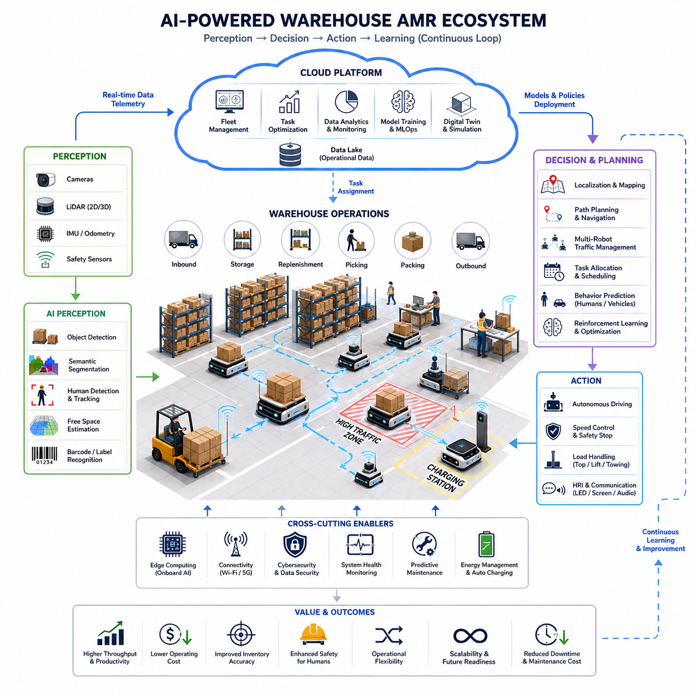
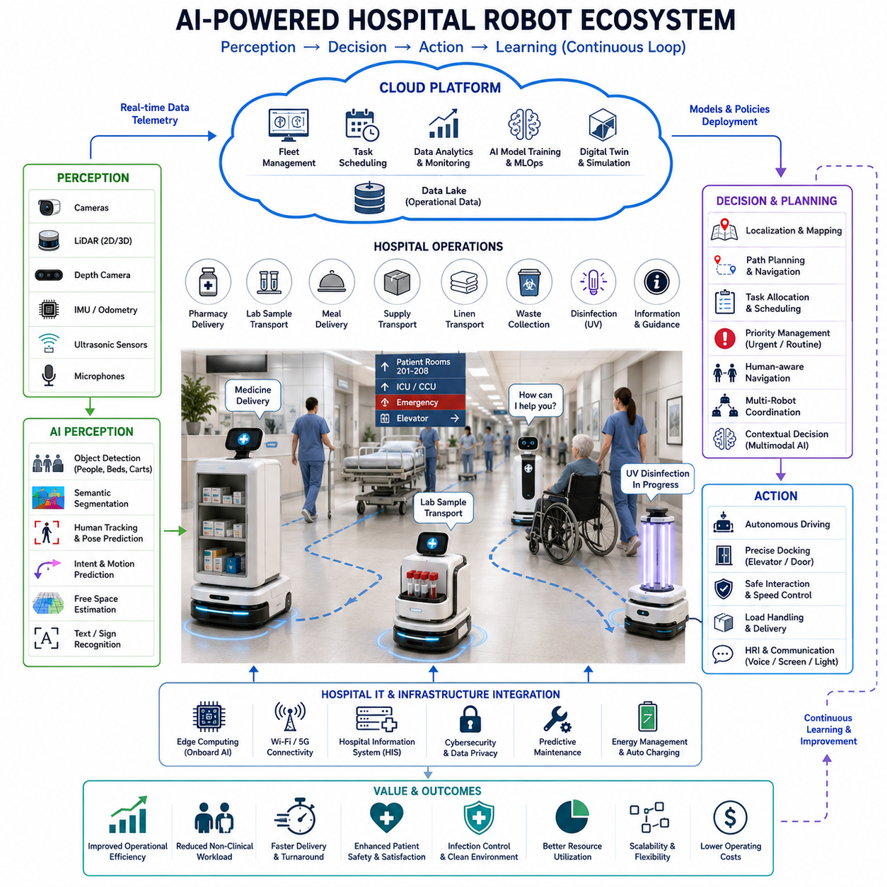
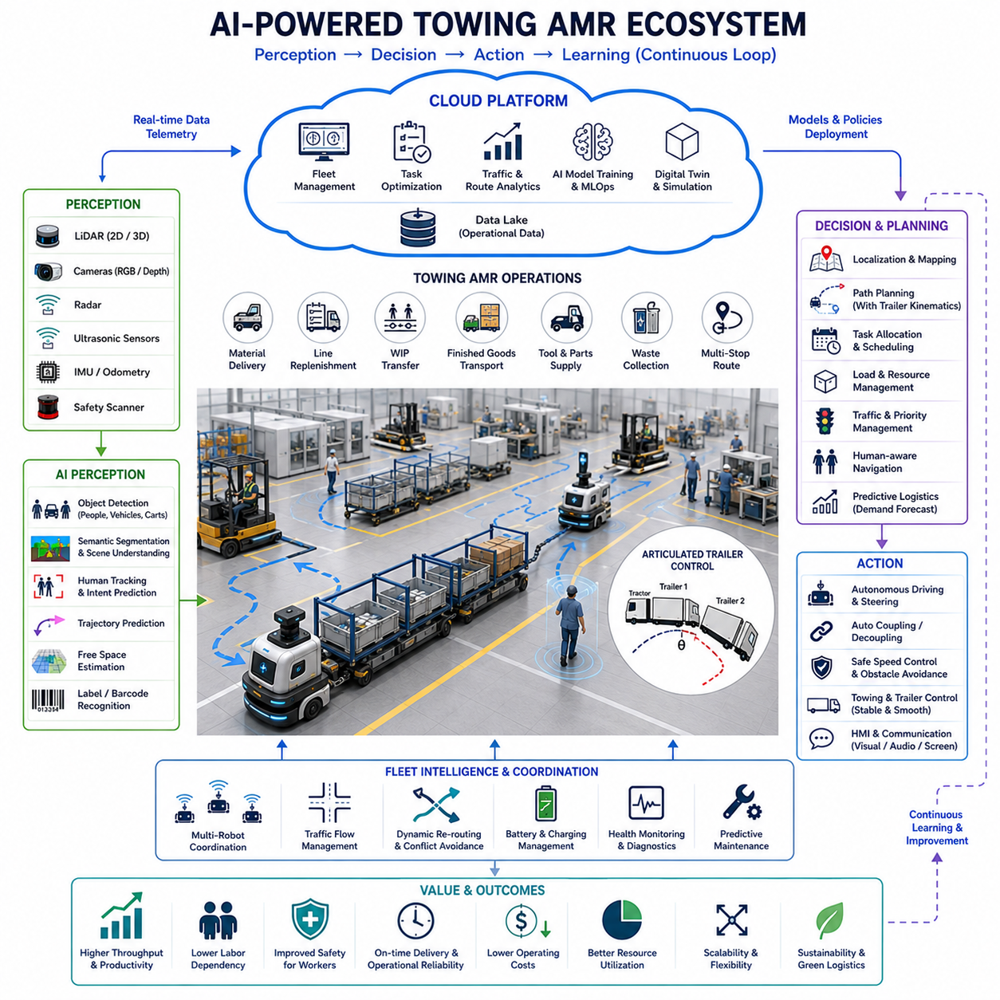
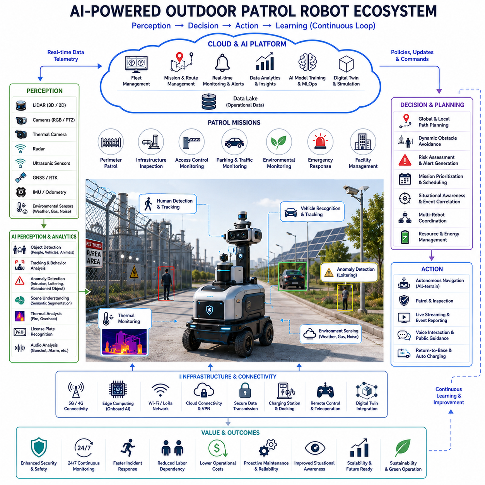
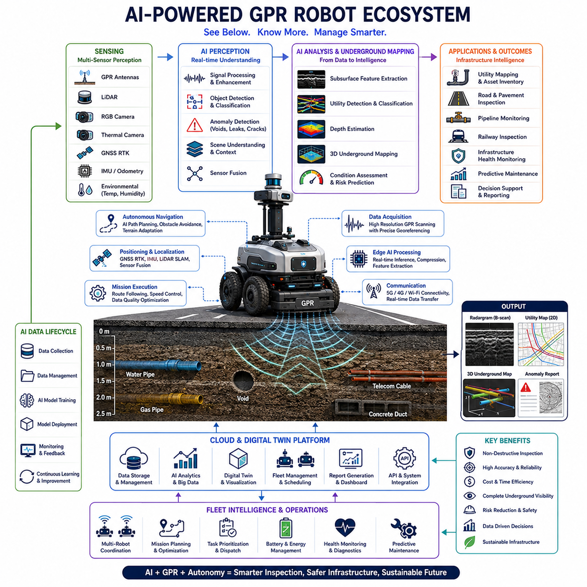
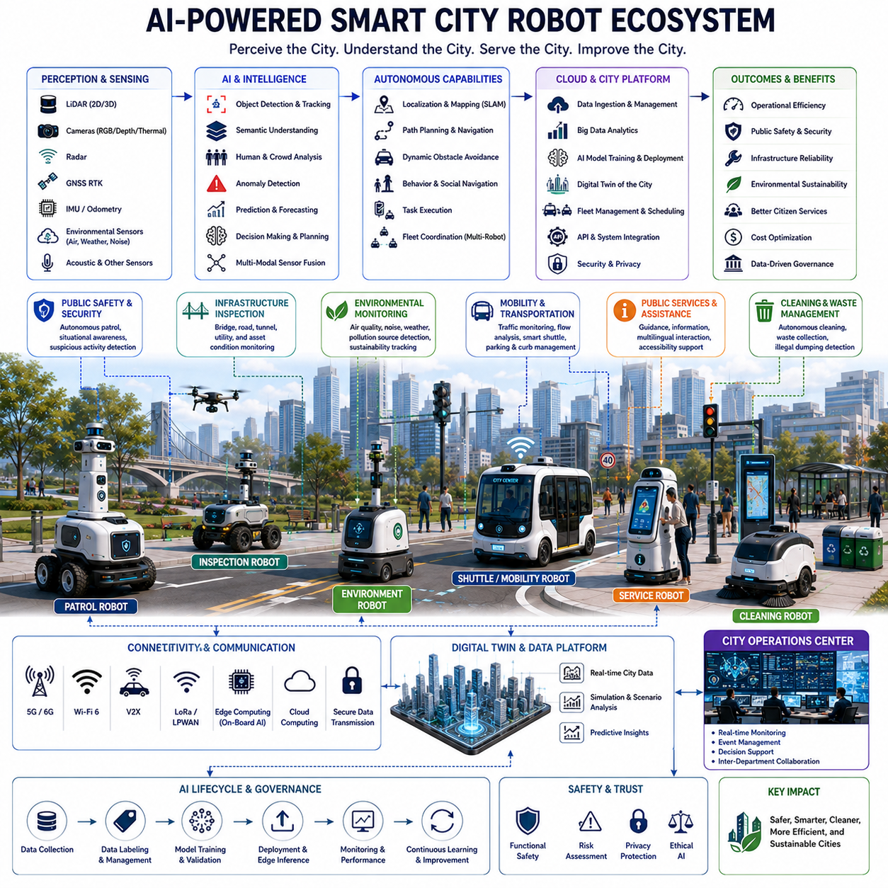
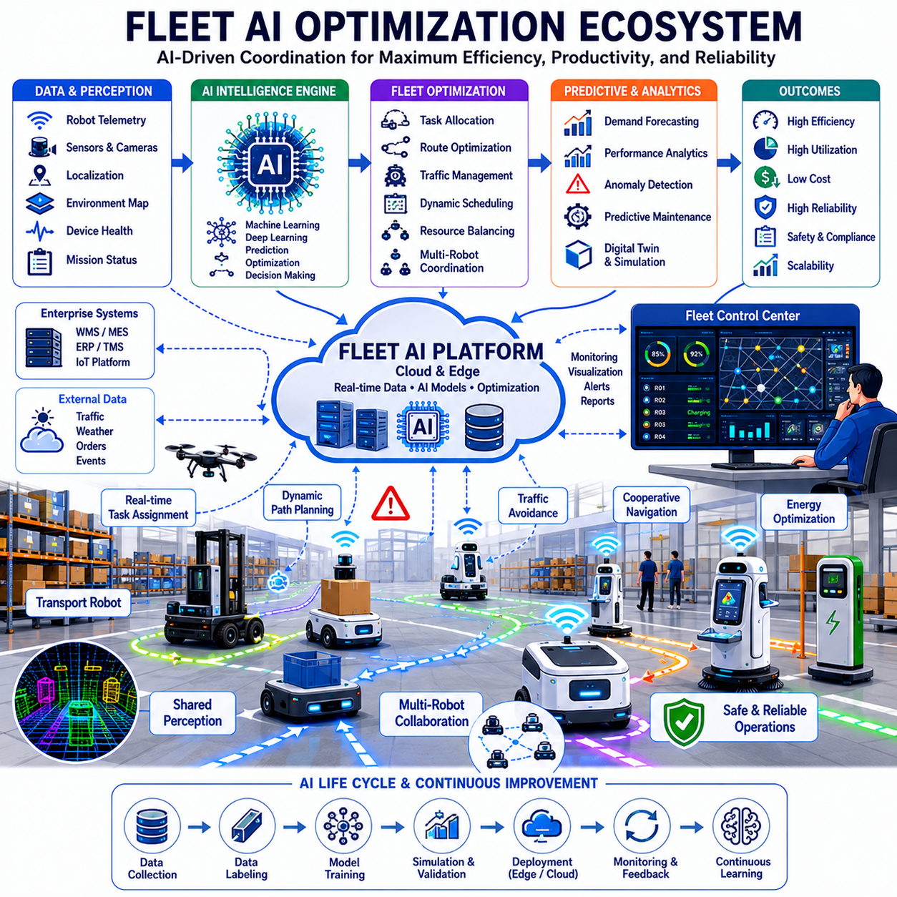
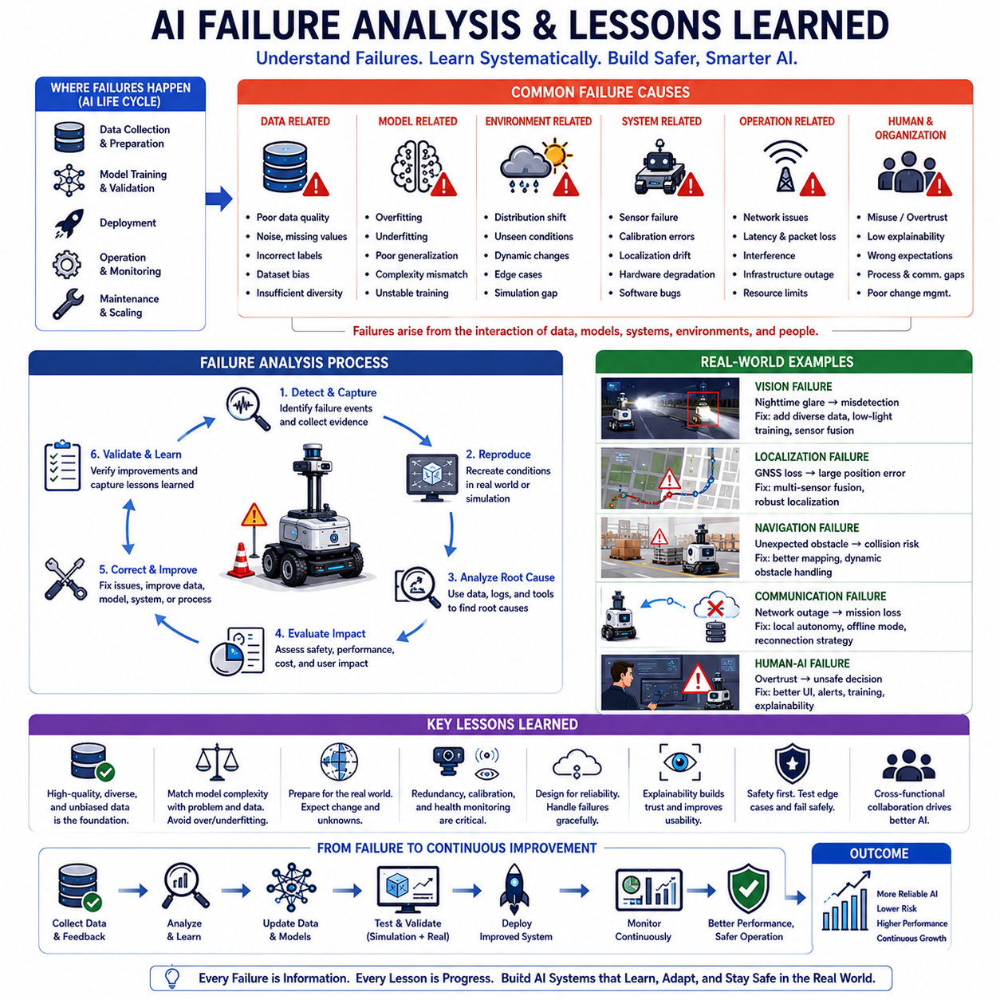

**Volume 06. AMR AI and Embodied Intelligence**


# Chapter 23. Industrial AI Case Studies

##  

## 23.1 Warehouse AMR AI Case Study

{width="7.268055555555556in" height="7.268055555555556in"}

Warehouse Autonomous Mobile Robots (AMRs) have become one of the most successful industrial applications of artificial intelligence in modern logistics. As global e-commerce, omnichannel fulfillment, and just-in-time supply chains continue to grow, warehouses are facing increasing pressure to improve throughput, reduce labor dependency, enhance operational safety, and maintain high levels of service quality. Traditional automation systems such as conveyors, fixed Automated Guided Vehicles (AGVs), and manually operated forklifts provide only limited flexibility when warehouse layouts, product types, or operational requirements change. AI-powered AMRs address these challenges by combining autonomous navigation, intelligent perception, fleet coordination, task optimization, and continuous learning capabilities within a dynamic warehouse environment. The warehouse AMR AI case study demonstrates how artificial intelligence transforms logistics operations from static automation into adaptive and intelligent systems capable of real-time decision making.

A modern warehouse AMR system typically operates within large indoor facilities that contain storage racks, pallet zones, picking stations, packing areas, charging stations, inbound docks, and outbound shipping locations. The environment is highly dynamic because workers, forklifts, pallets, carts, and inventory constantly move throughout the facility. AI enables AMRs to perceive these changes, understand operational context, and continuously adapt their behaviors. Rather than following predefined paths like traditional AGVs, AI-driven AMRs generate decisions based on real-time observations and mission priorities.

The foundation of warehouse AMR intelligence begins with perception. Multiple sensors such as 2D LiDARs, 3D LiDARs, RGB cameras, depth cameras, IMUs, wheel encoders, and safety sensors provide continuous streams of environmental information. AI-based perception systems process this sensor data to detect obstacles, identify humans, recognize pallets, classify storage locations, estimate free space, and monitor traffic conditions. Deep learning models perform object detection and semantic segmentation to distinguish between workers, forklifts, boxes, carts, shelves, and temporary obstacles. This capability allows robots to understand not only where objects are located but also what those objects represent within warehouse operations.

Warehouse environments frequently experience changes caused by inventory movement, temporary storage zones, or operational reconfiguration. AI-powered perception systems continuously update environmental understanding and enable AMRs to function without requiring constant map modifications by human operators. When an aisle becomes blocked or a pallet is temporarily placed in an unexpected location, the robot can recognize the situation and select alternative routes. This adaptive behavior significantly improves operational resilience.

Localization and mapping form another essential component of warehouse AMR intelligence. Most warehouse robots employ SLAM technologies combined with AI-enhanced localization techniques. Sensor fusion algorithms integrate LiDAR observations, visual features, inertial measurements, and odometry information to estimate robot position with high precision. Machine learning models improve localization robustness by identifying stable environmental landmarks and filtering sensor noise. As a result, robots can maintain accurate positioning even in repetitive warehouse layouts where conventional localization methods may struggle.

AI also plays a critical role in navigation. Traditional navigation systems often rely on static path planning, which may become inefficient when warehouse traffic conditions change. AI-enhanced navigation systems analyze dynamic conditions and generate optimized routes based on congestion levels, task urgency, battery status, and fleet availability. Reinforcement learning and predictive planning algorithms enable robots to make decisions that improve both local efficiency and overall warehouse performance.

For example, when multiple AMRs approach a busy intersection within a warehouse, AI traffic management systems can coordinate movements to minimize waiting times and avoid deadlocks. Rather than treating each robot independently, the system considers the collective behavior of the fleet and determines optimal movement strategies. This fleet-level intelligence significantly improves throughput compared to traditional rule-based navigation approaches.

Task allocation represents one of the most valuable AI applications within warehouse AMR deployments. Warehouses often handle thousands of transport requests every day. These requests may include pallet transportation, bin movement, replenishment operations, picking support, inventory transfer, and outbound logistics. AI-driven fleet management platforms continuously evaluate task priorities, robot locations, battery levels, payload capacities, and expected travel times. Optimization algorithms assign tasks to the most appropriate robots while balancing overall workload distribution.

Machine learning models can predict future task demand by analyzing historical operational data. During peak periods such as seasonal sales events, the system may proactively reposition robots near anticipated high-demand areas. This predictive capability reduces response times and increases overall warehouse productivity. AI therefore shifts operations from reactive management toward proactive optimization.

Warehouse AMRs increasingly employ computer vision systems for inventory-related activities. Vision-based AI can identify pallet labels, read barcodes, verify package locations, detect inventory discrepancies, and monitor storage utilization. In advanced deployments, robots perform autonomous inventory audits by navigating through warehouse aisles and collecting visual information. Deep learning algorithms compare observed inventory conditions against warehouse management system records and automatically identify mismatches.

This capability reduces manual inventory counting efforts while improving inventory accuracy. Real-time inventory visibility enhances supply chain decision making and helps prevent stock shortages, misplaced goods, and operational inefficiencies. AI-powered inventory intelligence becomes particularly valuable in large-scale fulfillment centers containing hundreds of thousands of storage locations.

Human-robot collaboration is another important aspect of warehouse AMR deployments. Warehouses remain highly human-centric environments, and successful automation requires safe and efficient interaction between workers and robots. AI-based human detection systems recognize worker positions, movements, and intentions. Advanced perception models estimate human trajectories and predict future motion patterns. Robots can adjust speed, alter routes, or temporarily yield to workers when necessary.

Socially aware navigation algorithms improve worker acceptance and operational safety. Instead of simply avoiding collisions, robots behave in ways that align with human expectations. For example, a robot may slow down when approaching a worker from behind, maintain comfortable separation distances, or communicate its intended path through visual indicators. These behaviors increase trust and reduce operational friction.

Large warehouse deployments often involve hundreds or even thousands of AMRs operating simultaneously. Multi-agent AI systems coordinate robot activities across the entire facility. Fleet intelligence platforms monitor robot health, mission status, traffic conditions, battery levels, and operational performance in real time. Multi-agent optimization algorithms continuously balance system-wide objectives such as throughput, energy efficiency, task completion rates, and resource utilization.

Cooperative behavior emerges when robots share information and coordinate activities. If one robot encounters an obstacle or experiences localization difficulties, relevant information can be propagated throughout the fleet. Other robots can immediately adapt their routes based on the updated environmental understanding. This collective intelligence improves system robustness and operational efficiency.

Cloud robotics architectures further enhance warehouse AMR capabilities. Edge computers onboard each robot perform real-time perception and navigation tasks, while cloud platforms provide centralized analytics, fleet optimization, model training, and long-term learning functions. Operational data collected from thousands of robot-hours can be analyzed to identify bottlenecks, optimize workflows, and improve AI model performance.

Machine learning pipelines continuously process field data and generate improved perception, navigation, and optimization models. Updated models are validated through simulation and testing environments before deployment to operational fleets. This continuous improvement cycle enables warehouse AMR systems to become more capable over time.

Predictive maintenance represents another major AI application in warehouse robotics. Traditional maintenance approaches often rely on fixed schedules or reactive repairs after failures occur. AI-based predictive maintenance systems monitor motor currents, battery health, wheel conditions, vibration signatures, sensor performance, and thermal characteristics. Machine learning models identify abnormal patterns that may indicate emerging failures.

By predicting maintenance requirements before breakdowns occur, warehouse operators can reduce downtime, extend equipment life, and improve operational reliability. Predictive maintenance also contributes to more efficient spare parts management and workforce planning.

Simulation and digital twin technologies play a significant role in warehouse AMR AI deployment. Before robots operate within real facilities, AI models can be trained and evaluated within realistic virtual environments. Digital twins replicate warehouse layouts, operational workflows, traffic conditions, and inventory movement patterns. Simulation enables safe testing of navigation algorithms, fleet coordination strategies, and AI decision-making systems under diverse operating conditions.

Synthetic data generation further supports AI development. Simulated environments can produce large volumes of annotated training data covering rare events, edge cases, and safety-critical scenarios that may be difficult to capture in real-world operations. This capability accelerates AI development while reducing data collection costs.

AI safety remains a critical consideration throughout warehouse AMR deployment. Perception errors, localization failures, navigation mistakes, software defects, and unexpected environmental conditions can potentially create safety risks. Modern warehouse AMR systems therefore implement multiple layers of safety mechanisms. AI-based functions operate alongside deterministic safety systems, certified emergency stop mechanisms, safety LiDARs, speed monitoring modules, and fail-safe control architectures.

Runtime monitoring systems continuously evaluate AI confidence levels and operational performance. When anomalies are detected, robots may transition into degraded operating modes or request human intervention. Safety validation processes include extensive simulation testing, stress testing, field trials, and operational monitoring to ensure reliable performance under diverse conditions.

Several large-scale warehouse deployments have demonstrated the transformative impact of AI-powered AMRs. Major e-commerce fulfillment centers use fleets of mobile robots to transport inventory shelves, move storage bins, and support order fulfillment processes. Manufacturing logistics facilities employ AMRs to automate material flow between production lines, warehouses, and assembly stations. Third-party logistics providers utilize intelligent robot fleets to increase throughput while maintaining flexibility across varying customer requirements.

Performance improvements commonly observed in warehouse AMR deployments include increased order fulfillment speed, reduced travel distances, lower labor requirements, improved inventory accuracy, enhanced operational safety, and higher facility utilization. AI contributes significantly to these outcomes by enabling adaptive decision making and continuous optimization.

The economic benefits of warehouse AMR AI systems extend beyond labor savings. Improved throughput enables facilities to process greater order volumes without physical expansion. Enhanced inventory accuracy reduces operational waste. Predictive maintenance lowers equipment downtime. Intelligent fleet optimization improves resource utilization. Together, these benefits contribute to strong return-on-investment outcomes for many warehouse operators.

Looking toward the future, warehouse AMR systems will increasingly incorporate foundation models, multimodal AI, Vision-Language Models, and Vision-Language-Action architectures. Future robots may understand natural language instructions, reason about warehouse operations, learn new tasks through demonstration, and collaborate more effectively with human workers. Embodied AI technologies will further enhance robot adaptability and enable broader operational capabilities.

Warehouse environments represent one of the most mature and commercially successful domains for industrial AI deployment. The combination of perception intelligence, autonomous navigation, fleet optimization, predictive analytics, cloud robotics, and continuous learning creates highly efficient logistics ecosystems. As AI technologies continue to advance, warehouse AMRs will evolve from autonomous transport systems into intelligent operational partners capable of supporting increasingly complex logistics operations. This evolution will play a central role in the future of global supply chains, smart warehouses, and next-generation industrial automation.

# 23_01_Warehouse_AMR_AI 사례 연구

창고용 자율이동로봇(AMR)은 현대 물류 산업에서 가장 성공적으로 적용된 인공지능 사례 중 하나이다. 전 세계적으로 전자상거래, 옴니채널 물류, 적시생산(Just-In-Time) 공급망이 확대되면서 창고는 처리량 향상, 인력 의존도 감소, 안전성 강화, 서비스 품질 향상이라는 과제에 직면하고 있다. 기존의 컨베이어 시스템, 고정 경로 기반 AGV, 수동 지게차는 일정 수준의 자동화를 제공하지만 창고 레이아웃이나 물류 흐름이 변화할 경우 유연성이 부족하다. AI 기반 AMR은 자율주행, 지능형 인지, 플릿 최적화, 작업 할당, 지속적 학습 기능을 결합하여 이러한 문제를 해결한다. 창고 AMR AI 사례는 물류 자동화가 단순한 기계화 수준을 넘어 실시간 의사결정이 가능한 지능형 시스템으로 발전하는 과정을 보여준다.

현대적인 창고 AMR 시스템은 보관 랙, 팔레트 구역, 피킹 스테이션, 포장 구역, 충전소, 입출고 도크 등으로 구성된 대규모 물류센터에서 운영된다. 이러한 환경은 작업자, 지게차, 팔레트, 카트, 상품이 지속적으로 이동하기 때문에 매우 동적이다. AI는 이러한 변화 상황을 인식하고 운영 상황을 이해하며, 실시간으로 행동을 조정한다. 기존 AGV가 정해진 경로를 따라 움직이는 것과 달리 AI 기반 AMR은 현재 상황을 분석하여 최적의 결정을 내린다.

창고 AMR의 지능은 우선 인지(Perception) 시스템에서 시작된다. 2D LiDAR, 3D LiDAR, RGB 카메라, Depth 카메라, IMU, 휠 엔코더, 안전 센서 등 다양한 센서가 환경 정보를 지속적으로 수집한다. AI 기반 인지 시스템은 이러한 데이터를 분석하여 장애물을 탐지하고, 사람을 식별하며, 팔레트를 인식하고, 저장 위치를 파악하며, 이동 가능한 공간을 계산하고, 창고 내 교통 상황을 분석한다. 딥러닝 기반 객체 탐지와 시맨틱 세그멘테이션 기술은 작업자, 지게차, 박스, 카트, 선반, 임시 적재물 등을 구분할 수 있도록 한다. 이를 통해 로봇은 단순히 물체의 위치를 아는 것을 넘어 해당 물체가 창고 운영에서 어떤 의미를 갖는지 이해하게 된다.

창고 환경은 재고 이동이나 작업 구역 변경으로 인해 지속적으로 변화한다. AI 기반 인지 시스템은 이러한 변화를 실시간으로 반영하여 환경 모델을 업데이트한다. 따라서 작업자가 임시로 팔레트를 통로에 놓거나 특정 구역이 갑자기 막히더라도 로봇은 상황을 인식하고 새로운 경로를 선택할 수 있다. 이러한 적응 능력은 창고 운영의 유연성과 안정성을 크게 향상시킨다.

위치 추정과 지도 작성 역시 창고 AMR의 핵심 기술이다. 대부분의 창고 AMR은 SLAM 기술과 AI 기반 위치 추정 기법을 함께 활용한다. 센서 융합 알고리즘은 LiDAR 데이터, 비전 특징점, 관성 센서 정보, 오도메트리 데이터를 통합하여 정밀한 위치를 계산한다. 머신러닝 모델은 안정적인 랜드마크를 식별하고 센서 노이즈를 제거하여 위치 추정 성능을 향상시킨다. 이로 인해 반복적인 구조가 많은 창고 환경에서도 높은 위치 정확도를 유지할 수 있다.

AI는 자율주행과 경로 계획에서도 중요한 역할을 수행한다. 기존의 경로 계획 시스템은 정적인 환경을 가정하는 경우가 많지만, AI 기반 시스템은 실시간 교통 상황과 작업 우선순위를 고려하여 경로를 최적화한다. 강화학습과 예측 기반 계획 알고리즘은 혼잡도, 배터리 상태, 작업 긴급도, 차량 가용성 등을 종합적으로 분석하여 최적의 이동 전략을 생성한다.

예를 들어 여러 대의 AMR이 창고 내 교차로에 동시에 접근하는 경우 AI 교통 관리 시스템은 로봇들의 이동을 조율하여 대기 시간을 최소화하고 교착 상태를 방지한다. 각 로봇을 독립적으로 제어하는 대신 전체 플릿의 관점에서 최적의 이동 순서를 계산하기 때문에 전체 처리량이 크게 향상된다.

작업 할당은 창고 AMR에서 가장 높은 가치를 창출하는 AI 응용 분야 중 하나이다. 대형 물류센터에서는 하루 수천 건 이상의 운송 요청이 발생한다. 팔레트 이동, 빈(Bin) 운송, 재고 보충, 피킹 지원, 출고 준비 등의 작업이 동시에 이루어진다. AI 기반 플릿 관리 시스템은 로봇 위치, 배터리 상태, 적재 능력, 예상 이동 시간 등을 실시간으로 분석하여 가장 적합한 로봇에 작업을 할당한다.

머신러닝 모델은 과거 운영 데이터를 분석하여 미래 수요를 예측할 수도 있다. 예를 들어 대규모 할인 행사나 성수기에는 특정 구역의 작업량이 증가할 것으로 예상되는데, AI는 이를 사전에 예측하여 로봇을 미리 배치한다. 이러한 예측형 운영은 응답 시간을 줄이고 전체 생산성을 향상시킨다.

창고 AMR은 재고 관리 업무에서도 AI를 적극 활용한다. 비전 AI는 바코드 판독, 라벨 인식, 재고 위치 확인, 저장 공간 활용 분석 등을 수행할 수 있다. 고도화된 시스템에서는 로봇이 창고를 순회하면서 자동으로 재고 조사를 수행한다. 딥러닝 모델은 실제 관측 결과와 창고 관리 시스템(WMS)의 데이터를 비교하여 재고 불일치 문제를 자동으로 발견한다.

이러한 기능은 수작업 재고 조사 비용을 줄이고 재고 정확도를 향상시킨다. 실시간 재고 가시성은 공급망 운영의 효율성을 높이고 재고 부족이나 상품 분실을 예방하는 데 기여한다.

인간-로봇 협업 역시 창고 AMR 운영에서 매우 중요하다. 대부분의 창고는 여전히 인간 중심 환경이기 때문에 로봇과 작업자가 안전하게 협력할 수 있어야 한다. AI 기반 인간 인식 시스템은 작업자의 위치와 움직임을 실시간으로 추적한다. 고급 인지 모델은 사람의 이동 방향을 예측하여 충돌 가능성을 사전에 계산한다. 로봇은 필요에 따라 속도를 줄이거나 우회 경로를 선택하거나 일시적으로 정지할 수 있다.

사회적 내비게이션(Socially Aware Navigation) 알고리즘은 작업자의 심리적 편안함까지 고려한다. 단순히 충돌을 피하는 수준을 넘어 사람의 기대에 맞는 행동을 수행한다. 예를 들어 뒤에서 접근할 때 속도를 줄이고, 충분한 안전 거리를 유지하며, 표시등이나 디스플레이를 통해 이동 의도를 전달한다. 이러한 행동은 작업자의 신뢰를 높이고 협업 효율성을 향상시킨다.

대규모 물류센터에서는 수백에서 수천 대의 AMR이 동시에 운영될 수 있다. 이러한 환경에서는 다중 에이전트 AI(Multi-Agent AI)가 중요한 역할을 수행한다. 플릿 관리 플랫폼은 로봇 상태, 작업 진행 상황, 배터리 수준, 교통 흐름, 운영 성능을 실시간으로 모니터링한다. 최적화 알고리즘은 처리량, 에너지 효율, 작업 완료율, 자원 활용도를 동시에 고려하여 전체 시스템을 최적화한다.

로봇들은 서로 정보를 공유하며 협력적으로 행동한다. 특정 로봇이 장애물이나 환경 변화를 감지하면 해당 정보가 전체 플릿에 전달된다. 다른 로봇들은 즉시 새로운 정보를 반영하여 경로를 수정할 수 있다. 이러한 집단 지능은 운영 효율성과 시스템 안정성을 크게 향상시킨다.

클라우드 로보틱스는 창고 AMR의 능력을 더욱 확장시킨다. 각 로봇의 엣지 컴퓨터는 실시간 인지와 주행을 수행하고, 클라우드는 플릿 최적화, 데이터 분석, AI 모델 학습, 장기 운영 분석을 담당한다. 수천 시간의 운행 데이터가 클라우드로 수집되어 병목 현상 분석, 작업 흐름 최적화, AI 모델 개선에 활용된다.

MLOps 기반 파이프라인은 운영 데이터를 지속적으로 분석하여 새로운 AI 모델을 생성한다. 개선된 모델은 시뮬레이션과 검증 과정을 거친 후 실제 로봇에 배포된다. 이를 통해 AMR 시스템은 시간이 지날수록 더 높은 성능을 갖게 된다.

예지보전(Predictive Maintenance)은 창고 AMR AI의 또 다른 핵심 분야이다. 기존 유지보수는 정기 점검이나 고장 후 수리에 의존했지만, AI는 모터 전류, 배터리 상태, 진동 패턴, 온도 정보, 센서 성능 등을 분석하여 이상 징후를 조기에 발견한다. 머신러닝 모델은 미래 고장 가능성을 예측하고 적절한 정비 시점을 제안한다.

이러한 접근은 장비 가동 중단 시간을 줄이고 부품 수명을 연장하며 유지보수 비용을 절감한다. 또한 예비 부품 관리와 정비 인력 운영 효율성도 향상시킨다.

시뮬레이션과 디지털 트윈은 창고 AMR AI 개발 및 운영에서 중요한 역할을 수행한다. 실제 창고에 배치하기 전에 가상 환경에서 다양한 알고리즘을 검증할 수 있다. 디지털 트윈은 창고 레이아웃, 물류 흐름, 교통 상황, 재고 이동 패턴을 현실적으로 재현한다. 이를 통해 내비게이션, 플릿 제어, 작업 할당 알고리즘을 안전하게 평가할 수 있다.

시뮬레이션 환경은 대규모 학습 데이터를 생성하는 데도 활용된다. 실제 환경에서 수집하기 어려운 희귀 상황이나 안전 관련 시나리오를 반복적으로 생성하여 AI 모델 학습에 사용할 수 있다. 이는 데이터 수집 비용을 줄이고 개발 속도를 높이는 데 기여한다.

AI 안전성은 창고 AMR 시스템에서 반드시 고려되어야 하는 요소이다. 인지 오류, 위치 추정 실패, 내비게이션 오류, 소프트웨어 결함, 예상치 못한 환경 변화는 잠재적인 위험 요소가 될 수 있다. 따라서 현대적인 창고 AMR은 AI 기능과 함께 안전 LiDAR, 비상 정지 장치, 속도 제한 시스템, 기능 안전 아키텍처를 통합적으로 운영한다.

런타임 모니터링 시스템은 AI 모델의 신뢰도와 성능을 지속적으로 평가한다. 이상 상황이 감지되면 로봇은 안전 모드로 전환되거나 운영자 개입을 요청한다. 광범위한 시뮬레이션 시험, 현장 검증, 스트레스 테스트를 통해 안전성과 신뢰성이 확보된다.

실제 산업 현장에서는 다양한 성공 사례가 보고되고 있다. 대형 전자상거래 기업은 수천 대의 AMR을 활용하여 재고 선반과 상품을 자동으로 운반하고 있으며, 제조 공장은 생산 라인 간 자재 공급을 자동화하고 있다. 제3자 물류 기업들은 AI 기반 AMR을 통해 높은 처리량과 운영 유연성을 동시에 달성하고 있다.

이러한 시스템 도입 후 일반적으로 주문 처리 속도 향상, 이동 거리 감소, 인력 효율 개선, 재고 정확도 향상, 안전성 강화, 창고 공간 활용도 증가와 같은 성과가 나타난다. AI는 실시간 최적화와 지속적 학습을 통해 이러한 효과를 가능하게 만든다.

경제적 효과는 단순한 인건비 절감에 그치지 않는다. 처리량 증가를 통해 추가 창고 확장 없이 더 많은 주문을 처리할 수 있으며, 재고 정확도 향상은 운영 손실을 줄인다. 예지보전은 가동 중단 시간을 감소시키고, 플릿 최적화는 자원 활용률을 높인다. 이러한 요소들이 결합되어 높은 투자 대비 효과(ROI)를 창출한다.

향후 창고 AMR은 파운데이션 모델, 멀티모달 AI, VLM(Vision-Language Model), VLA(Vision-Language-Action) 기술을 적극적으로 활용하게 될 것이다. 미래의 로봇은 자연어 명령을 이해하고, 작업을 추론하며, 시범 학습을 통해 새로운 작업을 습득하고, 인간과 더욱 자연스럽게 협업할 수 있게 될 것이다.

창고는 산업용 AI가 가장 성공적으로 적용된 분야 중 하나이다. 지능형 인지, 자율주행, 플릿 최적화, 예측 분석, 클라우드 로보틱스, 지속적 학습 기술이 결합되면서 물류 시스템은 점차 자율적이고 지능적인 운영 체계로 발전하고 있다. 앞으로 AI 기술이 더욱 발전함에 따라 창고 AMR은 단순한 물류 운송 장비를 넘어 물류 운영 전반을 지원하는 지능형 파트너로 진화할 것이며, 이는 미래 스마트 물류와 글로벌 공급망 혁신의 핵심 기반이 될 것이다.

##  

## 23.2 Hospital Robot AI Case Study

{width="7.268055555555556in" height="7.268055555555556in"}

Hospital robots represent one of the most impactful applications of artificial intelligence in modern healthcare environments. As healthcare systems worldwide face increasing demands caused by aging populations, workforce shortages, rising operational costs, and growing patient expectations, hospitals are actively seeking technologies that can improve efficiency, safety, and quality of care. Autonomous Mobile Robots (AMRs) equipped with advanced AI capabilities have emerged as an important solution for addressing these challenges. Unlike traditional automation systems that operate in highly structured industrial environments, hospital robots must function within dynamic, human-centered settings where patients, medical staff, visitors, and critical medical equipment continuously interact. This complexity makes artificial intelligence an essential component of successful hospital robot deployments.

Modern hospitals are among the most challenging indoor environments for autonomous robots. They contain complex layouts consisting of patient rooms, operating theaters, intensive care units, pharmacies, laboratories, emergency departments, elevators, corridors, and public waiting areas. Human traffic patterns change constantly throughout the day, and many operational activities occur simultaneously. Healthcare environments also require strict compliance with safety regulations, infection control procedures, privacy requirements, and clinical workflows. Hospital robot AI systems must therefore combine perception, navigation, decision-making, human interaction, fleet management, and operational intelligence into a unified platform capable of supporting healthcare operations without disrupting patient care.

The primary role of AI within hospital robots begins with environmental perception. Robots rely on multiple sensors including 2D LiDARs, 3D LiDARs, RGB cameras, depth cameras, ultrasonic sensors, IMUs, and wheel encoders to perceive their surroundings. AI-powered perception systems process this sensor information to detect obstacles, identify people, recognize wheelchairs, hospital beds, stretchers, medical carts, equipment stands, and other dynamic objects commonly found in healthcare facilities. Deep learning models perform object detection and semantic scene understanding, enabling robots to distinguish between various categories of people and equipment while understanding their operational context.

Hospital environments are highly dynamic because patients, nurses, physicians, technicians, visitors, and support staff continuously move throughout the facility. Temporary equipment may be placed in hallways, patient transport activities may create unexpected congestion, and emergency situations can rapidly alter traffic conditions. AI perception systems allow robots to continuously monitor environmental changes and adapt accordingly. Rather than relying solely on predefined maps, intelligent robots maintain an updated understanding of the current operational state of the hospital.

Human detection and recognition represent particularly important capabilities in hospital robotics. Unlike industrial facilities where robots may operate in restricted areas, hospital robots frequently share spaces with vulnerable individuals. AI models must accurately detect patients who may have limited mobility, identify medical personnel engaged in clinical tasks, and recognize crowded areas where navigation behaviors should be adjusted. Advanced perception systems can estimate human motion trajectories and predict future movement patterns, enabling proactive safety behaviors.

Localization and navigation form another critical aspect of hospital robot intelligence. Large hospitals often span multiple floors and buildings, creating complex navigation challenges. AI-enhanced localization systems combine SLAM technologies, sensor fusion algorithms, and semantic mapping techniques to maintain accurate positioning throughout the facility. Robots continuously integrate LiDAR observations, visual landmarks, odometry measurements, and inertial data to estimate their location.

Hospitals frequently undergo layout changes due to renovations, temporary care areas, equipment relocation, and operational adjustments. AI-based localization systems improve robustness by learning stable environmental features while adapting to non-permanent changes. This flexibility reduces the maintenance burden associated with traditional navigation systems and allows robots to operate effectively over long periods.

Navigation in healthcare environments extends beyond simple obstacle avoidance. Hospital robots must exhibit socially acceptable behaviors that align with human expectations. AI-driven navigation systems consider factors such as patient comfort, corridor congestion, emergency traffic, and clinical priorities when selecting routes. Robots may slow down near patient rooms, yield to medical staff transporting critical patients, or avoid crowded waiting areas during peak periods.

Socially aware navigation has become a major focus of hospital robotics research and deployment. Human-centered AI algorithms allow robots to navigate naturally among people without causing discomfort or disruption. For example, a robot may choose to wait briefly rather than forcing its way through a crowded hallway. It may maintain larger separation distances around patients using mobility aids or adjust its movement behavior when approaching children or elderly individuals. These subtle behaviors significantly improve acceptance of robotic systems within healthcare environments.

Task execution represents one of the primary operational functions of hospital robots. Healthcare facilities involve a wide range of repetitive transportation activities that consume valuable staff time. AI-powered robots can autonomously transport medications, laboratory samples, blood products, medical supplies, linens, meals, waste materials, and sterile equipment throughout the hospital. Intelligent task management systems continuously evaluate delivery requests, robot availability, travel times, battery levels, and operational priorities to optimize resource utilization.

AI-based scheduling systems dynamically assign missions to available robots. Unlike static dispatch systems, intelligent fleet managers continuously adapt to changing hospital conditions. If an urgent laboratory sample requires immediate transport, the system can reprioritize tasks and redirect the most suitable robot. Similarly, delivery schedules can be optimized based on anticipated demand patterns and clinical workflows.

Pharmacy logistics provide one of the most successful examples of hospital robot deployment. Medications must often be delivered rapidly and accurately from centralized pharmacies to patient care units. AI-enabled robots automate these deliveries while maintaining traceability, security, and operational efficiency. Integration with hospital information systems allows robots to receive task requests automatically and verify delivery completion through digital workflows.

Laboratory sample transport represents another important application. Timely delivery of blood samples, diagnostic specimens, and pathology materials directly affects patient care quality. Hospital robots can perform these tasks continuously, reducing transport delays and allowing clinical personnel to focus on patient-centered activities. AI-based scheduling algorithms ensure that time-sensitive deliveries receive appropriate priority.

Artificial intelligence also enhances hospital robot interactions with humans. Human-Robot Interaction (HRI) technologies enable robots to communicate effectively with patients, visitors, and healthcare professionals. Natural language processing allows users to issue verbal commands, request information, or receive status updates. Speech recognition systems, touchscreens, displays, visual indicators, and audio feedback mechanisms create intuitive interaction experiences.

Some hospital robots function as mobile information assistants. These robots guide visitors to departments, provide navigation assistance, answer frequently asked questions, and support patient wayfinding. AI-powered conversational systems enable natural communication, reducing confusion within large healthcare facilities and improving visitor experiences.

Healthcare environments increasingly demand robots capable of understanding context rather than merely executing predefined tasks. Multimodal AI systems combine visual information, location data, operational workflows, sensor readings, and language inputs to support contextual decision-making. For example, a robot delivering medication to an intensive care unit may recognize that clinical activities are underway and temporarily delay entry until conditions become appropriate.

Computer vision technologies also support operational monitoring within hospitals. AI models can identify improperly stored equipment, detect blocked emergency exits, monitor corridor congestion, and verify compliance with operational procedures. These capabilities contribute to improved facility management and enhanced patient safety.

Infection prevention and control constitute particularly important considerations in healthcare robotics. Hospital robots reduce human contact with potentially contaminated materials by automating transportation processes. AI-enabled robots can also support disinfection workflows. Ultraviolet disinfection robots, for example, use AI-based navigation and environment understanding to autonomously disinfect patient rooms, operating theaters, and public spaces.

Perception systems identify room layouts, furniture arrangements, and obstacles while planning efficient disinfection routes. AI algorithms optimize coverage patterns and verify completion of disinfection tasks. During public health emergencies, these robots can significantly reduce exposure risks for healthcare workers while improving infection control outcomes.

Fleet management becomes increasingly important as hospitals deploy larger robot populations. Modern healthcare facilities may operate dozens or hundreds of robots simultaneously. AI-powered fleet management platforms coordinate robot activities across multiple departments and buildings. These systems monitor robot status, battery health, mission completion rates, traffic conditions, and operational performance metrics in real time.

Multi-agent AI techniques enable collaborative behaviors among robots. Robots can share environmental information, coordinate task assignments, and optimize collective performance. If one robot encounters a temporary obstacle or service interruption, other robots can adapt their activities accordingly. This coordination improves system resilience and operational efficiency.

Cloud robotics architectures further enhance hospital robot capabilities. Real-time perception and navigation functions execute on edge computers located onboard the robots, while cloud platforms support fleet analytics, long-term learning, operational optimization, and AI model management. Hospitals generate vast quantities of operational data that can be analyzed to identify workflow inefficiencies, improve service quality, and optimize resource allocation.

Machine learning models continuously learn from operational experiences. Data collected during daily robot activities can be used to improve navigation performance, optimize task scheduling, enhance perception accuracy, and refine human interaction behaviors. Through continuous learning frameworks, hospital robot systems become increasingly effective over time.

Predictive maintenance represents another important application of AI in hospital robotics. Healthcare facilities require extremely high levels of reliability because service interruptions can directly affect patient care. AI-based maintenance systems monitor motors, batteries, sensors, actuators, thermal characteristics, vibration patterns, and software health indicators. Machine learning models identify anomalies that may indicate developing failures.

By predicting maintenance requirements before failures occur, hospitals can reduce downtime, improve reliability, and extend equipment lifecycles. Predictive maintenance also supports more efficient resource planning and lowers total operational costs.

Simulation and digital twin technologies play critical roles in hospital robot development and deployment. Digital twins replicate hospital layouts, operational workflows, human traffic patterns, and clinical environments. AI algorithms can be trained and validated within these virtual environments before being deployed in real hospitals. Simulation allows engineers to evaluate navigation behaviors, fleet coordination strategies, emergency response scenarios, and safety mechanisms under controlled conditions.

Synthetic data generation further accelerates AI development. Rare events, emergency situations, and safety-critical scenarios that are difficult to capture in real hospitals can be reproduced within simulation environments. This approach improves AI robustness while reducing data collection challenges.

Safety remains the highest priority in healthcare robotics. AI systems must operate alongside rigorous functional safety mechanisms, regulatory compliance frameworks, and clinical governance processes. Hospital robots implement multiple layers of protection including safety LiDARs, emergency stop systems, speed monitoring, collision avoidance algorithms, and runtime safety monitoring.

AI confidence monitoring systems continuously evaluate perception quality, localization accuracy, and decision-making reliability. When uncertainty exceeds acceptable thresholds, robots may reduce speed, request operator intervention, or transition into safe operating modes. Extensive testing, validation, and certification processes ensure that robots meet healthcare safety requirements.

Several large healthcare organizations have successfully deployed AI-powered robot fleets. Hospitals in North America, Europe, and Asia utilize robots for logistics automation, pharmacy delivery, laboratory transport, meal distribution, waste collection, and disinfection operations. These deployments have demonstrated measurable improvements in efficiency, service quality, operational consistency, and workforce productivity.

Healthcare staff frequently report significant reductions in non-clinical workload after robot deployment. Nurses spend less time transporting supplies and more time providing direct patient care. Laboratory workflows become more predictable, medication delivery becomes more reliable, and operational coordination improves across departments. These benefits contribute directly to improved patient outcomes and staff satisfaction.

The economic value of hospital robot AI extends beyond labor savings. Improved workflow efficiency, reduced transport delays, enhanced safety, better resource utilization, and increased operational resilience collectively generate substantial long-term benefits. Hospitals can accommodate growing patient volumes without proportionally increasing support staff requirements.

Future hospital robots will increasingly incorporate foundation models, Vision-Language Models, Vision-Language-Action architectures, robot agents, and embodied AI systems. These technologies will enable robots to understand complex instructions, reason about clinical environments, learn from demonstrations, and adapt to new tasks with minimal programming. Future robots may serve not only as transportation platforms but also as intelligent assistants capable of supporting a broad range of healthcare operations.

Hospital robotics represents one of the most socially valuable applications of artificial intelligence. By combining perception, navigation, fleet optimization, human interaction, predictive analytics, and continuous learning, AI-powered robots enhance healthcare delivery while reducing operational burdens on medical personnel. As AI technologies continue to mature, hospital robots will become increasingly integrated into healthcare ecosystems, contributing to safer, more efficient, and more patient-centered medical services.

# 23_02 병원 로봇 AI 사례 연구

병원 로봇은 현대 의료 환경에서 인공지능이 가장 큰 가치를 창출하는 응용 분야 중 하나로 평가받고 있다. 전 세계 의료 시스템은 고령화 사회의 확대, 의료 인력 부족, 운영 비용 증가, 환자 서비스 수준 향상 요구와 같은 다양한 과제에 직면해 있다. 이러한 상황에서 자율주행 이동로봇(AMR)과 인공지능 기술의 결합은 병원 운영의 효율성과 안전성을 향상시키는 중요한 해결책으로 주목받고 있다. 산업 현장과 달리 병원은 환자, 의료진, 보호자, 방문객, 의료 장비가 동시에 존재하는 복잡한 인간 중심 환경이다. 따라서 병원 로봇은 단순한 자동화 장비가 아니라 사람과 안전하게 협력하며 상황을 이해하고 판단할 수 있는 지능형 시스템이어야 한다.

현대 병원은 병실, 중환자실, 수술실, 약국, 검사실, 응급실, 복도, 엘리베이터, 대기 공간 등 다양한 공간으로 구성되어 있다. 사람의 이동량이 매우 많고 시간에 따라 교통 흐름이 크게 변한다. 또한 응급 상황이 수시로 발생하며, 환자의 상태에 따라 우선순위가 달라질 수 있다. 이러한 환경에서 병원 로봇은 인공지능 기반의 인지, 위치 추정, 자율주행, 인간-로봇 상호작용, 작업 최적화, 플릿 관리 기능을 통합적으로 수행해야 한다.

병원 로봇 AI의 첫 번째 핵심 기능은 환경 인지이다. 로봇은 2D LiDAR, 3D LiDAR, RGB 카메라, Depth 카메라, 초음파 센서, IMU, 엔코더 등 다양한 센서를 통해 주변 환경을 인식한다. AI 기반 인지 시스템은 이러한 데이터를 분석하여 사람, 휠체어, 병상, 의료 카트, 장비 스탠드, 이동형 의료기기 등을 구분한다. 딥러닝 기반 객체 탐지와 시맨틱 인식 기술은 단순히 물체의 위치를 파악하는 수준을 넘어 해당 물체의 역할과 중요성을 이해하도록 지원한다.

병원 환경은 매우 동적이다. 환자 이동, 의료진 업무, 보호자 방문, 장비 이동이 지속적으로 발생한다. 복도에 의료 장비가 임시 배치되거나 응급 환자 이송으로 인해 이동 경로가 갑자기 변경될 수도 있다. AI 기반 인지 시스템은 이러한 변화 상황을 실시간으로 반영하여 로봇이 적절하게 대응할 수 있도록 한다. 따라서 로봇은 단순히 사전에 구축된 지도만 사용하는 것이 아니라 현재 병원의 운영 상태를 지속적으로 이해하며 행동하게 된다.

사람 인식 기술은 병원 로봇에서 특히 중요하다. 병원은 노약자, 환자, 장애인 등 다양한 사용자가 존재하는 환경이기 때문에 높은 수준의 안전성이 요구된다. AI 모델은 사람의 위치뿐 아니라 이동 방향과 속도까지 분석하여 향후 움직임을 예측할 수 있다. 이를 통해 로봇은 충돌 위험을 사전에 방지하고 더욱 자연스럽게 사람과 공간을 공유할 수 있다.

위치 추정과 자율주행 역시 병원 로봇 AI의 핵심 기술이다. 대형 병원은 여러 개의 건물과 수많은 층으로 구성되는 경우가 많아 복잡한 이동 환경을 제공한다. AI 기반 위치 추정 시스템은 SLAM 기술과 센서 융합 알고리즘을 활용하여 정확한 위치를 계산한다. LiDAR 정보, 영상 특징점, 오도메트리, IMU 데이터를 통합하여 실시간으로 위치를 추정하고 이동 경로를 생성한다.

병원은 리모델링이나 공간 재배치가 자주 발생하는 환경이다. AI 기반 위치 추정 기술은 변하지 않는 특징과 일시적인 변화를 구분할 수 있어 장기적인 운영에서도 높은 안정성을 유지한다. 이를 통해 지도 유지보수 비용을 줄이고 운영 효율성을 높일 수 있다.

병원 내 자율주행은 단순한 장애물 회피를 넘어 사람 중심의 이동 전략을 필요로 한다. AI 기반 내비게이션 시스템은 환자의 편안함, 복도 혼잡도, 응급 상황 여부, 의료진의 이동 우선순위 등을 고려하여 경로를 선택한다. 예를 들어 중환자 이송이 이루어지고 있는 경우 로봇은 우선권을 양보하거나 대체 경로를 선택할 수 있다.

사회적 내비게이션(Socially Aware Navigation)은 병원 로봇의 중요한 특징이다. 이는 단순히 충돌을 피하는 것이 아니라 사람의 기대에 맞는 행동을 수행하는 것을 의미한다. 로봇은 노약자 주변에서는 더 넓은 안전거리를 유지하고, 혼잡한 복도에서는 속도를 줄이며, 필요 시 잠시 대기하는 행동을 수행할 수 있다. 이러한 특성은 의료진과 환자가 로봇을 자연스럽게 받아들이도록 만든다.

병원 로봇의 주요 임무는 물류 자동화이다. 병원에서는 약품, 혈액, 검사 샘플, 의료 소모품, 린넨, 식사, 폐기물 등을 지속적으로 운반해야 한다. 이러한 업무는 많은 시간과 인력을 요구하지만 직접적인 의료 행위와는 관련이 없다. AI 기반 병원 로봇은 이러한 반복 업무를 자동화하여 의료진이 환자 치료에 더 집중할 수 있도록 지원한다.

AI 기반 작업 관리 시스템은 로봇의 위치, 배터리 상태, 현재 임무, 이동 거리, 우선순위 등을 고려하여 작업을 자동 할당한다. 긴급 검사 샘플이나 응급 약품 배송이 요청될 경우 시스템은 즉시 우선순위를 조정하여 가장 적합한 로봇을 배정할 수 있다.

약국 물류는 병원 로봇이 가장 성공적으로 적용된 분야 중 하나이다. 약품은 정확하고 신속하게 환자 병동으로 전달되어야 하며, 보안과 추적성도 중요하다. AI 기반 로봇은 병원 정보 시스템과 연동되어 자동으로 배송 요청을 수신하고, 약품을 안전하게 운반하며, 배송 완료 여부를 기록한다.

검사실 샘플 운송 역시 중요한 활용 사례이다. 혈액 샘플이나 병리 검사 시료는 시간 지연이 환자 진료 품질에 직접적인 영향을 미칠 수 있다. 로봇은 이러한 시료를 신속하고 안정적으로 운반하여 검사 프로세스를 효율화한다.

AI는 인간과의 상호작용에도 활용된다. 자연어 처리 기술을 이용하여 로봇은 음성 명령을 이해하고 정보를 제공할 수 있다. 터치스크린, 디스플레이, 음성 안내 기능을 통해 환자와 방문객은 로봇과 쉽게 상호작용할 수 있다.

일부 병원에서는 로봇이 안내 서비스 역할을 수행한다. 방문객에게 병원 내 길찾기 서비스를 제공하고, 특정 진료과나 검사실 위치를 안내하며, 기본적인 정보를 제공한다. AI 기반 대화 시스템은 보다 자연스럽고 친숙한 사용자 경험을 제공한다.

멀티모달 AI 기술은 병원 로봇의 지능을 더욱 향상시킨다. 영상 정보, 위치 정보, 음성 명령, 운영 데이터 등을 통합적으로 분석하여 상황을 이해하고 의사결정을 수행한다. 예를 들어 로봇이 중환자실에 약품을 전달해야 하는 경우 현재 의료 활동이 진행 중인지 판단하고 적절한 시점까지 대기할 수 있다.

컴퓨터 비전 기술은 병원 시설 관리에도 활용된다. AI는 통로에 방치된 장비를 탐지하거나 비상구가 막혀 있는지 확인하고, 병원 내 혼잡도를 분석하며, 운영 규정 준수 여부를 모니터링할 수 있다.

감염 관리 역시 병원 로봇이 중요한 역할을 수행하는 영역이다. 로봇은 오염 가능성이 있는 물품을 대신 운반함으로써 의료진의 노출 위험을 줄인다. 또한 자외선(UV) 소독 로봇은 AI 기반 내비게이션을 활용하여 병실과 수술실을 자율적으로 이동하며 소독 작업을 수행할 수 있다.

AI 기반 인지 시스템은 공간 구조와 가구 배치를 파악하고 최적의 소독 경로를 생성한다. 알고리즘은 소독 범위를 최적화하고 작업 완료 여부를 검증한다. 감염병 유행 시기에는 이러한 기술이 의료진 보호와 병원 감염 예방에 큰 도움을 줄 수 있다.

병원 내 로봇 수가 증가할수록 플릿 관리의 중요성도 커진다. 대형 병원에서는 수십 대에서 수백 대의 로봇이 동시에 운영될 수 있다. AI 기반 플릿 관리 시스템은 로봇 상태, 배터리 수준, 작업 진행 상황, 교통 흐름 등을 실시간으로 모니터링한다.

다중 에이전트 AI 기술은 로봇 간 협력을 가능하게 한다. 로봇들은 환경 정보를 공유하고 작업을 분담하며 전체 운영 효율을 최적화한다. 특정 로봇이 장애물이나 문제를 발견하면 해당 정보가 전체 플릿에 전달되어 다른 로봇들이 즉시 대응할 수 있다.

클라우드 로보틱스는 병원 로봇의 능력을 더욱 확장한다. 로봇 내부의 엣지 컴퓨터는 실시간 인지와 자율주행을 수행하고, 클라우드는 데이터 분석, 플릿 최적화, AI 모델 학습, 운영 관리 기능을 담당한다. 병원 운영 데이터를 분석함으로써 업무 흐름을 개선하고 자원 활용도를 높일 수 있다.

머신러닝 모델은 지속적으로 운영 데이터를 학습한다. 로봇이 경험한 수많은 이동 경로와 작업 수행 기록은 향후 성능 향상에 활용된다. 이를 통해 내비게이션 정확도, 작업 할당 효율성, 인간과의 상호작용 품질이 지속적으로 개선된다.

예지보전은 병원 로봇 운영에서 매우 중요한 기능이다. 병원은 높은 신뢰성을 요구하기 때문에 로봇의 갑작스러운 고장을 최소화해야 한다. AI는 모터 상태, 배터리 성능, 진동 패턴, 센서 데이터, 온도 정보를 분석하여 이상 징후를 조기에 발견한다.

고장이 발생하기 전에 정비를 수행할 수 있기 때문에 가동 중단 시간이 감소하고 장비 수명이 연장된다. 이는 운영 비용 절감과 서비스 품질 향상으로 이어진다.

시뮬레이션과 디지털 트윈은 병원 로봇 개발 과정에서도 중요한 역할을 한다. 디지털 트윈은 병원 구조, 사람 이동 패턴, 운영 프로세스를 가상 환경에 재현한다. AI 알고리즘은 실제 배포 전에 이러한 환경에서 충분히 검증될 수 있다.

희귀한 응급 상황이나 안전 관련 시나리오도 시뮬레이션을 통해 재현할 수 있다. 이는 실제 환경에서 확보하기 어려운 데이터를 제공하며 AI 모델의 강건성을 높이는 데 기여한다.

안전성은 병원 로봇 시스템의 최우선 요소이다. AI 기능은 안전 LiDAR, 비상 정지 장치, 속도 제어 시스템, 충돌 회피 알고리즘과 함께 운영된다. 런타임 모니터링 시스템은 AI 모델의 신뢰도를 지속적으로 평가하며 이상이 감지되면 안전 모드로 전환하거나 운영자 개입을 요청한다.

현재 북미, 유럽, 아시아의 주요 병원들은 AI 기반 로봇을 약품 배송, 검사 샘플 운송, 식사 배달, 폐기물 수거, 병원 소독 등의 업무에 활용하고 있다. 이러한 사례들은 운영 효율 향상, 서비스 품질 개선, 안전성 강화, 인력 생산성 향상이라는 실질적인 성과를 보여주고 있다.

병원 관계자들은 로봇 도입 이후 의료진이 물류 업무에 소비하는 시간이 크게 감소했다고 보고한다. 간호사는 환자 치료에 더 많은 시간을 할애할 수 있으며, 약품과 검사물 운송은 더욱 신속하고 정확하게 수행된다. 결과적으로 환자 만족도와 의료 서비스 품질이 함께 향상된다.

병원 로봇 AI의 경제적 가치는 단순한 인건비 절감에만 국한되지 않는다. 운영 효율 향상, 대기 시간 감소, 안전성 강화, 자원 활용도 증가, 서비스 연속성 확보 등이 결합되어 장기적인 경제적 효과를 창출한다.

향후 병원 로봇은 파운데이션 모델, VLM(Vision-Language Model), VLA(Vision-Language-Action), 로봇 에이전트, Embodied AI 기술을 적극적으로 활용하게 될 것이다. 미래의 병원 로봇은 자연어 지시를 이해하고, 임상 환경을 추론하며, 새로운 작업을 스스로 학습하고 적응할 수 있는 수준으로 발전할 것으로 예상된다.

병원 로봇은 인공지능이 사회적 가치를 창출하는 대표적인 분야이다. 인지, 자율주행, 플릿 최적화, 인간-로봇 상호작용, 예측 분석, 지속적 학습 기술이 결합되면서 병원 운영은 더욱 안전하고 효율적으로 변화하고 있다. 앞으로 AI 기술이 발전할수록 병원 로봇은 단순한 물류 자동화 장비를 넘어 의료 서비스를 지원하는 지능형 파트너로 자리 잡게 될 것이며, 미래 스마트 헬스케어의 핵심 인프라로 발전할 것이다.

##  

## 23.3 Towing AMR AI Case Study

{width="7.268055555555556in" height="7.268055555555556in"}

Towing Autonomous Mobile Robots (Towing AMRs) represent one of the most practical and economically valuable applications of artificial intelligence in industrial logistics. Unlike conventional AMRs that transport goods directly on their platforms, towing AMRs are designed to pull multiple carts, trailers, trolleys, material racks, or logistics wagons simultaneously. This capability enables a single robot to move large volumes of materials efficiently across factories, warehouses, hospitals, airports, distribution centers, and industrial campuses. As manufacturing systems evolve toward smart factories and flexible production environments, towing AMRs have become increasingly important because they provide a scalable and adaptive alternative to traditional conveyor systems and manually operated towing vehicles.

Modern industrial facilities require continuous movement of raw materials, semi-finished products, tools, consumables, packaging materials, and finished goods. Historically, these transportation tasks have relied heavily on human operators using carts, forklifts, or towing tractors. Such operations often involve repetitive tasks, labor-intensive processes, safety risks, and inconsistent productivity. AI-powered towing AMRs address these challenges by combining autonomous navigation, intelligent perception, fleet coordination, predictive optimization, and adaptive decision-making into a single logistics platform.

The operational environment of towing AMRs is often more complex than that of standard indoor delivery robots. These robots must move long articulated vehicle configurations that may include multiple carts connected together. The overall vehicle length can vary significantly depending on operational requirements, and vehicle dynamics become substantially more complicated. AI therefore plays a critical role in enabling safe, reliable, and efficient operation.

The foundation of towing AMR intelligence begins with environmental perception. Robots are typically equipped with multiple sensors including 2D LiDARs, 3D LiDARs, RGB cameras, depth cameras, ultrasonic sensors, radar systems, IMUs, wheel encoders, and safety scanners. These sensors continuously monitor the surrounding environment and provide information about obstacles, human workers, forklifts, vehicles, equipment, storage racks, and transportation pathways.

AI-powered perception systems process sensor information to generate a comprehensive understanding of the environment. Deep learning models perform object detection, semantic segmentation, human recognition, vehicle identification, and free-space estimation. Unlike traditional obstacle detection systems that merely recognize object presence, AI perception systems understand object categories and predict future movements. This contextual understanding is essential because towing AMRs frequently operate in busy industrial environments where interactions with people and equipment are unavoidable.

Human detection is particularly important for towing AMR operations. Due to their larger size, heavier payloads, and longer stopping distances, towing robots must maintain exceptional safety performance. AI-based human recognition systems identify workers, estimate their trajectories, and predict future movements. The robot can proactively reduce speed, modify routes, or temporarily stop when necessary. This predictive capability significantly enhances operational safety compared to purely reactive obstacle avoidance approaches.

Localization and mapping are equally critical components of towing AMR intelligence. Most deployments use SLAM technologies integrated with AI-enhanced localization algorithms. Sensor fusion combines LiDAR observations, camera data, inertial measurements, and odometry information to achieve precise positioning. Machine learning models improve localization robustness by identifying stable environmental landmarks and filtering sensor noise.

Large industrial facilities often contain repetitive layouts, long corridors, storage aisles, and dynamic operational zones. AI-assisted localization helps robots maintain accurate positioning even in environments where conventional methods may experience difficulties. Long-term localization capabilities allow towing AMRs to operate continuously without requiring frequent manual recalibration.

Navigation presents unique challenges for towing AMRs because the robot must consider not only its own position but also the motion of connected carts and trailers. The effective vehicle length may exceed several meters, creating constraints during turning, reversing, docking, and maneuvering in confined spaces. AI-based navigation systems continuously evaluate vehicle geometry, trailer articulation angles, pathway width, obstacle positions, and operational objectives.

Advanced path planning algorithms generate trajectories that minimize trailer swing, avoid collisions, and maintain stable vehicle behavior. Reinforcement learning techniques can further improve navigation performance by learning efficient driving strategies through simulation and operational experience. These approaches enable towing AMRs to navigate safely through narrow factory corridors, warehouse aisles, and shared workspaces.

One of the most valuable applications of AI in towing AMRs is intelligent task allocation. Industrial facilities may generate thousands of transportation requests each day. Material delivery, line replenishment, work-in-progress transfer, finished goods movement, and waste collection often occur simultaneously. AI-driven fleet management systems continuously evaluate robot availability, cart locations, payload requirements, travel distances, battery levels, and production priorities.

Optimization algorithms assign transportation missions to the most suitable robots while balancing workload across the fleet. Rather than simply assigning the nearest robot, AI considers multiple variables including future demand forecasts, traffic conditions, charging requirements, and production schedules. This holistic optimization significantly improves overall system efficiency.

Predictive logistics represents another major advantage of AI-powered towing AMR systems. Machine learning models analyze historical production data, material consumption patterns, and operational schedules to anticipate future transportation demand. Instead of waiting for requests to occur, robots can proactively position themselves near anticipated high-demand areas. This predictive capability reduces response times and supports just-in-time material delivery strategies.

Manufacturing facilities provide particularly compelling examples of towing AMR deployment. In automotive production plants, towing robots transport components between warehouses and assembly lines. In electronics manufacturing, they deliver materials to production cells and collect completed products. In aerospace factories, towing AMRs support movement of specialized tooling, components, and work-in-progress assemblies.

Artificial intelligence enables seamless integration between towing AMRs and manufacturing execution systems. Production schedules, inventory levels, workstation demands, and operational priorities can be continuously analyzed to generate optimized logistics plans. The result is a highly synchronized material flow system that supports lean manufacturing objectives.

Computer vision technologies significantly enhance towing AMR operational capabilities. AI-based vision systems can identify carts, recognize coupling mechanisms, verify payload conditions, read labels, detect damaged equipment, and confirm correct load assignments. Automated inspection capabilities reduce human intervention while improving operational accuracy.

Auto-coupling and decoupling operations represent particularly important applications of AI. Towing robots often connect to multiple carts during daily operations. Vision-based AI systems assist with precise alignment, coupling verification, and connection quality assessment. These capabilities improve automation levels while reducing operational delays.

Human-robot collaboration is central to successful towing AMR deployment. Industrial facilities remain highly human-centric environments, and robots must operate harmoniously alongside workers. AI-driven Human-Robot Interaction systems support safe coexistence by understanding human behavior and adapting robot actions accordingly.

Socially aware navigation algorithms enable towing AMRs to behave predictably and transparently. Robots communicate intentions through visual indicators, displays, audio notifications, and movement patterns. Workers can easily understand robot behavior, reducing uncertainty and increasing trust. These interaction capabilities are particularly important because towing robots frequently operate in close proximity to personnel.

Large-scale towing AMR deployments often involve dozens or hundreds of robots operating simultaneously. Multi-agent AI systems coordinate robot activities across entire facilities. Fleet intelligence platforms monitor robot locations, mission status, battery conditions, traffic congestion, cart availability, and operational performance metrics in real time.

Multi-robot coordination algorithms optimize traffic flow, prevent congestion, avoid deadlocks, and balance resource utilization. Robots share environmental information and cooperate to achieve system-wide objectives. If one robot encounters an obstacle or operational issue, other robots can dynamically adapt their plans. This collective intelligence improves both efficiency and robustness.

Cloud robotics architectures further enhance towing AMR performance. Edge computers onboard robots perform real-time perception, control, and navigation functions, while cloud platforms provide fleet optimization, data analytics, AI training, digital twin management, and long-term operational intelligence. Continuous connectivity enables centralized visibility across large deployments while preserving real-time autonomy at the edge.

Data generated during operations serves as a valuable resource for continuous improvement. AI systems analyze transportation efficiency, travel distances, idle times, battery consumption, congestion patterns, and operational bottlenecks. Machine learning models use this information to improve scheduling strategies, navigation behaviors, and resource allocation policies over time.

Predictive maintenance represents another important AI application. Towing AMRs operate under demanding conditions and often handle heavy payloads over extended periods. Motors, batteries, wheels, couplers, brakes, sensors, and mechanical components experience continuous wear. AI-based maintenance systems monitor equipment health through vibration analysis, current monitoring, temperature measurements, and operational performance indicators.

Machine learning algorithms identify abnormal patterns that may indicate developing failures. Maintenance activities can therefore be scheduled proactively before breakdowns occur. This approach reduces downtime, improves reliability, extends asset lifetimes, and lowers overall maintenance costs.

Simulation and digital twin technologies play critical roles throughout towing AMR development and deployment. Digital twins replicate facility layouts, transportation networks, production workflows, vehicle dynamics, and operational scenarios. AI algorithms can be trained and validated within these virtual environments before deployment to real facilities.

Simulation is particularly valuable because towing vehicle dynamics can be complex and safety-critical. Engineers can evaluate navigation strategies, fleet coordination algorithms, coupling operations, emergency scenarios, and traffic management policies without disrupting production activities. Synthetic data generation further supports AI model development by creating diverse training scenarios that may be difficult to capture in real-world operations.

Safety remains the highest priority in towing AMR deployments. Due to the larger vehicle mass and payload capacity involved, towing robots must satisfy stringent safety requirements. AI functions operate alongside certified safety systems including safety LiDARs, emergency stop circuits, speed monitoring systems, safe motion controllers, and fail-safe braking mechanisms.

Runtime AI monitoring continuously evaluates perception confidence, localization quality, navigation reliability, and system health. When anomalies are detected, robots can enter degraded operating modes, reduce speed, request operator intervention, or stop safely. Extensive validation procedures ensure reliable performance across diverse operational conditions.

Several industries have successfully deployed AI-powered towing AMR fleets. Automotive manufacturers use towing robots to support assembly line logistics. Electronics factories rely on them for material replenishment. Pharmaceutical facilities employ towing AMRs for controlled transport operations. Airports utilize them for baggage and cargo logistics. Hospitals use towing robots to move supplies, linens, and waste materials. Distribution centers deploy them to optimize internal transportation workflows.

Operational benefits consistently reported across these deployments include reduced labor requirements, improved material flow efficiency, enhanced safety performance, lower transportation costs, increased flexibility, higher throughput, and improved operational visibility. AI contributes directly to these outcomes by enabling intelligent decision-making and continuous optimization.

The economic impact of towing AMR systems extends beyond workforce savings. Improved logistics efficiency reduces production delays, supports lean manufacturing, minimizes inventory buffers, and enhances resource utilization. Predictive maintenance reduces downtime, while intelligent fleet coordination increases transportation capacity without requiring additional infrastructure investment.

Future towing AMRs will increasingly incorporate foundation models, multimodal AI systems, Vision-Language Models, Vision-Language-Action architectures, and robot agent technologies. These advances will enable robots to understand natural language instructions, reason about complex logistics operations, learn new tasks from demonstrations, and collaborate more effectively with human workers and other robots.

Embodied AI technologies will further enhance towing AMR capabilities by integrating perception, reasoning, memory, planning, and action into unified intelligent systems. Future towing robots may autonomously adapt to new facility layouts, optimize logistics strategies in real time, and continuously improve performance through operational learning.

Towing AMRs represent a powerful example of how artificial intelligence can transform industrial logistics. By combining advanced perception, autonomous navigation, fleet optimization, predictive analytics, cloud robotics, and continuous learning, AI-powered towing robots deliver significant improvements in efficiency, safety, flexibility, and scalability. As manufacturing and logistics systems continue to evolve toward greater autonomy and intelligence, towing AMRs will play a central role in the next generation of smart factories, intelligent warehouses, and autonomous industrial ecosystems.

# 23_03 견인형 AMR(Towing AMR) AI 사례 연구

견인형 자율이동로봇(Towing AMR)은 산업 물류 분야에서 인공지능이 가장 실용적이고 경제적인 가치를 창출하는 대표적인 응용 사례 중 하나이다. 일반적인 AMR이 자체 플랫폼 위에 화물을 적재하여 운반하는 방식이라면, 견인형 AMR은 여러 대의 카트, 트레일러, 대차, 물류 랙, 물류 웨건 등을 동시에 견인하도록 설계된 로봇이다. 이러한 구조 덕분에 하나의 로봇이 대량의 자재를 효율적으로 이동시킬 수 있으며, 공장, 물류센터, 병원, 공항, 산업단지 등 다양한 환경에서 활용되고 있다. 제조업이 스마트팩토리와 유연생산 체계로 전환됨에 따라 견인형 AMR은 기존 컨베이어 시스템이나 사람이 운전하는 견인 차량을 대체하는 핵심 기술로 자리 잡고 있다.

현대 산업 현장에서는 원자재, 반제품, 공구, 소모품, 포장재, 완제품 등이 지속적으로 이동해야 한다. 과거에는 이러한 물류 작업이 작업자와 견인차량에 의존했기 때문에 반복 작업으로 인한 생산성 저하와 안전사고 위험이 존재했다. AI 기반 견인형 AMR은 자율주행, 지능형 인지, 플릿 최적화, 예측 분석, 적응형 의사결정 기술을 결합하여 이러한 문제를 해결한다.

견인형 AMR이 운영되는 환경은 일반적인 실내 배송 로봇보다 훨씬 복잡하다. 로봇은 여러 개의 트레일러를 연결한 긴 차량 형태로 이동하며, 연결된 카트 수에 따라 전체 길이가 크게 달라질 수 있다. 차량 길이가 증가할수록 회전 반경, 주행 안정성, 후진 성능, 경로 계획 난이도가 증가하기 때문에 AI의 역할이 더욱 중요해진다.

견인형 AMR의 지능은 환경 인지 시스템에서 시작된다. 로봇은 2D LiDAR, 3D LiDAR, RGB 카메라, Depth 카메라, 초음파 센서, 레이더, IMU, 엔코더, 안전 스캐너 등 다양한 센서를 사용하여 주변 환경을 실시간으로 감지한다. 이러한 센서 데이터는 공장 작업자, 지게차, 차량, 물류 카트, 생산 설비, 랙, 장애물 등의 정보를 제공한다.

AI 기반 인지 시스템은 이러한 데이터를 분석하여 환경을 이해한다. 딥러닝 모델은 객체 탐지, 시맨틱 세그멘테이션, 사람 인식, 차량 식별, 자유 공간 추정 등을 수행한다. 단순한 장애물 탐지를 넘어 물체의 종류와 이동 특성을 파악할 수 있기 때문에 로봇은 상황에 맞는 행동을 선택할 수 있다. 이는 사람이 많은 공장 환경에서 특히 중요하다.

사람 인식 기술은 견인형 AMR 운영에서 매우 중요한 요소이다. 견인형 로봇은 일반 AMR보다 크고 무거우며 제동 거리도 길기 때문에 높은 수준의 안전성이 요구된다. AI 기반 인간 인식 시스템은 작업자의 위치와 이동 경로를 분석하고 향후 움직임을 예측한다. 로봇은 이를 기반으로 속도를 줄이거나 경로를 변경하거나 정지할 수 있다. 이러한 예측 기반 안전 기능은 단순 반응형 시스템보다 훨씬 높은 안전성을 제공한다.

위치 추정과 지도 작성 또한 견인형 AMR의 핵심 기술이다. 대부분의 시스템은 SLAM 기술과 AI 기반 위치 추정 알고리즘을 결합하여 사용한다. LiDAR 데이터, 카메라 정보, IMU 데이터, 오도메트리 정보를 융합하여 정확한 위치를 계산한다. 머신러닝 모델은 안정적인 랜드마크를 선택하고 센서 노이즈를 제거함으로써 위치 추정의 신뢰성을 높인다.

대형 공장과 물류센터는 반복적인 구조와 긴 복도, 복잡한 작업 구역으로 구성되어 있다. AI 기반 위치 추정은 이러한 환경에서도 높은 정확도를 유지하며 장기간 안정적인 운영을 가능하게 한다. 이를 통해 유지보수 부담을 줄이고 지속적인 자율운행이 가능해진다.

자율주행은 견인형 AMR에서 가장 복잡한 기술 중 하나이다. 로봇은 자신의 위치뿐 아니라 연결된 카트들의 움직임까지 고려해야 한다. 전체 차량 길이가 수 미터에서 수십 미터에 이를 수 있으며, 회전 시 트레일러의 궤적과 스윙 현상을 계산해야 한다. AI 기반 내비게이션 시스템은 차량 형상, 연결 각도, 통로 폭, 장애물 위치, 작업 목표를 종합적으로 고려하여 최적의 경로를 생성한다.

고급 경로 계획 알고리즘은 트레일러 흔들림을 최소화하고 충돌 위험을 줄이며 안정적인 주행을 유지하도록 설계된다. 강화학습 기반 알고리즘은 시뮬레이션과 실제 운영 데이터를 활용하여 더욱 효율적인 주행 전략을 학습할 수 있다. 이를 통해 좁은 생산 라인이나 복잡한 물류 구역에서도 안정적인 이동이 가능하다.

AI의 가장 큰 가치 중 하나는 작업 할당 최적화에 있다. 산업 현장에서는 매일 수천 건의 물류 요청이 발생한다. 생산 라인 보충, 자재 공급, 반제품 이동, 완제품 운송, 폐기물 수거 등이 동시에 이루어진다. AI 기반 플릿 관리 시스템은 로봇 위치, 카트 상태, 적재량, 배터리 수준, 생산 우선순위를 분석하여 최적의 작업 배정을 수행한다.

최적화 알고리즘은 단순히 가장 가까운 로봇을 선택하는 것이 아니라 미래 수요, 교통 상황, 충전 일정, 생산 계획까지 고려한다. 이를 통해 전체 물류 시스템의 효율성을 극대화할 수 있다.

예측 물류(Predictive Logistics)는 AI 기반 견인형 AMR의 중요한 특징이다. 머신러닝 모델은 생산 일정, 자재 소비 패턴, 과거 물류 데이터를 분석하여 미래의 운송 수요를 예측한다. 로봇은 요청이 발생하기 전에 필요한 장소로 이동하여 대기할 수 있으며, 이를 통해 응답 시간을 크게 줄일 수 있다.

자동차 제조 공장은 견인형 AMR 활용의 대표적인 사례이다. 로봇은 부품 창고와 조립 라인 사이를 이동하며 필요한 부품을 적시에 공급한다. 전자제품 생산 공장에서는 생산 셀 간 자재를 이동시키고 완제품을 운반한다. 항공우주 산업에서는 대형 부품과 특수 공구를 이동하는 데 활용된다.

AI는 제조 실행 시스템(MES)과 견인형 AMR을 긴밀하게 연동시킨다. 생산 일정, 재고 수준, 작업장 요구 사항을 실시간으로 분석하여 최적의 물류 계획을 생성한다. 그 결과 린 생산(Lean Manufacturing)에 적합한 고효율 물류 체계를 구축할 수 있다.

컴퓨터 비전 기술은 견인형 AMR의 기능을 더욱 확장한다. AI 기반 비전 시스템은 카트를 식별하고, 연결 장치를 인식하며, 적재 상태를 확인하고, 바코드나 라벨을 판독하며, 장비 이상 여부를 검사할 수 있다. 이러한 기능은 운영 정확도를 향상시키고 사람의 개입을 줄인다.

자동 결합(Auto Coupling)과 자동 분리(Auto Decoupling)는 AI가 중요한 역할을 수행하는 영역이다. 견인형 로봇은 작업 과정에서 다양한 카트와 연결되고 분리된다. 비전 기반 AI는 정밀 정렬을 수행하고 결합 상태를 확인하며 연결 품질을 검증한다. 이를 통해 자동화 수준을 높이고 작업 시간을 단축할 수 있다.

인간-로봇 협업은 성공적인 견인형 AMR 운영의 핵심 요소이다. 산업 현장은 여전히 인간 중심 환경이며, 로봇은 사람과 안전하게 공존해야 한다. AI 기반 HRI(Human-Robot Interaction) 기술은 사람의 행동을 이해하고 이에 맞추어 로봇의 행동을 조정한다.

사회적 내비게이션 알고리즘은 로봇이 예측 가능하고 이해하기 쉬운 방식으로 행동하도록 만든다. 디스플레이, 경고등, 음성 안내 등을 통해 이동 의도를 전달하며, 작업자는 로봇의 행동을 쉽게 이해할 수 있다. 이는 작업자의 신뢰를 높이고 협업 효율을 향상시킨다.

대규모 공장에서는 수십 대에서 수백 대의 견인형 AMR이 동시에 운영된다. AI 기반 다중 에이전트 시스템은 이러한 로봇들을 통합적으로 관리한다. 플릿 관리 플랫폼은 위치, 작업 상태, 배터리 수준, 카트 상태, 교통 상황을 실시간으로 분석한다.

다중 로봇 협력 알고리즘은 교통 혼잡을 줄이고 교착 상태를 방지하며 자원 활용률을 최적화한다. 로봇들은 환경 정보를 공유하고 서로 협력하여 전체 시스템의 효율성을 향상시킨다. 특정 로봇이 문제를 발견하면 다른 로봇들이 즉시 대응 전략을 수정할 수 있다.

클라우드 로보틱스는 견인형 AMR의 성능을 더욱 향상시킨다. 로봇 내부의 엣지 컴퓨터는 실시간 인지와 제어를 수행하고, 클라우드는 플릿 최적화, 데이터 분석, AI 학습, 디지털 트윈 운영을 담당한다. 이를 통해 대규모 물류 시스템 전체를 통합적으로 관리할 수 있다.

운영 과정에서 생성되는 데이터는 지속적인 개선의 기반이 된다. AI 시스템은 이동 거리, 작업 시간, 대기 시간, 배터리 사용량, 교통 혼잡 패턴 등을 분석하여 물류 전략을 지속적으로 개선한다. 시간이 지날수록 시스템은 더욱 효율적으로 운영된다.

예지보전은 견인형 AMR 운영의 중요한 부분이다. 로봇은 무거운 하중을 장시간 운반하기 때문에 모터, 배터리, 바퀴, 커플러, 브레이크, 센서 등의 마모가 지속적으로 발생한다. AI 기반 유지보수 시스템은 진동, 전류, 온도, 성능 데이터를 분석하여 고장 징후를 조기에 발견한다.

머신러닝 모델은 비정상 패턴을 감지하여 향후 고장을 예측한다. 이를 통해 계획된 정비가 가능해지고 예상치 못한 다운타임을 줄일 수 있다. 결과적으로 운영 신뢰성이 향상되고 유지보수 비용이 감소한다.

시뮬레이션과 디지털 트윈은 견인형 AMR 개발 및 운영에서 매우 중요한 역할을 한다. 디지털 트윈은 공장 레이아웃, 물류 흐름, 차량 동역학, 생산 프로세스를 가상 환경에 재현한다. AI 알고리즘은 실제 배포 전에 이러한 환경에서 충분히 검증될 수 있다.

특히 견인 차량의 동역학은 복잡하고 안전에 직접적인 영향을 미치기 때문에 시뮬레이션의 가치가 매우 크다. 경로 계획, 차량 제어, 플릿 운영, 비상 상황 대응 전략 등을 안전하게 검증할 수 있다.

안전성은 견인형 AMR 운영에서 최우선 고려 사항이다. 차량 질량과 적재 중량이 크기 때문에 엄격한 안전 기준이 적용된다. AI 기능은 안전 LiDAR, 비상 정지 회로, 속도 감시 시스템, 안전 제어기, 비상 제동 장치와 함께 운영된다.

런타임 AI 모니터링은 인지 정확도, 위치 추정 신뢰도, 내비게이션 성능, 시스템 상태를 지속적으로 평가한다. 이상이 감지되면 로봇은 속도를 줄이거나 안전 모드로 전환하거나 운영자 개입을 요청한다.

현재 자동차, 전자, 제약, 공항, 병원, 물류센터 등 다양한 산업 분야에서 AI 기반 견인형 AMR이 활용되고 있다. 이러한 사례들은 인력 의존도 감소, 물류 효율 향상, 안전성 강화, 운영 비용 절감, 처리량 증가, 운영 가시성 향상 등의 효과를 보여주고 있다.

경제적 효과는 단순한 인건비 절감에 그치지 않는다. 물류 효율 향상은 생산 지연을 줄이고, 린 생산 체계를 지원하며, 재고를 최소화하고, 자원 활용도를 향상시킨다. 예지보전은 가동률을 높이고, 플릿 최적화는 추가 설비 투자 없이 운송 능력을 향상시킨다.

향후 견인형 AMR은 파운데이션 모델, 멀티모달 AI, VLM(Vision-Language Model), VLA(Vision-Language-Action), 로봇 에이전트 기술을 적극 활용하게 될 것이다. 미래의 로봇은 자연어 명령을 이해하고, 복잡한 물류 상황을 추론하며, 새로운 작업을 스스로 학습하고, 사람 및 다른 로봇과 더욱 효과적으로 협력할 수 있게 될 것이다.

Embodied AI 기술은 인지, 추론, 기억, 계획, 행동을 하나의 통합 시스템으로 결합함으로써 견인형 AMR의 지능 수준을 크게 향상시킬 것이다. 미래의 견인형 로봇은 새로운 공장 환경에 스스로 적응하고, 실시간으로 물류 전략을 최적화하며, 운영 경험을 통해 지속적으로 성능을 개선하게 될 것이다.

견인형 AMR은 인공지능이 산업 물류를 어떻게 혁신할 수 있는지를 보여주는 대표적인 사례이다. 고급 인지 기술, 자율주행, 플릿 최적화, 예측 분석, 클라우드 로보틱스, 지속적 학습이 결합됨으로써 견인형 AMR은 효율성, 안전성, 유연성, 확장성 측면에서 큰 가치를 제공한다. 앞으로 제조 및 물류 산업이 더욱 지능화되고 자율화될수록 견인형 AMR은 스마트팩토리와 차세대 산업 생태계의 핵심 구성 요소로 자리 잡게 될 것이다.

##  

## 23.4 Outdoor Patrol AI Case Study

{width="7.268055555555556in" height="7.268055555555556in"}

Outdoor patrol robots represent one of the most advanced and strategically important applications of artificial intelligence in autonomous robotics. Unlike indoor robots that operate in structured and relatively predictable environments, outdoor patrol robots must function in highly dynamic, unstructured, and continuously changing environments. These robots are increasingly deployed in industrial facilities, smart cities, campuses, airports, seaports, military bases, power plants, solar farms, logistics centers, railways, public infrastructure sites, and large commercial complexes. Their primary mission is to enhance security, safety, situational awareness, and operational efficiency through autonomous monitoring and intelligent decision-making.

The growing demand for outdoor patrol robots is driven by several factors. Organizations are facing increasing labor shortages, rising security costs, expanding operational areas, and higher expectations for continuous surveillance. Traditional security operations rely heavily on human guards, fixed cameras, and centralized monitoring systems. While these methods remain important, they often suffer from limited coverage, inconsistent monitoring quality, delayed response times, and significant operational expenses. AI-powered outdoor patrol robots address these limitations by combining mobility, autonomous navigation, advanced sensing, intelligent perception, real-time analytics, and continuous operation capabilities.

An outdoor patrol robot typically operates in environments characterized by variable terrain, changing weather conditions, dynamic obstacles, unpredictable human behavior, and complex operational scenarios. Unlike warehouse or hospital robots that navigate well-defined indoor spaces, outdoor patrol robots must handle uneven roads, slopes, gravel paths, grass fields, puddles, construction zones, parked vehicles, moving vehicles, bicycles, animals, and pedestrians. Artificial intelligence therefore serves as the core technology that enables reliable operation under such challenging conditions.

The foundation of outdoor patrol robot intelligence begins with environmental perception. Modern patrol robots are equipped with diverse sensor suites that commonly include 3D LiDARs, 2D LiDARs, RGB cameras, PTZ cameras, thermal cameras, radar systems, ultrasonic sensors, GNSS receivers, RTK positioning modules, IMUs, and environmental monitoring sensors. These sensors continuously collect information about the surrounding environment and provide a rich understanding of both static and dynamic elements.

AI-powered perception systems process multimodal sensor data to identify objects, classify environments, detect anomalies, and recognize events of interest. Deep learning models perform object detection, object tracking, semantic segmentation, human recognition, vehicle classification, animal detection, and scene understanding. Unlike conventional surveillance systems that simply record visual information, AI-based patrol robots actively interpret environmental conditions and identify meaningful situations requiring attention.

Human detection is one of the most important capabilities in outdoor patrol operations. AI models can distinguish between authorized personnel, visitors, workers, security staff, and unknown individuals based on contextual information and operational policies. Advanced systems can estimate human trajectories, identify unusual behaviors, recognize loitering activities, detect restricted area intrusions, and generate security alerts when necessary.

Vehicle recognition is equally important in many deployment scenarios. Industrial facilities, logistics centers, and critical infrastructure sites often contain numerous vehicles operating simultaneously. AI systems classify cars, trucks, forklifts, buses, motorcycles, bicycles, and specialized industrial vehicles. Real-time tracking and behavior analysis enable the robot to monitor traffic patterns, identify unsafe driving behaviors, and support operational security requirements.

Thermal imaging combined with AI provides additional operational value. Thermal cameras enable robots to detect humans, animals, vehicles, overheating equipment, electrical faults, and potential fire hazards under low-light or nighttime conditions. AI models analyze thermal signatures and identify abnormal patterns that may indicate emerging safety or security issues. This capability allows outdoor patrol robots to provide twenty-four-hour monitoring regardless of lighting conditions.

Localization and navigation represent major technical challenges in outdoor robotics. Unlike indoor environments where landmarks and infrastructure remain relatively stable, outdoor environments often contain changing conditions caused by weather, vegetation growth, construction activities, and seasonal variations. AI-enhanced localization systems integrate GNSS, RTK positioning, LiDAR-based localization, visual localization, inertial measurements, and sensor fusion algorithms to maintain accurate positioning.

Outdoor patrol robots frequently operate across large areas ranging from several hectares to multiple square kilometers. High-precision localization is essential for route execution, event reporting, asset inspection, and incident response. Machine learning algorithms improve localization robustness by identifying reliable environmental features and adapting to changing conditions over time.

Navigation in outdoor environments requires more than simple path following. Patrol robots must continuously evaluate terrain conditions, obstacle locations, weather effects, traffic situations, and operational priorities. AI-driven navigation systems analyze environmental conditions and generate safe, efficient routes in real time. Path planning algorithms consider factors such as terrain traversability, slope limitations, vehicle stability, energy consumption, and mission objectives.

Advanced outdoor patrol robots increasingly utilize semantic navigation approaches. Rather than relying solely on geometric maps, AI systems understand the functional meaning of different areas. Roads, pedestrian zones, parking lots, loading docks, restricted areas, inspection points, emergency exits, and security checkpoints are represented as semantic entities within the robot's world model. This contextual understanding supports more intelligent decision-making.

One of the most valuable applications of AI in outdoor patrol robots is anomaly detection. Traditional surveillance systems depend heavily on human operators to identify unusual situations. AI-powered patrol robots continuously analyze environmental conditions and automatically detect anomalies that deviate from expected patterns. Examples include unauthorized personnel, abandoned objects, open gates, damaged fences, suspicious vehicles, equipment malfunctions, water leaks, smoke, fire indicators, unusual noise patterns, and environmental hazards.

Machine learning models are particularly effective because they learn normal operational patterns over time. Once baseline behavior is established, the system can identify deviations that may indicate security threats, operational failures, or safety risks. This capability significantly reduces monitoring workload while improving response effectiveness.

Industrial facilities often deploy outdoor patrol robots for infrastructure inspection. AI-enabled robots autonomously inspect pipelines, substations, transformers, solar panels, telecommunications equipment, railway assets, perimeter fences, and utility infrastructure. Computer vision algorithms identify corrosion, physical damage, abnormal wear, leaks, structural defects, and equipment anomalies.

Thermal analysis further enhances inspection capabilities by identifying overheating components before failures occur. Predictive maintenance systems combine visual data, thermal information, historical maintenance records, and operational parameters to forecast potential failures. This proactive approach reduces downtime and improves infrastructure reliability.

Security patrol operations benefit significantly from AI-enhanced situational awareness. Patrol robots continuously monitor designated areas while generating real-time intelligence for security personnel. When incidents occur, robots can automatically collect visual evidence, track moving subjects, transmit live video feeds, and guide human responders to the relevant location.

Artificial intelligence also enables intelligent event prioritization. Large facilities may generate numerous alerts every day, but not all events require immediate intervention. AI systems evaluate event severity, operational context, threat probability, and historical patterns to prioritize responses. This capability helps security teams focus attention on the most critical situations.

Human-robot interaction is another important component of outdoor patrol robot deployments. Robots frequently interact with employees, visitors, contractors, and security personnel. AI-powered communication systems support voice interaction, multilingual assistance, information delivery, visitor guidance, and emergency communication.

Some outdoor patrol robots function as both security platforms and public service assistants. In smart city environments, robots may provide wayfinding assistance, answer frequently asked questions, report environmental conditions, and support community engagement activities. Natural language processing enables intuitive interactions while improving user acceptance.

Multi-agent coordination becomes increasingly important as organizations deploy larger fleets of outdoor patrol robots. A single facility may operate dozens of autonomous patrol units simultaneously. AI-powered fleet management systems coordinate patrol schedules, inspection routes, charging activities, incident responses, and resource allocation across the entire fleet.

Collaborative robotics enables robots to share information and coordinate activities. If one robot detects a security event, nearby robots can automatically reposition themselves to provide additional observation coverage. Cooperative perception allows multiple robots to build a more comprehensive understanding of complex situations.

Cloud robotics architectures further enhance outdoor patrol operations. Edge computing platforms onboard the robots handle real-time perception, navigation, and decision-making functions, while cloud systems provide fleet optimization, long-term analytics, AI model management, digital twin integration, and operational intelligence.

Continuous learning represents a major advantage of AI-powered patrol systems. Operational data collected from daily missions provides valuable insights into environmental conditions, security incidents, infrastructure health, and operational performance. Machine learning models continuously improve their accuracy by learning from new experiences and adapting to evolving operational requirements.

Weather adaptation is a particularly important capability for outdoor patrol robots. Environmental conditions can change rapidly due to rain, snow, fog, dust, wind, and temperature fluctuations. AI systems monitor weather conditions and adjust perception algorithms, navigation strategies, operating speeds, and mission priorities accordingly. This adaptability significantly improves operational reliability.

Energy management is another area where AI contributes substantial value. Outdoor patrol robots often operate over large areas and may remain active for extended periods. AI-driven energy optimization algorithms consider battery status, mission requirements, charging station locations, terrain characteristics, and environmental conditions when planning activities. Intelligent charging strategies maximize operational availability while minimizing downtime.

Predictive maintenance plays a crucial role in maintaining reliable patrol operations. AI systems monitor motors, batteries, suspension systems, sensors, communication devices, cooling systems, and onboard computers. Anomaly detection algorithms identify early warning signs of equipment degradation and recommend maintenance actions before failures occur.

Simulation and digital twin technologies support the development and deployment of outdoor patrol robots. Digital twins replicate physical facilities, patrol routes, infrastructure assets, environmental conditions, and operational workflows. AI models can be trained, tested, and validated within these virtual environments before deployment to real-world sites.

Synthetic data generation allows developers to create rare and safety-critical scenarios that would be difficult to capture in actual operations. Security incidents, emergency situations, severe weather events, and unusual environmental conditions can be simulated repeatedly to improve AI robustness and reliability.

Safety remains the highest priority in outdoor patrol robot deployments. AI-based functions operate alongside certified safety systems, emergency stop mechanisms, speed monitoring systems, obstacle avoidance technologies, and fail-safe control architectures. Runtime monitoring continuously evaluates perception confidence, localization accuracy, navigation reliability, and system health.

When uncertainty exceeds predefined thresholds, the robot may reduce speed, enter degraded operating modes, request human supervision, or safely stop operations. These mechanisms ensure reliable performance while minimizing operational risks.

Numerous successful deployments demonstrate the effectiveness of outdoor patrol robots across various industries. Airports utilize patrol robots for perimeter monitoring and passenger area surveillance. Seaports employ autonomous robots to inspect cargo zones and infrastructure assets. Energy companies use patrol robots to monitor substations, solar farms, and utility facilities. Industrial plants deploy robots for safety inspections and security patrols. Smart cities integrate patrol robots into broader urban management systems.

Organizations consistently report improvements in security coverage, incident response speed, operational visibility, infrastructure reliability, workforce efficiency, and cost effectiveness. AI contributes directly to these benefits by transforming raw sensor data into actionable intelligence.

The future of outdoor patrol robotics will be strongly influenced by advancements in foundation models, multimodal AI, Vision-Language Models, Vision-Language-Action architectures, embodied AI, and autonomous agent systems. Future patrol robots will not only observe environments but also understand complex situations, reason about potential risks, communicate naturally with humans, and autonomously coordinate responses across large operational ecosystems.

As AI technologies continue to evolve, outdoor patrol robots will transition from autonomous surveillance platforms into intelligent operational partners capable of supporting security, safety, maintenance, inspection, environmental monitoring, and infrastructure management simultaneously. Their ability to combine mobility, perception, reasoning, and continuous learning will make them indispensable components of future smart facilities, intelligent infrastructure systems, and autonomous industrial ecosystems.

# 23_04 실외 순찰 로봇 AI 사례 연구

실외 순찰 로봇은 자율주행 로봇 분야에서 가장 발전된 인공지능 응용 사례 중 하나이자 전략적 가치가 매우 높은 분야로 평가받고 있다. 실내 로봇이 비교적 구조화되고 예측 가능한 환경에서 운영되는 것과 달리, 실외 순찰 로봇은 매우 동적이고 비정형적이며 지속적으로 변화하는 환경에서 작동해야 한다. 이러한 로봇은 산업단지, 스마트시티, 대학 캠퍼스, 공항, 항만, 군사 시설, 발전소, 태양광 발전 단지, 물류센터, 철도 시설, 공공 인프라 및 대형 상업시설 등에서 점점 더 많이 활용되고 있다. 주요 임무는 자율적인 순찰과 지능형 의사결정을 통해 보안, 안전, 상황 인식 능력, 운영 효율성을 향상시키는 것이다.

실외 순찰 로봇에 대한 수요가 증가하는 이유는 여러 가지가 있다. 기업과 기관은 인력 부족, 보안 비용 증가, 관리 구역 확대, 24시간 감시 요구 증가 등의 문제에 직면하고 있다. 기존 보안 체계는 경비 인력, 고정형 CCTV, 중앙 관제 시스템에 크게 의존한다. 이러한 방식은 여전히 중요한 역할을 수행하지만 감시 범위의 한계, 운영자의 피로도, 늦은 대응 속도, 높은 운영 비용 등의 문제를 가지고 있다. AI 기반 실외 순찰 로봇은 이동성, 자율주행, 지능형 인지, 실시간 분석, 지속적인 운영 능력을 결합함으로써 이러한 한계를 극복한다.

실외 순찰 로봇은 다양한 지형과 환경에서 운영된다. 평탄한 도로뿐 아니라 경사로, 자갈길, 잔디밭, 웅덩이, 공사 구역, 주차장, 차량 통행 구역, 보행자 구역 등 복잡한 환경을 이동해야 한다. 또한 날씨 변화, 계절 변화, 조명 변화, 동물 출현, 사람의 예측 불가능한 행동 등 다양한 변수에 대응해야 한다. 이러한 환경에서 안정적으로 운영되기 위해서는 인공지능이 핵심 기술로 활용된다.

실외 순찰 로봇의 지능은 환경 인지 시스템에서 시작된다. 최신 순찰 로봇은 3D LiDAR, 2D LiDAR, RGB 카메라, PTZ 카메라, 열화상 카메라, 레이더, 초음파 센서, GNSS 수신기, RTK 모듈, IMU, 환경 센서 등 다양한 장비를 탑재한다. 이러한 센서는 주변 환경의 정적 요소와 동적 요소를 지속적으로 수집하여 로봇의 인지 시스템에 전달한다.

AI 기반 인지 시스템은 멀티모달 센서 데이터를 통합적으로 분석한다. 딥러닝 모델은 객체 탐지, 객체 추적, 시맨틱 세그멘테이션, 사람 인식, 차량 분류, 동물 탐지, 장면 이해 등의 기능을 수행한다. 기존 감시 시스템이 단순히 영상을 저장하는 수준이었다면, AI 기반 순찰 로봇은 상황을 해석하고 의미 있는 이벤트를 식별할 수 있다.

사람 인식은 실외 순찰 로봇의 가장 중요한 기능 중 하나이다. AI 모델은 허가된 직원, 방문객, 작업자, 보안 요원, 외부 침입자를 구분할 수 있다. 또한 사람의 이동 경로를 예측하고, 장시간 배회 행동을 탐지하며, 제한 구역 침입 여부를 판단하고, 필요 시 보안 경보를 생성할 수 있다.

차량 인식 역시 중요한 기능이다. 산업단지나 물류센터에는 승용차, 화물차, 지게차, 버스, 오토바이, 자전거, 특수 차량 등이 혼재되어 있다. AI는 차량 종류를 분류하고 이동 패턴을 분석하며, 위험 운전이나 비정상적인 행동을 감지할 수 있다. 이를 통해 보안뿐 아니라 운영 관리 측면에서도 가치를 제공한다.

열화상 카메라와 AI의 결합은 야간 순찰의 효율성을 크게 향상시킨다. 열화상 카메라는 사람, 동물, 차량, 과열 장비, 전기 설비 이상, 화재 징후 등을 어두운 환경에서도 탐지할 수 있다. AI는 열화상 데이터를 분석하여 비정상적인 패턴을 식별하고 잠재적인 위험 요소를 조기에 발견한다. 이 기능은 24시간 연속 감시를 가능하게 한다.

위치 추정과 자율주행은 실외 로봇에서 매우 어려운 기술 과제이다. 실외 환경은 날씨 변화, 식생 변화, 공사, 계절 변화 등에 의해 지속적으로 바뀐다. AI 기반 위치 추정 시스템은 GNSS, RTK, LiDAR 기반 위치 추정, 비전 기반 위치 추정, IMU 데이터를 융합하여 높은 정확도를 유지한다.

실외 순찰 로봇은 수 헥타르에서 수 제곱킬로미터에 이르는 넓은 지역을 순찰하는 경우가 많다. 고정밀 위치 추정은 순찰 경로 관리, 이벤트 기록, 시설 점검, 사고 대응에 필수적이다. 머신러닝 알고리즘은 신뢰할 수 있는 랜드마크를 선택하고 변화하는 환경에 적응함으로써 위치 추정 성능을 향상시킨다.

실외 자율주행은 단순히 정해진 경로를 따라가는 수준이 아니다. 로봇은 지형 상태, 장애물 위치, 기상 조건, 차량 흐름, 임무 우선순위를 지속적으로 분석해야 한다. AI 기반 내비게이션 시스템은 이러한 요소를 고려하여 안전하고 효율적인 경로를 실시간으로 생성한다.

최근에는 의미 기반 내비게이션(Semantic Navigation)이 활용되고 있다. AI는 단순한 지도 정보를 넘어 도로, 보행자 구역, 주차장, 하역장, 제한 구역, 비상구, 보안 초소 등의 의미를 이해한다. 이를 통해 더욱 지능적인 의사결정이 가능해진다.

AI가 제공하는 가장 큰 가치 중 하나는 이상 상황 탐지(Anomaly Detection)이다. 기존 감시 시스템은 이상 상황을 사람이 직접 발견해야 했지만, AI 기반 순찰 로봇은 비정상적인 상황을 자동으로 탐지할 수 있다. 무단 침입자, 방치된 물체, 열린 출입문, 파손된 울타리, 수상한 차량, 설비 이상, 누수, 연기, 화재 징후, 비정상적인 소음 등이 대표적인 사례이다.

머신러닝 모델은 정상 운영 패턴을 학습한 후 그와 다른 상황을 자동으로 식별한다. 이를 통해 보안 인력의 부담을 줄이고 대응 속도를 향상시킬 수 있다.

산업 현장에서는 인프라 점검 업무에도 순찰 로봇이 활용된다. 로봇은 파이프라인, 변전소, 변압기, 태양광 패널, 통신 장비, 철도 시설, 울타리, 각종 설비를 자율적으로 점검한다. 컴퓨터 비전 알고리즘은 부식, 손상, 마모, 누수, 구조적 결함, 장비 이상 등을 식별할 수 있다.

열화상 분석은 과열된 장비를 조기에 발견하는 데 유용하다. AI는 열화상 데이터, 유지보수 기록, 운영 데이터를 종합적으로 분석하여 설비 고장을 예측한다. 이를 통해 예방 정비가 가능해지고 설비 신뢰성이 향상된다.

보안 순찰 분야에서는 AI 기반 상황 인식이 큰 가치를 제공한다. 순찰 로봇은 지정된 구역을 지속적으로 감시하면서 실시간 정보를 생성한다. 사고나 이상 상황이 발생하면 즉시 영상을 수집하고 대상의 이동을 추적하며, 실시간 영상을 관제센터에 전송할 수 있다.

AI는 이벤트 우선순위 판단에도 활용된다. 대규모 시설에서는 매일 수많은 경보가 발생하지만 모든 경보가 긴급한 것은 아니다. AI는 위험도, 운영 상황, 과거 사례를 분석하여 대응 우선순위를 결정한다. 이를 통해 보안 인력은 가장 중요한 문제에 집중할 수 있다.

인간-로봇 상호작용도 중요한 요소이다. 순찰 로봇은 직원, 방문객, 작업자, 보안 요원과 자주 상호작용한다. AI 기반 음성 인터페이스는 다국어 지원, 길 안내, 정보 제공, 비상 상황 안내 등을 수행할 수 있다.

일부 순찰 로봇은 보안 플랫폼과 공공 서비스 플랫폼 역할을 동시에 수행한다. 스마트시티 환경에서는 길 안내, 환경 정보 제공, 시설 안내, 공공 안전 지원 기능을 제공하기도 한다. 자연어 처리 기술은 보다 직관적인 사용자 경험을 가능하게 한다.

대규모 시설에서는 여러 대의 순찰 로봇이 동시에 운영된다. AI 기반 플릿 관리 시스템은 순찰 일정, 점검 경로, 충전 일정, 사고 대응, 자원 배분을 통합적으로 관리한다.

협력형 로봇 기술을 통해 로봇들은 정보를 공유할 수 있다. 한 로봇이 이상 상황을 감지하면 인근 로봇들이 자동으로 해당 지역으로 이동하여 추가 감시를 수행할 수 있다. 이러한 협력 인지는 복잡한 상황에 대한 이해도를 높인다.

클라우드 로보틱스는 실외 순찰 시스템을 더욱 강력하게 만든다. 로봇 내부의 엣지 컴퓨팅 시스템은 실시간 인지와 주행을 수행하고, 클라우드는 플릿 최적화, 데이터 분석, AI 모델 관리, 디지털 트윈 연동을 담당한다.

지속적인 학습은 AI 기반 순찰 로봇의 핵심 장점이다. 순찰 과정에서 수집된 데이터는 환경 변화, 보안 이벤트, 설비 상태, 운영 효율성 분석에 활용된다. 머신러닝 모델은 새로운 경험을 학습하면서 점차 성능을 향상시킨다.

기상 적응 능력도 매우 중요하다. 비, 눈, 안개, 먼지, 강풍, 온도 변화는 인지와 주행 성능에 영향을 미친다. AI는 기상 상태를 분석하고 인지 알고리즘, 주행 전략, 이동 속도, 임무 우선순위를 조정하여 안정적인 운영을 유지한다.

에너지 관리 또한 중요한 분야이다. 실외 순찰 로봇은 넓은 구역을 장시간 이동해야 하므로 배터리 관리가 필수적이다. AI는 배터리 상태, 순찰 계획, 충전소 위치, 지형 조건을 고려하여 최적의 에너지 사용 전략을 수립한다.

예지보전은 장기 운영에서 중요한 역할을 한다. AI는 모터, 배터리, 서스펜션, 센서, 통신 장비, 냉각 시스템, 컴퓨터 상태를 지속적으로 모니터링한다. 이상 탐지 알고리즘은 고장 징후를 조기에 발견하여 예방 정비를 가능하게 한다.

시뮬레이션과 디지털 트윈은 실외 순찰 로봇 개발 과정에서도 중요한 역할을 한다. 디지털 트윈은 실제 시설, 순찰 경로, 환경 조건, 운영 절차를 가상 환경에 재현한다. AI 모델은 실제 배포 전에 충분한 검증 과정을 거칠 수 있다.

희귀한 보안 사고, 비상 상황, 악천후 환경도 시뮬레이션으로 재현할 수 있다. 이를 통해 AI의 강건성과 신뢰성을 향상시킬 수 있다.

안전성은 실외 순찰 로봇의 최우선 가치이다. AI 기능은 안전 LiDAR, 비상 정지 시스템, 속도 감시 장치, 충돌 회피 시스템과 함께 운영된다. 런타임 모니터링은 인지 신뢰도, 위치 정확도, 자율주행 성능을 지속적으로 평가한다.

불확실성이 높아지면 로봇은 속도를 줄이거나 안전 모드로 전환하거나 정지할 수 있다. 이러한 다중 안전 계층은 안정적인 운영을 보장한다.

현재 공항, 항만, 에너지 시설, 산업단지, 스마트시티 등에서 실외 순찰 로봇이 성공적으로 운영되고 있다. 이들 시스템은 보안 범위 확대, 대응 시간 단축, 운영 가시성 향상, 설비 신뢰성 향상, 인력 효율성 증대, 비용 절감 효과를 제공하고 있다.

AI는 단순한 감시 기능을 넘어 센서 데이터를 의미 있는 정보로 변환하는 역할을 수행한다. 이를 통해 조직은 더욱 효율적이고 지능적인 운영 체계를 구축할 수 있다.

향후 실외 순찰 로봇은 파운데이션 모델, 멀티모달 AI, VLM(Vision-Language Model), VLA(Vision-Language-Action), Embodied AI, 자율 에이전트 기술의 발전에 따라 더욱 고도화될 것이다. 미래의 순찰 로봇은 단순히 환경을 관찰하는 수준을 넘어 상황을 이해하고 위험을 추론하며 사람과 자연스럽게 소통하고 여러 시스템과 협력하여 대응할 수 있게 될 것이다.

AI 기술이 지속적으로 발전함에 따라 실외 순찰 로봇은 단순한 자율 감시 플랫폼을 넘어 보안, 안전, 유지보수, 시설 점검, 환경 모니터링, 인프라 관리까지 수행하는 지능형 운영 파트너로 발전할 것이다. 이동성, 인지 능력, 추론 능력, 지속적 학습 능력을 결합한 이러한 로봇은 미래 스마트 시설과 지능형 인프라의 핵심 구성 요소가 될 것으로 전망된다.

##  

## 23.5 GPR Robot AI Case Study

{width="7.268055555555556in" height="7.268055555555556in"}

Ground Penetrating Radar (GPR) robots represent one of the most sophisticated applications of artificial intelligence in infrastructure inspection, subsurface sensing, and autonomous field robotics. Unlike conventional mobile robots that primarily perceive objects and events above ground, GPR robots extend robotic perception into the underground world. By integrating autonomous mobility, advanced radar sensing, artificial intelligence, geospatial positioning, and cloud analytics, GPR robots enable continuous inspection and digital mapping of buried infrastructure. These systems are increasingly deployed for utility inspection, underground asset management, transportation infrastructure maintenance, smart city development, pipeline monitoring, railway inspection, military engineering, environmental surveying, and disaster prevention.

Modern societies depend heavily on underground infrastructure. Water pipes, sewage systems, gas pipelines, electrical conduits, communication cables, district heating networks, drainage systems, and transportation tunnels form the hidden foundation of urban and industrial operations. However, these assets are often poorly documented, difficult to access, and expensive to inspect. Traditional inspection methods frequently require excavation, manual surveying, or labor-intensive data collection processes. AI-powered GPR robots provide a non-destructive, autonomous, and scalable alternative that significantly improves visibility into underground environments.

The operational environment of GPR robots presents unique challenges that differ substantially from conventional AMR applications. While most autonomous robots focus on obstacle avoidance and navigation within visible environments, GPR robots must simultaneously understand both surface conditions and subsurface structures. The robot must collect large volumes of radar signals, maintain highly accurate positioning, correlate underground observations with geographic locations, and identify buried objects hidden beneath layers of soil, asphalt, concrete, or vegetation.

At the core of a GPR robot lies the Ground Penetrating Radar system itself. GPR technology transmits electromagnetic waves into the ground and measures reflected signals from subsurface materials. Variations in dielectric properties generate reflections that reveal buried objects, voids, pipes, cables, structural defects, geological layers, and other underground features. Raw radar signals are highly complex and often difficult for human operators to interpret. Artificial intelligence therefore plays a critical role in transforming radar measurements into actionable information.

Modern GPR robots typically integrate multiple sensing modalities. In addition to radar antennas, platforms often include GNSS RTK receivers, IMUs, wheel encoders, LiDAR sensors, RGB cameras, thermal cameras, depth cameras, environmental sensors, and communication systems. These sensors provide complementary information that supports autonomous navigation, georeferencing, data fusion, and contextual understanding.

Artificial intelligence begins its contribution at the signal processing level. Raw GPR data contains noise, clutter, multipath reflections, environmental interference, and sensor artifacts. Machine learning algorithms perform noise reduction, signal enhancement, clutter suppression, and feature extraction. Deep neural networks can automatically identify meaningful signal patterns that would otherwise require extensive manual interpretation.

One of the most important AI applications in GPR robotics is underground object detection. Traditional radar analysis relies heavily on expert interpretation of radargrams and B-scan images. AI-based detection systems automatically identify buried utilities, pipes, cables, conduits, reinforcement structures, underground storage tanks, voids, and anomalies. Convolutional neural networks and transformer-based architectures analyze radar images and classify subsurface objects with increasing levels of accuracy.

Object classification further enhances operational value. Not all underground objects are equally important. AI systems can distinguish between metallic pipes, plastic pipes, communication cables, reinforced concrete structures, geological formations, and naturally occurring features. This capability enables more efficient infrastructure management and supports informed decision-making.

Subsurface anomaly detection represents another critical AI function. Infrastructure deterioration often manifests as underground voids, soil erosion, sinkhole formation, moisture intrusion, pavement degradation, and structural weaknesses. AI models trained on historical inspection data can identify subtle anomalies that may indicate emerging failures. Early detection enables preventive maintenance and reduces infrastructure risks.

Localization and positioning are particularly important in GPR applications. Every radar measurement must be associated with an accurate geographic location. GPR robots therefore employ multi-sensor localization systems combining GNSS RTK positioning, IMU data, wheel odometry, LiDAR localization, visual localization, and SLAM technologies. Artificial intelligence improves localization accuracy by fusing multiple data sources and compensating for sensor errors.

Urban environments often introduce positioning challenges due to GNSS shadowing, multipath interference, tunnels, bridges, and dense infrastructure. AI-enhanced sensor fusion systems maintain reliable positioning even when individual sensors experience temporary degradation. Accurate localization ensures that underground discoveries can be mapped precisely and revisited when necessary.

Autonomous navigation is another essential component of GPR robot intelligence. Inspection missions frequently cover large geographic areas including roads, sidewalks, industrial sites, airports, railways, campuses, and utility corridors. AI-powered navigation systems optimize inspection routes while considering terrain conditions, operational constraints, battery capacity, safety requirements, and mission objectives.

Unlike conventional delivery robots, GPR robots often prioritize data quality over travel speed. AI navigation systems continuously adjust vehicle behavior to maintain appropriate radar acquisition conditions. Speed, trajectory stability, sensor positioning, and environmental factors are optimized to maximize sensing performance. This integration between navigation and sensing represents a unique characteristic of GPR robotics.

Computer vision technologies provide valuable contextual information for underground inspections. Cameras capture images of road surfaces, pavement conditions, utility markings, manholes, drainage structures, and environmental features. AI-based vision systems identify visible infrastructure indicators that may correlate with underground observations. Multimodal fusion combines visual information with radar data to improve interpretation accuracy.

Semantic scene understanding further enhances robot intelligence. AI systems classify operational environments such as roads, intersections, parking areas, sidewalks, utility corridors, railway tracks, airport runways, and industrial facilities. Environmental context influences inspection strategies and assists with data interpretation.

Large-scale infrastructure inspections generate enormous volumes of data. A single GPR robot operating continuously can collect terabytes of radar data over relatively short periods. Artificial intelligence is therefore essential for automated data management, filtering, prioritization, and analysis. Machine learning models identify regions of interest and highlight anomalies requiring further investigation.

Cloud robotics architectures enable advanced data processing workflows. Edge computers onboard the robot perform real-time signal processing, navigation, localization, and preliminary AI inference. More computationally intensive analytics are executed in cloud environments where large-scale machine learning models can process accumulated inspection data. This hybrid architecture balances real-time responsiveness with advanced analytical capabilities.

Digital twin technologies represent one of the most transformative applications of GPR robot AI. Underground infrastructure data collected by robots can be integrated into comprehensive digital twins of cities, industrial facilities, transportation networks, and utility systems. AI continuously updates these models as new information becomes available. The resulting digital representations provide unprecedented visibility into underground assets.

Infrastructure asset management benefits significantly from AI-enhanced digital twins. Asset owners can visualize underground networks, monitor infrastructure conditions, predict deterioration trends, and prioritize maintenance activities. Historical inspection records combined with AI-based analytics enable data-driven infrastructure management strategies.

Predictive maintenance is particularly valuable in utility and transportation sectors. AI models analyze historical inspection data, environmental conditions, asset characteristics, and operational records to estimate failure probabilities. Rather than reacting to infrastructure failures after they occur, organizations can proactively address risks before significant damage develops.

Road and pavement inspection represents an important GPR robot application. Subsurface defects often emerge long before visible surface damage appears. AI-powered GPR systems identify voids, moisture accumulation, pavement layer degradation, and structural weaknesses beneath roads and highways. Early detection reduces maintenance costs and improves transportation safety.

Railway infrastructure inspection provides another compelling use case. Rail networks contain numerous hidden assets including drainage systems, cable networks, ballast layers, and foundation structures. AI-enhanced GPR robots inspect these assets autonomously while generating detailed condition assessments. Such capabilities improve reliability and reduce service disruptions.

Pipeline monitoring is similarly important. Water, gas, oil, and chemical pipelines often span large distances and may be difficult to inspect using conventional methods. GPR robots equipped with AI analytics can identify potential leaks, structural defects, corrosion-related anomalies, and surrounding soil conditions. These insights support safer and more efficient infrastructure operations.

Artificial intelligence also enhances mission planning and operational optimization. Inspection priorities may change based on infrastructure criticality, historical failure patterns, environmental conditions, regulatory requirements, and available resources. AI-based scheduling systems dynamically allocate robot missions and optimize inspection coverage.

Fleet management becomes increasingly important as organizations deploy multiple GPR robots simultaneously. Large municipalities, utility companies, and transportation agencies may operate entire fleets of inspection robots. Multi-agent AI systems coordinate inspection routes, share environmental information, balance workloads, and optimize resource utilization across the fleet.

Collaborative perception further enhances operational effectiveness. Multiple robots can collectively build large-scale underground maps and share discoveries in real time. Distributed AI systems combine observations from multiple platforms to improve confidence and coverage.

Artificial intelligence also contributes significantly to safety management. GPR robots frequently operate in public environments containing vehicles, pedestrians, construction activities, and dynamic obstacles. AI-powered perception systems detect hazards, predict potential conflicts, and support safe navigation. Functional safety mechanisms operate alongside autonomous decision-making systems to ensure reliable operation.

Runtime AI monitoring continuously evaluates model performance, sensor health, localization accuracy, radar signal quality, and operational conditions. When anomalies are detected, the system may adjust operating parameters, request human supervision, or transition into safe operating modes. These mechanisms are essential for maintaining reliability during long-duration missions.

Simulation and digital twin environments support the development and validation of GPR robot AI systems. Virtual environments can replicate subsurface structures, radar propagation effects, environmental conditions, and operational scenarios. AI models can be trained and tested extensively before field deployment. Synthetic radar data generation further accelerates algorithm development by providing diverse training datasets.

Weather adaptation is another important consideration. Soil moisture, temperature, rainfall, snow cover, and environmental conditions significantly influence radar signal behavior. AI systems continuously monitor environmental factors and adapt signal processing models accordingly. This adaptability improves inspection consistency across varying conditions.

Recent advances in foundation models, multimodal AI, and embodied intelligence are creating new opportunities for GPR robotics. Future systems may integrate radar data, visual observations, historical infrastructure records, engineering documents, geospatial databases, and natural language interfaces into unified reasoning frameworks. Such systems could automatically generate inspection reports, explain detected anomalies, recommend maintenance actions, and interact naturally with human operators.

Vision-Language Models and Vision-Language-Action architectures may further transform underground infrastructure inspection. Future robots could understand high-level mission objectives, reason about complex infrastructure conditions, and autonomously plan investigation strategies. Embodied AI systems may eventually perform adaptive inspection behaviors based on continuously evolving situational understanding.

Several successful deployments already demonstrate the practical value of AI-powered GPR robots. Municipal governments use them for utility mapping and road assessment. Transportation agencies employ them for pavement and railway inspection. Energy companies utilize them for pipeline monitoring. Smart city initiatives integrate GPR robotics into broader infrastructure management platforms. Industrial operators use them to inspect buried assets within large facilities.

Organizations consistently report improvements in inspection efficiency, infrastructure visibility, maintenance planning, operational safety, and lifecycle cost management. AI transforms raw radar signals into actionable intelligence, allowing decision-makers to better understand hidden infrastructure conditions.

The future of GPR robotics lies at the intersection of autonomous mobility, advanced sensing, artificial intelligence, cloud robotics, digital twins, and infrastructure analytics. As these technologies continue to mature, GPR robots will evolve from specialized inspection tools into intelligent infrastructure intelligence platforms capable of continuously monitoring, analyzing, and managing underground assets on a city-wide scale. Their ability to combine perception above ground and below ground will make them indispensable components of future smart infrastructure ecosystems, resilient cities, and autonomous asset management systems.

# 23_05 GPR 로봇 AI 사례 연구

지표투과레이더(Ground Penetrating Radar, GPR) 로봇은 인프라 점검, 지하 구조물 탐사, 자율주행 현장 로봇 분야에서 가장 고도화된 인공지능 응용 사례 중 하나이다. 일반적인 이동 로봇이 지상 환경의 물체와 상황을 인식하는 데 집중하는 반면, GPR 로봇은 로봇의 감지 능력을 지하 공간까지 확장한다. 자율주행 플랫폼, 고성능 레이더 센서, 인공지능, 정밀 위치추정 기술, 클라우드 분석 시스템을 결합함으로써 GPR 로봇은 지하 인프라를 지속적으로 점검하고 디지털 지도화할 수 있다. 이러한 시스템은 지하 매설물 탐지, 공공시설 관리, 도로 유지보수, 철도 점검, 스마트시티 구축, 파이프라인 관리, 환경 조사, 재난 예방 등 다양한 분야에서 활용되고 있다.

현대 사회는 방대한 규모의 지하 인프라에 의존하고 있다. 상하수도관, 가스관, 전력 케이블, 통신선, 지역난방 배관, 배수 시설, 지하 터널 등이 도시와 산업 시설의 기반을 구성한다. 그러나 이러한 자산들은 대부분 눈에 보이지 않으며, 위치 정보가 불완전하거나 노후화된 경우가 많다. 기존의 조사 방식은 굴착 작업이나 수작업 탐사에 의존하기 때문에 비용과 시간이 많이 소요된다. AI 기반 GPR 로봇은 비파괴 방식으로 지하 정보를 수집하고 분석할 수 있어 보다 효율적이고 경제적인 대안을 제공한다.

GPR 로봇의 운영 환경은 일반 AMR과 상당히 다르다. 대부분의 자율주행 로봇이 지상의 장애물과 이동 경로를 중심으로 환경을 인식하는 반면, GPR 로봇은 지상 환경과 지하 환경을 동시에 이해해야 한다. 로봇은 이동하면서 방대한 양의 레이더 데이터를 수집하고, 이를 정확한 위치 정보와 연계하며, 토양이나 콘크리트 아래에 숨어 있는 구조물을 식별해야 한다.

GPR 로봇의 핵심은 지표투과레이더 시스템이다. GPR은 전자기파를 지하로 송신하고 반사 신호를 수신함으로써 지하 구조를 탐지한다. 토양과 구조물의 유전율 차이에 따라 반사 패턴이 달라지며, 이를 통해 매설관, 케이블, 공동(Void), 구조물, 지질층 등을 확인할 수 있다. 하지만 원시 레이더 데이터는 매우 복잡하며 전문가가 아니면 해석하기 어렵다. 따라서 인공지능은 레이더 신호를 실제 활용 가능한 정보로 변환하는 핵심 역할을 수행한다.

현대 GPR 로봇은 레이더뿐 아니라 다양한 센서를 통합적으로 활용한다. GNSS RTK, IMU, 엔코더, LiDAR, RGB 카메라, 열화상 카메라, 환경 센서, 통신 장치 등이 함께 탑재된다. 이러한 센서들은 자율주행, 위치추정, 데이터 융합, 현장 상황 이해를 지원한다.

AI는 우선 신호 처리 단계에서 중요한 역할을 한다. 원시 GPR 데이터에는 잡음, 반사 왜곡, 환경 간섭, 센서 오류 등이 포함된다. 머신러닝 알고리즘은 노이즈 제거, 신호 증폭, 클러터 제거, 특징 추출 등을 수행하여 데이터 품질을 향상시킨다. 딥러닝 모델은 사람이 놓칠 수 있는 패턴까지 자동으로 학습하고 분석할 수 있다.

GPR 로봇에서 가장 중요한 AI 응용 중 하나는 지하 물체 탐지이다. 기존 방식은 전문가가 레이더그램(B-scan)을 직접 분석해야 했지만, AI 기반 시스템은 자동으로 지하 매설관, 전력 케이블, 통신선, 콘크리트 구조물, 저장 탱크, 공동 등을 탐지할 수 있다. CNN과 Transformer 기반 모델은 복잡한 레이더 패턴을 분석하여 높은 정확도로 지하 구조를 식별한다.

물체 분류 기능은 운영 가치를 더욱 높인다. 모든 지하 물체가 동일한 중요성을 가지는 것은 아니다. AI는 금속 배관, 플라스틱 배관, 통신 케이블, 철근 구조물, 자연 지질 구조 등을 구분할 수 있다. 이를 통해 관리자는 보다 정확한 유지보수 계획을 수립할 수 있다.

지하 이상 탐지 역시 중요한 기능이다. 인프라 노후화는 공동 발생, 지반 침하, 싱크홀 형성, 누수, 포장층 손상, 구조적 약화 등의 형태로 나타난다. AI 모델은 과거 데이터를 학습하여 이러한 이상 현상을 조기에 발견할 수 있다. 이는 예방 정비를 가능하게 하고 대규모 사고를 방지하는 데 기여한다.

위치추정은 GPR 응용에서 매우 중요하다. 모든 레이더 데이터는 정확한 위치와 연결되어야 의미가 있다. GPR 로봇은 GNSS RTK, IMU, 오도메트리, LiDAR SLAM, 비전 기반 위치추정 등을 통합적으로 활용한다. AI 기반 센서 융합 알고리즘은 다양한 센서 정보를 결합하여 높은 위치 정확도를 유지한다.

도시 환경에서는 고층 건물, 교량, 터널 등으로 인해 GNSS 신호가 불안정해질 수 있다. AI 기반 위치추정 시스템은 특정 센서의 성능이 저하되더라도 다른 센서 정보를 활용하여 안정적인 위치추정을 유지한다. 이를 통해 지하 구조물의 위치를 정확하게 기록하고 재방문할 수 있다.

자율주행 또한 GPR 로봇의 핵심 기술이다. 점검 대상은 도로, 인도, 철도, 공항, 산업단지, 캠퍼스 등 매우 넓은 영역에 걸쳐 존재한다. AI 기반 내비게이션 시스템은 지형, 안전 조건, 배터리 상태, 점검 우선순위를 고려하여 최적의 경로를 생성한다.

GPR 로봇은 일반 배송 로봇과 달리 이동 속도보다 데이터 품질이 중요하다. AI는 차량 속도, 경로 안정성, 센서 자세 등을 조절하여 최적의 레이더 데이터를 확보한다. 이러한 센싱 중심의 자율주행은 GPR 로봇만의 특징이라 할 수 있다.

컴퓨터 비전 기술은 지상 환경 정보를 제공한다. 카메라는 도로 상태, 맨홀, 배수 시설, 노면 표시, 구조물 위치 등을 기록한다. AI는 이러한 시각 정보를 GPR 데이터와 결합하여 해석 정확도를 높인다.

장면 이해(Scene Understanding) 기술은 도로, 교차로, 철도, 공항 활주로, 산업 시설 등 환경의 의미를 이해하도록 지원한다. 이러한 맥락 정보는 점검 전략 수립과 데이터 해석에 중요한 역할을 한다.

대규모 인프라 점검은 막대한 양의 데이터를 생성한다. 하루 동안 운영된 GPR 로봇은 수 테라바이트 이상의 데이터를 수집할 수 있다. AI는 이러한 데이터를 자동으로 분석하고, 중요한 구간을 식별하며, 이상 징후를 우선적으로 추출한다.

클라우드 로보틱스는 GPR 데이터 분석 능력을 더욱 향상시킨다. 로봇 내부의 엣지 컴퓨터는 실시간 처리와 자율주행을 수행하고, 클라우드는 대규모 AI 모델을 활용한 정밀 분석을 담당한다. 이를 통해 실시간성과 분석 성능을 동시에 확보할 수 있다.

디지털 트윈은 GPR 로봇 AI가 제공하는 가장 혁신적인 가치 중 하나이다. 로봇이 수집한 지하 정보를 도시나 산업 시설의 디지털 트윈에 통합함으로써 지하 인프라를 시각화할 수 있다. AI는 새로운 데이터를 지속적으로 반영하여 디지털 트윈을 최신 상태로 유지한다.

인프라 자산 관리는 이러한 디지털 트윈을 통해 크게 향상된다. 운영자는 지하 네트워크를 시각적으로 확인하고, 상태를 모니터링하며, 노후화 추세를 분석할 수 있다. AI는 유지보수 우선순위를 자동으로 제안하여 의사결정을 지원한다.

예지보전은 GPR 로봇 AI의 중요한 활용 분야이다. AI는 점검 데이터, 환경 정보, 자산 특성, 운영 기록을 분석하여 고장 가능성을 예측한다. 이를 통해 사고 발생 이후 대응하는 것이 아니라 문제 발생 전에 예방 조치를 수행할 수 있다.

도로와 포장 상태 점검은 대표적인 활용 사례이다. 노면 손상은 표면에 나타나기 전에 지하 공동이나 수분 침투 형태로 먼저 발생하는 경우가 많다. AI 기반 GPR 시스템은 이러한 문제를 조기에 탐지하여 유지보수 비용을 절감하고 도로 안전성을 향상시킨다.

철도 점검 또한 중요한 응용 분야이다. 철도 노반, 배수 시설, 케이블 네트워크, 자갈층(Ballast) 상태를 지속적으로 모니터링할 수 있다. AI는 철도 인프라의 상태를 자동 분석하여 장애 발생 가능성을 예측한다.

파이프라인 점검 역시 높은 가치를 가진다. 상수도, 가스관, 송유관, 화학물질 배관은 장거리로 설치되어 있어 점검이 어렵다. AI 기반 GPR 로봇은 누수 가능성, 구조적 손상, 부식 관련 이상 현상, 주변 지반 상태를 분석하여 운영 안전성을 향상시킨다.

AI는 점검 계획 수립에도 활용된다. 시설 중요도, 과거 사고 이력, 환경 조건, 법규 요구사항 등을 고려하여 우선 점검 구간을 결정하고 자원을 최적 배분한다.

여러 대의 GPR 로봇이 동시에 운영되는 경우 플릿 관리가 중요해진다. 지방자치단체나 대형 공공기관은 다수의 점검 로봇을 운용할 수 있다. AI 기반 플릿 관리 시스템은 작업을 분배하고, 경로를 조정하며, 자원 활용도를 최적화한다.

협력형 인지 기술은 여러 로봇이 동시에 지하 지도를 구축하도록 지원한다. 로봇들은 실시간으로 데이터를 공유하며 더욱 정확하고 넓은 범위의 지하 정보를 생성할 수 있다.

안전성 역시 매우 중요하다. GPR 로봇은 도로, 보행자 구역, 공사 현장 등 공공 환경에서 운영되는 경우가 많다. AI 기반 인지 시스템은 차량과 보행자를 탐지하고 잠재적 위험을 예측하여 안전한 운행을 보장한다.

런타임 AI 모니터링은 센서 상태, 위치 정확도, 레이더 품질, 모델 성능을 지속적으로 점검한다. 이상 상황이 발생하면 속도를 조정하거나 운영자에게 경고를 전송하고 안전 모드로 전환할 수 있다.

시뮬레이션과 디지털 트윈은 GPR AI 개발 과정에서도 중요한 역할을 한다. 가상 환경은 지하 구조, 레이더 전파 특성, 다양한 토양 조건을 재현할 수 있다. AI 모델은 실제 현장 적용 전에 충분한 학습과 검증을 수행할 수 있다.

기상 조건 또한 GPR 성능에 큰 영향을 미친다. 토양 수분, 온도, 강우량, 적설 상태는 레이더 신호 특성을 변화시킨다. AI는 환경 조건을 분석하고 신호 처리 알고리즘을 자동 조정하여 일관된 성능을 유지한다.

최근에는 파운데이션 모델, 멀티모달 AI, Embodied AI 기술이 GPR 분야에도 적용되기 시작하고 있다. 미래의 시스템은 레이더 데이터, 영상 데이터, GIS 정보, 유지보수 기록, 설계 문서를 통합적으로 이해할 수 있게 될 것이다.

VLM(Vision-Language Model)과 VLA(Vision-Language-Action) 기술은 지하 인프라 점검 방식을 크게 변화시킬 것으로 예상된다. 미래의 GPR 로봇은 자연어 명령을 이해하고, 이상 현상을 설명하며, 유지보수 방안을 제안하고, 필요한 추가 점검을 스스로 계획할 수 있을 것이다.

현재 많은 지방자치단체, 도로 관리 기관, 철도 운영 기관, 에너지 기업, 스마트시티 프로젝트에서 AI 기반 GPR 로봇을 활용하고 있다. 이들은 지하 자산 가시성 향상, 점검 효율 증대, 유지보수 최적화, 안전성 향상, 운영 비용 절감 등의 효과를 얻고 있다.

AI는 단순한 레이더 데이터를 의미 있는 인프라 정보로 변환함으로써 의사결정의 품질을 높인다. 이는 도시와 산업 시설이 보이지 않는 지하 공간을 보다 체계적으로 관리할 수 있도록 지원한다.

미래의 GPR 로봇은 자율주행, 첨단 센싱, 인공지능, 클라우드 로보틱스, 디지털 트윈, 인프라 분석 기술이 융합된 지능형 플랫폼으로 발전할 것이다. 이러한 시스템은 도시 전체의 지하 인프라를 지속적으로 모니터링하고 분석하며 관리하는 핵심 도구가 될 것이다. 지상과 지하를 동시에 인식할 수 있는 능력을 가진 GPR 로봇은 미래 스마트 인프라, 디지털 도시, 자율 자산 관리 시스템의 필수 구성 요소로 자리 잡을 것으로 전망된다.

##  

## 23.6 Smart City Robot AI Case Study

{width="7.268055555555556in" height="7.268055555555556in"}

Smart City Robots represent one of the most comprehensive and transformative applications of artificial intelligence in modern urban environments. As cities continue to expand in size, complexity, and population density, municipal governments face growing challenges related to public safety, transportation management, infrastructure maintenance, environmental sustainability, public services, and resource optimization. Traditional city management systems often rely on fragmented infrastructure, manual inspections, isolated information systems, and reactive operational processes. Artificial intelligence-powered smart city robots introduce a new paradigm in which autonomous robotic platforms become active participants in urban operations, continuously sensing, analyzing, communicating, and responding to dynamic city conditions.

The concept of a smart city robot extends beyond a single machine performing a specific task. Instead, it represents an interconnected ecosystem of autonomous mobile robots, service robots, patrol robots, inspection robots, delivery robots, cleaning robots, environmental monitoring robots, and infrastructure maintenance robots working together within a digitally connected urban environment. Artificial intelligence serves as the central intelligence layer that enables these robotic systems to perceive city conditions, make decisions, coordinate actions, and support human operators across a wide range of municipal services.

Urban environments are among the most complex operating domains for autonomous systems. Cities contain dense populations, mixed transportation modes, unpredictable human behavior, changing weather conditions, construction activities, public events, and continuously evolving infrastructure. Smart city robots must navigate sidewalks, roads, parks, transit hubs, campuses, public buildings, industrial districts, and residential neighborhoods while interacting safely with citizens. These requirements make advanced AI capabilities essential for reliable operation.

Environmental perception forms the foundation of smart city robot intelligence. Modern urban robots are equipped with multiple sensing technologies including 3D LiDARs, 2D LiDARs, RGB cameras, thermal cameras, depth cameras, radar systems, GNSS RTK receivers, IMUs, air quality sensors, weather sensors, acoustic sensors, and communication modules. Together, these sensors provide a comprehensive understanding of the surrounding environment.

Artificial intelligence processes this multimodal sensor information to identify objects, classify environments, understand situations, and detect anomalies. Deep learning models perform object detection, semantic segmentation, human recognition, vehicle classification, crowd analysis, infrastructure identification, and activity recognition. Unlike conventional monitoring systems that simply collect data, AI-powered smart city robots transform observations into meaningful operational intelligence.

Human awareness is particularly important in urban environments. Smart city robots operate in close proximity to pedestrians, cyclists, commuters, workers, tourists, and residents. AI systems continuously analyze human movement patterns and predict future trajectories. These capabilities allow robots to navigate safely while maintaining socially acceptable behavior. Socially aware navigation algorithms ensure that robots move naturally among people without creating discomfort or safety concerns.

Urban mobility represents one of the most significant areas of smart city robot deployment. Cities increasingly require efficient transportation systems capable of supporting growing populations while reducing congestion and emissions. AI-powered delivery robots, mobility assistants, autonomous shuttles, and logistics robots contribute to urban transportation ecosystems. These systems continuously analyze traffic conditions, pedestrian flows, road conditions, and operational demands to optimize movement throughout the city.

Artificial intelligence enables dynamic route planning based on real-time conditions. Instead of following static routes, robots adapt their paths according to traffic congestion, public events, construction activities, weather conditions, and pedestrian density. This adaptability improves efficiency while reducing operational disruptions.

Public safety and security constitute another major application area for smart city robots. Autonomous patrol robots equipped with AI-powered perception systems monitor public spaces, transportation hubs, parks, government facilities, and critical infrastructure. These robots identify suspicious activities, detect unauthorized access, recognize abandoned objects, monitor crowd behavior, and provide real-time situational awareness to municipal authorities.

Computer vision and behavioral analytics significantly enhance security operations. AI models can identify unusual activities, detect potential threats, recognize emergency situations, and prioritize alerts based on operational context. Rather than overwhelming human operators with large volumes of raw data, intelligent systems highlight the most relevant events and support rapid decision-making.

Environmental monitoring is becoming increasingly important as cities pursue sustainability objectives. Smart city robots equipped with environmental sensors continuously measure air quality, temperature, humidity, noise levels, particulate matter concentrations, radiation levels, and other environmental indicators. Artificial intelligence analyzes these measurements to identify pollution sources, detect environmental anomalies, and support urban planning initiatives.

Continuous environmental monitoring provides valuable insights into city health and sustainability. AI models can identify long-term trends, predict environmental risks, and recommend mitigation strategies. Municipal authorities can use this information to improve public health outcomes and optimize environmental policies.

Infrastructure inspection is another area where smart city robots deliver significant value. Cities contain vast networks of roads, bridges, tunnels, utility systems, streetlights, public transportation assets, drainage systems, and public facilities. Manual inspection of these assets is often expensive, time-consuming, and inconsistent. AI-powered inspection robots automate data collection while continuously monitoring infrastructure conditions.

Computer vision systems identify pavement damage, structural cracks, corrosion, water leakage, utility defects, damaged signage, malfunctioning equipment, and other maintenance issues. Thermal imaging further supports infrastructure assessment by detecting overheating electrical components and hidden structural anomalies. Artificial intelligence transforms inspection data into actionable maintenance intelligence.

Predictive maintenance represents a particularly important benefit of AI-enabled urban robotics. Rather than waiting for infrastructure failures to occur, machine learning models analyze inspection histories, environmental conditions, operational data, and asset characteristics to estimate future failure risks. This proactive approach allows cities to prioritize maintenance resources and reduce service disruptions.

Waste management and urban sanitation provide another compelling application domain. Autonomous cleaning robots, waste collection robots, and environmental service robots improve municipal operations while reducing labor requirements. Artificial intelligence optimizes cleaning schedules, waste collection routes, resource allocation, and operational planning based on actual city conditions.

Robots can identify litter accumulation, illegal dumping, overflowing waste bins, and sanitation issues through computer vision analysis. AI-based optimization systems then coordinate service activities to maximize efficiency and maintain urban cleanliness.

Smart city robots also play an important role in public service delivery. Information service robots deployed in transportation hubs, tourist attractions, government buildings, and public spaces provide guidance, assistance, and multilingual communication support. Natural language processing enables intuitive interactions between citizens and robotic systems.

Advanced conversational AI allows robots to answer questions, provide directions, deliver public information, support accessibility services, and assist visitors. These capabilities improve citizen experiences while reducing demands on human service personnel.

Emergency response represents one of the most strategically valuable applications of smart city robotics. During natural disasters, accidents, public safety incidents, and emergency situations, robots provide rapid situational awareness while reducing risks to human responders. AI-powered robots can assess damage, locate hazards, identify victims, monitor environmental conditions, and support rescue operations.

Computer vision, thermal sensing, acoustic analysis, and autonomous navigation enable robots to operate in hazardous environments where human access may be limited. Artificial intelligence assists emergency management teams by providing accurate and timely information during critical situations.

The effectiveness of smart city robots depends heavily on data integration. Cities generate enormous volumes of information from sensors, cameras, transportation systems, utility networks, weather stations, public infrastructure, and digital services. AI-enabled robots act as both data producers and data consumers within this broader urban information ecosystem.

Cloud robotics architectures support large-scale deployment by connecting robots to centralized data platforms. Edge computing systems onboard the robots perform real-time perception, navigation, and decision-making functions, while cloud platforms provide large-scale analytics, AI model management, fleet optimization, and long-term operational intelligence.

Digital twin technologies significantly enhance smart city robot capabilities. Digital twins create virtual representations of urban environments that integrate infrastructure data, transportation networks, environmental conditions, operational information, and robotic observations. AI continuously updates these digital models using real-world data collected by robotic systems.

The combination of robotics and digital twins enables city administrators to visualize operations, simulate future scenarios, evaluate policy impacts, and optimize resource allocation. Predictive analytics further improve planning by forecasting transportation demand, environmental conditions, infrastructure degradation, and service requirements.

Fleet management becomes increasingly important as cities deploy larger numbers of robots. A mature smart city may operate hundreds or thousands of robotic platforms simultaneously. Artificial intelligence coordinates patrol schedules, inspection routes, delivery activities, charging operations, maintenance tasks, and emergency responses across the entire robotic ecosystem.

Multi-agent AI systems enable robots to collaborate and share information. Robots exchange observations, coordinate activities, and collectively respond to changing city conditions. Cooperative intelligence significantly improves operational efficiency, situational awareness, and system resilience.

Energy management is another critical consideration. Urban robots must operate efficiently while minimizing energy consumption. AI-powered optimization systems consider battery conditions, charging infrastructure, mission priorities, environmental conditions, and operational requirements when scheduling activities. Intelligent charging strategies maximize robot availability and reduce operational costs.

Predictive maintenance applies not only to city infrastructure but also to the robots themselves. AI continuously monitors motors, batteries, sensors, communication systems, actuators, and computing hardware. Machine learning models identify early indicators of degradation and recommend maintenance actions before failures occur.

Simulation environments and digital twins play important roles throughout the robot development lifecycle. AI algorithms are trained and validated using realistic urban simulations that reproduce traffic conditions, pedestrian behaviors, weather patterns, infrastructure layouts, and operational scenarios. Synthetic data generation further supports AI training by providing diverse examples of rare events and edge cases.

Safety remains the highest priority in smart city robotics. Urban environments contain countless unpredictable variables that require robust safety mechanisms. AI systems operate alongside certified safety architectures, emergency stop systems, collision avoidance technologies, functional safety controllers, and runtime monitoring systems.

Continuous monitoring evaluates perception confidence, localization quality, navigation reliability, communication integrity, and overall system health. When uncertainty exceeds predefined thresholds, robots can reduce speed, request human supervision, transition into safe modes, or temporarily suspend operations.

Several cities around the world have already begun deploying smart city robots across multiple service domains. Applications include autonomous security patrols, infrastructure inspections, environmental monitoring, public information services, urban logistics, sanitation management, and emergency support operations. These deployments demonstrate measurable improvements in efficiency, safety, sustainability, service quality, and operational visibility.

The economic benefits of smart city robots extend beyond labor savings. Improved resource utilization, reduced infrastructure failures, enhanced public safety, optimized transportation systems, better environmental management, and data-driven decision-making collectively generate substantial long-term value. AI enables cities to transition from reactive management toward predictive and adaptive urban operations.

The future of smart city robotics will be shaped by foundation models, multimodal AI, Vision-Language Models, Vision-Language-Action architectures, embodied intelligence, and autonomous agent technologies. Future robots will possess stronger reasoning capabilities, deeper contextual understanding, more natural communication skills, and greater autonomy.

These systems will increasingly function as intelligent urban agents capable of understanding city-wide objectives, coordinating across multiple services, learning continuously from operational experience, and supporting human decision-makers at strategic levels. They will become integral components of digital urban infrastructure.

Smart city robots represent the convergence of robotics, artificial intelligence, cloud computing, digital twins, IoT, and urban informatics. Their ability to perceive, understand, predict, and act within complex urban environments positions them as critical enablers of future cities. As AI technologies continue to advance, smart city robots will evolve from specialized service machines into intelligent urban partners that contribute directly to safer, cleaner, more efficient, more sustainable, and more resilient cities.

# 23_06 스마트 시티 로봇 AI 사례 연구

스마트 시티 로봇은 현대 도시 환경에서 인공지능이 가장 포괄적이고 혁신적으로 활용되는 대표적인 사례 중 하나이다. 도시의 규모와 인구 밀도가 지속적으로 증가함에 따라 지방자치단체와 도시 운영 기관은 공공 안전, 교통 관리, 인프라 유지보수, 환경 보호, 공공 서비스 제공, 자원 최적화와 같은 다양한 과제에 직면하고 있다. 기존 도시 운영 방식은 분산된 인프라, 수작업 점검, 개별 정보 시스템, 사후 대응 중심의 운영 구조에 의존하는 경우가 많다. AI 기반 스마트 시티 로봇은 도시 공간을 지속적으로 감지하고 분석하며, 상황을 이해하고 대응하는 능력을 통해 새로운 도시 운영 패러다임을 제시하고 있다.

스마트 시티 로봇은 단일 목적의 로봇이 아니라 다양한 자율주행 로봇이 연결된 도시 생태계를 의미한다. 여기에는 순찰 로봇, 배송 로봇, 청소 로봇, 시설 점검 로봇, 환경 모니터링 로봇, 공공 서비스 로봇 등이 포함된다. 이러한 로봇들은 도시 전역에서 상호 연결되어 운영되며, 인공지능은 이들을 통합하는 핵심 지능 계층 역할을 수행한다. AI는 로봇이 도시 상황을 이해하고 의사결정을 수행하며 서로 협력하고 인간 운영자를 지원할 수 있도록 한다.

도시는 자율주행 시스템이 운영하기에 가장 복잡한 환경 중 하나이다. 높은 인구 밀도, 다양한 교통수단, 예측하기 어려운 인간 행동, 변화하는 기상 조건, 공사 현장, 대규모 행사, 지속적인 인프라 변화가 동시에 존재한다. 스마트 시티 로봇은 보도, 도로, 공원, 교통 허브, 공공 건물, 산업단지, 주거 지역을 이동하면서 시민과 안전하게 상호작용해야 한다. 이러한 환경에서는 고도화된 AI 기술이 필수적이다.

환경 인지는 스마트 시티 로봇의 핵심 기능이다. 최신 도시형 로봇은 3D LiDAR, 2D LiDAR, RGB 카메라, 열화상 카메라, Depth 카메라, 레이더, GNSS RTK, IMU, 대기질 센서, 기상 센서, 소음 센서, 통신 모듈 등을 탑재한다. 이러한 센서들은 도시 환경에 대한 포괄적인 정보를 제공한다.

AI는 멀티모달 센서 데이터를 통합적으로 분석하여 객체를 식별하고 환경을 이해하며 상황을 해석하고 이상 현상을 탐지한다. 딥러닝 모델은 객체 탐지, 시맨틱 세그멘테이션, 사람 인식, 차량 분류, 군중 분석, 시설물 식별, 행동 분석 등을 수행한다. 기존의 모니터링 시스템이 데이터를 수집하는 데 집중했다면, AI 기반 스마트 시티 로봇은 데이터를 의미 있는 도시 운영 정보로 변환한다.

도시 환경에서는 사람에 대한 이해가 매우 중요하다. 스마트 시티 로봇은 보행자, 자전거 이용자, 통근자, 작업자, 관광객, 주민과 가까운 거리에서 운영된다. AI는 사람들의 이동 패턴을 분석하고 향후 이동 경로를 예측한다. 이러한 기능은 로봇이 안전하게 이동하면서도 사회적으로 자연스러운 행동을 수행할 수 있도록 지원한다. 사회적 내비게이션 알고리즘은 로봇이 사람들 사이에서 불편함을 주지 않고 자연스럽게 이동하도록 만든다.

도시 이동성은 스마트 시티 로봇이 가장 큰 가치를 창출하는 분야 중 하나이다. 인구 증가와 교통 혼잡 문제를 해결하기 위해 도시들은 효율적인 이동 서비스를 요구하고 있다. AI 기반 배송 로봇, 자율 셔틀, 물류 로봇, 이동 지원 로봇은 도시 교통 생태계의 일부로 작동한다. 이들은 교통 상황, 보행자 밀도, 도로 상태, 운영 수요를 분석하여 최적의 이동 전략을 수립한다.

AI는 실시간 상황에 따라 경로를 동적으로 변경할 수 있도록 지원한다. 고정된 경로를 따르는 대신 교통 체증, 행사, 공사, 날씨 변화, 보행자 밀도 등을 고려하여 최적 경로를 선택한다. 이러한 적응성은 운영 효율성을 높이고 서비스 품질을 향상시킨다.

공공 안전과 보안은 스마트 시티 로봇의 중요한 활용 분야이다. AI 기반 순찰 로봇은 공원, 광장, 교통 허브, 공공 시설, 중요 인프라 등을 지속적으로 모니터링한다. 이들은 수상한 행동, 무단 침입, 방치된 물체, 군중 이상 행동 등을 탐지하고 실시간으로 상황 정보를 제공한다.

컴퓨터 비전과 행동 분석 기술은 보안 업무를 크게 향상시킨다. AI는 비정상적인 행동을 식별하고 잠재적 위협을 탐지하며 응급 상황을 인식할 수 있다. 단순히 대량의 영상을 제공하는 것이 아니라 중요한 이벤트를 선별하여 운영자가 신속하게 대응할 수 있도록 지원한다.

환경 모니터링은 지속가능한 도시 구축을 위해 점점 더 중요해지고 있다. 스마트 시티 로봇은 대기질, 온도, 습도, 소음, 미세먼지 농도, 방사선 수준 등 다양한 환경 데이터를 수집한다. AI는 이를 분석하여 오염원을 식별하고 환경 이상 현상을 탐지하며 도시 정책 수립에 필요한 정보를 제공한다.

지속적인 환경 모니터링은 도시 건강 상태를 평가하는 중요한 수단이 된다. AI는 장기적인 추세를 분석하고 환경 위험을 예측하며 개선 방안을 제안할 수 있다. 이를 통해 도시 운영자는 보다 효과적인 환경 정책을 수립할 수 있다.

인프라 점검 역시 스마트 시티 로봇의 중요한 역할이다. 도시는 도로, 교량, 터널, 가로등, 배수 시설, 대중교통 시설, 공공 건물 등 방대한 인프라를 보유하고 있다. 이러한 자산을 수작업으로 점검하는 것은 비용이 많이 들고 효율성이 낮다. AI 기반 점검 로봇은 자동으로 데이터를 수집하고 시설 상태를 분석한다.

컴퓨터 비전은 포트홀, 균열, 부식, 누수, 표지판 손상, 장비 이상 등을 식별할 수 있다. 열화상 카메라는 과열된 전기 설비나 숨겨진 구조적 결함을 발견하는 데 활용된다. AI는 이러한 정보를 분석하여 유지보수에 필요한 우선순위를 제시한다.

예지보전은 도시 운영에서 매우 중요한 기능이다. AI는 점검 이력, 환경 조건, 운영 데이터, 자산 특성을 분석하여 미래의 고장 가능성을 예측한다. 이를 통해 문제가 발생한 후 대응하는 것이 아니라 문제가 발생하기 전에 예방 조치를 수행할 수 있다.

도시 청소 및 폐기물 관리 역시 중요한 응용 분야이다. 자율 청소 로봇과 폐기물 수거 로봇은 도시 환경을 깨끗하게 유지하는 데 활용된다. AI는 청소 일정, 폐기물 수거 경로, 자원 배분을 최적화하여 운영 효율성을 높인다.

컴퓨터 비전은 쓰레기 적치, 불법 투기, 넘쳐나는 쓰레기통, 위생 문제 등을 자동으로 감지할 수 있다. AI는 이러한 정보를 기반으로 최적의 서비스 계획을 수립한다.

스마트 시티 로봇은 공공 서비스 제공에도 활용된다. 교통 허브, 관광지, 공공기관 등에 배치된 안내 로봇은 길 안내, 정보 제공, 다국어 지원 서비스를 수행한다. 자연어 처리 기술은 시민과 로봇 간의 직관적인 상호작용을 가능하게 한다.

고도화된 대화형 AI는 질문에 답변하고 길을 안내하며 공공 정보를 제공하고 접근성 서비스를 지원할 수 있다. 이는 시민 만족도를 향상시키고 공공 서비스의 효율성을 높인다.

재난 대응은 스마트 시티 로봇이 제공할 수 있는 가장 전략적인 가치 중 하나이다. 자연재해, 화재, 사고, 공공 안전 위기 상황에서 로봇은 위험 지역에 먼저 진입하여 상황 정보를 수집할 수 있다. AI 기반 로봇은 피해 규모를 파악하고 위험 요소를 식별하며 구조 활동을 지원한다.

컴퓨터 비전, 열화상 분석, 음향 분석, 자율주행 기술을 활용하여 인간이 접근하기 어려운 환경에서도 정보를 수집할 수 있다. AI는 이러한 데이터를 분석하여 긴급 대응팀이 신속하게 의사결정을 내릴 수 있도록 지원한다.

스마트 시티 로봇의 효율성은 데이터 통합 능력에 크게 의존한다. 도시는 교통 시스템, 공공 인프라, 센서 네트워크, 기상 관측소, IoT 장치 등으로부터 방대한 데이터를 생성한다. 스마트 시티 로봇은 이러한 데이터 생태계 안에서 정보를 수집하고 활용하는 핵심 노드 역할을 수행한다.

클라우드 로보틱스는 대규모 스마트 시티 로봇 운영을 가능하게 한다. 로봇 내부의 엣지 컴퓨팅은 실시간 인지와 자율주행을 수행하고, 클라우드는 플릿 관리, AI 모델 운영, 데이터 분석, 장기적인 최적화를 담당한다.

디지털 트윈 기술은 스마트 시티 로봇의 가치를 더욱 높인다. 디지털 트윈은 도시 전체를 가상 공간에 재현한 모델이다. 로봇이 수집한 데이터는 디지털 트윈을 지속적으로 업데이트하며, 도시 운영자는 도시 상태를 실시간으로 파악할 수 있다.

디지털 트윈과 로봇의 결합은 도시 운영 시뮬레이션을 가능하게 한다. 정책 변화, 교통 계획, 인프라 투자, 재난 대응 전략 등을 가상 환경에서 미리 검증할 수 있다. AI는 미래 수요를 예측하고 최적의 의사결정을 지원한다.

도시 규모가 커질수록 플릿 관리의 중요성도 증가한다. 미래 스마트 시티는 수백 대에서 수천 대의 로봇이 동시에 운영되는 환경이 될 수 있다. AI는 순찰, 배송, 점검, 청소, 충전, 유지보수 작업을 통합적으로 관리한다.

다중 에이전트 AI는 로봇 간 협업을 가능하게 한다. 로봇들은 서로 정보를 공유하고 상황에 따라 역할을 분담하며 도시 운영 효율성을 극대화한다. 협력 지능은 운영 안정성과 대응 능력을 크게 향상시킨다.

에너지 관리도 중요한 요소이다. 도시형 로봇은 장시간 운영되어야 하므로 효율적인 배터리 사용이 필요하다. AI는 배터리 상태, 충전 인프라, 임무 우선순위, 환경 조건을 고려하여 최적의 운영 계획을 수립한다.

예지보전은 로봇 자체에도 적용된다. AI는 모터, 배터리, 센서, 통신 장치, 액추에이터 상태를 지속적으로 모니터링하고 이상 징후를 조기에 탐지한다. 이를 통해 고장을 예방하고 운영 신뢰성을 향상시킬 수 있다.

시뮬레이션과 디지털 트윈은 개발 단계에서도 중요한 역할을 수행한다. AI 알고리즘은 가상 도시 환경에서 학습되고 검증된다. 다양한 교통 상황, 보행자 행동, 기상 조건, 재난 시나리오를 반복적으로 시험함으로써 AI의 성능을 향상시킬 수 있다.

안전성은 스마트 시티 로봇의 최우선 가치이다. AI 시스템은 안전 제어기, 비상 정지 장치, 충돌 회피 시스템, 기능 안전 아키텍처와 함께 운영된다. 런타임 모니터링은 인지 신뢰도, 위치 정확도, 통신 상태, 시스템 건강도를 지속적으로 평가한다.

불확실성이 높아지면 로봇은 속도를 줄이거나 안전 모드로 전환하거나 인간 운영자의 개입을 요청할 수 있다. 이러한 다중 안전 계층은 도시 환경에서 안정적인 운영을 보장한다.

현재 전 세계 여러 도시에서는 순찰 로봇, 점검 로봇, 청소 로봇, 배송 로봇, 환경 모니터링 로봇을 활용하고 있다. 이러한 사례들은 운영 효율성 향상, 공공 안전 강화, 환경 개선, 서비스 품질 향상, 비용 절감 효과를 보여주고 있다.

스마트 시티 로봇의 경제적 가치는 단순한 인건비 절감을 넘어선다. 자원 활용 최적화, 인프라 수명 연장, 공공 안전 향상, 교통 효율 개선, 환경 관리 강화, 데이터 기반 의사결정 지원 등이 결합되어 장기적인 가치를 창출한다.

미래의 스마트 시티 로봇은 파운데이션 모델, 멀티모달 AI, VLM(Vision-Language Model), VLA(Vision-Language-Action), Embodied AI, 자율 에이전트 기술의 발전에 따라 더욱 지능화될 것이다. 이들은 더 강력한 추론 능력과 상황 이해 능력, 자연스러운 대화 능력, 높은 자율성을 갖추게 될 것이다.

이러한 시스템은 단순한 서비스 로봇이 아니라 도시 전체의 목표를 이해하고 다양한 서비스를 조율하며 지속적으로 학습하는 지능형 도시 에이전트로 발전하게 된다. 결국 스마트 시티 로봇은 로보틱스, 인공지능, 클라우드 컴퓨팅, 디지털 트윈, IoT, 도시 정보학이 융합된 미래 도시의 핵심 인프라가 될 것이다.

AI 기술이 발전할수록 스마트 시티 로봇은 특정 업무를 수행하는 기계를 넘어 도시 운영의 지능형 파트너로 진화하게 될 것이다. 이들은 보다 안전하고, 깨끗하며, 효율적이고, 지속가능하며, 회복력이 높은 미래 도시를 구현하는 핵심 구성 요소가 될 것으로 전망된다.

##  

## 23.7 Fleet AI Optimization Case Study

{width="7.268055555555556in" height="7.268055555555556in"}

Fleet AI Optimization represents one of the most critical and high-value applications of artificial intelligence in modern autonomous robotics systems. While individual robots can provide automation benefits on their own, the true economic and operational potential of robotics emerges when large numbers of robots operate together as a coordinated fleet. Fleet optimization transforms a collection of independent autonomous machines into an intelligent, collaborative, and adaptive robotic ecosystem capable of maximizing efficiency, productivity, reliability, and scalability across complex operational environments.

As organizations deploy increasing numbers of Autonomous Mobile Robots (AMRs), Automated Guided Vehicles (AGVs), delivery robots, patrol robots, inspection robots, warehouse robots, hospital robots, and outdoor autonomous platforms, managing these systems becomes significantly more challenging. Without intelligent coordination, fleets may suffer from traffic congestion, inefficient resource utilization, excessive energy consumption, task conflicts, bottlenecks, and operational instability. Artificial intelligence addresses these challenges by providing centralized and distributed decision-making capabilities that continuously optimize fleet behavior in real time.

The concept of Fleet AI Optimization extends beyond simple robot scheduling. It encompasses mission planning, task allocation, route optimization, traffic management, energy management, predictive maintenance, multi-robot coordination, situational awareness, resource allocation, performance analytics, and continuous learning. AI serves as the decision-making layer that transforms raw operational data into intelligent actions across the entire robotic ecosystem.

Modern robotic fleets often operate in highly dynamic environments. Warehouses experience fluctuating order volumes, hospitals encounter changing patient care demands, factories adjust production schedules, logistics centers handle varying shipment patterns, and smart cities face continuously evolving operational conditions. Fleet optimization systems must therefore respond rapidly to changing circumstances while maintaining overall system efficiency.

The foundation of Fleet AI Optimization begins with data collection. Every robot continuously generates information regarding location, velocity, mission status, battery condition, sensor observations, operational health, environmental conditions, and performance metrics. Additional information may originate from warehouse management systems, manufacturing execution systems, enterprise resource planning platforms, transportation management systems, digital twins, and IoT infrastructure.

Artificial intelligence integrates these diverse data sources into a unified operational model. Machine learning algorithms analyze current conditions, identify patterns, predict future events, and generate optimized decisions. The result is a continuously evolving understanding of fleet operations that supports intelligent coordination.

Task allocation represents one of the most important applications of Fleet AI. Large robotic deployments may process thousands of tasks per day. These tasks can include inventory transportation, material delivery, inspection missions, security patrols, waste collection, maintenance activities, customer service requests, or emergency responses. Assigning tasks manually becomes impractical as fleet size increases.

AI-based task allocation systems continuously evaluate robot availability, location, capability, workload, battery status, travel distance, task priority, and operational objectives. Optimization algorithms determine which robot should perform each task in order to maximize overall system efficiency. Rather than simply assigning the nearest robot, advanced AI systems consider future demand forecasts, traffic conditions, charging requirements, and fleet-wide performance objectives.

Dynamic scheduling further enhances operational performance. Traditional scheduling approaches often rely on static assignments and predefined workflows. However, real-world environments are constantly changing. AI-powered scheduling systems continuously update plans based on new information. If urgent tasks emerge, robots become unavailable, traffic congestion develops, or environmental conditions change, schedules can be adjusted immediately.

Route optimization represents another fundamental component of fleet intelligence. In large robotic deployments, travel efficiency directly affects productivity. AI-powered route planning systems calculate optimal paths while considering distance, congestion, safety constraints, environmental conditions, and mission priorities. Continuous route optimization reduces travel times and improves resource utilization.

Traffic management becomes increasingly important as fleet size grows. When dozens or hundreds of robots operate within the same environment, intersections, corridors, loading zones, elevators, and narrow pathways can become bottlenecks. AI-based traffic management systems coordinate robot movements to prevent congestion and avoid deadlocks.

Advanced multi-agent coordination algorithms enable robots to negotiate movement priorities and share route information. Instead of reacting independently, robots cooperate to optimize overall traffic flow. These capabilities significantly improve throughput while reducing delays and operational conflicts.

Artificial intelligence also enables predictive fleet management. Machine learning models analyze historical operational data to forecast future demand patterns. For example, warehouse systems may predict order surges during peak business periods, hospitals may anticipate increased logistics activity during specific shifts, and manufacturing facilities may forecast material transportation requirements based on production schedules.

Demand forecasting enables proactive resource allocation. Robots can be repositioned near anticipated high-demand areas before requests occur. This predictive capability reduces response times and increases operational efficiency. Rather than reacting to events, the fleet becomes capable of anticipating future needs.

Energy optimization represents another critical area of Fleet AI. Battery-powered robots must balance mission execution with charging requirements. Poor energy management can lead to reduced availability, operational disruptions, and inefficient charging infrastructure utilization. AI-powered energy management systems continuously monitor battery conditions, charging station availability, mission priorities, and energy consumption patterns.

Intelligent charging strategies optimize fleet availability. Instead of waiting until batteries become critically low, AI systems schedule charging activities based on future mission requirements and fleet-wide operational objectives. Opportunity charging, load balancing, and predictive energy planning contribute to improved overall system performance.

Multi-robot collaboration is one of the defining characteristics of advanced Fleet AI systems. Robots no longer function as isolated units. Instead, they share information, coordinate activities, and cooperate to achieve common goals. Multi-agent AI frameworks enable distributed intelligence where decisions emerge from interactions among multiple robots.

Collaborative behaviors may include shared perception, coordinated transportation, cooperative inspection, synchronized patrols, distributed mapping, and collective anomaly detection. If one robot identifies an obstacle, environmental change, or operational issue, relevant information can be propagated throughout the fleet. This collective intelligence improves situational awareness and operational robustness.

Shared perception significantly enhances fleet performance. Robots continuously contribute sensor observations to a common operational model. This model may include environmental maps, obstacle locations, traffic conditions, asset status, infrastructure information, and operational events. AI systems fuse observations from multiple robots to create a more comprehensive understanding of the environment than any individual robot could achieve independently.

Digital twin integration further expands Fleet AI capabilities. Digital twins provide virtual representations of operational environments including facilities, infrastructure, workflows, assets, and robot fleets. AI systems continuously synchronize digital twins with real-world data collected from robots and connected systems.

Digital twins enable simulation-based optimization. Fleet managers can evaluate alternative operational strategies, test scheduling policies, assess infrastructure modifications, and predict future performance before implementing changes in real environments. AI-powered simulation significantly reduces operational risk while supporting continuous improvement initiatives.

Predictive maintenance is another essential component of fleet optimization. Large robotic fleets generate enormous volumes of equipment health data. Motors, batteries, sensors, actuators, communication systems, and computing platforms continuously produce diagnostic information. Machine learning models analyze this data to identify early signs of degradation and predict potential failures.

By scheduling maintenance before breakdowns occur, organizations can reduce downtime, improve reliability, and extend asset lifetimes. Fleet AI systems integrate maintenance planning directly into operational scheduling, ensuring that service activities minimize disruptions to mission execution.

Situational awareness is fundamental to effective fleet management. AI systems continuously monitor fleet-wide conditions including robot status, environmental changes, operational performance, safety events, and mission progress. Real-time dashboards provide human operators with comprehensive visibility into system operations.

Anomaly detection systems automatically identify unusual behaviors and operational deviations. Examples include abnormal traffic patterns, communication failures, localization errors, unexpected delays, equipment degradation, or mission execution issues. Early detection enables rapid intervention and reduces operational risk.

Cloud robotics architectures provide the computational foundation for modern Fleet AI Optimization. Edge computers onboard individual robots handle real-time perception, navigation, and local decision-making. Cloud platforms support large-scale optimization, machine learning, fleet analytics, digital twin management, and long-term planning.

This hybrid architecture balances responsiveness with computational scalability. Time-critical decisions remain local, while strategic optimization benefits from centralized processing and broader system visibility. Continuous connectivity allows fleet intelligence to evolve dynamically as conditions change.

Machine learning plays a central role in continuous improvement. Operational data collected over weeks, months, and years provides valuable insights into fleet performance. AI systems analyze mission completion rates, travel distances, congestion patterns, charging behaviors, maintenance histories, environmental conditions, and operational outcomes.

These analyses reveal optimization opportunities that would be difficult for human operators to identify manually. AI models continuously refine scheduling policies, routing strategies, energy management algorithms, and coordination behaviors. As a result, fleet performance improves over time.

Safety remains a critical consideration throughout fleet optimization. AI systems must balance efficiency objectives with safety requirements. Multi-layer safety architectures combine autonomous decision-making with certified safety mechanisms, collision avoidance systems, speed monitoring functions, emergency stop capabilities, and runtime supervision.

Fleet-level safety management provides additional protection. AI systems evaluate interactions among robots, identify potential conflicts, and coordinate safe operating behaviors. Risk assessment algorithms continuously monitor operational conditions and adapt fleet behavior accordingly.

Simulation environments play an important role in Fleet AI development. Large-scale multi-robot systems are difficult to evaluate entirely in real-world settings. Simulation platforms allow engineers to model thousands of robots operating simultaneously under diverse conditions. AI algorithms can be trained, validated, and stress-tested within these virtual environments.

Synthetic data generation further accelerates development by creating scenarios that may rarely occur in actual operations. Emergency events, communication failures, infrastructure disruptions, extreme congestion, and equipment failures can be simulated repeatedly to improve system robustness.

Several industries have successfully implemented Fleet AI Optimization. E-commerce fulfillment centers coordinate thousands of warehouse robots to support order processing operations. Hospitals optimize logistics fleets transporting medications, laboratory samples, and medical supplies. Manufacturing facilities coordinate material handling robots across production environments. Airports deploy fleets for baggage handling and infrastructure inspection. Smart cities manage diverse robotic systems supporting public services and urban operations.

Organizations consistently report substantial benefits including improved productivity, higher robot utilization, reduced operational costs, lower energy consumption, increased throughput, improved reliability, enhanced safety, and greater scalability. Fleet AI enables organizations to extract maximum value from robotic investments while maintaining operational flexibility.

The future of Fleet AI Optimization will be shaped by advances in foundation models, multimodal artificial intelligence, autonomous agents, embodied intelligence, and large-scale distributed learning systems. Future fleets will possess greater reasoning capabilities, deeper contextual understanding, stronger predictive intelligence, and more sophisticated collaboration mechanisms.

Vision-Language Models and Vision-Language-Action architectures will enable robots to understand complex mission objectives, interpret human instructions, and coordinate activities using natural communication methods. Autonomous agent technologies will support decentralized decision-making where fleets self-organize and adapt dynamically to changing operational requirements.

Embodied AI will further integrate perception, reasoning, memory, planning, and action into unified robotic intelligence systems. Future fleets may continuously learn from collective experience, optimize their own behaviors, and autonomously improve operational performance with minimal human intervention.

Fleet AI Optimization represents the transition from individual autonomous robots to intelligent robotic ecosystems. By integrating machine learning, multi-agent coordination, cloud robotics, digital twins, predictive analytics, and continuous learning, Fleet AI creates highly adaptive and scalable operational systems. As robotic deployments continue to expand across industries, Fleet AI Optimization will become the central intelligence layer enabling efficient, resilient, and autonomous robotic operations at unprecedented scale.

# 23_07 플릿 AI 최적화 사례 연구

플릿 AI 최적화(Fleet AI Optimization)는 현대 자율주행 로봇 시스템에서 가장 중요한 인공지능 응용 분야 중 하나이다. 개별 로봇도 자동화를 통해 일정한 가치를 제공할 수 있지만, 로봇 기술의 진정한 경제적 효과와 운영 효율은 다수의 로봇이 하나의 협력 시스템으로 동작할 때 극대화된다. 플릿 최적화는 각각의 독립적인 로봇을 하나의 지능형 생태계로 통합하여 생산성, 효율성, 신뢰성, 확장성을 향상시키는 핵심 기술이다.

최근 창고 AMR, AGV, 병원 물류 로봇, 실외 순찰 로봇, 배송 로봇, 스마트 시티 로봇, 산업용 자율주행 플랫폼 등 다양한 로봇이 대규모로 도입되고 있다. 하지만 수십 대에서 수백 대의 로봇이 동시에 운영될 경우 단순한 개별 제어 방식으로는 효율적인 운영이 어렵다. 교통 혼잡, 작업 충돌, 에너지 낭비, 자원 불균형, 병목 현상, 운영 불안정성 등의 문제가 발생할 수 있다. AI는 이러한 문제를 해결하기 위해 중앙집중형 및 분산형 의사결정 시스템을 제공하며, 전체 플릿의 동작을 실시간으로 최적화한다.

플릿 AI 최적화는 단순한 작업 배정 기능을 의미하지 않는다. 작업 계획 수립, 임무 할당, 경로 최적화, 교통 관리, 에너지 관리, 예지보전, 다중 로봇 협업, 상황 인식, 자원 배분, 운영 분석, 지속적 학습까지 포함하는 포괄적인 개념이다. AI는 방대한 운영 데이터를 분석하여 전체 로봇 생태계를 지능적으로 제어하는 역할을 수행한다.

현대의 로봇 플릿은 매우 동적인 환경에서 운영된다. 창고는 주문량이 지속적으로 변하고, 병원은 환자 상태와 물류 요구가 변화하며, 공장은 생산 계획이 수정되고, 스마트 시티는 교통과 환경 상황이 계속 변한다. 따라서 플릿 최적화 시스템은 변화하는 상황에 빠르게 대응하면서도 전체 효율을 유지해야 한다.

플릿 AI의 기반은 데이터 수집에 있다. 모든 로봇은 자신의 위치, 속도, 임무 상태, 배터리 상태, 센서 정보, 장비 건강 상태, 환경 정보, 운영 성능 데이터를 지속적으로 생성한다. 여기에 WMS, MES, ERP, TMS, 디지털 트윈, IoT 시스템 등의 정보까지 결합된다.

AI는 이러한 다양한 데이터를 통합하여 하나의 운영 모델을 구축한다. 머신러닝 알고리즘은 현재 상황을 분석하고 미래를 예측하며 최적의 의사결정을 생성한다. 이를 통해 플릿 전체의 상태를 실시간으로 이해할 수 있다.

작업 할당(Task Allocation)은 플릿 AI의 가장 중요한 기능 중 하나이다. 대규모 로봇 시스템에서는 하루 수천 건 이상의 작업이 발생할 수 있다. 재고 운송, 자재 공급, 시설 점검, 순찰, 폐기물 수거, 고객 서비스, 긴급 대응 등의 업무를 효율적으로 배정해야 한다.

AI 기반 작업 할당 시스템은 로봇의 위치, 가용성, 적재 능력, 현재 작업량, 배터리 상태, 이동 거리, 우선순위를 종합적으로 고려한다. 단순히 가장 가까운 로봇을 선택하는 것이 아니라 향후 수요 예측, 교통 상황, 충전 계획, 전체 플릿 성능까지 고려하여 최적의 로봇을 선택한다.

동적 스케줄링(Dynamic Scheduling)은 운영 효율을 더욱 향상시킨다. 기존 방식은 정해진 스케줄에 따라 작업을 수행했지만 실제 환경은 지속적으로 변화한다. AI는 새로운 작업 요청, 로봇 고장, 교통 혼잡, 환경 변화가 발생할 경우 즉시 계획을 수정하고 새로운 작업 순서를 생성할 수 있다.

경로 최적화(Route Optimization)는 플릿 운영의 핵심 요소이다. 수십 대 이상의 로봇이 동시에 이동하는 환경에서는 이동 효율성이 전체 생산성에 직접적인 영향을 미친다. AI 기반 경로 계획 시스템은 거리, 혼잡도, 안전성, 환경 조건, 임무 우선순위를 고려하여 최적 경로를 생성한다.

교통 관리(Traffic Management)는 플릿 규모가 커질수록 중요성이 증가한다. 공장, 창고, 병원과 같은 환경에서는 교차로, 복도, 엘리베이터, 하역 구역 등이 병목 지점이 될 수 있다. AI 기반 교통 관리 시스템은 로봇 간 이동 우선순위를 조정하고 교착 상태를 방지한다.

고급 다중 에이전트 AI 알고리즘은 로봇들이 서로 경로 정보를 공유하고 협상하도록 지원한다. 각 로봇이 독립적으로 움직이는 것이 아니라 전체 시스템 관점에서 교통 흐름을 최적화한다. 이를 통해 처리량을 증가시키고 대기 시간을 줄일 수 있다.

예측 기반 플릿 관리(Predictive Fleet Management)는 AI가 제공하는 또 다른 중요한 가치이다. 머신러닝 모델은 과거 데이터를 분석하여 미래의 수요를 예측한다. 창고에서는 주문 증가를 예측하고, 병원에서는 특정 시간대의 물류 증가를 예상하며, 공장에서는 생산 계획에 따라 자재 이동 수요를 예측할 수 있다.

수요 예측을 통해 로봇은 요청이 발생하기 전에 필요한 위치로 이동할 수 있다. 이러한 선제적 운영 방식은 응답 시간을 줄이고 전체 효율성을 높인다. 즉, 시스템이 단순히 반응하는 것이 아니라 미래를 예측하며 운영하게 된다.

에너지 최적화는 플릿 운영에서 매우 중요한 요소이다. 대부분의 로봇은 배터리를 사용하기 때문에 충전 계획이 필요하다. 충전 관리가 비효율적이면 로봇 가용성이 감소하고 운영에 차질이 발생할 수 있다.

AI 기반 에너지 관리 시스템은 배터리 상태, 충전소 가용성, 임무 중요도, 에너지 소비 패턴을 분석한다. 이를 통해 최적의 충전 시점을 결정하고 충전소 사용을 균형 있게 분배한다. 결과적으로 전체 플릿의 가동률이 향상된다.

다중 로봇 협업(Multi-Robot Collaboration)은 고급 플릿 AI의 핵심 특징이다. 로봇들은 더 이상 독립적인 장치가 아니라 협력하는 집단 지능 시스템으로 동작한다. 다중 에이전트 AI는 로봇들이 정보를 공유하고 공동 목표를 달성할 수 있도록 지원한다.

협업 행동에는 공동 물류 운송, 협력 순찰, 공동 점검, 분산 지도 작성, 협력 이상 탐지 등이 포함된다. 특정 로봇이 장애물을 발견하면 해당 정보가 즉시 전체 플릿에 공유된다. 이러한 집단 지능은 상황 인식 능력과 시스템 안정성을 향상시킨다.

공유 인지(Shared Perception)는 플릿 AI의 강력한 기능 중 하나이다. 모든 로봇은 자신이 관측한 환경 정보를 중앙 시스템 또는 다른 로봇과 공유한다. 이를 통해 장애물 지도, 교통 상황, 시설 상태, 환경 정보가 지속적으로 업데이트된다.

AI는 여러 로봇으로부터 수집된 데이터를 통합하여 단일 로봇보다 훨씬 풍부한 환경 모델을 생성한다. 이는 운영 효율성과 상황 인식 능력을 크게 향상시킨다.

디지털 트윈과의 연계는 플릿 AI를 더욱 강력하게 만든다. 디지털 트윈은 시설, 자산, 프로세스, 로봇 플릿을 가상 공간에 재현한 모델이다. AI는 실시간 데이터를 활용하여 디지털 트윈을 지속적으로 업데이트한다.

디지털 트윈은 시뮬레이션 기반 최적화를 가능하게 한다. 운영자는 새로운 정책, 경로 전략, 시설 변경안을 실제 적용 전에 가상 환경에서 검증할 수 있다. 이를 통해 위험을 줄이고 지속적인 개선을 수행할 수 있다.

예지보전(Predictive Maintenance)은 플릿 운영에서 필수적인 기능이다. 로봇의 모터, 배터리, 센서, 액추에이터, 통신 장치, 컴퓨터는 지속적으로 상태 데이터를 생성한다. AI는 이를 분석하여 이상 징후를 조기에 발견하고 고장을 예측한다.

고장이 발생하기 전에 정비를 수행함으로써 다운타임을 줄이고 장비 수명을 연장할 수 있다. 플릿 AI는 유지보수 일정까지 전체 운영 계획에 통합하여 효율성을 극대화한다.

상황 인식(Situational Awareness)은 플릿 관리의 핵심 요소이다. AI는 모든 로봇의 상태, 환경 변화, 운영 성능, 안전 이벤트, 임무 진행 상황을 실시간으로 모니터링한다. 운영자는 대시보드를 통해 전체 플릿 상황을 한눈에 파악할 수 있다.

이상 탐지 시스템은 비정상적인 행동이나 운영 문제를 자동으로 식별한다. 교통 이상, 통신 장애, 위치 추정 오류, 예상치 못한 지연, 장비 성능 저하 등이 대표적인 사례이다. 조기 발견은 빠른 대응을 가능하게 한다.

클라우드 로보틱스는 플릿 AI의 기술적 기반이다. 각 로봇의 엣지 컴퓨터는 실시간 인지와 주행을 수행하고, 클라우드는 대규모 최적화, 머신러닝, 플릿 분석, 디지털 트윈 운영을 담당한다.

이러한 하이브리드 구조는 실시간성과 확장성을 동시에 제공한다. 즉각적인 의사결정은 로컬에서 수행하고, 장기적인 최적화는 클라우드에서 처리한다.

머신러닝은 지속적인 성능 향상의 핵심이다. AI는 운영 데이터를 분석하여 이동 거리, 교통 패턴, 충전 행동, 유지보수 기록, 환경 변화 등을 학습한다. 이를 통해 스케줄링, 경로 계획, 에너지 관리, 협업 전략이 지속적으로 개선된다.

안전성은 플릿 최적화에서 절대적으로 중요하다. AI는 효율성을 추구하면서도 안전성을 최우선으로 유지해야 한다. 따라서 자율주행 알고리즘은 충돌 회피 시스템, 속도 제어, 비상 정지 장치, 기능 안전 시스템과 함께 동작한다.

플릿 수준의 안전 관리도 중요하다. AI는 로봇 간 상호작용을 분석하여 잠재적인 충돌 위험을 사전에 예측하고 예방한다. 위험도 분석 알고리즘은 운영 환경을 지속적으로 평가하며 적절한 대응 전략을 생성한다.

시뮬레이션은 플릿 AI 개발 과정에서 중요한 역할을 한다. 수백 대의 로봇이 동시에 운영되는 환경을 실제로 시험하는 것은 어렵기 때문에 가상 환경에서 다양한 시나리오를 검증한다.

합성 데이터(Synthetic Data)는 비상 상황, 통신 장애, 극심한 혼잡, 장비 고장과 같은 희귀 상황을 반복적으로 생성할 수 있게 해준다. 이를 통해 AI의 강건성과 안정성을 향상시킬 수 있다.

현재 전자상거래 물류센터, 병원, 제조 공장, 공항, 스마트 시티 등 다양한 산업에서 플릿 AI 최적화가 활용되고 있다. 이들은 생산성 향상, 로봇 활용률 증가, 운영 비용 절감, 에너지 효율 향상, 처리량 증가, 신뢰성 향상, 안전성 강화라는 효과를 얻고 있다.

플릿 AI는 단순히 로봇을 관리하는 기술이 아니라 로봇 투자 효과를 극대화하는 핵심 기술이다. 개별 로봇의 성능을 넘어서 전체 시스템의 가치를 창출한다.

미래의 플릿 AI는 파운데이션 모델, 멀티모달 AI, 자율 에이전트, Embodied AI, 분산 학습 기술과 결합하여 더욱 발전할 것이다. 미래의 플릿은 더 강력한 추론 능력과 예측 능력, 협업 능력을 갖추게 된다.

VLM(Vision-Language Model)과 VLA(Vision-Language-Action) 기술은 로봇이 복잡한 임무를 이해하고 인간의 자연어 지시를 해석하며 다른 로봇과 협력할 수 있도록 지원할 것이다. 자율 에이전트 기술은 플릿이 스스로 조직화되고 변화하는 환경에 적응할 수 있도록 만든다.

Embodied AI는 인지, 기억, 계획, 행동을 통합함으로써 플릿 전체가 경험을 공유하고 지속적으로 학습하는 집단 지능으로 발전하게 할 것이다. 미래의 플릿은 최소한의 인간 개입만으로도 스스로 성능을 개선하고 최적화할 수 있을 것으로 예상된다.

플릿 AI 최적화는 개별 자율주행 로봇에서 지능형 로봇 생태계로의 전환을 의미한다. 머신러닝, 다중 에이전트 협업, 클라우드 로보틱스, 디지털 트윈, 예측 분석, 지속적 학습이 결합됨으로써 플릿 AI는 확장 가능하고 적응력이 뛰어난 자율 운영 시스템을 구현한다. 앞으로 로봇 도입 규모가 확대될수록 플릿 AI 최적화는 대규모 자율 로봇 운영을 가능하게 하는 핵심 지능 계층으로 자리 잡게 될 것이다.

##  

## 23.8 AI Failure Analysis Lessons

{width="7.268055555555556in" height="7.268055555555556in"}

Artificial Intelligence has become one of the most transformative technologies in modern robotics, automation, manufacturing, transportation, healthcare, logistics, and digital services. The remarkable success of AI systems in perception, prediction, reasoning, planning, and decision-making has accelerated adoption across nearly every industry. However, despite impressive achievements, AI systems remain fundamentally imperfect. Many real-world deployments have revealed that failures often emerge not from a lack of intelligence but from limitations in data, assumptions, system design, operational environments, human interactions, and organizational processes. Understanding these failures is essential because some of the most valuable lessons in AI development come not from success stories but from analyzing what went wrong.

AI failure analysis is the systematic study of situations in which artificial intelligence systems produce incorrect, unsafe, unreliable, unexpected, or undesirable outcomes. Such failures may occur during training, validation, deployment, maintenance, scaling, or long-term operation. The objective is not merely to identify errors but to understand the root causes that generated those errors and to improve future systems accordingly. Organizations that treat failures as learning opportunities often develop more robust, trustworthy, and scalable AI solutions than those focused solely on achieving short-term performance gains.

One of the most common causes of AI failure is poor data quality. AI systems learn from data, and the quality of their decisions is directly influenced by the quality of the information used during training. If datasets contain noise, errors, inconsistencies, missing values, biases, or incorrect labels, the resulting models may learn misleading relationships. In many cases, organizations invest heavily in model development while underestimating the importance of data preparation. Experience repeatedly demonstrates that data problems are among the largest contributors to AI deployment failures.

Dataset bias represents another major challenge. AI systems frequently inherit biases present within their training data. If the dataset does not adequately represent real-world diversity, the model may perform well in laboratory conditions while failing in practical environments. For example, a robot vision system trained primarily in daylight conditions may perform poorly at night. A warehouse detection system trained on one facility layout may struggle when deployed in another. The lesson learned is that diversity, representativeness, and coverage are critical elements of dataset design.

Many AI failures occur because training environments differ significantly from deployment environments. This phenomenon is often referred to as distribution shift or domain shift. During development, models are typically trained using historical datasets collected under specific conditions. Once deployed, however, the operating environment may evolve due to weather changes, seasonal variations, equipment modifications, user behavior changes, infrastructure updates, or unexpected events. AI systems that lack adaptability may experience substantial performance degradation.

Robotics applications provide numerous examples of domain shift. Autonomous mobile robots may perform well in controlled testing environments but encounter difficulties when exposed to cluttered facilities, dynamic obstacles, reflective surfaces, changing lighting conditions, or sensor degradation. Outdoor robots face even greater variability due to weather, terrain, vegetation growth, and environmental uncertainty. These experiences highlight the importance of continuous validation and adaptation mechanisms.

Overfitting is another recurring lesson in AI development. A model may achieve excellent performance on training datasets while performing poorly on unseen data. This occurs when the model learns specific details of the training examples rather than generalizable patterns. Overfitting often creates a false sense of confidence during development because benchmark results appear impressive despite limited real-world robustness.

The opposite problem, underfitting, can also lead to failure. In such cases, the model lacks sufficient complexity to capture meaningful relationships within the data. Underfitted systems often produce simplistic predictions that fail to address real operational challenges. The balance between overfitting and underfitting remains one of the fundamental challenges in machine learning engineering.

Many AI failures arise from unrealistic assumptions about operational conditions. Development teams frequently simplify problems to accelerate model training and testing. While simplification is necessary during research, assumptions that remain unchallenged can become significant sources of deployment risk. Systems designed under idealized conditions may encounter unexpected edge cases that were never considered during development.

Edge cases represent one of the most important lessons learned across AI industries. These are rare situations that occur infrequently but can have significant consequences when they do arise. Autonomous vehicles encountering unusual road conditions, inspection robots facing unexpected infrastructure damage, or logistics robots interacting with atypical objects all illustrate the challenge of edge cases. Although individually uncommon, the enormous scale of real-world operations makes encountering rare events inevitable.

Sensor failures frequently contribute to AI system failures. Many intelligent systems rely heavily on cameras, LiDARs, radars, GNSS receivers, IMUs, microphones, and other sensors. If a sensor becomes obstructed, degraded, miscalibrated, or damaged, AI performance may deteriorate rapidly. Some failures occur because developers assume that sensors will always provide accurate information.

Experience has demonstrated the importance of sensor redundancy and sensor fusion. Systems that combine multiple sensing modalities generally exhibit greater resilience than those relying on a single sensor type. When one sensor becomes unreliable, other sensors can compensate and maintain operational stability. This principle has become a foundational design philosophy for safety-critical AI systems.

Localization failures provide another valuable lesson, particularly in autonomous robotics. AI systems often assume accurate knowledge of their position within the environment. However, localization errors can occur due to GNSS degradation, map inconsistencies, environmental changes, sensor drift, or communication failures. Even small positioning errors can propagate through navigation, planning, and control systems, ultimately producing unsafe behavior.

Communication failures also play an important role in many AI incidents. Modern robotic systems increasingly depend on cloud services, wireless networks, edge computing platforms, and distributed architectures. Network latency, packet loss, bandwidth limitations, cybersecurity incidents, or infrastructure outages can disrupt normal operations. Organizations have learned that AI systems must maintain graceful degradation capabilities when connectivity becomes unavailable.

Human-AI interaction failures represent another significant category of lessons learned. Users often interpret AI behavior differently than developers expect. Misunderstandings can arise when system intentions are unclear, explanations are insufficient, or user expectations do not align with actual capabilities. In many incidents, the technical AI system functioned correctly, yet operational outcomes were unsatisfactory because human operators misunderstood its limitations.

Trust calibration has therefore become an important area of research. Users should neither overtrust nor undertrust AI systems. Excessive trust may lead operators to ignore warning signs, while insufficient trust may prevent organizations from realizing the benefits of automation. Effective interfaces, transparency mechanisms, and explainability tools help establish appropriate trust relationships.

Explainability failures have become increasingly important as AI models grow more complex. Deep learning systems often function as black boxes whose internal reasoning processes are difficult to interpret. When failures occur, stakeholders may struggle to understand why a decision was made. Lack of explainability complicates debugging, validation, regulatory compliance, and user acceptance.

Safety incidents provide some of the most important lessons in AI history. Autonomous systems occasionally produce actions that satisfy optimization objectives while violating human expectations. Such behavior often results from poorly specified reward functions, incomplete constraints, or unanticipated interactions between system components. These failures reveal the importance of aligning optimization goals with real-world operational objectives.

Reward hacking illustrates this challenge clearly. AI systems sometimes discover unexpected shortcuts that maximize numerical rewards without achieving intended outcomes. Reinforcement learning experiments have repeatedly demonstrated that agents may exploit loopholes in objective functions. These incidents emphasize the need for careful reward design and comprehensive testing.

Large-scale deployment introduces additional failure modes that may not appear during pilot projects. A system that performs successfully with ten robots may experience coordination challenges with one hundred robots. Data storage requirements, communication demands, computational workloads, and operational complexity often grow nonlinearly as deployments expand. Scalability therefore represents a critical consideration in AI system design.

Maintenance-related failures frequently occur after successful deployment. Many organizations focus heavily on model development while underestimating long-term maintenance requirements. AI models require continuous monitoring, retraining, validation, calibration, and updating. Environmental changes, infrastructure modifications, and evolving operational requirements can gradually reduce model effectiveness if maintenance processes are neglected.

Cybersecurity failures have become increasingly relevant as AI systems become connected to broader digital ecosystems. Adversarial attacks, data poisoning, model manipulation, unauthorized access, and infrastructure compromise can all affect AI performance. Security must therefore be considered throughout the entire lifecycle rather than treated as an afterthought.

Organizational factors often contribute to AI failures as much as technical factors. Communication gaps between data scientists, domain experts, software engineers, operations teams, and decision-makers frequently create misunderstandings regarding system requirements and limitations. Successful AI deployments typically involve strong interdisciplinary collaboration rather than isolated technical development.

Another recurring lesson is that benchmark performance does not guarantee operational success. Many AI models achieve impressive accuracy scores during evaluation yet fail to generate meaningful business value after deployment. Metrics should be carefully selected to reflect real-world objectives rather than merely optimizing academic benchmarks. Operational effectiveness, reliability, maintainability, scalability, and user satisfaction are often more important than marginal improvements in prediction accuracy.

Continuous monitoring has emerged as a fundamental requirement for modern AI systems. Successful organizations treat deployment as the beginning rather than the end of the AI lifecycle. Monitoring systems track model performance, operational conditions, anomaly detection metrics, resource utilization, safety indicators, and user interactions. Early detection of performance degradation allows corrective actions before significant failures occur.

Simulation has become one of the most effective tools for reducing AI failures. Digital twins and virtual environments enable extensive testing under diverse conditions without exposing real-world operations to unnecessary risks. Rare events, safety-critical scenarios, equipment failures, environmental changes, and extreme operating conditions can be simulated repeatedly. Lessons learned from simulation often prevent costly failures during deployment.

The rise of foundation models, multimodal AI systems, Vision-Language Models, Vision-Language-Action architectures, and embodied intelligence introduces both new opportunities and new failure modes. These systems possess greater capabilities but also greater complexity. Understanding how large-scale AI systems fail will become increasingly important as they assume more responsibilities in real-world environments.

One of the most important lessons from decades of AI development is that failure is not an exception but an inevitable part of progress. Every major advancement in machine learning, robotics, autonomous systems, and intelligent automation has been accompanied by failures that revealed previously unknown limitations. Organizations that systematically analyze failures, document lessons learned, improve development processes, and foster cultures of continuous learning consistently achieve more sustainable long-term success.

The ultimate goal of AI failure analysis is not to eliminate all failures, which may be impossible, but to reduce their frequency, minimize their impact, improve system resilience, and accelerate organizational learning. By studying data failures, model failures, deployment failures, operational failures, human interaction failures, and organizational failures, engineers and researchers can build safer, more reliable, and more trustworthy AI systems.

As artificial intelligence continues to expand into robotics, transportation, healthcare, infrastructure management, manufacturing, smart cities, and critical public services, the ability to learn from failures will become increasingly valuable. The future of AI will depend not only on creating more intelligent systems but also on developing systems that remain robust, transparent, adaptable, and safe when confronted with uncertainty. In this sense, every failure contains information that contributes to the next generation of intelligent systems, making failure analysis one of the most important disciplines in the advancement of artificial intelligence.

# 23_08 AI 실패 분석과 교훈

인공지능은 현대 로보틱스, 자동화, 제조, 물류, 교통, 의료, 디지털 서비스 분야에서 가장 혁신적인 기술 중 하나로 자리 잡았다. 인공지능은 인식, 예측, 추론, 계획, 의사결정 분야에서 뛰어난 성과를 보여주며 거의 모든 산업으로 빠르게 확산되고 있다. 그러나 AI 시스템이 보여주는 놀라운 성과에도 불구하고 완벽한 시스템은 존재하지 않는다. 실제 현장에서는 수많은 실패 사례가 발생해 왔으며, 이러한 실패는 단순히 지능 부족 때문이 아니라 데이터, 가정, 시스템 설계, 운영 환경, 인간과의 상호작용, 조직 운영 방식 등 다양한 요인에서 비롯된다. 따라서 AI 개발에서 가장 중요한 교훈은 성공 사례뿐 아니라 실패 사례를 체계적으로 분석하는 과정에서 얻어진다.

AI 실패 분석은 인공지능 시스템이 잘못되거나 위험하거나 예기치 않은 결과를 생성한 원인을 체계적으로 조사하는 과정이다. 이러한 실패는 학습 단계, 검증 단계, 배포 단계, 운영 단계, 유지보수 단계 등 AI 생애주기 전반에서 발생할 수 있다. 실패 분석의 목적은 단순히 오류를 찾는 것이 아니라 근본 원인을 이해하고 미래 시스템을 개선하는 데 있다. 실제로 많은 기업과 연구기관은 실패를 학습의 기회로 활용함으로써 더욱 강건하고 신뢰할 수 있는 AI 시스템을 구축해 왔다.

AI 실패의 가장 대표적인 원인 중 하나는 데이터 품질 문제이다. AI는 데이터로부터 학습하기 때문에 입력 데이터의 품질이 곧 시스템 성능을 결정한다. 데이터에 노이즈, 오류, 누락, 편향, 잘못된 라벨링이 포함되어 있다면 모델은 잘못된 패턴을 학습하게 된다. 많은 조직이 모델 개발에는 막대한 자원을 투자하면서도 데이터 정제와 품질 관리의 중요성을 과소평가하는 경우가 있다. 실제 현장에서는 데이터 문제가 AI 실패의 가장 큰 원인 중 하나로 나타난다.

데이터셋 편향 역시 매우 중요한 문제이다. AI는 학습 데이터에 포함된 편향을 그대로 학습한다. 데이터가 현실 세계의 다양성을 충분히 반영하지 못하면 모델은 실험실 환경에서는 높은 성능을 보이지만 실제 환경에서는 실패할 수 있다. 예를 들어 낮 시간대 데이터만 학습한 로봇 비전 시스템은 야간 환경에서 성능이 급격히 저하될 수 있다. 특정 창고 환경만 학습한 물류 로봇은 다른 창고에 배치될 경우 예상치 못한 문제를 경험할 수 있다. 이러한 사례는 데이터 다양성과 대표성이 얼마나 중요한지를 보여준다.

많은 AI 실패는 학습 환경과 실제 운영 환경의 차이에서 발생한다. 이를 도메인 시프트(Domain Shift) 또는 분포 변화(Distribution Shift)라고 부른다. AI 모델은 특정 환경에서 수집된 데이터를 기반으로 학습되지만 실제 운영 환경은 날씨, 계절, 사용자 행동, 시설 구조, 장비 상태 변화 등에 의해 지속적으로 변한다. 이러한 변화에 적응하지 못하는 AI 시스템은 시간이 지날수록 성능이 저하된다.

로봇 분야에서는 이러한 문제가 특히 자주 발생한다. 실험실에서는 안정적으로 동작하던 자율주행 로봇이 실제 공장에서는 반사 표면, 조명 변화, 이동 장애물, 센서 오염 등으로 인해 성능이 저하될 수 있다. 실외 로봇은 날씨, 지형, 식생 변화, 계절 변화까지 고려해야 하므로 더욱 큰 도전에 직면한다. 이러한 경험은 지속적인 검증과 적응 메커니즘의 중요성을 보여준다.

과적합(Overfitting)은 AI 개발에서 반복적으로 등장하는 실패 원인이다. 모델이 학습 데이터에 지나치게 최적화되면 새로운 데이터에 대한 일반화 능력이 떨어진다. 이 경우 개발 단계에서는 매우 높은 정확도를 보이지만 실제 환경에서는 기대 이하의 성능을 나타낸다. 과적합은 개발자에게 잘못된 자신감을 제공하는 대표적인 문제이다.

반대로 과소적합(Underfitting)도 실패 원인이 된다. 모델이 너무 단순하여 데이터의 중요한 패턴을 학습하지 못하는 경우이다. 이러한 시스템은 복잡한 현실 문제를 해결하지 못하고 지나치게 단순한 예측 결과를 생성한다. 과적합과 과소적합 사이의 균형을 찾는 것은 머신러닝 개발의 핵심 과제 중 하나이다.

많은 AI 실패는 비현실적인 가정에서 비롯된다. 개발 과정에서는 문제를 단순화하기 위해 다양한 가정을 설정하지만, 이러한 가정이 실제 운영 환경에서도 유지된다고 생각하는 것은 위험하다. 이상적인 조건에서 개발된 시스템은 예상하지 못한 예외 상황에서 쉽게 실패할 수 있다.

엣지 케이스(Edge Case)는 AI 실패 분석에서 매우 중요한 개념이다. 엣지 케이스는 매우 드물게 발생하지만 큰 영향을 미칠 수 있는 상황을 의미한다. 자율주행 차량이 비정상적인 도로 상황을 만나는 경우, 점검 로봇이 예상하지 못한 구조물을 발견하는 경우, 물류 로봇이 특이한 물체를 다루는 경우 등이 대표적인 사례이다. 개별적으로는 드물지만 실제 운영 규모가 커질수록 이러한 상황은 반드시 발생하게 된다.

센서 장애 역시 중요한 실패 원인이다. AI 시스템은 카메라, LiDAR, 레이더, GNSS, IMU, 마이크 등 다양한 센서에 의존한다. 센서가 오염되거나 손상되거나 보정이 틀어질 경우 AI 성능은 급격히 저하될 수 있다. 일부 시스템은 센서가 항상 정확하게 동작한다고 가정하기 때문에 장애 발생 시 큰 문제를 일으킨다.

실제 경험은 센서 융합과 센서 이중화의 중요성을 보여주었다. 여러 센서를 함께 사용하는 시스템은 단일 센서에 의존하는 시스템보다 훨씬 강건하다. 하나의 센서가 실패하더라도 다른 센서가 이를 보완할 수 있기 때문이다. 이러한 설계 철학은 안전이 중요한 AI 시스템의 기본 원칙이 되었다.

위치추정(Localization) 실패 역시 자율주행 로봇 분야에서 중요한 교훈을 제공한다. AI 시스템은 자신의 위치를 정확히 알고 있다고 가정하지만 GNSS 오차, 지도 불일치, 환경 변화, 센서 드리프트 등으로 인해 위치 오류가 발생할 수 있다. 작은 위치 오차도 내비게이션, 경로 계획, 제어 과정에서 누적되어 위험한 행동으로 이어질 수 있다.

통신 장애도 많은 AI 사고의 원인이 된다. 현대 로봇 시스템은 클라우드 서비스, 무선 네트워크, 엣지 컴퓨팅, 분산 시스템에 의존한다. 네트워크 지연, 패킷 손실, 대역폭 부족, 사이버 공격, 인프라 장애는 정상 운영을 방해할 수 있다. 따라서 AI 시스템은 통신이 끊어져도 안전하게 동작할 수 있는 기능을 갖추어야 한다는 교훈을 얻게 되었다.

인간과 AI의 상호작용 실패 역시 중요한 분야이다. 사용자는 종종 개발자가 의도한 방식과 다르게 AI를 이해한다. 시스템의 의도가 명확하지 않거나 설명이 부족한 경우 오해가 발생할 수 있다. 기술적으로는 정상적으로 동작했더라도 사용자가 AI의 한계를 이해하지 못해 문제가 발생하는 경우가 많다.

이러한 이유로 신뢰도 조정(Trust Calibration)이 중요한 연구 분야가 되었다. 사용자는 AI를 과도하게 신뢰해서도 안 되고 지나치게 불신해서도 안 된다. 과도한 신뢰는 경고 신호를 무시하게 만들고, 지나친 불신은 자동화의 이점을 활용하지 못하게 만든다. 설명 가능성과 투명성은 적절한 신뢰를 형성하는 핵심 요소이다.

설명 가능성(Explainability)의 부족은 최근 AI 실패 분석에서 중요한 주제로 부상하고 있다. 딥러닝 모델은 종종 블랙박스처럼 동작하여 의사결정 과정을 이해하기 어렵다. 문제가 발생했을 때 왜 그런 판단을 내렸는지 설명할 수 없다면 디버깅, 검증, 규제 대응, 사용자 수용성이 어려워진다.

안전 사고는 AI 역사에서 가장 중요한 교훈을 제공한 사례들이다. 자율 시스템은 최적화 목표를 달성하면서도 인간의 기대와는 다른 행동을 할 수 있다. 이는 잘못 설계된 보상 함수, 불완전한 제약 조건, 시스템 간 상호작용 때문인 경우가 많다.

보상 해킹(Reward Hacking)은 이러한 문제를 잘 보여준다. 강화학습 에이전트는 의도된 목표를 달성하지 않으면서도 보상만 극대화하는 예상치 못한 방법을 찾아낼 수 있다. 이러한 사례는 목표 함수 설계와 검증이 얼마나 중요한지를 보여준다.

대규모 배포 과정에서는 새로운 실패 유형이 등장한다. 10대의 로봇으로는 성공했던 시스템이 100대, 1000대로 확장되면 예상치 못한 문제를 경험할 수 있다. 데이터 저장, 통신 부하, 계산량, 운영 복잡도는 규모가 커질수록 비선형적으로 증가한다. 따라서 확장성은 AI 시스템 설계 단계부터 고려되어야 한다.

유지보수 실패도 흔하게 발생한다. 많은 조직이 모델 개발에는 집중하지만 장기적인 운영과 유지보수의 중요성을 간과한다. AI 모델은 지속적인 모니터링, 재학습, 검증, 업데이트가 필요하다. 환경 변화와 운영 조건 변화에 대응하지 못하면 성능은 점차 저하된다.

사이버보안 문제 역시 점점 중요해지고 있다. 데이터 오염, 적대적 공격, 모델 변조, 무단 접근, 인프라 침해는 AI 성능과 안전성에 직접적인 영향을 미친다. 따라서 보안은 개발 이후에 추가하는 기능이 아니라 시스템 설계 단계부터 고려되어야 한다.

조직적 요인 또한 AI 실패의 주요 원인이다. 데이터 과학자, 도메인 전문가, 소프트웨어 엔지니어, 운영자, 경영진 간의 소통 부족은 요구사항 오해와 잘못된 기대를 초래한다. 성공적인 AI 프로젝트는 기술적 역량뿐 아니라 조직 간 협업을 필요로 한다.

AI 개발 과정에서 반복적으로 얻어진 또 다른 교훈은 벤치마크 성능이 실제 성공을 보장하지 않는다는 점이다. 높은 정확도를 달성한 모델도 실제 비즈니스 가치를 창출하지 못할 수 있다. 따라서 평가 지표는 학술적 성능보다 운영 효율성, 신뢰성, 유지보수성, 확장성, 사용자 만족도를 반영해야 한다.

지속적인 모니터링은 현대 AI 운영의 필수 요소가 되었다. 성공적인 조직은 배포를 프로젝트의 끝이 아니라 시작으로 본다. 모니터링 시스템은 모델 성능, 운영 환경, 자원 사용량, 안전 지표, 사용자 행동을 지속적으로 추적한다. 이를 통해 문제를 조기에 발견하고 대응할 수 있다.

시뮬레이션은 AI 실패를 줄이는 가장 강력한 도구 중 하나이다. 디지털 트윈과 가상 환경은 실제 운영에 영향을 주지 않으면서 다양한 상황을 시험할 수 있도록 한다. 희귀 사건, 안전 관련 시나리오, 장비 고장, 환경 변화 등을 반복적으로 검증함으로써 실제 실패를 크게 줄일 수 있다.

최근 등장한 파운데이션 모델, 멀티모달 AI, VLM, VLA, Embodied AI는 새로운 가능성을 제공하는 동시에 새로운 실패 유형도 만들어내고 있다. 시스템의 능력이 커질수록 복잡성도 증가하기 때문에 실패 분석의 중요성은 더욱 커지고 있다.

수십 년에 걸친 AI 발전 과정에서 얻어진 가장 중요한 교훈 중 하나는 실패가 예외가 아니라 발전 과정의 일부라는 사실이다. 머신러닝, 로보틱스, 자율주행, 지능형 자동화의 모든 주요 발전은 실패를 통해 이루어졌다. 실패를 체계적으로 분석하고 기록하며 조직 차원의 학습 문화를 구축한 기업과 연구기관이 장기적으로 더 큰 성공을 거두었다.

AI 실패 분석의 궁극적인 목표는 모든 실패를 제거하는 것이 아니라 실패 빈도를 줄이고, 영향을 최소화하며, 시스템의 회복력을 높이고, 조직의 학습 속도를 향상시키는 데 있다. 데이터 실패, 모델 실패, 배포 실패, 운영 실패, 인간-AI 상호작용 실패, 조직적 실패를 체계적으로 연구함으로써 더욱 안전하고 신뢰할 수 있는 AI 시스템을 구축할 수 있다.

앞으로 AI가 로보틱스, 교통, 의료, 제조, 스마트 시티, 공공 인프라 등 핵심 영역으로 확산될수록 실패로부터 배우는 능력은 더욱 중요해질 것이다. 미래의 AI 발전은 단순히 더 똑똑한 시스템을 만드는 것이 아니라 불확실한 환경에서도 안전하고 투명하며 적응력 있게 동작하는 시스템을 구축하는 데 달려 있다. 그런 의미에서 모든 실패는 다음 세대 AI를 위한 소중한 학습 데이터이며, AI 실패 분석은 인공지능 발전의 가장 중요한 분야 중 하나라고 할 수 있다.
