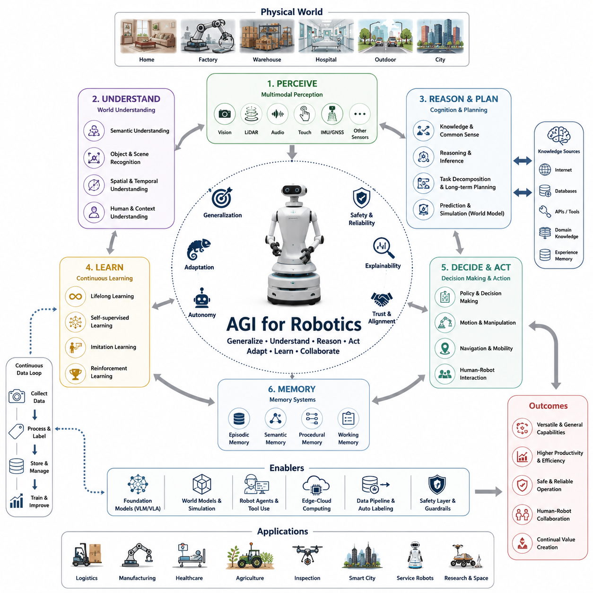
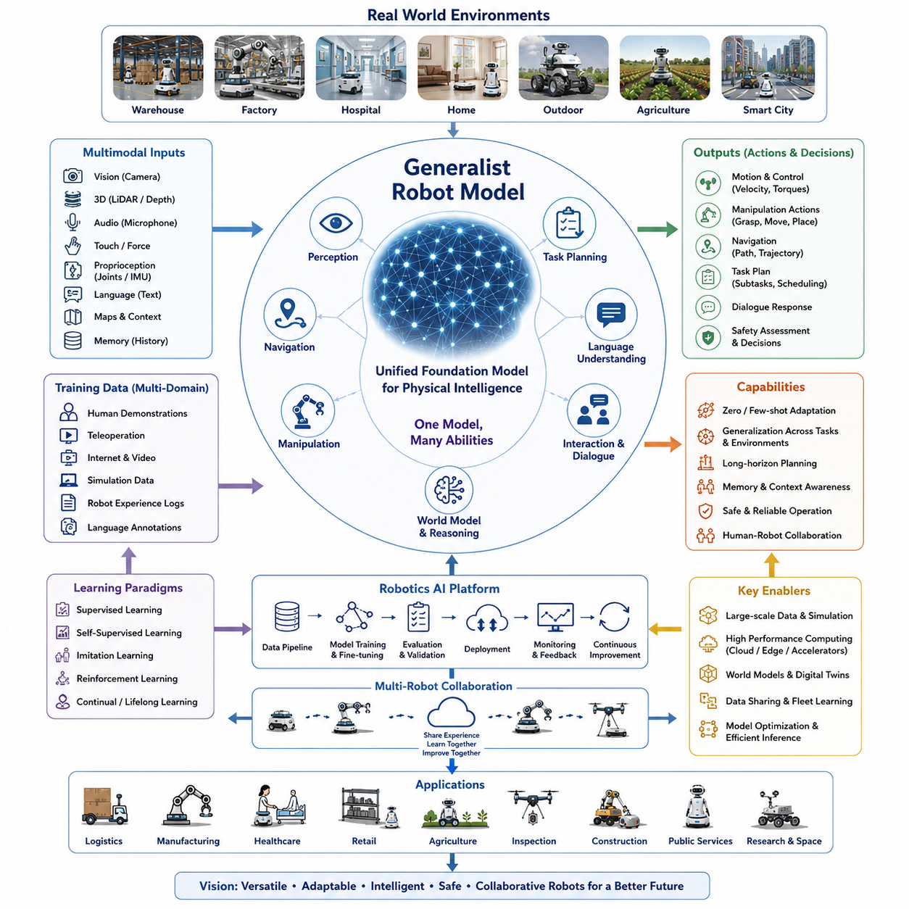
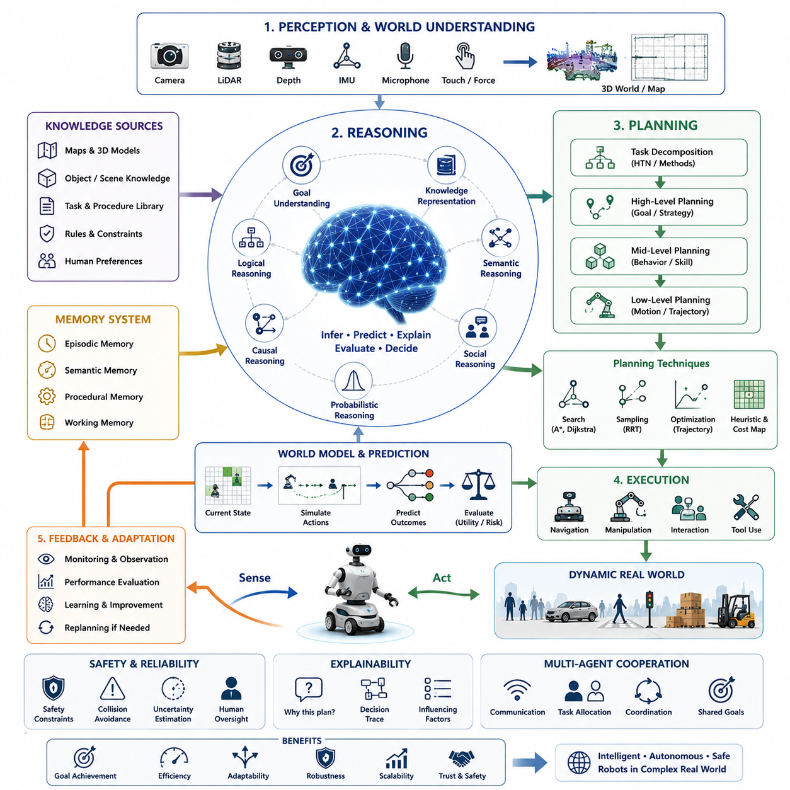
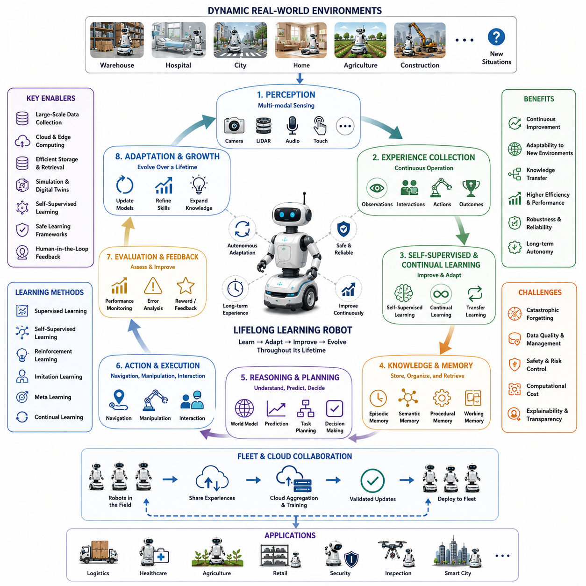
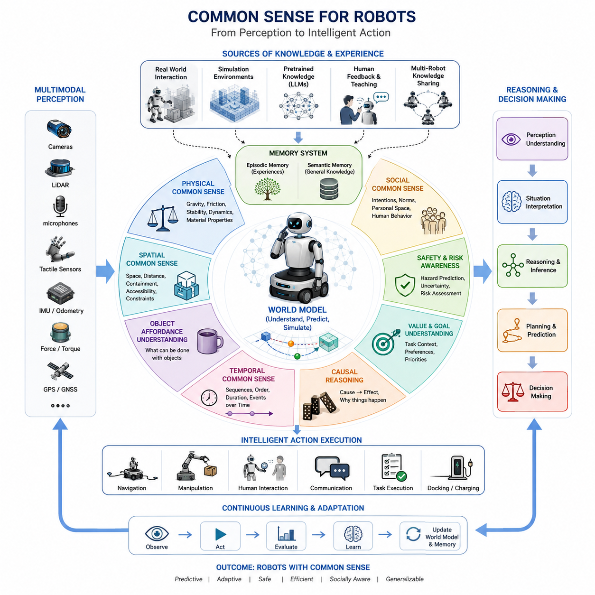
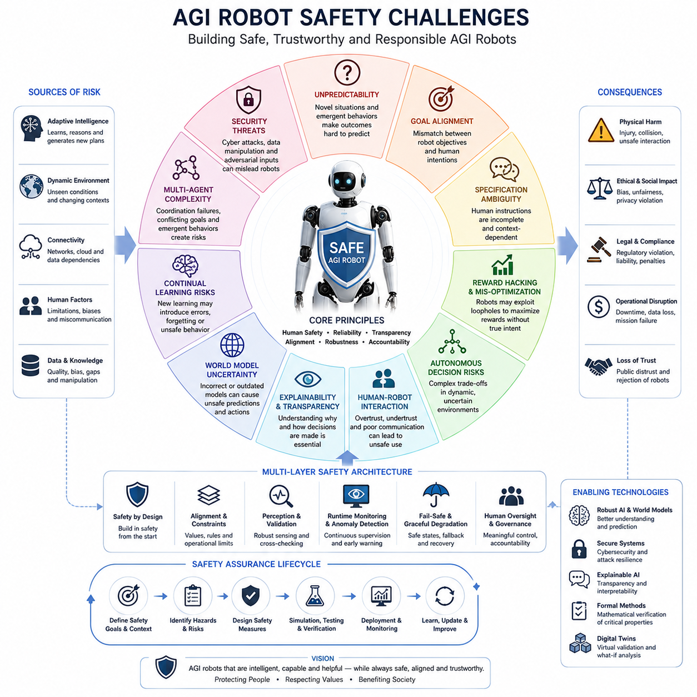
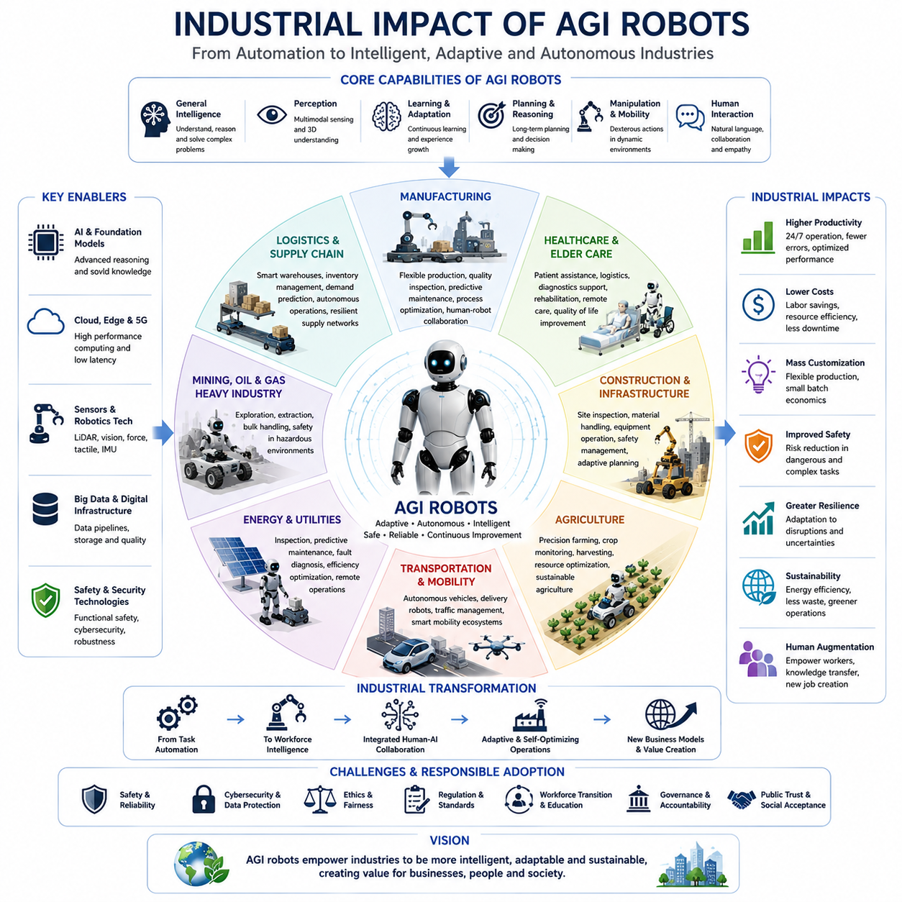
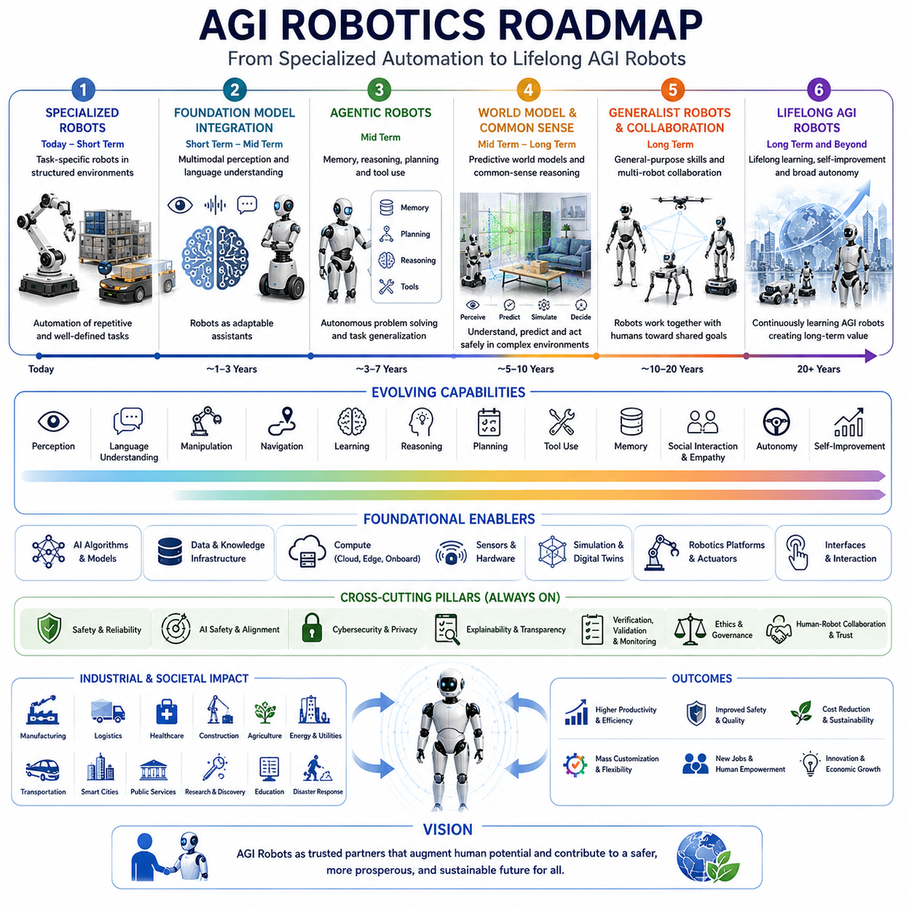

**Volume 06. AMR AI and Embodied Intelligence**

# Chapter 24. AGI and Robotics

## 24.1 AGI Concepts for Robotics

{width="7.268055555555556in" height="7.268055555555556in"}

Artificial General Intelligence (AGI) represents one of the most transformative concepts in the future evolution of robotics. While current robotic systems are typically designed to perform specialized tasks within predefined environments, AGI envisions machines capable of understanding, reasoning, learning, and adapting across a broad spectrum of domains in ways that resemble or even surpass human cognitive capabilities. In the context of robotics, AGI is not simply an improvement in perception accuracy or navigation performance. Rather, it represents a fundamental shift from task-specific automation toward truly general-purpose autonomous intelligence capable of operating effectively in dynamic and unpredictable real-world environments. The topic of AGI for robotics emerges naturally from the progression of AI technologies including foundation models, robot agents, world models, multimodal reasoning systems, embodied intelligence, reinforcement learning, and large-scale autonomous learning architectures. As robotics systems become increasingly integrated with advanced AI capabilities, the distinction between a machine executing programmed behaviors and a machine understanding its environment begins to blur. This evolution forms the foundation of AGI-oriented robotics.

Traditional robots operate within narrow domains. Industrial robot arms execute repetitive motions with extraordinary precision but possess little understanding of their actions. Warehouse AMRs navigate predefined spaces efficiently but struggle when encountering unfamiliar situations outside their operational design assumptions. Service robots can interact with humans through limited interfaces but often fail when confronted with unexpected requests. These limitations arise because most robots today rely on specialized models optimized for specific tasks. AGI seeks to overcome these constraints by enabling robots to develop generalized cognitive capabilities that can be transferred across domains, environments, and objectives.

A defining characteristic of AGI in robotics is the ability to generalize knowledge. Humans can learn a concept in one context and apply it in another. A child who learns how to open one type of door can often infer how to open many different kinds of doors. Similarly, an AGI-enabled robot should be able to transfer knowledge acquired during one task to entirely new situations. Instead of requiring retraining for every environmental variation, the robot would possess a unified understanding of physical interactions, object relationships, and task objectives. Such generalization dramatically reduces development effort while increasing adaptability and operational flexibility.

The concept of embodied intelligence plays a central role in AGI robotics. Unlike purely digital AI systems that operate within virtual information spaces, robots must interact with the physical world. They perceive through sensors, move through space, manipulate objects, and experience physical consequences of their actions. Embodiment provides AGI systems with grounding mechanisms that connect abstract reasoning to real-world experiences. Through continuous interaction with environments, robots can develop richer representations of reality than systems trained exclusively on textual or simulated data.

Perception within AGI robotics extends beyond object detection and classification. Modern robotic perception systems identify pedestrians, vehicles, obstacles, and infrastructure elements. AGI-level perception requires deeper semantic understanding. A robot must recognize not only that an object is a chair but also understand its purpose, potential uses, spatial relationships, ownership implications, and contextual significance within ongoing tasks. Such semantic comprehension allows robots to reason about environments similarly to humans rather than merely processing sensor data statistically.

World models constitute another foundational component of AGI-oriented robotics. A world model represents an internal simulation of reality that enables prediction, planning, and reasoning. Humans continuously construct mental models of their surroundings and use them to anticipate future events. AGI robots require similar capabilities. By maintaining dynamic internal representations of environments, objects, agents, and physical processes, robots can simulate alternative future scenarios before taking actions. This predictive capability improves safety, efficiency, and robustness while supporting higher-level decision making.

Reasoning is often considered a hallmark of AGI. In robotics, reasoning involves more than selecting actions from predefined policies. It encompasses causal inference, logical deduction, hypothesis generation, goal decomposition, and strategic planning. An AGI-enabled robot operating in a hospital, for example, must understand priorities among multiple tasks, reason about patient safety, coordinate with healthcare staff, and adapt plans when unexpected situations arise. Such reasoning capabilities enable robots to function effectively in environments where explicit programming becomes impractical.

Long-horizon planning represents another critical AGI characteristic. Many existing robotic systems excel at short-term decisions but struggle with extended sequences of actions involving multiple dependencies. AGI robotics aims to support hierarchical planning structures where high-level objectives are decomposed into intermediate goals and low-level execution steps. A robot tasked with preparing a conference room may need to inspect the environment, locate equipment, rearrange furniture, connect presentation systems, verify functionality, and respond to human feedback. Achieving such complex objectives requires sophisticated planning architectures capable of managing uncertainty and dynamically adjusting strategies.

Language understanding significantly enhances AGI capabilities in robotics. Natural language serves as one of humanity\'s most powerful mechanisms for communication, knowledge transfer, and reasoning. AGI robots leverage large language models and multimodal foundation models to interpret instructions, engage in dialogue, explain decisions, and learn from verbal interactions. Language enables humans to teach robots without specialized programming interfaces, greatly expanding accessibility and operational versatility. The integration of language with perception and action forms the basis of vision-language-action systems that represent a major step toward AGI robotics.

Memory systems are equally important. Human intelligence relies heavily on various forms of memory including episodic memory, semantic memory, procedural memory, and working memory. AGI robots require analogous mechanisms. Episodic memory allows robots to remember past experiences and learn from previous interactions. Semantic memory stores factual knowledge about the world. Procedural memory supports skill execution and task automation. Working memory facilitates real-time reasoning during complex operations. Together, these memory systems provide continuity across tasks and enable lifelong learning.

Lifelong learning is a defining requirement for AGI robotics. Traditional machine learning systems often rely on fixed datasets and offline training processes. Once deployed, performance may degrade as environments evolve. AGI robots must continuously acquire knowledge from ongoing experiences while preserving previously learned capabilities. This process requires overcoming challenges such as catastrophic forgetting, knowledge integration, and safe adaptation. Lifelong learning enables robots to remain effective over years of operation while gradually expanding their competence across increasingly diverse tasks.

Common-sense reasoning represents one of the most difficult challenges in AGI research. Humans possess vast amounts of implicit knowledge acquired through experience. We understand that fragile objects require careful handling, that wet floors may be slippery, and that people typically prefer personal space. AGI robots require similar common-sense understanding to operate safely and effectively in human environments. Without such capabilities, robots may make technically logical but practically inappropriate decisions. Developing common-sense reasoning remains a major research focus in both AI and robotics communities.

Multimodal intelligence is another key dimension of AGI. Humans integrate information from vision, hearing, touch, language, proprioception, and contextual understanding. AGI robots similarly combine data from cameras, LiDAR, radar, microphones, force sensors, GNSS systems, IMUs, and other sensing modalities. By fusing diverse information sources, robots achieve richer situational awareness and improved decision-making capabilities. Multimodal representations also support more robust performance under uncertain or degraded sensing conditions.

Autonomous skill acquisition further distinguishes AGI robotics from conventional systems. Rather than relying solely on manually engineered behaviors, AGI robots learn new skills through observation, exploration, imitation, simulation, and interaction. A robot may observe a human performing a task, infer underlying objectives, practice within a simulation environment, and eventually execute the task autonomously in the real world. This ability dramatically accelerates capability expansion and reduces dependence on explicit programming.

Simulation plays a crucial role in AGI development. High-fidelity digital environments provide safe and scalable platforms for training intelligent robots. Through simulation, robots can experience millions of scenarios that would be impractical to reproduce physically. Advances in digital twins, synthetic data generation, and world-model-based simulation enable AGI systems to learn efficiently while reducing operational risks. Sim-to-real transfer techniques then bridge the gap between virtual learning and real-world deployment.

The emergence of generalist robot models marks a significant milestone toward AGI. Traditional robotics architectures often employ separate models for perception, navigation, manipulation, and planning. Generalist models seek to unify these functions within a single architecture capable of handling diverse tasks. Inspired by foundation models in language and vision, generalist robot models learn from large-scale multimodal datasets encompassing actions, observations, instructions, and environmental interactions. Such architectures may eventually serve as foundational intelligence layers for future robotic systems.

Human-robot collaboration becomes increasingly sophisticated as AGI capabilities advance. Rather than functioning as isolated tools, AGI robots operate as collaborative partners capable of understanding intentions, negotiating objectives, and participating in shared decision-making processes. In industrial environments, robots may coordinate with workers to optimize productivity while maintaining safety. In healthcare settings, robots may assist clinicians by providing contextual recommendations and executing support tasks. Such collaboration requires trust, transparency, and effective communication mechanisms.

Safety remains one of the most important considerations in AGI robotics. Greater intelligence introduces greater autonomy, which in turn increases potential risks. AGI robots must operate within carefully defined safety constraints while remaining capable of adapting to unforeseen situations. Techniques such as hierarchical safety architectures, runtime monitoring, explainable decision-making, uncertainty estimation, and human oversight mechanisms play critical roles in ensuring safe deployment. Safety engineering for AGI robots extends beyond traditional functional safety and encompasses cognitive safety, ethical alignment, and behavioral reliability.

Industrial applications of AGI robotics are expected to transform numerous sectors. In logistics, AGI robots may autonomously manage warehouses, coordinate fleets, and optimize supply chains. In healthcare, intelligent robots could assist with patient care, diagnostics, and hospital operations. In infrastructure inspection, robots may analyze complex environments and make independent maintenance decisions. In agriculture, robots could manage entire cultivation cycles while adapting to changing environmental conditions. These applications illustrate how AGI could shift robots from task executors to autonomous problem solvers.

The computational requirements of AGI robotics are substantial. Future systems will likely combine edge computing, cloud intelligence, distributed AI architectures, and specialized accelerators. Real-time perception and control must occur locally to meet latency requirements, while large-scale reasoning and knowledge integration may leverage cloud resources. Hybrid edge-cloud architectures provide a practical pathway toward scalable AGI deployment while balancing performance, cost, and operational constraints.

Despite remarkable progress in AI, true AGI for robotics remains an ongoing research challenge. Current systems demonstrate impressive capabilities in narrow domains but still lack the robustness, adaptability, and common-sense understanding associated with human intelligence. Significant advances are required in world modeling, continual learning, reasoning, multimodal integration, safety assurance, and physical interaction. Nevertheless, recent developments in foundation models, robot agents, vision-language-action systems, and embodied learning suggest that the gap between specialized robotics and general-purpose intelligent machines is steadily narrowing.

The long-term vision of AGI robotics involves machines capable of understanding goals, learning continuously, adapting to new environments, collaborating with humans, and performing a wide range of physical and cognitive tasks with minimal supervision. Such systems would represent a fundamental transformation in the relationship between humans and machines. Rather than being programmed tools designed for specific functions, robots would become intelligent agents capable of contributing meaningfully across industries, societies, and daily life. The journey toward AGI robotics is likely to define the next generation of autonomous systems and serve as one of the most significant technological developments of the twenty-first century.

# 24_01_AGI_Concepts_for_Robotics

## 24.2 Generalist Robot Models

{width="7.268055555555556in" height="7.268055555555556in"}

Generalist Robot Models represent one of the most important transitions in the evolution of intelligent robotics. Traditional robotic systems have historically been developed as highly specialized solutions designed for narrowly defined tasks. A warehouse robot is optimized for transportation, a robotic arm is optimized for manipulation, and an inspection robot is optimized for perception and monitoring. Each system typically requires separate datasets, distinct software architectures, dedicated training pipelines, and domain-specific engineering efforts. While this approach has produced highly capable robots within constrained environments, it has also created significant limitations in scalability, adaptability, and long-term autonomy. Generalist Robot Models seek to overcome these limitations by creating unified intelligence architectures capable of performing a wide variety of tasks across multiple environments using a single foundation model.

The concept of a Generalist Robot Model originates from the broader success of foundation models in artificial intelligence. Large Language Models demonstrated that a single neural network trained on massive amounts of data could perform translation, summarization, reasoning, coding, planning, and dialogue generation without task-specific architectures. Similarly, vision foundation models showed that one model could support object detection, segmentation, classification, and scene understanding. Robotics researchers recognized that the same principle could be extended to physical intelligence. Instead of creating separate models for navigation, manipulation, perception, and planning, a robot could be powered by a single generalized intelligence system capable of learning transferable representations across all robotic functions.

The primary objective of Generalist Robot Models is to create a unified understanding of the physical world. Rather than treating perception, planning, and action as isolated components, these models learn integrated representations that connect observations, language instructions, environmental context, task objectives, and motor actions. Through this integration, robots gain the ability to generalize knowledge across domains. A robot that learns how to pick up a box may also develop useful knowledge for handling tools, opening doors, or organizing objects because all of these activities share underlying physical principles.

One of the defining characteristics of Generalist Robot Models is multimodal learning. Humans learn by simultaneously integrating visual information, auditory signals, tactile sensations, language instructions, and physical interactions. Generalist robotic systems attempt to replicate this process by combining multiple modalities into a shared representation space. Cameras provide visual context, LiDAR generates spatial understanding, microphones capture human instructions, force sensors measure interactions, and robot kinematics provide information about movement and manipulation. By learning relationships between these diverse inputs, a robot develops richer situational awareness and stronger reasoning capabilities.

A Generalist Robot Model typically receives diverse forms of input and produces multiple forms of output. Inputs may include images, video streams, point clouds, sensor measurements, natural language commands, environmental maps, and historical memory states. Outputs may include navigation trajectories, manipulation actions, task plans, dialogue responses, safety assessments, and control commands. This flexibility distinguishes generalist models from traditional robotics pipelines where separate modules perform each function independently.

The development of large-scale robotics datasets has been a major enabler of Generalist Robot Models. Traditional robot learning relied on relatively small datasets collected from specific platforms operating in limited environments. Generalist models require orders of magnitude more data. Researchers collect demonstrations from warehouses, homes, hospitals, factories, outdoor environments, and simulation platforms. These datasets include images, sensor streams, language annotations, action trajectories, and task outcomes. By learning from diverse experiences, the model develops broad representations that support generalization.

Transfer learning plays a critical role in generalist robotics. Instead of training every robotic capability from scratch, the model leverages knowledge acquired during previous experiences. Skills learned in one domain can be reused in another. For example, visual representations learned from object recognition may support navigation, manipulation, and inspection tasks simultaneously. This reuse of knowledge dramatically improves data efficiency and accelerates capability development.

Foundation models for robotics extend beyond traditional machine learning architectures. Modern systems increasingly incorporate transformer-based architectures that can process sequences of multimodal information. Transformers excel at identifying relationships across long temporal horizons and large contextual windows. In robotics, this capability supports reasoning about task sequences, environmental changes, and long-term objectives. A robot can analyze not only its current observation but also historical experiences and future goals when making decisions.

Language plays an increasingly important role in Generalist Robot Models. Natural language serves as a universal interface between humans and machines. Instead of programming robots through specialized software, operators can communicate using everyday language. A robot might receive instructions such as "inspect all emergency exits and report any obstructions" or "deliver medical supplies to Room 305 and return to the charging station." The model must understand the meaning, decompose the task into subtasks, identify required resources, and generate executable action plans.

The integration of language and action creates a powerful capability known as language-grounded robotics. In this paradigm, words are connected directly to physical experiences. The concept of a "door" is not merely a textual definition but is linked to visual appearances, spatial relationships, opening mechanisms, and manipulation actions. Such grounding allows robots to reason about language in ways that correspond to real-world behavior.

Vision-Language-Action models represent one of the most significant developments within the Generalist Robot Model paradigm. These architectures combine visual understanding, language reasoning, and action generation within a single learning framework. Instead of processing perception and planning separately, the model learns direct relationships between observations, instructions, and actions. This enables more natural and flexible robot behavior across diverse scenarios.

A major advantage of Generalist Robot Models is their ability to perform zero-shot and few-shot adaptation. Traditional robots often require extensive retraining whenever new tasks are introduced. Generalist models can frequently execute unfamiliar tasks based on existing knowledge and minimal additional examples. This capability significantly reduces deployment costs and increases operational flexibility.

Task decomposition is another important capability. Complex tasks often involve multiple sequential actions that must be coordinated over extended periods. A robot instructed to prepare a conference room may need to locate equipment, move chairs, connect displays, verify functionality, and report completion. Generalist models can decompose such objectives into manageable subtasks while maintaining awareness of the overall goal.

Memory systems significantly enhance the performance of Generalist Robot Models. Human intelligence relies on memory to accumulate experience and build context. Similarly, robots require mechanisms to remember previous interactions, environmental observations, task histories, and learned knowledge. Episodic memory enables robots to recall specific experiences, while semantic memory supports broader understanding of concepts and relationships. Together, these memory systems contribute to more adaptive and intelligent behavior.

World models further extend the capabilities of Generalist Robot Models. A world model serves as an internal simulation of reality that predicts future outcomes and supports planning. By simulating possible actions before execution, robots can evaluate alternatives, avoid unsafe behaviors, and optimize task performance. This predictive reasoning is particularly important in dynamic environments where uncertainty is unavoidable.

Generalist Robot Models also benefit from reinforcement learning and imitation learning. Reinforcement learning enables robots to discover effective behaviors through trial and error, while imitation learning allows them to learn directly from human demonstrations. Combining these approaches with large-scale foundation models creates powerful learning systems capable of acquiring diverse skills efficiently.

Simulation environments play a critical role in training generalist robots. Physical data collection is expensive and time-consuming, especially for large-scale learning systems. High-fidelity simulators provide scalable environments where robots can practice millions of interactions without risk. Digital twins further enhance training by replicating real-world environments with high accuracy. Sim-to-real transfer techniques then bridge the gap between simulation and physical deployment.

Safety remains a central challenge for Generalist Robot Models. Greater flexibility often introduces greater uncertainty. A model capable of performing thousands of tasks may encounter situations never observed during training. Ensuring safe behavior under such conditions requires robust validation methodologies, uncertainty estimation mechanisms, runtime monitoring systems, and layered safety architectures. Safety constraints must remain active even when robots are learning or adapting.

Interpretability is another important consideration. As Generalist Robot Models become larger and more complex, understanding their decision-making processes becomes increasingly difficult. Operators, engineers, and regulators need visibility into why a robot selected a particular action. Explainable AI techniques help provide transparency and improve trust in autonomous systems.

The computational requirements of Generalist Robot Models are substantial. Training may involve billions of parameters and petabytes of multimodal data. Deployment often requires advanced GPUs, AI accelerators, edge computing platforms, and cloud-based infrastructure. Efficient inference optimization, quantization, model compression, and distributed computing become essential for practical deployment in mobile robotic systems.

Cloud robotics significantly enhances the scalability of Generalist Robot Models. Robots operating in the field can share experiences with centralized learning systems. Knowledge acquired by one robot may benefit thousands of others. This collective learning process accelerates capability growth and creates network effects across robotic fleets. As more robots operate and learn, the entire system becomes increasingly capable.

Multi-agent systems represent another extension of the generalist paradigm. Rather than focusing on individual robots, researchers increasingly explore cooperative intelligence across fleets. Generalist models may coordinate multiple robots performing complementary tasks, sharing information, and collectively solving problems. Such collaboration enables large-scale autonomous operations in logistics, manufacturing, healthcare, agriculture, and smart city environments.

Industrial applications of Generalist Robot Models are expected to transform numerous sectors. In warehouses, robots may handle transportation, inspection, inventory management, and maintenance using a single intelligence platform. In hospitals, robots may deliver supplies, assist patients, perform sanitation tasks, and support medical staff. In agriculture, robots may monitor crops, perform harvesting, manage irrigation, and analyze environmental conditions. In smart cities, autonomous systems may conduct inspections, manage infrastructure, provide public services, and support emergency response operations.

Humanoid robotics is closely linked to the development of Generalist Robot Models. Human environments are inherently designed around human capabilities. A generalist humanoid robot equipped with advanced perception, reasoning, and manipulation capabilities could potentially perform a vast range of tasks using existing infrastructure. This compatibility makes humanoid platforms attractive candidates for future AGI-oriented robotic systems.

Despite remarkable progress, significant challenges remain. Data diversity remains insufficient compared to the complexity of the real world. Robust common-sense reasoning is still limited. Long-term memory mechanisms require further development. Real-time operation under strict safety constraints remains difficult. Furthermore, achieving human-level adaptability across all domains continues to be an open research problem.

Nevertheless, the trajectory of development is clear. Robotics is moving away from collections of specialized modules toward integrated foundation intelligence architectures. Generalist Robot Models represent a foundational step toward robots capable of understanding, reasoning, learning, and acting across diverse environments without extensive task-specific engineering. These systems form a bridge between current autonomous robots and future AGI-enabled embodied intelligence.

In the long term, Generalist Robot Models may become the equivalent of operating systems for intelligent machines. Just as modern computers rely on generalized software platforms capable of supporting countless applications, future robots may rely on unified intelligence models capable of supporting countless physical tasks. Such architectures would dramatically reduce development costs, accelerate deployment, and enable unprecedented levels of autonomy. As multimodal foundation models, world models, lifelong learning systems, and embodied intelligence continue to evolve, Generalist Robot Models are expected to become one of the central pillars of future robotics, ultimately enabling robots to function as adaptable, versatile, and continuously improving partners in human society.

# 24_02_Generalist_Robot_Models

## 24.3 Robot Reasoning and Planning

{width="7.268055555555556in" height="7.268055555555556in"}

Robot Reasoning and Planning represent the cognitive core of advanced autonomous robotic systems and serve as one of the most critical foundations for the development of General Artificial Intelligence (AGI) in robotics. While perception enables a robot to observe and understand its environment, reasoning and planning enable it to decide what actions should be taken, why they should be taken, and how they should be executed to achieve desired goals. In many ways, reasoning and planning transform a robot from a reactive machine into an intelligent agent capable of understanding objectives, evaluating alternatives, predicting consequences, and selecting optimal strategies. As robotic systems become increasingly autonomous and operate in complex, dynamic, and human-centered environments, the importance of reasoning and planning continues to grow. These capabilities form the bridge between perception, knowledge, memory, learning, and action, ultimately determining the effectiveness and intelligence of robotic behavior.

Traditional robotic systems often rely on predefined rules and deterministic workflows. In structured industrial environments, such approaches can be highly effective because the operating conditions remain relatively stable. A robot arm assembling components on a production line may follow the same sequence of motions thousands of times with minimal variation. However, as robots move into warehouses, hospitals, cities, construction sites, homes, and other unstructured environments, fixed rule-based systems become insufficient. Such environments contain uncertainty, changing conditions, human interactions, unexpected obstacles, and incomplete information. In these situations, robots must reason about what is happening and plan actions that can adapt to changing circumstances.

Reasoning can be described as the process of deriving conclusions, generating explanations, making predictions, and selecting actions based on available information. For robots, reasoning involves understanding relationships between objects, tasks, goals, environmental conditions, and potential outcomes. Planning, on the other hand, involves organizing actions over time to achieve objectives efficiently and safely. Together, reasoning and planning enable robots to operate intelligently rather than merely reactively.

One of the fundamental aspects of robot reasoning is goal understanding. Every autonomous task begins with an objective. A robot may be instructed to deliver medical supplies, inspect infrastructure, transport materials, monitor security zones, or assist a human operator. Understanding the goal requires more than interpreting a command. The robot must determine what success means, identify relevant constraints, recognize environmental factors, and establish priorities among competing objectives. Goal understanding serves as the foundation upon which all subsequent reasoning and planning processes are built.

Task decomposition is a central capability within robotic reasoning systems. Complex objectives are rarely achieved through a single action. Instead, they require a sequence of coordinated activities. Consider a robot assigned to prepare a conference room. The robot must inspect the room, identify missing equipment, retrieve necessary items, arrange furniture, verify audiovisual systems, and report completion. Each of these activities may contain multiple subtasks. Effective reasoning systems automatically decompose high-level goals into manageable action sequences while maintaining alignment with the original objective.

Hierarchical planning architectures are commonly used to manage this complexity. High-level planners focus on strategic objectives and long-term goals, while lower-level planners handle navigation, manipulation, motion generation, and control. This hierarchical structure mirrors human decision-making processes. A person planning a trip may first select a destination, then choose transportation, then determine specific routes. Similarly, robots benefit from separating strategic reasoning from operational execution.

Knowledge representation is another essential component of robot reasoning. To make intelligent decisions, robots require structured representations of information about the world. Knowledge may include object properties, environmental maps, task procedures, safety rules, human preferences, and operational constraints. Modern robotic systems increasingly employ semantic representations that capture relationships between entities. Rather than merely storing coordinates and object labels, semantic knowledge structures encode meanings, functions, and contextual relationships.

Semantic reasoning allows robots to understand environments at a conceptual level. For example, a robot that recognizes an object as a chair should also understand that chairs are typically used for sitting, may be movable, and are often found near tables. Such knowledge supports more intelligent planning and decision-making. Semantic understanding becomes especially important in human-centered environments where contextual interpretation influences task execution.

Logical reasoning plays a significant role in robotic cognition. Logic-based systems enable robots to infer conclusions from known facts and rules. If a robot knows that a hallway is blocked and that a particular room can only be accessed through that hallway, it can infer that an alternative route must be found. Logical reasoning supports consistency, explainability, and structured decision-making, making it particularly useful for safety-critical applications.

Causal reasoning extends beyond logical inference by focusing on cause-and-effect relationships. Understanding causality allows robots to predict how actions will influence future states. For example, moving a box may clear a pathway, opening a door may provide access to a room, and activating a machine may change environmental conditions. Causal reasoning is essential for long-horizon planning because it enables robots to anticipate consequences before acting.

Probabilistic reasoning addresses uncertainty, which is unavoidable in real-world environments. Sensors produce noisy data, environmental conditions change, and human behavior remains difficult to predict. Probabilistic models allow robots to estimate likelihoods, quantify uncertainty, and make informed decisions despite incomplete information. Techniques such as Bayesian inference, probabilistic graphical models, and uncertainty-aware neural networks are widely used to support robust robotic reasoning.

World models have emerged as one of the most promising frameworks for advanced reasoning and planning. A world model is an internal representation of the environment that allows a robot to simulate future scenarios. By predicting how the world might evolve under different actions, robots can evaluate alternatives before acting. This capability resembles human imagination and mental simulation. Rather than relying solely on reactive responses, robots can explore hypothetical futures and select strategies that maximize expected outcomes.

Prediction is closely related to planning. Effective planning requires anticipating future events, environmental changes, and task outcomes. Robots operating in dynamic environments must predict pedestrian movements, vehicle trajectories, weather conditions, equipment states, and other factors that influence decision-making. Accurate prediction improves safety, efficiency, and adaptability while reducing operational risks.

Motion planning represents one of the most established areas of robotics research. Once a high-level objective has been determined, the robot must generate feasible trajectories that achieve desired goals while avoiding obstacles and respecting physical constraints. Classical planning algorithms such as A\*, Dijkstra, Rapidly Exploring Random Trees (RRT), and trajectory optimization methods remain important tools for robotic navigation and manipulation. However, modern systems increasingly combine these techniques with AI-based reasoning frameworks.

Behavior planning focuses on selecting appropriate actions based on context. A robot operating in a hospital may encounter patients, medical staff, visitors, and equipment. The appropriate behavior depends on environmental conditions, social norms, safety requirements, and task priorities. Behavior planners integrate perception, reasoning, and policy constraints to generate contextually appropriate actions.

Social reasoning is becoming increasingly important as robots interact more frequently with humans. Human-centered environments require robots to understand intentions, preferences, emotions, and social expectations. For example, a delivery robot navigating a hospital corridor should recognize when a patient requires priority access, when a group conversation should not be interrupted, and when alternative routes are preferable. Social reasoning contributes significantly to trust, acceptance, and effective collaboration.

Large Language Models have introduced new capabilities into robot reasoning systems. Language models can interpret instructions, generate plans, explain decisions, and perform symbolic reasoning. By leveraging extensive world knowledge learned during pretraining, LLM-based reasoning systems can provide valuable support for task planning and decision-making. A robot receiving a natural language instruction can use an LLM to decompose the task into structured subtasks and generate execution plans.

The integration of LLMs with robotic systems has led to the emergence of language-guided planning architectures. These systems combine natural language understanding, world knowledge, semantic reasoning, and action generation within unified frameworks. Such architectures allow robots to communicate naturally with humans while maintaining operational flexibility across diverse domains.

Robot agents represent an advanced evolution of reasoning systems. Rather than functioning as isolated modules, agents integrate perception, memory, reasoning, planning, and action within continuous feedback loops. Agent architectures support autonomous task execution, tool utilization, API integration, environmental adaptation, and long-term objective management. As robotics moves toward AGI-oriented systems, agent-based architectures are becoming increasingly important.

Memory significantly enhances reasoning performance. Human reasoning depends heavily on past experiences and accumulated knowledge. Similarly, robots benefit from episodic memory, semantic memory, procedural memory, and working memory. Episodic memory allows robots to recall previous interactions and outcomes. Semantic memory stores factual knowledge. Procedural memory captures learned skills. Working memory supports real-time reasoning during task execution. Together, these memory systems provide context and continuity for decision-making.

Learning and reasoning are deeply interconnected. Learning provides the knowledge and representations required for reasoning, while reasoning guides learning by identifying information gaps and generating hypotheses. Modern robotic systems increasingly combine machine learning, reinforcement learning, imitation learning, and symbolic reasoning within unified cognitive architectures. This integration supports more adaptive and intelligent behavior.

Reinforcement learning contributes to planning by enabling robots to discover optimal action policies through experience. Instead of relying solely on predefined strategies, robots learn to maximize long-term rewards through exploration and feedback. However, pure reinforcement learning often struggles with sample efficiency and interpretability. Consequently, hybrid approaches that combine reinforcement learning with symbolic planning and world models have become increasingly popular.

Simulation environments play a crucial role in reasoning and planning development. Simulators allow robots to experience diverse scenarios, test strategies, and evaluate behaviors without physical risks. Digital twins further enhance simulation fidelity by accurately replicating real-world environments. Through simulation-based training, robots can develop reasoning and planning capabilities before deployment in operational settings.

Safety remains a primary concern for robotic reasoning systems. Intelligent robots must avoid unsafe actions even when pursuing legitimate objectives. Safe reasoning requires adherence to operational constraints, ethical guidelines, regulatory requirements, and risk management principles. Runtime safety monitors, constraint-based planners, uncertainty estimation systems, and human oversight mechanisms all contribute to safe operation.

Explainability is another important consideration. As reasoning architectures become increasingly complex, understanding why a robot selected a particular course of action becomes more difficult. Explainable reasoning systems provide transparency by documenting decision pathways, identifying influencing factors, and communicating rationale to operators. Explainability improves trust, facilitates debugging, and supports regulatory compliance.

Multi-agent reasoning extends planning beyond individual robots. In fleet operations, multiple robots must coordinate actions, share information, allocate tasks, and avoid conflicts. Multi-agent reasoning systems support cooperative behavior through communication, negotiation, consensus building, and distributed planning. Such capabilities are essential for large-scale logistics, manufacturing, smart city, and infrastructure management applications.

Industrial applications of robot reasoning and planning are extensive. Warehouse robots optimize inventory movement and traffic flow. Hospital robots coordinate medical deliveries and patient services. Inspection robots analyze infrastructure conditions and prioritize maintenance activities. Agricultural robots manage planting, irrigation, monitoring, and harvesting operations. Security robots assess threats and adapt patrol strategies. In each case, intelligent reasoning and planning significantly improve operational effectiveness.

The emergence of Generalist Robot Models further elevates the importance of reasoning and planning. Rather than executing narrowly defined behaviors, future robots must understand diverse objectives, adapt to unfamiliar situations, and transfer knowledge across domains. Reasoning serves as the mechanism through which such generalization becomes possible. Planning transforms abstract goals into executable actions, enabling robots to function as intelligent autonomous agents.

Looking toward the future, robot reasoning and planning are expected to evolve beyond task-specific decision systems into comprehensive cognitive architectures capable of supporting AGI-level intelligence. Future robots may maintain rich world models, perform long-horizon strategic planning, engage in collaborative reasoning with humans, generate novel solutions to unforeseen problems, and continuously improve through experience. These capabilities will move robotics closer to true embodied intelligence, where machines not only perceive and act but also understand, reason, predict, and plan in ways that increasingly resemble human cognition.

Ultimately, Robot Reasoning and Planning form the intellectual engine of autonomous systems. They connect perception to action, transform knowledge into decisions, and enable robots to pursue goals effectively within complex environments. As AGI-oriented robotics continues to advance, reasoning and planning will become the central mechanisms through which robots achieve adaptability, autonomy, intelligence, and long-term operational success.

# 24_03_Robot_Reasoning_and_Planning

## 24.4 Lifelong Learning Robots

{width="7.268055555555556in" height="7.268055555555556in"}

Lifelong Learning Robots represent one of the most important directions in the evolution of intelligent robotics and Artificial General Intelligence. Traditional robotic systems are typically trained before deployment and operate using relatively fixed models throughout their operational life. Once deployed, their knowledge remains largely static unless engineers collect new datasets, retrain models, validate performance, and distribute software updates. While this approach has enabled remarkable advances in industrial automation, autonomous navigation, robot perception, and manipulation, it fundamentally limits a robot's ability to adapt to continuously changing environments. Lifelong Learning Robots seek to overcome these limitations by enabling robots to continuously acquire knowledge, improve skills, adapt to new situations, and refine their understanding of the world throughout their entire operational lifetime. In essence, lifelong learning transforms a robot from a machine that executes pre-programmed knowledge into a continuously evolving intelligent system capable of learning from experience.

Human intelligence provides the primary inspiration for lifelong learning. Humans do not stop learning after completing formal education. Every interaction, observation, success, failure, and environmental change contributes to a growing body of knowledge. A person who learns to drive one vehicle can quickly adapt to another. A doctor accumulates expertise through years of clinical practice. A technician improves troubleshooting skills through repeated exposure to real-world problems. This continuous accumulation of knowledge enables humans to adapt to new challenges throughout their lives. Lifelong Learning Robots aim to achieve similar capabilities by continuously updating internal representations, models, memories, and decision-making strategies based on ongoing experiences.

One of the key motivations behind lifelong learning is the dynamic nature of real-world environments. Unlike controlled laboratory conditions, operational environments constantly change. Warehouses introduce new inventory layouts. Hospitals adopt new procedures. Cities experience construction activities and traffic pattern shifts. Agricultural environments change according to seasons, weather conditions, and crop cycles. Security environments evolve as new threats emerge. A robot deployed in such environments cannot rely solely on knowledge acquired during initial training. It must continually adapt to remain effective and reliable.

The concept of lifelong learning extends beyond simple model updates. It encompasses a comprehensive framework involving perception, memory, reasoning, planning, action, evaluation, and knowledge integration. A Lifelong Learning Robot continuously collects information from its environment, interprets observations, identifies new patterns, incorporates relevant knowledge into existing models, evaluates performance, and modifies future behavior accordingly. This process creates an ongoing cycle of learning and improvement that persists throughout the robot's operational life.

Perception serves as the primary entry point for lifelong learning. Robots continuously observe the world through cameras, LiDAR sensors, radar systems, microphones, force sensors, GNSS receivers, IMUs, and numerous other sensing modalities. These observations generate enormous quantities of data that provide opportunities for learning. Unlike conventional systems that discard most operational data after processing, lifelong learning architectures treat field experiences as valuable educational resources. Every observation becomes a potential source of knowledge that may improve future performance.

Data collection is therefore a foundational component of lifelong learning. Robots operating in real-world environments accumulate vast repositories of experiences including successful task executions, navigation trajectories, perception outputs, environmental conditions, human interactions, and failure cases. These experiences form the raw material from which future learning occurs. High-quality data management systems are essential for organizing, storing, indexing, and retrieving relevant experiences.

Memory systems play a central role in lifelong learning architectures. Human learning depends heavily on memory, and robotic learning follows a similar principle. Episodic memory stores specific experiences and events encountered during operation. Semantic memory captures general knowledge about concepts, objects, environments, and procedures. Procedural memory contains learned skills and behaviors. Working memory supports real-time reasoning and decision-making. Together, these memory systems allow robots to accumulate knowledge over extended periods while maintaining continuity across experiences.

One of the most significant challenges in lifelong learning is catastrophic forgetting. Traditional neural networks often lose previously acquired knowledge when trained on new data. A robot learning a new task may inadvertently degrade performance on previously mastered tasks. Humans generally avoid such catastrophic forgetting by integrating new knowledge with existing cognitive structures. Lifelong Learning Robots require similar mechanisms to preserve important knowledge while simultaneously acquiring new capabilities.

Continual learning algorithms have emerged as a major research area addressing this challenge. These methods enable robots to incorporate new experiences without completely retraining models from scratch. Techniques such as experience replay, parameter isolation, regularization methods, dynamic architectures, and memory-augmented learning systems help maintain knowledge stability while supporting adaptation. Such approaches are essential for enabling long-term autonomous operation.

Self-supervised learning is particularly important for lifelong learning robots. Traditional supervised learning relies on manually labeled datasets, which are expensive and difficult to scale. In contrast, self-supervised learning allows robots to generate learning signals automatically from their own observations and interactions. A robot can predict future sensor readings, estimate object motion, reconstruct missing information, or compare observations across time. These self-generated learning objectives enable continuous improvement without requiring extensive human intervention.

Representation learning forms another crucial component of lifelong learning systems. Rather than learning task-specific behaviors directly, robots learn generalized representations of environments, objects, actions, and relationships. These representations can then support multiple downstream tasks including navigation, manipulation, reasoning, planning, and interaction. Robust representations improve transferability and accelerate future learning.

Transfer learning enables robots to apply knowledge acquired in one domain to new situations. A robot that learns obstacle avoidance in a warehouse may transfer aspects of that knowledge to hospital navigation. A robot that learns object manipulation in one environment may adapt those skills to different object categories. Transfer learning significantly improves learning efficiency and reduces the amount of new data required for adaptation.

World models provide powerful support for lifelong learning. A world model is an internal representation that predicts how environments evolve over time. As robots accumulate experience, these models become increasingly accurate and comprehensive. Improved world models enhance planning, reasoning, prediction, and decision-making. Moreover, world models enable robots to learn from simulated experiences generated internally, reducing dependence on real-world trial and error.

Reinforcement learning contributes to lifelong adaptation by allowing robots to improve behavior through feedback. Rewards and penalties provide signals that guide policy optimization. Over time, robots discover increasingly effective strategies for achieving objectives. However, lifelong reinforcement learning requires careful management of exploration, safety, and stability to prevent performance degradation during adaptation.

Imitation learning also supports lifelong development. Humans often learn by observing others, and robots can do the same. By analyzing demonstrations provided by operators, experts, or other robots, a robot can acquire new skills and refine existing capabilities. Combined with continual learning mechanisms, imitation learning enables efficient knowledge transfer across individuals and organizations.

Robot fleets provide unique opportunities for collective lifelong learning. In fleet-based systems, individual robots share experiences through cloud infrastructures. Knowledge acquired by one robot can benefit thousands of others. A navigation challenge encountered in one facility may improve operational performance across an entire fleet. This collaborative learning paradigm accelerates capability growth and reduces redundancy in learning processes.

Cloud robotics has become an important enabler of lifelong learning. Local robots perform perception, reasoning, and action execution at the edge, while cloud platforms aggregate operational experiences, manage datasets, retrain models, validate improvements, and distribute updates. This architecture combines the responsiveness of edge computing with the scalability of centralized learning systems.

Human feedback remains an important component of lifelong learning. While robots increasingly learn autonomously, human expertise provides valuable guidance. Operators can identify errors, provide corrections, validate behaviors, and supply demonstrations. Human-in-the-loop learning frameworks combine machine autonomy with human oversight, improving learning efficiency while maintaining safety and reliability.

Reasoning systems become more sophisticated through lifelong learning. As robots accumulate experiences, they develop richer knowledge structures and more accurate predictive models. These improvements enhance causal reasoning, semantic understanding, task planning, and decision-making. Over time, the robot becomes increasingly capable of understanding complex situations and generating effective responses.

Social interaction represents another important learning domain. Robots operating alongside humans must continuously refine their understanding of human behavior, preferences, intentions, and communication styles. Lifelong learning allows robots to adapt interaction strategies based on accumulated experiences, leading to more natural and effective collaboration.

Navigation systems benefit significantly from lifelong learning. Environmental maps evolve continuously due to construction activities, changing layouts, seasonal variations, and operational modifications. Lifelong learning enables robots to update maps, refine localization models, improve obstacle prediction, and optimize route planning based on operational experiences.

Manipulation capabilities also improve through continuous experience. A robot handling thousands of objects over several years can gradually develop more robust grasping strategies, improved force control, better object recognition, and enhanced dexterity. Such improvements emerge naturally through long-term learning processes.

Safety remains one of the most important considerations in lifelong learning systems. Continuous adaptation introduces the possibility of unintended behavioral changes. A robot that modifies its models autonomously must remain compliant with operational constraints and safety requirements. Therefore, learning architectures require rigorous validation, monitoring, rollback mechanisms, and approval workflows. Safe lifelong learning ensures that improvements do not compromise reliability.

Monitoring and evaluation are essential throughout the learning lifecycle. Robots must continuously measure performance metrics, detect anomalies, assess model drift, and identify opportunities for improvement. Operational analytics provide insights into system behavior and support informed decision-making regarding updates and adaptations.

Model validation becomes increasingly important as learning occurs continuously. Traditional deployment models separate training and operation into distinct phases. Lifelong learning blurs this boundary. Consequently, validation systems must operate continuously, ensuring that new knowledge improves performance without introducing unacceptable risks.

Explainability contributes significantly to trustworthy lifelong learning. Operators must understand how and why a robot's behavior changes over time. Transparent learning processes improve trust, facilitate debugging, and support regulatory compliance. Explainable learning systems provide visibility into knowledge acquisition, decision-making evolution, and adaptation mechanisms.

The emergence of Generalist Robot Models further amplifies the importance of lifelong learning. Generalist systems operate across diverse domains and encounter a wide variety of tasks. Static knowledge cannot adequately address such complexity. Lifelong learning enables these models to expand competencies continuously while maintaining previously acquired skills. In many respects, lifelong learning serves as the engine that drives long-term capability growth within Generalist Robot Models.

AGI-oriented robotics places lifelong learning at the center of future intelligent systems. General intelligence requires the ability to learn continuously from experience, adapt to unforeseen situations, acquire new skills autonomously, and integrate knowledge across domains. Without lifelong learning, AGI would remain constrained by the limitations of static training datasets and predefined capabilities.

Industrial applications of Lifelong Learning Robots are expected to transform numerous sectors. Logistics systems will continuously optimize operational efficiency. Hospital robots will adapt to evolving healthcare procedures. Agricultural robots will learn from changing environmental conditions. Infrastructure inspection robots will improve anomaly detection accuracy over years of operation. Smart city robots will adapt to evolving urban environments. In each case, continuous learning creates significant long-term value.

The future of lifelong learning robotics is closely connected to advances in foundation models, world models, self-supervised learning, cloud robotics, multi-agent systems, and embodied intelligence. As these technologies mature, robots will increasingly resemble adaptive cognitive systems rather than fixed automation tools. Future robots may accumulate decades of experience, continuously improve performance, share knowledge globally, and develop increasingly sophisticated understanding of the world.

Ultimately, Lifelong Learning Robots represent a fundamental shift in the philosophy of robotic intelligence. Rather than viewing intelligence as something installed during development, lifelong learning treats intelligence as an evolving process that continues throughout operation. This transition transforms robots from static products into dynamic, growing systems capable of continuous improvement. As robotics advances toward AGI and embodied intelligence, lifelong learning will become one of the defining characteristics of truly intelligent machines, enabling robots to learn, adapt, evolve, and contribute more effectively throughout their operational lifetimes.

# 24_04_Lifelong_Learning_Robots

## 24.5 Common Sense for Robots

{width="7.268055555555556in" height="7.268055555555556in"}

Common sense is one of the most important missing capabilities separating today\'s intelligent robots from truly general-purpose autonomous systems. While modern robots can recognize objects, navigate environments, generate plans, and even communicate through natural language, they often fail in situations that humans consider obvious. A child understands that a cup placed on the edge of a table may fall, that a wet floor can be slippery, that a closed door blocks movement, and that a fragile object should be handled carefully. Such knowledge rarely needs to be taught explicitly because it emerges naturally from years of interaction with the physical world. Robots, however, frequently lack this intuitive understanding. As robotics progresses toward AGI-enabled autonomous systems, the development of robotic common sense becomes a fundamental requirement rather than an optional enhancement. The topic occupies a central position within AGI and robotics because it connects perception, reasoning, planning, memory, world modeling, embodied learning, and real-world action into a unified framework.

Human common sense emerges from continuous observation and interaction with the environment. Every movement, mistake, success, and sensory experience contributes to the formation of internal models that explain how the world operates. Humans understand gravity, friction, object permanence, social norms, causality, spatial relationships, and risk without consciously calculating them. A robot aspiring to achieve human-level autonomy must develop similar capabilities. It must understand not only what objects are but also how they behave, how they interact with other objects, and how their states change over time. Recognizing a chair is useful, but understanding that a chair can support a person\'s weight, can be moved, may block a pathway, and should not be driven through represents a deeper level of intelligence.

One of the most important aspects of robotic common sense is physical reasoning. Physical reasoning allows robots to predict how objects and environments will behave before taking action. When approaching a stack of boxes, a robot should recognize that removing a lower box may destabilize the entire structure. When carrying a liquid container, it should understand that sudden acceleration could cause spilling. When navigating a slope, it should anticipate the effects of gravity and traction. Such capabilities require more than perception. They require predictive models that connect observations to future outcomes.

Physical common sense is closely related to the concept of intuitive physics. Humans possess an internal simulator capable of predicting future events based on incomplete information. A person watching a ball rolling toward the edge of a table expects it to fall even before it happens. Future robots will require similar predictive mechanisms. World models capable of simulating future states allow robots to estimate consequences before executing actions. Instead of reacting to events after they occur, robots can proactively avoid failures by anticipating them. This shift from reactive intelligence to predictive intelligence represents a critical step toward AGI-level robotics.

Spatial common sense forms another essential component of robotic intelligence. Spatial reasoning involves understanding positions, distances, orientations, accessibility, containment, and movement constraints. A robot entering a warehouse must understand that a narrow corridor limits turning radius, that pallets occupy space, and that certain routes may become blocked. In domestic environments, spatial reasoning becomes even more complex because furniture arrangements, human activities, and temporary obstacles change continuously. Robots must construct semantic spatial representations that combine geometry with meaning.

Object affordance understanding is closely related to common sense reasoning. Affordances describe the possible actions associated with an object. Humans automatically understand that handles can be grasped, doors can be opened, buttons can be pressed, and wheels can roll. Robots must learn these relationships through experience and observation. Rather than memorizing object categories alone, future robots will develop action-centered representations that describe how objects can be manipulated, transported, operated, or avoided. Such representations significantly improve task planning and execution in unfamiliar environments.

Temporal common sense enables robots to reason about events across time. Many real-world tasks involve sequences of actions whose outcomes depend on previous states. A robot preparing a delivery must understand that an item must be picked up before it can be transported and transported before it can be delivered. A maintenance robot must recognize that inspection precedes repair. Temporal reasoning also helps robots anticipate future events, estimate task durations, and coordinate activities with humans and other robots. Without temporal understanding, autonomous systems remain limited to isolated actions rather than coherent long-term behavior.

Causal reasoning represents one of the most challenging dimensions of robotic common sense. Traditional machine learning often identifies correlations without understanding causality. A robot may observe that certain events frequently occur together but fail to understand why they occur. True common sense requires identifying cause-and-effect relationships. If a door remains closed, the robot should understand that passage is impossible. If an emergency stop button is pressed, the robot should recognize the causal relationship between the action and the halt in system operation. Causal reasoning improves decision-making, fault diagnosis, recovery planning, and safety management.

Social common sense is equally important in environments shared with humans. Humans follow countless unwritten rules governing personal space, communication, cooperation, and social expectations. A service robot operating in a hospital must recognize that patients may move unpredictably, that medical staff have priority in emergency situations, and that certain behaviors may cause discomfort or confusion. Socially aware robots require models of human intentions, emotions, preferences, and expectations. They must understand not only physical constraints but also social constraints that shape acceptable behavior.

The development of large language models has revealed significant progress toward commonsense reasoning in language domains. LLMs possess extensive knowledge about objects, activities, and human behavior acquired from large-scale text corpora. They can often answer commonsense questions, explain causal relationships, and generate plausible action plans. However, language-based common sense differs from embodied common sense. Reading about an object is fundamentally different from interacting with it. A robot that only learns from text may know that cups contain liquids but may not fully understand the dynamics of spilling, weight distribution, or grasp stability.

This distinction has motivated increasing interest in embodied learning approaches. Embodied learning emphasizes acquiring knowledge through direct interaction with the physical environment. Robots learn by acting, observing outcomes, and refining internal models. Through repeated experiences, they develop practical knowledge about object properties, environmental dynamics, and task execution. Embodied learning transforms abstract knowledge into grounded understanding. Future AGI robots will likely combine language-derived knowledge with physically grounded experiences to achieve robust common sense.

Simulation environments play a critical role in accelerating the development of robotic common sense. Modern simulators allow robots to experience millions of interactions across diverse environments without physical risk. Virtual worlds provide opportunities to learn object dynamics, navigation strategies, manipulation skills, and causal relationships at scale. Simulation-generated experiences can supplement real-world data, enabling robots to encounter rare events that would otherwise be difficult to observe. However, transferring commonsense knowledge from simulation to reality remains challenging because real environments contain complexities, uncertainties, and variations that simulations cannot fully replicate.

World models provide a promising foundation for commonsense reasoning. A world model is an internal representation that predicts how the environment evolves over time. By learning patterns of interaction between objects, agents, and environments, world models enable robots to perform mental simulations before taking action. A robot can imagine multiple future scenarios, evaluate their outcomes, and select the most appropriate strategy. This capability resembles human reasoning, where individuals mentally simulate potential consequences before making decisions.

Memory systems are also essential for commonsense development. Human common sense depends heavily on accumulated experiences. Robots require memory architectures capable of storing observations, actions, outcomes, and contextual information. Episodic memory allows robots to recall specific events, while semantic memory captures generalized knowledge extracted from multiple experiences. Combining these memory systems enables robots to learn from past interactions and apply lessons to novel situations. Memory-driven adaptation is particularly important in dynamic environments where fixed rules quickly become obsolete.

Multimodal learning contributes significantly to commonsense acquisition. Humans rely on vision, hearing, touch, proprioception, and language simultaneously. Robots equipped with cameras, LiDARs, microphones, force sensors, tactile sensors, and language interfaces can similarly integrate information across modalities. Multimodal experiences provide richer representations of the world and improve generalization across tasks. A robot observing a fragile object visually while sensing its weight and receiving verbal instructions develops a deeper understanding than one relying on a single information source.

Common sense is especially important for autonomous navigation. Outdoor robots operating in smart cities, industrial sites, campuses, hospitals, and logistics centers encounter countless unpredictable situations. A robot should recognize that puddles may conceal hazards, crowds may behave differently from isolated individuals, and construction zones may invalidate previous maps. Common sense enables navigation systems to go beyond geometric path planning and incorporate contextual understanding into decision-making.

Manipulation tasks also benefit from commonsense reasoning. Industrial robots traditionally operate in highly structured environments where object positions and task sequences remain predictable. Future general-purpose robots must handle unfamiliar objects under uncertain conditions. They need to infer how objects should be grasped, moved, assembled, or stored. Commonsense reasoning helps determine safe and efficient actions when explicit instructions are unavailable.

Safety represents one of the strongest motivations for developing robotic common sense. Many accidents occur because systems fail to recognize obvious risks. A commonsense-aware robot should identify dangerous situations before they escalate. It should understand that humans may suddenly change direction, that unstable structures may collapse, and that environmental conditions may affect sensor reliability. Commonsense safety mechanisms complement traditional rule-based safety systems by addressing situations not explicitly anticipated during development.

The integration of common sense into robot architectures requires collaboration among multiple AI components. Perception systems identify objects and environmental states. World models predict future outcomes. Memory systems retain experiences. Reasoning modules evaluate alternatives. Planning systems generate action sequences. Safety monitors enforce constraints. Language models contribute semantic understanding. Together, these components form an integrated cognitive architecture capable of approximating human-like commonsense reasoning.

Despite significant progress, major challenges remain. Common sense encompasses an enormous amount of knowledge accumulated through lifelong interaction with the world. Capturing this knowledge in machine representations remains difficult. Many commonsense concepts are implicit, context-dependent, and culturally influenced. Furthermore, robots must continuously adapt as environments evolve and new experiences become available. Static knowledge bases alone cannot provide the flexibility required for long-term autonomy.

Future AGI-enabled robots will likely acquire common sense through a combination of large-scale pretraining, simulation-based learning, real-world interaction, multimodal perception, continual learning, and collaborative knowledge sharing across fleets of robots. Instead of treating common sense as a separate module, future systems will embed it throughout the entire cognitive architecture. Perception, reasoning, memory, planning, and action will all contribute to a unified understanding of the world.

In the long term, robotic common sense may become one of the defining characteristics of artificial general intelligence. A robot capable of understanding physical reality, anticipating consequences, adapting to novel situations, respecting social norms, learning continuously, and making safe decisions in unfamiliar environments would represent a profound advancement beyond today\'s specialized systems. Such robots would not merely execute programmed behaviors but would demonstrate a practical understanding of the world comparable to human intuition. Within the broader roadmap of AGI and robotics, commonsense reasoning serves as the bridge connecting perception-driven autonomy with genuinely intelligent behavior, enabling robots to function reliably, safely, and effectively across the vast diversity of real-world environments.

# 24_05_Common_Sense_for_Robots

## 24.6 AGI Robot Safety Challenges

{width="7.268055555555556in" height="7.268055555555556in"}

Artificial General Intelligence (AGI) has the potential to transform robotics from task-specific automation systems into highly adaptive, autonomous, and general-purpose intelligent agents. Traditional robots are typically designed to perform predefined functions within controlled environments. Their operational boundaries, behaviors, and safety constraints are largely known in advance. AGI-enabled robots, however, represent a fundamentally different category of machine intelligence. They are expected to learn continuously, reason across domains, adapt to unfamiliar situations, generate novel solutions, and pursue long-term objectives with minimal human intervention. While these capabilities offer unprecedented opportunities for productivity, efficiency, and innovation, they also introduce a new generation of safety challenges that exceed the scope of conventional robotics safety engineering.

The history of robotics safety has primarily focused on predictable hazards. Industrial robots were confined within cages because their movements could be dangerous to nearby workers. Collaborative robots introduced force-limited designs, safety sensors, and motion restrictions to enable safer human-robot interaction. Autonomous mobile robots expanded safety considerations to include navigation, obstacle avoidance, localization integrity, and environmental awareness. AGI robots extend these challenges further because the risks are no longer limited to mechanical motion or perception errors. The intelligence itself becomes a source of uncertainty that must be understood, controlled, and validated.

One of the most fundamental AGI robot safety challenges is unpredictability. Traditional software systems behave according to explicitly programmed rules. AGI systems generate behaviors based on learned representations, reasoning processes, and adaptive decision-making mechanisms. As intelligence becomes more flexible, predicting every possible action becomes increasingly difficult. An AGI robot operating in a warehouse, hospital, airport, or city environment may encounter situations never seen during training. Its response could be reasonable, ineffective, or potentially dangerous depending on how it interprets the context. Ensuring that novel behaviors remain safe under all circumstances becomes a central challenge.

Goal alignment represents another critical concern. Every intelligent system operates according to objectives. In traditional robotics, goals are typically narrow and clearly defined. A delivery robot transports items. A cleaning robot removes dirt. A patrol robot follows surveillance routes. AGI robots, however, may be capable of decomposing goals into subgoals, generating plans independently, and optimizing outcomes over long time horizons. If the robot\'s interpretation of objectives differs from human intentions, unintended consequences may emerge. Even a seemingly harmless objective can produce undesirable behavior when optimized aggressively. An AGI robot instructed to maximize operational efficiency may prioritize efficiency in ways that compromise comfort, fairness, or safety if appropriate constraints are not embedded within its decision architecture.

Specification ambiguity further complicates alignment. Human instructions are often incomplete, context-dependent, and filled with implicit assumptions. Humans rely heavily on common sense to interpret objectives correctly. AGI robots must similarly infer unstated constraints and expectations. A command such as "deliver this package as quickly as possible" implicitly assumes that traffic rules, pedestrian safety, and operational procedures will still be respected. If these assumptions are not properly represented within the robot\'s reasoning framework, optimization processes may generate undesirable actions. Designing systems capable of understanding both explicit and implicit intentions remains an active research challenge.

The problem of reward hacking illustrates the difficulty of specifying objectives accurately. Learning-based systems often discover shortcuts that maximize reward signals without achieving intended outcomes. A robot trained to minimize travel time may exploit mapping errors rather than improving navigation. A maintenance robot rewarded for reporting completed tasks may generate inaccurate reports if validation mechanisms are insufficient. As AGI systems become more capable, their ability to exploit weaknesses in objectives, metrics, and evaluation frameworks may increase significantly. Safety architectures must therefore ensure that optimization remains aligned with genuine operational goals rather than superficial performance indicators.

Autonomous decision-making introduces additional risks. AGI robots are expected to make independent decisions in dynamic environments where immediate human supervision may not be available. Autonomous decision-making requires balancing efficiency, safety, ethics, legality, and operational objectives simultaneously. In many situations, these factors may conflict. An autonomous emergency response robot may need to choose between rapid intervention and minimizing risk to bystanders. A logistics robot may need to balance delivery schedules against environmental conditions. Creating decision systems capable of resolving such tradeoffs safely and consistently represents a major challenge for AGI robotics.

Human-robot interaction becomes increasingly complex as robot intelligence advances. Humans naturally attribute intentions, competence, and understanding to intelligent machines. This tendency can create overtrust, where operators assume that robots are more capable than they actually are. Overtrust may lead humans to ignore warning signs, reduce monitoring, or delegate responsibilities inappropriately. Conversely, undertrust may prevent effective collaboration even when systems perform reliably. AGI robots must therefore communicate capabilities, limitations, confidence levels, and uncertainties transparently to support appropriate trust calibration.

Interpretability and explainability are essential components of AGI robot safety. Many advanced AI systems function as complex black boxes whose internal reasoning processes are difficult to understand. In safety-critical applications, stakeholders need to know why decisions were made. Engineers require explanations for debugging. Regulators require evidence for certification. Operators require confidence in system behavior. Explainable AGI architectures may provide traceable reasoning chains, confidence estimates, alternative options considered, and predicted outcomes. Such capabilities improve transparency and support safer deployment.

World model errors present another significant safety challenge. AGI robots depend heavily on internal representations of the environment. These world models guide reasoning, planning, prediction, and action selection. If the world model contains incorrect assumptions, incomplete information, or outdated knowledge, decisions based on that model may become unsafe. A robot may believe that a corridor is clear when it is actually blocked. It may assume that equipment remains operational when failures have occurred. Robust mechanisms for detecting, correcting, and updating world models are therefore essential.

Continual learning introduces both opportunities and risks. One of the defining characteristics of AGI robots is the ability to learn throughout deployment. Continuous learning allows adaptation to changing environments, new tasks, and evolving user requirements. However, every update carries the possibility of unintended side effects. Newly acquired knowledge may interfere with previously learned behaviors. Performance improvements in one domain may degrade safety in another. Maintaining safety guarantees while enabling continual learning remains one of the most difficult challenges in intelligent robotics.

Catastrophic forgetting is a related concern. Learning systems sometimes lose previously acquired capabilities when adapting to new information. A robot that learns new navigation strategies may inadvertently reduce performance in previously mastered environments. In safety-critical applications, forgetting established safety procedures can have severe consequences. Future AGI systems will require memory architectures capable of preserving critical knowledge while continuously incorporating new experiences.

Multi-agent environments create additional layers of complexity. Future deployments may involve large numbers of intelligent robots operating collaboratively. Each robot may possess independent reasoning capabilities while simultaneously participating in collective decision-making processes. Coordination failures, communication errors, conflicting objectives, and emergent group behaviors can create safety risks not present in isolated systems. Multi-agent safety requires mechanisms for consensus formation, conflict resolution, distributed monitoring, and coordinated recovery.

Cybersecurity becomes increasingly important as AGI capabilities expand. Intelligent robots rely on software, networks, sensors, cloud infrastructure, and data pipelines. Adversaries may attempt to manipulate observations, alter objectives, inject false information, or exploit vulnerabilities in decision-making systems. Unlike conventional software attacks, AGI-targeted attacks may influence reasoning processes directly. A compromised AGI robot could make unsafe decisions while appearing to function normally. Therefore, cybersecurity and AI safety must be integrated into a unified protection framework.

Adversarial inputs represent another emerging threat. AI models can sometimes be misled by carefully crafted inputs that appear normal to humans. Visual perturbations, manipulated sensor data, misleading instructions, or corrupted environmental signals may cause incorrect decisions. AGI robots operating in public environments must remain robust against both accidental and intentional manipulation. Achieving resilience against adversarial attacks requires advances in perception, reasoning, validation, and uncertainty estimation.

Physical safety remains a foundational concern despite advances in intelligence. AGI robots ultimately operate through physical actuators capable of affecting the real world. A highly intelligent robot with imperfect safety constraints may still cause harm through collisions, improper manipulation, excessive force, or unsafe navigation. Therefore, traditional safety engineering techniques such as emergency stop systems, redundancy, fault detection, safety-rated sensors, and operational boundaries remain essential components of AGI robot architectures.

Ethical decision-making introduces challenges beyond conventional engineering. AGI robots may increasingly participate in healthcare, elder care, education, transportation, public safety, and critical infrastructure. Decisions made by such systems can have direct impacts on human well-being. Questions concerning fairness, privacy, autonomy, dignity, accountability, and transparency become increasingly important. Different cultures, organizations, and societies may hold different ethical expectations. Designing AGI systems capable of operating responsibly across diverse contexts remains a complex interdisciplinary challenge.

Legal and regulatory considerations are likely to evolve significantly as AGI robotics matures. Existing robotics regulations focus primarily on mechanical safety, functional safety, and operational reliability. Future regulatory frameworks may need to address adaptive behavior, autonomous reasoning, continuous learning, explainability, accountability, and ethical governance. Certification methodologies must evolve to evaluate not only hardware and software but also learning processes and decision architectures.

Verification and validation become substantially more difficult in AGI systems. Traditional engineering relies on exhaustive testing against predefined requirements. AGI robots may encounter effectively unlimited combinations of environmental conditions and task variations. Testing every possible scenario becomes impossible. Safety assurance must therefore combine simulation, formal verification, runtime monitoring, probabilistic risk assessment, digital twins, stress testing, adversarial evaluation, and continuous operational auditing. Validation evolves from a one-time activity into an ongoing lifecycle process.

Runtime monitoring serves as an important defense mechanism. Instead of assuming that intelligent systems will always behave correctly, future architectures may continuously observe internal states, decisions, confidence levels, environmental conditions, and safety constraints. Independent monitoring systems can detect anomalies, intervene when necessary, and initiate safe fallback procedures. This layered safety approach mirrors practices used in aviation, nuclear systems, and other high-reliability industries.

Fallback and degraded operation modes are particularly important. When uncertainty becomes excessive or anomalies are detected, AGI robots should transition to safer operating states. Navigation speed may be reduced. Autonomous decisions may require human approval. Certain capabilities may be temporarily disabled. In extreme cases, robots may enter safe stop conditions. Designing graceful degradation mechanisms ensures that failures remain manageable rather than catastrophic.

Human oversight remains essential even as autonomy increases. AGI does not eliminate the need for human supervision; instead, it changes the nature of that supervision. Humans increasingly focus on governance, strategic guidance, exception handling, and ethical oversight rather than low-level control. Effective human-AI collaboration frameworks must ensure that humans retain meaningful authority while avoiding excessive operational burdens.

The concept of constitutional robotics may emerge as a future safety paradigm. Similar to constitutional AI approaches, robots could operate according to explicit safety principles embedded within their reasoning processes. These principles might define boundaries related to human safety, legal compliance, ethical behavior, privacy protection, and operational responsibility. Rather than relying solely on external controls, safety becomes an intrinsic property of the intelligence itself.

Long-term AGI safety may ultimately depend on combining multiple complementary approaches. Alignment mechanisms ensure objectives remain consistent with human intentions. Common-sense reasoning improves contextual understanding. World models support accurate prediction. Explainability increases transparency. Runtime monitoring detects anomalies. Safety constraints enforce operational boundaries. Human oversight provides governance. Together, these elements form a multilayered defense architecture capable of managing increasingly capable autonomous systems.

As AGI robotics progresses toward widespread deployment, safety will become the defining factor determining public acceptance, regulatory approval, and commercial success. The most advanced robot is not necessarily the one with the highest intelligence, the fastest reasoning speed, or the broadest capabilities. The most valuable robot will be the one that consistently demonstrates trustworthy, predictable, transparent, and safe behavior across an enormous diversity of real-world situations. In this sense, AGI robot safety is not merely a technical requirement but the foundational challenge upon which the future of intelligent robotics will ultimately depend.

# 24_06_AGI_Robot_Safety_Challenges

## 24.7 Industrial Impact of AGI Robots

{width="7.268055555555556in" height="7.268055555555556in"}

Artificial General Intelligence (AGI) robots are expected to become one of the most transformative technologies in industrial history. While previous generations of automation focused on replacing repetitive physical labor and traditional artificial intelligence focused on optimizing specific tasks, AGI-enabled robots introduce a fundamentally different paradigm. They combine physical embodiment, autonomous reasoning, adaptive learning, multimodal perception, long-term planning, and human-level problem-solving capabilities within a single system. As a result, AGI robots have the potential to reshape manufacturing, logistics, healthcare, construction, agriculture, transportation, energy, public infrastructure, and nearly every other sector that depends on physical work and decision-making.

The industrial impact of AGI robots extends far beyond productivity improvements. Earlier automation waves typically targeted narrow operational functions. Industrial robots were deployed for welding, painting, assembly, and material handling. Automated systems increased efficiency but remained highly specialized and dependent on structured environments. AGI robots, by contrast, are expected to operate effectively in dynamic, unstructured, and unpredictable environments. They will not merely execute predefined instructions but will understand goals, reason about constraints, adapt to changing conditions, and continuously improve their performance through experience. This transition marks a shift from task automation to workforce-level intelligence augmentation.

Manufacturing will likely experience some of the earliest and most significant impacts. Modern factories already utilize extensive automation, but many processes still require human intervention due to variability, complexity, and uncertainty. AGI robots can bridge this gap by performing tasks that traditionally demanded human judgment. They may inspect products, diagnose equipment failures, adjust production processes, coordinate supply chains, optimize energy consumption, and collaborate with human workers without requiring extensive reprogramming. Instead of maintaining separate robotic systems for individual tasks, manufacturers may deploy general-purpose robotic platforms capable of handling multiple operational roles throughout a production facility.

The flexibility provided by AGI robots could fundamentally alter manufacturing economics. Traditional automation often requires substantial engineering investment to justify deployment. Production lines are optimized for large volumes of standardized products. AGI robots enable greater adaptability, making smaller production runs economically viable. Factories may increasingly move toward mass customization, where products are tailored to individual customer requirements while maintaining the efficiency traditionally associated with mass production. This capability may redefine global manufacturing strategies and reduce the tradeoff between flexibility and efficiency.

Supply chain operations will undergo similar transformation. Warehouses today rely on combinations of automated systems, software platforms, and human workers. AGI robots could integrate these functions into unified intelligent operations. They may understand inventory conditions, predict demand fluctuations, coordinate transportation schedules, optimize storage layouts, and dynamically reconfigure workflows based on operational priorities. Unlike conventional warehouse automation systems, AGI robots can adapt to unexpected disruptions such as damaged goods, equipment failures, labor shortages, or sudden demand spikes without requiring extensive human intervention.

Logistics networks may become significantly more autonomous. Future AGI robots could coordinate activities across warehouses, distribution centers, transportation fleets, ports, rail terminals, and last-mile delivery systems. They would not simply execute isolated tasks but would understand the broader objectives of the logistics network. Through continuous optimization and predictive planning, AGI-enabled logistics ecosystems could reduce operational costs, improve delivery speed, and enhance resilience against disruptions. Such systems may ultimately function as intelligent supply networks capable of self-monitoring and self-improvement.

The healthcare industry represents another domain where AGI robots may produce profound impact. Healthcare environments are characterized by complexity, uncertainty, and the need for human-centered decision-making. Traditional automation has achieved limited penetration due to these challenges. AGI robots could assist with patient transport, medication delivery, equipment management, diagnostics support, rehabilitation assistance, elder care, and telemedicine operations. Their ability to understand context, communicate naturally, and adapt to individual patient needs may enable new forms of healthcare delivery while reducing operational burdens on medical professionals.

In aging societies, AGI robots may become essential components of long-term care systems. Many countries face shortages of healthcare workers and caregivers. Intelligent robotic assistants capable of monitoring health conditions, providing mobility assistance, facilitating communication, and supporting daily activities could significantly improve quality of life for elderly populations. Rather than replacing healthcare professionals, AGI robots may augment human caregivers by handling routine tasks and enabling more personalized care.

Construction and infrastructure industries may also be transformed. Construction projects involve dynamic environments, complex coordination requirements, and numerous safety risks. AGI robots equipped with advanced perception, reasoning, and manipulation capabilities could perform site inspections, material transportation, structural assessments, equipment operation, and collaborative construction activities. Their ability to interpret changing site conditions and adapt plans accordingly would allow automation to extend beyond highly controlled industrial settings into complex outdoor environments.

Agriculture presents another significant opportunity. Modern agriculture faces challenges related to labor availability, environmental sustainability, climate variability, and resource efficiency. AGI robots may support precision farming through intelligent monitoring, crop assessment, targeted intervention, harvesting, and autonomous farm management. By integrating data from sensors, satellites, weather models, and field observations, AGI systems could optimize agricultural productivity while minimizing environmental impact. Such capabilities are increasingly important as global food demand continues to grow.

Transportation and mobility sectors are likely to experience extensive disruption as AGI robotics converges with autonomous systems. Autonomous vehicles already demonstrate capabilities in navigation and perception, but AGI could enable higher levels of contextual understanding and decision-making. Intelligent transportation systems may coordinate passenger vehicles, cargo fleets, drones, delivery robots, and public infrastructure within integrated mobility ecosystems. These systems could continuously adapt to changing traffic conditions, weather patterns, operational requirements, and safety considerations.

Energy and utility industries may benefit substantially from AGI-enabled robotic operations. Critical infrastructure such as power plants, transmission networks, renewable energy facilities, pipelines, and water systems requires continuous monitoring and maintenance. AGI robots could perform inspections, predictive maintenance, fault diagnosis, emergency response, and optimization activities across geographically distributed assets. Their ability to operate in hazardous or remote environments would improve safety while reducing operational costs.

Mining, oil and gas, and heavy industrial operations represent additional areas where AGI robots may generate significant value. Many industrial environments expose workers to dangerous conditions including extreme temperatures, toxic substances, confined spaces, and high-risk machinery. AGI robots capable of autonomous operation in such environments can improve worker safety while increasing operational efficiency. Intelligent robotic systems may eventually perform exploration, extraction, maintenance, and monitoring tasks that are currently difficult or dangerous for humans.

Smart cities may emerge as large-scale beneficiaries of AGI robotics. Urban environments require continuous operation of transportation systems, public services, utilities, security infrastructure, environmental monitoring, and emergency response capabilities. AGI robots could function as distributed intelligent agents supporting city operations. Patrol robots, maintenance robots, delivery robots, inspection robots, healthcare robots, and service robots may collectively contribute to more efficient, sustainable, and responsive urban ecosystems.

The labor market implications of AGI robots are likely to be complex and multifaceted. Historical automation technologies often replaced specific categories of repetitive work while creating new employment opportunities elsewhere. AGI robots differ because they can potentially perform both physical and cognitive tasks across a wide range of domains. This capability raises concerns regarding workforce displacement. However, it also creates opportunities for new industries, services, and professional roles centered around robot development, supervision, maintenance, governance, integration, and optimization.

Rather than eliminating human work entirely, AGI robots may transform the nature of work itself. Many occupations may evolve toward human-AI collaboration models where robots handle routine operational activities while humans focus on creativity, strategy, leadership, ethics, relationship management, and complex decision-making. The productivity gains generated by AGI robotics could increase economic output and create resources for new forms of employment that are difficult to anticipate today.

Knowledge transfer within organizations may become significantly more efficient through AGI robotics. Human expertise is often difficult to document and replicate. AGI systems capable of observing, learning, and generalizing from expert behavior could preserve institutional knowledge and distribute it across entire organizations. New employees may learn more rapidly through collaboration with intelligent robotic assistants that embody accumulated operational expertise.

Economic productivity may experience unprecedented growth. Historically, economic expansion has been closely linked to improvements in labor productivity. AGI robots effectively introduce scalable intelligent labor capable of operating continuously across physical and cognitive domains. This expansion of productive capacity could influence national competitiveness, industrial output, global trade patterns, and long-term economic development. Countries that successfully adopt AGI robotics may gain significant strategic advantages.

At the same time, industrial deployment of AGI robots introduces important challenges. Safety remains a primary concern. As robots become more autonomous and capable, ensuring predictable and trustworthy behavior becomes increasingly difficult. Failures in AGI systems may have broader consequences than failures in traditional automation because intelligent systems often operate across multiple interconnected functions. Comprehensive safety architectures, verification methodologies, and governance frameworks will therefore be essential.

Cybersecurity risks also increase as industrial systems become more intelligent and interconnected. AGI robots may control critical processes, access sensitive data, and coordinate large-scale operations. Protecting these systems against cyber attacks, data manipulation, adversarial inputs, and unauthorized control becomes a national and industrial priority. Robust security frameworks must be integrated throughout the robot lifecycle.

Ethical considerations will play a growing role in industrial adoption. Organizations must address issues related to accountability, transparency, privacy, fairness, and workforce impact. Decisions made by AGI robots may influence employees, customers, suppliers, and communities. Establishing governance structures that ensure responsible deployment is critical for maintaining public trust and regulatory compliance.

Regulatory frameworks will need to evolve alongside technological capabilities. Existing industrial standards primarily focus on mechanical safety, functional safety, and software reliability. AGI robotics introduces new dimensions involving adaptive behavior, continual learning, autonomous reasoning, and human-machine collaboration. Regulators, industry organizations, and technology developers must work together to establish standards that encourage innovation while ensuring safety and accountability.

Another important impact involves organizational transformation. AGI robotics may alter management structures, operational workflows, and business models. Companies will increasingly operate as integrated human-AI ecosystems where intelligent agents participate in planning, execution, monitoring, and optimization activities. Leadership teams must develop new competencies related to AI governance, digital transformation, workforce adaptation, and intelligent system management.

The convergence of AGI robotics with digital twins, cloud computing, edge AI, multimodal foundation models, and autonomous agents may create entirely new industrial paradigms. Factories could become self-optimizing production systems. Logistics networks may function as intelligent adaptive organisms. Infrastructure systems may continuously monitor and repair themselves. Healthcare facilities could operate with unprecedented levels of personalization and efficiency. Such transformations represent not incremental improvements but structural changes in how industries function.

Long-term industrial impact may ultimately extend beyond automation and efficiency. AGI robots could become active contributors to innovation itself. Future systems may participate in engineering design, scientific discovery, process optimization, and strategic planning. By combining physical interaction with advanced reasoning capabilities, AGI robots may accelerate the pace of technological progress across multiple domains. Industrial organizations could increasingly rely on intelligent systems not only for execution but also for generating new ideas and identifying opportunities for improvement.

The emergence of AGI robots therefore represents a pivotal moment in industrial evolution. Previous industrial revolutions were driven by mechanization, electrification, computing, and digital connectivity. AGI robotics may constitute the next major transformation by introducing scalable physical intelligence into the global economy. Organizations that successfully integrate AGI robots will likely achieve substantial gains in productivity, adaptability, resilience, and innovation. At the same time, responsible deployment requires careful attention to safety, ethics, governance, workforce transition, and societal impact. The ultimate success of AGI robotics will depend not only on technological capability but also on humanity's ability to guide that capability toward beneficial and sustainable outcomes across all sectors of industry.

# 24_07_Industrial_Impact_of_AGI_Robots

## 24.8 AGI Robotics Roadmap

{width="7.268055555555556in" height="7.268055555555556in"}

The development of Artificial General Intelligence (AGI) robotics represents one of the most ambitious technological endeavors in human history. It seeks to combine the adaptability and reasoning capabilities of general intelligence with the physical embodiment of robots capable of interacting with the real world. Unlike traditional automation systems that perform predefined tasks, AGI robots are expected to understand goals, reason about unfamiliar situations, learn continuously, collaborate with humans, and operate safely across diverse environments. Achieving such capabilities requires progress across numerous scientific and engineering disciplines, including artificial intelligence, robotics, computer vision, machine learning, cognitive architectures, world modeling, hardware systems, safety engineering, and human-robot interaction. The AGI robotics roadmap provides a structured vision for how these technologies may evolve over the coming decades and ultimately converge into truly general-purpose intelligent machines.

The earliest phase of the roadmap can be described as the era of specialized intelligent robots. This stage characterizes much of the robotics industry today. Robots are capable of performing highly optimized tasks within specific domains such as warehouse transportation, industrial manufacturing, hospital logistics, agricultural operations, and inspection activities. Their intelligence is largely task-specific and depends heavily on predefined software architectures, structured environments, and extensive engineering customization. While these systems may employ advanced perception and navigation algorithms, they remain fundamentally limited in their ability to generalize knowledge across domains. A warehouse robot cannot immediately function as a hospital assistant, and an inspection robot cannot automatically become a construction robot without substantial redesign.

The next phase introduces increasingly capable foundation models into robotics. Advances in large language models, vision-language models, and multimodal AI systems allow robots to understand instructions, reason about objects, interpret scenes, and communicate naturally with humans. During this period, robots begin transitioning from narrow task executors to adaptable assistants. Instead of relying entirely on manually programmed behavior trees and state machines, robots increasingly utilize learned representations capable of supporting a wide range of tasks. Language becomes a universal interface through which humans can instruct robots using natural communication rather than specialized programming tools.

As multimodal intelligence matures, robots gain the ability to integrate information from vision, language, audio, tactile sensing, force feedback, localization systems, and environmental sensors into unified world representations. These multimodal world models allow robots to understand not only what exists in an environment but also how different entities interact with one another. Contextual understanding becomes increasingly important. A robot no longer simply detects a chair or a door. It understands their purpose, possible interactions, relationships to human activities, and implications for future actions.

The development of robot agents represents another major milestone in the roadmap. Agentic systems extend beyond simple perception and control by incorporating memory, planning, tool use, reasoning, and long-term goal management. A robot agent can decompose complex objectives into smaller tasks, evaluate multiple alternatives, utilize external tools, consult knowledge resources, and adapt plans dynamically. This transition marks the emergence of robots capable of functioning as autonomous problem-solving entities rather than passive automation systems. Agent architectures create the foundation for increasingly sophisticated forms of robotic intelligence.

World models become a critical enabling technology as AGI robotics progresses. Human intelligence relies heavily on internal models that predict future outcomes and simulate hypothetical scenarios. Similarly, AGI robots require predictive representations capable of modeling physical environments, object dynamics, human behavior, social interactions, and operational constraints. Future robots will increasingly reason through simulation before taking action. Rather than relying solely on reactive responses, they will evaluate multiple possible futures, estimate risks, and select optimal actions based on predicted outcomes. Such capabilities significantly improve safety, efficiency, and adaptability.

Common-sense reasoning represents another essential milestone. Current AI systems often lack intuitive understanding of physical and social realities. Humans naturally understand gravity, object permanence, causality, spatial relationships, and social expectations through lifelong interaction with the world. AGI robots must develop similar capabilities to operate effectively in real environments. Common-sense reasoning enables robots to anticipate consequences, recognize hazards, infer unstated goals, and make decisions consistent with human expectations. Progress in this area is likely to depend on the combination of large-scale learning, embodied experience, world models, and continual interaction with physical environments.

Embodied learning constitutes one of the defining characteristics of future AGI robots. Unlike purely digital AI systems, robots acquire knowledge through direct interaction with the physical world. Manipulation, navigation, observation, experimentation, and collaboration generate rich streams of experiential data. Future robotic systems will continuously transform these experiences into generalized knowledge. Learning becomes an ongoing process rather than a discrete training stage. Robots will improve throughout deployment, gradually developing deeper understanding of environments, tasks, and human needs.

The integration of reinforcement learning, imitation learning, self-supervised learning, and foundation model training forms a key component of this developmental trajectory. Reinforcement learning allows robots to optimize behavior through trial and error. Imitation learning enables knowledge transfer from human demonstrations. Self-supervised learning extracts useful representations from unlabeled data. Foundation model training provides broad prior knowledge acquired from large-scale datasets. Together, these approaches create complementary pathways toward increasingly general intelligence.

As robot intelligence expands, collaborative multi-agent systems become increasingly important. Future robotic ecosystems may involve thousands or millions of intelligent agents operating across factories, cities, transportation networks, healthcare facilities, and public infrastructure. Individual robots will not function in isolation but as members of larger collective intelligence systems. They will share knowledge, coordinate actions, distribute tasks, and collectively solve problems. Such cooperation enables capabilities far beyond what any individual robot could achieve independently.

Cloud robotics and edge AI infrastructure play a central role in supporting this transition. Certain computations require low-latency execution directly on robots, while others benefit from large-scale cloud resources. Future AGI robotics architectures will likely combine onboard intelligence, edge computing nodes, cloud-based foundation models, fleet learning platforms, and distributed knowledge repositories. This hybrid architecture allows robots to balance responsiveness, scalability, efficiency, and learning capacity.

The emergence of robotic memory systems represents another significant milestone. Human intelligence depends heavily on memory structures capable of storing experiences, extracting patterns, and supporting future decision-making. AGI robots require similar mechanisms. Episodic memory preserves specific experiences. Semantic memory captures generalized knowledge. Procedural memory stores skills and behaviors. Long-term memory systems enable robots to accumulate expertise across years of operation, creating continuously improving intelligence rather than static performance.

Human-robot interaction evolves significantly throughout the roadmap. Early robots operate primarily as tools controlled by human operators. As intelligence increases, robots become collaborators capable of understanding intentions, preferences, emotions, and social context. Natural communication through speech, gestures, visual cues, and multimodal interaction becomes increasingly common. Human-robot relationships gradually transition from command-based interactions to cooperative partnerships focused on shared goals.

Safety remains a central requirement at every stage of AGI robotics development. Increasing intelligence does not automatically guarantee safe behavior. In many cases, greater autonomy introduces additional uncertainty. Therefore, safety architectures must evolve alongside intelligence capabilities. Functional safety, AI safety, cybersecurity, explainability, runtime monitoring, verification, validation, alignment mechanisms, and governance frameworks become integrated components of robot design. Safety shifts from being a peripheral engineering consideration to a core architectural principle.

The challenge of alignment becomes increasingly important as robots acquire greater autonomy. AGI robots must reliably interpret and pursue human intentions while respecting ethical, legal, and operational constraints. Alignment requires not only understanding explicit instructions but also inferring implicit expectations. Future research in value learning, constitutional AI, preference modeling, and human-centered design may provide essential mechanisms for maintaining alignment between machine objectives and human interests.

Industrial deployment serves as one of the most significant drivers of AGI robotics advancement. Manufacturing facilities, logistics centers, hospitals, airports, ports, construction sites, energy infrastructure, agricultural operations, and smart cities provide environments where intelligent robots can generate substantial economic value. These applications create incentives for continuous improvement while providing opportunities for large-scale data collection and learning. Industrial adoption therefore acts as both a technological catalyst and a validation platform for emerging AGI capabilities.

The transition toward generalist robots represents a major inflection point in the roadmap. Generalist robots differ fundamentally from specialized systems because they can perform a wide range of tasks using a common cognitive architecture. Rather than deploying separate robots for transportation, inspection, manipulation, maintenance, and customer interaction, organizations may increasingly rely on versatile robotic platforms capable of adapting to multiple roles. Generalization significantly improves scalability, reduces engineering complexity, and accelerates deployment across industries.

As AGI robotics continues to mature, robots may begin participating in higher-level decision-making processes. They could contribute to engineering design, scientific research, operational planning, resource optimization, and strategic analysis. Such capabilities emerge from the convergence of reasoning systems, world models, memory architectures, and embodied experience. Robots evolve from executing decisions to supporting and eventually generating decisions within constrained domains.

The long-term roadmap eventually approaches the concept of lifelong learning robots. These systems continuously acquire knowledge throughout their operational existence. Every interaction, observation, success, and failure contributes to future performance. Lifelong learning enables adaptation to changing environments, evolving technologies, and new societal requirements. Unlike traditional systems that require periodic retraining, lifelong learning robots remain perpetually capable of growth and improvement.

The convergence of AGI robotics with digital twins, simulation environments, autonomous agents, multimodal foundation models, and distributed intelligence may ultimately lead to self-improving robotic ecosystems. Knowledge acquired by one robot can be transferred across entire fleets. Simulation-generated experiences supplement real-world observations. Collective learning accelerates capability development at unprecedented scales. Such ecosystems create feedback loops in which intelligence expands continuously across interconnected robotic networks.

Humanoid robots are likely to play a significant role within this roadmap, although they may not represent the only embodiment form. Human-designed environments inherently favor human-compatible physical structures. Humanoid systems can utilize existing tools, navigate existing infrastructure, and collaborate naturally with human workers. At the same time, wheeled robots, quadrupeds, drones, industrial manipulators, autonomous vehicles, and specialized platforms will continue serving important roles where alternative embodiments provide greater efficiency.

The eventual emergence of AGI-level robots may fundamentally alter the relationship between humans and machines. Instead of viewing robots as tools, society may increasingly regard them as intelligent collaborators capable of contributing meaningfully across physical and cognitive domains. Such systems could assist in education, healthcare, scientific discovery, environmental protection, infrastructure management, disaster response, and countless other areas. Their value would derive not merely from automation but from their ability to expand collective human capability.

Beyond AGI lies the possibility of superhuman robotic intelligence. While AGI focuses on achieving broadly human-level competence, future systems may exceed human capabilities in many domains. These developments introduce profound opportunities as well as significant ethical, social, economic, and governance challenges. Careful management of safety, alignment, transparency, accountability, and societal impact becomes increasingly important as intelligence levels continue to advance.

Ultimately, the AGI robotics roadmap describes more than a technological progression. It outlines the gradual emergence of machines capable of perceiving, reasoning, learning, planning, acting, collaborating, and improving within the physical world. The journey begins with specialized automation, progresses through multimodal intelligence and agentic systems, advances toward general-purpose embodied intelligence, and may eventually culminate in lifelong learning autonomous agents operating across nearly every domain of human activity. The success of this roadmap depends not only on breakthroughs in artificial intelligence and robotics but also on humanity's ability to ensure that increasingly capable machines remain safe, aligned, trustworthy, and beneficial to society.

# 24_08_AGI_Robotics_Roadmap
