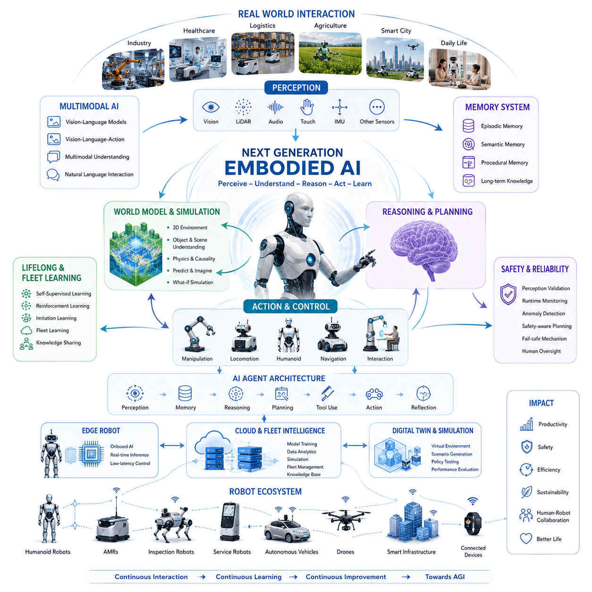
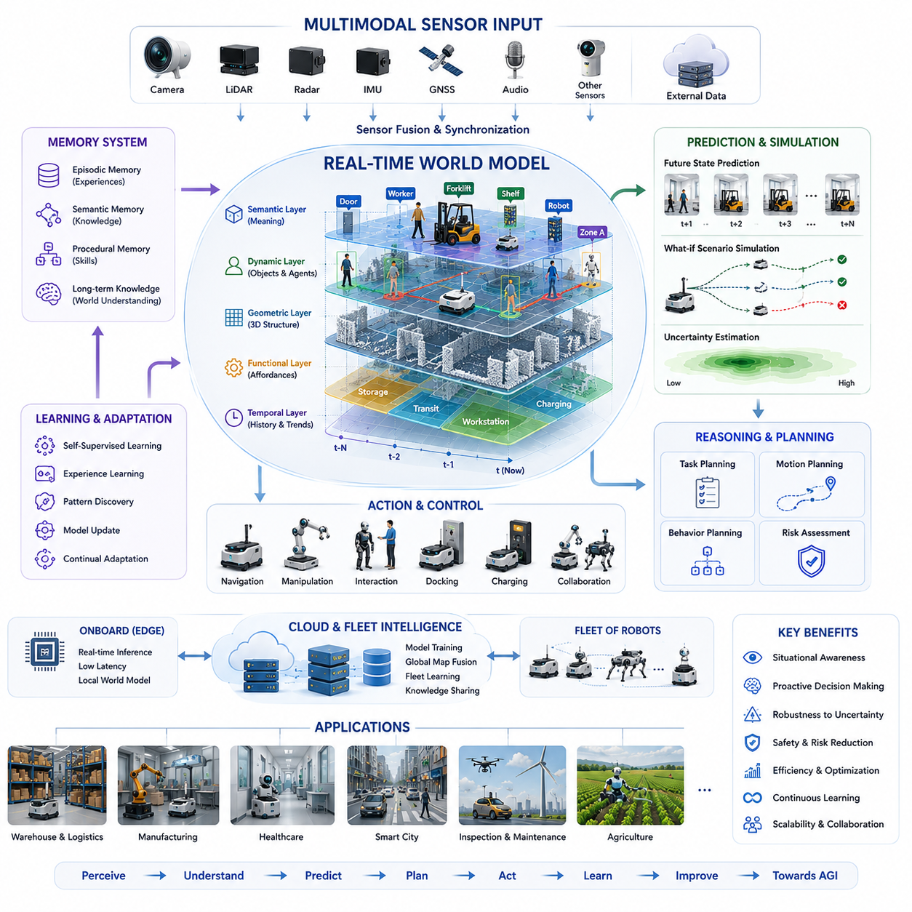
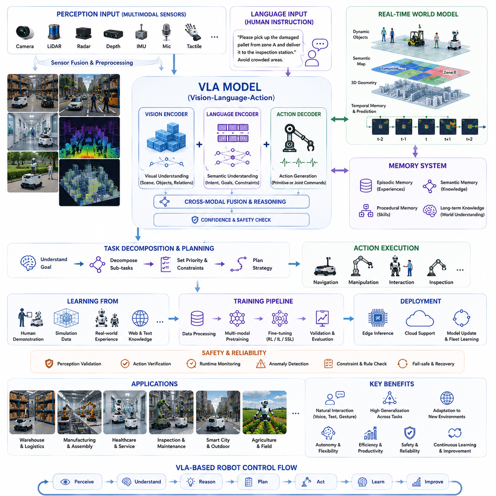
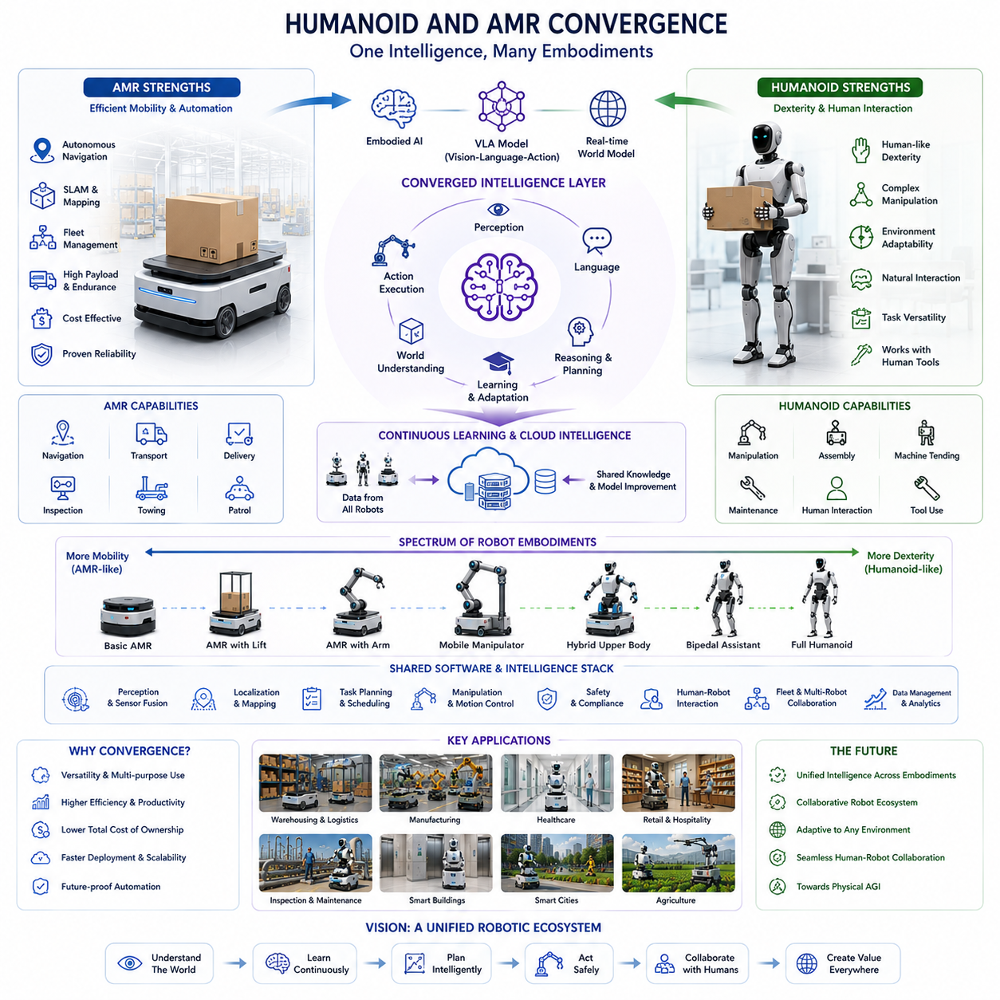
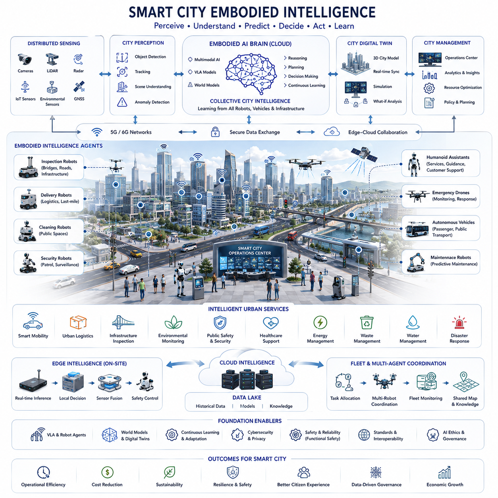
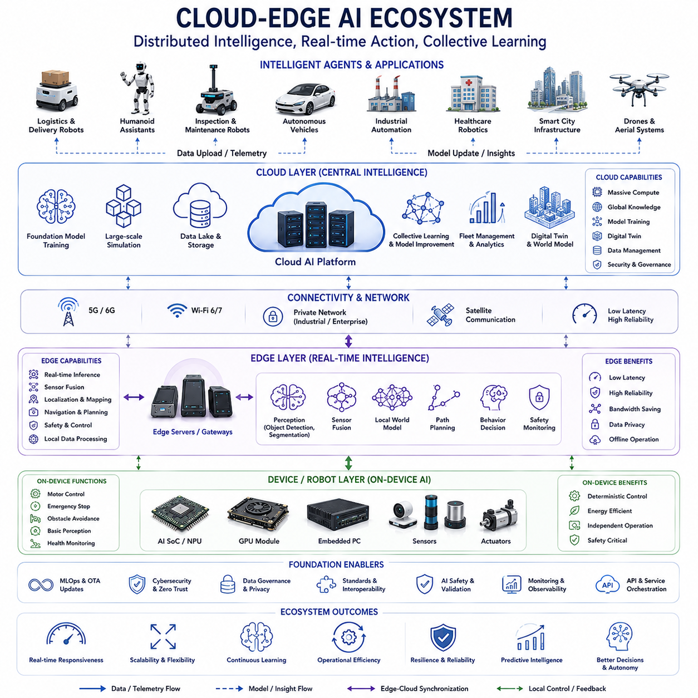
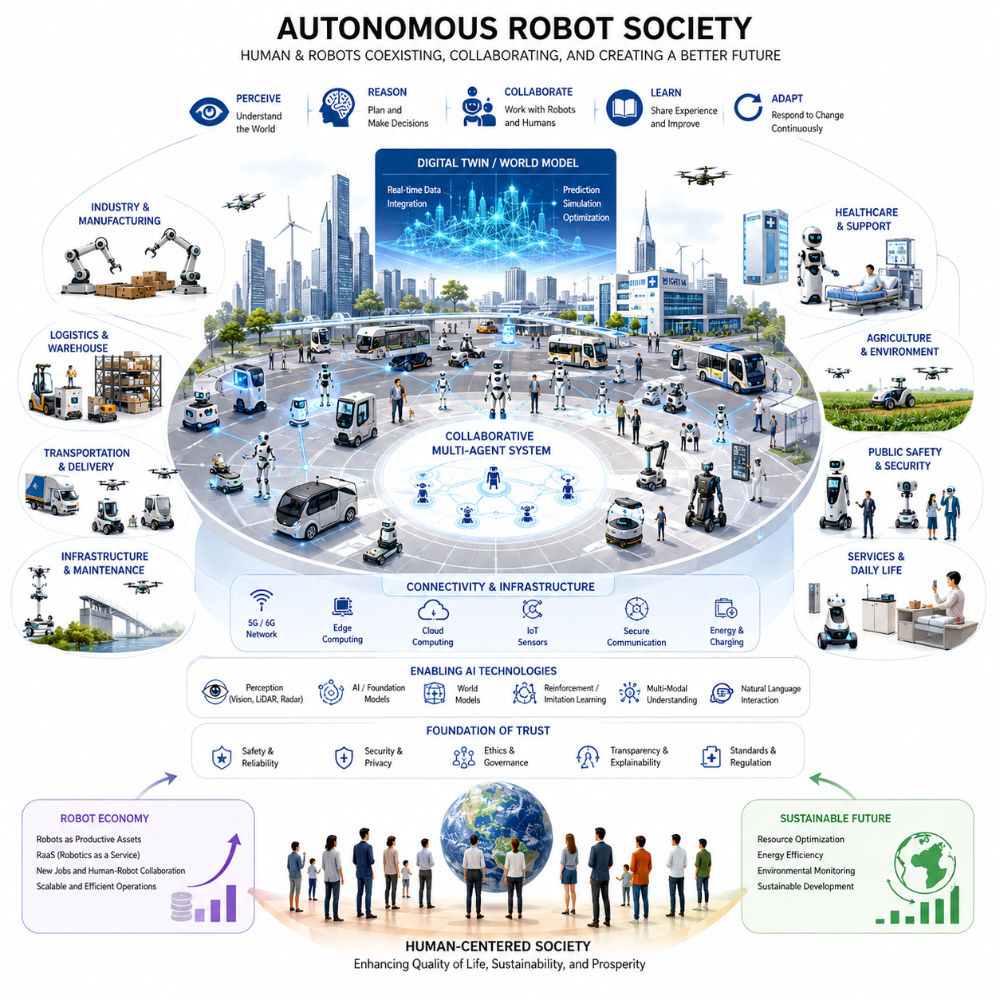
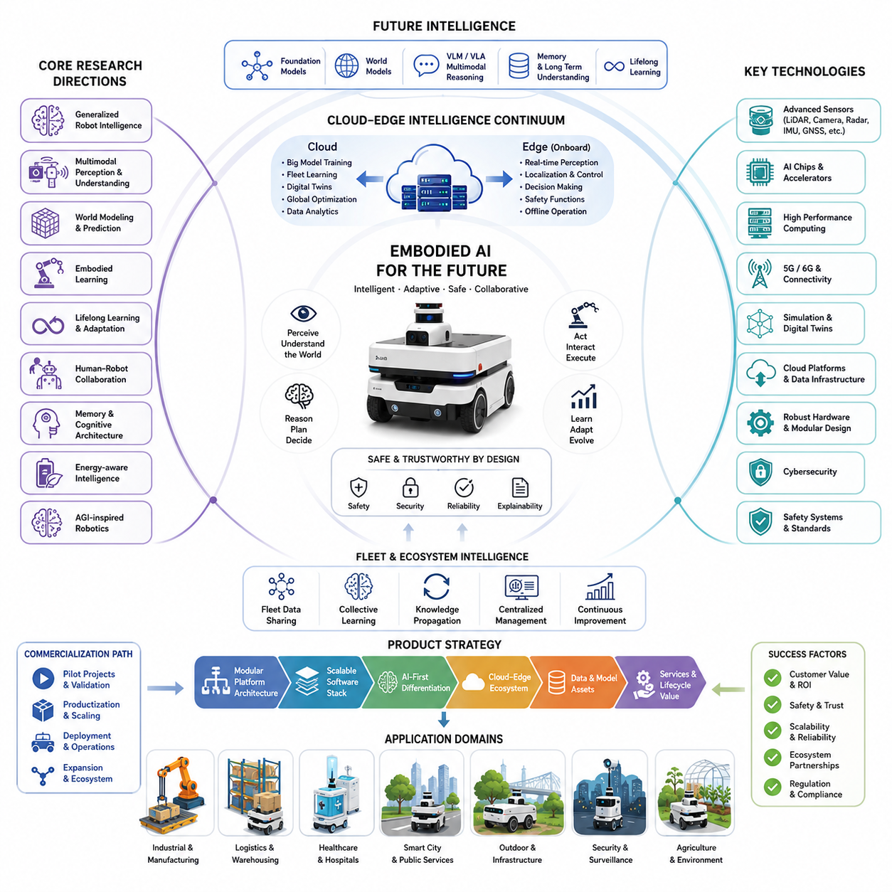

**Volume 06. AMR AI and Embodied Intelligence**


# Chapter 25. Future of Embodied AI

##  

## 25.1 Next-Generation Embodied AI

{width="7.268055555555556in" height="7.268055555555556in"}

Next-generation Embodied AI represents the convergence of advanced artificial intelligence, robotics, world modeling, multimodal perception, autonomous decision-making, and lifelong learning into unified physical systems capable of operating in complex real-world environments. Unlike traditional robots that rely on predefined rules, fixed workflows, and carefully engineered environments, next-generation embodied systems continuously learn, reason, adapt, and interact with the physical world through a tightly coupled perception-action-intelligence loop. This evolution marks a fundamental transition from task-specific automation toward general-purpose robotic intelligence capable of understanding goals, interpreting context, predicting future outcomes, and executing actions with increasing autonomy. The concept emerges naturally from the progression of robotics, foundation models, embodied learning, robot agents, world models, and AGI-inspired architectures that together create machines capable of functioning as intelligent actors in human environments. The future of embodied AI serves as the bridge between today\'s autonomous mobile robots and tomorrow\'s general-purpose robotic systems capable of supporting industry, healthcare, logistics, agriculture, smart cities, and daily human life.

The foundation of next-generation embodied AI is the principle that intelligence cannot be separated from physical interaction. Human intelligence emerged through continuous interaction with the environment, where perception, movement, manipulation, communication, and adaptation formed an integrated learning process. Similarly, future robots must acquire knowledge through direct engagement with the physical world. Instead of treating perception and action as independent modules, future embodied systems integrate sensory understanding, memory formation, reasoning, prediction, and control into a unified architecture. Every interaction becomes a learning opportunity. Every task contributes to the refinement of the robot\'s internal world model. Every environmental change updates the system\'s understanding of reality. This continuous cycle enables robots to become increasingly capable without requiring extensive manual reprogramming.

One of the most significant characteristics of next-generation embodied AI is the emergence of large-scale world models. These world models function as internal simulations of reality, allowing robots to predict outcomes before actions are executed. Rather than reacting solely to immediate sensor observations, future robots maintain dynamic representations of objects, humans, environments, spatial relationships, physical constraints, and temporal changes. When a robot receives a task, it can mentally simulate multiple action sequences, evaluate potential consequences, estimate risks, and choose the most appropriate strategy. Such predictive intelligence dramatically improves safety, efficiency, and robustness in uncertain environments. World models transform robots from reactive machines into anticipatory agents capable of understanding causality and planning over extended time horizons.

Multimodal intelligence will become another defining feature of future embodied systems. Current robots often process vision, LiDAR, radar, audio, and textual information through separate pipelines. Next-generation architectures will integrate these modalities into unified semantic representations. A robot observing a warehouse, listening to human instructions, reading operational documents, and analyzing sensor measurements will create a single coherent understanding of its environment. Such multimodal reasoning allows robots to resolve ambiguity, interpret human intentions more accurately, and operate effectively in dynamic settings. Future robots will understand not only what exists in their surroundings but also why events occur, how situations evolve, and what actions are expected by human collaborators.

The integration of Vision-Language Models and Vision-Language-Action architectures will fundamentally redefine robot control. Traditional robotics relies on carefully engineered software stacks where perception, planning, and execution are separated into multiple layers. Future embodied AI systems will increasingly leverage foundation models capable of mapping observations directly to meaningful actions. Human operators will communicate with robots using natural language, visual demonstrations, gestures, or high-level goals. The robot will interpret these instructions, decompose them into executable subtasks, generate plans, monitor execution, and adapt when conditions change. This dramatically lowers the complexity of human-robot interaction while expanding the range of tasks robots can perform.

Another critical development is lifelong learning. Most current robotic systems experience limited adaptation after deployment. Once trained and validated, their behavior remains largely fixed. Next-generation embodied AI continuously acquires knowledge from operation. Robots deployed in factories, hospitals, airports, farms, and cities generate enormous amounts of real-world experience. Through self-supervised learning, reinforcement learning, imitation learning, and fleet learning mechanisms, robots collectively improve their capabilities over time. Knowledge gained by one robot can be transferred to thousands of others through cloud-based learning infrastructures. This creates a continuously evolving ecosystem where collective intelligence emerges from distributed robotic experiences. As deployment scales increase, learning efficiency accelerates, creating a virtuous cycle of improvement.

The future of embodied AI is closely connected to the concept of robot agents. Future robots will not merely execute commands; they will function as autonomous agents capable of understanding objectives and determining appropriate strategies independently. Agent architectures integrate perception, memory, planning, reasoning, tool usage, and action execution into coherent decision-making frameworks. When given a high-level goal such as inspecting a facility, delivering supplies, monitoring infrastructure, or assisting a patient, the robot dynamically generates plans, monitors progress, responds to unexpected events, and revises strategies when necessary. Such capabilities enable robots to operate effectively in environments that cannot be fully anticipated during development.

Memory systems will become increasingly sophisticated. Today\'s robots typically maintain limited short-term state information. Future embodied systems will possess hierarchical memory architectures that include sensory memory, episodic memory, semantic memory, procedural memory, and long-term operational knowledge. Episodic memory allows robots to remember previous experiences and apply lessons learned from past situations. Semantic memory supports understanding of concepts, objects, locations, and relationships. Procedural memory captures skills and action sequences that can be reused across tasks. Together, these memory systems create continuity of experience, enabling robots to build persistent knowledge about the world and improve performance over extended operational lifetimes.

Physical grounding remains a central challenge and opportunity for future embodied intelligence. Unlike purely digital AI systems, embodied agents must interact with physical reality governed by complex dynamics, uncertainty, and safety constraints. Robots must understand friction, gravity, momentum, material properties, environmental variability, and human behavior. Future systems will increasingly combine learned representations with physics-based reasoning to achieve robust performance. This hybrid approach allows robots to leverage the flexibility of machine learning while maintaining the reliability and predictability required for real-world deployment.

Human-robot interaction will undergo substantial transformation as embodied intelligence advances. Future robots will possess improved capabilities for understanding human intentions, emotions, preferences, and social norms. They will recognize verbal instructions, gestures, facial expressions, and contextual cues. Communication will become more natural, intuitive, and collaborative. Instead of requiring specialized interfaces, humans will interact with robots using ordinary language and behavior. Robots will provide explanations for their actions, communicate uncertainties, request clarification when needed, and coordinate seamlessly with human teams. Such capabilities are essential for widespread adoption in workplaces, healthcare environments, public infrastructure, and homes.

Edge AI and distributed computing will play a crucial role in enabling next-generation embodied systems. Real-time operation requires low-latency decision-making close to the physical environment. Future robots will employ increasingly powerful onboard computing platforms capable of running advanced perception, planning, and reasoning models locally. At the same time, cloud infrastructures will provide large-scale learning, model training, fleet coordination, simulation, and knowledge sharing. The result is a cloud-edge continuum in which robots maintain operational autonomy while benefiting from collective intelligence and centralized resources. This architecture balances responsiveness, scalability, reliability, and cost efficiency.

Simulation technologies will become deeply integrated into embodied AI development. Digital twins, synthetic environments, and world-model-based simulation systems enable robots to learn from vast numbers of virtual experiences before deployment. Future training pipelines will combine simulated and real-world data to accelerate learning while minimizing operational risks. Robots will test strategies within internal simulations, evaluate outcomes, and optimize decisions before acting. This capability resembles imagination in biological systems and significantly enhances adaptability and safety.

Safety remains one of the most important considerations for next-generation embodied AI. As robots gain greater autonomy, ensuring reliable and predictable behavior becomes increasingly critical. Future safety architectures will include multiple layers of protection, including perception validation, runtime monitoring, anomaly detection, safety-aware planning, formal verification, fail-safe mechanisms, and human oversight. AI safety frameworks must address not only mechanical hazards but also reasoning errors, model hallucinations, unexpected behaviors, and adversarial conditions. Robust safety engineering will become a foundational requirement for all large-scale deployments of embodied intelligence.

The convergence of humanoid robots and autonomous mobile robots will significantly influence the future landscape. Historically, these domains evolved separately due to differing mechanical and operational requirements. However, advances in foundation models, embodied learning, and generalized control architectures are creating common technological foundations. Future robotic systems may share perception models, world models, reasoning engines, and learning frameworks regardless of physical form. A humanoid assistant, warehouse AMR, agricultural robot, and outdoor inspection platform may all operate using variants of a common embodied intelligence stack. This convergence accelerates development and enables knowledge transfer across diverse robotic platforms.

Industrial applications of next-generation embodied AI are expected to expand dramatically. Manufacturing facilities will employ robots capable of adaptive production, autonomous inspection, collaborative assembly, and dynamic logistics. Healthcare systems will utilize intelligent robots for patient assistance, monitoring, transportation, rehabilitation, and telepresence. Logistics operations will benefit from autonomous fleets capable of self-organizing and optimizing workflows. Agriculture will leverage embodied intelligence for precision farming, crop monitoring, harvesting, and environmental management. Smart cities will deploy large populations of robots supporting maintenance, security, transportation, infrastructure inspection, and public services.

The relationship between AGI and embodied intelligence is particularly important. While large language models and foundation models have demonstrated impressive cognitive capabilities, many researchers argue that true general intelligence requires physical grounding. Embodied AI provides the experiential foundation necessary for understanding causality, spatial reasoning, object manipulation, and real-world consequences. Future AGI systems may emerge through the integration of advanced cognitive architectures with large-scale embodied experiences. Robots become not merely tools for executing tasks but platforms for acquiring and refining general intelligence through interaction with reality.

Economic and societal impacts will be profound. As embodied AI becomes more capable and affordable, robotic systems will increasingly augment human labor across numerous industries. Rather than replacing humans entirely, many deployments will focus on collaboration, productivity enhancement, safety improvement, and workforce support. Robots will assume repetitive, hazardous, physically demanding, and operationally intensive tasks while humans focus on supervision, creativity, strategic planning, and complex decision-making. The resulting human-machine partnership may redefine productivity and economic development throughout the twenty-first century.

Looking further ahead, next-generation embodied AI may evolve into large-scale ecosystems of interconnected robotic agents operating across physical and digital environments. These systems will share knowledge, coordinate activities, learn collectively, and adapt continuously. Intelligent infrastructure, autonomous vehicles, service robots, industrial machines, and digital agents may form a unified network of embodied intelligence spanning factories, hospitals, transportation systems, cities, and homes. Such an ecosystem represents the emergence of a distributed machine intelligence layer integrated into human civilization.

Ultimately, next-generation embodied AI represents more than an incremental improvement in robotics technology. It signifies the transition from programmed automation to adaptive physical intelligence. By combining multimodal perception, world models, lifelong learning, foundation models, agent architectures, cloud-edge ecosystems, and advanced safety frameworks, future embodied systems will possess unprecedented capabilities for understanding and interacting with the real world. These technologies will reshape industries, transform human-robot collaboration, accelerate the development of autonomous systems, and potentially provide the foundation upon which future AGI-enabled robotic societies are built. The coming decades will likely witness the emergence of machines that not only move through the world but also understand, learn from, and meaningfully participate in it, marking one of the most significant technological transformations in the history of robotics and artificial intelligence.

# 25_01 차세대 체화형 AI (Next Generation Embodied AI)

차세대 체화형 AI(Embodied AI)는 고도화된 인공지능, 로보틱스, 월드 모델(World Model), 멀티모달 인식, 자율 의사결정, 그리고 평생학습(Lifelong Learning)이 하나의 통합된 물리적 시스템으로 융합되는 미래 기술을 의미한다. 기존의 로봇이 사전에 정의된 규칙, 고정된 작업 흐름, 그리고 통제된 환경에 의존했다면, 차세대 체화형 AI는 실제 세계와 지속적으로 상호작용하며 스스로 학습하고 추론하며 적응할 수 있다. 이는 단순한 자동화 기술에서 벗어나 일반 목적의 지능형 로봇으로 발전하는 과정이며, 미래의 로봇은 목표를 이해하고 상황을 해석하며 결과를 예측하고 적절한 행동을 수행하는 능력을 갖추게 된다. 이러한 변화는 로봇용 파운데이션 모델, 체화형 학습, 로봇 에이전트, 월드 모델, 그리고 AGI 기반 아키텍처의 발전에 의해 촉진되며, 산업, 의료, 물류, 농업, 스마트시티, 그리고 일상생활 전반에 걸쳐 새로운 형태의 지능형 로봇 시대를 열게 될 것이다.

차세대 체화형 AI의 핵심 철학은 지능이 물리적 경험과 분리될 수 없다는 점이다. 인간의 지능은 환경과의 지속적인 상호작용 속에서 형성되었으며, 감각, 움직임, 조작, 의사소통, 학습이 하나의 통합된 과정으로 발전해 왔다. 미래의 로봇 역시 단순히 데이터를 처리하는 존재가 아니라 실제 환경과 상호작용하면서 지식을 획득하는 존재가 된다. 인식과 행동은 더 이상 독립적인 기능이 아니라 하나의 통합된 순환 구조를 형성한다. 로봇은 환경을 관찰하고, 의미를 이해하며, 행동을 수행하고, 그 결과를 다시 학습하는 과정을 반복함으로써 지속적으로 지능을 향상시킨다.

차세대 체화형 AI의 가장 중요한 특징 중 하나는 대규모 월드 모델의 등장이다. 월드 모델은 로봇 내부에 구축되는 현실 세계의 디지털 표현으로, 행동을 수행하기 전에 결과를 예측할 수 있도록 해준다. 미래의 로봇은 단순히 현재 센서 데이터에 반응하는 것이 아니라, 객체, 사람, 공간, 물리 법칙, 환경 변화 등을 포함한 동적인 세계 모델을 유지한다. 새로운 임무가 주어지면 로봇은 여러 행동 시나리오를 내부적으로 시뮬레이션하고, 각 결과를 평가한 뒤 가장 적절한 전략을 선택한다. 이러한 예측 기반 지능은 안전성과 효율성을 크게 향상시키며, 로봇을 단순 반응형 기계에서 미래를 예측하는 지능형 에이전트로 진화시킨다.

멀티모달 지능 또한 미래 체화형 AI의 핵심 요소가 된다. 현재의 로봇은 카메라, LiDAR, 레이더, 음성, 텍스트 등의 데이터를 각각 독립적으로 처리하는 경우가 많다. 그러나 차세대 시스템은 이러한 다양한 정보를 하나의 통합된 의미 공간(Semantic Space)으로 융합한다. 로봇은 창고를 관찰하고, 작업자의 음성 지시를 듣고, 운영 문서를 읽고, 각종 센서 데이터를 분석하면서 하나의 일관된 상황 인식을 형성한다. 이를 통해 환경을 더욱 정확하게 이해하고, 인간의 의도를 파악하며, 복잡한 상황에서도 적절한 결정을 내릴 수 있게 된다.

Vision-Language Model(VLM)과 Vision-Language-Action(VLA) 모델의 발전은 로봇 제어 방식을 근본적으로 변화시킬 것이다. 기존 로봇은 인식, 계획, 제어가 여러 계층으로 분리된 복잡한 소프트웨어 구조를 사용한다. 그러나 미래의 체화형 AI는 관찰 결과를 직접 행동으로 연결할 수 있는 대규모 파운데이션 모델을 활용하게 된다. 사용자는 자연어, 이미지, 시범 행동, 혹은 목표 설명만으로 로봇을 제어할 수 있다. 로봇은 이를 해석하고 작업을 세분화하며 실행 계획을 생성하고, 작업 도중 발생하는 예외 상황에도 스스로 대응할 수 있다. 이러한 능력은 인간-로봇 인터페이스를 획기적으로 단순화하면서도 수행 가능한 작업 범위를 크게 확대시킨다.

평생학습은 차세대 체화형 AI의 또 다른 핵심 축이다. 현재 대부분의 로봇은 배포 이후 학습 능력이 제한적이다. 그러나 미래의 로봇은 운영 과정에서 지속적으로 새로운 지식을 습득한다. 공장, 병원, 공항, 농장, 도시 등에서 활동하는 로봇들은 방대한 양의 실환경 데이터를 생성하며, 이를 기반으로 자기지도학습, 강화학습, 모방학습을 수행한다. 또한 클라우드 기반의 플릿 학습(Fleet Learning)을 통해 한 대의 로봇이 학습한 경험이 수천 대의 로봇으로 공유될 수 있다. 결과적으로 전체 로봇 생태계는 집단적으로 성장하며 시간이 지날수록 더욱 똑똑해진다.

미래의 체화형 AI는 로봇 에이전트 개념과도 밀접하게 연결된다. 미래의 로봇은 단순히 명령을 실행하는 존재가 아니라 목표를 이해하고 스스로 전략을 수립하는 자율 에이전트가 된다. 에이전트 아키텍처는 인식, 기억, 추론, 계획, 도구 사용, 행동 실행 기능을 통합한다. 예를 들어 시설 점검, 물류 배송, 환자 지원, 도시 순찰과 같은 고수준 목표가 주어지면 로봇은 이를 세부 작업으로 분해하고 실행 계획을 수립한 뒤, 상황 변화에 따라 전략을 수정하면서 임무를 완수한다.

기억 시스템 또한 획기적으로 발전할 것이다. 현재의 로봇은 제한적인 상태 정보만 유지하지만, 미래의 체화형 AI는 감각 기억, 에피소드 기억, 의미 기억, 절차 기억 등 다양한 형태의 계층적 메모리 구조를 갖게 된다. 에피소드 기억은 과거 경험을 저장하고 재활용하는 기능을 제공하며, 의미 기억은 객체와 개념 간 관계를 이해하게 한다. 절차 기억은 특정 기술과 행동 패턴을 학습하고 반복 사용할 수 있도록 지원한다. 이러한 기억 체계는 로봇이 장기간에 걸쳐 경험을 축적하고 더욱 정교한 의사결정을 수행할 수 있도록 만든다.

체화형 AI의 가장 큰 도전 과제 중 하나는 물리적 세계에 대한 실제적인 이해이다. 디지털 AI와 달리 로봇은 중력, 마찰, 관성, 재질 특성, 환경 변화와 같은 복잡한 물리 현상을 고려해야 한다. 미래의 로봇은 데이터 기반 학습과 물리 기반 추론을 결합한 하이브리드 접근법을 활용할 것이다. 이를 통해 기계학습의 유연성과 물리 모델의 안정성을 동시에 확보할 수 있으며, 보다 신뢰성 높은 실세계 성능을 달성할 수 있다.

인간-로봇 상호작용 역시 크게 발전할 것이다. 미래의 로봇은 인간의 의도, 감정, 선호도, 사회적 규범을 이해할 수 있는 능력을 갖게 된다. 음성, 텍스트, 표정, 제스처, 상황 맥락 등을 종합적으로 해석하여 보다 자연스럽고 직관적인 협업을 수행한다. 로봇은 자신의 행동 이유를 설명하고, 불확실성이 존재할 경우 이를 사용자에게 알리며, 필요한 경우 추가 정보를 요청할 수 있다. 이러한 기능은 병원, 공공시설, 서비스 산업, 스마트시티와 같은 환경에서 로봇의 수용성을 크게 향상시킬 것이다.

엣지 AI와 분산 컴퓨팅은 차세대 체화형 AI를 실현하는 핵심 인프라가 된다. 실시간 의사결정을 위해서는 로봇 내부에서 즉시 연산이 수행되어야 한다. 따라서 미래 로봇은 더욱 강력한 온보드 컴퓨팅 플랫폼을 탑재하게 된다. 동시에 클라우드는 대규모 모델 학습, 플릿 최적화, 데이터 분석, 시뮬레이션 및 지식 공유를 담당한다. 이러한 클라우드-엣지 연속체 구조는 실시간성, 확장성, 안정성, 비용 효율성을 동시에 확보할 수 있도록 한다.

시뮬레이션과 디지털 트윈 기술 역시 미래 체화형 AI에서 중요한 역할을 수행한다. 로봇은 실제 환경에 배치되기 전에 가상 환경에서 수백만 번의 경험을 축적할 수 있다. 미래의 학습 시스템은 실제 데이터와 합성 데이터를 결합하여 학습 속도를 높이고 위험을 줄인다. 로봇은 행동을 수행하기 전에 내부 시뮬레이션을 통해 결과를 예측하고 최적의 전략을 선택할 수 있다. 이는 인간의 상상력과 유사한 기능으로 볼 수 있다.

안전성은 차세대 체화형 AI에서 가장 중요한 요구사항 중 하나이다. 로봇의 자율성이 증가할수록 예측 가능하고 신뢰할 수 있는 행동을 보장해야 한다. 이를 위해 미래 시스템은 인식 검증, 런타임 모니터링, 이상 탐지, 안전 기반 계획, 형식 검증, 비상 정지 및 페일세이프 메커니즘을 포함하는 다중 안전 계층을 갖게 된다. AI 안전성은 단순히 기계적 사고를 방지하는 수준을 넘어, 추론 오류, 모델 환각(Hallucination), 예기치 못한 행동까지 관리하는 방향으로 발전하게 될 것이다.

휴머노이드 로봇과 AMR의 융합도 중요한 미래 흐름이다. 과거에는 두 분야가 서로 다른 기술 체계로 발전했지만, 파운데이션 모델과 체화형 AI의 발전으로 인해 공통된 지능 플랫폼을 공유하게 될 가능성이 높다. 미래에는 휴머노이드 로봇, 물류 로봇, 농업 로봇, 순찰 로봇이 동일한 인지·추론·학습 아키텍처를 기반으로 동작하면서 물리적 형태만 달라질 수 있다. 이는 기술 재사용성을 높이고 개발 속도를 가속화할 것이다.

산업 현장에서의 활용 범위도 폭발적으로 확대될 전망이다. 제조업에서는 적응형 생산과 자율 검사, 협업 조립이 가능해지고, 의료 분야에서는 환자 지원과 모니터링, 재활 및 원격 의료가 발전한다. 물류 산업에서는 대규모 자율 플릿이 운영되며, 농업에서는 정밀 농업과 자동 수확이 보편화된다. 스마트시티에서는 인프라 점검, 보안, 교통 관리, 공공 서비스 제공을 위한 다양한 로봇이 운영될 것이다.

AGI와 체화형 AI의 관계 역시 매우 중요하다. 많은 연구자들은 진정한 일반지능이 단순한 언어 처리만으로는 구현될 수 없으며, 물리적 세계와의 상호작용이 필수적이라고 본다. 체화형 AI는 공간 이해, 인과 관계 학습, 물체 조작, 실제 결과에 대한 경험을 통해 일반지능 발전의 기반을 제공한다. 미래의 AGI는 거대한 인지 모델과 방대한 체화 경험이 결합되면서 등장할 가능성이 높다. 로봇은 단순한 기계가 아니라 실제 세계 속에서 일반지능을 학습하는 플랫폼이 될 것이다.

경제적·사회적 영향 또한 매우 클 것으로 예상된다. 체화형 AI가 발전할수록 로봇은 다양한 산업에서 인간의 생산성을 증대시키는 협력 파트너로 자리 잡게 된다. 위험하고 반복적이며 육체적으로 힘든 작업은 로봇이 담당하고, 인간은 창의적 사고와 전략적 의사결정에 집중하게 된다. 이는 산업 구조와 노동 시장에 큰 변화를 가져오며 새로운 형태의 인간-기계 협력 모델을 형성하게 된다.

더 먼 미래에는 수많은 로봇 에이전트가 연결된 거대한 체화형 AI 생태계가 등장할 수 있다. 자율주행 차량, 산업 로봇, 서비스 로봇, 스마트 인프라가 하나의 지능 네트워크를 형성하고 서로 협력하며 학습하게 된다. 이 네트워크는 도시, 공장, 병원, 물류센터, 가정 전반에 걸쳐 확장되며 인간 사회의 새로운 지능 계층으로 기능할 수 있다.

결국 차세대 체화형 AI는 단순한 로봇 기술의 발전이 아니라 프로그래밍된 자동화에서 적응형 물리 지능으로의 전환을 의미한다. 멀티모달 인식, 월드 모델, 평생학습, 파운데이션 모델, 에이전트 아키텍처, 클라우드-엣지 생태계, 그리고 고도화된 안전 기술이 결합되면서 미래의 로봇은 실제 세계를 이해하고 학습하며 협력할 수 있는 새로운 지능적 존재로 발전하게 된다. 이러한 변화는 산업과 사회 전반을 재편할 것이며, 궁극적으로는 AGI 기반 로봇 사회의 토대를 형성하는 중요한 전환점이 될 것이다.

##  

## 25.2 Real-Time World Models

{width="7.268055555555556in" height="7.268055555555556in"}

Real-Time World Models represent one of the most important technological foundations for the future of Embodied AI, autonomous robotics, and physical artificial intelligence. A real-time world model is a continuously updated internal representation of the physical environment that allows a robot to perceive, understand, predict, reason about, and interact with the world in a manner similar to biological intelligence. Unlike traditional robotic systems that react primarily to current sensor observations, robots equipped with real-time world models maintain a dynamic understanding of their surroundings, enabling them to anticipate future events, evaluate alternative actions, and make informed decisions under uncertainty. These models function as the cognitive core of next-generation robotic systems, connecting perception, memory, planning, reasoning, simulation, and action into a unified intelligence architecture. As embodied AI evolves from task-specific automation toward general-purpose physical intelligence, real-time world models become increasingly essential because they provide the contextual awareness and predictive capabilities necessary for robust operation in complex, dynamic environments.

Traditional robotic systems generally operate using a perception-to-action pipeline. Sensors collect data, algorithms process observations, planners generate commands, and controllers execute actions. While effective in structured environments, such architectures often struggle in real-world situations characterized by uncertainty, incomplete information, changing conditions, and unexpected events. A real-time world model addresses these limitations by constructing an internal representation that extends beyond immediate sensor measurements. Instead of simply recognizing objects or estimating positions, the robot develops an understanding of the environment as an evolving system composed of entities, relationships, physical constraints, human activities, operational goals, and future possibilities. This internal representation enables the robot to reason about what currently exists, what previously occurred, and what is likely to happen next.

At its core, a real-time world model functions as a continuously synchronized digital interpretation of reality. Every sensor observation contributes to updating this representation. Cameras provide visual information regarding objects, humans, infrastructure, and environmental conditions. LiDAR systems contribute geometric understanding and spatial structure. Radar sensors provide robust detection capabilities under adverse weather conditions. IMUs supply motion information, while GNSS systems contribute global positioning data. Audio sensors provide contextual information about human activities and environmental events. Together, these multimodal inputs are fused into a coherent representation that describes the robot\'s operational environment in real time. The quality of the world model depends not only on the accuracy of individual sensors but also on the effectiveness of sensor fusion, temporal synchronization, and semantic interpretation.

One of the most significant advantages of real-time world models is their ability to maintain persistent understanding even when observations are incomplete. In real-world environments, objects frequently become occluded, sensor measurements may be noisy, and visibility conditions can change rapidly. Rather than losing awareness whenever information disappears from immediate observation, the world model maintains memory of entities, locations, trajectories, and relationships. This persistence allows robots to continue reasoning about hidden objects, temporary obstacles, moving humans, and changing environmental conditions. Such capability is essential for reliable operation in warehouses, hospitals, factories, smart cities, transportation systems, and outdoor autonomous navigation.

Spatial representation forms a foundational component of every world model. Future robotic systems will maintain multiple layers of spatial understanding simultaneously. Geometric maps describe physical structures such as walls, roads, buildings, and obstacles. Semantic maps associate meaning with spatial elements by identifying doors, elevators, workstations, vehicles, equipment, pedestrians, and operational zones. Functional maps describe how different regions can be used and what activities typically occur within them. Dynamic maps continuously update the positions and movements of objects, humans, and vehicles. These layered representations provide robots with a rich understanding of both physical structure and operational context.

Real-time world models extend beyond spatial awareness by incorporating temporal understanding. The world is not static; it evolves continuously. Human activities, vehicle movements, environmental changes, weather conditions, and operational workflows all unfold over time. Future world models explicitly represent temporal relationships and historical context. Robots remember previous observations, identify behavioral patterns, recognize recurring events, and anticipate likely future developments. For example, a logistics robot operating within a warehouse may learn that specific pathways become congested during shift changes. A hospital robot may recognize predictable patterns of staff movement. A smart city inspection robot may anticipate traffic fluctuations depending on time of day. Such temporal intelligence significantly improves decision-making quality.

Prediction is one of the defining capabilities enabled by real-time world models. Instead of merely understanding the current state of the environment, future robots continuously estimate future states. They predict the movement of pedestrians, vehicles, machinery, and other robots. They anticipate changes in environmental conditions and evaluate the consequences of alternative actions. Prediction transforms robotic intelligence from reactive behavior into proactive behavior. A robot no longer waits for obstacles to appear directly in its path. Instead, it predicts potential conflicts before they occur and adjusts its behavior accordingly. This capability improves safety, efficiency, comfort, and overall operational effectiveness.

The emergence of generative AI technologies introduces new opportunities for world model development. Future world models may incorporate generative architectures capable of simulating realistic future scenarios. Rather than relying solely on deterministic predictions, robots can generate multiple possible futures and evaluate their probabilities. Such probabilistic reasoning resembles human imagination and supports robust decision-making under uncertainty. When confronted with a complex situation, a robot can internally simulate numerous potential action sequences, evaluate expected outcomes, and select the most favorable strategy. This simulation-based reasoning capability may become one of the defining characteristics of advanced embodied intelligence.

The integration of world models with robot memory systems significantly enhances learning and adaptation. Memory allows the world model to accumulate knowledge over extended periods of operation. Episodic memory captures specific experiences and operational events. Semantic memory stores generalized knowledge about objects, environments, and procedures. Procedural memory represents learned skills and action sequences. Together, these memory systems provide continuity across time, enabling robots to learn from experience and apply accumulated knowledge to future situations. The result is a continuously improving internal model of reality that becomes increasingly accurate and useful as operational experience grows.

World models also play a central role in robot planning. Traditional planning systems often rely on static maps and predefined assumptions. In contrast, real-time world models provide planners with continuously updated contextual information. Task planners can reason about operational objectives, environmental conditions, resource availability, and predicted future events. Motion planners can evaluate potential trajectories while considering dynamic obstacles and anticipated environmental changes. Strategic planners can optimize long-term operational goals based on historical trends and predictive forecasts. This integration of planning and world modeling enables more intelligent, adaptive, and resilient behavior.

Human understanding represents another critical aspect of future world models. Robots operating in human environments must understand not only physical structures but also human intentions, behaviors, preferences, and social norms. Future world models will include representations of human activities, collaborative relationships, attention states, emotional cues, and behavioral patterns. Such understanding allows robots to interact naturally with people, anticipate human actions, and adapt behavior accordingly. Socially aware navigation, collaborative manipulation, patient assistance, and service robotics all depend heavily on accurate human-centered world modeling.

Vision-Language Models and Vision-Language-Action architectures are expected to play a significant role in future world model development. These systems enable robots to connect visual observations with semantic understanding and linguistic knowledge. Rather than representing environments purely as geometric structures, future world models may describe reality using rich semantic concepts. Robots will understand that a specific object is a medical device, a warehouse pallet, a maintenance tool, or a hazardous material container. They will comprehend relationships, purposes, operational procedures, and contextual meanings associated with different entities. This semantic grounding greatly enhances reasoning capabilities and operational flexibility.

Real-time world models are particularly important for autonomous mobile robots operating in large-scale environments. Indoor logistics robots must understand dynamic warehouse operations, human movement patterns, inventory flows, and operational priorities. Outdoor autonomous robots must interpret roads, pathways, weather conditions, infrastructure elements, and public interactions. Inspection robots must recognize equipment states, identify anomalies, and predict potential failures. In all these cases, the world model serves as the central source of situational awareness, integrating diverse information into a coherent operational picture.

The concept of digital twins is closely related to real-time world models. A digital twin represents a virtual replica of a physical system that remains synchronized with real-world conditions. Future robotic systems may maintain personalized digital twins of their operational environments, continuously updated through sensor observations and operational data. These digital twins support simulation, optimization, predictive maintenance, safety analysis, and operational planning. The boundary between world models and digital twins will likely become increasingly blurred as both technologies evolve toward unified representations of physical reality.

Cloud-edge architectures further enhance world model capabilities. Real-time operations require low-latency processing on edge computing platforms located within robots. However, cloud infrastructures provide virtually unlimited computational resources for large-scale learning, simulation, model training, and knowledge sharing. Future world models will leverage both environments. Local edge systems maintain immediate situational awareness and support real-time decision-making, while cloud systems aggregate experiences from entire robot fleets, refine global knowledge models, and distribute improvements back to operational robots. This creates a continuously evolving ecosystem of collective intelligence.

Multi-robot systems introduce additional opportunities for world model development. Individual robots possess limited viewpoints and sensing capabilities. By sharing observations and experiences, multiple robots can construct richer and more comprehensive world models. Cooperative perception allows robots to collectively observe environments from different perspectives. Shared semantic understanding improves operational coordination. Fleet-level world models enable collaborative planning, resource optimization, and distributed decision-making. As robotic deployments scale, collective world models may become increasingly important components of intelligent infrastructure.

Simulation environments are expected to become deeply integrated with future world models. Robots will continuously compare real-world observations with simulated predictions. Differences between expected and observed outcomes provide valuable learning signals that improve model accuracy. This closed-loop relationship between reality and simulation enables continuous adaptation. Robots effectively learn by identifying discrepancies between their internal expectations and actual environmental behavior. Such mechanisms closely resemble cognitive processes observed in biological intelligence.

Safety is one of the most important applications of real-time world models. By predicting future states and evaluating potential risks before actions occur, robots can proactively avoid dangerous situations. Safety-aware world models monitor environmental conditions, identify anomalies, assess uncertainty levels, and trigger protective behaviors when necessary. Future safety systems will likely combine predictive modeling, runtime monitoring, formal verification, and adaptive risk assessment within a unified world-model framework. This approach supports safer operation in environments where robots interact closely with humans and critical infrastructure.

Advances in self-supervised learning are expected to accelerate world model development significantly. Instead of relying solely on manually labeled datasets, future robots will learn directly from experience. Every interaction with the environment generates training data. Robots observe cause-and-effect relationships, identify recurring patterns, and refine internal representations continuously. This learning paradigm dramatically improves scalability because operational experience becomes the primary source of knowledge acquisition. As deployment volumes increase, world models become progressively more accurate, robust, and comprehensive.

The relationship between world models and AGI is particularly significant. Many researchers believe that general intelligence requires an internal understanding of reality that supports prediction, reasoning, imagination, and planning. Real-time world models provide precisely these capabilities. They enable machines to construct internal representations of the world, simulate future possibilities, and make informed decisions based on anticipated outcomes. In this sense, world models may represent one of the most critical building blocks on the path toward embodied artificial general intelligence.

Looking toward the future, real-time world models are likely to evolve from specialized robotic subsystems into comprehensive cognitive architectures supporting all aspects of embodied intelligence. Future robots will maintain rich, dynamic, multimodal representations of reality that integrate perception, memory, reasoning, simulation, planning, and action. These models will continuously learn from experience, share knowledge across fleets, collaborate with cloud infrastructures, and adapt to changing environments. They will allow robots not only to perceive the world but also to understand its structure, predict its evolution, evaluate alternative futures, and act with increasing autonomy and intelligence.

Ultimately, real-time world models represent the transition from perception-driven robotics to understanding-driven robotics. They transform robots from systems that merely observe the world into systems that comprehend, anticipate, and interact with reality in a deeply meaningful way. As embodied AI continues to advance, real-time world models will become the cognitive foundation upon which future autonomous robots, intelligent infrastructure, smart cities, and AGI-enabled physical systems are built. Their development will play a central role in defining the next era of robotics, where machines possess not only awareness of the present but also an evolving understanding of the future.

# 25_02 실시간 월드 모델 (Real-Time World Models)

실시간 월드 모델(Real-Time World Models)은 미래 체화형 AI(Embodied AI), 자율 로봇, 그리고 Physical AI를 구현하기 위한 가장 중요한 핵심 기술 중 하나이다. 실시간 월드 모델은 로봇이 주변 환경을 인식하고 이해하며 예측하고 추론하며 상호작용할 수 있도록 지원하는 동적 내부 세계 표현(Dynamic Internal Representation)이다. 기존의 로봇이 현재 센서 데이터에 기반하여 반응적으로 행동했다면, 실시간 월드 모델을 가진 미래의 로봇은 주변 환경에 대한 지속적인 이해를 유지하면서 미래 상황을 예측하고 다양한 행동 결과를 평가하며 불확실성 속에서도 최적의 결정을 내릴 수 있다. 이러한 월드 모델은 인식, 기억, 계획, 추론, 시뮬레이션, 행동을 하나로 연결하는 차세대 로봇 지능의 인지 엔진(Cognitive Engine) 역할을 수행한다. 체화형 AI가 특정 작업 중심 자동화에서 범용 물리 지능으로 발전함에 따라, 실시간 월드 모델은 미래 로봇의 핵심 기반 기술로 자리 잡게 될 것이다.

기존 로봇 시스템은 일반적으로 인식에서 행동으로 이어지는 단순한 처리 구조를 따른다. 센서가 데이터를 수집하고, 알고리즘이 이를 분석하며, 계획기가 경로를 생성하고, 제어기가 실제 행동을 수행한다. 이러한 구조는 비교적 단순하고 정형화된 환경에서는 효과적이지만, 실제 환경과 같이 변화가 많고 예측이 어려운 상황에서는 한계를 가진다. 실시간 월드 모델은 이러한 한계를 극복하기 위해 단순한 센서 관찰을 넘어서는 내부 세계 표현을 구축한다. 로봇은 단순히 현재 보이는 물체를 인식하는 것이 아니라, 객체 간 관계, 물리적 제약, 인간의 행동, 운영 목표, 그리고 미래에 발생할 수 있는 사건까지 포함하는 통합적인 세계 이해를 형성한다.

실시간 월드 모델의 핵심은 현실 세계를 지속적으로 반영하는 동적 디지털 표현이라는 점이다. 카메라는 사람과 물체, 시설물, 환경 상태를 관찰하고, LiDAR는 공간 구조를 측정하며, 레이더는 악천후에서도 안정적인 탐지를 제공한다. IMU는 움직임 정보를 제공하고 GNSS는 전역 위치를 계산한다. 마이크와 오디오 센서는 인간 활동과 주변 상황에 대한 추가 정보를 제공한다. 이러한 다양한 센서 데이터는 하나의 통합된 세계 모델로 융합되며, 로봇은 이를 통해 현재 환경에 대한 일관된 이해를 유지한다. 월드 모델의 품질은 개별 센서의 정확도뿐 아니라 센서 융합, 시간 동기화, 의미 해석 능력에 의해 결정된다.

실시간 월드 모델의 가장 큰 장점 중 하나는 관측 정보가 불완전하더라도 환경에 대한 이해를 유지할 수 있다는 점이다. 실제 환경에서는 물체가 가려지거나, 센서 데이터가 노이즈를 포함하거나, 조명과 날씨 조건이 급격히 변화할 수 있다. 단순 인식 시스템은 관측이 사라지면 대상에 대한 정보를 잃어버리지만, 월드 모델은 객체의 위치와 이동 경로, 관계를 기억함으로써 지속적인 상황 인식을 유지한다. 이를 통해 로봇은 시야에서 사라진 사람이나 차량, 임시 장애물, 동적인 환경 변화까지 추적할 수 있다. 이러한 능력은 물류창고, 병원, 공장, 스마트시티, 철도, 항만, 실외 자율주행 환경에서 매우 중요하다.

공간 표현은 모든 월드 모델의 핵심 구성 요소이다. 미래 로봇은 다양한 수준의 공간 정보를 동시에 유지하게 된다. 기하학적 지도는 벽, 도로, 건물, 장애물과 같은 물리적 구조를 표현한다. 의미 지도(Semantic Map)는 문, 엘리베이터, 작업 구역, 차량, 사람과 같은 객체에 의미를 부여한다. 기능 지도(Function Map)는 특정 공간에서 수행 가능한 작업과 활동을 정의한다. 동적 지도(Dynamic Map)는 사람과 차량, 다른 로봇의 움직임을 실시간으로 업데이트한다. 이러한 다층 구조는 로봇에게 단순한 위치 정보가 아닌 환경의 목적과 의미까지 포함한 풍부한 공간 이해를 제공한다.

실시간 월드 모델은 공간 이해를 넘어 시간적 이해를 포함한다. 현실 세계는 끊임없이 변화한다. 사람의 이동, 차량 흐름, 작업 프로세스, 기상 변화는 모두 시간에 따라 변화하는 현상이다. 미래의 월드 모델은 이러한 시간적 관계를 명시적으로 표현한다. 로봇은 과거의 사건을 기억하고, 반복되는 패턴을 학습하며, 미래에 발생할 가능성이 높은 상황을 예측한다. 예를 들어 물류 로봇은 교대 시간에 특정 통로가 혼잡해진다는 사실을 학습할 수 있고, 병원 로봇은 특정 시간대의 의료진 이동 패턴을 이해할 수 있다. 스마트시티 순찰 로봇은 시간대에 따른 교통 흐름 변화를 예측할 수 있다. 이러한 시간적 지능은 로봇의 의사결정 품질을 크게 향상시킨다.

예측 능력은 실시간 월드 모델이 제공하는 가장 중요한 기능 중 하나이다. 미래 로봇은 현재 상황만 이해하는 것이 아니라 미래 상태를 지속적으로 추정한다. 사람과 차량, 기계 설비의 이동을 예측하고, 환경 변화 가능성을 계산하며, 특정 행동이 가져올 결과를 평가한다. 이러한 예측 능력은 로봇을 반응형 시스템에서 선제적(Proactive) 시스템으로 변화시킨다. 로봇은 장애물이 실제로 나타난 후 대응하는 것이 아니라, 충돌 가능성을 미리 예측하고 행동을 조정한다. 이는 안전성, 효율성, 사용자 경험을 크게 향상시킨다.

생성형 AI의 발전은 월드 모델의 새로운 가능성을 열고 있다. 미래의 월드 모델은 현실 세계를 단순히 기록하는 수준을 넘어 다양한 미래 시나리오를 생성하고 평가할 수 있게 된다. 로봇은 여러 개의 가능한 미래를 내부적으로 시뮬레이션하고, 각 시나리오의 확률과 결과를 분석한 뒤 최적의 행동을 선택한다. 이러한 능력은 인간의 상상력과 유사하며, 복잡하고 불확실한 환경에서 더욱 강력한 의사결정을 가능하게 한다.

월드 모델은 기억 시스템과 결합될 때 더욱 강력해진다. 기억은 장기간에 걸쳐 축적된 경험을 보존한다. 에피소드 기억은 특정 사건과 경험을 저장하고, 의미 기억은 객체와 개념에 대한 일반 지식을 보관한다. 절차 기억은 기술과 행동 패턴을 저장한다. 이러한 기억 시스템은 월드 모델이 시간이 지남에 따라 더욱 정확하고 풍부한 현실 이해를 구축하도록 돕는다. 결과적으로 로봇은 단순한 데이터 처리 장치가 아니라 경험을 통해 성장하는 학습 시스템이 된다.

계획 수립 또한 월드 모델의 중요한 활용 분야이다. 기존 계획 시스템은 정적인 지도와 제한된 가정에 의존하는 경우가 많았다. 반면 실시간 월드 모델은 지속적으로 업데이트되는 환경 정보를 계획기에 제공한다. 작업 계획기는 목표, 자원 상태, 환경 조건, 미래 예측 결과를 종합적으로 고려하여 전략을 수립할 수 있다. 경로 계획기는 이동 경로뿐 아니라 미래의 장애물 움직임까지 고려한다. 장기 전략 계획기는 과거 데이터와 미래 예측을 활용하여 최적의 운영 방안을 선택한다.

인간에 대한 이해는 미래 월드 모델의 또 다른 핵심 요소이다. 인간 환경에서 활동하는 로봇은 단순히 건물과 물체만 이해해서는 안 된다. 사람의 의도, 행동 패턴, 선호도, 사회적 규범을 이해해야 한다. 미래의 월드 모델은 인간의 활동 상태, 협업 관계, 주의 집중 대상, 감정 신호, 행동 패턴 등을 포함하게 된다. 이를 통해 로봇은 사람과 자연스럽게 협력하고, 행동을 예측하며, 보다 안전하고 효율적인 상호작용을 수행할 수 있다.

Vision-Language Model(VLM)과 Vision-Language-Action(VLA) 모델은 월드 모델 발전에 중요한 역할을 하게 된다. 미래의 로봇은 환경을 단순한 기하학적 구조가 아니라 의미 중심의 개념 공간으로 이해하게 된다. 특정 객체가 단순한 물체가 아니라 의료 장비인지, 물류 팔레트인지, 유지보수 도구인지, 위험 물질 컨테이너인지를 이해한다. 또한 객체 간 관계와 사용 목적까지 파악할 수 있다. 이러한 의미 기반 월드 모델은 추론 능력을 크게 향상시킨다.

실시간 월드 모델은 대규모 자율주행 로봇 시스템에서 특히 중요하다. 실내 물류 로봇은 창고 운영 상태와 재고 흐름, 작업자 이동 패턴을 이해해야 한다. 실외 자율주행 로봇은 도로, 보행자, 차량, 기상 조건, 도시 인프라를 해석해야 한다. 시설 점검 로봇은 설비 상태를 이해하고 이상 징후를 조기에 발견해야 한다. 이러한 모든 경우에 월드 모델은 상황 인식의 중심 역할을 수행한다.

디지털 트윈 개념은 실시간 월드 모델과 밀접하게 연결된다. 디지털 트윈은 현실 세계의 상태를 지속적으로 반영하는 가상 복제본이다. 미래의 로봇은 자신만의 디지털 트윈 환경을 유지하면서 이를 통해 시뮬레이션, 운영 최적화, 유지보수 예측, 안전 검증을 수행할 수 있다. 시간이 지남에 따라 월드 모델과 디지털 트윈의 경계는 점차 사라지고 하나의 통합 시스템으로 발전할 가능성이 높다.

클라우드와 엣지 컴퓨팅의 결합은 월드 모델의 성능을 더욱 향상시킨다. 실시간 의사결정은 로봇 내부의 엣지 컴퓨팅에서 수행되지만, 대규모 학습과 시뮬레이션은 클라우드에서 실행된다. 개별 로봇은 현장의 상황을 이해하고 즉각적으로 대응하며, 클라우드는 전체 플릿의 경험을 통합하여 더 나은 모델을 학습한다. 이렇게 학습된 지식은 다시 모든 로봇에 배포되어 집단 지능을 형성한다.

다중 로봇 시스템은 월드 모델의 새로운 발전 방향을 제시한다. 하나의 로봇이 가진 시야와 센서 범위는 제한적이지만, 여러 대의 로봇이 정보를 공유하면 훨씬 풍부한 세계 모델을 구축할 수 있다. 협력 인식(Cooperative Perception)은 다양한 관점에서 수집된 정보를 결합하고, 공유 월드 모델은 작업 분배와 협력 계획을 최적화한다. 미래의 대규모 로봇 플릿은 집단적 상황 인식을 통해 더욱 높은 수준의 자율성을 구현하게 될 것이다.

시뮬레이션은 미래 월드 모델의 핵심 기능이 된다. 로봇은 현실 세계 관측 결과를 자신의 예측과 비교하면서 학습한다. 예측과 실제 결과의 차이는 학습 신호로 활용되며, 이를 통해 월드 모델은 지속적으로 개선된다. 이러한 과정은 인간이 경험을 통해 학습하는 방식과 유사하며, 체화형 지능의 핵심 메커니즘이 될 것이다.

안전성 측면에서도 실시간 월드 모델은 매우 중요하다. 미래를 예측할 수 있는 능력은 사고를 사전에 방지할 수 있도록 한다. 월드 모델은 위험 요소를 탐지하고, 불확실성을 평가하며, 필요 시 안전 모드로 전환한다. 미래의 안전 시스템은 예측 모델, 런타임 모니터링, 형식 검증, 위험 평가를 통합하는 형태로 발전할 것이다.

자기지도학습(Self-Supervised Learning)의 발전은 월드 모델 구축을 가속화할 것으로 예상된다. 미래의 로봇은 수동으로 라벨링된 데이터에 의존하지 않고 실제 운영 과정에서 발생하는 경험을 통해 스스로 학습한다. 모든 상호작용은 새로운 학습 데이터가 되며, 로봇은 인과관계와 패턴을 지속적으로 학습한다. 로봇 수가 증가할수록 월드 모델은 더욱 정교해지고 정확해진다.

AGI와 월드 모델의 관계도 매우 중요하다. 많은 연구자들은 일반지능이 미래를 예측하고, 가상 시나리오를 생성하며, 인과관계를 이해할 수 있는 내부 세계 모델을 필요로 한다고 본다. 실시간 월드 모델은 바로 이러한 기능을 제공한다. 따라서 월드 모델은 체화형 AGI를 실현하기 위한 핵심 구성 요소 중 하나로 평가받고 있다.

미래의 실시간 월드 모델은 단순한 로봇 소프트웨어 모듈을 넘어 로봇 지능 전체를 지탱하는 인지 아키텍처로 발전할 것이다. 인식, 기억, 추론, 시뮬레이션, 계획, 행동이 하나의 통합된 세계 표현 안에서 연결되며, 로봇은 지속적으로 학습하고 경험을 공유하며 환경 변화에 적응하게 된다.

궁극적으로 실시간 월드 모델은 "인식 중심 로봇"에서 "이해 중심 로봇"으로의 전환을 의미한다. 미래의 로봇은 단순히 세상을 보는 것이 아니라 세상을 이해하고, 미래를 예측하며, 다양한 가능성을 평가하고, 가장 적절한 행동을 선택할 수 있게 된다. 체화형 AI가 발전할수록 실시간 월드 모델은 자율 로봇, 스마트시티, 지능형 인프라, 그리고 미래 AGI 기반 물리 시스템의 핵심 두뇌 역할을 수행하게 될 것이다.

##  

## 25.3 VLA-Based Robot Control

{width="7.268055555555556in" height="7.268055555555556in"}

Vision-Language-Action (VLA) based robot control represents one of the most transformative developments in the evolution of intelligent robotics. It is a new control paradigm that unifies perception, reasoning, and action generation within a single foundation-model-driven architecture. Unlike traditional robotic systems that separate perception, planning, and control into independent modules, VLA-based systems directly connect visual observations and language understanding to robot actions. This approach enables robots to interpret complex environments, understand human intentions, reason about tasks, and generate appropriate actions through a single end-to-end intelligence framework. As robotics moves toward Embodied AI and eventually Artificial General Intelligence for physical systems, VLA architectures are expected to become the dominant control methodology for future robots operating in factories, warehouses, hospitals, cities, homes, and unstructured outdoor environments.

Traditional robot control architectures are built upon hierarchical pipelines. Sensor systems collect environmental information, perception modules identify objects and obstacles, localization systems estimate position, planners generate trajectories, and low-level controllers execute commands. While this modular architecture has enabled significant progress in industrial automation and autonomous navigation, it suffers from several limitations. Each subsystem must be carefully engineered, tuned, integrated, and maintained. Information often becomes fragmented as it passes through multiple layers, and adaptation to new tasks frequently requires extensive software modifications. As environmental complexity increases, the scalability of traditional approaches becomes increasingly difficult to sustain.

VLA-based robot control addresses these limitations by introducing a unified model that learns the relationship between perception, language, and action directly from large-scale data. A VLA model receives visual observations from cameras and other sensors, processes natural language instructions provided by humans, reasons about task objectives, and generates actions that achieve desired outcomes. Instead of relying on manually programmed rules, the robot learns behavioral patterns from demonstrations, simulations, operational data, and multimodal training corpora. This enables a much higher degree of flexibility and generalization across tasks and environments.

The foundation of VLA control lies in the convergence of three previously independent AI domains. Vision models provide environmental understanding by interpreting images, video streams, and spatial structures. Language models contribute semantic reasoning, contextual understanding, task decomposition, and communication capabilities. Action models translate intentions into executable robot behaviors. The integration of these capabilities creates an embodied intelligence architecture capable of understanding both what exists in the environment and what should be done next.

In a VLA-based system, perception is no longer treated as a standalone subsystem that merely detects objects. Instead, visual observations become part of a broader semantic understanding process. The robot does not simply recognize a chair, a table, or a pallet. It understands their relationships, functions, accessibility, operational significance, and relevance to the assigned task. This contextual awareness allows the robot to interpret scenes at a much deeper level than traditional perception systems. Objects become meaningful entities within a dynamic world model rather than isolated detections.

Language serves as the bridge between human intentions and robot actions. Humans naturally communicate objectives through language rather than low-level commands. A warehouse operator may instruct a robot to retrieve a damaged pallet from a specific storage area and bring it to an inspection station. A hospital nurse may request delivery of medical supplies to a patient room while avoiding busy corridors. A maintenance engineer may ask a robot to inspect equipment showing signs of abnormal operation. VLA architectures enable robots to interpret such instructions directly, extracting goals, constraints, priorities, and contextual information without requiring specialized programming interfaces.

Task decomposition is one of the most powerful capabilities enabled by VLA systems. Complex objectives are automatically broken down into manageable subtasks. For example, a robot receiving an instruction to organize a warehouse section must identify target locations, navigate through the environment, recognize inventory items, manipulate objects, verify placement accuracy, and report task completion. Rather than requiring separate planning modules for each stage, the VLA model can reason about the entire workflow and generate coordinated action sequences. This capability significantly reduces engineering complexity while improving adaptability.

World models play a crucial role in VLA-based robot control. Visual observations alone provide only a partial view of reality. Future VLA systems will integrate real-time world models that maintain persistent representations of environments, objects, humans, and operational states. These world models allow robots to reason about entities that are not currently visible, predict future events, and evaluate alternative action strategies before execution. The combination of VLA reasoning and world-model prediction enables more intelligent and robust decision-making in dynamic environments.

One of the most significant advantages of VLA architectures is their ability to generalize across tasks. Traditional robotic systems are typically optimized for specific applications. A warehouse robot may perform exceptionally well within a particular facility but require extensive redevelopment for deployment in a hospital or factory. VLA models, trained on diverse multimodal datasets, learn transferable knowledge that can be applied across domains. Concepts such as navigation, object manipulation, obstacle avoidance, human interaction, and task execution become reusable capabilities rather than application-specific implementations.

Learning from demonstrations forms a major component of VLA development. Human operators perform tasks while sensors record visual observations, actions, environmental conditions, and contextual information. These demonstrations provide examples of successful behavior that the VLA model can learn to replicate. As datasets grow, robots acquire increasingly sophisticated skills covering navigation, manipulation, inspection, maintenance, collaboration, and service operations. Large-scale demonstration learning enables robots to absorb operational expertise accumulated by human workers over many years.

Self-supervised learning further enhances VLA capabilities. Future robots will continuously learn from their own experiences without requiring explicit human labeling. Every interaction with the environment generates valuable training data. Successful actions reinforce effective behaviors, while failures provide opportunities for improvement. Over time, robots develop richer representations of environmental dynamics, task structures, and operational constraints. This continuous learning process enables long-term adaptation and performance improvement throughout deployment.

Simulation environments play an essential role in VLA training. Collecting large-scale real-world robotic data is expensive, time-consuming, and often unsafe for complex scenarios. High-fidelity simulation platforms allow robots to experience millions of virtual interactions before deployment. Simulated environments provide diverse situations, rare edge cases, hazardous conditions, and operational variations that would be difficult to encounter in reality. Modern simulation systems combined with digital twins enable efficient development of robust VLA models capable of transferring knowledge from virtual environments to physical robots.

Multi-modal sensor integration is another defining characteristic of VLA-based control. Future robots will not rely solely on cameras. LiDAR, radar, thermal imaging, depth sensors, force sensors, microphones, GNSS, IMUs, and tactile sensors contribute additional information. The VLA architecture fuses these diverse sensory modalities into unified representations that improve environmental understanding and decision-making. Such multimodal fusion enhances robustness under challenging conditions including darkness, adverse weather, sensor degradation, and complex operational environments.

Real-time operation presents significant computational challenges. VLA models often contain billions of parameters and require substantial processing resources. Future robot architectures must balance intelligence, latency, power consumption, thermal constraints, and cost. Edge AI hardware such as embedded GPUs, AI accelerators, and specialized robotics processors will play a critical role in enabling practical deployment. Hybrid cloud-edge architectures may distribute computational workloads between onboard systems and cloud infrastructure, allowing robots to leverage powerful foundation models while maintaining real-time responsiveness.

Safety remains a central concern for VLA-based robot control. Foundation models can exhibit uncertainty, hallucinations, and unexpected behavior under unfamiliar conditions. In physical environments, such errors may result in safety hazards. Future VLA systems therefore require comprehensive safety architectures incorporating perception validation, action verification, runtime monitoring, anomaly detection, constraint enforcement, and fail-safe mechanisms. Safety layers operate alongside the VLA model to ensure compliance with operational requirements and regulatory standards.

Human-robot collaboration benefits significantly from VLA technology. Traditional interfaces often require specialized programming knowledge or predefined command structures. VLA systems enable natural communication through speech, text, gestures, and demonstrations. Humans can explain objectives in intuitive ways while robots interpret intentions and execute appropriate actions. This reduces training requirements, improves accessibility, and facilitates collaboration between robots and non-technical users.

Industrial applications of VLA-based robot control are expected to expand rapidly. In warehouses, robots can manage inventory, perform picking operations, coordinate logistics, and adapt to changing workflows. Manufacturing robots can support flexible production lines, autonomous inspection, collaborative assembly, and adaptive material handling. Hospital robots can assist medical staff, transport supplies, guide visitors, and support patient care. Outdoor robots can perform infrastructure inspection, security patrols, environmental monitoring, and agricultural operations. The common factor across these applications is the ability to interpret high-level objectives and autonomously determine appropriate actions.

The convergence of VLA models and robot agents represents another major evolutionary step. Future robots will not merely execute instructions but function as autonomous agents capable of planning, reasoning, memory management, tool usage, and long-term goal execution. VLA systems provide the perception-to-action foundation, while agent architectures add higher-level cognitive capabilities. Together they create robots capable of operating independently over extended periods while adapting to changing circumstances.

Multi-robot systems introduce additional opportunities for VLA-based control. Robots can share observations, experiences, task knowledge, and learned policies. Fleet-level learning enables rapid dissemination of new capabilities throughout robotic populations. A skill learned by one robot can be transferred to thousands of others. Shared VLA architectures create collective intelligence across fleets, improving scalability and accelerating continuous improvement.

Cloud robotics will further amplify the impact of VLA systems. Centralized training infrastructures aggregate data from large numbers of deployed robots. Foundation models are continuously refined using global operational experience. Updated models are then distributed back to field robots through secure deployment pipelines. This feedback loop creates an ecosystem in which robotic intelligence improves collectively over time.

The relationship between VLA-based control and Embodied AI is particularly important. Embodied intelligence requires understanding the physical world through direct interaction. VLA models provide a mechanism for connecting sensory observations, semantic understanding, and physical actions within a unified framework. By learning from real-world experiences, robots gradually develop richer representations of objects, environments, human behaviors, and causal relationships. This grounding process enables more effective adaptation to real-world complexity.

As research progresses, future VLA architectures may evolve beyond simple perception-action mapping toward comprehensive cognitive systems. They will incorporate memory, reasoning, world models, simulation, prediction, and long-term planning within unified foundation models. Such systems may eventually approach the capabilities associated with general-purpose robotic intelligence. Rather than specializing in narrow tasks, robots will possess flexible skills applicable across diverse domains and operational contexts.

The development of VLA-based robot control also has profound implications for AGI-oriented robotics. Many researchers view VLA architectures as a critical step toward robots capable of understanding goals, interpreting environments, reasoning about consequences, and executing actions autonomously. By integrating vision, language, and action into a single learning framework, VLA models establish a foundation for more general forms of embodied intelligence. Future AGI-enabled robots may rely heavily on advanced VLA systems as their primary mechanism for interacting with the physical world.

Ultimately, VLA-based robot control represents a paradigm shift from rule-based automation to data-driven embodied intelligence. It transforms robots from machines that follow predefined instructions into adaptive agents capable of understanding, reasoning, learning, and acting within complex environments. As foundation models continue to advance, VLA architectures are expected to become the standard control framework for next-generation robots. They will enable unprecedented levels of flexibility, autonomy, scalability, and human-robot collaboration while serving as a cornerstone technology for the future of Embodied AI, autonomous robotics, and physical artificial intelligence.

# 25_03 VLA 기반 로봇 제어 (VLA-Based Robot Control)

VLA(Vision-Language-Action) 기반 로봇 제어는 지능형 로봇 기술 발전 과정에서 가장 혁신적인 변화 중 하나로 평가받고 있다. 이는 시각 정보(Vision), 언어 이해(Language), 행동 생성(Action)을 하나의 통합된 파운데이션 모델 기반 아키텍처로 결합하는 새로운 제어 패러다임이다. 기존 로봇 시스템이 인식, 계획, 제어를 각각 독립적인 모듈로 분리하여 운영했다면, VLA 기반 시스템은 시각적 관찰과 언어적 이해를 직접 로봇 행동으로 연결한다. 이를 통해 로봇은 복잡한 환경을 이해하고, 인간의 의도를 파악하며, 작업 목표를 추론하고, 적절한 행동을 생성할 수 있다. 로보틱스가 체화형 AI와 궁극적으로 물리 세계를 위한 AGI 방향으로 발전함에 따라, VLA 아키텍처는 미래 로봇 제어의 핵심 표준으로 자리 잡을 가능성이 높다.

기존 로봇 제어 구조는 계층적 파이프라인 방식으로 구성된다. 센서가 환경 정보를 수집하면 인식 시스템이 객체를 식별하고, 위치 추정 시스템이 현재 위치를 계산하며, 계획기가 경로를 생성한 후, 저수준 제어기가 실제 행동을 수행한다. 이러한 구조는 산업 자동화와 자율주행 분야에서 큰 성공을 거두었지만, 각 모듈이 독립적으로 개발되고 유지되어야 하기 때문에 복잡성이 증가한다. 또한 새로운 작업이나 환경에 적응하려면 상당한 수준의 재설계와 소프트웨어 수정이 필요하다. 환경의 복잡성이 증가할수록 이러한 전통적 방식은 확장성 측면에서 한계를 드러낸다.

VLA 기반 제어는 이러한 문제를 해결하기 위해 인식, 언어, 행동 간의 관계를 대규모 데이터로부터 직접 학습하는 통합 모델을 사용한다. VLA 모델은 카메라와 다양한 센서로부터 시각 정보를 입력받고, 인간이 제공하는 자연어 명령을 이해하며, 작업 목표를 추론한 뒤 적절한 행동을 생성한다. 이 과정에서 사전에 정의된 규칙이나 수동 프로그래밍에 의존하지 않고, 시범 데이터, 시뮬레이션 데이터, 실제 운영 데이터, 멀티모달 학습 데이터 등을 통해 행동 패턴을 학습한다. 결과적으로 다양한 환경과 작업에 대한 높은 적응성과 일반화 능력을 확보할 수 있다.

VLA 제어의 핵심은 세 가지 AI 영역의 융합에 있다. 비전 모델은 이미지와 영상 데이터를 통해 환경을 이해하고, 언어 모델은 의미 해석과 추론, 작업 분해 능력을 제공하며, 행동 모델은 목표를 실제 로봇 동작으로 변환한다. 이러한 세 요소가 하나의 시스템 안에서 통합되면서 로봇은 단순히 환경을 보는 수준을 넘어 무엇을 해야 하는지를 이해할 수 있게 된다.

VLA 시스템에서는 인식이 더 이상 독립적인 객체 탐지 기능으로 제한되지 않는다. 시각 정보는 환경에 대한 의미적 이해 과정의 일부가 된다. 로봇은 단순히 의자나 팔레트, 차량을 인식하는 것이 아니라 각각의 기능과 역할, 주변 객체와의 관계, 현재 작업과의 연관성을 이해한다. 이러한 맥락적 이해(Contextual Understanding)는 기존 인식 시스템보다 훨씬 높은 수준의 환경 이해를 가능하게 한다.

언어는 인간의 의도와 로봇 행동을 연결하는 핵심 매개체이다. 인간은 일반적으로 저수준 명령보다 자연어를 통해 목표를 전달한다. 예를 들어 창고 작업자는 특정 위치의 손상된 팔레트를 검사 구역으로 이동시켜 달라고 요청할 수 있다. 병원에서는 의료진이 혼잡한 구역을 피하면서 특정 병실로 의료 물품을 전달하라고 지시할 수 있다. 유지보수 엔지니어는 이상 징후가 있는 설비를 점검하라고 요청할 수 있다. VLA 시스템은 이러한 자연어 명령을 직접 이해하여 목표와 제약 조건, 우선순위를 추출하고 적절한 행동으로 변환할 수 있다.

작업 분해(Task Decomposition)는 VLA 시스템이 제공하는 가장 강력한 기능 중 하나이다. 복잡한 목표는 자동으로 여러 개의 세부 작업으로 분리된다. 예를 들어 창고 정리 작업이 주어지면 로봇은 목표 위치를 확인하고, 이동 경로를 계획하며, 재고를 인식하고, 물체를 조작하고, 결과를 검증한 후 작업 완료를 보고한다. 기존 방식에서는 각각의 기능이 별도의 모듈로 구현되어야 했지만, VLA는 전체 작업 흐름을 통합적으로 이해하고 실행할 수 있다.

실시간 월드 모델은 VLA 기반 제어에서 매우 중요한 역할을 수행한다. 시각 정보만으로는 현실 세계를 완전히 이해할 수 없기 때문이다. 미래의 VLA 시스템은 환경, 객체, 사람, 작업 상태를 지속적으로 유지하는 실시간 월드 모델과 결합된다. 이를 통해 로봇은 현재 보이지 않는 객체도 기억할 수 있으며, 미래 상황을 예측하고 다양한 행동 전략을 사전에 평가할 수 있다. VLA의 추론 능력과 월드 모델의 예측 능력이 결합되면서 더욱 강력한 의사결정이 가능해진다.

VLA 아키텍처의 가장 큰 장점 중 하나는 다양한 작업에 대한 일반화 능력이다. 기존 로봇은 특정 환경과 작업에 최적화되는 경우가 많다. 창고 로봇은 창고에서는 뛰어난 성능을 보이지만 병원이나 공장에서는 재개발이 필요하다. 반면 VLA 모델은 다양한 환경과 작업 데이터를 학습하기 때문에 물류, 제조, 의료, 서비스, 점검 등 여러 분야에서 공통적으로 활용 가능한 지식을 획득할 수 있다.

시범 학습(Learning from Demonstration)은 VLA 개발의 핵심 요소이다. 인간 작업자가 수행하는 행동을 센서가 기록하면, 로봇은 이를 학습하여 동일한 작업을 수행할 수 있게 된다. 대규모 시범 데이터가 축적될수록 로봇은 이동, 조작, 점검, 유지보수, 협업, 서비스와 같은 복잡한 기술을 습득하게 된다. 이는 숙련 작업자의 경험을 로봇에게 전수하는 과정이라고 볼 수 있다.

자기지도학습(Self-Supervised Learning)은 이러한 능력을 더욱 확장한다. 미래의 로봇은 명시적인 라벨링 없이도 운영 경험을 통해 학습한다. 성공적인 행동은 강화되고 실패는 개선의 기회가 된다. 이를 통해 로봇은 환경의 동작 원리와 작업 구조를 점점 더 깊이 이해하게 되며, 장기간 운영할수록 성능이 향상된다.

시뮬레이션 환경은 VLA 학습 과정에서 필수적인 역할을 수행한다. 실제 로봇 데이터를 대규모로 수집하는 것은 비용이 많이 들고 위험할 수 있다. 따라서 디지털 트윈과 고정밀 시뮬레이션 환경이 활용된다. 로봇은 가상 환경에서 수백만 번의 경험을 수행하면서 다양한 상황과 예외 조건을 학습할 수 있다. 이후 학습된 지식은 실제 로봇으로 이전되어 빠르게 활용된다.

멀티모달 센서 통합 또한 VLA 기반 제어의 중요한 특징이다. 미래의 로봇은 카메라뿐 아니라 LiDAR, 레이더, 열화상 카메라, 깊이 센서, 힘 센서, 마이크, GNSS, IMU, 촉각 센서 등을 동시에 활용하게 된다. VLA 아키텍처는 이러한 다양한 센서 정보를 통합된 표현으로 변환하여 더욱 강력한 환경 이해와 의사결정을 수행한다. 이는 야간, 악천후, 센서 고장과 같은 어려운 상황에서도 높은 신뢰성을 제공한다.

실시간 운영은 상당한 계산 자원을 요구한다. 수십억 개의 파라미터를 가진 VLA 모델은 높은 연산 성능을 필요로 한다. 따라서 미래 로봇은 엣지 GPU, AI 가속기, 전용 프로세서를 활용하여 실시간 추론을 수행하게 된다. 또한 일부 연산은 클라우드와 분산하여 처리하는 하이브리드 구조가 사용될 가능성이 높다.

안전성은 VLA 기반 로봇 제어에서 가장 중요한 요소 중 하나이다. 파운데이션 모델은 환각(Hallucination)이나 예측 오류를 발생시킬 수 있으며, 물리 환경에서는 이러한 오류가 사고로 이어질 수 있다. 따라서 미래의 VLA 시스템은 인식 검증, 행동 검증, 런타임 모니터링, 이상 탐지, 제약 조건 관리, 비상 정지 기능 등을 포함한 다층 안전 구조를 필요로 한다.

인간-로봇 협업 역시 VLA 기술의 중요한 활용 분야이다. 기존 로봇 인터페이스는 전문적인 프로그래밍 지식이 필요한 경우가 많았다. 반면 VLA 시스템은 음성, 텍스트, 제스처, 시범 행동을 통해 자연스럽게 의사소통할 수 있다. 사용자는 복잡한 명령어를 학습할 필요 없이 일상적인 방식으로 로봇과 협력할 수 있다.

산업 현장에서의 활용 가능성은 매우 크다. 물류센터에서는 재고 관리, 피킹, 운송, 작업 최적화에 활용될 수 있다. 제조 공장에서는 유연 생산, 자율 검사, 협업 조립, 자재 이송을 지원한다. 병원에서는 물품 배송, 환자 지원, 방문객 안내를 수행할 수 있다. 실외 환경에서는 시설 점검, 순찰, 환경 모니터링, 농업 작업에 활용될 수 있다. 이러한 모든 응용 분야의 공통점은 로봇이 고수준 목표를 이해하고 스스로 행동을 결정한다는 점이다.

VLA와 로봇 에이전트의 결합은 또 다른 진화를 의미한다. 미래 로봇은 단순한 명령 수행 장치가 아니라 계획, 추론, 기억 관리, 도구 사용, 장기 목표 수행이 가능한 자율 에이전트가 된다. VLA는 인식에서 행동까지의 연결을 제공하고, 에이전트 아키텍처는 고수준 인지 기능을 제공한다. 이 두 기술이 결합되면서 장시간 독립적으로 운영 가능한 지능형 로봇이 등장하게 된다.

다중 로봇 시스템에서도 VLA는 큰 가치를 제공한다. 여러 로봇이 경험과 기술을 공유함으로써 집단 지능을 형성할 수 있다. 한 대의 로봇이 학습한 기술은 수천 대의 로봇으로 전파될 수 있으며, 플릿 전체의 성능 향상을 가속화한다.

클라우드 로보틱스는 이러한 발전을 더욱 촉진한다. 수많은 로봇이 수집한 데이터를 중앙 학습 시스템에서 통합하고, 개선된 모델을 다시 현장에 배포하는 순환 구조가 형성된다. 결과적으로 전체 로봇 생태계는 지속적으로 진화하고 성장하게 된다.

체화형 AI 관점에서 VLA는 매우 중요한 의미를 가진다. 체화형 지능은 물리 세계와의 상호작용을 통해 형성된다. VLA는 감각 정보, 의미 이해, 행동 실행을 하나의 통합 구조로 연결함으로써 로봇이 현실 세계를 경험하고 학습할 수 있도록 한다. 이러한 과정은 환경, 객체, 인간 행동, 인과 관계에 대한 깊은 이해를 형성한다.

향후 VLA 아키텍처는 단순한 인식-행동 모델을 넘어 기억, 추론, 월드 모델, 시뮬레이션, 예측, 장기 계획을 포함하는 종합 인지 시스템으로 발전할 것으로 예상된다. 미래 로봇은 특정 작업에 특화된 기계가 아니라 다양한 분야에서 활용 가능한 범용 지능을 갖추게 될 것이다.

AGI 기반 로보틱스와의 관계도 매우 중요하다. 많은 연구자들은 VLA를 목표 이해, 환경 해석, 결과 예측, 자율 행동 수행을 가능하게 하는 핵심 기술로 보고 있다. 시각, 언어, 행동을 하나의 학습 구조 안에서 통합함으로써 VLA는 범용 체화형 지능을 위한 토대를 제공한다. 미래의 AGI 로봇 역시 물리 세계와 상호작용하기 위한 핵심 메커니즘으로 VLA를 활용할 가능성이 높다.

궁극적으로 VLA 기반 로봇 제어는 규칙 기반 자동화에서 데이터 기반 체화형 지능으로의 전환을 의미한다. 이는 로봇을 단순히 명령을 수행하는 기계에서 환경을 이해하고, 추론하고, 학습하며, 스스로 행동하는 지능형 에이전트로 변화시킨다. 파운데이션 모델 기술이 발전함에 따라 VLA 아키텍처는 차세대 로봇의 표준 제어 프레임워크가 될 가능성이 매우 높으며, 체화형 AI, 자율 로봇, 그리고 미래 Physical AI 시대를 이끄는 핵심 기술로 자리 잡게 될 것이다.

##  

## 25.4 Humanoid and AMR Convergence

{width="7.268055555555556in" height="7.268055555555556in"}

The convergence of Humanoid Robots and Autonomous Mobile Robots (AMRs) represents one of the most significant transformations in the future of robotics. Historically, humanoid robots and AMRs evolved as separate technological domains with different objectives, mechanical architectures, software frameworks, and operational environments. Humanoid robots were primarily designed to emulate human physical capabilities, focusing on manipulation, locomotion, dexterity, and human-like interaction. AMRs, in contrast, were optimized for efficient navigation, logistics automation, material transport, inspection, and industrial operations. However, advances in Embodied AI, foundation models, Vision-Language-Action architectures, world models, cloud robotics, and autonomous learning systems are rapidly dissolving the boundaries between these two categories. The future of robotics is increasingly moving toward a unified intelligence architecture in which humanoids and AMRs share common cognitive capabilities while differing primarily in physical form factors and operational specialization. This convergence is expected to redefine robot design, deployment strategies, industrial automation, and human-robot collaboration across virtually every sector of the economy.

Traditional AMRs achieved widespread adoption because mobility tasks are relatively easier to automate than human-level manipulation. Navigation technologies such as SLAM, obstacle avoidance, localization, fleet management, and autonomous path planning matured rapidly over the past decade. Warehouses, hospitals, airports, factories, and logistics centers successfully deployed AMRs for transportation and delivery tasks. These systems demonstrated strong economic value due to their reliability, scalability, and relatively simple operational requirements. However, AMRs typically lack advanced manipulation capabilities. Most AMRs can move objects only through specialized mechanisms such as conveyors, lifters, towing systems, or robotic arms specifically engineered for narrow applications.

Humanoid robots emerged from a different vision. Instead of redesigning environments for machines, humanoids aim to operate within environments originally designed for humans. Human buildings, doors, tools, stairs, elevators, machinery, vehicles, and workstations were all optimized around human physical dimensions and capabilities. A humanoid robot possessing human-like mobility and dexterity can theoretically perform a much wider range of tasks without requiring extensive environmental modifications. Despite this advantage, humanoid development faced substantial technical challenges including balance control, energy efficiency, dexterous manipulation, perception complexity, and computational requirements. As a result, humanoid robots remained largely experimental for many years.

The emergence of Embodied AI is changing this landscape fundamentally. Modern AI systems increasingly focus on general-purpose intelligence rather than task-specific automation. Foundation models, world models, reinforcement learning, imitation learning, and multimodal reasoning architectures enable robots to acquire transferable skills applicable across different embodiments. Intelligence is becoming decoupled from physical morphology. A navigation skill learned by an AMR may contribute to a humanoid's mobility system. Manipulation skills developed for humanoids may be adapted for robotic arms mounted on mobile platforms. The intelligence layer becomes increasingly universal while the physical layer remains specialized.

Vision-Language-Action models play a critical role in accelerating convergence. Traditional robots required separate software architectures for different physical platforms. Future VLA systems operate at a higher level of abstraction. They understand goals, environments, objects, relationships, and actions independent of specific robot configurations. A command such as "bring this package to the inspection station" can be interpreted similarly by a warehouse AMR, a humanoid worker assistant, or a mobile manipulation robot. The underlying action execution differs, but the cognitive reasoning process becomes shared across platforms. This creates a common intelligence foundation capable of supporting diverse robotic embodiments.

Real-time world models further strengthen this convergence. Future robots will maintain persistent representations of environments, objects, people, tasks, and operational contexts. These world models are not specific to humanoids or AMRs. Instead, they serve as universal cognitive infrastructures that support perception, prediction, planning, and decision-making. Whether a robot moves on wheels, legs, tracks, or hybrid mobility systems becomes less important than its ability to understand and reason about the world. Shared world models allow different robot types to cooperate seamlessly and exchange knowledge efficiently.

The convergence process is already visible through the emergence of mobile manipulation systems. Many modern robots combine AMR navigation capabilities with robotic arms mounted on mobile platforms. These systems bridge the gap between transportation and manipulation. They can autonomously navigate through environments, identify objects, grasp items, perform inspections, operate equipment, and interact with workspaces. Mobile manipulators demonstrate that mobility and dexterity are increasingly becoming integrated rather than separate robotic capabilities. Future humanoids and AMRs are likely to exist along a continuous spectrum rather than as distinct categories.

Industrial environments provide a compelling motivation for convergence. Factories increasingly require robots capable of both transportation and manipulation. Material movement, assembly support, quality inspection, inventory management, machine tending, and maintenance tasks often occur within the same workflow. Deploying separate robots for each function increases complexity and operational costs. Converged robotic platforms can perform multiple roles, improving flexibility and resource utilization. This capability becomes especially important as manufacturers move toward high-mix, low-volume production systems requiring rapid adaptation.

Warehousing and logistics represent another major driver of convergence. Current warehouse AMRs excel at moving inventory but often depend on humans or specialized automation systems for picking, sorting, loading, and handling irregular objects. Humanoid capabilities such as dexterous grasping, object recognition, and human-compatible manipulation can significantly expand warehouse automation. Future logistics robots may combine the mobility efficiency of AMRs with the manipulation versatility of humanoids, creating highly adaptable systems capable of performing end-to-end fulfillment operations.

Healthcare environments also benefit from converged robotics. Hospitals involve transportation, patient assistance, equipment handling, inventory management, room preparation, and human interaction. Pure transportation robots can address only a subset of these tasks. Humanoid characteristics such as natural communication, object handling, and environment compatibility expand operational capabilities. Future healthcare robots may combine efficient autonomous mobility with human-like interaction and manipulation skills, enabling broader support for medical staff and patients.

The convergence trend extends beyond hardware into software architectures. Historically, humanoid and AMR development relied on different control frameworks. Future robotics platforms increasingly utilize common software stacks built around foundation models, agent architectures, world models, and cloud-based learning systems. Perception pipelines, language understanding systems, task planners, safety frameworks, and learning mechanisms become reusable across different robot categories. This software convergence dramatically reduces development costs while accelerating innovation.

Cloud robotics further amplifies convergence by enabling shared intelligence across heterogeneous fleets. A robot operating in one environment can contribute experiences to centralized learning systems. Knowledge acquired by a humanoid performing maintenance tasks may improve a mobile manipulator performing similar operations elsewhere. Fleet learning transforms robotic intelligence into a collective asset rather than an isolated capability. Over time, all robots benefit from the accumulated experiences of the broader robotic ecosystem.

Energy efficiency remains a significant differentiator between humanoids and AMRs. Wheeled mobility is fundamentally more energy efficient than legged locomotion on smooth surfaces. For many industrial applications, AMRs will remain preferable due to lower operating costs and longer runtime. However, advances in battery technologies, lightweight materials, actuator efficiency, and intelligent motion planning continue to reduce these disadvantages. Future deployments will likely select physical embodiments based on operational requirements rather than limitations in intelligence architectures.

Human-centered environments strongly favor convergence toward humanoid capabilities. Offices, hospitals, hotels, retail stores, airports, and public facilities contain infrastructure designed for human movement and manipulation. Doors, stairs, elevators, tools, workstations, cabinets, and equipment all assume human physical interaction. Robots capable of functioning effectively within these environments gain significant deployment advantages. Nevertheless, fully humanoid configurations may not always be necessary. Hybrid systems combining wheeled mobility with human-like upper bodies may provide optimal tradeoffs between efficiency and versatility.

Safety and human acceptance are critical considerations in converged robotics. Humanoid forms naturally facilitate intuitive interaction because humans can interpret their movements and intentions more easily. Social communication, gesture understanding, eye contact, and body language contribute to trust and collaboration. At the same time, industrial AMR safety technologies provide proven methodologies for navigation, collision avoidance, operational monitoring, and risk management. Future converged systems will integrate the strengths of both domains, achieving higher levels of safety and usability.

Artificial intelligence serves as the primary catalyst driving this convergence. Advances in multimodal foundation models enable robots to understand language, vision, sound, touch, and environmental context through unified representations. Agent architectures support reasoning, planning, memory management, and autonomous decision-making. Reinforcement learning and imitation learning allow robots to acquire increasingly sophisticated behaviors. As intelligence becomes more generalized, physical embodiment becomes a secondary design consideration rather than the primary determinant of functionality.

The rise of Physical AI further accelerates convergence. Physical AI emphasizes direct interaction with real-world environments through perception, action, adaptation, and continuous learning. Both humanoids and AMRs are embodiments of Physical AI. As learning systems become more capable, robots increasingly share common cognitive foundations regardless of mechanical configuration. A future robotics ecosystem may consist of diverse embodiments ranging from compact delivery robots and mobile manipulators to humanoids and specialized industrial platforms, all operating on similar intelligence architectures.

Economic considerations strongly support convergence. Maintaining separate development pathways for humanoids and AMRs increases engineering complexity and resource requirements. Shared intelligence platforms, common software infrastructures, reusable models, and unified training pipelines reduce costs significantly. Manufacturers can develop families of robots addressing different markets while leveraging the same underlying AI technologies. This approach improves scalability, accelerates deployment, and enhances return on investment.

The convergence of humanoids and AMRs will also influence workforce transformation. Rather than replacing human workers outright, future robots will increasingly function as collaborative partners. AMR-derived mobility enables efficient movement across facilities, while humanoid-derived manipulation and communication capabilities support direct collaboration with people. These systems can assist workers, augment productivity, reduce physical strain, and improve workplace safety. Human-robot teams become more practical as robots acquire broader skill sets and more natural interaction capabilities.

Smart cities represent perhaps the most ambitious environment for convergence. Urban environments require transportation, inspection, maintenance, public assistance, security monitoring, logistics support, and infrastructure management. No single robot form factor can optimally address every task. A diverse ecosystem of converged robots sharing common intelligence frameworks may operate cooperatively throughout cities. Some systems may resemble advanced AMRs, others may be humanoids, and many may occupy intermediate positions along the mobility-manipulation spectrum.

As robotics progresses toward Artificial General Intelligence for physical systems, the distinction between humanoids and AMRs may become increasingly irrelevant. Future robots will likely be classified according to capabilities, operational domains, and intelligence levels rather than specific mechanical configurations. Shared world models, foundation models, agent architectures, and learning systems create a common cognitive substrate across all robotic embodiments. Physical forms become specialized interfaces through which a universal intelligence interacts with different environments.

Ultimately, the convergence of humanoid robots and AMRs represents the emergence of a unified robotics ecosystem built upon common foundations of Embodied AI, multimodal reasoning, world modeling, autonomous learning, and physical intelligence. This convergence does not imply that all robots will become humanoids, nor that AMRs will disappear. Instead, it signifies a future in which mobility, manipulation, perception, reasoning, communication, and learning are integrated seamlessly across diverse robotic platforms. The result will be a new generation of intelligent machines capable of operating across industries, collaborating with humans, adapting to changing environments, and serving as foundational components of future autonomous societies.

# 25_04 휴머노이드와 AMR의 융합 (Humanoid and AMR Convergence)

휴머노이드 로봇(Humanoid Robot)과 자율주행 이동로봇(AMR, Autonomous Mobile Robot)의 융합은 미래 로보틱스 산업에서 가장 중요한 변화 중 하나로 평가된다. 과거에는 두 기술 분야가 서로 다른 목표와 기술 체계를 기반으로 발전해 왔다. 휴머노이드 로봇은 인간과 유사한 신체 구조와 동작 능력을 구현하는 데 초점을 맞추었으며, 조작 능력, 보행, 균형 유지, 인간과의 상호작용을 주요 목표로 삼았다. 반면 AMR은 물류 자동화, 자율주행, 물품 운송, 시설 점검과 같은 산업 현장의 실질적인 문제를 해결하기 위해 발전해 왔다. 그러나 최근 체화형 AI, 파운데이션 모델, Vision-Language-Action 모델, 월드 모델, 클라우드 로보틱스, 자율학습 기술의 발전으로 인해 두 분야의 경계는 빠르게 사라지고 있다. 미래의 로봇은 서로 다른 외형을 가질 수 있지만 동일한 지능 아키텍처를 공유하는 방향으로 발전하고 있으며, 이러한 융합은 로봇 설계, 산업 자동화, 인간-로봇 협업, 그리고 미래 사회 전반에 큰 변화를 가져올 것으로 예상된다.

AMR이 산업 현장에서 빠르게 확산될 수 있었던 이유는 이동(Mobility)이라는 기능이 상대적으로 자동화하기 쉬웠기 때문이다. SLAM, 자율주행, 장애물 회피, 플릿 관리 기술이 빠르게 발전하면서 창고, 병원, 공항, 공장, 물류센터 등에서 AMR의 상용화가 성공적으로 이루어졌다. 이러한 로봇은 높은 신뢰성과 운영 효율성을 제공했으며 경제적 효과도 분명했다. 그러나 대부분의 AMR은 조작 능력이 제한적이었다. 물체를 직접 집거나 복잡한 작업을 수행하기보다는 컨베이어, 리프트, 견인 장치와 같은 특정 장비를 활용하는 경우가 많았다.

반면 휴머노이드 로봇은 인간을 위한 환경에서 직접 작업할 수 있도록 설계되었다. 건물, 계단, 문, 엘리베이터, 공구, 차량, 작업대 등 대부분의 인프라는 인간의 신체 구조를 기준으로 만들어져 있다. 따라서 인간과 유사한 형태를 가진 로봇은 환경을 변경하지 않고도 다양한 작업을 수행할 수 있다는 장점을 가진다. 하지만 균형 유지, 에너지 효율, 정교한 손 조작, 실시간 인식, 대규모 계산 능력 등의 기술적 난제가 존재했기 때문에 오랫동안 연구 단계에 머물러 있었다.

체화형 AI의 등장은 이러한 상황을 근본적으로 변화시키고 있다. 현대 AI는 특정 작업에 특화된 자동화가 아니라 범용 지능을 목표로 발전하고 있다. 파운데이션 모델, 강화학습, 모방학습, 월드 모델, 멀티모달 AI는 로봇이 다양한 환경과 작업에 적용 가능한 공통 능력을 학습하도록 만든다. 결과적으로 지능과 물리적 형태가 점차 분리되기 시작했다. AMR이 학습한 자율주행 기술은 휴머노이드의 이동 능력에 적용될 수 있고, 휴머노이드가 학습한 조작 기술은 AMR에 장착된 로봇 팔에 적용될 수 있다. 지능은 공통화되고, 물리적 형태만 응용 목적에 따라 달라지는 방향으로 발전하고 있다.

Vision-Language-Action(VLA) 모델은 이러한 융합을 가속화하는 핵심 기술이다. 과거에는 서로 다른 로봇 플랫폼마다 별도의 소프트웨어 구조가 필요했다. 하지만 VLA는 목표, 환경, 객체, 행동을 고수준 의미 공간에서 이해한다. 예를 들어 "이 물품을 검사 구역으로 옮겨라"라는 명령은 창고용 AMR, 휴머노이드 작업자, 이동형 매니퓰레이터 모두가 동일한 방식으로 이해할 수 있다. 실제 행동 수행 방식은 다르지만, 목표 이해와 추론 과정은 동일한 지능 구조를 공유하게 된다.

실시간 월드 모델 역시 융합을 촉진한다. 미래 로봇은 환경, 객체, 사람, 작업 상태에 대한 지속적인 내부 표현을 유지하게 된다. 이러한 월드 모델은 휴머노이드 전용도 아니고 AMR 전용도 아니다. 오히려 모든 로봇이 공유할 수 있는 범용 인지 플랫폼으로 기능한다. 로봇이 바퀴로 이동하든 다리로 이동하든 중요한 것은 환경을 이해하고 미래를 예측하며 적절한 행동을 결정하는 능력이다. 공통된 월드 모델을 사용하면 서로 다른 형태의 로봇도 동일한 지식을 공유할 수 있다.

현재 산업 현장에서는 이동형 매니퓰레이터(Mobile Manipulator)가 이러한 융합의 대표적인 사례로 등장하고 있다. 이동형 매니퓰레이터는 AMR의 자율주행 능력과 로봇 팔의 조작 능력을 결합한 시스템이다. 이들은 스스로 이동하면서 물체를 인식하고, 집고, 옮기고, 설비를 조작할 수 있다. 이는 이동과 조작이 더 이상 별개의 기능이 아니라 하나의 통합된 능력으로 발전하고 있음을 보여준다. 미래의 휴머노이드와 AMR은 완전히 분리된 범주가 아니라 하나의 연속적인 기술 스펙트럼 위에 존재하게 될 가능성이 높다.

제조 산업은 이러한 융합을 요구하는 대표적인 분야이다. 공장에서는 자재 운송, 조립 지원, 품질 검사, 재고 관리, 설비 유지보수와 같은 다양한 작업이 동시에 이루어진다. 각각의 작업마다 별도의 로봇을 사용하는 것은 비용과 운영 복잡성을 증가시킨다. 이동과 조작을 모두 수행할 수 있는 융합형 로봇은 훨씬 높은 유연성과 효율성을 제공한다. 특히 다품종 소량생산 체제로 전환되는 미래 제조 환경에서는 이러한 유연성이 매우 중요하다.

물류 산업 역시 융합의 강력한 동인이 된다. 현재의 물류 AMR은 이동에는 뛰어나지만 피킹, 적재, 분류, 비정형 물체 처리와 같은 작업에서는 한계를 가진다. 휴머노이드의 손 조작 능력과 객체 인식 능력이 결합되면 물류 자동화의 범위가 크게 확대된다. 미래의 물류 로봇은 AMR의 이동 효율성과 휴머노이드의 조작 능력을 동시에 갖춘 형태로 발전할 가능성이 높다.

병원 환경에서도 융합의 효과는 크다. 병원은 물품 운송, 환자 지원, 의료 장비 관리, 재고 관리, 병실 준비, 방문객 안내 등 다양한 업무가 혼재하는 공간이다. 단순 운송 로봇만으로는 모든 업무를 처리하기 어렵다. 자연스러운 의사소통 능력과 물체 조작 능력을 가진 휴머노이드형 기능이 추가되면 훨씬 폭넓은 서비스를 제공할 수 있다. 미래 병원 로봇은 자율 이동과 인간 친화적 상호작용을 동시에 수행하게 될 것이다.

소프트웨어 측면에서도 융합은 빠르게 진행되고 있다. 과거에는 휴머노이드와 AMR이 서로 다른 제어 프레임워크를 사용했지만, 미래에는 파운데이션 모델, 로봇 에이전트, 월드 모델, 클라우드 학습 시스템을 중심으로 한 공통 소프트웨어 스택을 사용하게 될 것이다. 인식, 언어 이해, 계획, 안전 관리, 학습 기능은 물리적 형태와 무관하게 재사용될 수 있다. 이러한 소프트웨어 통합은 개발 비용을 크게 줄이고 혁신 속도를 높인다.

클라우드 로보틱스는 융합을 더욱 가속화한다. 한 로봇이 학습한 경험은 중앙 서버를 통해 다른 로봇과 공유될 수 있다. 휴머노이드가 습득한 유지보수 기술이 이동형 로봇에 적용될 수 있으며, 물류 AMR이 축적한 자율주행 경험이 휴머노이드의 이동 능력 향상에 활용될 수 있다. 결과적으로 모든 로봇은 집단 지능(Collective Intelligence)을 형성하게 된다.

에너지 효율성은 여전히 두 로봇을 구분하는 중요한 요소이다. 평평한 환경에서는 바퀴 기반 이동이 보행보다 훨씬 효율적이다. 따라서 물류센터나 공장과 같은 환경에서는 AMR 형태가 여전히 유리하다. 그러나 배터리 기술, 경량 소재, 액추에이터 효율이 발전함에 따라 이러한 차이는 점차 줄어들고 있다. 미래에는 작업 환경에 따라 최적의 물리적 형태가 선택될 것이다.

인간 중심 환경은 휴머노이드 기능을 더욱 요구한다. 사무실, 병원, 호텔, 공항, 상업시설은 모두 인간을 기준으로 설계되어 있다. 문을 열고, 계단을 오르고, 도구를 사용하며, 인간과 직접 상호작용할 수 있는 능력은 큰 장점이 된다. 하지만 반드시 완전한 인간형 구조가 필요한 것은 아니다. 바퀴 기반 이동 플랫폼에 인간형 상체를 결합한 하이브리드 구조가 오히려 효율적인 경우도 많다.

안전성과 인간 수용성도 중요한 요소이다. 인간은 휴머노이드의 움직임을 더 직관적으로 이해할 수 있다. 시선, 제스처, 몸짓은 신뢰 형성에 도움을 준다. 반면 AMR은 산업 현장에서 검증된 안전 기술과 충돌 회피 기술을 보유하고 있다. 미래의 융합형 로봇은 두 분야의 장점을 결합하여 더욱 안전하고 협력적인 시스템으로 발전하게 될 것이다.

AI 기술은 이러한 융합의 가장 강력한 원동력이다. 멀티모달 파운데이션 모델은 언어, 영상, 음성, 촉각 정보를 하나의 통합 표현으로 이해할 수 있게 만든다. 로봇 에이전트는 계획과 추론, 기억 관리 기능을 제공한다. 강화학습과 모방학습은 새로운 기술 습득을 가능하게 한다. 지능이 범용화될수록 물리적 형태의 중요성은 상대적으로 감소하게 된다.

Physical AI의 발전도 융합을 가속화한다. Physical AI는 현실 세계와의 상호작용을 통해 학습하고 적응하는 지능을 의미한다. 휴머노이드와 AMR은 모두 Physical AI의 구현 형태이다. 학습 시스템이 발전할수록 로봇은 형태에 관계없이 동일한 인지 기반을 공유하게 된다. 미래에는 소형 배송 로봇, 이동형 매니퓰레이터, 휴머노이드, 산업용 로봇이 모두 같은 지능 플랫폼 위에서 동작할 가능성이 높다.

경제적 측면에서도 융합은 매우 합리적이다. 휴머노이드와 AMR을 각각 별도의 기술 체계로 개발하는 것은 비용이 많이 든다. 반면 공통 AI 플랫폼과 학습 체계를 활용하면 개발 비용을 크게 절감할 수 있다. 제조사는 동일한 AI 기술을 기반으로 다양한 시장을 위한 로봇 제품군을 개발할 수 있으며, 이는 투자 효율성을 높인다.

노동시장 측면에서도 변화가 예상된다. 미래의 로봇은 인간을 완전히 대체하기보다 협업 파트너로 활용될 가능성이 높다. AMR의 이동 능력과 휴머노이드의 조작 및 의사소통 능력이 결합되면서 인간의 생산성을 증대시키고 위험한 작업을 줄이며 작업 환경을 개선하는 방향으로 발전할 것이다.

스마트시티는 이러한 융합이 가장 적극적으로 활용될 수 있는 공간이다. 도시에서는 물류, 순찰, 점검, 유지보수, 안내, 공공 서비스 제공 등 매우 다양한 작업이 필요하다. 단일 형태의 로봇으로는 모든 업무를 수행할 수 없다. 따라서 다양한 형태의 로봇이 공통 지능을 공유하면서 협력하는 생태계가 형성될 가능성이 높다.

로보틱스가 체화형 AGI 방향으로 발전함에 따라 휴머노이드와 AMR의 구분은 점점 의미가 약해질 수 있다. 미래의 로봇은 외형보다 능력과 지능 수준에 의해 분류될 가능성이 높다. 월드 모델, 파운데이션 모델, 에이전트 아키텍처, 지속적 학습 시스템이 모든 로봇의 공통 인지 기반이 되며, 물리적 형태는 특정 환경과 작업에 최적화된 인터페이스 역할만 수행하게 될 것이다.

결국 휴머노이드와 AMR의 융합은 체화형 AI, 멀티모달 추론, 월드 모델, 자율학습, Physical AI를 공통 기반으로 하는 통합 로봇 생태계의 출현을 의미한다. 이는 모든 로봇이 휴머노이드가 되거나 AMR이 사라진다는 의미가 아니다. 오히려 이동, 조작, 인식, 추론, 의사소통, 학습이 하나의 지능 플랫폼 안에서 통합되고, 다양한 형태의 로봇이 각자의 역할에 맞게 활용되는 미래를 의미한다. 이러한 융합은 산업 전반의 자동화를 가속화하고 인간과 로봇의 협업을 확대하며, 미래 자율 사회의 핵심 인프라를 형성하게 될 것이다.

##  

## 25.5 Smart City Embodied Intelligence

{width="7.268055555555556in" height="7.268055555555556in"}

Smart City Embodied Intelligence represents the convergence of Embodied AI, autonomous robotics, urban infrastructure, cloud intelligence, real-time sensing, and collective machine cognition into a unified urban intelligence ecosystem. While today\'s smart cities primarily focus on connected sensors, IoT networks, surveillance systems, traffic monitoring, and data analytics, future smart cities will evolve into living intelligent environments populated by autonomous robots, intelligent infrastructure, adaptive digital twins, and continuously learning AI systems. In this future vision, intelligence will no longer exist solely in cloud servers or centralized control centers. Instead, intelligence will be physically embodied throughout the city in the form of autonomous mobile robots, humanoid assistants, inspection robots, delivery platforms, autonomous vehicles, intelligent buildings, and infrastructure-aware AI agents. These entities will collectively perceive, understand, predict, and optimize urban operations in real time. Smart City Embodied Intelligence therefore represents the transformation of cities from connected environments into intelligent cognitive systems capable of self-awareness, adaptation, and autonomous coordination.

Traditional smart city architectures have focused largely on data collection and centralized analytics. Cameras monitor intersections, sensors track environmental conditions, utility networks measure resource consumption, and control centers analyze information to support operational decisions. While these systems provide valuable situational awareness, they remain largely passive. Human operators continue to perform most inspection, maintenance, logistics, emergency response, and infrastructure management tasks. Future embodied intelligence systems introduce active autonomous agents capable of directly interacting with the physical environment. Robots become not only sensors but also decision-makers and action executors. This transition fundamentally changes the role of AI within urban systems.

Embodied intelligence within smart cities is built upon the principle that understanding emerges through interaction with the physical world. Future city robots continuously observe urban environments, perform actions, receive feedback, and learn from experience. Their intelligence is grounded in direct interaction with roads, buildings, vehicles, infrastructure, people, and environmental conditions. Unlike purely digital AI systems, embodied agents acquire practical knowledge through physical experience. Over time, they develop increasingly sophisticated models of urban dynamics, operational patterns, and environmental behavior.

The foundation of Smart City Embodied Intelligence is a large-scale distributed sensing network. Future cities will contain millions of sensing nodes embedded throughout infrastructure. Cameras, LiDAR systems, radar sensors, environmental monitoring stations, GNSS networks, smart lighting systems, connected vehicles, intelligent traffic signals, and robotic platforms continuously generate data streams. These observations are integrated into shared city-scale world models that provide a comprehensive representation of urban conditions. Rather than operating independently, every intelligent system contributes to and benefits from this collective understanding of the city.

Real-time world models serve as the cognitive backbone of future smart cities. These models maintain continuously updated representations of roads, buildings, utilities, transportation networks, public spaces, environmental conditions, and human activities. Urban world models extend beyond static maps by incorporating dynamic information such as traffic flows, pedestrian movement, infrastructure status, weather conditions, and operational events. Autonomous robots use these models to navigate safely, predict future conditions, coordinate activities, and optimize task execution. The city itself effectively becomes a continuously updated digital representation of reality.

Digital twins play an increasingly central role in this ecosystem. Future smart cities will maintain city-scale digital twins synchronized with real-world conditions in real time. Every significant urban asset may possess a digital counterpart reflecting its current state, operational history, maintenance requirements, and predicted future behavior. Buildings, roads, bridges, power grids, transportation systems, communication networks, and public infrastructure become part of an integrated digital representation of the city. Embodied AI systems interact with these digital twins continuously, enabling simulation-based planning, predictive maintenance, and proactive risk management.

Autonomous mobile robots become fundamental operational agents within future cities. Delivery robots transport goods between facilities and homes. Inspection robots monitor roads, bridges, tunnels, railways, utility infrastructure, and public facilities. Security robots conduct autonomous patrols while monitoring public safety conditions. Cleaning robots maintain public spaces. Maintenance robots identify infrastructure anomalies and perform routine service tasks. Each robot contributes operational data to the city intelligence network while simultaneously benefiting from shared situational awareness.

Humanoid robots are expected to play increasingly important roles in human-centered urban environments. Public facilities, hospitals, transportation hubs, government buildings, educational institutions, and service centers often require direct interaction with people. Humanoid robots can provide assistance, guidance, translation, customer support, healthcare assistance, and emergency response coordination. Their ability to communicate naturally with humans makes them valuable interfaces between urban intelligence systems and citizens. As humanoid capabilities mature, they may become common participants in daily urban operations.

Transportation systems represent one of the most significant application areas for Smart City Embodied Intelligence. Autonomous vehicles, intelligent traffic management systems, connected infrastructure, and robotic mobility services operate as components of an integrated transportation ecosystem. Real-time traffic conditions, road hazards, pedestrian flows, weather impacts, and transportation demand are continuously monitored and analyzed. AI systems dynamically optimize routing, traffic signal timing, public transportation scheduling, and mobility resource allocation. The result is a transportation network that continuously adapts to changing urban conditions.

Urban logistics undergoes a profound transformation through embodied intelligence. Traditional logistics networks often suffer from inefficiencies caused by fragmented operations and limited visibility. Future city logistics systems integrate autonomous delivery robots, intelligent warehouses, connected vehicles, drone transportation systems, and predictive demand forecasting. Goods move through cities using highly coordinated autonomous networks capable of adapting to traffic conditions, weather disruptions, and changing customer requirements. Logistics becomes a continuously optimized urban service rather than a collection of independent transportation activities.

Infrastructure inspection and maintenance become increasingly autonomous. Cities contain enormous quantities of critical infrastructure requiring continuous monitoring. Roads, bridges, utility systems, transportation networks, communication assets, and public facilities all experience gradual degradation over time. Inspection robots equipped with advanced perception systems continuously monitor infrastructure conditions. AI models identify anomalies, predict failures, prioritize maintenance activities, and coordinate repair operations. This predictive maintenance approach significantly improves safety while reducing operational costs.

Environmental monitoring represents another major application domain. Future cities face growing challenges related to air quality, noise pollution, climate adaptation, water management, and energy efficiency. Embodied intelligence systems continuously observe environmental conditions using distributed sensing networks and mobile robotic platforms. AI models analyze trends, identify emerging risks, and recommend corrective actions. Environmental intelligence becomes deeply integrated into urban planning and operational decision-making.

Public safety benefits significantly from embodied intelligence technologies. Autonomous patrol robots, intelligent surveillance systems, emergency response drones, and infrastructure monitoring agents contribute to comprehensive situational awareness. AI systems detect anomalies, identify potential hazards, monitor crowd dynamics, and support emergency coordination. During incidents such as natural disasters, accidents, or public safety emergencies, robotic systems provide valuable information while reducing risks to human responders. Real-time awareness and predictive analytics improve both preparedness and response effectiveness.

Healthcare services within smart cities become increasingly connected through embodied intelligence. Autonomous robots support hospitals, clinics, elderly care facilities, rehabilitation centers, and home healthcare services. Medical supplies can be delivered autonomously. Patients can receive assistance through intelligent robotic systems. Continuous health monitoring integrated with city infrastructure enables proactive healthcare interventions. As populations age globally, these capabilities become increasingly important for maintaining healthcare quality and accessibility.

Energy systems also benefit from intelligent urban infrastructure. Future smart grids integrate distributed renewable energy resources, energy storage systems, intelligent buildings, and adaptive demand management. AI agents continuously optimize energy production, distribution, consumption, and storage. Autonomous inspection robots monitor power infrastructure while predictive maintenance systems reduce downtime and operational risks. The result is a more resilient, efficient, and sustainable energy ecosystem.

The concept of collective intelligence becomes particularly important in smart city environments. Individual robots possess limited sensing ranges and operational capabilities. By sharing observations, experiences, and learned knowledge, large populations of autonomous systems create collective intelligence that exceeds the capabilities of any individual agent. City-scale learning systems aggregate information from thousands or millions of devices and robots, enabling continuous improvement of perception models, planning algorithms, and operational strategies. Every robot contributes to the intelligence of the entire urban ecosystem.

Cloud-edge AI architectures provide the computational foundation for this collective intelligence. Real-time decision-making requires local processing capabilities on robots and infrastructure devices. However, large-scale learning, simulation, optimization, and world-model development require substantial cloud computing resources. Future smart cities employ hybrid cloud-edge architectures in which local systems handle immediate operational decisions while cloud systems manage global intelligence functions. This architecture balances latency, scalability, reliability, and computational efficiency.

VLA models and robot agents significantly enhance urban operational flexibility. Future city robots can interpret natural language instructions, understand complex operational objectives, decompose tasks autonomously, and coordinate with other agents. Municipal operators may issue high-level objectives rather than detailed commands. Robot agents determine how to achieve goals using available resources, environmental knowledge, and predictive planning. This capability reduces operational complexity while increasing adaptability.

Continuous learning represents a defining characteristic of Smart City Embodied Intelligence. Cities are dynamic systems that evolve continuously. Infrastructure ages, populations shift, transportation patterns change, and environmental conditions vary. AI systems must adapt to these changes over time. Future embodied intelligence platforms continuously learn from operational experience, field data, simulation environments, and human feedback. The city becomes progressively more intelligent as collective knowledge accumulates.

Cybersecurity and AI safety become critical concerns as urban intelligence systems expand. Autonomous agents operating in public environments must remain reliable, predictable, and secure. Future smart city architectures incorporate multiple layers of cybersecurity, safety validation, anomaly detection, access control, and operational monitoring. AI systems continuously assess risk levels, identify abnormal behavior, and implement protective measures when necessary. Safety becomes an integral component of every intelligent urban operation.

The emergence of Smart City Embodied Intelligence also influences urban governance. Municipal decision-making increasingly relies on real-time data, predictive analytics, simulation models, and autonomous operational systems. City administrators gain unprecedented visibility into urban conditions while AI systems assist with planning, resource allocation, infrastructure management, and public service optimization. Governance evolves from reactive management toward proactive and predictive administration.

Economic productivity benefits substantially from intelligent urban automation. Autonomous logistics, predictive maintenance, optimized transportation, intelligent energy management, and adaptive public services reduce operational costs while improving service quality. Businesses gain access to more efficient infrastructure, citizens experience improved quality of life, and governments can allocate resources more effectively. The economic impact of embodied intelligence may become comparable to previous industrial revolutions in its transformative potential.

Looking further into the future, Smart City Embodied Intelligence may evolve into a city-scale cognitive ecosystem. Autonomous robots, intelligent infrastructure, digital twins, cloud AI systems, transportation networks, and public services become interconnected components of a unified urban intelligence layer. The city develops the ability to perceive itself, understand its own state, predict future conditions, and coordinate actions autonomously. Such cities are not merely automated but adaptive, resilient, and continuously learning.

Ultimately, Smart City Embodied Intelligence represents the convergence of robotics, artificial intelligence, urban infrastructure, and collective cognition into a new form of intelligent civilization. It transforms cities from passive physical environments into active participants in urban life. Through the integration of embodied AI, world models, autonomous robots, cloud intelligence, and continuous learning, future cities become capable of understanding, optimizing, and evolving themselves. This transformation will redefine how humans interact with urban environments and may serve as one of the foundational pillars of future AI-native societies.

# 25_05 스마트시티 체화형 지능 (Smart City Embodied Intelligence)

스마트시티 체화형 지능(Smart City Embodied Intelligence)은 체화형 AI(Embodied AI), 자율 로봇, 도시 인프라, 클라우드 지능, 실시간 센싱, 그리고 집단 지능(Collective Intelligence)이 하나의 통합된 도시 지능 생태계로 융합되는 미래 개념이다. 오늘날의 스마트시티가 IoT 센서, CCTV, 교통 관제, 환경 모니터링, 데이터 분석 중심으로 발전해 왔다면, 미래의 스마트시티는 자율 로봇, 휴머노이드, 디지털 트윈, 지능형 인프라, 그리고 지속적으로 학습하는 AI 에이전트들이 도시 전역에 분산되어 존재하는 거대한 체화형 지능 시스템으로 발전하게 된다. 미래 도시에서는 지능이 중앙 서버나 관제센터에만 존재하지 않는다. 물류 로봇, 순찰 로봇, 점검 로봇, 자율주행 차량, 스마트 건물, 지능형 교통 시스템, 도시 인프라 자체가 지능을 가지며 도시 전체가 하나의 거대한 인지 시스템처럼 동작하게 된다. 스마트시티 체화형 지능은 연결된 도시(Connected City)를 넘어 스스로 인식하고, 이해하고, 예측하고, 최적화하는 도시 지능(Urban Intelligence)의 실현을 의미한다.

기존 스마트시티는 데이터 수집과 분석에 집중되어 있었다. 교차로의 카메라는 교통 흐름을 감시하고, 환경 센서는 대기질과 기상 상태를 측정하며, 다양한 IoT 장치는 도시 운영 상태를 모니터링한다. 그러나 대부분의 유지보수, 점검, 물류, 응급 대응과 같은 실제 물리적 작업은 여전히 사람이 수행한다. 미래의 체화형 지능 도시에서는 로봇이 단순한 데이터 수집 장비가 아니라 의사결정과 행동 수행의 주체가 된다. AI는 단순 분석 도구에서 벗어나 도시 운영의 실질적인 실행 주체로 진화하게 된다.

체화형 지능의 핵심 원리는 지능이 물리 세계와의 상호작용을 통해 형성된다는 것이다. 미래의 도시 로봇은 도로를 주행하고, 시설을 점검하고, 사람과 상호작용하며, 실제 환경에서 경험을 축적한다. 이러한 경험은 지속적인 학습으로 이어지고, 로봇은 도시 운영에 대한 이해를 점점 더 깊게 형성하게 된다. 디지털 AI가 데이터 기반으로 학습한다면, 체화형 AI는 도시와 직접 상호작용하면서 실질적인 경험 기반 지식을 획득한다.

스마트시티 체화형 지능의 기반은 대규모 분산 센서 네트워크이다. 미래 도시에는 수백만 개 이상의 센서 노드가 배치될 수 있다. 카메라, LiDAR, 레이더, 환경 센서, GNSS, 스마트 조명, 연결 차량, 교통 신호기, 그리고 각종 로봇이 실시간 데이터를 생성한다. 이러한 데이터는 도시 전체를 대상으로 하는 공유 월드 모델(Shared World Model)에 통합된다. 각각의 센서는 독립적으로 동작하는 것이 아니라 도시 전체의 집단 지능 형성에 기여한다.

실시간 월드 모델은 미래 스마트시티의 인지적 핵심 역할을 수행한다. 이 모델은 도로, 건물, 교통망, 공공시설, 환경 상태, 시민 활동, 인프라 운영 상태 등을 실시간으로 반영한다. 단순한 지도와 달리 월드 모델은 도시의 현재 상태뿐 아니라 변화하는 상황까지 포함한다. 교통 흐름, 보행자 이동, 공사 현황, 기상 변화, 사고 발생 정보 등이 지속적으로 반영된다. 도시에서 활동하는 모든 로봇은 이러한 월드 모델을 활용하여 안전하게 이동하고, 미래 상황을 예측하며, 최적의 의사결정을 수행한다.

디지털 트윈은 스마트시티 체화형 지능의 중요한 구성 요소이다. 미래 도시의 주요 인프라는 모두 디지털 트윈을 가지게 될 가능성이 높다. 건물, 도로, 교량, 철도, 전력망, 수도망, 통신망, 공공시설은 현실과 동기화된 디지털 복제본을 유지한다. 로봇과 AI는 이러한 디지털 트윈을 활용하여 시뮬레이션을 수행하고, 위험을 예측하며, 유지보수 전략을 최적화할 수 있다. 디지털 트윈과 체화형 AI의 결합은 도시 운영 효율성을 획기적으로 향상시킨다.

자율주행 이동로봇(AMR)은 미래 스마트시티 운영의 핵심 주체가 된다. 배송 로봇은 물품을 운송하고, 점검 로봇은 도로와 교량, 철도, 터널을 검사하며, 순찰 로봇은 공공 안전을 모니터링한다. 청소 로봇은 공공 공간을 유지하고, 유지보수 로봇은 이상 징후를 발견하여 조기에 대응한다. 이러한 로봇들은 단순히 작업을 수행하는 것이 아니라 도시 운영 데이터를 지속적으로 생성하며 도시 지능의 일부로 기능한다.

휴머노이드 로봇 역시 스마트시티에서 중요한 역할을 수행하게 된다. 병원, 공항, 관공서, 학교, 공공 서비스 센터와 같은 공간에서는 사람과 직접 상호작용하는 능력이 중요하다. 휴머노이드는 안내, 통역, 고객 지원, 의료 보조, 응급 상황 지원과 같은 역할을 수행할 수 있다. 인간과 자연스럽게 소통할 수 있는 능력은 스마트시티와 시민을 연결하는 중요한 인터페이스가 된다.

교통 시스템은 스마트시티 체화형 지능의 가장 대표적인 응용 분야이다. 자율주행 차량, 스마트 교통 신호기, 연결된 도로 인프라, 이동 서비스 로봇이 하나의 통합된 교통 생태계를 구성한다. AI는 교통량, 보행자 흐름, 기상 조건, 사고 상황을 실시간으로 분석하여 최적의 경로와 신호 체계를 생성한다. 결과적으로 교통 체계는 고정된 시스템이 아니라 지속적으로 적응하는 지능형 네트워크가 된다.

도시 물류 역시 체화형 지능을 통해 혁신적으로 변화한다. 미래의 물류 시스템은 배송 로봇, 자율주행 차량, 드론, 스마트 물류센터가 하나의 통합 네트워크를 형성한다. AI는 수요를 예측하고, 최적 경로를 계산하며, 물류 자원을 자동으로 배분한다. 도시 물류는 단순한 운송 시스템이 아니라 실시간으로 최적화되는 지능형 서비스로 진화하게 된다.

도시 인프라 점검과 유지보수는 체화형 지능이 가장 큰 효과를 발휘할 수 있는 영역 중 하나이다. 도시에는 수많은 도로, 교량, 철도, 전력 설비, 통신 설비, 공공시설이 존재한다. 미래의 점검 로봇은 이러한 인프라를 지속적으로 모니터링하며 균열, 부식, 이상 진동, 열화 현상을 조기에 발견한다. AI는 이를 분석하여 고장 가능성을 예측하고 유지보수 우선순위를 결정한다. 이는 사고 예방과 운영 비용 절감에 큰 효과를 가져온다.

환경 모니터링 역시 중요한 응용 분야이다. 대기오염, 소음, 기후 변화, 수질 관리, 에너지 효율은 미래 도시가 직면한 핵심 과제이다. 체화형 AI는 분산 센서와 이동형 로봇을 활용하여 환경 데이터를 수집하고 분석한다. AI는 장기적인 변화 추세를 파악하고 위험 요소를 예측하며, 도시 운영자에게 최적의 대응 방안을 제안한다.

공공 안전 분야에서도 체화형 지능은 중요한 역할을 수행한다. 순찰 로봇, 감시 드론, 스마트 CCTV, 응급 대응 시스템은 도시 전역의 상황을 실시간으로 인식한다. AI는 이상 행동, 사고 위험, 재난 상황을 탐지하고 대응 계획을 수립한다. 자연재해나 대형 사고 발생 시에는 인간 구조대보다 먼저 현장에 도착하여 정보를 수집하고 위험 지역을 탐색할 수 있다.

의료 서비스 또한 스마트시티 체화형 지능과 깊게 연결된다. 병원, 재활센터, 노인 요양시설, 원격의료 시스템은 로봇과 AI를 활용하여 보다 효율적인 의료 서비스를 제공할 수 있다. 약품 배송, 환자 이동 지원, 건강 상태 모니터링, 응급 대응이 자동화되며, 고령화 사회에서 의료 인력 부족 문제를 완화하는 데 기여할 수 있다.

에너지 관리 역시 중요한 영역이다. 미래의 스마트 그리드는 재생에너지, 에너지 저장장치, 스마트 빌딩, 지능형 소비 관리 시스템을 통합한다. AI는 에너지 생산과 소비를 최적화하며, 점검 로봇은 전력 설비를 지속적으로 모니터링한다. 이를 통해 보다 효율적이고 지속 가능한 에너지 생태계를 구축할 수 있다.

집단 지능은 스마트시티 체화형 지능의 핵심 개념 중 하나이다. 개별 로봇은 제한된 시야와 능력을 가지지만, 수천 대 혹은 수만 대의 로봇이 정보를 공유하면 훨씬 강력한 지능이 형성된다. 도시 규모의 AI 학습 시스템은 수많은 장치와 로봇의 경험을 통합하여 인식 모델, 계획 알고리즘, 운영 전략을 지속적으로 개선한다. 모든 로봇은 도시 전체의 지능 향상에 기여하게 된다.

클라우드-엣지 AI 아키텍처는 이러한 집단 지능을 가능하게 한다. 실시간 의사결정은 로봇 내부에서 수행되지만, 대규모 학습과 시뮬레이션은 클라우드에서 수행된다. 엣지는 반응성을 제공하고, 클라우드는 집단 학습을 담당한다. 이러한 구조는 지연시간, 확장성, 안정성, 비용 효율성을 동시에 확보할 수 있다.

VLA 모델과 로봇 에이전트는 도시 운영을 더욱 유연하게 만든다. 미래의 도시 로봇은 자연어를 이해하고, 목표를 추론하며, 복잡한 작업을 스스로 분해하고 수행할 수 있다. 운영자는 세부 명령 대신 고수준 목표만 제시하면 된다. 로봇 에이전트는 가용 자원과 환경 상태를 고려하여 최적의 실행 전략을 결정한다.

지속적 학습은 스마트시티 체화형 지능의 핵심 특성이다. 도시는 끊임없이 변화한다. 인구 구조, 교통 패턴, 시설 상태, 환경 조건은 시간이 지남에 따라 달라진다. AI 시스템은 운영 데이터를 통해 지속적으로 학습하고 변화에 적응해야 한다. 따라서 미래의 스마트시티는 시간이 지날수록 더욱 똑똑해지는 자가 진화형 시스템이 된다.

사이버보안과 AI 안전성도 매우 중요하다. 공공 환경에서 활동하는 자율 시스템은 높은 수준의 신뢰성과 보안성을 확보해야 한다. 미래의 스마트시티는 다층 보안 구조, AI 검증 시스템, 이상 탐지 기술, 접근 제어 체계를 포함하게 될 것이다. AI는 스스로 위험을 평가하고 이상 상황을 탐지하며 보호 조치를 수행한다.

도시 행정 역시 변화하게 된다. 미래의 도시 운영자는 실시간 데이터, 예측 분석, 시뮬레이션 결과를 기반으로 의사결정을 수행하게 된다. AI는 자원 배분, 인프라 관리, 공공 서비스 최적화에 직접 참여하며 도시 운영 효율성을 크게 향상시킨다. 행정은 사후 대응 중심에서 예측 중심의 운영 체계로 전환될 것이다.

경제적 측면에서도 스마트시티 체화형 지능은 막대한 효과를 창출할 것으로 예상된다. 자율 물류, 예측 유지보수, 교통 최적화, 에너지 효율 향상, 공공 서비스 자동화는 운영 비용을 절감하고 시민의 삶의 질을 향상시킨다. 이러한 변화는 과거 산업혁명에 버금가는 경제적 파급효과를 가져올 수 있다.

장기적으로 스마트시티 체화형 지능은 도시 전체를 하나의 거대한 인지 생태계로 발전시킬 수 있다. 자율 로봇, 스마트 인프라, 디지털 트윈, 클라우드 AI, 교통 시스템, 공공 서비스가 하나의 통합된 도시 지능 계층을 형성하게 된다. 도시는 스스로를 인식하고, 상태를 이해하며, 미래를 예측하고, 필요한 행동을 자율적으로 수행할 수 있는 존재로 진화할 것이다.

결국 스마트시티 체화형 지능은 로보틱스, 인공지능, 도시 인프라, 집단 지능이 융합된 새로운 형태의 지능 문명을 의미한다. 이는 도시를 단순한 물리적 공간이 아니라 능동적으로 사고하고 학습하며 진화하는 지능 시스템으로 변화시킨다. 체화형 AI, 월드 모델, 자율 로봇, 클라우드 지능, 지속적 학습이 결합된 미래 도시는 스스로를 이해하고 최적화하며 발전시키는 AI 네이티브 문명의 핵심 기반이 될 것이다.

##  

## 25.6 Cloud-Edge AI Ecosystem

{width="7.268055555555556in" height="7.268055555555556in"}

The Cloud-Edge AI Ecosystem represents one of the most important technological foundations for the future of Embodied AI, autonomous robotics, intelligent infrastructure, and Physical AI systems. As robots become increasingly intelligent and autonomous, the computational demands of perception, reasoning, planning, learning, simulation, and decision-making continue to grow dramatically. No single computing architecture can efficiently satisfy all operational requirements. Pure cloud-based systems suffer from latency, connectivity limitations, and reliability concerns, while fully onboard systems face constraints related to power consumption, computational capacity, thermal management, and hardware cost. The Cloud-Edge AI Ecosystem emerges as a balanced architecture that distributes intelligence across edge devices, local infrastructure, regional computing resources, and cloud-scale platforms. This ecosystem enables robots and intelligent systems to achieve real-time responsiveness while simultaneously benefiting from large-scale learning, collective intelligence, and continuous model improvement. As the number of intelligent machines expands into the millions and eventually billions, cloud-edge collaboration becomes the primary architecture through which future robotic societies will operate.

Traditional robotic systems were designed primarily as self-contained machines. Sensors, processors, storage systems, and control algorithms were integrated within a single platform. While this approach provided independence from external infrastructure, it significantly limited computational capabilities. Modern AI systems increasingly depend upon large-scale foundation models, multimodal reasoning engines, world models, simulation systems, and continual learning frameworks that require computational resources far beyond what can reasonably be deployed on a mobile robot. The emergence of cloud computing created opportunities to extend robotic intelligence beyond physical hardware limitations. However, relying entirely on remote computing introduces unacceptable delays and operational risks for real-time robotic applications. The Cloud-Edge AI Ecosystem therefore represents the evolution toward distributed intelligence.

At the heart of the ecosystem lies the principle of computational hierarchy. Different tasks require different levels of latency, reliability, bandwidth, and computational power. Low-level control functions such as motor control, obstacle avoidance, emergency braking, and safety monitoring must execute locally with deterministic timing. Perception pipelines, sensor fusion systems, localization algorithms, and navigation functions generally operate at the edge level, where rapid responses are essential. More computationally intensive functions such as large-scale learning, fleet optimization, simulation, digital twin management, and foundation model training are delegated to cloud infrastructure. This hierarchical allocation of responsibilities ensures optimal utilization of computational resources while maintaining operational safety and responsiveness.

Edge AI serves as the operational foundation of the ecosystem. Edge computing refers to intelligence deployed directly within robots, autonomous vehicles, industrial machines, smart infrastructure devices, and local processing nodes. Edge systems provide immediate situational awareness and support real-time decision-making. Cameras, LiDAR sensors, radar systems, GNSS receivers, IMUs, microphones, and environmental sensors generate enormous quantities of data that must be processed rapidly. Transmitting all raw sensor information to remote cloud servers would be impractical due to bandwidth limitations and latency constraints. Edge AI therefore performs local perception, object detection, semantic understanding, path planning, behavior generation, and safety monitoring close to the physical environment.

The development of increasingly powerful edge computing hardware has significantly accelerated the adoption of cloud-edge architectures. Modern robotic systems utilize embedded AI platforms, GPUs, NPUs, AI accelerators, and specialized inference processors capable of executing advanced deep learning models in real time. Devices such as embedded GPU modules, edge servers, and dedicated AI processors allow robots to perform complex perception and reasoning tasks without continuous cloud dependency. Future edge platforms will become even more powerful, supporting increasingly sophisticated world models, multimodal AI systems, and Vision-Language-Action architectures directly onboard autonomous systems.

Cloud computing complements edge intelligence by providing virtually unlimited computational resources. Cloud infrastructure supports large-scale AI model training, simulation environments, digital twins, fleet learning systems, operational analytics, historical data storage, and centralized orchestration services. Foundation models containing billions or trillions of parameters require immense computing resources for training and continuous improvement. Such capabilities are impractical to deploy directly on mobile robots. Cloud environments provide the scalability necessary for maintaining and evolving these models while supporting entire populations of intelligent machines.

One of the most important functions of cloud infrastructure is collective learning. Individual robots accumulate valuable experiences during operation. They encounter unique environmental conditions, rare failure scenarios, unexpected obstacles, and novel task variations. Through cloud-based learning systems, these experiences can be aggregated across entire robotic fleets. Data collected from thousands or millions of robots contributes to continuous model improvement. Once refined, updated models are distributed back to field robots. This creates a powerful feedback loop in which every robot contributes to the intelligence of the entire ecosystem.

Fleet intelligence represents a defining characteristic of future Cloud-Edge AI systems. Traditional robots learn only from their own experiences. Future robots learn from the experiences of entire fleets. A warehouse robot operating in one city may contribute knowledge that improves logistics operations worldwide. An outdoor inspection robot detecting infrastructure degradation can enhance anomaly detection models used by thousands of similar systems. A humanoid robot learning a new manipulation skill can share that capability across global deployments. This collective learning mechanism dramatically accelerates capability development and operational improvement.

Digital twins play a central role within cloud-edge ecosystems. Digital twins are dynamic virtual representations of physical assets, environments, and systems. Future robots continuously synchronize operational data with cloud-hosted digital twins. These digital twins maintain detailed models of robot health, infrastructure status, operational environments, and system performance. Simulation environments use digital twins to evaluate potential strategies, predict failures, optimize operations, and support maintenance planning. The integration of digital twins with cloud-edge intelligence creates powerful opportunities for predictive decision-making and operational optimization.

Real-time world models benefit significantly from cloud-edge collaboration. Edge systems maintain local world models necessary for immediate operation, while cloud systems aggregate information across broader geographic regions and longer time horizons. A robot operating within a city may maintain detailed awareness of its immediate surroundings while simultaneously accessing cloud-generated insights regarding traffic patterns, weather forecasts, infrastructure conditions, and fleet activities. This combination of local awareness and global intelligence enhances decision quality across diverse operational contexts.

The rise of Vision-Language-Action models further strengthens the need for cloud-edge architectures. VLA systems often require substantial computational resources for inference, memory management, reasoning, and multimodal processing. Future deployments will likely utilize hybrid execution models. Time-critical functions execute locally on edge hardware, while more complex reasoning tasks may leverage cloud resources when network conditions permit. Dynamic workload distribution enables robots to balance responsiveness, capability, and resource utilization effectively.

Connectivity infrastructure forms the communication backbone of the Cloud-Edge AI Ecosystem. High-speed wireless networks including 5G, future 6G systems, Wi-Fi, satellite communication, and industrial networking technologies enable reliable information exchange between edge devices and cloud platforms. Low-latency communication is particularly important for collaborative robotics, fleet management, digital twin synchronization, and distributed AI inference. As communication technologies continue to evolve, the boundaries between edge and cloud computing become increasingly fluid.

Multi-agent robotics benefits enormously from cloud-edge coordination. Future robotic ecosystems may include thousands of autonomous agents operating simultaneously within factories, hospitals, logistics networks, cities, transportation systems, and public infrastructure. Coordinating such large populations requires shared situational awareness, task allocation, resource optimization, and conflict resolution mechanisms. Cloud-based orchestration platforms provide global coordination while individual robots maintain local autonomy. This hybrid approach enables both scalability and robustness.

Autonomous navigation systems illustrate the practical value of cloud-edge collaboration. Edge systems handle real-time localization, obstacle avoidance, trajectory generation, and safety-critical control. Cloud systems provide high-definition maps, traffic intelligence, infrastructure updates, weather information, and fleet-level optimization. Together these capabilities support navigation performance far beyond what either architecture could achieve independently.

Industrial robotics deployments increasingly depend upon cloud-edge ecosystems for operational efficiency. Manufacturing facilities utilize edge systems for machine control, perception, quality inspection, and process monitoring. Cloud systems aggregate production data, optimize workflows, predict maintenance requirements, and coordinate enterprise-level operations. Similar architectures are emerging in logistics, healthcare, energy management, transportation, and smart city applications.

Robot MLOps represents another critical component of future cloud-edge ecosystems. AI models deployed within robotic systems require continuous monitoring, validation, updating, and optimization. Operational environments evolve over time, causing data distributions to shift and model performance to degrade. Cloud-based MLOps platforms monitor field performance, identify anomalies, manage model versions, validate updates, and coordinate deployment processes. Edge devices receive validated model updates while maintaining uninterrupted operational capabilities.

Cybersecurity becomes increasingly important as cloud-edge ecosystems expand. Distributed intelligence architectures introduce additional attack surfaces including communication networks, cloud platforms, edge devices, and software supply chains. Future ecosystems require comprehensive security frameworks encompassing authentication, encryption, secure communication, access control, intrusion detection, anomaly monitoring, and zero-trust architectures. Security must be integrated into every layer of the ecosystem rather than treated as an afterthought.

AI safety also becomes more complex within distributed intelligence environments. Robots operating autonomously must remain predictable, reliable, and aligned with operational constraints. Cloud-edge ecosystems require safety monitoring at multiple levels. Edge systems provide immediate runtime safety mechanisms, while cloud systems perform broader validation, performance analysis, and policy management. Together they create layered safety architectures capable of supporting increasingly autonomous systems.

Energy efficiency represents another important consideration. Cloud-edge architectures allow computational workloads to be allocated according to resource availability and operational requirements. Tasks that consume excessive energy when executed locally may be offloaded to cloud infrastructure, while latency-sensitive tasks remain on the edge. Intelligent workload management improves overall system efficiency while reducing operational costs.

The emergence of Smart City Embodied Intelligence further increases the importance of cloud-edge ecosystems. Future cities may contain millions of intelligent devices, autonomous robots, connected vehicles, infrastructure sensors, and AI-enabled public services. Managing such complexity requires distributed intelligence architectures capable of balancing local autonomy with global coordination. Cloud-edge ecosystems provide the scalable foundation necessary for city-scale intelligence.

Humanoid robots and advanced mobile robots are expected to become major participants within cloud-edge ecosystems. These systems require sophisticated perception, reasoning, manipulation, navigation, and communication capabilities. Cloud-edge architectures allow humanoids to access collective knowledge, shared world models, large language models, and fleet learning systems while maintaining real-time operational responsiveness. This combination significantly expands practical deployment opportunities.

As Artificial General Intelligence research progresses, cloud-edge ecosystems may become the operational substrate upon which embodied AGI systems are deployed. AGI-level robots will require access to vast knowledge repositories, advanced reasoning models, long-term memory systems, and continuous learning infrastructures. Distributed intelligence architectures naturally support these requirements by combining local autonomy with cloud-scale cognitive resources.

Future Cloud-Edge AI Ecosystems will likely evolve beyond simple computational architectures into comprehensive intelligence infrastructures connecting robots, vehicles, infrastructure, digital twins, simulation environments, cloud platforms, and human operators. These ecosystems will support continuous learning, collective intelligence, adaptive optimization, predictive decision-making, and large-scale coordination across diverse domains.

Ultimately, the Cloud-Edge AI Ecosystem represents the nervous system of future intelligent societies. It connects billions of sensors, machines, robots, and AI agents into a unified network of distributed cognition. By combining the immediacy of edge intelligence with the scale and learning capabilities of cloud computing, this ecosystem enables a new generation of autonomous systems capable of understanding, adapting to, and improving the physical world. As Embodied AI, Smart Cities, Physical AI, and autonomous robotics continue to advance, the Cloud-Edge AI Ecosystem will become one of the most critical enabling technologies supporting the emergence of truly intelligent environments and AI-native civilizations.

# 25_06 클라우드-엣지 AI 생태계 (Cloud-Edge AI Ecosystem)

클라우드-엣지 AI 생태계(Cloud-Edge AI Ecosystem)는 미래의 체화형 AI(Embodied AI), 자율 로봇, 스마트 인프라, 그리고 Physical AI를 실현하기 위한 가장 중요한 기술 기반 중 하나이다. 로봇과 지능형 시스템이 점점 더 복잡한 인식, 추론, 계획, 학습, 시뮬레이션, 의사결정을 수행하게 되면서 계산 자원에 대한 요구는 급격히 증가하고 있다. 그러나 하나의 컴퓨팅 구조만으로는 모든 요구를 충족할 수 없다. 순수 클라우드 기반 시스템은 통신 지연과 네트워크 의존성 문제를 가지며, 반대로 모든 기능을 로봇 내부에서 처리하는 방식은 전력, 발열, 연산 성능, 비용 측면에서 한계를 가진다. 클라우드-엣지 AI 생태계는 이러한 문제를 해결하기 위해 지능을 엣지 장치, 로컬 인프라, 지역 서버, 그리고 클라우드 플랫폼에 분산시키는 구조를 제공한다. 이를 통해 로봇은 실시간 반응성을 확보하면서도 대규모 학습과 집단 지능의 혜택을 동시에 누릴 수 있다. 미래에 수십억 대의 로봇과 AI 시스템이 운영되는 사회에서는 클라우드와 엣지의 협력이 지능 시스템의 기본 구조가 될 것이다.

기존의 로봇은 대부분 독립형 시스템으로 설계되었다. 센서, 프로세서, 저장장치, 제어 소프트웨어가 하나의 플랫폼 안에 통합되어 있었다. 이러한 방식은 외부 인프라 없이도 동작할 수 있다는 장점이 있지만, 연산 능력의 확장성에는 큰 한계가 있다. 현대 AI는 대규모 파운데이션 모델, 월드 모델, 멀티모달 AI, 시뮬레이션, 지속적 학습과 같은 고성능 컴퓨팅을 요구한다. 이러한 기능을 모두 로봇 내부에 탑재하는 것은 현실적으로 어렵다. 클라우드 컴퓨팅은 이러한 문제를 해결할 수 있는 강력한 수단을 제공했지만, 모든 연산을 원격 서버에 의존할 경우 지연시간과 통신 장애 문제가 발생한다. 따라서 미래의 지능 시스템은 클라우드와 엣지가 협력하는 분산 지능 구조로 발전하게 된다.

클라우드-엣지 생태계의 핵심 원리는 계층적 컴퓨팅 구조(Computational Hierarchy)이다. 모든 작업이 동일한 수준의 계산 환경을 필요로 하는 것은 아니다. 모터 제어, 장애물 회피, 비상 정지와 같은 기능은 밀리초 단위의 반응이 요구되므로 반드시 로봇 내부에서 수행되어야 한다. 반면 대규모 모델 학습, 플릿 최적화, 시뮬레이션, 디지털 트윈 운영과 같은 작업은 클라우드에서 처리하는 것이 효율적이다. 이러한 역할 분담을 통해 시스템은 성능과 안정성을 동시에 확보할 수 있다.

엣지 AI는 이 생태계의 운영 기반을 구성한다. 엣지 컴퓨팅은 로봇, 자율주행차, 산업 장비, 스마트 인프라 내부에 직접 탑재된 지능 시스템을 의미한다. 엣지 시스템은 실시간 상황 인식과 즉각적인 의사결정을 담당한다. 카메라, LiDAR, 레이더, GNSS, IMU, 마이크, 환경 센서가 생성하는 방대한 데이터를 현장에서 즉시 처리해야 하기 때문이다. 모든 원시 데이터를 클라우드로 전송하는 것은 대역폭과 지연시간 측면에서 비효율적이다. 따라서 객체 인식, 의미 이해, 경로 계획, 행동 생성, 안전 감시는 엣지에서 수행된다.

최근 엣지 하드웨어의 발전은 이러한 구조를 더욱 현실화하고 있다. 최신 로봇은 임베디드 GPU, NPU, AI 가속기, 전용 추론 프로세서를 탑재하고 있다. 이러한 장치는 로봇이 고성능 AI 모델을 실시간으로 실행할 수 있도록 지원한다. 앞으로의 엣지 플랫폼은 더욱 강력해져 대규모 월드 모델, VLA 모델, 멀티모달 AI를 로컬 환경에서 직접 실행할 수 있게 될 것이다.

클라우드는 사실상 무한한 연산 자원을 제공하는 역할을 담당한다. 대규모 AI 학습, 디지털 트윈 운영, 시뮬레이션, 데이터 분석, 장기 저장, 중앙 관리 기능은 모두 클라우드에서 수행된다. 수십억\~수조 개의 파라미터를 가진 파운데이션 모델은 막대한 GPU 자원을 필요로 하며, 이는 로봇 내부에 탑재하기 어렵다. 클라우드는 이러한 초대형 모델을 학습하고 유지하는 역할을 수행한다.

클라우드의 가장 중요한 기능 중 하나는 집단 학습(Collective Learning)이다. 개별 로봇은 운영 과정에서 다양한 경험을 축적한다. 예상치 못한 장애물, 희귀한 고장 상황, 특수한 작업 사례와 같은 데이터는 매우 가치가 높다. 클라우드는 수천, 수만 대의 로봇이 수집한 데이터를 통합하여 모델을 개선한다. 이후 개선된 모델을 다시 전체 로봇 플릿에 배포한다. 이 과정에서 모든 로봇은 전체 생태계의 지능 향상에 기여하게 된다.

플릿 지능(Fleet Intelligence)은 미래 클라우드-엣지 생태계의 핵심 개념이다. 과거의 로봇은 자신의 경험만으로 학습했다. 그러나 미래의 로봇은 전체 플릿의 경험을 공유한다. 한 창고 로봇이 학습한 최적 경로 탐색 기술은 전 세계 물류센터의 로봇에게 전달될 수 있다. 한 점검 로봇이 발견한 이상 탐지 패턴은 수천 대의 로봇에 적용될 수 있다. 이러한 집단 학습 구조는 로봇의 진화를 획기적으로 가속화한다.

디지털 트윈은 클라우드-엣지 생태계의 중요한 구성 요소이다. 디지털 트윈은 현실 세계의 상태를 반영하는 가상 복제본이다. 미래의 로봇은 자신의 상태와 환경 정보를 지속적으로 클라우드의 디지털 트윈에 동기화한다. 디지털 트윈은 로봇의 건강 상태, 시설 상태, 운영 환경, 성능 이력을 관리하며 시뮬레이션과 예측 분석의 기반이 된다. 이를 통해 예방 정비와 운영 최적화가 가능해진다.

실시간 월드 모델 역시 클라우드-엣지 협력을 통해 더욱 강력해진다. 엣지 시스템은 로컬 환경에 대한 상세한 정보를 유지하며, 클라우드는 도시 규모 혹은 국가 규모의 정보를 통합한다. 예를 들어 로봇은 주변 환경을 실시간으로 이해하는 동시에 클라우드로부터 교통 상황, 기상 정보, 인프라 상태, 다른 로봇의 활동 정보를 받을 수 있다. 이러한 지역 지능과 글로벌 지능의 결합은 의사결정 품질을 크게 향상시킨다.

Vision-Language-Action(VLA) 모델의 발전은 클라우드-엣지 구조의 필요성을 더욱 높이고 있다. VLA 모델은 막대한 연산 자원을 요구하기 때문이다. 미래에는 시간에 민감한 기능은 엣지에서 실행하고, 복잡한 추론과 장기 계획은 클라우드에서 수행하는 하이브리드 방식이 일반화될 것이다. 이를 통해 성능과 응답성을 모두 확보할 수 있다.

통신 인프라는 클라우드-엣지 생태계의 신경망 역할을 수행한다. 5G, 미래 6G, Wi-Fi, 위성 통신, 산업용 네트워크는 로봇과 클라우드를 연결하는 핵심 수단이다. 특히 저지연 통신은 다중 로봇 협업, 디지털 트윈 동기화, 플릿 관리에서 매우 중요하다. 통신 기술이 발전할수록 클라우드와 엣지 간 경계는 점점 더 유연해질 것이다.

다중 로봇 시스템은 클라우드-엣지 구조의 대표적인 활용 사례이다. 미래의 공장, 병원, 도시, 물류센터에는 수천 대 이상의 자율 로봇이 동시에 운영될 수 있다. 이들을 효율적으로 관리하려면 공유 상황 인식, 작업 할당, 자원 최적화, 충돌 방지 기능이 필요하다. 클라우드는 전체 최적화를 담당하고, 개별 로봇은 자율성을 유지한다.

자율주행 시스템도 클라우드-엣지 협력의 좋은 예이다. 차량 내부의 엣지 컴퓨터는 실시간 위치 추정과 장애물 회피를 담당한다. 반면 클라우드는 HD 지도, 교통 정보, 기상 데이터, 플릿 최적화 정보를 제공한다. 두 계층의 협력은 단독 시스템보다 훨씬 높은 성능을 제공한다.

산업용 로봇 역시 클라우드-엣지 구조를 적극적으로 활용하게 된다. 공장의 엣지 시스템은 기계 제어, 품질 검사, 공정 모니터링을 수행하며, 클라우드는 생산 최적화, 예지보전, 공급망 분석을 담당한다. 물류, 의료, 에너지, 교통 분야에서도 유사한 구조가 확산될 것이다.

Robot MLOps는 미래 생태계의 중요한 요소이다. 현장에 배포된 AI 모델은 지속적인 관리가 필요하다. 시간이 지나면 환경 변화로 인해 성능이 저하될 수 있다. 클라우드 기반 MLOps 시스템은 모델 성능을 모니터링하고, 이상을 탐지하며, 검증된 업데이트를 배포한다. 이를 통해 로봇은 지속적으로 최신 성능을 유지할 수 있다.

사이버보안은 분산 지능 환경에서 더욱 중요해진다. 수많은 엣지 장치와 클라우드 서비스가 연결되면서 공격 표면이 확대되기 때문이다. 미래의 클라우드-엣지 생태계는 인증, 암호화, 접근 제어, 이상 탐지, 제로 트러스트 보안 구조를 포함해야 한다. 보안은 시스템의 모든 계층에 내재화되어야 한다.

AI 안전성 역시 중요한 과제이다. 자율 로봇은 예측 가능하고 신뢰할 수 있어야 한다. 엣지 시스템은 실시간 안전 기능을 담당하고, 클라우드는 장기적인 성능 검증과 정책 관리를 담당한다. 이러한 다층 구조는 보다 높은 수준의 안전성을 제공한다.

에너지 효율성 또한 중요한 고려사항이다. 일부 작업은 로컬에서 수행할 경우 많은 전력을 소모한다. 이러한 작업을 클라우드로 오프로드하면 로봇의 배터리 사용 시간을 늘릴 수 있다. 반면 지연시간이 중요한 작업은 엣지에서 유지된다. 이러한 동적 자원 배분은 전체 시스템 효율성을 향상시킨다.

스마트시티 체화형 지능의 발전은 클라우드-엣지 생태계의 중요성을 더욱 높인다. 미래 도시에는 수백만 개의 센서, 자율주행 차량, 로봇, 스마트 인프라가 존재하게 된다. 이러한 거대한 시스템을 운영하려면 로컬 자율성과 글로벌 최적화를 동시에 지원하는 구조가 필요하며, 클라우드-엣지 AI가 그 기반이 된다.

휴머노이드와 차세대 AMR 역시 이러한 생태계의 핵심 구성원이 된다. 이들은 고도화된 인식, 추론, 조작, 의사소통 기능을 필요로 한다. 클라우드-엣지 구조를 통해 휴머노이드는 집단 지식, 공유 월드 모델, 대규모 언어 모델을 활용하면서도 실시간 반응성을 유지할 수 있다.

AGI 연구가 발전할수록 클라우드-엣지 생태계의 중요성은 더욱 커질 것이다. AGI 수준의 로봇은 방대한 지식 저장소, 장기 기억, 지속적 학습, 고차원 추론 기능을 필요로 한다. 분산 지능 구조는 이러한 요구를 자연스럽게 지원한다. 엣지는 자율성을 제공하고, 클라우드는 사실상 무한한 인지 자원을 제공한다.

미래의 클라우드-엣지 AI 생태계는 단순한 컴퓨팅 구조를 넘어 거대한 지능 인프라로 발전할 것이다. 로봇, 자율주행차, 스마트 인프라, 디지털 트윈, 시뮬레이션 환경, 클라우드 플랫폼, 인간 운영자가 모두 연결된 하나의 지능 네트워크를 형성하게 된다. 이러한 네트워크는 집단 학습, 예측 최적화, 지속적 개선, 대규모 협업을 지원한다.

궁극적으로 클라우드-엣지 AI 생태계는 미래 지능 사회의 신경계(Nervous System) 역할을 수행한다. 수십억 개의 센서와 로봇, AI 에이전트를 하나의 분산 인지 네트워크로 연결하며, 엣지의 실시간성와 클라우드의 확장성을 결합한다. 이를 통해 로봇과 AI는 현실 세계를 이해하고 학습하며 지속적으로 개선할 수 있게 된다. 체화형 AI, 스마트시티, Physical AI, 자율 로봇이 발전할수록 클라우드-엣지 AI 생태계는 AI 네이티브 문명을 지탱하는 가장 중요한 핵심 인프라 중 하나가 될 것이다.

##  

## 25.7 Autonomous Robot Society

{width="7.268055555555556in" height="7.268055555555556in"}

An Autonomous Robot Society represents a future stage of technological and societal evolution in which large populations of intelligent robots coexist, collaborate, and operate alongside humans across nearly every domain of civilization. Unlike today\'s isolated robots that perform narrow and predefined tasks, future autonomous robots will function as members of a continuously connected ecosystem capable of perception, reasoning, communication, learning, coordination, and collective problem solving. Such a society emerges from the convergence of embodied artificial intelligence, foundation models, world models, multi-agent systems, cloud robotics, edge computing, digital twins, and advanced autonomous decision-making technologies. In this environment, robots are no longer viewed merely as tools or machines but as intelligent operational entities participating in economic, industrial, social, and infrastructure systems. The concept naturally extends the evolution of autonomous mobile robots, humanoid robots, industrial automation systems, and intelligent agents into a unified framework where millions or even billions of autonomous systems interact in real time.

The development of an Autonomous Robot Society begins with the transformation of individual robots into intelligent agents capable of understanding goals rather than merely executing commands. Early robots relied on deterministic programming and predefined workflows. Future robots will instead operate through objective-driven autonomy, where humans specify desired outcomes while robots independently determine how those outcomes can be achieved. This shift mirrors the evolution of software systems from static programs to intelligent agents. In a robot society, machines continuously perceive their environments, maintain internal world models, predict future events, and coordinate actions with other robotic and human participants. The resulting system resembles a distributed intelligence network rather than a collection of isolated devices.

One of the defining characteristics of an Autonomous Robot Society is the existence of shared intelligence. Every robot contributes observations, experiences, and learned knowledge to collective repositories. When one robot learns a new task, identifies a new obstacle, discovers an environmental change, or develops a more efficient strategy, that knowledge can be distributed across entire fleets. This creates a form of collective learning in which the intelligence of the entire society grows continuously through accumulated experience. Unlike humans, who require years of training to transfer expertise, robots can instantly synchronize knowledge through cloud-based infrastructures and fleet learning systems. As a result, the overall capability of the robotic ecosystem improves at a rate that may exceed traditional human organizational learning.

World models play a critical role in enabling robot societies. Future robots will maintain detailed representations of physical environments, human activities, infrastructure conditions, and operational contexts. These models extend beyond simple maps and become dynamic digital replicas of reality. Roads, buildings, warehouses, hospitals, factories, utilities, and public spaces are continuously monitored and updated through robot observations. Every robot contributes to maintaining a living representation of the world. This shared understanding allows autonomous systems to coordinate activities efficiently while adapting to changing conditions. The combination of real-world sensing and digital twin technologies creates an intelligent infrastructure layer that supports large-scale robotic operations.

Economic productivity within an Autonomous Robot Society undergoes a fundamental transformation. Robots become the primary operators of repetitive, hazardous, labor-intensive, and highly scalable tasks. Manufacturing facilities operate around the clock with minimal human intervention. Logistics systems coordinate autonomous vehicles, drones, warehouse robots, and delivery platforms through integrated fleet management systems. Agricultural robots manage planting, monitoring, harvesting, and resource optimization. Infrastructure robots inspect roads, bridges, railways, tunnels, pipelines, and utility networks. Healthcare robots assist with logistics, patient support, diagnostics, rehabilitation, and telemedicine services. These capabilities significantly increase productivity while reducing operational costs and improving service availability.

The urban environment evolves into a robot-native ecosystem. Smart cities become populated by autonomous service robots, maintenance robots, cleaning robots, security robots, inspection robots, delivery robots, and transportation systems. Sidewalks, roads, buildings, and public facilities are designed with robotic mobility in mind. Communication networks support ultra-low latency coordination among robotic agents. Charging infrastructure, maintenance hubs, data exchange platforms, and digital twin systems become as essential as roads and power grids. The city itself functions as an intelligent operating system where humans and robots share resources and collaborate seamlessly. Urban planning increasingly incorporates robotic accessibility, machine perception requirements, and autonomous operational workflows.

Human-robot interaction becomes significantly more sophisticated than current interfaces. Future robots communicate through natural language, gestures, visual understanding, contextual reasoning, and multimodal interaction mechanisms. Citizens may interact with robots as naturally as they interact with digital assistants today. A hospital patient may request assistance from a healthcare robot. A commuter may ask a public service robot for directions. A maintenance technician may collaborate with multiple robotic assistants during infrastructure repairs. The distinction between software agents and physical robots becomes increasingly blurred as embodied intelligence extends conversational AI into the physical world.

Trust becomes one of the most important foundations of an Autonomous Robot Society. For robots to operate at scale, humans must have confidence in their reliability, transparency, safety, and ethical behavior. Future systems therefore require robust AI safety architectures, explainable decision-making processes, continuous monitoring frameworks, and regulatory oversight mechanisms. Robots must demonstrate predictable behavior even in uncertain environments. Safety validation extends beyond hardware certification to include perception systems, decision models, learning algorithms, and autonomous reasoning processes. Trustworthy autonomy becomes a prerequisite for widespread societal adoption.

Multi-agent coordination forms the organizational backbone of robot societies. Individual robots rarely operate alone. Instead, they function as members of collaborative teams capable of sharing objectives and responsibilities. Warehouse robots coordinate inventory movement. Security robots share surveillance information. Delivery robots negotiate routes and traffic conditions. Construction robots synchronize complex assembly operations. Agricultural robots coordinate coverage of large fields. These distributed systems collectively achieve outcomes that would be impossible for individual robots acting independently. Multi-agent intelligence therefore becomes a central research and engineering challenge in future robotics.

Cloud-edge robotics architectures provide the computational foundation for large-scale deployment. Individual robots perform real-time perception and control locally while leveraging cloud resources for large-scale reasoning, fleet optimization, long-term memory, simulation, and collective learning. Edge computing ensures responsiveness and safety. Cloud computing enables scalability and intelligence sharing. Future robot societies operate through hybrid architectures that balance local autonomy with global coordination. This approach allows millions of robots to function efficiently while maintaining independence during network disruptions or unexpected conditions.

The emergence of robot economies introduces entirely new business models and economic structures. Robots become productive assets capable of generating value continuously. Organizations may deploy fleets of autonomous agents as operational workforces. Service providers may offer robot capabilities on demand through Robotics-as-a-Service platforms. Autonomous inspection, delivery, transportation, healthcare assistance, environmental monitoring, and infrastructure management become scalable services. New markets emerge around robot coordination, robot software ecosystems, fleet intelligence platforms, simulation environments, and robot data exchanges. The economic impact may rival or exceed previous industrial revolutions driven by mechanization, electrification, and digital transformation.

Education systems also evolve in response to robot societies. Future generations learn how to collaborate with intelligent machines from an early age. Human workers increasingly focus on creativity, strategy, innovation, leadership, ethics, and complex problem solving. Technical literacy expands to include robot supervision, AI governance, digital twin management, and autonomous system orchestration. Lifelong learning becomes essential as automation continuously transforms professional roles and industrial processes. Human expertise shifts from direct task execution toward system design, oversight, and optimization.

Ethical considerations become increasingly significant as robot capabilities expand. Questions regarding accountability, decision authority, privacy, surveillance, employment transitions, algorithmic bias, and societal dependence on automation require careful governance. Autonomous robots operating in public spaces must respect human rights, cultural norms, and legal frameworks. Transparent governance models become necessary to ensure that robotic systems align with societal values and public interests. Policymakers, engineers, researchers, and communities must collaborate to establish standards and regulations that balance innovation with responsibility.

Security becomes another critical pillar of robot societies. Large-scale robotic infrastructures represent attractive targets for cyberattacks and malicious manipulation. Future robots therefore require secure communication protocols, identity management systems, encrypted data exchange, intrusion detection mechanisms, resilient architectures, and continuous security monitoring. Cybersecurity evolves from a supporting function into a core requirement for societal stability. A compromised robot fleet could affect transportation, healthcare, logistics, public safety, or critical infrastructure. Consequently, autonomous robot societies must integrate security by design at every architectural level.

Environmental sustainability is significantly enhanced through intelligent robotic operations. Robots continuously monitor ecosystems, optimize resource utilization, reduce waste, improve energy efficiency, and support renewable energy infrastructure. Autonomous maintenance systems extend asset lifecycles. Precision agriculture reduces water and fertilizer consumption. Smart logistics minimizes unnecessary transportation. Intelligent energy management systems coordinate production, storage, and consumption. Through data-driven optimization and continuous monitoring, robot societies contribute to sustainable development goals while supporting economic growth.

As humanoid robots mature, the distinction between industrial robots and service robots gradually disappears. Humanoid systems provide a universal physical interface capable of operating within environments originally designed for humans. Homes, offices, hospitals, factories, transportation systems, and public facilities become accessible to both humans and robots without extensive infrastructure modifications. Humanoid robots therefore serve as a bridge between human-designed environments and machine intelligence. Their widespread deployment accelerates the transition toward a truly integrated robot society.

Over the long term, Autonomous Robot Societies may evolve into planetary-scale intelligent infrastructures. Robots operating on Earth, in oceans, in the atmosphere, and eventually in space contribute to a unified network of autonomous systems. Construction robots build future cities. Exploration robots support scientific discovery. Autonomous mining systems extract resources in remote environments. Space robotics enables lunar and planetary development. Collective robotic intelligence extends human capabilities far beyond traditional physical limitations. This progression transforms robotics from a collection of machines into a foundational layer of civilization.

Ultimately, an Autonomous Robot Society represents the convergence of embodied intelligence, collective learning, cloud-edge computing, world models, multi-agent coordination, and human-centered design. The future is not one in which robots replace humans, but one in which humans and intelligent machines form a collaborative ecosystem that amplifies productivity, creativity, safety, and quality of life. As autonomous systems become more capable, trustworthy, and interconnected, society transitions from isolated automation toward a globally distributed network of intelligent physical agents. This transformation may become one of the most significant technological shifts in human history, establishing the foundation for the next era of industrial development, urban evolution, economic growth, and human-machine coexistence.

# 25_07_Autonomous_Robot_Society (자율 로봇 사회)

자율 로봇 사회(Autonomous Robot Society)는 지능형 로봇이 인간과 함께 거의 모든 산업과 사회 영역에서 공존하고 협력하며 운영되는 미래 사회를 의미한다. 오늘날의 로봇이 특정 작업을 수행하는 독립적인 기계에 가깝다면, 미래의 로봇은 인지, 추론, 의사소통, 학습, 협업, 집단 문제 해결 능력을 갖춘 거대한 네트워크의 구성원으로 진화하게 된다. 이러한 사회는 Embodied AI, Foundation Model, World Model, Multi-Agent System, Cloud Robotics, Edge Computing, Digital Twin, 자율 의사결정 기술이 융합되면서 형성된다. 이 환경에서 로봇은 단순한 도구가 아니라 경제, 산업, 도시, 사회 인프라를 구성하는 지능형 운영 주체로 기능하게 된다. 이는 자율주행 로봇, 휴머노이드, 산업용 로봇, AI 에이전트가 하나의 통합 생태계로 발전하는 과정이며, 수백만 대에서 수십억 대의 로봇이 실시간으로 상호작용하는 사회적 구조를 의미한다.

자율 로봇 사회의 시작은 개별 로봇이 명령을 수행하는 기계에서 목표를 이해하고 스스로 행동을 계획하는 지능형 에이전트로 전환되는 과정에서 출발한다. 과거의 로봇은 정해진 규칙과 프로그램에 따라 움직였지만 미래의 로봇은 인간이 원하는 결과만 제시하면 그 목표를 달성하기 위한 방법을 스스로 찾는다. 이는 소프트웨어가 단순 프로그램에서 AI 에이전트로 발전한 과정과 유사하다. 미래의 로봇은 환경을 지속적으로 인식하고, 내부 세계 모델을 유지하며, 미래를 예측하고, 다른 로봇 및 인간과 협력하면서 목표를 수행한다. 따라서 로봇 사회는 개별 기계들의 집합이 아니라 분산형 지능 네트워크로 이해할 수 있다.

이러한 사회의 핵심 특징 중 하나는 집단 지능(Collective Intelligence)이다. 모든 로봇은 자신이 관찰한 데이터와 경험을 공유한다. 특정 로봇이 새로운 작업 방법을 학습하거나 새로운 장애물을 발견하거나 더 효율적인 운영 전략을 찾으면 그 지식은 전체 로봇 네트워크에 전파될 수 있다. 인간이 경험을 전달하기 위해 수년간의 교육이 필요한 반면, 로봇은 클라우드 기반 학습 체계를 통해 즉시 지식을 공유할 수 있다. 따라서 전체 로봇 사회는 시간이 지날수록 지속적으로 학습하며 성장하는 거대한 집단 지성체가 된다.

World Model은 이러한 사회를 가능하게 하는 핵심 기술이다. 미래의 로봇은 단순히 위치를 파악하는 수준을 넘어 도시, 건물, 공장, 병원, 물류센터, 도로, 인프라, 인간 활동에 대한 종합적인 디지털 세계 모델을 유지한다. 이러한 모델은 정적인 지도가 아니라 실시간으로 변화하는 살아있는 디지털 복제본이다. 수많은 로봇이 수집한 데이터는 디지털 트윈 시스템을 지속적으로 업데이트하며, 이를 통해 모든 로봇은 동일한 현실 인식을 공유할 수 있다. 결과적으로 로봇 사회는 물리적 세계와 디지털 세계가 완전히 연결된 지능형 운영 환경을 형성하게 된다.

경제 시스템 역시 근본적으로 변화한다. 로봇은 반복적이고 위험하며 노동집약적인 작업의 주요 수행자가 된다. 제조 공장은 거의 24시간 무인 운영이 가능해지고, 물류 시스템은 자율주행 차량과 물류 로봇이 통합적으로 운영한다. 농업 로봇은 파종, 재배, 수확을 자동화하고, 인프라 점검 로봇은 도로, 교량, 철도, 터널, 파이프라인을 지속적으로 관리한다. 의료 분야에서는 물류 지원, 환자 안내, 원격 진료 보조, 재활 지원 등의 역할을 수행한다. 이러한 변화는 생산성을 획기적으로 향상시키고 비용을 절감하며 서비스 품질을 높이는 결과를 가져온다.

도시 환경은 로봇 중심의 생태계로 발전한다. 미래의 스마트시티에는 배송 로봇, 청소 로봇, 순찰 로봇, 점검 로봇, 서비스 로봇이 자연스럽게 존재한다. 도로와 건물은 로봇의 이동과 운영을 고려하여 설계되며, 초저지연 통신망과 디지털 트윈 플랫폼이 도시 운영의 핵심 인프라가 된다. 충전 스테이션, 유지보수 허브, 데이터 공유 플랫폼은 현재의 도로와 전력망만큼 중요한 기반 시설이 된다. 결과적으로 도시는 인간과 로봇이 함께 사용하는 거대한 지능형 운영체제로 진화한다.

인간과 로봇의 상호작용 또한 지금보다 훨씬 자연스러워진다. 미래의 로봇은 자연어, 음성, 시각적 정보, 제스처, 상황 맥락을 이해하며 인간과 소통한다. 병원에서는 환자가 의료 로봇에게 도움을 요청하고, 공공장소에서는 서비스 로봇이 안내를 제공하며, 기술자는 여러 로봇과 협력하여 복잡한 작업을 수행하게 된다. 현재의 AI 비서가 디지털 공간에서 활동한다면, 미래의 로봇은 그 지능이 물리적 세계로 확장된 형태라고 볼 수 있다.

이러한 사회가 성공적으로 운영되기 위해서는 신뢰가 필수적이다. 인간은 로봇이 안전하고 예측 가능하며 윤리적으로 행동한다는 확신을 가져야 한다. 따라서 AI 안전성, 설명 가능한 의사결정, 실시간 모니터링, 검증 체계, 규제 프레임워크가 매우 중요해진다. 미래의 안전성은 하드웨어뿐 아니라 인지 모델, 판단 모델, 학습 알고리즘까지 포함하는 종합적인 개념으로 확대된다.

멀티 에이전트 협업은 로봇 사회의 조직 구조를 형성한다. 미래의 로봇은 단독으로 행동하기보다 집단으로 협력한다. 창고 로봇은 물류 작업을 분담하고, 보안 로봇은 감시 정보를 공유하며, 배송 로봇은 교통 상황을 협력적으로 분석한다. 건설 로봇은 복잡한 조립 작업을 공동 수행하고, 농업 로봇은 광범위한 농지를 효율적으로 관리한다. 이러한 협업 구조는 개별 로봇으로는 불가능한 수준의 생산성과 확장성을 제공한다.

클라우드-엣지 로보틱스 아키텍처는 이러한 사회의 기술적 기반이 된다. 로봇은 현장에서 실시간 인식과 제어를 수행하지만, 대규모 추론, 장기 기억, 시뮬레이션, 집단 학습은 클라우드에서 수행한다. 엣지는 즉각적인 반응성과 안전성을 보장하고, 클라우드는 확장성과 지능 공유를 담당한다. 이러한 구조를 통해 수백만 대의 로봇이 효율적으로 운영될 수 있다.

로봇 경제(Robot Economy)의 등장도 중요한 변화이다. 미래의 로봇은 단순한 장비가 아니라 지속적으로 가치를 창출하는 생산 자산이 된다. 기업은 대규모 로봇 플릿을 운영하며, Robotics-as-a-Service 형태의 서비스 모델이 확대된다. 자율 점검, 배송, 운송, 의료 지원, 환경 모니터링, 시설 관리 서비스가 플랫폼 형태로 제공된다. 이러한 변화는 기계화, 전기화, 디지털화에 이은 새로운 산업혁명으로 평가될 수 있다.

교육 시스템도 변화한다. 미래 세대는 어린 시절부터 지능형 로봇과 협업하는 방법을 학습한다. 인간은 반복 업무 대신 창의성, 전략 수립, 혁신, 윤리적 판단, 복합 문제 해결에 집중하게 된다. 로봇 감독, AI 거버넌스, 디지털 트윈 운영, 자율 시스템 관리가 새로운 핵심 역량으로 자리 잡는다.

윤리적 문제 또한 중요한 과제가 된다. 로봇의 의사결정 권한, 개인정보 보호, 감시 문제, 고용 구조 변화, 알고리즘 편향성, 자동화 의존성 등 다양한 사회적 이슈가 등장한다. 따라서 기술 발전과 함께 책임 있는 거버넌스 체계를 구축하는 것이 필수적이다. 엔지니어, 연구자, 정책 입안자, 시민사회가 함께 참여하는 협력적 규제 모델이 요구된다.

보안 역시 핵심 요소이다. 대규모 로봇 인프라는 사이버 공격의 주요 대상이 될 수 있다. 따라서 미래의 로봇은 강력한 인증 체계, 암호화 통신, 침입 탐지, 복원력 있는 시스템 구조를 갖추어야 한다. 물류, 교통, 의료, 공공안전과 같은 핵심 서비스가 로봇에 의존하게 되면서 사이버 보안은 사회 안정성을 유지하는 핵심 요소가 된다.

환경 지속가능성 측면에서도 로봇 사회는 큰 가치를 제공한다. 로봇은 자원 사용을 최적화하고 에너지 효율을 향상시키며 폐기물을 줄인다. 정밀 농업은 물과 비료 사용량을 감소시키고, 스마트 물류는 불필요한 이동을 최소화한다. 재생에너지 설비의 유지보수와 운영도 로봇이 담당할 수 있다. 이를 통해 경제 성장과 환경 보호를 동시에 달성하는 지속가능한 발전 모델이 가능해진다.

휴머노이드 로봇의 발전은 산업용 로봇과 서비스 로봇의 경계를 허물게 된다. 인간 환경에 맞추어 설계된 건물과 시설을 별도의 개조 없이 활용할 수 있기 때문에 휴머노이드는 인간 사회와 로봇 사회를 연결하는 범용 플랫폼 역할을 수행한다. 이들은 가정, 병원, 사무실, 공장, 공공시설 등 다양한 환경에서 활동하며 자율 로봇 사회의 확산을 가속화할 것이다.

장기적으로 자율 로봇 사회는 지구 규모의 지능형 인프라로 발전할 수 있다. 로봇은 육상, 해양, 공중, 우주에서 활동하며 하나의 거대한 네트워크를 형성한다. 건설 로봇은 미래 도시를 구축하고, 탐사 로봇은 과학 연구를 수행하며, 우주 로봇은 달과 화성 개발을 지원한다. 이러한 집단적 로봇 지능은 인간의 물리적 한계를 극복하고 새로운 문명 발전의 기반이 된다.

결국 자율 로봇 사회는 Embodied Intelligence, World Model, Cloud Robotics, Multi-Agent Intelligence, Digital Twin, Human-Centered AI가 융합된 미래 문명의 모습이라 할 수 있다. 이 사회의 목표는 인간을 대체하는 것이 아니라 인간의 능력을 확장하고 생산성, 안전성, 창의성, 삶의 질을 향상시키는 것이다. 로봇이 더욱 지능적이고 신뢰 가능하며 상호 연결될수록 인류는 단순한 자동화를 넘어 인간과 기계가 공존하는 새로운 문명 단계로 진입하게 될 것이다. 이는 산업 발전, 도시 혁신, 경제 성장, 그리고 인간-기계 공생의 새로운 시대를 여는 역사적 전환점이 될 가능성이 높다.

##  

## 25.8 Future Research and Product Strategy

{width="7.268055555555556in" height="7.268055555555556in"}

The future of Autonomous Mobile Robots (AMRs), embodied intelligence, and physical AI will be shaped by the convergence of advanced perception, large-scale foundation models, world models, multimodal reasoning, cloud-edge intelligence, and autonomous decision-making systems. As robotics transitions from task-specific automation toward general-purpose intelligent machines, research and product development strategies must evolve beyond incremental improvements in navigation, perception, and control. The next generation of robotics will be defined by systems capable of understanding, reasoning about, and interacting with the physical world in ways that increasingly resemble human intelligence while maintaining industrial-grade reliability, safety, and scalability. This chapter concludes the AMR AI and Embodied Intelligence volume by examining the long-term research directions, technology investment priorities, product architecture strategies, and commercialization pathways that will shape robotics over the next decade.

Historically, robotic systems have been engineered as collections of specialized subsystems. Perception algorithms processed sensor inputs, localization systems estimated robot positions, planners generated trajectories, and controllers executed actions. While this modular approach enabled practical deployments, it also created limitations in adaptability, reasoning, and scalability. Future robotics research seeks to overcome these limitations through integrated intelligence architectures that combine perception, memory, planning, learning, and action into unified systems. These architectures will enable robots to generalize across environments, tasks, and operating conditions without extensive manual engineering.

One of the most important research directions is the development of generalized robot foundation models. Similar to how large language models transformed natural language processing, robotics foundation models aim to create universal representations of the physical world. Instead of training separate models for navigation, object recognition, manipulation, human interaction, and task planning, future systems will rely on large-scale pretraining using diverse multimodal datasets collected from millions of robotic experiences. These models will learn shared representations that can be adapted to new tasks with minimal retraining. Such an approach dramatically reduces development costs while increasing flexibility across product lines.

Future research will also focus on multimodal world understanding. Current robotic systems often process images, LiDAR data, radar signals, audio inputs, and textual information independently before fusing results. Emerging architectures seek to create unified multimodal embeddings where information from multiple sensor modalities is represented within a common latent space. This enables deeper contextual understanding, allowing robots to interpret environmental conditions, human behaviors, operational constraints, and task objectives simultaneously. Robots equipped with these capabilities will be able to make more informed decisions under uncertainty while operating safely in complex environments.

World models represent another critical area of future development. A world model allows a robot to internally simulate its environment and predict future states before taking action. Rather than reacting to immediate sensor inputs alone, future robots will reason about consequences, estimate risks, evaluate alternatives, and optimize long-term outcomes. This capability is expected to significantly improve navigation efficiency, energy management, task planning, and safety performance. World models will become increasingly important as robots transition from structured indoor environments to dynamic outdoor settings such as cities, industrial sites, transportation hubs, and public infrastructure.

The integration of Vision-Language Models and Vision-Language-Action models will further transform robot capabilities. Current robots typically require predefined workflows and carefully engineered interfaces. Future robots will increasingly understand human intent through natural language, visual demonstrations, and contextual cues. Operators may simply describe goals rather than specify detailed procedures. The robot will interpret instructions, decompose tasks, identify required resources, and autonomously generate execution plans. Such systems will dramatically lower deployment barriers and expand robotics adoption beyond highly specialized technical environments.

Embodied AI research will increasingly emphasize physical grounding. Unlike purely digital AI systems, robots interact directly with the physical world and must learn the consequences of actions through experience. Future embodied learning frameworks will combine simulation-based training, real-world data collection, imitation learning, reinforcement learning, and self-supervised learning. This hybrid approach allows robots to acquire robust behavioral knowledge while minimizing costly real-world experimentation. Continuous learning mechanisms will enable deployed robots to improve performance over time without requiring complete retraining cycles.

Another major research direction involves lifelong learning systems. Traditional machine learning models remain largely static after deployment. In contrast, future robots will continuously adapt to new environments, new tasks, changing infrastructure, and evolving user requirements. Lifelong learning architectures will incorporate memory systems, experience replay mechanisms, knowledge consolidation processes, and adaptive reasoning modules. Such systems will allow robots to accumulate operational expertise throughout their lifecycles, effectively becoming more capable with experience.

The convergence of cloud intelligence and edge intelligence will play a central role in future product strategies. Edge computing will remain essential for real-time perception, navigation, safety, and control functions. However, cloud infrastructure will increasingly support large-scale reasoning, fleet-level optimization, model training, digital twins, and collective learning. Future robot architectures will distribute computational workloads dynamically between onboard processors and cloud resources. This cloud-edge continuum enables robots to benefit from virtually unlimited computational power while maintaining operational independence when network connectivity is unavailable.

Collective intelligence across robot fleets will become a key differentiator in commercial deployments. Rather than operating as isolated machines, future robots will share experiences, maps, semantic knowledge, learned behaviors, and operational insights through centralized or distributed learning systems. When one robot learns a new environmental feature or task strategy, that knowledge can be propagated across an entire fleet. This significantly accelerates learning rates while reducing deployment costs. Fleet intelligence transforms robotics from individual machines into continuously improving ecosystems.

Digital twins will become fundamental components of future robotics products. Every physical robot, operational site, and infrastructure environment may have a corresponding virtual representation maintained in real time. Digital twins support simulation, predictive maintenance, performance optimization, safety analysis, and autonomous decision validation. Product strategies increasingly integrate digital twin platforms as core offerings rather than optional features. Organizations deploying robots will use digital twins to evaluate changes before implementation, reducing operational risks and improving return on investment.

Human-robot collaboration research will expand beyond safety-focused interactions toward true cooperative intelligence. Future systems will understand human intentions, preferences, emotions, and contextual needs. Robots will coordinate activities with human workers, assist decision-making processes, and provide adaptive support based on situational awareness. Such capabilities are particularly important in healthcare, logistics, manufacturing, public safety, and service industries where human expertise remains essential.

Research into robot memory architectures will significantly influence future system capabilities. Memory enables robots to retain contextual information across extended time horizons. Future systems may integrate episodic memory, semantic memory, procedural memory, and spatial memory into unified cognitive architectures. These memory systems allow robots to recall past interactions, learn user preferences, recognize recurring situations, and build long-term environmental understanding. Memory-driven intelligence represents a major step toward truly autonomous operation.

Safety remains one of the most important strategic priorities for future robotics. As AI-driven autonomy increases, safety architectures must evolve beyond traditional fail-safe mechanisms. Future systems will integrate predictive risk assessment, runtime monitoring, anomaly detection, uncertainty estimation, explainable decision-making, and adaptive safety controls. Safety models will continuously evaluate environmental conditions, operational risks, and system confidence levels before authorizing actions. Such mechanisms are essential for achieving public trust and regulatory acceptance.

Cybersecurity will become increasingly critical as robots connect to cloud platforms, enterprise systems, and public infrastructure networks. Future product strategies must incorporate secure-by-design principles, encrypted communication, hardware security modules, zero-trust architectures, continuous vulnerability monitoring, and secure software update mechanisms. As robotic systems become strategic infrastructure assets, cybersecurity resilience becomes inseparable from operational safety.

Future research will also explore energy-aware intelligence. Autonomous systems must optimize not only task performance but also energy consumption, battery health, thermal management, and resource utilization. Intelligent energy management systems will predict future energy requirements, optimize charging schedules, coordinate fleet operations, and maximize operational availability. Energy efficiency becomes increasingly important as deployments scale across large facilities and smart cities.

The emergence of AGI-inspired robotics will further expand research horizons. While current robots excel at narrow tasks, future systems aim to develop broader reasoning capabilities across multiple domains. Generalist robots will combine perception, language understanding, physical interaction, planning, and learning within unified architectures. Although true Artificial General Intelligence remains a long-term objective, incremental progress toward more flexible and adaptive intelligence is expected to reshape both research priorities and commercial opportunities.

From a product strategy perspective, modular platform architectures will dominate future development. Organizations cannot afford to redesign robots for every market segment. Instead, common hardware platforms, software frameworks, AI models, and cloud services will support multiple product variants. A shared technology foundation allows companies to address indoor logistics, outdoor delivery, security patrol, infrastructure inspection, healthcare support, and industrial automation through configurable product families.

Product differentiation will increasingly shift from hardware specifications toward intelligence capabilities. While sensors, processors, and mechanical platforms remain important, long-term competitive advantages will arise from proprietary datasets, foundation models, world models, fleet learning systems, digital twin ecosystems, and operational knowledge bases. Companies capable of continuously improving AI performance through large-scale data collection and learning pipelines will maintain sustainable competitive advantages.

The commercialization of embodied AI will likely proceed through phased adoption. Initial deployments focus on structured environments such as warehouses, factories, hospitals, and logistics centers. As perception, reasoning, and safety capabilities improve, robots will gradually expand into semi-structured and unstructured environments including campuses, urban infrastructure, transportation networks, public facilities, and residential communities. Product strategies should therefore balance near-term practicality with long-term scalability.

Future outdoor autonomous robots will represent one of the largest growth opportunities. Advances in multimodal perception, GNSS-denied localization, semantic navigation, weather robustness, and fleet coordination will enable large-scale deployments across smart cities, ports, airports, railways, industrial plants, agricultural environments, and public infrastructure. Outdoor autonomy requires significantly higher levels of intelligence than indoor operation, making it a major driver of AI innovation.

Humanoid robotics and AMR technologies are also expected to converge. Many foundational technologies including perception systems, foundation models, world models, navigation frameworks, safety architectures, and cloud infrastructures are applicable across both domains. Future product portfolios may include wheeled robots, legged robots, humanoids, inspection robots, service robots, and collaborative industrial robots operating within a common intelligence ecosystem.

Research organizations and product companies must therefore adopt balanced investment strategies. Short-term investments should focus on deployable technologies that generate measurable business value. Medium-term investments should target scalable AI architectures, cloud-edge ecosystems, and fleet intelligence capabilities. Long-term investments should explore embodied AGI, autonomous learning, general-purpose robotics, and collective machine intelligence. A diversified portfolio ensures continuous innovation while maintaining commercial sustainability.

Ultimately, the future of robotics is not defined by individual technologies but by the integration of intelligence across perception, reasoning, learning, memory, action, and collaboration. The most successful robotic systems will combine robust engineering with adaptive intelligence, enabling machines to operate safely and effectively in dynamic real-world environments. As embodied AI continues to mature, robots will evolve from specialized tools into intelligent partners capable of supporting human society across nearly every domain of economic and social activity. This transformation will create new opportunities for research, industry, and innovation while fundamentally redefining the relationship between humans, machines, and the physical world. The future research and product strategy for embodied AI is therefore not merely a technology roadmap but a blueprint for the next generation of intelligent systems that will shape the future of civilization itself.

# 25_08_미래 연구와 제품 전략 (Future Research and Product Strategy)

자율이동로봇(AMR), 체화지능(Embodied Intelligence), 그리고 물리적 AI(Physical AI)의 미래는 고도화된 인지 기술, 대규모 파운데이션 모델, 월드 모델(World Model), 멀티모달 추론, 클라우드-엣지 지능, 그리고 자율 의사결정 시스템의 융합에 의해 결정될 것이다. 로봇 산업은 특정 작업만 수행하는 자동화 장비에서 범용 지능 기계로 진화하고 있으며, 이에 따라 연구와 제품 개발 전략 역시 단순한 인식·주행·제어 성능 향상을 넘어 새로운 패러다임으로 전환되고 있다. 차세대 로봇은 인간과 유사한 수준으로 물리 세계를 이해하고 추론하며 상호작용하는 동시에 산업 현장에서 요구되는 신뢰성, 안전성, 확장성을 제공하는 방향으로 발전할 것이다. 본 장에서는 이러한 변화 속에서 향후 10년간 로봇 산업을 이끌 핵심 연구 분야와 제품 전략, 기술 투자 방향, 상용화 전략을 종합적으로 살펴본다.

지금까지 대부분의 로봇은 여러 개의 독립적인 기능 모듈을 조합하는 방식으로 설계되었다. 인식 시스템은 센서 데이터를 처리하고, 위치추정 시스템은 현재 위치를 계산하며, 경로계획기는 이동 경로를 생성하고, 제어기는 이를 실제 행동으로 수행하였다. 이러한 구조는 실용적인 로봇 개발에 큰 기여를 했지만 적응성, 일반화 능력, 추론 능력 측면에서는 한계를 가지고 있었다. 미래의 연구는 이러한 한계를 극복하기 위해 인식, 기억, 계획, 학습, 행동을 하나의 통합 지능 구조로 결합하는 방향으로 진행될 것이다. 이를 통해 로봇은 환경과 작업이 변화하더라도 최소한의 추가 개발만으로 새로운 상황에 적응할 수 있게 된다.

가장 중요한 연구 분야 중 하나는 범용 로봇 파운데이션 모델의 개발이다. 대규모 언어모델이 자연어 처리 분야를 혁신한 것처럼, 로봇 파운데이션 모델은 물리 세계에 대한 보편적 표현을 학습하는 것을 목표로 한다. 기존에는 내비게이션, 객체 인식, 조작, 인간 상호작용, 작업 계획 등을 각각 별도의 모델로 개발해야 했지만, 미래에는 다양한 로봇 경험 데이터를 기반으로 사전학습된 하나의 거대한 모델이 이러한 기능을 통합적으로 수행하게 된다. 이러한 접근은 개발 비용을 줄이고 제품군 전체의 유연성과 확장성을 크게 향상시킨다.

멀티모달 환경 이해 역시 핵심 연구 분야가 될 것이다. 현재의 로봇은 카메라, LiDAR, 레이더, 오디오, 텍스트 등의 정보를 개별적으로 처리한 뒤 결과를 결합한다. 그러나 미래의 시스템은 모든 데이터를 공통 잠재 공간(Latent Space) 안에서 통합적으로 표현하는 멀티모달 임베딩 구조를 사용하게 된다. 이를 통해 로봇은 단순히 사물을 인식하는 수준을 넘어 환경 상황, 인간 행동, 작업 목적, 운영 제약조건 등을 종합적으로 이해할 수 있게 된다.

월드 모델 연구는 미래 로봇 지능의 핵심 축이 될 것이다. 월드 모델은 로봇이 행동하기 전에 환경을 내부적으로 시뮬레이션하고 미래 상태를 예측할 수 있게 해주는 인지 구조이다. 미래의 로봇은 단순히 현재 센서 데이터를 반응적으로 처리하는 것이 아니라 여러 행동 시나리오를 가상으로 시험하고 위험도를 평가한 후 최적의 결정을 내리게 된다. 이러한 능력은 주행 효율 향상, 에너지 최적화, 작업 계획, 안전성 확보 등에 큰 영향을 미칠 것이다.

Vision-Language Model(VLM)과 Vision-Language-Action(VLA) 모델의 발전 역시 로봇 산업을 크게 변화시킬 전망이다. 현재의 로봇은 대부분 사전에 정의된 작업 절차를 따라야 하지만, 미래에는 사용자가 자연어로 목표만 설명해도 로봇이 이를 이해하고 세부 작업을 스스로 생성하게 된다. 로봇은 작업을 세분화하고 필요한 자원을 파악하며 실행 계획을 자동으로 수립할 수 있게 된다. 이러한 능력은 로봇 활용 장벽을 크게 낮추고 다양한 산업으로의 확산을 촉진할 것이다.

체화 AI 연구는 물리적 세계와의 상호작용을 중심으로 발전하게 된다. 디지털 AI와 달리 로봇은 실제 환경 속에서 행동하고 그 결과를 학습해야 한다. 미래의 체화 학습 시스템은 시뮬레이션 학습, 실제 데이터 수집, 모방학습, 강화학습, 자기지도학습을 통합한 형태로 발전할 것이다. 이를 통해 로봇은 보다 적은 비용으로 현실 세계의 복잡한 행동을 학습할 수 있다.

평생학습(Lifelong Learning)은 미래 로봇 연구의 또 다른 핵심 주제이다. 현재의 AI 모델은 배포 이후 거의 고정된 상태로 운영되지만, 미래의 로봇은 환경 변화와 새로운 작업 요구에 맞춰 지속적으로 학습하고 진화하게 된다. 경험 재사용, 장기 기억, 지식 통합, 적응형 추론 구조를 활용하여 시간이 지날수록 더 높은 성능을 발휘하게 된다.

클라우드와 엣지 컴퓨팅의 융합도 제품 전략의 중요한 요소가 된다. 실시간 인식, 안전 제어, 주행 기능은 엣지 컴퓨팅에서 수행되지만, 대규모 추론, 모델 학습, 디지털 트윈, 플릿 최적화는 클라우드에서 수행된다. 미래의 로봇은 상황에 따라 계산 작업을 엣지와 클라우드 사이에서 유연하게 분배하는 하이브리드 구조를 채택하게 될 것이다.

플릿 기반 집단지능(Collective Intelligence)은 차세대 상용 로봇의 핵심 경쟁력이 될 가능성이 높다. 각각의 로봇이 독립적으로 학습하는 것이 아니라, 한 대의 로봇이 얻은 경험과 지식을 전체 로봇 집단이 공유하게 된다. 새로운 장애물 정보, 환경 변화, 작업 전략 등이 전체 플릿에 전파되면서 시스템 전체가 지속적으로 진화하게 된다.

디지털 트윈은 미래 로봇 제품의 필수 구성 요소가 될 것이다. 모든 로봇과 운영 환경은 실시간으로 동기화되는 가상 모델을 갖게 되며, 이를 통해 성능 분석, 예지보전, 안전 검증, 운영 최적화를 수행할 수 있다. 향후 디지털 트윈은 단순한 부가 기능이 아니라 로봇 플랫폼 자체의 핵심 가치 요소로 자리 잡을 것이다.

인간-로봇 협업 연구 역시 새로운 단계로 발전한다. 단순한 안전 확보 수준을 넘어 인간의 의도, 선호도, 감정, 업무 맥락을 이해하고 협력하는 지능형 파트너로 진화하게 된다. 특히 의료, 물류, 제조, 공공 서비스 분야에서는 인간과 로봇이 하나의 팀처럼 협력하는 형태가 일반화될 것이다.

로봇 메모리 아키텍처 연구도 중요성이 증가한다. 미래 로봇은 단기 기억뿐 아니라 에피소드 기억, 의미 기억, 절차 기억, 공간 기억을 통합적으로 활용하게 된다. 이를 통해 과거 경험을 기반으로 더 나은 결정을 내리고, 반복되는 상황을 효율적으로 처리하며, 사용자 맞춤형 서비스를 제공할 수 있게 된다.

안전성은 미래 로봇 전략에서 가장 중요한 요소 중 하나이다. 자율성이 높아질수록 단순한 비상정지 기능만으로는 충분하지 않다. 미래의 안전 시스템은 위험 예측, 이상 탐지, 신뢰도 평가, 설명 가능한 의사결정, 실시간 안전 모니터링을 포함하는 형태로 발전할 것이다. 로봇은 행동하기 전에 자신의 판단에 대한 신뢰도를 스스로 평가하게 된다.

사이버 보안 또한 핵심 전략 영역으로 부상한다. 클라우드와 연결된 로봇이 증가하면서 암호화 통신, 하드웨어 보안 모듈, 제로 트러스트 아키텍처, 지속적 취약점 관리, 안전한 OTA 업데이트 체계가 필수 요소가 된다. 미래의 로봇은 단순한 기계가 아니라 국가와 산업의 핵심 인프라로 간주될 가능성이 높다.

에너지 중심 지능(Energy-Aware Intelligence)도 중요한 연구 분야이다. 미래의 로봇은 작업 수행뿐 아니라 배터리 상태, 전력 소비, 열 관리, 충전 스케줄을 동시에 최적화해야 한다. 이를 통해 운영 효율성과 가동 시간을 극대화할 수 있다.

AGI 기반 로봇 연구는 장기적으로 가장 큰 변화를 가져올 가능성이 있다. 현재 로봇은 특정 작업에 특화되어 있지만, 미래의 로봇은 다양한 영역에서 일반적인 추론 능력을 갖춘 범용 지능체로 발전할 것이다. 완전한 AGI는 아직 먼 목표이지만, 점진적으로 범용성을 갖춘 로봇이 등장하면서 산업 구조 자체가 변화하게 된다.

제품 전략 측면에서는 모듈형 플랫폼 구조가 주류가 될 것이다. 기업은 시장마다 완전히 다른 로봇을 개발하기보다 공통 하드웨어 플랫폼과 공통 AI 스택을 기반으로 다양한 제품군을 구성하게 된다. 동일한 기술 기반 위에서 물류, 보안, 의료, 스마트시티, 인프라 점검 등 여러 응용 분야를 지원할 수 있게 된다.

향후 경쟁력의 중심은 하드웨어가 아니라 지능으로 이동한다. 센서나 GPU 성능은 점차 표준화되지만, 대규모 데이터셋, 파운데이션 모델, 월드 모델, 플릿 학습 시스템, 디지털 트윈 플랫폼은 기업의 핵심 자산이 된다. 결국 가장 많은 경험 데이터를 확보하고 가장 빠르게 학습하는 기업이 시장을 주도하게 될 것이다.

체화 AI의 상용화는 단계적으로 진행될 가능성이 높다. 초기에는 물류센터, 병원, 공장과 같은 구조화된 환경에서 시작되지만, 점차 캠퍼스, 스마트시티, 공공시설, 교통 인프라, 주거 환경 등 반정형 및 비정형 환경으로 확대될 것이다.

특히 실외 자율주행 로봇은 향후 가장 큰 성장 분야 중 하나가 될 전망이다. 멀티모달 인식, GNSS 비의존 위치추정, 의미 기반 내비게이션, 악천후 대응 기술이 발전하면서 스마트시티, 항만, 공항, 철도, 산업단지, 농업 분야에서 대규모 배치가 가능해질 것이다.

휴머노이드 로봇과 AMR의 융합도 가속화될 것으로 예상된다. 인식 기술, 파운데이션 모델, 월드 모델, 클라우드 플랫폼, 안전 시스템은 두 분야에서 공통적으로 활용될 수 있다. 미래의 기업들은 바퀴형 로봇, 휴머노이드, 서비스 로봇, 점검 로봇 등을 하나의 통합 지능 플랫폼 위에서 운영하게 될 가능성이 높다.

따라서 연구기관과 기업은 단기, 중기, 장기 관점의 균형 잡힌 투자 전략을 수립해야 한다. 단기적으로는 실제 사업화 가능한 기술에 집중하고, 중기적으로는 확장 가능한 AI 플랫폼과 클라우드-엣지 생태계를 구축하며, 장기적으로는 체화 AGI, 자율 학습, 범용 로봇, 집단지능을 연구해야 한다.

궁극적으로 미래의 로봇은 개별 기술의 집합이 아니라 인식, 추론, 기억, 학습, 행동, 협업이 통합된 지능 생태계로 발전할 것이다. 가장 성공적인 로봇은 강력한 공학 기술과 적응형 AI를 결합하여 복잡한 현실 환경에서 안전하고 효율적으로 운영되는 시스템이 될 것이다. 체화 AI가 성숙해질수록 로봇은 단순한 자동화 장비를 넘어 인간과 함께 사회를 구성하는 지능형 파트너로 진화하게 된다. 미래 연구와 제품 전략은 단순한 기술 로드맵이 아니라, 인간과 기계가 공존하는 새로운 지능 사회를 설계하는 청사진이 될 것이다.
